_type: talk
@二师父[28814221155551]
2019-06-01 05:05:51 Sat  
topic_id: 111854258211152

<e type="hashtag" hid="454115848518" title="#立帖为证#" /> 大盘再明年春节前涨不到3500，我给大家发3500的红包

@背心 at 2019-06-01 05:05:51 Sat

> 我咋越来越喜欢你了[微笑][微笑][微笑]

----------

@旺锦古法土制红糖 范* at 2019-06-01 05:05:51 Sat

> 不是二师父不淡定了 二师父怕你们提前放弃 所以他就提前给我们一颗定心丸

----------

@秦风殇韵（刘豫斌） at 2019-06-01 05:05:51 Sat

> 心态一直保持很好，请师傅放心

----------

@程大圣 at 2019-06-01 05:05:51 Sat

> 立帖为证！如果放弃定投，给二师父3500红包

----------

@rtdmm小米 at 2019-06-01 05:05:51 Sat

> 见者有份[呲牙][呲牙]

----------

@乖子 at 2019-06-01 05:05:51 Sat

> 2020年初？期待

----------

阅读[4514]  评论[13]  赞[0] 

+++++++++++++++++++++++++++++++++++++++++++++++++++++

文件：
2019-06-01 05:05:19 Sat
文件大小：[170064]
15581115518482-淡定，现在放弃定投你会后悔.docx

======================================================

_type: talk
@二师父[28814221155551]
2019-06-01 05:07:55 Sat  
topic_id: 544815218244444

<e type="hashtag" hid="481211145528" title="#指数估值#" /> 估值表加阈值。偏离表。

需要说明的是，之前鳄鱼计划我都是再低估区域内根据估值和均线灵活操作的，收益挺好。可是新手总是无法理解。后面鳄鱼计划也会固定一个规则，从低估偏离度为-2开始加仓，既然鳄鱼就看准机会再出击。

@20181108…… at 2019-06-01 05:07:55 Sat

> 师父的估值表越来越完美了

----------

@程大圣 at 2019-06-01 05:07:55 Sat

> 完美！

----------

阅读[2220]  评论[2]  赞[0] 

+++++++++++++++++++++++++++++++++++++++++++++++++++++

图片：
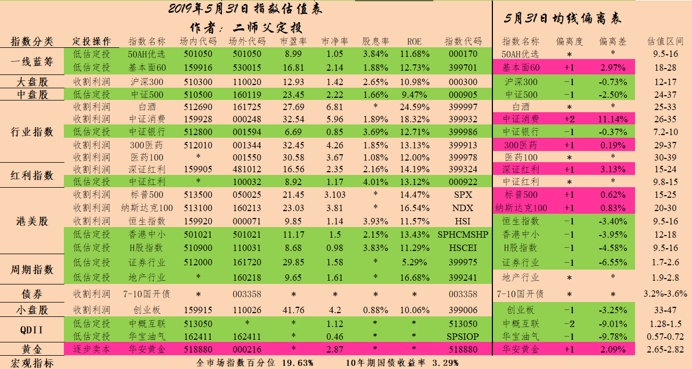

======================================================

_type: q&a
@奔波儿霸🐟🐠🐬🐳🐋💦[544884444514584]
2019-06-01 08:57:47 Sat  
topic_id: 422185481418488

@奔波儿霸🐟🐠🐬🐳🐋💦

>  二师父，参看之前的两条选股策略，结合稳步走向3500的状态，打算中长期持有，现在拟选出双汇、云南白药、福耀玻璃这三支，麻烦师父给把把脉吧。

@二师父

>  等我有时间看看，股票分析需要花费较长时间

阅读[2230]  评论[0]  赞[0] 

======================================================

@二师父[28814221155551]
2019-06-01 09:00:51 Sat  
topic_id: 422185481415888

>  @二师父
>  

阅读[2265]  评论[1]  赞[0] 

======================================================

@二师父[28814221155551]
2019-06-01 09:07:15 Sat  
topic_id: 544815218288484

>  @二师父
>  

阅读[2379]  评论[0]  赞[0] 

======================================================

_type: talk
@二师父[28814221155551]
2019-06-01 09:50:02 Sat  
topic_id: 422185481221448

<e type="hashtag" hid="552885142424" title="#信心比黄金重要#" /> 大多数读者还在说大盘到不了3500点，信心比黄金重要

人世间只有一种悲哀，那就是心如死灰

无论做任何事，只要心不死，只要希望不灭，那就有转机

相反，自己必定失败。山挡不了去路，水阻不了归途。这是君临天下，舍我其谁的王者之气

有这种气魄和胸怀之人，想不成功都难。很多人还在纠结股市，其实你的态度就是自己内心最本真的反应，我可以从你的态度看出你当下的境况和未来的发展

人可以被打败，但是永远不能输掉信心，只要信心在，哪怕股市跌到2000点，哪怕自己输的一无所有，哪怕堕入无边黑暗，我们依旧有翻盘机会

其实股市如人生，我在讲人生

@rtdmm小米 at 2019-06-01 09:50:02 Sat

> 信心比黄金重要！二师父用心良苦！

----------

@姥姥不疼. 爷爷不爱 at 2019-06-01 09:50:02 Sat

> 不是谈信心的问题，若无信心就不跟定二师父定投了，主要还是认为2020年春节前大盘攀升上3500的时间还不够，还需耐心等，还需熬，宁可错过不可过错🙉🙉

----------

阅读[4791]  评论[2]  赞[0] 

======================================================

_type: q&a
@幻水[881185412112]
2019-06-01 09:55:06 Sat  
topic_id: 111854258118282

@幻水

>  请问你能具体分析一下这个指数吗？有配置价值吗？这个属于smart贝塔指数吗？
>  今年以来A股市场交易活跃，指数基金作为资产配置工具越来越为人熟知。日前，华夏基金推出华夏AH经济蓝筹指数基金，助力投资者更有效地挖掘蓝筹投资机会。

@二师父

>  哪个基金，请告知相应指数和代码，我来看看

阅读[2398]  评论[0]  赞[0] 

======================================================

_type: q&a
@蒲公英[422124111128258]
2019-06-01 11:47:28 Sat  
topic_id: 422185454444548

@蒲公英

>  您好，请问基本面60偏离度+1了，为什么还是低估呢？还可以定投吗？

@二师父

>  可以定投的，估值是观察成立期间的估值指标

阅读[2416]  评论[0]  赞[0] 

======================================================

_type: talk
@树叶[544811512145144]
2019-06-01 12:32:06 Sat  
topic_id: 422185454584858

<e type="hashtag" hid="142825811122" title="#定投周报#" /> 二师父定投周报第10期

阅读[2512]  评论[0]  赞[0] 

+++++++++++++++++++++++++++++++++++++++++++++++++++++

文件：
2019-06-01 12:31:57 Sat
文件大小：[289525]
51184844142114-二师父定投周报6.1（第10期）.docx

======================================================

_type: q&a
@恋尘[51558584455824]
2019-06-01 13:14:06 Sat  
topic_id: 244182525228211

@恋尘

>  师父，我想问下我早就开户了华泰但是不知道费率是多少在哪看啊

@二师父

>  点击交易，然后点有三点标志的更多，进入点击查询交割，搜索然后出现你买入的基金，点击进去可以看到详细的费用信息

阅读[2512]  评论[0]  赞[0] 

======================================================

_type: q&a
@开卷沐春意[422214414858458]
2019-06-01 20:48:10 Sat  
topic_id: 422185452281428

@开卷沐春意

>  二师傅，我们那个什么屈经理一天了她也不给我回话。怎么办？

@二师父

>  等等吧，今天周末又是六一儿童节，下周一没有回复我帮你联系

阅读[2428]  评论[2]  赞[0] 

======================================================

_type: q&a
@聪明的笨蛋[544858411212244]
2019-06-01 21:50:26 Sat  
topic_id: 544815254844144

@聪明的笨蛋

>  二师傅，以前用过天天基金，可不可以销户，想用你的渠道，如果能销户怎样销户

@二师父

>  用之前的渠道也行的，这个没事，我新建的实盘大概下周公布，二师父低估定投

阅读[2449]  评论[0]  赞[0] 

======================================================

_type: talk
@二师父[28814221155551]
2019-06-02 03:13:12 Sun  
topic_id: 111854215122522

<e type="hashtag" hid="142444828582" title="#定投总结#" /> 5月总结，你复盘了吗

@若水三千 at 2019-06-02 03:13:12 Sun

> 师傅好，我想请教您，为什么说德国30已经没有投资价值？

----------

@二师父 at 2019-06-02 03:13:12 Sun

> 盈利不佳

----------

阅读[2445]  评论[2]  赞[0] 

+++++++++++++++++++++++++++++++++++++++++++++++++++++

文件：
2019-06-02 03:12:51 Sun
文件大小：[23127]
28814144148151-5月定投复盘，坚持剩者为王.docx

======================================================

_type: talk
@二师父[28814221155551]
2019-06-02 03:19:28 Sun  
topic_id: 844182548455282

<e type="hashtag" hid="552112255524" title="#答疑#" /> 开户广发是基金万0.6免五费率，股票是万1.5，如果资金量大佣金可继续调。华泰是低于市场费率得，这种费率一般调整不公开讲，可开户后咨询客户经理，都比市场低得。

另外关于定投底仓得建立，如果是处于低估得宽基指数，建立3成仓位没有问题，设定一年定投周期，定投完毕可以锁仓了。已经熊了这么多年，当投资者情绪极度低迷得时候牛市就要来的。

万一不来我们做网格和均线定投依旧可以挣钱，两手准备。

另外鳄鱼计划我以后只在偏离度负2以上加仓，如果低估已经是可以定投得，再加上偏离度负2，安全边际更高，可以加大定投比例

@大兵 at 2019-06-02 03:19:28 Sun

> 二师父的鳄鱼计划里都哪些？

----------

@二师父 at 2019-06-02 03:19:28 Sun

> 搜索鳄鱼计划即可

----------

@大兵 at 2019-06-02 03:19:28 Sun

> 师父，那鳄鱼计划是如何买入呢？如何确定哪个点买入，买入多少份？谢谢

----------

@二师父 at 2019-06-02 03:19:28 Sun

> 根据均线偏离不定期

----------

@秦岭云横 at 2019-06-02 03:19:28 Sun

> 哪里有系统介绍

----------

阅读[2577]  评论[5]  赞[0] 

======================================================

_type: q&a
@凭栏观海[244414845852181]
2019-06-02 10:52:41 Sun  
topic_id: 111854214585552

@凭栏观海

>  兴业银行现在值得入手吗？长期持有兴业银行可以吗？

@二师父

>  不具备牛股特征，从估值角度看估值很低了长期持有可以

阅读[2544]  评论[3]  赞[0] 

======================================================

_type: talk
@liao[48588555425818]
2019-06-02 11:03:59 Sun  
topic_id: 544815245584124

二师傅，海康威视适合入手吗，入手后长期持有

@无名书苑 at 2019-06-02 11:03:59 Sun

> 同问

----------

@齐俊波 at 2019-06-02 11:03:59 Sun

> 可以先算算估值[微笑]

----------

@志亮 at 2019-06-02 11:03:59 Sun

> 低估时就可以买入，不过股票比基金复杂多了，要考虑的东西很多，我也正在学习中，现在不弄懂我是不敢买了，我都亏了十几个点，股票不同基金呀，不弄懂就没㡳气，没㡳气就不敢长持呀[擦汗]

----------

阅读[2482]  评论[3]  赞[0] 

======================================================

_type: q&a
@A0洪氏日杂批发[544885222181514]
2019-06-02 11:22:12 Sun  
topic_id: 544815245584584

@A0洪氏日杂批发

>  老师，中概互联基金，好像没看到场外基金代码，只能场内买吗？

@二师父

>  场外可以用164906替代

阅读[2599]  评论[0]  赞[0] 

======================================================

_type: q&a
@幻水[881185412112]
2019-06-02 11:25:15 Sun  
topic_id: 422185425245848

@幻水

>  提问：我个人觉得证券股是周期股，那是否熊市时候买证券股牛市大概率会盈利？
>  如果是的话，以最近的例子来说，2017年其实已经是一个明确的小牛市了，但大多数券商股，在2017年仍然是下跌的，这是为什么啊？

@二师父

>  有一个滞后效应，17年底的时候券商是大涨的

阅读[2660]  评论[0]  赞[0] 

======================================================

@二师父[28814221155551]
2019-06-02 12:44:27 Sun  
topic_id: 844182542188482

>  @二师父
>  

阅读[2700]  评论[0]  赞[0] 

======================================================

_type: talk
@梧桐[844118451242512]
2019-06-02 16:15:01 Sun  
topic_id: 244182544151241

二师父，建三成仓，建仓周期缩短至1年，看起来有些不淡定了哈。[偷笑]

@妖孽 at 2019-06-02 16:15:01 Sun

> 八层仓3200点上站岗，全稳的.....抬头，看到的就是山峰。平眼，看到的就是山丘。低头，就都是山沟。你所想到达的目标很重要。

----------

@妖孽 at 2019-06-02 16:15:01 Sun

> 去了解 分析你所投的标的，信念心态更坚定，知己知彼百战百胜。

----------

@妖孽 at 2019-06-02 16:15:01 Sun

> 找到定投中不变的东西，然后用一生去坚守。低估定投、逆向思维、人弃我取、坚持持有。运筹帷幄之中 决胜千里之外……

----------

@锐淡恬思 at 2019-06-02 16:15:01 Sun

> 三层仓位，目前来看，大概率要踏空了

----------

阅读[2611]  评论[4]  赞[0] 

======================================================

_type: q&a
@雪莲[421485848588118]
2019-06-02 20:27:07 Sun  
topic_id: 544815281125814

@雪莲

>  师父您好，现在订投易方达恒生中国企业ETF联接基金定不是也要先建三层底仓啊？还有中证很行指数，是否也要先建三层底仓啊？

@二师父

>  其实定投放弃底仓思维最好，很多人怕错过机会就建立底仓，这是缺乏耐心的表现
>  
>  如果到历史大底部区域可以一次多买入点建立底仓，当前位置定投即可

阅读[2719]  评论[1]  赞[0] 

======================================================

_type: q&a
@Snow[222145848211]
2019-06-02 23:15:55 Sun  
topic_id: 844182518188882

@Snow

>  每个指数基金的滚动市盈率计算在哪里可以获取到计算数据？

@二师父

>  便宜的付费平台有果仁和理杏仁，集思录，贵一些的是choice和wind终端。
>  
>  计算区间根据6大估值指标历史区间综合得出

阅读[2544]  评论[2]  赞[0] 

======================================================

_type: talk
@二师父[28814221155551]
2019-06-03 01:48:37 Mon  
topic_id: 422185415211528

<e type="hashtag" hid="225112454821" title="#下月定投计划#" /> 大家需要制定年计划，月计划，然后检查执行情况，二师父不仅投资有计划，包括工作和学习也有计划，做计划然后才有的放矢

@青青竹 at 2019-06-03 01:48:37 Mon

> 山断不了回路，海阻不了归途。追梦的路上，跟随师傅的脚步，努力学习，不断成长！[拳头]

----------

@Zyxj at 2019-06-03 01:48:37 Mon

> 标题还是五月定投，应该六月了吧！

----------

@二师父 at 2019-06-03 01:48:37 Mon

> 对，6月啦

----------

@二师父 at 2019-06-03 01:48:37 Mon

> 一起成长进步

----------

@杜志彪 at 2019-06-03 01:48:37 Mon

> 不看盘的话，网格交易您是已收盘价格为依据吗？

----------

@杜志彪 at 2019-06-03 01:48:37 Mon

> 我现在也想做到交易期间不看盘，但有时还是做不到，其实每天晚上看一下就行，有达到计划操作的，转天开盘挂单操作就行了，可以白天不看盘。

----------

@二师父 at 2019-06-03 01:48:37 Mon

> 对，晚上看要触发了交易价格第二天直接买，或者华宝自动交易

----------

阅读[5026]  评论[10]  赞[0] 

+++++++++++++++++++++++++++++++++++++++++++++++++++++

文件：
2019-06-03 01:47:09 Mon
文件大小：[24688]
15581882525242-经济形势不明，我们五月的定投计划该怎样安排.docx

======================================================

_type: q&a
@在路上[548228451482224]
2019-06-03 09:13:04 Mon  
topic_id: 422185544418188

@在路上

>  师父，您好，我看定投实盘里8个基金指数不包括中证银行指数，是不是不太看好银行指数。

@二师父

>  非常看好银行指数，这属于金融服务业，也是可以穿越周期的指数
>  
>  上证50指数，50ah指数里面有很多银行股票持仓，所以选择一个就可以啦
>  
>  场内鳄鱼计划和网格交易我们选择的就是银行ETF

阅读[2610]  评论[0]  赞[0] 

======================================================

_type: q&a
@恋尘[51558584455824]
2019-06-03 13:34:37 Mon  
topic_id: 111854425154112

@恋尘

>  师父我问下定投中概互联场内的我在华泰，其余没用的钱买货币基金能直接互换吗，和场外一样？

@二师父

>  需要先转到现金账户，然后购买

阅读[2288]  评论[0]  赞[0] 

======================================================

_type: talk
@程大圣[118255212158112]
2019-06-03 14:25:56 Mon  
topic_id: 111854424218552

提醒大家做网格交易的朋友，不要用华宝智投的网格交易，他那个网格是移动网格，和二师父的固定基准价的网格不一样，可以用分批建仓和分批出货来达到自动买卖

@秦岭云横 at 2019-06-03 14:25:56 Mon

> 已经用了，咋办

----------

@秦岭云横 at 2019-06-03 14:25:56 Mon

> 咋修改策略

----------

@J at 2019-06-03 14:25:56 Mon

> 移动网格是什么🤔？

----------

@程大圣 at 2019-06-03 14:25:56 Mon

> 暂停，删除，换别得

----------

@程大圣 at 2019-06-03 14:25:56 Mon

> 基准价随成交变

----------

@秦岭云横 at 2019-06-03 14:25:56 Mon

> 不用这个用哪个

----------

@秦岭云横 at 2019-06-03 14:25:56 Mon

> 里面还有钱

----------

阅读[2226]  评论[10]  赞[0] 

======================================================

_type: talk
@二师父[28814221155551]
2019-06-03 14:36:57 Mon  
topic_id: 422185545412248

关于日本ETF，投不投，能力圈原则，不懂不投，日本经济20年了还这么糟糕，为啥要买，人都有喜新厌旧的心理

阅读[2290]  评论[0]  赞[0] 

======================================================

_type: q&a
@冉冉[88445118854412]
2019-06-03 14:42:01 Mon  
topic_id: 244182252545581

@冉冉

>  请问二师傅，上周五华宝油气的鳄鱼计划没有看见，今天我可以场外买入华宝油气吗？

@二师父

>  可以的，今天的价格比上周五更低呢，周期指数注意控制仓位

阅读[2380]  评论[1]  赞[0] 

======================================================

@二师父[28814221155551]
2019-06-03 15:52:22 Mon  
topic_id: 422185545555418

>  @二师父
>  

阅读[2294]  评论[0]  赞[0] 

======================================================

_type: q&a
@田维海[422144441542418]
2019-06-03 16:31:41 Mon  
topic_id: 544815528111114

@田维海

>  师傅，红利机会和香港中小指数历史pE及指数走势在哪里看到？

@二师父

>  雪球的估值分析有

阅读[2369]  评论[0]  赞[0] 

======================================================

_type: q&a
@于磊[48522822121558]
2019-06-03 19:51:24 Mon  
topic_id: 544815528551854

@于磊

>  请问二师傅:定投就选择两只基金，沪深300和深证基本面60可以吗，这个组合如何？

@二师父

>  有重合，可以用最基本的组合，沪深300加中证500

阅读[2286]  评论[0]  赞[0] 

======================================================

_type: talk
@二师父[28814221155551]
2019-06-04 00:28:41 Tue  
topic_id: 544815514515454

<e type="hashtag" hid="481211145528" title="#指数估值#" />

@冉冉 at 2019-06-04 00:28:41 Tue

> 今天估值表中怎么没有市场百分位数值？

----------

@二师父 at 2019-06-04 00:28:41 Tue

> 截图掉了，明天加上

----------

@冉冉 at 2019-06-04 00:28:41 Tue

> 好的，谢谢二师傅

----------

@cotton at 2019-06-04 00:28:41 Tue

> 二师父，华宝标普中国红利机会，可以不用定投了是吗

----------

@二师父 at 2019-06-04 00:28:41 Tue

> 可以暂停了，等待盈利逐步收割

----------

@cotton at 2019-06-04 00:28:41 Tue

> 好的，谢谢二师父～

----------

阅读[2313]  评论[6]  赞[0] 

+++++++++++++++++++++++++++++++++++++++++++++++++++++

图片：
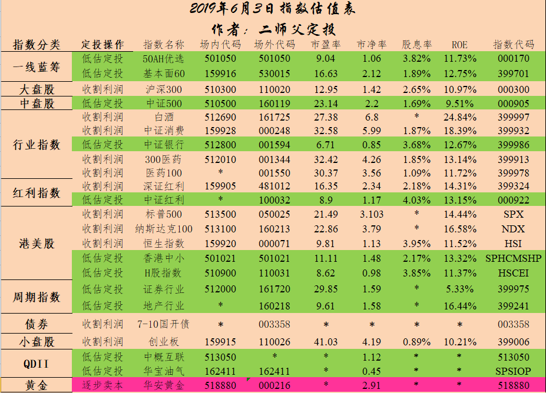

======================================================

_type: talk
@二师父[28814221155551]
2019-06-04 00:29:36 Tue  
topic_id: 422185582585188

<e type="hashtag" hid="825112188582" title="#主动基金亏了怎么办#" /> 有人觉得主动基金有超额收益，现在还会这样认为吗？

阅读[2373]  评论[0]  赞[0] 

+++++++++++++++++++++++++++++++++++++++++++++++++++++

文件：
2019-06-04 00:29:10 Tue
文件大小：[23884]
88814112184482-股票基金浮亏30%个百分点该怎么玩.docx

======================================================

@二师父[28814221155551]
2019-06-04 09:12:34 Tue  
topic_id: 422185581845418

>  @二师父
>  

阅读[2264]  评论[2]  赞[0] 

======================================================

_type: talk
@杜志彪[544454124115854]
2019-06-04 09:41:49 Tue  
topic_id: 544815518588824

昨天晚上根据目前情况重新梳理选择了一下低估定投品种，把周投改为月投（50AH，深F60，500ETF，人工智能），网格交易（500ETF，券商ETF），鳄鱼计划（中概互联），有不妥的地方请大家指正。

@程大圣 at 2019-06-04 09:41:49 Tue

> 为啥改为月投？

----------

@杜志彪 at 2019-06-04 09:41:49 Tue

> 主要是仓位目前已经够了，按计划低估定投就行了（其实师父说过周和月区别不大，这样更省心，不用总惦记），目前大盘处于振荡期，跌多了就多加点，所以资金主要放在网格和鳄鱼计划了（今天到现在，除了开盘申购了一下新股，我还真没看盘[呲牙]）。

----------

阅读[2212]  评论[2]  赞[0] 

======================================================

_type: talk
@彩色[48415121851218]
2019-06-04 10:35:08 Tue  
topic_id: 422185554441518

向二师父和各位投友请教：恒生中国指数（H股指数）的前三大行业为金融业（50.12%）、电讯业（12%）和资讯科技业（10.15%）。那么请问H股指数的估值是否看市净率比市盈率合适呢？谢谢！

阅读[2043]  评论[0]  赞[0] 

======================================================

_type: q&a
@victoria[15455121858422]
2019-06-04 11:46:13 Tue  
topic_id: 544815552141424

@victoria

>  二师公今天下跌比较大，适合买入吗，如果我想买，哪几支基金比较合适

@二师父

>  适合，50ah，基本面60，恒生国企，券商指数都不错，券商注意仓位不要太重

阅读[2132]  评论[2]  赞[0] 

======================================================

_type: q&a
@于磊[48522822121558]
2019-06-04 11:47:17 Tue  
topic_id: 244182225555411

@于磊

>  二师傅，高估逐步卖出，是指得:进入高估后，指数基金的净值每提高10%，分批次卖出基金吗？

@二师父

>  对的，正常是卖出利润，高估本金也要卖出了

阅读[2279]  评论[5]  赞[0] 

======================================================

_type: q&a
@醉流雨[422151445242248]
2019-06-04 12:48:11 Tue  
topic_id: 844182225248212

@醉流雨

>  想投资中概互联，是买哪个基金呢，？号码是多少，？

@二师父

>  513050

阅读[2426]  评论[0]  赞[0] 

======================================================

_type: talk
@二师父[28814221155551]
2019-06-04 13:16:20 Tue  
topic_id: 422185554181848

<e type="hashtag" hid="825112122842" title="#读书#" /> 推荐一本书，今天推荐一本书，投资者的心灵修炼，美国本卡尔森著作，在这本书里面告诉大家如何修炼心灵，从提升个人品质的角度来提高投资水平。

二师父讲过定投即修行，低估定投，盈亏炼心。当我们平静地面对每一次暴涨暴跌，我们也就是定投高手了，这个才是最难的

@小涛@我的四季生活 at 2019-06-04 13:16:20 Tue

> 书名是？

----------

@二师父 at 2019-06-04 13:16:20 Tue

> 投资者的心灵修炼

----------

@小涛@我的四季生活 at 2019-06-04 13:16:20 Tue

> 喔好的我在网上搜下

----------

阅读[4485]  评论[3]  赞[0] 

======================================================

_type: q&a
@彩色[48415121851218]
2019-06-04 18:44:54 Tue  
topic_id: 111854444141422

@彩色

>  向二师父和各位投友请教：恒生中国指数（H股指数）的前三大行业为金融业（50.12%）、电讯业（12%）和资讯科技业（10.15%）。那么请问H股指数的估值是否看市净率比市盈率合适呢？谢谢！

@二师父

>  可以两者一起结合看，宽基指数，不是周期行业，不用单看市盈率

阅读[2178]  评论[0]  赞[0] 

======================================================

_type: q&a
@首尔航仔Eric[244114888181111]
2019-06-04 18:45:29 Tue  
topic_id: 844182222125182

@首尔航仔Eric

>  二师父 在哪里可以看到 你的场内和场外实盘交易

@二师父

>  在知识星球会即时公布的

阅读[2239]  评论[0]  赞[0] 

======================================================

_type: talk
@寻道人[51452125525484]
2019-06-04 19:23:43 Tue  
topic_id: 422185551841528

<e type="hashtag" hid="825112122842" title="#读书#" /> 谢谢，希望二师傅以后多多推荐好书。

阅读[2168]  评论[0]  赞[0] 

======================================================

_type: q&a
@妖孽[544888148518184]
2019-06-04 20:03:08 Tue  
topic_id: 544815558214224

@妖孽

>  二师父，估值表方便优化下 历史百分位？

@二师父

>  这个各个指数的百分位参考意义不大，所以没加入

阅读[2271]  评论[0]  赞[0] 

======================================================

_type: q&a
@九天[548228524258514]
2019-06-04 20:04:29 Tue  
topic_id: 244182221821221

@九天

>  请问二师父，目前哪家基金公司费率低又靠谱？置顶的第三个帖子里的华泰基金，我注册后下载涨乐通，发现不是基金公司，是证券公司，这是怎么回事？

@二师父

>  我都是在基金代销平台和证券公司购买的，华泰证券本来就是证券公司
>  
>  也有基金公司有自己的app，比如南方和易方达，你购买他们自己公司的基金费率是低一些

阅读[2371]  评论[1]  赞[0] 

======================================================

_type: talk
@若水三千[48548544448258]
2019-06-04 22:39:15 Tue  
topic_id: 844182248181552

师傅，现在中概互联和华宝油气呈断崖式下跌，网格继续吗？

@二师父 at 2019-06-04 22:39:15 Tue

> 继续啊，不就是机会么

----------

@陈 at 2019-06-04 22:39:15 Tue

> 难道你要等涨了买？[呲牙]

----------

阅读[2214]  评论[2]  赞[0] 

======================================================

_type: talk
@二师父[28814221155551]
2019-06-05 04:10:24 Wed  
topic_id: 544815545451244

@冯林锋 at 2019-06-05 04:10:24 Wed

> 二师父，能不能把每个指数市盈率低估的区间也做在表格上

----------

@罗大发 at 2019-06-05 04:10:24 Wed

> 麻烦师父能不能把估值区间带上？

----------

@北极 at 2019-06-05 04:10:24 Wed

> 前几天发的估值表上有

----------

@北极 at 2019-06-05 04:10:24 Wed

> 前几天发的估值表上有

----------

阅读[2324]  评论[4]  赞[0] 

+++++++++++++++++++++++++++++++++++++++++++++++++++++

图片：

======================================================

_type: talk
@二师父[28814221155551]
2019-06-05 04:10:51 Wed  
topic_id: 244182242428541

阅读[2476]  评论[0]  赞[0] 

+++++++++++++++++++++++++++++++++++++++++++++++++++++

文件：
2019-06-05 04:10:46 Wed
文件大小：[23338]
15581888125112-红利指数投资逻辑分析.docx

======================================================

_type: q&a
@冯林锋[841551141441422]
2019-06-05 10:22:04 Wed  
topic_id: 422185525182828

@冯林锋

>  二师父，中概互联是周期性指数吗？仓位是不是可以重一点

@二师父

>  不是周期指数，不过港美股没有跌停保护机制，所以下跌比较大

阅读[2276]  评论[1]  赞[0] 

======================================================

_type: q&a
@冉冉[88445118854412]
2019-06-05 10:27:34 Wed  
topic_id: 844182244122822

@冉冉

>  请问二师傅，最近医药指数基金在盘整后突然有下跌的走势，是什么原因导致的？目前定投广发中证全指医药指数基金合适吗？

@二师父

>  因为市场恐惧情绪，这只医药基金目前是低估，类似医药100，可以定投的

阅读[2318]  评论[5]  赞[0] 

======================================================

_type: talk
@rtdmm小米[422188284881148]
2019-06-05 12:04:25 Wed  
topic_id: 111854485248242

请问二师父，这几天证券的偏离度为_2，鳄鱼可以出击哇？

@杜志彪 at 2019-06-05 12:04:25 Wed

> 我在等3[得意]

----------

@rtdmm小米 at 2019-06-05 12:04:25 Wed

> 👍👍你打一下[惊讶][惊讶]

----------

@杜志彪 at 2019-06-05 12:04:25 Wed

> 我今天还没看盘呢[得意]，早上开盘前挂的昨天收盘价格触发的500ETF网格，到现在就是没看[偷笑]，并按照师父网格价格加了10份银行ETF。

----------

@二师父 at 2019-06-05 12:04:25 Wed

> 可以的哈，证券已经比较便宜了

----------

阅读[2249]  评论[4]  赞[0] 

======================================================

_type: q&a
@白山羊[421484211452528]
2019-06-05 12:41:30 Wed  
topic_id: 544815548114114

@白山羊

>  二师父，您怎么看创科版的基金

@二师父

>  看好科创板基金，不过目前都是封闭基金，没有申购

阅读[2189]  评论[2]  赞[0] 

======================================================

_type: q&a
@凯[244415182418811]
2019-06-05 12:41:50 Wed  
topic_id: 244182218588841

@凯

>  师父，医药100用不用先减仓，过了这段下跌再定投

@二师父

>  定投止赢不止损的原则不要违背

阅读[2231]  评论[4]  赞[0] 

======================================================

_type: q&a
@乖子[28441841181151]
2019-06-05 12:42:14 Wed  
topic_id: 422185518852428

@乖子

>  请问二师父那个华宝证券的视频做的怎么样了？谢谢

@二师父

>  已经做好了，星球没法直接传，我再想办法

阅读[2391]  评论[2]  赞[0] 

======================================================

@二师父[28814221155551]
2019-06-05 13:51:39 Wed  
topic_id: 844182218452512

>  @二师父
>  

阅读[2310]  评论[0]  赞[0] 

======================================================

_type: q&a
@J[28281541518551]
2019-06-05 13:53:07 Wed  
topic_id: 544815581428884

@J

>  师父，请问中概互联场外的网格交易价位表是什么？如果师父也能给我们算一个就好了，好像场内那样。场外打算长期持有分批买入。

@二师父

>  场外定投就好，目前中概互联价格不贵，场外没有用网格交易，低估定投策略收益就很不错的

阅读[2397]  评论[4]  赞[0] 

======================================================

_type: q&a
@志亮[422125851552828]
2019-06-05 14:46:37 Wed  
topic_id: 422185518282848

@志亮

>  二师父，请问打新申购新股是不是一定赚的，经常收到证劵app提示打新，但对未知的股我又不敢买。

@二师父

>  不一定赚，a股打新破发率低一些

阅读[2469]  评论[0]  赞[0] 

======================================================

_type: q&a
@首尔航仔Eric[244114888181111]
2019-06-05 15:59:22 Wed  
topic_id: 544815585142284

@首尔航仔Eric

>  二师父 ， 均线偏离度在哪里可以查询到？ 还有就是 偏离度百分比里面提到的 <-12,-6> 偏离度为-1  ，这个里面的值，计算是 （当前价格-均线价格）/ 均线价格是吗

@二师父

>  搜索往期均线偏离可以看到的，偏离差是用当前价格减去90日均线价格得到一个数，然后除以90日均线价格得到的

阅读[2577]  评论[0]  赞[0] 

======================================================

_type: talk
@速。冻[51415484228284]
2019-06-05 17:59:12 Wed  
topic_id: 544815585858444

二师父，明天该上医药100了吧

@彩色 at 2019-06-05 17:59:12 Wed

> 同问。。。

----------

@姥姥不疼. 爷爷不爱 at 2019-06-05 17:59:12 Wed

> 不急，等低估稳了再定

----------

@二师父 at 2019-06-05 17:59:12 Wed

> 周四定投了，已经低估了

----------

阅读[2554]  评论[3]  赞[0] 

======================================================

_type: q&a
@Priest(T泉V*[88812525585412]
2019-06-05 19:01:36 Wed  
topic_id: 544815585584444

@Priest(T泉V*

>  请问二师傅 黄金现在可以开始定投吗？

@二师父

>  目前黄金位置比较高了，不适合定投

阅读[2567]  评论[2]  赞[0] 

======================================================

_type: q&a
@采涵[548211441124154]
2019-06-05 21:53:20 Wed  
topic_id: 844182214855422

@采涵

>  二师父您好。能解释一下估值表中的估值区间是做什么用的吗？另外，只想在您的绿色可投指数中选择2，3只指数基金，怎么把低估的基金从小到大排序找到估值最低的2，3只基金呢？谢谢🙏

@二师父

>  估值区间，比方说是a到b，那么就说低于a就是低估值，高于b就是高估值
>  
>  可以按照当前市盈率低于a的比例来计算低估程度，这是个大概的，实际投资需要看指数的成长性

阅读[2467]  评论[0]  赞[0] 

======================================================

_type: q&a
@马军[421482415512448]
2019-06-05 22:20:11 Wed  
topic_id: 244182455444541

@马军

>  513030估值从哪里看

@二师父

>  目前正常估值，已经停止这只指数的定投了

阅读[2513]  评论[3]  赞[0] 

======================================================

_type: q&a
@路[544488411248524]
2019-06-05 22:29:02 Wed  
topic_id: 111854122111182

@路

>  老师好！您在天天上开的基金组合名称叫啥？现在能查到？

@二师父

>  搜索二师父低估定投可以看到

阅读[2606]  评论[0]  赞[0] 

======================================================

_type: talk
@二师父[28814221155551]
2019-06-05 22:57:55 Wed  
topic_id: 422185248481848

红包发不出去了。。。

@ajingge at 2019-06-05 22:57:55 Wed

> 心领了[呲牙]

----------

@rtdmm小米 at 2019-06-05 22:57:55 Wed

> 啥好事？发红包

----------

@二师父 at 2019-06-05 22:57:55 Wed

> 6.6

----------

@Claire at 2019-06-05 22:57:55 Wed

> 晚上突然想起明天就是6月6日了，应该是师父定投学堂自己的节日，祝愿师父的财商教育事业越来越成功！

----------

@冉冉 at 2019-06-05 22:57:55 Wed

> 二师傅读者节快乐！哈哈哈

----------

阅读[2632]  评论[5]  赞[0] 

+++++++++++++++++++++++++++++++++++++++++++++++++++++

图片：
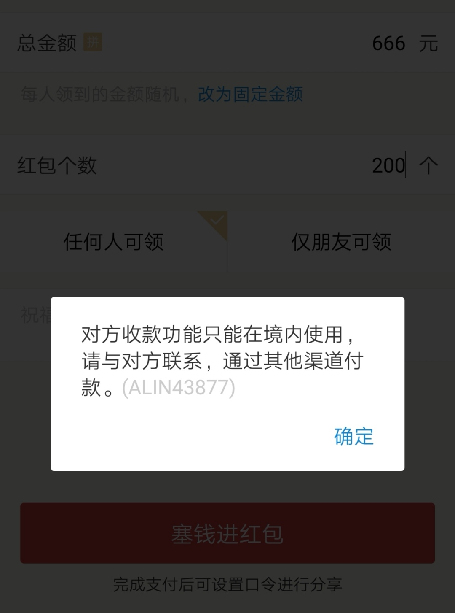

======================================================

_type: talk
@志亮[422125851552828]
2019-06-05 23:43:00 Wed  
topic_id: 111854125518512

精力不够或工作忙的朋友，我觉得只做单一的场外低估定投就够了吧，贪多可不行，招式易精不易多[微笑]

@二师父 at 2019-06-05 23:43:00 Wed

> 非常正确的

----------

@彩色 at 2019-06-05 23:43:00 Wed

> 同感，我也是最近才觉悟。大道至简

----------

@乖子 at 2019-06-05 23:43:00 Wed

> 感谢提醒

----------

阅读[2626]  评论[3]  赞[0] 

======================================================

_type: talk
@二师父[28814221155551]
2019-06-06 04:10:45 Thu  
topic_id: 422185248148818

<e type="hashtag" hid="481211145528" title="#指数估值#" />

阅读[2712]  评论[0]  赞[0] 

+++++++++++++++++++++++++++++++++++++++++++++++++++++

图片：

======================================================

_type: talk
@二师父[28814221155551]
2019-06-06 04:12:30 Thu  
topic_id: 111854125825422

<e type="hashtag" hid="881422852442" title="#定投实盘#" /> 这个在天天基金开了一个实盘，二师父低估定投，自己先买了，然后公布。我不会向大家推荐我根本不会购买的基金。

@寒泉小虾🦐 at 2019-06-06 04:12:30 Thu

> 二师父，我问下50ah优选不是也有场内代码么？为什么场内用上证50代替？

----------

@勤能行之 at 2019-06-06 04:12:30 Thu

> 有场内代码，可以自己查一下。

----------

@二师父 at 2019-06-06 04:12:30 Thu

> 因为场内是lof基金，我场内是只买etf基金的

----------

@Ouou at 2019-06-06 04:12:30 Thu

> 医药100现在是低估了吗

----------

@二师父 at 2019-06-06 04:12:30 Thu

> 是的昨天大跌进入低估区域

----------

@青青竹 at 2019-06-06 04:12:30 Thu

> 师傅，为什么没有定投中证红利？

----------

@二师父 at 2019-06-06 04:12:30 Thu

> 精选优质指数

----------

阅读[2929]  评论[7]  赞[0] 

+++++++++++++++++++++++++++++++++++++++++++++++++++++

图片：
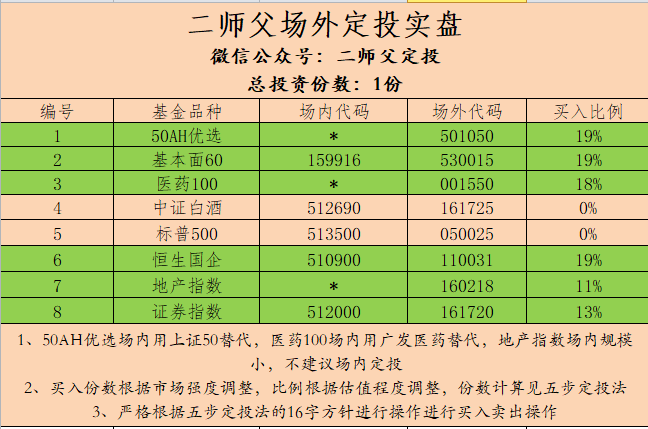

+++++++++++++++++++++++++++++++++++++++++++++++++++++

文件：
2019-06-06 04:11:02 Thu
文件大小：[234823]
88811552214822-190期低估定投实盘暨配置逻辑解析6.5.docx

======================================================

_type: talk
@rtdmm小米[422188284881148]
2019-06-06 08:51:56 Thu  
topic_id: 544815425148144

请问二师父，科创板迟早要实施的，那么现在趁证券低估区域多积累份额没问题吧？

@二师父 at 2019-06-06 08:51:56 Thu

> 现在都是封闭基金的

----------

阅读[2643]  评论[1]  赞[0] 

======================================================

_type: talk
@起今知行[844188255581112]
2019-06-06 09:50:31 Thu  
topic_id: 844182451812142

可转债打新多少钱就可以参与？是不是就是XX发债？

@旺锦古法土制红糖 范* at 2019-06-06 09:50:31 Thu

> 1000就可以了 但是目前打可转债容易破发 我之前打中一只 就破发了 亏了10多元 直接卖了 投了 指数基金

----------

@二师父 at 2019-06-06 09:50:31 Thu

> 熊市容易破发，打3A以上的

----------

阅读[2694]  评论[2]  赞[0] 

======================================================

_type: q&a
@奇迹相伴[422118428544848]
2019-06-06 11:00:08 Thu  
topic_id: 844182452252142

@奇迹相伴

>  【华宝证券】06月06日华宝证券发债中签提示杨先生/女士,您申购的072402(和而发债)已中签,数量:10张,中签总金额:1000元 ,您可以登录我司交易系统查询持仓及资金冻结情况,请确保今日16:00前有足额认购资金,资金不足部分视为放弃认购；可转债中签但未足额缴款的，与新股、可交换债中签未足额缴款次数合并计算；连续12个月累计3次中签且未足额缴纳资金,将纳入"打新黑名单",180天内不得参与网上新股、可转债及可交换债申购，详询4008209898。回0000退订
>  
>  师傅这个可以买吗？

@二师父

>  这个你已经打了，账户会自动扣款的

阅读[2693]  评论[0]  赞[0] 

======================================================

@二师父[28814221155551]
2019-06-06 11:00:46 Thu  
topic_id: 544815428522814

>  @二师父
>  

阅读[2797]  评论[0]  赞[0] 

======================================================

_type: q&a
@堂吉诃德的小助手[15528821588422]
2019-06-06 11:01:12 Thu  
topic_id: 422185241224158

@堂吉诃德的小助手

>  华宝油气可以支付宝定投吗？是不是收益没有场内的高啊

@二师父

>  可以的，场内和场外定投区别不大

阅读[2856]  评论[0]  赞[0] 

======================================================

@二师父[28814221155551]
2019-06-06 12:42:12 Thu  
topic_id: 111854128812422

>  @二师父
>  

阅读[2666]  评论[0]  赞[0] 

======================================================

_type: q&a
@飘羽[544442542815824]
2019-06-06 12:44:04 Thu  
topic_id: 422185241125148

@飘羽

>  想问下二师父这些基金目前都是低估，但是投的话应该不是全部投吧？更推荐哪几支呢？50etf，300etf，500etf，50ah。都是场内。

@二师父

>  选择两只50etf和500etf即可，50etf和50ah是类似的持仓股票，300etf包含于50etf，所以最佳的是50etf加500etf的组合或者300etf加500etf的组合

阅读[2744]  评论[0]  赞[0] 

======================================================

_type: q&a
@披褐怀玉，抱元守一。[15412554441882]
2019-06-06 12:45:24 Thu  
topic_id: 244182485845541

@披褐怀玉，抱元守一。

>  请问中楷互联6月调仓，调仓前投入的资金的成分比例会随着调仓变吗？请二师傅指点。

@二师父

>  调仓之前是不会改变的，调仓之后成份股和投入比例都会改变

阅读[2791]  评论[1]  赞[0] 

======================================================

@二师父[28814221155551]
2019-06-06 15:22:11 Thu  
topic_id: 111854152824222

>  @二师父
>  

阅读[2521]  评论[0]  赞[0] 

======================================================

_type: q&a
@首尔航仔Eric[244114888181111]
2019-06-06 16:19:56 Thu  
topic_id: 111854155545422

@首尔航仔Eric

>  二师父 完得全A市盈率百分比在哪里查呀 ？

@二师父

>  在估值表最后一栏

阅读[2603]  评论[0]  赞[0] 

======================================================

_type: q&a
@胡一彬[422124454141218]
2019-06-06 18:41:32 Thu  
topic_id: 544815414585214

@胡一彬

>  二师傅，最近咱们星球的人气降得厉害吗，想从星球人气方面来了解一下市场情绪。

@二师父

>  最近情绪都很低迷，不仅股市，经济也不好，不过我的公众号读者人数稳步增长，如果我的号负增长，那么就是市场情绪冰点。是最佳的投资时刻

阅读[2748]  评论[8]  赞[0] 

======================================================

_type: talk
@二师父[28814221155551]
2019-06-07 02:56:37 Fri  
topic_id: 844182425444242

<e type="hashtag" hid="142881152282" title="#开始了就不要停止#" /> 既然开始就坚持定投，用心去做，用定投的精神穿越人生中每一个至暗时光

@妖孽 at 2019-06-07 02:56:37 Fri

> 得到不该得到的得到（追涨）
必将失去不该失去的失去（杀跌）
忍受不能忍受的忍受（低吸）
享受他人不能享受的享受（高抛）

----------

@自由飞翔 at 2019-06-07 02:56:37 Fri

> 去年11月开始，一直在坚持场外定投，场内网格交易开始1个月了，股市下跌的时候才是补仓最有信心的时候，感谢师傅每日的坚持分享！祝师傅及您家人端午安康，祝所有友友们端午安康[微笑]

----------

@二师父 at 2019-06-07 02:56:37 Fri

> 同乐哈

----------

@海盗 at 2019-06-07 02:56:37 Fri

> 志玲姐姐结婚了[偷笑][偷笑][偷笑]

----------

@首尔航仔Eric at 2019-06-07 02:56:37 Fri

> 说的太好了

----------

阅读[4419]  评论[5]  赞[0] 

+++++++++++++++++++++++++++++++++++++++++++++++++++++

文件：
2019-06-07 02:53:58 Fri
文件大小：[24678]
51188212854544-机会来临的时候你为何要选择离场.docx

======================================================

_type: talk
@二师父[28814221155551]
2019-06-07 02:59:12 Fri  
topic_id: 422185254222518

<e type="hashtag" hid="481211145528" title="#指数估值#" /> 每日估值，低估定投不要违背，黄金不要追涨

阅读[4557]  评论[0]  赞[0] 

+++++++++++++++++++++++++++++++++++++++++++++++++++++

图片：
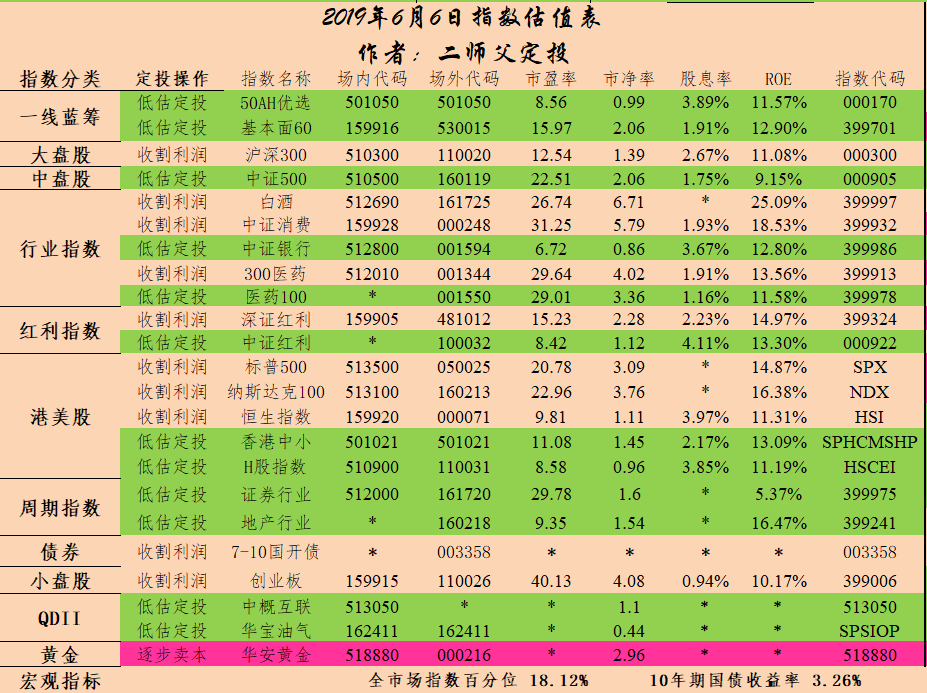

======================================================

_type: q&a
@妖孽[544888148518184]
2019-06-07 10:33:31 Fri  
topic_id: 844182425141542

@妖孽

>  请问二师父 军工 计算机 全指信息 新能源汽车这几个指数如何....

@二师父

>  军工不行，这个周期指数，比较难把握，其余三个还可以

阅读[2461]  评论[1]  赞[0] 

======================================================

_type: q&a
@天赋吉运[88248848112582]
2019-06-07 10:33:45 Fri  
topic_id: 844182428528512

@天赋吉运

>  老师好，端午节安康！
>  老师，有没有均线交叉自动下单的股票软件，想找一个。

@二师父

>  这种软件没有的

阅读[2605]  评论[0]  赞[0] 

======================================================

_type: q&a
@李震笛[422112248211828]
2019-06-07 10:34:36 Fri  
topic_id: 111854144188282

@李震笛

>  二师傅，现在很多低估值的品种，我想问，中证红利加中证银行加基本面60这样的组合行吗？还有什么可以加的？谢谢

@二师父

>  再加一个医药指数，一个必须消费指数就比较完美了

阅读[2766]  评论[3]  赞[0] 

======================================================

_type: q&a
@堂吉诃德的小助手[15528821588422]
2019-06-07 15:35:09 Fri  
topic_id: 844182421511222

@堂吉诃德的小助手

>  去哪里找中证500和沪深300历史pe pb？

@二师父

>  果仁网或者理杏仁网

阅读[2677]  评论[0]  赞[0] 

======================================================

_type: q&a
@马军[421482415512448]
2019-06-07 15:35:53 Fri  
topic_id: 544815458288424

@马军

>  请问二师傅天天基金网的定投实盘可以一键买入跟你定投吗？

@二师父

>  第一次买入可以一键跟投，后面得分别买，他们正在努力推出一键跟投功能

阅读[2776]  评论[0]  赞[0] 

======================================================

_type: talk
@二师父[28814221155551]
2019-06-08 04:59:25 Sat  
topic_id: 544815844551184

<e type="hashtag" hid="825114148222" title="#5G#" /> 5G是未来的方向

阅读[4708]  评论[0]  赞[0] 

+++++++++++++++++++++++++++++++++++++++++++++++++++++

文件：
2019-06-08 04:58:53 Sat
文件大小：[24113]
15588251241122-中国宣布5G商用，需要布局吗.docx

======================================================

@二师父[28814221155551]
2019-06-08 11:32:04 Sat  
topic_id: 422185121841418

>  @二师父
>  

阅读[2547]  评论[0]  赞[0] 

======================================================

_type: q&a
@采涵[548211441124154]
2019-06-08 12:36:43 Sat  
topic_id: 544815848425484

@采涵

>  二师父，我要开户华泰或者华宝，请回复我微信信息好吗？我也加您的助理微信好友了，但一直没有通过。🙏🙏🙏

@二师父

>  有什么问题？直接扫描二维码即可，然后基金经理会打电话给你调整

阅读[2574]  评论[1]  赞[0] 

======================================================

_type: talk
@二师父[28814221155551]
2019-06-08 12:41:40 Sat  
topic_id: 111854885425542

<e type="hashtag" hid="825114111242" title="#关于问答#" />大家好，我现在三个微信了，所以微信消息不一定能回复，如果没有及时回复就在星球提问就好，基本当天能够及时回复的，课程链接， <e type="web" href="http://weike.fm/MktbW" title="荔枝微课"/>

@杜志彪 at 2019-06-08 12:41:40 Sat

> 只录到1.4是吧

----------

@二师父 at 2019-06-08 12:41:40 Sat

> 对的，后面会逐步更新

----------

@冉冉 at 2019-06-08 12:41:40 Sat

> 二师傅，之前荔枝微课的会员能听课吗？

----------

@二师父 at 2019-06-08 12:41:40 Sat

> 基金课程可以听，两个分开的

----------

@冉冉 at 2019-06-08 12:41:40 Sat

> 那现在的课程内容是什么？是需要再次买入吗？

----------

@二师父 at 2019-06-08 12:41:40 Sat

> 在置顶文章第三篇有课程大纲

----------

@Zyxj at 2019-06-08 12:41:40 Sat

> 就是打不开啊！

----------

@二师父 at 2019-06-08 12:41:40 Sat

> 用这个二维码

----------

阅读[2575]  评论[8]  赞[0] 

======================================================

_type: talk
@树叶[544811512145144]
2019-06-08 13:11:16 Sat  
topic_id: 422185118582488

<e type="hashtag" hid="142825811122" title="#定投周报#" /> 二师父定投周报第11期

阅读[2724]  评论[0]  赞[0] 

+++++++++++++++++++++++++++++++++++++++++++++++++++++

文件：
2019-06-08 13:11:09 Sat
文件大小：[282310]
28811584842821-二师父定投周报6.8（第11期）.docx

======================================================

_type: talk
@二师父[28814221155551]
2019-06-08 15:13:14 Sat  
topic_id: 544815881855454

<e type="hashtag" hid="142888225882" title="#指数基金调仓#" /> 上证50新增5家企业，三一重工，海通证券，中信建设，中国国航，中国人保

踢出5家企业，三六零，山东黄金，绿地，大秦铁路，北京银行

汰劣留优，这是指数基金的好处，集中的金融地产指数，是不错的选择

阅读[2768]  评论[0]  赞[0] 

======================================================

_type: q&a
@冉冉[88445118854412]
2019-06-09 03:40:53 Sun  
topic_id: 111854884421442

@冉冉

>  二师傅您好，什么时候分析一下中证医药指数基金在当下如何进行更好投资？谢谢！

@二师父

>  这个追踪的是广发中证医药指数，又称为广发医药，和医药100估值类似，可以开始定投了

阅读[2661]  评论[1]  赞[0] 

======================================================

_type: q&a
@妖孽[544888148518184]
2019-06-09 03:42:10 Sun  
topic_id: 544814222811584

@妖孽

>  师傅师傅：基金的涨跌是按照复利计算的？，像股票跌10% 需要涨11%回本，跌50% 需要涨100%回本。请问那基金呢！

@二师父

>  你没抓住本质，本质是你100元买入，只要价格到达100元，你就是不亏不赚

阅读[2764]  评论[0]  赞[0] 

======================================================

_type: talk
@二师父[28814221155551]
2019-06-09 04:33:39 Sun  
topic_id: 844184555184112

<e type="hashtag" hid="551222484554" title="#医药基金#" /> 医药基金又开始进入低估。这时候其实是最好的布局和学习时间，可是大家情绪都低落了，没办法，成功永远都只属于那一小撮人。

@土木工程部 at 2019-06-09 04:33:39 Sun

> 医药100持有中[微笑]

----------

@自由飞翔 at 2019-06-09 04:33:39 Sun

> 一直持有，一直定投中，刚一下晃眼了，还以为消费指数进入低谷[偷笑][偷笑][偷笑]

----------

@波 at 2019-06-09 04:33:39 Sun

> 我又买了天弘医药100指数基金

----------

@水墨青花 at 2019-06-09 04:33:39 Sun

> 师父，近期鳄鱼计划有操作吗

----------

@二师父 at 2019-06-09 04:33:39 Sun

> 有操作的都发布了，你看看星球往期搜索下

----------

阅读[4886]  评论[5]  赞[0] 

+++++++++++++++++++++++++++++++++++++++++++++++++++++

文件：
2019-06-09 04:32:46 Sun
文件大小：[51558]
15588242854412-药企迎接检查，部分医药股票遭遇大跌，医药指数还可以定投吗.docx

======================================================

@二师父[28814221155551]
2019-06-09 12:58:29 Sun  
topic_id: 844184552885112

>  @二师父
>  

阅读[2563]  评论[0]  赞[0] 

======================================================

_type: talk
@二师父[28814221155551]
2019-06-09 22:28:19 Sun  
topic_id: 111851255424552

<e type="hashtag" hid="551221218814" title="#网格自动挂单视频#" /> <e type="web" href="https://mp.weixin.qq.com/s/iktPZH_VOslkBfTjXGYqtw" title="网格交易策略详解和交易记录表" cache="" />

<e type="web" href="https://mp.weixin.qq.com/s/iktPZH_VOslkBfTjXGYqtw" title="网格交易策略详解和交易记录表" cache="" />

@速。冻 at 2019-06-09 22:28:19 Sun

> 怎么视频才十秒

----------

@二师父 at 2019-06-09 22:28:19 Sun

> 基本操作都有了，建议还是手动

----------

@奔波儿霸🐟🐠🐬🐳🐋💦 at 2019-06-09 22:28:19 Sun

> 赞，我正想问，上去了又下来该怎么操作，师父就明确了指示，最后的问题也没啦。这个表格我已缩印放在手机背面，完成一部就点个点，随时掌握自己的情况，可以的是深红利一直不给建仓机会，其他四只都已进入正轨。

----------

阅读[2391]  评论[3]  赞[0] 

======================================================

_type: talk
@二师父[28814221155551]
2019-06-10 04:49:10 Mon  
topic_id: 844184584141422

<e type="hashtag" hid="228558548811" title="#学习是一辈子的事#" /> 好好学习，这是非常重要的，否则时代抛弃你的时候不会说一声再见。

今年的计划就是把股票课程迭代完毕就给大家讲怎么打造个人品牌，未来会有系列的分享和学习，如果你坚持跟我的思路来学习并且实践，未来三年你的月收入无法增加2万以上，我觉得你都可以不用关注我的。

不管是学习也好，还是投资也罢，都要慢慢来，厚积方能薄发。这是量变到质变的的关键。很多人之所以做不好，就是太着急了。

@彩色 at 2019-06-10 04:49:10 Mon

> 我感觉我得努力积累本金了

----------

@陈 at 2019-06-10 04:49:10 Mon

> 二师父，月定投金额得多少才能除了工资收入外，月收入上万呢？[愉快]

----------

@二师父 at 2019-06-10 04:49:10 Mon

> 你说是定投收入吗？定投的话他收入不是稳定的，可能你投入了20万一直浮亏，但是行情一来一个月都盈利几万

----------

@陈 at 2019-06-10 04:49:10 Mon

> 那您说的未来三年月收入超过两万是指后期跟着您的脚步学习股票投资吗？

----------

@二师父 at 2019-06-10 04:49:10 Mon

> 不是只有股权投资的

----------

@丸子妈 at 2019-06-10 04:49:10 Mon

> 应该是说打造个人品牌来变现

----------

阅读[4437]  评论[6]  赞[0] 

+++++++++++++++++++++++++++++++++++++++++++++++++++++

文件：
2019-06-10 04:45:32 Mon
文件大小：[25736]
51188255582544-毕业了，学习才刚刚开始.docx

======================================================

_type: q&a
@驼驼夫[244151825154221]
2019-06-10 04:52:33 Mon  
topic_id: 544814215254144

@驼驼夫

>  二师傅，华宝网格交易如何建立底仓？比如每格5000元，现在k线位置在第9格，底仓是45000，应该如何设置呢？

@二师父

>  我不知道你表达的K线第9格是啥意思。
>  
>  建立底仓是很简单的，我给了一个表，你按照表格价位买。比如华宝油气0.5的时候底仓买入10份。0.44的时候直接买入10+1.2+1.4+1.6=14.2份。
>  
>  根据表格的价位和买入份数依次相加即可了。初始价位是建立3成底仓，跌的越多底仓越多

阅读[2559]  评论[0]  赞[0] 

======================================================

_type: talk
@美美[48224811151218]
2019-06-10 08:09:54 Mon  
topic_id: 422182481858488

二师父：什么是10+1.2+1.4+1.6

@一阵风 at 2019-06-10 08:09:54 Mon

> 打个比方，一份是1000元，那么1.2份就是1200元，1.4份就是1400元。

----------

@美美 at 2019-06-10 08:09:54 Mon

> 感谢回复

----------

阅读[2391]  评论[2]  赞[0] 

======================================================

_type: q&a
@驼驼夫[244151825154221]
2019-06-10 11:54:05 Mon  
topic_id: 111851242512252

@驼驼夫

>  二师傅您说的如何建立底仓的原理这个我是知道的，我的意思是我不会在华宝智投app上操作建立底仓。我看到上面与仓位相关的一个是最大持仓，一个是最小持仓，貌似这俩也不是底仓的选项。难道底舱需要我先自己手动买入建立，再使用这个网格条件功能吗？

@二师父

>  对的，底仓手动买入即可

阅读[2419]  评论[1]  赞[0] 

======================================================

_type: q&a
@光年之外的饭团[118222815212212]
2019-06-10 11:55:34 Mon  
topic_id: 422182454245418

@光年之外的饭团

>  二师父 五步定投里面的防守账户要放多钱 留几个月的生活费啊

@二师父

>  防守账户是用于应对风险，我放了30万，日用账户用来生活，我放了6个月，看自己情况来吧

阅读[2493]  评论[0]  赞[0] 

======================================================

_type: q&a
@J[28281541518551]
2019-06-10 14:16:17 Mon  
topic_id: 844184528255422

@J

>  二师傅 您精选的5只基金做网格交易，银行、深红利、华宝油气、中概互联、券商请问他们的震荡幅度一般会去到是多少？震荡周期一般是多长时间有一次盈利斩获机会？

@二师父

>  我建立底仓的价格，然后向下是跌幅在40到50个百分点，最大历史跌幅。
>  
>  多长时间盈利这个得问市场，没人知道这种问题的

阅读[2375]  评论[0]  赞[0] 

======================================================

@二师父[28814221155551]
2019-06-10 14:17:40 Mon  
topic_id: 844184528252882

>  @二师父
>  

阅读[2382]  评论[0]  赞[0] 

======================================================

_type: q&a
@海马[15158245825242]
2019-06-10 15:18:07 Mon  
topic_id: 111851241525282

@海马

>  二师父，怎么构建我们的养老组合？

@二师父

>  添加中证红利作为养老定投的指数是不错的选择，可以定投到退休选择现金分红作为自己的退休金

阅读[2326]  评论[1]  赞[0] 

======================================================

_type: talk
@二师父[28814221155551]
2019-06-10 15:26:32 Mon  
topic_id: 544814254511424

鳄鱼计划操作的话我会群里公布的，没有必要频繁买卖，一次买入1万和10次买入1000效果没啥区别。

大家可以根据低估表和均线偏离表制定自己的定投计划，能真正学会一整套系统和投资原则比买具体基金重要

阅读[2518]  评论[0]  赞[0] 

======================================================

_type: talk
@二师父[28814221155551]
2019-06-10 21:06:32 Mon  
topic_id: 422182424845248

<e type="hashtag" hid="145225588122" title="#关于学习的格局#" /> 做人需要有格局，学习也一样，学习的格局在于去认识事物背后的底层逻辑和原理

如果你的学习只是停留在一只股票好不好，一只基金该不该投，那还只是标准答案，教科书式的学习，这样并不能提升自己对投资的底层认知

多想一想投资的模型，投资的系统，以及二师父选择基金所遵循的原则，你会发现，我定投的基金会有变化，但是选择基金和配置组合以及买入和卖出的逻辑一直没有变

基金几千只，后面只会越来越多，如果你不懂得从不变的核心原理层面去看看待这些不断发售的基金，你只会陷入一个茫茫鸡海从而迷失自己

另外关于认知一定不要只从已有的经验来看，比如初中化学的置换反应到高中是氧化还原反应，一个从元素活跃性角度分析，一个从化学价升降的角度分析，认知总是不断被打破的，我们不断学习深入就是探求到最底层的认知，这一点一定要注意

否则你发现不了新的机会，比如昨天二师父说跟着我一起学习坚持实践三年之内月收入增加2万没有问题

很多人第一想法马上就是，1这人真能吹牛，2，我得本金多少才能投资月收入2万。这都是固有认知

还有之前我说课程价格是一条烟的价格，不是一包烟。有的人没接触过，觉得没那么贵，其实真实就是那样，北京的大中华是1000一条，湖北的1916也是1000一条，遇到一个你没有接触的观点，首先想想怎么打破自己固有的认识，这样眼界才能打开

提升财商本质不是买到了什么基金，而是改变自己对财富的认知，当你的思维成为了富人思维，赚钱只是顺带的事情

@妖孽 at 2019-06-10 21:06:32 Mon

> 二师父我摘抄一些经典句子发朋友圈了哈……

----------

@yaond at 2019-06-10 21:06:32 Mon

> 思考致富

----------

@陌路花 at 2019-06-10 21:06:32 Mon

> 师父，我是愚人，想慢慢跟随然后体会。

----------

@二师父 at 2019-06-10 21:06:32 Mon

> 慢慢来，认知的改变需要时间

----------

@一剪梅 at 2019-06-10 21:06:32 Mon

> 师父，要想让自己找到基金定投，我觉得好难哦，现在一直跟着你的脚步走就行😄

----------

@齐俊波 at 2019-06-10 21:06:32 Mon

> 这是精华。

----------

阅读[4677]  评论[6]  赞[0] 

======================================================

_type: q&a
@王宇新[548215145824884]
2019-06-10 22:59:04 Mon  
topic_id: 544814245185814

@王宇新

>  二师父，我的星球APP怎么看不到内容啦？

@二师父

>  不会吧，你重新登陆一下看看是否可以

阅读[2432]  评论[0]  赞[0] 

======================================================

_type: talk
@王宇新[548215145824884]
2019-06-10 23:15:31 Mon  
topic_id: 544814245425284

<e type="hashtag" hid="881251425252" title="#鳄鱼计划#" /> 刚来的新人报道一下

@二师父 at 2019-06-10 23:15:31 Mon

> 欢迎

----------

阅读[2389]  评论[1]  赞[0] 

======================================================

_type: q&a
@J[28281541518551]
2019-06-11 01:22:54 Tue  
topic_id: 844184542128842

@J

>  师傅，请问你的鳄鱼计划和网格交易是用同一个证券账号吗

@二师父

>  不是了，网格现在用的广发证券，鳄鱼计划一直用的华泰证券，目前就这两个账户，不然不容易区分

阅读[2531]  评论[4]  赞[0] 

======================================================

_type: talk
@二师父[28814221155551]
2019-06-11 03:15:39 Tue  
topic_id: 111851211281842

<e type="hashtag" hid="145225485442" title="#给大家分享一段话#" /> 先努力赚钱，你才能看到24H全力以赴之下，自己的上限在哪里；你才能认识更多优秀的人，去更多的地方，实现更多梦想。

一个人赚钱不代表他有多爱钱，而是他喜欢钱带来的独立和自由的生活

@陌路花 at 2019-06-11 03:15:39 Tue

> 最赞同最后一句话了。独立自由以及尊严。

----------

阅读[2646]  评论[1]  赞[0] 

======================================================

_type: talk
@二师父[28814221155551]
2019-06-11 03:32:38 Tue  
topic_id: 544814244122254

定投看我的实盘即可，估值表是参考，低估才定投，大家问得问题我很奇怪，定投需不需要每天看估值表，这我还真不知道怎么回答，学习抓重点哈，看不看无所谓，只要保证低估定投即可

大家有问题先自己想10分钟，这样学习才有效，现在我正在学习，我也有一些底层的认知正在突破，说实话我问身边人也得不到很好的解答，加入的社群认知也不见得在我之上

怎么办，先独立思考，至少问题是自己独立思考过的，不然永远没法进步

阅读[2850]  评论[0]  赞[0] 

======================================================

_type: talk
@二师父[28814221155551]
2019-06-11 04:37:32 Tue  
topic_id: 544814244125454

<e type="hashtag" hid="142511181542" title="#周二荐书#" /> 继续回归周二读书，钱，七步创造终身收入，作者是托尼，罗宾斯。翻译是巴菲特研究专家刘建位。这本书主要改善以前你的很多认知。

真的，打破认知特别难，尤其是自己固有了几十年的思维。里面最经典的是是对一些投资大师的介绍，比如瑞达利欧，约翰伯格

大家一定明白，人生的晋级和飞跃不是一本书解决问题的，可是如果你坚持一个体系的阅读，一周一本，坚持3年以后形成自己的体系，那么你的见解和智慧就立马升级。

这是量变到质变的过程。慢慢来，不着急的。

阅读[2953]  评论[0]  赞[0] 

======================================================

_type: talk
@二师父[28814221155551]
2019-06-11 04:40:16 Tue  
topic_id: 422182422845148

<e type="hashtag" hid="481211145528" title="#指数估值#" /> 指数估值表，没有大的变化，股市涨涨跌跌，高手都是远离股市的。

这样才能够集中精力思考做决策，不然每天盯着数字涨涨跌跌，情绪涨涨跌跌，一天啥也没干就过去了。于其关注股市涨跌，倒不如花点时间提高自己的。

@琴 at 2019-06-11 04:40:16 Tue

> 一直在等沪深300和医药300低估，大盘指数已经很低了，这两都还未进入低估。

----------

@二师父 at 2019-06-11 04:40:16 Tue

> 不着急慢慢等待

----------

阅读[3105]  评论[2]  赞[0] 

+++++++++++++++++++++++++++++++++++++++++++++++++++++

图片：

======================================================

_type: talk
@二师父[28814221155551]
2019-06-11 04:41:18 Tue  
topic_id: 422182422845188

<e type="hashtag" hid="458448515448" title="#指数基金定投需要注意的问题#" /> 避免三大坑

阅读[5291]  评论[0]  赞[0] 

+++++++++++++++++++++++++++++++++++++++++++++++++++++

文件：
2019-06-11 04:40:54 Tue
文件大小：[24651]
88811545424182-投资需慎重，指数基金定投的过程中需要避免这几大问题.docx

======================================================

_type: talk
@二师父[28814221155551]
2019-06-11 12:01:17 Tue  
topic_id: 544814281828544

活捉2900，向韭菜招手

@简史 at 2019-06-11 12:01:17 Tue

> 不懂啊

----------

@J at 2019-06-11 12:01:17 Tue

> 😄师父意思是会继续上涨割韭菜吗？

----------

@奔波儿霸🐟🐠🐬🐳🐋💦 at 2019-06-11 12:01:17 Tue

> 是要起飞了吗

----------

@二师父 at 2019-06-11 12:01:17 Tue

> 我意思是很多人只会大涨买入，至于涨不涨，我说了不算

----------

@杜志彪 at 2019-06-11 12:01:17 Tue

> 还处于震荡区域，等待年线走平上翘。

----------

@陌路花 at 2019-06-11 12:01:17 Tue

> 师父，3千点以下入场，不是韭菜吧？

----------

@二师父 at 2019-06-11 12:01:17 Tue

> 不是的，现在估值仍旧很低的

----------

阅读[2918]  评论[8]  赞[0] 

+++++++++++++++++++++++++++++++++++++++++++++++++++++

图片：
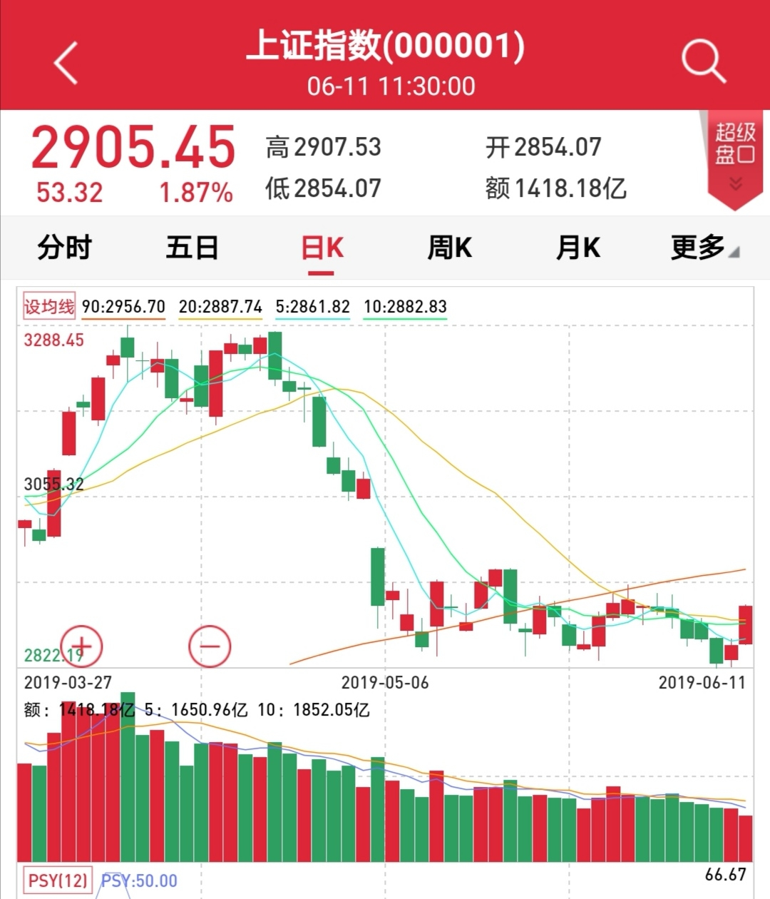

======================================================

_type: talk
@奔波儿霸🐟🐠🐬🐳🐋💦[544884444514584]
2019-06-11 14:15:16 Tue  
topic_id: 544814285585214

券商0.88卖一份，[愉快]

@杜志彪 at 2019-06-11 14:15:16 Tue

> 不提醒都忘了，我还有一份券商ETF网格一份，虽然只买了一份，明天也卖了（遵守纪律）

----------

@二师父 at 2019-06-11 14:15:16 Tue

> 网格交易用的不错

----------

@杜志彪 at 2019-06-11 14:15:16 Tue

> 上一次选的券商网格，鳄鱼计划选的中概互联，明天卖点了券商，建立华宝油气网格。

----------

阅读[2659]  评论[3]  赞[0] 

======================================================

_type: q&a
@陌路花[844114852118822]
2019-06-11 15:22:23 Tue  
topic_id: 111851284852442

@陌路花

>  师父，我其实一直看好消费板块，但中证消费一直没到低估，所以一直不敢定投。师父，是不是还得耐心等待？

@二师父

>  是的，一定要低估才开始定投的，之前是有机会的，耐心等待不要追高，虽然目前大盘整体指数点位偏低，但是我的消费指数仍旧盈利将近40个百分点，这时候定投有点贵了

阅读[2699]  评论[5]  赞[0] 

======================================================

_type: talk
@丸子妈[28512522184441]
2019-06-11 15:32:25 Tue  
topic_id: 844184514584442

提问:现在是不是还可以网格法建立底仓？

@二师父 at 2019-06-11 15:32:25 Tue

> 按照我发布的价格，有的是可以的，基本低估的基金都可以建立底仓

----------

@速。冻 at 2019-06-11 15:32:25 Tue

> 应该是具体基金具体分析

----------

阅读[2723]  评论[2]  赞[0] 

======================================================

_type: q&a
@J[28281541518551]
2019-06-11 20:10:02 Tue  
topic_id: 422182412258188

@J

>  师傅，在华宝证券账号里还没用到的资金可以放在什么地方赚点利息？有没有类似天天活期宝的？

@二师父

>  货币基金可以的

阅读[2711]  评论[8]  赞[0] 

======================================================

_type: talk
@二师父[28814221155551]
2019-06-12 04:40:49 Wed  
topic_id: 111851524842412

<e type="hashtag" hid="481211145528" title="#指数估值#" /> 虽然涨了一天，但是仍旧便宜，放心定投吧。3000点以下低估的指数随便投

@二师父 at 2019-06-12 04:40:49 Wed

> 定投日投

----------

@YtingLi at 2019-06-12 04:40:49 Wed

> 师父，现在估值表都不是置顶了的是吧，谢谢

----------

@二师父 at 2019-06-12 04:40:49 Wed

> 会和偏离表一起置顶

----------

阅读[2523]  评论[4]  赞[0] 

+++++++++++++++++++++++++++++++++++++++++++++++++++++

图片：
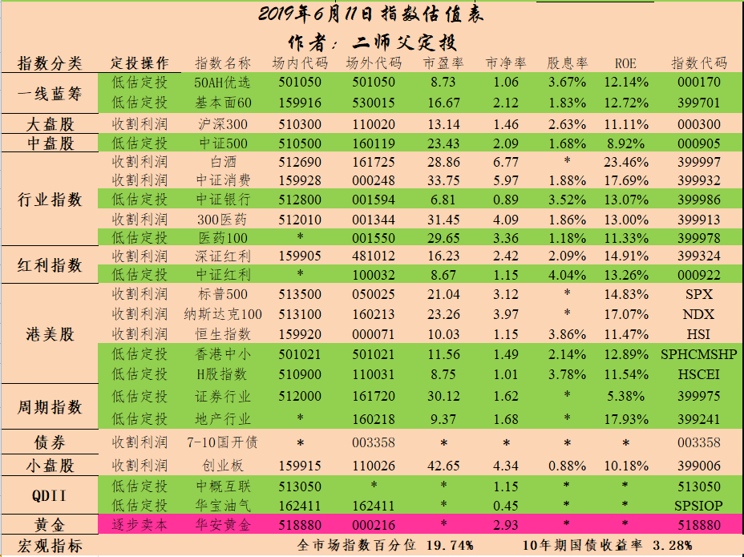

======================================================

_type: talk
@二师父[28814221155551]
2019-06-12 04:43:23 Wed  
topic_id: 544814125852584

<e type="hashtag" hid="145225848552" title="#指数投资盈利原理#" /> 学会用最简单的方法，低估策略，均线策略，网格策略。三大策略灵活用，最终是保证简单，简洁，然后其他时间用来提升自己增加收入，我就是这么干的。股市投资一定要有耐心

大家记住，股市不同于工作，工作越用心，你做的越好，可是你对股市关注越多，看得越多，会让你收益下降的，这是股市的特点。所以懒人适合来股市，买了啥也不敢，过几年涨的爽歪歪。

@Pacifica at 2019-06-12 04:43:23 Wed

> 字字珠玑

----------

阅读[2745]  评论[1]  赞[0] 

+++++++++++++++++++++++++++++++++++++++++++++++++++++

文件：
2019-06-12 04:41:15 Wed
文件大小：[25305]
28811541522411-从证券指数基金上涨5%展开谈我们投资指数基金的原理.docx

======================================================

_type: talk
@Bruce[422251412414418]
2019-06-12 08:58:54 Wed  
topic_id: 544814112288524

二师父，为什么向你提问后问题没有了，知识星球里面也找不到我发表过的数据

@二师父 at 2019-06-12 08:58:54 Wed

> 你没有打开记录，搜索下能找到的

----------

阅读[2436]  评论[1]  赞[0] 

======================================================

_type: talk
@杜志彪[544454124115854]
2019-06-12 10:10:46 Wed  
topic_id: 544814112441884

卖出券商ETF网格，建立买入华宝油气网格一份。

@乖子 at 2019-06-12 10:10:46 Wed

> 如果份额太少，手续费会不会多过盈利？

----------

@杜志彪 at 2019-06-12 10:10:46 Wed

> 我用的场内华泰免5手续费，不放心可以查查交割单。

----------

@乖子 at 2019-06-12 10:10:46 Wed

> 哦哦，我问了，我也免5，谢谢

----------

阅读[2552]  评论[3]  赞[0] 

======================================================

_type: q&a
@平安是福[118222545154542]
2019-06-12 10:11:29 Wed  
topic_id: 844184852121452

@平安是福

>  师父你好：华泰开户好几天了，一直没有客服联系我，请问华泰客服电话是多少，打电话问问修改费率一事。

@二师父

>  在涨乐财富通我的里面有客户经理联系方式

阅读[2614]  评论[1]  赞[0] 

======================================================

_type: q&a
@辰希[844111582454242]
2019-06-12 10:11:52 Wed  
topic_id: 111851528882482

@辰希

>  老师，请问网格交易用哪个平台好呢？

@二师父

>  三个福利渠道任何一个都不错

阅读[2715]  评论[0]  赞[0] 

======================================================

_type: q&a
@JOY[111881481812422]
2019-06-12 10:13:06 Wed  
topic_id: 422182884842448

@JOY

>  请问师傅，感觉目前一直是起起伏伏的状态，现在还是按一年50份的方式来分割资金么？

@二师父

>  没有问题，一年50份投完了就可以停止了，到了3000点以上就减少定投资金

阅读[2800]  评论[0]  赞[0] 

======================================================

_type: q&a
@奇迹相伴[422118428544848]
2019-06-12 10:14:35 Wed  
topic_id: 844184885822512

@奇迹相伴

>  中签的可转债可以买吗？

@二师父

>  具体要看哪只可转债了，打新以后中签了会自动扣款的，现在熊市就打3a级别以上的

阅读[2891]  评论[0]  赞[0] 

======================================================

_type: q&a
@不言而喻[111141821182282]
2019-06-12 10:19:55 Wed  
topic_id: 422182884222528

@不言而喻

>  二师父，银华日利是货币式基金吗，年化收益率是多少？

@二师父

>  这是货币基金，收益率2.39%

阅读[3028]  评论[0]  赞[0] 

======================================================

@二师父[28814221155551]
2019-06-12 12:48:26 Wed  
topic_id: 111851552811482

>  @二师父
>  

阅读[3108]  评论[3]  赞[0] 

======================================================

_type: q&a
@J[28281541518551]
2019-06-12 12:51:10 Wed  
topic_id: 844184888214152

@J

>  师父，按照你的网格标准，是建议油气在0.5建立10份底仓，现在是0.447附近，这时建立底仓是不是要把前面的12.6份都一次补买入？

@二师父

>  补上没有问题的，这个底仓建立点也不是说一定要那样买，保证我们在初始买入点有3成仓位即可，因为也有可能一买没多久就大涨了的

阅读[3312]  评论[0]  赞[0] 

======================================================

@二师父[28814221155551]
2019-06-12 20:46:26 Wed  
topic_id: 544814552251884

>  @二师父
>  

阅读[2995]  评论[1]  赞[0] 

======================================================

_type: talk
@二师父[28814221155551]
2019-06-12 21:20:47 Wed  
topic_id: 844184228841422

投资的本质是你对这个世界的认知变现，而阅读是帮助我们提升认知的捷径。

所以，无论是阅读书籍，还是阅读二师父的文章，都要问问我读了认知有无提升，思维有无转变，这比积累知识点重要

阅读[2941]  评论[0]  赞[0] 

======================================================

_type: talk
@二师父[28814221155551]
2019-06-12 21:21:12 Wed  
topic_id: 244184228841151

投资的本质是你对这个世界的认知变现，而阅读是帮助我们提升认知的捷径。

所以，无论是阅读书籍，还是阅读二师父的文章，都要问问我读了认知有无提升，思维有无转变，这比积累知识点重要

阅读[2996]  评论[0]  赞[0] 

======================================================

_type: q&a
@于磊[48522822121558]
2019-06-12 21:28:17 Wed  
topic_id: 844184228841512

@于磊

>  请问:中证500和中证500增强，定投哪个好些？

@二师父

>  新手选择中证500纯被动指数比较好，费率低，而且跟踪误差小

阅读[3211]  评论[0]  赞[0] 

======================================================

@二师父[28814221155551]
2019-06-12 22:41:45 Wed  
topic_id: 422182558542818

>  @二师父
>  

阅读[3301]  评论[0]  赞[0] 

======================================================

_type: q&a
@J[28281541518551]
2019-06-13 03:03:41 Thu  
topic_id: 422182551441488

@J

>  请问：用网格交易里的一份的单位是“元”还是“股”，比如一份是1000，那是指1000元还是1000股？

@二师父

>  只1000元，如果购买10手和1000元有差距，近似即可

阅读[3281]  评论[0]  赞[0] 

======================================================

_type: talk
@二师父[28814221155551]
2019-06-13 04:59:18 Thu  
topic_id: 111851448585222

<e type="hashtag" hid="881422852442" title="#定投实盘#" /> 最近市场一直震荡，大家坚持住，很多事情都需要坚持，四季轮流交替，股市轮回起伏。要在冬天为自己储备能量，为下一个春天做好准备。经历过寒冬交替，才能够真正意义上的成才。永远躲在温室里没有经历过寒冬，风一吹就会倒。跟着二师父一起经历冬天，迎接春天，我们会慢慢的强大。

@冉冉 at 2019-06-13 04:59:18 Thu

> 今日没有估值表？

----------

@程大圣 at 2019-06-13 04:59:18 Thu

> 二师父，今天估值表没有中概互联的估值啊？

----------

@别皱眉头 at 2019-06-13 04:59:18 Thu

> 坚持定投不久，请问大家，有的时候定投日的价格，比上一次定投日的价格高，就拖着想等等，怎么破[捂脸]

----------

@丸子妈 at 2019-06-13 04:59:18 Thu

> 红利指数没买了？

----------

@二师父 at 2019-06-13 04:59:18 Thu

> 实盘没有了

----------

阅读[3439]  评论[7]  赞[0] 

+++++++++++++++++++++++++++++++++++++++++++++++++++++

图片：
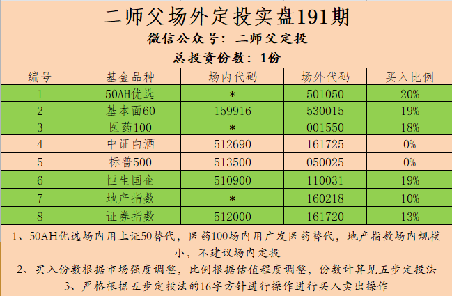

+++++++++++++++++++++++++++++++++++++++++++++++++++++

文件：
2019-06-13 04:59:04 Thu
文件大小：[235983]
48811414122188-191期低估定投实盘暨配置逻辑解析.docx

======================================================

_type: q&a
@阿香[455521845448]
2019-06-13 11:59:58 Thu  
topic_id: 244184245411541

@阿香

>  请问天天基金那个组合这周我跟了2000，但金额分配比例跟师父的差别有些大，不知什么原因

@二师父

>  你好，这个天天基金的调仓功能正在优化，目前还需要系统确认才行，官方解释预计到了20号就用新模式了

阅读[2983]  评论[0]  赞[0] 

======================================================

_type: q&a
@J[28281541518551]
2019-06-13 12:37:26 Thu  
topic_id: 844184244552142

@J

>  师父你好，请问为什么最近都没有看到每天更新均价偏离表呢？很希望这个工作能不间断，对于做场内交易的伙伴们很有用，感谢你的助手，能请他继续坚持下去吗？

@二师父

>  最近在发呢，周二我记得就有，你可以搜索偏离表看看哈

阅读[3003]  评论[3]  赞[0] 

======================================================

@二师父[28814221155551]
2019-06-13 12:37:56 Thu  
topic_id: 544814544212414

>  @二师父
>  

阅读[3260]  评论[1]  赞[0] 

======================================================

_type: talk
@二师父[28814221155551]
2019-06-13 13:29:45 Thu  
topic_id: 844184244222112

<e type="hashtag" hid="481211145528" title="#指数估值#" /> 昨晚可能网络原因，所以没有发出去，估值表最近变化不大。一直震荡，坚持即可

阅读[5114]  评论[0]  赞[0] 

+++++++++++++++++++++++++++++++++++++++++++++++++++++

图片：

======================================================

_type: talk
@二师父[28814221155551]
2019-06-13 13:44:30 Thu  
topic_id: 544814544582824

<e type="hashtag" hid="228552251111" title="#仪式感的生活#" />  仪式感就是使某一天的生活和其他日子不同，使某一时刻的日子和其他时刻不同。记录生命中每一个重要的日子，过有仪式感的生活。

一个人的早餐可以在地铁上嚼包子解决，也可以早起慢慢准备，铺上你最爱的蓝白格子餐垫，精心挑选的餐盘里每一个水果的摆放都恰到好处。

《爱情里的仪式感对女人来说有多重要，情人节的礼物，生日的惊喜，纪念日里小小的浪漫都值得提前一个月去期待，这些仪式让我们在剩下的三百多天里有东西可以回味，想到就开心。这些仪式感不是做作，不是俗气，是平淡生活里总要有的调味品，留一个仪式的时间感受日常里的珍贵。

不要让自己的日子过成了365天的重复，每一天，每一刻让自己的生活有不同，这样的生活会有质感

@木子李 at 2019-06-13 13:44:30 Thu

> 这是二师父写的嘛？[调皮]在数据的理性世界里，这篇显得特别与众不同，有鸡汤的香味没有腻味[强]会赚钱会生活[强]

----------

@Sophie🌸乐桃 at 2019-06-13 13:44:30 Thu

> 爱学习，能赚钱，会生活，理智与情感并存，既体贴又温情，这样的男人好抢手啊[呲牙][呲牙]

----------

@二师父 at 2019-06-13 13:44:30 Thu

> 理性工作，感性生活

----------

@二师父 at 2019-06-13 13:44:30 Thu

> 来把我抢走吧

----------

@Sophie🌸乐桃 at 2019-06-13 13:44:30 Thu

> 距离远了点啊，不好下手😂

----------

@J at 2019-06-13 13:44:30 Thu

> 师父未婚？[呲牙]

----------

@二师父 at 2019-06-13 13:44:30 Thu

> 专注研究基金，多挣钱才是王道

----------

@Sophie🌸乐桃 at 2019-06-13 13:44:30 Thu

> 帮师父打广告：内里温情，外挂千金，横批才华横溢。待我股场凯旋，姑娘嫁我可好！
哈哈哈，师父别打我[捂脸][捂脸]

----------

阅读[3359]  评论[11]  赞[0] 

======================================================

_type: q&a
@醉流雨[422151445242248]
2019-06-13 13:46:17 Thu  
topic_id: 244184244822481

@醉流雨

>  股票的买卖手续费怎么算的，？

@二师父

>  一般买卖收取5元最低佣金，然后万3，通过我的渠道注册可以免除5元手续费

阅读[3673]  评论[0]  赞[0] 

======================================================

_type: q&a
@雪莲[421485848588118]
2019-06-13 14:28:50 Thu  
topic_id: 844184244448212

@雪莲

>  师父您好，我在华泰开户的过程中有一项填写电子邮箱，我不知道该填啥？麻烦师父赐教！

@二师父

>  填写你的扣扣邮箱就行了

阅读[3700]  评论[5]  赞[0] 

======================================================

@二师父[28814221155551]
2019-06-14 03:29:49 Fri  
topic_id: 244184212284811

>  @二师父
>  

阅读[3258]  评论[0]  赞[0] 

======================================================

_type: q&a
@潜龙[244145114188851]
2019-06-14 03:30:42 Fri  
topic_id: 422182515114848

@潜龙

>  二师父，如果想通过定投红利指数来做退休金，是不是应该选中证红利这种分红高的

@二师父

>  对的，这种很有价值，也可以选择成长快的蓝筹股指数，退休之后自己手动卖出部分利润供退休金

阅读[3467]  评论[0]  赞[0] 

======================================================

@二师父[28814221155551]
2019-06-14 03:33:20 Fri  
topic_id: 422182512524148

>  @二师父
>  

阅读[3680]  评论[0]  赞[0] 

======================================================

_type: talk
@二师父[28814221155551]
2019-06-14 04:53:15 Fri  
topic_id: 544814588122124

<e type="hashtag" hid="481211145528" title="#指数估值#" /> 最近变化不大，场内鳄鱼计划如果当日偏离表没有公布可以自己计算下，用价格减去90日均线的价格得到一个数除以90日均线的价格就是偏离差

阅读[5823]  评论[0]  赞[0] 

+++++++++++++++++++++++++++++++++++++++++++++++++++++

图片：

======================================================

_type: talk
@二师父[28814221155551]
2019-06-14 04:54:28 Fri  
topic_id: 422182511844858

<e type="hashtag" hid="228552422881" title="#养老定投标的选择#" /> 养老定投选择不一定红利基金，分析详见文章

阅读[6160]  评论[0]  赞[0] 

+++++++++++++++++++++++++++++++++++++++++++++++++++++

文件：
2019-06-14 04:53:50 Fri
文件大小：[24997]
15588288512222-养老定投真的一定要选择红利基金吗.docx

======================================================

_type: q&a
@niwota[422255254814458]
2019-06-14 13:03:00 Fri  
topic_id: 422182248418818

@niwota

>  您好，二师父！我虽然在股市已经十多年了，但对指数投资的刚刚接触不久，看了您的定投5步，也读了 钉大的书。 
>我现在想对指数进一步学习，但不知道如何进行，想请您给个学习框架，谢谢！

@二师父

>  我这样给你讲，一棵树，少了几片叶子还是一棵树，但是跟系和枝干没了树也就挂了
>  
>  你得先确定自己的跟系和枝干有没有，这就是指数定投的系统，哲学和思维模型，这个建立了，后面就是一步步去学习具体的指数，指数的规则，对应的基金，持仓股票的优劣，何时采用何种策略，如何配置等等问题
>  
>  先主后次，如果你问这个问题我感觉你的根系是有问题的

阅读[3666]  评论[3]  赞[0] 

======================================================

_type: talk
@二师父[28814221155551]
2019-06-14 14:05:25 Fri  
topic_id: 544814424525114

<e type="hashtag" hid="881251425252" title="#鳄鱼计划#" /> 华宝油气和中概互联各买入一份，不用恐惧，一定要和市场反过来，唯一注意的是这两只基金都不要重仓，如果已经进行过网格交易的朋友可以不用买入。

@王秦川 at 2019-06-14 14:05:25 Fri

> 在的定投室盘买可以吗

----------

@奔波儿霸🐟🐠🐬🐳🐋💦 at 2019-06-14 14:05:25 Fri

> 师父这个鳄鱼计划是场内走网格吗？

----------

@二师父 at 2019-06-14 14:05:25 Fri

> 场外定投实盘就每周四可以啦

----------

@二师父 at 2019-06-14 14:05:25 Fri

> 场内参考均线定投

----------

@理财小小白 at 2019-06-14 14:05:25 Fri

> 二师父，请问鳄鱼计划适合场外购买跟投吗？

----------

阅读[5838]  评论[5]  赞[0] 

======================================================

_type: q&a
@采涵[548211441124154]
2019-06-14 17:30:32 Fri  
topic_id: 544814412818144

@采涵

>  二师父您好，网格交易按您买入卖出的份数看，卖出远远少于买入的份数，剩下的份数是等您号令，高估的时候一次性卖出吗？谢谢🙏

@二师父

>  我的网格交易按照底仓价格，在底仓价格以下每跌4个百分点买入，在底仓价格以上每涨4个百分点卖出，如果一直在底仓价位以下就持有

阅读[3487]  评论[3]  赞[0] 

======================================================

_type: q&a
@J[28281541518551]
2019-06-14 22:08:40 Fri  
topic_id: 111851154582222

@J

>  师父，请问基本面60和基本面120的区别在哪里？它们的投资价值相比哪个更好一些？应该从P/E还是ROE来衡量这个策略指数？

@二师父

>  持仓股票有区别的，都是基本面策略指数，基本面60更加集中，包含与被包含的关系，从历史收益率角度看基本面60的好一些
>  
>  从pe,roe和股息率角度都可以的

阅读[3415]  评论[2]  赞[0] 

======================================================

_type: talk
@二师父[28814221155551]
2019-06-14 22:15:26 Fri  
topic_id: 844184482218422

<e type="hashtag" hid="828552112852" title="#周年纪念#" /> 正在做周年纪念册，有没有啥相对未来的自己，对二师父，对学堂说的话呢，有的话可以写在留言区，我加到纪念册里面

@J at 2019-06-14 22:15:26 Fri

> 加入学院时间并不很长，短短几月，但关注二师傅的文章倒是有比较长一段时间。从价值认同到技术模仿，谢谢师父一路的带领。感觉二师傅有问必答、知无不言，真的很棒！现在定投已成习惯，还想尝试网格交易与不定期的鳄鱼计划，但目前仍有不少困惑的地方，也许需要经历一次完整的涨跌才能更好掌握波段的操作，也期待师父在将来把这两块的知识体系做得更深入。自律学习，相约牛市！

----------

@青青竹 at 2019-06-14 22:15:26 Fri

> 有幸读到二师傅的文章，并加入星球和大家一起跟随师傅学习投资知识，生活态度，人生理念，每天看到师傅不厌其烦回答问题，那怕问题再小白，师傅都耐心解答。我想我会坚持跟随师傅学习，早日实现财务自由的梦想💪，希望定投学堂蒸蒸日上💪

----------

@自由飞翔 at 2019-06-14 22:15:26 Fri

> 从雪球看到二师傅文章，再到果断加入二师父定投学堂，二师父学堂就像每天必须的三餐一样，陪我走过了7个月。认可师父的定投理念，不厌其烦的及时解答，以及每日的坚持分享，使我的定投成为习惯，从未怀疑。感谢师父，我会继续跟随师父定投，同时努力工作，使定投资金得到不断补充，早日实现财务自由[拳头][拳头][拳头]

----------

@秦风殇韵（刘豫斌） at 2019-06-14 22:15:26 Fri

> 每天读二师父的星球成了必修，股市反倒已经不太看了[呲牙]

----------

@冉冉 at 2019-06-14 22:15:26 Fri

> 自入学堂以来，每日必读二师傅文章成为一种习惯，每天都要点击学堂好几次，看看有没有什么更新的信息，直到看到上次读到的信息为止。这样就反复阅读了二师傅的文章，有些文章我是反复读的，只是我学习领悟能力差，二师傅耐心细致讲解，在学堂里，我学到许多。坚持定投，无论基金，还有生活。

----------

@Claire at 2019-06-14 22:15:26 Fri

> 在A股深谷的2018遇见师父，遇见一群志同道合的学友，感觉人生走上了一个新的台阶。在学堂里，我们一起跟随师父学习成长，一起探讨人生哲理。有疑问时，互相的帮助；有市场低迷时，互相的鼓励；有丰收时，美好的祝福。从实现财务自由到实现心灵自由是我们的约定，愿我们一起奔向这美好的未来。

----------

@山人 at 2019-06-14 22:15:26 Fri

> 去年看到二师父的五步定投法后果断决定追随，加入师傅的星球快一年了，一直跟着二师傅坚持低估定投，今年三月份收割利润赚了30多利润，第一次在基金上赚到钱，感谢投资路上有二师父陪伴💪

----------

@门萨🐨 at 2019-06-14 22:15:26 Fri

> 师父是我打开新世界的哆唻A梦。从最初学指数，到现在佛系定投。从最初觉得信用卡积分没有用处，到现在学习用信用卡更好的提高生活品质。从最开始懒得去了解新事物，到现在对新事物都报有敬畏之心。作为小助理，我获得了太多太多。最重要的是思维的转变和思路的开阔。未来，希望大家都拥有更好的自己。

----------

阅读[3487]  评论[9]  赞[0] 

======================================================

_type: talk
@二师父[28814221155551]
2019-06-15 04:18:38 Sat  
topic_id: 422182254441548

<e type="hashtag" hid="481211145528" title="#指数估值#" /> 从偏离表看出的信息，黄金已经严重高估，可以卖出，中证500，中概互联，华宝油气、券商偏离度都是较大的，值得关注。

@杨光霞 at 2019-06-15 04:18:38 Sat

> 师傅，基本面60偏离度+1，不能定投了吗？

----------

@凭栏观海 at 2019-06-15 04:18:38 Sat

> 按照投资体系和定投纪律，坚决执行

----------

@秦风殇韵（刘豫斌） at 2019-06-15 04:18:38 Sat

> 我觉得估值表是第一参考，基本面60还在低估

----------

@杨光霞 at 2019-06-15 04:18:38 Sat

> 好的，明白了，正常定投，多谢指点

----------

@寒泉小虾🦐 at 2019-06-15 04:18:38 Sat

> 二师父，我可以把其他正在低估定投的品种换成偏离度比较大的中证500么？有没有什么需要注意的事项？

----------

@二师父 at 2019-06-15 04:18:38 Sat

> 注意中证500的盈利下降，控制仓位

----------

阅读[5886]  评论[7]  赞[0] 

+++++++++++++++++++++++++++++++++++++++++++++++++++++

图片：
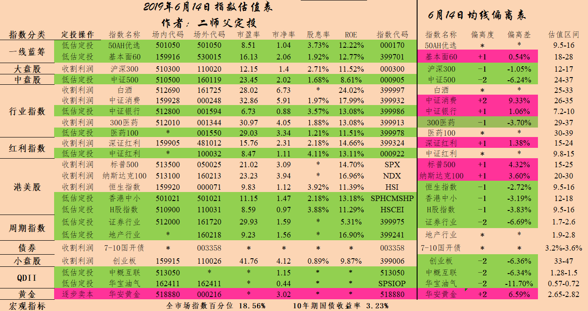

======================================================

_type: talk
@二师父[28814221155551]
2019-06-15 04:21:04 Sat  
topic_id: 111851142228482

<e type="hashtag" hid="145221248412" title="#关于黄金#" />

@若水三千 at 2019-06-15 04:21:04 Sat

> 师傅，黄金该如何估值？用什么指标或数据？

----------

@二师父 at 2019-06-15 04:21:04 Sat

> 金价

----------

阅读[3611]  评论[2]  赞[0] 

+++++++++++++++++++++++++++++++++++++++++++++++++++++

文件：
2019-06-15 04:19:12 Sat
文件大小：[76460]
15588524424882-黄金涨到300元每克，现在入场还来的及吗.docx

======================================================

_type: q&a
@志亮[422125851552828]
2019-06-15 11:36:34 Sat  
topic_id: 422182258482488

@志亮

>  二师父，科创版己上市了吧，券商6月11日己大涨了5点，利好出尽是利空，现在劵商这个周期指基还可以继续持有吗？

@二师父

>  可以持有，没问题的

阅读[3682]  评论[2]  赞[0] 

======================================================

_type: talk
@树叶[544811512145144]
2019-06-15 12:40:32 Sat  
topic_id: 244184428218541

<e type="hashtag" hid="142825811122" title="#定投周报#" /> 二师父定投周报第12期

阅读[3697]  评论[0]  赞[0] 

+++++++++++++++++++++++++++++++++++++++++++++++++++++

文件：
2019-06-15 12:40:32 Sat
文件大小：[283857]
28811852422451-二师父定投周报6.15（第12期）.docx

======================================================

_type: q&a
@醉流雨[422151445242248]
2019-06-15 22:30:32 Sat  
topic_id: 544814442115144

@醉流雨

>  请问二师傅，股票止损点设置多少合适，？多少点应该割肉，？

@二师父

>  10个点左右，不能接受止损就不要投资股票，选择低风险的指数基金定投即可

阅读[3554]  评论[0]  赞[0] 

======================================================

_type: talk
@二师父[28814221155551]
2019-06-16 03:49:15 Sun  
topic_id: 111851114854842

<e type="hashtag" hid="458484448258" title="#红利机会指数#" /> 不值得再入手啦

@凭栏观海 at 2019-06-16 03:49:15 Sun

> 佛陀智慧，菩萨心肠[强][强]

----------

@若水三千 at 2019-06-16 03:49:15 Sun

> 师傅，指数成份股不应有st股吧，为何标普红利指数竟然重仓了st银亿，是什么原因呢？谢谢老师解惑。

----------

@波 at 2019-06-16 03:49:15 Sun

> 谢谢二师父的教导!标普红利机会指数对应的场外基金(华宝红利基金501029和华宝红利基金C005125),我们就不要再买了,如果买了,以后也要逢高卖出。

----------

阅读[5799]  评论[3]  赞[0] 

+++++++++++++++++++++++++++++++++++++++++++++++++++++

文件：
2019-06-16 03:48:59 Sun
文件大小：[24675]
48811842541488-标普红利机会指数已经入坑了，你是否投资了.docx

======================================================

_type: talk
@二师父[28814221155551]
2019-06-16 03:55:07 Sun  
topic_id: 844184442184552

<e type="hashtag" hid="828552112852" title="#周年纪念#" /> <e type="web" href="https://h5.eqxiu.com/s/bPPE5wrr?from=groupmessage" title="二师父定投周年纪念册" cache="" />，生活需要仪式感，每一天与昨天不同，每一刻与昨天不同。定投也是。第一次做这种，虽然不够好，但是我用了心❤和情❤，感谢你们一路以来的陪伴和支持。未曾谋面，但相识相知，未来不管我走到哪里，我一定会一直记得你们，在我的生命中停留和驻足，感激不尽！

温馨提示，不要忘记了自己和爱人的周年纪念日，小心回家跪遥控板。

<e type="web" href="https://h5.eqxiu.com/s/bPPE5wrr?from=groupmessage" title="二师父定投周年纪念册" cache="" />

@凭栏观海 at 2019-06-16 03:55:07 Sun

> 感谢老师的辛苦付出和无私分享

----------

@王秦川 at 2019-06-16 03:55:07 Sun

> 唯有感恩[玫瑰][玫瑰][玫瑰]

----------

@Claire at 2019-06-16 03:55:07 Sun

> 认真阅读了师父的纪念册，满满的爱，满满的正能量。感恩相遇师父！相遇学友们！

----------

@云淡风轻 at 2019-06-16 03:55:07 Sun

> “心存感激，心怀善意。我们既仰望星空，追逐梦想;又脚踏实地，努力挣钱。”谢谢二师父满满的爱，满满的正能量[爱心]

----------

@大兵 at 2019-06-16 03:55:07 Sun

> 看到师父做的周年纪念日还是挺感动的，18年年中闺蜜介绍的师父微信公众号，从此结缘二师父，如获至宝，感觉人生遇见了导师一样，结束了以前盲目定投的状态（因为不会选基金全听别人说的）更别提全面配置的概念，从此每天早上上班车的第一件事就是微信开师父当天新发的文章，多么渴望尽快填补以前匮乏的财商知识，之后抱着试试的心态加入星球（当时心想就几十块钱，而且师父有提到过投资消费，投资自己），半年多以来感觉自己对指数定投认识有了太大的进步，现在依旧每天看师父公告发文，看星球，并且都及时画重点分享给老公也看，亲身体会就是跟着师父定投心态格局越来越大了，以前是每天晚上都要看看当天收益，现在晚上已经记不得这茬了可能过几天想起来了看一眼，每次看到师父很淡定的文章瞬间跟着变淡定了，相信未来一定会感谢自己的坚持！未来跟着师父继续前行！

----------

@二师父 at 2019-06-16 03:55:07 Sun

> 谢谢支持呀

----------

阅读[3514]  评论[6]  赞[0] 

+++++++++++++++++++++++++++++++++++++++++++++++++++++

图片：

======================================================

_type: talk
@起今知行[844188255581112]
2019-06-16 11:47:19 Sun  
topic_id: 422182222111488

二师父，低估指数基金定投的基础知识已经基本掌握了，想要进一步深入从哪块入手？

@杜志彪 at 2019-06-16 11:47:19 Sun

> 要想知道学的怎么样，必须下水试试才知道[呲牙]

----------

@起今知行 at 2019-06-16 11:47:19 Sun

> [捂脸]已经在水里了。就感觉单指数基金这块需要深入研究的挺多的，但不清楚从哪块继续深入。

----------

@起今知行 at 2019-06-16 11:47:19 Sun

> 不知道自己哪里不知道😂

----------

@凭栏观海 at 2019-06-16 11:47:19 Sun

> 可以试水了

----------

@潜龙 at 2019-06-16 11:47:19 Sun

> 我也是，觉得学的有点糊涂了，虽然边投边学，可又不知怎么学[晕]

----------

@杜志彪 at 2019-06-16 11:47:19 Sun

> 说白了就是在大盘指数不断下跌中买入低估指数基金，等到大盘上涨时分批卖出，也就是大家常说的微笑曲线定投法，目前就是在等指数选择方向，谁知道会向上，还是会向下，等着呗，定投是慢功夫，急性子做不了这个。

----------

@起今知行 at 2019-06-16 11:47:19 Sun

> 可能我没表达清楚我意思哈。我目前也是一直在坚持低估定投，跌多买多，没有急躁，也认同耐心长期持有基金这些理念。但基金定投入门容易，很短的时间就把这些基础知识掌握了，掌握了之后紧接着就感觉明显遇到了学习瓶颈，没法办进一步深入下去，想要深入研究却无从下手，比如说如何进一步优化投资组合等等。

----------

@潜龙 at 2019-06-16 11:47:19 Sun

> 我想问下你知道那个十年期国债收益率哪里有得看吗？不知道二师父是哪里找的

----------

阅读[3337]  评论[12]  赞[0] 

======================================================

_type: q&a
@田维海[422144441542418]
2019-06-16 14:01:43 Sun  
topic_id: 422182221452428

@田维海

>  师傅，中概互联指数介绍在哪里看得到？

@二师父

>  置顶往期文章里面有的

阅读[3397]  评论[0]  赞[0] 

======================================================

_type: q&a
@冯林锋[841551141441422]
2019-06-16 22:47:40 Sun  
topic_id: 244184441141421

@冯林锋

>  二师父，关于白银期货，有场内的基金推荐吗？前景如何

@二师父

>  不推荐投资这个哈

阅读[3298]  评论[1]  赞[0] 

======================================================

_type: q&a
@彩色[48415121851218]
2019-06-16 22:49:31 Sun  
topic_id: 244184412414551

@彩色

>  二师父，根据目前恒生国企的估值，请问恒生国企指数预计占总仓位的比重为多少比较合适呢？另外由于某些事件，是不是可以慢慢定投，估计短期呈下跌趋势？

@二师父

>  趋势没法预测，历史最低市盈率6倍多，最大下跌幅度大概26个百分点，你根据这个控制下仓位，现在还没有到达最底部
>  
>  当然，股市很难预测，只有牛市来了才知道底部在哪里

阅读[3359]  评论[1]  赞[0] 

======================================================

_type: talk
@二师父[28814221155551]
2019-06-17 03:41:08 Mon  
topic_id: 244184411852841

<e type="hashtag" hid="458484852218" title="#定投即修行，涨跌皆炼心#" /> 做到这几点，你的基金定投将没有风险

阅读[5859]  评论[0]  赞[0] 

+++++++++++++++++++++++++++++++++++++++++++++++++++++

文件：
2019-06-17 03:40:20 Mon
文件大小：[25297]
88811888545122-做到这几点，你的基金定投将没有风险.docx

======================================================

_type: talk
@二师父[28814221155551]
2019-06-17 12:49:21 Mon  
topic_id: 244122885428511

<e type="hashtag" hid="881251425252" title="#鳄鱼计划#" /> 买入500etf一份，券商etf一份，定投即修行，涨跌皆炼心

@奔波儿霸🐟🐠🐬🐳🐋💦 at 2019-06-17 12:49:21 Mon

> 之前因为没有场内户头，所以只参与场外定投了，开好华泰后一直在按照网格操作表格里那五个，这个鳄鱼计划可以和网格合并操作吗？就是买入和卖出看鳄鱼和网格，触发哪个条件就按哪个条件执行，请师父指示。

----------

@rtdmm小米 at 2019-06-17 12:49:21 Mon

> 鳄鱼出击一次，定投即修行！

----------

@二师父 at 2019-06-17 12:49:21 Mon

> 可以的啊，直接遵循一个策略比较简单，不用费太多心思

----------

@二师父 at 2019-06-17 12:49:21 Mon

> 可以买

----------

@奔波儿霸🐟🐠🐬🐳🐋💦 at 2019-06-17 12:49:21 Mon

> 嗯，那我还是继续网格表里的五只吧，不在表里的参与鳄鱼计划，以免重复投入仓位和节奏搞乱了。

----------

@冉冉 at 2019-06-17 12:49:21 Mon

> 师傅，鳄鱼计划场外定投的可以进行吗？您鳄鱼计划中的券商与您网格交易中的券商是同一交易代码吗？

----------

@二师父 at 2019-06-17 12:49:21 Mon

> 场外低估定投即可，代码都一样的

----------

阅读[5815]  评论[12]  赞[0] 

======================================================

_type: q&a
@J[28281541518551]
2019-06-17 16:46:46 Mon  
topic_id: 544855114422884

@J

>  师傅好，请问您鳄鱼计划场内每份的资金是场外每份的多少倍？鳄鱼计划是不定期吗？还是遵循偏离度每周定投一次的频率？这个交易时点我一直没搞清晰。另外，鳄鱼计划和网格交易二者的对比能具体给我们分析下吗？谢谢

@二师父

>  3倍，这个不定期很少操作，偏离度只是一个参考，等你投资长了自然知道何时买入，新手每周四固定扣款就可以了。网格交易是固定的均线定投，价格不变

阅读[3401]  评论[1]  赞[0] 

======================================================

_type: q&a
@平安幸福[244124188281811]
2019-06-17 22:56:24 Mon  
topic_id: 244122881542881

@平安幸福

>  二师父，深证红利和深证基本面60前十重仓股好多都是相同，为啥估值相差那么大，一个低估，一个正常？估值是根据什么来估的？谢谢

@二师父

>  这个是根据博格公式市盈率估值方法来的
>  
>  我查阅了持仓股票，基本面60持仓股票是格力电器，美的集团，万科A，平安银行，潍柴动力。
>  
>  深红利的持仓股票是格力电器，美的集团，五粮液，温氏股份，万科A
>  
>  有些不同，银行地产金融股票的估值相对低一些，而消费类股票估值高一些，这可以定性从股票估值的角度分析

阅读[3108]  评论[0]  赞[0] 

======================================================

_type: q&a
@马军[421482415512448]
2019-06-17 22:58:49 Mon  
topic_id: 544855118144524

@马军

>  二师傅天天基金网我已跟投你的组合，但之后的跟投好像无法一键买入，很不方便，还是我操作有误

@二师父

>  这个跟你说声抱歉，我是之后才知道他们后面的跟投功能没有完善
>  
>  不过我和天天的工作人员沟通过，近期他们就会尽快推出这个功能，请耐心等待哈

阅读[3288]  评论[0]  赞[0] 

======================================================

_type: talk
@二师父[28814221155551]
2019-06-17 23:11:14 Mon  
topic_id: 422155855555858

<e type="hashtag" hid="142511142112" title="#格局重塑#" /> 你的心理状态决定了你的格局，你的格局决定了你的结局

若计较，处处羁绊，若释怀，眼见晴天

对人不必计较，对事不必执着。更容易释怀。

刚刚四川地震，愿安好🙏🙏🙏🙏🙏🙏

阅读[3301]  评论[0]  赞[0] 

======================================================

_type: talk
@二师父[28814221155551]
2019-06-18 03:52:40 Tue  
topic_id: 244122824511221

<e type="hashtag" hid="481211145528" title="#指数估值#" /> 黄金没有突破，一直再将，记得即使止盈哈，分步止盈。

其他的估值没啥变化，指数调仓导致部分估值下移。

@[123456789* at 2019-06-18 03:52:40 Tue

> 估值阈值有变化吗？[微笑]

----------

@二师父 at 2019-06-18 03:52:40 Tue

> 还没有

----------

阅读[5547]  评论[2]  赞[0] 

+++++++++++++++++++++++++++++++++++++++++++++++++++++

图片：

======================================================

_type: talk
@二师父[28814221155551]
2019-06-18 03:53:47 Tue  
topic_id: 422155852411528

<e type="hashtag" hid="228585415281" title="#愿一切安好#" />

@凭栏观海 at 2019-06-18 03:53:47 Tue

> 金石之言

----------

阅读[5985]  评论[2]  赞[0] 

+++++++++++++++++++++++++++++++++++++++++++++++++++++

文件：
2019-06-18 03:53:20 Tue
文件大小：[110800]
15588554851212-四川宜宾突发地震，与生死相比，股市涨跌皆浮云.docx

======================================================

_type: talk
@Siller[244184228451851]
2019-06-18 12:31:31 Tue  
topic_id: 422155828151848

今天的新债值得申购，AAA级，环境发债（783200）。

@别皱眉头 at 2019-06-18 12:31:31 Tue

> 是这样吗？

----------

@别皱眉头 at 2019-06-18 12:31:31 Tue

> 是发债，不是转债，也没问题吗？

----------

@上上签 at 2019-06-18 12:31:31 Tue

> 可转债，AAA级，破发可能性低，一上市就卖，能盈利的可能比较大，建议可以去申购，我也申购

----------

@别皱眉头 at 2019-06-18 12:31:31 Tue

> 😂看到晚了，过时间了

----------

@雨的依恋 at 2019-06-18 12:31:31 Tue

> 可转债申购中签了什么时候卖？

----------

@别皱眉头 at 2019-06-18 12:31:31 Tue

> 一上市就卖啊

----------

@上上签 at 2019-06-18 12:31:31 Tue

> 一般情况下都是一上市就卖出就好了，但是如果破发了。AAA级别的可转债，如果资金宽限的话，我认为可以不卖出，一、坐等回本就卖出(经济一旦利好，比较大概率的可能)，二、坐等牛市就好了(时间问题罢了，可能说是一定的事)。如果对于资金型流动性需求比较强的伙伴，也可以一上市就卖出，个人看法建议。

----------

@雨的依恋 at 2019-06-18 12:31:31 Tue

> 感谢耐心讲解[强]

----------

阅读[3241]  评论[8]  赞[0] 

======================================================

_type: q&a
@J[28281541518551]
2019-06-18 13:07:15 Tue  
topic_id: 844122848442842

@J

>  师父，您好，科创板开通后会带来券商板块的短期上涨吗？券商您是场外低估定投+鳄鱼计划+网格交易都同时进行吗？还是只选其一？另外，关于鳄鱼计划，偏离比例在-6%至-12%区间都属于-2偏离值，请问这个区间内投入的资金应如何分配？比如：上周偏离-6，今周偏离-8，下周偏离-10，那应该分别投入多少？

@二师父

>  主要是低估定投加鳄鱼计划。偏离在负2偏离度买入一份即可，定投不需要预测短期涨跌的

阅读[3362]  评论[8]  赞[0] 

======================================================

_type: q&a
@冉冉[88445118854412]
2019-06-18 16:48:51 Tue  
topic_id: 244122842418841

@冉冉

>  请问二师傅，沪伦通6月17日正式启动，首家券商华泰证券周四上市对上证A股短期、长期有什么影响？

@二师父

>  股市涨跌没法预测，他是多方合力的作用，不仅受到这个影响，还有汇率，国际局势，投资者情绪，大额资金流动情况

阅读[3379]  评论[0]  赞[0] 

======================================================

_type: talk
@二师父[28814221155551]
2019-06-18 21:17:48 Tue  
topic_id: 111844585512522

<e type="hashtag" hid="552881825414" title="#偏离表#" /> 海盗做的偏离表，黄金1个偏离度，可以逐步卖出，油气偏离度越来越大了

@那只小鳄123 at 2019-06-18 21:17:48 Tue

> 二师父，华宝油气的实时净值在哪儿能看到。也看不到是否溢价。

----------

@上上签 at 2019-06-18 21:17:48 Tue

> 可以下载一个·万得股票·的APP查看

----------

@那只小鳄123 at 2019-06-18 21:17:48 Tue

> 嗯好的，谢谢~

----------

阅读[3317]  评论[3]  赞[0] 

+++++++++++++++++++++++++++++++++++++++++++++++++++++

图片：
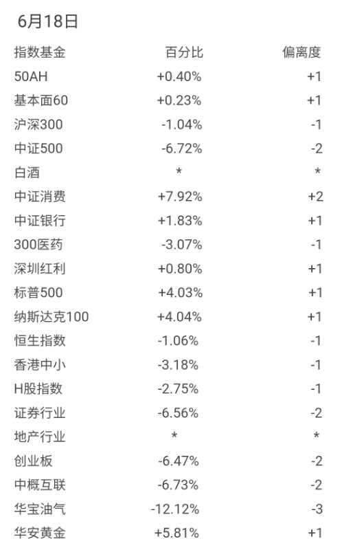

======================================================

_type: talk
@二师父[28814221155551]
2019-06-19 04:13:45 Wed  
topic_id: 422155815115818

<e type="hashtag" hid="481211145528" title="#指数估值#" /> 估值表，医药正常估值了，我蛋卷的医药100大概盈利10个点，天天的盈利大概盈利2个点，那是新开的实盘，不太一样，收不收割利润还是看自己的盈利情况了，每个人投资的时机不同，自然盈利也不同。

黄金我准备明后天卖出5成仓位，不贪心，资金用来定投更低估的指数。

@冉冉 at 2019-06-19 04:13:45 Wed

> 师傅，能把调仓后指数基金的估值阈值公布一下吗？

----------

@二师父 at 2019-06-19 04:13:45 Wed

> 置顶估值表有

----------

@冉冉 at 2019-06-19 04:13:45 Wed

> 好的，谢谢二师傅

----------

@闲云 at 2019-06-19 04:13:45 Wed

> 二师父，天天基金红利再投资选项怎么找不到了呢？

----------

@闲云 at 2019-06-19 04:13:45 Wed

> 我五月定投的医药100，没有盈利，现在暂停吗？

----------

@二师父 at 2019-06-19 04:13:45 Wed

> 是的，等待后面低估再定投

----------

阅读[3196]  评论[6]  赞[0] 

+++++++++++++++++++++++++++++++++++++++++++++++++++++

图片：

======================================================

_type: talk
@二师父[28814221155551]
2019-06-19 04:15:05 Wed  
topic_id: 244122812112281

<e type="hashtag" hid="145255528842" title="#放弃预测#" /> 有利好，但是我们放弃预测，坚定做自己的定投

@.Five at 2019-06-19 04:15:05 Wed

> As usual 和平常一样~

----------

@rtdmm小米 at 2019-06-19 04:15:05 Wed

> 证券（512000）偏离度_2出击是正确的

----------

阅读[3387]  评论[2]  赞[0] 

+++++++++++++++++++++++++++++++++++++++++++++++++++++

文件：
2019-06-19 04:14:14 Wed
文件大小：[24081]
48811558441518-现利好，人民币、美股、油都开始涨，对A股有影响吗.docx

======================================================

_type: talk
@奔波儿霸🐟🐠🐬🐳🐋💦[544884444514584]
2019-06-19 09:27:28 Wed  
topic_id: 422155544241818

银行1.07卖一份，券商看有没有机会0.92卖一份。

@奔波儿霸🐟🐠🐬🐳🐋💦 at 2019-06-19 09:27:28 Wed

> 券商0.92也卖了一份

----------

@丸子妈 at 2019-06-19 09:27:28 Wed

> 你们是网格交易吗

----------

@奔波儿霸🐟🐠🐬🐳🐋💦 at 2019-06-19 09:27:28 Wed

> 网格啊，其他跟师父鳄鱼。

----------

阅读[3223]  评论[3]  赞[0] 

======================================================

_type: q&a
@冉冉[88445118854412]
2019-06-19 11:45:55 Wed  
topic_id: 244122258251181

@冉冉

>  请问二师傅，现在仓位几层比较合适？

@二师父

>  7成左右，看自己情况

阅读[3207]  评论[0]  赞[0] 

======================================================

_type: talk
@二师父[28814221155551]
2019-06-19 11:48:24 Wed  
topic_id: 111844425854442

<e type="hashtag" hid="142448285212" title="#卖出提示#" /> 黄金卖出5成仓位，这是之前18年投资的，当时在蛋卷买的场外基金，不贪心，我不排除卖了以后继续飙涨，仅个人操作记录，不做任何参考

阅读[5537]  评论[0]  赞[0] 

======================================================

_type: talk
@二师父[28814221155551]
2019-06-20 02:41:10 Thu  
topic_id: 844122281415542

<e type="hashtag" hid="481211145528" title="#指数估值#" /> 变化不大，黄金又降了点，真的别太贪心。

阅读[2643]  评论[0]  赞[0] 

+++++++++++++++++++++++++++++++++++++++++++++++++++++

图片：
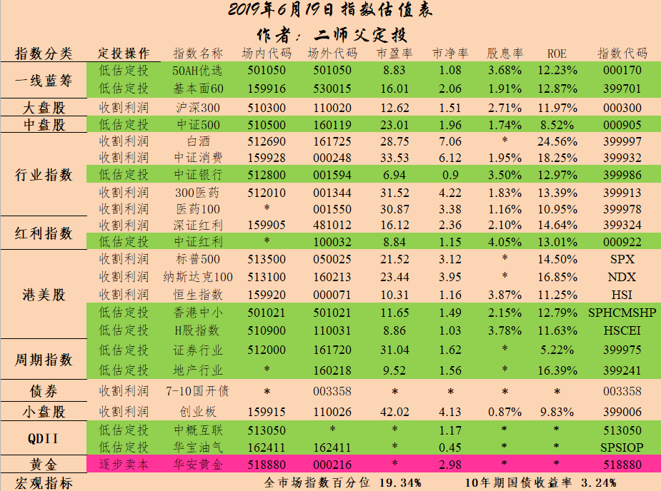

======================================================

_type: talk
@二师父[28814221155551]
2019-06-20 02:42:14 Thu  
topic_id: 544855518482124

<e type="hashtag" hid="228588452811" title="#指数调仓#" /> 指数调仓对我们的影响，详看本文。

阅读[2812]  评论[0]  赞[0] 

+++++++++++++++++++++++++++++++++++++++++++++++++++++

文件：
2019-06-20 02:41:43 Thu
文件大小：[25429]
15588444484822-指数基金调仓，对标普红利等指数有何影响.docx

======================================================

_type: talk
@二师父[28814221155551]
2019-06-20 02:59:13 Thu  
topic_id: 111844458185442

<e type="hashtag" hid="881422852442" title="#定投实盘#" /> 买入标的和比例如下，具体操作在天天基金有展示，跟投功能正在完善中，等官方消息。

@速。冻 at 2019-06-20 02:59:13 Thu

> 地产和证券怎么不买了？

----------

@rtdmm小米 at 2019-06-20 02:59:13 Thu

> 请问二师父，证券还是低估，怎么不定投了呢？

----------

@竹露清响 at 2019-06-20 02:59:13 Thu

> 请问今天的50AH定投比例怎么比上周提高了？

----------

@李依祚 at 2019-06-20 02:59:13 Thu

> 我也有同样的疑问

----------

@冉冉 at 2019-06-20 02:59:13 Thu

> 师傅，我怎么看见您定投实盘中写有”卖出提示”，卖出什么基金，请师傅明示，谢谢。

----------

@竹露清响 at 2019-06-20 02:59:13 Thu

> 我想应该是因为低估可供定投的品种变少的缘故吧！

----------

@rtdmm小米 at 2019-06-20 02:59:13 Thu

> 二师父上班时间同大家不一样？

----------

@A0洪氏日杂批发 at 2019-06-20 02:59:13 Thu

> 今天券商涨停

----------

阅读[5343]  评论[19]  赞[0] 

+++++++++++++++++++++++++++++++++++++++++++++++++++++

图片：
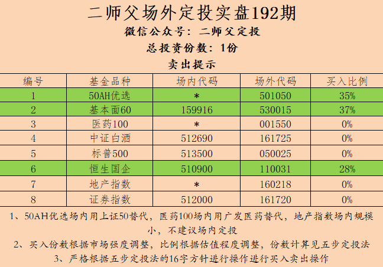

======================================================

_type: talk
@二师父[28814221155551]
2019-06-20 11:50:34 Thu  
topic_id: 844122224288512

<e type="hashtag" hid="881251425252" title="#鳄鱼计划#" /> 券商卖出一份，昨天晚上暂停了券商和地产的定投，第一是控制仓位，第二利好来了一般券商会暴拉，今天果然是。盈利不错，大家继续加油

@凯 at 2019-06-20 11:50:34 Thu

> 已卖出一份

----------

@凯 at 2019-06-20 11:50:34 Thu

> 银行1.1也卖了一份

----------

@青青竹 at 2019-06-20 11:50:34 Thu

> 我一早上看涨了1个多点，总得超过4%了，就卖出了1份券商1份银行1份中概互联[捂脸][捂脸][捂脸]

----------

@芥末 at 2019-06-20 11:50:34 Thu

> 以后有类似的情况，建议二师父提前在星球发布消息，我也周四定投，平时不关注利好消息，今天一早就被扣款了[撇嘴]

----------

@青青竹 at 2019-06-20 11:50:34 Thu

> 并且全都按计划自动定投了😂

----------

@二师父 at 2019-06-20 11:50:34 Thu

> 我昨天发布了定投实盘的，凌晨，你可以看看，利好我也写过，不过涨跌这个没人能预测

----------

@JOY at 2019-06-20 11:50:34 Thu

> 3点前一般可以取消的

----------

@乖子 at 2019-06-20 11:50:34 Thu

> 如果我投的一份1000，那我卖出也是卖1000整？小白[害羞]

----------

阅读[4988]  评论[15]  赞[0] 

======================================================

_type: q&a
@青鸟飞鱼、此生不换[844111545424582]
2019-06-20 12:52:48 Thu  
topic_id: 111844441112512

@青鸟飞鱼、此生不换

>  通过老师的二维码开户的华泰，场内基金费用是怎么算的呀？还有场内是T+1吗？app里哪里可以查询呢？

@二师父

>  基金免5万1，及时成交的，涨乐财富通

阅读[2565]  评论[0]  赞[0] 

======================================================

_type: talk
@二师父[28814221155551]
2019-06-20 13:05:35 Thu  
topic_id: 111844441812452

<e type="hashtag" hid="551211821484" title="#告别穷人思维，你会慢慢变富#" />之前答应过大家帮助读者及家人普及财商，这是最基本的财商入门课程，如果你得家人对理财一无所知，可以分享给他们。穷人的本质是因为思维。过于关注股市涨跌的本身就是穷人思维的一种。学着用富人思维替代，学着慢慢变富。你会发现真正的理财和你得认知是不一样的。

 穷人和富人的本质区别在于思维认知。在这门课程中二师父会帮助你认识自身的穷人思维，然后教你如何用富人思维替代自己的穷人思维，从而慢慢变富。

本课程星球学员免费，算是星球学员的一个福利。<e type="web" href="http://weike.fm/aIroX1" title="http://weike.fm/aIroX1" />，点击优惠链接即可，不行的话先点进然后复制发到微信上。

课程8章内容。

一、金钱的认识

二、理财的本质

三、你一直处于贫穷的根本原因

四、富人思维

五、建立自己的梦想相册

六、积累自己的第一桶金

七、利用四个账户打理自己的资金

八、开启财务自由之路的第一步

一、这个课程适合哪些人

1、适合对零基础的理财小白

没有投资意识，看着自己的钱存入银行贬值的朋友

2、适合处于贫困线以下的朋友

穷人穷思维，一直身陷穷困境地想改变却无能为力的朋友需要来改变自己的穷人思维

3、适合内心里还有希望和梦想的人

生活的艰辛和生存的压力让很多人已经丢掉了学生时代的梦想，这是人一生最大的悲哀，因为哀莫大于心死。在这门课程里二师父会告诉你梦想在我们实现财务自由过程中的重要作用。希望不灭，光明永生。

@乖子 at 2019-06-20 13:05:35 Thu

> 我点进去听不了课，微信也扫不开

----------

@二师父 at 2019-06-20 13:05:35 Thu

> 把链接复制到微信

----------

@乖子 at 2019-06-20 13:05:35 Thu

> 复制到微信哪个地方？大家都可以打开吗？感觉好奇怪哦，我打不开

----------

@二师父 at 2019-06-20 13:05:35 Thu

> 发到微信对话

----------

@乖子 at 2019-06-20 13:05:35 Thu

> 好了[憨笑]

----------

@闲云 at 2019-06-20 13:05:35 Thu

> 老是让分享朋友圈

----------

@陈飞🤗 at 2019-06-20 13:05:35 Thu

> 怎么点进去还要收费才能听

----------

@二师父 at 2019-06-20 13:05:35 Thu

> 过了免费时间

----------

阅读[5476]  评论[9]  赞[0] 

======================================================

_type: q&a
@汉尼拔[552144155244]
2019-06-20 13:52:14 Thu  
topic_id: 844122221514522

@汉尼拔

>  昨天和今天上证50、中正银行和基本面盈利了一些，今天需要卖一点么？等到大盘低过2900再买

@二师父

>  我没法预测大盘还能不能跌到2900，如果你不是急着用钱或者仓位过重就别卖

阅读[2695]  评论[1]  赞[0] 

======================================================

@二师父[28814221155551]
2019-06-20 14:18:39 Thu  
topic_id: 844122221881152

>  @二师父
>  

阅读[2780]  评论[0]  赞[0] 

======================================================

_type: talk
@奔波儿霸🐟🐠🐬🐳🐋💦[544884444514584]
2019-06-20 14:25:16 Thu  
topic_id: 111844448425852

单位来检查的，错过了卖银行和券商，[发怒]

@二师父 at 2019-06-20 14:25:16 Thu

> 还没休市呢，哈哈，反正现在不贵

----------

@奔波儿霸🐟🐠🐬🐳🐋💦 at 2019-06-20 14:25:16 Thu

> 果然没给机会，看明天吧，看来每天早上就应该挂一波卖出和买入。

----------

阅读[2731]  评论[2]  赞[0] 

======================================================

_type: talk
@二师父[28814221155551]
2019-06-20 14:38:11 Thu  
topic_id: 544855558518244

上证指数突破5日均线，短期上涨的信号，但是没有放量，至于是否上涨进一步确定

放弃预测，按照策略来，网格挣点小钱，真的实现资产翻倍需要有大额资金重仓指数，然后等待一轮超级大牛市，否则无法实现阶层跃迁

那么问题来了，你是否有足够的资金，你是否有耐心等待超级牛市的到来

@曾来 at 2019-06-20 14:38:11 Thu

> 师父，今天白酒出不出一点？

----------

@二师父 at 2019-06-20 14:38:11 Thu

> 可以出，估值挺高了

----------

@二师父 at 2019-06-20 14:38:11 Thu

> 定投就是一步步积累的

----------

@曾来 at 2019-06-20 14:38:11 Thu

> 收到！

----------

@凭栏观海 at 2019-06-20 14:38:11 Thu

> 金石之言，逐步布局指数基金，加大仓位，迎接牛市到来！

----------

@自由飞翔 at 2019-06-20 14:38:11 Thu

> 今天券商在0.91和0.959各卖了一次

----------

@志亮 at 2019-06-20 14:38:11 Thu

> [微笑]对呀，那么问题来了，我们不一定有足够的耐心等待到牛市的到来了呀，所以也只能坚持定投了

----------

阅读[2860]  评论[8]  赞[0] 

+++++++++++++++++++++++++++++++++++++++++++++++++++++

图片：
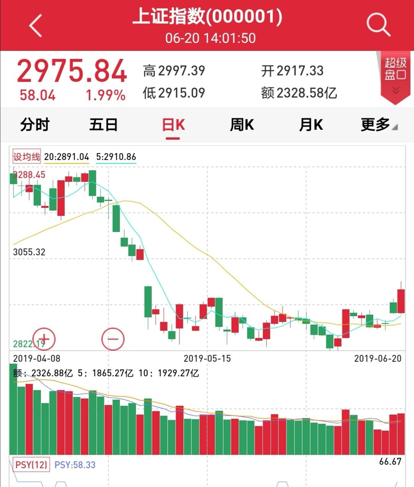

======================================================

_type: q&a
@堂吉诃德的小助手[15528821588422]
2019-06-20 14:53:51 Thu  
topic_id: 111844448412422

@堂吉诃德的小助手

>  二师傅，我如何能判断当天华宝油气的涨跌呢？我想在跌的时候定投，但是如何判断当天涨跌呢？

@二师父

>  你用涨乐财富通，关注华宝油气，然后就能看到啦，当天涨跌会显示

阅读[2996]  评论[2]  赞[0] 

======================================================

_type: q&a
@曾来[841555815828282]
2019-06-20 15:18:42 Thu  
topic_id: 111844448141582

@曾来

>  师父，今天已经减仓一份招商证券，大部分招商白酒，小部分国证食品饮料指数分级，收割了易方达中小盘混合，兴全合润，华安策略优选混合，后边三个混合基金是上次听从师父建议，找时机慢慢分批退出来，寻机会转到师父推荐的指数基金。这操作今天没啥问题吧？如果合适以后就按这个节奏调整

@二师父

>  主要看你的仓位，仓位压力不大，上涨也不后悔买少了就没有问题

阅读[3064]  评论[3]  赞[0] 

======================================================

_type: talk
@二师父[28814221155551]
2019-06-20 16:39:51 Thu  
topic_id: 544855541822184

<e type="hashtag" hid="828588184282" title="#指数加权的四种方式#" /> 市值加权，根据持仓股票的市值分配权重，市值越大股票权重越大

等权重，每只股票的权重一样

基本面加权，根据基本面情况分配权重，比如基本面50指数

按照波动率加权，风险和收益成正比，所以选择低波动率的股票，波动率低的股票权重大

阅读[2996]  评论[0]  赞[0] 

======================================================

_type: q&a
@空瓶子[88282241812242]
2019-06-20 19:09:01 Thu  
topic_id: 844122242214822

@空瓶子

>  二师父，想问下您，华宝油气怎么说明现在的估值低？是历史同比吗？这个基金的走势是和美股有相关吗？有哪些因子呢

@二师父

>  看布油价格

阅读[3061]  评论[6]  赞[0] 

======================================================

_type: talk
@二师父[28814221155551]
2019-06-21 02:09:13 Fri  
topic_id: 544855481524424

<e type="hashtag" hid="828582528852" title="#大赚靠心性#" />

阅读[5518]  评论[0]  赞[0] 

+++++++++++++++++++++++++++++++++++++++++++++++++++++

文件：
2019-06-21 02:08:57 Fri
文件大小：[25630]
51188542454584-小赚靠定投策略，大赚靠什么.docx

======================================================

_type: talk
@二师父[28814221155551]
2019-06-21 02:10:06 Fri  
topic_id: 244122418254481

<e type="hashtag" hid="481211145528" title="#指数估值#" /> 证券进入正常估值了，可以停止定投。

阅读[5615]  评论[1]  赞[0] 

+++++++++++++++++++++++++++++++++++++++++++++++++++++

图片：
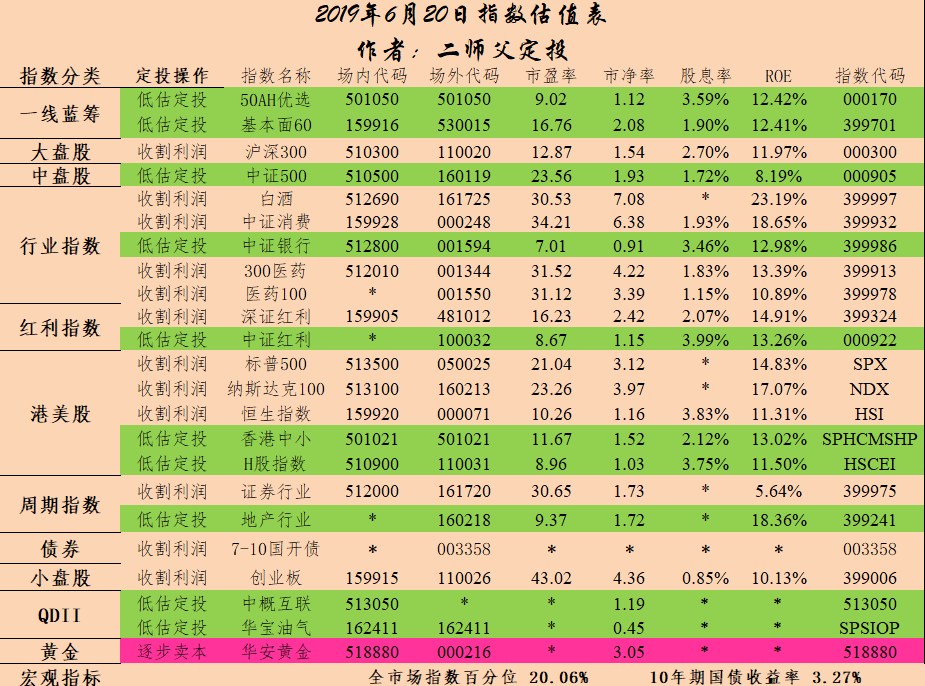

======================================================

_type: talk
@奔波儿霸🐟🐠🐬🐳🐋💦[544884444514584]
2019-06-21 09:46:02 Fri  
topic_id: 544855485458484

券商0.95卖一份，看银行有没有机会1.1卖一份吧。互联1.25估计够呛。

@杜志彪 at 2019-06-21 09:46:02 Fri

> 券商ETF网格最低0.823元，你们怎么有这么多份呢，我只在0.85买了一份网格，你们是不是搞错了。

----------

@奔波儿霸🐟🐠🐬🐳🐋💦 at 2019-06-21 09:46:02 Fri

> 表里是0.85建立底仓十份啊

----------

@杜志彪 at 2019-06-21 09:46:02 Fri

> 哦对的，我忘了。

----------

阅读[2456]  评论[3]  赞[0] 

======================================================

_type: talk
@不再YY的猪[422118542885848]
2019-06-21 10:20:07 Fri  
topic_id: 844122412112842

黄金太疯狂了

阅读[2536]  评论[0]  赞[0] 

======================================================

_type: talk
@别皱眉头[244148458815141]
2019-06-21 11:00:42 Fri  
topic_id: 422155212882488

我想请问各位老师，如何查看某只指数基金60日或90日的均线价格？[疑问][疑问]

@杜志彪 at 2019-06-21 11:00:42 Fri

> 场内的可以看，自己设就行了。

----------

@别皱眉头 at 2019-06-21 11:00:42 Fri

> 请问怎么看？怎么设？能说详细点吗？谢谢啦

----------

@一阵风 at 2019-06-21 11:00:42 Fri

> 

----------

@别皱眉头 at 2019-06-21 11:00:42 Fri

> @一阵风，谢谢你的解答，我要如何在我的软件上设置呢？我看了下我的，显示的和你的不一样……

----------

@一阵风 at 2019-06-21 11:00:42 Fri

> 找到软件的设置K线或均线，数值调到，60，90

----------

阅读[2564]  评论[5]  赞[0] 

======================================================

_type: talk
@别皱眉头[244148458815141]
2019-06-21 11:25:14 Fri  
topic_id: 544855484518114

关于卖出，我有一点疑问，不知道具体怎样更好一些，还请老师或者二师父帮忙指点。在场内卖出的时候，第一次卖出以后，比如最开始是10000，盈利10%后变成11000，卖出1000的份额后，持仓显示不是显示10000，而是成本降低，盈利那还是显示11000……如何计算第二次卖出的点呢？

@rtdmm小米 at 2019-06-21 11:25:14 Fri

> 看市值

----------

@别皱眉头 at 2019-06-21 11:25:14 Fri

> ？？如何看？

----------

@一阵风 at 2019-06-21 11:25:14 Fri

> 记下盈利金额和总投入金额，比如说，投入10000元，第一次获利10%卖出，赚了1000元，到第2次，又上涨已经有2500的盈利，2500元-上次1000元=1500，再1500/10000*100=15%就是第2次的收益率。

----------

@别皱眉头 at 2019-06-21 11:25:14 Fri

> 太感谢啦，谢谢你的耐心解答，[西瓜][西瓜]

----------

阅读[2597]  评论[4]  赞[0] 

+++++++++++++++++++++++++++++++++++++++++++++++++++++

图片：
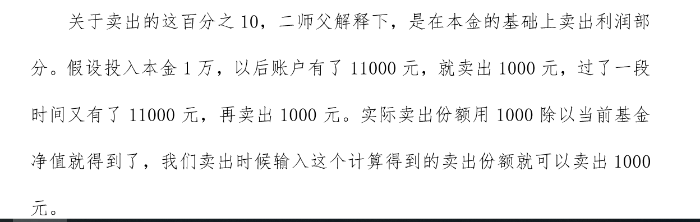

======================================================

_type: q&a
@幻水[881185412112]
2019-06-21 12:18:48 Fri  
topic_id: 544855484228114

@幻水

>  你好，我深市和沪市要保留一天定的股票市值打新。这些股票可能不去操作，请问我应该配哪些股票比较好？用来保持市值打新的，请推荐几个股票，谢谢。

@二师父

>  你好，不推荐股票，买股票选择优质蓝筹或者成长股。对股票投资有兴趣可以听听我的股票课程

阅读[2590]  评论[0]  赞[0] 

======================================================

@二师父[28814221155551]
2019-06-21 12:53:43 Fri  
topic_id: 422155144512148

>  @二师父
>  

阅读[2587]  评论[1]  赞[0] 

======================================================

_type: talk
@二师父[28814221155551]
2019-06-21 12:56:35 Fri  
topic_id: 844122155455122

黄金卖早了，还有一半仓位等待时机全部卖出，没有人能预测顶点，卖在相对高位就行，即使到高估了，仍旧会继续涨，市场总是非理性的，这也是超额收益的源泉

@笋子 at 2019-06-21 12:56:35 Fri

> 今天中证白酒可以清仓嘛

----------

@二师父 at 2019-06-21 12:56:35 Fri

> 清仓还早

----------

@笋子 at 2019-06-21 12:56:35 Fri

> 那现在已经清了就等下次稍微低点再进了！是吗谢谢二师傅回答

----------

@不再YY的猪 at 2019-06-21 12:56:35 Fri

> 我卖的更早。。。1320就卖了，没想到能涨到1400

----------

@笋子 at 2019-06-21 12:56:35 Fri

> 嗯嗯哎那没办法

----------

@笋子 at 2019-06-21 12:56:35 Fri

> 赚点也好了

----------

阅读[2608]  评论[6]  赞[0] 

======================================================

_type: q&a
@彩色[48415121851218]
2019-06-21 15:08:26 Fri  
topic_id: 844122155425122

@彩色

>  二师父，其实我现在有个疑问：我的沪深300占仓位百分之10，我想进一步聚焦投资标的，可以把300(今天是盈利6个点)全部卖出，换成50ah(仓位10%)和恒生国企(仓位5%)不？这样聚焦后，主要是50ah 基本面60 医药 100 地产和券商了。

@二师父

>  没必要换仓，50ah里面的股票在沪深300也有，换了也是多加了手续费，本质没啥区别，恒生国企可以，这个比沪深300低估一些

阅读[2606]  评论[1]  赞[0] 

======================================================

_type: q&a
@幻水[881185412112]
2019-06-21 20:17:32 Fri  
topic_id: 111844824228242

@幻水

>  3999001深证成份股指数
>  百度上说：深证成份股指数，是深圳证券交易所编制的一种成份股指数，是从上市的所有股票中抽取具有市场代表性的500家上市公司的股票作为计算对象，并以流通股为权数计算得出的加权股价指数，综合反映深交所上市A、B股的股价走势。
>  现在请问：
>  问题一：百度上这个解释对吗？
>  问题二：是不是可以这样理解，3999001是流通市值最大的500只股票组成的？

@二师父

>  你把代码搞错了，399001，不对，仔细看编制规则要在样本空间里面选择，是样本空间里面日均总市值最大的500只股票

阅读[2392]  评论[0]  赞[0] 

======================================================

_type: q&a
@背心[51441214442224]
2019-06-21 20:41:51 Fri  
topic_id: 111844828484182

@背心

>  师傅您在天天基金网的场外定投实盘，可以场内购买吗？需要注意什么。今天又买了点场内的银行ETF.. ，没有问题吧，谢谢

@二师父

>  可以场内购买，注意溢价，然后地产不建议场内购买，地产指数场内规模太小

阅读[2543]  评论[0]  赞[0] 

======================================================

_type: q&a
@志亮[422125851552828]
2019-06-21 20:49:28 Fri  
topic_id: 544855828428884

@志亮

>  二师父，我发现场内“白酒B(150270)”和场内“招商中证白酒指数分级(161725)”都是招商的，为何涨幅场内的比场外的高这么多，场内“白酒B”是不是比场外的好？场内的值得买不？

@二师父

>  两个不是一回事，分级基金有母基金和子基金。场外的是母基金，场内b是带杠杆的子基金，所以涨幅大，并不是说他就比场外好

阅读[2714]  评论[6]  赞[0] 

======================================================

_type: q&a
@俗人[844151888542152]
2019-06-22 02:22:20 Sat  
topic_id: 422155184128818

@俗人

>  最近买了51200etf券商，向二师傅请教，什么时候适合卖出

@二师父

>  关于卖出是门学问，新手看置顶文章五步定投法，用利润收割逐步在正常估值的时候卖出，等待高估逐步清仓

阅读[2506]  评论[0]  赞[0] 

======================================================

_type: q&a
@志亮[422125851552828]
2019-06-22 02:23:49 Sat  
topic_id: 544855812844154

@志亮

>  二师父，证券己进入正常估值了，那场内券商ETF还可以做网络交易不？

@二师父

>  可以根据我们的网格交易价格表逐步卖出，建立底仓目前不适合了，也要停止定投券商指数

阅读[2651]  评论[0]  赞[0] 

======================================================

_type: talk
@二师父[28814221155551]
2019-06-22 04:05:21 Sat  
topic_id: 422155188428418

<e type="hashtag" hid="145558545282" title="#外资涌入A股#" /> 外资进一步涌入A股，短期长期均是利好，我们坚持做好自己的定投就行

@杜志彪 at 2019-06-22 04:05:21 Sat

> 券商涨的太快，上次华泰没到止盈区域，回撤破60天线，盈利10%卖出，年线附近利用网格买回，看好这次40%止盈，二师父节奏踩的很到位[强]

----------

@二师父 at 2019-06-22 04:05:21 Sat

> 有自己的一套系统就行，那就很难亏了

----------

阅读[5564]  评论[2]  赞[0] 

+++++++++++++++++++++++++++++++++++++++++++++++++++++

文件：
2019-06-22 04:04:45 Sat
文件大小：[24466]
48811525454258-1097只A股入选富时罗素全球股票指数，北上资金疯狂涌入.docx

======================================================

_type: talk
@二师父[28814221155551]
2019-06-22 04:05:47 Sat  
topic_id: 422155188428848

估值表和均线偏离表

阅读[2683]  评论[0]  赞[0] 

+++++++++++++++++++++++++++++++++++++++++++++++++++++

图片：
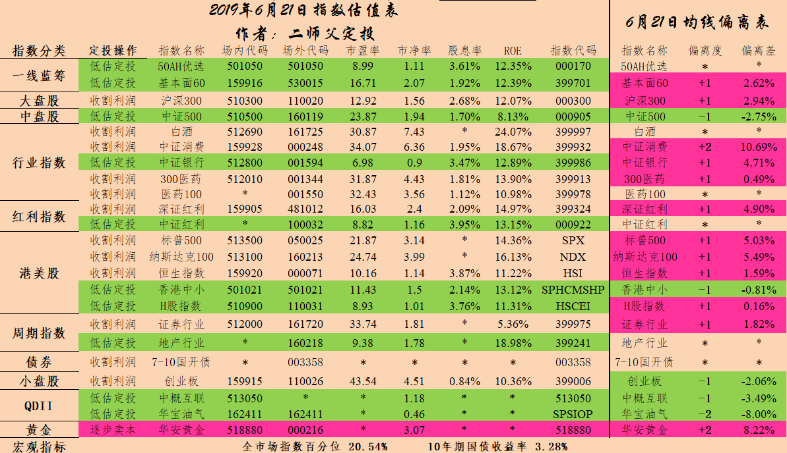

======================================================

_type: talk
@树叶[544811512145144]
2019-06-22 09:15:44 Sat  
topic_id: 422155188222128

<e type="hashtag" hid="142825811122" title="#定投周报#" /> 二师父定投周报第13期

阅读[2780]  评论[0]  赞[0] 

+++++++++++++++++++++++++++++++++++++++++++++++++++++

文件：
2019-06-22 09:14:18 Sat
文件大小：[284139]
48811522145118-二师父定投周报6.22（第13期）.docx

======================================================

_type: q&a
@青鸟飞鱼、此生不换[844111545424582]
2019-06-22 11:54:58 Sat  
topic_id: 544855818225844

@青鸟飞鱼、此生不换

>  师傅你好，我是保险小白！请问十三岁小男孩需要什么保险？您能推荐一下吗？

@二师父

>  少儿医保和慧鑫安少儿重疾险

阅读[2725]  评论[0]  赞[0] 

======================================================

_type: talk
@二师父[28814221155551]
2019-06-22 13:33:25 Sat  
topic_id: 544855818582544

<e type="hashtag" hid="281181228851" title="#周末答疑#" /> 关于网格交易，目前适合网格交易的品种，二师父选择的是5只基金，在之前的网格交易表格已经公布了。那么对于其他的基金如何确定是否适合网格交易

1、需要确定品种是否波动性较大，网格交易适合震荡波动品种，可以一直反复在底仓价位两侧买入和卖出获利

2、确定最大下跌幅度，二师父估值表里面的低估基金，最大下跌幅度都在50%个百分点以内，所以建立底仓并控制好加仓节奏都是可以进行网格交易的

3、不能大部分资金做网格，我们投资主要还是赚企业盈利增长的钱，那么就需要重仓优质的指数基金等待牛市的到来

阅读[5881]  评论[0]  赞[0] 

======================================================

_type: q&a
@SuH[841551428128422]
2019-06-22 14:09:09 Sat  
topic_id: 111844858111252

@SuH

>  想请教下二师父，中证500低估的时候是不是买入500低估，500ETF，500增强都可以？

@二师父

>  对的，这些都是追踪的中证500指数，一样的。增强基金有部分增强策略，估值差别和中证500也不大

阅读[2878]  评论[0]  赞[0] 

======================================================

_type: q&a
@默容乐[28512842845821]
2019-06-22 16:32:28 Sat  
topic_id: 422155154424888

@默容乐

>  二师傅，蛋卷基金里面针对银行限额，有一个大额汇款，如下图，这种汇款进入蛋卷，资金安全吗？

@二师父

>  这个是银行卡限额，一般日转出5万，用第二种方法取消了限额，资金是安全的，你不放心的话每天转5万，一个月就150了

阅读[2911]  评论[0]  赞[0] 

======================================================

_type: talk
@志亮[422125851552828]
2019-06-22 19:04:41 Sat  
topic_id: 422155154158528

二师父说的[微笑]，低股定投才是重头戏，是我们的粮食，网络交易只是糖品而已，请大家分清主次，我虽然喜欢折腾股票，但我重仓还是低估定投指数基金的，只有这样我才睡得踏实，真想尝试一下那种大回撤的感觉，好让自己尽快成长起来[呲牙]

@二师父 at 2019-06-22 19:04:41 Sat

> 来一波牛市让你爽翻天

----------

@志亮 at 2019-06-22 19:04:41 Sat

> 是呀，真不知道这一天什么时候到[呲牙]

----------

阅读[2951]  评论[2]  赞[0] 

======================================================

@二师父[28814221155551]
2019-06-22 22:10:34 Sat  
topic_id: 244122124511551

>  @二师父
>  

阅读[2966]  评论[1]  赞[0] 

======================================================

_type: talk
@二师父[28814221155551]
2019-06-23 02:26:24 Sun  
topic_id: 544855858111554

<e type="hashtag" hid="828881455442" title="#定投节奏#" /> 把握好定投的节奏，你会很舒服，投资需要这样，生活也要这样子

@速。冻 at 2019-06-23 02:26:24 Sun

> 500低波动二师父没投啊

----------

@二师父 at 2019-06-23 02:26:24 Sun

> 很多优质的基金，自己做好配置就行

----------

阅读[2899]  评论[2]  赞[0] 

+++++++++++++++++++++++++++++++++++++++++++++++++++++

文件：
2019-06-23 02:25:52 Sun
文件大小：[25737]
28811241454221-上证指数3000点，把握好定投的节奏.docx

======================================================

_type: talk
@二师父[28814221155551]
2019-06-23 02:59:08 Sun  
topic_id: 244122121884241

<e type="hashtag" hid="458881244158" title="#周末答疑之如何自己确定指数基金的优劣#" /> 第一要看指数基金跟踪的指数，这个指数的成立时间以及成立区间内的年化复合收益率，只要年化复合收益率高于10%，可以选择。

第二要看指数的估值，即使基金涨幅好，但是当前阶段这个指数的估值比较高，那么就不适合来进行投资。比如当前的消费和白酒指数。我们一定要选择低估的指数。

第三要看这个基金的规模，基金规模太小会出现一个问题，流动性不足甚至直接清盘，场内基金规模最好1000万以上，场外基金规模最好1亿以上。低于这两个数不行。

第四看基金的费率，不同基金公司追踪的同一指数基金费率是不同的。所以我们要挑选管理费用低的基金。

@杜志彪 at 2019-06-23 02:59:08 Sun

> 二师父您帮我分析一下，深60我是在场内定投，但是它每天的交易额很低，有时全天交易额才10多万，这个和场外比是不是是个劣势啊，要不要换到场外定投啊[抱拳]

----------

@二师父 at 2019-06-23 02:59:08 Sun

> 我是场外投的基本面60.场内成交量太低

----------

阅读[3005]  评论[2]  赞[0] 

======================================================

_type: talk
@二师父[28814221155551]
2019-06-23 04:26:25 Sun  
topic_id: 422155151855218

周末重新回听基金课程，讲解的声音和传递的逻辑确实不够好，感觉有些对不住大家。最近几大课程已经录制完毕，后面会重新回听将不够好的地方重新录制直到把最佳的课程交付给大家，之前购买过的不用继续付费，一次购买，终身有效。

很多读者建议我录制视频课程，一步步迭代，预计明年可以录制视频课程，一辈子那么长，不急于一时，慢慢走，我们会走的更加踏实，更加长远

@木子李 at 2019-06-23 04:26:25 Sun

> 师父，如果重新录制好放入课程的时候，在学堂里公告一下是哪几节课，这样便于我们再次回听，谢谢啦[玫瑰]

----------

@志亮 at 2019-06-23 04:26:25 Sun

> 最喜欢听二师父的课程，简直就是心灵鸡汤呀[微笑]

----------

@二师父 at 2019-06-23 04:26:25 Sun

> 关注荔枝微课公众号，我的直播间，更新会有提示

----------

@二师父 at 2019-06-23 04:26:25 Sun

> 哈哈

----------

@木子李 at 2019-06-23 04:26:25 Sun

> 好嘞，谢谢师父提醒

----------

@cotton at 2019-06-23 04:26:25 Sun

> 正好我还没听，原来二师父准备了更靓的货

----------

@cotton at 2019-06-23 04:26:25 Sun

> [呲牙][呲牙]

----------

@志亮 at 2019-06-23 04:26:25 Sun

> 哈哈，听一次不够，还要听多几次，每次我对投资感到迷茫的时候，听听你的语音就舒服多了，它真的是心灵鸡汤[微笑]。

----------

阅读[3201]  评论[9]  赞[0] 

======================================================

_type: q&a
@家树[544854851425424]
2019-06-23 12:56:24 Sun  
topic_id: 544855858815114

@家树

>  二师傅，京东金融上“银行精选"有一些定期存款产品，是一些股份制小银行，存取比较灵活，利率比货币基金高，在这里面存一些钱，可靠吗？

@二师父

>  也是可以的，转换麻烦点

阅读[3017]  评论[1]  赞[0] 

======================================================

_type: talk
@二师父[28814221155551]
2019-06-23 15:56:59 Sun  
topic_id: 422155122541548

从深证综合指数的市盈率看当前位置，上证综合指数容易失真，当前整体是在正常偏低区域，算不上极度低估，仓位控制在7到8成事比较合适的。如果没有积累到这么多，还是坚持定投，通过很多人的问题二师父发现大家都经受不住较大回撤

@凭栏观海 at 2019-06-23 15:56:59 Sun

> 谢谢老师的指点

----------

@JOY at 2019-06-23 15:56:59 Sun

> 要是仓位特别低也还是正常定投哈？然后请教下您，除去原来的存量资金，增量的加进来，是平摊到剩余的份数上吧？就是说原来分了50份，还剩40份，增加的是平摊到这40份上边吧？

----------

@二师父 at 2019-06-23 15:56:59 Sun

> 对的，根据你总资金摊到定投周期上

----------

阅读[3013]  评论[3]  赞[0] 

+++++++++++++++++++++++++++++++++++++++++++++++++++++

图片：
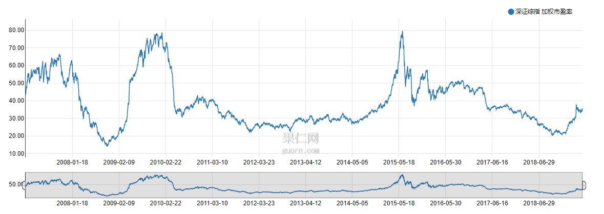

======================================================

_type: talk
@上上签[244184512458541]
2019-06-23 16:04:38 Sun  
topic_id: 111844811455422

望各位朋友注意，如果购买京东金融(小米金融或者度小满金融这三家本质上的是大概一样)的银行精选理财产品。

看清楚购买产品信息披露出的产品类型是否银行定期存款，如果不是银行定期存款而是其他的什么什么的。建议不要去碰，万一真的出了事，小米金融(京东金融这些的)只是第三方代销而已，找平台也没有用实质性作用。

 最后一点个人建议，任何这样的银行定期存款别超过50万，你懂的(退一万步说，就算银行倒闭，50万以内会退回的，可能只是时间的问题)，所以45万左右就好了，因为还有那五万(利息也会退回的)。

@紫色天使 at 2019-06-23 16:04:38 Sun

> 说的有道理，这三个平台我都经常用，但是我只买银行的定期存款

----------

@杜志彪 at 2019-06-23 16:04:38 Sun

> 平安金管家的陆金所是不是相对靠谱些。

----------

@上上签 at 2019-06-23 16:04:38 Sun

> 这些第三方平台本质上都是一样的，负责代销而已

----------

@笋子 at 2019-06-23 16:04:38 Sun

> 支付宝呢

----------

@J at 2019-06-23 16:04:38 Sun

> 如果放在这些小银行存款万一倒闭了，请问在哪些渠道可以找政府赔偿？

----------

@Nienie💝 at 2019-06-23 16:04:38 Sun

> 银行倒了为啥要找政府赔偿？

----------

@J at 2019-06-23 16:04:38 Sun

> 陆金所的项目最近才暴雷了好一批，上周在上海召开了受害投资者会议

----------

@J at 2019-06-23 16:04:38 Sun

> 国家规定，银行存款50万以下有政府保证金的，但不知道真发生的时候上哪去申请赔偿😂

----------

阅读[3038]  评论[10]  赞[0] 

+++++++++++++++++++++++++++++++++++++++++++++++++++++

图片：
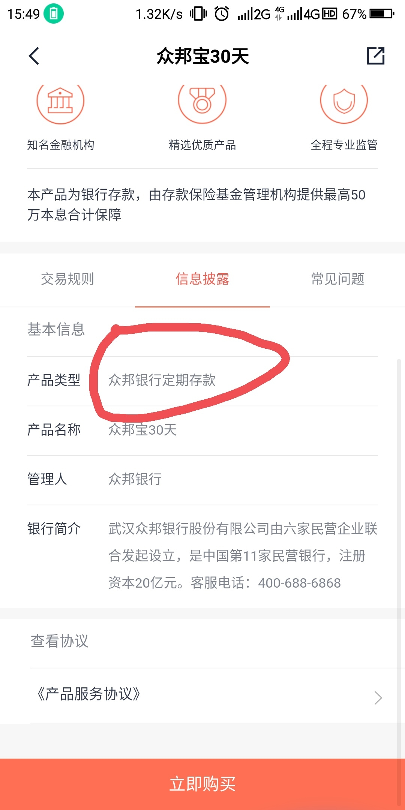
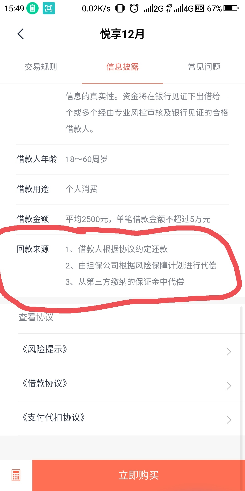

======================================================

@二师父[28814221155551]
2019-06-23 22:28:42 Sun  
topic_id: 544855881521214

>  @二师父
>  

阅读[2871]  评论[0]  赞[0] 

======================================================

_type: talk
@二师父[28814221155551]
2019-06-24 03:02:04 Mon  
topic_id: 422155115224858

<e type="hashtag" hid="228881115551" title="#认识下钟摆理论#" /> 霍华德马克思的钟摆理论，帮助大家更好地认识股市涨跌和人生起伏。其实很多道理都是相通的

@青青竹 at 2019-06-24 03:02:04 Mon

> 师傅既授人以鱼，又授人以渔！[强][强][强]

----------

阅读[2890]  评论[1]  赞[0] 

+++++++++++++++++++++++++++++++++++++++++++++++++++++

文件：
2019-06-24 03:01:26 Mon
文件大小：[172136]
15588482118252-伟大的投资家霍华德马克思告诉你：投资一定要具备钟摆意识.docx

======================================================

_type: talk
@别皱眉头[244148458815141]
2019-06-24 09:46:00 Mon  
topic_id: 244124555224251

各位老师华森发债可以打吗？

阅读[2641]  评论[0]  赞[0] 

======================================================

@二师父[28814221155551]
2019-06-24 12:31:25 Mon  
topic_id: 244122114254541

>  @二师父
>  

阅读[2727]  评论[0]  赞[0] 

======================================================

@二师父[28814221155551]
2019-06-24 12:42:38 Mon  
topic_id: 244124558482521

>  @二师父
>  

阅读[2807]  评论[7]  赞[0] 

======================================================

_type: talk
@二师父[28814221155551]
2019-06-24 12:54:43 Mon  
topic_id: 244124558152881

<e type="hashtag" hid="142511142112" title="#格局重塑#" /> 今天的格局分享是关于及时止损的

这里的止损不局限于股市，而是生活的方方面面

之前购买了一个写作社群，进入之后每天都是点评垃圾信息一堆，不到10天的时间退出了，钱是小事，占据了自己的精力

对待任何事不要总是衡量已经付出多少，如果付出了没有回报，那么会一直期待，最终会陷进去，无法自拔

如果付出没回报，或者做了一件不正确的事，交了一个不够好的朋友，选择了一次错误的投资，忘记你的成本，放下来才有更多的时间和精力做更重要的事。放弃比坚持有时候难得多，需要勇气和智慧

@齐俊波 at 2019-06-24 12:54:43 Mon

> 拿起需要勇气，放下需要智慧。

----------

@凭栏观海 at 2019-06-24 12:54:43 Mon

> 茅塞顿开醍醐灌顶

----------

@雪莲 at 2019-06-24 12:54:43 Mon

> 赞！

----------

@志亮 at 2019-06-24 12:54:43 Mon

> [微笑]二师父说的这个就好像某些人买股票一样，有的人买着一只股票跌破20%也不止损，还在期待能涨回来，结果就悲剧了，有时候是不能跟市场作对呀，该止损时还是得止损的，盲目的坚持也不一定是好事呀。

----------

@二师父 at 2019-06-24 12:54:43 Mon

> 股市也一样，道理都是相通的

----------

@raochangan at 2019-06-24 12:54:43 Mon

> 人生最难的，就是坚持付出了好久好久，依然看不到回报，要不要放弃，真的需要勇气和智慧。

----------

@秦楚之子 at 2019-06-24 12:54:43 Mon

> 永远追求边际收益最大化。

----------

阅读[2833]  评论[7]  赞[0] 

======================================================

_type: talk
@海盗[48248118584848]
2019-06-24 22:04:27 Mon  
topic_id: 111841255441542

6月24日最新偏离表，请大家参考

@小小鸟 at 2019-06-24 22:04:27 Mon

> 谢谢，海盗助教辛苦了。[微笑]

----------

@rtdmm小米 at 2019-06-24 22:04:27 Mon

> 谢谢海盗助教

----------

@志亮 at 2019-06-24 22:04:27 Mon

> 感觉均线交易策略没网络的方便，计算太麻烦了。而且……

----------

@志亮 at 2019-06-24 22:04:27 Mon

> [微笑]不过海盗助教的这个均线计算还是很有用的，用来看看趋势作个参考也不错的

----------

@二师父 at 2019-06-24 22:04:27 Mon

> GOOD

----------

阅读[2575]  评论[6]  赞[0] 

+++++++++++++++++++++++++++++++++++++++++++++++++++++

图片：
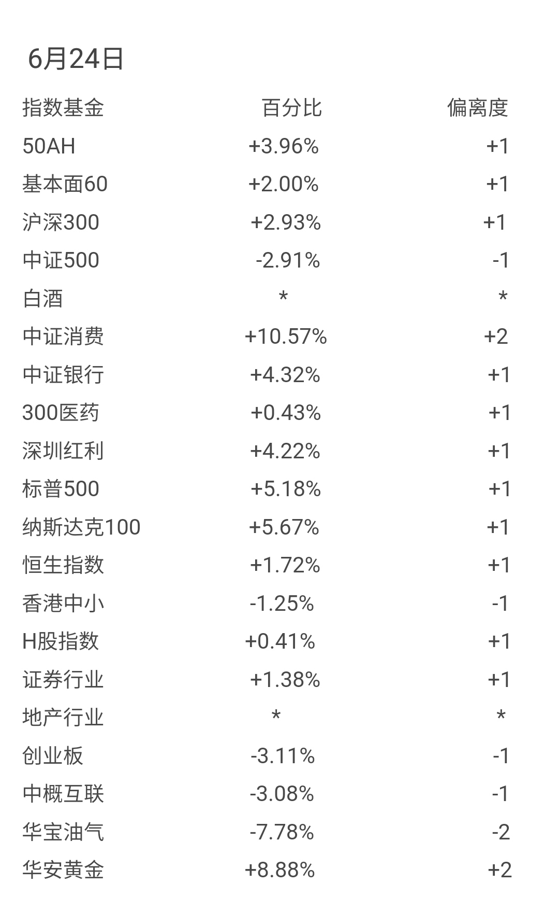

======================================================

_type: talk
@志亮[422125851552828]
2019-06-24 22:47:08 Mon  
topic_id: 111841255825452

大家说说目前上证指数3000算是什么价位，是高还是低？当然对于定投指数基金的朋友是不用太过考虑这个的，不过对于买股票的朋友，这个大盘指数还是值得关注的，后面的趋势真的不好预测呀，我现在才知道炒股赚钱太难了，而且很费时间，建议没时间没精力的朋友真的只做好二师父那个低估定投指数基金就好了，不用太过于折腾还能轻松赚钱。唉，我现在真的是股票亏了钱被套住了，不继续买的又回不了本，继续买嘛感觉又太难赚钱了，大家说应该怎么办?
现在投资股票还在亏钱中，等以后我回本再赚钱了我再在星球去公布[呲牙]。

@.Five at 2019-06-24 22:47:08 Mon

> 牛市要在绝望之时才会诞生，明显现在并不是绝望之时。

----------

@志亮 at 2019-06-24 22:47:08 Mon

> 有道理，受教了。

----------

@二师父 at 2019-06-24 22:47:08 Mon

> 我记得你购买股票课程了啊，你得先看股票是不是具有牛股特征，股票的涨幅跟牛熊没有关系，牛股熊市也能涨，垃圾股票牛市也能跌。

----------

@rtdmm小米 at 2019-06-24 22:47:08 Mon

> 牛股判断太难了，还是指数基金简单

----------

阅读[2503]  评论[4]  赞[0] 

======================================================

_type: talk
@二师父[28814221155551]
2019-06-25 03:12:38 Tue  
topic_id: 111841258521422

<e type="hashtag" hid="481211145528" title="#指数估值#" /> 黄金依旧高估，啥时候卖是个学问，你得保证卖了上涨不后悔，不卖下跌不心痛。做到这点其实卖出就容易多了

阅读[2369]  评论[0]  赞[0] 

+++++++++++++++++++++++++++++++++++++++++++++++++++++

图片：
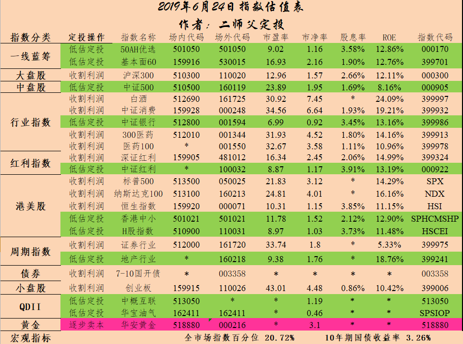

======================================================

_type: talk
@二师父[28814221155551]
2019-06-25 03:14:05 Tue  
topic_id: 422152481842558

<e type="hashtag" hid="458854584848" title="#指数基金VS主动基金#" /> 之前有人跟我谈过主动基金优于指数基金，那么究竟如何，你是怎么认为的呢？真理具有唯一性，学会独立思考是投资中最重要的

@拥抱太阳的风筝 at 2019-06-25 03:14:05 Tue

> 我倾向于被动指数基金，以前按诸如台湾系的4433等相似法则（萧碧燕，基金定投教母）挑选优秀主动基金，入了门，但长时间不能驾轻就熟，现在的指数基金定投（以二师父，银行螺丝钉等大V的低估值定投），好入门，也好掌握，与大V也好沟通，不像萧老师的脸书部落，中国大陆根本注册不了脸书。

----------

阅读[2561]  评论[1]  赞[0] 

+++++++++++++++++++++++++++++++++++++++++++++++++++++

文件：
2019-06-25 03:13:11 Tue
文件大小：[25148]
88811211241812-主动基金和被动基金你更倾向于选择哪一种进行投资.docx

======================================================

_type: talk
@二师父[28814221155551]
2019-06-25 03:19:00 Tue  
topic_id: 844124581854482

<e type="hashtag" hid="825112122842" title="#读书#" /> 推荐五本书，《投资者的心灵修炼》、《买入、持有、富有》、《投资中最简单的事》、《时间的玫瑰》、《一个投资家的20年》。二师父后面准备把书籍分享内容整理成精华录制成音频发给大家，这样无论是你在路上还是在家里做家务都能够学习。

做个小调查，大家是更喜欢我把音频直接发布到星球来听，还是上传到荔枝微课大家从荔枝上听呢？

无论是星球还是二师父的课程，公众号，二师父都在创新优化。这源于我们文化里面的极致，将一件小事情做到极致，这是我们的理念。关于课程和星球有任何不满意的地方，大家可以私聊我，我们一起成长进步。

@拥抱太阳的风筝 at 2019-06-25 03:19:00 Tue

> 发到知识星球上更好些

----------

@Judy at 2019-06-25 03:19:00 Tue

> 都可

----------

@Claire at 2019-06-25 03:19:00 Tue

> 比较喜欢师父把音频发布到知识星球上来听课。[愉快]

----------

@凭栏观海 at 2019-06-25 03:19:00 Tue

> 发到星球吧

----------

@陈 at 2019-06-25 03:19:00 Tue

> 星球

----------

@惟子 at 2019-06-25 03:19:00 Tue

> [微笑]建议发到星球上

----------

@旺锦古法土制红糖 范* at 2019-06-25 03:19:00 Tue

> 发到星球来 每天习惯看星球了

----------

阅读[2741]  评论[14]  赞[0] 

======================================================

_type: talk
@一剪梅[844115184528882]
2019-06-25 06:05:29 Tue  
topic_id: 422152481545188

<e type="hashtag" hid="825112122842" title="#读书#" /> 可以发到星球学习，师父

阅读[2709]  评论[0]  赞[0] 

======================================================

_type: talk
@张雪[422151524141228]
2019-06-25 06:17:52 Tue  
topic_id: 422152481541218

师父，沪深300已经进入正常估值，还需要继续定投吗？
正常估值状态收割利润部分我已经明白了，是不是继续扣款我还没有太明白，

@上上签 at 2019-06-25 06:17:52 Tue

> 一般情况下，到了正常估值，停止定投，收割盈利，改成现金分红。

----------

@张雪 at 2019-06-25 06:17:52 Tue

> 好，我知道了，谢谢啦😊

----------

阅读[2811]  评论[2]  赞[0] 

======================================================

_type: q&a
@小白老赵[244148555454141]
2019-06-25 09:14:15 Tue  
topic_id: 244124581445111

@小白老赵

>  师傅好，购买二师父组合，这个天天基金的一键购买怎么用啊？一选不光这周，以往的也一并买了？谢谢🙏没有蛋卷一键购买好用

@二师父

>  目前这个功能还没有完全上线，需要等等

阅读[2772]  评论[3]  赞[0] 

======================================================

_type: q&a
@金帛人夋[51442888185524]
2019-06-25 10:47:34 Tue  
topic_id: 422152454858818

@金帛人夋

>  二师父，我走你的证券链接开户证券链接，已经接到回访电话了，基金申购费率是已经调到万0.6了吗？还需要其他操作吗？

@二师父

>  不需要了，接到电话之后就调整好了

阅读[2752]  评论[0]  赞[0] 

======================================================

_type: talk
@起今知行[844188255581112]
2019-06-25 10:59:14 Tue  
topic_id: 544854251212454

今天的中信出版新股建议申购吗？14.85元。

@二师父 at 2019-06-25 10:59:14 Tue

> 可以

----------

阅读[2780]  评论[1]  赞[0] 

======================================================

_type: talk
@rtdmm小米[422188284881148]
2019-06-25 11:18:22 Tue  
topic_id: 244124528888251

请问二师父，今天大趺，鳄鱼出击券商可以吗？

@二师父 at 2019-06-25 11:18:22 Tue

> 我还盈利十几个点呢，不着急哈哈哈

----------

阅读[2839]  评论[1]  赞[0] 

======================================================

_type: talk
@二师父[28814221155551]
2019-06-25 11:36:55 Tue  
topic_id: 111841245514452

<e type="hashtag" hid="881251425252" title="#鳄鱼计划#" /> 卖出消费一份，买入银行一份，银行后面估计还有很多机会，招行爆雷，暴跌9个点，个股逆势投资二师父一直是不建议的

@那只小鳄123 at 2019-06-25 11:36:55 Tue

> 二师父，银行现在偏离度是＋为什么要买入呢。不明白

----------

@工具栏 at 2019-06-25 11:36:55 Tue

> 我银行还在盈利呢  要买吗

----------

@二师父 at 2019-06-25 11:36:55 Tue

> 买呢

----------

@二师父 at 2019-06-25 11:36:55 Tue

> 主要看低估

----------

@陈 at 2019-06-25 11:36:55 Tue

> 二师父，银行随时任然低估，可是按网格交易表一块过了不是该卖出一份么？

----------

@志亮 at 2019-06-25 11:36:55 Tue

> 二师父的意思是后面不要逆势买招行？

----------

@二师父 at 2019-06-25 11:36:55 Tue

> 主要看估值表，均线是短线

----------

@二师父 at 2019-06-25 11:36:55 Tue

> 不要逆势加仓股票，银行股的安全性相对高一些

----------

阅读[2998]  评论[16]  赞[0] 

======================================================

_type: talk
@二师父[28814221155551]
2019-06-25 11:39:14 Tue  
topic_id: 111841245518212

世界不太平，黄金就暴涨，果然没错，这也是我们必选的投资品种

@不再YY的猪 at 2019-06-25 11:39:14 Tue

> 呃呃呃～现在价格这么高还敢买吗？

----------

@二师父 at 2019-06-25 11:39:14 Tue

> 我没说买，已经卖了一半了

----------

阅读[3021]  评论[2]  赞[0] 

======================================================

_type: q&a
@J[28281541518551]
2019-06-25 14:32:49 Tue  
topic_id: 422152851424458

@J

>  师父，创业板的波动也很大，可以按均线偏离策略来买入吗

@二师父

>  等进入低估以后可以，我不清楚你的投资水平不行不知道能承受多大的波动

阅读[2875]  评论[1]  赞[0] 

======================================================

@二师父[28814221155551]
2019-06-25 15:17:42 Tue  
topic_id: 544854158181524

>  @二师父
>  

阅读[2825]  评论[1]  赞[0] 

======================================================

_type: talk
@rtdmm小米[422188284881148]
2019-06-25 22:25:06 Tue  
topic_id: 422152822244818

自从关注了二师父的公众号，希望股市跌，这是什么心态[阴险][阴险]

@J at 2019-06-25 22:25:06 Tue

> 好心态[偷笑]

----------

@你猜不透的张智伦 િ* at 2019-06-25 22:25:06 Tue

> 仓位还没满上的心态[偷笑][偷笑]

----------

@志亮 at 2019-06-25 22:25:06 Tue

> 跌是因为你仓位底呀，当然希望跌啦。

----------

阅读[2691]  评论[3]  赞[0] 

======================================================

_type: q&a
@志亮[422125851552828]
2019-06-26 02:08:05 Wed  
topic_id: 422152822228228

@志亮

>  二师父，关于那个网络交易，我想问下是否按你那个网络交易表作准来触发买入和卖出的，比如华宝油气按你那个网络交易表来说建立低仓的净值应该是0.5吧，但目前华宝净值是低于0.5的，比如现在华宝净值是0.456吧，那我是否建立的底仓是 10份+1.2份+1.4份 ?  还是需要自己重新编一个交易表？

@二师父

>  都可以，建立底仓防止踏空，建好之后保证下跌有资金加仓就行

阅读[2784]  评论[1]  赞[0] 

======================================================

_type: talk
@二师父[28814221155551]
2019-06-26 02:56:29 Wed  
topic_id: 844124841458512

<e type="hashtag" hid="828825122482" title="#读书：整体介绍一个投资家的20年#" /> 根据大家的建议选择上穿音频到学堂，大家可以直接听，走路或者做家务的时候都可以学习。音频不要外传，谢谢。读的第一本书一个投资家的20年，作者杨天南。

对于音频有何疑问可以建议，如果你有好的学习心得欢迎和大家一起分享。一起进步成长。学到了真正的知识，有了智慧，赚钱只是顺带的事情。

@陈 at 2019-06-26 02:56:29 Wed

> 二师父，辛苦了！

----------

@惟子 at 2019-06-26 02:56:29 Wed

> 谢谢二师父

----------

@Claire at 2019-06-26 02:56:29 Wed

> 谢谢师父的读后分享。

----------

@victoria at 2019-06-26 02:56:29 Wed

> 最喜欢听音频

----------

@rtdmm小米 at 2019-06-26 02:56:29 Wed

> 谢谢二师父的分享

----------

@一无所有 at 2019-06-26 02:56:29 Wed

> 谢谢二师父!

----------

@A0洪氏日杂批发 at 2019-06-26 02:56:29 Wed

> 一语惊醒梦中人

----------

阅读[2991]  评论[7]  赞[0] 

+++++++++++++++++++++++++++++++++++++++++++++++++++++

文件：
2019-06-26 02:50:20 Wed
文件大小：[8010618]
15588121228242-第一步：一个投资家的20年.m4a

======================================================

_type: talk
@二师父[28814221155551]
2019-06-26 02:59:02 Wed  
topic_id: 111841518125542

<e type="hashtag" hid="551152855414" title="#损失厌恶#" /> 看文章之前先做个测验，记得把自己的答案写在评论区然后再看文章，看下理论和实际是否是真的吻合。

游戏1：你投资了600元。会有两种结果，A：你一定会亏损400元。B：1/3的概率没有亏损，2/3的概率全部亏损

游戏2：你投资了600元。会有两种结果，C：你一定能盈利200元。D:1/3的概率盈利600元，2/3的概率没有盈利。

对于两个游戏，你分别选择什么

@妖孽 at 2019-06-26 02:59:02 Wed

> BD

----------

@紫色天使 at 2019-06-26 02:59:02 Wed

> bc

----------

@紫色天使 at 2019-06-26 02:59:02 Wed

> 虽然我选择的是bc ，但是实际生活中我却能管住自己，首先，股票坚决不碰，因为不懂，其次，我只买指数基金，严格按照纪律定投，越跌越买，绝不追涨杀跌，所以如果选了bc的也不要太在意

----------

@二师父 at 2019-06-26 02:59:02 Wed

> 别活在自己的框架里

----------

@好运玲玲 at 2019-06-26 02:59:02 Wed

> bd

----------

@心韵 at 2019-06-26 02:59:02 Wed

> bd

----------

@梧桐 at 2019-06-26 02:59:02 Wed

> 选的是AC

----------

@jorfy at 2019-06-26 02:59:02 Wed

> BA

----------

阅读[3128]  评论[16]  赞[0] 

+++++++++++++++++++++++++++++++++++++++++++++++++++++

文件：
2019-06-26 02:58:59 Wed
文件大小：[24528]
28811454551851-上证指数一直震荡并未下跌，为啥你的恐惧加剧了呢？.docx

======================================================

_type: talk
@二师父[28814221155551]
2019-06-26 03:00:21 Wed  
topic_id: 844124841458842

<e type="hashtag" hid="481211145528" title="#指数估值#" /> 只看估值，忘记股市，这样是最佳的策略

@紫色天使 at 2019-06-26 03:00:21 Wed

> 估值变化不大……

----------

阅读[3359]  评论[1]  赞[0] 

+++++++++++++++++++++++++++++++++++++++++++++++++++++

图片：
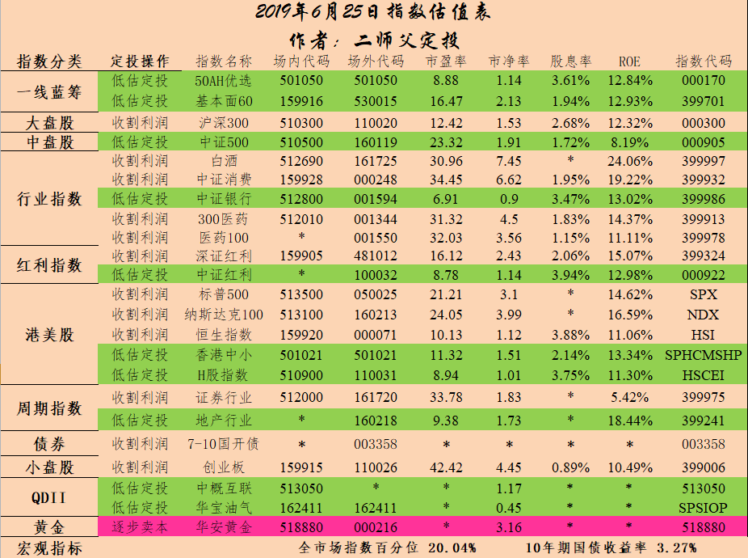

======================================================

_type: q&a
@妖孽[544888148518184]
2019-06-26 04:13:06 Wed  
topic_id: 111841518121182

@妖孽

>  请问二师父分级基金整改，那么招商中证白酒分级这么优秀的基金将来是不是要被清盘了。

@二师父

>  这个没事，现在整改的是3亿份以下的基金。白酒几十亿份，不在这次整改范围

阅读[3430]  评论[2]  赞[0] 

======================================================

_type: q&a
@J[28281541518551]
2019-06-26 10:49:20 Wed  
topic_id: 244124818482481

@J

>  师傅早上好！有个问题困扰我好一段时间了：我好多次从置顶入口点进去想查询，结果都是几天前的，然后再爬楼梯逐一翻找回最新的版本，实在有点不方便，并且现在搜索功能也不能找到最新日期的偏离度表。所以我很想提个建议：1.可否把估值和偏离表每天放在置顶文章处一起更新一次？如果数据没变的项就保持原有数字可以了。2.搜索功能恢复标签搜索。相信这样用户体验会更好，你觉得可以吗？希望师傅能采纳，谢谢！

@二师父

>  好的，谢谢建议。1，我考虑下把估值表加精华2，标签搜索我记得有，我再看看

阅读[3146]  评论[5]  赞[0] 

======================================================

_type: talk
@rtdmm小米[422188284881148]
2019-06-26 11:19:39 Wed  
topic_id: 544854184215224

请问二师父，你每天估值表里基金的阀值是怎么计算的，比如证券的市净率1.83是怎么计算出来的？

@rtdmm小米 at 2019-06-26 11:19:39 Wed

> 就是，二师父，我们要渔！万一哪天你做大做強[奸笑]，顾不过来我们，我们又成韭菜了[快哭了][快哭了]

----------

@rtdmm小米 at 2019-06-26 11:19:39 Wed

> 永远也无法改变！[抓狂][抓狂]

----------

阅读[3131]  评论[5]  赞[0] 

======================================================

_type: talk
@二师父[28814221155551]
2019-06-26 15:58:13 Wed  
topic_id: 244124258841121

中国的民营经济（即私营经济）的贡献度，有“56789”之说：对国家财政收入的贡献占比超过50%；GDP和固定资产投资、对外直接投资占比均超过60%；企业技术创新和新产品占比超过70%；城镇就业占比超过了80%

@自由飞翔 at 2019-06-26 15:58:13 Wed

> 师父，借用了[抱拳]

----------

阅读[2854]  评论[1]  赞[0] 

======================================================

_type: talk
@二师父[28814221155551]
2019-06-26 16:40:52 Wed  
topic_id: 544854521588444

巴菲特的成功不在于75岁时拥有400多亿的财富，而在于他年轻时就明白许多道理，然后用一生的岁月去坚守

阅读[2938]  评论[0]  赞[0] 

======================================================

_type: talk
@二师父[28814221155551]
2019-06-26 20:41:18 Wed  
topic_id: 422152545152428

“同样是预测，为什么经济学家荣升最受尊敬的职业，而股评师则在令人不齿的职业排行里仅次于特殊工作者？”第一次与杨天南见面，笔者就被迎头抛掷过来这样的问题，忙不迭追问“为什么”！他答曰：“前者预测多年后的事情，后者预测一天后的事情，即使同样都预测错了，股评师一天就被戳穿，而经济学家需要很多年。”

时间改变一切，预测的目的是看清整个社会经济和行业大势以及个人未来走向，而不是你账户明天多了多少钱，和你明天挣了多少工资，这就是格局不同带来的视野不同

@J at 2019-06-26 20:41:18 Wed

> 经济学家的黑色幽默😂

----------

阅读[2786]  评论[1]  赞[0] 

======================================================

_type: talk
@二师父[28814221155551]
2019-06-27 03:56:04 Thu  
topic_id: 544854511244124

<e type="hashtag" hid="481211145528" title="#指数估值#" /> 指数估值改版了，大家看看有没有更好，估值表根据读者建议我是放在顶部了，大家可以查阅。

关于指数估值，有两种方法，一是市盈率和盈利收益率估值法，这个在课程讲过，简单理解就是格雷厄姆的原则，高于10%的盈利收益率才可以投资，但是不适用于成长股指数。所以我们用博格公式，市盈率增长率、盈利增长率和股息率相加然后得到的数据代表未来的盈利情况，这个数据越大就代表越有投资价值，高于20%就是非常有投资价值的时候了。

估值方法确实就是这样的，很多人无法运用，因为这里面的市盈率年化增长率这个是难点，就跟我们股票投资过程中估值所使用的盈利增长率数据一样，因为用的是未来数据，所以有些困难，需要有一定的经验。

至于阈值计算方法，这是我自己的估值系统，毫无保留的分享，建立在我需要有自己的护城河的基础上，研究过那么多企业，二师父也讲过，当一家企业携巨资去与另一家企业竞争的时候，如果还无法超越，那么这家企业就是优质的企业。

我希望我也是这样的，这不是藏着掖着，虽然我不靠这个吃饭，但是我需要有我的护城河，不然别人学了我的，然后反过来骂我说我抄他的，这种情况是有发生的。

如果你有不明白的，大家可以一起讨论学习，可以反应沟通，我接受任何质疑和批评，因为我会不断听取各方经验做的更好。我的价值观是利他，极致，共赢。说说利他的含义，便是有利于读者，有利于我的合作者，有利于和我一起走的人角度来去行事，所以在股市我一直强调的是关于对人性和轮回的理解，这是投资之道，如果你经历了牛熊市你就能理解，反之如果认知有局限，那么我也帮不了你，决定你投资收益率的就是这两点。等你在股市越久，那么你对此的理解越深刻。

另外说一点，做人一定要知道感恩，感恩不是嘴上说说，也不是你非要给别人送什么贵重的礼物，重要的是你的心意，不管是不是需要别人，是不是能够从别人那里得到什么，自己心里都能够念及别人的好，一心换一心。不管是政界，商界，都是这样的。如果不会做人，只在有求于别人的时候才能够想到别人，那么无法得到贵人的帮助。

@Claire at 2019-06-27 03:56:04 Thu

> 知识是有产权的，但师父已经很无私的奉献和细心的教授了，留下的应该是自己去掌握了。

----------

@rtdmm小米 at 2019-06-27 03:56:04 Thu

> 请问二师父，估值表第一列里标有颜色的表示啥意思？

----------

@小牧童 at 2019-06-27 03:56:04 Thu

> 师父，能不能把黄色的部分换个颜色，这个颜色比较刺眼！

----------

@二师父 at 2019-06-27 03:56:04 Thu

> 谢谢支持

----------

@二师父 at 2019-06-27 03:56:04 Thu

> 相当于指数大分类

----------

@二师父 at 2019-06-27 03:56:04 Thu

> 行，那我还是换成橙色

----------

@rtdmm小米 at 2019-06-27 03:56:04 Thu

> [呲牙][呲牙]明白了，谢谢二师父

----------

@丁咚 at 2019-06-27 03:56:04 Thu

> 二师傅公布定投实盘和鳄鱼计划，留言的问题也都一一解答。如果换位思考下，换作是你能否做的到？我反正是做不到的，所以我支持二师傅🌺

----------

阅读[5229]  评论[15]  赞[0] 

+++++++++++++++++++++++++++++++++++++++++++++++++++++

图片：
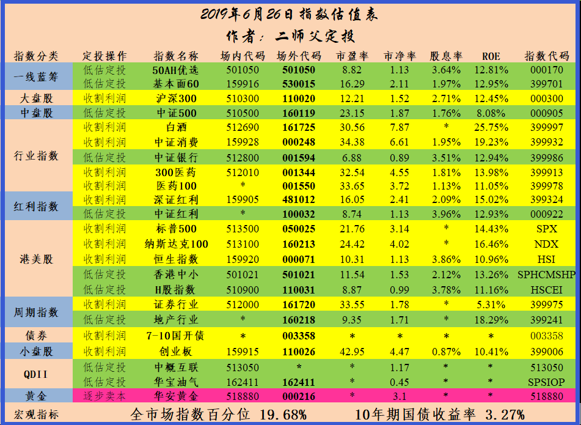

======================================================

_type: talk
@二师父[28814221155551]
2019-06-27 04:00:06 Thu  
topic_id: 244124288544841

全面配置的原因，这样轮动可以对冲风险

阅读[2884]  评论[0]  赞[0] 

+++++++++++++++++++++++++++++++++++++++++++++++++++++

文件：
2019-06-27 03:59:24 Thu
文件大小：[24709]
48811288554248-为什么我们买基金的过程中需要各种基金都配置一些.docx

======================================================

_type: talk
@二师父[28814221155551]
2019-06-27 04:48:57 Thu  
topic_id: 422152588414288

<e type="hashtag" hid="145545581552" title="#193期实盘#" /> 总投资份数：1份 ，在天天基金实盘展示，我的一份是2000元

定投宣言：我准备坚定不移地执行此计划，我无法知道明天是涨是跌。但我知道只要估值在低估区域，就一定是处于安全边际之内。如果偏离低估的程度越大，我就多买一些；如果偏离低估的程度越小，我就少买一些。就让我向阿甘一样默默地坚守定投吧。

50ah优选：29%，基本面60：30%，恒生国企：23%；地产指数：18%。根据一份金额计算每份的金额。

1、50AH优选场内用上证50替代，医药100场内用广发医药替代，地产指数场内规模小，不建议场内定投
2、买入份数根据市场强度调整，比例根据估值程度调整，份数计算见五步定投法
3、严格根据五步定投法的16字方针进行操作进行买入卖出操作

@Claire at 2019-06-27 04:48:57 Thu

> 跟随师父念着定投宣言实施定投💪[愉快]

----------

@婧哥哥🙊📷📷📷 at 2019-06-27 04:48:57 Thu

> 二师父，场内定投和场外定投有什么区别

----------

@rtdmm小米 at 2019-06-27 04:48:57 Thu

> 请问二师父，50Ah 优选场内的上证50就是510050，对吗？

----------

@随便 at 2019-06-27 04:48:57 Thu

> 刚刚去投了0.5份，请问一般多久更新一次定投配比

----------

@陈 at 2019-06-27 04:48:57 Thu

> 每周四

----------

@二师父 at 2019-06-27 04:48:57 Thu

> 杨天南老师书里写的，我给改了一下

----------

@二师父 at 2019-06-27 04:48:57 Thu

> 费率不同，场内申购费低一点，成交时间不同

----------

@二师父 at 2019-06-27 04:48:57 Thu

> 对的，还可以用银行替代

----------

阅读[5691]  评论[18]  赞[0] 

+++++++++++++++++++++++++++++++++++++++++++++++++++++

图片：
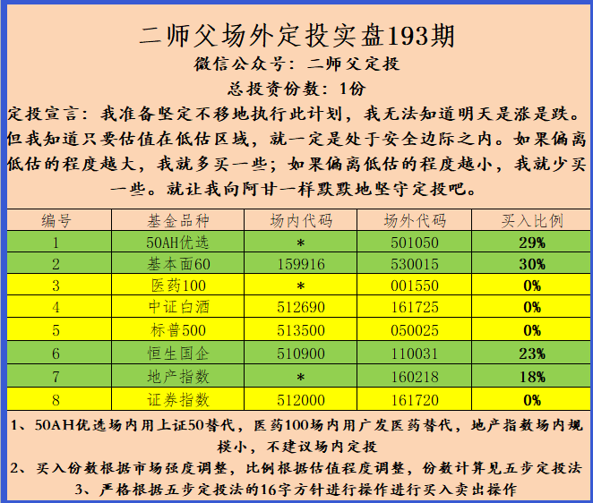

======================================================

_type: q&a
@背心[51441214442224]
2019-06-27 10:16:39 Thu  
topic_id: 844124288821852

@背心

>  50AH优选的场内基金代码是多少？你的估值表里面是501050。定投实盘里面用*号表示，下面又说场内可以用上证50，那对应的应该是510050。50AH优选场内到底是哪个，请直接给出它的代码。我现在场内买的是501050，可以吗？问的有点啰嗦，希望您能看明白了，谢谢！

@二师父

>  这是个lof基金，我场内没有用这个，50优选大部分和金融股票，所以场内可以用银行指数或者上证50替代，投资没有那么死板

阅读[2578]  评论[3]  赞[0] 

======================================================

_type: q&a
@雪莲[421485848588118]
2019-06-27 10:20:25 Thu  
topic_id: 544854515121514

@雪莲

>  师父，中证红利的低估阀值是多少？

@二师父

>  9.5倍市盈率

阅读[2731]  评论[1]  赞[0] 

======================================================

_type: q&a
@J[28281541518551]
2019-06-27 10:21:23 Thu  
topic_id: 544854515148544

@J

>  非常感谢师傅！现在置顶更新确实方便多了。昨天我还建议把偏离表与估值表放在一起更新，就像下图这种格式，有了两者的比对，一目了然！只不过这是5月22日的，后期没有持续按这个格式更新。所以再次请师傅采纳!

@二师父

>  这个暂时没有那么多时间，你可以自己计算一下，海盗基本每天都会在星球公布的哈

阅读[2749]  评论[8]  赞[0] 

======================================================

_type: talk
@20181108……[51511128814554]
2019-06-27 10:41:01 Thu  
topic_id: 844124281882182

二师父可不可以把低估阀值加上

@rtdmm小米 at 2019-06-27 10:41:01 Thu

> 保存一下就可以了，

----------

@rtdmm小米 at 2019-06-27 10:41:01 Thu

> 有变化二师父才更新

----------

阅读[2696]  评论[2]  赞[0] 

======================================================

_type: talk
@二师父[28814221155551]
2019-06-27 10:45:55 Thu  
topic_id: 422152581858858

<e type="hashtag" hid="142448285212" title="#卖出提示#" /> 消费持有收益率40个点，白酒持有收益率67个点，卖出消费20个点的利润，卖出白酒37个点的利润，这是之前在蛋卷买的，后面我的实盘就能在天天基金看到了

怎么收割，我再讲一下，比如你投资了1万，盈利40个点，之前20个点收割以后还是本金1万，现在盈利40个点，把这个剩余的利润卖出保留投入本金，用你卖出的金额除以当前的净值即可

不要全部卖出，高估之后仍旧有上涨趋势。消费白酒指数再涨下去就进入高估区域了，不要太贪婪，记得收割利润。

@rtdmm小米 at 2019-06-27 10:45:55 Thu

> 白酒，消费太牛了，一直没有等到低估机会，继续等

----------

@陈 at 2019-06-27 10:45:55 Thu

> 啥时候我们也能等到白酒和消费低估。2018年买了消费，那时候不懂买了一点点。

----------

@彩色 at 2019-06-27 10:45:55 Thu

> 白酒消费从来没等到过。。幸好还有医药100安慰我。😂😂😂

----------

@二师父 at 2019-06-27 10:45:55 Thu

> 去年有的

----------

@彩色 at 2019-06-27 10:45:55 Thu

> 哎今年二月才认识二师父。早认识都赚钱钱了。幸好来日方长，希望二师父坚持开知识星球啊

----------

@杨光霞 at 2019-06-27 10:45:55 Thu

> 师傅，你的消费白酒是厂内买的还是场外买的？

----------

@二师父 at 2019-06-27 10:45:55 Thu

> 都有

----------

@Joey  at 2019-06-27 10:45:55 Thu

> 师傅 你拿了多久啊 这么高的收益

----------

阅读[5646]  评论[12]  赞[0] 

======================================================

_type: talk
@彼得.帕克[844412441225142]
2019-06-27 11:10:47 Thu  
topic_id: 244124281228121

二师父，请您分析下28日g20会不会有利好，中美会见乐观吗？

@二师父 at 2019-06-27 11:10:47 Thu

> 比较乐观，因为第一老特现在反对声音高，第二我们比较硬，第三明年大选他需要经济支持，所以有些软。

----------

阅读[2886]  评论[1]  赞[0] 

======================================================

_type: talk
@风姐姐[421444822115818]
2019-06-27 11:45:05 Thu  
topic_id: 244124281441541

<e type="hashtag" hid="142448285212" title="#卖出提示#" /> 二师父好厉害啊！羡慕！

@二师父 at 2019-06-27 11:45:05 Thu

> 多指教哈

----------

阅读[2881]  评论[1]  赞[0] 

======================================================

_type: talk
@二师父[28814221155551]
2019-06-27 12:54:28 Thu  
topic_id: 244124225525851

<e type="hashtag" hid="828828284142" title="#为什么50ah场内实盘没加代码#" /> 我有自己的考虑，不一定对，大家来听听不同的意见，再说说自己的想法

因为这个是lof基金，场内定投和场外投基本没啥差别，所以我是全部买的etf基金

在我的判断里面，如果你买场内基金连最基本的场内代码，场外代码，还有lof基金和etf基金都不知道基本就是属于里面水平比较低的，那么场外就可以了

关于这些基本的知识在置顶文章，课程二师父都一一讲过了俗话说师父领进门，修行靠个人，我不会搞填鸭式教育，这样不利于自学能力和独立思考能力的培养，长期下去你的进步几乎没有

当然，我说的不一定对，大家可以谈自己的想法

阅读[3026]  评论[0]  赞[0] 

======================================================

_type: q&a
@是喵喵吖～[421441114141158]
2019-06-27 18:40:51 Thu  
topic_id: 111841442155422

@是喵喵吖～

>  二师父今天听课到《1-4  如何进行资金分配和资产配置》有以下几点疑惑：
>  1、比如我选定一只基金 以501050为例，每周定投400，我也不需要管当天的净值什么的吗，就是认定了这只基金就每周四就定投？如果机会好，比较低的时候就再多买一点？
>  2、如果我现在正处于存款1、2象限的存款阶段，就是保命钱和日常6-12个月的存款还未存够，我可以每个月拿出2000块钱来进行定投可以吗？他们可以同时进行吗？比如我一个月有一万块钱  存5000在货币基金做存款，拿出2000定投基金，3000做生活费

@二师父

>  1，不用管，我们定投只看估值2，是可以的，看你是否结婚，两个人的风险抵御能力好一些，可以少一点风险账户资金

阅读[2704]  评论[0]  赞[0] 

======================================================

_type: q&a
@是喵喵吖～[421441114141158]
2019-06-27 18:42:33 Thu  
topic_id: 544854552415214

@是喵喵吖～

>  接上边提问
>  
>  3、1、2象限的钱（保命钱和日常消费6-12个月的存款）是不是只能存货币基金，可不可以这样，平时临时用的钱存货币基金，一年以内用到的钱存短债基金，比如平安短债A？
>  4、二师父用的货币基金是什么？有比余额宝更好一点的吗？
>  5、国债逆回购只能在场内基金定投购买是吗。这种机会是固定到每个月底、年底就有，还是不一定。
>  我在百度查的是国债逆回购很安全，相当于把钱借出去买了国债，然后到期连本带息再回到你的账户。
>  
>  谢谢二师父！

@二师父

>  3，不行的，短债基金并不保本
>  4，南方天天利b，比余额宝好
>  5，国债逆回购开通场内账户，一般是节假日之前

阅读[2853]  评论[0]  赞[0] 

======================================================

_type: q&a
@是喵喵吖～[421441114141158]
2019-06-27 18:45:58 Thu  
topic_id: 111841445425552

@是喵喵吖～

>  二师父，请问《2-4为父母定制养老定投计划》中，倒推投资十年给父母需要多少本金的计算公式是怎么计算的？
>  
>  假设父母一年支出6W，需要投资的本金是
>  6WX0.15=9000？
>  10年以后，我们的投资金额要达到40W，这个40W是怎么计算出来呢？
>  年化15%收益率，每年能拿6W给父母 
>  
>  40W/1.15^10=10W 
>  十年前需要投资10W 
>  这个公式又是如何计算的呢？

@二师父

>  6万除以0.15得到本金，40万，代表你每年投资40万，拿到0.15的收益率，会得到6万，这样按照复合收益率计算公式，我们可以算出当前需要的资金，年化15个点，10年后可以得到40万
>  
>  建议多思考下，自己总结出来的才是真正理解了

阅读[3066]  评论[1]  赞[0] 

======================================================

_type: talk
@海盗[48248118584848]
2019-06-28 00:52:15 Fri  
topic_id: 844124245458442

<e type="hashtag" hid="225118152481" title="#指数基金均线偏离表#" />

@二师父 at 2019-06-28 00:52:15 Fri

> 谢谢海盗的付出，感谢他好的方式就是打赏

----------

@J at 2019-06-28 00:52:15 Fri

> 请问师傅和海盗，白酒和地产的*号是代表偏离度为零吗？

----------

@海盗 at 2019-06-28 00:52:15 Fri

> 你好，这位同学。咱这个均线偏表是根据场内指数的90日均线是算出来的，但是白酒和地产只有场外的，没有场内数据，所以就算不出来了。

----------

阅读[2907]  评论[3]  赞[1] 

+++++++++++++++++++++++++++++++++++++++++++++++++++++

图片：
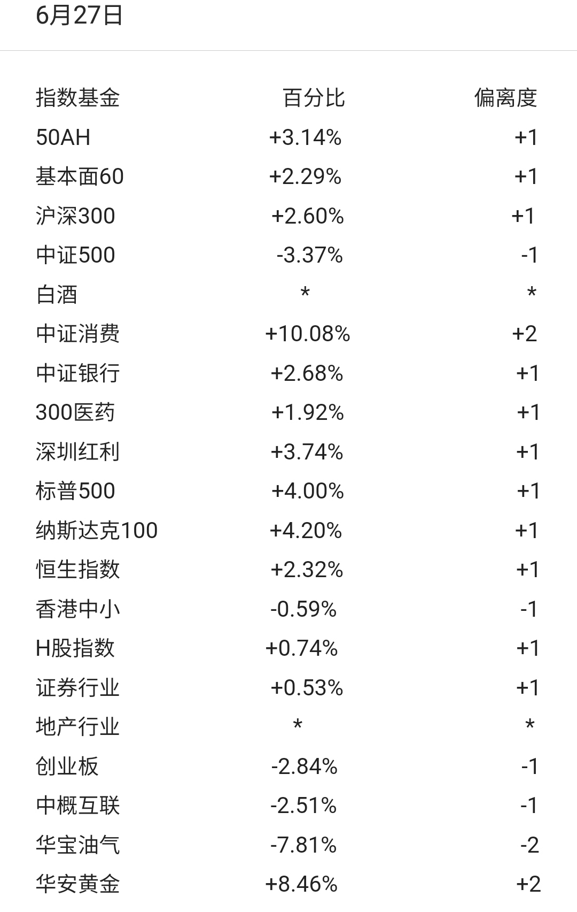

======================================================

_type: talk
@二师父[28814221155551]
2019-06-28 03:35:32 Fri  
topic_id: 844124245154142

<e type="hashtag" hid="145545111422" title="#白酒指数#" /> 挺有价值。今天本来头疼，结果坐下来研究了下几只基金，写了一篇文章，头不疼了。也许这就是天命所归的事。

阅读[2945]  评论[0]  赞[0] 

+++++++++++++++++++++++++++++++++++++++++++++++++++++

文件：
2019-06-28 03:34:30 Fri
文件大小：[24687]
48811282858528-贵州茅台盘中突破1000元，买不起茅台我们可以买它.docx

======================================================

_type: talk
@二师父[28814221155551]
2019-06-28 03:36:09 Fri  
topic_id: 244124245154141

<e type="hashtag" hid="481211145528" title="#指数估值#" /> 低估定投，正常估值可以逐步收割利润。

@tanxin at 2019-06-28 03:36:09 Fri

> 二师父，我只定投两周中证500就开始收割利润了，我现在该怎么操作呢！是不是要暂停定投！

----------

@二师父 at 2019-06-28 03:36:09 Fri

> 暂停定投，仓位低可以不用定投

----------

@是喵喵吖～ at 2019-06-28 03:36:09 Fri

> 二师父仓位低的意思是不是：股市行情还不错 可以进行补仓？ 为啥不定投了呢

----------

@二师父 at 2019-06-28 03:36:09 Fri

> 到了正常估值就暂停定投

----------

@二师父 at 2019-06-28 03:36:09 Fri

> 到了正常估值就暂停定投

----------

阅读[3036]  评论[5]  赞[0] 

+++++++++++++++++++++++++++++++++++++++++++++++++++++

图片：
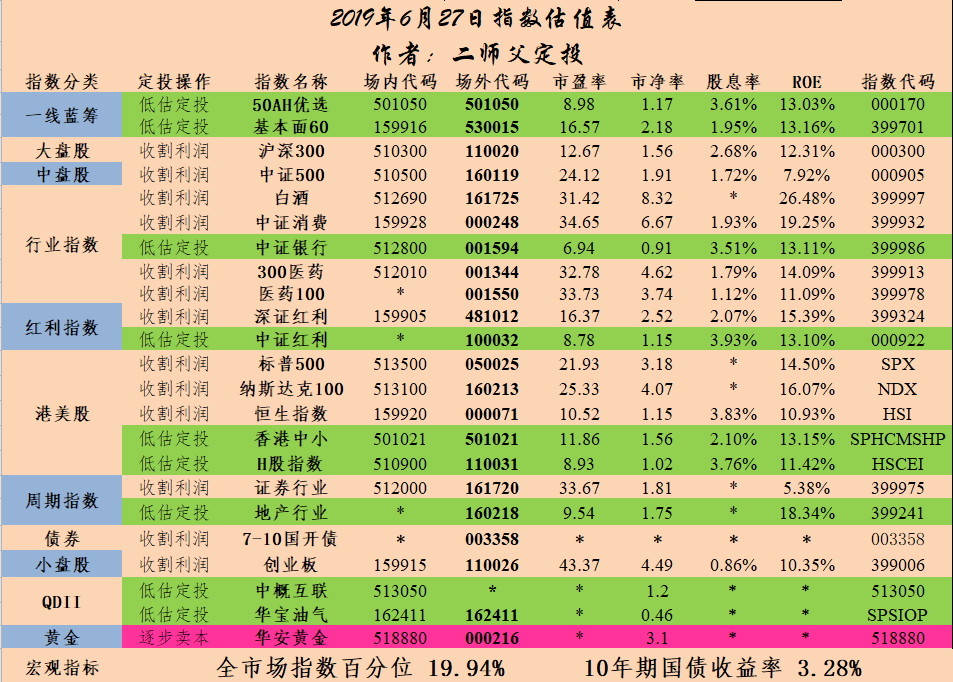

======================================================

_type: talk
@二师父[28814221155551]
2019-06-28 04:06:39 Fri  
topic_id: 544854542812444

<e type="hashtag" hid="458858222248" title="#人生负面清单#" /> 听了读者的遭遇，我觉得很有必要。另外今天我和老妈聊天，她和另外一个阿姨聊天，告诉孩子的房子买在了涿州，我立马意识到问题。

人生中重大决策失误会让我们多奋斗10年也无法赶上。首先夫妻俩在北京工作，买的房子住不上，还是租房，更为重要的是浪费了首套首贷的名额，还不如在二线用父母或者姐姐哥哥名义买一套作为防御。后面可以卖了再北京上车。

另外，如果环京的话一定记得全款，不要用贷款，这样可以之后卖了也算首套首贷。

二套在北京是8成首付，你想想一套500万的房子，8成就是400万，再加上个税，契税，中介费乱七八糟的那么400多万，和全款有啥区别。

慎重抉择，人生努力是一方面，做好正确的抉择才是关键，方向不对，努力白费。

@胡一彬 at 2019-06-28 04:06:39 Fri

> 二师傅，下面跟的文档是不是发错了，还是白酒的

----------

@二师父 at 2019-06-28 04:06:39 Fri

> 改过来了，你看看

----------

@门萨🐨 at 2019-06-28 04:06:39 Fri

> 选择大于努力

----------

阅读[3194]  评论[3]  赞[0] 

+++++++++++++++++++++++++++++++++++++++++++++++++++++

文件：
2019-06-28 04:17:41 Fri
文件大小：[24990]
51188414151484-人生负面清单.docx

======================================================

_type: q&a
@🎈铮[28284825441841]
2019-06-28 10:35:32 Fri  
topic_id: 844124242424182

@🎈铮

>  二师父，这三支进入正常估值了，但我还亏着，是不是等待低估，继续定投，贪低成本？另外我这个沪深300虽然盈利了2块钱，但远没达到我的盈利点，是现在卖了，持有本金，等低估定投，还是不卖呢？谢谢

@二师父

>  第一，进入正常估值浮亏暂停定投，第二进入正常估值没有达到10个点盈利也不要收割利润

阅读[2876]  评论[0]  赞[0] 

======================================================

_type: q&a
@西男[844148822182252]
2019-06-28 10:36:14 Fri  
topic_id: 244124244284211

@西男

>  请问师傅，网格交易有什么好用的回测工具么？

@二师父

>  智投星

阅读[2977]  评论[0]  赞[0] 

======================================================

_type: q&a
@J[28281541518551]
2019-06-28 12:46:12 Fri  
topic_id: 422152521555818

@J

>  师傅，这段时间在3000点附近徘徊，个别基金如医药100进入了正常，需要卖出利润。关于卖出的方法想请教下，在天天基金网怎么计算多次卖出后的盈利率？我向客服了解过，她说每次卖出后系统计算的是摊薄成本单价，而盈利率则是把每次卖出的金额都算进去的，也就是不能自动计算出每次卖出部分利润后再继续上涨10%的盈利，这种情况应如何准确计算？求方法。

@二师父

>  这种盈利计算方法自己用当前净值减去买入成本得到价格差，然后除以成本就是你的利润率了，按照这个进行收割即可

阅读[3078]  评论[1]  赞[0] 

======================================================

_type: talk
@紫色天使[844124551411152]
2019-06-28 13:02:58 Fri  
topic_id: 244124241444551

^_^二师父，中证500这支基金的净值为什么支付宝和天天基金的东方财富场内净值不一样呢？

@二师父 at 2019-06-28 13:02:58 Fri

> 一个是场外的，一个是场内的

----------

@紫色天使 at 2019-06-28 13:02:58 Fri

> 二师父，场内和场外的价格确实是不一样吗，那这样的话是不是选净值低的更划算呢？谢谢二师父的解答

----------

@紫色天使 at 2019-06-28 13:02:58 Fri

> 因为您的估值表发布的同一个基金既有场内的又有场外的，是不是都可以定投，如果价格不同，是不是选价格低的更划算呢？

----------

@二师父 at 2019-06-28 13:02:58 Fri

> 这个不是，我们根据估值选择，这是本质，场内没有溢价的时候和场外是一样的

----------

阅读[3046]  评论[4]  赞[0] 

+++++++++++++++++++++++++++++++++++++++++++++++++++++

图片：
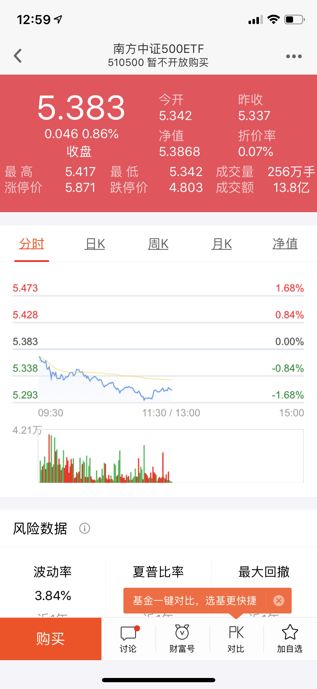
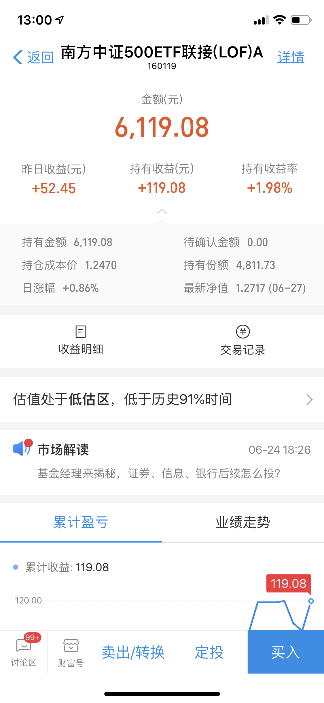

======================================================

_type: talk
@二师父[28814221155551]
2019-06-28 18:49:45 Fri  
topic_id: 844124214512552

<e type="hashtag" hid="825112122842" title="#读书#" /> 一个投资家的20年第一讲。周末适合学习充电。知识才是最由价值的财富

@别皱眉头 at 2019-06-28 18:49:45 Fri

> 先点赞再收听

----------

@光少 at 2019-06-28 18:49:45 Fri

> 谢谢二师父

----------

@rtdmm小米 at 2019-06-28 18:49:45 Fri

> 跟着二师父坚持低估定投优质指数基金！

----------

@Claire at 2019-06-28 18:49:45 Fri

> 师父读书的节奏有点赶不上呢，先听师父读后的分享也很受益的。

----------

@木子李 at 2019-06-28 18:49:45 Fri

> 想给二师父提个小小建议，希望师父的普通话更好一些，重点是N和L的区别。虽说毛爷爷用湖南话宣布建国也很有气势，但新时代，语音语调的魅力也会更加提升传播的接受度和好感度。吹毛求疵啦，希望师父不要见怪，希望师父的价值传播更远更久。

----------

@二师父 at 2019-06-28 18:49:45 Fri

> 好的，我学习一下吧

----------

@二师父 at 2019-06-28 18:49:45 Fri

> 请问有啥好的学习普通话的渠道吗或者好的方法，n和l一直比较难区分

----------

@木子李 at 2019-06-28 18:49:45 Fri

> 不好意思，师父，我也不太清楚，专业不是这个领域的[捂脸]我到是可以问问学校的老师，待有结果后回复师父。不知学堂里有没有这方面的大侠[嘿哈]

----------

阅读[3066]  评论[12]  赞[0] 

+++++++++++++++++++++++++++++++++++++++++++++++++++++

文件：
2019-06-28 18:49:37 Fri
文件大小：[15829900]
48811254142518-第一讲.m4a

======================================================

_type: talk
@二师父[28814221155551]
2019-06-29 01:54:50 Sat  
topic_id: 422152248522218

<e type="hashtag" hid="481211145528" title="#指数估值#" />

@齐俊波 at 2019-06-29 01:54:50 Sat

> 二师父辛苦了

----------

@光少 at 2019-06-29 01:54:50 Sat

> 中证500又低估值了

----------

阅读[2980]  评论[2]  赞[0] 

+++++++++++++++++++++++++++++++++++++++++++++++++++++

图片：
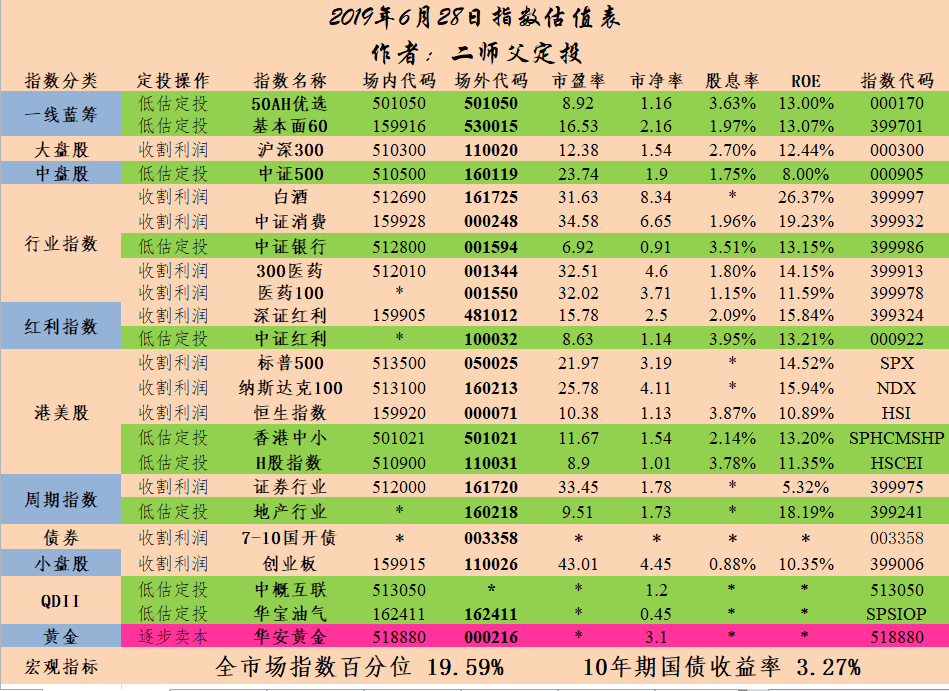

======================================================

_type: talk
@阿宝[422212151424158]
2019-06-29 05:58:43 Sat  
topic_id: 422152248215518

在公众号看到了半年二师父的公众号，喜欢二师父的投资方法和坚定的信心，加入学堂为了学到更多，希望有一天我也可以像二师父一样具有系统知识，指导自己投资。感谢二师父的真诚无私！大爱[呲牙]

@木子李 at 2019-06-29 05:58:43 Sat

> 有智慧有格局有自律，难得的师傅。跟着师傅点亮自己，让这里从一点光变成一片光芒。

----------

阅读[2980]  评论[1]  赞[0] 

======================================================

_type: q&a
@彩色[48415121851218]
2019-06-29 10:55:20 Sat  
topic_id: 244124214448281

@彩色

>  二师父，最近我在思考一个问题：上证50ah这类市值加权指数，最近茅台涨得很，一调仓，茅台占比比例升高，会不会刚好高位站岗了呢？对我们投资50ah有什么影响吗？像这类市值加权的指数，如何看待涨得多相应调整指数以后加权比例更高的情况呢？谢谢！

@二师父

>  这种没有影响的，因为调仓之后估值也会变化，只要严格参考估值定投就不要紧。
>  
>  至于茅台，目前价格高，也不代表高估，不存在高位站岗。这一点可以放心的

阅读[2992]  评论[1]  赞[0] 

======================================================

_type: talk
@树叶[544811512145144]
2019-06-29 11:01:44 Sat  
topic_id: 422152245188528

<e type="hashtag" hid="142825811122" title="#定投周报#" />

阅读[3130]  评论[0]  赞[0] 

+++++++++++++++++++++++++++++++++++++++++++++++++++++

文件：
2019-06-29 11:01:24 Sat
文件大小：[285123]
88811428128142-二师父定投周报6.29（第14期）.docx

======================================================

_type: talk
@二师父[28814221155551]
2019-06-29 21:05:01 Sat  
topic_id: 844124182514482

树叶同学之前写的入门得过程，很详细，如果入不了门，第一是时间太短，对投资缺乏一定得积累。第二是思考太少伸手太多。大家慢慢来，每天学习一个点，一年下来最慢也入门了。

@海盗 at 2019-06-29 21:05:01 Sat

> 实在是太好太好了，能把在二师父这里学到的知识，付诸于实践，真的很棒。[鼓掌][鼓掌][鼓掌]

----------

@海盗 at 2019-06-29 21:05:01 Sat

> 也真的希望大家向这位同学学习，把自己的想法和做法写出来，要勇敢一点，不要怕有错。有错很正常，大家都是学生都是来学习的，可以互相交流，另外最主要的还可以得到二师父的指点。加油！

----------

阅读[2910]  评论[2]  赞[0] 

+++++++++++++++++++++++++++++++++++++++++++++++++++++

文件：
2019-06-29 21:03:46 Sat
文件大小：[24401]
48811255555228-读者学习心得：如何从零基础入门指数基金定投并用定投思维改变生活.docx

======================================================

_type: talk
@二师父[28814221155551]
2019-06-30 02:45:49 Sun  
topic_id: 422152181155258

<e type="hashtag" hid="228821582811" title="#投资规划#" /> 最主要的是投资自己，股市交给时间，等待牛市到来。时机不到，在股市越努力越失败。不然为啥天天盯着股票行情软件的亏得一塌糊涂。

@💗朵儿studio * at 2019-06-30 02:45:49 Sun

> 二师傅过得是哪个时差啊？[捂脸]

----------

@若水三千 at 2019-06-30 02:45:49 Sun

> 师傅，用什么方法来判断指数的盈利状态？

----------

@二师父 at 2019-06-30 02:45:49 Sun

> 看roe指标，大的盈利高，看股票的盈利增长率

----------

阅读[2819]  评论[3]  赞[0] 

+++++++++++++++++++++++++++++++++++++++++++++++++++++

文件：
2019-06-30 02:44:24 Sun
文件大小：[25898]
48811255222128-走过了跌宕起伏的上半年，19年的后半段我们这样规划.docx

======================================================

