_type: talk
@二师父[28814221155551]
2019-07-01 02:30:27 Mon  
topic_id: 544854845844854

<e type="hashtag" hid="828821814882" title="#投资指数基金实现财务自由需要的条件#" /> 怎样通过定投指数基金实现财务自由。需要的条件大家看看。

@王燕 at 2019-07-01 02:30:27 Mon

> 二师父，我想问一下，为啥是50/0.05，而不是50/0.15呢？我不懂年化收益率咋算的[害羞]

----------

@二师父 at 2019-07-01 02:30:27 Mon

> 因为要扣除货币超发的增长率，比如你的钱没有增值，相当于每年贬值百分之10

----------

@王燕 at 2019-07-01 02:30:27 Mon

> 就是那个年化收益率是虚的，要扣掉通货膨胀率，剩下的才是相对于现在的实际增长率吗？

----------

@二师父 at 2019-07-01 02:30:27 Mon

> 是真实的，只不过要抵扣一部分通货膨胀率，如果你没有收益率，那就相当于直接是亏损的

----------

阅读[2429]  评论[4]  赞[0] 

+++++++++++++++++++++++++++++++++++++++++++++++++++++

文件：
2019-07-01 02:29:48 Mon
文件大小：[22442]
48811224855158-投资指数基金，能实现财务自由吗.docx

======================================================

_type: talk
@二师父[28814221155551]
2019-07-01 09:58:37 Mon  
topic_id: 244124141522811

大盘继续上攻，除了油气全部盈利，如果仓位重的记得收割利润，仓位不重的可以减少定投份额依旧慢慢积累

@Claire at 2019-07-01 09:58:37 Mon

> 谢谢师父实时操作指导，很贴心的。

----------

@齐俊波 at 2019-07-01 09:58:37 Mon

> 我也是[呲牙][呲牙]

----------

阅读[2257]  评论[2]  赞[0] 

======================================================

_type: q&a
@志亮[422125851552828]
2019-07-01 10:02:09 Mon  
topic_id: 244124141554111

@志亮

>  二师父，中概互联我做的网络交易今天大涨，现在是否适合清仓？还是再等等？

@二师父

>  为啥清仓，这么好的指数，这是典型的下跌死捂，上涨立刻卖出思维

阅读[2393]  评论[8]  赞[0] 

======================================================

_type: q&a
@李震笛[422112248211828]
2019-07-01 10:13:28 Mon  
topic_id: 844124141885182

@李震笛

>  二师傅，您之前说的医药和消费指数，现在都是正常估值，没有底仓的是不是先缓缓再进了？另外，华宝油气这个是周期性的，看不太懂，是不是不适合现在进场？

@二师父

>  消费和医药指数都不适合了，尤其是消费指数，用逆向投资思维此刻不能建仓
>  
>  油气指数可以做网格，目前也可以，只是不能够重仓

阅读[2343]  评论[2]  赞[0] 

======================================================

_type: talk
@汉尼拔[552144155244]
2019-07-01 10:16:22 Mon  
topic_id: 111841818542882

今天涨是必然的，中美两国关系要的就是和平发展才是最大的利益。

阅读[2323]  评论[0]  赞[0] 

======================================================

@二师父[28814221155551]
2019-07-01 11:53:17 Mon  
topic_id: 422152121154488

>  @二师父
>  

阅读[2307]  评论[0]  赞[0] 

======================================================

_type: q&a
@J[28281541518551]
2019-07-01 11:54:15 Mon  
topic_id: 244124141125151

@J

>  师父，你好，请问最新的低估指数阀值表在哪里查看？能否加进每日估值表里方便查询和计算？感谢🙏

@二师父

>  好的，每次有变化我才加进去，今晚发布一下

阅读[2460]  评论[1]  赞[0] 

======================================================

_type: talk
@二师父[28814221155551]
2019-07-01 11:58:42 Mon  
topic_id: 111841882221552

<e type="hashtag" hid="145548484542" title="#认知改变#" /> 丹尼尔卡尼慢有一本书，思考快与慢，讲的是系统一和系统二的理性与感性思维

投资需要用理性思维，做投资大部分人赚不到钱就是因为人性厌恶亏损和贪图盈利

导致下跌死死捂住，上涨却拿不住，一回本就卖，因为他怕再次下跌，这是投资失败根源。

如果不克服这种心理，你学再多知识也枉然

@CKSJ at 2019-07-01 11:58:42 Mon

> 遇到回撤10% 就跑路，其实也不是一个好操作

----------

@二师父 at 2019-07-01 11:58:42 Mon

> 我没让你跑路，而是说这种心理，大部分人亏了10个点是不会卖的

----------

阅读[2438]  评论[2]  赞[0] 

======================================================

_type: talk
@007[51511545424824]
2019-07-01 12:03:13 Mon  
topic_id: 244124115585221

万得全A百分位在哪里查看啊？

@西锦巴乌 at 2019-07-01 12:03:13 Mon

> 万得股票

----------

@潜龙 at 2019-07-01 12:03:13 Mon

> 电脑上的网站吗？

----------

@潜龙 at 2019-07-01 12:03:13 Mon

> 下的APP手机里没有

----------

@西锦巴乌 at 2019-07-01 12:03:13 Mon

> 股票交易软件

----------

@007 at 2019-07-01 12:03:13 Mon

> 没有这只股票啊

----------

@潜龙 at 2019-07-01 12:03:13 Mon

> 能不能给个图片看看啊，实在不清楚在哪？谢谢

----------

阅读[2480]  评论[6]  赞[0] 

======================================================

_type: talk
@二师父[28814221155551]
2019-07-01 14:29:54 Mon  
topic_id: 544854885181584

为了学习普通话，找到了央视主持人温姐学习，什么卷舌，平舌，一点也不懂，人是有天赋的，学习投资很兴奋，学习语音好痛苦，分不清。。。

阅读[2376]  评论[0]  赞[0] 

======================================================

_type: talk
@二师父[28814221155551]
2019-07-01 14:32:29 Mon  
topic_id: 844124112814552

为了学习普通话，找到了央视主持人温姐学习，什么卷舌，平舌，一点也不懂，人是有天赋的，学习投资很兴奋，学习语音好痛苦，分不清。。。

@王燕 at 2019-07-01 14:32:29 Mon

> 二师父，好厉害，真的去学普通话了！哈哈

----------

@丁咚 at 2019-07-01 14:32:29 Mon

> 哈哈，二师傅哪里人？

----------

@二师父 at 2019-07-01 14:32:29 Mon

> [微笑]

----------

@二师父 at 2019-07-01 14:32:29 Mon

> 哎

----------

@cotton at 2019-07-01 14:32:29 Mon

> 湖南口音[呲牙]

----------

@海盗 at 2019-07-01 14:32:29 Mon

> 二师父，央视还有熟人[强][强]

----------

@海盗 at 2019-07-01 14:32:29 Mon

> 不过，二师父的普通话都能听得懂

----------

@青青竹 at 2019-07-01 14:32:29 Mon

> [偷笑][偷笑][偷笑]

----------

阅读[2486]  评论[11]  赞[0] 

======================================================

_type: talk
@杜志彪[544454124115854]
2019-07-01 14:37:37 Mon  
topic_id: 422152115811418

收割深红利10%利润。

@J at 2019-07-01 14:37:37 Mon

> 持有了多久？

----------

@杜志彪 at 2019-07-01 14:37:37 Mon

> 6月5日

----------

@杜志彪 at 2019-07-01 14:37:37 Mon

> 当初想买10份银行ETF1网格的，填的价格1.02结果最低1.021，后来上去了，等了1星期，后来权衡了一下，买入资金3层仓位，涨了继续持有，跌了用剩下资金网格和定投就可以了，反正建仓时要想好策略，二师父说得好其它的就交给时间了[微笑]

----------

@rtdmm小米 at 2019-07-01 14:37:37 Mon

> 节奏踩得好呢

----------

阅读[2578]  评论[4]  赞[0] 

======================================================

@二师父[28814221155551]
2019-07-01 14:39:41 Mon  
topic_id: 844124112852412

>  @二师父
>  

阅读[2757]  评论[6]  赞[0] 

======================================================

_type: q&a
@JOY[111881481812422]
2019-07-01 16:48:04 Mon  
topic_id: 111841884814812

@JOY

>  请问师父，仓位还很低的情况下，中概互联是否也可以持有到正常估值再按收割利润？

@二师父

>  可以的，一直持有到高估都可以，这只科技股票的基金，下跌多，涨起来也很猛，跟着港股和美股走

阅读[2686]  评论[1]  赞[0] 

======================================================

_type: q&a
@潜龙[244145114188851]
2019-07-01 18:28:54 Mon  
topic_id: 111841881451452

@潜龙

>  二师父，那个万得全A百分位在手机APP的万得股票软件里哪个地方啊，找不到，能不能配个图片看一下，谢谢

@二师父

>  这里就有，百分位我计算的

阅读[2632]  评论[0]  赞[0] 

======================================================

_type: q&a
@海马[15158245825242]
2019-07-01 22:05:01 Mon  
topic_id: 244124111215811

@海马

>  二师父怎么计算万得全A的百分位？

@二师父

>  在excel表格里面用rank函数就可以了

阅读[2459]  评论[1]  赞[0] 

======================================================

_type: talk
@二师父[28814221155551]
2019-07-01 22:12:15 Mon  
topic_id: 844121558841882

<e type="hashtag" hid="228821155141" title="#读书《一个投资家的20年》#" /> 第二讲，股市起起伏伏，这个时候你更能明白这本书里面传递的普世智慧。

投资并不是简单的金融问题，而是取决于你的智慧，当方向正确，我们再来学习具体的基金知识，那会事半功倍。尽管努力学习普通话，因时间有限，可能进步不大。望包涵，我会努力学习。

更多的精力用于提升投资水平和对金融市场的理解，核心往往就一个。

@闲云 at 2019-07-01 22:12:15 Mon

> 二师父越讲越好了！充满激情！

----------

@知南茶暖🍹 at 2019-07-01 22:12:15 Mon

> 二师父声音和我想的不一样😂感谢分享[玫瑰]

----------

@二师父 at 2019-07-01 22:12:15 Mon

> 哪样？

----------

@知南茶暖🍹 at 2019-07-01 22:12:15 Mon

> 二师父比较年轻吧[愉快]

----------

@是喵喵吖～ at 2019-07-01 22:12:15 Mon

> 哈哈哈哈是

----------

@是喵喵吖～ at 2019-07-01 22:12:15 Mon

> 二师父有一个小小的地方 是不是事倍功半 [愉快]

----------

@二师父 at 2019-07-01 22:12:15 Mon

> 喔喔，可能口误

----------

@007 at 2019-07-01 22:12:15 Mon

> 我猜二师傅在35-42岁之间

----------

阅读[2574]  评论[8]  赞[0] 

+++++++++++++++++++++++++++++++++++++++++++++++++++++

文件：
2019-07-01 22:10:57 Mon
文件大小：[21060726]
15588115145112-第二讲.m4a

======================================================

_type: talk
@二师父[28814221155551]
2019-07-01 23:15:23 Mon  
topic_id: 422151448251588

投资，更多的时候是寂寞的，在熊市的时候需要勇气，在低迷的时候需要忍耐，在喧嚣的时候需要冷静，哪一点都不是容易的

处女座的理性兼具狮子座的霸气，也许天生适合投资。做到这三点你一定能获胜，投资知识反而可以慢慢积累。

但这三点做不到你就容易亏的比较惨

@二师父 at 2019-07-01 23:15:23 Mon

> 今天港股休市

----------

阅读[2387]  评论[2]  赞[0] 

======================================================

_type: talk
@二师父[28814221155551]
2019-07-02 04:01:19 Tue  
topic_id: 844121552811112

<e type="hashtag" hid="481211145528" title="#指数估值#" /> 消费高估了，记得逐步卖出，不要太贪婪，当然，如果你能够经历浮动，那就持有穿越牛熊一直到达牛市高位再卖。

我得建议是先胜而后求大胜，尤其是再这个市场活跃没有超过3年的投资者

@rtdmm小米 at 2019-07-02 04:01:19 Tue

> 请问二师父，一线蓝筹指数基金（50ah 优选，基本面60）是不是不容易到高估区域？

----------

@二师父 at 2019-07-02 04:01:19 Tue

> 容易

----------

@彩色 at 2019-07-02 04:01:19 Tue

> 我的50ah，一直在低估打转转，只能耐心等等了。

----------

@tanxin at 2019-07-02 04:01:19 Tue

> 二师父你好！请问天天基金里也有估值表，显示出那些指数被低估，有时候跟您发布的低估信息不太一样，请问这样该怎么参考呢？

----------

@二师父 at 2019-07-02 04:01:19 Tue

> 参考一个就行，多了容易乱

----------

@hyit at 2019-07-02 04:01:19 Tue

> 请问二师傅，低估定投中的除了50sh和香港中小，现在还有什么适合从现在开始低估定投的基金啊？

----------

@二师父 at 2019-07-02 04:01:19 Tue

> 基本面60，中证银行，中概互联

----------

阅读[2464]  评论[7]  赞[0] 

+++++++++++++++++++++++++++++++++++++++++++++++++++++

图片：
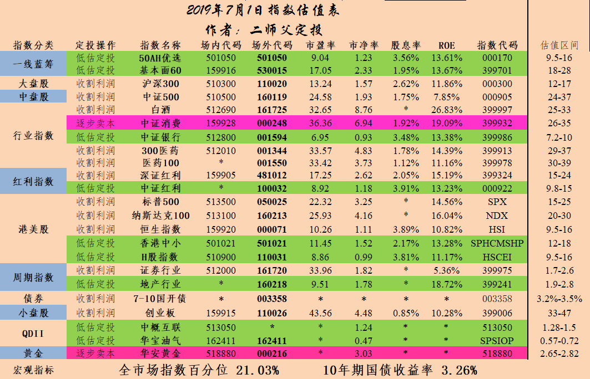

======================================================

_type: talk
@二师父[28814221155551]
2019-07-02 04:14:18 Tue  
topic_id: 544858225522124

等待市场上涨，我们再赚一波，冲上3000点，大家可以自己看看有好的可转债打新也是不错的收益方法的。没有账户的先开个账户准备着。

@Snow at 2019-07-02 04:14:18 Tue

> 可转债打新有教程吗？或者具体介绍下操作

----------

@二师父 at 2019-07-02 04:14:18 Tue

> 有的，一会发一下

----------

@秦岭云横 at 2019-07-02 04:14:18 Tue

> 麻烦发一下

----------

阅读[2521]  评论[3]  赞[0] 

+++++++++++++++++++++++++++++++++++++++++++++++++++++

文件：
2019-07-02 04:01:52 Tue
文件大小：[22231]
15588115814512-大盘站稳3044，利好来了.docx

======================================================

_type: talk
@二师父[28814221155551]
2019-07-02 04:15:31 Tue  
topic_id: 422151445544828

<e type="hashtag" hid="142852258522" title="#可转债打新提示#" /> 今日智能转债可以申购，具体信息如下，盲打可以上

二师父建议不打，只获取最大的胜率。

@呼唤旷野 at 2019-07-02 04:15:31 Tue

> 老师，中了中环转债请问什么时候卖出合适

----------

@二师父 at 2019-07-02 04:15:31 Tue

> 上市首日就可以卖

----------

阅读[2598]  评论[2]  赞[0] 

+++++++++++++++++++++++++++++++++++++++++++++++++++++

图片：
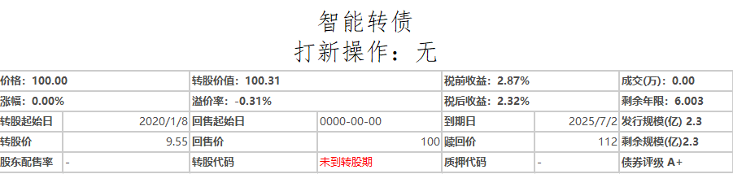

======================================================

_type: q&a
@曾来[841555815828282]
2019-07-02 09:23:51 Tue  
topic_id: 422151445584188

@曾来

>  请教师父：原始股权现在投资值不值得下手重一点？看好一家企业，并有机会小入一点原始股权，但流动资金没有达到自己期望入手股权的金额，其余的都在基金里，这行情还不想动，我应不应该通过别的途径融入一部分资金，按照自己期望的额度入股？？因为几年前投过一只原始股，当时入的特别少，虽然后来撤回上市申请，但企业自身的增长也让原始股赚了十几倍，。这次又碰上如此机会，很难下决断啊，请师父分析指点一下！！！

@二师父

>  股权投资比例占比20个点以内。不卖房炒股，不借钱炒股，不上杠杆，心态平和点

阅读[2376]  评论[5]  赞[0] 

======================================================

_type: talk
@杜志彪[544454124115854]
2019-07-02 11:19:19 Tue  
topic_id: 844121585415282

我有2手消费[呲牙]，既然高估了那就卖一手吧[偷笑]

阅读[2275]  评论[0]  赞[0] 

======================================================

_type: talk
@二师父[28814221155551]
2019-07-02 12:13:52 Tue  
topic_id: 844121588581522

<e type="hashtag" hid="881251425252" title="#鳄鱼计划#" /> 医药etf卖出一份，消费卖出本金的百分之20，全部盈利，赚钱就这么简单，低估坚定左侧加仓，忍耐等待估值上涨和企业盈利增长

@忙忙碌碌 at 2019-07-02 12:13:52 Tue

> 二师父，其他品种怎么操作

----------

@竹露清响 at 2019-07-02 12:13:52 Tue

> 二师父，有个疑问啊，万一卖出以后指数持续上涨追不上了怎么办？为啥不等到牛市止盈呢？

----------

@二师父 at 2019-07-02 12:13:52 Tue

> 估值高估了就需要逐步卖，涨跌不是同步的

----------

阅读[4520]  评论[3]  赞[0] 

======================================================

_type: q&a
@彩色[48415121851218]
2019-07-02 12:41:45 Tue  
topic_id: 844121585128252

@彩色

>  3二师父：求问，在指数基金配置中，大蓝筹基金(50ah  基本面60  h股指数)与行业基金(医药 证券 地产 消费)的比例大概几比几合适呢？谢谢！

@二师父

>  宽基和行业新手比例最好是7比3，如果能忍受浮动就没必要控制比例了，医药消费可以坚定加仓，包括证券和地产也是，不过有个前提，能忍受长期浮亏

阅读[2428]  评论[0]  赞[0] 

======================================================

_type: q&a
@远山[841555422151212]
2019-07-02 13:11:49 Tue  
topic_id: 844121588821142

@远山

>  二师父，昨天行情那么好，为什么低估区的上证50AH没有收益呢

@二师父

>  7月1日是香港回归纪念日，港股休市，北向通和南向通全部关闭，所以50ah也没有显示涨跌的

阅读[2526]  评论[0]  赞[0] 

======================================================

_type: q&a
@J[28281541518551]
2019-07-02 13:12:12 Tue  
topic_id: 111848255548512

@J

>  温馨提示：师父，置顶估值忘记更新啦，还是6月27号的😄

@二师父

>  好的哈，有时候忙着就忘记了

阅读[2588]  评论[1]  赞[0] 

======================================================

_type: talk
@二师父[28814221155551]
2019-07-02 13:21:26 Tue  
topic_id: 244121588818811

沪深300医药对应的是场内医药ETF基金，中证消费对应的是场内的消费ETF，很多刚进来的朋友可能不是很清楚，需要把置顶文章多看一看，学习我可以帮你领路，但是未来的路还得自己走

如果你有不懂得，就在学堂问问先进来得师兄师姐，或者问我也行，一起讨论，学习是一个长期得过程，哪一天你停止学习了，那么也就意味着成长停滞了。

天空才是极限，一直学习一直成长把

@风姐姐 at 2019-07-02 13:21:26 Tue

> 二师父学堂有交流群吗？想跟大家一起学习

----------

@二师父 at 2019-07-02 13:21:26 Tue

> 没有了，现在就星球交流

----------

@风姐姐 at 2019-07-02 13:21:26 Tue

> 谢谢二师父

----------

@二师父 at 2019-07-02 13:21:26 Tue

> 不知道啥时候下降

----------

@飘羽 at 2019-07-02 13:21:26 Tue

> 医药类etf哪个更好一些呢？有广发医药，有中证医药，好像还有南方500医药，好像还有好几个，入行不久，有点分不清

----------

@二师父 at 2019-07-02 13:21:26 Tue

> 就医药etf，对应300医药，广发医药对应中证医药

----------

阅读[2655]  评论[7]  赞[0] 

======================================================

_type: q&a
@璐老诗[88818121525822]
2019-07-02 17:23:24 Tue  
topic_id: 244121582454221

@璐老诗

>  请教二师傅，做网格交易的时候建立底仓，您建议周期指数刚开始低估再下跌15个点 ，非周期指数10个点，这样下跌压力小些。可您给的估值表，最后一栏 是估值区间，按最低值为基础算出建仓点不难，可场内给出的是基金价格，不是估值，我怎么转换成价格呀？

@二师父

>  这种非常容易解决，刚进入低估时候建立底仓就行，建百分之10或者20，因为我在下跌10个点建立底仓，是百分之30的仓位，你在刚进入低估建立底仓把仓位减轻一点就行啦

阅读[2394]  评论[0]  赞[0] 

======================================================

@二师父[28814221155551]
2019-07-02 17:23:57 Tue  
topic_id: 111848254144212

>  @二师父
>  

阅读[2466]  评论[0]  赞[0] 

======================================================

_type: talk
@二师父[28814221155551]
2019-07-02 18:00:55 Tue  
topic_id: 544858215842554

关于北京市通州区国民经济和社会发展第十三个五年规划纲要部分内容调整的方案，去掉了市行政副中心国际商务新中心

一、调整发展定位
将原规划中“市行政副中心、国际商务新中心、文化发展创新区、和谐宜居示范区”的发展定位调整为“国际一流和谐宜居之都示范区、新型城镇化示范区、京津冀区域协同发展示范区”。
二、调整发展布局
将原规划中“一城一河两组团”调整为“一城一带一轴多点”。一城，即北京城市副中心155平方公里范围；一带，即以大运河为依托的文化发展带；一轴，即沿东六环路形成的创新发展轴；多点，即副中心外围多个特色小城镇。
三、调整部分指标
（一）需要调整的指标（6个）
一是将全社会固定资产投资年均增速12%调整为建安投资年均增速8%。
二是将社会消费品零售总额年均增速10%调整为年均增速7%。
三是将服务业增加值占地区生产总值比重55%调整为52%。
四是将城市路网密度由9公里/平方公里调整为新建地区8公里/平方公里。
五是将城市污水处理率由100%调整为99%。
六是将常住人口规模160万调整为180万。

阅读[2550]  评论[0]  赞[0] 

======================================================

_type: q&a
@山川[422182281581128]
2019-07-02 18:50:32 Tue  
topic_id: 844121581428152

@山川

>  请问二师父，微信公众号里怎么找您？

@二师父

>  搜索二师父定投

阅读[2625]  评论[0]  赞[0] 

======================================================

_type: talk
@二师父[28814221155551]
2019-07-03 03:00:34 Wed  
topic_id: 844121528125182

指数估值表，高估记得逐步卖出

@小宝 at 2019-07-03 03:00:34 Wed

> 收割利润是指要卖出么

----------

@二师父 at 2019-07-03 03:00:34 Wed

> 对的，把利润部分卖出

----------

阅读[2431]  评论[2]  赞[0] 

+++++++++++++++++++++++++++++++++++++++++++++++++++++

图片：
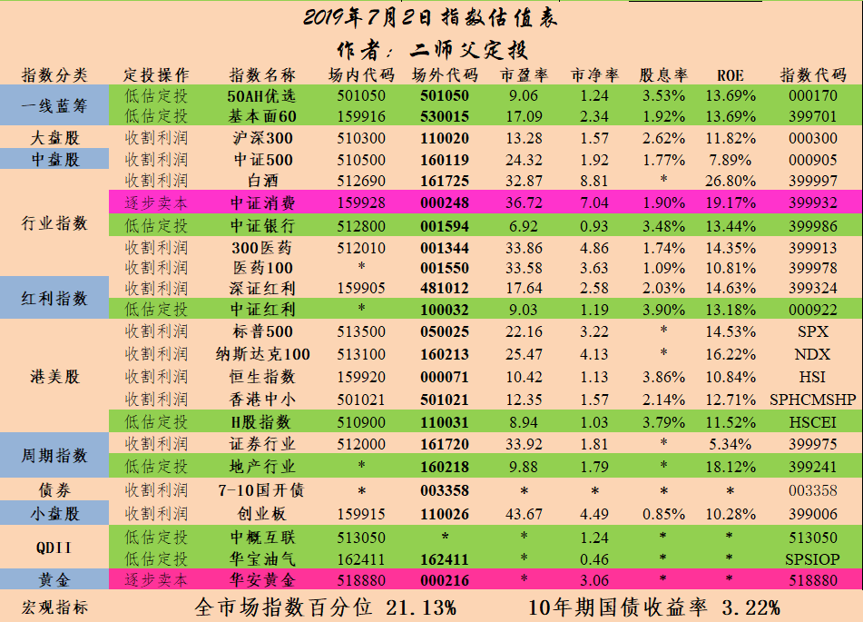

======================================================

_type: talk
@二师父[28814221155551]
2019-07-03 03:01:24 Wed  
topic_id: 244121528125181

怎么学习，学会学习本身比学到知识更重要

阅读[2487]  评论[0]  赞[0] 

+++++++++++++++++++++++++++++++++++++++++++++++++++++

文件：
2019-07-03 03:01:08 Wed
文件大小：[24101]
51188482111824-每天下班做这三件事，你的基金定投会赚得更多.docx

======================================================

_type: talk
@杜志彪[544454124115854]
2019-07-03 09:49:02 Wed  
topic_id: 422151451252128

场外161725中证白酒是触发上折了吗？这个是B类基金吗？从名字上没注意是B类基金啊，看来还需要好好学习，还不太了解场外基金，场内只有B类基金才会触发上下折。

阅读[2215]  评论[0]  赞[0] 

======================================================

_type: q&a
@李震笛[422112248211828]
2019-07-03 10:55:54 Wed  
topic_id: 544858258128544

@李震笛

>  二师傅，看您的估值表，里面没有基本面50，是不是因为与60是重叠的？没有必要单做？另外，华宝油气这个指数。我记得之前您说是周期性的指数，目前这个指数很低，是不是适合大单的买进？

@二师父

>  基本面50指数挑选以4个基本面指标(营业收入、现金流、净资产、分红)来衡量的经济规模最大的50家A股上市公司作为样本，且样本个股的权重配置与其经济规模相适应
>  
>  他也是金融地产股居多，与基本面60重合不大，因为我们已经选择了很多金融地产指数，比如银行，50ah，地产指数，就没有加入50ah
>  
>  另外华宝油气因为是周期指数，所以周期性强，这个指数的涨跌和供需关系非常大，如果一直供大于求，那么指数会一直处于低迷期，所以不适合重仓

阅读[2230]  评论[0]  赞[0] 

======================================================

_type: talk
@二师父[28814221155551]
2019-07-03 11:16:57 Wed  
topic_id: 244121545821481

给大家推荐两款学习笔记整理软件，有道云和印象，我喜欢简介的界面，所以用了有道云，大家一定要建立笔记库，知识库，然后每次用的时候直接调出来。

@小白老赵 at 2019-07-03 11:16:57 Wed

> 印象笔记可以在没有网络时用，所以我用印象

----------

阅读[2188]  评论[1]  赞[0] 

======================================================

_type: q&a
@无名书苑[51188588215444]
2019-07-03 11:50:03 Wed  
topic_id: 111848212511222

@无名书苑

>  二师父，那深圳基本面60指数是怎么选股的？是否也是按(营业收入、现金流、净资产、分红)来挑选股票？是否按市值加权编排？还有基本面60指数成份股每年是否都有调整？多留调整一次，按什么标准来调整？
>  谢谢！

@二师父

>  深市A股为样本空间，分别挑选基本面价值最大的60家上市公司作为样本。
>  
>  基本面价值是采用过去5年公司的分红、营收、净资产、现金流的平均值。对于上述四个财务指标，分别计算每只股票单个基本面指标占样本空间所有股票这一指标总和的百分比。
>  
>  这不是一个市值加权指数基金宽基指数有市值和规模指数，策略指数，红利，基本面，价值，波动等等都是策略指数
>  
>  调仓根据基本面来调仓，对于指数调仓市值指数根据股票市值调仓，策略指数根据策略调仓的
>  
>  策略指数有一个缺点，规模比市值指数小，是不适合大资金投资者的，但对于小型投资者，他们有策略选股，会带来超额收益

阅读[2219]  评论[1]  赞[0] 

======================================================

@二师父[28814221155551]
2019-07-03 11:52:28 Wed  
topic_id: 544858242545284

>  @二师父
>  

阅读[2259]  评论[4]  赞[0] 

======================================================

_type: talk
@二师父[28814221155551]
2019-07-03 13:49:15 Wed  
topic_id: 111848215248452

增强自己的迁徙力

从烂基金到好基金，从烂股票到好股票，
从农村迁徙到城市，从城市迁徙到超级城市；从没落的行业，迁徙到光明的行业；从烂公司，迁徙到好一点的公司，然后是再好一点的公司；从封闭的小圈子，迁徙到开放的大圈子；从相对平庸的群体，迁徙到整体水平更强的群体。

学堂就是一个优质群体，希望在这里大家都能突破思维局限，每日精进

阅读[2206]  评论[0]  赞[0] 

======================================================

_type: q&a
@忙忙碌碌[88221212185552]
2019-07-03 14:13:42 Wed  
topic_id: 111848215242522

@忙忙碌碌

>  天弘计算机指数C，这个基金，老师给个
>  操作策略

@二师父

>  三大策略结合使用，基础不好的，选择宽基定投，先别搞行业指数

阅读[2266]  评论[3]  赞[0] 

======================================================

@二师父[28814221155551]
2019-07-03 15:26:30 Wed  
topic_id: 844121544542112

>  @二师父
>  

阅读[2241]  评论[0]  赞[0] 

======================================================

_type: q&a
@是喵喵吖～[421441114141158]
2019-07-03 16:46:21 Wed  
topic_id: 422151422541118

@是喵喵吖～

>  读二师父的五步定投法，有一些小问题想请教
>  1、配置四个象限里的钱的时候，提到的存量资金的20%，存量资金是指的我现有的存款吗
>  比如我现在有10w存款，放到第一个象限20%的话，就是存入2w？
>  
>  2、防守账户里的钱只能用于买货币基金和定期理财，防守账户里的理财肯定是要低风险的，货币基金我明白，这里的定期理财指的是哪些类型呢？
>  
>  3、什么是仓位管理，我对仓位感觉不大理解，比如说满仓了，是说没钱买了吗
>  
>  4“一般我们建仓购买指数基金都是在牛市崩盘 指数下跌到低估区域开始建仓” 我6.20刚买的50AH算是属于低估区域，但是并不是牛市崩盘吧？
>  现在是出于牛市还是熊市呢，如果是出于熊市，处于第几年呢？

@二师父

>  1，按自己比例配置 2，银行理财 3，满仓是存量资金全部买了指数基金 4，不是5，处于这轮熊市第4年

阅读[2141]  评论[0]  赞[0] 

======================================================

_type: q&a
@是喵喵吖～[421441114141158]
2019-07-03 16:48:15 Wed  
topic_id: 544858244514824

@是喵喵吖～

>  5、现在是出于牛市还是熊市呢，如果是出于熊市，处于第几年呢？
>  
>  6、二师父在股票五步趋势交易法里举例提到的 以平安为例，证明它有投资价值，计算结果85.67我明白， 然后说大于59.38 ，这个59.38的值是哪里来的呢？
>  
>  7、20日均线是某支股票在市场上往前20天的平均收盘价格，其意义在于它反映了这支股票20天的平均成本。【股票价格冲上20日均线开始买入】是说 股票价格超过前20天平均收盘价的时候，就可以买了吗？虽然现在不会涉入股票 但是看到了还是想明白一点儿 ，请二师父指点。

@二师父

>  5，熊市第五年 6，根据终值倒推出的价格
>  7，还需要看是否具有牛股特征，是否处于低估

阅读[2282]  评论[2]  赞[0] 

======================================================

_type: q&a
@是喵喵吖～[421441114141158]
2019-07-03 16:55:50 Wed  
topic_id: 422151422244418

@是喵喵吖～

>  9、在讲到一线蓝筹对应的指数基金的时候 二师父说：当50AH、基本面50、恒生国企同时低估时，选择市盈率更低的来作为投资标的
>  
>  50AH我知道场内是50ETF，场外是501050这只是吧，基本面50和恒生国企呢？基本面50我搜的时候有嘉实基本面50指数A和嘉实基本面50指数C （如果到时候选的话 如何选呢）恒生国企，搜索的时候带有这个关键词的基金就更多了所以看到这里还是很懵
>  
>  10、【中证500和沪深300指数是必须同时投入的】我只要定投二师父发的估值表里，中证500和沪深300里标绿的就可以吗
>  11、新手采用蛋卷的智能定投，我现在用的是天天基金，请问天天基金也有智能定投吗，和蛋卷一样吗？

@二师父

>  你直接用我给的代码，50ah场内不是上证50，她是lof基金，对低估了沪深300和中证500就可以投，天天没有智能定投

阅读[2423]  评论[2]  赞[0] 

======================================================

_type: talk
@海盗[48248118584848]
2019-07-03 17:21:18 Wed  
topic_id: 111848211814282

<e type="hashtag" hid="225118152481" title="#指数基金均线偏离表#" />

@海盗 at 2019-07-03 17:21:18 Wed

> 刚出炉的均线偏离表😃，方便做网格交易的同学查阅[握手]

----------

@齐俊波 at 2019-07-03 17:21:18 Wed

> 华宝油气好着急人。[抓狂][抓狂]

----------

@龘何亮龘 at 2019-07-03 17:21:18 Wed

> 请问海盗 偏离度是当前价减去90日均线除以什么？除当前价还是90日均线价

----------

@海盗 at 2019-07-03 17:21:18 Wed

> 除以90日均线

----------

@龘何亮龘 at 2019-07-03 17:21:18 Wed

> 谢谢

----------

阅读[2540]  评论[5]  赞[0] 

+++++++++++++++++++++++++++++++++++++++++++++++++++++

图片：
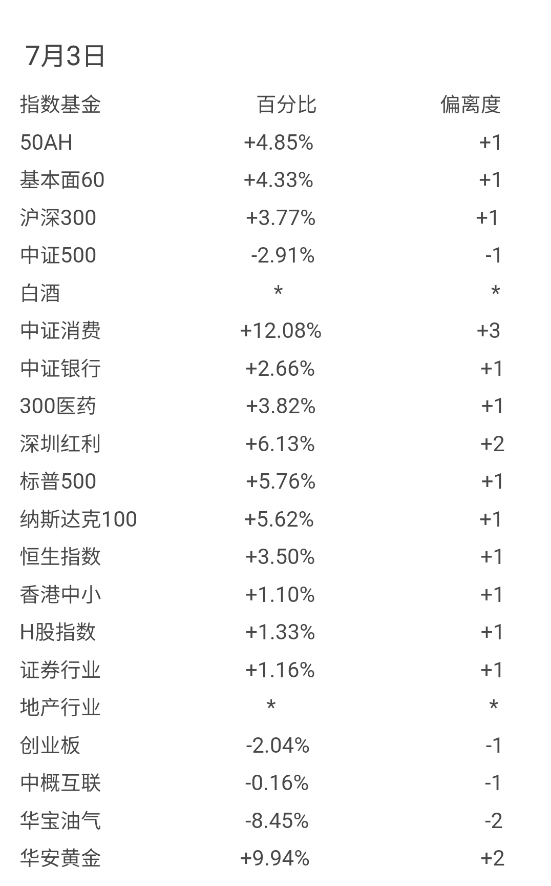

======================================================

_type: talk
@杜志彪[544454124115854]
2019-07-03 20:24:47 Wed  
topic_id: 244121541418421

我们的指数160218新城控股占比4.32%

阅读[2374]  评论[0]  赞[0] 

======================================================

@二师父[28814221155551]
2019-07-03 20:34:48 Wed  
topic_id: 111848218144452

>  @二师父
>  

阅读[2439]  评论[1]  赞[0] 

======================================================

_type: q&a
@凯[244415182418811]
2019-07-03 21:09:53 Wed  
topic_id: 111848218848882

@凯

>  地产股新城控股黑天鹅，对我们国泰地产基金有多大影响

@二师父

>  这个问题挺好的，大家可能都关心这个问题。二师父详细说下吧
>  
>  首先，不用担心，我们定投的国泰国证地产基金很安全（基金代码：160218），这个基金追踪的指数是国证地产指数399393.说下原因
>  
>  1、国泰国证基金里面新城控股的比例是4.32%，国证地产指数里面的持仓比例是4.38%。这样即使新城控股跌了20%，其实实际对基金的影响也只有1%，完全不用担心啊。
>  
>  2、我们是在低估区域买入的，安全边际很好，最大下跌幅度可控，所以呢碰到基金暴跌其实是市场给我们的机会
>  
>  3、最坏的情况，新城控股太垃圾被警告，那么根据指数的编制规则，ST股票会被剔除出去，而且一年内有重大违规的股票也会被清理，所以指数的天生优势保护了我们
>  
>  4、我们的仓位很低，这是一只周期指数，二师父一直让大家控制仓位，所以呢，仓位低，基金再怎么跌也不会让我们浮亏很大的。
>  
>  综合上述，我们知道，让暴跌来的更猛烈些吧，我们可以买的更加便宜。提示，港股美股没有退市保护机制，投资慎重。指数基金是最好最安全的选择啦。今晚好好睡觉，没事，你的国泰国证基金很安全。

阅读[4601]  评论[1]  赞[1] 

======================================================

_type: talk
@二师父[28814221155551]
2019-07-03 23:16:20 Wed  
topic_id: 844121812218252

中证全指信息和人工智能有信息行业充合，这两个指数都不错，准备选择一只开始进行场内鳄鱼计划的定投

@妖孽 at 2019-07-03 23:16:20 Wed

> 全指信息技术目前高估吧！

----------

@J at 2019-07-03 23:16:20 Wed

> 期待！

----------

阅读[2354]  评论[2]  赞[0] 

======================================================

_type: talk
@二师父[28814221155551]
2019-07-04 03:05:01 Thu  
topic_id: 244121814882181

估值表，剔除了两个指数，除了创业板，这里面的指数我都投过，创业板也投过，现在卖完了。我保证我的估值表的品种是我研究过自己买的，当前认为最有价值的。目前在研究人工智能，AI肯定改变很多商业模式。

@一剪梅 at 2019-07-04 03:05:01 Thu

> 师父，中证红利也被剔除了吗？

----------

@自由飞翔 at 2019-07-04 03:05:01 Thu

> 师父，估值表中剔除的中证红利和香港中小，对于一直在定投的中证红利，帮建议下后续怎样操作？

----------

@是喵喵吖～ at 2019-07-04 03:05:01 Thu

> 本来想这周开始定投中证红利来着😂😂

----------

@J at 2019-07-04 03:05:01 Thu

> 定期精简指数👍 师父，可以科普一下剔除中证红利和香港中小的原因吗？

----------

@门萨🐨 at 2019-07-04 03:05:01 Thu

> 剔除的两个后续如何操作

----------

@二师父 at 2019-07-04 03:05:01 Thu

> 可以

----------

阅读[2545]  评论[21]  赞[0] 

+++++++++++++++++++++++++++++++++++++++++++++++++++++

图片：
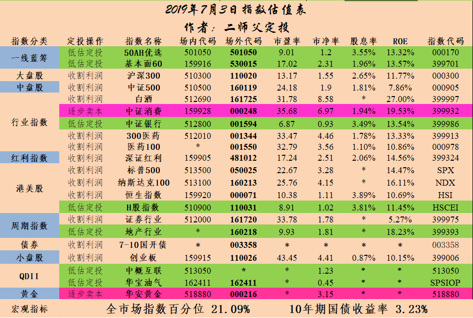

======================================================

_type: talk
@二师父[28814221155551]
2019-07-04 03:06:42 Thu  
topic_id: 111848581551222

医药基金的投资价值，看了这篇文章应该对医药基金有一个基本的理解。

阅读[2709]  评论[0]  赞[0] 

+++++++++++++++++++++++++++++++++++++++++++++++++++++

文件：
2019-07-04 03:06:36 Thu
文件大小：[22585]
28811414245811-远离新城控股，我们一起看看医药指数基金哪个更有投资价值.docx

======================================================

_type: q&a
@远山[841555422151212]
2019-07-04 08:07:18 Thu  
topic_id: 244121541222411

@远山

>  刚办了张信用卡，请问老师如何使用呢

@门萨🐨

>  请问是什么卡。

阅读[2579]  评论[2]  赞[0] 

======================================================

_type: talk
@二师父[28814221155551]
2019-07-04 08:48:40 Thu  
topic_id: 111848581844522

<e type="hashtag" hid="551142454424" title="#关于调整和卖出#" /> 统一说下，调整指数定投的唯一目的是为了更好的收益率，之前有定投的不要紧，我也有投，还记得我们之前也投过传媒和德国30吗？

在低估区域投资的指数，一直可以持有，逐步盈利卖出，卖出的核心原则，盈利。也就是我们永远盈利卖出。只要你买的是我估值表低估的指数，未来肯定盈利

其次关于消费指数卖出2成仓位的问题，到了高估值就要逐步减仓这是我们的原则，不要贪婪，股市投资切记不是所有的品种涨跌就跟随市场的，每个指数都有自己的成长趋势

卖出之后也有可能继续涨，买入之后也有可能继续跌，关键在于看指数的估值。放弃牛熊思维，转变到估值思维

@🍀一秋 at 2019-07-04 08:48:40 Thu

> 收到

----------

@梧桐 at 2019-07-04 08:48:40 Thu

> 请问二师父，中证红利现在继续持有等高估时卖出，这个没问题。关键不明白现在还在低估区域是否值得继续买进。

----------

@二师父 at 2019-07-04 08:48:40 Thu

> 是处于低估区域的

----------

阅读[2433]  评论[3]  赞[0] 

======================================================

_type: q&a
@是喵喵吖～[421441114141158]
2019-07-04 08:50:10 Thu  
topic_id: 844121814184112

@是喵喵吖～

>  师傅请问这算不算是在价格高的时候买？

@二师父

>  不要只看一个时间端的，你去万得看整个历史区间的位置，另外看估值指标而不要看指数位置

阅读[2652]  评论[1]  赞[0] 

======================================================

_type: talk
@二师父[28814221155551]
2019-07-04 09:19:49 Thu  
topic_id: 111848588248142

<e type="hashtag" hid="551142458124" title="#避免锚定效应#" /> 锚定效应指指当人们需要对某个事件做定量估测时，会将某些特定数值作为起始值，起始值像锚一样制约着估测值。在做决策的时候，会不自觉地给予最初获得的信息过多的重视。

很多人在股市容易犯锚定效应的错误，比如牛市的时候他认为股市就是这个高位价格，从牛市暴跌百分之20就觉得便宜了，其实就是锚定值太高，最近一年在2000多点横盘，很多人又开始有锚定心理了，认为股市就这个位置

其实即使涨了一点，估值仍旧很低

放弃锚定心理，从全局来看待问题，学会优质的金融思维，这样思维认知才不会偏离正常

阅读[2654]  评论[0]  赞[0] 

======================================================

_type: talk
@二师父[28814221155551]
2019-07-04 09:36:48 Thu  
topic_id: 244121811824251

<e type="web" href="https://mp.weixin.qq.com/s/mdo7S8W4nUKa9RZf54MLhw" title="可转债打新，二师父带你蓐羊毛" cache="" />，可转债打新的知识

阅读[2651]  评论[0]  赞[0] 

======================================================

_type: talk
@乖子[28441841181151]
2019-07-04 10:39:37 Thu  
topic_id: 544858188822454

请问二师父，中证500正常估值了，是否需要卖掉一部分？因为之前您分析过中证500为什么盈利变差。

@二师父 at 2019-07-04 10:39:37 Thu

> 是否盈利，盈利的话可以

----------

@乖子 at 2019-07-04 10:39:37 Thu

> 盈利16%

----------

@二师父 at 2019-07-04 10:39:37 Thu

> 可以减仓一部分

----------

@乖子 at 2019-07-04 10:39:37 Thu

> 好的，非常感谢

----------

阅读[2579]  评论[4]  赞[0] 

======================================================

_type: talk
@二师父[28814221155551]
2019-07-04 11:15:48 Thu  
topic_id: 244121258451421

石景山附近的楼盘，老破小和次新，这是北京的价格洼地，冬奥会场馆在这里，会有一波利好，可以关注下，房价还是取决于政策，北京限购组合拳一旦放松，还是会继续涨的

@王雷 at 2019-07-04 11:15:48 Thu

> 谢谢二师父的好提议。真是可以考虑！

----------

阅读[2597]  评论[1]  赞[0] 

+++++++++++++++++++++++++++++++++++++++++++++++++++++

图片：
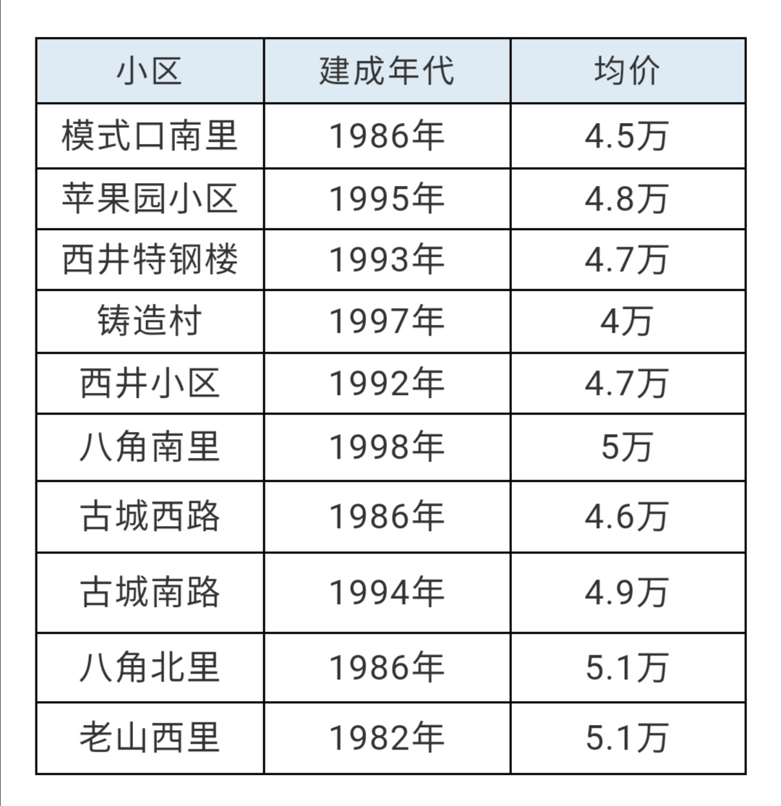
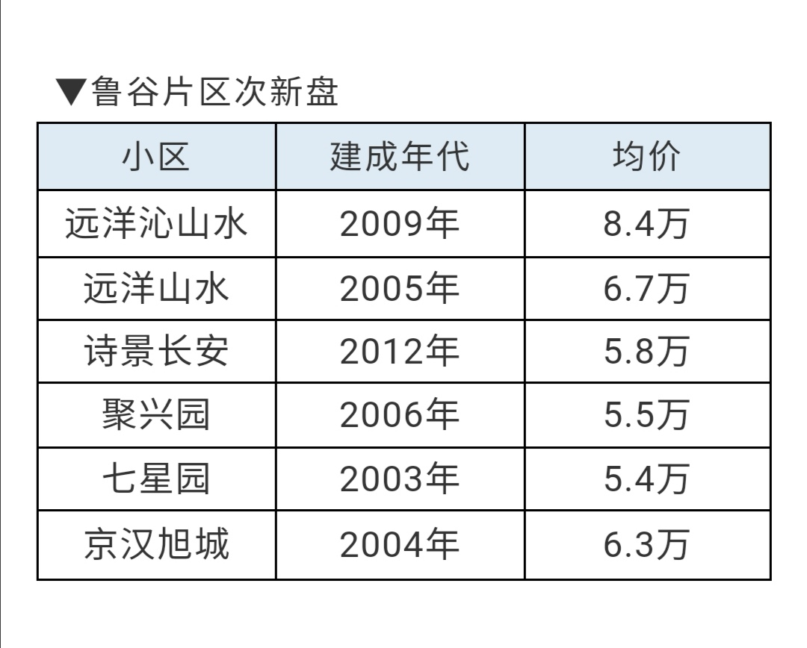

======================================================

_type: q&a
@蔡蔡蔡[15442451484542]
2019-07-04 11:59:39 Thu  
topic_id: 544858521428814

@蔡蔡蔡

>  二师父好，前不久看您买了康惠保，也是在网上买的吗？我也打算买这个，为了安心，我想人工核保下，请问在哪里可以人工核保？

@二师父

>  去我的公众号菜单找到这款保险，然后进入就可以人工核保，确保符合健康告知
>  我就是网上买的，现在看50万保额有可能不太够

阅读[2664]  评论[3]  赞[0] 

======================================================

_type: q&a
@驼驼夫[244151825154221]
2019-07-04 12:02:15 Thu  
topic_id: 422151548288888

@驼驼夫

>  二师父，中概互联跟踪的指数代码是多少呀？您估值表上中，中概互联指数代码搜索出来的还是中概互联这支场内基金٩😐ི۶

@二师父

>  531050

阅读[2803]  评论[0]  赞[0] 

======================================================

_type: talk
@上上签[244184512458541]
2019-07-04 13:01:58 Thu  
topic_id: 844121252854182

这段话，二师傅、各位师兄师姐你们怎么觉得呢
[跳跳][转圈][怄火][怄火]
上证50最根本的问题，不是估值够不够低，而是金融行业占比实在太高，最根本的解决办法，是通过主动增强，来优化成分股的行业结构。AH轮动这种方式，在2014年沪港通开通之后，超额收益就已经可以忽略不计了，甚至还抵不上基金的摩擦成本。

@无名书苑 at 2019-07-04 13:01:58 Thu

> 二师父怎么看？

----------

阅读[2699]  评论[1]  赞[0] 

======================================================

_type: talk
@二师父[28814221155551]
2019-07-04 14:36:33 Thu  
topic_id: 844121252442522

<e type="hashtag" hid="228845145841" title="#买保险注意的问题#" /> 1，理财险和投连险不要购买

2，切记一个人一次最多只购买一份重疾，因为通货膨胀会侵蚀你的保额，比如10年前投保的10万保额的重疾现在保障力度肯定不够了，这样就需要再没有患病的时候再次购买新品种，这有点类似我们开始工作钱不够买小房子，到了35岁左右再置换，一个道理的

不要总是想着一步到位，人生没有一劳永逸的事情哈，买保险不要着急，投资一定要多学多想，不然别人不会为你的钱负责的

@小宝 at 2019-07-04 14:36:33 Thu

> 是指同一时间不要购买多份重疾是吧，比如我4年前买了一份，今年打算再买多一份别家的重疾增加额度这样没问题吧

----------

@二师父 at 2019-07-04 14:36:33 Thu

> 可以的，如果你感觉之前的保险保额已经不够而且自己仍旧符合健康告知的条件

----------

@Claire at 2019-07-04 14:36:33 Thu

> 跟师父学习定投后，赎回了泰康的投连险。

----------

@二师父 at 2019-07-04 14:36:33 Thu

> 费率都把投资者坑了

----------

阅读[2679]  评论[4]  赞[0] 

======================================================

_type: talk
@土木工程部[51514112455814]
2019-07-04 16:20:19 Thu  
topic_id: 422151542858418

二师父好，我通过对比发现50ah和上证50在季度，半年和一年，2年对比中，易方达上证50均优秀与50ah,是不是上证50比50ah有更高的投资回报呢

@上上签 at 2019-07-04 16:20:19 Thu

> 个人观点，首先只是单单从一两年来看收益比较的高低。认为易方达上证50比50AH好，片面性太强了，个人觉得应该从这个指数型基金对于的指数，历史收益进行计算比较。

易方达上证50不是简单的纯被动指数型基金，而增强型指数型基金。不能说通过，2年对比中，易方达上证50均优秀与50AH,而是说上证50比50AH有更高的回报价值。

其实这个问题，我早就想问二师傅了，只是自己还在一个人琢磨。上证50AH的策略，是不是从根本上，有效解决上证50的金融行业比例太大的问题。是不是可以通过主动增强，来优化成分股的行业，从而获得一定的超额收益。

----------

@土木工程部 at 2019-07-04 16:20:19 Thu

> 谢谢你[微笑]

----------

@凯 at 2019-07-04 16:20:19 Thu

> 你可以提问的，否则师父可能看不到

----------

@西锦巴乌 at 2019-07-04 16:20:19 Thu

> 我的想法与你一样，所以我俩基金同时在投，看看结果如何

----------

阅读[2767]  评论[4]  赞[0] 

+++++++++++++++++++++++++++++++++++++++++++++++++++++

图片：
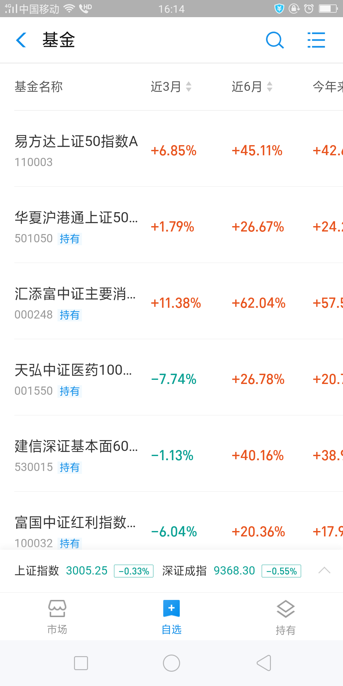

======================================================

_type: q&a
@李依祚[844148481122152]
2019-07-04 23:15:34 Thu  
topic_id: 844121282541812

@李依祚

>  师傅，被剔除的中证红利和香港中小目前是继续持有，还是卖出，还能定投吗？你剔除他们的原因是什么？

@二师父

>  1，继续持有，可以定投，中证红利我有定投，香港中小没有投。基金定投卖出一定是盈利卖，这一点要记住
>  
>  2，追求高成长，高收益，你一只优质基金重仓50万比你拿5万玩玩最终不是一个概念。港股小盘容易出老千股，中证红利成长性相对较弱，选择分红好的可以用这个

阅读[2484]  评论[0]  赞[0] 

======================================================

_type: q&a
@珅爹[15451242541142]
2019-07-04 23:16:05 Thu  
topic_id: 544858515122414

@珅爹

>  请教，对于利润需要收割的etf基金，发现自己在该基金整体上亏损的，怎么收割利润？
>  谢谢

@二师父

>  没有利润就不收割，等待基金继续上涨

阅读[2504]  评论[0]  赞[0] 

======================================================

_type: talk
@二师父[28814221155551]
2019-07-05 03:04:30 Fri  
topic_id: 844121282145482

所有当下让你爽的东西，未来的痛苦会让你加倍奉还，比如消费贷，比如抖音
反之，当下让你不爽的东西，未来的快感也会加倍，比如房贷，比如节衣缩食定期定投。
延迟满足，早买房，早投资是走向快车道

@Sophie🌸乐桃 at 2019-07-05 03:04:30 Fri

> 第一种：享了不该享的福，就得吃不该吃的苦
第二种：能承受多大的风险与压力，决定你会有多大的成就
总结：任何人都不是上帝的宠儿，可以独得这世间所有的好处

----------

@杜志彪 at 2019-07-05 03:04:30 Fri

> 加入人工智能了[强]，您这个估值区间是多少？

----------

@二师父 at 2019-07-05 03:04:30 Fri

> 我今晚发下哈

----------

@云淡风轻 at 2019-07-05 03:04:30 Fri

> 看了二师父的话，有种不想再帮客户办贷款的感觉呢[擦汗]

----------

@二师父 at 2019-07-05 03:04:30 Fri

> 看贷款做啥呢，贷款买房就是很不错呢，创业也可以。

----------

@志亮 at 2019-07-05 03:04:30 Fri

> 一个是先甜后苦，另一个是先苦后甜。

----------

阅读[2447]  评论[6]  赞[0] 

======================================================

_type: talk
@二师父[28814221155551]
2019-07-05 03:57:45 Fri  
topic_id: 111848454811242

指数估值。债券基金记得持有的可以逐步卖出了。

@🍀一秋 at 2019-07-05 03:57:45 Fri

> 师父我持有的债券是大摩优质信价纯债债券，现在收益率还是百分之0点几，也需要逐步卖本吗？我看过你写的说是投资债券是10年期国债的收益率是3.8%以上才买，现在是3.17%就要卖本了吗？是什么道理呀？麻烦解惑下。谢谢

----------

@二师父 at 2019-07-05 03:57:45 Fri

> 因为国债收益率越高，债券价格越低的，就适合买入

----------

@🍀一秋 at 2019-07-05 03:57:45 Fri

> 那现在国债收益率是算低的么？到了要卖本的时候了么？卖本的话又要怎么来操作？

----------

@二师父 at 2019-07-05 03:57:45 Fri

> 是比较低了，你的债券基金买贵了，直接按照比例卖出一部分金额

----------

@🍀一秋 at 2019-07-05 03:57:45 Fri

> 哦，原来是我的买贵了。那我懂了，谢谢师父

----------

@🍀一秋 at 2019-07-05 03:57:45 Fri

> 师父还有件事，对于多次收割利润后怎么计算持仓盈亏率呀？我看天天的收割了10%的利润后还是以前的盈亏率，不会跟着变的？麻烦你用数例来帮我解答下，谢谢

----------

@二师父 at 2019-07-05 03:57:45 Fri

> 是的，用净值减去买入均价，然后除以买入均价，是不会变得

----------

阅读[2610]  评论[7]  赞[0] 

+++++++++++++++++++++++++++++++++++++++++++++++++++++

图片：
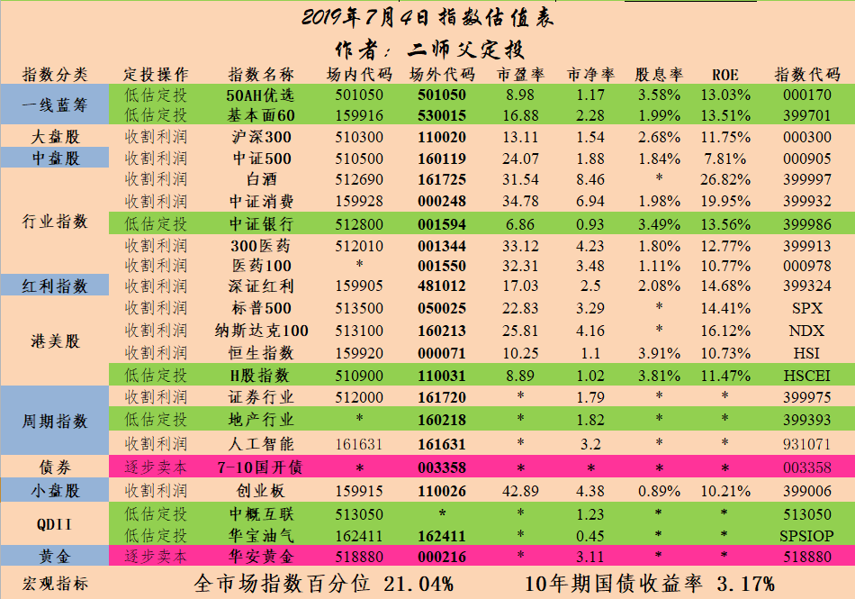

======================================================

_type: talk
@二师父[28814221155551]
2019-07-05 03:59:06 Fri  
topic_id: 544858515844254

该卖就卖，逐步减仓，高手是行为金融学指导投资，如果你不懂的话，那么就按照估值量化

阅读[2778]  评论[0]  赞[0] 

+++++++++++++++++++++++++++++++++++++++++++++++++++++

文件：
2019-07-05 03:58:32 Fri
文件大小：[22410]
48811144455888-股市仍旧大熊，为什么我们已经开始卖出消费和白酒指数了.docx

======================================================

_type: q&a
@紫色天使[844124551411152]
2019-07-05 10:09:18 Fri  
topic_id: 111848451255812

@紫色天使

>  二师父，今天发现估值表里面既有H股指数，又有恒生指数，这两个不是一样的吗，您的这两个代码都是恒生指数，只是公司不一样吗？

@二师父

>  不一样，h股的持仓是内地企业在香港上市，类似平安这种，而恒生指数是香港本土企业

阅读[2484]  评论[0]  赞[0] 

======================================================

@二师父[28814221155551]
2019-07-05 14:50:29 Fri  
topic_id: 422151555888518

>  @二师父
>  

阅读[2327]  评论[0]  赞[0] 

======================================================

_type: talk
@二师父[28814221155551]
2019-07-05 15:42:51 Fri  
topic_id: 111848444415152

当别人给你推荐的时候，你问问他，买了吗？

不要让别人决定自己的投资，学会独立判断，周期指数难以把握，尤其是环保这种。

@麻烦得很 at 2019-07-05 15:42:51 Fri

> 他会回答说，从业人员不能买

----------

@二师父 at 2019-07-05 15:42:51 Fri

> 可以买基金，不能买股票

----------

阅读[2406]  评论[2]  赞[0] 

+++++++++++++++++++++++++++++++++++++++++++++++++++++

图片：
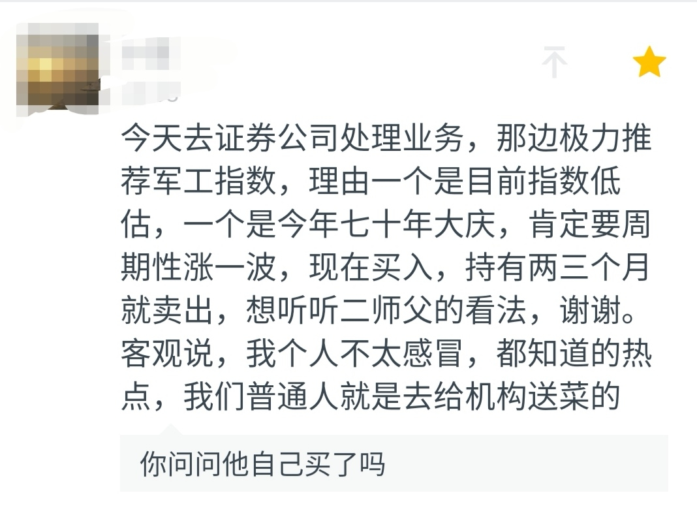

======================================================

_type: talk
@光少[244124552511141]
2019-07-05 16:19:53 Fri  
topic_id: 111848448515822

蛋卷基金卖出赎回T+4才到帐太慢了，各位是在使用什么基金平台好用？请推荐一下[抱拳]

@wenkyliu at 2019-07-05 16:19:53 Fri

> 我用的是天天基金，隔日到账。很快

----------

@光少 at 2019-07-05 16:19:53 Fri

> 谢谢

----------

@凯 at 2019-07-05 16:19:53 Fri

> 蚂蚁财富，支付宝有

----------

@光少 at 2019-07-05 16:19:53 Fri

> 谢谢！这个我知道，但是有些基金它不能买哦

----------

@蓝魔森林 at 2019-07-05 16:19:53 Fri

> 蚂蚁财富

----------

阅读[2360]  评论[5]  赞[0] 

======================================================

_type: q&a
@彩色[48415121851218]
2019-07-05 16:35:49 Fri  
topic_id: 844121221841882

@彩色

>  易方达上证50比50AH这两年表现好。
>  
>  易方达上证50不是简单的纯被动指数型基金，而增强型指数型基金。上证50AH的策略，是不是从根本上，有效解决上证50的金融行业比例太大的问题。是不是可以通过主动增强，来优化成分股的行业，从而获得一定的超额收益。

@二师父

>  易方达上证50是增强基金？

阅读[2430]  评论[4]  赞[0] 

======================================================

_type: q&a
@陈飞🤗[841521421222252]
2019-07-05 16:36:26 Fri  
topic_id: 544858558518584

@陈飞🤗

>  二师父你好，鳄鱼计划你有公布出来吗？

@二师父

>  有的啊，我操作了就会在星球公布的

阅读[2520]  评论[0]  赞[0] 

======================================================

_type: q&a
@tanxin[241524428884281]
2019-07-05 18:53:14 Fri  
topic_id: 111848448441112

@tanxin

>  二师父你好！请问50AH基本面60和沪深300中证500，这两个组合选哪个更好一些？

@二师父

>  各有优劣，我目前场外定投选择的50ah和基本面60作为组合，蓝筹行情来的时候涨幅会大
>  
>  沪深300是没有进行定投了，中证500也在定投的，沪深300和中证500几乎概括了a股市值最大的前800家企业，中盘股行情到来的时候中证500会涨的比较好

阅读[2421]  评论[0]  赞[0] 

======================================================

_type: q&a
@黎雄[841555255485222]
2019-07-05 18:54:06 Fri  
topic_id: 111848448415112

@黎雄

>  二师傅你好亲，你的实盘没买中证500，是因为预期收益不高，还是别的原因呢？

@二师父

>  之前是有买的，今年以来中证500盈利一直在下降，所以场外停止了，场内鳄鱼计划仍旧有投资

阅读[2508]  评论[1]  赞[0] 

======================================================

_type: talk
@二师父[28814221155551]
2019-07-05 22:30:06 Fri  
topic_id: 244121248545221

我发表了一篇文章：<e type="web" href="https://articles.zsxq.com/id_t136t8506i3z.html" title="可转债打新的知识。" cache="" />

@闲云 at 2019-07-05 22:30:06 Fri

> 二师父对股权投资有研究吗

----------

@二师父 at 2019-07-05 22:30:06 Fri

> 有的，你可以听听我的股票课程

----------

@二师父 at 2019-07-05 22:30:06 Fri

> 看看这个

----------

@闲云 at 2019-07-05 22:30:06 Fri

> 打不开

----------

@二师父 at 2019-07-05 22:30:06 Fri

> 扫描

----------

阅读[2637]  评论[5]  赞[0] 

======================================================

_type: talk
@二师父[28814221155551]
2019-07-06 00:12:21 Sat  
topic_id: 244121248482151

<e type="hashtag" hid="228844858111" title="#上证50和50AH的对比#" /> 大家分析的时候一定要至少看一个周期甚至2个周期的数据，否则就会得出错误结论。二师父用数据说话，这些你们都可以查到。

@闲云 at 2019-07-06 00:12:21 Sat

> 易方达上证50该卖出吗？

----------

@闲云 at 2019-07-06 00:12:21 Sat

> 目前盈利24个点

----------

@二师父 at 2019-07-06 00:12:21 Sat

> 可以收割利润

----------

阅读[4630]  评论[3]  赞[0] 

+++++++++++++++++++++++++++++++++++++++++++++++++++++

文件：
2019-07-06 00:12:08 Sat
文件大小：[177126]
15422221251482-蓝胖子半年涨了41%，他真的比对应的策略基金优秀吗.docx

======================================================

_type: talk
@二师父[28814221155551]
2019-07-06 00:15:47 Sat  
topic_id: 544858541418114

加了人工智能，这是个周期指数。李彦宏据说在将这个概念的时候被泼了冷水，不知道是真的碰到垃圾人还是炒作。总之，人工智能是未来的趋势，正如20年前的互联网一样。那时候一台电脑很贵了，我的梦想之一就是有一台笨重的台式电脑。

而现在，想要电脑我分分钟就能买到，有远见的人能看到未来。不过投资和世界趋势不完全相同，优秀的互联网股票在20世纪初也遭到了暴跌，所以我们要设定严格的安全边际。

@海〔纳百川〕 at 2019-07-06 00:15:47 Sat

> 我看了被泼水的视频~当时李非常震惊，直接说了句英语what's the  problem?  应该不是炒作

----------

@今明山水 at 2019-07-06 00:15:47 Sat

> 请问师父, 人工智能的 加仓系数 是多少?

----------

@二师父 at 2019-07-06 00:15:47 Sat

> 0.7，当前还没买

----------

@远山 at 2019-07-06 00:15:47 Sat

> 二师父，什么是加仓系数

----------

@二师父 at 2019-07-06 00:15:47 Sat

> 决定买入比例的系数

----------

阅读[2721]  评论[5]  赞[0] 

+++++++++++++++++++++++++++++++++++++++++++++++++++++

图片：
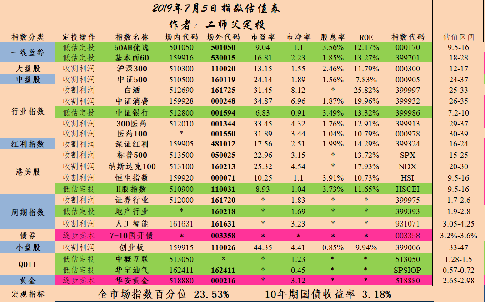

======================================================

_type: talk
@二师父[28814221155551]
2019-07-06 03:39:54 Sat  
topic_id: 544858544541284

<e type="hashtag" hid="145511528542" title="#保险测评#" />看着大家研究那么费劲，还不出成果。我做了三款最优质的重疾险测评。简单带你说，性价比最高买康惠保，保额高，看重心血管疾病防护的选择芯爱，预算少，刚毕业没钱就买瑞泰瑞盈。选择一个就好，不要买多了，没用。直接扫描二维码可以购买。

如果想研究的话看看我下载的合同条款。另外我不是卖保险的，这个渠道是正规保险公司的渠道，我也是从这里购买的。 以后问我哪款保险好，我就发这个图给你了，以后问我哪知股票好，我就发股票课程给你了。

如果不会投资就跟随一个人，如果既不会投资又不愿意信任别人，那么谨慎让你的钱从你的卡出去，小心被骗。

有些时候很多人用了力但没有做功，这是非常糟糕的。任何事情都有一个机会成本，比如你花了太多时间在这个上面，相当于你放弃了做另外一件事，那么你放弃做的另外一件事就是机会成本，我们学会珍惜自己的精力，让自己总是做成果最大的事情。另外也学会珍惜别人的精力，毕竟时间具有不可逆，你浪费自己一分钟，一分钟就没了，你浪费别人一分钟，一分钟也没了。那么相当于损失了一分钟的机会成本，这是很糟糕的。

@Priest(T泉V* at 2019-07-06 03:39:54 Sat

> 光大永明的超级玛丽旗舰版性价比也不错。

----------

@二师父 at 2019-07-06 03:39:54 Sat

> 对的

----------

@Claire at 2019-07-06 03:39:54 Sat

> 天南老师说，投资要么做巴菲特，要么寻找巴菲特一样的人。庆幸我们找到了师父。

----------

@二师父 at 2019-07-06 03:39:54 Sat

> 我也是普通投资者，大家一起学习吧

----------

@Claire at 2019-07-06 03:39:54 Sat

> 好的，一起学习。

----------

阅读[4947]  评论[5]  赞[0] 

+++++++++++++++++++++++++++++++++++++++++++++++++++++

图片：
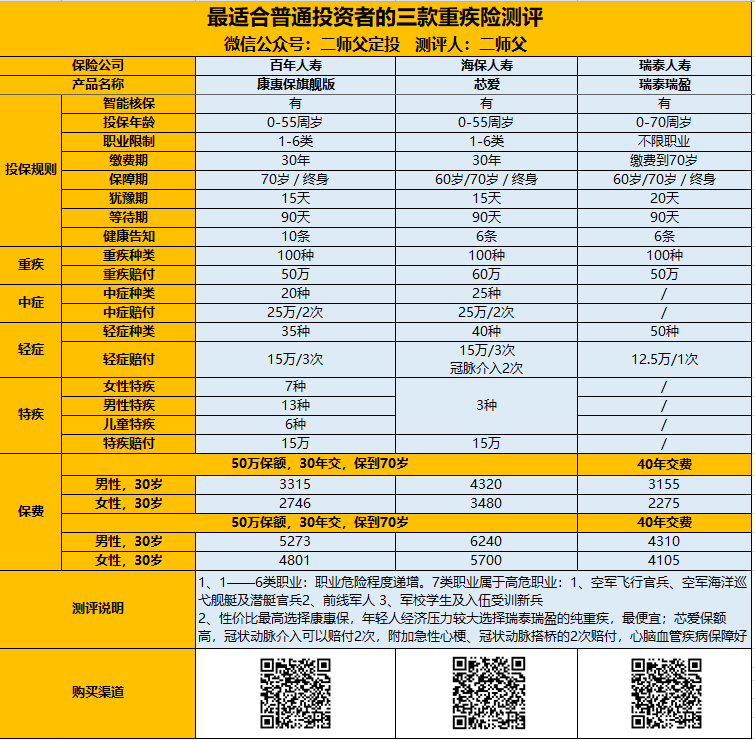

+++++++++++++++++++++++++++++++++++++++++++++++++++++

文件：
2019-07-06 03:33:21 Sat
文件大小：[567181]
28255554524541-康惠保特殊条款.pdf

2019-07-06 03:33:22 Sat
文件大小：[636788]
48544442452418-康惠保一般条款.pdf

2019-07-06 03:33:21 Sat
文件大小：[602932]
15422221241282-瑞泰瑞盈特殊条款.pdf

2019-07-06 03:33:17 Sat
文件大小：[505240]
51522224254244-瑞泰瑞盈一般条款.pdf

2019-07-06 03:33:24 Sat
文件大小：[1021325]
51522224254284-芯爱特殊条款.pdf

2019-07-06 03:33:24 Sat
文件大小：[959166]
88255554524512-芯爱一般条款.pdf

======================================================

_type: talk
@Supreme Wa*[841584142184452]
2019-07-06 09:48:23 Sat  
topic_id: 844121241848852

根据五部定投法，是不是处于低估值时不管涨幅多少，都不要收割利润，直到涨到估值范围内才收割？在正常估值范围内和高估时，还需要坚持定投吗？

@新的开始 at 2019-07-06 09:48:23 Sat

> 低估定投，正常收割，高估卖出。具体的请再看一遍五步定投法[呲牙]

----------

阅读[2531]  评论[1]  赞[0] 

======================================================

_type: talk
@二师父[28814221155551]
2019-07-06 13:12:17 Sat  
topic_id: 422151514885128

房住不炒红线紧绷 房贷政策趋向收紧

　　多地房贷利率上浮迹象明显。《经济参考报》记者在采访中了解到，近半个月，成都、福州、苏州、南京、合肥、杭州等地的首套房、二套房按揭利率均有不同程度的上调，且部分银行出现额度紧张、放款周期变长的现象。一方面，部分地方监管部门有意引导利率上行，谨防楼市过热，另一方面，部分银行也对自身的房贷额度进行了调整。

　　近月来，房地产调控显现出“掐尖”的特点，即谨防部分地区房地产价格涨幅过大和冒头。不仅是房贷政策，多地的购房政策、土地政策等全方位从紧。

@三峡情 at 2019-07-06 13:12:17 Sat

> 请问二师父，在国家大概率要收房产税的环境下，二线城市上杠杆买房投资还可以考虑吗？

----------

@二师父 at 2019-07-06 13:12:17 Sat

> 这需要具体考虑，一你有几套房超过五套就没必要了，二你在哪个城市，这个城市对人才的虹吸能力。未来会形成城市圈，只要北京上海限购不放开，都会向二线回流。

----------

@三峡情 at 2019-07-06 13:12:17 Sat

> 嗯好，知道了。谢谢师父！

----------

阅读[2646]  评论[3]  赞[0] 

======================================================

_type: q&a
@J[28281541518551]
2019-07-06 15:41:39 Sat  
topic_id: 244121215212511

@J

>  师傅周末好，中概适合用市净率还是市销率估值？互联网行业的净资产是怎么统计的呢？

@二师父

>  用市净率估值。企业的净资产等于资产总额减去负债以后的净额
>  
>  两大部分组成，一部分是企业开办当初投入的资本，另一部分是企业在经营之中创造的资产，也包括接受捐赠的资产,属于所有者权益。

阅读[2644]  评论[2]  赞[0] 

======================================================

_type: talk
@树叶[544811512145144]
2019-07-06 15:49:06 Sat  
topic_id: 844121215155222

<e type="hashtag" hid="142825811122" title="#定投周报#" /> 二师父定投周报第15期

阅读[2935]  评论[0]  赞[0] 

+++++++++++++++++++++++++++++++++++++++++++++++++++++

文件：
2019-07-06 15:48:51 Sat
文件大小：[291545]
51522224548144-二师父定投周报7.6（第15期）.docx

======================================================

_type: talk
@二师父[28814221155551]
2019-07-06 15:54:29 Sat  
topic_id: 244121215158521

任何结论成立都有条件的。二师父一直说的不上杠杆买股票，这是针对股权投资，因为他波动大，退市机制出来了，股票被退市就失去了价值。

那对于房子就不是这样，我是鼓励买房上杠杆的，王石曾经说不要让房子限制你，他是站在他那个年代来讲的，房子也就是从08年暴涨起来的，而他出来混的很早，等他功成名就以后再来买房房子还是很便宜，所以他就从他的个案来讲不要让房子限制自己了。你让他19年毕业，看看他怎么做的，时代不同，完全不一样的。

一定要要有独立产权意识，很多90后超前消费，比例之高难以想象，如果有家庭支撑，无可厚非，对于白手起家的人，毕业5年最佳策略就是去二线赶快买一套房子，落户，开始自己的逆袭之路。一线的话有关系或者资源可以去拼，比如你能够弄到北京或者上海的户口。

至于财务自由一直租房的理论，这个也是可以的，只要你比较标新立异，奉行不婚主义，丁克主义，否则你在中国是不可能的，孩子上学和高考都是困难。

人生没有定论，看自己当下拥有的资源，用这些去换取尽可能多的。指数基金定投是起步，但学习的终点是我们要用财经和金融思维去看待这个社会，去做选择，去进行家庭资产配置，这将决定你和别人的巨大差异。

@笋子 at 2019-07-06 15:54:29 Sat

> 写的好

----------

@惠张勇 at 2019-07-06 15:54:29 Sat

> 老师：有时间分析下西安的房产市场

----------

@二师父 at 2019-07-06 15:54:29 Sat

> 这个问题太大了

----------

@凤凰涅槃 at 2019-07-06 15:54:29 Sat

> 写得好，师父字里行间铿锵有力，喜欢文字里的二师父[呲牙]

----------

@惠张勇 at 2019-07-06 15:54:29 Sat

> 明白了[微笑]

----------

@雨竹 at 2019-07-06 15:54:29 Sat

> 如果出生在一线城市，怎么办[撇嘴]，好尴尬呀

----------

@二师父 at 2019-07-06 15:54:29 Sat

> 那更好，你有一线城市的户口直接买，不用缴纳社保

----------

@雨竹 at 2019-07-06 15:54:29 Sat

> 每一寸土地都是要靠真金白银砸的，哎...加油吧😊

----------

阅读[2911]  评论[8]  赞[0] 

======================================================

_type: talk
@杜志彪[544454124115854]
2019-07-06 18:05:54 Sat  
topic_id: 111848484844442

按照五步定投法，中证消费从高估回落到正常估值，我们只是做了减仓，而没有清仓，这是为什么呢？这里边是不是有一个结合实际灵活运用的问题，试问目前3000点谁会认为已经行情结束了呢，有兴趣朋友讨论讨论，消费会不会再次引领大盘继续向前冲（我理解只是一时高估后瞬时又回落到正常估值，所有并没有触发经过一段时间高估后回落到正常估值清仓的策略）。

@二师父 at 2019-07-06 18:05:54 Sat

> 不到超级大牛市都不要清仓，很多时候再也买不回来了，仓位控制是根据自己的实际，我的五步定投法是写给新手的，高手可以吃大周期

----------

@陌路花 at 2019-07-06 18:05:54 Sat

> 消费已回到正常估值了吗

----------

@杜志彪 at 2019-07-06 18:05:54 Sat

> 看师父估值表应该是

----------

阅读[2818]  评论[3]  赞[0] 

======================================================

_type: talk
@二师父[28814221155551]
2019-07-06 21:37:26 Sat  
topic_id: 111848481185482

<e type="hashtag" hid="825418285242" title="#宏观经济#" /> 我们学习的基金定投，货币基金购买，保险购买，股票和可转债打新，股票购买，买房置业等等属于微观方面，我们基本上都建立了一个完备的系统。

这些统统属于守财方面，大家知道，如果钱不增值，由于通货膨胀必然损失财富，所以理财直接目的不让自己的财富被通货膨胀侵蚀，那么想要造富，我们不仅仅满足于微观理财，这是最最基本的。所以对于进入学堂已经把各种微观理财知识学好了，接下来就是学习宏观经济和宏观商业，想赚可观的财富需要认清宏观经济规律，懂的货币政策和财富的流向。

所以先微观，后宏观，宏观经济六大指标。

GDP
PMI
工业企业运行状况
通货膨胀
货币和信贷
监管政策及海外环境

现在开启，预计未来一年半我们形成一整套的微观和宏观财经知识的闭环，这样你就不是一个财盲，可以独立微观理财并看清经济大势

学习需要循序渐进，先微观后宏观，否则基础不牢，学了宏观你也会有一种感觉，我学的到底有啥用，说到底是因为基础不牢

阅读[2858]  评论[0]  赞[1] 

======================================================

_type: q&a
@妖孽[544888148518184]
2019-07-06 22:49:55 Sat  
topic_id: 111848488284212

@妖孽

>  请问二师父；沪深300价值 中证500低波能具体分析下？

@二师父

>  这两个基金都是策略指数基金，相对于规模指数沪深300和中证500有一定的超额收益。
>  
>  小资金的投资者比较适合这类基金，大规模资金比如千万级别的就不太适合了

阅读[2877]  评论[2]  赞[0] 

======================================================

_type: talk
@二师父[28814221155551]
2019-07-06 22:56:07 Sat  
topic_id: 111848488558512

西安新出了限购政策，从市外迁入户籍的居民家庭（退伍转业、家属随军落户的除外）在本市住房限购区域范围内购买商品住房或二手住房的，应落户满1年，或在本市连续缴纳12个月的社会保险（或个人所得税）。

从18年到现在西安房价有下降，未来放开限购会有一定的涨幅，房价涨的逻辑无非是市场需求大，人口流入，银行利率下调，货币超发，每次限购的一定时间就是入场的时候

刚需不用在意买入时间点，只要相对低位就行，现在棚改已经逐步减小力度了，三四线的库存压力基本没有，居民的购买力也被掏的差不多，投资避开三四线

@惠张勇 at 2019-07-06 22:56:07 Sat

> 谢谢您的讲解🙏

----------

阅读[2946]  评论[1]  赞[1] 

======================================================

_type: q&a
@彩色[48415121851218]
2019-07-07 00:43:37 Sun  
topic_id: 844121211845482

@彩色

>  据说在投资任何品种前，先得知道会死在哪里？所以其实我最近在研究，二师父有没有可能我们每周讨论一个定投指数当前的最大回撤？大家都回答。目前我只对我h股指数最大回撤搞得清楚，感觉回撤有点大

@二师父

>  可以的啊，每周都可以发一个指数大家一起讨论下，港股和美股没有政策干预，暴跌时候回撤都很大
>  
>  不过这不是风险，只要能够控制好安全边际，低估区域内才开始投资，等涨回来的时候收益也是非常可观的

阅读[2986]  评论[0]  赞[0] 

======================================================

_type: talk
@二师父[28814221155551]
2019-07-07 03:00:00 Sun  
topic_id: 544858588888854

<e type="hashtag" hid="228844244821" title="#50基金的分析#" /> 50AH和央视50价值对比。二师父为什么选择估值表里面而不选择其他的指数都是有原因的。

很多人太贪婪，手里拥有的基金总觉得不够，总是想要追求更多基金，追求越多收益越差，学会集中投资，把投资的基金搞清楚明白，从优质基金的重仓股选择自己要投资的股票也是一种选择的好方法。

人生到了一个阶段，需要做减法，如无必要，误增实体，这是非常重要的，因为你可以有更多的时间和精力思考。

阅读[5201]  评论[0]  赞[0] 

+++++++++++++++++++++++++++++++++++++++++++++++++++++

文件：
2019-07-07 02:57:29 Sun
文件大小：[23712]
28255554144241-两款50基金：50AH和基本面50谁更优秀.docx

======================================================

_type: q&a
@幻水[881185412112]
2019-07-07 11:45:13 Sun  
topic_id: 111848124148842

@幻水

>  请点评一下这个：中金MSCI质量A(006341)基金，谢谢。

@二师父

>  这个基金成立于18年底部，当前规模2000多万，因为持仓股票大多以必须消费和医药股票为主，所以最近一段时间涨幅不错
>  
>  估值较高，规模太小，有清盘风险

阅读[2984]  评论[6]  赞[0] 

======================================================

_type: q&a
@幻水[881185412112]
2019-07-07 19:17:25 Sun  
topic_id: 244121451884141

@幻水

>  你好，你觉得“博时银智大数据100指数A基金（002588）”这个指数怎么样啊？这个指数好像是重仓消费类股票。这个基金涨得很好。
>  另外请问这个基金的大数据来自于银联，以后人家用银联的人越来越少，用支付宝和微信越来越多，您觉得这个大数据以后会失真吗？

@二师父

>  这个基金规模也很小，只有4000多万，小于1亿的都可以不用考虑了，买消费类股票基金可以选择中证消费或者食品饮料

阅读[2796]  评论[0]  赞[0] 

======================================================

@二师父[28814221155551]
2019-07-07 20:54:37 Sun  
topic_id: 111848155545882

>  @二师父
>  

阅读[2768]  评论[1]  赞[0] 

======================================================

_type: talk
@二师父[28814221155551]
2019-07-07 21:37:32 Sun  
topic_id: 544858411822184

<e type="hashtag" hid="828844155422" title="#怎么选基金#" /> 排除法

1，排除主动基金
2，排除规模小于1亿的基金
3，排除选股规则不明的基金
4，排除周期性基金
5，排除年复合增长率低于百分之8的基金

纳入基金池子，开始看看估值。标准要对，和买房一样，排除自己不选择的区域，排除房龄太高的，排除不满5的，排除没有电梯的，排除朝向不符合自己意愿的。

排除之后，选择就容易多了，如果你不知道自己要什么，那么就排除自己不要的

@笋子 at 2019-07-07 21:37:32 Sun

> 谢谢

----------

阅读[4849]  评论[1]  赞[0] 

======================================================

_type: q&a
@J[28281541518551]
2019-07-07 22:08:23 Sun  
topic_id: 844121488185182

@J

>  很期待师傅发掘到优秀的AI指数，现在有哪些种子选手吗？

@二师父

>  人工智能，我已经加入了，周期性比较大

阅读[2892]  评论[6]  赞[0] 

======================================================

_type: talk
@二师父[28814221155551]
2019-07-08 02:40:28 Mon  
topic_id: 244121482145121

大佬总是颠覆式创新，我们也需要学习这种精神，多策略结合，不要固守一种策略，有可能失效，比如曾经高收益的分级基金如今就要退市了，曾经的诺基亚早已被收购，不创新，不持续学习提升，自己就会被取代。

阅读[2996]  评论[0]  赞[0] 

+++++++++++++++++++++++++++++++++++++++++++++++++++++

文件：
2019-07-08 02:36:55 Mon
文件大小：[23420]
15422255145522-芒格对格雷厄姆体系的颠覆.docx

======================================================

_type: talk
@二师父[28814221155551]
2019-07-08 02:58:42 Mon  
topic_id: 844121482148242

<e type="hashtag" hid="281181228851" title="#周末答疑#" /> 今天有读者问我，如果出生在一线怎么办，可能是我之前说过买不起一线买二线，买不起二线买三线这个思路。

我觉得出生在一线是好事，至少上车的资格一出生就有了。你已经比大多数人幸运很多了，很多人还需要等5年才能上车。你的问题在于首付款，这是每一个刚需都会面临的问题，如果提出这个问题说明收入增速不高，二师父刚好今天会公布创收的方法，你可以看看，没有必要死守一份工作，在北京没有父母的支援，就算月薪3万也无法上车，首付不够。所以需要开辟一条新路出来，有时候危机正孕育着机会，创新和乐观的人能够发现。我觉得当前就是非常好的时机，因为每次机会的出现都伴随着社会的巨大变革，没有变革和突破也就没有巨大的机会。

我刚去北京那会，全身上下总共只有500元，现在回想起来真够磕碜的，可是就是那时候的我，口袋里面只有500元的我，从来没有怀疑过我不能够在北京立足。这就是人和人的本质区别，相信或者怀疑。当你怀疑自己的时候，那已经输了，当你相信自己的时候，自己潜力爆发之猛让你自己也无法想象。

二师父建议如果你在北京或者上海发展的话，给自己10年的机会，以10年为限，如果10年你能够在这里立足，那么就在这发展，如果10年后还不能，差不多32岁，这时候选择回到二线也可以，即使你出生在一线。不是每个人都能够生活在北京和上海的，行不行，试一试，不行的话再退也可以。

第二、关于基金的配置，各种风险承受能力的人配置也是不同的。拿宽基行业和周期三大类指数比较。

保守的人更加适合宽基指数，激进的投资者在宽基指数的配置上面，加上行业和周期指数，如果你追求高收益，完全可以只配置行业和周期指数。对于高手而言，浮动50个点也稳如泰山，而大部分新手，先实现小小的盈利，然后再求得大胜即可。

阅读[3276]  评论[0]  赞[0] 

======================================================

_type: talk
@二师父[28814221155551]
2019-07-08 04:30:07 Mon  
topic_id: 244121482115451

<e type="hashtag" hid="551144815514" title="#影响力资产#" /> 实现财务自由两种方式，投资获利和企业获利。最佳的两种方式。

投资属于微观理财，企业属于宏观商业。对于个体，创业很难，但是通过商业思维打造个人品牌形成影响力构建微型企业，有一个完备的营收模式。

二师父说过，如果两年内，你的月收入无法超过2万，那么你就不用关注我了。我说话算话，男人一口唾沫一个钉。

提升营收三种方式，1工作，2投资收入 3个人影响力变现。

很多年轻人看不到方向，被高房价吓到了。还有鼓吹谁的青春不迷茫的。这样更加重了大家的恐惧。

机会属于乐观和有准备的人，每次变革都会带来巨大的机会和红利。

影响力将会是未来最有价值的资产，当你不能够理解的时候，不能说明你错了，只能说明你老了。时间会给我们最好的答案。

@门萨🐨 at 2019-07-08 04:30:07 Mon

> 个人影响力具有巨大能量

----------

@YAO at 2019-07-08 04:30:07 Mon

> 二师父财商星球老学员有优惠吗？[呲牙]

----------

@二师父 at 2019-07-08 04:30:07 Mon

> 这个还没有，基金的有

----------

@shi at 2019-07-08 04:30:07 Mon

> 好东西啊。这个理念真不错

----------

阅读[5611]  评论[4]  赞[0] 

+++++++++++++++++++++++++++++++++++++++++++++++++++++

文件：
2019-07-08 04:29:44 Mon
文件大小：[439745]
28255588428481-打造高价值的个人品牌形成影响力——实现年入百万.pdf

======================================================

_type: q&a
@幻水[881185412112]
2019-07-08 08:51:06 Mon  
topic_id: 544858414125484

@幻水

>  请您点评一下：银河定投宝腾讯济安指数(519677)，这个基金跟踪的指数发布时宣传的非常牛，你觉得这个基金如何啊？
>  另外这个基金5年年花的收益率，你觉得合理预期应该是多少呢？附：官方宣传1.腾讯网副总编马立在致辞中表示，由腾讯财经联合济安金信推出的腾讯济安价值100指数，在三年的时间内累计增长140%，远远领先于同期的其他指数，成功的通过了市场的检验。
>  官方宣传2.腾讯济安价值100指数正式基于是指数化及量化策略，通过分阶段的回归，包括随机选型，通过算法等，评估各家上市公司的内在价值，通过各种模型进行筛选后，去掉价值被高估的地雷股。最终筛选出了100只价值被低估的，具有投资潜力的黑马上市公司。

@二师父

>  比较一般，大幅度跑输沪深300指数，不知如何能3年涨幅百分之140，不看好
>  
>  你的判断逻辑并没有建立，宣传牛无法得出结论指数牛，没有哪只基金成立宣传不牛，这没有用，你能看到的往往都是假的
>  
>  这只基金选股说是选择低估黑马股和专家评审，规则不清晰不透明，会不会出老鼠仓不得而知

阅读[3215]  评论[4]  赞[0] 

======================================================

_type: talk
@A0洪氏日杂批发[544885222181514]
2019-07-08 11:01:24 Mon  
topic_id: 844121428882882

我好牛叉

@锐淡恬思 at 2019-07-08 11:01:24 Mon

> 不知道你买了多少？

----------

阅读[3048]  评论[1]  赞[0] 

+++++++++++++++++++++++++++++++++++++++++++++++++++++

图片：

======================================================

_type: q&a
@niwota[422255254814458]
2019-07-08 12:59:53 Mon  
topic_id: 244121425842851

@niwota

>  二师父您好！我知道申万风格指数里有 低市盈率和低市净率指数，您知道有追踪它们的基金嘛？或者其他相似的基金。  谢谢！

@二师父

>  还没有，你可以根据他的选股自己构建一个低市盈率基金组合

阅读[2878]  评论[0]  赞[0] 

======================================================

_type: q&a
@汉尼拔[552144155244]
2019-07-08 13:00:32 Mon  
topic_id: 244121425158521

@汉尼拔

>  二师父，今天融通人工可以买点么

@二师父

>  可以买，要控制仓位，定投现在这个点位风险已经比较低了

阅读[2970]  评论[2]  赞[0] 

======================================================

_type: talk
@汉尼拔[552144155244]
2019-07-08 13:50:07 Mon  
topic_id: 244121422521551

今晚油气要大跌的节奏啊。[捂脸]

@齐俊波 at 2019-07-08 13:50:07 Mon

> 估计三季度没有行情了，低位慢慢吸吧，千万不能重仓。

----------

阅读[2801]  评论[1]  赞[0] 

======================================================

_type: talk
@二师父[28814221155551]
2019-07-08 13:58:26 Mon  
topic_id: 422151255425248

到处腾退疏解，北京欢迎你，有梦想谁都了不起一去不复返

@知南茶暖🍹 at 2019-07-08 13:58:26 Mon

> 要拆迁？

----------

@J at 2019-07-08 13:58:26 Mon

> [疑问]师傅的住处？

----------

@Dolly at 2019-07-08 13:58:26 Mon

> 给这么短的时间，政府官员是怎么想的

----------

@二师父 at 2019-07-08 13:58:26 Mon

> 嗯

----------

@二师父 at 2019-07-08 13:58:26 Mon

> 跟我没关系

----------

阅读[3072]  评论[5]  赞[0] 

+++++++++++++++++++++++++++++++++++++++++++++++++++++

图片：
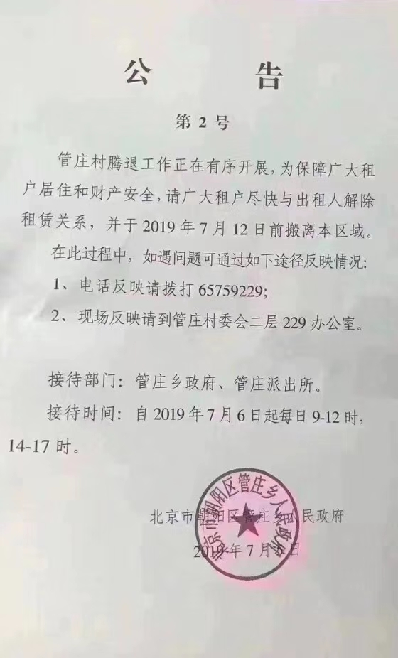

======================================================

_type: q&a
@tanxin[241524428884281]
2019-07-08 15:31:23 Mon  
topic_id: 422151255285558

@tanxin

>  二师父，你好！请问低估阀值和滚动市盈率再哪里能查到，我用天天基金定投没有找到呢？

@二师父

>  阈值在我的估值表有，滚动市盈率去中证，深证指数官网，果仁网，理杏仁网，乐咕乐股网都可以查阅

阅读[3140]  评论[6]  赞[0] 

======================================================

_type: q&a
@聪明的笨蛋[544858411212244]
2019-07-08 20:52:13 Mon  
topic_id: 244121145128421

@聪明的笨蛋

>  二师傅，七月科创板发行，对创业板冲击大不大？创业板还有价值吗？持有的创业板有必要清掉吗？仓位不大，一点点浮亏可以忽略不计。

@二师父

>  不用清，短期是会有冲击的，坚持原则，定投止赢不止损，我每次卖出一定保证指数是盈利的，大盘2900，即使有冲击未来也会涨

阅读[2870]  评论[0]  赞[0] 

======================================================

@二师父[28814221155551]
2019-07-08 20:52:54 Mon  
topic_id: 244121145124221

>  @二师父
>  

阅读[3029]  评论[0]  赞[0] 

======================================================

_type: talk
@二师父[28814221155551]
2019-07-08 23:21:44 Mon  
topic_id: 244121142582521

支付宝里面城市服务可以查阅自己的公积金数目，只要买房或者租房都可以提取出来，还是比较可观的，公积金贷款现在比较难了

社保里面有自己的定点医院，在这些医院就医是可以报销的

阅读[3176]  评论[0]  赞[0] 

+++++++++++++++++++++++++++++++++++++++++++++++++++++

图片：
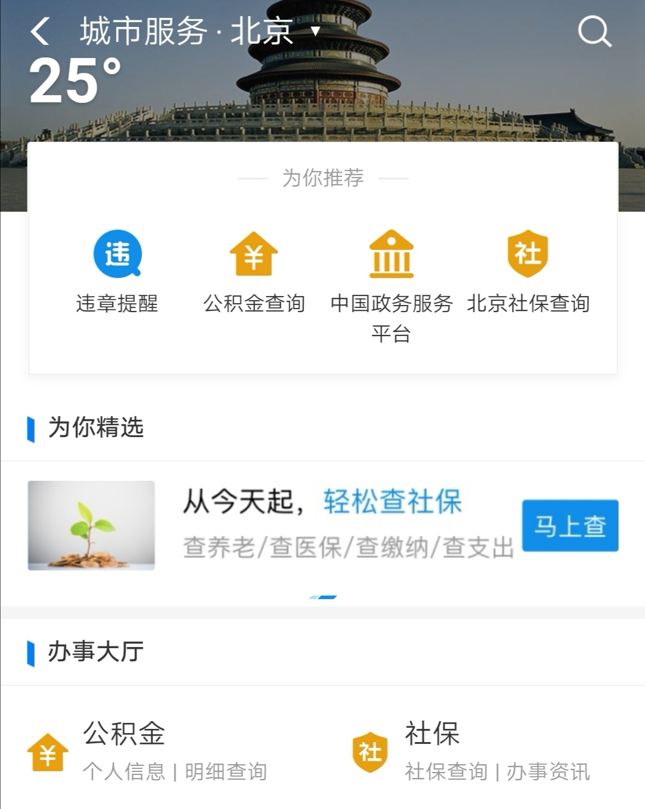

======================================================

_type: q&a
@J[28281541518551]
2019-07-09 02:34:26 Tue  
topic_id: 111848818221422

@J

>  温馨提示：师傅，置顶每日估值表今晚还没更新😊 今日基本面60下跌2个点以上，开黑车加仓了一份😅

@二师父

>  不要着急，现在更新

阅读[3075]  评论[0]  赞[0] 

======================================================

_type: talk
@二师父[28814221155551]
2019-07-09 03:59:23 Tue  
topic_id: 422151121881858

估值表，后面的阈值就是根据区间判定估值。有的是市盈率，有的是市净率。大家可以保存下

@木子李 at 2019-07-09 03:59:23 Tue

> 师父，中证500绿色底色了，应该写“低估定投”吧？“收割利润”是不是还没改过来[奸笑]

----------

@二师父 at 2019-07-09 03:59:23 Tue

> 嗯嗯，对的

----------

@是喵喵吖～ at 2019-07-09 03:59:23 Tue

> 二师父 我看到8号50AH跌了 请问 这个时候我是在9号接着买入一点 还是等到周四那天三点前再买入好。

----------

@二师父 at 2019-07-09 03:59:23 Tue

> 如果跌的多可以手动补仓

----------

@是喵喵吖～ at 2019-07-09 03:59:23 Tue

> 嗯嗯好的

----------

@是喵喵吖～ at 2019-07-09 03:59:23 Tue

> 谢谢二师父

----------

阅读[5320]  评论[6]  赞[0] 

+++++++++++++++++++++++++++++++++++++++++++++++++++++

图片：
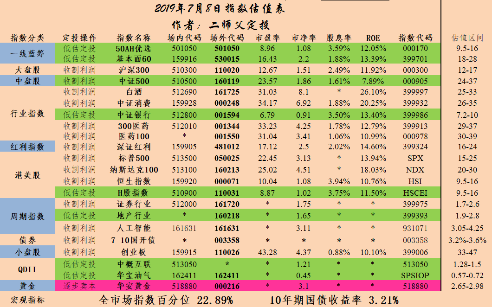

======================================================

_type: talk
@二师父[28814221155551]
2019-07-09 04:00:52 Tue  
topic_id: 111848818542282

内心有光，下跌何惧？你要知道我们买的指数一直很安全，在这个点位买入，真的躺赚，只要坚持拿住的话。

@陌路花 at 2019-07-09 04:00:52 Tue

> 不方不方，昨天还补了点仓

----------

@海盗 at 2019-07-09 04:00:52 Tue

> 对对对

----------

阅读[3309]  评论[2]  赞[0] 

+++++++++++++++++++++++++++++++++++++++++++++++++++++

文件：
2019-07-09 03:59:40 Tue
文件大小：[459297]
51522214581514-不要方，我们可是经历过2486的人.pdf

======================================================

_type: talk
@二师父[28814221155551]
2019-07-09 04:03:22 Tue  
topic_id: 422151121854888

<e type="hashtag" hid="145518542842" title="#一个投资家的20年第三讲#" /> 可以丢一天不吃饭，但是不能一天不读书，熊市更要多学习，这样才能够理解我们现在买入坚守的原因。

@远山 at 2019-07-09 04:03:22 Tue

> 老师，发下第一讲和第二讲出来呗

----------

@二师父 at 2019-07-09 04:03:22 Tue

> 我发过

----------

@海盗 at 2019-07-09 04:03:22 Tue

> 搜索  《 一个投资家的20年  》

----------

@海盗 at 2019-07-09 04:03:22 Tue

> 辛苦了[咖啡]

----------

@Claire at 2019-07-09 04:03:22 Tue

> 收听师父的读书分享后，对投资之道有了进一步的认知。谢谢师父！

----------

@二师父 at 2019-07-09 04:03:22 Tue

> 一起交流进步啊

----------

阅读[5796]  评论[6]  赞[0] 

+++++++++++++++++++++++++++++++++++++++++++++++++++++

文件：
2019-07-09 04:02:59 Tue
文件大小：[16607451]
48544482518528-第3讲.m4a

======================================================

_type: talk
@一剪梅[844115184528882]
2019-07-09 07:26:18 Tue  
topic_id: 111848818482182

<e type="hashtag" hid="145518542842" title="#一个投资家的20年第三讲#" /> 师父，我想买您之前推荐的那几本书看，您能否在发一遍书名呢？

@Claire at 2019-07-09 07:26:18 Tue

> 师父推荐的书：《低风险投资之路》，《理财不用懂太多》，《买入、持有、富有》，《投资者的心灵修炼》，《穷查理宝典》，《时间的玫瑰》，《理财中最简单的事》，《财务自由之路》。

----------

@一剪梅 at 2019-07-09 07:26:18 Tue

> 谢谢

----------

阅读[3381]  评论[2]  赞[0] 

======================================================

_type: q&a
@tanxin[241524428884281]
2019-07-09 11:08:20 Tue  
topic_id: 422151114515248

@tanxin

>  二师父，你好！请问如果我每月定投2500元，配置几个基金比较好？优先选择哪几个基金呢？

@二师父

>  置顶文章有最优秀的配置，选择2到4只可以了，我的定投实盘说明，选择里面最优质的

阅读[3348]  评论[2]  赞[0] 

======================================================

_type: talk
@二师父[28814221155551]
2019-07-09 16:23:31 Tue  
topic_id: 422151111884128

<e type="hashtag" hid="458821551818" title="#主动基金和指数基金的对比#" /> 简单拿消费基金对比。易方达消费和汇添富消费。

易方达消费是主动基金，基金经理是萧楠，汇添富是指数基金。

我们对比下收益率：2019年：汇添富上涨57.45%；易方达上涨41.59%。汇添富胜出
 2018年，汇添富下跌25.49%；易方达下跌23.47%。易方达胜出
 2017年，汇添富上涨52.45%；易方达上涨64.97%。易方达胜出
 2016年：汇添富上涨19.37%；易方达上涨7.21%。汇添富胜出
从收益率的角度对比，汇添富和易方达平手。

我们对比下基金费率：按照长期定投持有3到5年。汇添富的申购费和赎回费没有
  易方达的申购费率1.5%
 基金托管费率：汇添富0.1%，易方达0.25%
 基金管理费率：汇添富0.5%，易方达1.5%
从费率结构分析汇添富胜出。

我们对比下投资风险，波动率相当，基金经理更换风险汇添富没有，易方达有。

综上，指数基金胜出。如果你企图用主动基金去博取高额收益倒不如自己选择股票，毕竟不用缴纳基金费用。其次，你可以提高投资水平

从主观讲，我是买过主动基金，也自创了一套主动基金的交易系统，但是不适合重仓选手，所以最终我选定了指数基金投资，我可以在消费指数基金上重仓，但是不敢重仓易方达。投资的收益不仅仅取决于收益率，还取决于你重仓的资金。

分析都有，只是有的人能够理解，有的人无论如何也无法理解

@J at 2019-07-09 16:23:31 Tue

> 有点好奇想知道师傅的主动基金交易系统[呲牙]

----------

@二师父 at 2019-07-09 16:23:31 Tue

> 和股票交易系统类似，是做趋势的，我现在没买主动基金了，耗费精力

----------

@J at 2019-07-09 16:23:31 Tue

> 是的，善用精力，人在一件事情上做到极致就很厉害了[强]

----------

@竹露清响 at 2019-07-09 16:23:31 Tue

> 投资指数基金当然是对的！但比较的标的如果换成景顺长城鼎益混合和易方达沪深300ETF联结，或者中欧时代先锋股票A和南方中证500ETF联结，再或者嘉实优化红利和大成中证红利，等等，得出的恐怕就不是这样的结论了吧！

----------

@二师父 at 2019-07-09 16:23:31 Tue

> 这个我稍后对比下，从大样本出发，再好的学校也会出现毕不了业的学生

----------

阅读[5018]  评论[5]  赞[0] 

======================================================

_type: talk
@二师父[28814221155551]
2019-07-09 16:47:55 Tue  
topic_id: 422151111828548

159916这只基金是建信基金公司募集的深60指数基金

当前熊市，成交只有1849，还没有个人大额资金投资者的成交额大

不要在场内买入这只了，需要注意

@J at 2019-07-09 16:47:55 Tue

> 一直场外[微笑]

----------

@别皱眉头 at 2019-07-09 16:47:55 Tue

> 二师父，我一直在场内买的，并且有买这个，需要卖掉吗？

----------

@二师父 at 2019-07-09 16:47:55 Tue

> 换成场外的，等盈利了可以卖掉

----------

@别皱眉头 at 2019-07-09 16:47:55 Tue

> 好的，谢谢师父

----------

@采涵 at 2019-07-09 16:47:55 Tue

> 二师父早，场内成交量小的具体风险是什么？这个场外代码不也是场内的etf链接吗？风险不是一样的吗？还麻烦二师父详细讲解一下。

----------

@二师父 at 2019-07-09 16:47:55 Tue

> 不一样，场内基金规模太小容易发生大额赎回甚至清盘，基金清盘的两个条件

1，连续60日基金资产净值低于5000万元；

2，或连续60日份额持有人数量少于200人。

场外基金规模4亿，风险比较小

----------

@采涵 at 2019-07-09 16:47:55 Tue

> 感谢二师父！

----------

阅读[2926]  评论[7]  赞[0] 

======================================================

@二师父[28814221155551]
2019-07-09 16:51:06 Tue  
topic_id: 111848888515282

>  @二师父
>  

阅读[3060]  评论[0]  赞[0] 

======================================================

_type: talk
@二师父[28814221155551]
2019-07-09 23:09:00 Tue  
topic_id: 422124442488848

北京目前的链家二手房放盘量：81158套，上海75402套，深圳46646套。热门二线城市的二手房挂盘量却远超想象，大部分在五到八万套，其中成都、重庆、武汉勇夺前三甲：成都97802套，重庆94716套，武汉93756套，都直逼10万套大关。

表面是限购抑制了价格，实际供过于求，抢人大战都无法去库存的话那么就显示问题了

@是喵喵吖～ at 2019-07-09 23:09:00 Tue

> 没明白这段话的意思呢师父能给简单说一下吗

----------

@rtdmm小米 at 2019-07-09 23:09:00 Tue

> 继续跌？

----------

@木公先生 at 2019-07-09 23:09:00 Tue

> 房价短期看金融政策，中期看土地供给，长期看人口净流量。如果一个地方GDP总量不大，吸收不了更多的人，不能形成人口净流入，房价一定会跌的

----------

@二师父 at 2019-07-09 23:09:00 Tue

> 实质就供需

----------

@二师父 at 2019-07-09 23:09:00 Tue

> 看后续政策

----------

@二师父 at 2019-07-09 23:09:00 Tue

> 就是库存压力大，实际存量房子是比较多的

----------

阅读[2807]  评论[6]  赞[0] 

======================================================

_type: talk
@门萨🐨[51411455828824]
2019-07-09 23:24:44 Tue  
topic_id: 111812221524442

指数最安心[微笑]

阅读[2974]  评论[0]  赞[0] 

+++++++++++++++++++++++++++++++++++++++++++++++++++++

图片：
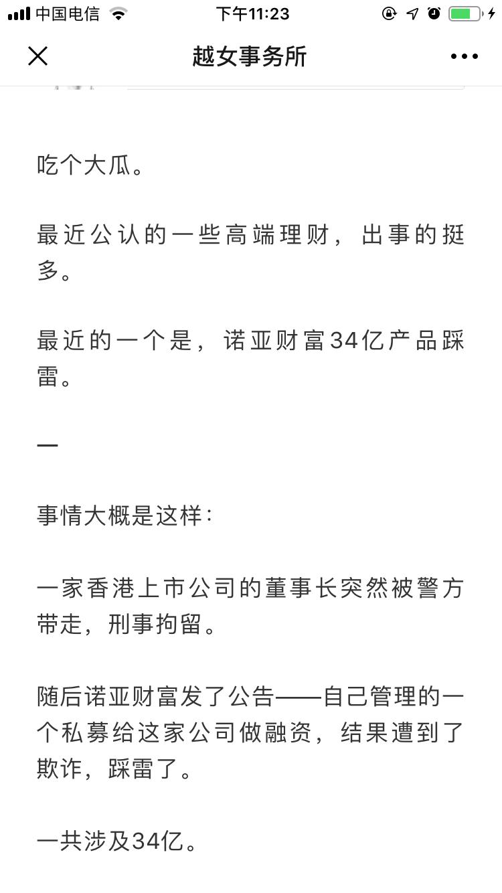

======================================================

_type: talk
@二师父[28814221155551]
2019-07-10 03:58:19 Wed  
topic_id: 844145554414122

最近一周在爆雷中度过，大家没有踩雷吧

阅读[2916]  评论[0]  赞[0] 

+++++++++++++++++++++++++++++++++++++++++++++++++++++

文件：
2019-07-10 03:57:45 Wed
文件大小：[23713]
88255522884142-A股退市成为常态，你要学会选择更加稳健的投资方式.docx

======================================================

_type: talk
@二师父[28814221155551]
2019-07-10 04:00:40 Wed  
topic_id: 244145554411551

估值表，里面低估的都可以定投，实盘代码记得看置顶文章哈，都有详细的代码的

@One at 2019-07-10 04:00:40 Wed

> 二师父，早上好，159916提示不买了，有替代吗？

----------

@二师父 at 2019-07-10 04:00:40 Wed

> 买场外的基本面60

----------

阅读[2920]  评论[2]  赞[0] 

+++++++++++++++++++++++++++++++++++++++++++++++++++++

图片：
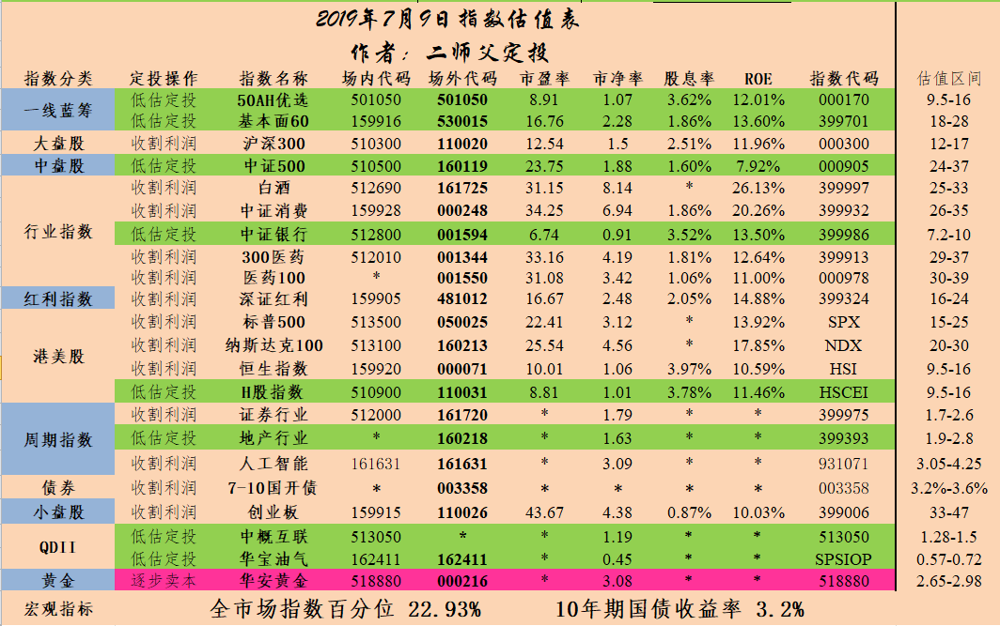

======================================================

_type: q&a
@光明无顶[51184452185224]
2019-07-10 09:38:42 Wed  
topic_id: 111812228512482

@光明无顶

>  您好，二师父，目前跟着二师父定投指数基金，剩余的用来买了微信理财通产品，收益比货币基金高点，主要选择安稳债基和保险产品，这些产品值不值得购买，风险如何？谢谢二师父答疑。

@二师父

>  短债基金是可以购买的，投连险和万能险就不要购买了，费率高，实际收益低，还不如货币基金

阅读[2734]  评论[1]  赞[0] 

======================================================

_type: talk
@别皱眉头[244148458815141]
2019-07-10 13:38:57 Wed  
topic_id: 244145582121151

从来没在场外买过基金，麻烦问下大家，场外的天天基金，基本面60，代码530015，是指下图中这个基金吗？

@别皱眉头 at 2019-07-10 13:38:57 Wed

> 大家场外基金都在哪里买啊？只有场内账户的小白……

----------

@心韵 at 2019-07-10 13:38:57 Wed

> 我场外是在天天基金，是图中的基金

----------

@别皱眉头 at 2019-07-10 13:38:57 Wed

> 好的，谢谢你

----------

@知南茶暖🍹 at 2019-07-10 13:38:57 Wed

> 天天基金，支付宝

----------

@J at 2019-07-10 13:38:57 Wed

> 天天基金可以跟投二师傅的实盘

----------

@海〔纳百川〕 at 2019-07-10 13:38:57 Wed

> 是的，跟我的一样，我也场外买的。

----------

阅读[2563]  评论[6]  赞[0] 

+++++++++++++++++++++++++++++++++++++++++++++++++++++

图片：

======================================================

_type: q&a
@别皱眉头[244148458815141]
2019-07-10 13:54:34 Wed  
topic_id: 111812254815422

@别皱眉头

>  二师父，蛋卷基金和天天基金，有注册过账户，但是从来没有交易过，还可以享受开户优惠吗？

@二师父

>  可以的，他本来就是一折优惠

阅读[2683]  评论[2]  赞[0] 

======================================================

_type: talk
@海盗[48248118584848]
2019-07-10 15:30:49 Wed  
topic_id: 844145584228542

<e type="hashtag" hid="225118152481" title="#指数基金均线偏离表#" />

@J at 2019-07-10 15:30:49 Wed

> 证券-1了[奸笑]

----------

@J at 2019-07-10 15:30:49 Wed

> 还没呢，只是90日均线偏离-1

----------

@首尔航仔Eric at 2019-07-10 15:30:49 Wed

> 偏离度加1的话 是不是就是投0.5份

----------

阅读[2703]  评论[5]  赞[0] 

+++++++++++++++++++++++++++++++++++++++++++++++++++++

图片：
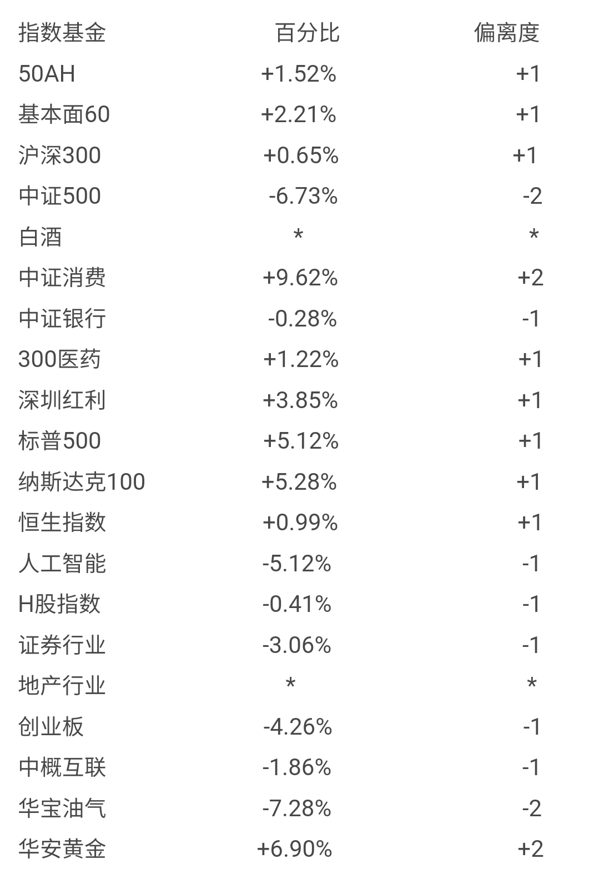

======================================================

_type: q&a
@🎈铮[28284825441841]
2019-07-10 19:05:32 Wed  
topic_id: 244145525155821

@🎈铮

>  二师父好，我把保命的钱，每月剩余的闲钱都放入天天基金的南方天天利货币B里面了，这个安全吗？货币基金还有其他推荐吗？适合长期使用的

@二师父

>  适合长期持有，活期宝里面的宝宝类产品都可以，安全性有保障，就是快速赎回有1万得限制

阅读[2919]  评论[1]  赞[0] 

======================================================

_type: q&a
@首尔航仔Eric[244114888181111]
2019-07-10 22:05:28 Wed  
topic_id: 422124458141248

@首尔航仔Eric

>  二师父请教现在开始定投的话 建仓多少合适

@二师父

>  7到8成仓，我建议定投的好，分成一年周期够了
>  
>  用部分资金做网格交易应对震荡市场

阅读[2691]  评论[3]  赞[0] 

======================================================

_type: q&a
@杜志彪[544454124115854]
2019-07-10 22:10:40 Wed  
topic_id: 422124458118458

@杜志彪

>  二师父刚才在蛋卷里看见中证竞争力指数基金，这个您了解多少？

@二师父

>  这个是东方红新发布的指数基金，目前比较火，这周末在北京有一个发布会，具体持仓等信息我还不了解

阅读[2729]  评论[0]  赞[0] 

======================================================

_type: q&a
@齐俊波[244148555125181]
2019-07-10 22:26:54 Wed  
topic_id: 544842255244554

@齐俊波

>  二师父您好，针对养老的FOF型基金，封闭期3年，不保本的，这种基金靠谱吗？

@二师父

>  具体哪一款？

阅读[2752]  评论[3]  赞[0] 

======================================================

_type: talk
@二师父[28814221155551]
2019-07-11 04:02:22 Thu  
topic_id: 544842258484184

<e type="hashtag" hid="145582258212" title="#统一说几个问题#" /> 第一关于平台安全性，无论是基金公司还是基金代销平台，比如蚂蚁聚宝，天天基金，蛋卷基金，他们都是碰不到你的资金的，因为基金在募集的时候会找一家银行，比如建设银行来托管资金，基金经理募集到的资金就由这家银行托管。

不管是基金公司出事了，还是第三方平台出事了，你的钱都安全。大型基金公司和这三大平台都是很靠谱的。不用担心。市场上不要参与的有配资，P2P，还有平台的理财产品。

另外大家有问题可以点击星球的发表按钮，大家一起探讨学习，星球有很多读者的投资水平已经很高了，在指数这方面基本建立了自己的体系，也很热心，如果你提问的话只有我能够看到，如果你发表的话大家都可以看到，现在1000多位朋友，我相信集思广益你的问题是能够很好被解决的。

第三关于刚开始定投是否需要追加以前二师父的实盘。我的答案是不需要的，价格都发生了变化，就从现在开始最好，哈佛图书馆墙上的训言说的好，觉得为时已晚的时候恰恰是最早的时候。

@朱永军 at 2019-07-11 04:02:22 Thu

> 为什么平台的理财产品不能参与，我在蚂蚁财富里买了国寿飞月宝，会有什么问题吗？

----------

@二师父 at 2019-07-11 04:02:22 Thu

> 收益低，费率高

----------

阅读[2601]  评论[2]  赞[0] 

======================================================

_type: talk
@二师父[28814221155551]
2019-07-11 04:05:13 Thu  
topic_id: 422124451211888

<e type="hashtag" hid="481211145528" title="#指数估值#" /> 指数估值表，适合卖出黄金和债券买入指数基金

阅读[2883]  评论[0]  赞[0] 

+++++++++++++++++++++++++++++++++++++++++++++++++++++

图片：
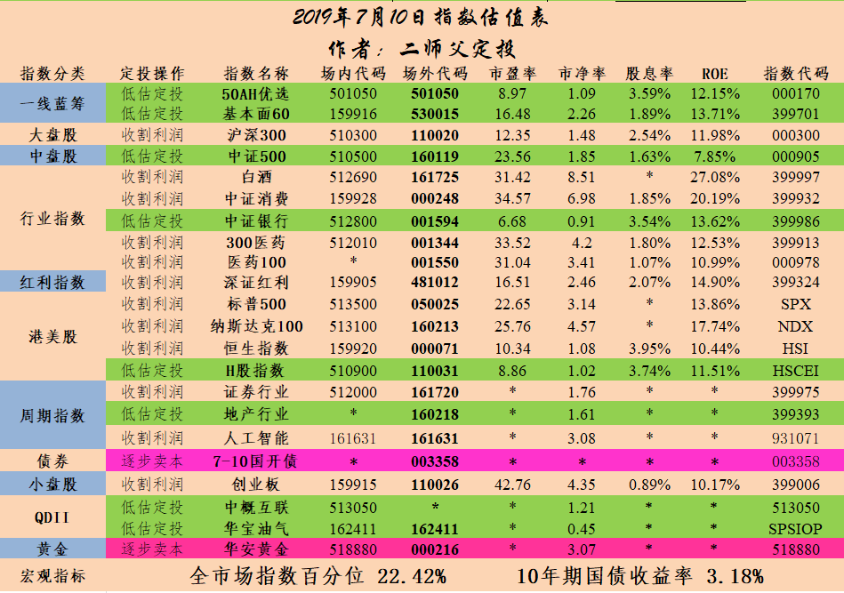

======================================================

_type: talk
@二师父[28814221155551]
2019-07-11 04:06:04 Thu  
topic_id: 544842258488144

<e type="hashtag" hid="228815581541" title="#属于投资者的机会#" />

阅读[2995]  评论[0]  赞[0] 

+++++++++++++++++++++++++++++++++++++++++++++++++++++

文件：
2019-07-11 04:05:47 Thu
文件大小：[24095]
28255545844121-2900点，正是买入指数基金的好时候.docx

======================================================

_type: q&a
@陈飞🤗[841521421222252]
2019-07-11 04:34:18 Thu  
topic_id: 544842255818884

@陈飞🤗

>  二师父你好，能不能具体帮我分析一下华宝标普中国A股质量价值指数（501069），非常感谢。

@二师父

>  这只基金是今年1月份成立的LOF基金，smartβ策略指数基金系列产品，基金经理胡洁
>  
>  质量因子指标筛选：净资产收益率（ROE）、资产负债应计率（Accruals Ratio）及金融杠杆率（Financial Leverage），按照质量的三个因子打分（等权）排序，选出质量因子得分最高的200只股票
>  
>  价值因子指标筛选：市盈率（PE）、市净率（PB）及市销率（PS），按照价值的三个因子打分（等权）排序，在上述200只股票内选出价值因子得分较高的100只股票
>  
>  从这种严格的体系里面筛选的股票价值是没有问题的。
>  
>  该基金持仓股票以制造业为主，三一重工、万华化学、格力电器、海螺水泥、大秦铁路，中国神华，东阿阿胶，双汇发展，重仓股票质量没有问题，如果选择投资是可以的品种
>  
>  但这个基金有个弊病，按照质量和价值进行打分，这个打分没法量化，会有一定的主观性，对于我个人投资的话，追求极简投资，选择投资品种不会选那些标准搞得特别复的指数，追求简洁。人际交往也是，越是说的天花乱坠的人我也是越远离，这种人也不靠谱，很有可能大忽悠。对于没见过世面的人可能被他的所谓高大上的言辞给唬住了。
>  
>  另外费率比一般的基金高0.5%，对于大额资金投资者是不少的费用。
>  
>  标普去年也发布过一款基金标普红利，说的也是天花乱坠。有时候越简单越有效。无招胜有招。

阅读[3100]  评论[0]  赞[0] 

======================================================

_type: talk
@二师父[28814221155551]
2019-07-11 05:15:34 Thu  
topic_id: 111812248821582

<e type="hashtag" hid="828815581242" title="#比较指数基金和主动基金#" /> 分析了两款消费基金，一个主动一个被动，有读者提出反对意见，认为主动基金好，并找出反例，前两大反例不是同一个类型的，无法比较，要比较只能比较红利、同一行业的指数，不然基金的本质是股票，只要你选股规则用了巴菲特的牛股策略选择消费股票，那么与宽基指数比较，宽基指数肯定输。

就指数而言，宽基指数的收益率也是低于消费股票指数的，所以没有可比性的就不看了。

我们来看看红利指数的比较，主要是大成中证红利和嘉实优化红利。

从2019年1月1号到2019年7月10号，大成中证红利的涨幅是16.07%
嘉实优化红利的涨幅是19.59%
2018年1月1日到2018年12月31日，大成中证红利的涨幅是 -13.79%
   嘉实优化红利的涨幅是  -14.65%
2017年1月1日到2017年12月31日，大成中证红利的涨幅是 26.26%
   嘉实优化红利的涨幅是  27.9%
从收益率角度看，嘉实优化红利胜出，三年收益率叠加高于中证红利4.3%

基金经理变动，嘉实如下：
常蓁	2018-10-11 	至今
季文华	2016-10-10	2018-10-11
董理	 2015-03-122016-10-10
翟琳琳	2014-02-07	2015-03-12
赵勇   	2013-07-20	2014-07-23
郭志喜	2012-06-26	2013-07-20

每一次变动都导致很大的风格变化，嘉实在最近三年也就是在19年的时候才大幅跑赢大成，也就3个百分点。但有一个问题是，当基金经理变动，投资能力好，水平高的基金经理被换成投资水平低的基金经理一般人不知道，大部分投资者在基金经理被换了几个月之后都不知道基金经理换了

从这个角度看7年换了6任基金经理，如果业绩好，是不可能这么频繁，从这个角度看大成胜。

第三费率：嘉实的费率1.75%，大成的费率0.9%。大成获胜。

综上，从近3年的投资收益率看嘉实获胜，也就4%，3年多4%从费率角度基本抹平

其实这些都不是最重要的，最重要的是什么呢？负面黑天鹅。

比如P2P收益率高吧，但是不安全，容易暴雷。投资股票基金最大的负面黑天鹅是更换了劣质的基金经理以后你还是亏损的到底是卖出还是不卖。

这就是最大的问题，分析问题抓住主要矛盾，当你主要的核心问题是OK的，就可以选择，当你其他方面都很好，可是核心问题不OK ，这就具有一票否决权。

佛曰只渡有缘人，股票投资有人赚钱，主动基金有人赚钱，指数基金也有人赚钱，只要你能赚而且赚得爽就行。

我不是非要你投资指数基金，只是告诉大家这是一种好的投资渠道，用与不用看自己。关于指数投资好的问题，不会再解答。因为这不是主要矛盾，有时间多看看毛选和马原。抓住核心问题，不要纠结这种无法决定投资成败的问题啦。

@竹露清响 at 2019-07-11 05:15:34 Thu

> 谢谢二师父的耐心解答！我现在都是跟踪同一个指数的指数基金和主动基金同时投，并不是不投指数基金。而且随着中国股市逐渐去散户化，指数基金的优势肯定会越益凸显，到那时可能就会专心地只投指数基金了！

----------

阅读[3085]  评论[1]  赞[0] 

======================================================

_type: talk
@二师父[28814221155551]
2019-07-11 05:56:35 Thu  
topic_id: 844145521188582

<e type="hashtag" hid="881422852442" title="#定投实盘#" /> 总体买入一份，基本面60和50ah各买入百分之30，恒生国企买入百分之25，地产买入百分之15，实盘记录可在天天基金查看

@龘何亮龘 at 2019-07-11 05:56:35 Thu

> 现在是不是还不能完美跟投？

----------

@二师父 at 2019-07-11 05:56:35 Thu

> 可以了

----------

@老孙头 at 2019-07-11 05:56:35 Thu

> 麻烦师父能象6.20那样列出ᅳ张图表吗？关键写上基金场外代码？“天天”电脑板找不到。谢了，新学员ᅳ个。

----------

@龘何亮龘 at 2019-07-11 05:56:35 Thu

> 但是跟投里面本期怎么多了两个基金啊

----------

@苍天有井明月空🌙 at 2019-07-11 05:56:35 Thu

> 出个估值表吧哥

----------

@二师父 at 2019-07-11 05:56:35 Thu

> 好的，置顶文章有代码的，在实盘介绍里面

----------

@二师父 at 2019-07-11 05:56:35 Thu

> 有啊，已经发了

----------

@二师父 at 2019-07-11 05:56:35 Thu

> 可能还是全部的，有点醉

----------

阅读[5284]  评论[15]  赞[0] 

======================================================

_type: q&a
@别皱眉头[244148458815141]
2019-07-11 12:43:23 Thu  
topic_id: 111812215218512

@别皱眉头

>  二师父，我点一键跟投，怎么出来其他基金了，不止4只

@二师父

>  他还是显示全部的，自己购买吧

阅读[2684]  评论[3]  赞[0] 

======================================================

_type: q&a
@彩色[48415121851218]
2019-07-11 12:45:21 Thu  
topic_id: 244145542548521

@彩色

>  二师父:现在关于h股指数，我有个疑问：一是现在的pe在9的边缘，处于近10年历史百分位的61.20%，为何还算低估呢？同时：pe近10年极端情况下才最大到16，最近5年最大才到12。所以其实要到16是不是有点难呢？

@二师父

>  你这个数据不对，港股成立历史周期长，这个太短了，没有参考意义

阅读[2773]  评论[1]  赞[0] 

======================================================

_type: q&a
@青鸟飞鱼、此生不换[844111545424582]
2019-07-11 12:45:46 Thu  
topic_id: 544842241845424

@青鸟飞鱼、此生不换

>  请问二师傅场内黄金ETF和华宝油气都是T+0吗？

@二师父

>  对，即时成交，卖出资金就到账

阅读[2813]  评论[0]  赞[0] 

======================================================

_type: q&a
@刘国明 电动*[844122888518812]
2019-07-11 12:46:18 Thu  
topic_id: 244145548422181

@刘国明 电动*

>  二师父000423东阿阿胶帮分析一下

@二师父

>  不提供股票分析服务，谢谢

阅读[2855]  评论[0]  赞[0] 

======================================================

_type: talk
@二师父[28814221155551]
2019-07-11 12:52:40 Thu  
topic_id: 244145542518511

每个月19块，微信无限卡读书还是很划算的，投入产出比巨大

阅读[2893]  评论[0]  赞[0] 

+++++++++++++++++++++++++++++++++++++++++++++++++++++

图片：

======================================================

_type: q&a
@tanxin[241524428884281]
2019-07-11 14:33:13 Thu  
topic_id: 111812218252442

@tanxin

>  二师父，你好！请问为什么没有中证红利的估值了？我有定投这个基金？还能继续定投吗？

@二师父

>  精简估值表，这个指数分红高，成长性不够好
>  
>  定投是可以的，从分红角度考虑也是一个非常不错的指数

阅读[2721]  评论[0]  赞[0] 

======================================================

@二师父[28814221155551]
2019-07-11 14:36:50 Thu  
topic_id: 844145541514842

>  @二师父
>  

阅读[3043]  评论[0]  赞[0] 

======================================================

_type: q&a
@J[28281541518551]
2019-07-11 14:39:12 Thu  
topic_id: 422124421882218

@J

>  师傅这周好像没实行鳄鱼计划？这周调整幅度也挺大的

@二师父

>  我周一买入了的，你可以看看哈，买的银行，目前非常便宜了
>  
>  油气和中概互联之前买入了比较多了，目前一直不上不下，正在等待下跌加仓和上涨收割的行情

阅读[3235]  评论[2]  赞[0] 

======================================================

_type: talk
@二师父[28814221155551]
2019-07-11 14:44:03 Thu  
topic_id: 544842248142184

<e type="hashtag" hid="458814412888" title="#关于估值表的说明#" /> 这个估值表里面的所有基金，除了沪深300现在没有投资以外，其他的我都有投资，有的是在场内，有的是在场外

最近油气和中概互联没怎么动的原因是这两个指数反复的在一个位置摆动，没必要一直加仓，等待上涨收割或者下跌继续加仓的，耐心点，市场总会给你机会

@笋子 at 2019-07-11 14:44:03 Thu

> 您给的中概互联代码天天基金里是场内？

----------

@二师父 at 2019-07-11 14:44:03 Thu

> 场内的

----------

阅读[3398]  评论[2]  赞[0] 

======================================================

@二师父[28814221155551]
2019-07-11 20:52:05 Thu  
topic_id: 244145515222241

>  @二师父
>  

阅读[3195]  评论[0]  赞[0] 

======================================================

@二师父[28814221155551]
2019-07-11 20:52:51 Thu  
topic_id: 111812282182442

>  @二师父
>  

阅读[3590]  评论[0]  赞[0] 

======================================================

@二师父[28814221155551]
2019-07-11 23:19:20 Thu  
topic_id: 844145514412582

>  @二师父
>  

阅读[3592]  评论[0]  赞[0] 

======================================================

_type: q&a
@TDG[88855524248842]
2019-07-12 01:08:53 Fri  
topic_id: 111812288288182

@TDG

>  二师父，请问汇丰行业龙头540012这只基金目前的估值如何？未来的收益怎样？与华宝的501301对比那个更值得定投呢？

@二师父

>  这两只基金的持仓股票都比较优质，目前汇丰行业龙头的估值偏高，主要集中在必须消费白酒和可选消费格力，美的等股票上面
>  
>  华宝香港大盘的话估值偏低，这个和H股指数类似，选择华宝香港大盘投资价值高一点。

阅读[3641]  评论[0]  赞[0] 

======================================================

_type: talk
@二师父[28814221155551]
2019-07-12 02:55:22 Fri  
topic_id: 544842288555544

<e type="hashtag" hid="481211145528" title="#指数估值#" /> 指数估值表，里面的都是二师父投资的基金，除了周期指数和港美股指数需要注意仓位，其他的在低估区域都可以放心定投。

@🍀一秋 at 2019-07-12 02:55:22 Fri

> 师父我没买你表里的纯债，照这样看的话我的债券是不是也要逐步卖本？

----------

@二师父 at 2019-07-12 02:55:22 Fri

> 纯债是的，所有的债券估值看国债收益率就好

----------

阅读[3625]  评论[2]  赞[0] 

+++++++++++++++++++++++++++++++++++++++++++++++++++++

图片：

======================================================

_type: talk
@二师父[28814221155551]
2019-07-12 02:55:44 Fri  
topic_id: 544842288555584

昨晚忘记做表格了，大家可以保存下

阅读[3733]  评论[0]  赞[0] 

+++++++++++++++++++++++++++++++++++++++++++++++++++++

图片：
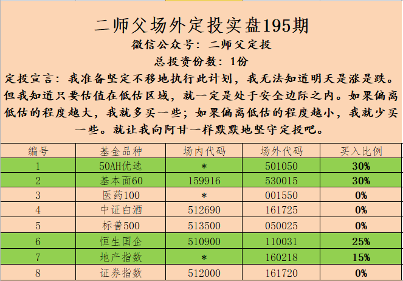

======================================================

_type: talk
@二师父[28814221155551]
2019-07-12 02:57:18 Fri  
topic_id: 544842288555414

这两只基金一直有持仓的哈，没有加仓就等待，直到机会来临，要么是低估继续加码投资，要么是上涨减仓。市场总会给机会我们的。对了，人工智能已经低估了，可以考虑考虑，也是个周期指数，要控制节奏和仓位。

@柠小萌🍭 at 2019-07-12 02:57:18 Fri

> 二师父，场内和场外投资的比例应该控制在多少合适？还有场内和场外的基金选择是不是该是互补的而不是重合的？

----------

@工具栏 at 2019-07-12 02:57:18 Fri

> 坐等师父回答

----------

@二师父 at 2019-07-12 02:57:18 Fri

> 比例视个人情况而定，是要互补的，配置上也是这么做的，宽基就没法满足互补要求了，因为他们本来就涵盖市场大部分股票

----------

阅读[3933]  评论[3]  赞[0] 

+++++++++++++++++++++++++++++++++++++++++++++++++++++

文件：
2019-07-12 02:56:10 Fri
文件大小：[23900]
88255542851442-关于中概互联和华宝油气的投资说明.docx

======================================================

_type: talk
@别皱眉头[244148458815141]
2019-07-12 10:00:26 Fri  
topic_id: 844145852822542

请问下各位小伙伴，在天天基金上边，周四上午9点以后买入的指数基金，是以周四的收盘价确认成本，还是周五的收盘价？

@工具栏 at 2019-07-12 10:00:26 Fri

> 周四的成交价

----------

@别皱眉头 at 2019-07-12 10:00:26 Fri

> 我就是昨天买的，现在去看，还是交易待确认

----------

@工具栏 at 2019-07-12 10:00:26 Fri

> 今天就好了

----------

@别皱眉头 at 2019-07-12 10:00:26 Fri

> 好滴，谢谢你

----------

@速。冻 at 2019-07-12 10:00:26 Fri

> 确认基本上要下午三点以后

----------

@别皱眉头 at 2019-07-12 10:00:26 Fri

> 周五下午3点以后是吗

----------

@速。冻 at 2019-07-12 10:00:26 Fri

> 昨天三点前买的，今天下午收盘后就确认了

----------

@别皱眉头 at 2019-07-12 10:00:26 Fri

> 好的，谢谢啦

----------

阅读[3655]  评论[10]  赞[0] 

======================================================

_type: q&a
@堂吉诃德的小助手[15528821588422]
2019-07-12 16:15:30 Fri  
topic_id: 244145854815181

@堂吉诃德的小助手

>  请问星主，如果我怕风险，不想买垃圾分类的股票，想买垃圾分类处理的指数，去哪里找呢？我用环保为关键字搜索了场外的指数，却发现很多指数持仓不是金风科技这类，就是风电氢能源之类，这个怎么找呢？是不是关键字输入错了？

@二师父

>  这个指数代码是8841041，去万得就能找到

阅读[3572]  评论[0]  赞[0] 

======================================================

_type: q&a
@忙忙碌碌[88221212185552]
2019-07-13 03:03:52 Sat  
topic_id: 111812451412842

@忙忙碌碌

>  老师，人工智能是定投，还是一次性买入，买几成仓位，我还有天弘中证计算机15w，被套，浮盈3千，中欧电子005763，仓位5W，持有三只冲突吗

@二师父

>  人工智能是定投，我建议你以宽基为主，然后配置一个互联网指数加一个计算机指数足够
>  
>  至于你说的被套，然后又盈利3000这个没明白是什么意思

阅读[3240]  评论[3]  赞[0] 

======================================================

_type: talk
@二师父[28814221155551]
2019-07-13 04:22:05 Sat  
topic_id: 244145284154851

指数估值表，消费在高估和正常估值徘徊

阅读[3295]  评论[0]  赞[0] 

+++++++++++++++++++++++++++++++++++++++++++++++++++++

图片：
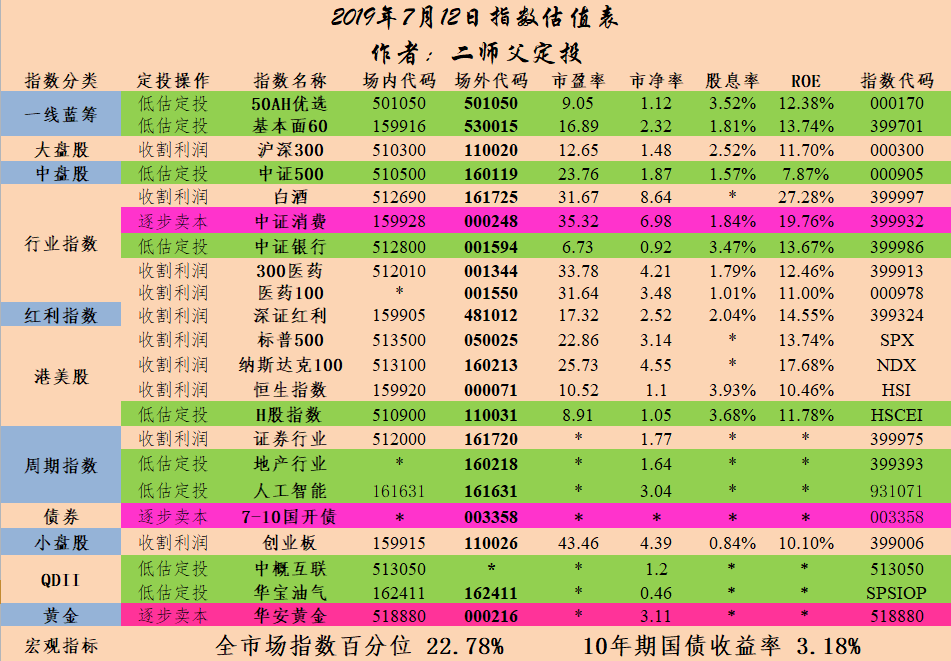

======================================================

_type: talk
@二师父[28814221155551]
2019-07-13 04:23:17 Sat  
topic_id: 422124582142888

主动基金的估值方法，建议还是逐步转向投资指数基金，更为简单节省精力做自己喜欢的事情

阅读[5523]  评论[0]  赞[0] 

+++++++++++++++++++++++++++++++++++++++++++++++++++++

文件：
2019-07-13 04:22:39 Sat
文件大小：[24479]
28255515255421-从易方达消费行业股票展开谈如何给主动基金估值.docx

======================================================

_type: talk
@美美[48224811151218]
2019-07-13 06:07:14 Sat  
topic_id: 111812451842152

我现在有10w，不想做定投，想一次性买入两支基金，二师傅能给推荐一下吗？

@杜志彪 at 2019-07-13 06:07:14 Sat

> 这是要梭哈啊😱

----------

@杜志彪 at 2019-07-13 06:07:14 Sat

> 正好可以买100股茅台[呲牙]

----------

@二师父 at 2019-07-13 06:07:14 Sat

> 定投把，基金代码在置顶文章都有的

----------

@彩色 at 2019-07-13 06:07:14 Sat

> 梭哈万一单边下跌，那酸爽的感觉会被虐爆

----------

@J at 2019-07-13 06:07:14 Sat

> 梭哈之后请配合MA5、MA20、MA90实时跟大家报道一下心情[偷笑][调皮]

----------

@彩色 at 2019-07-13 06:07:14 Sat

> 定投可以降低账户的波动，但在单边上涨中也会降低整体的收益率，盈亏同源，甘蔗没有两头甜，这是必然的事情。

如果波动承受能力强，可以一次性建仓，但要承受巨大波动，一次性买入之前，一定要充分考虑好自己的波动承受能力，切实考虑好自己的现金流、负债等情况。

----------

@齐俊波 at 2019-07-13 06:07:14 Sat

> 不听”老人“言,吃亏在眼前呀。[呲牙][呲牙]

----------

阅读[3397]  评论[7]  赞[0] 

======================================================

_type: talk
@海洋[88242125412582]
2019-07-13 10:20:48 Sat  
topic_id: 422124558818148

二师父，我有个问题困扰了很久，希望您能给予详细回复。
蛋卷的八仙过海组合，是个趋势交易指数基金组合，不考虑估值，很多理念和低估多买高估卖出是反的。但我认真看它的历史收益，似乎高出估值组合。这是为什么？有没有问题？怎么理解？
盼予以解惑，感谢！

简单地说，当上证50指数连续两日高于MA40，八仙就会买入三个涨幅较大的行业指数；当上证50指数连续两日低于MA40，八仙就会卖出行业指数，改为持有国债指数，一旦换入国债指数，八仙净值就不再下跌。通常来讲，中国股市上涨都是从小市值的企业开始，而上证50指数是沪市市值最大的50个企业。上证50涨幅超过40日均线，就意味着股市开始了一个小不级别的整体上涨；反之，便意味着一轮涨幅的结束。

@阿涛 at 2019-07-13 10:20:48 Sat

> 估值定投者相信物极必反，所以追跌杀涨，趋势交易者相信强者恒强，所以追涨杀跌，这两种完全相反的策略，都是久经实战检验的优秀策略，也都有着各自的优点和缺点，在充分了解的基础上，选择合适自己的就好了。

----------

@海洋 at 2019-07-13 10:20:48 Sat

> 谢谢！精辟啊

----------

@二师父 at 2019-07-13 10:20:48 Sat

> 他这个策略和我们的股票趋势交易策略是类似的

两种策略在不同时间的收益率是不一样的，趋势交易策略适合单边牛市一次买入，而我们的低估定投策略适合熊市左侧交易。因此指数基金我们采用了低估定投，股票我们采用趋势交易。

你说的这种策略比指数基金定投收益率高并不完全正确，因为我们的收益是(市价-成本)/成本。

我看了看他选择的基金，和我们的配置差别不大。那问题来了。假设我们控制变量，市场价格，我们规定统一在牛市卖出，那么市场价格一样，所以收益率取决于我们的成本。很显然我们在定投的时候是成本越低越买，而趋势交易是不断追高成本也在增高。因此得出结论，在相同基金，相同市场价格卖出的时候，低估定投的收益率会更好。

至于你判断趋势交易策略的收益率高，只是他符合人们的及时满足心理，低估定投往往需要很长的等待才能够获利，而趋势交易是很快就能让账户盈利的。

----------

@海洋 at 2019-07-13 10:20:48 Sat

> 谢谢二师父！完美解答了我的疑惑！果然现在的策略是千锤百炼的！

----------

@齐俊波 at 2019-07-13 10:20:48 Sat

> 回答得多精辟呀，这个必须是精华贴，回答了很多入门者的困惑。[强][强]

----------

阅读[3315]  评论[5]  赞[0] 

======================================================

_type: talk
@树叶[544811512145144]
2019-07-13 10:58:44 Sat  
topic_id: 244145228224841

<e type="hashtag" hid="142825811122" title="#定投周报#" /> 二师父定投周报第16期

阅读[3532]  评论[0]  赞[0] 

+++++++++++++++++++++++++++++++++++++++++++++++++++++

文件：
2019-07-13 10:58:36 Sat
文件大小：[288020]
48544414258228-二师父定投周报7.13（第16期）.docx

======================================================

_type: q&a
@忙忙碌碌[88221212185552]
2019-07-13 14:05:03 Sat  
topic_id: 244145225184841

@忙忙碌碌

>  天弘计算机之前盈利1万多，现在这只基我仓位重，想减，但市场很弱，把握盈利亏损了，天弘计算是低估吗，还值得长期拿吗，想问和低估的人工智能有冲突吗，

@二师父

>  正常估值和低估值之间了。这个指数和人工智能、信息行业指数的持仓股票有充合，你投了计算机就没有必要再选择人工智能了。长期持有没有问题，可以逐步收割利润

阅读[3423]  评论[2]  赞[0] 

======================================================

_type: q&a
@潜龙[244145114188851]
2019-07-13 14:08:17 Sat  
topic_id: 844145228811542

@潜龙

>  二师父，短债是一种什么理财产品啊，有什么风险存在吗？像理财通里的平安短债能买吗

@二师父

>  短债基金主要是投资短期债券、央行票据、银行存款等品种的基金
>  
>  波动性小，风险低，信用等级高，唯一的风险是不保本，无论是短债还是长债都不是固定收益品种。

阅读[3526]  评论[2]  赞[0] 

======================================================

_type: talk
@二师父[28814221155551]
2019-07-13 14:22:19 Sat  
topic_id: 244145222282221

<e type="hashtag" hid="281181228851" title="#周末答疑#" /> 关于蛋卷的八仙过海组合，他这个策略和我们的股票趋势交易策略是类似的

两种策略在不同时间的收益率是不一样的，趋势交易策略适合单边牛市一次买入，而我们的低估定投策略适合熊市左侧交易。因此指数基金我们采用了低估定投，股票我们采用趋势交易。

这种策略比指数基金定投收益率高并不完全正确，因为我们的收益是(市价-成本)/成本。

我看了看他选择的基金，和我们的配置差别不大。那问题来了。假设我们控制变量，市场价格，我们规定统一在牛市卖出，那么市场价格一样，所以收益率取决于我们的成本。很显然我们在定投的时候是成本越低越买，而趋势交易是不断追高成本也在增高。因此得出结论，在相同基金，相同市场价格卖出的时候，低估定投的收益率会更好。

至于判断趋势交易策略的收益率高，只是他符合人们的及时满足心理，低估定投往往需要很长的等待才能够获利，而趋势交易是很快就能让账户盈利的。

到底选择趋势还是逆势，第一根据个人性格，第二根据市场走势。

个人性格很重要，有的人天生厌恶亏损，所以不适合趋势交易

有的人性格耐力不足，所以不适合低估定投。二师父两种策略结合，根据市场来操作，灵活应对。你是哪种性格，决定了你的交易模式。

历史上两种投资者都有非常不错的表现。逆势交易有巴菲特，趋势交易有索罗斯。都是投资大神，没有哪个更好，只有哪个更加适合自己。

@二师父 at 2019-07-13 14:22:19 Sat

> 就是在低迷的时候买，不然景气了价格也飙了，我还准备买套房呢

----------

@彩色 at 2019-07-13 14:22:19 Sat

> 二师父又要在北京买房了呀？

----------

@二师父 at 2019-07-13 14:22:19 Sat

> 北京还没买呢，没那么多钱

----------

@彩色 at 2019-07-13 14:22:19 Sat

> 牛市来了都不是问题，哇哇哇

----------

阅读[5831]  评论[6]  赞[0] 

======================================================

_type: q&a
@家树[544854851425424]
2019-07-13 20:52:27 Sat  
topic_id: 244145245542441

@家树

>  原油价格6月4日到现在由50元涨到60元，涨20%，华宝油气基本没涨。远远跟不上油价，？？

@二师父

>  你能不能比较下整体历史区间的，一个月时间不能显示问题

阅读[3635]  评论[2]  赞[0] 

======================================================

_type: talk
@美美[48224811151218]
2019-07-13 21:57:47 Sat  
topic_id: 844145245154182

感谢各位了，我的想法是不做定投，买个普通基金或者是ETF，但又不相信自己的选择，所以想让大咖们给推荐一下

@杨光霞 at 2019-07-13 21:57:47 Sat

> 可以看下002146，波动小，收益率也小

----------

@小小鸟 at 2019-07-13 21:57:47 Sat

> 如果工作忙没有时间。建议去天天基金。跟投二师父的实盘。如果这样都嫌麻烦。那干脆买成货币基金或者存入银行定期吧。

----------

@陈 at 2019-07-13 21:57:47 Sat

> 说的对！[强][强][强]

----------

@.Five at 2019-07-13 21:57:47 Sat

> 500ETF 跟随大盘

----------

@美美 at 2019-07-13 21:57:47 Sat

> 感谢各位

----------

阅读[3492]  评论[5]  赞[0] 

======================================================

_type: talk
@二师父[28814221155551]
2019-07-14 04:21:12 Sun  
topic_id: 111812415114542

<e type="hashtag" hid="458815218228" title="#资产配置#" />

阅读[5890]  评论[0]  赞[0] 

+++++++++++++++++++++++++++++++++++++++++++++++++++++

文件：
2019-07-14 04:20:59 Sun
文件大小：[25214]
51522281481854-我们的资产配置里面哪些投资品种是比较好的.docx

======================================================

_type: q&a
@无名书苑[51188588215444]
2019-07-14 20:32:25 Sun  
topic_id: 111812414411822

@无名书苑

>  二师父，从天天基金里两个基金比较，发现这五年来，易方达中小盘基金完胜易方达沪深300ETF基金，是否可以认为这只主动性基金比较优质，跑赢大盘获得超额收益。
>  如果易方达中小盘基金现有经理不变，是否可以适当选择这样的基金买入一点份额？
>  谢谢！！

@二师父

>  这个基金经理张坤，从12年一直任职到今天
>  
>  这只股票上涨与持有大部分消费医药股票有关系。重仓股票五粮液、贵州茅台、泸州老窖，华兰生物。目前估值都不低。如果需要购买的话可以趋势交易，设置止损点。
>  
>  有的读者质疑过消费股票不会下跌到低估区域，这是看到了当前的消费股票，只要时间足够长，一定是在高估和低估区域内摆动。所以要警惕消费股票下跌。

阅读[3079]  评论[1]  赞[0] 

======================================================

@二师父[28814221155551]
2019-07-14 20:38:03 Sun  
topic_id: 244145218512211

>  @二师父
>  

阅读[3144]  评论[0]  赞[0] 

======================================================

_type: q&a
@美美[48224811151218]
2019-07-14 20:43:41 Sun  
topic_id: 244145218251411

@美美

>  “东方红竞争力指数”二师傅能不能给解读一下这支基金

@二师父

>  准备说这个指数呢，今天刚在北京开了发布会
>  
>  说这个基金之前我介绍一个公式：收益率=ROE/PB*分红比例+ROE*(1-分红比例）=股息率+留存收益率
>  
>  中证竞争力指数选股的核心指标是ROE，这个和巴菲特思想不谋而合。
>  
>  从上面的公式我们知道，当股息率一定，不考虑分红的情况下，基金的收益率和ROE成正比。所以呢这只基金的策略很好。
>  
>  我们追踪这个指数的ROE是16%，属于较高的ROE，可是有一个问题，我们的消费指数，白酒指数的ROE都比这个高，倘若仅仅看重高ROE，我倒是建议定投消费和白酒，对于这种高ROE品种，不完全要在低估区域定投，只要估值适中，相对偏低就可以开始入手，因为高ROE伴随着的高增长会消化一部分估值

阅读[3273]  评论[5]  赞[0] 

======================================================

_type: talk
@老孙头[422115118524548]
2019-07-14 23:30:30 Sun  
topic_id: 844145211852842

“打卡”，是什么意思？我理解是购买“课程？电脑上能听吗(如可以，哪里买？价格几何？)，现在只有领优惠券的提示。(视力原因，看手机不太方便)——新会员

@别皱眉头 at 2019-07-14 23:30:30 Sun

> 打卡……就是来了，报个到……

----------

@二师父 at 2019-07-14 23:30:30 Sun

> 打卡是每天记录自己生活，学习，成长点滴

----------

阅读[3031]  评论[2]  赞[0] 

======================================================

_type: talk
@二师父[28814221155551]
2019-07-15 04:19:33 Mon  
topic_id: 244145211415511

两种投资方式的比较，收益率我做了一个图，凡事数据说话。

投资是为了赚钱，不要感情用事，你的决定一定要有数据支撑。即使错了，也要知道错在哪。

@rtdmm小米 at 2019-07-15 04:19:33 Mon

> 定投每年都是赢利的？

----------

@rtdmm小米 at 2019-07-15 04:19:33 Mon

> 请问二师父，你定投几年了？

----------

@二师父 at 2019-07-15 04:19:33 Mon

> 需要在一个长周期来看，大部分时间是处于浮亏状态

----------

@niwota at 2019-07-15 04:19:33 Mon

> 赞同定投比一次性买入要更安全，更容易。定投几乎不存在何时买入的问题，只有卖出时机的选择。而一次性的买入，卖出时点都要选择，而且心理压力大不少。 
 但定投的仓位问题是个难题，它的收益率不是满仓的收益率。这个一直没有找到好办法，二师父有什么解决方案呢？

----------

@二师父 at 2019-07-15 04:19:33 Mon

> 底部位置多买，可以一次买3到5成仓位，灵活对待，比如去年2500点的时候

----------

@是喵喵吖～ at 2019-07-15 04:19:33 Mon

> 师傅我不明白3-5成仓的意思。或者说他是如何计算。是根据自己打算投入的钱来计算的吗 比如说我准备了2万定投 定投2只基金 一只一万。分一年投完，每周定投。一只基金就是48份。  那这个仓位应该咋算呢。谢谢。

----------

@二师父 at 2019-07-15 04:19:33 Mon

> 仓位是这样的，假设你有10万元，5万购买了指数基金或者股票，5万购买了货币基金，那么你的仓位就是5万除以10万，等于百分之50，仓位5成

他的含义是你投资的权益类品种比如指数基金占你总资金的比例

----------

@是喵喵吖～ at 2019-07-15 04:19:33 Mon

> 师父假如我不是拿出一块完整的存量资金去定投，而是每个月从工资里拿出来比如2000去定投 那这个仓位要怎么分配好呢

----------

阅读[5230]  评论[9]  赞[0] 

+++++++++++++++++++++++++++++++++++++++++++++++++++++

图片：
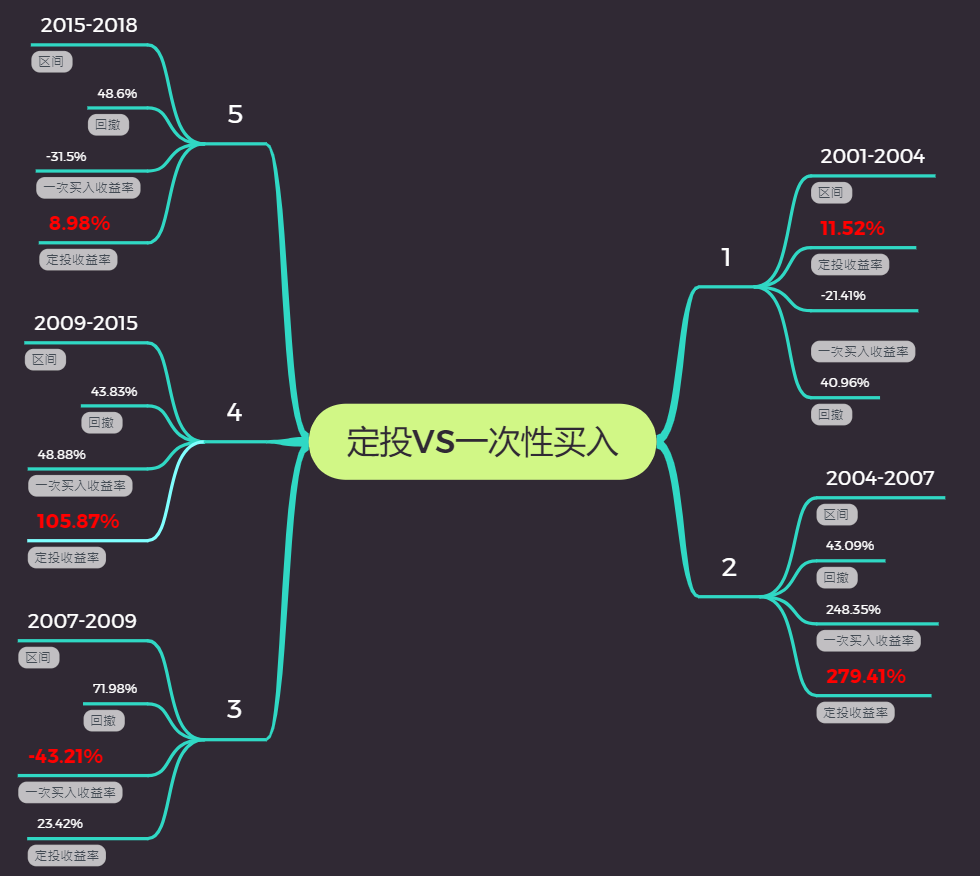

+++++++++++++++++++++++++++++++++++++++++++++++++++++

文件：
2019-07-15 04:18:22 Mon
文件大小：[131358]
28255511224121-基金定投VS一次投入.docx

======================================================

_type: q&a
@青鸟飞鱼、此生不换[844111545424582]
2019-07-15 12:40:15 Mon  
topic_id: 244145455584151

@青鸟飞鱼、此生不换

>  师父：天天基金里的养老目标基金值不值得买？还是直接定投红利基金比较好？

@二师父

>  选择红利基金比较好

阅读[2799]  评论[0]  赞[0] 

======================================================

_type: q&a
@醉流雨[422151445242248]
2019-07-15 13:58:15 Mon  
topic_id: 244145454442421

@醉流雨

>  股息什么意思，？是分红么，？

@二师父

>  是的，股息分红

阅读[3089]  评论[2]  赞[0] 

======================================================

_type: talk
@二师父[28814221155551]
2019-07-15 14:48:25 Mon  
topic_id: 111812128515482

<e type="hashtag" hid="145581548822" title="#重塑格局，打破思维枷锁#" /> 很多人都是被枷锁套住的囚徒，这个枷锁就是观念。

努力工作，勤奋学习，几乎每个想要实现人生发展的人都会做到，而人与人之间的区别在于观念的枷锁，这是本质

我说几个观念束缚，第一关于房子，很多人永远觉得自己买的房子一定自己住，所以一直没房子，认为北上广深没有1000万就买不了房子，为何不买一套小的让自己在城市立足然后把这套房子出租，自己再租一套，观念束缚。

第二，关于不用受困于财务问题，很多人当前的财务很窘迫，月薪几千元，刚好够支出，所以思维困在当下，怎么保住下个月的生活，为何不换个思路去蓝海行业开拓机会，governer永远希望你只为了生计，这样你的想法少了，自然便于被奴役。你需要
分辨自己做的事情到底是为了以后更好的发展还是仅仅讨一份薪水。怯懦的人永远不敢放弃和反抗，哪怕低到尘埃里。

第三，关于眼界，这就回到投资上，两个方面，有的人选基金就选当下表现好，他看不到10年后甚至一年以后都看不到，所以短视的人一般开始投资好，后来越来越糟糕。选伴侣也一样，有的人只能看到当下对方所拥有的，也看不到未来，随着时间的推移你会发现你所看重对方身上曾经拥有的反而成为了束缚。

毕业之后每个人都在为了生活奔波，跳出眼前的工作，投资和生活，每天给自己一个小时思考的时间，找到正确方向比努力重要。

阅读[3123]  评论[0]  赞[0] 

======================================================

@二师父[28814221155551]
2019-07-15 15:11:44 Mon  
topic_id: 544842428551844

>  @二师父
>  

阅读[3154]  评论[6]  赞[0] 

======================================================

_type: talk
@🎈铮[28284825441841]
2019-07-15 17:56:52 Mon  
topic_id: 544842411842844

刚开通了华泰证券，这个委托方式买入卖出大家都怎么设置的呢？

@🎈铮 at 2019-07-15 17:56:52 Mon

> 没接触过股票，这些名词不太懂

----------

阅读[3014]  评论[1]  赞[0] 

+++++++++++++++++++++++++++++++++++++++++++++++++++++

图片：
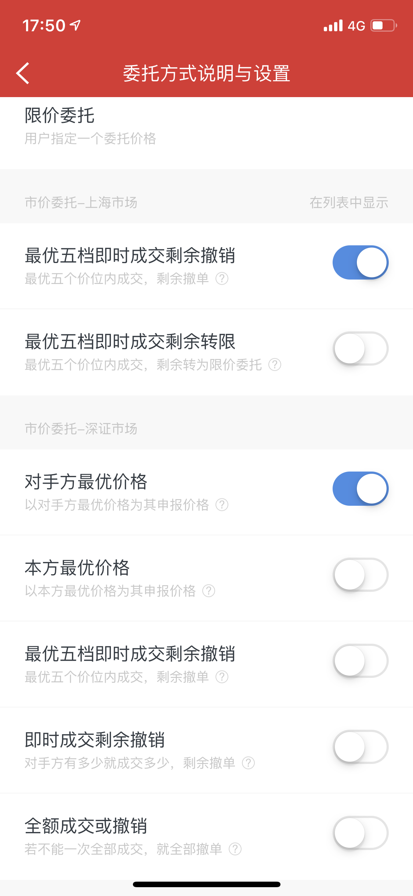

======================================================

_type: q&a
@手牵手看夕阳[244112548184141]
2019-07-15 22:21:00 Mon  
topic_id: 544842414118224

@手牵手看夕阳

>  你好二师父，已经多次读您的五步定投法了，每次读都有不一祥的感觉，今天决定加入您的星球，和您一起学习。对于基金今天刚接触，了解不是很深入，在读取五步定投法的第五步时，怎么判断基金现在是处于什么位置，低估，正常估值，还是高估？加入了星球后，我现在应该从哪开始入手学习？

@二师父

>  对于我投资的基金，你选择估值表进行参考就能够知道估值
>  
>  如果自己去判断估值，可以查阅果仁网或者理杏仁上的数据采用相对估值方法，比较指数估值指标在历史区间的相对大小
>  
>  还有两种方法分别是盈利收益率估值，盈利收益率大于百分之10为低估，博格公式市盈率和市净率估值法

阅读[2936]  评论[4]  赞[0] 

======================================================

_type: q&a
@J[28281541518551]
2019-07-16 00:02:32 Tue  
topic_id: 244145484112551

@J

>  师傅，券商etf在0.91左右适合买入10%？波段操作。

@二师父

>  能承受极端情况下单边下跌百分之50左右的波动可以

阅读[2987]  评论[1]  赞[0] 

======================================================

_type: talk
@柠小萌🍭[544881845482114]
2019-07-16 04:36:37 Tue  
topic_id: 422124258441188

二师父，华宝油气和中概互联现在可以场内建立底仓吗？

@二师父 at 2019-07-16 04:36:37 Tue

> 可以的，华宝油气不能重仓

----------

@小小鸟 at 2019-07-16 04:36:37 Tue

> 二师傅两个问题，1，您说过华宝油气的仓位不能太重。请问主要原因是您担心油气长期在底部震荡。怕我们不能承受长期的浮亏？还是担心基金背后的石油公司。有成批倒闭的风险？2，中概互联目前是低估。但是美股不停的创造历史高位，有没有可能随着美国股市的回调，波及到中概互联。而导至大幅度下跌？

----------

阅读[2948]  评论[2]  赞[0] 

======================================================

_type: talk
@二师父[28814221155551]
2019-07-16 04:48:47 Tue  
topic_id: 244145428585521

<e type="hashtag" hid="481211145528" title="#指数估值#" /> 估值表，坚持低估定投，总有花开的一天。

上证综合指数位置不高，但是指数的估值却不低了，这是因为很多劣质股票拉低了上证综合指数的点位。

@鲁盼盼 at 2019-07-16 04:48:47 Tue

> 谢谢二师父解决了困惑，估值上去了，可还是点位不高

----------

阅读[5251]  评论[1]  赞[0] 

+++++++++++++++++++++++++++++++++++++++++++++++++++++

图片：

======================================================

_type: talk
@二师父[28814221155551]
2019-07-16 04:50:26 Tue  
topic_id: 244145428585111

阅读[5351]  评论[0]  赞[0] 

+++++++++++++++++++++++++++++++++++++++++++++++++++++

文件：
2019-07-16 04:50:24 Tue
文件大小：[49567]
15422521555182-我们在低估区域内买入的意义.docx

======================================================

_type: talk
@二师父[28814221155551]
2019-07-16 04:53:22 Tue  
topic_id: 844145428588522

<e type="hashtag" hid="228814215811" title="#一个投资家的20年第4讲#" /> 最后一讲，希望大家能从本质上认识价值投资。

@志亮 at 2019-07-16 04:53:22 Tue

> 👂听二师父一席话，胜读十年书[微笑]

----------

@J at 2019-07-16 04:53:22 Tue

> 怎么我听到背景音有猫叫[偷笑]

----------

@海盗 at 2019-07-16 04:53:22 Tue

> [咖啡][咖啡][咖啡]

----------

@Claire at 2019-07-16 04:53:22 Tue

> 刚读完杨天南老师的这本书，就收听到了师父的读后分享。愿跟随师父一起用一生去坚守投资中的那个不变，然后用极致创新的精神去不断的探索，与时俱进，在股市中走得长远。

----------

@二师父 at 2019-07-16 04:53:22 Tue

> 一起成长进步

----------

阅读[5593]  评论[5]  赞[0] 

+++++++++++++++++++++++++++++++++++++++++++++++++++++

文件：
2019-07-16 04:52:56 Tue
文件大小：[9966500]
28255854888151-第4讲.m4a

======================================================

_type: q&a
@mumomo[111812248825412]
2019-07-16 15:36:38 Tue  
topic_id: 111812112118512

@mumomo

>  二师父，现在港股打新还有拼团吗

@二师父

>  有的，你联系下嘉宾小鑫鑫

阅读[3011]  评论[6]  赞[0] 

======================================================

_type: talk
@海盗[48248118584848]
2019-07-16 17:23:09 Tue  
topic_id: 422124228828428

<e type="hashtag" hid="225118152481" title="#指数基金均线偏离表#" />

@海盗 at 2019-07-16 17:23:09 Tue

> 刚刚做好的偏离表，供大家参考

----------

@雅 at 2019-07-16 17:23:09 Tue

> 小白问一句，什么意思啊[囧]

----------

@海盗 at 2019-07-16 17:23:09 Tue

> 这位是新同学吧？嗯，搜索一下偏离表就可以搜索以前的文章，可以先学习学习。

----------

@雅 at 2019-07-16 17:23:09 Tue

> 好嘞

----------

@黎雄 at 2019-07-16 17:23:09 Tue

> 请问是好多日的均线做标准

----------

@海盗 at 2019-07-16 17:23:09 Tue

> 但是网格交易，前提一定得弄明白。
1.指数基金一定是处于估状态。
2.仓位一定要小，我们的大部分资金还得放在定投上。
我们是以价值投资为基础，如果大部分资金放在网格交易上，那我们就成了趋势交易者了。

----------

阅读[2965]  评论[12]  赞[0] 

+++++++++++++++++++++++++++++++++++++++++++++++++++++

图片：
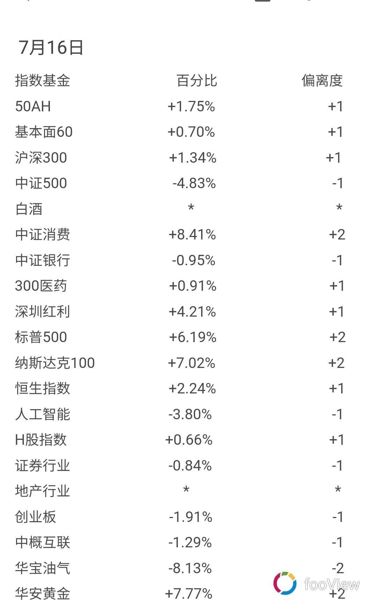

======================================================

_type: talk
@🎈铮[28284825441841]
2019-07-16 21:46:39 Tue  
topic_id: 111812114141222

大家场内买入卖出，委托方式怎么设置的呢？刚开通证券账户的小白，望指教[抱拳][抱拳]

@二师父 at 2019-07-16 21:46:39 Tue

> 限价委托，直接用系统给的就可以

----------

阅读[2640]  评论[1]  赞[0] 

======================================================

_type: talk
@二师父[28814221155551]
2019-07-17 05:13:59 Wed  
topic_id: 422124214222588

@麻烦得很 at 2019-07-17 05:13:59 Wed

> 资金量足够充足，也是很重要的一个因素啊

----------

阅读[4689]  评论[1]  赞[0] 

+++++++++++++++++++++++++++++++++++++++++++++++++++++

文件：
2019-07-17 05:13:51 Wed
文件大小：[141089]
48544884422148-在低估区域定投的指数基金，进入高估以后收益率会有多少.docx

======================================================

_type: talk
@二师父[28814221155551]
2019-07-17 05:14:17 Wed  
topic_id: 544842482444554

@手牵手看夕阳 at 2019-07-17 05:14:17 Wed

> 低估阀值高估阀值没有在估值表中吗？

----------

@二师父 at 2019-07-17 05:14:17 Wed

> 今晚加上去

----------

阅读[2731]  评论[2]  赞[0] 

+++++++++++++++++++++++++++++++++++++++++++++++++++++

图片：
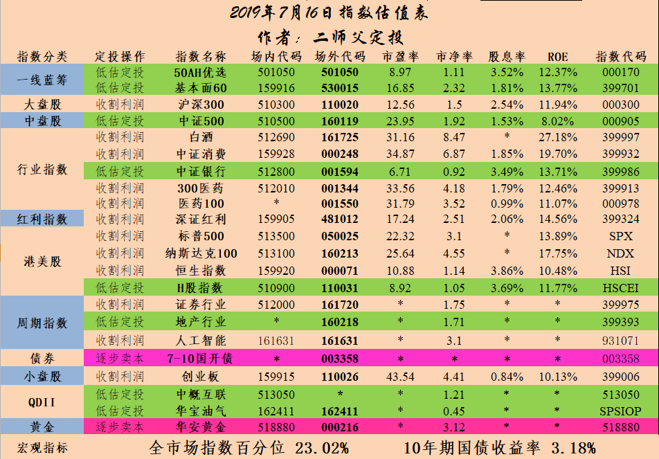

======================================================

_type: q&a
@美美[48224811151218]
2019-07-17 12:50:19 Wed  
topic_id: 544842888224124

@美美

>  二师傅：我在蛋卷里买的50ha和基本面60，每周定投，各200，我现在想加到300可以吗？

@二师父

>  可以

阅读[2455]  评论[0]  赞[0] 

======================================================

_type: q&a
@是喵喵吖～[421441114141158]
2019-07-17 14:03:33 Wed  
topic_id: 544842888844584

@是喵喵吖～

>  二师父您好，我是12年买的房子，到现在还了7年了吧，每个月是1500，公积金贷款30年， 请问如果攒够一些钱，是不是提前还？比如手头攒了10W就先还5万，因为我之前看的文章里有说不用提前还 因为通货膨胀什么，也有的说尽量提前还因为利息太高 所以想请教一下。我的这个1500里也是得有一半是利息。

@二师父

>  如果每月固定1500，那么你得还款方式是等额本息，等额本金还款利息是逐年递减，等额本息利息和开始还款是一样的
>  
>  不管哪种方式都没必要提前还款，商业贷款利率大概是6%左右，用公积金贷款大概是4%左右的利率。这也就意味着你借了银行的钱，然后付4%左右的利息，其实你是赚的，因为你把通货膨胀和货币贬值的风险转移到给了银行
>  
>  相反，如果你会理财的话，这5万先留着，自己打理，每年取得10%到15%的收益率，相当于一年的收益率5000到7500.而如果你给了银行那么就损失了增值的机会
>  
>  买房要高杠杆，最长还款年限，把通货膨胀和货币贬值的风险转移给银行，也就是说贷款利率在6%以下，多借钱，借得越多你越富有。
>  
>  所以，利用好你得公积金贷款，不用提前还款

阅读[2671]  评论[2]  赞[0] 

======================================================

_type: q&a
@是喵喵吖～[421441114141158]
2019-07-17 19:48:44 Wed  
topic_id: 844148555442542

@是喵喵吖～

>  二师父目前定投了四份基金
>  1、基本面60 每周四投100
>  2、50AH 每周四投200
>  3、中证500 每周四投200
>  4、中证银行 每周四投200
>  
>  共计每周定投700
>  每个月2800
>  
>  二师父想请您看看是否有不合理的地方

@二师父

>  没啥问题，银行指数和50ah选择一个就行
>  
>  你可以查一下持仓股票，里面有部分重合

阅读[2541]  评论[1]  赞[0] 

======================================================

_type: q&a
@美美[48224811151218]
2019-07-17 22:55:20 Wed  
topic_id: 844148551488182

@美美

>  二师父好！我已经定投了两支基金了，还想再配两支，二师父给推荐一下。

@二师父

>  我的实盘都有的啊，除了里面的周期指数，随便挑

阅读[2425]  评论[4]  赞[0] 

======================================================

_type: q&a
@无名书苑[51188588215444]
2019-07-18 00:13:42 Thu  
topic_id: 844148585518412

@无名书苑

>  二师父，我们中证500场外指数选择的是南方中证500ETF联接A（160119）管理费0.5%+托管费0.1%，
>  为什么不选管理费和托管费更低的易方达中证500ETF联接A呢？管理费0.15%+托管费0.05%
>  感恩指教！

@二师父

>  南方，天弘，易方达都可以，易方达目前是费率最低的

阅读[2475]  评论[0]  赞[0] 

======================================================

_type: talk
@二师父[28814221155551]
2019-07-18 03:42:45 Thu  
topic_id: 422128485418158

估值表，阈值详见后面的数据，大家记得保存下

阅读[2540]  评论[0]  赞[0] 

+++++++++++++++++++++++++++++++++++++++++++++++++++++

图片：
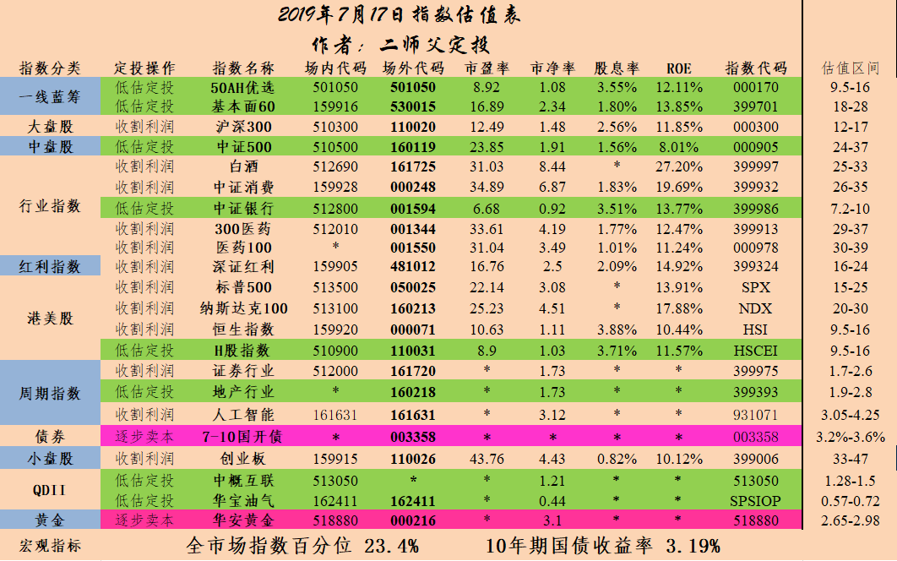

======================================================

_type: talk
@二师父[28814221155551]
2019-07-18 03:44:56 Thu  
topic_id: 244148582518121

智能定投和慧定投的区别。用低估定投策略结合智能定投、慧定投来操作。这是比较完备的系统。

阅读[2655]  评论[0]  赞[0] 

+++++++++++++++++++++++++++++++++++++++++++++++++++++

文件：
2019-07-18 03:44:11 Thu
文件大小：[267055]
48544882552558-蛋卷智能定投和天天基金慧定投的区别.docx

======================================================

_type: talk
@二师父[28814221155551]
2019-07-18 03:49:19 Thu  
topic_id: 111815254284252

<e type="hashtag" hid="228811814551" title="#推荐两个网站#" /> <e type="web" href="http://www.csindex.com.cn/" title="http://www.csindex.com.cn/" />，<e type="web" href="http://www.cnindex.com.cn/" title="http://www.cnindex.com.cn/" /> 
一个中证指数官网，一个国证指数官网。基本A股大部分指数的信息都能够从这两个网站查到，很多数据不用自己计算的，现在都是计算机电算，没有手动计算的，我们只需要掌握计算原理，至于计算的过程交给计算机就行。

阅读[2710]  评论[0]  赞[0] 

======================================================

_type: talk
@一剪梅[844115184528882]
2019-07-18 07:09:32 Thu  
topic_id: 111815254452812

<e type="hashtag" hid="881422852442" title="#定投实盘#" /> 师父，您现在场外目前就定投这四只吗？我也跟上节奏来😄

@海盗 at 2019-07-18 07:09:32 Thu

> 对的

----------

阅读[2756]  评论[1]  赞[0] 

======================================================

_type: talk
@不再YY的猪[422118542885848]
2019-07-18 08:57:16 Thu  
topic_id: 111815254811552

<e type="hashtag" hid="281158284851" title="#市场分析#" /> 二师傅能否分析一下白银目前的投资价值？这几天大涨，但我的仓位太低，现在犹豫要不要加仓。

阅读[2741]  评论[1]  赞[0] 

======================================================

_type: talk
@汉尼拔[552144155244]
2019-07-18 10:09:00 Thu  
topic_id: 844148584284482

今天华宝油气新低了吧，要不要再买点[坏笑]

@小小鸟 at 2019-07-18 10:09:00 Thu

> 场内溢价有点多，场外t+2操作。有不确定性。纠结中。

----------

阅读[2725]  评论[1]  赞[0] 

======================================================

_type: talk
@海盗[48248118584848]
2019-07-18 10:31:29 Thu  
topic_id: 544841214581184

在这里十分感谢🙏二师父推荐的微信阅读app
1.这里的包月只需19元，和其他阅读软件不一样的是，这是畅读的，也就是所有的书都可以看，书源也很广泛，一般的书十之八九都有。关于金融知识的书也是有很多。新用户试用半月，第一个月9元
2.这里做笔记很方便，同一页面里可以做不同型号的下滑线
3.还是笔记，所有做过笔记的网友都能显示出来，而且可以互阅。哪里划线多的词段，阅读时就会自然显示有标记。这样我们在阅读时就很容易发现重点在哪里。
4.还会显示这本书都有谁在读，读有多少进度了，有多少人读过了，还有所有人对这本书的评论和打分。这也特别符合二师父说的一个人走得快，一群人走得远[偷笑]
   特别推荐爱读书的同学们，之前用过很多阅读app,甚至还开通了亚马逊会员，买了kindle阅读器，但毕竟手机还是机不离手，能更好的把自己工作休闲之间的零碎时间利用起来，还丰富自己的头脑。
知识改变命运，同学们，💪加油！

@龘何亮龘 at 2019-07-18 10:31:29 Thu

> 是好东西 可以免费读，每周可以赚10元买书钱

----------

@是喵喵吖～ at 2019-07-18 10:31:29 Thu

> 是的 不用充值

----------

@rtdmm小米 at 2019-07-18 10:31:29 Thu

> 关注了

----------

@美美 at 2019-07-18 10:31:29 Thu

> 怎么关注这个

----------

@海盗 at 2019-07-18 10:31:29 Thu

> 手机应用商店搜索微信读书APP下载即可

----------

@海盗 at 2019-07-18 10:31:29 Thu

> 在哪里可以赚10元钱买书？还能免费阅读？？

----------

@美美 at 2019-07-18 10:31:29 Thu

> 好的，感谢回复

----------

阅读[2859]  评论[12]  赞[0] 

+++++++++++++++++++++++++++++++++++++++++++++++++++++

图片：

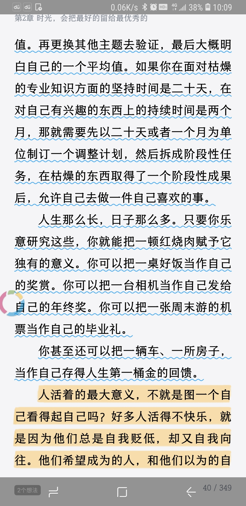

======================================================

_type: q&a
@醉流雨[422151445242248]
2019-07-18 12:55:27 Thu  
topic_id: 544841215418814

@醉流雨

>  二师父，目前我华宝油气亏12个点子，是减仓还是割肉还是补仓呢，？我感觉还有不少下跌空间啊

@二师父

>  最大下跌幅度还有百分之20，定投浮亏是正常的，不要止损，如果忍受不了长期浮亏的话定投不适合你
>  
>  还有就是油气要注意控制仓位，周期性强

阅读[3011]  评论[9]  赞[0] 

======================================================

_type: q&a
@在路上[548228451482224]
2019-07-18 14:00:51 Thu  
topic_id: 844148584845522

@在路上

>  华宝油气场内溢价是不是有点高了

@二师父

>  是有些高

阅读[2931]  评论[1]  赞[0] 

======================================================

_type: q&a
@首尔航仔Eric[244114888181111]
2019-07-18 14:02:02 Thu  
topic_id: 244148584185551

@首尔航仔Eric

>  二师父 我今天海通证券 场内定投 50ah ，基本面60 ，中证银行etf 各2100 那样，这个操作没有问题的吧，还有个问题， 雪球上面这三个指数现在显示是适中，咱们的显示是低估定投，为什么会不一样呢？

@二师父

>  操作没有问题，50ah和银行指数选择一个
>  
>  雪球估值设定的安全边际非常严格，所以显示正常

阅读[3006]  评论[3]  赞[0] 

======================================================

_type: talk
@卢大瑞[88842452422152]
2019-07-18 16:15:42 Thu  
topic_id: 844148522518552

港股打新是否还要办理香港银行卡啊，资金怎么提取到大陆的银行卡呢

阅读[2761]  评论[0]  赞[0] 

======================================================

_type: q&a
@是喵喵吖～[421441114141158]
2019-07-18 19:29:51 Thu  
topic_id: 422128455418158

@是喵喵吖～

>  二师父 如果我想存5W块钱。可以都买成平安短债吗 因为这款短债一万一年收益差不多能有400块钱  不知道安全吗。想稳健一些 但是又觉得南方天天利货币基金有点低。

@二师父

>  债券基金有一个风险，违约之后可能会遭到大额赎回，短期会大跌，一次重仓买入固定收益品种建议选择货币基金或者银行固定理财产品

阅读[2901]  评论[7]  赞[0] 

======================================================

_type: q&a
@美美[48224811151218]
2019-07-18 19:30:05 Thu  
topic_id: 244148522155451

@美美

>  二师父：我今天上午在蛋卷里设置了每周智能定投300元（以前是200），怎么扣下款来还是200？这周设置的是从下周开始吗？

@二师父

>  是的，改变需要提前设置

阅读[3026]  评论[0]  赞[0] 

======================================================

_type: q&a
@J[28281541518551]
2019-07-18 22:58:11 Thu  
topic_id: 111815212841582

@J

>  师傅，基金到达高估值的时候，请问你的实盘交易也会按每周一份的频率卖出吗？或者是别的提示卖出的方式？卖出之时，会和目前每周定投一样给出比例吗

@二师父

>  高估逐步清仓了，每次按照一定比例卖出，这个就视具体情况而定，因为大牛市到来的时候高估的基金会越涨越疯

阅读[3015]  评论[1]  赞[0] 

======================================================

_type: talk
@二师父[28814221155551]
2019-07-19 04:49:31 Fri  
topic_id: 244148548122441

<e type="hashtag" hid="481211145528" title="#指数估值#" />

@杨光霞 at 2019-07-19 04:49:31 Fri

> 二师傅你好！债券高估，不适合购买了吗？

----------

@二师父 at 2019-07-19 04:49:31 Fri

> 不适合了，高估的基金都不适合

----------

@杨光霞 at 2019-07-19 04:49:31 Fri

> 好的

----------

阅读[2968]  评论[3]  赞[0] 

+++++++++++++++++++++++++++++++++++++++++++++++++++++

图片：
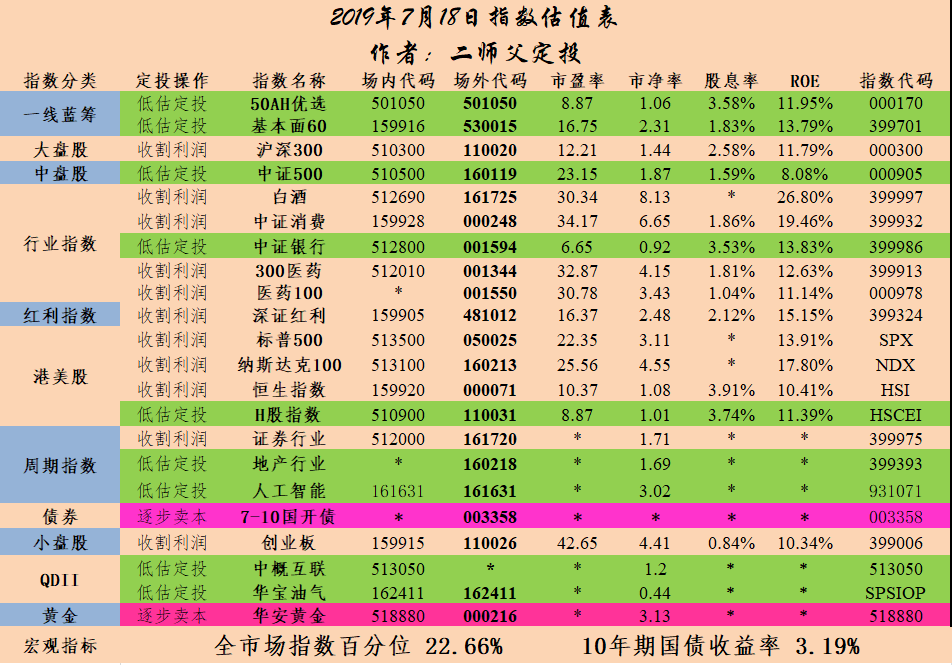

======================================================

_type: talk
@二师父[28814221155551]
2019-07-19 04:50:50 Fri  
topic_id: 844148548122182

如何控制回撤

阅读[3100]  评论[0]  赞[0] 

+++++++++++++++++++++++++++++++++++++++++++++++++++++

文件：
2019-07-19 04:50:47 Fri
文件大小：[25275]
51522151428854-做到这三点，控制定投指数基金的回撤.docx

======================================================

_type: talk
@二师父[28814221155551]
2019-07-19 04:55:04 Fri  
topic_id: 422128428152448

<e type="hashtag" hid="458548584828" title="#推荐几本书#" /> 与投资无关的书籍，不过我觉得每次读之后都能对人生和生命有新的领悟。小说是我们经历多样世界最简单的方式，把自己带入其中，去领略另外的人生。

活着、兄弟、月亮与六便士、平凡的世界、追风筝的人

@Claire at 2019-07-19 04:55:04 Fri

> 谢谢师父！

----------

阅读[3143]  评论[1]  赞[0] 

======================================================

_type: q&a
@薛奔基金理财培训师[88518852581482]
2019-07-19 12:54:39 Fri  
topic_id: 844148548514252

@薛奔基金理财培训师

>  这是什么原因呢 辛苦了

@二师父

>  你再试试，余额宝支付，有可能银行卡钱不够了

阅读[2877]  评论[2]  赞[0] 

======================================================

_type: q&a
@SuH[841551428128422]
2019-07-19 12:57:03 Fri  
topic_id: 544841241418424

@SuH

>  请问二师父，每周定投参加了，之前的积蓄如何投资，感觉债券货币基金银行理财太低了不感兴趣，原来投陆金服，到现在陆金服都不稳了

@二师父

>  我投的货币基金，收益和流动性是有负相关关系的
>  
>  收益好的就是股权类指数基金，加仓指数基金，等牛市到来时候收益就好，固定收益品种收益率超过6个百分点本身就危险

阅读[2889]  评论[0]  赞[0] 

======================================================

_type: talk
@二师父[28814221155551]
2019-07-19 14:35:18 Fri  
topic_id: 111815285511552

<e type="hashtag" hid="145425152222" title="#记账软件#" /> 这是我用的记账软件，随手记

记账的好处不是存多少钱，而是对生活有一个整体的把控感，最开始是在纸上记录，后来是在随手记

当我学会记账并每月根据图表分析，我就知道大概下个月的支出，收入来源，非常安心，因为收入大于支出，生活就不会出现问题，而且最重要的是，哪些地方收入增加快，我会在这个方向花更多的精力来提升，这是长板理论

总之，人的进步是一点点积累起来的，以前我买东西也从来不看价格，自认为这是洒脱的生活，学会记账以后才明白真正的自由和洒脱是建立在对自我的规划和把控上面

@Pista at 2019-07-19 14:35:18 Fri

> 我也在用记账软件，不过用的是挖财。

----------

@知南茶暖🍹 at 2019-07-19 14:35:18 Fri

> 我用过很多款，找到适合自己的就好。基本差不多，看用哪个顺手了。

----------

@首尔航仔Eric at 2019-07-19 14:35:18 Fri

> 我用的网易的

----------

@首尔航仔Eric at 2019-07-19 14:35:18 Fri

> 还可以绑定银行卡 但是感觉不太安全

----------

@蒲公英 at 2019-07-19 14:35:18 Fri

> 我也是用的随手记

----------

阅读[2941]  评论[5]  赞[0] 

+++++++++++++++++++++++++++++++++++++++++++++++++++++

图片：
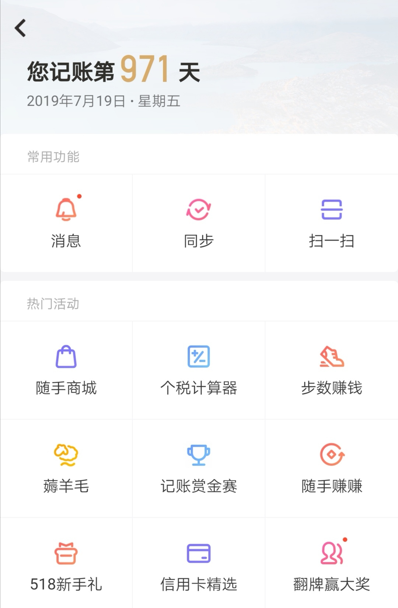

======================================================

@二师父[28814221155551]
2019-07-19 19:26:13 Fri  
topic_id: 422128411842558

>  @二师父
>  

阅读[2810]  评论[0]  赞[0] 

======================================================

_type: q&a
@九天[548228524258514]
2019-07-19 22:30:36 Fri  
topic_id: 422128844445428

@九天

>  请问雪球什么地方可以查看估值？

@二师父

>  雪球后台有一个基金助手，会给你发布估值状态提醒消息，点击进去就看到了

阅读[2721]  评论[1]  赞[0] 

======================================================

_type: q&a
@学以致用[244415184181451]
2019-07-19 22:36:02 Fri  
topic_id: 844148855821552

@学以致用

>  你好，老师，恒生国企510900，是港股的龙头股吗？还是中国企业在香港上市的公司啊？可以分析一下投资价值吗？

@二师父

>  恒生国企指数是港股的大蓝筹指数。
>  
>  恒生指数是从香港股票市场挑选出50只优质蓝筹股票组成的指数。
>  
>  恒生国企指数又称为H股指数。H股指注册地在内地，但是上市地在香港的外资股票，所以也就是你理解的中国企业在香港上市的公司，比如腾讯这种。
>  
>  恒生国企指数的成分股数目是没有限制的，但是必须为市值最大，且在恒生指数成分股内的H股。
>   
>  恒生中国企业指数，里面有中国平安，工商银行，中国银行、腾讯控股等内地企业股票作为重仓股票。
>  
>  以前二师父分析过50ah里面的成分股和H股指数里面的成分股是类似的因为50ah持仓股票优先选择同样一家企业A股和港股的折价股，所以这个指数更加容易取得超额收益。
>  
>  恒生国企指数，1994年7月8日基期指数点位是1000，2015年最高点是15000。20年涨幅15倍。还是比较优秀的。
>  
>  当前恒生国企指数处于低估区域是适合定投的。我也在自己的实盘里面选择了这只指数。港股指数的风险点在于没有退市保护机制，所以遇到股灾下跌也会非常大。如果不能够接受较大波动的话需要注意稍微控制仓位

阅读[2815]  评论[0]  赞[0] 

======================================================

_type: q&a
@志亮[422125851552828]
2019-07-20 03:04:28 Sat  
topic_id: 544841121151554

@志亮

>  二师父，华宝油气掉仓了，这个你怎么看？本以为到底了，没想到这基是没底的，目前要亏10个点了，还要继续持有吗？还会继续跌不？己经是历史新低了。

@二师父

>  这是我之前的网格交易表格，里面数据没有变过，我在星球也发过。
>  
>  油气我用了极端保守的原则，因为大宗商品的周期性强，无论是油气还是黄金，都一样。
>  
>  至于顶部和底部，没有人能够预测。我想说的是，对于基金定投来讲，10个点的浮亏不多，如果不敢加仓了，那么也切记不要卖。

阅读[3089]  评论[13]  赞[0] 

======================================================

_type: talk
@二师父[28814221155551]
2019-07-20 04:44:45 Sat  
topic_id: 422128848544158

<e type="hashtag" hid="458548158448" title="#权益类投资时代即将到来#" />指数基金是最好的权益类资产，唯一的风险就是波动。 

有的人承受不了浮亏的痛苦，那么也必然错过浮盈的快乐。人生是守恒的，投资也一样。看你是主动承受还是被动逃避了。

阅读[4908]  评论[0]  赞[0] 

+++++++++++++++++++++++++++++++++++++++++++++++++++++

文件：
2019-07-20 04:43:50 Sat
文件大小：[371194]
88255824882822-陆金所宣布退出P2P业务，固收投资时代即将结束.pdf

======================================================

_type: talk
@二师父[28814221155551]
2019-07-20 04:46:22 Sat  
topic_id: 422128848548448

每周末更新估值表加偏离表。场内定投可以结合偏离表操作。对于不能接受浮亏的朋友就不要结合了。因为我的回测表明，均线定投的回撤更大，虽然收益好，但是回撤大。

@柠小萌🍭 at 2019-07-20 04:46:22 Sat

> 二师父，场内采用网格交易，是按照网格走吗？如果基金本周没有下跌4%，就结合低估定投和均线定投策略定投吗？那上涨了再按网格交易卖出吗？还在低估区域内也暂停定投吗？

----------

@二师父 at 2019-07-20 04:46:22 Sat

> 网格交易严格根据价格来，比较死板，但容易管住自己

场内鳄鱼计划就比较灵活，结合仓位，估值和均线偏离度

----------

阅读[3113]  评论[2]  赞[0] 

+++++++++++++++++++++++++++++++++++++++++++++++++++++

图片：
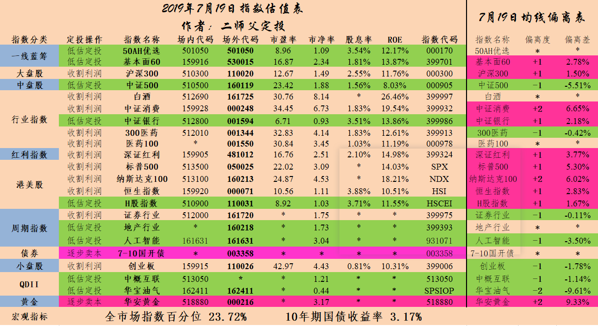

======================================================

_type: talk
@二师父[28814221155551]
2019-07-20 04:57:44 Sat  
topic_id: 244148858258281

东证竞争力指数估值走势图，ROE16%左右，有兴趣的可以看看，投资还是以估值表为主

@巴拉巴拉 at 2019-07-20 04:57:44 Sat

> 这个基金我买了，准备长期定投

----------

@巴拉巴拉 at 2019-07-20 04:57:44 Sat

> 估值只是一个指标，估值便宜的时候买代表自己别买贵。而买高Roe的代表自己买的正确。历史表明高roe的一般估值都会偏高一些，所以两个指标比较起来，更重要的是roe，这就是我在蛋卷上买东方红指数的原因。更何况东方红还自己买了1000万，3年内该基金不会有清盘风险，目前估值水平也比较低

----------

@冬夫 at 2019-07-20 04:57:44 Sat

> 请问指数代码是多少？

----------

@青青竹 at 2019-07-20 04:57:44 Sat

> 师傅，我刚才查了一下，东方红竞争力指数不是正在认购期么？这个走势图是哪个？代码是多少？

----------

@二师父 at 2019-07-20 04:57:44 Sat

> 007657，007658

----------

@二师父 at 2019-07-20 04:57:44 Sat

> 市盈率图，007657，007658

----------

@J at 2019-07-20 04:57:44 Sat

> 这是个新基金吗？现在的规模多少？建仓期完毕了吗

----------

@二师父 at 2019-07-20 04:57:44 Sat

> 新基金刚刚建仓

----------

阅读[3203]  评论[11]  赞[0] 

+++++++++++++++++++++++++++++++++++++++++++++++++++++

图片：
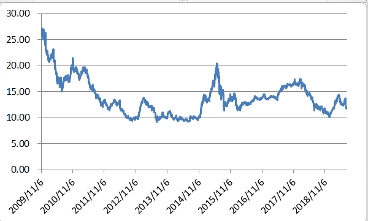

======================================================

_type: q&a
@🎈铮[28284825441841]
2019-07-20 11:21:13 Sat  
topic_id: 111815521281852

@🎈铮

>  二师父您好，想听听帮老人投资的渠道，比如京东金融，支付宝，微信等，或者各大银行的，或者一些保险基金等，风险较低的，可以一部分长期投，一部分还是要有流动性，万一用钱呢，现在只敢下手货币基金，但2.几的收益率有点太低了，多谢

@二师父

>  货币基金加宽基指数基金是最好的
>  
>  需要流动性的资金就留着购买货币基金，其余的定投指数基金，选择稳健的沪深300或者中证红利，建立3到5成底仓，然后一直坚持定投
>  
>  等到股市回暖，10年国债收益率涨到3.5或者3.6个百分点以上，逐步定投长期债券
>  
>  这样轮动是最稳健的投资方式

阅读[3080]  评论[6]  赞[0] 

======================================================

_type: q&a
@鸿何服饰[15442528284822]
2019-07-20 11:23:50 Sat  
topic_id: 544841124188224

@鸿何服饰

>  请问中证银行是周期行业吗？我50%资金投入中证银行。

@二师父

>  有一定的周期性，跟随经济景气度有关，但不是强周期行业
>  
>  因为银行比较稳健，安全系数高，可以重仓，问题是你目前这笔资金是什么时候买入的，是定投的还是一次性买入，浮亏多少？

阅读[3342]  评论[2]  赞[0] 

======================================================

_type: talk
@树叶[544811512145144]
2019-07-20 14:42:57 Sat  
topic_id: 844148885582482

<e type="hashtag" hid="142825811122" title="#定投周报#" /> 二师父定投周报第17期

阅读[3306]  评论[0]  赞[0] 

+++++++++++++++++++++++++++++++++++++++++++++++++++++

文件：
2019-07-20 14:42:57 Sat
文件大小：[281779]
28255845885111-二师父定投周报7.20（第17期）.docx

======================================================

_type: talk
@二师父[28814221155551]
2019-07-20 16:28:56 Sat  
topic_id: 111815552415812

<e type="hashtag" hid="551521888824" title="#美国和伊朗#" /> 美国一直有制裁伊朗，之前伊朗直接把美国价值超过1亿美元的的“全球鹰”无人机击落

美国似乎没有任何措施，只有特朗普过嘴瘾，称在霍尔木兹海峡击落了伊朗的无人机，真实性尚未证明

不过最近美英伊的冲突是不断升级的，如果发生局部动荡将会导致黄金和石油上涨，所以这两类资产可以持有

现在问题是油气，这个基金并不是和原油涨跌同步的，不过相关度有百分之70，持有等待上涨是没问题的，后期投资可以逐步考虑原油基金

无论白银，黄金，原油，以及油气，都属于大宗商品相关的投资品种，具有周期性，综合配置只能轻仓

@堂吉诃德的小助手 at 2019-07-20 16:28:56 Sat

> 请问原油基金有哪些？现在可以买吗？

----------

@二师父 at 2019-07-20 16:28:56 Sat

> 南方原油，这个周期性也很强，目前不适合

----------

@堂吉诃德的小助手 at 2019-07-20 16:28:56 Sat

> 为何不适合，现在原油不是低位？低位买高位卖不可以？

----------

@二师父 at 2019-07-20 16:28:56 Sat

> 原油并没有处于低估区间

----------

阅读[3240]  评论[4]  赞[0] 

======================================================

_type: talk
@二师父[28814221155551]
2019-07-20 16:32:51 Sat  
topic_id: 544841112545444

本周的周报加了万得全a股市盈率的走势图，目前是4星级别的投资机会，可以正常定投，去年的投资机会不知道还能不能遇到，虽然估值没有上移动多少，可是我们选择的标的从去年底部到现在上涨了20到70个百分点不等，这是因为优质企业的盈利做出的贡献。

阅读[3335]  评论[0]  赞[0] 

+++++++++++++++++++++++++++++++++++++++++++++++++++++

图片：
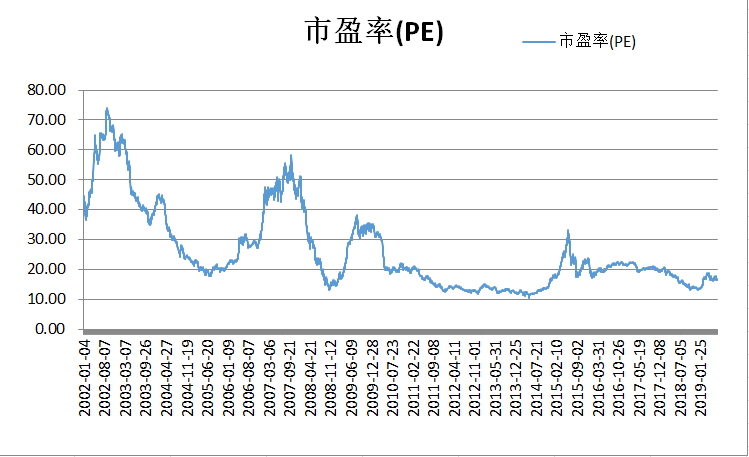

======================================================

_type: q&a
@J[28281541518551]
2019-07-20 20:45:31 Sat  
topic_id: 244148882145111

@J

>  师傅好，两个问题请教：1. 华夏50AH股和易方达H股重合度大吗？是二选一还是只选择其一？两个都含有港股，没有跌停机制，但Ah股有部分是A股，那是否意味着H股比50AH的风险要大一些？2. 银行现在pb破1，投资很划算，如果已经重仓50AH，还有必要投银行股吗？

@二师父

>  1、二者重合不大，可以都选，也可以只选50AH，然后港股购买恒生指数。50AH的风向更低
>  
>  2、银行指数投资价值很高，50AH里面本身有了很多银行股票，可以就选这一个即可

阅读[3319]  评论[1]  赞[0] 

======================================================

_type: talk
@二师父[28814221155551]
2019-07-21 05:16:12 Sun  
topic_id: 422128881524858

<e type="hashtag" hid="228252858821" title="#极简投资策略#" /> 最简单的方法和策略往往是最有效的。说一个我学习数学的方法，高中时候我的数学是最擅长的，不过我很少去市场上买一大堆资料搞题海战术。

我做的最多的事情就是推导书本的公式定理，公式的每一步证明都有理有据，从而一遍遍地加深我对基本公式的理解，然后做下学校发的习题和试卷，就这种最简单的方法让我的数学成绩稳定在130以上。

真的没必要把任何事情弄得太复杂，越简单越有效。投资一样的，入门之后再深入学习研究，至于能够走的多远看自己的兴趣和悟性了。

每个人天赋不一样，投资、数学、英语，写作我都有些天赋，而最近学习普通话的过程优点痛苦，不太好理解各种饶舌的发音，也许是花的时间不够，也许是天赋不足。我更愿意相信后者，因为我的记忆力很好，过目不忘，无论是网上还是生活中遇到的人，只要有过一次交集就不会再忘记，而对于普通话学习却非常吃力，不是记不住，而是理解不了，做自己擅长的事，样样精通的大神毕竟少数。

@一心一意 at 2019-07-21 05:16:12 Sun

> 当上证的市盈率大于15%时我们怎么投

----------

@Snow at 2019-07-21 05:16:12 Sun

> 二师父哪里人？

----------

@alicedream* at 2019-07-21 05:16:12 Sun

> 二师父，大神，深入浅出地带领我们这些理财小白一起赚钱，太感谢🙏！

----------

@二师父 at 2019-07-21 05:16:12 Sun

> 就可以停止了

----------

@三峡情 at 2019-07-21 05:16:12 Sun

> 谢谢二师父深入浅出的讲解！我这种没时间研究的就需要您点拨[偷笑]

----------

@mumomo at 2019-07-21 05:16:12 Sun

> 请问二师父，这种简单方法适合a股所有指数吗？

----------

@二师父 at 2019-07-21 05:16:12 Sun

> 并不适合所有的指数，因为对于消费医药这种指数的涨跌并不是随着大盘的，消费指数已经到达15年的价格，可是上证综合指数一路走低

----------

@是喵喵吖～ at 2019-07-21 05:16:12 Sun

> 师傅请问对于大蓝筹 大盘股 小盘股 红利指数 均适合吗这种方法吗

----------

阅读[5124]  评论[9]  赞[0] 

+++++++++++++++++++++++++++++++++++++++++++++++++++++

文件：
2019-07-21 05:07:12 Sun
文件大小：[436974]
88255845184512-当不会估值的时候，有没有更加简单的投资方法.pdf

======================================================

_type: q&a
@九天[548228524258514]
2019-07-21 11:49:57 Sun  
topic_id: 111815558144182

@九天

>  据我所知，易方达官网购买基金零费率，富国官网在天天基金0.1折基础上再0.1折，不知道还有哪些基金公司有优惠的？

@二师父

>  南方，天弘都是，不过你只能购买他们基金公司的基金才是零费率

阅读[3180]  评论[0]  赞[0] 

======================================================

_type: q&a
@杜志彪[544454124115854]
2019-07-21 12:08:47 Sun  
topic_id: 544841151855254

@杜志彪

>  二师父由于目前股市外理财的风险加大，我想利用您的定投策略运用到家庭长期账户理财中，已达到资金增长最大化，您看是否可行，我选择像建设银行这类的标的，假如我有20万，10万存入银行保底（不是定期，可以是类似银行无固定期限理财那种，一般T+2到账），另外10万买入建设银行，如果当本金亏损达到9万，我就利用保底资金补上，保持10万本金，当本金盈利到11万，我就收割这个1万，依次类推，您看是否可行，缺点就是不止损，如果赶上熊市保底的10万是否够用，当然买入点很重要，选择年线附近的股价比较好。

@二师父

>  你这个策略和市值恒定定投法类似，策略没有问题，建议优选3到5只股票构建自己的组合，这样更容易抵御个股黑天鹅带来的风险
>  
>  追求稳健投资，选择招商银行，兴业银行，农业银行三只股票做组合。学习到一定程度的话能够看懂股票基本面并正确估值就可以逆势加仓股票构建自己的指数基金组合。这种策略需要资金量大，而且对投资能力，心态都有较高要求

阅读[3428]  评论[0]  赞[0] 

======================================================

_type: q&a
@志亮[422125851552828]
2019-07-21 16:28:39 Sun  
topic_id: 111815541212142

@志亮

>  二师父，我总听某大V说华宝油气那个套利具体是怎么回事？它比网络交易还好吗？听说是100%赚的，有研究的价值不？

@二师父

>  这种一般是机构套利，对资金量要求比较高。是在一级市场买卖和二级市场申赎之间利用折溢价进行套利的。100%稳赚有点夸张了。

阅读[3375]  评论[14]  赞[0] 

======================================================

_type: q&a
@王燕[241582821454511]
2019-07-21 19:24:32 Sun  
topic_id: 422128852282418

@王燕

>  二师父，估值表里为啥木有中证红利了呢？这个指数现在是低估吗？深证红利和中证红利哪个好呢？

@二师父

>  我现在是主要成长股，蓝筹股投资，中证红利低估，他和深证红利各有优势，中证红利分红稳定，深证红利成长性好

阅读[3309]  评论[1]  赞[0] 

======================================================

_type: q&a
@衣袂飘香[118248548242452]
2019-07-21 20:13:20 Sun  
topic_id: 844148822258442

@衣袂飘香

>  我翻阅了您鳄鱼计划，大约是从2018年4月份开始的，对吗？我整理了从2018年4月到20 19年7月20号的鳄鱼计划，试图理解您的投资轨迹。所以想弄清楚你开始执行鳄鱼计划的日期。

@二师父

>  很早就开始了，更早的时候学堂还没建立，没有公布

阅读[3515]  评论[0]  赞[0] 

======================================================

_type: talk
@J[28281541518551]
2019-07-21 23:43:58 Sun  
topic_id: 244148242845851

雪球app是不是被封了？怎么在苹果手机app store里搜索雪球，没有了？有遇到一样情况的朋友吗

@志亮 at 2019-07-21 23:43:58 Sun

> 一样，早就搜不到了

----------

@J at 2019-07-21 23:43:58 Sun

> 早知道之前就不卸载了[捂脸] 知道被封是怎么回事吗

----------

@志亮 at 2019-07-21 23:43:58 Sun

> 不知道呢？[微笑]

----------

@别皱眉头 at 2019-07-21 23:43:58 Sun

> 雪球股票

----------

@J at 2019-07-21 23:43:58 Sun

> 按你这个关键词来搜索也是没有，估计是没有通过苹果公司的审核，真的被封了

----------

@J at 2019-07-21 23:43:58 Sun

> 谢谢[微笑]

----------

@J at 2019-07-21 23:43:58 Sun

> 如果哪位学友找到油气场内场外套利这篇文章，请不吝赐教分享到学院里哦[呲牙]

----------

阅读[3379]  评论[14]  赞[0] 

======================================================

_type: talk
@二师父[28814221155551]
2019-07-22 03:44:20 Mon  
topic_id: 544841545481414

回首过去，展望未来，如果对未来不确定越大，那么恐惧越深

@shi at 2019-07-22 03:44:20 Mon

> 一直保持定投，心态平和。
其它不说，说一下二师父没有投的那三个：
1.华宝油气：目前62份 收益为负（-12.51%），
2.德国30：目前52份，收益为正（3.28%），
3. 纳斯达克：我也没定投。
疑问：华宝油气，继续保持定投，然后额外再加点鳄鱼计划（摊薄成本），可以吗？

----------

@麻烦得很 at 2019-07-22 03:44:20 Mon

> 固执和执着，一字之差

----------

@J at 2019-07-22 03:44:20 Mon

> 轮回，师傅格局开阔才能容得下这么宏大的叙事场面[强][调皮]

----------

@二师父 at 2019-07-22 03:44:20 Mon

> 仓位不低，不用额外加了

----------

@杜志彪 at 2019-07-22 03:44:20 Mon

> 华宝油气62份，一周一份的话，已经投了15个月了，佩服，我觉得这个做网格比较好，如果定投，周期定为月投比较好，我的0.43越来越近了[得意]

----------

@惟子 at 2019-07-22 03:44:20 Mon

> 佩服[抱拳]，我的华宝油气目前-11.58%，现在按月定投，降低成本中

----------

阅读[3482]  评论[6]  赞[0] 

+++++++++++++++++++++++++++++++++++++++++++++++++++++

文件：
2019-07-22 03:43:45 Mon
文件大小：[351313]
28255848121841-展望下我们定投的未来.pdf

======================================================

_type: talk
@J[28281541518551]
2019-07-22 09:19:29 Mon  
topic_id: 422128514421488

学友们很强大，谢谢九天的分享[强][握手] 希望星球学院里的气氛越来越好，互相学习互相进步！

@mumomo at 2019-07-22 09:19:29 Mon

> 这个哪里能看到

----------

@mumomo at 2019-07-22 09:19:29 Mon

> 谢谢

----------

@J at 2019-07-22 09:19:29 Mon

> [强]

----------

阅读[3300]  评论[5]  赞[0] 

+++++++++++++++++++++++++++++++++++++++++++++++++++++

图片：
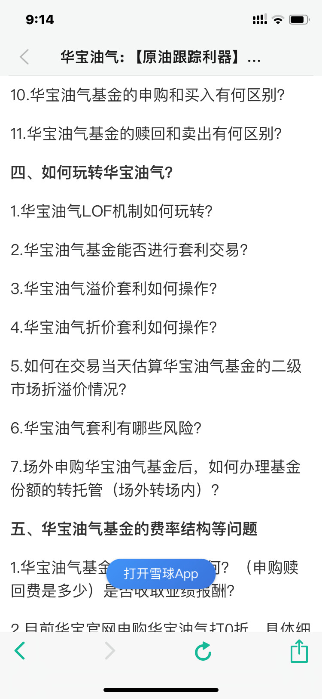

======================================================

_type: q&a
@无名书苑[51188588215444]
2019-07-22 11:12:53 Mon  
topic_id: 111815482154442

@无名书苑

>  二师父，医药类指数的品类比较多，有沪深300医药，医药100，中证医药，全职医药等。哪个医药指数比较优质，成长性比较好？
>  是否可以认为医药是必需品，而且随着国民经济的不断提升，人民对药和健康的需求会加大；而且随着老年化进程不断加速，需求也会加大；对比发达国家我们的医药行业还有很大的发展空间。
>  现在医药指数大都在低估和适中之间徘徊。如果准备长期定投，是否可以适当定投医药指数？如果要投，定投哪个指数教好？

@二师父

>  医药100的成长性好一些。无论是美国日本德国法国中国，医药行业的需求都非常大
>  
>  按照投资原则，我们采用低估定投的，如果能够接受回撤，不在高估区域任何时候定投都可以
>  
>  最佳组合沪深300医药加医药100，沪深300医药是龙头医药股票组合，医药100是中小盘医药股票组合

阅读[3471]  评论[2]  赞[0] 

======================================================

_type: q&a
@凯[244415182418811]
2019-07-22 21:47:25 Mon  
topic_id: 111815484548522

@凯

>  科创板对主板影响有多大，很多自己是不是都跑科创板去了

@二师父

>  会有短期的吸血效应，炒作资金会流到科创板，过几天就正常了

阅读[2777]  评论[2]  赞[0] 

======================================================

_type: talk
@二师父[28814221155551]
2019-07-23 03:46:06 Tue  
topic_id: 422128242515828

如此火爆，来不来

@J at 2019-07-23 03:46:06 Tue

> 跟着师傅练出了一种定力[微笑]

----------

@Claire at 2019-07-23 03:46:06 Tue

> 认同师父的投资策略。

----------

@齐俊波 at 2019-07-23 03:46:06 Tue

> 我没有那么多钱，进不了科创版。不想那个美事儿。不接近它，便伤害不了我。[呲牙][呲牙]

----------

阅读[2701]  评论[3]  赞[0] 

+++++++++++++++++++++++++++++++++++++++++++++++++++++

文件：
2019-07-23 03:41:51 Tue
文件大小：[349491]
88255241111812-科创板火爆了，历史性的一天.pdf

======================================================

_type: talk
@二师父[28814221155551]
2019-07-23 03:46:37 Tue  
topic_id: 544841424585144

大盘一直跌，指数却并没有很便宜

@暖暖 at 2019-07-23 03:46:37 Tue

> 老师，我在中证网找了下，图片上的股指与中证网上股指稍有差别（相差不大，比如沪深300股指），是有调整过么。然后股指是看滚动市盈率的么？

----------

@暖暖 at 2019-07-23 03:46:37 Tue

> 估值是对比滚动市盈率么，且如何知道合理估值区间，比如现在沪深300的滚动市盈率是13.47，实际上沪深300的股指在多少的数值范围内是属于合理，多少的范围内是属于低估可以买入呢（这个大概怎么计算来的啊）。

----------

@二师父 at 2019-07-23 03:46:37 Tue

> 对，看滚动市盈率

----------

@二师父 at 2019-07-23 03:46:37 Tue

> 这个看置顶的估值表，每个平台的数据有点差别

----------

@暖暖 at 2019-07-23 03:46:37 Tue

> 老师，是否可以理解为，基本是根据当日滚动市盈率与合理估值的市盈率进行对比，如果低于合理市盈率估值的最低阈值，就一直进行定投，如果周四的市盈率出来发现高于合理市盈率估值的最低阈值就不行行定投。如果定投，再根据当时浮亏的比例确定当时的加仓系数，再根据每期买入的标准金额就知道低于合理市盈率估值时的定投实际金额是么，那市净率，股息率和ROE这些主要做什么参考作用呢，且如果当前实际市盈率高于合理市盈率估值时，我们就暂停定投，然后就一直放着，等涨起来么（浮亏率只影响每期定投的实际金额，当前市盈率与合理市盈率估值的对比确定是否需要定投，如果不需要定投了，是不是以前定投的金额不动了，就等基金净值增长，然后再逐步卖出去即可）。

----------

@暖暖 at 2019-07-23 03:46:37 Tue

> 问题有点多，昨天才加入团队，想细致了解下。

----------

@二师父 at 2019-07-23 03:46:37 Tue

> 语言表达能力需要加强，不够简洁。设定阈值，低于低估阈值定投，正常估值盈利就逐步卖出

股息率，roe等指标也是参考，股息率是衡量分红的，roe是衡量盈利的，实际估值过程需要多指标参考，并不严格说市盈率低，指数越低估就一定比市盈率高的指数未来盈利多，还需要看指数整体的盈利增长情况

----------

@暖暖 at 2019-07-23 03:46:37 Tue

> 感谢老师，确实不懂，昨天才看这个。。。

----------

阅读[2944]  评论[14]  赞[0] 

+++++++++++++++++++++++++++++++++++++++++++++++++++++

图片：
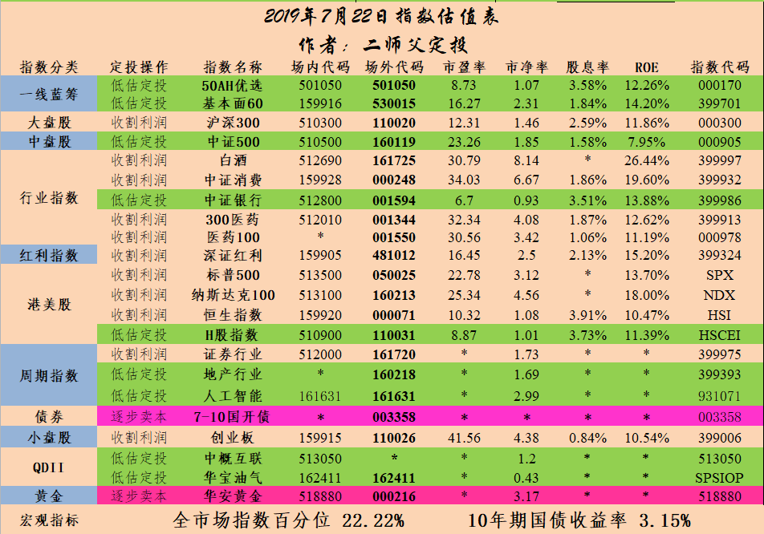

======================================================

_type: talk
@二师父[28814221155551]
2019-07-23 04:02:04 Tue  
topic_id: 422128242512558

<e type="hashtag" hid="228252111181" title="#读书《投资者的心灵修炼》#" /> 一切都会慢慢过去，唯有学到的知识，领悟到的智慧不会。读书学习是投资精进之道。这本书也值得潜心学习。

@Pacifica at 2019-07-23 04:02:04 Tue

> 这是二师傅的声音吗？[调皮][调皮]

----------

@Claire at 2019-07-23 04:02:04 Tue

> 师父，下次提前预告分享读书心得的书名好吗？以便于跟上你的节奏。谢谢师父！

----------

@二师父 at 2019-07-23 04:02:04 Tue

> 是的哈

----------

@二师父 at 2019-07-23 04:02:04 Tue

> 好，没问题

----------

阅读[4712]  评论[4]  赞[0] 

+++++++++++++++++++++++++++++++++++++++++++++++++++++

文件：
2019-07-23 03:59:56 Tue
文件大小：[5468926]
88255241111252-《投资者的心灵修炼》整体概述.m4a

======================================================

_type: q&a
@俗人[844151888542152]
2019-07-23 12:45:18 Tue  
topic_id: 544841428481844

@俗人

>  感觉华宝汽油要开始反弹了  已经到历史最低点

@二师父

>  不预测，在相对低点布局完毕就行

阅读[2727]  评论[2]  赞[0] 

======================================================

_type: q&a
@J[28281541518551]
2019-07-23 14:37:19 Tue  
topic_id: 244148485128851

@J

>  师傅，回看华宝油气过去几年的走势，0.43附近已接近底部，请问为啥师父您的网格交易价格最低价位制定到¥0.3？这个真的会出现吗

@二师父

>  你这只看到了这只基金成立期间的走势，他追踪的是标普石油天然气上游股票指数
>  
>  相当于持仓是和石油天然气相关的股票，所以他的涨跌不仅与石油有关系，也与美股的涨跌有关系
>  
>  很显然这两者目前都没有到达最低位，过去可以预测未来，但不能够代表每一次都会重现过去，也许突破近几年的低位，对于周期指数安全边际要高，你有很多重仓优质指数的机会，没必要和这只基金较劲

阅读[2641]  评论[1]  赞[0] 

======================================================

_type: talk
@二师父[28814221155551]
2019-07-23 16:13:12 Tue  
topic_id: 422128282524258

<e type="hashtag" hid="228254851511" title="#关于三个策略说明#" /> 最近有很多新加入的朋友，不明白二师父的三个策略，简单说下。其实在往期的文章都有介绍，如果不懂得搜索，直接看置顶文章就明白了。

三个策略的共同点。都是在基金相对低位的时候买入，在基金相对高位的时候卖出，然后获取利润。核心思维都是逆向投资思维。

三个定投策略的不同点。

低估定投是遵循五步定投法，方法固定，在基金低估的时候分批买入，在基金正常估值的时候逐步卖出利润，在基金高估的时候逐步清仓。

低估定投适合新手，操作固定，既可以在场内手动定投，也可以在场外自动定投。这种策略的优点，长期坚持三到五年定投，牛市到来的话可以实现比较可观的年化收益率，可以自动定投，适合繁忙的工薪阶层。

这种策略的缺点，在长期熊市震荡期间会一直处于浮亏状态，不及时卖出止盈的话容易利润回吐。

均线定投适合场内定投，在负的均线偏离度逐步加仓，比如均线偏离度负1买入1份，均线偏离度负2买入1.5份，均线偏离度负3买入2份。

然后反之在均线偏离度正1的时候卖出1份，均线偏离度正2的时候卖出1.5份，均线偏离度正3的时候卖出2份。

这种策略最好建立底仓，防止买入之后指数就大涨。均线定投策略的优点，适合在震荡市场且指数低估的时候低买高卖获取利润，很好地应对震荡市场，缺点：容易在大盘单边上涨的时候卖出份额较多，牛市来的时候获取利润较少。

网格交易是类似均线定投的原理，两种策略选择一种策略即可。不过网格交易更加稳健，均线策略保守一些，我们设定一个底仓买入位置，低于底仓买入价格，每下跌4个百分点加仓一次，高于底仓买入价格，每上涨4个百分点加仓一次。具体的表格设置可以自己决定，低估区域内建立底仓都是没有问题的。

网格策略需要注意三个问题，第一，底仓建立的价格要在低估区域内，并且控制最大下跌幅度在40个百分点以内，加仓次数控制在10次以内。

第二、每次可以设置下跌4个百分点加仓一次，也可以设置下跌3个百分点加仓一次，或者下跌5个百分点加仓一次。

加仓份额可以等额度加仓，可以下跌增加额度加仓，学习了策略之后可以自己灵活运用。

这种策略的优点，可以很好的应对熊市震荡市场，缺点就是和网格交易一样，如果卖出过多的话可能牛市来了就损失掉一部分利润。

当然，如果你怕利润损失，那么就只在加仓的过程中按照网格交易操作，在基金上涨的过程中可以一直持有。

二师父的定投学堂定位是帮助新手投资者开启投资理财之门，保证从亏损的状态变成盈利的状态，甚至可以稳定的获取年化15到20个点的收益。

如果你觉得你的水平很高了，可以不用看，每个人人生追求不一样。知道自己不要什么比知道自己要什么更重要。

@薛奔基金理财培训师 at 2019-07-23 16:13:12 Tue

> 具体每种操作方法细节文章在哪里呢

----------

@二师父 at 2019-07-23 16:13:12 Tue

> 这个文章里面就介绍了啊，具体的操作方法

----------

@秦岭云横 at 2019-07-23 16:13:12 Tue

> 有实盘没

----------

@衣袂飘香 at 2019-07-23 16:13:12 Tue

> 谢谢二师父！自从加入学堂，天天都看二师父文章。尤其是均线策略，有几十篇文章，越看理解越深刻。其实，很多原理在往期文章都有详细的讲解过，大家可以耐心的、专题性的去看，自行计算低估值，自行计算偏离差、偏离度。这样理解会更到位。

----------

@二师父 at 2019-07-23 16:13:12 Tue

> 有

----------

@衣袂飘香 at 2019-07-23 16:13:12 Tue

> 定投实盘可以在天天基金网看到。鳄鱼计划在学堂就可以看到。

----------

@mumomo at 2019-07-23 16:13:12 Tue

> 二师父，我的理解是，均线定投策略和网格交易都是在震荡区间进行的，买入是在低估区域，卖出是在正常估值区间，如果担心损失收益可以只买不卖，一直等待牛市按照五步定投法收割利润，这样理解对不？

----------

阅读[2603]  评论[13]  赞[0] 

======================================================

_type: talk
@林荫[15115451828452]
2019-07-23 17:19:26 Tue  
topic_id: 422128282141188

请问519300大成沪深300这支基金怎么样，在天天网都查不到？

@林荫 at 2019-07-23 17:19:26 Tue

> 以前在银行买的，现在可以到天天或场内买吗？

----------

@二师父 at 2019-07-23 17:19:26 Tue

> 易方达和天弘沪深300费率更低，有的基金没有代销

----------

阅读[2392]  评论[2]  赞[0] 

======================================================

_type: q&a
@金帛人夋[51442888185524]
2019-07-23 22:44:03 Tue  
topic_id: 844148422555522

@金帛人夋

>  选择一直优秀基金，长期进行定投，并严格止盈，长期来看，定投的收益是否能跑赢基金长期收益。

@二师父

>  我没明白你的意思，是选择一只基金长期持有和定投相比吗？
>  
>  如果这样的话，而且买在底部，那么长期持有一次买入会比定投收益高，比如去年底部一次买入的就比现在定投收益好
>  
>  不过底部大家都不敢买了

阅读[2389]  评论[2]  赞[0] 

======================================================

_type: talk
@二师父[28814221155551]
2019-07-24 05:11:14 Wed  
topic_id: 544841455885584

<e type="hashtag" hid="228254285421" title="#债券基金的配置#" />

阅读[4079]  评论[0]  赞[0] 

+++++++++++++++++++++++++++++++++++++++++++++++++++++

文件：
2019-07-24 05:11:03 Wed
文件大小：[345611]
88255212581112-南方全球债券已经发行，长债、短债、美元债该怎么配置.pdf

======================================================

_type: talk
@二师父[28814221155551]
2019-07-24 05:11:45 Wed  
topic_id: 844148422112452

阅读[2443]  评论[0]  赞[0] 

+++++++++++++++++++++++++++++++++++++++++++++++++++++

图片：

======================================================

_type: q&a
@J[28281541518551]
2019-07-24 05:13:10 Wed  
topic_id: 244148422854221

@J

>  师父，基于您精选的低估指数都是动态移动的，长期看，应该每隔一段时间指数都有一定程度的上涨。故有一个请求，您可以定期给我们更新一下网格交易价格表吗？

@二师父

>  好的，没有问题，我一般是在适合做网格的时候公布一次

阅读[2515]  评论[1]  赞[0] 

======================================================

_type: q&a
@是喵喵吖～[421441114141158]
2019-07-24 11:07:19 Wed  
topic_id: 844148424111522

@是喵喵吖～

>  二师父 我现在定投是这样规划的 我记得上次您说 中证银行可以停掉 他们里面有一些重合的。您觉得我现在是应该像现在这样每个分类的可以都投一些还是集中投两种比如投50AH和基本面60。其实那个平安短债里的钱我近几年也用不到。是不是可以拿出来 分布到指数基金里 每周四多投一些？争取在牛市之前多定投一些？

@二师父

>  可以多投一点，指数基金的涨幅肯定是高于短债，就是需要经历波动
>  
>  然后国泰国证那个是地产指数可以不投或者少投一点

阅读[2351]  评论[2]  赞[0] 

======================================================

_type: q&a
@幻水[881185412112]
2019-07-24 11:13:26 Wed  
topic_id: 111815148512522

@幻水

>  你好，我有一个场内基金“501054东证睿泽”，因为它在场内交易是折价交易，我想买了它以后从场内转到场外去，以便进行套利。
>  假设我是在2019年7月1日通过券商的交易软件在场内购买了它。
>  2019年7月15日通过券商的交易软件把它从场内转到了场外。
>  因为小于一定日期会被收取比较贵的赎回费用。
>  那现在请问：当这个基金被转到场外去，它的购买日期是以哪一天开始算的？是2019年7月1日开始算，还是2019年7月15日开始算？

@二师父

>  你应该问得是申购日期，从7.15开始计算的

阅读[2390]  评论[0]  赞[0] 

======================================================

_type: q&a
@志亮[422125851552828]
2019-07-24 11:14:33 Wed  
topic_id: 111815115245512

@志亮

>  二师父，中概互联今天大涨，己突破90天均线，现在应该不是低估了吧，后面怎么操作？

@二师父

>  是低估的，仍旧可以继续持有，仓位重盈利在5个点以上可以按均线策略卖出

阅读[2623]  评论[1]  赞[0] 

======================================================

@二师父[28814221155551]
2019-07-24 11:30:38 Wed  
topic_id: 244148448824581

>  @二师父
>  

阅读[2601]  评论[0]  赞[0] 

======================================================

_type: talk
@海盗[48248118584848]
2019-07-24 15:32:35 Wed  
topic_id: 844148442451812

<e type="hashtag" hid="225118152481" title="#指数基金均线偏离表#" />

@首尔航仔Eric at 2019-07-24 15:32:35 Wed

> 偏离度是负的是不是加倍投的意思

----------

@雨竹 at 2019-07-24 15:32:35 Wed

> 按自己的资产配置比例，按自己的可投入资金额度确定，是加倍还是加几分之一。

----------

阅读[2476]  评论[2]  赞[0] 

+++++++++++++++++++++++++++++++++++++++++++++++++++++

图片：
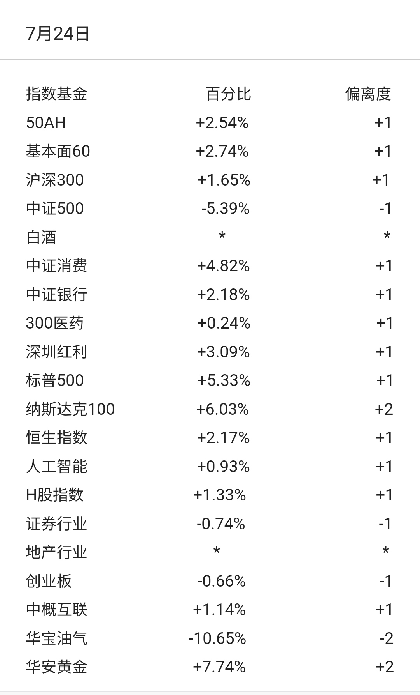

======================================================

@二师父[28814221155551]
2019-07-24 15:46:15 Wed  
topic_id: 111815114155112

>  @二师父
>  

阅读[2443]  评论[0]  赞[0] 

======================================================

_type: q&a
@SuH[841551428128422]
2019-07-24 16:28:01 Wed  
topic_id: 111815114185222

@SuH

>  请教一下二师父，有个问题想不明白。场内基金追踪的股票涨跌是已知的，按道理来讲，某一个时刻的基金净值是确定的，而场内交易净值是根据市场行为波动的，这是不是一种矛盾？另外，同一代码的基金是场内投划算还是场外投划算？

@二师父

>  场内的基金净值某一时刻是固定的，但是不同时刻是变化的，没有矛盾
>  
>  有一个指标iopv，是ETF的基金份额参考净值，场内每隔15秒计算并报价一次，作为对ETF基金份额净值的估计。
>  
>  场内交易是根据价格交易，而不是净值交易。所以有的价格高于净值，有溢价，价格低于净值，有折价。
>  
>  同一代码的基金场内定投和场外定投差别不大。场内的好处在于买入卖出费率低，到账时间快。

阅读[2560]  评论[2]  赞[0] 

======================================================

_type: talk
@二师父[28814221155551]
2019-07-25 01:38:00 Thu  
topic_id: 244148412548151

<e type="hashtag" hid="145452515442" title="#197期定投实盘#" /> 每周四定投实盘，买入一份，比例如下。本来想着加仓定投的，结果涨了上来，那就耐心等待呗。

@Snow at 2019-07-25 01:38:00 Thu

> 这个比例加起来是101%了

----------

@奔波儿霸🐟🐠🐬🐳🐋💦 at 2019-07-25 01:38:00 Thu

> 一个百分点无所谓了

----------

@Demon at 2019-07-25 01:38:00 Thu

> 你知道怎么算出来的吗( ˃̶̤́ ꒳ ˂̶̤̀ )

----------

@陈 at 2019-07-25 01:38:00 Thu

> 你好较真啊！既然是数字就有算错的可能，百分之一能影响你啥？

----------

@梧桐 at 2019-07-25 01:38:00 Thu

> 二师父讲过，追求模糊的正确即可，把精力放在重要的事情上。

----------

@二师父 at 2019-07-25 01:38:00 Thu

> 小数点的问题

----------

@陈飞🤗 at 2019-07-25 01:38:00 Thu

> 那今天还需要加仓定投吗

----------

@二师父 at 2019-07-25 01:38:00 Thu

> 不用

----------

阅读[2292]  评论[11]  赞[0] 

+++++++++++++++++++++++++++++++++++++++++++++++++++++

图片：
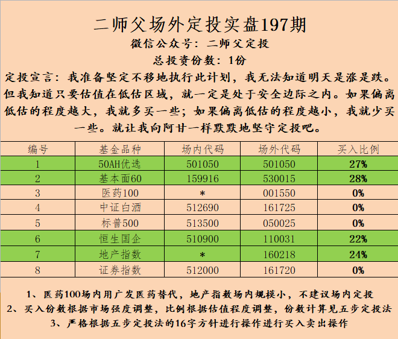

======================================================

_type: talk
@二师父[28814221155551]
2019-07-25 01:38:44 Thu  
topic_id: 544841485241854

<e type="hashtag" hid="481211145528" title="#指数估值#" />

阅读[2312]  评论[0]  赞[0] 

+++++++++++++++++++++++++++++++++++++++++++++++++++++

图片：
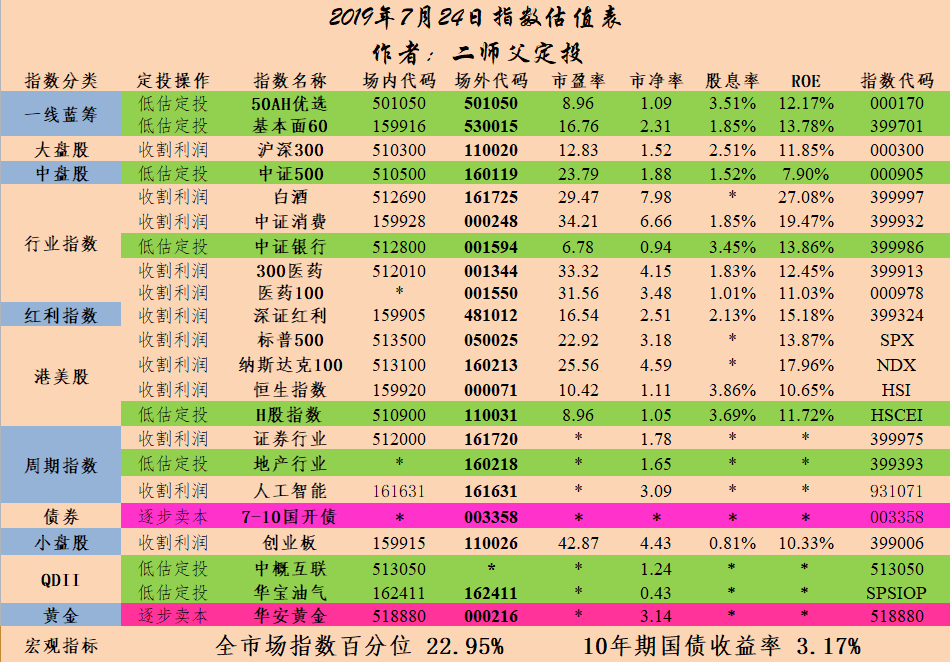

======================================================

_type: talk
@二师父[28814221155551]
2019-07-25 03:13:14 Thu  
topic_id: 422128215418828

<e type="hashtag" hid="828285842182" title="#医药指数#" /> 众多的医药指数如何选择

阅读[3991]  评论[0]  赞[0] 

+++++++++++++++++++++++++++++++++++++++++++++++++++++

文件：
2019-07-25 03:12:50 Thu
文件大小：[24287]
48544244844888-众多的医药指数，选择哪个定投比较好.docx

======================================================

_type: talk
@二师父[28814221155551]
2019-07-25 03:29:43 Thu  
topic_id: 244148412518421

<e type="hashtag" hid="458584825118" title="#关于仓位管理#" /> 仓位管理说简单点就是你的股权投资资产所能够变现的资金量占你总投资资金量的比例。

仓位重的意思是股权资产占比达，我们投资指数基金就相当于购买股权资产，那么管理仓位就是管理指数基金对应的现金占我们投资总现金的比例。

这个比例主要是根据市场的牛熊程度来确定的，当前大熊市就要使得我们得仓位更重一些。

那么究竟什么样得仓位是合理得呢？主要是根据自己的承受能力来，熊市重仓，可是有的人心理承受能力弱，不能够接受长期巨额浮亏，这时候就要适当减少自己的仓位。

仓位增重有一种方法，买入指数基金。仓位减轻有两种方法，第一是卖出指数基金，第二是多挣钱增加自己投资的资金量。在熊市的时候减轻仓位很少用卖出的方法，我们都是通过工作或者其他渠道增加收入来减轻仓位。

如果你购买指数基金的仓位让自己很满意，既不恐惧下跌，也不后悔自己买的过少，那就是好的，每个人情况不同，这是没有固定答案的。

@杜志彪 at 2019-07-25 03:29:43 Thu

> 白酒我等25在加仓

----------

阅读[4197]  评论[3]  赞[0] 

======================================================

_type: q&a
@🎈铮[28284825441841]
2019-07-25 11:54:12 Thu  
topic_id: 244148412282481

@🎈铮

>  二师父，我最近才开户，想给鳄鱼计划建底仓，建议吗？那选哪几支建仓比较好，仓位占鳄鱼计划总投资额几成呢

@二师父

>  资金量多大，能接受多大回撤，这笔资金多久不用呢？底仓是可以建立的

阅读[2182]  评论[16]  赞[0] 

======================================================

_type: q&a
@Demon[422184182112828]
2019-07-25 11:54:53 Thu  
topic_id: 844148411242412

@Demon

>  二师父好，加权平均有没有什么相关公式呢？不知道怎么计算比例。

@二师父

>  你是说市盈率还是什么的加权平均？

阅读[2185]  评论[3]  赞[0] 

======================================================

@二师父[28814221155551]
2019-07-25 11:56:44 Thu  
topic_id: 244148411441121

>  @二师父
>  

阅读[2195]  评论[1]  赞[0] 

======================================================

_type: q&a
@首尔航仔Eric[244114888181111]
2019-07-25 12:03:57 Thu  
topic_id: 844148411414442

@首尔航仔Eric

>  二师父表里面为啥没有中证红利呀 我看雪球说这个也是低估

@二师父

>  这个我没有定投了，当前是正常估值

阅读[2233]  评论[0]  赞[0] 

======================================================

_type: q&a
@首尔航仔Eric[244114888181111]
2019-07-25 12:05:40 Thu  
topic_id: 544841488828444

@首尔航仔Eric

>  二师父， 我准备一份资金 分别买50ah，基本面60，中证500，中该互联， 现在不是除了中证500 其余的都是 在60均线以上么，那我按3个1/8投 然后 一个 中证500 1/2投 可以吗

@二师父

>  不是这样计算的，你用阈值除以市盈率得到当前投入该指数的权重，然后用四个权重计算加权平均的比例就是指数投资的比例
>  
>  均线偏离只是短期参考，重点看估值

阅读[2464]  评论[1]  赞[0] 

======================================================

_type: q&a
@tanxin[241524428884281]
2019-07-25 12:10:28 Thu  
topic_id: 111815822511112

@tanxin

>  二师父，你好！根据昨天发布的偏离度，选择50AH定投200，基本面60定投200，中证500定投300，这个比例可以吗

@二师父

>  这个比例计算刚刚有人提到过。
>  
>  均线偏离指标是短期额外补仓的参考指标，我们定投比例的确定是根据估值偏离程度的
>  
>  用阈值除以市盈率得到一个权重，然后用这三个指数的权重计算加权比例，就得到每次定投的比例啦

阅读[2602]  评论[4]  赞[0] 

======================================================

_type: talk
@杜志彪[544454124115854]
2019-07-25 14:08:22 Thu  
topic_id: 111815825551452

刚刚看了一下消费ETF持仓情况，二季度股票持有仓位好低啊，以为我看错了[惊讶]

@小小鸟 at 2019-07-25 14:08:22 Thu

> 好像是Etf连接基金，主要投资对应的场内基金。

----------

@二师父 at 2019-07-25 14:08:22 Thu

> 这是重仓消费指数的基金

----------

@杜志彪 at 2019-07-25 14:08:22 Thu

> 今天又有收货了，多谢啦[胜利]

----------

阅读[2464]  评论[3]  赞[0] 

+++++++++++++++++++++++++++++++++++++++++++++++++++++

图片：
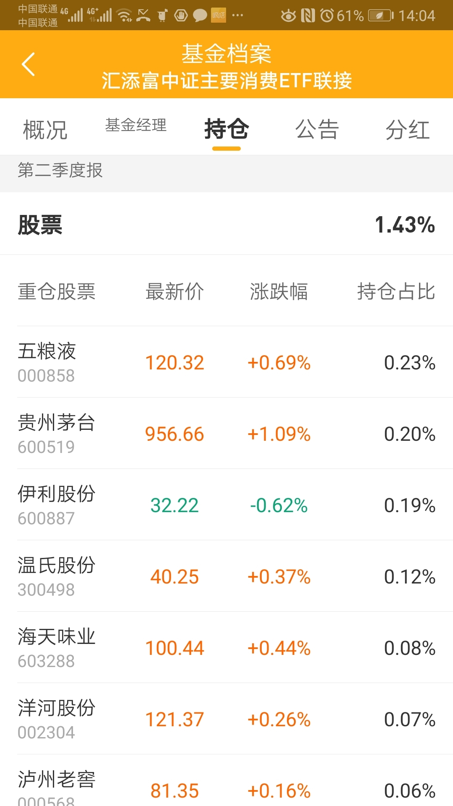

======================================================

_type: q&a
@美美[48224811151218]
2019-07-25 16:04:18 Thu  
topic_id: 844148158814542

@美美

>  二师父你好！我怎么今天定投扣了两份钱

@二师父

>  有的是前端收费，有的是后端收费，
>  
>  前端收费就是在你申购的时候扣除手续费，后端收费是你赎回的时候扣除手续费

阅读[2449]  评论[4]  赞[0] 

======================================================

_type: talk
@二师父[28814221155551]
2019-07-25 21:33:24 Thu  
topic_id: 844148185555812

<e type="hashtag" hid="828285452282" title="#关于实际收益率计算公式#" /> 
利息率即利率，是资金的增值同投入资金的价值之比。
可以将利率分为实际利率和名义利率。
实际利率=名义利率-通货膨胀率
实际收益率＝名义收益率-通货膨胀率

所以当你的本金100万，名义收益率15个点，通货膨胀率8个点，实际收益率7个点，一年实际利润7万。

可以通过公式反算你有多少投资资金可以不用工作，假设一年支出20万，那就需要20除以0.07

普通投资者学习定投从0到15个点的收益率很简单，但是从15到25就比较难了，当我们本金较大，可是收益率低就要学习定投知识提高收益率，当我们的收益率可以达到20个点还没有实现财务自由就是本金太少，需要提高本金

@驼驼夫 at 2019-07-25 21:33:24 Thu

> 二师父，通货膨胀率是在哪查到的呀

----------

@二师父 at 2019-07-25 21:33:24 Thu

> 东方财富有宏观数据专栏

----------

阅读[2296]  评论[2]  赞[0] 

======================================================

_type: talk
@二师父[28814221155551]
2019-07-26 03:32:31 Fri  
topic_id: 111814251225882

<e type="hashtag" hid="228285484141" title="#定投比例的计算方法#" /> 有同学问我定投比例的计算方法，具体计算方法如文中所述。

大家可以自己配置然后计算定投比例，也可以参考我的，区别不大，关键是坚持并且严格遵守规则，否则很容易半途而废。

@J at 2019-07-26 03:32:31 Fri

> 请问师父定投系数具体数值应怎么确定？0.5、1、2还是3或其他值？

----------

@二师父 at 2019-07-26 03:32:31 Fri

> 0.5到2之间，多个因素结合

----------

@J at 2019-07-26 03:32:31 Fri

> 我可以参考你的定投系数值吗？

----------

@二师父 at 2019-07-26 03:32:31 Fri

> 可以的

----------

@紫色天使 at 2019-07-26 03:32:31 Fri

> 请问二师父，这里面的公式中，定投系数我不知道怎么确定啊，只能抄二师父的吗

----------

@紫色天使 at 2019-07-26 03:32:31 Fri

> 然后，您的定投系数又从哪里看的到呢？

----------

@二师父 at 2019-07-26 03:32:31 Fri

> 里面已经介绍方法了

----------

阅读[2306]  评论[7]  赞[0] 

+++++++++++++++++++++++++++++++++++++++++++++++++++++

文件：
2019-07-26 03:26:37 Fri
文件大小：[25571]
28255454548141-我们定投指数基金挑选和比例分配的方法.docx

======================================================

_type: talk
@二师父[28814221155551]
2019-07-26 03:41:40 Fri  
topic_id: 422125482445848

<e type="hashtag" hid="481211145528" title="#指数估值#" /> 估值表，里面的阈值我说下，比如50AH优选指数，估值区间是9.5-16.那么意味着低估阈值是9.5，低于9.5是低估。16意味着高估阈值，高于16是高估。

阈值也就是临界值的问题。通常情况下在阈值附近不用太纠结估值状态，就比如别人问你年龄，你是80年出生的，可以报自己38岁，也可以报自己39岁。两个都是正确的，一个是实岁，一个虚岁，并不影响别人对你年龄的判断。

所以当你看到50AH指数的市盈率为9.55也是可以定投的，但切记不要在高估区域定投，这就很危险了。

@首尔航仔Eric at 2019-07-26 03:41:40 Fri

> 谢谢二师父的回答

----------

阅读[2386]  评论[1]  赞[0] 

+++++++++++++++++++++++++++++++++++++++++++++++++++++

图片：
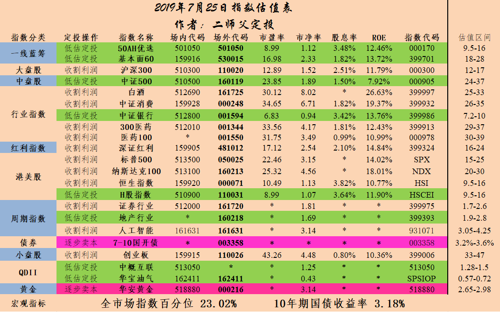

======================================================

_type: q&a
@凯[244415182418811]
2019-07-26 03:43:32 Fri  
topic_id: 544841812828844

@凯

>  二师父，中证红利表现不好是否可以减持，转入其他指数，还是持有等待

@二师父

>  不用减持，按照利润收割法则收割利润就好，这是一只分红稳定的红利指数，比较有投资价值，频繁换仓是投资的忌讳，耐心等待价值回归。

阅读[2374]  评论[0]  赞[0] 

======================================================

_type: q&a
@妖孽[544888148518184]
2019-07-26 03:47:43 Fri  
topic_id: 544841811211224

@妖孽

>  请问二师父：基本面60与基本面120有何区别，基本面120持仓有没有包含了基本面60？谢谢

@二师父

>  深证基本面60指数以深市A股为样本空间，分别挑选基本面价值最大的60家上市公司作为样本。基本面价值由四个财务指标来衡量，并决定了样本股的权重。
>  
>  深证基本面120指数以深市A股为样本空间，分别挑选基本面价值最大的120家上市公司作为样本。基本面价值由四个财务指标来衡量，并决定了样本股的权重。
>  
>  两者持仓股票数量不同，选股策略是一样的，持仓股票重合度比较大

阅读[2449]  评论[0]  赞[0] 

======================================================

_type: q&a
@李震笛[422112248211828]
2019-07-26 09:00:06 Fri  
topic_id: 111814251415522

@李震笛

>  二师傅，因为沪深300估值一直没有底，而且仓位也比较大，能不能全部换成基本面60，或者中证银行？

@二师父

>  底部换仓不适合，这只基金你是什么时候开始定投的

阅读[2523]  评论[2]  赞[0] 

======================================================

_type: q&a
@冬夫[15122585122182]
2019-07-26 09:18:43 Fri  
topic_id: 844142584241222

@冬夫

>  二师父好，我想问下，假设您现在手里有100万现金，只想追求每年10～15%复合回报，您会如何布局您估值表指数基金？另目前我想逐步定投中证500作为重仓基金配置，当然，也得按您五步定投来，您觉得靠谱不？

@二师父

>  如果只用10到15个点的收益率，采用傻瓜定投策略，配置沪深300和中证红利指数基金就可以的
>  
>  中证500可以重仓没有问题

阅读[2669]  评论[4]  赞[0] 

======================================================

_type: q&a
@小小鸟[111885884481252]
2019-07-26 09:18:59 Fri  
topic_id: 844142584188182

@小小鸟

>  二师父，今日华宝油气有没有鳄鱼计划？不要忘记公布。一般场内溢价超过%多少就不考虑购买了？

@二师父

>  没有

阅读[2711]  评论[7]  赞[0] 

======================================================

_type: q&a
@波[28855811142441]
2019-07-26 09:31:37 Fri  
topic_id: 244142584184421

@波

>  请教二师父,现在华宝油气非常低估,比历史上99%的时候都要便宜,但它又是一个周期性指数,不宜重仓。能否现在开始,坚持每个月都少量定投控制好仓位不能高?它还有机会涨起来吗?还是长期下跌涨不起来了?

@二师父

>  你是如何判断比历史百分之99都便宜的呢？能涨起来的，这个不用担心，只是时间不确定

阅读[2723]  评论[1]  赞[0] 

======================================================

_type: q&a
@mumomo[111812248825412]
2019-07-26 12:18:29 Fri  
topic_id: 111814258154582

@mumomo

>  二师父，为什么这个国泰房地产指数在蛋卷上不能选择分红方式呢？

@二师父

>  有的指数没有现金分红

阅读[2688]  评论[1]  赞[0] 

======================================================

_type: q&a
@小宝[224251451141]
2019-07-26 15:20:13 Fri  
topic_id: 111814244558512

@小宝

>  二师父在天天的实盘是不是能一键跟投了现在？

@二师父

>  对的天天基金可以一键跟投了

阅读[2588]  评论[4]  赞[0] 

======================================================

_type: talk
@二师父[28814221155551]
2019-07-26 15:26:02 Fri  
topic_id: 422125455558128

<e type="hashtag" hid="828285125822" title="#场外定投跟投#" /> 二师父天天基金定投实盘可以跟投了，扫描二维码注册账户，然后去天天基金搜索二师父低估定投，找到以后可以一键买入

@龘何亮龘 at 2019-07-26 15:26:02 Fri

> 昨天去跟投还是6个基金 ，多了两个，一会去看看好了没

----------

@呵呵→_→ at 2019-07-26 15:26:02 Fri

> 二师傅，我怎么天天基金上搜不到，是我的姿势不对么

----------

@二师父 at 2019-07-26 15:26:02 Fri

> 实盘那个栏目

----------

阅读[2679]  评论[3]  赞[0] 

+++++++++++++++++++++++++++++++++++++++++++++++++++++

图片：

======================================================

_type: q&a
@幻水[881185412112]
2019-07-26 15:32:10 Fri  
topic_id: 244142522228151

@幻水

>  如果我自己想买一些银行配成一个银行etf，请问应该买哪些银行股，配的比例是多少呢？
>  有人曾经说过：工农建招，合并起来买，可以代替银行ETF，您同意他的意见吗？
>  如果同意的话，现在问题来了，工农建招的百分比应该怎么配比呢？
>  另外请点评一下兴业银行和上海银行，有人说兴业银行和上海银行会成为下一个招商银行。

@二师父

>  可以配置自己的etf，招商银行，兴业银行，中国银行，农业银行都不错，招行兴业重仓，另外两只可以轻一点，目前只有中国银行有美元业务，这是一个较宽的护城河
>  
>  长期看好招行和兴业银行

阅读[2799]  评论[2]  赞[0] 

======================================================

_type: q&a
@tanxin[241524428884281]
2019-07-26 16:28:29 Fri  
topic_id: 111814244112182

@tanxin

>  二师父，你好！请问如果基金在低估区开始定投，一段时间后偏离度是+1，并且基金盈利10%以上，这种情况是继续定投还是卖出利润？

@二师父

>  如果你采用低估定投策略那么就继续定投
>  
>  如果你采用的均线策略可以卖出
>  
>  实际根据自己的仓位定，假设你只有一成仓位，不用卖，假设已经满仓了，那么最好就卖出一份，这种情况不用机械的卖出

阅读[2842]  评论[0]  赞[0] 

======================================================

_type: q&a
@无名书苑[51188588215444]
2019-07-26 22:26:35 Fri  
topic_id: 244142521525441

@无名书苑

>  请教二师父，购买基金时，费率是一个重要的考量参数（申购费用，管理费，托管费等），长期投资的话，这些费用会影响投资者的收益。
>  原本我想每周四小额定投医药100指数（费率0.6%）基金，但发现这五年来中海医疗保健主题股票基金（399011）的业绩完胜医药100指数。在确定费率优势和不确定的业绩优势面前，我有点纠结了，不知道该定投哪只基金，还望二师父能指教！
>  （本人目前可以承受30%左右的浮亏）

@二师父

>  这个图片有点意思。我来对比下。
>  
>  5年中海医疗涨幅173.66%，那么意味着年化收益率12%。医药100呢，2014年基点是1000点，现在是11646，截至到今天收盘。涨幅11.646倍数。年化收益率17%。
>  
>  这是高于中海医疗的收益率的。过去不代表未来但是可以间接预测的。推荐被动指数，如果买主动基金需要考虑一个问题，当基金经理更换业绩变差是一直定投还是止损，这个是投资主动基金的难点

阅读[2837]  评论[7]  赞[0] 

======================================================

_type: q&a
@暖暖[241521421851121]
2019-07-27 01:23:29 Sat  
topic_id: 544845241528824

@暖暖

>  老师，根据估值表看了下这两个指数的历史分位，感觉PB ，PE都不低啊，这个估值是如何看的啊。还有就是看估值图里面周期股是没有PB，PE估值，地产和证券行业的估值看这些是没用的是么。

@二师父

>  我没有用历史百分位估值具体的指数，选择不同区间会有很大的区别，第一个指数他给的市盈率低于10，市净率低于1，这对于宽基指数是很难得的投资机会，格雷厄姆盈利收益率大于百分之10就可以，盈利收益率＝1除以市盈率
>  
>  我的估值表有周期指数的市净率，这些指数估值看市净率就可以

阅读[2874]  评论[0]  赞[0] 

======================================================

_type: talk
@二师父[28814221155551]
2019-07-27 03:16:05 Sat  
topic_id: 111814215148512

<e type="hashtag" hid="828288522422" title="#7月定投总结#" /> 每月总结会让投资有的放矢，始于艰难，终于至善。未来继续加油！

当前除了油气是浮亏11%，其余的全部盈利。其实A股不挣钱不怪股市，如果按照纪律定投，最终的区别是盈利多少的问题。

@飘羽 at 2019-07-27 03:16:05 Sat

> 医药100月初是低估吗？我怎么记得好像最近俩个月都是正常？

----------

@二师父 at 2019-07-27 03:16:05 Sat

> 以估值表为准

----------

阅读[2907]  评论[2]  赞[0] 

+++++++++++++++++++++++++++++++++++++++++++++++++++++

文件：
2019-07-27 03:14:06 Sat
文件大小：[406529]
15422128424182-五穷六绝七翻车，依然要保持乐观的投资心态.pdf

======================================================

_type: talk
@二师父[28814221155551]
2019-07-27 03:17:50 Sat  
topic_id: 544845241458184

<e type="hashtag" hid="481211145528" title="#指数估值#" /> 估值表变化不大。消费和300医药目前定投是不合适了

@二师父 at 2019-07-27 03:17:50 Sat

> 我写的不适合

----------

阅读[2995]  评论[2]  赞[0] 

+++++++++++++++++++++++++++++++++++++++++++++++++++++

图片：
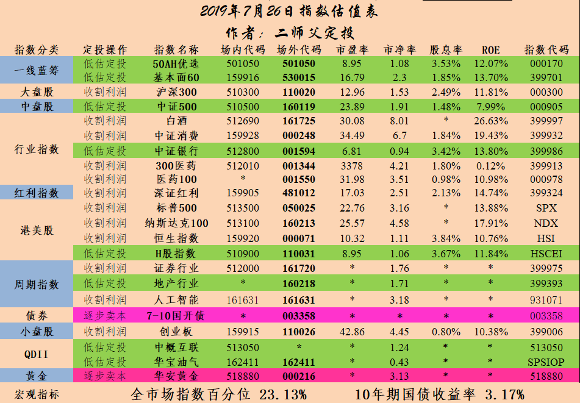

======================================================

_type: q&a
@呵呵→_→[15414558111442]
2019-07-27 12:19:14 Sat  
topic_id: 244142544558521

@呵呵→_→

>  二师傅，请问一下如何能收到你的场外组合，不太懂，见笑。
>  我在天天基金app上没搜到，然后网站上也没搜到，具体怎么能找到，谢谢

@二师父

>  在实盘栏目搜索，二师父低估定投

阅读[2855]  评论[2]  赞[0] 

======================================================

_type: q&a
@学以致用[244415184181451]
2019-07-27 19:49:09 Sat  
topic_id: 544845244218424

@学以致用

>  你好，二师父，请问一下：指数分级基金跟一般的指数A、B、C基金有什么不同？购买时应该注意些什么？谢谢！

@二师父

>  债券型基金和货币基金根据其收费方式的不同，才会出现A、B、C三类，因为它是同一个基金，所以投资组合一样，又因为它们的收费方式不同，所以计提的费用不同，导致净值的差异。
>  
>  单指分级基金是子基金A和子基金B。比方有白酒A和白酒B。A类基金相当于是一个有息债券，B类基金就相当于加了杠杆的指数基金。可以场内买入，风险较大，建议不要购买

阅读[2655]  评论[0]  赞[0] 

======================================================

_type: q&a
@LaoYan[844448554448122]
2019-07-27 19:55:20 Sat  
topic_id: 422125414184248

@LaoYan

>  二师父您好，一直在关注您，也在按您的建议在定投，最近在了解可转债基金，想知道目前可转债基金适合定投吗？如 兴全可转债基金，长信可转债基金等。谢谢您！

@二师父

>  可转债是可以转换成股票的债券凭证。
>  
>  假如你买了可转债，在低价的时候，他相当于一张债券，发行可转债的公司会给你按照债券的利率付利息。
>  
>  如果可转债对应的股票一直上涨，涨到比转股价格还高的时候，那么咱们可以把手里的债券转换成股票来获取股票上涨的盈利。这是可转债下有保底，上不封顶的优势。
>  
>  对于普通投资者没有太多精力研究可转债，也是可以投资可转债基金的。比如易方达安心回报债，兴全转债等等。需要注意一个问题，当股市上涨的时候，可转债基金和指数基金一样会上涨，这就涉及到一个资金最优配置的问题。
>  
>  一般来讲，我们定投的大部分指数基金的收益率要比可转债基金的收益率要好

阅读[2729]  评论[0]  赞[0] 

======================================================

_type: talk
@二师父[28814221155551]
2019-07-27 20:25:36 Sat  
topic_id: 844142518251842

<e type="hashtag" hid="281181228851" title="#周末答疑#" /> 关于基本面60等指数的估值，有读者查阅到这个基金的市盈率当前16倍多，同时历史百分位也比较高，为什么还是低估

这里设计到两个问题，虽然他和上证50同为蓝筹股指数，但是上证50指数里面有很多银行股票，属于高杠杆企业，市盈率本身就低很多。关于历史百分位需要提醒的是，这里有个漏洞，不同历史区间的指数市盈率百分位是不同的，为什么二师父能用万得全A指数得历史市盈率百分位，因为他成立较早，数据很全，这样比较有参考价值

做一个极端假设，假设一个指数去年9月成立，你从这个区间算他得历史百分位是可能高估，这就是利用百分位估值需要注意得问题，你的清楚计算出这个百分位得历史数据区间

那么对于基本面指数他的历史最低市盈率是12倍左右，盈利也是在沪深A股中很高得，成长性较强，当前按照市盈率得最大降幅也在30%以内，选择这个时机定投没有问题

关于油气能不能买。二师父说能。问题在于你需要搞清楚油气赚的是什么钱。如果你购买得标的增长是靠内生得盈利增长来获取利润，那么就是投资。如果你购买得标的靠得是波动来赚取差价，那么相当于投机。

对于油气这种波动性品种，我们赚取得就是差价，一方面美股走势影响油气价格，一方面原油走势影响他的价格。只要美股涨，原油供不应求两个条件同时发生，油气会涨

所以是可以买得，但二师父一再强调，周期性品种我们轻仓就行，就如同我们一日三餐通过米饭补充营养，然后再吃点甜点零食。

购买长期盈利增长得指数基金类似吃米饭，购买油气等周期性品种类似吃甜点零食。

我们可以不吃甜点零食，但是不吃米饭可能就挂了。投资也是一样，我们可以不买油气，但是不能不买盈利稳定得指数。

当然最好得是为了全面配置，营养均衡，大部分资金买入盈利稳定得指数，保障投资胜利得必然性，少部分资金配置原油、黄金等等品种。这才是问题得关键，可以买，但不能够买多，也不能买的太频繁。

阅读[4281]  评论[0]  赞[0] 

======================================================

_type: talk
@二师父[28814221155551]
2019-07-28 04:39:18 Sun  
topic_id: 111814284825282

<e type="hashtag" hid="145455424142" title="#基金配置#" /> 做好基金配置，从选股的角度分析

@笋子 at 2019-07-28 04:39:18 Sun

> 中证银行应该买哪一个追踪基金？

----------

@无名书苑 at 2019-07-28 04:39:18 Sun

> 001594

----------

@飘羽 at 2019-07-28 04:39:18 Sun

> 50ah和深F60这俩重合的多吗？有必要同时配置吗？

----------

@二师父 at 2019-07-28 04:39:18 Sun

> 天弘中证银行

----------

@二师父 at 2019-07-28 04:39:18 Sun

> 没有重合的

----------

@笋子 at 2019-07-28 04:39:18 Sun

> 天弘中证今天可以建仓吗？我看估值这个月相比最近相对较高？还是只要低估随时可以建仓？

----------

@二师父 at 2019-07-28 04:39:18 Sun

> 定投什么时候都可以的，长期投资来讲影响并不大哈

----------

@笋子 at 2019-07-28 04:39:18 Sun

> 哦哦好的

----------

阅读[4253]  评论[9]  赞[0] 

+++++++++++++++++++++++++++++++++++++++++++++++++++++

文件：
2019-07-28 04:38:41 Sun
文件大小：[369270]
51522412521484-配置了50AH指数或者沪深300指数，还有没有必要配置银行指数.pdf

======================================================

_type: talk
@二师父[28814221155551]
2019-07-28 04:40:07 Sun  
topic_id: 422125415148888

有人问我场内叫鳄鱼计划，场外叫什么计划，我想了想，就叫乌龟计划吧

@志亮 at 2019-07-28 04:40:07 Sun

> [呲牙]乌龟计划，那么问题来了，乌龟和鳄鱼赛跑谁快？

----------

@无名书苑 at 2019-07-28 04:40:07 Sun

> 二师父的场内投资很形象的用鳄鱼🐊计划来表述。对于场外，个人觉得基金经理以及基金，证券从业人员，更像兔子🐰，有专业的知识，资源，信息等；而像我们这样的业余理财人员（还算不算上投资），是无法正面与之竞争的。所以我们的理财更像是乌龟🐢。在这场实力悬殊的龟兔赛跑中，我们要想赢，只能借助一些简单的投资规则（毕竟我们的精力也不全在这块），以时间换空间。我想我们还是有胜的机会的。在投资市场上，活得久是很重要的[微笑]

----------

@无名书苑 at 2019-07-28 04:40:07 Sun

> 场内场外属于不同的投资风格，应该没有什么可比性

----------

@志亮 at 2019-07-28 04:40:07 Sun

> 场外也有它的优势，起码不会再溢折价

----------

@二师父 at 2019-07-28 04:40:07 Sun

> 一个陆地一个水陆两栖，领域不同

----------

@二师父 at 2019-07-28 04:40:07 Sun

> 是的哈，投行和专业人员都是善于捕捉瞬息万变的市场信息，但未必总是战胜市场

----------

阅读[2782]  评论[6]  赞[0] 

======================================================

_type: q&a
@李震笛[422112248211828]
2019-07-28 12:36:17 Sun  
topic_id: 544845122281884

@李震笛

>  二师傅，沪深300早已是正常估值，现在手上还有不少。正常操作是收割利润，但是利润也就1%，现在是个清仓换成低估值的其他种类，还是继续持仓等待更多利润？

@二师父

>  当然是持有啊，收割利润一般是有了10到20个点的利润才进行收割的

阅读[2729]  评论[0]  赞[0] 

======================================================

_type: q&a
@苍天有井明月空🌙[28882214181441]
2019-07-28 13:18:25 Sun  
topic_id: 244142855158841

@苍天有井明月空🌙

>  你好，二师傅中证500，定投亏损十个点，是否继续下去，我看你实盘已经不投了。

@二师父

>  可以继续定投，我的鳄鱼计划仍旧有投资这个标的，去年我买了这个指数很多的。但是控制下节奏，因为他的盈利比之前有所下滑了

阅读[2979]  评论[4]  赞[0] 

======================================================

@二师父[28814221155551]
2019-07-28 14:17:35 Sun  
topic_id: 111814522812152

>  @二师父
>  

阅读[2974]  评论[0]  赞[0] 

======================================================

_type: q&a
@J[28281541518551]
2019-07-28 14:24:21 Sun  
topic_id: 244142855142421

@J

>  华宝标普红利已经调出ST银亿，师傅知道这个新消息吗？是真的吗？调出后，这个指数的投资价值是否依然很好？

@二师父

>  是的换成了美锦能源，这是个经营与煤炭相关的企业，08年以前山西的煤老板都发财了，现在这个行业挺艰难，从个股看这只股票的成长性也不够好，
>  
>  不看好这个指数，红利类指数可以关注上证红利，中证红利，深证红利

阅读[3062]  评论[2]  赞[0] 

======================================================

_type: talk
@树叶[544811512145144]
2019-07-28 14:45:41 Sun  
topic_id: 422125848421858

<e type="hashtag" hid="142825811122" title="#定投周报#" /> 二师父定投周报第18期

阅读[3123]  评论[0]  赞[0] 

+++++++++++++++++++++++++++++++++++++++++++++++++++++

文件：
2019-07-28 14:45:10 Sun
文件大小：[586841]
88255482842552-二师父定投周报7.28（第18期）.docx

======================================================

_type: q&a
@田星[422128841211518]
2019-07-28 21:58:26 Sun  
topic_id: 422125848581158

@田星

>  二师父你好，你常说的不能重仓，重仓指的是占几层仓位？二层算吗？

@二师父

>  如果你一次定投5到10只基金，2成就算是重仓了，有一个绝对仓位和一个相对仓位。
>  
>  绝对仓位是你每只基金的比例，相对仓位是你每只基金的相对数量。
>  
>  比如你同时投资沪深300，中证500，中证银行，医药指数，消费指数，油气指数，黄金指数，券商指数，地产指数，那么你把投入的金额按照从大到小的比例来排一个顺序，比方说你要保证油气轻仓，那么你在这个组合里面油气的比例就要比沪深300，中证500，中证银行，医药指数，消费指数每个基金的比例小，这就是轻仓，如果你的油气一下子买了太多，总投资资金量排名第一或者比这些重仓的基金的资金量大，那么就不是轻仓

阅读[3157]  评论[0]  赞[0] 

======================================================

_type: talk
@二师父[28814221155551]
2019-07-29 02:22:21 Mon  
topic_id: 244142885255521

<e type="hashtag" hid="458588251558" title="#周一市场分析#" /> 把分享内容主题调整了下，周五分享读书知识，这样每周末在休息的时候可以充充电，来提高自己。市场分析部分数据来源于蛋卷基金，感谢雪球的分享

7月份基金规模比6月的规模是增长的，从整体市场来看7月份投资者情绪是更加低迷一些，所以不足以说明市场反转。

上周市场有4600亿逆回购和5020亿的MLF到期，总资金量是9620亿，同时开展的逆回购有500亿，和2977亿的TMLT,2000亿的MLF,总资金量是5477亿，总体回收资金4143亿，逐步收紧，市场流动性还是很充裕。

上周发布消息，科创板指数即将发布，在科创板上市股票数量满30只后的11个交易日，会发布科创板50指数，这个指数值得追踪，后期考虑用科创板50替代创业板。

市场新增开户数有所减少，二师父后台的读者数目在增加，所以大部分人是处于观望状态，我建议是要么熊市入场，要么永远别入场，远离股市。

期待下周的市场，无论怎么变化，永远记住有一套应对系统就会比较淡定。

@rtdmm小米 at 2019-07-29 02:22:21 Mon

> 静等科创50指数基金投资机会

----------

阅读[4568]  评论[1]  赞[0] 

======================================================

_type: talk
@二师父[28814221155551]
2019-07-29 02:29:26 Mon  
topic_id: 544845112522524

<e type="hashtag" hid="228288421221" title="#仓位管理#" /> 在投资过程中仓位管理是非常重要的，比如说遇到历史底部，万得全A市盈率百分位低于10%，你在这种区域把仓位加到8成以上没有问题。然后股市上涨到万得全A指数市盈率百分位30%，再降到25%，你就没必要重复加仓了，因为之前的8成仓位是更低的位置买的，你的仓位也足够。所以当你在底部区域已经重仓之后可以耐心等待了，找到合适的机会慢慢出手盈利。

@妖孽 at 2019-07-29 02:29:26 Mon

> 二师父 请问现在万得全处于什么分位，这指标纳入估值表，那样估值表是不是更美丽了呀！

----------

@二师父 at 2019-07-29 02:29:26 Mon

> 我加入了呀，估值表的下面万得全A指数市盈率百分位都有的，还有周报里面的图片历史走势我都做出来了

突然想到中学老师说的一句话，以前老师是把饭喂到学生嘴里，学生就吃了，现在的学生老师把饭嚼碎了喂到他嘴里他都不吃。

感觉中国的教育确实没有培养好大家的自学能力

----------

@J at 2019-07-29 02:29:26 Mon

> 哈哈哈

----------

阅读[4912]  评论[3]  赞[0] 

+++++++++++++++++++++++++++++++++++++++++++++++++++++

文件：
2019-07-29 02:25:38 Mon
文件大小：[355719]
15422154881482-如何做好指数基金定投过程中的仓位管理.pdf

======================================================

@二师父[28814221155551]
2019-07-29 02:51:24 Mon  
topic_id: 844142885818512

>  @二师父
>  

阅读[3222]  评论[0]  赞[0] 

======================================================

_type: q&a
@朝阳模具[15528112482582]
2019-07-29 12:39:47 Mon  
topic_id: 844142884154212

@朝阳模具

>  二师父，标普红利机会这个指数持仓一堆周期股，而且今年来既没跑赢沪深300也没跑赢中证500，是不是需趁早清仓啊

@二师父

>  这个指数持仓股票确实不佳。你持仓多少，浮亏还是浮盈？如果浮盈建议换仓，如果浮亏我就不建议了，止盈不止损是定投的原则

阅读[3260]  评论[3]  赞[0] 

======================================================

@二师父[28814221155551]
2019-07-29 14:29:16 Mon  
topic_id: 844142881855552

>  @二师父
>  

阅读[3313]  评论[0]  赞[0] 

======================================================

_type: q&a
@朝阳模具[15528112482582]
2019-07-29 14:30:40 Mon  
topic_id: 111814558525112

@朝阳模具

>  我目前定投的基金，请二师父指教下
>  1：上证50AH
>  2：深证基本面60
>  3：大成中证红利
>  4：标普红利机会（这个准备清仓）
>  5：中证500低波动
>  6：标普A股质量价值（ROE-PBPE选股）
>  7：香港中小
>  8：易方达消费（不低估，暂停定投中）
>  9：富国中证医药主题指数增强
>  10：中概互联
>  
>  定投原则是选优秀宽基指数+优秀行业指数长期定投，长期持有，高估卖出。

@二师父

>  配置可以，可以用恒生国企也就是H股指数替代香港中小，消费基金建议换成持仓股票稳定的必须消费或者白酒指数，这个需要等待低估

阅读[3581]  评论[3]  赞[0] 

======================================================

_type: talk
@衣袂飘香[118248548242452]
2019-07-29 14:31:19 Mon  
topic_id: 544845118582144

<e type="hashtag" hid="228288421221" title="#仓位管理#" /> 能否这样理解，主仓位相当于投场外定投计划资金，次仓位相当于鳄鱼计划部分对应资金？@二师父

@二师父 at 2019-07-29 14:31:19 Mon

> 鳄鱼计划才是主仓位，偶尔做波段，定投实盘只是给新手一个参考

----------

@梧桐 at 2019-07-29 14:31:19 Mon

> 请教二师父，按照您的场内场外资金投入比5:1的比例，场内的一份是1万元吗

----------

@🎈铮 at 2019-07-29 14:31:19 Mon

> 鳄鱼计划是主仓，为什么操作比较少呢，这样怎么能积累仓位呢，是不是鳄鱼计划的一份不是2000元

----------

@二师父 at 2019-07-29 14:31:19 Mon

> 操作不少哈，只是在该出手的时候出手，从16年到现在我买入很多了

----------

@志亮 at 2019-07-29 14:31:19 Mon

> 二师父，我可否这样理解，低估定投是长持到牛市，鳄鱼计划是做波段套利？

----------

@二师父 at 2019-07-29 14:31:19 Mon

> 不是哈，鳄鱼计划分主仓和次仓，主仓迎接牛市，部分次仓小波段

----------

@志亮 at 2019-07-29 14:31:19 Mon

> 原来这样的呀[呲牙]

----------

阅读[3535]  评论[7]  赞[0] 

======================================================

_type: q&a
@Demon[422184182112828]
2019-07-29 15:55:13 Mon  
topic_id: 244142825555441

@Demon

>  二师父，网格交易买了以后一直震荡而且价格不能到达卖出点，最后如果价格又回到买点那不是等于利润全吐出去了吗？
>  是不是在买点买入以后如果下跌一段时间回到比买点高的位置，这个时候也是要卖出相应的一份啊？

@二师父

>  你这种属于升级版网格交易了
>  
>  只要卖出盈利即可，保证至少5个点的盈利，投入2000盈利100元，否则一次卖出盈利几十元实在太少

阅读[3655]  评论[2]  赞[0] 

======================================================

_type: q&a
@秦风殇韵（刘豫斌）[241555548554841]
2019-07-29 18:45:26 Mon  
topic_id: 111814542414812

@秦风殇韵（刘豫斌）

>  关于仓位，我好像又被整糊涂了。。。。。。
>  比如我只关注和定投中长期的指数基金，比如AH50、基本面60等大概5只基金，计划总投入300万，每只基金的额度是60万，目前每周大概是5000为一份，动态上调或下调。截止目前：AH50：25万；银行：22万；基本面60：15万；中证红利（早早停了）：6万；地产：15万
>  那么问题来了，所谓仓位，是指我这5只基金目前买入总和占总投入的比例，还是每只基金买入量占该基金额度的比例？

@二师父

>  仓位有你买入的基金总量的仓位，这是衡量你总体买入了多少，我们通常说的，在万得全a市盈率百分位到达某点，仓位多少是指总仓位
>  
>  第二，还有单个基金的仓位，我们说的某只基金不能重仓，就是讲的这个基金的仓位

阅读[3627]  评论[3]  赞[0] 

======================================================

_type: talk
@老孙头[422115118524548]
2019-07-29 22:32:27 Mon  
topic_id: 844142824445152

分析师邓虎——影响国内市场定投的一个重要问题，因为A股的波动相对较高，更需要我们在定投时考虑成本问题，因此在定投上加入一些策略可能是有必要的，除了看估值的方法，建议可以参考股市的股息率和债券市场收益率比较的方法，当股息率相对更有吸引力时，可以考虑增加定投的金额。与师父策略—致？

@二师父 at 2019-07-29 22:32:27 Mon

> 一致的，全市场估值下移，股息率会升高的

----------

阅读[3447]  评论[1]  赞[0] 

======================================================

_type: talk
@二师父[28814221155551]
2019-07-30 02:43:52 Tue  
topic_id: 422125851524118

<e type="hashtag" hid="481211145528" title="#指数估值#" />

@rtdmm小米 at 2019-07-30 02:43:52 Tue

> 请问二师父，为啥场内50ah优选（501050） 和基本面60（159916）的成交量那么低？它们的盈利也不差呀

----------

@二师父 at 2019-07-30 02:43:52 Tue

> 策略指数本来就比市值指数的规模小的

----------

阅读[5155]  评论[2]  赞[0] 

+++++++++++++++++++++++++++++++++++++++++++++++++++++

图片：

======================================================

_type: talk
@二师父[28814221155551]
2019-07-30 02:45:21 Tue  
topic_id: 422125851528448

最近有很多读者提到自己买入的基金浮亏了，好像基金也不咋滴，这时候该如何操作呢，请看这篇文章详细介绍

阅读[3699]  评论[0]  赞[0] 

+++++++++++++++++++++++++++++++++++++++++++++++++++++

文件：
2019-07-30 02:44:47 Tue
文件大小：[416963]
15422158411142-定投指数基金过程中如果持仓股票的基本面发生恶化，我们该怎么办.pdf

======================================================

_type: talk
@二师父[28814221155551]
2019-07-30 02:56:22 Tue  
topic_id: 244142821242511

<e type="hashtag" hid="458585422518" title="#周二估值讲堂#" /> 每周二的读书内容到周五分享了，周二讲估值。

今天讲估值是整体的估值情况。学会了整体估值之后，我们就会在市场整体低位开始布局，在高位开始离场，而不会跟大多数韭菜一样，在低位的时候割肉，在高位的时候离场。

主要有万得全A指数市盈率，全市场指数市盈率，全市场指数市净率。这种数据查询一般需要花钱，比较便宜的是果仁网和理杏仁网络。如果你不想花钱可以就看二师父估值表里面的万得全A指数市盈率百分位，这个百分位越小，代表市场越低估，越值得买入，这个百分位越大，代表市场越高估，需要卖出。

自己查阅到数据之后，需要进行历史数据对比，如果你能够得到EXCEL版的数据，自己利用RANK函数进行排列就能够得到百分位值，也是百分位越大，估值越高，百分位越小，估值越低。如果你比较懒不想自己动手，就用软件上的指数市盈率走势图来对比。

相对处于低位的点位就是低估区域。

还有一个指标股息率，这个是和市盈率和市净率相反的。通常市盈率和市净率越低，代表股市月低估，但是股息率不是这样，股息率越高，这时候说明股市越低估。这是需要注意的问题。

第二个指标就是10年期国债收益率，这个以前二师父在华尔街见闻查阅的，现在见闻被封了，我在英为财情查阅。每天也会公布到估值表。

这个数据和股市强弱关系是：当10年期国债收益率越低，那么股市越低估，当10年期国债收益率越高，股市越被高估。

今天讲到这里，利用这几个指标观测全市场的估值情况足够了，还有很多指标也可以进行观测，当我们用一个指标没有很大说服力的时候，就多用几个指标同时进行。

@衣袂飘香 at 2019-07-30 02:56:22 Tue

> 二师父每天都会公布，全a市场指数市盈率百分位，10年期国债收益率，我们要学着天天关注，不枉二师父花费的功夫。

----------

阅读[5739]  评论[1]  赞[0] 

======================================================

_type: talk
@二师父[28814221155551]
2019-07-30 12:44:58 Tue  
topic_id: 111814511528212

华宝油气现价0.423，净值0.42，溢价率超过百分之2，场内网格交易可以再等等

@烟九•二手车 at 2019-07-30 12:44:58 Tue

> 弱弱问一下，场内与场外的区别是什么意思？

----------

@小小鸟 at 2019-07-30 12:44:58 Tue

> 好的，感谢师傅提醒。感觉离见底不远了。

----------

@小小鸟 at 2019-07-30 12:44:58 Tue

> 场内用股票账户购买。华宝油气T+0。

----------

@光少 at 2019-07-30 12:44:58 Tue

> 机会来了

----------

@蒋 at 2019-07-30 12:44:58 Tue

> 这溢价率是怎么算的？

----------

@二师父 at 2019-07-30 12:44:58 Tue

> 场内是股票账户购买，场外是第三方平台申购

----------

阅读[3554]  评论[6]  赞[0] 

======================================================

_type: q&a
@无名书苑[51188588215444]
2019-07-30 19:48:06 Tue  
topic_id: 844142842188412

@无名书苑

>  请教二师父，您在上文中说到：“这个数据和股市强弱关系是：当10年期国债收益率越低，那么股市越低估，当10年期国债收益率越高，股市越被高估。”
>  我对这个股票基金，债券基金，国债指数以及国债收益率的关系有点乱。
>  首先10年期国债收益率和中债7—10年国开行债券全价指数是正相关关系吗？
>  还有纯债基金和中债7—10年国开债指数是正相关关系吗？
>  是否是股市好的时候（股市估值高时），资金大量涌入股市，所以造成国债收益率上升？但已发行的国债是已约定好的固定收益率，这时比如易方达中债7—10年国开债指数基金是否是低估状态？
>  麻烦二师父帮我理清一下思路，有点混乱，谢谢！

@二师父

>  股市和债券市场的关系是负相关，债券市场越低估，国债收益率越好，所以股市和国债收益率正相关

阅读[3256]  评论[5]  赞[0] 

======================================================

@二师父[28814221155551]
2019-07-30 19:50:00 Tue  
topic_id: 422125822214258

>  @二师父
>  

阅读[3407]  评论[0]  赞[0] 

======================================================

_type: q&a
@志亮[422125851552828]
2019-07-30 19:51:25 Tue  
topic_id: 111814585558282

@志亮

>  救命呀二师父，华宝油气我是在场外一直定投的，越跌越买后面再重仓抄底结果抄在半山腰，现在己经亏了12个点了，后面应该怎么操作？这基的仓位比我其它买的指数基金高3倍，若一直熬到A股牛市到了这基还没解套呢？那不是浪费了牛市的行情吗？

@二师父

>  我再文中写了，定投止盈不止损，你这不是定投了。很多人亏钱就是一抄底就跌，一卖出就涨，永远在亏损卖出无法赚钱

阅读[3680]  评论[13]  赞[0] 

======================================================

_type: talk
@二师父[28814221155551]
2019-07-31 03:01:58 Wed  
topic_id: 422114142421258

给自己耐心，市场是客观的，不会因为你天天期盼他上涨就涨，时机到了自然就涨了。

慢慢等待吧

@志亮 at 2019-07-31 03:01:58 Wed

> 二师父文章写得真好，这口心灵鸡汤我喝了[微笑]

----------

阅读[3405]  评论[1]  赞[0] 

+++++++++++++++++++++++++++++++++++++++++++++++++++++

文件：
2019-07-31 03:01:24 Wed
文件大小：[24777]
51522455548424-上证综合指数横盘于2900点，请再给自己多一点点耐心.docx

======================================================

_type: talk
@二师父[28814221155551]
2019-07-31 03:03:51 Wed  
topic_id: 844115154541422

<e type="hashtag" hid="481211145528" title="#指数估值#" /> 大家注意一个问题哈，国债收益率越高，国债的价格越低，这时候债券低估，适合买入债券基金的。<e type="hashtag" hid="481211145528" title="#指数估值#" /> 

另外大多数读者怕错过行情，这担心是多余的，A股熊市多，想买总会有机会，只是怕低估时候大多数人不敢买

@一剪梅 at 2019-07-31 03:03:51 Wed

> 师父，现在适合买哪种债基啊？

----------

@二师父 at 2019-07-31 03:03:51 Wed

> 债券基金现在不适合了

----------

阅读[3436]  评论[2]  赞[0] 

+++++++++++++++++++++++++++++++++++++++++++++++++++++

图片：

======================================================

_type: talk
@二师父[28814221155551]
2019-07-31 03:20:18 Wed  
topic_id: 111882821282522

<e type="hashtag" hid="881288554512" title="#基金分析#" /> 继续说华宝油气，这个基金最近火了，原油涨他也跌，就因为他追踪的是一个石油天然气股票指数，和原油的涨跌有关系，和美股也有一些关系的。

对于这只基金的底部不要妄图去预测，因为美股底加原油底才是油气底，这是高安全边际。

为什么油涨，因为供需。最近美国，英国在波斯湾都闹了一些事，美国的无人机都被打下来了，这就有好戏看了。我们不预测市场走势，但是通过国际局势来看看未来的方向是必要的。

油气买了的，不要怂，你看看历史上每次的波动图都是有高峰有低谷，这次也一样，挺起来。

最后提醒一句，周期指数无论如何不重仓，记住我们的几条核心原则永远不要变，其他的你想怎么变就怎么变。

@妖孽 at 2019-07-31 03:20:18 Wed

> 请问二师父，场外的油气这个T2机制是怎么确认份额的，是按照国内的收盘价还是美国的，

----------

@二师父 at 2019-07-31 03:20:18 Wed

> 按照国内，这个净值是根据SPSIOP指数的涨跌幅度折算过来的

----------

@妖孽 at 2019-07-31 03:20:18 Wed

> 哇塞！明天大涨5.15%

----------

@烟九•二手车 at 2019-07-31 03:20:18 Wed

> 可以少量入手？

----------

@志亮 at 2019-07-31 03:20:18 Wed

> 油气昨晚回一波大血了，幸好坚持住了，👂二师父的，这次若回本再也不重仓周期指数了[撇嘴]

----------

@秦风殇韵（刘豫斌） at 2019-07-31 03:20:18 Wed

> 华宝油气场内投可以么？

----------

@二师父 at 2019-07-31 03:20:18 Wed

> 定投可以

----------

@二师父 at 2019-07-31 03:20:18 Wed

> 现在有溢价

----------

阅读[3539]  评论[10]  赞[0] 

======================================================

_type: talk
@上上签[244184512458541]
2019-07-31 07:28:04 Wed  
topic_id: 422114142514828

华宝汽油，现在亏损16个点，周期性指数型仓位不是很重。趁现在便宜，每周四定投都买入一些，分摊成本。

割肉什么的，想多了，指数型基金止盈不止损，牢记做一条。投资为什么只有少数人可以赚钱，一转二平七亏的现象。大部分人想着割肉早点走人或者想着回本在卖，而我想的却是盈利是肯定的，趁着近期便宜在买一些。

投资指数型基金亏钱，主要有二个错误操作，一、买贵了，二、基金还在低估中割肉了。这么操作想不亏钱都难。

个人建议，华宝汽油现在亏损的，千万不要割肉，还不如趁着现在便宜买入一些。指数型基金，基本上只要不是买贵了或者不在低估割肉，想不赚钱都难，但是切记周期性指数型，切勿重仓，轻仓即可。优秀宽基还有行业指数型(比如消费、医药)基金才是主食，周期性指数型基金而是甜点，指数型基金定投分清楚主次之分，在啰嗦一句，切勿重仓。

@上上签 at 2019-07-31 07:28:04 Wed

> 个人愚见

----------

@杜志彪 at 2019-07-31 07:28:04 Wed

> 师父0.42快到了，我等0.41[呲牙]

----------

@Jamway Lu at 2019-07-31 07:28:04 Wed

> 其实可以学学套利
华宝油气是一只lof基金
可以买卖也可以申购赎回
买卖按市价，申购赎回按净值
中间有个差价，就可以套利
这两个礼拜通过两次套利跑赢了5%

----------

阅读[3544]  评论[3]  赞[0] 

======================================================

_type: talk
@NF-Hansan[111848818214582]
2019-07-31 09:32:12 Wed  
topic_id: 544882828284154

我也讲两句，华宝油气从正收益7%多，回撤到-18%点多，一共回撤26%，收益-16%，相差二、三个%点是因为定投拉低成本。反正买在低点的一点都不用慌，吃好玩好睡好，我是三月份才入市的，之前只会买美金、美汇和黄金，都是在银行买，买了拿张单回家，几乎不理不问，反正就是觉得低了就买，高到心理位置就换回人民币存银行，一直一来，最高收益的有30%，最低10%以上，从未有个负收益，去年下半年觉得黄金是一段时间的低位，270上下买了些，丢银行，前不久310觉得可以了，就换回人民币，银行手续费折算下来可比基金高多了。收益还有10%多。为什么哆啰这些，其实道理一样，投资任何产品都会涨得很高，也会跌到很低。二师父定投的关键是一是买低估，二是尽量在低点附近买，这两个是基础，三、高估就卖，逐步卖出。实现利益最大。把时间轴拉长点，心态放好点，坚持好规则，亏也好盈也好，不要时时惦记，还是那句话，该吃就吃，该玩就玩，该睡就睡，把赚钱交给规则。规则正确，坚持下去，肯定有很好的收获。最后祝大家投资愉快，做一个傻傻的、开心的投资者。

@志亮 at 2019-07-31 09:32:12 Wed

> 不错，心态最重要

----------

阅读[3525]  评论[1]  赞[0] 

======================================================

_type: talk
@冉冉[88445118854412]
2019-07-31 11:50:04 Wed  
topic_id: 422114184412548

今日成功开启第二年定投征程，坚持跟随师傅定投。

@陈飞🤗 at 2019-07-31 11:50:04 Wed

> 搞得像发朋友圈一样

----------

@小小鸟 at 2019-07-31 11:50:04 Wed

> 分享一下成绩✌

----------

阅读[3508]  评论[2]  赞[0] 

======================================================

_type: talk
@海盗[48248118584848]
2019-07-31 17:56:04 Wed  
topic_id: 544882814485254

<e type="hashtag" hid="225118152481" title="#指数基金均线偏离表#" />

@衣袂飘香 at 2019-07-31 17:56:04 Wed

> 我也算了一遍，和你的一样。

----------

@林荫 at 2019-07-31 17:56:04 Wed

> 这样看，低估的很少了呀

----------

@海盗 at 2019-07-31 17:56:04 Wed

> 这不是低估表，仅仅是90日均线的偏离表，和低估扯不上关系

----------

@海盗 at 2019-07-31 17:56:04 Wed

> [强]

----------

@林荫 at 2019-07-31 17:56:04 Wed

> 说错了，那就是均线负偏离度不多

----------

@海盗 at 2019-07-31 17:56:04 Wed

> 投资就是多看少动

----------

@衣袂飘香 at 2019-07-31 17:56:04 Wed

> 向师兄学习。

----------

阅读[3759]  评论[7]  赞[0] 

+++++++++++++++++++++++++++++++++++++++++++++++++++++

图片：
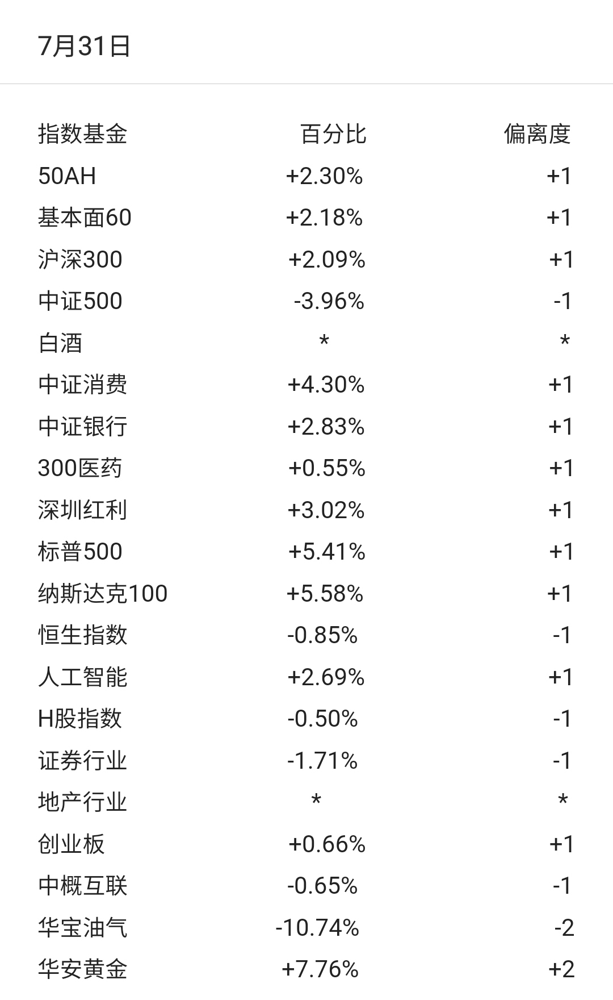

======================================================

_type: q&a
@J[28281541518551]
2019-07-31 19:59:41 Wed  
topic_id: 422114182515228

@J

>  师傅，想问一下定投系数的问题，设置宽基：1.5，优质行业指基：1，周期性强的指基：0.5，这样安排可以吗

@二师父

>  可以的，另外考虑下你的仓位就行了

阅读[3753]  评论[0]  赞[0] 

======================================================

_type: talk
@林荫[15115451828452]
2019-07-31 23:34:52 Wed  
topic_id: 244115122858421

有一个问题，关于场内费用比场外优惠，我们每月定投好几个基金时，单笔超1万元的可能性很小，每次买入没有超过1万元收5元佣金，如果买入5000元，手续费5元，是千分之一，这样算场内佣金就不便宜啊？请原谅我这小散户。。。

@二师父 at 2019-07-31 23:34:52 Wed

> 通过我这华泰开户都是免5的，最低一次收0.1

----------

@林荫 at 2019-07-31 23:34:52 Wed

> 哦，这样的，那我已经有开户可以转华泰吗？

----------

@二师父 at 2019-07-31 23:34:52 Wed

> 需要重新开

----------

@衣袂飘香 at 2019-07-31 23:34:52 Wed

> 我已经通过二师父的学堂申请了10多天了，还没落实到位。

----------

阅读[3690]  评论[4]  赞[0] 

======================================================

