_type: q&a
@紫色天使[844124551411152]
2019-10-01 16:44:24 Tue  
topic_id: 241588528822181

@紫色天使

>  二师父想请教您，格雷厄姆指数公式当中的盈利收益率去哪里查看呢？，他指的是整体市场的一个平均值吧？

@二师父

>  这个盈利收益率是全市场指数的盈利收益率
>  
>  查到了全市场指数的市盈率，然后取得全市场指数市盈率的倒数就是公式中的盈利收益率

阅读[2591]  评论[3]  赞[0] 

======================================================

_type: talk
@二师父[28814221155551]
2019-10-01 21:46:21 Tue  
topic_id: 241588522124841

<e type="hashtag" hid="551848554214" title="#值得长期持有的优质资产#" /> 优质资产到底是哪些，对于指数基金，哪些长期持有会有复利效应呢

阅读[3031]  评论[0]  赞[0] 

+++++++++++++++++++++++++++++++++++++++++++++++++++++

文件：
2019-10-01 21:45:40 Tue
文件大小：[23958]
51512418544514-什么样的资产是值得长期持有的复利资产.docx

======================================================

@二师父[28814221155551]
2019-10-01 21:47:15 Tue  
topic_id: 841588522455512

>  @二师父
>  

阅读[2654]  评论[0]  赞[0] 

======================================================

_type: talk
@二师父[28814221155551]
2019-10-01 21:51:15 Tue  
topic_id: 118255244848552

<e type="hashtag" hid="458585422518" title="#周二估值讲堂#" /> 关于估值的运用，简单的指标是市盈率和市净率，这是初级入门阶段作为参考。

而成熟的估值系统是安全边际加盈利系统估值的结合，也就是高盈利增长的股票和指数可以获取更到的溢价。因为相当于高增长对冲了高价格。

对于彼得林奇是运用了PEG的指标，这个指标适合在股票市场运用，而对于普通投资者，最好的方式是结合指数整体市盈率的安全边际、指数的盈利情况以及重仓股票的盈利情况整体来进行估值判断。

不是市盈率越低，估值越低，需要结合盈利一起判断的。

@衣袂飘香 at 2019-10-01 21:51:15 Tue

> 期待二师父更详细的讲解。

----------

@二师父 at 2019-10-01 21:51:15 Tue

> 好的

----------

@衣袂飘香 at 2019-10-01 21:51:15 Tue

> ♫(͡◕  ◕͡)神采飞扬

----------

阅读[3158]  评论[3]  赞[0] 

======================================================

_type: talk
@姥姥不疼. 爷爷不爱[48544481458248]
2019-10-02 14:58:05 Wed  
topic_id: 241588548244811

请教二师父，中概互联当下的形势（面临在美退市）还能继续执行网格交易么，风险大么，谢谢谢您。

@二师父 at 2019-10-02 14:58:05 Wed

> 目前只是特发言这样操作，并未得到支持，会有影响下跌，退市相关消息还是以官方公布为准

----------

阅读[2769]  评论[1]  赞[0] 

======================================================

_type: q&a
@志亮[422125851552828]
2019-10-02 17:11:02 Wed  
topic_id: 548211254588854

@志亮

>  二师父，既然牛市总是在绝望中出现，那么这次囯庆后大盘会不会像2018年一样开始一直阴跌到2400点的，然后再出现牛市。

@二师父

>  目前行情已经让很多投资者经历过失望了
>  
>  去年不是因跌到2400的，在国庆之前就已经跌了很多，然后国庆之后遭遇大跌到达一个底部区域2400多点，而后再去年12月底又经历了一次大跌才算稳住。今年会不会延续去年的行情我们都无法预测，不过可以肯定的是，如果重新回到2400点投资机会又是比较好的，不要错过。

阅读[2983]  评论[0]  赞[0] 

======================================================

_type: q&a
@再出发[15452144455582]
2019-10-02 22:25:39 Wed  
topic_id: 118255215114482

@再出发

>  二师父，H股指数为什么处于低估，恒生指数处于正常估值？怎么判断？

@二师父

>  这个估值可以根据估值阈值表进行判断，低于低估阈值属于低估区域，高于高估阈值属于高估区域。

阅读[2829]  评论[0]  赞[0] 

======================================================

_type: q&a
@紫色天使[844124551411152]
2019-10-02 22:42:04 Wed  
topic_id: 241588542824581

@紫色天使

>  二师父，国庆期间一直在好好复习您写的这些经典文章，刚刚看到那个巴菲特指数公式，他的股市总市值和GDP我从哪里查看呢？

@二师父

>  国庆假期还在认真学习，这种精神用在投资和自己的生活、事业上都会有更加长足的发展，为你点赞。
>  
>  GDP或者GNP在国家统计局官网可以查到，这个数据以官方公布的数据为准。股票总市值可以在万得官网查到。
>  
>  巴菲特指数在乐咕乐股官网也可以查到，在他的研究里面就有一个巴菲特指标。

阅读[3288]  评论[3]  赞[0] 

======================================================

_type: talk
@姥姥不疼. 爷爷不爱[48544481458248]
2019-10-03 00:04:00 Thu  
topic_id: 548211248445184

再次请教二师父，今晚美股暴跌叠加中概互联退市预期，中概互联指数是止损还是继续网格投入尼，恳请二师父明示

@二师父 at 2019-10-03 00:04:00 Thu

> 可以按照网格继续，暴跌风险在A股和每股都会遇到的，如果担心的话，需要控制仓位到自己心里能够承受的地步

----------

阅读[2887]  评论[1]  赞[0] 

======================================================

_type: talk
@二师父[28814221155551]
2019-10-03 00:11:03 Thu  
topic_id: 421488421188588

#为什么易方达上证50今年跑赢了50AH# 从本质分析问题

@学以致用 at 2019-10-03 00:11:03 Thu

> 老师，长期持有，易方达上证50和50AH那个更具优势啊

----------

@二师父 at 2019-10-03 00:11:03 Thu

> 目前来看50ah更加低估，而上证50的持仓股票有消费医药这种更加优质的股票

----------

阅读[3401]  评论[2]  赞[0] 

+++++++++++++++++++++++++++++++++++++++++++++++++++++

文件：
2019-10-03 00:08:20 Thu
文件大小：[23089]
15452145114112-易方达上证50基金为什么今年跑赢了50AH.docx

======================================================

_type: talk
@二师父[28814221155551]
2019-10-03 00:17:32 Thu  
topic_id: 548211248815284

<e type="hashtag" hid="551848485114" title="#周三基金分析#" /> 关于中概互联基金，这个基金分析过很多次，是投资阿里、腾讯等企业的低门槛选择，中概互联大部分持仓的是美股和港股。

而港美股没有跌停保护机制，所以暴跌是很正常的，每一次暴跌加上各种利空消息都会让投资者恐惧，这一点在投资的时候非常常见。

每次当你恐惧的时候，想想2018，想想2014的白酒，想想2018年的医药股票，历史总是在重演，别恐惧就好，倘若恐惧，一方面是对基金研究不够，另外一方面是仓位没有控制好。

@素兮 at 2019-10-03 00:17:32 Thu

> 那中概互联应该几成仓位比较好？三成左右么？用于波段操作

----------

@二师父 at 2019-10-03 00:17:32 Thu

> 可以的，看自己能承受多大的波动

----------

@呼唤旷野 at 2019-10-03 00:17:32 Thu

> 这只鸡有没有退市的可能

----------

@二师父 at 2019-10-03 00:17:32 Thu

> 目前还没有这个迹象

----------

阅读[3636]  评论[4]  赞[0] 

======================================================

@二师父[28814221155551]
2019-10-03 19:57:03 Thu  
topic_id: 241588518441551

>  @二师父
>  

阅读[3072]  评论[0]  赞[0] 

======================================================

_type: talk
@二师父[28814221155551]
2019-10-03 23:35:05 Thu  
topic_id: 421488411284458

<e type="hashtag" hid="145882224242" title="#不赚钱的原因#" /> 基金收益率很高，你的投资为什么不赚钱。

主要是两大原因。

@衣袂飘香 at 2019-10-03 23:35:05 Thu

> 低估阈值是怎么计算，如何得出？一直没懂。有机会给讲讲呵。

----------

@远山 at 2019-10-03 23:35:05 Thu

> 老师列举的基金我都是从去年开始定投的，好象实际收益率没有那么高

----------

@二师父 at 2019-10-03 23:35:05 Thu

> 你可以查阅下基金官网

----------

@二师父 at 2019-10-03 23:35:05 Thu

> 好的

----------

@衣袂飘香 at 2019-10-03 23:35:05 Thu

> 谢谢你

----------

阅读[3211]  评论[5]  赞[0] 

+++++++++++++++++++++++++++++++++++++++++++++++++++++

文件：
2019-10-03 23:34:18 Thu
文件大小：[24531]
15452144522522-基金收益率很高，你的投资为什么不赚钱.docx

======================================================

_type: talk
@二师父[28814221155551]
2019-10-04 22:49:28 Fri  
topic_id: 241588851251451

<e type="hashtag" hid="228115881511" title="#优质股票特征#" />你需要知道指数持仓股票的优劣，这样的话对购买的指数心里会更有底

阅读[3003]  评论[0]  赞[0] 

+++++++++++++++++++++++++++++++++++++++++++++++++++++

文件：
2019-10-04 22:48:47 Fri
文件大小：[24885]
15452144155852-优质的股票都有什么特征.docx

======================================================

_type: q&a
@jier[118552824811122]
2019-10-04 23:08:04 Fri  
topic_id: 421488841422528

@jier

>  二师父，请问指数投资用的是低估投资法，既然指数是一篮子股票，为什么不可以也采用低估投资法买指数基金所持仓的龙头股，待牛市再卖出？比如在白酒指数低估的时候买入茅台股票。因为看您的股市投资采取的是趋势投资止损方法。只是因为股票容易有黑天鹅和退市的风险么？

@二师父

>  趋势投资也保证在低估区域买入的。
>  
>  在股票投资的时候，首先选择优质的股票，其次保证股票处于安全边际以内，就是股票在低估区域，然后才可以投资。
>  
>  股票不同于指数，指数相当于投资了一篮子股票，风险分散，避免了个股暴雷的暴跌现象。而投资个股不一样，遇到黑天鹅或者极端情况退市都会对投资产生巨大的影响，所以股票投资需要止损

阅读[3015]  评论[0]  赞[0] 

======================================================

_type: talk
@树叶[544811512145144]
2019-10-05 09:57:04 Sat  
topic_id: 421488885842258

<e type="hashtag" hid="142825811122" title="#定投周报#" /> 二师父定投周报第28期

阅读[3030]  评论[0]  赞[0] 

+++++++++++++++++++++++++++++++++++++++++++++++++++++

文件：
2019-10-05 09:57:03 Sat
文件大小：[262007]
51512455448814-二师父定投周报10.5（第28期）.docx

======================================================

@二师父[28814221155551]
2019-10-05 22:51:48 Sat  
topic_id: 421488885552288

>  @二师父
>  

阅读[2851]  评论[2]  赞[0] 

======================================================

_type: q&a
@学以致用[244415184181451]
2019-10-05 22:52:27 Sat  
topic_id: 841588884848142

@学以致用

>  二师父 想定投医药指数，定投那只比较好呢？

@二师父

>  医药指数我追踪的有沪深300医药和医药100指数，这两只都比较好，然而估值都不低了。

阅读[2955]  评论[0]  赞[0] 

======================================================

_type: talk
@二师父[28814221155551]
2019-10-05 23:12:34 Sat  
topic_id: 118255545585842

<e type="hashtag" hid="551882524224" title="#如何从零开始学习指数基金定投#" /> 不管投资者是否从事金融行业，学习指数基金定投的目的不仅仅是为了挣钱。

@志亮 at 2019-10-05 23:12:34 Sat

> 学习了，看二师父写的文章经常有收获。[微笑]

----------

阅读[3682]  评论[1]  赞[0] 

+++++++++++++++++++++++++++++++++++++++++++++++++++++

文件：
2019-10-05 23:11:35 Sat
文件大小：[24729]
15452141558812-如何从零开始学习指数基金定投.docx

======================================================

_type: talk
@二师父[28814221155551]
2019-10-05 23:15:00 Sat  
topic_id: 548211151184244

温馨提示，您的假期余额仅剩两天，请抓紧时间好好玩

@志亮 at 2019-10-05 23:15:00 Sat

> 二师父太坏了，咋看一眼我还以为是我的帐户余额不足[呲牙]什么的，吓了我一跳。

----------

@麻烦得很 at 2019-10-05 23:15:00 Sat

> 我也以为是说我的到期了

----------

@二师父 at 2019-10-05 23:15:00 Sat

> 哈哈😄

----------

@二师父 at 2019-10-05 23:15:00 Sat

> [呲牙][呲牙]

----------

阅读[3254]  评论[4]  赞[0] 

======================================================

@二师父[28814221155551]
2019-10-06 20:38:08 Sun  
topic_id: 421488855522818

>  @二师父
>  

阅读[3075]  评论[0]  赞[0] 

======================================================

_type: q&a
@素兮[548121415528244]
2019-10-06 23:12:00 Sun  
topic_id: 421488828545448

@素兮

>  二师父您好，最近在看二师父公众号里之前的文章。其中有一篇《定投指数基金过程中如何加倍定投》中，讲到通过看基金估值指标偏离阈值低点的程度和根据均线偏离度加仓。比如我定投的初始基金是一份1000元，根据上述两个方法计算出了加倍定投后的金额。可是又怎么和 通过万得全A指数市盈率百分位的比例而计算出的投资份额结合在一起呢？比如当前全A指数市盈率22.5%，投资份额是0.75份。那我是用这个0.75份的投资份额对应的750元，再根据指标偏离阈值低调的程度或者均线偏离程度，再行计算具体投入到基金上的金额么？

@二师父

>  万得全A指数是确定整体投资金额，阈值是确定每只基金的金额。
>  
>  比方说你确定了整体投资金额是750元，然后根据阈值来确定定投比例。
>  
>  用低估阈值除以当前市盈率得到投资的权重，然后加权平均得到每只基金的比例，再乘以整体的资金。
>  
>  这是常规计算方法，核心的投资理念是，逆向思维，低估区域内跌的越多，投资越多。

阅读[3032]  评论[0]  赞[0] 

======================================================

@二师父[28814221155551]
2019-10-07 09:27:21 Mon  
topic_id: 241588848444281

>  @二师父
>  

阅读[2924]  评论[0]  赞[0] 

======================================================

@二师父[28814221155551]
2019-10-07 09:28:23 Mon  
topic_id: 421488825448848

>  @二师父
>  

阅读[3051]  评论[0]  赞[0] 

======================================================

@二师父[28814221155551]
2019-10-07 12:56:30 Mon  
topic_id: 841588842552222

>  @二师父
>  

阅读[3158]  评论[0]  赞[0] 

======================================================

_type: q&a
@梧桐[844118451242512]
2019-10-07 12:57:48 Mon  
topic_id: 421488521114888

@梧桐

>  二师父，今天不是周四，股市也没有交易，为何定投今天扣款了。

@二师父

>  这是因为节日休市交易延后，会延迟到节日后的第一个交易日
>  
>  也就是明天，今天扣款还是以明天的收盘价格成交

阅读[3182]  评论[1]  赞[0] 

======================================================

_type: talk
@二师父[28814221155551]
2019-10-07 21:28:34 Mon  
topic_id: 118255485854422

<e type="hashtag" hid="458588251558" title="#周一市场分析#" /> 本周就一次交易日，本来是准备迎接节日利好的，然而却是较大的下跌。

节日期间美股，3，4号大涨;英国股市大跌，近两个交易日也开始回暖，德国，法国近两个交易日也是逐步上涨。

未来的预期很明显了，短期不可能出现暴跌，大家抓住3000点以下的定投机会

阅读[3527]  评论[0]  赞[0] 

======================================================

_type: talk
@二师父[28814221155551]
2019-10-07 21:34:40 Mon  
topic_id: 841588218181122

<e type="hashtag" hid="145884448822" title="#重阳节也是老人节#" /> 今天重阳节，把姥爷，奶奶接过来吃饭，也去拜访了一些老长辈

不管多大了，始终尊老爱老敬老，不管走到哪里，始终谨记长辈的教诲，踏实过一生。

@rtdmm小米 at 2019-10-07 21:34:40 Mon

> 乖宝宝

----------

阅读[3231]  评论[1]  赞[0] 

======================================================

_type: q&a
@在路上[548228451482224]
2019-10-08 15:08:30 Tue  
topic_id: 421488248581118

@在路上

>  二师父，华宝油气股票账户场内申购也是1000限额吗

@二师父

>  今天还没购买，你购买试试就知道了

阅读[2809]  评论[0]  赞[0] 

======================================================

_type: talk
@二师父[28814221155551]
2019-10-08 16:55:55 Tue  
topic_id: 421488241814418

<e type="hashtag" hid="458115158128" title="#10.8估值表#" /> 今日估值表，券商进入低估值状态，节后第一天上涨，符合预期

@笋子 at 2019-10-08 16:55:55 Tue

> 证券可以建仓嘛

----------

@二师父 at 2019-10-08 16:55:55 Tue

> 定投可以的

----------

阅读[3237]  评论[2]  赞[0] 

+++++++++++++++++++++++++++++++++++++++++++++++++++++

图片：
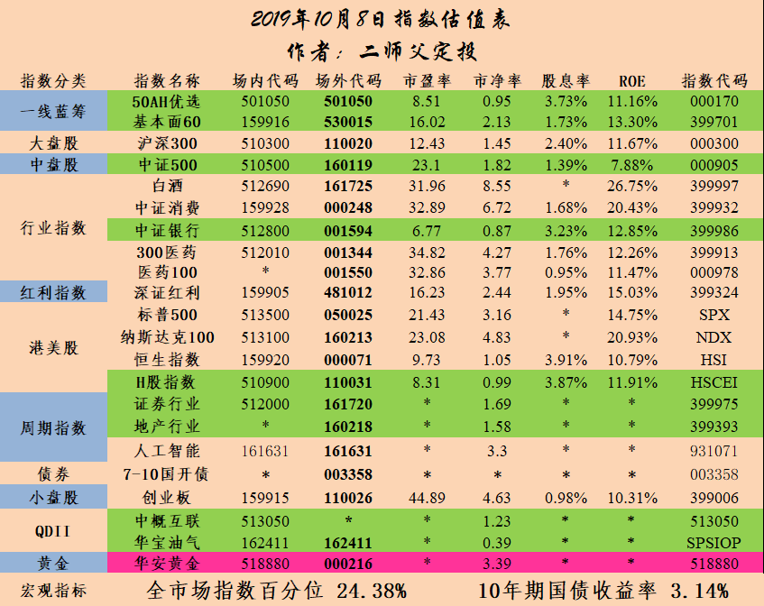

======================================================

_type: q&a
@孙平[48548211154218]
2019-10-08 17:03:50 Tue  
topic_id: 841588454184112

@孙平

>  二师父，请问万得股票里基金基准指数和对应基金净值有何关系？

@二师父

>  基准指数和基金净值是正的相关关系

阅读[2738]  评论[0]  赞[0] 

======================================================

_type: talk
@二师父[28814221155551]
2019-10-08 17:16:18 Tue  
topic_id: 548211428521844

<e type="hashtag" hid="458585422518" title="#周二估值讲堂#" /> 从白酒指数说起，有人判断目前白酒指数高估了，因为18年年初的时候白酒指数高估，而指数点位却比现在的低很多，现在都涨了这么多了，肯定高估了

估值时候比较的是价值不是价格。19年第一个季度的白酒指数盈利是上升的，这是独立于市场行情走过来的，从盈利角度看，估值是下移

对于刚开始学习估值的朋友，可以利用相对估值法，比较同期的市盈率或者市净率指标，你会发现当前的白酒指数市盈率并不比18年高，而盈利却一路上升，所以当前正常估值，接近高估

这是一个不完全随大盘走势的指数，所以非常有代表性，并不意味着大盘涨，单个指数就涨，大盘跌单个指数就跌。

要学会研究单个的行业指数，找到类似白酒这种大盘跌也涨的指数进行投资并长期持有

@志亮 at 2019-10-08 17:16:18 Tue

> 学习了，近来我也一直在研究白酒[微笑]。

----------

阅读[3348]  评论[1]  赞[0] 

======================================================

_type: talk
@二师父[28814221155551]
2019-10-08 21:23:22 Tue  
topic_id: 841588485241412

假日已过，剩下的日子工作和投资如何规划。

做好规划，然后日事日毕，日清日高。

@烟九•二手车 at 2019-10-08 21:23:22 Tue

> 炒房的差不多要哭了

----------

@志亮 at 2019-10-08 21:23:22 Tue

> 机不可失，现在正是投资股市的最好时机。[呲牙]

----------

阅读[2781]  评论[2]  赞[0] 

+++++++++++++++++++++++++++++++++++++++++++++++++++++

文件：
2019-10-08 21:23:21 Tue
文件大小：[25070]
48584122452448-假日已过，2019年仅剩四分之一，接下来的生活和投资如何规划.docx

======================================================

@二师父[28814221155551]
2019-10-09 08:33:48 Wed  
topic_id: 118255128521142

>  @二师父
>  

阅读[2549]  评论[1]  赞[0] 

======================================================

_type: q&a
@玄武[48512825154828]
2019-10-09 08:34:45 Wed  
topic_id: 548211412124144

@玄武

>  二师父，您的场外定投实盘没有中证500，那如果定投中证500定投份额怎么计算？

@二师父

>  还是利用当前市盈率除以阈值，得到权重，然后算加权平均

阅读[2889]  评论[7]  赞[0] 

======================================================

_type: talk
@007[51511545424824]
2019-10-09 15:07:47 Wed  
topic_id: 548211455422844

二师傅华宝油气今天继续跌可以加仓吗？

@衣袂飘香 at 2019-10-09 15:07:47 Wed

> 你可以参考二师父的网格策略。

----------

@007 at 2019-10-09 15:07:47 Wed

> 星球这么冷清ಥ_ಥ

----------

@风云 at 2019-10-09 15:07:47 Wed

> 老师说过0.38以下开始定投

----------

@007 at 2019-10-09 15:07:47 Wed

> 看来就快到了已经0.386了

----------

@二师父 at 2019-10-09 15:07:47 Wed

> 0.38.0.36的网格点，参考网格交易的表格

----------

@007 at 2019-10-09 15:07:47 Wed

> 怎么查看网格

----------

@二师父 at 2019-10-09 15:07:47 Wed

> 在星球搜索网格交易

----------

@007 at 2019-10-09 15:07:47 Wed

> 多谢二师傅

----------

阅读[2464]  评论[8]  赞[0] 

======================================================

_type: talk
@007[51511545424824]
2019-10-09 23:12:54 Wed  
topic_id: 548211441441544

<e type="hashtag" hid="825818842822" title="#网格交易#" /> 👌

阅读[2322]  评论[0]  赞[0] 

======================================================

@二师父[28814221155551]
2019-10-09 23:18:06 Wed  
topic_id: 421488252542828

>  @二师父
>  

阅读[2513]  评论[0]  赞[0] 

======================================================

_type: q&a
@葛亚丽[841858254128252]
2019-10-09 23:19:39 Wed  
topic_id: 548211441121124

@葛亚丽

>  二师父您好，我的定投计划是一年时间，按周定投计划，一份是1000元，目前按0.75份定投，我的定投指数有中证银行，基本面60.和恒生国企，投资比例怎么计算的呢？

@二师父

>  用指数的低估阈值除以指数当前市盈率得到权重，比方计算基本面60、恒生国企，银行的权重分别为a，b，c。
>  
>  那么基本面60的投资比例就是a/（a+b+c）

阅读[2557]  评论[4]  赞[0] 

======================================================

@二师父[28814221155551]
2019-10-09 23:20:43 Wed  
topic_id: 421488228541288

>  @二师父
>  

阅读[2698]  评论[0]  赞[0] 

======================================================

_type: talk
@二师父[28814221155551]
2019-10-09 23:21:32 Wed  
topic_id: 548211441482444

<e type="hashtag" hid="481211145528" title="#指数估值#" /> 指数估值表，阈值在后面，大家可以参考。

阅读[3120]  评论[0]  赞[0] 

+++++++++++++++++++++++++++++++++++++++++++++++++++++

图片：

======================================================

_type: talk
@二师父[28814221155551]
2019-10-09 23:22:25 Wed  
topic_id: 241588448418521

<e type="hashtag" hid="458112854218" title="#选择很重要的#" /> 投资就是选择，选择投资品种，选择投资时机

阅读[3091]  评论[0]  赞[0] 

+++++++++++++++++++++++++++++++++++++++++++++++++++++

文件：
2019-10-09 23:22:02 Wed
文件大小：[20101]
28285118882851-上证综合指数10年不涨，而这几个指数却是芝麻开花节节高.docx

======================================================

_type: talk
@二师父[28814221155551]
2019-10-10 00:14:16 Thu  
topic_id: 118255114221842

<e type="hashtag" hid="551884151524" title="#207定投实盘#" /> 此实盘非跟投，仅为二师父个人投资记录，天天基金搜索二师父低估定投有实盘记录

@林荫 at 2019-10-10 00:14:16 Thu

> 看域值范围，H股比恒生更低估，为什么二师父选的是恒生呢？

----------

@林荫 at 2019-10-10 00:14:16 Thu

> 看估值范围，H股比恒生更低估，为什么二师父选的是恒生呢？

----------

@王燕 at 2019-10-10 00:14:16 Thu

> H股就是恒生国企，恒生指数就是恒生指数。

----------

@玄武 at 2019-10-10 00:14:16 Thu

> 周四的投入比例，是按周三的指数市盈率计算得到的吧？

----------

@二师父 at 2019-10-10 00:14:16 Thu

> 有同学已经解答了

----------

@二师父 at 2019-10-10 00:14:16 Thu

> 对的，每次交易参考前一天的市盈率指标

----------

阅读[3494]  评论[6]  赞[0] 

+++++++++++++++++++++++++++++++++++++++++++++++++++++

图片：
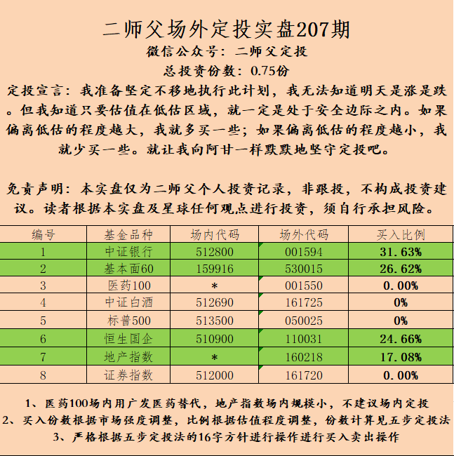

======================================================

_type: q&a
@妖孽[544888148518184]
2019-10-10 15:58:08 Thu  
topic_id: 841588442242522

@妖孽

>  请问二师父在估值足够低估的安全边际下，例如：银行，我们为什么不投资银行B类基金呢！会不会有事半功倍的效果呢！

@二师父

>  分级基金分为a类基金和b类基金。
>  
>  其中a类基金是可以看成一个可以获取固定利息的固定收益品种。
>  
>  分级b可以看做是一种杠杆指数工具，通过向分级基金A份额支付约定的收益率达到融资的目的，获得跟踪指数的杠杆化收益机会。
>  
>  那么银行b就是一个上杠杆的指数基金，下跌和上涨都是净值加杠杆并除去支付给分级a利息够的结果

阅读[2880]  评论[0]  赞[0] 

======================================================

_type: q&a
@葛亚丽[841858254128252]
2019-10-10 15:59:24 Thu  
topic_id: 241588442158211

@葛亚丽

>  二师父您好，计算投资比例，市盈率除以指数阈值，指数阈值有两个数值，选择哪一个计算啊？

@二师父

>  选择低估阈值，用低估阈值除以市盈率，估值区间前面一个数字指标就是低估阈值

阅读[2592]  评论[0]  赞[0] 

======================================================

_type: q&a
@Gingo[544812851155554]
2019-10-10 16:18:27 Thu  
topic_id: 421488218251288

@Gingo

>  二师父 你好 我从来没有操作过场内基金 这两天想尝试买入华宝油气和中概互联 但是打开app界面看了一下不知道应该是按限价委托还是市价委托购入呢？关于场内基金的购买方式有什么建议吗？

@二师父

>  限价委托，是自己限定一个价格，到达了就成交，不到达这个价格就无法成交
>  
>  市价委托，客户在交易所进行交易前委托经纪人买卖股票时，不规定买入或卖出的价格，而是要求经纪人按照当时的市场价格来购买或出售股票的行为。
>  
>  也就是你申请购买就及时成交，如果看好当前的投资价格，那么就可以市价委托，如果自己想要到达一个心理价位才成交，那么就限价委托

阅读[2701]  评论[0]  赞[0] 

======================================================

_type: talk
@二师父[28814221155551]
2019-10-10 22:18:47 Thu  
topic_id: 241588155254111

<e type="hashtag" hid="481211145528" title="#指数估值#" /> 10.10日估值表，每次定投的时候参考上一个交易日的估值表，比方说10号定投参考9号的估值表，11号定投就参考今天的估值表

阅读[3036]  评论[0]  赞[0] 

+++++++++++++++++++++++++++++++++++++++++++++++++++++

图片：

======================================================

_type: q&a
@是喵喵吖～[421441114141158]
2019-10-10 22:27:56 Thu  
topic_id: 241588418155121

@是喵喵吖～

>  二师父请问银河沪深300价值 这只指数基金怎么样

@二师父

>  这个股票也很有价值，沪深300价值指数的选样空间是沪深300指数。
>  
>  然后根据四个价值因子：股息收益率，每股净资产与价格比率，每股净现金流与价格比率，每股收益与价格比率。
>  
>  进行评分，选取价值评分排名在前100名的股票，这类价值指数募集的基金市值较小，这个基金的是9亿，但也不会面临清盘风险，是不错的策略指数基金。

阅读[2758]  评论[1]  赞[0] 

======================================================

_type: q&a
@远山[841555422151212]
2019-10-11 09:51:55 Fri  
topic_id: 118255821442452

@远山

>  老师，按老师教的收割利益法，我近期赎回了一些份额，可能去年定投低位有些筹码，卖出部分份额后，持仓收益居然升至85%，接下来怎么办呢，继续卖出吗？

@二师父

>  你是场内卖出的吧，仓位如果在9成左右，对于正常估值的指数可以继续收割利润。利润率计算用净值法，不要看系统的
>  
>  另外对于低估指数，还要坚持定投，目前还是有很多低估指数

阅读[2528]  评论[2]  赞[0] 

======================================================

_type: q&a
@飞飞[28848422485411]
2019-10-11 17:40:24 Fri  
topic_id: 241588182424111

@飞飞

>  请教二师父，如果我定投指数基金，当沪指3000点时（这时投资的指数基金还在低估区域），但是已经有5%大约1000的利润。如果我不取出，指数滑落到2800点，这些利润就没有了。假设并不会进入牛市，我是不是可以先落袋为安呢？也就是保留本金在里头，在3000点时的利润先拿出来！（因为我看股市一直就是来回波动的，2800点时之前的利润就没有了，3000点时有，一跌又没有了），谢谢您！

@二师父

>  这种就是类似我们的利润收割，指数基金定投卖出利润收割是在正常估值而且利润率10个点以上开始收割利润，也就是你说的把利润部分拿出来。
>  
>  对于波动小而且频率高的市场，你这样5个点收割利润，然后低位再买入也是可以的，类似波动操作，但是主仓位也有，即使牛市来了也不会错过。

阅读[2850]  评论[1]  赞[0] 

======================================================

_type: q&a
@mumomo[111812248825412]
2019-10-11 19:48:14 Fri  
topic_id: 241588184825221

@mumomo

>  二师父，用你的链接开了华宝账户，是等着客服电话调佣，还是账户自动调好不用管他，我怎么查看我的佣金是多少？

@二师父

>  自动就调整了，华宝是万1，app查不到，你在账户上找到客户经理电话咨询下

阅读[2416]  评论[1]  赞[0] 

======================================================

_type: talk
@二师父[28814221155551]
2019-10-11 22:13:41 Fri  
topic_id: 421488181518258

<e type="hashtag" hid="481211145528" title="#指数估值#" /> 指数估值，最近涨了4天，国债收益率指数也上涨了。股债轮动效应还是比较明显。

不管什么市场，总是会有机会的，现在股市弱，多积累资产，等牛市来了逐步卖出指数基金，布局债券基金，这样简单的轮动收益率可能不高，但是非常稳健，适合工薪阶层。慢慢变富，这样也更容易守住财富。

否则，没有驾驭财富的心态和品质，即使炒股挣了钱，迟早也会吐回去的。

@圣诞结® at 2019-10-11 22:13:41 Fri

> 二师父，中证500又离开低估区了，现在是否可以收割利润？还是可以再涨涨？

----------

@二师父 at 2019-10-11 22:13:41 Fri

> 仓位如何呢？可以再等等或者立刻收割一看估值，还要看仓位

----------

@圣诞结® at 2019-10-11 22:13:41 Fri

> 目前刚定投了两个月  总共有2万买基金 中证500占30%

----------

@二师父 at 2019-10-11 22:13:41 Fri

> 如果全部都买了，现在可以收割啊

----------

@圣诞结® at 2019-10-11 22:13:41 Fri

> 请教二师父，一般利润达到多少比例可以收割？ 在天天基金上买的，收割利润是需要全部卖出份额然后低估时再买入？

----------

@二师父 at 2019-10-11 22:13:41 Fri

> 一般10个点就可以收割，收割之后仍旧可以低估买入的

----------

@圣诞结® at 2019-10-11 22:13:41 Fri

> 好的 谢谢

----------

阅读[2759]  评论[7]  赞[0] 

+++++++++++++++++++++++++++++++++++++++++++++++++++++

图片：
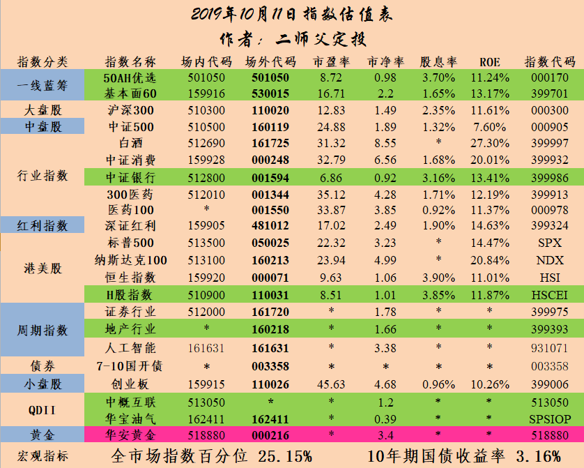

======================================================

_type: talk
@二师父[28814221155551]
2019-10-11 22:14:57 Fri  
topic_id: 548211818585214

<e type="hashtag" hid="828285842182" title="#医药指数#" /> 医药指数很长一段时间低估，我们已经积累不少了，目前可以利润收割，也可以坚定持有，谨记不要随便在市场整体处于弱市的时候清仓。

@二师父 at 2019-10-11 22:14:57 Fri

> 今年医药100是有低估的

----------

阅读[2635]  评论[2]  赞[0] 

+++++++++++++++++++++++++++++++++++++++++++++++++++++

文件：
2019-10-11 22:14:01 Fri
文件大小：[20032]
28288555111441-医药指数今年大涨，是否还值得投资.docx

======================================================

_type: q&a
@是喵喵吖～[421441114141158]
2019-10-11 22:17:17 Fri  
topic_id: 118255858228212

@是喵喵吖～

>  二师父有个问题一直困扰着我，我老是好去看这个单位净值 ，就是我的理解是比如现在这个价格（位于虚线上边了）就想是不是有点高，想是不是尽量买在虚线以下的价格才才算是低估买入的

@二师父

>  这种情况是需要你放弃成本思维和价格思维的，学会估值思维。
>  
>  虚线是你的成本价格，在虚线以上购买只代表你买的比成本价格高，并无法说明你买的有点高。
>  
>  看估值购买，价格和估值是两码事。如果你在牛市价格高的时候买入，然后市场一直跌，你买的价格就会在虚线以下，然而这时候仍旧很贵。
>  
>  如果你在超级熊市价格便宜低估的时候购买，市场后面一直上涨，你的买的价格就会在虚线以上，然而这时候仍旧很便宜。

阅读[2744]  评论[0]  赞[0] 

======================================================

_type: talk
@二师父[28814221155551]
2019-10-11 23:16:24 Fri  
topic_id: 241588181145511

<e type="hashtag" hid="145458855482" title="#周五读书#" /> 最后一讲，作者讲的很多理念和二师父类似，越来越发现，投资是知易行难。我们都知道，可是做到的并不多呀。下此讲天弘基金出版的《指数基金投资至简》

@Claire at 2019-10-11 23:16:24 Fri

> 随着阅读的积累，认知得到了不断的提升，当再去看师父的定投指南时，感觉理解的更透彻了。

----------

@二师父 at 2019-10-11 23:16:24 Fri

> 慢慢来，定投的越久会理解越深，后面会多读一些好书

----------

阅读[3197]  评论[2]  赞[0] 

+++++++++++++++++++++++++++++++++++++++++++++++++++++

文件：
2019-10-11 23:15:04 Fri
文件大小：[24430]
48588448485248-《买入持有富有：一名金牛基金经理得投资之路》第四讲.docx

======================================================

_type: talk
@树叶[544811512145144]
2019-10-12 09:36:27 Sat  
topic_id: 841582524522882

<e type="hashtag" hid="142825811122" title="#定投周报#" /> 二师父定投周报第29期

阅读[2649]  评论[0]  赞[0] 

+++++++++++++++++++++++++++++++++++++++++++++++++++++

文件：
2019-10-12 09:36:27 Sat
文件大小：[266954]
28288558824221-二师父定投周报10.12（第29期）(1).docx

======================================================

_type: talk
@海盗[48248118584848]
2019-10-12 22:42:45 Sat  
topic_id: 118254211525552

<e type="hashtag" hid="225118152481" title="#指数基金均线偏离表#" />

@海盗 at 2019-10-12 22:42:45 Sat

> 迟来的偏离表😄

----------

@海盗 at 2019-10-12 22:42:45 Sat

> 这段时间工作上有调整，没有经常来学堂学习。我得抓紧把以前的课给补上。

----------

@玄武 at 2019-10-12 22:42:45 Sat

> 谢谢^ω^

----------

阅读[2712]  评论[3]  赞[0] 

+++++++++++++++++++++++++++++++++++++++++++++++++++++

图片：
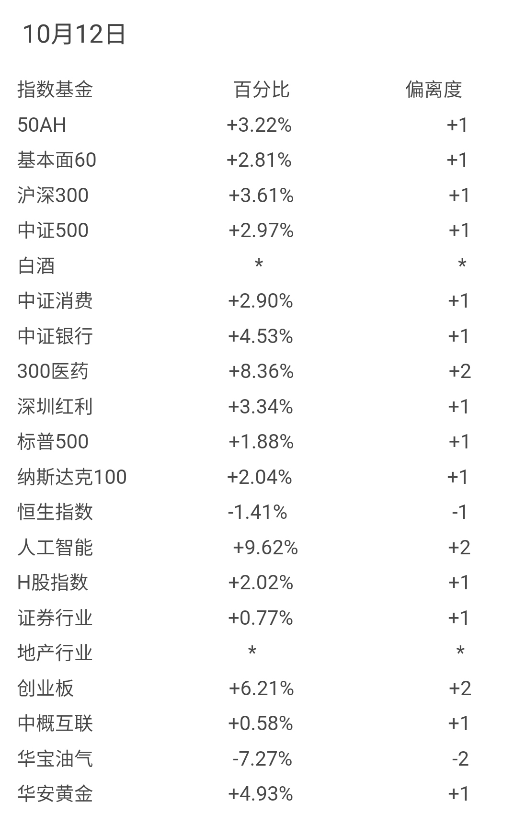

======================================================

_type: q&a
@薛奔基金理财培训师[88518852581482]
2019-10-12 23:02:43 Sat  
topic_id: 118255858182842

@薛奔基金理财培训师

>  老师，混合基金和指数基金不同，如何判断是否是低估值呢，谢谢

@二师父

>  混合基金没法向指数基金那样看估值指标。
>  
>  有两种方法，第一种是参考和混合基金持仓股票相同的指数基金的估值
>  
>  第二种方法是给混合基金持仓的前5大重仓股票进行估值来综合判断。

阅读[2345]  评论[1]  赞[0] 

======================================================

_type: q&a
@JOY[111881481812422]
2019-10-12 23:05:45 Sat  
topic_id: 548215254145414

@JOY

>  师父，请教下分散投资的问题。因为入市较晚，类似像医药、白酒这种的行情都错过了。那么，就按现在低估的品种一直买入吗？需要控制单一品种的买入量吗？比如现在还可以的银行，是否需要设定一个投资总额的占比呢？如果需要的话，一般是怎么个分配方式？

@二师父

>  对，就投资低估的指数，行业会轮动的。
>  
>  如果为了分散风险，单个行业指数的投资比例不应超过25%。
>  
>  如果能够忍受较大回撤，那么不用这样控制，但是宽基和行业指数是必须配置的。

阅读[2376]  评论[1]  赞[0] 

======================================================

_type: q&a
@美美[48224811151218]
2019-10-12 23:20:51 Sat  
topic_id: 118254211241482

@美美

>  二师父你好！想配些医药方面的基金，请你给分析一下富国生物医学科技混合（006218），现在能不能建仓？谢谢！

@二师父

>  这是一只偏重于生物医学科技的混合基金，具有投资价值，估值不低，如果建仓只适合趋势交易设定止损点。

阅读[2371]  评论[1]  赞[0] 

======================================================

@二师父[28814221155551]
2019-10-12 23:21:43 Sat  
topic_id: 548215244525884

>  @二师父
>  

阅读[2443]  评论[3]  赞[0] 

======================================================

_type: talk
@二师父[28814221155551]
2019-10-12 23:22:41 Sat  
topic_id: 421485422541188

<e type="hashtag" hid="228111225411" title="#安全性#" /> 今天又听到有人的投资品暴雷了，一定要避免金融骗局，指数最安全

@20181108…… at 2019-10-12 23:22:41 Sat

> 安全第一

----------

阅读[2614]  评论[1]  赞[0] 

+++++++++++++++++++++++++++++++++++++++++++++++++++++

文件：
2019-10-12 23:21:56 Sat
文件大小：[19695]
51511228242824-定投指数基金最大的优势是安全.docx

======================================================

_type: talk
@二师父[28814221155551]
2019-10-13 22:34:59 Sun  
topic_id: 421485844148288

<e type="hashtag" hid="551888482814" title="#关税取征#" /> 打打停停，我们也在上涨下跌的行情中赚了不少

阅读[2681]  评论[0]  赞[0] 

+++++++++++++++++++++++++++++++++++++++++++++++++++++

文件：
2019-10-13 22:34:13 Sun
文件大小：[16362]
88288551144842-中美谈判取得最新进展，年末行情可期.docx

======================================================

_type: q&a
@恋尘[51558584455824]
2019-10-13 22:35:51 Sun  
topic_id: 118254285445252

@恋尘

>  请教二师父，我上周有个可转债是创业板的，而我说没资格怎么开通创业板打新债

@二师父

>  这个需要账户有资金量，大概50万，然后到柜台去开通

阅读[2305]  评论[3]  赞[0] 

======================================================

_type: q&a
@呼唤旷野[48828482412888]
2019-10-13 22:37:17 Sun  
topic_id: 241582518214151

@呼唤旷野

>  老师你好，最近手上多了一笔钱，准备按次定投，四个月投完，看估值表和偏离度，感觉恒生比较适合，请问还有其他合适的吗

@二师父

>  恒生国企比恒生国家合适，50AH,300价值等都比较合适

阅读[2376]  评论[2]  赞[0] 

======================================================

@二师父[28814221155551]
2019-10-13 22:39:20 Sun  
topic_id: 548215285811224

>  @二师父
>  

阅读[2415]  评论[5]  赞[0] 

======================================================

_type: q&a
@好运玲玲[244188585541521]
2019-10-13 22:40:56 Sun  
topic_id: 841582511115242

@好运玲玲

>  二师父您好！我现在已经在低估的时候定投了5成仓位，股市一直在上下波动，第一次3200多点的时候我总盈利2万多，我没有卖出利润，后来盈利都跌没了，接着上涨我又盈利3万多，我也没有卖出盈利，后来又跌了剩下1万多，现在上涨我又盈利到2万多，现在股市一直跌跌涨涨。我想请二师父指点，每次上涨把盈利收割和盈利一直不收割等到牛市再收割，这两者到最后的盈利一样吗？

@二师父

>  按照A股的波段行情来看，收割利润的盈利肯定是比持有到牛市最后是要好的，因为A股波动大，在熊市底部区域经常发生较大的波动。比如2700到3500这个点位的波动。
>  
>  如果未来A股出现了单边波动上涨行情，那么长期持有更好。现在是收割利润更好的

阅读[2667]  评论[0]  赞[0] 

======================================================

@二师父[28814221155551]
2019-10-13 22:41:40 Sun  
topic_id: 241582855552141

>  @二师父
>  

阅读[2658]  评论[0]  赞[0] 

======================================================

@二师父[28814221155551]
2019-10-13 22:43:41 Sun  
topic_id: 841582855544542

>  @二师父
>  

阅读[2748]  评论[0]  赞[0] 

======================================================

_type: talk
@二师父[28814221155551]
2019-10-14 00:04:14 Mon  
topic_id: 241582858288151

<e type="hashtag" hid="281181228851" title="#周末答疑#" /> 关于是否收割

没有固定答案，看你晚上是否睡的着，内心是否被股市牵动

仓位过重会恐惧，仓位过轻会焦虑，如果恐惧了，那肯定收割，如果焦虑，那么肯定就不割

如果既不恐惧也不焦虑，按照规则来，正常估值盈利10个点，收割，卖出的是利润，不是本金，目前震荡行情学会让利润成为真实的利润

阅读[2765]  评论[0]  赞[0] 

======================================================

_type: talk
@啦啦[421885582482448]
2019-10-14 00:17:14 Mon  
topic_id: 421485848555458

<e type="hashtag" hid="281181228851" title="#周末答疑#" /> 本人菜鸟，519677一把进，目前惨亏12.26，现在以总额的百分之二，每月分两次定投，请问后续如何操作[撇嘴]

@妖孽 at 2019-10-14 00:17:14 Mon

> 没有固定答案，看你晚上是否睡的着，内心是否被股市牵动，你的经济状况，心理因素，个人认知.......。

仓位过重会恐惧，仓位过轻会焦虑，如果恐惧了，焦虑了，那肯定止损。

如果既不恐惧也不焦虑，按照规则来，低估买入，高估卖出，止盈不止损。目前震荡行情学会让利润成为真实的利润。
———————摘抄于二师父

----------

阅读[2968]  评论[1]  赞[0] 

======================================================

_type: q&a
@Hi·DD[422111285512858]
2019-10-14 10:13:49 Mon  
topic_id: 841582854182412

@Hi·DD

>  二师父，收割利润和低估定投是不冲突的吧？二者同时进行会矛盾吗？现在银行还在低估中，能在定投的同时收割5%的利润吗？5成仓了

@二师父

>  有点冲突，因为低估区域也会定投，你是单个基金5成仓位吗，如果是单个基金5成仓位过重不准备定投是可以的

阅读[2949]  评论[1]  赞[0] 

======================================================

_type: talk
@二师父[28814221155551]
2019-10-14 10:47:16 Mon  
topic_id: 241582851444241

<e type="hashtag" hid="881251425252" title="#鳄鱼计划#" /> 卖出银行指数一份，盈利7个点

利好出现，今日大涨，却连涨了5天，涨了盈利就减一些，根据个人的仓位而定，如果仓位很低，就不用卖了，银行指数还是低估的

提示，本计划仅为二师父个人投资记录，非跟投，非投资建议

阅读[3269]  评论[0]  赞[0] 

======================================================

_type: q&a
@玄武[48512825154828]
2019-10-14 11:25:26 Mon  
topic_id: 241582851445141

@玄武

>  二师父，指数基金的分红方式是设置现金分红好还是红利再投资好，两者有什么区别？

@二师父

>  分红再投资是将分红资金购入同一基金，现金分红是直接分现金到你的账户
>  
>  熊市低估区域适合分红再投资

阅读[3124]  评论[3]  赞[0] 

======================================================

_type: q&a
@波多黎各[28428858544121]
2019-10-14 11:55:28 Mon  
topic_id: 421485884412588

@波多黎各

>  二师父，现在到处狂推的那个理财魔方是个什么鬼？

@二师父

>  一款智能投顾软件

阅读[3206]  评论[2]  赞[0] 

======================================================

_type: talk
@二师父[28814221155551]
2019-10-14 12:16:20 Mon  
topic_id: 548215112111444

我发表了一篇文章：<e type="web" href="https://articles.zsxq.com/id_r8fxx46liukw.html" title="周一市场分析" cache="" />

阅读[3671]  评论[0]  赞[0] 

======================================================

_type: talk
@二师父[28814221155551]
2019-10-14 19:50:48 Mon  
topic_id: 241582884142821

<e type="hashtag" hid="455448284528" title="#银行业#" /> 布局的银行业开始发力，认真选择，敢于出手，坚定选择，等待属于自己的胜利。

@jier at 2019-10-14 19:50:48 Mon

> 请问现在配置多少仓位算足够？8成？目前点位银行还是可以重仓的吧？还是说等回调再重仓，谢谢！

----------

@素兮 at 2019-10-14 19:50:48 Mon

> 现在这个点位还可以重仓银行业的指数么？

----------

@秦风殇韵（刘豫斌） at 2019-10-14 19:50:48 Mon

> 目前银行盈利8%左右，5成仓位，看二师父的说法，目前应该是可以继续定投吧？

----------

@二师父 at 2019-10-14 19:50:48 Mon

> 可以

----------

@二师父 at 2019-10-14 19:50:48 Mon

> 重仓和加仓是两回事哈

----------

@秦风殇韵（刘豫斌） at 2019-10-14 19:50:48 Mon

> 收到，谢谢二师父

----------

@二师父 at 2019-10-14 19:50:48 Mon

> 你这属于一次追加了，如果下跌能忍受浮亏才可以

----------

@素兮 at 2019-10-14 19:50:48 Mon

> 那银行指数可以先建立3成底仓么

----------

阅读[3587]  评论[11]  赞[0] 

+++++++++++++++++++++++++++++++++++++++++++++++++++++

文件：
2019-10-14 19:49:58 Mon
文件大小：[112452]
88288584585242-利好出现，上证综合指数突破3000点，银行板块也迎来了行情.docx

======================================================

_type: talk
@二师父[28814221155551]
2019-10-14 19:54:16 Mon  
topic_id: 841582884144522

<e type="hashtag" hid="825412412212" title="#可转债打新#" />明日桃李转债上市，中签的朋友记得卖出

16号 华夏转债开始申购，这是AA级债券，面对当前小牛市行情，也是值得打新的。

小牛市来了，可转债打新走起，可以盲打，也可以只打AA级以上的可转债

@再出发 at 2019-10-14 19:54:16 Mon

> 请教一下，为什么牛市打可转债？

----------

@二师父 at 2019-10-14 19:54:16 Mon

> 牛市可转债涨的好

----------

@Claire at 2019-10-14 19:54:16 Mon

> 打新走起

----------

阅读[3499]  评论[3]  赞[0] 

======================================================

_type: talk
@二师父[28814221155551]
2019-10-14 21:19:03 Mon  
topic_id: 421485881544488

<e type="hashtag" hid="481211145528" title="#指数估值#" /> 珍惜低估的机会，如果大盘涨到3500点以上，低估的指数机会都没了

@艾琪（王钥） at 2019-10-14 21:19:03 Mon

> 听了二师父的话加倍定投银行，已经盈利8个点以上了，银行还在低估值区，继续定投，现在用不用收割利润呢？还是等到了正常估值了再收割？

----------

@艾琪（王钥） at 2019-10-14 21:19:03 Mon

> 往下翻看，已经看到二师父的答案了，谢谢

----------

@二师父 at 2019-10-14 21:19:03 Mon

> 好的

----------

@艾琪（王钥） at 2019-10-14 21:19:03 Mon

> 我的仓位不算重，继续持有不慌收割，对吗？

----------

@niwota at 2019-10-14 21:19:03 Mon

> 华宝油气PB=0.39好便宜啊！它是主要投资美股的油气公司嘛？想较重仓位买它 ，您觉得可行吗？

----------

@Sunflower at 2019-10-14 21:19:03 Mon

> 这个是强周期指数，不建议重仓，大盘涨它不一定涨的

----------

@二师父 at 2019-10-14 21:19:03 Mon

> 可以

----------

阅读[3620]  评论[13]  赞[0] 

+++++++++++++++++++++++++++++++++++++++++++++++++++++

图片：

======================================================

_type: talk
@007[51511545424824]
2019-10-14 21:40:24 Mon  
topic_id: 241582881212241

二师傅为何510900与110031走势区别很大啊（一个场内一个场外）？-0.080.46

阅读[3168]  评论[0]  赞[0] 

======================================================

@二师父[28814221155551]
2019-10-15 09:19:38 Tue  
topic_id: 241582881185821

>  @二师父
>  

阅读[3204]  评论[1]  赞[0] 

======================================================

_type: q&a
@美美[48224811151218]
2019-10-15 09:20:02 Tue  
topic_id: 841582881185212

@美美

>  二师父你好！今天兴全合泰混合型证券基金发售，这支基金能买入吗？

@二师父

>  新发的基金一般不考虑

阅读[3205]  评论[1]  赞[0] 

======================================================

_type: talk
@许田野[28282822115481]
2019-10-15 09:26:30 Tue  
topic_id: 421485852458848

深证红利我的持有收益率有27%了，请问下现在是不是该卖出一部分了？

@二师父 at 2019-10-15 09:26:30 Tue

> 可以卖出利润

----------

@许田野 at 2019-10-15 09:26:30 Tue

> 好的，谢谢👍

----------

阅读[3237]  评论[2]  赞[0] 

======================================================

_type: talk
@二师父[28814221155551]
2019-10-15 14:34:21 Tue  
topic_id: 548215158454284

连涨必下跌，这是规律，a股5连涨，5连跌都是少见的情况

@向前进 at 2019-10-15 14:34:21 Tue

> 今天刚开始建仓[可怜]

----------

阅读[3147]  评论[1]  赞[0] 

======================================================

_type: talk
@二师父[28814221155551]
2019-10-15 17:01:39 Tue  
topic_id: 241582842588241

<e type="hashtag" hid="458585422518" title="#周二估值讲堂#" />关于中证500的估值，采用的绝对估值方法，这是源自巴菲特企业未来现金流思想。

不能仅看市盈率和市净率的历史位置，比如蚂蚁财富或者什么平台都说这个指数是低估的，只说明他便宜，市盈率确实是历史低位。

然而，考虑到里面企业的内生增长性，这个指数是价格低而动力不足。

投资不仅仅要选择低估，还要考虑成长，有的指数并不低估，可是成长性好。也是可以投资。

低估是为了保证安全，但并不一定能够保证高收益。要想投资既安全又高收益，就需要在低估和成长性之间结合。

中证500就是这样的，所以我这里说的低估并不仅仅考虑了他的价格，更重要的考虑未来增值。要说低估，环保和传媒之前极度便宜，从18年就如此，如果那时候投资的到现在要么是亏损要么是收益持平。

所以，关于估值，永远不是一个定论，这是投资的难点。因为他不是数学问题，没法用1+1=2得出结论。

就向女孩子问男孩子你有多爱我，男孩子只能回答很爱，超级爱，没法给出具体的量化标准。估值也类似，低估，极度低估，到底是多低，只是一个相对的定性标准。

@jier at 2019-10-15 17:01:39 Tue

> 有的指数并不低估，可是成长性好也值得投资。是否可以套用到现在的茅台，虽然股价高，但未来利润也很高，所以值得用偏高的价格去购买？

----------

@二师父 at 2019-10-15 17:01:39 Tue

> 不适用，安全第一，成长性第二

----------

阅读[3449]  评论[2]  赞[0] 

======================================================

_type: talk
@二师父[28814221155551]
2019-10-15 19:01:10 Tue  
topic_id: 421485825518518

<e type="hashtag" hid="825412412212" title="#可转债打新#" /> 10月16日，发行华夏转债，AA级别。可以关注

@特仑苏 at 2019-10-15 19:01:10 Tue

> 二师父，对这个转债不是很了解，可以稍微讲解一下吗？意思是可以买一些？还是关注？还有这个AA级别具体是什么含义？

----------

@二师父 at 2019-10-15 19:01:10 Tue

> 中长期债券分为3等，a,b,c，每等3级，aaa,aa,a。aaa最佳

----------

阅读[3454]  评论[2]  赞[0] 

======================================================

_type: talk
@二师父[28814221155551]
2019-10-15 20:31:53 Tue  
topic_id: 118254511224222

<e type="hashtag" hid="552112844884" title="#指数分析#" /> 两个指数谁更有价值，主要看思路

@齐俊波 at 2019-10-15 20:31:53 Tue

> 学到了，谢谢二师父

----------

@rtdmm小米 at 2019-10-15 20:31:53 Tue

> 首先低估，其次成长

----------

@速。冻 at 2019-10-15 20:31:53 Tue

> 首先成长，其次低估

----------

阅读[3596]  评论[3]  赞[0] 

+++++++++++++++++++++++++++++++++++++++++++++++++++++

文件：
2019-10-15 20:31:37 Tue
文件大小：[18336]
28288581212441-便宜的中证500和昂贵的白酒谁更有投资价值.docx

======================================================

_type: talk
@二师父[28814221155551]
2019-10-15 20:32:11 Tue  
topic_id: 241582844552521

<e type="hashtag" hid="481211145528" title="#指数估值#" />

阅读[3196]  评论[0]  赞[0] 

+++++++++++++++++++++++++++++++++++++++++++++++++++++

图片：

======================================================

_type: q&a
@夏萍[28221454818281]
2019-10-15 22:33:37 Tue  
topic_id: 421485825188288

@夏萍

>  师父
>  1.房地产投资信托基金您有关注吗？可以能否抽时间分析下。
>  2.闲钱除了放在南方天天利B，还可以放哪里利率高些？

@二师父

>  1，目前国内还没有reits基金，美国和香港都有房产信托基金，有的可以通过基金账户购买，有的通过美股账户购买，这是投资商业地产低门槛的渠道，可以考虑的
>  
>  2，银行定期理财产品，收益率3个多点，或者国债逆回购，收益率好的也有3个多点以上，其他的就不安全了，固定收益率普遍降低，还是多买股权产品，长期看指数基金收益率高于货币基金很多。其他不确定的产品就不要购买，尤其是固定收益率10个点以上的，基本是骗局

阅读[3594]  评论[1]  赞[0] 

======================================================

_type: q&a
@罗大发[421484455521228]
2019-10-16 09:25:32 Wed  
topic_id: 841582812554252

@罗大发

>  二师父，小白我看华夏发债上限是10000张，所以我们申购多少？10张？

@二师父

>  可转债申购是顶格申购，这样容易中签，一人最多中签1手

阅读[2950]  评论[8]  赞[0] 

======================================================

_type: talk
@二师父[28814221155551]
2019-10-16 20:22:45 Wed  
topic_id: 841582258141112

<e type="hashtag" hid="481211145528" title="#指数估值#" />

@水墨青花 at 2019-10-16 20:22:45 Wed

> 二师父中概互联继续定投吗，一直浮亏

----------

@二师父 at 2019-10-16 20:22:45 Wed

> 不可能啊，如果一直定投现在盈利了

----------

@水墨青花 at 2019-10-16 20:22:45 Wed

> 大约2017年10月份买的，当时大好像盘3400点左右，定投到今年，这几个月没定投，目前浮亏十几个点，我该怎么做

----------

@二师父 at 2019-10-16 20:22:45 Wed

> 你当时是不是一次重仓了，那时候比较贵，如果仓位重目前只能等待了

----------

@水墨青花 at 2019-10-16 20:22:45 Wed

> 也没怎么重仓，那就等等吧，谢谢师父

----------

阅读[3017]  评论[5]  赞[0] 

+++++++++++++++++++++++++++++++++++++++++++++++++++++

图片：
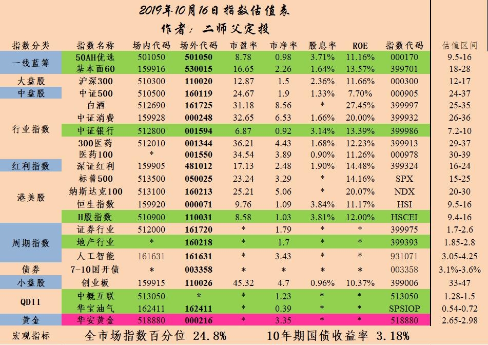

======================================================

_type: talk
@二师父[28814221155551]
2019-10-16 20:23:07 Wed  
topic_id: 241582258115581

<e type="hashtag" hid="455445811188" title="#仓位#" />

@罗大发 at 2019-10-16 20:23:07 Wed

> 这几天看了一些二师父最近和以往写的东西，感觉受益匪浅[抱拳][抱拳][抱拳]当终身学习

----------

@美美 at 2019-10-16 20:23:07 Wed

> “我希望大家把我当作一个梯子，而不是拐杖。如果我是你的拐杖，你只能够看着我投资什么才知道投资什么，那么一旦我这只拐杖离开了你，你就不会走路了”二师父比喻的太恰当了，真希望自己能早一点甩开你这个拐杖而一阶一阶的爬高你这个梯子。

----------

@苍天有井明月空🌙 at 2019-10-16 20:23:07 Wed

> 拐杖坏了可以换个更好的

----------

@苍天有井明月空🌙 at 2019-10-16 20:23:07 Wed

> 爬的高摔得很，用拐杖走路就很稳

----------

@二师父 at 2019-10-16 20:23:07 Wed

> 可以的，别重仓

----------

阅读[2784]  评论[6]  赞[0] 

+++++++++++++++++++++++++++++++++++++++++++++++++++++

文件：
2019-10-16 20:22:58 Wed
文件大小：[24333]
88288522215222-关于仓位的错误认知.docx

======================================================

_type: talk
@海盗[48248118584848]
2019-10-17 00:03:19 Thu  
topic_id: 548215412224214

<e type="hashtag" hid="225118152481" title="#指数基金均线偏离表#" />

@海盗 at 2019-10-17 00:03:19 Thu

> 深夜福利[呲牙]均线偏离表供大家参考

----------

阅读[2567]  评论[1]  赞[0] 

+++++++++++++++++++++++++++++++++++++++++++++++++++++

图片：
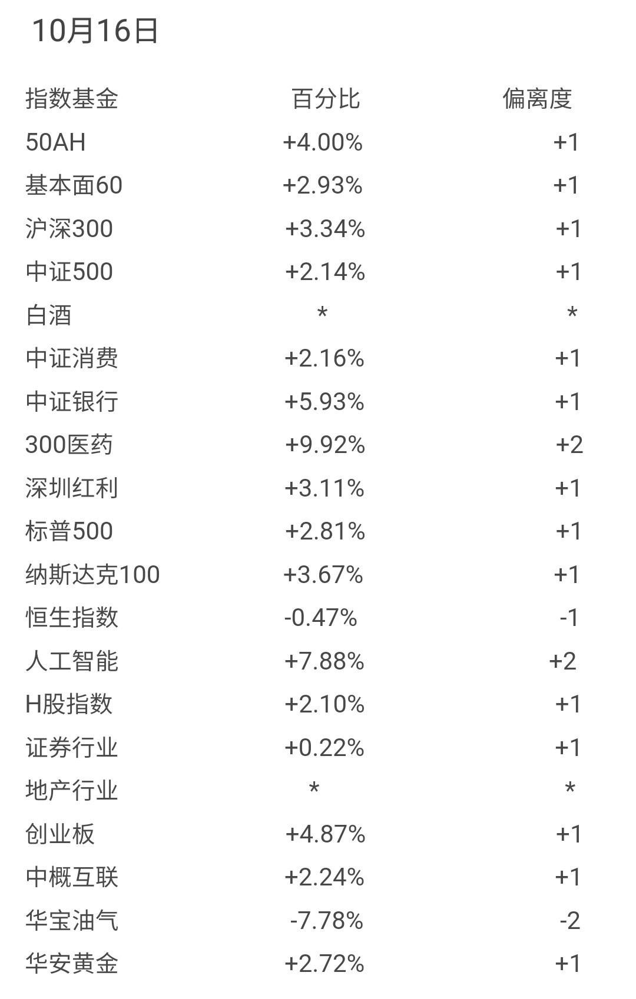

======================================================

_type: talk
@啦啦[421885582482448]
2019-10-17 08:59:54 Thu  
topic_id: 241582488582111

<e type="hashtag" hid="481211145528" title="#指数估值#" /> 二师父，我小白一个，这些表格也看不懂什么意思[囧]，怎么开始学呢？[抱拳][抱拳]

@陈飞🤗 at 2019-10-17 08:59:54 Thu

> 把他发的文章全部看一遍

----------

@二师父 at 2019-10-17 08:59:54 Thu

> 看看以前的文章或者听听课程，把市盈率，市净率，股息率，净资产收益率这些基本指标搞懂

----------

阅读[2371]  评论[2]  赞[0] 

======================================================

_type: talk
@门萨🐨[51411455828824]
2019-10-17 09:07:44 Thu  
topic_id: 421485288452428

玩信用卡的球友欢迎和我一起讨论学习[呲牙]

<e type="web" href="https://mp.weixin.qq.com/s/vXrnEQdyWUhpE9WVrIqjHg" title="合肥-珠海长隆-广州5日游，小白玩卡第一次交作业（卡权益篇）" cache="" />

@夏萍 at 2019-10-17 09:07:44 Thu

> 不知道怎么玩，能否出个样本[调皮]

----------

@阿真 at 2019-10-17 09:07:44 Thu

> 搞不懂

----------

@Claire at 2019-10-17 09:07:44 Thu

> 这些信用卡年费多少呢

----------

@门萨🐨 at 2019-10-17 09:07:44 Thu

> 可以刷免

----------

@Claire at 2019-10-17 09:07:44 Thu

> 刷免是次数还是年度总额呢

----------

@门萨🐨 at 2019-10-17 09:07:44 Thu

> 各行各卡限制不同。要具体对待

----------

@Claire at 2019-10-17 09:07:44 Thu

> 谢谢门萨的耐心解答！

----------

@门萨🐨 at 2019-10-17 09:07:44 Thu

> 不客气。想要什么权益什么卡，我可以帮你找相关资料。

----------

阅读[2608]  评论[9]  赞[0] 

======================================================

_type: talk
@老孙头[422115118524548]
2019-10-17 10:06:06 Thu  
topic_id: 548215411545254

不见二师父周四“实盘”？

@jier at 2019-10-17 10:06:06 Thu

> 同问，今天还有么？

----------

@麻烦得很 at 2019-10-17 10:06:06 Thu

> 这是1份还是0.75份呢

----------

阅读[2338]  评论[2]  赞[0] 

======================================================

_type: talk
@nana[48222415211188]
2019-10-17 10:27:44 Thu  
topic_id: 421485288242228

二师傅：您还没有发今天周四定投实盘！

@王燕 at 2019-10-17 10:27:44 Thu

> 

----------

阅读[2353]  评论[1]  赞[0] 

======================================================

_type: talk
@二师父[28814221155551]
2019-10-17 11:47:24 Thu  
topic_id: 421485282254258

<e type="hashtag" hid="144224422512" title="#208期定投实盘#" /> 昨天发了，可能酒店网络不好没有发出去，此实盘非跟投，仅为二师父个人投资记录，天天基金搜索二师父低估定投有实盘记录

有人喜欢拐杖，有人喜欢梯子，喜欢拐杖的看看实盘就可以

买入0.75份，1500。基本面60买入400，银行买入600，恒生国企买入500。大盘不上不下，正常定投即可。

@再出发 at 2019-10-17 11:47:24 Thu

> 二师父是建议场内买还是场外买？

----------

@特仑苏 at 2019-10-17 11:47:24 Thu

> 二师父，为什么我用数字带进去算得出来的金钱跟你不一样。基本面18/16.65等于1.08 银行7.2/6.87等于1.05。 恒生9.4/8.58等于1.09
1.08+1.05+1.09等于3.22.   基本面1.08/3.22等于0.3354。银行1.05/3.22等于0.3261 。恒生1.09/3.22等于0.3385。所以基本面0.3354*1500等于503元。银行0.3261*1500等于490元。恒生0.3385*1500等于507元。跟你的差距有点大。二师父怎么算的呢？

----------

@罗大发 at 2019-10-17 11:47:24 Thu

> 师父，现在我银行仓位一成都不到，是否可以直接建三成，看你的文章感觉未来一年有迎来牛市的可能。

----------

@二师父 at 2019-10-17 11:47:24 Thu

> 加了系数，还有结合目前的仓位

----------

@二师父 at 2019-10-17 11:47:24 Thu

> 都可以

----------

@二师父 at 2019-10-17 11:47:24 Thu

> 下跌抗的住就可以

----------

@罗大发 at 2019-10-17 11:47:24 Thu

> 因为我记得你那句话 大概说的是有些人3000点还在犹豫，4、5千就往里冲[呲牙]反正我有准备固定的资金来定投。

----------

阅读[2787]  评论[7]  赞[0] 

======================================================

_type: talk
@二师父[28814221155551]
2019-10-17 11:51:17 Thu  
topic_id: 118254151144482

有些帖子审核不过系统会删帖子，所以有的提问或者评论没有回答可能是系统给删除了

阅读[2490]  评论[0]  赞[0] 

======================================================

_type: q&a
@夏萍[28221454818281]
2019-10-17 11:52:10 Thu  
topic_id: 421485241221448

@夏萍

>  师父，我最近想考个关于理财的证，能否推荐?
>  （1小白基础，2对以后再选职业有所帮助）

@二师父

>  cfa可以，或者理财规划师

阅读[2582]  评论[2]  赞[0] 

======================================================

_type: q&a
@向前进[118554515482152]
2019-10-17 11:54:47 Thu  
topic_id: 841582485112842

@向前进

>  二师父，请教 1.从公众号链接开了个华泰账户，需要联系客户经理调整佣金吗，还是会自动调整，坐等即可 2.没太明白场内和场外的优势区别，是否场外相当于有人代买，省心；场外费率低 谢谢

@二师父

>  会有客户经理给大家打电话的，不用着急。
>  
>  这个场内费率低一点，场外也需要自己买，只是成交确认慢一些

阅读[2716]  评论[0]  赞[0] 

======================================================

@二师父[28814221155551]
2019-10-17 12:35:03 Thu  
topic_id: 421485282151418

>  @二师父
>  

阅读[2751]  评论[0]  赞[0] 

======================================================

_type: talk
@二师父[28814221155551]
2019-10-17 14:04:17 Thu  
topic_id: 241582481814511

波段投资，其实是一种理想投资设想，以为自己都能低进高出。这是一种不顾约束条件、不顾理性局限的理想假设，只有纸上谈兵的人，才会用来忽悠那些更加无知的小白。

越无知的人，越追求理想状态。各行业各领域都是如此。

真正成功的、伟大的投资者，无一不是接受各种缺陷和不足，甚至是很大的缺陷和不足，在各种各样的约束条件下，披荆斩棘，奋力前行。

阅读[2670]  评论[0]  赞[0] 

======================================================

_type: talk
@二师父[28814221155551]
2019-10-17 14:26:31 Thu  
topic_id: 118254158455142

证券账户短期理财方式，国债逆回购，短期不用的资金打理，一般选择1到4天期，这样周一就可以用到资金了

@烟九•二手车 at 2019-10-17 14:26:31 Thu

> 这个在那里买？

----------

@二师父 at 2019-10-17 14:26:31 Thu

> 证券账户，星球置顶文章有开户渠道

----------

@烟九•二手车 at 2019-10-17 14:26:31 Thu

> 收到

----------

阅读[2727]  评论[3]  赞[0] 

+++++++++++++++++++++++++++++++++++++++++++++++++++++

图片：
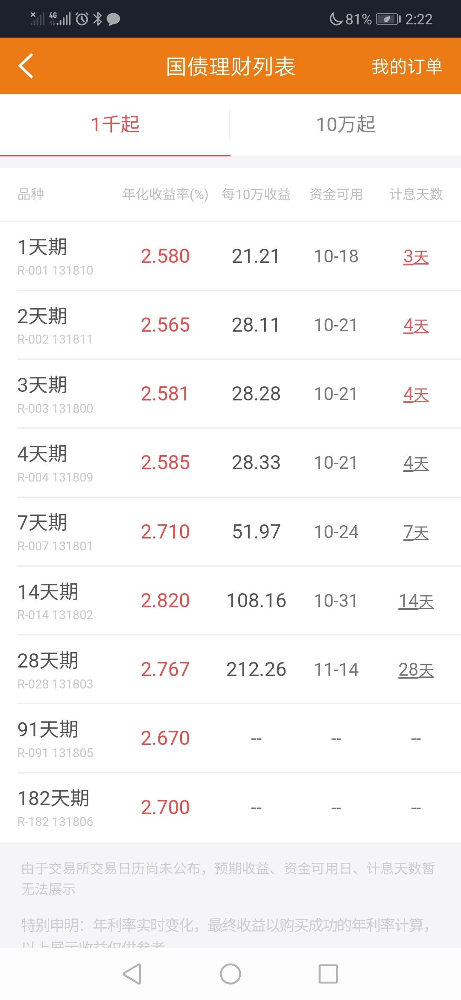
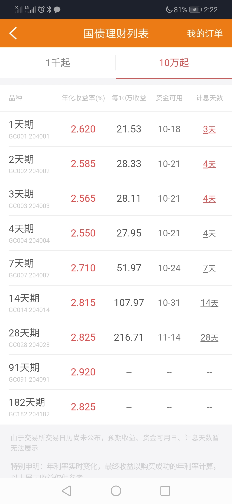

======================================================

@二师父[28814221155551]
2019-10-17 14:34:22 Thu  
topic_id: 421485282115558

>  @二师父
>  

阅读[2894]  评论[0]  赞[0] 

======================================================

_type: talk
@二师父[28814221155551]
2019-10-17 14:37:29 Thu  
topic_id: 421485281554228

每日股票打新，也是顶格申购，中签首日卖出，a股打新中签率低

@烟九•二手车 at 2019-10-17 14:37:29 Thu

> 直接买了卖？

----------

@二师父 at 2019-10-17 14:37:29 Thu

> 对

----------

@黎雄 at 2019-10-17 14:37:29 Thu

> 师傅有波动小的股票推荐没的

----------

@二师父 at 2019-10-17 14:37:29 Thu

> 股票没有推荐的，这是违规的，你可以听听股票课程

----------

@黎雄 at 2019-10-17 14:37:29 Thu

> 好的

----------

@海盗 at 2019-10-17 14:37:29 Thu

> 二师父，股票打新有亏钱的可能吗？

----------

@二师父 at 2019-10-17 14:37:29 Thu

> 有的

----------

阅读[3024]  评论[7]  赞[0] 

+++++++++++++++++++++++++++++++++++++++++++++++++++++

图片：
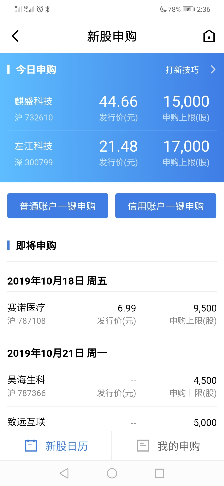

======================================================

_type: q&a
@罗大发[421484455521228]
2019-10-17 21:11:33 Thu  
topic_id: 241582422128841

@罗大发

>  二师父，请问每次说的几成仓位，是我手里总资金的几成，还是单个基金准备投入资金的几成？见笑了

@二师父

>  有问题很正常，我投资过程中也会遇到问题，多查证，搞明白就行。
>  
>  仓位有多种含义，我们常说的几成仓位是指投资所有指数基金的金额占投资总额的比例
>  
>  对于单个指数基金金额占全部指数基金总额的比例也是仓位
>  
>  但两者是不同的含义，需要区别

阅读[2806]  评论[1]  赞[0] 

======================================================

_type: talk
@二师父[28814221155551]
2019-10-17 21:13:40 Thu  
topic_id: 241582424584211

<e type="hashtag" hid="481211145528" title="#指数估值#" /> 指数估值表，低估的指数定投都可以，唯一需要注意表里面的油气切记不要重仓。我目前浮亏最多的就是油气，其他的基本盈利。大宗商品包括黄金周期性都很强的。

@门萨🐨 at 2019-10-17 21:13:40 Thu

> 我也是油气

----------

@cotton at 2019-10-17 21:13:40 Thu

> 油气会涨回来不[呲牙]

----------

@二师父 at 2019-10-17 21:13:40 Thu

> 有希望，就是不知道啥时候

----------

@cotton at 2019-10-17 21:13:40 Thu

> 明白

----------

阅读[3243]  评论[4]  赞[0] 

+++++++++++++++++++++++++++++++++++++++++++++++++++++

图片：
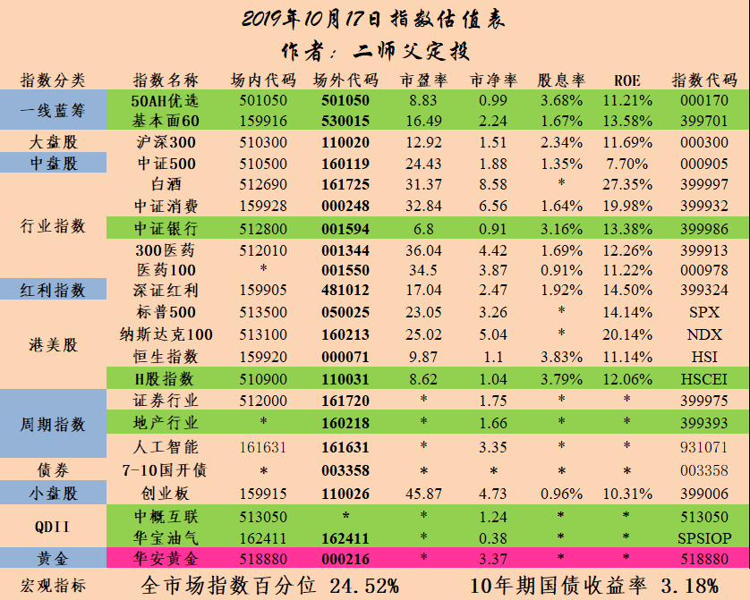

======================================================

_type: talk
@二师父[28814221155551]
2019-10-17 21:17:20 Thu  
topic_id: 241582424525411

基金分析# 三个沪市指数的分析，投资需要不断追踪，监测已经定投的指数是否变差，或者还有没有更好的投资标的。

@罗大发 at 2019-10-17 21:17:20 Thu

> 请问在哪里可以看到单个基金历史最低的市盈和市净率？

----------

@二师父 at 2019-10-17 21:17:20 Thu

> wind或者理杏仁

----------

@罗大发 at 2019-10-17 21:17:20 Thu

> 知道了 谢谢

----------

阅读[3042]  评论[3]  赞[0] 

+++++++++++++++++++++++++++++++++++++++++++++++++++++

文件：
2019-10-17 21:14:49 Thu
文件大小：[17932]
28288521515111-上证50、上证180、上证380投资价值分析.docx

======================================================

_type: q&a
@无名书苑[51188588215444]
2019-10-17 22:39:32 Thu  
topic_id: 241582424842881

@无名书苑

>  请教二师傅，如果是买主动基金，哪里或者什么方式可以详细了解到主理基金经理的具体信息，包括的投资理念，人品，性格或者投资风格以及动态信息等（不是指基金里简单介绍的那种）。谢谢

@二师父

>  我只查过基金经理简历，投资风格，人品，性格这些估计很难找
>  
>  在天天基金或者基金公司官网有的

阅读[2967]  评论[1]  赞[0] 

======================================================

@二师父[28814221155551]
2019-10-18 09:29:23 Fri  
topic_id: 421485251158888

>  @二师父
>  

阅读[2792]  评论[0]  赞[0] 

======================================================

_type: talk
@二师父[28814221155551]
2019-10-18 12:49:37 Fri  
topic_id: 841582444518522

<e type="hashtag" hid="881251425252" title="#鳄鱼计划#" /> 买入银行etf0.5份，500etf一份。目前都盈利，小额加仓。三连跌和4连跌都是少见的，主仓位有了，利用波段挣利润也可以的

本计划仅为二师父个人操作记录，不具备任何投资建议功能，投资者根据本计划及星球任何观点投资需风险自行承担

@cotton at 2019-10-18 12:49:37 Fri

> 500etf是000478吗？

----------

@二师父 at 2019-10-18 12:49:37 Fri

> 这是场外的500增强，我记得你没有股票账户，那就买纯被动的中证500指数也可以的

----------

@rtdmm小米 at 2019-10-18 12:49:37 Fri

> 记得二师父说500etf 盈利收益率低，为啥还要买呢？

----------

@cotton at 2019-10-18 12:49:37 Fri

> 好的。可是上次你说了这个不值得买呀。为啥还要买

----------

@二师父 at 2019-10-18 12:49:37 Fri

> 做波动，也可以不买的

----------

@二师父 at 2019-10-18 12:49:37 Fri

> 净资产收益率低，盈利差，可以在低估时候做波段

----------

@cotton at 2019-10-18 12:49:37 Fri

> 好的

----------

@rtdmm小米 at 2019-10-18 12:49:37 Fri

> 明白了

----------

阅读[3077]  评论[8]  赞[0] 

======================================================

_type: q&a
@再出发[15452144455582]
2019-10-18 13:12:58 Fri  
topic_id: 421485222855848

@再出发

>  二师父，目前按照你的指导定投基金。不过如果要投资股票的话，该怎么入门？感觉好几千只股票，怎么选择？如果看财报，这么多公司怎么看？这是我的困惑，感觉没有入门！

@二师父

>  你可以听听我的股票课程，在荔枝微课上，系统学习下，怎么建立风险控制，选股，买入卖出等一套系统

阅读[2767]  评论[1]  赞[0] 

======================================================

_type: talk
@二师父[28814221155551]
2019-10-18 17:04:43 Fri  
topic_id: 841582418512122

<e type="hashtag" hid="481211145528" title="#指数估值#" /> 500ETF重新进入低估区域，这类指数波段投资是可以的，碰到牛市资金涌入也有大涨的机会。如果长期持有的话，还是以盈利高的指数为主。

@光少 at 2019-10-18 17:04:43 Fri

> 二师父你好！中证500是场内低估还是场外低估了呢？

----------

@海盗 at 2019-10-18 17:04:43 Fri

> 不论场内还是场外，这里指的就是一个指数，所以场内外都是低估的[OK]

----------

@光少 at 2019-10-18 17:04:43 Fri

> [OK]谢谢！

----------

阅读[3025]  评论[3]  赞[0] 

+++++++++++++++++++++++++++++++++++++++++++++++++++++

图片：
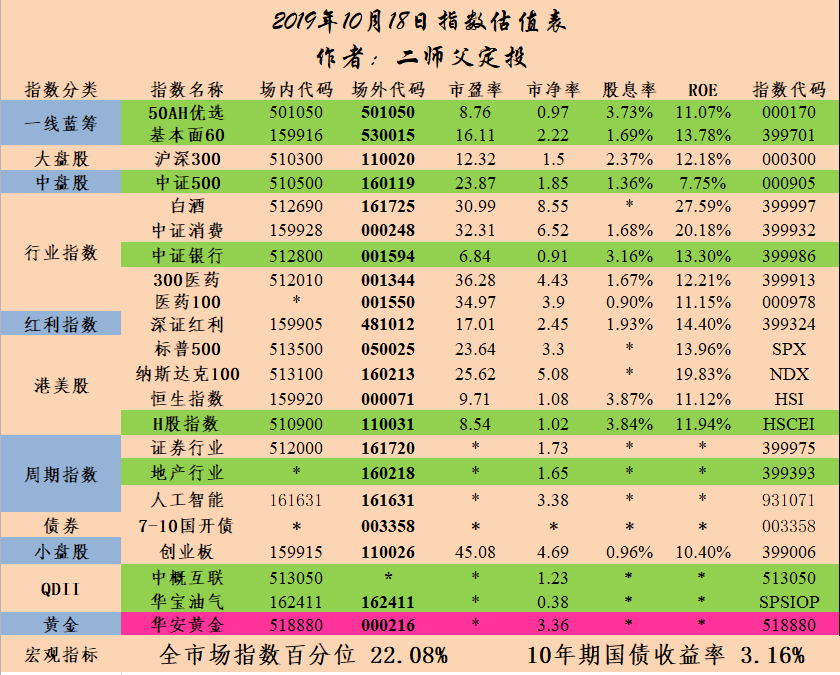

======================================================

_type: talk
@二师父[28814221155551]
2019-10-18 21:30:28 Fri  
topic_id: 421485215815448

<e type="hashtag" hid="455442415158" title="#a股市场定投往往缺钱#" />

阅读[3059]  评论[0]  赞[0] 

+++++++++++++++++++++++++++++++++++++++++++++++++++++

文件：
2019-10-18 21:30:28 Fri
文件大小：[18879]
88288544841112-在A股市场定投不缺机会，往往缺钱.docx

======================================================

_type: talk
@树叶[544811512145144]
2019-10-19 08:42:12 Sat  
topic_id: 118254822154422

<e type="hashtag" hid="142825811122" title="#定投周报#" /> 二师父定投周报第30期

阅读[2499]  评论[0]  赞[0] 

+++++++++++++++++++++++++++++++++++++++++++++++++++++

文件：
2019-10-19 08:42:10 Sat
文件大小：[273216]
48588414811558-二师父定投周报10.19（第30期）.docx

======================================================

_type: q&a
@青鸟飞鱼、此生不换[844111545424582]
2019-10-19 09:08:19 Sat  
topic_id: 421485218412588

@青鸟飞鱼、此生不换

>  请问二师父你场内鳄鱼计划是怎么买的？我的意思是场内基金是随时变动的？你怎么确定什么时间买入？

@二师父

>  看仓位和估值，到达了相对低位开始减仓，绝对低位开始加大买入，没有固定的模式，等你在市场久了就可以灵活操作

阅读[2422]  评论[0]  赞[0] 

======================================================

_type: talk
@二师父[28814221155551]
2019-10-19 16:08:37 Sat  
topic_id: 548215825112414

<e type="hashtag" hid="144221424452" title="#定投没有盈利的原因分析#" /> 通过一只指数来分析我们定投所有基金没有盈利的原因

阅读[2823]  评论[0]  赞[0] 

+++++++++++++++++++++++++++++++++++++++++++++++++++++

文件：
2019-10-19 16:08:07 Sat
文件大小：[125541]
51511282852554-你定投的中概互联为什么没有盈利.docx

======================================================

_type: talk
@二师父[28814221155551]
2019-10-19 17:17:52 Sat  
topic_id: 548215825552814

<e type="hashtag" hid="555224528124" title="#周五读书指数基金投资至简#" />

@幽幽菊花茶 at 2019-10-19 17:17:52 Sat

> 二师父辛苦了，喜欢听语音，希望二师父能多发点儿语音

----------

@二师父 at 2019-10-19 17:17:52 Sat

> 好的

----------

@陈飞🤗 at 2019-10-19 17:17:52 Sat

> 好久没听到你的声音了，好怀念啊

----------

@二师父 at 2019-10-19 17:17:52 Sat

> 以后多发点语音分享

----------

@陈飞🤗 at 2019-10-19 17:17:52 Sat

> 书大概什么时候写好，记得通知哦

----------

@二师父 at 2019-10-19 17:17:52 Sat

> 还有很长的时间，不着急，星球学员都是成本价

----------

@雪莲 at 2019-10-19 17:17:52 Sat

> 期待二师父写的书

----------

@Claire at 2019-10-19 17:17:52 Sat

> 我们都更喜欢师父的语音分享。

----------

阅读[3081]  评论[17]  赞[0] 

+++++++++++++++++++++++++++++++++++++++++++++++++++++

文件：
2019-10-19 17:13:55 Sat
文件大小：[25340]
48588414155228-《指数基金投资至简》总体介绍.docx

2019-10-19 17:17:33 Sat
文件大小：[7071206]
48588414155188-指数基金投资至简整体介绍.m4a

======================================================

_type: q&a
@林凤崎[421882481454488]
2019-10-19 21:20:53 Sat  
topic_id: 118254828122522

@林凤崎

>  现在定投医疗如何

@二师父

>  医药目前估值普遍偏高

阅读[2432]  评论[2]  赞[0] 

======================================================

@二师父[28814221155551]
2019-10-19 22:31:27 Sat  
topic_id: 841582185858442

>  @二师父
>  

阅读[2482]  评论[0]  赞[0] 

======================================================

_type: talk
@衣袂飘香[118248548242452]
2019-10-19 23:00:32 Sat  
topic_id: 548215812551454

<e type="hashtag" hid="881251425252" title="#鳄鱼计划#" /> @二师父  关于买500ETF有点小困惑。买入可以理解，在低估时买入。请问，何时卖出呢？是按照均线偏离度卖出吗？卖出时，是否理解为不仅卖出利润也卖出本金？因为其盈利能力低，故不值得长期持有。

@二师父 at 2019-10-19 23:00:32 Sat

> 盈利卖出何时都可以的，投资到最后就不是死板的方法了，比如你仓位已经满了，稍微盈利就可以卖出做波段。

如果仓位很轻，又新增很多资金，那么就可以多持有。总之卖出无定法，坚持一个原则，盈利卖出就可以。

----------

@衣袂飘香 at 2019-10-19 23:00:32 Sat

> 好的，谢谢你。

----------

阅读[2536]  评论[2]  赞[0] 

======================================================

_type: talk
@二师父[28814221155551]
2019-10-19 23:31:17 Sat  
topic_id: 841582185422812

音频是可以下载的，点击然后下载就行了。喜欢音频的朋友后面二师父会多一些音频分享。课程我也正在重新录制，后面争取做视频课程，之前购买的朋友可以永久回听。

大家不要着急，二师父在慢慢成长，以后争取和一些平台合作，然后做一些线下的交流，总有机会的，财商教育虽然我做的比较慢，但是我一直往前在走，因为有读者的陪伴。

阅读[2678]  评论[0]  赞[0] 

+++++++++++++++++++++++++++++++++++++++++++++++++++++

图片：

======================================================

_type: q&a
@银河系[111814581215452]
2019-10-19 23:36:55 Sat  
topic_id: 421485184245858

@银河系

>  二师傅好，请问如何判断指数的阈值？是否有相关的课程货资料，谢谢

@二师父

>  看这个表就可以，保存下，一般有变化会公布出来的

阅读[2825]  评论[3]  赞[0] 

======================================================

_type: talk
@二师父[28814221155551]
2019-10-20 17:19:40 Sun  
topic_id: 421485154582188

<e type="hashtag" hid="281181228851" title="#周末答疑#" /> 关于几个常见问题统一回复下。

1、中概互联，是否值得定投，这是毋庸置疑的。阿里、腾讯、美团、网易、拼多多，好未来。这些都是重仓股票。支付离不开阿里，微信离不开腾讯，吃外卖、骑行小黄车要用到美团。听音乐会用到网易云，拼多多虽然二师父不用，但是一些大妈和大伯都很青睐。好未来以前分析过，优质的教育行业。每一个公司都是好公司。好公司加好价格，是值得定投的。

但是需要注意风险，美股和港股没有下跌保护机制，所以回撤会比较大，这只基金定投也不要重仓。

2、关于定投错的股票基金怎么办，每个人的风险承受能力不同，先看看基金的持仓股票和基金经理，如果这两者都OK的话，那就等等，至少也得到3000点以上再考虑卖，目前真的太熊了。

3、关于股票投资，星球二师父一直是不建议投资股票，赚钱难，亏钱容易，二师父的股票账户为了打新持有一定的持仓，并没有买入很多。除了平安、格力这类盈利好的股票，一般股票真跑不赢指数，比如消费指数和白酒指数。当然能抓到五粮液这类翻倍股票也可以的。

再次重申，不推荐股票投资，更不会荐股。如果有兴趣研究的话，可以听听我的股票课程，建立了交易系统之后自己再上路。除非真有兴趣，否则就别鼓捣了。

4、关于可转债打新和股票打新。可转债打新不需要市值，股票打新需要沪市和深市都有一定的市值。凡是投资都有风险，打新盈利概率特别大，但是也有亏损的情况的，所以再投资前需要做好心理准备。

5、续费打折加我微信就可以了，ershifudt.

目前大家集中就是这些问题了。如果还有问题大家可以一起讨论或者向我提问。

今天传媒大学待了一下午，开放的大学，外卖小哥都可以骑着车进入图书馆，很包容。

@shi at 2019-10-20 17:19:40 Sun

> 呀，续费还能打折呀？
我直接已经续上了:-)

----------

阅读[3335]  评论[1]  赞[0] 

======================================================

_type: talk
@二师父[28814221155551]
2019-10-20 17:31:18 Sun  
topic_id: 548215852422114

<e type="hashtag" hid="222554421551" title="#3000点以下坚持定投会怎么样#" /> 3000点以下定投，3000点以上持有或者逐步止盈。就这样简单的操作会让你超越多年的股市高手。

学会了基本的，再进一步全面配置，优中选优

@shi at 2019-10-20 17:31:18 Sun

> 哎，油气目前一直没有取消智能定投，目前真成了占比最多的了。
它的亏损占据了所有其它红利的一半了~

----------

@齐俊波 at 2019-10-20 17:31:18 Sun

> 我的也是。尤其是场内的，所以其它赚的都不够抵消油气亏的。

----------

@阿宝 at 2019-10-20 17:31:18 Sun

> 坚持下去。

----------

阅读[3290]  评论[3]  赞[0] 

+++++++++++++++++++++++++++++++++++++++++++++++++++++

图片：
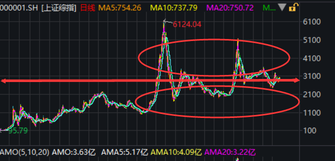

+++++++++++++++++++++++++++++++++++++++++++++++++++++

文件：
2019-10-20 17:30:15 Sun
文件大小：[101352]
51511285112884-3000点以下坚持定投盈利的概率可以高达99.99%.docx

======================================================

_type: talk
@啦啦[421885582482448]
2019-10-20 17:31:47 Sun  
topic_id: 241582125455811

师父，以前已赎回一部分基金，现基金持有盈利率怎么算？110022（易方达消费）基金，持有成本低于最新净值1元，（以前以出一部分），但近来走势不好，是否先全清，还是继续定投，谢谢你！

@二师父 at 2019-10-20 17:31:47 Sun

> 定投不用了，可以分步止盈

----------

@啦啦 at 2019-10-20 17:31:47 Sun

> 谢谢师父

----------

阅读[2735]  评论[2]  赞[0] 

======================================================

_type: talk
@二师父[28814221155551]
2019-10-20 22:05:49 Sun  
topic_id: 548215854142584

<e type="hashtag" hid="822554441422" title="#周一本周市场分析#" /> 上周14号到18号终止了国庆之后五连阳的行情。

大家记住，在A股市场，5连涨，正常或者高估的指数可以减仓，因为很少。

5连跌，低估的指数可以加仓甚至加倍加仓，因为也很少见。

本年涨幅最好的基金还是白酒、消费、医药、TMT、保险、证券。目前就保险是低估值，其他的都正常估值了。

上周各大固定收益品种的收益率都下降了，未来好的固定收益品种会很少，建议少量配置货币基金，更多的指数基金配置才能够跑赢通货膨胀。

再有就是油气，一直横盘，不要反复加仓搞成了重仓，盈利不好的指数只有投机价值。

@向前进 at 2019-10-20 22:05:49 Sun

> 二师父，估值表中是不是没有保险类的指数

----------

@二师父 at 2019-10-20 22:05:49 Sun

> 没有这个

----------

阅读[3296]  评论[2]  赞[0] 

======================================================

_type: q&a
@达达[841885282125142]
2019-10-20 23:17:21 Sun  
topic_id: 241582124844211

@达达

>  二师傅，一直说3000以下指数定投是黄金坑，那3000点以下指的是每方面的指数定投呢？比如说是沪深300还是上证50还是中证红利？我也看了很多书，但是看完书再去看论坛越看越迷茫。我现在投了8万块钱，但是我的资金量是打算二百万作为定投，现在定投哪个指数基金好呢？另外想问一下，519712和519066可以一直定投和长期持有吗

@二师父

>  并不是说3000点以下就是黄金坑，而是一个相对低位。黄金坑是非常低位
>  
>  你这投资的两只基金都是必须消费行业的指数基金，估值不低了。
>  
>  建议先把星球过往文章和课程听一遍，建立完备的定投系统，然后再开始定投，尤其是你这种资金量大的朋友，更不要盲动，把风控放在首位

阅读[3007]  评论[6]  赞[0] 

======================================================

_type: talk
@二师父[28814221155551]
2019-10-21 07:34:00 Mon  
topic_id: 841582121212822

每天都是新鲜的，用积极的态度来迎接每一天的生活，争取今天比昨天更好一点，利用定投的思维日积月累，这就是人生的复利积累

@Claire at 2019-10-21 07:34:00 Mon

> 这张照片很美

----------

阅读[2837]  评论[1]  赞[0] 

+++++++++++++++++++++++++++++++++++++++++++++++++++++

图片：

======================================================

_type: q&a
@小可木易[111148548851582]
2019-10-21 09:55:54 Mon  
topic_id: 241582145525481

@小可木易

>  请教二师父:今天的两支新债好打吗？谢谢！

@二师父

>  可以打，直接申购

阅读[2822]  评论[2]  赞[0] 

======================================================

_type: q&a
@老司基[111852221242122]
2019-10-21 10:34:27 Mon  
topic_id: 421485128124428

@老司基

>  二师傅你说:本年涨幅最好的基金还是白酒、消费、医药、TMT、保险、证券。目前就保险是低估值，其他的都正常估值了。
>  请问保险有相关场外场内基金推荐吗？

@二师父

>  方正富邦中证保险

阅读[2836]  评论[7]  赞[0] 

======================================================

_type: talk
@不再YY的猪[422118542885848]
2019-10-21 13:15:10 Mon  
topic_id: 421485122488558

请问现在还有基金和证券账户开户的优惠吗？找不到以前的开户链接了

@许田野 at 2019-10-21 13:15:10 Mon

> 置顶文件上面有

----------

@不再YY的猪 at 2019-10-21 13:15:10 Mon

> 以前是有的，现在找不到了呃

----------

@二师父 at 2019-10-21 13:15:10 Mon

> 就在置顶文章啊

----------

阅读[2628]  评论[3]  赞[0] 

======================================================

_type: talk
@二师父[28814221155551]
2019-10-21 19:33:54 Mon  
topic_id: 241584518418151

夜晚的八通线，比几年前好多了

阅读[2608]  评论[0]  赞[0] 

+++++++++++++++++++++++++++++++++++++++++++++++++++++

图片：
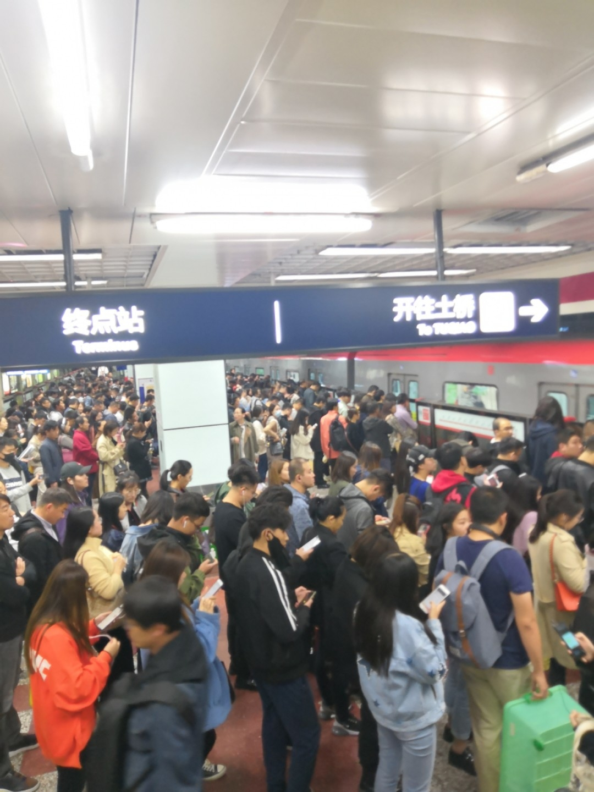

======================================================

@二师父[28814221155551]
2019-10-21 20:17:32 Mon  
topic_id: 841584518185512

>  @二师父
>  

阅读[2593]  评论[0]  赞[0] 

======================================================

_type: talk
@二师父[28814221155551]
2019-10-21 22:09:32 Mon  
topic_id: 118251284488182

<e type="hashtag" hid="481211145528" title="#指数估值#" /> 指数估值表，券商进入低估了，波动机会又来了，再跌跌做网格波段也是不错的选择。

@素兮 at 2019-10-21 22:09:32 Mon

> 全市场指数百分位在下降，怎么十年期国债收益率却提高了？

----------

阅读[2957]  评论[1]  赞[0] 

+++++++++++++++++++++++++++++++++++++++++++++++++++++

图片：
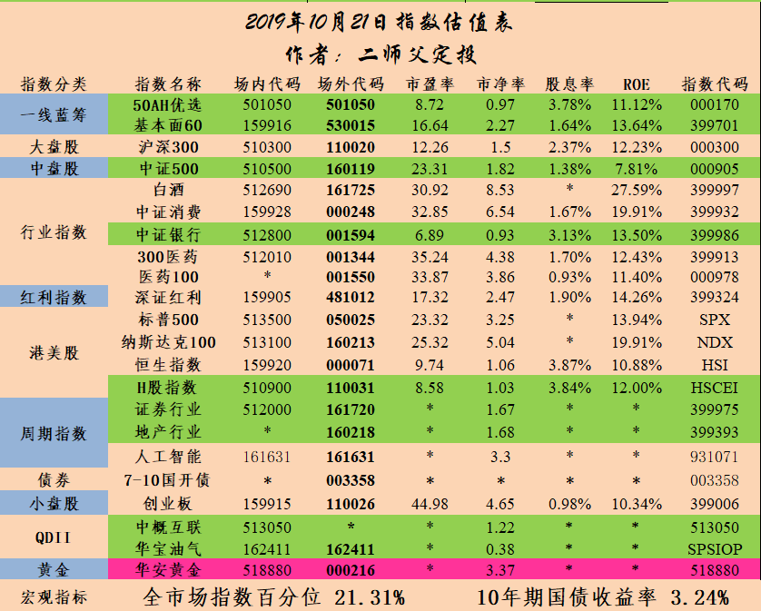

======================================================

_type: talk
@二师父[28814221155551]
2019-10-21 22:10:53 Mon  
topic_id: 841584512458582

关于银行板块

@幽幽菊花茶 at 2019-10-21 22:10:53 Mon

> 二师父，公众号里第二篇文章不是你自己的吧，类似于广告？

----------

@二师父 at 2019-10-21 22:10:53 Mon

> 对，那是广告

----------

@jin at 2019-10-21 22:10:53 Mon

> 请问文中的图和股息率数据等在哪里查比较好？

----------

@二师父 at 2019-10-21 22:10:53 Mon

> 果仁网免费

----------

阅读[2810]  评论[4]  赞[0] 

+++++++++++++++++++++++++++++++++++++++++++++++++++++

文件：
2019-10-21 22:10:43 Mon
文件大小：[62235]
88288858852512-银行板块拉升，现在是否还可以布局.docx

======================================================

_type: q&a
@罗大发[421484455521228]
2019-10-22 09:03:31 Tue  
topic_id: 548214122824144

@罗大发

>  师父，只要有新股新债，能打的都可以去打吗？

@二师父

>  可转债的话，可以盲打，如果熊市打可转债，最好2A以上级别的

阅读[2498]  评论[11]  赞[0] 

======================================================

_type: q&a
@圣诞结®[28448281541121]
2019-10-22 15:12:27 Tue  
topic_id: 241584851451481

@圣诞结®

>  “当指数基金的价格在60日或者90日均线以下，代表中长期上涨趋势没有确立，每次收割利润比例为10%。”二师父，请问均线指标在哪里可以看到？

@二师父

>  在股票app涨乐财富通或者广发易淘金

阅读[2269]  评论[0]  赞[0] 

======================================================

_type: talk
@二师父[28814221155551]
2019-10-22 15:44:40 Tue  
topic_id: 118251528111882

<e type="hashtag" hid="481211145528" title="#指数估值#" /> 市场震荡，指数一直处于波动阶段，300医药如果继续上涨，会逐步进入高估阶段。

阅读[2608]  评论[0]  赞[0] 

+++++++++++++++++++++++++++++++++++++++++++++++++++++

图片：
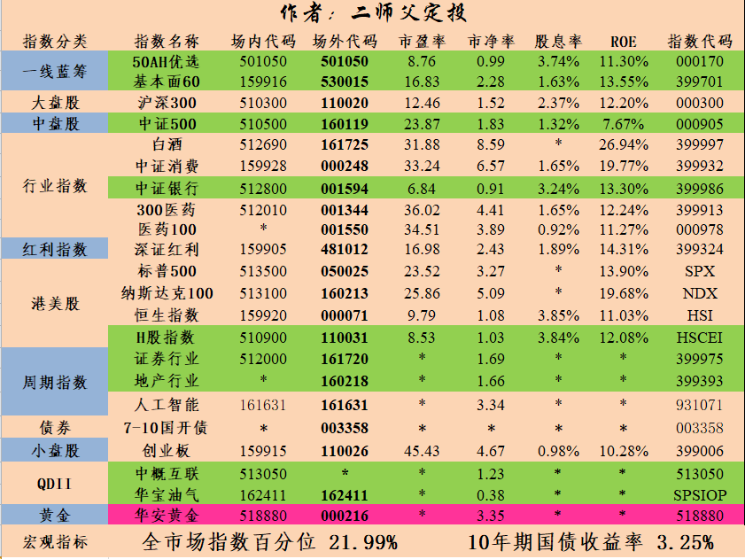

======================================================

_type: talk
@二师父[28814221155551]
2019-10-22 15:45:14 Tue  
topic_id: 421482841221428

<e type="hashtag" hid="822588551182" title="#卖出的原则#" /> 指数基金定投的过程中，卖出遵循的原则

@凭栏观海 at 2019-10-22 15:45:14 Tue

> 非常好

----------

@素兮 at 2019-10-22 15:45:14 Tue

> 持仓股票的每股收益增长率和净资产收益率在哪里查看？证券账户么？

----------

@二师父 at 2019-10-22 15:45:14 Tue

> 万得app

----------

阅读[2785]  评论[3]  赞[0] 

+++++++++++++++++++++++++++++++++++++++++++++++++++++

文件：
2019-10-22 15:44:50 Tue
文件大小：[173357]
15455528258412-指数基金定投过程中，坚守这三个原则会让你的收益更好.docx

======================================================

_type: talk
@二师父[28814221155551]
2019-10-22 16:01:34 Tue  
topic_id: 421482841155518

<e type="hashtag" hid="458585422518" title="#周二估值讲堂#" /> 关于医药指数的估值，300医药当前市盈率36倍，历史百分位79.76%，从市盈率及百分位的角度看即将进入高估。

市净率4.4，历史百分位60.12%，从市净率看离高估还有一段距离，可以二者加权平均比较，主要以市盈率为大权重，因为这是个盈利稳定的指数，市盈率更加具有代表性。

ROE12.24%，正常，股息率1.65%，历史百分位70%，从股息的角度看估值偏低。

问题在于07年的数据拉高了现在的股息。07年最低股息率到达了0.3%，当时所有的资金都涌过来了，医药股票严重高估。这也说明估值是一个大致的判断，牛市高估的时候，指数会拼命猛涨导致极度高估，股息率严重下降。

成分股：恒瑞医药，长春高新、爱尔眼科、云南白药、沃森生物，市盈率都几十倍，爱尔眼科接近100倍市盈率。这是需要警惕的。

阅读[2786]  评论[0]  赞[0] 

======================================================

_type: q&a
@学以致用[244415184181451]
2019-10-22 20:06:09 Tue  
topic_id: 548214112282124

@学以致用

>  二师父，上证50和中证100那个更具有投资价值呢？

@二师父

>  上证50指数由沪市A股中规模大、流动性好的最具代表性的50只股票组成，反映上海证券市场最具影响力的一批龙头公司的股票价格表现。
>  
>  中证100指数由沪深300指数成份股中规模最大的100只股票组成，综合反映中国A股市场中最具市场影响力的一批超大市值公司的股票价格表现。
>  
>  两个都是大蓝筹指数，都非常有投资价值

阅读[2348]  评论[0]  赞[0] 

======================================================

_type: q&a
@向前进[118554515482152]
2019-10-22 20:07:25 Tue  
topic_id: 841584885514822

@向前进

>  二师父，1.为了打新股，计划买入平安和万科，是否可行
>  2.平时用于打新股的资金如何管理，只能闲置等着打新股吗 谢谢

@二师父

>  1、股票投资不做建议，可以听听我的股票课程再做选择。推荐股票是不合规的
>  
>  2、股票账户的资金打理可以购买国债逆回购或者买入场内货币基金，都是可以的，不一定闲置。或者转出到银行卡再转到场外购买货币基金，只是耗费时间比较多。

阅读[2909]  评论[0]  赞[0] 

======================================================

_type: talk
@二师父[28814221155551]
2019-10-22 20:42:17 Tue  
topic_id: 841584888882482

<e type="hashtag" hid="822588528212" title="#读者提问：什么决定了基金投资的收益率#" /> 我认为决定基金投资收益率主要三个方面的因素。

第一、买入的标的，买的是优质的基金标的和劣质的基金，那么收益率会有截然不同的区别。比如去年开始买入传媒和白酒的，现在收益率差别70个点。

第二、买入时间，不管是什么基金，即使优质的基金买贵了那么也会亏损，最典型的例子是中概互联，18年年初接盘的现在还没有解套。

第三，心态，买的好，而且入场时机对，很多人心态不稳，受不了浮动，所以无法长期持有，短期就把优质基金卖了，也会没有好的收益率。

所以，买入的标的，买入的时间以及投资人的心态都会决定你的收益率。这三点都非常重要。

阅读[2900]  评论[0]  赞[0] 

======================================================

_type: q&a
@是喵喵吖～[421441114141158]
2019-10-23 07:07:08 Wed  
topic_id: 241584881485511

@是喵喵吖～

>  二师父请问股票开户是选择其中一个渠道开是吗 我今天选了广发证券的。后期可以在天天基金上进行转债打新吗

@二师父

>  对的，置顶链接都可以开的，可转债打新就在股票账户打

阅读[2288]  评论[1]  赞[0] 

======================================================

_type: talk
@二师父[28814221155551]
2019-10-23 07:22:49 Wed  
topic_id: 841584881481812

<e type="hashtag" hid="822588518512" title="#打新#" /> 今天有一只新股和一只新债。

新股宝兰德，所属板块是科创板，市盈率大概61倍，比之前跌了很多，科创板打新盈利还是很可观。

迪贝电气发行迪贝转债，如今大盘下跌会影响可转债打新收益率，不过这只可转债本身评级不错，可以打。

可转债打新提升中签率，一个方面是需要顶格申购，另外一个方面就是多开股票账户，不嫌麻烦的可以用爱人的账户

@Snow at 2019-10-23 07:22:49 Wed

> 华夏转债什么时候上市？这个时间哪里能查到？

----------

@二师父 at 2019-10-23 07:22:49 Wed

> 在广发有个新股上市日历表

----------

阅读[2868]  评论[2]  赞[0] 

======================================================

_type: talk
@二师父[28814221155551]
2019-10-23 07:27:59 Wed  
topic_id: 548214118452844

<e type="hashtag" hid="225125488281" title="#关于学习#" /> 只要下功夫去学习研究，你就会得到很多准确可行的准则、原则和计划。靠运气是不行的，要的是毅力和努力工作。你不能期待每天晚上看看电视、喝喝啤酒，或是和所有朋友开开派对，就可以得到像股票市场或美国经济这类复杂问题的解答。在美国，只要下功夫学习，任何人都能成就一番事业。如果你觉得沮丧，请不要放弃。回头更努力地付出劳动。将朝九晚五、从周一到周五以外的时间拿来学习研究，最终会决定你是让自己走向成功、实现目标，还是让真正的大好机会从手中溜走。

@幽幽菊花茶 at 2019-10-23 07:27:59 Wed

> 二师父的韧劲让人佩服[玫瑰][玫瑰][玫瑰][咖啡]

----------

@Claire at 2019-10-23 07:27:59 Wed

> 坚持学习，不断提升自我！

----------

@二师父 at 2019-10-23 07:27:59 Wed

> 谢谢鼓励

----------

@二师父 at 2019-10-23 07:27:59 Wed

> 一起学习

----------

阅读[2360]  评论[4]  赞[0] 

======================================================

_type: q&a
@再出发[15452144455582]
2019-10-23 09:19:29 Wed  
topic_id: 548214152121584

@再出发

>  可转债中签后，什么时候卖出比较好？

@二师父

>  上市首日卖出

阅读[2384]  评论[0]  赞[0] 

======================================================

_type: talk
@二师父[28814221155551]
2019-10-23 10:05:53 Wed  
topic_id: 548214152542254

<e type="hashtag" hid="881251425252" title="#鳄鱼计划#" /> 买入券商一份，中概互联一份，目前市场一直震荡，保留主仓位，剩余的资金做网格即可，很多人对网格的理解比较局限，认为一定要到达某个价位才开始买入，其实追求模糊的正确才是投资高手做的事情，就在低估区域，反复震荡，反复买入卖出，就这样虽然不能发财，但是每天的三顿饭估计是没问题的

这个计划纯属本人个人投资记录，不是跟投，投资者根据本计划投资需风险自行承担。关于鳄鱼计划的介绍可以看置顶文章

另外，在软件交易的时候可以把限价委托改成市价委托，这样下单就能够及时成交了

@朝阳模具 at 2019-10-23 10:05:53 Wed

> 鳄鱼计划一般将总资金分成多少份？

----------

@二师父 at 2019-10-23 10:05:53 Wed

> 300到500份不等

----------

@朝阳模具 at 2019-10-23 10:05:53 Wed

> 如果拿十万资金做鳄鱼计划，那一份只有333元，是不是太过保守呢？[捂脸]

----------

@二师父 at 2019-10-23 10:05:53 Wed

> 我这是从一轮熊市初始时候，如果你已经重仓，剩余资金分成20份都行的，这个要灵活应对，关键看仓位和市场目前的位置

----------

@朝阳模具 at 2019-10-23 10:05:53 Wed

> 鳄鱼计划也是买低估的指数，具有一定的安全边际，足否可以考虑把总资金分成150份😂

----------

@二师父 at 2019-10-23 10:05:53 Wed

> 这个看你从啥时候开始，如果从现在开始就没必要那么多份了，50份左右足够，有时候还会卖出

----------

@朝阳模具 at 2019-10-23 10:05:53 Wed

> 嗯嗯，我计划从现在开始拿十万元做鳄鱼计划，可以每份1000元，总共100份来做，这样安全吗？[呲牙]

----------

@Hi·DD at 2019-10-23 10:05:53 Wed

> 一番操作下来手续费都多少钱了……

----------

阅读[2910]  评论[25]  赞[0] 

======================================================

@二师父[28814221155551]
2019-10-23 10:07:00 Wed  
topic_id: 118251542458822

>  @二师父
>  

阅读[2568]  评论[6]  赞[0] 

======================================================

_type: talk
@二师父[28814221155551]
2019-10-23 10:18:46 Wed  
topic_id: 841584825481582

昨天有人提到平安银行，今天算了算，这只股票已经高估了，需要控制好安全边际

@三峡情 at 2019-10-23 10:18:46 Wed

> 谢谢师父提醒！

----------

阅读[2750]  评论[1]  赞[0] 

======================================================

_type: q&a
@达达[841885282125142]
2019-10-23 12:10:31 Wed  
topic_id: 548214151124284

@达达

>  老师，519712，519066，110022，这几只基金现在可以买入吗？可以的话是一次性买入，还是定投？

@二师父

>  你这几个基金都是主动基金，前两个是混合基金，后一个是主动的管理基金，目前不适合
>  
>  从你的选择来看目前还没有入门，主动基金我用趋势交易法做过，不敢重仓，即使涨了也赚不了多少
>  
>  建议从指数基金开始，不需要止损，也不需要跟踪基金经理

阅读[2691]  评论[3]  赞[0] 

======================================================

_type: talk
@二师父[28814221155551]
2019-10-23 16:28:12 Wed  
topic_id: 841584821542442

<e type="hashtag" hid="481211145528" title="#指数估值#" /> 沪深300也进入低估了，对于沪深300和中证红利，上证综合指数低于3000点都可以定投的

@ajingge at 2019-10-23 16:28:12 Wed

> 二师父，可以用场内50etf代替场外50ah吗？

----------

@二师父 at 2019-10-23 16:28:12 Wed

> 可以的

----------

@ajingge at 2019-10-23 16:28:12 Wed

> 感谢[抱拳]

----------

@向前进 at 2019-10-23 16:28:12 Wed

> 二师父，中证红利没在我们这个估值表里吗

----------

@二师父 at 2019-10-23 16:28:12 Wed

> 没有的，目前低估

----------

@向前进 at 2019-10-23 16:28:12 Wed

> [OK]谢谢

----------

@妖孽 at 2019-10-23 16:28:12 Wed

> 请问二师父这沪深300为什么就低估了呢！这个净值稳步增长呀，记得上次低估在大盘2700。

----------

@二师父 at 2019-10-23 16:28:12 Wed

> 忘记净值和点位，看估值指标

----------

阅读[2494]  评论[14]  赞[0] 

+++++++++++++++++++++++++++++++++++++++++++++++++++++

图片：
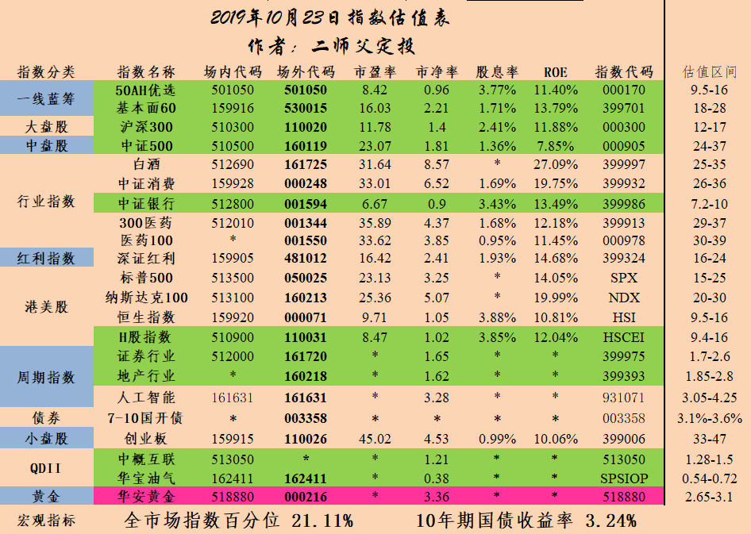

======================================================

_type: talk
@二师父[28814221155551]
2019-10-23 16:37:46 Wed  
topic_id: 241584821512581

<e type="hashtag" hid="222588812411" title="#周三算估值#" /> 今天算算平安银行的估值。有的朋友准备买这只股票，买股票主要看企业的盈利，营业收入、信誉、公司董事长的理念及风格。其次都还不错的条件下需要来看看股票的估值。估值方法有两种，绝对估值和相对估值。用排除法相对估值计算容易一些。

平安银行滚动市盈率11.4倍，预计利润增长率3.89%，PEG=2.9.PEG高于2.5的股票基本不用考虑。

大家不管做什么投资都需要有最基本的逻辑。有些朋友想通过配置风险低的平安银行，然后有市值可以进行A股打新，理念没有问题。可是忽略了一点，任何一笔钱出去都是一笔投资。你买入的时候不确定是否能赚，那么就真的没必要买了。

对于股票为了1万市值打新的话，可以选好股票，然后采用五档买入法，先买1万，剩余的资金分成5次加，每下跌10个点加仓一次。前提是这只股票亏了你这1万多没了自己不伤心。二师父能做到这样，所以可以这样做，你先问问自己能不能做到，做不到的话，就别打新股了。

至于买什么股票，以及我买了什么股票，就不公布了，避免误导大家，还是建议指数投资，低风险相对高收益。

@再出发 at 2019-10-23 16:37:46 Wed

> 那中国平安？

----------

@二师父 at 2019-10-23 16:37:46 Wed

> 这个得算一算

----------

阅读[2973]  评论[2]  赞[0] 

======================================================

_type: q&a
@花满楼[421884842841228]
2019-10-23 17:46:38 Wed  
topic_id: 118251548524182

@花满楼

>  二师父，发现最近指数比国庆之前还要高一些，但是万得全市场百分位却低一些。
>  最近大环境经济盈利增长了吗还是什么原因？

@二师父

>  不要关注指数，看估值指标，把思维换过来。
>  
>  企业盈利增长，新增股票拉低整体估值，很多原因都有可能

阅读[2480]  评论[0]  赞[0] 

======================================================

_type: q&a
@陈洲[88245122222212]
2019-10-23 17:47:22 Wed  
topic_id: 548214158124224

@陈洲

>  我定投了3个基金，50AH/沪深300/中证500，后面2个没怎么收益，今天一看场外代码和二师傅给的不一样，我是该把这2个场外代码错的卖出，再去买对的吧？还是只要带沪深300/中证500的都差不多？

@二师父

>  一般都是一样的，我记得你定投很早啊，应该有收益的，你定投的代码是啥

阅读[2653]  评论[3]  赞[0] 

======================================================

_type: q&a
@是喵喵吖～[421441114141158]
2019-10-23 17:53:36 Wed  
topic_id: 421482851815848

@是喵喵吖～

>  二师父我今天开了广发银行的股票交易（在审核中，从页面顶部链接进去的）晚上再开一个天天基金的。但是我对于这个转债打新是不是很懂 我了解的是 买新股 如果他上市了 就把它卖掉是吗。  具体的操作能简单说一下吗 谢谢呀！

@二师父

>  可转债打新无需市值，中签之前无需资金，破发率很低，大牛市基本没有破发，也是一个不错的投资渠道
>  
>  1、什么是可转债打新
>  
>  可转债打新和股票打新是一个概念，很多上市企业借助发售可转债来进行融资，你出钱从他那里购买可转债，他给你一张有价凭证，投资者既可以持有可转债获取债券利息，又可以转换成股票持股增值。
>  
>  公司通过一个低价格的利息就轻松把资金融过来了，当你购买可转债以后他还会想一系列办法让你转股，这样相当于他零成本融资。
>  
>  熊市适合购买可转债，因为有保底利息，而且可以转换成股票，牛市适合打新可转债，中签以后卖出，蓐点羊毛，一个账户大概可以赚80快左右。
>  
>  从整体可转债打新的角度看，在牛市新转债很难出现“破发”的情况，也就是打新出现亏损。但熊市也会有破发的情况
>  
>  2、具体怎么操作
>  
>  二师父这里的广发和华泰可转债打新都是免五元的。可以同时进行，增加中签率，一个人最多开三个账户，大神往往十几个账户。
>  
>  一般每天新债和新股发行时系统会自动通知，直接盲打即可，新股申购需要几十万市值，新债申购不用市值，可以信用打新，中签以后才会扣款。
>  
>  开户渠道在置顶文章。
>  
>  如果我们2019年7月2日申购（T日），打开账户找到想要申购的可转债，填入数量，顶格申购，一次最多中一签，提交申购就完成了交易。一般一个人只能够中一签，也就是1000元。等可转债上市以后会涨到1100元左右。
>  
>  然后在2019年7月4日（T+4日）打开账户看看账户有没有增加新债券，如果有的话就代表中签了。然后记得账户要有充足的资金。
>  
>  可转债上市当天一般会涨10%左右，所以上市当天卖出即可，能挣个100块左右。如果亏损了可以当作债券持有，也可以卖出，我不恋战，都是卖出的。
>  
>  3、可转债打新需要注意的问题
>  
>  首先是证券账户只能够申购一次，申购以后就不能撤单了。如果你多次申购同一可转债，后面的会视为无效操作。
>  
>  其次，对于网上信用申购却不缴纳款项的投资者将会给与惩罚。
>  
>  中签了千万得去缴款，要是在12个月内出现3次违约，未来半年内将被取消申购资格，连打新股的资格也会被取消。
>  
>  另外可交换债券带EB的不建议打新，这种价值没有可转债好。

阅读[2815]  评论[6]  赞[0] 

======================================================

_type: talk
@衣袂飘香[118248548242452]
2019-10-23 23:14:03 Wed  
topic_id: 118251511254212

<e type="hashtag" hid="481211145528" title="#指数估值#" /> @二师父你好！我根据估值表算了下，50ah正常估值的下限9.5的90%是8.55，目前的市盈率8.42比8.55还低，是否可以建立底仓呢？但我看了k线图，貌似比较高位。基本面60也一样，市盈率比正常估值下限的90%还低，是否也可以建立底仓？
 另外在今天公众号的文章里，您说沪深300也已进入低估，可以建立底仓，但是它才刚刚进入低估区啊，这时建底仓是不是不符合您说的，要在正常估值下限的90%建立底仓？

@二师父 at 2019-10-23 23:14:03 Wed

> 能否建立底仓是根据最大下跌幅度的，50ah最大下跌幅度在34%以内，基本面60最大下跌幅度40%以内，如果能接受回撤是可以的，总体上看比18年要贵20个点，不知道后面还有没有那样的机会

沪深300刚进入低估，还有50个点的回撤，可以再等等哈

----------

@圣诞结® at 2019-10-23 23:14:03 Wed

> 二师父好，中证银行现在适合建立底仓吗？

----------

@二师父 at 2019-10-23 23:14:03 Wed

> 可以，比去年最低涨了22个点了

----------

@衣袂飘香 at 2019-10-23 23:14:03 Wed

> 谢谢您。追问:您建底仓的最大下跌幅度，大概是在多少呢？我模糊的记得大概是在40%，对吗？

----------

@二师父 at 2019-10-23 23:14:03 Wed

> 我都是定投，到了市场底部追加，这个点位还不算低

----------

@衣袂飘香 at 2019-10-23 23:14:03 Wed

> 哦，那其实您是不轻易建立底仓的。所谓的市场底部，您能说的再明确些吗？我的理解应该是全A指数市盈率。像你今天在实盘公布的，根据市盈率确定是否追加定投的份数。有点穷追不舍了，望见谅，只是想弄明白。

----------

@二师父 at 2019-10-23 23:14:03 Wed

> 算是一个指标，还有投资人情绪，底部是相对的，比如去年10月份就是底部，那一段时间卖了不少，不过后面到19年又跌了，也是相对低位。等你经历一次都懂了，你估计是19年才入市

----------

@衣袂飘香 at 2019-10-23 23:14:03 Wed

> 好。谢谢您。

----------

阅读[2460]  评论[9]  赞[0] 

======================================================

_type: q&a
@再出发[15452144455582]
2019-10-24 08:11:39 Thu  
topic_id: 421482821482188

@再出发

>  二师父玩分级套利吗？年收益率如何？

@二师父

>  不做。我做的主要有基金定投，国债逆回购，股票投资，可转债打新，a股打新，港股打新

阅读[2366]  评论[4]  赞[0] 

======================================================

_type: talk
@二师父[28814221155551]
2019-10-24 10:01:30 Thu  
topic_id: 421482821252288

深圳30万年薪聘中小学老师火爆：海内外超3.5万人报考，清华北大76人入围。

工资虽然不是特别高，但是寒暑假爽啊，经济不好，大家都来了，华为一年也能30万，不过那是拿命换的

@圣诞结® at 2019-10-24 10:01:30 Thu

> 这辈子最后悔毕业没找一个有寒暑假的工作😂😂

----------

@二师父 at 2019-10-24 10:01:30 Thu

> 都怪当时太年轻

----------

@杨荧 at 2019-10-24 10:01:30 Thu

> 这年头讲究投入回报比

----------

阅读[2293]  评论[3]  赞[0] 

======================================================

_type: talk
@二师父[28814221155551]
2019-10-24 10:29:35 Thu  
topic_id: 241584818222881

<e type="hashtag" hid="825412412212" title="#可转债打新#" /> 今日两只转债，北方和索发，AA级别，可以打。创业板和股票打新需要市值，不适合普通投资者

@谢谢 at 2019-10-24 10:29:35 Thu

> 师父，我2⃣️只都打了，可索发是废单，原因：该股票不参与集合竞价

----------

@二师父 at 2019-10-24 10:29:35 Thu

> 你打的是可转债还是股票，今天创业板三只股票，深市一只。

----------

@谢谢 at 2019-10-24 10:29:35 Thu

> 可转债

----------

@二师父 at 2019-10-24 10:29:35 Thu

> 你是开市之前申购的，不参与集合竞价，现在申购可以的

----------

@谢谢 at 2019-10-24 10:29:35 Thu

> 哦，明白，谢谢师父

----------

阅读[2572]  评论[5]  赞[0] 

======================================================

_type: talk
@二师父[28814221155551]
2019-10-24 10:34:39 Thu  
topic_id: 241584818221181

<e type="hashtag" hid="881251425252" title="#鳄鱼计划#" /> 卖出银行指数一份，盈利8个点，主仓位等待牛市，副仓位波段，大家慢慢体会

@陈飞🤗 at 2019-10-24 10:34:39 Thu

> 天天基金的不卖吗

----------

@向前进 at 2019-10-24 10:34:39 Thu

> 请教，我的银行指数最近购入，2%盈利，是否可继续持有，谢谢

----------

@罗大发 at 2019-10-24 10:34:39 Thu

> 我看银行上涨，可是我不知道场外的中证银行该卖多少，想做低成本可以吗[敲打]目前三成仓，持仓收益率负0.31%

----------

@二师父 at 2019-10-24 10:34:39 Thu

> 可以等正常估值再卖，场外还是按照低估买入，正常收割的策略，场内才做T

----------

@二师父 at 2019-10-24 10:34:39 Thu

> 可以啊，目前低估，持有或者定投都没问题

----------

@二师父 at 2019-10-24 10:34:39 Thu

> 收益率是负的就别卖，卖出一定是盈利才卖出的

----------

@罗大发 at 2019-10-24 10:34:39 Thu

> 了解，谢

----------

@向前进 at 2019-10-24 10:34:39 Thu

> 明白了，谢谢

----------

阅读[2701]  评论[8]  赞[0] 

======================================================

_type: talk
@二师父[28814221155551]
2019-10-24 10:55:18 Thu  
topic_id: 841584818422222

置顶的文章就有很多有用的信息，大家学会自己关注和发掘，信息搜集也是一种重要的能力，当然同在一个星球，怎么更好的实现与二师父及其他各位朋友的链接，这也是一种能力，为什么同在一家公司每个人3到5年出现了巨大的分水岭，其实关键还是自己。

@幽幽菊花茶 at 2019-10-24 10:55:18 Thu

> 二师父，那个理财魔方你体验过没，活期比支付宝收益多一倍，可以试试吗，2万元20天还有20元福利呢

----------

@二师父 at 2019-10-24 10:55:18 Thu

> 这个安全性不错，我目前还没买过，都用来配置基金了，剩余不多在货币基金里面

----------

@会飞的猪 at 2019-10-24 10:55:18 Thu

> 在哪里看

----------

@阿真 at 2019-10-24 10:55:18 Thu

> 就是结构性存款啊，京东金融，度小满理财里面都有这种，当活期用，挺方便的，安全性没问题

----------

阅读[2404]  评论[4]  赞[0] 

+++++++++++++++++++++++++++++++++++++++++++++++++++++

图片：
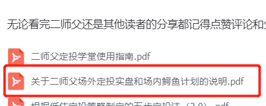

======================================================

_type: q&a
@会飞的猪[88441125125222]
2019-10-24 11:40:20 Thu  
topic_id: 421482818121128

@会飞的猪

>  鳄鱼计划在哪里能看到

@二师父

>  星球就有啊，搜索鳄鱼计划

阅读[2377]  评论[0]  赞[0] 

======================================================

_type: talk
@二师父[28814221155551]
2019-10-24 16:13:14 Thu  
topic_id: 841584814844282

<e type="hashtag" hid="481211145528" title="#指数估值#" /> 这个表是利用简易估值法判断的，根据阈值来，低于阈值低位就是低估

阅读[2452]  评论[0]  赞[0] 

+++++++++++++++++++++++++++++++++++++++++++++++++++++

图片：
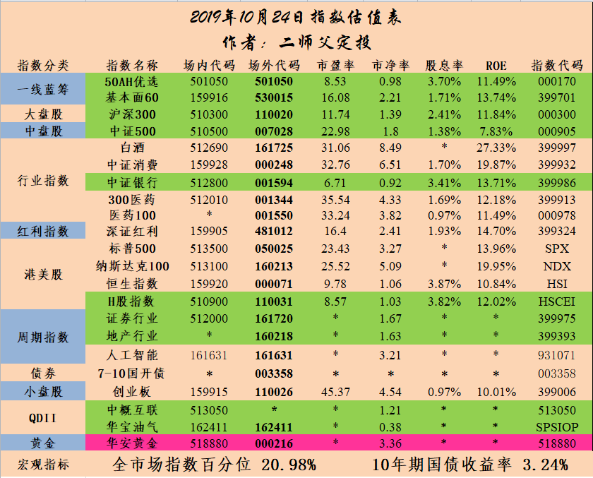

======================================================

_type: talk
@二师父[28814221155551]
2019-10-24 16:14:04 Thu  
topic_id: 841584814844452

<e type="hashtag" hid="822588158252" title="#定投指数基金过程如何加仓#" /> 加仓是怎么做的，并不是建立底仓，这需要一定的投资功底

@向前进 at 2019-10-24 16:14:04 Thu

> [抱拳]请教，最大下跌幅度是现价减去历史最低价，再除以现价，这样计算对吗？如果对的话，历史最低价从哪能查到吗

----------

@衣袂飘香 at 2019-10-24 16:14:04 Thu

> 谢谢二师父，这篇文章简直是为我量身定做的。追问:以今年您发表的网格交易记录表8月6号为例。当银行到达1.02元时，可以建立底仓，一次性买入12份。是否可以理解为，当银行触及1.02元时，它的最大下跌幅度已经在20%以内了？所以此时可以建立底仓或者一次性加仓。

----------

@二师父 at 2019-10-24 16:14:04 Thu

> 从估值来看，你这样算的话白酒就没法跌到最低价格了

----------

@二师父 at 2019-10-24 16:14:04 Thu

> 那不是，网格交易那是单独的

----------

@向前进 at 2019-10-24 16:14:04 Thu

> 没明白，请二师父指教如何计算最大跌幅，或在哪能查看到最大跌幅，谢谢

----------

@二师父 at 2019-10-24 16:14:04 Thu

> 这是估算的，估算指数估值指标的历史最大幅度来控制

----------

阅读[2704]  评论[6]  赞[0] 

+++++++++++++++++++++++++++++++++++++++++++++++++++++

文件：
2019-10-24 16:13:34 Thu
文件大小：[138617]
15455458581452-定投指数基金的过程中如何加仓.docx

======================================================

_type: q&a
@达达[841885282125142]
2019-10-24 18:32:07 Thu  
topic_id: 548214184415144

@达达

>  老师，看见您买的实盘了，您说鳄鱼计划还有一个卖的银行，没看见卖的呢？

@二师父

>  这是在场内证券账户操作的鳄鱼计划，场外是低估定投实盘

阅读[2255]  评论[11]  赞[0] 

======================================================

_type: talk
@二师父[28814221155551]
2019-10-24 19:57:22 Thu  
topic_id: 548214522881224

<e type="hashtag" hid="555211815244" title="#基金区间内加权收益率#" /> 股票基金在2013年12月31日，其净值为1亿元，2014年4月15日基金净值为9500万元；有投资者在2014年4月15日客户申购2000万元，2014年9月1日基金净值为1.4亿元；2014年9月1日，基金分红1000万元，2014年12月31日基金份额净值为1.2亿元。计算该基金的时间加权收益率

阅读[2232]  评论[0]  赞[0] 

======================================================

_type: talk
@林凤崎[421882481454488]
2019-10-24 20:21:43 Thu  
topic_id: 421482548428528

二师父，我看在你推的指数市盈率与中证指数官网中有区别，如沪深300指数，你的估值表中市盈率11多点，官网中12.89

@二师父 at 2019-10-24 20:21:43 Thu

> 不同渠道数据是有小的差异

----------

阅读[2273]  评论[1]  赞[0] 

======================================================

_type: talk
@二师父[28814221155551]
2019-10-25 08:05:11 Fri  
topic_id: 118251428822822

<e type="hashtag" hid="145458855482" title="#周五读书#" /> 指数基金投资至简第一讲。现在投资指数基金的人并没有那么多，我们相当于第一个吃螃蟹的人。

但是能否坚持，取决于自己对指数基金价值的认知，知道指数基金的优势和劣势，并明白自己为什么选择指数基金定投，只有这样才能够长期坚持并持有。

阅读[2593]  评论[0]  赞[0] 

+++++++++++++++++++++++++++++++++++++++++++++++++++++

文件：
2019-10-25 08:03:28 Fri
文件大小：[25743]
51511552125424-《指数基金投资至简》第一讲.docx

======================================================

_type: q&a
@学以致用[244415184181451]
2019-10-25 08:52:36 Fri  
topic_id: 421482545581258

@学以致用

>  二师父 想请教一下可不可以用中证100指数替代上证50和基本面60的定投啊 ，用中证800替代沪深300和中证500基金啊

@二师父

>  中证100指数由沪深300指数成份股中规模最大的100只股票组成，综合反映中国A股市场中最具市场影响力的一批超大市值公司的股票价格表现。
>  
>  相当于这个指数既有沪市的蓝筹股票，也有深圳市场的蓝筹股票，用中证100替代上证50和基本面60是没有问题的。
>  
>  中证800指数由中证500和沪深300指数成份股组成.从理论上说是可以替代的。有两个问题。大盘和中盘股票会有一个轮动效应，也就是他们并不同涨同跌，所以有的时候沪深300低估，有的时候中证500低估。
>  
>  第二收益率，目前市场上有三只中证800指数基金，有两只规模比较小。从收益率看中证800成立以来收益率303.8%。成立日期是2004年12月31日
>  
>  中证500成立以来收益率395%，成立日期是2004年12月31日
>  
>  沪深300成立以来收益率287%。成立日期是2004年12月31日
>  
>  从收益率看中证500优于中证800，优于沪深300.可以轮动投资，根据大盘和中盘指数的轮动来进行配置

阅读[2599]  评论[0]  赞[0] 

======================================================

@二师父[28814221155551]
2019-10-25 09:31:55 Fri  
topic_id: 421482584844448

>  @二师父
>  

阅读[2200]  评论[7]  赞[0] 

======================================================

_type: q&a
@Hi·DD[422111285512858]
2019-10-25 14:49:25 Fri  
topic_id: 548214511858824

@Hi·DD

>  二师父，为什么平安业绩这么好还能跌这么多

@二师父

>  业绩是不错的，短期波动很正常，市场情绪，资金流动这些因素都会影响股票的涨跌
>  
>  已经跌破5日均线，再跌一次将会破20日均线，长持不用管，短期的话要注意20日均线跌破是中期下跌趋势确立

阅读[2042]  评论[1]  赞[0] 

======================================================

_type: q&a
@夏萍[28221454818281]
2019-10-25 14:57:27 Fri  
topic_id: 118251455885212

@夏萍

>  师父为什么我打新从来没中过，配号是什么意思不是很懂。

@二师父

>  可转债10张，一签会给一个配号，这个顶格申购，好债中签率低，一般收益还可以

阅读[2055]  评论[3]  赞[0] 

======================================================

_type: talk
@二师父[28814221155551]
2019-10-25 14:59:06 Fri  
topic_id: 548214511885814

走路还在回答问题，每天想的都是投资[呲牙]

@朝阳模具 at 2019-10-25 14:59:06 Fri

> 我也是这样，一天到晚读书研究

----------

@衣袂飘香 at 2019-10-25 14:59:06 Fri

> 前面中间那个是二师父的背影吗？

----------

@二师父 at 2019-10-25 14:59:06 Fri

> 不是啊，我自己拍的

----------

@衣袂飘香 at 2019-10-25 14:59:06 Fri

> 嘻嘻

----------

@会飞的猪 at 2019-10-25 14:59:06 Fri

> 走路看手机注意安全

----------

@木子李 at 2019-10-25 14:59:06 Fri

> 为什么我就没有那么发自肺腑的喜爱，但也有财务自由的目标，更多的是用理智在进行。对数字不敏感，但却必须要学[捂脸]

----------

@梧桐 at 2019-10-25 14:59:06 Fri

> 换乘

----------

@Claire at 2019-10-25 14:59:06 Fri

> 师父做财商教育很敬业的。

----------

阅读[2100]  评论[12]  赞[0] 

+++++++++++++++++++++++++++++++++++++++++++++++++++++

图片：

======================================================

_type: talk
@二师父[28814221155551]
2019-10-25 18:42:33 Fri  
topic_id: 841584281455212

<e type="hashtag" hid="481211145528" title="#指数估值#" /> 第三季报逐步出来了，对估值数据可能会有比较大的影响

@隔窗遥望 at 2019-10-25 18:42:33 Fri

> 宏观指标在哪里可以找到

----------

@二师父 at 2019-10-25 18:42:33 Fri

> 中国经济数据网站

----------

阅读[2332]  评论[2]  赞[0] 

+++++++++++++++++++++++++++++++++++++++++++++++++++++

图片：
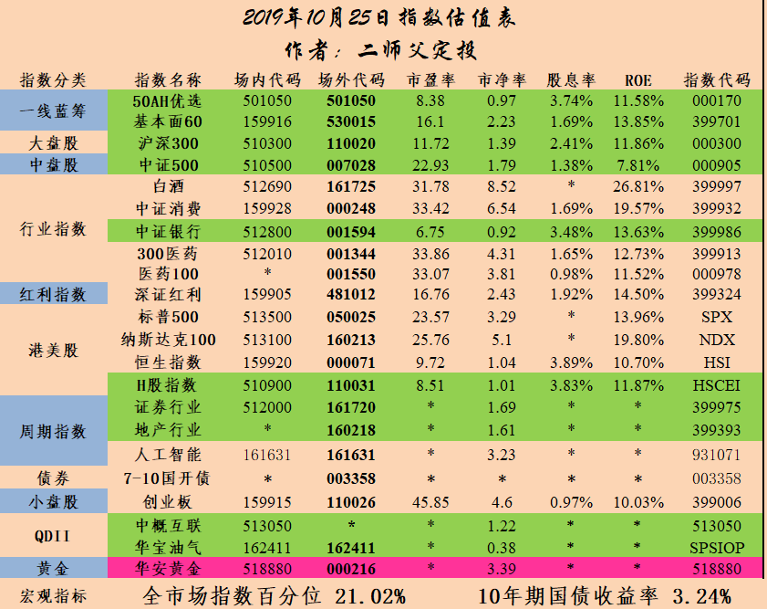

======================================================

_type: talk
@二师父[28814221155551]
2019-10-25 18:44:34 Fri  
topic_id: 118251458125242

<e type="hashtag" hid="222582855411" title="#医药指数的估值#" /> 判断指数估值的三个方法

@田星 at 2019-10-25 18:44:34 Fri

> 请教二师父，PEG估值是怎么算的呀

----------

@二师父 at 2019-10-25 18:44:34 Fri

> 市盈率除以利润增长率

----------

@向前进 at 2019-10-25 18:44:34 Fri

> 请教二师父，相对估值法中历史百分位是怎么计算的，谢谢

----------

@二师父 at 2019-10-25 18:44:34 Fri

> 把数据罗列出来，用RANK函数计算

----------

@向前进 at 2019-10-25 18:44:34 Fri

> 数据是指一段时期内每天市盈率吗

----------

阅读[2638]  评论[5]  赞[0] 

+++++++++++++++++++++++++++++++++++++++++++++++++++++

文件：
2019-10-25 18:44:34 Fri
文件大小：[19451]
48588555282118-沪深300医药指数的估值.docx

======================================================

_type: talk
@二师父[28814221155551]
2019-10-25 21:28:56 Fri  
topic_id: 241584225815811

<e type="hashtag" hid="144254515412" title="#全市场估值#" /> 各类厄姆指数：1.76，并没有超过2.

整体市场低位，但是没有极度低估，不要抄底。耐心定投就好，已经布局完毕的，就等待，耐心等待。

今天看电影有台词说的很好：路上总会有阴影，但抬头总能看见阳光。二师父补充一句，阴影总会过去，光明终将到来。

阳光就类似波动上涨，赚点文字腿肉吃吃。光明就是大牛市，让我们可以吃上山珍海味。

阅读[2573]  评论[0]  赞[0] 

+++++++++++++++++++++++++++++++++++++++++++++++++++++

图片：
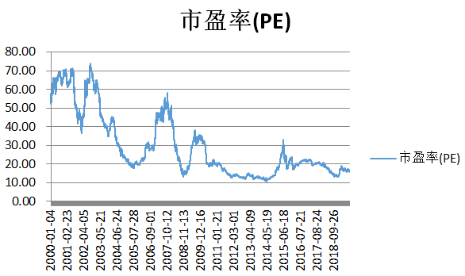

======================================================

_type: talk
@张炜紫[544458888818254]
2019-10-26 07:38:45 Sat  
topic_id: 118251141124142

中了一只科创股，科创股的卖出姿势是什么呢？

@二师父 at 2019-10-26 07:38:45 Sat

> 恭喜啊，上市有赚就卖，别长持，很多开盘涨的多的科创板最后跌了

----------

@张炜紫 at 2019-10-26 07:38:45 Sat

> 谢谢师父

----------

阅读[1900]  评论[2]  赞[0] 

+++++++++++++++++++++++++++++++++++++++++++++++++++++

图片：

======================================================

_type: talk
@树叶[544811512145144]
2019-10-26 09:24:18 Sat  
topic_id: 241584424115211

<e type="hashtag" hid="142825811122" title="#定投周报#" /> 二师父定投周报第31期

阅读[2054]  评论[0]  赞[0] 

+++++++++++++++++++++++++++++++++++++++++++++++++++++

文件：
2019-10-26 09:24:17 Sat
文件大小：[276248]
48588552412248-二师父定投周报10.25（第31期）.docx

======================================================

_type: talk
@二师父[28814221155551]
2019-10-26 10:07:42 Sat  
topic_id: 241584421512821

<e type="hashtag" hid="455485542258" title="#网格交易表#" /> 根据读者建议，以后每周都会公布一次网格交易表，帮助大家做好网格交易，这种交易适合在熊市底部震荡区域来进行小额资金的操作。可以利用市场波动来赚取一些利润。如果大家对星球和公众号以及课程有更好的建议，欢迎提出来，我们一起学习，共同进步。

网格交易用华宝证券账户可以节省交易费用，而且能够实现场内网格自动交易，二师父福利开户渠道如下：<e type="web" href="https://m.touker.com/trade/activity/common/channelOpen.htm?moduleDataId=275&channel=V2SF" title="华宝证券手机开户" cache="" />

表格说下：建立底仓是指在指数进入低估区域下跌10%左右开始，为什么这样的。本质上我们将指数下跌幅度控制在40%以内，然后加仓10次，基本上安全性就非常好。

买入是每下跌4%买入一次，实行下跌买入份额逐步增加的买入策略，这样就能够在指数更加便宜的时候积累更多份额。

卖出是一份一份卖出，每上涨4%卖出一份

因为指数的估值和价格并不是一致的，所以网格交易表也会随着市场变化有所调整，我们每周更新一次，给大家一个参考。

@风轻云淡 at 2019-10-26 10:07:42 Sat

> 这个用华泰也可以做的吧

----------

@二师父 at 2019-10-26 10:07:42 Sat

> 可以的

----------

@朝阳模具 at 2019-10-26 10:07:42 Sat

> 这个需要标的进入低估后再跌10%才开始买？

----------

@二师父 at 2019-10-26 10:07:42 Sat

> 对，如果你的网眼更大或者有更多的加仓份额，刚进入低估也可以买

----------

@朝阳模具 at 2019-10-26 10:07:42 Sat

> 好的

----------

@隔窗遥望 at 2019-10-26 10:07:42 Sat

> 有没有关于这个表格交易的详细文章，没太看明白，请指教

----------

@二师父 at 2019-10-26 10:07:42 Sat

> 可以搜索下网格交易，这是场内操作的，建议先场外

----------

@隔窗遥望 at 2019-10-26 10:07:42 Sat

> 好的，看到有自己没看过的文章，心里着急

----------

阅读[2715]  评论[8]  赞[0] 

+++++++++++++++++++++++++++++++++++++++++++++++++++++

图片：
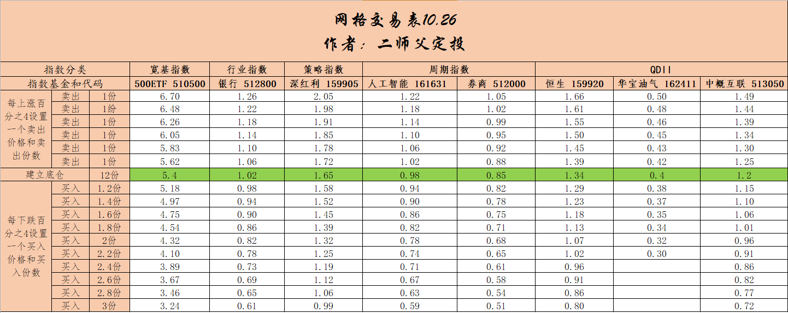

======================================================

_type: talk
@二师父[28814221155551]
2019-10-26 11:12:10 Sat  
topic_id: 841584421284142

<e type="hashtag" hid="458188281228" title="#鳄鱼计划持仓#" /> 根据读者建议公布鳄鱼计划的仓位，仅供参考，普通投资者还是建议蛋卷或者天天基金定投就行啦，差别不大的。

如果场内定投的化，华泰或者广发是不错的选择，我的基金投资用的华泰，两者开户渠道如下：华泰，<e type="web" href="https://m.zhangle.com/h5Account/mobile-h5/guide.htm?ly=HTC1-9000009132" title="华泰证券合作渠道专用平台" cache="" /> 广发，<e type="web" href="http://tos4a6pzyrexy4sg.mikecrm.com/ZYoCBGj" title="二师父证券开户" cache="" />

其实最开始我就是场内定投，因为操作很少，故而叫做鳄鱼计划。最后呢在网上分享文章，读者建议我做定投实盘，大概是18年4月份我开始在蛋卷做实盘，然后到今年6月天天出了一键跟投功能，我就赚到了天天。场外实盘仅仅作为展示，取得平均收益率没有问题的。

但是如果真想挑战更高的收益率，那就需要更加多元的配置，分析市场并选准时机买入。目前场内的持仓还是比较舒适，油气的话已经限购，加仓意义也不大，而且等到了0.38以下才是我的心理加仓价位，这次油气涨起来以后我会把油气换成原油基金，确实有点坑。

另外人工智能是一只好基金，我很早就研究并发文了，可是我的慢性子导致买少了，就买了一份，结果上涨做T还给卖飞了。这是没有做好的地方。当然，对于这种波动性大的指数，未来估计还会有机会，等待把。

还有纳斯达克，严格遵守安全边际没有低估以内加仓，错过了今年的涨幅。很多时候投资是多元化的，低估定投只是小白入门阶段，帮助普通投资者实现10到15个点的收益率差不多，真的投资做到后面，你会发现，很多时候并不能教条。

就说这么多吧，资本市场是一个待得越长越不容易亏损的市场，所以我们走慢点，如果你待10年，比如二师父去年说的，10年之后我们再见面，如果你还在这个市场，那么你肯定赚钱啊，因为无论是泰国、印度，还是中国，美国，每一个国家都是在发展进步，我们投资的企业都是不断增长的，短期可能经济不好股票会不断下跌，但是长期看，持有一只低估的优质指数10年或者持有一只优质的低估股票10年，亏损概率为0.

这也就是二师父经常说的，安全第一，只要投资的头三年能够实现10%左右的收益率，后面会实现滚雪球的发展，如果投资第一年就巨亏，50%以上，那么这辈子再翻盘的机会也许就没了。

我们走的慢一点，但是走的长一点，远一点，一样的。

@小炜 at 2019-10-26 11:12:10 Sat

> 中概互联和人工智能没选 买信息技术可以替代这两个吗

----------

@二师父 at 2019-10-26 11:12:10 Sat

> 低估的时候可以

----------

@杜志彪 at 2019-10-26 11:12:10 Sat

> 几乎满仓了

----------

@青鸟飞鱼、此生不换 at 2019-10-26 11:12:10 Sat

> etf的估值哪里查？

----------

@二师父 at 2019-10-26 11:12:10 Sat

> 指数估值表

----------

@青青竹 at 2019-10-26 11:12:10 Sat

> 我觉得自己也错过了这个基金，买了一份，还卖掉了半份😂

----------

阅读[2917]  评论[6]  赞[0] 

+++++++++++++++++++++++++++++++++++++++++++++++++++++

图片：
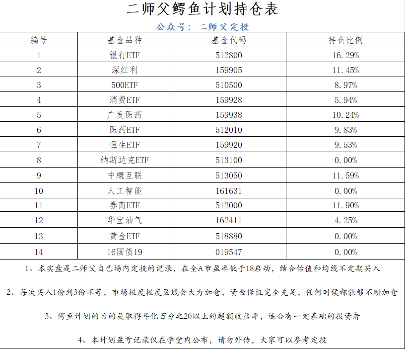

======================================================

_type: talk
@衣袂飘香[118248548242452]
2019-10-26 13:09:53 Sat  
topic_id: 118251148885252

<e type="hashtag" hid="458188281228" title="#鳄鱼计划持仓#" /> 几乎满仓了，请问，投了几年到如今仓位？

@二师父 at 2019-10-26 13:09:53 Sat

> 8.5成仓位，4年了

----------

@衣袂飘香 at 2019-10-26 13:09:53 Sat

> 收到，谢谢您。

----------

阅读[1995]  评论[2]  赞[0] 

======================================================

_type: talk
@衣袂飘香[118248548242452]
2019-10-26 14:40:02 Sat  
topic_id: 548214442118484

<e type="hashtag" hid="455485542258" title="#网格交易表#" />问题一， 前几天，二师父说过，建立底仓，是指没有持仓时，才有建底仓之说。我的问题是，目前我的仓位不重，不到4层仓，如果某只基金有符合条件的价格，是否有必要一次性加仓12份？
问题二，如您所说，网格中的价格是变动的，假如我按照这周网格的价格买入，下一周网格价格变化了，再下一周又可能变化了，那么我在第1周买入的指数，要按照哪一周的网格进行交易？
  谢谢您。

@二师父 at 2019-10-26 14:40:02 Sat

> 这个是单独分开的，拿出一部分资金再来分配做网格交易，不是所有资金来分配的

就按照第一周的，这些只是个参考，最终保证第一买的指数优质，第二再低估区域，第三，低估区域内下跌40%以内，第四，建立底仓之后能够继续加仓

----------

@衣袂飘香 at 2019-10-26 14:40:02 Sat

> 好的，我再慢慢体会。

----------

阅读[2040]  评论[2]  赞[0] 

======================================================

_type: talk
@二师父[28814221155551]
2019-10-26 16:03:02 Sat  
topic_id: 241584445241111

<e type="hashtag" hid="552445445814" title="#保险配置#" /> 家庭保障配置主要有应急账户的资金，这个再四个账户里面已经讲过，不到万不得已不动这笔资金。其次有医疗险、重疾险、定期寿险、意外险，后买你逐步分享这些保险的配置意义及思路。

这是产品链接，可以直接购买，惠择旗下平台，对标保险公司，购买之后保单会发给被保险人。<e type="web" href="https://cps.qixin18.com/m/lhz1029368/product/detail-103933-128302.html" title="https://cps.qixin18.com/m/lhz1029368/product/detai..." />

@志亮 at 2019-10-26 16:03:02 Sat

> 二师父，你推荐这个京彩一生百万医疗险，我之前患上有好几年的胃溃疡、十二指肠溃疡，但今年在当地医院再检查却是溃疡愈合了，但慢性胃炎还在，不知是否会被拒保？

----------

@二师父 at 2019-10-26 16:03:02 Sat

> 方便把病历发一下吗，是否患的是溃疡性结肠炎

----------

@志亮 at 2019-10-26 16:03:02 Sat

> 老胃病了，都差不多十年了，当地医院换了新系统，病历都找不到了，早期的胃镜检查报告单也不见了，但我可以肯定不是结肠炎

----------

@志亮 at 2019-10-26 16:03:02 Sat

> 今年即前几个月检查诊断结果是普通的慢性胃炎

----------

@二师父 at 2019-10-26 16:03:02 Sat

> 不是结肠炎没事，上面写的是结肠炎可能不行

----------

@志亮 at 2019-10-26 16:03:02 Sat

> 那就好，不知3岁小孩和60以上的老人二师父有什么好保险推荐？而且老人也做过手术住过院，都是农村户口的，目前只有农村合作医疗保险

----------

@二师父 at 2019-10-26 16:03:02 Sat

> <e type="web" href="https://cps.qixin18.com/m/lhz1029368/product/detail-103890-128224.html" title="https://cps.qixin18.com/m/lhz1029368/product/detai..." />，孩子用这款妈咪保贝比较好，保到他22岁大学毕业刚好。老人因为有住院患病记录，需要告知我患什么病，住院治疗时间以及现在的健康状况，不方便的话私聊，以面不符合健康告知影响后期理赔

----------

@志亮 at 2019-10-26 16:03:02 Sat

> 二师父，京彩一生我发现投保试算时有一项选择是是否有社保，我不知农村合作医疗算不算是社保？

----------

阅读[2649]  评论[10]  赞[0] 

+++++++++++++++++++++++++++++++++++++++++++++++++++++

文件：
2019-10-26 16:00:38 Sat
文件大小：[32774]
28288224211441-医疗险的配置意义及思路.docx

======================================================

_type: talk
@二师父[28814221155551]
2019-10-26 16:04:04 Sat  
topic_id: 841584445218552

大家也可以多分享自己的配置和投资逻辑，一起集思广益，让我们的投资知识更加丰富。多分享，你会得到更多的。提问很多时候其实在索取。

@朝阳模具 at 2019-10-26 16:04:04 Sat

> 我的稳健增长组合目前收益率大幅跑赢沪深300，不过这个组合里都是混合型基金

----------

@志亮 at 2019-10-26 16:04:04 Sat

> 就是主动型基金吧

----------

@朝阳模具 at 2019-10-26 16:04:04 Sat

> 嗯😊

----------

阅读[2147]  评论[3]  赞[0] 

======================================================

_type: talk
@林凤崎[421882481454488]
2019-10-26 18:03:05 Sat  
topic_id: 241584442452421

万得全A在哪找，之前师父讲到的根据方得全A定投资份额的文章，我找不到了，师父能再发一下吗？

@向前进 at 2019-10-26 18:03:05 Sat

> 二师父每天发布的指数估值表底部的百分位应该是，根据万得全a定份额的文章，搜 五步定投法

----------

@林凤崎 at 2019-10-26 18:03:05 Sat

> 谢谢

----------

阅读[2076]  评论[2]  赞[0] 

======================================================

_type: talk
@朝阳模具[15528112482582]
2019-10-26 18:25:14 Sat  
topic_id: 421482225282548

周末读书[呲牙][呲牙][呲牙]

@二师父 at 2019-10-26 18:25:14 Sat

> 这本书不错

----------

@梧桐 at 2019-10-26 18:25:14 Sat

> 

----------

@朝阳模具 at 2019-10-26 18:25:14 Sat

> 这本书确实很不错

----------

阅读[2127]  评论[3]  赞[0] 

+++++++++++++++++++++++++++++++++++++++++++++++++++++

图片：

======================================================

_type: talk
@二师父[28814221155551]
2019-10-26 20:27:32 Sat  
topic_id: 421482222451448

<e type="hashtag" hid="455485248218" title="#基金投顾业务试点#" /> 这将是公募基金改革的一大步，会对基金市场产生重大影响，会利好指数基金的发展

阅读[2256]  评论[0]  赞[0] 

+++++++++++++++++++++++++++++++++++++++++++++++++++++

文件：
2019-10-26 20:26:49 Sat
文件大小：[21533]
51511554458244-基金投顾业务试点工作正式开始，指数基金的春天到了.docx

======================================================

_type: talk
@二师父[28814221155551]
2019-10-27 09:02:07 Sun  
topic_id: 841584441121222

<e type="hashtag" hid="144254145122" title="#区块链#" /> 区块链是一个去中心化的数据库，利用分布式节点共识算法来生成和更新数据、利用密码学的方式保证数据传输和访问的安全、利用由自动化脚本代码组成的智能合约来编程和操作数据的一种全新的分布式基础架构与计算方式。

他也是比特币的一个概念，关于比特币这块，二师父不懂。近来高层发生要重视区块链的发展，这是一个新事物，未来发展如何不确定。就如同腾讯刚发展的时候不知道未来如何一样。

投资和创业不一样，创业是讲就创新的，而投资是保守，讲究确定性的。在这个事物还没有明确有价值之前，最好先观察，不懂不要涉猎，赚了对你影响不大，亏了你辛苦积累的本钱可能全部没了。

阅读[2482]  评论[0]  赞[0] 

======================================================

_type: talk
@林凤崎[421882481454488]
2019-10-27 17:07:13 Sun  
topic_id: 241584414515881

二师父，想问一下，中小盘现在是低估吗？有点搞不清中小盘和中小板是指一个吗？我之前定投了易方达中小盘混合

@二师父 at 2019-10-27 17:07:13 Sun

> 不低估了，这和中小板两回事的，中小板是指数，易方达中小盘混合是一只混合基金，估值正常偏高，不要被挂羊头卖狗肉的基金名称给欺骗了，投资的时候看看基金类型和持仓股票。

建议定投指数基金的哈。

----------

@林凤崎 at 2019-10-27 17:07:13 Sun

> 谢谢

----------

@朝阳模具 at 2019-10-27 17:07:13 Sun

> 易方达中小盘，实际上持仓了很多大盘股，比如茅台五粮液上海机场等，而且持仓集中度很高，一旦回调，跌幅也不会太小。

----------

@林凤崎 at 2019-10-27 17:07:13 Sun

> 好的，现在还没亏，转成别的

----------

阅读[2165]  评论[4]  赞[0] 

======================================================

_type: talk
@二师父[28814221155551]
2019-10-27 17:29:02 Sun  
topic_id: 421482212824228

<e type="hashtag" hid="144254854552" title="#百年人寿#" /> 百年人寿最近遭遇监管公司调查，主要涉及股权、保险资金违规投资的问题。大家不用担心，保险公司有银保监会监管，查的很严，而且保险公司只会合并重组，并不会破产的。

2009年，中华联合保险的公司，出现巨额亏损，无法支付理赔款。保监会接手监管，保险保障基金增资60亿，把它救了回来。

2019年，安邦保险原董事长犯罪，银保监会接手监管，保险保障基金救场。

所以之前购买了百年人寿产品的不用担心，有保障，很安全

阅读[2057]  评论[0]  赞[0] 

======================================================

_type: talk
@二师父[28814221155551]
2019-10-27 18:01:47 Sun  
topic_id: 118251181424252

<e type="hashtag" hid="144254854482" title="#重疾险的配置思路#" /> 现在每周的分享大概是这样的，周一到周五，定投和财经分享。分别在不同的号上面。

定投分享帮助大家学习具体的指数基金、股票知识，建立定投系统，如何挑选指数基金。财经分享是关注财经新闻，发现致富的机会，很多人都说财富隐藏在新闻联播里面，高层的政策以及市场导向很大程度决定了财富流向。

很多时候人变得富有并不是因为做对了什么，而是选对了什么。所以财经是从宏观分享，定投是从微观分享。

周六和周日不忙的话也是定投分享外加保险分享。差不多财商普及就是这三个方向了，一步步前进，一步步改进，一个人的发展成长是曲折前进的，一个平台或者一个星球一家公司的成长也是一步步曲折前进的。

重疾险比较重要的，配置了的朋友可以少关注一点，还没有配置的朋友多了解，给自己一定的风险意识，比如我给自己保险账户存入了现金，这笔资金不到吃不起饭绝对不动，在比如我给自己购买了重疾险，有了基本的保障之后心态就会稳定，不至于像年轻的时候那么慌。

阅读[2490]  评论[0]  赞[0] 

+++++++++++++++++++++++++++++++++++++++++++++++++++++

文件：
2019-10-27 18:01:44 Sun
文件大小：[113600]
88288248284282-重疾险的配置意义及思路.docx

======================================================

_type: q&a
@雨淡风清[844418818858882]
2019-10-27 21:24:07 Sun  
topic_id: 118251188288542

@雨淡风清

>  二师父，现在场内用的是哪个账户？天天，还是蛋卷？还是都有？还有就是能不能把鳄鱼计划还有定投提问做三个单独的版块，，可以方便的观看。

@二师父

>  蛋卷和天天属于场外账户，这两个我都开了，置顶文章有注册渠道，两个差不多，选择一个自己用的趁手的就行
>  
>  鳄鱼计划和定投提问做成三个单独的板块是啥意思，没明白啊

阅读[1909]  评论[2]  赞[0] 

======================================================

_type: talk
@二师父[28814221155551]
2019-10-27 21:38:22 Sun  
topic_id: 241584158558881

<e type="hashtag" hid="281181228851" title="#周末答疑#" /> 是先学习定投还是先实践，可以同步进行，在天天基金里面有二师父实盘可以跟，然后边投边学习总结，把学习心得发到星球，二师父以及一些热心的师兄师姐帮大家把关，提出意见

学习有一个边际递减效应，这和恋爱一样，刚开始热度高，随着两人越来越熟温度就慢慢降下来了，如果不注意时不时增进下感情的可能某一天突然就凉了

学习投资也一样，学着学着觉得自己可以了，学习认真度降了下来，突然某一天操作失误，亏损就来了。

所以，持续不断地学习是我们保持优质投资成绩必不可少的一环，学到老，活到老。

第二，鳄鱼计划到底是怎么操作的，真的没有定法，鳄鱼计划就两个关键，第一选择的指数很优质，未来增长速度快，第二，买在优质指数的最低点，这就是等待重仓的原理，至于最低点，我也是根据估值大致判断的，如果我能知道底部的话，早就超越很多人了，在市场久了，自然能够有这个判断

第三，未来的方向，消费，医药，科技，人工智能，5G，肯定跑不了这5块，学会找准机会然后积累，目前人工智能和科技积累的比较少，后面逐步加上来，需要注意，科技股涨幅好，跌幅也大

第四，多分享，哪怕说错了也不要紧，无论是投资小白还是投资大师都是从婴儿成长起来的，如果怕犯错，不敢迈出第一步，永远都没法前进

阅读[2374]  评论[0]  赞[0] 

======================================================

_type: q&a
@孙平[48548211154218]
2019-10-27 21:50:37 Sun  
topic_id: 118251825252522

@孙平

>  二师父，我今年三月开始场外长期定投，目前持仓情况如下，请大家多多指教🙏🙏🙏

@二师父

>  整体没啥问题，只要坚持把仓位加上来就可以啦，银行指数仓位最重，这个比一般的高出3倍了，还是控制下
>  
>  另外港股可以考虑下，虽然波动大，但是实现轮动配置会降低风险的

阅读[2415]  评论[7]  赞[0] 

======================================================

_type: talk
@二师父[28814221155551]
2019-10-27 22:33:22 Sun  
topic_id: 548214821141584

支付宝里面比较高的固定存款品种

@朝阳模具 at 2019-10-27 22:33:22 Sun

> 固收我买创新银行存款，活期3.9[微笑]

----------

@凯 at 2019-10-27 22:33:22 Sun

> 我买了，现在有活动买定期还送了我5000黄金票（价值5元）

----------

@烟九•二手车 at 2019-10-27 22:33:22 Sun

> 创新银行？

----------

@心韵 at 2019-10-27 22:33:22 Sun

> 持有中

----------

@Gingo at 2019-10-27 22:33:22 Sun

> 京东金融app里面有很多创新型银行存款 你可以下载看看

----------

@烟九•二手车 at 2019-10-27 22:33:22 Sun

> 这个安全性怎么样？

----------

阅读[2011]  评论[6]  赞[0] 

+++++++++++++++++++++++++++++++++++++++++++++++++++++

图片：

======================================================

_type: q&a
@素兮[548121415528244]
2019-10-27 22:35:30 Sun  
topic_id: 841584158852442

@素兮

>  华夏收益债券001061投资的是海外债券么？基金名称里没有海外两个字，不太确定

@二师父

>  是海外收益债，可以等美元汇率降下来，美国10年国债收益率涨起来再投

阅读[2197]  评论[0]  赞[0] 

======================================================

_type: q&a
@孤芳自赏[548114442211184]
2019-10-27 22:35:53 Sun  
topic_id: 421482148882558

@孤芳自赏

>  如何查更多的指数估值

@二师父

>  查阅往期估值表或者理杏仁网站

阅读[2233]  评论[0]  赞[0] 

======================================================

_type: talk
@二师父[28814221155551]
2019-10-27 22:43:20 Sun  
topic_id: 421482148582588

<e type="hashtag" hid="825412412212" title="#可转债打新#" /> 明日发行浦发转债，天路转债，这两个必打。石英转债可打可不打。

行情不好，几千块褥羊毛也可以的

@Siller at 2019-10-27 22:43:20 Sun

> 已打[呲牙]

----------

@罗大发 at 2019-10-27 22:43:20 Sun

> 哦豁，忘记了🙋

----------

@What if at 2019-10-27 22:43:20 Sun

> 浦发中了3签。中了几次签，都破了[发呆]

----------

@二师父 at 2019-10-27 22:43:20 Sun

> 这么惨

----------

阅读[2743]  评论[4]  赞[0] 

======================================================

_type: q&a
@朝阳模具[15528112482582]
2019-10-27 23:02:34 Sun  
topic_id: 421482148554158

@朝阳模具

>  二师父，由于我在投资指数基金的同时也投资个股，最近个股的三季报都差不多出完了，持有的个股可以清楚的看到前三季度归母净利润同比增长了XX%，但是我们投资的指数基金有没有这样的数据？比如我们定投的50AH和基本面60前三季度归母净利润同比各增长了多少？这个数据能查询到么？

@二师父

>  归属母公司扣非净利润增长率是衡量股票盈利的关键指标
>  
>  指数里面的可以自己用股票的权重对应相应的归母扣非净利润增长率计算出来，查阅渠道我还没找到，星球其他朋友有没有找到过

阅读[2377]  评论[1]  赞[0] 

======================================================

_type: talk
@凯[244415182418811]
2019-10-28 07:36:53 Mon  
topic_id: 241584152242581

中了1签

@三峡情 at 2019-10-28 07:36:53 Mon

> 我也中了！

----------

@三峡情 at 2019-10-28 07:36:53 Mon

> 不知道大概几天上市？应该会通知的吧

----------

@林荫 at 2019-10-28 07:36:53 Mon

> 差不多2周上市

----------

@三峡情 at 2019-10-28 07:36:53 Mon

> 好的谢谢

----------

阅读[2265]  评论[4]  赞[0] 

+++++++++++++++++++++++++++++++++++++++++++++++++++++

图片：

======================================================

_type: talk
@二师父[28814221155551]
2019-10-28 08:10:05 Mon  
topic_id: 841584152458242

<e type="hashtag" hid="454841141288" title="#均线偏离表#" /> 本周利用估值表的指数做了回测，四个指数做均线偏离交易收益率会很不错。简单讲：低估定投主要赚企业盈利的钱，均线定投赚市场波动的钱。

以后我的华泰和天天基金实盘都放弃波段，当然利润收割和高估止盈还是必要的，耐心持有，享受企业盈利增长。另外单独开一个账户做波段，不管市场是哪种，我的鸡蛋不在一个篮子里面，都有的赚。

提醒，这种策略不适合繁忙的工薪阶层，不适合投资新手，学堂里面几个活跃的朋友已经可以脱离二师父自己做策略和定投了，是非常棒的，如果有兴趣，你可以用智投星回测数据，这种策略的收益比低估定投要高，唯一的风险在于波动异常大。

@二师父 at 2019-10-28 08:10:05 Mon

> 偏离度是1，写错了，根据偏移百分比确定的

----------

@素兮 at 2019-10-28 08:10:05 Mon

> 均线偏离策略可以在指数低估时用么？还是要等指数正常估值了再使用？

----------

@二师父 at 2019-10-28 08:10:05 Mon

> 可以的，在低估使用更加安全的

----------

阅读[2912]  评论[5]  赞[0] 

+++++++++++++++++++++++++++++++++++++++++++++++++++++

图片：

======================================================

_type: talk
@二师父[28814221155551]
2019-10-28 08:18:36 Mon  
topic_id: 841584152454182

<e type="hashtag" hid="825858222822" title="#本周市场分析#" /> 本周市场不温不火，还是横盘。涨幅好的是鸡肉概念、猪肉概念以及农牧渔等等。环保、医药、医疗、中药领跌。

基金持仓中食品饮料、农林牧渔、非银金融的比例降低，科技股增多。第三季度季报出来白酒的利润有所下降，这个需要警惕，中证白酒继续观望，可以等待高估时机逐步卖出。

本周要发行一只新基金易方达中证红利，易方达基金公司的指数基金费率都非常低，后面我们投资中证红利可以考虑这只基金。

阅读[2994]  评论[0]  赞[0] 

======================================================

_type: talk
@二师父[28814221155551]
2019-10-28 11:45:59 Mon  
topic_id: 548214812555484

人工智能又拉升了，区块链带动的上涨，只能等待机会。

@凯 at 2019-10-28 11:45:59 Mon

> 能现在参与吗

----------

@志亮 at 2019-10-28 11:45:59 Mon

> 等这么久、白酒终于涨了[微笑]

----------

@二师父 at 2019-10-28 11:45:59 Mon

> 不适合，可以做均线定投

----------

@二师父 at 2019-10-28 11:45:59 Mon

> 哈哈，涨了不少吧

----------

@二师父 at 2019-10-28 11:45:59 Mon

> 人工智能还可以，白酒有点高了

----------

阅读[2312]  评论[7]  赞[0] 

======================================================

_type: talk
@朝阳模具[15528112482582]
2019-10-28 11:49:26 Mon  
topic_id: 118251852448482

个人精选行业ETF
个人目前持有科技，券商，恒生。
准备低吸军工龙头ETF，做趋势。
欢迎大家点评

@二师父 at 2019-10-28 11:49:26 Mon

> 科技不错，我在观察研究

----------

@烟九•二手车 at 2019-10-28 11:49:26 Mon

> 二师父，科技一直想入手，但没看懂，不敢入。目前主持银行和恒生指数，50AH，中证500。

----------

@二师父 at 2019-10-28 11:49:26 Mon

> 可以，目前科技的位置不低，均线策略也不符合

----------

阅读[2329]  评论[3]  赞[0] 

+++++++++++++++++++++++++++++++++++++++++++++++++++++

图片：
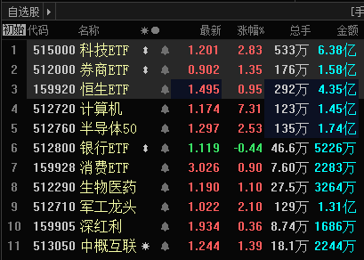
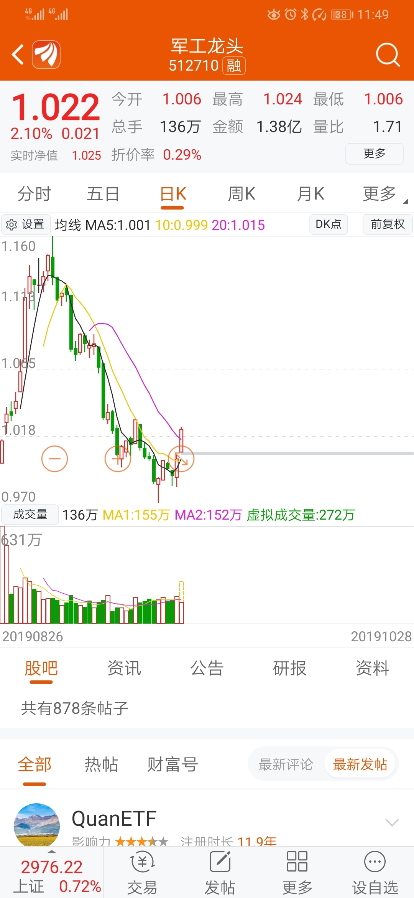

======================================================

_type: talk
@隔窗遥望[241884481854181]
2019-10-28 11:49:45 Mon  
topic_id: 421482184551248

刚加入学堂开始学习，所以想请师父和各位同学对我当前持有的基金做一下点评，请大家不吝赐教。
富国天惠成长混合 持仓19000
富国沪深300指数增强  持仓2000
易方达创业板ETF联接  持仓1000
融通创业板指数增强AB持仓15000
以前炒股买基金都是道听途说，亏了不少。后来意识到自己没有任何理论知识和实践经验的积累根本就不能在投资市场生存，所以认清了现实开始调整思路，专业的事让专业的人去做，开始定投基金。一开始是在网上看到评论基金的文章，富国天惠混合成长的基金经理，打理这支基金十几年收益一直不错，因为这个原因，所以我最早定投了这只基金。后来又看到一篇关于基金定投的文章，说基金定投，应该投指数基金，创业板指数基金波动大，收益也高，所以选择了融通创业板指数增强AB。最近正在看聪明的投资者这本书，书中也是表达了投资指数基金是最稳妥的投资方法，所以更加开始关注指数基金，碰巧在网上看到了师傅的一篇文章。机缘巧合地关注了师傅的公众号，非常认同师傅的投资理念和投资方法，因此，加入了新球学堂。目前为止只是学习了不到一个星期时间，根据目前学习的一些体会，我对持仓的基金做了一些调整。停止了富国天惠成长混合的申购，出于降低成本的考虑，将融通创业板指数增强AB这只基金换成了易方达创业板ETF连接a，因为易方达这只基金申购费率比较低。增加了富国沪深300指数增强。因为现在学习的还不深入，所以，对目前持有的这些些基金，不知道后期该怎么操作。我打算利用天天基金的一键跟投先跟上师傅的操作。目前，我所持有的这些基金都已经停止了申购。
以上是我的投资历程的简单总结和我目前的一些操作，请师傅抽时间给予点评。

@二师父 at 2019-10-28 11:49:45 Mon

> 学习很认真，你把置顶我的实盘和鳄鱼计划区别这篇文章看看，初次投资以优秀盈利稳定的宽基为主

----------

@隔窗遥望 at 2019-10-28 11:49:45 Mon

> 好的

----------

@隔窗遥望 at 2019-10-28 11:49:45 Mon

> 我是一键跟投还是选择定投实盘里的一两支宽基指数更好

----------

@二师父 at 2019-10-28 11:49:45 Mon

> 都可以，没学明白之前跟投，学会了就自己选

----------

@隔窗遥望 at 2019-10-28 11:49:45 Mon

> 好的，谢谢

----------

阅读[3041]  评论[5]  赞[0] 

======================================================

_type: talk
@张炜紫[544458888818254]
2019-10-28 14:48:36 Mon  
topic_id: 841584188288212

师父，患高血压的中年人还能买什么样的保险？

@Sunflower at 2019-10-28 14:48:36 Mon

> 如果你想买能保高血压的不容易，但是如果想买保险你看二师父推荐的然后买的时候会填写调查问卷，买了之后高血压不会保，但是之后出现的其他问题保险公司会保

----------

@Sunflower at 2019-10-28 14:48:36 Mon

> 具体的还得看看现在出的保险产品

----------

@会飞的猪 at 2019-10-28 14:48:36 Mon

> 高血压可以吃点红曲

----------

@二师父 at 2019-10-28 14:48:36 Mon

> 高血压可以分为三级：1级轻度高血压、2级中度高血压、3级重度高血压。首先需要确定患的是哪种级别的。

意外险肯定没问题，如果医疗或者重疾就需要根据患病住院情况来看具体的健康告知了。

----------

@特仑苏 at 2019-10-28 14:48:36 Mon

> 二师父，我爸51岁，我妈50岁。身体现在没问题，通宵做生意的。想买重疾险，性价比高一点的，那种比较好。

----------

@二师父 at 2019-10-28 14:48:36 Mon

> 瑞泰瑞盈

----------

@特仑苏 at 2019-10-28 14:48:36 Mon

> 那里面怎么没有福建省[撇嘴]

----------

阅读[2353]  评论[10]  赞[0] 

======================================================

_type: talk
@姥姥不疼. 爷爷不爱[48544481458248]
2019-10-28 17:12:27 Mon  
topic_id: 421482185451288

二师父，今天估值表好了么

@二师父 at 2019-10-28 17:12:27 Mon

> 好了，现在发

----------

@姥姥不疼. 爷爷不爱 at 2019-10-28 17:12:27 Mon

> 谢谢您，辛苦了

----------

阅读[2309]  评论[2]  赞[0] 

======================================================

_type: talk
@二师父[28814221155551]
2019-10-28 17:31:33 Mon  
topic_id: 548214815152124

<e type="hashtag" hid="481211145528" title="#指数估值#" /> 今日估值表，券商进入正常估值，按照低估定投策略就需要停止。

按照均线策略可以继续，关于均线策略大家搜索往期的文章，有详细解答，不再赘述，刚进来的朋友需要补课啦。

计划最近研究下科技ETF，把这个加入学堂估值表。另外均线策略加上人工智能和科技ETF，都是高波动品种，适合均线策略，我们需要明白不同的策略赚的是不同的利润。明白为什么赚比赚钱更重要的。

@阿真 at 2019-10-28 17:31:33 Mon

> 二师傅，刚看了公众号的文章，上面有提到港股打新的策略和系统，这个在知识星球上没看到呢

----------

@二师父 at 2019-10-28 17:31:33 Mon

> 搜索港股打新有的

----------

阅读[3230]  评论[2]  赞[1] 

+++++++++++++++++++++++++++++++++++++++++++++++++++++

图片：
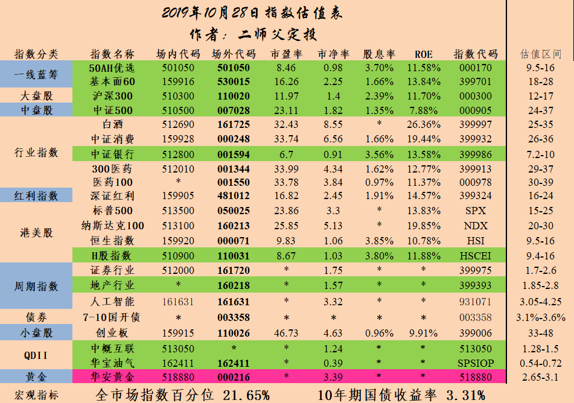

======================================================

_type: q&a
@会飞的猪[88441125125222]
2019-10-28 17:48:50 Mon  
topic_id: 118251854242482

@会飞的猪

>  什么是区块链

@二师父

>  区块链，他本质上是一套信用体系，比特币只是区块链的一个产物，未来主要是诞生属于央行自己的数字货币。
>  
>  比如一个人贷款信用体系只能够银行看到，但是如果区块链体系的话就会将这个信息公之于众，相当于大家都知道了你的信用，这样在交易的时候我们知道这个人信用良好，那么很快就可以交易；如果一个人信用不好的话，那么就可以避而远之。
>  
>  采用这种信用体系，以后能够减少交易环节对账户的依赖，可以提高交易效率同时能够有利于人民币的国家化。

阅读[2540]  评论[0]  赞[0] 

======================================================

_type: talk
@林凤崎[421882481454488]
2019-10-28 20:42:44 Mon  
topic_id: 548214818454424

二师父，5G概念如何？我之前一直想投5G，但觉得已被炒的过高了，最近新发008087觉得如何

@二师父 at 2019-10-28 20:42:44 Mon

> 看好这个行业，不过仍需要观察，新基金

----------

@林凤崎 at 2019-10-28 20:42:44 Mon

> 是的，之前一直找关于5G的，这次出了

----------

阅读[2374]  评论[2]  赞[0] 

======================================================

_type: talk
@二师父[28814221155551]
2019-10-28 23:06:08 Mon  
topic_id: 548214852455254

<e type="hashtag" hid="458585422518" title="#周二估值讲堂#" /> 关于5G和科技etf的估值，目前5G板块刚出来，还在积累数据研究中

科技etf当前市盈率41倍，比a股的大部分指数都要高，而且自己本身处于高位，从指数价格和市盈率来判断，目前没有低估

当然这个指数盈利好，高估区域也没有到达，后面会把这个指数加入估值表，考虑用他来做均线策略，低估定投也可以

至于5G和科技选择一个就行，后面好的行业指数还是消费，医药，养老，科技，5G和人工智能，这这些指数有的波动大，配置的话控制仓位

阅读[3006]  评论[0]  赞[0] 

======================================================

_type: talk
@海盗[48248118584848]
2019-10-28 23:23:38 Mon  
topic_id: 548214852481554

<e type="hashtag" hid="225118152481" title="#指数基金均线偏离表#" />

@海盗 at 2019-10-28 23:23:38 Mon

> 偏离度变化不大，股市处于震荡区间

----------

@丸子妈 at 2019-10-28 23:23:38 Mon

> 这个偏离表，是怎么来的？

----------

@海盗 at 2019-10-28 23:23:38 Mon

> 以前都讲过的呀，你可以搜索一下

----------

阅读[2367]  评论[3]  赞[0] 

+++++++++++++++++++++++++++++++++++++++++++++++++++++

图片：
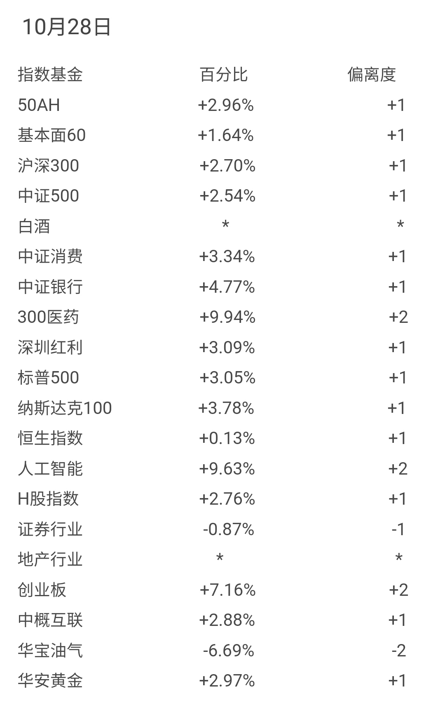

======================================================

_type: talk
@二师父[28814221155551]
2019-10-29 06:19:11 Tue  
topic_id: 841584128281152

一个人没有明确的目标，就像船没有罗盘一样，不知前进的方向，缺乏明确目标的人一生将庸庸碌碌，坚定的目标是成功的首要基础，没有目标的人，终生都会给有目标的人打工，从现在开始，找出你一生中最希望得到的东西，便立刻着手去得到它，借着帮助他人得到同样好处的方法，去追求你的目标。

@妖孽 at 2019-10-29 06:19:11 Tue

> 失眠了呀！这么早发文

----------

@二师父 at 2019-10-29 06:19:11 Tue

> 起来了，兄弟[呲牙]，我回国了

----------

阅读[2302]  评论[2]  赞[0] 

+++++++++++++++++++++++++++++++++++++++++++++++++++++

图片：

======================================================

_type: talk
@进等花开[118525141245142]
2019-10-29 10:19:25 Tue  
topic_id: 841584121518512

<e type="hashtag" hid="481211145528" title="#指数估值#" /> 二师父，在以前文章中您说过，除非发生极端情况，比如上证综合指数市盈率低于10倍，那么可考虑日定投，请问现在上证的市盈率是多少呀？

@二师父 at 2019-10-29 10:19:25 Tue

> 13

----------

@啊哦呃伊唔คิดถ* at 2019-10-29 10:19:25 Tue

> 二师父，13是什么指数的市盈率

----------

@二师父 at 2019-10-29 10:19:25 Tue

> 上证综合指数的

----------

阅读[2263]  评论[3]  赞[0] 

======================================================

_type: q&a
@聪明的笨蛋[544858411212244]
2019-10-29 14:05:25 Tue  
topic_id: 841584145514552

@聪明的笨蛋

>  二师父请问华泰和广发哪个可以网上开通创业板权限

@二师父

>  这个只能柜台开，风险比较大，还需要录音视频

阅读[2259]  评论[0]  赞[0] 

======================================================

_type: talk
@二师父[28814221155551]
2019-10-29 16:28:11 Tue  
topic_id: 841584142412442

<e type="hashtag" hid="822525525522" title="#10.29估值表#" /> 券商又低估了，这种产品就适合做波段的，下周开始我们选择6只波动大盈利好的指数做均线。另外估值表新增了一只科技etf，大家有觉得好的指数可以发出来我们一起研究

@朝阳模具 at 2019-10-29 16:28:11 Tue

> 好，期待做均线，学习下

----------

@二师父 at 2019-10-29 16:28:11 Tue

> 要设定好定投的条件

----------

@jier at 2019-10-29 16:28:11 Tue

> 同问网格和均线的差异

----------

@二师父 at 2019-10-29 16:28:11 Tue

> 切换下时间段，16年6月到17年12月试试。不同时间段也不同的哈。

----------

阅读[2809]  评论[10]  赞[0] 

+++++++++++++++++++++++++++++++++++++++++++++++++++++

图片：

======================================================

_type: q&a
@素兮[548121415528244]
2019-10-29 17:34:28 Tue  
topic_id: 841584144581412

@素兮

>  二师父，重疾险买定期还是终身比较好？曾经在一篇文章中看到，说重疾险选择定期，剩下的钱用于指数基金投资的话比选择终身要利用率高。二师父买重疾险选择的是什么？

@二师父

>  是的，我做过对比，买终身的话没有必要的，你想想50万保额等你70了基本就不值啥钱了，重疾终身比70年的费用贵不少
>  
>  每年剩下3000元，定投30年，你计算10个点的年化复合收益率都会带来几十万的现金流了
>  
>  我自己也买的到70岁的，有购买保险需求的朋友可以加我微信ershifudt

阅读[2235]  评论[0]  赞[0] 

======================================================

_type: talk
@二师父[28814221155551]
2019-10-29 17:42:58 Tue  
topic_id: 841584144548512

<e type="hashtag" hid="551848485114" title="#周三基金分析#" /> 中证科技龙头指数由沪深两市中电子、计算机、通信、生物科技等科技领域中规模大、市占率高、成长能力强、研发投入高的50只龙头公司股票组成，以反映沪深两市科技领域内龙头公司股票的整体表现，为指数化产品提供新的标的。

电子行业的细分行业有计算机和通信，我们分别看看这两个行业。

计算机行业的话有一个指数中证计算机指数，涉及信息技术服务、应用软件、系统软件、电脑硬件等企业，他以2004 年 12 月 31 日为基日，以 1000 点为基点。经过15年的发展，现在指数点位是7814，相当于14%的年化复合收益率，非常不错的。通信行业也是。当然这是过去通信和计算机行业蓬勃发展的时候。未来华为等企业也和通信、5G等行业关联度大，发展也会很好。

生物科技、生物医药更不用说了，这是热门行业，未来的医药行业尤其是生物医药会大力发展，中国的养老健康需求比以往任何时候都迫切。

需要普及下的是市占率，这是指市场占有率，市占率高说明企业的市场占有份额大，从选股标准是四个非常好的基本面指标。所以值得考虑

唯一一点需要注意目前这个指数的市盈率比较高了，相对不便宜，我们等等。

就17年的时候我记得非常清楚，有个朋友天天追问我白酒能否加仓，我说等等，结果等来了18年得机会。再等等吧，安全第一。当然做均线定投可以，只要可以不断加仓，忍受住浮亏。

@朝阳模具 at 2019-10-29 17:42:58 Tue

> 详细解读均线定投的文章在哪？

----------

@二师父 at 2019-10-29 17:42:58 Tue

> 搜索均线策略或者再课程里面均线策略

----------

阅读[2934]  评论[2]  赞[0] 

======================================================

_type: talk
@二师父[28814221155551]
2019-10-29 17:45:09 Tue  
topic_id: 548214844241414

网格和均线得差异我记得才课程和文章中都讲过了，网格交易是固定得波段操作，均线策略是移动得波段操作，相当于升级得网格，网格交易更加保守，均线交易更加激进。

建议大家逐字逐句得阅读我的文章，听我的课程，大部分提问再文章里面都反复讲过了。

@素兮 at 2019-10-29 17:45:09 Tue

> 网格交易必须在低估时候进行，均线策略可以在低估时候，也可以在正常估值时运用对么？

----------

@速。冻 at 2019-10-29 17:45:09 Tue

> 看来二师父还是要重写篇文章介绍一下

----------

@二师父 at 2019-10-29 17:45:09 Tue

> 可以，就是回撤比较大

----------

@二师父 at 2019-10-29 17:45:09 Tue

> 以前有啊

----------

@衣袂飘香 at 2019-10-29 17:45:09 Tue

> 请叫二师父，把鳄鱼计划和你准备要进行的均线交易，放在同一个账户，有什么不妥吗？

----------

@衣袂飘香 at 2019-10-29 17:45:09 Tue

> 请教@二师父

----------

@二师父 at 2019-10-29 17:45:09 Tue

> 都可以，我是便于跟踪收益率

----------

阅读[2330]  评论[7]  赞[0] 

======================================================

_type: q&a
@是喵喵吖～[421441114141158]
2019-10-29 22:32:26 Tue  
topic_id: 241584141588451

@是喵喵吖～

>  二师父请问是在这里进行新股申购吗 等到有新股的时候这里就会显示？

@二师父

>  对，但是新股申购有市值要求，沪市或者深市20天市值1万以上

阅读[2180]  评论[2]  赞[0] 

======================================================

_type: q&a
@好运玲玲[244188585541521]
2019-10-29 22:41:34 Tue  
topic_id: 841584141584512

@好运玲玲

>  二师父您好！有个问题请您指点，我在蛋卷基金定投的医药100在正常估值盈利19.71%的时候我收割了一次利润，之后进入低估我又定投几次，现在医药100是正常估值，持有收益率是15.32%，请问再次收割利润是怎么计算？是等到19.71%后再上涨10%一20%收割利润吗？还有我在场内华泰也定投了，收割了利润后成本和均价不一样，再次收割怎么计算？比如说银行，我买的比例多了点，在盈利8.33%的时候我收割5948元的利润，现在总亏盈4.41%，盈利3866，下次收割怎么计算？

@二师父

>  这个收益率别看华泰的，自己计算，用（市价-买入均价）/买入均价。就得到实际的收益率。根据每次上涨10%收割就行了。
>  
>  如果指数从正常进入低估，又投了，那么当进入正常估值的时候还是10%的收益率收割。
>  
>  
>  收割是为了防止回撤，通常适合大的波动行情。如果牛市到来一直收割仓位变轻了，或者来了一笔意外收入，仓位变轻了，也可以不收割的

阅读[2252]  评论[0]  赞[0] 

======================================================

_type: q&a
@谢谢[844415851424452]
2019-10-29 22:42:29 Tue  
topic_id: 241584141258881

@谢谢

>  浦发发债，中签率这么高还多，会不会破发呀，有人说溢价高，易破发。

@二师父

>  有可能的，并不是可转债首日一定涨

阅读[2326]  评论[0]  赞[0] 

======================================================

_type: q&a
@孙平[48548211154218]
2019-10-29 22:43:16 Tue  
topic_id: 841584141425142

@孙平

>  二师父，浦发转债中签3000，请问上市当天直接卖出还是等？

@二师父

>  首日卖的，没必要一直等，盈利就卖，赚了就跑。
>  
>  亏了也卖，再做点别的投资

阅读[2407]  评论[0]  赞[0] 

======================================================

_type: talk
@光少[244124552511141]
2019-10-29 22:59:20 Tue  
topic_id: 421482121151418

第一次中签

@二师父 at 2019-10-29 22:59:20 Tue

> 好像没有不中的

----------

@光少 at 2019-10-29 22:59:20 Tue

> 多人中那不是会亏钱💰

----------

@二师父 at 2019-10-29 22:59:20 Tue

> 无法知晓

----------

阅读[2349]  评论[3]  赞[0] 

+++++++++++++++++++++++++++++++++++++++++++++++++++++

图片：
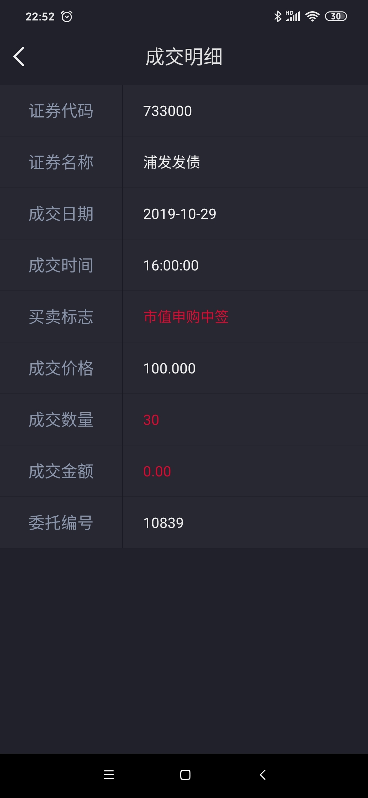

======================================================

_type: q&a
@J[28281541518551]
2019-10-30 08:40:34 Wed  
topic_id: 841584112285882

@J

>  师父，现在适合分批买入或定投可转债基金吗？

@二师父

>  易方达安心回报债，兴全转债这些，和股票走势正相关，可以定投

阅读[2235]  评论[1]  赞[0] 

======================================================

_type: q&a
@雪莲[421485848588118]
2019-10-30 08:42:58 Wed  
topic_id: 841584112221452

@雪莲

>  二师父你好，中签之后，最迟多久缴费？如何缴费？因为第一次买可转债啥也不懂，谢谢！

@二师父

>  你把资金存入账户，他会自动扣款的

阅读[2432]  评论[5]  赞[0] 

======================================================

_type: talk
@二师父[28814221155551]
2019-10-30 10:17:52 Wed  
topic_id: 841584114225422

<e type="hashtag" hid="825412412212" title="#可转债打新#" /> 新进来的朋友不知道可转债打新是什么，可以看看这篇文章。是非常简单低门槛的一种投资方式。可转债打新破发率很小，但也有可能的，后面我们进行的港股打新破发率比较大，如果连可转债打新的破发率都接受不了的话，那么不建议港股打新了。投资一方面赚知识，另外一方面提升认知。

总体说赚钱定投指数基金收益率最好，但是想要在金融圈玩得越来越开心不断地拓展投资边际是必要的。

@J at 2019-10-30 10:17:52 Wed

> 师父，如果首日破发是不是也最好卖出？亏损率是否10%？

----------

@二师父 at 2019-10-30 10:17:52 Wed

> 对的，这个看具体情况，破发率比较小，就是这只中签率高大家担心

----------

@J at 2019-10-30 10:17:52 Wed

> 对啊，目测所有申购了的都中，还以为是自己运气好，原来人人都能分猪肉[偷笑]

----------

@姣🍎 at 2019-10-30 10:17:52 Wed

> 谢谢师父如此勤奋，问一个问题，就出一篇科普文！

----------

阅读[2477]  评论[4]  赞[0] 

+++++++++++++++++++++++++++++++++++++++++++++++++++++

文件：
2019-10-30 10:17:47 Wed
文件大小：[206858]
51511585124824-一篇文章讲清楚可转债打新.docx

======================================================

_type: talk
@二师父[28814221155551]
2019-10-30 12:35:59 Wed  
topic_id: 241584111822111

<e type="hashtag" hid="822525815422" title="#股票拆分#" /> 股价较高的公司通过股票拆分或发放股票股利的方式降低股价，可以提高股份流动性，增加股东数量并提高被收购的难度。

阅读[2297]  评论[0]  赞[0] 

======================================================

_type: talk
@二师父[28814221155551]
2019-10-30 16:40:51 Wed  
topic_id: 841581552588552

<e type="hashtag" hid="481211145528" title="#指数估值#" /> 目前大盘震荡，这种行情也不错，低估定投，正常收割利润，如果资金量大，也能赚不少。

从下周开始我们也计划来进行均线交易。这个可以和鳄鱼计划放在一个账户里面，二师父为了便于跟踪收益率就分开了。

阅读[2856]  评论[0]  赞[0] 

+++++++++++++++++++++++++++++++++++++++++++++++++++++

图片：
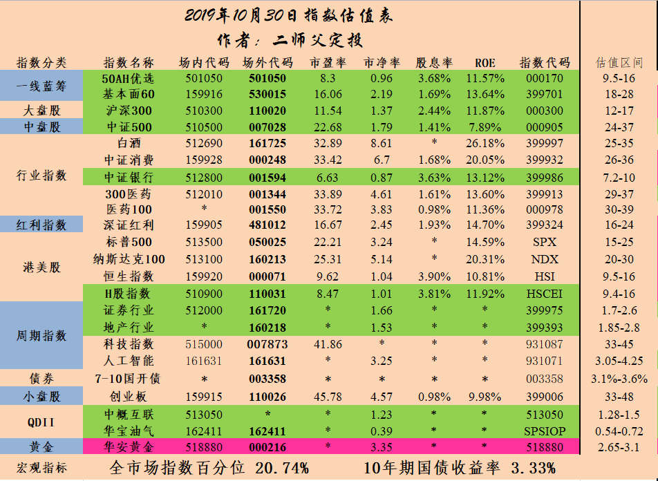

======================================================

_type: talk
@二师父[28814221155551]
2019-10-30 16:46:48 Wed  
topic_id: 421481445414818

<e type="hashtag" hid="455454551428" title="#关于可转债中签率提醒#" /> 今天有个问题回答的有点问题，可转债打新不能通过同一账号主体的多个账户提高中签概率的。

因为系统是识别个人身份的，不管在同一账户申购，还是在不同账户申购，只要是同一个人的，系统只默认第一次申购为有效申购，其余均为无效申购。

@Hi·DD at 2019-10-30 16:46:48 Wed

> 之前我就跑去跟海通客服确认，我觉得我可能遇到了个假客服，她跟我说可以

----------

@二师父 at 2019-10-30 16:46:48 Wed

> 有可能她也不清楚，还有一种可能他人即地狱

----------

阅读[2173]  评论[2]  赞[0] 

+++++++++++++++++++++++++++++++++++++++++++++++++++++

图片：
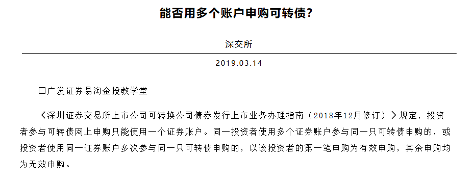

======================================================

_type: talk
@姥姥不疼. 爷爷不爱[48544481458248]
2019-10-30 16:59:02 Wed  
topic_id: 421481445844118

二师父，分享下明天（周四）的定投实盘，谢了。

@二师父 at 2019-10-30 16:59:02 Wed

> 明天上午发，看看市场

----------

@姥姥不疼. 爷爷不爱 at 2019-10-30 16:59:02 Wed

> 好的

----------

阅读[2166]  评论[2]  赞[0] 

======================================================

_type: talk
@二师父[28814221155551]
2019-10-30 17:00:55 Wed  
topic_id: 421481445848548

<e type="hashtag" hid="555252558114" title="#上证50指数和中证100指数对比分析#" /> 今天二师父对比了下上证50指数和中证100指数的收益率。

不管是利用低估定投的年化收益率还是一次性投资的收益率，中证100都高于上证50.我们用数据说话中证100是优于上证50的。

二师父有可能是错的，专家也有可能是错的，不过实实在在的数据不会有问题的。

也欢迎大家发表不同的研究意见，我们一起探讨。

@向前进 at 2019-10-30 17:00:55 Wed

> 二师父，估值表里是不是没有中证100，在哪能看到它的估值情况，谢谢

----------

@二师父 at 2019-10-30 17:00:55 Wed

> 目前是正常估值，理杏仁果仁免费

----------

@素兮 at 2019-10-30 17:00:55 Wed

> 二师父以后把中证100加入到估值表中吧

----------

@YAO at 2019-10-30 17:00:55 Wed

> 今后估值表里能提供中证100吗？

----------

@二师父 at 2019-10-30 17:00:55 Wed

> 好的

----------

@二师父 at 2019-10-30 17:00:55 Wed

> 可以的

----------

阅读[2924]  评论[6]  赞[0] 

+++++++++++++++++++++++++++++++++++++++++++++++++++++

图片：
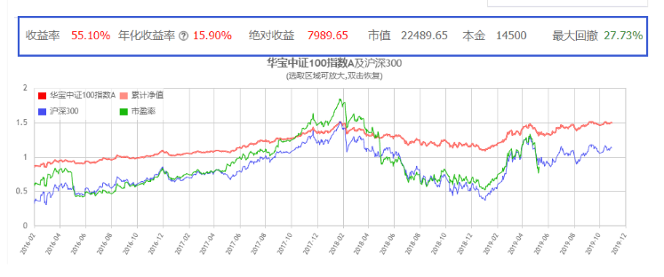
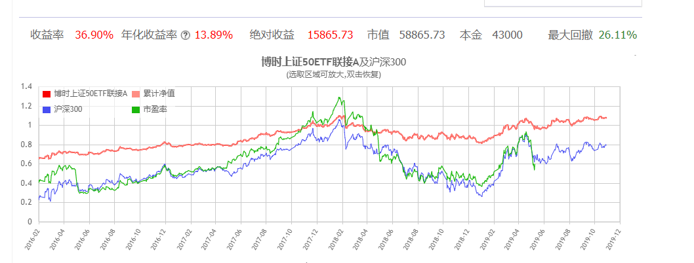

+++++++++++++++++++++++++++++++++++++++++++++++++++++

文件：
2019-10-30 16:55:07 Wed
文件大小：[74073]
15455484114812-上证50指数基金和中证100指数基金孰优孰劣.docx

======================================================

_type: q&a
@与世无争[421844554514848]
2019-10-30 17:10:45 Wed  
topic_id: 118258225884522

@与世无争

>  二师傅，你好！上周四在天天基金定投里面一键定投了你的实盘基金2000元，但我看都周五才认购通过，这周还是在周四一键跟投就行了吗，还是要在今天跟投。

@二师父

>  周四就可以的，确认份额是周五，但是以周四收盘价格成交的
>  
>  即使自己购买指数基金，确认也是t加1或者t加2

阅读[2442]  评论[3]  赞[0] 

======================================================

@二师父[28814221155551]
2019-10-30 18:24:30 Wed  
topic_id: 421481445528558

>  @二师父
>  

阅读[2400]  评论[4]  赞[0] 

======================================================

_type: q&a
@朝阳模具[15528112482582]
2019-10-30 18:48:18 Wed  
topic_id: 548218225451824

@朝阳模具

>  二师父，什么软件能查到主要指数的历史市盈率，市净率以及指数的历史涨跌走势图。

@二师父

>  且慢、集思录、果仁、理杏仁，稍后我总结常见低费用查询估值的渠道

阅读[2526]  评论[0]  赞[0] 

======================================================

_type: talk
@林凤崎[421882481454488]
2019-10-30 22:06:27 Wed  
topic_id: 118258552444152

二师父，E丅F怎么买，我怎么买不进呀，谢谢

@二师父 at 2019-10-30 22:06:27 Wed

> 截图看看，现在休市了

----------

@林凤崎 at 2019-10-30 22:06:27 Wed

> 白天买，当然不是现在，而且从股票帐户上也买不了

----------

@林凤崎 at 2019-10-30 22:06:27 Wed

> 我明天截图吧，谢谢

----------

@二师父 at 2019-10-30 22:06:27 Wed

> 股东账户开足了吗，是不是之前开户满了，现在新开的户没有股东账户

----------

@林凤崎 at 2019-10-30 22:06:27 Wed

> 炒股好多年

----------

@林凤崎 at 2019-10-30 22:06:27 Wed

> 一直没花时间学习，现在才决定学习

----------

@林凤崎 at 2019-10-30 22:06:27 Wed

> 我明天再试试

----------

阅读[2378]  评论[7]  赞[0] 

======================================================

_type: q&a
@🍀 凝🌸 慧🍀[841855248254242]
2019-10-30 22:26:13 Wed  
topic_id: 841581885242522

@🍀 凝🌸 慧🍀

>  二师父好，向您请教一个问题：宽基指数基金和行业指数基金，在仓位比例管理上，有什么具体要求吗？比如，我想定投3个宽基指数基金50AH、基本面60、中证500，和1个行业指数基金中证银行，在仓位上应该如何安排比较合理？谢谢您，最近我在逐一拜读您2019年的精华文章汇总，很受用，感恩您的分享！

@二师父

>  这个看投资水平的哈。投资水平高的，可以完全只投行业指数基金，然后多个行业组合，多个国家的指数组合，这样的话风险也比较小。
>  
>  对于投资新手的话，要多配置宽基指数基金，少配置行业指数基金，单个行业指数基金的比例不能超过20%。
>  
>  如果配置了50AH，里面有很多银行股票，单一的银行指数的比例控制在10%以内就可以，这样风险就会降低很多。

阅读[2562]  评论[3]  赞[0] 

======================================================

_type: q&a
@Dr. 邓[844185218554482]
2019-10-31 08:47:53 Thu  
topic_id: 548218111428424

@Dr. 邓

>  科创板指数基金出了吗，现阶段可以定投科创板指数基金或主题基金吗？

@二师父

>  目前还没有科创板指数基金

阅读[2330]  评论[0]  赞[0] 

======================================================

_type: talk
@西锦巴乌[88448285428482]
2019-10-31 09:31:14 Thu  
topic_id: 421481885812428

<e type="hashtag" hid="555252558114" title="#上证50指数和中证100指数对比分析#" /> 师父好！你文章中的图表是怎么生成的？谢谢

阅读[2233]  评论[0]  赞[0] 

======================================================

_type: q&a
@J[28281541518551]
2019-10-31 09:43:25 Thu  
topic_id: 421481885825888

@J

>  师父早上好，天天基金喊你起床发车啦😁

@二师父

>  老司机要稳

阅读[2336]  评论[3]  赞[0] 

======================================================

_type: talk
@姥姥不疼. 爷爷不爱[48544481458248]
2019-10-31 10:02:14 Thu  
topic_id: 548218115425554

二师父，定投实盘出来了么，挨了一周，就等今天了

@速。冻 at 2019-10-31 10:02:14 Thu

> 快了，天天基金实盘已经更新了

----------

@J at 2019-10-31 10:02:14 Thu

> 天天基金有通知更新，但点进去却没看到更新，大家有看到的请截图分享一下

----------

@速。冻 at 2019-10-31 10:02:14 Thu

> 截图来啦

----------

@姥姥不疼. 爷爷不爱 at 2019-10-31 10:02:14 Thu

> 截图全了么，下面没了吧

----------

@速。冻 at 2019-10-31 10:02:14 Thu

> 没了，可以等正式版的，场外3点前买入不都一样，不急

----------

阅读[2297]  评论[5]  赞[0] 

======================================================

_type: talk
@二师父[28814221155551]
2019-10-31 10:20:12 Thu  
topic_id: 548218115454814

<e type="hashtag" hid="822525441442" title="#210期低估实盘#" /> 实盘不是说星球发发，一定是我买了才发的。我买了不一定发，比如自己搞得风险比较高的。但是发的一定是我买的。

本次实盘有利润收割，一个白酒，一个医药100，不贪心，有赚就收。记得8月份下跌的时候很多人后悔收割少了。总之，先胜而后求大胜。<e type="web" href="https://mp.weixin.qq.com/s/SEqC_X8iRDri0X2KzeMJaQ" title="我为何如此推崇医药和消费指数基金" cache="" />，之前18年的文章很多次说配置医药，300医药和医药100，包括消费、白酒指数。现在逻辑变了。目前得把精力放在人工智能，芯片、5G、生物医疗、科技。其中生物医疗业属于科技得一个范畴，投资需要看到未来，在机会来临前布局，而不是马后炮。

写了一个实盘说明，以后三个实盘都会公布。一个场外操作，两个场内操作。不知道场内场外的朋友急需看以前文章或者听课来跟上。

公众号二师父定投后台回复场外开通天天基金账户，搜索二师父低估定投，可以看到本期实盘。

@姥姥不疼. 爷爷不爱 at 2019-10-31 10:20:12 Thu

> 谢谢二师父，俺跟投了

----------

@陈飞🤗 at 2019-10-31 10:20:12 Thu

> 50ah和银行不是差不多吗

----------

@速。冻 at 2019-10-31 10:20:12 Thu

> 估计写错了，ah就没买

----------

@达达 at 2019-10-31 10:20:12 Thu

> 实盘没有啊

----------

@达达 at 2019-10-31 10:20:12 Thu

> 

----------

@达达 at 2019-10-31 10:20:12 Thu

> 怎么不更新呢

----------

阅读[3192]  评论[18]  赞[0] 

+++++++++++++++++++++++++++++++++++++++++++++++++++++

图片：
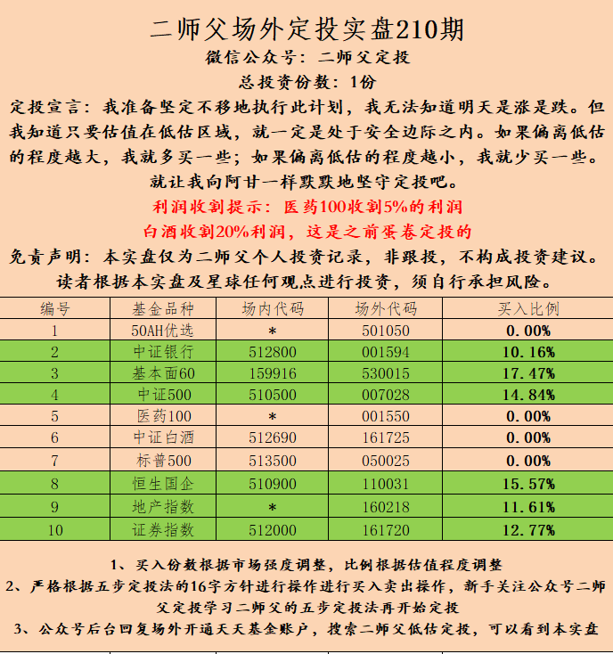

+++++++++++++++++++++++++++++++++++++++++++++++++++++

文件：
2019-10-31 10:20:33 Thu
文件大小：[552497]
48588244415158-关于二师父实盘的说明.pdf

======================================================

_type: q&a
@西锦巴乌[88448285428482]
2019-10-31 11:01:53 Thu  
topic_id: 241581882214221

@西锦巴乌

>  师父好！请问查询到联接基金中的资金绝大部分都显示投资“其他”，投资股票只是一小部分，那么“其他”具体是什么？在哪里能看到？谢谢

@二师父

>  这是ETF链接基金，对于这种基金的话是重仓基金的指数基金。
>  
>  什么意思呢？比方易方达沪深300ETF链接基金，他就是重仓沪深300指数基金的基金。那么其他里面的持仓股票适合沪深300指数一致的

阅读[2351]  评论[0]  赞[0] 

======================================================

_type: talk
@二师父[28814221155551]
2019-10-31 11:07:03 Thu  
topic_id: 841581881482442

实盘说明，本期50AH没有买，计算的时候EXCEL自动生成数据忘记去掉了。

就按照实盘的这个比例来买进，不买50ah，相当于整体份额减少，但是各个基金的低估比例还是吻合的。

今天被催的有点着急了，以后注意发之前多检查几遍。

@达达 at 2019-10-31 11:07:03 Thu

> 

----------

@达达 at 2019-10-31 11:07:03 Thu

> 你发个截图吧，师傅，不知道为什么，天天基金不更新

----------

@达达 at 2019-10-31 11:07:03 Thu

> 好的谢谢，但真的没更新

----------

阅读[3048]  评论[19]  赞[0] 

======================================================

_type: talk
@二师父[28814221155551]
2019-10-31 11:23:40 Thu  
topic_id: 118258558148182

天天基金APP首页--右上角椭圆形智能助手--对话框输入“人工服务”即可，软件有问题可以咨询天天基金的工作人员

@达达 at 2019-10-31 11:23:40 Thu

> 好的，我师父就是我师父，细心耐心解答

----------

@Zyxj at 2019-10-31 11:23:40 Thu

> 购买比例是82.42%

----------

@二师父 at 2019-10-31 11:23:40 Thu

> 这个计算发生了偏差，把50ah放进去了，这期就按照这个比例买，相当于总比例减小

----------

@三峡情 at 2019-10-31 11:23:40 Thu

> 我还想呢，50没低估怎么投了[呲牙]

----------

@三峡情 at 2019-10-31 11:23:40 Thu

> 二师父基金买了可以撤销的

----------

@二师父 at 2019-10-31 11:23:40 Thu

> 我没投50，他是低估的，不过和银行重复，以天天基金为准

----------

@风轻云淡 at 2019-10-31 11:23:40 Thu

> 以前在天天基金开了户，现在还能申请费率优惠吗？

----------

@二师父 at 2019-10-31 11:23:40 Thu

> 直接用天天基金买入或者跟投就可以

----------

阅读[3056]  评论[8]  赞[0] 

+++++++++++++++++++++++++++++++++++++++++++++++++++++

图片：
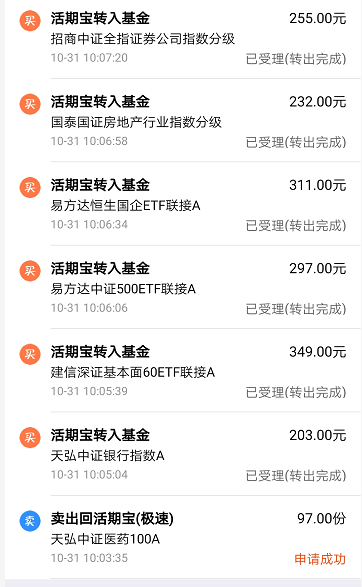

======================================================

_type: q&a
@J[28281541518551]
2019-10-31 12:36:30 Thu  
topic_id: 421481881218218

@J

>  师父，有个问题请教一下，港股基金要收税比较多，那H股指数的市盈率需要乘以1.1后再和A股的市盈率做比较吗？

@二师父

>  这个只能纵向比较，不能横向比较
>  
>  相当于文科班的第一名和理科班的第一名没法确定谁更好
>  
>  h股指数历史市盈率就想当于纵向比较，这样的话我们能看到他的高低来确定定投比例，和a股市盈率横向比较没有意义

阅读[2507]  评论[1]  赞[0] 

======================================================

_type: talk
@林凤崎[421882481454488]
2019-10-31 14:08:43 Thu  
topic_id: 548218152555414

513050怎么买进呢

阅读[2299]  评论[0]  赞[0] 

======================================================

_type: talk
@洋洋[828128441252]
2019-10-31 16:00:32 Thu  
topic_id: 421481858481228

二师父，想问下，沪深300增强和中证500的增强基金现在还低估吗？估值表里很久都没有了。

@二师父 at 2019-10-31 16:00:32 Thu

> 是低估的，现在投资被动的指数

----------

@洋洋 at 2019-10-31 16:00:32 Thu

> 那我继续投[微笑]

----------

阅读[2210]  评论[2]  赞[0] 

======================================================

_type: talk
@二师父[28814221155551]
2019-10-31 17:21:24 Thu  
topic_id: 548218151541514

<e type="hashtag" hid="481211145528" title="#指数估值#" /> 中证100加入估值表了，再增加截图估计一页截不下来了。

估值表有些指数重复，优选几只定投就可以。比如投资了50AH和基本面60，就不需要投资中证100了。也可以不用再投资沪深300了。

@烟九•二手车 at 2019-10-31 17:21:24 Thu

> 现在还是3成不到的仓位，是否大保守了？其他钱一部分货币一部分债券中，现在每周卖出债券，每周持续买入50AH和基本面60，中证银行，中证500，H股指数。

----------

@心韵 at 2019-10-31 17:21:24 Thu

> 50ah和中证银行重合度高，卖一个就行

----------

@烟九•二手车 at 2019-10-31 17:21:24 Thu

> 谢谢啦

----------

阅读[2992]  评论[3]  赞[0] 

+++++++++++++++++++++++++++++++++++++++++++++++++++++

图片：
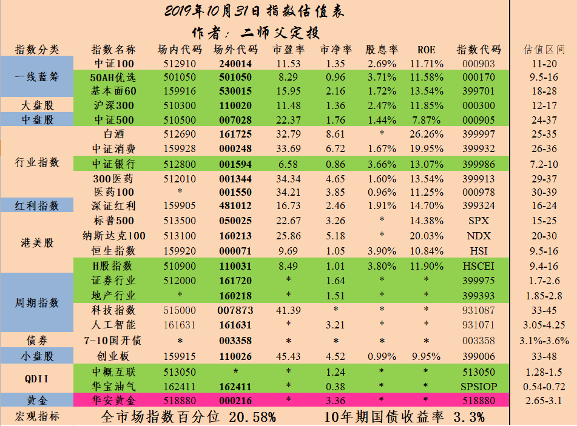

======================================================

_type: q&a
@tanxin[241524428884281]
2019-10-31 17:22:35 Thu  
topic_id: 241581825444521

@tanxin

>  二师父，你好！请问如果现在开始在场内配置券商etf是用均线策略好还是网格交易好

@二师父

>  券商ETF目前是低估值的，采用低估定投策略、均线策略或者网格策略都可以。
>  
>  均线策略是移动的网格策略，这个更加科学。

阅读[2337]  评论[0]  赞[0] 

======================================================

_type: q&a
@进等花开[118525141245142]
2019-10-31 17:23:05 Thu  
topic_id: 241581825415151

@进等花开

>  关于查询场內定投基金是否有溢价和折价，打开集思录，要会员才能看？？有免费的吗？

@二师父

>  在万得股票APP或者东方财富可以查到的

阅读[2413]  评论[0]  赞[0] 

======================================================

_type: q&a
@林荫[15115451828452]
2019-10-31 17:25:13 Thu  
topic_id: 118258542885542

@林荫

>  请问二师父，申购港新股一般多少份额比较适合？

@二师父

>  你是港股打新还是投资港股呢
>  
>  港股打新申购一手就可以了，港股投资的话根据你的投资资金来定

阅读[2504]  评论[4]  赞[0] 

======================================================

_type: q&a
@老司基[111852221242122]
2019-10-31 17:27:19 Thu  
topic_id: 421481858522818

@老司基

>  二师父，场内基金手续费怎么算？有像场外买7天内卖一样的高额手续费吗？

@二师父

>  场内基金费率有买入和卖出的佣金加上基金公司的管理费。
>  
>  通常情况下购买一万元需要3元的手续费。但是通过二师父的福利注册渠道购买一万元只需要一元的手续费。即使上午买入，下午卖出也没有惩罚性收费的。
>  
>  所以做波段操作适合用场内的交易软件来进行，在学堂置顶文章链接里面有福利开户渠道。

阅读[2584]  评论[0]  赞[0] 

======================================================

