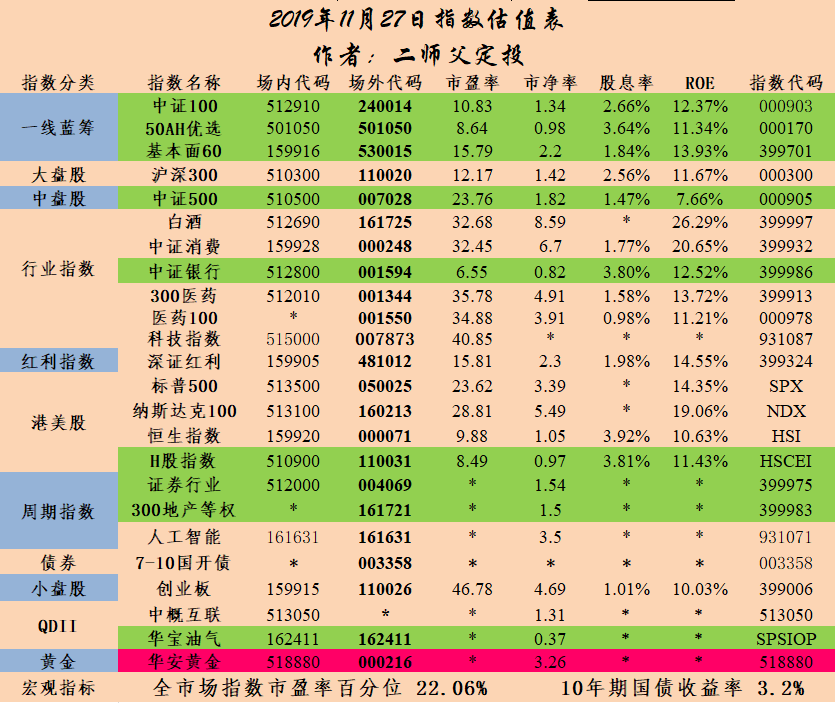

_type: q&a
@家树[544854851425424]
2019-11-01 09:05:37 Fri  
topic_id: 118258512818412

@家树

>  今天发行金力转债是否值得申购？

@二师父

>  AA减可转债，熊市可转债打新最好AA级别以上的

阅读[2224]  评论[2]  赞[0] 

======================================================

_type: q&a
@在下，小老弟[118551811828112]
2019-11-01 10:13:57 Fri  
topic_id: 841581844842182

@在下，小老弟

>  二师傅 做均线去哪个基金平台比较好

@二师父

>  华泰，广发都可以啊，置顶文章有福利开户渠道

阅读[2163]  评论[1]  赞[0] 

======================================================

_type: q&a
@进等花开[118525141245142]
2019-11-01 15:35:06 Fri  
topic_id: 241581844184141

@进等花开

>  二师父，本周刚买了您的基金课程，对于理财小白而言，要完全吸收并学会，一般要学习多久才能毕业？

@二师父

>  学习悟性好的话，学习加实践总结入门需要半年到一年。证券投资学习是终身的事情太多没法一劳永逸

阅读[1932]  评论[0]  赞[0] 

======================================================

_type: q&a
@海〔纳百川〕[422111285141888]
2019-11-01 15:36:05 Fri  
topic_id: 118258518215582

@海〔纳百川〕

>  二师父，珠江金多多两全保险(万能型)，打算用作婚嫁金，您觉得怎么样？

@二师父

>  您什么时候用作婚嫁金，如果近三年不用的话指数基金会比年金险好，固定收益品种都无法跑赢通货膨胀

阅读[2043]  评论[1]  赞[0] 

======================================================

@二师父[28814221155551]
2019-11-01 15:36:43 Fri  
topic_id: 841581841452182

>  @二师父
>  

阅读[2071]  评论[0]  赞[0] 

======================================================

_type: q&a
@孤芳自赏[548114442211184]
2019-11-01 15:37:10 Fri  
topic_id: 841581841141482

@孤芳自赏

>  万得金融终端有没有不针对舍业公司而是个人使用的免费终端呢？个人怎么才能下载和免费注册登录呢？

@二师父

>  都是要付费的，个人付费版本便宜一点，但没有免费的

阅读[2163]  评论[0]  赞[0] 

======================================================

_type: talk
@二师父[28814221155551]
2019-11-01 15:37:34 Fri  
topic_id: 241581815544241

<e type="hashtag" hid="455458422558" title="#指数基金跟踪误差#" /> 跟踪误差产生的原因包括：①复制误差，指数基金无法完全复制标的指数配置结构会带来结构性偏离；②现金留存，由于有现金留存，投资组合不能全部投资于指数标的；③各项费用，基金运行有管理费、托管费，交易证券产生佣金、印花税等；④其他影响，分红因素和交易证券时的冲击成本也会对跟踪误差产生影响。

阅读[2634]  评论[0]  赞[0] 

======================================================

_type: q&a
@Super鑫[241855452251881]
2019-11-01 16:16:08 Fri  
topic_id: 118258582554122

@Super鑫

>  二师父，请教，有个股票拿了两年回本了盈利12%今天抛了，打算买513050中概互联Etf，之前没买过场内，有啥需要注意的？是不是场内可以当天抛，用抛的钱当天可以买股票呢？

@二师父

>  这个和买股票差不多了，当天委托买入，当天可以卖出，也计算买入和卖出佣金，和股票不同的是没有印花税
>  
>  需要注意避免高溢价的基金，如果溢价太高可以等等再买入

阅读[2295]  评论[1]  赞[0] 

======================================================

@二师父[28814221155551]
2019-11-01 20:55:10 Fri  
topic_id: 241581815884811

>  @二师父
>  

阅读[2626]  评论[2]  赞[0] 

======================================================

_type: talk
@二师父[28814221155551]
2019-11-01 20:57:47 Fri  
topic_id: 421481812422488

<e type="hashtag" hid="481211145528" title="#指数估值#" /> 估值表，沪深300进入正常估值啦，坚持积累，熊市少亏，牛市来了大赚，这就是思路。明天周末，可以好好休息了。

@老孙头 at 2019-11-01 20:57:47 Fri

> 请教﹕沪深300原来亏了，现在可以加仓吗？

----------

@二师父 at 2019-11-01 20:57:47 Fri

> 正常估值先等等

----------

@学以致用 at 2019-11-01 20:57:47 Fri

> 中证500也马上要回归正常估值了吗？

----------

@二师父 at 2019-11-01 20:57:47 Fri

> 快了

----------

阅读[2844]  评论[4]  赞[0] 

+++++++++++++++++++++++++++++++++++++++++++++++++++++

图片：

======================================================

_type: talk
@二师父[28814221155551]
2019-11-01 21:00:30 Fri  
topic_id: 421481812422248

<e type="hashtag" hid="144245544512" title="#深红利#" /> 鳄鱼计划里面配置的有深红利，为啥不再场外配置呢，主要还是风险，其实越集中波动风险越大，比如个股最集中风险最大。

对投资老手而言，指数波动不是风险，而新手并不懂，学堂的朋友普遍水平高一些，我们就在这里公布啦。

阅读[2996]  评论[0]  赞[0] 

+++++++++++++++++++++++++++++++++++++++++++++++++++++

文件：
2019-11-01 20:58:38 Fri
文件大小：[24753]
48588241424448-格力电器创新高，深红利也跟上了.docx

======================================================

_type: talk
@二师父[28814221155551]
2019-11-01 21:06:31 Fri  
topic_id: 241581814515121

<e type="hashtag" hid="145458855482" title="#周五读书#" /> 这个是二师父在小区门口录制的，实在找不到地方了，听听效果如何。

每天都是金融财经信息，下周我们换换大脑，读认知盈余，克莱舍基写的，小马哥推荐，看看移动互联网时代的人民是如何抓住机会的。

还有的朋友看了二师父的文章准备开展副业，我看方式都不大对。看看这本书，如何利用自己的自由时间来创造更大的价值。

大家还有想看的书，可以列出来，我们一起来读一读，一个人读书可能读着读着就放弃了。

@光少 at 2019-11-01 21:06:31 Fri

> 还是二师父录音听起来比较好理解，请二师父继续[强]辛苦了[玫瑰]

----------

@素兮 at 2019-11-01 21:06:31 Fri

> 二师父讲的很好

----------

@黎雄 at 2019-11-01 21:06:31 Fri

> 师傅文章分享要方便记录点

----------

@rtdmm小米 at 2019-11-01 21:06:31 Fri

> 不错，二师父辛苦了

----------

@雪莲 at 2019-11-01 21:06:31 Fri

> 二师父讲的真好，就喜欢听二师讲课，希望以后可以继续。二师父辛苦了，赞！

----------

@隔窗遥望 at 2019-11-01 21:06:31 Fri

> 怎么听不了

----------

@云云 at 2019-11-01 21:06:31 Fri

> 语音更赞哦[微笑]

----------

@顾屹峰 at 2019-11-01 21:06:31 Fri

> 可以的

----------

阅读[3129]  评论[21]  赞[0] 

+++++++++++++++++++++++++++++++++++++++++++++++++++++

文件：
2019-11-01 21:02:07 Fri
文件大小：[9520448]
48588241428418-指数基金投资至简第二讲.m4a

======================================================

_type: talk
@树叶[544811512145144]
2019-11-02 08:34:58 Sat  
topic_id: 241581258225111

<e type="hashtag" hid="142825811122" title="#定投周报#" /> 二师父定投周报第32期

阅读[2334]  评论[0]  赞[0] 

+++++++++++++++++++++++++++++++++++++++++++++++++++++

文件：
2019-11-02 08:34:58 Sat
文件大小：[650445]
51511428421154-二师父定投周报11.2（第32期）.docx

======================================================

_type: talk
@勤能行之[481211221828]
2019-11-02 10:38:48 Sat  
topic_id: 241581252558411

好久没报到了，今天先赞再仔细阅读，请问朋友们如果就是买三只基金的话，你们会怎么选呀？

@上上签 at 2019-11-02 10:38:48 Sat

> 如果是我选择三种基金，我的选择思路逻辑还有选择结果，还有个人的看法。
首先需要看是主动型基金，还是被动型基金(指数型基金)
如果是主动性基金，我会看基金经理的从业这些年的投资风格还有方向，我觉得选择主动型基金就是选择基金经理。有一点小建议，可以看基金前十大持仓，大概粗略地判断该基金的估值范围。我不选择被动型基金，所以跳过。

如果是被动型基金，通俗来说就是指数型基金。先看是宽基还是窄基。如果只是仅仅选择三种基金，不建议选择周期指数基金。我个人喜欢消费、医药、银行这三个行业，但是我选择的时候，只可以选择三种的情况，我还会配置一支大盘宽基。我挺喜欢深证红利，但是这支基金我会选择包括沪市还有深市，中证100是一个不错的选择。在这些基金全部低估且低估程度相同情况，强调在这个前提条件下，我会选择消费(中证消费或者是白酒)、医药(300医药或者是医药100)、中证100这三只基金。

不过这个前提条件大概率情况下很难发生，大概率是现在这样类似市场的情况。只是三种基金，我选择银行(或者是上证50AH-沪市)，基本面60(深市)，H股指数(港股)，尽量可能地分散投资，我觉得投资首先是本金相对安全，在本金相对安全情况下，在取得收益。

----------

@勤能行之 at 2019-11-02 10:38:48 Sat

> 我觉得你说的挺有道理的，深红利，现在已经涨了很多了呀，整个消费股也长了很多了呀。

----------

@勤能行之 at 2019-11-02 10:38:48 Sat

> 我们主要还是选择被动型的指数基金吧。

----------

@勤能行之 at 2019-11-02 10:38:48 Sat

> 如果是大盘宽基的话，你会选择哪一只

----------

@勤能行之 at 2019-11-02 10:38:48 Sat

> 你在二师父的微信群里面吗？微信名是什么呀


----------

@上上签 at 2019-11-02 10:38:48 Sat

> 如果只可以选择一支，我会选择中证100

----------

@上上签 at 2019-11-02 10:38:48 Sat

> 我在群里面，只是很少说话

----------

@勤能行之 at 2019-11-02 10:38:48 Sat

> 好的，谢谢你啊，我觉得你说的很有道理。

----------

阅读[2178]  评论[8]  赞[0] 

======================================================

_type: talk
@钱小胖儿[844112855845212]
2019-11-02 12:19:23 Sat  
topic_id: 118258424445522

老师您好，中证500表现一直不好，我一直定投鹏华中证500，现在是否减少定投金额呢，还是保持不变，继续定投，谢谢

@勤能行之 at 2019-11-02 12:19:23 Sat

> 我也不太看好中证500。

----------

@J at 2019-11-02 12:19:23 Sat

> 师父有分析过，中证500虽然盈利下降，但历史百分位很低，未来赚的是估值收复的钱

----------

@朝阳模具 at 2019-11-02 12:19:23 Sat

> 中证500可以不配置的，因为ROE实在太低了

----------

阅读[2127]  评论[3]  赞[0] 

======================================================

_type: talk
@二师父[28814221155551]
2019-11-02 18:12:05 Sat  
topic_id: 421481542144258

看来我是个话痨

@朝阳模具 at 2019-11-02 18:12:05 Sat

> 我第四名啊

----------

@J at 2019-11-02 18:12:05 Sat

> 哈哈哈 谢谢二师父让我没有成为第一

----------

@隔窗遥望 at 2019-11-02 18:12:05 Sat

> 刚加入就上榜了

----------

@二师父 at 2019-11-02 18:12:05 Sat

> 哈哈

----------

阅读[2066]  评论[4]  赞[0] 

+++++++++++++++++++++++++++++++++++++++++++++++++++++

图片：

======================================================

_type: talk
@二师父[28814221155551]
2019-11-02 18:13:15 Sat  
topic_id: 548218524821414

谈谈你对周期的理解，生活里面有周期，股市里面有周期，个人和宇宙都有周期，理解对了才知道定投的意义

阅读[2253]  评论[0]  赞[0] 

+++++++++++++++++++++++++++++++++++++++++++++++++++++

文件：
2019-11-02 18:12:33 Sat
文件大小：[24692]
88288485258482-万物皆有周期，在别人怀疑的时候选择相信.docx

======================================================

_type: talk
@二师父[28814221155551]
2019-11-02 19:07:06 Sat  
topic_id: 421481542152188

学习的5个方面，①学点经济学，知道经济规律，把握自己人生。②学点统计学，统计是现实中最经常用到的技能。③学点金融学，要有人生风险的概念。④学点心理学，认清人类理性的瑕疵，包括你自己的。⑤相信自己的直觉与激情，适当忽视你认为应该忽视的建议。

阅读[2231]  评论[0]  赞[0] 

======================================================

@二师父[28814221155551]
2019-11-02 21:12:13 Sat  
topic_id: 241581285144241

>  @二师父
>  

阅读[2766]  评论[0]  赞[0] 

======================================================

_type: q&a
@孤芳自赏[548114442211184]
2019-11-03 10:54:17 Sun  
topic_id: 841581288254812

@孤芳自赏

>  请问滚动Roe啥意思？

@二师父

>  就是计算净资产收益率时候利润采用的是过去一年的利润，对标滚动市盈率来理解

阅读[2151]  评论[0]  赞[0] 

======================================================

_type: talk
@二师父[28814221155551]
2019-11-03 11:25:46 Sun  
topic_id: 548218514245884

<e type="hashtag" hid="455458211888" title="#周末答疑——基建类指数是否可以定投#" /> 根据读者建议，以后我们的文章一方面用PDF的形式展示，另外一方面加上语音讲解，语音讲解会帮助大家更好的理解。

@Dr. 邓 at 2019-11-03 11:25:46 Sun

> 效果不错[强]

----------

@隔窗遥望 at 2019-11-03 11:25:46 Sun

> 这个语音文件大家是怎么听的，直接点一下就可以，还是需要其他操作。我的手机怎么老是提示音乐文件错误，播放失败。

----------

@海盗 at 2019-11-03 11:25:46 Sun

> 直接点一下就可以了，重启一下手机试试，再不行就备份一下有用的东西恢复一下出厂设置

----------

阅读[2753]  评论[3]  赞[0] 

+++++++++++++++++++++++++++++++++++++++++++++++++++++

文件：
2019-11-03 11:21:10 Sun
文件大小：[601782]
51511411118884-周六答疑：基建类指数可以定投吗 11.3.pdf

2019-11-03 11:23:43 Sun
文件大小：[7959827]
48588288854458-基建类指数是否可以定投.m4a

======================================================

_type: q&a
@恋尘[51558584455824]
2019-11-03 18:36:25 Sun  
topic_id: 118258442142822

@恋尘

>  刚刚认真研究了一下均线定投师父，也看了下往期的文章，这个原理我懂了。我现在好久不算数了不会算了我想请教下这个偏离度打个比方现在券商的低估了，是用90日均线减去现在的净值然后得出来数，在用这个数除以现在基金的净值吗，麻烦说下具体公式太笨了不会算数学题了帮忙

@二师父

>  这个计算公式，(基金价格--90日均线值)/90日均线值，就是均线偏移百分比，根据这个确定均线偏离度

阅读[1984]  评论[2]  赞[0] 

======================================================

_type: q&a
@朝阳模具[15528112482582]
2019-11-03 18:37:22 Sun  
topic_id: 118258445221142

@朝阳模具

>  二师父，三季报结束了，估值表中的指数三季报净利润同比各增长了多少？（好像上交所和深交所公布过总体增长了9%左右）但是我们想知道具体每个指数各增长了多少比分比

@二师父

>  只有具体个股的数据，指数的只有从roe来看

阅读[2117]  评论[1]  赞[0] 

======================================================

_type: talk
@二师父[28814221155551]
2019-11-03 19:57:23 Sun  
topic_id: 548218551455284

<e type="hashtag" hid="822528181542" title="#限制自己#" /> 如果精选三只基金进行定投，大家会怎么选择呢

@朝阳模具 at 2019-11-03 19:57:23 Sun

> 如果精选三只，我会选①汇丰晋信恒生A股行业龙头指数，②华宝科技龙头指数，③中证消费50指数或者中证消费龙头指数

----------

@二师父 at 2019-11-03 19:57:23 Sun

> 第一个也很多消费股票

----------

@朝阳模具 at 2019-11-03 19:57:23 Sun

> 确实，我刚刚也考虑到了，恒生行业龙头里有5只消费

----------

阅读[2803]  评论[3]  赞[0] 

+++++++++++++++++++++++++++++++++++++++++++++++++++++

文件：
2019-11-03 19:56:57 Sun
文件大小：[24829]
48588282248858-如果精选3只指数基金定投，最佳的组合是什么.docx

======================================================

_type: talk
@二师父[28814221155551]
2019-11-03 19:59:26 Sun  
topic_id: 841581228422482

乐咕乐股网的数据还可以，大家可以看看美股和港股指数的数据。

阅读[2207]  评论[0]  赞[0] 

+++++++++++++++++++++++++++++++++++++++++++++++++++++

图片：

======================================================

_type: talk
@二师父[28814221155551]
2019-11-03 20:41:06 Sun  
topic_id: 841581228148882

<e type="hashtag" hid="454841141288" title="#均线偏离表#" /> 指数正常估值的时候，偏离均线以下买入，偏离均线以上卖出，适合在指数波动的时候挣波段的钱。低估定投是挣企业盈利和估值上移的钱，网格和均线策略是挣指数波动的钱。重点还是低估定投。鳄鱼计划和场外定投遵循的都是挣企业盈利以及估值上移的钱，而网格和均线就是挣波动的钱。均线相当于是移动的网格。

@速。冻 at 2019-11-03 20:41:06 Sun

> 提两点：1，券商偏离度为-1，2，中概互联整体低估，虽然偏离度为正，应该用绿底色

----------

@二师父 at 2019-11-03 20:41:06 Sun

> 券商的改过来了，偏离表和估值表整体逻辑是不一样的，如果用均线偏离策略就不用管估值，直接按照均线以下买入，均线以上卖出。

----------

@速。冻 at 2019-11-03 20:41:06 Sun

> 明白了，我的策略是低估时均线偏离策略，在等待机会，二师父怎么看？另外银行etf怎么没加进去

----------

@二师父 at 2019-11-03 20:41:06 Sun

> 那样更加安全，沪深300里面有大部分金融行业，选择一个安全的，银行波动并不大，适合长期持有。

----------

@J at 2019-11-03 20:41:06 Sun

> 师父，据观察沪深300波动并不大，为什么选择他做波段的？中概互联和券商都很不错

----------

@二师父 at 2019-11-03 20:41:06 Sun

> 作为观察指数，可以不买的

----------

@二师父 at 2019-11-03 20:41:06 Sun

> 还没打算公布，毕竟回撤太大

----------

阅读[2976]  评论[11]  赞[0] 

+++++++++++++++++++++++++++++++++++++++++++++++++++++

图片：

======================================================

_type: q&a
@恋尘[51558584455824]
2019-11-03 23:25:25 Sun  
topic_id: 421481551484488

@恋尘

>  师父还要请教下现在券商的偏离度是-1百分比是2.63%但是我看咱们的讲解是6到12个点才是负一啊，我想问下具体怎么分析我对咱们的网格和均线很有兴趣

@二师父

>  这个偏离度可以自己设定，之前的安全边际更加严格，对于指数的90日均线，跌破了，意味着中长期跌势确立，在估值中等偏低是可以入手的
>  
>  然后以均线为中枢反复的做T

阅读[2340]  评论[1]  赞[0] 

======================================================

_type: talk
@勤能行之[481211221828]
2019-11-04 10:04:25 Mon  
topic_id: 548218541221244

报到报到，昨天问了一个问题，就有热心的网友来做解答，二师父晚上又写了一篇很好的文章，真的是答疑解惑的好地方。谢谢热心的网友，谢谢二师父。[玫瑰][玫瑰][玫瑰]

@Claire at 2019-11-04 10:04:25 Mon

> 很暖心的感觉，这就是咱们学堂的凝聚力。

----------

@rtdmm小米 at 2019-11-04 10:04:25 Mon

> 大家都是爱好者[偷笑][偷笑]

----------

阅读[2186]  评论[2]  赞[0] 

======================================================

_type: talk
@烟九•二手车[244185818522141]
2019-11-04 11:59:35 Mon  
topic_id: 241581244821121

二师父，通光转债今天可以打吗？在哪里可以看到它的评级？

@杜志彪 at 2019-11-04 11:59:35 Mon

> 点进去就可以了吧，一个A我就不打了。

----------

@无名书苑 at 2019-11-04 11:59:35 Mon

> 哪里看发行的债券是几个A？谢谢

----------

阅读[2095]  评论[2]  赞[0] 

+++++++++++++++++++++++++++++++++++++++++++++++++++++

图片：

======================================================

_type: q&a
@恋尘[51558584455824]
2019-11-04 16:27:47 Mon  
topic_id: 118258418584822

@恋尘

>  师父我又来问了，囧。就拿昨天那个券商etf为例偏离度为2.63%，我买入一份为500元我在您这开户的华泰他上涨多少我就能盈利，我说的是除去手续费和佣金的各种费用，我小白一个不会算只懂大概的方向，能具体说下公式吗还有费率

@二师父

>  如果你买入资金在1000元以下，有最低收0.1元，那么买入卖出一次收费0.2，上午买下午卖也是这个费率
>  
>  如果你买入1万，那么买入卖出一次收费万1，收费2元

阅读[2026]  评论[0]  赞[0] 

======================================================

_type: q&a
@恋尘[51558584455824]
2019-11-04 16:28:26 Mon  
topic_id: 548218548522144

@恋尘

>  师父还有我就是想开通创业板打新像今天这个可转债我就没资格打，我现在有三个账户都是华泰的需要什么条件，我账户里面都是有几千块打新用，是需要50万吗，各位同学有知道的吗

@二师父

>  你用三个身份证开的吗？开通创业板需要到柜台签一个协议并录制视频

阅读[2081]  评论[0]  赞[0] 

======================================================

_type: talk
@二师父[28814221155551]
2019-11-04 16:53:39 Mon  
topic_id: 421481521142818

<e type="hashtag" hid="481211145528" title="#指数估值#" /> 券商正常估值，医药ETF高估。

股票不建议做波段，因为卖出印花税比较高，而且个股风险比较大。

对于均线实盘考虑了下暂时还是不公布，学有余力的朋友可以自己做配置，控制好安全边际。低估实盘和鳄鱼计划才是我们的主力。

@jier at 2019-11-04 16:53:39 Mon

> 二师父，都说证券在牛市可以翻几倍，如果现在券商仓位比较低，是否合适加大券商仓位？

----------

@二师父 at 2019-11-04 16:53:39 Mon

> 他跌起来也非常可怕，你可以看看从15年到现在跌了多少，如果可以接受浮亏，可以建立底仓，重仓对于周期指数不合适

----------

@雨淡风清 at 2019-11-04 16:53:39 Mon

> 医药300高估了啊，明天要出点了

----------

@齐俊波 at 2019-11-04 16:53:39 Mon

> 多谢提醒。

----------

阅读[2566]  评论[4]  赞[0] 

+++++++++++++++++++++++++++++++++++++++++++++++++++++

图片：

======================================================

_type: talk
@二师父[28814221155551]
2019-11-04 17:39:55 Mon  
topic_id: 421481514482118

<e type="hashtag" hid="555255285114" title="#打卡362期#" /> 对打卡有了新的想法，打卡并不是日复一日的重复，如果就像驴子一样日复一日拉磨，最终的结果就是被卸磨杀掉。

所以以后的打卡更多的是讲一些新鲜事，改善认知，塑造格局。

昨天老罗上了老赖名单。老罗大家有的认识，可能有的不认识。

二师父对这个人的认识最开始不是从锤子科技开始的。而是老罗失业之后面试新东方开始的，当时这个人特别励志，从零开始学习英语去应聘新东方的老师。

记得第一次面试的时候他非常紧张，讲了一半实在讲不下去了，当时准备放弃的，好在俞敏洪比较开明，给了老罗一次机会。

就是这样的一次机会，让老罗成功成为了新东方的名师。他在新东方教书因老罗雷人雷语而出名。和新东方的王江涛比较像，都是非常有个性的人。

后来再次知道老罗就是他创办了锤子科技，当时他做牛博网以及英语培训学校的时候并没有怎么关注，因为毕竟从新东方出来搞培训优势特别大，而他转去做手机我就真的表示诧异，英语老师能够做手机？

从12年老罗创办锤子科技到现在破产整整6年时间，这个中年男人始终用理想主义情怀去做手机，成功时收获了鲜花和掌声，现在陷入债务危机，也被人唾弃。当然，支持他的人始终还是力挺他。

无论是深处高位，还是如今被当成落水狗，痛打。老罗都始终是一个心态：一个天真的孩子的心态。知世故而不世故。我想这是很多人还在支持他的原因。

现在呢？可以说老罗过的比我还惨。他因为陷入债务危机，被加入老赖名单，不能够坐火车，不能够坐飞机，也不能买房买车。似乎失去了半自由。

按照他自己的说法，如果他申请破产就可以避免成为老赖，可是那样就会损害曾经投资他的企业。他不想这样做，准备卖身卖艺还债。

对于这个身怀理想主义的朋友，我还是挺敬佩的。不过二师父的理想主义情怀里面有些理性。毕竟是经纪人思维。凡是考虑投入产出比。

我从这个事情得到的启示就是：

专注自己的能力圈，每个人都有天生的优势和天赋，如果老罗继续深钻英语教育行业，从这个角度来一直努力，他也许会是一个出色的教育家或者教育机构的CEO。比如成为张邦鑫或者米雯娟那样的人。

他骨子里还是学者和文人型的，不是商人。

如果他和罗振宇一样抓住13年的内容创业的风口，做个锤子教育，以老罗的人格魅力，估计会超越罗振宇。

很多时候，成功并不是一个人多厉害，而是风口，趋势来临的时候我们正在做这件事情罢了。选择真的很重要。

@齐俊波 at 2019-11-04 17:39:55 Mon

> 分析得到位。

----------

阅读[2685]  评论[1]  赞[0] 

======================================================

_type: talk
@二师父[28814221155551]
2019-11-04 18:50:55 Mon  
topic_id: 241581215814881

<e type="hashtag" hid="458588251558" title="#周一市场分析#" />

阅读[2712]  评论[0]  赞[0] 

+++++++++++++++++++++++++++++++++++++++++++++++++++++

文件：
2019-11-04 18:50:54 Mon
文件大小：[257838]
48588254412218-市场分析11.4.docx

======================================================

_type: talk
@二师父[28814221155551]
2019-11-04 20:03:17 Mon  
topic_id: 841581215424582

<e type="hashtag" hid="225848111481" title="#港股打新#" />

阅读[2717]  评论[0]  赞[0] 

+++++++++++++++++++++++++++++++++++++++++++++++++++++

文件：
2019-11-04 20:03:03 Mon
文件大小：[89263]
51511452522414-讲讲港股打新.docx

======================================================

_type: talk
@勤能行之[481211221828]
2019-11-04 22:31:08 Mon  
topic_id: 421452448484128

这是我们勤奋的二师父，向你学习！

@勤能行之 at 2019-11-04 22:31:08 Mon

> 这都不仅仅是勤奋了，应该说是热爱这项事业才对！

----------

@Hi·DD at 2019-11-04 22:31:08 Mon

> 这样会没有女朋友的[偷笑]

----------

@勤能行之 at 2019-11-04 22:31:08 Mon

> [偷笑][偷笑][愉快]

----------

@丸子妈 at 2019-11-04 22:31:08 Mon

> 对，热爱事业

----------

阅读[1883]  评论[4]  赞[0] 

+++++++++++++++++++++++++++++++++++++++++++++++++++++

图片：

======================================================

_type: q&a
@钱小胖儿[844112855845212]
2019-11-04 22:44:57 Mon  
topic_id: 841524558551482

@钱小胖儿

>  老师，黄金定投可以赎回了么现在，谢谢

@二师父

>  可以了

阅读[2019]  评论[0]  赞[0] 

======================================================

_type: q&a
@妖孽[544888148518184]
2019-11-05 10:29:49 Tue  
topic_id: 118241224525152

@妖孽

>  请问二师父哪里可以了解西班牙的基金，估值......从谷歌找到了百度，一无所获，就来拜访二师父了，谢谢。

@二师父

>  目前西班牙指数市盈率13倍，这个可以在wind或者东方财富choice数据里面找到

阅读[1851]  评论[0]  赞[0] 

======================================================

_type: q&a
@学以致用[244415184181451]
2019-11-05 10:51:02 Tue  
topic_id: 118241228424112

@学以致用

>  二师父，最近各大平台都在推广中证100，这中证100真的有那么好吗？我持有了一些易方达上证50A和深红利，中证100比这两支有哪些策略优势呢？

@二师父

>  不同基金风格不同，中证100相当于沪市和深市蓝筹股票的集合，如果自己配置的话分开配置两市场蓝筹股指数会形成一个轮动效应，在低估的时候多配置一些某市场的蓝筹股指数

阅读[1935]  评论[0]  赞[0] 

======================================================

_type: q&a
@在下，小老弟[118551811828112]
2019-11-05 10:51:45 Tue  
topic_id: 118241228454882

@在下，小老弟

>  二师傅 我是跟您的天天定投的，我想问下  定投里是单个基金涨到百分之十收割 还是 从总体上看涨到百分之十收割一次

@二师父

>  当基金进入正常估值，每盈利10个点收割一次利润

阅读[1927]  评论[3]  赞[0] 

======================================================

_type: q&a
@老司基[111852221242122]
2019-11-05 10:52:08 Tue  
topic_id: 548254228581444

@老司基

>  二师父，华宝油气涨跌和什么有关系？

@二师父

>  和原油以及美股的涨跌有关系

阅读[1960]  评论[2]  赞[0] 

======================================================

_type: talk
@J[28281541518551]
2019-11-05 11:04:58 Tue  
topic_id: 241524585585241

给大家报个喜，油气今天涨4+%

阅读[1937]  评论[0]  赞[0] 

+++++++++++++++++++++++++++++++++++++++++++++++++++++

图片：

======================================================

_type: talk
@二师父[28814221155551]
2019-11-05 11:51:39 Tue  
topic_id: 118241252515222

<e type="hashtag" hid="881251425252" title="#鳄鱼计划#" /> 300医药进入高估，对标我们的医药etf，卖出3份，目前整体估值不高，虽然银行盈利了十几个点估值仍旧不高，中概互联也快进入正常估值。

我发觉市场一上涨大家的钱就多了，可以不卖，长期持有盈利，但记住，别追高，追高容易吃面

油气买入价位是0.38，卖出价位是0.46，这一波做完就放弃这个基金了，选择原油

本计划仅为二师父个人操作记录，投资有风险，入市需谨慎

@速。冻 at 2019-11-05 11:51:39 Tue

> 买入，持有，富有

----------

@向前进 at 2019-11-05 11:51:39 Tue

> 现在油气没到0.46，二师父意思是等待0.46价位吗

----------

@J at 2019-11-05 11:51:39 Tue

> 师父，我目前场内成本价0.436，场外成本价0.48，涨到0.46是割肉清仓还是继续等待估值上涨至正常再卖？这油气一蹶不振让我有点怀疑人生了[捂脸] 很怀疑他还能否升回0.55.....😂

----------

@二师父 at 2019-11-05 11:51:39 Tue

> 对

----------

@二师父 at 2019-11-05 11:51:39 Tue

> 别割肉，相信周期

----------

@二师父 at 2019-11-05 11:51:39 Tue

> 可以

----------

@J at 2019-11-05 11:51:39 Tue

> [OK]

----------

阅读[2646]  评论[21]  赞[0] 

======================================================

_type: q&a
@十一。[844145451181482]
2019-11-05 12:17:29 Tue  
topic_id: 548254212154824

@十一。

>  老师问一下，沪深300和上证50持续上涨定投收益（9个月）已经盈利10个点，看您说超过10个点可以收割利润了是么？

@二师父

>  目前正常估值可以收割利润

阅读[2110]  评论[0]  赞[0] 

======================================================

_type: q&a
@十一。[844145451181482]
2019-11-05 12:18:40 Tue  
topic_id: 841524585845842

@十一。

>  老师问一下医药基金您是否可以选择拥有医学背景的经理管理主动基金？
>  目前医药我是场外定投的中欧医疗健康混合、华宝医疗指数分级盈利20+不过仓位都不高，您觉得这两只基金怎么样？是否可以逢低加仓

@二师父

>  定投的话指数基金是比较稳健的，主动型医药基金今年涨的确实不错，可是调仓换股之后的表现就不知道了

阅读[2229]  评论[2]  赞[0] 

======================================================

_type: talk
@进等花开[118525141245142]
2019-11-05 12:39:34 Tue  
topic_id: 241524585218481

<e type="hashtag" hid="481211145528" title="#指数估值#" /> 二师父，中概互联是绿色低估，现在是否可以正常加仓？？

@速。冻 at 2019-11-05 12:39:34 Tue

> 濒临正常估值

----------

阅读[2122]  评论[1]  赞[0] 

+++++++++++++++++++++++++++++++++++++++++++++++++++++

图片：

======================================================

_type: q&a
@老司基[111852221242122]
2019-11-05 17:00:40 Tue  
topic_id: 421452484525248

@老司基

>  证券ETF和券商ETF，H股ETF和恒生ETF，有什么区别？

@二师父

>  第一个是不同基金公司的品种，规模费率不同
>  
>  h股对标指数恒生国企，恒生etf对标指数恒生指数，是两个不同的港股大盘股指数

阅读[1968]  评论[0]  赞[0] 

======================================================

_type: q&a
@闲云[48522815485458]
2019-11-05 17:01:58 Tue  
topic_id: 118241252828842

@闲云

>  二师父，这个可投吗？【易方达】一指投资沪深高股息标的，易方达中证红利ETF，认购代码：515183，现正公开发行。中证红利指数，涵盖沪深两市高股息股票，当前估值相对较低。管理费+托管费0.20%/年，可实现以较低的费用成本投资中证红利指数。基金有风险，请您根据自身风险承受能力与产品适配性谨慎投资，详阅法律文件和发售公告，详询4008818088（回TD退订）。

@二师父

>  如果封闭期间过了，基金规模还可以，自由申购的话可以用这只红利etf替代我们之前的中证红利指数增强和大成中证红利指数基金

阅读[2054]  评论[0]  赞[0] 

======================================================

_type: q&a
@生活、小船[544812815525124]
2019-11-05 17:03:27 Tue  
topic_id: 421452484184448

@生活、小船

>  二师父，最近在看券商，发现券商B的波动要比ETF大，想请教下，我们在做均线时，是否可以采用券商B指数呢？能否请二师父简述下两个基金的区别呢？

@二师父

>  券商基金是母基金，b相当于带杠杆的一只子基金，波动大
>  
>  未来分级基金正在整顿，会逐步清算退出交易所，不会再有这些品种，可以不用考虑了

阅读[2147]  评论[0]  赞[0] 

======================================================

_type: q&a
@海马[15158245825242]
2019-11-05 17:06:33 Tue  
topic_id: 118241255412852

@海马

>  二师父，有哪些基金销售平台是用基金定投是用估值高低扣款的？

@二师父

>  目前完全根据估值买入的还没有，他们都是看的价格，这点的话从价值投资角度分析就不是很科学，很多基金估值没有变，价格都是涨的

阅读[2287]  评论[3]  赞[0] 

======================================================

_type: talk
@二师父[28814221155551]
2019-11-05 19:09:18 Tue  
topic_id: 548254218244524

<e type="hashtag" hid="481211145528" title="#指数估值#" /> 目前机会还是很好的，如果大盘涨到3500点可能二师父就不建议大家定投了股权类基金了，那时候债券的机会好一点。

总之，耐心积累，时间会淘汰不想富有以及渴望一夜暴富的朋友，定投指数基金，慢慢变富。

@姣🍎 at 2019-11-05 19:09:18 Tue

> 师父，牛市来了一般哪些指数会涨的比较好？盈利性较强？

----------

@二师父 at 2019-11-05 19:09:18 Tue

> 估值表的宽基和行业指数

----------

阅读[2824]  评论[2]  赞[0] 

+++++++++++++++++++++++++++++++++++++++++++++++++++++

图片：

======================================================

_type: talk
@二师父[28814221155551]
2019-11-05 19:15:03 Tue  
topic_id: 118241258282152

<e type="hashtag" hid="455451412888" title="#讲基金#" /> 中证红利指数是不错的红利指数基金，目前场外有这类基金品种。

之前一直是没有场内中证红利ETF的，目前招商和易方达基金公司分别发行了两只场内红利ETF，易方达的费率更低一点。

通常新基金发行以后观察一段时间，如果场内份额比较大，那么是可以作为场内定投的标的的。

中证红利指数也是不错的指数，二师父后来只考虑实际增长收益并未考虑分红收益就暂停了这只指数基金的定投，对于想要长期持有获得分红收益的朋友，这只基金还是不错的选择。

@老司基 at 2019-11-05 19:15:03 Tue

> 二师父，场内代码是？

----------

@知南茶暖🍹 at 2019-11-05 19:15:03 Tue

> 这只鸡我都清仓了，投了三年才赚几个点，还不如其他的

----------

@丸子妈 at 2019-11-05 19:15:03 Tue

> 场内ETF出来了？

----------

@二师父 at 2019-11-05 19:15:03 Tue

> 快了

----------

@二师父 at 2019-11-05 19:15:03 Tue

> 目前还没开始认购

----------

@蓝魔森林 at 2019-11-05 19:15:03 Tue

> 我看了中证红利指数里的重仓股票，一部分的盈利率很差，而且风险太高，也没定投了

----------

阅读[2848]  评论[7]  赞[0] 

======================================================

_type: talk
@二师父[28814221155551]
2019-11-05 19:30:59 Tue  
topic_id: 118241258525152

<e type="hashtag" hid="144248288282" title="#打卡363#" /> 宽视野大格局。

需要站在全球化甚至全宇宙的视野看待思考问题，这样整体看问题角度就会被放大。看的是整个宇宙而不是一个个体。

比如经常看三体或者海底两万里这类科幻书籍肯定比经常看​甄嬛传这类宫廷剧的格局和着眼点要大。

关注的是更高层面的问题，就不会在乎别人一两句话，就不会计较一时的得失。

拥有这种​思维和视野的好处就是不会急。说话不急，投资也不急，会​给人行云流水般的感觉。这就是长期​站在更高视野看待问题的结果。

多关注关注全球经济局势，国家财政政策，货币政策，​房产制度，从更高的层面去思考问题。而不是关注今天哪只基金涨了，明天哪只基金跌了，这才是​高手。当然大部分吃瓜群众关心的就是今天谁出轨了，明天谁上位了。

圈子不同，关注点不同，看个人喜好，只是视野更开阔会活得​更加自在。​

@赵军成 at 2019-11-05 19:30:59 Tue

> 关注更高层面的问题，就不会在乎别人一两句话，就不会计较一时得失！说到我的心坎里了！

----------

@心韵 at 2019-11-05 19:30:59 Tue

> 哈哈，站的高看的远

----------

@玄武 at 2019-11-05 19:30:59 Tue

> 不错不错

----------

@丸子妈 at 2019-11-05 19:30:59 Tue

> 圈子很重要，所以我们到这里是来对了

----------

@水墨青花 at 2019-11-05 19:30:59 Tue

> 师父，这周实盘发了吗

----------

@水墨青花 at 2019-11-05 19:30:59 Tue

> 场外定投实盘

----------

@二师父 at 2019-11-05 19:30:59 Tue

> 周四发

----------

@杜志彪 at 2019-11-05 19:30:59 Tue

> 看的书不多，还好这两本都看过[呲牙]

----------

阅读[3067]  评论[9]  赞[0] 

======================================================

_type: q&a
@远航[15588281225482]
2019-11-05 21:09:23 Tue  
topic_id: 548254214844584

@远航

>  你好，二师父，怎么看待基金净值回归这个问题？

@二师父

>  你的问题太大了，我不知道你的诉求是什么

阅读[2377]  评论[0]  赞[0] 

======================================================

_type: q&a
@陌路花[844114852118822]
2019-11-05 21:10:26 Tue  
topic_id: 421452481552848

@陌路花

>  二师父，南方中证500（160119）和易方达中证500（007028）如果二选一，是不是后者更好？因为后者手续费更便宜？

@二师父

>  是的哈，其他的二者差不多，费率更低相当于变相降低了成本

阅读[2510]  评论[0]  赞[0] 

======================================================

_type: talk
@二师父[28814221155551]
2019-11-05 21:11:07 Tue  
topic_id: 118241258111812

<e type="hashtag" hid="455451848228" title="#央行降息#" /> 最近一年首次降息，意味着什么

<e type="web" href="https://mp.weixin.qq.com/s/AtHdYA_Fuo2mHKcEqQ6HLw" title="央行降息，投放了4000亿“麻辣粉”意味着什么" cache="" />

@齐俊波 at 2019-11-05 21:11:07 Tue

> 那大牛市还很远呀。

----------

@jier at 2019-11-05 21:11:07 Tue

> 这样看牛市还有多久才能到？这次熊市会超过5年半以上吗？

----------

@二师父 at 2019-11-05 21:11:07 Tue

> 预测不了

----------

@rtdmm小米 at 2019-11-05 21:11:07 Tue

> 慢慢熬！

----------

@杜志彪 at 2019-11-05 21:11:07 Tue

> 哈哈年线不低头，就是在路上[微笑]

----------

@心韵 at 2019-11-05 21:11:07 Tue

> 牛市不来，慢慢积累优质资产，也挺好

----------

@rtdmm小米 at 2019-11-05 21:11:07 Tue

> 牛市不来，只要在低估区域买的优质指数基金还是照样盈利的

----------

阅读[2567]  评论[8]  赞[0] 

======================================================

_type: q&a
@素兮[548121415528244]
2019-11-05 23:01:21 Tue  
topic_id: 548254252128484

@素兮

>  二师父，在天天基金定投的时候，需要每次自己记录下投入的资金从而方便算日后的收益率么？还是什么都不需要记录，直接根据天天基金上的数据（最新净值-成本单价）/成本单价从而计算出实际收益率。

@二师父

>  如果不怕麻烦记录下来更精确，投资追求模糊的正确就行，大大方向对了，盈利50个点个52个点差别不大
>  
>  天天基金那种计算方式就可以，时间用在刀刃上，个人看法

阅读[2482]  评论[3]  赞[0] 

======================================================

_type: talk
@二师父[28814221155551]
2019-11-05 23:28:16 Tue  
topic_id: 421452454225818

世界上第一只公认的证券投资基金——“海外及殖民地政府信托”诞生在1868年的英国。但是投资基金真正的大发展却是在美国。1924年在波士顿成立的“马萨诸塞投资信托基金”被公认为美国开放式公司型共同基金的鼻祖。
1933年美国《证券法》要求基金募集时必须发布招募说明书，对基金进行描述。
1934年美国《证券交易法》要求共同基金的销售商要受证券交易委员会的监管，并且置于全美证券商协会的管理权限之下。
1940年《投资公司法》和《投资顾问法》是美国关于共同基金的两部最重要的法律。

美国比我们早80年，中国公募基金，指数基金未来发展值得期待

@达达 at 2019-11-05 23:28:16 Tue

> 老师，您觉得现在在做定投低估指数基金人口比例是多少？或者说大约有多少人？我问了很多身边的人，都不知道，但又觉得很好，我觉得这个还是比较前卫的。

----------

@二师父 at 2019-11-05 23:28:16 Tue

> 很少的，别说人口比例，就是在股权投资里面占比也不超过5个百分点

----------

@达达 at 2019-11-05 23:28:16 Tue

> 嗯啊

----------

@二师父 at 2019-11-05 23:28:16 Tue

> 你就是你身边朋友第一个吃螃蟹的人，等你赚钱了再跟他们普及

----------

@达达 at 2019-11-05 23:28:16 Tue

> 我现在就觉得师傅太伟大了，您有线下见面会吗？或者是当面求经的机会？

----------

@二师父 at 2019-11-05 23:28:16 Tue

> 不敢当，多交流，共同进步哈

----------

@达达 at 2019-11-05 23:28:16 Tue

> 有机会一定当面道谢！

----------

@美美 at 2019-11-05 23:28:16 Tue

> 二师父：跟着你在星球里面学习也有一年多了，特别认可你的观点，特想在线下见见你，期待你搞一个线下粉丝交流活动。

----------

阅读[2576]  评论[10]  赞[0] 

======================================================

_type: q&a
@黎雄[841555255485222]
2019-11-05 23:39:58 Tue  
topic_id: 421452454525458

@黎雄

>  师傅持有可转债股票，可以算持有A股市值，打新股嘛

@二师父

>  可转债转股了吗，不转股还是债券

阅读[2625]  评论[3]  赞[0] 

======================================================

_type: talk
@进等花开[118525141245142]
2019-11-06 08:05:06 Wed  
topic_id: 241524524515281

<e type="hashtag" hid="455451412888" title="#讲基金#" /> 各位，请问二师父讲的这支中证红利基金，场内代码是多少？准备投一支。谢谢！

@王燕 at 2019-11-06 08:05:06 Wed

> 

----------

@Sunflower at 2019-11-06 08:05:06 Wed

> 这个只有只有场外没有场内

----------

阅读[2450]  评论[2]  赞[0] 

======================================================

_type: q&a
@黎雄[841555255485222]
2019-11-06 13:25:06 Wed  
topic_id: 118241241215552

@黎雄

>  师傅南方原油501018这个指数基金现在适合定投嘛

@二师父

>  不适合，周期指数严格控制安全边际，目前并不是特别便宜

阅读[2265]  评论[1]  赞[0] 

======================================================

_type: q&a
@J[28281541518551]
2019-11-06 13:26:54 Wed  
topic_id: 241524524515541

@J

>  昨天央行宣布降息0.05%，短期内是货币宽松政策，但也证明目前国内企业经营压力大，经济周期滞涨，二师父，这样对于中长期来说对股市负面影响大吗？可能资金面会充足，但企业内生成长性是否意味进一步减弱？想听听二师父的看法。谢谢

@二师父

>  对股市有影响，而优质企业该盈利还是盈利，只是说这种负面情绪会压低股价，降低企业估值
>  
>  其实是给我们上车的机会

阅读[2356]  评论[0]  赞[0] 

======================================================

_type: talk
@姥姥不疼. 爷爷不爱[48544481458248]
2019-11-06 19:55:42 Wed  
topic_id: 118241211488882

二师父，今天的文章和估值表好了么

@二师父 at 2019-11-06 19:55:42 Wed

> 好了

----------

阅读[1979]  评论[1]  赞[0] 

======================================================

_type: talk
@二师父[28814221155551]
2019-11-06 21:35:23 Wed  
topic_id: 118241218285542

<e type="hashtag" hid="481211145528" title="#指数估值#" /> 估值表，券商低估，医药正常。其实一切都会慢慢过去。

高估的会低估，低估的也会未来高估。我们人生也一样，定投的收益也一样。之前天天实盘银行这些一直不涨，实盘分数比较低，现在银行涨了，实盘分数也上来了。其实这一切都是变化的，好的坏的都会慢慢过去。

消除烦恼最好的一句话就是：一切都会慢慢过去。荣耀也好，苦痛也罢。其实都只是人生长河的一刹那。

@达达 at 2019-11-06 21:35:23 Wed

> 师父辛苦！

----------

@达达 at 2019-11-06 21:35:23 Wed

> H股买场内和场外有区别吗？

----------

@二师父 at 2019-11-06 21:35:23 Wed

> 就是费率和折价溢价，其他没啥区别

----------

@达达 at 2019-11-06 21:35:23 Wed

> 👌

----------

阅读[2531]  评论[4]  赞[0] 

+++++++++++++++++++++++++++++++++++++++++++++++++++++

图片：

======================================================

_type: talk
@二师父[28814221155551]
2019-11-06 21:36:48 Wed  
topic_id: 118241218285142

介绍了均线策略，大家可以自己规划资金，这个实盘不公布了，实盘不是为了给你拐杖，而是让读者自己理解原理，最终有一天可以自己做定投。

@Gingo at 2019-11-06 21:36:48 Wed

> 二师父 请问均线策略第一次买入时，跟网格交易一样是需要建一定比例的底仓对吧？

----------

@二师父 at 2019-11-06 21:36:48 Wed

> 看情况，如果很低估建，不是特别低估不用建

----------

@J at 2019-11-06 21:36:48 Wed

> 师父，有的指数一直都很难去到低估，例如深红利、消费白酒这些...用均线定投是否能设置在正常区域开始呢？

----------

@Gingo at 2019-11-06 21:36:48 Wed

> 师父前面有提到用均线策略的话是可以在指数正常估值买入的，只是回撤比较大，要注意这点

----------

阅读[2274]  评论[4]  赞[0] 

+++++++++++++++++++++++++++++++++++++++++++++++++++++

文件：
2019-11-06 21:35:47 Wed
文件大小：[145896]
15455114522852-利用这个定投策略，大盘在3000点以下震荡也能赚取利润.docx

======================================================

_type: q&a
@JOY[111881481812422]
2019-11-06 21:43:50 Wed  
topic_id: 118241211254482

@JOY

>  师父，我从今年4月下旬开始场外定投，目前的持仓比例如下图，总仓位接近目前资金总量的50%，请大家多多指教～

@二师父

>  挺好的，拿住就行，从高点入坚持也能挣钱，这是定投的优势，三月份进场没有坚持定投的估计就比较难受

阅读[2265]  评论[8]  赞[0] 

======================================================

_type: talk
@二师父[28814221155551]
2019-11-06 21:48:53 Wed  
topic_id: 548254248125514

<e type="hashtag" hid="144248418142" title="#打卡364#" /> 有读者说从我的文章中读出了格局，有读者说从我的文章中读出了胸怀，有读者说从我的文章中读出了胸怀，有读者说从我的文章中读出了鸡汤，还有读者说从我的文章中读出了垃圾。

1000个读者就有1000种心得，眼见即世界，你看到的永远不会超过自身认知，而你读出来的也就是你自己。

只是平常我们都忙于生活、工作，忙着一切我们正在忙的事情，而忘记了内心深处的自己。

我的文章中其实什么也没有，你看到是什么就是什么。

如果很幸运，某些地方打动了你，那是我们的缘分，善缘；如果很不幸，某些地方触碰了你，那也是我们的缘分，孽缘。

心若菩提，从容一生，这是我所理解的生活。

@志亮 at 2019-11-06 21:48:53 Wed

> 我读出的一直是鸡汤[微笑]

----------

@二师父 at 2019-11-06 21:48:53 Wed

> 多喝几碗

----------

@远山 at 2019-11-06 21:48:53 Wed

> 我读出的是格局和胸怀

----------

阅读[2286]  评论[3]  赞[0] 

======================================================

_type: q&a
@小宝[224251451141]
2019-11-07 07:16:27 Thu  
topic_id: 548254281145224

@小宝

>  明天的华夏发债，是一开盘就卖掉么

@二师父

>  上市卖出

阅读[2082]  评论[2]  赞[0] 

======================================================

_type: talk
@姥姥不疼. 爷爷不爱[48544481458248]
2019-11-07 08:45:39 Thu  
topic_id: 118241284124222

请教二师父，均线交易需要考虑折价率么

阅读[1950]  评论[0]  赞[0] 

======================================================

_type: talk
@二师父[28814221155551]
2019-11-07 09:23:21 Thu  
topic_id: 421452415181428

<e type="hashtag" hid="144248114152" title="#211期定投实盘#" /> 上涨少投，本金投入0.75份

昨天发现4月份进场的朋友都半仓了，在a股投资机会常有的，就看你的定投能否坚持。机会一般的时候定投，机会非常好的时候大力加仓。

没有机会的时候就研究等待，把好指数选出来，把盈利较差的指数剔除

@罗大发 at 2019-11-07 09:23:21 Thu

> 师父，我看还在涨，可以不投，等下周跌一些多买点吗？

----------

@二师父 at 2019-11-07 09:23:21 Thu

> 可以，就是不知道下周会不会跌

----------

@三峡情 at 2019-11-07 09:23:21 Thu

> 理论上这个操作可以，我认为谁也无法预料后面是涨还是跌，所以定投才能分散风险。按当前指数情况，减量定投，等待时机

----------

@罗大发 at 2019-11-07 09:23:21 Thu

> 懂了，谢谢

----------

@罗大发 at 2019-11-07 09:23:21 Thu

> 知道了

----------

@J at 2019-11-07 09:23:21 Thu

> 师父，目前银行可以用50AH代替吗

----------

@梧桐 at 2019-11-07 09:23:21 Thu

> 二师父，我当时4月份进场时也是设置的50份，一年投完

----------

@二师父 at 2019-11-07 09:23:21 Thu

> 可以的

----------

阅读[2651]  评论[13]  赞[0] 

+++++++++++++++++++++++++++++++++++++++++++++++++++++

图片：

======================================================

_type: q&a
@陈飞🤗[841521421222252]
2019-11-07 09:24:20 Thu  
topic_id: 841524512414482

@陈飞🤗

>  二师父，我意外有了几万块钱，想买一个债基，有没有比较稳定的年化收益率百分之七左右的推荐一下。

@二师父

>  债券基金并不保本哈

阅读[2190]  评论[0]  赞[0] 

======================================================

_type: q&a
@圣诞结®[28448281541121]
2019-11-07 09:25:29 Thu  
topic_id: 548254285822414

@圣诞结®

>  二师父，现在手里有5万块暂时闲置，想一次性投一只基金，到明年下半年用时取出，在估值表里选一只低估的可以吗？

@二师父

>  股权类基金不保本，如果不是闲钱最好投资固定收益品种，或小仓位买入指数基金

阅读[2248]  评论[2]  赞[0] 

======================================================

_type: q&a
@随缘[421881458454148]
2019-11-07 09:38:24 Thu  
topic_id: 841524512124222

@随缘

>  二师傅您好！我是一个刚刚接触投资理财的小白，请问天弘中证银行指数A现在适合定投吗？

@二师父

>  适合啊，今天实盘也投了，新手投资者还是以宽基指数为主，比如中证100，50ah，基本面60，沪深300

阅读[2183]  评论[4]  赞[0] 

======================================================

@二师父[28814221155551]
2019-11-07 09:40:07 Thu  
topic_id: 548254285858224

>  @二师父
>  

阅读[2358]  评论[3]  赞[0] 

======================================================

_type: talk
@竺胜江[841881441421582]
2019-11-07 11:57:29 Thu  
topic_id: 548254122518854

大家好！很高兴认识你们，往后的日子里还请老师和同学们多关照多指教！刚刚选了两只指数，定了个定投方案，请二师父和同学们说一下不足之处以便改进，谢谢了！

@速。冻 at 2019-11-07 11:57:29 Thu

> 为什么按价格来算是低估还是正常估值？估值不变价格也会涨

----------

@rtdmm小米 at 2019-11-07 11:57:29 Thu

> 按二师父的估值区间来投才合理吧

----------

@Sunflower at 2019-11-07 11:57:29 Thu

> 强周期指数还是备选证券或者地产吧，新手还是别备选油气了，容易重仓了

----------

@速。冻 at 2019-11-07 11:57:29 Thu

> 其实你这是网格

----------

@竺胜江 at 2019-11-07 11:57:29 Thu

> 对啊，二师父的估值是动态的，是有不合理的地方，但方向应该是正确的吧？

----------

@二师父 at 2019-11-07 11:57:29 Thu

> 这个相当于轻仓的网格策略，重仓还是按照估值来定投的

----------

阅读[2126]  评论[6]  赞[0] 

+++++++++++++++++++++++++++++++++++++++++++++++++++++

图片：

======================================================

_type: q&a
@Ouou[28888812152121]
2019-11-07 14:17:46 Thu  
topic_id: 241524855245441

@Ouou

>  二师傅你好！通过对两个地产指数基金，161721招商沪深300等权重分级和160218国泰国证房地产行业指数的对比，发现161721比160218收益好很多。请问这两个基金有什么不同，可否把之前定投的160218转换成161721？

@二师父

>  这个是可以的，因为沪深300地产等权重中的地产公司都是从沪深300指数里面挑选的，和我们的沪深300医药类似
>  
>  对于地产指数，也可以投资这只的，不过都是周期指数，需要控制仓位

阅读[2139]  评论[0]  赞[0] 

======================================================

_type: talk
@二师父[28814221155551]
2019-11-07 16:42:05 Thu  
topic_id: 841524858118452

<e type="hashtag" hid="555258841884" title="#打卡365#" /> 一年365天，刚好打卡365天。

最开始做打卡活动只是为了记录自己思想的变化。一年时间过得挺快，这一年也发生了很多变化。

首先是怼我的人越来越少，也有可能是自己的容怼能力有所提升，最开始分享的时候总有人没事怼怼我，这是好事，有助于自己时常警醒，小心写文，谨慎投资。

不过他们怼人是非文明的，各种粗俗语言都能有，最开始的时候遇到这种情况也不淡定，真的不淡定，有人无缘无故问候你全家，你还能淡定要么就是太娘，要么就是真的修炼到达摩祖师的境地了。

别人骂我我当然不能骂回去，就像狗咬了我，我不能咬回去一样，于是先平复情绪写文章宣称：我可以一辈子写下去，你可没功夫骂我一辈子。不然，我好好锻炼身体，活到100岁，把骂我的人送走了再写也是可以的。这种方法果然好使。

很多事都是小事，当下觉得不是小事的事，过个十年八年的也是小事了。其实没那么重要。最后慢慢就习惯了，吉娃娃天天叫，他也只能叫，你看过藏獒天天叫吗，他们直接下口的。狮子那就更不需要叫了，站在那打个哈欠别的动物都吓破胆。还是强大自己最重要。

这一年做了很多尝试，寻求突破总是好事，运营了财经号，投资理财保增值，宏观财经视野提升格局，跟随时代发展，发现致富机会。

最感动的是读者说的，二师父在哪里，他就在哪里。能有幸遇到这样的读者，算是写文分享最幸福的事情。让投资更简单，让生活更幸福。幸福有时候就是一句话乃至一个眼神。

今后的方向大体不变了，围绕财商教育做，我没有野心做的很大，只是我会一直做下去，会做的很久，用自己的方式来影响更多的读者，让读者是因为真正的认可我的投资理念或者认可我这个人的时候才去推荐给更多的朋友。这才是我喜欢的方式。

正如我的读者往往是和爱人同步关注的，大多数人是爱人、闺蜜、亲人或者父母推荐关注。我想这样的关系才是更加牢靠。陌生人会骗陌生人，而你给自己亲人推荐的东西肯定是有价值，肯定是为了他好。

而我要做的就是提升自己，不仅仅是投资知识，还包括传递知识的水平，包括自己的格局和眼界，还有对这个世界的认识，当然组建一个团队一起做是最重要的，一个人的力量太有限，找到比我更优秀的人一起合作才会产生更高的链接和价值。只有这样，二师父定投这个号才会不断与时俱进，否则的话，很快就会被读者超越，因为读者在进步，二师父在原地踏步，那自然就被抛弃了。

希望一直打卡坚持下去，形式不重要，重要的是坚持精进的精神，每天进步一点点。不管走多远，都始终记得当初为什么出发，都始终记得那些不管自己好与坏，成功与失败，高峰与低谷，都始终陪伴在自己身边的人。

@姣🍎 at 2019-11-07 16:42:05 Thu

> 二师父，优秀～

----------

@拥抱太阳的风筝 at 2019-11-07 16:42:05 Thu

> 陪伴是最真情的告白

----------

@小牧童 at 2019-11-07 16:42:05 Thu

> 支持！

----------

@美美 at 2019-11-07 16:42:05 Thu

> 支持二师父，希望你组建一支团队，然后我们加入你的团队

----------

@丸子妈 at 2019-11-07 16:42:05 Thu

> 加入你的团队

----------

阅读[2533]  评论[5]  赞[0] 

======================================================

_type: talk
@二师父[28814221155551]
2019-11-07 16:44:14 Thu  
topic_id: 118241525884882

<e type="hashtag" hid="455451125488" title="#关于分级基金#" /> 分级基金分子基金A和B。

A基金相当于债券基金，B基金相当于上了杠杆的基金。也就是涨跌幅会加倍。

未来分级基金会退市，A，B子基金都不存在。母基金也会被纯被动的基金替代或者退出。如果投资了类似招商白酒的母基金还不用担心。但是投资了B类子基金的要抓紧时间给处理掉，不然被清盘就不好了。

@啊哦呃伊唔คิดถ* at 2019-11-07 16:44:14 Thu

> “未来分级基金会退市，A，B子基金都不存在。”

现在场外定投的券商跟地产属于A类，这要怎么办？

----------

@二师父 at 2019-11-07 16:44:14 Thu

> 场外投的属于母基金，未来逐步换

----------

阅读[2066]  评论[2]  赞[0] 

======================================================

_type: talk
@二师父[28814221155551]
2019-11-07 16:48:40 Thu  
topic_id: 548254125222124

<e type="hashtag" hid="481211145528" title="#指数估值#" /> 我们发现大盘没涨，但是优质的指数都涨了，那意味着劣质股票跌了很多。

未来强者恒强，弱者恒弱或者直接被干掉。选择优质的指数定投，表现不好的指数可能一直表现不好。除非类似去年医药这种优质行业遭遇黑天鹅，短期困顿。

@达达 at 2019-11-07 16:48:40 Thu

> 师父威武！

----------

@陈飞🤗 at 2019-11-07 16:48:40 Thu

> 说的是油气吗？

----------

@YAO at 2019-11-07 16:48:40 Thu

> 期待中证100加入估值表[可怜]

----------

@二师父 at 2019-11-07 16:48:40 Thu

> 油气是美股，还有a股也一直表现不好的

----------

@二师父 at 2019-11-07 16:48:40 Thu

> 加了啊，第一个

----------

@YAO at 2019-11-07 16:48:40 Thu

> [抱拳]

----------

@速。冻 at 2019-11-07 16:48:40 Thu

> 中概互联1.27

----------

@J at 2019-11-07 16:48:40 Thu

> 师父，科技指数和中证100的阀值是多少？

----------

阅读[2856]  评论[10]  赞[0] 

+++++++++++++++++++++++++++++++++++++++++++++++++++++

图片：

======================================================

_type: talk
@二师父[28814221155551]
2019-11-07 19:32:25 Thu  
topic_id: 841524852414412

<e type="hashtag" hid="555258882854" title="#温馨提示#" /> 中证100已经加入估值表，大家仔细看哈，加入好几天了，还有科技龙头指数，好多朋友还没看到

@朝阳模具 at 2019-11-07 19:32:25 Thu

> 没有低估真的不能买吗[偷笑]

----------

@二师父 at 2019-11-07 19:32:25 Thu

> 可以，定投分散风险就行，跟牛市比仍旧便宜

----------

阅读[2189]  评论[2]  赞[0] 

======================================================

_type: talk
@美美[48224811151218]
2019-11-08 07:01:10 Fri  
topic_id: 548254111541224

<e type="hashtag" hid="555258882854" title="#温馨提示#" /> 请问指数代码和场内场外代码有什么不同？

@陈飞🤗 at 2019-11-08 07:01:10 Fri

> 数字不一样

----------

@美美 at 2019-11-08 07:01:10 Fri

> 谢谢你的解答，但还是不懂[捂脸]

----------

阅读[1843]  评论[2]  赞[0] 

======================================================

_type: q&a
@素兮[548121415528244]
2019-11-08 08:46:36 Fri  
topic_id: 421452884885818

@素兮

>  广发证券账户里可以设置好价格自动买入卖出基金么？还是只能在华宝证券账户里？

@二师父

>  广发需要手动哈

阅读[1956]  评论[0]  赞[0] 

======================================================

@二师父[28814221155551]
2019-11-08 08:49:26 Fri  
topic_id: 241524885811811

>  @二师父
>  

阅读[1989]  评论[0]  赞[0] 

======================================================

_type: q&a
@蓝魔森林[28888244485121]
2019-11-08 09:58:22 Fri  
topic_id: 548254114811114

@蓝魔森林

>  你好，二师傅，最近阿里准备香港上市，我想开港股去买阿里做价值投资，想问下国内哪个app线上开港股交易比较好，求推荐，谢谢。

@二师父

>  华泰就可以，开通港股通

阅读[2039]  评论[0]  赞[0] 

======================================================

_type: q&a
@梦[51522822251484]
2019-11-08 09:58:59 Fri  
topic_id: 241524884184151

@梦

>  请问近期适合华宝油气一次性买入建仓吗？

@二师父

>  不适合的，而且目前还限额

阅读[2143]  评论[0]  赞[0] 

======================================================

_type: q&a
@Super鑫[241855452251881]
2019-11-08 11:07:30 Fri  
topic_id: 118241558258842

@Super鑫

>  二师父，请问场内定投中概互联可行不？

@二师父

>  可以啊，我们就是场内定投的中概互联，目前美股上涨，中概互联也涨起来了，今天已经进入正常估值，可以再等等

阅读[2088]  评论[4]  赞[0] 

======================================================

_type: q&a
@J[28281541518551]
2019-11-08 11:11:47 Fri  
topic_id: 841524881214522

@J

>  师父，场内资金之前1.23左右买入的中概互联，上涨到1.26的时候卖了一份，上涨到1.3的时候打算再卖一份，合适吗？还是等待高估再卖？

@二师父

>  主要看你仓位，多的话可以小部分做波段，少的话就可以不用一直卖，目前也不贵

阅读[2166]  评论[3]  赞[0] 

======================================================

@二师父[28814221155551]
2019-11-08 14:14:09 Fri  
topic_id: 421452881152418

>  @二师父
>  

阅读[1993]  评论[0]  赞[0] 

======================================================

_type: talk
@姥姥不疼. 爷爷不爱[48544481458248]
2019-11-08 15:33:29 Fri  
topic_id: 421452854218588

今天用均线买入券商500股，均线F偏移率2.422%，小试牛刀，坐等收利，若下跌则继续按1.2、1.4、1.6……加倍投，欧耶

@Hi·DD at 2019-11-08 15:33:29 Fri

> 为你的欧耶点赞

----------

阅读[1842]  评论[1]  赞[0] 

======================================================

_type: q&a
@Sunflower[244185124281811]
2019-11-08 16:48:43 Fri  
topic_id: 548254152512284

@Sunflower

>  二师父您好，最近考虑精简基金，中证500目前收益2.14%轻仓，我是等高估值的时候清仓还是现在卖了用来买入其他基金呢？

@二师父

>  仓位不重，可以等高估再卖

阅读[1937]  评论[0]  赞[0] 

======================================================

_type: q&a
@烟九•二手车[244185818522141]
2019-11-08 16:49:23 Fri  
topic_id: 548254152552814

@烟九•二手车

>  二师傅，您好！现在市场在波动来回，除了定投还有剩余的现金，请问有什么较好的货币基金吗？南方天天利货币B可以买吗，准备买几万。

@二师父

>  可以买啊，我的货币基金全部大部分买的这个，费率低，而且收益率稳定

阅读[2125]  评论[4]  赞[0] 

======================================================

_type: talk
@二师父[28814221155551]
2019-11-08 17:31:21 Fri  
topic_id: 421452855111118

<e type="hashtag" hid="481211145528" title="#指数估值#" /> 中概互联正常了，美股继续走高，这个指数可以持有的，里面的港股还很低，而且美股估值并未到高位。300医药现在买入不适合了

阅读[2667]  评论[0]  赞[0] 

+++++++++++++++++++++++++++++++++++++++++++++++++++++

图片：

======================================================

_type: talk
@二师父[28814221155551]
2019-11-08 18:08:11 Fri  
topic_id: 548254154255554

<e type="hashtag" hid="822545822822" title="#认知盈余——自由时间的力量#" /> 利用业余时间分享自己的专业和认知，可以创造更多的价值，而所有分享者的时间聚集在一起就是认知盈余，也是巨大的社会价值。

@J at 2019-11-08 18:08:11 Fri

> 在知识分享经济时代，请问师父你是怎么保护自己的知识产权问题的？

----------

@二师父 at 2019-11-08 18:08:11 Fri

> 请问你是啥方法

----------

@J at 2019-11-08 18:08:11 Fri

> 不是知识产权方面的专业人士，我也实在没想到有什么好方法，打水印、标注原创内容这些似乎都是防君子的做法。师父怎么看？

----------

@二师父 at 2019-11-08 18:08:11 Fri

> 很有道理，我觉得更为关键的是有自己的核心能力，别人抄也没法抄的

----------

@J at 2019-11-08 18:08:11 Fri

> 对！[强][强]

----------

阅读[2774]  评论[5]  赞[0] 

+++++++++++++++++++++++++++++++++++++++++++++++++++++

文件：
2019-11-08 18:08:11 Fri
文件大小：[24550]
15455184555812-《认知盈余——自由时间的力量》总体介绍.docx

======================================================

_type: talk
@海盗[48248118584848]
2019-11-09 01:04:40 Sat  
topic_id: 241524845855481

<e type="hashtag" hid="225118152481" title="#指数基金均线偏离表#" /> 这是二师父优化筛选过的均线偏离表，刚刚做好，供大家参考。其中科技ETF刚成立不久，数据还不完善，以后会持续关注。

@达达 at 2019-11-09 01:04:40 Sat

> 百分比和偏离度什么意思？

----------

@海盗 at 2019-11-09 01:04:40 Sat

> 搜索一下#均线偏离表，会有很多答案的，再有什么不理解的随时可以问[OK]

----------

@达达 at 2019-11-09 01:04:40 Sat

> 好的

----------

@龘何亮龘 at 2019-11-09 01:04:40 Sat

> 今年做中概互联和券商均线，已经有不错的回报，请问其他几个也适合做均线吗？

----------

@海盗 at 2019-11-09 01:04:40 Sat

> 可以结合二师父的估值表，选择低估的基金做网格交易，这样能防止大的回撤。高估的品种坚决不能做网格交易

----------

阅读[2164]  评论[5]  赞[0] 

+++++++++++++++++++++++++++++++++++++++++++++++++++++

图片：

======================================================

_type: talk
@树叶[544811512145144]
2019-11-09 08:43:33 Sat  
topic_id: 421452525241128

<e type="hashtag" hid="142825811122" title="#定投周报#" /> 二师父定投周报第33期

阅读[2254]  评论[0]  赞[0] 

+++++++++++++++++++++++++++++++++++++++++++++++++++++

文件：
2019-11-09 08:43:32 Sat
文件大小：[274449]
88288414555842-二师父定投周报11.9（第33期）.docx

======================================================

_type: talk
@隔窗遥望[241884481854181]
2019-11-09 10:04:15 Sat  
topic_id: 421452525122128

昨天刚开始学习二师父的课程，里面讲到当债券基金收益率到3.8%以上时定投，收益率低于3.2%时停止定投，开始卖出。请教师父，这个收益率指什么？为什么收益率高的时候定投？购买债券基金获取收益的逻辑是什么？基础较差，请师父科普一下。

@姣🍎 at 2019-11-09 10:04:15 Sat

> 亲，我也是小白，第二个问题我的理解是收益率高代表价格便宜，所以适合定投，收益率低还不如投资稳定的货币基金了，咱们定投就是为了积累便宜砝码。看看师父怎么说[调皮]

----------

@二师父 at 2019-11-09 10:04:15 Sat

> 第二个是10年期国债收益率，可以在3.6也可以在3.8以上定投。因为10年期国债收益率越高，债券价格越低，更加便宜，适合买入

----------

@隔窗遥望 at 2019-11-09 10:04:15 Sat

> 受教了，谢谢

----------

阅读[2061]  评论[3]  赞[0] 

======================================================

_type: q&a
@一心一意[844421848411122]
2019-11-09 12:27:39 Sat  
topic_id: 118241541585512

@一心一意

>  二师父您好，现在的华宝油气和中概互联都是低估，这段时间为什么不定投了啊

@二师父

>  总体看今年涨的好的消费医药科技，油气和中概互联仓位已经够了，下一次油气买入心理价位是0.38，这个轻仓就行，周期指数不值得重仓

阅读[2121]  评论[4]  赞[0] 

======================================================

_type: q&a
@杜志彪[544454124115854]
2019-11-09 12:43:47 Sat  
topic_id: 421452525588118

@杜志彪

>  二师父发烦给介绍一下方正富邦中证保险分级167301如果净值达到1.5元，我们定投的资金份额会产生什么影响。

@二师父

>  基金折算后总体金额不变，如果净值增加，份额会减少

阅读[2139]  评论[0]  赞[0] 

======================================================

_type: q&a
@姣🍎[422212545212488]
2019-11-09 12:44:14 Sat  
topic_id: 841524244514152

@姣🍎

>  师父，五步定投法里第四步里提到的，万德全A历史市盈率是什么？万德全A不理解

@二师父

>  全市场指数，这个在估值表最下面有的数据

阅读[2290]  评论[1]  赞[0] 

======================================================

@二师父[28814221155551]
2019-11-09 15:22:20 Sat  
topic_id: 241524244448841

>  @二师父
>  

阅读[2263]  评论[0]  赞[0] 

======================================================

_type: talk
@二师父[28814221155551]
2019-11-09 17:15:24 Sat  
topic_id: 118241418144442

股市一直3000点以下怎么赚钱，主要靠耐心持有优质企业增长的钱。

短期市场有波动，而企业没天天都在成长的，所以需要耐心。

最后，真正的高手学会了长期持有比较淡定以后，再结合短期波动。就如同一日三餐搭配零食一样。

现在天黑的真早，5点就暗了，冬天已到，准备过冬然后迎接春天吧。

阅读[2846]  评论[0]  赞[0] 

+++++++++++++++++++++++++++++++++++++++++++++++++++++

文件：
2019-11-09 17:13:26 Sat
文件大小：[24848]
48585444522428-如果股市一直3000点以下，投资的指数基金怎么赚钱.docx

======================================================

_type: talk
@二师父[28814221155551]
2019-11-09 17:46:20 Sat  
topic_id: 548254548481154

长生生物破产了

<e type="web" href="https://mp.weixin.qq.com/s/yhmYkZhZD3Na-ao3icMBVQ" title="【打卡367期】长生生物破产了" cache="" />

阅读[2350]  评论[0]  赞[0] 

======================================================

_type: talk
@二师父[28814221155551]
2019-11-09 17:48:26 Sat  
topic_id: 118241418184482

王思聪被限制消费给我的启示，低调

@归去来兮 at 2019-11-09 17:48:26 Sat

> 启示应该是诚信吧？

----------

@归去来兮 at 2019-11-09 17:48:26 Sat

> 把欠的钱都还上，再高调也不会咋的呀[呲牙]

----------

@二师父 at 2019-11-09 17:48:26 Sat

> 我感觉自己诚信没问题

----------

@速。冻 at 2019-11-09 17:48:26 Sat

> 他还缺钱吗

----------

@Hi·DD at 2019-11-09 17:48:26 Sat

> 老王干嘛去了

----------

@二师父 at 2019-11-09 17:48:26 Sat

> 哈哈，资本游戏谁都是小虾

----------

@二师父 at 2019-11-09 17:48:26 Sat

> 隔壁老王干不了好事

----------

阅读[2376]  评论[7]  赞[0] 

======================================================

_type: talk
@梧桐[844118451242512]
2019-11-09 20:32:34 Sat  
topic_id: 841524218124122

请问一下，大家在天天基金定投的基金能否设置后端收费？

@孙平 at 2019-11-09 20:32:34 Sat

> 所选定投基金允许后端收费就可以的。

----------

@梧桐 at 2019-11-09 20:32:34 Sat

> 谢谢

----------

阅读[2405]  评论[2]  赞[0] 

======================================================

_type: q&a
@小杰杰[241882488554541]
2019-11-10 12:15:45 Sun  
topic_id: 841524212582552

@小杰杰

>  请问二师傅，美国股市一直慢牛，屡创新高。按照股债轮动的思想，是不是可以关注美国债市？

@二师父

>  可以的，这也是一个避险的投资品种
>  
>  当美国10年期国债收益率走高，美元指数走低的时候可以投资美元债

阅读[2325]  评论[0]  赞[0] 

======================================================

@二师父[28814221155551]
2019-11-10 12:16:54 Sun  
topic_id: 241524214128441

>  @二师父
>  

阅读[2386]  评论[6]  赞[0] 

======================================================

@二师父[28814221155551]
2019-11-10 12:17:39 Sun  
topic_id: 548254421225844

>  @二师父
>  

阅读[2511]  评论[0]  赞[0] 

======================================================

_type: talk
@隔窗遥望[241884481854181]
2019-11-10 12:50:28 Sun  
topic_id: 118241125551112

沪深300指数目前进入正常估值，能否用低估的50AH和基本面60组合代替？中证500刚进入正常估值，目前可以定投吗？我是新手，在天天基金跟投了两期，现在听课后有点困惑，我是跟投分散资金，还是按课程里所建议的就投沪深300和中证500，或者是重仓沪深300和中证500，轻仓跟投。请指教

@二师父 at 2019-11-10 12:50:28 Sun

> 都可以的，沪深300和中证500是大盘和中盘组合；50AH和基本面60是蓝筹组合。目前定投两个蓝筹组合好一些，因为沪深300和中证500都正常估值了。

还有一点需要提醒的是，估值正常不代表不能定投，只是说买的会贵一点。运用傻瓜投资策略定投沪深300年化8到10个点的收益都有的，即使买在高位，坚持定投就可以化解风险。

----------

@隔窗遥望 at 2019-11-10 12:50:28 Sun

> 好的

----------

阅读[2511]  评论[2]  赞[0] 

======================================================

_type: q&a
@幻水[881185412112]
2019-11-10 17:02:42 Sun  
topic_id: 241524458244841

@幻水

>  你好，我想咨询一件事情。
>  有一个技术指标叫“薛氏通道”，他们说最符合这个学薛氏通道，是通达信里面的薛氏通道二，好像跌破下轨就是买进，突破上轨就是卖出，据说这个准确率很高的，但是也有人说它里面包含的未来函数，是不准的，请问您你觉得准确吗？我也知道没有100%准确的技术指标，就想这个是准确率高吗？
>  另外有没有什么文献可以学习薛氏通道啊？
>  如果我在基建股和银行股，按照说是薛氏通道买进和买出准确率会是多少呢？

@二师父

>  抱歉，买股票和基金我只参考基本面指标，这个没有了解

阅读[2566]  评论[0]  赞[0] 

======================================================

_type: talk
@二师父[28814221155551]
2019-11-10 18:53:11 Sun  
topic_id: 421452245515148

<e type="hashtag" hid="144212888812" title="#打卡368#" /> 看了下新出的电影决战中途岛，主要学习到三点 。

第一、一个国家的发展需要时间，20世纪40年代，美国并不是世界上的超级大国，他只是一个刚刚走出世界经济危机的一个普通国家。所以日本都敢轰炸中途岛，企图占领太平洋然后进军西雅图和华盛顿。

回望过去，从那时到现在已经走了80年的历史，而我们国家建国的时间还没有美国股市成立的时间长，已经取得如此骄人的成绩，真的很棒。

二师父认为，需要对我们国家、尤其是我们股市有点耐心，你想想80年前的美国肯定是比不上今日中国的，再过八十年，也许又换了人间。

第二、美国人的自信和幽默值得学习。不管是遭遇重创还是面临生死之战，很多飞行员即使恐惧，也会用幽默化解，这是美国很好的文化，凡是换个角度，哪怕面临生死，也能找到笑点。笑着日子容易过。

第三、情报的作用在于线索，不可能找到确切的消息，但有线索就够了。这就跟估值一样，很多人总说我哪知道底部在哪里，虽然无法确切知道，可是你通过市场指标、投资者情绪指标可以获得线索，不同线索叠加起来就完整地印证了事实。不就和他们截取日本要攻打中途岛的情报一个道理吗？

看了电影，收获挺多，主要是这三点收获最大了。周末注意休息，劳逸结合，这样的话对身体更好，而且​效率更高。​

@黎雄 at 2019-11-10 18:53:11 Sun

> 师傅双11了……

----------

@二师父 at 2019-11-10 18:53:11 Sun

> 买了啥

----------

阅读[3043]  评论[2]  赞[0] 

======================================================

_type: q&a
@达达[841885282125142]
2019-11-10 19:03:10 Sun  
topic_id: 548254425155814

@达达

>  师父，沪深300期权来了，这个怎么玩？

@二师父

>  分为股指期权和ETF期权，股票只能做多，期货只能做空和做多。但是期权就不一样，可以做多，做空，还能够组合使用。

阅读[2576]  评论[1]  赞[0] 

======================================================

_type: q&a
@素兮[548121415528244]
2019-11-10 19:04:59 Sun  
topic_id: 841524452811412

@素兮

>  用均线策略做波段的时候，是每次买入买出都要自己算下均线偏离度，根据实时的数据来。还是只根据每周六学堂公布的均线偏离表，负的买入，正的卖出就可以了？均线策略做波段二师父是多少频率操作一次？每周一次么？

@二师父

>  根据均线偏离表就可以了，我的不固定，结合低估和均线操作，这个账户就是很少一部分资金，遭遇大跌也能承受住。现在负偏离度的券商在低估区域，风险可控。

阅读[2670]  评论[0]  赞[0] 

======================================================

_type: talk
@二师父[28814221155551]
2019-11-10 19:10:10 Sun  
topic_id: 241524452452551

美元债的投资逻辑

阅读[3530]  评论[0]  赞[0] 

+++++++++++++++++++++++++++++++++++++++++++++++++++++

文件：
2019-11-10 19:10:00 Sun
文件大小：[24222]
88282552585212-美元走弱时，这类基金可以重点关注.docx

======================================================

_type: q&a
@素兮[548121415528244]
2019-11-11 07:47:18 Mon  
topic_id: 241524485821811

@素兮

>  广发证券app中怎么看一只基金是否溢价？

@二师父

>  这个在万得或者东方财富看

阅读[2840]  评论[0]  赞[0] 

======================================================

_type: talk
@姥姥不疼. 爷爷不爱[48544481458248]
2019-11-11 10:43:06 Mon  
topic_id: 241524482548221

麻烦二师父：开始鳄鱼计划时告下。谢谢您了

@姥姥不疼. 爷爷不爱 at 2019-11-11 10:43:06 Mon

> 我目前空仓几乎

----------

@二师父 at 2019-11-11 10:43:06 Mon

> 我的仓位够了，不下到2900左右很难开了

----------

@姥姥不疼. 爷爷不爱 at 2019-11-11 10:43:06 Mon

> 谢谢二师父。今天大跌，等这天好久了，准备跟二师父开始鳄鱼计划

----------

@rtdmm小米 at 2019-11-11 10:43:06 Mon

> 多读二师父的文章

----------

@姥姥不疼. 爷爷不爱 at 2019-11-11 10:43:06 Mon

> 给别人操心的人真多！我请教二师父，不用你们说三道四

----------

@速。冻 at 2019-11-11 10:43:06 Mon

> 完全可以自己开黑车了

----------

@姥姥不疼. 爷爷不爱 at 2019-11-11 10:43:06 Mon

> 又来一个操闲心的，你们能，早自立门户了，典型的（和我楼下的）大妈一样，扯闲话把式

----------

阅读[2619]  评论[8]  赞[0] 

======================================================

_type: talk
@二师父[28814221155551]
2019-11-11 11:13:44 Mon  
topic_id: 841524482844122

<e type="hashtag" hid="825412412212" title="#可转债打新#" /> 川投转债可以申购起来，中了赚两倍咖啡没问题

@姥姥不疼. 爷爷不爱 at 2019-11-11 11:13:44 Mon

> 好的

----------

@谢谢 at 2019-11-11 11:13:44 Mon

> 已申购

----------

@J at 2019-11-11 11:13:44 Mon

> AAA已申购[微笑]

----------

@二师父 at 2019-11-11 11:13:44 Mon

> 需要顶格申购

----------

阅读[2604]  评论[6]  赞[0] 

======================================================

_type: talk
@二师父[28814221155551]
2019-11-11 11:17:22 Mon  
topic_id: 241524482812511

<e type="hashtag" hid="881251425252" title="#鳄鱼计划#" /> 首先说，今天大跌，鳄鱼计划也没开，因为仓位够了，这次如果有幸跌到2900以下，估计继续加仓。

然后把没有配置完毕的人工智能等指数配置完毕，至于其他的指数顺其自然，耐心持有。

不用总等我，上车时间不同，车速不同，自己加点速度是可以的。

@J at 2019-11-11 11:17:22 Mon

> 科技指数现在合适上车吗

----------

@姥姥不疼. 爷爷不爱 at 2019-11-11 11:17:22 Mon

> 明白。俺要随二师父节奏，

----------

@大兵 at 2019-11-11 11:17:22 Mon

> 请问二师父的场内鳄鱼主要是哪几只？

----------

@罗大发 at 2019-11-11 11:17:22 Mon

> 师父，请问现在仓位几成

----------

@rtdmm小米 at 2019-11-11 11:17:22 Mon

> 搜:#鳄鱼计划

----------

@陈 at 2019-11-11 11:17:22 Mon

> 二师父，今天多买点券商可以吗？

----------

阅读[2679]  评论[7]  赞[0] 

======================================================

_type: q&a
@学以致用[244415184181451]
2019-11-11 11:18:35 Mon  
topic_id: 548254411424424

@学以致用

>  二师父，如果定投沪深300和中证500这两支基金，应该按照5:5的比例定投好呢？还是7:3比较好呢？听说7:3的比例类似中证800的

@二师父

>  5比5可以，因为有大盘和中盘轮动效应。
>  
>  没有必要追求平衡，估值越低的配置的比例可以适当高一点

阅读[2687]  评论[0]  赞[0] 

======================================================

_type: q&a
@小明[544828524525514]
2019-11-11 13:49:30 Mon  
topic_id: 241524481228811

@小明

>  老师您好，“川投发债”我在自己的平安证券和华宝智投里都申购了。这两个账号都是用的一个身份证。申购时也没有提醒。这样做会有冲突吗？是否会影响中签呢？

@二师父

>  你先申购的会有交易记录，第二次申购无效的

阅读[2466]  评论[1]  赞[0] 

======================================================

@二师父[28814221155551]
2019-11-11 13:50:57 Mon  
topic_id: 118241158144222

>  @二师父
>  

阅读[2562]  评论[1]  赞[0] 

======================================================

_type: talk
@范*[841855284221812]
2019-11-11 15:10:57 Mon  
topic_id: 548254452128424

今天爽啊。跌的舒服

@姥姥不疼. 爷爷不爱 at 2019-11-11 15:10:57 Mon

> 严重同意，nice

----------

@烟九•二手车 at 2019-11-11 15:10:57 Mon

> 非常好

----------

阅读[2713]  评论[2]  赞[0] 

======================================================

_type: q&a
@Snow[222145848211]
2019-11-11 16:00:32 Mon  
topic_id: 421452254855858

@Snow

>  请问哪里开股票账户免5?

@二师父

>  加微信ershifudt

阅读[2965]  评论[2]  赞[0] 

======================================================

_type: talk
@波多黎各[28428858544121]
2019-11-11 16:34:12 Mon  
topic_id: 841524425424842

今天因为工作忙，居然忘记上车了！！捶胸顿足！

@凯 at 2019-11-11 16:34:12 Mon

> 明天也可以

----------

@波多黎各 at 2019-11-11 16:34:12 Mon

> 明天没这个机会了，感觉要拉升

----------

@凯 at 2019-11-11 16:34:12 Mon

> 大跌大涨以后，企稳一般收十字星

----------

@丸子妈 at 2019-11-11 16:34:12 Mon

> 我也是，不过后面机会应该还多。

----------

阅读[2852]  评论[4]  赞[0] 

======================================================

_type: talk
@爱华[844445144558182]
2019-11-11 17:36:33 Mon  
topic_id: 548254451225414

今天忘带手机了，路上发现，怕迟到没回家取，，，竟然跌了，哭晕

@爱华 at 2019-11-11 17:36:33 Mon

> 希望明天再跌一波，求上车

----------

阅读[2928]  评论[1]  赞[0] 

======================================================

_type: talk
@二师父[28814221155551]
2019-11-11 18:47:40 Mon  
topic_id: 241524428842421

<e type="hashtag" hid="481211145528" title="#指数估值#" /> 今日估值表，中证500进入低估啦。

很多后悔今天没加仓的朋友不要着急，市场总会给机会的。

@杜志彪 at 2019-11-11 18:47:40 Mon

> 100还差一点就进入低估了[微笑]

----------

@雨淡风清 at 2019-11-11 18:47:40 Mon

> 明天收十字星，就加点。

----------

@瓦尔登湖畔的老牛 at 2019-11-11 18:47:40 Mon

> 中证500市盈率23.97，二师父为什么说低估了呢，新人菜鸟不懂，请师父耐心指教！🙏🙏🙏

----------

@二师父 at 2019-11-11 18:47:40 Mon

> 他的低估阈值是24

----------

@竺胜江 at 2019-11-11 18:47:40 Mon

> 二师父，500的低估阈值24是怎么算出来的，能具体讲解一下吗，谢谢

----------

@丸子妈 at 2019-11-11 18:47:40 Mon

> 那这周周四是不是又可以 买点中证500了？

----------

@二师父 at 2019-11-11 18:47:40 Mon

> 可以买的

----------

阅读[3582]  评论[7]  赞[0] 

+++++++++++++++++++++++++++++++++++++++++++++++++++++

图片：

======================================================

_type: talk
@二师父[28814221155551]
2019-11-11 18:50:33 Mon  
topic_id: 841524428844812

写完这篇文章我看了看星球的消息，感觉是不是多余的了啊。

大家难道都空仓吗？一个个那么高兴。我的鳄鱼计划已经8.5成仓位啦。不知道这次下跌能不能跌到去年的2500，感觉比较难。如果能的话，可千万别错过。

@ajingge at 2019-11-11 18:50:33 Mon

> 2500估计又有人想卖房了[呲牙]

----------

@二师父 at 2019-11-11 18:50:33 Mon

> 房多的天天想卖

----------

@ajingge at 2019-11-11 18:50:33 Mon

> [大哭]别说了，不能好好交朋友了

----------

@二师父 at 2019-11-11 18:50:33 Mon

> 不是我

----------

@Zhu Yongsh* at 2019-11-11 18:50:33 Mon

> 相信二师父，这次下跌是很好的收集筹码的机会[微笑]

----------

@J at 2019-11-11 18:50:33 Mon

> 仓位6成，今天小加仓一些

----------

@烟九•二手车 at 2019-11-11 18:50:33 Mon

> 房是卖不出的，可以装修贷款3厘

----------

@雨淡风清 at 2019-11-11 18:50:33 Mon

> 没有加仓，调仓换了个基金。

----------

阅读[3828]  评论[10]  赞[0] 

+++++++++++++++++++++++++++++++++++++++++++++++++++++

文件：
2019-11-11 18:48:18 Mon
文件大小：[25035]
28282585855881-指数基金盈利下跌，需不需要卖出止盈防止利润回撤.docx

======================================================

_type: talk
@二师父[28814221155551]
2019-11-11 19:29:45 Mon  
topic_id: 548254451545824

<e type="hashtag" hid="458588251558" title="#周一市场分析#" />

阅读[3258]  评论[0]  赞[0] 

+++++++++++++++++++++++++++++++++++++++++++++++++++++

文件：
2019-11-11 19:29:34 Mon
文件大小：[252972]
48585484841418-市场分析11.11.docx

======================================================

_type: talk
@二师父[28814221155551]
2019-11-11 20:27:29 Mon  
topic_id: 548254454188554

基金份额分拆是指在保证投资者的投资总额不发生改变的前提下，将一份基金按照一定的比例分拆成若干份，每一基金份额的单位净值也按相同比例降低，这是对基金的资产进行重新计算的一种方式。

阅读[3046]  评论[0]  赞[0] 

======================================================

_type: q&a
@西男[844148822182252]
2019-11-12 09:52:30 Tue  
topic_id: 118241114481552

@西男

>  师傅，阿里巴巴的港股打新风险怎么样？家里人非要打，靠的只是一门热情…

@二师父

>  港股打新破发概率都比a股大，只能靠概率取胜，一般破发下跌30个点，盈利也很高，长期打新大概率收益率还行

阅读[2662]  评论[0]  赞[0] 

======================================================

_type: talk
@南通日报新媒体苗蓓1*[51284815258884]
2019-11-12 11:33:28 Tue  
topic_id: 841524444218822

<e type="hashtag" hid="881251425252" title="#鳄鱼计划#" /> 在哪里能找到？

@背心 at 2019-11-12 11:33:28 Tue

> 上面搜索，鳄鱼计划

----------

@隔窗遥望 at 2019-11-12 11:33:28 Tue

> 在哪里搜索，请指教

----------

@背心 at 2019-11-12 11:33:28 Tue

> 最上面 二师傅定投学堂 旁边 那个放大镜，点击

----------

@隔窗遥望 at 2019-11-12 11:33:28 Tue

> 图上圆圈里的那个吗？

----------

@背心 at 2019-11-12 11:33:28 Tue

> 

----------

@背心 at 2019-11-12 11:33:28 Tue

> 你们上面没有吗？

----------

@隔窗遥望 at 2019-11-12 11:33:28 Tue

> 为什么我的界面和你不一样啊

----------

阅读[2526]  评论[7]  赞[0] 

======================================================

_type: talk
@范*[841855284221812]
2019-11-12 12:26:35 Tue  
topic_id: 548254444815444

股友们，你们都是投的什么宽基。目前中国市场，我主要投资中证500。比较看好500指数。

@陈飞🤗 at 2019-11-12 12:26:35 Tue

> 一看都是新来的

----------

@齐俊波 at 2019-11-12 12:26:35 Tue

> 我定投500一年多了，还没有盈利。 而同期的银行ETF已经赚了很多了。[呲牙][呲牙]

----------

@隔窗遥望 at 2019-11-12 12:26:35 Tue

> 我觉得宽基指数要大盘中盘都配置，500指数是中盘，小盘指数波动太大，我也是新手觉得安全第一，小盘指数还是别考虑了

----------

@烟九•二手车 at 2019-11-12 12:26:35 Tue

> 个人总结，中证500稍微低估，但整体成长性没有沪深300，50AH，银行，H股指数高，不知对不对，纯个人最近学习总结。

----------

阅读[2564]  评论[4]  赞[0] 

======================================================

_type: q&a
@速。冻[51415484228284]
2019-11-12 14:30:36 Tue  
topic_id: 118241118244242

@速。冻

>  二师父，近期股市回调，如果回到底部想建立一部分底仓，以前看你写的文章说在低估区域的10%，想问是低于低估阀值10%还是刚进入低估价格再下跌10%呢？请赐教

@二师父

>  低估阈值下跌10个点，这是网格交易法建底仓用的观测指标
>  
>  总体来讲，大盘2900，低估的宽基指数都能建立底仓，风险点在于市场而非基金，比如去年2900点建立底仓又跌倒了2500，投资者会遭遇回撤，不过只要坚持定投，重回2900仍旧会盈利非常可观
>  
>  这就是有名的微笑曲线

阅读[2662]  评论[0]  赞[0] 

======================================================

_type: talk
@二师父[28814221155551]
2019-11-12 14:39:07 Tue  
topic_id: 118241118454222

<e type="hashtag" hid="881251425252" title="#鳄鱼计划#" /> 买入券商一份，卖出中概互联一份，其余保持不变，大家根据自己仓位来加仓即可。

本计划仅为个人投资记录，投资有风险，入市需谨慎

@素兮 at 2019-11-12 14:39:07 Tue

> 二师父鳄鱼计划的一份是多少？

----------

@二师父 at 2019-11-12 14:39:07 Tue

> 根据自己的资金计算

----------

@素兮 at 2019-11-12 14:39:07 Tue

> 怎么算？分几份？

----------

@二师父 at 2019-11-12 14:39:07 Tue

> 根据买入频率确定份额，假设一月买入2次，一次2份，那么就是4份，确定投资周期，然后得到总份额，用总资金除以总份额

----------

阅读[3151]  评论[4]  赞[0] 

======================================================

_type: talk
@J[28281541518551]
2019-11-12 14:58:09 Tue  
topic_id: 241524441451481

[微笑]分享：今天科技指数的跟踪误差有点大

@二师父 at 2019-11-12 14:58:09 Tue

> 指数是下跌的

----------

阅读[2495]  评论[1]  赞[0] 

+++++++++++++++++++++++++++++++++++++++++++++++++++++

图片：

======================================================

_type: q&a
@孤芳自赏[548114442211184]
2019-11-12 17:20:54 Tue  
topic_id: 241524441148281

@孤芳自赏

>  请问打新债为啥一直显示收益和价格为0？

@二师父

>  还没上市，等上市了就会有显示了

阅读[2487]  评论[0]  赞[0] 

======================================================

@二师父[28814221155551]
2019-11-12 17:21:38 Tue  
topic_id: 548254481822184

>  @二师父
>  

阅读[2707]  评论[0]  赞[0] 

======================================================

_type: talk
@姥姥不疼. 爷爷不爱[48544481458248]
2019-11-12 20:22:37 Tue  
topic_id: 421452215182428

二师父，今天估值表和文章好了么

@二师父 at 2019-11-12 20:22:37 Tue

> 好了

----------

@姥姥不疼. 爷爷不爱 at 2019-11-12 20:22:37 Tue

> 谢谢您

----------

阅读[2536]  评论[2]  赞[0] 

======================================================

_type: talk
@二师父[28814221155551]
2019-11-12 20:52:49 Tue  
topic_id: 241524414584581

<e type="hashtag" hid="145445584242" title="#估值讲堂#" /> 很多人不知道怎么估值，简易估值方法参考阈值就可以了。

估值表里面的估值区间就是阈值的下限和上限，低于阈值的下线就是低估，高于阈值的上限就是高估。如果不会估值看这个指标就行。对于盈利稳定的指数，参考市盈率；对于盈利不稳定的参考市净率；还有一些QDII指数，直接用净值代替更加简单。比如油气、黄金、中概互联，当然黄金估值也可以用comex黄金指数，油气估值不可用原油进行，因为两者并不是完全相关关系。

这是简易的方法，大家看表格就可以了，估值其实并不是投资中最难的部分，最难的部分在于判断指数的价值以及何时卖出。

学习需要不断的深化，市场一直在变，很多投资者刚开始学习很认真，慢慢学习劲头就下降了，这样就容易导致亏损或者收益率下降的情况发生。地产指数最近一直在300地产和地产指数之间对比，发现300地产确实优于地产指数，而且未来龙头股马太效应越来越明显，正在考虑用300地产替代我们的地产指数。

学习不需要太用力，每天学习一到三个小时，在一个方向坚持几年，都会有不错的成绩的。

@A0洪氏日杂批发 at 2019-11-12 20:52:49 Tue

> 市盈率和估值区间的比较

----------

阅读[3183]  评论[1]  赞[0] 

+++++++++++++++++++++++++++++++++++++++++++++++++++++

图片：

======================================================

_type: talk
@二师父[28814221155551]
2019-11-12 20:59:41 Tue  
topic_id: 241524414528221

<e type="hashtag" hid="144511418882" title="#蓝筹股的优势会越来越明显#" /> 集中投资，优势会比较明显的，中盘股也能配置，不过仓位别超过蓝筹股指数。这就是看法不同，有人依旧看好市场轮动，而我看好强者恒强，不同的看法决定了不同的配置，最后收益也会不同的。

@二师父 at 2019-11-12 20:59:41 Tue

> 以这个为准

----------

@志亮 at 2019-11-12 20:59:41 Tue

> 二师父说的好，我买股票现在也是只买蓝筹股的[微笑]

----------

阅读[3481]  评论[2]  赞[0] 

+++++++++++++++++++++++++++++++++++++++++++++++++++++

文件：
2019-11-12 21:07:50 Tue
文件大小：[19091]
15454251484482-选择中证100.docx

======================================================

@二师父[28814221155551]
2019-11-13 09:10:53 Wed  
topic_id: 118241181145252

>  @二师父
>  

阅读[2490]  评论[0]  赞[0] 

======================================================

_type: q&a
@海盗[48248118584848]
2019-11-13 09:13:36 Wed  
topic_id: 841524414155812

@海盗

>  二师父，问一个比较基础问题。当卖出基金利润的时候，比如10%，每个交易软件不是金额而是份数，这个粗略的计算一下，卖出个大约的份额，这个还不算什么繁琐。但是经过一段时间又要卖出的时候，是不是还得翻阅历史还得计算。有什么好的方法能方便看出这个基金已经卖出了10%？
>  我现在有两个支付宝账户，一个蛋卷账户，还有一个广发账户。每隔一段时间打开一个账户都得计算一下，真是有些乱呀😓
>  希望二师父能推荐一个比较好用的客户端或者比较好用的方法。🙏

@二师父

>  看是否卖了，卖了多少在软件里面就可以自己看到的，蛋卷，支付宝还有广发里面会有你的卖出记录，打开相应的持仓基金可以看到卖了几次，卖了多少。
>  
>  然后当前收益率需要自己用净值减去成本，然后除以成本得到

阅读[2802]  评论[12]  赞[0] 

======================================================

_type: q&a
@孤芳自赏[548114442211184]
2019-11-13 11:08:41 Wed  
topic_id: 421452145214418

@孤芳自赏

>  请问得利斯公司股票目前涨势良好，还可以满仓吗？

@二师父

>  已经持有还是没买？

阅读[2618]  评论[0]  赞[0] 

======================================================

_type: q&a
@孤芳自赏[548114442211184]
2019-11-13 11:38:51 Wed  
topic_id: 118241824184182

@孤芳自赏

>  得利斯已经持有还没卖

@二师父

>  基本面指标表现一般，短期猪肉板块仍旧上涨，可以短线持有，长期不适合，如果不炒猪肉板块，肉价下降，这个就会首当其冲

阅读[2579]  评论[0]  赞[0] 

======================================================

_type: q&a
@杜志彪[544454124115854]
2019-11-13 11:47:24 Wed  
topic_id: 548254825888554

@杜志彪

>  二师父最近我找了华宝油气的替代基金叫南方原油，您给看看它目前估值处于什么位置，再有它的估值阀值是多少。

@二师父

>  目前正常估值，原油基金估值可以看NYMEX原油价格，低于52美元/每桶低估，可以等机会

阅读[2751]  评论[0]  赞[0] 

======================================================

_type: talk
@杜志彪[544454124115854]
2019-11-13 13:56:12 Wed  
topic_id: 841524185514252

重估值来看500ETF和100ETF都在低估阀值附近，重长远性来看100ETF企业盈利能力的稳定性要好于500ETF，所以刚刚减仓了500ETF，直接换成了100ETF。

@Zhu Yongsh* at 2019-11-13 13:56:12 Wed

> 价值投资100盈利稳定，如果牛市来了，500弹性大，两个都持有[微笑]

----------

@J at 2019-11-13 13:56:12 Wed

> 看重500牛市弹性大，还是保持了仓位[微笑]

----------

@杜志彪 at 2019-11-13 13:56:12 Wed

> 我的仓位有点重，原先占核心资产的6层仓位，现在减到了4层（现在配比6：4），我觉得这个配比舒服点[微笑]

----------

@海盗 at 2019-11-13 13:56:12 Wed

> 转换怎么一个过程是当天转换,手续费是拿两回还是一回，和普通卖了再买一样不？

----------

@二师父 at 2019-11-13 13:56:12 Wed

> 500只有看牛市来了怎么样

----------

@杜志彪 at 2019-11-13 13:56:12 Wed

> 我是场内直接卖，反手买入，场外基金好像可以转换，没转过，应该同一个公司基金可以😊

----------

阅读[2571]  评论[6]  赞[0] 

======================================================

_type: q&a
@进等花开[118525141245142]
2019-11-13 17:01:50 Wed  
topic_id: 548254824158524

@进等花开

>  二师父，我想给二岁宝宝买一份儿童重疾险，有什么好的产品吗？

@二师父

>  加微信ershifudt，帮你配置

阅读[2429]  评论[0]  赞[0] 

======================================================

_type: talk
@二师父[28814221155551]
2019-11-13 18:36:36 Wed  
topic_id: 841524188415252

<e type="hashtag" hid="481211145528" title="#指数估值#" /> 很多指数的估值都下来了，消费医药很难低估，一般发生行业危机的时候，耐心准备现金，等待市场机会。

目前机会就挺好的，我还是相信，一年半以内能上3500,即使不上，大部分估值下移的指数我们也赚了。

@妖孽 at 2019-11-13 18:36:36 Wed

> 中证100低谷了 买它 买它 买它

----------

@姥姥不疼. 爷爷不爱 at 2019-11-13 18:36:36 Wed

> 给明儿周四定投留足机会了，就看大家有胆木胆有银子木银子了，欧耶

----------

@雨淡风清 at 2019-11-13 18:36:36 Wed

> 重仓医疗，是不是可以调一部分给中证100

----------

@二师父 at 2019-11-13 18:36:36 Wed

> 可以，刚进入低估，也不用太着急

----------

@雨淡风清 at 2019-11-13 18:36:36 Wed

> 好的

----------

@华为～ at 2019-11-13 18:36:36 Wed

> 请问二师傅，这张表绿色的是低估吗？

----------

@Sunflower at 2019-11-13 18:36:36 Wed

> 是的

----------

阅读[2456]  评论[10]  赞[0] 

+++++++++++++++++++++++++++++++++++++++++++++++++++++

图片：

======================================================

_type: talk
@二师父[28814221155551]
2019-11-13 18:50:01 Wed  
topic_id: 118241855822152

茅台新高了，消费长牛，给我们什么启示

@jier at 2019-11-13 18:50:01 Wed

> 所以茅台现在能入手吗？😂

----------

@二师父 at 2019-11-13 18:50:01 Wed

> 不能

----------

@志亮 at 2019-11-13 18:50:01 Wed

> 现在买就是追高了[呲牙]

----------

@杜志彪 at 2019-11-13 18:50:01 Wed

> 记得有人提问二师父，有10万不知买什么基金好，我回复可以买茅台，当时900多[偷笑]

----------

@二师父 at 2019-11-13 18:50:01 Wed

> 哈哈哈，看空茅台和看空中国房价一样没戏

----------

@姣🍎 at 2019-11-13 18:50:01 Wed

> 二师父是我目前看到，明确不看空中国房价的第一人。大部分公众号都看空。

----------

@二师父 at 2019-11-13 18:50:01 Wed

> 很多人从08年看空到18年，再从18年看空到38年，总会蒙对的，不过对这代人没啥用了

----------

阅读[2486]  评论[7]  赞[0] 

+++++++++++++++++++++++++++++++++++++++++++++++++++++

文件：
2019-11-13 18:49:48 Wed
文件大小：[20401]
88282525254422-贵州茅台涨1.86%再创历史新高，给指数基金投资者的启示.docx

======================================================

_type: talk
@J[28281541518551]
2019-11-13 19:17:07 Wed  
topic_id: 241524188114111

看到有球友说可以用Excel表格自动计算投入卖出资金和份额，请问能把模版发出来分享给大家吗？谢谢啦 [抱拳][微笑]

@JOY at 2019-11-13 19:17:07 Wed

> 等我抽空整理下，看看怎么能发上来。我是新手，还没卖出过，所以目前统计的都是和买入相关的。

----------

@J at 2019-11-13 19:17:07 Wed

> 感谢！[强][握手]

----------

阅读[2345]  评论[2]  赞[0] 

======================================================

_type: q&a
@瓦尔登湖畔的老牛[48222221811548]
2019-11-13 19:56:18 Wed  
topic_id: 548254811885154

@瓦尔登湖畔的老牛

>  二师父，请问这二只基金：广发医疗保健（004851）和广发创新升级（002939），目前是不是估值已经很高了，根据目前的行情是继续持仓，还是要减仓甚至是清仓止盈了吧？烦请师父指导！谢谢🙏🏼

@二师父

>  医疗保健里面主要是医药股票，估值正常偏高，可以继续持有或者收割利润，广发创新升级这是一只混合基金，持仓股票没有固定的策略，暂时无法估值

阅读[2458]  评论[1]  赞[0] 

======================================================

_type: talk
@二师父[28814221155551]
2019-11-14 09:58:20 Thu  
topic_id: 421451458142818

<e type="hashtag" hid="455821458188" title="#212期定投实盘#" /> 本周买入1份，今天上涨买入0.75份也行。

当前市场情况是蓝筹股票行情好，小盘股票表现差，所以大盘位置偏低。中证500接近低估值，想要定投的也可以。地产指数暂停定投，正在考虑用300地产替代地产指数。周期指数都不是主流投资品种。

@朝阳模具 at 2019-11-14 09:58:20 Thu

> 中证100没低估也可以定投吗[呲牙][呲牙]

----------

@J at 2019-11-14 09:58:20 Thu

> 师父请问一下为什么50AH停止定投了？

----------

@二师父 at 2019-11-14 09:58:20 Thu

> 低估了，在边界附近

----------

@二师父 at 2019-11-14 09:58:20 Thu

> 我买的中证100吧，我又确认了一遍

----------

@二师父 at 2019-11-14 09:58:20 Thu

> 这个和中证100里面的部分股票、银行里面银行股票是重复的

----------

@J at 2019-11-14 09:58:20 Thu

> 好的。50AH和中证100哪个更具有投资价值？

----------

阅读[2401]  评论[21]  赞[0] 

+++++++++++++++++++++++++++++++++++++++++++++++++++++

图片：

======================================================

_type: q&a
@YAO[28848244851581]
2019-11-14 10:03:57 Thu  
topic_id: 118241854482412

@YAO

>  159923和512910代码都是100ETF，有什么区别吗？

@二师父

>  他们是追踪同一指数的指数ETF基金。
>  
>  159923是大成指数公司募集的品种，512910是广发基金公司募集的品种。
>  
>  不同基金公司募集的基金品种费率、规模会有一些差别，但是本质上都是同一类型的指数基金。
>  
>  举个生活中的例子，比方金逸影城，在北京有这种影城，在上海也有，在深圳也有。他们本质都是金逸影城，你选择哪家看电影比方说最近出来的少年的你、受益人、中途岛、海上钢琴师等等。内容是完全一样的。
>  
>  然而不同影院他的价格、观影感受，还有场地环境会有差别。
>  
>  这就跟同一指数的不同指数基金一样的道理哈。

阅读[2359]  评论[0]  赞[0] 

======================================================

_type: q&a
@小杰杰[241882488554541]
2019-11-14 10:07:32 Thu  
topic_id: 548258218544414

@小杰杰

>  二师父，我查了中证指数的数据，拿中证100为例，11月12日市盈率为12.13，您的估值表中为11.05，想问下为啥会有差异，您的数据来源是否方便透露？

@二师父

>  查阅的wind数据，不同网站计算方法和追踪数据误差不同，你看choice和其他平台都不可能完全吻合的，因为上百家公司的市值和利润统计肯定会有误差的。

阅读[1966]  评论[0]  赞[0] 

======================================================

_type: q&a
@达达[841885282125142]
2019-11-14 10:08:22 Thu  
topic_id: 118248242542482

@达达

>  现在的H股510900估值低到相当于A股两千几百点啊？

@二师父

>  这个没法类比，目前恒生国企最大下跌幅度在35%以内。

阅读[2087]  评论[0]  赞[0] 

======================================================

_type: q&a
@南通日报新媒体苗蓓1*[51284815258884]
2019-11-14 10:09:07 Thu  
topic_id: 421451454851128

@南通日报新媒体苗蓓1*

>  鳄鱼计划，有组合吗？

@二师父

>  有的啊，这个投资的品种多一点

阅读[2137]  评论[0]  赞[0] 

======================================================

_type: talk
@二师父[28814221155551]
2019-11-14 10:25:59 Thu  
topic_id: 841521528141522

问大家两个问题：在一个省级示范高中里面，一个文科生经常考年级第一，一个理科生经常考年级第一。请问未来10年这两个学生谁更有前途。

在一个省级示范高中里面，一个理科生经常考年纪第一，一个理科生经常考年纪第二。请问未来10年这两个学生谁更有前途。

@宋晓洋 at 2019-11-14 10:25:59 Thu

> 没有可比性

----------

@海〔纳百川〕 at 2019-11-14 10:25:59 Thu

> 感觉与个人有关

----------

@太阳照常升起 at 2019-11-14 10:25:59 Thu

> 最近在学习 黑天鹅 这本书。感觉个人发展中随机性太多，这个问题我觉得没办法预测。

----------

@J at 2019-11-14 10:25:59 Thu

> 未来十年能影响一个人发展的因素太多了，很难下定论，跟股市无法预测一样。但在知识经济年代，读书好的人日后的学习能力应该都不差，至少不容易被淘汰。未来更多是科技年代，就这一点上相对而言，理科生可能较容易跟上节奏。[微笑]

----------

@Sunflower at 2019-11-14 10:25:59 Thu

> 学习能力强，不等于应变能力强，每个人对有前途的定义不一样，成长过程中不确定因素太多，现在的强并不能等于以后一样强，无法判断

----------

@圣诞结® at 2019-11-14 10:25:59 Thu

> 文科生

----------

@玄武 at 2019-11-14 10:25:59 Thu

> 第一个两人没有可比性，第二个只能说第一名前途成功概率比第二名高些

----------

@二师父 at 2019-11-14 10:25:59 Thu

> 真的很难预测，其实问这个问题就想说明下：中证100和沪深300就如同理科第一名和理科第二名，他俩未来谁更牛，也只是站在不同角度的分析罢了，成长中不确定因素太多。总之两个都很优秀，大概率会不错的，这就是投资。

----------

阅读[2094]  评论[13]  赞[0] 

======================================================

_type: talk
@隔窗遥望[241884481854181]
2019-11-14 10:50:41 Thu  
topic_id: 118248241114522

<e type="hashtag" hid="455821458188" title="#212期定投实盘#" /> 可以用50AH和基本面60代替中证100吗？

@二师父 at 2019-11-14 10:50:41 Thu

> 可以

----------

阅读[2001]  评论[1]  赞[0] 

======================================================

@二师父[28814221155551]
2019-11-14 11:17:31 Thu  
topic_id: 841521524418242

>  @二师父
>  

阅读[2080]  评论[1]  赞[0] 

======================================================

_type: talk
@二师父[28814221155551]
2019-11-14 11:48:55 Thu  
topic_id: 421451451415228

<e type="hashtag" hid="881251425252" title="#鳄鱼计划#" /> 目前的持仓，基本配置完毕，仓位8.6成左右，我在计算比例的时候是所有权益类投资品种计算的投资比例，现金没有考虑进去，如果不投的话每月收入结余放在这个计划里面相当于降低仓位了。除了油气，其他的都是浮盈。

接下来需要做的就是等待机会+耐心持有。如果刚接触定投不到1年的朋友，建议先把场外定投做好就可以了。

@圣诞结® at 2019-11-14 11:48:55 Thu

> 鳄鱼计划师针对场内的吗？

----------

@二师父 at 2019-11-14 11:48:55 Thu

> 是的

----------

@罗大发 at 2019-11-14 11:48:55 Thu

> 没有基本面60吗？

----------

@二师父 at 2019-11-14 11:48:55 Thu

> 场内成交额太低了

----------

@罗大发 at 2019-11-14 11:48:55 Thu

> 我一直定投的场外 因为只有5W 所有只投了 60和银行，配置没问题嘛？

----------

@二师父 at 2019-11-14 11:48:55 Thu

> 没问题

----------

@罗大发 at 2019-11-14 11:48:55 Thu

> [OK]

----------

@钱小胖儿 at 2019-11-14 11:48:55 Thu

> 老师没有配置ETF300么

----------

阅读[2744]  评论[18]  赞[0] 

+++++++++++++++++++++++++++++++++++++++++++++++++++++

图片：

======================================================

_type: q&a
@怡明[828821154142]
2019-11-14 13:01:06 Thu  
topic_id: 241521521825581

@怡明

>  老师，深证成指是指什么？谢谢了！

@二师父

>  从深圳证券交易所挂牌上市的所有股票中抽取具有市场代表性的500家上市公司的股票为样本构成的指数

阅读[2071]  评论[0]  赞[0] 

======================================================

@二师父[28814221155551]
2019-11-14 13:01:28 Thu  
topic_id: 118248248541222

>  @二师父
>  

阅读[2220]  评论[0]  赞[0] 

======================================================

_type: q&a
@朝阳模具[15528112482582]
2019-11-14 14:42:27 Thu  
topic_id: 421451451115158

@朝阳模具

>  二师父，中概互联1.3元以下低估？

@二师父

>  1.28元以下，目前在这附近

阅读[2278]  评论[1]  赞[0] 

======================================================

_type: talk
@JOY[111881481812422]
2019-11-14 18:03:29 Thu  
topic_id: 241521548581551

之前有亲想要金额统计的模板，因为没卖出过，目前统计的都是和买入相关的，所以卖出的项还没完全想好怎么设，目前模板里每个基金暂时添加了一列来计算卖出，权当一个思路。有需要的亲可以试用下，要是有更好的方式希望也分享下～

@二师父 at 2019-11-14 18:03:29 Thu

> 二师父觉得如果下载了别人的文件，要给赞赏或者至少说声谢谢哈，这是一种感恩心态

----------

@罗大发 at 2019-11-14 18:03:29 Thu

> 谢谢

----------

@J at 2019-11-14 18:03:29 Thu

> 十分感谢！

----------

阅读[2152]  评论[3]  赞[1] 

+++++++++++++++++++++++++++++++++++++++++++++++++++++

文件：
2019-11-14 18:03:29 Thu
文件大小：[36085]
51515254452544-定投金额计算模板改良版c.xlsx

======================================================

_type: talk
@二师父[28814221155551]
2019-11-14 19:35:53 Thu  
topic_id: 548258244244144

<e type="hashtag" hid="481211145528" title="#指数估值#" /> 地产更换成300地产等权指数，之前定投的地产指数暂停，等盈利之后逐步收割利润，以后定投300地产等权。

中概互联又进入低估值了，很多读者问为什么有时候低估值的时候二师父鳄鱼计划会卖，就是因为有波动，低估的指数一定会涨到高估，比如18年初中概互联高估。

但是是一个波动长期的过程，你可以一直持有到牛市，也可以部分资金波段操作是吧。开车不就这样吗，堵车的时候的时候2档三档切换，就跟震荡市场是不是回撤一样我们买入卖出切换。当一路畅通的时候直接五档拉起来。

@志亮 at 2019-11-14 19:35:53 Thu

> 二师父，请问为什么160218地产基金要换成300地产，是因为看中持仓平衡，还是因为你不太看好保利和万科[呲牙]？我看了下基金规模应该是160218比300地产高一些。

----------

@二师父 at 2019-11-14 19:35:53 Thu

> 这倒不是，保利和万科在300等权里面也有，主要是向龙头股票集中，从沪深300里面挑选的医药，地产都不错

----------

阅读[2209]  评论[2]  赞[0] 

+++++++++++++++++++++++++++++++++++++++++++++++++++++

图片：

======================================================

_type: talk
@二师父[28814221155551]
2019-11-14 19:36:39 Thu  
topic_id: 841521544544242

写了一个分析

<e type="web" href="https://mp.weixin.qq.com/s/iP3mj8hSwXGOB7UKR2Z-dw" title="二师父212期低估定投实盘" cache="" />

@蓝魔森林 at 2019-11-14 19:36:39 Thu

> 一键购买和雪球某大v很像啦，加油二师傅，学习你的理念

----------

@jier at 2019-11-14 19:36:39 Thu

> 银行继续跌就继续加大仓位

----------

@圣诞结® at 2019-11-14 19:36:39 Thu

> 二师父，由于我资金比较有限，只有采用增量资金进行定投，没有直接跟投天天基金里的所有，只是选择了其中几只进行场外定投，目前在投的有基本面60、上证50AH、中证银行、中证500、招商证券，目前这个配置品种是否还需要加一点沪深300？

----------

@圣诞结® at 2019-11-14 19:36:39 Thu

> 另外，请教一下，关于定投资金比例权重计算比较复杂，有没有其他比较简单的方法测算比例，或者就根据低估程度在平均分配的基础上适当增减10%，这样可以吗？

----------

@二师父 at 2019-11-14 19:36:39 Thu

> 不用的，50ah和基本面60可以包含

----------

@二师父 at 2019-11-14 19:36:39 Thu

> 也可以根据低估程度按照一定比例增加的，核心逆向思维

----------

@圣诞结® at 2019-11-14 19:36:39 Thu

> 好的 谢谢

----------

阅读[2345]  评论[7]  赞[0] 

======================================================

_type: q&a
@JOY[111881481812422]
2019-11-14 19:51:58 Thu  
topic_id: 548258242222114

@JOY

>  师父，看您之前文章有说过后端收费适合长期持有，那请问按目前来说一年内估计会涨的情况下刚开始买入中证100，选前端还是后端合适呢？要是单次买入金额小于5W或是每次定投小额的各适合哪种呢？能给解释下吗？（看那个费率说明，一堆数字没太看明白）或者有明白的亲，能帮忙给看下吗？

@二师父

>  后端收费的费率一般会随着你持有基金时间的增长而递减，即持有年限越长，费率越低，直至为零。
>  
>  例如：持有期限(N)的申购费率：N<1年 1.8%；1年≤N<2年 1.5%；2年≤N<3年 1.2%；3年≤N<4年 0.9%；4年≤N<5年 0.5%；N≥5年 0%
>  
>  这个你可以不用看。你看费率表，按50万以下看，买入选择前端，那么申购费率是百分之0.12，如果你选择后端，除非持有7年以上，否则费率不可能低于百分之0.12。
>  
>  场外申购费率是自动打一折的，选择了后端这个打折就没有，很少有基金持有那么长时间，选择前端收费划算

阅读[3040]  评论[3]  赞[0] 

======================================================

_type: q&a
@海盗[48248118584848]
2019-11-14 19:53:13 Thu  
topic_id: 841521545821152

@海盗

>  有个朋友看见美国消费的持仓都是些大公司，想问一下这个基金是否低估，代码162415，还得请二师父看一下，谢谢

@二师父

>  正常偏高估值，还没有低估

阅读[2615]  评论[1]  赞[0] 

======================================================

_type: talk
@二师父[28814221155551]
2019-11-14 21:52:01 Thu  
topic_id: 548258244858554

我妈开始成为我的铁杆读者，所谓铁杆，就是当她看不懂我文章的时候，也会打开阅读点赞，点广告，赞赏，不会取关我。就是当她认为我并没有干好事的时候，会严厉批评我，不会笑话我。就是当她意识到我在做有意义的事情的时候会默默支持我，不会奉承我。就是当我处于低谷的时候会一直陪伴我，不会抛弃我。

要时常记得我的铁杆读者们，没有你们，不会有现在的我。

@Hi·DD at 2019-11-14 21:52:01 Thu

> [偷笑]这是别人家的妈妈

----------

@二师父 at 2019-11-14 21:52:01 Thu

> 你妈妈一样的，快考试了吧，好好复习啊

----------

@Hi·DD at 2019-11-14 21:52:01 Thu

> 😂我妈只会嗑神剧，还要跟我科普什么是别人家的孩子

----------

@二师父 at 2019-11-14 21:52:01 Thu

> [发呆][发呆]

----------

@三峡情 at 2019-11-14 21:52:01 Thu

> 妈妈心态真好，祝阿姨天天快乐[玫瑰]

----------

@西男 at 2019-11-14 21:52:01 Thu

> 等某一天二师父晒爸爸变成铁粉，应该不久。。。

----------

@丁咚 at 2019-11-14 21:52:01 Thu

> 世上只有妈妈好

----------

@二师父 at 2019-11-14 21:52:01 Thu

> 感觉真难

----------

阅读[2556]  评论[12]  赞[0] 

+++++++++++++++++++++++++++++++++++++++++++++++++++++

图片：

======================================================

_type: q&a
@瓦尔登湖畔的老牛[48222221811548]
2019-11-14 22:09:04 Thu  
topic_id: 241521544121121

@瓦尔登湖畔的老牛

>  师父，中证100相关的基金哪一个最合适？华富中证100（410008）这只如何？谢谢🙏🏼

@二师父

>  也可以的，华宝和华富两个费率差不多，基金规模华宝大一些，我选择的华宝

阅读[2651]  评论[1]  赞[0] 

======================================================

_type: q&a
@隔窗遥望[241884481854181]
2019-11-14 22:18:32 Thu  
topic_id: 841521544111412

@隔窗遥望

>  网格交易建立底仓是以指数基金开始进入低估时的价格再下跌15%或10%为基准吗？加仓也是以建立底仓时的价格为基准，每下跌4%进行加仓吗？都是以价格为基准，不是以市盈率为基准，我理解的对吗？请指教

@二师父

>  对的，因为我们的指数刚进入低估设定的安全边际是50个点的最大下跌幅度，通过定投可以将回撤控制在30个百分点以内
>  
>  如果设置每下跌4个百分点加仓一次，加仓10次，那么可以接受的最大下跌幅度40个点，需要从刚进入低估再下跌10到15个点才能到达安全边际
>  
>  为什么这样设置，因为人的承受能力有限，一般账户浮亏超过35个点基本就是装死或者割肉了，百分之80的都这样
>  
>  如果你可以接受无限度的浮亏，刚进入低估就建立底仓没问题的

阅读[2860]  评论[9]  赞[0] 

======================================================

_type: q&a
@瓦尔登湖畔的老牛[48222221811548]
2019-11-15 09:14:07 Fri  
topic_id: 118248218454552

@瓦尔登湖畔的老牛

>  师父，香港H股现在可以进入吗？比如易方达H股ETF联接（110031）适合这个时间点建仓吗？谢谢🙏🏼

@二师父

>  适合啊，我的实盘买了这个基金的

阅读[2628]  评论[2]  赞[0] 

======================================================

@二师父[28814221155551]
2019-11-15 09:14:24 Fri  
topic_id: 841521541421442

>  @二师父
>  

阅读[2676]  评论[0]  赞[0] 

======================================================

_type: q&a
@🎈铮[28284825441841]
2019-11-15 09:15:30 Fri  
topic_id: 241521512544141

@🎈铮

>  二师父你好，是不是AA级及以上的转债都是可以打新的

@二师父

>  是的，熊市AA以上比较保险，牛市可以盲打

阅读[2742]  评论[1]  赞[0] 

======================================================

_type: talk
@二师父[28814221155551]
2019-11-15 09:35:57 Fri  
topic_id: 241521512458581

大家担心的浦发发债盈利了，可转债有破发风险，但是2A级别的破发概率很小，刚开始打还怕亏损，可以锻炼下心理承受能力

@二师父 at 2019-11-15 09:35:57 Fri

> 对了，今天的转债是一只2a转债哈，可以关注下

----------

@向前进 at 2019-11-15 09:35:57 Fri

> 就是卖早了，开盘价卖的[捂脸] 不过也知足了，晚上可以买点肉了[呲牙]

----------

@雪莲 at 2019-11-15 09:35:57 Fri

> 二师父，在哪儿能查到可转债的几A级别？

----------

@梧桐 at 2019-11-15 09:35:57 Fri

> 谢谢二师父的悉心指导

----------

@向前进 at 2019-11-15 09:35:57 Fri

> 集思录

----------

@雪莲 at 2019-11-15 09:35:57 Fri

> 谢谢！@向前进

----------

@西锦巴乌 at 2019-11-15 09:35:57 Fri

> 请问在集思录的哪个页面能找到有关债券的级别，谢谢

----------

@向前进 at 2019-11-15 09:35:57 Fri

> 下载集思录app，搜索转债的名称，点进去有债券评级

----------

阅读[3245]  评论[13]  赞[0] 

======================================================

_type: q&a
@奋斗[118281455841442]
2019-11-15 11:34:13 Fri  
topic_id: 118248281282512

@奋斗

>  港股的阿里巴巴可以申购吗？有开通港股的软件吗

@二师父

>  打新还是购买，华泰广发都可以开港股通，如果打新需要开通港股账户

阅读[2615]  评论[0]  赞[0] 

======================================================

_type: talk
@二师父[28814221155551]
2019-11-15 11:54:14 Fri  
topic_id: 841521514228252

债券价格和到期收益率的关系

@衣袂飘香 at 2019-11-15 11:54:14 Fri

> 哈哈，看到二师父的真迹。

----------

@隔窗遥望 at 2019-11-15 11:54:14 Fri

> 这个期数指什么，请指教

----------

@二师父 at 2019-11-15 11:54:14 Fri

> 到期的期数

----------

阅读[2723]  评论[3]  赞[0] 

+++++++++++++++++++++++++++++++++++++++++++++++++++++

图片：

======================================================

@二师父[28814221155551]
2019-11-15 12:06:00 Fri  
topic_id: 241521514228221

>  @二师父
>  

阅读[2784]  评论[1]  赞[0] 

======================================================

_type: talk
@杜志彪[544454124115854]
2019-11-15 14:46:49 Fri  
topic_id: 841521511258212

0.855买入券商一份[微笑]

@衣袂飘香 at 2019-11-15 14:46:49 Fri

> 我0.852买入券商一份。

----------

@姥姥不疼. 爷爷不爱 at 2019-11-15 14:46:49 Fri

> 为啥俺发出去就没了😭😡

----------

@姥姥不疼. 爷爷不爱 at 2019-11-15 14:46:49 Fri

> 0.853买入1.2份😀

----------

@jier at 2019-11-15 14:46:49 Fri

> 我也买了

----------

阅读[2629]  评论[5]  赞[0] 

======================================================

_type: q&a
@隔窗遥望[241884481854181]
2019-11-15 16:34:20 Fri  
topic_id: 118248281154552

@隔窗遥望

>  看师父文章说，中证500，华宝油气，中概互联等基金波动较大，适合网格交易，我刚开始跟投实盘两周，投了一些中证500，我想用这个基金试一试网格交易，想请教师父，第一，标的合适吗？第二，两种操作思路。一是继续定投，符合网格交易加仓条件时加仓。二是停止定投，符合加仓条件时可以把于定投的部分更多加仓一些。哪种思路更好些

@二师父

>  适合轻仓网格交易，网格交易最好，不用额外补仓

阅读[2547]  评论[0]  赞[0] 

======================================================

_type: q&a
@瓦尔登湖畔的老牛[48222221811548]
2019-11-15 16:37:59 Fri  
topic_id: 841521511548812

@瓦尔登湖畔的老牛

>  师父，申万菱信中证研发创新100ETF这只新基金现在能买吗？谢谢🙏🏼

@二师父

>  刚成立的基金一般不考虑，等看看他募集之后的规模

阅读[2550]  评论[1]  赞[0] 

======================================================

_type: q&a
@隔窗遥望[241884481854181]
2019-11-15 16:38:37 Fri  
topic_id: 548258288551214

@隔窗遥望

>  指数进入低估后，安全边际是怎么预测的？请指教

@二师父

>  指数进入低估，最大下跌幅度控制在50个点

阅读[2602]  评论[5]  赞[0] 

======================================================

_type: q&a
@孤芳自赏[548114442211184]
2019-11-15 16:39:03 Fri  
topic_id: 421451848818518

@孤芳自赏

>  请问打新债必须上市第一天就卖吗？不卖就会跌吗？

@二师父

>  最好卖了，后面可能涨也可能跌

阅读[2697]  评论[1]  赞[0] 

======================================================

_type: talk
@海盗[48248118584848]
2019-11-15 19:20:27 Fri  
topic_id: 841521852881442

<e type="hashtag" hid="225118152481" title="#指数基金均线偏离表#" /> 二师父又重新调整了

@孤芳自赏 at 2019-11-15 19:20:27 Fri

> 偏离是啥意思不懂[呲牙]

----------

@海盗 at 2019-11-15 19:20:27 Fri

> 搜索一下，以前都有讲过

----------

@孤芳自赏 at 2019-11-15 19:20:27 Fri

> 好的谢谢！

----------

@雨淡风清 at 2019-11-15 19:20:27 Fri

> 你在哪看到的

----------

阅读[2762]  评论[4]  赞[0] 

+++++++++++++++++++++++++++++++++++++++++++++++++++++

图片：

======================================================

_type: talk
@姥姥不疼. 爷爷不爱[48544481458248]
2019-11-15 20:13:11 Fri  
topic_id: 118248524425582

二师父，今天估值表和文章好了么😇

阅读[2639]  评论[0]  赞[0] 

======================================================

_type: talk
@隔窗遥望[241884481854181]
2019-11-15 20:21:28 Fri  
topic_id: 548258125541884

网格交易只能在场内进行吗？

阅读[2751]  评论[0]  赞[0] 

======================================================

_type: q&a
@孤芳自赏[548114442211184]
2019-11-15 20:48:46 Fri  
topic_id: 118248524481482

@孤芳自赏

>  请问指数基金均线偏离表怎么看？是正数买入还是负数买入？

@二师父

>  建议你先低估定投，均线策略回撤比较大

阅读[2923]  评论[0]  赞[0] 

======================================================

@二师父[28814221155551]
2019-11-15 20:49:44 Fri  
topic_id: 241521852541451

>  @二师父
>  

阅读[3000]  评论[0]  赞[0] 

======================================================

_type: talk
@二师父[28814221155551]
2019-11-15 20:54:18 Fri  
topic_id: 841521852452482

<e type="hashtag" hid="481211145528" title="#指数估值#" /> 低估品种挺多的，在这种时候积累，然后大盘到3500点基本上很多都正常估值了。

阅读[3538]  评论[0]  赞[0] 

+++++++++++++++++++++++++++++++++++++++++++++++++++++

图片：

======================================================

_type: talk
@二师父[28814221155551]
2019-11-15 20:57:38 Fri  
topic_id: 241521852451541

<e type="hashtag" hid="142812422222" title="#中概互联#" /> 这只基金适合底仓加波段，之前很多读者不理解为何低估也卖。不同基金不同的投资策略，假设你投资5万中概互联，一次买入卖出1000做波段对仓位影响不大，而且更为关键的是5%的盈利就是50元。资金量大就更多了。

阅读[3727]  评论[0]  赞[0] 

+++++++++++++++++++++++++++++++++++++++++++++++++++++

文件：
2019-11-15 20:55:44 Fri
文件大小：[21806]
51515245125854-阿里巴巴回港上市，对中概互联基金有何影响.docx

======================================================

_type: q&a
@电工老聂*[241555811222881]
2019-11-15 21:03:50 Fri  
topic_id: 548258125424224

@电工老聂*

>  二师父您好 !向您请教一个问题 ，在网格交易中 您提到从刚开始低估又下跌15% 的时候开始建仓 。下跌15% 指的是该基金的估值吗 ？是不是可以这样理解 :证券的低估值是1.7，1 .7的15%是 0.255。等估值降到了1. 45 的时候可以考虑建仓了 。

@二师父

>  可以这样理解，也没啥问题，我指的是价格下跌10到15个点

阅读[3418]  评论[0]  赞[0] 

======================================================

_type: q&a
@蝙蝠侠大战超人[48522585242588]
2019-11-15 21:04:35 Fri  
topic_id: 241521852485581

@蝙蝠侠大战超人

>  二师父，中概互联513050这只场内基金，定投低估值是多少？我今天看了下，场内是1.272

@二师父

>  1.28，大部分定投的朋友目前是盈利的，定投这只基金需要注意回撤，不要一下子买入太多

阅读[3580]  评论[0]  赞[0] 

======================================================

_type: talk
@树叶[544811512145144]
2019-11-16 09:03:29 Sat  
topic_id: 841521888581482

<e type="hashtag" hid="142825811122" title="#定投周报#" />   二师父定投周报第34期

阅读[3431]  评论[0]  赞[0] 

+++++++++++++++++++++++++++++++++++++++++++++++++++++

文件：
2019-11-16 09:03:26 Sat
文件大小：[256240]
51515245548454-二师父定投周报11.16（第34期）.docx

======================================================

_type: q&a
@四月天[822552518422]
2019-11-16 11:39:23 Sat  
topic_id: 241521852481581

@四月天

>  二师傅你好，想配置两只主动性股票基金，可以推荐吗？打算买好就不动了，其他的流动收入继续定投指数基金。

@二师父

>  不如直接买银行加基本面60，主动基金经理主动调仓不容易把握，最大的风险在于基金经理更换之后基金业绩的不确定性

阅读[3312]  评论[0]  赞[0] 

======================================================

@二师父[28814221155551]
2019-11-16 11:47:43 Sat  
topic_id: 241521852124421

>  @二师父
>  

阅读[3404]  评论[0]  赞[0] 

======================================================

@二师父[28814221155551]
2019-11-16 11:48:48 Sat  
topic_id: 841521888228582

>  @二师父
>  

阅读[3669]  评论[0]  赞[0] 

======================================================

@二师父[28814221155551]
2019-11-16 11:59:22 Sat  
topic_id: 841521888228842

>  @二师父
>  

阅读[3943]  评论[10]  赞[0] 

======================================================

_type: q&a
@王斌[48585418541828]
2019-11-16 14:09:18 Sat  
topic_id: 841521882888182

@王斌

>  二师傅，刚入圈的小学生，向您汇报目前持仓，6w南方恒指连接，300和500各1w，剩余资金6w，目前处于低估的恒生国企和50AH是不是适合目前我投的？听听您的建议

@二师父

>  适合的，恒生指数代表港股大盘股指数，持仓是在香港上市的香港本地企业，如果你是16年买的，现在仍旧盈利可观。
>  
>  恒生国企也是港股大盘股，持仓是在香港上市注册地和主营业务在大陆的企业，50ah是a股蓝筹股指数，目前均低估，适合定投

阅读[3978]  评论[4]  赞[0] 

======================================================

_type: talk
@二师父[28814221155551]
2019-11-16 18:04:33 Sat  
topic_id: 241521881122821

<e type="hashtag" hid="281181228851" title="#周末答疑#" /> 关于组合配置问题，大家学习之后可以按照自己的风格来配置

两种性格，第一种追求简单，就是蓝筹组合加优质行业组合，中证100等蓝筹指数加优质行业，基金数量控制在5只以内

第二种，精力多，喜欢研究，喜欢风格多变，那么多元配置，蓝筹，大中小盘指数，行业指数，周期指数等等全部配置分散风险，以低估为原则买入坚持就很少亏损，投资指数在16只左右

你喜欢多还是少，看自己。二师父喜欢精简，少则得，多则惑

@朝阳模具 at 2019-11-16 18:04:33 Sat

> 好钢用在刀刃上，把资金集中到优质指数比较好

----------

阅读[4342]  评论[1]  赞[0] 

======================================================

_type: talk
@二师父[28814221155551]
2019-11-16 20:56:15 Sat  
topic_id: 421451854555848

公众号忘记放图了。加上来。

@二师父 at 2019-11-16 20:56:15 Sat

> 比较贵

----------

阅读[4536]  评论[2]  赞[0] 

+++++++++++++++++++++++++++++++++++++++++++++++++++++

文件：
2019-11-16 20:55:58 Sat
文件大小：[152229]
15454211248222-今年来基金最高涨超100%，部分投资者为什么还亏？.docx

======================================================

_type: talk
@姥姥不疼. 爷爷不爱[48544481458248]
2019-11-17 10:03:42 Sun  
topic_id: 841521821524552

请教二师父：创新100指数能买么，申万有新基发行007983和007984

阅读[3896]  评论[0]  赞[0] 

======================================================

_type: talk
@二师父[28814221155551]
2019-11-17 20:17:42 Sun  
topic_id: 421451822485458

@ajingge at 2019-11-17 20:17:42 Sun

> 今年3100点开始的定投，飘到3200，再到2700，成本大概2900，定投的魅力[憨笑]指数基金现在天天盼着跌[捂脸]

----------

@向前进 at 2019-11-17 20:17:42 Sun

> 二师父，从您这篇文章中看到全市场市盈率16，从周五估值表看到上全市场市盈率百分位22.48，结合五步定投法中计算买入份额的方法，请教，目前是只适宜买入1份，还是可以根据当前仓位适当多买点，目前是三成仓位，谢谢

----------

@二师父 at 2019-11-17 20:17:42 Sun

> 可以多买点，我是在全a指数市盈率20个点以下加倍

----------

@二师父 at 2019-11-17 20:17:42 Sun

> 心态可以

----------

@向前进 at 2019-11-17 20:17:42 Sun

> 谢谢二师父的指点

----------

阅读[4404]  评论[5]  赞[0] 

+++++++++++++++++++++++++++++++++++++++++++++++++++++

文件：
2019-11-17 20:17:41 Sun
文件大小：[20241]
48585421422258-谨记逆向思维，坚定买入并持有优质的低估指数基金.docx

======================================================

_type: talk
@二师父[28814221155551]
2019-11-17 20:32:25 Sun  
topic_id: 548258144255424

<e type="hashtag" hid="555182144284" title="#资金管理和账户管理#" /> 定投可以不用很多账户，觉得麻烦的就用支付宝最省心。

不过定投资金需要分账户管理，这个账户里面的资金各自有不同的作用。

比如拿支付宝举例子。里面可以设置两个账户，第一是存量资金定投，假设你已经攒了50万，这笔钱拿来定投，最好在熊市底部之前定投完毕，一般定投周期是3年左右，定投完了就持有然后收割利润。

第二个是增量资金定投，比如每月工资结余，或者拆迁款啥的，很羡慕读者总有说来了一笔拆迁款问我怎么投，我一直在想拆迁队为啥不把我家给拆了呢

这种钱就适合增量账户，每个月假设结余2000，那么差不多一周投500就行，如果来了拆迁款，如果拆迁款很大，快接近存量资金金额了，那么就把拆迁款纳入到存量资金里面定投，如果拆迁款小于存量资金，金额不大，那么在市场低位的时候把资金分配到半年左右定投完毕就行了。

大家用这两个账户就可以。二师父还有一个波动账户，主要拿闲钱几万块做波段，感受市场升降，既有网格，又有均线，变化很多，一点都不拘泥，不过遵循一个原则，不会买贵了，建立底仓之后就看市场，跌了加一点，涨了卖一点。

暴跌一直趴着，我也趴着不动，反正钱不多而且不急用，总会起来的。

总结起来我的增值账户就这三个。分别用的天天、广发、华泰。你可以用一个就行，把资金的投资目标区分就可以。另外存一笔现金，买入货币基金，除非发生意外，否则这笔资金不能用来投资也不能用来消费，这笔钱二师父放在微信的理财通里面了，反正利率有升有降，应急的钱，就不考虑增值了。

如果大家这样配置的话可能会淡定一点，我在五步定投法里面也讲过四个账户，如果没有做好四个账户和资产配置，可能2018年很多投资者都倒下了

投资有战略性配置和战术性配置，先做好战略配置，四个账户的配置，然后是战术性配置，这个就简单了，指数估值表低估的基金分散定投，随便轮换着玩。

@丸子妈 at 2019-11-17 20:32:25 Sun

> 我也用的支付宝，很方便

----------

阅读[4475]  评论[1]  赞[0] 

======================================================

_type: q&a
@杜志彪[544454124115854]
2019-11-17 21:18:17 Sun  
topic_id: 241521844548151

@杜志彪

>  二师父去年投的陆金所的资金明天总于到账了，害得我好担心，还好没暴雷，这部分资金想重新开个天天基金账户，长期配置2个基金，偏保守，已经想好了一个中证100，另一个没想好，您给个建议，还有根据目前情况仓位上您觉得先投几层合适。

@二师父

>  恒生国企可以，一个a股，一个港股。
>  
>  仓位3成左右，中证100刚进入低估，很多股票比之前还是涨了很多的。
>  
>  仅供参考，根据实际情况来

阅读[3935]  评论[0]  赞[0] 

======================================================

_type: talk
@二师父[28814221155551]
2019-11-18 09:36:27 Mon  
topic_id: 118248582445422

<e type="hashtag" hid="222815251121" title="#新债申购#" /> 福特和顺风，值得打新，2a以上转债破发率还是比较低的

@梧桐 at 2019-11-18 09:36:27 Mon

> 谢谢二师父提醒

----------

@老孙头 at 2019-11-18 09:36:27 Mon

> 常汽，排除？

----------

@二师父 at 2019-11-18 09:36:27 Mon

> 对

----------

阅读[4120]  评论[3]  赞[0] 

======================================================

_type: talk
@二师父[28814221155551]
2019-11-18 11:40:16 Mon  
topic_id: 548258184228154

<e type="hashtag" hid="881251425252" title="#鳄鱼计划#" /> 卖出300医药一份，把握节奏，不管买入还是卖出，都慢慢来，这样容易走完一整轮牛熊。

其实今天准备加仓的，结果涨了，那就卖出呗，我无法左右市场，唯一能左右的就是自己。

买入太快，容易抄底半山腰，卖出太快，容易卖飞。低估区域慢慢买，高估区域慢慢卖，就比较舒适了。

均线和网格可以建立底仓，这样的话单边上涨不会错过，下跌也有资金加仓，反正慢慢来，不着急，投资到最后真的你会游刃有余。

@志亮 at 2019-11-18 11:40:16 Mon

> 节奏感真的很重要[微笑]

----------

@佳 at 2019-11-18 11:40:16 Mon

> 二师父，你本来是卖出医药是要买什么？

----------

@二师父 at 2019-11-18 11:40:16 Mon

> 恒生，银行

----------

@JOY at 2019-11-18 11:40:16 Mon

> 今天是有什么利好么？一直等跌想加仓，就是不跌呢～

----------

@凯 at 2019-11-18 11:40:16 Mon

> 降息

----------

@杜志彪 at 2019-11-18 11:40:16 Mon

> 昨天晚上就下单了，反正在低估附近，长期低估定投不在乎这一个点，建立三层仓240014、110131，二师父有个问题咨询一下，一般场外链接基金跟踪误差要比场外每日涨幅低，可今天110131为什么比场内涨幅要高点呢。

----------

@杜志彪 at 2019-11-18 11:40:16 Mon

> 打错了是场外比场内。

----------

@jier at 2019-11-18 11:40:16 Mon

> 二师父请问您现在总资金已经达到几成仓位？

----------

阅读[4249]  评论[20]  赞[0] 

======================================================

_type: talk
@二师父[28814221155551]
2019-11-18 20:05:12 Mon  
topic_id: 548258425148884

<e type="hashtag" hid="481211145528" title="#指数估值#" /> 中概互联又正常了，适合网格，波动也能挣钱。市场波动也是给投资者带来超额收益的机会。

美股快要高估了，美股涨了10年，别追高，做网格避免美股。A股和港股目前都适合的。

@光少 at 2019-11-18 20:05:12 Mon

> 二师父你好！中证100场内可以买吗？盘子会不会小？

----------

@二师父 at 2019-11-18 20:05:12 Mon

> 深60和中证100成交额都比较小，有流动性风险

----------

@圣诞结® at 2019-11-18 20:05:12 Mon

> 二师父，中证500最近都不在低估，之前定投的可以先不动，但不加新的定投了，知道重新进入低估再定投，对吗？

----------

@二师父 at 2019-11-18 20:05:12 Mon

> 对的

----------

阅读[4103]  评论[4]  赞[0] 

+++++++++++++++++++++++++++++++++++++++++++++++++++++

图片：

======================================================

_type: talk
@二师父[28814221155551]
2019-11-18 20:35:07 Mon  
topic_id: 421451245581548

控制好仓位和节奏，保证每天睡个好觉，坐等冬天过去，迎接春天。

北京都开始穿棉袄了，我看到深圳的朋友还在穿短袖，感觉生活在两个世界。

@三峡情 at 2019-11-18 20:35:07 Mon

> 讲的太好了

----------

@小牧童 at 2019-11-18 20:35:07 Mon

> 师父，万得全A指数市盈率和市净率跟全市场指数市盈率市净率有啥区别？全市场指数只看到果仁有市盈率市净率数据，找不到全市场的股息率及其他相关数据，还有其他平台可以查看吗

----------

@二师父 at 2019-11-18 20:35:07 Mon

> 平台不一样，有中证全指数，万得，chiice各个不同平台和机构出的数据，本质没差

----------

@小牧童 at 2019-11-18 20:35:07 Mon

> 谢谢[玫瑰]

----------

阅读[3683]  评论[4]  赞[0] 

+++++++++++++++++++++++++++++++++++++++++++++++++++++

文件：
2019-11-18 20:33:57 Mon
文件大小：[57538]
51515285552114-忘记市场涨跌，根据全市场估值来把握定投节奏.docx

======================================================

_type: talk
@衣袂飘香[118248548242452]
2019-11-18 21:47:18 Mon  
topic_id: 548258424222124

<e type="hashtag" hid="881251425252" title="#鳄鱼计划#" /> 请教二师父，按照10月26日的网格交易表，中证500适合建立底仓，可一次性买入12份，但是根据估值表，中证500还是正常估值。在这种情况下，还可以一次性买入12份，建立底仓吗？

@二师父 at 2019-11-18 21:47:18 Mon

> 500盈利下降，他的价格下降，估值在上移，我目前网格品种是恒生，中概互联，银行加券商。

你可以等低估再建底仓，目前觉得有投资价值买入几份观察仓，然后做网格。

----------

@衣袂飘香 at 2019-11-18 21:47:18 Mon

> 好的。谢谢你。

----------

阅读[3576]  评论[2]  赞[0] 

======================================================

_type: q&a
@闲云[48522815485458]
2019-11-19 09:23:34 Tue  
topic_id: 118248152841212

@闲云

>  二师父：易方达50收益30%，多，有人说定投要止赢，我要全部卖出吗？还是只收割利润？

@二师父

>  可以收割利润，也可以分步卖出，这是个主动基金，里面的消费医药稍微贵一点，保险银行和基建类股票仍旧比较便宜的

阅读[3459]  评论[1]  赞[0] 

======================================================

_type: q&a
@一切随缘[244145248112411]
2019-11-19 15:59:15 Tue  
topic_id: 241521425215121

@一切随缘

>  基金7天赎回应该是等于或大于7天，我12号3点之前买入，19号3点之前卖出。不会收我1.5%的费用吧？

@二师父

>  持有时间大于等于7天，不收取，但是周五下午3点前买，周五下午3点前卖就收了，短线场内，场外费率太高

阅读[3272]  评论[6]  赞[0] 

======================================================

_type: q&a
@美美[48224811151218]
2019-11-19 19:49:21 Tue  
topic_id: 241521428188511

@美美

>  二师父好！请问中证消费50指数现在可以定投吗？它的估值怎么样

@二师父

>  消费都比较贵了，目前不适合

阅读[3131]  评论[3]  赞[0] 

======================================================

_type: talk
@二师父[28814221155551]
2019-11-19 20:28:40 Tue  
topic_id: 548258455245484

这本书还不错

阅读[3110]  评论[0]  赞[0] 

+++++++++++++++++++++++++++++++++++++++++++++++++++++

图片：

======================================================

_type: talk
@二师父[28814221155551]
2019-11-19 20:35:11 Tue  
topic_id: 241521422518281

<e type="hashtag" hid="481211145528" title="#指数估值#" /> 300医药高估了，这个指数用我们的高估分步清仓法逐步减仓，肯定是盈利的，最后就看盈利多少了

@老宋 at 2019-11-19 20:35:11 Tue

> 二师傅，创业板高、低估各是多少pe？

----------

@二师父 at 2019-11-19 20:35:11 Tue

> 33到50

----------

@云云 at 2019-11-19 20:35:11 Tue

> 二师父，中证100场外是不是又不能定投了？才上周四买了一期

----------

@华为～ at 2019-11-19 20:35:11 Tue

> 二师父好！目前黄色区域可以入场定投吗？例如：中证消费、深证红利等？

----------

@是喵喵吖～ at 2019-11-19 20:35:11 Tue

> 绿色的是低估

----------

@二师父 at 2019-11-19 20:35:11 Tue

> 看情况，刚进入正常估值，可以用50ah和基本面60替代

----------

@二师父 at 2019-11-19 20:35:11 Tue

> 绿色定投比较安全

----------

@云云 at 2019-11-19 20:35:11 Tue

> 好，谢谢

----------

阅读[3759]  评论[9]  赞[0] 

+++++++++++++++++++++++++++++++++++++++++++++++++++++

图片：

======================================================

_type: talk
@二师父[28814221155551]
2019-11-19 20:38:19 Tue  
topic_id: 118248144284422

3000点拉锯，二师父判断未来的机会，大家可以谈谈自己认为的好机会。

集思广益，发现最有投资价值的基金。就二师父目前的认知和判断，优质的机会在这三个。

@隔窗遥望 at 2019-11-19 20:38:19 Tue

> 证券指数怎么样

----------

@二师父 at 2019-11-19 20:38:19 Tue

> 可以啊

----------

@隔窗遥望 at 2019-11-19 20:38:19 Tue

> 我是新手，看师父昨天的文章，说追求简单就把基金控制在5只以内，我先从简单入手，目前我投了上证50，深圳60，中证500，恒生国企。银行和证券二选一，我倾向于证券，因为我感觉证券收益可能更高一些，不知道对不对？

----------

@A0洪氏日杂批发 at 2019-11-19 20:38:19 Tue

> 3000点上下震荡，这个行情还是对新手定投蛮好的，起码有涨有跌，一会儿盈利，一会儿亏损，不会让你枯燥无味，而且可以让二师父的学堂更热闹，如果是2018年单边下跌行情，不知道有几个人能坚持下来，感谢二师父，他就向一盏明灯，照亮我们前进的脚步，感谢二师父，他在你万念俱灰的时候，给你送来心灵鸡汤，感谢二师父，他在你兴高彩烈，头脑发热，准备大干一场的时候，给你当头棒喝，让你时刻保持清楚的头脑。二师父定投学堂可能还在初始阶段，希望他发展起来以后，二师父还能向现在一样，不忘初心，不管问题大小，都能不厌其烦的给大家解答，愿二师父定投学堂越办越好，带领大家一起赚指数，呵呵，指数涨了，当然赚米米啦

----------

@二师父 at 2019-11-19 20:38:19 Tue

> 证券波动风险比较大，银行更加稳健一些，投资安全第一，收益第二

----------

@二师父 at 2019-11-19 20:38:19 Tue

> 一起共同学习成长

----------

@隔窗遥望 at 2019-11-19 20:38:19 Tue

> 知道啦，安全第一

----------

@学以致用 at 2019-11-19 20:38:19 Tue

> 只想简单的获点收益，不喜欢大波动。目前长期定期定额投资50AH和深证基本面60。

----------

阅读[4005]  评论[8]  赞[0] 

+++++++++++++++++++++++++++++++++++++++++++++++++++++

文件：
2019-11-19 20:37:21 Tue
文件大小：[22005]
15454522858442-大盘始终在3000点拉锯，优质行业不断上涨，投资者接下来的机会在哪里.docx

======================================================

_type: talk
@银河系[111814581215452]
2019-11-20 09:28:58 Wed  
topic_id: 841521448821222

华宝油气又突破新低了，今天集合竞价0.380，期待反弹

@光少 at 2019-11-20 09:28:58 Wed

> 已经跌到0.38了

----------

@衣袂飘香 at 2019-11-20 09:28:58 Wed

> 挂0.38，摊低下成本。

----------

@jiangya at 2019-11-20 09:28:58 Wed

> 我也加了1000

----------

@jiangya at 2019-11-20 09:28:58 Wed

> 亏了20%多了

----------

@二师父 at 2019-11-20 09:28:58 Wed

> 我也买了，帖子都发不出去，这是个被盯上的品种了

----------

@陈飞🤗 at 2019-11-20 09:28:58 Wed

> 我就说通知里面有你发的华宝油气，结果进来就没有了，我以为没网络，我一直刷新都没得

----------

@二师父 at 2019-11-20 09:28:58 Wed

> 系统自动给删除了

----------

阅读[3127]  评论[9]  赞[0] 

======================================================

_type: q&a
@佳[844145484515482]
2019-11-20 11:25:52 Wed  
topic_id: 118248111451852

@佳

>  今早我收到短信通知，中签顺丰发债一手，我是上市当天卖出还是把它转成股票好呢？二师父能否给我一个建议？

@二师父

>  上市卖出

阅读[3109]  评论[5]  赞[0] 

======================================================

_type: q&a
@苍天有井明月空🌙[28882214181441]
2019-11-20 12:08:31 Wed  
topic_id: 118248111882222

@苍天有井明月空🌙

>  华宝油气又突破新低了，今天集合竞价0.380，目前没持有适合建仓吗

@二师父

>  可以轻仓定投，控制仓位，波段，需要注意周期性比较大，容易被套

阅读[3145]  评论[4]  赞[0] 

======================================================

_type: q&a
@背心[51441214442224]
2019-11-20 14:44:18 Wed  
topic_id: 118248118188422

@背心

>  银行什么情况，跌的这么多，可以买点吗？

@二师父

>  仓位不够可以买啊，仓位够了就停一停

阅读[3042]  评论[1]  赞[0] 

======================================================

_type: talk
@二师父[28814221155551]
2019-11-20 14:47:39 Wed  
topic_id: 841521441114222

目前四个网格交易品种，银行和券商是盈亏持平的，中概互联和恒生指数略微盈利

大盘震荡，定投完毕的大家耐心持有，不要轻易卖出，可以拿几万块单独做做网格，什么市场用什么策略

阅读[3191]  评论[0]  赞[0] 

======================================================

_type: q&a
@孤芳自赏[548114442211184]
2019-11-20 14:51:26 Wed  
topic_id: 548258448884814

@孤芳自赏

>  请问为沪深300现在处低估阶段吗为啥慢得网上估值一直显示没有低估处于正常值？

@二师父

>  慢得是哪个网。目前沪深300刚进入低估

阅读[3261]  评论[2]  赞[0] 

======================================================

_type: q&a
@孤芳自赏[548114442211184]
2019-11-20 14:59:04 Wed  
topic_id: 548258482221514

@孤芳自赏

>  我买了一组便宜组合股票包括银行交通和房地产行业，可买了以后一直在跌，请问我是立即抛了还是持有等待呢？

@二师父

>  股票投资我的止损点是10个点，安全第一，最近很多朋友问我被套30个点怎么办，这种问题我也很为难，只有建议不懂的话定投估值表的指数

阅读[3305]  评论[8]  赞[0] 

======================================================

_type: talk
@二师父[28814221155551]
2019-11-20 19:34:43 Wed  
topic_id: 241521412142221

从战略上做好家庭资产配置，手中有粮，心中不慌。

阅读[3661]  评论[0]  赞[0] 

+++++++++++++++++++++++++++++++++++++++++++++++++++++

文件：
2019-11-20 19:34:10 Wed
文件大小：[22719]
28282852214811-做好家庭资产配置是投资成功的关键.docx

======================================================

_type: talk
@二师父[28814221155551]
2019-11-20 19:36:00 Wed  
topic_id: 118248184814842

<e type="hashtag" hid="481211145528" title="#指数估值#" /> 市场震荡，慢慢来。

@圣诞结® at 2019-11-20 19:36:00 Wed

> ROE是啥？[囧]

----------

@二师父 at 2019-11-20 19:36:00 Wed

> 净资产收益率

----------

阅读[3711]  评论[2]  赞[0] 

+++++++++++++++++++++++++++++++++++++++++++++++++++++

图片：

======================================================

_type: talk
@二师父[28814221155551]
2019-11-20 23:36:43 Wed  
topic_id: 421451211242888

<e type="hashtag" hid="822814555522" title="#实盘213#" /> 第213期，份数0.75份。

有读者问我这个实盘投到何时结束，一般得到估值表里面常见的指数都不低估为止，然后再根据股债轮动投资纯债基金。所以基本是一直定投不停的，用增量资金投，股市机会没了一般就意味着债市机会来了。

鳄鱼计划就是存量资金，投完就拉倒，锁仓不动。

医药100和300医药逐步减仓，还有白酒消费。如果想持有到牛市全部高估也可以，看个人，五步定投法可以保障普通投资者入门，脱离股市亏损的苦海，要想更进一步，那就需要学习何时卖出。

关于这一点就没有标准答案了，只可意会不可言传。很多时候真理就一句话，真传一句话，假传万卷书。我给读者的答案以及文章都是经验总结浓缩，佛渡有缘人，能看懂，你我有缘，适合一起在投资道路上共行，若不懂，要么是基础太差要么是你我无缘，这非二师父所能改变的了。

@陈飞🤗 at 2019-11-20 23:36:43 Wed

> 我还以为今天是1.25份

----------

@姣🍎 at 2019-11-20 23:36:43 Wed

> 不是每周四么师父？周三就发布啦

----------

@姣🍎 at 2019-11-20 23:36:43 Wed

> 师父，为什么中证银行不买001595，在支付宝中证银行指数c，买入0费率，卖出的话7天以上也是0费率。这个001594买入卖出都需要费率。[调皮]

----------

@二师父 at 2019-11-20 23:36:43 Wed

> c类基金有销售服务费

----------

@美美 at 2019-11-20 23:36:43 Wed

> 二师父：我才刚刚定投医药100，就该逐步卖出吗？

----------

@二师父 at 2019-11-20 23:36:43 Wed

> 收割利润

----------

@美美 at 2019-11-20 23:36:43 Wed

> 没有什么利润

----------

@二师父 at 2019-11-20 23:36:43 Wed

> 那买的比较高了

----------

阅读[3683]  评论[10]  赞[0] 

+++++++++++++++++++++++++++++++++++++++++++++++++++++

图片：

======================================================

_type: q&a
@齐俊波[244148555125181]
2019-11-21 10:00:04 Thu  
topic_id: 118248824542422

@齐俊波

>  利率下行银行的利差空间越来越低，这是割银行的肉补贴制造业的趋势呀。二师父，您觉得银行ETF几成仓位合适？

@二师父

>  作为单个行业指数，仓位配置在20个百分点以下是最合适的，强周期指数仓位控制在5个百分点以内

阅读[2849]  评论[7]  赞[0] 

======================================================

_type: q&a
@Snow[222145848211]
2019-11-21 10:05:55 Thu  
topic_id: 841521152221542

@Snow

>  二师父好，易方达中小盘混合现在110011现在估值在什么水平，大概何时处于高估？

@二师父

>  中等偏高，这是一只混合基金，虽然说的是中小盘，但是持仓股票却是贵州茅台和五粮液等大盘股票

阅读[2871]  评论[4]  赞[0] 

======================================================

_type: q&a
@风轻云淡[28488155551241]
2019-11-21 10:20:51 Thu  
topic_id: 118248824845212

@风轻云淡

>  二师父，中概互联今天可以加仓的吧

@二师父

>  定投可以，刚进入低估，港股很低，美股还不算便宜

阅读[3034]  评论[0]  赞[0] 

======================================================

_type: talk
@老孙头[422115118524548]
2019-11-21 10:58:39 Thu  
topic_id: 548258824285184

今日海亮发债，如何？

@凯 at 2019-11-21 10:58:39 Thu

> 可以

----------

阅读[3045]  评论[1]  赞[0] 

======================================================

_type: q&a
@jier[118552824811122]
2019-11-21 15:59:28 Thu  
topic_id: 421451142184848

@jier

>  二师父，发现天天基金的一键跟投的指数种类和您每周发的指数种类不一样，会多很多，资金分配比例也完全不一样。天天是参照您的历史持仓来自动匹配的吧？那这样就有一个问题，有些指数是以前低估的时候投入的，现在已到正常甚至高估位了，系统还提示要按照您现有的比例补仓，比如医药，这个是不是一个漏洞？

@二师父

>  第一次买的是的，后面可以调，对滴，之后的话，用户就可以直接根据您每次的操作来调了：
>  
>  比如，
>  昨晚调仓了，分别是易方达恒生国企、招商中证全指证券、华宝中证100、天弘中证银行四只产品。
>  作为跟投用户，首先会收到天天基金APP的推送。
>  用户收到推送后，点入推送的链接，进入二师父低谷定投的实盘页面，页面中部显示“管理人有4笔新交易，立即跟调”。
>  点击该链接，进入调仓方案页面。系统自动生成本期调仓方案

阅读[2897]  评论[1]  赞[0] 

======================================================

_type: q&a
@杜志彪[544454124115854]
2019-11-21 16:07:44 Thu  
topic_id: 241521154144111

@杜志彪

>  二师父今天南方原油是涨的，可以NYMEX轻质原油是跌的，前几天是同步的，南方原油是跟踪那个指数的吗？

@二师父

>  南方原油是基金中的基金，主要投资全球范围内的交易型开放式原油基金和相关公司股票

阅读[2927]  评论[0]  赞[0] 

======================================================

_type: q&a
@波多黎各[28428858544121]
2019-11-21 16:08:44 Thu  
topic_id: 118248828242812

@波多黎各

>  二师父，以前估值表里面的地产行业160218不见了，换成300地产，我定投的160218还需要继续吗？

@二师父

>  可以换成300地产，以前的低估区域内买的继续持有到盈利

阅读[2944]  评论[2]  赞[0] 

======================================================

_type: talk
@林玮[844111858288412]
2019-11-21 16:59:46 Thu  
topic_id: 241521188218421

二师父，有没有各指数的百分位？

@二师父 at 2019-11-21 16:59:46 Thu

> 有万得全A市盈率的，具体指数百分位在果仁这种王章可以查到

----------

@林玮 at 2019-11-21 16:59:46 Thu

> 可不可以加在你的估值数据表里，这样一目了然，谢谢

----------

阅读[2874]  评论[2]  赞[0] 

======================================================

_type: talk
@二师父[28814221155551]
2019-11-21 17:04:38 Thu  
topic_id: 241521188214181

<e type="hashtag" hid="481211145528" title="#指数估值#" /> 中概互联进入低估，这个指数和券商指数做波段比较适合。

记得收割利润，和市场反过来，初学者坚定的按照规则来做其实收益率也挺好的。在A股这样波动性的市场，再也没有比利润收割更好的方法来防止回撤了。

@雨淡风清 at 2019-11-21 17:04:38 Thu

> 不卖，装死。等大盘起来

----------

@海盗 at 2019-11-21 17:04:38 Thu

> 二师父是让收割利润滴[得意]

----------

@海盗 at 2019-11-21 17:04:38 Thu

> 300医药高估了，下一步是不是得分批卖出本金

----------

@青草地的理想 at 2019-11-21 17:04:38 Thu

> 中概互联，现在pe百分位大概多少

----------

@二师父 at 2019-11-21 17:04:38 Thu

> 是的

----------

@华为～ at 2019-11-21 17:04:38 Thu

> 二师父，您好！请问对于绿色低估区域和黄色适中区域是一次买入建仓好还是定投建仓好？

----------

@JOY at 2019-11-21 17:04:38 Thu

> 我猜猜，师父是不是会说：新手建议低估定投慢慢建仓，但是如果能够长期忍受大幅度回撤，那么一次建仓也是可以的。尤其是已经在黄色区域正常估值的那些，回撤可能会比较大。市场有风险，入市需谨慎～

----------

@Hi·DD at 2019-11-21 17:04:38 Thu

> 哇哦。难道你是三师父[偷笑]

----------

阅读[3569]  评论[10]  赞[0] 

+++++++++++++++++++++++++++++++++++++++++++++++++++++

图片：

======================================================

_type: q&a
@凭栏观海[244414845852181]
2019-11-21 23:49:15 Thu  
topic_id: 841521182812242

@凭栏观海

>  中证100和50Ah+基本面60相比，那个性价比更高？

@二师父

>  从过往收益率看，中证100好，但是估值50ah和基本面60要更加低估一些

阅读[2863]  评论[0]  赞[0] 

======================================================

_type: talk
@杜志彪[544454124115854]
2019-11-22 09:25:53 Fri  
topic_id: 118248845818242

石英转债不错😊，卖出。

@杜志彪 at 2019-11-22 09:25:53 Fri

> 有的不要忘了哦

----------

@宋晓洋 at 2019-11-22 09:25:53 Fri

> 我今天有个N索发转

----------

阅读[2739]  评论[2]  赞[0] 

======================================================

_type: q&a
@杜志彪[544454124115854]
2019-11-22 11:52:13 Fri  
topic_id: 421451188581128

@杜志彪

>  二师父我在天天基金看到512520这只基金，您能评价一下他吗？目前估值处于什么水平。

@二师父

>  这个基金我看了下股票持仓，消费医药银行保险地产为主，属于优质行业分散配置，不会错过行情，对于自己配置的话
>  
>  可以利用行业轮动在不同行业低迷周期配置，目前的医药估值正常，消费正常偏高，银行地产低估

阅读[2746]  评论[1]  赞[0] 

======================================================

_type: q&a
@爱华[844445144558182]
2019-11-22 11:53:11 Fri  
topic_id: 421451155448528

@爱华

>  二师父好，我持有的广发医药，两个账户（一个定投，一个网格）盈利30%+和20%+，现在是收割利润呢？还是分批卖出本金？谢谢指导😊🙏

@二师父

>  收割利润就好啦，目前广发医药还没有进入到高估，这个参考医药100的估值

阅读[2775]  评论[1]  赞[0] 

======================================================

_type: q&a
@20181108……[51511128814554]
2019-11-22 11:56:15 Fri  
topic_id: 548258858421444

@20181108……

>  二师父，资金以现有的计划大概半年后定投完毕。不考虑增量资金的话是投完不动还是更改计划好？

@二师父

>  定投完不动就行了，存量资金再相对底部定投完毕，然后在低估资产之间轮动，偶尔市场波动可以小部分资金做波段，不可能刚刚好定投完牛市就来了
>  
>  所以投资完毕耐心等待就好，但是需要保证买入的基金处于低估区域，这样的话就控制了最大回撤

阅读[3008]  评论[1]  赞[0] 

======================================================

_type: talk
@Demon[422184182112828]
2019-11-22 14:49:23 Fri  
topic_id: 841521145452252

二师父好。今天我突然想到您之前提出的的定投比例确定是按照当前pE和阈值的比例然后加权出来的。我想的是不应该是用偏离度来加权吗，哪个指数离阈值远就多买，哪个近就少买。我用这个得出来的感觉符合我的直观认识，
麻烦您点评一下。[啤酒][啤酒][啤酒][啤酒]

@二师父 at 2019-11-22 14:49:23 Fri

> 用阈值除以市盈率，如果偏离越大，那么阈值除以市盈率得到的值就越大，权重越大，买入的比例就高

你那种方法都可以，不同计算方法但是本质一样，都是估值指标偏离阈值越多买的越多

----------

阅读[2806]  评论[1]  赞[0] 

======================================================

_type: q&a
@Hi·DD[422111285512858]
2019-11-22 17:03:30 Fri  
topic_id: 118248812424522

@Hi·DD

>  二师父，我的平安被套，有点余钱能加仓吗？

@二师父

>  已经破了半年线了，而且昨天是放量跌，留着钱加仓指数吧

阅读[2936]  评论[2]  赞[0] 

======================================================

_type: talk
@二师父[28814221155551]
2019-11-22 19:08:54 Fri  
topic_id: 241545544422841

认知盈余第一讲，看看未来社会认知盈余能创造的价值

阅读[3399]  评论[0]  赞[0] 

+++++++++++++++++++++++++++++++++++++++++++++++++++++

文件：
2019-11-22 19:08:54 Fri
文件大小：[25393]
28282881245411-《认知盈余——自由时间的力量》第一讲.docx

======================================================

_type: talk
@二师父[28814221155551]
2019-11-22 19:15:37 Fri  
topic_id: 118212211148822

<e type="hashtag" hid="481211145528" title="#指数估值#" /> 有人说消费和医药不会低估，长期来看是不可能的，虽然他们价格不断新高，可是总有市场风险导致全体下跌，以及行业危机导致恐慌下跌。

耐心等待高估的进入低估，耐心等待低估的资产进入正常或者高估，逐步卖出

一般收割利润是进入正常估值就可以收割，卖出本金是到高估就可以逐步卖，而投资者要么是卖的太早，回本就卖了，要么是总想着高点高点再高点结果遇到大回撤

不同的人不同的性格，正因为这样，所以资本市场很难预测的，你想想你连交往了几十年的朋友想啥都未必知道，那么市场每个人对市场的看法就更难知道了

放弃对市场的预测，严格按照估值和策略进行定投，低点不要怕敢于加仓，高点不要贪，慢慢卖。

@rtdmm小米 at 2019-11-22 19:15:37 Fri

> 证券终于在低估以下10个点了，银行也快了

----------

阅读[3469]  评论[1]  赞[0] 

+++++++++++++++++++++++++++++++++++++++++++++++++++++

图片：

======================================================

_type: q&a
@达达[841885282125142]
2019-11-22 20:50:08 Fri  
topic_id: 118212211884482

@达达

>  现在的2880大概相当于去年的2880/1.08＝2660不到2700的点位~师父，这种算法对吗？

@二师父

>  为什么这么算？非常不严谨

阅读[2979]  评论[3]  赞[0] 

======================================================

_type: talk
@海盗[48248118584848]
2019-11-23 15:05:40 Sat  
topic_id: 548242288288284

<e type="hashtag" hid="225118152481" title="#指数基金均线偏离表#" />

@海盗 at 2019-11-23 15:05:40 Sat

> 偏离度无变化

----------

阅读[2703]  评论[1]  赞[0] 

+++++++++++++++++++++++++++++++++++++++++++++++++++++

图片：

======================================================

_type: talk
@二师父[28814221155551]
2019-11-23 16:38:56 Sat  
topic_id: 548242288558814

<e type="hashtag" hid="144581851842" title="#当前市场位置的仓位#" /> 先看两个数据，全市场指数市盈率最低是10倍，现在大概是16倍多，我们看最极端的情况，与历史最低点还是有距离，而且历史最低点也不是说不能破。

所以满仓不合适。那么多少层适合呢？7——8成左右最合适，定投完毕锁仓，上涨了减仓，下跌继续加，不超过9成就行，防范市场风险。另外不要忘记了自己的保险账户还有现金，这笔钱二师父说过除非出了意外不能动，如果市场绝对低位，比如全市场指数市盈率11倍，也可以拿出一部分加仓。

大家发觉没有今年的行情是波动行情，如果跟着二师父已经学会了配置的朋友，在2700到3100之间加减仓，也能赚。而新入场的朋友就比较痛苦，他们大多数是3100左右开始买股票，于是下跌被套。

如果不是自己已经充分利用指数基金定投挣钱了，不要涉及个股。另外仓位的加减需要节奏，不能今天4层仓位，明天就8层仓位了，那来个暴跌基本上慌得不行。慢慢来，加仓减仓都慢慢来。你看我300医药之前高估了还不是慢慢卖吗？不着急，市场先生总会让你想买的标的过度的便宜，也会让你想卖的标的过度的昂贵。

关键你要比他有耐心。仅此而已。大跌了很多人又兴奋，加仓肯定是对的，不要恐惧，保证节奏，波动也能盈利。

@圣诞结® at 2019-11-23 16:38:56 Sat

> 二师父，定投的基金昨天都跌了不少，是等到下周四加仓，还是现在也可以加仓买点？

----------

@衣袂飘香 at 2019-11-23 16:38:56 Sat

> 和市场先生比耐心，我们要比他更有耐心。

----------

@二师父 at 2019-11-23 16:38:56 Sat

> 控制金额，也可以现在加

----------

阅读[3416]  评论[3]  赞[0] 

======================================================

_type: talk
@树叶[544811512145144]
2019-11-23 16:51:19 Sat  
topic_id: 241545511241581

<e type="hashtag" hid="142825811122" title="#定投周报#" /> 二师父定投周报第35期

@华为～ at 2019-11-23 16:51:19 Sat

> 二师父，怎么搜索您之前的周报？

----------

@树叶 at 2019-11-23 16:51:19 Sat

> 请搜索“定投周报”

----------

@华为～ at 2019-11-23 16:51:19 Sat

> 谢谢喽

----------

阅读[3040]  评论[3]  赞[0] 

+++++++++++++++++++++++++++++++++++++++++++++++++++++

文件：
2019-11-23 16:51:19 Sat
文件大小：[249187]
48585852445148-1_二师父定投周报11.23(第35期）.docx

======================================================

_type: talk
@二师父[28814221155551]
2019-11-23 19:52:31 Sat  
topic_id: 118212522551282

关于定投比例和仓位

@达达 at 2019-11-23 19:52:31 Sat

> 说得太好了

----------

@好运玲玲 at 2019-11-23 19:52:31 Sat

> 到位

----------

阅读[3141]  评论[2]  赞[0] 

+++++++++++++++++++++++++++++++++++++++++++++++++++++

文件：
2019-11-23 19:51:53 Sat
文件大小：[25857]
15454541441582-市场下跌时，指数基金定投比例和仓位的控制方法.docx

======================================================

_type: q&a
@王斌[48585418541828]
2019-11-24 16:11:30 Sun  
topic_id: 241545851825211

@王斌

>  请教老师 您目前实盘定投的四个指数是如何思考确定的？向您学习您的思路，希望您讲讲哈

@二师父

>  1、50AH优选配置逻辑
>  
>  配置这个指数是对标上证50指数，对标银行指数，上证50指数里面有很多金融地产股票，所以买入50AH优选指数和银行指数、上证50指数本质一样得。这个指数里面有在港股上市的股票，不过和恒生指数、恒生国企指数重合度不大，可以同时配置。
>  
>  2、基本面60的配置逻辑
>  
>  深市蓝筹股指数，深圳市场以成长性著称，这个和50AH优选搭配形成标准配置。
>  
>  3、恒生国企的配置逻辑
>  
>  香港大盘股指数，比恒生差一点，从估值角度看国企指数更有优势，就选择国企指数
>  
>  4、券商指数
>  
>  券商属于周期反转股票，只要市场有一点上涨趋势，券商首先领涨，周期指数他比较有优势，就是不适合重仓。
>  
>  我选择的指数挺多的，不同的指数有不同的作用和盈利预期。下周开始券商指数选择非分级指数，尽管分级基金退市对母基金没有特别大的影响，很多投资者还是担心，换一下投资品种也没有问题

阅读[2783]  评论[7]  赞[0] 

======================================================

_type: talk
@二师父[28814221155551]
2019-11-24 17:08:55 Sun  
topic_id: 241545882812141

<e type="hashtag" hid="144588551812" title="#分级基金退市#" /> 分级基金退市对母基金没有影响，如果之前投了B类基金就要警惕了。

我记得学堂有读者咨询过这类基金。母基金不用担心，不过后面我们也逐步把投资品种换成春被动的指数基金，防范风险。

昨天锻炼一女孩跟我普及女性相貌和身材哪个重要，她观点鲜明地指出身材重要，因为一个女性的身材里面隐藏了她的精神态度、自律品质以及对美的追求和向往。

我觉得挺有道理，男性身材也很重要。等我身材练好了，把财商教育这件事情由副业做成了主业，才华能撑起我梦想的时候就出来和大家见面。

@齐俊波 at 2019-11-24 17:08:55 Sun

> 二师父好，我手上有少量的证券分级，医药分级，银行分级，安全起见，是否应该换仓成其对应的指数基金？

----------

@青青竹 at 2019-11-24 17:08:55 Sun

> 翘首以待[色]

----------

@二师父 at 2019-11-24 17:08:55 Sun

> [呲牙]

----------

@二师父 at 2019-11-24 17:08:55 Sun

> 是3亿以上的母基金问题不大，以后定投换成纯被动的，这些基金盈利之后慢慢卖出就行

----------

@齐俊波 at 2019-11-24 17:08:55 Sun

> 多谢二师父指点。[抱拳]

----------

@水墨青花 at 2019-11-24 17:08:55 Sun

> 请问师父，易方达重组分级是B类基金吗，怎么处理呢

----------

@二师父 at 2019-11-24 17:08:55 Sun

> 你买的是B类他就是B类基金

----------

阅读[3398]  评论[7]  赞[0] 

+++++++++++++++++++++++++++++++++++++++++++++++++++++

文件：
2019-11-24 17:02:26 Sun
文件大小：[24453]
28282821458521-分级基金退市，对投资的招商证券和白酒分级基金是否有影响.docx

======================================================

_type: q&a
@聪明的笨蛋[544858411212244]
2019-11-24 20:46:11 Sun  
topic_id: 841545884524542

@聪明的笨蛋

>  记得前几天二师傅发了个万得全A市盈率百分位定投的份数的图片！现在找不到了能再发一下吗，公众号也找不到了？

@二师父

>  这个，周报也有

阅读[2916]  评论[12]  赞[0] 

======================================================

_type: q&a
@杜志彪[544454124115854]
2019-11-24 22:25:20 Sun  
topic_id: 548242152512124

@杜志彪

>  二师父您帮看看，平安我在同花顺看TTM已经处于低估，按照您的逻辑平安低估价格是多少，我认为80以下就可以买了。

@二师父

>  个股不再做分析建议了，好股票也有被套的

阅读[2873]  评论[0]  赞[0] 

======================================================

_type: talk
@二师父[28814221155551]
2019-11-24 22:31:10 Sun  
topic_id: 118212542418852

冬天干燥，睡前泡个脚有助于睡眠。

复利思维包括身体，知识和财务。每天都得定投，积累资产。

阅读[2995]  评论[0]  赞[0] 

======================================================

_type: talk
@二师父[28814221155551]
2019-11-25 10:45:51 Mon  
topic_id: 841545822144812

<e type="hashtag" hid="881251425252" title="#鳄鱼计划#" /> 卖出中概互联一份，买入500etf一份，震荡行情就这样了，如果能把消费和医药震下来，那算是机会来了，之前定投的银行和深红利价格都不算很贵，可以继续持有，券商仓位有点重

仅个人投资记录，非投资建议

@二师父 at 2019-11-25 10:45:51 Mon

> 盈利之后或者高估之后都可以

----------

阅读[3355]  评论[2]  赞[0] 

======================================================

_type: q&a
@再出发[15452144455582]
2019-11-25 10:55:56 Mon  
topic_id: 421424855512258

@再出发

>  我的账号里面默认没有开科创板打新，科创板打新收益如何？

@二师父

>  收益不错，有中签盈利的不设涨停板，但是也有下跌风险

阅读[2801]  评论[0]  赞[0] 

======================================================

_type: q&a
@在下，小老弟[118551811828112]
2019-11-25 11:20:24 Mon  
topic_id: 241545822125121

@在下，小老弟

>  提问 ：二师傅你好 我想问下您投的是哪里的医保 ，我在支付宝上看的 好医保长期医疗 您有投这个吗

@二师父

>  医保我是公司缴纳的，百万医疗险没有购买，自己就买了重疾险，好医保长期医疗是中国人保的百万医疗险。整体看还是不错的，价格比较低，保障也很全，有社保的话购买这款保险费用会有折扣。
>  
>  他的缺点是：1、外购药报销很麻烦 2、没有特殊治疗的保障。

阅读[2805]  评论[1]  赞[0] 

======================================================

@二师父[28814221155551]
2019-11-25 11:50:12 Mon  
topic_id: 241545821422441

>  @二师父
>  

阅读[2951]  评论[2]  赞[0] 

======================================================

_type: q&a
@小明[544828524525514]
2019-11-25 16:26:56 Mon  
topic_id: 421424824111888

@小明

>  老师您好。因为突然决定要买房，需要在一个月内把所有基金都清仓。目前我持有的宽基指数为中证500，沪深300，恒生中国。行业指数为：券商，银行，中概互联，保险，医药，房地产。应该采取怎样的清仓顺序和策略呢？

@二师父

>  首付不够吗，盈利的都可以卖，最先医药，中概互联，其他的卖了都挺可惜，然后就是卖银行，券商，保险，地产，恒生国企。如果是为了婚房卖了也可以，投资的话就没必要卖

阅读[2936]  评论[0]  赞[0] 

======================================================

_type: q&a
@波多黎各[28428858544121]
2019-11-25 16:28:38 Mon  
topic_id: 421424828482828

@波多黎各

>  二师父，请问现在多家平台都在做的医疗互助，有意思吗？有必要参加吗？

@二师父

>  配置好保险就行了

阅读[3031]  评论[0]  赞[0] 

======================================================

_type: talk
@姥姥不疼. 爷爷不爱[48544481458248]
2019-11-25 20:58:07 Mon  
topic_id: 421424821585858

二师父，今天估值表和文章好了么[微笑][抱拳][抱拳]

阅读[2794]  评论[0]  赞[0] 

======================================================

_type: talk
@二师父[28814221155551]
2019-11-25 22:28:34 Mon  
topic_id: 548242182244154

行业轮动

@jier at 2019-11-25 22:28:34 Mon

> 精华帖，果断收藏

----------

@海马 at 2019-11-25 22:28:34 Mon

> 谢谢二师父这么细致的分析

----------

@林玮 at 2019-11-25 22:28:34 Mon

> 二师父，为啥我打不开这篇文章

----------

阅读[3518]  评论[3]  赞[0] 

+++++++++++++++++++++++++++++++++++++++++++++++++++++

文件：
2019-11-25 22:28:19 Mon
文件大小：[241029]
28282244452181-金融涨，消费医药跌，我们再来看看行业轮动.docx

======================================================

_type: talk
@二师父[28814221155551]
2019-11-25 22:31:17 Mon  
topic_id: 241545815515881

<e type="hashtag" hid="481211145528" title="#指数估值#" /> 沪深300和中概互联进入正常估值。消费和医药跌了一些，之前进入高估清了一部分的话剩余可以继续持有，全部卖了现在也没有特别好的指数

@达达 at 2019-11-25 22:31:17 Mon

> 师父我记得原来最后都带有多少到多少的数值，现在没有了，阀门

----------

@速。冻 at 2019-11-25 22:31:17 Mon

> 阀门需要记在脑子里，不是每期都有，哈哈

----------

@达达 at 2019-11-25 22:31:17 Mon

> 😄

----------

@二师父 at 2019-11-25 22:31:17 Mon

> 阀门开关变了才公布

----------

@达达 at 2019-11-25 22:31:17 Mon

> 👌

----------

@蓝魔森林 at 2019-11-25 22:31:17 Mon

> 问一下二师傅，宝华香港中小，现在是不是正常估值了？还有定投价值吗？@二师傅

----------

@二师父 at 2019-11-25 22:31:17 Mon

> 香港大盘股指数比这个更有价值

----------

@蓝魔森林 at 2019-11-25 22:31:17 Mon

> 好的 谢谢

----------

阅读[3523]  评论[8]  赞[0] 

+++++++++++++++++++++++++++++++++++++++++++++++++++++

图片：

======================================================

_type: talk
@二师父[28814221155551]
2019-11-25 22:45:55 Mon  
topic_id: 841545815885852

<e type="hashtag" hid="281158284851" title="#市场分析#" /> 目前整体股市位置偏低，然而大家都觉得贵，主要是锚固心理作怪。

因为同样是2900点，2018年是从3500点跌到2900点，2019年时从2500点涨到2900点，其实估值目前比去年的更低，当然除了医药，估值比去年高很多了。

消费医药最近降温了，如果能带动这两大指数的下跌，那么对投资者的机会是极好的，因为这两个指数不下来，上证综合指数也一直震荡。

现在最好的状态就是8成左右仓位，然后做做波段，增量资金用作每周四的定投，剩余两成等待下跌抄底，如果等不到也不要紧，二师父始终建议保守投资，这样睡得安稳，也能够一直活跃在市场。

@达达 at 2019-11-25 22:45:55 Mon

> 师父威武！

----------

@王斌 at 2019-11-25 22:45:55 Mon

> 如何做波段希望二师父能写个文章总结一下[呲牙]

----------

@二师父 at 2019-11-25 22:45:55 Mon

> 低买高卖

----------

@孤芳自赏 at 2019-11-25 22:45:55 Mon

> 消费医院以前没持有的可以开始买吗？

----------

@三峡情 at 2019-11-25 22:45:55 Mon

> 不行，消费还偏高

----------

@孤芳自赏 at 2019-11-25 22:45:55 Mon

> 买的估值低的一直在跌

----------

@二师父 at 2019-11-25 22:45:55 Mon

> 是的啊，之前买国企，买消费，中概互联都是越买越跌

----------

@孤芳自赏 at 2019-11-25 22:45:55 Mon

> 不晓得啥时候跌到头哟！

----------

阅读[3558]  评论[8]  赞[0] 

======================================================

_type: q&a
@海马[15158245825242]
2019-11-25 22:50:01 Mon  
topic_id: 841545841451112

@海马

>  二师父：晚上好！我持有嘉实前沿科技五成仓位，需要转换为其它低估指数基金吗？具体转为哪些指数基金？

@二师父

>  低估的宽基和行业指数都可以的，科技仓位过重，目前应该盈利，减到1，2成比较合适，这种指数涨幅大，跌幅也大。

阅读[3018]  评论[1]  赞[0] 

======================================================

_type: q&a
@随缘[421881458454148]
2019-11-25 22:50:56 Mon  
topic_id: 421424821151218

@随缘

>  请教二师傅！债券基金投哪些比较好，您目前投的是哪些公司的债券基金，是定投还是其它投法？

@二师父

>  类似广发纯债这类纯债基金就非常不错的，目前全部是指数基金，其余的部分货币基金，债券基金不适合这时候购买的

阅读[3116]  评论[1]  赞[0] 

======================================================

_type: q&a
@王斌[48585418541828]
2019-11-25 22:52:59 Mon  
topic_id: 841545815558822

@王斌

>  最近学习二师父文章，说到周期性指数比如券商不适合重仓，目前属于低估区域且未来牛市确定会有高ROE 那么为什么未来这么好的盈利指数二师父说仓位要在百分之10左右呢？

@二师父

>  因为从15年到18年底4年了，这个指数都是跌的，无法确定何时牛市会到来，这种情况下持有一个一直不涨的指数时间成本比较高。而同期很多优质的指数是稳步盈利增长的。
>  
>  券商未来盈利高也只是牛市来了之后，当牛市过去了他的盈利又不行了。

阅读[3268]  评论[4]  赞[0] 

======================================================

_type: q&a
@程宏峰[841542244241282]
2019-11-26 12:47:12 Tue  
topic_id: 118212581252482

@程宏峰

>  二师父你好，场外是在天天基金上吗？是每周根据你发车信号进行定投吗？

@二师父

>  可以参考我天天基金的实盘，也可以制定比较适合自己的定投计划，主要根据个人风险偏好

阅读[2997]  评论[2]  赞[0] 

======================================================

_type: q&a
@王斌[48585418541828]
2019-11-26 21:44:00 Tue  
topic_id: 118212421225242

@王斌

>  多向努力好学的二师父看齐，有基金投资人必读的书单么？求推荐

@二师父

>  推荐一本适合你的，巴菲特和索罗斯的投资习惯

阅读[2650]  评论[4]  赞[0] 

======================================================

_type: q&a
@小杰杰[241882488554541]
2019-11-26 21:44:24 Tue  
topic_id: 421424542142548

@小杰杰

>  二师傅，您在天天基金的实盘怎么才能找到？谢谢

@二师父

>  在天天基金搜索二师父低估定投，不要打错字

阅读[2858]  评论[0]  赞[0] 

======================================================

_type: talk
@二师父[28814221155551]
2019-11-26 21:49:26 Tue  
topic_id: 548242528284284

现在布局还来得及，我依稀记得3200点问我建仓适不适合的朋友，就在这个星球，就在半年前。

其实吧，投资很简单，只要低估买入，正常收割，高估卖出就行。投资也很难，因为这个过程中需要克服自身的贪婪，人怎么可能完全克服内心的贪婪呢。

所以啊，定投需要修炼，涨跌皆炼心。我已经练得很多事情看得越来越透，越来越淡，现在担心会不会看破红尘，遁入空门了。凡事也适可而止，

@衣袂飘香 at 2019-11-26 21:49:26 Tue

> 打卡。看二师父的文章，常常觉得二师父是经历人间沧桑，经历过大起大落的智者。可是二师父毕竟年纪尚轻，对自己别太沉重，不必过早参透世事。记得二师父说过，要经常快乐的玩耍，这样会找到本真纯真的自我。所以，二师父也要经常留出一些时间，快乐的玩耍。千万别像红楼梦中的贾宝玉那样，过早经历世事，最后遁入空门，这会吓到读者了。
特意把在公众号上的留言粘贴到这里。

----------

@rtdmm小米 at 2019-11-26 21:49:26 Tue

> 😂😂

----------

@二师父 at 2019-11-26 21:49:26 Tue

> 不至于吧，开个玩笑，我看着像要出家的人嘛[晕][晕]

----------

@衣袂飘香 at 2019-11-26 21:49:26 Tue

> 你聪慧，参悟人生恐非比常人，是故留言。哈，我多虑了，惭愧。

----------

@二师父 at 2019-11-26 21:49:26 Tue

> 谢谢关心，防微杜渐

----------

@衣袂飘香 at 2019-11-26 21:49:26 Tue

> 您辛苦，多谢您。

----------

@Hi·DD at 2019-11-26 21:49:26 Tue

> 我给二师父介绍呀！师妹们排着长队呢！

----------

@杜志彪 at 2019-11-26 21:49:26 Tue

> 体验人生，到最后回想，实则一切皆为虚幻🙏，大智慧者会比常人开悟的早[愉快]

----------

阅读[3533]  评论[12]  赞[0] 

+++++++++++++++++++++++++++++++++++++++++++++++++++++

文件：
2019-11-26 21:45:46 Tue
文件大小：[23362]
15454484551552-现在低估的基金你爱答不理，未来高估的他会让你高攀不起.docx

======================================================

_type: talk
@二师父[28814221155551]
2019-11-26 21:51:48 Tue  
topic_id: 241545251511111

<e type="hashtag" hid="481211145528" title="#指数估值#" /> 之前高估的医药我是不是写了要逐步卖本，之前正常的医药我是不是写了需要收割利润。我能做的就只有到这了。

涨的时候不听，现在跌了，问我医药到底是买还是卖，我也不是神仙，要是知道下明天医药的涨跌，我早就富甲一方了。

@衣袂飘香 at 2019-11-26 21:51:48 Tue

> 记得记得都记得。

----------

@黎雄 at 2019-11-26 21:51:48 Tue

> 说了的我都卖了

----------

@雨淡风清 at 2019-11-26 21:51:48 Tue

> 没有听话，又要等一个轮回。[委屈][委屈][委屈]

----------

阅读[3624]  评论[3]  赞[0] 

+++++++++++++++++++++++++++++++++++++++++++++++++++++

图片：

======================================================

_type: q&a
@瓦尔登湖畔的老牛[48222221811548]
2019-11-26 21:53:43 Tue  
topic_id: 421424541421588

@瓦尔登湖畔的老牛

>  二师父，请问易方达中证500ETF联接007028和富国中证500指数（LOF)161017二只基金目前选择哪只持仓会更好？为什么这样选呢？谢谢🙏🏼

@二师父

>  选择易方达中证500ETF链接好。第一：费率很低 第二、易方达是一家大公司 第三、基金规模7亿，不会有清盘风险。

阅读[3179]  评论[5]  赞[0] 

======================================================

_type: talk
@二师父[28814221155551]
2019-11-26 22:01:23 Tue  
topic_id: 548242528145254

2017到2019大家有哪些变化

@Sunflower at 2019-11-26 22:01:23 Tue

> 没看明白，左边那个是什么？

----------

@木公先生 at 2019-11-26 22:01:23 Tue

> 左边是空钱包，2019钱包都没了[呲牙]

----------

@小牧童 at 2019-11-26 22:01:23 Tue

> [偷笑][偷笑][偷笑]

----------

阅读[3114]  评论[3]  赞[0] 

+++++++++++++++++++++++++++++++++++++++++++++++++++++

图片：

======================================================

_type: talk
@进等花开[118525141245142]
2019-11-27 08:10:15 Wed  
topic_id: 421424585828818

<e type="hashtag" hid="481211145528" title="#指数估值#" /> 请问表中哪个参数是周期百分比呀？

阅读[2974]  评论[0]  赞[0] 

======================================================

_type: talk
@二师父[28814221155551]
2019-11-27 11:15:51 Wed  
topic_id: 118212451482242

<e type="hashtag" hid="455544848428" title="#关于油气#" />（1）现因外汇投资额度限制，本基金决定自2019年 11月 27 日起暂停全部申购、定期定额投资业务，恢复办理申购、定期定额投资业务的日期将另行公告。

因境外交易所休市，本基金已于2019年11月25日发布公告，暂停2019年11月28日的申购、赎回及定期定额投资业务并于2019年11月29日起恢复申购、赎回及定期定额投资业务。因前述原因，本基金自2019年11月29日起将仅恢复赎回业务而继续暂停申购及定期定额投资业务。

（2）根据本基金《基金合同》、《招募说明书》等相关文件的规定，投资者在 2019年 11月 26日 15:00 以后的申购、定期定额投资业务申请，视为下一工作日提交的申请，将不予确认，无法确认的款项将退往投资者指定的资金结算账户。

二师父试了试，场内买了一手，成交了，这个只限制了申赎，场内买入卖出还是可以的。

油气网格底价我是设置的0.3，现在这只基金频繁出幺蛾子，已经准备放弃下四个位置加仓了，继续持有，不再加仓。

@银河系 at 2019-11-27 11:15:51 Wed

> 早上刚0.377加仓，现在是怕他涨不回来了吗？

----------

@二师父 at 2019-11-27 11:15:51 Wed

> 不怕

----------

@丁咚 at 2019-11-27 11:15:51 Wed

> 不会清盘吧[流泪]

----------

@cotton at 2019-11-27 11:15:51 Wed

> 就是一直放在手里？

----------

@二师父 at 2019-11-27 11:15:51 Wed

> 目前还没这个消息

----------

@二师父 at 2019-11-27 11:15:51 Wed

> 等反转盈利以后卖

----------

阅读[3467]  评论[7]  赞[0] 

======================================================

_type: talk
@一心一意[844421848411122]
2019-11-27 13:41:37 Wed  
topic_id: 118212145252282

<e type="hashtag" hid="455544848428" title="#关于油气#" /> ，天天基金上华宝油气不可以申购了，但是我在平安证券上还是可以正常买的，什么原因啊

@上上签 at 2019-11-27 13:41:37 Wed

> 看下面的那一条信息，二师傅解答这个问题了

----------

阅读[3269]  评论[1]  赞[0] 

======================================================

_type: talk
@二师父[28814221155551]
2019-11-27 19:50:13 Wed  
topic_id: 548242455854284

高以翔因为排节目猝死了。

不是每个艺人都可以像邓超那样在跑男轻轻松松挣钱啊。

猝死的每年都不少，各行各业都有。勤勤恳恳工作没毛病，可真的别拼命。

即使拥有一个亿，结果第二天生命就结束了，没有任何意义。

好好锻炼身体，保持轻松愉悦的心情，该吃吃，该喝喝。

其实关注二师父的人，都是有追求的，包括二师父自己。只要还有追求，对未来有憧憬，哪怕仅仅想过上更好的生活，都不会过得特别轻松。寻找合适的方式让自己放轻松，长期绷紧的弦容易断，最佳方式就是心脏工作模式，不间断休息。

@Hi·DD at 2019-11-27 19:50:13 Wed

> [流泪]挺难过的，曾经很喜欢很喜欢王沥川

----------

@二师父 at 2019-11-27 19:50:13 Wed

> 都曾经了，别难过，还有现在

----------

@Hi·DD at 2019-11-27 19:50:13 Wed

> 这[捂脸][捂脸]

----------

@门萨🐨 at 2019-11-27 19:50:13 Wed

> 早日财务自由，离开工作

----------

@二师父 at 2019-11-27 19:50:13 Wed

> 周游世界

----------

@门萨🐨 at 2019-11-27 19:50:13 Wed

> 哈哈，还是你了解

----------

阅读[3171]  评论[6]  赞[0] 

======================================================

_type: talk
@二师父[28814221155551]
2019-11-27 19:52:02 Wed  
topic_id: 241545422124451

怎么卖出呢，就这个原则，当然不排除下此收割利润之后指数一路上涨，这才是投资难点。最低点和最高点事前是不可能知道的，牛顿那么聪明，还算错了最高点，何况普通人呢。

@云云 at 2019-11-27 19:52:02 Wed

> “指数基金进入高估区域，每上涨10%，卖出本金10%。”如果本金是10万，涨到11万，是卖出1万还是卖出1.1万？

----------

@jier at 2019-11-27 19:52:02 Wed

> 所以，如何判断高估指数是从最高点下跌还是中途下跌？凭经验？还是对比历史数据？二师父有什么诀窍么？

----------

@jier at 2019-11-27 19:52:02 Wed

> 不是卖出2万吗？

----------

@云云 at 2019-11-27 19:52:02 Wed

> 是利润1万，本金1万，对吗？我还不太理解

----------

@二师父 at 2019-11-27 19:52:02 Wed

> 估值数据，只能大致判断

----------

@二师父 at 2019-11-27 19:52:02 Wed

> 卖出2万

----------

@云云 at 2019-11-27 19:52:02 Wed

> 好，明白了，谢谢师傅[抱拳]

----------

@衣袂飘香 at 2019-11-27 19:52:02 Wed

> 请问，这篇文章的卖出方法是场内和场外的基金都通用吗？我记得以前二师父场内和场外的收割方法，是有所不同的。

----------

阅读[3352]  评论[16]  赞[0] 

+++++++++++++++++++++++++++++++++++++++++++++++++++++

文件：
2019-11-27 19:50:31 Wed
文件大小：[26585]
15454122445482-医药，科技这类指数如何卖出，二师父给新手制定的详细卖出计划.docx

======================================================

_type: talk
@二师父[28814221155551]
2019-11-27 19:53:04 Wed  
topic_id: 548242455854824

<e type="hashtag" hid="481211145528" title="#指数估值#" /> 星球估值表，没啥变化，就让他这样震荡吧，坚持定投，等待机会。

阅读[3857]  评论[0]  赞[0] 

+++++++++++++++++++++++++++++++++++++++++++++++++++++

图片：

======================================================

_type: q&a
@Nancy[28245584485581]
2019-11-27 20:03:45 Wed  
topic_id: 421424258188158

@Nancy

>  请问二师父，熊猫金币有投资价值么？谢谢！

@二师父

>  这是一种纪念币，我不是很懂，不知道有没有投资价值
>  
>  有兴趣的话可以当做集邮一样收集，投资难度比较大，因为普通投资者无法鉴别金币的真假

阅读[3497]  评论[2]  赞[0] 

======================================================

@二师父[28814221155551]
2019-11-27 21:37:54 Wed  
topic_id: 421424224441248

>  @二师父
>  

阅读[3547]  评论[3]  赞[0] 

======================================================

@二师父[28814221155551]
2019-11-27 21:44:56 Wed  
topic_id: 118212112245212

>  @二师父
>  

阅读[3716]  评论[0]  赞[0] 

======================================================

_type: q&a
@瓦尔登湖畔的老牛[48222221811548]
2019-11-27 21:46:54 Wed  
topic_id: 548242442255814

@瓦尔登湖畔的老牛

>  二师父，沪深300目前适合买入吗？请问易方达沪深300ETF联接A(110020)和富国沪深300指数增强（100038）二只基金目前选择哪只持仓会更好？为什么这样选呢？谢谢🙏🏼

@二师父

>  沪深300在正常估值和低估值之间，这个指数涨跌随大盘，3000点以下买入是很安全的，可以定投
>  
>  选择被动的易方达300etf比较好，因为指数增强型基金有增强也有增弱，如果基金经理选股比指数持仓差，那么就会比纯被动指数收益低

阅读[3794]  评论[1]  赞[0] 

======================================================

_type: talk
@二师父[28814221155551]
2019-11-28 09:41:04 Thu  
topic_id: 841545442815412

<e type="hashtag" hid="822252855222" title="#214期定投实盘#" /> 调整了下券商买入标的，直接买入纯被动的券商指数，以前买入的白酒、地产、券商分级都是母基金，不用担心，等上涨盈利之后逐步卖出就行了。

@圣诞结® at 2019-11-28 09:41:04 Thu

> 二师父，之前定投的161720不动，从本期开始定投004069是吗？

----------

@二师父 at 2019-11-28 09:41:04 Thu

> 对

----------

@圣诞结® at 2019-11-28 09:41:04 Thu

> 好的 谢谢 另外中证银行尚在低估，依旧按比例定投可以吧？我看师父本期实盘未投。

----------

@二师父 at 2019-11-28 09:41:04 Thu

> 可以的

----------

@二师父 at 2019-11-28 09:41:04 Thu

> 前端

----------

@榕声竹影 at 2019-11-28 09:41:04 Thu

> 二师父，我的银行场外定投的是161723，刚刚看了一下名称也是指数分级，那是不是也要盈利后逐步卖出换成001594，不然长期定投下去有风险[尴尬]

----------

@二师父 at 2019-11-28 09:41:04 Thu

> 现在可以定投纯被动的，母基金不用太担心，盈利之后慢慢减，及时清盘也会提前告知的

----------

阅读[4077]  评论[21]  赞[0] 

+++++++++++++++++++++++++++++++++++++++++++++++++++++

图片：

======================================================

@二师父[28814221155551]
2019-11-28 15:48:40 Thu  
topic_id: 241545415845111

>  @二师父
>  

阅读[3154]  评论[5]  赞[0] 

======================================================

_type: q&a
@helen[544884424181154]
2019-11-28 17:58:00 Thu  
topic_id: 241545418218111

@helen

>  二师父，恒生国企、基本面没买是什么情况呀？

@二师父

>  需要控制下仓位，避免单一指数仓位过重，这样可以分散风险

阅读[3102]  评论[6]  赞[0] 

======================================================

_type: talk
@二师父[28814221155551]
2019-11-28 19:12:44 Thu  
topic_id: 241545414281151

<e type="hashtag" hid="481211145528" title="#指数估值#" /> 没有特别大的变化，股市大部分时间都是默默无闻，爆发就是那一瞬间。坚持，等待。

@20181108…… at 2019-11-28 19:12:44 Thu

> 坚持

----------

阅读[3675]  评论[1]  赞[0] 

+++++++++++++++++++++++++++++++++++++++++++++++++++++

图片：

======================================================

_type: talk
@二师父[28814221155551]
2019-11-28 19:51:49 Thu  
topic_id: 548242484455814

实盘的分析，单个指数的仓位需要控制下，不同指数实现轮动

<e type="web" href="https://mp.weixin.qq.com/s/7CaOuP2kUS0KXBkpvkYAEw" title="二师父214期低估定投实盘" cache="" />

@孤芳自赏 at 2019-11-28 19:51:49 Thu

> 场外可以换成场内基金吗？

----------

@二师父 at 2019-11-28 19:51:49 Thu

> 可以的

----------

@JOY at 2019-11-28 19:51:49 Thu

> 师父，恒生的仓位在多少比较合适呢？

----------

@二师父 at 2019-11-28 19:51:49 Thu

> 20个点以内

----------

阅读[3383]  评论[4]  赞[0] 

======================================================

_type: talk
@二师父[28814221155551]
2019-11-28 20:09:41 Thu  
topic_id: 548242484482544

<e type="hashtag" hid="142812422222" title="#中概互联#" />这只基金最近得益于美股的上涨，他也跟着跑起来了。二师父卖了两次，现在行情来了，先等等，不断下跌的油气和不断上涨的中概互联也可以对冲一下。中概互联仓位比油气重，心里稍微舒服一点。

中概互联低于1.28元以下低估，今年最低跌到了1.1元，当时也是有投资者恐惧，这类科技指数的涨跌幅会很大，18年最高涨到了1.7元。大家参考历史价格就大概知道目前中概互联的位置了。

二师父不排除未来中概互联继续上涨，因为现在阿里巴巴在香港上市，他是中概互联的第一重仓股，这股风还得吹一会，另外港股低位，美股还没有高估，不过还是提醒下，莫追高，追高吃面。

@烟九•二手车 at 2019-11-28 20:09:41 Thu

> 华宝油气买不了了？

----------

@爱华 at 2019-11-28 20:09:41 Thu

> 我也卖了一些，网格

----------

@jorfy at 2019-11-28 20:09:41 Thu

> 油气和中概中联仓位差不多，对冲整体影响较小

----------

@二师父 at 2019-11-28 20:09:41 Thu

> 场内可以

----------

@水墨青花 at 2019-11-28 20:09:41 Thu

> 二师父，定投了一段时间中证红利090010，收益不理想，值得持续定投吗？还是有其他红利指数推荐呢

----------

@二师父 at 2019-11-28 20:09:41 Thu

> 这只指数分红好，成长性一般，深红利成长性好一些

----------

@水墨青花 at 2019-11-28 20:09:41 Thu

> 好的，谢谢

----------

阅读[4051]  评论[7]  赞[0] 

======================================================

_type: q&a
@心荷[241825511182221]
2019-11-29 11:05:32 Fri  
topic_id: 118212821155512

@心荷

>  二师傅您好，我准备建仓中证100和中证500，请指教我是从场内还是场外买？谢谢啦

@二师父

>  场外买就行，直接定投，不用管折溢价和每天的涨跌，当天购买会以收盘价成交

阅读[3349]  评论[4]  赞[0] 

======================================================

_type: q&a
@隔窗遥望[241884481854181]
2019-11-29 14:25:58 Fri  
topic_id: 841545151542822

@隔窗遥望

>  请教师父，是不是估值表里越低估的指数越具有投资价值，还有没有其他要考虑的因素

@二师父

>  其他条件不变，估值越低越有价值，还有成长性，盈利稳定性，波动性低

阅读[2988]  评论[2]  赞[0] 

======================================================

_type: q&a
@瓦尔登湖畔的老牛[48222221811548]
2019-11-29 14:27:36 Fri  
topic_id: 421424141812448

@瓦尔登湖畔的老牛

>  二师父，今天这行情，适合现在抄低估值加仓吗？谢谢🙏🏼

@二师父

>  适合加仓，仓位不够赶紧买，不适合抄底

阅读[3236]  评论[5]  赞[0] 

======================================================

_type: q&a
@Hi·DD[422111285512858]
2019-11-29 14:28:17 Fri  
topic_id: 241545151814281

@Hi·DD

>  今天二师父的鳄鱼不张口了吗？

@二师父

>  不着急，仓位不足的自己可以补，机会很不错

阅读[3344]  评论[0]  赞[0] 

======================================================

_type: talk
@六尘不改[241555484551821]
2019-11-29 14:30:46 Fri  
topic_id: 421424141282188

刚刚补完仓，可千万别涨回去了

阅读[3407]  评论[0]  赞[0] 

======================================================

_type: talk
@六尘不改[241555484551821]
2019-11-29 14:31:24 Fri  
topic_id: 241545151484141

如果大盘再给我一次跌到2400点的机会，我一定满仓！

@志亮 at 2019-11-29 14:31:24 Fri

> 可惜这世上没如果

----------

@背心 at 2019-11-29 14:31:24 Fri

> 2400你又看到2000了，这就是人性

----------

阅读[3493]  评论[3]  赞[0] 

======================================================

_type: talk
@二师父[28814221155551]
2019-11-29 14:43:18 Fri  
topic_id: 548242828458284

<e type="hashtag" hid="222252422421" title="#仓位不够怎么办#" /> 大家对比看看，一个是去年10月的，一个今天的，差的不远了，你永远不知道底部在哪里，相对底部就可以啦

仓位不够怎么办，控制节奏，慢慢加上去，仓位不是多少合适，如果你是2400点买的低估指数，9成仓位都合适，如果你是5000点买高估指数，1成仓位都多了

@jier at 2019-11-29 14:43:18 Fri

> 仓位不低，小加了2000

----------

@Claire at 2019-11-29 14:43:18 Fri

> 今天加了点。

----------

@二师父 at 2019-11-29 14:43:18 Fri

> 冬天适合冬眠

----------

阅读[3553]  评论[5]  赞[0] 

+++++++++++++++++++++++++++++++++++++++++++++++++++++

图片：

======================================================

_type: talk
@二师父[28814221155551]
2019-11-29 20:28:40 Fri  
topic_id: 118212854848582

<e type="hashtag" hid="481211145528" title="#指数估值#" /> 沪深300进入低估值，慢慢来，仓位不够的机会来了。仓位够的就等着吧，再怎么跌我们都是盈利的，除了垃圾油气。

@志亮 at 2019-11-29 20:28:40 Fri

> 垃圾油气我重仓亏了18个点[撇嘴]，最惨的是后面又限购，所以最后只能割肉离场，幸好后面买科技股又赚回来了13个点，就当花钱买教训了[捂脸]

----------

阅读[4050]  评论[1]  赞[0] 

+++++++++++++++++++++++++++++++++++++++++++++++++++++

图片：

======================================================

@二师父[28814221155551]
2019-11-30 11:02:22 Sat  
topic_id: 241545184182111

>  @二师父
>  

阅读[3347]  评论[0]  赞[0] 

======================================================

_type: q&a
@风轻云淡[28488155551241]
2019-11-30 13:15:11 Sat  
topic_id: 548242855211844

@风轻云淡

>  二师父，场内消费etf下穿90日线了，是不是可以轻仓买入了

@二师父

>  从均线策略来定投的话可以，就是这种策略回撤会比较大，需要有充足的资金和经受较大的回撤

阅读[3373]  评论[2]  赞[0] 

======================================================

_type: q&a
@志亮[422125851552828]
2019-11-30 13:18:51 Sat  
topic_id: 421424155458828

@志亮

>  二师父，关于你那个天天基金的实盘问题，你那个应该是用定期不定额的方法吧？目前你那个天天基金实盘的仓位是多少？总资金是固定的还是后面会再追加资金？我若想跟投应该几层仓位合适？

@二师父

>  后面如果有资金的话还会追加的，计划定投到明年底后年初，跟投激进点设定定投到明年5，6月，保守点设定到后年，仓位跟我实盘没关系，如果现在跌到2400，直接满仓都可以，看你能经受的浮亏程度，目前不是很贵，可以建底仓

阅读[3450]  评论[0]  赞[0] 

======================================================

_type: talk
@树叶[544811512145144]
2019-11-30 14:15:26 Sat  
topic_id: 118212844488512

<e type="hashtag" hid="142825811122" title="#定投周报#" /> 二师父定投周报第36期

@Claire at 2019-11-30 14:15:26 Sat

> 辛苦树叶啦[咖啡]

----------

@树叶 at 2019-11-30 14:15:26 Sat

> 谢谢！

----------

阅读[3664]  评论[2]  赞[0] 

+++++++++++++++++++++++++++++++++++++++++++++++++++++

文件：
2019-11-30 14:15:26 Sat
文件大小：[227833]
51515411544844-1_二师父定投周报11.30（第36期）.docx

======================================================

_type: talk
@二师父[28814221155551]
2019-11-30 16:37:32 Sat  
topic_id: 421424152425528

<e type="hashtag" hid="825112122842" title="#读书#" /> 认知盈余第二讲，音频也会上传喜马拉雅二师父定投。

下次读的书先是《<e type="web" href="https://wx.zsxq.com/mweb/views/weread/search.html?keyword=周期" title="周期" style="book" />》，然后是《逆向交易者》，帮助大家把握住大的周期，运用逆向思维投资。

@衣袂飘香 at 2019-11-30 16:37:32 Sat

> 可以感受到二师父很用心，特意加上了背景音乐。

----------

@Claire at 2019-11-30 16:37:32 Sat

> 跟着师父一直读书

----------

@二师父 at 2019-11-30 16:37:32 Sat

> 一起学习进步

----------

阅读[3661]  评论[3]  赞[0] 

+++++++++++++++++++++++++++++++++++++++++++++++++++++

文件：
2019-11-30 16:36:14 Sat
文件大小：[23073]
88282488448412-《认知盈余——自由时间的力量》第二讲.docx

2019-11-30 16:36:14 Sat
文件大小：[3465947]
51515411441484-认知盈余，自由时间的力量第二讲.m4a

======================================================

_type: q&a
@海马[15158245825242]
2019-11-30 16:53:05 Sat  
topic_id: 421424155181218

@海马

>  二师父：下午好！我有位朋友有一笔钱五年不用，怎么配置？建多少底仓？

@二师父

>  看这笔钱多少，几万块的话直接8成底仓，沪深300和中证500和恒生国企比例5比3比2，节省精力，目前比较适合
>  
>  如果资金量大的话，那就定投吧，底仓控制在3成以下，风险低一些定投周期可以2年内

阅读[3768]  评论[5]  赞[0] 

======================================================

_type: talk
@二师父[28814221155551]
2019-11-30 20:40:04 Sat  
topic_id: 241545145421511

<e type="hashtag" hid="455542485558" title="#十年如一#" /> 长期正确的投资，十年如一，音频喜马拉雅也会公布

@志亮 at 2019-11-30 20:40:04 Sat

> 说得真好，音质也好，二师父，这碗鸡汤我喝了[微笑]

----------

@二师父 at 2019-11-30 20:40:04 Sat

> 喝了这么多鸡汤买入好的指数以后坚定点

----------

@心韵 at 2019-11-30 20:40:04 Sat

> 二师父你好：我的为什么不能播放，总显示，“音乐文件错误，播放失败”

----------

@二师父 at 2019-11-30 20:40:04 Sat

> 可能软件原因，你去喜马拉雅看看

----------

@心韵 at 2019-11-30 20:40:04 Sat

> 喜马拉雅上可以听。谢谢！

----------

阅读[3716]  评论[5]  赞[0] 

+++++++++++++++++++++++++++++++++++++++++++++++++++++

文件：
2019-11-30 20:39:28 Sat
文件大小：[24734]
28282482585821-忘记股市短期涨跌，做长期正确的投资.docx

2019-11-30 20:39:31 Sat
文件大小：[6037606]
15454154252512-忘记股市短期涨跌，做长期正确的投资.m4a

======================================================

_type: talk
@老孙头[422115118524548]
2019-11-30 21:33:16 Sat  
topic_id: 421424124112448

二师父明年又可在行业主题上展拳脚了，期盼！——张忆东(11.30)：“明年五大行业会光彩夺目 不要总盯着白酒股”—“就像十几年以前我们都知道学区房是稀缺的，现在在中国的核心资产很多并不贵的时候，你去拥有它。如果你不知道怎么拥有它，可以定投最优秀的基金经理定制的基金产品。”

@达达 at 2019-11-30 21:33:16 Sat

> 在哪？

----------

阅读[3571]  评论[1]  赞[0] 

======================================================

