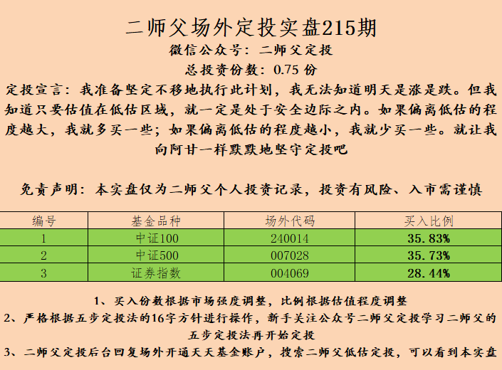
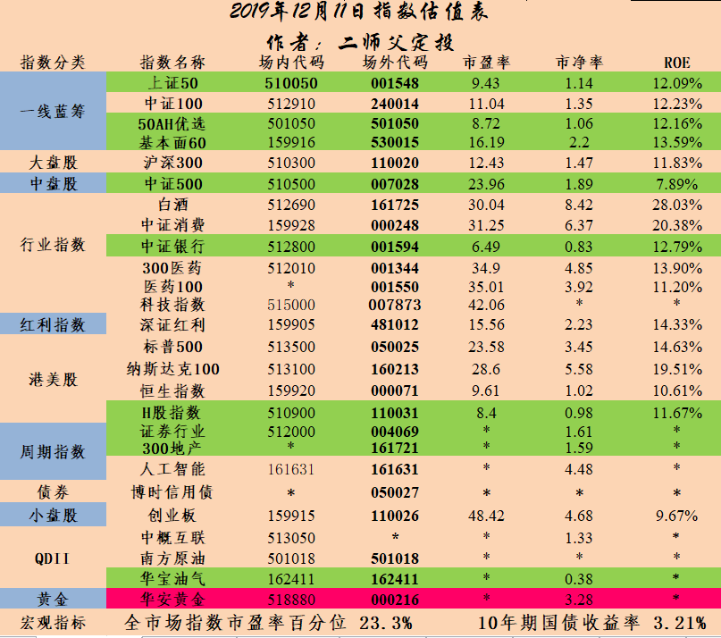

_type: q&a
@凌燕[51442188414844]
2019-12-01 18:39:14 Sun  
topic_id: 548242882115854

@凌燕

>  请问900015  中信证券可转债资产管理计划，这支基金什么特点?可以买吗？

@二师父

>  这是券商集合理财，这类产品的特点是牛市跟上，熊市少跌，回撤可控，可以购买。
>  
>  从他的收益率看19年8.97%的收益率，而且回撤10个点并没有跑赢普通的宽基指数，增值效果一般。

阅读[3476]  评论[0]  赞[0] 

======================================================

_type: talk
@二师父[28814221155551]
2019-12-01 18:44:06 Sun  
topic_id: 548242881118454

今天的文章，搜寻便宜货，按照节奏购买，请问下大家电脑录制音频用什么软件好一点

阅读[4221]  评论[0]  赞[0] 

+++++++++++++++++++++++++++++++++++++++++++++++++++++

文件：
2019-12-01 18:42:52 Sun
文件大小：[24709]
28282481482111-搜寻便宜货，按照节奏买.docx

2019-12-01 18:42:54 Sun
文件大小：[4161691]
15454158151222-搜寻便宜货，按照节奏购买.m4a

======================================================

_type: talk
@银河系[111814581215452]
2019-12-02 09:25:46 Mon  
topic_id: 118215222148412

华宝油气再创新低，0.374。

@凭栏观海 at 2019-12-02 09:25:46 Mon

> 只要回本，就要卖掉

----------

@凭栏观海 at 2019-12-02 09:25:46 Mon

> 垃圾指数，坚决不碰

----------

@凭栏观海 at 2019-12-02 09:25:46 Mon

> 不盈利不卖，跟它耗下去

----------

@凯 at 2019-12-02 09:25:46 Mon

> 都想卖了，屡创新低

----------

@齐俊波 at 2019-12-02 09:25:46 Mon

> 估计是出事了。

----------

阅读[3353]  评论[6]  赞[0] 

======================================================

_type: q&a
@云云[118525244841512]
2019-12-02 09:34:07 Mon  
topic_id: 241548555422241

@云云

>  二师父，今天的烽火发债733498适合申购吗？

@二师父

>  适合的

阅读[3458]  评论[4]  赞[0] 

======================================================

_type: q&a
@素兮[548121415528244]
2019-12-02 09:35:05 Mon  
topic_id: 241545111824421

@素兮

>  二师父，我定投的50ah，基本面60，国企指数，这三只指数占比的比例各几成合适？

@二师父

>  这几个国企指数波动大一点，只要定投的话风险可控，可以平均分配

阅读[3626]  评论[0]  赞[0] 

======================================================

_type: q&a
@四月天[822552518422]
2019-12-02 11:26:10 Mon  
topic_id: 421428845122888

@四月天

>  二师傅好，我是激进型，不怕回撤，想要牛市教高收益，那么配置哪种基金较好呢？谢谢。

@二师父

>  配置行业基金比较好，等待优质的行业银行，保险，科技，医药，消费进入低估配置，单个行业基金比宽基指数的风险高，不过收益也更好

阅读[3610]  评论[4]  赞[0] 

======================================================

_type: q&a
@杨帆@洋洋-招财猫[844121251545412]
2019-12-02 14:42:38 Mon  
topic_id: 421428842112828

@杨帆@洋洋-招财猫

>  您好二师傅，我买了川投能源的转债，今天上市，涨了14%，请问这个可以继续持有，还是落袋为安呢

@二师父

>  上市直接卖了就行

阅读[3481]  评论[0]  赞[0] 

======================================================

_type: talk
@二师父[28814221155551]
2019-12-02 22:41:10 Mon  
topic_id: 241548884222451

<e type="hashtag" hid="481211145528" title="#指数估值#" /> 沪深300进入正常估值。马上年底了，对于沪深300指数这类市值指数通常会在12月的第二个周五的下一交易日调仓。

这是指数的优势，把不符合选股规则的股票剔除出去，也是指数永生不死的原因所在，一般调仓之后指数的估值会发生变化。到时候会公布阈值。

阅读[3661]  评论[0]  赞[0] 

+++++++++++++++++++++++++++++++++++++++++++++++++++++

图片：

======================================================

_type: talk
@二师父[28814221155551]
2019-12-02 22:42:43 Mon  
topic_id: 241548884224511

<e type="hashtag" hid="144421824552" title="#保险行业指数#" /> 一起看看保险行业指数的投资价值

@王斌 at 2019-12-02 22:42:43 Mon

> 二师父，可否点评一下天弘中证证券保险001552？谢谢😜

----------

@二师父 at 2019-12-02 22:42:43 Mon

> 文中写了可以投，因为证券股票太多，还是不能重仓

----------

@王斌 at 2019-12-02 22:42:43 Mon

> 谢谢老师

----------

阅读[3977]  评论[3]  赞[0] 

+++++++++++++++++++++++++++++++++++++++++++++++++++++

文件：
2019-12-02 22:42:21 Mon
文件大小：[330056]
28282424815151-金融服务业之保险行业的投资价值分析.pdf

======================================================

_type: talk
@二师父[28814221155551]
2019-12-02 22:52:54 Mon  
topic_id: 548241114415254

日前，上海证券交易所与中证指数有限公司宣布调整上证50、上证180、上证380、上证红利等指数的样本股，中证指数有限公司同时宣布调整沪深300、中证100、中证500、中证红利、中证香港100等指数样本股，本次调整将于12月16日正式生效。

在本次样本调整中，上证50指数更换4只股票，上海机场、山东黄金等进入指数，宝钢股份、上海银行等被调出指数；上证180指数更换18只股票，恒力石化、上海临港等股票进入指数，三六零、养元饮品等股票被调出指数；上证380指数更换38只股票，闻泰科技、中国化学等进入指数，长电科技、欧派家居等被调出指数；上证红利指数更换10只股票，马钢股份、深高速等进入指数，华能国际、平高电气等被调出指数。沪深300指数更换16只股票，中公教育、晨光文具等股票进入指数，光线传媒、东方园林等被调出指数；中证100指数更换4只股票，立讯精密、爱尔眼科等股票进入指数，三安光电、宁波港等被调出指数；中证500指数更换50只股票，招商港口、中国船舶等股票进入指数，韦尔股份、步步高等被调出指数; 中证红利指数更换20只股票，桂冠电力、中南传媒等进入指数，宁波银行、泸州老窖等被调出指数;中证香港100指数更换6只股票，周大福、达利食品等进入指数，中国宏桥、卓尔智联等被调出指数。除以上核心指数之外，其它指数的样本股也进行了相应的调整。

阅读[3568]  评论[1]  赞[0] 

======================================================

_type: q&a
@诸恶莫作[844415418885482]
2019-12-02 23:07:35 Mon  
topic_id: 421428885221818

@诸恶莫作

>  二师父，请帮忙分折一下中证医疗和生物医药这两只基金怎么样？看上去比300医药和医药100好。谢谢您！

@二师父

>  中证医药100指数以2004年12月31日为基日，以1000点为基点，截至2019年11月29日，中证医药100指数收盘于12391.94点，涨幅11.39倍。
>  
>  沪深300医药指数也是以2004年12月31日为基日，截至2019年11月29日收盘点数是10637.12点，15年涨幅9.64倍。
>  
>  中证医疗也是以2004年12月31日为基日，截至2019年11月29日收盘点数是8849，15年涨幅7.84倍。
>  
>  生物医药以2012年6月29日为基日，基点1000点，截至2019年11月29日收盘点数是2915点，7年涨幅1.91倍。
>  
>  从历史收益率看医药100和沪深300医药更好。大概率中证医疗跑不赢沪深300医药和中证医药100。这两个相当于是优中选优。而中证医疗和生物医药一个是偏重医疗器械，一个是偏重生物医药，选股规则就弱一些。
>  
>  生物科技等板块的话未来会比较好，如果有兴趣可以关注下生物医药指数。

阅读[3731]  评论[2]  赞[0] 

======================================================

_type: q&a
@孤芳自赏[548114442211184]
2019-12-03 09:14:31 Tue  
topic_id: 548241151425114

@孤芳自赏

>  请问易方达中证500和南方中证500那个更好？后者比前者资产规模更大，别的好像差不多！

@二师父

>  前者的费率低一点，其他的差别不大

阅读[3720]  评论[0]  赞[0] 

======================================================

_type: talk
@二师父[28814221155551]
2019-12-03 09:23:40 Tue  
topic_id: 421428858211548

<e type="hashtag" hid="455542111428" title="#均线策略#" /> 之前做均线策略都是用的正常估值偏低或者低估值的指数，效果还不错，这次做一下实际回测，用消费ETF进行均线交易，一次买入两手，看看从正常偏低估值来进行定投的实际回撤

以前模拟过用中概互联测试最大回撤超过了百分之40，现在实测，大家等我消息，自己别轻易动，目前消费估值不低。

大家运用均线策略直接采用低估的指数开始就行。要想做的比平均收益率好，就需要多策略结合，当一种策略被市场越来越多人使用，慢慢就会拉低收益率了。仓位可以很舒服，不过投资知识的学习不能太舒服了，否则一个认知盲区就踩坑

@二师父 at 2019-12-03 09:23:40 Tue

> 具体持仓发一下，还有目前的心理状态

----------

@二师父 at 2019-12-03 09:23:40 Tue

> 给自己设定一个节奏，每周买入一部分，目前仍旧可以加仓，油气就别定投，设定4个价格0.36，0.34，0.32，0.3，按照这个价位进行网格加仓，如果不到这个价格就不动持有到盈利就可以

----------

@二师父 at 2019-12-03 09:23:40 Tue

> 没问题

----------

阅读[3745]  评论[8]  赞[0] 

======================================================

_type: talk
@二师父[28814221155551]
2019-12-03 11:23:20 Tue  
topic_id: 548241155588824

<e type="hashtag" hid="222251552151" title="#关于提问#" /> 大家提问的时候要尽可能详细点，比如投资的指数是什么，遇到什么问题，最大的困惑，目前的财务状况，现金流情况，还有自己的想法，如果资金量不方便公布可以说个比例，笼统的提问无法得到有针对性的解答，每个人的情况都是不同的，所以仓位，可以投资的指数还有建立底仓的情况都不一样的，一定要符合自己的实际情况

比如有人流动资金大，重仓很轻松，因为他有不断的现金流，相当于不投的话仓位是不断降低的

阅读[3618]  评论[0]  赞[0] 

======================================================

_type: q&a
@J[28281541518551]
2019-12-03 17:25:18 Tue  
topic_id: 421428852888258

@J

>  二师父好，目前场外仓位7成，50AH、基本面60、恒生国企、券商和中概、油气，除了油气亏12%，H股亏不到1%，其余基本持平或稍盈利1-2%，那现在应该加仓多少适合？

@二师父

>  继续定投，按照自己的节奏定投完毕锁仓即可，油气按照0.36，0.34，0.32的价格补，别定投了。

阅读[3522]  评论[2]  赞[0] 

======================================================

_type: talk
@二师父[28814221155551]
2019-12-03 19:09:56 Tue  
topic_id: 841548848452522

看看投资者如何获胜的，其实熊市越久，投资者可以积累的越多。

正如一个人默默无闻的努力的日子一样，我们称之为扎根

阅读[3540]  评论[0]  赞[0] 

+++++++++++++++++++++++++++++++++++++++++++++++++++++

文件：
2019-12-03 19:09:16 Tue
文件大小：[406022]
88282421128582-阴跌不断的熊市是未来超额收益的源泉.pdf

======================================================

_type: talk
@二师父[28814221155551]
2019-12-03 19:11:25 Tue  
topic_id: 241548848454821

<e type="hashtag" hid="481211145528" title="#指数估值#" /> 市场永远无规则运动，准备周一加仓他就给我涨，还连涨两天。

目前仓位还比较舒服，来几个深蹲好加仓啊。

@程宏峰 at 2019-12-03 19:11:25 Tue

> 今天开黑车了

----------

@二师父 at 2019-12-03 19:11:25 Tue

> 车速多少

----------

@速。冻 at 2019-12-03 19:11:25 Tue

> 师父想加仓什么？

----------

@cotton at 2019-12-03 19:11:25 Tue

> 二师父，华宝油气就一直放着不动了么。。

----------

@二师父 at 2019-12-03 19:11:25 Tue

> 恒生和银行

----------

@二师父 at 2019-12-03 19:11:25 Tue

> 你多少仓位啊

----------

@cotton at 2019-12-03 19:11:25 Tue

> 二十八分之一

----------

@二师父 at 2019-12-03 19:11:25 Tue

> 拿着，现在别卖

----------

阅读[3791]  评论[15]  赞[0] 

+++++++++++++++++++++++++++++++++++++++++++++++++++++

图片：

======================================================

_type: q&a
@Jessie在水一方[111851554242252]
2019-12-03 21:19:49 Tue  
topic_id: 421428825428188

@Jessie在水一方

>  请问我买的医药和科技ETF比较高，现在该怎么操作呢？

@二师父

>  啥位置买的，多少仓位，现在应该盈利，可以减仓一部分

阅读[3756]  评论[4]  赞[0] 

======================================================

_type: q&a
@妖孽[544888148518184]
2019-12-04 09:27:07 Wed  
topic_id: 421428814824448

@妖孽

>  请问二师父沪深300价值和中证银行我该如何取舍，还有逻辑。目前纠结持有这两只 好比老婆老妈同时掉河里该去救谁……

@二师父

>  你这是把投资和感情混在一起了，投资不是恋爱，恋爱靠感觉，不讲逻辑。投资靠逻辑，不讲感觉。
>  
>  这个还是比较好取舍的，追求稳健当然是300价值，追求行业轮动，能够承受回撤，想取得更好的收益率那就是中证银行，首先确定你的目标，然后不同的目标不同的配置

阅读[3705]  评论[1]  赞[0] 

======================================================

_type: talk
@二师父[28814221155551]
2019-12-04 09:46:43 Wed  
topic_id: 118215585541522

<e type="hashtag" hid="455541821528" title="#关于买入#" /> 买入慎重，卖出果断，不断买什么基金之前都要做足功课，如果不是很懂，把自己的想法发到学堂大家一起讨论看是否合适

最怕看着像要上涨，然后买入，这种情况买了之后百分之70的概率会经历一定的回撤，然后就被套住了

@程宏峰 at 2019-12-04 09:46:43 Wed

> 二师父您对指数的买入卖出，是否有结合周期和趋势考虑吗？

----------

@牛牛 at 2019-12-04 09:46:43 Wed

> 二师父163407和040025现在持有，这两个基金怎么样

----------

@二师父 at 2019-12-04 09:46:43 Wed

> 主要结合估值和周期

----------

@二师父 at 2019-12-04 09:46:43 Wed

> 沪深300可以持有，另外一个利润收割

----------

@牛牛 at 2019-12-04 09:46:43 Wed

> 谢谢

----------

@圣诞结® at 2019-12-04 09:46:43 Wed

> 二师父 今年9月初一次性买了8k块的005827  那时刚开始接触基金不久 买的点不太好 成本单价有点高 期间收割过一次小利润 最近一直在跌 在犹豫等以后回本时候要不要卖了？想请教您这只基以后还有保留的价值吗？😂

----------

@二师父 at 2019-12-04 09:46:43 Wed

> 持仓股票目前不错，如果基金经理不换股可以继续持有

----------

@圣诞结® at 2019-12-04 09:46:43 Wed

> 好的 谢谢

----------

阅读[3693]  评论[10]  赞[0] 

======================================================

_type: talk
@老孙头[422115118524548]
2019-12-04 13:29:51 Wed  
topic_id: 548241188285554

二师父，华锋债可否申购？

@Snow at 2019-12-04 13:29:51 Wed

> A+，不适合

----------

@J at 2019-12-04 13:29:51 Wed

> 果断放弃

----------

阅读[3433]  评论[2]  赞[0] 

======================================================

_type: q&a
@心荷[241825511182221]
2019-12-04 21:28:34 Wed  
topic_id: 118215421581822

@心荷

>  二师傅您好，请问5G008086是否可以认购谢谢

@二师父

>  新基金不建议

阅读[3279]  评论[0]  赞[0] 

======================================================

_type: talk
@二师父[28814221155551]
2019-12-04 21:31:42 Wed  
topic_id: 841548254282242

<e type="hashtag" hid="481211145528" title="#指数估值#" /> 恒生进入低估了。课程我又重新录制了下，增加了一些内容，后面随着市场变化会多增加一些内容，课程终身有效，有更新的话会持续上传，大家有疑惑的地方也随时交流。

@王斌 at 2019-12-04 21:31:42 Wed

> 二师父 今天的下跌是不是你又加仓了？[呲牙]心心念的恒生和银行？？？

----------

@惠张勇 at 2019-12-04 21:31:42 Wed

> 老师：深证红利是不是也到低估区了，我保存估值表后面的估值是16到24之间，现在我看是15.92

----------

@二师父 at 2019-12-04 21:31:42 Wed

> 阈值调整了15

----------

@二师父 at 2019-12-04 21:31:42 Wed

> 仓位都不轻，还没加

----------

@惠张勇 at 2019-12-04 21:31:42 Wed

> 收到，老师

----------

@隔窗遥望 at 2019-12-04 21:31:42 Wed

> H股指数和恒生指数有什么区别

----------

@王斌 at 2019-12-04 21:31:42 Wed

> 您自己持仓是恒生国企吧？恒生连接也低估了 今天补仓了 我之前买的一些 微亏 二师父有什么建议么？

----------

@二师父 at 2019-12-04 21:31:42 Wed

> 恒生全是香港企业，H股是业务在大陆，在香港上市

----------

阅读[3417]  评论[12]  赞[0] 

+++++++++++++++++++++++++++++++++++++++++++++++++++++

图片：

======================================================

_type: talk
@二师父[28814221155551]
2019-12-04 21:34:00 Wed  
topic_id: 241548254218281

牛市会来的，用理智思维去分析，战胜直觉思维

阅读[4006]  评论[0]  赞[0] 

+++++++++++++++++++++++++++++++++++++++++++++++++++++

文件：
2019-12-04 21:33:39 Wed
文件大小：[24263]
28282441548481-相信未来，牛市会来的.docx

======================================================

_type: talk
@二师父[28814221155551]
2019-12-04 21:55:46 Wed  
topic_id: 241548254482451

今天去雪球，别人竟然一直以为我是一位美女，难道不够man吗[发呆]

@J at 2019-12-04 21:55:46 Wed

> 哈哈，这个前台是师父吗？

----------

@二师父 at 2019-12-04 21:55:46 Wed

> 我有这么美吗

----------

@J at 2019-12-04 21:55:46 Wed

> 美男子一枚[调皮]

----------

@妖孽 at 2019-12-04 21:55:46 Wed

> 喊师娘

----------

@J at 2019-12-04 21:55:46 Wed

> 哈哈，差点以为你是师娘[调皮]

----------

@cotton at 2019-12-04 21:55:46 Wed

> 笑死我了

----------

@衣袂飘香 at 2019-12-04 21:55:46 Wed

> 哈哈

----------

@木公先生 at 2019-12-04 21:55:46 Wed

> [呲牙]我就笑笑，我不说话

----------

阅读[3570]  评论[13]  赞[0] 

+++++++++++++++++++++++++++++++++++++++++++++++++++++

图片：

======================================================

_type: q&a
@J[28281541518551]
2019-12-04 22:12:37 Wed  
topic_id: 421428542252428

@J

>  想问问师父，你之前提过在正常估值区间，尝试用消费和科技做一下偏离度定投的回测，很期待看到你的测试结果，可以公布了吗？我买入了场内观察仓，目前消费的成本是3.022，科技的成本是1.19，做得不是很好，少亏2点左右，之后怎么操作好呢？

@二师父

>  我是做实测，目前消费盈利，这个需要很长时间的，回测盈利是很好的，就是回撤大

阅读[3703]  评论[10]  赞[0] 

======================================================

_type: talk
@二师父[28814221155551]
2019-12-05 09:52:33 Thu  
topic_id: 118215454511422

<e type="hashtag" hid="455588821448" title="#215期定投实盘#" /> 跟大家说说二师父的配置逻辑哈，其实场外定投实盘相对于场内的标的少，配置思路也简单一些的。中证100相当于是50AH和基本面60的替代品。

这三个都属于蓝筹股指数。当然也可以用深证100替代基本面60，这个看自己的选择了。那为什么投资了中证100还要投资50AH和基本面60呢？

因为估值不是同步的，我们会发现50AH和基本面60进入低估之后，中证100还没有进入低估，所以就用这个组合。

对于银行指数，虽然在中证100和50里面有一些银行股票持仓，但是和银行指数的权重还是有区别的，为了在不同经济周期获取行业轮动的超额收益，还是需要重点在行业弱周期的时候配置行业指数的。

还有券商指数，二师父已经换仓到了纯被动的券商指数上，以后分级基金暂时不投，上面的风向还是很重要，我们一起等到明年底看看剩余的分级基金会是个什么情况。

@衣袂飘香 at 2019-12-05 09:52:33 Thu

> 二师父，您场内的鳄鱼计划近段好像都没启动吧？

----------

@圣诞结® at 2019-12-05 09:52:33 Thu

> 我没有投中证100 一直只定投 50AH和基本面60 本期还是按照比例定投了中证银行 😂

----------

@Chu at 2019-12-05 09:52:33 Thu

> 什么是分级基金，能科普一下，我们手头上投的基金有哪些是分级基金呀？

----------

@Candice at 2019-12-05 09:52:33 Thu

> 请问地产指数分级160218需要也操作转换一下吗

----------

@J at 2019-12-05 09:52:33 Thu

> 师父，这周为啥不买银行了呢？

----------

@J at 2019-12-05 09:52:33 Thu

> 我也是😂

----------

@二师父 at 2019-12-05 09:52:33 Thu

> 母基金一般会转型

----------

阅读[3936]  评论[12]  赞[0] 

+++++++++++++++++++++++++++++++++++++++++++++++++++++

图片：

======================================================

_type: q&a
@素兮[548121415528244]
2019-12-05 10:02:48 Thu  
topic_id: 548241512121114

@素兮

>  二师父，年金险你怎么看？需要买年金险么？现在各大保险公司都在鼓吹4.025%的利率将一去不复返

@二师父

>  这个利率并不是很高哈，有点饥饿营销的套路。
>  
>  年轻的投资者没有太大的必要购买年金险的，因为这个收益率并不高，而且购买这类保险的费率会很高。
>  
>  在当前点位，一次性购买沪深300，持有3到5年，收益率也远远会高于4%。

阅读[3440]  评论[0]  赞[0] 

======================================================

_type: q&a
@YRL[544884221154844]
2019-12-05 14:47:47 Thu  
topic_id: 548241515588224

@YRL

>  请问二师父，今天H股目前价格是1.185，在90日均线以下，适合建立底仓么

@二师父

>  定投就好，这只基金低估很久了，港股指数建立底仓风险还是比较大

阅读[3070]  评论[0]  赞[0] 

======================================================

_type: q&a
@Sandy[241825541554851]
2019-12-05 14:51:56 Thu  
topic_id: 841548282414242

@Sandy

>  请问二师父，传媒ETF 512980现在可以建仓吗? 谢谢

@二师父

>  这个指数去年买过，19年3月卖了，如果不卖现在还趴着，周期指数这个不如券商，把资金放在优质指数上，你看看今年收益率，好像没几个指数比他差

阅读[3153]  评论[1]  赞[0] 

======================================================

_type: talk
@二师父[28814221155551]
2019-12-05 14:55:22 Thu  
topic_id: 421428581428558

分级基金退市之前说过了，母基金不用太担心，主要是子基金要注意

@杜志彪 at 2019-12-05 14:55:22 Thu

> 那就是说场外定投的不受影响吗？我是场外定投方正富邦中证保险主题指数分级，二师父给看看要不要转到其它基金里。

----------

@二师父 at 2019-12-05 14:55:22 Thu

> 母基金大概率会转型的，具体怎么做还得看通知，这个指数可以不用着急，分级B是需要尽早转

----------

@张炜紫 at 2019-12-05 14:55:22 Thu

> 之前投的160268国泰国证房地产行业指数分级是分级基金吧？

----------

@二师父 at 2019-12-05 14:55:22 Thu

> 对的

----------

@rtdmm小米 at 2019-12-05 14:55:22 Thu

> 请问二师父，场内的中证银行512800，证券512000有影响没？

----------

@二师父 at 2019-12-05 14:55:22 Thu

> 这个不是分级基金

----------

@杨荧 at 2019-12-05 14:55:22 Thu

> 意思国泰房地产后面有可能清盘？

----------

@二师父 at 2019-12-05 14:55:22 Thu

> 这是分级基金的母基金，也有可能转型

----------

阅读[3265]  评论[14]  赞[0] 

+++++++++++++++++++++++++++++++++++++++++++++++++++++

图片：

======================================================

_type: talk
@二师父[28814221155551]
2019-12-05 20:23:28 Thu  
topic_id: 841548222841152

<e type="hashtag" hid="481211145528" title="#指数估值#" />

@华为～ at 2019-12-05 20:23:28 Thu

> 二师父好！目前深圳红利和纳斯达克100能建仓吗？

----------

@速。冻 at 2019-12-05 20:23:28 Thu

> 都没低估怎么能建仓呢？

----------

@华为～ at 2019-12-05 20:23:28 Thu

> 我着急了

----------

@二师父 at 2019-12-05 20:23:28 Thu

> 深红利还可以小仓位，纳斯达克是一定不行的

----------

@华为～ at 2019-12-05 20:23:28 Thu

> 师父，深证红利可以小仓位定投建仓？

----------

@二师父 at 2019-12-05 20:23:28 Thu

> 你不怕回撤就可以，这个距离低估不太远

----------

@华为～ at 2019-12-05 20:23:28 Thu

> 好，谢谢！

----------

@helen at 2019-12-05 20:23:28 Thu

> 二师父，恒生国企是看你表里的恒生指数吗？

----------

阅读[3574]  评论[9]  赞[0] 

+++++++++++++++++++++++++++++++++++++++++++++++++++++

图片：

======================================================

_type: q&a
@孤芳自赏[548114442211184]
2019-12-05 22:20:18 Thu  
topic_id: 548241554218514

@孤芳自赏

>  h30588怎么找不到售卖这支基金

@二师父

>  这是指数代码不是基金代码

阅读[3119]  评论[0]  赞[0] 

======================================================

_type: q&a
@牛牛[548141224521114]
2019-12-06 09:24:33 Fri  
topic_id: 548241554422444

@牛牛

>  二师父，华安科技动力混合，要利益收割，我之前是每周定投的，现在还继续吗

@二师父

>  混合基金不建议定投，指数基金更好

阅读[3050]  评论[1]  赞[0] 

======================================================

_type: talk
@老孙头[422115118524548]
2019-12-06 10:45:06 Fri  
topic_id: 548241545124214

二师父——南方中证500信息技术联接C(004347)，眼下可定投(仓位把握？)吗？

阅读[2909]  评论[0]  赞[0] 

======================================================

_type: talk
@二师父[28814221155551]
2019-12-06 20:41:47 Fri  
topic_id: 841548418142452

最近波段网格和均线都可以用起来，先建立底仓，然后波段，挺爽的。

@程宏峰 at 2019-12-06 20:41:47 Fri

> 网格不会用，啥标的？初始网价格？

----------

@二师父 at 2019-12-06 20:41:47 Fri

> 新手选择低估的盈利稳定的指数

----------

阅读[2751]  评论[2]  赞[0] 

======================================================

_type: talk
@二师父[28814221155551]
2019-12-06 20:42:54 Fri  
topic_id: 241548418142181

<e type="hashtag" hid="481211145528" title="#指数估值#" /> 中证100和中证500进入正常估值了。坚持定投，定投完毕锁仓，等待牛市的到来。

@华为～ at 2019-12-06 20:42:54 Fri

> 二师父您好！您的意思是中证100基金从低估区域到正常区域，就保持定投，不要管其它情况？

----------

@华为～ at 2019-12-06 20:42:54 Fri

> 定投完毕锁仓是什么意思？

----------

@J at 2019-12-06 20:42:54 Fri

> 师父，想问一个有点low的问题[调皮]我抽到了22元的支付宝红包，可以买黄金etf基金，打算持有7天就卖掉可以吗？这样风险高吗？

----------

@二师父 at 2019-12-06 20:42:54 Fri

> 锁仓就是不动了

----------

@二师父 at 2019-12-06 20:42:54 Fri

> 正常估值停止定投

----------

@二师父 at 2019-12-06 20:42:54 Fri

> 有点风险，黄金高位，可以赌一赌运气，前提是亏了自己能接受

----------

@J at 2019-12-06 20:42:54 Fri

> 好！之前没买过黄金etf，波动率高吗

----------

@二师父 at 2019-12-06 20:42:54 Fri

> 周期强，波动率不高

----------

阅读[3335]  评论[16]  赞[0] 

+++++++++++++++++++++++++++++++++++++++++++++++++++++

图片：

======================================================

_type: talk
@二师父[28814221155551]
2019-12-06 20:44:39 Fri  
topic_id: 548241481844114

<e type="hashtag" hid="145458855482" title="#周五读书#" /> 之前这本书出版的时候有个读者给我发了，说我的理念和这本书有相似的部分，认真读了下，感觉真的和作者不谋而合，他想的大部分想法都是我想的，包括我做的组合配置，其实就是在不同周期的轮动，实现资产低位的积累。

@衣袂飘香 at 2019-12-06 20:44:39 Fri

> 今天又第2次看了文章，并且审视了自己的投资组合、单一持仓比例，投资节奏。

----------

阅读[3592]  评论[1]  赞[0] 

+++++++++++++++++++++++++++++++++++++++++++++++++++++

文件：
2019-12-06 20:43:15 Fri
文件大小：[55338]
88282158122112-霍华德马克思《周期》第一讲.docx

======================================================

_type: talk
@二师父[28814221155551]
2019-12-06 21:00:12 Fri  
topic_id: 548241485251584

<e type="hashtag" hid="458188281228" title="#鳄鱼计划持仓#" /> 目前券商仓位有点重，深红利仓位有点低，等待深红利低估，等不到就这样了，控制自己合适的仓位，这个比什么都重要。最近一直没怎么加，一方面自己仓位不轻，另外一方面确实市场没啥好机会了，如果8月份一次买入也总比我们现在的行情要好。

优秀的指数大概率优秀，利用消费做均线定投买入一次之后就上涨，这个继续回测，测试到明年的这个时候，我来公布结果，看看均线定投在指数估值偏高的时候能够带来的回撤和收益，以及我在这个过程中的心理变化。

@风轻云淡 at 2019-12-06 21:00:12 Fri

> 二师父，上表可以加一列目前收益吗？参考一下看看市场在哪个区间

----------

@风轻云淡 at 2019-12-06 21:00:12 Fri

> 收益率

----------

@二师父 at 2019-12-06 21:00:12 Fri

> 为防止盲目加仓就不加了吧

----------

@齐俊波 at 2019-12-06 21:00:12 Fri

> 二师父，您为何同时买了两个医药基？

----------

@二师父 at 2019-12-06 21:00:12 Fri

> 两个指数编纂规则不同，属于不同风格的医药指数

----------

@瓦尔登湖畔的老牛 at 2019-12-06 21:00:12 Fri

> 二师父，这个鳄鱼计划在哪个平台可以一键跟投？现在适合跟投吗？

----------

@二师父 at 2019-12-06 21:00:12 Fri

> 在场内买的

----------

@瓦尔登湖畔的老牛 at 2019-12-06 21:00:12 Fri

> 在场内我们无法一键跟投是吗？那目前这个组合适合在场外自己跟投吗？

----------

阅读[3188]  评论[14]  赞[0] 

+++++++++++++++++++++++++++++++++++++++++++++++++++++

图片：

======================================================

_type: talk
@树叶[544811512145144]
2019-12-07 09:37:43 Sat  
topic_id: 841548155212242

<e type="hashtag" hid="142825811122" title="#定投周报#" /> 二师父定投周报第37期

阅读[3151]  评论[0]  赞[0] 

+++++++++++++++++++++++++++++++++++++++++++++++++++++

文件：
2019-12-07 09:37:42 Sat
文件大小：[270028]
88282152288212-二师父定投周报12.7（第37期）.docx

======================================================

_type: talk
@Claire[244151258154481]
2019-12-07 09:57:47 Sat  
topic_id: 548241822425214

利用周末两天阅读《<e type="web" href="https://wx.zsxq.com/mweb/views/weread/search.html?keyword=周期" title="周期" style="book" />》，跟上师傅的节奏。

阅读[3090]  评论[0]  赞[0] 

======================================================

_type: q&a
@J[28281541518551]
2019-12-07 17:36:51 Sat  
topic_id: 241548154811241

@J

>  师父，请问广发医药和医药etf的指数编制有何区别吗？可否讲解一下

@二师父

>  医药ETF复制的是沪深300医药指数，沪深300医药是由沪深300指数样本股中的医药卫生行业股票组成。行业集中度高，截至到2019年11月29日，沪深300医药指数里面的恒瑞医药股票权重30.82%。沪深300医药指数也是以2004年12月31日为基日，截至2019年11月29日收盘点数是10637.12点，15年涨幅9.64倍。
>  
>  广发医药复制的是全指医药：全指医药是从中证全指样本股医药卫生行业内选择流动性和市场代表幸较好的股票作为持仓股票。如果行业内股票数量少于或等于50只，那么中证全指医药的样本股就为中证全指里面的全部医药股票。如果行业内股票数量多于50只，那么分别按照股票的日均成交额和日均总市值进行排名筛选。
>  
>  该指数以2004年12月31日为基日，基点1000点，截至2019年11月29日收盘点数是9633.69点，15年涨幅8.63倍。

阅读[3059]  评论[9]  赞[0] 

======================================================

_type: talk
@海盗[48248118584848]
2019-12-07 19:23:03 Sat  
topic_id: 548241828155844

<e type="hashtag" hid="225118152481" title="#指数基金均线偏离表#" />

@海盗 at 2019-12-07 19:23:03 Sat

> 有什么不懂的同学尽管可以问我[愉快]

----------

@陈飞🤗 at 2019-12-07 19:23:03 Sat

> 怎么没有油气的

----------

@海盗 at 2019-12-07 19:23:03 Sat

> 油气最近限制买入了

----------

@光少 at 2019-12-07 19:23:03 Sat

> 恒生ETF现在不是正常估值了吗

----------

@J at 2019-12-07 19:23:03 Sat

> 为什么没有科技etf？

----------

@海盗 at 2019-12-07 19:23:03 Sat

> 这个只是90日均线偏离表，具体还得结合二师父的估值表。最好还是选择低估的指数进行波段交易

----------

@海盗 at 2019-12-07 19:23:03 Sat

> 因为成立还不足90日，所以无法计算90日均线偏离表。

----------

@J at 2019-12-07 19:23:03 Sat

> 好的。还有一个疑问🤔️人工智能和纳斯达克都没到低估，为何加进偏离表呢？师父不是说低估才可做波段吗

----------

阅读[2992]  评论[16]  赞[0] 

+++++++++++++++++++++++++++++++++++++++++++++++++++++

图片：

======================================================

_type: talk
@二师父[28814221155551]
2019-12-07 20:26:56 Sat  
topic_id: 841548151244152

谨守安全边际原则，对于不在安全边际的基金不要碰。

@dongyan at 2019-12-07 20:26:56 Sat

> 二师父 请问生物医药指数现在可以定投吗

----------

@志亮 at 2019-12-07 20:26:56 Sat

> 嗯，安全第一，收益才是第二，二师父说的很对[微笑]

----------

阅读[3631]  评论[2]  赞[0] 

+++++++++++++++++++++++++++++++++++++++++++++++++++++

文件：
2019-12-07 20:26:36 Sat
文件大小：[24124]
15454824881212-医药回调，现在可以入手一些医药类的基金吗.docx

======================================================

_type: q&a
@王斌[48585418541828]
2019-12-08 13:51:21 Sun  
topic_id: 241548181555581

@王斌

>  二师父，随着估值低的指数越来越少，对于刚入场的普通投资者，下周场内有推荐的品种么？目前行情适合采用什么策略呢？

@二师父

>  场内银行指数，500ETF，恒生ETF，恒生跌幅会比较大，仓位不足可以建立三成底仓，策略就是低估定投加均线买入，当指数低估且偏离均线以下加大买入

阅读[2929]  评论[0]  赞[0] 

======================================================

_type: talk
@二师父[28814221155551]
2019-12-08 17:10:15 Sun  
topic_id: 241548181142851

龙头科技指数投资价值分析。现在还有部分指数可以定投，如果大盘涨到3000点以上估计就很少指数适合定投了，仓位已经充足的可以暂停定投了，做做波段，仓位不足的那么就继续。

阅读[3575]  评论[0]  赞[0] 

+++++++++++++++++++++++++++++++++++++++++++++++++++++

文件：
2019-12-08 17:09:07 Sun
文件大小：[25336]
48585184245228-中证龙头科技指数投资价值分析.docx

======================================================

_type: q&a
@隔窗遥望[241884481854181]
2019-12-08 17:42:18 Sun  
topic_id: 421428181125458

@隔窗遥望

>  恒生指数市盈率走势图是在哪里查到的

@二师父

>  自己做的

阅读[3063]  评论[4]  赞[0] 

======================================================

_type: talk
@二师父[28814221155551]
2019-12-09 09:46:33 Mon  
topic_id: 118215815444812

之前做的消费均线策略模拟暂停，周末重读聪明的投资者，审视下自己的投资体系，这种相对高位的加仓资金利用效率太低，已经卖出。

鳄鱼计划最近都没动，我在等消费，医药和人工智能，恒生重回低估区域，如果等不到就看500，银行和深红利加仓，这些品种也没有好机会的话就持有等待，没必要满仓的，除非大盘重回2400。鳄鱼计划的配置都是风险比宽基指数大的品种，场外估值表我就没有公布一些品种，因为怕新手误买，不知道买啥就买中证100，沪深300，50ah，基本面60，深证100这些品种，3000点以下购买风险很低的。

当基本的品种配置好了再进行全面配置，而且把一些周期性强的指数做好仓位管理

@J at 2019-12-09 09:46:33 Mon

> 我的消费略亏1.8%，还没卖掉

----------

@二师父 at 2019-12-09 09:46:33 Mon

> 仓位不重吧

----------

@J at 2019-12-09 09:46:33 Mon

> J回复定投专家~二师父: 不算重，占单只基金的6成左右，单只基金占总仓位5%左右。这样配置师父看可以吗？

----------

@二师父 at 2019-12-09 09:46:33 Mon

> 你这比较危险

----------

@J at 2019-12-09 09:46:33 Mon

> 我逐步调整一下

----------

@华为～ at 2019-12-09 09:46:33 Mon

> 二师父您好！我有一个问题不明白，就是收割利润怎么收割？举个例子，我上证50收益3000元，我想收割这3000元，怎么操作？赎回这3000吗？

----------

@二师父 at 2019-12-09 09:46:33 Mon

> 对的

----------

@华为～ at 2019-12-09 09:46:33 Mon

> 师父，但我不知道怎么操作？我赎回3000，就得卖本金份额呀？

----------

阅读[2931]  评论[14]  赞[0] 

======================================================

_type: talk
@二师父[28814221155551]
2019-12-09 14:07:01 Mon  
topic_id: 241548144528451

300医药跌的真爽，这样的跌幅再来5个就可以开干了，底仓不要动，剩余1成仓位可以做网格，市场就这样，灵活应对

@衣袂飘香 at 2019-12-09 14:07:01 Mon

> 跌吧，跌吧，我还没上过车呢。

----------

@三峡情 at 2019-12-09 14:07:01 Mon

> 我也没买过，抓紧荷包，等待上车[偷笑]

----------

@王斌 at 2019-12-09 14:07:01 Mon

> 啥时候买二师父给指令吧[呲牙]

----------

阅读[2765]  评论[3]  赞[0] 

======================================================

_type: q&a
@隔窗遥望[241884481854181]
2019-12-09 16:19:26 Mon  
topic_id: 241548115512221

@隔窗遥望

>  听到课程里说用智投星回测，请问智投星是什么软件

@二师父

>  百度就有的，直接可以回测数据

阅读[2686]  评论[0]  赞[0] 

======================================================

_type: talk
@二师父[28814221155551]
2019-12-09 19:38:17 Mon  
topic_id: 118215885551822

低位横盘，最近都不大适合动，小仓位网格还是可以的

阅读[2704]  评论[0]  赞[0] 

+++++++++++++++++++++++++++++++++++++++++++++++++++++

文件：
2019-12-09 19:37:55 Mon
文件大小：[193077]
48582481288288-低位横盘，请别乱动.docx

======================================================

_type: talk
@二师父[28814221155551]
2019-12-09 19:39:56 Mon  
topic_id: 841548118881822

<e type="hashtag" hid="481211145528" title="#指数估值#" /> 中证100低估，其他的没啥变化，保持节奏就好

阅读[3205]  评论[0]  赞[0] 

+++++++++++++++++++++++++++++++++++++++++++++++++++++

图片：

======================================================

_type: talk
@二师父[28814221155551]
2019-12-09 19:40:24 Mon  
topic_id: 421428118881588

低位横盘，请别乱动。

@志亮 at 2019-12-09 19:40:24 Mon

> 我现在是真的不敢动[捂脸]

----------

@速。冻 at 2019-12-09 19:40:24 Mon

> 除了低估定投，其他没啥好动的

----------

阅读[3379]  评论[2]  赞[0] 

+++++++++++++++++++++++++++++++++++++++++++++++++++++

文件：
2019-12-09 19:40:14 Mon
文件大小：[193077]
51514218415224-低位横盘，请别乱动.docx

======================================================

_type: q&a
@杨小峰[51514158212424]
2019-12-09 21:41:21 Mon  
topic_id: 548241881518184

@杨小峰

>  二师父，我想给孩子弄个账户，准备把他的压岁钱给他存起来，10年内应该不会用到，想买指数基金和债基可以不？

@二师父

>  可以的，短债和低估指数基金现在可以买，长债等10年期国债收益率3.5以上再买。股债轮动也是一个很好的策略

阅读[2797]  评论[0]  赞[0] 

======================================================

_type: talk
@二师父[28814221155551]
2019-12-09 22:35:01 Mon  
topic_id: 548241885141484

<e type="hashtag" hid="555515881484" title="#短债#" /> 晚上对比了短债基金和南方天天利货币B基金，用收益率扣除费率，南方天天利货币b的实际收益率更好，大家可以自己对比下

不要被名义收益率迷惑啦

@蓝魔森林 at 2019-12-09 22:35:01 Mon

> 那和博时合惠货币b比呢？

----------

@J at 2019-12-09 22:35:01 Mon

> 师父，短债基金的费率不是已经体现在净值上的吗？净值和年化收益率是扣除了费率的吧

----------

@蓝魔森林 at 2019-12-09 22:35:01 Mon

> @二师傅

----------

@二师父 at 2019-12-09 22:35:01 Mon

> 目前看博时更好

----------

@二师父 at 2019-12-09 22:35:01 Mon

> 这个是哪里的消息

----------

@J at 2019-12-09 22:35:01 Mon

> 基金公告应该有写的，师父有空看一下。我的认知不一定准确

----------

@二师父 at 2019-12-09 22:35:01 Mon

> 我记得是没有扣费率的，我再查查

----------

阅读[2766]  评论[12]  赞[0] 

======================================================

_type: talk
@二师父[28814221155551]
2019-12-10 07:05:55 Tue  
topic_id: 421425444448448

最近研究生入学考试和公务员考试临近，到处都可以看到努力的身影，毕业之后学习才刚刚开始，3年是一个分水岭，5到10年拉开巨大差距，你也可以试试坚持每天学习2小时，5年时间就会成为一个很厉害的人

@衣袂飘香 at 2019-12-10 07:05:55 Tue

> 学舞蹈3年，练瑜伽8年，打乒乓球10多年。没有变得很厉害，但在全市3000多人的系统里，好像还可以。
   学习指数投资，自信能长期坚持，因为乐在其中。希望到时候如二师父所说，成为一个厉害的人。

----------

@二师父 at 2019-12-10 07:05:55 Tue

> 厉害了，我认识体制内的朋友要么有两把刷子，要么后台够硬，总之八仙过海各显神通

----------

@衣袂飘香 at 2019-12-10 07:05:55 Tue

> 过奖了。一个爱玩耍的，也热爱学习的普通人。

----------

阅读[2784]  评论[3]  赞[0] 

+++++++++++++++++++++++++++++++++++++++++++++++++++++

图片：

======================================================

_type: talk
@二师父[28814221155551]
2019-12-10 08:56:22 Tue  
topic_id: 241542555222421

城投债违约，投资城投ETF债券基金的需要注意了。

城投债，又称"准市政债"，是地方投融资平台作为发行主体，公开发行企业债和中期票据，其主业多为地方基础设施建设或公益性项目。

债券投资的两大风险是利率风险和违约风险，对于长期债券适合在高利率的时候投资，如果之前投资的话现在需要注意了。城投ETF从2018年单边上涨目前已经回落。

阅读[3322]  评论[0]  赞[0] 

======================================================

_type: talk
@竺胜江[841881441421582]
2019-12-10 10:15:16 Tue  
topic_id: 421425448482118

二师父，请问现在买一点油汽的底仓，后面做网格可以吗

@二师父 at 2019-12-10 10:15:16 Tue

> 可以小额资金做

----------

阅读[2702]  评论[1]  赞[0] 

======================================================

_type: q&a
@mommybug[244115184545221]
2019-12-10 14:16:52 Tue  
topic_id: 421425442181858

@mommybug

>  老师，香港中小还值得长期持有吗？

@二师父

>  这个价值没有大盘的恒生和恒生国企好

阅读[2675]  评论[0]  赞[0] 

======================================================

_type: talk
@二师父[28814221155551]
2019-12-10 14:19:09 Tue  
topic_id: 841542551528842

不知道为什么我的帖子又被删了，可能不能提某气。

下午涨了500最好不追，今天一把骚操作上午买500，下午涨了一个点，4个鸡腿了

@二师父 at 2019-12-10 14:19:09 Tue

> 你买入的逻辑是什么

----------

@二师父 at 2019-12-10 14:19:09 Tue

> 基金经理换了怎么办，股票回撤下跌20个点你如何操作

----------

@二师父 at 2019-12-10 14:19:09 Tue

> 股权仓位过重，而且持仓股票有的我也看不懂

----------

@J at 2019-12-10 14:19:09 Tue

> 4个鸡腿腿多少钱？[呲牙]

----------

阅读[2716]  评论[8]  赞[0] 

======================================================

_type: talk
@J[28281541518551]
2019-12-10 15:35:25 Tue  
topic_id: 118214228455152

今天下午券商0.88卖出一份，N个鸡腿[胜利]😄

阅读[2583]  评论[0]  赞[0] 

======================================================

_type: talk
@二师父[28814221155551]
2019-12-10 18:51:28 Tue  
topic_id: 118214252442482

<e type="hashtag" hid="481211145528" title="#指数估值#" /> 估值变化不大，耐心等待。

@衣袂飘香 at 2019-12-10 18:51:28 Tue

> 二师父您好，我场外买入的房地产指数分级和证券指数分级，都微盈利了一些，盈利不到2%。目前该如何操作？我记得您说过，等盈利的时候卖出，目前我要全部卖出吗？还是逐步分批卖出？谢谢您！这两个基金的资金占比，大致各占5%。

----------

@陈飞🤗 at 2019-12-10 18:51:28 Tue

> 盈利百分之2，你为什么要卖

----------

@二师父 at 2019-12-10 18:51:28 Tue

> 证券可以专为纯被动的，地产在明年底逐步卖出即可，目前低估区域，还有一定的涨幅

----------

@衣袂飘香 at 2019-12-10 18:51:28 Tue

> 您好！意思是证券分级指数此时卖出，同时等额买进纯被动证券指数，地产的指数分级到2020年12月左右才卖出。是这个意思吗？

----------

@二师父 at 2019-12-10 18:51:28 Tue

> 不是的证券指数我是转换成了场内的另外一只证券指数，仍旧持有。地产指数没有相应的地产指数基金，所以就等盈利逐步卖出，不是说到那时候，对于分级基金的处理是截止到明年12月底，具体时间还没出来

----------

@衣袂飘香 at 2019-12-10 18:51:28 Tue

> 好的。您的意思，应该是地产分级指数在明年12月底之前，盈利逐步卖出。证券指数分级，超级转换成场外的全指证券etf连接a。

----------

@二师父 at 2019-12-10 18:51:28 Tue

> 对的

----------

@衣袂飘香 at 2019-12-10 18:51:28 Tue

> 谢谢您。

----------

阅读[3138]  评论[8]  赞[0] 

+++++++++++++++++++++++++++++++++++++++++++++++++++++

图片：

======================================================

_type: talk
@二师父[28814221155551]
2019-12-10 18:52:38 Tue  
topic_id: 241542585228481

今天分享下股债轮动策略，股市和债市轮动配置，实现利润翻滚，等10年期国债收益率大概3.6%以上逐步可以配置债券。当前定投指数基金即可。

@太阳 at 2019-12-10 18:52:38 Tue

> 二师父，股债轮动策略的收益如何？

----------

@二师父 at 2019-12-10 18:52:38 Tue

> 比利润收割好，比持有到牛市高点弱一些

----------

@太阳 at 2019-12-10 18:52:38 Tue

> [强]谢谢二师父！

----------

阅读[2815]  评论[3]  赞[0] 

+++++++++++++++++++++++++++++++++++++++++++++++++++++

文件：
2019-12-10 18:51:49 Tue
文件大小：[24657]
28284524252151-学会股债轮动配置策略，终身持有让利润翻滚.docx

======================================================

_type: q&a
@心荷[241825511182221]
2019-12-10 21:27:33 Tue  
topic_id: 841542582154512

@心荷

>  二师傅您好，请问债券003358的利率是多少怎么知道？谢谢啦

@二师父

>  什么利率？

阅读[2727]  评论[0]  赞[0] 

======================================================

_type: talk
@二师父[28814221155551]
2019-12-10 22:04:46 Tue  
topic_id: 841542584542522

目前长债场内主要是国债1619，国债ETF，场外有广发纯债，博时信用债，7-10国开债。

这是在国债收益率走高的时候配置，短债收益率好的，规模不足1亿，暂时不建议配置

阅读[2793]  评论[0]  赞[0] 

======================================================

_type: talk
@二师父[28814221155551]
2019-12-11 05:59:19 Wed  
topic_id: 841542581258412

起来录制好了富人思维课程，卷腹100下，定投基金，定投智慧，定投身体，大家一起来吧[呲牙]

@许田野 at 2019-12-11 05:59:19 Wed

> 二师父早～我已坚持晨跑定投身体，跟着二师父和大家一起加油[呲牙]

----------

@二师父 at 2019-12-11 05:59:19 Wed

> 加油，我是夜跑

----------

@jorfy at 2019-12-11 05:59:19 Wed

> 加油，坚持中午跑，跟着二师父定投已深入到生活的各方面

----------

阅读[3263]  评论[3]  赞[0] 

+++++++++++++++++++++++++++++++++++++++++++++++++++++

图片：

======================================================

_type: talk
@二师父[28814221155551]
2019-12-11 06:53:18 Wed  
topic_id: 241542581282211

你永远赚不到超出你认知范围的钱

除非你靠运气

但是靠运气赚到的钱

最后往往一会靠实力亏掉

这是一种必然

你所赚的每一分钱

都是你对这个世界认知的变现

你所亏的每一分钱

都是因为对这个世界认知有缺陷

这个世界最大的公平在于：

当你一个人的财富大于自己认知的时候

这个社会有100种方法收割你

直到你的认知和财富相匹配为止

@🍀 凝🌸 慧🍀 at 2019-12-11 06:53:18 Wed

> 一针见血！

----------

阅读[2827]  评论[1]  赞[0] 

======================================================

_type: talk
@Claire[244151258154481]
2019-12-11 07:34:24 Wed  
topic_id: 841542581454542

早安！今日份打新债提醒：先导转债，评级AA。福特转债、白电转债上市。

@光少 at 2019-12-11 07:34:24 Wed

> 这个新债打新，还要开通创业板转签的吗

----------

@Gingo at 2019-12-11 07:34:24 Wed

> 先导转债是创业板的 所以要先开通创业板才能打

----------

@宋晓洋 at 2019-12-11 07:34:24 Wed

> 我和我老公都没开通创业板，我试他的不行，结果试了一下我的，就打成了，是咋回事呢

----------

阅读[2800]  评论[4]  赞[0] 

======================================================

_type: talk
@罗大发[421484455521228]
2019-12-11 10:26:20 Wed  
topic_id: 241542822258251

请问白电转债挣44块也卖吗？

@One at 2019-12-11 10:26:20 Wed

> 上市就卖，可转债很少会动的

----------

@罗大发 at 2019-12-11 10:26:20 Wed

> 才看见，谢谢建议

----------

阅读[2689]  评论[2]  赞[0] 

======================================================

_type: talk
@二师父[28814221155551]
2019-12-11 10:36:19 Wed  
topic_id: 118214544454452

<e type="hashtag" hid="555514541824" title="#基建#" /> 基建稳定增长的边际递减

第一次基建稳定增长是发生在1998年金融网欸及，长期国债发行6600亿，头像水利，交通，通信等基础设施，然后出现了8年经济高速增长。

第二次基建稳增长在2008年金融危机，4万亿用于投资民生、基础设施建设，节能减排等，但是仅仅发挥了小的作用。稳定了3年。

基建稳定增长的作用边际递减。

阅读[2874]  评论[0]  赞[0] 

======================================================

_type: talk
@二师父[28814221155551]
2019-12-11 14:24:59 Wed  
topic_id: 241542824428481

9连阳了，这么卖力的上证综指，我想到了两年前

@背心 at 2019-12-11 14:24:59 Wed

> 真想买的消费

----------

@衣袂飘香 at 2019-12-11 14:24:59 Wed

> 然后呢？

----------

@衣袂飘香 at 2019-12-11 14:24:59 Wed

> 后来发生了什么？

----------

@二师父 at 2019-12-11 14:24:59 Wed

> 没有然后了

----------

@二师父 at 2019-12-11 14:24:59 Wed

> 后来暴跌啊，跌到哭爹喊娘

----------

@衣袂飘香 at 2019-12-11 14:24:59 Wed

> 吓死宝宝了！

----------

@陈飞🤗 at 2019-12-11 14:24:59 Wed

> 两年前怎么了

----------

@Zyxj at 2019-12-11 14:24:59 Wed

> 四天十字星了

----------

阅读[2837]  评论[15]  赞[0] 

+++++++++++++++++++++++++++++++++++++++++++++++++++++

图片：

======================================================

_type: talk
@二师父[28814221155551]
2019-12-11 17:03:55 Wed  
topic_id: 241542821242251

招商证券份额拆分，这是分级基金的定期拆分，对投资的母基金没啥影响，可以不用担心。二师父已经把招商证券转换成南方证券了，这样的话就没有定期折算拆分了，后面也不用担心分级基金的处理问题，地产分级最近也盈利，慢慢等等盈利还不错了也逐步卖出，不会跟趋势做对的哈。

大家好像怕在学堂发言，二师父觉得不懂或者说错了都不可怕，最多被人笑一笑，你不会少一块肉，而如果很多投资的东西没有弄明白操作错了，最终亏损了那可是真金白银的损失，所以多学习，多和学堂的朋友一起探讨，总能避免一些坑。

@二师父 at 2019-12-11 17:03:55 Wed

> 别看短期的

----------

@小牧童 at 2019-12-11 17:03:55 Wed

> 师父，你现在就把证券全部转好了吗？用的超级转换吗？转过去之后净值成本价之类怎么算？

----------

@林凤崎 at 2019-12-11 17:03:55 Wed

> 161720拆分有什么影响

----------

@二师父 at 2019-12-11 17:03:55 Wed

> 转了的，你可以看看我天天基金的实盘，成本按照转过去的成本

----------

@二师父 at 2019-12-11 17:03:55 Wed

> 份额和单位净值变动，基金净资产不变的

----------

@青青竹 at 2019-12-11 17:03:55 Wed

> 师傅，招商证券转南方证券，是有手续费的吧？比卖掉从新买入费用更便宜？

----------

@二师父 at 2019-12-11 17:03:55 Wed

> 成本一样的，就是时间上有优势

----------

阅读[2702]  评论[13]  赞[0] 

======================================================

_type: talk
@二师父[28814221155551]
2019-12-11 18:36:12 Wed  
topic_id: 118214515124152

<e type="hashtag" hid="481211145528" title="#指数估值#" /> 新增了上证50和原油的，审视了下我的鳄鱼计划，如果不配置上证50，风险还是有点大，目前还没有配齐的有上证50、创业板、人工智能，创业板是自己给卖了，不知道还能不能回去，以后卖出也尽量不清仓。

现在大盘很怪异，不管他，就按照既定的投资就好了。明天定投日，继续定投，加油啊，希望来几个大跌，可以加倍定投，否则真的别额外加仓。

@隔窗遥望 at 2019-12-11 18:36:12 Wed

> 上证50好50AH需要都配置吗？我配置了50AH

----------

@二师父 at 2019-12-11 18:36:12 Wed

> 有两个医药啊

----------

@二师父 at 2019-12-11 18:36:12 Wed

> 一个就行哈

----------

@冯林锋 at 2019-12-11 18:36:12 Wed

> 南方原油是追踪美油还是追踪布油

----------

@二师父 at 2019-12-11 18:36:12 Wed

> nymex

----------

阅读[3396]  评论[18]  赞[0] 

+++++++++++++++++++++++++++++++++++++++++++++++++++++

图片：

======================================================

_type: talk
@二师父[28814221155551]
2019-12-11 18:39:39 Wed  
topic_id: 421425828242518

可转债打新以前说过了，最近市场不温不火，上证综合指数以自己倔强的方式努力着，可是怎么感觉他无法改变自己既定的命运。

@向前进 at 2019-12-11 18:39:39 Wed

> 打了没中

----------

@jier at 2019-12-11 18:39:39 Wed

> 二师父，第三段300元应该是3000元吧？还有，您说熊市适合购买，牛市适合打新。现在是熊市，不也一般是上市就卖吗？中签后不卖继续持有等待牛市再卖可以么？

----------

@二师父 at 2019-12-11 18:39:39 Wed

> 没必要，有涨有跌，牛市盈利概率更大，熊市也可以

----------

@衣袂飘香 at 2019-12-11 18:39:39 Wed

> 打了没中。

----------

@心韵 at 2019-12-11 18:39:39 Wed

> 打了没中

----------

阅读[3589]  评论[5]  赞[0] 

+++++++++++++++++++++++++++++++++++++++++++++++++++++

文件：
2019-12-11 18:39:02 Wed
文件大小：[118766]
15451212182812-今天这只可转债开盘涨停，你中签了吗.docx

======================================================

_type: talk
@曾来[841555815828282]
2019-12-11 19:54:40 Wed  
topic_id: 241542848141481

证券指数分级转换了的话，那300地产分级是不是属于应转换的分级基金之列？可以继续持有？

@姥姥不疼. 爷爷不爱 at 2019-12-11 19:54:40 Wed

> 同问？？

----------

@二师父 at 2019-12-11 19:54:40 Wed

> 我没买这个，买的国证地产，明年底之前逐步卖出，目前盈利的

----------

@曾来 at 2019-12-11 19:54:40 Wed

> 我持有的就是二师傅您估值表里的161721，招商沪深300等权重分级，马上要定期份额折算，后续根据分级基金清理状况逐步退，还是等到高估退？

----------

@二师父 at 2019-12-11 19:54:40 Wed

> 折算是分级基金固定业务，不用担心

----------

阅读[3043]  评论[4]  赞[0] 

======================================================

_type: talk
@二师父[28814221155551]
2019-12-11 22:12:51 Wed  
topic_id: 841542842448142

<e type="hashtag" hid="144442515882" title="#216期定投实盘#" /> 还是买入0.75份，大盘不涨不跌，我们就一直坚持，可能节奏快的朋友资金不太足了，大家不用担心，买在低估区域未来都会盈利，耐心持有就行。

我从来不预测市场，也不企图买在最低点，只要价格低于价值就可以买，只不过当偏离的越远，买的越多罢了。场内不用的资金可以买点货币基金，不用这个时候配置长期债券，还远远没有到时机呢。

我很喜欢熊市，这样可以慢慢的积累，目前最有价值的就是A股和港股，大家抓住机会，至于未来是涨是跌，这个我真的无法预测，我只能做好组合，降低非系统性风险，这样的话可以把回撤控制在可接受的范围内。

最后提醒一句，捂住自己的钱袋子，当每一笔钱出去的时候你都要想，第一|不出去行不行，如果可以不出去，那就不出去。第二，出去了未来能不能回来，未来能回来多少。

如果这两个问题都能够好好地回答，那么就可以支付了。目前好像各行各业都不好挣钱，所以骗子比较多，大家谨慎。

@孤芳自赏 at 2019-12-11 22:12:51 Wed

> 是指定投总金额的0.75吗？

----------

@二师父 at 2019-12-11 22:12:51 Wed

> 一份的0.75，一份2000，那么0.75是1500

----------

@蓝魔森林 at 2019-12-11 22:12:51 Wed

> 总仓库是100份？

----------

@二师父 at 2019-12-11 22:12:51 Wed

> 这个实盘大概还有50份，不过每月还有工资的

----------

@蓝魔森林 at 2019-12-11 22:12:51 Wed

> 那就是大概16个月投完。

----------

@jier at 2019-12-11 22:12:51 Wed

> 每月4份，50份大概12个月投完。增量资金另算

----------

@蓝魔森林 at 2019-12-11 22:12:51 Wed

> 现在定投缩减到一年投完了吗？

----------

@手牵手看夕阳 at 2019-12-11 22:12:51 Wed

> 坚持定投

----------

阅读[3865]  评论[10]  赞[0] 

+++++++++++++++++++++++++++++++++++++++++++++++++++++

图片：

======================================================

_type: talk
@蓝魔森林[28888244485121]
2019-12-11 22:23:32 Wed  
topic_id: 118214514842582

<e type="hashtag" hid="144442515882" title="#216期定投实盘#" /> 怎么突然又买华夏ah了呀？

@Zyxj at 2019-12-11 22:23:32 Wed

> 中证100估值适中了，不适合定投了

----------

阅读[3167]  评论[1]  赞[0] 

======================================================

_type: talk
@拥抱太阳的风筝[48812454818528]
2019-12-12 08:58:37 Thu  
topic_id: 841542818525542

二师父，招商券商分级161720根据《关于招商中证全指证券公司指数分级证券投资基金办理定期份额折算业务的公告》将于12月16日和17日两天进行定期份额折算，对其公告一头雾水，希望给予解惑，另外持有收益率20.22%，需要卖出吗?定期份额折算和不定期份额折算有什么区别?

@二师父 at 2019-12-12 08:58:37 Thu

> 目前仍旧低估区域，收割利润就可以的，基金份额折算是指在基金资产净值不变的前提下，按照一定比例调整基金份额总额。份额折算后，基金份额总额与持有人持有的基金份额数额将发生调整，但调整后的持有人持有的基金份额占基金份额总额的比例不发生变化。

只是说不定期份额折算是按照触发了分级基金规定的折算价格就进行份额拆分，定期份额折算是按照规定的时间进行份额折算

----------

阅读[3007]  评论[1]  赞[0] 

======================================================

_type: q&a
@Claire[244151258154481]
2019-12-12 10:07:30 Thu  
topic_id: 118214585418582

@Claire

>  师父，你好！记得你曾说单支行业指数仓位不超过10%，但现在中证银行估值低，可以适当提高仓位吗？

@二师父

>  可以的，做好组合就行降低风险就行，最多不要单只超过25个点，这是极限了，控制仓位就是防止发生非系统风险时候能够降低波动率

阅读[3138]  评论[1]  赞[0] 

======================================================

_type: talk
@二师父[28814221155551]
2019-12-12 10:13:58 Thu  
topic_id: 421425818511458

<e type="hashtag" hid="555552528254" title="#组合投资#" /> 今天大盘跌，场内鳄鱼计划是涨的，主要因为美股和恒生涨，这就是组合配置的好处，降低波动率，让人心理压力比较小，如果账户一直做过山车的话，会比较难受。

全面配置的意义在于降低风险，至少a股，美股，港股全面配置，如果资金充足可以考虑德国和日本，如果资金不足，这两个市场一般，不用配置。

对于新手的话，做好a股轮动就好，选择稳健的宽基，配置好债券也能降低风险

@程宏峰 at 2019-12-12 10:13:58 Thu

> 请问二师父，鳄鱼计划怎么跟呢

----------

@孤芳自赏 at 2019-12-12 10:13:58 Thu

> 现在美股估价不低能配置吗？

----------

@二师父 at 2019-12-12 10:13:58 Thu

> 现在基本不发车了，看看定投实盘吧

----------

@二师父 at 2019-12-12 10:13:58 Thu

> 不能

----------

阅读[3168]  评论[4]  赞[0] 

======================================================

_type: talk
@二师父[28814221155551]
2019-12-12 10:26:43 Thu  
topic_id: 241542818485541

<e type="hashtag" hid="822225251882" title="#债券基金和混合基金#" /> 短债值不值得购买，市场上也有短债收益率很好的，比如先锋汇盈纯债债券型证券投资基金，然而规模比较低，我们选择产品的时候安全性放在第一位，比如场外的中概互联一直低于1亿，尽管他有价值，也没有进行投资。

短债值得购买，如果你资金不大，适合闲钱打理，在利率低位的时候，实现3%的实际收益率没有问题。

另外说说混合基金，混合基金主要是股债轮动策略，大家看到的基金表现一直很好，不管牛熊，这是因为基金经理运用的趋势策略，熊市重仓债券，牛市重仓股票，抓牛股，然而并不是每一次都做对，如果你有信任的基金经理，可以跟着他，但前提是学会股票分析，至少不能够在重仓股票整体高位进入。

我讲过混合基金不适合定投，就是因为持仓股票有的变化太快，但是如果做趋势是可以的，市场风格多变，每个人性格不同，选择适合自己的就好的。

我是做价值所以不会购买混合基金，但是我会做股债搭配这也相当于混合基金了，看自己的情况来配置，不同收益率对应不同的组合，不同的组合对应不同的波动风险，投资不可能一个模式的。

阅读[3770]  评论[0]  赞[0] 

======================================================

_type: talk
@二师父[28814221155551]
2019-12-12 10:38:05 Thu  
topic_id: 421425818211128

<e type="hashtag" hid="455554541548" title="#关于定投周期#" /> 对于场内的定投，也就是鳄鱼计划我基本是投完了，如果没有特别好的机会估计不会再动，我说的定投周期5年是从一轮熊市开始的，比如2016年到2020年，基本5年周期，投完为止，而且这是以前的市场环境，未来会变化

加入你从2019年入市，当然定投周期不会是5年，这个是变化的。就相当于从深圳到北京，坐高铁大概是10个小时吧，你从深圳上车需要10小时，你从武汉上车需要5小时，你从河北上车需要1小时，上车时间不同周期不一样的。

还有定投份额确定，根据万得全市场百分位确定哈，22.5%——25%，目前位置真的不是极度低估，去年我天天叫着买买买，你发现没，在今年1月重仓买入任何一只基金都会比定投收益好，当机会一般的时候，正常定投就可以了。

你看很多读者券商盈利30多个点，银行盈利18个点，这都是去年积累的效果，当然从长期看，未来大盘涨到3500很容易，现在定投，未来盈利也是很轻松的。

@蓝魔森林 at 2019-12-12 10:38:05 Thu

> 是的 定投周期随着大盘指数变动而变化。我是支持定期不定额的。不追求绝对定投时间

----------

@蓝魔森林 at 2019-12-12 10:38:05 Thu

> 投入时间很关键。所以也要灵活。过了这个村，也不要气馁，要找到自己的节奏，坚信以后会涨就好

----------

@衣袂飘香 at 2019-12-12 10:38:05 Thu

> 鳄鱼计划是指数处于极度低估的时候出手。看极度低估要怎么理解。或者说除了全市场估值之外，单个指数的估值在什么情况下处于极度低估？
  我的鳄鱼计划，才投了不到30%。接下来怎么投好呢？
   @二师父

----------

@二师父 at 2019-12-12 10:38:05 Thu

> 每周投一点

----------

@衣袂飘香 at 2019-12-12 10:38:05 Thu

> 好的，这样每周场外定投，场内也投一点。是这样吧。

----------

@二师父 at 2019-12-12 10:38:05 Thu

> 对

----------

阅读[3258]  评论[13]  赞[0] 

======================================================

_type: talk
@二师父[28814221155551]
2019-12-12 18:40:17 Thu  
topic_id: 118214422822512

<e type="hashtag" hid="481211145528" title="#指数估值#" /> 今天市场分化，A股跌，美股，港股涨。做好全面配置。

最近都没咋变化，大家看看上证综合指数的月线图，从5月份开始到现在7个月基本是一条直线，中国特色股市

@Zhu Yongsh* at 2019-12-12 18:40:17 Thu

> 我记得深圳红利的估值区间是16-24倍，现在是15.51倍，还不是低估吗？

----------

@二师父 at 2019-12-12 18:40:17 Thu

> 还没有，阈值有变化

----------

@华为～ at 2019-12-12 18:40:17 Thu

> 师父，我想全面配置基金，A股配置了，港股和美股配置哪些指数基金呢？谢谢！

----------

@二师父 at 2019-12-12 18:40:17 Thu

> 纳斯达克，恒生

----------

@华为～ at 2019-12-12 18:40:17 Thu

> 您能给推荐下具体的基金吗？想定投，包括什么时候可以建仓？谢谢！

----------

@二师父 at 2019-12-12 18:40:17 Thu

> 现在需要等待机会

----------

@华为～ at 2019-12-12 18:40:17 Thu

> 谢谢！

----------

@Zhu Yongsh* at 2019-12-12 18:40:17 Thu

> 现在的阈值是多少了？

----------

阅读[3637]  评论[21]  赞[0] 

+++++++++++++++++++++++++++++++++++++++++++++++++++++

图片：

======================================================

_type: talk
@素兮[548121415528244]
2019-12-12 19:29:36 Thu  
topic_id: 241542258585811

二师父的鳄鱼计划一份是多少？当特别低估的机会来临的时候，一次投入几份？

阅读[3056]  评论[0]  赞[0] 

======================================================

_type: talk
@二师父[28814221155551]
2019-12-13 05:30:52 Fri  
topic_id: 841542251448522

人民币破7，虽然美元贬值了，但是这是一个对股市的利好，全面配置的意义再次凸显

阅读[2987]  评论[0]  赞[0] 

======================================================

_type: talk
@孙平[48548211154218]
2019-12-13 08:02:57 Fri  
topic_id: 548245512224824

二师父，请问分级基金份额折算和基金分红有何区别？

@曾来 at 2019-12-13 08:02:57 Fri

> 份额折算总金额保持不动，只是份额和净值变动；分红的话等于基金经理把股票卖了，把钱分给持有人，持有的份额不动，每份净值减少。

----------

阅读[3135]  评论[1]  赞[0] 

======================================================

_type: talk
@妖孽[544888148518184]
2019-12-13 10:05:24 Fri  
topic_id: 118214452188822

滴.滴.滴滴......今日我要开黑车，前方道路坎坷，有上车的嘛？

@凯 at 2019-12-13 10:05:24 Fri

> 已下车一部分

----------

@背心 at 2019-12-13 10:05:24 Fri

> 下车，是做网格吗？仓位不重，珍惜自已手中的筹码

----------

阅读[3062]  评论[2]  赞[0] 

======================================================

_type: talk
@王燕[241582821454511]
2019-12-13 10:30:07 Fri  
topic_id: 118214455221222

发生了什么吗？懵懵的……

阅读[3118]  评论[0]  赞[0] 

======================================================

_type: talk
@二师父[28814221155551]
2019-12-13 10:44:28 Fri  
topic_id: 118214455245422

大家赚嗨了，底仓切记不要卖，做波段也只是小额资金，长期持有到大牛市，不然牛来了没有高仓位很容易追高，要有长期思维

@三峡情 at 2019-12-13 10:44:28 Fri

> 嗨起来

----------

@🍀 凝🌸 慧🍀 at 2019-12-13 10:44:28 Fri

> 哈哈，跟着二师父不断实践！

----------

@🍀 凝🌸 慧🍀 at 2019-12-13 10:44:28 Fri

> 二师父，底仓和主仓位是一码事吗？

----------

@二师父 at 2019-12-13 10:44:28 Fri

> 不是一回事，主仓比如说你是8成仓位，这是重仓，而底仓是在没有的时候建立的

----------

@🍀 凝🌸 慧🍀 at 2019-12-13 10:44:28 Fri

> 谢谢二师父啊，我搞混淆了

----------

@秦风殇韵（刘豫斌） at 2019-12-13 10:44:28 Fri

> 券商基金我是做网格，今天浮盈4%，可以出了么？

----------

@二师父 at 2019-12-13 10:44:28 Fri

> 一份一份的出，不排除继续上涨

----------

@🍀 凝🌸 慧🍀 at 2019-12-13 10:44:28 Fri

> 今天的鸡腿有点儿大啊[偷笑]

----------

阅读[3355]  评论[11]  赞[0] 

======================================================

_type: q&a
@小牧童[28484254825881]
2019-12-13 11:41:43 Fri  
topic_id: 421425582454148

@小牧童

>  师父，中证银行15年之前的估值数据哪里能查询到？

@二师父

>  万得

阅读[3304]  评论[2]  赞[0] 

======================================================

_type: talk
@二师父[28814221155551]
2019-12-13 13:32:24 Fri  
topic_id: 841542284488252

<e type="hashtag" hid="222225148551" title="#五步定投法#" /> 遵照这个投资方法，我在15年，17年，19年分别保住了自己的利润。虽然牛市到来利润会少一点，但是我的场外账户利润收割，场内账户终身持有偶尔波段，两者结合，那么任何市场都不会错过了。

理念和哲学不变，但是策略永远优化，只有敬畏市场，勤于学习，多实践并且不断改进，才能做好投资。当停止学习，自我膨胀的时候，也就是亏钱的起点。投资者始终要明白，你挣的钱到底是凭实力还是凭运气。

@Chu at 2019-12-13 13:32:24 Fri

> 很好奇师父在 15、17、19年化利润可以去到多少呀？

----------

@素兮 at 2019-12-13 13:32:24 Fri

> 二师父的场内账户是不是不收割利润，一直持有到牛市？

----------

@二师父 at 2019-12-13 13:32:24 Fri

> 好奇害死猫

----------

@二师父 at 2019-12-13 13:32:24 Fri

> 偶尔波段，基本持有到高估

----------

@梧桐 at 2019-12-13 13:32:24 Fri

> 二师父，场内做波段，场外持有不动是不是更好一些，因为场内费率低

----------

@二师父 at 2019-12-13 13:32:24 Fri

> 场内长期持有费率也低于场外

----------

@梧桐 at 2019-12-13 13:32:24 Fri

> 场外做波段会频繁交易，费率会高吧

----------

@梧桐 at 2019-12-13 13:32:24 Fri

> 我理解错了，收割不等于波段。

----------

阅读[4069]  评论[8]  赞[0] 

+++++++++++++++++++++++++++++++++++++++++++++++++++++

文件：
2019-12-13 13:29:07 Fri
文件大小：[847054]
51514285588514-二师父为基金投资者打造的五步定投法（3.0）.pdf

======================================================

_type: talk
@勤能行之[481211221828]
2019-12-13 15:09:41 Fri  
topic_id: 548245518248414

想请问一下师傅我在天天基金今天赎回的基金是按照今天的价格吗？是下午3:00之前赎回的。

@陈飞🤗 at 2019-12-13 15:09:41 Fri

> 是的

----------

@勤能行之 at 2019-12-13 15:09:41 Fri

> 谢谢解答[愉快]

----------

阅读[3049]  评论[2]  赞[0] 

======================================================

_type: talk
@二师父[28814221155551]
2019-12-13 17:49:44 Fri  
topic_id: 241542281115251

<e type="hashtag" hid="481211145528" title="#指数估值#" /> 中证100正常估值了，星球的朋友仓位都可以了吧，小资金波段可以，但是至少留7成仓位哈，不然等大盘反转很容易又追高的。

不管这次是短期上涨还是长期牛市，主仓位都别动，因为企业盈利在增长，长期持有股权一定是比货币基金和债券基金好的。

@Hi·DD at 2019-12-13 17:49:44 Fri

> 才六成的我默默看别人吃肉[微笑]

----------

@向前进 at 2019-12-13 17:49:44 Fri

> 两成仓位[可怜]

----------

@高达无双喝味全 at 2019-12-13 17:49:44 Fri

> 赚钱效应有了  活跃的人就多了[偷笑][偷笑][偷笑]

----------

@青青竹 at 2019-12-13 17:49:44 Fri

> 我比较保守吧，仓位大概五成，继续定投和鳄鱼计划

----------

@志亮 at 2019-12-13 17:49:44 Fri

> 我估计今天只是反弹而已，大家别激动[偷笑]

----------

@银河系 at 2019-12-13 17:49:44 Fri

> 请问多少点以内买的算底仓

----------

@范毅君 at 2019-12-13 17:49:44 Fri

> 一涨心里没底，下周该如何操作呢，下周哪些适合继续定投呢，求二师父指教

----------

阅读[3860]  评论[12]  赞[0] 

+++++++++++++++++++++++++++++++++++++++++++++++++++++

图片：

======================================================

_type: q&a
@美美[48224811151218]
2019-12-13 19:07:10 Fri  
topic_id: 421425554885448

@美美

>  二师父好！我一直想问一个问题，但又不好意思，可好几个月了这个问题困扰着我，今天鼓起勇气问一问吧。就是估值高低及正常是怎么看的？或者是以什么为标准看的？再或者是以哪几个因素做参考？

@二师父

>  主要四个指标，市盈率，市净率，市销率和股息率，一般而言市盈率越低，指数估值越低，而对于盈利不稳定的就失效了，比如券商，还有市净率，一般而言市净率越低估值越低，而对于有不良资产的银行，市净率也失效，所以通常这几个指标结合使用，防止偏差

阅读[3165]  评论[3]  赞[0] 

======================================================

_type: talk
@梧桐[844118451242512]
2019-12-13 19:18:04 Fri  
topic_id: 421425554852818

今天去听易经课的小蓄卦，讲了因果的延迟，比如人们的收入到手越延迟的收入越高，依次为小时工，月工资，年工资，数十年的企业收入等等，跟咱们的耐心定投是相通的。

阅读[3035]  评论[0]  赞[0] 

======================================================

_type: talk
@妖孽[544888148518184]
2019-12-13 21:50:47 Fri  
topic_id: 841542222482242

请问二师父如何计算可转债打新价值，会不会破发，值不值得打新。

阅读[3152]  评论[0]  赞[0] 

======================================================

_type: talk
@二师父[28814221155551]
2019-12-13 21:53:35 Fri  
topic_id: 421425555281848

<e type="hashtag" hid="145458855482" title="#周五读书#" /> 周期第二讲，看看周期来了如何把握住

@二师父 at 2019-12-13 21:53:35 Fri

> 已经换了，你看我天天实盘

----------

@二师父 at 2019-12-13 21:53:35 Fri

> 不用担心的

----------

@🍀 凝🌸 慧🍀 at 2019-12-13 21:53:35 Fri

> 我也买了161720招商证券分级基金，接下来该咋操作？不懂啊。请教二师父。

----------

@速。冻 at 2019-12-13 21:53:35 Fri

> 我们也需要转换吗？

----------

@jier at 2019-12-13 21:53:35 Fri

> 读完了《<e type="web" href="https://wx.zsxq.com/mweb/views/weread/search.html?keyword=伟大的博弈" title="伟大的博弈" style="book" />》，接下来准备读《<e type="web" href="https://wx.zsxq.com/mweb/views/weread/search.html?keyword=周期" title="周期" style="book" />》，跟上二师父的节奏💪

----------

阅读[4169]  评论[8]  赞[0] 

+++++++++++++++++++++++++++++++++++++++++++++++++++++

文件：
2019-12-13 21:53:01 Fri
文件大小：[363261]
15451281584542-霍华德马克思《周期》第二讲.pdf

======================================================

_type: talk
@妖孽[544888148518184]
2019-12-13 22:19:43 Fri  
topic_id: 241542222182451

请问各位鸡友，今年收益创新高了吧……

@凯 at 2019-12-13 22:19:43 Fri

> 3月是高点

----------

@朝阳模具 at 2019-12-13 22:19:43 Fri

> 收益不断创新高中[愉快][愉快]

----------

@海盗 at 2019-12-13 22:19:43 Fri

> 对，3月是高点。

----------

阅读[3212]  评论[3]  赞[0] 

======================================================

_type: talk
@二师父[28814221155551]
2019-12-13 22:48:51 Fri  
topic_id: 241542224525221

<e type="hashtag" hid="455558425228" title="#宏观经济指标#" /> 带大家学习宏观经济，自下而上进行投资。先基本面，再世界经济和中国的货币政策，财政政策。一步步来哈。至于股票，星球对这个管的太严了，不敢公开谈，有兴趣的话可以公众号交流。

@🍀 凝🌸 慧🍀 at 2019-12-13 22:48:51 Fri

> 谢谢二师父分享

----------

阅读[4157]  评论[1]  赞[0] 

+++++++++++++++++++++++++++++++++++++++++++++++++++++

文件：
2019-12-13 22:47:17 Fri
文件大小：[335976]
48582412811148-宏观经济指标之GDP.pdf

======================================================

_type: talk
@树叶[544811512145144]
2019-12-14 10:34:10 Sat  
topic_id: 118214415454452

<e type="hashtag" hid="142825811122" title="#定投周报#" /> 二师父定投周报第38期

阅读[3370]  评论[0]  赞[0] 

+++++++++++++++++++++++++++++++++++++++++++++++++++++

文件：
2019-12-14 10:34:09 Sat
文件大小：[252711]
51514284854284-二师父定投周报12.14（第38期）.docx

======================================================

_type: talk
@午后阳光[118554451184882]
2019-12-14 17:03:36 Sat  
topic_id: 841542244582522

现在我买指数基金仓位一成不到，买低估值品种那个可以提高仓位好？谢谢！

@J at 2019-12-14 17:03:36 Sat

> 银行

----------

@惠张勇 at 2019-12-14 17:03:36 Sat

> 低估区域的都可以，证券和房产属于周期指数注意仓位！定投靠积累，得慢慢来，不能着急

----------

@海盗 at 2019-12-14 17:03:36 Sat

> [强]

----------

阅读[3041]  评论[3]  赞[0] 

======================================================

_type: talk
@梧桐[844118451242512]
2019-12-14 17:24:01 Sat  
topic_id: 548245544254254

二师父，16号和17号有6只可转债，是否可以打

@凯 at 2019-12-14 17:24:01 Sat

> 可以

----------

@海盗 at 2019-12-14 17:24:01 Sat

> 在哪里可转债打新？

----------

@凯 at 2019-12-14 17:24:01 Sat

> 场内账户，股票软件可以

----------

@海盗 at 2019-12-14 17:24:01 Sat

> 谢谢，我刚刚也看了二师父以前关于可转债打新的文章

----------

阅读[3103]  评论[4]  赞[0] 

======================================================

_type: talk
@二师父[28814221155551]
2019-12-14 20:43:23 Sat  
topic_id: 421425522152458

<e type="hashtag" hid="555551515814" title="#投资机会#" /> 今天参加了新浪的线下沙龙会，学习心得，未来的投资机会，仅为个人观点，非投资建议哈。大家可以发表自己的意见。

@海盗 at 2019-12-14 20:43:23 Sat

> 刚看了报道，说是中美贸易战已经和解了。

----------

阅读[4075]  评论[1]  赞[0] 

+++++++++++++++++++++++++++++++++++++++++++++++++++++

文件：
2019-12-14 20:42:41 Sat
文件大小：[355519]
15451525412882-2020年的投资机会在哪里.pdf

======================================================

_type: talk
@二师父[28814221155551]
2019-12-14 20:46:35 Sat  
topic_id: 548245544858424

如果现在还没有布局好，那么哪只指数比较好呢，50AH和纯被动的上证50比较好，尤其50AH还处于低位，可以建底仓。

不过二师父建议投资不能着急，一步步来，比如今年3300二师父叫着不要建底仓结果很多人还是建了，最终也很难受，不要着急，耐心等待，谁也不知道市场下一次是涨还是跌，那么当你上仓位的时候就需要问自己，如果下跌能够承受的住吗？

大多数人是承受不了的，所以还是保持节奏，赚的慢，但是稳。

@速。冻 at 2019-12-14 20:46:35 Sat

> 那些3300建底仓的同志站出来[呲牙]

----------

@陈飞🤗 at 2019-12-14 20:46:35 Sat

> 我

----------

@王模堂 at 2019-12-14 20:46:35 Sat

> 501050（50AH）埸内交易量大小，周五才241.6万，是没人卖吗？只能埸外定投吗？

----------

@二师父 at 2019-12-14 20:46:35 Sat

> 这只基金规模比较大，成交额小了可能会有流动性风险，因为场内和对手交易，场外和机构交易

----------

阅读[4031]  评论[4]  赞[0] 

======================================================

_type: q&a
@小眼静🎀[844121141821482]
2019-12-14 20:54:43 Sat  
topic_id: 841542244128842

@小眼静🎀

>  二师傅，我想问一下周四定投但周五才确定份额，是不是应该周三定投呢？

@二师父

>  周五确认是以周四收盘价格确认的

阅读[3526]  评论[0]  赞[0] 

======================================================

_type: q&a
@牛牛[548141224521114]
2019-12-14 21:29:01 Sat  
topic_id: 118214482145122

@牛牛

>  二师父，你好，每日估值表是交易日的每天15：00之后才能看到吗？

@二师父

>  对的，收盘后统计

阅读[3552]  评论[7]  赞[0] 

======================================================

_type: talk
@姥姥不疼. 爷爷不爱[48544481458248]
2019-12-14 21:32:33 Sat  
topic_id: 841542215442522

小白太多？问的都是幼儿园问题

@朝阳模具 at 2019-12-14 21:32:33 Sat

> 因为进学堂都是来向二师父学习的么[愉快]

----------

@姥姥不疼. 爷爷不爱 at 2019-12-14 21:32:33 Sat

> 俺的意思是：这些新人别动不动就提问学前教育的东东，自己动手动脑先学习二师父的文章，五步定投法等。你的明白？？

----------

@呼唤旷野 at 2019-12-14 21:32:33 Sat

> 哈哈，兄弟秀一秀今年的收益？

----------

阅读[3522]  评论[4]  赞[0] 

======================================================

_type: talk
@王模堂[241848855148111]
2019-12-14 23:34:54 Sat  
topic_id: 241542218281181

<e type="hashtag" hid="555551515814" title="#投资机会#" /> 2020年的行业牛有哪些呢？第一，我认为半导体 行业。第二，5g行业。第三，消费行业。第四，得到医保亲爱的有关的医药行业比如说糖尿病药物列净系列。。

@.Five at 2019-12-14 23:34:54 Sat

> 银行

----------

阅读[3461]  评论[1]  赞[0] 

======================================================

_type: talk
@二师父[28814221155551]
2019-12-15 10:27:03 Sun  
topic_id: 548245585448484

“PUA”，全称为Pick-up Artist，中性的角度来看，是学习搭讪技术，能和异性开始聊天，才有发展关系的可能。但现在有更多物化与伤害异性的成分，通过控制异性，让他们变成自己的“宠物”，骗取他们的钱财，甚至有令人发指的“自杀鼓励”。

别让自己的孩子缺爱，别成为控制型父母，别盲目个人崇拜。

阅读[3476]  评论[0]  赞[0] 

======================================================

_type: talk
@海盗[48248118584848]
2019-12-15 11:50:19 Sun  
topic_id: 241542214522541

信用账户申购的意思是先不出钱吗？中签以后再付款，是这个意思吗？

@海盗 at 2019-12-15 11:50:19 Sun

> 大家都是几个账户去申购的？

----------

@凯 at 2019-12-15 11:50:19 Sun

> 普通账户申购就行，信用账户没开通，中签后账户有钱就行

----------

@海盗 at 2019-12-15 11:50:19 Sun

> 发行价都是100的，申购一次是10份吗

----------

@凯 at 2019-12-15 11:50:19 Sun

> 安上限申购中签概率大

----------

@海盗 at 2019-12-15 11:50:19 Sun

> 谢谢了

----------

@秦岭云横 at 2019-12-15 11:50:19 Sun

> 信用卡能用？

----------

@海盗 at 2019-12-15 11:50:19 Sun

> 这里和信用卡扯不上关系呀

----------

阅读[3480]  评论[7]  赞[0] 

+++++++++++++++++++++++++++++++++++++++++++++++++++++

图片：

======================================================

_type: talk
@二师父[28814221155551]
2019-12-15 18:01:55 Sun  
topic_id: 118214122884542

从人类历史来看，终极产出最高的投资永远是在教育上，对国家如此，对个人也是如此。所以，我一直有一个理论，一个人如果在看书上省时间、在买书上省钱、在藏书上省地方，这个人这辈子恐怕也就这样了。

我每年在学习上花的钱大概是1万左右，比我的衣服贵很多，但是这才是真正的投资，投资消费，学习知识千万别用金钱衡量，知识是无价的。

@姥姥不疼. 爷爷不爱 at 2019-12-15 18:01:55 Sun

> 赞赞赞赞赞[爱心][爱心][爱心][爱心][爱心]

----------

@海盗 at 2019-12-15 18:01:55 Sun

> 赞赞赞赞赞[爱心][爱心][爱心][爱心][爱心]

----------

@爱华 at 2019-12-15 18:01:55 Sun

> 学医的表示别人双十一双十二买买买，我们也买买买买书，特别喜欢买书[捂脸][捂脸]每年买书花好多钱

----------

@二师父 at 2019-12-15 18:01:55 Sun

> [强][强]

----------

@cotton at 2019-12-15 18:01:55 Sun

> 那你不是没怎么买衣服。。

----------

@二师父 at 2019-12-15 18:01:55 Sun

> 很少

----------

@cotton at 2019-12-15 18:01:55 Sun

> 自律（女性不可能不买的）

----------

@二师父 at 2019-12-15 18:01:55 Sun

> 我主要是公司会发一些，另外节省下来的钱给媳妇买啊

----------

阅读[3490]  评论[11]  赞[0] 

======================================================

_type: talk
@海盗[48248118584848]
2019-12-15 20:51:51 Sun  
topic_id: 241542458421151

<e type="hashtag" hid="225118152481" title="#指数基金均线偏离表#" />

@蓝魔森林 at 2019-12-15 20:51:51 Sun

> 这个用来看基金跟踪误差的吗？

----------

@海盗 at 2019-12-15 20:51:51 Sun

> 均线偏离表也就是应对大盘一直处于震荡状态，二师父自己研发出来的波段操作，但前提是，这只基金必须是低估。

----------

@蓝魔森林 at 2019-12-15 20:51:51 Sun

> 这个怎么操作 有文章了解下吗 谢谢

----------

@J at 2019-12-15 20:51:51 Sun

> 一眨眼就都+了[捂脸]

----------

@远山 at 2019-12-15 20:51:51 Sun

> 偏离度十是什么意思，“_”又是什么意思呢？

----------

@J at 2019-12-15 20:51:51 Sun

> +是正偏离，-是负偏离

----------

@范毅君 at 2019-12-15 20:51:51 Sun

> 银行etf哪个基金好，二师父给推荐一个
谢谢

----------

@海盗 at 2019-12-15 20:51:51 Sun

> 右上角搜索网格交易或指数基金偏离会有很多知识要点的

----------

阅读[3477]  评论[8]  赞[0] 

+++++++++++++++++++++++++++++++++++++++++++++++++++++

图片：

======================================================

_type: q&a
@J[28281541518551]
2019-12-16 10:30:13 Mon  
topic_id: 241542185148541

@J

>  请教师父，上市当天一般什么价位卖出比较好？盈利10%以上才卖还是开盘就卖呢？

@二师父

>  盈利了就可以卖了，这个涨跌不确定

阅读[3321]  评论[1]  赞[0] 

======================================================

_type: talk
@留影[88844882545182]
2019-12-16 11:12:10 Mon  
topic_id: 548245811425444

请问文件加密之后怎么在PC上看，颈椎不好，不喜欢在手机上看文档

阅读[3151]  评论[0]  赞[0] 

======================================================

_type: talk
@二师父[28814221155551]
2019-12-16 12:33:12 Mon  
topic_id: 421425182258448

<e type="hashtag" hid="228588452811" title="#指数调仓#" /> 今天指数调仓，估值会有一些变化，不过对整体定投影响不大，今天会重新发布阈值。另外目前主仓位8成或者7成的可以拿出一部分资金做网格，如果没时间的话，那就到这个8，9成仓位长期持有到3500再考虑卖，别轻易卖了

我每次特别奇怪，除了油气做网格建底仓后没有涨，其他的指数券商，银行，中概，恒生每次做网格建底仓之后就涨了，大宗商品不到历史铁底少碰，之前油气我设的0.3的最终加仓价格很保守，不过也很安全

股市震荡，要么多花时间工作学习，要么做网格，努力也没用的，等待机会哈，留点资金好过年

另外我的鳄鱼计划，目前一个月买两次，主要是上证50还有之前的持仓，其他的如果机会好的话也会加，频率大概就这样了。

@二师父 at 2019-12-16 12:33:12 Mon

> 别打乱自己的节奏

----------

阅读[4015]  评论[3]  赞[0] 

======================================================

_type: q&a
@孤芳自赏[548114442211184]
2019-12-16 13:25:48 Mon  
topic_id: 118214851811282

@孤芳自赏

>  现在消费和医药基金正常估值能配置吗？未来有希望跌到正常估值以下吗？

@二师父

>  正常估值不要配置，遵循安全边际的原则

阅读[3418]  评论[0]  赞[0] 

======================================================

_type: talk
@二师父[28814221155551]
2019-12-16 15:38:49 Mon  
topic_id: 548245818582444

<e type="hashtag" hid="222222518511" title="#开灯吃肉#" /> 北向资金净流入22.56亿元，已经连续23个交易日净流入。具体资金流如下：

跟着机构走，不要轻易卖，等待反转或者机构资金出走的时候再考虑卖出部分，这波要吃到。

@蓝魔森林 at 2019-12-16 15:38:49 Mon

> 像看到新闻说 郭台铭抛售阿里股票这种，是不是也要跟着相应卖出一点？还是不管为好

----------

@齐俊波 at 2019-12-16 15:38:49 Mon

> 会卖的是师父，二师父，你指点一下呀，啥情况卖。[色][色][色]

----------

@勤能行之 at 2019-12-16 15:38:49 Mon

> 师傅的头脑总是很清晰[玫瑰][玫瑰][玫瑰][强][强][强]

----------

阅读[3504]  评论[3]  赞[0] 

======================================================

_type: q&a
@曾来[841555815828282]
2019-12-16 15:39:33 Mon  
topic_id: 421425181551188

@曾来

>  我持有富国中证红利指数增强100032，一直上不去下不来的，适不适合继续持有？今年表现较差，后续会不会起来？

@二师父

>  可以继续持有，中证红利的特点就是分红多，成长性不足

阅读[3672]  评论[5]  赞[0] 

======================================================

_type: talk
@二师父[28814221155551]
2019-12-16 15:59:40 Mon  
topic_id: 548245818441154

课程最近会整体更新一遍，把一些买入费率，成交确认时间的问题给细化了，这样大家对基本概念不清楚的学习了也都懂了

然后增加了一些指数的讲解，还有整体指数的配置，后面具体市场分析等实际问题也会传上去，大家直接点击以前的荔枝微课链接就可以听了，ppt的更新大概需要15天，到时候会传到荔枝微课后台

阅读[3645]  评论[0]  赞[0] 

======================================================

_type: talk
@二师父[28814221155551]
2019-12-16 21:04:41 Mon  
topic_id: 421425155152228

<e type="hashtag" hid="481211145528" title="#指数估值#" /> <e type="web" href="https://danjuanapp.com/valuation-table/ershifu" title="https://danjuanapp.com/valuation-table/ershifu" />，用这个链接可以看到历史数据。低估的机会抓住，讲道理，目前估值还比较低，要是再涨涨估计就没啥投的了

@速。冻 at 2019-12-16 21:04:41 Mon

> 师父，调整后的阀值没公布

----------

@cotton at 2019-12-16 21:04:41 Mon

> 创业板变红了！！

----------

@cotton at 2019-12-16 21:04:41 Mon

> 华安德国为啥不放上来呢

----------

@二师父 at 2019-12-16 21:04:41 Mon

> 截图截掉了我明天发过来

----------

@二师父 at 2019-12-16 21:04:41 Mon

> 黄金在上面啊

----------

@竺胜江 at 2019-12-16 21:04:41 Mon

> 二师父,创业板高估了，我持有创业板50指数159949，是不是也高估了，可以分批卖出了吗？

----------

@王斌 at 2019-12-16 21:04:41 Mon

> 师兄。什么是阈值？

----------

@二师父 at 2019-12-16 21:04:41 Mon

> 可以的

----------

阅读[4241]  评论[9]  赞[0] 

+++++++++++++++++++++++++++++++++++++++++++++++++++++

图片：

======================================================

_type: talk
@二师父[28814221155551]
2019-12-16 21:06:30 Mon  
topic_id: 548245855858524

好好学习吧，当你以为你要在股市大赚一笔的时候，你的亏损之路就开始了。

@齐俊波 at 2019-12-16 21:06:30 Mon

> [强][强][强][强]

----------

@青青竹 at 2019-12-16 21:06:30 Mon

> 师傅语重心长，鞭辟入里，必须赞！

----------

@云云 at 2019-12-16 21:06:30 Mon

> 师父的文章让我们小白看了很踏实，也更坚定

----------

@勤能行之 at 2019-12-16 21:06:30 Mon

> 好赞师傳[玫瑰][玫瑰][玫瑰]

----------

阅读[3663]  评论[4]  赞[0] 

+++++++++++++++++++++++++++++++++++++++++++++++++++++

文件：
2019-12-16 21:06:02 Mon
文件大小：[561748]
88284888248552-论指数基金定投持久战.pdf

======================================================

_type: talk
@二师父[28814221155551]
2019-12-16 22:11:02 Mon  
topic_id: 548245854522454

多看看这种有质量的书，理解为什么低估定投，为什么不要追高，为什么高估出，为什么风险防控放在第一位

@齐俊波 at 2019-12-16 22:11:02 Mon

> 多谢二师父分享。

----------

@青青竹 at 2019-12-16 22:11:02 Mon

> 多谢师傅！

----------

@海马 at 2019-12-16 22:11:02 Mon

> 希望与二师父终身为伍

----------

@惠张勇 at 2019-12-16 22:11:02 Mon

> 老师：里面的内容看不到

----------

@二师父 at 2019-12-16 22:11:02 Mon

> 打开就可以了

----------

@Siller at 2019-12-16 22:11:02 Mon

> 还以为是魏斌杰写的那个，我还想二师父突然不正经起来[捂脸]

----------

@二师父 at 2019-12-16 22:11:02 Mon

> 啊哈

----------

@勤能行之 at 2019-12-16 22:11:02 Mon

> 好赞师傳[玫瑰][玫瑰][玫瑰]

----------

阅读[3849]  评论[12]  赞[0] 

+++++++++++++++++++++++++++++++++++++++++++++++++++++

文件：
2019-12-16 22:10:34 Mon
文件大小：[6477234]
51514111441454-聪明的投资者（高质量）.pdf

======================================================

_type: talk
@光少[244124552511141]
2019-12-16 23:46:12 Mon  
topic_id: 548245858224824

上周五两个新发债都中签了[呲牙]

@J at 2019-12-16 23:46:12 Mon

> 我也是[微笑]

----------

阅读[3468]  评论[1]  赞[0] 

======================================================

_type: talk
@二师父[28814221155551]
2019-12-17 09:56:07 Tue  
topic_id: 118214814281452

科技龙头指数调仓之后的成份股

@云云 at 2019-12-17 09:56:07 Tue

> 我居然就买了唯一跌的烽火通信[流泪]

----------

@林玮 at 2019-12-17 09:56:07 Tue

> 我也买了[流汗]

----------

阅读[3369]  评论[2]  赞[0] 

+++++++++++++++++++++++++++++++++++++++++++++++++++++

图片：

======================================================

_type: talk
@二师父[28814221155551]
2019-12-17 11:29:25 Tue  
topic_id: 841542142145252

<e type="hashtag" hid="881251425252" title="#鳄鱼计划#" /> 卖出券商一份，大家开始吃肉，如果总仓位5成以下可以不用卖，之前挨揍，现在吃肉

@J at 2019-12-17 11:29:25 Tue

> 与师父同步[微笑]

----------

@陈飞🤗 at 2019-12-17 11:29:25 Tue

> 定投的卖吗？

----------

@二师父 at 2019-12-17 11:29:25 Tue

> 可以收割利润

----------

@衣袂飘香 at 2019-12-17 11:29:25 Tue

> 您说的总仓位，是仅针对鳄鱼计划的总仓位吧？应该是不包括场外定投的部分。

----------

@二师父 at 2019-12-17 11:29:25 Tue

> 资金最大头别动

----------

@衣袂飘香 at 2019-12-17 11:29:25 Tue

> 我资金量大的部分，目前在场外定投。鳄鱼计划的仓位目前不到30%。证券etf，我按照每上涨4%收割利润可行吗？

----------

@二师父 at 2019-12-17 11:29:25 Tue

> 可行的

----------

@衣袂飘香 at 2019-12-17 11:29:25 Tue

> 好

----------

阅读[4225]  评论[21]  赞[0] 

======================================================

_type: talk
@素兮[548121415528244]
2019-12-17 12:12:37 Tue  
topic_id: 421425122418188

这一波上涨，还处于低估区域的基本面60和50ah需要收割利润么？都快到10%了

@凯 at 2019-12-17 12:12:37 Tue

> 看仓位

----------

@jier at 2019-12-17 12:12:37 Tue

> 低估不收割，正常估值才考虑收割

----------

阅读[3357]  评论[2]  赞[0] 

======================================================

_type: talk
@光少[244124552511141]
2019-12-17 13:18:18 Tue  
topic_id: 841542144222522

场外券商不能操作[惊讶]

@光少 at 2019-12-17 13:18:18 Tue

> 错过今天的吃肉时机了[流泪]

----------

@丁咚 at 2019-12-17 13:18:18 Tue

> 请教下，待这只分级基金可以正常进出了，接下去是建议继续持有还是全部赎回呢？

----------

@光少 at 2019-12-17 13:18:18 Tue

> 我也是小白，请找二师父提问哈

----------

阅读[3293]  评论[5]  赞[0] 

+++++++++++++++++++++++++++++++++++++++++++++++++++++

图片：

======================================================

_type: talk
@范*[841855284221812]
2019-12-17 14:52:39 Tue  
topic_id: 421425121418818

众泰汽车涨停🎉🎉🎉

阅读[3363]  评论[0]  赞[0] 

+++++++++++++++++++++++++++++++++++++++++++++++++++++

图片：

======================================================

_type: q&a
@林玮[844111858288412]
2019-12-17 14:59:50 Tue  
topic_id: 241542141551211

@林玮

>  老师，今天的可转债可以申购吗？

@二师父

>  可以的

阅读[3582]  评论[4]  赞[0] 

======================================================

_type: talk
@二师父[28814221155551]
2019-12-17 17:31:50 Tue  
topic_id: 118214885152512

<e type="hashtag" hid="481211145528" title="#指数估值#" /> 继续这样涨，低估的指数会越来越少

@速。冻 at 2019-12-17 17:31:50 Tue

> 估值区间基本没啥变化

----------

@陌路花 at 2019-12-17 17:31:50 Tue

> 非常感谢二师父一路的鼓励，在低估区域攒便宜筹码，没有轻易放弃。

----------

@圣诞结® at 2019-12-17 17:31:50 Tue

> 突然有点失落，我才投几个月[流泪]还没投够呢

----------

@林玮 at 2019-12-17 17:31:50 Tue

> 加入估值区间，估值表更完善，感谢二师父团队的努力

----------

@J at 2019-12-17 17:31:50 Tue

> 万得全A指数去到25.1%了，师父请问这个数值达到多少的时候停止定投？

----------

@王雷 at 2019-12-17 17:31:50 Tue

> 二师父地产分级是不是也应该长长出了

----------

@二师父 at 2019-12-17 17:31:50 Tue

> 仓位不足不用停，估值表低估的没有了就可以停了

----------

@王雷 at 2019-12-17 17:31:50 Tue

> 我买的地产是160218场外

----------

阅读[3445]  评论[15]  赞[0] 

+++++++++++++++++++++++++++++++++++++++++++++++++++++

图片：

======================================================

_type: talk
@二师父[28814221155551]
2019-12-17 17:33:51 Tue  
topic_id: 548245881412444

券商指数一直在涨，你为什么不赚

@王斌 at 2019-12-17 17:33:51 Tue

> 正能量满满！[偷笑]

----------

@速。冻 at 2019-12-17 17:33:51 Tue

> 是不是应该逐步清仓了

----------

阅读[3697]  评论[2]  赞[0] 

+++++++++++++++++++++++++++++++++++++++++++++++++++++

文件：
2019-12-17 17:33:40 Tue
文件大小：[465958]
88284825251252-这只基金今年涨了4波，你为什么没有赚到.docx

======================================================

_type: talk
@海马[15158245825242]
2019-12-17 21:27:23 Tue  
topic_id: 421425115125548

不论是在投资收益很好还是很坏的时候，你都应该始终坚持一种正确的投资策略，只有这样才能使长期投资回报最大化
一   彼得.林奇

阅读[3278]  评论[0]  赞[0] 

======================================================

_type: talk
@凯[244415182418811]
2019-12-17 21:47:57 Tue  
topic_id: 841542114521142

这是中了3签

@宋晓洋 at 2019-12-17 21:47:57 Tue

> 你怎么中的，我一个也没中

----------

@光少 at 2019-12-17 21:47:57 Tue

> 我中了一个[呲牙]

----------

@林荫 at 2019-12-17 21:47:57 Tue

> 恭喜恭喜

----------

@青青竹 at 2019-12-17 21:47:57 Tue

> 鸿达能打新两次？不是一个账号只能中签一次么？

----------

@Sunflower at 2019-12-17 21:47:57 Tue

> 最近连中3次，感觉中签率有些高啊

----------

阅读[3312]  评论[6]  赞[0] 

+++++++++++++++++++++++++++++++++++++++++++++++++++++

图片：

======================================================

_type: q&a
@冉冉[88445118854412]
2019-12-17 22:03:56 Tue  
topic_id: 118214881281222

@冉冉

>  请问二师傅，我今天券商基金有卖出，在今晚更新收益时，今日收益是否应按（今日净值—昨日净值）*卖出前份额算出？

@二师父

>  不是，如果是3点之前卖出，那么是今日净值减去成本价格得到的差价，再乘以份额就是利润

阅读[3546]  评论[1]  赞[0] 

======================================================

_type: q&a
@瓦尔登湖畔的老牛[48222221811548]
2019-12-18 11:27:20 Wed  
topic_id: 241544551818441

@瓦尔登湖畔的老牛

>  二师父，看到您刚才有调仓卖出了900份国泰房地产分级，请问您这是利润收割？还是什么其他原因的操作？我们需要同步操作吗？如何同步操作呢？谢谢二师父！

@二师父

>  逐步卖出了，利润收是一部分原因，主要是因为分级基金需要处理，不然目前可以继续持有

阅读[3167]  评论[12]  赞[0] 

======================================================

_type: q&a
@顾屹峰[28242255855121]
2019-12-18 11:45:21 Wed  
topic_id: 241544551282441

@顾屹峰

>  香港股市里哪些基金适合定投，我指的是香港证券里场内购买的基金

@二师父

>  可以开通一个美股，购买全球ETF，香港股市面太窄

阅读[3112]  评论[2]  赞[0] 

======================================================

_type: q&a
@光少[244124552511141]
2019-12-18 12:01:32 Wed  
topic_id: 548244228418124

@光少

>  二师父你好！星球继费有优惠吗

@二师父

>  有的，加微信ershifudt

阅读[3207]  评论[1]  赞[0] 

======================================================

_type: q&a
@隔窗遥望[241884481854181]
2019-12-18 14:51:24 Wed  
topic_id: 118211252548542

@隔窗遥望

>  当指数进入刚进入高估区域，一次卖出刚进入高估区域总资金的20%，然后每上涨10%，减仓进入高估区域总资金的20%。
>   比如投资者投资的指数基金刚进入高估区域时候本利和是10万，那么刚进入高估区域的时候卖出2万剩余8万；当指数基金从高估区域再上涨10%，卖出一定的金额保证剩余6万；当指数基金从高估区域再上涨20%，那么卖出一定的金额保证剩余4万，当指数基金从高估区域再上涨30%，那么卖出一定的金额保证剩余2万；当指数基金从高估区域再上涨40%，那么将剩余资金全部卖出。
>  请教师父，这个每上涨10%是总资金的10%还是剩余资金的10%

@二师父

>  看净值，从高估区域开始，净值每上涨

阅读[2964]  评论[1]  赞[0] 

======================================================

_type: talk
@二师父[28814221155551]
2019-12-18 17:19:08 Wed  
topic_id: 118211255458152

<e type="hashtag" hid="481211145528" title="#指数估值#" /> 今天回落，这才正常点，按照节奏定投，准备好，牛市来临往往不经意之间。

阅读[3583]  评论[0]  赞[0] 

+++++++++++++++++++++++++++++++++++++++++++++++++++++

图片：

======================================================

_type: talk
@二师父[28814221155551]
2019-12-18 17:19:56 Wed  
topic_id: 241544588281411

涨了焦虑，跌了恐惧，看看怎么办

@罗大发 at 2019-12-18 17:19:56 Wed

> 我就想跌些，仓还不够[偷笑]

----------

@艾琪（王钥） at 2019-12-18 17:19:56 Wed

> 二师父的这篇文章来得太像及时雨了

----------

@王模堂 at 2019-12-18 17:19:56 Wed

> 战胜自我，便能胜利。

----------

@圣诞结® at 2019-12-18 17:19:56 Wed

> 我也是 天天盼着跌[捂脸]

----------

阅读[3355]  评论[4]  赞[0] 

+++++++++++++++++++++++++++++++++++++++++++++++++++++

文件：
2019-12-18 17:19:39 Wed
文件大小：[24454]
51514158148284-抵制定投中的诱惑，让投资不再焦虑.docx

======================================================

_type: talk
@二师父[28814221155551]
2019-12-18 18:30:37 Wed  
topic_id: 241544588152241

基金课程更新到3.7节行业指数基金了，大家可以听一听，有问题随时交流，课程和投资策略也是不断优化的，一次购买终身有效

@学以致用 at 2019-12-18 18:30:37 Wed

> 老师可以分享一下资产配置相关知识吗？

----------

@二师父 at 2019-12-18 18:30:37 Wed

> 可以的

----------

@隔窗遥望 at 2019-12-18 18:30:37 Wed

> 师父辛苦啦

----------

@阳光 at 2019-12-18 18:30:37 Wed

> 刚加入有些还不清楚，不好意思[害羞]请问在哪里能看到课程啊？

----------

@二师父 at 2019-12-18 18:30:37 Wed

> 置顶第三篇文章有，也可以加我微信

----------

@学以致用 at 2019-12-18 18:30:37 Wed

> 就是大概500至1000w的资产用基金该如何配置组合。

----------

@阳光 at 2019-12-18 18:30:37 Wed

> 怎么加你微信呢？

----------

@二师父 at 2019-12-18 18:30:37 Wed

> ershifudt

----------

阅读[3287]  评论[13]  赞[0] 

======================================================

_type: talk
@二师父[28814221155551]
2019-12-18 21:47:57 Wed  
topic_id: 241544581451821

很多人总是感觉大盘要跌，要涨。投资不是恋爱，不能靠感觉的。

只能靠数据和线索，你有什么数据支撑大盘上涨和下跌，我都是以数据为准，所以很多时候鳄鱼计划涨了也会加仓，不靠感觉

阅读[3352]  评论[0]  赞[0] 

======================================================

_type: talk
@二师父[28814221155551]
2019-12-18 22:36:10 Wed  
topic_id: 118211258882422

<e type="hashtag" hid="222221454881" title="#217定投实盘#" /> 上涨少投，慢慢来，不着急，工资收入是不断增长，熊市熊的越长，其实未来收益率越好，不在乎短期，多看看10年以后的事情，你就不会再在乎明天的涨跌，没意义的。

就像你现在还会在乎高中的一次模拟考试吗？不会的。10年以后，你也不会在乎现在一天涨5个点，或者跌5个点，因为整体股市都涨了，你也成长了。面向10年后，积累。仓位重的可以不投了，这是我的增量资金定投计划，牛市不来会一直投。

阅读[3926]  评论[1]  赞[0] 

+++++++++++++++++++++++++++++++++++++++++++++++++++++

图片：

======================================================

_type: q&a
@学以致用[244415184181451]
2019-12-19 08:54:39 Thu  
topic_id: 118211242282552

@学以致用

>  二师父，请问一下 最近有很多机构说科技牛就要来了的观点 怎么看呢

@二师父

>  不做预测，5g，人工智能，科技今年一直很牛

阅读[3090]  评论[0]  赞[0] 

======================================================

_type: q&a
@阳光[421884185252128]
2019-12-19 09:11:24 Thu  
topic_id: 241544524512551

@阳光

>  请问二师父今天可以定投什么啊？

@二师父

>  实盘已经公布，可以看看

阅读[3279]  评论[0]  赞[0] 

======================================================

_type: q&a
@孤芳自赏[548114442211184]
2019-12-19 09:28:06 Thu  
topic_id: 841544524818452

@孤芳自赏

>  二师父今天新债可以打不？

@二师父

>  可以打的

阅读[3319]  评论[7]  赞[0] 

======================================================

_type: q&a
@光少[244124552511141]
2019-12-19 09:29:13 Thu  
topic_id: 421422452812158

@光少

>  二师父：今天有三个发债打新，都可以打吗

@二师父

>  新莱发债需要慎重

阅读[3529]  评论[3]  赞[0] 

======================================================

_type: q&a
@学以致用[244415184181451]
2019-12-19 09:55:26 Thu  
topic_id: 118211241481152

@学以致用

>  二师父，据说未来市场可能是结构性行情，是什么意思啊？

@二师父

>  就是单一板块牛市，比如今年的消费牛，科技牛，没有全面牛市

阅读[3582]  评论[0]  赞[0] 

======================================================

_type: q&a
@隔窗遥望[241884481854181]
2019-12-19 10:37:37 Thu  
topic_id: 548244254821424

@隔窗遥望

>  指数估值进入正常后收割利润，是从开始进入正常时的净值开始算，涨10%收割利润。还是根据成本来算。如果根据成本来算，可能进入正常估值时已经有超过10%的利润了，这时只卖出10%的利润吗？

@二师父

>  这时候第一次就卖出全部利润，后面再按照比例收割

阅读[3637]  评论[12]  赞[0] 

======================================================

_type: talk
@二师父[28814221155551]
2019-12-19 11:19:52 Thu  
topic_id: 241544521514181

北上资金净流入44.83亿 大举扫货银行股

北上资金昨日净流入44.83亿。招商银行、中国平安、工商银行、平安银行净买入居前，分别获净买入3.81亿元、3.34亿元、1.96亿元、1.87亿元。

我们的布局很正确，外资很聪明，我们不聪明，但是根据估值也提前布好了

@姥姥不疼. 爷爷不爱 at 2019-12-19 11:19:52 Thu

> 欧耶，今天买入银行一份[悠闲][悠闲]

----------

@朝阳模具 at 2019-12-19 11:19:52 Thu

> 我们也大举建仓银行[呲牙]

----------

@二师父 at 2019-12-19 11:19:52 Thu

> 我场内第一仓位了

----------

@朝阳模具 at 2019-12-19 11:19:52 Thu

> [拥抱]

----------

@衣袂飘香 at 2019-12-19 11:19:52 Thu

> 我场外第一仓位。

----------

@Claire at 2019-12-19 11:19:52 Thu

> 我也是场内第一仓位。😄

----------

@🍀 凝🌸 慧🍀 at 2019-12-19 11:19:52 Thu

> 我也是场外第一仓位了。

----------

阅读[4308]  评论[11]  赞[0] 

======================================================

_type: q&a
@瓦尔登湖畔的老牛[48222221811548]
2019-12-19 13:35:50 Thu  
topic_id: 421422451155248

@瓦尔登湖畔的老牛

>  二师父，逐步卖出国泰地产分级，当下行情是不是还可以考虑再配置一支地产基金呢？配置哪一支合适呢？谢谢师父！

@二师父

>  300非银金融可以考虑，其他的都没有特别适合的

阅读[3639]  评论[2]  赞[0] 

======================================================

_type: talk
@光少[244124552511141]
2019-12-19 15:15:42 Thu  
topic_id: 421422425441228

这是分红吗

@蓝魔森林 at 2019-12-19 15:15:42 Thu

> 应该不是吧，可能是调整

----------

阅读[3381]  评论[1]  赞[0] 

+++++++++++++++++++++++++++++++++++++++++++++++++++++

图片：

======================================================

_type: talk
@二师父[28814221155551]
2019-12-19 15:35:50 Thu  
topic_id: 548244245251884

有人问传媒怎么样，我3月卖的，当时赚了一点，如果持有到现在还没有到达我的卖出价格，你说怎么样

@陈飞🤗 at 2019-12-19 15:35:50 Thu

> 定投的话好像比500的收益还好点

----------

@二师父 at 2019-12-19 15:35:50 Thu

> 500今年也掉坑了，看未来

----------

阅读[3468]  评论[2]  赞[0] 

+++++++++++++++++++++++++++++++++++++++++++++++++++++

图片：

======================================================

_type: talk
@二师父[28814221155551]
2019-12-19 15:44:03 Thu  
topic_id: 241544542854521

<e type="hashtag" hid="455551158258" title="#指数一定别止损#" /> 不管买入什么指数，除非基金将要清盘，否则别止损，千万记住，我看了看油气今年我还卖过，就在不久前，他还是0.6的价格，那大家想想，持有5年以上，一直低于0.4的概率有多少呢

这类指数是周期指数，再强调下，别重仓，买了也别止损，如果做不到，别碰

@秦岭云横 at 2019-12-19 15:44:03 Thu

> 油气大坑，套利了半个月，才从坑里爬出来。

----------

@凭栏观海 at 2019-12-19 15:44:03 Thu

> 非常正确

----------

@爱华 at 2019-12-19 15:44:03 Thu

> 还是负的路过……没事儿，慢慢来

----------

@林荫 at 2019-12-19 15:44:03 Thu

> 油气终于扭亏为盈了

----------

阅读[3704]  评论[5]  赞[0] 

======================================================

_type: talk
@二师父[28814221155551]
2019-12-19 17:30:16 Thu  
topic_id: 118211214188442

<e type="hashtag" hid="481211145528" title="#指数估值#" /> 变化不大，继续了，油气再涨3个点就可以逐步网格出了，记住，不要一下子全给卖了。很多人特别奇怪，指数一旦赚钱了，立马全给卖了，没有容纳财富的胸怀。

@姥姥不疼. 爷爷不爱 at 2019-12-19 17:30:16 Thu

> 二师父说俺尼，俺接受批评[捂脸]

----------

@二师父 at 2019-12-19 17:30:16 Thu

> 没说你啊

----------

@青青竹 at 2019-12-19 17:30:16 Thu

> 我今天已经开始出了一手[呲牙]

----------

@二师父 at 2019-12-19 17:30:16 Thu

> 出吧，赚了加餐

----------

@姥姥不疼. 爷爷不爱 at 2019-12-19 17:30:16 Thu

> 俺出清就是一哈梭出清[闭嘴]

----------

@青青竹 at 2019-12-19 17:30:16 Thu

> 这支还没赚过呢，主要是趴得太久，试试手做个波段😂

----------

@速。冻 at 2019-12-19 17:30:16 Thu

> 那你选场内实时交易

----------

阅读[4321]  评论[17]  赞[0] 

+++++++++++++++++++++++++++++++++++++++++++++++++++++

图片：

======================================================

_type: talk
@二师父[28814221155551]
2019-12-19 17:53:50 Thu  
topic_id: 548244245814244

<e type="hashtag" hid="555542225284" title="#关于独立思考#" /> 投资一定要独立思考，不能总跟着我，也许我也会有犯错的时候，考虑不周的时候，不能盲目崇拜，站在我的角度看看我的策略方法是不是有问题，只有这样投资才能越做越好。

资本市场没有常胜将军，只有勤于学习，谨慎投资才能够比较安全

@姥姥不疼. 爷爷不爱 at 2019-12-19 17:53:50 Thu

> 俺的定投法：每周一至五见到下跌的指数对应周四定投的指数加倍投，直至该指数阶段止跌[撇嘴]

----------

阅读[4340]  评论[1]  赞[0] 

======================================================

_type: q&a
@J[28281541518551]
2019-12-20 08:03:11 Fri  
topic_id: 841518455581252

@J

>  今天两个新债的评级都是A+，师父，请问可以都打吗？

@二师父

>  可以打

阅读[3482]  评论[0]  赞[0] 

======================================================

_type: talk
@二师父[28814221155551]
2019-12-20 09:12:56 Fri  
topic_id: 548281422528524

<e type="hashtag" hid="825412412212" title="#可转债打新#" /> 新债AA级别以上的都可以打，那么A级别的是否可以打呢，如果是牛市也可以的，当然不是说AA级别上市就不会破发，而是说他盈利的概率大

如果打新首日没有盈利，又不需要急需资金周转，可以一直持有到盈利，如果想要尽快投资，那么可转债首日上市卖出即可

@Claire at 2019-12-20 09:12:56 Fri

> 定投之路伴随可转债打新，如主餐后的小甜点，和学友之间分享拼手气得到的惊喜，让单调的投资之路多了一份有趣。😄

----------

阅读[3443]  评论[1]  赞[0] 

======================================================

_type: talk
@二师父[28814221155551]
2019-12-20 09:33:24 Fri  
topic_id: 841518455454222

12月19日晚间，东海证券披露了《东海证券股份有限公司关于华仪电气股份有限公司2019年募集资金使用专项现场检查报告》。

报告显示，公司募集资金在2018年、2019年存在严重的违规占用问题，公司通过提供伪造银行对账单、蓄意隐瞒并违规占用募集资金，截至目前2.99亿元募集资金尚未归还至募集资金账户。

而更为令人惊讶的是，公司年审会计师天健会计师事务所、东海证券此前都未发现。特别是天健的银行询证函回函也并未体现出公司募集资金被转走这一事实。

东海证券现场检查报告称，违规占用的募集资金虽然实际上已被公司违规转出，但仍体现在公司提供的伪造银行对账单上，亦显示在会计师的银行询证函回函上。

@🍀 凝🌸 慧🍀 at 2019-12-20 09:33:24 Fri

> 应该严厉查处，太恶劣！这对股民而言，就是极大风险啊！

----------

阅读[3630]  评论[1]  赞[0] 

======================================================

_type: talk
@二师父[28814221155551]
2019-12-20 11:16:34 Fri  
topic_id: 548281421188484

<e type="hashtag" hid="455524854518" title="#企业交易系统#" /> 单个企业加指数基金一篮子企业是最优质的组合，最近优化了我的单个企业卖出系统，只遵循两个条件，第一基本面恶化，企业变成劣质企业，比如碰到了康美这类企业。第二，估值严重高估，企业价格远远高于其内在价值

不达到这两个条件，那么终身持有到退休，吃股息，累加复利。

@J at 2019-12-20 11:16:34 Fri

> 单个企业指的是股票吗师父？

----------

@cotton at 2019-12-20 11:16:34 Fri

> 啥叫单个企业

----------

@rtdmm小米 at 2019-12-20 11:16:34 Fri

> 二师父看好哪些单个企业呢？

----------

@J at 2019-12-20 11:16:34 Fri

> 请问白色家电是什么？

----------

@jier at 2019-12-20 11:16:34 Fri

> 二师父是修改了个股跌10%止损的原则了么？

----------

@二师父 at 2019-12-20 11:16:34 Fri

> 就是公司

----------

@二师父 at 2019-12-20 11:16:34 Fri

> 结合来，基本面和止损原则，有时候会有黑天鹅

----------

阅读[3496]  评论[8]  赞[0] 

======================================================

_type: talk
@九天[548228524258514]
2019-12-20 11:25:28 Fri  
topic_id: 241518458251221

指数估值里面，有一个全场指数市盈率百分位，这个是什么意思？

阅读[3479]  评论[0]  赞[0] 

======================================================

_type: talk
@光少[244124552511141]
2019-12-20 13:13:54 Fri  
topic_id: 118285121485152

华宝油气在膨胀了[色]

@秦岭云横 at 2019-12-20 13:13:54 Fri

> 只能说以前被搞得太惨了

----------

@凭栏观海 at 2019-12-20 13:13:54 Fri

> 物极必反

----------

阅读[3443]  评论[2]  赞[0] 

+++++++++++++++++++++++++++++++++++++++++++++++++++++

图片：

======================================================

_type: q&a
@好运玲玲[244188585541521]
2019-12-20 13:57:22 Fri  
topic_id: 118285121185852

@好运玲玲

>  二师父您好！国泰国证房地产160218现在盈利差不多4个点，现在能否利润加本金卖出买入50AH？

@二师父

>  可以的

阅读[3627]  评论[0]  赞[0] 

======================================================

_type: q&a
@杨帆@洋洋-招财猫[844121251545412]
2019-12-20 14:12:09 Fri  
topic_id: 241518454155251

@杨帆@洋洋-招财猫

>  请问50H，还有60基本面，现在还可以建底仓定投吗

@二师父

>  大盘连续上涨的情况下最好别建底仓

阅读[3947]  评论[0]  赞[0] 

======================================================

_type: q&a
@秦岭云横[88884245415542]
2019-12-20 14:41:05 Fri  
topic_id: 241518454141521

@秦岭云横

>  师父，帮我看看，519005海富通能买吗？

@二师父

>  目前不适合了

阅读[4138]  评论[1]  赞[0] 

======================================================

_type: talk
@二师父[28814221155551]
2019-12-20 15:25:14 Fri  
topic_id: 241518451825851

<e type="hashtag" hid="481211145528" title="#指数估值#" /> 最近好多人都在问我是否可以建立底仓，说实话这种问题挺不好回答的，首先我不知道你承受浮亏的能力如何，不知道你的增量资金情况，不知道你是否有房贷，有负债。投资本质就是大类资产配置，而不是一句话能不能建立底仓。如果你没有负债，而且月结余稳定一万，手里有10万现金，这种情况建立底仓完全没问题啊。

另外大盘异常大涨需要注意的，通常企业的价值不可能在几天之内就暴涨十几个百分点，那么这种上涨肯定是情绪面、资金面的因素，底部的暴涨和暴跌就是波段的机会，真正会做的就是低买高卖。不会做的，就按照五步定投法。我把五步定投法写的很清楚了，还有人问有没有更无脑的，我只能说，有脑不用那就等着亏钱吧。

买入、持有、富有。这是整体的思路。

@姥姥不疼. 爷爷不爱 at 2019-12-20 15:25:14 Fri

> 小白太多，且不动脑吃现成饭，即使今天撞运挣了钱明天还要吐出来[偷笑]

----------

@瓦尔登湖畔的老牛 at 2019-12-20 15:25:14 Fri

> 二师父，300地产低估了？

----------

@二师父 at 2019-12-20 15:25:14 Fri

> 一直低估啊，不过他是一只分级基金

----------

@烟九•二手车 at 2019-12-20 15:25:14 Fri

> 社会有一百种方法收拾不用脑子的人

----------

阅读[4726]  评论[4]  赞[0] 

+++++++++++++++++++++++++++++++++++++++++++++++++++++

图片：

======================================================

_type: talk
@二师父[28814221155551]
2019-12-20 16:43:40 Fri  
topic_id: 118285128125112

学会逆向思维哈，3200点追高的目前估计刚回本，记住教训。

@🍀 凝🌸 慧🍀 at 2019-12-20 16:43:40 Fri

> 感谢二师父肺腑之言，知行合一，说起来容易，做起来特别容易受情绪影响，不自觉地就在判断涨跌了，容易波动。

----------

@🍀 凝🌸 慧🍀 at 2019-12-20 16:43:40 Fri

> 决定继续好好修正自己，不断实践提升。

----------

@速。冻 at 2019-12-20 16:43:40 Fri

> 券商这种周期性强的也长期持有吗？

----------

@老孙头 at 2019-12-20 16:43:40 Fri

> 当前应该停止定投的中证100、中证500、沪深300、券商指数、中概互联，还可谜续持有到(小)牛市的到来吗(如大盘3200左右｝？

----------

阅读[4979]  评论[4]  赞[0] 

+++++++++++++++++++++++++++++++++++++++++++++++++++++

文件：
2019-12-20 16:43:08 Fri
文件大小：[24058]
48582821241418-莫追高，坚定持有优质指数基金，享受资产增值.docx

======================================================

_type: talk
@姥姥不疼. 爷爷不爱[48544481458248]
2019-12-20 23:00:07 Fri  
topic_id: 548281415881184

#东方财富#酒鬼酒代理商举报白酒中检出“甜蜜素” 市监部门受理<e type="web" href="http://t.cn/Aikbm8Fs" title="http://t.cn/Aikbm8Fs" />完！白酒再爆利空，当年塑化剂事件又来了？ ​​​
坐等白酒指数低估入场[坏笑]

@秦岭云横 at 2019-12-20 23:00:07 Fri

> 是上车机会吗？

----------

@姥姥不疼. 爷爷不爱 at 2019-12-20 23:00:07 Fri

> 还需耐心等侍[微笑]

----------

@衣袂飘香 at 2019-12-20 23:00:07 Fri

> 好啊，坐等机会。

----------

阅读[3957]  评论[3]  赞[0] 

======================================================

_type: talk
@树叶[544811512145144]
2019-12-21 07:49:13 Sat  
topic_id: 118285151815482

<e type="hashtag" hid="142825811122" title="#定投周报#" /> 二师父定投周报第39期

阅读[4212]  评论[0]  赞[0] 

+++++++++++++++++++++++++++++++++++++++++++++++++++++

文件：
2019-12-21 07:48:49 Sat
文件大小：[277000]
51514181841224-二师父定投周报12.21（第39期）.docx

======================================================

_type: talk
@朝阳模具[15528112482582]
2019-12-21 08:43:05 Sat  
topic_id: 421418281445248

师父，酒鬼酒出事了，已经盈利70%的中证白酒跑不跑？

@王斌 at 2019-12-21 08:43:05 Sat

> 此事必有蹊跷[微笑]

----------

@二师父 at 2019-12-21 08:43:05 Sat

> 可以跑，毕竟估值不低

----------

@J at 2019-12-21 08:43:05 Sat

> 白酒行业是不是准备派“入门券”了？[奸笑]

----------

@三峡情 at 2019-12-21 08:43:05 Sat

> 请问二师父我的消费指数基金是不是也要清掉，之前高估的时候卖过5分之2的本金

----------

@rtdmm小米 at 2019-12-21 08:43:05 Sat

> 能给多大的白酒，消费机会？

----------

@jier at 2019-12-21 08:43:05 Sat

> 二师父，下次什么时机适合入白酒会不会告诉我们啊[调皮]

----------

@陈飞🤗 at 2019-12-21 08:43:05 Sat

> 低估的时候

----------

阅读[4241]  评论[8]  赞[0] 

======================================================

_type: talk
@二师父[28814221155551]
2019-12-21 11:50:02 Sat  
topic_id: 118285158822252

<e type="hashtag" hid="222245452411" title="#读书《周期》#" /> 周期第二讲

阅读[5037]  评论[0]  赞[0] 

+++++++++++++++++++++++++++++++++++++++++++++++++++++

文件：
2019-12-21 11:49:47 Sat
文件大小：[24452]
28284812254151-霍华德马克思《周期》第二讲.docx

======================================================

_type: talk
@二师父[28814221155551]
2019-12-21 11:52:33 Sat  
topic_id: 241518481155241

@衣袂飘香 at 2019-12-21 11:52:33 Sat

> 抓住大周期和行业趋势，才是真正的胜利者。说得好!

----------

@衣袂飘香 at 2019-12-21 11:52:33 Sat

> 抓住大周期和行业趋势，才是真正的胜利者。说得好!

----------

@衣袂飘香 at 2019-12-21 11:52:33 Sat

> 抓住大周期和行业趋势，才是真正的胜利者，说的好!

----------

阅读[5344]  评论[3]  赞[0] 

+++++++++++++++++++++++++++++++++++++++++++++++++++++

文件：
2019-12-21 11:52:32 Sat
文件大小：[594336]
28284812251511-霍华德马克思周期第二讲.mp3

======================================================

_type: talk
@J[28281541518551]
2019-12-21 12:06:51 Sat  
topic_id: 241518481151221

酒鬼酒刚发表官宣了

阅读[4539]  评论[0]  赞[0] 

+++++++++++++++++++++++++++++++++++++++++++++++++++++

图片：

======================================================

_type: talk
@二师父[28814221155551]
2019-12-21 12:07:30 Sat  
topic_id: 241518481151421

阅读[4754]  评论[0]  赞[0] 

+++++++++++++++++++++++++++++++++++++++++++++++++++++

文件：
2019-12-21 12:07:28 Sat
文件大小：[730656]
48582815541558-霍华德马克思周期第一讲.mp3

======================================================

_type: talk
@二师父[28814221155551]
2019-12-21 17:31:45 Sat  
topic_id: 841518422455152

<e type="hashtag" hid="822245481852" title="#央行放大招#" /> 央行连续大招，外资也是，看看怎么应对。音频不定时更新，因为平时上班也忙，所以没时间每天更新音频哈。不过只要有时间我都会不断更新优化的。

阅读[5713]  评论[0]  赞[0] 

+++++++++++++++++++++++++++++++++++++++++++++++++++++

文件：
2019-12-21 17:29:42 Sat
文件大小：[24897]
28284812142211-外资加央行连续大招，投资者要稳住.docx

2019-12-21 17:29:53 Sat
文件大小：[13676907]
15451584814122-外资加央行连续大招，投资者需要稳住.m4a

======================================================

_type: talk
@海盗[48248118584848]
2019-12-21 20:00:19 Sat  
topic_id: 421418252414188

<e type="hashtag" hid="225118152481" title="#指数基金均线偏离表#" />

阅读[4821]  评论[0]  赞[0] 

+++++++++++++++++++++++++++++++++++++++++++++++++++++

图片：

======================================================

_type: talk
@二师父[28814221155551]
2019-12-21 21:33:42 Sat  
topic_id: 548281454542454

<e type="hashtag" hid="281181228851" title="#周末答疑#" /> 当前是否需要卖出，看估值和资金，正常估值和刚从高估值下来的指数，可以逐步减，但需要明白一个问题，如果你资金充足，又没有合适的指数购买，长期持有指数的话比持有现金好，建议长期持有

主要还是看资金的资产情况，每个人的情况差别太大，我无法给不同的人一样的答案，需要具体情况具体分析，总之，记住如果手里不是缺钱用，指数不是极度高估，长期持有指数是最好的选择

@姥姥不疼. 爷爷不爱 at 2019-12-21 21:33:42 Sat

> 完全赞同。俺目前建仓才10%

----------

@秦风殇韵（刘豫斌） at 2019-12-21 21:33:42 Sat

> 坚定持有，伺机定投

----------

@圣诞结® at 2019-12-21 21:33:42 Sat

> 懂了[奋斗]

----------

@艾琪（王钥） at 2019-12-21 21:33:42 Sat

> 坚持定投，不要轻易乱节奏

----------

阅读[4813]  评论[4]  赞[0] 

======================================================

_type: q&a
@莫莫[421444811458818]
2019-12-21 21:36:17 Sat  
topic_id: 841518481188422

@莫莫

>  二师傅，这只基金的投资价值如何？
>  银河定投宝腾讯济安指数(519677)
>  请帮忙分析下，谢谢

@二师父

>  持股很一般，还不如H股指数

阅读[4919]  评论[0]  赞[0] 

======================================================

_type: talk
@二师父[28814221155551]
2019-12-22 18:52:41 Sun  
topic_id: 421418214551288

根据估值和预期差做决定

@三峡情 at 2019-12-22 18:52:41 Sun

> 谢谢二师父详细解答，您总是这么及时！

----------

阅读[4793]  评论[1]  赞[0] 

+++++++++++++++++++++++++++++++++++++++++++++++++++++

文件：
2019-12-22 18:52:24 Sun
文件大小：[24034]
48582248854228-酒鬼酒出事了，持有的招商白酒到底要不要卖呢.docx

======================================================

_type: talk
@二师父[28814221155551]
2019-12-23 11:39:17 Mon  
topic_id: 841518155154842

<e type="hashtag" hid="455528844888" title="#投资的预期差#" /> 投资就是一场预期差，长期上涨和经济基本面有关，短期就和消息面情绪面有关，长期用7到8成仓位应对长期持有，短期用1到2成仓位应对波段，这样还是比较舒服的。

上周的酒鬼酒和大基金减持事件还是有些影响，这是a股目前的特性

阅读[5036]  评论[0]  赞[0] 

======================================================

_type: talk
@二师父[28814221155551]
2019-12-23 12:06:16 Mon  
topic_id: 421418148442588

<e type="hashtag" hid="825412412212" title="#可转债打新#" /> 今日三只转债均可打新，重点申购淮北矿业，明日烽火转债上市

@乖子 at 2019-12-23 12:06:16 Mon

> 谢谢提醒

----------

@Claire at 2019-12-23 12:06:16 Mon

> 谢谢师父提醒[愉快]

----------

@苍天有井明月空🌙 at 2019-12-23 12:06:16 Mon

> 我想问下在哪申请。那个平台

----------

@二师父 at 2019-12-23 12:06:16 Mon

> <e type="web" href="https://m.zhangle.com/h5Account/mobile-h5/guide.htm?ly=HTC1-9000009132" title="华泰证券合作渠道专用平台" cache="" />，注册以后打新就可以

----------

@圣诞结® at 2019-12-23 12:06:16 Mon

> 二师父您好 昨天刚注册好了华泰 今天第一次打新 有个疑问，一般打新输入多少手合适呢？既能保证大概率中签又能保证我有足够资金去缴款？我就放了几千块在账户[偷笑]

----------

@二师父 at 2019-12-23 12:06:16 Mon

> 全额申购

----------

阅读[4511]  评论[6]  赞[0] 

+++++++++++++++++++++++++++++++++++++++++++++++++++++

图片：

======================================================

_type: talk
@二师父[28814221155551]
2019-12-23 18:07:32 Mon  
topic_id: 241518151225551

<e type="hashtag" hid="555541188124" title="#拥有三观应对股市和人生#" />

@夏萍 at 2019-12-23 18:07:32 Mon

> 文章理念超级棒[强][强]

----------

@爱心商贸~赵岩 at 2019-12-23 18:07:32 Mon

> 讲的好

----------

@朝阳模具 at 2019-12-23 18:07:32 Mon

> 其实，每一次回调都是很好的投资机会。现在每跌1%，以后就会涨1%。彻底突破3000点只是时间问题。

 毕竟上市公司的盈利是在稳步前进的。像上证50和沪深300纳入的公司，加权后的利润增速基本稳定在每年10%左右。即使估值长期低估，指数的内在价值每年也能增长10%。

 所以，大家别觉得李大霄真的傻，能坐到证券首席经济学家的位置都不是一般人。指数肯定是长期上涨的，只要一直唱多肯定是对的。

 更何况现在是粉丝经济、流量经济，只要李大霄能一直发出各种出格言论，保持流量热度，他也不需要做啥研究，就能以互联网流量为资本，坐稳他券商首席的位置。

 我们看他是猴，殊不知我们才在笼中。。。

 

----------

@二师父 at 2019-12-23 18:07:32 Mon

> 文章看了吗

----------

@朝阳模具 at 2019-12-23 18:07:32 Mon

> 看了，好文章，我收藏了[微笑]

----------

@二师父 at 2019-12-23 18:07:32 Mon

> [强][强]

----------

阅读[5087]  评论[6]  赞[0] 

+++++++++++++++++++++++++++++++++++++++++++++++++++++

文件：
2019-12-23 18:07:15 Mon
文件大小：[25029]
48582242554458-破了3000点，李大霄被打脸.docx

======================================================

_type: talk
@二师父[28814221155551]
2019-12-23 18:07:59 Mon  
topic_id: 421418141554428

<e type="hashtag" hid="481211145528" title="#指数估值#" />

@是喵喵吖～ at 2019-12-23 18:07:59 Mon

> 师傅是不是低谷的会越来越少

----------

@二师父 at 2019-12-23 18:07:59 Mon

> 是的

----------

@是喵喵吖～ at 2019-12-23 18:07:59 Mon

> 那对于今年刚开始定投的原本计划两三年的 可以增加一下每期定投的金额吗

----------

@速。冻 at 2019-12-23 18:07:59 Mon

> 不要着急，下跌的时候再增加

----------

@二师父 at 2019-12-23 18:07:59 Mon

> 等下跌了，可以缩短定投周期或者加大投资额

----------

@艾琪（王钥） at 2019-12-23 18:07:59 Mon

> 要珍惜现在可以买入的时机

----------

@爱心商贸~赵岩 at 2019-12-23 18:07:59 Mon

> 从哪下手呢

----------

@二师父 at 2019-12-23 18:07:59 Mon

> 最基本的宽基指数

----------

阅读[5110]  评论[13]  赞[0] 

+++++++++++++++++++++++++++++++++++++++++++++++++++++

图片：

======================================================

_type: talk
@二师父[28814221155551]
2019-12-23 18:27:57 Mon  
topic_id: 841518151488582

<e type="hashtag" hid="142852258522" title="#可转债打新提示#" /> 12.24的两只可转债都可以打，深蓝转债和东风转债，打新渠道如下<e type="web" href="https://m.zhangle.com/h5Account/mobile-h5/guide.htm?ly=HTC1-9000009132" title="华泰证券合作渠道专用平台" cache="" />。

另外明天如果继续跌的话，鳄鱼计划开仓买上证50，其他的要么仓位重了，要么估值不低，大家可以等等来抄我的底。

@速。冻 at 2019-12-23 18:27:57 Mon

> 选50还是50AH？

----------

@二师父 at 2019-12-23 18:27:57 Mon

> 50etf

----------

@艾琪（王钥） at 2019-12-23 18:27:57 Mon

> 3000点肯定有震荡，下跌就是买入时机

----------

@姣🍎 at 2019-12-23 18:27:57 Mon

> 师父，可转债打新的购买时间是每天的几点到几点呢？是名额有限抢完就没了，还是在规定时间内所有人不分先后都可以参与一次，然后过两天等待看谁中？中这个新债系统会看什么资质吗？还是完全随机？

----------

@王模堂 at 2019-12-23 18:27:57 Mon

> 二师傅，明天鳄鱼计划买入50 ETF份额比例多少呢？

----------

@J at 2019-12-23 18:27:57 Mon

> 师父，我的50AH仓位还不多，请问是继续投50AH还是换成50etf呢？

----------

@二师父 at 2019-12-23 18:27:57 Mon

> 打新就看运气的

----------

阅读[5423]  评论[12]  赞[0] 

======================================================

_type: talk
@门萨🐨[51411455828824]
2019-12-24 07:28:52 Tue  
topic_id: 548281814451814

珠海长隆海洋王国攻略，给打算出行的朋友一些参考。师父主打理财定投，我主打信用卡和游玩攻略。大家一起玩的开心😁

<e type="web" href="https://mp.weixin.qq.com/s/dPAoxA_KEJxqyPQ0TpzkMg" title="珠海长隆海洋王国2日游" cache="" />

@艾琪（王钥） at 2019-12-24 07:28:52 Tue

> 理财就是理生活，理财的最终目的也是为了享受生活，谢谢游记攻略分享！希望多分享一些

----------

@门萨🐨 at 2019-12-24 07:28:52 Tue

> 好的，会的[微笑]

----------

@王雷 at 2019-12-24 07:28:52 Tue

> 不错，多谢！还有广州的野生动物园的攻略吗？正好寒假想带孩子去。

----------

@门萨🐨 at 2019-12-24 07:28:52 Tue

> 我自己也还没去。所以没写。可以去蚂蜂窝看看

----------

@王雷 at 2019-12-24 07:28:52 Tue

> 好的，多谢

----------

@jorfy at 2019-12-24 07:28:52 Tue

> 工行有长隆信用卡，持信用卡消费折扣

----------

@门萨🐨 at 2019-12-24 07:28:52 Tue

> 嗯，是的

----------

阅读[4370]  评论[7]  赞[0] 

======================================================

_type: talk
@J[28281541518551]
2019-12-24 09:40:10 Tue  
topic_id: 421418181548218

好消息：华宝油气攀升了[微笑]可惜我的还没回本

@志亮 at 2019-12-24 09:40:10 Tue

> 华宝油气是个坑，别买，不存在什么黎不黎明，被限制加仓害死了，我亏了半仓的18个点。

----------

@光少 at 2019-12-24 09:40:10 Tue

> 轻仓上阵是没有问题的，回本是迟早的事，就是等时间问题

----------

@姥姥不疼. 爷爷不爱 at 2019-12-24 09:40:10 Tue

> 上周已清仓，涨跌与俺无关了😄

----------

@艾琪（王钥） at 2019-12-24 09:40:10 Tue

> 仓位不重，继续持有

----------

@静若繁花 at 2019-12-24 09:40:10 Tue

> 小白问一下基金的K线在哪看？

----------

@J at 2019-12-24 09:40:10 Tue

> 场内交易就可以看到

----------

阅读[4184]  评论[10]  赞[0] 

+++++++++++++++++++++++++++++++++++++++++++++++++++++

图片：

======================================================

_type: talk
@二师父[28814221155551]
2019-12-24 09:55:58 Tue  
topic_id: 118285858442522

<e type="hashtag" hid="881251425252" title="#鳄鱼计划#" /> 卖出券商一份，买入50etf一份，挂的2.977的单，仅为个人投资记录，非投资建议和指导

@艾琪（王钥） at 2019-12-24 09:55:58 Tue

> 紧跟着二师父的脚步[呲牙]

----------

@三峡情 at 2019-12-24 09:55:58 Tue

> 二师父，请问你场内的一份是按照金额算的，还是按照100的倍数份算的？

----------

@二师父 at 2019-12-24 09:55:58 Tue

> 按金额算的

----------

阅读[4411]  评论[3]  赞[0] 

======================================================

_type: talk
@二师父[28814221155551]
2019-12-24 11:47:29 Tue  
topic_id: 241518128188121

这是2019年1月12日讲的课程，今天重新更新课程的时候看到了。说的很实在，如果错过了之前的2500，不要错过现在的3000，只渡有缘人，等大盘3500以后，我的发言慢慢就会变成，不要买入不要买入。

我最终明白，能否赚钱和一个人的综合素质有关系。

@奋斗 at 2019-12-24 11:47:29 Tue

> 认识二师父稍微晚了一点点

----------

@Pansy at 2019-12-24 11:47:29 Tue

> 大概在18年中旬开始定投基金，一点也不懂，只会跟投和盲买，一路买一路跌，一路跌一路心凉，现在后悔没多买点，也后悔没早点认识师父

----------

阅读[4361]  评论[2]  赞[0] 

+++++++++++++++++++++++++++++++++++++++++++++++++++++

图片：

======================================================

_type: talk
@丸子妈[28512522184441]
2019-12-24 14:35:36 Tue  
topic_id: 421418155215118

<e type="hashtag" hid="281122421221" title="#提问#" />均线偏离度，是怎么计算的？有什么计算公式吗

阅读[4024]  评论[0]  赞[0] 

======================================================

_type: talk
@二师父[28814221155551]
2019-12-24 17:53:03 Tue  
topic_id: 841518124151152

<e type="hashtag" hid="481211145528" title="#指数估值#" /> 变化不大，如果继续横盘的话，仓位不足的加点宽基指数，足够的就可以适当波段。下跌的话继续加，上涨的话拿住即可。周期指数可以波段

@蓝魔森林 at 2019-12-24 17:53:03 Tue

> 本周投0.75还是0.5份？

----------

@蓝魔森林 at 2019-12-24 17:53:03 Tue

> 这种临界点

----------

@蓝魔森林 at 2019-12-24 17:53:03 Tue

> @二师父

----------

@罗大发 at 2019-12-24 17:53:03 Tue

> 中午看看继续补点上证50[呲牙]

----------

阅读[4807]  评论[4]  赞[0] 

+++++++++++++++++++++++++++++++++++++++++++++++++++++

图片：

======================================================

_type: talk
@二师父[28814221155551]
2019-12-24 17:54:21 Tue  
topic_id: 241518124185521

感觉怎么这么不靠谱啊

阅读[5097]  评论[0]  赞[0] 

+++++++++++++++++++++++++++++++++++++++++++++++++++++

文件：
2019-12-24 17:54:15 Tue
文件大小：[24381]
28284482815511-机构预测的2020年四大板块机会，靠谱吗.docx

======================================================

_type: talk
@二师父[28814221155551]
2019-12-24 18:00:08 Tue  
topic_id: 841518124181552

大家去领红包啦，平安夜愿大家平平安安

@丁咚 at 2019-12-24 18:00:08 Tue

> 谢谢二师傅

----------

@顾。 at 2019-12-24 18:00:08 Tue

> 谢谢二师父～

----------

@云云 at 2019-12-24 18:00:08 Tue

> 谢谢二师傅

----------

@阿宝 at 2019-12-24 18:00:08 Tue

> 谢谢

----------

@向前进 at 2019-12-24 18:00:08 Tue

> 谢谢🎉

----------

@蓝魔森林 at 2019-12-24 18:00:08 Tue

> 谢谢

----------

@J at 2019-12-24 18:00:08 Tue

> 祝师父和同学们平安夜平安、圣诞节🎄快乐！一起期待2020牛市！

----------

@Snow at 2019-12-24 18:00:08 Tue

> 没领到[撇嘴]

----------

阅读[4373]  评论[13]  赞[0] 

+++++++++++++++++++++++++++++++++++++++++++++++++++++

图片：

======================================================

_type: talk
@衣袂飘香[118248548242452]
2019-12-25 09:44:00 Wed  
topic_id: 241512515455551

小伙伴们，今天开市的N烽火转怎么卖不了？挂卖出后怎么一直显示废单？求解。

@衣袂飘香 at 2019-12-25 09:44:00 Wed

> 成交了，看来刚才是涨停，卖不出。

----------

阅读[4090]  评论[1]  赞[0] 

======================================================

_type: talk
@光少[244124552511141]
2019-12-25 10:37:18 Wed  
topic_id: 548285282858844

今天半导体50涨飞了

阅读[4399]  评论[0]  赞[0] 

======================================================

_type: talk
@素兮[548121415528244]
2019-12-25 13:25:13 Wed  
topic_id: 841512518184512

为什么50ah暂停申购暂停赎回了？

@Zyxj at 2019-12-25 13:25:13 Wed

> 港股今天停止交易

----------

@凭栏观海 at 2019-12-25 13:25:13 Wed

> 圣诞节放假

----------

阅读[4406]  评论[2]  赞[0] 

======================================================

_type: q&a
@黎雄[841555255485222]
2019-12-25 14:36:24 Wed  
topic_id: 421415415415448

@黎雄

>  师傅华宝油气现在不亏了，需要清仓吗。求指点

@二师父

>  慢慢减仓即可

阅读[4709]  评论[1]  赞[0] 

======================================================

_type: talk
@二师父[28814221155551]
2019-12-25 16:20:55 Wed  
topic_id: 421415415252418

<e type="hashtag" hid="481211145528" title="#指数估值#" /> 创业板高估了，大小盘轮动行情

@王模堂 at 2019-12-25 16:20:55 Wed

> 高估卖本，创业板可以逐步减仓卖本了，逐步出掉他。

----------

阅读[4658]  评论[1]  赞[0] 

+++++++++++++++++++++++++++++++++++++++++++++++++++++

图片：

======================================================

_type: talk
@二师父[28814221155551]
2019-12-25 16:22:01 Wed  
topic_id: 841512512421512

<e type="hashtag" hid="822244441842" title="#12.26可转债打新提示#" /> 12.26日有两只可转债发行，开润转债，麦米转债，开润转债谨慎申购，麦米转债建议申购。

今天的烽火转债涨停，大家开户打起来，开户福利渠道见置顶文章。

@姣🍎 at 2019-12-25 16:22:01 Wed

> 师父，我看昨天那个烽火顶格申购要好几百万，所以我没敢顶格申购，我怕都中了万一我拿不出来那么多怎么办？[尴尬]听您说一般中1到3签也就是1到3千是吗？为什么是这样呢？还望师傅不吝赐教[调皮]

----------

@二师父 at 2019-12-25 16:22:01 Wed

> 一个人最多中一签到三签，这就跟你买股票只能100股起买一样，没有为什么

----------

@姣🍎 at 2019-12-25 16:22:01 Wed

> 谢谢师父！我刚才也去搜资料学习了一下，说是打新的人太多了，所以中签概率和数量都小[调皮]。

----------

@圣诞结® at 2019-12-25 16:22:01 Wed

> 谢谢提示！第一次打新，还挺鸡冻的[呲牙]

----------

阅读[4835]  评论[4]  赞[0] 

======================================================

_type: talk
@二师父[28814221155551]
2019-12-25 16:22:38 Wed  
topic_id: 241512512421821

<e type="hashtag" hid="555544448144" title="#板块轮动#" /> 依然要做好自己的定投，别追风

@二师父 at 2019-12-25 16:22:38 Wed

> 沪深300

----------

@陈飞🤗 at 2019-12-25 16:22:38 Wed

> 二师父，油气你打算到多少卖

----------

@二师父 at 2019-12-25 16:22:38 Wed

> 0.43及以上就可以了

----------

@王模堂 at 2019-12-25 16:22:38 Wed

> 二师傅，油气是做网格交易吗？还是只卖利润部分？

----------

@二师父 at 2019-12-25 16:22:38 Wed

> 网格法卖出

----------

@志亮 at 2019-12-25 16:22:38 Wed

> 二师父说的很对，现在我己经学会不追涨了，科技股崩起来最后都是一定鸡毛的[微笑]

----------

阅读[5132]  评论[8]  赞[0] 

+++++++++++++++++++++++++++++++++++++++++++++++++++++

文件：
2019-12-25 16:22:21 Wed
文件大小：[24918]
88284425254142-白酒领跌、芯片领涨，板块轮动.docx

======================================================

_type: talk
@二师父[28814221155551]
2019-12-25 17:04:28 Wed  
topic_id: 118284288441122

<e type="hashtag" hid="455522214428" title="#218期实盘#" /> 港股休市了，所以明天的定投买入基本面60和银行就行啦。

基本面60在正常估值和低估值区域之间，只要在低估值区域都会加仓，二师父看的是未来，而不是短期的利润。大家该收割利润收割利润，本年度很多次回到了3000点又跌下来了，这种行情最适合利润收割和中网格波段。关于大中小网格波段我在课程又重新讲了，可以听一听。

@志亮 at 2019-12-25 17:04:28 Wed

> 二师父，你这个定投和天天基金的实盘有什么不同？

----------

@陈飞🤗 at 2019-12-25 17:04:28 Wed

> 这个就是天天基金的实盘

----------

@Pansy at 2019-12-25 17:04:28 Wed

> 师父，为什么不定投50AH了呢？

----------

@青青竹 at 2019-12-25 17:04:28 Wed

> 看师傅的第一句话，港股休市了

----------

@志亮 at 2019-12-25 17:04:28 Wed

> 不是吧，我看过二师父的天天基金实盘，买了有好几只基金的[微笑]

----------

@丸子妈 at 2019-12-25 17:04:28 Wed

> 新的课是第几节

----------

@丸子妈 at 2019-12-25 17:04:28 Wed

> 我还定投了中证红利和波动500

----------

阅读[6019]  评论[7]  赞[0] 

+++++++++++++++++++++++++++++++++++++++++++++++++++++

图片：

======================================================

_type: q&a
@元亨[48551521514458]
2019-12-25 21:37:59 Wed  
topic_id: 241512511444411

@元亨

>  你好，近阶段上证50和你50ah都进入低估，请问选择哪个较好？

@二师父

>  同时进入低估，当前阶段50ah更有投资价值

阅读[5027]  评论[2]  赞[0] 

======================================================

_type: talk
@二师父[28814221155551]
2019-12-26 13:09:59 Thu  
topic_id: 841512885188512

<e type="hashtag" hid="552112255524" title="#答疑#" /> 为什么50ah买不了，因为港股休市，恒生国企也买不了

油气是定投还是网格，本质一样，网格属于定投中的一种策略，油气这类周期投资品新手可以放弃，有经验的投资者要么控制仓位低估定投，要么网格，利用网格点加仓控制加仓频率和仓位

每周四实盘是和天天基金一样的，只是每周根据估值及仓位买入会有调整

基本面60估值在正常估值和低估值之间，可以继续定投，也可以到了10个点收割利润，不用纠结边界位置，就比如一个人119.91斤你说他轻，那他穿了件衣服变成120.01你不能说他重了。

@J at 2019-12-26 13:09:59 Thu

> 😄这个比喻好

----------

阅读[4368]  评论[1]  赞[0] 

======================================================

_type: talk
@二师父[28814221155551]
2019-12-26 19:58:31 Thu  
topic_id: 118284558451282

<e type="hashtag" hid="481211145528" title="#指数估值#" />

@朝阳模具 at 2019-12-26 19:58:31 Thu

> 基本面60都正常了[撇嘴]

----------

@光少 at 2019-12-26 19:58:31 Thu

> 低估值越来越少了

----------

@J at 2019-12-26 19:58:31 Thu

> 师父，每日估值表右边加上了阀值，查找起来真的很方便，希望以后的每日估值都能用这个格式，最好能在搜索那里加一个“每日估值”的标签就完美了[微笑]

----------

@王模堂 at 2019-12-26 19:58:31 Thu

> 估值区间的数值代表股价吗，如何阅读？

----------

@林玮 at 2019-12-26 19:58:31 Thu

> 嗯嗯，同感

----------

@水墨青花 at 2019-12-26 19:58:31 Thu

> 师父，地产160218是低估值吗

----------

@二师父 at 2019-12-26 19:58:31 Thu

> 代表估值指标，低于最低值就是低估，你可以看看往期文章或者听听课程

----------

@二师父 at 2019-12-26 19:58:31 Thu

> 这是低估的，不过是分级基金

----------

阅读[4946]  评论[9]  赞[0] 

+++++++++++++++++++++++++++++++++++++++++++++++++++++

图片：

======================================================

_type: talk
@二师父[28814221155551]
2019-12-26 19:59:04 Thu  
topic_id: 421415881582858

@背心 at 2019-12-26 19:59:04 Thu

> 二师傅说的太励志了

----------

@蔡寅宵 at 2019-12-26 19:59:04 Thu

> 跟着二师傅每天学习一点点，每天进步一点点，每天成长一点点，就永远年轻！

----------

@J at 2019-12-26 19:59:04 Thu

> 一起成长

----------

@青青竹 at 2019-12-26 19:59:04 Thu

> 跟着二师傅一起成长！💪

----------

@乖子 at 2019-12-26 19:59:04 Thu

> 谢谢您。

----------

@向前进 at 2019-12-26 19:59:04 Thu

> 2020加油

----------

@shi at 2019-12-26 19:59:04 Thu

> 为追求盈利增长可持续点赞[强][强][强]
最后一天了，问二师父一个问题，如何把握这个盈利可持续？
ROE如果一直高于30%或者少说点20%，无论股价怎么样，十年后是否肯定是盈利的？
目前看类似于平安、格力、茅台、海天酱油等，都是盈利很好。
但是就担心即使是以前一直的好，并不代表以后一直好。

----------

@二师父 at 2019-12-26 19:59:04 Thu

> 这个就需要看行业和公司了，行业壁垒和商业模式，还有需求

----------

阅读[4306]  评论[8]  赞[0] 

+++++++++++++++++++++++++++++++++++++++++++++++++++++

文件：
2019-12-26 19:59:02 Thu
文件大小：[26374]
48582251422488-2019年度最后一次定投实盘——218期实盘.docx

======================================================

_type: q&a
@俗人[844151888542152]
2019-12-27 08:56:43 Fri  
topic_id: 241512824281111

@俗人

>  发现一个券商现在市盈率是负数，市值也不小，值不值得买点

@二师父

>  市值低于行业平均，小证券公司就别碰了，去年一整年亏损，这种没有经营业绩支撑的公司买入顶多做个投机，没有投资价值

阅读[4011]  评论[2]  赞[0] 

======================================================

_type: talk
@光少[244124552511141]
2019-12-27 10:33:31 Fri  
topic_id: 118284548528552

2019年定投结束了，跟着二师父定投成绩不错，就是起点迟了点，现在就是油气还亏点，不过很快就看到收益了，时间就是留给有准备的人，耐心等待油气也会慢慢长起来的，但总的来说今年也有10%的收益，还可以。12月下半月新债打新也中签6个，期待开市都涨停[呲牙]

@Zyxj at 2019-12-27 10:33:31 Fri

> 你是19年几月份开始定投的？

----------

@光少 at 2019-12-27 10:33:31 Fri

> 4月

----------

@黎雄 at 2019-12-27 10:33:31 Fri

> 大家差不多

----------

阅读[3899]  评论[3]  赞[0] 

======================================================

_type: q&a
@志亮[422125851552828]
2019-12-27 12:03:16 Fri  
topic_id: 421415828851588

@志亮

>  二师父，场外的分级基金和ETF联接基金有什区别？比如“160222”和“000248”这两只基金那只好？

@二师父

>  分级基金是母基金拆分成a，b子基金的基金，子基金a类似于有固定利息的债券基金，子基金b相当于一只杠杆基金
>  
>  链接基金是基金重仓标的为相关基金的基金

阅读[3967]  评论[0]  赞[0] 

======================================================

_type: talk
@shee[544885258412114]
2019-12-27 15:00:51 Fri  
topic_id: 118284514548182

今年开始正式接触股票基金。二师父启蒙，打开了眼界的另一扇门

@陈飞🤗 at 2019-12-27 15:00:51 Fri

> 你会发现你的选择是对的

----------

@姣🍎 at 2019-12-27 15:00:51 Fri

> 跟二师父的相见恨晚～

----------

阅读[3718]  评论[2]  赞[0] 

======================================================

_type: talk
@二师父[28814221155551]
2019-12-27 20:37:01 Fri  
topic_id: 841512815281812

<e type="hashtag" hid="281185814421" title="#每日估值#" /> 深60又重回低估，在边界晃荡，创业板重回正常估值。有的人想市场跌，有的人想市场涨，其实都没用，花些时间去做好组合，应对各种市场环境，做自己能够做的，其他的交给时间。

@Gingo at 2019-12-27 20:37:01 Fri

> 二师父 创业板重回低估了 怎么颜色不是绿的？

----------

@二师父 at 2019-12-27 20:37:01 Fri

> 正常估值，没那么快哈，之前写的有点问题

----------

@陈飞🤗 at 2019-12-27 20:37:01 Fri

> 我的深60刚好10%利润，以后有没有可能我的利润到20%,它的估值还是现在的高度。

----------

@二师父 at 2019-12-27 20:37:01 Fri

> 需要时间

----------

阅读[3806]  评论[4]  赞[0] 

+++++++++++++++++++++++++++++++++++++++++++++++++++++

图片：

======================================================

_type: talk
@二师父[28814221155551]
2019-12-27 20:40:25 Fri  
topic_id: 421415814554488

收不收割，先看看文章

@Hi·DD at 2019-12-27 20:40:25 Fri

> 二师父，基金课程优惠券在哪里领

----------

@二师父 at 2019-12-27 20:40:25 Fri

> 加微信

----------

阅读[4055]  评论[2]  赞[0] 

+++++++++++++++++++++++++++++++++++++++++++++++++++++

文件：
2019-12-27 20:37:38 Fri
文件大小：[24665]
28284445412441-基本面60进入正常估值，创下新高，可以考虑进行利润收割.docx

======================================================

_type: talk
@朝阳模具[15528112482582]
2019-12-27 21:47:18 Fri  
topic_id: 118284582181882

2019年可以说是股票权益类基金大丰收的一年，其中沪深300上涨了35%，中证500上涨了25%。
我们定投的主要宽基中，50AH上涨了30%，基本面60上涨了50%，另外我个人持有的优秀主动管理型基金更是全体大幅跑赢沪深300。
马上就送走了2019，迎接2020年的到来，在新的一年里，将坚定持有优秀的指数型基金和能够穿越牛熊的主动型基金。
2020年将继续跟二师父学习投资哲学，我希望二师父能将自己的文章整理成书籍出版[呲牙]。

阅读[3924]  评论[0]  赞[0] 

======================================================

_type: talk
@树叶[544811512145144]
2019-12-28 09:09:47 Sat  
topic_id: 841512812841812

<e type="hashtag" hid="142825811122" title="#定投周报#" /> 二师父定投周报第40期

阅读[3940]  评论[0]  赞[0] 

+++++++++++++++++++++++++++++++++++++++++++++++++++++

文件：
2019-12-28 09:09:47 Sat
文件大小：[247791]
88284448885142-二师父定投周报12.28（第40期）.docx

======================================================

_type: talk
@海马[15158245825242]
2019-12-28 10:45:46 Sat  
topic_id: 841512812155282

新证券法通过明年3月1日实行，推行注册制，慢牛可期……我们的指数基金春天要来了

阅读[3885]  评论[0]  赞[0] 

======================================================

_type: q&a
@聪明的笨蛋[544858411212244]
2019-12-28 11:17:44 Sat  
topic_id: 241512812821251

@聪明的笨蛋

>  二师父孩子8岁了，想给他配置个保险，有什么好的建议没？用不用买个医疗险

@二师父

>  慧鑫安或者妈咪保贝，再配置一个一年期的医疗险足够了
>  
>  重疾的话保到孩子大学毕业差不多，不用太久

阅读[4046]  评论[2]  赞[0] 

======================================================

_type: talk
@二师父[28814221155551]
2019-12-28 11:20:56 Sat  
topic_id: 548285185855554

<e type="hashtag" hid="222245452411" title="#读书《周期》#" /> 不管市场行情如何，只要把握住大的投资原则，就不会偏离正常轨道。

@Claire at 2019-12-28 11:20:56 Sat

> 谢谢师父分享

----------

@dongyan at 2019-12-28 11:20:56 Sat

> 二师父 消费医药现在估值高 还适合定投吗

----------

@二师父 at 2019-12-28 11:20:56 Sat

> 目前不适合

----------

@衣袂飘香 at 2019-12-28 11:20:56 Sat

> 是的，二师父曾说过，医药指数到正常估值，也可不收割利润，可一直持有到高估，再卖出。就是因为医药指数，是穿越牛熊的指数。

----------

阅读[5026]  评论[4]  赞[0] 

+++++++++++++++++++++++++++++++++++++++++++++++++++++

文件：
2019-12-28 11:20:15 Sat
文件大小：[24966]
28284444525511-霍华德马克思《周期》第三讲.docx

======================================================

_type: talk
@二师父[28814221155551]
2019-12-28 20:18:54 Sat  
topic_id: 241512258841451

<e type="hashtag" hid="144418828822" title="#注册制#" />

@志亮 at 2019-12-28 20:18:54 Sat

> 意味着投机机会小了

----------

@是喵喵吖～ at 2019-12-28 20:18:54 Sat

> 师父我再重新翻看之前的文章，读到这里，【A股目前牛短熊长主要是三个因素造成的】请问另外两个是什么呢

----------

阅读[4146]  评论[2]  赞[0] 

+++++++++++++++++++++++++++++++++++++++++++++++++++++

文件：
2019-12-28 20:18:39 Sat
文件大小：[25092]
48582222518128-新的证券法全面推行注册制，这意味着什么.docx

======================================================

_type: talk
@二师父[28814221155551]
2019-12-28 21:23:04 Sat  
topic_id: 548285521425854

<e type="hashtag" hid="455521188558" title="#19年收官#" /> 今年快结束了，2019年最后一个周末健身房度过。告别过去迎接未来，遇见更好的自己，成为值得爱的人。

截止目前鳄鱼计划配置完毕，如果还是这样的估值，保持一个月两次的频率配置就好啦，大家不要随便跟，我用了接近4年配置好这个实盘，买的很慢，一般人不一定有这个耐心，如果不是克制自己的贪婪，可能18年我也倒下了，不管未来牛市来与不来，我只按照自己的节奏走，心静，则不惑，心躁，则迷乱。

今年油气一直跌，最近才涨上来，目前我的刚回本，可能有的读者还处于浮亏，学会控制仓位，也学会接纳和允许下跌，没人告诉你付出了就会有回报，也没人告诉你底部买入了就立刻上涨。

学会做一个有爱的人，而不是憎恶和悔恨缠身的人。爱意味着接纳和允许。爱自己要学会接纳，爱别人要学会允许。接纳自己的不完善，接纳自己的优点和缺点，接纳自己的一切，学会欣赏自己。允许爱人做你不喜欢的事，允许爱人有自己的空间，允许爱人去做她喜欢的事。

在投资上也一样，接纳股市的大涨，接纳股市大涨却没有抓住机会的自己，允许买入的指数下跌，允许买入的指数一直不涨。当然未来一定会上涨的。

投资不是简简单单地数学和财务知识，那只是小学生阶段，真正的投资是你对人生的理解，对生活的理解，对人性的理解，对轮回的理解，对股市的理解的综合认知变现。

悟性高一秒开悟，悟性低终身迷乱，就像进入一个迷宫或者泥沼，越是努力挣扎，被困的越很。

最近北京民航医院和武汉外卖小哥的事情就在自己身边，在一个戾气很重的环境下，更要学会爱，不能因为别人伤害了自己就去伤害更多的人，也要远离伤害无辜之人的恶人，人性之恶远远超出你的想象。可以化悲愤为力量，但切记不能心生恨意，因为那样会让你偏激，会让你变成一个自己都不认识的人。强大自己，保护好自己，保护自己爱的人。

投资是一场修行，真正的投资是简单的，真正的投资也是美好的，愿我们都能通过极简投资过上自己喜欢的生活，遇见更好的自己，成为值得爱的人。否则的话，股市于你和赌场无异，你永远都在随着股市的涨跌而上浮和下沉，而这本身就是一场空。

再见，2019。你好，2020。为了让投资更简单，让生活更美好，二师父也会继续努力。

@麻烦得很 at 2019-12-28 21:23:04 Sat

> 跟着二师父慢慢走

----------

@奋斗 at 2019-12-28 21:23:04 Sat

> 二师父厉害，心底里崇拜，

----------

@衣袂飘香 at 2019-12-28 21:23:04 Sat

> 今年最后一个周末，我也在健身房度过，二小时乒乓，一小时舞蹈。
感恩2019，遇见二师父，收获良多，不仅仅是投资，还有满满正能量和爱。

----------

@姣🍎 at 2019-12-28 21:23:04 Sat

> 二师父的心境实在是高！

----------

@shee at 2019-12-28 21:23:04 Sat

> 欣赏二师父的态度

----------

@海马 at 2019-12-28 21:23:04 Sat

> 感恩能遇见二师父这样的老师！

----------

@心韵 at 2019-12-28 21:23:04 Sat

> 2019，感恩遇见佛系的二师傅，我的财商和心灵收获多多

----------

@W.X at 2019-12-28 21:23:04 Sat

> 十分赞同二师父的价值观，做一个有爱有耐心的人[强]感恩在刚开始学习理财的时候就遇上二师父。现在还是学生，平时有一点就投一点，不过也收获满满[呲牙]以后理财这块跟着二师父就完事了[得意]💪

----------

阅读[5023]  评论[13]  赞[0] 

+++++++++++++++++++++++++++++++++++++++++++++++++++++

图片：

======================================================

_type: talk
@Pansy[48281554424548]
2019-12-30 09:31:47 Mon  
topic_id: 241512424288551

2019年末，认识二师父，开始系统的学习指数基金定投。奔三的年龄才开始学习理财规划，好像有点晚，但是种一棵树最好的时间是十年前，其次是现在。不要沉浸在对过去的懊悔中，要抬头向前看。2020，加油！

@shee at 2019-12-30 09:31:47 Mon

> 说得好，不管晚不晚，想去做或者觉得应该去做，那就现在去做，行动起来就不晚

----------

@青青竹 at 2019-12-30 09:31:47 Mon

> 羡慕中，俺奔五的年龄才开始学习基金定投！

----------

@Pansy at 2019-12-30 09:31:47 Mon

> 一切跟随二师父的步伐，加油

----------

阅读[4154]  评论[3]  赞[0] 

======================================================

_type: talk
@二师父[28814221155551]
2019-12-30 09:53:37 Mon  
topic_id: 841512424248142

<e type="hashtag" hid="825412412212" title="#可转债打新#" /> 唐人发债建议申购

@shee at 2019-12-30 09:53:37 Mon

> 购了[微笑]

----------

@What if at 2019-12-30 09:53:37 Mon

> 近期申购中签率挺高啊[呲牙]

----------

@奋斗 at 2019-12-30 09:53:37 Mon

> 新天发债不用申购是吧

----------

@二师父 at 2019-12-30 09:53:37 Mon

> 谨慎申购

----------

阅读[3552]  评论[4]  赞[0] 

======================================================

_type: talk
@二师父[28814221155551]
2019-12-30 11:55:24 Mon  
topic_id: 241512421848181

<e type="hashtag" hid="458588251558" title="#周一市场分析#" /> 大家不要看一天的涨跌，也别预测市场，开盘跳水，然后就爆拉，影响市场涨跌短期因素有政策、资金、情绪等多方因素的结合体，如果总是沉迷在这里面那么会让自己特别茫然。

临近年底，降准预期加北上资金买入未来行情是向好的，而利率一直没有上来，可转债中签率高升，散户资金还是没有涌入股市，这说明行情不会就此下去。

等待北上资金撤出，可以小幅短线，如果长线可以一直持有到牛市或者高估。北上资金减仓5粮液是在4月1，2号，那时候大盘见顶，所以切记要拿住自己的优质资产，宁外别追高。拿住与不追高，两者好好体会下。如果你的中证500是4.6的持仓成本，再怎么下跌都很舒服，可是如果你的中证500是5.6的成本，遇到回撤心里就会凉凉。人不是机器，是有情绪的,会做投资的人一定情商高，知道怎么再投资过程中把控情绪。

星球做几个调整，第一、估值表变成周更，每周三晚公布一次同时发布实盘；第二周三估值分析换成答疑，周末休息锻炼，我要解封我的巧克力腹肌。第三：平时不仅仅分享投资知识，也分享一些学习、健身、娱乐消息，理财本身是理生活，投资也是为了生活更幸福，所以希望这里打造的是一个充满生活气息人文气息的大型投资理财社群，而不简简单单地成为了一个只围绕着钱转的低端社群。

关于星球有更好的建议也请大家提出来，一起学习，共同进步，立下2020的flag，新的一年加油努力。很多人都说自己奔三了才开始学习投资理财，二师父觉得你真的太年轻了啊。摩西奶奶80岁的时候才开始学习画画，到了101岁还在开画展，人生永远没有太晚的开始，要精彩的人生，就从此刻开始，GO!

@姥姥不疼. 爷爷不爱 at 2019-12-30 11:55:24 Mon

> 俺诚恳建议二师交：还是保留每日发布估值表，方便操作。否则，若日操作无了方向买卖。谢谢您了

----------

@烟九•二手车 at 2019-12-30 11:55:24 Mon

> 优秀

----------

@蓝魔森林 at 2019-12-30 11:55:24 Mon

> 二师父是不是还没有孩子，周末可以健身运动真幸福，赞同二师父的生活投资之道。

----------

@蓝魔森林 at 2019-12-30 11:55:24 Mon

> 估值表，最低可以半周更吗？

----------

@心韵 at 2019-12-30 11:55:24 Mon

> 俺可不可以说，五十六岁开始学理财

----------

@秦风殇韵（刘豫斌） at 2019-12-30 11:55:24 Mon

> 估值表周更还是有点不适应，建议一周两次到三次吧

----------

@远山 at 2019-12-30 11:55:24 Mon

> 二师父真乃指路明灯呀！

----------

@二师父 at 2019-12-30 11:55:24 Mon

> 先换成半周一更吧，没必要每日买卖

----------

阅读[4470]  评论[18]  赞[0] 

======================================================

_type: talk
@光少[244124552511141]
2019-12-30 13:32:57 Mon  
topic_id: 118284148821112

券商大涨

@光少 at 2019-12-30 13:32:57 Mon

> 到1又可以卖出一份了

----------

@杜志彪 at 2019-12-30 13:32:57 Mon

> 上午填的1块卖出一份，没想到真买出去了[呲牙]

----------

@杜志彪 at 2019-12-30 13:32:57 Mon

> 上次是0.96

----------

@光少 at 2019-12-30 13:32:57 Mon

> 上午没看盘[呲牙]，现在挂了

----------

@勤能行之 at 2019-12-30 13:32:57 Mon

> 1.03卖了一份

----------

@光少 at 2019-12-30 13:32:57 Mon

> [强]

----------

@J at 2019-12-30 13:32:57 Mon

> 0.994卖了一份

----------

@丸子妈 at 2019-12-30 13:32:57 Mon

> 那个偏离度表可以发了吗？

----------

阅读[3342]  评论[8]  赞[0] 

+++++++++++++++++++++++++++++++++++++++++++++++++++++

图片：

======================================================

_type: talk
@心荷[241825511182221]
2019-12-30 14:25:49 Mon  
topic_id: 118284115154852

<e type="hashtag" hid="458588251558" title="#周一市场分析#" /> 

师傅，估值表还是建议一周2～3
次，谢谢啦

@速。冻 at 2019-12-30 14:25:49 Mon

> 每天应该有，不然学堂冷清不少

----------

@衣袂飘香 at 2019-12-30 14:25:49 Mon

> 是的，建议天天有估值表。聚集人气，看了心安。

----------

@rtdmm小米 at 2019-12-30 14:25:49 Mon

> 每天必看的估值表一下没有了，😭😭

----------

@rtdmm小米 at 2019-12-30 14:25:49 Mon

> 还是建议每天有估值表

----------

@向前进 at 2019-12-30 14:25:49 Mon

> 期待每天都能看到估值表[玫瑰]

----------

阅读[3534]  评论[5]  赞[0] 

======================================================

_type: talk
@二师父[28814221155551]
2019-12-30 15:18:53 Mon  
topic_id: 841512448142552

查理是一个完全凭借智慧取得成功的人，这对于中国的读书人来讲无疑是一个令人振奋的例子。他的成功完全靠投资，而投资的成功又完全靠自我修养和学习，这与我们在当今社会上所看到的权钱交易、潜规则、商业欺诈、造假等毫无关系。作为一个正直善良的人，他用最干净的方法，充分运用自己的智慧，取得了这个商业社会中的巨大成功。在市场经济下的今天，满怀士大夫情怀的中国读书人是否也可以通过学习与自身修养的锻炼同样取得世俗社会的成功并实现自身的价值及帮助他人的理想呢？

做一个诚实，正直，善良的人，提升自己的修养，靠自己的智慧用干净的方法在中国这个商业社会取得成功，你会发现，这比靠商业欺诈，靠权钱交易致富更心安，也更长久。初心不改，慢慢变富。

文字第一段引用于穷查理宝典

阅读[3616]  评论[0]  赞[0] 

======================================================

_type: talk
@午后阳光[118554451184882]
2019-12-30 16:41:10 Mon  
topic_id: 841512442285112

今天银行指数末涨，是有什么政策利空吗？

@凯 at 2019-12-30 16:41:10 Mon

> 降息

----------

阅读[3624]  评论[1]  赞[0] 

======================================================

_type: talk
@二师父[28814221155551]
2019-12-30 17:35:49 Mon  
topic_id: 548285445445444

也要学习下财经知识，投资者可以跟着我的步伐走，觉得和我的三观不大对的可以选择另外一个人跟着他走，或者选择一个人学习他的系统然后自己走，选择比努力重要，方向比勤奋重要，很多人也很勤奋，不过选择和方向错了，就很难入门。

<e type="web" href="https://mp.weixin.qq.com/s/SMf-iBlMTsxBTHClCA-AGg" title="近7千亿市值的解禁潮来袭，对市场有何影响" cache="" />

@二师父 at 2019-12-30 17:35:49 Mon

> 是的，毛衣战

----------

阅读[3879]  评论[2]  赞[0] 

======================================================

_type: q&a
@Claire[244151258154481]
2019-12-30 18:01:19 Mon  
topic_id: 421415225215518

@Claire

>  师父，你好！现在央妈给房贷族出的一道选择题：在固定利率和“LPR+加点”利率之间二选一。请问一下您怎么选呢？

@二师父

>  三个月后大家基本都会面临这个选择题，选择跟着LPR走好一些，未来大概率利率是下降的，除非发生恶性通货膨胀，否则浮动利率比之前的固定利率会低一些。
>  
>  LPR会加也会减，主要看你当时买房时候利率是否打折，还有公积金贷款是否使用，如果LPR利率是4.8，你的房贷利率是5.2，之后就是LPR加0.4，反之如果LPR利率是4.8，房贷利率是4.6，之后就是LPR利率减去0.2
>  
>  这意味着当前来看选择LPR和固定利率是一样的，如果选了LPR加点，如果LPR降了，你的利息相对减少，如果LPR升了，你的利息相对增多
>  
>  所以判定未来利率降，就选择LPR，判定未来利率升，就选择固定，我准备选择LPR加点的方式，低利率时代未来会来临，周小川都发话只能延迟负利率时代到来

阅读[4110]  评论[4]  赞[0] 

======================================================

_type: talk
@老孙头[422115118524548]
2019-12-30 20:29:31 Mon  
topic_id: 118284111411552

不少平台荐基皆兼顾自身(推销)利益。买了只易方达新基“新常态”，4年下来被腰斩，往往对平台敬而远之！不知“独立”的付费投顾，何处有？？？但愿此“铺”靠谱——(麻利二铺先生在天天基金财富号上专门著文，推荐新基—上投摩根慧选成长代码：008314)—以上我的留言——在跟投同时，想买点主动基金，特请教二师父！

@二师父 at 2019-12-30 20:29:31 Mon

> 可以这样说，还在认购期就在推广的基金基本是广告，主动基金很一般，如果定投做的好，那么可以自己小额资金配置几只长期穿越牛熊的白马股票，业绩真的爱比主动基金好

专业投顾我还没碰到过，目前国内才刚开始，我自己目前在做投顾，因为没有利益相关，牛市不会推荐买基金的，那完全坑人

----------

@老孙头 at 2019-12-30 20:29:31 Mon

> “基本广告”，信了！大块文章的…。据说今年股票基金收益平均达40%以上？一般小白若不跟“人”很难达到！师父能荐几只白马股票让小白小试之？

----------

阅读[3935]  评论[2]  赞[0] 

======================================================

_type: talk
@二师父[28814221155551]
2019-12-30 22:17:46 Mon  
topic_id: 118284182858142

投资能否赚钱真的取决于心性的，同样的代码，同样的公布操作，为什么有的人赚的很开心，为什么有的人被市场揍得很惨。主要还是心性。知易行难。

15年股灾的时候亲眼见到有人从楼上跳下去，所以我的投资一直很谨慎很谨慎，永远敬畏这个市场，其实是对人性的畏惧。你真的无法想象人性的贪婪可以被放大到多大的程度，唯有亲身经历过。

修炼自己的心态，专注指数投资，然后学会中长期持有优质指数，当学会了自己独立配置指数以后再进行个股的配置，或者说，如果取得年化百分之15的收益率或者到20，指数就够了。

普通人投资股票，以5年周期来看，90%都是亏，不是股票涨的不好，而是把握不住自己。

@艾琪（王钥） at 2019-12-30 22:17:46 Mon

> 二师父的理财思维非常适合我们大多数的普通人，不要老想着一夜暴富，理财嘛，细水长流才能长久

----------

@木易火 at 2019-12-30 22:17:46 Mon

> 二师傅，一般在哪里看北上资金的动向？

----------

@二师父 at 2019-12-30 22:17:46 Mon

> 东方财富可以的

----------

阅读[4855]  评论[3]  赞[0] 

+++++++++++++++++++++++++++++++++++++++++++++++++++++

文件：
2019-12-30 22:07:46 Mon
文件大小：[24151]
48582212885858-从聪明的资金——北上资金动向看未来的风险和机会.docx

======================================================

_type: talk
@二师父[28814221155551]
2019-12-31 10:09:27 Tue  
topic_id: 421415212412458

<e type="hashtag" hid="881288554512" title="#基金分析#" /> 说一说中证500，这只基金的投资价值很多投资者关心，从整体指标看，当前的中证500净资产收益率偏低，市盈率倒是处于历史低位，如果单从这个指标来看确实比较便宜。

那么我们来看看个股，沪电股份和生益科技等股票属于重仓股，他们的净资产收益率并不低，都在10%以上，沪电股份更是接近20%。这能说明问题吗？还不能，因为他是500只股票的集合，从后面的股票看很多都是净资产收益率低于10%，整体盈利还是偏弱。

有一点对持有中证500的投资者是有利的，大部分的中证500股票的每股收益在增长，同比每股收益增长率为正，说明整体盈利向好，今年3月每股收益同比增长率是急速下滑的，也导致中证500估值上移。

现在很多人在纠结中证500值不值得投资，这不是中证500的问题，而是你自己信仰的问题。信仰不同，必定有不同的操作，很多人总是纠结买什么股票，买什么基金，从来没有想过自己的信仰，抑或者他本来就是个没有信仰的人。

比如，当熊市到来，一方卖股买房，另一方卖房买股，在签订合同的那一刻，两方互道傻逼，究竟谁傻，没有定论，只是信仰不同导致了人的决定不同，有的人看空房子，那么就会去买股票，有的人看空股票，那么就会去买房子，仅此而已。

关于中证500，他的盈利是低于常见的宽基指数，更低于优质的行业指数，如果你的信仰是终身持有伟大股票穿越牛熊，那么这就不值得你去配置；如果你的信仰是投资性买入，投机性卖出，那么这个指数就可以持有。

很多时候先问问自己，对中国股市的看法，我的信仰就是中国必定会在30年后屹立于世界民族之林，必将有一批优质企业诞生，但是中国股市和中国股民的成长和进化需要一个过程，在这个过程中，追涨杀跌是存在的，政策影响也是会存在的，所以我会长期持有优质股票和优质指数穿越牛熊，也会有一些指数短期波段，错了吗？没有对错，信仰不同罢了。

还有的人就觉得中国股市是个投机场所，所以他就持有中证500和证券指数，我们谁都没有错，也谁都没有对，只有未来时间才能给你最好的答案。

下次再问中证500有没有投资价值的时候，先问问自己，你是信仰中国股市长牛还是信仰中国股市波动，大盘3000点一直震荡。当你这个问题回答了，那么中证500值不值得投资的问题也就迎刃而解。

@元亨 at 2019-12-31 10:09:27 Tue

> 我也在4.6时买了部分

----------

@特仑苏 at 2019-12-31 10:09:27 Tue

> 4.6是什么

----------

@元亨 at 2019-12-31 10:09:27 Tue

> 4.6元附近

----------

@特仑苏 at 2019-12-31 10:09:27 Tue

> 为什么价格跟我差这么多，你说的这个4.6是净值吗？我的才1.9多

----------

@元亨 at 2019-12-31 10:09:27 Tue

> 两个产品

----------

阅读[4589]  评论[5]  赞[0] 

======================================================

_type: talk
@二师父[28814221155551]
2019-12-31 10:18:01 Tue  
topic_id: 548285484125244

打新中一次学堂学费就回来了，选择比努力更重要

@冯林锋 at 2019-12-31 10:18:01 Tue

> 我也中了

----------

@黄巧 at 2019-12-31 10:18:01 Tue

> 没中[大哭]

----------

@志亮 at 2019-12-31 10:18:01 Tue

> 我只打新股，没打新债，这个也有的赚？

----------

@二师父 at 2019-12-31 10:18:01 Tue

> 1000赚了200，就是资金少了

----------

@麻烦得很 at 2019-12-31 10:18:01 Tue

> 没中

----------

@云云 at 2019-12-31 10:18:01 Tue

> 正裕发债可以打吗？

----------

@王燕 at 2019-12-31 10:18:01 Tue

> 我也中了

----------

@向前进 at 2019-12-31 10:18:01 Tue

> 没中过收益这么好的[强]

----------

阅读[3789]  评论[21]  赞[0] 

+++++++++++++++++++++++++++++++++++++++++++++++++++++

图片：

======================================================

_type: talk
@二师父[28814221155551]
2019-12-31 16:49:53 Tue  
topic_id: 241512158141851

坚持定投积累，慢慢变富

@华为～ at 2019-12-31 16:49:53 Tue

> 二师父新年快乐！新的一年就有问题问您，请问您在此文章中介绍说坚持定投，复利效应，假如就这么一直定投25，年化15的话，就形成复利吗？

----------

@二师父 at 2019-12-31 16:49:53 Tue

> 需要止盈的

----------

@相信 at 2019-12-31 16:49:53 Tue

> 慢慢变富

----------

@华为～ at 2019-12-31 16:49:53 Tue

> 二师父，止盈卖出之后利用本利再继续定投就会形成复利，是这个道理吧？

----------

@二师父 at 2019-12-31 16:49:53 Tue

> 对，卖出还需要继续定投

----------

@葛亚丽 at 2019-12-31 16:49:53 Tue

> 喜欢二师父分享的文章

----------

阅读[4180]  评论[6]  赞[0] 

+++++++++++++++++++++++++++++++++++++++++++++++++++++

文件：
2019-12-31 16:49:24 Tue
文件大小：[26043]
88284411255522-沪指全年收涨22%，坚持定投积累，你会慢慢变富.docx

======================================================

_type: talk
@二师父[28814221155551]
2019-12-31 16:53:22 Tue  
topic_id: 841512152584842

新的一年，走你

@Zyxj at 2019-12-31 16:53:22 Tue

> 谢谢师父！送走2019，迎来2020。在此祝师父及家人新的一年身体健康，诸事顺遂！

----------

@20181108…… at 2019-12-31 16:53:22 Tue

> 谢谢二师父

----------

@飞的那个飞 at 2019-12-31 16:53:22 Tue

> 呵呵 赚到了

----------

@小米兔 at 2019-12-31 16:53:22 Tue

> 谢谢二师父

----------

@王雷 at 2019-12-31 16:53:22 Tue

> 谢谢二师父

----------

@雅 at 2019-12-31 16:53:22 Tue

> 谢谢二师父，㊗️各位新年快乐

----------

@意林 at 2019-12-31 16:53:22 Tue

> 谢谢二师父，学会口令领红包啦[呲牙]。

----------

@陌路花 at 2019-12-31 16:53:22 Tue

> 谢谢二师父，学投资的路上有您耐心引领，幸事

----------

阅读[3561]  评论[27]  赞[0] 

+++++++++++++++++++++++++++++++++++++++++++++++++++++

图片：

======================================================

_type: talk
@二师父[28814221155551]
2019-12-31 22:01:56 Tue  
topic_id: 118284852252142

驾驶农用四轮拖拉机，给村民拉石头盖房子，路上顺便给别人捎了一口棺材。

此外，车上还坐了七位大哥。

拖拉机走在路上，突然下起泼瓢大雨，车上的七位大哥，忽喇喇挤进了驾驶室。

拖拉机继续前行，前方出现一枚小伙，拦车要求搭乘。

驾驶室里没地儿了，司机杨奔就让小伙上了拖车，并告诉他车上的棺材是空的。

小伙上了拖车，被雨浇得受不了，索性钻进了棺材里。

前方，又遇到位大姐，拦车要求搭乘。

可怜大姐都给浇成落汤鸡了，司机杨奔就让她也上了拖车。

拖拉机继续行驶，走着走着，棺材里的小伙儿，把头探出棺材板，想瞧瞧雨停了没有。

大姐哪料到棺材里会钻出颗人头来？惊骇之下，大叫有鬼，嗖的一声，从拖拉机拖车上跳了下去。

不治身亡。

出人命了，大姐家人就不乐意了，出门时活蹦乱跳的一个人儿，就因为上了你的拖拉机，命搭进去了，这简直是岂有此理。

死者家属将司机杨奔，并从棺材里乱探头的小伙儿，告到了法庭。

司机冤呀，他好心让大姐搭车，根本不知道小伙钻棺材里去了，凭什么告他呀？

小伙也说自己冤，自己根本不知道拖拉机拖车又上了人，从棺材里探头并不是吓唬人，这事真的不赖他。

真实事件

@Hi·DD at 2019-12-31 22:01:56 Tue

> 这是今年法硕的真题[偷笑]

----------

@二师父 at 2019-12-31 22:01:56 Tue

> 真实事件改编

----------

@Hi·DD at 2019-12-31 22:01:56 Tue

> 看到题目的时候我也在想：出题人真啥都敢编，这脑洞也大开[偷笑]结果这是一条真新闻[捂脸]

----------

@齿轮 at 2019-12-31 22:01:56 Tue

> 一年一年，心如止水，你在我在，感谢有你

----------

@二师父 at 2019-12-31 22:01:56 Tue

> 06年的真事，以前是人情社会，以后是法制社会，法院判司机7成责任，躺在棺材的人2成责任，摔死的1成责任

----------

@Hi·DD at 2019-12-31 22:01:56 Tue

> 当年法院是判处司机和死者负责任，搭车青年是自愿承担一部分的。

----------

@二师父 at 2019-12-31 22:01:56 Tue

> 自愿承担2成责任

----------

@Hi·DD at 2019-12-31 22:01:56 Tue

> 星球还有其他考研的童鞋嘛？感觉今年凉凉😂

----------

阅读[3461]  评论[10]  赞[0] 

======================================================

