_type: talk
@拥抱太阳的风筝[48812454818528]
2020-01-01 09:36:48 Wed  
topic_id: 241512184458111

二师父和学堂的兄弟姐妹们，元旦快乐，心想事成。

阅读[3163]  评论[0]  赞[0] 

======================================================

_type: talk
@姥姥不疼. 爷爷不爱[48544481458248]
2020-01-01 18:56:47 Wed  
topic_id: 421415154144488

二师父，明儿周四了，帮忙发下估值表以及定投实盘，谢谢您[抱拳][抱拳]

@二师父 at 2020-01-01 18:56:47 Wed

> 好的，正在整理数据

----------

@姥姥不疼. 爷爷不爱 at 2020-01-01 18:56:47 Wed

> 太感谢二师父了，辛苦了[爱心][爱心]

----------

@蓝魔森林 at 2020-01-01 18:56:47 Wed

> 不知道300地产现在是否正常估值了

----------

@Pansy at 2020-01-01 18:56:47 Wed

> 坐等估值，不知道还能不能捡到低估的[呲牙]

----------

阅读[3072]  评论[4]  赞[0] 

======================================================

_type: talk
@二师父[28814221155551]
2020-01-01 19:53:21 Wed  
topic_id: 118284844125142

好消息来临，黎明之前最黑暗，坚守之后会迎来曙光。

@jier at 2020-01-01 19:53:21 Wed

> 期待银行涨一波

----------

@志亮 at 2020-01-01 19:53:21 Wed

> 现在我基金是4层仓，股票7层仓位[微笑]

----------

@二师父 at 2020-01-01 19:53:21 Wed

> 基金怎么还低了

----------

@志亮 at 2020-01-01 19:53:21 Wed

> 股票之前买了的被套所以动不了，不过不怕都是优质白马股，平安、茅台、五粮液、格力这些，格力赚10个点，20%仓位平安亏6个点，现在这个点不适合动吧！[微笑]

----------

@二师父 at 2020-01-01 19:53:21 Wed

> 白马拿着，仓位重了看北上资金撤了赚了一些可以撤点

----------

@志亮 at 2020-01-01 19:53:21 Wed

> 基金用的是二师父你那个低估定投法，几只基金行业，那个低估就加仓，高估就减仓这样，操作还比股票频繁呢，股票之前折腾做了几个月短线亏了10%资金，现在开始做价值投资长线了，忍了几个月都没动到了，我现在买股票已经不分析什么主力k线，只看基本面[微笑]。

----------

@特仑苏 at 2020-01-01 19:53:21 Wed

> 师傅，现在想做一下短期银行，可行不？

----------

阅读[4150]  评论[7]  赞[0] 

+++++++++++++++++++++++++++++++++++++++++++++++++++++

文件：
2020-01-01 19:52:54 Wed
文件大小：[257765]
28284152855581-央行降准消息已发布，熊市不买股，牛市白辛苦.docx

======================================================

_type: q&a
@俗人[844151888542152]
2020-01-01 20:52:32 Wed  
topic_id: 241512125858881

@俗人

>  这个水泥值不值得搞一搞 看着好像还不错，市盈率也不高

@二师父

>  不懂不要买，18年盈利增速很高，19年有所下降，别赚能力圈以外的钱

阅读[3268]  评论[0]  赞[0] 

======================================================

_type: talk
@二师父[28814221155551]
2020-01-01 21:23:36 Wed  
topic_id: 241512124525111

<e type="hashtag" hid="481211145528" title="#指数估值#" /> 上证50和基本面60进入正常估值，地产仍旧低估，未来会有行情，不过这是一只分级基金，会逐步卖出。现在可以定投的就只有银行，50AH以及恒生国企了。仓位足够的可以停止定投了。

目前10年期国债利率仍旧偏低，这说明，债市并没有冷却，货币资金收益不断降低，大家可以想想资金在哪里。还是机构比较聪明。

@志亮 at 2020-01-01 21:23:36 Wed

> 二师父，分级基金不能长持吗？

----------

@蓝魔森林 at 2020-01-01 21:23:36 Wed

> 300地产基金，二师傅的意思是，按照10利润来卖吗？ 分级基金卖的策略是什么，能简单指导下吗，谢谢

----------

@二师父 at 2020-01-01 21:23:36 Wed

> 因为年底之前会转型或者清盘，所以最好在这之前处理掉

----------

@二师父 at 2020-01-01 21:23:36 Wed

> 分级基金会逐步清理掉了，等这波起来

----------

@陈飞🤗 at 2020-01-01 21:23:36 Wed

> 那资金在哪里？？

----------

@jier at 2020-01-01 21:23:36 Wed

> 可以买地产龙头股代替地产指数么

----------

@阳光 at 2020-01-01 21:23:36 Wed

> 分级基金是2020年的年底转型或清盘吗？不是2019年底吧？

----------

@二师父 at 2020-01-01 21:23:36 Wed

> 对的

----------

阅读[4278]  评论[15]  赞[0] 

+++++++++++++++++++++++++++++++++++++++++++++++++++++

图片：
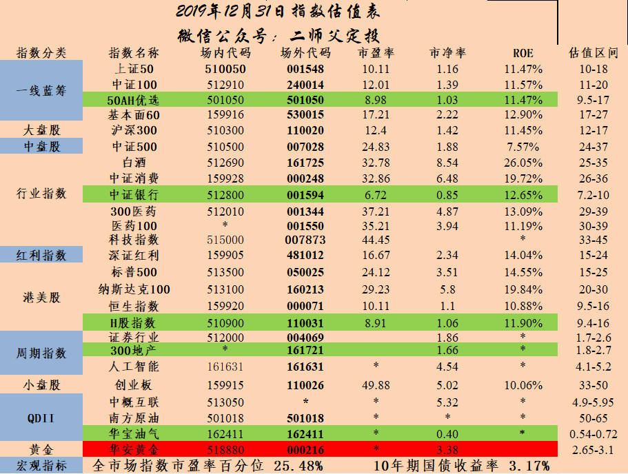

======================================================

_type: talk
@二师父[28814221155551]
2020-01-01 21:44:48 Wed  
topic_id: 241512124518181

<e type="hashtag" hid="142852258522" title="#可转债打新提示#" /> 璞泰转债明天发行，建议顶格申购，1月3号鹰19转债上市，可以酌情卖出。最近打新债中签率高，赚的也多。积少成多，财富是一百一百积累起来的。

不积跬步无以至千里，不积小流无以成江河。一个有大格局的人也必定是注重积累的人。但是获取财富之后不要当葛朗台，要让财富运转和流动起来，爱出者爱返，福往者福来。

@陈飞🤗 at 2020-01-01 21:44:48 Wed

> 一整天都可以打新吗？

----------

@二师父 at 2020-01-01 21:44:48 Wed

> 开市前半小时到结束

----------

@牛牛 at 2020-01-01 21:44:48 Wed

> 定格申购能中多少签

----------

@二师父 at 2020-01-01 21:44:48 Wed

> 一签到三签

----------

@毛毛宇 at 2020-01-01 21:44:48 Wed

> 顶格申购就是1000手吗？可以中1～3手？不知理解对否！

----------

@圣诞结® at 2020-01-01 21:44:48 Wed

> 申了💪🙏

----------

阅读[3371]  评论[6]  赞[0] 

======================================================

_type: talk
@二师父[28814221155551]
2020-01-01 21:48:19 Wed  
topic_id: 118284841281842

<e type="hashtag" hid="142812215812" title="#周四定投实盘#" /> 上涨了也坚持定投，因为目前仍旧不贵。形成定投的习惯，这样无论上涨和下跌都能够淡定加仓。

关于地产对应的基金是分级基金，不是说分级基金就一定退市，不过既然有这个苗头，就不要再往那去了，目前投资的地产指数盈利也是可以的，等着这次小涨逐步卖出，不投资分级基金了。大家永远记得，风险防控放在第一位，如果没有99%的概率未来盈利，那么这笔钱还不如买货币基金的。

@蓝魔森林 at 2020-01-01 21:48:19 Wed

> 中证银行和50aha，行业重合度不会比较高吗？

----------

@素兮 at 2020-01-01 21:48:19 Wed

> 怎么不考虑恒升国企了？

----------

@二师父 at 2020-01-01 21:48:19 Wed

> 也可以的

----------

@麻烦得很 at 2020-01-01 21:48:19 Wed

> 降到0.5份了？[惊讶][惊讶]

----------

@Pansy at 2020-01-01 21:48:19 Wed

> 谁能再告诉我一下16字方针？我现在只记得“周期轻配”了，也不知道记得对不对[擦汗]

----------

@学以致用 at 2020-01-01 21:48:19 Wed

> 160218国泰国证房地产可以投吗？

----------

@Nienie💝 at 2020-01-01 21:48:19 Wed

> 那之前那个保险指数也是分级的，是不是也应该考虑逐步卖出？

----------

@蓝魔森林 at 2020-01-01 21:48:19 Wed

> 资金量太小了，我记得才几千万，风险有点大

----------

阅读[3533]  评论[15]  赞[0] 

+++++++++++++++++++++++++++++++++++++++++++++++++++++

图片：
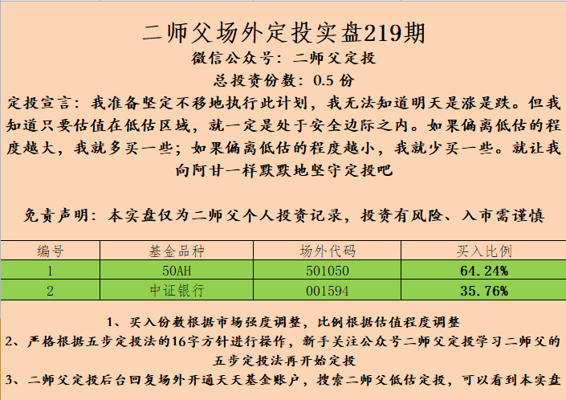

======================================================

_type: q&a
@锐淡恬思[48582848418488]
2020-01-01 23:20:08 Wed  
topic_id: 241512124421141

@锐淡恬思

>  您好，同一人（同一身份证）开三个账户，三个账户可以同时申购可转债吗？

@二师父

>  没有用，认身份证的

阅读[3483]  评论[2]  赞[0] 

======================================================

_type: talk
@素兮[548121415528244]
2020-01-02 09:09:48 Thu  
topic_id: 421415128185128

中了只可转债。可用余额里面有大余10000多，是不是就代表可以自动扣款了？不需要再另外转入资金了？

@凯 at 2020-01-02 09:09:48 Thu

> 是的

----------

@素兮 at 2020-01-02 09:09:48 Thu

> 谢谢

----------

阅读[3157]  评论[2]  赞[0] 

+++++++++++++++++++++++++++++++++++++++++++++++++++++

图片：
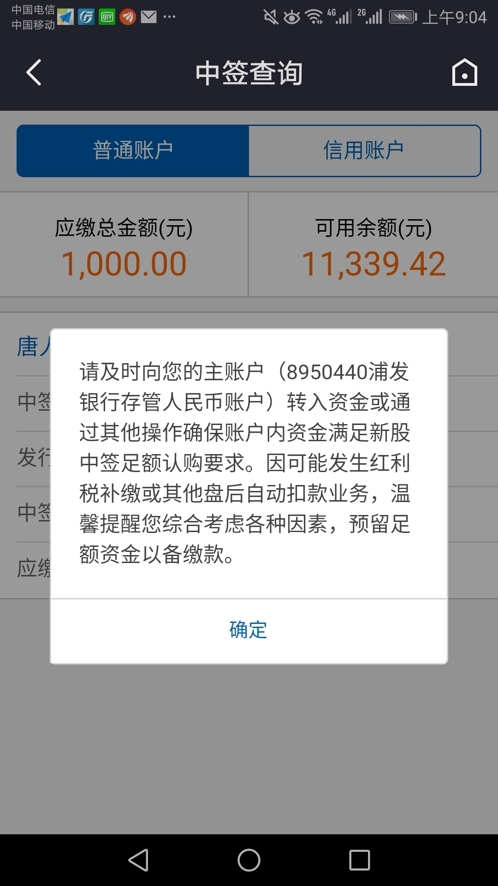

======================================================

_type: q&a
@陈飞🤗[841521421222252]
2020-01-02 09:40:14 Thu  
topic_id: 421415128155448

@陈飞🤗

>  二师傅，这是什么意思

@二师父

>  你跟客户经理确认下是否开通沪A账户

阅读[3484]  评论[5]  赞[0] 

======================================================

_type: q&a
@背心[51441214442224]
2020-01-02 10:11:19 Thu  
topic_id: 118284814514422

@背心

>  璞泰发债可以申购吗？师傅

@二师父

>  看每日转债打新提示，申

阅读[3561]  评论[2]  赞[0] 

======================================================

_type: talk
@二师父[28814221155551]
2020-01-02 10:16:13 Thu  
topic_id: 548285845181244

<e type="hashtag" hid="144481284252" title="#统一答疑#" /> 贵与不贵，与单天涨幅无关，不要有锚固思维，每天的定投不能因为上涨就停止，除非你仓位够了

可转债打新每天星球会公布，大家注意星球消息

混合基金不适合长期定投也不适合穿越牛熊，如果有一定基础可以构建几个股票的组合穿越牛熊，个股难度大，茅台今天跌了，练指数都拿不住的不可能拿的住股票

收割利润按照原则收割没问题，但是记住，卖出以后就别追高，除非指数重新回到低估区域

@青青竹 at 2020-01-02 10:16:13 Thu

> 我做的波段均告失败[捂脸]，作为小白还是应该尽量减少操作

----------

@志亮 at 2020-01-02 10:16:13 Thu

> 是的，我20%仓位买的茅台跌了，不过我很淡定，相信下一季会恢复的，现在割肉就真的亏了。[呲牙]

----------

阅读[4587]  评论[2]  赞[0] 

======================================================

_type: q&a
@毛毛宇[88281885112212]
2020-01-02 11:10:21 Thu  
topic_id: 241512142258451

@毛毛宇

>  华泰证券app为什么搜不到001594中证银行的基金呢？

@二师父

>  你这是场外代码的

阅读[3793]  评论[3]  赞[0] 

======================================================

_type: talk
@素兮[548121415528244]
2020-01-02 12:55:56 Thu  
topic_id: 241512144252211

可转债中签之后哪里可看到它上市的时间？

@小牧童 at 2020-01-02 12:55:56 Thu

> 集思录

----------

阅读[3507]  评论[1]  赞[0] 

======================================================

_type: talk
@笋子[118241551181152]
2020-01-02 14:46:16 Thu  
topic_id: 241512141548421

166008中欧增强回报债券怎样?

阅读[3405]  评论[0]  赞[0] 

======================================================

_type: talk
@二师父[28814221155551]
2020-01-02 17:19:32 Thu  
topic_id: 548285881544484

大家可以一起践行。但行好事，前程似锦。

@衣袂飘香 at 2020-01-02 17:19:32 Thu

> 看过二师父的字，没看过二师父的人。

----------

阅读[3609]  评论[1]  赞[0] 

+++++++++++++++++++++++++++++++++++++++++++++++++++++

图片：
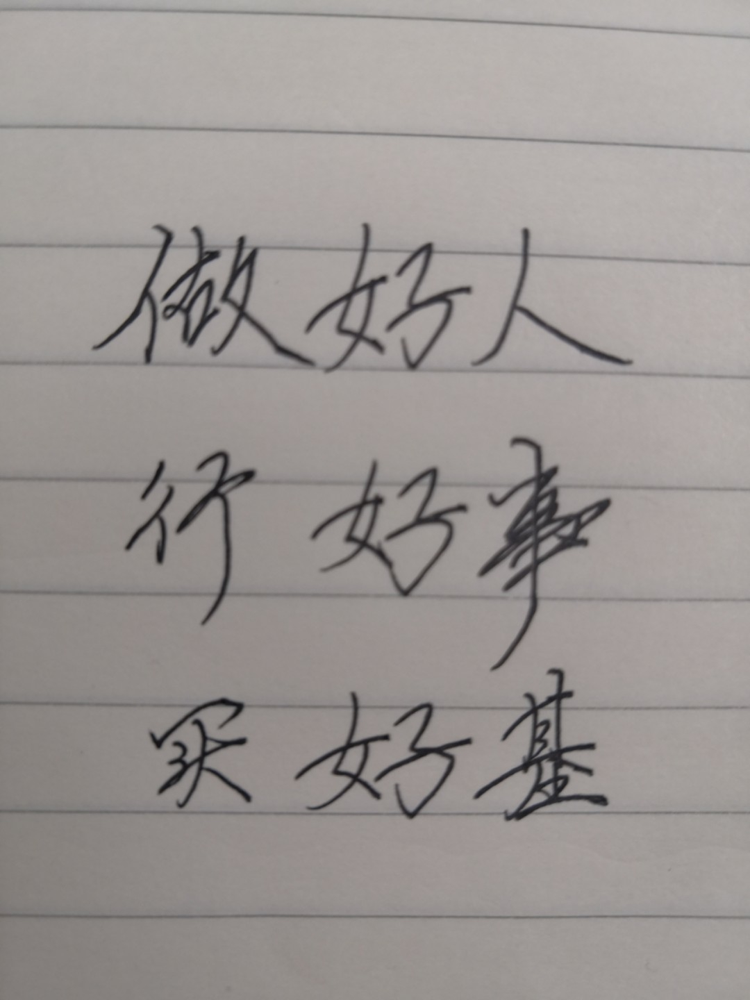

======================================================

_type: talk
@zxc[51145258542214]
2020-01-02 17:26:46 Thu  
topic_id: 421415118518118

昨天回顾了一下19年的定投记录。发现18年底19年初竟然暂停了定投，当时可是大盘低点啊，想想可能是当时的资金量不足，错失了机会。我从17年底就开始了定投，当时学习了一个理财班，了解到了定投，从支付宝里面买了几个推荐的基金，当时大盘是3400差不多。结果错误理解了定投的含义，相当于建了一多半的仓位，然后每周又往里投资。现在看来，当时投资了一个消费，一个白酒。还有沪深300，也是幸运。后来机缘巧合认识了二师父，但是一直没有跟随二师父的实盘，只是参考了师父的估值接着定投支付宝里面的几个基金。期间经历了好几次大跌，庆幸的是一直没有恐慌，可能资金量也不多，最多的时候跌了本金的1/4。到19年4月开始跟随师父的天天基金实盘，竟然发现短短几个月，本金是支付宝里面那几只的一小半，每天的收益竟然都快相同了。很感谢二师父，2019换了新的工作，收入增加了，也开始了一点兼职，开源节流[愉快]也感谢定投，大盘那么高的时候建了底仓，现在竟然还是盈利。2020继续定投，加油

@凭栏观海 at 2020-01-02 17:26:46 Thu

> 基金定投就是逆人性而动

----------

@Pansy at 2020-01-02 17:26:46 Thu

> 我也跟你一样，在18年底和19年初的时候暂停了定投😂只不过我当时根本不会定投，全都是盲投[捂脸]现在开始好好学习了。2020一起努力！

----------

@Sunflower at 2020-01-02 17:26:46 Thu

> 我是19年2月份左右跟着二师父定投的，可惜当时选择在银行app买基金，手续费超级贵，后来今年大概5月份开始换成在蛋卷定投的，目前收益率6%多点，后悔当初没有一开始就在蛋卷买，不过好在不晚，非常庆幸遇到二师父

----------

@姣🍎 at 2020-01-02 17:26:46 Thu

> 遇到二师父真是我19年最幸运的事

----------

阅读[3590]  评论[5]  赞[0] 

======================================================

_type: q&a
@老妖[118514521115522]
2020-01-02 21:38:09 Thu  
topic_id: 548285885188114

@老妖

>  二师父，富国中证军工和广发中证环现在是低估吗？适合定投吗？

@二师父

>  环保低估的，不过价值真的很低，此不上券商和地产

阅读[3715]  评论[2]  赞[0] 

======================================================

_type: talk
@静[241555148454251]
2020-01-02 21:40:24 Thu  
topic_id: 421415112441228

学习总结：看了那一水的理财不用懂太多得前四章，通俗易懂的大白话，感觉更像是温习。这些点我都知道，但知道不等于做的到，比如说时间的问题。我明知道自己的时间都是在浪费，每次提醒自己时间用到学习上，但每次会有拖延，下次吧。就这样浪费了。

阅读[3654]  评论[0]  赞[0] 

======================================================

_type: talk
@彩虹[544884214814214]
2020-01-03 07:17:05 Fri  
topic_id: 841514858281142

二师父，请问为什么可转债上市就建议卖出？

@二师父 at 2020-01-03 07:17:05 Fri

> 也可以拿着

----------

阅读[3425]  评论[1]  赞[0] 

======================================================

_type: talk
@二师父[28814221155551]
2020-01-03 09:40:50 Fri  
topic_id: 548284125115824

今天的转债又涨停了，记得卖，涨停挂单容易出现废单。账户已经关闭，两个证券账户不再关注，就让他涨吧，等3500到了喊我减仓，或者没到，重回2900，喊我加仓，不然的话就拿着不动。

@Hi·DD at 2020-01-03 09:40:50 Fri

> 没想到二师父这么“无情”[偷笑]

----------

@TDG at 2020-01-03 09:40:50 Fri

> 请问二师父，这个今天这个转债能不卖暂时持有吗？

----------

@别皱眉头 at 2020-01-03 09:40:50 Fri

> 涨停以后啥时候卖？

----------

@凯 at 2020-01-03 09:40:50 Fri

> 师傅锁仓了

----------

@雪莲 at 2020-01-03 09:40:50 Fri

> 我卖出显示废单，是卖了还是没卖？

----------

@дζΠщЫЮ at 2020-01-03 09:40:50 Fri

> 二师父，请问鹰转债停牌今天一天都不能卖吗？只能明天再卖？

----------

@飞向彩云端 at 2020-01-03 09:40:50 Fri

> 我没有卖出，但是持仓显示可用1个

----------

@二师父 at 2020-01-03 09:40:50 Fri

> 爱上股市是一件危险的事

----------

阅读[3502]  评论[17]  赞[0] 

======================================================

_type: talk
@凯[244415182418811]
2020-01-03 09:50:33 Fri  
topic_id: 548284125522154

阅读[3292]  评论[0]  赞[0] 

+++++++++++++++++++++++++++++++++++++++++++++++++++++

图片：
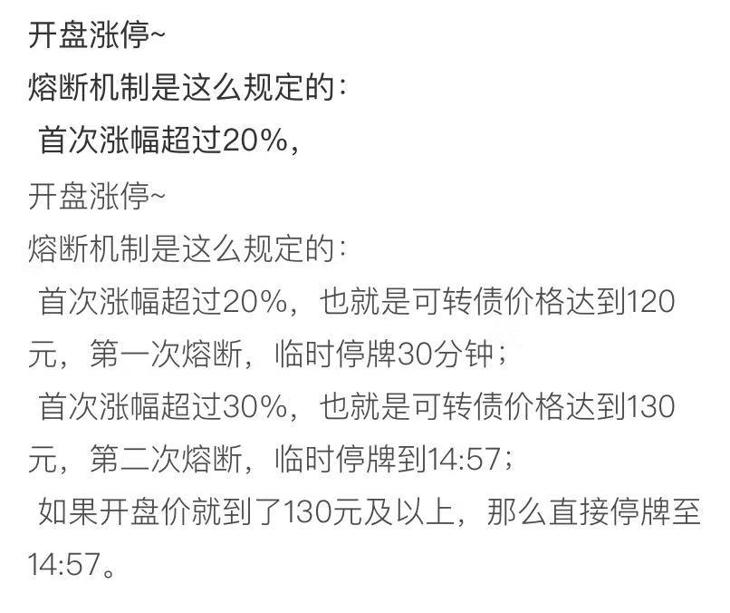

======================================================

_type: talk
@隔窗遥望[241884481854181]
2020-01-03 09:52:50 Fri  
topic_id: 241514852252551

请问有可转债打新有经验的，申购上限是10000张，我该填10张对吗？

@向前进 at 2020-01-03 09:52:50 Fri

> 点击全部，会自动填上10000，这样打到的概率大，一般也就能中10张

----------

@清水倾城 at 2020-01-03 09:52:50 Fri

> 当然是填10000啦，放心，只能中1-3签

----------

@隔窗遥望 at 2020-01-03 09:52:50 Fri

> 感谢各位热心人

----------

@隔窗遥望 at 2020-01-03 09:52:50 Fri

> 中1签是10张吗？

----------

@麻烦得很 at 2020-01-03 09:52:50 Fri

> 是的1签10张

----------

阅读[3378]  评论[5]  赞[0] 

======================================================

_type: q&a
@Sunflower[244185124281811]
2020-01-03 09:55:26 Fri  
topic_id: 241514852884851

@Sunflower

>  二师父早上好，刚刚看到上市了，申请卖出，发现显示废单，是因为涨停了吗？

@二师父

>  是的，10点以后可以再挂单

阅读[3655]  评论[1]  赞[0] 

======================================================

_type: q&a
@隔窗遥望[241884481854181]
2020-01-03 09:55:45 Fri  
topic_id: 241514852825121

@隔窗遥望

>  怎么看新債等级

@二师父

>  证券账户点开就有的

阅读[3854]  评论[2]  赞[0] 

======================================================

_type: talk
@素兮[548121415528244]
2020-01-03 11:18:13 Fri  
topic_id: 841514851211442

二师父，比如说进入正常估值的时候本金是a，本金加利润的和是b(在低估状态已经有6%的盈利了)。这时候按照收割利润的第二种方法收割利润，是在指数上涨达到1.1a的时候卖出0.1a，还是在指数上涨达到1.1b的时候卖出0.1b?

@陈飞🤗 at 2020-01-03 11:18:13 Fri

> 应该怎么卖都可以，随你自己，没那么多讲究，思路正确就可以

----------

@隔窗遥望 at 2020-01-03 11:18:13 Fri

> 我也是这样理解的，关键是按照十六字原则落实，进入正常估值后要客服自己的贪心，逐渐收割利润，防止回撤。

----------

@杜志彪 at 2020-01-03 11:18:13 Fri

> 自己舒服就好，不过才刚刚开始，师父喊今年3500，不到他发红包[偷笑]

----------

@二师父 at 2020-01-03 11:18:13 Fri

> 在本金基础上，假设本金1万，盈利之后本利和1.2万，卖2000

----------

@二师父 at 2020-01-03 11:18:13 Fri

> 不是喊，是为了给大家信心，还有一年一个月时间，这个红包我还是发的起

----------

@华为～ at 2020-01-03 11:18:13 Fri

> 二师父，您这个“二师父定投”这个图片内容从哪里可以看到？

----------

@素兮 at 2020-01-03 11:18:13 Fri

> 公众号“二师父定投”2019-12-13的文章

----------

@华为～ at 2020-01-03 11:18:13 Fri

> 谢谢

----------

阅读[3690]  评论[8]  赞[0] 

+++++++++++++++++++++++++++++++++++++++++++++++++++++

图片：
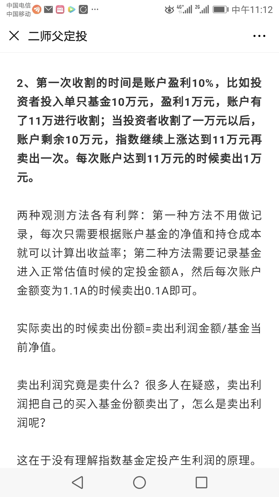

======================================================

_type: talk
@紞三岁คิดถึง[841825588424482]
2020-01-03 13:29:36 Fri  
topic_id: 548284112182154

现在有没有哪些基是值得投资的，2020准备开干了

@Zyxj at 2020-01-03 13:29:36 Fri

> 看估值表，低估的就可以买

----------

阅读[3630]  评论[1]  赞[0] 

======================================================

_type: q&a
@堂吉诃德的小助手[15528821588422]
2020-01-03 16:27:08 Fri  
topic_id: 548284112811114

@堂吉诃德的小助手

>  这个策略是低于均线卖，高于均线买。跟二师傅这个有啥冲突吗？哪个更好？

@二师父

>  我已经不用这种策略了，和我以前的股票交易系统类似，属于趋势投资，现在我完全是价值派，无论股票还是指数，你选定一种适合你的
>  
>  低估策略是价值投资，看重的是企业的价值，在价格低于价值的时候坚定买入持有，赚取估值上移和企业盈利增长的钱
>  
>  尤其是股票的更加看重企业盈利增长，做企业股东，除非基本面恶化，不然不会短线卖出了

阅读[3768]  评论[2]  赞[0] 

======================================================

_type: talk
@二师父[28814221155551]
2020-01-03 19:13:55 Fri  
topic_id: 421412882228128

价值投资的两大派别，都是长期投资。低估定投属于第一种价值投资，以合理价格买入优质企业股票属于第二种。普通投资者运用第一种价值投资挣钱就可以，进化下那就是巴菲特芒格思想了。

@老宋 at 2020-01-03 19:13:55 Fri

> 二师父是近两年见到提升最快的人！

----------

@二师父 at 2020-01-03 19:13:55 Fri

> 不敢当

----------

@堂吉诃德的小助手 at 2020-01-03 19:13:55 Fri

> 为何很多好几年的etf都没有这种几年几倍的情况？是不是指数没有股票挣得多？

----------

@二师父 at 2020-01-03 19:13:55 Fri

> 指数是取得一个平均收益率，优质个股比指数好，可是大部分人拿不住

----------

阅读[4462]  评论[4]  赞[0] 

+++++++++++++++++++++++++++++++++++++++++++++++++++++

文件：
2020-01-03 19:12:05 Fri
文件大小：[25081]
48582188212288-真正的价值投资有两大派别，都是长期投资.docx

======================================================

_type: talk
@二师父[28814221155551]
2020-01-03 19:27:05 Fri  
topic_id: 548284114481114

<e type="hashtag" hid="222214155541" title="#关于估值表周更的说明#" /> 
估值表周更主要是为了帮助投资者学会长期投资，即使波段，也是大波段操作。不用今天买，后天都着急卖，这样长期看是赚不到什么钱，也永远学不会长期持有的价值投资核心。

估值表每周三更新一次，同时结合实盘，这样是比较舒服的一个节奏，减少你看盘的次数，减少你的焦虑程度，学会耐心。

文章更新以及每天星球分享会继续的，二师父传递的是财商理念，拓展你的认知，只有当你的认知真的高于现实世界，你的生活会更轻松，也会更加富有。希望能理解，多花时间提升格局，拓展认知。

并不是因为懒而不更新，而是从我的认知角度来看，这种方式会真的帮助你富有。

二师父定投的核心理念务实、利他、极致、共赢，我所作的每一个改变和创新都是秉承这个文化，都是希望你变得更好，更富，因为一个提供价值的人才会是一个有价值的人，一个成就他人的人才会是一个有层次的人。

阅读[4160]  评论[0]  赞[0] 

======================================================

_type: talk
@二师父[28814221155551]
2020-01-03 19:43:55 Fri  
topic_id: 841514884152152

提问的话麻烦点下提问按钮，这样我会第一时间看到，发表信息有时候不一定能看的到，大家有问题问我点击提问按钮，发表一些有价值的投资经验分享，财经消息可以用发表按钮哈

@那方山的树，佛陀座下* at 2020-01-03 19:43:55 Fri

> 二师傅为什么我的界面没有这个按钮呢？

----------

@二师父 at 2020-01-03 19:43:55 Fri

> 需要用app

----------

阅读[4259]  评论[2]  赞[0] 

+++++++++++++++++++++++++++++++++++++++++++++++++++++

图片：
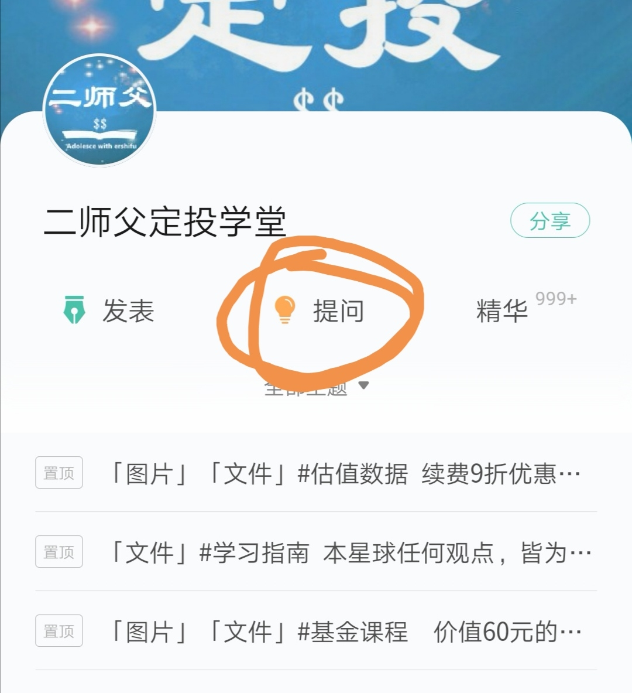

======================================================

_type: q&a
@姥姥不疼. 爷爷不爱[48544481458248]
2020-01-03 19:59:21 Fri  
topic_id: 118281551818242

@姥姥不疼. 爷爷不爱

>  请教二师父，我还有九成空仓，低估指数目前只有AH和银行两个了，又不想光投这两个指数，现在还能否投资证券、中证100、上证50、深60、沪深300及500，否则下半年牛市来了，俺仓位达不到

@二师父

>  中证100，沪深300，上证50和50ah都有重合，而且没有低估。
>  
>  如果仓位过重比较焦虑建个3到4成底仓再定投也可以的，而你说的这几个指数目前就别定投了，有两个点不要忘记，18年3500满仓的人被埋，19年3200满仓的人被埋
>  
>  可以建立一个上涨不焦虑，下跌不恐惧的仓位，不在低估区域的指数就别碰了

阅读[4427]  评论[11]  赞[0] 

======================================================

_type: q&a
@华为～[48585285458258]
2020-01-03 20:05:43 Fri  
topic_id: 421412882112458

@华为～

>  二师父，您怎么不发估值表了？

@二师父

>  现在一周一更新，每周三晚上

阅读[4384]  评论[5]  赞[0] 

======================================================

_type: talk
@二师父[28814221155551]
2020-01-03 21:04:15 Fri  
topic_id: 421412881881218

<e type="hashtag" hid="455512151118" title="#周期第四讲#" /> 看懂周期，把握周期，并理解周期和预期之间的关系，二者并不冲突

阅读[4449]  评论[0]  赞[0] 

+++++++++++++++++++++++++++++++++++++++++++++++++++++

文件：
2020-01-03 21:02:53 Fri
文件大小：[26631]
51514811848124-霍华德马克思《周期》第四讲.docx

======================================================

_type: q&a
@曾来[841555815828282]
2020-01-03 23:03:46 Fri  
topic_id: 118281558122152

@曾来

>  华宝油气，场外持有，最近可以出，还是可持有？刚回到成本线

@二师父

>  逐步减仓即可，油价短期上涨，长期还是没有动力

阅读[4381]  评论[0]  赞[0] 

======================================================

_type: q&a
@jier[118552824811122]
2020-01-03 23:22:34 Fri  
topic_id: 548284152252254

@jier

>  请问如果美伊冲突升级，会对资本市场有什么影响？

@二师父

>  黄金上涨，原油上涨，美股下跌，可能会影响a股

阅读[4520]  评论[0]  赞[0] 

======================================================

_type: talk
@树叶[544811512145144]
2020-01-04 08:12:34 Sat  
topic_id: 421412858415458

<e type="hashtag" hid="142825811122" title="#定投周报#" /> 二师父定投周报第41期

阅读[4520]  评论[0]  赞[0] 

+++++++++++++++++++++++++++++++++++++++++++++++++++++

文件：
2020-01-04 08:12:32 Sat
文件大小：[302982]
88284182822222-二师父定投周报1.4（第41期）.docx

======================================================

_type: talk
@jier[118552824811122]
2020-01-04 11:36:10 Sat  
topic_id: 118281541141212

坚持读书的复利效应，最近已经读了《巴菲特和索罗斯的投资习惯》、《<e type="web" href="https://wx.zsxq.com/mweb/views/weread/search.html?keyword=伟大的博弈" title="伟大的博弈" style="book" />》、《<e type="web" href="https://wx.zsxq.com/mweb/views/weread/search.html?keyword=周期" title="周期" style="book" />》、《<e type="web" href="https://wx.zsxq.com/mweb/views/weread/search.html?keyword=投资最重要的事" title="投资最重要的事" style="book" />》，今天又入手了《<e type="web" href="https://wx.zsxq.com/mweb/views/weread/search.html?keyword=随机漫步的傻瓜" title="随机漫步的傻瓜" style="book" />》，希望通过读书不断夯实自己的投资体系，通过实践不断总结经验教训。虽然起步晚，也踩过几次不小的坑，交了学费，但庆幸在二师父的指引下慢慢找对了投资的方向。相信迟早有一天，能真正做到涨跌不惊，从容淡定，什么时候都舒服。加油💪

阅读[4284]  评论[0]  赞[0] 

======================================================

_type: talk
@二师父[28814221155551]
2020-01-04 18:04:19 Sat  
topic_id: 118281512542842

<e type="hashtag" hid="822211851512" title="#价格波动的意义#" /> 价格波动只有一个意义，给投资者低价买入的机会，高价卖出的机会，学会这一招，那么你算入门了。

阅读[4480]  评论[0]  赞[0] 

+++++++++++++++++++++++++++++++++++++++++++++++++++++

文件：
2020-01-04 18:02:55 Sat
文件大小：[25137]
48582181185848-美伊冲突，对定投指数基金的唯一指导作用.docx

======================================================

_type: q&a
@Pansy[48281554424548]
2020-01-05 10:36:36 Sun  
topic_id: 421412818514128

@Pansy

>  我是从19年的开始定投建仓的，最开始定投的是50ah、银行指数，基本面60，现在只能定投59ah和银行指数了。我现在想把h股也加入定投体系中。想问一下二师父，现在定投h股还是可以的吗？如果可以定投，建议三支基金的金额怎么分配？目前50ah和银行的定投金额比例55.56%和44.44%。

@二师父

>  50AH指数的重仓股票是中国平安、贵州茅台、招商银行、兴业银行、恒瑞医药、伊利股份、中信证券、民生银行、交通银行、农业银行。
>  
>  恒生国企指数里面的重仓股票是中国移动、中国平安、工商银行、腾讯控股、中国银行、中国海洋石油、招商银行、中国人寿、中国石油化工股份、华润置地。
>  
>  从这两个指数里面看50AH指数和恒生国企指数里面都有部分银行指数，所以主力配置是50AH和恒生国企。50AH的比例要比恒生国企高一点，因为恒生国企里面大部分是港股股票，港股没有跌停保护机制，下跌幅度会高一些。
>  
>  建议大致按照3：2：1的比例配置，具体比例根据仓位进行调整。目前行情不好说，如果年后发生了较大回撤，那么A股的很多指数又进入低估。

阅读[4418]  评论[1]  赞[0] 

======================================================

_type: talk
@二师父[28814221155551]
2020-01-05 12:15:47 Sun  
topic_id: 548284185245584

巴菲特有句名言：“投资有两条原则，第一条原则是保证本金安全永远不要亏损；第二条原则是请谨记第一条。”从年轻的巴菲特致股东的信中，我们能充分感受到他在经营合伙公司的投资管理上所带着的深刻的“保守”意识或风险意识，这一点非常值得我们学习！他曾在信中指出：“对以往策略的保守性进行理性估计的方法之一就是在市场下跌时分析收益绩效。”

每次上涨想建立底仓时候想想这句话，，要保证本金永不亏损，你的资金要留给最有价值的投资时刻。

阅读[4361]  评论[0]  赞[0] 

======================================================

_type: talk
@二师父[28814221155551]
2020-01-05 13:27:21 Sun  
topic_id: 548284185525484

<e type="hashtag" hid="555588541854" title="#盈利稳定的企业不代表不会跌#" /> 最近涨的不错，有读者对股票又跃跃欲试，准备开户拿几万练练手。

说下企业投资面临的风险，不是垃圾企业。著名的投资家巴菲特在可口可乐、IBM、沃尔玛这些公司上赚了很多钱，然而，当危机来临的时候，可口可乐最大跌幅是52%，IBM最大跌幅是51%，沃尔玛最大跌幅是37%。

这些都是优质企业，而危机到来时候不管什么企业都会跌。巴菲特只要看重了有稳定的企业获利能力，他能够拿的住，而对于普通投资者，指数波动30%都快要崩溃了，更别说持股波动30%，如果看得懂，拿得住，那么可以控制5%——10%的仓位投资，如果看不懂，拿不住，最好从指数入手。

很多炒股20年的股民都在跟着二师父做指数投资，投资单个优质企业确实会有很好的收益，但不是每个投资者都耐得住寂寞长期持有10年。

@堂吉诃德的小助手 at 2020-01-05 13:27:21 Sun

> 请问在现在这个点位，以后不动，牛市来了能翻一倍吗？

----------

@二师父 at 2020-01-05 13:27:21 Sun

> 目前白酒指数已经80个点了，你可以看看以往的指数，从13年6月到15年6月翻倍是很容易的

----------

@杜志彪 at 2020-01-05 13:27:21 Sun

> 问题是能不能坚持到翻倍[呲牙]，当你盈利30%又回测到10%时，你就会怀疑再不卖那个10%也没了，后悔当初30%时卖出多好[偷笑]

----------

@丸子妈 at 2020-01-05 13:27:21 Sun

> 这就是人性

----------

阅读[5231]  评论[4]  赞[0] 

======================================================

_type: q&a
@阿白[548141224255854]
2020-01-05 17:39:15 Sun  
topic_id: 548284184555514

@阿白

>  请教二师傅，我定投开始不久，仓位较轻，现在除了按节奏定投外，还有没有其他资产是低估的，可以投呢？

@二师父

>  目前50ah，银行，恒生国企还可以继续定投，沪深300价值也可以，耐心等待机会，握住现金机会来了赶上去

阅读[4412]  评论[0]  赞[0] 

======================================================

_type: q&a
@清水倾城[48848418144128]
2020-01-05 18:31:51 Sun  
topic_id: 118281581158842

@清水倾城

>  二师父，现在仓位多少成合适啊？

@二师父

>  这个和仓位没有关系了，如果你是2019年1月买的，那时候9成仓位都可以，可以一直拿到现在。因为买入价格不同，你持有的心理压力是不同的。
>  
>  对于当前位置，如果仓位不足，一次建立底仓，对于低估的指数也要控制在5成以下，你无法预测市场短期的上涨和下跌，我也不知道你对浮亏的承受能力。所以保守点为好。

阅读[4795]  评论[0]  赞[0] 

======================================================

_type: talk
@二师父[28814221155551]
2020-01-05 18:34:08 Sun  
topic_id: 241514814441421

建立定投系统，然后知行合一。每次2500的时候都有投资者劝我悠着点，每次3200到3500的时候都有投资者摩拳擦掌。既然无法预测未来，就按照既定策略定投。

@清水倾城 at 2020-01-05 18:34:08 Sun

> 2500点5—10年才遇到一次，好多自己都投不出去，收益率会很低怎么办呢？

----------

@清水倾城 at 2020-01-05 18:34:08 Sun

> 打错了，资金

----------

@二师父 at 2020-01-05 18:34:08 Sun

> 那就在3000左右定投，长期看企业盈利增长的，指数也会慢慢增长

----------

@清水倾城 at 2020-01-05 18:34:08 Sun

> 二师父，多少资金定投多少资金等待呢？好难！是不是现在市场到2700的概率都很小了呢？

----------

@二师父 at 2020-01-05 18:34:08 Sun

> 不用等待，在低估区域定投，定投完毕就停止

----------

@Dolly at 2020-01-05 18:34:08 Sun

> 我买的基金的时候是在3000点，然后就一路下跌，我就只能定投回本，在2500点的时候，我没有关注基金，让它自动扣款定投，然后就回本了

----------

@二师父 at 2020-01-05 18:34:08 Sun

> 应该是盈利的

----------

@Dolly at 2020-01-05 18:34:08 Sun

> 是的，二师父，有盈利

----------

阅读[5689]  评论[8]  赞[0] 

+++++++++++++++++++++++++++++++++++++++++++++++++++++

文件：
2020-01-05 18:32:29 Sun
文件大小：[25963]
51514851112584-指数基金定投需要建立交易系统，然后做到知行合一.docx

======================================================

_type: talk
@飞的那个飞[48584811554158]
2020-01-05 19:23:29 Sun  
topic_id: 548284522582254

006879这个基金前期购买，现在盈利！是否适合长期持有

@二师父 at 2020-01-05 19:23:29 Sun

> 可以继续持有，建议投资指数基金

----------

阅读[4857]  评论[1]  赞[0] 

======================================================

_type: q&a
@潜龙[244145114188851]
2020-01-05 23:01:02 Sun  
topic_id: 421412548144248

@潜龙

>  二师父，我基本面60有12%利润了，我明天收割掉还是符合我们的定投计划吧

@二师父

>  符合的，正常估值收割利润，没有问题，我目前没有收割是因为流动资金比较充裕，你按照计划来没问题

阅读[5105]  评论[1]  赞[0] 

======================================================

  _type: talk
  @勤能行之[481211221828]
  2020-01-06 10:32:17 Mon  
  topic_id: 118281452118442

  人有两样东西，
在你的人生路上无比珍贵 。
一个是自律，一个是坚持，
无论你现在遇见什么，请你相信，
自律能给你力量，而坚持，
会带给你收获！[玫瑰]读二师傅的星球有感。

  阅读[4674]  评论[0]  赞[0] 

======================================================

_type: talk
@二师父[28814221155551]
2020-01-06 11:08:15 Mon  
topic_id: 841514288552182

有人现在想买油气，别着急，过两天我卖给你

@掌心的温暖 at 2020-01-06 11:08:15 Mon

> [呲牙][呲牙][呲牙]

----------

@清水倾城 at 2020-01-06 11:08:15 Mon

> 二师父卖的时候喊我一声，我也卖点

----------

@二师父 at 2020-01-06 11:08:15 Mon

> 盈利了都可以逐步卖，没有盈利别卖

----------

@清水倾城 at 2020-01-06 11:08:15 Mon

> 目前的价位好低啊，盈利了也舍不得卖，怎么破？我又贪心了

----------

@二师父 at 2020-01-06 11:08:15 Mon

> 那就拿着

----------

@Audrey at 2020-01-06 11:08:15 Mon

> 我还亏着7% 呜呜呜

----------

@光少 at 2020-01-06 11:08:15 Mon

> 仓位不重，继续等网格收割盈利[呲牙]

----------

@旺锦古法土制红糖 范* at 2020-01-06 11:08:15 Mon

> 😂😂看看谁会是键盘侠

----------

阅读[4800]  评论[9]  赞[0] 

======================================================

_type: talk
@二师父[28814221155551]
2020-01-06 12:09:31 Mon  
topic_id: 241514288812221

<e type="hashtag" hid="281158284851" title="#市场分析#" /> 最近市场好消息还是很多的，需要拿住自己的股权资产，学会长期持有股权和债券，这比货币基金的收益是要高的。

招商银行股价新高，优质企业都是不断成长，股价也是不断增长，除非遭遇大熊市或者一时遇难。要么买入低费率的指数基金，要么买入优质的企业长期持有穿越牛熊。不要买混合基金，你需要缴纳4个点的费率，同时混合基金表现好不是因为独特的优势，也是因为选的企业好罢了。本质还是企业的成长性与可持续性。

@夏日荷花 at 2020-01-06 12:09:31 Mon

> 二师父，工银双利（485111）算是混合基金吧?我买了一段时间了，收益不太好，要不要卖掉呢？谢谢指导

----------

@二师父 at 2020-01-06 12:09:31 Mon

> 这是债券基金，股市走高，债券基金相对弱一些

----------

@清水倾城 at 2020-01-06 12:09:31 Mon

> 二师傅，好多大V发了主动基金的组合，也不建议买吗？收益也很不错呢

----------

@二师父 at 2020-01-06 12:09:31 Mon

> 没必要买主动基金，等你投资水平上来控制仓位挑选股票长期持有，比主动基金好，主动基金本质也是股票组合，如果你的股票组合比主动基金股票组合好，你的收益率更佳

----------

@清水倾城 at 2020-01-06 12:09:31 Mon

> 先来几手平安屯着可行？

----------

@二师父 at 2020-01-06 12:09:31 Mon

> 我目前价位在67，他的现金流在降，等等看19年财报

----------

@蓝色流星 at 2020-01-06 12:09:31 Mon

> 二师父现在估值表里没有中证红利指数了，现在是低估还是正常？

----------

@二师父 at 2020-01-06 12:09:31 Mon

> 仍旧低估的

----------

阅读[5706]  评论[10]  赞[0] 

+++++++++++++++++++++++++++++++++++++++++++++++++++++

文件：
2020-01-06 12:06:09 Mon
文件大小：[626402]
51514858111214-市场分析1.6.docx

======================================================

_type: talk
@二师父[28814221155551]
2020-01-06 17:08:30 Mon  
topic_id: 841514281445182

<e type="hashtag" hid="822455581482" title="#三大指数20年周期#" /> 看看三大指数20年周期。你会发现没有只涨不跌的指数，不要总是看上午和下午，没有意义的，不会让你多挣，反而会让自己越来越累。

@Yingshengw* at 2020-01-06 17:08:30 Mon

> 简单实用的道理，就是不知道有多少人会去执行，这也就是知行合一的难处吧！

----------

@丸子妈 at 2020-01-06 17:08:30 Mon

> 很难有人做到知行合一

----------

@木易火 at 2020-01-06 17:08:30 Mon

> 单单说斜率的话，两条线一样斜，斜率不是一样的吗？

----------

@二师父 at 2020-01-06 17:08:30 Mon

> 一样的，你把kx分离出来，保证k和低估一样，分离出常数，加到b里面，然后上移，这样说就是类比高估阈值，实际盈利是波动，估值也是波动，运用了两个极端假设

----------

@木易火 at 2020-01-06 17:08:30 Mon

> 哦哦，理解了，谢谢

----------

阅读[5343]  评论[5]  赞[0] 

+++++++++++++++++++++++++++++++++++++++++++++++++++++

文件：
2020-01-06 17:07:12 Mon
文件大小：[502155]
28284145514521-从三大代表指数来分析指数基金长期投资及适当获利的意义.docx

======================================================

_type: q&a
@helen[544884424181154]
2020-01-06 17:49:00 Mon  
topic_id: 841514281814182

@helen

>  二师父，小白发问：国泰君安12月发公告，把君得鑫（952009）变更为两年持有期，看到基金净值1/3一下子下跌了很多。怎么理解这种现象？

@二师父

>  这是因为新的资产计划份额调增导致净值降低。

阅读[4525]  评论[0]  赞[0] 

======================================================

_type: q&a
@姥姥不疼. 爷爷不爱[48544481458248]
2020-01-06 21:23:28 Mon  
topic_id: 548284551225124

@姥姥不疼. 爷爷不爱

>  请教二师父，俺中了一签乐普转债，这支合适缴费么，谢谢您了😀😀

@二师父

>  适合，年前估计就能中这一只了，1月份应该没有可转债发行计划

阅读[4552]  评论[0]  赞[0] 

======================================================

_type: q&a
@怡明[828821154142]
2020-01-07 09:39:42 Tue  
topic_id: 241514245854251

@怡明

>  二师父您好，参加星球前一次购买广发中证500ETF联接c，请问此基金适合持有到什么时候，有什么方法能判断出应该止盈？谢谢了！

@二师父

>  这只基金目前正常估值，高估的时候可以逐步止盈
>  
>  现在正常估值，等外资流出时候可以逐步收割利润，春季行情一般会持续到年后

阅读[4454]  评论[0]  赞[0] 

======================================================

_type: talk
@光少[244124552511141]
2020-01-07 09:47:54 Tue  
topic_id: 118281412545422

今天两个转债都停牌了

@光少 at 2020-01-07 09:47:54 Tue

> 可以卖了[呲牙]

----------

@王燕 at 2020-01-07 09:47:54 Tue

> 已卖[耶]

----------

@光少 at 2020-01-07 09:47:54 Tue

> 我两个都卖了同价，过年有肉吃了[色]

----------

@黄巧 at 2020-01-07 09:47:54 Tue

> 怎么可以中那么多

----------

@光少 at 2020-01-07 09:47:54 Tue

> 运气好[呲牙]

----------

@光少 at 2020-01-07 09:47:54 Tue

> 我12月中签7个[呲牙]

----------

阅读[4366]  评论[8]  赞[0] 

+++++++++++++++++++++++++++++++++++++++++++++++++++++

图片：
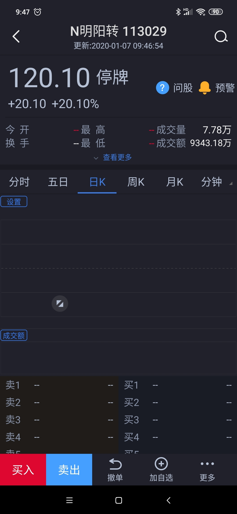
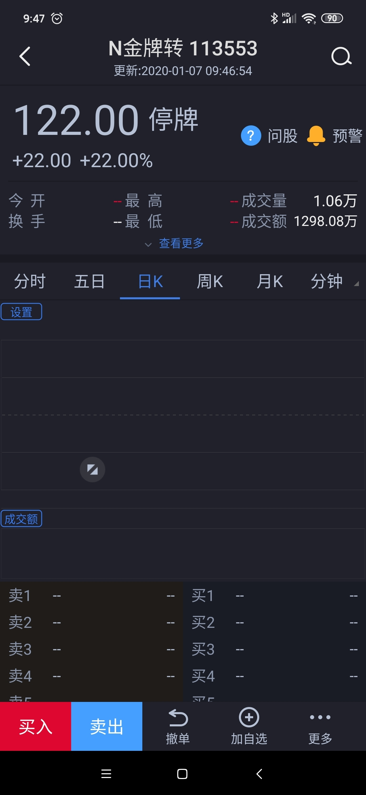

======================================================

_type: talk
@二师父[28814221155551]
2020-01-07 14:16:44 Tue  
topic_id: 841514444152852

<e type="hashtag" hid="455244815548" title="#讲基金易方达中小盘混合#" /> 这是一只混合基金，在这只基金成立之初重仓股票主要以中小板股票为重仓股票。

而随着市场的变化，这只基金逐步发展成了以贵州茅台、五粮液、东阿阿胶为重仓的股票，是追随市场趋势的。还有个比较明显的变化东阿阿胶最近2年不再是这只基金的重仓股票。卖出表现差的，买入表现好的，这符合从买企业的角度来做投资。

而关键问题是，需要投资者判断企业价格的下降到底是一时遇难还是真的经营变差。这就考验一个基金基金经理的投资水平，与基金本身没有多大关系，因为一旦基金经理更换，持仓股票就会发生很大变化。相反二师父就判断东阿阿胶是一时遇难，最近买入了一些，这就是逆向投资和趋势投资本质的不同点。

就目前来看，这只基金重仓的有大盘白马股，也有创业板、和中小板的股票，白酒行业作为经济弱周期的必需品，往往会表现好。

而在经济繁荣期间，他的表现并不一定跟得上金融、科技、交通运输等行业。而未来如何，没法判断，一旦白酒变弱，这个基金经理会重新换股买入涨的好的股票。

因为投资风格以及持仓股票的变化，你无法知道未来表现如何，从基金经理的投资水平看，这个经理从12年任职到今天，7年4倍，水平还是可以的。只要这个基金经理不更换，是值得投资。

而最大的不确定性在于基金经理，也许过几个月就换了，这种巨大的不确定性有点类似股票投资，股票投资的时候，基本面变化是我卖出的第一个因素。对于这类主动基金，卖出的时候一般是持仓股票恶化或者基金经理更换导致持仓股票恶化。

所以投资主动基金需要两点：第一你能了解基金经理的投资水平，第二你能够大致判断基金重仓股票的基本面。否则就有点赌博意味了。

二师父目前最主要的投资模式是指数基金，简单，可以自己根据市场轮动做组合，第二是股票，我可以自己读财报，把自己的资金交给自己打理，永远比交给一个陌生的频繁换股的基金经理要安心。

对于投资者而言，如果投资主动基金就没必要定投，因为他的变化比较大，而且大多是追趋势，而定投完全是逆势投资，这是根本的不同。

@艾琪（王钥） at 2020-01-07 14:16:44 Tue

> 跟着二师父走

----------

@圣诞结® at 2020-01-07 14:16:44 Tue

> 之前投了 盈利一点就卖了 留出资金做指数

----------

阅读[5183]  评论[2]  赞[0] 

======================================================

_type: talk
@波多黎各[28428858544121]
2020-01-07 19:09:50 Tue  
topic_id: 118281185888412

刚才走路回家，走到购物中心很多门面全在转让，冷冷清清，回家路上沿路两旁的门面全是转让～看的心头发麻！明年经济真的能复苏吗？

@特仑苏 at 2020-01-07 19:09:50 Tue

> 现在店面的还是餐饮居多。其他行业有点不好发力。

----------

@What if at 2020-01-07 19:09:50 Tue

> 现在做实体，除了餐饮就是针对学生的各类培训和房地产中介，遍地开花。

----------

@汪小灰 at 2020-01-07 19:09:50 Tue

> 哪里的购物中心？

----------

@二师父 at 2020-01-07 19:09:50 Tue

> 这是哪里的呢，不同地域消费水平不同

----------

@元亨 at 2020-01-07 19:09:50 Tue

> 调结构，阵痛期

----------

@姣🍎 at 2020-01-07 19:09:50 Tue

> 哈哈你说的还真对。

----------

@爱华 at 2020-01-07 19:09:50 Tue

> 电商挤兑也有原因

----------

@波多黎各 at 2020-01-07 19:09:50 Tue

> 怎么镇痛？科技的冲击替代了太多的就业岗位，跟以前的科技革命不一样，这次是地震级的

----------

阅读[4021]  评论[8]  赞[0] 

======================================================

_type: talk
@二师父[28814221155551]
2020-01-07 20:30:39 Tue  
topic_id: 841514412284212

这是个红包行情，收了红包就好。保证底仓，剩余仓位波段，不要害怕，这是目前最佳的赚钱方法了。

@特仑苏 at 2020-01-07 20:30:39 Tue

> 二师父现在做波段是用场内还是场外？

----------

@二师父 at 2020-01-07 20:30:39 Tue

> 场内，场外不适合波段

----------

@特仑苏 at 2020-01-07 20:30:39 Tue

> 二师父推荐的场内是华泰吗？

----------

@二师父 at 2020-01-07 20:30:39 Tue

> 是啊，置顶链接有的

----------

@特仑苏 at 2020-01-07 20:30:39 Tue

> 好的，谢谢师父

----------

@清水倾城 at 2020-01-07 20:30:39 Tue

> 是不是得卖才能红包到手呢？不然回调就又回去了吧

----------

@二师父 at 2020-01-07 20:30:39 Tue

> 只能收割利润，频繁买卖很容易追高，心态不稳

----------

阅读[4265]  评论[7]  赞[0] 

+++++++++++++++++++++++++++++++++++++++++++++++++++++

文件：
2020-01-07 20:29:55 Tue
文件大小：[25453]
15458218414882-大盘站上3100，红包行情会持续多久.docx

======================================================

_type: talk
@二师父[28814221155551]
2020-01-07 20:33:07 Tue  
topic_id: 118281184458522

<e type="hashtag" hid="142852258522" title="#可转债打新提示#" /> 明天鸿达转债上市，可以酌情卖出。不管熊市和牛市，AA级别的可转债破发概率都比较低，可以放心的，年底发行可转债比较少，没有好机会的时候就拿住现金，等待机会。不管对于家庭还是企业，现金流都是非常重要的，这是家庭长期幸福以及企业永续经营的根本。

@凯 at 2020-01-07 20:33:07 Tue

> 师父转债这么火，可否继续持有到130再卖？

----------

@二师父 at 2020-01-07 20:33:07 Tue

> 可以，最好知行合一，也有下跌的可能

----------

@圣诞结® at 2020-01-07 20:33:07 Tue

> 二师父 去年年底中签的可转债是不是要春节后才会发行？

----------

@二师父 at 2020-01-07 20:33:07 Tue

> 指上市吧，最近还有一些的

----------

@圣诞结® at 2020-01-07 20:33:07 Tue

> 对 上市[捂脸] 谢谢

----------

阅读[5026]  评论[5]  赞[0] 

======================================================

_type: talk
@Audrey[15284421255842]
2020-01-07 20:52:29 Tue  
topic_id: 241514412488281

华宝油气要卖一些吗 今天开始跌了 我还亏着8个点呜呜呜

@二师父 at 2020-01-07 20:52:29 Tue

> 等盈利

----------

@爱华 at 2020-01-07 20:52:29 Tue

> 我也亏着呢，慢慢等吧

----------

阅读[4372]  评论[2]  赞[0] 

======================================================

_type: q&a
@老妖[118514521115522]
2020-01-07 20:59:39 Tue  
topic_id: 841514412242882

@老妖

>  二师父，现在华宝油气适合买入吗？重仓还是轻仓？

@二师父

>  别投了，这个基金的周期性太强了，而且里面的油气公司基本面也不太好，不建议目前入手，只有投机价值。

阅读[4640]  评论[1]  赞[0] 

======================================================

_type: talk
@二师父[28814221155551]
2020-01-07 23:39:15 Tue  
topic_id: 118281181852112

假设10年前你有1万元，如果只是存成银行定期，那么今天你有13 000元。但如果你选择了买茅台酒，那今天就有4万元。如果你买了格力的股票，那今天就至少有10万元。

当然，你也会因为一个选择血本无归。同样是这1万元，如果你在48元的时候买了中石油的股票，到现在你已经只剩1 600元。如果你在2015年大家最看好乐视的时候买了它的股票，那不到3年你就只剩下1 300元。这还不是最惨的。如果你当年买了泛亚或者e租宝的产品，现在已经血本无归。

选择永远比努力重要，10年以后的财富结果取决于当下的选择

@我还没有考驾照 at 2020-01-07 23:39:15 Tue

> 选择的能力才是最重要的。努力方向不对会背道而驰，努力提高自己的眼光才是最重要的。不努力，机会出现在你面前也发现不了。

----------

@雪孩子 at 2020-01-07 23:39:15 Tue

> 那么格力回调一些的话还可以买进吗？二师父

----------

@杜志彪 at 2020-01-07 23:39:15 Tue

> 问题是现在的选择是赚是赔，十年后才知道结果，人生有几个十年，策略的选择很重要，不求十年十倍，低估定投策略可预见性较强，年化15%应该满足了。

----------

@二师父 at 2020-01-07 23:39:15 Tue

> 股票不做建议

----------

@二师父 at 2020-01-07 23:39:15 Tue

> 重点是选择比努力重要

----------

阅读[4460]  评论[5]  赞[0] 

======================================================

_type: talk
@二师父[28814221155551]
2020-01-08 09:43:37 Wed  
topic_id: 421412145428488

<e type="hashtag" hid="881251425252" title="#鳄鱼计划#" /> 卖出华宝油气一份，刚刚回本盈利2个点，还没有盈利的可以等等，这是个投机品种，投资主力还是持有优质指数长期盈利增长。

@自由飞翔 at 2020-01-08 09:43:37 Wed

> 我还亏16个点呢，继续等

----------

@爱华 at 2020-01-08 09:43:37 Wed

> 我还亏1.6，等

----------

@Snow at 2020-01-08 09:43:37 Wed

> 二师父仓位总共有多少份？

----------

@二师父 at 2020-01-08 09:43:37 Wed

> 200多

----------

@What if at 2020-01-08 09:43:37 Wed

> 买的不多，浮盈七个点，昨天收回盈利部分了，剩下的等着下蛋[偷笑]

----------

阅读[5160]  评论[21]  赞[0] 

======================================================

_type: talk
@二师父[28814221155551]
2020-01-08 13:10:17 Wed  
topic_id: 421412142852288

<e type="hashtag" hid="555425184554" title="#周三答疑#" />卖与不卖。卖出的原则很简单，止盈不止损。在这个基础上做决定。

而实际过程中又非常难，卖了涨了怎么办？不卖跌了怎么办？这些都是投资者经常遇到的问题。这里就涉及到仓位、估值及预期三个因素。

仓位是最重要的，如果你现在1成仓位，盈利50%，需要卖吗？完全不需要啊，这么便宜的筹码为啥不多捡一点，真的牛市到来了，一成仓位肯定焦虑。

反之如果你现在满仓，又没有稳定的现金流，而对于券商、油气这类强周期指数预期又不是很高，那么是可以减仓一些的。

这就是卖出中的变与不变，不变的是投资哲学，卖出原则，变化的是你对市场的预期。投资需要建立在预期差的基础上。就像你看到现在闪电了，那么第一个预期就是即将打雷，第二个预期就是打雷之后可能下雨，而且概率很大，这时候你就去收衣服，如果收了衣服没有下雨这对你没有影响，可是如果不收下了雨你的衣服就淋湿了。市场上显而易见的重磅消息、中央政策、证监会的重大新闻都是会影响市场的，这是一个典型的政策市场。

所以我们只能够建立在巴菲特价值投资基础上创立出属于中国特色的投资方法来应对这个市场，你去投资纳斯达克指数就不需要定投，直接底部买入，拿住10年就行了，巴菲特之所以成为巴菲特是因为他出生在美国20世纪初，如果他出生在中国20世纪初，他就成为不了巴菲特。

不同的市场采用不同的投资策略，而核心原则：安全边际、逆向思维不要违背即可。

第二、学会长期持有，我的短期波段也只是少部分资金，长期保证仓位在8成以上，如果市场回调就继续加仓，突破历史大底就满仓等待。18年底部那么低的为止估值都没有突破历史大底部，所以我是比较保守的。总之一个原则，仓位适合，卖出之后牛市到来不追高就行。

@清水倾城 at 2020-01-08 13:10:17 Wed

> 如果年底又多了一笔钱，使现在仓位降低了，那该如何操作呢？

----------

@二师父 at 2020-01-08 13:10:17 Wed

> 多了多少，总仓位多少，现在仓位几成，防守账户是否有备用资金

----------

@清水倾城 at 2020-01-08 13:10:17 Wed

> 防守账户已留足备用金，买基金的钱现在是七成，降到六成了，就多了几万块而已

----------

@二师父 at 2020-01-08 13:10:17 Wed

> 继续定投即可，大盘下到3000点了追加一些

----------

@清水倾城 at 2020-01-08 13:10:17 Wed

> 了解了，感谢

----------

阅读[4253]  评论[5]  赞[0] 

======================================================

_type: talk
@老孙头[422115118524548]
2020-01-08 14:05:03 Wed  
topic_id: 421412184882558

老师，还是周四跟投吗？

@二师父 at 2020-01-08 14:05:03 Wed

> 实盘每周四发布的

----------

阅读[3985]  评论[1]  赞[0] 

======================================================

_type: q&a
@远山[841555422151212]
2020-01-08 15:50:13 Wed  
topic_id: 421412184211828

@远山

>  二师父，东财中证信可申购吗？提示是5G指数

@二师父

>  东财中证通信a，目前还没认购，新基金一般不建议申购

阅读[4096]  评论[1]  赞[0] 

======================================================

_type: talk
@二师父[28814221155551]
2020-01-08 17:20:36 Wed  
topic_id: 241514188845581

市场短期回调很正常，在2500到2900买到的筹码要拿住，否则很容易将来追高。

@Hi·DD at 2020-01-08 17:20:36 Wed

> 二师父，请问实物黄金也是跟着上涨的吧？

----------

@二师父 at 2020-01-08 17:20:36 Wed

> 是的

----------

@Hi·DD at 2020-01-08 17:20:36 Wed

> 那是不是提示实物黄金也到顶了，适合换成现金？

----------

@阿宝 at 2020-01-08 17:20:36 Wed

> 谢谢

----------

@二师父 at 2020-01-08 17:20:36 Wed

> 黄金不生息，除了金银首饰，没必要买实物黄金的

----------

@Hi·DD at 2020-01-08 17:20:36 Wed

> 明白[偷笑]

----------

@Sunflower at 2020-01-08 17:20:36 Wed

> 我在银行买的可以兑换黄金的生息纸黄金，定期一年，现在还有两个月到期，目前11克赚了700多

----------

阅读[4218]  评论[7]  赞[0] 

+++++++++++++++++++++++++++++++++++++++++++++++++++++

文件：
2020-01-08 17:20:00 Wed
文件大小：[25323]
48581415144258-拿住筹码，等待回调.docx

======================================================

_type: talk
@二师父[28814221155551]
2020-01-08 18:38:59 Wed  
topic_id: 841514188488582

<e type="hashtag" hid="481211145528" title="#指数估值#" /> 涨幅不少，很多指数的估值都上来了，本周定投减额到0.25份。严格按照纪律行事，另外别开黑车，有的投资者3050点就卖出7成仓位，现在又准备杀回去，不知道图啥。还有的买入券商和中证500这类指数，抓住趋势好说，要是蒙错了比较惨，至少2018年高点，2019年高点的券商和中证500一次买入，现在还是浮亏。按照纪律来，这样可以稳稳盈利，下跌心理压力也小。

@牛牛 at 2020-01-08 18:38:59 Wed

> 二师父，你好，中证银行和H股指数还可以定投吗？

----------

@二师父 at 2020-01-08 18:38:59 Wed

> 可以，低估的没问题

----------

@牛牛 at 2020-01-08 18:38:59 Wed

> 明白了，谢谢，二师父。

----------

@丸子妈 at 2020-01-08 18:38:59 Wed

> 中证红利的估值区间是多少

----------

@二师父 at 2020-01-08 18:38:59 Wed

> 低估阈值10倍市盈率

----------

@Audrey at 2020-01-08 18:38:59 Wed

> 易方达国企指数估值怎么木有了

----------

@二师父 at 2020-01-08 18:38:59 Wed

> 有的H股指数

----------

阅读[4135]  评论[7]  赞[0] 

+++++++++++++++++++++++++++++++++++++++++++++++++++++

图片：
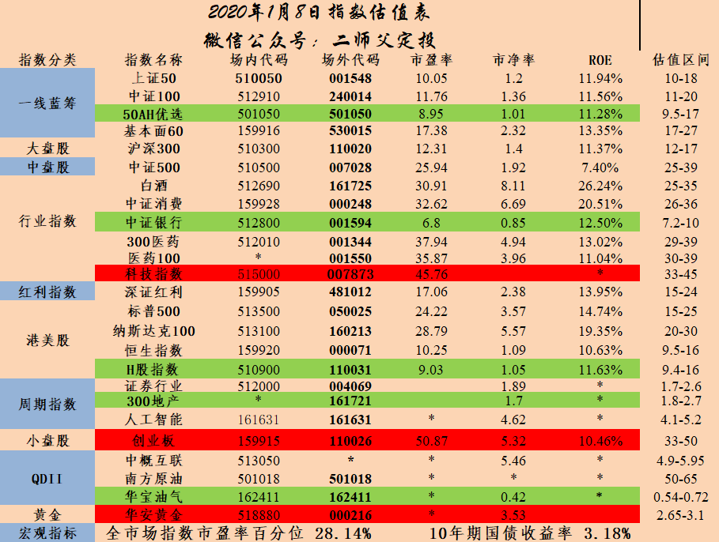

======================================================

_type: talk
@二师父[28814221155551]
2020-01-08 19:11:04 Wed  
topic_id: 118281855828882

<e type="hashtag" hid="822452282522" title="#220期定投实盘#" /> 本期实盘，买入50ah0.25份，随着市场的上涨定投会越来越少，到后来没有低估的指数就停止，定投的目的是为了买入更便宜的筹码，没有必要为了定投而定投。

很多人有价格锚固思维，比如今天跌了，他感觉便宜了，实际上现在比12月已经涨了很多了，并不是非常便宜

@特仑苏 at 2020-01-08 19:11:04 Wed

> 二师父你这图片有点意思呀。哈哈

----------

@老孙头 at 2020-01-08 19:11:04 Wed

> 二师父，这是周四的实盘吧？—谨记——别开黑车，不要为了定投而定投！[玫瑰]

----------

@光少 at 2020-01-08 19:11:04 Wed

> 谨记二师傅的教导[强]

----------

@rtdmm小米 at 2020-01-08 19:11:04 Wed

> 按规矩定投

----------

@二师父 at 2020-01-08 19:11:04 Wed

> 直接截图的

----------

@二师父 at 2020-01-08 19:11:04 Wed

> 对，每周四的场外实盘

----------

阅读[5187]  评论[6]  赞[0] 

+++++++++++++++++++++++++++++++++++++++++++++++++++++

图片：
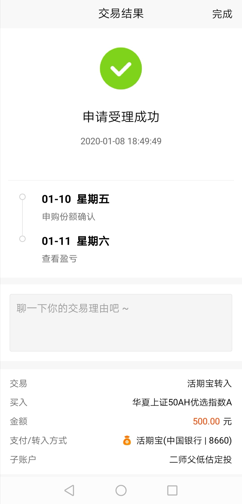

======================================================

_type: q&a
@One[422118584812518]
2020-01-09 18:51:34 Thu  
topic_id: 241514142481581

@One

>  二师父，下午好，快两会了，是不是该配点环保基金？不知道哪只合适

@二师父

>  环保不用，这个炒概念的，公司没有实际盈利点，指数的增长也跟不上去，投资要找盈利持续稳定的指数，而不要仅看市场

阅读[3579]  评论[0]  赞[0] 

======================================================

_type: talk
@二师父[28814221155551]
2020-01-09 18:55:37 Thu  
topic_id: 841514144548212

明天有非常多可转债上市，我想你就是运气再差也会中到一只，所以可以看看账户酌情卖出，另外新上的博威转债可以全力申购

@J at 2020-01-09 18:55:37 Thu

> 谢谢师父提醒。今天上午问了个问题，没看到师父回复，不知道是否系统发送没成功。再请教一遍：科技进入高估了，请问应该按哪种方式卖出？师父可以说一下操作方法吗？谢谢

----------

@二师父 at 2020-01-09 18:55:37 Thu

> 高估逐步卖出本金，每上涨10个点，卖出本金20个点剩余80个点，系统没看到这个问题

----------

@J at 2020-01-09 18:55:37 Thu

> 目前可转债打新跟着师傅已盈利近1000元，非常感谢学院。好的，每上涨10%卖出本金意思是否指当时的单价乘以持有股数计算出的总市值的20%？

----------

@二师父 at 2020-01-09 18:55:37 Thu

> 卖出总市值的20个点，剩余80个点，这个卖出在课程里面我也详细介绍过

----------

@J at 2020-01-09 18:55:37 Thu

> 好的，我一下找不到那个课程卖出方法了。谢谢师傅

----------

@What if at 2020-01-09 18:55:37 Thu

> 明天一大波转债，没一只是我的。13号的有[呲牙]

----------

@J at 2020-01-09 18:55:37 Thu

> 我有两只[呲牙]

----------

@What if at 2020-01-09 18:55:37 Thu

> 👍👍👍。明天准备两个账号申购屯粮过年🤤

----------

阅读[3707]  评论[11]  赞[0] 

======================================================

_type: talk
@二师父[28814221155551]
2020-01-09 18:58:59 Thu  
topic_id: 118281811211212

预祝星球的朋友鼠年抱金

@丸子妈 at 2020-01-09 18:58:59 Thu

> 下雪了

----------

@光少 at 2020-01-09 18:58:59 Thu

> 谢谢二师父[抱拳]

----------

阅读[3850]  评论[2]  赞[0] 

+++++++++++++++++++++++++++++++++++++++++++++++++++++

图片：

======================================================

_type: talk
@二师父[28814221155551]
2020-01-09 19:04:43 Thu  
topic_id: 548284844282114

星球最近系统可能有些问题，如果提问没有得到回复可以再发一遍，之前出现过提问者能看到系统消息，我这里是看不到的

大家的提问我基本都回复了，即使一年365天每天都有问题的，但是系统故障这个就需要重新提问一下

@Sunflower at 2020-01-09 19:04:43 Thu

> 发现了，发了两次都没看到[捂脸]

----------

@特仑苏 at 2020-01-09 19:04:43 Thu

> 我也是

----------

@特仑苏 at 2020-01-09 19:04:43 Thu

> 师父请教一下。
问题一：就是每个月定投按照你之前的比例逻辑定投，感觉非常合理，但是我算了一下，2019年12月25号，中证银行市盈率6.79你定投了729元，2020年1月1号，中证银行市盈率6.72反而你定投了358元。市盈率下降了，更加低估了，但是我们定投的金钱却变少了。从整体定投实盘来看，问题不大，但是到单一基金的话，感觉有点矛盾，有点困扰。
问题二：最近发现了一款基金统计收益率软件，且慢小账本。不知道定投的所有基金一起统计好，还是单一基金统计比较好。如果单一基金统计的话最多只有10个基金可以统计。后期可能不够用。还有二师父怎么评价这个软件，或者是有更好的软件推荐。
望师父解答下，感谢。

----------

@二师父 at 2020-01-09 19:04:43 Thu

> 1，定投不仅需要看估值，也需要结合仓位还有指数盈利情况

2，有个软件挺好用的，irr定投计算器，要结合起来看总体收益率，我是用净值法统计，只看当前净值和买入均值

----------

@风云 at 2020-01-09 19:04:43 Thu

> 中证银行两次投的金额不一致是因为全指市盈率的问题，一次是0.5份，一次是是上涨后0.25份的原因，至于具体到每个基金的市盈率，要求比较精确，不容易做到，需要计算的太多，而且即使做到，3-5年算下来对账户总体的影响也不会太大。投资本身带有很大不确定性，核心的观点是估值越低越买，越高越卖，所以个人认为确定买卖的份额更为关键，

----------

@风云 at 2020-01-09 19:04:43 Thu

> 12.26是0.75份，1.1是0.5份，1.9是0.25份

----------

@特仑苏 at 2020-01-09 19:04:43 Thu

> 当前净值和买入均值，赎回之后买入均值变了，那要怎么计算呢？

----------

@风云 at 2020-01-09 19:04:43 Thu

> 而且每次买入的参考市盈率是当天收盘的，第二天买入的是第二天的市盈率，所以永远做不到最精确，只是大概率准确

----------

阅读[4086]  评论[13]  赞[0] 

======================================================

_type: talk
@老孙头[422115118524548]
2020-01-09 23:12:41 Thu  
topic_id: 841514141418452

网上推荐走红的“国证芯片指数”，对应哪只基金？是否可取？

@二师父 at 2020-01-09 23:12:41 Thu

> 芯片指数目前比较贵了

----------

阅读[3749]  评论[1]  赞[0] 

======================================================

_type: talk
@阝東[844111541211852]
2020-01-10 09:08:39 Fri  
topic_id: 241514112184511

我还没有开户，开户要下载什么APP，如何开通

@大兵 at 2020-01-10 09:08:39 Fri

> 看置顶 谢谢[呲牙]

----------

阅读[3673]  评论[1]  赞[0] 

======================================================

_type: talk
@二师父[28814221155551]
2020-01-10 10:31:05 Fri  
topic_id: 421412112584818

今天有转债涨停了，卖不出去看看这个规则

@玄武 at 2020-01-10 10:31:05 Fri

> 感谢二师父

----------

@梧桐 at 2020-01-10 10:31:05 Fri

> 看不懂为何国轩130多的时候没有停牌

----------

@凯 at 2020-01-10 10:31:05 Fri

> 深交所不停牌

----------

@梧桐 at 2020-01-10 10:31:05 Fri

> 感谢二师父

----------

@J at 2020-01-10 10:31:05 Fri

> 谢谢师傅指导，后来160的价格才能卖掉。以后开盘前挂单会不会容易在涨停的时候卖掉？

----------

阅读[4079]  评论[5]  赞[0] 

+++++++++++++++++++++++++++++++++++++++++++++++++++++

图片：
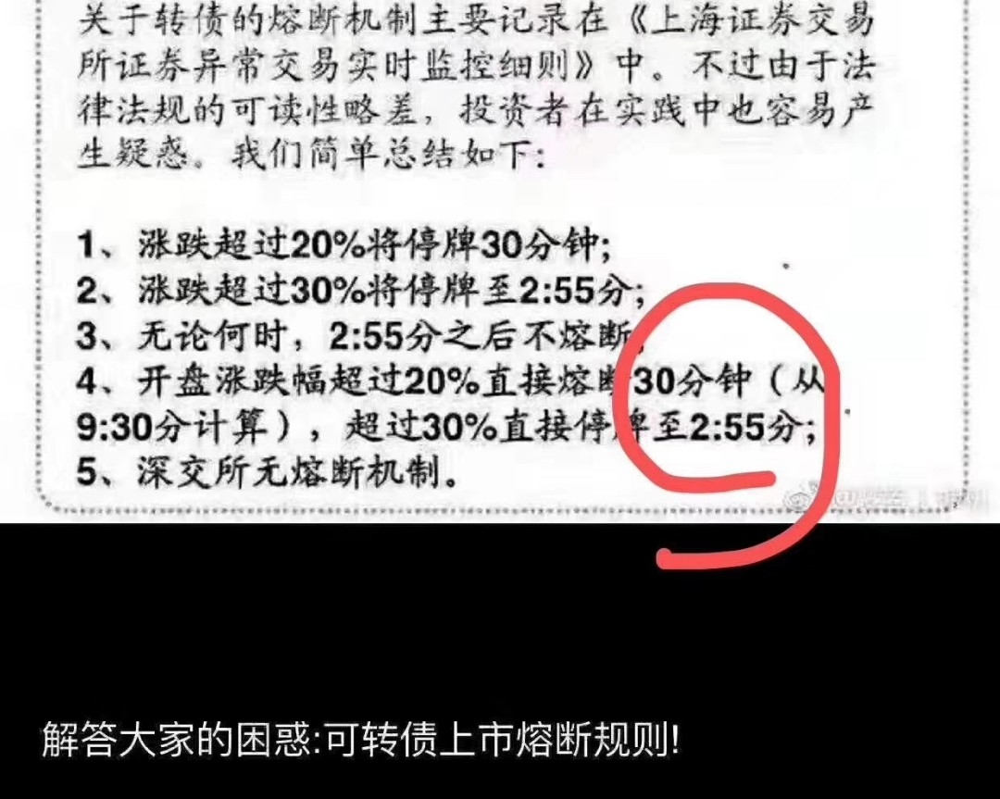

======================================================

_type: talk
@二师父[28814221155551]
2020-01-10 10:31:45 Fri  
topic_id: 548284884512424

@凯 at 2020-01-10 10:31:45 Fri

> 全涨停，有点猛

----------

@向前进 at 2020-01-10 10:31:45 Fri

> [强]恭喜打到的同学，可惜俺一个都没有，继续坚持，等待下一个[呲牙]

----------

@奋斗 at 2020-01-10 10:31:45 Fri

> 为啥的我的不中呢，有没有技巧二师傅

----------

@二师父 at 2020-01-10 10:31:45 Fri

> 没啥技巧，纯属运气，股票打新市值大中的概率大

----------

@烟九•二手车 at 2020-01-10 10:31:45 Fri

> 就没中过[撇嘴]

----------

@清水倾城 at 2020-01-10 10:31:45 Fri

> 我也是一个都没中[发呆]

----------

@清水倾城 at 2020-01-10 10:31:45 Fri

> 话说股票无脑打新是不是大概率挣钱呢？

----------

@二师父 at 2020-01-10 10:31:45 Fri

> a股可以，港股的话破发率还是比较高

----------

阅读[4151]  评论[10]  赞[0] 

+++++++++++++++++++++++++++++++++++++++++++++++++++++

图片：
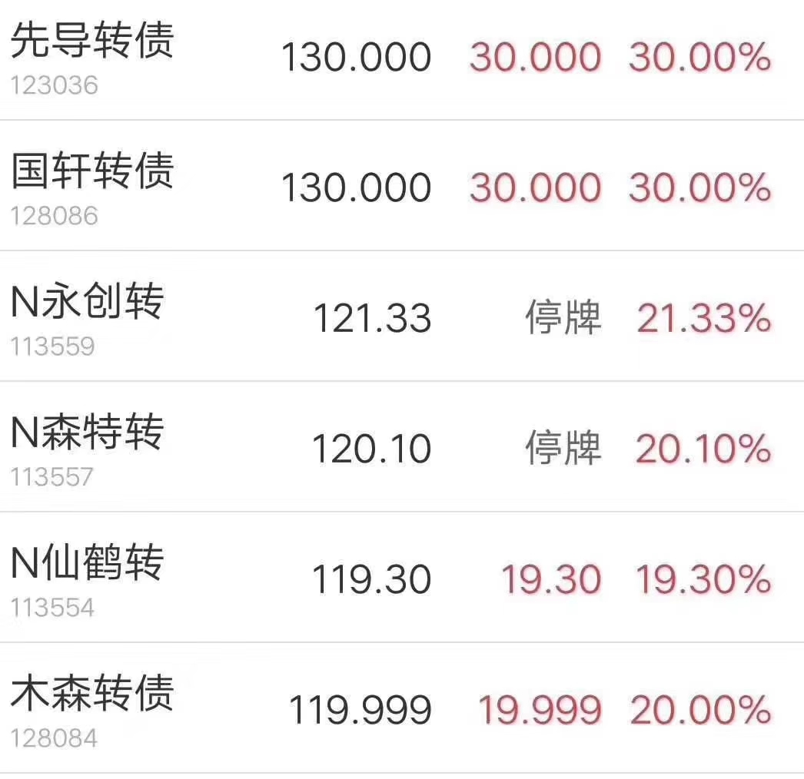

======================================================

_type: q&a
@shee[544885258412114]
2020-01-10 13:02:04 Fri  
topic_id: 241514111882411

@shee

>  二师父，有没有打新债的操作指南？我打了几支，好像自己操作不当，明明买成功了，后续没消息，求指导

@二师父

>  <e type="web" href="https://mp.weixin.qq.com/s/VGXq4Piww2MWtFqDvfA1UQ" title="今天这只可转债开盘涨停，你中签了吗" cache="" />，可以看看这篇文章，申购完成和中签是两回事，你是没有中签吧，这个本来就看概率的，有的能中，有的不能中

阅读[4015]  评论[3]  赞[0] 

======================================================

_type: talk
@二师父[28814221155551]
2020-01-10 20:01:55 Fri  
topic_id: 241511554584551

<e type="hashtag" hid="145458855482" title="#周五读书#" /> 《<e type="web" href="https://wx.zsxq.com/mweb/views/weread/search.html?keyword=逆向交易者" title="逆向交易者" style="book" />》这本书很赞的，我都读过很多遍，与大家分享，良好的心态，在人生低谷的时候学会看到光明面，在人生巅峰的时候学会低调，不要自我膨胀。这样会更加平顺，股市也一样。希望大家都学会逆向思维，这样投资才会更加冷静并且持续盈利。

@衣袂飘香 at 2020-01-10 20:01:55 Fri

> 二师父真像一个智者，年轻的智者。

----------

@杜志彪 at 2020-01-10 20:01:55 Fri

> 股市的成功在于股市之外的东西[微笑]

----------

阅读[4473]  评论[2]  赞[0] 

+++++++++++++++++++++++++++++++++++++++++++++++++++++

文件：
2020-01-10 19:59:58 Fri
文件大小：[25964]
88281852155542-塞尔登《逆向交易者》第一讲.docx

======================================================

_type: talk
@二师父[28814221155551]
2020-01-10 20:04:30 Fri  
topic_id: 118288221258452

白酒别入了，除非你能够持有10年以上不惧波动，很多人真的做不到，就如同你手头的总资金20万，不能再多了，让你今年过年给你爸10万，你肯定巨心疼，更别说给股市了，所以量力而行。

@朝阳模具 at 2020-01-10 20:04:30 Fri

> 买二线白酒股搞一波短线是可以的，我持有今世缘[偷笑]

----------

@二师父 at 2020-01-10 20:04:30 Fri

> 等北上资金撤了再退出来，我只做中长线逆势了，趋势太操心

----------

阅读[3771]  评论[2]  赞[0] 

+++++++++++++++++++++++++++++++++++++++++++++++++++++

文件：
2020-01-10 20:02:13 Fri
文件大小：[61793]
88281852155822-白酒股强势上涨，白酒指数还能定投吗.docx

======================================================

_type: talk
@树叶[544811512145144]
2020-01-11 09:08:28 Sat  
topic_id: 421411488184188

<e type="hashtag" hid="142825811122" title="#定投周报#" /> 二师父定投周报第42期

阅读[3448]  评论[0]  赞[0] 

+++++++++++++++++++++++++++++++++++++++++++++++++++++

文件：
2020-01-11 09:08:27 Sat
文件大小：[274013]
51518124288584-二师父定投周报1.11（第42期）.docx

======================================================

_type: talk
@二师父[28814221155551]
2020-01-11 16:08:49 Sat  
topic_id: 241511825518181

<e type="hashtag" hid="144121412582" title="#传媒和消费投资价值对比#" />

@老孙头 at 2020-01-11 16:08:49 Sat

> “消费指数”目前并不在“相对底部区域”？应相机等待，对否？

----------

@二师父 at 2020-01-11 16:08:49 Sat

> 对的

----------

阅读[3290]  评论[2]  赞[0] 

+++++++++++++++++++++++++++++++++++++++++++++++++++++

文件：
2020-01-11 16:08:22 Sat
文件大小：[101076]
51518124458814-中证传媒和中证消费指数的投资价值对比.docx

======================================================

_type: q&a
@铁观音[28444524525851]
2020-01-11 22:29:31 Sat  
topic_id: 841511828458842

@铁观音

>  二师父好，完全小白，今天买了课程在学习，不太懂，想请教一下，我现在定投准备一份2000元，按周定投，选择哪些指数组合比较好？指数之间买的比例怎么确定？各买多少钱？在哪里可以看到每次要买几份？

@二师父

>  目前比较好的组合，50ah加银行，比例按照阈值除以当前市盈率得到权重来确定，银行有一定的周期性，可以乘以0.7的系数
>  
>  买入份数根据全市场市盈率百分位决定，每周三估值表会公布，刚开始学习最主要的是弄清基本原理，建立自己的投资原则

阅读[3280]  评论[0]  赞[0] 

======================================================

_type: q&a
@学以致用[244415184181451]
2020-01-11 23:01:15 Sat  
topic_id: 841511828114252

@学以致用

>  二师傅，540012恒生龙头指数 现在投资价值怎么样？估值处于什么位置，可以分析一下吗？

@二师父

>  这只基金持仓股票不错，重仓贵州茅台，格力，平安，美的，五粮液，伊利，万科，都是优质龙头，很有价值，其中有三只是我的持仓股票，这是一只股票型基金，估值适中，股票型基金的持仓股票不太稳定，还是建议指数基金为主，学有余力可以自己投资股票构建组合，如果看不懂基本面，建议指数最佳

阅读[3416]  评论[2]  赞[0] 

======================================================

_type: talk
@海盗[48248118584848]
2020-01-12 11:13:53 Sun  
topic_id: 421411824418558

<e type="hashtag" hid="225118152481" title="#指数基金均线偏离表#" />

@丸子妈 at 2020-01-12 11:13:53 Sun

> 银行指数，现在买的是场外基金

----------

@海盗 at 2020-01-12 11:13:53 Sun

> 可以

----------

阅读[3261]  评论[2]  赞[0] 

+++++++++++++++++++++++++++++++++++++++++++++++++++++

图片：
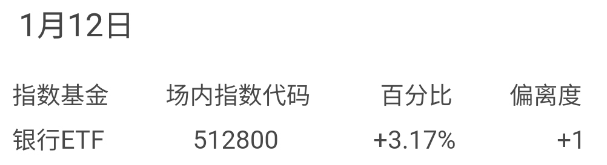

======================================================

_type: q&a
@海盗[48248118584848]
2020-01-12 19:29:51 Sun  
topic_id: 241511844212851

@海盗

>  最近打新债有点热，二师父能说一下打新债需要注意什么吗？还有什么行情下能打，什么行情下不能打。要是遇到破发的债券我们该怎么办？

@二师父

>  牛市基本可以盲打，熊市选择公司质量好，评级最好AA以上，破发的话直接卖出或者当做债券持有

阅读[3247]  评论[1]  赞[0] 

======================================================

_type: talk
@二师父[28814221155551]
2020-01-12 19:39:28 Sun  
topic_id: 841511844448852

<e type="hashtag" hid="555424844454" title="#ROE#" /> 这个指标以前讲过，温故而知新，可以为师矣。新同学刚进来不要着急，知识的累积需要时间，星球都创了700天了，很多同学都学了一两年才慢慢入门，慢慢学习定投，未来的日子很长，这样的话就不会着急，才能沉下心来踏踏实实学习。

阅读[3262]  评论[0]  赞[0] 

+++++++++++++++++++++++++++++++++++++++++++++++++++++

文件：
2020-01-12 19:37:11 Sun
文件大小：[24249]
48581888185148-ROE的含义及在指数基金投资过程中的指导意义.docx

======================================================

_type: talk
@二师父[28814221155551]
2020-01-12 19:40:31 Sun  
topic_id: 241511844442821

<e type="hashtag" hid="825412412212" title="#可转债打新#" /> 明日可转债打新又一个东财转债，挺好的，建议全力申购，另外淮矿转债上市啦，如果中签的话可以卖出。知行合一，既然打新就没必要持有。

@华为～ at 2020-01-12 19:40:31 Sun

> 二师父，打新债多长时间能通知中没中？

----------

@二师父 at 2020-01-12 19:40:31 Sun

> 两天

----------

@华为～ at 2020-01-12 19:40:31 Sun

> 谢谢师父

----------

@鲁盼盼 at 2020-01-12 19:40:31 Sun

> 谢谢师傅，解决了疑惑

----------

@圣诞结® at 2020-01-12 19:40:31 Sun

> 二师父 提示创业板没有权限 必须要去网点申请？

----------

@二师父 at 2020-01-12 19:40:31 Sun

> 是的，去柜台开通

----------

@是喵喵吖～ at 2020-01-12 19:40:31 Sun

> 任意柜台都可以吗 二师父

----------

@二师父 at 2020-01-12 19:40:31 Sun

> 需要和账户开通的证券公司一致

----------

阅读[3307]  评论[10]  赞[0] 

======================================================

_type: talk
@二师父[28814221155551]
2020-01-12 19:54:40 Sun  
topic_id: 118288511185822

<e type="hashtag" hid="222454144181" title="#关于价值判断和投资系统#" /> 这是两个问题，但是本质一样。

价值判断就是你判断什么是美什么是丑，有两种体系，你认为美或者别人认为美。外部的价值判断是别人说你美，那么你就觉得美，内部的价值判断体系是自己认为美，那么你就觉得美。

如果是内部价值判断体系，那么很欧克。你只需要一个意见就能判断。如果是外部的判断体系就复杂了，个人的意见不同，众说纷纭，七嘴八舌，到最后很难有一个判断。

投资系统也一样，如果你的买入和卖出是建立在内部的判断：买入价格低于价值的优质企业或者指数，那么就很轻松，因为内部判断原则简单。

反之，如果你建立在外部判断，今天有什么利好，明天有什么利空，就跟不同人不同的意见一样，很难统一。

最终结论：价值判断和投资系统的原则都是基于内在的，不要依靠外部观点和信息，这样的话为人处世会减去很多烦恼，投资也会变得简单。简单做人，简单投资，多好，不要整的那么复杂，不要太在意别人的看法和市场的情绪。

阅读[4127]  评论[0]  赞[0] 

======================================================

_type: q&a
@学以致用[244415184181451]
2020-01-12 21:40:15 Sun  
topic_id: 118288518228552

@学以致用

>  二师傅，如何看003853金鹰信息产业股票A基金的估值和价值。盈利10%+，继续持有还是收割利润？

@二师父

>  主动基金不能用传统的估值指标的方法，可以看看持仓股票的重仓企业估值情况，目前可以继续持有，建议指数基金投资

阅读[3329]  评论[0]  赞[0] 

======================================================

_type: q&a
@One[422118584812518]
2020-01-12 22:06:54 Sun  
topic_id: 241511841815881

@One

>  二师父，之前定投了点新汽车（160225），一直涨势喜人，浮盈30%，上周五一天就跌了8%，请问下跌是什么逻辑？是被29万的特斯拉按在地上摩擦了吗？听说马斯克还要出25万的特斯拉😂。但是另一方面，马上两会了，新能源汽车又是热点。不知道该不该收割利润，等回调？

@二师父

>  股市短期涨跌是没有逻辑的，如果你的投资体系一直在外部判断就特别累
>  
>  特斯拉概念是主要原因，你这所有的预测因素都是外因，要注重企业价值，按照巴菲特的理念，带轮子的都不建议买，你可以先收割利润
>  
>  很多时候外部太难预测，就跟我知道美国要和伊朗干架，我的黄金肯定不卖。如果不知道，那就看昂贵程度就行

阅读[3406]  评论[3]  赞[0] 

======================================================

_type: talk
@志亮[422125851552828]
2020-01-13 09:43:51 Mon  
topic_id: 548288184128254

白酒板块又拉升了，是时候准备撤了[呲牙]

@志亮 at 2020-01-13 09:43:51 Mon

> 还没呢，准备撤吧，快过年了，年前白酒应该还有一阵涨，下周应该撤的好时机，个人动作[发呆]，请勿参考

----------

@杜志彪 at 2020-01-13 09:43:51 Mon

> 昨天晚上就填好单子收割利润了[微笑]，下次等待高估[得意]

----------

@二师父 at 2020-01-13 09:43:51 Mon

> 把本金撤了，利润持有穿越牛熊毫无压力

----------

@志亮 at 2020-01-13 09:43:51 Mon

> [强]好的，听二师父的[微笑]

----------

阅读[2987]  评论[7]  赞[0] 

======================================================

_type: q&a
@一无所有[244112224815551]
2020-01-13 14:15:19 Mon  
topic_id: 118288588484522

@一无所有

>  二师父，下午好!我每次华泰开户时到上传身份证，就无法拍照，请问这是什么原因？谢谢！

@二师父

>  可能网络原因，你在公众号后台回复华泰，退出然后重新扫描试一下

阅读[3064]  评论[3]  赞[0] 

======================================================

_type: talk
@元亨[48551521514458]
2020-01-13 14:29:58 Mon  
topic_id: 421411548824188

中证500已经赢利25个点，想换股。请问50与50ah，老师推荐哪一个？

@二师父 at 2020-01-13 14:29:58 Mon

> 50ah，500也可以持有的

----------

@元亨 at 2020-01-13 14:29:58 Mon

> 知道了，谢谢

----------

阅读[2914]  评论[2]  赞[0] 

======================================================

_type: q&a
@光少[244124552511141]
2020-01-13 15:45:50 Mon  
topic_id: 421411548542428

@光少

>  二师父你好！新股打新一般能中签几股？也是满格申购吗？

@二师父

>  是的，这个中签率很低的

阅读[3074]  评论[0]  赞[0] 

======================================================

_type: talk
@二师父[28814221155551]
2020-01-13 17:33:39 Mon  
topic_id: 241511252858481

市场持续上涨，需要注意的问题，大家常在星球讨论，如果拿不定主意可以星球问一问，很多投资者目前都能够独立决策了，可以结合大家的意见，然后自己再综合判断做决策，你即使当元帅，也得有军师啊。大部分家庭是丈夫当元帅，妻子当军师，这样的组合简直虐爆市场。

不要自己闷头苦干，放低身段，多和高认知的朋友交流，多听听别人的建议，打开自己的视野，提升自己的认知，这样才会长足的进步。

@陌路花 at 2020-01-13 17:33:39 Mon

> 天天基金网看到说中证500较为低估，二师父认为已经是正常估值了吗？

----------

@二师父 at 2020-01-13 17:33:39 Mon

> 是的

----------

@隔窗遥望 at 2020-01-13 17:33:39 Mon

> 师父，现在可以加仓低估指数吗？还是减少定投份额比较好？目前大概7成仓位

----------

@隔窗遥望 at 2020-01-13 17:33:39 Mon

> 十一月初开始跟师父定投的

----------

@二师父 at 2020-01-13 17:33:39 Mon

> 二月7成仓位，你厉害，可以减额定投

----------

@孤芳自赏 at 2020-01-13 17:33:39 Mon

> 今天很惨！点卖出利润的时候本来点300输成3000才赚十个点就卖完了[流泪]

----------

@圣诞结® at 2020-01-13 17:33:39 Mon

> 二师父，我是9月底正式开始定投，使用的是增量资金进行场外定投，目前持有的是中证500、中证银行、基本面60、50AH、证券指数，由于入市较晚，除了中证500其他基本都没有建立底仓，只是每周定投，仓位较轻，有几个不太肯定的想法：1、只要存在低估指数，是不是可以一直定投下去？2、对于那些仓位轻份额少的基金，目前有的盈利超过10%，是否可以先不收割，保证份额等待后期更大涨幅，从而获得更高的利润？这样同时也意味着会有利润回吐的风险，对吧？3、还在低估的指数，如果选择不加仓，继续按照比例慢慢定投，若后期上涨，就停投；若回撤下跌，再加仓。这样操作是否可行？求二师父和大家指正，谢谢

----------

@二师父 at 2020-01-13 17:33:39 Mon

> 没啥大的问题，你现在需要的是实践，在市场久了很多问题就不是问题

----------

阅读[3221]  评论[11]  赞[0] 

+++++++++++++++++++++++++++++++++++++++++++++++++++++

文件：
2020-01-13 17:30:25 Mon
文件大小：[23128]
88281884545412-市场持续上涨，定投需要注意的几个问题.docx

======================================================

_type: talk
@二师父[28814221155551]
2020-01-13 17:36:25 Mon  
topic_id: 421411545845418

<e type="hashtag" hid="144128555182" title="#说一种止盈方法#" /> 翻倍卖利润法，比如投资的股票或者指数翻倍了，投入1万，变成2万，卖出1万，那么剩余1万就是纯赚的，怎么涨怎么跌都可以毫无压力的拿着穿越牛熊，这是非常爽的。

进一步，比如投资的白酒指数1万，盈利7000，白酒高估，卖出1万，剩余7000利润，也是毫无压力持有看着他涨到天上去不怕下跌。

阅读[3150]  评论[0]  赞[0] 

======================================================

_type: talk
@二师父[28814221155551]
2020-01-13 18:09:41 Mon  
topic_id: 241511252252411

<e type="hashtag" hid="142852258522" title="#可转债打新提示#" /> 1月14日，银河转债发行，建议申购，振德转债、日月转债上市，可以酌情卖出。

@背心 at 2020-01-13 18:09:41 Mon

> 二师傅，我看它是A+的，你不是说AA以上的申购吗，求回复，谢谢

----------

@二师父 at 2020-01-13 18:09:41 Mon

> 也看公司质量和市场情况

----------

@背心 at 2020-01-13 18:09:41 Mon

> 谢谢师傅，认识你是我最大的收获，2400点的时候，害怕没有继续定投，到现在收益20个点。以后还会继续学习，再次感谢你[抱拳][抱拳][抱拳]

----------

阅读[3300]  评论[3]  赞[0] 

======================================================

_type: talk
@二师父[28814221155551]
2020-01-13 18:10:55 Mon  
topic_id: 841511252254552

<e type="hashtag" hid="555428115114" title="#低质量的社交不如高质量的独处#" /> 不要忙着去结交人，你结交的人并没有那么牛。

而对于人脉不在于你认识谁，而在于谁认识你，谁信任你，多花点时间提升自己比什么都重要。

@Hi·DD at 2020-01-13 18:10:55 Mon

> 大盘指数新高，但账户市值不新高[撇嘴]

----------

@二师父 at 2020-01-13 18:10:55 Mon

> 你的春天晚一点到来

----------

@Hi·DD at 2020-01-13 18:10:55 Mon

> 一口饭差点没喷出来。。。

----------

@shee at 2020-01-13 18:10:55 Mon

> 我一直是这么认为的[微笑]

----------

@丸子妈 at 2020-01-13 18:10:55 Mon

> 确实如此

----------

阅读[3457]  评论[5]  赞[0] 

======================================================

_type: talk
@范*[841855284221812]
2020-01-13 18:51:40 Mon  
topic_id: 241511252452151

今年收获巨大，以前我都是在epubee网站上下载电子书自己研究，再实战验证。幸运的是下载了雪球，发现交流成长的更快，更幸运的是遇见了二师父，在二师父身上学到了，风险把控和心态，是真的学到了。同时自己学炒股的这2年，刚好经历了熊市加大反弹，深刻的感受到了，熊市的非理性恐惧。反弹时来不及，连涨时不敢买，回调时不舍得卖，又不敢加仓。后面肯定有能感受牛市的贪心，谢谢二师父，谢谢熊市，谢谢大反弹，谢谢未来的牛市。
谢谢股市！

阅读[3500]  评论[0]  赞[0] 

+++++++++++++++++++++++++++++++++++++++++++++++++++++

图片：
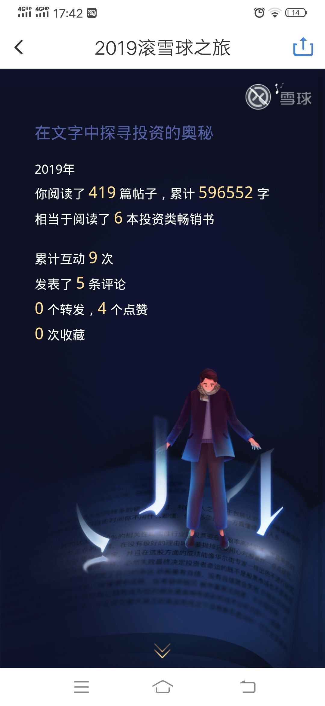
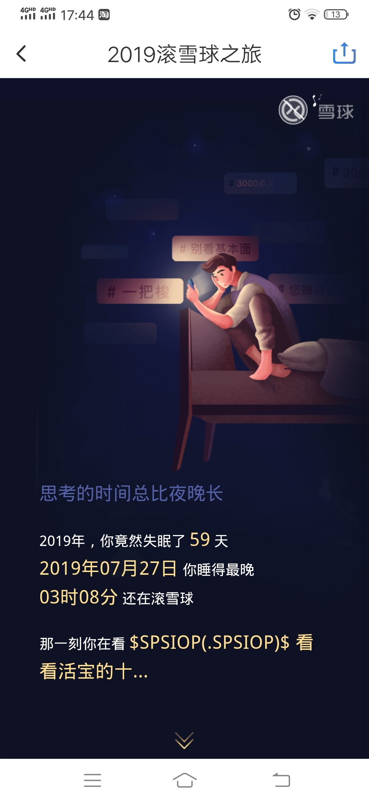

======================================================

_type: q&a
@mumomo[111812248825412]
2020-01-13 19:04:56 Mon  
topic_id: 421411545558218

@mumomo

>  二师父，新手港股打新用哪家券商比较合适，佣金交易费用等成本较低？将来出金一定要去香港办卡吗？另外，国家对投资港股等海外市场对体制内人员有限制吗？

@二师父

>  富途证券可以，出金一定要有香港账户，什么体制，政府机关，国企还是事业单位？投资港股可以开通港股通，打新开通港股账户

阅读[3699]  评论[3]  赞[0] 

======================================================

_type: q&a
@隔窗遥望[241884481854181]
2020-01-13 19:05:54 Mon  
topic_id: 548288525411514

@隔窗遥望

>  师父 ，11月初开始跟师父定投，目前7成仓位，现在是加仓仅有的低估指数，还是减少定投份额慢慢来

@二师父

>  刚回答了，减额定投

阅读[3862]  评论[0]  赞[0] 

======================================================

_type: talk
@二师父[28814221155551]
2020-01-13 22:20:07 Mon  
topic_id: 548288524442424

<e type="hashtag" hid="281158284851" title="#市场分析#" /> 看看目前市场情况，筹码值得拥有

@Audrey at 2020-01-13 22:20:07 Mon

> 10年期国债走低 代表什么意思呢 求指教

----------

@二师父 at 2020-01-13 22:20:07 Mon

> 利率下行

----------

@Audrey at 2020-01-13 22:20:07 Mon

> 利率下行是不是货币环境更宽松 流动到市场的钱变多了

----------

@二师父 at 2020-01-13 22:20:07 Mon

> 理论上这样

----------

阅读[4684]  评论[4]  赞[0] 

+++++++++++++++++++++++++++++++++++++++++++++++++++++

文件：
2020-01-13 22:19:28 Mon
文件大小：[403275]
51518152125484-市场分析1.13.docx

======================================================

_type: talk
@二师父[28814221155551]
2020-01-13 22:23:21 Mon  
topic_id: 841511254442242

日常一乐

@J at 2020-01-13 22:23:21 Mon

> 师父家也养金毛狗狗吗

----------

@Sunflower at 2020-01-13 22:23:21 Mon

> 每个小动物都是一个天使，值得疼爱[呲牙]

----------

@自由飞翔 at 2020-01-13 22:23:21 Mon

> 金毛犬[微笑]，我家以前也养过

----------

@Claire at 2020-01-13 22:23:21 Mon

> 好可爱哟

----------

阅读[3820]  评论[4]  赞[0] 

+++++++++++++++++++++++++++++++++++++++++++++++++++++

图片：

======================================================

_type: talk
@丸子妈[28512522184441]
2020-01-13 22:23:33 Mon  
topic_id: 241511254442451

创业板指数：今天又上涨了，盈利12%，我看创业板高估了，今天收割了利润，这样做应该可行吧？

@木公先生 at 2020-01-13 22:23:33 Mon

> 可行

----------

阅读[3880]  评论[1]  赞[0] 

======================================================

_type: q&a
@J[28281541518551]
2020-01-14 08:52:34 Tue  
topic_id: 118288455188882

@J

>  师父好，今天的银河转债请问是要开通创业板才能申购吗？

@二师父

>  是的

阅读[3983]  评论[14]  赞[0] 

======================================================

_type: talk
@西锦巴乌[88448285428482]
2020-01-14 09:13:16 Tue  
topic_id: 241511282544841

<e type="hashtag" hid="555428115114" title="#低质量的社交不如高质量的独处#" /> 师父讲的很到位和精辟[强]

阅读[3877]  评论[0]  赞[0] 

======================================================

_type: q&a
@圣诞结®[28448281541121]
2020-01-14 18:17:55 Tue  
topic_id: 841511228488422

@圣诞结®

>  二师父，请教个关于按揭贷款的问题，比如纯按揭贷款100万，25年，对于提前还贷，您觉得合适吗？或者说在什么时间之前，还多少比例是合适的？某个节点以后就不合适了？

@二师父

>  这看你的贷款方式，等额本金比较适合提前还款
>  
>  房贷没必要提前还，商业房贷利率低，如果公积金的话就更低，一般是在个人财务状况允许条件下杠杆最大化，把债务留给银行，剩余的可用资金用来投资，资金增值会超过利息

阅读[3752]  评论[1]  赞[0] 

======================================================

_type: talk
@二师父[28814221155551]
2020-01-14 21:26:51 Tue  
topic_id: 241511221811421

<e type="hashtag" hid="555411154154" title="#一起看看环保#" />

阅读[4518]  评论[0]  赞[0] 

+++++++++++++++++++++++++++++++++++++++++++++++++++++

文件：
2020-01-14 21:26:41 Tue
文件大小：[54414]
28281822458481-环保真的涨了吗，看看自己是否有锚定思维.docx

======================================================

_type: talk
@元亨[48551521514458]
2020-01-14 22:24:57 Tue  
topic_id: 421411551228558

持有上证红利赢利12个点，请问老师是每年持股分红，还是正常估值收割利润？

@二师父 at 2020-01-14 22:24:57 Tue

> 当正常估值收割利润即可

----------

阅读[3583]  评论[1]  赞[0] 

======================================================

_type: q&a
@小白老赵[244148555454141]
2020-01-15 09:00:37 Wed  
topic_id: 841511248888512

@小白老赵

>  师傅好，跟随您鳄鱼计划买中概互联，现在收益接近25%，是继续拿着还是卖出呢？中证银汉还可以买入吗？谢谢您！鳄鱼收益不错，开心😁

@二师父

>  目前正常估值，可以收割利润，因为现在没有特别好的买入机会，我就拿着没动，你可以将利润落袋。
>  
>  银行仍旧可以投的，别重仓就行

阅读[3557]  评论[0]  赞[0] 

======================================================

_type: talk
@二师父[28814221155551]
2020-01-15 09:56:48 Wed  
topic_id: 241511244858551

钟摆总是过度，银行继续跌，消费继续涨，做好配置，任他涨跌都可以长期持有

@清水倾城 at 2020-01-15 09:56:48 Wed

> 二师父你银行盈利多少了？我小额建个底仓可以的吧？

----------

@艾琪（王钥） at 2020-01-15 09:56:48 Wed

> 二师父，现在银行和50AH是减额定投还是维持原来的金额？现在已有5成仓

----------

@二师父 at 2020-01-15 09:56:48 Wed

> 可以，这个基金有一定周期性，别重仓

----------

@二师父 at 2020-01-15 09:56:48 Wed

> 5成仓不重，可以继续，我已经减额了，你根据自己仓位来

----------

阅读[3631]  评论[5]  赞[0] 

======================================================

_type: talk
@Jessie在水一方[111851554242252]
2020-01-15 10:27:17 Wed  
topic_id: 548288544528214

二师父，最近特斯拉概念很火，请问有没有有关基金是投资此类股票的呢？我们值得介入吗？谢谢🙏

@二师父 at 2020-01-15 10:27:17 Wed

> 没找到合适的，特斯拉是从事纯电动车的设计、销售和制造，看了近年的财务报表，18年的利润还可以，17年亏损较为严重。这家公司运营效率较差，基本面不是非常好。可以关注下新能源汽车，追热点是投资比较忌讳的。

----------

阅读[3764]  评论[1]  赞[0] 

======================================================

_type: talk
@深蓝浅蓝[88482412442152]
2020-01-15 11:44:08 Wed  
topic_id: 241511244124151

请问一下，二师父，有港卡的情况下如果购买盈富基金，在银行账户购买跟在证券公司购买有什么区别吗？

@二师父 at 2020-01-15 11:44:08 Wed

> 证券公司费率低一些

----------

@深蓝浅蓝 at 2020-01-15 11:44:08 Wed

> 收到，谢谢～

----------

阅读[3825]  评论[2]  赞[0] 

======================================================

_type: q&a
@牛牛[548141224521114]
2020-01-15 21:24:31 Wed  
topic_id: 118288481218282

@牛牛

>  二师父，明天还继续定投吗

@二师父

>  继续投的，机会还不错

阅读[3512]  评论[1]  赞[0] 

======================================================

_type: talk
@二师父[28814221155551]
2020-01-15 21:27:38 Wed  
topic_id: 118288481285282

看看这些ETF买了吗，市场ETF很多的，专注主要的，配置不用超过15只。

@向前进 at 2020-01-15 21:27:38 Wed

> 目前这些都不低估，不能买了吧？

----------

@二师父 at 2020-01-15 21:27:38 Wed

> 银行，h股还可以

----------

@暖暖 at 2020-01-15 21:27:38 Wed

> 二师父，电脑看不了这些文档的啊。。。

----------

@二师父 at 2020-01-15 21:27:38 Wed

> 可以看啊

----------

@木公先生 at 2020-01-15 21:27:38 Wed

> 是啊，我在电脑网页端也打不开文档，不知道怎么回事

----------

@暖暖 at 2020-01-15 21:27:38 Wed

> 

----------

@暖暖 at 2020-01-15 21:27:38 Wed

> 以前能看，后来的不能下载，也不能看，基本上用电脑端，所以最近文章基本都没看。

----------

@二师父 at 2020-01-15 21:27:38 Wed

> 现在应该可以了

----------

阅读[3634]  评论[9]  赞[0] 

+++++++++++++++++++++++++++++++++++++++++++++++++++++

文件：
2020-01-15 21:27:09 Wed
文件大小：[19031]
28281845144121-ETF如此火热，这些ETF你都买了吗.docx

======================================================

_type: talk
@二师父[28814221155551]
2020-01-15 22:00:10 Wed  
topic_id: 548288584522244

<e type="hashtag" hid="142852258522" title="#可转债打新提示#" /> 柳药、星帅，建议顶格申购。

阅读[3574]  评论[0]  赞[0] 

======================================================

_type: talk
@二师父[28814221155551]
2020-01-15 22:05:12 Wed  
topic_id: 118288481421122

<e type="hashtag" hid="481211145528" title="#指数估值#" /> 原油跌的很厉害。其他的变动不大，整体市场估值中等偏低。鳄鱼计划依旧停止，场外定投继续0.25份。等待机会，上涨或者下跌都是机会，不上不下还不如搞搞可转债打新和港股打新。

@J at 2020-01-15 22:05:12 Wed

> 油气我只在0.41的时候赎回了1/3[流泪]

----------

@暖暖 at 2020-01-15 22:05:12 Wed

> 中证银行和50AH优选还可以买是吗，二师父。

----------

@暖暖 at 2020-01-15 22:05:12 Wed

> 同时还请教下，医药感觉也一直不怎么火，都没有医药低估的可供购买的指数是吧。

----------

@二师父 at 2020-01-15 22:05:12 Wed

> 可以，医药指数涨了很多了

----------

@蓝色流星 at 2020-01-15 22:05:12 Wed

> H股指数还定投不？

----------

@二师父 at 2020-01-15 22:05:12 Wed

> 可以

----------

@紫色天使 at 2020-01-15 22:05:12 Wed

> 二师傅什么时候讲讲港股打新吧，账户也难开，出金入金都困难，把我们都挡在了门外了[难过][难过][难过][难过]

----------

@二师父 at 2020-01-15 22:05:12 Wed

> 开户很容易啊，你哪步出了问题，需要开通一个港股账户

----------

阅读[4406]  评论[8]  赞[0] 

+++++++++++++++++++++++++++++++++++++++++++++++++++++

图片：
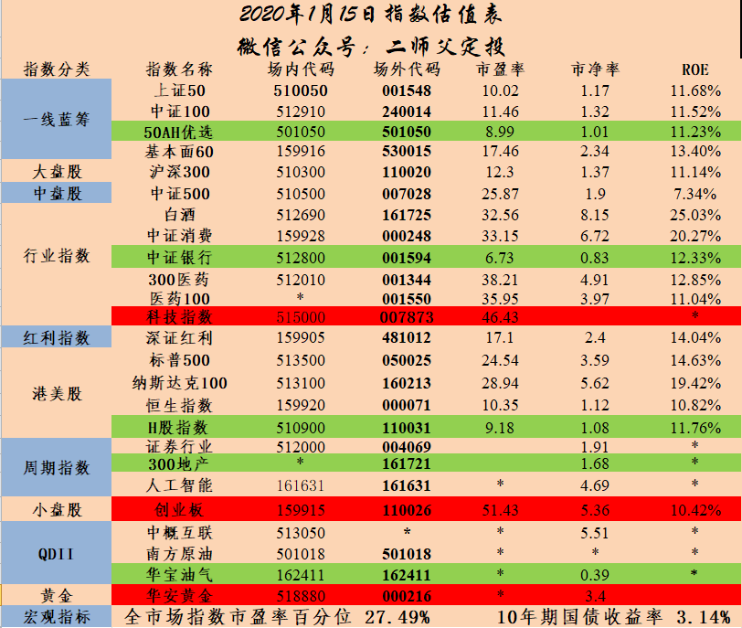

======================================================

_type: talk
@二师父[28814221155551]
2020-01-15 22:22:26 Wed  
topic_id: 548288584422814

<e type="hashtag" hid="881422852442" title="#定投实盘#" /> 继续买入0.25份，按照5年规律今年会有牛市，不过世界变化万千，不好预测。所以在市场不是极度便宜就减额定投，按照纪律，备足子弹，等待机会。

今年很难，估计大部分非体制内人员过不好年，因为杠杆高，生意不好做，然而如果有充裕的现金流，其实日子还是很舒服的。

阅读[3719]  评论[0]  赞[0] 

+++++++++++++++++++++++++++++++++++++++++++++++++++++

图片：
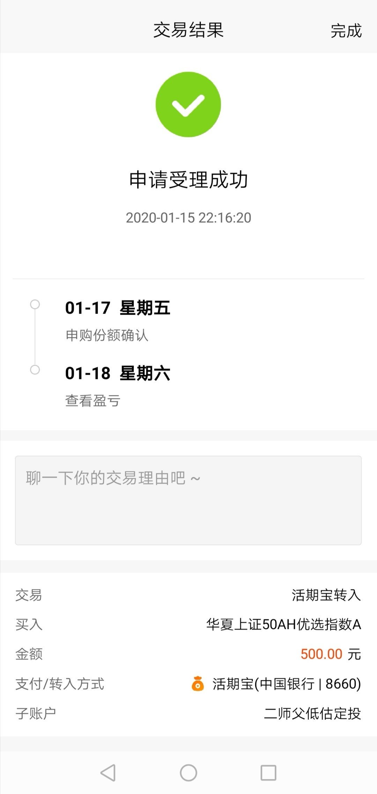

======================================================

_type: talk
@二师父[28814221155551]
2020-01-15 22:59:40 Wed  
topic_id: 548288584811514

10年任何时候都是上车机会，这就是纳斯达克。

@凯 at 2020-01-15 22:59:40 Wed

> 希望我们也有这样的行情

----------

@J at 2020-01-15 22:59:40 Wed

> 师父，现在还能入手纳斯达克吗

----------

@J at 2020-01-15 22:59:40 Wed

> 你说这种不友善的话是在侮辱师父和其他球友的智慧啊，师父说纳斯达克10年任何时候都是上车机会，向师父请教目前是否上车的时点是尊重师父、尊重知识。

----------

@清水倾城 at 2020-01-15 22:59:40 Wed

> 两年前就说高位不要入，结果人家继续新高，现在只能继续静静看着

----------

@二师父 at 2020-01-15 22:59:40 Wed

> 确实高位

----------

@吾思吾想 at 2020-01-15 22:59:40 Wed

> 师傅，纳斯达克100我在车上，而且也收割了利润，现在是停止定投呢还是继续扣款好呢？

----------

@二师父 at 2020-01-15 22:59:40 Wed

> 停止

----------

阅读[3770]  评论[14]  赞[0] 

+++++++++++++++++++++++++++++++++++++++++++++++++++++

图片：
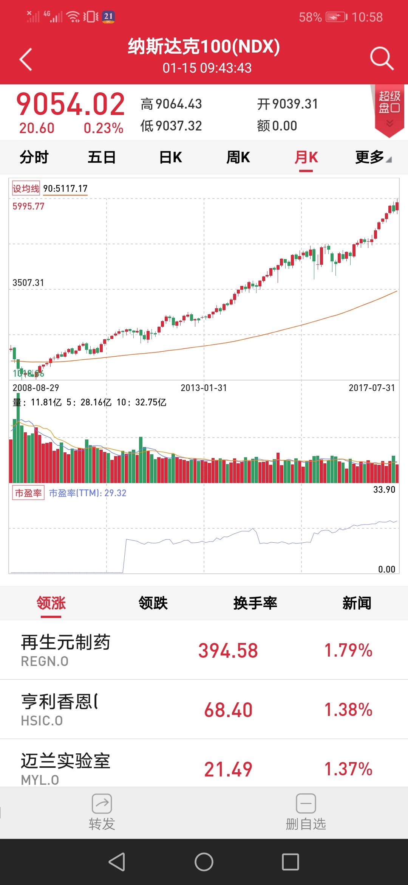

======================================================

_type: talk
@二师父[28814221155551]
2020-01-16 00:27:13 Thu  
topic_id: 548288588112444

眼界高于能力，能力大于所得。决定一个人一生幸福与否不在于买了什么基金，做了什么投资，而在于眼界高低，思维层次，人生态度。

你看到的世界并不是全部，打开眼界，拥抱未知，去探索你曾经不能理解的领域，才会拓宽眼界，提高认知。

从第二层次思维进行思考，拥有积极的人生态度，你会发现，生活在你每日的精进中越来越好。

想富有，不是先买基金，而是先改善思维，提升认知，然后才是买基金。

@Dolly at 2020-01-16 00:27:13 Thu

> 二师父，有什么书可以推荐一下，改善思维，提升认知

----------

@二师父 at 2020-01-16 00:27:13 Thu

> 富爸爸财务自由之路，原则。

----------

@太阳 at 2020-01-16 00:27:13 Thu

> [强][强][强]

----------

@王模堂 at 2020-01-16 00:27:13 Thu

> 有哲学道理

----------

阅读[3664]  评论[4]  赞[0] 

======================================================

_type: talk
@二师父[28814221155551]
2020-01-16 11:16:11 Thu  
topic_id: 421411145218258

看得越多，恐怕就越能理解什么叫“没有随随便便的成功“了。在不进入股市之前无法想象“等待”居然能导致这么大的焦虑，这种焦虑首先建立在可以理解的基础上，那就是股市的不确定性。但更重要的恐怕还是“自由选择的诱惑”，扔掉手里萎靡不振的持股，换入涨势喜人的股票，这一过程只需要几秒钟。有人笑谈“守股比守寡还难”，其实这个难就难在不可遏制的欲望和对未来的恐惧。~李杰。

@rtdmm小米 at 2020-01-16 11:16:11 Thu

> 绝大部分人恐惧和焦虑源于不确定性

----------

阅读[3459]  评论[1]  赞[0] 

======================================================

_type: q&a
@Gingo[544812851155554]
2020-01-16 15:59:27 Thu  
topic_id: 421411141454888

@Gingo

>  师傅 不明白为什么这个基金打开来看是没数据的？

@二师父

>  有的，只是当日估算净值没有

阅读[3233]  评论[1]  赞[0] 

======================================================

_type: talk
@竺胜江[841881441421582]
2020-01-16 20:13:25 Thu  
topic_id: 241511188124551

二师付，你好！第一次申购转债127015就中了两个10张（两个账号），钱也扣了，过了这么多天了怎么还没反应

@聪明的笨蛋 at 2020-01-16 20:13:25 Thu

> 还没上市

----------

@Gingo at 2020-01-16 20:13:25 Thu

> 一般要半个月后才会上市

----------

@竺胜江 at 2020-01-16 20:13:25 Thu

> 谢谢，第一次搞心里没底😄

----------

阅读[3205]  评论[3]  赞[0] 

======================================================

_type: talk
@五年陈[422152158411548]
2020-01-16 20:29:40 Thu  
topic_id: 548288811848584

你好。准备在二师父推荐的华泰或广发选再开个户。主要是做基金。请问哪一家佣金更为优惠?

@聪明的笨蛋 at 2020-01-16 20:29:40 Thu

> 广发

----------

@朱永军 at 2020-01-16 20:29:40 Thu

> 华泰和广发好像没有余额理财吧？

----------

阅读[3371]  评论[2]  赞[0] 

======================================================

_type: q&a
@吾思吾想[118552585284212]
2020-01-16 21:04:33 Thu  
topic_id: 118288854282452

@吾思吾想

>  师傅，我在东方财富网开了交易账户，可开通创业板要到柜台去，我们这小县城没东方财富的柜台吧？

@二师父

>  这个你百度地图查查应该有的，没有就要去市区，东方好像不免5，最好开华泰或者广发的。

阅读[3508]  评论[1]  赞[0] 

======================================================

_type: q&a
@铁观音[28444524525851]
2020-01-16 22:12:41 Thu  
topic_id: 241511182224121

@铁观音

>  师傅，有啥关于基金的书籍，可以提升提升的介绍吗？感谢！另外现在手上有10万的存量资金，啥时候可以开始迅速建仓，建仓选择哪些基金比较好呢？

@二师父

>  指数基金投资入门到精通可以，罗国庆写的。我的书稿已经给了出版社不出意外明年也会出版，这个专门介绍基金。
>  
>  可以建立4成底仓，银行和50ah，然后继续定投，缩短定投周期可以，如果大跌就多投一点，投完了就锁仓

阅读[3615]  评论[3]  赞[0] 

======================================================

_type: talk
@二师父[28814221155551]
2020-01-16 22:25:58 Thu  
topic_id: 241511182425421

<e type="hashtag" hid="225848111481" title="#港股打新#" /> 港股打新三步：第一，开户，公众号后台回复港股有渠道，直接录制信息，摇摇头，上传身份证啥的。

第二步：入金，这个用港股账户比较好，没有港股账户可以自己去香港办理，觉得去香港麻烦告诉我，我让人帮你办，护照需要自己搞定，签证的话有更好，如果没有我也可以找人帮你搞定。办护照去户口所在地行政服务中心办就行，一般旅游护照最快，7天差不多，拍拍照片就行了。我没法帮你办，这个得本人去了。

第三步：打。集思录里面有申购建议，打之前看看表格就行啦。

打新很简单啊。你到底哪个地方出了问题，出金还是入金，还是打亏了。得跟我说的明确点，不然我帮你都没法下手啊。

提醒下，港股打新容易破发，不是稳赚得，这个需要注意哈。其余得有问题再问我，三步打新法则，就这么简单。

@海盗 at 2020-01-16 22:25:58 Thu

> 二师父，这也能薅点金融羊毛吗？比起来可转债打新这个收益怎么样？

----------

@二师父 at 2020-01-16 22:25:58 Thu

> 收益好，破发也不小

----------

@海盗 at 2020-01-16 22:25:58 Thu

> 都是开盘就卖吗？

----------

@二师父 at 2020-01-16 22:25:58 Thu

> 是的

----------

@海盗 at 2020-01-16 22:25:58 Thu

> 谢谢啊

----------

@乖子 at 2020-01-16 22:25:58 Thu

> 请问要准备多少的资金？

----------

@梧桐 at 2020-01-16 22:25:58 Thu

> 二师父，港股打新是盲打还是选择不同级别的

----------

@二师父 at 2020-01-16 22:25:58 Thu

> 1.5万人民币足够

----------

阅读[4494]  评论[20]  赞[0] 

+++++++++++++++++++++++++++++++++++++++++++++++++++++

图片：
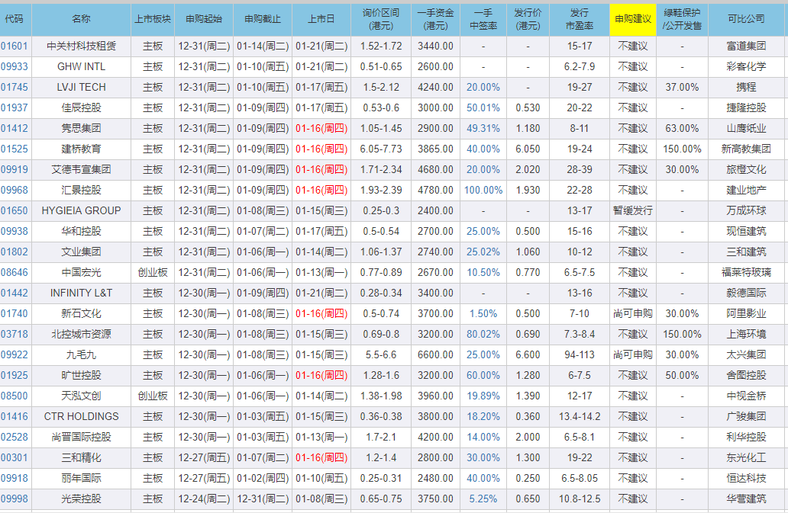

======================================================

_type: q&a
@杜志彪[544454124115854]
2020-01-16 22:40:31 Thu  
topic_id: 548288815414484

@杜志彪

>  今天关注了京沪高铁，觉得是个好公司，但是没有类似的上市公司相比较，您觉得它的合理估值是多少，我觉得6元以下可以考虑，感兴趣的朋友可以聊聊，中签的朋友卖了吗？。

@二师父

>  股票估值不是第一位，价值第一位，我看了看他的财务报表，没有找到原始得，从杜邦分析来看。
>  
>  运营效率较低，基本面不是最佳。
>  
>  至于股票价格，利用股价方程式计算：市盈率*净利率*总资产周转率*每股净值*杠杆倍数，然后和股票价格比较。
>  
>  价格和价值之间的关系很难量化，传统的DCF模型用了未来的盈利预测，所以真的比较难准确。最好的分析方式就是从盈利能力、运营效率、财务能力综合分析。

阅读[3775]  评论[1]  赞[0] 

======================================================

_type: q&a
@美美[48224811151218]
2020-01-16 22:56:48 Thu  
topic_id: 421411185144528

@美美

>  二师父你好！港股打新是用香港的卡吧？卡里存人民币还是港币？

@二师父

>  大陆卡开通港股账户，需要换成港币

阅读[3818]  评论[0]  赞[0] 

======================================================

_type: talk
@光少[244124552511141]
2020-01-16 23:31:40 Thu  
topic_id: 118288851255582

雪球：指数基金

<e type="web" href="http://xima.tv/pZFwyf" title="12 新股民的第一堂课：普通人战胜市场的不二法宝-玩赚指数基金在线收听_雪球_喜马拉雅FM"/>

阅读[3760]  评论[0]  赞[0] 

======================================================

_type: q&a
@sunshine[88221448225212]
2020-01-17 08:06:48 Fri  
topic_id: 118288842584442

@sunshine

>  二师父：港股打新 中了一手艾德韦宣 昨天没出掉 想问下后续还有机会吗 还是只能尽快割肉出掉呢

@二师父

>  直接出，港股风险比a股大，打新别搞成持股

阅读[3877]  评论[0]  赞[0] 

======================================================

_type: q&a
@凭栏观海[244414845852181]
2020-01-17 09:22:35 Fri  
topic_id: 841511125452412

@凭栏观海

>  请问老师，我看了最近的股票白云山，估值很低，同时企业又持有金戈和王老吉两个王牌产品，现在想趁机少量介入，不知可否？

@二师父

>  这个企业毛利率较低，杠杆倍数较高，如果行业发生风险的话，会加速经营业绩下滑，行业利好的时候，会加速发展。
>  
>  实际的现金流余额较多，企业经营风险低。应收账款占比过大。
>  
>  企业只分析基本面，不做买卖建议

阅读[3877]  评论[1]  赞[0] 

======================================================

_type: talk
@二师父[28814221155551]
2020-01-17 15:08:36 Fri  
topic_id: 241511122224241

陶朱公经商，别开生面，与众不同。平常人都是雨天造舟，旱时造车。因为雨季舟船好卖，旱季车辆好销售。但陶朱公却是雨天造车，旱时造船，人们都讥笑他不懂市场。
但雨季说停就停。雨一停，人们出行就立即需要车辆，众人急忙停止造船，转过来造车。可是陶朱公已经在雨季时造了许多车辆，就立即售罄。
同样地，别人都在旱季时忙着造车子，现造现卖，来钱很快，只有陶朱公在造船。可是雨季突如其来，大家再急忙去造船，没等把材料备齐，陶朱公这边已经把市场上的钱席卷一空。
投资也需要做陶朱工，逆向思维等待反转

阅读[3740]  评论[0]  赞[0] 

======================================================

_type: talk
@二师父[28814221155551]
2020-01-17 18:23:50 Fri  
topic_id: 421411124444428

全市场指数百分位25%以下启动鳄鱼计划，不是场外定投，场外定投随时低估的都可以。鳄鱼计划启动会严格一点，很少买入，极佳的机会出现才会买。没有机会就持有货币基金和债券基金。

@一叶秋末ヾ at 2020-01-17 18:23:50 Fri

> 师父启动的时候请通知下[玫瑰][玫瑰]

----------

@二师父 at 2020-01-17 18:23:50 Fri

> 还有大概20份资金，也不多了，不知还有没有机会再买

----------

@爱华 at 2020-01-17 18:23:50 Fri

> 弱弱地问一句二师父：如果我用来投资基金的总资金是100万，鳄鱼计划pk定投，各占多少比较适合？谢谢您的回复[愉快][玫瑰][玫瑰]

----------

@二师父 at 2020-01-17 18:23:50 Fri

> 100万做鳄鱼计划，鳄鱼计划相当于存量资金做配置，每月结余做增量资金定投即可，配置前先把防守账户留些资金

----------

@爱华 at 2020-01-17 18:23:50 Fri

> [抱拳][抱拳]

----------

阅读[3846]  评论[5]  赞[0] 

======================================================

_type: talk
@二师父[28814221155551]
2020-01-17 18:43:47 Fri  
topic_id: 548288842212884

我有一个预感，等我儿子长大以后，那时候谈婚论嫁一定不会以房子为标准，而是问对方，你买了多少指数基金，都是伟大的企业，你值得拥有。

@衣袂飘香 at 2020-01-17 18:43:47 Fri

> 弱弱的问一下，二师父儿子现在多大？还是你想象中的儿子呀？

----------

@二师父 at 2020-01-17 18:43:47 Fri

> 咋啦，要给他介绍对象？

----------

@衣袂飘香 at 2020-01-17 18:43:47 Fri

> 哈哈，这个可以有。

----------

@玲珑 at 2020-01-17 18:43:47 Fri

> 老师好！我现有三万如何处理？

----------

@二师父 at 2020-01-17 18:43:47 Fri

> 继续定投

----------

@Sunflower at 2020-01-17 18:43:47 Fri

> 我希望下一代长大以后结婚不再以对方有多少房多少钱为标准，而且有多爱自己为标准

----------

@陈飞🤗 at 2020-01-17 18:43:47 Fri

> 你活在童话里

----------

@Pansy at 2020-01-17 18:43:47 Fri

> 有市场就有利益，有利益就难有纯粹的爱和情，但只是难有，不是没有。

----------

阅读[5011]  评论[8]  赞[0] 

+++++++++++++++++++++++++++++++++++++++++++++++++++++

文件：
2020-01-17 18:42:21 Fri
文件大小：[19313]
28281815128551-持币过年还是持基过年.docx

======================================================

_type: q&a
@A0洪氏日杂批发[544885222181514]
2020-01-18 04:24:58 Sat  
topic_id: 241511145188511

@A0洪氏日杂批发

>  我有一个疑问，比如，每周定投2000元，这一周，我收割利润2000元，我下周是定投2000元，还是4000元呢？

@二师父

>  首先正常估值的指数收割利润，然后就不用投了，你自己的投资还是根据估值来进行
>  
>  如果指数没有更加低估，仍旧投入2000元，利润收割的目的是防止回撤
>  
>  对于一个有经验的投资者，可以长期满仓指数基金和债券基金的，如果你能做到这一点，就可以放弃择时，收割的全部注入低估指数基金，这种方法适合增量资金充足，不追求短期收益的

阅读[4020]  评论[3]  赞[0] 

======================================================

_type: talk
@二师父[28814221155551]
2020-01-18 06:53:28 Sat  
topic_id: 841511144224542

<e type="hashtag" hid="555415182884" title="#逆向交易#" /> 第二讲，大家多读书，然后将书的理论内化到自己的思想，在这个内化的过程中不断地升级自己的认知。

认知有很多，有对股市的认知，对他人的认知，对工作的认知，对环境的认知，如果认知正确，就能识别风险和机会，认知错误，就容易把机会当作风险，把风险当作机会。

人都想过得更好，都以为自己做了正确的选择，然而，因为认知的不同导致了很多人做了错误的选择，当然从他做选择的那一刻起他的认知告诉他这是对的，不同的认知带来不同的选择，不同的选择带来不同的人生结局。人生的差距因为认知的不同越来越大。

在学堂，最重要的事情不是买了什么基金，当然买对了你能赚钱，这是重要，但不是最重要，重要的是升级你对股市的认知，然后再拓展。

星球有个志亮同学之前是做趋势的，他总是追着热点买，这也能赚钱，不过真正地投资就是寻找有价值的股票然后以合理的价格购买，现在他的风格转变了，开始选择长期持有茅台这类白马股票，这种转变不是一时兴起，而是源于认知的改变，只有你的头脑里面真正地意识到价值投资的理念，你才会这么做。

人的认知会随着学习的深入以及不断地探索而转变，这就是为什么人类越来越聪明，个体成长越来越快的原因。升级股市认知，你会再股市少了烦恼，升级对人性的认知，你在人际交往中会少了烦恼，升级对社会的认知，你会再生活中少了烦恼。

二师父之所以烦恼很少，并不是我拥有的多，而是大部分事情认知到位，否则我也会陷入无穷无尽的烦恼。并且在此基础上，我每天都不会停下的事情是学习和思考，大家都知道我最开始买股票是趋势交易，也能赚钱，而且规避了雷区，而这次写书的过程中我重新阅读了证券分析和聪明的投资者以及巴菲特致芒格的信以后，我发现那个操作系统仍旧属于投资范畴，所以我有一次升级了我的股票交易系统，以合理的价格买入优质的白马股，终身持有。

人生是一场修行，重要的是过程，当你每天升级一点认知，每天进步一点点之后，用不了多久，身边的朋友就会对你刮目相看。

学堂还有口舌之争，还有人把精力放在谩骂和挑衅上，这说明什么，格局低认知窄，不是花时间精进提升自己，而是浪费时间证明自己牛。你说这个认知是不是很糟糕。若改变，还有机会成长，若不改变，很危险，就像被外卖小哥杀掉的那个人，牛不牛，然而并没有什么卵用，中国之大，天外有天人外有人，你说遇到这种事的时候还能牛起来吗。

不能了，学习是一生的事情，希望我们能一起成长，多一点平静，少一点戾气。

@jier at 2020-01-18 06:53:28 Sat

> 身边就有那种天天在朋友圈晒牛逼有才的人，不要太恶心

----------

@二师父 at 2020-01-18 06:53:28 Sat

> 我这里指的是好勇斗狠的牛

----------

@Yingshengw* at 2020-01-18 06:53:28 Sat

> 这文章写得非常不错，绝对认可此理念，包括“无效的社交不如高质量的独处”！

----------

@Mr-K at 2020-01-18 06:53:28 Sat

> 正确的认知真的很重要

----------

阅读[5218]  评论[4]  赞[1] 

+++++++++++++++++++++++++++++++++++++++++++++++++++++

文件：
2020-01-18 06:36:06 Sat
文件大小：[24888]
88281812188122-塞尔登《逆向交易者》第二讲.docx

======================================================

_type: talk
@二师父[28814221155551]
2020-01-18 09:42:35 Sat  
topic_id: 421411122112218

能猜出来这是哪家企业吗？温馨提示，带康字，发觉A股带康字的都容易出事。

@归去来兮 at 2020-01-18 09:42:35 Sat

> 净资产收益率是负的，就可以一票否决了，剩下都不用看了。这家是康得新。

----------

@二师父 at 2020-01-18 09:42:35 Sat

> 你可以看看他是怎么造假的

----------

@陈飞🤗 at 2020-01-18 09:42:35 Sat

> 这是二师傅自己做的报告吗

----------

@二师父 at 2020-01-18 09:42:35 Sat

> 不是，东方财富可以查的

----------

@暖暖 at 2020-01-18 09:42:35 Sat

> 康得新啊。。。

----------

@姣🍎 at 2020-01-18 09:42:35 Sat

> 这是要看营业收入和应收账款吗师父？

----------

@二师父 at 2020-01-18 09:42:35 Sat

> 指标都需要关注

----------

阅读[4199]  评论[7]  赞[0] 

+++++++++++++++++++++++++++++++++++++++++++++++++++++

图片：
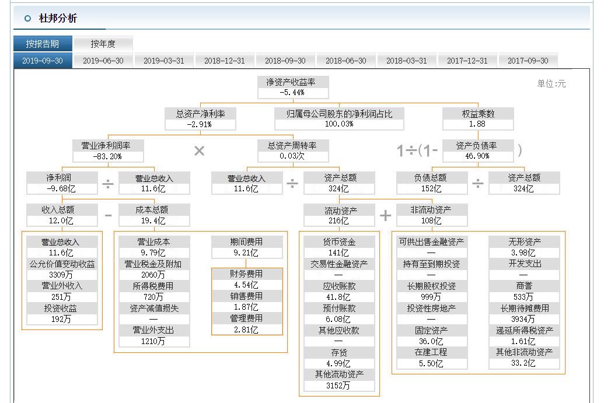

======================================================

_type: talk
@树叶[544811512145144]
2020-01-18 19:33:40 Sat  
topic_id: 421411114144428

<e type="hashtag" hid="142825811122" title="#定投周报#" />

阅读[4039]  评论[0]  赞[0] 

+++++++++++++++++++++++++++++++++++++++++++++++++++++

文件：
2020-01-18 19:33:37 Sat
文件大小：[258187]
28281814815251-二师父定投周报1.18（第43期）.docx

======================================================

_type: q&a
@特仑苏[241855111824451]
2020-01-18 20:03:35 Sat  
topic_id: 241511115185441

@特仑苏

>  师父，我定投了半年了，每周定投200元，然后现在有3万的闲钱可以用来投资基金，我是加大定投单份总额好，还是建立一部分底仓好，或者是买一些债券基金？没有车贷房贷，这基金就是纯粹用来基金的。

@二师父

>  可以直接买一部分50ah，反正只要长期持有未来盈利都还不错的，债券基金目前只有短债，长债不适合

阅读[4064]  评论[1]  赞[0] 

======================================================

_type: talk
@二师父[28814221155551]
2020-01-18 21:59:43 Sat  
topic_id: 421411115124128

看看新能源汽车

阅读[4128]  评论[1]  赞[0] 

+++++++++++++++++++++++++++++++++++++++++++++++++++++

文件：
2020-01-18 21:59:20 Sat
文件大小：[356617]
51518184542124-特斯拉暴涨，有啥相关的基金可以投资吗.docx

======================================================

_type: q&a
@凯[244415182418811]
2020-01-18 22:50:53 Sat  
topic_id: 548288884244884

@凯

>  师父，招行的年报ROE15%左右是不是低于预期？

@二师父

>  这是业绩快报，等年报出来了看看年报，光净资产收益率不能说明问题，招行市值增加了，只看他的业绩增长是否跟上了

阅读[4366]  评论[1]  赞[0] 

======================================================

_type: talk
@二师父[28814221155551]
2020-01-19 07:26:54 Sun  
topic_id: 548288884888154

国内股市

1、统计显示，截至1月14日，A股已有超过210家上市公司发布了亏损、预减或略减的2019年度业绩预告，造成业绩下滑或亏损的主要元凶，巨额商誉减值频频出现。

2、至少16家券商披露去年业绩情况，业绩整体向好，兴业证券全年净利暴增12倍，证券投资业务收益良好；中信建投归母净利润增近8成，经纪、投行、自营业务大增。

3、两家证券公司公布鼠年风水投资观点：股市整体的表现应该不会太差，而港股的表现可能更好；基建、地产及其产业链、医疗卫生类股三大板块预期会有较好表现。

4、被看作股市风向标的险资面对权益市场的躁动行情在主动出击，仅在开年半个月就有华泰资管和太平人寿两家公司两度出手投资。多位保险资管投资人士表示，2020年权益市场有不少机会，年初可能会持续加仓。

5、新年以来资管圈老鼠仓罚单连连，悲催的是，近期的老鼠仓交易都是不赚反亏还被罚款。百亿私募佑瑞持投资前员工2.48亿老鼠仓，倒亏90万。

6、腾讯WeCity加速器正式公布入选名单。在总共1200个报名项目中，只有35家企业的项目被腾讯相中，录取率仅为2.9%。这35家企业的项目总估值超过3300亿元，其中涉及3家A股上市公司，即数字政府领域的东华软件、常山北明，以及智慧出行领域的雄帝科技。

7、德威新材财务总监陆仁芳收深交所监管函，因未在减持德威新材股份前15个交易日披露减持计划，且减持行为违反此前承诺。

8、茅台精准营销再出新：已确认19家区域性KA卖场服务商，2020年将在10个区域精准投放飞天茅台产品，深化与区域性KA卖场合作，推进营销渠道扁平化，减少中间环节，增强市场调控能力，让真正的消费者买到平价的正品茅台。

9、长城汽车和通用汽车1月17日宣布，双方就长城汽车收购通用汽车印度塔里冈工厂达成协议。该协议尚须政府和监管部门批准。

数据来源，wind资讯。

阅读[4723]  评论[0]  赞[0] 

======================================================

_type: talk
@二师父[28814221155551]
2020-01-19 10:29:57 Sun  
topic_id: 841511111215882

《<e type="web" href="https://wx.zsxq.com/mweb/views/weread/search.html?keyword=道德经" title="道德经" style="book" />》:“圣人后其身而身先，外其身而身存”，越是甘为人梯的人，反而越能赢得人们的爱戴和敬仰;越是像天地一样无私的人，反而越能成就自我。

@蓝魔森林 at 2020-01-19 10:29:57 Sun

> 这个年代，我辈甘愿贡献，为大家某幸福

----------

阅读[4496]  评论[1]  赞[0] 

======================================================

_type: talk
@二师父[28814221155551]
2020-01-19 19:09:06 Sun  
topic_id: 841855552142812

建立自己的系统，在高铁上碰到一位大家，看到我在读五粮液财务报表，问了我投资情况，表示对股市不敢碰，垃圾股票坑了不少中国人，希望未来能有所改变

@王模堂 at 2020-01-19 19:09:06 Sun

> 讲得真好，2019年的文章能否保留让我们学习一下，删除太可惜了。您每一篇文章都充满了哲理。

----------

@二师父 at 2020-01-19 19:09:06 Sun

> 没删除

----------

阅读[4635]  评论[2]  赞[0] 

+++++++++++++++++++++++++++++++++++++++++++++++++++++

文件：
2020-01-19 19:09:04 Sun
文件大小：[26232]
48581811258518-如何建立并优化自己的投资系统.docx

======================================================

_type: talk
@二师父[28814221155551]
2020-01-20 11:25:32 Mon  
topic_id: 548122215421514

<e type="web" href="https://wx.zsxq.com/mweb/annual_summaries/2019/index.html?group_id=142452528112" title="年度总结" cache="" />一年运营周报，继续分享，提升认知，链接更多朋友

@淘淘 at 2020-01-20 11:25:32 Mon

> 打不开呢

----------

@二师父 at 2020-01-20 11:25:32 Mon

> 额，可能软件问题

----------

@凯 at 2020-01-20 11:25:32 Mon

> 也打不开

----------

@蓝魔森林 at 2020-01-20 11:25:32 Mon

> 不是星主 提示

----------

@姣🍎 at 2020-01-20 11:25:32 Mon

> 打开显示不是星主

----------

@雪莲 at 2020-01-20 11:25:32 Mon

> 打不开呢

----------

@Zyxj at 2020-01-20 11:25:32 Mon

> 我也打不开

----------

@丸子妈 at 2020-01-20 11:25:32 Mon

> 打不开

----------

阅读[4379]  评论[10]  赞[0] 

======================================================

_type: q&a
@J[28281541518551]
2020-01-20 11:35:59 Mon  
topic_id: 841855582458822

@J

>  师父您好，今天看了一下中概互联成分股，不知道为什么没有了阿里巴巴和腾讯这两个重仓股？

@二师父

>  你看错了

阅读[4499]  评论[4]  赞[0] 

======================================================

_type: q&a
@雪孩子[844121215125212]
2020-01-20 16:40:01 Mon  
topic_id: 421844485141188

@雪孩子

>  二师父你好，现在手上有八万块存量资金，快放假了，想等放假后再继续定投，是不是就放在活期宝里比较好呢？还是说去买短债？有什么好的短债可以推荐吗？

@二师父

>  在节假日临近最好的方式是购买国债逆回购品种，这样的话节假日也会有一定的收益

阅读[4366]  评论[0]  赞[0] 

======================================================

_type: talk
@二师父[28814221155551]
2020-01-20 17:23:33 Mon  
topic_id: 841855525241152

很多人都在讲低估的指数一直不涨，正常估值的指数一直上涨，那么是否可以投资正常估值的指数呢？

@凯 at 2020-01-20 17:23:33 Mon

> 安全第一赚钱第二！

----------

阅读[4515]  评论[1]  赞[0] 

+++++++++++++++++++++++++++++++++++++++++++++++++++++

文件：
2020-01-20 17:23:02 Mon
文件大小：[18375]
48581545518528-正常估值区域的基金能投资吗.docx

======================================================

_type: talk
@二师父[28814221155551]
2020-01-20 17:54:51 Mon  
topic_id: 118522242112452

市场分析，我判断目前就是牛市，可是不明白为啥很多人都觉得现在是熊市,不应该都赚了吗？是嫌少还是说账户亏了。

@云云 at 2020-01-20 17:54:51 Mon

> 股票还亏着，说明不懂不能乱买[流泪]

----------

@是喵喵吖～ at 2020-01-20 17:54:51 Mon

> 师傅我其实定投的不多 有两只基金也就分别投了5000 盈利分别三四百 这种收割吗

----------

@是喵喵吖～ at 2020-01-20 17:54:51 Mon

> 我是今年下半年才开始接触定投的。倒是都盈利了 只是有点少 我会觉得 收割了之后是不是就份额少了 等再涨的时候我就没啥利润了

----------

@二师父 at 2020-01-20 17:54:51 Mon

> 金额不多可以不用

----------

@是喵喵吖～ at 2020-01-20 17:54:51 Mon

> 行 谢谢师傅

----------

阅读[5639]  评论[5]  赞[0] 

+++++++++++++++++++++++++++++++++++++++++++++++++++++

文件：
2020-01-20 17:53:23 Mon
文件大小：[253585]
15458424142142-市场分析1.20.docx

======================================================

_type: talk
@二师父[28814221155551]
2020-01-20 18:17:37 Mon  
topic_id: 421844454218588

<e type="hashtag" hid="222484545521" title="#打新提示#" /> 百川和麦米转债上市，关注下。港股打新最近基本没有，看了看19年的破发率还是很高的，大概在35%，不要盲打，要学会选择

@丸子妈 at 2020-01-20 18:17:37 Mon

> 有一只

----------

@静若繁花 at 2020-01-20 18:17:37 Mon

> 二师父，百川涨8%，卖吗？

----------

@二师父 at 2020-01-20 18:17:37 Mon

> 卖

----------

@静若繁花 at 2020-01-20 18:17:37 Mon

> 已卖，谢谢啦

----------

@阿宝 at 2020-01-20 18:17:37 Mon

> 今日百川转债转了80元[呲牙]

----------

阅读[4704]  评论[5]  赞[0] 

======================================================

_type: talk
@二师父[28814221155551]
2020-01-21 09:57:21 Tue  
topic_id: 118522248811512

可以买点国债逆回购，放假也有利息，就用之前开通的股票账户就可以购买

@jiangya at 2020-01-21 09:57:21 Tue

> 这和货币基金的收益率差不多吧？

----------

@二师父 at 2020-01-21 09:57:21 Tue

> 对的

----------

@cotton at 2020-01-21 09:57:21 Tue

> 二师父，和货币基金差不多为啥还要买这个呢

----------

@二师父 at 2020-01-21 09:57:21 Tue

> 因为过节期间也有收益

----------

@jiangya at 2020-01-21 09:57:21 Tue

> 二师傅，货币基金过节期间就没有收益了？

----------

@cotton at 2020-01-21 09:57:21 Tue

> 我不会买。。在广发证券那里输入，国债？

----------

@jiangya at 2020-01-21 09:57:21 Tue

> 我也从来没有买过

----------

@二师父 at 2020-01-21 09:57:21 Tue

> 有的，不过需要在最后一个交易日的前两日之前购买

----------

阅读[4382]  评论[13]  赞[0] 

+++++++++++++++++++++++++++++++++++++++++++++++++++++

图片：
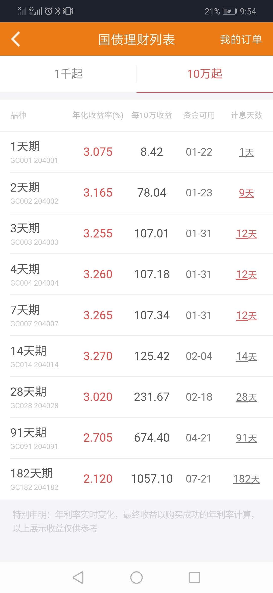

======================================================

_type: talk
@二师父[28814221155551]
2020-01-21 10:15:30 Tue  
topic_id: 421844424448558

<e type="hashtag" hid="881251425252" title="#鳄鱼计划#" /> 卖出500ETF一份，此计划仅为个人操作记录，非投资建议和指导。

@姥姥不疼. 爷爷不爱 at 2020-01-21 10:15:30 Tue

> 请教二师父，卖出的理由是什么[微笑]

----------

@二师父 at 2020-01-21 10:15:30 Tue

> 赚了就卖

----------

@姥姥不疼. 爷爷不爱 at 2020-01-21 10:15:30 Tue

> 当下即将迎来牛市，早卖了不赚了么

----------

@二师父 at 2020-01-21 10:15:30 Tue

> 是赚了啊

----------

@姥姥不疼. 爷爷不爱 at 2020-01-21 10:15:30 Tue

> 是少赚了[撇嘴]

----------

@二师父 at 2020-01-21 10:15:30 Tue

> 那你可以继续拿着

----------

@姥姥不疼. 爷爷不爱 at 2020-01-21 10:15:30 Tue

> 那二师父是不认可大盘继续上涨或迎来牛市么[抱拳][抱拳]

----------

@二师父 at 2020-01-21 10:15:30 Tue

> 这个大盘走势和牛市谁也不知道的

----------

阅读[4581]  评论[10]  赞[0] 

======================================================

_type: q&a
@蓝魔森林[28888244485121]
2020-01-21 10:52:26 Tue  
topic_id: 841855545858222

@蓝魔森林

>  今天如果出现较大跌幅，是不是可以提前2天，也就是今天的三点前完成定投？ 谢谢

@二师父

>  为什么要今天买呢，如何判断周四就一定涨，按照纪律来

阅读[4688]  评论[4]  赞[0] 

======================================================

_type: talk
@二师父[28814221155551]
2020-01-21 11:26:25 Tue  
topic_id: 241855545252241

<e type="hashtag" hid="458185121228" title="#场外实盘#" /> 国泰地产基金全部卖出，这是一只分级基金，之前说了在年底之前全部卖完，今天外资开始有卖出迹象了，二师父说过，外资不撤，我不撤，其实春节行情按照规律远没有结束，只是目前发生了一些事情，很多时候意外是没法预测的。

目前鳄鱼计划大概还有20份资金，如果这次继续回撤的话那么可以满仓了，场外定投实盘一直定投直到大牛市到来，市场跌了就是机会，继续买起来，谨记逆向思维。

很多人有锚固思维，你虽然看到今天跌了，但是大多数基金从12月到现在涨了很多的

@自由飞翔 at 2020-01-21 11:26:25 Tue

> 谢谢师父实时提醒，已卖！

----------

@玉博珠宝 at 2020-01-21 11:26:25 Tue

> 场外定投的国泰地产基金，只盈利不到3%，仓位也不重，今天有必要卖出吗？

----------

@二师父 at 2020-01-21 11:26:25 Tue

> 分级基金找个机会卖了

----------

@衣袂飘香 at 2020-01-21 11:26:25 Tue

> 请教二师父。我是2019年8月1号开始进行鳄鱼计划的，之前按照一年分成50份的进度，目前只投了资金量的1/4，现在有点迷茫，怎么操作比较好呢？鳄鱼计划和你一样，已经停了有一段时间了。

----------

@衣袂飘香 at 2020-01-21 11:26:25 Tue

> @二师父

----------

@玉博珠宝 at 2020-01-21 11:26:25 Tue

> 谢谢二师父！

----------

@衣袂飘香 at 2020-01-21 11:26:25 Tue

> 一直告诉自己戒贪婪。如果上鳄鱼计划的话，投入频率怎么操作比较妥？

----------

@二师父 at 2020-01-21 11:26:25 Tue

> 我是在全市场指数市盈率百分位25以下才启动

----------

阅读[4757]  评论[35]  赞[0] 

======================================================

_type: q&a
@背心[51441214442224]
2020-01-21 13:39:34 Tue  
topic_id: 421844424218458

@背心

>  刚把500卖了，银行ETT能再买点吗？我看跌了几天了，谢谢

@二师父

>  并不是全卖，控制好仓位银行可以买的

阅读[4628]  评论[4]  赞[0] 

======================================================

_type: talk
@二师父[28814221155551]
2020-01-21 14:22:01 Tue  
topic_id: 118522212884182

在市场非理性的时候，涨跌没有逻辑，所以遵循估值理论，低估买，高估卖，不用管市场

@YAO at 2020-01-21 14:22:01 Tue

> 哪里能查到每日北上资金流数据？

----------

@二师父 at 2020-01-21 14:22:01 Tue

> 万得

----------

阅读[4678]  评论[2]  赞[0] 

+++++++++++++++++++++++++++++++++++++++++++++++++++++

文件：
2020-01-21 14:19:47 Tue
文件大小：[168641]
88281254241522-北向资金流出，除了医药其他都跌了.docx

======================================================

_type: q&a
@阳光[421884185252128]
2020-01-21 14:26:08 Tue  
topic_id: 841855545111512

@阳光

>  师父好：我的中证医药100A盈利25%，是需要收割利润吗？

@二师父

>  需要收割利润

阅读[4751]  评论[3]  赞[0] 

======================================================

_type: talk
@二师父[28814221155551]
2020-01-21 16:31:57 Tue  
topic_id: 841855548281842

<e type="hashtag" hid="455282818848" title="#周二讲基金#" /> 广发医疗保健股票，属于股票型基金，重仓股票爱尔眼科，我武生物，迈瑞医疗、药明康德、恒瑞医药，长春高新、泰格医药。

基金规模27.29亿，规模适中，持仓股票基本面良好，成立来大概涨幅78%，跑赢了同期的沪深300和上证指数。

对于这类股票基金，始终不建议投资，因为基金经理更换之后不太好处理。同类型的指数基金有广发医药，从19年初到现在涨幅也在50%左右。

@志亮 at 2020-01-21 16:31:57 Tue

> 这个就是主动型基金和指数基金区别吧！

----------

@二师父 at 2020-01-21 16:31:57 Tue

> 对，主要是费率，基金经理更换对基金影响，还有股票调仓的频繁程度

----------

@志亮 at 2020-01-21 16:31:57 Tue

> 恩，主动型基金稳定性的确比不上指数基金，而且费率相对高一些。[微笑]

----------

阅读[4709]  评论[3]  赞[0] 

======================================================

_type: talk
@二师父[28814221155551]
2020-01-21 16:53:07 Tue  
topic_id: 241855548245511

仅仅两天时间，五粮液的市值就少了200亿，这就是a股市场的特性，我们必须用符合中国股情的策略来挣钱

阅读[4792]  评论[0]  赞[0] 

======================================================

_type: q&a
@美美[48224811151218]
2020-01-22 08:48:29 Wed  
topic_id: 841855841245582

@美美

>  二师父好，下面这支基金不能投了吗？

@二师父

>  目前属于非港股通交易日，开放申购1月31日

阅读[4579]  评论[3]  赞[0] 

======================================================

_type: q&a
@信念[244122818841241]
2020-01-22 08:49:08 Wed  
topic_id: 241855815214521

@信念

>  二师父，目前的新流感病毒的情况，在医药板块上有没有可以买入的？

@二师父

>  目前医药板块涨幅很好，不过不便宜，只能做趋势，定投的话就没必要追了

阅读[4776]  评论[3]  赞[0] 

======================================================

_type: talk
@老孙头[422115118524548]
2020-01-22 14:25:05 Wed  
topic_id: 841855814281842

上证50AH暂停申购、赎回，什么原因？

阅读[4263]  评论[0]  赞[0] 

======================================================

_type: q&a
@Tailai[48882248514148]
2020-01-22 16:15:00 Wed  
topic_id: 841855814444522

@Tailai

>  老师，您好，请教下，场内etf挺多，信用债etf或lof请推荐下，希望成交量大一些的，谢谢！

@二师父

>  博时信用债纯债债券

阅读[4556]  评论[4]  赞[0] 

======================================================

_type: q&a
@美美[48224811151218]
2020-01-22 17:28:30 Wed  
topic_id: 548122184811524

@美美

>  二师父你好！易方达中概互联50ETF是指数基金还是股票基金？你建不建议投点这支基金？

@二师父

>  这个可以投的，我一直投的场内，场外规模一亿以上可以，追踪的中概互联50指数，很有价值，等待低估可以定投

阅读[4656]  评论[2]  赞[0] 

======================================================

_type: q&a
@素兮[548121415528244]
2020-01-22 20:50:49 Wed  
topic_id: 118522588448112

@素兮

>  唐人转债今天上市，我忘记了，没有卖出😟然后怎么办😳

@二师父

>  明天再卖也可以的，可转债拿着也可能上涨，不用担心

阅读[4639]  评论[0]  赞[0] 

======================================================

_type: talk
@二师父[28814221155551]
2020-01-22 21:56:58 Wed  
topic_id: 548122188488854

阅读[4706]  评论[0]  赞[0] 

+++++++++++++++++++++++++++++++++++++++++++++++++++++

文件：
2020-01-22 21:56:55 Wed
文件大小：[92329]
48581588822128-开盘跳水，午后拉升，市场波动的唯一意义.docx

======================================================

_type: talk
@二师父[28814221155551]
2020-01-22 22:20:23 Wed  
topic_id: 841855811184882

<e type="hashtag" hid="481211145528" title="#指数估值#" />  医药300高估了

@铁观音 at 2020-01-22 22:20:23 Wed

> 份数还是0.25吗？

----------

@二师父 at 2020-01-22 22:20:23 Wed

> 0.5

----------

@铁观音 at 2020-01-22 22:20:23 Wed

> 师傅，这个数据能加个估值区间吗？要不然不会算各指数之间的金额比例

----------

阅读[4913]  评论[3]  赞[0] 

+++++++++++++++++++++++++++++++++++++++++++++++++++++

图片：
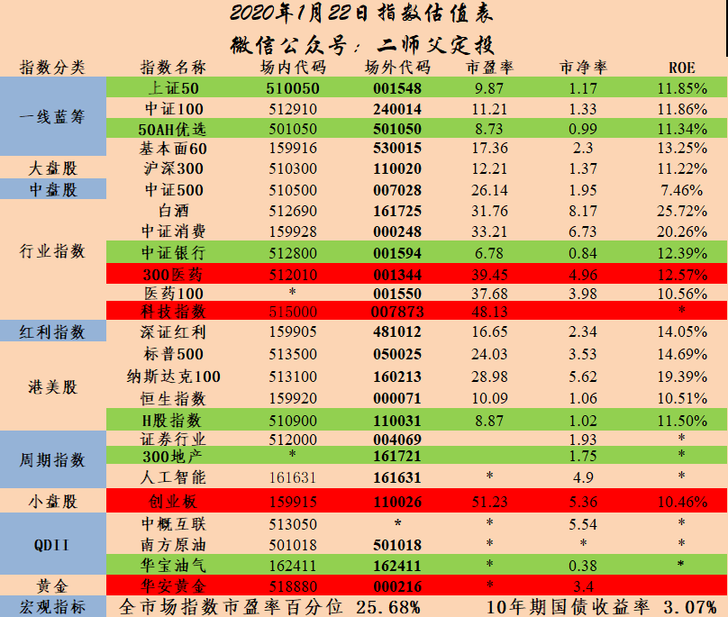

======================================================

_type: talk
@二师父[28814221155551]
2020-01-22 23:02:48 Wed  
topic_id: 421844544458488

<e type="hashtag" hid="881422852442" title="#定投实盘#" />

@Pansy at 2020-01-22 23:02:48 Wed

> 师父，为什么50ah不投了？我看估值表50ah是绿色，可以继续定投吗？

----------

@二师父 at 2020-01-22 23:02:48 Wed

> 现在购买不了

----------

@Pansy at 2020-01-22 23:02:48 Wed

> 好的，谢谢师父

----------

@mumomo at 2020-01-22 23:02:48 Wed

> 二师父，场外的上证50，001548为什么不买呢，也是低估啊。

----------

@二师父 at 2020-01-22 23:02:48 Wed

> 可以买的

----------

@mumomo at 2020-01-22 23:02:48 Wed

> 好的

----------

@是喵喵吖～ at 2020-01-22 23:02:48 Wed

> 师父我今天下午买了2000的50AH 可以嘛😂

----------

@二师父 at 2020-01-22 23:02:48 Wed

> 3点前还是以后，目前宽基除了创业板基本都可以慢慢定投的

----------

阅读[5017]  评论[9]  赞[0] 

+++++++++++++++++++++++++++++++++++++++++++++++++++++

图片：
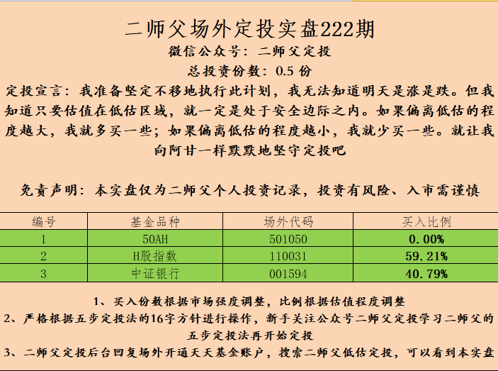

======================================================

_type: talk
@二师父[28814221155551]
2020-01-22 23:04:22 Wed  
topic_id: 841855255528242

<e type="hashtag" hid="481211145528" title="#指数估值#" /> 阈值表记得保存下，更新之后会发布出来

@王模堂 at 2020-01-22 23:04:22 Wed

> 二师傅，估值区间怎么分析。比如50ETF目前价格为3.006，但估值区间为10~18，是表明10以下都是正常估值吗？

----------

@二师父 at 2020-01-22 23:04:22 Wed

> 对的，10是低估阈值，10以下可以

----------

@王模堂 at 2020-01-22 23:04:22 Wed

> 谢谢二师傅。

----------

阅读[5169]  评论[3]  赞[0] 

+++++++++++++++++++++++++++++++++++++++++++++++++++++

图片：
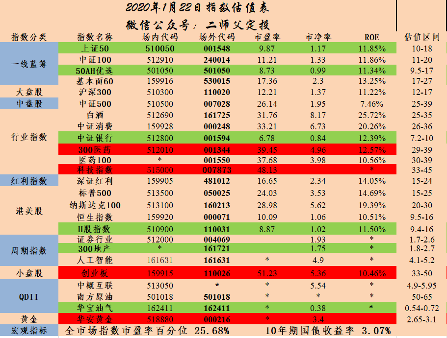

======================================================

_type: talk
@二师父[28814221155551]
2020-01-23 10:36:18 Thu  
topic_id: 241855252148841

<e type="hashtag" hid="881251425252" title="#鳄鱼计划#" /> 买入50etf一份，剩余份额不多了，这次下跌买完就锁仓

@艾琪（王钥） at 2020-01-23 10:36:18 Thu

> 紧跟着二师父的脚步加仓，我仓位不重，没压力。

----------

@二师父 at 2020-01-23 10:36:18 Thu

> 最好不要，因为跌势刚刚开始

----------

@cotton at 2020-01-23 10:36:18 Thu

> 二师父我刚才第一次在场内想买，显示我可用资金不足，没能买。是啥意思呢

----------

@二师父 at 2020-01-23 10:36:18 Thu

> 证券账户资金不足，需要转入资金

----------

@齿轮 at 2020-01-23 10:36:18 Thu

> 刚准备了增量资金，做好持久战准备

----------

@丸子妈 at 2020-01-23 10:36:18 Thu

> 我今天也补了这个，还有银行指数

----------

阅读[5123]  评论[9]  赞[0] 

======================================================

_type: q&a
@shi[15551458885282]
2020-01-23 12:13:34 Thu  
topic_id: 548122524222884

@shi

>  二师父，过年好，媳妇有些闲钱，我推荐她买点基金。这样做行吗：
>  分成260份：
>  1. 开通蛋卷，买160份货币基金.
>  2.买20份银行底仓，20份50AH底仓，10份华宝油气，其余现金留着，然后都定投着（每周各定投1份）。这个卡就是工资卡，随时有现金进来，如等现金没了货币基金转换过来。
>  3.开通股票账号，打可转债。

@二师父

>  10份华宝油气可以换成恒生国企，现金全部买货币基金，定投直接扣款就行

阅读[5129]  评论[4]  赞[0] 

======================================================

_type: talk
@二师父[28814221155551]
2020-01-23 16:43:16 Thu  
topic_id: 548122528212584

今天股市跌的很惨，大家不用惊慌，我们都是在低估的时候积累的成本，很安全。

需要注意二点，不要卖，卖出一定是盈利才卖，上涨逐步卖的

第二，不要盲目加仓，可以适当追加，但是别一次给加满了，因为下跌不知道底部在哪里，慢慢加仓即可

提前预祝大家新年好，一切安康。

@J at 2020-01-23 16:43:16 Thu

> 每次遇到大跌大涨师父都会贴心的提醒我们按纪律行事，坚定了定投的信念。[微笑]

----------

@陌路花 at 2020-01-23 16:43:16 Thu

> 谢谢二师父，下跌不心慌

----------

@衣袂飘香 at 2020-01-23 16:43:16 Thu

> 这两天下跌加了一些，但是没贪心，没多加。

----------

@拥抱太阳的风筝 at 2020-01-23 16:43:16 Thu

> 今天加了一次定投，3000点以下

----------

阅读[4773]  评论[4]  赞[0] 

======================================================

_type: q&a
@范毅君[118551121224142]
2020-01-23 19:22:09 Thu  
topic_id: 118522428511152

@范毅君

>  二师父，因为建仓比较晚，建仓比例最高的是银行，请问银行周期性是怎样的，相对于普通指数，应该怎么操作

@二师父

>  银行指数的周期性和经济的周期性有关系，经济好的时候银行指数表现好，经济差的时候银行指数表现也差，宽基指数为主，这类行业指数的仓位要低于宽基指数风险会小一些

阅读[4803]  评论[0]  赞[0] 

======================================================

_type: talk
@范*[841855284221812]
2020-01-23 19:37:20 Thu  
topic_id: 841855251281182

今天跌的爽啊！股友们。1成仓

阅读[4953]  评论[0]  赞[0] 

======================================================

_type: talk
@二师父[28814221155551]
2020-01-23 22:00:44 Thu  
topic_id: 241855288811281

大家新年好

@陈飞🤗 at 2020-01-23 22:00:44 Thu

> 我有个问题一直想问的，你说我们买的低估的指数安全，可是每次下跌也不比正常估值和高估的少啊，涨的涨的时候也不比那些多啊，谢谢解答

----------

@志亮 at 2020-01-23 22:00:44 Thu

> 看了二师父的文章，等于喝了一碗“心灵鸡汤”，我心里安稳多了，今天的大跌真的是有点吓到我了[呲牙]

----------

@范* at 2020-01-23 22:00:44 Thu

> 现在市场很危险。这是大趋势。不信你看吧。明年小心点

----------

@陈飞🤗 at 2020-01-23 22:00:44 Thu

> 我感觉你回答的牛头不对马嘴😓😓

----------

@妖孽 at 2020-01-23 22:00:44 Thu

> 倾巢之下、安有完卵

----------

@秦风殇韵（刘豫斌） at 2020-01-23 22:00:44 Thu

> 风险和机会成正比，股票收益高风险大，一脚踩雷万劫不复。基金低估定投没这些问题。

----------

@Yanzhen at 2020-01-23 22:00:44 Thu

> 越来越喜欢二师傅这个人[微笑]

----------

@杜志彪 at 2020-01-23 22:00:44 Thu

> 投资就是心态的修炼过程，成本低心态相对好一些，会有利于你做出相对正确的操作。低估的精髓就是买到低于成本价的东西，当价值回归的时候就是收割的时候。做趋势除外（本人认为基金不适合，不如投资股票）

----------

阅读[5127]  评论[9]  赞[0] 

+++++++++++++++++++++++++++++++++++++++++++++++++++++

文件：
2020-01-23 22:00:34 Thu
文件大小：[20778]
28281288122581-今日股市大跌，低估区域购买的指数不用过于恐惧.docx

======================================================

_type: talk
@雨淡风清[844418818858882]
2020-01-24 11:48:59 Fri  
topic_id: 421844585225128

祝大家新年快乐，永登新高，跟着二师父早日实现财富自由。

阅读[4946]  评论[0]  赞[0] 

======================================================

_type: talk
@门萨🐨[51411455828824]
2020-01-24 13:30:10 Fri  
topic_id: 241855282141111

一波操作猛如虎

阅读[5230]  评论[0]  赞[0] 

+++++++++++++++++++++++++++++++++++++++++++++++++++++

图片：
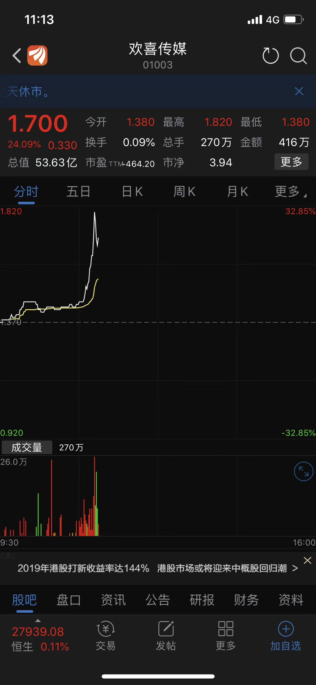

======================================================

_type: talk
@二师父[28814221155551]
2020-01-24 16:02:10 Fri  
topic_id: 548122514128544

大家新年好，二师父给大家拜年了，支付宝口令红包，口令：二师父读者新年好发发发，今明两天均可领取

@志亮 at 2020-01-24 16:02:10 Fri

> 二师父读者新年好发发发

----------

@志亮 at 2020-01-24 16:02:10 Fri

> [呲牙][调皮][微笑]

----------

@清水倾城 at 2020-01-24 16:02:10 Fri

> 都好快啊

----------

@向前进 at 2020-01-24 16:02:10 Fri

> 新年快乐，平安健康！

----------

@光少 at 2020-01-24 16:02:10 Fri

> 二师父新年快乐！谢谢！

----------

@玄武 at 2020-01-24 16:02:10 Fri

> 感谢二师父，也祝二师父新年好发发发

----------

@雪莲 at 2020-01-24 16:02:10 Fri

> 谢谢二师父，祝二师父新年快乐！

----------

@阿宝 at 2020-01-24 16:02:10 Fri

> 谢谢老师

----------

阅读[6098]  评论[26]  赞[0] 

======================================================

_type: talk
@拥抱太阳的风筝[48812454818528]
2020-01-24 20:43:57 Fri  
topic_id: 421844582225558

二师父及学堂兄弟姐妹们鼠年平平安安，万事如意。

阅读[4978]  评论[0]  赞[0] 

======================================================

_type: talk
@二师父[28814221155551]
2020-01-25 22:39:33 Sat  
topic_id: 118522444858552

收益比较，最近大家都在家里最好别出去，作为一个湖北人，我能从朋友圈知道事情的严重性，不恐慌，别乱跑。

@陈飞🤗 at 2020-01-25 22:39:33 Sat

> 老乡哦

----------

@衣袂飘香 at 2020-01-25 22:39:33 Sat

> 原来二师父是湖北人呀。

----------

@jier at 2020-01-25 22:39:33 Sat

> 听课程声音以为是湖南人呢，是不是和湖南交界？

----------

@志亮 at 2020-01-25 22:39:33 Sat

> 二师父，现在这种情况，年后开市我股票是否需要割肉，我说的是股票不是基金[微笑]?

----------

@二师父 at 2020-01-25 22:39:33 Sat

> 非白马股可以全部卖了，目前看开年会有跌势

----------

@志亮 at 2020-01-25 22:39:33 Sat

> 是白马股的呢？但也不敢持有呀！而且是消费白马股来的[晕]

----------

@二师父 at 2020-01-25 22:39:33 Sat

> 那我也很难办，我的白马股也跌的很惨，不过仓位不重，市场黑天鹅太难预料

----------

@波 at 2020-01-25 22:39:33 Sat

> 我也是湖北人,我湖北荆州的。

----------

阅读[4926]  评论[15]  赞[0] 

+++++++++++++++++++++++++++++++++++++++++++++++++++++

文件：
2020-01-25 22:38:19 Sat
文件大小：[23177]
15458454448112-沪深300指数与上证50指数的比较.docx

======================================================

_type: talk
@二师父[28814221155551]
2020-01-26 22:55:14 Sun  
topic_id: 241855248122881

市场下跌，基本面分析，估值分析都失效了，股票除了基本面恶化，否则我是不会卖出的，基金可以保留底仓适当波段

阅读[4588]  评论[0]  赞[0] 

+++++++++++++++++++++++++++++++++++++++++++++++++++++

文件：
2020-01-26 22:55:10 Sun
文件大小：[53548]
48581582484888-如果市场下跌，需不需要提前卖出.docx

======================================================

_type: talk
@二师父[28814221155551]
2020-01-27 11:49:50 Mon  
topic_id: 241855241242811

@凯 at 2020-01-27 11:49:50 Mon

> 不妙

----------

@清水倾城 at 2020-01-27 11:49:50 Mon

> [衰]如果我开盘补点仓位的话是不是接飞刀啊？

----------

@志亮 at 2020-01-27 11:49:50 Mon

> 跌得很惨[发呆]

----------

@二师父 at 2020-01-27 11:49:50 Mon

> 有可能

----------

@清水倾城 at 2020-01-27 11:49:50 Mon

> 二师傅的建议是什么呢？再等等吗？

----------

@Zhu Yongsh* at 2020-01-27 11:49:50 Mon

> 这个有点猛呀[撇嘴]

----------

@二师父 at 2020-01-27 11:49:50 Mon

> 定投不用

----------

@章兵朋 at 2020-01-27 11:49:50 Mon

> 直线跳水呀

----------

阅读[4446]  评论[8]  赞[0] 

+++++++++++++++++++++++++++++++++++++++++++++++++++++

图片：
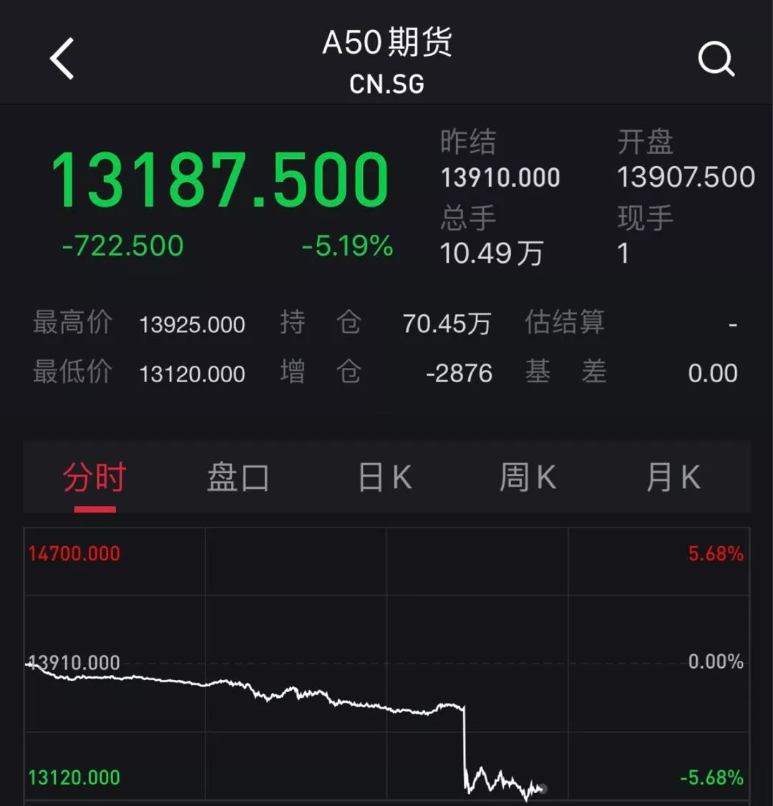

======================================================

_type: talk
@二师父[28814221155551]
2020-01-27 22:38:30 Mon  
topic_id: 421844518424288

延迟开市，该来的总会来，按照自己的节奏走不用担心。

阅读[4585]  评论[0]  赞[0] 

+++++++++++++++++++++++++++++++++++++++++++++++++++++

文件：
2020-01-27 22:37:02 Mon
文件大小：[25529]
88281284212112-A股确认延迟开市一天，2月3日迎接新年第一次交易.docx

======================================================

_type: talk
@二师父[28814221155551]
2020-01-28 22:05:17 Tue  
topic_id: 841855455244122

减少看账户的次数，有利于提高收益率。这是真的，我的股票账户现在基本不看，基金账户只有在操作的时候才会打开，看得越多越影响判断，今天有个读者二次续费了，是18年加入的朋友，时间真快，希望可以一起度过2年，20年的生活。

这次疫情在家，思考了很多事情，想明白很多事，自由不是不工作，而是内心的安宁与平静，这是心灵自由。新的一年，好好工作，好好赚钱，好好助人，做一个有价值的人比做一个自由的人更让我开心。

@志亮 at 2020-01-28 22:05:17 Tue

> 好吧，听二师父的，以后股票帐户我少看[微笑]。

----------

@二师父 at 2020-01-28 22:05:17 Tue

> 把看账户的时间多用来看看企业的发展情况

----------

@飞的那个飞 at 2020-01-28 22:05:17 Tue

> 哈哈 我马上要3续费了

----------

@二师父 at 2020-01-28 22:05:17 Tue

> 哈哈，续费这算2次，不加购买那次的

----------

@丸子妈 at 2020-01-28 22:05:17 Tue

> 我下个月也要续费了，时间过得真快

----------

阅读[4261]  评论[5]  赞[0] 

+++++++++++++++++++++++++++++++++++++++++++++++++++++

文件：
2020-01-28 22:01:17 Tue
文件大小：[25554]
28281428552181-减少看账户的次数，有利于提高投资收益率.docx

======================================================

_type: talk
@恋尘[51558584455824]
2020-01-28 22:40:09 Tue  
topic_id: 421844245852548

这个年过得真没有意思，心情不好，我没能回家过年在外地工作，年前家里给介绍个对象聊的还挺不错，这女孩就是我喜欢的类型，我长相也不差，1.8身高，穿衣显瘦，脱衣有肉的那种但是女孩说不太符合她的眼缘真是郁闷的不行，挺聊的来我们俩但是她说没眼缘。大伙给出出主意我真的挺喜欢她的

@飞的那个飞 at 2020-01-28 22:40:09 Tue

> 问二师父哈哈

----------

@二师父 at 2020-01-28 22:40:09 Tue

> 独门秘籍，不能轻易传人

----------

@飞的那个飞 at 2020-01-28 22:40:09 Tue

> 哈哈

----------

@Yanzhen at 2020-01-28 22:40:09 Tue

> 错的是为了对的出现

----------

@丸子妈 at 2020-01-28 22:40:09 Tue

> 主动出击

----------

@恋尘 at 2020-01-28 22:40:09 Tue

> 师父再给传授下，我现在郁闷的不行

----------

@二师父 at 2020-01-28 22:40:09 Tue

> 你要行动起来

----------

阅读[4240]  评论[18]  赞[0] 

======================================================

_type: talk
@二师父[28814221155551]
2020-01-29 17:19:07 Wed  
topic_id: 118522128455142

在家多读书，好好学习成长。我每天就是睡觉、吃饭读书写作，不能潇洒的时候就等待时机。群里估计大部分还是工作的，在家带薪休假，目前的情况中小企业日子很难过，2019年也许是未来5年比较好的一年。多读书，提升认知，才会过得好一点。有喜欢的女孩赶紧聊，等疫情结束奔现。

@三峡情 at 2020-01-29 17:19:07 Wed

> 我们初三就上班了。新年愿望：努力搬砖，好好跟着二师父学习！争取早日财务自由[偷笑]

----------

@二师父 at 2020-01-29 17:19:07 Wed

> 医生吧

----------

@阿宝 at 2020-01-29 17:19:07 Wed

> 我一直在上班。夏天休假

----------

@二师父 at 2020-01-29 17:19:07 Wed

> 你在国外吧

----------

@Sunflower at 2020-01-29 17:19:07 Wed

> 看来可能是同行啊，我们也初三上班，新年快乐[呲牙]

----------

@阿宝 at 2020-01-29 17:19:07 Wed

> 不是的

----------

@三峡情 at 2020-01-29 17:19:07 Wed

> 是呢

----------

@三峡情 at 2020-01-29 17:19:07 Wed

> 新年快乐，保重身体！

----------

阅读[5158]  评论[8]  赞[0] 

+++++++++++++++++++++++++++++++++++++++++++++++++++++

文件：
2020-01-29 17:16:13 Wed
文件大小：[25645]
48581258551258-家中自我隔离，读完这些书，你的赚钱水平瞬间上升一个层次.docx

======================================================

_type: talk
@二师父[28814221155551]
2020-01-29 20:49:52 Wed  
topic_id: 841855488458252

天佑中华

阅读[4554]  评论[0]  赞[0] 

+++++++++++++++++++++++++++++++++++++++++++++++++++++

图片：

======================================================

_type: talk
@二师父[28814221155551]
2020-01-29 23:15:23 Wed  
topic_id: 241855482541151

2018和2019年的文章，大家可以看看，有不足之处也请批评指正，之前有些文章有点主观，我的投资风格也变化不少，不过我投资的哲学和思维始终如一。<e type="web" href="https://mp.weixin.qq.com/s/gSDuVWWRlqlONh3jVRhvGA" title="2019二师父文章目录" cache="" />

<e type="web" href="https://mp.weixin.qq.com/s/qJJ03mEgA5gnPBnw1_YMCg" title="2018二师父文章目录" cache="" />

@海盗 at 2020-01-29 23:15:23 Wed

> 这可都是二师父的法宝呀，二师父辛苦了，这样我们查阅方便太多了[强][强][强]

----------

@好运玲玲 at 2020-01-29 23:15:23 Wed

> 谢谢二师父！这样真的太方便查找了

----------

@wty at 2020-01-29 23:15:23 Wed

> 确实方便查阅，都是干货！辛苦二师父，跟着二师父学习半年了，每天都有新的认知

----------

@丸子妈 at 2020-01-29 23:15:23 Wed

> 这个好，谢谢

----------

阅读[4649]  评论[4]  赞[0] 

======================================================

_type: q&a
@jier[118552824811122]
2020-01-30 17:37:23 Thu  
topic_id: 118522842818182

@jier

>  二师父，请问网格交易表会定期更新吗？还是参照以前的就可以了？谢谢！

@二师父

>  设定四个点的网格差，从低估区域开始到下跌10个百分点可以建立3成左右的底仓，然后开始网格

阅读[4547]  评论[0]  赞[0] 

======================================================

_type: talk
@二师父[28814221155551]
2020-01-30 19:45:39 Thu  
topic_id: 841855128484852

定投总结，之前想要建立底仓的出来，机会就要来了，继续买吧，钱不够的，保证现有仓位不动就行。

阅读[5040]  评论[0]  赞[0] 

+++++++++++++++++++++++++++++++++++++++++++++++++++++

文件：
2020-01-30 19:43:17 Thu
文件大小：[23380]
15458144418242-新年第一个月份的定投总结.docx

======================================================

_type: talk
@二师父[28814221155551]
2020-01-31 11:00:56 Fri  
topic_id: 548122842145224

<e type="hashtag" hid="455155825588" title="#疫情对宏观经济的影响#" />来源于泽平宏观，恒大研究院
 1、对宏观经济的影响：需求和生产骤降，投资、消费、出口均受明显冲击，短期失业上升和物价上涨。防控疫情需要人口避免大规模流动和聚集，隔离防控，因此大幅降低消费需求。工人返城、工厂复工延迟，企业停工减产，制造业、房地产、基建投资短期基本停滞。一旦被WHO认定为疫区，出口可能受较大影响。2003年二季度中国GDP同比增速较一季度大幅快速回落2个百分点。

2、对中观行业的影响：餐饮、旅游、电影、交运、教育培训等行业冲击最大，医药医疗、在线游戏等行业受益。2019年春节档票房58.59亿，2020年春节档颗粒无收。2019年除夕至正月初六（2月4日至10日），全国零售和餐饮企业实现销售额约10050亿元，2020年同期受损严重。2019年春节假期，全国旅游接待总人数4.15亿人次，实现旅游收入5139亿元，2020年同期锐减。1月底交运行业出行人次减少约七成。房地产行业暂停销售活动。建筑业、金融业、农林牧渔等行业受波及。简单估算，电影票房70亿（市场预测）+餐饮零售5000亿（假设腰斩）+旅游市场5000亿（完全冻结），短短7天，仅这三个行业直接经济损失就超过1万亿，占2019年一季度GDP21.8万亿的4.6%，这还不包括其他行业。

3、对微观个体的影响：民企、小微企业、弹性薪酬制员工、农民工等受损程度更大。

4、对资本市场的影响：短期利好债市，利空股市（医药、在线娱乐除外），但中期仍取决于经济基本面和趋势。

5、长期影响：政府治理将更透明，生产生活业态将朝着智能化、线上化发展，风险中酝酿机遇，或将催生新的业态。

@ajingge at 2020-01-31 11:00:56 Fri

> 期待第五点

----------

@💗朵儿studio * at 2020-01-31 11:00:56 Fri

> 政府经历这次危机应该也会推出刺激消费的一系列方式方法，相信未来会有新的变革！

----------

阅读[5296]  评论[2]  赞[0] 

======================================================

_type: talk
@二师父[28814221155551]
2020-01-31 19:48:49 Fri  
topic_id: 241855142558581

<e type="hashtag" hid="455155552418" title="#计划#" /> 2月继续定投，鳄鱼计划启动，计划卖出医药ETF一半，然后机会来了加仓恒生指数、中概指数以及当人工智能指数低估了重新买入，大家仓位不足的以沪深300、中证500，上证50等宽基指数为主，这些指数的风险还是低一些的。

定投的钱要是几年不用的，留足保守账户的资金和日用账户的资金，今年可能出现一波失业潮，当风险来临的时候需要有备用资金。一辈子很短，乐观点，开心点，总会过去的。

@A0洪氏日杂批发 at 2020-01-31 19:48:49 Fri

> 别人恐惧，我贪婪的时候到了

----------

@清水倾城 at 2020-01-31 19:48:49 Fri

> 二师父，全市场市盈率百分位在哪里可以查呢？

----------

@二师父 at 2020-01-31 19:48:49 Fri

> 估值表底部和每周的周报

----------

@清水倾城 at 2020-01-31 19:48:49 Fri

> 有没有哪个网站在每天更新呢？

----------

@二师父 at 2020-01-31 19:48:49 Fri

> 好像没有

----------

@蔡寅宵 at 2020-01-31 19:48:49 Fri

> 提问:二师父，在华泰可以定投场外基金吗？

----------

@王模堂 at 2020-01-31 19:48:49 Fri

> 机会来了能否恢复每天公布一次估值表？一周一次会担误鳄鱼计划。

----------

@二师父 at 2020-01-31 19:48:49 Fri

> 不用着急，担心的话可以一次多买点，a股不缺机会的

----------

阅读[6202]  评论[11]  赞[0] 

+++++++++++++++++++++++++++++++++++++++++++++++++++++

文件：
2020-01-31 19:43:51 Fri
文件大小：[23987]
28281445254441-疫情下的2月定投计划.docx

======================================================

