_type: talk
@秦风殇韵（刘豫斌）[241555548554841]
2020-04-01 09:40:33 Wed  
topic_id: 841842522222542

中的一个转债今天可以买卖了，可一看封停没人交易，请问二师父，这是合适持有么？

@二师父 at 2020-04-01 09:40:33 Wed

> 可以持有到130元以后卖

----------

@秦风殇韵（刘豫斌） at 2020-04-01 09:40:33 Wed

> 收到

----------

@范毅君 at 2020-04-01 09:40:33 Wed

> 是不是封停就不让交易了啊😂

----------

@二师父 at 2020-04-01 09:40:33 Wed

> 暂时的

----------

@范毅君 at 2020-04-01 09:40:33 Wed

> 好的[调皮]

----------

@璐老诗 at 2020-04-01 09:40:33 Wed

> 2点57还可以交易

----------

@陈飞🤗 at 2020-04-01 09:40:33 Wed

> 是不是所有的可转债都可以持有到30%再卖

----------

@二师父 at 2020-04-01 09:40:33 Wed

> 看公司质量以及资金炒作情况，有的可以到，有的到不了

----------

阅读[4019]  评论[8]  赞[0] 

+++++++++++++++++++++++++++++++++++++++++++++++++++++

图片：
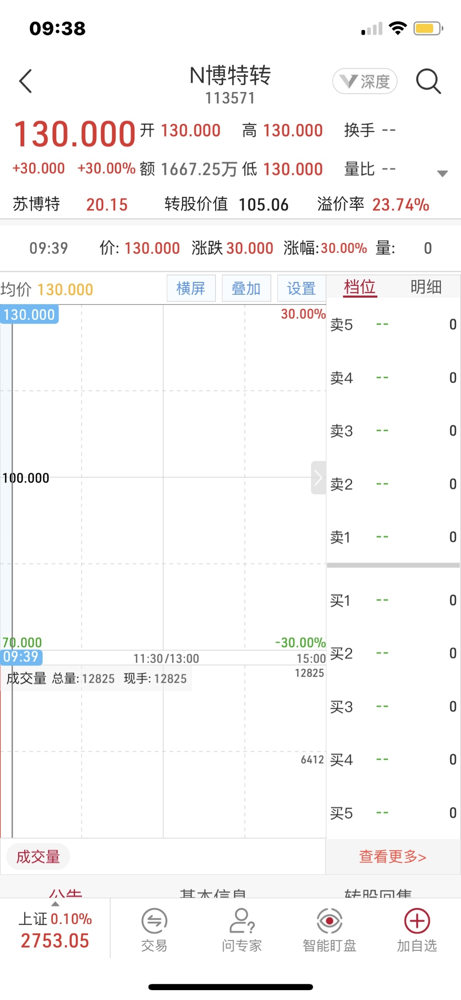

======================================================

_type: q&a
@背心[51441214442224]
2020-04-01 09:41:57 Wed  
topic_id: 241842528414221

@背心

>  二师傅，中证传媒已经低估很长时间了，是不是业绩成长性不好呀，现在还值得定投吗？还有有色值得定投吗？谢谢

@二师父

>  是的，他属于tmt行业，不如科技信息指数，有色是周期指数，定投的话只能轻仓

阅读[4083]  评论[0]  赞[0] 

======================================================

_type: talk
@二师父[28814221155551]
2020-04-01 19:06:59 Wed  
topic_id: 548145244141544

<e type="hashtag" hid="224228258251" title="#4.1估值表#" /> 最新估值表，估值表里面低估的指数都可以投，新手排除周期性行业以及黄金、原油这些。主流的指数配置就足够了。

半导体市盈率还是100多倍，对于市盈率超过40倍的指数只能趋势投机，定投是不合适的，之前讲随机漫步里面的空中楼阁理论就是这样子。

继续坚持定投，存量资金皮配置完毕，增量资金不足的，可以休息了，听听音乐，看看书学习都是不错的选择。

@rtdmm小米 at 2020-04-01 19:06:59 Wed

> 酒的roe 下降到24.5%了？

----------

@二师父 at 2020-04-01 19:06:59 Wed

> 是啊

----------

@helen at 2020-04-01 19:06:59 Wed

> 二师父，中证500最近场内没有溢价，是不是可以考虑优先买场内？

----------

@二师父 at 2020-04-01 19:06:59 Wed

> 鳄鱼计划就是场内购买，都可以

----------

@丁一 at 2020-04-01 19:06:59 Wed

> 二师父  能不能把估值表搞成置顶贴

----------

@二师父 at 2020-04-01 19:06:59 Wed

> 放在精华里，你可以存下

----------

阅读[4139]  评论[6]  赞[0] 

+++++++++++++++++++++++++++++++++++++++++++++++++++++

图片：
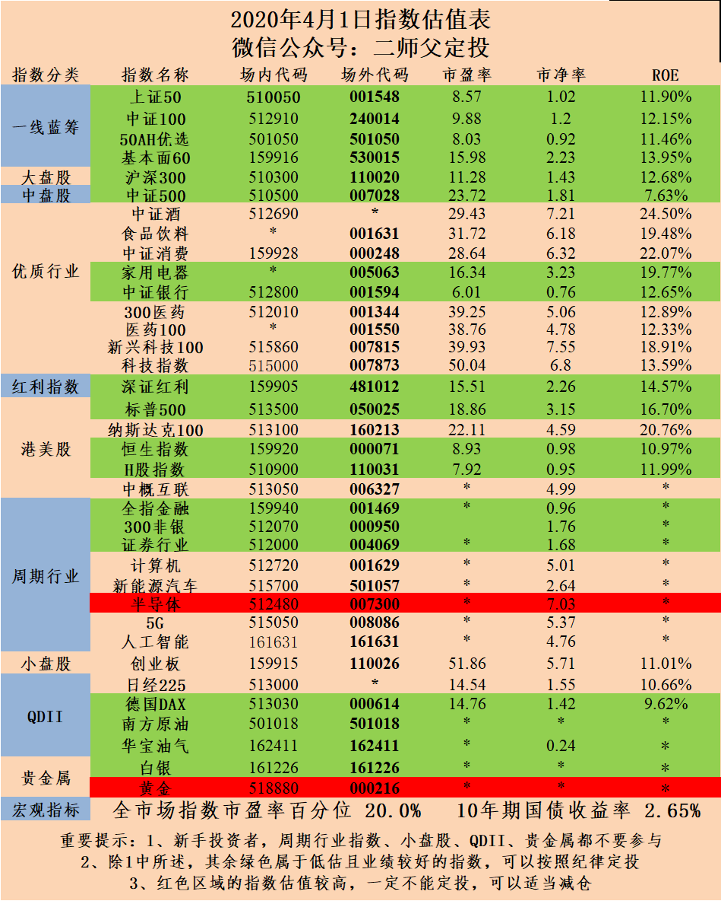

======================================================

_type: talk
@二师父[28814221155551]
2020-04-01 19:09:55 Wed  
topic_id: 241842544844521

<e type="hashtag" hid="554551521514" title="#231期定投实盘#" /> 继续坚持定投，中证500也跌下来了，慢慢配置，从以下链接开户，搜索乌龟计划可以看到往期实盘记录。<e type="web" href="https://openmob.1234567.com.cn/hd/index.html?t=qd8008&u=tjr122esf" title="https://openmob.1234567.com.cn/hd/index.html?t=qd8..." />

@C&S at 2020-04-01 19:09:55 Wed

> 请教师父，为什么选择定投的是食品饮料，还不是ROE更高，PE更低的家电指数呢？

----------

@二师父 at 2020-04-01 19:09:55 Wed

> 家用电器指数也很优质，不能单看几个指标，pe要看相对的，现在家用电器没有合适规模的指数

----------

@C&S at 2020-04-01 19:09:55 Wed

> 谢谢，场外只有广发全指家电，5000万的规模

----------

@二师父 at 2020-04-01 19:09:55 Wed

> 目前还有点低，等有合适的

----------

@C&S at 2020-04-01 19:09:55 Wed

> 好的，明白

----------

阅读[3773]  评论[5]  赞[0] 

+++++++++++++++++++++++++++++++++++++++++++++++++++++

图片：
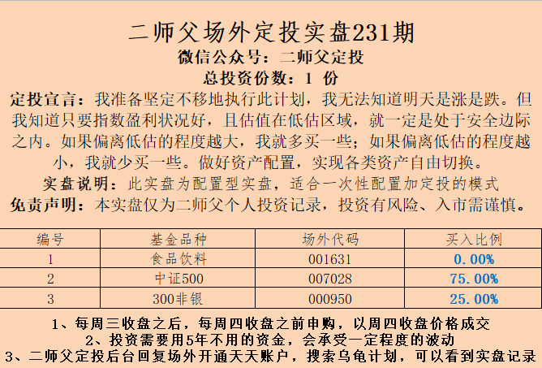

+++++++++++++++++++++++++++++++++++++++++++++++++++++

文件：
2020-04-01 19:08:34 Wed
文件大小：[104406]
28248851414521-二师父231期低估定投实盘.docx

======================================================

_type: q&a
@水墨青花[48812451215118]
2020-04-01 19:16:17 Wed  
topic_id: 241842548228881

@水墨青花

>  师父，生物科技指数501009和医药主题指数161035目前估值是什么区间，适合买入吗

@二师父

>  我看了下持仓股票，都是正常偏高估值，目前医药类股票受到疫情影响涨幅比较好，估值也偏高，做趋势可以，定投不行。但是如果做趋势需要设定好止损点。

阅读[3660]  评论[1]  赞[0] 

======================================================

_type: q&a
@一剪梅[844115184528882]
2020-04-01 19:46:12 Wed  
topic_id: 841842515515512

@一剪梅

>  师父，怎么查要续费啦？

@二师父

>  你还早，今年5月3号

阅读[3745]  评论[8]  赞[0] 

======================================================

_type: q&a
@李垚垚[548145221582444]
2020-04-01 19:59:16 Wed  
topic_id: 118514282211582

@李垚垚

>  二师父周五会大跌吗?中证500从买入就下跌现在可以加仓吗?

@二师父

>  你啥时候买的啊，中证500距离上次鳄鱼计划和网格底仓的价格并无大的变化啊
>  
>  如果定投每周都可以的，控制下仓位，如果是网格就按照5.42下跌百分之4或者百分之5买，上涨百分之4或者5卖，这样子好一点，控制节奏

阅读[3848]  评论[0]  赞[0] 

======================================================

_type: q&a
@李垚垚[548145221582444]
2020-04-01 21:21:15 Wed  
topic_id: 118514282452412

@李垚垚

>  有点心乱现持仓中证500、深红利、上证红利、恒生国企、应该留住还卖，还是减轻仓位。 谢二师父🙇

@二师父

>  如果仓位过重已经影响了生活，先暂停定投，等上涨盈利了逐步减仓一些，控制一个自己能承受的仓位

阅读[3934]  评论[0]  赞[0] 

======================================================

_type: q&a
@娃娃after🎈[88818155445112]
2020-04-01 23:01:21 Wed  
topic_id: 421825415442518

@娃娃after🎈

>  请教二师父，之前看你说用中证500做网格，那现在用券商或者恒生做网格的话怎么样？谢谢。

@二师父

>  按照置顶文章网格交易的价格做可以，我集中做，三只基金分两万做，可以选择一只基金6万做，我主要是节省精力，你有兴趣观察价格都可以做，恒生，券商也适合网格，不过网格交易只是总体资金的一半

阅读[3848]  评论[2]  赞[0] 

======================================================

_type: talk
@二师父[28814221155551]
2020-04-01 23:12:50 Wed  
topic_id: 841842512281852

<e type="hashtag" hid="824228225122" title="#关于耐心#" /> 在巴菲特投资《华盛顿邮报》后，它的股价不断下跌。事实上，《华盛顿邮报》的股价两年之后才反弹到巴菲特的平均买价22.75美元。但巴菲特并不关心股价，他重视的是他的投资标准，也就是衡量企业质量的标准。

巴菲特在华盛顿邮报这个股票上挣了不少，不过他也是买入之后就下跌的，而且两年时间才回本。

我发现很多人普遍缺乏耐心，不怪大家，如今的中国发展太快，有的时候稍不努力就被淘汰了，不仅工作，生活，购物，甚至口罩都得抢，别说学区房，孩子的学校了，更是得早下手。

而做投资需要耐心，优秀的投资者一般不呆在大城市，而是在云南大理，山东青岛，重庆，或者海外加拿大，希腊，澳洲等等不同地方，反正越远离喧嚣的地方越适合价值投资。

如果买的不是很贵，指数背后的企业都是业绩增速稳定的，耐心持有都会有很好的盈利，谨慎买入，耐心持有，以年为单位长期持有，就像你持有你的房子那样持有基金，你的投资会更好。我可没见过3月买房，4月就准备卖的，买期房就更慢了。

阅读[3893]  评论[0]  赞[0] 

======================================================

_type: q&a
@是喵喵吖～[421441114141158]
2020-04-01 23:55:43 Wed  
topic_id: 421825415512258

@是喵喵吖～

>  二师父，我这次回家听我姐姐说 厂里（我们那里是个石化厂）经理说现在石油跌，征集员工自愿买期货，说有自愿买的就把钱交上 ，最低的好像是一万，有的人入了七万，说是会交给专业人去操作。 但是反正也是赔了赚了都是个人承担。 对期货不太了解，给我的感觉就像您说的原油这种周期是不是风险很大？还是说虽然风险大 但现在却是价格很低只是可能盈利时间不能确定可能好几年这样？我们没有参与，就是想听听您对这件事看法。 😄

@二师父

>  现在买是比较不错的，我在原油价格40，和20多，南方原油加仓各0.5份，然后转托管到场内，截止到今天基本盈亏持平，所以风险在于长期不涨，但是原油不可能一直20美元一桶，如果能接受这个可以投
>  
>  至于期货水就深了，国内期货是50万门槛，国际原油期货门槛比较低，大概100美元，你可以自己买，把钱给别人有点不靠谱，首先不确定钱他到底用来干啥了，到时候被卷跑了还不一定找得到人，反正我建议如果你和你姐一起做小投几万没事，毕竟自己人，不会骗你，被传销洗脑除外
>  
>  如果南方原油放开申购也可以去买，这个安全系数高
>  
>  关于原油，还是那句话，有人几十万玩的不亦乐乎，有的人投一万心惊胆战，你赚不到不在你能力圈范围内的钱，跟着别人可能一时赚，最终结果就是一辈子亏，有所赚，有所不赚，钱在你手里才是王道，别轻易借钱，更别轻易投资

阅读[3951]  评论[5]  赞[0] 

======================================================

_type: q&a
@铁观音[28444524525851]
2020-04-02 00:15:04 Thu  
topic_id: 548145288428284

@铁观音

>  师父，300非银是不是沪深300里面去掉银行股，剩余的其他的所有股票，现在投是不是定位和沪深三百一样，？为啥沪深300算宽基指数，去掉银行以后就变成了周期指数呢？求解惑，谢谢

@二师父

>  是300非银金融，也就是持仓是保险和证券类股票，不是去掉银行的其他股票

阅读[4009]  评论[0]  赞[0] 

======================================================

_type: talk
@Philosophe*[544882828818444]
2020-04-02 11:02:51 Thu  
topic_id: 841842854448152

请问下标普500现在适合加仓不

阅读[3572]  评论[0]  赞[0] 

======================================================

_type: talk
@Philosophe*[544882828818444]
2020-04-02 11:02:52 Thu  
topic_id: 548145124441824

请问下标普500现在适合加仓不

@二师父 at 2020-04-02 11:02:52 Thu

> 定投可以

----------

阅读[3639]  评论[1]  赞[0] 

======================================================

_type: q&a
@🍀 凝🌸 慧🍀[841855248254242]
2020-04-02 11:08:55 Thu  
topic_id: 421825848585448

@🍀 凝🌸 慧🍀

>  二师父，您怎么看最近一个多月，不少保险股的大幅下跌？

@二师父

>  主要还是受到外围市场的影响，非理性杀跌
>  
>  其次是北上资金抛售，这个影响很大，去年有一段时间北上资金狂买平安推高了股价，近一个月流出了
>  
>  影响在于情绪面和资金面

阅读[3992]  评论[6]  赞[0] 

======================================================

_type: q&a
@闲云[48522815485458]
2020-04-02 14:20:13 Thu  
topic_id: 421825884421818

@闲云

>  二师父：华宝油气重仓的企业破产，手里的基金是不是要清仓？

@二师父

>  是的，第一重仓破产，等原油价格到了50美元以上可以考虑卖出这个基金了，南方原油可以持有

阅读[3877]  评论[4]  赞[0] 

======================================================

_type: q&a
@闲云[48522815485458]
2020-04-02 14:27:05 Thu  
topic_id: 118514552541212

@闲云

>  华宝基金会清盘吗？

@二师父

>  目前还没看到相关消息

阅读[3959]  评论[0]  赞[0] 

======================================================

_type: talk
@二师父[28814221155551]
2020-04-02 14:33:04 Thu  
topic_id: 548145112148214

<e type="hashtag" hid="141445182842" title="#油气#" /> 原油还是比油气好，这波油气起来了就不做了，整体行业都被摧残，油气说下我的卖出思路，第一，如果油气不幸清盘，在发出清盘消息以后卖出。第二，如果油气涨回成本价，0.385，就清仓。预计美股起来，原油涨到50美元一桶以上这个目标可以达到

油气这个给我两个启示，周期指数严格控制仓位，保证极端情况不崩溃，其次就是见好就收。

@衣袂飘香 at 2020-04-02 14:33:04 Thu

> 谢谢二师父的解答。我的成本价0.365，亏了将近29%。

----------

@圣诞结® at 2020-04-02 14:33:04 Thu

> 中证银行算周期性指数吗？

----------

@二师父 at 2020-04-02 14:33:04 Thu

> 算中周期

----------

@Joey  at 2020-04-02 14:33:04 Thu

> 亏了百分之六十几

----------

阅读[4145]  评论[4]  赞[0] 

+++++++++++++++++++++++++++++++++++++++++++++++++++++

图片：

======================================================

_type: talk
@onepiecewi*[244414114545811]
2020-04-02 15:00:07 Thu  
topic_id: 548145112584124

今天A股走势很强
是要回暖了吗

@二师父 at 2020-04-02 15:00:07 Thu

> 不知道，网格出了点，暖不暖跟我没关系了

----------

@onepiecewi* at 2020-04-02 15:00:07 Thu

> 跟着师傅节奏

----------

阅读[3906]  评论[2]  赞[0] 

======================================================

_type: talk
@二师父[28814221155551]
2020-04-02 16:20:43 Thu  
topic_id: 118514554182852

<e type="hashtag" hid="141445848422" title="#为什么定投会亏#" /> 逆向，低位买，高位卖，再结合配置适度分散，不会亏的。只是牛市来了赚的多一点，震荡市小赚一点罢了。

@🍀 凝🌸 慧🍀 at 2020-04-02 16:20:43 Thu

> 师父，这几天刚建好500ETF底仓，今天就赚钱了，哈哈，我把赚的钱先落袋为安了。[呲牙]

----------

@二师父 at 2020-04-02 16:20:43 Thu

> 把握住自己的节奏就好

----------

@🍀 凝🌸 慧🍀 at 2020-04-02 16:20:43 Thu

> 嗯嗯，谢谢师父！每天必看您的文章分析，学习您的投资思路，再不断实践总结。师父辛苦了，感谢您的每日分享！

----------

@wty at 2020-04-02 16:20:43 Thu

> 跟着二师父学习、理解消化和实践，心里踏实多了！

----------

阅读[4638]  评论[4]  赞[0] 

+++++++++++++++++++++++++++++++++++++++++++++++++++++

文件：
2020-04-02 16:19:29 Thu
文件大小：[74049]
15415551851522-做到这两点，你的定投是不可能亏的.docx

======================================================

_type: talk
@二师父[28814221155551]
2020-04-02 19:14:20 Thu  
topic_id: 118514551854452

<e type="hashtag" hid="141445818422" title="#资金流向#" /> 关注北向资金走势，一般北向资金开始买入的时候就是上涨的起点，北上资金抛出的时候就是下跌的起点。

最近北上资金又开始了，如果这轮上涨仓位重的朋友就可以减仓，保证合理的仓位，就是底仓，如果没有底仓，大涨容易追高，追高容易被套。

那么最好的办法就是底仓加网格。底仓作为中长期配置，网格作为短期配置。这样牛市来了有底仓不怕，震荡市场有网格，一直可以盈利的。

但是做网格需要注意一点，单边上涨的时候卖出了不要后悔，可能有机会再买入，也可能没有机会再买入。

@🍀 凝🌸 慧🍀 at 2020-04-02 19:14:20 Thu

> 师父，图中统计数据说明北向资金最近一个月净流出634亿元，所以市场短期内会回落或者来回震荡，大概率上涨的可能性较小，是这样理解吗？

----------

@二师父 at 2020-04-02 19:14:20 Thu

> 你要看最近，已经回流了，这个影响是很迅速的

----------

@🍀 凝🌸 慧🍀 at 2020-04-02 19:14:20 Thu

> 是的，最近三天都是流入的。资金回流不是好事吗，那仓位重的为何要减仓？不太明白，请师父指点。

----------

@二师父 at 2020-04-02 19:14:20 Thu

> 外资不是一直流入的，今年大概率震荡行情，之前有的读者仓位过重心理压力大，上涨适合减仓

----------

@🍀 凝🌸 慧🍀 at 2020-04-02 19:14:20 Thu

> 哦，终于明白了，就是说这些资金流入或流出的速度其实是很快的，当开始连续流入的时候，预示着市场可能上涨，那么仓位重的就可以借上涨的机会卖出，进行减仓，从而调整仓位到合适。是吧，师父？

----------

@二师父 at 2020-04-02 19:14:20 Thu

> 是的，每个人情况不同

----------

@薇薇 at 2020-04-02 19:14:20 Thu

> 请问从哪里可以看北上资金走势

----------

@二师父 at 2020-04-02 19:14:20 Thu

> 东方财富

----------

阅读[4632]  评论[8]  赞[0] 

+++++++++++++++++++++++++++++++++++++++++++++++++++++

图片：
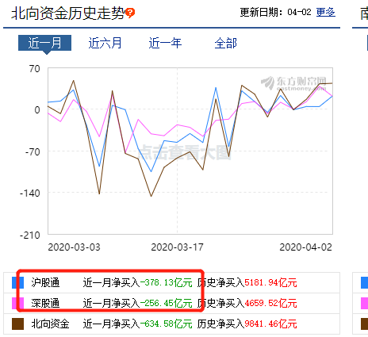

======================================================

_type: q&a
@故事[455458815888]
2020-04-02 20:16:25 Thu  
topic_id: 841842881882842

@故事

>  东方财富非金融石油石化类全A指数在choice数据的代码是多少？怎么查询？

@二师父

>  直接登陆，然后找到行情中心，系统列出有所有的指数数据，你购买以后也会有相应客服为你解答的

阅读[4076]  评论[0]  赞[0] 

======================================================

_type: talk
@二师父[28814221155551]
2020-04-02 21:23:22 Thu  
topic_id: 548145152218484

<e type="hashtag" hid="824228114552" title="#个股雷区#" />
4月2日，瑞幸咖啡盘前股价跌幅扩大至逾80%。瑞幸咖啡今天宣布，公司董事会已成立专门委员会（“特别委员会”），负责监督在截至2019年12月31日的财年的合并财务报表审计期间提请董事会注意的某些问题的内部调查。

调查显示，COO及其部分下属员工从2019年二季度起从事某些不当行为，与伪造交易相关的销售额约为22亿元。目前调查仍在进行，公司将进一步对财务数据等调整进行公告。

还是投资指数好，有时候做趋势未必走的了，2015年很多人高位接盘，结果个股开盘跌停，止损都没机会，稳稳当当的投资指数，当你熟悉了个股风险之后再投资，普通上班族没精力研究的，指数是最佳选择

@蓝魔森林 at 2020-04-02 21:23:22 Thu

> 不知道拼多多会不会也有这种情况。这个可是中概互联里的中部仓位。

----------

阅读[4096]  评论[1]  赞[0] 

======================================================

_type: q&a
@蓝魔森林[28888244485121]
2020-04-02 21:26:52 Thu  
topic_id: 118514542221442

@蓝魔森林

>  中概互联里不知道有没有瑞幸咖啡，就算有估计比例小应该对基金影响不大。

@二师父

>  中概互联里面没有瑞幸咖啡，不用担心的

阅读[4189]  评论[1]  赞[0] 

======================================================

_type: talk
@门萨🐨[51411455828824]
2020-04-03 06:59:21 Fri  
topic_id: 548145158181124

🈹米国洋韭菜[发呆]

@三峡情 at 2020-04-03 06:59:21 Fri

> 夸张，财务造假，损失不打惨重啊

----------

@Super鑫 at 2020-04-03 06:59:21 Fri

> 没有跌停吗？

----------

@onepiecewi* at 2020-04-03 06:59:21 Fri

> 财务造假，它不能代表中国。华为可以。

----------

@onepiecewi* at 2020-04-03 06:59:21 Fri

> 说不定也是国人的钱

----------

@杜志彪 at 2020-04-03 06:59:21 Fri

> 在老美财务造假会判刑的，在国内罚60万了事。

----------

阅读[4018]  评论[5]  赞[0] 

+++++++++++++++++++++++++++++++++++++++++++++++++++++

图片：
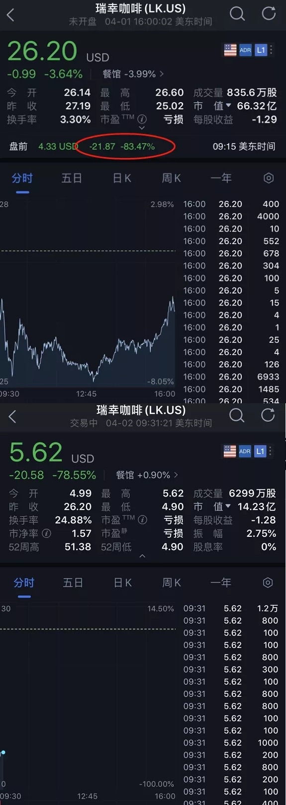

======================================================

_type: q&a
@一心一意[844421848411122]
2020-04-03 09:38:11 Fri  
topic_id: 421825525455558

@一心一意

>  师父，网格交易，在底仓之下买的，是不是要在底仓以上卖出才合适，如中证500ETF在5.4买的，是不是要在5.9卖出？，这样理解对么

@二师父

>  这看你设置的网格点，小网格4个点在5.6卖，大网格9个点可以在5.9卖

阅读[4114]  评论[8]  赞[0] 

======================================================

_type: q&a
@静[241555148454251]
2020-04-03 10:06:23 Fri  
topic_id: 841842242881522

@静

>  华夏上证50，怎么停止赎回，也停止操作了，昨天明明涨了，没收益显示为0，啥情况

@二师父

>  不用担心，港股通从4月2日到4月6日关闭了，等到4月7日就可以进行申购和赎回的

阅读[4176]  评论[1]  赞[0] 

======================================================

_type: talk
@子辰[421444812542128]
2020-04-03 10:54:38 Fri  
topic_id: 118514414851112

查看主力购买历史记录，五个月里面，有90％的天数，资金都是向外流出；不会购买基金，跟着机构买，主力数据算不算机构购买啊？

@二师父 at 2020-04-03 10:54:38 Fri

> 这是一个策略，你可以模拟试试

----------

@子辰 at 2020-04-03 10:54:38 Fri

> 好的，小额跟一下

----------

阅读[4083]  评论[2]  赞[0] 

+++++++++++++++++++++++++++++++++++++++++++++++++++++

图片：
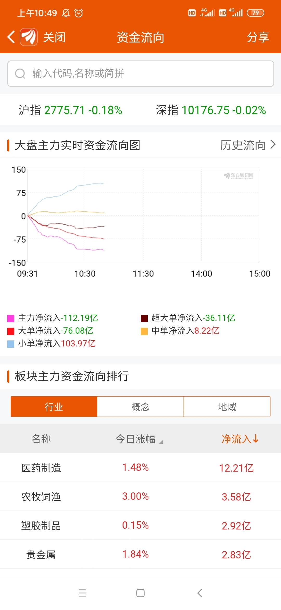

======================================================

_type: q&a
@宁静以致远[841158451581452]
2020-04-03 11:35:34 Fri  
topic_id: 548145544255884

@宁静以致远

>  二师父，北向资金流入流出的行业和个股对我们定投基金和买股票有什么指导意义吗？它进的方向我们要跟吗？

@二师父

>  北上资金流入和流出只是多空分析的其中一个因素，这属于资金面，好的交易结合了基本面，情绪面，技术面和资金面
>  
>  可以考虑机构重仓股票作为选择研究基本面，至于购买还是自己决策，如果跟着机构走投资很累，而且他们都是系统决定，到达条件无论盈亏都平仓，不要盲目跟随

阅读[4431]  评论[0]  赞[0] 

======================================================

_type: talk
@二师父[28814221155551]
2020-04-03 12:00:02 Fri  
topic_id: 548145544182824

<e type="hashtag" hid="452555881228" title="#正视自己的账户#" /> 正视自己的交易失败，会让人感到悲伤。我们用尽一生的时间来建立自尊，大多数人甚至对自己抱有很高的评价。所以人在亏损之时的第一反应可能就是隐瞒。这不是个例，几乎每个交易者都经历这一步。

诚实理性地面对自己的账户，总结每一笔交易的成功和失败是做好投资的第一步，犯错不可怕，可怕的是隐瞒和逃避，那样就永远没法进步。

@范毅君 at 2020-04-03 12:00:02 Fri

> 失败不可怕，逃避失败，隐瞒失败才可怕！坦然面对，才可以成长。股市，多好的心理素质修炼长

----------

@Hi·DD at 2020-04-03 12:00:02 Fri

> 二师父，目前投资一线城市的房产好，还是投资股票市场好呢？

----------

@二师父 at 2020-04-03 12:00:02 Fri

> 投资的话股票好一些，最好用指数分散投资

----------

@Hi·DD at 2020-04-03 12:00:02 Fri

> 嗯嗯[玫瑰][玫瑰]

----------

阅读[4370]  评论[4]  赞[0] 

======================================================

_type: talk
@二师父[28814221155551]
2020-04-03 13:57:34 Fri  
topic_id: 841842215424822

<e type="hashtag" hid="554555154884" title="#每日交易日志#" /> 做好一笔交易，便于大家参考，每日公布交易日志，仅供参考，非投资建议和指导，用心去做，制定严格的交易计划，做好风控才能做好。

与其预测风雨，不如打造诺亚方舟，这样无惧电闪雷鸣。

@🍀 凝🌸 慧🍀 at 2020-04-03 13:57:34 Fri

> 师父好，您的猎豹计划是啥？

----------

@wty at 2020-04-03 13:57:34 Fri

> 二师父，我记得您表格里场内券商ETF是512000（华宝），现在您操作的网格是南方证券，有什么不同吗？

----------

@二师父 at 2020-04-03 13:57:34 Fri

> 基金公司不同，规模不同，华宝的成交额和规模更大一点，南方证券规模小一点

----------

@二师父 at 2020-04-03 13:57:34 Fri

> 买的股票

----------

@🍀 凝🌸 慧🍀 at 2020-04-03 13:57:34 Fri

> 哦，明白了，猎豹计划是高段位，我还是先做好其余3个计划。谢谢师父！[愉快]

----------

@一心一意 at 2020-04-03 13:57:34 Fri

> 早点发就好了，我500ETF可以卖一份了[囧]

----------

@二师父 at 2020-04-03 13:57:34 Fri

> 之前不发了吗，鳄鱼计划

----------

@二师父 at 2020-04-03 13:57:34 Fri

> 做好指数就行，没兴趣的话不用买股票

----------

阅读[4973]  评论[13]  赞[0] 

+++++++++++++++++++++++++++++++++++++++++++++++++++++

图片：
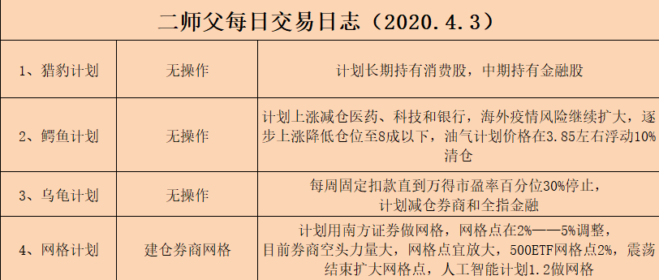

======================================================

_type: q&a
@是喵喵吖～[421441114141158]
2020-04-03 14:35:10 Fri  
topic_id: 118514482188552

@是喵喵吖～

>  二师父我通过您那个链接下载了涨乐财富通，但是发现没法买，好像没有开通成功，我问了一下客服，他说我在其他的开的账户看满了。您能帮我看下吗，我留哪几个，没有用的我去注销了。
>  
>  我一直在东方财富买的股票和场内基金，才知道手续费比较贵😂想换掉。
>  
>  您推荐过广发证券嘛？我想不起来了，这几个开通的 除了东方财富我都没有印象啥时候开的😂 谢谢二师父了🌹🌹

@二师父

>  可能是去银行办理业务别人让你办的，选择一个用的顺手且费率低的就行了，广发有个渠道，你看是不是在江苏那个

阅读[4504]  评论[1]  赞[0] 

======================================================

_type: talk
@二师父[28814221155551]
2020-04-03 18:30:38 Fri  
topic_id: 118514484418422

<e type="hashtag" hid="141444445152" title="#瑞幸遭到做空#" /> 现金流对于企业最重要，对个体也一样。股市风险还是比较高，要做好风控。

@栀子花开 at 2020-04-03 18:30:38 Fri

> 英国强制银行不分红留足现金应对危机，这件事看似简单，是英国政府提前知道了什么风波吗？二师傅怎么看？

----------

@二师父 at 2020-04-03 18:30:38 Fri

> 现在普遍流动性不好，英国银行这是无奈之举，我觉得整体实体经济比较差，个体投资者也要有充裕的现金流

----------

阅读[4984]  评论[2]  赞[0] 

+++++++++++++++++++++++++++++++++++++++++++++++++++++

文件：
2020-04-03 18:29:08 Fri
文件大小：[18051]
28248821542221-瑞幸被干趴了，股海游泳需谨慎.docx

======================================================

_type: q&a
@Zyxj[111841455151112]
2020-04-03 22:30:56 Fri  
topic_id: 118514488812582

@Zyxj

>  二师父，您说用南方证券做网格，是512900吗？

@二师父

>  是的，这个和华宝都可以

阅读[4272]  评论[3]  赞[0] 

======================================================

_type: q&a
@素兮[548121415528244]
2020-04-03 22:34:42 Fri  
topic_id: 421825244211118

@素兮

>  二师父，科技100的持仓股都有哪些？

@二师父

>  前10大重仓股分别是海康威视，立讯精密，迈瑞医疗，360，大华股份，三七互娱，视源股份，智飞生物，完美世界，乐普医疗

阅读[4319]  评论[0]  赞[0] 

======================================================

_type: talk
@树叶[544811512145144]
2020-04-04 08:40:09 Sat  
topic_id: 548145428422124

<e type="hashtag" hid="142825811122" title="#定投周报#" /> 二师父定投周报第53期

阅读[4346]  评论[0]  赞[0] 

+++++++++++++++++++++++++++++++++++++++++++++++++++++

文件：
2020-04-04 08:40:06 Sat
文件大小：[250337]
15415514121842-二师父定投周报4.4（第53期）.docx

======================================================

_type: q&a
@特仑苏[241855111824451]
2020-04-04 09:13:10 Sat  
topic_id: 548145424844114

@特仑苏

>  二师父，请问一下想开通一个股票账户用于可转债打新，用什么证券开户好？那个费率比较低？如果要打新账户需要多少金额才行？

@二师父

>  都可以的，可转债打新并无市值要求，没有最低金额要求，中签以后转入资金即可

阅读[4489]  评论[1]  赞[0] 

======================================================

_type: talk
@二师父[28814221155551]
2020-04-04 09:42:03 Sat  
topic_id: 421825241155518

<e type="hashtag" hid="224222441481" title="#左侧交易与右侧交易#" /> 大家可以画一条微笑曲线，在曲线底部左端开始买入就是左侧交易，在曲线底部右端开始买入就是右侧交易

两种不同的方法，左侧交易是逆势买，只要指数是优质的，控制安全边际会不断买入，右侧交易是顺势买

二师父的策略是从左侧就开始买，右侧也买，当账户浮亏的时候是左侧下跌，当账户浮盈的时候是右侧涨，不管涨跌，只要低估就可以买

有的人希望买入就跌，可以买的更便宜，有的人希望买入就涨，就可以赚钱，不同性格不同想法，但是都是锚固心理，把时间拉长，其实都还是在底部，但这个策略需要很长时间经受浮亏，并不是所有人都能承受的住，大部分人还是底部受不了就减仓了，顶部大涨，受不了诱惑加仓了，所以找到适合自己的。

二师父喜欢左侧，可以结合技术指标波段，但仍旧逆向，追涨杀跌式方法很累，而且容易判断错误，并且在高位上涨控制不住头寸加多了最后被套

@杜志彪 at 2020-04-04 09:42:03 Sat

> 知行合一最重要，半导体虽然还在高估，但就是按照微笑曲线建仓的，从跌破20天线开始，每下跌5个点加一份，目前加了5份，下跌了20%还没有笑的意思[偷笑]价格在90天线附近，节奏继续，如果低估了就加倍二份，还有就是耐心等待哦[微笑]

----------

@志亮 at 2020-04-04 09:42:03 Sat

> 场外基金有7天限制，必须左侧，场内灵活一些可以做右侧。

----------

阅读[5091]  评论[2]  赞[0] 

======================================================

_type: talk
@二师父[28814221155551]
2020-04-04 22:41:54 Sat  
topic_id: 241842488512821

<e type="hashtag" hid="142812422222" title="#中概互联#" /> 二师父查阅了中概互联的重仓股，目前重仓股及比例如下，检查了下各个企业的经营业绩，美团、百度、拼多多较差。腾讯、阿里还是很好的。

拼多多问题在于过度扩张，很多资金都用于扩大在生产，这一点和瑞幸比较像，不过瑞幸的问题在财报上显示的很明显，他的经营现金流净额完全为负，这就是最大的问题。

这如同一个家庭，你可以不工作，长时间没有收入，相当于企业没有利润，但是只要账户还有钱，就能维持下去。而瑞幸这次暴雷本质是现金流出现问题。包括巴菲特刚刚止损的航空股，也是处于扩张期，看起来利润很高，然而钱没多少，一遇到危机就容易破产。

整体而言，投资中概主要是投资阿里和腾讯，其中阿里的业绩是优于腾讯的，而互联网公司最近几年的增速已经弱于十几年前，未来增速会慢慢下来，这类指数不可作为核心配置，属于整体投资中20%的卫星配置，按照目前的配置海外QDII指数配置价值恒生或者国企优于标普500优于中概。

这次瑞幸的事件对中概可能有冲击，不过不用担心，即使未来中概股不能在美国上市，回到香港上市或者中国的科创板上市也不见得是坏事，去年阿里就回归了。

从17年开始中概互联一直就是震荡，所以适合定投+利润收割或者网格。网格的价位在置顶文章分享了，场内买入需要注意：溢价，要保证溢价率处于1%以下比较好，这种情况不会支付额外的买入成本，同时避免跟羊群一起买。

@蓝魔森林 at 2020-04-04 22:41:54 Sat

> 严重赞同

----------

@蓝魔森林 at 2020-04-04 22:41:54 Sat

> 我问了一个美团内部人事，美团短期内没有看到未来亮点业务。

----------

@二师父 at 2020-04-04 22:41:54 Sat

> 对，多跟相关公司交流，他们知道的多，之前我问过民生银行工作的朋友，这个银行坏账呆账特别多，果然几年不涨

----------

@蓝魔森林 at 2020-04-04 22:41:54 Sat

> 春江水暖鸭先知[呲牙]

----------

阅读[5082]  评论[4]  赞[0] 

+++++++++++++++++++++++++++++++++++++++++++++++++++++

图片：
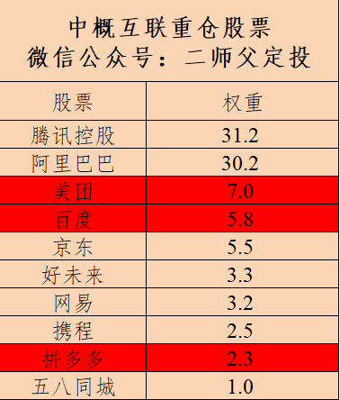

======================================================

_type: q&a
@银河系[111814581215452]
2020-04-05 10:50:45 Sun  
topic_id: 421825281545858

@银河系

>  二师父好，关于原油想和您咨询下，之前买的华宝油气已阵亡，原油场外基金不仅有额度问题，而且也不是实时交易，场内基金又有溢价问题。银行的纸原油不知道您怎么看？谢谢

@二师父

>  工商银行目前有这类品种，纸原油是比国内原油期货的门槛低一些，他的手续费比较高，也是负和游戏
>  
>  主要不是品种问题，这类品种波动大，周期性强，投资需要找到极端底部，同时升势确立去投资，如果不是职业投资者，不建议参与，很多人已经做了一波原油期货，离场了
>  
>  之前大跌一些专业投资者也是倒下了，投资基金和a股风险可控，稳定增值比较好的

阅读[4227]  评论[4]  赞[0] 

======================================================

_type: talk
@二师父[28814221155551]
2020-04-05 17:35:13 Sun  
topic_id: 548145458585844

<e type="hashtag" hid="824224522552" title="#300非银#" /> 大家看看300非银，主要的投资策略。

目前个人仓位不重，在8%左右，单一指数仓位在15——30%之间我是定义为重仓。其实投资每次按照一份的金额购买问题不大，只要拉长投资的时间。

大部分人出现问题就是一次买入了过多头寸，遇到下跌扛不住。交易的话还是一步步来，A股一般都是暴涨一年，连跌3年，暴涨两个月，连跌一年，所以总有很多机会。卖出的时候可以果断多卖点，买入的时候记得稍微拉长一下投资的时间，这样下跌心理压力也小很多。

@志亮 at 2020-04-05 17:35:13 Sun

> 一句话，节奏感很重要[呲牙]

----------

@凭栏观海 at 2020-04-05 17:35:13 Sun

> 对于周期类指数，要在弱周期定投，在强周期止盈，在震荡中收割利润。———说得好啊

----------

@🍀 凝🌸 慧🍀 at 2020-04-05 17:35:13 Sun

> 谢谢师父分析，受益匪浅！[玫瑰][玫瑰][玫瑰]

----------

阅读[4818]  评论[3]  赞[0] 

+++++++++++++++++++++++++++++++++++++++++++++++++++++

文件：
2020-04-05 17:32:01 Sun
文件大小：[128063]
48528815445488-中国平安连续下跌，300非银是否还能继续定投.docx

======================================================

_type: talk
@二师父[28814221155551]
2020-04-05 21:00:31 Sun  
topic_id: 241842442221821

<e type="hashtag" hid="824224885212" title="#漫步华尔街第四讲#" /> 漫步华尔街最后介绍了生命中后期投资和漫步华尔街的三种方式，接下来读《黑天鹅——如何应对不可预知的未来》，面对黑天鹅，面对不确定性，投资者应该如何应对，怎样获得人生成长的白天鹅。

阅读[4905]  评论[0]  赞[0] 

+++++++++++++++++++++++++++++++++++++++++++++++++++++

文件：
2020-04-05 20:58:41 Sun
文件大小：[18184]
88248811185222-漫步华尔街第4讲.docx

======================================================

_type: talk
@二师父[28814221155551]
2020-04-06 10:48:53 Mon  
topic_id: 548145485458254

<e type="hashtag" hid="224224228541" title="#投资中常见的人性弱点 #" /> 弱点越多，盈利的概率越小

@子辰 at 2020-04-06 10:48:53 Mon

> 高估不止盈利，追涨

----------

@蓝魔森林 at 2020-04-06 10:48:53 Mon

> 读历史，也会发现人性在其中的主导作用

----------

阅读[4807]  评论[2]  赞[0] 

+++++++++++++++++++++++++++++++++++++++++++++++++++++

图片：
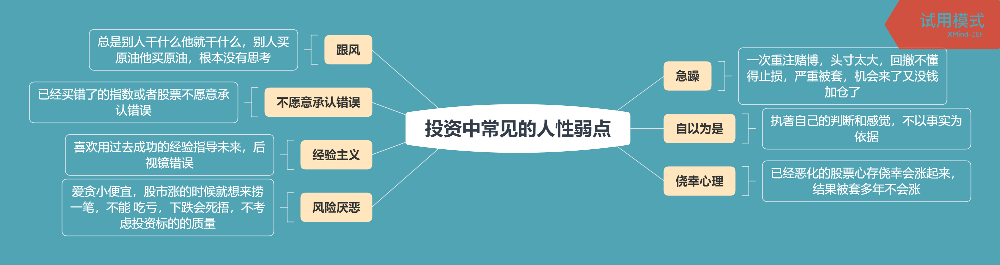

======================================================

_type: q&a
@老司基[111852221242122]
2020-04-06 11:01:28 Mon  
topic_id: 421825218121148

@老司基

>  如果美股走熊或者一直低位震荡了，是否会影响中概走势？

@二师父

>  会的，有向下趋势，如果网格的话可以出一些，没有仓位的正好是个机会。

阅读[4165]  评论[0]  赞[0] 

======================================================

_type: q&a
@学以致用[244415184181451]
2020-04-06 11:02:44 Mon  
topic_id: 548145485152224

@学以致用

>  ETF组合挑战赛：华夏ETF最应该选那5支呢？二师父可不可以推荐一下呢😊

@二师父

>  沪深300+中证500+创业板，消费、医药组合比较好。不一定非要选择华夏的。

阅读[4374]  评论[2]  赞[0] 

======================================================

_type: talk
@二师父[28814221155551]
2020-04-06 16:04:10 Mon  
topic_id: 118514825285422

<e type="hashtag" hid="141441484222" title="#券商和300非银投资价值#" /> 券商适合投机做网格，中长期300非银更合适。

阅读[5132]  评论[0]  赞[0] 

+++++++++++++++++++++++++++++++++++++++++++++++++++++

文件：
2020-04-06 16:03:23 Mon
文件大小：[117008]
88248258428482-券商指数和300非银哪个更好.docx

======================================================

_type: q&a
@海马[15158245825242]
2020-04-06 23:10:31 Mon  
topic_id: 421825141512128

@海马

>  师父：我之前一直有定投了几只主动型基金，现在也还在定投，分别是嘉实价值成长，嘉实新兴产业，兴全商业模式优选，请问师父这些基金可以根据沪深300估值利用师父的利润收割法吗？或者还有其它方法？我对这几只主动基金情有独钟。

@二师父

>  我只投资了股票和指数基金，主动基金需要研究持仓股票，不确定性比较大，如果一直涨的好可以拿着，涨的不好就可以不用持有

阅读[4176]  评论[2]  赞[0] 

======================================================

_type: talk
@二师父[28814221155551]
2020-04-06 23:24:04 Mon  
topic_id: 421822482828888

交易的真理往往很简单、很朴素，它在客观上要求人内心纯净，心无旁骛。一个人的心性和涵养好不好，在现实生活中往往需要很长时间去验证，而在投机市场上，这个验证基本上就是现世报。

投资的功夫在股市之外。能做好投资的人一定是内心澄明之人。其实很多人我和他聊天几句就差不多能知道他未来在资本市场的表现了。

阅读[4237]  评论[0]  赞[0] 

======================================================

_type: q&a
@隔窗遥望[241884481854181]
2020-04-07 10:17:57 Tue  
topic_id: 548144252511444

@隔窗遥望

>  可转债打新中签，怎么查看上市时间

@二师父

>  在集思录有新债上市日历

阅读[3999]  评论[1]  赞[0] 

======================================================

_type: q&a
@六尘不改[241555484551821]
2020-04-07 10:19:20 Tue  
topic_id: 548144252115444

@六尘不改

>  师傅，华宝智投场内交易是万一手续费吗，这个证券公司安全吗

@二师父

>  通过我这里开户是的，证券公司是安全的，而且买基金钱有银行托管

阅读[4062]  评论[4]  赞[0] 

======================================================

_type: talk
@二师父[28814221155551]
2020-04-07 11:17:19 Tue  
topic_id: 841844522188812

<e type="hashtag" hid="881251425252" title="#鳄鱼计划#" /> 卖出医药ETF一份，代码，512010，仅供参考，非投资建议和指导，投资有风险，入市需谨慎

阅读[4000]  评论[0]  赞[0] 

======================================================

_type: q&a
@铁观音[28444524525851]
2020-04-07 12:43:58 Tue  
topic_id: 421822482258258

@铁观音

>  师傅，这个费用的免除具体指的是什么费用？会有多大的影响？算的上是利好吗？

@二师父

>  证券查询业务服务费减免，对资本市场是利好

阅读[3986]  评论[0]  赞[0] 

======================================================

_type: q&a
@光少[244124552511141]
2020-04-07 13:25:16 Tue  
topic_id: 241844524151441

@光少

>  二师父你好！场内卖出有没有限7天的费率？

@二师父

>  没有的，只有正常佣金

阅读[3863]  评论[0]  赞[0] 

======================================================

_type: q&a
@杨帆@洋洋-招财猫[844121251545412]
2020-04-07 13:28:44 Tue  
topic_id: 241844524482851

@杨帆@洋洋-招财猫

>  二师傅您好，一直持有上证50AH，但现在亏损7%，这个需要转换吗，还是继续持有回本之后再换呢

@二师父

>  这个不用的，蓝筹股属于价值类配置，比较稳健，涨幅是属于中等偏下水平，主要是基础配置，但是长期看也是稳健增值的。最近主要是金融业受到比较大的冲击，所以50很弱。

阅读[4119]  评论[1]  赞[0] 

======================================================

_type: q&a
@不再YY的猪[422118542885848]
2020-04-07 13:30:35 Tue  
topic_id: 548144255548424

@不再YY的猪

>  您好，想给小孩子买保险，目前了解了平安的两款，小福星和少儿福，您能否帮忙分析下是否值得购买？或者有没有其他好的产品可以推荐？孩子现在1岁，主要考虑医疗和重疾保障，上面两款产品还附带了寿险和意外。谢谢！

@二师父

>  我给您做了一个测评，可以参考，平安的保费都比较高，产品也没有特殊的亮点。晴天保保和妈咪保贝好一些。
>  
>  少儿配置重疾和意外险可以了，寿险不用配置。

阅读[4223]  评论[5]  赞[0] 

======================================================

_type: q&a
@🍀 凝🌸 慧🍀[841855248254242]
2020-04-07 15:15:33 Tue  
topic_id: 548144258525584

@🍀 凝🌸 慧🍀

>  二师父好，有观点认为A股市场见底信号逐步确认，有观点认为疫情仍未过去，维持区间震荡行情。您怎么看待？

@二师父

>  根据我的观察，短期走势向上，长期向下，疫情只是一方面，要注意美债违约和出口萎靡

阅读[4109]  评论[5]  赞[0] 

======================================================

_type: q&a
@不知道不明了[15584248411812]
2020-04-07 17:28:28 Tue  
topic_id: 548144245225224

@不知道不明了

>  二师父好，目前除了货币基金，还有没有收益率更高的现金管理工具可以推荐呀？

@二师父

>  有短债基金，收益高一点，风险低于长债基金，不过不是保本的

阅读[4088]  评论[4]  赞[0] 

======================================================

_type: talk
@二师父[28814221155551]
2020-04-07 18:42:31 Tue  
topic_id: 118511214155142

<e type="hashtag" hid="824245421842" title="#学会休息#" /> 现在可以休息了，高仓位投资者的劣势是下跌亏损多，可能不舒服，不过不担心踏空，随便他涨。就用逆势投资，便宜了买点，贵了看心情，高估的时候心情好，就可以卖点，不卖重新下跌也不怕，因为买的便宜。

@范毅君 at 2020-04-07 18:42:31 Tue

> [强]

----------

@特仑苏 at 2020-04-07 18:42:31 Tue

> 请问二师父那个资金流向哪里可以看

----------

@二师父 at 2020-04-07 18:42:31 Tue

> 万得或者东方财富

----------

阅读[4322]  评论[3]  赞[0] 

+++++++++++++++++++++++++++++++++++++++++++++++++++++

文件：
2020-04-07 18:40:40 Tue
文件大小：[276917]
15415151114422-擅猎者必擅休息.pdf

======================================================

_type: q&a
@学以致用[244415184181451]
2020-04-07 18:54:52 Tue  
topic_id: 548144245142824

@学以致用

>  二师傅，刚上市的富国中证医药50ETF是不是要比300医药要好一些啊？

@二师父

>  两个重仓股票有较大重合，前10大重仓有恒瑞医药、药明康德、长春高新、爱尔眼科、沃森生物、乐普医疗、以及片仔癀是重合的。
>  
>  差别不大，权重的话300医药更集中，市值大的恒瑞医药权重较大，从过去看恒瑞医药比较好，分析过恒瑞医药的财报，也是非常优秀的，他的创新药做的很好。
>  
>  整体看二者差别不大。

阅读[4317]  评论[0]  赞[0] 

======================================================

_type: talk
@二师父[28814221155551]
2020-04-07 20:07:02 Tue  
topic_id: 118511211284512

<e type="hashtag" hid="824245151542" title="#关于仓位#" /> 仓位是非常重要的，太多了，暴跌自己会后悔买多了，太少上涨的时候又非常焦虑。这是投资者普遍遇到的问题。

那么什么是合适的仓位，只有在实践中调整，更为重要的是，不要太贪心，头寸不能过大，这样即使赚的少也安全，等到底部区域可以有机会重仓。

另外需要分仓管理，要区分长期投资和短期投资，要知道买入标的是做趋势还是反趋势。

很简单，买入500ETF有的是长持，有的是做网格，那么他们的卖出策略就不一样，长持的话卖出就是利润10%以上收割，短期就是几个点卖出，底部再接回来。分开管理，不同资金有不同策略。

永远记得抓住核心，核心就是长期持有，你可以做网格，做趋势，但是核心不能动，也就是长期持有ETF，这部分资产是复利增值，当做好了核心，然后再谈网格。

就和吃东西一样，先得保证一日三餐，其次才是饮料、蛋挞、汉堡以及炸鸡什么的。那么也就意味着主仓位不要随便动。虽然A股已经熊了4年，未来有可能继续熊下去，但是最糟糕的就是你坚持了4年，准备迎接牛市，可是市场一直震荡一直震荡，最后你以为牛市不会来了，A股永远就在3000点波动，开始大仓位网格。

这时候突然大盘涨了，你又慌了开始追，追了以后大盘又回调了，又开始慌了，想卖。这都是源于总想去战胜市场，这个是很难的。

最佳方法就是核心+卫星。有100万，你得有个50万到70万资金放在指数基金里面，当然需要是在极度低位买的优质指数基金，然后剩余的你做波段也好，趋势也罢，都可以。这就是分清主次，不要捡了芝麻，丢了西瓜。

阅读[5101]  评论[0]  赞[0] 

======================================================

_type: q&a
@栀子花开[118248824481842]
2020-04-07 21:08:25 Tue  
topic_id: 548144244455424

@栀子花开

>  二师傅，看看支付宝为我设计的投资策略，中高风险:9%年化收益，真是不可思议，这样简单配置就能9%年化。您怎么看？

@二师父

>  这个配置年化百分之9没问题的，不过他弄的太复杂了，你如果只想年化百分之9，很容易，80的沪深300加中证500，剩余货币基金，等市场利率起来了再配置债券，三个品种够了
>  
>  你要知道去年很多人的一年收益率在30到50和点，而大部分人不赚钱就是买来买去，今天有色说要涨，准备好点，明天军工利好，准备再加点，就这样加来加去钱就没了
>  
>  如果不想年化15到20个点，就想7到10个点，你按我说的这种配置没问题的

阅读[4315]  评论[2]  赞[0] 

======================================================

_type: q&a
@孤芳自赏[548114442211184]
2020-04-07 21:16:16 Tue  
topic_id: 548144244811144

@孤芳自赏

>  二师父：请问现阶段买混合型基金好点还是买指数基金更好呢？

@二师父

>  指数基金好，对于一个成熟的投资者，指数优于股票，股票优于混合基金，有看好的混合基金也作为卫星配置，不能完全确定混合基金经理不换，当然混合有偏债混合和偏股混合，不管哪种，当前股权配置收益肯定高于债券

阅读[4392]  评论[0]  赞[0] 

======================================================

_type: talk
@二师父[28814221155551]
2020-04-07 22:29:52 Tue  
topic_id: 548144281555154

<e type="hashtag" hid="452524182528" title="#每日交易#" /> 今天出了，每次的交易总结二师父会发到星球，可以提供大家一个思路，但是大家可以形成自己的交易方法，不用完全跟着我走，适合自己的就是最好的，想跟的话就会出现一个问题，我赚了你会跟着赚，我亏了你也得跟着了。

按照纪律走，体会那种执行交易系统的快乐。后面的时间估计就是休息为主了，短期升势，如果不做趋势的话，就休息。

@陈飞🤗 at 2020-04-07 22:29:52 Tue

> 500没有达到5.90怎么卖了一份

----------

@二师父 at 2020-04-07 22:29:52 Tue

> 我5.36的成本，盈利有5个点了

----------

@陈飞🤗 at 2020-04-07 22:29:52 Tue

> 比如500etf我5.62建立的底仓1万元，等跌到5.34我买入一份1千元，市场突然涨到6.18我是卖去一份还是两份。

----------

@二师父 at 2020-04-07 22:29:52 Tue

> 不可能突然涨这么多

----------

@陈飞🤗 at 2020-04-07 22:29:52 Tue

> 这个突然的意思是一个月或者两个月

----------

@陈飞🤗 at 2020-04-07 22:29:52 Tue

> 或者更多个月

----------

@二师父 at 2020-04-07 22:29:52 Tue

> 不是绝对的

----------

@一心一意 at 2020-04-07 22:29:52 Tue

> 鳄鱼计划和网格计划有什么不同啊

----------

阅读[5121]  评论[9]  赞[0] 

+++++++++++++++++++++++++++++++++++++++++++++++++++++

图片：
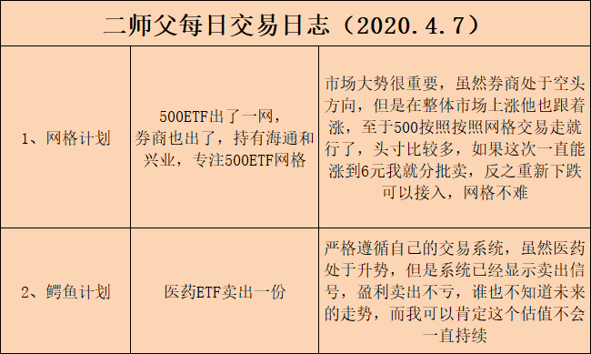

======================================================

_type: talk
@Nick.yang[118281888551882]
2020-04-08 08:11:27 Wed  
topic_id: 548144122185484

都没有小白跟我一样 很想完整的看到鳄鱼计划，乌龟计划，网格计划

@Nick.yang at 2020-04-08 08:11:27 Wed

> 你想知道可以在哪里看到完整的

----------

@二师父 at 2020-04-08 08:11:27 Wed

> 置顶第二篇文章有实盘说明

----------

阅读[4037]  评论[2]  赞[0] 

======================================================

_type: q&a
@光少[244124552511141]
2020-04-08 09:32:53 Wed  
topic_id: 841844855485822

@光少

>  二师父你好！今天新股打股申购也是顶格申购吗？一般能中签有多少股？

@二师父

>  顶格，新股中签很难，中了基本就赚了

阅读[4223]  评论[1]  赞[0] 

======================================================

_type: talk
@二师父[28814221155551]
2020-04-08 09:35:26 Wed  
topic_id: 118511522882282

上市可转债，行情震荡，盈利积少成多，我们都是从几块钱攒起来的，河海不择西流，故能成江河

@呵呵→_→ at 2020-04-08 09:35:26 Wed

> 师傅华宝开户链接在哪里找，找了半天没找到[擦汗]

----------

@二师父 at 2020-04-08 09:35:26 Wed

> 置顶第二篇文章

----------

@隔窗遥望 at 2020-04-08 09:35:26 Wed

> 师父，昨天我在集思录上怎么找不到龙净发债的信息，请指教

----------

@姣🍎 at 2020-04-08 09:35:26 Wed

> 我是华泰证券打新，点击新股里面有一个新股新债发行计划，就可以看到所有发行和上市时间。

----------

@shee at 2020-04-08 09:35:26 Wed

> 我咋从来没中过[流泪]

----------

@April _ M. at 2020-04-08 09:35:26 Wed

> 米兔

----------

@陈飞🤗 at 2020-04-08 09:35:26 Wed

> 我一个账户今年中了6签

----------

@章兵朋 at 2020-04-08 09:35:26 Wed

> 从去年12月开始打新债，到现在总共中了10支，每只中1签，有接近1500的收益[得意]

----------

阅读[4648]  评论[9]  赞[0] 

+++++++++++++++++++++++++++++++++++++++++++++++++++++

图片：
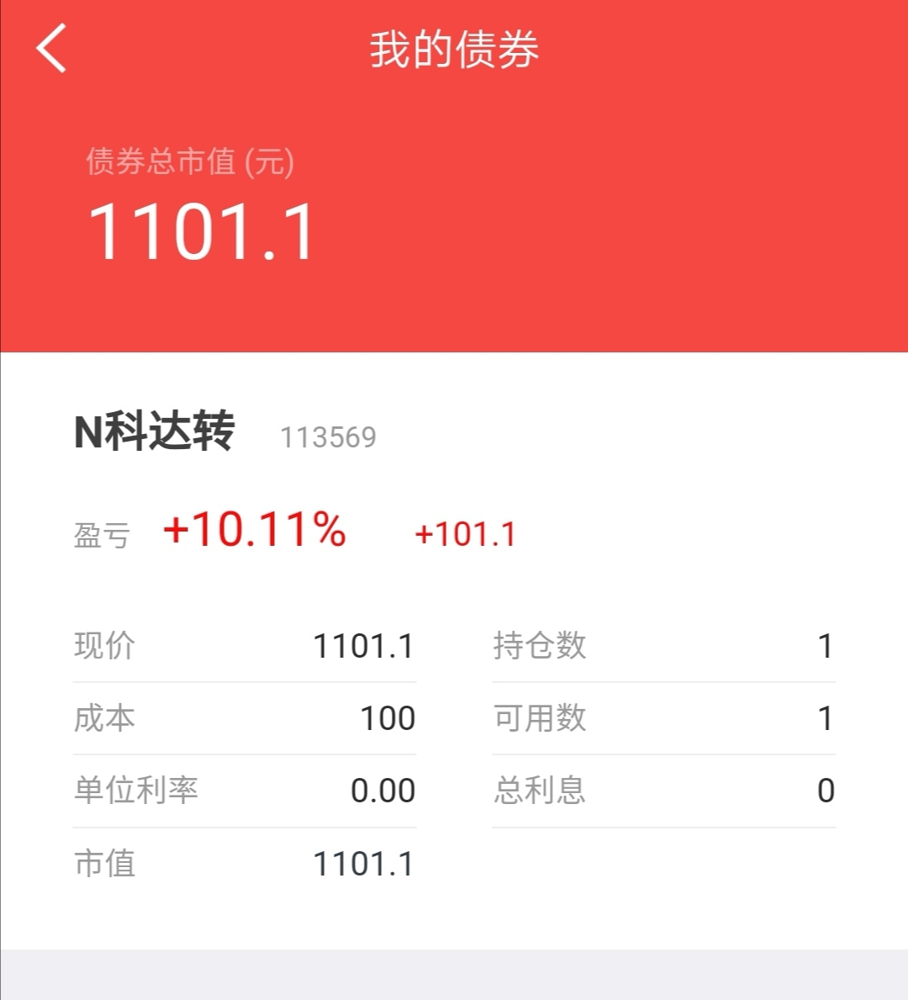

======================================================

_type: q&a
@田维海[422144441542418]
2020-04-08 11:59:43 Wed  
topic_id: 421822848514418

@田维海

>  二师傅，请问每个帐户最多能申购多少支可转债，每支可转债最多能申购多少金额？

@二师父

>  顶格申购，一般中签1到3签

阅读[4624]  评论[2]  赞[0] 

======================================================

_type: q&a
@田维海[422144441542418]
2020-04-08 19:49:22 Wed  
topic_id: 841844885145412

@田维海

>  二师傅，可转债打新有风险吗？会跌破发行价吗？在什么情况下破发？

@二师父

>  有破发风险的，破发可以当做债券持有

阅读[4256]  评论[1]  赞[0] 

======================================================

_type: q&a
@onepiecewi*[244414114545811]
2020-04-08 19:49:48 Wed  
topic_id: 241844851142541

@onepiecewi*

>  师父，50和500有什么区别呀？

@二师父

>  50是大盘蓝筹股指数，500是中盘股指数

阅读[4325]  评论[0]  赞[0] 

======================================================

_type: talk
@二师父[28814221155551]
2020-04-08 19:57:07 Wed  
topic_id: 548144114548424

<e type="hashtag" hid="881422852442" title="#定投实盘#" /> 定投是每周都投的，二师父说休息是鳄鱼计划这种配置休息，定期定投坚持扣款，指数好就投指数，可转债好就投可转债，债券好就投债券，都不太好的时候就积累现金。

@onepiecewi* at 2020-04-08 19:57:07 Wed

> 师父，那050025这支呢，要收割利润了吗

----------

@二师父 at 2020-04-08 19:57:07 Wed

> 有10个点可以

----------

@蓝魔森林 at 2020-04-08 19:57:07 Wed

> 沪深300最近不投，是因为什么呀

----------

@二师父 at 2020-04-08 19:57:07 Wed

> 可以增加一个，下期开始

----------

@蓝魔森林 at 2020-04-08 19:57:07 Wed

> OK 我也认同

----------

@蓝魔森林 at 2020-04-08 19:57:07 Wed

> 红利指数也算宽基指数吧，最近为何没有投了呢？

----------

@二师父 at 2020-04-08 19:57:07 Wed

> 也属于价值类指数，有一只就可以

----------

阅读[5321]  评论[7]  赞[0] 

+++++++++++++++++++++++++++++++++++++++++++++++++++++

图片：
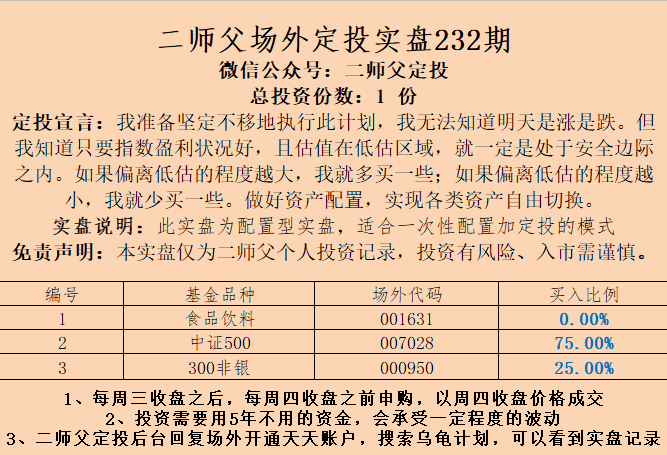
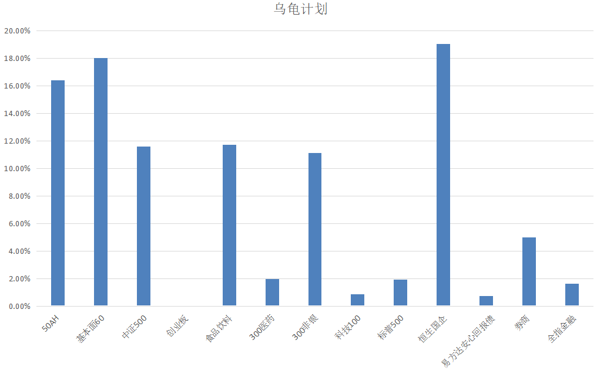

+++++++++++++++++++++++++++++++++++++++++++++++++++++

文件：
2020-04-08 19:55:57 Wed
文件大小：[278560]
15415148454252-二师父232期低估定投实盘.pdf

======================================================

_type: talk
@二师父[28814221155551]
2020-04-08 19:58:04 Wed  
topic_id: 548144114582214

<e type="hashtag" hid="825188852442" title="#估值表#" /> 星球估值表大家保存下，优质的指数在接近低估阈值的时候也可以轻仓定投的，并未违背安全边际的原则。

@银河系 at 2020-04-08 19:58:04 Wed

> 消费50，科技50，医药50这些二师父觉得怎么样？

----------

@二师父 at 2020-04-08 19:58:04 Wed

> 可以啊

----------

@denise at 2020-04-08 19:58:04 Wed

> 估值区间是什么含义

----------

阅读[5382]  评论[3]  赞[0] 

+++++++++++++++++++++++++++++++++++++++++++++++++++++

图片：
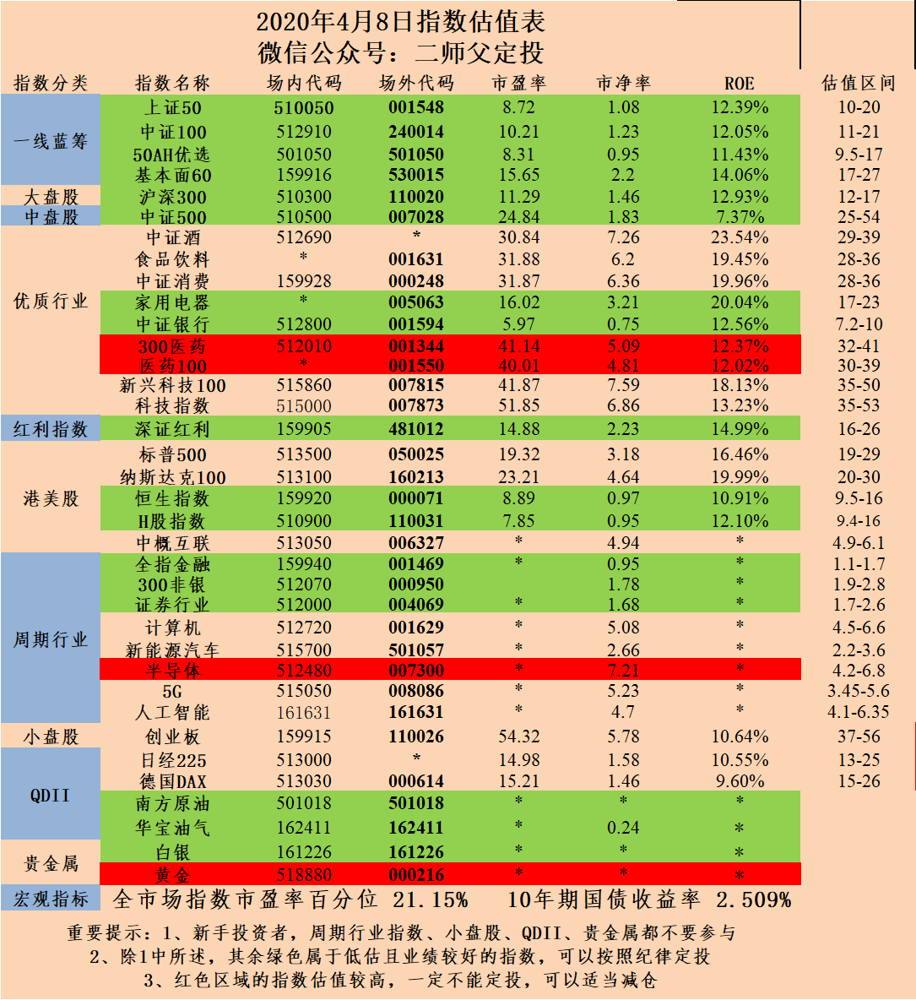

======================================================

_type: q&a
@老司基[111852221242122]
2020-04-08 21:14:39 Wed  
topic_id: 841844884122242

@老司基

>  基本面60和深红利投一个就行吧？

@二师父

>  是的

阅读[4646]  评论[0]  赞[0] 

======================================================

_type: q&a
@陈飞🤗[841521421222252]
2020-04-08 21:15:23 Wed  
topic_id: 241844881848811

@陈飞🤗

>  二师父，最近债券涨的厉害是什么原因你知道吗

@二师父

>  第一是国债收益率下行，第二是资产荒，大部分资产收益率降低，第三是股市低迷，避险情绪推动。

阅读[4801]  评论[2]  赞[0] 

======================================================

_type: talk
@秦风殇韵（刘豫斌）[241555548554841]
2020-04-08 21:44:21 Wed  
topic_id: 118511558824242

现在，我的消费指数已经涨幅超过10%，需要收割利润么？

@以古论今 at 2020-04-08 21:44:21 Wed

> 牛🐮

----------

@二师父 at 2020-04-08 21:44:21 Wed

> 仓位多就可以收

----------

阅读[4686]  评论[2]  赞[0] 

======================================================

_type: q&a
@闪闪的星光[88285424418582]
2020-04-09 08:05:29 Thu  
topic_id: 841844824558112

@闪闪的星光

>  二师父好，我定投了华夏上证50AH优选指数基金，这只基金非常稳定，一直不温不火都是低估，成长性不足，请问师傅定投蓝筹指数选择哪两只指数基金，定投的收益会高一些呢？

@二师父

>  蓝筹也看行情的，最近蓝筹股一直比较低迷，a股不同风格的指数会有轮动

阅读[4740]  评论[10]  赞[0] 

======================================================

_type: q&a
@🍀 凝🌸 慧🍀[841855248254242]
2020-04-09 10:38:51 Thu  
topic_id: 118511512241842

@🍀 凝🌸 慧🍀

>  二师父好，您认为中长期来看，市场是向下的，这主要基于哪些方面的数据信息啊？

@二师父

>  利率，汇率，通胀情况，美国非农，债务，实体经济等数据，大类资产价格，只是事实判断，不影响投资，做好不同经济环境的配置

阅读[4747]  评论[3]  赞[0] 

======================================================

_type: q&a
@蓝魔森林[28888244485121]
2020-04-09 13:24:05 Thu  
topic_id: 841844842115142

@蓝魔森林

>  二师傅，你好。这是我目前乌龟定投的持仓配置情况，持仓7成左右，请问下一步走什么方向比较好？我觉得宽基比例好像有点偏高。行业配置不足，最近行业基金里低估的不多，所以也谨慎投资，目前在投就是300非银行和白酒消费。

@二师父

>  行业太少，现在是医药行业趋势好，做趋势才预测板块和题材方向，定投是不需要追高的

阅读[4705]  评论[2]  赞[0] 

======================================================

_type: talk
@二师父[28814221155551]
2020-04-09 16:33:39 Thu  
topic_id: 421822818481148

最近赚的不错，再涨涨就收割利润，我是很无私的分享了自己的操作方法，按照这种操作就可以稳稳获利，我就是这么做的，你要觉得慢，可以自己去拿个几万买买股票，大概率就是辛苦几年钱越来越少，悟性高一点的钱可能先变少后慢慢变多，可是花费的精力比指数多多了，看投入产出比吧。

@onepiecewi* at 2020-04-09 16:33:39 Thu

> 谢谢师傅

----------

@蓝魔森林 at 2020-04-09 16:33:39 Thu

> 估值表看来，都是红色的高估。估计要等待机会不能定投了，是吗

----------

@二师父 at 2020-04-09 16:33:39 Thu

> 定投是不适合

----------

@是喵喵吖～ at 2020-04-09 16:33:39 Thu

> 师父你觉得医药后期还有件降下来买入的机会吗😂

----------

@二师父 at 2020-04-09 16:33:39 Thu

> 有啊

----------

阅读[5324]  评论[5]  赞[0] 

+++++++++++++++++++++++++++++++++++++++++++++++++++++

文件：
2020-04-09 16:31:43 Thu
文件大小：[99888]
51541481185484-医疗指数开始发力.pdf

======================================================

_type: talk
@二师父[28814221155551]
2020-04-09 17:09:49 Thu  
topic_id: 118511585514242

这个世界什么知识都可以教，唯独两件事需要靠自己感受。

一个是恋爱，另外一个是投资，无法向另外一个儿童解释恋爱的感觉，也无法像另外一个人描述投资过程中的情绪，只有真正经历。

@Hi·DD at 2020-04-09 17:09:49 Thu

> 正在放松一刻，看到弹出的前两句就很有兴趣[偷笑]哲学家

----------

@二师父 at 2020-04-09 17:09:49 Thu

> 我在别处看的，增加了一点

----------

@Hi·DD at 2020-04-09 17:09:49 Thu

> 👍

----------

@烟九•二手车 at 2020-04-09 17:09:49 Thu

> 优秀

----------

@cotton at 2020-04-09 17:09:49 Thu

> [呲牙][呲牙]

----------

阅读[4557]  评论[5]  赞[0] 

======================================================

_type: q&a
@denise[28212444521841]
2020-04-09 17:34:23 Thu  
topic_id: 841844818841412

@denise

>  请问师父，图中右侧估值区间是什么含义，有什么参考价值（判断依据）

@二师父

>  估值指标低于低估阈值属于低估区域，高于高估阈值属于高估区域。

阅读[4696]  评论[2]  赞[0] 

======================================================

_type: talk
@二师父[28814221155551]
2020-04-09 20:23:52 Thu  
topic_id: 548144185518114

<e type="hashtag" hid="824248148442" title="#股东大会资料#" /> <e type="web" href="https://buffett.cnbc.com/annual-meetings/" title="Annual+Meetings" cache="" />，这是巴菲特股东大会的视频，可以学习巴菲特和芒格的思想，有兴趣投资更进一步的可以多学习

阅读[4610]  评论[0]  赞[0] 

======================================================

_type: q&a
@helen[544884424181154]
2020-04-10 09:05:12 Fri  
topic_id: 118511124488482

@helen

>  二师父早，请问在哪里可以看AH溢价？

@二师父

>  集思录，东方财富

阅读[4454]  评论[0]  赞[0] 

======================================================

_type: q&a
@J[28281541518551]
2020-04-10 09:05:58 Fri  
topic_id: 118511128155542

@J

>  师父，你好，请教：一只roe20的指数基金是否代表着该基金每年可获得20%的盈利？

@二师父

>  不是，roe代表单位净资产的盈利能力

阅读[4527]  评论[1]  赞[0] 

======================================================

_type: q&a
@蛋炒饭不加蛋[118281818482542]
2020-04-10 09:53:32 Fri  
topic_id: 841844451441122

@蛋炒饭不加蛋

>  请问二师父标普500还在低估吗，要继续买吗

@二师父

>  这个指数已经没有低估了，非低估指数只能做趋势，不过做趋势止损比较痛苦，还是等低估定投

阅读[4667]  评论[8]  赞[0] 

======================================================

_type: talk
@hdmw99[28824141882541]
2020-04-10 11:09:13 Fri  
topic_id: 118511152111822

易方达恒生国企ETF被暂停申购了，看来不论原油还是油气，还是境外股票基金etf，只要涉及到用美元外汇交易的，以后都要慎重，会被无缘无故的改变游戏规则，禁止申购。

@陈飞🤗 at 2020-04-10 11:09:13 Fri

> 应该是复活节的

----------

@Chu at 2020-04-10 11:09:13 Fri

> 人家是复活节放假呀..

----------

@onepiecewi* at 2020-04-10 11:09:13 Fri

> 人家放假啊

----------

@速。冻 at 2020-04-10 11:09:13 Fri

> 人家放假，你想多了

----------

@栀子花开 at 2020-04-10 11:09:13 Fri

> 限购了吗没注意看哦

----------

@wty at 2020-04-10 11:09:13 Fri

> 是复活节假期，港股休市4天，下周二恢复交易！

----------

阅读[4454]  评论[6]  赞[0] 

======================================================

_type: talk
@二师父[28814221155551]
2020-04-10 19:56:33 Fri  
topic_id: 841844428554882

<e type="hashtag" hid="554545514844" title="#科技股暴跌#" /> 之前还有人嘲笑我只会低估定投，现在就有投资者被深套。其实我也做趋势的，不过会做止损。而我教给大家的只是低估定投，因为经过实践检验，只要控制好安全边际，控制好内心的恐惧情绪，浮亏不清仓，最后都会盈利，不比投资股票收益率低。

这其间最重要的就是认真，落实，不投机取巧，赚了以后仍旧坚守系统，不追求年化百分之30，就不会被骗，就不会把赚的利润吐回去。

@杜志彪 at 2020-04-10 19:56:33 Fri

> 耐心等低估，选择ETF比较好。

----------

阅读[5056]  评论[1]  赞[0] 

+++++++++++++++++++++++++++++++++++++++++++++++++++++

文件：
2020-04-10 19:51:45 Fri
文件大小：[111413]
15415825542142-科技股暴跌，消费继续发力.pdf

======================================================

_type: talk
@树叶[544811512145144]
2020-04-11 08:30:48 Sat  
topic_id: 421822225824518

<e type="hashtag" hid="142825811122" title="#定投周报#" /> 二师父定投周报第54期

阅读[4302]  评论[0]  赞[0] 

+++++++++++++++++++++++++++++++++++++++++++++++++++++

文件：
2020-04-11 08:30:38 Sat
文件大小：[633583]
88248152552452-二师父定投周报4.11（第54期）.pdf

======================================================

_type: q&a
@HM[111885154158212]
2020-04-11 11:34:27 Sat  
topic_id: 421822222814588

@HM

>  请问二师父，您可以分析一下前海开源中证大农业指数增强（001027）这只基金吗？

@二师父

>  持仓股票不错，重仓和消费类股票相关，收益率可以，规模较低，增强类基金表现也和基金经理的选股水平有关

阅读[4204]  评论[1]  赞[0] 

======================================================

_type: talk
@二师父[28814221155551]
2020-04-11 20:36:50 Sat  
topic_id: 841844414214582

<e type="hashtag" hid="452521512428" title="#创新药指数#" /> 医药细分赛道，创新药指数可以纳入基金池，目前高估，适合趋势投机或者等待低估定投，做趋势比较难，需要接受实际亏损，刚入门的投资者可以等待低估再进行定投。

@wty at 2020-04-11 20:36:50 Sat

> 二师父场内和场外的基金代码分享一下，保持关注！

----------

@二师父 at 2020-04-11 20:36:50 Sat

> 159992

----------

@杜志彪 at 2020-04-11 20:36:50 Sat

> 还是等低估再定投。

----------

@rtdmm小米 at 2020-04-11 20:36:50 Sat

> 等待低估

----------

@wty at 2020-04-11 20:36:50 Sat

> 收到，等待低估定投

----------

阅读[4898]  评论[5]  赞[0] 

+++++++++++++++++++++++++++++++++++++++++++++++++++++

文件：
2020-04-11 20:35:51 Sat
文件大小：[109848]
48528184558158-创新药指数投资价值分析.pdf

======================================================

_type: q&a
@孙平[48548211154218]
2020-04-11 21:06:51 Sat  
topic_id: 118511181215452

@孙平

>  二师父，请问000345鹏华丰融定开债，有没有投资价值？

@二师父

>  有投资价值的，在利率和通胀下行的时候定开债表现比较好

阅读[4140]  评论[0]  赞[0] 

======================================================

_type: q&a
@谢谢[844415851424452]
2020-04-11 22:51:56 Sat  
topic_id: 548144821111444

@谢谢

>  怎么续不了费，二维码识别不了

@二师父

>  加微信ershifudt续费

阅读[4210]  评论[1]  赞[0] 

======================================================

_type: q&a
@onepiecewi*[244414114545811]
2020-04-12 15:48:35 Sun  
topic_id: 841844188485142

@onepiecewi*

>  师父，地产基金还继续定投吗？

@二师父

>  地产是个较好的周期性行业，不过场外的基金都是分级基金，可以等基金公司募集了纯被动的指数基金再投资

阅读[4017]  评论[2]  赞[0] 

======================================================

_type: talk
@二师父[28814221155551]
2020-04-12 17:04:49 Sun  
topic_id: 241844181524221

<e type="hashtag" hid="455448284528" title="#银行业#" /> 社融数据出来了，看看银行业，下周很多宏观数据将公布，继续保持关注。

@特仑苏 at 2020-04-12 17:04:49 Sun

> 怎么看还是消费和医药靠谱。

----------

@秦风殇韵（刘豫斌） at 2020-04-12 17:04:49 Sun

> 转了部分到非银，还是套着不少，不过感觉站回3000点，怎么都应该是盈利的。

----------

阅读[5092]  评论[2]  赞[0] 

+++++++++++++++++++++++++++++++++++++++++++++++++++++

文件：
2020-04-12 17:04:27 Sun
文件大小：[20952]
51541818182514-3月金融数据超预期，银行业现在是否值得投资.docx

======================================================

_type: talk
@斌斌[841821552258252]
2020-04-12 21:44:09 Sun  
topic_id: 118511842812882

估值表在哪看了？

@二师父 at 2020-04-12 21:44:09 Sun

> 精华

----------

@斌斌 at 2020-04-12 21:44:09 Sun

> 好的，谢谢师父！

----------

阅读[4063]  评论[2]  赞[0] 

======================================================

_type: talk
@二师父[28814221155551]
2020-04-12 21:57:37 Sun  
topic_id: 421822158451218

<e type="hashtag" hid="825112122842" title="#读书#" /> 《<e type="web" href="https://wx.zsxq.com/mweb/views/weread/search.html?keyword=黑天鹅" title="黑天鹅" style="book" />》第一讲，正面黑天鹅和负面黑天鹅，如何区别对待。

阅读[5089]  评论[0]  赞[0] 

+++++++++++++++++++++++++++++++++++++++++++++++++++++

文件：
2020-04-12 21:57:09 Sun
文件大小：[17694]
51541852222284-黑天鹅第1讲.docx

======================================================

_type: q&a
@向前进[118554515482152]
2020-04-13 08:54:12 Mon  
topic_id: 548144842152144

@向前进

>  请教二师父，已经开了天天、华泰、广发，还能开华宝账户吗，谢谢

@二师父

>  如果开的是东方财富就不行了，如果开的是天天基金账户是可以的

阅读[4170]  评论[3]  赞[0] 

======================================================

_type: q&a
@范毅君[118551121224142]
2020-04-13 10:42:11 Mon  
topic_id: 548484855458544

@范毅君

>  二师父，5g最近一直跌，是啥逻辑？什么时候值得入呀

@二师父

>  热炒的主力资金撤场了，定投的话低估就可以

阅读[4110]  评论[0]  赞[0] 

======================================================

_type: q&a
@惟子[88481814485542]
2020-04-13 10:43:11 Mon  
topic_id: 118511812418842

@惟子

>  提问：二师父，截图是我现阶段持有的场外基金。请问，持有的这些基金是否存在重叠？需不需要再做精简？在定投的时候需要注意什么？烦请给些建议，谢谢！

@二师父

>  基金持仓没问题，建议做个仓位分析，类似标普、恒生国企、科技100波动大的控制下仓位。

阅读[4260]  评论[1]  赞[0] 

======================================================

_type: q&a
@田维海[422144441542418]
2020-04-13 13:48:07 Mon  
topic_id: 548484858154154

@田维海

>  二师傅，医药行业指数历史盈利不算很好，收益大多为估值提升，为什么是好指数呢？

@二师父

>  你在哪看的数据呢，医药的盈利增速还是很高的

阅读[4043]  评论[2]  赞[0] 

======================================================

_type: q&a
@J[28281541518551]
2020-04-13 13:48:30 Mon  
topic_id: 241414121845811

@J

>  师父你好，请问广发家用电器指数现在仍是低估吗？

@二师父

>  是低估的

阅读[4115]  评论[5]  赞[0] 

======================================================

_type: q&a
@背心[51441214442224]
2020-04-13 14:40:19 Mon  
topic_id: 841414145554152

@背心

>  二师傅，美股期货指数哪里可以看到谢谢

@二师父

>  东方财富或者万德同花顺都可以

阅读[4041]  评论[0]  赞[0] 

======================================================

_type: talk
@二师父[28814221155551]
2020-04-13 16:27:07 Mon  
topic_id: 548484845412154

<e type="hashtag" hid="452514542448" title="#格力电器#" /> 今天成交量进一步下降，筑底就是这段时间了，已经很低了，该跑的都已经跑了，剩下的就是股市长期投资者，控制安全边际，长期定投指数是最佳选择，选择趋势作股票也能做，就是太操心，不是职业选手就算了。

@志亮 at 2020-04-13 16:27:07 Mon

> 格力电器亏了我20 多个点，割肉又舍不得，现在回血了一坚，后面又不知道怎么处理，只好长线拿着[捂脸]

----------

@圣诞结® at 2020-04-13 16:27:07 Mon

> 二师父，科达转债上市后忘记卖了，这两天有点往下跌，是继续持有等待还是明天赶紧卖掉？后期还有上涨的可能么？

----------

@二师父 at 2020-04-13 16:27:07 Mon

> 有上涨的可能，也有下跌的可能

----------

@圣诞结® at 2020-04-13 16:27:07 Mon

> 知道了 谢谢 另外想问下 基金课程的最新版文字讲义是微课里面的那个PPT么？

----------

@二师父 at 2020-04-13 16:27:07 Mon

> 是的哈

----------

@蛋炒饭不加蛋 at 2020-04-13 16:27:07 Mon

> 二师父说的是广发家用电器指数吗

----------

@二师父 at 2020-04-13 16:27:07 Mon

> 这是基金不是指数

----------

@蛋炒饭不加蛋 at 2020-04-13 16:27:07 Mon

> 对，就是估值表里那个吗？

----------

阅读[4783]  评论[13]  赞[0] 

+++++++++++++++++++++++++++++++++++++++++++++++++++++

文件：
2020-04-13 16:25:15 Mon
文件大小：[168904]
48528128518818-格力电器逆势大涨，发生了什么.docx

======================================================

_type: talk
@以古论今[28214421582421]
2020-04-13 23:26:50 Mon  
topic_id: 118181881222282

这个是可转债打新吗？

@二师父 at 2020-04-13 23:26:50 Mon

> 是的

----------

@雨的依恋 at 2020-04-13 23:26:50 Mon

> 我中的也是这个

----------

阅读[3695]  评论[2]  赞[0] 

+++++++++++++++++++++++++++++++++++++++++++++++++++++

图片：

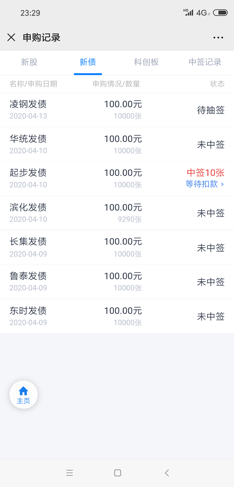

======================================================

_type: q&a
@陈飞🤗[841521421222252]
2020-04-14 10:11:57 Tue  
topic_id: 421211448828128

@陈飞🤗

>  二师父我昨天下午4点去华泰开的创业板权限，今天怎么还说我没开通，不能打新。

@二师父

>  需要时间处理的，分营业部要把音频等文件报给总部，过几天就可以用了

阅读[3871]  评论[5]  赞[0] 

======================================================

_type: q&a
@宁静以致远[841158451581452]
2020-04-14 14:40:25 Tue  
topic_id: 548488212585124

@宁静以致远

>  二师父，下图是我场内的指数基金。50AH和50ETF我是基本同时进的，但AH总是亏不着得多上不来。但H和恒生最近都上来一些。这是为什么？我蓝筹和大中盘都有，就小盘创业板一直高估就没进。

@二师父

>  港股H和恒生之前因为外围市场跌得多，建仓位置低，这段时间涨的多一些。
>  
>  50AH指数收益率按照理论是高于50的，不过这个基金追踪不好，他持有较大比例的现金，所以跌的幅度小点，涨的也慢点，如果对这种持仓不满的话，可以直接调仓，或者等待后期盈利首先收割利润。

阅读[3705]  评论[0]  赞[0] 

======================================================

_type: q&a
@onepiecewi*[244414114545811]
2020-04-14 14:56:47 Tue  
topic_id: 241411585442851

@onepiecewi*

>  师父，太阳能指数000591现在低估吗？

@二师父

>  我搜索的是中银健康生活基准指数，另外同代码是太阳能股票，这不是个指数

阅读[3668]  评论[0]  赞[0] 

======================================================

_type: talk
@二师父[28814221155551]
2020-04-14 16:33:20 Tue  
topic_id: 841411588455282

<e type="hashtag" hid="141482882282" title="#反弹#" /> 市场不好预测，不知道星球有没有追高科技被套的，切记不要逆势加这些平摊成本，大概率反弹不到追高的成本价位，因为那是密集套牢区，基本在成本价以下就回落了，所以差不多就可以反弹到一个高位出了就行，下次记得别追高。

@素兮 at 2020-04-14 16:33:20 Tue

> 科技略有盈利要全出么？

----------

@二师父 at 2020-04-14 16:33:20 Tue

> 不用啊，这么好的基金，可以慢慢收割利润，我说的是被套的

----------

@雪莲 at 2020-04-14 16:33:20 Tue

> 二师父，上证50ETF被套6%后面该咋操作好呢？

----------

@二师父 at 2020-04-14 16:33:20 Tue

> 拿着

----------

@雪莲 at 2020-04-14 16:33:20 Tue

> 好的，谢谢二师父！

----------

@onepiecewi* at 2020-04-14 16:33:20 Tue

> 我也是被套了，但是我觉得它是好的指数基金。

----------

@雪莲 at 2020-04-14 16:33:20 Tue

> 是啊，我也觉得它是好指数。

----------

阅读[4378]  评论[7]  赞[0] 

+++++++++++++++++++++++++++++++++++++++++++++++++++++

文件：
2020-04-14 16:31:52 Tue
文件大小：[21164]
48528115588258-北向资金净流入165亿，地量之后的拉升.docx

======================================================

_type: q&a
@陈洲[88245122222212]
2020-04-14 18:05:46 Tue  
topic_id: 548488214442124

@陈洲

>  50AH优选停售了，目前只能等吗

@二师父

>  周四可以的，复活节暂停了

阅读[3686]  评论[0]  赞[0] 

======================================================

_type: talk
@二师父[28814221155551]
2020-04-14 18:51:38 Tue  
topic_id: 548488218224144

<e type="hashtag" hid="824218524852" title="#遵循交易策略操作的不需要乱动#" /> 如果严格遵循五步定投法来进行操作，现在应该是高仓位，而且略有浮盈。这种时候就没必要想着追高，把仓位拉上来，而是等着继续跌，再加，要有这个耐心。紧接着，市场涨了，就可以持有或者出一部分。

关键在于等待，而不是去寻找，很多人问题在于追高，这就没办法了，股市是不允许犯错误的，一旦犯错，要么及时止损出场，要么想办法拯救。

最好的办法就是不犯错，严格遵循自己的投资方法。之前都是按照策略来的，继续按照策略来，不惧，不贪。不会有问题。

如果你是严格按照策略来操作的，不管浮盈浮亏，反正到了系统发出信号直接买入或者卖出就好，不到就不动，倘若做到了，亏钱的概率只有0.01%，很多人做不到，这就是从头到脚的距离，也是需要我们修炼的地方。

@onepiecewi* at 2020-04-14 18:51:38 Tue

> 之前就是股票追高被套。现在学习师父的思维。不贪不惧，静候时机。

----------

@陈飞🤗 at 2020-04-14 18:51:38 Tue

> 去年7月1号定投到现在还是亏的，每期都跟[尴尬][尴尬]

----------

@二师父 at 2020-04-14 18:51:38 Tue

> 对比下同期市场平均水平，另外鳄鱼计划择时收益会好一些，场外定投适合增量资金

----------

阅读[4309]  评论[3]  赞[0] 

======================================================

_type: q&a
@陈伟[88511115141112]
2020-04-14 19:17:20 Tue  
topic_id: 548488218285114

@陈伟

>  二师父，请问，300etf多少价格建仓合适？

@二师父

>  定投现在就可以，建底仓需要3.6元以下

阅读[3800]  评论[1]  赞[0] 

======================================================

_type: q&a
@葛亚丽[841858254128252]
2020-04-14 20:16:40 Tue  
topic_id: 841411581221122

@葛亚丽

>  二师父你好，我买的这个债券1万，显示资产是1820.30.是怎么回事啊？

@二师父

>  有可能是系统清算的原因，明天看看还没有正确反映及时联系天天基金的客服

阅读[3879]  评论[2]  赞[0] 

======================================================

_type: q&a
@闪闪的星光[88285424418582]
2020-04-14 20:18:34 Tue  
topic_id: 548488218522884

@闪闪的星光

>  二师父好，且慢显示TMT50指数目前市盈率是41.42，市盈率的百分位是50.24%，估值处于适中位置。
>  
>  请问这只指数值得定投吗？
>  这只指数的指数基金现在可以开始定投吗？
>  
>  谢谢

@二师父

>  这个指数不如计算机，科技等指数。定投也是可以的，不过在这种市盈率百分位如此高的情况下投资安全边际不足，需要控制仓位，保证发生极端回撤对整个组合的回撤影响较小。
>  
>  单一的去重仓赌方向肯定不合适，控制合理的头寸问题都不大。

阅读[3947]  评论[0]  赞[0] 

======================================================

_type: talk
@二师父[28814221155551]
2020-04-14 20:42:47 Tue  
topic_id: 421211481128888

<e type="hashtag" hid="824218545142" title="#格力业绩快报#" /> 这是格力2019年的业绩快报，年报也快出来了，业绩增速远低于预期，情况不容乐观，投资了格力的朋友需要注意了。

这就是投资个股的不确定性，很多东西都是滞后反应的。指数比较好，虽然我自己有买股票，不过仓位不会超过总投资资金的10%，即使遇到大跌对账户整体影响不大，而指数的好处就是不用太操心，工作忙的时候一个月不看账户都没问题，而投资股票就不敢了。

@苍天有井明月空🌙 at 2020-04-14 20:42:47 Tue

> 沙发

----------

@素兮 at 2020-04-14 20:42:47 Tue

> 如何看业绩增速？是看利润增减变动幅度么？

----------

@二师父 at 2020-04-14 20:42:47 Tue

> 营收，利润，每股收益

----------

阅读[4659]  评论[3]  赞[0] 

+++++++++++++++++++++++++++++++++++++++++++++++++++++

图片：
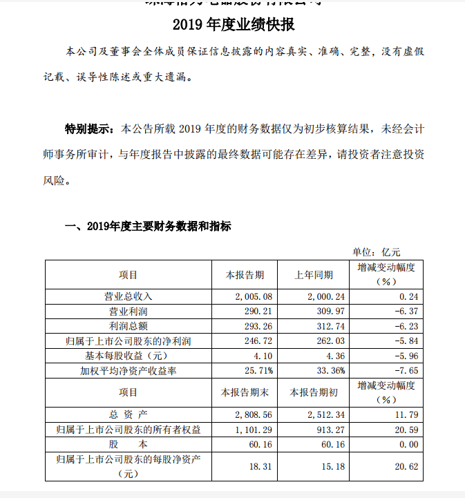

======================================================

_type: q&a
@J[28281541518551]
2020-04-15 07:58:53 Wed  
topic_id: 841411521814252

@J

>  师父你好，看估值表，新兴科技100roe更高，估值也更低，投资价值比科技etf好一些。现在持有的科技etf略有盈利，此时卖掉，等再跌回2800以下换为科技100可以吗？

@二师父

>  历史收益率龙头科技好一些，两者侧重点不同，买基金不要跟着大盘，优质的基金大盘不涨他也能涨

阅读[3903]  评论[7]  赞[0] 

======================================================

_type: talk
@二师父[28814221155551]
2020-04-15 09:23:29 Wed  
topic_id: 118188214214882

<e type="hashtag" hid="824218818182" title="#关于混合基金#" /> 不知有没有投资者买，单日下跌百分之30，比股票更多，官方解释是巨额赎回导致规模下降，但计提成本导致净值下降

二师父觉得实际情况是这样，但不要忘了，为什么会巨额赎回，亏损谁来买单，我只能说到这了

主推纯被动的指数基金和股票，亏了赚了都明明白白，类似这种主动基金，亏了都不知道是自己投资失误还是被别人耍了

还是一如既往的观点，要么指数，要么股票，要么不投，主动基金有的收益确实不错，不过雷一个那就非常惨

@样 at 2020-04-15 09:23:29 Wed

> 这是自缢了呀，不碰主动基金，不想更不敢

----------

@特仑苏 at 2020-04-15 09:23:29 Wed

> 这个基金持仓机构100%出现这种情况比较正常吧。

----------

阅读[4476]  评论[2]  赞[0] 

+++++++++++++++++++++++++++++++++++++++++++++++++++++

图片：
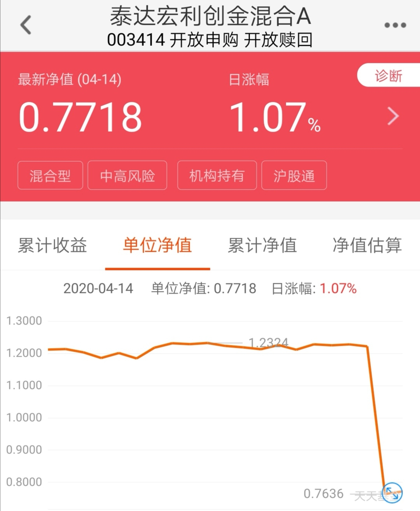

======================================================

_type: talk
@二师父[28814221155551]
2020-04-15 09:40:12 Wed  
topic_id: 421211425822158

<e type="hashtag" hid="881251425252" title="#鳄鱼计划#" /> 卖出消费一份，反趋势操作就是这样，价格合适买，盈利卖，仅为个人操作，非投资建议和指导，如果不认同请忽略，别抬杠，谢谢

@陈飞🤗 at 2020-04-15 09:40:12 Wed

> 卖酒也是一样的吧

----------

@二师父 at 2020-04-15 09:40:12 Wed

> 一样的，他俩同类型指数

----------

@wty at 2020-04-15 09:40:12 Wed

> 我及时跟进二师父出了一份酒，开心😃

----------

@🍀 凝🌸 慧🍀 at 2020-04-15 09:40:12 Wed

> 我也卖酒去[偷笑]

----------

@onepiecewi* at 2020-04-15 09:40:12 Wed

> 我也卖了~

----------

阅读[4688]  评论[5]  赞[0] 

+++++++++++++++++++++++++++++++++++++++++++++++++++++

图片：
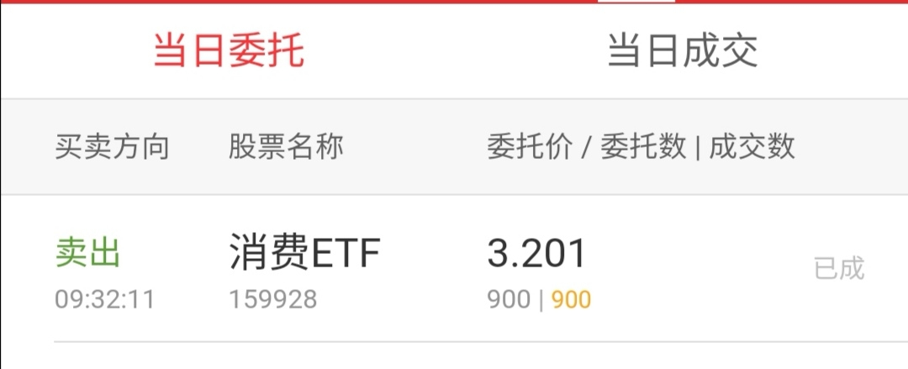

======================================================

_type: q&a
@太阳照常升起[421484421415448]
2020-04-15 10:24:03 Wed  
topic_id: 548488245522814

@太阳照常升起

>  二师父好，关于天天基金的成本单价计算方式我有些困惑。app说“如果赎回的净值大于当前成本单价，赎回确认后成本单价会下降”。
>  照理说成本单价应该只与“”买入的价格和份数“”有关，天天基金的计算方式是不是有问题？如果这种计算方式有问题，应该如何正确计算成本单价？
>  谢谢！

@二师父

>  他的计算模式的问题，他是用的总市值减去赎回市值，然后除以当前的持仓数目，这样的话成本单价就下降了。
>  
>  正确的方法是直接用买入均价的方法，比如买入平均价格是5，卖出以后还是5，并不会因为赎回而改变，这是需要注意的。

阅读[4132]  评论[3]  赞[0] 

======================================================

_type: talk
@二师父[28814221155551]
2020-04-15 10:27:05 Wed  
topic_id: 548488245824814

2019年的个人所得税可以申请退了，大家去个人所得税申请，可以额外多一些投资资金了

@蔡寅宵 at 2020-04-15 10:27:05 Wed

> 二师父，麻烦问一下怎么办理退税手续？

----------

@二师父 at 2020-04-15 10:27:05 Wed

> 去个人所得税APP

----------

@门萨🐨 at 2020-04-15 10:27:05 Wed

> 退了1200

----------

@shee at 2020-04-15 10:27:05 Wed

> 综合所得年度汇算，网上有操作指南

----------

@shee at 2020-04-15 10:27:05 Wed

> 我的审了一周，还在审核中

----------

@onepiecewi* at 2020-04-15 10:27:05 Wed

> 我也是

----------

@Sunflower at 2020-04-15 10:27:05 Wed

> 有补税的吗[捂脸]

----------

@清水倾城 at 2020-04-15 10:27:05 Wed

> 你们都有除工资外的额外收入吗？为什么我是0呢

----------

阅读[4086]  评论[8]  赞[0] 

======================================================

_type: q&a
@九天[548228524258514]
2020-04-15 14:26:13 Wed  
topic_id: 241411544214521

@九天

>  请问哪里可以下载历史PEPB数据？

@二师父

>  Wind金融终端

阅读[3885]  评论[0]  赞[0] 

======================================================

_type: q&a
@庆余年[15584481824122]
2020-04-15 14:29:47 Wed  
topic_id: 548488244511124

@庆余年

>  二师父您好，最近有一笔存量资金。把原先的8.5层仓变成了6.5层仓。原先的仓位配置都是按照您的方针分配的，很均衡。现在这笔存量资金还是以定投的方式分配份额麽，还是其他的方法？

@二师父

>  6.5成仓位也不轻，满仓有纯基金满仓，也有债券和基金同时配置满仓，目前长债基金不适合，如果这个位置定投风险小一些，如果继续暴跌那么可以一次性配置，短期支撑位全市场指数在3900左右，这个位置可以一次性配置到自己舒适的仓位

阅读[4015]  评论[0]  赞[0] 

======================================================

_type: q&a
@JOY[111881481812422]
2020-04-15 15:34:12 Wed  
topic_id: 118188285514452

@JOY

>  师父，麻烦您问下，消费EFT、500EFT 和 恒生EFT，要是建立底仓，近期在什么价位合适？
>  看您之前发的鳄鱼的表格，像恒生，在那个价位下面很久了，是否考虑调低呢？

@二师父

>  底仓价格调低没有问题，越低越安全，那是网格交易表格，不是鳄鱼计划表格，鳄鱼计划没有固定价格
>  
>  建立底仓需要满足价格够低，升势确立，还有底仓仓位需要控制好，你的问题比较模糊，1成底仓和5成底仓区别就很大。
>  
>  最近半个月鳄鱼计划都没有买入，全部是卖出，上一次买入500etf的价格大约在5.36，类似500etf价格在5.5以下建立总投资资金的百分之10仓位没有问题，历史上500etf最低价大概在5.35左右
>  
>  至于消费，近期估计没机会了，如果回调价格在2.8大概可以建立总投资资金的百分之5仓位
>  
>  记得底仓和价格关系不大，要保证升势确立

阅读[4057]  评论[4]  赞[0] 

======================================================

_type: talk
@二师父[28814221155551]
2020-04-15 19:10:06 Wed  
topic_id: 118188281255112

<e type="hashtag" hid="824514224452" title="#指数估值表#" /> 半导体终于由高估进入正常估值了，绿色低估的可以定投，红色高估需要卖出。对于不在安全边际内的指数，如果看好可以做趋势，切记不要逆势定投高估指数。

比如之前追高买半导体，现在还亏十几个点，就不能逆势定投，这一点一定注意，很多时候不遵守规则也能误打误撞赚到钱，而这些只不过是市场借给你的，最终还会拿回去。

@shi at 2020-04-15 19:10:06 Wed

> 医药可以逐渐卖了吗？

----------

@二师父 at 2020-04-15 19:10:06 Wed

> 可以分步卖

----------

阅读[4620]  评论[2]  赞[0] 

+++++++++++++++++++++++++++++++++++++++++++++++++++++

图片：
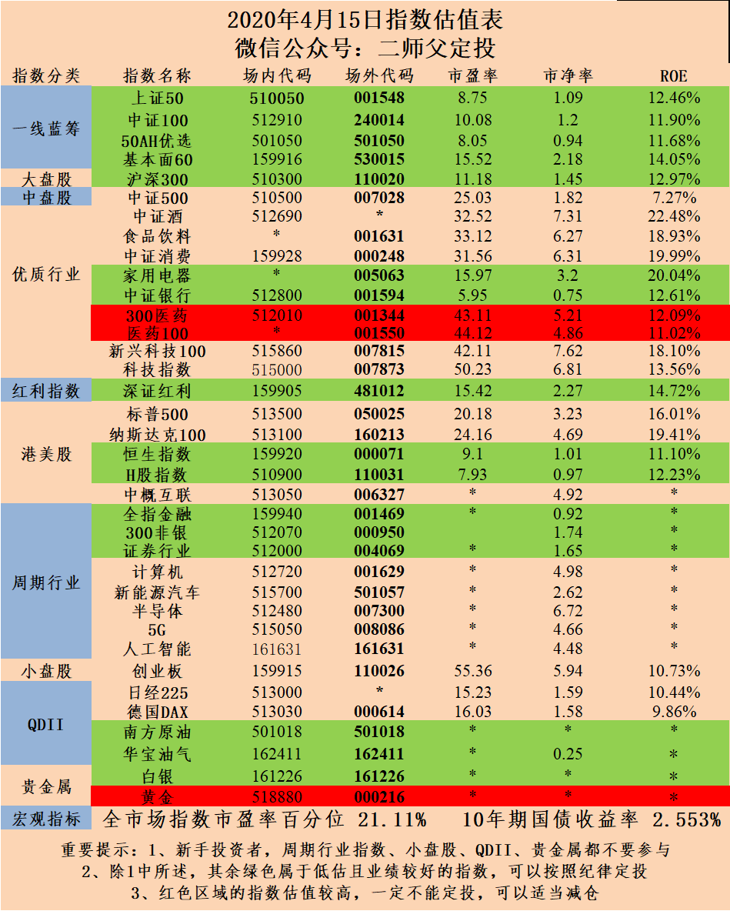

======================================================

_type: talk
@二师父[28814221155551]
2020-04-15 19:13:36 Wed  
topic_id: 841411514584222

<e type="hashtag" hid="452518284128" title="#定投实盘233#" />

@陈飞🤗 at 2020-04-15 19:13:36 Wed

> 二师父，我们定投的数量是不是太多了，今天又加了沪深300

----------

@陈飞🤗 at 2020-04-15 19:13:36 Wed

> 我算了下，不算债券，有9个了

----------

@陈飞🤗 at 2020-04-15 19:13:36 Wed

> 中证500不是正常估值了吗？

----------

@二师父 at 2020-04-15 19:13:36 Wed

> 后期券商、地产、50AH、基本面60盈利了会逐步收割减仓，不再定投，加入沪深300就是为了下一次进一步精简，替代50AH和基本面60的，越简单越有效，在估值中枢以下定投还是安全的哈，只要不是高估或者正常偏高问题不大。

----------

@陈飞🤗 at 2020-04-15 19:13:36 Wed

> 那之前为什么不直接投300和500

----------

@二师父 at 2020-04-15 19:13:36 Wed

> 之前想通过50AH和基本面60实现一个沪市和深市的轮动效应，这三个也可以一起定投，并没有问题，投资不是一成不变的，现在我就想把乌龟计划越做越简单，更多的精力用于研究鳄鱼计划和升级自己的投资系统。

----------

@陈飞🤗 at 2020-04-15 19:13:36 Wed

> 非常感谢答疑

----------

@老司基 at 2020-04-15 19:13:36 Wed

> 那么多低估，为何投正常估值的500？

----------

阅读[4428]  评论[15]  赞[0] 

+++++++++++++++++++++++++++++++++++++++++++++++++++++

文件：
2020-04-15 19:13:13 Wed
文件大小：[142872]
28242851254181-二师父233期低估定投实盘.docx

======================================================

_type: talk
@二师父[28814221155551]
2020-04-15 19:32:27 Wed  
topic_id: 241411514548411

<e type="hashtag" hid="141485155442" title="#关于定投策略的说明#" /> 很多同学都在问为什么有的指数没有在低估阈值以下也可以定投。详细说下，为什么用低估定投，这是符合安全边际，保证指数下跌空间有限，但不代表所有的指数都能跌到最低点，有的回调一段时间就又涨起来了。

还记得我们定投的食品饮料指数吗，这个是在正常偏低估值定投的，不过食品饮料并未低估，为什么可以呢？因为估值正常偏低可以控制安全边际，其次我们不是一次购买，而是分批定投，这样能够保证不会全部买在半山腰。最后，仓位也有控制，即使发生了意外食品饮料大跌，整个组合的回撤可控。之前场内定投消费和白酒就是这样。整个思路要是清晰的。

最后还说一点，逆势投资和趋势投资是不同的，高估的指数一定是不能定投的，但是高估的指数可以做趋势，这就是之前讲的空中楼阁理论，只要设置止损点就没有问题，有安全保障。

大家投资一笔资金的时候要考虑极端意外情况，比如说万一这个品种大跌了，我是给抛了还是继续持有加仓，如果在买入之前这个问题很清楚，那么你得投资就会越来越好的。

阅读[4873]  评论[0]  赞[0] 

======================================================

_type: q&a
@徐美芳[51112822252224]
2020-04-15 19:47:28 Wed  
topic_id: 241411514541211

@徐美芳

>  二师傅，之前我主要在场外定投的，但定投数额大的话是否在场内定投更划算？比如40—50万，定投沪深300.中证500，再加些优质行业和红利？谢谢！

@二师父

>  是的哈，我给你算笔账，沪深300场外申购费率是0.12%,意味着你购买10万，需要120元的手续费，而你通过我的渠道开户，费率是万一，那么只需要10元的手续费，差别还是很大的。
>  
>  还不说场外2年以内卖出，都会收取0.5%和0.25%的费率，一般投资者在2年内会有卖出。
>  
>  假设2年内不卖，场外赎回费是0，场内仍旧是万一，也还是场外的费用高。
>  
>  如果持有5年以上，投资40万不动，也就多出400元手续费，其实不多，如果资金大，又会做波段还是场内好。当然有的人不适合场内的即时成交模式。看自己是否适合。

阅读[4287]  评论[6]  赞[0] 

======================================================

_type: talk
@二师父[28814221155551]
2020-04-16 10:12:55 Thu  
topic_id: 241411288285451

<e type="hashtag" hid="452518151558" title="#定投和配置#" /> 很多同学并未区分好定投和配置的关系。两者并不矛盾。

家庭资产配置有房产，有股票，有银行理财产品，有基金，还有保险。二师父这里讲的配置是指数基金的配置。

配置可以一次性完成，也可以定投完成。各有利弊。

比如你在2019年1月一次投资优质股票和估值表的优质基金，完成配置，这样的效果会好于你定投配置的。

回过头来看2019年1月是最佳配置时机，但事前不知道啊，你也不可能就拿着百万现金等2019年的最低点，所以定投+配置把主仓位建立起来比较好。

有了主仓位就不会追高，大多数人被套不是基金不好，而是追高。所以要建立一个及时大涨也不会追高的仓位。

有了主仓位，接下来就好办了，比如你投资100万，有了80万仓位，另外20万可以买点债券，或者做做网格，这样的话不管什么行情都能轻松应对。

反之，一味地定投，只知道买，没有小额卖出，体会不到投资的成就感，非常枯燥的，尤其是自己辛苦定投两年，没有收割，最后利润回吐，还亏损，这对人的打击很大。

如果从16年开始定投，不懂得收割利润的话，那么坐上了18年的过山车以后，遭遇18年暴跌最终会从盈利30%变成浮亏20%，这就是定投+配置的意义，跟着市场去走，你会发现A股很有意思，问题关键在于坚定的执行，不能说行情低迷人就消失了，行情好再回来追，这样的话总是接盘侠。

阅读[4682]  评论[0]  赞[0] 

======================================================

_type: q&a
@志亮[422125851552828]
2020-04-16 16:00:05 Thu  
topic_id: 118188442411542

@志亮

>  二师父，我中签“朝阳科技”了，我对这只股一点都不熟悉，请问上市后什么时候卖出合适？

@二师父

>  上市首日卖出合适，新股别持有，记得第一天盈利到达自己预期就卖了，别持有过夜

阅读[3535]  评论[3]  赞[0] 

======================================================

_type: talk
@二师父[28814221155551]
2020-04-16 16:40:34 Thu  
topic_id: 241411225142541

<e type="hashtag" hid="452512228258" title="#三种定投方法#" /> 重点学习第三种配置方法，这才是家庭正途。两市成交额5900亿，慢慢起来了，偶尔打打猎，不重仓追加了。两市成交额4000亿的时候就是满仓抄底的时候，不一定等得到，不过我也不喜欢满仓，做人需要给他人留情面，给自己留余地，股市就需要给自己留后路，别孤身一人梭哈全部资本上梁山，那样太无奈了。

@🍀 凝🌸 慧🍀 at 2020-04-16 16:40:34 Thu

> 谢谢师父的总结， 太实用！[玫瑰][玫瑰][玫瑰][爱心]

----------

@HeLLO at 2020-04-16 16:40:34 Thu

> 师父，初级定投中，全市场指数市盈率百分位25%，这个看万得全A指数市盈率？目前看是17.还很低估？

----------

@二师父 at 2020-04-16 16:40:34 Thu

> 正常偏低，不是极度低估

----------

@HeLLO at 2020-04-16 16:40:34 Thu

> 谢谢师父

----------

阅读[4410]  评论[4]  赞[0] 

+++++++++++++++++++++++++++++++++++++++++++++++++++++

文件：
2020-04-16 16:37:51 Thu
文件大小：[17839]
48525882284558-掌握这三种定投方法，打遍市场无敌手.docx

======================================================

_type: talk
@二师父[28814221155551]
2020-04-16 16:44:44 Thu  
topic_id: 841411228588482

<e type="hashtag" hid="454218222518" title="#债券基金#" /> 这是追踪的一只国债ETF，安全性，收益率，费率综合看性价比最高，大家有好的品种可以推荐，如果资金量在10万以下买国债也可以，很安全，国债ETF那是高度安全。目前不适合配置，一般利率高位，经济下行适合配置这种，每个品种都有周期

@萧竹 at 2020-04-16 16:44:44 Thu

> 正常是十年期国债收益率在3.5%以上开始配置吗？

----------

@二师父 at 2020-04-16 16:44:44 Thu

> 可以

----------

阅读[3789]  评论[2]  赞[0] 

+++++++++++++++++++++++++++++++++++++++++++++++++++++

图片：
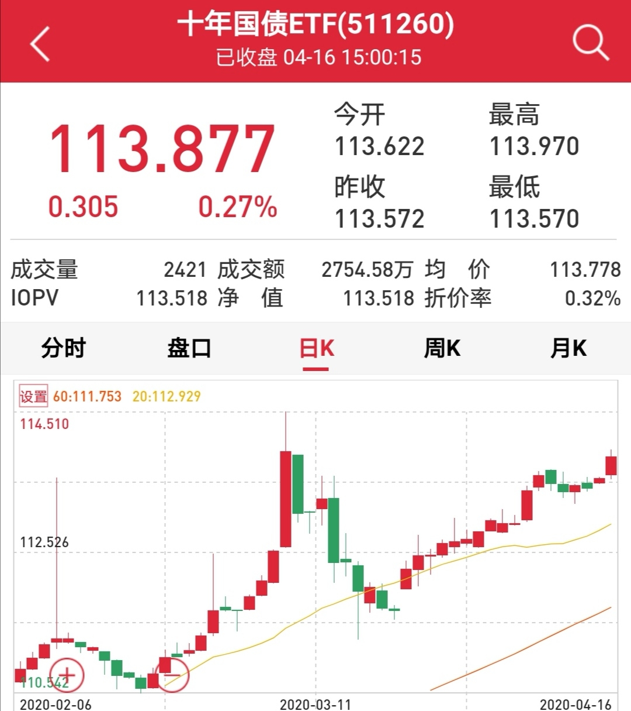

======================================================

_type: q&a
@黎雄[841555255485222]
2020-04-16 21:09:01 Thu  
topic_id: 241411224422441

@黎雄

>  师傅这两只基金小康指数510160和印度164824有空帮我分析一下，谢谢

@二师父

>  很一般，第二只基金规模还只有1.5，既不是热点，也没有足够的成长性，不知道你的逻辑是什么

阅读[3648]  评论[0]  赞[0] 

======================================================

_type: q&a
@章兵朋[118251425848882]
2020-04-17 06:28:25 Fri  
topic_id: 421211522881148

@章兵朋

>  二师父，最近稀土行情在涨，有个包头稀土交易所。我们可以去开户吗？

@二师父

>  没用过这个，不了解的最好别碰，有炒纸原油的都亏了百分之50

阅读[3527]  评论[1]  赞[0] 

======================================================

_type: talk
@二师父[28814221155551]
2020-04-17 09:48:42 Fri  
topic_id: 841411218451442

<e type="hashtag" hid="825412412212" title="#可转债打新#" /> 转债可以盲打，中石油都开始涨了，医药却落后，被炒作的总会慢慢下来，今年结构性行情，目前又开始怼科技和券商了，赚钱的都是先知先觉，后知后觉吃了还不走的就都是买单的

@蛋炒饭不加蛋 at 2020-04-17 09:48:42 Fri

> 请问二师父可转债一般能中多少

----------

@二师父 at 2020-04-17 09:48:42 Fri

> 最多3签

----------

@清水倾城 at 2020-04-17 09:48:42 Fri

> 意思是可以开始买被怼的了不？

----------

@二师父 at 2020-04-17 09:48:42 Fri

> 我没说呀，目前不算追高，其实换成逆向思维更轻松

----------

@onepiecewi* at 2020-04-17 09:48:42 Fri

> 可以打1000手这么多的吗

----------

@二师父 at 2020-04-17 09:48:42 Fri

> 可以

----------

@onepiecewi* at 2020-04-17 09:48:42 Fri

> 打完我没这么多钱买怎么办？

----------

@二师父 at 2020-04-17 09:48:42 Fri

> 最多3签

----------

阅读[3500]  评论[17]  赞[0] 

+++++++++++++++++++++++++++++++++++++++++++++++++++++

图片：

======================================================

_type: q&a
@李垚垚[548145221582444]
2020-04-17 13:55:02 Fri  
topic_id: 841411214225212

@李垚垚

>  老师提供二个科技板的指数供选择好么，谢谢您!

@二师父

>  科技etf，科技100，人工智能，半导体

阅读[3194]  评论[0]  赞[0] 

======================================================

_type: talk
@自由飞翔[544442815144244]
2020-04-17 14:56:17 Fri  
topic_id: 548488588212524

<e type="hashtag" hid="281158522841" title="#每日打卡#" /> 每天进星球学习是一种习惯，前后维持了一年零四个月，收获颇多！上月底因为资金另有安排已全部撤出！很高兴在网络认识师父，认识各位球友，后续我仍会在星球持续关注与学习，感谢🙏

@🍀 凝🌸 慧🍀 at 2020-04-17 14:56:17 Fri

> 学习不断 ，收获不止！共同进步！[玫瑰][玫瑰][玫瑰]

----------

@April _ M. at 2020-04-17 14:56:17 Fri

> 我也是 每天都会进来看看所有的更新

----------

@章兵朋 at 2020-04-17 14:56:17 Fri

> 相互交流，相互学习

----------

阅读[3124]  评论[3]  赞[0] 

======================================================

_type: q&a
@涓涓[111815125145522]
2020-04-17 17:42:02 Fri  
topic_id: 421211248148858

@涓涓

>  请问二师父：我用您给的链接申请了华宝开户，想学习做网格交易，不知道哪里设置不对，单子提交不成功，还请二师父指导一下

@二师父

>  设置没有问题，系统报错显示的是什么？

阅读[3354]  评论[2]  赞[0] 

======================================================

_type: talk
@二师父[28814221155551]
2020-04-17 18:51:13 Fri  
topic_id: 841411452815122

<e type="hashtag" hid="141488544882" title="#成交量#" /> 今天成交量起来了，不过投资者情绪还是很低迷。按照自己的操作系统严格操作。少动多看，每次操作保证有95%的胜率。

阅读[3875]  评论[0]  赞[0] 

+++++++++++++++++++++++++++++++++++++++++++++++++++++

文件：
2020-04-17 18:49:09 Fri
文件大小：[19099]
28242824128451-成交量又起来了.docx

======================================================

_type: talk
@二师父[28814221155551]
2020-04-17 19:00:01 Fri  
topic_id: 548488425188484

<e type="hashtag" hid="824211824582" title="#北上资金#" /> 这是北上资金流向，关注下机构的动向，每次北向资金动的时候都会有一波行情，北上资金出走的时候会有一定的跌幅。

东财上都有免费数据，choice数据需要购买，如果不是职业投资者，不建议每年花费超过5000元购买数据，成本还是挺高的，不值得。最近买了个彭博商业数据，就比较糟糕。

很多网站东财、中证指数官网，国证指数官网，理杏仁的都够用，比较便宜。

@西锦巴乌 at 2020-04-17 19:00:01 Fri

> 师父好！沪深全指市盈率百分位在哪里能查到？谢谢

----------

@二师父 at 2020-04-17 19:00:01 Fri

> 估值表最后一栏有

----------

@西锦巴乌 at 2020-04-17 19:00:01 Fri

> 这我知道，我是想问在那个网站能随时看到

----------

@二师父 at 2020-04-17 19:00:01 Fri

> 没有的

----------

@西锦巴乌 at 2020-04-17 19:00:01 Fri

> 是师父自己计算的？

----------

@二师父 at 2020-04-17 19:00:01 Fri

> 对

----------

@栀子花开 at 2020-04-17 19:00:01 Fri

> 二师傅，请问追踪创业板50的指数怎么样，能否列举一两个比较好的

----------

@二师父 at 2020-04-17 19:00:01 Fri

> 还可以，直接投资创业板就行

----------

阅读[4138]  评论[8]  赞[0] 

+++++++++++++++++++++++++++++++++++++++++++++++++++++

图片：
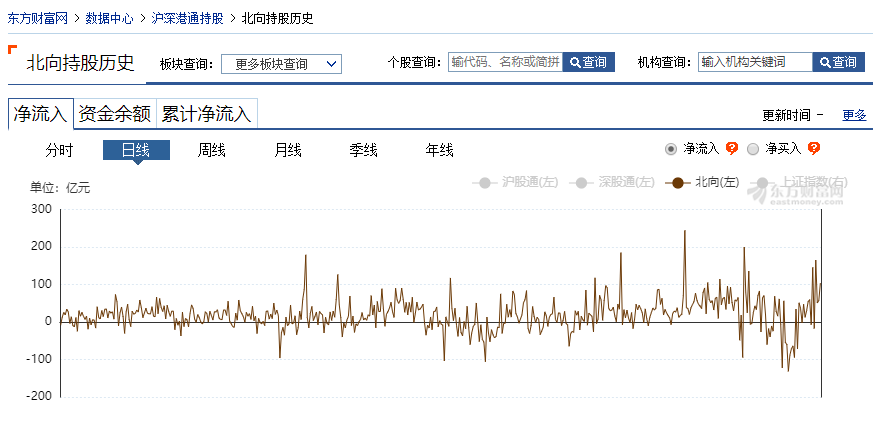

======================================================

_type: talk
@二师父[28814221155551]
2020-04-17 19:11:35 Fri  
topic_id: 241411452254111

<e type="hashtag" hid="224211824851" title="#纸原油的坑#" />工行纸原油换仓，因为35%左右的升水损耗，导致很多客户投资的油桶缩水了27%。这个纸原油，从482桶油变成了354桶，损耗很大。这意味着如果长期投资下去的话，等到这个远期合约到期了，你会亏27%，如果到时候油价涨了30%，盈利3%。

原油就是个投机品，之前文章中写过了不要投，至于期货就更别玩了，普通投资者最多指数+股票+债券，亏了还知道为什么亏，有的品种直接就是圈钱的，控制自己的欲望。

@子辰 at 2020-04-17 19:11:35 Fri

> 会计的诡计？

----------

阅读[3607]  评论[1]  赞[0] 

+++++++++++++++++++++++++++++++++++++++++++++++++++++

图片：
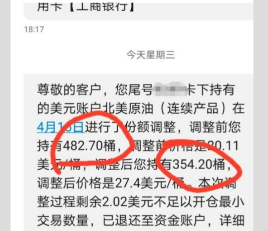

======================================================

_type: q&a
@Zero Fei[51422225155524]
2020-04-17 23:52:56 Fri  
topic_id: 241411488485841

@Zero Fei

>  二师父，全球债券可以定投持有么，在配置债基的时候打算搭配点全球债基，谢谢

@二师父

>  有风险，配置的话还是等美元兑人民币汇率降下来，美国10年期国债收益率起来了再配置，目前合适的只有超短债了，或者国债逆回购

阅读[3467]  评论[7]  赞[0] 

======================================================

_type: talk
@树叶[544811512145144]
2020-04-18 07:34:53 Sat  
topic_id: 118188158524122

<e type="hashtag" hid="142825811122" title="#定投周报#" /> 二师父定投周报第55期

阅读[3441]  评论[0]  赞[0] 

+++++++++++++++++++++++++++++++++++++++++++++++++++++

文件：
2020-04-18 07:34:51 Sat
文件大小：[249247]
28242821242221-二师父定投周报4.18（第55期）.docx

======================================================

_type: q&a
@是喵喵吖～[421441114141158]
2020-04-18 10:36:19 Sat  
topic_id: 548488415211524

@是喵喵吖～

>  二师父想请教一下在当下这个行情，达到10%的话适合收割吗？等后期如果跌的话继续买。   还是说看好美股市场 还没恢复到之前牛市 而且我买的也不多 所以可以先不收割也行？ 我对这个缺乏自己的判断。
>  
>  年前的时候账户整体盈利有2000（我是下半年刚定投 定投的不多）所以没有收割 遇到疫情又都回去了😂 所以现在这个时候怎么操作比较好呢？想请教下您！

@二师父

>  适合收割，美股技术牛市，不排除政策退出后继续下滑的可能，如果仓位轻就算了，一次收割也才赚30多，差别不大的

阅读[3443]  评论[1]  赞[0] 

======================================================

_type: q&a
@wty[548488548545444]
2020-04-18 10:37:44 Sat  
topic_id: 421211281815588

@wty

>  二师父，003358（易方达7-10国开债）与您上次提到的511260（国泰上证10年国债ETF）的区别是什么？除了一个是场内、一个是场外的区别。003358原来配置少量，可以继续持有吗？

@二师父

>  一个是国家开发银行发布的债券构成的指数基金，一个是国债基金，长债现在适合逐步减仓到指数，或者短债，货币基金

阅读[3499]  评论[3]  赞[0] 

======================================================

_type: q&a
@Zero Fei[51422225155524]
2020-04-18 10:40:08 Sat  
topic_id: 421211281111158

@Zero Fei

>  二师父早，请问如果采用资产再配置法，如债券30%，股权（指数基）70%目前开始这么配置是否可行，文中提到指数基或债基极度高估再做调整，债基是否高估如何判断，在哪里查询。另外有说法说降息适合买债券，但此时10年期国债盈利率又小于3%，不适合买债券，这个怎么平衡配置为好，谢谢

@二师父

>  这种时候不适合配置长久期债券，可以结合国债收益率判断，在估值表下方数据，国债收益率低于百分之3基本长久期债券就比较贵了，最好判断是将国债收益率和货币基金利率对比判断

阅读[3695]  评论[1]  赞[0] 

======================================================

_type: talk
@二师父[28814221155551]
2020-04-18 19:58:50 Sat  
topic_id: 241411421142811

<e type="hashtag" hid="824211152582" title="#银行被套了怎么办#" />

@栀子花开 at 2020-04-18 19:58:50 Sat

> 别人涨他跌，别人跌他大跌，二月份割了全部换成了基本面60[流汗]

----------

@阿宝 at 2020-04-18 19:58:50 Sat

> 我很认同你，银行还是稳为主，想要实现高增长，未来估计是没戏了，先选行业，再选个股。大方向还是需求决定未来。

----------

阅读[4147]  评论[2]  赞[0] 

+++++++++++++++++++++++++++++++++++++++++++++++++++++

文件：
2020-04-18 19:58:16 Sat
文件大小：[260643]
28242842184121-银行被套了怎么办.docx

======================================================

_type: q&a
@杜志彪[544454124115854]
2020-04-18 20:38:16 Sat  
topic_id: 421211224858588

@杜志彪

>  二师父家用电器005063目前基金规模1个亿，如果发行三年基金规模没有到达3个亿是不是会有清算的规定。

@二师父

>  满三年后不足2亿，会直接清盘，如果连续60个工作日不足5000万，也会被清盘

阅读[3572]  评论[1]  赞[0] 

======================================================

_type: talk
@二师父[28814221155551]
2020-04-18 20:52:29 Sat  
topic_id: 241411445244541

<e type="hashtag" hid="452511142288" title="#黑天鹅第三讲#" /> 下周继续读书《<e type="web" href="https://wx.zsxq.com/mweb/views/weread/search.html?keyword=笑傲股市" title="笑傲股市" style="book" />》，很多投资者股票投资不得法，不是股市问题，还是投资技能没有练好，多学习。

阅读[4331]  评论[0]  赞[0] 

+++++++++++++++++++++++++++++++++++++++++++++++++++++

文件：
2020-04-18 20:52:27 Sat
文件大小：[17212]
28242842144151-黑天鹅第3讲 - 副本.docx

======================================================

_type: talk
@二师父[28814221155551]
2020-04-19 08:47:34 Sun  
topic_id: 421211115445848

<e type="hashtag" hid="452244485148" title="#海龟交易法#" /> 之前有个朋友请教我关于交易系统的问题，他建立的是趋势交易系统，海龟交易法就是用的这个。做趋势能很好的避免股灾，但是止损是痛苦的，看每个人性格特点来操作，这本书可以给一定的启发，还是比较有价值的。

阅读[4208]  评论[0]  赞[0] 

+++++++++++++++++++++++++++++++++++++++++++++++++++++

文件：
2020-04-19 08:46:37 Sun
文件大小：[48527536]
51545144811854-海龟交易法则 柯蒂斯·费思.pdf

======================================================

_type: talk
@二师父[28814221155551]
2020-04-19 09:41:36 Sun  
topic_id: 118188884424152

<e type="hashtag" hid="141122258582" title="#有利于心血管疾病的钢铁一号#" />

阅读[4379]  评论[0]  赞[0] 

+++++++++++++++++++++++++++++++++++++++++++++++++++++

图片：
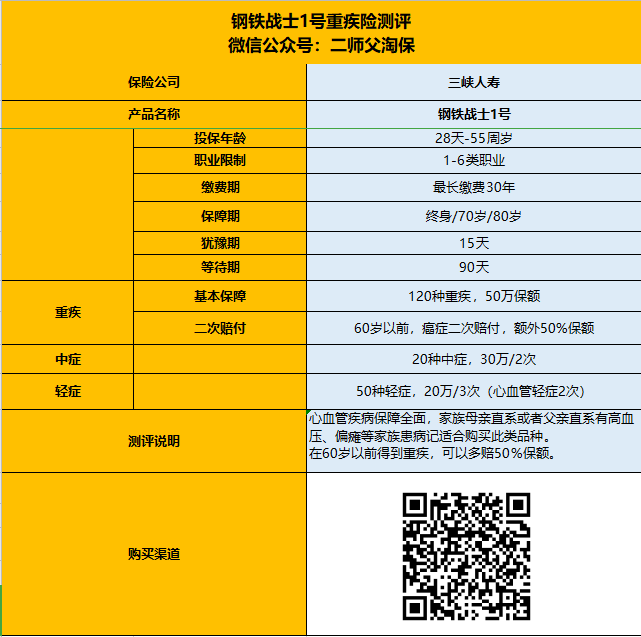

+++++++++++++++++++++++++++++++++++++++++++++++++++++

文件：
2020-04-19 09:40:57 Sun
文件大小：[51717]
28242844144251-这款重疾险利于心血管患病者，赔得最多.docx

======================================================

_type: q&a
@Zero Fei[51422225155524]
2020-04-19 14:15:13 Sun  
topic_id: 841411114221182

@Zero Fei

>  二师父，新手正在做配置计划，现在的存量资金打算实施鳄鱼计划，发现3月的更新的表中删除了乌龟计划和鳄鱼计划的配置建议，请问现在（下周开始进场）的乌龟计划和鳄鱼计划比例可以按2月发的配么，还有需要调整呢，谢谢

@二师父

>  那是定投加配置慢慢做到一个大致比例，a股宽基沪深300还能建底仓，美股就不适合建底仓了，定投按照这个比例慢慢配置得到是可以的

阅读[3500]  评论[4]  赞[0] 

======================================================

_type: talk
@阿宝[422212151424158]
2020-04-19 16:01:19 Sun  
topic_id: 548822221288124

第一次在星球分享文章，希望得到大家的指导和帮助。谢谢大家！后期，我会持续分享读书、投资、人生感悟，最好的学习方式是分享，与你一同进步，相互学习，做个好人，长命百岁。😄

@阿宝 at 2020-04-19 16:01:19 Sun

> 自己先点个赞！

----------

@蓝魔森林 at 2020-04-19 16:01:19 Sun

> 好文 收藏了

----------

@蓝魔森林 at 2020-04-19 16:01:19 Sun

> 美国股市的公司可以参考借鉴这个分析法吗？

----------

@阿宝 at 2020-04-19 16:01:19 Sun

> 可以

----------

阅读[3470]  评论[4]  赞[0] 

+++++++++++++++++++++++++++++++++++++++++++++++++++++

文件：
2020-04-19 16:01:15 Sun
文件大小：[624764]
51545181514854-4.19   判断估值的4个指标.docx

======================================================

_type: talk
@二师父[28814221155551]
2020-04-19 20:53:50 Sun  
topic_id: 548822224282124

<e type="hashtag" hid="824455842482" title="#规矩#" /> 刚入市3年以内还是遵守规矩好，如果入市多年还没有稳定盈利，那么也还是遵守规矩重新学。

@阿宝 at 2020-04-19 20:53:50 Sun

> 优秀！

----------

阅读[3357]  评论[1]  赞[0] 

+++++++++++++++++++++++++++++++++++++++++++++++++++++

文件：
2020-04-19 20:52:22 Sun
文件大小：[19911]
28242812842151-如果做不到随心所欲，就遵守规矩.docx

======================================================

_type: q&a
@陈洲[88245122222212]
2020-04-19 21:00:23 Sun  
topic_id: 241155552145411

@陈洲

>  今天刚下载天天基金，我看货币基金里有收益3-4%，之前一直是把钱存余额宝，都是货币基金，这种收益高的是亏损概率大，还是收益没余额宝稳定，收益利高需承担的风险是什么

@二师父

>  现在货币基金收益率是2%——3%，如果你看的是货币基金基金，亏损概率比较小，不过我买的都在7日年化2%——3%，万份收益在0.5到0.6

阅读[3350]  评论[0]  赞[0] 

======================================================

_type: q&a
@宋晓洋[422251821454588]
2020-04-20 12:32:17 Mon  
topic_id: 841155528811442

@宋晓洋

>  二师父，哪个券商开户股票免5，没资金要求的？

@二师父

>  单独加我微信，我看看能不能帮你联系到

阅读[2937]  评论[1]  赞[0] 

======================================================

_type: q&a
@雪莲[421485848588118]
2020-04-20 12:32:45 Mon  
topic_id: 548822251281254

@雪莲

>  二师父，今天易方达沪深300医药ETF联接A跌了15%.适合加点仓吗？

@二师父

>  没有跌的，系统错误

阅读[3071]  评论[1]  赞[0] 

======================================================

_type: q&a
@宁静以致远[841158451581452]
2020-04-20 12:34:10 Mon  
topic_id: 841155528541122

@宁静以致远

>  二师父，我之前按您的建议申购过可转债，一直从一个小投资者的角度看公司发行的债券。今天突然发现我关注的一支股票有关于非公开发行控股股东可交换公司债券的换股价格调低的公告。这种消息对小股民是坏消息还是好消息？

@二师父

>  这是公司促进转股的措施，对股民投资者而言是好消息

阅读[3083]  评论[0]  赞[0] 

======================================================

_type: q&a
@水冰月槑槑🌙[51142428222184]
2020-04-20 12:45:17 Mon  
topic_id: 118822245851812

@水冰月槑槑🌙

>  二师父我前段时间听您讲的买入300非银，那时候钱不多，只买了少量，买入3.609现在已经3.828，一直在涨，现在还可以再继续买吗？

@二师父

>  还是可以的哈，只要不是一次建立太大的头寸，目前这个位置买入没有问题

阅读[3222]  评论[0]  赞[0] 

======================================================

_type: talk
@Nick.yang[118281888551882]
2020-04-20 14:00:14 Mon  
topic_id: 841155524114582

该死的原油 小白不太会，感觉仓位特别低，就买了一些，其实是二个号都买了，还有一个是当时买了二万，现在很痛苦，想问一下二师傅，怎么办，是抛了呢还是继续等待，不知道回3000点能回来吗

@老司基 at 2020-04-20 14:00:14 Mon

> 二师父3月9日有南方原油购买记录，应该也是浮亏中，看他怎么操作。

----------

@二师父 at 2020-04-20 14:00:14 Mon

> 这个品种和大盘关系不大，和nymex原油价格有关

----------

@二师父 at 2020-04-20 14:00:14 Mon

> 你这是在支付宝买的，这种溢价品种不要场外买，在场内申购，然后场内卖出不会亏这么多

一定要根据提示操作，这个品种涨跌看NYMEX，和a股完全没关系，NYMEX到达60左右你估计能回来

再次提醒周期品种不能别碰哈

----------

@Nick.yang at 2020-04-20 14:00:14 Mon

> 是的，下次不能碰了

----------

阅读[3131]  评论[4]  赞[0] 

+++++++++++++++++++++++++++++++++++++++++++++++++++++

图片：
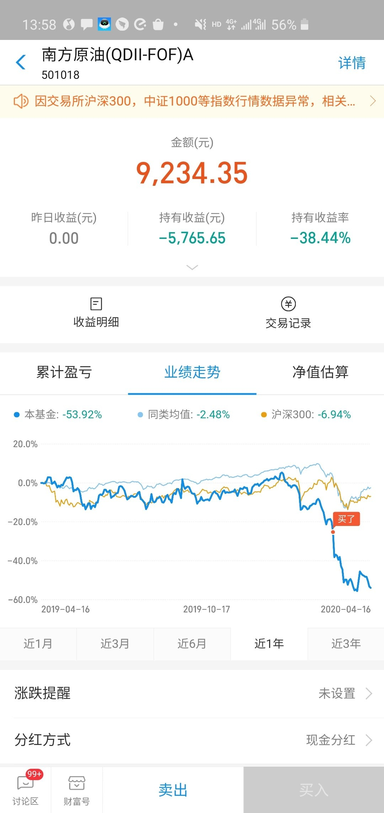

======================================================

_type: talk
@小米兔[48245525418488]
2020-04-20 15:06:37 Mon  
topic_id: 118822248444512

现在估值表在哪儿能看到？每周几发？

@二师父 at 2020-04-20 15:06:37 Mon

> 每周三发

----------

@小米兔 at 2020-04-20 15:06:37 Mon

> 好！谢谢

----------

阅读[3083]  评论[2]  赞[0] 

======================================================

_type: q&a
@宁静以致远[841158451581452]
2020-04-20 15:15:07 Mon  
topic_id: 421144451444128

@宁静以致远

>  二师父，有没有《<e type="web" href="https://wx.zsxq.com/mweb/views/weread/search.html?keyword=聪明的投资者" title="聪明的投资者" style="book" />》和《<e type="web" href="https://wx.zsxq.com/mweb/views/weread/search.html?keyword=穷查理宝典" title="穷查理宝典" style="book" />》的电子阅读资源提供一下？谢谢！

@二师父

>  这个在微信读书上找一下

阅读[3195]  评论[0]  赞[0] 

======================================================

_type: talk
@二师父[28814221155551]
2020-04-20 15:30:07 Mon  
topic_id: 841155521424512

<e type="hashtag" hid="554422811254" title="#原油#" /> 这个品种我买了1份，计划在NYMEX原油回到45左右卖出0.5，在NYMEX原油回到60卖出0.5，计划盈利百分之60，很多人之所以亏了太多主要是买在场外了，之前提示过在场外申购，然后转托管到场内才行，投资时候要严谨，错了一个地方可能就会很被动，今天市场分析也给了建议

@J at 2020-04-20 15:30:07 Mon

> 很庆幸自己在0.38的那天把华宝油气狠心割肉离场了，亏6%，现在回过头来看亏少是赚了[微笑]

----------

@素兮 at 2020-04-20 15:30:07 Mon

> 原油场内有溢价么？我没找到这个数据。

----------

@二师父 at 2020-04-20 15:30:07 Mon

> 对的，重新买指数又赚了

----------

@二师父 at 2020-04-20 15:30:07 Mon

> 有的，你对比下场内价格和场外净值差别很大的

----------

@素兮 at 2020-04-20 15:30:07 Mon

> 那场内怎么买？

----------

@二师父 at 2020-04-20 15:30:07 Mon

> 现在买不了，申购停了

----------

@素兮 at 2020-04-20 15:30:07 Mon

> 原油可以场内申购转托管么？

----------

@二师父 at 2020-04-20 15:30:07 Mon

> 申购不了了

----------

阅读[3850]  评论[8]  赞[0] 

+++++++++++++++++++++++++++++++++++++++++++++++++++++

图片：
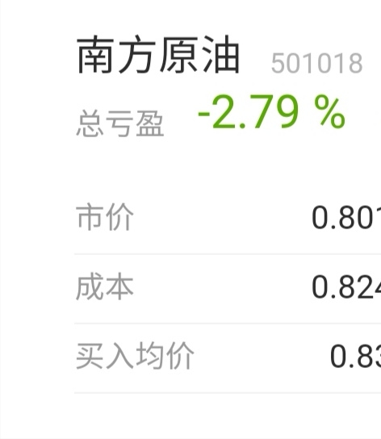

======================================================

_type: talk
@二师父[28814221155551]
2020-04-20 15:33:32 Mon  
topic_id: 421144451224848

<e type="hashtag" hid="458588251558" title="#周一市场分析#" /> 音频开始了，学习了一段时间普通话，感觉还是不太好，慢慢练习，主要是学投资，学习普通话比学习投资难太多了，我尽量学习听央视主播的讲话，保证普通话标准。

以后的分析都是文章和音频结合，这样理解会更好一点，多学点投资的真本事，理解资本市场，慢慢的你的知识都会让你在这个市场赚到钱。

@J at 2020-04-20 15:33:32 Mon

> 太好了师父出音频了，晚饭后可以边散步边听

----------

@J at 2020-04-20 15:33:32 Mon

> 短债和中短债基金现在可以配置吗

----------

@二师父 at 2020-04-20 15:33:32 Mon

> 可以少量配置

----------

@J at 2020-04-20 15:33:32 Mon

> 好的，少量配置大概占总资产多少合适？现在的现金除了定投，无处安放[捂脸]

----------

@二师父 at 2020-04-20 15:33:32 Mon

> 货币基金

----------

@二师父 at 2020-04-20 15:33:32 Mon

> 国债逆回购

----------

@是喵喵吖～ at 2020-04-20 15:33:32 Mon

> 师傅之前已经买了短债和长债的 是不是就先拿着

----------

@二师父 at 2020-04-20 15:33:32 Mon

> 有好机会可以逐步转到指数或者货币

----------

阅读[4041]  评论[10]  赞[0] 

+++++++++++++++++++++++++++++++++++++++++++++++++++++

文件：
2020-04-20 15:30:58 Mon
文件大小：[7155254]
51545521545244-4.20市场分析.m4a

2020-04-20 15:31:22 Mon
文件大小：[238001]
28242258242541-市场分析4.20.docx

======================================================

_type: talk
@二师父[28814221155551]
2020-04-20 17:14:41 Mon  
topic_id: 241155545222481

<e type="hashtag" hid="224455125521" title="#再说说网格交易#" /> 目前是单边上涨还是震荡不确定，还是按照震荡处理，所以网格还是不错的，上班族可以华宝自动挂单，如果有耐心坐过山车可以持有到3100左右再考虑卖

@是喵喵吖～ at 2020-04-20 17:14:41 Mon

> 二师父请问除了华宝 广发的证券app可以实现这个自动买入卖出吗

----------

@二师父 at 2020-04-20 17:14:41 Mon

> 对

----------

@西锦巴乌 at 2020-04-20 17:14:41 Mon

> 师父好！我想把手头持有的富国中证红利处理掉请问一下换成什么基金好呢？目前盈5%多点，或者直接卖掉？

----------

@二师父 at 2020-04-20 17:14:41 Mon

> 沪深300可以

----------

阅读[3558]  评论[4]  赞[0] 

+++++++++++++++++++++++++++++++++++++++++++++++++++++

文件：
2020-04-20 17:13:25 Mon
文件大小：[164280]
51545521822284-网格交易实用表格和网格需要注意的问题.docx

======================================================

_type: q&a
@Zero Fei[51422225155524]
2020-04-20 22:58:29 Mon  
topic_id: 241155541245421

@Zero Fei

>  二师父，今天看支付宝推送的沪深300已经快到正常估值了，对于新进入定投的人，定投空间小了，要改为上证50么，或是有其他什么建议，谢谢

@二师父

>  没事，没有那么严重，新手不懂的话在上证综合指数2900点以下定投沪深300稳稳盈利，不用再做其他的了，慢慢拓展

阅读[3275]  评论[0]  赞[0] 

======================================================

_type: q&a
@以古论今[28214421582421]
2020-04-21 05:46:47 Tue  
topic_id: 548822285414554

@以古论今

>  华宝做网格的链接在哪里

@二师父

>  在置顶文章

阅读[3271]  评论[0]  赞[0] 

======================================================

_type: q&a
@JOY[111881481812422]
2020-04-21 07:42:24 Tue  
topic_id: 421144412582188

@JOY

>  师父，麻烦问下，天天基金上面的基金规模和净值显示为什么会相差那么多？有的是净值高于规模，有的又是规模比净值高了那么多？或者哪位同学有了解的，能否赐教，谢谢啦(o^^o)

@二师父

>  他的净资产是由a类和c类基金共同组成的，相加就是了。规模太小资金量过大可以用汇添富中证消费替代

阅读[3340]  评论[1]  赞[0] 

======================================================

_type: talk
@shee[544885258412114]
2020-04-21 08:38:36 Tue  
topic_id: 421144412122888

第一次中签

@杜志彪 at 2020-04-21 08:38:36 Tue

> 刚刚买了一个盈利90元。

----------

@是喵喵吖～ at 2020-04-21 08:38:36 Tue

> 棒棒的

----------

@杜志彪 at 2020-04-21 08:38:36 Tue

> 打错了，是刚卖了一个中签的，现在盈利少了。

----------

@是喵喵吖～ at 2020-04-21 08:38:36 Tue

> 嗯嗯我明白 😄

----------

阅读[3276]  评论[4]  赞[0] 

+++++++++++++++++++++++++++++++++++++++++++++++++++++

图片：
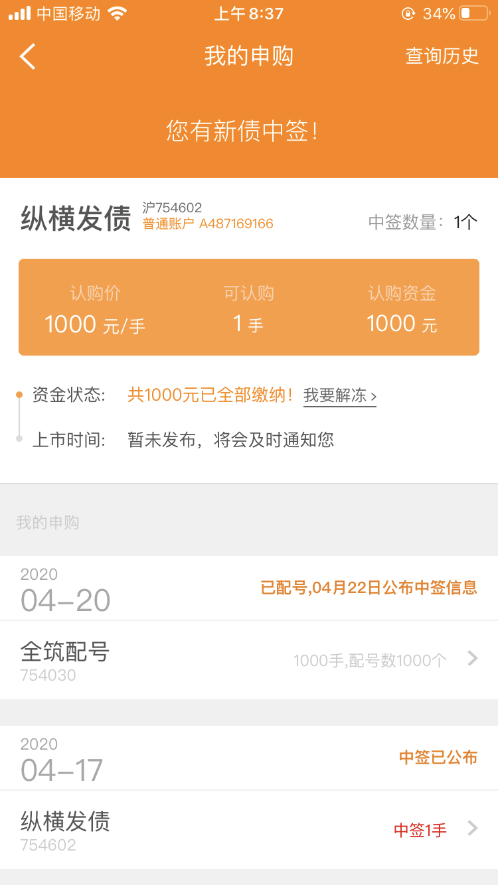

======================================================

_type: talk
@门萨🐨[51411455828824]
2020-04-21 08:53:26 Tue  
topic_id: 241155511545411

😂

@章兵朋 at 2020-04-21 08:53:26 Tue

> 跌成负的了？啥意思？买原油还倒贴钱？

----------

@清水倾城 at 2020-04-21 08:53:26 Tue

> 还有啥途径能薅点羊毛挽救一下我的华宝油气呢[囧]

----------

@随便 at 2020-04-21 08:53:26 Tue

> 华宝没得救了

----------

@蓝魔森林 at 2020-04-21 08:53:26 Tue

> 深不见底

----------

阅读[3464]  评论[4]  赞[0] 

+++++++++++++++++++++++++++++++++++++++++++++++++++++

图片：
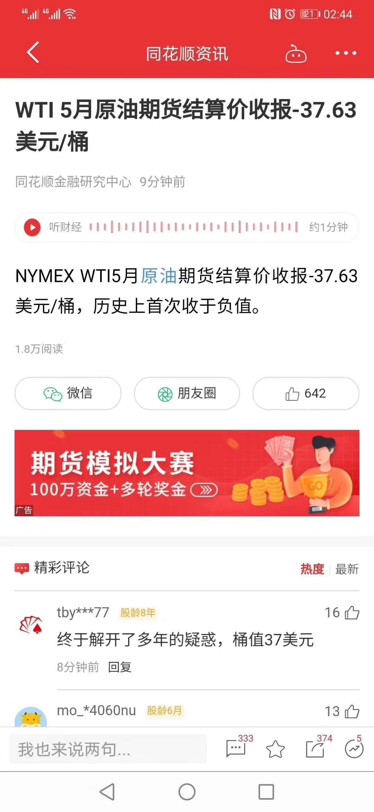

======================================================

_type: talk
@二师父[28814221155551]
2020-04-21 09:48:33 Tue  
topic_id: 118822288412452

<e type="hashtag" hid="554421284554" title="#乌龟计划收割利润#" /> 收了一点乌龟计划的利润，食品饮料和医药，因为没有在低估区定投，所以有了一定的利润慢慢收割就行，后续跌回去再买，行业指数会有机会的

后面买入以300，500，消费，医药为主，我判断那个事情拐点就是医药下来的时候。卖出首先以50ah为主，等50慢慢盈利再收割，总体思路是这样，目前估值不高不低，定投非常适合，不过千万别抄底

@J at 2020-04-21 09:48:33 Tue

> 师父请问为什么卖出以50ah为主？

----------

@二师父 at 2020-04-21 09:48:33 Tue

> 银行股太多，现在国家都不大力发展银行了，时刻跟dang走

----------

@J at 2020-04-21 09:48:33 Tue

> 对，银行太不争气了。我觉得最近推出的贷款改制为跟随LPR利率浮动就是想拯救银行，师父怎么看？

----------

@二师父 at 2020-04-21 09:48:33 Tue

> 去年就有了，浮动利率是调节贷款的

----------

@J at 2020-04-21 09:48:33 Tue

> 银行可以共同推高LPR，提高存量贷款的利率增加盈利

----------

@衣袂飘香 at 2020-04-21 09:48:33 Tue

> 也跟着收割了。

----------

@范毅君 at 2020-04-21 09:48:33 Tue

> 银行血亏的飘过，现在还亏9点多，但最惨是石油，买了一万多，亏了一半多哈哈

----------

@圣诞结® at 2020-04-21 09:48:33 Tue

> 二师父 您说国家不大力发展银行了 那中证银行目前浮亏 还继续拿着吗？

----------

阅读[3555]  评论[10]  赞[0] 

======================================================

_type: talk
@Philosophe*[544882828818444]
2020-04-21 10:14:50 Tue  
topic_id: 421144848821128

想问一下标普500还适合定投么？正常估值了，需要停止定投还是收割利润

@二师父 at 2020-04-21 10:14:50 Tue

> 暂停一下，等低估再投

----------

@章兵朋 at 2020-04-21 10:14:50 Tue

> 标普上个月买划算

----------

阅读[3359]  评论[2]  赞[0] 

======================================================

_type: q&a
@汉尼拔[552144155244]
2020-04-21 11:50:45 Tue  
topic_id: 841155858821822

@汉尼拔

>  二师傅可以讲讲LPR对房贷的人有什么影响么？

@二师父

>  你换成LPR利率就是浮动的，不换就没有影响，现在手机银行可以申请

阅读[3411]  评论[0]  赞[0] 

======================================================

_type: talk
@二师父[28814221155551]
2020-04-21 12:40:31 Tue  
topic_id: 241155852452551

一月，武汉加油！
二月，中国加油！
三月，世界加油！
四月，油加多了！

以致于现在倒贴才送的出去了，2020有点意思

@范毅君 at 2020-04-21 12:40:31 Tue

> 我看了为啥会负数的文章，没看懂，真的是贴钱送吗😂

----------

@二师父 at 2020-04-21 12:40:31 Tue

> 市场上真的，加油不会

----------

@范毅君 at 2020-04-21 12:40:31 Tue

> 哈哈

----------

@衣袂飘香 at 2020-04-21 12:40:31 Tue

> 呵呵……

----------

阅读[3506]  评论[4]  赞[0] 

======================================================

_type: q&a
@tanxin[241524428884281]
2020-04-21 14:55:33 Tue  
topic_id: 118822521588512

@tanxin

>  二师父，请问中证500现在不是低估值了，还能继续定投吗？

@二师父

>  定投不一次建底仓没问题的，最大跌幅在百分之32以内，你根据仓位定投挺合适

阅读[3473]  评论[0]  赞[0] 

======================================================

_type: talk
@阿宝[422212151424158]
2020-04-21 15:33:47 Tue  
topic_id: 421144884552818

最好的学习方式是分享，非常感谢二师父的无私分享，教会了我很多价投理念和方法，这真的是件非常伟大而美好的事情！

@衣袂飘香 at 2020-04-21 15:33:47 Tue

> 学习标兵，好孩子。

----------

@小牧童 at 2020-04-21 15:33:47 Tue

> 优秀！

----------

@阿宝 at 2020-04-21 15:33:47 Tue

> 谢谢

----------

阅读[3459]  评论[3]  赞[0] 

+++++++++++++++++++++++++++++++++++++++++++++++++++++

文件：
2020-04-21 15:32:27 Tue
文件大小：[13246]
28242288845481-4.21  股票的价值.docx

======================================================

_type: q&a
@六尘不改[241555484551821]
2020-04-21 17:23:34 Tue  
topic_id: 841155854421112

@六尘不改

>  昨天还说今天再涨就卖，结果跌了，师傅你看下面继续跌是要反弹结束了吗

@二师父

>  这个没法预测哈，市场波动是正常的，我对市场的判断是处于跌势，不过依旧重仓，股市有个相反理论，你觉得他要涨，他会跌，你觉得他要跌，就会涨，很有效

阅读[3395]  评论[4]  赞[0] 

======================================================

_type: q&a
@孤芳自赏[548114442211184]
2020-04-21 17:24:26 Tue  
topic_id: 241155885218241

@孤芳自赏

>  那50ah处于浮亏状态也卖吗？

@二师父

>  不着急，我说的是计划，卖出50ah至少也得大盘在3000左右，到时候会盈利的，目前拿着就行

阅读[3440]  评论[1]  赞[0] 

======================================================

_type: q&a
@老司基[111852221242122]
2020-04-21 17:25:52 Tue  
topic_id: 118822555541482

@老司基

>  二师父，哪里可以查，某只股票的相关重仓基金？例如我想找持有中国平安重仓的相关基金，这个怎么查？

@二师父

>  东方财富

阅读[3574]  评论[0]  赞[0] 

======================================================

_type: q&a
@陈洲[88245122222212]
2020-04-21 17:30:03 Tue  
topic_id: 841155885421522

@陈洲

>  我根据二师傅的估值表，买的定投指数基金在支付宝平台买的，今天输入基金编号到天天基金里去查，501050，000478，这2个基金有基金经理的，看过师傅的文章指数基金没有基金经理的，我乱了，我买的是指数基金吗

@二师父

>  基金都有基金经理的，指数基金经理是不用主动调仓，你直接定投沪深300指数加中证500指数，这个代码在天天实盘有。等慢慢深入学习再扩大投资范围

阅读[3689]  评论[4]  赞[0] 

======================================================

_type: talk
@二师父[28814221155551]
2020-04-21 20:28:17 Tue  
topic_id: 241155882451251

有人理解错了我的意思，我并没有说今年春节上证综合指数到达3500点，更没有预测，我反复说过不预测市场。我只是说今年春节的时候上证综合指数到不了3500点，我给大家发红包。大家体会两者的区别。

这完全是两个意思，红包早就备好了，3年内可能用到的资金从来不入市场，还有10个月，等你来领红包，今年是结构行情，选对方向，上证综合指数也给我突突突吧。

@雨淡风清 at 2020-04-21 20:28:17 Tue

> 希望我给你发个红包，你的就留着吧

----------

@rtdmm小米 at 2020-04-21 20:28:17 Tue

> 哈哈！看来亏的人不少呢，😂😂

----------

@rtdmm小米 at 2020-04-21 20:28:17 Tue

> 希望大家赚了给二师父发红包！

----------

@J at 2020-04-21 20:28:17 Tue

> 突突突哈哈哈，我宁愿不要红包要3500点[偷笑]

----------

@陈飞🤗 at 2020-04-21 20:28:17 Tue

> 断章取义的厉害

----------

@清水倾城 at 2020-04-21 20:28:17 Tue

> [憨笑]啥是对的方向？

----------

阅读[3668]  评论[6]  赞[0] 

+++++++++++++++++++++++++++++++++++++++++++++++++++++

图片：

======================================================

_type: talk
@二师父[28814221155551]
2020-04-21 20:34:47 Tue  
topic_id: 421144885215888

<e type="hashtag" hid="554422811254" title="#原油#" /> 原油期货比较火，了解下为什么出现负值

阅读[3733]  评论[0]  赞[0] 

+++++++++++++++++++++++++++++++++++++++++++++++++++++

文件：
2020-04-21 21:05:53 Tue
文件大小：[180209]
88242281525442-原油暴跌20%，美原油期货跌入负值，究竟发生了什么.docx

======================================================

_type: talk
@二师父[28814221155551]
2020-04-21 21:39:21 Tue  
topic_id: 548822152225814

<e type="hashtag" hid="824454541122" title="#周二基金分析#" />

@JOY at 2020-04-21 21:39:21 Tue

> 师父，请问0.5302的净值是对应的15元的油价吗？

----------

@二师父 at 2020-04-21 21:39:21 Tue

> 净值比NYMEX原油价格滞后一点

----------

@JOY at 2020-04-21 21:39:21 Tue

> 谢谢

----------

阅读[4404]  评论[3]  赞[0] 

+++++++++++++++++++++++++++++++++++++++++++++++++++++

文件：
2020-04-21 21:39:18 Tue
文件大小：[325134]
15414458281452-基金分析4.21.docx

2020-04-21 21:39:19 Tue
文件大小：[6090698]
88242281514282-周二讲基金.m4a

======================================================

_type: talk
@二师父[28814221155551]
2020-04-22 09:15:36 Wed  
topic_id: 421144524421818

<e type="hashtag" hid="224454822811" title="#周三讲估值#" /> 这个音频多听几遍，理解估值和仓位

@蓝魔森林 at 2020-04-22 09:15:36 Wed

> 二师傅现在持仓中国平安大概多少比例呀？

----------

@二师父 at 2020-04-22 09:15:36 Wed

> 没有，目前就一只股票，其余全部卖了

----------

@明树 at 2020-04-22 09:15:36 Wed

> 里面这张图是用什么软件看的？

----------

@二师父 at 2020-04-22 09:15:36 Wed

> wind

----------

阅读[4300]  评论[4]  赞[0] 

+++++++++++++++++++++++++++++++++++++++++++++++++++++

文件：
2020-04-22 09:15:09 Wed
文件大小：[267944]
88242225545512-周三讲估值.docx

2020-04-22 09:15:12 Wed
文件大小：[9413217]
51545552242284-周三讲估值.m4a

======================================================

_type: talk
@二师父[28814221155551]
2020-04-22 09:34:13 Wed  
topic_id: 548822542182814

<e type="hashtag" hid="554424155454" title="#鳄鱼计划4月第一次#" /> 买入电器ETF两份，代码：159996，这个场外没有合适的品种。家电目前处于困境期，格力业绩逐步减弱，逆势加仓格力不适合，但是整体投资家电行业风险可控，而且这个行业需求可持续，是个好行业，比消费弱一点，但是比宽基指数收益率高。

@🍀 凝🌸 慧🍀 at 2020-04-22 09:34:13 Wed

> 收到

----------

@Zero Fei at 2020-04-22 09:34:13 Wed

> 这个分数是否是按鳄鱼计划计划本金/相应计划期数，而得得呢

----------

@二师父 at 2020-04-22 09:34:13 Wed

> 对

----------

@helen at 2020-04-22 09:34:13 Wed

> 二师父，这个是新基金，不用再观察一下吗？

----------

@二师父 at 2020-04-22 09:34:13 Wed

> 你可以再观察下的

----------

@J at 2020-04-22 09:34:13 Wed

> 师父，上午错过了鳄鱼计划，现在这个点还可以买进电器etf两份吗？

----------

@二师父 at 2020-04-22 09:34:13 Wed

> 目前盈利1.33个点，能经受回撤可以

----------

@杜志彪 at 2020-04-22 09:34:13 Wed

> 很好的行业指数，庞大的国内消费市场，低估买入安全，我还是亏损状态，转到场内没有做定投，类似师父的鳄鱼，我是下跌到一定幅度就买点，慢慢积累地位筹码，等到估值正常收割，高估逐步卖本。

----------

阅读[4296]  评论[13]  赞[0] 

======================================================

_type: q&a
@tanxin[241524428884281]
2020-04-22 09:37:21 Wed  
topic_id: 241155245542821

@tanxin

>  二师父，请问华宝油气亏损40%，止损卖出还是继续持有？

@二师父

>  多少仓位，仓位不重没有影响到生活的话，持有到NYMEX原油价格50美元时候，一次清仓

阅读[3870]  评论[1]  赞[0] 

======================================================

_type: talk
@onepiecewi*[244414114545811]
2020-04-22 10:49:40 Wed  
topic_id: 421144528421528

打卡打卡
我朋友从来没炒股
今年股市风吹，
他觉得年底会涨，
想all in
还说赚小钱还不如不要
[微笑]真的劝不住。

@铁观音 at 2020-04-22 10:49:40 Wed

> 有个性

----------

@杜志彪 at 2020-04-22 10:49:40 Wed

> 赌赢了会上瘾的，最后是10赌9输，炒股是10个7输2平1赢[偷笑]

----------

@onepiecewi* at 2020-04-22 10:49:40 Wed

> 这是无知，不敬畏市场

----------

@onepiecewi* at 2020-04-22 10:49:40 Wed

> 劝不住，由他

----------

阅读[3600]  评论[4]  赞[0] 

======================================================

_type: q&a
@娃娃after🎈[88818155445112]
2020-04-22 11:02:44 Wed  
topic_id: 241155248545551

@娃娃after🎈

>  请问二师父，在华泰app 看到一款理财，麻烦二师父帮忙看下靠谱吗，谢谢

@二师父

>  这是帖息理财产品，购买没问题

阅读[4007]  评论[0]  赞[0] 

======================================================

_type: q&a
@J[28281541518551]
2020-04-22 14:21:59 Wed  
topic_id: 241155241821151

@J

>  师父，上午错过了鳄鱼计划，现在这个点还可以买进电器etf两份吗？

@二师父

>  目前盈利1.33个点，能经受回撤可以的

阅读[3863]  评论[3]  赞[0] 

======================================================

_type: talk
@阿宝[422212151424158]
2020-04-22 16:12:55 Wed  
topic_id: 841155215541522

这是书中比较重要的话和自己的理解。

@HeLLO at 2020-04-22 16:12:55 Wed

> 二师父，阿宝无私分享，你们对于我们来说就是一个有价值的人，受人尊敬

----------

@阿宝 at 2020-04-22 16:12:55 Wed

> 谢谢

----------

阅读[3725]  评论[2]  赞[0] 

+++++++++++++++++++++++++++++++++++++++++++++++++++++

文件：
2020-04-22 16:11:00 Wed
文件大小：[17408]
48525552444818-读书小总结.doc

======================================================

_type: talk
@二师父[28814221155551]
2020-04-22 17:43:51 Wed  
topic_id: 841155212254122

<e type="hashtag" hid="554424582214" title="#星球估值表#" /> 半导体又高估了，除了投机，否则别碰它

阅读[4287]  评论[0]  赞[0] 

+++++++++++++++++++++++++++++++++++++++++++++++++++++

图片：
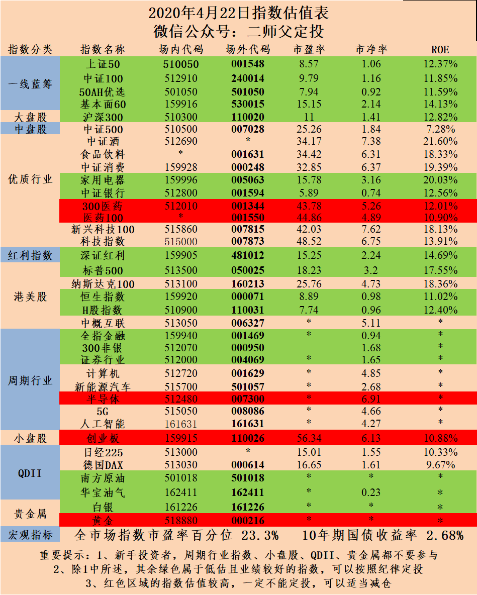

======================================================

_type: talk
@二师父[28814221155551]
2020-04-22 17:44:55 Wed  
topic_id: 548822585528154

<e type="hashtag" hid="141121482242" title="#234期定投实盘#" />

@Zero Fei at 2020-04-22 17:44:55 Wed

> 二师父，咨询一下以同样时间纬度计算的话，乌龟计划和鳄鱼计划哪个收益率高些呢，是不是鳄鱼计划都是场内操作

----------

@二师父 at 2020-04-22 17:44:55 Wed

> 鳄鱼计划

----------

@圣诞结® at 2020-04-22 17:44:55 Wed

> 二师父 我是3月初开始定投300非银的 现在还处于低估 继续定投可以吧？

----------

@圣诞结® at 2020-04-22 17:44:55 Wed

> 沪深300 科技一直都没买 现在进场还可以吗？目前75成仓

----------

@二师父 at 2020-04-22 17:44:55 Wed

> 定投可以的，仓位自己把握

----------

@太阳照常升起 at 2020-04-22 17:44:55 Wed

> 二师父好，现在100科技是正常估值，现在买是不是有些贵啊？

----------

@二师父 at 2020-04-22 17:44:55 Wed

> 是的

----------

阅读[4517]  评论[7]  赞[0] 

+++++++++++++++++++++++++++++++++++++++++++++++++++++

文件：
2020-04-22 17:44:45 Wed
文件大小：[119207]
88242224845542-二师父234期定投实盘记录.docx

======================================================

_type: talk
@二师父[28814221155551]
2020-04-22 17:51:33 Wed  
topic_id: 421144515582448

<e type="hashtag" hid="824454215852" title="#网格表#" /> 这是新的网格表，网格点比较大，对于当前震荡行情可以适当缩小网格，具体个人情况不同。

二师父采用的方法是每晚9点以后挂一个成交单，挂一个卖出单，保证买的价格够低，卖的价格有足够利润。第二天就不用管了。

@shee at 2020-04-22 17:51:33 Wed

> 二师父，我的酒总盈亏目前是9.53%

----------

@shee at 2020-04-22 17:51:33 Wed

> 可不可以收割呢？

----------

@二师父 at 2020-04-22 17:51:33 Wed

> 这个是可以的，正常偏高估值，因为没有在最低位投，很有可能回去

----------

@shee at 2020-04-22 17:51:33 Wed

> OK

----------

@mumomo at 2020-04-22 17:51:33 Wed

> 二师父，为什么这个表没有买入份数呢？应该是越跌买的份数越多吧

----------

@mumomo at 2020-04-22 17:51:33 Wed

> 二师父，这个表里为什么没有份数了，这个买越跌买入份数也越多吧

----------

@二师父 at 2020-04-22 17:51:33 Wed

> 不和之前一样吗

----------

@mumomo at 2020-04-22 17:51:33 Wed

> 以前发的是有份数呀，还按以前的买么

----------

阅读[4149]  评论[19]  赞[0] 

+++++++++++++++++++++++++++++++++++++++++++++++++++++

图片：
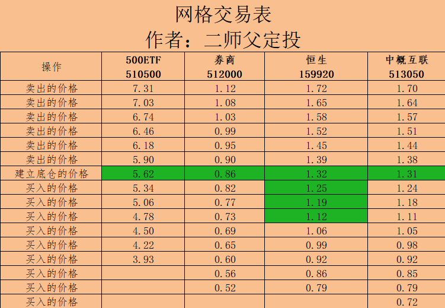

======================================================

_type: talk
@二师父[28814221155551]
2020-04-22 19:09:27 Wed  
topic_id: 118822484818452

<e type="hashtag" hid="224454481251" title="#银行理财产品#" /> 现在银行理财产品活期的收益率大概在3.3左右，比货币基金高，我把防守账户的资金以及日用账户的资金转过去了。属于不错的配置，省心省力，流动性好，短债流动性弱一点。

@蛋炒饭不加蛋 at 2020-04-22 19:09:27 Wed

> 银行活期理财有这么高嘛？

----------

@蛋炒饭不加蛋 at 2020-04-22 19:09:27 Wed

> 银行活期理财是可以随时取出的那种？

----------

@圣诞结® at 2020-04-22 19:09:27 Wed

> 是的 和余额宝差不多的

----------

@杜志彪 at 2020-04-22 19:09:27 Wed

> 我存的我们天津银行的T+1收益率3.39它是浮动的，最高时4.1。

----------

@🍀 凝🌸 慧🍀 at 2020-04-22 19:09:27 Wed

> 我的大部分活动资金也是放在银行类似活期的理财产品里面，最近7日年化能达到3.46%

----------

@秦风殇韵（刘豫斌） at 2020-04-22 19:09:27 Wed

> 7日3.57

----------

@夏萍 at 2020-04-22 19:09:27 Wed

> 师父存的哪个银行活期？

----------

@二师父 at 2020-04-22 19:09:27 Wed

> 是买的活期理财产品，一个中国银行，一个中信银行，刚好是自己用这两个手机银行

----------

阅读[4054]  评论[9]  赞[0] 

======================================================

_type: q&a
@孤芳自赏[548114442211184]
2020-04-22 21:11:00 Wed  
topic_id: 241155214541251

@孤芳自赏

>  请问标普500场内有没有溢价，是场内买好还是场外买？

@二师父

>  目前还是有溢价，有溢价场外好

阅读[3974]  评论[0]  赞[0] 

======================================================

_type: talk
@二师父[28814221155551]
2020-04-23 05:55:34 Thu  
topic_id: 841155454825282

<e type="hashtag" hid="554424821284" title="#关于天天基金收益率计算说明#" /> 持仓收益率和利用净值法计算的收益率不同

因为买入的成本单价计算方式随着卖出会变动，但是买入均价是不变的，所以大家看到这个500多的利润并不是实际利润

而是虚高，正确计算方法是用(当前净值减去买入均价)/买入均价，这个收益率才是实际收益率，也就是持仓收益率，用当前总金额乘以持仓收益率等于现在实际利润大概300多，所以大家看到的账面利润和实际利润是有区别的，最好的办法是看账户总市值，二师父采用的办法就是，每次往一个账户转一笔钱，然后本年累计转入金额确定一个数，到了年底用账户实际金额减去转入金额得到一个数，再除以转入金额得到本年实际收益率，我的目标就是每年争取正盈利并跑赢同期沪深300，中证500，创业板

买入成本和买入均价是不同的，用过华泰都知道，他有个成本价，有个均价，成本价其实是虚减或者虚增的，只有买入均价才是实际成本

这在计算收益率上需要注意，不要纠结细节，以一个月为统计，账户本来有50万，到了月底，50万变成51万就是赚了，变成49万就是亏了，这个数字肯定是最具有参考意义的

@除述 at 2020-04-23 05:55:34 Thu

> 天天基金的收益显示确实虚高，前段时间行情好的时候，偏差的都有点离谱了。

----------

@栀子花开 at 2020-04-23 05:55:34 Thu

> 为什么我跟你们一起换仓的，我有12%的收益率了，买在底部，我中途没有再追加了

----------

@二师父 at 2020-04-23 05:55:34 Thu

> 不知道

----------

@栀子花开 at 2020-04-23 05:55:34 Thu

> 这个指数也分场内场外吗？

----------

@二师父 at 2020-04-23 05:55:34 Thu

> 指数不分，基金分

----------

@章兵朋 at 2020-04-23 05:55:34 Thu

> 支付宝的收益也不准。我自己做了表格统计每月的收益率，就是按照二师父的公式

----------

阅读[4511]  评论[13]  赞[0] 

+++++++++++++++++++++++++++++++++++++++++++++++++++++

图片：
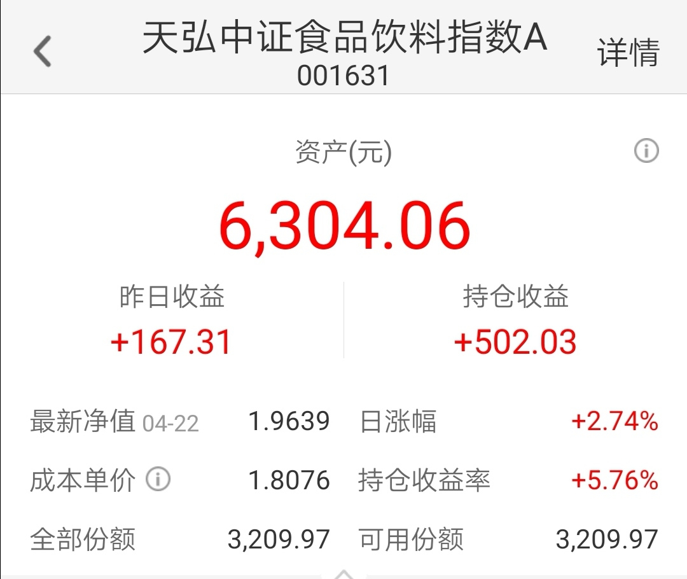

======================================================

_type: talk
@门萨🐨[51411455828824]
2020-04-23 07:07:31 Thu  
topic_id: 421144242552828

朋友们，不懂的千万别碰。

@呵呵→_→ at 2020-04-23 07:07:31 Thu

> 脸大好意思找客户要

----------

@🍀 凝🌸 慧🍀 at 2020-04-23 07:07:31 Thu

> 这波抄底的，成了韭菜，任何投资，还是一定要注意做好风控啊

----------

@蓝魔森林 at 2020-04-23 07:07:31 Thu

> 惨痛

----------

@一心一意 at 2020-04-23 07:07:31 Thu

> 这个太可怕了，也太不要脸了吧

----------

@范毅君 at 2020-04-23 07:07:31 Thu

> 脸面在大额损失面前不值一提，相关责任人肯定怕追责

----------

阅读[3906]  评论[5]  赞[0] 

+++++++++++++++++++++++++++++++++++++++++++++++++++++

图片：
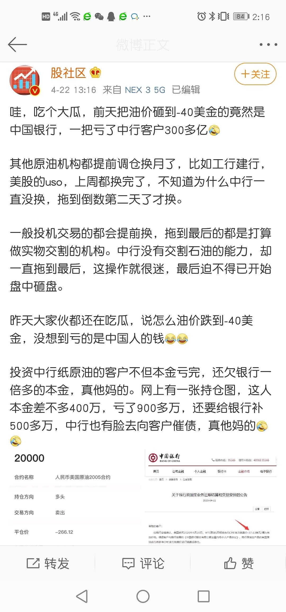

======================================================

_type: talk
@二师父[28814221155551]
2020-04-23 14:26:00 Thu  
topic_id: 118822151552882

<e type="hashtag" hid="881251425252" title="#鳄鱼计划#" /> 卖出消费ETF一份，市场总是不可预测的，不过不用通过算命盈利

简单说下鳄鱼计划，他是场内定投计划，不定时不定额买入和卖出，其实一个投资者真正的水平体现在选择标的和时机两方面

对于场外定投，那就是一个展示，帮助零基础的投资者入门定投，一般悟性好的跟着我一两年就能自己做了，悟性差的三四年，总之投资学习了之后还要有实践领悟，不然你就跟着我走在极端低迷行情的时候容易怀疑。

计划非跟投，仅供投资者参考，钱不在多，有赚就行，最近看猎狐，里面贪心的人都出问题了，人在河边走，很容易湿鞋，慎独，敬畏。

@蓝魔森林 at 2020-04-23 14:26:00 Thu

> 请问白酒etf是用网格或者鳄鱼计划策略来操作仓位吗？

----------

@二师父 at 2020-04-23 14:26:00 Thu

> 白酒ETF和消费类似，之前是一次性调仓到消费，消费etf是鳄鱼计划标的

----------

@蓝魔森林 at 2020-04-23 14:26:00 Thu

> 二师傅还是用均线偏离的方式来决定买还是卖出吗？

----------

@二师父 at 2020-04-23 14:26:00 Thu

> 不是

----------

@蓝魔森林 at 2020-04-23 14:26:00 Thu

> 那是什么呀

----------

@二师父 at 2020-04-23 14:26:00 Thu

> 这涉及到交易的核心机密了

----------

@蓝魔森林 at 2020-04-23 14:26:00 Thu

> [囧][囧][囧][囧]

----------

@西锦巴乌 at 2020-04-23 14:26:00 Thu

> 师父好！在做资产（股票，指数基金，债券基金）配置平衡时债券基金是纯债好还是混合好？请师父推荐几只能长期持有的债券基金供参考，谢了[抱拳]

----------

阅读[4011]  评论[9]  赞[0] 

======================================================

_type: q&a
@素兮[548121415528244]
2020-04-23 14:47:25 Thu  
topic_id: 421144285244458

@素兮

>  二师父，我场内有投资300etf（510300），和这条消息有关系么？

@二师父

>  你是购买的etf就没有影响，如果你购买的是300ETF期权，那么就要注意做好相关交易和行权准备，今天已经过了，没有购买期权吧

阅读[3603]  评论[2]  赞[0] 

======================================================

_type: q&a
@老妖[118514521115522]
2020-04-23 17:26:52 Thu  
topic_id: 241155425154141

@老妖

>  师父，300非银新加京沪高铁，可以分析下影响吗，现总仓位的一层，是继续持有吗

@二师父

>  我看前10大重仓股票里面没有京沪高铁的。

阅读[3398]  评论[2]  赞[0] 

======================================================

_type: talk
@二师父[28814221155551]
2020-04-23 17:34:43 Thu  
topic_id: 841155428882182

<e type="hashtag" hid="141128522522" title="#投资中最重要的事情#" /> 最近有人看猎狐吗，里面很多人犯了投资错误，大家可以看看从中汲取教训。

阅读[4090]  评论[0]  赞[0] 

+++++++++++++++++++++++++++++++++++++++++++++++++++++

文件：
2020-04-23 17:34:04 Thu
文件大小：[20474]
28242442441451-从电视剧《猎狐》来分析投资中最重要的事.docx

======================================================

_type: talk
@二师父[28814221155551]
2020-04-23 18:47:46 Thu  
topic_id: 548822451428214

<e type="hashtag" hid="141128524582" title="#关于债券的投资方法#" /> 债券投资是和股票及指数基金对冲的。

投资可以选择可转债、国债以及国债ETF，或者国开债基金。其他的混合基金不用选择，因为那些基金有的债券是企业债，有暴雷风险。

国债不可能违约，有国家信用背书，所以只有利率风险。

一般在国债收益率高位开始投资债券，或者在利率有下行趋势的时候投资债券。

当前时刻除了可转债不用投资债券，直接买指数比较好，可以观察几只常见的国债，比如国债1619，这就是一只加了杠杆的国债，如果能接受较大波动，可以选择这个，无法接受太大波动就只有选择国债ETF了。

@西锦巴乌 at 2020-04-23 18:47:46 Thu

> 师父好！你说购买债券要在利率有下行趋势的时候较好，我想现在就附合这种情况，但你又建议买指数，是否主要是考虑到指数的收益高于债券？谢了

----------

@二师父 at 2020-04-23 18:47:46 Thu

> 利率下行空间有限了，你怎么确定他一定下行呢，如果你能确定，那可以买，反之，利率从此刻上行就比较危险

----------

阅读[3476]  评论[2]  赞[0] 

======================================================

_type: q&a
@Sunflower[244185124281811]
2020-04-24 06:36:50 Fri  
topic_id: 241155444452551

@Sunflower

>  二师父您好，根据您说的我计算了一下蛋卷的实际收益，应该414.7对吧？显示的数据偏低对吧？为什么有的软件偏高有的就偏低呢？

@二师父

>  你最好把计算过程贴出来，偏低或者偏高不知道说的是哪个，我理解你说的是收益率
>  
>  如果卖出时候净值高于成本，计算收益率就偏高，如果卖出时候净值低于成本，计算收益率就偏低
>  
>  你下次做记录，买入均价和成本是不同的，因为买入均价不变，系统成本变化，还有要注意这个手续费在成本显示了，而均价里面并未显示这个

阅读[3381]  评论[2]  赞[0] 

======================================================

_type: talk
@二师父[28814221155551]
2020-04-24 07:22:05 Fri  
topic_id: 548822444844284

<e type="hashtag" hid="145458855482" title="#周五读书#" /> 笑傲股市第一讲，这是趋势交易的大师，多学习不同的理念，对于没有底部的品种适合低估+趋势，比如原油，在极度低位，然后升势确立的时候去做，同时保守的投资者设置止损位，这和逆向投资完全是不同的。

逆势投资类似修炼易筋经，趋势投资类似修炼独孤九剑，各有所长。

@衣袂飘香 at 2020-04-24 07:22:05 Fri

> 首先内容很棒，其次，我打不开文字版，第三，我听到了好几声鸡叫！

----------

阅读[4088]  评论[1]  赞[0] 

+++++++++++++++++++++++++++++++++++++++++++++++++++++

文件：
2020-04-24 07:20:22 Fri
文件大小：[17779]
51545444842214-笑傲股市第一讲.docx

2020-04-24 07:20:23 Fri
文件大小：[5187054]
28242444145581-笑傲股市第一讲.m4a

======================================================

_type: talk
@二师父[28814221155551]
2020-04-24 07:41:18 Fri  
topic_id: 241155441555411

<e type="hashtag" hid="141128442252" title="#乌龟计划调仓#" /> 乌龟计划今天或者下周一计划科技100调仓到人工智能。当前盈利在3%左右。

原因是昨天公布的科技100基金规模下降比较厉害，目前只有1.5亿，还是需要防范，之前定投的时候规模在2.8亿，并未显示风险。场内暂时不同调整，因为还有7.33亿的规模，后面继续跟踪。

人工智能这个指数分析过，有价值的周期性指数，属于信息技术行业，预计2020年盈利增速在25%，当前估值虽然没有低估，但是出于估值中枢以下，也是一个不错的配置品种。

从历史收益率看，科技100是优于人工智能的，只不过现在场外没有合适的基金，所以用人工智能替代。如果后面有了更好的科技100基金，可以用科技100替代。

投资需要灵活应对，情况是不同的，资本市场一直在变化，不能固执认死理，一切以盈利为宗旨。

@衣袂飘香 at 2020-04-24 07:41:18 Fri

> 好的，跟。

----------

@wty at 2020-04-24 07:41:18 Fri

> 是今天就调整吗？

----------

@二师父 at 2020-04-24 07:41:18 Fri

> 今天或者周一

----------

@wty at 2020-04-24 07:41:18 Fri

> 好的，跟进！好在仓位轻[呲牙]

----------

@栀子花开 at 2020-04-24 07:41:18 Fri

> [尴尬]，我昨天刚卖了人工智能换到科技100。bzy 二师傅，昨天中签了交科转债，请问后续要怎么操作

----------

@二师父 at 2020-04-24 07:41:18 Fri

> 是场内的还是场外？场内的没事，场外还是要警惕，1.5亿规模遭遇大额抛售有点危险

----------

@杜志彪 at 2020-04-24 07:41:18 Fri

> 医药有点高了，刚减了本金至0.2层仓，等调下来再说，总归目前是高估，投资股市重要的就是等[微笑]

----------

@栀子花开 at 2020-04-24 07:41:18 Fri

> 场外[捂脸]

----------

阅读[4165]  评论[15]  赞[0] 

+++++++++++++++++++++++++++++++++++++++++++++++++++++

图片：
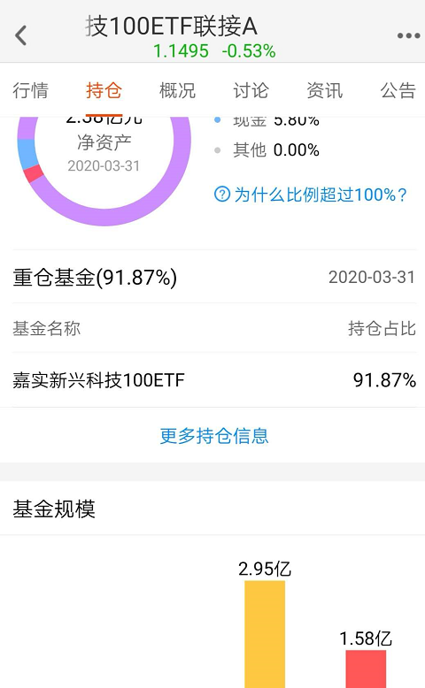
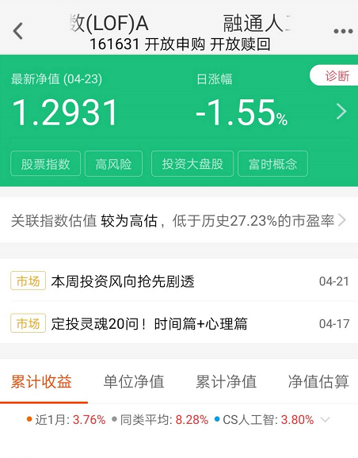

======================================================

_type: q&a
@蛋炒饭不加蛋[118281818482542]
2020-04-24 11:32:18 Fri  
topic_id: 118822182182182

@蛋炒饭不加蛋

>  请问二师父现在中证医疗高估吗

@二师父

>  中证医疗是高估的，做趋势都有点难。

阅读[3185]  评论[7]  赞[0] 

======================================================

_type: talk
@二师父[28814221155551]
2020-04-24 11:34:43 Fri  
topic_id: 841155412248222

<e type="hashtag" hid="452241522518" title="#天天基金持仓利润的官方解释#" /> 天天基金的持仓利润不包含我们已经卖出的部分，只是持有份额对应的利润，所以收割的部分利润不在其中，这就是大家看到的净值高于同比利润的原因，以净值为准，因为我们收割的利润也相当于是挣钱了的。

@helen at 2020-04-24 11:34:43 Fri

> 我觉得二师父你以前的解释比较清楚。天天基金里面的成本是会把卖掉的盈亏部分算进去的，所以并不是当前持仓的真实成本价。

----------

@二师父 at 2020-04-24 11:34:43 Fri

> 按照天天计算方式，成本价和买入均价是两个概念

----------

@齿轮 at 2020-04-24 11:34:43 Fri

> 根据实际测算，天天基金里面的持仓收益是考虑了以前卖出的收益的，计算方式是（当前净值-成本单价）*全部份额。因为卖出后成本单价会调整，所以持仓收益考虑了成本单价调整因素。换句话说，持仓收益是含了你历史卖出情况的。

----------

@二师父 at 2020-04-24 11:34:43 Fri

> 这个没有包含的，因为持仓收益不是用总金额乘以持仓收益率得到的，以我的食品饮料指数为例子，如果按照利润等于总金额乘以持仓收益率，现在利润是566，实际总金额比这个更高，而现在的利润只有540，所以是没有含的

----------

@helen at 2020-04-24 11:34:43 Fri

> 对的

----------

@helen at 2020-04-24 11:34:43 Fri

> 所以，收益的绝对数值是不含历史成交的，但收益率是含历史成交的。天天基金的算法很容易误导用户....

----------

@齿轮 at 2020-04-24 11:34:43 Fri

> 用成本单价*全部份额*收益率=持仓收益

----------

@二师父 at 2020-04-24 11:34:43 Fri

> 卖出成本会降的，你可以参考华泰

----------

阅读[3323]  评论[9]  赞[0] 

+++++++++++++++++++++++++++++++++++++++++++++++++++++

图片：
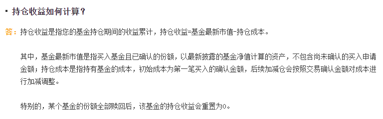

======================================================

_type: q&a
@倪[841184825858112]
2020-04-24 12:12:44 Fri  
topic_id: 548822485544424

@倪

>  二师父，今天大盘整体下跌、医药和消费收益基本在10个点左右，是否应该全部清仓？我主要买的是医药、消费、基建和科技

@二师父

>  医药可以清仓，这个已经高估了，消费可以逐步减仓

阅读[3256]  评论[2]  赞[0] 

======================================================

_type: q&a
@陈洲[88245122222212]
2020-04-24 13:27:13 Fri  
topic_id: 241155412128121

@陈洲

>  除了指数基金外，其余基金适合定投吗？比如债券基金适合定投吗

@二师父

>  可以定投的，混合基金不适合定投，有看好的混合基金可以一次购买，指数基金和债券基金基础配置就足够了

阅读[3215]  评论[0]  赞[0] 

======================================================

_type: q&a
@🍀 凝🌸 慧🍀[841855248254242]
2020-04-24 13:51:33 Fri  
topic_id: 421144212545248

@🍀 凝🌸 慧🍀

>  二师父好，场外人工智能指数，如果投资不超过1年，是不是买009239这个C款更合适？

@二师父

>  短期c类好，不过这只基金4月1号才成立，目前没有公布基金持仓和规模，持仓和a类近似，规模就不确定了

阅读[3271]  评论[1]  赞[0] 

======================================================

_type: talk
@二师父[28814221155551]
2020-04-24 13:52:56 Fri  
topic_id: 118822181452442

天天的乌龟计划，如果跟投用户持仓和我的偏离度过大，那么就会有调仓提示的。反之就没有提示

@Zero Fei at 2020-04-24 13:52:56 Fri

> 二师父，问一下乌龟计划大概的预期年收益率在多少，还有鳄鱼计划呢

----------

@二师父 at 2020-04-24 13:52:56 Fri

> 乌龟逾期10到15，鳄鱼预期20

----------

阅读[3355]  评论[2]  赞[0] 

+++++++++++++++++++++++++++++++++++++++++++++++++++++

图片：
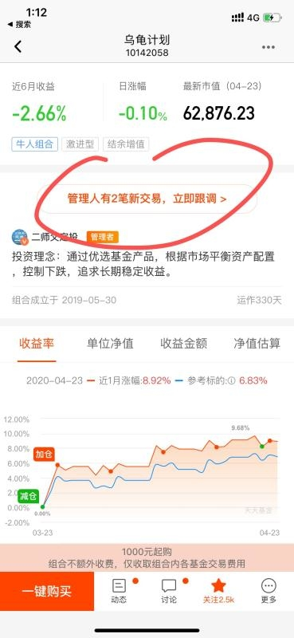

======================================================

_type: talk
@二师父[28814221155551]
2020-04-24 14:26:29 Fri  
topic_id: 421144212258818

<e type="hashtag" hid="824224522552" title="#300非银#" /> 关于300非银的分析，上次有人问到过增加了京沪高铁有无影响，这个比例太低0.3%，相当于你有1000元，给我3快钱，对你是不是毫无影响，不要在小事情上纠结。

@栀子花开 at 2020-04-24 14:26:29 Fri

> 二师傅，五穷六绝行情是怎么来的？

----------

@二师父 at 2020-04-24 14:26:29 Fri

> 根据历史过往情况统计来的

----------

阅读[4132]  评论[2]  赞[0] 

+++++++++++++++++++++++++++++++++++++++++++++++++++++

文件：
2020-04-24 14:26:19 Fri
文件大小：[177493]
28242418255581-金融股接连受挫，300非银还可以定投吗.docx

======================================================

_type: q&a
@倪[841184825858112]
2020-04-24 16:02:20 Fri  
topic_id: 118822188522222

@倪

>  二师父、300非银买C类的基金可以吗？代码007882

@二师父

>  C类基金目前仅5000多万的规模，不建议投资低于1亿的基金

阅读[3367]  评论[0]  赞[0] 

======================================================

_type: talk
@二师父[28814221155551]
2020-04-24 17:41:25 Fri  
topic_id: 421144144448448

之前有几个读者说要开海通的账户，我联系到了，忘记了是哪几个朋友，有需要微信说一下

阅读[3491]  评论[0]  赞[0] 

======================================================

_type: q&a
@蛋炒饭不加蛋[118281818482542]
2020-04-24 18:45:39 Fri  
topic_id: 241155158154551

@蛋炒饭不加蛋

>  请问师父银行活期理财2R等级是有可能亏损的吗？

@二师父

>  这是有可能的，现在所有的理财产品包括货币基金都不承诺保本的。

阅读[3478]  评论[3]  赞[0] 

======================================================

_type: q&a
@onepiecewi*[244414114545811]
2020-04-24 18:50:38 Fri  
topic_id: 548822821442814

@onepiecewi*

>  师父，能说说原油通为什么会出现这个情况呢？真的是华尔街之狼来了？

@二师父

>  你应该说的是中行的原油宝吧，主要是期货合约交易的问题。
>  
>  之前暴跌的是美国原油05合约，这个合约在5月到期，那么当时4月21日是最后一个交易日，如果在最后一个交易日不进行平仓的话，那么到了5月会自动收到原油现货，所以需要卖出然后移仓。
>  
>  这就导致期货投资者不计成本的抛售最终恐慌下跌。
>  
>  而中行的这个产品设计是和原油期货挂钩的，所以也出现了负收益。

阅读[3555]  评论[0]  赞[0] 

======================================================

_type: q&a
@smile[111888142241442]
2020-04-24 23:04:39 Fri  
topic_id: 421144142814858

@smile

>  二师父你好：小白之前因为乱跟风了买了些场外的华宝油气，现在亏损近50%，最近原油期货跌成负数，华宝油气是不是也会受很大影响呢？应该尽快亏本卖掉还是等待回本？（不知道还能回本不）。不过奇怪的是，这几天油气收益居然是正的，不知道啥逻辑。望指教，谢谢！

@二师父

>  油气现在的折溢价基本没有了，转到场内也无法获取利差。油气受两方面影响，一方面是美股，一方面是原油，最近美股起来了，所以油气起来了一些，原油这个事会有影响，不过受到最严重影响的是南方原油，溢价已经高达百分之20，如果购买原油需要警惕
>  
>  至于油气，浮亏在百分之20以内，直接卖了换成a股指数，比油气好的多，不用等待回本了，没有意义，套牢盘太多，等待最后回本是没问题，关键不确定性太大，不知道什么时候回，选个好时机，在油气相对贵点，a股指数有好机会的时候直接换过来，现在的损失就当交了学费，后续让其他的指数盈利把学费补回来

阅读[3435]  评论[2]  赞[0] 

======================================================

_type: talk
@阿宝[422212151424158]
2020-04-24 23:08:17 Fri  
topic_id: 548822824855414

小白课程总结，希望对大家有感触！

@shee at 2020-04-24 23:08:17 Fri

> 很不错哦，

----------

@姣🍎 at 2020-04-24 23:08:17 Fri

> 非常棒期待下一篇

----------

阅读[3553]  评论[2]  赞[0] 

+++++++++++++++++++++++++++++++++++++++++++++++++++++

文件：
2020-04-24 23:08:00 Fri
文件大小：[15942]
28242412482221-小白课程总结.docx

======================================================

_type: talk
@树叶[544811512145144]
2020-04-25 08:48:08 Sat  
topic_id: 421148485411218

<e type="hashtag" hid="142825811122" title="#定投周报#" /> 二师父定投周报第56期

阅读[3468]  评论[0]  赞[0] 

+++++++++++++++++++++++++++++++++++++++++++++++++++++

文件：
2020-04-25 08:48:07 Sat
文件大小：[251368]
48525215112888-二师父定投周报4.25（第56期）.docx

======================================================

_type: talk
@二师父[28814221155551]
2020-04-25 09:16:21 Sat  
topic_id: 421148485811248

<e type="hashtag" hid="554412225424" title="#关于三只基金的风险提示#" /> 第一只161226，白银基金。这只基金持仓出现了较大偏差，基金避险购买了30%的国债和40%的现金，已经严重偏离了基础配置。而国债利率低位，未来进一步上升空间不大，这只基金风险高于未来潜在收益，可以止损，也没有投资价值了。

第二只，南方原油，这只基金溢价率已经高达100%，也就意味着场内的价格是场外净值的一倍，如果场外申购的，直接转托管到场内，然后卖出，大概率是盈利的。天天基金购买的话开通东方财富可以转。

目前场外申购限制了，所以在大家都在疯狂去抢南方原油的时候是个从场内卖出的机会，反之限购取消，那么就会有大量套利盘，这样场内会砸盘，价格会继续降低，所以风险高于收益。

第三只，华宝油气，这只基金最近受益于美股，场外净值增长很多，溢价已经消除，里面持仓的美国油气公司不可能全部倒闭，所以继续等待美股上涨以及原油反弹，在成本价0.4左右，及时换出，再投资优质的宽基和行业指数收益会更好。

强周期性品种不适合定投，不要逆势加仓摊低成本，这是上不言顶，下不言底的品种。

@倪 at 2020-04-25 09:16:21 Sat

> 我的南方原油正在办理转托管[流泪]

----------

@二师父 at 2020-04-25 09:16:21 Sat

> 转了价格就能回升一些

----------

@云卷云舒 at 2020-04-25 09:16:21 Sat

> 你好！具体怎么操作的啊[微笑]

----------

@倪 at 2020-04-25 09:16:21 Sat

> 

----------

@Gingo at 2020-04-25 09:16:21 Sat

> 二师父 请教一下 我的南方原油之前就从场外转到场内了 当时基本上没有亏损有几天还盈利 但是最近又跌下去了 现在亏损8% 不过仓位比较轻 可以长时间继续持有？还是建议现在就卖出呢？

----------

@二师父 at 2020-04-25 09:16:21 Sat

> 可以再观察下

----------

@云卷云舒 at 2020-04-25 09:16:21 Sat

> 谢谢，我是在天天里面买的[微笑]

----------

阅读[4200]  评论[7]  赞[0] 

======================================================

_type: q&a
@老司基[111852221242122]
2020-04-25 09:46:36 Sat  
topic_id: 241158582282151

@老司基

>  目前持有分级基金有富国新能源、招商证券和白酒，请问是否需要换成其他相关基金？还有所说的年底前清仓是否靠谱？

@二师父

>  最好换了，分级基金有两种处理方式，第一种是清盘，第二种是转型成对应的lof基金

阅读[3711]  评论[2]  赞[0] 

======================================================

_type: talk
@二师父[28814221155551]
2020-04-25 17:39:12 Sat  
topic_id: 841158528184522

<e type="hashtag" hid="224485888181" title="#可转债打新暨网格交易表#" /> 有的同学刚接触打新和网格交易，如果不会做，可以参考这些数据。

说下网格交易，我采用的是移动网格，网格点是3%。

目前建立了中证500ETF和人工智能网格，因为人工智能周期性特别强，暂不公布，可以给大家参考500、中概、券商的网格。500的成本价在5.67，现在价格在5.67以上，所以当价格回踩5.67加仓一次，当触发卖出价格5.84卖出一次。

券商网格底仓建立位置0.86，中概互联底仓建立位置1.31，当触发这两个价格开始行动。

初学者以逆势投资为主，因为大部分人无法接受割肉止损的痛苦，所以控制安全边际逆势定投，对于一些容易跌的少，涨的多的品种以及下跌没有下限上涨也没有下限的超强周期品种可以结合趋势交易。

@庆余年 at 2020-04-25 17:39:12 Sat

> 可转债中的几率不高啊[撇嘴][撇嘴]

----------

@阿宝 at 2020-04-25 17:39:12 Sat

> 谢谢

----------

@是喵喵吖～ at 2020-04-25 17:39:12 Sat

> 二师父，请问【500的成本价在5.67，现在价格在5.67以上，所以当价格回踩5.67加仓一次】 不知道我这么理解对吗：就是比如我5.67买了1000份。然后它涨到了5.7，然后又回到5.67的话 我还是继续买入吗。我有点不理解这里。

----------

@二师父 at 2020-04-25 17:39:12 Sat

> 对的

----------

@是喵喵吖～ at 2020-04-25 17:39:12 Sat

> 嗯嗯我好像明白点了，就是说对500ETF，5.67这个价格是在安全边际范围内的，所以只要到达这个位置，就可以买入哈。

----------

@小鱼 at 2020-04-25 17:39:12 Sat

> 恒生怎么没讲，我一直买的恒生

----------

@二师父 at 2020-04-25 17:39:12 Sat

> 我这三个实盘带着做

----------

阅读[4269]  评论[7]  赞[0] 

+++++++++++++++++++++++++++++++++++++++++++++++++++++

图片：
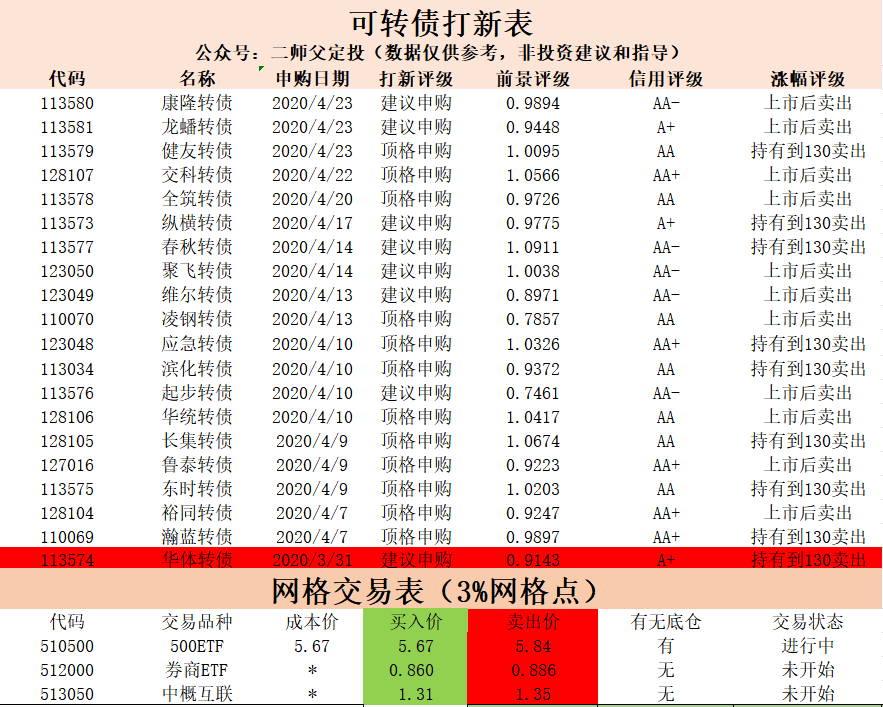

======================================================

_type: talk
@阿宝[422212151424158]
2020-04-25 18:10:24 Sat  
topic_id: 421148458114158

平安一季度财报分析。平安一季度数据不好看，主要是一季度投资收益亏损导致的，其实营业利润还是增长的，基本面没有问题。不构成投资建议，希望得到大家的指点！

@阿宝 at 2020-04-25 18:10:24 Sat

> 希望得到大家的指点！

----------

阅读[3639]  评论[1]  赞[0] 

+++++++++++++++++++++++++++++++++++++++++++++++++++++

文件：
2020-04-25 18:10:22 Sat
文件大小：[279923]
28242155155151-4.25   中国平安第一季度财报分析.docx

2020-04-25 18:13:44 Sat
文件大小：[663934]
88242155158552-中国平安：2020年第一季度报告.PDF

======================================================

_type: talk
@二师父[28814221155551]
2020-04-25 20:38:42 Sat  
topic_id: 548821255441444

<e type="hashtag" hid="452284858428" title="#收益率比较#" />

@Zero Fei at 2020-04-25 20:38:42 Sat

> 二师父我们的定投计划里，以后有机会的话会把黄金投资加进来么，

----------

@二师父 at 2020-04-25 20:38:42 Sat

> 以前买了，不过这是个周期品种，以后不再准备公布

----------

@🍀 凝🌸 慧🍀 at 2020-04-25 20:38:42 Sat

> 受益匪浅，谢谢师父[抱拳][抱拳][抱拳]😄

----------

阅读[4370]  评论[3]  赞[0] 

+++++++++++++++++++++++++++++++++++++++++++++++++++++

文件：
2020-04-25 20:38:10 Sat
文件大小：[76803]
48525148482218-低估定投收益率一定比正常估值定投收益率好吗.docx

======================================================

_type: talk
@阿宝[422212151424158]
2020-04-25 20:40:30 Sat  
topic_id: 841158522442822

小白理财课程总结（二） 新手进阶步骤！

@🍀 凝🌸 慧🍀 at 2020-04-25 20:40:30 Sat

> 总结的真好，字里行间都是不断学习后的所感所得，谢谢分享。[爱心][玫瑰][玫瑰][玫瑰][愉快]

----------

@阿宝 at 2020-04-25 20:40:30 Sat

> 谢谢

----------

阅读[3795]  评论[2]  赞[0] 

+++++++++++++++++++++++++++++++++++++++++++++++++++++

文件：
2020-04-25 20:39:37 Sat
文件大小：[13573]
15414825258822-2020.4.25 小白课程总结（二）.docx

======================================================

_type: talk
@二师父[28814221155551]
2020-04-25 22:47:05 Sat  
topic_id: 548821242184484

<e type="hashtag" hid="452284828528" title="#目前支持转托管的平台#" /> 南方原油在场外申购的，目前基本浮亏，不过转托管在场内有可能盈利。

平台有所有证券账户，天天基金，支付宝，且慢，且慢是最近才开通的，记得原油不要直接清仓，场内比场外价格贵一倍，如果能转一定要先转到场内再卖出。

@范毅君 at 2020-04-25 22:47:05 Sat

> 二师父，支付宝不支持转场内吧

----------

@二师父 at 2020-04-25 22:47:05 Sat

> 支持，用华泰证券或者中信证券

----------

@范毅君 at 2020-04-25 22:47:05 Sat

> 起来了华泰，二师父，请问具体转场内流程怎么操作，得联系证券公司经理吗

----------

@范毅君 at 2020-04-25 22:47:05 Sat

> 还有，天天好像前端时间支持转场内，我因为不会操作，没成功，好像现在又不支持了是吗，华宝油气

----------

@二师父 at 2020-04-25 22:47:05 Sat

> 直接在华泰账户操作就行

----------

@二师父 at 2020-04-25 22:47:05 Sat

> 这个是支持的

----------

@范毅君 at 2020-04-25 22:47:05 Sat

> 好，我研究一下[呲牙]

----------

@云卷云舒 at 2020-04-25 22:47:05 Sat

> 师父好！天天上买的只有转托管东方财富吗，东方财富没开户啊！不知道具体操作流程[抱拳]

----------

阅读[3686]  评论[15]  赞[0] 

======================================================

_type: q&a
@梧桐[844118451242512]
2020-04-26 07:08:02 Sun  
topic_id: 841158548484242

@梧桐

>  二师父，京沪高铁的基本面是不是有问题

@二师父

>  他的盈利情况没有问题，应收账款太多，负债太多，偿债压力是非常大的，运营效率很低。
>  
>  这家企业总资产太重，尽量避免投资重资产企业。
>  
>  股票价格长期可以反映基本面，不过短期波动有时候会严重偏离基本面，A股投资股票记得做好止损。

阅读[3657]  评论[1]  赞[0] 

======================================================

_type: talk
@二师父[28814221155551]
2020-04-26 11:04:07 Sun  
topic_id: 421148421515118

<e type="hashtag" hid="141154215812" title="#原油基金#" /> 原油基金的应对方法，没有买的就不用买了，买了的看看如何应对。

@🍀 凝🌸 慧🍀 at 2020-04-26 11:04:07 Sun

> 二师父早就说过：不懂不碰，这是底线。我觉得很对，投资纪律必须坚持，不然市场会教训你。

----------

@onepiecewi* at 2020-04-26 11:04:07 Sun

> 场外的怎么转到场内呢

----------

@二师父 at 2020-04-26 11:04:07 Sun

> 文章写了

----------

@蓝魔森林 at 2020-04-26 11:04:07 Sun

> 有时候可以关掉评论[微笑]

----------

@庆余年 at 2020-04-26 11:04:07 Sun

> 提醒一下，席位号可以通过涨乐的"我的"-"个人信息"里面查营业部信息，把营业部信息提交给客服就可以了。

----------

@彩虹 at 2020-04-26 11:04:07 Sun

> 谢谢二师父，已经转场内呢，感谢！

----------

阅读[4316]  评论[6]  赞[0] 

+++++++++++++++++++++++++++++++++++++++++++++++++++++

文件：
2020-04-26 11:02:56 Sun
文件大小：[228560]
15414824244822-原油基金，不能再碰了.docx

======================================================

_type: q&a
@敏杰 Minjie[241844452525121]
2020-04-26 12:28:27 Sun  
topic_id: 241158541441581

@敏杰 Minjie

>  二师父，华宝油气，目前一成仓位持有，亏损在46%左右，最大时候在60%。
>  后续我是考虑原油需求大幅下滑，减产应该会超预期，可能还有一波小反弹，想逐步止损，转华锦，后续操作二师父能否给点建议，华宝油气是否有保留的必要?

@二师父

>  可以趁美股反弹以及减产增加，油气起来了减小亏损卖出，换成优质的指数，目前主要是需求跟不上库存太多
>  
>  华锦股份近一年是亏损的，换成优质指数比较好

阅读[3662]  评论[1]  赞[0] 

======================================================

_type: q&a
@钱小胖儿[844112855845212]
2020-04-26 20:32:00 Sun  
topic_id: 241158518524541

@钱小胖儿

>  老师，50ah还可以继续定投吗，已经定投了沪深300和中证500了

@二师父

>  可以投的，不过50AH里面有比较多的股票和沪深300有重合

阅读[3456]  评论[0]  赞[0] 

======================================================

_type: talk
@杜志彪[544454124115854]
2020-04-27 09:36:59 Mon  
topic_id: 841158888844242

2次投资原油，华宝油气比较幸运，听了师父的建议回本卖出了，后来寻找更好的投资品种，观察了三个月的南方原油，觉得和国际原油关联挺密切可以投机，结果遇到黑天鹅，结论是不懂得不要投，最好周期性的标的也不要投，老老实实定投宽基和确定性强的行业指数就可以了，陪的不多1000多元我止损了。

@杜志彪 at 2020-04-27 09:36:59 Mon

> 银行ETF回本卖出了，转入人工智能。

----------

@J at 2020-04-27 09:36:59 Mon

> 人工智能目前是正常估值，且今天涨，为什么买进呢？

----------

@杜志彪 at 2020-04-27 09:36:59 Mon

> 正常偏下接近低估，可承受范围，而且我是平移不是追加，成长性人工智能高于银行，如果进入低估就是机会，目前人工智能仓位不足，还再等加仓机会。

----------

@J at 2020-04-27 09:36:59 Mon

> 好的，我打算耐心等低估

----------

@是喵喵吖～ at 2020-04-27 09:36:59 Mon

> 请问你买的人工智能的就是二师父估值表里的那一只吗～～

----------

@杜志彪 at 2020-04-27 09:36:59 Mon

> 是场内场外号码一样。

----------

阅读[3116]  评论[6]  赞[0] 

======================================================

_type: talk
@二师父[28814221155551]
2020-04-27 09:39:49 Mon  
topic_id: 421148888814228

<e type="hashtag" hid="881251425252" title="#鳄鱼计划#" /> 南方原油卖出一份，白银卖出0.5份，这两个品种总共就买了1.5份，全部清仓，鳄鱼计划第一次止损卖出，持仓标的出了问题，及时离开，操作要大气，不拖泥带水。

@二师父 at 2020-04-27 09:39:49 Mon

> 记得一定要转托管到场内，这样浮亏可以控制在10个点以内

----------

@顾。 at 2020-04-27 09:39:49 Mon

> 二师父 华宝油气还亏损40%，怎么处理好呢？

----------

@二师父 at 2020-04-27 09:39:49 Mon

> 这个场内溢价已经消除，里面持有的是油气类公司，还可以再观察下，美股反弹他也会涨一些，找个适当的位置可以出了

----------

@顾。 at 2020-04-27 09:39:49 Mon

> 好的。谢谢二师父！

----------

@西锦巴乌 at 2020-04-27 09:39:49 Mon

> 师父好！请问医药100已减仓一半现还需要再分批减呢还是继续持有？

----------

@二师父 at 2020-04-27 09:39:49 Mon

> 可以减，高位可以逐步清仓了

----------

@西锦巴乌 at 2020-04-27 09:39:49 Mon

> 好，明白。我在是否要清仓犹豫

----------

@倪 at 2020-04-27 09:39:49 Mon

> 二师父，怎么加入鳄鱼计划？

----------

阅读[4021]  评论[14]  赞[0] 

======================================================

_type: talk
@阿宝[422212151424158]
2020-04-27 10:32:27 Mon  
topic_id: 421148888155148

保险是防范风险，是长久投资的基石！希望每个人都能正确认识保险这件事！

阅读[3363]  评论[0]  赞[0] 

+++++++++++++++++++++++++++++++++++++++++++++++++++++

文件：
2020-04-27 10:30:39 Mon
文件大小：[16086]
15414855481242-4.27  小白保险课感悟.docx

======================================================

_type: q&a
@向前进[118554515482152]
2020-04-27 12:41:11 Mon  
topic_id: 241158882485821

@向前进

>  二师父，银行亏8.5%，今天调仓到300，可以吗

@二师父

>  可以的，沪深300很稳健，调仓以后可以继续定投

阅读[3446]  评论[1]  赞[0] 

======================================================

_type: q&a
@Zero Fei[51422225155524]
2020-04-27 15:00:41 Mon  
topic_id: 241158882142481

@Zero Fei

>  二师父，现在持有260416石油基金建议出还是持有呢，前几天涨了一些，这两天又跌回来了，目前亏的不多

@二师父

>  你的代码是不是打错了，石油基金代码我查的是160416，这是美国的油气公司组成的指数，等待盈利之后可以出了，未来也能涨，不过这些中小油气公司比直接投资美股指数的价值低一些，投这个的逻辑都是博油价上涨带动油气公司股价上升，并不是完全意义上的投资

阅读[3185]  评论[1]  赞[0] 

======================================================

_type: q&a
@范毅君[118551121224142]
2020-04-27 15:01:18 Mon  
topic_id: 241158884528541

@范毅君

>  二师父，我支付宝南方原油买的006476，这个不支持转场内吧

@二师父

>  C类基金没法支持转场内，只有A类基金可以支持转

阅读[3370]  评论[2]  赞[0] 

======================================================

_type: q&a
@衣袂飘香[118248548242452]
2020-04-27 15:05:54 Mon  
topic_id: 118825551444582

@衣袂飘香

>  请问二师父，在天天基金上，您的乌龟计划的食品饮料部分，4月21号才卖出过一次，为什么今天又卖出了700份？

@二师父

>  这个并未在低估区域定投，而是在正常估值回撤的时候定投，目前估值已经不低了

阅读[3395]  评论[3]  赞[0] 

======================================================

_type: talk
@二师父[28814221155551]
2020-04-27 15:07:42 Mon  
topic_id: 548821152512854

<e type="hashtag" hid="554415445154" title="#一起看看中概股遭遇做空#" /> 中概股遭遇做空，到底是怎么回事，机会or风险。

@shee at 2020-04-27 15:07:42 Mon

> 好的

----------

@HeLLO at 2020-04-27 15:07:42 Mon

> 师父，场内513050也行吧

----------

@二师父 at 2020-04-27 15:07:42 Mon

> 可以

----------

@是喵喵吖～ at 2020-04-27 15:07:42 Mon

> 二师父请问那个易方达中概互联50ETF和您文章里说的那只有什么大的区别吗。

----------

@二师父 at 2020-04-27 15:07:42 Mon

> 我说的是指数

----------

@是喵喵吖～ at 2020-04-27 15:07:42 Mon

> 哦哦😁

----------

@蓝魔森林 at 2020-04-27 15:07:42 Mon

> 我记得我之前就预测过， 瑞幸触发的不只是股价下跌，更多是中概股信任危机的开始

----------

阅读[4287]  评论[7]  赞[0] 

+++++++++++++++++++++++++++++++++++++++++++++++++++++

文件：
2020-04-27 15:06:50 Mon
文件大小：[48806]
88242181855182-继瑞幸之后，中概股再次遭遇做空，风险和机遇是并存的.docx

======================================================

_type: q&a
@葛亚丽[841858254128252]
2020-04-27 15:14:31 Mon  
topic_id: 118825542452552

@葛亚丽

>  二师父你好，推荐一下好的重疾险！

@二师父

>  我做了一个配置，有成年男性的配置方案、成年女性的配置方案、幼儿的配置方案，还有老年人的配置方案，这个在置顶文章保险配置里面有详细的测评介绍。老年人的话瑞泰瑞盈比较好，男性选择钢铁一号，女性的话选择横琴优惠宝，幼儿的话晴天保保超越版或者妈咪保贝。<e type="web" href="https://mp.weixin.qq.com/s/mZvN5ZUAqwtWwnMf2NTQOg" title="各年龄段人群的最优保险配置方案" cache="" />

阅读[3677]  评论[1]  赞[0] 

======================================================

_type: talk
@二师父[28814221155551]
2020-04-27 15:21:11 Mon  
topic_id: 241158825222541

<e type="hashtag" hid="554415445414" title="#每日打新和网格交易数据#" /> 这个网格是我实盘网格，就三个品种，价格就在这上面标的着，到了就动不到就不动，保证卖出一定盈利。

@🍀 凝🌸 慧🍀 at 2020-04-27 15:21:11 Mon

> 师父好，可转债打新的信息，您一般会在什么时候提前公布啊？[疑问]

----------

@二师父 at 2020-04-27 15:21:11 Mon

> 每天晚上

----------

@🍀 凝🌸 慧🍀 at 2020-04-27 15:21:11 Mon

> [憨笑][抱拳][抱拳][抱拳]

----------

@Zero Fei at 2020-04-27 15:21:11 Mon

> 二师父其他的像5getf.半导体etf的网格操作有么

----------

@二师父 at 2020-04-27 15:21:11 Mon

> 这个没有的

----------

@Zero Fei at 2020-04-27 15:21:11 Mon

> 也就是这些没有进场入场规矩而言，只能看时机了是么

----------

@二师父 at 2020-04-27 15:21:11 Mon

> 有，可以低估投，也可以做趋势，都需要有纪律

----------

阅读[3911]  评论[7]  赞[0] 

+++++++++++++++++++++++++++++++++++++++++++++++++++++

图片：
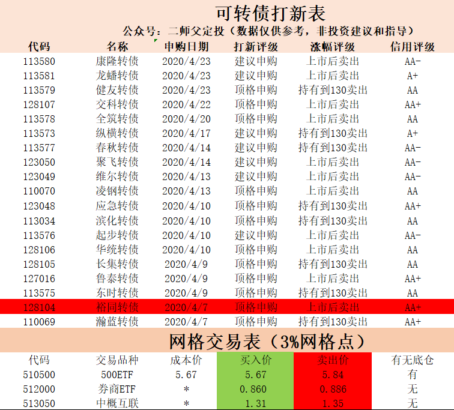

======================================================

_type: talk
@二师父[28814221155551]
2020-04-27 15:48:26 Mon  
topic_id: 241158825424251

<e type="hashtag" hid="824482444522" title="#讲讲我投资路上交的学费#" /> 在市场上做投资，市场是我们的老师，给他交学费是必然的，但是每一笔学费都要交的值得。交了一笔学费之后未来就要吸取经验，从而赚回N倍的学费。股票的我就不讲了，因为自己买股票采用的是8%——10%的机械止损位，所以给市场的挺多，这是交易系统决定的，赚该赚的钱，亏该亏的钱。只进不出是不可能的，那最后只会出的更多。

说说基金的两笔学费，第一笔是购买主动基金，当时买的宝盈的产品，基金经理特别好，冲着基金经理过去的，结果基金经理换了，持仓股票大面积更换，最后这只基金大幅度下跌。

下跌怎么办呢？二师父不喜欢当驼鸟，所以就主动行动，那到底是买还是卖呢？因为投资经验不足，对A股市场领会不深，而且也没有可以请教的人，所以我就读书，当时是看了博多舍费尔的书，名字记不清了，好像叫做财务自由之路，不过里面有些观点我到现在记得：只买混合基金和股票基金，只有这两种基金收益率更好。

这话放现在没问题，不过他还有一句话：这两种基金购买了只要终身持有，未来一定盈利。当时我就是深受这两句话的误导，觉着这是金钱教练讲的话，应该是对的，所以我就一直拿着

最后的结果很糟糕：我那只基金从盈利30%到亏了15%，触发了我的止损点，从那以后我就反思为什么长期持有了还是亏呢？终于明白他说的是美国股市而不是中国股市。这是有巨大区别的。

也就是从那以后我就不再买混合基金了，到现在为止我也没有买过一只混合基金。除了指数，就是债券，就是股票。而且也不盲目相信终身持有，自己开始从指数量化上慢慢形成自己的系统，发现这才是符合中国国情的投资方法。

所以那次亏损是个好事，本金不多，而让我及时刹车，找到了正确的方向，有的时候在正确的方向上挣不到钱也比在错误的方向上挣到钱要重要。

第二笔学费，白银和原油，本来这笔学费是不用的，如果套利之后盈利就出手，也能赚钱，而我想要的更多，准备到50美元以上开始再卖，而这次碰到了极端事件导致原油存储空间减少以及需求下降，双重利空下，再持有这两个品种的话，不确定性太大，所以及时退出。

风控还是做的可以，安全边际够大，只有1.5份，原油亏了10%，白银亏了14%。这次学费之后，对于强周期性的品种不会再逆势定投，而是轻仓顺势投资，另外见好就收，钱不在多，有赚就好，只要盈利及时收手，都不会有大问题，在股市出事的都是想要的太多，不求一夜暴富，只求稳步增值。

大家也可以总结下自己投资过程中的错误，不要当驼鸟，错误+反思等于进步。

@杜志彪 at 2020-04-27 15:48:26 Mon

> 我是不打算碰周期性行业了，今天把医药和消费收割的钱转到易方达国开债里了，试试水股债轮动[偷笑]，等医药下来了再取出来。

----------

@HeLLO at 2020-04-27 15:48:26 Mon

> 我曾在2016年牛势在分级B上导致亏损具大，是无知付出的巨大代价，永远不要投资超过自已认知和自已能力范围的投资。在自已懂的领域能形成自已的一套投资系统就够了，不能贪多。

----------

@HeLLO at 2020-04-27 15:48:26 Mon

> 我曾在2016年买分级金融B亏损巨大，这是为自已的无知代出的代价，永远不做超过自已认知和能力之外的投资，能在自已懂的领域形成自已的一套交易系统已够了，不可贪多。

----------

@rtdmm小米 at 2020-04-27 15:48:26 Mon

> 请问二师父，券商也是周期性行业，也少碰？

----------

@二师父 at 2020-04-27 15:48:26 Mon

> 控制仓位，不适合重仓

----------

@rtdmm小米 at 2020-04-27 15:48:26 Mon

> 谢二师父！

----------

阅读[4746]  评论[6]  赞[0] 

======================================================

_type: talk
@二师父[28814221155551]
2020-04-27 16:57:27 Mon  
topic_id: 241158828854111

<e type="hashtag" hid="458588251558" title="#周一市场分析#" />

@倪 at 2020-04-27 16:57:27 Mon

> 二师父有推荐的债券基金吗？求代码

----------

@素兮 at 2020-04-27 16:57:27 Mon

> 食品饮料高估了？

----------

@二师父 at 2020-04-27 16:57:27 Mon

> 再涨涨就快了

----------

@二师父 at 2020-04-27 16:57:27 Mon

> 国债etf，目前不适合投资债券

----------

@倪 at 2020-04-27 16:57:27 Mon

> 只要是国债etf都可以吗？二师父有没有具体推荐代码

----------

@二师父 at 2020-04-27 16:57:27 Mon

> 511260，不知道你的投资水平，如果能经受波动风险可以了解下国债

----------

阅读[4855]  评论[6]  赞[0] 

+++++++++++++++++++++++++++++++++++++++++++++++++++++

文件：
2020-04-27 16:57:17 Mon
文件大小：[225427]
51545818551144-市场分析4.27.docx

======================================================

_type: q&a
@是喵喵吖～[421441114141158]
2020-04-27 22:45:23 Mon  
topic_id: 548821142112454

@是喵喵吖～

>  二师父，想请教您，亚药转债为什么跌破面值，现在买入是不是就锁定了九块的利润？谢谢！😊

@二师父

>  跌破面值很正常啊，他的转股价值很低，看公司会不会下修转股价
>  
>  等他到期最少面值100元给你，不过剩余期限还有5年，这个收益率还不如银行理财产品，流动性又差，没多大意思

阅读[3949]  评论[1]  赞[0] 

======================================================

_type: talk
@小鱼[241182222251181]
2020-04-28 10:17:24 Tue  
topic_id: 118825518141512

二师父，当次你买的家电基金，是不是还是持续购买呀，最近有些跌。

@二师父 at 2020-04-28 10:17:24 Tue

> 可以，控制仓位定投没问题

----------

阅读[3601]  评论[1]  赞[0] 

======================================================

_type: q&a
@🍀 凝🌸 慧🍀[841855248254242]
2020-04-28 10:21:04 Tue  
topic_id: 421148821585248

@🍀 凝🌸 慧🍀

>  二师父，500ETF可以买啦，今天好多都跌啊，可以按纪律低吸。

@二师父

>  可以的，按照网格价格加就行的，额外定投补仓也可以，我的网格在5.6加了一份的，按照自己的实际情况来就行

阅读[3817]  评论[5]  赞[0] 

======================================================

_type: q&a
@大兵[28442225558541]
2020-04-28 11:06:20 Tue  
topic_id: 118825582221152

@大兵

>  二师父好，场内持有，50ETF（-5%），银行ETF（-12%），500ETF（+6%），深红利（-1.18%），科技100（-0.58%），恒生ETF（-10%），300ETF（-0.23%），请问如何操作？

@二师父

>  资金没有了，好好拿着就是最好的操作，别被震荡把自己给洗出去了就行

阅读[3758]  评论[0]  赞[0] 

======================================================

_type: talk
@二师父[28814221155551]
2020-04-28 11:08:32 Tue  
topic_id: 841158815855412

凡事要趁早，做人别磨叽，做事别犹豫，创业板之前犯懒不愿去柜台开通的，现在门槛又提高了，打新创业板就没机会了，现在创业板股票是百分之20的涨跌幅，警惕风险

@Zero Fei at 2020-04-28 11:08:32 Tue

> 今天起已经提高门槛了么

----------

@二师父 at 2020-04-28 11:08:32 Tue

> 提高了

----------

@老司基 at 2020-04-28 11:08:32 Tue

> 怎么提高了？

----------

@二师父 at 2020-04-28 11:08:32 Tue

> 需要两年经验，日均资产10万

----------

@老司基 at 2020-04-28 11:08:32 Tue

> 2年经验值的就是开户2年？日均10万持有ETF也算？

----------

@二师父 at 2020-04-28 11:08:32 Tue

> 是的

----------

@姣🍎 at 2020-04-28 11:08:32 Tue

> 幸运听二师父的早前开通了

----------

@JOY at 2020-04-28 11:08:32 Tue

> 庆幸年前去开通了～真是懒不得～

----------

阅读[3793]  评论[12]  赞[0] 

======================================================

_type: q&a
@rtdmm小米[422188284881148]
2020-04-28 11:56:51 Tue  
topic_id: 241158815252281

@rtdmm小米

>  请问二师父，酒etf到高估了没？

@二师父

>  正常偏高，还没有高估

阅读[3800]  评论[5]  赞[0] 

======================================================

_type: talk
@二师父[28814221155551]
2020-04-28 14:52:59 Tue  
topic_id: 421148512588128

<e type="hashtag" hid="554414121824" title="#可转债打新暨估值表#" /> 开盘加了一网，后面起来了，反正到了价格就买和卖，这样是稳稳盈利的。

@Zero Fei at 2020-04-28 14:52:59 Tue

> 成本价是底仓么

----------

@二师父 at 2020-04-28 14:52:59 Tue

> 底仓成本价

----------

@丸子妈 at 2020-04-28 14:52:59 Tue

> 今天卖了部分酒etf

----------

@Zero Fei at 2020-04-28 14:52:59 Tue

> 好的

----------

@是喵喵吖～ at 2020-04-28 14:52:59 Tue

> 是

----------

阅读[4454]  评论[5]  赞[0] 

+++++++++++++++++++++++++++++++++++++++++++++++++++++

图片：
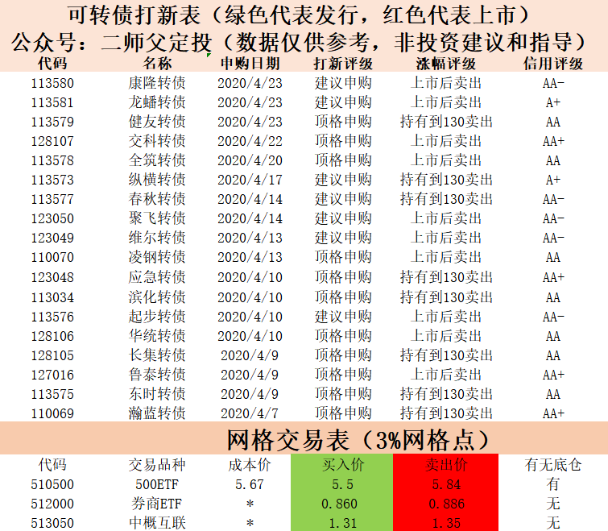

======================================================

_type: talk
@二师父[28814221155551]
2020-04-28 14:53:27 Tue  
topic_id: 421148512585418

<e type="hashtag" hid="224484858121" title="#人工智能#" />

@J at 2020-04-28 14:53:27 Tue

> 师父，现在场内开始定投AI指数可以吗

----------

@二师父 at 2020-04-28 14:53:27 Tue

> 可以

----------

@JOY at 2020-04-28 14:53:27 Tue

> 师父，请问中概互联目前有30%的利润，是否需要收割？还是持有到高估再出比较合适？

----------

@二师父 at 2020-04-28 14:53:27 Tue

> 可以收割啊

----------

@JOY at 2020-04-28 14:53:27 Tue

> 谢谢您

----------

@栀子花开 at 2020-04-28 14:53:27 Tue

> 二师傅，人工智能现在低估了吗？

----------

@二师父 at 2020-04-28 14:53:27 Tue

> 还没有

----------

@王模堂 at 2020-04-28 14:53:27 Tue

> cs人工智能910713在场内如何购买？

----------

阅读[4723]  评论[9]  赞[0] 

+++++++++++++++++++++++++++++++++++++++++++++++++++++

文件：
2020-04-28 14:53:17 Tue
文件大小：[19299]
51545854525124-科技股回调，布局人工智能正当时.docx

======================================================

_type: q&a
@Zero Fei[51422225155524]
2020-04-28 15:41:14 Tue  
topic_id: 241158214445551

@Zero Fei

>  二师父，创业板注册制实行后，对于我们之后买基金买股票有什么影响，和以后需要调整注意的地方么

@二师父

>  就是买创业板股票没有10%的涨跌幅度了，购买创业板股票最好最好止损，不要硬抗。
>  
>  买基金没啥影响，利好。未来还是以龙头股为主，小市值垃圾股很多会成为仙股和退市股。

阅读[3829]  评论[5]  赞[0] 

======================================================

_type: talk
@二师父[28814221155551]
2020-04-28 16:05:41 Tue  
topic_id: 841158214151442

<e type="hashtag" hid="224484851541" title="#债券投资#" /> 一起看看长期债券基金的投资方法

@🍀 凝🌸 慧🍀 at 2020-04-28 16:05:41 Tue

> 正需要学习这方面知识，先谢师父！[憨笑][抱拳][抱拳][抱拳]

----------

@蛋炒饭不加蛋 at 2020-04-28 16:05:41 Tue

> 谢谢二师父，场外有合适的债券基金吗？

----------

@二师父 at 2020-04-28 16:05:41 Tue

> 广发纯债

----------

@衣袂飘香 at 2020-04-28 16:05:41 Tue

> 读了好几遍，做了笔记。

----------

@HeLLO at 2020-04-28 16:05:41 Tue

> 目前十年国债利率2.55多样子，就不适合投资债券吗？师父有哪些比较好债券推荐？

----------

@二师父 at 2020-04-28 16:05:41 Tue

> 上涨空间不大，首选国债

----------

阅读[4741]  评论[6]  赞[0] 

+++++++++++++++++++++++++++++++++++++++++++++++++++++

文件：
2020-04-28 16:05:07 Tue
文件大小：[162292]
28242124452541-基金分析——长期债券的投资4.24.docx

======================================================

_type: q&a
@六尘不改[241555484551821]
2020-04-29 07:25:46 Wed  
topic_id: 548821425188284

@六尘不改

>  今天涨得不错，我的基金大部分都涨了一到两个点，有一些反弹新高了，要不要减仓？

@二师父

>  医药可以减

阅读[3623]  评论[0]  赞[0] 

======================================================

_type: talk
@Chu[88888125211582]
2020-04-29 09:51:20 Wed  
topic_id: 841158482852152

一直按二师父的方法低估定投，虽然不能赚大钱，但求在跌的时候不慌张，涨的时候也拿的住，按照记录逐步收割不贪心，坚持按每年8-10%的利润足以

@蓝魔森林 at 2020-04-29 09:51:20 Wed

> 我非银 场外还是浮亏的[撇嘴]

----------

阅读[3585]  评论[1]  赞[0] 

+++++++++++++++++++++++++++++++++++++++++++++++++++++

图片：
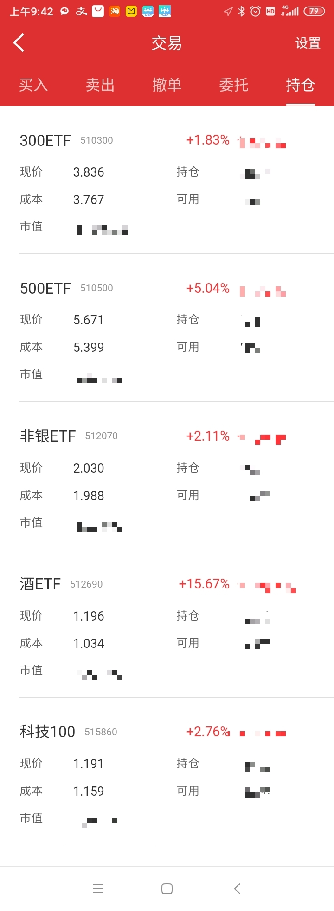

======================================================

_type: talk
@Nick.yang[118281888551882]
2020-04-29 10:06:13 Wed  
topic_id: 118825154422522

原油真的是跌的血本无归，前面看了20幅的文章说转到场内在卖，我是在支付宝买的，可否说得更详细一点 看了文章根据文章，我的大致理解就是我先有拥有一个场内账号，然后把支付宝的转到场内，然后直接卖出吗 还是在等一等

@二师父 at 2020-04-29 10:06:13 Wed

> 不要犹豫卖出果断，支付宝也能转，先开通场内账户，然后找到支付宝的客服把你购买的席位号给他，跟他说转托管到场内，马上五一休假了，要转尽快处理

----------

@雨的依恋 at 2020-04-29 10:06:13 Wed

> 我昨天把华宝油气卖了，天天看着辣眼睛

----------

@大兵 at 2020-04-29 10:06:13 Wed

> 二师父，华宝油气场内的要怎么处理？-5%左右

----------

@范毅君 at 2020-04-29 10:06:13 Wed

> 华宝还好啊，最近一直涨啊

----------

@范毅君 at 2020-04-29 10:06:13 Wed

> 二师父，我买的c类，不能转场内，和这位同学情况差不多，亏损百分之六十多，现在必须割肉吗

----------

@雨的依恋 at 2020-04-29 10:06:13 Wed

> 场内的卖了，0.250卖的，场外的还有点没卖[捂脸]

----------

@范毅君 at 2020-04-29 10:06:13 Wed

> 我就一点场外[流泪]

----------

@二师父 at 2020-04-29 10:06:13 Wed

> 这个不太好建议，如果是我，就会离开，原因已经分析了，然后换到别的指数，再赚回来

----------

阅读[3645]  评论[14]  赞[0] 

+++++++++++++++++++++++++++++++++++++++++++++++++++++

图片：
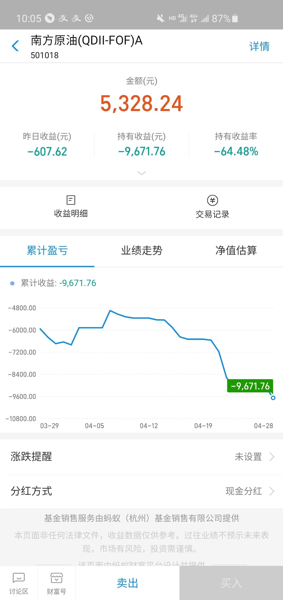

======================================================

_type: q&a
@黎雄[841555255485222]
2020-04-29 11:09:53 Wed  
topic_id: 841158482225222

@黎雄

>  师傅场内现在适合定投人工智能嘛

@二师父

>  可以的

阅读[3701]  评论[3]  赞[0] 

======================================================

_type: q&a
@铁观音[28444524525851]
2020-04-29 11:11:09 Wed  
topic_id: 118825154158182

@铁观音

>  师傅好，场外的在卖出的价格是怎么计算的？是按照当天的收盘价格吗？还是前一天的收盘价格？

@二师父

>  如果是三点之前卖出，就是以收盘净值成交的

阅读[3718]  评论[0]  赞[0] 

======================================================

_type: q&a
@次郎🌻[48551412448858]
2020-04-29 11:22:30 Wed  
topic_id: 548821415885184

@次郎🌻

>  师傅，我手上有一些子弹，然而现在大盘这个点位，还适合建立底仓吗？
>  如果要建立，推荐哪个指数基金，感谢回复

@二师父

>  之前大盘在2700的时候为啥没建啊，目前这个位置底仓建是能建，不过你得考虑下发生了回撤是否能接受，还有多大的底仓，这些问题都要清楚，不然建底仓之后回撤压力会较大

阅读[3793]  评论[2]  赞[0] 

======================================================

_type: q&a
@顾屹峰[28242255855121]
2020-04-29 13:33:41 Wed  
topic_id: 841158484215452

@顾屹峰

>  能源ETF现在能定投吗

@二师父

>  目前两个能源ETF规模不足1亿，需要慎重，短期趋势投机可以做，定投不适合

阅读[3620]  评论[4]  赞[0] 

======================================================

_type: q&a
@shee[544885258412114]
2020-04-29 14:08:06 Wed  
topic_id: 421148281442448

@shee

>  二师父，我中的这个怎么一直没数据？

@二师父

>  不用担心，还没上市，上市了就会有数据，预计15天内会上市的

阅读[3831]  评论[1]  赞[0] 

======================================================

_type: talk
@爱华[844445144558182]
2020-04-29 14:34:01 Wed  
topic_id: 421148254144258

二师父好，中概互联还能持有吗？谢谢

@二师父 at 2020-04-29 14:34:01 Wed

> 可以持有

----------

阅读[3854]  评论[1]  赞[0] 

======================================================

_type: talk
@二师父[28814221155551]
2020-04-29 17:45:34 Wed  
topic_id: 548821455254184

<e type="hashtag" hid="224584242421" title="#重要数据#" /> 本周的估值表增加了全市场指数盈利收益率相对于国债收益率比值，这个指标可以作为衡量全市场便宜和昂贵的指标，同时考虑了风险溢价。很有参考价值。

食品饮料、医药都高估了，后面可能的机会就是消费、电器以及龙头科技。半导体实在是太猛了，100多倍市盈率，还是慎重为好。

纳斯达克可以关注下广发纳斯达克，在市盈率25倍以下套利，最大申购200元，不一定挣到很多钱，可以学习下套利操作，平时多学一些技能，关键时候操作起来就轻轻松松。

@老司基 at 2020-04-29 17:45:34 Wed

> 新能源、计算机怎么看？和人工智能希望是正常估值。

----------

@二师父 at 2020-04-29 17:45:34 Wed

> 计算机不错，新能源受政策影响很大

----------

@🍀 凝🌸 慧🍀 at 2020-04-29 17:45:34 Wed

> 二师父，能解释一下：全市场指数收益率相对于国债收益率的比值，该如何理解？谢谢！

----------

@栀子花开 at 2020-04-29 17:45:34 Wed

> 二师傅，请问高估的医药和食品饮料是分次卖出还是一次卖完，卖了换到低估的宽基指数是吧

----------

@rtdmm小米 at 2020-04-29 17:45:34 Wed

> 请问二师父，食品饮料的估值区间是28---36，怎么就高估了呢？

----------

@黎雄 at 2020-04-29 17:45:34 Wed

> 师傅全市场指数盈利收益率相对于国债收益率比值，应该怎么看，比值多少是贵，多少是便宜呢

----------

@林玮 at 2020-04-29 17:45:34 Wed

> 同问

----------

@二师父 at 2020-04-29 17:45:34 Wed

> 阈值有调整的

----------

阅读[4593]  评论[21]  赞[0] 

+++++++++++++++++++++++++++++++++++++++++++++++++++++

图片：
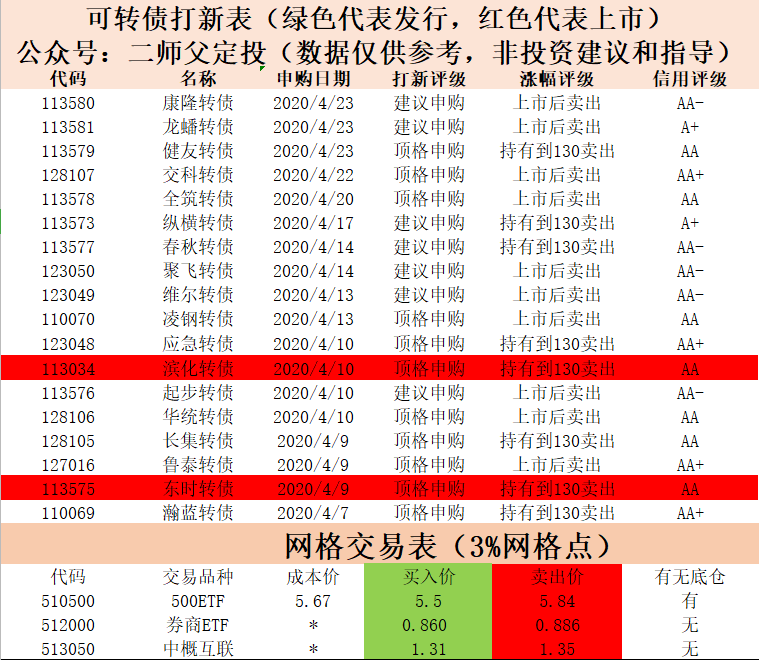
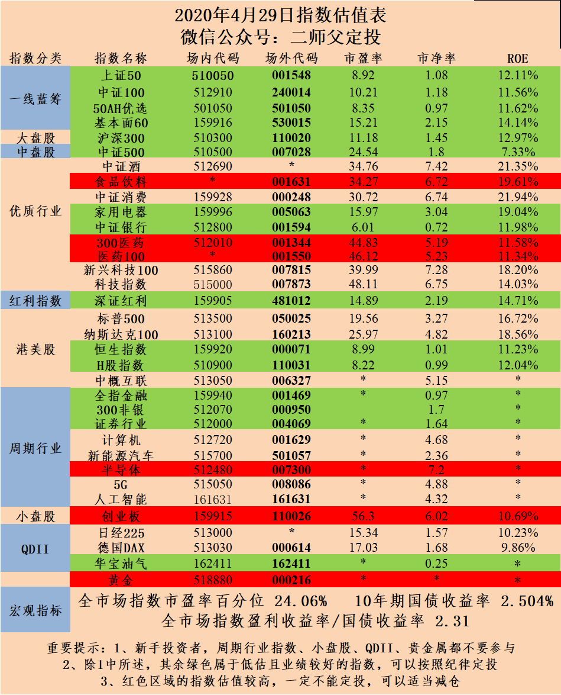

======================================================

_type: talk
@二师父[28814221155551]
2020-04-29 17:47:34 Wed  
topic_id: 548821455258484

<e type="hashtag" hid="452282258188" title="#235期定投实盘#" />

@Snow at 2020-04-29 17:47:34 Wed

> 有点乱，这次是一份吗？

----------

@庆余年 at 2020-04-29 17:47:34 Wed

> 我感觉还是放代码出来比较好，熟悉的人都知道二师父定投一份是2000块，不熟悉的估计就又要问了。

----------

@二师父 at 2020-04-29 17:47:34 Wed

> 是的

----------

@二师父 at 2020-04-29 17:47:34 Wed

> 下次标明下

----------

@Philip🎭 Y at 2020-04-29 17:47:34 Wed

> 人工智能的号码有吗？我查不到……谢谢二师父

----------

@二师父 at 2020-04-29 17:47:34 Wed

> 161631

----------

@Philip🎭 Y at 2020-04-29 17:47:34 Wed

> 谢谢！原来就是估值表的！

----------

@素兮 at 2020-04-29 17:47:34 Wed

> 二师父是说食品饮料如果回踩成本价，全部清仓么？这里的成本价是收割利润前的成本价，还是收割了利润后系统自动调低后的成本价？

----------

阅读[4885]  评论[9]  赞[0] 

+++++++++++++++++++++++++++++++++++++++++++++++++++++

文件：
2020-04-29 17:47:21 Wed
文件大小：[93091]
88242142458882-二师父235期定投实盘记录.docx

======================================================

_type: q&a
@姥姥不疼. 爷爷不爱[48544481458248]
2020-04-29 19:11:14 Wed  
topic_id: 421148255818858

@姥姥不疼. 爷爷不爱

>  请教二师父，明周四定投人工智能，可以场内定投么

@二师父

>  场内定投可以的

阅读[4020]  评论[3]  赞[0] 

======================================================

_type: q&a
@丸子妈[28512522184441]
2020-04-29 19:12:27 Wed  
topic_id: 118825144241142

@丸子妈

>  银行etf,现在还亏2.9%，现在是加一点仓进去，还是等上去后卖掉？

@二师父

>  看你自己的配置需求，如果只求一个保守的收益率，那就不用卖，如果想要更好的收益率，银行在当前经济情况不适合定投。

阅读[4047]  评论[0]  赞[0] 

======================================================

_type: q&a
@wty[548488548545444]
2020-04-29 19:13:31 Wed  
topic_id: 841158428424212

@wty

>  二师父，刚看到您把易方达可转债转出到建信基本面60，分享一下调仓逻辑！能调到易方达沪深300吗？

@二师父

>  这个是可以的，沪深300和深F60都是防守型的宽基指数，可转债很多都上100元以上了，进攻性降低，而且未来并不需要防守，而是等待行情反转取得更好的收益率

阅读[4158]  评论[6]  赞[0] 

======================================================

_type: q&a
@大兵[28442225558541]
2020-04-29 19:21:54 Wed  
topic_id: 241158428251811

@大兵

>  二师父，男士32岁，想买份保险，推荐哪款？还有小孩儿快5岁，推荐哪款保险？谢谢！另外就是买保险需要注意哪些事项？

@二师父

>  首选钢铁一号。
>   
>  基础保障扎实：120种重疾+20种中症+50种轻症（自带5种心血管疾病二次赔）+被保人豁免。
>  
>  主要有以下优点：
>  
>  1、60岁前确诊重疾，额外赔付50%基本保额
>  
>  2、可选癌症二次赔120%，价格比同类便宜35%。若首次重疾为癌症，3年后癌症复发/持续/转移/新发，赔120%基本保额；若首次重疾非癌症，180天后确诊癌症，可赔120%基本保额。
>  
>  3、自带5种心血管轻症二次赔40%，不需要额外加费。
>  
>  ​4、可选5种高发心血管重疾二次赔120%
>  
>  5种特定心血管重疾，不仅高发，再次发生的概率也很大。 比如急性心肌梗塞，中国北京地区防治冠心病协作组的调查表明，再梗的发生率约15%左右。 再比如心脏瓣膜手术，生物瓣膜衰败和再次手术干预的比例在40岁患者中达55%，而30岁患者更是高达75%。机械瓣膜置患者，二次手术率也不容乐观。
>  
>  这款产品适合男性母系亲属或者父系亲属曾经患过偏瘫及高血压的。男性到了45岁以上高血压、高血脂、高血糖常犯病，从而引起心血管疾病。<e type="web" href="https://cps.qixin18.com/m/lhz1029368/product/detail-104084-128582.html" title="https://cps.qixin18.com/m/lhz1029368/product/detail-104084-128582.html" />
>  
>  孩子选择晴天保保，晴天保保超越版是定期重疾险，最长保障期限是30年。他的超越版比之前的版本上升了一个档次。
>  
>  这款重疾险保110种重疾，从第3年开始，保额每隔两年递增20%，到第11年递增至200%为止。0岁开始买50万，保30年，最后保额涨到100万，且第11年及以后一直固定100万。
>  
>  可以简单理解为：买一份重疾险，多给一份报20年的，赔50万的重疾险。
>  
>  保22种少儿高发特定疾病，若前6年不幸得了白血病、手足口病、哮喘...可以额外赔付2倍基本保额；第7年起至30周岁则额外赔1倍基本保额。<e type="web" href="https://cps.qixin18.com/m/lhz1029368/product/detail-104095-128595.html" title="https://cps.qixin18.com/m/lhz1029368/product/detail-104095-128595.html" />
>  
>  注意问题：第一保大人为主，主要家里两个大人，这是主要需要保障对象。第二是购买的保额要能够覆盖两年的收入，因为重疾的意义不是医疗费，而是给付款，弥补患病期间损失的收入来源。第三是需要标体承保，保证自己符合健康告知的要求，不能够隐瞒疾病史。第四，买入之前慎重考虑，保险产品不同于基金，买了之后想要更换非常麻烦。

阅读[4314]  评论[0]  赞[0] 

======================================================

_type: q&a
@黎雄[841555255485222]
2020-04-29 19:23:28 Wed  
topic_id: 421148255284418

@黎雄

>  师傅场内人工智能和科技100选一只定投，还是两只都可以定投那只估值低投那只

@二师父

>  场内科技100更好一些，都进入低估的话都是可以定投的，这类指数波动很大，注意控制下仓位和每次定投的金额

阅读[4345]  评论[6]  赞[0] 

======================================================

_type: talk
@二师父[28814221155551]
2020-04-29 20:28:12 Wed  
topic_id: 118825144885482

我们一起来看看300医药的历史走势图，总有人喜欢终身持有，对于这个指数，不断向上增长，终身持有理论是可行的，可是这些人忘记了一个重要因素：自己对浮亏的耐受力。

比如自己的账户200万变成了100万，还有几个人可以拿的住。这就是为什么股市一直上涨而很多人亏钱的原因，波动太大，如果房子动不动跌个60%，估计也拿不住，是个人都一样。

理论是理论，实际是实际，做投资要从实际出发，纸上谈兵是不行的。

当然有的大神拿的住，比如巴菲特，而他拿的住不是因为他有多厉害，而在于他有源源不断的现金流，你投入100万，每年收入200万，股市回撤50万你也拿的住的。

@Yingshengw* at 2020-04-29 20:28:12 Wed

> 说得在理

----------

@Mr-K at 2020-04-29 20:28:12 Wed

> 忍不住浮亏 忍不住收割利润，忍不住。。

----------

阅读[5090]  评论[2]  赞[0] 

+++++++++++++++++++++++++++++++++++++++++++++++++++++

图片：
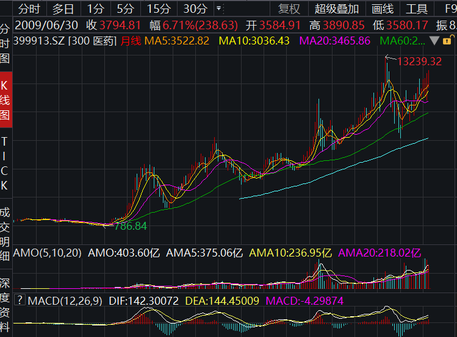

======================================================

_type: talk
@阿宝[422212151424158]
2020-04-29 22:11:31 Wed  
topic_id: 241158445818511

股权和价值投资。从本质上看待买股票的行为，从方法上赚钱！

@🍀 凝🌸 慧🍀 at 2020-04-29 22:11:31 Wed

> 谢谢球友的分享，让我也温故知新，每天进步一点点，坚持！[玫瑰][玫瑰][玫瑰][爱心]

----------

@阿宝 at 2020-04-29 22:11:31 Wed

> 谢谢！

----------

阅读[4255]  评论[2]  赞[0] 

+++++++++++++++++++++++++++++++++++++++++++++++++++++

文件：
2020-04-29 22:11:31 Wed
文件大小：[14848]
88242144514422-4.29   股权和价值投资.doc

======================================================

_type: q&a
@Gingo[544812851155554]
2020-04-29 22:52:00 Wed  
topic_id: 548821442588424

@Gingo

>  二师父 我的银行ETF占总仓位不到一成，但目前浮亏9%，明天全部转为人工智能，这样操作可行吗？

@二师父

>  银行盈利差不过比较稳定，人工智能波动会很大

阅读[4273]  评论[3]  赞[0] 

======================================================

_type: q&a
@闲云[48522815485458]
2020-04-30 06:18:25 Thu  
topic_id: 118825115848882

@闲云

>  二师父，估值表在哪里？

@二师父

>  精华

阅读[4230]  评论[0]  赞[0] 

======================================================

_type: talk
@二师父[28814221155551]
2020-04-30 09:15:18 Thu  
topic_id: 118825118458152

<e type="hashtag" hid="552145455184" title="#可转债#" /> 今天讲下可转债，投资的第一件事是识别风险，就如同下水游泳一样你得清楚水底有多深，淹死的都是会游泳的，不管水平多高都要评估风险。

可转债的投资可以大致参考中证转债指数，这个指数点位在300以下，可转债熊市。

买入的话不建议，最近很多发收益截图的可转债赚了50%到100%去诱惑投资者学习可转债投资课程，这种时候再去购买可转债那么就非常有可能成为接盘侠。

先说下转债的两大风险：一是违约风险，不是说他一定就还钱，二是转债强制赎回风险，每个可转债规定不同，一般是公司 股股票连续三十个交易日中至少有十五个交易日的收盘价格不低于当期转股价格的 130%(含 130%)，那么就可能强制赎回，这种时候如果投资者没有转股，强制赎回是只有很低的债券利息收益的。低收益也是风险，跑不赢通胀。

所以投资可转债要谨慎，这个有不确定性，参与的话也只能小仓位参与。好的方式是可转债熊市的时候，买入价格低于110，转股溢价率低于10%的可转债，需要提醒的是，碰到正股涨幅好，游资炒作厉害，可转债会大涨，但不是稳赚没有浮亏，这一点要理解。

@杜志彪 at 2020-04-30 09:15:18 Thu

> 今天有滨化我已经卖了。

----------

@Chu at 2020-04-30 09:15:18 Thu

> 滨化和东时可以持有到130再出不？

----------

@二师父 at 2020-04-30 09:15:18 Thu

> 能经受回撤就行

----------

@J at 2020-04-30 09:15:18 Thu

> 今天我也卖了滨化，+98元，加个鸡腿

----------

@是喵喵吖～ at 2020-04-30 09:15:18 Thu

> 我也卖啦

----------

阅读[4883]  评论[5]  赞[0] 

+++++++++++++++++++++++++++++++++++++++++++++++++++++

图片：
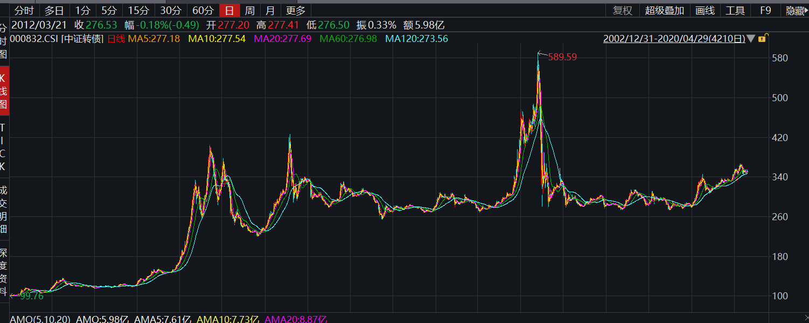

======================================================

_type: talk
@杜志彪[544454124115854]
2020-04-30 12:53:11 Thu  
topic_id: 241158418828251

半导体50场内成交额10个亿，人工智能成交额360万，看意思场内的风还在半导体50里，不过半导体50处于高估区域，我还是按照原计划半导体50盈利后换入人工智能，目前盈利2.44%一会儿开盘卖出换入人工智能。

阅读[3634]  评论[0]  赞[0] 

======================================================

_type: q&a
@🍀 凝🌸 慧🍀[841855248254242]
2020-04-30 12:54:41 Thu  
topic_id: 421148214144248

@🍀 凝🌸 慧🍀

>  二师父，前天您专文分析了人工智能布局正当时，我认真看了，昨天就下手买了一些，今天就大涨得好厉害！后悔买少了，今天想继续定投，又觉得比昨天价高，不划算，这种心理该如何调整？

@二师父

>  定投没有问题，忘记成本价即可，这是一个没有意义的锚固点

阅读[3851]  评论[4]  赞[0] 

======================================================

_type: q&a
@jier[118552824811122]
2020-04-30 12:55:25 Thu  
topic_id: 421148218451488

@jier

>  二师父，请问可以用场内投5G代替人工智能吗？

@二师父

>  5G是可以轻仓定投的，不过他不是人工智能的替代品

阅读[3893]  评论[3]  赞[0] 

======================================================

_type: q&a
@Zero Fei[51422225155524]
2020-04-30 13:05:12 Thu  
topic_id: 241158418824281

@Zero Fei

>  二师父，如果是鳄鱼计划，今天需要买入1份人工智能么

@二师父

>  鳄鱼计划没动，这是场外定投的

阅读[4059]  评论[8]  赞[0] 

======================================================

_type: q&a
@倪[841184825858112]
2020-04-30 14:01:36 Thu  
topic_id: 548821481581444

@倪

>  二师父，004856，广发建筑材料这个，今天的估值天天是负的、支付宝是正的，哪个准确一些？目前盈利9个点，是否应该落袋为安了？

@二师父

>  怎么估的，目前市盈率12.4，建筑材料这个行业可以重点关注海螺水泥相关，指数很一般，有盈利可以考虑逐步走了

阅读[3976]  评论[4]  赞[0] 

======================================================

_type: talk
@是喵喵吖～[421441114141158]
2020-04-30 14:12:04 Thu  
topic_id: 841158418484412

请问大家知道东财的可转债手续费是多少吗谢谢🙏

阅读[3866]  评论[0]  赞[0] 

======================================================

_type: talk
@阿宝[422212151424158]
2020-04-30 15:09:00 Thu  
topic_id: 841158414488842

能看懂水平就不低了，觉得一般般，说明还没开悟！哈哈

@阿宝 at 2020-04-30 15:09:00 Thu

> 自己先点个赞！

----------

@J at 2020-04-30 15:09:00 Thu

> 红利基金是防守型，到牛市爆发力不足，还需要配置点别的

----------

@阿宝 at 2020-04-30 15:09:00 Thu

> 我觉得你说的有道理，但是大部分人都不想折腾，又见不得大亏，定投红利指数基金也未尝不可。

----------

阅读[4035]  评论[3]  赞[0] 

+++++++++++++++++++++++++++++++++++++++++++++++++++++

文件：
2020-04-30 15:09:00 Thu
文件大小：[14848]
28242118442141-4.30  个人财运与国运息息相关.doc

======================================================

_type: q&a
@闪闪的星光[88285424418582]
2020-04-30 16:20:01 Thu  
topic_id: 421148211444428

@闪闪的星光

>  二师父好，你的课程在哪里能看到，我怎么找不到了。
>  文字版的在哪里能看到呢？
>  谢谢

@二师父

>  荔枝微课，ppt在首页

阅读[4035]  评论[0]  赞[0] 

======================================================

_type: q&a
@闪闪的星光[88285424418582]
2020-04-30 16:22:41 Thu  
topic_id: 241158414115121

@闪闪的星光

>  二师父好，我自己买了4500元的华宝油气162411，1500元的南方原油501018，1500元的华安标普石油160416；
>  目前华宝油气、南方原油都分别亏损50%，华安标普石油是有20%盈利的。
>  1、请问这三只基金会像中行的原油宝那样导致负收益吗？太吓人了
>  2、继续持有华宝油气、南方原油这两只基金，等待上涨回本，可行吗？
>  3、我现在应该趁着还有盈利，赶紧把华安标普石油基金给赎回吗？
>  
>  谢谢

@二师父

>  负收益不会，原油可以出了，油气还可以持有官网。南方原油目前限制赎回

阅读[4168]  评论[5]  赞[0] 

======================================================

_type: q&a
@jier[118552824811122]
2020-04-30 16:23:42 Thu  
topic_id: 241158414111441

@jier

>  二师父，请问基金转托管期间净值怎么算？比如昨天场外提交的申请，今天下午显示转成功，那今天的基金涨幅还能享受吗？

@二师父

>  转到场内价格上涨，基金也是上涨的

阅读[4370]  评论[0]  赞[0] 

======================================================

_type: q&a
@闪闪的星光[88285424418582]
2020-04-30 16:24:04 Thu  
topic_id: 548821488225284

@闪闪的星光

>  蓝筹股指数基金选择用汇丰晋信恒生龙头指数A基金和中证100指数基金，建立组合，代替沪深300指数基金，可以吗？

@二师父

>  可以的

阅读[4495]  评论[1]  赞[0] 

======================================================

_type: talk
@二师父[28814221155551]
2020-04-30 17:55:24 Thu  
topic_id: 421148211258858

<e type="hashtag" hid="281854444451" title="#读者提问#" /> 二师父。我昨天下午2:55用支付宝第一次购买的融通人工智能lof，即161631，我今天看了一下持仓成本价是1.2703，最新净值为1.2688，百度上说3点前购买的基金净值是按当天计算的，为什么我的持仓成本价不是1.2688呢？它是按照实时购买的净值计算的吗？

基金申购有的是前端收费，那么基金成本是扣除了申购费用,比如10000元只给你9900.99份,交申购费购费99.01元,那么成本是1.01元。

@希望 at 2020-04-30 17:55:24 Thu

> 如果不是前端收费，就应该是按当天净值算持仓成本价的是吧？还是说基金如果三点之前购买都是按当天的净值计算？都不是按实时购买的净值计算是吗？

----------

@希望 at 2020-04-30 17:55:24 Thu

> 如果不是前端收费，就应该是按当天净值算持仓成本价的是吧？还是说基金如果三点之前购买都是按当天的净值计算？都不是按实时购买的净值计算是吗？

----------

@二师父 at 2020-04-30 17:55:24 Thu

> 场内是按照实时价格，场外是收盘净值，如果不算费用，那么就是净值成交

----------

@希望 at 2020-04-30 17:55:24 Thu

> 我通过支付宝或者天天基金来买的话，都是场外是吗？

----------

@二师父 at 2020-04-30 17:55:24 Thu

> 对

----------

@曾来 at 2020-04-30 17:55:24 Thu

> 新手建议自己多看看基础性的东西，很多文章有介绍的，而且不难，不然零基础的话提问起来肯定是一连串的，这样效率很低

----------

@希望 at 2020-04-30 17:55:24 Thu

> 没有系统性的学习，都是一点一点百度来的知识点，一知半解，给大家添麻烦啦😂

----------

阅读[4430]  评论[7]  赞[0] 

======================================================

_type: talk
@希望[421125255451418]
2020-04-30 17:55:42 Thu  
topic_id: 548821488451184

二师父，我是新手，上周开始跟你学习定投，有很多东西还不懂，现在有个疑问冒昧问一下。我昨天下午2:55用支付宝第一次购买的融通人工智能lof，即161631，我今天看了一下持仓成本价是1.2703，最新净值为1.2688，百度上说3点前购买的基金净值是按当天计算的，为什么我的持仓成本价不是1.2688呢？它是按照实时购买的净值计算的吗？

@希望 at 2020-04-30 17:55:42 Thu

> 还有就是，什么样的基金是按实时净值，什么样的基金是按当天净值呢？

----------

@速。冻 at 2020-04-30 17:55:42 Thu

> 手续费造成了你成本略高于净值

----------

@铁观音 at 2020-04-30 17:55:42 Thu

> 场内是实时，场外是当天收盘

----------

@希望 at 2020-04-30 17:55:42 Thu

> 嗯嗯，我知道了，谢谢各位

----------

阅读[4462]  评论[4]  赞[0] 

======================================================

_type: talk
@二师父[28814221155551]
2020-04-30 19:59:46 Thu  
topic_id: 548821822111254

<e type="hashtag" hid="141158224812" title="#医药的细分板块，中证医疗#" /> 子行业医疗是非常有价值的，可以关注下

@老妖 at 2020-04-30 19:59:46 Thu

> 师父，中证医疗场外代码是多少？

----------

@二师父 at 2020-04-30 19:59:46 Thu

> 华宝中证医疗，分级基金

----------

@云卷云舒 at 2020-04-30 19:59:46 Thu

> 谢谢师父！总是跟我们分享这么有价值的资讯，祝师父节日愉快[抱拳][抱拳][抱拳]

----------

@希望 at 2020-04-30 19:59:46 Thu

> 二师父，昨天医药不是说要减仓了吗？为什么又推荐定投？

----------

@二师父 at 2020-04-30 19:59:46 Thu

> 我推荐了吗？

----------

@是喵喵吖～ at 2020-04-30 19:59:46 Thu

> 师父说：可以先将医疗指数纳入基金池，再等待更好的回调机会去投资这个指数

----------

@希望 at 2020-04-30 19:59:46 Thu

> 哦！明白了

----------

@J at 2020-04-30 19:59:46 Thu

> 师父，这个基金场内有代码吗？场外分级今年底前好像是要转型

----------

阅读[4748]  评论[9]  赞[0] 

+++++++++++++++++++++++++++++++++++++++++++++++++++++

文件：
2020-04-30 19:59:20 Thu
文件大小：[88220]
51545885145254-中证医疗指数投资价值分析.docx

======================================================

_type: talk
@二师父[28814221155551]
2020-04-30 20:53:50 Thu  
topic_id: 118825822441222

<e type="hashtag" hid="452281441848" title="#关于食品饮料#" /> 为什么食品饮料说要回踩成本价清仓呢，主要是不要让自己在曾经赚钱的基金上变成亏的，比如原油，如果自己小富即安其实套利之后走人是盈利的，想要更多就要承担更多

这个食品基金是当时银行调整过来的，主要看到了这个事件对银行的利空，而当时食品饮料只是回调到正常估值，如果发生大跌食品进入低估基金肯定浮亏，没有必要把一只基金从高估持有到低估

当然，只是一个想法，操不操作，看食品涨不涨，涨了当然拿着继续啊，不过我判断这轮食品差不多到头了，五粮液我已经闪人了，反正对于a股这个波动我是受不了的，二师父的心理极限是50个点的回撤，而a股回撤不会只在50点以内。

投资需要有原则的灵活，五步定投法只是我为新手设计的无脑操作方法，利用这个方法零基础的投资者也能赚钱，入门之后的方法就多了，学会以道御术

@海马 at 2020-04-30 20:53:50 Thu

> 师父，准备清仓食品饮料了？

----------

@二师父 at 2020-04-30 20:53:50 Thu

> 如果继续涨就持有，看情况

----------

@铁观音 at 2020-04-30 20:53:50 Thu

> 食品饮料有对应的场内的基金吗？

----------

@二师父 at 2020-04-30 20:53:50 Thu

> 没有的

----------

@向前进 at 2020-04-30 20:53:50 Thu

> 师父，回踩成本价，是指先把利润收割了，比如共买了1000元，涨到1100元，收割过100元利润后，如果继续涨到1050元，后来又跌回1000元，这时候清仓，对吗

----------

@二师父 at 2020-04-30 20:53:50 Thu

> 对，如果继续涨再收割

----------

@向前进 at 2020-04-30 20:53:50 Thu

> 好的，谢谢！

----------

@wty at 2020-04-30 20:53:50 Thu

> 那就等二师父操作通知，我也是上次银行指数转换过来的！[抱拳]

----------

阅读[5368]  评论[13]  赞[0] 

======================================================

