_type: talk
@二师父[28814221155551]
2020-07-01 05:08:05 Wed  
topic_id: 421128282424888

Darkness cannot drive out darkness; only light can do that. Hate cannot drive out hate; only love can do that.  

如果内心还有憧憬，每天是不需要闹钟的。

阅读[3357]  评论[0]  赞[0] 

+++++++++++++++++++++++++++++++++++++++++++++++++++++

图片：

======================================================

_type: talk
@范毅君[118551121224142]
2020-07-01 08:52:53 Wed  
topic_id: 241148484124481

这得对高中签率，还中了两签😂

@范毅君 at 2020-07-01 08:52:53 Wed

> 多高[撇嘴]

----------

@陈飞🤗 at 2020-07-01 08:52:53 Wed

> 这个有破发的风险，好多人都没申购

----------

@范毅君 at 2020-07-01 08:52:53 Wed

> 所以中签率太高

----------

@shininggre* at 2020-07-01 08:52:53 Wed

> 我也2签

----------

@王燕 at 2020-07-01 08:52:53 Wed

> 我也两签

----------

@范毅君 at 2020-07-01 08:52:53 Wed

> 我感觉破发难，但是挣不了几个钱[偷笑]

----------

@贵玉1* at 2020-07-01 08:52:53 Wed

> 易破发，能买一签吧

----------

@wty at 2020-07-01 08:52:53 Wed

> 从来没中过，今天中一签！什么时候上巿呢？

----------

阅读[3362]  评论[17]  赞[0] 

+++++++++++++++++++++++++++++++++++++++++++++++++++++

图片：
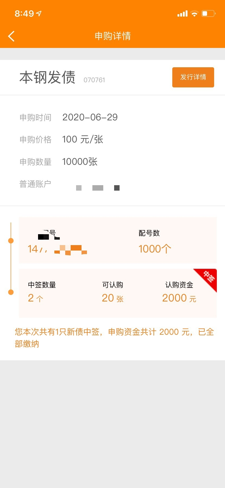

======================================================

_type: q&a
@Fire[421142182555188]
2020-07-01 10:39:47 Wed  
topic_id: 118815145428252

@Fire

>  二师父，新三板打新建议做吗？

@二师父

>  可以做的

阅读[3511]  评论[2]  赞[0] 

======================================================

_type: talk
@门萨🐨[51411455828824]
2020-07-01 11:19:56 Wed  
topic_id: 841148428154542

破3000了，不是很开心，哈哈哈[快哭了]

@ajingge at 2020-07-01 11:19:56 Wed

> 猝不及防[撇嘴]

----------

@衣袂飘香 at 2020-07-01 11:19:56 Wed

> 迟早的事啊，预料之中啊。

----------

@庆余年 at 2020-07-01 11:19:56 Wed

> 仓位不够，有踏空赶脚。

----------

@What if at 2020-07-01 11:19:56 Wed

> 这两天忍不住动手往外跑了。前天清空了沪深300的，这两天中证500和60也跑些，跑早了吗

----------

@是喵喵吖～ at 2020-07-01 11:19:56 Wed

> 我觉得有点早呢 为啥都清空呢？我记得二师父说可以收割利润但不要都清空呢 除非真的到了非常非常高估的时候。  清空的话不就相当于把下蛋的鸡杀掉 就没有鸡蛋下了。

----------

@蓝魔森林 at 2020-07-01 11:19:56 Wed

> 为什么那么快清空。。不着急，让子弹飞一会

----------

阅读[3411]  评论[6]  赞[0] 

======================================================

_type: q&a
@陈洲[88245122222212]
2020-07-01 11:44:53 Wed  
topic_id: 548841451885214

@陈洲

>  二师父，现在牛市来了，我之前买的不多，准备再买点基金，消费医疗，消费医疗都高了，不买错过牛市，买了买在高位，这种情况该怎么做

@二师父

>  不买啊，你得考虑回调能否承受，还有就是买，然后亏了10个点止损，这是趋势交易，不是定投了

阅读[3471]  评论[7]  赞[0] 

======================================================

_type: q&a
@不知道不明了[15584248411812]
2020-07-01 11:45:46 Wed  
topic_id: 118815145885412

@不知道不明了

>  二师父，目前的市场行情您认为按照五步法里面的利润收割还适合么，特别是对于白酒

@二师父

>  白酒差不多翻倍了，基本持仓是接近零成本，可以拿着

阅读[3505]  评论[0]  赞[0] 

======================================================

_type: q&a
@onepiecewi*[244414114545811]
2020-07-01 13:34:08 Wed  
topic_id: 118815144544112

@onepiecewi*

>  獐子岛财务造假  被证监会处罚 然后今天还能涨停？？？求大佬解释一下

@二师父

>  情绪推动的，a股有时候退市股票都能大涨，这就像市场炒作一个东西，不管有没有价值，只要有人疯狂买就会一直涨

阅读[3446]  评论[0]  赞[0] 

======================================================

_type: talk
@蛋炒饭不加蛋[118281818482542]
2020-07-01 16:22:01 Wed  
topic_id: 421128224815858

今天出了点利润，等待回调机会再入场～

阅读[3222]  评论[0]  赞[0] 

======================================================

_type: q&a
@Gingo[544812851155554]
2020-07-01 21:05:45 Wed  
topic_id: 118815115414142

@Gingo

>  二师父 想请问场内 AI智能 515070和人工智能 161631 这两只基金有什么区别呢？比较起来哪个投资标的更优秀呢？

@二师父

>  一个lof基金，一个etf指数基金，都是追踪同一指数的，515070的规模更大一些

阅读[3180]  评论[0]  赞[0] 

======================================================

_type: talk
@二师父[28814221155551]
2020-07-01 21:47:41 Wed  
topic_id: 548841445112454

<e type="hashtag" hid="15285285184142" title="#全市场指数百分位#" /> 市盈率百分位34.44%，市净率百分位22.11%，SY-BY百分位36.18%，SY/BY百分位28.51%。

市场估值已经不在低估区域了，仓位够的可以暂停定投，持有即可。每周定投也不断减额，保持连续性，如果继续在这个基础上涨15%，那么股权类投资都可以停止了。

停止投资和继续持有是两回事，低价买入的白酒和消费和医药很多已经是接近零成本，这种持有就算发生回撤心理压力也会小很多。

@圣诞结® at 2020-07-01 21:47:41 Wed

> 二师父 最近市场涨的猛 是不是可以不局限10%这种梯度收割利润，是不是可以多保存份额，等涨的多点再收割[微笑]

----------

@二师父 at 2020-07-01 21:47:41 Wed

> 可以的，也看仓位，低于百分之50仓位可以不用卖

----------

@圣诞结® at 2020-07-01 21:47:41 Wed

> 好的明白了，我目前9成仓，那就还是逐步收割一些，谢谢

----------

阅读[4261]  评论[3]  赞[0] 

======================================================

_type: talk
@二师父[28814221155551]
2020-07-01 22:15:19 Wed  
topic_id: 548841448214214

<e type="hashtag" hid="481211145528" title="#指数估值#" /> 市场挺猛的，拿着不动，如果发现市场回调会卖点50类。优先卖涨的少的。至于其他的消费，中概再飞一会，如果飞不动了，反正持仓价位不高，不用担心的。

@雨淡风清 at 2020-07-01 22:15:19 Wed

> 50类？上证50吗

----------

@二师父 at 2020-07-01 22:15:19 Wed

> 这一类的

----------

@雨淡风清 at 2020-07-01 22:15:19 Wed

> 谢谢二师父

----------

@shi at 2020-07-01 22:15:19 Wed

> 哎呀，刚刚把500往银行挪了些

----------

@圣诞结® at 2020-07-01 22:15:19 Wed

> 二师父，50AH现在盈利还没到10%，但是它涨得不太好，是不是可以现在就收割些利润？

----------

@二师父 at 2020-07-01 22:15:19 Wed

> 这个结合自身仓位

----------

阅读[4314]  评论[6]  赞[0] 

+++++++++++++++++++++++++++++++++++++++++++++++++++++

图片：
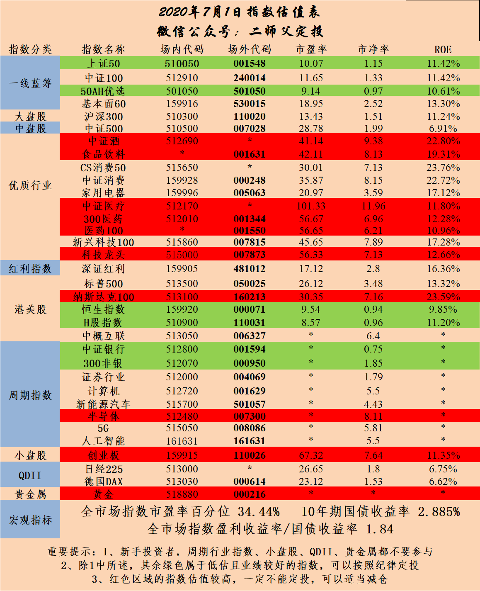

======================================================

_type: talk
@二师父[28814221155551]
2020-07-01 22:34:51 Wed  
topic_id: 118815118558852

<e type="hashtag" hid="15285284512182" title="#实盘#" /> 买入深红利0.1份

@王雷 at 2020-07-01 22:34:51 Wed

> 二师父H股今年还有希望吗？继续持有是吧？

----------

@二师父 at 2020-07-01 22:34:51 Wed

> 50，恒生，国企些都是价值类基金，今年变现比较差，现在持有，没有特别适合的换仓指数，可以作为盈利的减仓首选基金

----------

@王雷 at 2020-07-01 22:34:51 Wed

> 好的，明白，谢谢二师父

----------

@蓝魔森林 at 2020-07-01 22:34:51 Wed

> 买了点科大讯飞 准备持个一年

----------

阅读[3329]  评论[4]  赞[0] 

+++++++++++++++++++++++++++++++++++++++++++++++++++++

图片：
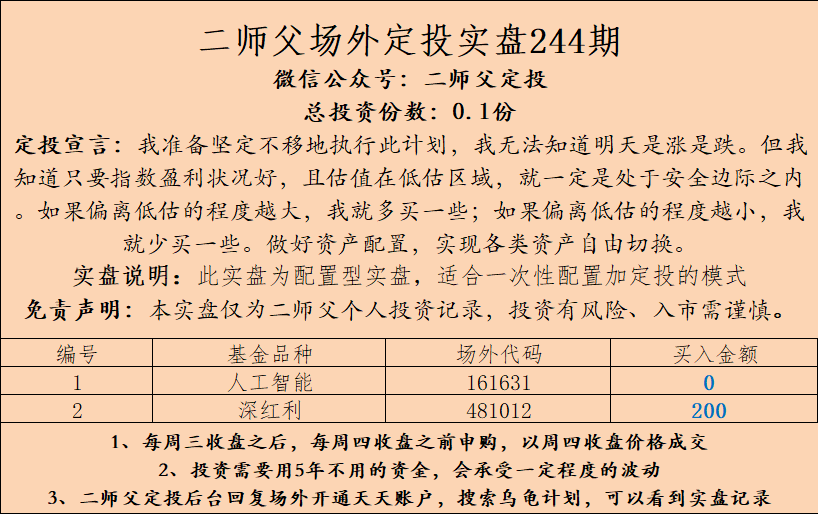

======================================================

_type: talk
@二师父[28814221155551]
2020-07-02 09:49:50 Thu  
topic_id: 421128212842218

今日份两只新债，弯腰打一下，说不定就中了

@随便 at 2020-07-02 09:49:50 Thu

> 已经弯腰打了一下[得意][得意]

----------

@二师父 at 2020-07-02 09:49:50 Thu

> 速度

----------

阅读[3038]  评论[2]  赞[0] 

+++++++++++++++++++++++++++++++++++++++++++++++++++++

图片：
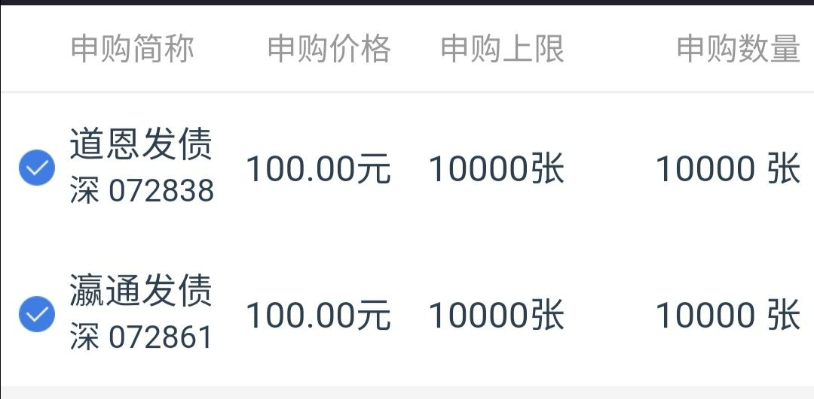

======================================================

_type: talk
@杜志彪[544454124115854]
2020-07-02 10:01:36 Thu  
topic_id: 421128212855248

<e type="hashtag" hid="281158522841" title="#每日打卡#" /> 2020年7月2日第14次打卡昨日触发卖出美的一份，止盈目标30%，昨日工作忙回家没看账户，早上一看场内又有到10%利润了，我水平低还是五步定投法执行，消费还没高估，早上继续收割10%利润，深红利收割10%利润，刚刚自动成交500ETF网格一份，今天任务结束，休息[微笑]

@杜志彪 at 2020-07-02 10:01:36 Thu

> 来短信啦，券商触发网格自动卖出一份。

----------

@Gingo at 2020-07-02 10:01:36 Thu

> 今日触发网格交易价位 但是没有卖出一份 选择卖出利润 让子弹飞一下

----------

@秦风殇韵（刘豫斌） at 2020-07-02 10:01:36 Thu

> 今天，收割基本面60和地产各10%，减量买入深红利和中证500，前一段下跌慌的不知道买啥，这一段上涨慌的不知道卖啥，哈哈，继续修炼

----------

@杜志彪 at 2020-07-02 10:01:36 Thu

> 又来短信啦，又自动卖出券商网格一份[惊讶]

----------

@杜志彪 at 2020-07-02 10:01:36 Thu

> 券商今天疯了

----------

阅读[2950]  评论[5]  赞[0] 

======================================================

_type: talk
@志亮[422125851552828]
2020-07-02 10:37:16 Thu  
topic_id: 241148414452141

买的泸州老窖，终于等到了，这两天涨停了[呲牙]

@二师父 at 2020-07-02 10:37:16 Thu

> 五粮液也不错啊，白酒都很猛

----------

@志亮 at 2020-07-02 10:37:16 Thu

> 五粮液是一直想买的，但等不到机会上车[捂脸]

----------

@二师父 at 2020-07-02 10:37:16 Thu

> 我记得你持有啊，3号大跌还问了持有五粮液咋办

----------

@志亮 at 2020-07-02 10:37:16 Thu

> 拿不住[捂脸]，回本后就卖出了，后来见国窖低估就换了国窖，那知道它一直涨过不停，现在后悔死[捂脸]

----------

@二师父 at 2020-07-02 10:37:16 Thu

> 老窖也不错，还好是换仓，不是清仓

----------

@志亮 at 2020-07-02 10:37:16 Thu

> 总的来说还是五粮液猛的，老窖就是个小弟而己，当然我觉得后面应该会追上。[呲牙]

----------

@杜志彪 at 2020-07-02 10:37:16 Thu

> 恭喜恭喜，我还是赚慢钱吧，一年有25%就满足了[微笑]

----------

@志亮 at 2020-07-02 10:37:16 Thu

> 一年25%己胜过80%投资者了。

----------

阅读[2991]  评论[10]  赞[0] 

======================================================

_type: talk
@速。冻[51415484228284]
2020-07-02 10:39:50 Thu  
topic_id: 118815181114582

二师父，新书出版了，学堂学员有啥优惠

@🍀 凝🌸 慧🍀 at 2020-07-02 10:39:50 Thu

> 二师父的书吗，书名是什么啊，期待一睹为快

----------

@速。冻 at 2020-07-02 10:39:50 Thu

> 

----------

@Sunflower at 2020-07-02 10:39:50 Thu

> 呀呀呀～好棒

----------

@二师父 at 2020-07-02 10:39:50 Thu

> 可以给成本价，就是出版社和打印的成本，我的劳务费和产权费可以免了

----------

@Sunflower at 2020-07-02 10:39:50 Thu

> 那什么时候可以购买呀？怎么买呢？

----------

@速。冻 at 2020-07-02 10:39:50 Thu

> 预定一本签名版

----------

@手牵手看夕阳 at 2020-07-02 10:39:50 Thu

> 预订

----------

@onepiecewi* at 2020-07-02 10:39:50 Thu

> 二师父，我们要预定签名哦！

----------

阅读[3153]  评论[36]  赞[0] 

======================================================

_type: q&a
@果实妈咪[182225518588452]
2020-07-02 12:59:31 Thu  
topic_id: 118815188121442

@果实妈咪

>  二师父，收割利润是利润除以现在的净值，比如场内基金，除以后不够100就代表收割不了对吗？

@二师父

>  不够100股？看你资金量，盈利不足200元可以拿着，多积累一些

阅读[3098]  评论[0]  赞[0] 

======================================================

_type: q&a
@范毅君[118551121224142]
2020-07-02 13:45:44 Thu  
topic_id: 118815188824452

@范毅君

>  二师父，现在持有少量科技、5g、人工智能，盈利10-20，可以收割过利润，现在看涨不动，后面怎么操作合适呀

@二师父

>  涨了挺多的啊

阅读[3064]  评论[1]  赞[0] 

======================================================

_type: q&a
@庆余年[15584481824122]
2020-07-02 14:08:04 Thu  
topic_id: 241148155548251

@庆余年

>  请问二师父，现在不到六层仓，可不可以继续投低估的金融和港美股？

@二师父

>  地产还行，美股就别碰了。港股最好投主营业务在内地的，美团，阿里这些，香港未来发展确定性不大

阅读[3167]  评论[10]  赞[0] 

======================================================

_type: q&a
@果实妈咪[182225518588452]
2020-07-02 15:37:52 Thu  
topic_id: 548841488825524

@果实妈咪

>  是的，就是用利润除以现在价格就代表收割利润对不，二师父，发现不够100最低交易的，所以场内就不能卖，谢谢

@二师父

>  投的太少可以先拿着的

阅读[2898]  评论[0]  赞[0] 

======================================================

_type: q&a
@姣🍎[422212545212488]
2020-07-02 15:44:34 Thu  
topic_id: 548841825524544

@姣🍎

>  师父，现在手里还有一些医疗医药的基金，收割过利润，这两天大盘这么好，他们却开始绿了，是不是该清仓了？有点舍不得呢

@二师父

>  减仓没问题，医疗本身就是疫情推高的，可以先减仓一半，不想清仓，减仓也没有太大问题

阅读[2964]  评论[0]  赞[0] 

======================================================

_type: q&a
@J[28281541518551]
2020-07-02 16:47:48 Thu  
topic_id: 118815824141552

@J

>  师父，看到你出书很高兴，我也要预定一本签名版😄 另外请教师父一个题外话，怎样找到合适的出版社帮忙出书呢？我朋友做外语教育的，也有出书的想法，但还不懂出版这方面的门道。师父可否指指路？

@二师父

>  谢谢支持，现在还在入库，没正式上架，到时候真的上架了可以给星球学员成本价购买
>  
>  出书的话不难，自己写会比较费神，热爱的话基本可以，我可以给你推荐几家出版社，然后联系他们，如果谈的好了就可以签订约稿合同，在规定时间内交稿，配合修改就可以的。
>  
>  你问问朋友想和哪家出版社合作，还有最好准备下出版的主题，大纲，以及之前发表过的文章。

阅读[2950]  评论[4]  赞[0] 

======================================================

_type: talk
@林玮[844111858288412]
2020-07-02 17:16:41 Thu  
topic_id: 421128142484248

师父，科技类要不要卖出啊

@二师父 at 2020-07-02 17:16:41 Thu

> 龙头科技可以减一点，行情来了，没有大利空别清仓

----------

阅读[2818]  评论[1]  赞[0] 

======================================================

_type: q&a
@🍀 凝🌸 慧🍀[841855248254242]
2020-07-02 17:35:16 Thu  
topic_id: 548841825888514

@🍀 凝🌸 慧🍀

>  师父好，今天资金流入券商行业120个亿，量这么大，您给解读一下背后有啥信号吗？谢谢师父！

@二师父

>  说明机构还是看好后市的，预计本月上证综合指数改变规则落地，对市场刺激还是挺大
>  
>  另外北京连续几天个位数了，发展低于预期，目前流动性充裕，股市涨是正常的，资金永远都逐利

阅读[3044]  评论[10]  赞[0] 

======================================================

_type: talk
@二师父[28814221155551]
2020-07-02 20:26:21 Thu  
topic_id: 841148151581122

<e type="hashtag" hid="28518512214441" title="#结构行情如何应对#" /> 投资股权而非债券，虽然下跌难受，但是上涨就很快，根据实际情况做配置吧，如果不能经受太大波动还是多配点债券和蓝筹基金，容易拿的住。

@wty at 2020-07-02 20:26:21 Thu

> 沪深300非银金融涨势喜人

----------

@秦风殇韵（刘豫斌） at 2020-07-02 20:26:21 Thu

> 5层仓迎接牛市又如何，无非是挣得少了点，总比步步踏错赔钱好吧，我今天仔细算了一下，从去年4月跟二师父学定投，到今天，累计收益超过了15%，肯定比不了很多大能，但符合我给自己定的目标，这就够了，感受成长，享受回报，但不要以回报多寡判定自己成长的高低，有没有进步，自己没数么？呵呵

----------

@王模堂 at 2020-07-02 20:26:21 Thu

> 二始福说的真好。

----------

@王模堂 at 2020-07-02 20:26:21 Thu

> 师傅

----------

阅读[3038]  评论[4]  赞[0] 

+++++++++++++++++++++++++++++++++++++++++++++++++++++

文件：
2020-07-02 20:25:19 Thu
文件大小：[19945]
88211858484542-A股3100，结构性行情继续升温.docx

======================================================

_type: talk
@二师父[28814221155551]
2020-07-02 20:56:53 Thu  
topic_id: 241148151824211

<e type="hashtag" hid="224445218111" title="#全市场估值数据#" /> 市盈率百分位34.9%，市净率百分位22.5%，SY-BY百分位36.49%，SY/BY百分位30.63%。估值不断上移，耐心持有，不适合大量追加仓位

@以古论今 at 2020-07-02 20:56:53 Thu

> 适合卖吗？好多基金都冲破了以往的最高点

----------

@二师父 at 2020-07-02 20:56:53 Thu

> 可以适当减仓

----------

阅读[3922]  评论[2]  赞[0] 

======================================================

_type: q&a
@多读书[88482152228812]
2020-07-02 23:09:33 Thu  
topic_id: 548841811888144

@多读书

>  请问二师父，我现在六成仓位，是不是仓位较低，不用收割利润（如果跌了还有子弹）。另外请问您，现在配置债券基金怎么样？如果可以，是纯债基金好还是二级债基？

@二师父

>  目前债券没有特别好的机会，选择纯债，国债类都可以。
>  
>  看自己了，跌了毫无压力也可以不用卖

阅读[2851]  评论[0]  赞[0] 

======================================================

_type: talk
@杜志彪[544454124115854]
2020-07-03 09:21:15 Fri  
topic_id: 841148184112182

<e type="hashtag" hid="281158522841" title="#每日打卡#" /> 2020年7月3日第15次打卡，昨天券商网格触发了2次，真的很猛，收盘前把场外也收割了10%，今天想聊聊医疗什么时候建仓，本来想20天线建仓一小部分，价格是1.85元，可是我账户里的100股成本居然1.71元，相当于60天线价格，二师父您大概给算算，医疗ETF正常估值的价格区间是多少到多少，我们参考一下[抱拳]

@J at 2020-07-03 09:21:15 Fri

> 今天继续涨

----------

@杜志彪 at 2020-07-03 09:21:15 Fri

> 反正高估绝对不买是原则[微笑]

----------

@杜志彪 at 2020-07-03 09:21:15 Fri

> 牛了刚刚又自动触发卖出券商网格一份[惊讶]

----------

阅读[2602]  评论[3]  赞[0] 

======================================================

_type: talk
@爱华[844445144558182]
2020-07-03 10:05:33 Fri  
topic_id: 841148125148882

特别想请教一下：为什么上证指数会涨这么快？谢谢

@🍀 凝🌸 慧🍀 at 2020-07-03 10:05:33 Fri

> 你看看昨天师父回复我的帖子就明白了[愉快]

----------

@🍀 凝🌸 慧🍀 at 2020-07-03 10:05:33 Fri

> 大量资金持续流入，说明机构还是看好后市的，预计本月上证综合指数改变规则落地，对市场刺激还是挺大。

另外北京连续几天个位数了，发展低于预期，目前流动性充裕，股市涨是正常的，资金永远都逐利

----------

@爱华 at 2020-07-03 10:05:33 Fri

> 感谢大家讲解🙏🙏

----------

阅读[2509]  评论[3]  赞[0] 

======================================================

_type: q&a
@老妖[118514521115522]
2020-07-03 10:12:13 Fri  
topic_id: 118815842845852

@老妖

>  师父，中证银行和300非银现在那一个更值得入手？

@二师父

>  非银好一些，不过涨了挺高的，最近风格切换快

阅读[2678]  评论[0]  赞[0] 

======================================================

_type: q&a
@J[28281541518551]
2020-07-03 10:12:45 Fri  
topic_id: 421128154122488

@J

>  师父，有点看不懂券商了，如果价格继续上扬击穿1.12元，卖出的份数还剩半仓，剩余应该如何操作？

@二师父

>  可以先让他飞一会，趋势不会轻易改变，有利空再卖

阅读[2699]  评论[2]  赞[0] 

======================================================

_type: q&a
@衣袂飘香[118248548242452]
2020-07-03 10:13:53 Fri  
topic_id: 241148128584121

@衣袂飘香

>  二师父你好。您在场外定投实盘里的中证消费还持有吗？

@二师父

>  持有的，计划回撤继续补仓

阅读[2741]  评论[3]  赞[0] 

======================================================

_type: q&a
@一剪梅[844115184528882]
2020-07-03 10:21:40 Fri  
topic_id: 841148128522582

@一剪梅

>  师父，之前买的中证红利现在盈利了，这支基金不好，是不是要转换成其他基金？

@二师父

>  可以转，但是别追高

阅读[2779]  评论[2]  赞[0] 

======================================================

_type: q&a
@onepiecewi*[244414114545811]
2020-07-03 10:23:16 Fri  
topic_id: 548841851254484

@onepiecewi*

>  师傅好~
>  跟你学了半年
>  现在平均利润有15%
>  虽然跟的很少，整体仓位不重。
>  但还不懂什么时候卖？
>  人们说会买的是孙子，会卖的才是爷，
>  怎么判断适不适合卖呢？

@二师父

>  会买的不是孙子，会买的都赚了，赚了就是爷
>  
>  股权资产严重泡沫的时候就适合卖出，买入低风险资产

阅读[2909]  评论[5]  赞[0] 

======================================================

_type: q&a
@是喵喵吖～[421441114141158]
2020-07-03 10:26:24 Fri  
topic_id: 118815845218212

@是喵喵吖～

>  二师父想请教您这几个值得一直持有吗 因为有时候看他盈利了 很想卖掉😂但是又觉得这不符合价值投资的理念 我是挺看好招商银行的 想听听您的看法谢谢您！

@二师父

>  可以持有的，招行属于价值类股票，涨跌都不会像科技那样大，长期持有招行比做波段强，如果遇到有利空或者招行严重泡沫可以卖一点，至少留一万做打新配置

阅读[3025]  评论[4]  赞[0] 

======================================================

_type: q&a
@阳光[421884185252128]
2020-07-03 13:49:27 Fri  
topic_id: 241148122812151

@阳光

>  师父：场外基金七天的规定，假如我定投的基金前天卖出一部分，今天再卖是按七天内收收续费吗？谢谢

@二师父

>  这个看你买入的时间，如果你是昨天买的，就是7天以内，如果你是上周三买的，就不是7天以内

阅读[2785]  评论[1]  赞[0] 

======================================================

_type: q&a
@蛋炒饭不加蛋[118281818482542]
2020-07-03 13:53:01 Fri  
topic_id: 548841855841514

@蛋炒饭不加蛋

>  请问二师父，我买进的价格都是0.8以上，为什么持仓成本显示是0.75

@二师父

>  卖出以后系统计算的方式成本是下降的，实际买入均价是不变的哈，这是系统计算原因

阅读[2904]  评论[3]  赞[0] 

======================================================

_type: q&a
@六尘不改[241555484551821]
2020-07-03 14:41:23 Fri  
topic_id: 421128181451428

@六尘不改

>  师傅，券商etf代码是多少，还有券商etf和非银etf持仓是重复的吗

@二师父

>  这个估值表里面有的，非银里面有一些券商股

阅读[2874]  评论[1]  赞[0] 

======================================================

_type: talk
@范毅君[118551121224142]
2020-07-03 14:49:43 Fri  
topic_id: 548841854115284

券商涨起来真吓人😂

@子辰 at 2020-07-03 14:49:43 Fri

> 人造牛市，已经锁死钱袋子，不会再投一分钱进去[西瓜]

----------

@背心 at 2020-07-03 14:49:43 Fri

> 顺势而为

----------

@以古论今 at 2020-07-03 14:49:43 Fri

> 人造?怎么看出来的？

----------

@光少 at 2020-07-03 14:49:43 Fri

> 怕就拿回本金，让利润在牛市中奔跑[呲牙]

----------

@随便 at 2020-07-03 14:49:43 Fri

> 买菜大妈们是不是要进场了！[得意][得意]

----------

@丸子妈 at 2020-07-03 14:49:43 Fri

> 20多个点了

----------

@子辰 at 2020-07-03 14:49:43 Fri

> 外资拉升；最主要的是四个账户，用于投资的账户余额已归零，其他账户不能动，保障生活；工资的现金流慢慢积攒并分流于稳健账户，用于回调后补仓，所以现在暂停投资。

----------

@J at 2020-07-03 14:49:43 Fri

> 赞

----------

阅读[2773]  评论[8]  赞[0] 

======================================================

_type: q&a
@是喵喵吖～[421441114141158]
2020-07-03 18:39:29 Fri  
topic_id: 241148148584241

@是喵喵吖～

>  师父，请问一般牛市会持续多久呀或者结束的话有啥预兆吗😁 如果仓位七成的话，是不是可以在牛市陆续把利润收割了 以免牛市结束又回撤了。等牛市结束再慢慢定投。

@二师父

>  这个不知道，短期小牛市，就一到三个月，大牛市大概6个月到2年。收割利润可以，但是别卖完了，虽然每次即使牛市也会有回调，但不保证能回撤到你的买入价

阅读[2758]  评论[0]  赞[0] 

======================================================

_type: q&a
@静[241555148454251]
2020-07-03 18:40:05 Fri  
topic_id: 118815815245452

@静

>  我想开个证券账户，华泰好，还是华宝好

@二师父

>  基本上一样的，费率都差不多，就看你用哪个界面适合，就选择哪个

阅读[2762]  评论[0]  赞[0] 

======================================================

_type: q&a
@西锦巴乌[88448285428482]
2020-07-03 18:41:30 Fri  
topic_id: 118815815281122

@西锦巴乌

>  师父好！目前还持有的招商券商分级161720趁这次行情把它清仓掉呢还是等到年底前清仓或换成其他券商基金？谢了

@二师父

>  可以慢慢减仓，除非你券商赚够了，否则这个位置没必要清仓，最近又没有听到分级基金退市的消息了，这种事情就看政策。

阅读[2970]  评论[0]  赞[0] 

======================================================

_type: talk
@二师父[28814221155551]
2020-07-03 20:16:15 Fri  
topic_id: 841148148152122

市场就是这样的，胜利属于价值坚守者，只要遵循逆向思维，做好配置，都会取得不错的收益，但过程挺煎熬的，为了登顶的喜悦，忍耐几年也是可以的。

最近账户的300非银也起来了，记住，买的优质指数，就不怕下跌，垃圾指数远离就行，垃圾股票更是碰都不要碰。

@丸子妈 at 2020-07-03 20:16:15 Fri

> 之前场外的银行换成了沪深300，场内的银行基金没动

----------

阅读[4174]  评论[1]  赞[0] 

+++++++++++++++++++++++++++++++++++++++++++++++++++++

文件：
2020-07-03 20:13:37 Fri
文件大小：[20844]
48511884215418-全面盈利，3月不开张，开张吃3月.docx

======================================================

_type: talk
@二师父[28814221155551]
2020-07-03 20:39:49 Fri  
topic_id: 841148148128482

<e type="hashtag" hid="88518512125242" title="#讲一讲什么时候适合清仓#" /> 每天收盘后二师父都会公布当日的全市场数据。大家可以根据全市场估值数据控制仓位。

这个数据是有参考性的。总共有四个全市场指数市盈率百分位，全市场指数市净率百分位，SY-BY百分位、SY/BY百分位，这四个数据如果全部都在30%以下，那么肯定是高仓位，如果是在0——10%之间，基本就可以满仓，如果都在70%或者90%以上，那么可以空仓股票了。

当然有的人是一直满仓穿越的，这种方法有其可取之处，不过经受浮动太大，不适合增量资金少的朋友。

这就是控制仓位的方法，我讲问题直接讲关键，不会劈里啪啦说一堆从各个地方都可以看到的东西，你记住了按照方法操作就行的。

那么现在问题很好解答，SY-BY百分位大概30%多，18年年初是60%多，15年6月是90%多，很显然，还没有严重泡沫，不用清仓。

那为何又要收割利润，这是A股市场决定的，一般5年甚至更长才爆发一轮牛市，意味着坐5年过山车，心脏好的可以一直坐，心脏一般的就要收割了。

@🍀 凝🌸 慧🍀 at 2020-07-03 20:39:49 Fri

> 谢谢师父，牢记这四个数据！

----------

阅读[4150]  评论[1]  赞[0] 

======================================================

_type: q&a
@素兮[548121415528244]
2020-07-03 22:29:16 Fri  
topic_id: 548841845128154

@素兮

>  二师傅，我的恒生和恒生国企这两个仓位过重，现在都已反弹至盈利。想趁此机会减仓，二师傅觉得港股上涨空间还有多大？恒生和恒生国企未来哪一个投资价值高？

@二师父

>  我判断如果这两个不调仓的话，价值都比不上中概互联，还有港股医疗指数，可以慢慢减，港股肯定有机会，主要在头条，京东，美团，拼多多，腾讯，阿里，有的暂时在美国上市没回来，不过回来是大概率
>  
>  我看好港交所，这是在香港上市的港股，其次就是在香港上市的注册地和主营在内地的，至于发展，当然是内地好的多

阅读[2908]  评论[5]  赞[0] 

======================================================

_type: talk
@树叶[544811512145144]
2020-07-04 07:50:31 Sat  
topic_id: 241142515424211

<e type="hashtag" hid="142825811122" title="#定投周报#" /> 二师父定投周报第65期

阅读[2816]  评论[0]  赞[0] 

+++++++++++++++++++++++++++++++++++++++++++++++++++++

文件：
2020-07-04 07:50:29 Sat
文件大小：[254762]
15488555242242-二师父定投周报7.4（第65期）.docx

======================================================

_type: q&a
@姥姥不疼. 爷爷不爱[48544481458248]
2020-07-04 10:38:18 Sat  
topic_id: 841142518514452

@姥姥不疼. 爷爷不爱

>  假定当下牛市开启，进行趋势投资，还能投资什么场内基金？？

@二师父

>  趋势投资什么涨的好买什么，跟逆势投资完全不同

阅读[2656]  评论[2]  赞[0] 

======================================================

_type: q&a
@手牵手看夕阳[244112548184141]
2020-07-04 11:10:18 Sat  
topic_id: 548845281588214

@手牵手看夕阳

>  在涨乐财富通中卖出份额，为什么持仓成本会有变化？个人理解卖出份额持仓成本应该不变，买入份额持仓成本会变化！

@二师父

>  持仓成本和持仓均价是两个不同的概念，在实际计算的时候他的份额是变动的

阅读[2675]  评论[0]  赞[0] 

======================================================

_type: q&a
@吾思吾想[118552585284212]
2020-07-04 13:54:56 Sat  
topic_id: 841142541181552

@吾思吾想

>  二师傅，我正在定投中的基金如果卖出，系统会按买的先后顺序卖出吗？我今天操作时，系统提醒我有持有时间少于7天的份额会按1.5%收费

@二师父

>  是的，会按照先进先出的原则，可以等待交易日看看情况

阅读[2650]  评论[0]  赞[0] 

======================================================

_type: talk
@二师父[28814221155551]
2020-07-04 22:39:54 Sat  
topic_id: 548845124211114

<e type="hashtag" hid="88518511421452" title="#看看机会与风险#" /> 看我的文章可以让你淡定淡定，现在的涨幅连19年的都没达到，就不淡定了，真的需要修行。

@smile at 2020-07-04 22:39:54 Sat

> 请问二傻三傻是什么呢？[发呆]意思是现在可以入手二傻三傻？

----------

@素兮 at 2020-07-04 22:39:54 Sat

> 二师父的说的7月大机会是指如果突不破压力位，则会回调，这个回调就是大机会么？

----------

@二师父 at 2020-07-04 22:39:54 Sat

> 目前有20个点的回调都是机会

----------

@二师父 at 2020-07-04 22:39:54 Sat

> 保险和银行

----------

@蓝魔森林 at 2020-07-04 22:39:54 Sat

> 里面的很多哲学观点，老子在几千年前有阐述，例如知白守黑，天下皆知美之美，斯恶以。祸之福之所倚等等。详细的联想延展欢迎百度搜索。

----------

@蓝魔森林 at 2020-07-04 22:39:54 Sat

> 我最近读老子，又再次感悟到了中国文化之博大精深。  无为而治等等，都代表了不要随便折腾乱折腾的处世之道。这跟金融投资之道也是不谋而合

----------

@老妖 at 2020-07-04 22:39:54 Sat

> 二傻目前是指300非银这个标吗

----------

@二师父 at 2020-07-04 22:39:54 Sat

> 保险

----------

阅读[2521]  评论[9]  赞[0] 

+++++++++++++++++++++++++++++++++++++++++++++++++++++

文件：
2020-07-04 22:39:06 Sat
文件大小：[22849]
28211882128811-7月份，这个大机会要留意.docx

======================================================

_type: q&a
@jier[118552824811122]
2020-07-04 22:41:41 Sat  
topic_id: 548845125825814

@jier

>  二师父，现在券商估值还在低位，都说牛市来了券商会大涨甚至翻几倍，那现在还适合买入券商吗？比例控制在多少合适？另外新股和可转债每天都有好几个，是全部盲打还是有所挑选？怎么挑？谢谢！

@二师父

>  牛市来了什么都会大涨，这个位置我是不会入的，你自己根据实际情况来。
>  
>  新债可以选择级别高的，牛市的话盲打没有问题。A股打新可以盲打，新三板除外。A股市值大的话中签率会高一点。

阅读[2384]  评论[1]  赞[0] 

======================================================

_type: q&a
@黎雄[841555255485222]
2020-07-04 22:41:59 Sat  
topic_id: 118814288152842

@黎雄

>  师傅现在收割的利润，投纯债基金还是银行+

@二师父

>  要么不收割，要么收割了买货币基金好一点

阅读[2525]  评论[4]  赞[0] 

======================================================

_type: talk
@二师父[28814221155551]
2020-07-04 22:54:31 Sat  
topic_id: 548845124258414

<e type="hashtag" hid="15285288148182" title="#全市场指数估值数据#" /> 市盈率百分位35.34%，市净率百分位23.64%，SY-BY百分位37.19%，SY/BY百分位33.24%。

整体估值不是很高，但是向下的较大了，至于建底仓，看情况了，一般是底部才大力买的。未来涨跌谁也不知道，但我知道，肯定有人忍不住加仓，19年3月被套的有的还没解放，现在有有人冲，总之，这个市场的事情一直在重复，没啥新鲜的。

@薛奔基金理财培训师 at 2020-07-04 22:54:31 Sat

> 这个数据源是哪里呢。谢谢

----------

@是喵喵吖～ at 2020-07-04 22:54:31 Sat

> 二师父自己计算的

----------

@蛋炒饭不加蛋 at 2020-07-04 22:54:31 Sat

> 要回调了吗？

----------

@What if at 2020-07-04 22:54:31 Sat

> 定投的话，这个点位应该全红了吧，当然华宝油气除外[捂脸]

----------

阅读[3696]  评论[4]  赞[0] 

======================================================

_type: q&a
@特仑苏[241855111824451]
2020-07-05 07:27:35 Sun  
topic_id: 241142851588481

@特仑苏

>  请问有人知道这是什么软件嘛？

@二师父

>  wind

阅读[2615]  评论[4]  赞[0] 

======================================================

_type: q&a
@J[28281541518551]
2020-07-05 07:39:24 Sun  
topic_id: 841142851512112

@J

>  师父，高估的食品饮料赎回的资金适合暂时投入到光大保德信安和债基（003109）吗？我看它的夏普比挺高的，而且也很稳，五星债基。请师父帮忙看一下，看是否合适投？

@二师父

>  二级债基，还行的，纯债目前价值不高

阅读[2702]  评论[3]  赞[0] 

======================================================

_type: q&a
@果实妈咪[182225518588452]
2020-07-05 09:00:40 Sun  
topic_id: 841142851818122

@果实妈咪

>  二师父，你那个华宝证券开户股票和基金有最低五元限制吗？

@二师父

>  没有的

阅读[2684]  评论[3]  赞[0] 

======================================================

_type: q&a
@艾琪（王钥）[244122155258821]
2020-07-05 09:29:58 Sun  
topic_id: 548845128421584

@艾琪（王钥）

>  二师父：上次跟着你把定投一年多的银行指数转到中正食品饮料，现在盈利20个点左右，现在高估了，能否提示一下又可以转换成其它什么低估的指数吗？

@二师父

>  现在没有特别值得出手的了

阅读[2705]  评论[2]  赞[0] 

======================================================

_type: q&a
@芙瑞雅阳阳潘[421181844812818]
2020-07-05 11:13:47 Sun  
topic_id: 421125841115558

@芙瑞雅阳阳潘

>  现在应该定投什么基金？

@二师父

>  现在是金融板块有价值一些

阅读[2792]  评论[2]  赞[0] 

======================================================

_type: q&a
@蛋炒饭不加蛋[118281818482542]
2020-07-05 12:03:32 Sun  
topic_id: 548845112128154

@蛋炒饭不加蛋

>  请问师傅，300非银和金融地产还是低估吗？

@二师父

>  即将进入正常了

阅读[2820]  评论[0]  赞[0] 

======================================================

_type: q&a
@学以致用[244415184181451]
2020-07-05 12:07:22 Sun  
topic_id: 421125884414418

@学以致用

>  二师父，你送给我的学习资料的网盘链接没有保存好，你可以在发我一下吗？谢谢，万分感谢。我在微信上联系你，可能你太忙了，好几天没有回复！打扰了！

@二师父

>  复制这段内容后打开百度网盘手机App，操作更方便哦 链接:<e type="web" href="https://pan.baidu.com/s/1yfvOZTFKCjVZbQPAVewGfg" title="https://pan.baidu.com/s/1yfvOZTFKCjVZbQPAVewGfg" /> 提取码:2440

阅读[2877]  评论[1]  赞[0] 

======================================================

_type: talk
@厚基薄发[15522588545552]
2020-07-05 12:12:54 Sun  
topic_id: 118814554222442

请问港股打新不想做了，太占用时间，资金想买成股票，最好是国内没上市公司，请问二师傅有没有合适的股票可以推荐一下？谢谢啦

@二师父 at 2020-07-05 12:12:54 Sun

> 没有这种玩法哈，你可以把资金收回来

----------

@厚基薄发 at 2020-07-05 12:12:54 Sun

> 主要资金撤回来也没啥用，现在也没有太好的品种投，好品种好价位可能🉐等下一次了啊

----------

@秦风殇韵（刘豫斌） at 2020-07-05 12:12:54 Sun

> 过去三年，每逢这问题，我只有一个答案，腾讯！

----------

@二师父 at 2020-07-05 12:12:54 Sun

> 可能我理解错了，他说的国内没上市

----------

@厚基薄发 at 2020-07-05 12:12:54 Sun

> 谢谢啦

----------

阅读[2777]  评论[5]  赞[0] 

======================================================

_type: talk
@二师父[28814221155551]
2020-07-05 21:09:36 Sun  
topic_id: 841142881258552

当前最值得买的是货币基金，国债逆回购，储备粮草和子弹，等待下一次机会哈。过去很多次，就算超级牛市来了，过不了多久还是会下来的。

@罗大发 at 2020-07-05 21:09:36 Sun

> 所以我这个上班族就认认真真做个逆势的吧[奋斗]

----------

阅读[2935]  评论[1]  赞[0] 

+++++++++++++++++++++++++++++++++++++++++++++++++++++

文件：
2020-07-05 21:08:45 Sun
文件大小：[21622]
51588152815284-当下最值得买入的基金是他.docx

======================================================

_type: solution
2020-07-06 06:56:29 Mon  
topic_id: 548845155888254

阅读[2469]  评论[0]  赞[0] 

======================================================

_type: q&a
@TDG[88855524248842]
2020-07-06 08:21:15 Mon  
topic_id: 548845154115554

@TDG

>  请问二师父，创业板开通需要两年以上证券交易经验，请问这包括开通股票账户后的基金和可转债交易吗？

@二师父

>  包括的，去年不用经验，今年门槛提高了一点

阅读[2668]  评论[0]  赞[0] 

======================================================

_type: talk
@杜志彪[544454124115854]
2020-07-06 09:29:04 Mon  
topic_id: 118814512588222

<e type="hashtag" hid="281158522841" title="#每日打卡#" /> 2020年7月6日第16次打卡，按照网格继续卖出2份券商，计划好的就按计划执行[微笑]

@onepiecewi* at 2020-07-06 09:29:04 Mon

> 哈哈哈，刚好我想问卖不卖~

----------

@杜志彪 at 2020-07-06 09:29:04 Mon

> 0.86买了13份，现在卖出6份了，还有7份。

----------

阅读[2509]  评论[2]  赞[0] 

======================================================

_type: talk
@二师父[28814221155551]
2020-07-06 09:41:13 Mon  
topic_id: 241142845284451

挺猛的，再涨300今年不用红包了，三傻领涨，刚好配了点三傻和地惨，这就是中国股市！

新股新债自行申购即可。

@雨的依恋 at 2020-07-06 09:41:13 Mon

> 一傻二傻刚弄明白了，三傻是[捂脸]

----------

@雨淡风清 at 2020-07-06 09:41:13 Mon

> 这算有效突破3200了吧。不过看到这样的日k我就打哆嗦

----------

@二师父 at 2020-07-06 09:41:13 Mon

> 银行

----------

@蓝魔森林 at 2020-07-06 09:41:13 Mon

> 我现在心态就是之前券商没投多少，涨了也不觉得可惜

----------

@门萨🐨 at 2020-07-06 09:41:13 Mon

> 哪三傻

----------

@丸子妈 at 2020-07-06 09:41:13 Mon

> 三傻买了二傻，银行场外基金之前换成沪深300.现在有场内银行etf

----------

@丸子妈 at 2020-07-06 09:41:13 Mon

> 券商，保险，银行

----------

@章兵朋 at 2020-07-06 09:41:13 Mon

> 跟着二师父买了，银行，券商，地产，300非银金融。现在涨的有点怀疑人生

----------

阅读[2815]  评论[8]  赞[0] 

======================================================

_type: q&a
@onepiecewi*[244414114545811]
2020-07-06 09:41:55 Mon  
topic_id: 841142845258512

@onepiecewi*

>  师父，券商涨了35%，需要收个利润吗？

@二师父

>  可以的，能赚就行，本金留着，超级牛市确认了再捂住不迟

阅读[2996]  评论[3]  赞[0] 

======================================================

_type: talk
@静[241555148454251]
2020-07-06 09:59:46 Mon  
topic_id: 421125824254158

星球朋友们，你们又想买二师傅指数基金定投入门课程吗，我刚发起了拼团，只需要298,还需要三个人，有的话一起学习课程

@芙瑞雅阳阳潘 at 2020-07-06 09:59:46 Mon

> 我也想买

----------

@范毅君 at 2020-07-06 09:59:46 Mon

> 原来还可以团购，便宜好多，下次学会了[流泪][流泪][流泪][流泪]

----------

@静 at 2020-07-06 09:59:46 Mon

> 没人呀，要四个人一起拼

----------

@静 at 2020-07-06 09:59:46 Mon

> 加我微信18758254279，一起拼，刚号码错了

----------

@芙瑞雅阳阳潘 at 2020-07-06 09:59:46 Mon

> 我原本的意思是和你一起团，但因为误操作，结果成了自己开了个团，问了二师夫，还不能调，气哭了

----------

@静 at 2020-07-06 09:59:46 Mon

> 我也是操作错误，我不知道拼团是自己建团的，呜呜

----------

@静 at 2020-07-06 09:59:46 Mon

> 只能等自动退款

----------

@范毅君 at 2020-07-06 09:59:46 Mon

> 多号召一下，你这个节点不对，下跌的时候人们才有时间学习，现在都慌慌着呢

----------

阅读[2819]  评论[12]  赞[0] 

======================================================

_type: talk
@onepiecewi*[244414114545811]
2020-07-06 10:04:40 Mon  
topic_id: 118814512115212

阅读[2942]  评论[0]  赞[0] 

+++++++++++++++++++++++++++++++++++++++++++++++++++++

图片：
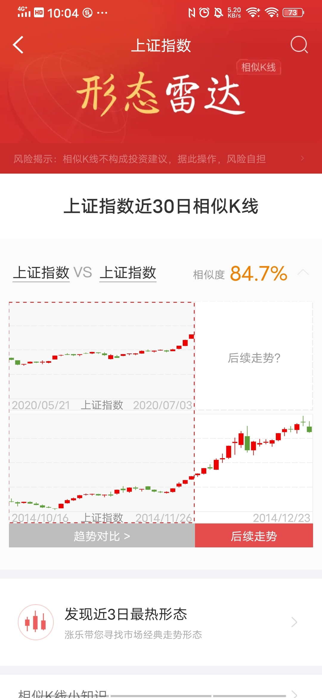

======================================================

_type: q&a
@六尘不改[241555484551821]
2020-07-06 10:29:46 Mon  
topic_id: 118814512851422

@六尘不改

>  今天大盘是不是有点太疯狂了师父，而且是明显的赚指数不赚钱

@二师父

>  为啥不赚钱啊，这么多标的都涨了

阅读[3133]  评论[19]  赞[0] 

======================================================

_type: q&a
@不知道不明了[15584248411812]
2020-07-06 10:31:02 Mon  
topic_id: 548845142882214

@不知道不明了

>  二师父您好，券商涨得这么猛，网格点收割设置多大的网点合适呢，还有今天非银又涨了不少，我之前银行重仓很大，可以调仓到非银来么？

@二师父

>  不用调，调到50还保险点，银行周期性太大，不适合重仓，目前可以收割利润，现在涨这么猛，不代表不会回调

阅读[3254]  评论[3]  赞[0] 

======================================================

_type: talk
@丸子妈[28512522184441]
2020-07-06 11:04:39 Mon  
topic_id: 841142848252142

提问:医疗etf现在可以买一点吗？

@杜志彪 at 2020-07-06 11:04:39 Mon

> 不行啊，还没调整了，你观察一下前期半导体走势，估计要有一个月的正式调整期才行。

----------

@丸子妈 at 2020-07-06 11:04:39 Mon

> 好的，那就等调整。

----------

阅读[3004]  评论[2]  赞[0] 

======================================================

_type: q&a
@乖子[28441841181151]
2020-07-06 11:14:43 Mon  
topic_id: 118814515424882

@乖子

>  二师父，我没见过世面，跟着二师父定投，第一次见这么疯涨的，跌不慌，涨起来倒是有点没底气，目前我要怎么应对呢。鳄鱼计划还是等二师父的卖出提示？谢谢。

@二师父

>  我是拿着了，你可以根据实际情况来，有赚就好，切记最低最低仓位5成以上，不然很容易追高，我计划再涨涨准备慢慢卖出银行，其他的目前还拿着。

阅读[3201]  评论[7]  赞[0] 

======================================================

_type: q&a
@rtdmm小米[422188284881148]
2020-07-06 11:15:39 Mon  
topic_id: 841142848251822

@rtdmm小米

>  请问二师父，这个表示券商资金大量流出吗？

@二师父

>  红色的表示当日流入的，绿色的表示当日流出的

阅读[3299]  评论[12]  赞[0] 

======================================================

_type: talk
@光少[244124552511141]
2020-07-06 11:44:28 Mon  
topic_id: 241142848415241

券商太猛了，有点怀疑人生[偷笑]

@🍀 凝🌸 慧🍀 at 2020-07-06 11:44:28 Mon

> 同感！幸福来的太突然[偷笑]

----------

@rtdmm小米 at 2020-07-06 11:44:28 Mon

> 终于明白低估潜伏的魅力了！

----------

@rtdmm小米 at 2020-07-06 11:44:28 Mon

> 请问二师父，券商还没到高估？

----------

阅读[3089]  评论[3]  赞[0] 

+++++++++++++++++++++++++++++++++++++++++++++++++++++

图片：
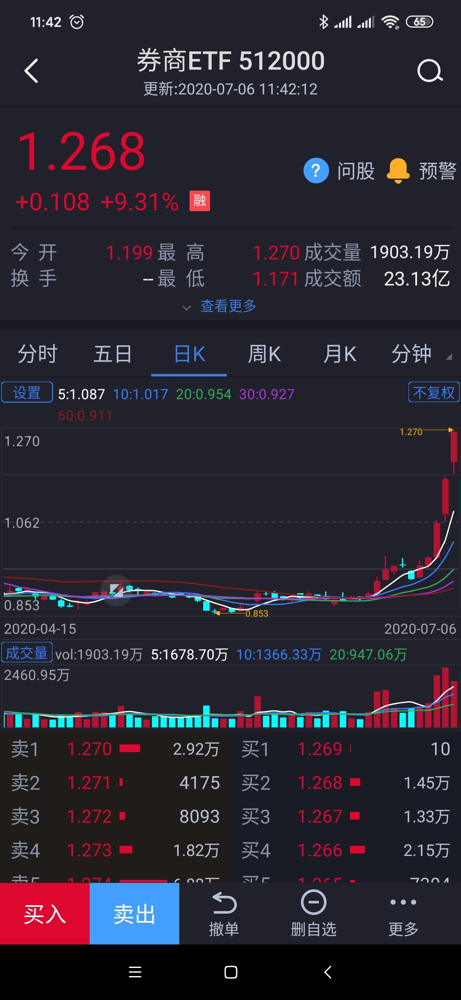

======================================================

_type: talk
@范毅君[118551121224142]
2020-07-06 13:04:32 Mon  
topic_id: 548845145528224

心慌慌，不想当韭菜，不卖可以，现在坚决不买，一点点自己可以做波段，但是证券这三天没给过我一点机会买回来[捂脸]

@范毅君 at 2020-07-06 13:04:32 Mon

> 波段证券是没机会，卧倒[悠闲]

----------

@范毅君 at 2020-07-06 13:04:32 Mon

> 万马奔腾，卖多少都是便宜，但还是卖一点[撇嘴]

----------

@呵呵→_→ at 2020-07-06 13:04:32 Mon

> 各位是不是心里跟猫抓的一样，我TM 1块钱的时候就把券商卖了[流泪]

----------

@范毅君 at 2020-07-06 13:04:32 Mon

> 我买或者卖都是一点点来，把我不好节奏，所以就把份多分一些

----------

阅读[2946]  评论[4]  赞[0] 

+++++++++++++++++++++++++++++++++++++++++++++++++++++

图片：
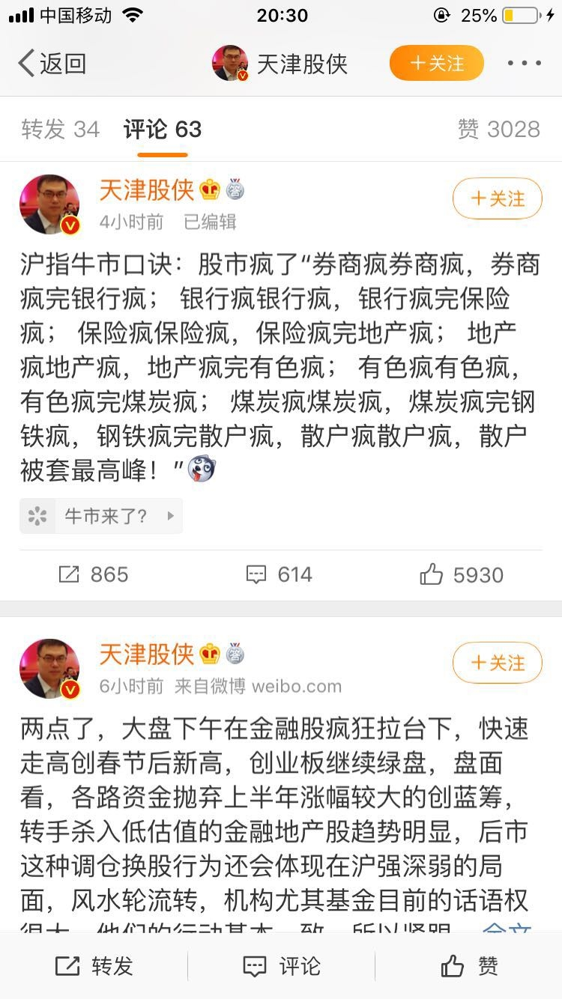

======================================================

_type: talk
@铥@铥~~[582228558115884]
2020-07-06 14:03:18 Mon  
topic_id: 421125825144848

估值表在哪里可以看到

@二师父 at 2020-07-06 14:03:18 Mon

> 精华

----------

@范毅君 at 2020-07-06 14:03:18 Mon

> 二师父，今天加一次估值表吧，带估值区间的，可好？[呲牙][呲牙]

----------

@二师父 at 2020-07-06 14:03:18 Mon

> 其实变化不大

----------

@范毅君 at 2020-07-06 14:03:18 Mon

> 粉丝们心浮了，需要安抚[偷笑][偷笑]二师父要站出来，鼓励一下[呲牙]

----------

阅读[2845]  评论[4]  赞[0] 

======================================================

_type: talk
@二师父[28814221155551]
2020-07-06 14:08:15 Mon  
topic_id: 118814514821152

<e type="hashtag" hid="881251425252" title="#鳄鱼计划#" /> 卖出银行一份，超级牛市来了，如果仓位不够的可以不卖，因为50里面很多银行，可以不用单独配置，去年说的3500，有希望了，之前是被骂惨了

@紫色天使 at 2020-07-06 14:08:15 Mon

> 二师父，牛市真的来了吗？好吓人啊！第一次见到这种行情，一直都喜欢跌了[撇嘴][撇嘴][撇嘴]

----------

@范毅君 at 2020-07-06 14:08:15 Mon

> 二师父，我的银行成本高，昨天还亏2个点，估计今天收盘后也就能盈利5个点，是不是应该先不动呀

----------

@二师父 at 2020-07-06 14:08:15 Mon

> 可以的

----------

@范毅君 at 2020-07-06 14:08:15 Mon

> 二师父，我的提问能否看得到呀，可以看到，提示一下后面操作，谢谢🙏

----------

@杜志彪 at 2020-07-06 14:08:15 Mon

> 师父你有多少份，这才卖出一份[呲牙]，谁会骂您啊，到了大家挣钱，不到收红包挺好的👌

----------

@二师父 at 2020-07-06 14:08:15 Mon

> 那是之前了，不相信的其实不到早就赚了几波了

----------

@静 at 2020-07-06 14:08:15 Mon

> 第一次经历这些，上周五卖了好多，现在后悔的不行

----------

@范毅君 at 2020-07-06 14:08:15 Mon

> 要往前看，不然炒股你总是痛苦的，无论你亏损还是盈利

----------

阅读[4116]  评论[9]  赞[0] 

======================================================

_type: q&a
@刘佳柒[815555885511852]
2020-07-06 14:30:52 Mon  
topic_id: 118814518122242

@刘佳柒

>  老师，中证500，深红利，都盈利15个点，卖吗

@二师父

>  500可以慢慢出，别全卖了

阅读[3071]  评论[1]  赞[0] 

======================================================

_type: talk
@六尘不改[241555484551821]
2020-07-06 14:31:24 Mon  
topic_id: 241142841458241

今天无论如何要卖点了

@杜志彪 at 2020-07-06 14:31:24 Mon

> 这不算什么，俺经历过大盘涨停，你们听说过吗[呲牙]

----------

@Chu at 2020-07-06 14:31:24 Mon

> 我已经把利润都收割了，非银EFE 银行EFE还有劵商EFE都涨停了，三傻涨停我也忍不住手卖了利润留下本金了

----------

@Sunflower at 2020-07-06 14:31:24 Mon

> 我经验不多只经历过15年的涨跌，今天涨疯了，赶紧把利润收割一下，省了当韭菜😂

----------

@🍀 凝🌸 慧🍀 at 2020-07-06 14:31:24 Mon

> 哈哈，这球友说的我直乐：无论如何要卖点了。我今天也是把所有利润都收割了，本金都在，不影响继续上涨[偷笑][偷笑]

----------

@是喵喵吖～ at 2020-07-06 14:31:24 Mon

> 哈哈哈棒棒哒！

----------

@六尘不改 at 2020-07-06 14:31:24 Mon

> 进可攻退可守

----------

阅读[2934]  评论[6]  赞[0] 

======================================================

_type: talk
@Chu[88888125211582]
2020-07-06 14:53:14 Mon  
topic_id: 841142841154142

我今天昨天还是前天还在看二师父说金融三傻，今天这三个场内指数基金约好了似的的涨停

@秦风殇韵（刘豫斌） at 2020-07-06 14:53:14 Mon

> 指数居然也能涨停，看傻了

----------

@J at 2020-07-06 14:53:14 Mon

> 哈哈，长这么大也是第一次见指数涨停

----------

阅读[2854]  评论[2]  赞[0] 

======================================================

_type: q&a
@刘佳柒[815555885511852]
2020-07-06 14:55:06 Mon  
topic_id: 421125821285258

@刘佳柒

>  老师，深红利出了吗

@二师父

>  没有，这个长拿，银行已经出了一份，慢慢出吧，仓位不够的就别出了

阅读[3017]  评论[0]  赞[0] 

======================================================

_type: q&a
@慕然[48282522421118]
2020-07-06 14:55:43 Mon  
topic_id: 548845148425284

@慕然

>  二师父，是否市场风格有切换了，大盘股明显强于创业板好几天了

@二师父

>  是的，大牛市来了，蓝筹必须起来，否则的话大盘起不来

阅读[3064]  评论[0]  赞[0] 

======================================================

_type: talk
@静[241555148454251]
2020-07-06 15:01:20 Mon  
topic_id: 241142841181451

星球朋友们，你们有想买二师傅指数基金定投入门课程吗，我刚发起了拼团，只需要298,还需要三个人，有的话可以一起抱团学习课程,可加微信j1119637598，也可扫码

@静 at 2020-07-06 15:01:20 Mon

> 刚发现了简单方法，在课程中直接点击参团就行了，需要的朋友赶紧行动

----------

@范毅君 at 2020-07-06 15:01:20 Mon

> 我打折时候买的都398，价格真便宜，而且菜鸟很有用

----------

@章兵朋 at 2020-07-06 15:01:20 Mon

> 我也398买的，第一门花钱认认真真听课了好几遍的投资课。市场大跌的时候心烦的时候听一遍，市场大涨心慌的时候再听一遍。然后跟着二师父做实操，乌龟计划从去年6月份开始，到昨天有20个点的涨幅，鳄鱼计划从今年过年那波因疫情大跌开始，到昨天也有26个点的涨幅。收获满满[得意]

----------

阅读[3070]  评论[3]  赞[0] 

+++++++++++++++++++++++++++++++++++++++++++++++++++++

图片：

======================================================

_type: q&a
@六尘不改[241555484551821]
2020-07-06 15:12:18 Mon  
topic_id: 548845148818184

@六尘不改

>  今天卖是按今天的净值算收益吗

@二师父

>  场外是的，场内按照实时价格

阅读[3217]  评论[3]  赞[0] 

======================================================

_type: q&a
@范毅君[118551121224142]
2020-07-06 15:23:53 Mon  
topic_id: 118814514448122

@范毅君

>  二师父，心慌慌啊，现在基本百分之六十仓位，三天主力资金正流入了，是继续减仓，还是卧倒不动，再飞一会儿😅😅

@二师父

>  卧倒比较好，等趋势反转再出，关键是这仓位不重

阅读[3284]  评论[1]  赞[0] 

======================================================

_type: q&a
@蛋炒饭不加蛋[118281818482542]
2020-07-06 16:40:25 Mon  
topic_id: 548845141411444

@蛋炒饭不加蛋

>  请问二师傅银行还是低估的吗

@二师父

>  截止到今天收盘还是低估的，明天再这样涨一次就进入正常估值了

阅读[3215]  评论[5]  赞[0] 

======================================================

_type: q&a
@🍀 凝🌸 慧🍀[841855248254242]
2020-07-06 16:43:46 Mon  
topic_id: 241142842284211

@🍀 凝🌸 慧🍀

>  师父，利润嗖嗖涨，感觉恐高啊，要减仓吗？

@二师父

>  慢慢减仓啊，不惧波动的话直接拿到牛市顶点清仓。现在资金面，情绪面都很好，就是企业基本面差一点，和15年情况很像

阅读[3213]  评论[1]  赞[0] 

======================================================

_type: q&a
@zxc[51145258542214]
2020-07-06 16:44:41 Mon  
topic_id: 548845182245224

@zxc

>  二师父，场外乌龟计划卖出也是您操作后有提示吗，还是根据自己的预期值自行收割利润

@二师父

>  有提示的，卖出会在星球公布，而且在天天基金显示的。计划恒生国企盈利有10%左右减仓一点，不着急，慢慢卖。医药现在是没有持仓了。

阅读[3254]  评论[1]  赞[0] 

======================================================

_type: q&a
@律动青春[15411224255442]
2020-07-06 16:45:26 Mon  
topic_id: 118814582125482

@律动青春

>  #鳄鱼计划 二师父您好，请问鳄鱼计划实盘在哪里看？

@二师父

>  这个在星球实时发布的哈。

阅读[3359]  评论[0]  赞[0] 

======================================================

_type: q&a
@海〔纳百川〕[422111285141888]
2020-07-06 16:46:32 Mon  
topic_id: 548845182141414

@海〔纳百川〕

>  天天基金app显示7.3,23:00 - 7.4 9:00 系统升级，服务暂停，为什么现在我登录还显示这个，且无法登录，各位有和我一样的情况吗？

@二师父

>  发问题一起讨论的话直接点击发表即可了。

阅读[3340]  评论[2]  赞[0] 

======================================================

_type: q&a
@🍀 凝🌸 慧🍀[841855248254242]
2020-07-06 17:21:22 Mon  
topic_id: 421125814411848

@🍀 凝🌸 慧🍀

>  师父，看到某券商统计今天南下资金达到100亿，是否说明在目前这个点位上，资金开始有所意见分歧了？请您给分析一下如何看待这类数据背后的道道，谢谢师父！

@二师父

>  首先需要搞清楚南向资金和北向资金的区别，南向资金，主要是国内的机构和个人投资者去港交所投资，而北向资金是国际上或者香港市场的机构投资者来大陆进行投资。
>  
>  这个很正常的流动，如果北向资金流入说明更看好国内市场，这个南向资金流动，说明更看好港股市场，目前港股市场处于洼地，流过去说明是看好港股市场。
>  
>  南向资金流入越多，速度越快，是有利于港股市场的，那么恒生和国企会起来更快一些。

阅读[3403]  评论[1]  赞[0] 

======================================================

_type: q&a
@闪闪的星光[88285424418582]
2020-07-06 17:22:40 Mon  
topic_id: 241142815122511

@闪闪的星光

>  师傅好，这几天股市暴涨，我们还继续收割利润吗？
>  指数基金我原来的止盈方法是：
>  对标指数进入高估时，赎回收益；
>  以后每当收益达到10%，就赎回10%；
>  如果进入牛市，就用最高点回落比例法全部止盈。

@二师父

>  可以，如果这是大牛市的话，现在刚刚起步，不要着急，收割利润当然收割，谁也无法预测将来会不会回撤，只是切记慢慢来，趋势很难一下子改变，要善于坐着车上去。趋势反转的时候是大减仓的机会。

阅读[3527]  评论[5]  赞[0] 

======================================================

_type: q&a
@刘佳柒[815555885511852]
2020-07-06 20:57:21 Mon  
topic_id: 421125812112848

@刘佳柒

>  老师每天写的文章在哪可以看见

@二师父

>  精华

阅读[3248]  评论[3]  赞[0] 

======================================================

_type: talk
@静[241555148454251]
2020-07-06 21:06:16 Mon  
topic_id: 118814588252412

星球朋友们，不要嫌我烦，好事要一起分享 若想买二师傅指数基金定投入门课程，赶紧行动，只需要298,就差2个人，有的话可以一起抱团学习课程,在课程页面直接参团就行，若不明白可加微信j1119637598，二维码见下图

@静 at 2020-07-06 21:06:16 Mon

> 只要298，时间不多了

----------

@是喵喵吖～ at 2020-07-06 21:06:16 Mon

> 确实值得买 我当时不知道自己买的 是398 这个价格很合适。而且一次买了可以一直学习 二师父还会不定期更新。 我觉得很值了！ 我也是小菜鸟 买了这个课程学习的，而且每次写一遍都有一遍新的收获！

----------

@HeLLO at 2020-07-06 21:06:16 Mon

> 我来拼，咋拼呢

----------

阅读[3274]  评论[3]  赞[0] 

+++++++++++++++++++++++++++++++++++++++++++++++++++++

图片：

======================================================

_type: talk
@二师父[28814221155551]
2020-07-06 21:15:26 Mon  
topic_id: 241142811528451

重温定投16字方针

@栀子花开 at 2020-07-06 21:15:26 Mon

> 二师傅超级有价值的品种是什么[坏笑]

----------

@二师父 at 2020-07-06 21:15:26 Mon

> 一级债券基金

----------

@栀子花开 at 2020-07-06 21:15:26 Mon

> [尴尬]。现在这样涨不敢买了，不买心里痒痒的。买了点兴全可转债。二师傅你觉得可行不

----------

@芙瑞雅阳阳潘 at 2020-07-06 21:15:26 Mon

> 为什么未来3年会改变命运？

----------

@二师父 at 2020-07-06 21:15:26 Mon

> 别买，不懂就跟着我，买之前发到群里问问大家意见

----------

@二师父 at 2020-07-06 21:15:26 Mon

> 因为资金大的话拿住会有很大改变，我认识85后有资金在500左右，来一波的话人生财富度就不一样了，至于95后很少有敢这样重仓的，他们没有经历过

----------

@栀子花开 at 2020-07-06 21:15:26 Mon

> 好的，就买了2000块过过瘾。这东西跟赌博一样上瘾😂

----------

@陌路花 at 2020-07-06 21:15:26 Mon

> 二师父，恒生和H股目前还是低估吧。可否定投？看见您还在定投深红利，但是定投数额很少。

----------

阅读[4675]  评论[16]  赞[0] 

+++++++++++++++++++++++++++++++++++++++++++++++++++++

文件：
2020-07-06 21:15:16 Mon
文件大小：[22741]
88211821424842-牢记这个法则，瞬间让你的投资收益率提升10%.docx

======================================================

_type: talk
@二师父[28814221155551]
2020-07-06 21:45:00 Mon  
topic_id: 241142811841511

<e type="hashtag" hid="224445218111" title="#全市场估值数据#" /> 有点猛啊，大家注意风险，有的人忍不住要追高了，这时候不淡定，4000点更不淡定。

全市场估值数据，市盈率百分位39.8%，市净率百分位24.1%，SY/BY百分位39.52%，SY-BY百分位42.38%。不再低估了，今天这样的涨幅再来两个指数定投可以停止了。

@sunny在路上 at 2020-07-06 21:45:00 Mon

> 会到4000点吗？[偷笑]

----------

@二师父 at 2020-07-06 21:45:00 Mon

> 牛市来了会

----------

@sunny在路上 at 2020-07-06 21:45:00 Mon

> 期待！

----------

@陌路花 at 2020-07-06 21:45:00 Mon

> 本来制定利润到20%就卖出，现在看似乎不必急，怎么止盈？二师父，小白有点方哎

----------

@二师父 at 2020-07-06 21:45:00 Mon

> 可以把这百分之20利润出了

----------

阅读[4511]  评论[5]  赞[0] 

======================================================

_type: talk
@二师父[28814221155551]
2020-07-06 21:55:23 Mon  
topic_id: 421125811551528

<e type="hashtag" hid="281158284851" title="#市场分析#" /> 行情没有看到扭头的迹象，今天是放天量大涨，而且新闻联播提到了一个关键过去2年半新高。

牛市初期会拉升券商，其次就是银行保险这些。要想超级大牛市一定是蓝筹拉起来的额，这一点类比2014年。

当下没有特别值得入的板块，这是做逆势的，我从来不追高，在财经号之前提到过地产，银行还是维持之前观点不变：招商+平安+宁波优于银行指数。而银行业现在的景气度下降，不值得重仓配置，小仓位打猎还是可以的。

重仓依然是消费、白酒、医疗、科技、金融。板块的轮动切换很重要，高估切换到低估，资金抛弃的切换到资金青睐的。

但是不要自己看着哪个涨的好就做哪个，追着市场走，很危险。

今年的基本面很差，上涨完全是资金面推动。我不认为今年会爆发超级牛市，这个是多年的经验，下一个观察点：3500点，如果突破了，那么一切都改变了，超级牛市信号确立。

一切都在变化之中，以不变应万变才是王道。

@二师父 at 2020-07-06 21:55:23 Mon

> 对了，星球可以直接续费了，任何时候续费都可以，苹果的话就扫描第一篇文章续费海报，注册了一家企业，这样承担一些手续费，星球现在不允许体外付费了。承担税费是正常的，所以大家就不用微信给我发消息了，有时候比较忙，而且我有好几个微信，不保证所有时候都能及时回复

----------

@黎雄 at 2020-07-06 21:55:23 Mon

> 市场情绪高，就怕一下就大跌了

----------

@Hi·DD at 2020-07-06 21:55:23 Mon

> 我其实已经续费了，但是星球还是提示我续费

----------

@芙瑞雅阳阳潘 at 2020-07-06 21:55:23 Mon

> 白酒有什么好基推荐么？二师父

----------

@二师父 at 2020-07-06 21:55:23 Mon

> 白酒ETF，招商白酒

----------

@芙瑞雅阳阳潘 at 2020-07-06 21:55:23 Mon

> 之前看您讲分级基金可以退市，所以15%收益的时候清仓了。现在又涨的超好，白酒我个人感觉现在已经很高了，现在还适合定投吗？

----------

@二师父 at 2020-07-06 21:55:23 Mon

> 现在挺高的，需要再等等，而且分级基金要观察，这个基金规模较大，应该不会清盘

----------

阅读[4582]  评论[7]  赞[0] 

======================================================

_type: talk
@Audrey[15284421255842]
2020-07-06 22:19:36 Mon  
topic_id: 841142811415542

二师傅好 能否更新下估值 不知道有哪些指数进入高估了 想根据估值减点仓 比如中证100 深证红利等 谢谢

@二师父 at 2020-07-06 22:19:36 Mon

> 这两个都是正常估值，我后天更新的。

----------

阅读[3329]  评论[1]  赞[0] 

======================================================

_type: talk
@helen[544884424181154]
2020-07-06 22:42:50 Mon  
topic_id: 241142811124411

二师父，我星球续费了。您的的公众号和星球把我领进投资和理财的大门。积少成多，稳妥冷静，如今尝到了甜头。谢谢二师父

@二师父 at 2020-07-06 22:42:50 Mon

> 慢慢来，滚雪球

----------

@Sunflower at 2020-07-06 22:42:50 Mon

> 我也尝到了甜头，虽然不多整体收益率10%，但是我会继续慢慢学习总结经验，感谢二师父

----------

阅读[3353]  评论[2]  赞[0] 

======================================================

_type: q&a
@陈[844415515418422]
2020-07-06 22:46:47 Mon  
topic_id: 118814588841182

@陈

>  二师父，估值表里低估的产品现在买个一两万还可以吗？

@二师父

>  这个看你资金量，如果有100万，现在直接买个一二万问题不大，如果只有一二万，现在直接买入，那么就是做趋势，如果大盘反转了，浮亏在8%左右就要撤出，如果能够做到，那就可以，做趋势又不止损很危险的。
>  
>  逆势定投和趋势是两种交易手法，我都做过，最后发现自己适合逆势，你可以自己做，总结，这些都需要实践体会的。

阅读[3646]  评论[0]  赞[0] 

======================================================

_type: q&a
@章兵朋[118251425848882]
2020-07-07 07:10:51 Tue  
topic_id: 548845524285424

@章兵朋

>  二师父，昨天的大涨行情，我发现我的7－10国开债是跌的，如果现在真的是牛市来临，按照您的股债轮动理论，现在是不是可以开始布局债券了？如果可以布局债券，有什么推荐的吗？

@二师父

>  现在可以轻仓开始配置了。
>  
>  有几种选择，第一种是直接国债，这种风险低，不会有信用风险，但是波动大，适合定投。
>  
>  第二种是一级债基和二级债基，可以和大盘对冲。
>  
>  第三种是偏债混合，这类基金可以作为压舱配置，因为既配置了债券，又配置了股票，所以股市上涨的时候能够享受一定收益，而且回撤小，一般可以控制在5%以内。

阅读[3310]  评论[5]  赞[0] 

======================================================

_type: talk
@静[241555148454251]
2020-07-07 08:40:52 Tue  
topic_id: 118814421118282

星球朋友们，好事与你一起分享 ，若想买二师父指数基金定投入门课程系统学习，就赶紧行动，现就差一人拉，原价458,现在只要298,在课程页面直接参团就行，若不明白可加微信j1119637598，二维码见下图

@范毅君 at 2020-07-07 08:40:52 Tue

> 马上成功

----------

@雪孩子 at 2020-07-07 08:40:52 Tue

> 成团了吗

----------

@静 at 2020-07-07 08:40:52 Tue

> 是的，成团了，你晚了一步😂

----------

@静 at 2020-07-07 08:40:52 Tue

> 如果想学习还可以发起团购，再邀请三人成团一起学习哈

----------

阅读[3074]  评论[4]  赞[0] 

+++++++++++++++++++++++++++++++++++++++++++++++++++++

图片：

======================================================

_type: talk
@小鱼[241182222251181]
2020-07-07 09:02:04 Tue  
topic_id: 118814421885122

二师父，我今年春节后做的定投，目前中证红利、中证500，分别涨了12％、15％。要利润收割吗，目前定投已经停止了。还是捂着不动，求指导。

@二师父 at 2020-07-07 09:02:04 Tue

> 你总仓位多少，6层以上都可以收割，中证红利先收割

----------

@小鱼 at 2020-07-07 09:02:04 Tue

> 好的谢谢

----------

@Audrey at 2020-07-07 09:02:04 Tue

> 中证红利比中证500高估吗 我的中证红利没涨多少 中证500涨了很多

----------

@二师父 at 2020-07-07 09:02:04 Tue

> 这综合多方考虑，不是说高估就一定先卖出

----------

阅读[3036]  评论[4]  赞[0] 

======================================================

_type: q&a
@阳光[421884185252128]
2020-07-07 09:48:41 Tue  
topic_id: 841142251825812

@阳光

>  师父：转债打新今天上市就130，卖好还是再等等？

@二师父

>  可以等等，看能不能冲上去，今天收盘前卖了获利

阅读[3249]  评论[1]  赞[0] 

======================================================

_type: talk
@onepiecewi*[244414114545811]
2020-07-07 09:50:34 Tue  
topic_id: 841142251844512

<e type="hashtag" hid="281158522841" title="#每日打卡#" /> 
星球的同学们好~

阅读[3143]  评论[0]  赞[0] 

======================================================

_type: talk
@二师父[28814221155551]
2020-07-07 10:37:11 Tue  
topic_id: 241142251182811

<e type="hashtag" hid="28518855222481" title="#说说卖出#" /> 卖出的话低估买入，高估卖出肯定没有问题。

不过还有一个关键点，持仓股票是否优质，这个很重要，很多股票处于弱势，所以很低估，但是未来的成长性也很弱，最典型的就是二师父之前说的标普红利，这类基金要提前卖出，

你宁可持有正常估值的优质持仓股票的基金，也不要持有垃圾股票但是低估的基金。这是一个综合考虑。

计划今天场外卖点恒生国企，下午看情况会提示下，涨的有点猛，趋势形成了，我也有点舍不得卖，不过按照纪律，只有这样才能永远立于不败之地。

否则一会满仓，一会追加，一会清仓，看着操作很飘逸，错一次可能就凉凉了。

看了看乌龟计划年化收益率24%了，鳄鱼计划那就肯定更高，胜利属于在正确方向坚持的朋友。

@李垚垚 at 2020-07-07 10:37:11 Tue

> 每次只是默默的关注很少留言的、跟随着您的节奏、支持！[太阳]

----------

@丸子妈 at 2020-07-07 10:37:11 Tue

> 中证红利还算优质的吧？

----------

@二师父 at 2020-07-07 10:37:11 Tue

> 分红很好，其他方面考虑就一般了

----------

@Audrey at 2020-07-07 10:37:11 Tue

> 为什么卖恒生国企 这段时间a股比港股长得多呀

----------

@Sunflower at 2020-07-07 10:37:11 Tue

> 我有不少中证红利用来当作养老金的补充了

----------

@丸子妈 at 2020-07-07 10:37:11 Tue

> 我买中证红利也是作为养老金，哈哈

----------

@丸子妈 at 2020-07-07 10:37:11 Tue

> 应该是达到二师父设置的盈利目标了

----------

@onepiecewi* at 2020-07-07 10:37:11 Tue

> 中证红利号码是什么呢？~

----------

阅读[3225]  评论[13]  赞[0] 

======================================================

_type: q&a
@言寺卜贝[48245484554458]
2020-07-07 10:38:49 Tue  
topic_id: 421125541211848

@言寺卜贝

>  二师傅，在哪里查看估值表啊？

@二师父

>  精华和置顶第三篇文章里面

阅读[3213]  评论[0]  赞[0] 

======================================================

_type: q&a
@毛毛宇[88281885112212]
2020-07-07 10:58:39 Tue  
topic_id: 241142285551241

@毛毛宇

>  请问深证红利如何，属于高估吗？是持有还是卖出些，目前盈利20个点。

@二师父

>  还没有高估的，可以持有和收割利润，你经过15年的话就知道什么是真正的高估

阅读[3201]  评论[0]  赞[0] 

======================================================

_type: q&a
@罗大发[421484455521228]
2020-07-07 10:59:59 Tue  
topic_id: 241142285584541

@罗大发

>  师父，我基本面60盈利23%，基本面60总共占1.6成仓位，请问现在要收割利润了吗？

@二师父

>  总仓位多少，总仓位高的话可以收割利润

阅读[3336]  评论[1]  赞[0] 

======================================================

_type: q&a
@贵玉1*[28458118115811]
2020-07-07 11:37:36 Tue  
topic_id: 241142285812151

@贵玉1*

>  二师付，我的券商基金，怎么不能卖呀

@二师父

>  你是不是今天追加了一部分

阅读[3341]  评论[3]  赞[0] 

======================================================

_type: talk
@波多黎各[28428858544121]
2020-07-07 11:44:50 Tue  
topic_id: 118814454211582

二师父，现在布局债劵合适吗？有哪些比较适合定投的？推荐一下，纯小白一个

@二师父 at 2020-07-07 11:44:50 Tue

> 可以慢慢定投，国债最合适

----------

@波多黎各 at 2020-07-07 11:44:50 Tue

> 怎么定投国债？有教程吗？

----------

@二师父 at 2020-07-07 11:44:50 Tue

> 最好选基金，国债适合大资金定投

----------

@波多黎各 at 2020-07-07 11:44:50 Tue

> 师傅有推荐的吗？或者有介绍的文章？

----------

@二师父 at 2020-07-07 11:44:50 Tue

> 广发7~10国开债

----------

阅读[3202]  评论[5]  赞[0] 

======================================================

_type: talk
@二师父[28814221155551]
2020-07-07 13:09:35 Tue  
topic_id: 421125585224448

<e type="hashtag" hid="28518855451481" title="#乌龟计划#" />  卖出恒生国企200份，慢慢卖，行情太好，我是抗拒卖出的，实盘在天天同步

不过市场500万人排队开户买基金股票，我就做好人好事吧，谁要，我慢慢卖给你们，另外，我有三个证券账户，5个基金账户，可惜不能赠送，不然送几个出去了

大家自行收割，能接受浮动，可以持有到此轮牛市高点，不过现在都舍不得，4000点更不得，可能还会追，所以，适可而止

@雨淡风清 at 2020-07-07 13:09:35 Tue

> 哪里的新闻说500万人排队？

----------

@范毅君 at 2020-07-07 13:09:35 Tue

> 摒弃贪欲，才能利润真正落袋[强]

----------

@黎雄 at 2020-07-07 13:09:35 Tue

> 师傅是卖了恒生国企总持仓的好多

----------

@二师父 at 2020-07-07 13:09:35 Tue

> 50分之一

----------

@sunny在路上 at 2020-07-07 13:09:35 Tue

> 舍不得卖，卖了万一涨肯定不甘心要追高[偷笑]

----------

@二师父 at 2020-07-07 13:09:35 Tue

> 那拿着，只要不追没问题

----------

@smile at 2020-07-07 13:09:35 Tue

> 深红利目前可以止盈卖出了吗？止盈点怎样设定啊二师父

----------

@sunny在路上 at 2020-07-07 13:09:35 Tue

> 经历过15年基金翻倍，当时刚开始定投本金太少，目前只有30%收益，不想放弃😂什么时候行情不好了，二师傅提前发声下，再出来[机智]

----------

阅读[4227]  评论[15]  赞[0] 

======================================================

_type: talk
@杜志彪[544454124115854]
2020-07-07 13:17:41 Tue  
topic_id: 548845515448414

<e type="hashtag" hid="281158522841" title="#每日打卡#" /> 2020年7月7日第17次打卡，上午体检去了也没看，中午回家通下水道，刚忙活完，继续收割[微笑]，卖出券商网格一份，收割新能源汽车20%利润。

阅读[3147]  评论[0]  赞[0] 

======================================================

_type: talk
@斌斌[841821552258252]
2020-07-07 14:37:41 Tue  
topic_id: 548845514524114

收割利润就是等于卖出同样价格的股份吧，持有股份就减少了

@是喵喵吖～ at 2020-07-07 14:37:41 Tue

> 嗯比如现在最新净值是1.1了，你盈利了300块钱，就用300/1.1=你卖出的份额。把这个份额卖掉就相当于收割利润了

----------

@斌斌 at 2020-07-07 14:37:41 Tue

> 嗯嗯，谢谢喵喵。

----------

@是喵喵吖～ at 2020-07-07 14:37:41 Tue

> 不客气哒😊互相帮助互相学习 ✌️✌️

----------

阅读[2975]  评论[3]  赞[0] 

======================================================

_type: q&a
@范毅君[118551121224142]
2020-07-07 14:59:20 Tue  
topic_id: 548845514542154

@范毅君

>  二师父，今天成交量还是天量，主力资金流出，还比较大，调整是机会还是陷阱啊？我个人现在卧倒没动，小丢丢资金入了点券商，跌了也不怕，涨了就卖。求继续指点迷津，后面怎么操作，特别是如果明天主力资金还是比较大流出，该怎么操作

@二师父

>  低吸的这次回调就是机会，追高的就注意回调风险，外围市场全跌，a股今日表现不及预期
>  
>  我是等着回调再补，反正不追高，回调不用怕

阅读[3309]  评论[3]  赞[0] 

======================================================

_type: talk
@律动青春[15411224255442]
2020-07-07 15:39:15 Tue  
topic_id: 421125582125848

<e type="hashtag" hid="51281122414844" title="#指数基金定投课程#" /> 朋友们大家好，还有想买二师傅指数基金定投入门课程吗，我发起了限时拼团，原价458现在只需要298，只需要两个人就可以成团了，可以一起拼团学习课程！点开链接<e type="web" href="https://m.lizhiweike.com/channel2/355516?fr=access&test=newwk" title="荔枝微课" cache="" />点击右下角分享发送到微信中，用微信打开选择参团即可，很方便的

@Nienie💝 at 2020-07-07 15:39:15 Tue

> 这个团购还有么

----------

阅读[3130]  评论[1]  赞[0] 

======================================================

_type: q&a
@水冰月槑槑🌙[51142428222184]
2020-07-07 18:39:51 Tue  
topic_id: 548845451545814

@水冰月槑槑🌙

>  读二师傅银行的终于涨了，是继续持有，还是趁机卖掉换其他的？
>  现在手里的几个都涨了，现在继续买还能行吗？

@二师父

>  定投正常估值的品种可以，但是高估的一定不行。
>  
>  银行的话属于强周期行业，不适合重仓，如果重仓的话可以移仓，或者减仓，轻仓的话持有比券商强，所以没问题。

阅读[3180]  评论[0]  赞[0] 

======================================================

_type: talk
@二师父[28814221155551]
2020-07-07 20:58:08 Tue  
topic_id: 241142422452841

当前最有价值的基金#

@薇薇 at 2020-07-07 20:58:08 Tue

> 二师父，债券也是从天天基金买吗，没买过债券

----------

@二师父 at 2020-07-07 20:58:08 Tue

> 是的

----------

@多读书 at 2020-07-07 20:58:08 Tue

> 请问二师父，哪只比较好呢？一样也没买过债券基金。

----------

@二师父 at 2020-07-07 20:58:08 Tue

> 明天我实盘发

----------

@多读书 at 2020-07-07 20:58:08 Tue

> 谢谢二师父[抱拳]

----------

@陌路花 at 2020-07-07 20:58:08 Tue

> 请问二师父，债基可以场外买吗？

----------

@二师父 at 2020-07-07 20:58:08 Tue

> 可以

----------

@范毅君 at 2020-07-07 20:58:08 Tue

> 二师父，债基适合逐步入场，还是一步到位呀[呲牙]债基下行空间还大吗

----------

阅读[4397]  评论[20]  赞[0] 

+++++++++++++++++++++++++++++++++++++++++++++++++++++

文件：
2020-07-07 20:58:02 Tue
文件大小：[21826]
88211844141812-绝密分享：当前最有价值的基金.docx

======================================================

_type: q&a
@素兮[548121415528244]
2020-07-07 21:05:50 Tue  
topic_id: 118814144122852

@素兮

>  二师父，证券从业资格的考试资料可以私信发一份到我的邮箱么？

@二师父

>  我这是之前的了，你可以淘宝买两本教材

阅读[3125]  评论[0]  赞[0] 

======================================================

_type: talk
@二师父[28814221155551]
2020-07-07 21:20:43 Tue  
topic_id: 841142422151222

复制这段内容后打开百度网盘手机App，操作更方便哦 链接:<e type="web" href="https://pan.baidu.com/s/1PL6EOHudxkcqEH_edynQ_A" title="https://pan.baidu.com/s/1PL6EOHudxkcqEH_edynQ_A" /> 提取码:42b9，找人要了新的电子教材，考能不能用的上，证券从业的。

阅读[3186]  评论[0]  赞[0] 

======================================================

_type: q&a
@范毅君[118551121224142]
2020-07-07 21:46:00 Tue  
topic_id: 841142424588422

@范毅君

>  二师父，小白求教，像纯债和国开债可不可以场内购买啊，这样是不是手续费低更合适，完全不懂，不知道有没有

@二师父

>  可以买，直接场内买国债，不过波动会比较大，也可以买国债etf

阅读[3191]  评论[6]  赞[0] 

======================================================

_type: talk
@二师父[28814221155551]
2020-07-07 22:27:54 Tue  
topic_id: 548845454512824

<e type="hashtag" hid="224445218111" title="#全市场估值数据#" /> 市场已经发生了根本性的变化。

全市场指数市盈率百分位42.91%，市净率百分位28.94%，SY-BY百分位46.2%，SY/BY百分位43.24%。

最近有点猛啊，急涨慢跌要注意，明天如果不发生暴跌的话，指数定投可以停一停。

这周上涨已经突破一浪顶点了，新一轮行情显现，下半年随着企业盈利的复苏，那么由盈利推动的上涨会显现，如果避险情绪消散，那么传统经济板块和科技板块将会继续上涨，同时低估板块会补涨。

目前通胀不是非常严重，货币政策收紧的信号暂未出现，基本上还是整体利好的。不妥不管利空利好，这个位置别追了。

@林凤崎 at 2020-07-07 22:27:54 Tue

> 要出吗

----------

@范毅君 at 2020-07-07 22:27:54 Tue

> 卧倒即可[呲牙]

----------

@林凤崎 at 2020-07-07 22:27:54 Tue

> 谢谢，本想出点利润。再等等吧

----------

@子辰 at 2020-07-07 22:27:54 Tue

> 美国疫情期间一直印钞票救济企业，现在钞票被外资投入大A，推动上涨，风险大吗？

----------

@二师父 at 2020-07-07 22:27:54 Tue

> 这个和持仓成本有关

----------

@lily at 2020-07-07 22:27:54 Tue

> 师父 鳄鱼计划一直没发车吗？

----------

@二师父 at 2020-07-07 22:27:54 Tue

> 是的，只有绝佳机会才发车

----------

阅读[4232]  评论[7]  赞[0] 

======================================================

_type: talk
@二师父[28814221155551]
2020-07-08 05:34:52 Wed  
topic_id: 118814115144442

国债etf是这个，都有折价了，该出手的时候从来不含糊，没到机会也别动，催我也不会别动，毕竟都是真金白银，不是嘴上随便说说。

@姥姥不疼. 爷爷不爱 at 2020-07-08 05:34:52 Wed

> 这是什么app

----------

@二师父 at 2020-07-08 05:34:52 Wed

> 万得

----------

@姥姥不疼. 爷爷不爱 at 2020-07-08 05:34:52 Wed

> 是定投尼，还是一次投

----------

@激流勇进 at 2020-07-08 05:34:52 Wed

> 这个国债ETF是不是和股票一样，最低购买一手一百股？

----------

@是喵喵吖～ at 2020-07-08 05:34:52 Wed

> 师父 是说现在可以出手了吗 也是需要定投吗

----------

@二师父 at 2020-07-08 05:34:52 Wed

> 这个只是分享

----------

@二师父 at 2020-07-08 05:34:52 Wed

> 是的

----------

@果实妈咪 at 2020-07-08 05:34:52 Wed

> 长期和中期国债有啥区别，师父，谢谢

----------

阅读[3118]  评论[32]  赞[0] 

+++++++++++++++++++++++++++++++++++++++++++++++++++++

图片：
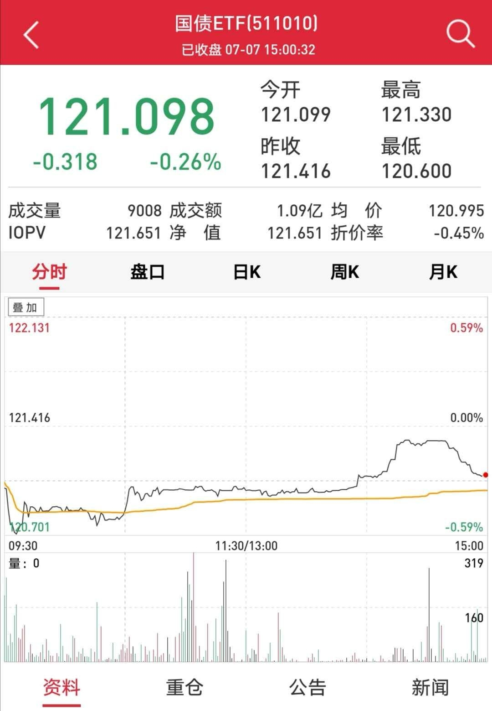

======================================================

_type: q&a
@J[28281541518551]
2020-07-08 05:41:17 Wed  
topic_id: 548845441455424

@J

>  师父，白酒和食品饮料现在是收割利润好，还是再等等享受牛市上涨？

@二师父

>  收割利润，逐步减仓

阅读[3073]  评论[0]  赞[0] 

======================================================

_type: talk
@A0洪氏日杂批发[544885222181514]
2020-07-08 09:46:27 Wed  
topic_id: 241142444585451

二师父推荐的基金豆，有人在投吗？有点心动了

@A0洪氏日杂批发 at 2020-07-08 09:46:27 Wed

> 8.8元就能请到北大，清华的才子帮我打工来理财，偶觉得贼便宜，贼划算哒，亲们觉得如何？

----------

@陈 at 2020-07-08 09:46:27 Wed

> 基金豆是啥

----------

@杜志彪 at 2020-07-08 09:46:27 Wed

> 上次二师父推的时候就开始试着投了，试了3期了，到了自动赎回你的账户，然后看是新的一期。

----------

@A0洪氏日杂批发 at 2020-07-08 09:46:27 Wed

> 应该是安全的，不是p2p吧

----------

@A0洪氏日杂批发 at 2020-07-08 09:46:27 Wed

> 二师父的文章，你没有看啊

----------

@杜志彪 at 2020-07-08 09:46:27 Wed

> 今天上新开始微笑2.0定投，我准备投这个，省心啊，我是比较认可微笑定投的，一期一期那个不能加仓，低的时候只能看着[微笑]

----------

@范毅君 at 2020-07-08 09:46:27 Wed

> 啥，没看见啊

----------

@清水倾城 at 2020-07-08 09:46:27 Wed

> 跟乌龟定投比哪个风险收益比更高呢，二师傅看到能指点一下不呢？

----------

阅读[2714]  评论[30]  赞[0] 

======================================================

_type: talk
@杜志彪[544454124115854]
2020-07-08 10:12:06 Wed  
topic_id: 421125221158128

<e type="hashtag" hid="281158522841" title="#每日打卡#" /> 2020年7月8日第18次打卡，早上加了一手国债ETF，还是场内吧，场外有赎回时间不方便。

@牛牛 at 2020-07-08 10:12:06 Wed

> 代码是511010吗

----------

@杜志彪 at 2020-07-08 10:12:06 Wed

> 是

----------

@杜志彪 at 2020-07-08 10:12:06 Wed

> 基金豆微笑定投涉及的三个基金是创业板、300、460009，大家可以研究一下它的组合[微笑]

----------

@梧桐 at 2020-07-08 10:12:06 Wed

> 积金豆的微笑定投您投了吗，收益如何

----------

@杜志彪 at 2020-07-08 10:12:06 Wed

> 投了，它是半个月一期，7月我投了2期，目前-1.57%，他目前策略是减半投。

----------

阅读[2702]  评论[5]  赞[0] 

======================================================

_type: q&a
@老司基[111852221242122]
2020-07-08 10:40:15 Wed  
topic_id: 118814182212422

@老司基

>  二师父，问个小白问题。比如某只股票20号分红，是只要20号前买入就能分红，还是要持仓多久？

@二师父

>  这完全没有意义，你买错了股票，一天跌的比分红率还高

阅读[2849]  评论[3]  赞[0] 

======================================================

_type: talk
@波多黎各[28428858544121]
2020-07-08 11:35:34 Wed  
topic_id: 421125214254248

师父的一级债基实盘图出来没？

@二师父 at 2020-07-08 11:35:34 Wed

> 周四投

----------

阅读[2570]  评论[1]  赞[0] 

======================================================

_type: q&a
@Amanda[111184528448582]
2020-07-08 12:59:06 Wed  
topic_id: 118814182888282

@Amanda

>  二师父，国债etf有没有建议至少拿多长时间的？像股票基金要用长时间不用的资金，货币基金则相反。谢谢哈！

@二师父

>  长债一到三年

阅读[2614]  评论[0]  赞[0] 

======================================================

_type: talk
@smile[111888142241442]
2020-07-08 13:59:01 Wed  
topic_id: 841142418425582

请问二师父，深红利追踪的是深证成指吗？

@二师父 at 2020-07-08 13:59:01 Wed

> 深证红利指数

----------

阅读[2410]  评论[1]  赞[0] 

======================================================

_type: talk
@二师父[28814221155551]
2020-07-08 14:20:42 Wed  
topic_id: 421125218215118

<e type="hashtag" hid="28518855451481" title="#乌龟计划#" /> 最近市场波动大，晚间定投不看盘，可能买入涨停的指数，所以定投提前一下，在收盘前买入，后期市场平稳后再恢复。

乌龟计划，继续卖出恒生国企0.1份，买入广发国开债0.1份。代码，003376。

牛市我的动作很小，这种不上不下鳄鱼计划不会动，偶尔收割收割银行，可以了。

@衣袂飘香 at 2020-07-08 14:20:42 Wed

> 跟！

----------

@衣袂飘香 at 2020-07-08 14:20:42 Wed

> 以前二师父会贴出鳄鱼计划的持仓基金及持仓比例，啥时候再贴出来？我们对照看看呀。

----------

@二师父 at 2020-07-08 14:20:42 Wed

> 仓位自己合适最好

----------

@衣袂飘香 at 2020-07-08 14:20:42 Wed

> 你说的有道理，想比照学习。特别是持仓基金，有的不完全一样，想从中，学到一些卖出的借鉴。

----------

@Sunflower at 2020-07-08 14:20:42 Wed

> 那二师父我们场外的是不是就先暂停买入指数基金呢？场外有没有可以选择的国债呢？或者债券呢？

----------

@二师父 at 2020-07-08 14:20:42 Wed

> 国债只有场内买，到买点了我也会买的

----------

@onepiecewi* at 2020-07-08 14:20:42 Wed

> 师父，这个可以场内买吗？还是场外呢

----------

@二师父 at 2020-07-08 14:20:42 Wed

> 这个是场外的

----------

阅读[3433]  评论[18]  赞[0] 

======================================================

_type: talk
@二师父[28814221155551]
2020-07-08 14:38:42 Wed  
topic_id: 241142418112511

还有95点就3500了，去年为了鼓励大家坚持下去，说今年不到3500给大家发红包，相信我的朋友都赚钱了，而且肯定不止3500

不相信我的朋友之前说我不是价值投资，做预测，打自己的脸，有些人还天天公众号留言骂我，这都不重要。

重要的是你们挣钱就好，其实不管3500到不到，我的目的不是为了证明我多牛，看我多厉害，预测对了吧。其实我就是想让大家坚持下去，不管3000也好，3500也罢，米都可以稳定盈利。

知我者谓我心忧，不知我者谓我何求。接纳无法改变的事情。

@不知道不明了 at 2020-07-08 14:38:42 Wed

> 跟着二师父走，稳稳地盈利

----------

@六尘不改 at 2020-07-08 14:38:42 Wed

> 二师傅棒棒哒

----------

@wty at 2020-07-08 14:38:42 Wed

> 二师父用心良苦！

----------

@Audrey at 2020-07-08 14:38:42 Wed

> 谢谢二师傅 感恩

----------

@云云 at 2020-07-08 14:38:42 Wed

> 跟着二师父的节奏，特别踏实

----------

@云卷云舒 at 2020-07-08 14:38:42 Wed

> 师父真不容易啊！感恩！

----------

@rtdmm小米 at 2020-07-08 14:38:42 Wed

> 感恩遇见二师父！

----------

@范毅君 at 2020-07-08 14:38:42 Wed

> 在网络上要想说话，就不能怕骂，骂你的越多，说明你越红[坏笑]

----------

阅读[2537]  评论[23]  赞[0] 

======================================================

_type: q&a
@黎雄[841555255485222]
2020-07-08 14:40:41 Wed  
topic_id: 118814185811212

@黎雄

>  师傅城投ETF511220这只债基怎么样?

@二师父

>  城投债也是很不错的，可以作为定投标的，2019年城投债有过违约的例子，不过很少，再加上投城投债etf，比较安全

阅读[2532]  评论[1]  赞[0] 

======================================================

_type: q&a
@🐰Mandy[244148854285821]
2020-07-08 14:55:14 Wed  
topic_id: 421125215482458

@🐰Mandy

>  二师傅，基面60可以收割利润了吗？

@二师父

>  可以的，估值已经正常偏高了，收割利润没问题

阅读[2595]  评论[2]  赞[0] 

======================================================

_type: q&a
@律动青春[15411224255442]
2020-07-08 15:14:22 Wed  
topic_id: 548845485118214

@律动青春

>  二师父，请问最新的估值表什么时候出来

@二师父

>  今天晚上

阅读[2555]  评论[1]  赞[0] 

======================================================

_type: talk
@二师父[28814221155551]
2020-07-08 16:51:16 Wed  
topic_id: 841142411214822

<e type="hashtag" hid="28518858514151" title="#每日估值数据#" /> 市盈率百分位45.33%，市净率百分位29.9%，SY-BY百分位48.86%，SY/BY百分位45.62%。

市场节奏反转了，去年是无穷六绝七翻车，今年是五穷六绝七翻身。星球估值表，目前已经没有低估的品种了。所以定投也暂停了一下。牛市单边上涨适合一次买入不适合定投的。

以前二师父做过，熊市做逆势，牛市做趋势，结果不是赚的很多，而是两边打脸，你不信可以试试。因为市场变化那是非常快得，人得思维惯性永远慢半拍。

熊市不买股，牛市白辛苦，做趋势得请出门左拐，很多跳大神，准备了微信群准备收割。之前熊市的耕耘就是为了行情到来的时候躺赚。

@样 at 2020-07-08 16:51:16 Wed

> 二师父，卖出的时候会通知吗？

----------

@二师父 at 2020-07-08 16:51:16 Wed

> 会的

----------

@志亮 at 2020-07-08 16:51:16 Wed

> 是的，习惯做左侧再换右侧后面很难稳得住的，会打乱自己的思维的。

----------

@rtdmm小米 at 2020-07-08 16:51:16 Wed

> 淡定持有！

----------

@阝東 at 2020-07-08 16:51:16 Wed

> 我的收割利润了

----------

@再见 . 青春 at 2020-07-08 16:51:16 Wed

> 二师父，说实话，我也有点沉不住气了[流汗]

----------

@二师父 at 2020-07-08 16:51:16 Wed

> 还早，你应该经历过15年吧

----------

@好运玲玲 at 2020-07-08 16:51:16 Wed

> 我是跟着二师父一步步定投的，也跟着二师父一步步的卖出

----------

阅读[3564]  评论[15]  赞[0] 

+++++++++++++++++++++++++++++++++++++++++++++++++++++

图片：
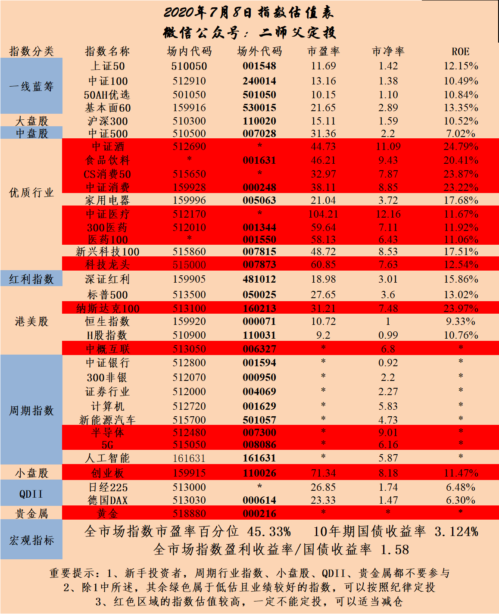

======================================================

_type: talk
@二师父[28814221155551]
2020-07-08 19:34:35 Wed  
topic_id: 241142155485221

<e type="hashtag" hid="88518858852412" title="#如何冷静#" /> 感觉沉不住气了怎么办，关掉手机，洗个凉水澡，吹吹空调，然后安静地阅读，纸质书籍，伟大的博弈，当然我即将上架的新书指数基金定投，慢慢变富也可以作为备选。

可以不卖，但真的别追，我去过赌场，看着朋友是怎么一点点进去的。有时候赚的越多，贪欲被放大越厉害，最终馅的越深，适合而止。

当然，如果你觉得我过于保守，你可以自己试试，就知道有多难控制了。

@蛋炒饭不加蛋 at 2020-07-08 19:34:35 Wed

> 哪里有买二师父的书

----------

@二师父 at 2020-07-08 19:34:35 Wed

> 天猫预售，感觉就是成本价了，出版社搞得，后面我会在星球放个成本价链接，可以先不急买。

----------

@再见 . 青春 at 2020-07-08 19:34:35 Wed

> 真是众人皆醉我独醒

----------

@宋航 at 2020-07-08 19:34:35 Wed

> 等书中

----------

@子辰 at 2020-07-08 19:34:35 Wed

> 现在想凝视深渊的冲动很强烈啊，[流汗]

----------

@J at 2020-07-08 19:34:35 Wed

> 师父，高估的也不卖吗？

----------

@二师父 at 2020-07-08 19:34:35 Wed

> 可以卖，我之前医药不都清仓了吗，慢点来

----------

@J at 2020-07-08 19:34:35 Wed

> 听师父的，悠着点卖

----------

阅读[2304]  评论[10]  赞[0] 

======================================================

_type: q&a
@onepiecewi*[244414114545811]
2020-07-08 20:16:40 Wed  
topic_id: 548845822441454

@onepiecewi*

>  师父你推文发的，跟你的乌龟，鳄鱼计划有什么区别呀？

@二师父

>  定投实盘就是乌龟计划，场外的投资，鳄鱼计划就是场内的，乌龟更持续稳健一点，基本连续，鳄鱼出手次数少，但基本每次动都是很好的机会

阅读[2308]  评论[2]  赞[0] 

======================================================

_type: q&a
@凭栏观海[244414845852181]
2020-07-08 20:35:08 Wed  
topic_id: 841142155141452

@凭栏观海

>  二师父，您的恒生国企移仓到哪儿了？我一直跟投着呢！

@二师父

>  慢慢转移的，现在卖出，逐步买入债券基金，广发中债7-10国开债

阅读[2451]  评论[18]  赞[0] 

======================================================

_type: talk
@二师父[28814221155551]
2020-07-08 21:23:54 Wed  
topic_id: 118814825428222

你开了两家公司，A流水每年500万，另外B流水每年5万，现在资金和人力有限，只能关停一家，你选择哪个

@夏萍 at 2020-07-08 21:23:54 Wed

> B

----------

@Zero Fei at 2020-07-08 21:23:54 Wed

> b

----------

@Sunflower at 2020-07-08 21:23:54 Wed

> B

----------

@wty at 2020-07-08 21:23:54 Wed

> a

----------

@白山羊 at 2020-07-08 21:23:54 Wed

> 我感觉应该看那个更节约成本、前景更好吧，但流水五百万的成本也不太可能会比五万的低😂

----------

@阝東 at 2020-07-08 21:23:54 Wed

> a，要是一样的盈利，a流水太多了，

----------

@章兵朋 at 2020-07-08 21:23:54 Wed

> 把a关了，a的流水高势必资金投入以及人力成本也高。现在资金和人力都有限，如果把b关了，a可能能正常运转一阵子但不能保证之后a公司没有任何突发情况发生，发生了突发事件a公司也只能被迫倒闭。如果关停a公司，看似利润少了，但是手里的资金富足，可以有更多的操作空间。解决好当前危机后可以东山再起。

----------

@JOY at 2020-07-08 21:23:54 Wed

> 感觉还是需要再具体些的信息才能判断关哪个。比如利润率，人力比例，管理经营成本，未来的发展前景，目前业主的状况，是否有供货商等需要结清的款项，员工的状况等等，需要综合考量。

----------

阅读[2340]  评论[15]  赞[0] 

======================================================

_type: talk
@范毅君[118551121224142]
2020-07-08 21:36:00 Wed  
topic_id: 118814825445212

借古说今，二师父能不能给我们小白讲讲，证券保险银行这些周期指数，从历史规律来讲，牛市一般走势是怎样的，会有几波比较大的震荡，一般牛市收益率高点回到多少[呲牙][呲牙]

@二师父 at 2020-07-08 21:36:00 Wed

> 一般是证券先行，另外跟着，后期就是另外两个领头，券商弱，不过这几年中国由工业化进去后工业化和信息化，这对券商有利好，科技兴国也需要企业融资

----------

@范毅君 at 2020-07-08 21:36:00 Wed

> 谢谢二师父

----------

阅读[2186]  评论[2]  赞[0] 

======================================================

_type: q&a
@陈洲[88245122222212]
2020-07-08 21:50:14 Wed  
topic_id: 118814825448122

@陈洲

>  加入星球两年了，之前一直看有乌龟计划，不知道什么乌龟计划，刚在公众号认真看了下文章，在天天基金搜到了乌龟计划，实盘只买了国债200，乌龟计划一键购买1000，我是单独买个国债，还是到乌龟计划里买个1000？这个实盘不是每天有买入卖出，是看时间买入卖出的吗？

@二师父

>  单独买入国开债，这个实盘是固定的发车，未来又好机会也会单独加仓，只需要买入每次加仓的品种即可

阅读[2496]  评论[2]  赞[0] 

======================================================

_type: talk
@二师父[28814221155551]
2020-07-08 22:07:53 Wed  
topic_id: 841142154844182

赚钱了睡不着该怎么办

@庆余年 at 2020-07-08 22:07:53 Wed

> 😂😂卖了又追高

----------

@宋航 at 2020-07-08 22:07:53 Wed

> 全卖了。退出圈。估计睡的会很香[得意]

----------

@样 at 2020-07-08 22:07:53 Wed

> 仓位以吃的香，睡的着为标准[偷笑][偷笑]

----------

@阝東 at 2020-07-08 22:07:53 Wed

> 那就远离股市，不要再碰[偷笑]

----------

@蓝魔森林 at 2020-07-08 22:07:53 Wed

> 我追高了一个中概股  哈哈哈 长期拿着

----------

@志亮 at 2020-07-08 22:07:53 Wed

> 还是仓位问题[微笑]

----------

@What if at 2020-07-08 22:07:53 Wed

> 退圈早了，回头看到大盘一路往上飘，要么拍大腿，要么高位接盘[偷笑]

----------

阅读[2543]  评论[7]  赞[0] 

+++++++++++++++++++++++++++++++++++++++++++++++++++++

图片：

======================================================

_type: talk
@范毅君[118551121224142]
2020-07-08 23:04:21 Wed  
topic_id: 421125142158118

持仓比例，利润多少收割一次，做波段的，波段设置多少，我非常赞同二师父说的，看自己的舒适度。比如建仓和卖出利润，我是一个比较怕风险的人，所以我就把每份分的非常小，定投频率相对大一些，灵活一些，比如低位建仓，跌多多买几份，涨多不买、涨少少买。现在这个位置，我六成仓位二师父说不好，我就主仓位卧倒不动，很小部分做波段，昨日下跌，我买入两份券商，0.5份h股，卖出涨了的白酒0.1份，我这样操作，毫无压力，因为今天大跌，我可以适度补仓，昨天因为入的少，不会影响啥主仓位利润，今天券商涨了，我卖出1.5份，挣的不多，但没压力。还是那句话，自己具体操作，还得以自己舒适，要是自己的操作，让自己不安，还是需要调整比例和节奏。适合别人的，不一定适合自己，二师父领进门，挣钱看你自己[偷笑]我比较小白，分享自己心得，对不对，欢迎指正，共同进步[呲牙]

@范毅君 at 2020-07-08 23:04:21 Wed

> 另外今天我买了一份国债etf，但是这个不太适合我，因为一手太贵了，不适合我每份比较低的性格，今天买了1000元广发7-10国开，这个场外节奏适合我，后面继续定投这个，等二师父投国债信号明确，比例加大，我再进国债etf[偷笑]

----------

@范毅君 at 2020-07-08 23:04:21 Wed

> 应该是六成仓位，二师父说不高，打错字了

----------

阅读[2403]  评论[2]  赞[0] 

======================================================

_type: q&a
@Vivian[582228554481154]
2020-07-08 23:24:11 Wed  
topic_id: 548845828212254

@Vivian

>  我是刚加入星球的小白。看二师傅的公众号文章有一阵子，跟着师傅做一点投资，感觉有收获，想问一下二师傅那个国债是在天天基金买吗？那个是把本月的增量基金用来买这个国债是吗？需要钱可以随时卖出吗？

@二师父

>  国开债基金在天天买，国债在证券账户买，如果存量资金满仓了，就用存量资金，现在每月用不了那么多增量资金买入，先放到货币基金，前期买入调用了防守账户的资金，现在补进去。

阅读[2508]  评论[4]  赞[0] 

======================================================

_type: talk
@二师父[28814221155551]
2020-07-09 07:36:07 Thu  
topic_id: 548845812141184

大家有什么操作或者有啥想法都可以发到星球，这样的话可以及时纠偏，学堂的意义在于讨论和集思广益，1加1永远大于2，这才是群体的目的

阅读[2294]  评论[0]  赞[0] 

======================================================

_type: q&a
@wty[548488548545444]
2020-07-09 07:47:58 Thu  
topic_id: 421125184822258

@wty

>  二师父，一级债可以定投易方达7-10国债吗？我想着基金换仓方便，因为易方达有更多的选择啊。另外，一级债如果持有2-3年，它的年化收益是多少呢？

@二师父

>  可以的，百分之6到7左右

阅读[2404]  评论[1]  赞[0] 

======================================================

_type: q&a
@榕声竹影[844118218251282]
2020-07-09 07:55:03 Thu  
topic_id: 548845828828824

@榕声竹影

>  二师父：请问我没有恒生国企，我买的是汇丰晋信恒生龙头指数A（540012），目前盈利15%，请问现在也需要一点一点卖出换成广发中债吗？还是只收割利润？目前已经9成仓位。

@二师父

>  这个重仓的白马股，从你盈利点看买的价位比较高，可以拿着等到高位回撤直接目标止盈

阅读[2435]  评论[0]  赞[0] 

======================================================

_type: q&a
@不知道不明了[15584248411812]
2020-07-09 08:21:21 Thu  
topic_id: 548845812528524

@不知道不明了

>  二师父好，这个新基金为啥这么火热，一般新基金发行后都会涨么，和打新股一样么？

@二师父

>  因为最近流动性充裕而且股民情绪高涨，新基金和新股不一样的，而且认购费比较高，一般不考虑新基金

阅读[2493]  评论[0]  赞[0] 

======================================================

_type: talk
@阿宝[422212151424158]
2020-07-09 08:21:48 Thu  
topic_id: 548845812422254

当前要稳住！

@sunny在路上 at 2020-07-09 08:21:48 Thu

> 学习了[呲牙]稳住！

----------

@A0洪氏日杂批发 at 2020-07-09 08:21:48 Thu

> 学习了[呲牙]稳住！

----------

阅读[2622]  评论[2]  赞[0] 

+++++++++++++++++++++++++++++++++++++++++++++++++++++

文件：
2020-07-09 08:21:48 Thu
文件大小：[17920]
15488581454112-7.7 -8当前投资分享.doc

======================================================

_type: q&a
@激流勇进[241141245525821]
2020-07-09 08:32:18 Thu  
topic_id: 421125184241828

@激流勇进

>  师父您好！场内基金和场外基金确定购买价格是怎么规定的？场内是按照购买时的实时价格，场外是当天收盘价格，是这么规定的吗？

@二师父

>  是的，场外叫做净值，是那样规定的

阅读[2552]  评论[0]  赞[0] 

======================================================

_type: q&a
@🍀 凝🌸 慧🍀[841855248254242]
2020-07-09 08:34:10 Thu  
topic_id: 118814852155582

@🍀 凝🌸 慧🍀

>  师父好，今天有实盘买一级债吗？

@二师父

>  昨天买了的，买的广发中债7-10国开债

阅读[2584]  评论[10]  赞[0] 

======================================================

_type: q&a
@罗大发[421484455521228]
2020-07-09 09:44:40 Thu  
topic_id: 841142182415882

@罗大发

>  师父，我中证银行现在还亏3%，所以请问等盈利了把他转成什么好？广发中债7-10国开债？

@二师父

>  目前没有特别好转的，好基金目前都比较贵，盈利之后如果行情爆发他也比债基好一点，债基主要是避险，同时和通胀收益率略高一点，不会有特别大涨幅

阅读[2452]  评论[1]  赞[0] 

======================================================

_type: q&a
@白山羊[421484211452528]
2020-07-09 10:05:26 Thu  
topic_id: 421125185112488

@白山羊

>  二师父，我记得前几天说过有几个指数可以停止定投了，是哪几个来着，我找不到了😂

@二师父

>  基本都停止定投了，目前还值得定投的就是债券类基金，其实市场中位可以配置偏债混合，进可攻，退可守，当然牛市时候收益率比指数差很多

阅读[2599]  评论[1]  赞[0] 

======================================================

_type: q&a
@毛毛宇[88281885112212]
2020-07-09 10:17:51 Thu  
topic_id: 241142184525111

@毛毛宇

>  二师夫，中证红利为啥一直起不来啊！这么好的行情，涨的很差，请您帮忙分析一下！

@二师父

>  里面持仓都不是很好，你考估值表都已经没有他了，a股目前市场分红好的基金一般成长性弱，属于稳健型，而深红利分红差，成长性是好于中证红利的

阅读[2589]  评论[0]  赞[0] 

======================================================

_type: q&a
@Vincent[15448144581152]
2020-07-09 10:18:40 Thu  
topic_id: 421125182888228

@Vincent

>  刚入星球，二师父，看你以及星球伙伴多在推荐这个广发中债7-10，我看了下最近三个月这只债基收益不断在下滑，此时值的定投吗？

@二师父

>  定投和做趋势不同，就是下跌的时候投，如果做趋势目前肯定买股票，做定投现在适合

阅读[2774]  评论[4]  赞[0] 

======================================================

_type: talk
@smile[111888142241442]
2020-07-09 10:51:02 Thu  
topic_id: 118814851488512

二师父您好，请教：50ah和沪深300重合大吗？请问从长期看，50ah、恒生指数是不是不如沪深300？有没有必要最近换掉呢

阅读[2606]  评论[0]  赞[0] 

======================================================

_type: talk
@雨淡风清[844418818858882]
2020-07-09 11:07:48 Thu  
topic_id: 241142184155421

看这样，大单小单出现资金上的分歧，这是要开始震荡了[衰]

@cotton at 2020-07-09 11:07:48 Thu

> 今天没有实盘呀，师父

----------

@雨淡风清 at 2020-07-09 11:07:48 Thu

> 哈哈刚说震荡就涨上来了

----------

@J at 2020-07-09 11:07:48 Thu

> 请问这是在哪里看的？哪个软件

----------

@雨淡风清 at 2020-07-09 11:07:48 Thu

> 新浪财经

----------

@J at 2020-07-09 11:07:48 Thu

> 谢谢

----------

@J at 2020-07-09 11:07:48 Thu

> 不错的推荐，这个图很直观

----------

@雨淡风清 at 2020-07-09 11:07:48 Thu

> 不客气

----------

阅读[2603]  评论[7]  赞[0] 

+++++++++++++++++++++++++++++++++++++++++++++++++++++

图片：
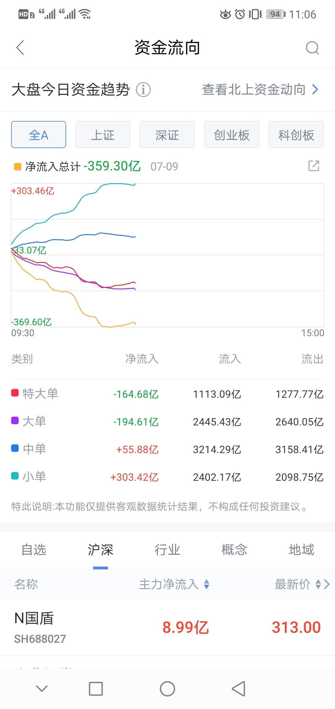

======================================================

_type: q&a
@上上签[244184512458541]
2020-07-09 11:39:55 Thu  
topic_id: 118814851442552

@上上签

>  二师傅，咨询问题
>  1:我记得是在十年期国债利率在3.5%至3.0%之间时，适合投资短债基金，这个是不是呢，我怕记错了😅
>  2:为什么最近中欧短债还有嘉实这些短债出现跌幅，是因为股市跷跷板问题导致的嘛，还是其他什么原因的呢
>  3:现在适合入手短债嘛

@二师父

>  1，大致这个范围投的
>  2，这是因为利率和国债发行过多，6月有一万亿抗疫特别国债，现在资金又被股市吸纳
>  3，短债价值不是特别大，主要流动性，收益率有点鸡肋，可以少量分散配置

阅读[2650]  评论[2]  赞[0] 

======================================================

_type: q&a
@凭栏观海[244414845852181]
2020-07-09 11:40:39 Thu  
topic_id: 118814851482182

@凭栏观海

>  二师父，我的中证红利和红利机会都已经收获10%以上，目前可以出货吗？

@二师父

>  红利机会可以出了，这个基金以前分析过，不大好，中证红利可以收割利润

阅读[2680]  评论[1]  赞[0] 

======================================================

_type: q&a
@阳光[421884185252128]
2020-07-09 11:41:14 Thu  
topic_id: 118814851851142

@阳光

>  师父：有个问题不明白，请教一下。现在什么基金也不敢买了，为什么还要卖恒生国企指数呢？虽然涨得少可也在涨啊。谢谢

@二师父

>  那也可以拿着，我是调仓组合搭配的

阅读[2709]  评论[3]  赞[0] 

======================================================

_type: q&a
@mommybug[244115184545221]
2020-07-09 11:41:39 Thu  
topic_id: 241142184184121

@mommybug

>  老师，请问广发中基场内代码是多少？现在是不是可以买了？谢谢！

@二师父

>  这个在昨天实盘发过，可以看看精华里面的实盘记录

阅读[2754]  评论[2]  赞[0] 

======================================================

_type: q&a
@美美[48224811151218]
2020-07-09 11:42:07 Thu  
topic_id: 241142181584211

@美美

>  二师父：现在定投广发中债用不用建立底仓

@二师父

>  可以不用，等债券到底了再建立底仓

阅读[2843]  评论[5]  赞[0] 

======================================================

_type: talk
@希望[421125255451418]
2020-07-09 12:42:50 Thu  
topic_id: 841142181242212

请问师父，工银深红利，易方达沪深300，中证融通人工智能，这三个基金现在是该收割利润还是继续拿着？

@二师父 at 2020-07-09 12:42:50 Thu

> 我还拿着，仓位降了一点，超级牛市不爆发，我的仓位不会降到7成以下

----------

阅读[2608]  评论[1]  赞[0] 

======================================================

_type: talk
@二师父[28814221155551]
2020-07-09 12:47:39 Thu  
topic_id: 841142181215582

很多时候需要理解说话人意图，以及出题人意图，中国的教育一直喜欢给出标准答案，导致很多投资者拿800元买别人牛股代码，结果买了一个沪深300基金得代码。步入社会以及开始投资很多问题没有标准答案

转换思维吧，我这里是启发式教育，比如你媳妇突然在微信上，对你说，老公，我想你了，你会怎么回呢？

温馨提示，不要在乎你自己怎么想的，不要沉迷自己的世界，揣摩出题人或者说话人的意图。

@Sunflower at 2020-07-09 12:47:39 Thu

> 这个题好，希望每周都有[呲牙]如果是我，我会问对方是想吃好吃的还是喜欢某个小宠物，我们双方都属于脑子比较直的[捂脸]很少会拐弯说

----------

@杜志彪 at 2020-07-09 12:47:39 Thu

> 目前还是五层仓位以下吗？

----------

@二师父 at 2020-07-09 12:47:39 Thu

> 五成仓位？

----------

@二师父 at 2020-07-09 12:47:39 Thu

> 你应该是北方的女性

----------

@杜志彪 at 2020-07-09 12:47:39 Thu

> 我记得前些日子sunflower说她四层仓。

----------

@Sunflower at 2020-07-09 12:47:39 Thu

> 5成了，之前的不用资金还没来得及买完就涨了，打算剩下的定投国债基金了

----------

@Sunflower at 2020-07-09 12:47:39 Thu

> 二师父猜的没错，我老公没有不良嗜好，不抽烟不喝酒，想什么就说什么的人😂

----------

@杜志彪 at 2020-07-09 12:47:39 Thu

> 我也不抽烟不喝酒，和老婆结婚20多年了，老婆重来没说过这话[偷笑]

----------

阅读[2719]  评论[12]  赞[0] 

======================================================

_type: q&a
@付云[844148188522822]
2020-07-09 12:49:05 Thu  
topic_id: 421125181522288

@付云

>  从那个app买国债咧

@二师父

>  置顶开户任意一个券商都可以的

阅读[2900]  评论[0]  赞[0] 

======================================================

_type: q&a
@陈[844415515418422]
2020-07-09 12:49:36 Thu  
topic_id: 241142181215251

@陈

>  谁能告诉我实盘在哪里看？我怎么找不到？谢谢啦！

@二师父

>  精华内容，这样可以看到我发的精华

阅读[3099]  评论[0]  赞[0] 

======================================================

_type: talk
@二师父[28814221155551]
2020-07-09 12:52:30 Thu  
topic_id: 548845818585454

发主题，大家一起讨论，投资不决，可以相互讨论，然后再自己拿意见

想听我的意见，提问按钮，这个只有我可以看到，也可以像嘉宾提问

任何意见都作为参考，投资是没有标准答案的，只是一个综合最优决策，适合你的不一定适合另外一个朋友

阅读[3235]  评论[0]  赞[0] 

+++++++++++++++++++++++++++++++++++++++++++++++++++++

图片：

======================================================

_type: talk
@杜志彪[544454124115854]
2020-07-09 13:32:27 Thu  
topic_id: 841142181181812

<e type="hashtag" hid="281158522841" title="#每日打卡#" /> 2020年7月9日第19次打卡，卖出500网格一份，收割人工智能20%利润，最近一直在收割，3500点越来越近了，你们说行情这么好，要不要加点印花税[微笑]。

阅读[2984]  评论[0]  赞[0] 

======================================================

_type: q&a
@吾思吾想[118552585284212]
2020-07-09 13:45:49 Thu  
topic_id: 841142181121112

@吾思吾想

>  二师父，我一直持有000187华泰纯债，这个与你这次定投的广发中债是一类吗？有必要转过来吗？

@二师父

>  这个没问题

阅读[3075]  评论[0]  赞[0] 

======================================================

_type: talk
@二师父[28814221155551]
2020-07-09 13:57:51 Thu  
topic_id: 241142128481521

<e type="hashtag" hid="881251425252" title="#鳄鱼计划#" /> 卖出中概互联一份，该出手的时候就出手，这只基金也快翻倍了，慢慢卖，现在就是捡钱，拿住不卖也行，不要再追了。

@杜志彪 at 2020-07-09 13:57:51 Thu

> 最近一直在收割，已经接近8层仓位了。

----------

@丸子妈 at 2020-07-09 13:57:51 Thu

> 我就留了底仓

----------

@杜志彪 at 2020-07-09 13:57:51 Thu

> 师父都没怎么卖，怎么你就剩底仓了，那只能等回调了[害羞]

----------

@April _ M. at 2020-07-09 13:57:51 Thu

> 我投入本金少  收割了利润就没多少了，卧倒了

----------

@二师父 at 2020-07-09 13:57:51 Thu

> 没问题，长期持有也挺好

----------

阅读[3992]  评论[5]  赞[0] 

======================================================

_type: q&a
@笔记[841152254588422]
2020-07-09 13:59:18 Thu  
topic_id: 118814845128182

@笔记

>  主力资金流出这么多，大盘为什么涨这么多？

@二师父

>  主力在退货，散户在接盘，市场情绪太热了

阅读[3229]  评论[4]  赞[0] 

======================================================

_type: talk
@子辰[421444812542128]
2020-07-09 14:18:14 Thu  
topic_id: 548845851481154

万得app的数据，无论是股票还是指数都是净流入，各个软件数据的差异都挺大的

@背心 at 2020-07-09 14:18:14 Thu

> 到底哪个是真实的

----------

@子辰 at 2020-07-09 14:18:14 Thu

> 软件数据是免费的，你觉得有多少真实性。[微笑]

----------

阅读[3070]  评论[2]  赞[0] 

+++++++++++++++++++++++++++++++++++++++++++++++++++++

图片：
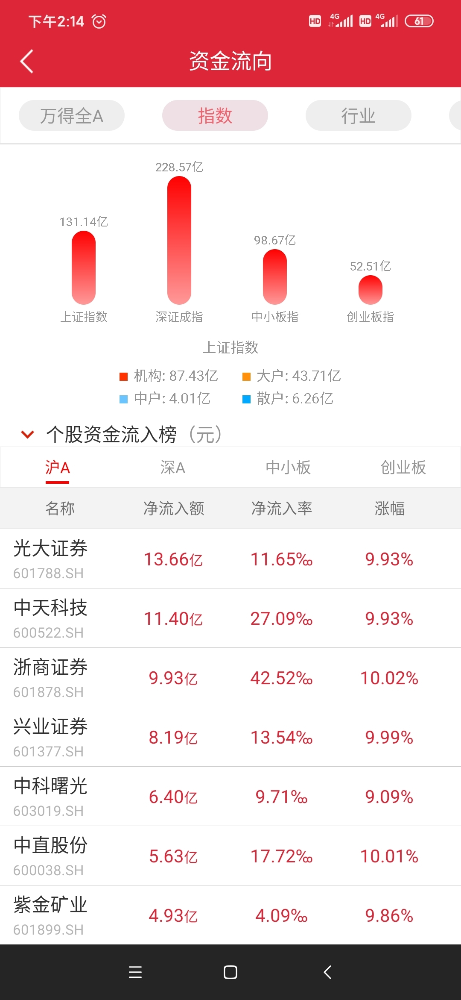
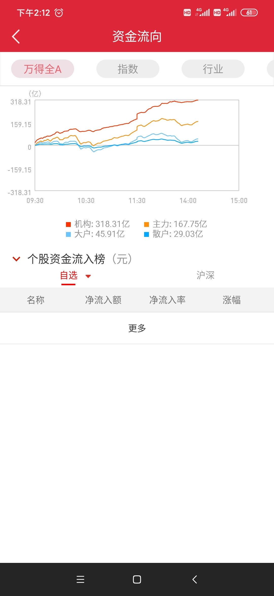

======================================================

_type: q&a
@云卷云舒[28288212211221]
2020-07-09 15:47:55 Thu  
topic_id: 421125155422888

@云卷云舒

>  师父好！我是三月份开始跟你定投乌龟计划和鳄鱼计划的，目前盈利都在20个点上了，仓位不重。当前收割利润是先收割场外的还是场内的；是先收割长得好的还是先收割长得差的。

@二师父

>  这个就没有定论，收割利润是建立在预期会跌的基础上，如果这次一路大涨，收割其实就不用，不过a股波动大，收割以后保持5到9成仓位以上，没有问题

阅读[3032]  评论[2]  赞[0] 

======================================================

_type: q&a
@阳光[421884185252128]
2020-07-09 15:49:08 Thu  
topic_id: 421125155412448

@阳光

>  师父：看估值表里中概互联高估了，现在需要卖出了吧？

@二师父

>  慢慢减仓即可

阅读[3155]  评论[0]  赞[0] 

======================================================

_type: q&a
@姥姥不疼. 爷爷不爱[48544481458248]
2020-07-09 17:57:16 Thu  
topic_id: 841142124851252

@姥姥不疼. 爷爷不爱

>  军工现在是低估么，可以进么，二师父，谢谢您了

@二师父

>  不大适合定投，现在做股权只适合趋势，没有谁现在定投，15年卸载账户的又重新入场了，现在的风险大于机会

阅读[3075]  评论[2]  赞[0] 

======================================================

_type: q&a
@姥姥不疼. 爷爷不爱[48544481458248]
2020-07-09 18:36:19 Thu  
topic_id: 548845854421244

@姥姥不疼. 爷爷不爱

>  证券已赢利，是收割利润，还是分批卖出，

@二师父

>  收利润就行，继续看好后市，如果能突破3550那么可以常持牛市高位，不能突破再减仓不迟

阅读[3018]  评论[0]  赞[0] 

======================================================

_type: q&a
@Vincent[15448144581152]
2020-07-09 20:42:20 Thu  
topic_id: 548845841218484

@Vincent

>  二师父，这时候乌龟计划，还能定投吗？

@二师父

>  可以，每周持续定投，除非没有好机会了，增量资金定投货币基金

阅读[2941]  评论[0]  赞[0] 

======================================================

_type: talk
@二师父[28814221155551]
2020-07-09 20:43:44 Thu  
topic_id: 118814815212252

<e type="hashtag" hid="15285525148242" title="#关于怎么卖#" /> 大家可以看看，如何卖出。卖出是艺术，如果你不懂，先按照我给新手的制定的方针，然后再慢慢学习卖出的艺术。

@阝東 at 2020-07-09 20:43:44 Thu

> 二师傅说的对，牛市的初期不应该收割的那么早，涨的那么好为什么要收割呢，等等市场跌了再出来也不迟，我的是收割有点早了，但想把银行，恒生慢慢的收割出去

----------

阅读[4088]  评论[1]  赞[0] 

+++++++++++++++++++++++++++++++++++++++++++++++++++++

文件：
2020-07-09 20:42:59 Thu
文件大小：[22796]
15488424248142-盈利翻倍，该怎么卖.docx

======================================================

_type: q&a
@Vincent[15448144581152]
2020-07-09 21:11:14 Thu  
topic_id: 548845841124814

@Vincent

>  二师父，这个乌龟计划，是我随时买还是每周在你的提示下我再买？

@二师父

>  不能随时买了，这个位置除非你能不惧回撤，否则定投指数可以停一停，慢慢债券基金比较有价值了

阅读[3052]  评论[3]  赞[0] 

======================================================

_type: q&a
@学以致用[244415184181451]
2020-07-09 21:11:52 Thu  
topic_id: 548845841285244

@学以致用

>  二师傅，你公众号推荐的中欧全明星组合里的基金都带“C”的。长期持有是不是手续费不划算啊？

@二师父

>  对的，长期C类管理费会很高

阅读[3122]  评论[0]  赞[0] 

======================================================

_type: q&a
@姥姥不疼. 爷爷不爱[48544481458248]
2020-07-09 22:02:07 Thu  
topic_id: 118814815445582

@姥姥不疼. 爷爷不爱

>  网上有大V说券商目前开始分化，应只出不进券商，而我现重仓持有券商，刚才您讲3500关前可收割利润，那么，我还想请教，若大盘顺利突破3500并站牢，我是否可以拿到牛市结束再兑现。谢谢您，二师父

@二师父

>  厨师多了容易烧坏汤，可以出，也可以不出，进肯定是不要进了。
>  
>  牛市期间也会有回调，券商波动大，后面有没有深度回调不知道，见好就收，你要是能经受巨幅回撤，拿到牛市中后期没有问题。
>  
>  最近情绪一直很高，可以再观察观察，趋势起来了，没有大利空不会转向

阅读[3142]  评论[0]  赞[0] 

======================================================

_type: talk
@二师父[28814221155551]
2020-07-09 22:56:04 Thu  
topic_id: 118814814588182

<e type="hashtag" hid="15285288148182" title="#全市场指数估值数据#" /> 市盈率百分位49.27%，市净率百分位31.57%，SY-BY百分位53.46%，SY/BY百分位51.02%。

股票投资，指数投资，主动性股票基金投资暂停，这时候进场，就是做趋势，那么很多人做趋势又舍不得止损，经常被套。所以你跟着我来，会比较稳。

可以不卖，不要买了。两年前，我可是天天喊着买买买，那时候得市场环境和现在不同得，真正的投资者永远不要为了一个品种上涨而买入。

@rtdmm小米 at 2020-07-09 22:56:04 Thu

> 紧跟二师父的节奏！不怕

----------

@章兵朋 at 2020-07-09 22:56:04 Thu

> 已经按照二师傅的策略，分布止盈。

----------

阅读[3886]  评论[2]  赞[0] 

======================================================

_type: q&a
@宁静以致远[841158451581452]
2020-07-09 23:10:25 Thu  
topic_id: 421125128118428

@宁静以致远

>  二师父，以后到合适的机会，我们这里跟着您的鳄鱼计划减仓或者清仓的时候，我在蛋卷买的场外指数（最开始没跟鳄鱼计划时买的）是不是也就需要同时做减法了？到时候大家都在卖会不会有踩踏事件（跑不了的）？另外，多问一句，有历史验证每年收益率十几个点的明星基金经理管理的基金到牛市高点是不是也得出啊？都挡不住往下掉。

@二师父

>  踩踏事件会发生在股票上面，连续跌停跑不掉，有这样的情况。基金还好，连续跌停的概率很小，几乎为零。
>  
>  这个看基金经理的水平，有的基金经理水平好，可以穿越牛熊，回撤比较小。然而，这种太少，我很佩服朱少醒，有水平，有担当。
>  
>  有的基金经理做了一般跑路了，当然还有其他因素，比如基金经理生病了，比如团队出了意外等等。
>  
>  不是很厉害的基金经理，那熊市也会跌的惨不忍睹。

阅读[3159]  评论[0]  赞[0] 

======================================================

_type: q&a
@姥姥不疼. 爷爷不爱[48544481458248]
2020-07-10 05:46:07 Fri  
topic_id: 421125114485518

@姥姥不疼. 爷爷不爱

>  上轮牛市被套的主动基金已解套，并逐步开始盈利，是拿着，还是收割利润，还是一次性清仓，谢谢您了。

@二师父

>  具体什么基金，这个问题太大了，就我问你，现在房子还能不能买，范围太大

阅读[3081]  评论[2]  赞[0] 

======================================================

_type: q&a
@程瑾[28212185412181]
2020-07-10 06:35:21 Fri  
topic_id: 841142115544512

@程瑾

>  请问华宝油气（亏损30%多），5%仓位，后续有什么操作建议？

@二师父

>  反弹后清仓

阅读[3251]  评论[1]  赞[0] 

======================================================

_type: talk
@宋航[48548414258158]
2020-07-10 06:44:46 Fri  
topic_id: 241142115515281

昨晚美股的下跌，会影响到今天a 股也下跌吗？

阅读[3161]  评论[0]  赞[0] 

======================================================

_type: talk
@林玮[844111858288412]
2020-07-10 06:58:44 Fri  
topic_id: 118814882545412

二师父，社保基金减持中国人保非银etf要不要减持？

阅读[3284]  评论[0]  赞[0] 

======================================================

_type: talk
@二师父[28814221155551]
2020-07-10 07:42:13 Fri  
topic_id: 421125114544258

美股没跌多少啊，我看了下标普500就跌了不到1个点，也没熔断，不用担心，目前没有重大利空

国家队减持这个事留意下，目标止盈，比如回撤到3400考虑减仓部分然后接回来

当然不一定能接回来，要知道某基金直接募集资金1300亿，这个盘子很大的，整个市场指数基金规模才几千亿，目前很火热，新基金都抢不到，牛市上升期底仓不要丢太多筹码，短期波动没啥大碍

@艾琪（王钥） at 2020-07-10 07:42:13 Fri

> 谢谢二师父提醒

----------

@秦风殇韵（刘豫斌） at 2020-07-10 07:42:13 Fri

> 最近申购几个募集资金配比没有高于50%的，市场接盘后备军还有一批在路上

----------

阅读[3534]  评论[2]  赞[0] 

======================================================

_type: q&a
@陈[844415515418422]
2020-07-10 09:29:45 Fri  
topic_id: 548845881285584

@陈

>  二师父，不收割利润的话，利润在里面也继续增值吗？

@二师父

>  对的，长期会复利增长

阅读[3373]  评论[0]  赞[0] 

======================================================

_type: talk
@幽兰[815554522442422]
2020-07-10 09:41:28 Fri  
topic_id: 421125118818288

目前持有了中证消费、沪深300、中证500，基本面60、上证50、上证50Ah，富国精准医疗、恒生ETF、标普500，请问哪些可以全部赎回，哪些适合收割利润，那些可以继续持有？

@Sunflower at 2020-07-10 09:41:28 Fri

> 医疗、恒生etf、标普500我没有，剩下的我是收割了利润继续拿着

----------

阅读[3248]  评论[1]  赞[0] 

======================================================

_type: talk
@Nick.yang[118281888551882]
2020-07-10 09:43:30 Fri  
topic_id: 421125118812588

天弘中证银行指数A 001594可以买买入一些，定投吗，之前一直不是很好，感觉慢慢起来了，不亏了，丢了还是继续定投，想听听都二师傅的见解

@程大圣 at 2020-07-10 09:43:30 Fri

> 别人都开始卖了，你要定投买，你品，你细品！

----------

@杜志彪 at 2020-07-10 09:43:30 Fri

> 这要看仓位了，仓位足就不要买了，仓位不够可以买，必经消费医药科技都很高了，指数如果继续向上，稳定大盘的还要靠银行地产，它们估值相对还是低的，比追涨起来的风险小点。

----------

阅读[3455]  评论[2]  赞[0] 

======================================================

_type: q&a
@宁静以致远[841158451581452]
2020-07-10 09:43:32 Fri  
topic_id: 421125118848288

@宁静以致远

>  二师父，您看交银新成长这种历史成绩、明星经理，是可以长期持有穿越牛熊吗？这个我就几百几百定投的，没积累多少，考虑是否长期持有。

@二师父

>  基金经理不换，自己能经受一定的波动是可以的

阅读[3829]  评论[0]  赞[0] 

======================================================

_type: q&a
@不知道不明了[15584248411812]
2020-07-10 11:19:51 Fri  
topic_id: 421125115411828

@不知道不明了

>  二师父好，今天指数没有突破3500回落了，银行跌了比较多，仓位比较重我需要卖出一部分么，这段时间刚涨起来，现在银行股盈利8个点多，银行指数盈利不到5个点。还是等后市再看看。

@二师父

>  仓位重可以减仓一些的，3580是个压力位，冲不上去会震荡

阅读[3665]  评论[0]  赞[0] 

======================================================

_type: q&a
@smile[111888142241442]
2020-07-10 11:20:37 Fri  
topic_id: 421125115424228

@smile

>  二师父，按今天这个趋势，是不是应该减仓了呢？还是不动

@二师父

>  可以的，主要看你仓位

阅读[3881]  评论[4]  赞[0] 

======================================================

_type: talk
@波多黎各[28428858544121]
2020-07-10 11:24:42 Fri  
topic_id: 241142112255811

师父，现在货币基金只有南方天天利比较好吗？还有什么推荐的

阅读[3757]  评论[0]  赞[0] 

======================================================

_type: talk
@杜志彪[544454124115854]
2020-07-10 11:48:27 Fri  
topic_id: 548845885542444

<e type="hashtag" hid="281158522841" title="#每日打卡#" /> 7月10日第20次打卡，卖与不卖其实都要结合自身情况，比如仓位，账户性质等，比如我前期有一笔理财到期，因为是保守账户，咨询二师父后三层仓在天天基金买入100ETF和和恒生国企，到昨天100ETF盈利26%，今天决定赎回（已经达到目的大幅跑赢银行理财），放回银行理财，恒生国企继续持有，场内账户可以提高一些风险，但也不可能从头吃到尾，适合自己就好。

@丸子妈 at 2020-07-10 11:48:27 Fri

> 666

----------

阅读[3867]  评论[1]  赞[0] 

======================================================

_type: q&a
@遇见了你[118285144148812]
2020-07-10 12:46:30 Fri  
topic_id: 118814888545122

@遇见了你

>  二师父，现在每天主力净流入都是负的，是都在撤资金么，我是中仓要不要轻仓？

@二师父

>  轻仓了很难再接回来，极端保守也要5成仓位以上最好

阅读[3905]  评论[3]  赞[0] 

======================================================

_type: q&a
@幽兰[815554522442422]
2020-07-10 14:08:00 Fri  
topic_id: 841142111158812

@幽兰

>  二师父，我按照您文档里的指导步骤在华泰试水了可转债打新。想问下您平时是否会有发可转债打新的实盘？一般申购的频次和金额是怎么样的

@二师父

>  牛市全额打，熊市打等级高的，破发概率很小，如果破发持有一定时间可以盈利，这个风险偏低

阅读[3721]  评论[0]  赞[0] 

======================================================

_type: q&a
@刘佳柒[815555885511852]
2020-07-10 14:08:45 Fri  
topic_id: 841142111151512

@刘佳柒

>  二师傅，今天银行下跌大，银行类指数基金可以加仓吗

@二师父

>  银行指数很一般，我都慢慢在移仓了，投资银行关注招行，平安，宁波即可

阅读[3886]  评论[4]  赞[0] 

======================================================

_type: q&a
@Kiwi 的拾金之路[241182454821121]
2020-07-10 14:12:49 Fri  
topic_id: 241144555558541

@Kiwi 的拾金之路

>  师父，我今天刚刚兑现了一笔奖金，如果加仓的话，应该按照什么计划？望指点迷津！

@二师父

>  这个位置最好别动，高位定投以宽基为主，其他板块风险挺高的了，而且你要说清楚已经投入多少资金，奖金比例多少，月流入多少，还有资金可以存放时间，短期2年内有没有大额支出，这些都是期限配对必须考虑的因素

阅读[3976]  评论[2]  赞[0] 

======================================================

_type: q&a
@与世无争[421844554514848]
2020-07-10 18:30:52 Fri  
topic_id: 421122842288258

@与世无争

>  老师，我在天天基金里面跟投你的乌龟计划，最近这几周怎么没看见你定投。

@二师父

>  最近涨起来了，动作很小，增量基金放到货币基金里面了，但是每周都有投的，保持连续性，金额很低，可以忽略了

阅读[3476]  评论[7]  赞[0] 

======================================================

_type: talk
@夜色霓虹灯[48852124141858]
2020-07-10 18:48:33 Fri  
topic_id: 841144854422112

<e type="hashtag" hid="881251425252" title="#鳄鱼计划#" /> 这个组合持仓哪里能看到呢？

@二师父 at 2020-07-10 18:48:33 Fri

> 这个是在星球实时发布的

----------

阅读[3430]  评论[1]  赞[0] 

======================================================

_type: talk
@二师父[28814221155551]
2020-07-10 21:28:43 Fri  
topic_id: 241144851451851

今天大跳水，看看如何应对

@wty at 2020-07-10 21:28:43 Fri

> 及时好文，不断提醒自己莫乱动！[偷笑]

----------

@陌路花 at 2020-07-10 21:28:43 Fri

> 不慌不慌[偷笑]

----------

@芙瑞雅阳阳潘 at 2020-07-10 21:28:43 Fri

> 我沒有听二师父的话，高位依然坚持定投，从不间断。萧碧燕课程后遗症

----------

@二师父 at 2020-07-10 21:28:43 Fri

> 各有利弊

----------

@J at 2020-07-10 21:28:43 Fri

> 师父，手中的50AH目前涨了15%，还值得继续持有吗？这只基金所占比例为总仓位的1/40[偷笑]

----------

@二师父 at 2020-07-10 21:28:43 Fri

> 可以的

----------

@J at 2020-07-10 21:28:43 Fri

> 好的，我没持有金融板块的基金，只有50AH，现在进入正常估值，收割利润还是一直持有到高估更好呢。

----------

阅读[3813]  评论[7]  赞[0] 

+++++++++++++++++++++++++++++++++++++++++++++++++++++

文件：
2020-07-10 21:28:37 Fri
文件大小：[21508]
28211288858841-市场跳水了，怎么应对.docx

======================================================

_type: talk
@二师父[28814221155551]
2020-07-10 21:38:13 Fri  
topic_id: 548844128418824

<e type="hashtag" hid="224445218111" title="#全市场估值数据#" /> 市盈率百分位40.26%，市净率百分位27.21%，SY-BY百分位45.51%，SY/BY百分位43.37%。

估值中等偏低，算不上极度低估，所以也没大力定投，这是和趋势投资有很大区别的。

阅读[4474]  评论[0]  赞[0] 

======================================================

_type: talk
@二师父[28814221155551]
2020-07-10 22:28:35 Fri  
topic_id: 241144885558181

<e type="hashtag" hid="48418455428528" title="#周五荐书#" /> 这周推荐的书蒋勋说红楼梦，读这本书可以理解很多人情世故。世事洞明皆学问，人情练达即文章。阅历需要一个人经历和体验，如果没有条件，多读书也不失为一个好的渠道。

@Mr-K at 2020-07-10 22:28:35 Fri

> 听完，还可以听，看金瓶梅

----------

@芙瑞雅阳阳潘 at 2020-07-10 22:28:35 Fri

> 二师父推荐的书有链接吗？还是要自己买？

----------

@二师父 at 2020-07-10 22:28:35 Fri

> 微信读书有

----------

@衣袂飘香 at 2020-07-10 22:28:35 Fri

> 也可以听，而且感觉可能会更好。我花了将近半年的时间，在洗衣服、洗碗、洗漱、睡前听。蒋先生的见解独特，声音平和，有大慈悲之心，我听完了甚至仍舍不得删掉。

----------

@范毅君 at 2020-07-10 22:28:35 Fri

> 有资源吗[色]

----------

@衣袂飘香 at 2020-07-10 22:28:35 Fri

> 上网找，有免费的，我就是用手机听的，不需要交费。

----------

阅读[3775]  评论[6]  赞[0] 

======================================================

_type: talk
@树叶[544811512145144]
2020-07-11 08:59:33 Sat  
topic_id: 241144884258121

<e type="hashtag" hid="142825811122" title="#定投周报#" /> 二师父定投周报第66期

阅读[3671]  评论[0]  赞[0] 

+++++++++++++++++++++++++++++++++++++++++++++++++++++

文件：
2020-07-11 08:59:26 Sat
文件大小：[259026]
51588511445124-二师父定投周报7.11（第66期）.docx

======================================================

_type: q&a
@章兵朋[118251425848882]
2020-07-11 09:58:46 Sat  
topic_id: 118811551422422

@章兵朋

>  二师父，听说有种交易账户叫机构账户，我们平常通过券商开通的账户是普通账户。普通账户执行买卖操作是通过券商服务器再转到交易所，而机构账户是直连交易所，这样机构账户可以插队优先交易，而且已经涨停的股票机构账户也可以买入。个人投资者用普通账户单次交易份额稍微高一点就会被控盘机构盯上，可能会被打压(拉低股价)，而控盘机构看不清机构账户持有者是个人还是机构。机构账户可以成倍放大资金，结果是收益或者亏损也成倍放大(我只是看到图真假不知道，4w本金投入资金被放大10倍，别人赚2k，他赚2w)这个感觉有点像国家打击的场外配资，说的有鼻子有眼的。

@二师父

>  是有机构账户，分为专业投资机构和非专业投资机构，有的人就有资金交给专业投资机构打理
>  
>  这个是合法合规的，不管是机构账户还是证券账户都可以融资融券
>  
>  而配资不是正规渠道app，这二者有本质不同

阅读[3608]  评论[1]  赞[0] 

======================================================

_type: q&a
@幽兰[815554522442422]
2020-07-11 12:36:07 Sat  
topic_id: 841144881284182

@幽兰

>  二师父，请问广发中债现在是适合一次性买入还是定投，金额分别多少合适？
>  另外乌龟计划现在适合一次买入吗，还是需要再等等时机？

@二师父

>  乌龟计划目前不再适合一次买入了，广发中债可以建少量底仓再开始定投

阅读[3544]  评论[4]  赞[0] 

======================================================

_type: q&a
@榕声竹影[844118218251282]
2020-07-11 16:15:16 Sat  
topic_id: 421122854841548

@榕声竹影

>  二师父您好，我的华夏上证50AH从去年7月定投到今年2月，占总仓位10%（目前八成仓位），目前盈利16%，这只基金有很多银行股，由于银行股成长性差，现在是否需要考虑把这只基金慢慢卖出择机换成长性好的医药，消费，科技，人工智能？另外我的国金国鑫发起A（762091）和汇添富成长焦点混合（519068）被套了很多年，今年开始盈利，目前盈利约28%是否需要卖出？

@二师父

>  这个50ah是防守配置，如果觉得收益不满意，可以换高成长行业，不过以目前医药，消费和科技的估值不适合一次调仓
>  
>  第一只基金没查到，第二只基金持仓挺优质，分步止盈即可

阅读[3462]  评论[0]  赞[0] 

======================================================

_type: q&a
@李震笛[422112248211828]
2020-07-11 20:08:27 Sat  
topic_id: 841144824524882

@李震笛

>  二师傅，我持有几只基金，现在的点位，基本都已经是正常或偏高估值区间了，但离我预定的止盈点还有一些距离，另外又担心现在刚刚是这波行情的起点，所以拿不准是否可以止盈。还有就是，我一直不太理解收割利润这种操作的好处，总认为达到止盈点一次性清仓就好，能否给予调拨一下？谢谢！

@二师父

>  各有利弊，你在使用一种方法利用了他的优点，也要接纳他的缺点，利润收割单边牛市会让复利减少，这是缺点，可是他能让投资者克服贪婪，同时避免回撤，更重要避免踏空，因为一次止盈，指数继续飙升，空仓很容易追涨
>  
>  任何方法都不是万能的，关键在于能够利润最优化

阅读[3362]  评论[2]  赞[0] 

======================================================

_type: talk
@二师父[28814221155551]
2020-07-11 21:29:05 Sat  
topic_id: 548844154812454

<e type="hashtag" hid="88518851544522" title="#卖出两种方式比较#" />  两种方法各有利弊，选择适合自己的。

@芙瑞雅阳阳潘 at 2020-07-11 21:29:05 Sat

> 我觉得如果是单边上涨，我选择利润收割法，同时定投不止；如果是震荡行情，我可能会选择达到利润，清仓离场，同样，定投依然继续。这是我目前的操作认知。

----------

@阝東 at 2020-07-11 21:29:05 Sat

> 2种方法各有优劣，利润收割，牛市来的时候会割也没有了份额，一次性止盈就像做大网格，卖了不知道可不可以接回来，
二师傅，如果拿几个优质基金长期低估定投持有，等一轮熊牛市卖出如何

----------

@自由飞翔 at 2020-07-11 21:29:05 Sat

> 的的

----------

@杜志彪 at 2020-07-11 21:29:05 Sat

> 想利润最大化需要定力，最好办法是结合仓位管理，机构资金大，估值高了肯定会慢慢减，目前的医药就是，肯定在减仓医疗，但不能让你发觉，要不怎么减，谁买啊，发现不对小散资金少，跑的比兔子还快，所以只能在上涨中减，二师父减掉医药后目前仓位是多少，没看二师傅再加仓，所有按照目前趋势和仓位，二师父不需要收割，静等趋势反转的一天[微笑]

----------

@杜志彪 at 2020-07-11 21:29:05 Sat

> 我也收割到8层仓位了，也不动了，静静等待[微笑]

----------

阅读[4330]  评论[5]  赞[0] 

+++++++++++++++++++++++++++++++++++++++++++++++++++++

文件：
2020-07-11 21:22:48 Sat
文件大小：[22036]
88211282121152-利润收割和一次止盈哪个更好.docx

======================================================

_type: q&a
@sunny在路上[841885811111842]
2020-07-12 17:08:15 Sun  
topic_id: 118811514528142

@sunny在路上

>  小白提问：银保监会严厉发声：严禁银保违规场外配资！这个对目前的股市会造成影响吗？

@二师父

>  这个会给当前市场降降温度

阅读[3068]  评论[3]  赞[0] 

======================================================

_type: talk
@二师父[28814221155551]
2020-07-12 20:41:51 Sun  
topic_id: 421122815145548

大学应该学习炒股吗，我觉得应该的，学堂就有几个大学生，挺爱学习，我也是大学开始学的，因为性格属于稳重型，所以一开始就做的很保守，也从来没想过抓涨停板。学习的知识，流过的汗水，以后都是立足社会的资本，会让自己更有底气的。大学生早学习很正确。

阅读[3925]  评论[0]  赞[0] 

+++++++++++++++++++++++++++++++++++++++++++++++++++++

文件：
2020-07-12 20:38:23 Sun
文件大小：[23698]
15488444224852-大学生应该学习炒股吗.docx

======================================================

_type: talk
@二师父[28814221155551]
2020-07-12 23:23:13 Sun  
topic_id: 241144255188521

购书链接，昨天买的不够优惠，可以撤单，用这个链接，55折。

<e type="web" href="https://item.m.jd.com/product/71519596371.html?wxa_abtest=o&ad_od=share&utm_source=androidapp&utm_medium=appshare&utm_campaign=t_335139774&utm_term=CopyURL" title="指数基金定投+慢慢变富+股票+股市+炒股+操盘+指数基金+雪球+投资理财+金融书籍【图片+价格+品牌..." />

@梧桐 at 2020-07-12 23:23:13 Sun

> 买了，打算多买几本送人

----------

@衣袂飘香 at 2020-07-12 23:23:13 Sun

> 噢噢，我昨天就买这个价。

----------

@陈 at 2020-07-12 23:23:13 Sun

> 二师父，您这本书对于我们有些小白是通俗易懂的吗？还是很专业的？

----------

@六尘不改 at 2020-07-12 23:23:13 Sun

> 你写的吗师父

----------

@二师父 at 2020-07-12 23:23:13 Sun

> 是啊

----------

@二师父 at 2020-07-12 23:23:13 Sun

> 很好理解的

----------

@六尘不改 at 2020-07-12 23:23:13 Sun

> 那购买必须支持啦

----------

@🍀 凝🌸 慧🍀 at 2020-07-12 23:23:13 Sun

> 谢谢师父，已下单，期待中……[愉快]

----------

阅读[2978]  评论[17]  赞[0] 

======================================================

_type: q&a
@李震笛[422112248211828]
2020-07-13 08:25:46 Mon  
topic_id: 118811425888122

@李震笛

>  二师傅，都说红利指数不好，但是现在看来看去就红利可以买一下了，能帮忙分析一下吗？

@二师父

>  哪个红利指数，中证红利还可以轻仓定投，不过他的成长性很一般，深红利再等等定投。如果从这个位置涨上去了，做别追了

阅读[2916]  评论[0]  赞[0] 

======================================================

_type: q&a
@范毅君[118551121224142]
2020-07-13 09:47:27 Mon  
topic_id: 241144251221421

@范毅君

>  二师父，我银行大约占仓位百分之20，好不容易涨十个点，有5个点利润，现在基本还回去了，接下来我怎么操作相对比较好呀

@二师父

>  银行板块预期很低，需要调仓

阅读[2961]  评论[8]  赞[0] 

======================================================

_type: talk
@小鱼[241182222251181]
2020-07-13 09:51:03 Mon  
topic_id: 118811428418112

歌尔转128112，300就封了，继续持有吗

@范毅君 at 2020-07-13 09:51:03 Mon

> 下午几点可以卖来着，忘了

----------

@栀子花开 at 2020-07-13 09:51:03 Mon

> 以前都是上市就卖掉，我都不明白转债是怎么回事，这次我不卖了，看看到最后变成什么样[偷笑]

----------

@小鱼 at 2020-07-13 09:51:03 Mon

> 就是不懂[偷笑]

----------

@范毅君 at 2020-07-13 09:51:03 Mon

> 你对了，我刚刚成交了，137，现在160多[流泪][流泪]

----------

@栀子花开 at 2020-07-13 09:51:03 Mon

> [呲牙]，玩玩了，反正几百块钱，看看它一直到最后会怎样。

----------

阅读[2885]  评论[5]  赞[0] 

======================================================

_type: talk
@二师父[28814221155551]
2020-07-13 09:54:02 Mon  
topic_id: 421122541518148

<e type="hashtag" hid="822588518512" title="#打新#" /> 今日8只新股，一只新债，都可以打，打击配资，行情减暖，但是没有熄火

@幽兰 at 2020-07-13 09:54:02 Mon

> 新债中签后什么时候卖出为好

----------

@二师父 at 2020-07-13 09:54:02 Mon

> 一般首日卖出

----------

阅读[3007]  评论[2]  赞[0] 

======================================================

_type: talk
@范毅君[118551121224142]
2020-07-13 10:12:08 Mon  
topic_id: 841144251155852

新债中签不会卖，求指导[流泪][流泪]中签总是卖出时机不对，比如一开始130，没卖出去，越来越低，再比如今天，137卖出去了，160多了[呲牙][呲牙]。求分享卖出时机经验

@范毅君 at 2020-07-13 10:12:08 Mon

> 还有，我打的130，结果卖了137，怎么会这样，我还是赚到了，知足长乐[呲牙][呲牙]

----------

@杜志彪 at 2020-07-13 10:12:08 Mon

> 我打新只赚当天上涨的钱，其它的不要。

----------

@爱华 at 2020-07-13 10:12:08 Mon

> 我是130卖的

----------

@庆余年 at 2020-07-13 10:12:08 Mon

> 我早上想卖卖不出去，刚卖了160😄

----------

阅读[3090]  评论[4]  赞[0] 

======================================================

_type: q&a
@李垚垚[548145221582444]
2020-07-13 10:24:18 Mon  
topic_id: 841144251185422

@李垚垚

>  二师父一般基金会在什么时候回调！谢谢

@二师父

>  股票大跌的时候

阅读[3217]  评论[4]  赞[0] 

======================================================

_type: q&a
@幽兰[815554522442422]
2020-07-13 10:24:38 Mon  
topic_id: 241144251184251

@幽兰

>  二师父，今天还可以入手广发中债7-10国开A吗，先建个底仓。

@二师父

>  可以的

阅读[3301]  评论[0]  赞[0] 

======================================================

_type: q&a
@Chu[88888125211582]
2020-07-13 10:50:20 Mon  
topic_id: 548844528841454

@Chu

>  二师父，最近看新闻说洪峰会到来，是否会对A股造成影响，我们手持的沪深300是否需要减仓

@二师父

>  利空基建板块，利好农业板块，目前还没有大面积减仓，你结合自己资金和仓位情况

阅读[3333]  评论[4]  赞[0] 

======================================================

_type: q&a
@六尘不改[241555484551821]
2020-07-13 10:51:10 Mon  
topic_id: 241144285585541

@六尘不改

>  二师父，这个月22号不是要修正上证指数吗，虽然都是说修不修正实际还那样，但是我觉得一下有个几百点的调整，无论如何都是会对投资者产生影响的！比如现在3400，到了22号突然4000了，怎么会对大家的情绪和判断没有影响呢，肯定会有骚动吧！

@二师父

>  这个不会，是无缝对接得，不会一下子跳高或者跳空

阅读[3449]  评论[0]  赞[0] 

======================================================

_type: q&a
@付云[844148188522822]
2020-07-13 12:20:46 Mon  
topic_id: 548844512815824

@付云

>  我想买两本的，如果买一本是优惠的价钱，买两本价格从优惠价就调成原价了，这是为什么😣

@二师父

>  数量有限，限购了，不过满100是减了50的

阅读[3378]  评论[0]  赞[0] 

======================================================

_type: talk
@杜志彪[544454124115854]
2020-07-13 13:47:23 Mon  
topic_id: 118811451252482

<e type="hashtag" hid="281158522841" title="#每日打卡#" /> 2020年7月13日第21次打卡，刚刚又触发卖出一份500ETF，利润已经收割了接近2层仓位的资金了，计划停止收割，券商网格继续。

阅读[3214]  评论[0]  赞[0] 

======================================================

_type: q&a
@闫军平[422125415521418]
2020-07-13 17:55:15 Mon  
topic_id: 118811455524852

@闫军平

>  老师，评论一下军工板块。

@二师父

>  军工目前炒两个预期，一个是题材，一个是牛市。7月7日，我国第一架高速卫星互联网飞机-青岛航空QW9771航班成功首航
>  
>  这架飞机配置了国内首颗Ka频段高通量卫星——中星16号，地面通信靠基站。空中靠卫星。
>  
>  所以7号开始到现在，军工一直爆拉。这个题材炒作是一方面，就看炒作到啥时候了。

阅读[3035]  评论[1]  赞[0] 

======================================================

_type: q&a
@慕然[48282522421118]
2020-07-13 17:55:32 Mon  
topic_id: 118811454888122

@慕然

>  师父，科创板打新最近可以参与吗？风险大么，刚开通

@二师父

>  可以打，有一定风险，利润也很高

阅读[3141]  评论[0]  赞[0] 

======================================================

_type: q&a
@不知道不明了[15584248411812]
2020-07-13 17:57:49 Mon  
topic_id: 841144284558452

@不知道不明了

>  二师父，请问地产指数现在估值大概在什么位置么，市盈率多少算低估

@二师父

>  低估的，地产不能光看估值，还得看房地产未来的发展以及高层的政策，地产我少量配置了万科，表现一般，比五粮液，微创和迈瑞都差，主要看重支柱产业以及房地产行业定价权和高利润率以及强大的收款能力。
>  
>  这个可以参考市净率，估值是一方面。

阅读[3182]  评论[0]  赞[0] 

======================================================

_type: q&a
@宁静以致远[841158451581452]
2020-07-13 17:58:05 Mon  
topic_id: 118811451851422

@宁静以致远

>  二师父，广发中债003376.003377你买的哪个？

@二师父

>  我买的A类，如果短期做的话，可以买C类

阅读[3278]  评论[4]  赞[0] 

======================================================

_type: q&a
@飞的那个飞[48584811554158]
2020-07-13 19:05:03 Mon  
topic_id: 241144225528281

@飞的那个飞

>  债券到底是那个指标可以看到？是10年国债吗？

@二师父

>  看利率或者10年期国债收益率

阅读[3394]  评论[0]  赞[0] 

======================================================

_type: q&a
@志亮[422125851552828]
2020-07-13 19:10:50 Mon  
topic_id: 841144225521542

@志亮

>  二师父，中国平安怎么表现这么差，拿着一年了前些天刚回本，这两天又亏3个点了，现在是继续熬还是卖出调仓？

@二师父

>  平安对于刚入市的朋友来投资还算可以，想追求高收益率，要做强势板块，牛市初期券商，牛市中后期消费、科技、医疗。
>  
>  平安有价值，他和格力是类似的，都是规模优势，护城河不够深，以前大家都从大保险公司买保险，如果意识到保险属于银保监会监管，小保险公司性价比其实更高一些，平安的面对的竞争是很大的。尤其是慧择、明亚这些保险经纪公司崛起之后，更多人会倾向于保险经纪模式的。
>  
>  牛股从四大板块找好一点，券商、消费、科技、医疗。

阅读[3450]  评论[2]  赞[0] 

======================================================

_type: talk
@小鱼[241182222251181]
2020-07-13 21:08:23 Mon  
topic_id: 548844555455154

场内基金，恒生，半死不活，抛了又怕涨，食之无味弃之可惜。

@陌路花 at 2020-07-13 21:08:23 Mon

> 清了四分一，留四分三，也许会涨一点，争取赢过银行理财[捂脸]

----------

@陈伟 at 2020-07-13 21:08:23 Mon

> 拿着，轻仓位持有5年看看

----------

阅读[3165]  评论[2]  赞[0] 

======================================================

_type: talk
@二师父[28814221155551]
2020-07-13 22:04:18 Mon  
topic_id: 241144224851811

<e type="hashtag" hid="458588251558" title="#周一市场分析#" /> 今天涨幅榜以农业和工程器械、包装材料为主，农业的预期之前讲过，跌停以餐饮、机场、银行为主。

这属于短线，炒预期和题材。长线还是主流的几个板块。美元兑人民币利率下降，人民币升值，那么A股资产更加会受到青睐。值得拥有。现在空头被打爆，结构性行情需要注意不要卖掉优质板块去捡便宜板块。强势股和指数一直持有，趋势不转不要轻易丢。

对比了下全球各大市场，目前还是A股最猛，也印证了我们的看法，A股是最有价值的，其次是美股。

6月29日以来，江西省受连日暴雨影响，鄱阳湖水位不断上涨。据12日公布的数据，卫星遥感监测显示7月8日18时，鄱阳湖主体及附近水域面积较7月2日扩大352平方公里，达4206平方公里，为近10年来最大，较历史同期平均值（3510平方公里）偏大两成，五大支流入湖口湿地大面积被淹。未来几天鄱阳湖水位将继续上涨，水域淹没范围逐步扩展。

水利部、国家发改委等部门召开防汛抗旱和重大水利工程发布会吹风会，透露了一些重要信息，其中包括将安排150项重大水利工程，匡算总投资约1.29万亿元。
而在13日上午的交易中，A股水利建设相关板块表现极为活跃。由Wind编制的水利水电建指数午间收盘时大涨6.2%。青龙管业、国统股份、钱江水利等多只个股涨停。其中，青龙管业收获7天5板。

目前洪灾，上午有同学提到兴修有利于基建，这个逻辑错误混淆了概念，因为修建不属于传统基建范畴，基建范畴是铁路、公路、机场。有的基础建设公司例如中国水利水电是以水电为建设的，但是常说的基建公司主要是中建、中交、中铁、葛洲坝等等。

所以逻辑有错误，投资就会失误。二师父常做长线，已经完全放弃了短线，所以对于题材分析只是了解，大家注意不要犯逻辑错误了。

目前还是3500点压力位，不做预测，反正拿着足够的份额等待突破，突破了3500，那么转为全部投资债券，还不是特别便宜，这个不上不下的位置，就等等吧，不会一直横着的。

@Vivian at 2020-07-13 22:04:18 Mon

> 二师父，您说突破3500后，全部转做债券是什么意思，是到3500要清仓吗？目前创业板比主板已经涨很多了，是不是创业板可以先清仓？

----------

@二师父 at 2020-07-13 22:04:18 Mon

> 不是啊，你别理解错了就误事了，指数基金除了红利国企表现差的，都可以拿着，包括创业板，我说的意思是做债券，手里还有现金的买债券，没有说清仓，别理解错了

----------

@Vivian at 2020-07-13 22:04:18 Mon

> 谢谢，了解了

----------

@特仑苏 at 2020-07-13 22:04:18 Mon

> 二师父，自从上次大涨了几天，最近金融地产表现明显没有创业板强势了，怎么看待之后的金融地产？

----------

@二师父 at 2020-07-13 22:04:18 Mon

> 近期，持股13.26%的股东雅戈尔集团计划以集中竞价方式减持公司股份不超过1.20亿股，占公司总股本比例2%。7月6日晚，苏农银行公告，公司副行长王春良因个人资金需要，计划减持不超过公司总股本的0.0064%。7月7日晚，张家港行股东沙钢集团表示，拟减持公司股份不超过2950万股，占公司总股本比例不超过1.63%

本轮上涨，有三家企业减持银行股，金融地产后期也会涨，不过和创业板比不了，创业板里面是医疗股票，医疗和科技是本轮牛市的核心板块

----------

@特仑苏 at 2020-07-13 22:04:18 Mon

> 谢谢二师父

----------

@陌路花 at 2020-07-13 22:04:18 Mon

> 突破3500，全部转债券，这句，不是很明，请二师父详细点解读。是增量资金全部投债券吧？

----------

@二师父 at 2020-07-13 22:04:18 Mon

> 也是定投的哈

----------

阅读[4226]  评论[8]  赞[0] 

======================================================

_type: talk
@阝東[844111541211852]
2020-07-13 22:35:38 Mon  
topic_id: 241144224248241

书已到手，棒棒哒，感谢二师傅一直陪伴，让我从一个小白到认识股市人性化，最开始的我经常追高杀跌，自从认识二师傅之后，才知道自己是个韭菜，接盘侠，让我们一起学习一起成长，慢慢变富

@蛋炒饭不加蛋 at 2020-07-13 22:35:38 Mon

> 忘记买，没优惠了[流汗]

----------

@二师父 at 2020-07-13 22:35:38 Mon

> 手速快的吃肉

----------

@🍀 凝🌸 慧🍀 at 2020-07-13 22:35:38 Mon

> 这么快就收到了，哈哈，我的在路上了，期待……[微笑]

----------

@丸子妈 at 2020-07-13 22:35:38 Mon

> 我的在路上，今天应该收到

----------

@艾琪（王钥） at 2020-07-13 22:35:38 Mon

> 我的11号下单，今天还在佛山狮山分拣中心呢

----------

@是喵喵吖～ at 2020-07-13 22:35:38 Mon

> 我的今天送到了  期待！！晚上回去看 😊

----------

@乖子 at 2020-07-13 22:35:38 Mon

> 我的昨天也收到了，很好

----------

@范毅君 at 2020-07-13 22:35:38 Mon

> 我这区域压根就不发货[擦汗]

----------

阅读[3219]  评论[9]  赞[0] 

+++++++++++++++++++++++++++++++++++++++++++++++++++++

图片：

======================================================

_type: q&a
@宁静以致远[841158451581452]
2020-07-13 23:36:52 Mon  
topic_id: 841144221852482

@宁静以致远

>  二师父，新三板新股申购需要注意什么？新三板打新需要冻结资金对吧？

@二师父

>  这个雷声大雨点小，主板，创业板加科创板打新就够了

阅读[3411]  评论[6]  赞[0] 

======================================================

_type: talk
@二师父[28814221155551]
2020-07-14 00:00:20 Tue  
topic_id: 241144221818841

<e type="hashtag" hid="28518858514151" title="#每日估值数据#" /> 市场变化很快，市盈率百分位48.81%，市净率百分位31.61%，SY-BY百分位52.32%，SY/BY百分位49.39%。

仍旧处于牛市上升通道中，趋势没变，继续持有中，慢慢转为债券基金的投资。偶尔收割类似银行、恒生国企的利润。

@二师父 at 2020-07-14 00:00:20 Tue

> 补充一句，转为投资，不是卖出指数，而是利用手里的现金。

----------

@六尘不改 at 2020-07-14 00:00:20 Tue

> 债券基金收益好吗

----------

@二师父 at 2020-07-14 00:00:20 Tue

> 一般般，就是避险的

----------

@J at 2020-07-14 00:00:20 Tue

> 现金真的很重要

----------

@wty at 2020-07-14 00:00:20 Tue

> 二师父，既然债券的收益一般般，那是不是场内买更好，需要资金时可以马上卖掉、手续费也比场外便宜？

----------

@二师父 at 2020-07-14 00:00:20 Tue

> 天天场外的债券基金是可以直接转，手续费场内低一些

----------

@wty at 2020-07-14 00:00:20 Tue

> 好的，多谢🙏

----------

阅读[3455]  评论[7]  赞[0] 

======================================================

_type: q&a
@圣诞结®[28448281541121]
2020-07-14 08:56:39 Tue  
topic_id: 548844545528284

@圣诞结®

>  二师父，现在医疗基金还可以买吗？比如003096中欧医疗健康混合C，能否给分析下，谢谢！

@二师父

>  现在不适合定投了，只能做趋势，一次买入，趋势反转后百分之10止损，这个难度挺大的，大部分人不愿意止损

阅读[3366]  评论[1]  赞[0] 

======================================================

_type: q&a
@闲云[48522815485458]
2020-07-14 08:57:55 Tue  
topic_id: 548844541818524

@闲云

>  50AH现在可以多买点吗？修正指数这个会有利吗？

@二师父

>  有利啊，这时候建底仓只能是趋势的做法，不能逆势投资了

阅读[3517]  评论[4]  赞[0] 

======================================================

_type: q&a
@幽兰[815554522442422]
2020-07-14 10:00:04 Tue  
topic_id: 118811411224142

@幽兰

>  二师父，看富国精准医疗、基本面60和标普500好像都是高估了，是需要清仓了还是赎回利润继续持有？

@二师父

>  富国精准医疗，和标普500可以逐步清仓了

阅读[3380]  评论[2]  赞[0] 

======================================================

_type: q&a
@丸子妈[28512522184441]
2020-07-14 10:52:04 Tue  
topic_id: 841144244244812

@丸子妈

>  提问:酒etf个中概互联，之前都分批卖出了，现在还留有底仓. 收益80%，今天看有些跌了，是否还可以再补点？

@二师父

>  不可以，很简单的逻辑，一件衣服本来1000元，现在先翻两倍，3000元，然后打8折2400元，还是贵的吓人。
>  
>  当然如果你有10万元不用，补个2000元问题不大，这是仓位管理和期限配对问题

阅读[3329]  评论[0]  赞[0] 

======================================================

_type: q&a
@Vincent[15448144581152]
2020-07-14 10:53:55 Tue  
topic_id: 118811411454482

@Vincent

>  现在适合买国债吗？国债ETF 511010,十年国债511260，哪个值得，麻烦二师父指点下

@二师父

>  10年国债etf过往收益率好一些，需要注意的是，他目前的规模只有1.89亿

阅读[3409]  评论[0]  赞[0] 

======================================================

_type: talk
@二师父[28814221155551]
2020-07-14 11:14:46 Tue  
topic_id: 118811182142552

当大多数人关注股市的时候就要注意了，至少这个市场不会所有人都挣钱，一定要有清醒的认识。

@sunny在路上 at 2020-07-14 11:14:46 Tue

> 要准备跑了吗？[捂脸]

----------

@二师父 at 2020-07-14 11:14:46 Tue

> 我没跑，只会上涨跑，下跌继续加到满仓

----------

@丸子妈 at 2020-07-14 11:14:46 Tue

> 现在下跌的话，适合补哪个板块

----------

@sunny在路上 at 2020-07-14 11:14:46 Tue

> 有道理！我也去加点

----------

@艾琪（王钥） at 2020-07-14 11:14:46 Tue

> 我收割了少许利润就没动了，感觉下半年经济形势会更好，现在调整期间，大不了就是利润少了或没了，反正买的成本便宜

----------

@wty at 2020-07-14 11:14:46 Tue

> 我昨天收割了利润、今天继续卧倒

----------

阅读[3635]  评论[6]  赞[0] 

+++++++++++++++++++++++++++++++++++++++++++++++++++++

图片：

======================================================

_type: q&a
@范毅君[118551121224142]
2020-07-14 11:52:02 Tue  
topic_id: 841144415115542

@范毅君

>  二师父，现在3400以后的调整，基本就是一个多点的小幅调整，我现在是基本卧倒不动的。请问多大幅度的调整适合剩余自己较大幅度的补仓呀？

@二师父

>  这个要结合具体板块以及政策，机构动向分析，不同板块是不一样的

阅读[3625]  评论[3]  赞[0] 

======================================================

_type: q&a
@海马[15158245825242]
2020-07-14 12:25:29 Tue  
topic_id: 241144418852141

@海马

>  师父，万得全A市盈率百分位是怎么计算的？

@二师父

>  rank函数

阅读[3628]  评论[1]  赞[0] 

======================================================

_type: q&a
@老司基[111852221242122]
2020-07-14 17:27:44 Tue  
topic_id: 421122211158448

@老司基

>  二师父，新户开通创业板这个10万资金要求，是证券账户内有10万资金放着就行，不买股票也行，还是需要买10万市值的股票？

@二师父

>  不用买股票的，货币基金都可以

阅读[3386]  评论[2]  赞[0] 

======================================================

_type: q&a
@聪明的笨蛋[544858411212244]
2020-07-14 18:03:20 Tue  
topic_id: 421122144428218

@聪明的笨蛋

>  二师傅，可转债打新！证券帐户资金为0的情况下是不是根本不会中签？

@二师父

>  理论上不会，我还没试过，有很多人用亲戚账户开的账户打，也没多少资金，就几千块，能中

阅读[3374]  评论[2]  赞[0] 

======================================================

_type: talk
@二师父[28814221155551]
2020-07-14 21:22:08 Tue  
topic_id: 841144158241142

<e type="hashtag" hid="28518885444821" title="#北上资金的情况#" /> 目前市场情况，还有哪些可以布局，仔细阅读，多几个字，少几个字完全不一样的。

@🍀 凝🌸 慧🍀 at 2020-07-14 21:22:08 Tue

> 谢谢师父！[爱心][玫瑰][玫瑰][玫瑰]

----------

@乖子 at 2020-07-14 21:22:08 Tue

> 这里的万科保利地产招商银行指的是个股？

----------

@🍀 凝🌸 慧🍀 at 2020-07-14 21:22:08 Tue

> 是的啊，是指个股。师父文中那两行蓝字强调的很清楚啊，投资地产和金融不是选择指数哦。

----------

@乖子 at 2020-07-14 21:22:08 Tue

> 谢谢您

----------

阅读[3432]  评论[4]  赞[0] 

+++++++++++++++++++++++++++++++++++++++++++++++++++++

文件：
2020-07-14 21:21:17 Tue
文件大小：[23671]
51588482414214-北上资金净流出100多亿，重要信号.docx

======================================================

_type: talk
@二师父[28814221155551]
2020-07-14 23:49:41 Tue  
topic_id: 421122141282288

<e type="hashtag" hid="224445218111" title="#全市场估值数据#" /> 市盈率百分位48.42%，市净率百分位33.27%，SY-BY百分位51.45%，SY/BY百分位48.02%。

目前没啥好机会，跌了我也不会跑，如果冲不上3500，还不如再跌到3000以下满上。现在A股是不打算卖出，唯一计划卖的第一是比较高估的美股，第二是一直表现欠佳的港股。看市场情况。投资的话要么是货币基金，要么是债券基金。

本文和星球以往任何文章均为二师父原创，转载请注明出处，原版复制不注明出处属于侵权了。

阅读[3104]  评论[0]  赞[0] 

======================================================

_type: q&a
@幽兰[815554522442422]
2020-07-14 23:52:45 Tue  
topic_id: 841144151482812

@幽兰

>  二师父，请问高估的卖出，正常的继续耐心持有。那还在正常估值的，每周还继续定投吗？还是现在所有定投都停了？

@二师父

>  基本都停了，市场处于下降趋势的时候适合定投，目前不大适合，每周定投不会停，会一直有好的品种的，实在没有好的投资机会那就停止了

阅读[3139]  评论[0]  赞[0] 

======================================================

_type: talk
@铥@铥~~[582228558115884]
2020-07-15 06:29:23 Wed  
topic_id: 841144185251152

富国中证银行161029基金有分红吗？如果有一般每年什么时候呢，在哪里可以看到？谢谢

@二师父 at 2020-07-15 06:29:23 Wed

> 在这个基金的官网上

----------

@铥@铥~~ at 2020-07-15 06:29:23 Wed

> 谢谢二师傅

----------

@onepiecewi* at 2020-07-15 06:29:23 Wed

> 这个现在还能定投吗

----------

阅读[2997]  评论[3]  赞[0] 

======================================================

_type: q&a
@好运玲玲[244188585541521]
2020-07-15 08:19:15 Wed  
topic_id: 841144185811422

@好运玲玲

>  二师父你好！我现在9成仓位，平均收益24%，除了高估的收割了一点利润，别的正常估值的都没有收割利润，我是跟着二师父一步步定投起来的，我看二师父没有收割利润的提示，我也没有收割，如果这次回调，利润是否也放着不动？

@二师父

>  可以降一些到7，8成仓位，没有百分之百的回调

阅读[3284]  评论[2]  赞[0] 

======================================================

_type: q&a
@清水倾城[48848418144128]
2020-07-15 13:01:47 Wed  
topic_id: 548844852241524

@清水倾城

>  二师父，防守账户可以买点啥？理财产品都可能亏损呀

@二师父

>  货币基金

阅读[2968]  评论[0]  赞[0] 

======================================================

_type: talk
@二师父[28814221155551]
2020-07-15 13:21:02 Wed  
topic_id: 241144125854441

<e type="hashtag" hid="28518855451481" title="#乌龟计划#" /> 卖出恒生国企百分之30，清仓标普500，买入国开债0.25份，代码003376。

现在都是盘中发车，因为日内波动大，周三和周四区别不大。

@阳光 at 2020-07-15 13:21:02 Wed

> 师父：中概互联也需要卖了吧？

----------

@二师父 at 2020-07-15 13:21:02 Wed

> 可以

----------

@蒲公英 at 2020-07-15 13:21:02 Wed

> 一份是多少钱啊

----------

@乖子 at 2020-07-15 13:21:02 Wed

> 中概互联卖多少呢？

----------

@二师父 at 2020-07-15 13:21:02 Wed

> 结合自己仓位，已经很高的位置了

----------

@二师父 at 2020-07-15 13:21:02 Wed

> 2000

----------

@蒲公英 at 2020-07-15 13:21:02 Wed

> 好的，谢谢师父

----------

@乖子 at 2020-07-15 13:21:02 Wed

> 好的谢谢

----------

阅读[3713]  评论[26]  赞[0] 

======================================================

_type: talk
@二师父[28814221155551]
2020-07-15 19:33:20 Wed  
topic_id: 118811848482882

<e type="hashtag" hid="825188852442" title="#估值表#" /> 市场回调，机会都是给有耐心的人，实盘已经发了，可以看精华内容。

@J at 2020-07-15 19:33:20 Wed

> 师父，现在指数基金只有银行低估，还买吗

----------

@二师父 at 2020-07-15 19:33:20 Wed

> 我没买

----------

阅读[3499]  评论[2]  赞[0] 

+++++++++++++++++++++++++++++++++++++++++++++++++++++

图片：
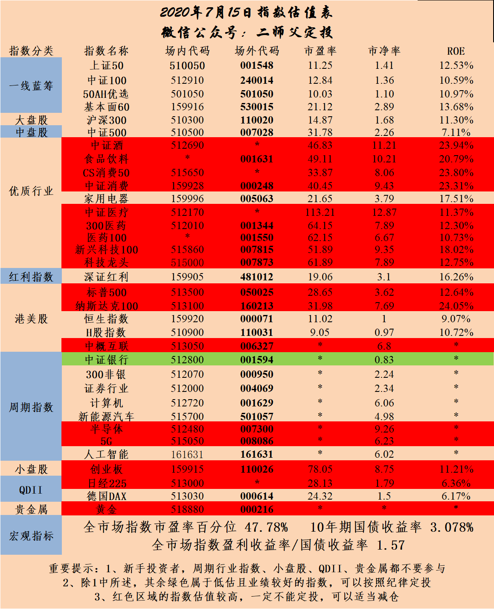

======================================================

_type: talk
@黎雄[841555255485222]
2020-07-15 20:10:05 Wed  
topic_id: 241144121422281

师傅我想买一本签名书

@二师父 at 2020-07-15 20:10:05 Wed

> 目前市场还没卖的哈，原版都有出售

----------

@一剪梅 at 2020-07-15 20:10:05 Wed

> 怎么才能买到您的书？师父

----------

阅读[2538]  评论[2]  赞[0] 

======================================================

_type: q&a
@背心[51441214442224]
2020-07-15 20:24:43 Wed  
topic_id: 241144121188841

@背心

>  港股最近跌的厉害，是美国取消香港特殊相关待遇的原因吧。小套了几个点，后面怎么操作。港股还有投资价值吗？谢谢

@二师父

>  这个分情况看，港交所，阿里，美团，微创医疗等还是很有价值，有的小盘股就慎重了

阅读[2745]  评论[0]  赞[0] 

======================================================

_type: q&a
@姥姥不疼. 爷爷不爱[48544481458248]
2020-07-15 20:32:03 Wed  
topic_id: 241144121181111

@姥姥不疼. 爷爷不爱

>  银行客服推荐这个，有投资价值么：上午好，为纪念改革开放四十周年，中行最后一次发行《外汇兑换券》，这是首次发行全同号钞，全套100张，只有30套配额，现在只是发行价，收藏价值极高，被国家钱币博物馆馆藏，你一定留两套，一套做资产配置 ，一套收藏传家

@二师父

>  你问问她买了没，传家可以，以后给孙子吹牛，想怎么吹就怎么吹，资产配置那肯定房子和股票好

阅读[2768]  评论[0]  赞[0] 

======================================================

_type: talk
@二师父[28814221155551]
2020-07-15 20:35:35 Wed  
topic_id: 241144121124241

一般有人给我推产品，我都会问，你买了吗，你买了多少，然后把我股票截图发给他，这个涨了这么多，你要不要考虑这个，其实有人推你的产品他自己都不知道到底是啥，能不能涨，他关注的是怎么把你的钱赚到

@步步惊心 at 2020-07-15 20:35:35 Wed

> 二师父你好：请推荐打新基金，谢谢

----------

@二师父 at 2020-07-15 20:35:35 Wed

> 没明白你的意思

----------

@步步惊心 at 2020-07-15 20:35:35 Wed

> 以打新为主题的基金

----------

@二师父 at 2020-07-15 20:35:35 Wed

> 国联安新精选

----------

@步步惊心 at 2020-07-15 20:35:35 Wed

> 谢谢二师父

----------

@J at 2020-07-15 20:35:35 Wed

> 师父，现在配置打新基金有价值吗

----------

@二师父 at 2020-07-15 20:35:35 Wed

> 这也是股票和债券加打新集合

----------

@二师父 at 2020-07-15 20:35:35 Wed

> 这是股票加债券加打新集合

----------

阅读[2931]  评论[13]  赞[0] 

======================================================

_type: talk
@波多黎各[28428858544121]
2020-07-15 22:05:10 Wed  
topic_id: 241144142888411

师父，现在乌龟计划还可以每周定投吗？

@二师父 at 2020-07-15 22:05:10 Wed

> 每周都在投啊

----------

@波多黎各 at 2020-07-15 22:05:10 Wed

> 是每周定期定额投还是跟着师父随时变化上车？

----------

@二师父 at 2020-07-15 22:05:10 Wed

> 定期不定额

----------

@波多黎各 at 2020-07-15 22:05:10 Wed

> 谢谢师傅

----------

@波多黎各 at 2020-07-15 22:05:10 Wed

> 今天忙工作没来得及上车乌龟计划，师父，现在跟你调仓还行吗？

----------

@二师父 at 2020-07-15 22:05:10 Wed

> 可以的

----------

阅读[2775]  评论[6]  赞[0] 

======================================================

_type: talk
@六尘不改[241555484551821]
2020-07-15 23:19:25 Wed  
topic_id: 421122122481518

今天大盘跌这么多我的基金居然还盈利两千多，消费和白酒扛了所有

阅读[2748]  评论[0]  赞[0] 

======================================================

_type: talk
@惠张勇[244448212884581]
2020-07-15 23:22:39 Wed  
topic_id: 548844844251854

枕边书有了，谢谢您老师🙏

@二师父 at 2020-07-15 23:22:39 Wed

> 你桌面和我家的好像一样

----------

@Sunflower at 2020-07-15 23:22:39 Wed

> 我的还没发货，好期待

----------

@王模堂 at 2020-07-15 23:22:39 Wed

> 怎么才能买到这本书呢？

----------

@二师父 at 2020-07-15 23:22:39 Wed

> 公众号回复书籍，或者星球置顶

----------

@夏萍 at 2020-07-15 23:22:39 Wed

> <e type="web" href="https://item.m.jd.com/product/71519596371.html?wxa_abtest=o&ad_od=share&utm_source=androidapp&utm_medium=appshare&utm_campaign=t_335139774&utm_term=CopyURL" title="指数基金定投+慢慢变富【图片+价格+品牌+评论】-京东" cache="" />

----------

@惠张勇 at 2020-07-15 23:22:39 Wed

> 跟您十年估计像的地方会更多[微笑]

----------

@惠张勇 at 2020-07-15 23:22:39 Wed

> 是的，我昨天收到的书，晚上失眠了[偷笑]

----------

@二师父 at 2020-07-15 23:22:39 Wed

> [握手][握手]

----------

阅读[2806]  评论[8]  赞[0] 

+++++++++++++++++++++++++++++++++++++++++++++++++++++

图片：
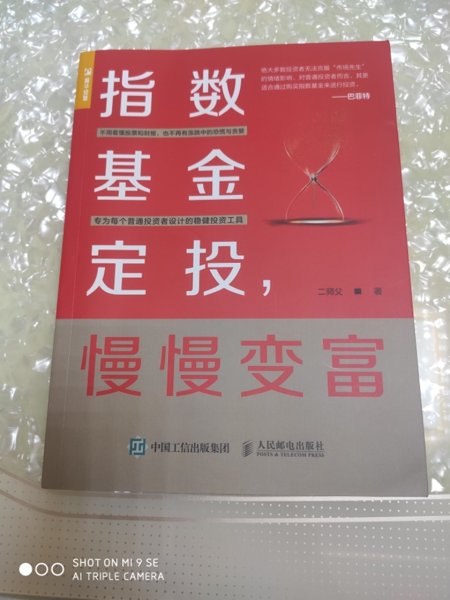
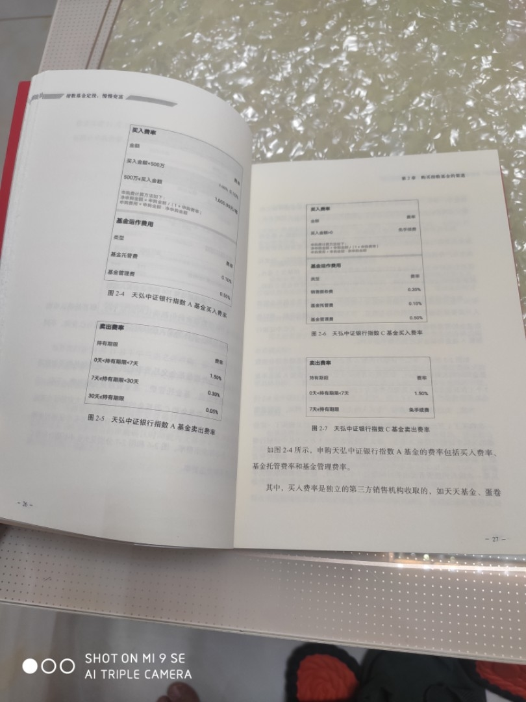

======================================================

_type: talk
@宁静以致远[841158451581452]
2020-07-16 08:13:28 Thu  
topic_id: 421122118418258

我前两天打新三板，懵懂地7支都点了，不小心冻结了很多资金，这两天一直担心都中了再卖不动或者大跌，结果熬了两天出结果才给我配了这么点儿。这是不是说明新三板这次很热呀？

阅读[2753]  评论[0]  赞[0] 

+++++++++++++++++++++++++++++++++++++++++++++++++++++

图片：
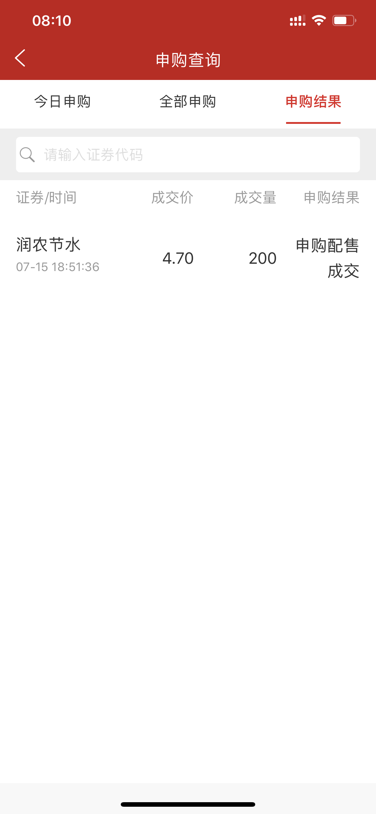

======================================================

_type: talk
@韭菜鸡蛋[241545411425141]
2020-07-16 10:03:16 Thu  
topic_id: 548844885281144

二师父，红利指数还能买吗？哪个etf不错呢？

@二师父 at 2020-07-16 10:03:16 Thu

> 深红利，中证红利可以定投

----------

@丸子妈 at 2020-07-16 10:03:16 Thu

> 中证红利去年定投了一段时间，现在收益8个点

----------

阅读[2758]  评论[2]  赞[0] 

======================================================

_type: talk
@April _ M.[841582144212812]
2020-07-16 10:10:08 Thu  
topic_id: 548844885125124

想问问大家 债券都是什么时间卖的呀～

阅读[2868]  评论[0]  赞[0] 

======================================================

_type: talk
@海马[15158245825242]
2020-07-16 10:11:15 Thu  
topic_id: 241144112852141

认真学习师父的投资方法和理念[拳头][拳头]

@J at 2020-07-16 10:11:15 Thu

> 我的还没发货

----------

@海马 at 2020-07-16 10:11:15 Thu

> 我的也三天了，没有动静

----------

@雨的依恋 at 2020-07-16 10:11:15 Thu

> 我的昨天到了

----------

@rtdmm小米 at 2020-07-16 10:11:15 Thu

> 我的在路上

----------

@向前进 at 2020-07-16 10:11:15 Thu

> 我的昨天也到了，学习ing，感觉师父讲过的概念再通过读书理一遍，更清晰了

----------

阅读[3042]  评论[5]  赞[0] 

+++++++++++++++++++++++++++++++++++++++++++++++++++++

图片：
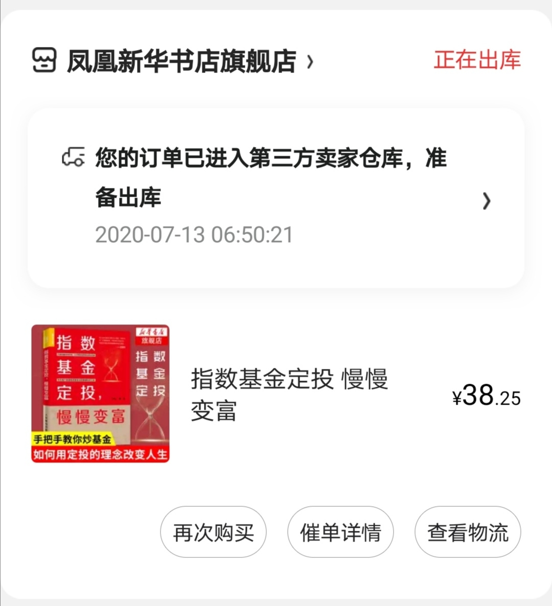

======================================================

_type: q&a
@J[28281541518551]
2020-07-16 10:32:22 Thu  
topic_id: 241144112288851

@J

>  师父，券商现在还有一半，要卖出吗？还是继续持有观望

@二师父

>  差不多了，如果不新高震荡可以拿着，转跌的话可以继续出

阅读[3287]  评论[7]  赞[0] 

======================================================

_type: q&a
@阳光[421884185252128]
2020-07-16 10:56:26 Thu  
topic_id: 421122115522258

@阳光

>  师父：今天的大盘感觉跌的止不住了，盈利的基金是需要卖掉还是继续抱着？

@二师父

>  没跌多少，可以收割部分利润，没必要全跑了

阅读[3287]  评论[1]  赞[0] 

======================================================

_type: q&a
@六尘不改[241555484551821]
2020-07-16 11:01:13 Thu  
topic_id: 548844885481814

@六尘不改

>  前期收割利润了，今天要是跌的多可以加仓吗

@二师父

>  轻仓加可以的，医药，白酒下去又起来了点，不过要保证加仓的资金回撤60左右不慌

阅读[3362]  评论[3]  赞[0] 

======================================================

_type: q&a
@幽兰[815554522442422]
2020-07-16 11:13:02 Thu  
topic_id: 118811884814822

@幽兰

>  二师父，乌龟计划不能定投了吗，好像目前只能操作一次性买入？如果一次性买入的话，现在建仓多少合适？

@二师父

>  可以定投，目前这个组合买一成观察仓可以，然后再定投

阅读[3436]  评论[0]  赞[0] 

======================================================

_type: q&a
@陈洲[88245122222212]
2020-07-16 11:36:16 Thu  
topic_id: 421122115118288

@陈洲

>  二师父，目前手上有几个基金：160222 国泰国证食品饮料，008281 国泰CES半导体芯片，002707 大摩科技领先，001210 天弘互联网灵活，005609 富国军工主题；前2天盈利20%没有卖出利润，这2天跌了，问二师父建议操作，我想卖出利润，食品和军工减点仓

@二师父

>  可以减，食品可以减仓了，芯片也可以减

阅读[3572]  评论[3]  赞[0] 

======================================================

_type: q&a
@sunny在路上[841885811111842]
2020-07-16 12:17:15 Thu  
topic_id: 118811881524142

@sunny在路上

>  这几天有点跌的厉害，是调整吗？还可以继续放着吗？目前还盈利30%左右

@二师父

>  市场降温，优质板块和股票可以拿着

阅读[3647]  评论[5]  赞[0] 

======================================================

_type: talk
@HeLLO[15548451524442]
2020-07-16 13:47:05 Thu  
topic_id: 241141555451141

大跌开始了吗？

@小鱼 at 2020-07-16 13:47:05 Thu

> 吓人了

----------

@以古论今 at 2020-07-16 13:47:05 Thu

> 轻仓

----------

@海马 at 2020-07-16 13:47:05 Thu

> 从3000点一直往上涨，一直收割利润。

----------

@sunny在路上 at 2020-07-16 13:47:05 Thu

> 今天跌的可怕

----------

@Chu at 2020-07-16 13:47:05 Thu

> 利润全部收割了，本在2800，跌下2800补仓

----------

@好运玲玲 at 2020-07-16 13:47:05 Thu

> 有没有和我一样这波上涨没有减仓？没有收割利润的？[捂脸][捂脸][捂脸]

----------

@🍀 凝🌸 慧🍀 at 2020-07-16 13:47:05 Thu

> 我在上周已经陆续全部收割了利润，落袋为安，不贪。主仓位都在，进退均可 。师父说了，等跌透了，再加仓。现在卧倒。

----------

@杜志彪 at 2020-07-16 13:47:05 Thu

> 看仓位，7、8层不减就不减了，满仓不减就看定力了，二师父没减估计也不是满仓，我减是为了腾出点仓位等医疗。

----------

阅读[3365]  评论[13]  赞[0] 

======================================================

_type: q&a
@林凤崎[421882481454488]
2020-07-16 15:01:51 Thu  
topic_id: 118818225281242

@林凤崎

>  二师父，这种急跌该怎么办好

@二师父

>  等跌透了加仓

阅读[3292]  评论[4]  赞[0] 

======================================================

_type: talk
@六尘不改[241555484551821]
2020-07-16 15:21:40 Thu  
topic_id: 841141558485542

今天得赔个十好几万，补仓了20万

@六尘不改 at 2020-07-16 15:21:40 Thu

> 今天如果是调整就一步到位了，如果是行情结束了，那就是完球了

----------

@飞的那个飞 at 2020-07-16 15:21:40 Thu

> 你这是赌博

----------

阅读[3231]  评论[2]  赞[0] 

======================================================

_type: talk
@光少[244124552511141]
2020-07-16 15:22:52 Thu  
topic_id: 421121448284258

今天股市够刺激

阅读[3346]  评论[0]  赞[0] 

+++++++++++++++++++++++++++++++++++++++++++++++++++++

图片：
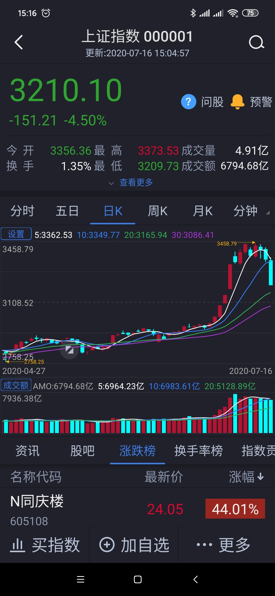

======================================================

_type: q&a
@孤芳自赏[548114442211184]
2020-07-16 16:50:40 Thu  
topic_id: 421121445854488

@孤芳自赏

>  二师父请问收割利润按市价减去成本还是市价减成交均价算，这两个相差也太悬殊了实在弄不明白究竟自己赚了多少，实际成本多少？

@二师父

>  你的成本是0.938

阅读[3412]  评论[0]  赞[0] 

======================================================

_type: talk
@二师父[28814221155551]
2020-07-16 18:46:38 Thu  
topic_id: 241141551485451

<e type="hashtag" hid="15285551584812" title="#一篇文章引发的大跌#" />

@样 at 2020-07-16 18:46:38 Thu

> 二师父，明天白酒etf要减仓吗?

----------

@二师父 at 2020-07-16 18:46:38 Thu

> 可以减了

----------

@范毅君 at 2020-07-16 18:46:38 Thu

> 茅台是最没压力的，因为只剩一点利润了、明天可以清啦[捂脸]

----------

@是喵喵吖～ at 2020-07-16 18:46:38 Thu

> 师傅我今天还买了点酒 要是跌的话 我是及时止损比较好还是等跌透了再加仓 有点不知所措了 😢

----------

@二师父 at 2020-07-16 18:46:38 Thu

> 你买了多少仓位，如果很少就没事，可以拿着，多的话明天继续放量跌最好走了

----------

@是喵喵吖～ at 2020-07-16 18:46:38 Thu

> 师父我买了8000块钱大概2.5成仓位这样子

----------

@二师父 at 2020-07-16 18:46:38 Thu

> 这个位置追加很危险的，今天继续跌降仓位

----------

@是喵喵吖～ at 2020-07-16 18:46:38 Thu

> 嗯嗯好！谢谢二师父！！我以后不自己乱操作了😂

----------

阅读[4080]  评论[9]  赞[0] 

+++++++++++++++++++++++++++++++++++++++++++++++++++++

文件：
2020-07-16 18:46:23 Thu
文件大小：[22744]
48511141884128-茅台跌了7.9%，发生了什么.docx

======================================================

_type: talk
@二师父[28814221155551]
2020-07-16 19:55:51 Thu  
topic_id: 548848212255824

<e type="hashtag" hid="48418882555588" title="#后续如何操作#" /> 之前有人问买啥，我说可以配置货币基金和债券基金。如果市场下跌，这两个品种上是上涨的，除非你能够接受1.1到1.7倍杠杆，现金流充沛，否则的话留点现金是对的，市场变化很快，这轮我看3580，突破了就是牛市，突不破就是小反弹。

跟着市场走，而不是股民情绪和感觉走，利润回吐了心理肯定是不舒服的，除非你对钱没兴趣。这看起来不可能。那关键问题是后面怎么操作。

不怕跌的，拿着，再怎么跌很难到之前买入的成本价，除非有人单独加仓了，这种情况的话右侧追击，那么可以适当减仓到自己心理合适的位置。

最好的配置就是50%指数+30%债券+20%现金，大概比例轮动，激进的指数仓位高，保守的现金仓位高。取得平衡就好。多配置现金和债券，下跌的时候不会很惨，上涨也不会特别多，关键是平衡就行了。

@阝東 at 2020-07-16 19:55:51 Thu

> 利润回吐，心里肯定不舒服，规划到仓位到心理舒服，现在就卧倒，等跌了低估买，高估卖，不去看他一时，看他一世

----------

@smile at 2020-07-16 19:55:51 Thu

> 请问二师父，您说的这个比例的配置，是指定投的基金？还是分批买入就不动的基金呢？

----------

@二师父 at 2020-07-16 19:55:51 Thu

> 定投指数基金得比例

----------

@smile at 2020-07-16 19:55:51 Thu

> 谢谢二师父，这个债基是指纯债吗

----------

@二师父 at 2020-07-16 19:55:51 Thu

> 是的

----------

阅读[4000]  评论[5]  赞[0] 

======================================================

_type: q&a
@Rachel[51558542555524]
2020-07-17 10:14:16 Fri  
topic_id: 548848252814214

@Rachel

>  你好， 芯片基金159801，1.4 元左右买的… 跌了 10% …… 这个基金还适合定投吗…

@二师父

>  定投可以，这个价格买的太高了

阅读[2865]  评论[0]  赞[0] 

======================================================

_type: talk
@二师父[28814221155551]
2020-07-17 11:03:44 Fri  
topic_id: 118818541522212

<e type="hashtag" hid="222815251121" title="#新债申购#" /> 今日两只新债，股市波动大，别被洗下车了，波动大是投资股市难点之一，不盲目操作，拿着问题不大。

@罗大发 at 2020-07-17 11:03:44 Fri

> 两只都可打吗？

----------

@二师父 at 2020-07-17 11:03:44 Fri

> 可以

----------

@木蘭荟-黄英💋 at 2020-07-17 11:03:44 Fri

> 这是在什么软件上打新？

----------

@二师父 at 2020-07-17 11:03:44 Fri

> 广发

----------

阅读[3744]  评论[4]  赞[0] 

+++++++++++++++++++++++++++++++++++++++++++++++++++++

图片：
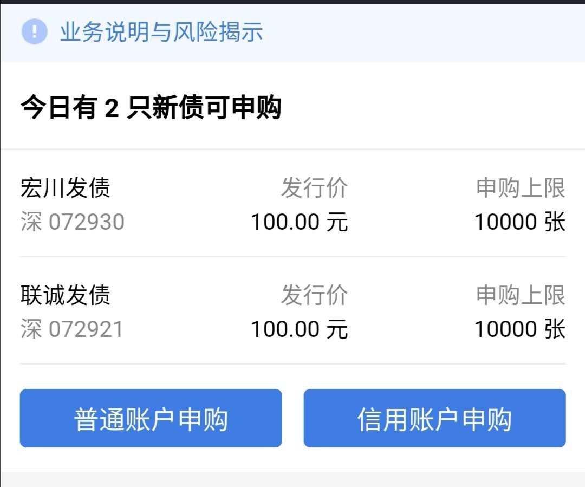

======================================================

_type: q&a
@Rachel[51558542555524]
2020-07-17 12:39:06 Fri  
topic_id: 841141824282122

@Rachel

>  你好 我想问现在买创业指数基金159949 OK吗？ 1.033 左右

@二师父

>  这个位置不大合适

阅读[2908]  评论[3]  赞[0] 

======================================================

_type: q&a
@J[28281541518551]
2020-07-17 13:14:31 Fri  
topic_id: 118818548282452

@J

>  师父，券商已经跌破10日均线，而且回撤大于10%，很想清仓等待下次机会，你觉得呢

@二师父

>  可以的，昨天都已经破了10日线，而且放量

阅读[2960]  评论[11]  赞[0] 

======================================================

_type: talk
@刘佳柒[815555885511852]
2020-07-17 13:55:11 Fri  
topic_id: 841141821285212

004069今天又下了好多，今天可以入场一点？

@波多黎各 at 2020-07-17 13:55:11 Fri

> 同问师父，想加仓

----------

阅读[2706]  评论[1]  赞[0] 

======================================================

_type: q&a
@老司基[111852221242122]
2020-07-17 14:56:36 Fri  
topic_id: 241141821122841

@老司基

>  一般15点前买入基金是按当日收盘价格算，假如14点59买入，基金公司也没时间及时买入，是什么原理，他是第二天集合竞价买入吗，为什么也按当天收盘净值算呢？

@二师父

>  场外买入是的，场内买入没有成交，自动取消了，不会第二天成交

阅读[2805]  评论[4]  赞[0] 

======================================================

_type: talk
@shee[544885258412114]
2020-07-17 17:14:33 Fri  
topic_id: 421121825812588

书已收到[色][色][色]

@Sunflower at 2020-07-17 17:14:33 Fri

> 好羡慕～

----------

阅读[2630]  评论[1]  赞[0] 

+++++++++++++++++++++++++++++++++++++++++++++++++++++

图片：
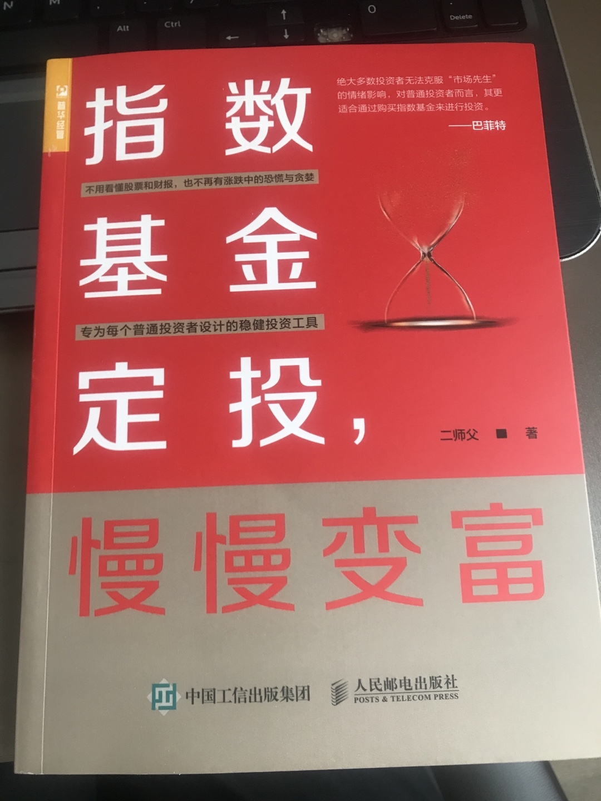

======================================================

_type: talk
@二师父[28814221155551]
2020-07-17 18:59:11 Fri  
topic_id: 118818511221512

<e type="hashtag" hid="51281114812554" title="#目前适合加仓吗#" /> 虽然都很喜欢代码，但是我真的不愿意直接给代码，所以出了实盘。曾经有大神卖牛股代码，结果别人800元买了一个沪深300的代码，这是真人真事。多看看书和一些研究报告，看这些头疼的话就跟实盘走吧。

@sunny在路上 at 2020-07-17 18:59:11 Fri

> 热热闹闹的牛市戛然而止了！幸亏之前一直定投，还有继续观望的资本！

----------

阅读[3639]  评论[1]  赞[0] 

+++++++++++++++++++++++++++++++++++++++++++++++++++++

文件：
2020-07-17 18:57:34 Fri
文件大小：[22974]
15488851445222-四连阴之后，哪些基金适合加仓.docx

======================================================

_type: q&a
@李垚垚[548145221582444]
2020-07-17 19:38:56 Fri  
topic_id: 118818511218152

@李垚垚

>  二师父回调的基金是否还有上涨空间，现在是需要拿住还是卖出。谢谢您！

@二师父

>  有的基金有希望，银行，煤炭，钢铁，上涨都属于优先减仓行列，有希望上涨，价值不高

阅读[2839]  评论[0]  赞[0] 

======================================================

_type: talk
@rtdmm小米[422188284881148]
2020-07-17 19:41:26 Fri  
topic_id: 241141844515481

哈哈，大红书到了！

@光少 at 2020-07-17 19:41:26 Fri

> 我的还没出库[捂脸]

----------

@J at 2020-07-17 19:41:26 Fri

> 我的也还没发货[捂脸]

----------

@一无所有 at 2020-07-17 19:41:26 Fri

> 我的书也收到啦

----------

@雪莲 at 2020-07-17 19:41:26 Fri

> 我的也还没出库

----------

@mumomo at 2020-07-17 19:41:26 Fri

> 我的也到了

----------

@飞的那个飞 at 2020-07-17 19:41:26 Fri

> 我的今天收到

----------

@云淡风轻 at 2020-07-17 19:41:26 Fri

> 买的预售书，月底才能发货，当时没仔细看。

----------

@Sunflower at 2020-07-17 19:41:26 Fri

> 我的还没发货

----------

阅读[2831]  评论[9]  赞[0] 

+++++++++++++++++++++++++++++++++++++++++++++++++++++

图片：

======================================================

_type: q&a
@Rachel[51558542555524]
2020-07-17 21:54:58 Fri  
topic_id: 118818511812852

@Rachel

>  你好， 我想问一下 5G  ETF 还适合定投吗， 成本价是1.473 …

@二师父

>  目前不适合，做好配置，仓位在百分之5以内

阅读[2882]  评论[0]  赞[0] 

======================================================

_type: talk
@九妹Amy''[815584258228542]
2020-07-18 16:16:38 Sat  
topic_id: 241141258518221

二师傅，请问现在乌龟计划可以跟上吗？

@二师父 at 2020-07-18 16:16:38 Sat

> 可以跟，每周四都发车

----------

@九妹Amy'' at 2020-07-18 16:16:38 Sat

> 谢谢啦。师傅

----------

阅读[2494]  评论[2]  赞[0] 

======================================================

_type: q&a
@onepiecewi*[244414114545811]
2020-07-18 16:28:44 Sat  
topic_id: 421121812424218

@onepiecewi*

>  师父，如果想定投作为养老用的，那种指数基金会比较适合呢？

@二师父

>  这看你追求的收益率，沪深300+国债组合就可以的。比较稳健，适合长期持有

阅读[2708]  评论[2]  赞[0] 

======================================================

_type: talk
@二师父[28814221155551]
2020-07-18 16:37:21 Sat  
topic_id: 841141258851442

<e type="hashtag" hid="224445218111" title="#全市场估值数据#" /> 市盈率百分位38.83%，市净率百分位27.93%，SY-BY百分位41.86%，SY/BY百分位39.42%。

虽然下跌了，但是市场估值并不低，不过按照当前这个位置估值，指数定投可以重新开始了。

@wty at 2020-07-18 16:37:21 Sat

> 二师父，除了国债，哪些指数又可以开启定投了呢？

----------

@二师父 at 2020-07-18 16:37:21 Sat

> 地产，可选消费

----------

@wty at 2020-07-18 16:37:21 Sat

> 原来跟着您定投并持仓了汇添富主要消费指数，可选消费是这个指数基金吗？

----------

@二师父 at 2020-07-18 16:37:21 Sat

> 这个是必须消费

----------

@wty at 2020-07-18 16:37:21 Sat

> 那可选消费基金代码是什么呢？

----------

@二师父 at 2020-07-18 16:37:21 Sat

> 002977

----------

@wty at 2020-07-18 16:37:21 Sat

> 收到，看到是联接基金C，如果长期持有就买A类是吧？我也可以直接买场内ETF对吗？

----------

@二师父 at 2020-07-18 16:37:21 Sat

> 可以

----------

阅读[2788]  评论[10]  赞[0] 

======================================================

_type: talk
@二师父[28814221155551]
2020-07-18 17:24:23 Sat  
topic_id: 241141258284241

<e type="hashtag" hid="48418881425118" title="#一套止盈的方法#" />

阅读[2917]  评论[0]  赞[0] 

+++++++++++++++++++++++++++++++++++++++++++++++++++++

文件：
2020-07-18 16:43:19 Sat
文件大小：[137486]
88211128818422-一不小心买了半导体，现在被套了怎么办.docx

======================================================

_type: q&a
@财富源于专注[88284152111552]
2020-07-18 20:50:13 Sat  
topic_id: 421121548114428

@财富源于专注

>  老师请问:‘市销率是不是像市盈率一样有参照标准，比如市盈率10以下为低估，那么市效率多少为低估，不好意思打扰了。

@二师父

>  可以作为一个参考，市盈率也不是低于10倍低估，这是对于蓝筹指数而言的，对于医疗，消费指数，低于10倍市盈率几乎是不可能事件
>  
>  对于高新技术企业，可以采用市销率进行估值

阅读[2797]  评论[0]  赞[0] 

======================================================

_type: talk
@树叶[544811512145144]
2020-07-18 21:23:06 Sat  
topic_id: 421121545521458

<e type="hashtag" hid="142825811122" title="#定投周报#" /> 二师父定投周报第67期

阅读[2895]  评论[0]  赞[0] 

+++++++++++++++++++++++++++++++++++++++++++++++++++++

文件：
2020-07-18 21:23:02 Sat
文件大小：[253733]
51588851852184-二师父定投周报7.18（第67期）.docx

======================================================

_type: talk
@孙平[48548211154218]
2020-07-18 23:20:38 Sat  
topic_id: 841141251142252

刚刚收到，自此长红🐮

@章兵朋 at 2020-07-18 23:20:38 Sat

> 喜欢这封面的颜色

----------

阅读[2794]  评论[1]  赞[0] 

+++++++++++++++++++++++++++++++++++++++++++++++++++++

图片：
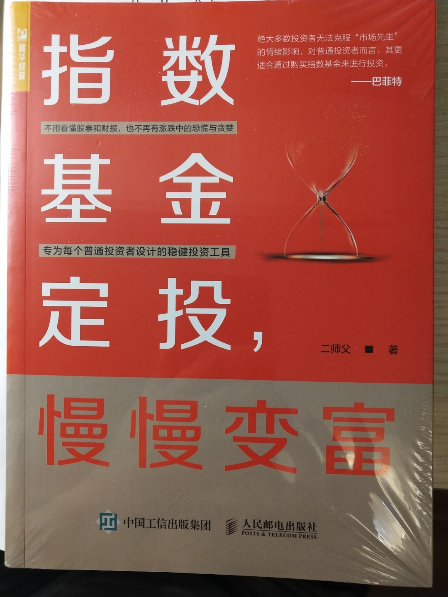

======================================================

_type: talk
@飞的那个飞[48584811554158]
2020-07-19 11:10:56 Sun  
topic_id: 841141288158482

哈哈我的也到了

@六尘不改 at 2020-07-19 11:10:56 Sun

> 我咋还没收到

----------

@呵呵→_→ at 2020-07-19 11:10:56 Sun

> 我的还没出库呢，13号拍的，[捂脸]

----------

阅读[2765]  评论[2]  赞[0] 

+++++++++++++++++++++++++++++++++++++++++++++++++++++

图片：
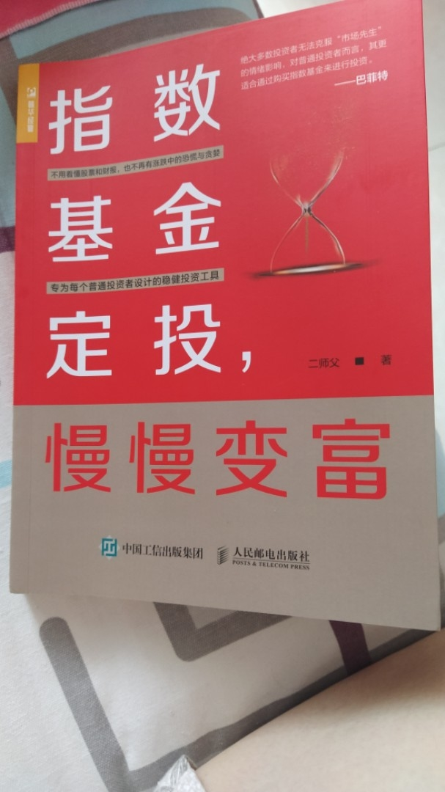

======================================================

_type: q&a
@smile[111888142241442]
2020-07-19 21:20:03 Sun  
topic_id: 118818442511252

@smile

>  二师父您好：目前我已持有的基金很乱，想精简一下。对于这种调仓操作，目前可以怎样进行呢？应该是边卖边买？还是等牛市卖出不想要的、等低估买入想要的？还请给点建议，谢谢。

@二师父

>  你这个问题也挺混乱，可以把基金和持仓比例发来看看。如果选错了板块直接调整就行的

阅读[2774]  评论[17]  赞[0] 

======================================================

_type: q&a
@林凤崎[421882481454488]
2020-07-19 21:22:36 Sun  
topic_id: 841141225188252

@林凤崎

>  二师父，大农业现在低估，可以定投吗

@二师父

>  可以定投的，不过目前并没有低估

阅读[2760]  评论[2]  赞[0] 

======================================================

_type: talk
@二师父[28814221155551]
2020-07-19 21:32:28 Sun  
topic_id: 118818441242512

<e type="hashtag" hid="88518881211182" title="#投资要有全局观#" /> 最近市场跌了，大家都在担心回撤怎么办，这是纠结单个基金的问题，其实做投资要把房产，股票，基金，债券，实物投资看做一个整体，这样来做就不会在意这点金融资产涨跌了，你一套房子在100到500左右，金融资产一般是房产的两倍就很厉害了，那么总体计算波动就小了

自主房产也是资产，只是忽略了，如果整体计算就不会被涨跌迷惑，房产是在股债双杀的时候起对冲作用的，稳定心态。

在最近一周，属于股市跌，债券涨，那么股市跌的受不了，就可以减仓一些加仓债券，前期涨了想要加仓股市的，明显仓位不足，就不适合减仓，这就属于平衡，全局观

阅读[3471]  评论[0]  赞[0] 

======================================================

_type: q&a
@韭菜鸡蛋[241545411425141]
2020-07-19 21:43:08 Sun  
topic_id: 841141224858212

@韭菜鸡蛋

>  二师父，中证红利可以建仓吗？现在基本空仓了。

@二师父

>  你空仓是指全部空仓吗？中证红利属于价值板块，涨跌不会特别大，1.5层仓位以下可以的

阅读[2946]  评论[1]  赞[0] 

======================================================

_type: q&a
@夜色霓虹灯[48852124141858]
2020-07-19 22:04:53 Sun  
topic_id: 421121552822458

@夜色霓虹灯

>  515700新能源ETF年初高点建仓被套，现在盈利20%，继续长期持有，还是落袋为安？

@二师父

>  没明白，目前是盈利的，没有被套住啊。

阅读[2920]  评论[2]  赞[0] 

======================================================

_type: talk
@二师父[28814221155551]
2020-07-19 22:05:43 Sun  
topic_id: 421121552821188

<e type="hashtag" hid="48418881248828" title="#亏钱最本质的原因#" />  看看亏钱最本质的原因是啥

@宋航 at 2020-07-19 22:05:43 Sun

> 高位买入就感觉在投机，低位买入优质板块才是投资

----------

阅读[3920]  评论[1]  赞[0] 

+++++++++++++++++++++++++++++++++++++++++++++++++++++

文件：
2020-07-19 22:05:12 Sun
文件大小：[22298]
51588841215114-亏钱最本质的两点原因.docx

======================================================

_type: q&a
@林凤崎[421882481454488]
2020-07-19 22:44:18 Sun  
topic_id: 241141224442511

@林凤崎

>  还有想买可转债亚药，维格，17浙报，亚太，放着，等着可以吗

@二师父

>  可转债我只做打新和日内交易，一只转债能涨到300多，都是游资爆炒，找不到底部的点具体位置。

阅读[3080]  评论[1]  赞[0] 

======================================================

_type: talk
@二师父[28814221155551]
2020-07-20 09:43:49 Mon  
topic_id: 241141242422111

<e type="hashtag" hid="88518881422882" title="#调仓和卖出计划#" /> 场外实盘，卖出50ah百分之20，基本面60百分之10

场内卖出50etf2份，买入16国债19一手，可以用国债etf或者10年国债etf替代

场外卖出可以存入货币基金，可以买入国开债

@J at 2020-07-20 09:43:49 Mon

> 师父，50ah没到高估，为什么卖出呢？

----------

@二师父 at 2020-07-20 09:43:49 Mon

> 收割利润

----------

@姥姥不疼. 爷爷不爱 at 2020-07-20 09:43:49 Mon

> 二师父，国开债（003376）不是周四定投么，今天也可再单独买一份么？那周四也可正常投么

----------

@二师父 at 2020-07-20 09:43:49 Mon

> 可以，债券波动小，现在定投是没问题的

----------

@慕然 at 2020-07-20 09:43:49 Mon

> 请教一手数量是100还是10

----------

@宋航 at 2020-07-20 09:43:49 Mon

> 现在货币基金买那个比较好？

----------

@西锦巴乌 at 2020-07-20 09:43:49 Mon

> 师父好！恒生国企需作一些减仓吗？仓位占10%左右，谢谢

----------

@秦风殇韵（刘豫斌） at 2020-07-20 09:43:49 Mon

> 国债代码多少？查到好多

----------

阅读[4001]  评论[44]  赞[0] 

======================================================

_type: talk
@老丁[15541182455482]
2020-07-20 10:04:33 Mon  
topic_id: 548848545825114

二师父，请教一个问题，可转债打新，要看什么来判断是不是要打呢？是看债券评级吗？比如有些只有A，A+的债券，是不是有违约风险？还是说看转股价和现价之间是不是有折价，如果有折价，不管评级都可以打？或者干脆什么都不管，全部打？谢谢

阅读[2859]  评论[0]  赞[0] 

======================================================

_type: q&a
@宋航[48548414258158]
2020-07-20 10:36:18 Mon  
topic_id: 841141244552812

@宋航

>  二师父，能推荐一下现在可以买的货币基金吗？

@二师父

>  我都是直接买的天天推荐的，费率低，收益高就行，有快速赎回功能，不会单买一只

阅读[2943]  评论[1]  赞[0] 

======================================================

_type: talk
@以古论今[28214421582421]
2020-07-20 10:47:14 Mon  
topic_id: 548848544112214

现在的趋势是上升还是下降?

阅读[2947]  评论[0]  赞[0] 

======================================================

_type: q&a
@孤芳自赏[548114442211184]
2020-07-20 10:48:04 Mon  
topic_id: 118818411288212

@孤芳自赏

>  中芯国际688981这支股票值得购买买，现在这价格有没有高估

@二师父

>  不值得

阅读[3253]  评论[0]  赞[0] 

======================================================

_type: q&a
@Amanda[111184528448582]
2020-07-20 11:13:49 Mon  
topic_id: 241141244821841

@Amanda

>  二师父，可选消费(场内159936)现在是不是适合定投？谢谢！

@二师父

>  目前可以定投的

阅读[3309]  评论[3]  赞[0] 

======================================================

_type: q&a
@Chu[88888125211582]
2020-07-20 16:32:04 Mon  
topic_id: 118818485518212

@Chu

>  今天虽然涨了2个点，但看到北向资金净流出30多亿，师父怎么看

@二师父

>  短期预测都是连蒙带猜，还是原有观点，3500和3583这个区间突破了，牛市有戏，否则就是大反弹，重点关注7月货币政策，如果收紧会影响市场

阅读[2933]  评论[0]  赞[0] 

======================================================

_type: q&a
@宁静以致远[841158451581452]
2020-07-20 16:34:41 Mon  
topic_id: 241141218114111

@宁静以致远

>  二师父，今天大盘涨，我看广发中债也是涨，涨幅比之前还大一点点。为什么不是相反的趋势吗？

@二师父

>  股票涨大概率债券是跌的，但并不绝对，也有股债双牛或者股债双杀。
>  
>  股债双牛一般发生在市场热钱多，利率和通胀低位。只要政策不动，钱多资产价格都是推着涨的。

阅读[3080]  评论[0]  赞[0] 

======================================================

_type: talk
@斌斌[841821552258252]
2020-07-20 17:43:44 Mon  
topic_id: 841141212421222

大家都根据创业板新规，网上重签风险揭示书了吗？

@章兵朋 at 2020-07-20 17:43:44 Mon

> 要参与创业板股票买卖，肯定要重新签下创业板

----------

阅读[2970]  评论[1]  赞[0] 

======================================================

_type: q&a
@是喵喵吖～[421441114141158]
2020-07-20 20:31:44 Mon  
topic_id: 118818481481452

@是喵喵吖～

>  师父 我有个小白问题想请教😁 就是假如我有100份中证500，今天下午三点前卖了30份，那我今天的收益它是给我按100份计算，还是按70份（今天卖掉30份）来计算呀 谢谢！

@二师父

>  场外的话按100份算，从明天开始就按70份算

阅读[3069]  评论[0]  赞[0] 

======================================================

_type: talk
@二师父[28814221155551]
2020-07-20 21:19:42 Mon  
topic_id: 118818122485212

今天有事情委托之后没仔细看，净价没问题，92多点，交易是采用全价的，全价等于净价加上利息，所以交易价格会高一些，实际的净价是大家看到的

@幽兰 at 2020-07-20 21:19:42 Mon

> 我昨天通过华泰证券购买的16国债19，今天找不到记录了，也没有扣费，这是什么原因呢

----------

@二师父 at 2020-07-20 21:19:42 Mon

> 委托价格过高

----------

@幽兰 at 2020-07-20 21:19:42 Mon

> 那还能再买吗？

----------

@二师父 at 2020-07-20 21:19:42 Mon

> 93以内分批加仓没问题

----------

阅读[3153]  评论[4]  赞[0] 

+++++++++++++++++++++++++++++++++++++++++++++++++++++

图片：
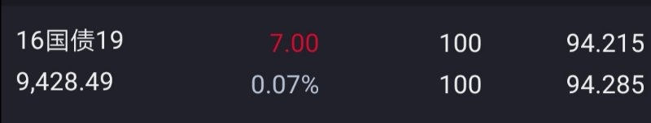

======================================================

_type: talk
@二师父[28814221155551]
2020-07-20 23:44:54 Mon  
topic_id: 421121248122428

今天没看盘，保险这个板块一直有投，300非银，但是不会追涨，仅此而已。

军工也涨了，市场好基金很多，选我自己赚的明白的。大家可以多样化配置。

@J at 2020-07-20 23:44:54 Mon

> 师父，请问下行空间不再有限还是有限？前者是指可能有很大回调，后者是说继续上涨的概率更大。想问清楚是属于哪一个？

----------

@二师父 at 2020-07-20 23:44:54 Mon

> 短期货币政策不大幅度收紧，没有黑天鹅事件，不会有大回调

----------

@J at 2020-07-20 23:44:54 Mon

> 明白了，谢谢师父

----------

阅读[3090]  评论[3]  赞[0] 

+++++++++++++++++++++++++++++++++++++++++++++++++++++

文件：
2020-07-20 23:43:53 Mon
文件大小：[22821]
28211115214881-银保监会一则消息拉动了整个保险板块.docx

======================================================

_type: talk
@二师父[28814221155551]
2020-07-20 23:53:04 Mon  
topic_id: 118818125881182

<e type="hashtag" hid="224445218111" title="#全市场估值数据#" /> 市盈率百分位41.76%，市净率百分位28.4%，SY-BY百分位42.41%，SY/BY百分位38.85%。

@六尘不改 at 2020-07-20 23:53:04 Mon

> 有点高了？

----------

@二师父 at 2020-07-20 23:53:04 Mon

> 看分位，50以上就是偏高了

----------

阅读[3932]  评论[2]  赞[0] 

======================================================

_type: q&a
@章兵朋[118251425848882]
2020-07-21 11:08:23 Tue  
topic_id: 241141452112281

@章兵朋

>  二师父，您怎么看待蚂蚁金服A+H股上市的问题。中芯国际0.5w亿估值，上市当天科技版块整体下挫带动大盘整体下挫。蚂蚁金服1.5w亿估值会不会导致金融板块整体跳水带动指数大跳水。要怎么看待这种巨无霸企业的上市问题？

@二师父

>  这种独角兽企业上市会对市场资金有很大的虹吸效应，短期影响股市下跌，蚂蚁金服属于金融科技，金融是一方面，也有云计算，互联网科技等直接相关科技应用
>  
>  和中石油，核电不同，蚂蚁金服未来发展前景更好，步中石油后尘的概率不大

阅读[2774]  评论[2]  赞[0] 

======================================================

_type: q&a
@防汛抗旱[111848815428452]
2020-07-21 11:09:53 Tue  
topic_id: 118818828884452

@防汛抗旱

>  今天新入星球，现在持仓只20%，持有三月开始定投的上证50，和一点点证券股。定投停了一个月了，准备跟着师傅走，从现在开始咋办，求指导

@二师父

>  回调加仓，除非剩余8成不准备入市，不然的话这个仓位很容易上涨追高，目前以债券配置为主，你的性格属于保守型，可以指数加债券55开

阅读[2824]  评论[2]  赞[0] 

======================================================

_type: q&a
@不知道不明了[15584248411812]
2020-07-21 11:16:05 Tue  
topic_id: 241141185518811

@不知道不明了

>  二师父好，我今天中了1000元的宏川发债，请问可以缴费申购么？申购以后是等到上市交易第一天涨了卖出，还是有更好的操作策略呀，谢谢师父

@二师父

>  这个申购中签，账户有1000元以上资金会自动扣款，当日能上130可以卖出，当日没上可以持有到这个价格卖出，上不去的话110之前止盈
>  
>  现在可转债申购大概率首日盈利的，如果当日破发持有盈利即可

阅读[2958]  评论[1]  赞[0] 

======================================================

_type: q&a
@老妖[118514521115522]
2020-07-21 11:21:20 Tue  
topic_id: 118818852554122

@老妖

>  师傅，创业板限制股解禁对科技是大利空吗？

@二师父

>  对创业板有一定利空，利空科技算不上，a股的科技股在美国和香港上市很多，对这一块影响很小

阅读[2988]  评论[0]  赞[0] 

======================================================

_type: q&a
@罗大发[421484455521228]
2020-07-21 11:22:59 Tue  
topic_id: 841141188885242

@罗大发

>  师父，今天可转债打吗

@二师父

>  打，转债风险偏低

阅读[3029]  评论[2]  赞[0] 

======================================================

_type: q&a
@Rachel[51558542555524]
2020-07-21 11:38:20 Tue  
topic_id: 548848811541154

@Rachel

>  请问， 蚂蚁上市会带动科技板块， 创业板跳水吗？  如果上证指数回调到3200 可以稍微加仓吗？ 回调到3000 点有可能吗？

@二师父

>  1，不会大跳水，2，需要看后市的走势以及基金具体的情况，3，如果上证指数调仓以后成长板块大幅增多，回调到3000可能性很小了

阅读[3059]  评论[0]  赞[0] 

======================================================

_type: q&a
@陈洲[88245122222212]
2020-07-21 13:59:07 Tue  
topic_id: 118818854214442

@陈洲

>  昨天说的16国债19，只能场内买的吧？我在同花顺里搜到了这个，有代码的019547，准备买，对的吧

@二师父

>  不能承受波动，国债etf也可以的

阅读[3065]  评论[3]  赞[0] 

======================================================

_type: talk
@二师父[28814221155551]
2020-07-21 20:34:49 Tue  
topic_id: 841141128244822

<e type="hashtag" hid="15285542428142" title="#关于宽基指数的分享#" /> 不要小看最基本的指数，真的用好了沪深300和创业板，你的收益率不会低。

@老孙头 at 2020-07-21 20:34:49 Tue

> 相关宽基有推荐吗？谢谢！

----------

@二师父 at 2020-07-21 20:34:49 Tue

> 天弘和易方达都可以

----------

阅读[2915]  评论[2]  赞[0] 

+++++++++++++++++++++++++++++++++++++++++++++++++++++

图片：
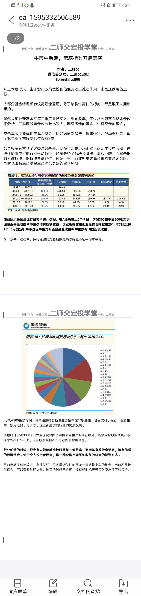

======================================================

_type: q&a
@呵呵→_→[15414558111442]
2020-07-22 10:14:25 Wed  
topic_id: 841141144844152

@呵呵→_→

>  二师傅，请教一下，为啥买的16国债
>  93.55买的，成交金额9355
>  这里怎么显示成本94.912呢，盈亏好像是正常的。

@二师父

>  这个是因为显示的是净价，交易是全价，全价是净价加利息

阅读[2753]  评论[0]  赞[0] 

======================================================

_type: q&a
@庆余年[15584481824122]
2020-07-22 10:58:17 Wed  
topic_id: 241141144145521

@庆余年

>  本钢转债，代码127018，为啥中了一直没动静，网上说破发了，二师父知道是啥情况麽？

@二师父

>  没有，破发会有显示的，如果首日破发，先持有

阅读[2735]  评论[0]  赞[0] 

======================================================

_type: q&a
@nana[48222415211188]
2020-07-22 11:31:47 Wed  
topic_id: 421121121425428

@nana

>  师傅，今天易方达创新成长基金009808首发，银行理财经理一直打电话推荐，是否能买？

@二师父

>  投个机可以，理财经理让你买入常持就要注意了

阅读[2688]  评论[1]  赞[0] 

======================================================

_type: q&a
@罗大发[421484455521228]
2020-07-22 12:21:24 Wed  
topic_id: 241141141482411

@罗大发

>  师父，我基本面60有30%的利润了，是一下收割了，还是留点😊

@二师父

>  收割可以的

阅读[2768]  评论[1]  赞[0] 

======================================================

_type: talk
@朱朱 侠[48288828125218]
2020-07-22 16:13:41 Wed  
topic_id: 421121115144128

估值表在哪

阅读[2468]  评论[0]  赞[0] 

======================================================

_type: talk
@海马[15158245825242]
2020-07-22 18:41:07 Wed  
topic_id: 421121112141888

感谢二师父的无私分享[呲牙][呲牙]

@黄巧 at 2020-07-22 18:41:07 Wed

> 我的书也今天到的[呲牙]

----------

阅读[2469]  评论[1]  赞[0] 

+++++++++++++++++++++++++++++++++++++++++++++++++++++

图片：
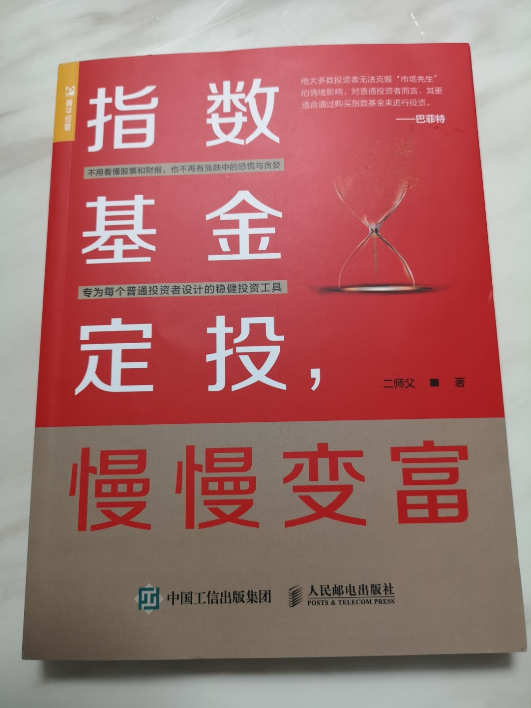

======================================================

_type: q&a
@姥姥不疼. 爷爷不爱[48544481458248]
2020-07-22 19:26:18 Wed  
topic_id: 548848881882854

@姥姥不疼. 爷爷不爱

>  我看003376今天木涨，那么今天提前发车还是周四上车，谢谢您了

@二师父

>  这个波动很小的，今明两天投差别不大

阅读[2599]  评论[0]  赞[0] 

======================================================

_type: q&a
@朱朱 侠[48288828125218]
2020-07-22 19:29:01 Wed  
topic_id: 841141114882422

@朱朱 侠

>  估值表在哪

@二师父

>  今天收盘后会发的哈

阅读[2666]  评论[0]  赞[0] 

======================================================

_type: talk
@二师父[28814221155551]
2020-07-22 22:13:05 Wed  
topic_id: 241115558155521

几大利空和利好的解读，估值表稍后发到星球，每周三都会发布的。

@柔软时光 at 2020-07-22 22:13:05 Wed

> 二师父目前持仓几成？

----------

@二师父 at 2020-07-22 22:13:05 Wed

> 8.5

----------

@柔软时光 at 2020-07-22 22:13:05 Wed

> 我大概7.5，需要加仓吗？

----------

@二师父 at 2020-07-22 22:13:05 Wed

> 你觉得低了就加

----------

@防汛抗旱 at 2020-07-22 22:13:05 Wed

> 加什么呢

----------

@二师父 at 2020-07-22 22:13:05 Wed

> 回调加非银，科技

----------

@陈 at 2020-07-22 22:13:05 Wed

> 二师父，具体能加那些有代码吗？现在可以加吗？

----------

@二师父 at 2020-07-22 22:13:05 Wed

> 参考实盘哈

----------

阅读[3529]  评论[8]  赞[0] 

+++++++++++++++++++++++++++++++++++++++++++++++++++++

文件：
2020-07-22 22:12:41 Wed
文件大小：[24592]
48244442855528-上证综合指数30年首次调整落地，是大利好.docx

======================================================

_type: q&a
@微风[414481118158558]
2020-07-22 22:28:08 Wed  
topic_id: 421114448428248

@微风

>  师父，今天是第一天进入，不知在哪儿查看估值

@二师父

>  置顶文章第三篇

阅读[2535]  评论[0]  赞[0] 

======================================================

_type: q&a
@浪淘沙[118815282288482]
2020-07-22 22:28:37 Wed  
topic_id: 841115558442582

@浪淘沙

>  请问师父，我基金本金34000，分红加止盈10897，目前基金资产35223，还有盈利1223，总共盈利12120，和持仓收益相符。如果按本金34000算，持仓收益率是35.64%，但为什么显示是52.47%呢？

@二师父

>  这个你需要问客服，软件计算规则都不一样，我是直接看市值的

阅读[2663]  评论[10]  赞[0] 

======================================================

_type: q&a
@sunny在路上[841885811111842]
2020-07-22 22:31:56 Wed  
topic_id: 548848884182554

@sunny在路上

>  二师傅怎么看中美关系冲突对明天或者后续股市的影响？看了很多消息，貌似明天不容乐观，谢谢！

@二师父

>  后续大概率会短期影响下跌的，军工板块利好

阅读[2653]  评论[0]  赞[0] 

======================================================

_type: talk
@二师父[28814221155551]
2020-07-22 22:33:41 Wed  
topic_id: 841115552554882

<e type="hashtag" hid="224445218111" title="#全市场估值数据#" /> 市盈率百分位46.8%，市净率百分位30%，SY-BY百分位44.65%，SY/BY百分位39.96%。这个位置不低了哈，还有人没反应过来行情已经走了一波了。

阅读[2710]  评论[0]  赞[0] 

======================================================

_type: talk
@二师父[28814221155551]
2020-07-22 22:58:26 Wed  
topic_id: 241115552828251

<e type="hashtag" hid="824514224452" title="#指数估值表#" /> 估值表。两个绿色的都不准备买，可以取得基本收益，没有超额收益。

@防汛抗旱 at 2020-07-22 22:58:26 Wed

> 也就是说现在没有值得入手的鸡？

----------

@二师父 at 2020-07-22 22:58:26 Wed

> 能重仓指数是没有的

----------

阅读[2772]  评论[2]  赞[0] 

+++++++++++++++++++++++++++++++++++++++++++++++++++++

图片：
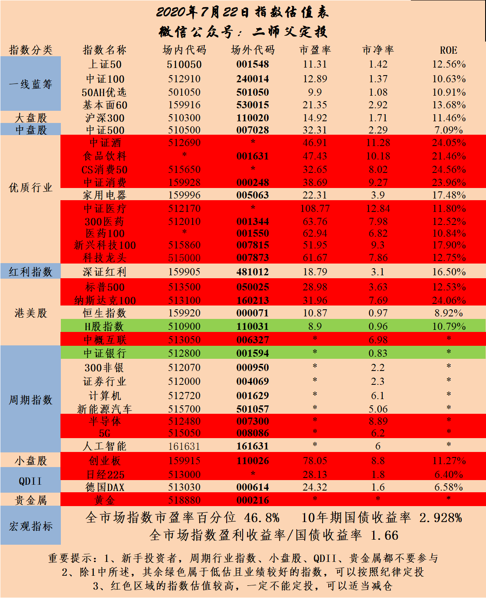

======================================================

_type: talk
@防汛抗旱[111848815428452]
2020-07-23 09:18:16 Thu  
topic_id: 241115585121411

@师父，现在SY/BY就低于0.5吧，为啥没说抛出基金和股票？

@二师父 at 2020-07-23 09:18:16 Thu

> 没有到0.5

----------

阅读[2509]  评论[1]  赞[0] 

+++++++++++++++++++++++++++++++++++++++++++++++++++++

图片：

======================================================

_type: q&a
@好运玲玲[244188585541521]
2020-07-23 09:54:11 Thu  
topic_id: 841115585148852

@好运玲玲

>  二师父你好！手里有20w闲钱最近几年不要用，现在能否买沪深300？现在是买银行的理财产品好？还是买沪深300好？请二师父指点

@二师父

>  货币基金好一些

阅读[2592]  评论[1]  赞[0] 

======================================================

_type: talk
@六尘不改[241555484551821]
2020-07-23 10:45:29 Thu  
topic_id: 841115588448882

星期四不亏是法定砸盘日

@是喵喵吖～ at 2020-07-23 10:45:29 Thu

> 涨就涨一点跌就跌好多

----------

阅读[2449]  评论[1]  赞[0] 

======================================================

_type: talk
@九妹Amy''[815584258228542]
2020-07-23 10:55:18 Thu  
topic_id: 841115588412422

二师傅，我在天天基金网上看到，今天是周四，乌龟组合好像没有发车是吧？

@二师父 at 2020-07-23 10:55:18 Thu

> 发了

----------

阅读[2512]  评论[1]  赞[0] 

======================================================

_type: talk
@防汛抗旱[111848815428452]
2020-07-23 10:59:41 Thu  
topic_id: 421114488155258

师父，现在有没有适合建底仓的基金？正常或偏中高估值的是否继续定投？

@二师父 at 2020-07-23 10:59:41 Thu

> 正常可以定投，底仓建立慎重

----------

阅读[2640]  评论[1]  赞[0] 

======================================================

_type: talk
@林玮[844111858288412]
2020-07-23 11:47:37 Thu  
topic_id: 118882254554482

师父，看好周五发行的科创基金吗？

@smile at 2020-07-23 11:47:37 Thu

> 同问，要买入吗

----------

@二师父 at 2020-07-23 11:47:37 Thu

> 看好

----------

@🍀 凝🌸 慧🍀 at 2020-07-23 11:47:37 Thu

> 您好，您说的这个基金是什么代码啊？

----------

@林玮 at 2020-07-23 11:47:37 Thu

> 场外新基金

----------

@🍀 凝🌸 慧🍀 at 2020-07-23 11:47:37 Thu

> 谢谢，有具体代码吗？

----------

阅读[2664]  评论[5]  赞[0] 

======================================================

_type: q&a
@丸子妈[28512522184441]
2020-07-23 13:07:57 Thu  
topic_id: 548882215122484

@丸子妈

>  南方原油场内基金亏30%，今天可以稍微补一点吗？

@二师父

>  这个基金别补了

阅读[2763]  评论[5]  赞[0] 

======================================================

_type: q&a
@栀子花开[118248824481842]
2020-07-23 13:28:35 Thu  
topic_id: 118882255241522

@栀子花开

>  二师傅，这个富实A 50指数是干什么的啊，为什么会影响A 股走势？

@二师父

>  他俩没有因果关系，只是这个指数里面包含了中国A股市场市值最大的50家公司，而且这50家公司的总市值占a股总市值的百分之33，所以他的涨跌在一定程度上可以预示a股市场的涨跌

阅读[2945]  评论[0]  赞[0] 

======================================================

_type: talk
@二师父[28814221155551]
2020-07-23 13:32:58 Thu  
topic_id: 421114481811188

<e type="hashtag" hid="881422852442" title="#定投实盘#" /> 买入中债国开债0.25份，这个属于避险品种，比货币基金和短债基金收益率高，目前好的板块是军工，短期利好

金融地产这一轮表现不佳，还是以医疗和科技为主，上周压盘入手的涨幅在5个点左右，有人一直说高估可以投，确实是，这个看趋势和仓位，买个2手，轻仓完全不怕，所以都是有条件的，缺了大前提，结论就不成立了

@庆余年 at 2020-07-23 13:32:58 Thu

> 还是要说一下代码还有场内还是场外投，不然都不晓得[捂脸][捂脸][捂脸]

----------

@二师父 at 2020-07-23 13:32:58 Thu

> 好的，场外

----------

@幽兰 at 2020-07-23 13:32:58 Thu

> 0.25份是多少金额😂

----------

@幽兰 at 2020-07-23 13:32:58 Thu

> 是啊，我也是找不到是哪个

----------

@二师父 at 2020-07-23 13:32:58 Thu

> 500

----------

@幽兰 at 2020-07-23 13:32:58 Thu

> 求代码

----------

@二师父 at 2020-07-23 13:32:58 Thu

> 003376

----------

@百变 at 2020-07-23 13:32:58 Thu

> 上周压盘入手的是哪只🐔？

----------

阅读[3072]  评论[9]  赞[0] 

======================================================

_type: q&a
@nana[48222415211188]
2020-07-23 14:02:54 Thu  
topic_id: 241115581215841

@nana

>  师傅，中证国开债的代码是什么？

@二师父

>  这是哪个？

阅读[3095]  评论[2]  赞[0] 

======================================================

_type: q&a
@幽兰[815554522442422]
2020-07-23 14:38:36 Thu  
topic_id: 241115581158241

@幽兰

>  二师父，我想开始加入乌龟计划。请问现在这个阶段入手合适吗？多少仓位合适

@二师父

>  可以直接买3到4成仓位再定投

阅读[3093]  评论[8]  赞[0] 

======================================================

_type: q&a
@onepiecewi*[244414114545811]
2020-07-23 17:14:23 Thu  
topic_id: 421114454242118

@onepiecewi*

>  师父，005693，国防类，现在属于低估吗？可以入吗？

@二师父

>  这是军工，短期因为南海问题和美国要求中国关闭领事馆，是利好军工

阅读[3078]  评论[2]  赞[0] 

======================================================

_type: talk
@J[28281541518551]
2020-07-23 20:16:18 Thu  
topic_id: 548882254541144

师父的书收到了，一起开启变富之门[呲牙]

@光少 at 2020-07-23 20:16:18 Thu

> 我也是今天收到了[胜利]

----------

@Sunflower at 2020-07-23 20:16:18 Thu

> 我的前几天也到了哈哈

----------

阅读[2944]  评论[2]  赞[0] 

+++++++++++++++++++++++++++++++++++++++++++++++++++++

图片：
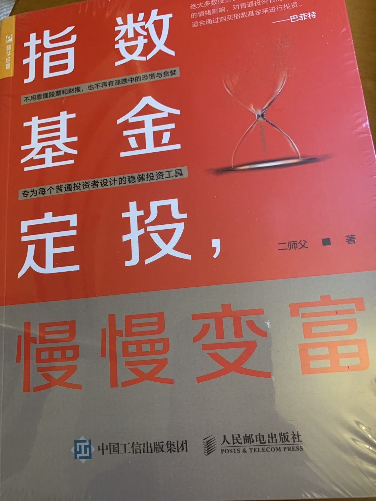

======================================================

_type: q&a
@rtdmm小米[422188284881148]
2020-07-23 21:58:10 Thu  
topic_id: 241115521881551

@rtdmm小米

>  请问二师父，估值表里新能源汽车(515700）的市净率是5.06，还是正常估值区域？没高估？

@二师父

>  还没有，5.5倍市净率高估

阅读[3018]  评论[0]  赞[0] 

======================================================

_type: talk
@二师父[28814221155551]
2020-07-24 07:01:13 Fri  
topic_id: 548882245454844

<e type="hashtag" hid="51281154228554" title="#现在入场投什么好#" /> 如果是逆市定投，当前值得选择的就是纯债基金和偏债混合基金

如果是趋势投资，任何有预期上涨的指数都可以

方式不同，定投逆势投资不需要止损，需要止盈。趋势投资需要顺势轻仓，持赢止损

问基金是否可以买，先要告知家庭财务状况，收入状况和交易方式，这是个性化的

@圣诞结® at 2020-07-24 07:01:13 Fri

> 明白[抱拳]

----------

@林荫 at 2020-07-24 07:01:13 Fri

> 手上有大额存量资金，现在不知道怎么操作好，想做3年的投资。家庭收入稳定，可以不动用这笔钱。

----------

@二师父 at 2020-07-24 07:01:13 Fri

> 买入偏债混合基金，目前比较稳妥

----------

@二师父 at 2020-07-24 07:01:13 Fri

> 你在深圳的话学区房也可以考虑下

----------

阅读[2883]  评论[4]  赞[0] 

======================================================

_type: talk
@二师父[28814221155551]
2020-07-24 10:08:55 Fri  
topic_id: 241115544144181

<e type="hashtag" hid="825412412212" title="#可转债打新#" /> 今日新债申购，国投发债。

阅读[2796]  评论[0]  赞[0] 

======================================================

_type: talk
@二师父[28814221155551]
2020-07-24 11:26:01 Fri  
topic_id: 241115541212211

市场全线下跌，只有国债和国债etf上涨，可以休息等下跌企稳再加仓指数，如果牛市不来，股债轮动也能实现资产稳步增值，但关键要有耐心，小富靠策略，大富靠牛市。

@六尘不改 at 2020-07-24 11:26:01 Fri

> 国债买哪个好？

----------

@J at 2020-07-24 11:26:01 Fri

> 师父，市场这次是小回调还是大回调？

----------

@二师父 at 2020-07-24 11:26:01 Fri

> 16国债19

----------

@二师父 at 2020-07-24 11:26:01 Fri

> 大

----------

@六尘不改 at 2020-07-24 11:26:01 Fri

> 能到3000左右吗

----------

@六尘不改 at 2020-07-24 11:26:01 Fri

> 在哪儿买，天天基金还是证券

----------

@J at 2020-07-24 11:26:01 Fri

> 请教师父，从哪里看判断是大回调？

----------

@二师父 at 2020-07-24 11:26:01 Fri

> 证券

----------

阅读[2871]  评论[18]  赞[0] 

======================================================

_type: talk
@志亮[422125851552828]
2020-07-24 12:19:38 Fri  
topic_id: 118882282255812

昨天就想卖出股票的，今天果然挨了一刀，现在反而不想卖了，一动不如一静吧。[微笑]

@志亮 at 2020-07-24 12:19:38 Fri

> 为什么每次闪电霹下来的时候我都在场[捂脸]

----------

@浪淘沙 at 2020-07-24 12:19:38 Fri

> 我昨天说今天一定要卖掉某个基金，结果又被劈到了。。。

----------

阅读[2659]  评论[2]  赞[0] 

======================================================

_type: talk
@雨淡风清[844418818858882]
2020-07-24 12:45:08 Fri  
topic_id: 241115515541881

这个是所谓的黑天鹅吗？

@杜志彪 at 2020-07-24 12:45:08 Fri

> 为外交部点赞[强]，听说老美关俄罗斯使馆，结果俄罗斯股市牛了2年[愉快]

----------

@雨淡风清 at 2020-07-24 12:45:08 Fri

> 是么。希望如此

----------

@样 at 2020-07-24 12:45:08 Fri

> @二师父  盈利的基金需要减仓吗？

----------

阅读[2747]  评论[3]  赞[0] 

+++++++++++++++++++++++++++++++++++++++++++++++++++++

图片：
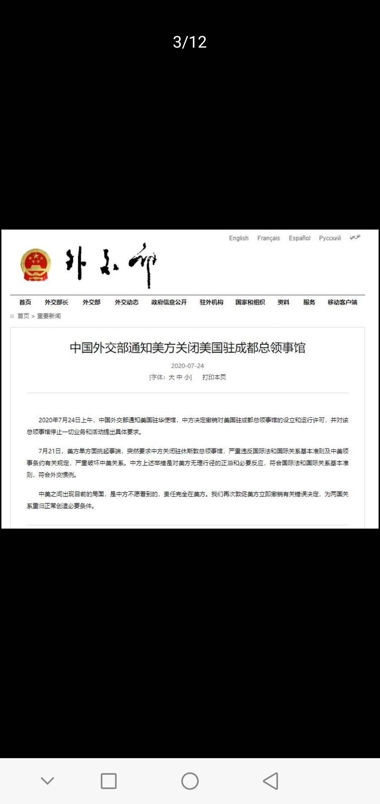

======================================================

_type: q&a
@Rachel[51558542555524]
2020-07-24 12:52:20 Fri  
topic_id: 241115812555441

@Rachel

>  今天适合定投创业板 50 159949吗？ 
>  科创板基金适合买吗？

@二师父

>  不适合的，你可以建个观察仓，目前定投不大适合

阅读[2967]  评论[0]  赞[0] 

======================================================

_type: q&a
@付云[844148188522822]
2020-07-24 12:53:36 Fri  
topic_id: 241115812552211

@付云

>  二师傅，这支基金3000点买的，成本有点高，如果最近跌是大趋势，我是否该清仓了！占近一半仓位！怕后面跌的太厉害！

@二师父

>  先减仓一半，如果继续跌，继续减仓到清仓可以的，人工智能波动会大一点，轻仓好点

阅读[3080]  评论[0]  赞[0] 

======================================================

_type: talk
@六尘不改[241555484551821]
2020-07-24 14:12:45 Fri  
topic_id: 421114815515888

疯狂补仓

阅读[2764]  评论[0]  赞[0] 

======================================================

_type: q&a
@一心一意[844421848411122]
2020-07-24 14:15:29 Fri  
topic_id: 421114815514488

@一心一意

>  师傅，恒生国企可以买点么

@二师父

>  可以买，不过基金一般，无法取得超额收益，过几天再给你介绍下恒生科技

阅读[3049]  评论[3]  赞[0] 

======================================================

_type: talk
@二师父[28814221155551]
2020-07-24 14:42:34 Fri  
topic_id: 548882185812114

看看保住利润的方法，之前投资债券现在基本上是轮动了

@杜志彪 at 2020-07-24 14:42:34 Fri

> 我在等医疗下跌[呲牙]

----------

@二师父 at 2020-07-24 14:42:34 Fri

> 你的一手也不少赚

----------

@杜志彪 at 2020-07-24 14:42:34 Fri

> 就是不回头，调整调整看看20要是能低头就有机会了😁

----------

@杜志彪 at 2020-07-24 14:42:34 Fri

> 1.71买的现在90天的位置，等您鳄鱼发车，您不发我60天线先搞点[微笑]

----------

@隔窗遥望 at 2020-07-24 14:42:34 Fri

> 前期收割的利润转了货币基金，买成债券基金更好吗？

----------

@二师父 at 2020-07-24 14:42:34 Fri

> 季线问题不大

----------

@二师父 at 2020-07-24 14:42:34 Fri

> 债券基金收益率好，流动性差

----------

阅读[3880]  评论[7]  赞[0] 

+++++++++++++++++++++++++++++++++++++++++++++++++++++

文件：
2020-07-24 14:42:17 Fri
文件大小：[60877]
28455884851421-面对砸盘，我们如何保住利润.docx

======================================================

_type: q&a
@Vincent[15448144581152]
2020-07-24 14:55:17 Fri  
topic_id: 241115812181251

@Vincent

>  二师父，今天大跌，乌龟计划能投吗？

@二师父

>  可以的，高估的几个先等等

阅读[3063]  评论[0]  赞[0] 

======================================================

_type: talk
@二师父[28814221155551]
2020-07-24 15:31:43 Fri  
topic_id: 841115814514842

<e type="hashtag" hid="224445218111" title="#全市场估值数据#" /> 市盈率百分位百分之37.39，市净率百分位百分之27.71，Sy-by百分位百分之37.84，全市场估值下降些了，机会总会有

阅读[3064]  评论[0]  赞[0] 

======================================================

_type: talk
@二师父[28814221155551]
2020-07-24 15:32:04 Fri  
topic_id: 548882184284554

<e type="hashtag" hid="224445218111" title="#全市场估值数据#" /> 市盈率百分位百分之37.39，市净率百分位百分之27.71，Sy-by百分位百分之37.84，全市场估值下降些了，机会总会有

@雨淡风清 at 2020-07-24 15:32:04 Fri

> 再跌点，就要适当补点了

----------

@wty at 2020-07-24 15:32:04 Fri

> 今天按兵不动，等二师父买入信号！

----------

阅读[3147]  评论[2]  赞[0] 

======================================================

_type: talk
@防汛抗旱[111848815428452]
2020-07-24 16:58:04 Fri  
topic_id: 421114812185818

读后感：读完，我在封面上贴了一张纸，盖了几个字，表达我的空杯心态@师父

阅读[3210]  评论[0]  赞[0] 

+++++++++++++++++++++++++++++++++++++++++++++++++++++

图片：
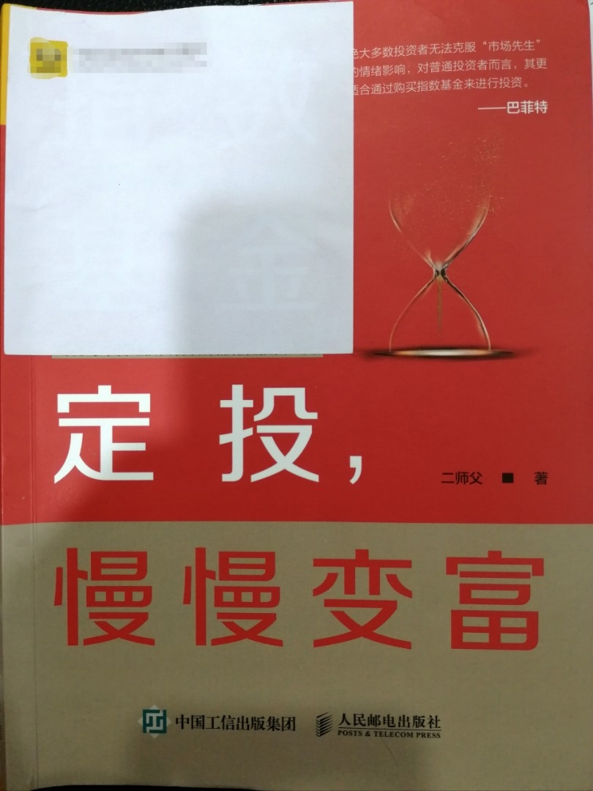

======================================================

_type: talk
@涓涓[111815125145522]
2020-07-24 18:24:07 Fri  
topic_id: 118882588422522

宝典到了，跟闺蜜一人一本，认真拜读

@梧桐 at 2020-07-24 18:24:07 Fri

> 我的书还没到，我想联系一下，找不到联系方式了，只记得通过二师父的优惠链接购买

----------

@梧桐 at 2020-07-24 18:24:07 Fri

> 是京东吗

----------

@二师父 at 2020-07-24 18:24:07 Fri

> 京东还是哪个？

----------

@涓涓 at 2020-07-24 18:24:07 Fri

> 我也是用链接买的，是京东

----------

@梧桐 at 2020-07-24 18:24:07 Fri

> 谢谢二师父，谢谢涓涓

----------

阅读[3216]  评论[5]  赞[0] 

+++++++++++++++++++++++++++++++++++++++++++++++++++++

图片：
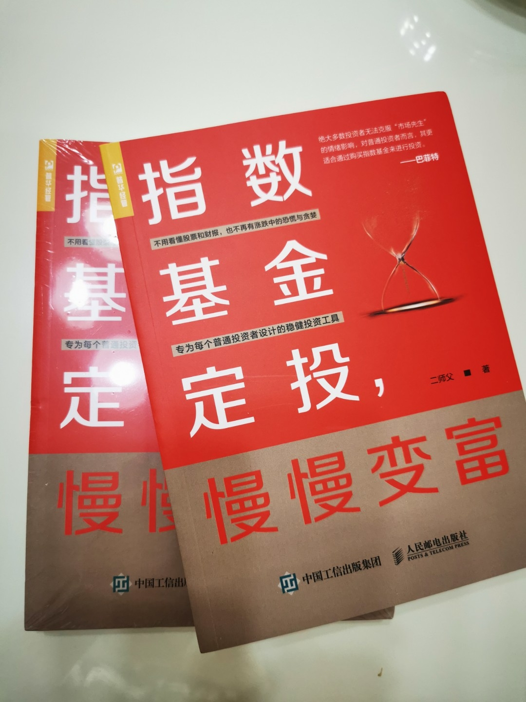

======================================================

_type: q&a
@夏萍[28221454818281]
2020-07-25 20:08:45 Sat  
topic_id: 118882452141552

@夏萍

>  师父您觉得黄金后期的走势如何？  我有些首饰打算出手

@二师父

>  黄金短期会涨，不过长期看股票收益率好于债券好于黄金，如果首饰多年不用出手是正确选择

阅读[2963]  评论[4]  赞[0] 

======================================================

_type: talk
@二师父[28814221155551]
2020-07-25 20:56:36 Sat  
topic_id: 241115225852441

港股指数，看看恒生科技。

@陈 at 2020-07-25 20:56:36 Sat

> 二师父，怎么没搜到恒生科技指数的代码？

----------

@二师父 at 2020-07-25 20:56:36 Sat

> 833850

----------

@蛋炒饭不加蛋 at 2020-07-25 20:56:36 Sat

> 有对应的基金吗？

----------

@二师父 at 2020-07-25 20:56:36 Sat

> 暂时没有

----------

@付云 at 2020-07-25 20:56:36 Sat

> 二师傅，现在能买么？！！

----------

@二师父 at 2020-07-25 20:56:36 Sat

> 现在基金还没有募集

----------

@付云 at 2020-07-25 20:56:36 Sat

> 那还是关注中概互联，现在都不是入手的时候[撇嘴]

----------

@二师父 at 2020-07-25 20:56:36 Sat

> 中概互联也挺好的

----------

阅读[3823]  评论[17]  赞[0] 

+++++++++++++++++++++++++++++++++++++++++++++++++++++

文件：
2020-07-25 20:55:54 Sat
文件大小：[140439]
48244858158548-投资港股指数，不要总想着恒生.docx

======================================================

_type: q&a
@陈[844415515418422]
2020-07-25 21:07:49 Sat  
topic_id: 118882442521252

@陈

>  二师父，什么时候可以建群教大家炒股？

@二师父

>  星球可以讨论投资企业的，这个投资也不难，比如我常投资的股票茅台五粮液万科招行中信证券泰格医药微创医疗等等。
>  
>  但是普通投资者一般控制不住自己，还是靠悟性，悟性好真的不难，教不会
>  
>  投资股票和恋爱有点像，有人一点就透，有人就是一根筋理解不了

阅读[3052]  评论[3]  赞[0] 

======================================================

_type: talk
@苍天有井明月空🌙[28882214181441]
2020-07-26 17:00:59 Sun  
topic_id: 548882542848454

万家行业优选混合型这个周一建底仓咋样

阅读[2599]  评论[0]  赞[0] 

======================================================

_type: talk
@二师父[28814221155551]
2020-07-26 22:33:14 Sun  
topic_id: 841115241251122

创业板指数基金投资的机会，波动大，机会好，当然目前高估，我说好，不意味着现在会投。

@六尘不改 at 2020-07-26 22:33:14 Sun

> 创业板指数基金推荐一下吧

----------

@二师父 at 2020-07-26 22:33:14 Sun

> 估值表有的啊，易方达，天弘的都可以

----------

@smile at 2020-07-26 22:33:14 Sun

> 请教二师父，除了沪深300和创业板，科技类的场外基金比较看好的是哪个呢

----------

@二师父 at 2020-07-26 22:33:14 Sun

> 最看好科技100，不过规模比较小，建议场内。其次是龙头科技+人工智能。

----------

@smile at 2020-07-26 22:33:14 Sun

> 谢谢二师父，中概股和恒生科技是不是也很值得关注？

----------

阅读[2787]  评论[5]  赞[0] 

+++++++++++++++++++++++++++++++++++++++++++++++++++++

文件：
2020-07-26 22:32:38 Sun
文件大小：[24788]
88455845548412-创业板涨跌幅20%要来了，指数基金投资者的福利.docx

======================================================

_type: q&a
@林凤崎[421882481454488]
2020-07-26 22:35:00 Sun  
topic_id: 421114522522288

@林凤崎

>  二师父，我想买大农业方面的指数基金，有哪些，现在定投可以吗

@二师父

>  农业精选，164403，可以定投

阅读[2808]  评论[0]  赞[0] 

======================================================

_type: q&a
@不知道不明了[15584248411812]
2020-07-26 22:37:01 Sun  
topic_id: 118882448544112

@不知道不明了

>  二师父，关于利润收割想和您讨论下，您说的第一种基金持仓收益率止盈，10%收割一次，20%收割一次，以此类推，那么，20%收割的利润是不是等于初始投资时的份额×初始投资基金净值的10%，因为第一次已经收割了10%了，我们收割的是利润，就算20%收割时，持有份额已经比初始投资减少了，也是按全部份额来算的，这样计算是对的吗？

@二师父

>  按金额来。投入10万，可以第一次收割一万，第二次收割1万。两次总共20%
>  
>  第一次金额是11万，收割1万，第二次是11万，再收割1万，如果类似白酒这种收割10万，剩余的全部都是利润所得，成本为零，长期持有毫无压力。

阅读[2951]  评论[1]  赞[0] 

======================================================

_type: talk
@二师父[28814221155551]
2020-07-26 22:41:10 Sun  
topic_id: 548882548585454

<e type="hashtag" hid="88518821588452" title="#日常一问#" /> 三十而立里面，顾佳的老公出轨了，你觉得是顾佳的问题，还是他老公的问题。或者是第三者的问题，为什么。

@随便 at 2020-07-26 22:41:10 Sun

> 肯定是老公问题，在任何方面男的出来就是第一责任是自己！

----------

@样 at 2020-07-26 22:41:10 Sun

> 不给出轨找借口，如果想找“真爱”，离婚再找，如果婚姻内有问题，就坐下来好好解决。一边享受婚姻的福利，一边出轨，还找各种借口诋毁另一半怎样怎样，除了说是渣男还是渣男，男女通用。

----------

@栀子花开 at 2020-07-26 22:41:10 Sun

> 八卦[得意]

----------

@薇薇 at 2020-07-26 22:41:10 Sun

> 顾佳哪儿都好，就是眼神不行，找了这么个男的

----------

@Hi·DD at 2020-07-26 22:41:10 Sun

> 男的不忠不诚不负责任[偷笑]问题大大的，但这部剧给我最大的感受是女孩也要努力三十而“立”

----------

@雨的依恋 at 2020-07-26 22:41:10 Sun

> 我默默的看着你们八卦就好[呲牙]

----------

@JOY at 2020-07-26 22:41:10 Sun

> 婚姻永远是两个人的事，顾佳再优秀也不能把自己先生该承担的责任都承担了，把先生养成了孩子。现在养孩子都需要培养孩子的自主性和独立性，何况是个成年男人。出不出轨的全看此人品性了，懂感恩的还好，就怕遇到个坐享其成还不能自我反思的巨婴。再者这两人在这个婚姻里面也缺少良性的沟通和理解。话说回来，这个男生也真是渣！

----------

阅读[2987]  评论[7]  赞[0] 

======================================================

_type: q&a
@尚红丽[118511558855142]
2020-07-27 04:50:52 Mon  
topic_id: 841115241124812

@尚红丽

>  师傅，我是刚加入星球的，上个星期四买入富国沪深300和富国中证500底仓，并且还设置了每周四定投250元，周五就跳水亏损了，接下来是补仓还是减仓啊？刚看了你的乌龟计划准备定投003376.可以吗？目前仓位4成，谢谢师傅！

@二师父

>  补仓，以交易为准，没交易就没买

阅读[3015]  评论[3]  赞[0] 

======================================================

_type: q&a
@李震笛[422112248211828]
2020-07-27 07:51:00 Mon  
topic_id: 118882484145142

@李震笛

>  二师傅，现在买科创指数怎么买？好像看了一圈没发现有啥能买的，都是什么封闭三年的混基，能指导一下吗？

@二师父

>  目前就只有科创封基，暂时接受不了这个流动性可以不用买，等科创50

阅读[3088]  评论[0]  赞[0] 

======================================================

_type: q&a
@拥抱太阳的风筝[48812454818528]
2020-07-27 08:27:20 Mon  
topic_id: 118882484115452

@拥抱太阳的风筝

>  二师父，比如汇添富中证主要消费ETF联接000248，易方达沪深300ETF联接001344，两支基金，均在本轮A股大底买入，对财富积累来说，是长期持有划算还是大牛巿卖出划算，主要是它俩的低估机会难等，另外盈利比较稳定

@二师父

>  大牛市卖或者终身持有，主要看能否经受住波动，能经受住波动可以，消费是长期上涨的，类似07年那波牛市，严重高估，顶点是可以出的，比如sy-by百分位百分之90以上，然后相对低位再补

阅读[3239]  评论[0]  赞[0] 

======================================================

_type: talk
@防汛抗旱[111848815428452]
2020-07-27 09:26:28 Mon  
topic_id: 421114512888258

今天中了一手紫银发债，持有多久可卖？

@姥姥不疼. 爷爷不爱 at 2020-07-27 09:26:28 Mon

> 俺也中了[微笑]

----------

@防汛抗旱 at 2020-07-27 09:26:28 Mon

> 第一次买，怎么玩

----------

@雨的依恋 at 2020-07-27 09:26:28 Mon

> 我也中了，这个是不是都中了

----------

@April _ M. at 2020-07-27 09:26:28 Mon

> 我也中了

----------

@清水倾城 at 2020-07-27 09:26:28 Mon

> 已经不记得中签的样子了[难过]

----------

@百变 at 2020-07-27 09:26:28 Mon

> 我也中了[微笑]

----------

@丸子妈 at 2020-07-27 09:26:28 Mon

> 上市就可以卖

----------

阅读[3093]  评论[7]  赞[0] 

======================================================

_type: q&a
@栀子花开[118248824481842]
2020-07-27 09:36:36 Mon  
topic_id: 841115212118522

@栀子花开

>  二师傅，上证指数改革后，是不是可以理解为点数波动的区间要抬升？比如19年多数时间在2800-3000点，那今年估计是3000-3300点波动。可以这样理解？

@二师父

>  不看点位，看市盈率，正常情况指数底部都是上升的，不管调不调

阅读[3183]  评论[1]  赞[0] 

======================================================

_type: q&a
@JOY[111881481812422]
2020-07-27 09:37:16 Mon  
topic_id: 118882481242822

@JOY

>  师父，之前买书的时候，看见还有一种这样封面的，和红色的有差别么？

@二师父

>  一样的，这种市面上没有，都是红色封面

阅读[3310]  评论[1]  赞[0] 

======================================================

_type: q&a
@Rachel[51558542555524]
2020-07-27 09:41:56 Mon  
topic_id: 421114512885488

@Rachel

>  请问恒生科技基金指数代码是？ 
>  现在可以买吗？

@二师父

>  目前还没这个基金

阅读[3410]  评论[2]  赞[0] 

======================================================

_type: talk
@防汛抗旱[111848815428452]
2020-07-27 12:59:31 Mon  
topic_id: 548882421528124

乌龟计划是不是没有定投机会时候的选择？

@二师父 at 2020-07-27 12:59:31 Mon

> 定时定投

----------

@步步惊心 at 2020-07-27 12:59:31 Mon

> 请问二师父创业板注册制20%的涨跌来临，目前能否参预创业板指数基金的投资。谢谢！

----------

阅读[3196]  评论[2]  赞[0] 

======================================================

_type: q&a
@许田野[28282822115481]
2020-07-27 16:55:02 Mon  
topic_id: 548882425881124

@许田野

>  二师父的有赞小店买书，支付页面显示这样一直没办法支付，大家有遇到这个情况吗？

@二师父

>  退出重试或者咨询客服

阅读[3169]  评论[3]  赞[0] 

======================================================

_type: talk
@二师父[28814221155551]
2020-07-27 21:36:00 Mon  
topic_id: 118882155525842

坐等投资机会，等成交额下来，那时候再抄底不迟

@素兮 at 2020-07-27 21:36:00 Mon

> 成交量9000亿这个指标数据在哪里可以看？

----------

@二师父 at 2020-07-27 21:36:00 Mon

> 同花顺

----------

阅读[3857]  评论[2]  赞[0] 

+++++++++++++++++++++++++++++++++++++++++++++++++++++

文件：
2020-07-27 21:35:45 Mon
文件大小：[25903]
48244825814828-成交额进一步萎缩，坐等机会.docx

======================================================

_type: talk
@二师父[28814221155551]
2020-07-28 00:02:21 Tue  
topic_id: 841115482242882

<e type="hashtag" hid="224445218111" title="#全市场估值数据#" /> 市盈率百分位38.05%，市净率百分位28.42%，SY-BY百分位38.71%，SY/BY百分位34.94%。

阅读[3632]  评论[0]  赞[0] 

======================================================

_type: q&a
@姥姥不疼. 爷爷不爱[48544481458248]
2020-07-28 07:04:07 Tue  
topic_id: 421114281218448

@姥姥不疼. 爷爷不爱

>  请教二师父，随着后期我赎回已盈利基金钱款的增加，相应地我能否增加国开债（003376）定投的份额，比如：由原来的一份2千元调整为一份1万元，谢谢您了。

@二师父

>  可以，控制好指数和国开债的比例就行

阅读[2921]  评论[2]  赞[0] 

======================================================

_type: q&a
@Rachel[51558542555524]
2020-07-28 09:36:45 Tue  
topic_id: 548882452548514

@Rachel

>  请问可以定投黄金ETF吗？

@二师父

>  可以定投，黄金的话周期性很强，适合做趋势

阅读[2841]  评论[0]  赞[0] 

======================================================

_type: q&a
@梅子[118548488224242]
2020-07-28 09:39:56 Tue  
topic_id: 421114254258448

@梅子

>  二师傅，关注你已有半年了，昨天进入学堂了。打算跟着你做定投。我曾买过几年主动权益基金，也赚了一点。但我从没有买过指数基金，我都是一次性买入，厌倦了过山车的感觉。想求稳，跟着你做定投。我请二师傅分析下，现在的市场处在哪个阶段，发给图片给你，帮我指点迷津。谢谢。另外，我目前买的广发医疗保健，广发创新升级混合等等，都是医疗类，科技类基金，这些基金我还能抱多久？

@二师父

>  可以一直持有，趋势反转了清仓，也可以分步清仓，如果不喜欢做过山车那么趋势反转放量跌破20日均线清仓

阅读[2982]  评论[1]  赞[0] 

======================================================

_type: q&a
@梅子[118548488224242]
2020-07-28 09:40:16 Tue  
topic_id: 841115425411422

@梅子

>  二师傅，帮我分析下，目前市场处在什么阶段？谢谢

@二师父

>  部分板块率先领涨阶段

阅读[3140]  评论[0]  赞[0] 

======================================================

_type: talk
@逍遥生[111185184412852]
2020-07-28 10:13:23 Tue  
topic_id: 548882451255454

第一次中签，国投发债。还不知道怎么操作[流泪]

@光少 at 2020-07-28 10:13:23 Tue

> 证券账户上有存入1000元就可以了，等待上市卖出[呲牙]

----------

@逍遥生 at 2020-07-28 10:13:23 Tue

> 嗯嗯，激动第一次中

----------

阅读[2986]  评论[2]  赞[0] 

======================================================

_type: q&a
@梅子[118548488224242]
2020-07-28 11:05:49 Tue  
topic_id: 118882145454112

@梅子

>  二师傅，趋势反转放量跌破20日均线，具体看哪个指数？上证指数？创业板指数？还是哪个？求解。谢谢

@二师父

>  看你投资的那个指数和基金

阅读[3104]  评论[0]  赞[0] 

======================================================

_type: q&a
@rtdmm小米[422188284881148]
2020-07-28 11:21:59 Tue  
topic_id: 548882451422824

@rtdmm小米

>  请问二师父，券商(512000）是不是已经跌破趋势了？

@二师父

>  是的，之前都已经破了

阅读[3183]  评论[16]  赞[0] 

======================================================

_type: q&a
@蛋炒饭不加蛋[118281818482542]
2020-07-28 11:24:28 Tue  
topic_id: 241115425148841

@蛋炒饭不加蛋

>  请问二师傅今天水井坊是什么原因暴跌

@二师父

>  昨天公布半年报，业绩不及预期，所以影响较大

阅读[3123]  评论[1]  赞[0] 

======================================================

_type: talk
@小鱼[241182222251181]
2020-07-28 11:43:32 Tue  
topic_id: 548882451811184

今天国债下跌可以买吗

阅读[3007]  评论[0]  赞[0] 

======================================================

_type: talk
@林凤崎[421882481454488]
2020-07-28 12:23:45 Tue  
topic_id: 241115422524181

总结一下，从去年十一月开始打可转债共收获4462

@背心 at 2020-07-28 12:23:45 Tue

> 几个账号，打的

----------

@林凤崎 at 2020-07-28 12:23:45 Tue

> 一个

----------

@闫军平 at 2020-07-28 12:23:45 Tue

> 你一般都是在什么时段申请的？早上？中午？还是3点前？

----------

@林凤崎 at 2020-07-28 12:23:45 Tue

> 什么时候有空什么时候操作，去年中签多，现在少

----------

@丸子妈 at 2020-07-28 12:23:45 Tue

> 我上个月可转债打新，全部卖掉，赚了2400

----------

阅读[3145]  评论[5]  赞[0] 

======================================================

_type: q&a
@幽兰[815554522442422]
2020-07-28 13:53:36 Tue  
topic_id: 841115121511412

@幽兰

>  二师父好，我想买股票作为打新门票，请问有什么推荐的吗？

@二师父

>  万科，招行，平安银行，五粮液这些低吸都比较稳

阅读[3232]  评论[3]  赞[0] 

======================================================

_type: q&a
@onepiecewi*[244414114545811]
2020-07-28 14:01:52 Tue  
topic_id: 548882858115284

@onepiecewi*

>  师父中了733061国投发债，这个债怎么样，要买吗？

@二师父

>  中了就扣款啊，这个逻辑有问题哈，不准备买就不打，债券打新基本都可以缴款

阅读[3316]  评论[8]  赞[0] 

======================================================

_type: talk
@lily[548488251242584]
2020-07-28 14:40:48 Tue  
topic_id: 548882858542444

师父，天天基金好像不能场内买国债哇？上次您说场内买16国债19，我找半天也没找到在哪买

@小鱼 at 2020-07-28 14:40:48 Tue

> 019547

----------

@lily at 2020-07-28 14:40:48 Tue

> 这个要开通东方财富才能购买，我有3个户了。本来想在天天基金买的，现在只能在其他的证券公司买了

----------

阅读[3260]  评论[2]  赞[0] 

======================================================

_type: talk
@wty[548488548545444]
2020-07-28 14:44:53 Tue  
topic_id: 421114151284458

二师父，沪深300非银金融前期已经收割利润，我看跌破20日均线了，可以清仓了吗？

@六尘不改 at 2020-07-28 14:44:53 Tue

> 不是应该补仓吗

----------

@付云 at 2020-07-28 14:44:53 Tue

> 同问

----------

@圣诞结® at 2020-07-28 14:44:53 Tue

> 蹲个答案 不过楼主没走提问的通道  二师父可能看不到

----------

@杜志彪 at 2020-07-28 14:44:53 Tue

> 功夫学好了一招鲜吃遍天，趋势的执行力要求较高，要做到无情，该斩就斩，不用问[呲牙]

----------

阅读[3337]  评论[4]  赞[0] 

======================================================

_type: q&a
@幽兰[815554522442422]
2020-07-28 15:23:03 Tue  
topic_id: 841115121225112

@幽兰

>  请问二师父，中概互联要怎么入手比较好，现在合适买入吗？

@二师父

>  场内中概互联价格低于1.4到1.5可以定投，低于1.2可以一次多加仓位

阅读[3531]  评论[3]  赞[0] 

======================================================

_type: talk
@防汛抗旱[111848815428452]
2020-07-28 17:08:33 Tue  
topic_id: 421114124525588

乌龟计划只能一键购买吗？

@二师父 at 2020-07-28 17:08:33 Tue

> 可以单独购买

----------

阅读[3367]  评论[1]  赞[0] 

======================================================

_type: q&a
@陈[844415515418422]
2020-07-28 20:12:37 Tue  
topic_id: 241115148585811

@陈

>  二师父，怎么置顶文章，华泰开户身份证照片拍不了？相机权限是开着的啊？

@二师父

>  这个你退出重新试一下，有可能是网络原因。

阅读[3530]  评论[0]  赞[0] 

======================================================

_type: talk
@二师父[28814221155551]
2020-07-28 20:14:17 Tue  
topic_id: 421114128511448

<e type="hashtag" hid="28518848811221" title="#当下市场估值情况与策略#" />

@志亮 at 2020-07-28 20:14:17 Tue

> 抄底抄半山腰，吃就七分饱，我现在就这样来投资。[呲牙]

----------

@二师父 at 2020-07-28 20:14:17 Tue

> 只要不怕坐过山车

----------

@志亮 at 2020-07-28 20:14:17 Tue

> 这次万科和平安就是了，原赚十几个点，现在又回吐了回去，但又不敢割肉[捂脸]

----------

阅读[4525]  评论[3]  赞[0] 

+++++++++++++++++++++++++++++++++++++++++++++++++++++

文件：
2020-07-28 20:14:05 Tue
文件大小：[26977]
28455818241811-当前市场估值情况以及投资策略.docx

======================================================

_type: talk
@二师父[28814221155551]
2020-07-28 20:43:13 Tue  
topic_id: 548882844181424

<e type="hashtag" hid="225245851881" title="#关于卖出#" /> 卖出的问题多说一点，第一是赚了就好，其实现在挣钱比较难，我的公司开始缩减工资了，对于早餐店、奶茶店这种，现在客流量和利润真的低，大家想想自己做生意一年有多大把握能有20%以上的利润。当然野路子视频走红、直播带货畅销另说，概率其实很小的，不信你可以自己试试，巴拉巴拉讲半小时不但没人刷礼物，连吐槽的人都没有，其实做起来挺难的。

既然如此，赚了就好，不要太贪心，每次赚够了就及时卖出，卖了以后涨了也不后悔，毕竟赚了啊，其实我也一样，总想再多赚点，多赚点，这样可能就会利润回吐。

第二是，关于趋势反转，跌破20日线放量一般是中期下跌趋势，而且都会下跌，如果采用这种卖出方法的时候记得要补回来，这是做趋势的难点。

这些方法都是灵活的，只要不违背大原则，都没啥问题。

@wty at 2020-07-28 20:43:13 Tue

> 二师父，沪深300非银金融前期已经收割利润，我看跌破20日均线了，我的理解是如果作趋势的话，可以获利清仓了，但要记得回䃼（作趋势比较难）；如果不做趋势，就还是拿着、有利润继续收割。不知道我的理解，对吗？

----------

@二师父 at 2020-07-28 20:43:13 Tue

> 是的，做趋势就卖出，等趋势形成再补

----------

@wty at 2020-07-28 20:43:13 Tue

> 好的，多谢二师父！

----------

@What if at 2020-07-28 20:43:13 Tue

> 二师父鳄鱼计划里面的商券清仓了吗？

----------

@二师父 at 2020-07-28 20:43:13 Tue

> 没有

----------

阅读[3776]  评论[5]  赞[0] 

======================================================

_type: q&a
@刘佳柒[815555885511852]
2020-07-29 11:02:09 Wed  
topic_id: 241115114184511

@刘佳柒

>  二师傅请问今天大涨，后市会怎样？还不到入场机会？

@二师父

>  我一直看好后市，入场是需要控制安全边际的，因为上涨他是波动的，安全边际没有控制好，遇到大波动会受不了

阅读[3347]  评论[0]  赞[0] 

======================================================

_type: q&a
@小鱼[241182222251181]
2020-07-29 11:52:50 Wed  
topic_id: 421114111411488

@小鱼

>  二师父，最近场内国债下跌，略有利润，要抛吗

@二师父

>  你可以自行操作，这个都是灵活的，如果继续跌，加仓没问题

阅读[3270]  评论[1]  赞[0] 

======================================================

_type: talk
@杜志彪[544454124115854]
2020-07-29 15:26:42 Wed  
topic_id: 421118445841148

<e type="hashtag" hid="281158522841" title="#每日打卡#" /> 7月29日第22次打卡，今日收割电器利润买入人工智能，继续保持8层仓。

阅读[2939]  评论[0]  赞[0] 

======================================================

_type: talk
@希望[421125255451418]
2020-07-29 18:23:54 Wed  
topic_id: 841118554821412

师父，广发中证500etf联接A162711现在可以定投吗？

@二师父 at 2020-07-29 18:23:54 Wed

> 等等吧

----------

阅读[3010]  评论[1]  赞[0] 

======================================================

_type: talk
@二师父[28814221155551]
2020-07-29 21:34:24 Wed  
topic_id: 421118484112558

<e type="hashtag" hid="88518848418442" title="#目前市场的利好#" />

@六尘不改 at 2020-07-29 21:34:24 Wed

> 师傅现在几成仓位

----------

@二师父 at 2020-07-29 21:34:24 Wed

> 8.3了吧，我不加仓每月相当自动减仓

----------

@阝東 at 2020-07-29 21:34:24 Wed

> 达到自己心理仓位，坐过山车也不怕[呲牙]

----------

@百变 at 2020-07-29 21:34:24 Wed

> 师傅：成交额6000亿−8000亿指的是券商日成交额吗？

----------

@百变 at 2020-07-29 21:34:24 Wed

> 券商板块

----------

@二师父 at 2020-07-29 21:34:24 Wed

> 是全市场指数的

----------

@百变 at 2020-07-29 21:34:24 Wed

> 师傅：那这个加仓底线是根据什么得来的？

----------

@二师父 at 2020-07-29 21:34:24 Wed

> 市场情绪

----------

阅读[3859]  评论[16]  赞[0] 

+++++++++++++++++++++++++++++++++++++++++++++++++++++

文件：
2020-07-29 21:34:11 Wed
文件大小：[26832]
48244544554528-万亿成交额再现，出了啥利好.docx

======================================================

_type: talk
@六尘不改[241555484551821]
2020-07-29 21:38:26 Wed  
topic_id: 841118588555112

今天我的基金大部分跑输估值，总体净值在2%左右，看深成指和创业板，严重跑输大盘

@二师父 at 2020-07-29 21:38:26 Wed

> 你持有哪些

----------

@六尘不改 at 2020-07-29 21:38:26 Wed

> 

----------

@二师父 at 2020-07-29 21:38:26 Wed

> 混合基金搞多了

----------

@六尘不改 at 2020-07-29 21:38:26 Wed

> 嗯，很多都持有两年多了

----------

阅读[2969]  评论[4]  赞[0] 

======================================================

_type: q&a
@阳光[421884185252128]
2020-07-29 22:33:32 Wed  
topic_id: 841118588225812

@阳光

>  师父：今天没出估值表吗？

@二师父

>  马上，稍等

阅读[3116]  评论[0]  赞[0] 

======================================================

_type: q&a
@筑梦（知过，省躬）[844122242812542]
2020-07-29 22:57:27 Wed  
topic_id: 548881211558254

@筑梦（知过，省躬）

>  筑梦（知过，省躬）🇨🇳提问：请问二师父，小白现在还可以跟买乌龟计划嘛？多谢二师父啦！

@二师父

>  可以的，如果零仓位，可以直接买2层仓位，后面跟着投都可以，不管上涨或者下跌都可以应对好，每周四是可以跟着的，然后就不要补前面的了

阅读[3202]  评论[3]  赞[0] 

======================================================

_type: talk
@二师父[28814221155551]
2020-07-29 23:32:43 Wed  
topic_id: 241118582551881

<e type="hashtag" hid="825188852442" title="#估值表#" /> 最近低估的指数表现都不好，注意不要陷入一个自我的执念里面，市场永远有效，而能反应投资策略是否有效的最佳方式就是你的投资收益率。

补仓还是以优质板块回落进行补仓为主。当然，高估的指数尽量不要参与，不知道何时反转，如果做趋势还可以迅速走掉，而重仓逆势就会难受了。

@圣诞结® at 2020-07-29 23:32:43 Wed

> 二师父，恒生国企我现在亏一点，仓位不大，等过几天涨涨能否清仓，看他涨得不好，不想在他身上占用资金了[捂脸]

----------

@二师父 at 2020-07-29 23:32:43 Wed

> 可以的，换成中概互联或者其他的定投

----------

@圣诞结® at 2020-07-29 23:32:43 Wed

> 好的

----------

@以古论今 at 2020-07-29 23:32:43 Wed

> 中概互联现在是高估，要换成这个吗？

----------

@二师父 at 2020-07-29 23:32:43 Wed

> 我说这个好，没让现在换

----------

阅读[4024]  评论[5]  赞[0] 

+++++++++++++++++++++++++++++++++++++++++++++++++++++

图片：
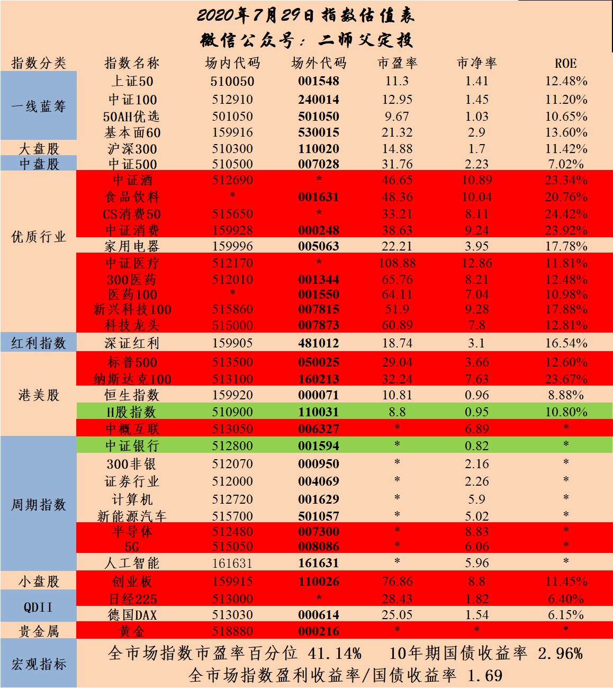

======================================================

_type: q&a
@尚红丽[118511558855142]
2020-07-30 07:09:56 Thu  
topic_id: 548881215818444

@尚红丽

>  师傅，我刚开通涨乐财富通，刚看了下，今天可以打新债，我的额度是0，我必须要买市值一万的股票，还要持有20天，才能打新债吗？

@二师父

>  这个不用的，打新债没有市值就可以打，中签以后账户有资金可以自动扣款，打新股需要市值

阅读[3334]  评论[4]  赞[0] 

======================================================

_type: talk
@JOY[111881481812422]
2020-07-30 07:52:00 Thu  
topic_id: 548881214251124

师父，想请教下，以您的经验来看，如果真的牛市来临，按今年的行情，恒生和银行这两个跟别的，像消费、科技之类的比，涨起来点位会差多少？

@JOY at 2020-07-30 07:52:00 Thu

> 在考虑要不要把恒生清了，或者只保留少量观察仓～虽然占的总仓位（场内外总共1成稍多点）但真是拿得心累[捂脸]～

----------

@二师父 at 2020-07-30 07:52:00 Thu

> 这个没法算啊

----------

阅读[3281]  评论[2]  赞[0] 

======================================================

_type: talk
@二师父[28814221155551]
2020-07-30 09:48:17 Thu  
topic_id: 241118525225521

今天两只可转债直接申购，打新之后中签再缴款，最好开盘以后打。

@Amanda at 2020-07-30 09:48:17 Thu

> 二师父，开盘以后打概率高点吗？

----------

@二师父 at 2020-07-30 09:48:17 Thu

> 差不多

----------

阅读[3432]  评论[2]  赞[0] 

======================================================

_type: q&a
@nana[48222415211188]
2020-07-30 10:02:13 Thu  
topic_id: 241118525485511

@nana

>  师傅，今天的乌龟计划定投什么？没有看到你的定投。

@二师父

>  稍后会投的，继续投国开债

阅读[3484]  评论[2]  赞[0] 

======================================================

_type: talk
@二师父[28814221155551]
2020-07-30 10:33:08 Thu  
topic_id: 548881252842544

<e type="hashtag" hid="28518855451481" title="#乌龟计划#" /> 买入广发中债003376，买入0.25份，不要预测市场，去年参加一活动，某专家预测今年没行情，只有科技和蓝筹行情，要是听他的，今年歇菜了。

做好自己的配置，如果是定投宽基指数，想要长期投，在sy-by百分位50个点以下投都没问题。因为是定投，不是一次买入。

@Vivian at 2020-07-30 10:33:08 Thu

> 二师父，0.25份是500元吗？

----------

@二师父 at 2020-07-30 10:33:08 Thu

> 是的

----------

@smile at 2020-07-30 10:33:08 Thu

> 请问二师父，纯债是不是更适合单笔买入呢？每周买一些更好吗？

----------

@二师父 at 2020-07-30 10:33:08 Thu

> 可以一次买，不过现在不合适的

----------

@smile at 2020-07-30 10:33:08 Thu

> 谢谢，一般大盘什么位置一次买比较合适呢

----------

阅读[3488]  评论[5]  赞[0] 

======================================================

_type: talk
@那方山的树，佛陀座下*[244412158214221]
2020-07-30 10:42:49 Thu  
topic_id: 118885242884882

二师傅写的新书到手了，现在也没啥可投的，努力学习……

@飞的那个飞 at 2020-07-30 10:42:49 Thu

> 好字

----------

阅读[3385]  评论[1]  赞[0] 

+++++++++++++++++++++++++++++++++++++++++++++++++++++

图片：

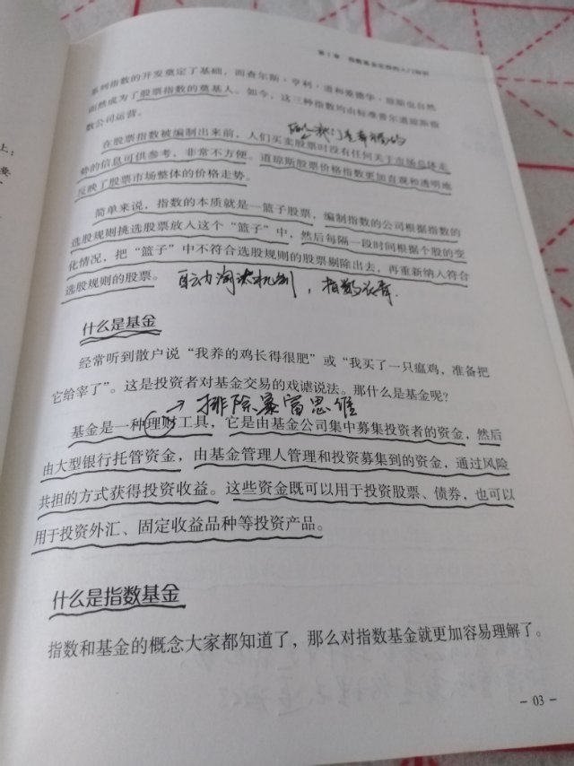

======================================================

_type: q&a
@阳光[421884185252128]
2020-07-30 10:53:09 Thu  
topic_id: 118885242818212

@阳光

>  师父：买国债逆回购操作是选借出吗？第一次买，不会操作，请教😀

@二师父

>  是的，相当于你收固定利息

阅读[3577]  评论[2]  赞[0] 

======================================================

_type: talk
@梅子[118548488224242]
2020-07-30 12:56:32 Thu  
topic_id: 118885245882112

二师傅，刚进学堂好多东西不明白。譬如：2层仓究竟是多少？0.25份怎么理解？今天只买广发中债500元吗？在哪里买？在广发基金APP里买可以吗？你的实盘定投方案里有人工智能和深红利，今天不买这两个吗？这个是手动定投吧？也就是说下个星期四不一定买广发中债？要看情况买？谢谢，我提的问题幼稚[囧]

@Sunflower at 2020-07-30 12:56:32 Thu

> 基金场外在蛋卷或者天天，场内得开通账户；2成是你总金额的百分之20；0.25份是二师父实盘定投的份额，也是根据定投份额计算出来的；蛋卷和天天基金可以设置自动定投，现在估值不低了所以才开始定投债券，希望可以帮到你

----------

@梅子 at 2020-07-30 12:56:32 Thu

> 谢谢你了

----------

@是喵喵吖～ at 2020-07-30 12:56:32 Thu

> 师父的场外定投一份是2000 所以0.25份是500 你也可以根据你自己的钱数

----------

@梅子 at 2020-07-30 12:56:32 Thu

> 谢了

----------

阅读[3474]  评论[4]  赞[0] 

======================================================

_type: q&a
@Vivian[582228554481154]
2020-07-30 13:38:01 Thu  
topic_id: 241118522512211

@Vivian

>  请教二师父，散户要参与科创板打新吗？打新破发风险大不？

@二师父

>  可以打，大概率盈利，破发了闪人就行

阅读[3674]  评论[7]  赞[0] 

======================================================

_type: talk
@二师父[28814221155551]
2020-07-30 17:19:45 Thu  
topic_id: 118885212248112

这事挺大的，国开行老大

@以古论今 at 2020-07-30 17:19:45 Thu

> 怎么大？

----------

@二师父 at 2020-07-30 17:19:45 Thu

> 贪了8000多万

----------

阅读[3596]  评论[2]  赞[0] 

+++++++++++++++++++++++++++++++++++++++++++++++++++++

图片：
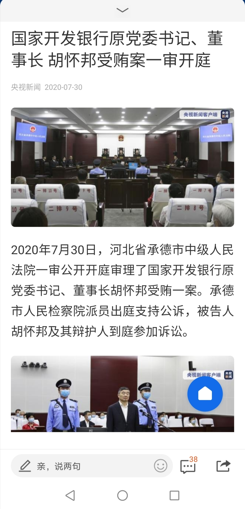

======================================================

_type: talk
@百变[15285855281882]
2020-07-30 18:34:37 Thu  
topic_id: 548881242515884

师傅：券商ETF.非银300到什么价位就能加仓了？

@二师父 at 2020-07-30 18:34:37 Thu

> 建底仓等低估，定投现在就行

----------

@百变 at 2020-07-30 18:34:37 Thu

> 好的！尊令！😄

----------

阅读[3470]  评论[2]  赞[0] 

======================================================

_type: q&a
@J[28281541518551]
2020-07-31 09:40:00 Fri  
topic_id: 548881282455844

@J

>  师父，请问科技515000现在是高估还是正常估值？

@二师父

>  高估的

阅读[3394]  评论[3]  赞[0] 

======================================================

_type: talk
@二师父[28814221155551]
2020-07-31 09:42:43 Fri  
topic_id: 548881285441244

<e type="hashtag" hid="881251425252" title="#鳄鱼计划#" /> 50etf清仓，大家结合自己仓位来就行。我这个操作只是一个参考。

@黎雄 at 2020-07-31 09:42:43 Fri

> 师傅是觉得短期波动大，后面跌了在买入嘛

----------

@秦风殇韵（刘豫斌） at 2020-07-31 09:42:43 Fri

> 获利14个点，跟了

----------

@二师父 at 2020-07-31 09:42:43 Fri

> 转配债券，做一下防守，而且这个基金盈利也达标了

----------

@Amanda at 2020-07-31 09:42:43 Fri

> 二师父，请问一下50etf全清了吗?

----------

@二师父 at 2020-07-31 09:42:43 Fri

> 清了，消费和科技一直拿着，如果这一波有机会再补

----------

@onepiecewi* at 2020-07-31 09:42:43 Fri

> 我跟着清了~

----------

@lily at 2020-07-31 09:42:43 Fri

> 

----------

@lily at 2020-07-31 09:42:43 Fri

> 师父，50etf是指这个华夏上证50吗？乌龟计划里也要清仓吗？

----------

阅读[3547]  评论[22]  赞[0] 

======================================================

_type: talk
@onepiecewi*[244414114545811]
2020-07-31 09:57:21 Fri  
topic_id: 241118512158451

今天又站上3300#
会站上3500吗~

@雨淡风清 at 2020-07-31 09:57:21 Fri

> 会的，时间问题[抠鼻]

----------

阅读[3345]  评论[1]  赞[0] 

======================================================

_type: q&a
@Vincent[15448144581152]
2020-07-31 10:06:28 Fri  
topic_id: 421118415125228

@Vincent

>  二师父，最近国债一直下滑，还值得继续持有吗？

@二师父

>  继续持有，马上会再次加仓的，定投是逆向做，你这种跌了卖也可以，不过是趋势，涨了就买，跌了再卖，操作思路不同
>  
>  国债未来肯定是会继续跌的

阅读[3614]  评论[5]  赞[0] 

======================================================

_type: talk
@钱小胖儿[844112855845212]
2020-07-31 10:21:30 Fri  
topic_id: 118885281255252

老师，之前定投的沪深300和中证500是不是可以卖出了，逢低再继续定投，目前两个分别的收益大概18%

@二师父 at 2020-07-31 10:21:30 Fri

> 仓位够，可以收割利润

----------

阅读[3627]  评论[1]  赞[0] 

======================================================

_type: talk
@防汛抗旱[111848815428452]
2020-07-31 11:11:03 Fri  
topic_id: 841118514221212

<e type="hashtag" hid="881251425252" title="#鳄鱼计划#" /> 鳄鱼计划都是场内买的吧

@JOY at 2020-07-31 11:11:03 Fri

> 是的

----------

阅读[3623]  评论[1]  赞[0] 

======================================================

_type: talk
@xu[2441485251]
2020-07-31 17:01:10 Fri  
topic_id: 421118845888818

<e type="hashtag" hid="881251425252" title="#鳄鱼计划#" /> 请问鳄鱼计划在哪里看到，谢谢！

@背心 at 2020-07-31 17:01:10 Fri

> 右上角搜索，鳄鱼计划

----------

阅读[3436]  评论[1]  赞[0] 

======================================================

_type: talk
@二师父[28814221155551]
2020-07-31 20:53:03 Fri  
topic_id: 118885521444412

卖出这个话题真的是永恒的，买入卖出一个闭环才是交易，可以长期持有，但是A股终身持有真的不大适合。

@sunny在路上 at 2020-07-31 20:53:03 Fri

> 卖真是一门学问啊[偷笑]就怕卖出了又想回来

----------

@二师父 at 2020-07-31 20:53:03 Fri

> 那也可以回来，只要别反复进出

----------

@rtdmm小米 at 2020-07-31 20:53:03 Fri

> 卖出了，等机会买入

----------

@sunny在路上 at 2020-07-31 20:53:03 Fri

> 二师傅是怎么卖的？我看网上有人说按网格交易。还有8月份指数还是震荡为主吗？7月后半个月确实震荡，收益主要集中在7月上半个月

----------

@二师父 at 2020-07-31 20:53:03 Fri

> 这个都在星球发布啦

----------

阅读[4367]  评论[5]  赞[0] 

+++++++++++++++++++++++++++++++++++++++++++++++++++++

文件：
2020-07-31 20:52:15 Fri
文件大小：[19443]
15122454421122-聊一聊该怎么卖出.docx

======================================================

