_type: q&a
@陈[844415515418422]
2020-08-01 05:33:28 Sat  
topic_id: 241111481442241

@陈

>  二师父，我的华宝油气2018年底买的，现在亏损百分之三十八，是卖了还是遵循止盈不止损的原则先放着？还有易方达h和天弘中证银行，现在都亏一点点是卖了等机会买别的还是继续持有？金额占用一成资金。

@二师父

>  可以换仓，也可以卖，止盈不止损是对质量好的基金，大前提需要正确

阅读[3533]  评论[7]  赞[0] 

======================================================

_type: talk
@二师父[28814221155551]
2020-08-01 06:16:22 Sat  
topic_id: 548888418481544

<e type="hashtag" hid="15285514118112" title="#本周荐书#" /> 唐朝的手把手教你读财报，这是投资企业的财报入门书籍，想投资企业，财报和研报是必须读的，至于什么技术分析，都是看一眼就会的，没必要花太多时间学习

@云淡风轻 at 2020-08-01 06:16:22 Sat

> 二师父书名叫什么？

----------

@云淡风轻 at 2020-08-01 06:16:22 Sat

> 看懂了[嘿哈]现在去买

----------

阅读[3619]  评论[2]  赞[0] 

======================================================

_type: talk
@树叶[544811512145144]
2020-08-01 09:50:10 Sat  
topic_id: 548888452541254

<e type="hashtag" hid="142825811122" title="#定投周报#" /> 二师父定投周报第68期

阅读[3617]  评论[0]  赞[0] 

+++++++++++++++++++++++++++++++++++++++++++++++++++++

文件：
2020-08-01 09:50:08 Sat
文件大小：[231333]
51422514245284-二师父定投周报8.1（第68期）.docx

======================================================

_type: talk
@二师父[28814221155551]
2020-08-01 21:57:13 Sat  
topic_id: 841111445228482

<e type="hashtag" hid="15285511224852" title="#黄金的投资逻辑#" /> 卖出看均线这个很久就讲过了，还有一个指标可以参考，关于死叉点，技术的指标大致参考就行啦。

死叉点是短期均线下叉长期均线，比如5日均线下叉10日均线，这种时候就是死叉点，或者10日均线下叉20日均线这种。结合这个技术指标也是止盈的一种方法。

好基金可以长期持有的，比如消费和医疗，消费我准备做过山车，那券商波动大适当波段，真的挺灵的。

最近我在摇号，以前别人给我说新能源汽车，我看不上，所以摇的油的，一直没中。关键以前不用摇的新能源也要开始摇了，了解了下纯电动的续航能力，尤其是疫情期间不用去加油站，其实新能源车是未来一个趋势，关注下。至少我是考虑这个方向了，油车固然好，牌子拿不到啊，未来肯定会有越来越多人开始新能源车的。

@蓝魔森林 at 2020-08-01 21:57:13 Sat

> 可以考虑下最近上市的理想汽车，电动增程式技术（基于电的油电混合），有新能源车的特性同时可以像石油车续航。 电动车未来还是对汽车行业的颠覆改革，值得关注。

----------

@二师父 at 2020-08-01 21:57:13 Sat

> 特斯拉，理想，比亚迪都可以看看

----------

@陈 at 2020-08-01 21:57:13 Sat

> 比亚迪新出的汉不错，刀片电池，续航六百公里。百公里加速实测3.83秒，超酷！[呲牙]

----------

@小牧童 at 2020-08-01 21:57:13 Sat

> 师父，我用的特斯拉，好节能😂，加速也快！

----------

@二师父 at 2020-08-01 21:57:13 Sat

> 这车拉风

----------

@小牧童 at 2020-08-01 21:57:13 Sat

> 不好的地方就是目前七七八八的小毛病偶尔是会有的，还有目前二手车市场估价比燃油车便宜一些

----------

阅读[4168]  评论[6]  赞[0] 

+++++++++++++++++++++++++++++++++++++++++++++++++++++

文件：
2020-08-01 21:51:01 Sat
文件大小：[81531]
48244558881158-黄金的投资逻辑与价值.docx

======================================================

_type: q&a
@鳗鱼[182242255828582]
2020-08-02 00:05:28 Sun  
topic_id: 548888445415124

@鳗鱼

>  请问二师父：小白，零仓位，今天加入学堂，现在乌龟计划买入2成仓位；鳄鱼计划现在还能买吗，怎么买？谢谢！

@二师父

>  鳄鱼计划暂时不买了，后面继续涨以国债买入为准，鳄鱼计划买的话都在星球公布的，如果8月震荡，也考虑短期做t，每次0.5份，看情况
>  
>  先学习，不急着交易市场机会总是有的

阅读[3435]  评论[2]  赞[0] 

======================================================

_type: talk
@二师父[28814221155551]
2020-08-02 19:29:41 Sun  
topic_id: 841111414548582

要不要卖，怎么卖

@Hi·DD at 2020-08-02 19:29:41 Sun

> 请问现在处于牛市哪个阶段了呢？

----------

@二师父 at 2020-08-02 19:29:41 Sun

> 中期

----------

阅读[3537]  评论[2]  赞[0] 

+++++++++++++++++++++++++++++++++++++++++++++++++++++

文件：
2020-08-02 19:29:30 Sun
文件大小：[20671]
28455224521411-券商到底要不要卖.docx

======================================================

_type: talk
@二师父[28814221155551]
2020-08-02 19:39:36 Sun  
topic_id: 118888181282152

<e type="hashtag" hid="88518844822242" title="#讲讲企业#" /> 之前有朋友建议组建股票群，二师父考虑了下还是不打算做了，就在这个圈子讨论，不再建其他的群了。优质的投资理念的学习和吸收比找到所谓的买点和卖点更重要。投资这个事情是需要天赋的，和智商学历没有关系，我就有认识一个大专毕业做比特币，股票很好，相反一些博士朋友连基金投资都理解不了，这是非常奇怪的事情。

那么关于投资企业，我不讲具体公司，也不公布持仓，如果大家自己悟道了，咱们一起分享交流。我投资企业并不是看他昂贵程度的，重要的看未来的造富能力。这和以前的方式不同了，以前是在二级市场做，现在是在二级市场按照一级市场思维做。

造富能力如果用企业来说不是很容易。那么二师父以个人举例子。假设一个朋友上班、投资，那么就相当于有两项收入。我们投资这个人就是投资企业，未来他上班每年所能产生现金流的加速度越高，那么就越值得投资，当然还有潜力股，比如创业之后，收入是指数型增长，这就属于投资企业的未来和成长性。

这是我认为最为重要的，一个每年稳定收入100万而且很年轻朋友就像茅台，而一个目前收入不多，但是未来前景好的就比如理想汽车、今日头条和美团、跟谁学，当然这几家公司最近几年都起来了。

这就是思维和方法，不是看价格的，当你把商业模式和企业赚钱能力看懂了，才是看懂了。

选老公和投资有点像，好的造富能力像利润表，男生的资产和欠款像资产负债表，男生的每月流水就是现金流量表。还有男生的人品和性格就像企业管理层，是不是一样的，四好企业和男人都是不错的。

其实这样看我还算一个比较好的企业，你们都来投我吧。

@庆余年 at 2020-08-02 19:39:36 Sun

> 最后一句划重点[呲牙][呲牙]

----------

@rtdmm小米 at 2020-08-02 19:39:36 Sun

> 简单点，优质行业指数基金足够了！

----------

@衣袂飘香 at 2020-08-02 19:39:36 Sun

> 哈哈，二师父真逗。

----------

@Sunflower at 2020-08-02 19:39:36 Sun

> 二师父划重点了，单身的女孩快投资[偷笑]

----------

@二师父 at 2020-08-02 19:39:36 Sun

> 好女孩是追到的，一般等不来，大咖们快投资

----------

@丁咚 at 2020-08-02 19:39:36 Sun

> 二师傅已经被眼光好的女孩投资了，我等只有羡慕的份[呲牙]

----------

阅读[4192]  评论[6]  赞[0] 

======================================================

_type: talk
@雨的依恋[544828552242454]
2020-08-02 21:52:35 Sun  
topic_id: 241111155488421

哇哇哇，朋友点赞没白点，二师父签名书刚收到了[色]

阅读[3476]  评论[0]  赞[0] 

======================================================

_type: talk
@二师父[28814221155551]
2020-08-03 09:38:06 Mon  
topic_id: 548888824282244

<e type="hashtag" hid="881251425252" title="#鳄鱼计划#" /> 16国债19买入一手，可以用国债etf，10年国债替代。计划配置3成国债和国债etf，7成指数基金，保守的配置，牛熊都无惧。如果指数不回撤，不再配置指数了，等待下一次大跌。

@Philip🎭 Y at 2020-08-03 09:38:06 Mon

> 003376？

----------

@衣袂飘香 at 2020-08-03 09:38:06 Mon

> 二师父，场内的网格也不做了吗？另外您的一手，是多少钱呢？

----------

@二师父 at 2020-08-03 09:38:06 Mon

> 019547或者511260

----------

@二师父 at 2020-08-03 09:38:06 Mon

> 一手就是固定的

----------

@不知道不明了 at 2020-08-03 09:38:06 Mon

> 师父，一手有9万多呀，没那么多钱咋办还是定投广发中短债么

----------

@二师父 at 2020-08-03 09:38:06 Mon

> 9000多，没那么多

----------

@二师父 at 2020-08-03 09:38:06 Mon

> 中债c和a都行

----------

@sky at 2020-08-03 09:38:06 Mon

> 师父，刚入星球。鳄鱼计划都是场内买入吗？

----------

阅读[4213]  评论[18]  赞[0] 

======================================================

_type: talk
@Nancy[28245584485581]
2020-08-03 11:02:28 Mon  
topic_id: 548888812551254

512800已经持有一年半了，但是整体收益目前也才2点多一点，明白指数止盈不止损，但是感觉也没有什么盈利的空间了，请教二师父，是否应该卖出在等待其他机会？非常感谢！

@二师父 at 2020-08-03 11:02:28 Mon

> 可以等反弹卖出了哈，今年三月场外已经调仓，银行未来表现不会有超额收益了

----------

阅读[3301]  评论[1]  赞[0] 

======================================================

_type: talk
@Vivian[582228554481154]
2020-08-03 11:40:00 Mon  
topic_id: 421111184218448

二师父，前几周乌龟计划跟您定投了纯债基金003376，今天看您说买了一手国债，打算陪三成国债，七成指数。我理解国债涨了，债券基金就会下跌。那之前定投003376不继续了吗？您说的配置里面没有纯债基金吗？

@Vivian at 2020-08-03 11:40:00 Mon

> 我看您说买国债是鳄鱼计划。我刚入星球，目前指数配置一半仓位。请问我现在配置是跟着乌龟计划定投，还是买鳄鱼计划？

----------

@二师父 at 2020-08-03 11:40:00 Mon

> 那不是的，股市涨了，大概率国债跌，国债基金就是由国债组成的

----------

阅读[3310]  评论[2]  赞[0] 

======================================================

_type: talk
@二师父[28814221155551]
2020-08-03 15:09:09 Mon  
topic_id: 548888815252224

行情挺好，如果一直跟着我走的目前可以逐步把剩余仓位加到国债或者国债基金，然后8成指数，2成国债满上，之后股市继续涨，就可以一直卖卖卖了，这就是逆向思维投资法

如果仓位只有3成不到，就没必要卖出了，当然银行，煤炭，基建这些表现不好的，要趁机会走人，这些卖出属于基本面变差

@smile at 2020-08-03 15:09:09 Mon

> 如果股市继续涨，卖掉的指数基金的钱就继续买国债基金吗？

----------

@二师父 at 2020-08-03 15:09:09 Mon

> 货币基金或者国债基金

----------

@雨淡风清 at 2020-08-03 15:09:09 Mon

> 恒生国企是不是找机会清点，看香港这个状况不是很理想啊

----------

@二师父 at 2020-08-03 15:09:09 Mon

> 清啊

----------

@雨淡风清 at 2020-08-03 15:09:09 Mon

> 还赔几个点😬 感觉也没必要拿着。

----------

@二师父 at 2020-08-03 15:09:09 Mon

> 是的

----------

@圣诞结® at 2020-08-03 15:09:09 Mon

> 二师父，银行目前亏损13%，仓位占比11%，是不是等涨涨再出？

----------

@二师父 at 2020-08-03 15:09:09 Mon

> 是的

----------

阅读[3274]  评论[8]  赞[0] 

======================================================

_type: q&a
@Rachel[51558542555524]
2020-08-03 15:11:03 Mon  
topic_id: 241111182528551

@Rachel

>  请问 定投军工基金可以吗？

@二师父

>  可以，但是不能重仓，这个指数收到政策和消息的影响也很大

阅读[3316]  评论[2]  赞[0] 

======================================================

_type: q&a
@聪明的笨蛋[544858411212244]
2020-08-03 15:16:11 Mon  
topic_id: 421111185844228

@聪明的笨蛋

>  二师父有科创板的指数基金没？类似于科创50的？

@二师父

>  已经有四只通过审批了，用不了多久就可以申购

阅读[3355]  评论[3]  赞[0] 

======================================================

_type: talk
@二师父[28814221155551]
2020-08-03 16:49:14 Mon  
topic_id: 118888858585512

科创50募集中，还是以消费、医疗、家电、券商为主，两市成交额低于9000亿，慢慢低吸，我们逆向思维，牛市就是休息的。熊市才干活。趋势是线下休息，线上干活，我们是线上休息，线下干活。

@wty at 2020-08-03 16:49:14 Mon

> 这四只申报的50ETF是场内购买是吗？还是场内、场外都可以买？

----------

@二师父 at 2020-08-03 16:49:14 Mon

> 场内的

----------

@wty at 2020-08-03 16:49:14 Mon

> 谢谢🙏，募集期间，我们就可以买了是吗？还是等您发车信号？

----------

@二师父 at 2020-08-03 16:49:14 Mon

> 现在还不行啊

----------

@wty at 2020-08-03 16:49:14 Mon

> 好的，多谢，等您发车！

----------

阅读[4078]  评论[5]  赞[0] 

+++++++++++++++++++++++++++++++++++++++++++++++++++++

文件：
2020-08-03 16:47:53 Mon
文件大小：[20867]
51422541581884-科创50一天涨幅7%，相关基金看过来.docx

======================================================

_type: talk
@二师父[28814221155551]
2020-08-03 21:39:32 Mon  
topic_id: 118888845524822

<e type="hashtag" hid="224445218111" title="#全市场估值数据#" /> 全市场指数市盈率百分位45.37%，市净率百分位31.83%，SY-BY百分位44.91%，SY/BY百分位40.79%。

目前货币政策继续宽松，这种时候就是资产的助推器，现在房产被抑制了，那么很可能导致股债双牛，好资产拿着。

阅读[3836]  评论[0]  赞[0] 

======================================================

_type: q&a
@阳光[421884185252128]
2020-08-04 05:34:45 Tue  
topic_id: 118888841484542

@阳光

>  师父：看估值表中证500和基本面60都在正常值，可大盘涨得厉害，现在收割利润还是止盈好呢？仓位都不重，加起来也就占总仓位的10%左右

@二师父

>  仓位低可以不用卖的

阅读[3318]  评论[0]  赞[0] 

======================================================

_type: q&a
@是喵喵吖～[421441114141158]
2020-08-04 08:58:34 Tue  
topic_id: 118888812582422

@是喵喵吖～

>  师父想问下 我收割过一次盈利 如果后期再收割的话 该怎么看呢 因为天天基金的盈利收割他还是在那里。 我是不是可以这样：像这个50AH我第一次收割了1500元，那我假如再收割的话 就用（2367.59持仓收益-1500我之前收割的）=剩余盈利。再除以最新净值 就得出再收割的份额。这样可以吗。

@二师父

>  不是，你用当前金额减去用投入就行，有个大致比例，50ah减仓以后投入其他产品有更好的收益率，比货币基金高就值得

阅读[3328]  评论[10]  赞[0] 

======================================================

_type: q&a
@李垚垚[548145221582444]
2020-08-04 09:18:18 Tue  
topic_id: 548888842524424

@李垚垚

>  二师父现在能买的科技指数是哪一只。

@二师父

>  目前位置都挺高了，科技100建个观察仓看看

阅读[3252]  评论[0]  赞[0] 

======================================================

_type: q&a
@范毅君[118551121224142]
2020-08-04 09:43:41 Tue  
topic_id: 118888812142552

@范毅君

>  二师父，本钢转债开盘跌破净值，转债品种这种情况，跌到多少需要割肉离场，还是跌破净值，继续持有就可以了呀？

@二师父

>  持有盈利卖出就行

阅读[3301]  评论[5]  赞[0] 

======================================================

_type: q&a
@不知道不明了[15584248411812]
2020-08-04 09:59:29 Tue  
topic_id: 841111142225522

@不知道不明了

>  二师父，请问怎么看每只可转债什么时候上市呀，目前只要新债中签都积极申购，应该没问题吧

@二师父

>  在集思录有一个新债发行日历，牛市可转债申购都没问题

阅读[3346]  评论[0]  赞[0] 

======================================================

_type: q&a
@幽兰[815554522442422]
2020-08-04 10:13:15 Tue  
topic_id: 118888814441852

@幽兰

>  昨天忙，没有及时跟进买进16国债19，今早买的，刚买完看到浮亏2.94，这个是什么情况？还有国债一般在什么情况下赎回？

@二师父

>  国债不是保本的，这个也会有下跌的，盈利10个点以上可以考虑逐步赎回

阅读[3410]  评论[0]  赞[0] 

======================================================

_type: q&a
@阳光[421884185252128]
2020-08-04 10:13:31 Tue  
topic_id: 841111142245122

@阳光

>  师父：创业板高估，可一直在涨，特别是最近一直有利好，手里的创业板指数继续持有吗？谢谢

@二师父

>  可以的

阅读[3398]  评论[0]  赞[0] 

======================================================

_type: q&a
@铁观音[28444524525851]
2020-08-04 10:52:38 Tue  
topic_id: 421111125218128

@铁观音

>  本钢转债破发了，要拿着吗？还是卖掉？

@二师父

>  可以拿着

阅读[3369]  评论[0]  赞[0] 

======================================================

_type: q&a
@芙瑞雅阳阳潘[421181844812818]
2020-08-04 10:55:02 Tue  
topic_id: 841111142154812

@芙瑞雅阳阳潘

>  二师夫，您认为现在在这个点位的新发基金可以买吗？比如009878，李化松基金经理的新发

@二师父

>  新发基金一般不考虑，这个基金经理还可以，买混合基金就是买基金经理，他们靠谱水平高基金表现就好

阅读[3540]  评论[1]  赞[0] 

======================================================

_type: q&a
@范毅君[118551121224142]
2020-08-04 13:58:42 Tue  
topic_id: 241111141522251

@范毅君

>  二师父，今天银行涨，是有什么利好，还是就是反弹，是不是可以趁机出货

@二师父

>  货币政策继续宽松，招商银行我波段出了一点，盈利都可以，看你出多少，我判断还能接回来

阅读[3445]  评论[5]  赞[0] 

======================================================

_type: talk
@二师父[28814221155551]
2020-08-04 14:02:24 Tue  
topic_id: 118888818248142

现在标题党真厉害，恒生指数涨了百分之2，就说直线拉升。。。

阅读[3398]  评论[0]  赞[0] 

======================================================

_type: q&a
@芙瑞雅阳阳潘[421181844812818]
2020-08-04 15:47:31 Tue  
topic_id: 548888848421124

@芙瑞雅阳阳潘

>  二师夫对后半年A股走向有预期吗？

@二师父

>  年内看到3500，不保证一定上

阅读[3406]  评论[2]  赞[0] 

======================================================

_type: talk
@二师父[28814221155551]
2020-08-04 17:04:06 Tue  
topic_id: 118888885814422

<e type="hashtag" hid="15285482828582" title="#主动基金的坑#" /> 主动基金有好有坏，看看如何规避。今年的基金还有亏损的，这些都是实打实的业绩。

阅读[4099]  评论[0]  赞[0] 

+++++++++++++++++++++++++++++++++++++++++++++++++++++

文件：
2020-08-04 17:03:18 Tue
文件大小：[22047]
51422582888844-今年多只基金收益翻倍，可仍有几百只基金收益为负，你中枪了吗.docx

======================================================

_type: talk
@二师父[28814221155551]
2020-08-04 22:06:14 Tue  
topic_id: 118888881851122

<e type="hashtag" hid="224445218111" title="#全市场估值数据#" /> 市盈率百分位49.81%，市净率百分位34.86%，SY-BY百分位49.28%，SY/BY百分位44.07%。

整体估值还是不低，如果把金融地产板块拉起来50%，那么就到牛市后期全面爆发了。今年行情能否有突破，就看银行和地产了。

@衣袂飘香 at 2020-08-04 22:06:14 Tue

> 希望把银行拉起来，我还有不少呢。向着3500冲啊。

----------

@防汛抗旱 at 2020-08-04 22:06:14 Tue

> 所以银行地产可以买点？

----------

@圣诞结® at 2020-08-04 22:06:14 Tue

> 我也是 等着把银行解套呢😂

----------

@范毅君 at 2020-08-04 22:06:14 Tue

> 昨天减仓了银行etf，争取在正当中获利😂

----------

@二师父 at 2020-08-04 22:06:14 Tue

> 我做的招行地产打新门票波段，收益一般

----------

@二师父 at 2020-08-04 22:06:14 Tue

> 银行etf鸡肋了

----------

@范毅君 at 2020-08-04 22:06:14 Tue

> 是的，上次上涨盈利5个点没有抓住机会全部清仓，现在还有一些，少许亏损，别天又卖出了一些，做事还不够果断，新手，还要像二师父多学习，我喜欢价值投资，不喜欢做趋势，时刻提醒自己不要看人家做趋势像赌博一样，挣了多少钱，时刻保持清醒头脑，多学习快成长，稳健投资，跟着二师父吃肉[偷笑]

----------

阅读[3837]  评论[7]  赞[0] 

======================================================

_type: q&a
@李震笛[422112248211828]
2020-08-05 08:42:47 Wed  
topic_id: 582222125825554

@李震笛

>  师傅，想请教一下，基金的折价率是什么意思呢？另外，现在波动比较大，选择场内基金做T+0交易可行吗？

@二师父

>  折价的意思是基金的价格低于其净值，这个我在书中解释过
>  
>  目前只能t加1，当日买入的基金第二天才能卖出的

阅读[3189]  评论[2]  赞[0] 

======================================================

_type: q&a
@xu[2441485251]
2020-08-05 09:46:08 Wed  
topic_id: 582222124145524

@xu

>  请问二师傅场内基金如何止盈啊？谢谢！

@二师父

>  具体什么基金呢，可以超买的时候清仓，不会的话直接分步卖出

阅读[3241]  评论[3]  赞[0] 

======================================================

_type: q&a
@幽兰[815554522442422]
2020-08-05 09:49:16 Wed  
topic_id: 414444842822848

@幽兰

>  二师父请问国家这个政策会利好的基金有哪些，现在是否值得入手？

@二师父

>  电子信息，计算机，科技，做趋势任何时候趋势到了都可以买，做好10个点的止损就行，这样风控到位了
>  
>  看自己能否接受损失，我在投资上除了基本面变差的股票，很少亏损卖出，所以不做趋势

阅读[3506]  评论[0]  赞[0] 

======================================================

_type: talk
@二师父[28814221155551]
2020-08-05 09:52:50 Wed  
topic_id: 414444842815528

<e type="hashtag" hid="88518218525152" title="#关于波动#" /> 目前波动市场，要么慢慢波段，要么拿住，其实真的赚大钱不是靠波段，而是选对股票和板块基金，中期持有，波段看着快，其实不挣大钱。每一次上涨调仓的机会，每一次下跌是加仓的机会

学着像持有房子那样中期持有基金，这样才能慢慢的稳定心态，否则今天买，明天卖，自己就把这里当成了赌场。

@芙瑞雅阳阳潘 at 2020-08-05 09:52:50 Wed

> 二师父说的太有道理了

----------

阅读[3512]  评论[1]  赞[0] 

======================================================

_type: talk
@梅子[118548488224242]
2020-08-05 10:05:41 Wed  
topic_id: 815555854282452

<e type="hashtag" hid="88518218525152" title="#关于波动#" /> 二师父说的精辟，如果抱不住好的基金，空有好行情，最终赚的是小钱。

阅读[3445]  评论[0]  赞[0] 

======================================================

_type: talk
@二师父[28814221155551]
2020-08-05 16:15:03 Wed  
topic_id: 182222554415852

当前市场的策略

@范毅君 at 2020-08-05 16:15:03 Wed

> 不好的基金，盈利高的基金趁着上涨，出了不少，手上现在主要受300etf和500etf，还有少量证券科技5g，现在也就三成多仓位，没有票，不敢上车也难受[流泪][流泪]

----------

@smile at 2020-08-05 16:15:03 Wed

> 请教二师父，文中的优质资产全部都是行业股，请问宽基的比例不在这个里面吗？意思是这个阶段更适合持有行业股？还是说宽基是另外的资产配置？

----------

@蛋炒饭不加蛋 at 2020-08-05 16:15:03 Wed

> 三成少了点吧

----------

@二师父 at 2020-08-05 16:15:03 Wed

> 这个看自己所能经受的回撤

----------

@smile at 2020-08-05 16:15:03 Wed

> 谢谢回复，您这篇讲的配置，是指长期定投思路，还是仅指本阶段呢？

----------

@二师父 at 2020-08-05 16:15:03 Wed

> 本阶段，做好配置，类似今年3月是没必要配置债券的

----------

@smile at 2020-08-05 16:15:03 Wed

> 谢谢

----------

阅读[4066]  评论[7]  赞[0] 

+++++++++++++++++++++++++++++++++++++++++++++++++++++

文件：
2020-08-05 16:14:54 Wed
文件大小：[20759]
48244211141418-北向资金反复波段，投资者如何应对.docx

======================================================

_type: talk
@二师父[28814221155551]
2020-08-05 16:26:16 Wed  
topic_id: 215555882212111

<e type="hashtag" hid="224445218111" title="#全市场估值数据#" /> 市盈率百分位50.07%，市净率百分位39.9%，SY/BY百分位44.73%，SY-BY百分位50.18%。

当前处于估值中枢位置，没有低估也没有泡沫。

@wty at 2020-08-05 16:26:16 Wed

> 国债现在处于什么百分位了呢？国债已经处于相对底部了吗？可以重仓了吗？还是需要分步初步加仓？

----------

@二师父 at 2020-08-05 16:26:16 Wed

> 底部还没有，挺便宜了

----------

@财富源于专注 at 2020-08-05 16:26:16 Wed

> 麻烦可不可以讲一下，全市场估值数据SY/BY百分位多少以下是低估值，达到多少是高估值，还有SY–BY百分位多少以下是低估值，达到多少是高估，老师的书籍刚刚看到一半，有些不明白，谢谢

----------

@二师父 at 2020-08-05 16:26:16 Wed

> 这个百分位越低越低估，20以下是严重低估，10以下是极端低估

----------

@财富源于专注 at 2020-08-05 16:26:16 Wed

> 哦，好的

----------

@财富源于专注 at 2020-08-05 16:26:16 Wed

> 达到70是高估吗

----------

@二师父 at 2020-08-05 16:26:16 Wed

> 是的

----------

@wty at 2020-08-05 16:26:16 Wed

> 谢谢二师父！

----------

阅读[3485]  评论[11]  赞[0] 

======================================================

_type: q&a
@遇见了你[118285144148812]
2020-08-05 18:37:15 Wed  
topic_id: 414444881212858

@遇见了你

>  二师父，我加入了个基金群，现在里面有在讨论外汇黄金交易的，这个能买么？

@二师父

>  具体哪个品种，黄金这个位置真的挺高了

阅读[3456]  评论[2]  赞[0] 

======================================================

_type: q&a
@姥姥不疼. 爷爷不爱[48544481458248]
2020-08-05 20:54:57 Wed  
topic_id: 414444854518248

@姥姥不疼. 爷爷不爱

>  国开债003376，明儿发车么，谢您了

@二师父

>  晚上算算估值数据，这个是会发车的，直到投资价值偏低以后就停了

阅读[3432]  评论[0]  赞[0] 

======================================================

_type: talk
@二师父[28814221155551]
2020-08-05 23:06:37 Wed  
topic_id: 815555828414552

<e type="hashtag" hid="552114551414" title="#估值数据#" /> 低估的还是低估，表现很差，优选赛道很重要。选中优质低估板块，注意定语，低估没错，错的是把劣质便宜板块当作香饽饽。

@J at 2020-08-05 23:06:37 Wed

> 师父，请说一下全市场盈利收益率/国债收益率的数值多少的时候适合7-8层仓位？什么时候适合5-6层仓位？

----------

@二师父 at 2020-08-05 23:06:37 Wed

> 这个看自己，越低越重，价值投资者一般都是高仓位

----------

@J at 2020-08-05 23:06:37 Wed

> 好的，中枢值大概是多少？我想根据师父的中枢值再做判断适合自己的仓位

----------

@二师父 at 2020-08-05 23:06:37 Wed

> 百分之50是中间位置

----------

@J at 2020-08-05 23:06:37 Wed

> 好，明白了，谢谢师父

----------

@cotton at 2020-08-05 23:06:37 Wed

> 这个表里有恒生国企吗

----------

@二师父 at 2020-08-05 23:06:37 Wed

> 就是h股指数

----------

@rtdmm小米 at 2020-08-05 23:06:37 Wed

> 二师父，可否更新一下估值表的估值区域？

----------

阅读[4068]  评论[12]  赞[0] 

+++++++++++++++++++++++++++++++++++++++++++++++++++++

图片：
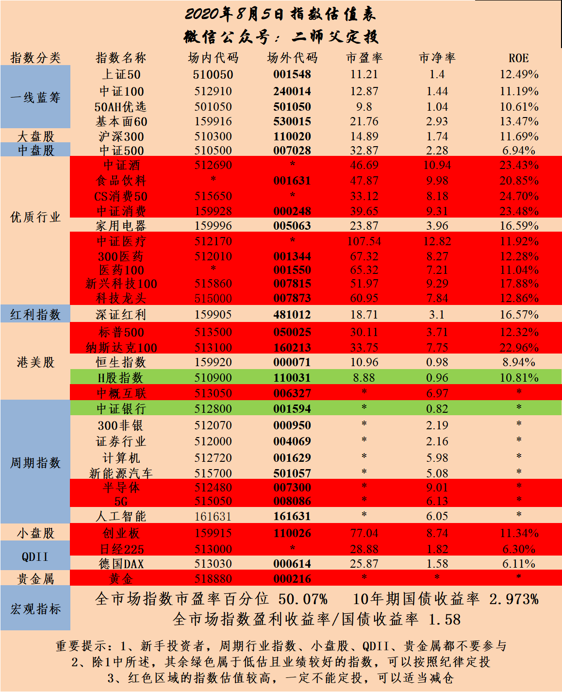

======================================================

_type: q&a
@wty[548488548545444]
2020-08-06 08:07:20 Thu  
topic_id: 815555821424182

@wty

>  二师父，请教个问题，对于国债，您是怎么筛选投资品种的，有什么考量分析条件或指标吗？我注意到2016年发行了20期国债，为什么选择16国债19呢？另外，国家每年都发行国债，选择2016年的国债的考量是什么呢？

@二师父

>  发行时间，久期，利率，这个观察比较久了，这个波动较大，自带杠杆

阅读[3276]  评论[0]  赞[0] 

======================================================

_type: talk
@二师父[28814221155551]
2020-08-06 11:27:19 Thu  
topic_id: 215555844554511

<e type="hashtag" hid="881422852442" title="#定投实盘#" /> 定投实盘如下，继续买入国开债，股市跌，他大概率是涨的。可以直接点击后面链接跟投。本期卖出剩余持仓恒生国企50%，后面找机会继续卖出。

未来尽量固定操作，买入和卖出都集中在周四，这样有利于上班族跟。鳄鱼计划还是不定时发车，偶尔波段一下。看了看乌龟计划的收益率21%左右，那么鳄鱼计划年化大概就是31%左右了，今年的行情还是挺好的，一直坚持，总会有到来的一天。

股市投资需要领悟和机遇，时机不到，就耐心等待，没有牛市股神也不行的。

<e type="web" href="https://appunit.1234567.com.cn/ComboDetailV2/index.html?id=10142058#/" title="https://appunit.1234567.com.cn/ComboDetailV2/index..." />

@范毅君 at 2020-08-06 11:27:19 Thu

> 今天买了两份国债，我都买的c类，时刻准备机会能到[偷笑]

----------

@二师父 at 2020-08-06 11:27:19 Thu

> c类可以波段

----------

@范毅君 at 2020-08-06 11:27:19 Thu

> 二师父，我个人想法，就是国债就是优于货基金的，快速存取，所以主要还是为机会来了，可以快速转到指数基金上来，不知道这么想对不对

----------

@二师父 at 2020-08-06 11:27:19 Thu

> 国债基金流动性不如货币基金，他可以避险，收益率比货币基金高，但是如果机会来了，国债基金还亏的话转换不合适。

大概率是股跌债涨，不过也有股债双杀的时候

----------

@铁观音 at 2020-08-06 11:27:19 Thu

> 恒生国企调仓了吗？为啥表现这么差呀。还是亏损的

----------

@二师父 at 2020-08-06 11:27:19 Thu

> 调了一半，价值股今年比较惨

----------

@素兮 at 2020-08-06 11:27:19 Thu

> 定投广发中债，等债券牛市到来预期收益率多少的时候可以清了？

----------

@二师父 at 2020-08-06 11:27:19 Thu

> 这个看情况，没有具体答案

----------

阅读[3237]  评论[20]  赞[0] 

+++++++++++++++++++++++++++++++++++++++++++++++++++++

图片：
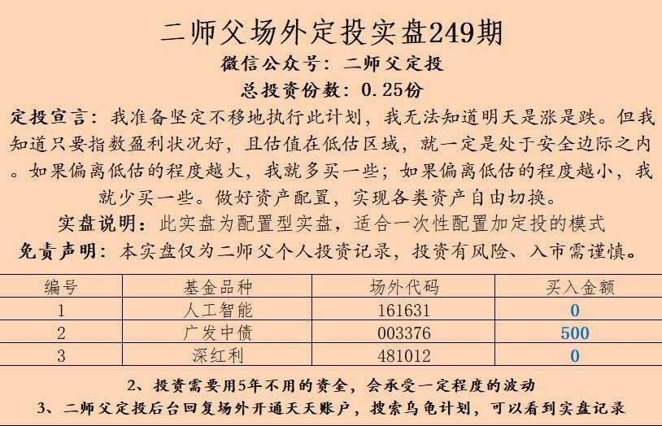

======================================================

_type: q&a
@榕声竹影[844118218251282]
2020-08-06 11:35:19 Thu  
topic_id: 215555821444281

@榕声竹影

>  二师父您好，想请教一下，如果有只主动型混合基金长期业绩都非常好，现在准备新发行一只同样类型的基金由同一个基金经理负责管理，那我应该选老基金购买还是选新发行的基金申购更合适呢？另外持有华夏上证50AH和建信深圳基本面60一年多了，收益都不行，现在是否适合逐步调仓转换到中证500和人工智能上，或者调整到其它什么指数更合适？谢谢。

@二师父

>  这两只基金是防守型配置，根据自己的投资需要，如果能承受更大的波动，那么在市场回调的时候调整到白酒、医疗、人工智能、半导体、新能源汽车、中概互联、龙头科技、科技100这些行业集中度高的基金上收益会更好。
>  
>  不过先要做好压力测试，你可以看看过往这些基金的波动很大，今年是收益挺好的，不过如果发生一次较大的回撤或者熊市，那么跌幅也很大，如果能承受，就可以放弃防守的宽基配置，专门投资这样行业指数。

阅读[3208]  评论[0]  赞[0] 

======================================================

_type: talk
@Vivian[582228554481154]
2020-08-06 14:09:09 Thu  
topic_id: 414444822152128

二师父，请教您，乌龟计划和鳄鱼计划要同时跟吗，还是选一个跟投就可以？我目前指数基金仓位百分五十，一个月前刚开始跟您投乌龟计划，鳄鱼计划没买过，现在要如何配置呢。谢谢！

@波多黎各 at 2020-08-06 14:09:09 Thu

> 你微信多少？能交流一下吗？

----------

@xu at 2020-08-06 14:09:09 Thu

> 请问二师傅我想跟投鳄鱼计划，现在进几层仓比较合适，谢谢！

----------

阅读[2880]  评论[2]  赞[0] 

======================================================

_type: q&a
@乖子[28441841181151]
2020-08-06 14:35:00 Thu  
topic_id: 815555841581482

@乖子

>  二师父您好，部分基金收割了利润，您文章里说现阶段不需要持有现金，如果我不想做波段，是否就把盈利的钱直接买国债呢？还是分批逐步买入国债？谢谢

@二师父

>  可以直接买，留1成仓位定投，国债波动还是很大的，注意下，国债etf波动小一些

阅读[3044]  评论[1]  赞[0] 

======================================================

_type: q&a
@幽兰[815554522442422]
2020-08-06 14:38:17 Thu  
topic_id: 582222144854184

@幽兰

>  二师父，乌龟计划我跟得晚，现在H股持仓很少，您看还有必要跟进清仓一半吗？

@二师父

>  拿着等盈利之后换仓

阅读[3262]  评论[0]  赞[0] 

======================================================

_type: q&a
@隔窗遥望[241884481854181]
2020-08-06 14:39:41 Thu  
topic_id: 414444822124488

@隔窗遥望

>  以前跟师父投过一只110027债券基金，现在能不能继续投，还是现在改投003376

@二师父

>  可转债投资在可转债指数320以下定投没问题

阅读[3425]  评论[6]  赞[0] 

======================================================

_type: solution
2020-08-06 18:07:41 Thu  
topic_id: 215555812882151

阅读[3187]  评论[0]  赞[0] 

======================================================

_type: q&a
@天马行空[548818851412444]
2020-08-06 19:08:46 Thu  
topic_id: 414444815485428

@天马行空

>  终于找到组织了。从2646点一直等抄底，等到3400了。小白心急，忘二师傅指点

@二师父

>  2646抄了没，就是底部啊，现在是中部

阅读[3617]  评论[2]  赞[0] 

======================================================

_type: q&a
@雨淡风清[844418818858882]
2020-08-06 19:13:35 Thu  
topic_id: 215555841484521

@雨淡风清

>  二师父你好，看酒今天算是破位了吧！平常不学习关键还得问老师

@二师父

>  对的，目前多空博弈，已经破了20日均线，仓位重可以减，第一是高估，第二是破位死叉确立
>  
>  当然，高估的品种不代表不会涨，未来能走到哪里不清楚，但长期看这个估值会拉下来，不会一直飞上去

阅读[3760]  评论[2]  赞[0] 

======================================================

_type: q&a
@心荷[241825511182221]
2020-08-06 20:15:06 Thu  
topic_id: 414444815225158

@心荷

>  二师傅你好，请问本钢债券低于面值，是先持有吗？多少价位卖出？谢谢啦

@二师父

>  先持有，盈利百分之10左右卖出

阅读[3674]  评论[0]  赞[0] 

======================================================

_type: q&a
@林凤崎[421882481454488]
2020-08-06 20:16:43 Thu  
topic_id: 414444815225248

@林凤崎

>  二师父，能推荐一支打新基金吗

@二师父

>  自己做打新吧，买1. 5万招行和万科，自己打a股

阅读[3783]  评论[7]  赞[0] 

======================================================

_type: q&a
@波多黎各[28428858544121]
2020-08-06 20:45:57 Thu  
topic_id: 414444822241488

@波多黎各

>  师父，跟你的乌龟计划，没有准时上车，现在偏离度已经达到23%了，请问怎么办？

@二师父

>  后面跟着就行，这个点，你再单独买，偏离也大，仓位低可以先买三成仓，再定投

阅读[3838]  评论[0]  赞[0] 

======================================================

_type: talk
@二师父[28814221155551]
2020-08-06 21:19:07 Thu  
topic_id: 414444812815888

<e type="hashtag" hid="224445218111" title="#全市场估值数据#" /> 很多人不会看指标，那么就看数据20%以下，代表市场很低估，该大力度买基金和股票了。80%以上，代表市场有泡沫了，可以卖股买房或者买债券，或者买货币基金了，这时候再接盘做长线就是接盘侠了。

市盈率百分位49.58%，市净率百分位38.03%，SY-BY百分位49.82%，SY/BY百分位44.86%。

阅读[4457]  评论[0]  赞[0] 

======================================================

_type: q&a
@圣诞结®[28448281541121]
2020-08-06 21:56:05 Thu  
topic_id: 215555814844251

@圣诞结®

>  二师父，本钢转债现在亏损，还能继续持有吗？

@二师父

>  可以的

阅读[3854]  评论[0]  赞[0] 

======================================================

_type: q&a
@天马行空[548818851412444]
2020-08-07 05:39:14 Fri  
topic_id: 582222521825844

@天马行空

>  二师傅，有一大笔资金存银行每天一万一块钱利息，买基金该咋买，现在估值高不适合进厂吧。买国债在哪个平台买，谢谢

@二师父

>  空仓先打个底，然后回撤定投低吸，国债再任意证券账户均可购买的

阅读[3956]  评论[0]  赞[0] 

======================================================

_type: q&a
@小鱼[241182222251181]
2020-08-07 11:40:06 Fri  
topic_id: 815555285281242

@小鱼

>  今天下午如果保持目前大跌状态，基金是不是要加点仓

@二师父

>  跌的不是很多，仓位低的正常估值板块可以定投一点，空仓高估的可以建个观察仓，不适合一次大力度加仓

阅读[3833]  评论[0]  赞[0] 

======================================================

_type: talk
@爱华[844445144558182]
2020-08-07 11:53:48 Fri  
topic_id: 582222512415154

二师父好，我在广发今天买的16国债19  
成交价:92.66，
但是账户里的成本为什么是94.166？

@爱华 at 2020-08-07 11:53:48 Fri

> 还有……我的星球里只有“发表”，没有“提问”

----------

@onepiecewi* at 2020-08-07 11:53:48 Fri

> 我也是[撇嘴]

----------

@mumomo at 2020-08-07 11:53:48 Fri

> 我也是搞不太懂这个成本和利息，盈亏怎么看，二师父给讲讲吧

----------

@JOY at 2020-08-07 11:53:48 Fri

> 这个是因为显示的是净价，交易是全价，全价是净价加利息

----------

@爱华 at 2020-08-07 11:53:48 Fri

> 谢谢Sara😊

----------

阅读[3730]  评论[5]  赞[0] 

======================================================

_type: q&a
@天马行空[548818851412444]
2020-08-07 12:12:06 Fri  
topic_id: 414444584224888

@天马行空

>  师傅，512000您推荐的券商价格多少能低吸。1.2元被套了俩礼拜。

@二师父

>  最佳价格买入是0.86到0.92，安全边际较好，券商波动是很大的

阅读[3892]  评论[6]  赞[0] 

======================================================

_type: q&a
@Chu[88888125211582]
2020-08-07 15:43:51 Fri  
topic_id: 815555285441852

@Chu

>  最近军工板块持续强势，二师父让知道是什么原因么

@二师父

>  局部军事冲突和预期

阅读[3674]  评论[1]  赞[0] 

======================================================

_type: q&a
@圣诞结®[28448281541121]
2020-08-07 15:44:36 Fri  
topic_id: 182222455288152

@圣诞结®

>  二师父，过阵子要上一个新基，中欧阿尔法混合，您怎么看？

@二师父

>  新基金可以先搞个观察仓，然后持仓股票出来了再决定是否重仓的

阅读[3701]  评论[1]  赞[0] 

======================================================

_type: q&a
@丸子妈[28512522184441]
2020-08-07 15:45:41 Fri  
topic_id: 815555288851522

@丸子妈

>  二师父，场内中概互联和消费etf，都只有底仓了，前者获利80点，后者接近50个点，现在是就不动，等坐过山车，跌下去了再加仓吗？

@二师父

>  中概可以继续减仓，如果钱不用的话消费可以常持到一轮牛市高点，低位吸收

阅读[3797]  评论[2]  赞[0] 

======================================================

_type: q&a
@wty[548488548545444]
2020-08-07 17:05:29 Fri  
topic_id: 414444585412128

@wty

>  二师父，16国债19是每半年付息，今年是8月22日，很快就到了，这个对它的价格有多大影响呢？

@二师父

>  利息是卖出按结算价计的

阅读[3838]  评论[2]  赞[0] 

======================================================

_type: q&a
@芙瑞雅阳阳潘[421181844812818]
2020-08-07 17:07:07 Fri  
topic_id: 182222454418112

@芙瑞雅阳阳潘

>  二师父，军工目前可以加仓或大额单笔买入吗？白酒何时可以接回来呢？

@二师父

>  军工如果做的话做趋势，记得止盈止损，不建议做趋势
>  
>  白酒正常估值区域定投，高估回撤企稳最多建立观察仓

阅读[3901]  评论[0]  赞[0] 

======================================================

_type: talk
@二师父[28814221155551]
2020-08-07 17:07:57 Fri  
topic_id: 215555282214151

科技指数投资具体分析，最佳新兴科技100。

@Rachel at 2020-08-07 17:07:57 Fri

> 新兴科技100 指数编号是多少呢？

----------

@范毅君 at 2020-08-07 17:07:57 Fri

> 二师父，新兴科技100是515860吗

----------

@smile at 2020-08-07 17:07:57 Fri

> 为啥场外买龙头比科技100更好呢？

----------

@二师父 at 2020-08-07 17:07:57 Fri

> 931165

----------

@二师父 at 2020-08-07 17:07:57 Fri

> 对，这是对标的场内基金

----------

@二师父 at 2020-08-07 17:07:57 Fri

> 规模较大

----------

@smile at 2020-08-07 17:07:57 Fri

> 谢谢二师父，科技类基金定投主动型的怎样呢？

----------

@芙瑞雅阳阳潘 at 2020-08-07 17:07:57 Fri

> 二师夫，我从天天基金没有找到931165

----------

阅读[4716]  评论[14]  赞[0] 

+++++++++++++++++++++++++++++++++++++++++++++++++++++

文件：
2020-08-07 17:07:56 Fri
文件大小：[18590]
51422815521844-投资科技指数看过来.docx

======================================================

_type: q&a
@芙瑞雅阳阳潘[421181844812818]
2020-08-07 21:25:44 Fri  
topic_id: 414444554415518

@芙瑞雅阳阳潘

>  二师夫，想问一下各家基金公司同类型的指数基金，他们的重仓股是不是都差不多？如果选一支定投，怎么选比较好？007815和007873哪个更值得定投？

@二师父

>  对的，一般看跟踪误差，费率，规模以及成立时间

阅读[3856]  评论[0]  赞[0] 

======================================================

_type: q&a
@sunny在路上[841885811111842]
2020-08-08 06:33:54 Sat  
topic_id: 215555225448211

@sunny在路上

>  二师傅，最近行情不是很好，要不要先跑？我一直在纠结什么时候跑的问题

@二师父

>  做趋势才跑，定投不用

阅读[3893]  评论[11]  赞[0] 

======================================================

_type: talk
@二师父[28814221155551]
2020-08-08 15:36:43 Sat  
topic_id: 182222415212882

<e type="hashtag" hid="28518212814141" title="#讲三只必备的基金#" /> 好基金不多，抓住几个就行。至于何时空仓，何时满仓，我觉得中庸之道最好，永不满仓，永不空仓。当然，如果你的杠杆率是1.5，那么你满仓的比例就是150%。这个因人而异。

@老司基 at 2020-08-08 15:36:43 Sat

> 现在定投医疗还可以吗？

----------

@二师父 at 2020-08-08 15:36:43 Sat

> 暂时不行

----------

@smile at 2020-08-08 15:36:43 Sat

> 二师父，医药类的主动基金有推荐吗？新手适合主动还是指数呢？

----------

@二师父 at 2020-08-08 15:36:43 Sat

> 指数，葛兰的看看

----------

@smile at 2020-08-08 15:36:43 Sat

> 谢谢二师父

----------

@smile at 2020-08-08 15:36:43 Sat

> 再请教下二师父，葛兰那只主动型基金追踪的是哪个指数呢？主动基金在判断买入时机时仍然也是看全指医药、中证医疗这些指数的估值吗？

----------

@二师父 at 2020-08-08 15:36:43 Sat

> 可以参考指数基金得估值

----------

@smile at 2020-08-08 15:36:43 Sat

> 谢谢

----------

阅读[4410]  评论[13]  赞[0] 

+++++++++++++++++++++++++++++++++++++++++++++++++++++

文件：
2020-08-08 15:35:35 Sat
文件大小：[18595]
48244182142188-给基金新手推荐3只必备的基金.docx

======================================================

_type: q&a
@不知道不明了[15584248411812]
2020-08-08 15:58:37 Sat  
topic_id: 215555245122821

@不知道不明了

>  师父，请问如果想获得深市打新的门票，买深市哪只股票比较稳么，买多少金额合适

@二师父

>  现在星球严格不让说具体的，就不说了，不然被警告了，星球玩不下去啦

阅读[3727]  评论[1]  赞[0] 

======================================================

_type: q&a
@波多黎各[28428858544121]
2020-08-08 19:24:05 Sat  
topic_id: 582222444852544

@波多黎各

>  二师父，股市三傻的保险还可以投吗？方正富邦中证保险低估了吗

@二师父

>  三傻可以作为防守，收益率是偏低，保险估值不高

阅读[3652]  评论[1]  赞[0] 

======================================================

_type: q&a
@老司基[111852221242122]
2020-08-08 19:41:22 Sat  
topic_id: 215555444225221

@老司基

>  如果某只股票重组停牌了，期间我去买重仓他的基金，虽然购买的基金无法买入这个股票，是不是等复牌之后这只股票涨停，我也能跟着基金享受到他的收益？属于我稀释了其他基友的收益？

@二师父

>  基金持仓很分散，就算涨停也影响不大，除非你是停牌前买入这只股票

阅读[3740]  评论[4]  赞[0] 

======================================================

_type: talk
@二师父[28814221155551]
2020-08-09 09:49:55 Sun  
topic_id: 215555414514551

<e type="hashtag" hid="48418515242218" title="#中概股的投资#" />

@孤芳自赏 at 2020-08-09 09:49:55 Sun

> 新手真不知道怎么看跌破五日，十日，二十日均线，二师父能否指导一下？

----------

@六尘不改 at 2020-08-09 09:49:55 Sun

> 你也太新手了，这么基础的都不知道就敢投资？

----------

@孤芳自赏 at 2020-08-09 09:49:55 Sun

> 的确如此，我也学了一段时间基金和股票课程唯独没学过看均线[憨笑]

----------

@rtdmm小米 at 2020-08-09 09:49:55 Sun

> 请问二师父，酒ETF进入中期下跌趋势了吗？

----------

@二师父 at 2020-08-09 09:49:55 Sun

> 进入了

----------

阅读[4225]  评论[5]  赞[0] 

+++++++++++++++++++++++++++++++++++++++++++++++++++++

文件：
2020-08-09 09:49:49 Sun
文件大小：[21598]
51422851581124-中概股集体重挫，投资的中概互联需要止盈吗.docx

======================================================

_type: talk
@二师父[28814221155551]
2020-08-09 10:22:46 Sun  
topic_id: 815555414818522

<e type="hashtag" hid="552114551414" title="#估值数据#" /> 市盈率百分位49.41%，市净率百分位35.27%，SY-BY百分位49.8%，SY/BY百分位44.86%.

百分位中等位置，不会看全市场估值的就看百分位的区间，越小代表市场越低估。

阅读[4280]  评论[0]  赞[0] 

======================================================

_type: q&a
@榕声竹影[844118218251282]
2020-08-09 11:19:35 Sun  
topic_id: 414444221844828

@榕声竹影

>  二师父您好，请问如果想在场内选三只基金长期做波段，是否选券商、消费和中证500比较合适呢？还是说选券商、科技100、人工智能呢？谢谢。

@二师父

>  券商，中证500，人工智能

阅读[3739]  评论[0]  赞[0] 

======================================================

_type: q&a
@Zero Fei[51422225155524]
2020-08-09 16:07:44 Sun  
topic_id: 215555414421441

@Zero Fei

>  二师父，最新的网格交易表最近会出一版么

@二师父

>  暂时没有

阅读[3820]  评论[0]  赞[0] 

======================================================

_type: q&a
@李震笛[422112248211828]
2020-08-09 16:09:01 Sun  
topic_id: 582222484455554

@李震笛

>  师傅，问一下，对于新成立的基金，买起来有什么需要注意的事项吗？

@二师父

>  募集期以内注意募集条款和基金经理以及投资方向，基金类别，可以公开申购的看规模以及重仓股票

阅读[3885]  评论[0]  赞[0] 

======================================================

_type: q&a
@wty[548488548545444]
2020-08-10 10:03:11 Mon  
topic_id: 182222855415552

@wty

>  二师父，恒生指数会在本周公布改革后第一次季检结果，同股不同权公司将被纳入。是不是利好恒生指数呢？定投的华夏恒生已经跌到地板价了，有了这个消息是否可以继续持有到盈利再逐步清仓呢？

@二师父

>  可以啊，如果能换到优质的新兴企业，恒生可以继续定投的

阅读[3658]  评论[6]  赞[0] 

======================================================

_type: q&a
@雪莲[421485848588118]
2020-08-10 10:03:45 Mon  
topic_id: 215555182822851

@雪莲

>  二师父你好，今天国投转债上市，现在无法卖出，过多久才可以卖？多少价位可以卖出呢？谢谢！

@二师父

>  熔断解除之后可以卖出的

阅读[3859]  评论[5]  赞[0] 

======================================================

_type: q&a
@隔窗遥望[241884481854181]
2020-08-10 10:05:52 Mon  
topic_id: 414444185855158

@隔窗遥望

>  师父，本钢转债持续下跌，卖出还是再等等

@二师父

>  可以等等常持也有利息，如果跌破95可以清了

阅读[3999]  评论[1]  赞[0] 

======================================================

_type: talk
@二师父[28814221155551]
2020-08-10 10:13:53 Mon  
topic_id: 414444185528488

坚持就会有收获

@Nienie💝 at 2020-08-10 10:13:53 Mon

> 我那天就卖了

----------

@JOY at 2020-08-10 10:13:53 Mon

> 您这是持有了多久呢？

----------

@二师父 at 2020-08-10 10:13:53 Mon

> 一天

----------

阅读[4070]  评论[3]  赞[0] 

+++++++++++++++++++++++++++++++++++++++++++++++++++++

图片：
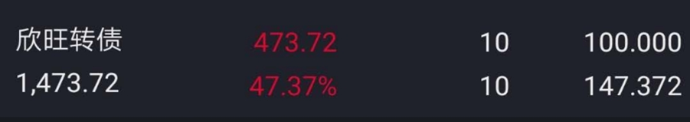

======================================================

_type: q&a
@宋航[48548414258158]
2020-08-10 10:40:37 Mon  
topic_id: 215555188215421

@宋航

>  二师父，准备年底在二线城市买房，但是看很多解读，说房价走在未来几年还会下降，所以想问问二师父对未来房价的看法

@二师父

>  哪个城市？不同城市不同地域不一样，未来几年房价会比较稳定了

阅读[4036]  评论[2]  赞[0] 

======================================================

_type: q&a
@云淡风轻[28281845224241]
2020-08-10 10:41:23 Mon  
topic_id: 582222815582124

@云淡风轻

>  二师父这个基金今天可以多买点吗？

@二师父

>  定投好一点，目前这个位置不适合大力建仓

阅读[4227]  评论[3]  赞[0] 

======================================================

_type: talk
@海马[15158245825242]
2020-08-10 11:03:15 Mon  
topic_id: 582222815818284

最近这段时间中了两只发债，不知是不是僧多粥少[呲牙]

阅读[4107]  评论[0]  赞[0] 

+++++++++++++++++++++++++++++++++++++++++++++++++++++

图片：
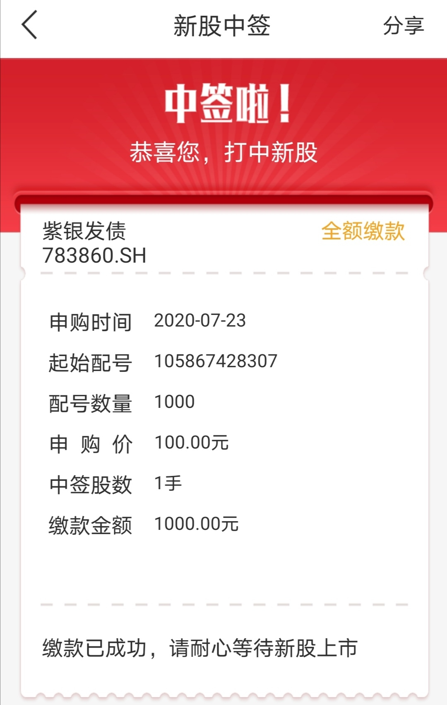
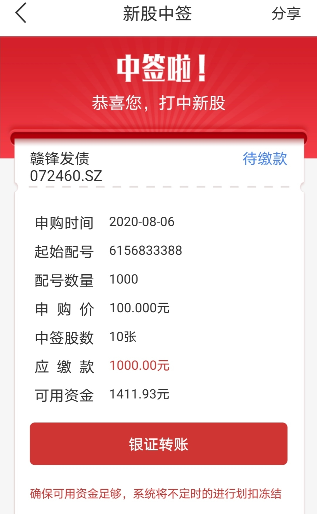

======================================================

_type: q&a
@六尘不改[241555484551821]
2020-08-10 11:10:17 Mon  
topic_id: 414444185181588

@六尘不改

>  今天可以买点新兴科技100etf吗

@二师父

>  观察仓可以，投资还是等等了

阅读[4390]  评论[1]  赞[0] 

======================================================

_type: q&a
@芙瑞雅阳阳潘[421181844812818]
2020-08-10 15:06:22 Mon  
topic_id: 182222842458222

@芙瑞雅阳阳潘

>  二师父，现在港股算是价值洼地吗？

@二师父

>  价值股洼地，成长股，科技，互联网，医疗股不便宜

阅读[4156]  评论[0]  赞[0] 

======================================================

_type: q&a
@onepiecewi*[244414114545811]
2020-08-10 15:06:47 Mon  
topic_id: 182222842445882

@onepiecewi*

>  师父，我是复星的，你觉得我们集团的复星医药股600196如何呢？

@二师父

>  星球发监管消息了，不许说股票

阅读[4386]  评论[2]  赞[0] 

======================================================

_type: q&a
@慕然[48282522421118]
2020-08-10 16:11:25 Mon  
topic_id: 215555128552551

@慕然

>  申购了好多年第一次中新股，请问二师父新股一般怎么卖出呢，均瑶健康，谢谢！

@二师父

>  开板以后卖，基本都吃肉，先恭喜了

阅读[4498]  评论[5]  赞[0] 

======================================================

_type: q&a
@范毅君[118551121224142]
2020-08-10 18:50:02 Mon  
topic_id: 815555122588222

@范毅君

>  二师父，A股新股申购，风险大吗？顶格申购有问题吗？还是需要分析，有些个股最好不要申购呀

@二师父

>  这不是你担心的问题，你要考虑怎样才能提高中签率

阅读[4663]  评论[5]  赞[0] 

======================================================

_type: talk
@二师父[28814221155551]
2020-08-10 21:01:52 Mon  
topic_id: 582222858422884

调整价位可以，但是需要投资金额跟着变，这就是压力测试。

@陈伟 at 2020-08-10 21:01:52 Mon

> 师父，是不是1.2及以下的价位建底仓，然后做网格？间隔5%

----------

@二师父 at 2020-08-10 21:01:52 Mon

> 做好压力测试可以的

----------

@陈伟 at 2020-08-10 21:01:52 Mon

> 师父，压力测试是不是指能不能接收50%的回撤？

----------

@二师父 at 2020-08-10 21:01:52 Mon

> 对的

----------

@陈伟 at 2020-08-10 21:01:52 Mon

> 明白了，谢谢师父

----------

@陈 at 2020-08-10 21:01:52 Mon

> 二师父，每次卖出一网是多少？

----------

@J at 2020-08-10 21:01:52 Mon

> 师傅提出的压力测试，有意思[得意]，以后有些热点板块希望师父也能给点最大回撤幅度的提示，先做压力测试再从容投资。比如最近的军工[呲牙]

----------

阅读[5303]  评论[7]  赞[0] 

+++++++++++++++++++++++++++++++++++++++++++++++++++++

文件：
2020-08-10 21:01:51 Mon
文件大小：[21616]
51422841588224-一个新的网格机会.docx

======================================================

_type: talk
@二师父[28814221155551]
2020-08-10 21:08:37 Mon  
topic_id: 582222858428184

<e type="hashtag" hid="224445218111" title="#全市场估值数据#" /> 市盈率百分位50.02%，市净率百分位36.57%，SY-BY百分位50.87%，SY/BY百分位45.85%。

@百变 at 2020-08-10 21:08:37 Mon

> 二师父：全市场估值数据的四个百分位在哪儿看？

----------

@二师父 at 2020-08-10 21:08:37 Mon

> 每天都发的啊

----------

@百变 at 2020-08-10 21:08:37 Mon

> 在哪个软件上能看到

----------

@二师父 at 2020-08-10 21:08:37 Mon

> 没有这种软件

----------

阅读[5345]  评论[4]  赞[0] 

======================================================

_type: talk
@希望[421125255451418]
2020-08-10 21:47:09 Mon  
topic_id: 815555121122122

师父，为什么静态市盈率这么高，动态的却是亏损？有的股票静态市盈率也是亏损，这个市盈率到底是怎么看的呢？

@二师父 at 2020-08-10 21:47:09 Mon

> 说明预计盈利糟糕

----------

阅读[4670]  评论[1]  赞[0] 

+++++++++++++++++++++++++++++++++++++++++++++++++++++

图片：
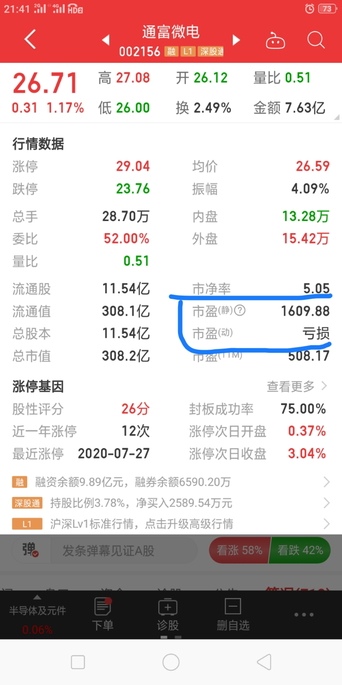

======================================================

_type: talk
@李震笛[422112248211828]
2020-08-11 06:55:31 Tue  
topic_id: 215555144842481

师傅，想参与白银的交易，有什么好的ETF或者股票吗？

@二师父 at 2020-08-11 06:55:31 Tue

> 黄金有，白银还没发现好标的

----------

阅读[4720]  评论[1]  赞[0] 

======================================================

_type: talk
@庆余年[15584481824122]
2020-08-11 15:21:54 Tue  
topic_id: 215555114584121

此情此景，我只想说一句，🐮🍺！

@雨淡风清 at 2020-08-11 15:21:54 Tue

> 二师父，我刚看到收盘信息。啥消息让升到3400跌了1.5。

----------

阅读[4408]  评论[1]  赞[0] 

+++++++++++++++++++++++++++++++++++++++++++++++++++++

图片：
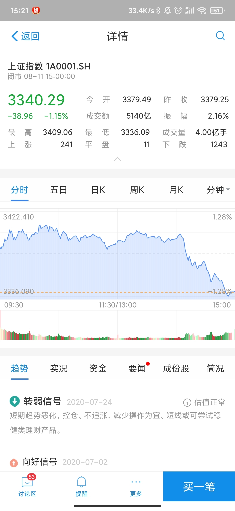

======================================================

_type: talk
@范毅君[118551121224142]
2020-08-11 15:39:30 Tue  
topic_id: 815555114851122

这过山车似的行情，今天想卖点平安银行，然而，手慢无[撇嘴][撇嘴][撇嘴]

@二师父 at 2020-08-11 15:39:30 Tue

> 可以波段下

----------

@范毅君 at 2020-08-11 15:39:30 Tue

> 谢谢二师父指点，是想做波段的。今天上午给学生上课，看到涨上来了，打了一个价格，结果下午一看，不仅没卖出去，还跌成这个球样子[呲牙][呲牙]最惨是以为银行会收涨两个点，场外卖出了一些，结果一看毛也没有😂

----------

阅读[4433]  评论[2]  赞[0] 

======================================================

_type: talk
@二师父[28814221155551]
2020-08-11 19:29:38 Tue  
topic_id: 582222888584124

<e type="hashtag" hid="28518455512281" title="#长期重仓的方向#" />

阅读[5420]  评论[0]  赞[0] 

+++++++++++++++++++++++++++++++++++++++++++++++++++++

文件：
2020-08-11 19:29:29 Tue
文件大小：[21813]
15122882525842-大盘冲高回落，聊一聊长持的重仓方向.docx

======================================================

_type: talk
@二师父[28814221155551]
2020-08-11 20:35:13 Tue  
topic_id: 582222888842424

<e type="hashtag" hid="224445218111" title="#全市场估值数据#" /> 市盈率百分位49.49%，市净率百分位34.59%，SY-BY百分位49.51%，SY/BY百分位44.37%。

阅读[5448]  评论[0]  赞[0] 

======================================================

_type: talk
@杜志彪[544454124115854]
2020-08-12 09:54:31 Wed  
topic_id: 582221211554424

<e type="hashtag" hid="281158522841" title="#每日打卡#" /> 8月12日第23次打卡
趋势结束，逆势开始，买入100医疗。

@rtdmm小米 at 2020-08-12 09:54:31 Wed

> 这么早加医药？高估哒

----------

@杜志彪 at 2020-08-12 09:54:31 Wed

> 100股表个态[微笑]

----------

@衣袂飘香 at 2020-08-12 09:54:31 Wed

> 哈哈

----------

阅读[4578]  评论[3]  赞[0] 

======================================================

_type: talk
@波多黎各[28428858544121]
2020-08-12 10:37:22 Wed  
topic_id: 582221211848514

估值表哈时候出来？师父？可以小加仓一波吗

@二师父 at 2020-08-12 10:37:22 Wed

> 收盘了

----------

阅读[4530]  评论[1]  赞[0] 

======================================================

_type: q&a
@李震笛[422112248211828]
2020-08-12 11:15:18 Wed  
topic_id: 414448485844148

@李震笛

>  师傅。今天黄金ETF回撤挺大的，是不是可以低吸？

@二师父

>  建观察仓看看，这个位置挺高了，不适合低吸

阅读[4901]  评论[0]  赞[0] 

======================================================

_type: talk
@sunny在路上[841885811111842]
2020-08-12 11:49:41 Wed  
topic_id: 582221215551854

这周末中美谈判了，如果还继续跌，这周基金你们会赎回吗？

@Sunflower at 2020-08-12 11:49:41 Wed

> 我会加仓

----------

@芙瑞雅阳阳潘 at 2020-08-12 11:49:41 Wed

> 定投、加仓，不赎

----------

@J at 2020-08-12 11:49:41 Wed

> 不会赎回，如果跌回到正常偏低继续加仓

----------

@sunny在路上 at 2020-08-12 11:49:41 Wed

> 大家都坚定持有！[偷笑]

----------

@Chu at 2020-08-12 11:49:41 Wed

> 越跌越加仓，止盈不止跌

----------

@秦风殇韵（刘豫斌） at 2020-08-12 11:49:41 Wed

> 今天开始新一轮券商网格了

----------

阅读[4685]  评论[6]  赞[0] 

======================================================

_type: q&a
@Rachel[51558542555524]
2020-08-12 12:51:51 Wed  
topic_id: 182225254528822

@Rachel

>  请问芯片基金 ， 科技100 基金， 5G， 人工智能基金， 现在可以买入吗 …

@二师父

>  定投可以，回撤还比较大

阅读[4919]  评论[0]  赞[0] 

======================================================

_type: solution
2020-08-12 18:24:31 Wed  
topic_id: 215558828482881

阅读[4627]  评论[0]  赞[0] 

======================================================

_type: talk
@二师父[28814221155551]
2020-08-12 19:17:26 Wed  
topic_id: 815558828145442

<e type="hashtag" hid="28518455245841" title="#8.12估值表#" /> 目前估值有所回落，可以回调小幅加仓。

@姥姥不疼. 爷爷不爱 at 2020-08-12 19:17:26 Wed

> 明日投啥，乌龟计划

----------

@二师父 at 2020-08-12 19:17:26 Wed

> 深红利和广发债券

----------

@姥姥不疼. 爷爷不爱 at 2020-08-12 19:17:26 Wed

> 是003376么？和深红利，这两个份数怎么投

----------

@二师父 at 2020-08-12 19:17:26 Wed

> 0.25份继续，这个位置不适合大力加仓，明天具体会公布的

----------

@姥姥不疼. 爷爷不爱 at 2020-08-12 19:17:26 Wed

> 可以只投广发，不投红利么？谢谢您

----------

@二师父 at 2020-08-12 19:17:26 Wed

> 可以的，目前这个位置不投股权也没问题

----------

@姥姥不疼. 爷爷不爱 at 2020-08-12 19:17:26 Wed

> 中金明上市，不会破发吧，

----------

@丸子妈 at 2020-08-12 19:17:26 Wed

> 为啥又选深红利？

----------

阅读[5534]  评论[13]  赞[0] 

+++++++++++++++++++++++++++++++++++++++++++++++++++++

图片：
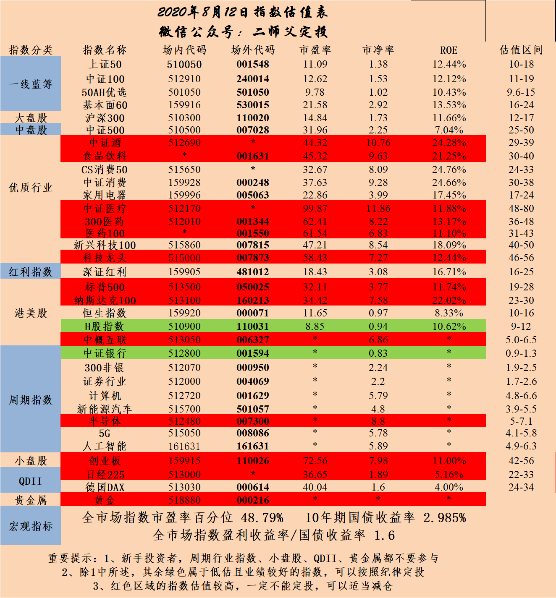

======================================================

_type: talk
@二师父[28814221155551]
2020-08-12 20:01:48 Wed  
topic_id: 815558822515222

<e type="hashtag" hid="15285122415242" title="#怎么补#" /> 这适合仓位低的朋友，仓位重的朋友继续定投债券，发现没有，股市下跌了，可是债券市场是涨的，可以对冲下，尤其再超级牛市下跌的时候这种对冲很有效

@Sunflower at 2020-08-12 20:01:48 Wed

> 目前情况我把所有之前定投的宽基指数继续开启定投模式，继续买买买😂

----------

@是喵喵吖～ at 2020-08-12 20:01:48 Wed

> 师父那招商是不是也不适合长期持有啊 感觉起起伏伏的 是不是等盈利15%卖了再买都行了

----------

@二师父 at 2020-08-12 20:01:48 Wed

> 我在坐波段

----------

@smile at 2020-08-12 20:01:48 Wed

> 为啥我买的广发中债今天是跌的[发呆]

----------

阅读[4983]  评论[4]  赞[0] 

+++++++++++++++++++++++++++++++++++++++++++++++++++++

文件：
2020-08-12 20:00:44 Wed
文件大小：[28649]
48244111882888-V型下跌，是否可以补仓.docx

======================================================

_type: talk
@二师父[28814221155551]
2020-08-12 22:29:52 Wed  
topic_id: 414448851211488

<e type="hashtag" hid="48418244521118" title="#定投需要止盈#" /> 定投指数坚持很容易，只要坚持定投扣款，最后都会盈利。然而卖出是个技术活。

定投是需要止盈的，不管什么基金，即使波动上涨，在遇到大熊市的时候也会跌的很厉害。所以最佳方式就是在上涨途中分步卖出。目标止盈过于机械化，让利润减损。

而上涨途中分步清仓，即使到高位反转的时候并未全部卖出，这时候基金仓位也会相对偏低，就可以趁着下跌而逆势加仓了。

阅读[4839]  评论[0]  赞[0] 

======================================================

_type: talk
@二师父[28814221155551]
2020-08-13 10:29:56 Thu  
topic_id: 582221148241854

<e type="hashtag" hid="28518455441851" title="#250期定投实盘#" /> 坚持定投，必有收获，目前股债双双配，等待市场选择了。

@J at 2020-08-13 10:29:56 Thu

> 师父，深红利回到低估了吗

----------

@百变 at 2020-08-13 10:29:56 Thu

> 师父：场内非银300和券商ETF不买吗？

----------

@二师父 at 2020-08-13 10:29:56 Thu

> 还没

----------

@二师父 at 2020-08-13 10:29:56 Thu

> 没有哈

----------

@百变 at 2020-08-13 10:29:56 Thu

> 非银300和券商ETF不都还在正常估值，就不能投了吗？

----------

@二师父 at 2020-08-13 10:29:56 Thu

> 轻仓定投可以的

----------

阅读[5456]  评论[6]  赞[0] 

+++++++++++++++++++++++++++++++++++++++++++++++++++++

图片：
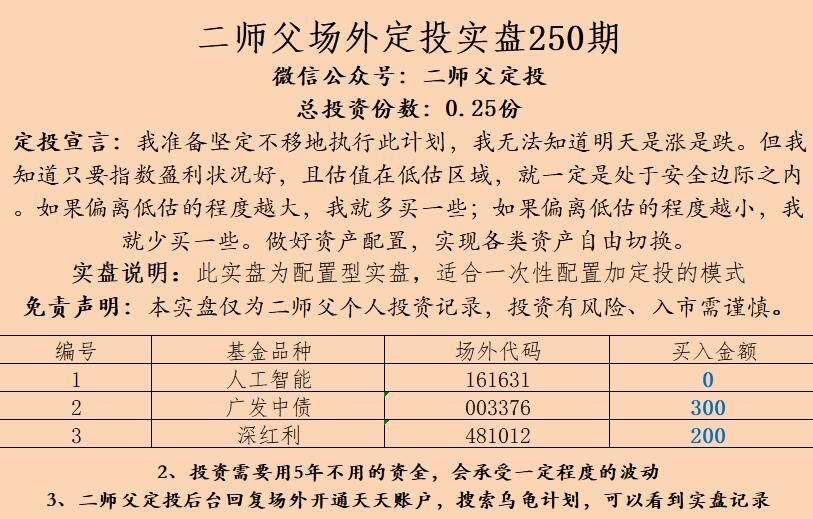

======================================================

_type: q&a
@幽兰[815554522442422]
2020-08-13 14:40:39 Thu  
topic_id: 182225582482242

@幽兰

>  请问二师父，中概互联现在适合入手吗，先建个观察仓？

@二师父

>  观察仓没问题

阅读[4768]  评论[2]  赞[0] 

======================================================

_type: q&a
@云淡风轻[28281845224241]
2020-08-13 15:51:51 Thu  
topic_id: 215558815118881

@云淡风轻

>  二师父我打开广发易淘金的APP后，搜索的中概互联基金截屏，上面怎么不显示IOPV和净值，还有折价率呢？

@二师父

>  股票软件没有这个功能的，在万得看

阅读[4744]  评论[1]  赞[0] 

======================================================

_type: q&a
@心荷[241825511182221]
2020-08-14 19:29:18 Fri  
topic_id: 215558254144811

@心荷

>  二师傅你好，请问中金转债什么价位卖出？谢谢啦

@二师父

>  现在可以直接卖了，不用等。

阅读[4248]  评论[1]  赞[0] 

======================================================

_type: talk
@二师父[28814221155551]
2020-08-14 19:30:13 Fri  
topic_id: 182225442154882

爱奇艺暴雷，中概股的机会，成交额下降是关键点。这意味着市场情绪持续减弱了。

@蛋炒饭不加蛋 at 2020-08-14 19:30:13 Fri

> 成交额下降，估值没有低估的话，也可以开干吗

----------

@二师父 at 2020-08-14 19:30:13 Fri

> 这个看你仓位，正常估值，空仓可以的

----------

@蛋炒饭不加蛋 at 2020-08-14 19:30:13 Fri

> 八成仓了，应该不动吧

----------

@Yesen at 2020-08-14 19:30:13 Fri

> 师父，中概互联投场内513050还是场外好

----------

@二师父 at 2020-08-14 19:30:13 Fri

> 没有溢价的话场内好的，场外卖出周期太长了。

----------

@Yesen at 2020-08-14 19:30:13 Fri

> 师父，如何判断是否溢价

----------

@二师父 at 2020-08-14 19:30:13 Fri

> 看万得app

----------

@J at 2020-08-14 19:30:13 Fri

> 师父，文中说的1.55和1.2是指场外还是场内的价格？

----------

阅读[5038]  评论[10]  赞[0] 

+++++++++++++++++++++++++++++++++++++++++++++++++++++

文件：
2020-08-14 19:29:32 Fri
文件大小：[22081]
48248484558288-爱奇艺爆了一个雷，中概的机会来了？.docx

======================================================

_type: talk
@二师父[28814221155551]
2020-08-14 22:17:02 Fri  
topic_id: 582221551558524

<e type="hashtag" hid="552114551414" title="#估值数据#" /> 市盈率百分位48.94%，市净率百分位31.12%，SY-BY百分位47.79%，SY/BY百分位43.01%。市场换手率、估值以及整体的情绪都下降了，符合震荡行情的特点的。

@云淡风轻 at 2020-08-14 22:17:02 Fri

> 唉看不懂[尴尬]

----------

@J at 2020-08-14 22:17:02 Fri

> 师父用中文总结了数据了[呲牙]

----------

阅读[4836]  评论[2]  赞[0] 

======================================================

_type: talk
@树叶[544811512145144]
2020-08-15 07:12:03 Sat  
topic_id: 582221558421144

<e type="hashtag" hid="142825811122" title="#定投周报#" /> 二师父定投周报第69期

阅读[4361]  评论[0]  赞[0] 

+++++++++++++++++++++++++++++++++++++++++++++++++++++

文件：
2020-08-15 07:11:58 Sat
文件大小：[215680]
28458582218851-二师父定投周报8.15（第69期）.docx

======================================================

_type: solution
2020-08-15 11:37:00 Sat  
topic_id: 182225412158242

@Sunflower at 2020-08-15 11:37:00 Sat

> 这个有好长时间了

----------

阅读[4246]  评论[1]  赞[0] 

======================================================

_type: q&a
@J[28281541518551]
2020-08-15 20:03:33 Sat  
topic_id: 414448528118488

@J

>  师父，请问最近恒生纳入了阿里巴巴、美团等股票，具体是纳入恒生指数还是H股指数？

@二师父

>  都有纳入的，恒生加入小米集团、药明生物和阿里巴巴。

阅读[4363]  评论[4]  赞[0] 

======================================================

_type: talk
@二师父[28814221155551]
2020-08-15 20:14:12 Sat  
topic_id: 215558241824481

<e type="hashtag" hid="48418248244248" title="#恒生指数和国企指数#" /> 具体的调仓情况，增加了医疗和互联网属性。

@J at 2020-08-15 20:14:12 Sat

> 师父，k12是哪个优秀行业？

----------

@二师父 at 2020-08-15 20:14:12 Sat

> 中小学教育

----------

@Zhu Yongsh* at 2020-08-15 20:14:12 Sat

> 这篇讲的很好，我也是这样过来的，现在逐步把一些中庸的宽基指数向优秀的赛道集中。只是现在消费和医疗比较贵了，券商，传媒，新能车和5G都还可以接受。

----------

@云淡风轻 at 2020-08-15 20:14:12 Sat

> 请问场内代码是513600吗？

----------

@云淡风轻 at 2020-08-15 20:14:12 Sat

> 还是159920那个代码呢，根据折价率判断应该买这只基金对吧？

----------

@二师父 at 2020-08-15 20:14:12 Sat

> 对的哈

----------

@二师父 at 2020-08-15 20:14:12 Sat

> 一个是华夏的，一个是南方的，选华夏的吧，这个看基金公司，费率还有跟踪误差的

----------

@云淡风轻 at 2020-08-15 20:14:12 Sat

> 知道了，谢谢老师[西瓜]

----------

阅读[5149]  评论[8]  赞[0] 

+++++++++++++++++++++++++++++++++++++++++++++++++++++

文件：
2020-08-15 20:04:26 Sat
文件大小：[21924]
88458584281552-恒生和国企指数调整，阿里和小米企业被纳入其中，利好两大指数.docx

======================================================

_type: talk
@二师父[28814221155551]
2020-08-16 20:13:20 Sun  
topic_id: 215558152282121

<e type="hashtag" hid="28518458124851" title="#全球股市的估值区域#" /> 注意巴罗动向，机构的变动多看，都是经过深思熟虑之后的操作。

@蛋炒饭不加蛋 at 2020-08-16 20:13:20 Sun

> 哪里可以看到机构的变动呢

----------

@二师父 at 2020-08-16 20:13:20 Sun

> 仓位在线可以查一些持仓股的变动

----------

@蛋炒饭不加蛋 at 2020-08-16 20:13:20 Sun

> 仓位在线是app？

----------

@二师父 at 2020-08-16 20:13:20 Sun

> 直接百度就有

----------

@蓝魔森林 at 2020-08-16 20:13:20 Sun

> 美股确实有点可怕了。真不知道何时爆。可能还会飞一会

----------

@二师父 at 2020-08-16 20:13:20 Sun

> 这个还真不好说

----------

阅读[4896]  评论[6]  赞[0] 

+++++++++++++++++++++++++++++++++++++++++++++++++++++

文件：
2020-08-16 20:12:24 Sun
文件大小：[23067]
88458528242542-全球股市目前在哪个区域，注意巴罗动向.docx

======================================================

_type: talk
@二师父[28814221155551]
2020-08-16 20:36:37 Sun  
topic_id: 815558152488252

<e type="hashtag" hid="15285124225482" title="#关于创业板注册制#" /> 8月24日组织创业板注册制首批企业上市，这意味着创业板的涨跌幅不再是20%了，之后一天的最大跌幅是40%，一个天地板就可以损失40%的利润，大家买股票的时候记得看清楚是不是创业板上市的股票，如果是的话就要警惕并控制好仓位。

对于创业板基金就好玩了，波动大，目前持有的大部分是医疗类股票，在安全边际内跌的越大加仓力度越大，等着跌下来投吧，保证合适的仓位，目前这个位置没有什么值得大力加仓的品种。

@雨淡风清 at 2020-08-16 20:36:37 Sun

> 要健康牛不要疯牛啊，今天有点高。不会又是一天高几天底吧

----------

@二师父 at 2020-08-16 20:36:37 Sun

> 不知道，可以先减，回了再加

----------

阅读[4946]  评论[2]  赞[0] 

======================================================

_type: talk
@范毅君[118551121224142]
2020-08-17 09:01:04 Mon  
topic_id: 414448188154158

这是本钢发债要涨的意思吗[坏笑]

@庆余年 at 2020-08-17 09:01:04 Mon

> 我已经亏了20块钱卖了，眼不见心不烦[晕][晕]

----------

@飞的那个飞 at 2020-08-17 09:01:04 Mon

> 我赚了4块

----------

阅读[4025]  评论[2]  赞[0] 

+++++++++++++++++++++++++++++++++++++++++++++++++++++

图片：
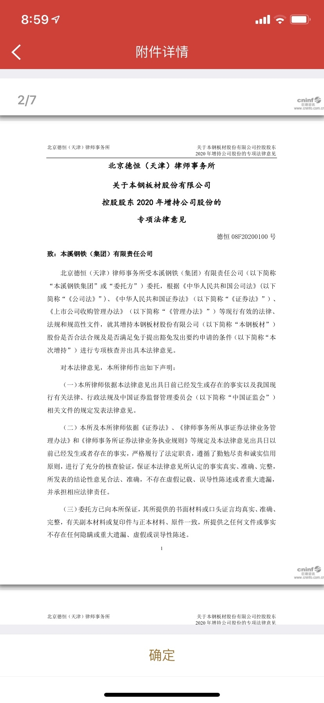

======================================================

_type: talk
@九妹Amy''[815584258228542]
2020-08-17 09:38:47 Mon  
topic_id: 582221815281414

请问师傅，科技100目前适合定投吗？还有是否值得长期持有？

@二师父 at 2020-08-17 09:38:47 Mon

> 目前就别投了

----------

@九妹Amy'' at 2020-08-17 09:38:47 Mon

> 好的，谢啦

----------

阅读[4007]  评论[2]  赞[0] 

======================================================

_type: q&a
@sunny在路上[841885811111842]
2020-08-17 10:56:37 Mon  
topic_id: 414448185142288

@sunny在路上

>  最近保险类基金可以入吗？医疗想出来换保险？可以吗

@二师父

>  可以的，出来了定投吧

阅读[4074]  评论[0]  赞[0] 

======================================================

_type: q&a
@丸子妈[28512522184441]
2020-08-17 10:57:00 Mon  
topic_id: 582221815512244

@丸子妈

>  今天卖了部分银行etf和部分券商etf,现阶段券商是不是还可以做波段？

@二师父

>  可以，银行也可以慢慢出，最近是波动行情

阅读[4210]  评论[1]  赞[0] 

======================================================

_type: q&a
@多读书[88482152228812]
2020-08-17 10:57:08 Mon  
topic_id: 582221815411814

@多读书

>  请问二师父，中金转债是继续持有到130，还是现在卖了止盈？

@二师父

>  可以卖了

阅读[4211]  评论[1]  赞[0] 

======================================================

_type: q&a
@宁静以致远[841158451581452]
2020-08-17 13:40:18 Mon  
topic_id: 215558184455221

@宁静以致远

>  二师父，这种可转债开盘当天出最好还是留着？

@二师父

>  可以直接卖了

阅读[4151]  评论[1]  赞[0] 

======================================================

_type: talk
@二师父[28814221155551]
2020-08-17 13:52:12 Mon  
topic_id: 182225851885842

<e type="hashtag" hid="881251425252" title="#鳄鱼计划#" /> 消费卖出两份，银行卖出一份，涨了就卖出，慢慢卖吧

@庆余年 at 2020-08-17 13:52:12 Mon

> 券商盈利46%了，需要卖出一部分麽，我券商持仓占鳄鱼计划的16%左右。

----------

@二师父 at 2020-08-17 13:52:12 Mon

> 可以的

----------

@🍀 凝🌸 慧🍀 at 2020-08-17 13:52:12 Mon

> 师父好，您的消费一共多少份啊？[愉快]

----------

@二师父 at 2020-08-17 13:52:12 Mon

> 17份

----------

阅读[4247]  评论[4]  赞[0] 

======================================================

_type: q&a
@范毅君[118551121224142]
2020-08-17 14:03:54 Mon  
topic_id: 414448181444488

@范毅君

>  二师父，我现在用的华泰证券，每笔股票交易手续费5元，有没有更便宜的，还是这就是很便宜的了呀😀

@二师父

>  有的，从我这里广发资金到达一定程度可免5

阅读[4259]  评论[3]  赞[0] 

======================================================

_type: q&a
@手牵手看夕阳[244112548184141]
2020-08-17 14:04:10 Mon  
topic_id: 815558184184582

@手牵手看夕阳

>  今天是什么情况，券商涨了很多？

@二师父

>  又一轮反弹了

阅读[4503]  评论[0]  赞[0] 

======================================================

_type: talk
@二师父[28814221155551]
2020-08-17 14:05:33 Mon  
topic_id: 815558125421582

<e type="hashtag" hid="28518855451481" title="#乌龟计划#" /> 卖出50ah优选六分之一仓位，卖出南方证券三分之一仓位。慢慢卖出调仓了。基金不是只买不卖

@百变 at 2020-08-17 14:05:33 Mon

> 二师父：场外基金今天卖出是按今天的收盘价吗？

----------

@二师父 at 2020-08-17 14:05:33 Mon

> 是的哈

----------

@百变 at 2020-08-17 14:05:33 Mon

> 好的

----------

@圣诞结® at 2020-08-17 14:05:33 Mon

> 白天忙没看星球 明天卖差别不大吧？

----------

阅读[4629]  评论[4]  赞[0] 

======================================================

_type: talk
@杜志彪[544454124115854]
2020-08-17 14:42:07 Mon  
topic_id: 182225842884522

<e type="hashtag" hid="281158522841" title="#每日打卡#" /> 8月17日第24次打卡，卖出消费20%本金，成交价格4.487（记录一下，4.935再卖20%）。

阅读[4624]  评论[0]  赞[0] 

======================================================

_type: talk
@二师父[28814221155551]
2020-08-17 16:22:06 Mon  
topic_id: 414448158512548

<e type="hashtag" hid="88518452822252" title="#一起看看几个利好#" /> 今天突破可以啊，再涨2.5%，就3500了，A股明天一定要给力。我看着你，别怂。

@sunny在路上 at 2020-08-17 16:22:06 Mon

> 明天突突突突！

----------

@百变 at 2020-08-17 16:22:06 Mon

> 二师父：农林牧渔板块的被动型指数基金有没有

----------

@衣袂飘香 at 2020-08-17 16:22:06 Mon

> 明天突突突突突……

----------

@栀子花开 at 2020-08-17 16:22:06 Mon

> 我看悬[调皮]，估计突破3500还得看9月份

----------

@二师父 at 2020-08-17 16:22:06 Mon

> 有大农业指数

----------

@百变 at 2020-08-17 16:22:06 Mon

> 有好的基金吗

----------

@二师父 at 2020-08-17 16:22:06 Mon

> 没发现

----------

@陈伟 at 2020-08-17 16:22:06 Mon

> 突破3500点，我们怎么操作？卖卖卖？

----------

阅读[5636]  评论[8]  赞[0] 

+++++++++++++++++++++++++++++++++++++++++++++++++++++

文件：
2020-08-17 16:21:39 Mon
文件大小：[23274]
48248452258118-利好来袭，A股刹不住车了.docx

======================================================

_type: q&a
@CY[48248584825128]
2020-08-17 16:46:43 Mon  
topic_id: 582221852888524

@CY

>  师傅请问对黄金怎么看？近期跳水至390有后市投资价值吗？

@二师父

>  黄金周期性太强了，避险价值有，长期投资价值不高。

阅读[4960]  评论[4]  赞[0] 

======================================================

_type: q&a
@罗大发[421484455521228]
2020-08-17 19:33:24 Mon  
topic_id: 815558122215222

@罗大发

>  师父，我中证银行到今天还亏百分之六，是不是还是拿着，等盈利了再卖？

@二师父

>  再等等吧，你买在啥位置了

阅读[4948]  评论[3]  赞[0] 

======================================================

_type: q&a
@圣诞结®[28448281541121]
2020-08-17 22:26:10 Mon  
topic_id: 414448151122888

@圣诞结®

>  二师父，我有一只005827易方达蓝筹精选，目前利润率46%左右，我想继续持仓，可以吗？您觉得后期它上涨空间还大吗？

@二师父

>  行情在的话都可以继续持仓

阅读[4974]  评论[0]  赞[0] 

======================================================

_type: talk
@onepiecewi*[244414114545811]
2020-08-18 09:50:48 Tue  
topic_id: 414448121555458

打卡<e type="hashtag" hid="281158522841" title="#每日打卡#" />

阅读[4755]  评论[0]  赞[0] 

======================================================

_type: talk
@百变[15285855281882]
2020-08-18 10:34:45 Tue  
topic_id: 414448121124858

二师父：指数估值表里的估值区间是不是格雷厄姆的安全边际？

@二师父 at 2020-08-18 10:34:45 Tue

> 左边的估值数据可以这样理解

----------

@百变 at 2020-08-18 10:34:45 Tue

> 右边的估值区间是什么？

----------

@二师父 at 2020-08-18 10:34:45 Tue

> 就是高估的阈值

----------

@百变 at 2020-08-18 10:34:45 Tue

> 明白了！就是高估的最低值和最高值！谢谢

----------

阅读[4875]  评论[4]  赞[0] 

======================================================

_type: talk
@雨淡风清[844418818858882]
2020-08-18 16:33:14 Tue  
topic_id: 582221884851544

第一次冲顶失败

阅读[4614]  评论[0]  赞[0] 

======================================================

_type: talk
@二师父[28814221155551]
2020-08-18 20:16:37 Tue  
topic_id: 582225222282544

<e type="hashtag" hid="28518451818221" title="#去留#" /> 反正冲击的时候我是减仓了的，这就是压力位置，如果市场减仓都太多的话，冲击就有点困难，做好仓位管理就行

@雨淡风清 at 2020-08-18 20:16:37 Tue

> 把白酒和医疗减了那还剩5层。国药不是说疫苗在阿联酋临床了，预计12月上市么，要一个人1000左右。医药是不是还会来一波，或者靴子落地了

----------

@云淡风轻 at 2020-08-18 20:16:37 Tue

> 二师父买什么债券合适？

----------

@二师父 at 2020-08-18 20:16:37 Tue

> 国债就可以

----------

@丸子妈 at 2020-08-18 20:16:37 Tue

> 我最近都在赎回，开始逐步减仓了

----------

@杜志彪 at 2020-08-18 20:16:37 Tue

> 借用二师父一句话舒服就好[微笑]

----------

阅读[5650]  评论[5]  赞[0] 

+++++++++++++++++++++++++++++++++++++++++++++++++++++

文件：
2020-08-18 20:16:17 Tue
文件大小：[24605]
88458844845842-大盘又一次冲击，是去是留.docx

======================================================

_type: talk
@二师父[28814221155551]
2020-08-18 22:45:08 Tue  
topic_id: 182224224828112

<e type="hashtag" hid="224445218111" title="#全市场估值数据#" /> 市盈率百分位50.19%，市净率百分位33.29%，SY-BY百分位50.81%，SY/BY百分位45.51%。

估值进一步上升，想卖可以卖，能接受回撤就一起冲了。

@六尘不改 at 2020-08-18 22:45:08 Tue

> 再涨10%我就卖

----------

@芙瑞雅阳阳潘 at 2020-08-18 22:45:08 Tue

> 我现在只有五成仓，而且十只定投，太分散，准备份额少的接受回撤，份额稍多点的听二师父指令，全部出了

----------

@西锦巴乌 at 2020-08-18 22:45:08 Tue

> 师父今天是什么节日？为什么沪深港通不交易，谢了

----------

@Chu at 2020-08-18 22:45:08 Tue

> 受台风海高斯影响，香港悬挂8号台风，港交所停止交易半天，听说下午恢复

----------

@衣袂飘香 at 2020-08-18 22:45:08 Tue

> 我跟二师父。

----------

阅读[4783]  评论[5]  赞[0] 

======================================================

_type: q&a
@徐美芳[51112822252224]
2020-08-19 11:34:14 Wed  
topic_id: 582225211841584

@徐美芳

>  二师傅，今天把昨天减仓的资金场内买国债适合吗？

@二师父

>  可以的，国债回撤比股票小一些，能接受波动就行

阅读[4748]  评论[0]  赞[0] 

======================================================

_type: talk
@sunny在路上[841885811111842]
2020-08-19 15:41:01 Wed  
topic_id: 182224258242252

被震荡的没有耐心了，7月中旬以来账户没有再盈利[捂脸]又不甘心这么下车，继续持有吧！

@六尘不改 at 2020-08-19 15:41:01 Wed

> 怎么又跌了，震荡起来没完没了，真是够够的

----------

@飞的那个飞 at 2020-08-19 15:41:01 Wed

> 如果不振荡没有办法集聚力量上行

----------

@杜志彪 at 2020-08-19 15:41:01 Wed

> 洗洗更健康[偷笑]

----------

@sunny在路上 at 2020-08-19 15:41:01 Wed

> 是啊，震荡一个月了

----------

阅读[4441]  评论[4]  赞[0] 

======================================================

_type: talk
@二师父[28814221155551]
2020-08-19 19:13:33 Wed  
topic_id: 414445458144428

<e type="hashtag" hid="15285128142842" title="#安全边际#" />

阅读[5437]  评论[0]  赞[0] 

+++++++++++++++++++++++++++++++++++++++++++++++++++++

文件：
2020-08-19 19:13:26 Wed
文件大小：[73357]
48248818121158-从食品饮料指数展开谈对安全边际的控制.docx

======================================================

_type: talk
@二师父[28814221155551]
2020-08-19 19:40:15 Wed  
topic_id: 582225251881224

<e type="hashtag" hid="825188852442" title="#估值表#" /> 再跌跌医疗进入正常估值可以开始小额定投了，跌跌更健康，把伪价值投资者给消灭。

@云淡风轻 at 2020-08-19 19:40:15 Wed

> 二师父估值表里怎么没有推荐的国债代码呢[微笑]

----------

@二师父 at 2020-08-19 19:40:15 Wed

> 16国债19或者国债etf

----------

@云淡风轻 at 2020-08-19 19:40:15 Wed

> 谢谢😊

----------

@雨淡风清 at 2020-08-19 19:40:15 Wed

> 今天开局就不好,,Ծ^Ծ,,。证券今天起不来就清了

----------

@芙瑞雅阳阳潘 at 2020-08-19 19:40:15 Wed

> 感觉估值也是变化很快的，如果长期定投又无所谓回撤的投资者，估值高低影响不是太大

----------

@闪闪的星光 at 2020-08-19 19:40:15 Wed

> 医疗的市盈率都是60的90的，为什么师傅会说再跌就会进入适中位置了？现在高估的还是很多呀

----------

@二师父 at 2020-08-19 19:40:15 Wed

> 跌百分之20

----------

阅读[5536]  评论[7]  赞[0] 

+++++++++++++++++++++++++++++++++++++++++++++++++++++

图片：
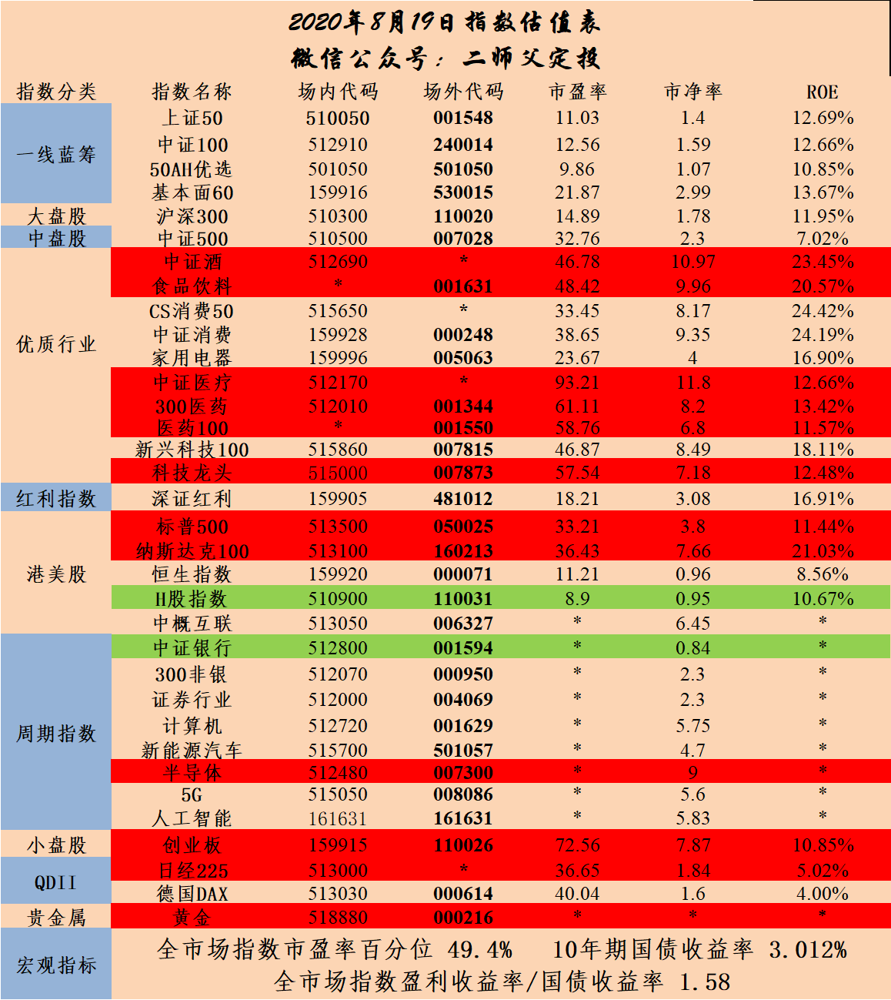

======================================================

_type: q&a
@闪闪的星光[88285424418582]
2020-08-19 23:04:27 Wed  
topic_id: 414445455588528

@闪闪的星光

>  请问二师父，能不能把恒生A股行业龙头指数加入到估值表里呀？
>  对标这个指数的基金业绩还是蛮好的呀

@二师父

>  这个参考消费指数的估值就行

阅读[4708]  评论[3]  赞[0] 

======================================================

_type: q&a
@闪闪的星光[88285424418582]
2020-08-19 23:06:41 Wed  
topic_id: 182224241518282

@闪闪的星光

>  请教二师父：
>  
>  上证50指数的基日是2003年12月31日，基点是1000点，2020年8月19日该指数的收盘点位是3307点，请问至2020年8月19日，该指数的年化收益率是多少？请老师介绍一下计算这个年化收益率的过程，谢谢？

@二师父

>  利用复利计算公式，（1+r）的n次方就行了

阅读[4748]  评论[5]  赞[0] 

======================================================

_type: talk
@二师父[28814221155551]
2020-08-20 10:33:56 Thu  
topic_id: 582225245552554

<e type="hashtag" hid="28518451148881" title="#251期定投实盘#" /> 希望这次砸的猛一点，手里现金比较多了，一起来加仓吧，不管市场怎么走，严格按照纪律就不会出问题，少赚一点没事，安全第一。

@幽兰 at 2020-08-20 10:33:56 Thu

> 已经跟了，就是不知道为啥选的深红利？

----------

@二师父 at 2020-08-20 10:33:56 Thu

> 这个相当于组合成一个混合基金，进可攻，退可守

----------

@百变 at 2020-08-20 10:33:56 Thu

> 二师父：为什么不买场内的深红利？不是场外的比场内的手续费贵10倍吗

----------

@Sunflower at 2020-08-20 10:33:56 Thu

> 二师父买的是定投实盘展示

----------

@丸子妈 at 2020-08-20 10:33:56 Thu

> 为啥不买人工智能？深红利买的场内的

----------

@二师父 at 2020-08-20 10:33:56 Thu

> 人工智能目前没到击球区

----------

@雨淡风清 at 2020-08-20 10:33:56 Thu

> 就因为一句，制裁中俄大A就直接萎了吗

----------

阅读[4577]  评论[7]  赞[0] 

+++++++++++++++++++++++++++++++++++++++++++++++++++++

图片：
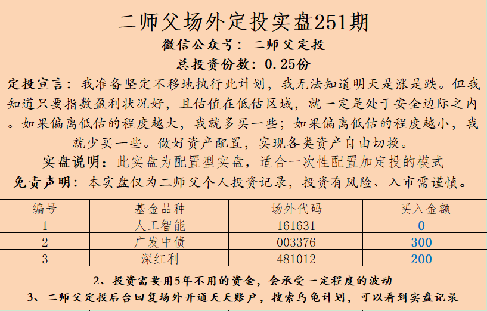

======================================================

_type: q&a
@onepiecewi*[244414114545811]
2020-08-20 10:51:57 Thu  
topic_id: 582225245544584

@onepiecewi*

>  师父，这个债今天上市了，是持有还是卖掉呢

@二师父

>  可以卖了

阅读[4673]  评论[5]  赞[0] 

======================================================

_type: q&a
@夏萍[28221454818281]
2020-08-20 14:13:56 Thu  
topic_id: 215552815212281

@夏萍

>  师父现在这个价位买格力电器可以吗？

@二师父

>  星球不说个股，已经被星球官方提醒，再说的话星球就玩不下去了

阅读[4564]  评论[0]  赞[0] 

======================================================

_type: q&a
@波多黎各[28428858544121]
2020-08-20 14:43:55 Thu  
topic_id: 215552815411451

@波多黎各

>  师父今天可以小加仓吗？有点心动

@二师父

>  可以啊，深红利这种，沪深300这种，高估的白酒和医疗等等吧

阅读[4649]  评论[6]  赞[0] 

======================================================

_type: q&a
@未来[241125852115181]
2020-08-21 10:32:44 Fri  
topic_id: 215552251252851

@未来

>  今天新债上市可以购买吗

@二师父

>  新债发行都可以申购

阅读[4104]  评论[2]  赞[0] 

======================================================

_type: q&a
@A0洪氏日杂批发[544885222181514]
2020-08-21 10:32:51 Fri  
topic_id: 414445541558228

@A0洪氏日杂批发

>  老师，开通创业板打新，需要10万元资金，还需要存放20日，我转账10万到券商，这10万需要买股票才能开通吗？

@二师父

>  不用的

阅读[4390]  评论[0]  赞[0] 

======================================================

_type: talk
@孟小电[414481244128288]
2020-08-21 13:36:40 Fri  
topic_id: 815552282881452

师父今天格力电器可以买吗

@汪小灰 at 2020-08-21 13:36:40 Fri

> 星球不说个股，已经被星球官方提醒，再说的话星球就玩不下去了

----------

@Vincent at 2020-08-21 13:36:40 Fri

> 哈哈，前几天买了，亏了

----------

@杜志彪 at 2020-08-21 13:36:40 Fri

> 怎么都混到年线以下了[闭嘴]

----------

@是喵喵吖～ at 2020-08-21 13:36:40 Fri

> 我买过 想长期持有 但是感觉还不如高的时候卖了 现在跌得又到了我买的价格了 🙄️

----------

阅读[4126]  评论[4]  赞[0] 

======================================================

_type: q&a
@Rachel[51558542555524]
2020-08-21 15:29:10 Fri  
topic_id: 182224452551182

@Rachel

>  请问芯片基金可以买吗 现在？

@二师父

>  芯片等等，地量之后加仓

阅读[4285]  评论[2]  赞[0] 

======================================================

_type: talk
@二师父[28814221155551]
2020-08-21 20:57:09 Fri  
topic_id: 182224445555212

<e type="hashtag" hid="48418284552418" title="#缩量上涨#" /> 其实每篇文章中都有一些知识点，每天看看，慢慢地都学会了。

知识的积累需要时间的，我们学习语数外花了将近12年还多，而学习财商、情商真的可能5年都不到，其实认真学习一年基本入门，而想着一两个月把别人学了很多年的东西都掌握真的有点不现实哈。

地量提到过，一半是回调成交量在前期高位成交量的三分之一。

@百变 at 2020-08-21 20:57:09 Fri

> 大盘每日成交量在哪看？

----------

@sunny在路上 at 2020-08-21 20:57:09 Fri

> 二师傅看好这次牛市能持续多久？到2021年初吗？

----------

@二师父 at 2020-08-21 20:57:09 Fri

> 万得

----------

@二师父 at 2020-08-21 20:57:09 Fri

> 这个预测不了

----------

阅读[5077]  评论[4]  赞[0] 

+++++++++++++++++++++++++++++++++++++++++++++++++++++

文件：
2020-08-21 20:55:20 Fri
文件大小：[25146]
28458251445521-缩量上涨，回调还未结束.docx

======================================================

_type: talk
@二师父[28814221155551]
2020-08-21 21:05:12 Fri  
topic_id: 182224445558142

<e type="hashtag" hid="144254515412" title="#全市场估值#" /> 市盈率百分位49.59%，市净率百分位31.14%，SY-BY百分位50.78%，SY/BY百分位45.97%。

一直震荡，估值也是在这个位置徘徊，等待市场的选择。

阅读[4392]  评论[0]  赞[0] 

======================================================

_type: q&a
@呵呵→_→[15414558111442]
2020-08-21 23:28:35 Fri  
topic_id: 215552222555241

@呵呵→_→

>  师傅，，买的16国债19  93.3买的，现在92.85，我这看了利润还有690呢，是什么意思呢，刚看了一下股息入账817，是什么意思呢

@二师父

>  这是因为有利息，净价结算，全价交易，所以比看到的净价要高

阅读[4441]  评论[4]  赞[0] 

======================================================

_type: talk
@树叶[544811512145144]
2020-08-22 13:33:52 Sat  
topic_id: 582225541125854

<e type="hashtag" hid="142825811122" title="#定投周报#" /> 二师父定投周报第70期

阅读[4293]  评论[0]  赞[0] 

+++++++++++++++++++++++++++++++++++++++++++++++++++++

文件：
2020-08-22 13:33:49 Sat
文件大小：[231688]
51421512421144-二师父定投周报8.22（第70期）.docx

======================================================

_type: talk
@二师父[28814221155551]
2020-08-22 20:59:24 Sat  
topic_id: 414445521282488

<e type="hashtag" hid="15285152821812" title="#理财在未来20年的意义#" /> 良好的投资水平未来是核心技能之一

@J at 2020-08-22 20:59:24 Sat

> 师父，什么时候讲一下私募基金的投资理财

----------

@二师父 at 2020-08-22 20:59:24 Sat

> 私募的门槛比较高，100万起，有兴趣我可以给你介绍

----------

@J at 2020-08-22 20:59:24 Sat

> J回复二师父定投: 谢谢师父，想先了解一下，私募基金的安全性和收益率跟公募基金对比怎样？

----------

@二师父 at 2020-08-22 20:59:24 Sat

> 安全，但是不保本

----------

@Amanda at 2020-08-22 20:59:24 Sat

> 希望老师可以多讲讲私募基金

----------

@二师父 at 2020-08-22 20:59:24 Sat

> 好的

----------

@J at 2020-08-22 20:59:24 Sat

> 好的。希望师父能找时间讲一下私募跟公募哪个更有优势？适合哪些投资者？

----------

@二师父 at 2020-08-22 20:59:24 Sat

> 私募适合高净值投资者，比较灵活，费率高一些

----------

阅读[4989]  评论[8]  赞[0] 

+++++++++++++++++++++++++++++++++++++++++++++++++++++

文件：
2020-08-22 20:58:58 Sat
文件大小：[386277]
48248585252848-你可以放弃股票，但是别放弃理财.docx

======================================================

_type: talk
@二师父[28814221155551]
2020-08-23 20:49:25 Sun  
topic_id: 182224125282882

<e type="hashtag" hid="28518488854551" title="#获利最重要的因素#" /> 昨天一读者留言说自己投资了15年，结果被套了15年，太难了，其实转换思维就行啦。

@杜志彪 at 2020-08-23 20:49:25 Sun

> 投资路上遇到对的引领的人很重要[微笑]还要加上自我的反思和学习，如果做鸵鸟25年也是一样。

----------

阅读[4928]  评论[1]  赞[0] 

+++++++++++++++++++++++++++++++++++++++++++++++++++++

文件：
2020-08-23 20:47:12 Sun
文件大小：[26728]
51421518285224-投资中稳稳获利最重要的因素.docx

======================================================

_type: talk
@二师父[28814221155551]
2020-08-23 21:29:45 Sun  
topic_id: 815552452111822

<e type="hashtag" hid="15285155521112" title="#周一即将开始实行的创业板注册制#" /> 8月24开盘之后，创业板注册制就要开始实行了。除了前五日不设涨跌幅以外，存量的创业板股票也将涨跌幅度放宽到20%。

这种变化将对投资个股是很大的挑战，因为只要企业基本面恶化，或者公司有一些负面消息，就会对股价产生很大的影响，一个跌停20%，这对于心理承受能力弱的投资者而言是非常难受。

这种变化是中国金融市场的成熟化，包括未来逐步放开T+0以及可以做空交易，每一次变革都是中国资本市场的成熟，二师父倒觉得，未来主板放宽涨跌幅以后，基金投资会成为主流，因为市场单个企业波动幅度过大，退市机制完善，踩雷是不可避免的。而投资指数或者公募基金就可以避免这个问题。

未来还是会出现两极分化，一方面头部企业市值万亿以上，而劣质企业逐步退市，要么龙头股，要么优质的宽基指数+行业指数，要么优质的公募基金。

这是市场变化以后的选择，方向对了，就不怕路远，别在错误的路上迷失了方向。

@J at 2020-08-23 21:29:45 Sun

> 师父，公募基金成为主流后要获取高于市场平均值的超额收益是不是意味着更难了？

----------

@二师父 at 2020-08-23 21:29:45 Sun

> 是的哈，如果市场越不理性越容易出现超额收益

----------

阅读[4874]  评论[2]  赞[0] 

======================================================

_type: talk
@二师父[28814221155551]
2020-08-23 21:35:49 Sun  
topic_id: 215552454552451

哥们婚前，酒店被淹了，神奇的重庆

@sky at 2020-08-23 21:35:49 Sun

> [呲牙]

----------

@J at 2020-08-23 21:35:49 Sun

> 水为财[偷笑]

----------

@衣袂飘香 at 2020-08-23 21:35:49 Sun

> 神奇哈

----------

阅读[4376]  评论[3]  赞[0] 

+++++++++++++++++++++++++++++++++++++++++++++++++++++

图片：

======================================================

_type: q&a
@风动幡动心不动[844418442154182]
2020-08-23 22:33:01 Sun  
topic_id: 215552454884851

@风动幡动心不动

>  二师傅好！中了齐翔发债，感觉比较垃圾，需要弃购吗？

@二师父

>  我觉得不用，上市卖掉即可，如果你担心的话可以不用缴款，这种在选择打新前就要考虑好，转债盲打靠概率取胜，就能赚很多的

阅读[4407]  评论[1]  赞[0] 

======================================================

_type: q&a
@闪闪的星光[88285424418582]
2020-08-24 07:13:43 Mon  
topic_id: 815552451158452

@闪闪的星光

>  师傅好，这几天中概互联50指数下跌了很多，不知道是什么原因导致的？
>  请问师傅，现在可以加大买入006327易方达中证海外互联人民币A吗？

@二师父

>  有中美关系的原因，还有一个事情比较大，头条状告特朗普政府，美国反击对中概股影响很大
>  
>  目前还不适合加大买入中概互联

阅读[4410]  评论[5]  赞[0] 

======================================================

_type: q&a
@A0洪氏日杂批发[544885222181514]
2020-08-24 14:21:37 Mon  
topic_id: 815552482151442

@A0洪氏日杂批发

>  老师，您对打新股怎么看，有什么好的建议？

@二师父

>  A股打新，盲打，概率取胜。港美股打新，选优质的打，主要看招股书，看看基石投资者，保荐人，企业商业模式和之前业绩。

阅读[4212]  评论[0]  赞[0] 

======================================================

_type: talk
@二师父[28814221155551]
2020-08-24 14:29:51 Mon  
topic_id: 414445281451848

<e type="hashtag" hid="88518488224552" title="#今天讲创业板分享了一个价值+成长策略#" /> 有时候简单的策略，最有效，如果一直挣钱就用自己的策略，如果刚开始学习，就用这个策略，可以保证稳稳盈利，年化10%以上，符合上海丈母娘招女婿的标准啦。

@蛋炒饭不加蛋 at 2020-08-24 14:29:51 Mon

> 请问师傅创50+上证50一样吗？

----------

@一心一意 at 2020-08-24 14:29:51 Mon

> 创业板组合，有代码么，

----------

@二师父 at 2020-08-24 14:29:51 Mon

> 就是创业板基金

----------

@二师父 at 2020-08-24 14:29:51 Mon

> 上证50更加偏重沪市，中证100更均衡一点

----------

@蛋炒饭不加蛋 at 2020-08-24 14:29:51 Mon

> 创业板和创50哪个比较好？

----------

@二师父 at 2020-08-24 14:29:51 Mon

> 创业板

----------

@J at 2020-08-24 14:29:51 Mon

> 师父你说现在创业板适合做波段吗

----------

@二师父 at 2020-08-24 14:29:51 Mon

> 不怕被套可以，这个位置挺高的，用发生大回撤能接受的仓位

----------

阅读[5101]  评论[11]  赞[0] 

+++++++++++++++++++++++++++++++++++++++++++++++++++++

文件：
2020-08-24 14:28:10 Mon
文件大小：[109015]
48248558182488-注册制在创业板首秀，最高涨幅500%，A股就是猛.docx

======================================================

_type: talk
@onepiecewi*[244414114545811]
2020-08-24 15:09:17 Mon  
topic_id: 815552481815142

别人的暴富就跟破产一样
来得那么突然

@衣袂飘香 at 2020-08-24 15:09:17 Mon

> 哈

----------

@J at 2020-08-24 15:09:17 Mon

> 哈哈

----------

阅读[4174]  评论[2]  赞[0] 

+++++++++++++++++++++++++++++++++++++++++++++++++++++

图片：
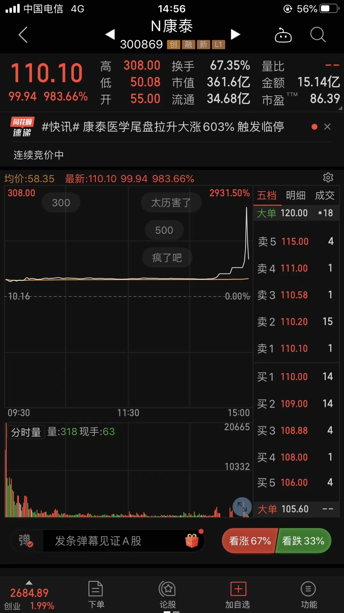

======================================================

_type: talk
@Jarvis Liu[111141548852852]
2020-08-24 17:19:50 Mon  
topic_id: 582225851854544

二师父，打中科创板股票一枚，请问下，科创板股票如何卖出。科创板新股上市有5天的不涉涨幅限制，不知道和主板是不是相同的方式卖出，开板就卖掉。

@二师父 at 2020-08-24 17:19:50 Mon

> 保守点开板卖掉已经够赚了，激进点连板时候走弱卖掉

----------

@Jarvis Liu at 2020-08-24 17:19:50 Mon

> 收到，谢谢二师父[愉快]

----------

@A0洪氏日杂批发 at 2020-08-24 17:19:50 Mon

> 运气真好

----------

阅读[4160]  评论[3]  赞[0] 

======================================================

_type: talk
@二师父[28814221155551]
2020-08-24 22:53:15 Mon  
topic_id: 215552121552151

<e type="hashtag" hid="144254515412" title="#全市场估值#" /> 市盈率百分位50.79%，市净率百分位33.31%，SY-BY百分位52.28%，SY/BY百分位47.87%。

农夫山泉要IPO了，可以搞起来，至于打新什么时候卖，如果股票不够优质，开板即可卖出，如果股票足够优质，可以一直拿着的，比如上市的泰格医药、美团、良品铺子等等都是涨了很多，总之，不优质赶紧走，赚了走，赔了走的要更快。优质的可以拿一拿。

阅读[4808]  评论[0]  赞[0] 

======================================================

_type: q&a
@防汛抗旱[111848815428452]
2020-08-25 13:58:21 Tue  
topic_id: 582225845418544

@防汛抗旱

>  师父，有个问题：您常说求10%年收益不难，但是不能保证满仓都有这个收益，仓位低咋办

@二师父

>  这个很好解决，底部区域仓位上起来，不到一波大牛顶不降到5以下，这是最适合散户的方式了

阅读[3907]  评论[3]  赞[0] 

======================================================

_type: q&a
@芙瑞雅阳阳潘[421181844812818]
2020-08-25 13:59:10 Tue  
topic_id: 815552144852512

@芙瑞雅阳阳潘

>  二师父，打新是要持有份额的吧？这个份额买哪支呢？不敢轻易买呀

@二师父

>  是的哈，以前文章有提到过的，就是那些稳健的价值股，深市和沪市各配置一只即可

阅读[4154]  评论[4]  赞[0] 

======================================================

_type: talk
@二师父[28814221155551]
2020-08-25 17:48:50 Tue  
topic_id: 414445115542458

<e type="hashtag" hid="88518484288182" title="#农夫山泉#" /> 今天有约吗，没有的话和农夫山泉约一波吧。港股打新开港户早的有优势，现在有的地方门槛提高了。

@蒲公英 at 2020-08-25 17:48:50 Tue

> 开通香港账户必须有护照吗

----------

@二师父 at 2020-08-25 17:48:50 Tue

> 对的，还有签证

----------

@蒲公英 at 2020-08-25 17:48:50 Tue

> 开不了香港账户，大陆的账户可以吗？

----------

阅读[4689]  评论[3]  赞[0] 

+++++++++++++++++++++++++++++++++++++++++++++++++++++

文件：
2020-08-25 17:47:52 Tue
文件大小：[28049]
51421541218184-甜甜的农夫山泉来了，约吗.docx

======================================================

_type: talk
@陈[844415515418422]
2020-08-25 20:35:06 Tue  
topic_id: 582225888482544

二师父，怎么开通港股。

@二师父 at 2020-08-25 20:35:06 Tue

> 置顶有渠道

----------

@雨淡风清 at 2020-08-25 20:35:06 Tue

> 银行不好搞

----------

阅读[3799]  评论[2]  赞[0] 

======================================================

_type: talk
@Lion超超[48418188882428]
2020-08-26 00:32:16 Wed  
topic_id: 414442448558448

为什么比亚迪的市盈率在200多。要200多年才能赚回股票的价值。但是他的市净率在4不算高。
总结下来 目前比亚迪的价格比估值高 是这个逻辑吗二师父

@二师父 at 2020-08-26 00:32:16 Wed

> 价值股是的，成长股市盈率作为参考，不完全是这样，最重要看peg，市盈率相对于盈利增长比率

----------

@Lion超超 at 2020-08-26 00:32:16 Wed

> 收到。看他的每年盈利增速。在哪里可以看到呢

----------

@二师父 at 2020-08-26 00:32:16 Wed

> 财务报表里面都有

----------

@蓝魔森林 at 2020-08-26 00:32:16 Wed

> 简单理解，就是市盈率过高，说明资本市场看好他未来几年增长翻倍。不然不可能拿着等200年的。极端例子就是，明年盈率翻200倍，那一年投资就回本。

----------

阅读[3809]  评论[4]  赞[0] 

+++++++++++++++++++++++++++++++++++++++++++++++++++++

图片：
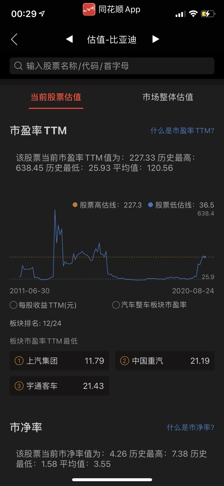

======================================================

_type: q&a
@J[28281541518551]
2020-08-26 14:20:56 Wed  
topic_id: 414442485214128

@J

>  师父，请问场内券商512000和159993哪个更好？

@二师父

>  512000更好的

阅读[3783]  评论[1]  赞[0] 

======================================================

_type: q&a
@一剪梅[844115184528882]
2020-08-26 14:21:25 Wed  
topic_id: 182221254445882

@一剪梅

>  师父，16国债19现在可以建底仓吗？

@二师父

>  可以的，确定底仓的仓位，要在2层下比较好

阅读[3879]  评论[3]  赞[0] 

======================================================

_type: q&a
@是喵喵吖～[421441114141158]
2020-08-26 14:55:49 Wed  
topic_id: 815554582415412

@是喵喵吖～

>  二师父您好呀 感觉市场老处于这种不上不下的状态 会一直这样吗 因为感觉这样的话 很多基金不低估手里有一点存款也没法定投🤷🏻‍♂️🤷🏻‍♂️

@二师父

>  是的，前期上涨太多了，现在震荡洗盘，可以等回调到支撑位适量加仓

阅读[3963]  评论[1]  赞[0] 

======================================================

_type: q&a
@Rachel[51558542555524]
2020-08-26 14:56:20 Wed  
topic_id: 414442485142458

@Rachel

>  芯片基金可以投吗 现在？ 159801？

@二师父

>  好像问了很多次，轻仓定投参与可以，这个基金风险挺高的

阅读[4025]  评论[0]  赞[0] 

======================================================

_type: q&a
@TDG[88855524248842]
2020-08-26 14:57:11 Wed  
topic_id: 215554582128841

@TDG

>  请问二师父，开通港股账户这个该怎么选呢？不太懂，请指点一二，谢谢！

@二师父

>  不需要融资打新就开港股现金账户了，需要融资借款打新那就开融资账户

阅读[4266]  评论[0]  赞[0] 

======================================================

_type: talk
@二师父[28814221155551]
2020-08-26 19:20:34 Wed  
topic_id: 182221258124282

<e type="hashtag" hid="51281414854824" title="#关于低估的机会#" />

@庆余年 at 2020-08-26 19:20:34 Wed

> 二师父，支撑位怎么判断？可否举例说明一下

----------

@J at 2020-08-26 19:20:34 Wed

> 同问[微笑]

----------

@二师父 at 2020-08-26 19:20:34 Wed

> 比方说创业板在上升期，下跌的时候开始成交量回升，大家买入增加，多头为主，就是一个支撑位。

----------

@蓝魔森林 at 2020-08-26 19:20:34 Wed

> 创业板基金现在有吗？

----------

@二师父 at 2020-08-26 19:20:34 Wed

> 这个很多啊，易方达，天弘，华安的

----------

@蓝魔森林 at 2020-08-26 19:20:34 Wed

> 师傅有代码吗[撇嘴]

----------

@二师父 at 2020-08-26 19:20:34 Wed

> 估值表有啊

----------

阅读[4855]  评论[7]  赞[0] 

+++++++++++++++++++++++++++++++++++++++++++++++++++++

文件：
2020-08-26 19:20:33 Wed
文件大小：[125215]
28458215884241-白酒、创业板这些指数还能等到低估的机会吗.docx

======================================================

_type: talk
@二师父[28814221155551]
2020-08-26 21:41:22 Wed  
topic_id: 215554528141141

<e type="hashtag" hid="224445218111" title="#全市场估值数据#" /> 全市场市盈率百分位49.64%，市净率百分位33.4%，SY-BY百分位51.9%，SY/BY百分位47.95%。

市场一直波动，大家还是耐心等待为佳，如果仓位不足的，就可以在回撤的时候一次建个底仓，防止踏空，空仓等待的人极度有耐心，很少有人能够做到空仓不追涨的。

@Philip🎭 Y at 2020-08-26 21:41:22 Wed

> 教大家空仓不追涨的心法——删掉买基金的app

----------

@栀子花开 at 2020-08-26 21:41:22 Wed

> 过不了2天你又会装回来的[调皮]

----------

阅读[4949]  评论[2]  赞[0] 

======================================================

_type: q&a
@素兮[548121415528244]
2020-08-26 21:43:07 Wed  
topic_id: 414442482425158

@素兮

>  二师父能推荐一只科创板封闭基金么？先关注起来，等合适的机会场内买入。

@二师父

>  科创混合501073，现在是封闭期了

阅读[4429]  评论[2]  赞[0] 

======================================================

_type: q&a
@C&S[51442188184824]
2020-08-26 21:48:06 Wed  
topic_id: 215554584211511

@C&S

>  请教，有没有以自动驾驶和新能源车为主题，全球选股或者跨市场配置的主动基金？

@二师父

>  这种我还没发现，A股的新能源相关基金是有的

阅读[4633]  评论[1]  赞[0] 

======================================================

_type: talk
@二师父[28814221155551]
2020-08-26 22:36:09 Wed  
topic_id: 815554522225282

<e type="hashtag" hid="825188852442" title="#估值表#" /> 指数估值来啦，最近有些朋友买的芯片基金亏了20%，高估的基金最好不要碰，碰的话也要设定8%的止损位，定投肯定不合适。

@范毅君 at 2020-08-26 22:36:09 Wed

> 现在感觉没啥可买的，上涨减仓，感觉降下来不多，也没补[捂脸]二师父、是不是还得等机会

----------

@二师父 at 2020-08-26 22:36:09 Wed

> 看仓位，6成以上仓位可以不补了

----------

@范毅君 at 2020-08-26 22:36:09 Wed

> 现在也就三四成了，如果补，啥比较合适呀、二师父

----------

@二师父 at 2020-08-26 22:36:09 Wed

> 低估的，正常估值回调多的

----------

@幽兰 at 2020-08-26 22:36:09 Wed

> 中概互联2块多了，可以卖了吗？

----------

@二师父 at 2020-08-26 22:36:09 Wed

> 可以逐步清仓了

----------

@范毅君 at 2020-08-26 22:36:09 Wed

> 好的，谢谢

----------

@sunny在路上 at 2020-08-26 22:36:09 Wed

> 新能源汽车是不是可以买？还是定投合适？

----------

阅读[5286]  评论[13]  赞[0] 

+++++++++++++++++++++++++++++++++++++++++++++++++++++

图片：
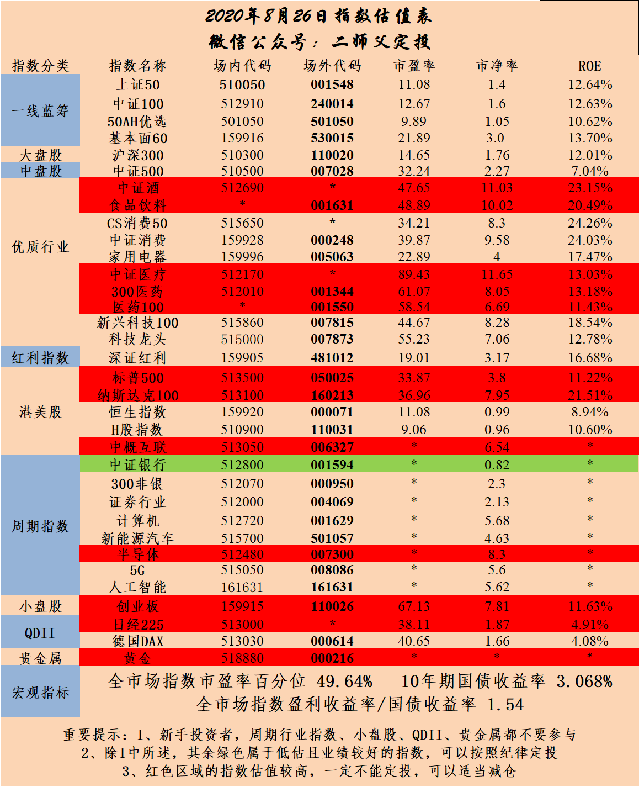

======================================================

_type: q&a
@Sunflower[244185124281811]
2020-08-26 22:41:52 Wed  
topic_id: 815554522581822

@Sunflower

>  二师父您好，今天招商中证白酒161725拆分折算，这个折算就相当于红利再投资吧？折算之后如果中长期持有是否适合开启定投呢？

@二师父

>  这是分级基金的折算，有上折和下折，总体来说对母基金收益没有影响，白酒现在不便宜的

阅读[4701]  评论[0]  赞[0] 

======================================================

_type: talk
@二师父[28814221155551]
2020-08-27 07:52:40 Thu  
topic_id: 182221241841442

<e type="hashtag" hid="28518855451481" title="#乌龟计划#" /> 整体买入0.25份，深红利200元，广发中债300元。相当于一个偏债混合基金，目前震荡就这样组合配置等待市场选择。

@姥姥不疼. 爷爷不爱 at 2020-08-27 07:52:40 Thu

> 可不可以仅投广发债[微笑]

----------

@二师父 at 2020-08-27 07:52:40 Thu

> 股权仓位多可以的，目前也不便宜

----------

@笔记 at 2020-08-27 07:52:40 Thu

> 债券现在还能投吗，感觉十年期国债往下空间有限啊，不知道要不要买。

----------

@二师父 at 2020-08-27 07:52:40 Thu

> 可以定投，定投就是下跌期投，如果知道要涨了就不需要定投，直接买得了

----------

阅读[4761]  评论[4]  赞[0] 

======================================================

_type: q&a
@梅子[118548488224242]
2020-08-27 12:18:29 Thu  
topic_id: 215554542525481

@梅子

>  师父，现在可以买广发可转债基金吗？为什么😣谢谢

@二师父

>  可以定投，可转债基金风险比股票低，进可攻退可守，最好的机会是中证转债340以下开始

阅读[4576]  评论[4]  赞[0] 

======================================================

_type: talk
@二师父[28814221155551]
2020-08-27 12:19:42 Thu  
topic_id: 414442425822228

大盘涨涨跌跌，其实就考验耐心，投资就是这样，百分之80的日子平淡无奇，而行情就在百分之20的时间内

阅读[4687]  评论[0]  赞[0] 

======================================================

_type: talk
@二师父[28814221155551]
2020-08-27 23:07:08 Thu  
topic_id: 815554511818242

全市场估值数据，市盈率百分位50.74%，市净率百分位36.05%，SY-BY百分位53.62%，SY/BY百分位49.9%，一直震荡，保持仓位等待市场选择就好，不知道怎么操作的时候不操作就是最好的。

@样 at 2020-08-27 23:07:08 Thu

> 一动不如一静

----------

阅读[5200]  评论[1]  赞[0] 

======================================================

_type: q&a
@HeLLO[15548451524442]
2020-08-28 10:03:45 Fri  
topic_id: 414442848552488

@HeLLO

>  师父，对于科创板的中签股票，什么时候卖合适，今天刚上市最高90%多，现80%多

@二师父

>  恭喜啊，赚够了就卖，看着飞不起来了就走人，这利润真可以的

阅读[4347]  评论[5]  赞[0] 

======================================================

_type: talk
@二师父[28814221155551]
2020-08-28 18:18:11 Fri  
topic_id: 215554282121551

<e type="hashtag" hid="15285158151442" title="#今天涨了#" /> 有时间的可以波段下，上班比较忙，所以就没有波段了，时间多的可以试试支撑位吸筹，反正小仓位，跌下去了也没多大事，起来了就赚了。

@秦风殇韵（刘豫斌） at 2020-08-28 18:18:11 Fri

> 最近都是周四定投，周五happy过周末

----------

@孤芳自赏 at 2020-08-28 18:18:11 Fri

> 小白弱弱的问一句支撑位怎么看？

----------

@二师父 at 2020-08-28 18:18:11 Fri

> 买入多于卖出

----------

阅读[5142]  评论[3]  赞[0] 

+++++++++++++++++++++++++++++++++++++++++++++++++++++

文件：
2020-08-28 18:17:04 Fri
文件大小：[21974]
48248248444558-券商股拉升，是不是意味着行情一定到来.docx

======================================================

_type: talk
@二师父[28814221155551]
2020-08-28 18:33:21 Fri  
topic_id: 215554282144551

<e type="hashtag" hid="552114551414" title="#估值数据#" /> 市盈率百分位51.44%，市净率百分位37.28%，SY-BY百分位54.56%，SY/BY百分位51.12%。数据是越来越高了哈，有人问超级牛市是啥样子，就是这些百分位都接近100%，至少也是80%以上，所以大家可以看看目前走到哪里啦。

@J at 2020-08-28 18:33:21 Fri

> 师父，市净率还不到50%，请问是不是意味着仍在比较便宜的阶段呢？

----------

@二师父 at 2020-08-28 18:33:21 Fri

> 不是了

----------

阅读[5092]  评论[2]  赞[0] 

======================================================

_type: talk
@二师父[28814221155551]
2020-08-29 20:58:08 Sat  
topic_id: 182221415821822

<e type="hashtag" hid="15285158884522" title="#关于私募和公募#" /> 今天参加了一场私募交流会，大家对私募刚好有兴趣可以介绍下，私募的话比较灵活，收取的管理费较高，是按照固定费率+上利润提成，一般提成20%，如果没有固定管理费，提成大约25%。也就意味着赚1万，要交出2500元的费用。这也是合理的。关于私募基金的安全性，资金都是第三方托管的，所以没必要担心安全。

但是注意不要投资风格飘逸的私募，而且大部分私募的封闭期在3到6年，所以要做好规划，根据自己的投资需求，如果资金量大100到1000之间的可以考虑私募，如果在100以下的，定投指数和投资股票就行。

任何投资都有风险，如果投资私募，那么要跟踪下管理人，管理人更换也趁早走人。私募的话更像专业做投资的，就至少是不上班不担心没饭吃的那种，而工薪阶层是不适合这样的，毕竟没时间天天研究，看个人需求。

@J at 2020-08-29 20:58:08 Sat

> 师父，管理费挺高的占利润1/4，那私募的年化收益率超越公募基金多少呢？

----------

@二师父 at 2020-08-29 20:58:08 Sat

> 不同产品不同

----------

@Amanda at 2020-08-29 20:58:08 Sat

> 师父，有空可以介绍一下具体的产品吗？例如稳健的，激进的？谢谢！

----------

@二师父 at 2020-08-29 20:58:08 Sat

> 私募产品不公开讲

----------

@芙瑞雅阳阳潘 at 2020-08-29 20:58:08 Sat

> 最近一直想了解私募基金，拓宽一下自己和客户们的投资视野，看了二师父的这个介绍，目前初步有了点了解[微笑]

----------

@芙瑞雅阳阳潘 at 2020-08-29 20:58:08 Sat

> 那怎么个私聊法呢？[呲牙]

----------

@二师父 at 2020-08-29 20:58:08 Sat

> 星球私信

----------

@芙瑞雅阳阳潘 at 2020-08-29 20:58:08 Sat

> 好哒

----------

阅读[4022]  评论[8]  赞[0] 

======================================================

_type: talk
@树叶[544811512145144]
2020-08-29 21:23:34 Sat  
topic_id: 815554242552812

<e type="hashtag" hid="142825811122" title="#定投周报#" /> 二师父定投周报第71期

阅读[4092]  评论[0]  赞[0] 

+++++++++++++++++++++++++++++++++++++++++++++++++++++

文件：
2020-08-29 21:23:31 Sat
文件大小：[243002]
15125128121852-二师父定投周报8.29（第71期）.docx

======================================================

_type: q&a
@六尘不改[241555484551821]
2020-08-29 22:41:47 Sat  
topic_id: 414442525445248

@六尘不改

>  港股打新赚钱吗，最近看好多推荐的

@二师父

>  赚的，好股票上市能赚不少

阅读[4199]  评论[6]  赞[0] 

======================================================

_type: talk
@lily[548488251242584]
2020-08-31 09:35:42 Mon  
topic_id: 215554451251151

师父，今天可以买良平铺子吗？

阅读[3702]  评论[0]  赞[0] 

======================================================

_type: talk
@二师父[28814221155551]
2020-08-31 10:05:01 Mon  
topic_id: 414442241258818

<e type="hashtag" hid="222815251121" title="#新债申购#" /> 景兴发债记得打新，一月两签也不错的

@J at 2020-08-31 10:05:01 Mon

> 师父，以前一两个月起码中一次，最近账户上的资金多了一些反而好多个月都没中过新债，是券商的问题吗？

----------

@二师父 at 2020-08-31 10:05:01 Mon

> 参与的多了

----------

@J at 2020-08-31 10:05:01 Mon

> [流泪]

----------

阅读[3879]  评论[3]  赞[0] 

======================================================

_type: talk
@百变[15285855281882]
2020-08-31 10:18:39 Mon  
topic_id: 815554451184522

二师父：512290和512010哪个先建个观察仓合适？

阅读[3853]  评论[0]  赞[0] 

======================================================

_type: talk
@杜志彪[544454124115854]
2020-08-31 10:31:15 Mon  
topic_id: 414442241128828

<e type="hashtag" hid="281158522841" title="#每日打卡#" />  8月31日第25次打卡，真快17日刚卖完20%，今天消费又涨了10%，继续卖出消费20%本金，成交价格4.935 （记录一下，5.428再卖20%）。

@rtdmm小米 at 2020-08-31 10:31:15 Mon

> 爽歪歪

----------

@sunny在路上 at 2020-08-31 10:31:15 Mon

> 卖出后是等调整再买入吗？

----------

@杜志彪 at 2020-08-31 10:31:15 Mon

> 等回到正常估值再说。

----------

@杜志彪 at 2020-08-31 10:31:15 Mon

> 我2019年刚开始学定投，目前围绕十六字方针操作，卖出策略也是在一点一点总结，前期医药高估以后是分3次卖出（目前还没回到正常估值），消费我想分5次卖出。

----------

@梧桐 at 2020-08-31 10:31:15 Mon

> 看26日的估值表，消费正常估值

----------

阅读[4009]  评论[5]  赞[0] 

======================================================

_type: q&a
@幽兰[815554522442422]
2020-08-31 12:27:40 Mon  
topic_id: 414442241114258

@幽兰

>  中概互联，1块9买的，现在涨了12%，是不是该抛了？

@二师父

>  可以分步止盈，这是小波段，这个价位买入的没有必要长持

阅读[4129]  评论[0]  赞[0] 

======================================================

_type: q&a
@xu[2441485251]
2020-08-31 12:29:50 Mon  
topic_id: 182221152142812

@xu

>  二师傅，申万菱信中证军工指数分级目前三层仓，小有盈利，请问还是继续持有，还是清仓？谢谢！

@二师父

>  目前还是利好军工板块的，可以继续持有，这个周期性指数，注意如果下跌在回撤到达成本线之前可以卖出保住利润。

阅读[4162]  评论[1]  赞[0] 

======================================================

_type: q&a
@隔窗遥望[241884481854181]
2020-08-31 16:31:24 Mon  
topic_id: 414442282245828

@隔窗遥望

>  今天本钢转债变成了这个新昌，请教师父，这是什么意思，后续怎么操作

@二师父

>  你看下127018，钱不着急用可以当债券持有

阅读[4294]  评论[0]  赞[0] 

======================================================

_type: talk
@二师父[28814221155551]
2020-08-31 20:58:05 Mon  
topic_id: 815554425522842

给大家聊聊，最近的几件大事，慢慢的在这个过程中形成金融思维。投资就是投未来，理财就是理生活。

@Chu at 2020-08-31 20:58:05 Mon

> 问一下银行的智能存款属于高风险类别吗

----------

@二师父 at 2020-08-31 20:58:05 Mon

> 这个不属于的

----------

@百变 at 2020-08-31 20:58:05 Mon

> 二师父：512290和512010哪个先建个观察仓合适？

----------

@二师父 at 2020-08-31 20:58:05 Mon

> 512010

----------

@百变 at 2020-08-31 20:58:05 Mon

> 好的，谢谢

----------

@Jarvis Liu at 2020-08-31 20:58:05 Mon

> @二师父，可以通过哪些渠道或是网站可以时刻关注这几家投资公司的动向呢？

----------

@二师父 at 2020-08-31 20:58:05 Mon

> wind或者仓位在线

----------

@Jarvis Liu at 2020-08-31 20:58:05 Mon

> 收到，谢谢！

----------

阅读[4359]  评论[9]  赞[0] 

+++++++++++++++++++++++++++++++++++++++++++++++++++++

文件：
2020-08-31 20:57:25 Mon
文件大小：[29593]
48248181181818-最近的几件大事.docx

======================================================

