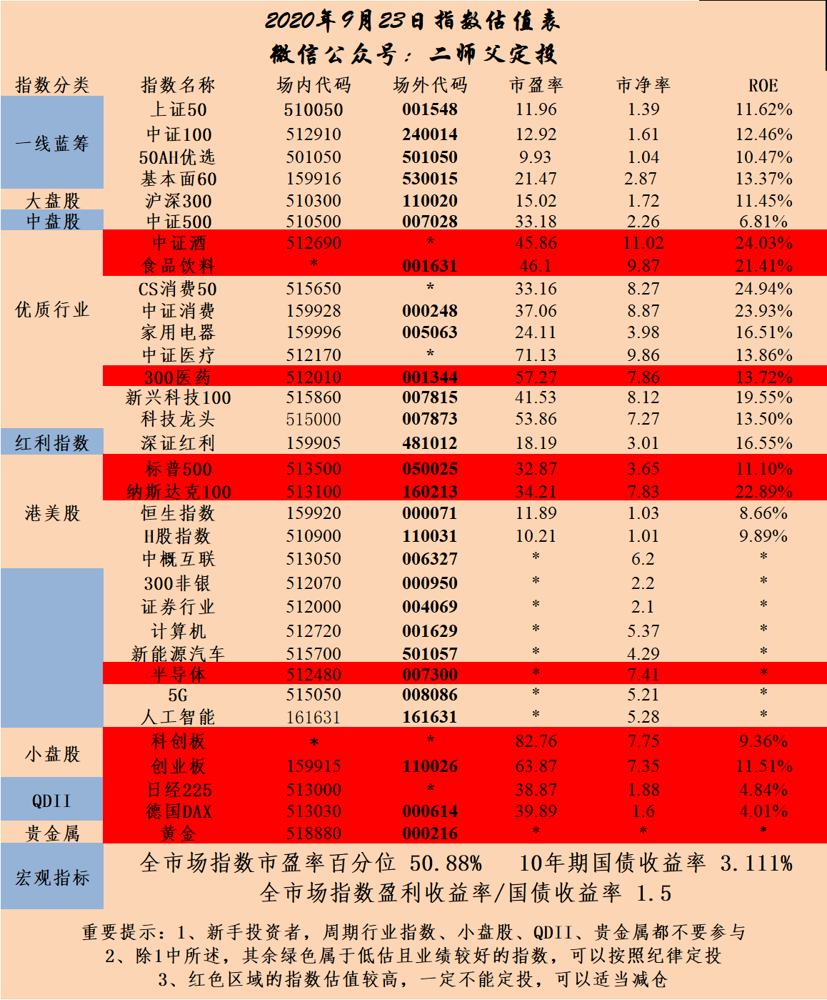

_type: talk
@二师父[28814221155551]
2020-09-01 08:38:41 Tue  
topic_id: 182221148241142

<e type="hashtag" hid="224445218111" title="#全市场估值数据#" /> 市盈率百分位50.75%，市净率百分位34.7%，SY-BY百分位53.13%，SY/BY百分位49.29%。

这个位置震荡，所以估值数据变化不大，参考SY-BY百分位低于30%，投资性价比就起来了，高于70%，持有性价比就慢慢降低了。

目前仍旧可以耐心持有的，2018年1月的SY-BY百分位大概是68%，那是一个阶段性高点，目前还没有突破。

阅读[4181]  评论[0]  赞[0] 

======================================================

_type: talk
@Lion超超[48418188882428]
2020-09-01 11:27:13 Tue  
topic_id: 414442228111888

前几天刚问市盈率，今天就来个涨停[流泪][流泪][流泪]

@光少 at 2020-09-01 11:27:13 Tue

> 现在太高了

----------

阅读[4097]  评论[1]  赞[0] 

+++++++++++++++++++++++++++++++++++++++++++++++++++++

图片：

======================================================

_type: q&a
@孤芳自赏[548114442211184]
2020-09-01 12:57:44 Tue  
topic_id: 815554442225222

@孤芳自赏

>  请问今天立昂申购707358可以打新吗？

@二师父

>  可以的

阅读[4215]  评论[1]  赞[0] 

======================================================

_type: q&a
@Vivian[582228554481154]
2020-09-01 12:58:31 Tue  
topic_id: 815554442888142

@Vivian

>  二师父，请问科技股etf现在可以补仓吗？调整好久了。谢谢

@二师父

>  只能轻仓投，他一直震荡，调整不多

阅读[4280]  评论[2]  赞[0] 

======================================================

_type: talk
@sunny在路上[841885811111842]
2020-09-01 15:30:49 Tue  
topic_id: 414442222825888

今天尾盘拉的什么情况？[悠闲]

阅读[4037]  评论[0]  赞[0] 

======================================================

_type: q&a
@防汛抗旱[111848815428452]
2020-09-01 20:11:13 Tue  
topic_id: 582224444544154

@防汛抗旱

>  二师父怎么看战略配售基金，可否买？

@二师父

>  一般般，可以关注下未来的科创50。

阅读[4167]  评论[0]  赞[0] 

======================================================

_type: talk
@二师父[28814221155551]
2020-09-01 20:11:50 Tue  
topic_id: 182221885122252

<e type="hashtag" hid="15285144121812" title="#新能源板块#" /> 新能源板块的投资价值

@宋航 at 2020-09-01 20:11:50 Tue

> 930997 这个指数搜索不到，是搜索错了吗？

----------

@二师父 at 2020-09-01 20:11:50 Tue

> 中证官网

----------

@王模堂 at 2020-09-01 20:11:50 Tue

> 930997场内可以买得到吗？

----------

@幽兰 at 2020-09-01 20:11:50 Tue

> 只能在官网买吗，现在适合建仓观察吗？

----------

@二师父 at 2020-09-01 20:11:50 Tue

> 可以在代销机构买

----------

@二师父 at 2020-09-01 20:11:50 Tue

> 有场内的新能源基金

----------

@蓝魔森林 at 2020-09-01 20:11:50 Tue

> 这个指数目前市盈率目前接近140，要谨慎，属于显著高估，501057是场内基金追踪之一

----------

阅读[4447]  评论[7]  赞[0] 

+++++++++++++++++++++++++++++++++++++++++++++++++++++

文件：
2020-09-01 20:11:24 Tue
文件大小：[29597]
51421854454454-特斯拉又大涨，可以看看与之相关的A股指数.docx

======================================================

_type: talk
@二师父[28814221155551]
2020-09-01 20:36:51 Tue  
topic_id: 215554118425851

<e type="hashtag" hid="224445218111" title="#全市场估值数据#" /> 市盈率百分位51.26%，市净率百分位35.41%，SY-BY百分位53.72%，SY/BY百分位49.64%。

震荡市场，所以估值变化不大，耐心持有是最好的了，相信减仓的前期已经减的差不多，那就等待回调加仓，上涨享受资金继续增值了。

@丸子妈 at 2020-09-01 20:36:51 Tue

> 回调可以加仓吗？

----------

@二师父 at 2020-09-01 20:36:51 Tue

> 深度回调可以

----------

阅读[4350]  评论[2]  赞[0] 

======================================================

_type: talk
@二师父[28814221155551]
2020-09-02 20:53:11 Wed  
topic_id: 215551584428821

<e type="hashtag" hid="28518424581811" title="#场内投资品种注意风险#" /> 注意溢价风险，国泰纳斯达克的溢价率。

@蓝魔森林 at 2020-09-02 20:53:11 Wed

> 二师傅，我觉得有潜力的不算很贵的中概股还可以特殊考虑下

----------

@Amanda at 2020-09-02 20:53:11 Wed

> 师父，美股不适合买入，美债呢？

----------

@再见 . 青春 at 2020-09-02 20:53:11 Wed

> 二师父，您说美股存在着随时回调的巨大风险，那么对A股影响大吗？会像3月份时候，被美股拖下水吗

----------

@二师父 at 2020-09-02 20:53:11 Wed

> 目前也不合适

----------

@二师父 at 2020-09-02 20:53:11 Wed

> 不会的，3月大跌是突发公共卫生事件的恐慌情绪释放导致市场大跌

----------

阅读[3978]  评论[5]  赞[0] 

+++++++++++++++++++++++++++++++++++++++++++++++++++++

文件：
2020-09-02 20:52:23 Wed
文件大小：[68498]
15125814845812-场内投资这类品种需谨慎，别当了接盘侠.docx

======================================================

_type: talk
@二师父[28814221155551]
2020-09-02 21:20:28 Wed  
topic_id: 582228214858154

<e type="hashtag" hid="88518424581442" title="#全市场估值分位#" /> 市盈率百分位50.95%，市净率百分位34.7%，SY-BY百分位54.56%，SY/BY百分位51.3%。

继续波动中，耐心等待市场选择。

阅读[4057]  评论[0]  赞[0] 

======================================================

_type: talk
@二师父[28814221155551]
2020-09-02 22:06:30 Wed  
topic_id: 414441481841548

<e type="hashtag" hid="881125525822" title="#估值#" /> 每日估值表，医疗进入正常

@百变 at 2020-09-02 22:06:30 Wed

> 二师父：医疗进入了正常值，但价格刚回调了0.0464.那么是什么原因导致市盈率降到正常值呢？

----------

@衣袂飘香 at 2020-09-02 22:06:30 Wed

> 买不买？

----------

@蓝魔森林 at 2020-09-02 22:06:30 Wed

> 同问

----------

@蓝魔森林 at 2020-09-02 22:06:30 Wed

> 是因为分母业绩涨了吗？

----------

@二师父 at 2020-09-02 22:06:30 Wed

> 业绩报告公布

----------

@二师父 at 2020-09-02 22:06:30 Wed

> 明天轻仓开始

----------

@百变 at 2020-09-02 22:06:30 Wed

> 业绩报告一年公布几次？建仓买多少？我现在的指数仓位是3成

----------

@六尘不改 at 2020-09-02 22:06:30 Wed

> 五成仓现在是留是走啊师傅

----------

阅读[4280]  评论[18]  赞[0] 

+++++++++++++++++++++++++++++++++++++++++++++++++++++

图片：

======================================================

_type: talk
@幽兰[815554522442422]
2020-09-03 10:59:55 Thu  
topic_id: 182228241818222

二师父今天不发车吗？

@二师父 at 2020-09-03 10:59:55 Thu

> 发

----------

阅读[3767]  评论[1]  赞[0] 

======================================================

_type: q&a
@姥姥不疼. 爷爷不爱[48544481458248]
2020-09-03 11:38:51 Thu  
topic_id: 414441452822458

@姥姥不疼. 爷爷不爱

>  今天咋定投，二师父

@二师父

>  医疗和债券

阅读[3935]  评论[4]  赞[0] 

======================================================

_type: q&a
@李垚垚[548145221582444]
2020-09-03 11:39:12 Thu  
topic_id: 414441452821218

@李垚垚

>  二师父好🌹他们说的医药是哪一个，谢谢！

@二师父

>  场外精准医疗，场内医疗etf

阅读[4148]  评论[0]  赞[0] 

======================================================

_type: talk
@二师父[28814221155551]
2020-09-03 11:42:39 Thu  
topic_id: 582228258112444

<e type="hashtag" hid="28518855451481" title="#乌龟计划#" /> 场外定投每周四一直是定投的，风雨无阻，除非投资之后没法跑赢货币基金，否则都会出手

继续买入0.25份，遵守纪律，百分之60的精准医疗，百分之40的广发国开债。

注意目前定投总额和单只金额双限制，所以很安全，底仓是一定不能这时候建立，除非做趋势，定投只能轻仓，医疗位置不低，大家注意体会

@Amanda at 2020-09-03 11:42:39 Thu

> 师父，第一次买医疗，是汇添富中证精准医疗指数吗？这个时间适合选择a还是c？

----------

@幽兰 at 2020-09-03 11:42:39 Thu

> 医疗的推荐个代码？

----------

@二师父 at 2020-09-03 11:42:39 Thu

> 短期做就c

----------

@二师父 at 2020-09-03 11:42:39 Thu

> 场外汇添富精准医疗

----------

@雨淡风清 at 2020-09-03 11:42:39 Thu

> 跟上了，设置的每周定投。

----------

@杜志彪 at 2020-09-03 11:42:39 Thu

> 是挺高的，虽然估值进入正常，但价格并没有下来，调整也不充分没踩60就上去了，我准备把周期拉长一点，2个星期投一份，也相当于每星期0.5份。

----------

阅读[4252]  评论[6]  赞[0] 

======================================================

_type: q&a
@不知道不明了[15584248411812]
2020-09-03 13:42:07 Thu  
topic_id: 182228248882282

@不知道不明了

>  二师父，今天的您定投的医疗，场内的代码是多少呀？

@二师父

>  我投的这个是精准医疗，场内没有，你可以看看估值表里面的中证医疗etf，这个是不错的

阅读[4082]  评论[4]  赞[0] 

======================================================

_type: q&a
@xu[2441485251]
2020-09-03 15:18:30 Thu  
topic_id: 414441425455858

@xu

>  请问二师傅，中证医疗ETF场内定投需要注意什么，谢谢！

@二师父

>  轻仓投资，记得止盈，因为目前在一个相对高的位置

阅读[3998]  评论[0]  赞[0] 

======================================================

_type: talk
@那方山的树，佛陀座下*[244412158214221]
2020-09-03 15:23:15 Thu  
topic_id: 182228214215482

二师傅，如何续费啊

@那方山的树，佛陀座下* at 2020-09-03 15:23:15 Thu

> 我点击续费，没法支付

----------

@二师父 at 2020-09-03 15:23:15 Thu

> 置顶第一篇文章，有个续费二维码，苹果用户用登录微信扫描续费即可

----------

@六尘不改 at 2020-09-03 15:23:15 Thu

> 我续费了，能识别我的星球账号吗

----------

阅读[3950]  评论[3]  赞[0] 

======================================================

_type: talk
@那方山的树，佛陀座下*[244412158214221]
2020-09-03 19:45:31 Thu  
topic_id: 182228211155582

钱扣了，但是显示报错，不知道是否续费成功，麻烦二师傅确认一下

@二师父 at 2020-09-03 19:45:31 Thu

> 成功了，有啥错误

----------

阅读[3871]  评论[1]  赞[0] 

======================================================

_type: q&a
@香香[118822418121212]
2020-09-03 21:05:48 Thu  
topic_id: 582228244841584

@香香

>  请教二师父，我是每周四按指令键一键购买，发理里面有很多指数基金，你是比例已搭配好，我直接购买它们就行了吗？

@二师父

>  第一次购买的话一次买入，后面跟着我每周买的就行，之前没有买的不用补了，不然买入价会差别太大

阅读[4051]  评论[1]  赞[0] 

======================================================

_type: talk
@二师父[28814221155551]
2020-09-03 22:47:36 Thu  
topic_id: 182228285451442

今天拍到的彩虹🌈据说看到这个会有好运分享给大家

阅读[4029]  评论[0]  赞[0] 

+++++++++++++++++++++++++++++++++++++++++++++++++++++

图片：

======================================================

_type: talk
@二师父[28814221155551]
2020-09-03 22:54:35 Thu  
topic_id: 182228285441582

<e type="hashtag" hid="88518424581442" title="#全市场估值分位#" /> 市盈率百分位50.65%，市净率百分位34.05%，SY-BY百分位54.59%，SY/BY百分位51.89%。

变动很小，基本上大盘在3400点左右一直震荡。市场情绪是不断走弱的。

昨天提示了美股的风险，今天开始大跌。很奇怪啊。我不知道什么时候会发生大的回撤，但是我知道目前这个位置风险真的不小啦。不要再冲美股了。

@sky at 2020-09-03 22:54:35 Thu

> 神预言[偷笑]

----------

阅读[4140]  评论[1]  赞[0] 

======================================================

_type: q&a
@onepiecewi*[244414114545811]
2020-09-04 09:01:40 Fri  
topic_id: 414441412822218

@onepiecewi*

>  没找到呀

@二师父

>  501005，去天天基金搜索

阅读[4149]  评论[3]  赞[0] 

======================================================

_type: talk
@梧桐[844118451242512]
2020-09-04 09:52:27 Fri  
topic_id: 815551855255822

请问大家，特发转债波段行中断，是什么意思，需要中断多长时间。

阅读[4001]  评论[0]  赞[0] 

======================================================

_type: q&a
@波多黎各[28428858544121]
2020-09-04 11:29:30 Fri  
topic_id: 215551855284151

@波多黎各

>  今天可以小投一波吗？

@二师父

>  可以的，定投没问题

阅读[4080]  评论[2]  赞[0] 

======================================================

_type: q&a
@光少[244124552511141]
2020-09-04 11:29:51 Fri  
topic_id: 215551855225481

@光少

>  二师父你好！今天医疗ETF可以小仓买入吗

@二师父

>  轻仓买，目前这个位置医疗还是挺贵

阅读[4225]  评论[6]  赞[0] 

======================================================

_type: talk
@二师父[28814221155551]
2020-09-04 11:31:35 Fri  
topic_id: 182228525522242

刚说纳斯达克风险，今天就跌了百分之8，之前还有读者说这个没风险，那得看啥时候，3月份确实是

不过现在都9月了，大清已经亡了，跟上时代的节奏啊

@六尘不改 at 2020-09-04 11:31:35 Fri

> 今天可以加仓吗

----------

@二师父 at 2020-09-04 11:31:35 Fri

> 可以，我记得你刚还准备卖

----------

@六尘不改 at 2020-09-04 11:31:35 Fri

> 没有，我是担心大盘掉下去，我买的都是一些指数基金。。。

----------

@曾来 at 2020-09-04 11:31:35 Fri

> 怕啥，主力和北向天天净流出，我就不信他们从此退出不玩了，总还是要回来买我手里的筹码，于是我今天怒砸一千大元，拿了八只基金的筹码，等他们来买，哈哈哈

----------

@六尘不改 at 2020-09-04 11:31:35 Fri

> 我补了七万

----------

阅读[4372]  评论[5]  赞[0] 

======================================================

_type: q&a
@美美[48224811151218]
2020-09-04 21:35:56 Fri  
topic_id: 815551885458482

@美美

>  二师父：现在怎么续费呢？

@二师父

>  安卓直接续费，苹果用星球第一篇文章的二维码

阅读[4259]  评论[2]  赞[0] 

======================================================

_type: talk
@二师父[28814221155551]
2020-09-04 21:54:14 Fri  
topic_id: 215551888555241

<e type="hashtag" hid="88518424581442" title="#全市场估值分位#" /> 市盈率百分位53.31%，市净率百分位39.27%，SY-BY百分位58.23%，SY/BY百分位55.63%。

目前估值分位挺高了，回调加仓的时候要注意仓位，根据凯利公式调整仓位就是2*（1-q)-1。这是非常保守。我们可以直接根据SY-BY百分位控制仓位。

@样 at 2020-09-04 21:54:14 Fri

> 定投的沪深300，深红利需要卖出了吗？

----------

@二师父 at 2020-09-04 21:54:14 Fri

> 收割利润，总仓位百分之100可以减仓到7

----------

@丸子妈 at 2020-09-04 21:54:14 Fri

> 深红利是不是比中证红利要好一些？我之前定投的中证红利，现在盈利10多个点

----------

@二师父 at 2020-09-04 21:54:14 Fri

> 是的

----------

@百变 at 2020-09-04 21:54:14 Fri

> 二师父：能给讲讲哪个凯利公式里的q代表什么吗？

----------

@二师父 at 2020-09-04 21:54:14 Fri

> 赔率

----------

阅读[4926]  评论[6]  赞[0] 

======================================================

_type: solution
2020-09-04 22:58:32 Fri  
topic_id: 582228111514154

@六尘不改 at 2020-09-04 22:58:32 Fri

> 买的啥

----------

@ken at 2020-09-04 22:58:32 Fri

> 估计是华宝油汽

----------

阅读[4254]  评论[2]  赞[0] 

======================================================

_type: talk
@树叶[544811512145144]
2020-09-05 13:12:48 Sat  
topic_id: 215551825285281

<e type="hashtag" hid="142825811122" title="#定投周报#" /> 二师父定投周报第72期

阅读[4277]  评论[0]  赞[0] 

+++++++++++++++++++++++++++++++++++++++++++++++++++++

文件：
2020-09-05 13:12:05 Sat
文件大小：[241530]
51425225284514-二师父定投周报9.5（第72期）.docx

======================================================

_type: talk
@ken[244412884114151]
2020-09-07 07:23:56 Mon  
topic_id: 215551458585441

坚持步行，少吃肉多吃菜

阅读[3840]  评论[0]  赞[0] 

======================================================

_type: q&a
@邓天易律师*[844118142221252]
2020-09-07 08:32:33 Mon  
topic_id: 582228422821814

@邓天易律师*

>  师父你好！泰康养老保险股份有限公司的保险产品泰康养老汇选悦泰安全性怎么样？

@二师父

>  安全性没有问题，不过是浮动收益的理财产品，并不一定保本

阅读[4086]  评论[0]  赞[0] 

======================================================

_type: talk
@黄巧[844145518844422]
2020-09-07 14:04:28 Mon  
topic_id: 582228412225484

瑜伽一小时，向目标体重靠近

阅读[3799]  评论[0]  赞[0] 

======================================================

_type: talk
@波多黎各[28428858544121]
2020-09-07 14:39:09 Mon  
topic_id: 215551485825411

今天要加仓吗？师父

@二师父 at 2020-09-07 14:39:09 Mon

> 仓位低可以

----------

阅读[3897]  评论[1]  赞[0] 

======================================================

_type: talk
@二师父[28814221155551]
2020-09-07 19:04:16 Mon  
topic_id: 414441288184528

<e type="hashtag" hid="88518424581442" title="#全市场估值分位#" /> 市盈率百分位52.89%，市净率百分位38.31%，SY-BY百分位58.31%，SY/BY百分位56.22%。大家注意，10年期国债收益率逐步起来了，容易出现股债双杀，这和之前国债收益率2.5%的情况完全不同。

定投国债或者国债基金的不用怕，这个位置，他的波动比指数基金是要小的。长期看，债券和股票的收益都是高于现金的，短期波动不用管，看长期资金能够保值增值就行，买债券和指数都是积累资产，而存钱其实就是让资产流失。

当下的机会不是特别好，还是按照节奏定投，不会额外加仓，因为SY-BY百分位是逐步上移的。

@清水倾城 at 2020-09-07 19:04:16 Mon

> 市场跌了这么多，sy-by居然还上升了[流汗]

----------

@百变 at 2020-09-07 19:04:16 Mon

> 二师父是什么原因导致的市场点位在降低，SY-BY的百分位是向上移？

----------

阅读[4574]  评论[2]  赞[0] 

======================================================

_type: talk
@二师父[28814221155551]
2020-09-07 19:07:13 Mon  
topic_id: 582228411815184

<e type="hashtag" hid="28518421142241" title="#跳水卖出是不可能的，看看哪些机会#" /> 永远不会因为下跌卖出，即使经济危机来了，只要手握优质资产，几年以后仍旧是身价翻倍。这才是真的价值投资。而在高估的时候就会逐步减仓。

想加仓的朋友先搞搞清楚方向。

@🍀 凝🌸 慧🍀 at 2020-09-07 19:07:13 Mon

> 谢谢师父，每天的重要精神食粮[爱心][玫瑰][玫瑰][玫瑰]

----------

@杜志彪 at 2020-09-07 19:07:13 Mon

> 再跌2天消费也会回到正常估值了[微笑]

----------

@六尘不改 at 2020-09-07 19:07:13 Mon

> 师傅，现在是牛市还是行情到头了

----------

@二师父 at 2020-09-07 19:07:13 Mon

> 资金收紧，有这个趋势

----------

阅读[4915]  评论[4]  赞[0] 

+++++++++++++++++++++++++++++++++++++++++++++++++++++

文件：
2020-09-07 19:07:02 Mon
文件大小：[29051]
28452522848451-大跳水，可以加仓吗.docx

======================================================

_type: q&a
@涓涓[111815125145522]
2020-09-08 12:04:01 Tue  
topic_id: 182228141818512

@涓涓

>  二师父：请教一下，招商中证白酒指数分级(161725)将转型为“招商中证白酒指数证券投资基金（LOF）”是什么概念？求解答

@二师父

>  以前的分级基金是逐步转型或者清盘的，招商中证白酒的规模很大，所以就是做转型处理，转型成LOF基金以后就既可以场内购买，也可以场外申购，给投资者带来了更多的投资渠道。
>  
>  从本质上看招商分级母基金和LOF基金没有区别，如果购买了白酒B的可以卖出了，以后不会有这类品种。

阅读[3832]  评论[3]  赞[0] 

======================================================

_type: q&a
@波多黎各[28428858544121]
2020-09-08 13:11:13 Tue  
topic_id: 414441251124488

@波多黎各

>  师父，看见科创50跟创业板好惨，有定投etf的必要吗？

@二师父

>  有的，等跌稳了再进，这种高成长高波动指数涨起来收益也高，不追高就行

阅读[3780]  评论[3]  赞[0] 

======================================================

_type: talk
@二师父[28814221155551]
2020-09-08 20:24:20 Tue  
topic_id: 182228118258852

<e type="hashtag" hid="51281441885114" title="#分级基金的问题#" /> 最近分级基金转型，大家可以看看，其实早在年初提醒过大家，分级B是万万不要再买了

@wty at 2020-09-08 20:24:20 Tue

> 二师父，招商白酒161725就是您说的分级B基金吗？

----------

@二师父 at 2020-09-08 20:24:20 Tue

> 招商白酒不是，白酒B是分级B基金

----------

阅读[4320]  评论[2]  赞[0] 

+++++++++++++++++++++++++++++++++++++++++++++++++++++

文件：
2020-09-08 20:23:20 Tue
文件大小：[18908]
48245451144128-招商白酒分级母基金转型成LOF基金，还能定投吗.docx

======================================================

_type: talk
@二师父[28814221155551]
2020-09-08 20:30:12 Tue  
topic_id: 182228118244552

<e type="hashtag" hid="824245151542" title="#关于仓位#" /> 最近市场波动大，大家可能对仓位控制不好，其实如果真的能够做到1周不看盘，那么这个仓位就是合适的。

市场变化不会那么快，除非职业玩家，每天都能盯着，可以选市场方向做短线以外，大多数投资者还是长线为主，至少一个月为周期吧，否则的话容易心态不稳定。

在股市永远是股权价值高于债券价值高于现金价值。所以除非股市到达了一个相当高的位置，比如SY-BY百分位70%以上，否则就不要随意的空仓，不然追高也是很危险。

至于波动不是风险，跌的多的指数，如果基本面没有变化，未来涨起来也快。

现在房产投资完全被打压了，很多房子流动性出了问题，就算降价也卖不出去，除非孩子上学必须买房，否则没必要囤房子了，真不如买基金。

阅读[4523]  评论[0]  赞[0] 

======================================================

_type: talk
@家树[544854851425424]
2020-09-08 22:25:04 Tue  
topic_id: 215551418222141

二师父，看到多个大V购买“国寿安保稳惠混合基金" 002148，能否分析一下这只🐔？

@二师父 at 2020-09-08 22:25:04 Tue

> 过往收益率挺好的，主动基金就是投基金经理

----------

阅读[3618]  评论[1]  赞[0] 

======================================================

_type: q&a
@ken[244412884114151]
2020-09-09 08:29:57 Wed  
topic_id: 414441215185448

@ken

>  二师父好，我8月13日同—天买的万科A和招行各1.2万市值，到昨天显示泸市有了1万新股.申购额度，为啥深市还是0呢？是哪里不对吗？[抱拳]

@二师父

>  您中途有卖出过吗，日均1万以上才行

阅读[3710]  评论[2]  赞[0] 

======================================================

_type: talk
@波多黎各[28428858544121]
2020-09-09 10:03:36 Wed  
topic_id: 215551155451881

今天开局真刺激，师父可以发车了吗？

@样 at 2020-09-09 10:03:36 Wed

> 我也想问可以入哪只基金了？

----------

阅读[3556]  评论[1]  赞[0] 

======================================================

_type: talk
@幽兰[815554522442422]
2020-09-09 11:08:57 Wed  
topic_id: 582228821111854

今天会有临时发车吗？

阅读[3505]  评论[0]  赞[0] 

======================================================

_type: q&a
@不知道不明了[15584248411812]
2020-09-09 11:13:54 Wed  
topic_id: 414441144181158

@不知道不明了

>  二师父您好，请问今天芯片大跌现在处于什么位置，可以加仓么

@二师父

>  还是高估的，观察仓可以走起来，这位置不适合投资。

阅读[3818]  评论[1]  赞[0] 

======================================================

_type: q&a
@Vivian[582228554481154]
2020-09-09 12:05:57 Wed  
topic_id: 414441148551218

@Vivian

>  二师父，新能源etf现在位置如何，可以买吗

@二师父

>  现在市场非常便宜的就银行地产，其他的都不便宜了，新能源车定投可以

阅读[3975]  评论[0]  赞[0] 

======================================================

_type: talk
@二师父[28814221155551]
2020-09-09 13:38:26 Wed  
topic_id: 414441145888128

今天没有临时发车，市场依旧不是极度便宜，明天坚持定投，慢慢跌下来就可以增加定投份额了，定投份额一份以下是不考虑临时发车的哈，a股从来不缺机会

@样 at 2020-09-09 13:38:26 Wed

> 老师，你真的很稳[强]，每次遇到这样大跌，来到这里就会静下来，谢谢[玫瑰][玫瑰]

----------

@秦风殇韵（刘豫斌） at 2020-09-09 13:38:26 Wed

> 这样算不上大跌吧

----------

@样 at 2020-09-09 13:38:26 Wed

> 嗯😊，小跌吧，自选股全绿的，就会想加仓[呲牙]

----------

阅读[3854]  评论[3]  赞[0] 

======================================================

_type: q&a
@云卷云舒[28288212211221]
2020-09-09 13:50:47 Wed  
topic_id: 414441145854128

@云卷云舒

>  师父好！场内持有H股etf六点多的仓位，亏损三个多点，目前需要调仓吗！

@二师父

>  6成仓位还是0.6成仓位，如果是0.6成仓位不用的，他肯定还会起来

阅读[4040]  评论[1]  赞[0] 

======================================================

_type: q&a
@林荫[15115451828452]
2020-09-09 17:22:12 Wed  
topic_id: 582228825581554

@林荫

>  近期没看到估值表呢？

@二师父

>  每周都发的啊

阅读[3875]  评论[1]  赞[0] 

======================================================

_type: talk
@Audrey[15284421255842]
2020-09-09 20:38:06 Wed  
topic_id: 215584881852211

二师傅好 在哪里能看到十年期国债历史趋势

@二师父 at 2020-09-09 20:38:06 Wed

> 英为才情网站，百度就可以的

----------

阅读[3814]  评论[1]  赞[0] 

======================================================

_type: q&a
@CY[48248584825128]
2020-09-09 21:00:37 Wed  
topic_id: 414482882214458

@CY

>  师父，A股可转债打新靠谱么？

@二师父

>  肯定靠谱，中了赚钱的概率是95%，资金也安全，可以积极参与的。

阅读[4014]  评论[2]  赞[0] 

======================================================

_type: talk
@二师父[28814221155551]
2020-09-09 21:01:43 Wed  
topic_id: 414482881851248

<e type="hashtag" hid="28518442815241" title="#机会都是跌出来的#" /> 跌出来的机会，大家看着加仓吧，我保证定投，整体市场位置不低，鳄鱼计划还未启动，持有中。

@六尘不改 at 2020-09-09 21:01:43 Wed

> 一路折腾来折腾去，还是二师傅的投资策略最稳健。这次总感觉是牛市，横盘震荡的两个月每次大跌不断加仓，没有卖出。这几天损失惨重！愿赌服输吧

----------

@二师父 at 2020-09-09 21:01:43 Wed

> 跌到阶段底部加然后起来出点也可，你可能是刚跌就加了

----------

@六尘不改 at 2020-09-09 21:01:43 Wed

> 是啊，总感觉能突破向上的，今天破位下跌了，赌错了

----------

@范毅君 at 2020-09-09 21:01:43 Wed

> 违背原则，是输的根本原因，股市，是对意志不断锤炼的地方[呲牙][呲牙]

----------

阅读[4248]  评论[4]  赞[0] 

+++++++++++++++++++++++++++++++++++++++++++++++++++++

文件：
2020-09-09 21:00:47 Wed
文件大小：[28031]
15124285244252-机会都是跌出来的.docx

======================================================

_type: talk
@二师父[28814221155551]
2020-09-09 21:54:47 Wed  
topic_id: 582214118441544

<e type="hashtag" hid="481211145528" title="#指数估值#" /> 消费，中概等进入正常估值啦。

@幽兰 at 2020-09-09 21:54:47 Wed

> 正常估值的可以开始小额定投吗

----------

@二师父 at 2020-09-09 21:54:47 Wed

> 可以，控制资金量

----------

@光少 at 2020-09-09 21:54:47 Wed

> 差不多又可以定投了

----------

@百变 at 2020-09-09 21:54:47 Wed

> 师父：内资和北上资金的进出在哪里看！

----------

@二师父 at 2020-09-09 21:54:47 Wed

> 东方财富

----------

@百变 at 2020-09-09 21:54:47 Wed

> 谢谢[玫瑰]

----------

@雨淡风清 at 2020-09-09 21:54:47 Wed

> 等今天开车

----------

阅读[4186]  评论[7]  赞[0] 

+++++++++++++++++++++++++++++++++++++++++++++++++++++

图片：

======================================================

_type: q&a
@美美[48224811151218]
2020-09-10 08:11:45 Thu  
topic_id: 182251545812182

@美美

>  二师父：想了解保险类的基金，有没有合适的给介绍一下？

@二师父

>  有三个，第一个是300非银指数基金，是保险类股票和券商类股票的集合体。
>  
>  第二个是中证证券保险指数基金，也是保险类股票和券商类股票的集合体，二者对比选择300非银指数基金比较好。
>  
>  其次就是方正富邦保险主题指数分级，这个是比较全面的保险类基金，等待公司完成分级基金升级改造之后可以进行投资。

阅读[4111]  评论[1]  赞[0] 

======================================================

_type: talk
@二师父[28814221155551]
2020-09-10 12:46:55 Thu  
topic_id: 582214141582144

<e type="hashtag" hid="881422852442" title="#定投实盘#" /> 依旧0.25份，不增加份额，市场震荡，谁也不知道震荡几个月以后是选择向上还是向下，那么我们只能够根据概率来决定投资份额。

深红利、医疗都开始啦。回撤也不怕。

阅读[4594]  评论[0]  赞[0] 

+++++++++++++++++++++++++++++++++++++++++++++++++++++

图片：

======================================================

_type: talk
@Philosophe*[544882828818444]
2020-09-10 13:44:11 Thu  
topic_id: 582214141812554

恒生国企是不是早就应该弃坑了

@二师父 at 2020-09-10 13:44:11 Thu

> 是啊

----------

@wty at 2020-09-10 13:44:11 Thu

> 二师父，易方达恒生国企9.7日换成分股后，不见起色，已经浮亏了，怎么处置，占10%的仓位。

----------

阅读[3700]  评论[2]  赞[0] 

======================================================

_type: q&a
@波多黎各[28428858544121]
2020-09-10 13:57:06 Thu  
topic_id: 582214141818554

@波多黎各

>  师父，乌龟计划能定投吗？

@二师父

>  啥叫乌龟计划能定投吗，今天已经定投了啊

阅读[3866]  评论[0]  赞[0] 

======================================================

_type: talk
@雨淡风清[844418818858882]
2020-09-10 22:28:06 Thu  
topic_id: 215584818454421

没地方吐槽大A了。真坑啊，看看砸盘的都是大单。外边跌他也跌，外边涨他也跌。真是不受外边影响了。按理来说跌了可以加仓应该高兴，就是看这个窝囊样子，难受！！

@雨淡风清 at 2020-09-10 22:28:06 Thu

> 911了

----------

阅读[3529]  评论[1]  赞[0] 

======================================================

_type: talk
@二师父[28814221155551]
2020-09-11 08:14:20 Fri  
topic_id: 182251588812582

<e type="hashtag" hid="224445218111" title="#全市场估值数据#" /> 市盈率百分位51.47%，市净率百分位34.05%，SY-BY百分位55.03%，SY/BY百分位51.96%。

全市场估值位置中等，目前资金面有收紧趋势，控制合理仓位，按照节奏定投，谨慎抄底。

@百变 at 2020-09-11 08:14:20 Fri

> 二师父：全市场指数点位降了这么多了，为什么全市场估值百分位会越来越高？谢谢

----------

@二师父 at 2020-09-11 08:14:20 Fri

> 并没有越来越高，9号市盈率百分位是52.25，降低了的

----------

@百变 at 2020-09-11 08:14:20 Fri

> 怎么感觉不对劲啊？9月1日市盈率百分位是51.26，指数点位跌了这么多但比9月1日还高？这什么原因啊？

----------

@二师父 at 2020-09-11 08:14:20 Fri

> 指数市盈率是比1号高的，市盈率和指数涨跌并不完全同步

----------

@百变 at 2020-09-11 08:14:20 Fri

> 那到底是什么原因造成市盈率提高的呢？[玫瑰]

----------

@二师父 at 2020-09-11 08:14:20 Fri

> 这个原因很多的，最近恒生是因为调仓市盈率上升，全市场指数没有变动是因为统计数据部分企业盈利下滑。

----------

@百变 at 2020-09-11 08:14:20 Fri

> 谢谢二师父我正考虑是不是盈利降低了呢？大股东都在减持是不是市场牛不起来了？

----------

@二师父 at 2020-09-11 08:14:20 Fri

> 主要看政策导向，资金，这几个是相联系，如果大股东都一直减持的话，很难突破3500了

----------

阅读[4452]  评论[9]  赞[0] 

======================================================

_type: q&a
@Chu[88888125211582]
2020-09-11 16:37:39 Fri  
topic_id: 182251452284442

@Chu

>  师父，今天的成交量大幅萎缩，才6845亿元，是否到你说的地量了呀？

@二师父

>  这说明市场情绪下来了，是定投的阶段性机会，我判断地量在4000到6000亿之间

阅读[3555]  评论[9]  赞[0] 

======================================================

_type: talk
@二师父[28814221155551]
2020-09-11 19:22:29 Fri  
topic_id: 815584288522582

<e type="hashtag" hid="48418222428188" title="#券商网格#" /> 新一轮网格开始，如果美股崩了，那么A股预计是跟上的，不管怎样，做好策略，下跌开始稳步加仓，上涨逐步减，干起来。

@栀子花开 at 2020-09-11 19:22:29 Fri

> 二师傅请问券商价格0.5元对应的券商点数是不是800点?

----------

@老何 at 2020-09-11 19:22:29 Fri

> 请问这个表格怎样打开

----------

@范毅君 at 2020-09-11 19:22:29 Fri

> 二师父，必须开户才能看吗

----------

@二师父 at 2020-09-11 19:22:29 Fri

> 我直接发一下吧

----------

@遇见了你 at 2020-09-11 19:22:29 Fri

> 要开户才能看到[撇嘴]

----------

@范毅君 at 2020-09-11 19:22:29 Fri

> 谢谢二师父

----------

@阿白 at 2020-09-11 19:22:29 Fri

> 请问二师傅，如何理解“如果美股崩了，那么A股预计是跟上的”？  跟上是上涨还是下跌？

----------

@二师父 at 2020-09-11 19:22:29 Fri

> 跟着走

----------

阅读[3633]  评论[13]  赞[0] 

+++++++++++++++++++++++++++++++++++++++++++++++++++++

文件：
2020-09-11 19:21:07 Fri
文件大小：[26728]
48245545581558-全市场成交额急速下滑，这个品种网格可以开启了.docx

======================================================

_type: talk
@二师父[28814221155551]
2020-09-11 19:55:57 Fri  
topic_id: 582214515811224

<e type="hashtag" hid="48418222425588" title="#券商网格表#" /> 没有开户的朋友可以直接看这个价格，华宝是可以自动交易的，喜欢手动操作的朋友可以自己买。

@雨淡风清 at 2020-09-11 19:55:57 Fri

> 今天错过了建仓[睡]

----------

@范毅君 at 2020-09-11 19:55:57 Fri

> 我也想下午再看看，所以没买到，后面还有机会

----------

阅读[3505]  评论[2]  赞[0] 

+++++++++++++++++++++++++++++++++++++++++++++++++++++

图片：

======================================================

_type: talk
@二师父[28814221155551]
2020-09-11 20:20:40 Fri  
topic_id: 815584282145142

<e type="hashtag" hid="15285285184142" title="#全市场指数百分位#" /> 市盈率百分位51.62%，市净率百分位34.74%，SY-BY百分位56.25%，SY/BY百分位53.54%。

情绪减弱，而估值没有降下来多少，这种时候建仓就属于赌方向，而真正稳健的投资都会等着估值和情绪都下来再大力建仓。

阅读[4200]  评论[0]  赞[0] 

======================================================

_type: talk
@孤芳自赏[548114442211184]
2020-09-11 21:20:27 Fri  
topic_id: 414482582855188

<e type="hashtag" hid="48418222425588" title="#券商网格表#" /> 二师父请问假如网格交易的时候价格从底仓价直接下降了，设置的两个网格的价格，那可以一次买入两个网格交易的资金量吗？比如原来一份八百元，现在直接买1600

@二师父 at 2020-09-11 21:20:27 Fri

> 可以的

----------

阅读[3404]  评论[1]  赞[0] 

======================================================

_type: talk
@树叶[544811512145144]
2020-09-11 23:18:56 Fri  
topic_id: 414482581452118

<e type="hashtag" hid="142825811122" title="#定投周报#" /> 二师父定投周报第73期

阅读[3612]  评论[0]  赞[0] 

+++++++++++++++++++++++++++++++++++++++++++++++++++++

文件：
2020-09-11 23:18:42 Fri
文件大小：[242474]
28452251841841-二师父定投周报9.12（第73期）.docx

======================================================

_type: q&a
@老妖[118514521115522]
2020-09-12 10:06:49 Sat  
topic_id: 582214555251514

@老妖

>  CFA考试关于英语方面的书籍，有推荐的吗？

@二师父

>  教材加notes就可以了，notes容易一些，再配套一点视频

阅读[3570]  评论[0]  赞[0] 

======================================================

_type: q&a
@不知道不明了[15584248411812]
2020-09-12 11:00:48 Sat  
topic_id: 582214555242814

@不知道不明了

>  师父，请问券商网格交易建仓时一次性建立几层的仓位比较合适呀

@二师父

>  第一次投建投资金额2成底仓合适的

阅读[3603]  评论[4]  赞[0] 

======================================================

_type: q&a
@阳光[421884185252128]
2020-09-12 11:27:14 Sat  
topic_id: 215584222222811

@阳光

>  师父：场内512000和512880有什么区别吗？

@二师父

>  有的，他们是不同基金公司募集的投资品种，本质上都集中券商行业，在跟踪误差，基金规模，费率方面有一定区别

阅读[3646]  评论[1]  赞[0] 

======================================================

_type: talk
@jin[548111182421114]
2020-09-13 15:56:09 Sun  
topic_id: 815584218221452

跑步5k，配速5：45

阅读[3259]  评论[0]  赞[0] 

======================================================

_type: q&a
@天马行空[548818851412444]
2020-09-14 10:03:18 Mon  
topic_id: 215584151852851

@天马行空

>  512000网格交易咋做。二师傅，谢谢

@二师父

>  首先建个底仓，价位在1.12左右，然后没涨5个百分点卖出一份，假设一份2000元，一次最少赚100元，涨到25个百分点，一次卖出赚500元
>  
>  同理，如果从加仓价位每下跌5个百分点加仓一次，适合波动市场

阅读[3241]  评论[3]  赞[0] 

======================================================

_type: q&a
@天马行空[548818851412444]
2020-09-14 10:18:38 Mon  
topic_id: 582214828152154

@天马行空

>  512000底仓多少合适。1万还是10万。最低5000可以吗。谢谢二师傅

@二师父

>  看你的资金量，资金量少底仓也小

阅读[3278]  评论[0]  赞[0] 

======================================================

_type: q&a
@smile[111888142241442]
2020-09-14 11:16:10 Mon  
topic_id: 182251828111242

@smile

>  请问二师父，目前这个阶段，债股比例多少合适呢？之前没有好好控制，债基比例很低，那我应该现在立刻卖部分股来买债吗？还是等到反弹后、大盘位置更高点的时候再卖股买债？或者干脆就这样不动、不购买债基？对债股平衡还理解不到位，盼望指教！

@二师父

>  大量购买发生在股票或者债券极度便宜的时候，目前留一部分现金，股票债券比例9比1是最合适
>  
>  买债不是因为股票贵了买，而是因为未来能够增值才买，如果当下投资债券没有避险作用，可能还会面临较大幅度下跌，就可以购买货币基金
>  
>  哪个资产未来潜在收益更好，就去配置，而不是为了一个固定的标准

阅读[3271]  评论[3]  赞[0] 

======================================================

_type: talk
@二师父[28814221155551]
2020-09-14 20:45:17 Mon  
topic_id: 582214818888884

<e type="hashtag" hid="224445218111" title="#全市场估值数据#" /> 市盈率百分位52%，市净率百分位35.49%，SY-BY百分位55.65%，SY/BY百分位55.38%。

目前这个位置市场情绪越来越弱，估值却是越来越高，因为国债收益率不断攀升，目前债券的收益也不好，不过定投不要紧的。

要注意现在虽然是阶段性的情绪低位，但是不适合在这个估值再大力加仓了，我们无法判断市场向上和向下，做好最坏的防守打算总是没错的，几次冲破3500都没过去，这个压力位确实大，每一次到了这里大家都赚够了开始跑。

目前就市场持有+券商网格。其他的不合适。

@雨淡风清 at 2020-09-14 20:45:17 Mon

> 今天跟上了，建了个小仓

----------

阅读[3607]  评论[1]  赞[0] 

======================================================

_type: q&a
@孤芳自赏[548114442211184]
2020-09-14 20:52:28 Mon  
topic_id: 815584184512222

@孤芳自赏

>  二师父：请问场外基金经过多次交易后如何如何计算基金的持有单价？

@二师父

>  用持有金额除以你的投资份额，就等于每份金额

阅读[3040]  评论[3]  赞[0] 

======================================================

_type: talk
@二师父[28814221155551]
2020-09-14 21:46:25 Mon  
topic_id: 815584125284152

<e type="hashtag" hid="51281448281814" title="#进攻退守的投资品种#" /> 做投资，我们需要攻守兼备。最近市场行情震荡，上周单周沪深300跌3%，创业板指跌超7%。我们的投资配置如果进攻太猛，就会遇到回撤会比较大的情况，就是最近热议的“渣男基金”。

投资者要学会根据不同市场行情做调整，在这种时候可以多配置稳健的固收+品种，这种投资方式类似我们主动的进行股债轮动，固收加基金也被称为“经济适用男”。

目前博时的固收加基金购买，可以领取开户红包 最多88.88元：

 <e type="web" href="https://bs-new-user-gift.covoart.com/politeness/index.html#/?channel=9AGZbldftTGonwN03dPn" title="博时基金新人有礼" cache="" />

产品购买直达链接：

<e type="web" href="https://m.bosera.com/mobile/index?redirectUrl=fund/funddetail?fundCode=050016&recommender=esf" title="https://m.bosera.com/mobile/index?redirectUrl=fund..." />

@🍀 凝🌸 慧🍀 at 2020-09-14 21:46:25 Mon

> 师父，直接点击链接不行，显示出错，咋办[快哭了]

----------

@二师父 at 2020-09-14 21:46:25 Mon

> 复制到微信打开

----------

@🍀 凝🌸 慧🍀 at 2020-09-14 21:46:25 Mon

> 收到，谢谢师父！

----------

阅读[3232]  评论[3]  赞[0] 

+++++++++++++++++++++++++++++++++++++++++++++++++++++

文件：
2020-09-14 21:41:54 Mon
文件大小：[19116]
88452224281442-震荡市场，进可攻退可守的投资品种.docx

======================================================

_type: talk
@百变[15285855281882]
2020-09-15 09:15:37 Tue  
topic_id: 414482151584458

二师父：齐翔转2今天上市估计多少钱卖出啊

@二师父 at 2020-09-15 09:15:37 Tue

> 赚200多块钱可以卖了

----------

@百变 at 2020-09-15 09:15:37 Tue

> 怎么不交易

----------

@二师父 at 2020-09-15 09:15:37 Tue

> 可能之前熔断了，你等等看10点以后

----------

@百变 at 2020-09-15 09:15:37 Tue

> 好的，熔断停牌30分钟，谢谢[玫瑰]

----------

阅读[3022]  评论[4]  赞[0] 

======================================================

_type: q&a
@冯林锋[841551141441422]
2020-09-15 09:27:14 Tue  
topic_id: 582214858512514

@冯林锋

>  科创50能入手吗

@二师父

>  可以的，目前估值参考意义不大，先建个底仓看看，这个比创业板有价值，创业板大多和医疗重合

阅读[3164]  评论[7]  赞[0] 

======================================================

_type: q&a
@多读书[88482152228812]
2020-09-15 09:43:19 Tue  
topic_id: 182251848418452

@多读书

>  请问二师父，N广汇债多少钱卖？感觉涨不上去。

@二师父

>  这个有赚就可以卖出

阅读[3217]  评论[5]  赞[0] 

======================================================

_type: talk
@jin[548111182421114]
2020-09-15 10:18:17 Tue  
topic_id: 182251815412482

打卡，跑步6k.，配速550

阅读[3065]  评论[0]  赞[0] 

======================================================

_type: q&a
@JOY[111881481812422]
2020-09-15 11:23:54 Tue  
topic_id: 414482128214818

@JOY

>  师父，请问您怎么看REITs，值得投资么？

@二师父

>  可以作为房产投资的替代品，流动性比较好，可以基本跑赢通胀，房子流动性太差了，除非买了做好终身出租的打算，不然别买房投资了

阅读[3368]  评论[3]  赞[0] 

======================================================

_type: q&a
@六尘不改[241555484551821]
2020-09-15 12:52:27 Tue  
topic_id: 582214845151824

@六尘不改

>  科创50etf首发在即，值得认购投资吗

@二师父

>  可以的，这个板块老大背书，还是值得参与，因为波动大，控制仓位和节奏就行

阅读[3394]  评论[9]  赞[0] 

======================================================

_type: q&a
@TDG[88855524248842]
2020-09-15 18:34:23 Tue  
topic_id: 414482125282418

@TDG

>  请问二师父，港股明源云建议申购吗？

@二师父

>  华住不用申，这个可以现金申购，价值一般。

阅读[3244]  评论[1]  赞[0] 

======================================================

_type: talk
@二师父[28814221155551]
2020-09-15 19:19:52 Tue  
topic_id: 582214881541254

<e type="hashtag" hid="28518418518581" title="#关于成交额#" /> 目前成交额在8000亿元以下，非常低迷，还没有到恐惧的时候，市场如何选择不知道，不过二师父判断地量在5000亿左右，如果到达这个位置，可以阶段抄底。目前牛市上升期，发生2018年那样的大跌除非整体趋势反转，有点困难。

从估值角度看，现在白酒，科技等板块是高于2018年年初的，至于大盘不振，还是蓝筹平安、银行等等大盘股表现不佳。

想要大盘起来，这些蓝筹股一定要起来的。关于学区房，如果在北京，50平米的一室一厅也是可以投资的，总价基本在500左右，如果资金长期不用，可以买着出租，北京学区房很保值，我就有同事在东边工作，然后在海淀租的学区房，供孩子上学，以西城和海淀为主，海淀教育好，西城贵族多。

@彩色 at 2020-09-15 19:19:52 Tue

> 北京购房资格如何破？

----------

@二师父 at 2020-09-15 19:19:52 Tue

> 集体户口或者连续五年社保，限制比较严格

----------

@彩色 at 2020-09-15 19:19:52 Tue

> 谢谢[微笑]

----------

@J at 2020-09-15 19:19:52 Tue

> 师父，券商场内成本价1.188，后面应该怎么操作好？

----------

@栀子花开 at 2020-09-15 19:19:52 Tue

> 二师傅，根据你的经验看，九月震荡调整十月会不会有一波小行情啊？

----------

@二师父 at 2020-09-15 19:19:52 Tue

> 目前长线适合积累，短线网格就行

----------

@二师父 at 2020-09-15 19:19:52 Tue

> 一般9，10，11没有大行情

----------

@栀子花开 at 2020-09-15 19:19:52 Tue

> 好的，谢谢

----------

阅读[4140]  评论[10]  赞[0] 

+++++++++++++++++++++++++++++++++++++++++++++++++++++

文件：
2020-09-15 19:15:07 Tue
文件大小：[25493]
28452242258241-成交额始终8000亿以下，阶段性低位.docx

======================================================

_type: talk
@二师父[28814221155551]
2020-09-15 20:19:58 Tue  
topic_id: 215584118155141

<e type="hashtag" hid="224445218111" title="#全市场估值数据#" /> 全市场指数市盈率百分位52.96%，市净率百分位36.2%，SY-BY百分位57.78%，SY/BY百分位55.05%。

市场不温不火，估值变化不大。坚持定投，等待市场选择。

阅读[3515]  评论[0]  赞[0] 

======================================================

_type: q&a
@百变[15285855281882]
2020-09-16 08:25:45 Wed  
topic_id: 815584112545222

@百变

>  齐翔转2转让可转债是不是齐翔公司有问题了？

@二师父

>  转让募集资金没法说明公司有问题

阅读[3505]  评论[0]  赞[0] 

======================================================

_type: talk
@二师父[28814221155551]
2020-09-16 15:26:34 Wed  
topic_id: 215581585854211

银行也不要乱买，民生银行真的很水，投资银行首选招行和平安。

阅读[3315]  评论[0]  赞[0] 

+++++++++++++++++++++++++++++++++++++++++++++++++++++

图片：

======================================================

_type: talk
@Yesen[844185228585442]
2020-09-16 17:04:42 Wed  
topic_id: 815581585148422

师父，能提供一下近期券商网格交易的表格吗

@二师父 at 2020-09-16 17:04:42 Wed

> 上周五提供了的，按照表格操作就行

----------

@Yesen at 2020-09-16 17:04:42 Wed

> 好的，谢谢师傅，刚看到

----------

阅读[3277]  评论[2]  赞[0] 

======================================================

_type: talk
@二师父[28814221155551]
2020-09-16 21:00:08 Wed  
topic_id: 182258251828542

<e type="hashtag" hid="88518418248242" title="#横盘给我们的信号#" /> 横盘了，就要保持耐心，市场80%的日子都是横着的，要获得20%，那么在80%平淡的日子要在场。

阅读[4234]  评论[0]  赞[0] 

+++++++++++++++++++++++++++++++++++++++++++++++++++++

文件：
2020-09-16 20:59:39 Wed
文件大小：[28389]
15124485818252-券商又横了，透露的几大信号.docx

======================================================

_type: q&a
@素兮[548121415528244]
2020-09-16 21:22:34 Wed  
topic_id: 815581588245452

@素兮

>  二师父，新发行的几个科创50指数是现在认购，还是可以等到更好的机会再买入？

@二师父

>  可以先认购一小部分，然后开放了再定投，仓位很重要，虽然说他是中国纳斯达克，但毕竟是中国特色科创板，预计波动仍旧非常大

阅读[3370]  评论[2]  赞[0] 

======================================================

_type: talk
@二师父[28814221155551]
2020-09-16 21:28:33 Wed  
topic_id: 815581584142282

<e type="hashtag" hid="481211145528" title="#指数估值#" /> 情绪这么低却没有绿色的，这说明杀跌困难，如果大家情绪低迷，而且满屏绿色，就可以抄底啦

@天马行空 at 2020-09-16 21:28:33 Wed

> 何时才能绿。就怕不给机会

----------

@二师父 at 2020-09-16 21:28:33 Wed

> 不会的

----------

阅读[3503]  评论[2]  赞[0] 

+++++++++++++++++++++++++++++++++++++++++++++++++++++

图片：

======================================================

_type: q&a
@孤芳自赏[548114442211184]
2020-09-16 23:22:35 Wed  
topic_id: 815581581818412

@孤芳自赏

>  二师父请问你在《<e type="web" href="https://wx.zsxq.com/mweb/views/weread/search.html?keyword=慢慢变富" title="慢慢变富" style="book" />》一书中所写的指数定投权重公式中的低估阈值怎么算，在哪里可以直接查到？

@二师父

>  学堂就发的有，最近除了恒生没有大的变动

阅读[3426]  评论[0]  赞[0] 

======================================================

_type: q&a
@天马行空[548818851412444]
2020-09-17 08:16:24 Thu  
topic_id: 182258242145122

@天马行空

>  师傅，券商横盘了，网格还做吗。

@二师父

>  继续做的，目前在安全边际之内，不会一直横盘

阅读[3463]  评论[0]  赞[0] 

======================================================

_type: talk
@二师父[28814221155551]
2020-09-17 10:00:29 Thu  
topic_id: 182258241511422

<e type="hashtag" hid="48418218221548" title="#255期定投实盘#" /> 目前机会一般，大家可以小额定投或者网格，也可以休息，债券属于稳健配置，做平衡，等待低位可以债转股。

@丸子妈 at 2020-09-17 10:00:29 Thu

> 我还是定投的医疗和人工智能。
二师父，基本面60和沪深300.这两个指数哪个好一点？

----------

@二师父 at 2020-09-17 10:00:29 Thu

> 基本面60更偏成长一点

----------

阅读[4201]  评论[2]  赞[0] 

+++++++++++++++++++++++++++++++++++++++++++++++++++++

图片：

======================================================

_type: talk
@Vivian[582228554481154]
2020-09-17 13:05:55 Thu  
topic_id: 182258248155442

二师父，请教券商网格。资金五万。底仓今天买了两层一万。接下去一份是不是四千？第一次做网格菜鸟问题。谢谢。

@二师父 at 2020-09-17 13:05:55 Thu

> 对的

----------

阅读[3140]  评论[1]  赞[0] 

======================================================

_type: q&a
@步步惊心[544842545554154]
2020-09-18 08:20:47 Fri  
topic_id: 815581848122122

@步步惊心

>  二师父你好 :请问：科创50ETF有封闭期吗？谢谢

@二师父

>  认购初期有，不会和科创混合一样长期封闭

阅读[3013]  评论[0]  赞[0] 

======================================================

_type: q&a
@onepiecewi*[244414114545811]
2020-09-18 12:05:19 Fri  
topic_id: 414481544144448

@onepiecewi*

>  师父，景兴转债是持有还是卖呢？

@二师父

>  可以出了

阅读[3070]  评论[0]  赞[0] 

======================================================

_type: talk
@Vivian[582228554481154]
2020-09-18 13:31:26 Fri  
topic_id: 414481548242288

二师父，券商做网格，买了一万共两层底仓。没跌就没再买了，今天涨了有五个点收益了。今天是不是可以卖出一份四千元？

@Vivian at 2020-09-18 13:31:26 Fri

> 我底仓买的比二师父表上的价格低。那卖出还是要按照二师父那个表上的价格卖吗？还是到了五个点利润就可以卖了？

----------

@二师父 at 2020-09-18 13:31:26 Fri

> 有五个点可以卖出2000元

----------

阅读[2986]  评论[2]  赞[0] 

======================================================

_type: q&a
@YAO[28848244851581]
2020-09-18 13:49:20 Fri  
topic_id: 414481548825148

@YAO

>  二师父，我现在空仓。恒生国企现在可以20%的仓位定投建立底仓吗？手头子弹是三年不用的。
>  目前几个恒生指数基金最大的风险因素是什么？

@二师父

>  恒指主要问题在于香港的政策风险，手头有长时间不用的资金，目前用沪深300建仓也比恒生国企好，a股宽基指数适合长期配置

阅读[3217]  评论[0]  赞[0] 

======================================================

_type: q&a
@幽兰[815554522442422]
2020-09-18 13:50:38 Fri  
topic_id: 582218521412454

@幽兰

>  二师父，券商是不是到1.18可以卖出一份？

@二师父

>  可以的，按照网格操作，资金大可以设置更小的网眼，这样一次买入卖出就获利，长期配置最好不用券商

阅读[3375]  评论[2]  赞[0] 

======================================================

_type: talk
@天马行空[548818851412444]
2020-09-18 15:17:04 Fri  
topic_id: 815581252814442

按师傅的操作，券商做网格，今天该吃肉了。我怕受美股影响大跌，一犹豫没做。唉，后悔。师傅利害。

阅读[3140]  评论[0]  赞[0] 

======================================================

_type: talk
@二师父[28814221155551]
2020-09-18 18:16:30 Fri  
topic_id: 414481584485558

<e type="hashtag" hid="28518412822541" title="#震荡市场只能这么做#" /> 震荡市场要么持股不动，要么网格，频繁买卖一定是被收割的。

阅读[3449]  评论[0]  赞[0] 

+++++++++++++++++++++++++++++++++++++++++++++++++++++

文件：
2020-09-18 18:15:55 Fri
文件大小：[28414]
88452488842282-上午启动保险，下午拉动券商，网格出一网，收摊.docx

======================================================

_type: q&a
@一心一意[844421848411122]
2020-09-18 18:40:20 Fri  
topic_id: 414481545252228

@一心一意

>  师父你好，券商网格底仓1.12是如何计算的，是大概取一个中间值么

@二师父

>  根据安全边际，市场情绪，估值指标还有未来上涨预期，大致范围就行

阅读[3334]  评论[0]  赞[0] 

======================================================

_type: q&a
@JOY[111881481812422]
2020-09-18 23:47:50 Fri  
topic_id: 815581285445122

@JOY

>  师父，今天为什么涨那么多，是有什么利好吗？

@二师父

>  m2一直挺高的，还是资金推动，现在投资渠道单一，股市涨是正常的，跌下去了就是机会

阅读[3237]  评论[1]  赞[0] 

======================================================

_type: talk
@二师父[28814221155551]
2020-09-19 07:21:37 Sat  
topic_id: 582218518244454

<e type="hashtag" hid="552114551414" title="#估值数据#" /> 市盈率百分位51.76%，市净率百分位32.04%，SY-BY百分位57.07%，SY/BY百分位54.54%。

市场估值中等水平，成交额8200亿，市场情绪中等偏低，按照纪律走，主仓持有+网格。两手都要抓，两手都要硬。

@wty at 2020-09-19 07:21:37 Sat

> 二师父，市盈率百分位咋变化这么大？发生什么了？

----------

@二师父 at 2020-09-19 07:21:37 Sat

> 现在是了

----------

@wty at 2020-09-19 07:21:37 Sat

> [抱拳]

----------

阅读[4101]  评论[3]  赞[0] 

======================================================

_type: talk
@树叶[544811512145144]
2020-09-19 09:06:12 Sat  
topic_id: 215581281282181

<e type="hashtag" hid="142825811122" title="#定投周报#" /> 二师父定投周报第74期

阅读[3477]  评论[0]  赞[0] 

+++++++++++++++++++++++++++++++++++++++++++++++++++++

文件：
2020-09-19 09:06:10 Sat
文件大小：[243276]
88452484488222-二师父定投周报9.19（第74期）.docx

======================================================

_type: talk
@二师父[28814221155551]
2020-09-21 09:18:27 Mon  
topic_id: 414481244221828

<e type="hashtag" hid="51281484251124" title="#科创50#" /> 大家关注的科创50来了，估值今天收盘后发下。

@衣袂飘香 at 2020-09-21 09:18:27 Mon

> 等着二师父吹哨子。

----------

@九妹Amy'' at 2020-09-21 09:18:27 Mon

> 588080找不到这个代码哇

----------

@衣袂飘香 at 2020-09-21 09:18:27 Mon

> 有啊，无论你是从同花顺，还是从华泰证券输入，都有的。

----------

@六尘不改 at 2020-09-21 09:18:27 Mon

> 超出部分是配售吗

----------

@牛牛 at 2020-09-21 09:18:27 Mon

> 588080是场外代码吗？

----------

@二师父 at 2020-09-21 09:18:27 Mon

> 场内

----------

@一心一意 at 2020-09-21 09:18:27 Mon

> 我怎么也搜不到呢，588003，

----------

@一心一意 at 2020-09-21 09:18:27 Mon

> 华宝证券

----------

阅读[3299]  评论[9]  赞[0] 

+++++++++++++++++++++++++++++++++++++++++++++++++++++

文件：
2020-09-21 09:17:34 Mon
文件大小：[115233]
28452424254151-科创50ETF.docx

======================================================

_type: q&a
@不知道不明了[15584248411812]
2020-09-21 09:41:56 Mon  
topic_id: 414481244288158

@不知道不明了

>  师父，目前震荡行情，我总仓位不到三成，我想券商占比可不可以高一些超过5%，如果想提高比例您觉得控制在多少比较合适呢

@二师父

>  最多不要超过15个点，而且要保证是低吸定投，关键在买入价位，买的便宜仓位可以多点没事。目前券商网格很适合

阅读[3216]  评论[0]  赞[0] 

======================================================

_type: q&a
@陈洲[88245122222212]
2020-09-21 13:25:57 Mon  
topic_id: 815581452854512

@陈洲

>  二师父，今天收盘易方达科创50ETF 能建议下怎么买？建立底仓还是定投？

@二师父

>  目前高估，先观察观察，可以建观察仓

阅读[3233]  评论[0]  赞[0] 

======================================================

_type: q&a
@天马行空[548818851412444]
2020-09-21 13:26:44 Mon  
topic_id: 215581452854251

@天马行空

>  师傅，易方达科创50能买吗。买多少合适？

@二师父

>  可以买，只能少量参与，这个估值目前仍旧很高

阅读[3398]  评论[3]  赞[0] 

======================================================

_type: talk
@二师父[28814221155551]
2020-09-21 16:42:58 Mon  
topic_id: 414481241114288

<e type="hashtag" hid="88518414822522" title="#科创50的估值以及投资的方向#" /> 科创50估值阈值是62——81倍市盈率，当前估值还是挺高的，所以认购个1000块没啥问题，太多了就别参与了。

给大家看个今年走势图，这是一些企业的，好企业都是慢慢走高，劣质企业都是波动向下，投资首选企业和板块，其次才是买便宜，方向不能偏了。

昨晚和一博士吃饭，15年毕业之后进京，国家单位，有北京户口，不过他在海淀区，房价基本在10万以上，也是没有买房。建议如果你不是特别喜欢这种大城市，有做丁克的打算，不然就没必要过来闯了，首先目前户口很难解决，至少硕士，一般博士，其次最差的上车房子2室首付基本200。

当然牛人除外，比如大学就创业一年几十万利润，或者毕业年薪50万+，或者家里有矿，因为确实碰到一些心理素质不好的呆着绝望了。

@杜志彪 at 2020-09-21 16:42:58 Mon

> 同花顺显示动态市盈率217

----------

@二师父 at 2020-09-21 16:42:58 Mon

> 看看滚动市盈率

----------

阅读[3270]  评论[2]  赞[0] 

+++++++++++++++++++++++++++++++++++++++++++++++++++++

图片：

======================================================

_type: talk
@二师父[28814221155551]
2020-09-21 16:57:47 Mon  
topic_id: 815581485545222

<e type="hashtag" hid="144254515412" title="#全市场估值#" /> 当前市盈率50.51%百分位，市盈率百分位33.94%，SY-BY百分位54.26%，SY/BY百分位51.24%。

最近国债收益率下降了，所以SY-BY百分位下降一些，不过仍旧是超过50%，这种位置可以每周少量参与，也可以暂停定投，一般是SY-BY百分位低于50%赢面比较大。

另外国债最近涨了，这个收益和国债收益率有80%左右的负相关性。

阅读[3225]  评论[0]  赞[0] 

======================================================

_type: talk
@阿宝[422212151424158]
2020-09-21 18:56:46 Mon  
topic_id: 215581485441181

这是一本很好的书！希望大家可以了解一下。

@Jarvis Liu at 2020-09-21 18:56:46 Mon

> 该书已购，正在阅读中。

----------

阅读[3498]  评论[1]  赞[0] 

+++++++++++++++++++++++++++++++++++++++++++++++++++++

文件：
2020-09-21 18:56:46 Mon
文件大小：[14225]
48245251282488-9.21 读价值一书有感.docx

======================================================

_type: talk
@阿宝[422212151424158]
2020-09-21 22:21:56 Mon  
topic_id: 582218415211484

求一本博多舍费尔写的《<e type="web" href="https://wx.zsxq.com/mweb/views/weread/search.html?keyword=财务自由之路" title="财务自由之路" style="book" />》。格式mobi和.azw 谢谢！

阅读[3247]  评论[0]  赞[0] 

======================================================

_type: talk
@二师父[28814221155551]
2020-09-22 08:26:10 Tue  
topic_id: 414481154521828

<e type="hashtag" hid="28518155528541" title="#近期操作提示#" /> 可转债，今天奇正发债发行，可顶格申购，最近合作有个自动转债打新项目，可以自动申购卖出，适合没时间操作的朋友

纳斯达克套利，纳斯达克溢价20个点，可以溢价套利，当然注意轻仓，如果在卖出前跌幅超过20个点，就需要转为定投。

网格操作，最近卖出了一次，下一次买入价格1.12，卖出价格1.24，严格遵守，必定盈利

港股打新，以蓝月亮为主。

以上仅为二师父个人投资分析，投资有风险，入市需谨慎。

@What if at 2020-09-22 08:26:10 Tue

> 忙着搬砖，错过了一波商券啊

----------

阅读[3385]  评论[1]  赞[0] 

======================================================

_type: q&a
@是喵喵吖～[421441114141158]
2020-09-22 09:19:50 Tue  
topic_id: 215581125185841

@是喵喵吖～

>  二师父，请问纳斯达克哪一支可以参与套利513100暂停申购了呢

@二师父

>  这个是场内卖出，现在没有申购了，纳指lof是没有溢价的

阅读[3435]  评论[0]  赞[0] 

======================================================

_type: q&a
@wty[548488548545444]
2020-09-22 09:38:08 Tue  
topic_id: 582218851211884

@wty

>  二师父，科创50ETF在华宝智投app上如何认购呢？需要开通科创板才能认购是吗？怎么输入代码，报错无效交易类别呢？

@二师父

>  在场内基金板块认购才可以

阅读[3464]  评论[7]  赞[0] 

======================================================

_type: q&a
@夏萍[28221454818281]
2020-09-22 09:57:53 Tue  
topic_id: 815581128544582

@夏萍

>  师父香港证券513090适合做网格吗，适合建底仓估值是多少，现在适合吗？

@二师父

>  现在就可以的，这个比恒生做网格好，目前可以建立底仓，然后按照5到10个点的大网眼做，只要拿的住，盈利没问题

阅读[3484]  评论[1]  赞[0] 

======================================================

_type: talk
@幽兰[815554522442422]
2020-09-22 11:24:49 Tue  
topic_id: 182258841448242

券商1.203，又果断卖出一份，收益满意[呲牙]

阅读[3404]  评论[0]  赞[0] 

======================================================

_type: talk
@九妹Amy''[815584258228542]
2020-09-22 14:42:52 Tue  
topic_id: 582218858511454

师傅，在做网格交易条件设置时候系统提示最小持仓市值设定值大于当前实际持仓市值是啥意思？

阅读[3264]  评论[0]  赞[0] 

======================================================

_type: talk
@九妹Amy''[815584258228542]
2020-09-22 14:42:52 Tue  
topic_id: 215581121288421

师傅，在做网格交易条件设置时候系统提示最小持仓市值设定值大于当前实际持仓市值是啥意思？

@二师父 at 2020-09-22 14:42:52 Tue

> 需要先买底仓大于5000

----------

阅读[3392]  评论[1]  赞[0] 

======================================================

_type: q&a
@闪闪的星光[88285424418582]
2020-09-22 18:30:06 Tue  
topic_id: 215581145485241

@闪闪的星光

>  请问师傅，为什么定投指数基金，是依据PE、PB这类估值，来判断指数是高估还是低估；而不是依据指数的点位来判断指数是高估还是低估呢？

@二师父

>  因为指数点位和优质股票价格都是不断攀升的，不同时期的相同指数点位估值有很大差别
>  
>  而指数市盈率的波动就会在一个相对固定的区间

阅读[3600]  评论[1]  赞[0] 

======================================================

_type: q&a
@闪闪的星光[88285424418582]
2020-09-22 18:32:40 Tue  
topic_id: 215581142848241

@闪闪的星光

>  师傅请教，学习家庭投资理财，应该先学什么？再学什么？第三学习什么？
>  到底是该如何一步步进阶学习呢？

@二师父

>  先学思维，致富思维，如何开源，如何节流，这是第一步。
>  
>  然后学习整体规划，房产，保险，股票基金以及另类投资大致比例，怎么样防止极端风险
>  
>  最后提升自己的实际投资水平，资产切换，金融资产如何挑选

阅读[3629]  评论[3]  赞[0] 

======================================================

_type: talk
@二师父[28814221155551]
2020-09-22 20:53:40 Tue  
topic_id: 815581142115182

<e type="hashtag" hid="88518155844282" title="#把握方向#" /> 大方向把握好，才能让利润奔跑。

震荡市场大家情绪不高，科创50可真是火爆，越是经济不好，麻将馆生意越好，股市也跟上了

@孤芳自赏 at 2020-09-22 20:53:40 Tue

> 二师父说的招行万科是说的股票不是基金吧？

----------

@二师父 at 2020-09-22 20:53:40 Tue

> 这是股票啊

----------

阅读[3918]  评论[2]  赞[0] 

+++++++++++++++++++++++++++++++++++++++++++++++++++++

文件：
2020-09-22 20:52:17 Tue
文件大小：[30296]
51411281558424-震荡市场，把握这三大方向.docx

======================================================

_type: talk
@二师父[28814221155551]
2020-09-22 21:17:00 Tue  
topic_id: 215581144541881

<e type="hashtag" hid="144254515412" title="#全市场估值#" /> 市盈率百分位49.8%，市净率百分位33.18%，SY-BY百分位53.25%，SY/BY百分位49.82%。

风险溢价率仍旧不低的，不要着急，等着震荡两月市场就会做出选择的。保持适当仓位等待即可。

@J at 2020-09-22 21:17:00 Tue

> 等着震荡两月市场就会做出选择的意思是什么？按师父的经验，会继续上攻还是跌回3000以下？

----------

@二师父 at 2020-09-22 21:17:00 Tue

> 这个看政策，攻不攻都是上面一句话的事

----------

阅读[4444]  评论[2]  赞[0] 

======================================================

_type: talk
@闪闪的星光[88285424418582]
2020-09-23 09:14:55 Wed  
topic_id: 414481115451258

坚持走路，坚持定投

@onepiecewi* at 2020-09-23 09:14:55 Wed

> 走路要注意保护膝盖哦。

----------

阅读[3476]  评论[1]  赞[0] 

======================================================

_type: q&a
@闪闪的星光[88285424418582]
2020-09-23 09:52:58 Wed  
topic_id: 182258884248412

@闪闪的星光

>  师傅好，能不能把最新的估值表，像港股打新一样，设置一下，让我们能很方便地找到呢？

@二师父

>  置顶第三篇文章，指数估值点进去，然后下拉就可以看到最新的估值表啦

阅读[3693]  评论[1]  赞[0] 

======================================================

_type: talk
@二师父[28814221155551]
2020-09-23 10:00:06 Wed  
topic_id: 582218885525224

最近国债逆回购收益率是货币基金2倍了，保险账户资金可以参与下，临近双节的机会

@自由飞翔 at 2020-09-23 10:00:06 Wed

> 师父，国债逆回购在哪买？

----------

@二师父 at 2020-09-23 10:00:06 Wed

> 证券账户国债逆回购界面就可以

----------

@自由飞翔 at 2020-09-23 10:00:06 Wed

> 收到了，谢谢🙏

----------

@自由飞翔 at 2020-09-23 10:00:06 Wed

> 师父，保险账户平时可一直放国债逆回购户不？还是买货币基金较好？现在货币基金还是买南方天天利B较好不？

----------

@二师父 at 2020-09-23 10:00:06 Wed

> 可以的，不过有时候国债逆回购收益也偏低，节假日好点

----------

阅读[3864]  评论[5]  赞[0] 

+++++++++++++++++++++++++++++++++++++++++++++++++++++

图片：

======================================================

_type: q&a
@阳光[421884185252128]
2020-09-23 10:28:10 Wed  
topic_id: 582218885425484

@阳光

>  师父好：今天第一次买国债逆回购，怎么买完显示是融券呢？我是不是操作错了？

@二师父

>  直接在国债逆回购里面，资金借出，别融券

阅读[3838]  评论[4]  赞[0] 

======================================================

_type: q&a
@Vivian[582228554481154]
2020-09-23 10:29:31 Wed  
topic_id: 182258884152442

@Vivian

>  二师父，恒生etf小仓位(一万元)套了七个点，现在是要下跌继续定投，还是持股，还是止损卖出。资金长期不用的。

@二师父

>  资金长期不用持有会回来的，不要再定投他了，换赛道，中概互联比较好，价格合适的时候定投

阅读[3896]  评论[2]  赞[0] 

======================================================

_type: q&a
@样[844124458224442]
2020-09-23 10:40:05 Wed  
topic_id: 414481115284248

@样

>  二师父，金力永磁我是47的本，今天这样子，我是卖点做t，等跌了再接回来，还是就持仓不动？请指教

@二师父

>  股票不做买入卖出点建议，这个企业还是不错的，企业文化好，属于新能源产业链的上端，大大都去考察过，好企业不需要做短线，短线做t适合券商地产这种。
>  
>  需要注意这是创业板股票，波动会很大

阅读[4033]  评论[2]  赞[0] 

======================================================

_type: q&a
@阳光[421884185252128]
2020-09-23 10:40:39 Wed  
topic_id: 182258884145212

@阳光

>  国债逆回购操作是这个吗？

@二师父

>  对的，直接在国债逆回购界面操作，选择利率高，计息长的

阅读[4106]  评论[1]  赞[0] 

======================================================

_type: q&a
@是喵喵吖～[421441114141158]
2020-09-23 10:49:47 Wed  
topic_id: 215581112151241

@是喵喵吖～

>  二师父您说的那个纳斯达克可以溢价套利 是怎么套 我记得关于套利您发过一个帖子就是场外专场内或者场内转场外 具体看哪个价格低去另一个溢价高的场卖出。  这个方法我知道。
>  但是513100这一个他禁止申购，也禁止赎回，所以就没有办法，场内场外流通而溢价的就只有这一只，所以我想问问您说的套利是要怎么做呢？就是想学一下不会重仓做

@二师父

>  有折价套利和溢价套利，需要你结合操作
>  
>  一般是低价申购，然后高价有溢价的时候卖出
>  
>  申购按照净值计算的，卖出按照实际价格计算的，这样就有利润空间
>  
>  低价的纳斯达克没有溢价或者有折价，记得选择申购而不是购买。现在暂停申购了就没机会了，只有等放开

阅读[4233]  评论[0]  赞[0] 

======================================================

_type: q&a
@素兮[548121415528244]
2020-09-23 13:18:19 Wed  
topic_id: 582218885811454

@素兮

>  二师父，我昨天在华宝证券里明明认购的是588083，怎么今天显示了588084？

@二师父

>  这个和新股一个道理，本质一样，就是科创50，这次额度大约几百元，后面会退一部分

阅读[4155]  评论[1]  赞[0] 

======================================================

_type: q&a
@闪闪的星光[88285424418582]
2020-09-23 13:18:46 Wed  
topic_id: 215581114858441

@闪闪的星光

>  师傅好，501005这只基金对标的是中证精准医疗指数，师傅能把这个指数加入到估值表里吗？

@二师父

>  这个估值和中证医疗近似，参考中证医疗即可

阅读[4369]  评论[1]  赞[0] 

======================================================

_type: q&a
@onepiecewi*[244414114545811]
2020-09-23 13:19:14 Wed  
topic_id: 182258881121452

@onepiecewi*

>  师父，申购科技50,怎么代码是588084，不是083。（惊恐脸）

@二师父

>  代码不一样，你申购的是科创50就是的，不用担心的

阅读[4407]  评论[1]  赞[0] 

======================================================

_type: talk
@二师父[28814221155551]
2020-09-23 21:20:16 Wed  
topic_id: 182242224842252

<e type="hashtag" hid="51281822451144" title="#看看医疗的投资逻辑#" />

阅读[4436]  评论[0]  赞[0] 

+++++++++++++++++++++++++++++++++++++++++++++++++++++

文件：
2020-09-23 21:20:14 Wed
文件大小：[18723]
88488855125822-面对二次复发，医疗的核心投资逻辑.docx

======================================================

_type: q&a
@JOY[111881481812422]
2020-09-23 21:25:41 Wed  
topic_id: 215581114122111

@JOY

>  师父，请问蚂蚁上市，会对市场造成大的冲击吗？支付宝将要新发的5只配蚂蚁的基金（看说明是10%配置上限）您怎么看？这种的值得入么？

@二师父

>  上限10%，并不高，可以参与蚂蚁打新或者自己投资的，投资这种战略配售基金就是把资金交给基金经理，他们投资水平高就好，看着基金经理过往业绩还是可以的。
>  
>  蚂蚁上市，市值很大，但不至于对整体股市有大的冲击

阅读[4443]  评论[1]  赞[0] 

======================================================

_type: talk
@二师父[28814221155551]
2020-09-23 23:09:17 Wed  
topic_id: 414454484882448

<e type="hashtag" hid="224445218111" title="#全市场估值数据#" /> 市盈率百分位50.88%，市净率百分位35.48%，SY-BY百分位54.52%，SY/BY百分位51.35%。

市场震荡，所以估值也一直保持一个比较稳定的区间了，非常考验投资者耐心了，上海今天放开落户政策了，如果这个政策落实，上海房价会进一步上涨，防住不炒，并不是说房住不涨，这一轮调控三年多真够狠的。

@栀子花开 at 2020-09-23 23:09:17 Wed

> 二师傅帮忙分析下现在黄金etf能买了吗，准备配置些，大概占比5-8%

----------

@二师父 at 2020-09-23 23:09:17 Wed

> 目前下跌趋势中，你看120日线能不能稳住，可以稳住就配置点，强周期性品种不要逆市配置哈

----------

@栀子花开 at 2020-09-23 23:09:17 Wed

> 好的，谢谢！我是听了一个大v说要像买房一样买黄金基金[偷笑]所以起了这个配置的念头

----------

阅读[4346]  评论[3]  赞[0] 

======================================================

_type: talk
@二师父[28814221155551]
2020-09-23 23:29:49 Wed  
topic_id: 815525585288182

<e type="hashtag" hid="824514224452" title="#指数估值表#" /> 新加了一个科创板，有价值的就会加入，性价比慢慢降低的就会扔掉，一定要会舍弃，人的精力是有限的，什么都想占着，最后可能什么都没有了。

@波多黎各 at 2020-09-23 23:29:49 Wed

> 恒生都没低估啊？

----------

阅读[5081]  评论[1]  赞[0] 

+++++++++++++++++++++++++++++++++++++++++++++++++++++

图片：

======================================================

_type: talk
@二师父[28814221155551]
2020-09-24 12:48:20 Thu  
topic_id: 182242258144812

<e type="hashtag" hid="881422852442" title="#定投实盘#" /> 开启了人工智能的定投，如果再这样跌一周，下周的定投金额就会加大，严格跟着纪律走，不管做趋势还是逆势就不会翻车。

投资是一个长期的过程，80%的时间在播种，而只有20%的时间是收获的。

@幽兰 at 2020-09-24 12:48:20 Thu

> 二师父，5G（008086）现在可以小额买吗？

----------

@二师父 at 2020-09-24 12:48:20 Thu

> 不看好5G,已经炒作一波了，可以再等等更好价格，泡沫消化

----------

@雨淡风清 at 2020-09-24 12:48:20 Thu

> 加了人工智能啊

----------

@幽兰 at 2020-09-24 12:48:20 Thu

> 好的

----------

阅读[4152]  评论[4]  赞[0] 

+++++++++++++++++++++++++++++++++++++++++++++++++++++

图片：

======================================================

_type: q&a
@陈洲[88245122222212]
2020-09-24 13:11:15 Thu  
topic_id: 182242258151852

@陈洲

>  最近有发网格表吗？券商ETF 去华宝智投设置1.2+/-5%这样操作OK吗？

@二师父

>  有的，按照我的网格是1.12再次加仓，你今天建底仓然后做网格也行的

阅读[4183]  评论[7]  赞[0] 

======================================================

_type: q&a
@汉尼拔[552144155244]
2020-09-24 13:11:31 Thu  
topic_id: 815525582554852

@汉尼拔

>  师父，在招商APP定投基金可以么

@二师父

>  银行定投基金是非常安全的，不过费率也会比较高

阅读[4269]  评论[1]  赞[0] 

======================================================

_type: q&a
@不知道不明了[15584248411812]
2020-09-24 13:12:19 Thu  
topic_id: 182242254421582

@不知道不明了

>  二师父，请问现在这个价位入手平安银行1万的市值，获取一个深市打新的资格可以么，后面回撤应该不大把

@二师父

>  这个看市场怎么走，如果不发生极端情况，比如金融危机的话，回撤不会很大。黑天鹅来了回撤也会不小的，但是平安银行很安全。

阅读[4355]  评论[3]  赞[0] 

======================================================

_type: q&a
@不知道不明了[15584248411812]
2020-09-24 23:28:28 Thu  
topic_id: 815525524185422

@不知道不明了

>  师父，请问蚂蚁🐜配售基金您觉得多少仓位参与比较合适呀，5只里面您觉得哪只最好呢

@二师父

>  少量配置就可以，封闭基金一般缺乏流动性，我不大配置，而且这个的话不是百分百投资蚂蚁，要选基金经理靠谱的，保证18个月内不用的资金可以。如果选择的话看下华夏的。

阅读[4046]  评论[1]  赞[0] 

======================================================

_type: q&a
@尚红丽[118511558855142]
2020-09-24 23:29:08 Thu  
topic_id: 182242241882252

@尚红丽

>  师傅，请问人工智能有场内代码吗？谢谢师傅！

@二师父

>  161631就是其中一只

阅读[4178]  评论[1]  赞[0] 

======================================================

_type: talk
@二师父[28814221155551]
2020-09-24 23:36:42 Thu  
topic_id: 582252258884484

<e type="hashtag" hid="224445218111" title="#全市场估值数据#" /> 市盈率百分位50.12%，市净率百分位34.67%，SY-BY百分位53.55%，SY/BY百分位50.18%。

估值逐步下移了，基本上跌破前期支撑位3200点，估值也会新低。慢慢的开启定投了，投资真的是一个耐心的活动，严格按照纪律，成交额已经逼近6500亿，之前还有人预判不会低于8000亿，A股只有你想不到，没有他达不到的。

遵守纪律，执行就可以盈利。北京、上海目前都是房价低点，刚需可以抓紧上车，上海逐步放开落户，购房门槛降低，一般都是深圳开始一波，然后上海广州。已经在车上的就随意了，现在单靠自己双手闯的年轻人混北上确实需要两把刷子，不过任何时候都有机会的，做好选择就去执行。

@雨淡风清 at 2020-09-24 23:36:42 Thu

> 我们这房价还在涨

----------

@吃肉肉 at 2020-09-24 23:36:42 Thu

> 老师，中证500现在适合介入吗？估值是在正常范围还是低估区？高估区？刚进星球，准备定投，望老师推荐几只现在适合的基金。

----------

@二师父 at 2020-09-24 23:36:42 Thu

> 目前还不是特别便宜，先从沪深300，深红利这些开始，中证500到25倍市盈率以下定投比较合适

----------

@吃肉肉 at 2020-09-24 23:36:42 Thu

> 收到，谢谢！我这两天先从沪深300和深红丽开始定投。等一些指数估值下调再建底舱和定投。

----------

阅读[4864]  评论[4]  赞[0] 

======================================================

_type: q&a
@付云[844148188522822]
2020-09-25 14:24:08 Fri  
topic_id: 414454425158428

@付云

>  二师傅，失败原因帮我分析一下！为啥！

@二师父

>  这个是股东账号的问题，你可能开户上限了，咨询下客户经理股东账号是否已经开通好了

阅读[4032]  评论[0]  赞[0] 

======================================================

_type: q&a
@Chu[88888125211582]
2020-09-25 14:27:28 Fri  
topic_id: 414454422458288

@Chu

>  二师父，我看到新闻说是恒大严重负债逼宫政府，虽然辟谣了，但我感觉不会空穴来风，会不会是个黑天鹅的事件

@二师父

>  许老板最近确实发愁了，那个所谓的辟谣只是危机公关，逼宫不至于，你去查查逼宫的意思，自媒体蹭流量的，网上最好别乱说
>  
>  至于黑天鹅，那是不可预料的极端事件，类似年初的疫情，这种债务问题经常出现

阅读[4110]  评论[1]  赞[0] 

======================================================

_type: q&a
@訫[215551418152841]
2020-09-25 14:29:23 Fri  
topic_id: 215525541454441

@訫

>  二师父，您好。新人什么都不懂，请问从哪里开始呢？

@二师父

>  可以看看我的书或者听听课程，然后有不懂得可以发学堂一起讨论，一定得有个入门的过程，一点点突破吧，等自己有了大致的认识，再开始实践，悟性好的一年可入门，悟性差点的3年也差不多了

阅读[4202]  评论[1]  赞[0] 

======================================================

_type: talk
@二师父[28814221155551]
2020-09-25 20:41:56 Fri  
topic_id: 414454412811258

<e type="hashtag" hid="51281821512224" title="#地量#" /> 4000亿——6000亿，这才是地量，他来了。

@J at 2020-09-25 20:41:56 Fri

> 师父，有个朋友在广东名校硕士毕业，想去上海发展，如果工作期间落户上海以后还能转回本地户籍吗？

----------

@二师父 at 2020-09-25 20:41:56 Fri

> 为啥要转，落下了上海户口就不要转，除非实在混不下去了。这个看城市政策，如果是北京的就转不了，是深圳的话就可以，现在很多城市本科就可以落户，没问题

----------

@匿名的码农 at 2020-09-25 20:41:56 Fri

> 大佬，纳指100etf可以开始定投了吗？

----------

@J at 2020-09-25 20:41:56 Fri

> 他和家人以后有回老家养老的想法

----------

@二师父 at 2020-09-25 20:41:56 Fri

> 那没事，回老家随便回，去上海就不那么容易了，以后户籍限制会慢慢放松

----------

@J at 2020-09-25 20:41:56 Fri

> 好，多谢师傅的意见

----------

阅读[4317]  评论[6]  赞[0] 

+++++++++++++++++++++++++++++++++++++++++++++++++++++

文件：
2020-09-25 20:41:31 Fri
文件大小：[29497]
51411114151224-地量出现了，市场还有一件大事.docx

======================================================

_type: talk
@一无所有[244112224815551]
2020-09-25 20:56:29 Fri  
topic_id: 582252284541514

今天走的不多，明天要突破1万步。

阅读[4018]  评论[0]  赞[0] 

======================================================

_type: q&a
@匿名的码农[28288455512251]
2020-09-26 09:50:47 Sat  
topic_id: 182242288248182

@匿名的码农

>  大佬，纳指100etf能定投不现在？

@二师父

>  目前有溢价，而且在高位，要回避，纳指lof可以关注下，到正常估值可以小额定投

阅读[4108]  评论[0]  赞[0] 

======================================================

_type: talk
@防汛抗旱[111848815428452]
2020-09-26 10:07:25 Sat  
topic_id: 414454545581218

请问二师父怎么看参与蚂蚁配售的五只基金？可否参与一下

@二师父 at 2020-09-26 10:07:25 Sat

> 支付宝就可以参与

----------

@防汛抗旱 at 2020-09-26 10:07:25 Sat

> 我买了汇添富的那个，我觉得那位经理跟您风格相似

----------

阅读[3979]  评论[2]  赞[0] 

======================================================

_type: talk
@天马行空[548818851412444]
2020-09-26 17:03:29 Sat  
topic_id: 215525285488411

师傅，我50岁了，如果把毕生积蓄也就是养老钱，按照您的方法，控制好安全边际，是否可以在大盘低位如2600或者2700时全部投资基金。有风险吗。

@二师父 at 2020-09-26 17:03:29 Sat

> 有风险，投入股权资产110减去年龄，您现在最多可以投6成，年纪越大仓位越低，年轻20岁小伙子不一样，他们成长性高，可以满仓

----------

@天马行空 at 2020-09-26 17:03:29 Sat

> 谢谢师傅

----------

阅读[4162]  评论[2]  赞[0] 

======================================================

_type: talk
@一无所有[244112224815551]
2020-09-26 19:42:30 Sat  
topic_id: 582252511158184

走路超过一万二千步，明天下班后继续坚持走!

阅读[4171]  评论[0]  赞[0] 

======================================================

_type: q&a
@水冰月槑槑🌙[51142428222184]
2020-09-27 16:05:16 Sun  
topic_id: 815525224442842

@水冰月槑槑🌙

>  二师父现在有20W闲钱。不知道购买什么产品好，能给出方向吗？学艺不精，接触基金一年多了，目前跟投乌龟计划

@二师父

>  如果不懂得话，目前买10万货币基金，6万沪深300，4万国债，然后每个月定期平衡一次，指数跌了就加指数，国债跌了加国债，然后有利润了就收割一下到货币基金，这个组合非常稳健，用钱的话随时拿出来即可

阅读[4469]  评论[2]  赞[0] 

======================================================

_type: q&a
@onepiecewi*[244414114545811]
2020-09-27 23:16:54 Sun  
topic_id: 582252558545214

@onepiecewi*

>  师父，想定投招商，什么价位建立底仓合适？

@二师父

>  这个看下市净率，1.5倍市净率是比较安全的，建立底仓的话，你看sy-by百分位，在百分之25以下可以建底仓，拿住就很不错的收益率了

阅读[4391]  评论[4]  赞[0] 

======================================================

_type: q&a
@栀子花开[118248824481842]
2020-09-28 09:44:21 Mon  
topic_id: 414454525184888

@栀子花开

>  二师傅，趁过节前请教你一个问题，如果这两年解放军武力收复台湾，那会不会引起股灾😀

@二师父

>  这个消息还没有听到，真的发生了那会利空股市，相反避险类的黄金会突出短期价值

阅读[4366]  评论[0]  赞[0] 

======================================================

_type: q&a
@幽兰[815554522442422]
2020-09-28 12:59:43 Mon  
topic_id: 182242418885152

@幽兰

>  二师父，这周四放假了，这周是否会考虑提前发车呀？

@二师父

>  有考虑，这次放假很长，现在都买的不多，可以周三发车

阅读[4356]  评论[0]  赞[0] 

======================================================

_type: q&a
@Vivian[582228554481154]
2020-09-28 13:34:14 Mon  
topic_id: 215525212811241

@Vivian

>  老师，看了您的书，sy-by我会算，sy就是市盈率倒数，by是十年期国债收益率。您书上说sy-by介于3%到5%都是很好的买点。可是您在估值说明上经常用的sy-by百分位(目前全市场百分五十几)这个百分位是怎么算出来的？
>  比如我想买招商，市盈率10那么sy就是0.1，sy-by就是0.068(快进入买点)。那百分位又该怎么算呢

@二师父

>  这需要调用招行历史数据，把招行拟比较的区间的sy-by数值给列举出来，然后利用rank函数排序
>  
>  注意我在列举的时候实际上采用的是1-（sy-by百分位），这样计算出来的越低越有值得投资，而实际如果你仅用sy-by的百分位对比，不对数据进行处理的话，sy-by的数值越大越值得投资

阅读[4354]  评论[3]  赞[0] 

======================================================

_type: talk
@二师父[28814221155551]
2020-09-28 20:16:32 Mon  
topic_id: 414454248848218

<e type="hashtag" hid="281158284851" title="#市场分析#" /> 整体市场分析及房市股市对比

阅读[4350]  评论[0]  赞[0] 

+++++++++++++++++++++++++++++++++++++++++++++++++++++

文件：
2020-09-28 20:16:07 Mon
文件大小：[30403]
51411145884524-A股成交额进一步萎缩，而恒大却涨了20%.docx

======================================================

_type: talk
@二师父[28814221155551]
2020-09-28 20:21:16 Mon  
topic_id: 582252421128214

<e type="hashtag" hid="224445218111" title="#全市场估值数据#" /> 市盈率百分位49.27%，市净率百分位33.18%，SY/BY百分位51.04%，SY-BY百分位53.68%。

市盈率百分位在下降，而最近国债收益率上升，所以SY-BY百分位是略微回升的。

阅读[4424]  评论[0]  赞[0] 

======================================================

_type: q&a
@天马行空[548818851412444]
2020-09-28 20:22:54 Mon  
topic_id: 815525458852812

@天马行空

>  二师父，在安全边际内，大盘2700以下大额购买宽基指数，如中证500，沪深300，应该没有风险吧。一直在等机会用银行的大额抄底。

@二师父

>  能拿的住风险不大，投资都有风险，除了货币基金，银行存款，没有无风险的投资
>  
>  你要保证，如果三年横盘不动，你也拿的住，那基本上盈利稳了

阅读[4496]  评论[3]  赞[0] 

======================================================

_type: talk
@二师父[28814221155551]
2020-09-29 20:59:42 Tue  
topic_id: 582252452488844

<e type="hashtag" hid="88518151818112" title="#招行#" /> 今天提前发估值表，明天定投，国庆就可以休息啦。

@onepiecewi* at 2020-09-29 20:59:42 Tue

> 师父，招行成本多少入的~

----------

@二师父 at 2020-09-29 20:59:42 Tue

> 36点多，目前平均成本20多，我拿这个波段的

----------

@Vivian at 2020-09-29 20:59:42 Tue

> 老师，您之前也有建议打新配点银行还有地产股，这几天地产走弱，如果再跌，保利还可以配吗，主要打新用的。

----------

@二师父 at 2020-09-29 20:59:42 Tue

> 可以的

----------

阅读[4824]  评论[4]  赞[0] 

+++++++++++++++++++++++++++++++++++++++++++++++++++++

文件：
2020-09-29 20:58:44 Tue
文件大小：[30590]
88488811828122-招行大跌，稳健的银行到底行不行.docx

======================================================

_type: q&a
@范毅君[118551121224142]
2020-09-29 21:11:30 Tue  
topic_id: 582252452858544

@范毅君

>  二师父，恒生国企前面没卖完，剩了几千块亏损11个点，这个应该继续持有吧，现在没必要加仓一些吧

@二师父

>  持有了，可以不用这个标的，等中概低了再买，国企耐心持有会起来的

阅读[4196]  评论[0]  赞[0] 

======================================================

_type: talk
@二师父[28814221155551]
2020-09-29 22:44:05 Tue  
topic_id: 182242145441282

<e type="hashtag" hid="824514224452" title="#指数估值表#" /> 估值区间也发布了，除了国企，其他的都没有低估，可以耐心等待。低估的定投永远只要拿的住，永远不会亏，然而要想取得超额收益，赛道就要选好。

@吃肉肉 at 2020-09-29 22:44:05 Tue

> 老师辛苦了

----------

@天马行空 at 2020-09-29 22:44:05 Tue

> 谢谢师傅

----------

阅读[4224]  评论[2]  赞[0] 

+++++++++++++++++++++++++++++++++++++++++++++++++++++

图片：

======================================================

_type: talk
@二师父[28814221155551]
2020-09-30 10:12:22 Wed  
topic_id: 182242112211512

<e type="hashtag" hid="881422852442" title="#定投实盘#" /> 本期定投实盘，大盘一直震荡，估值不低位，小额定投即可。节日前最后一次发车，慢慢积累，不管上涨还是下跌，都能够从容应对。

最近一个月是股债双跌，股权跌，债券也跌，关键部分区域的房产也在跌，这就属于经济衰退期，资产价格走势都是波动的，越是这种低迷的时候各类资产的配置价值都会凸显。要保证股、房、债都在车上，除非严重泡沫不要下车。

阅读[4699]  评论[0]  赞[0] 

+++++++++++++++++++++++++++++++++++++++++++++++++++++

图片：

======================================================

