_type: talk
@二师父[28814221155551]
2020-11-01 21:21:53 Sun  
topic_id: 182214814182882

<e type="hashtag" hid="225824552481" title="#打卡#" /> 40分钟热身，1小时力量训练

@衣袂飘香 at 2020-11-01 21:21:53 Sun

> 我今天一小时尊巴，一小时民族舞蹈。

----------

@二师父 at 2020-11-01 21:21:53 Sun

> [强][强]

----------

@圣诞结® at 2020-11-01 21:21:53 Sun

> 请教一下您是自学的尊巴吗？有可以推荐的网课或者教学视频吗？谢谢

----------

@衣袂飘香 at 2020-11-01 21:21:53 Sun

> 我是在健身房锻炼的。

----------

阅读[2752]  评论[4]  赞[0] 

+++++++++++++++++++++++++++++++++++++++++++++++++++++

图片：
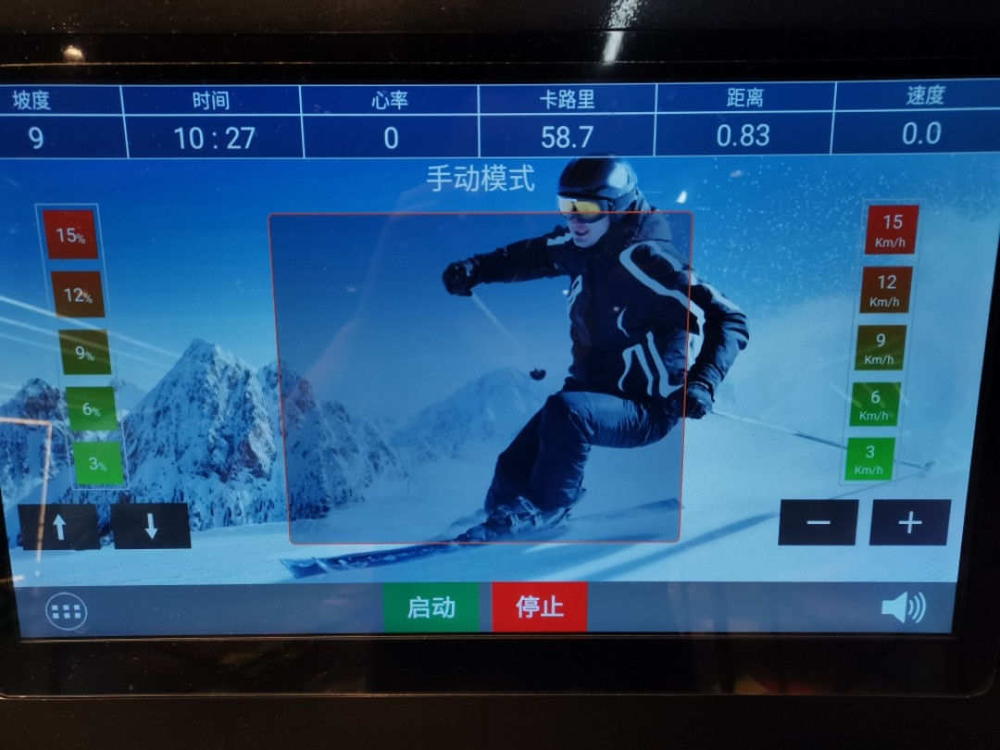
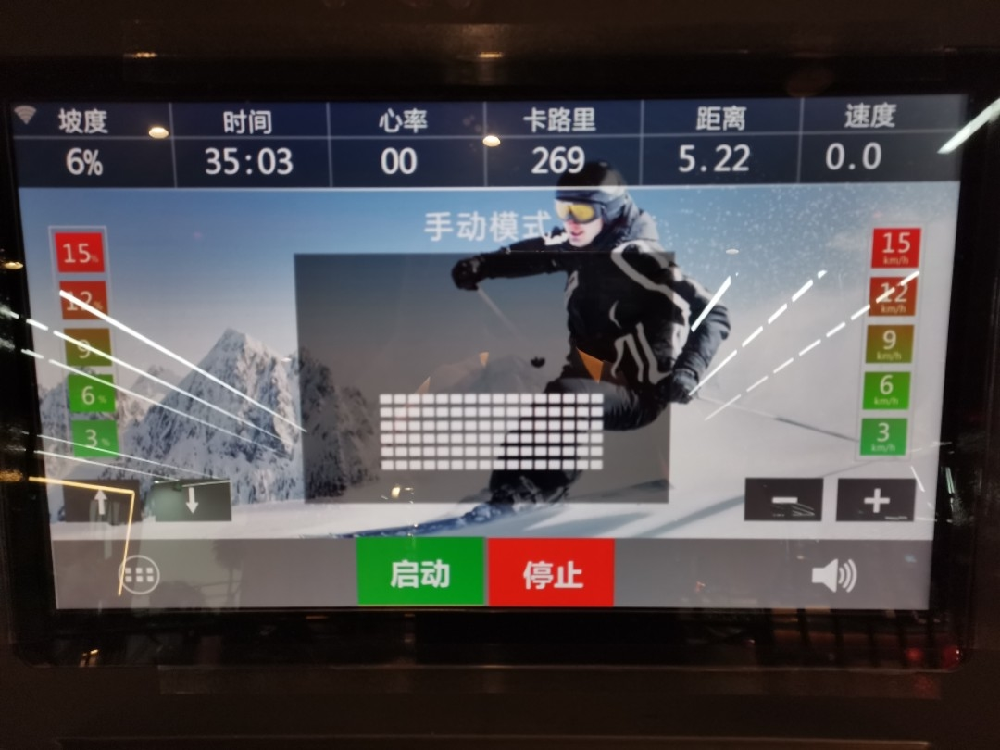

======================================================

_type: talk
@阿宝[422212151424158]
2020-11-01 22:57:18 Sun  
topic_id: 182214882244852

读《<e type="web" href="https://wx.zsxq.com/mweb/views/weread/search.html?keyword=人性的弱点" title="人性的弱点" style="book" />》有感

@王模堂 at 2020-11-01 22:57:18 Sun

> 有没有光伏概念的ETF？二师父。

----------

@二师父 at 2020-11-01 22:57:18 Sun

> 新能源里面包含一部分光伏

----------

阅读[2843]  评论[2]  赞[0] 

+++++++++++++++++++++++++++++++++++++++++++++++++++++

文件：
2020-11-01 22:57:17 Sun
文件大小：[14848]
15154858124152-11.1读《人性的弱点》有感.doc

======================================================

_type: solution
2020-11-02 12:22:28 Mon  
topic_id: 414425111154518

@杜志彪 at 2020-11-02 12:22:28 Mon

> 刚刚收割了电器和新能源汽车10%利润。

----------

阅读[2497]  评论[1]  赞[0] 

======================================================

_type: q&a
@CY[48248584825128]
2020-11-02 17:39:22 Mon  
topic_id: 182211222155242

@CY

>  师傅，券商ETF按之前标准做网格波段，这两天一直往下掉亏好多，还能再起来回到1.15吗？（哭）

@二师父

>  可以的，除非发生极端情况，这个基金一般不会跌到0.6以下，严格遵守网格点加仓，基本上坚持下来，回到1.15是没有问题的，然后如果跌到底部形成微笑曲线最后也能不到1.12就盈利。

阅读[2496]  评论[3]  赞[0] 

======================================================

_type: talk
@二师父[28814221155551]
2020-11-02 19:59:59 Mon  
topic_id: 414422441442518

<e type="hashtag" hid="28512514818851" title="#周末大事#" />

阅读[2648]  评论[0]  赞[0] 

+++++++++++++++++++++++++++++++++++++++++++++++++++++

文件：
2020-11-02 19:59:51 Mon
文件大小：[21389]
88482124251552-周末大事，投资者得引起重视.docx

======================================================

_type: talk
@二师父[28814221155551]
2020-11-02 20:12:44 Mon  
topic_id: 215544551525541

<e type="hashtag" hid="88512514818252" title="#长期持有和卖出是否矛盾#" /> 有的投资者疑惑，既然好企业的股票一直上涨，那么我就拿着一直不动是不是可以了呢？那么长期持有就不用卖出啊，看起来长期持有和卖出是矛盾的。

而这里面忽略了一个因素，人对波动的承受能力。大家可以看到一些基金和股票是长期波动上涨的，如果一直持有一轮牛熊一轮牛熊过，最终会新高。

可是从顶点下来的时候，如果是满仓，就会压力大，对于年收入远高于支出的朋友，就可以从容应对，而大部分投资者的年收入刚好覆盖家庭支出，有的甚至无法完全覆盖，这种就需要投资资金来应对家庭支出。那么当顶部的下跌时候可能扛不住，就没法满仓运营。

大家会发现身边投资者的心态各不相同，而做的好的个人投资者往往个人收入比较高，并不需要通过从股市提取资金应对生活支出，这样的话经历波动比较稳，可以长期持有，适当再收割一些。

反之，完全以股市投资收益来应对生活支出的，就会对股市过度关注，这样的朋友更加适合半仓运行，这样就可以不用卖出，因为可以承受波动。

我们最终卖与不卖不完全看目前这只基金贵不贵，这只是一方面，属于初级阶段，说个极端例子，假如你只投资了20，消费基金高估，但是你年结余50，这时候可以不卖。

而假如你投资100，消费基金正常估值，但是你年结余为零，刚刚换了大房子，月供由5000涨到了12000，这时候正估盈利的消费基金就可以收割利润，降低仓位。

这就是投资中灵活的东西，投资很多人之所以觉得难，就是因为他没有标准答案。大家读书习惯了对答案，工作习惯了找模板，所以没有固定化的模式就打破了心理限制，学会突破，我是不大喜欢条条框框的东西，当你严格遵守纪律操作之后，你会发现投资到了最后就是行云流水，一气呵成，这有个过程。

@衣袂飘香 at 2020-11-02 20:12:44 Mon

> 是的，5年不用的余钱投资，心态就会从容一些，这也是二师父当时一直强调的。

----------

阅读[3216]  评论[1]  赞[0] 

======================================================

_type: talk
@二师父[28814221155551]
2020-11-02 20:29:41 Mon  
topic_id: 582244228128814

<e type="hashtag" hid="28512542452551" title="#每日指数估值#" /> 市盈率百分位50.96%，市净率百分位31.54%，SY-BY百分位57.13%，SY/BY百分位55.28%。继续箱体震荡中，这行情有点意思，部分板块屡创新高，部分板块被一锤再锤。行情不佳，打新走起来。

阅读[2526]  评论[0]  赞[0] 

======================================================

_type: talk
@二师父[28814221155551]
2020-11-02 20:42:55 Mon  
topic_id: 182211228558852

<e type="hashtag" hid="825412412212" title="#可转债打新#" /> 明日立讯精密和紫金矿业转债，全力申购，中了就能吃肉。南方转债预计开盘小涨。

@庆余年 at 2020-11-02 20:42:55 Mon

> 华菱发债停牌了，不知道啥子情况

----------

@一无所有 at 2020-11-02 20:42:55 Mon

> 我的买不了，说我没开通，可业务办理里面找不到[流泪]

----------

@二师父 at 2020-11-02 20:42:55 Mon

> 重新开通就行了

----------

@圣诞结® at 2020-11-02 20:42:55 Mon

> 师父，南方停牌了 下午能一开就卖吗

----------

@一无所有 at 2020-11-02 20:42:55 Mon

> 好的，谢谢师父![咖啡][咖啡]

----------

阅读[2615]  评论[5]  赞[0] 

======================================================

_type: q&a
@sunny在路上[841885811111842]
2020-11-03 08:36:36 Tue  
topic_id: 215544585582441

@sunny在路上

>  新能源车etf需要减仓止盈吗？还是长期持有就好，闲钱投资，能接受波动。

@二师父

>  需要的，你回测看看，今年三月和18年那种波动也能经受住，那么就可以长期持有

阅读[2544]  评论[0]  赞[0] 

======================================================

_type: talk
@二师父[28814221155551]
2020-11-03 09:34:58 Tue  
topic_id: 815544584415122

马云和阿里几大高管被约谈，在蚂蚁上市之前，这时间点掐的好，看看蚂蚁表现吧

@J at 2020-11-03 09:34:58 Tue

> 意味着什么吗师傅？

----------

@二师父 at 2020-11-03 09:34:58 Tue

> 不能乱讲话

----------

@J at 2020-11-03 09:34:58 Tue

> 哈哈

----------

@庆余年 at 2020-11-03 09:34:58 Tue

> 我觉得是好事，因为金融确实需要监管，不管你是套什么壳子。这个“利空”出了以后，也让投资者放心些，免得后续又出什么幺蛾子。

----------

阅读[2587]  评论[4]  赞[0] 

======================================================

_type: talk
@幽兰[815554522442422]
2020-11-03 11:32:01 Tue  
topic_id: 582244218488244

如何把可转债卖在高点，有什么技巧吗？

@样 at 2020-11-03 11:32:01 Tue

> 我150就跑了呢[呲牙][呲牙]

----------

@幽兰 at 2020-11-03 11:32:01 Tue

> 很多150到不了吧？[捂脸]

----------

@庆余年 at 2020-11-03 11:32:01 Tue

> 额，不要想着买到高点吧，这玩意看概率的。开市就卖了或者等下午企稳了再卖。

----------

@二师父 at 2020-11-03 11:32:01 Tue

> 首日看看K线，持有看评级和公司质量

----------

阅读[2469]  评论[4]  赞[0] 

======================================================

_type: talk
@二师父[28814221155551]
2020-11-03 19:05:33 Tue  
topic_id: 182211241811222

<e type="hashtag" hid="88512514445422" title="#蚂蚁来了#" /> 大家心心念念的蚂蚁集团来了，星球估计有中的，明日暗盘。

晚上先聊这么多，等我撸完铁回来贴估值数据。年纪越大越发现，健康第一，我不比别人快，但是比别人久，长长久久。

阅读[2661]  评论[0]  赞[0] 

+++++++++++++++++++++++++++++++++++++++++++++++++++++

文件：
2020-11-03 19:03:31 Tue
文件大小：[18743]
15154814444242-马已被约谈，明日出暗盘.docx

======================================================

_type: solution
2020-11-03 19:54:54 Tue  
topic_id: 414422424218128

阅读[2331]  评论[0]  赞[0] 

======================================================

_type: talk
@范毅君[118551121224142]
2020-11-03 19:56:24 Tue  
topic_id: 215544545412251

东缆转债首日封停，下午忘了卖，今天才想起来，才卖了116多，转债老忘记卖，到嘴的肉都会跑，怎么破[流泪]

阅读[2455]  评论[0]  赞[0] 

======================================================

_type: talk
@二师父[28814221155551]
2020-11-03 22:38:15 Tue  
topic_id: 182211215845512

<e type="hashtag" hid="28518858514151" title="#每日估值数据#" /> 市盈率百分位51.98%，市净率百分位33.39%，SY-BY百分位58.27%，SY/BY百分位56.35%。

去健身房晃了一圈，回来后蚂蚁就被暂缓上市了。不要乱讲话，可以吹牛，但是不要摸老虎屁股，在中国混知道谁是大哥很重要。

@J at 2020-11-03 22:38:15 Tue

> 终于看到有一个数值跌破4字头了，继续努力[偷笑]

----------

阅读[2482]  评论[1]  赞[0] 

======================================================

_type: talk
@二师父[28814221155551]
2020-11-03 22:39:34 Tue  
topic_id: 582244241851484

<e type="hashtag" hid="225824552481" title="#打卡#" /> 今日史密斯力量训练深蹲+卧推一小时，5公里匀速跑。时间紧张，保持2到4天的锻炼频率

阅读[2508]  评论[0]  赞[0] 

======================================================

_type: talk
@许田野[28282822115481]
2020-11-03 23:13:07 Tue  
topic_id: 182211214282112

跑步打卡
换了环境，重新调整。

阅读[2433]  评论[0]  赞[0] 

+++++++++++++++++++++++++++++++++++++++++++++++++++++

图片：
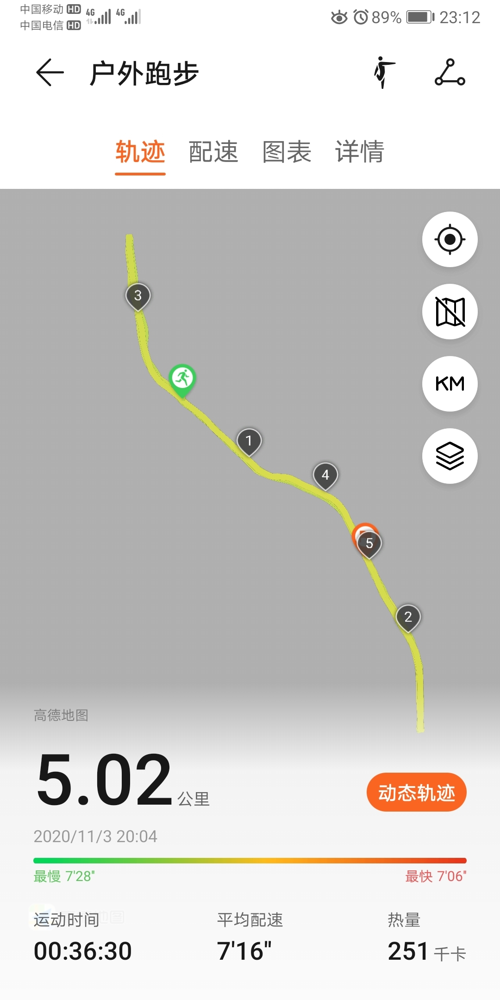

======================================================

_type: q&a
@不知道不明了[15584248411812]
2020-11-04 13:50:24 Wed  
topic_id: 414422418811448

@不知道不明了

>  师父，请问现在基本面60高估了吗

@二师父

>  今晚公布估值表，我来看下

阅读[2363]  评论[1]  赞[0] 

======================================================

_type: talk
@二师父[28814221155551]
2020-11-04 13:52:19 Wed  
topic_id: 215544512258281

蚂蚁已经准备退款了，至少没有亏损，皆大欢喜。

借呗如今口碑不行，很多都是小年轻上去借，父母给兜底还款，蚂蚁的未来比较朦胧了，看接下来审核是否顺利了

阅读[2379]  评论[0]  赞[0] 

======================================================

_type: talk
@二师父[28814221155551]
2020-11-04 19:52:35 Wed  
topic_id: 215544858558451

<e type="hashtag" hid="51285122482544" title="#介绍下所有的打新#" /> 今天公布估值表，最近很多基金表现可以，大家根据仓位卖出，随着股市高涨，没有新投入资金，但是每月工资结余增多，相当于变相降低了仓位，保持合理仓位就行。

另外对投资回报保持合理预期，先赚而后求稳赚。

@吃肉肉 at 2020-11-04 19:52:35 Wed

> 不知道怎么开美股和港股账户😂

----------

@二师父 at 2020-11-04 19:52:35 Wed

> 置顶文章有

----------

阅读[3026]  评论[2]  赞[0] 

+++++++++++++++++++++++++++++++++++++++++++++++++++++

文件：
2020-11-04 19:50:47 Wed
文件大小：[20391]
15154885842182-蚂蚁暂停上市，除了港股打新，还有哪些正确的打新姿势.docx

======================================================

_type: talk
@百变[15285855281882]
2020-11-04 20:56:15 Wed  
topic_id: 215544858842181

视频和您的《<e type="web" href="https://wx.zsxq.com/mweb/views/weread/search.html?keyword=指数基金定投，慢慢变富" title="指数基金定投，慢慢变富" style="book" />》内容一样吗？

@二师父 at 2020-11-04 20:56:15 Wed

> 啥视频

----------

@百变 at 2020-11-04 20:56:15 Wed

> 指数基金定投入门与实战课程音频

----------

@二师父 at 2020-11-04 20:56:15 Wed

> 不一样

----------

阅读[2145]  评论[3]  赞[0] 

======================================================

_type: talk
@二师父[28814221155551]
2020-11-04 21:04:26 Wed  
topic_id: 414422848815828

<e type="hashtag" hid="481211145528" title="#指数估值#" /> 目前估值两级分化，大家不要看上证综合指数没有突破3500点，实际上，很多板块已经比2018年1月贵很多了，高估的可以逐步卖出，红色部分的，然后就是弱势板块，恒生择时卖出。剩余的可以持有。乌龟计划恒生国企计划四次卖出，卖了三次以后就到达成本线了，也是下一个计划卖出的品种，如果继续新高，乌龟计划和鳄鱼计划同时减仓。仓位保证5成以上即可。

今年如果不是有疫情，行情会更好一些，大家珍惜A股赚钱的日子，入市多年，连续两年好行情的年头不多。机会总会有，大家可以对比对比现在估值表和2019年估值表，未来还会反转的，要么持有，要么收割，目前最佳策略，至于现在一次重仓赌牛市，风险系数太高。

咱们既然做定投，就严格遵守左侧交易，可以右侧辅助，但是不能本末倒置。

@遇见了你 at 2020-11-04 21:04:26 Wed

> 乌龟计划啥时候有恒生的[捂脸]

----------

@rtdmm小米 at 2020-11-04 21:04:26 Wed

> 二师父，如果加上估值区间就更好了

----------

@二师父 at 2020-11-04 21:04:26 Wed

> 没有啊

----------

阅读[2506]  评论[3]  赞[0] 

+++++++++++++++++++++++++++++++++++++++++++++++++++++

图片：
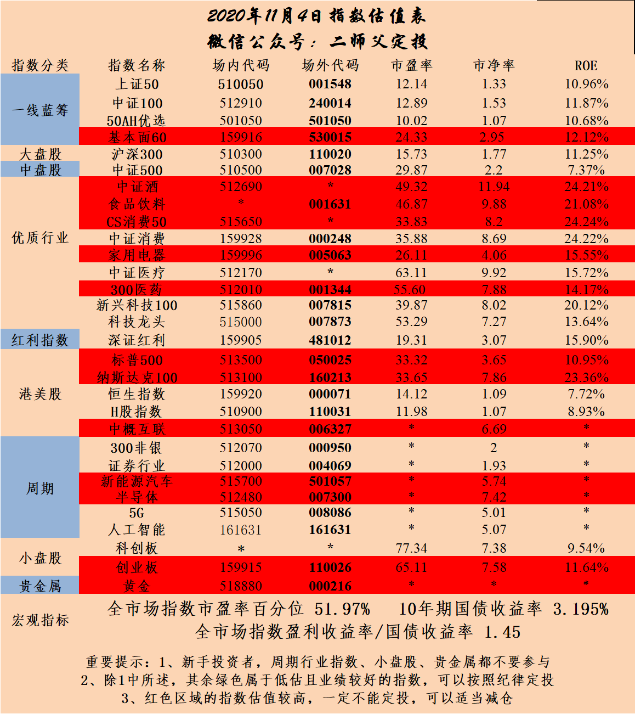

======================================================

_type: talk
@二师父[28814221155551]
2020-11-04 21:59:25 Wed  
topic_id: 815544854811282

<e type="hashtag" hid="88512855414152" title="#估值表及估值区间#" />

@rtdmm小米 at 2020-11-04 21:59:25 Wed

> 谢谢二师父！

----------

@光少 at 2020-11-04 21:59:25 Wed

> 二师父您好！基本面60高估了是需要减仓了吗

----------

@二师父 at 2020-11-04 21:59:25 Wed

> 是的，可以分步减仓了

----------

阅读[3037]  评论[3]  赞[0] 

+++++++++++++++++++++++++++++++++++++++++++++++++++++

图片：
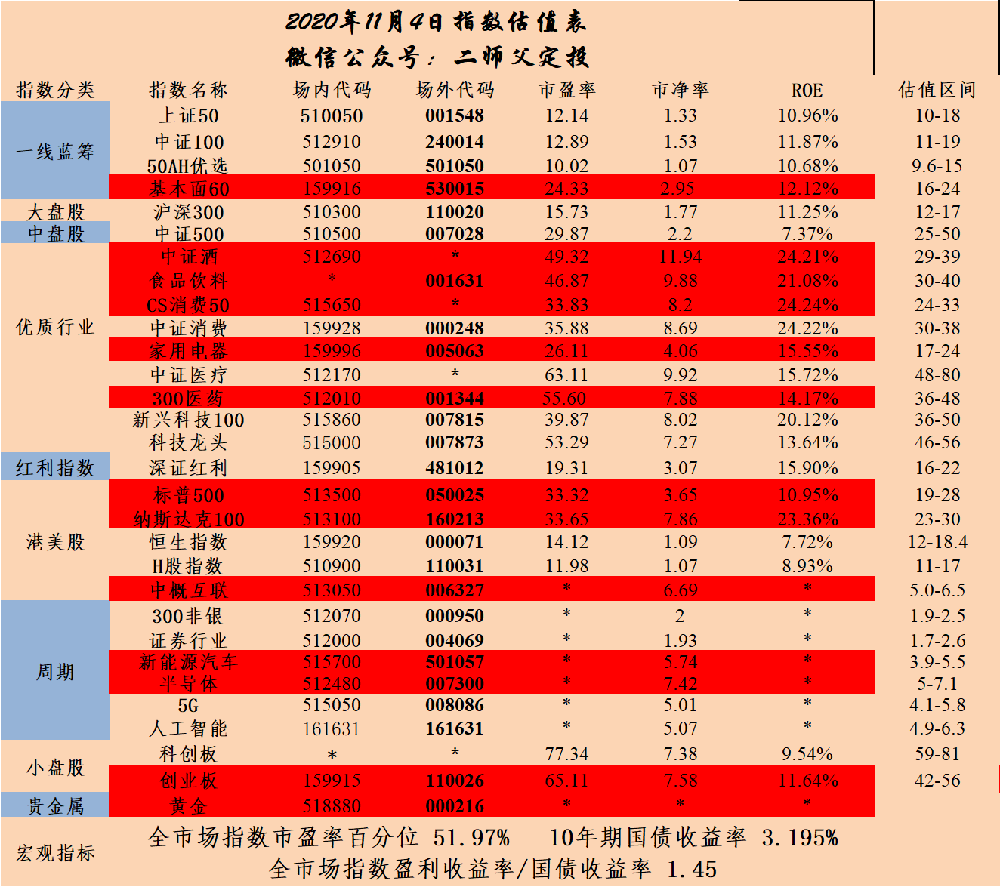

======================================================

_type: q&a
@阿宝[422212151424158]
2020-11-05 08:22:54 Thu  
topic_id: 582244124882244

@阿宝

>  老师，用什么软件查询公司股权回购记录？如何查询？

@二师父

>  公司官方网站，查阅上市公司公告即可

阅读[2348]  评论[3]  赞[0] 

======================================================

_type: talk
@二师父[28814221155551]
2020-11-05 09:40:32 Thu  
topic_id: 215544885154451

<e type="hashtag" hid="881251425252" title="#鳄鱼计划#" /> 卖出家电一份，中概互联减仓一半止盈，卖利留本，调仓华宝油汽至券商Etf。

今年整体收益率不错，当然全面配置不如重仓消费和中概，医疗的收益，尽管如此，仍旧全面配置，风水总是轮流转，做正确的配置，其他的交给时间，今天开始乌龟计划也逐步慢慢减仓了，一直减，直到牛市顶峰，之后会公布。

@🎈铮 at 2020-11-05 09:40:32 Thu

> 也就是券商今天这个价位1.133还是可以买入的是吧，二师傅，做网格的话

----------

@清水倾城 at 2020-11-05 09:40:32 Thu

> 我亏损的华宝油气也可以转到证券etf吗？二师父

----------

@二师父 at 2020-11-05 09:40:32 Thu

> 可以的，别重仓就行

----------

@二师父 at 2020-11-05 09:40:32 Thu

> 可以

----------

@杳杳 at 2020-11-05 09:40:32 Thu

> 鳄鱼计划怎么参与啊？

----------

@二师父 at 2020-11-05 09:40:32 Thu

> 发车会在学堂公布的哈

----------

阅读[2472]  评论[6]  赞[0] 

======================================================

_type: q&a
@波多黎各[28428858544121]
2020-11-05 09:51:34 Thu  
topic_id: 215544885412441

@波多黎各

>  师父，紫金发债中了一手，是不是发行日当天就卖？不管盈亏？还有请问在哪里可以看到发行时间？谢谢哈，我是新人

@二师父

>  紫金这个公司在同行业还算可以，这个上市大概率会盈利的，可以卖出，如果亏损那是小概率事件，发行的话在券商账户或者集思录有可转债日历

阅读[2466]  评论[2]  赞[0] 

======================================================

_type: q&a
@范毅君[118551121224142]
2020-11-05 09:52:48 Thu  
topic_id: 215544282428581

@范毅君

>  二师父，有色属于什么性质的板块价值大吗，求科普

@二师父

>  这个板块价值不大，属于炒作金属通胀预期，短期投机可以，不适合投资

阅读[2485]  评论[11]  赞[0] 

======================================================

_type: q&a
@J[28281541518551]
2020-11-05 09:55:55 Thu  
topic_id: 215544855854111

@J

>  师父，请问广发家电目前进入高估还是正常区域？

@二师父

>  高估区域的

阅读[2540]  评论[0]  赞[0] 

======================================================

_type: q&a
@家飞猫[51558124841414]
2020-11-05 10:12:08 Thu  
topic_id: 414422585145418

@家飞猫

>  师傅，我是新手新进来的，能直接一键跟投乌龟计划吗？但是看你最近定投停止了，又有鳄鱼计划在卖出部分高估？所以就疑惑，一键跟投的乌龟计划是否有调整一下，也好方便我们新入的小白。谢谢

@二师父

>  你是指什么调整，乌龟计划是可以一键跟投，然后再根据市场变化进行加仓和减仓，这是一个长期的配置，今天会公布一期乌龟计划卖出操作，然后分析调仓的逻辑

阅读[2537]  评论[2]  赞[0] 

======================================================

_type: q&a
@wty[548488548545444]
2020-11-05 10:45:46 Thu  
topic_id: 182211451251222

@wty

>  二师父，我跟投的恒生指数快回本了，想调仓到医疗指数里，请指导一下调仓是否合适？

@二师父

>  多少仓位，目前医疗还是正常偏高估值，调出资金以后，可以建个观察仓。

阅读[2560]  评论[3]  赞[0] 

======================================================

_type: q&a
@是喵喵吖～[421441114141158]
2020-11-05 11:14:21 Thu  
topic_id: 815544284841812

@是喵喵吖～

>  二师父，请问下今天银行（招商银行）怎么涨这么高呀

@二师父

>  今天涨了吗。不到1个点啊，招行很不错的

阅读[2602]  评论[0]  赞[0] 

======================================================

_type: talk
@二师父[28814221155551]
2020-11-05 12:04:45 Thu  
topic_id: 815544284414222

<e type="hashtag" hid="28518855451481" title="#乌龟计划#" /> 卖出基本面60，0.5份，这个指数持仓和深红利类似，计划深红利长持，极端高估减仓，基本面60高估慢慢卖出

左侧交易是跌买，涨卖，右侧交易是跌卖涨买。

@J at 2020-11-05 12:04:45 Thu

> 师父，卖出的资金应该放哪呢？

----------

@二师父 at 2020-11-05 12:04:45 Thu

> 买货币基金或者国债逆回购

----------

@素兮 at 2020-11-05 12:04:45 Thu

> 我没有深红利，可以计划长持基本面60么？现在不出，等待极端高估再出？

----------

@二师父 at 2020-11-05 12:04:45 Thu

> 多少仓位，能经受波动可以的

----------

@云卷云舒 at 2020-11-05 12:04:45 Thu

> 师父好！乌龟计划里面仅支持按组合比例卖出，不能单卖呀！不明白！

----------

@二师父 at 2020-11-05 12:04:45 Thu

> 这个有个调仓按钮，调仓就行

----------

@云卷云舒 at 2020-11-05 12:04:45 Thu

> 谢谢师父！

----------

@Vincent at 2020-11-05 12:04:45 Thu

> 二师父，我这没看到调仓按钮，这个是在哪看呢

----------

阅读[2642]  评论[14]  赞[0] 

======================================================

_type: q&a
@J[28281541518551]
2020-11-05 13:09:26 Thu  
topic_id: 582244514888254

@J

>  师父，这双11马上要到了，家电和食品酒这几个虽然高估，也要不要等到双11之后再卖更好呢？感觉还要创新高

@二师父

>  先卖百分之10，双十一涨了并不影响你账户新高，双十一和白酒涨没有必然关系，他的上涨主要是避险资金推动

阅读[2593]  评论[2]  赞[0] 

======================================================

_type: talk
@平安是福[118222545154542]
2020-11-05 13:23:19 Thu  
topic_id: 582244518111484

师父：家电共分几份

@二师父 at 2020-11-05 13:23:19 Thu

> 大概还有16份

----------

@平安是福 at 2020-11-05 13:23:19 Thu

> 好的，谢谢师父！

----------

阅读[2681]  评论[2]  赞[0] 

======================================================

_type: talk
@百变[15285855281882]
2020-11-05 13:57:19 Thu  
topic_id: 215544281818281

老师：医疗估值降了不发车吗？

@二师父 at 2020-11-05 13:57:19 Thu

> 不发，Sy-by低于百分之50第一条件，安全第一，毕竟这么多投资者跟着，我首先保证稳健，如果自己投的话可以做下

----------

@百变 at 2020-11-05 13:57:19 Thu

> 好，谢谢！我忘了综合考虑指标了，肤浅肤浅

----------

阅读[2681]  评论[2]  赞[0] 

======================================================

_type: talk
@那方山的树，佛陀座下*[244412158214221]
2020-11-05 15:35:17 Thu  
topic_id: 215544225588851

二师傅，麻烦推荐两支有分红的债基（短债，国债各一支），长期老年退休养老资金定期定投的！麻烦了，谢谢！

@二师父 at 2020-11-05 15:35:17 Thu

> 嘉实超短债，易方达中债，债券是有利息

----------

阅读[2704]  评论[1]  赞[0] 

======================================================

_type: q&a
@飞的那个飞[48584811554158]
2020-11-05 15:37:26 Thu  
topic_id: 215544281842121

@飞的那个飞

>  可以吃肉？

@二师父

>  估计是块肉

阅读[3026]  评论[5]  赞[0] 

======================================================

_type: q&a
@果实妈咪[182225518588452]
2020-11-05 22:20:21 Thu  
topic_id: 815544222111452

@果实妈咪

>  二师父，香港卡哪个银行可以办理

@二师父

>  民生银行，恒生银行，还有香港的招商永龙，去香港目前看费用低一些，公众号后台回复港股，扫描第二个二维码后面可以提前和香港预约
>  
>  如果您是互联网企业员工，推荐民生银行，中关村那个目前是5万就可以

阅读[2782]  评论[0]  赞[0] 

======================================================

_type: talk
@Audrey[15284421255842]
2020-11-05 23:12:38 Thu  
topic_id: 215544248545221

可转债打新 一般申购多少张 ，如果我申购100张，申购价格是10000对嘛

@二师父 at 2020-11-05 23:12:38 Thu

> 不是的，一般满格申购，最多中三千签，也就是最多3000元，最少0元，没中不用缴费

----------

@Audrey at 2020-11-05 23:12:38 Thu

> 满格申购 最多也只能中3张吗 中签后是不是第一天就卖掉 谢谢二师傅解答

----------

@二师父 at 2020-11-05 23:12:38 Thu

> 是的，好质量的可转债可以拿一拿，不会看的话就首日卖，最容易

----------

@Audrey at 2020-11-05 23:12:38 Thu

> 质量好是说公司基本面好吗 还是说可转债评级高呀

----------

@二师父 at 2020-11-05 23:12:38 Thu

> 两者兼有，大致看下财报，没时间看看评级就行

----------

阅读[2740]  评论[5]  赞[0] 

+++++++++++++++++++++++++++++++++++++++++++++++++++++

图片：
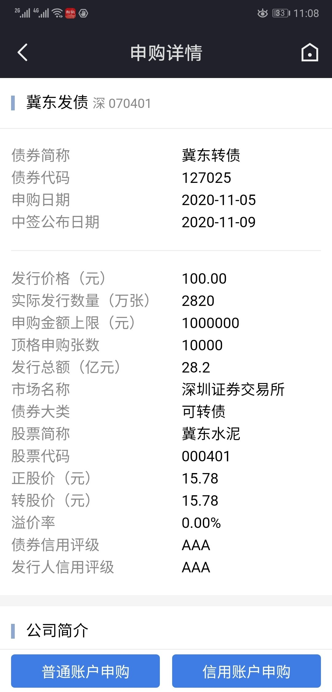

======================================================

_type: talk
@二师父[28814221155551]
2020-11-05 23:28:00 Thu  
topic_id: 582244541122424

<e type="hashtag" hid="48415848885458" title="#今日估值数据#" /> 市盈率百分位54.56%，市净率百分位32.68%，SY-BY百分位61.6%，SY/BY百分位59.24%。估值数据继续上升，保持合理仓位，账户增值靠持有，如果账户是长牛赛道的股票基金，那么多拿一拿。持有和买入分开的，当前不适合买入，但是可以持有。北上资金重新购买100亿，这是个好信号。

现在可能不确定的就是拜登领先当选，如果特朗普闹起来，那么会对股市有影响的，这是最大的不确定性，其他的没啥。今年资金抱团非常明显：白酒、电器、新能源、互联网，分别属于必须消费、可选消费、科技板块。持有这几个板块的坐坐车，反正都是高估了，一起看看最终能推到多高，我的消费和电器会持有穿越牛熊，而新能源和互联网一轮结束后波动异常大，最终会选择清仓。

持仓的恒生最弱，优先减仓，目前星球的同学已经学会了，优先卖差的，持有涨的好的，最后再卖涨的好的，好企业就会对应越来越高的价格，不是说一只基金越便宜越好。我看了看民生银行，如果这几年投资了他，基本上是凉凉，不管什么策略都不行。

优选赛道，在正确的方向努力才有意义哈。

@🍀 凝🌸 慧🍀 at 2020-11-05 23:28:00 Thu

> 师父好，科技板块好像调整了好几个月左右（包括新兴科技100、人工智能），属于正常偏低估值区间。十四五规划重点之一是科技创新，如果现在仓位是0，又想投资科技板块的这些指数基金，该如何操作呢？谢谢您！[微笑]

----------

@二师父 at 2020-11-05 23:28:00 Thu

> 目前情况如果拜登当选利好科技和新能源，可以在顺景气周期建仓，新科技100一个策略指数，人工智能属于周期类指数，龙头科技周期性低一些

----------

@🍀 凝🌸 慧🍀 at 2020-11-05 23:28:00 Thu

> 收到，谢谢师父！[愉快][抱拳][抱拳]

----------

阅读[3421]  评论[3]  赞[0] 

======================================================

_type: talk
@二师父[28814221155551]
2020-11-05 23:31:54 Thu  
topic_id: 582244541125484

<e type="hashtag" hid="825412412212" title="#可转债打新#" /> 明日冀东转债全力申购，回国之后工作强度大了很多，有时候根本顾不上申购可转债，所以今年中签少的很，眼看着大家吃肉，大家不忙的话可以坚持下，属于弯腰捡钱。

这个投资没啥难度，属于低风险，和A股打新一样的。

@光少 at 2020-11-05 23:31:54 Thu

> 我今年也少中签，运气不佳[呲牙]

----------

阅读[2949]  评论[1]  赞[0] 

======================================================

_type: q&a
@吾思吾想[118552585284212]
2020-11-06 08:24:07 Fri  
topic_id: 182211414525522

@吾思吾想

>  师父，昨天501054 场内1.5451元
>  净值5906元，这样的情况可以套利吗？

@二师父

>  我看净值是1.5906，这个折价不多，不好套利

阅读[2921]  评论[2]  赞[0] 

======================================================

_type: talk
@二师父[28814221155551]
2020-11-06 08:32:45 Fri  
topic_id: 182211414455512

<e type="hashtag" hid="225824552481" title="#打卡#" /> 昨天练完腿，太累忘记打卡了，以后加强腿和臀的训练，有氧争取力量训练结束后25分钟5公里

阅读[2908]  评论[0]  赞[0] 

+++++++++++++++++++++++++++++++++++++++++++++++++++++

图片：
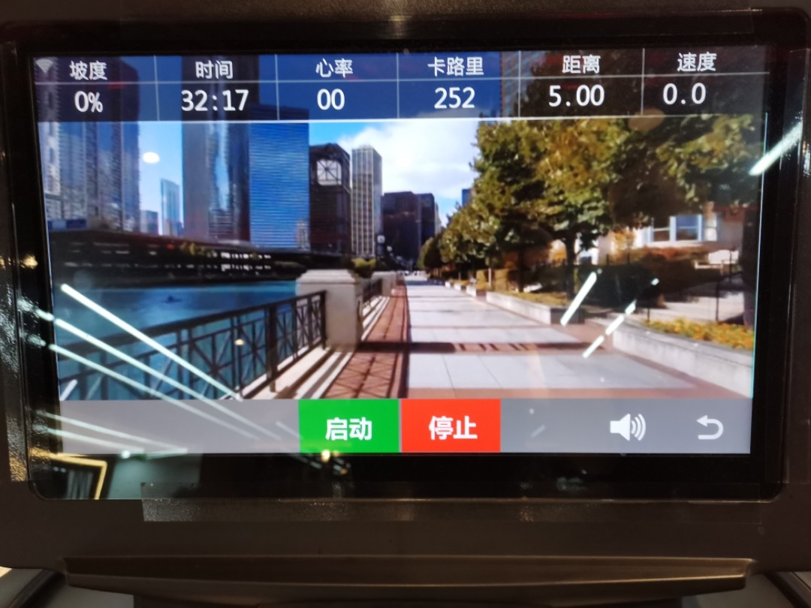

======================================================

_type: talk
@Nick.yang[118281888551882]
2020-11-06 09:24:27 Fri  
topic_id: 582244545488214

我一直很想知道鳄鱼计划 乌龟计划哪里可以看啊

@JOY at 2020-11-06 09:24:27 Fri

> 点右上角放大镜符号，搜“鳄鱼计划”后下拉，带鳄鱼标签的就都是相关内容，乌龟同理～

----------

@九妹Amy'' at 2020-11-06 09:24:27 Fri

> 哪里有放大镜🔍 符号

----------

@二师父 at 2020-11-06 09:24:27 Fri

> 星球屏幕正上方

----------

@JOY at 2020-11-06 09:24:27 Fri

> 用APP打开星球

----------

@JOY at 2020-11-06 09:24:27 Fri

> 我的在这里

----------

阅读[2971]  评论[5]  赞[0] 

======================================================

_type: solution
2020-11-06 09:36:07 Fri  
topic_id: 182211414811422

@rtdmm小米 at 2020-11-06 09:36:07 Fri

> 你的网格操作得好呢

----------

阅读[3061]  评论[1]  赞[0] 

======================================================

_type: talk
@幽兰[815554522442422]
2020-11-06 11:03:38 Fri  
topic_id: 215544215824541

二师父，华夏恒生ETF、恒生国企和中证5G是不是可以考虑择机卖出了？换个别的优质赛道

@二师父 at 2020-11-06 11:03:38 Fri

> 可以，科技选龙头科技，新能源好一点，新能源有周期，不适合定投

----------

阅读[3019]  评论[1]  赞[0] 

======================================================

_type: talk
@光少[244124552511141]
2020-11-06 11:14:59 Fri  
topic_id: 582244582181284

今天券商应该会触及网格点卖出一份

阅读[3099]  评论[0]  赞[0] 

======================================================

_type: q&a
@HeLLO[15548451524442]
2020-11-06 11:26:35 Fri  
topic_id: 215544244288821

@HeLLO

>  二师父，目前医药是不是该清了？

@二师父

>  鳄鱼计划已经清了，您可以关注下星球消息，这一波医药上涨受到了疫情的影响，现在预期有所下降了，医疗市盈率下降也有个原因
>  
>  不惧波动的话可以长期持有，将来还会继续新高，不过a股历来波动大，适当止盈是正确选择，目前清操作上没啥大问题

阅读[3313]  评论[3]  赞[0] 

======================================================

_type: q&a
@孤芳自赏[548114442211184]
2020-11-06 13:37:57 Fri  
topic_id: 414422518481428

@孤芳自赏

>  二师父请帮我看看512290值不值得持有买来一直亏着！

@二师父

>  基金持股一般，您买贵了，未来会起来，不过因为买入价格太高，可能会经历非常大回撤

阅读[3166]  评论[1]  赞[0] 

======================================================

_type: talk
@门萨🐨[51411455828824]
2020-11-06 13:42:44 Fri  
topic_id: 582244581285444

今年忙的没顾上，第一次打就中了[呲牙][呲牙]

@Sunflower at 2020-11-06 13:42:44 Fri

> 好久没看到你的影子啦[呲牙]

----------

@门萨🐨 at 2020-11-06 13:42:44 Fri

> 哈哈，是的

----------

阅读[3203]  评论[2]  赞[0] 

+++++++++++++++++++++++++++++++++++++++++++++++++++++

图片：
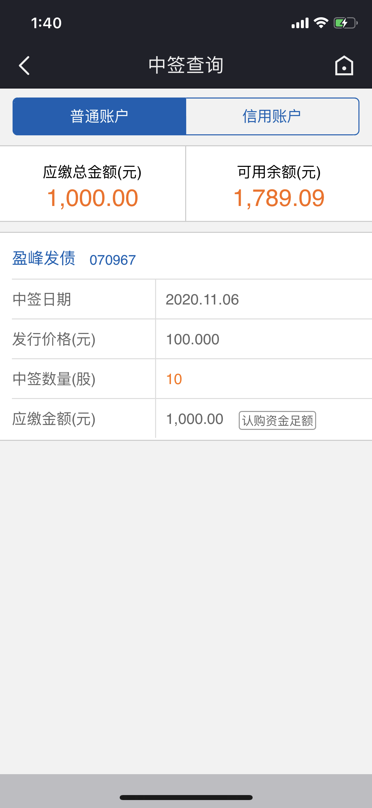

======================================================

_type: q&a
@onepiecewi*[244414114545811]
2020-11-06 15:05:10 Fri  
topic_id: 215544218855451

@onepiecewi*

>  师父，为什么这个股票买不了呢

@二师父

>  这是华安的分级基金，暂时别买了，等年底转型完成再买

阅读[3333]  评论[1]  赞[0] 

======================================================

_type: q&a
@果实妈咪[182225518588452]
2020-11-06 17:11:48 Fri  
topic_id: 215544212851481

@果实妈咪

>  二师父，有没有哪只基金是持有理想汽车这只股票，买不了美股，想买对应的基金

@二师父

>  可以开个美股账户，基金持仓比例都挺低，你这是看好拜登上了？

阅读[3438]  评论[5]  赞[0] 

======================================================

_type: talk
@二师父[28814221155551]
2020-11-06 18:16:59 Fri  
topic_id: 414422515215548

<e type="hashtag" hid="51285121585114" title="#美国竞选吃了个瓜#" /> 公众号调查结果出来了，看看大家风险偏好，未来更多往行业配置上走，如果想追求更高收益率，股票更好。

星球目前应该没有空仓的，如果有的话，可以乌龟计划建3层仓位，然后后面调仓跟上，也还是比较稳，如果从18年一直跟着走的话，目前可以继续持有，按照上涨收割利润。另外新能源估值不要看市盈率，对于新能源和人工智能，市盈率越高代表景气度越高，预期高，有上涨趋势，这是周期板块和盈利稳定板块不同之处。

@雨淡风清 at 2020-11-06 18:16:59 Fri

> 今天医药留了100观察全清了[抓狂]

----------

@光少 at 2020-11-06 18:16:59 Fri

> 我也买了比亚迪翻倍了，九十多元时卖了[流泪]心态不好，没拿主[大哭]

----------

@光少 at 2020-11-06 18:16:59 Fri

> 以后医药应该还会创新高的。

----------

@雨淡风清 at 2020-11-06 18:16:59 Fri

> 赚点就好，等待机会，这个黑天鹅不算大，不知道能跌多少

----------

@杜志彪 at 2020-11-06 18:16:59 Fri

> 医药这个赛道没问题，国家进入老龄化，美日的医药长期走的都不错，主要还是要买的便宜，慢慢来一点一点加就好了。

----------

阅读[3577]  评论[5]  赞[0] 

+++++++++++++++++++++++++++++++++++++++++++++++++++++

文件：
2020-11-06 18:12:08 Fri
文件大小：[185894]
51414212228484-拜大爷反转，美股还会新高吗.docx

======================================================

_type: q&a
@不知道不明了[15584248411812]
2020-11-06 18:45:35 Fri  
topic_id: 182211488444522

@不知道不明了

>  师父，我和父母都在国企工作，工作稳定社会福利比较健全，想问一下防守账户的家庭大额预备支出留多少比较合适？母亲已退休，父亲过三年即将退休，我刚开始工作。

@二师父

>  是北京的国企还是哪个城市国企，如果是大型国企，以前的公积金和退休后的退休金可以覆盖生活支出，留10万应对极端意外就行。
>  
>  这个取决于你的收入和工作稳定性，如果工资不能完全覆盖房贷和车贷，就需要稍微多一点，具体你要列出家庭现金流表和资产负债表综合分析下

阅读[3538]  评论[2]  赞[0] 

======================================================

_type: talk
@二师父[28814221155551]
2020-11-06 23:06:36 Fri  
topic_id: 182211122844812

<e type="hashtag" hid="552114551414" title="#估值数据#" /> 市盈率百分位53.85%，市净率百分位31.54%，SY-BY百分位61.37%，SY/BY百分位59.24%。

医疗受带量采购压价影响较大，投资暂缓，看看后面对医药企业的影响，当前和18年带量采购不同，直接压价明显，对企业利润影响大，关键是医疗企业估值较高。

@志亮 at 2020-11-06 23:06:36 Fri

> 长高目前亏22个点，心情很郁闷，只能硬抗。[流泪]

----------

@二师父 at 2020-11-06 23:06:36 Fri

> 入手位置挺高，已经跌破了60日线，我追踪的是泰格医药，爱尔眼科，迈瑞医疗，目前带量采购影响不明，暂时观望

----------

@志亮 at 2020-11-06 23:06:36 Fri

> 影响也是错杀，应该是涨多了，借釆用集事件杀杀估值，目前只能持股不动来应付。

----------

@吃肉肉 at 2020-11-06 23:06:36 Fri

> 都说迈瑞医疗是错杀，不知道是不是？[流汗]

----------

@二师父 at 2020-11-06 23:06:36 Fri

> 迈瑞不错

----------

@志亮 at 2020-11-06 23:06:36 Fri

> 应该是错杀。

----------

阅读[3968]  评论[6]  赞[0] 

======================================================

_type: q&a
@四海为家[241585882858251]
2020-11-07 01:10:33 Sat  
topic_id: 582244421252214

@四海为家

>  500信息可以持有吗？想建个仓，然后逐步投入。

@二师父

>  这个定投可以，不过持仓股一般，大概率跑不赢龙头科技

阅读[3481]  评论[0]  赞[0] 

======================================================

_type: talk
@二师父[28814221155551]
2020-11-07 13:10:16 Sat  
topic_id: 414422241144828

<e type="hashtag" hid="88512858151482" title="#入门企业投资的方法#" /> 星球有很多朋友对企业投资很感兴趣，注意这里说的企业，就是大家心心念念的gupiao，星球不让说gupiao，但是可以讲企业

有的人讲自己看不懂商业模式，看不懂财务报表怎么办，有一个入门方法，追踪基金经理持仓变动，然后缩小研究范围

大家优质主动基金持仓变动以及10大重仓标的，从中选择自己感兴趣的企业研究，注意，这个选择是帮助你缩小范围，研究还是需要靠自己花功夫，从企业一个点一个点开始，研究好以后就是买入点，不在星球讲买点，因为投资变化大，我的方法是计算三年后企业市值，基本面好，三年后企业市值预计能够一倍，就可以了。

这是整体的方法，要想真正学到知识，还是得自己看财报，阅读公司管理层的相关著作，对企业基本面了解之后才敢重仓，企业的利润一定来源于盈利增长，估值只是辅助，盈利稳定增长的企业，即使未来市值低估，也比5年前高估时候的市值高。这是投资企业的核心。

那么说到了如何研究财报，我之前有个课程可以听一听，还有唐朝的手把手教你读财报，这个也可以，这是投资必须掌握的，没有捷径，除非你只想投资指数，只有真正透彻理解一家公司价值，才拿的住，才敢重仓持有，否则无用。

因为我的工作性质，所以会接触到公司财报，虽然不是财务部，但是和财务的工作有搭接，早期我经常和财务工作人员，包括总会去交流企业财报，指标如何来的，尤其涉及到收入和成本这一块，真正搞清楚企业的钱怎么来的，怎么花的，然后演变成现金流量和资产负债，这是我最开始学习财报的方法，从月报到季报再到年报。学懂一家企业，再去看其他企业，你会发现都一样。

如果财报确定优秀，剩下的是企业管理层，商业模式，管理水平，企业文化，最终落脚点是这四方面能否给企业带来持续利润。

有了这个早就基础，基本上就算入门了，估值并不是最重要，还记得之前学堂有个同学说10万不知道买什么好，有个同学说买茅台吧，目前看结果对了

对的原因是什么呢，茅台有利润，有现金，有护城河，有文化，管理层不算，换个人他也能保持这个盈利。

最后强调一点，好企业任何时候买入未来一定新高，不过不要忽略波动，好企业波动50个点也是常事，所以还有高价格保证能经受波动

总结起来就是通过优秀基金经理找到好的行业和企业池，第二自己看财报搞懂他的价值，未来能否有利润，利润是否可持续，这将贡献未来自由现金流，第三就是估值，计算未来企业能够到达的市值，留足安全边际看是否有可期望的利润空间

学习需要花时间，真的有兴趣就这个方向，这就是最基础的入门方式。

@onepiecewi* at 2020-11-07 13:10:16 Sat

> 师父，那个课程在哪里？

----------

@二师父 at 2020-11-07 13:10:16 Sat

> 荔枝微课二师父定投

----------

@芙瑞雅阳阳潘 at 2020-11-07 13:10:16 Sat

> 师父 企业财报哪里可以找到？

----------

@二师父 at 2020-11-07 13:10:16 Sat

> 企业官网

----------

@芙瑞雅阳阳潘 at 2020-11-07 13:10:16 Sat

> 好哒

----------

@芙瑞雅阳阳潘 at 2020-11-07 13:10:16 Sat

> 师父，跟着基金经理持仓买，但是不知道他们买入位置，怎么跟呢？而且持仓更新是不是也是置后的呀？

----------

@二师父 at 2020-11-07 13:10:16 Sat

> 这种方法只是缩小选股范围，不是跟着基金经理买

----------

@芙瑞雅阳阳潘 at 2020-11-07 13:10:16 Sat

> 哦

----------

阅读[3505]  评论[8]  赞[0] 

======================================================

_type: talk
@百变[15285855281882]
2020-11-07 16:20:30 Sat  
topic_id: 414422284518228

老师：非银，半导体，新能源，人工智能，5G这些周期性的基金该怎样操作？

@二师父 at 2020-11-07 16:20:30 Sat

> 两种方式，底部反转买入，另外一种景气周期一次投入，趋势结束前收了，这几个不适合长期持有不动。

----------

@🍀 凝🌸 慧🍀 at 2020-11-07 16:20:30 Sat

> 师父，对于这几个行业，怎么才能判断是景气周期，能具体说说吗？谢谢！

----------

@二师父 at 2020-11-07 16:20:30 Sat

> 主要看市场预期是否完全反应到价格上，如果还没有那就是景气周期

----------

@🍀 凝🌸 慧🍀 at 2020-11-07 16:20:30 Sat

> 收到，谢谢师父啦，继续学习[微笑]

----------

阅读[3329]  评论[4]  赞[0] 

======================================================

_type: talk
@二师父[28814221155551]
2020-11-08 12:20:19 Sun  
topic_id: 815544422481582

<e type="hashtag" hid="48415845424818" title="#几本书籍推荐#" /> 索罗斯金融炼金术，彼得林奇成功投资，霍华德周期，我的指数基金定投，基金定投哲学部分。

多读读就明白为何当前暂时不操作，除了还有周期股的机会，根本没有任何胜率大于赔率的买入了，五粮液半年一倍，汾酒半年两倍，除非这次牛市和06年一样，否则短期翻倍不可能了，这是常识。

目前关注医疗指数，相关高景气，营收不受带量采购的企业，行业危机一般有机会。

@吃肉肉 at 2020-11-08 12:20:19 Sun

> 看了老师的指数哲学部分，受教！

----------

@J at 2020-11-08 12:20:19 Sun

> 师父，白酒下周可以分步卖出本金+收益了对吗？还是只收割利润好？

----------

@二师父 at 2020-11-08 12:20:19 Sun

> 卖出本金，不惧百分之50左右极端波动这个板块可以长期持有

----------

@J at 2020-11-08 12:20:19 Sun

> 我现在手上还有少量的白酒、食品饮料和必须消费，这三只下周开始都是卖出本金对吗？

----------

@二师父 at 2020-11-08 12:20:19 Sun

> 少量可以拿着

----------

@J at 2020-11-08 12:20:19 Sun

> 好的

----------

@黄鲁川 at 2020-11-08 12:20:19 Sun

> 二师父稳得很，拿稳医疗，高景气板块

----------

阅读[3874]  评论[7]  赞[0] 

======================================================

_type: talk
@百变[15285855281882]
2020-11-09 10:11:55 Mon  
topic_id: 215544418551241

半导体和芯片今天涨的这么猛怎么操作啊！卖还是卖一部分？

@志亮 at 2020-11-09 10:11:55 Mon

> 完美错过了[捂脸]

----------

阅读[3065]  评论[1]  赞[0] 

======================================================

_type: solution
2020-11-09 10:32:25 Mon  
topic_id: 815544418888152

阅读[3096]  评论[0]  赞[0] 

======================================================

_type: solution
2020-11-09 11:12:58 Mon  
topic_id: 182211185124242

@幽兰 at 2020-11-09 11:12:58 Mon

> 一网是多少

----------

@🍀 凝🌸 慧🍀 at 2020-11-09 11:12:58 Mon

> 我也出一网[胜利][胜利]

----------

@光少 at 2020-11-09 11:12:58 Mon

> 我的是按网格涨跌5%设置的

----------

@小鱼 at 2020-11-09 11:12:58 Mon

> 我也出

----------

@幽兰 at 2020-11-09 11:12:58 Mon

> 和二师父说的卖出“一份”是不是一个意思

----------

@🍀 凝🌸 慧🍀 at 2020-11-09 11:12:58 Mon

> 可以参考看师父的网格交易表，可以把你已投入券商指数的资金分成多份，比如10份，然后每到一个卖出价格，卖出一份。

----------

@幽兰 at 2020-11-09 11:12:58 Mon

> 嗯嗯，对的，我也是在1.18卖出了一份

----------

@付云 at 2020-11-09 11:12:58 Mon

> 我也出了一网

----------

阅读[3118]  评论[9]  赞[0] 

======================================================

_type: talk
@悦雪[88242858484422]
2020-11-09 11:14:26 Mon  
topic_id: 582244481424424

师父，16国债19现在可入否？谢谢

@二师父 at 2020-11-09 11:14:26 Mon

> 可以，国债etf更保险

----------

阅读[3112]  评论[1]  赞[0] 

======================================================

_type: talk
@志亮[422125851552828]
2020-11-09 11:52:37 Mon  
topic_id: 215544412585851

完美错过半导体，我也不算太年轻呀[捂脸]。

@JOY at 2020-11-09 11:52:37 Mon

> 因为入的时候也不低了，总不起来，等了好久，抛了，马上就涨了～看来还是得早布局，才能拿得住～

----------

@志亮 at 2020-11-09 11:52:37 Mon

> 对的，主要是不敢买。

----------

@百变 at 2020-11-09 11:52:37 Mon

> 我也是前几天出了中概互联后面还一直涨，所以才留下来

----------

阅读[3219]  评论[3]  赞[0] 

======================================================

_type: q&a
@J[28281541518551]
2020-11-09 12:11:17 Mon  
topic_id: 815544418185482

@J

>  师父，如果这周恒生指数涨到了成本线，是全部卖出还是部分减仓？之前一直浮亏8%-4%

@二师父

>  部分就可以，主要现在没有特别合适的调仓品种

阅读[3579]  评论[3]  赞[0] 

======================================================

_type: q&a
@JOY[111881481812422]
2020-11-09 13:33:16 Mon  
topic_id: 815544412812212

@JOY

>  师父，为啥有一种牛市来了的感觉，是错觉还是真的？求指点～

@二师父

>  这就是牛市的，主升浪行情中调整震荡，熊市在这个位置连续调整三个月跌不下去概率很小。

阅读[3446]  评论[2]  赞[0] 

======================================================

_type: q&a
@不知道不明了[15584248411812]
2020-11-09 13:34:22 Mon  
topic_id: 414422215544258

@不知道不明了

>  师父好，目前家电已经高估，适合采用五步法高估卖出吗？还有深红利是否可以一直持有到高估，在正常估值范围内不收割利润？

@二师父

>  可以，利润收割本来就是应对震荡，如果没有震荡，类似美股纳斯达克单边牛市行情就没有必要收割了

阅读[3510]  评论[0]  赞[0] 

======================================================

_type: talk
@二师父[28814221155551]
2020-11-09 13:44:17 Mon  
topic_id: 414422215288548

<e type="hashtag" hid="51285125544424" title="#关于网格说明#" /> 之前怀疑网格券商能否起来的现在可以收网了，鳄鱼计划券商最后一次波段，以后专注好赛道基金，中长期持有，大家可以自己根据网格参考值来做，注意仓位匹配和期限匹配。

新能源不再追了，往往一个板块涨了一倍以后很多人才进来，这种根本就赚不到，要么逆市定投，要么趋势反转，要么追踪趋势，总之追高，哪个涨的好买哪个赚不到钱。

@雪莲 at 2020-11-09 13:44:17 Mon

> 二师父，劵商要清仓吗？

----------

@Vivian at 2020-11-09 13:44:17 Mon

> 二师父，新能源仓位不太重可以继续持有还是清仓好？

----------

@二师父 at 2020-11-09 13:44:17 Mon

> 不用不用，行情起来券商会领涨，可以拿着，按照网格价位卖出

----------

@二师父 at 2020-11-09 13:44:17 Mon

> 持有

----------

@雪莲 at 2020-11-09 13:44:17 Mon

> 明白了，谢谢二师父！

----------

@Vivian at 2020-11-09 13:44:17 Mon

> 谢谢二师父！

----------

@wty at 2020-11-09 13:44:17 Mon

> 今天券商也收一网了！开森[呲牙]跟着二师父网格心不慌……

----------

@Gingo at 2020-11-09 13:44:17 Mon

> 二师父 您说券商最后一次波段是什么意思呀？是以后不做券商网格波段了吗？

----------

阅读[3695]  评论[9]  赞[0] 

======================================================

_type: talk
@二师父[28814221155551]
2020-11-09 14:19:03 Mon  
topic_id: 582244485851514

<e type="hashtag" hid="28512852215881" title="#高估基金清仓方法讲解#" /> 高估基金分为两种，一种是盈利稳定可持续的，一种是盈利有周期性的，盈利稳定可持续的，是不需要清仓，逐步减仓就好，大家看，现在五粮液和茅台的估值比2007年低，但是市值却高于2007年，这种企业如果基本面不变，而且读者不惧类似2008年，2015年，2018年这种大波动，可以长期持有。所有是有条件的持有，一般人是做不到满仓持有穿越牛熊的，很多人经常说十几年不卖，那部分其实只占自己仓位一小部分，就如同我进攻账户10%仓位资金买股票，那么股市跌完全不怕，因为仓位小不惧波动可以长期持有。而对于全仓买入的，就难了，一朋友今年疫情亏了上百万，其实他买的位置也挺低，不过他仓位重那个时候根本拿不住，所以这就是为啥屡创新高的指数仍旧卖出，要控制仓位。这种指数卖出完全收割利润，到了高点没卖完仓位下来了就不管了。

另外一种是周期性的指数，类似新能源，券商，尤其是券商，从牛市顶部下来可能连续跌好几年，那么在这种指数从高位下跌可以采用另外一种方法，跌破20日均线放量时候清仓。结合两个指标，第一高估，第二放量破了20日均线，那么一次卖出，就别管了。

@步步惊心 at 2020-11-09 14:19:03 Mon

> 二师父你好 请问基本面60要清仓吗？

----------

@二师父 at 2020-11-09 14:19:03 Mon

> 可以逐步清了，没有深红利的这个拿着

----------

@步步惊心 at 2020-11-09 14:19:03 Mon

> 知道了！有深红利，逐步清仓，谢谢老师

----------

@圣诞结® at 2020-11-09 14:19:03 Mon

> 师父，上证50ah还能留吗？

----------

@二师父 at 2020-11-09 14:19:03 Mon

> 可以，这个基金属于价值基金涨的慢，随着a股港股溢价逐步减小，未来这个收益也会缩小，考虑用易方达上证50增强替代

----------

阅读[3613]  评论[5]  赞[0] 

======================================================

_type: q&a
@雨淡风清[844418818858882]
2020-11-09 16:04:25 Mon  
topic_id: 414421444822258

@雨淡风清

>  二师父，为什么我的单子老是处于休眠模式。耽误了3次了。持仓的金额也够

@二师父

>  你问问客户经理，可能设置的问题，或者初始仓位

阅读[3552]  评论[5]  赞[0] 

======================================================

_type: talk
@二师父[28814221155551]
2020-11-09 20:02:36 Mon  
topic_id: 215541558421811

<e type="hashtag" hid="28512852454421" title="#接下来的风险和机会#" /> 万亿市值又来了，在两市成交额突破万亿之后最好暂停买入，不确定何时就买到了高点。重点关注一大机会两大风险。

@海马 at 2020-11-09 20:02:36 Mon

> 师父，你目前几层仓位？[微笑]

----------

@王雷 at 2020-11-09 20:02:36 Mon

> 二师父您好！想学习一下商品期货。入门级的能推荐一本书吗？谢谢

----------

@二师父 at 2020-11-09 20:02:36 Mon

> 期货我没做过，青泽是这方面高手，可以看看他的书

----------

@范毅君 at 2020-11-09 20:02:36 Mon

> 二师父，医药啥时候可以上车，招呼一下啊，来得晚，价太高，没买过

----------

@二师父 at 2020-11-09 20:02:36 Mon

> 看市场情况，我乌龟计划建了观察仓，比我买入价格跌个10个点你定投可以

----------

@王雷 at 2020-11-09 20:02:36 Mon

> 谢谢二师父

----------

@范毅君 at 2020-11-09 20:02:36 Mon

> 好的，明白，我也建一个场内观察仓[偷笑][偷笑]

----------

@二师父 at 2020-11-09 20:02:36 Mon

> 8.39

----------

阅读[4138]  评论[8]  赞[0] 

+++++++++++++++++++++++++++++++++++++++++++++++++++++

文件：
2020-11-09 20:01:34 Mon
文件大小：[24002]
28484845425211-北向资金净流入近200亿，开灯吃肉.docx

======================================================

_type: talk
@二师父[28814221155551]
2020-11-09 22:32:32 Mon  
topic_id: 815541551255812

<e type="hashtag" hid="48415845285228" title="#市场估值#" /> 市盈率百分位55.14%，市净率百分位34.87%，SY-BY百分位63.95%，SY/BY百分位61.15%，如果卖了不知道买啥，而且钱也不用，长期持有我们两个计划里面的基金，比瞎折腾要强。然后积累本金，等待下一次机会。

两个计划调仓都会通知大家的，注意如果总是卖出好基金，留着不涨的基金，长期看容易亏损。所以调仓是卖出差的，买入好的，这和开公司一个道理。

当手头全部是优质赛道的基金，那么就可以享受复利增值了。价值投资还是很有魅力的，低买高卖是可以挣钱，而真正的价值投资是中长期持有优质企业如茅台、五粮液，汾酒、伊利股份、爱尔眼科、迈瑞医疗、腾讯、美团等等。

买入好企业，持有好企业，慢慢变富有。越简单，越有效。

@是喵喵吖～ at 2020-11-09 22:32:32 Mon

> 师傅想请教下您：您说的后边的中长期持有的企业，一般持有多久比较好！

----------

@二师父 at 2020-11-09 22:32:32 Mon

> 没有极端高估，或者企业经营出问题就一直持有

----------

阅读[3411]  评论[2]  赞[0] 

======================================================

_type: q&a
@浪淘沙[118815282288482]
2020-11-09 23:07:05 Mon  
topic_id: 215541551418811

@浪淘沙

>  二师父，您在10月22号提示了中欧先进制造股票A以后，我第二天就买了一半仓位，后面又忍不住追高加了两次，现在盈利将近8个点，看到你提示新能源的风险，请问这个怎么卖才好？

@二师父

>  新能源相关行业目前高估，你这个位置买入属于做趋势，先拿着，分步止盈，如果跌破10日均线卖一半，跌破20日均线或者没有走上去在跌破买入价之前清仓。别让自己在曾经赚钱的基金上亏损。

阅读[3542]  评论[10]  赞[0] 

======================================================

_type: q&a
@闲云[48522815485458]
2020-11-10 08:24:53 Tue  
topic_id: 815541585128512

@闲云

>  估值表在哪里？

@二师父

>  置顶第三篇文章

阅读[3451]  评论[0]  赞[0] 

======================================================

_type: q&a
@闲云[48522815485458]
2020-11-10 08:25:11 Tue  
topic_id: 414421484125218

@闲云

>  怎么实时看到二师父的定投计划？

@二师父

>  星球或者天天基金搜索乌龟计划

阅读[3601]  评论[0]  赞[0] 

======================================================

_type: talk
@幽兰[815554522442422]
2020-11-10 08:40:48 Tue  
topic_id: 815541588858422

二师父，我还剩点中证5G和华夏恒生ETF，之前一直亏，现在涨回来一点了，可否卖完换其他基？

@二师父 at 2020-11-10 08:40:48 Tue

> 可以的，盈利稳健一些的行业

----------

阅读[3528]  评论[1]  赞[0] 

+++++++++++++++++++++++++++++++++++++++++++++++++++++

图片：
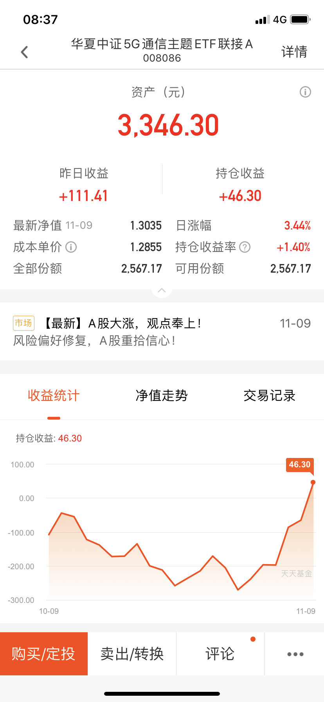
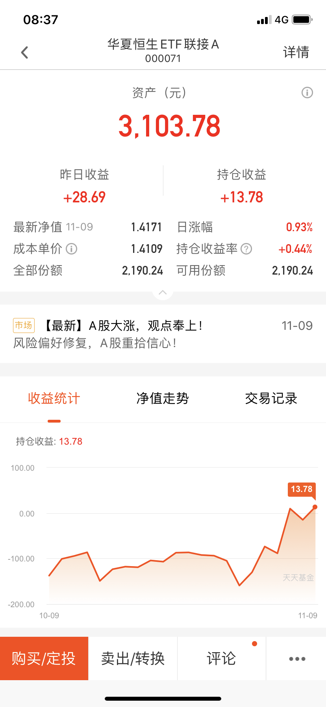

======================================================

_type: q&a
@范毅君[118551121224142]
2020-11-10 08:59:41 Tue  
topic_id: 582248211245184

@范毅君

>  二师父，中证医疗现在可以定投吗，这个前景怎么样

@二师父

>  医疗很好的，目前处于估值中枢，小仓位定投可以，仍有较大回撤，看中药带量采购落地对医疗行业影响

阅读[3725]  评论[1]  赞[0] 

======================================================

_type: talk
@二师父[28814221155551]
2020-11-10 09:54:10 Tue  
topic_id: 414421482558858

<e type="hashtag" hid="881251425252" title="#鳄鱼计划#" /> 卖出银行etf一份，恒生etf两份，今天跑输大盘了，配置了较多的成长行业指数，回撤就会有，各有利弊。而投资中波动并不是风险，需要的是保住本金条件下的增值。

医疗等待一下，这类指数也属于盈利稳定的成长类指数，回撤比较大，控制好安全边际。

@光少 at 2020-11-10 09:54:10 Tue

> 上次卖了又跌下来了2.088忘买了，再跌下来就准进场

----------

阅读[3767]  评论[1]  赞[0] 

======================================================

_type: solution
2020-11-10 09:57:56 Tue  
topic_id: 414421482551848

@Sunflower at 2020-11-10 09:57:56 Tue

> 你收割的利润买什么呢？怎么安排的？

----------

@杜志彪 at 2020-11-10 09:57:56 Tue

> 现在没什么可以买的，华泰可以设定时间自动成交国债逆回购。

----------

阅读[3639]  评论[2]  赞[0] 

======================================================

_type: talk
@二师父[28814221155551]
2020-11-10 10:19:42 Tue  
topic_id: 582248214442884

<e type="hashtag" hid="88512852188412" title="#当前鳄鱼计划持仓#" /> 持仓基本优质，银行、恒生偏弱，银行可用招行、宁波组合替代，恒生可用中概互联+恒生科技替代。目前保持这个仓位调结构，今年和去年已经连续涨了两年了，未来会有一跌，不是明年就是后年，A股历史上尚未出现连续三年盈利的现象，如果明年继续盈利，那么就是注册制改革打破了既有的规律。这个没法预测。无论涨跌，多持有股权资产，我们付出了波动的成本，但是获取了远跑赢通胀的收益率。

昨天刚提示完新能车风险，今天就大跌，这属于偶然现象，而炒作概念的必然最终是这个命运，只是谁来买单罢了，还有15年的环保，当年也是炒的很高，上的越高，下来越惨，所以这类板块包括半导体要么不参与，要么跑得快，要么小仓位。

@wty at 2020-11-10 10:19:42 Tue

> 二师父，求恒生科技ETF的代码，准备买100观察仓！

----------

@二师父 at 2020-11-10 10:19:42 Tue

> 03088，这是在港股账户的

----------

@wty at 2020-11-10 10:19:42 Tue

> OK，多谢🙏

----------

@百变 at 2020-11-10 10:19:42 Tue

> 老师：招行，宁波组合是买个股吗？

----------

@wty at 2020-11-10 10:19:42 Tue

> 二师父，恒生科技指数03032和华夏恒生科技指数的区别是什么？

----------

@二师父 at 2020-11-10 10:19:42 Tue

> 是的，如果不懂股票，只能选择银行etf或者主动基金了

----------

@二师父 at 2020-11-10 10:19:42 Tue

> 不同基金公司的产品

----------

@wty at 2020-11-10 10:19:42 Tue

> OK，多谢🙏

----------

阅读[3986]  评论[14]  赞[0] 

+++++++++++++++++++++++++++++++++++++++++++++++++++++

图片：
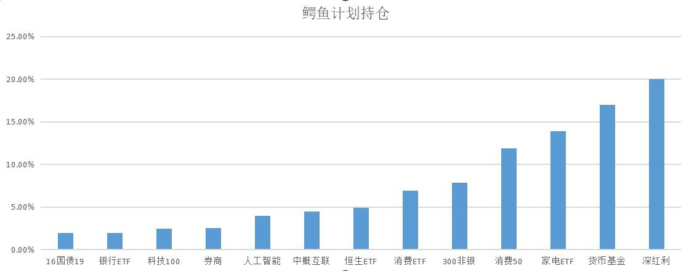

======================================================

_type: q&a
@J[28281541518551]
2020-11-10 10:37:34 Tue  
topic_id: 182218251111252

@J

>  师父，请把券商网格表再发一次可以吗？找不着了

@二师父

>  这是当前的网格表，券商目前没有大行情，吃点小肉还是可以的

阅读[3981]  评论[8]  赞[0] 

======================================================

_type: talk
@二师父[28814221155551]
2020-11-10 16:35:45 Tue  
topic_id: 215541522448151

今天恒生科技，中概互联大跌，而恒生指数上涨，好基金也不能买贵了，长期看中概仍旧会优于恒生，而短期几天几周会有幸存者偏差，当前高估的白酒基金不能参与了，我留了点底仓，看看能涨到多疯狂，未来估值一定会下来的，如果能经受住波动这个基金可以长期持有，如果不能经受住波动，收割利润是不错的选择。

@九妹Amy'' at 2020-11-10 16:35:45 Tue

> 师傅中概互联可以建观察仓吗？今天

----------

@二师父 at 2020-11-10 16:35:45 Tue

> 这个不用观察了，高估的这只，做定投至少等到回到正常估值

----------

阅读[3702]  评论[2]  赞[0] 

======================================================

_type: talk
@二师父[28814221155551]
2020-11-10 17:38:46 Tue  
topic_id: 182218241284582

<e type="hashtag" hid="51285128424124" title="#主动基金挑选方法#" /> 有很多朋友挑选主动基金定投，分享下挑选主动基金的方法，以后按照这些标准选择会有的放矢，选主动基金核心就是选人，基金经理对了，长期跟着他不会错。

二师父一直投资的是被动指数基金，很多投资者都有自己投资主动型股票基金，那么如何挑选主动型的股票基金或者混合基金呢？

今天二师父和大家分享下挑选主动基金的方法。

主动基金挑选主要看基金经理，通常一个基金经理有以下几个特质，那么该基金经理管理的规模超过10亿以上的主动型股票基金或者混合基金就可以纳入我们的基金池。

第一、人品。

这是最难的，也是最重要的，一个人的能力可以培养，而一个人的人品是天生的，不会随着时间的改变而改变。

看一个人的人品主要看三个方面。第一是否有担当，也就是常说的责任感。有担当的人遇到事情的时候不会逃避，而是承担自己的责任。

在公募基金管理行业就是一种极致的信托责任感，只有这样的基金经理才会认真将自己的产品运行下去，像呵护自己的生命一样极致来管理自己的基金，有了这种品质基金经理就不会因主观因素而离开。

有责任感的人往往慎独且忠诚，这种人不仅是事业上很好的伙伴，而且在生活中是值得依靠和信赖的朋友，遇到了就是福分。

第二、谦逊。一个谦逊的人内心澄明，平和厚道，内心淳朴，更加容易抵制投资和生命中的诱惑。资本市场一直有着各种各样的杂音，要想摒弃这些杂音专注做自己并非需要学识，需要的是精神态度。

第三、言行一致。价值投资收起来容易，而真正做到长期持有却异常艰难。

看基金经理是否言行一致可以追踪其历史持仓，看其持仓股票是否符合他的投资哲学和投资理念，是否随着市场发生风格漂移。

以上三点属于考察基金经理人品范畴，这是选择的重中之重，也是最难的地方。

第二、投资经验

当前市场上穿越两轮牛熊的基金经理有四位，可以把标准放宽，选择穿越过一轮牛熊以上的基金经理，也就是基金经理在管理产品或者从事投资研究要在2014年以前。有了一轮牛熊或者两轮牛熊经验并且战胜市场的基金经理都是大浪淘沙留下来的。

如果穿越至少一轮牛熊市而且基金经理的股票类基金产品均有年化15%以上的收益率，那么这个业绩就非常不错了。

第三、管理资产规模

管理资产规模50亿以上的基金经理，在A股市场就非常优秀了，对于那些资产管理规模超过500亿的基金经理，属于明星基金经理，如果满足第一个条件，可作为首选。

选主动基金就是选人，选对了人，把自己的资金交给靠谱且有能力的人打理就是最正确的投资姿势。

如果基金经理人品佳，投资水平高，且能够长期10年坚持做价值投资，不畏波动，穿越牛熊，这种基金经理募集的主动型股票基金可以长期持有。

长期看，权益类投资会有高收益，超额收益是投资者获得的，而波动是投资者付出的成本。这其中两大难点，如何看基金经理的人品，以及是否自己能够真正做到买入并持有10年以上。如果能做到，优质主动基金可以作为长期持有标的，如果做不到，被动指数基金是更好的选择

@吃肉肉 at 2020-11-10 17:38:46 Tue

> 老师推荐几个明星基金经理

----------

@二师父 at 2020-11-10 17:38:46 Tue

> 傅鹏博，张坤，朱少醒，萧楠，傅友兴，董承非，梁浩，谢志宇，李元博

----------

@阿宝 at 2020-11-10 17:38:46 Tue

> 说的很好！

----------

阅读[4422]  评论[3]  赞[0] 

======================================================

_type: q&a
@*[414848454821418]
2020-11-10 19:23:15 Tue  
topic_id: 582248254454414

@*

>  师父，怎么跟投鳄鱼计划

@二师父

>  买入卖出会及时在星球公布

阅读[3936]  评论[0]  赞[0] 

======================================================

_type: q&a
@付云[844148188522822]
2020-11-11 11:30:43 Wed  
topic_id: 414421451828458

@付云

>  二师傅，想咨询一下孩子的教育险和健康险方面的问题

@二师父

>  教育险相当于理财险，储蓄险种，保证孩子有资金支持，这种意义不大，自己投资一般比教育理财险收益好
>  
>  健康险有少儿医保，重疾险，意外险，这两个可以配置，买个安心，主要防止极端意外

阅读[3678]  评论[0]  赞[0] 

======================================================

_type: talk
@幽兰[815554522442422]
2020-11-11 11:33:38 Wed  
topic_id: 215541518521841

二师父，这两天中概互联在下跌，跌到多少适合建个底仓？

@二师父 at 2020-11-11 11:33:38 Wed

> 建底仓还早，等跌到位或者进入低估了，暂时别接飞刀

----------

@幽兰 at 2020-11-11 11:33:38 Wed

> 好的

----------

阅读[3629]  评论[2]  赞[0] 

======================================================

_type: q&a
@吾思吾想[118552585284212]
2020-11-11 11:37:21 Wed  
topic_id: 215541544542411

@吾思吾想

>  师父，能帮我看看005467咋回事？

@二师父

>  这个债基里面持仓的债券发生了违约，投资信用债，企业债基金最后分散配置，当发生违约时也会有回撤，可以配置国债，国开债基金，违约概率很小

阅读[3903]  评论[0]  赞[0] 

======================================================

_type: q&a
@Fernando杜[841518122414242]
2020-11-11 11:42:52 Wed  
topic_id: 582248248252114

@Fernando杜

>  二师父好，我是2019年8月开始跟您学习定投场外基金乌龟计划的。目前，我的基金持仓如下图所示，希望向您请教一下，哪些基金适合调仓？谢谢。

@二师父

>  这个组合配置偏稳健，价值类基金较多，预期年化百分之10这个配置会比较好，银行指数可以调整，后期往消费，医疗板块配置一些，恒生国企可以分仓配置一点中概互联，中概股预期收益更好，波动越大
>  
>  整体配置与预期收益率和能经受的波动有关，能经受波动越大，可以超配行业指数

阅读[4040]  评论[5]  赞[0] 

======================================================

_type: q&a
@阳光[421884185252128]
2020-11-11 11:51:41 Wed  
topic_id: 414421425282128

@阳光

>  师父：怎么显示不能续费呢？该如何续费？

@二师父

>  在置顶第一篇文章有续费二维码

阅读[4032]  评论[1]  赞[0] 

======================================================

_type: solution
2020-11-11 13:06:24 Wed  
topic_id: 182218285155852

@杜志彪 at 2020-11-11 13:06:24 Wed

> 今天参与了场外基金豆微笑定投，蛋卷定投了半份医药和人工智能。

----------

@梧桐 at 2020-11-11 13:06:24 Wed

> 最近微笑定投不如小目标收益好

----------

@杜志彪 at 2020-11-11 13:06:24 Wed

> 采用最小金额定投，主要是参考它的定投策略。

----------

阅读[3832]  评论[3]  赞[0] 

======================================================

_type: solution
2020-11-11 15:39:40 Wed  
topic_id: 582248285452214

@步步惊心 at 2020-11-11 15:39:40 Wed

> 二师父你好 请问科创板ETF折算0.68是啥意思啊！谢谢

----------

@二师父 at 2020-11-11 15:39:40 Wed

> 您在哪看的

----------

@步步惊心 at 2020-11-11 15:39:40 Wed

> 我买的，16日可上市，今天基金公司通知我。

----------

@二师父 at 2020-11-11 15:39:40 Wed

> 这是份额和净值调整，对您无实质影响。

----------

@步步惊心 at 2020-11-11 15:39:40 Wed

> 大概不合算了。

----------

阅读[3911]  评论[5]  赞[0] 

======================================================

_type: talk
@二师父[28814221155551]
2020-11-11 20:00:34 Wed  
topic_id: 215541855452241

<e type="hashtag" hid="15284552222242" title="#中概互联投资时机#" /> 看看中概互联的投资时机

阅读[4224]  评论[0]  赞[0] 

+++++++++++++++++++++++++++++++++++++++++++++++++++++

文件：
2020-11-11 19:57:15 Wed
文件大小：[24681]
15151425845822-中概互联的投资时机.docx

======================================================

_type: talk
@二师父[28814221155551]
2020-11-11 20:19:56 Wed  
topic_id: 582248122488514

<e type="hashtag" hid="825188852442" title="#估值表#" /> 估值表继续减法，红色最好不要参与，可以说个思路，大家看好得基金正常估值定投，低估建立底仓。其实好的企业和基金就那么几个，没必要全部做。今年继续升级，账户只投3个企业，5只基金，满仓运营，这和以前得价值投机不同，而是完全遵循巴菲特得思想长期持有，看看效果如何，几年以后再跟大家汇报。

当然鳄鱼计划和乌龟计划还是一样得，不变，简单而言就是低位加，高位减，保持合理仓位，这种方法一定盈利，我自己做过，而且坚持下来得读者也是盈利得。关键是进一步优化，这是投资得魅力和乐趣，永远没有终点和最优解。

@王模堂 at 2020-11-11 20:19:56 Wed

> 二师父，能否点评一下嘉实H股50ETF（189523），現在可买吗？

----------

@王模堂 at 2020-11-11 20:19:56 Wed

> 二师父，能否点评一下嘉实H股50ETF（159823），現在可买吗？

----------

@光少 at 2020-11-11 20:19:56 Wed

> 二师父，您看好那三个企业？可分享吗？

----------

@百变 at 2020-11-11 20:19:56 Wed

> 老师：能不能把三个企业，五只基金分享出来我们做个参考，[捂脸]

----------

@二师父 at 2020-11-11 20:19:56 Wed

> 价值基金，目前可以买，不过大概率是跑输大盘

----------

@二师父 at 2020-11-11 20:19:56 Wed

> 基金可以分享，酒，医疗，中概，纳斯达克，科技etf

----------

@二师父 at 2020-11-11 20:19:56 Wed

> 说下基金吧，酒，医疗，纳斯达克，中概，科技etf，风险都偏高

----------

@光少 at 2020-11-11 20:19:56 Wed

> 谢谢！[抱拳]

----------

阅读[4638]  评论[21]  赞[0] 

+++++++++++++++++++++++++++++++++++++++++++++++++++++

图片：
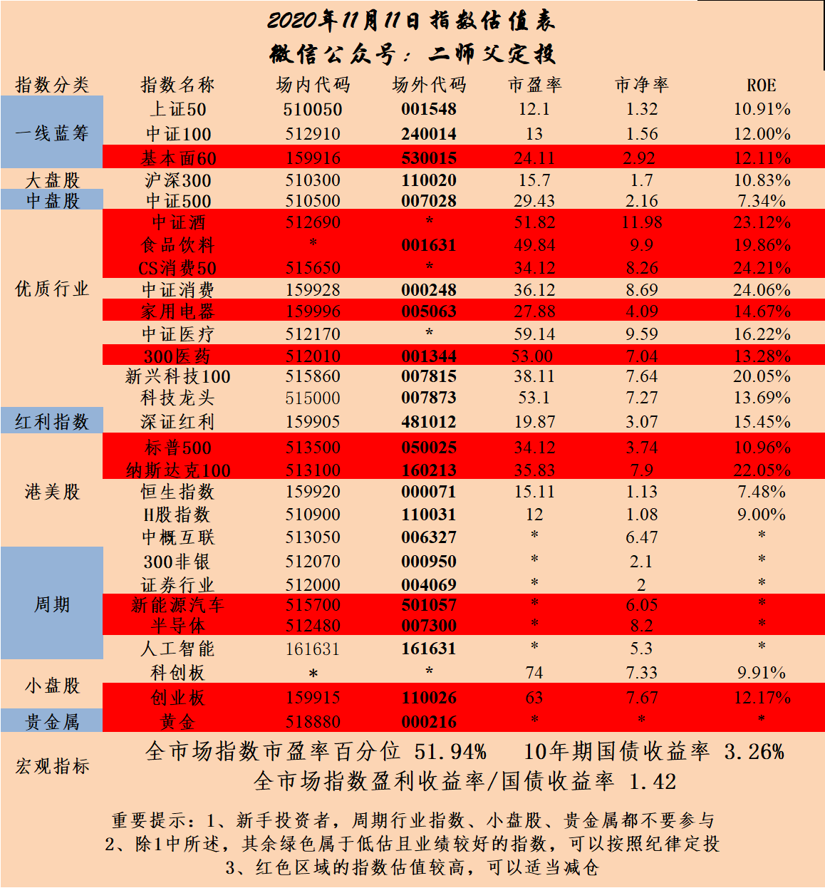

======================================================

_type: talk
@二师父[28814221155551]
2020-11-12 14:28:30 Thu  
topic_id: 414421882125418

<e type="hashtag" hid="28518855451481" title="#乌龟计划#" /> 收割部分中证500利润，市场稳步上升，逐步获利了结，与趋势交易不同，逆势交易是在底部区域下跌途中买入，在上涨途中卖出。

A股好的稳健板块是消费、医疗、科技、金融。A股好的周期板块纯靠炒作，主要在底部区域配置优质板块，周期板块例如券商、新能源、半导体少量配置即可。这类基金波动大，普通投资者满仓买入很难拿的住。

@夜色霓虹灯 at 2020-11-12 14:28:30 Thu

> 无法跟调，是因为偏离目标的原因吗

----------

@衣袂飘香 at 2020-11-12 14:28:30 Thu

> 跟着卖了。

----------

@二师父 at 2020-11-12 14:28:30 Thu

> 可以点一键调仓

----------

@娃娃after🎈 at 2020-11-12 14:28:30 Thu

> 也不行，我每次都单独操作。天天跟投这块不如蛋卷好用

----------

@苍天有井明月空🌙 at 2020-11-12 14:28:30 Thu

> 跟不了

----------

@二师父 at 2020-11-12 14:28:30 Thu

> 我和他们反馈下

----------

@苍天有井明月空🌙 at 2020-11-12 14:28:30 Thu

> 偏离目标跟了还得买基本面60，不能单独卖

----------

@娃娃after🎈 at 2020-11-12 14:28:30 Thu

> 嗯嗯 希望能有只跟调本次交易的功能[抱拳]

----------

阅读[3996]  评论[18]  赞[0] 

+++++++++++++++++++++++++++++++++++++++++++++++++++++

图片：
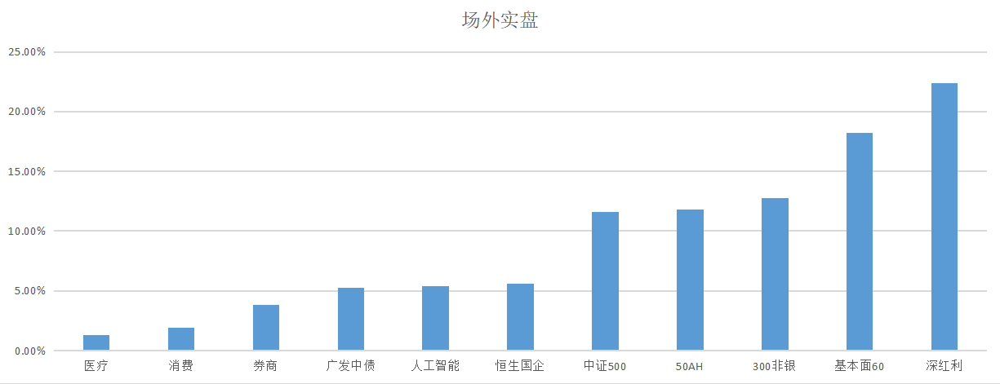

======================================================

_type: solution
2020-11-12 14:59:46 Thu  
topic_id: 414421881418428

@六尘不改 at 2020-11-12 14:59:46 Thu

> 都说酒涨疯了，我看白酒没几个大涨的

----------

@光少 at 2020-11-12 14:59:46 Thu

> 这样还不算涨疯啊

----------

@光少 at 2020-11-12 14:59:46 Thu

> 

----------

@六尘不改 at 2020-11-12 14:59:46 Thu

> 唉，我持仓的都是茅台，五粮液，庐州，汾酒

----------

@光少 at 2020-11-12 14:59:46 Thu

> 一线二线白酒前段时间也长得不错啊

----------

@雨淡风清 at 2020-11-12 14:59:46 Thu

> 看看茅台其实已经4个月没怎么涨了，还没破前高

----------

@杜志彪 at 2020-11-12 14:59:46 Thu

> 好也要买的便宜，今天又大跌了，光少心情是不是有变好了[呲牙]

----------

@光少 at 2020-11-12 14:59:46 Thu

> 我的泸州早卖了[偷笑]

----------

阅读[3697]  评论[8]  赞[0] 

======================================================

_type: talk
@二师父[28814221155551]
2020-11-12 21:43:06 Thu  
topic_id: 414421852454248

<e type="hashtag" hid="225824552481" title="#打卡#" /> 隔离期天桥跑步也是很不错的选择，另外徒手自重离凳马步大家可以试试，适合久坐办公室一族

阅读[3791]  评论[0]  赞[0] 

+++++++++++++++++++++++++++++++++++++++++++++++++++++

图片：
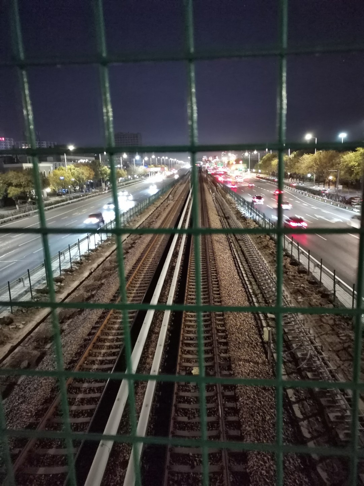

======================================================

_type: talk
@秦风殇韵（刘豫斌）[241555548554841]
2020-11-13 10:29:14 Fri  
topic_id: 414421525144158

今天券商是不是网格可以买了？找不到之前的网格表了，二师父重发一下吧，谢谢。

@样 at 2020-11-13 10:29:14 Fri

> 

----------

@Siller at 2020-11-13 10:29:14 Fri

> 可以试试搜索功能

----------

@秦风殇韵（刘豫斌） at 2020-11-13 10:29:14 Fri

> 谢谢大家

----------

@幽兰 at 2020-11-13 10:29:14 Fri

> 1.11，也可以买入了吧

----------

@雨淡风清 at 2020-11-13 10:29:14 Fri

> 安网格可以建仓底了

----------

阅读[3465]  评论[5]  赞[0] 

======================================================

_type: q&a
@淡泊宁静[48884111581818]
2020-11-13 12:00:28 Fri  
topic_id: 582248545228114

@淡泊宁静

>  请问二师父，这个申请退出吗？还是继续持有？

@二师父

>  封闭基金只有开放了才能退出的

阅读[3671]  评论[1]  赞[0] 

======================================================

_type: solution
2020-11-13 13:49:15 Fri  
topic_id: 414421521451188

阅读[3394]  评论[0]  赞[0] 

======================================================

_type: talk
@二师父[28814221155551]
2020-11-13 15:43:50 Fri  
topic_id: 414421518548518

<e type="hashtag" hid="15284552118542" title="#卖出的方法#" /> 右侧：逐步止盈；左侧，高估区域趋势反转一次清仓。

这两种方法最好，当然如果现金流入速度快，账户仓位自动下降，是可以长期持有优质基金的。

阅读[4128]  评论[0]  赞[0] 

+++++++++++++++++++++++++++++++++++++++++++++++++++++

文件：
2020-11-13 15:42:43 Fri
文件大小：[25866]
48282554451418-聊一聊卖出止盈的必要性及方法.docx

======================================================

_type: talk
@二师父[28814221155551]
2020-11-13 23:40:50 Fri  
topic_id: 582248422824544

<e type="hashtag" hid="552114551414" title="#估值数据#" /> 目前国债收益率持续走高，全市场指数估值变化不大，风险溢价率在提高。SY/BY百分位59.08%，SY-BY百分位60.22%。

依旧适合持有和收割利润，不惧波动长持股权比现金要好。

阅读[3911]  评论[0]  赞[0] 

======================================================

_type: q&a
@海马[15158245825242]
2020-11-13 23:44:22 Fri  
topic_id: 582248581518844

@海马

>  师父你怎么看目前宽松的货币政策退出对资本市场的影响？

@二师父

>  货币收紧，紧货币，宽信用，主要是抑制楼市，因为货币宽松太严重，M2增大会导致热钱无处流动，当前仍旧处于牛市上升趋势中，未来信贷和货币收紧，也是抑制股市过快上涨的。

阅读[3696]  评论[0]  赞[0] 

======================================================

_type: q&a
@*[414848454821418]
2020-11-13 23:47:25 Fri  
topic_id: 215541214851141

@*

>  师父，保险指数进入低估，可以建仓吗？前景如何？167301，这只能长期定投吗？

@二师父

>  目前轻仓定投还行，这个板块在整体A股中算洼地，这个基金持仓分散，单论保险的话平安的前景更好。
>  
>  长期在安全边际内定投可以的，关注下后期分级基金改革以后这只基金的动态。很多分级基金转型以后是可以再投资的，比如之前的招商白酒分级。

阅读[3683]  评论[5]  赞[0] 

======================================================

_type: talk
@helen[544884424181154]
2020-11-16 10:26:26 Mon  
topic_id: 582248448548414

请教二师父，东方红睿玺三年定开今天开放，如果不考虑流动性的话，您推荐再买吗？（原来我已经有小额持仓）

@Vivian at 2020-11-16 10:26:26 Mon

> 同问，当时红极一时配到很少仓位，，年化二十几，基金持股好像不错

----------

@二师父 at 2020-11-16 10:26:26 Mon

> 这个持仓企业不错

----------

阅读[3232]  评论[2]  赞[0] 

======================================================

_type: talk
@志亮[422125851552828]
2020-11-16 13:51:54 Mon  
topic_id: 582248485585124

上次老窖下车后一直找不到机会上，后悔到死，这次五粮液涨上天我也不会卖的，我留着用来养老[呲牙]。

@九妹Amy'' at 2020-11-16 13:51:54 Mon

> 万一回撤呢？

----------

@志亮 at 2020-11-16 13:51:54 Mon

> 回撤也不卖，打死也不卖[呲牙]

----------

@rtdmm小米 at 2020-11-16 13:51:54 Mon

> 当成存酒[偷笑][偷笑]

----------

@是喵喵吖～ at 2020-11-16 13:51:54 Mon

> 回撤还加仓不

----------

@二师父 at 2020-11-16 13:51:54 Mon

> 疫情期间不是扛住了吗

----------

阅读[3209]  评论[5]  赞[0] 

======================================================

_type: talk
@范毅君[118551121224142]
2020-11-16 15:06:19 Mon  
topic_id: 815541412114822

经过多次忘记卖 结果到手鸭子飞了之后，今天终于记起来了[撇嘴][撇嘴][捂脸]😂

@wty at 2020-11-16 15:06:19 Mon

> 我今天吃到肉了，开盘隆利转债忘记卖了，中午看到已经涨停盘了，好在2:57开盘卖出，[偷笑]

----------

@范毅君 at 2020-11-16 15:06:19 Mon

> [偷笑]

----------

@栀子花开 at 2020-11-16 15:06:19 Mon

> 龙利转债这么快就上市了吗，我差点忘了我也有

----------

阅读[3213]  评论[3]  赞[0] 

+++++++++++++++++++++++++++++++++++++++++++++++++++++

图片：
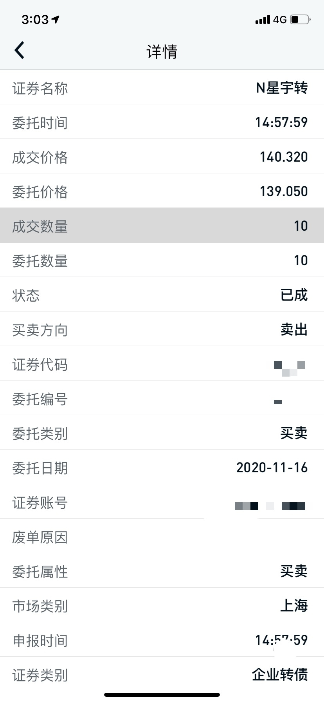

======================================================

_type: q&a
@果实妈咪[182225518588452]
2020-11-16 19:23:18 Mon  
topic_id: 215541444111181

@果实妈咪

>  二师父，保险可以网上购买吗？网上购买的保险是不是理赔就不如线下，为何很多高性价比保险产品都是在线上销售，线下并没有呢？谢谢

@二师父

>  可以的，性价比高，是保障好而且比较便宜，大型保险公司的运营成本高，产品也必然很贵的。线上是可以买的，最终是受到银保监会的监督，购买的时候如实健康告知就行。

阅读[3276]  评论[0]  赞[0] 

======================================================

_type: q&a
@雨淡风清[844418818858882]
2020-11-16 19:23:24 Mon  
topic_id: 414421215851828

@雨淡风清

>  二师父你好，上证科创50可以买了，是不是可以配一点。那只科创50好一些？

@二师父

>  大型的几个基金公司募集的产品都可以，科创50也是不错的宽基指数

阅读[3454]  评论[1]  赞[0] 

======================================================

_type: talk
@二师父[28814221155551]
2020-11-16 19:24:34 Mon  
topic_id: 182218825554512

<e type="hashtag" hid="88512888111122" title="#给主动基金估值#" /> 给主动基金估值，可以定性也可以定量，价格很重要，企业的成长空间也很重要，好企业是能够新高的，而一般企业就只能波动。

阅读[3593]  评论[0]  赞[0] 

+++++++++++++++++++++++++++++++++++++++++++++++++++++

文件：
2020-11-16 19:23:36 Mon
文件大小：[25602]
28484214482441-如何给主动基金估值.docx

======================================================

_type: talk
@二师父[28814221155551]
2020-11-16 20:35:08 Mon  
topic_id: 215541158485541

<e type="hashtag" hid="28518858514151" title="#每日估值数据#" /> 当前市盈率百分位52.39%，市净率百分位33.32%，SY-BY百分位61.73%，SY/BY百分位60.22%。当前利率上行，信贷收紧，除了看好的未来市值会新高的企业，其他的股权投资可以停止了，把买入和持有分开。

市场估值只反映了市场情绪，而对于投资而言，好企业是不完全随着市场而走的，比如曾经的茅台，未来的拼多多，美团。

@sky at 2020-11-16 20:35:08 Mon

> 师父不继续看好茅台吗？感觉茅台在控制利润增速，未来还有很大的空间啊。

----------

@闪闪的星光 at 2020-11-16 20:35:08 Mon

> 师傅啊，现在继续小额定投易方达中概互联50指数基金，可以吗？
中概互联50指数目前估值是适中的呀

----------

@二师父 at 2020-11-16 20:35:08 Mon

> 同行业比较他是很好的，没有说不看好啊，未来拼多多美团空间更大

----------

@二师父 at 2020-11-16 20:35:08 Mon

> 小额定投可以

----------

@闪闪的星光 at 2020-11-16 20:35:08 Mon

> 谢谢师傅

----------

@六尘不改 at 2020-11-16 20:35:08 Mon

> 腾讯美团继续看好吗

----------

@二师父 at 2020-11-16 20:35:08 Mon

> 好的，拼多多也很好

----------

阅读[3573]  评论[7]  赞[0] 

======================================================

_type: solution
2020-11-17 09:30:57 Tue  
topic_id: 215541188828221

@Sunflower at 2020-11-17 09:30:57 Tue

> 您好，请问您的目标是年化收益率多少呀？

----------

@杜志彪 at 2020-11-17 09:30:57 Tue

> 20-25%

----------

@果实妈咪 at 2020-11-17 09:30:57 Tue

> 你好厉害呀

----------

@Sunflower at 2020-11-17 09:30:57 Tue

> 我离这个目标还差不少，等这个行情过了打算慢慢调仓

----------

@九妹Amy'' at 2020-11-17 09:30:57 Tue

> 请问鳄鱼计划到底在哪里看到？谢谢

----------

@杜志彪 at 2020-11-17 09:30:57 Tue

> 鳄鱼计划是随机的，你需要及时关注星球信息才行，二师父操作时会发到星球里，你看往期的意义不大，想看的话可以在精选里去找，近期都是卖出的。

----------

@杜志彪 at 2020-11-17 09:30:57 Tue

> 第一年我先从宽基开始，边定投边学习，实战理解五步定投法，第二年配了些行业指数，以跑赢300指数为目标，如果组合不能跑赢300指数说明不合理需要调整，目前以场内为主，场外为辅，股票配了一点行业龙头，其它的不碰（尤其强周期指数），明年计划继续向行业指数倾斜（减少300，500的仓位）

----------

@Sunflower at 2020-11-17 09:30:57 Tue

> 我现在是第二年了，目前还没跑赢沪深300打算调整仓位到行业指数，减少基金持有数量，进行精简

----------

阅读[3346]  评论[12]  赞[0] 

======================================================

_type: talk
@二师父[28814221155551]
2020-11-17 19:50:12 Tue  
topic_id: 182282241855542

<e type="hashtag" hid="28512881522551" title="#两大科技指数#" /> 投资是投预期，你是预期未来美团更好还是招商银行更好。注意同赛道和分赛道的不同，在一个如日中天行业可能一家普通公司优于一个夕阳行业的优秀公司，这就是趋势。

@🍀 凝🌸 慧🍀 at 2020-11-17 19:50:12 Tue

> 谢谢师父，赶紧好好看看[愉快]！

----------

@幽兰 at 2020-11-17 19:50:12 Tue

> 中概互联做网格的话多少可以入手呢？

----------

@志亮 at 2020-11-17 19:50:12 Tue

> 中概互联不错，可以找机会建部分仓位[微笑]

----------

阅读[3758]  评论[3]  赞[0] 

+++++++++++++++++++++++++++++++++++++++++++++++++++++

文件：
2020-11-17 19:48:26 Tue
文件大小：[25483]
51414425421114-最有价值的两个科技指数.docx

======================================================

_type: talk
@二师父[28814221155551]
2020-11-17 20:47:34 Tue  
topic_id: 414414451854258

<e type="hashtag" hid="552114551414" title="#估值数据#" /> 市盈率百分位51.61%，市净率百分位32.11%，SY/BY百分位59.71%，SY-BY百分位59.71%。当前市场并未发生明显变化，唯一注意的点是债市走熊，国债收益率持续上升，明年是一个里程碑式的一年，虽然多家机构连续看好，但是A股目前还未发生连续三年大涨的行情，所以我看到明年第二三季度。如果市场并未如期运行，再次投资即可。

波动只是提供了买入和卖出的机会，更多的是发现好企业，好基金，并不需要怎么个操作，耐心持有就是最好的操作。

@栀子花开 at 2020-11-17 20:47:34 Tue

> 请问二师傅，1：从管理层的干预来看，有没有可能在目前的位置横盘一年再上涨一波，上涨—横盘震荡—上涨。从而实现高层慢牛的目标[微笑]。2：如果管理层明年开始去杠杠，会不会又演义2018年的行情？

----------

@二师父 at 2020-11-17 20:47:34 Tue

> 大概率是继续上涨的，高层并没有慢牛的目标，他真有这个目标很容易实现，和2018年一样概率不大，18年是宏观去杠杆加上贸易战加上信贷收紧综合导致的，未来两年内会有一跌，这是大概率的

----------

阅读[3661]  评论[2]  赞[0] 

======================================================

_type: q&a
@舵手[815858155822852]
2020-11-18 07:41:03 Wed  
topic_id: 182282214442482

@舵手

>  师父，鳄鱼计划在哪看啊？

@二师父

>  在星球首页搜索鳄鱼计划，就能看到了

阅读[3343]  评论[6]  赞[0] 

======================================================

_type: q&a
@波多黎各[28428858544121]
2020-11-18 09:53:11 Wed  
topic_id: 182282211188252

@波多黎各

>  师父，地产，银行，保险，恒生是不是都是低估？

@二师父

>  相对白酒，新能源是便宜一些，地产，保险价格洼地

阅读[3505]  评论[2]  赞[0] 

======================================================

_type: q&a
@样[844124458224442]
2020-11-18 10:11:15 Wed  
topic_id: 815515544114842

@样

>  请教，中欧旗下的钱滚滚APP里面有个水滴养老，您了解吗，怎么看，值得参与么？这个款是一直持有不卖出的吗？

@二师父

>  这是中欧为养老需求的朋友设计的一款养老投顾式服务，看个人需求，有类似的稳健fof基金，如果准备买入拿着以后养老，可以选择他，基本上养老需求比较容易满足，稳健的沪深300加国债基金组合长期持有到退休也可以

阅读[3537]  评论[5]  赞[0] 

======================================================

_type: q&a
@一心一意[844421848411122]
2020-11-18 11:11:57 Wed  
topic_id: 414414421855818

@一心一意

>  师父你好，鳄鱼计划每次都在学堂里发么，怎么有时候看不到呢，还是需要每天都去鳄鱼计划里收索一下啊

@二师父

>  每次发车都会公布的，有的公布了买入操作，都会有通知，有小部分时候涉及了星球的违规，他会自动删除

阅读[3562]  评论[1]  赞[0] 

======================================================

_type: q&a
@不知道不明了[15584248411812]
2020-11-18 16:12:19 Wed  
topic_id: 815515512541522

@不知道不明了

>  二师父，现在医疗etf是不是可以开始定投了呀，仓位不到3层

@二师父

>  能接受较大回撤目前定投是可以的，医疗长期看优质板块

阅读[3539]  评论[0]  赞[0] 

======================================================

_type: q&a
@Vivian[582228554481154]
2020-11-18 16:13:03 Wed  
topic_id: 182282284444552

@Vivian

>  二师父，医疗调整了一段可以开始定投了吗？现在还没有医疗仓位，可以建多少底仓合适？

@二师父

>  医疗定投可以，目前还不适合建底仓

阅读[3591]  评论[2]  赞[0] 

======================================================

_type: talk
@二师父[28814221155551]
2020-11-18 20:43:01 Wed  
topic_id: 414414848544488

<e type="hashtag" hid="825188852442" title="#估值表#" /> 医疗再跌15%估计进入低估区域，大家想定投的可以开始，我再等等，目前没有医疗和医药仓位，预留了20份资金，有机会就买，没有特别好的机会，拿着国债逆回购也可以。

@吃肉肉 at 2020-11-18 20:43:01 Wed

> 看来国债收益率要上3.5%了

----------

@天马行空 at 2020-11-18 20:43:01 Wed

> 最近逆回购收益率不高呀，3.5是哪里得到得数据

----------

@J at 2020-11-18 20:43:01 Wed

> 师父，我的家电持有的仓位很少，不到总仓位2%，现在高估请问还有必要卖吗？[调皮]

----------

@二师父 at 2020-11-18 20:43:01 Wed

> 如果对波动无感就不需要

----------

@杜志彪 at 2020-11-18 20:43:01 Wed

> 机会总会留给有准备的人，师父这20份是给鳄鱼计划的吧[微笑]

----------

阅读[3890]  评论[5]  赞[0] 

+++++++++++++++++++++++++++++++++++++++++++++++++++++

图片：
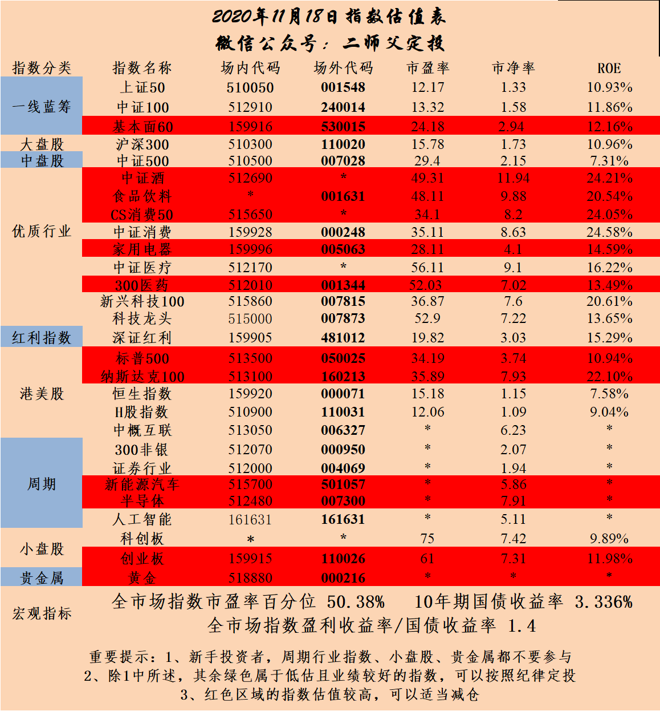

======================================================

_type: talk
@二师父[28814221155551]
2020-11-18 20:47:14 Wed  
topic_id: 582282121524244

<e type="hashtag" hid="28512881214111" title="#价值#" /> 找到有价值的企业，以合理公道的价格买入，看起来简单，真正长期坚持做到的挺难的。其实优质板块基金就深红利，消费ETF，白酒，中概互联，医疗和医药ETF，龙头科技，300非银，券商，新能车，人工智能等等，好企业再A股不超过30家，那为啥还是很多人赚不到钱，我想还是认知不到位，所以执行的时候总会疑惑。

@范毅君 at 2020-11-18 20:47:14 Wed

> 二师父能不能把A股的好企业科普一次[呲牙][呲牙]

----------

@二师父 at 2020-11-18 20:47:14 Wed

> 好的，俩月后吧

----------

@范毅君 at 2020-11-18 20:47:14 Wed

> 二师父这是说两个月后有机会吗[偷笑][偷笑]

----------

@二师父 at 2020-11-18 20:47:14 Wed

> 对

----------

@吃肉肉 at 2020-11-18 20:47:14 Wed

> 坐等师傅说的30个好企业

----------

@范毅君 at 2020-11-18 20:47:14 Wed

> 坐等发车[鼓掌]

----------

@志亮 at 2020-11-18 20:47:14 Wed

> 二师傅说的对，是对企业理解不深，比如若是在这间公司上班，还是高职位深入了解的，相信很多人都能拿得住股票。

----------

阅读[3680]  评论[7]  赞[0] 

+++++++++++++++++++++++++++++++++++++++++++++++++++++

文件：
2020-11-18 20:44:34 Wed
文件大小：[26959]
88484182222442-真正的价值.docx

======================================================

_type: q&a
@天马行空[548818851412444]
2020-11-18 20:49:30 Wed  
topic_id: 215515858845141

@天马行空

>  20万做券商，请问二师傅网格设置多少合适

@二师父

>  一份2万差不多，网格还是参考我那个表格就行

阅读[3574]  评论[1]  赞[0] 

======================================================

_type: talk
@二师父[28814221155551]
2020-11-18 20:59:57 Wed  
topic_id: 582282121585424

招商白酒转型，以后场外投资白酒基金多了一个选择，也可以选择食品饮料，也可以选择招商白酒

@nana at 2020-11-18 20:59:57 Wed

> 师傅，现持有的招商中证白酒A是否需赎回？

----------

@雨淡风清 at 2020-11-18 20:59:57 Wed

> 赎回干啥？不是说直接按净值转换么

----------

阅读[3654]  评论[2]  赞[0] 

+++++++++++++++++++++++++++++++++++++++++++++++++++++

图片：
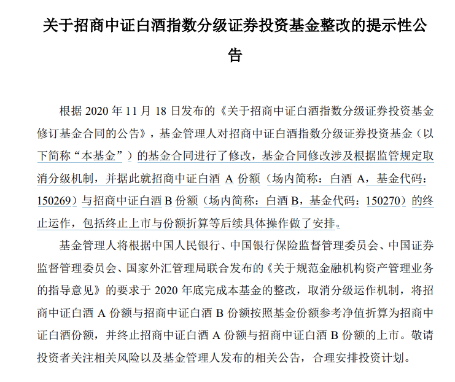

======================================================

_type: talk
@雨淡风清[844418818858882]
2020-11-19 11:06:59 Thu  
topic_id: 215515888142881

蚂蚁告诉我医疗低估了，高兴坏了，昨天二师父还发的高估，看了一眼，华宝中证医疗分级。分级啊啊啊啊

@天马行空 at 2020-11-19 11:06:59 Thu

> 能买吗

----------

@雨淡风清 at 2020-11-19 11:06:59 Thu

> 没看到二师父都不屑一顾么🤣

----------

@二师父 at 2020-11-19 11:06:59 Thu

> 分级基金转换之后可以的，类似招商白酒转型

----------

@雨淡风清 at 2020-11-19 11:06:59 Thu

> 这个可以动不，招商白酒分级卖早了，主场里白酒没动

----------

@二师父 at 2020-11-19 11:06:59 Thu

> 转型以后可以，白酒目前不合适

----------

@雨淡风清 at 2020-11-19 11:06:59 Thu

> 嗯嗯，白酒适当止盈，静待花开。医药就留了100观光，心里有点不平衡，没点医药感觉喝酒少点菜

----------

阅读[3363]  评论[6]  赞[0] 

+++++++++++++++++++++++++++++++++++++++++++++++++++++

图片：
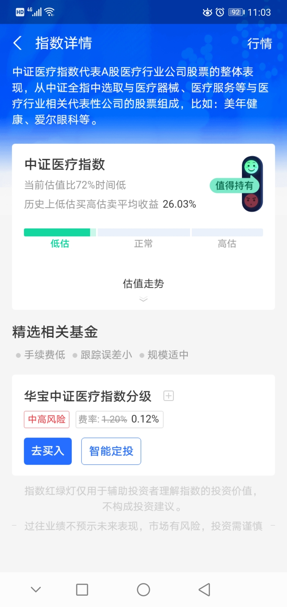

======================================================

_type: talk
@二师父[28814221155551]
2020-11-19 19:29:27 Thu  
topic_id: 215515828454121

<e type="hashtag" hid="48415881125428" title="#重要指标突破#" /> 当下10年期国债收益率持续走高，债券市场慢慢价值越来越高，之前投资的16国债19目前小浮亏0.45%，这是正常的，如果不能经受国债的波动，可以选择10年国债ETF和广发中债国开债，这两个也很不错。

@吃肉肉 at 2020-11-19 19:29:27 Thu

> 师父，国债也是定投策略吗？

----------

@二师父 at 2020-11-19 19:29:27 Thu

> 是

----------

阅读[3496]  评论[2]  赞[0] 

+++++++++++++++++++++++++++++++++++++++++++++++++++++

文件：
2020-11-19 19:27:49 Thu
文件大小：[26791]
88484128142882-一个重要指标在不断突破.docx

======================================================

_type: talk
@二师父[28814221155551]
2020-11-19 19:48:44 Thu  
topic_id: 815515824818522

<e type="hashtag" hid="28518858514151" title="#每日估值数据#" /> 市盈率百分位50.5%，市净率百分位32.13%，SY-BY百分位61.07%，SY/BY百分位60.22%。

目前仍旧估值中枢，继续看好后市，跌了三个月没有破位，这是个好信号，持有耐心等待市场发力。注意期间调仓，别追高，板块总是轮动的，抓住自己看得懂的核心板块就行。

阅读[3779]  评论[0]  赞[0] 

======================================================

_type: talk
@百变[15285855281882]
2020-11-19 22:36:14 Thu  
topic_id: 582282158544524

老师：我们怎么就知道公司发布可转债强制赎回公告了？

@二师父 at 2020-11-19 22:36:14 Thu

> 我没明白你说的啥意思，如果看公告公司会发布的

----------

@百变 at 2020-11-19 22:36:14 Thu

> 在哪第一时间就知道了？证券账户有提示吗？

----------

@二师父 at 2020-11-19 22:36:14 Thu

> 你在雪球关注相关公司和可转债有大事件会通知

----------

阅读[3222]  评论[3]  赞[0] 

======================================================

_type: talk
@闪闪的星光[88285424418582]
2020-11-20 16:41:02 Fri  
topic_id: 414414815541488

二师傅好，
请教：

中证医疗指数的市盈率自七月份以来，下跌了不少，从市盈率的百分位看，似乎就要进入低估了。

可是看看华宝中证医疗指数分级162412的净值走势图，可以发现，自七月份以来这只指数基金的净值并没有下跌很多，似乎依然很贵。

我就搞不懂了，市盈率快要进去低估了，可是基金的净值仍然高高在上，我们现在买入，岂不是买在了高位？
为什么会出现这样矛盾的现象呢？

@二师父 at 2020-11-20 16:41:02 Fri

> 这个问题挺好的，首先但看市盈率估值本身就是有前提条件的，必须同行业，而且盈利水平稳定，未来增长预期一定，而目前医疗市盈率下降更多是疫情结束后医疗景气度下降带来的，盈利上升带来的影响较小，所以单看市盈率会进入坑。

成长企业而言，市盈率越高越值得投资，并不是说市盈率低就好，就比如比亚迪和特斯拉，如果他们市盈率下来了，说明市场也不看好他们，预期较低

----------

阅读[3066]  评论[1]  赞[0] 

+++++++++++++++++++++++++++++++++++++++++++++++++++++

图片：
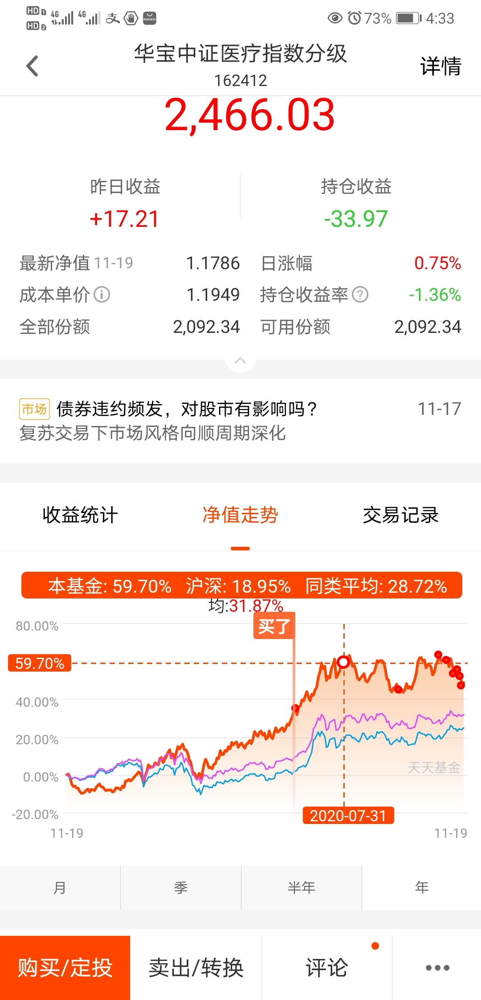
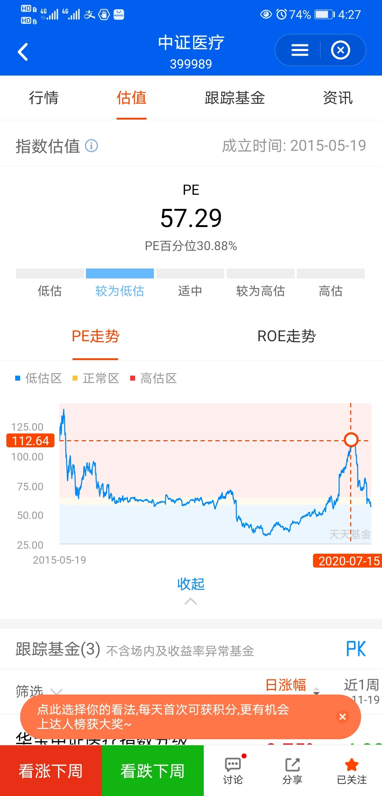

======================================================

_type: talk
@二师父[28814221155551]
2020-11-20 16:44:40 Fri  
topic_id: 815515812244542

<e type="hashtag" hid="28518858514151" title="#每日估值数据#" /> 市盈率百分位51.61%，市净率百分位32.64%，SY-BY百分位62.41%，SY/BY百分位61.12%。

目前一直震荡，没啥机会，医疗观察了下，预计在这个基础上跌10%可以定投了，如果能接受较大回撤的，目前定投问题不大，这是仓位、心理承受能力以及资金的综合考量。场外的华宝医疗分级转型成功后可以考虑，还有保险分级基金转型成功之后也行。白酒还在涨，如果不惧50%以上波动的朋友，这个板块也可以不卖的，长期看涨，但是A股波动大，我自己受不了满仓经受这种级别的波动，所以会卖出。

未来关注两个机会，场内医疗ETF(512010),场内中概互联（513050），场外中概互联（006327），场外精准医疗（501005）。

@清茶半盏 at 2020-11-20 16:44:40 Fri

> 人工智能还搞不搞？

----------

@二师父 at 2020-11-20 16:44:40 Fri

> 投

----------

@范毅君 at 2020-11-20 16:44:40 Fri

> 二师父，人工智能再跌多少可以建底仓

----------

@二师父 at 2020-11-20 16:44:40 Fri

> 这个周期板块，等下行周期结束才适合建立底仓，和价格关系不大，如果在下行周期建底仓属于接盘了。

----------

@范毅君 at 2020-11-20 16:44:40 Fri

> 明白了[呲牙][呲牙]

----------

@衣袂飘香 at 2020-11-20 16:44:40 Fri

> 继续跟着二师父好好学习。

----------

@云卷云舒 at 2020-11-20 16:44:40 Fri

> 师父好！场内医疗etf是512700，场内医药etf是512010，是不是打错了啊[呲牙]

----------

@二师父 at 2020-11-20 16:44:40 Fri

> 是512170

----------

阅读[3196]  评论[8]  赞[0] 

======================================================

_type: talk
@二师父[28814221155551]
2020-11-20 18:29:41 Fri  
topic_id: 182282581245522

<e type="hashtag" hid="51285152185454" title="#坚守自己的方向和系统#" /> 守住自己的方向和系统，稳住，我们就赢了。

@志亮 at 2020-11-20 18:29:41 Fri

> 稳住，我们能赢。[微笑]

----------

@smile at 2020-11-20 18:29:41 Fri

> 二师父，请问最近这个阶段不适合买入，那震荡上行过程要考虑止盈吗？无法预测市场，所以不知道如何操作？还是一直不管呢？

----------

@二师父 at 2020-11-20 18:29:41 Fri

> 看仓位和基金整体持仓，如果股权仓位不重就可以拿着的

----------

阅读[3353]  评论[3]  赞[0] 

+++++++++++++++++++++++++++++++++++++++++++++++++++++

文件：
2020-11-20 18:29:11 Fri
文件大小：[198874]
15151815215422-坚定自己的投资方向.docx

======================================================

_type: q&a
@Rachel[51558542555524]
2020-11-20 20:50:02 Fri  
topic_id: 582282184284444

@Rachel

>  请问招商中证白酒指数分级基金 还能入场定投吗  ～

@二师父

>  以后到达低估了可以定投的，目前这个价格只适合持有，继续投资很容易接盘

阅读[3270]  评论[0]  赞[0] 

======================================================

_type: talk
@二师父[28814221155551]
2020-11-20 21:10:56 Fri  
topic_id: 215515814181151

<e type="hashtag" hid="225824552481" title="#打卡#" /> 放出来了，练个腿

阅读[3318]  评论[0]  赞[0] 

+++++++++++++++++++++++++++++++++++++++++++++++++++++

图片：
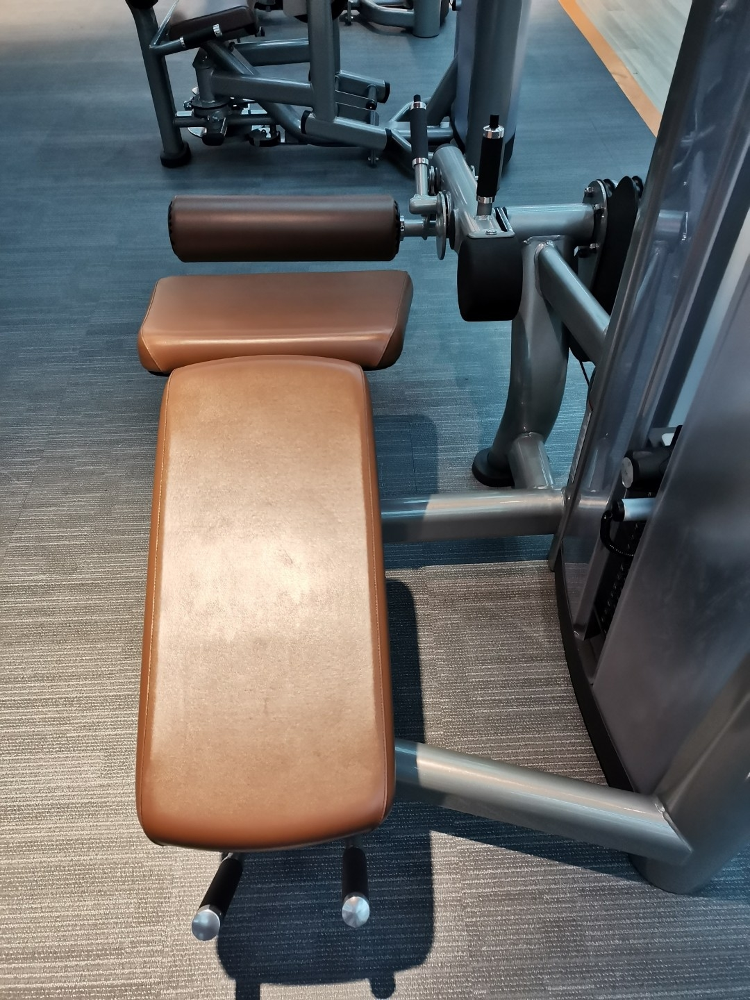

======================================================

_type: q&a
@吾思吾想[118552585284212]
2020-11-21 16:48:18 Sat  
topic_id: 215515485288821

@吾思吾想

>  师父，这是我们当地保险公司业务员给我发来的一个计划书，能帮我看看吗？谢谢！

@二师父

>  这个从保费来看属于意外险，您得拿上合同条款，尤其是特殊条款，确定赔付的疾病范围

阅读[3345]  评论[1]  赞[0] 

======================================================

_type: talk
@阿宝[422212151424158]
2020-11-21 18:15:46 Sat  
topic_id: 815515488428512

聊一件很普通事，该睡觉睡觉，该学习学习，该干什么干什么，别想太多！

@衣袂飘香 at 2020-11-21 18:15:46 Sat

> 说的很好！其实控制自己也是一种需要修炼的本领，自律的人能够干成好多事啊！能把生活打理得井井有条，有时间学习，有时间锻炼，能够按照既定的计划和想法，去投资，赚到钱。

----------

阅读[3344]  评论[1]  赞[0] 

+++++++++++++++++++++++++++++++++++++++++++++++++++++

文件：
2020-11-21 18:15:46 Sat
文件大小：[13949]
51414848825584-11.21  控制你自己.docx

======================================================

_type: talk
@阿宝[422212151424158]
2020-11-21 18:18:12 Sat  
topic_id: 215515488422581

这是之前学习的分享，希望能对大家有帮助！

@再见 . 青春 at 2020-11-21 18:18:12 Sat

> 二师父，如果在众多的指数基金里挑选一个做波段，哪一个比较合适呢

----------

@二师父 at 2020-11-21 18:18:12 Sat

> 券商

----------

@样 at 2020-11-21 18:18:12 Sat

> 想知道是什么样的读书群？

----------

@阿宝 at 2020-11-21 18:18:12 Sat

> 临时的读书群，和群没关系！

----------

阅读[3408]  评论[4]  赞[0] 

+++++++++++++++++++++++++++++++++++++++++++++++++++++

文件：
2020-11-21 18:18:12 Sat
文件大小：[16985]
15151818824882-10.21 分享感悟.docx

======================================================

_type: talk
@阿宝[422212151424158]
2020-11-22 10:11:06 Sun  
topic_id: 582282451121824

基金定投是最适合大家的，如果大家做好了，就非常牛了，别看很多人很厉害，你也可以简单加轻松就做到的，并且绝对可以秒杀大部分人！是秒杀……

@阿宝 at 2020-11-22 10:11:06 Sun

> 今天周末有时间，可以多写写！

----------

@杜志彪 at 2020-11-22 10:11:06 Sun

> 谢谢分享

----------

@隔窗遥望 at 2020-11-22 10:11:06 Sun

> 内容很好，学习方法更让我受益，能输出才是真的掌握的开始，谢谢

----------

@吃肉肉 at 2020-11-22 10:11:06 Sun

> 受教[强]

----------

@Vivian at 2020-11-22 10:11:06 Sun

> 谢谢分享

----------

@rtdmm小米 at 2020-11-22 10:11:06 Sun

> 谢谢分享！

----------

@上上签 at 2020-11-22 10:11:06 Sun

> 感谢分享

----------

阅读[3453]  评论[7]  赞[0] 

+++++++++++++++++++++++++++++++++++++++++++++++++++++

文件：
2020-11-22 10:10:44 Sun
文件大小：[119698]
88484112882852-11.22 指数基金投资体系.pdf

======================================================

_type: q&a
@C&S[51442188184824]
2020-11-22 18:44:03 Sun  
topic_id: 215515421224551

@C&S

>  师父，哪里可以下载到基金的历史净值情况？天天可以查询到，但是没有找到导出的控件。

@二师父

>  他们的choice付费终端可以

阅读[3386]  评论[0]  赞[0] 

======================================================

_type: talk
@光少[244124552511141]
2020-11-23 13:15:50 Mon  
topic_id: 815515414252282

券商又起来了，低吸回来的，又可以出一网

@杜志彪 at 2020-11-23 13:15:50 Mon

> 师父的3500又看到希望了[微笑]

----------

阅读[3140]  评论[1]  赞[0] 

======================================================

_type: q&a
@不知道不明了[15584248411812]
2020-11-23 13:24:00 Mon  
topic_id: 582282482188124

@不知道不明了

>  师父，蚂蚁配售基金可以退出了，需不需要留一小部分，还是全部都卖了呀。基金宣称正在推动场内交易，也保留未来配售的权利，那如果后面战略配售成功了，可以马上场内卖出没有18个月的限制了么

@二师父

>  新基金最好不参与，如果后续真的有场内交易，也可以继续购买的

阅读[3380]  评论[0]  赞[0] 

======================================================

_type: talk
@二师父[28814221155551]
2020-11-23 16:11:42 Mon  
topic_id: 215515411221881

<e type="hashtag" hid="15284541225422" title="#指数估值系统#" /> 市盈率百分位51.91%，市净率百分位33.34%，SY-BY百分位61.32%，SY/BY百分位59.89%。今天鳄鱼计划继续新高，持仓新兴科技100和恒生指数表现最弱，未来计划用龙头科技和中概全部替代。深红利、消费、家电、中概这些最强，先卖出差的，最后再考虑收割利润。目前没有收割。

一直持有，直到SY-BY百分位到达70%——80%以上再考虑降低仓位到7成以下，经受波动是必然的，这是付出的成本，而收益就是收获的资金增值。

@Chu at 2020-11-23 16:11:42 Mon

> 师父，今年鳄鱼计划到目前为止年化多少呀

----------

@二师父 at 2020-11-23 16:11:42 Mon

> 从年初到现在收益率是38.5%

----------

@Chu at 2020-11-23 16:11:42 Mon

> 厉害厉害

----------

@锦润万家@王建云 at 2020-11-23 16:11:42 Mon

> 什么叫鳄鱼计划

----------

@二师父 at 2020-11-23 16:11:42 Mon

> 一个场内投资计划

----------

阅读[3667]  评论[5]  赞[0] 

======================================================

_type: talk
@二师父[28814221155551]
2020-11-23 18:41:38 Mon  
topic_id: 215515158144521

<e type="hashtag" hid="225245851881" title="#关于卖出#" /> 卖出这个仁者见仁智者见智，五粮液我卖出之后又涨了不少，好企业可以持有的时间是终身，关键是长持的定力，不畏惧50%以上波动的心态需要很长时间修炼。

但这个问题并不绝对，18年五粮液最低市盈率只有15倍，现在是50多倍，A股大多数时候超额收益来源于估值的变动。而但看市盈率投资者仍旧会进入陷阱，因为现在五粮液的市盈率低于06年的水平，而市值已经新高。

关键在于企业的盈利水平，这是核心点。

@sky at 2020-11-23 18:41:38 Mon

> 师父，银行最近涨得不错，后面还有涨劲吗？有点盈利要不要清货了？

----------

@丸子妈 at 2020-11-23 18:41:38 Mon

> 平安被清掉了

----------

@二师父 at 2020-11-23 18:41:38 Mon

> 这一波可以出，相对高点就行

----------

@杜志彪 at 2020-11-23 18:41:38 Mon

> 我5月把富邦中证保险分级直接换成平安了。

----------

@志亮 at 2020-11-23 18:41:38 Mon

> 五粮液再涨我快拿不住了，但今天又V了回来。

----------

@二师父 at 2020-11-23 18:41:38 Mon

> 我是出了，等下个机会

----------

@志亮 at 2020-11-23 18:41:38 Mon

> 明天我找机会也出了，还是稳一些好，不吃鱼尾，我怕吃到刺卡喉[微笑]

----------

@二师父 at 2020-11-23 18:41:38 Mon

> 留一手以后养老

----------

阅读[3474]  评论[8]  赞[0] 

+++++++++++++++++++++++++++++++++++++++++++++++++++++

文件：
2020-11-23 18:37:05 Mon
文件大小：[28246]
15158224811422-盈利的基金需要卖出吗.docx

======================================================

_type: q&a
@陈洲[88245122222212]
2020-11-23 19:04:42 Mon  
topic_id: 815515158115842

@陈洲

>  二师父介绍过基金豆的小目标后，我就买了点，买了二期都达标了，想一直买下去，小目标这种主要的风险在哪？

@二师父

>  主要是目标止盈策略，在趋势上行和震荡市场收益会比较好，在股市高位单边下行趋势中适合暂停一下，不然会有较大回撤，风险还是在于市场的波动

阅读[3495]  评论[0]  赞[0] 

======================================================

_type: talk
@西锦巴乌[88448285428482]
2020-11-24 08:50:52 Tue  
topic_id: 414414185454828

<e type="hashtag" hid="225245851881" title="#关于卖出#" /> 师父好！五粮液在06年的PE在哪能查到？谢了

@二师父 at 2020-11-24 08:50:52 Tue

> wind终端

----------

阅读[3167]  评论[1]  赞[0] 

======================================================

_type: talk
@西锦巴乌[88448285428482]
2020-11-24 08:56:51 Tue  
topic_id: 182282854248422

<e type="hashtag" hid="15284541225422" title="#指数估值系统#" /> 指数估值系统想重温在哪里能看到？

阅读[3320]  评论[0]  赞[0] 

======================================================

_type: talk
@Amanda[111184528448582]
2020-11-24 12:49:50 Tue  
topic_id: 215515125242111

二师父，创新药etf现在适合买入吗？

@二师父 at 2020-11-24 12:49:50 Tue

> 目前还不适合

----------

阅读[3256]  评论[1]  赞[0] 

======================================================

_type: q&a
@铥@铥~~[582228558115884]
2020-11-24 15:43:32 Tue  
topic_id: 582282818822454

@铥@铥~~

>  航运板块有基金推荐不

@二师父

>  天弘中证全指运输，规模很小

阅读[3395]  评论[1]  赞[0] 

======================================================

_type: q&a
@天马行空[548818851412444]
2020-11-24 15:46:00 Tue  
topic_id: 215515125112111

@天马行空

>  ，请问二师傅，10142058乌龟计划具体咋买，是否也是逢低买入。目前基金高估 ，买多少合适。谢谢

@二师父

>  直接按照比例买入，然后每次投的时候跟上就行了

阅读[3451]  评论[3]  赞[0] 

======================================================

_type: talk
@二师父[28814221155551]
2020-11-24 19:53:43 Tue  
topic_id: 215515121428421

<e type="hashtag" hid="28512824241221" title="#两只宽基#" /> 这两只宽基是未来主要的宽基投资方向，以A股为主，港美股辅助配置，相关企业查询网站有九斗数据、同花顺，WIND终端，前两个可以免费查阅很多信息。

@onepiecewi* at 2020-11-24 19:53:43 Tue

> 师父，50的代码是哪个？

----------

@二师父 at 2020-11-24 19:53:43 Tue

> 110003

----------

@苍天有井明月空🌙 at 2020-11-24 19:53:43 Tue

> 可以拿十年以上吗

----------

@二师父 at 2020-11-24 19:53:43 Tue

> 波动无感就可以

----------

@HeLLO at 2020-11-24 19:53:43 Tue

> 我持了大量深沪300.是不是要换到深红利，易方达上证50指数中去？

----------

@二师父 at 2020-11-24 19:53:43 Tue

> 看预期收益率，这两个比300好一些，波动大一点

----------

阅读[3991]  评论[6]  赞[0] 

+++++++++++++++++++++++++++++++++++++++++++++++++++++

文件：
2020-11-24 19:51:57 Tue
文件大小：[24906]
28481525125541-A股最好的两只宽基指数基金.docx

======================================================

_type: talk
@二师父[28814221155551]
2020-11-24 20:28:09 Tue  
topic_id: 215515121121451

<e type="hashtag" hid="552114551414" title="#估值数据#" /> 市盈率百分位50.59%，市净率百分位32.57%，SY-BY百分位60.24%，SY/BY百分位59.64%。随着国债收益率的走高，风险溢价率也会提升，大致回测了下数据，15年顶峰的时候SY-BY百分位在97%，19年1月的时候市盈率百分位是7%左右，当前处于中等位置，也没有必要一直买来卖去，目前适合持有+券商网格。

阅读[3467]  评论[0]  赞[0] 

======================================================

_type: q&a
@吴涛[421181451425128]
2020-11-24 20:38:27 Tue  
topic_id: 215515121258251

@吴涛

>  师父好，医疗etf512170，我观察现在macd到了底背离了，是否到击球区，开始定投了

@二师父

>  短期趋势向上，小仓位波段可以，看技术指标可以金叉上行趋势做，定投要等到非常便宜的时候
>  
>  如果大趋势反转的话，这只基金还会有大跌幅，所以不要大仓位上。

阅读[3610]  评论[0]  赞[0] 

======================================================

_type: q&a
@志亮[422125851552828]
2020-11-25 11:04:30 Wed  
topic_id: 182285218842122

@志亮

>  二师父，五粮液己清仓，但茅台己横盘很久了，有必要清仓吗？

@二师父

>  茅台是好企业，拿的住的话可以长期持有

阅读[3362]  评论[2]  赞[0] 

======================================================

_type: talk
@二师父[28814221155551]
2020-11-25 11:19:20 Wed  
topic_id: 815518515454552

<e type="hashtag" hid="28512824155421" title="#轮动配置的意义#" /> 今天组合消费，家电，消费50，红利等前期表现好的回落比较大，而非银，互联网等涨幅相对较好，结构性行情中低波动可以帮助投资者长期持有，单一重仓一个行业一个企业波动大，很难拿住，高瓴资本目前也是分散配置的。

组合配置的意义在于不会错过每个大的结构行情，提前布局入场，等待市场反转，国债投资之后一直表现平平，并不代表未来一直这样，这就像两三年前投资股票一样。

左侧组合配置，先挨揍，后吃肉。医疗目前还是没有进入击球区，而且技术面日线死叉下行，想投的话可以采用均线定投策略，这个策略结合均线加上正常估值区间定投，也是不错的方法

@范毅君 at 2020-11-25 11:19:20 Wed

> 请问二师父，均线定投策略哪里可以学习，您的书里有吗

----------

@二师父 at 2020-11-25 11:19:20 Wed

> 有啊

----------

@Chu at 2020-11-25 11:19:20 Wed

> 今天16国债19价格又低了，我又准备入一手了，91以下越跌越投，反正比投企业和不确定的基金有把握

----------

@杜志彪 at 2020-11-25 11:19:20 Wed

> 定投的魅力就是微笑曲线，找一条线左侧向下开始定投，右侧向上停止等待收割[微笑]（当然结合估值就更靠谱了）

----------

@rtdmm小米 at 2020-11-25 11:19:20 Wed

> 请问同学，你以哪条线为准呢？

----------

@杜志彪 at 2020-11-25 11:19:20 Wed

> 这个要结合自身仓位，目前医疗准备以师父的90天线为准（配合估值），保守点最好是年线（那时应该进入低估了）。

----------

@rtdmm小米 at 2020-11-25 11:19:20 Wed

> 有道理，谢谢分享！

----------

@杜志彪 at 2020-11-25 11:19:20 Wed

> 医疗下跌趋势已经形成，也可以等二师傅吹哨，这样买的可能会更便宜.

----------

阅读[3451]  评论[10]  赞[0] 

======================================================

_type: q&a
@nana[48222415211188]
2020-11-25 11:27:14 Wed  
topic_id: 582281282425814

@nana

>  师傅，五粮液和泸洲老窖能否长期持有？

@二师父

>  这两个比茅台差一点，也是很好的白酒企业，你复盘下从15年到18年这个级别的回撤，如果评估之后可以经受的话，那么可以长期拿着，每个季度关注下他们公司的财报即可

阅读[3493]  评论[1]  赞[0] 

======================================================

_type: talk
@二师父[28814221155551]
2020-11-25 21:12:37 Wed  
topic_id: 182285524188442

#估值表 目前医疗持续下跌，再跌15%预计进入低估区域，可以耐心等等，成长股如果进入下跌趋势的话可以小仓位站岗放哨，但要把控好安全边际，逆势定投最重要的是回撤可控。

阅读[3328]  评论[0]  赞[0] 

+++++++++++++++++++++++++++++++++++++++++++++++++++++

图片：
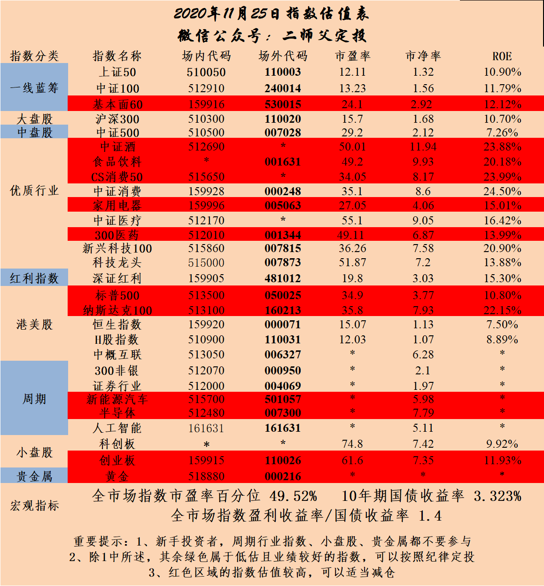

======================================================

_type: talk
@二师父[28814221155551]
2020-11-25 21:17:57 Wed  
topic_id: 414418845145588

<e type="hashtag" hid="15284541814222" title="#成长型基金#" /> 这两只基金持仓和医疗有较大重合，不过医疗更集中，都是成长型指数，适合熊末牛初布局。

@苍天有井明月空🌙 at 2020-11-25 21:17:57 Wed

> 代码是？

----------

@二师父 at 2020-11-25 21:17:57 Wed

> 160422

----------

阅读[3590]  评论[2]  赞[0] 

+++++++++++++++++++++++++++++++++++++++++++++++++++++

文件：
2020-11-25 21:13:17 Wed
文件大小：[130694]
15158218551252-成长型的宽基指数基金，就选他.docx

======================================================

_type: talk
@阿宝[422212151424158]
2020-11-26 07:07:25 Thu  
topic_id: 582281111522524

把投资做简单，更有时间去生活！

@西锦巴乌 at 2020-11-26 07:07:25 Thu

> 向你学习[强][强][强]

----------

@HeLLO at 2020-11-26 07:07:25 Thu

> 很不错的习惯

----------

@铁观音 at 2020-11-26 07:07:25 Thu

> 在这里遇到你们真好，感谢分享！

----------

阅读[3346]  评论[3]  赞[0] 

+++++++++++++++++++++++++++++++++++++++++++++++++++++

文件：
2020-11-26 07:07:25 Thu
文件大小：[15981]
48281421112528-2020年投资总结.docx

======================================================

_type: talk
@阿宝[422212151424158]
2020-11-26 08:16:03 Thu  
topic_id: 414418888285188

求一本书电子版：杨天南《<e type="web" href="https://wx.zsxq.com/mweb/views/weread/search.html?keyword=一个投资家的20年" title="一个投资家的20年" style="book" />》mobi格式，帮我找找。一般大家找书都是从哪找？教教我

@Zyxj at 2020-11-26 08:16:03 Thu

> 微信读书里就可找到。

----------

阅读[3177]  评论[1]  赞[0] 

======================================================

_type: talk
@幽兰[815554522442422]
2020-11-26 10:31:42 Thu  
topic_id: 182285554144442

二师父今天打算发车不？

@二师父 at 2020-11-26 10:31:42 Thu

> 发车会通知的，今天不发车

----------

阅读[3178]  评论[1]  赞[0] 

======================================================

_type: q&a
@庆余年[15584481824122]
2020-11-26 11:17:56 Thu  
topic_id: 182285554554282

@庆余年

>  二师父您好，AI智能买入成本1.193，现在跌的快持平收益了，请问可以加仓么？场内鳄鱼计划只跟过一次，AI智能投入金额占总投资额的0.02%

@二师父

>  目前定投是可以的，这个基金不错，就是和新能源半导体这些指数一样，周期性太强，如果这时候坚持不止损定投未来会有不错的收益。投资不用过度关注成本价，这会形成思维锚固

阅读[3443]  评论[1]  赞[0] 

======================================================

_type: q&a
@🎈铮[28284825441841]
2020-11-26 15:10:15 Thu  
topic_id: 414418854242188

@🎈铮

>  二师傅，请教下医疗512170现在可以少量定投吗

@二师父

>  可以，长期看好，轻仓定投目前合适的

阅读[3361]  评论[0]  赞[0] 

======================================================

_type: q&a
@不知道不明了[15584248411812]
2020-11-26 15:10:51 Thu  
topic_id: 414418854514228

@不知道不明了

>  师父，富国天惠成长A现在还适合买么，朱总打理的未来还会长么

@二师父

>  这个基金目前持仓很好，不过以后能管多久我也不知道，可以投资后，基金经理换了直接调仓

阅读[3424]  评论[0]  赞[0] 

======================================================

_type: talk
@二师父[28814221155551]
2020-11-26 17:36:41 Thu  
topic_id: 182285544555852

<e type="hashtag" hid="48415851825128" title="#关于医药#" /> 大家最关心的问题，目前医疗ETF可以小仓位，发车的话我还等等，另外生物医药ETF可以关注下。这两只目前是比较好的医药细分基金

@付云 at 2020-11-26 17:36:41 Thu

> 二师傅，我也可以用这种方法来做孩子教育金的打理

----------

阅读[3570]  评论[1]  赞[0] 

+++++++++++++++++++++++++++++++++++++++++++++++++++++

文件：
2020-11-26 17:35:51 Thu
文件大小：[26053]
88481811588112-医药持续受挫，现在是否可以开始投资.docx

======================================================

_type: talk
@二师父[28814221155551]
2020-11-26 18:17:02 Thu  
topic_id: 414418851844428

<e type="hashtag" hid="224445218111" title="#全市场估值数据#" /> 市盈率百分位49.46%，市净率百分位31.3%，SY/BY百分位58.66，SY-BY百分位58.11%。

全市场估值数据稍下行，如果SY-BY百分位到达50%以下才算是能够投资的第一道门槛，当趋势形成的时候如果没有做好迎接最坏结果的打算，就暂时不要投资，19年，20年是赚的比较嗨，然而，15年，18年下跌之惨烈至今仍旧记忆犹新，所以保持对市场的敬畏吧。

@wty at 2020-11-26 18:17:02 Thu

> 静待二师父吹哨！[偷笑]

----------

阅读[3422]  评论[1]  赞[0] 

======================================================

_type: talk
@那方山的树，佛陀座下*[244412158214221]
2020-11-26 22:31:21 Thu  
topic_id: 582281142812154

二师傅，我今天中了一签新股，我想问问，股票和新债一样是开市就卖吗？我是每次把基金赚的钱拿出一部分买成部分股票，只买不卖不择时，因为必须基金赚钱我才去买点，一直没卖过股票，然后就天天打新股打新债，新债每次中了上市就卖了，但新股不知道怎么办？求指导……

@二师父 at 2020-11-26 22:31:21 Thu

> 这个没有固定的，开板卖出或者连续涨停板回调后卖出，有的新股会连续涨停

----------

阅读[3268]  评论[1]  赞[0] 

+++++++++++++++++++++++++++++++++++++++++++++++++++++

图片：

======================================================

_type: talk
@二师父[28814221155551]
2020-11-27 09:13:08 Fri  
topic_id: 414418821852188

<e type="hashtag" hid="88512821218452" title="#打新卖出的问题#" /> 目前三类打新，可转债打新，a股打新，港股打新。

卖出操作，可转债上市卖出，优质可转债可以持有到130元以下，可转债购买不要逆势操作，他们上涨受到资金炒作，一般涨的好的会越来越涨，如果一直买便宜的就会掉入亚药转债这种里面

a股一般开板或者连板之后卖出，也是回调没有上涨潜力走人，也看具体股票，比如良品铺子从上市首日就创了较大涨幅，这种卖出操作没有固定，但是深度回调2到3个交易日肯定要撤了，打新股别抗

港股打新，暗盘卖出或者上市首日卖出，港股新股连板的比a股少，暗盘表现不佳直接走人，潜力较大的暗盘涨幅好首日卖出

投资需要经验的，有的时候多积累几次就知道怎么卖了，还是在控制损失的条件下多参与，站在岸上学不会游泳

@吴涛 at 2020-11-27 09:13:08 Fri

> 师父好，师父可以像以前一样列一个优质新债表，可以持有到130

----------

@二师父 at 2020-11-27 09:13:08 Fri

> 好的，过段时间吧

----------

@J at 2020-11-27 09:13:08 Fri

> 赞成

----------

阅读[3510]  评论[3]  赞[0] 

======================================================

_type: talk
@二师父[28814221155551]
2020-11-27 09:54:25 Fri  
topic_id: 414418821225888

银行三剑客继续发力，投资银行可以不用银行指数，招商银行，宁波银行，平安银行即可，既能够比银行指数收益高，同时也够打新门槛

@rtdmm小米 at 2020-11-27 09:54:25 Fri

> 门票股平安银行有点无心插柳的感觉（三十多个点了），请问二师父，门票股一直持有吗？

----------

@二师父 at 2020-11-27 09:54:25 Fri

> 你要打新的话就一直拿着

----------

@Vincent at 2020-11-27 09:54:25 Fri

> 看这三剑客现在价格差不多都在最高点，现在能入手不？

----------

@二师父 at 2020-11-27 09:54:25 Fri

> 现在不适合，等回调低位了买

----------

@Vincent at 2020-11-27 09:54:25 Fri

> 收到

----------

@sunny在路上 at 2020-11-27 09:54:25 Fri

> 银行etf可以买吗？

----------

@二师父 at 2020-11-27 09:54:25 Fri

> 可以买，不过收益率比较差

----------

阅读[3475]  评论[7]  赞[0] 

======================================================

_type: q&a
@J[28281541518551]
2020-11-27 10:02:11 Fri  
topic_id: 582281148445884

@J

>  师父，今天上市的N伟20转为什么卖不出去？涨停20%

@二师父

>  涨停后有个熔断机制，过一会就可以了，这个没啥问题

阅读[3582]  评论[1]  赞[0] 

======================================================

_type: talk
@二师父[28814221155551]
2020-11-27 11:54:56 Fri  
topic_id: 215518815181821

<e type="hashtag" hid="881251425252" title="#鳄鱼计划#" /> 非银（512070）卖出一份，深红利（159905）卖出三份，消费50（515650）卖出两份，家电ETF(159996)卖出一份，银行（512800）卖出一份。

仓位降到8成，如果市场继续上涨，将保持这个仓位，预判医疗在未来一年会有会有机会，今年还剩2个多月，估计我得发红包了，去年一直鼓励大家坚持投资，坚持下来的都挣钱了，而今年我再也没说大力投资了，在市场这个位置，风险已经逐步大于机会，尤其是信贷和货币政策有收紧趋势，银行上涨最近也是得益于利率的提升。

这一波之后银行指数会彻底清仓，买银行就银行三剑客，买保险就平安，没太大必要指数得。持仓基本优质，除了恒生指数比较弱，这和香港低位变化有关系，其他得都是很不错得标的。

卖出资金怎么办，我是持有货币基金，银华日利，大家自行配置，在发车得时候有资金回来就行了。

@J at 2020-11-27 11:54:56 Fri

> 师父，今天适合把家用电器转换为医疗吗？

----------

@二师父 at 2020-11-27 11:54:56 Fri

> 不适合哈，如果适合我就转了，医疗还没动，你可以转一到两份进去，这个仍然不便宜

----------

@志亮 at 2020-11-27 11:54:56 Fri

> 现在市场到这么紧张了？

----------

@志亮 at 2020-11-27 11:54:56 Fri

> 二师父你仓位降到8成还是降了8成？

----------

@二师父 at 2020-11-27 11:54:56 Fri

> 降到8啊，2成仓肯定不行

----------

@罗大发 at 2020-11-27 11:54:56 Fri

> 师父我中证银行还亏4%   要出吗[流泪]

----------

@二师父 at 2020-11-27 11:54:56 Fri

> 那可以等等，预计到年底银行会有一波行情

----------

@罗大发 at 2020-11-27 11:54:56 Fri

> 收到，我就一直等着年底呢

----------

阅读[4136]  评论[20]  赞[0] 

+++++++++++++++++++++++++++++++++++++++++++++++++++++

图片：

======================================================

_type: talk
@平安是福[118222545154542]
2020-11-27 12:56:28 Fri  
topic_id: 582281185818214

师父你好：我有新能车收过两份利润，现在要怎么操作？谢谢！

@二师父 at 2020-11-27 12:56:28 Fri

> 可以拿着，跌破20日线清仓

----------

@平安是福 at 2020-11-27 12:56:28 Fri

> 好的，谢谢！

----------

@蛋炒饭不加蛋 at 2020-11-27 12:56:28 Fri

> 请问二师父，场外基金能看均线吗？

----------

@二师父 at 2020-11-27 12:56:28 Fri

> 看不了

----------

@蛋炒饭不加蛋 at 2020-11-27 12:56:28 Fri

> 好的，谢谢

----------

阅读[3537]  评论[5]  赞[0] 

======================================================

_type: talk
@二师父[28814221155551]
2020-11-27 15:15:44 Fri  
topic_id: 815518814414452

<e type="hashtag" hid="88512821488452" title="#波动到底是不是风险#" /> 最近在找好的债券基金，大家看这个债券基金从3年来收益率比300的还高一点，按理说一次投资债券熊市会更好

那是不是意味着熊市就只配置债券呢，理论上没有问题，实际上熊市不买股，收益会差很多，如果定投沪深300，那么这几年坐一个V车，现在收益率是比投资债券好的

所以熊市买股，牛市买债，短期会有损失，长期会有收益，就比如最近买国债，债券肯定没啥赚头，然而当新一轮牛熊转换以后，情况就大不相同，最典型的是08年买债大赚而09年看着股市涨却没招

有人说，我牛市来了买股，熊市来了买债，那不更好，这种想法是好的，可是没有几个人能精准踩到所有的股牛和债牛，如果可以那市场的钱都是他的了

@冯林锋 at 2020-11-27 15:15:44 Fri

> 买债券，买019547可以吗

----------

@二师父 at 2020-11-27 15:15:44 Fri

> 可以，这个久期比较长，相当于加了杠杆，波动比一般债券大一些，鳄鱼买了两手，目前浮亏1个点，国债安全有保证

----------

@幽兰 at 2020-11-27 15:15:44 Fri

> 二师父，配置国债主要是为了资金安全吗？

----------

@二师父 at 2020-11-27 15:15:44 Fri

> 不是的，当利率下行，股市大跌的时候，债券牛市收益会很好，平均年化有百分之6

----------

@冯林锋 at 2020-11-27 15:15:44 Fri

> 你还是以国债为主了

----------

@苍天有井明月空🌙 at 2020-11-27 15:15:44 Fri

> 易方达这个可以定投了吗

----------

@二师父 at 2020-11-27 15:15:44 Fri

> 你说是这个债券还是易方达上证50

----------

@苍天有井明月空🌙 at 2020-11-27 15:15:44 Fri

> 这个债卷

----------

阅读[3988]  评论[9]  赞[0] 

+++++++++++++++++++++++++++++++++++++++++++++++++++++

图片：
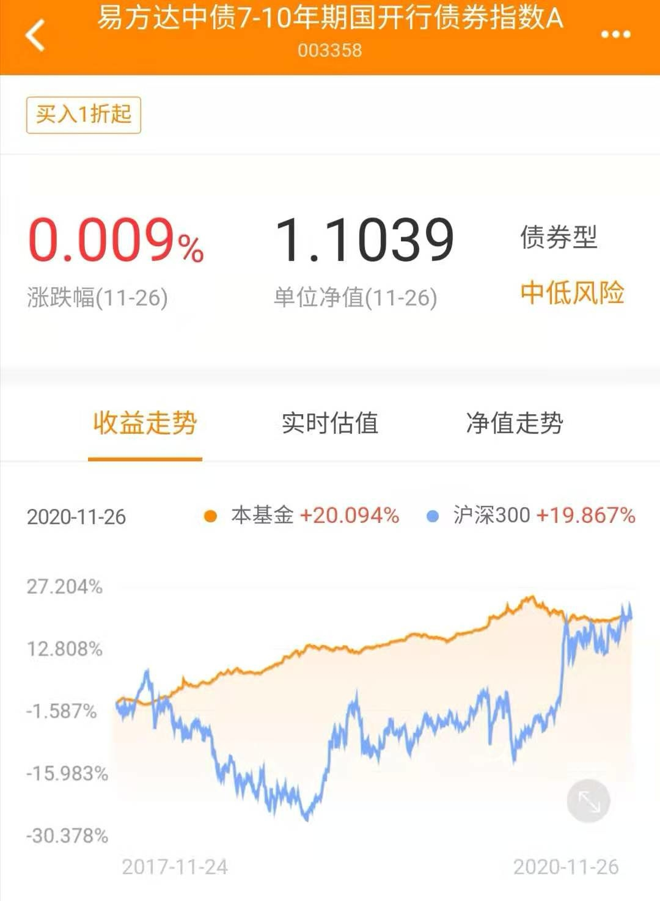

======================================================

_type: q&a
@波多黎各[28428858544121]
2020-11-27 18:13:18 Fri  
topic_id: 414418544442228

@波多黎各

>  师父，今天忙忘记了，忘记把紫金转债卖了，是继续持有还是等下个交易日就卖？

@二师父

>  这个涨的不错啊，可以拿着，如果阳线继续持有，阴线就卖了

阅读[3603]  评论[0]  赞[0] 

======================================================

_type: talk
@二师父[28814221155551]
2020-11-27 19:20:17 Fri  
topic_id: 414418545455248

<e type="hashtag" hid="48415851255588" title="#关于银行#" /> 大金融发力，组合没有单独配置银行指数了，和金融挂钩主要是300非银，投资银行三大行比较好。

阅读[5309]  评论[0]  赞[0] 

+++++++++++++++++++++++++++++++++++++++++++++++++++++

文件：
2020-11-27 19:19:17 Fri
文件大小：[25770]
88481288521512-银行指数发力了，意味着什么.docx

======================================================

_type: talk
@二师父[28814221155551]
2020-11-27 23:40:36 Fri  
topic_id: 414418542255288

<e type="hashtag" hid="552114551414" title="#估值数据#" /> 当前市盈率百分位50.63%，市净率百分位32.61%，SY-BY百分位60.59%，SY/BY百分位59.84%。市场依旧震荡中，能否继续表现就看跨年和春季躁动行情了。

阅读[5056]  评论[0]  赞[0] 

======================================================

_type: q&a
@不知道不明了[15584248411812]
2020-11-28 22:25:33 Sat  
topic_id: 582281452515214

@不知道不明了

>  师父，有个重要的问题想请教您:现在我操作的可供投资总资金有66万，其中持有的被动基金占25%的仓位。从昨天晚上到今天，我一直在网上搜集资料研究优质的主动基金，参考您说的标准选了几只。我想问在当前的市场位置下，如果我想再买一部分优质的主动基金来替代以前的理财产品，买多少仓位合适呢，想试试把钱投给市场最聪明的大脑看看能赚多少钱。我本人投资风格属于积极型，希望能获得较大的收益并愿意承担一定的风险，现在把大部分资金放在银行理财里觉得有些亏。😭😭

@二师父

>  这个你需要回测基金成立以来的回撤率，然后大致估算下自己所能承受的范围，就可以大致确定自己当前入场适合的仓位了

阅读[5104]  评论[8]  赞[0] 

======================================================

_type: talk
@幽兰[815554522442422]
2020-11-30 09:46:17 Mon  
topic_id: 414418212141118

券商厉害，你们开始卖出了吗？

@小鱼 at 2020-11-30 09:46:17 Mon

> 买

----------

@小鱼 at 2020-11-30 09:46:17 Mon

> 卖

----------

@幽兰 at 2020-11-30 09:46:17 Mon

> 最近没见到过1.18，所以我卖出了20%

----------

@幽兰 at 2020-11-30 09:46:17 Mon

> 卖早了？[捂脸]

----------

@🍀 凝🌸 慧🍀 at 2020-11-30 09:46:17 Mon

> 卖了1.19

----------

@幽兰 at 2020-11-30 09:46:17 Mon

> 卖了多少份额

----------

@What if at 2020-11-30 09:46:17 Mon

> 设置了条件单，1.2自动卖出一份

----------

@What if at 2020-11-30 09:46:17 Mon

> 我的非银今天全部出完了，目前网格只有商劵了，你们还做其他的吗？

----------

阅读[4825]  评论[20]  赞[0] 

+++++++++++++++++++++++++++++++++++++++++++++++++++++

图片：
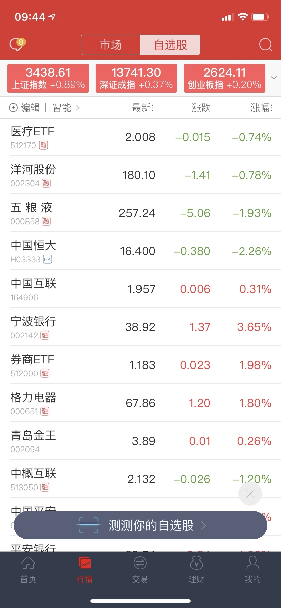

======================================================

_type: solution
2020-11-30 10:38:12 Mon  
topic_id: 815518411848112

阅读[4745]  评论[0]  赞[0] 

======================================================

_type: talk
@二师父[28814221155551]
2020-11-30 11:27:35 Mon  
topic_id: 414418211144558

非银大爆发，券商收网了，这个属于短期波段操作，大家按照最新券商表格做就行啦，A股资金报团太明显，全面配置，他怎么抱都没事。

@J at 2020-11-30 11:27:35 Mon

> 师父，全清吗？

----------

@二师父 at 2020-11-30 11:27:35 Mon

> 不是啊，刚启动第一格

----------

@sky at 2020-11-30 11:27:35 Mon

> 按规则收了一网，看看今天有没机会收第二网。

----------

@庆余年 at 2020-11-30 11:27:35 Mon

> 消费根据分布收割法还剩下20%没卖，长持应该没问题吧？

----------

@二师父 at 2020-11-30 11:27:35 Mon

> 如果下跌扛得住就没问题，扛不住就有问题

----------

@幽兰 at 2020-11-30 11:27:35 Mon

> 师父，1.2以上有必要收第二格吗？

----------

@庆余年 at 2020-11-30 11:27:35 Mon

> 那没事，扛得住，量已经很小了[呲牙][呲牙]

----------

@二师父 at 2020-11-30 11:27:35 Mon

> 没必要，刚启动别着急，卖的太快也会损失利润

----------

阅读[4953]  评论[18]  赞[0] 

======================================================

_type: q&a
@阳光[421884185252128]
2020-11-30 14:47:19 Mon  
topic_id: 182285824458252

@阳光

>  师父：今天把50ah卖了，换成什么好啊？谢谢

@二师父

>  上证50或者300非银

阅读[4684]  评论[1]  赞[0] 

======================================================

_type: q&a
@蛋炒饭不加蛋[118281818482542]
2020-11-30 14:47:41 Mon  
topic_id: 215518152854421

@蛋炒饭不加蛋

>  请问二师傅，有第三代半导体的基金吗

@二师父

>  目前都是半导体大类行业基金

阅读[4726]  评论[1]  赞[0] 

======================================================

_type: q&a
@幽兰[815554522442422]
2020-11-30 15:13:02 Mon  
topic_id: 182285824151882

@幽兰

>  二师父，除了券商，还有哪些适合做网格的品种？

@二师父

>  券商，中证500ETF这两个

阅读[4776]  评论[5]  赞[0] 

======================================================

_type: talk
@范毅君[118551121224142]
2020-11-30 15:42:55 Mon  
topic_id: 215518154554441

这过山车的行情真爽[偷笑][偷笑]

阅读[4812]  评论[0]  赞[0] 

======================================================

_type: talk
@二师父[28814221155551]
2020-11-30 15:58:31 Mon  
topic_id: 815518154855512

大盘太脆弱了，我们小收一网他就被吓跌了

@范毅君 at 2020-11-30 15:58:31 Mon

> 今天卖是卖了，想买的没买到[偷笑][偷笑]没准是好事

----------

@What if at 2020-11-30 15:58:31 Mon

> 跌吧，跌下来才有机会撸[偷笑]

----------

@sky at 2020-11-30 15:58:31 Mon

> 3458的魔咒一时半会儿解不开啊😂

----------

阅读[5024]  评论[3]  赞[0] 

======================================================

_type: talk
@二师父[28814221155551]
2020-11-30 17:15:09 Mon  
topic_id: 582281824454184

<e type="hashtag" hid="88512842845582" title="#全仓配置#" /> 根据股债轮动模型大家打理养老资金的最佳方法，确定好投资金额后可满仓运行，简单每月做一次轮动，等需要养老的时候再提取出来，有钱不要买年金险，不要存银行。

@庆余年 at 2020-11-30 17:15:09 Mon

> 这个好[强][强][强]

----------

@范毅君 at 2020-11-30 17:15:09 Mon

> 先点赞，再学习

----------

@苍天有井明月空🌙 at 2020-11-30 17:15:09 Mon

> 好

----------

@🍀 凝🌸 慧🍀 at 2020-11-30 17:15:09 Mon

> [鼓掌][鼓掌][鼓掌]

----------

@🍀 凝🌸 慧🍀 at 2020-11-30 17:15:09 Mon

> 仔细看完，大道至简！佩服师父，厉害！[玫瑰][玫瑰][玫瑰][强][强][强]

----------

@🍀 凝🌸 慧🍀 at 2020-11-30 17:15:09 Mon

> 师父好，有问题想问：
1、为何这样的搭配轮动，大致可以达到10%年化收益？国开债收益好像并不高哦。
2、举例中的50岁投资者，可投资金100万中有50万做了投资，那另50万如何放置比较好？货币基金还是其他？
谢谢！[愉快]

----------

@二师父 at 2020-11-30 17:15:09 Mon

> 因为仓位是轮动的，如果sy-by百分位百分之5，国开债只投百分之5，50万可以货币基金，短债基金

----------

@🍀 凝🌸 慧🍀 at 2020-11-30 17:15:09 Mon

> 师父，那搭配国开债的目的主要是保本吗？

----------

阅读[5632]  评论[19]  赞[0] 

+++++++++++++++++++++++++++++++++++++++++++++++++++++

文件：
2020-11-30 17:13:59 Mon
文件大小：[28750]
28481245185541-利用基金打理养老资金的正确方法.docx

======================================================

_type: talk
@二师父[28814221155551]
2020-11-30 20:52:22 Mon  
topic_id: 414418188811818

<e type="hashtag" hid="552114551414" title="#估值数据#" /> 市盈率百分位49.99%，市净率百分位31.3%，SY-BY百分位58.56%，SY/BY百分位57.8%。今天债市回暖，投资债券不是为了避险，而是在债券牛市的时候取得好的收益率，最近债券市场是熊市，所以债券表现很差，就如同18年投资股市一样，而债券市场熊短牛长，所以当债券市场牛周期到来的时候仍旧会有好的收益率。

今年年前如果没有特别好的机会，预计不会再投资了，以收割利润为主。场内可以关注华宝医疗ETF和龙头科技，300非银，场外可以关注易方达上证50，2020年底转型升级之后的华宝中证医疗，300非银。今天太神奇了，券商1.207网格出了一网，本以为继续上涨，结果就回去了，严格按照纪律是非常重要的。很高兴大家都学会了逆向思维，这样坚持买龙头，买优质基金，再辅助安全边际和逆向操作，投资会越来越轻松。

@🍀 凝🌸 慧🍀 at 2020-11-30 20:52:22 Mon

> 谢谢师父每天分享和解答，这对我们学习提高很重要！[玫瑰][玫瑰][玫瑰]

----------

@🍀 凝🌸 慧🍀 at 2020-11-30 20:52:22 Mon

> 师父，就目前情况，如果手头有几十万存量资金，适合一次性买入国债ETF吗？

----------

@二师父 at 2020-11-30 20:52:22 Mon

> 不适合，债券市场还没到底部

----------

@范毅君 at 2020-11-30 20:52:22 Mon

> 二师父场内华宝中证医疗，是估值表中的512170吗

----------

@🍀 凝🌸 慧🍀 at 2020-11-30 20:52:22 Mon

> 谢谢师父[愉快]

----------

@二师父 at 2020-11-30 20:52:22 Mon

> 对，就是医疗etf

----------

@不知道不明了 at 2020-11-30 20:52:22 Mon

> 师父，可以根据市盈率百分位来判断当前市场位置A股最大回撤率么？目前是否有50%的最大跌幅呀

----------

@二师父 at 2020-11-30 20:52:22 Mon

> 这个只是估值中枢

----------

阅读[5301]  评论[14]  赞[0] 

======================================================

