_type: q&a
@nana[48222415211188]
2020-12-01 08:34:29 Tue  
topic_id: 215518184484481

@nana

>  师傅，这个股债轮动模型，我理解就是根据BY-SY的百分比在所投资的仓位中平衡，不需要再投入新的资金购买，这样理解对吗？国开债基金的代码是什么？

@二师父

>  是轮动的，也可以新增加资金，国开债可以选择广发的，也可以选择易方达的

阅读[4989]  评论[0]  赞[0] 

======================================================

_type: q&a
@shininggre*[15551242111522]
2020-12-01 10:21:06 Tue  
topic_id: 815518125214122

@shininggre*

>  师父您好。请问迈瑞怎么样？

@二师父

>  迈瑞医疗是医疗器械龙头企业，毛利率比白酒企业低一些，在同行业处于领先地位，一直处于高速发展过程中，年收入增速百分之40左右，是很好的医疗企业

阅读[4916]  评论[1]  赞[0] 

======================================================

_type: q&a
@日月⭐️辰[414842182855248]
2020-12-01 10:46:51 Tue  
topic_id: 414418154215828

@日月⭐️辰

>  二师父，请问有好的私募基金或信托产品介绍吗？对比公募 三者选择哪个更好点？谢谢

@二师父

>  私募和信托产品是针对高净值人群的，如果个人投资水平高，可以选择优质开放私募基金，信托产品投资范围广，有投资货币，资本，实业，公募基金和私募基金主要投资股权和基金类产品，外加打新股。
>  
>  金融资产1000w以上的高净值客户可以选择信托和私募，房产，货币的组合，私募基金比公募基金更加灵活，但是管理费高，不收取固定管理费，一般会收取百分之20的利润费作为管理费。而公募基金更加透明，可以及时查看持仓。
>  
>  根据自身需求进行配置，如果金融资产1000万以上可以三者均衡搭配，信托指定受益人，私募灵活管理，优质公募基金长期持有，如果金融资产低于1000万，公募基金更加适合。

阅读[4933]  评论[1]  赞[0] 

======================================================

_type: q&a
@幽兰[815554522442422]
2020-12-01 10:48:10 Tue  
topic_id: 582281851254844

@幽兰

>  二师父，最近您停投广发中债国开债了吗？这个现在还值得定投吗？

@二师父

>  这个值得定投，已经有了部分仓位，计划到10年期国债收益率3.5以上或者股市再上一个台阶继续投资

阅读[5093]  评论[0]  赞[0] 

======================================================

_type: talk
@二师父[28814221155551]
2020-12-01 11:00:30 Tue  
topic_id: 582281851455584

<e type="hashtag" hid="881251425252" title="#鳄鱼计划#" /> 12月第一次。清仓银行ETF，买入医疗ETF一份，代码512170，一份金额用总持仓金额除以250得到，1.97是一个支撑位，如果这波弹上去了可以有10到20个点利润卖出，如果继续下跌，预计跌百分之15进入低估区域，可以左侧定投，然后开始新一轮周期

记得上次医药恐慌的时候是2018年带量采购，当时还没有医疗ETF，那时候坚持买医药的都盈利可观，新一轮开始。

场外投资目前还在等唯一的一只更好的医疗基金转型升级，升级成功以后确定由分级基金变成纯被动基金咱们再来投资。

@范毅君 at 2020-12-01 11:00:30 Tue

> 跟上脚步

----------

@老孙头 at 2020-12-01 11:00:30 Tue

> 师傅说说退出银行的逻辑吗？券商是否可持有？

----------

@二师父 at 2020-12-01 11:00:30 Tue

> 招行，宁波，平安三大行比较好，银行etf未来看难以跑赢沪深300，券商适合网格，长期也跑不赢300

----------

@志亮 at 2020-12-01 11:00:30 Tue

> 二师父，银行不再等等吗？感觉还有一波涨的。

----------

@rtdmm小米 at 2020-12-01 11:00:30 Tue

> 请问二师父，买券商不如长持沪深300?

----------

@二师父 at 2020-12-01 11:00:30 Tue

> 可以等等，到年底，尤其是招行，宁波，目前正是上涨区间

----------

@二师父 at 2020-12-01 11:00:30 Tue

> 长期投资券商不如300的，他波动大，但是业绩不稳定，在波动期间网格收益会好，这是他的买入价值点

----------

@志亮 at 2020-12-01 11:00:30 Tue

> 我还是再等等吧，不过我买的是兴业银行。

----------

阅读[5513]  评论[22]  赞[0] 

======================================================

_type: talk
@二师父[28814221155551]
2020-12-01 11:23:19 Tue  
topic_id: 215518128121821

<e type="hashtag" hid="458188281228" title="#鳄鱼计划持仓#" /> 不管未来是涨还是跌，做好准备就行，我只是一个投资参考，大家可以结合做出自己的投资决策。

@苍天有井明月空🌙 at 2020-12-01 11:23:19 Tue

> 家电可以建仓吗。

----------

@宋航 at 2020-12-01 11:23:19 Tue

> 二师傅，这里的货币基金能给一下代码吗？

----------

@二师父 at 2020-12-01 11:23:19 Tue

> 银华日利

----------

@二师父 at 2020-12-01 11:23:19 Tue

> 目前不合适

----------

@吃肉肉 at 2020-12-01 11:23:19 Tue

> 师父，你这个场内实盘在哪里看？有没有具体的代码？

----------

@二师父 at 2020-12-01 11:23:19 Tue

> 在场内证券账户，具体代码每次会公布的哈

----------

@吃肉肉 at 2020-12-01 11:23:19 Tue

> 好的，坐等师父发车。

----------

阅读[5248]  评论[7]  赞[0] 

+++++++++++++++++++++++++++++++++++++++++++++++++++++

图片：
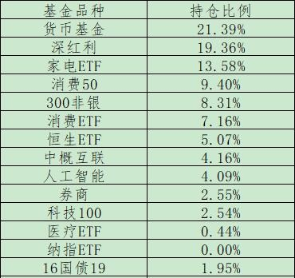

======================================================

_type: solution
2020-12-01 12:37:52 Tue  
topic_id: 182285844428442

@Sunflower at 2020-12-01 12:37:52 Tue

> 我前两天把我的中证500还有50ah都出了，留出钱等着加仓消费行业了，剩下的等着慢慢出了，今年跑赢大盘不可能了，等着调仓了

----------

@🍀 凝🌸 慧🍀 at 2020-12-01 12:37:52 Tue

> 今年我的收益率只能算一般，几个好基金都没能拿住，得总结反思去了。

----------

@Sunflower at 2020-12-01 12:37:52 Tue

> 你用的哪个软件？我的蛋卷只能看近一年的[流泪]

----------

@🍀 凝🌸 慧🍀 at 2020-12-01 12:37:52 Tue

> 这是中信建投的蜻蜓点金APP，自带盈亏分析

----------

@杜志彪 at 2020-12-01 12:37:52 Tue

> 我用的是场内华泰，里我的菜单中有收益率与300指数的比较图，蛋卷也有把图横着看就有今年以来了。

----------

阅读[4972]  评论[5]  赞[0] 

======================================================

_type: talk
@二师父[28814221155551]
2020-12-01 13:47:38 Tue  
topic_id: 414418155182588

坚持的我们，都开始收获了，别人恐惧的时候我们拿着盆子接筹码，别人贪婪的时候我们开始谨慎了。任何当下觉得天大的事情，放眼10年后，都是小事，一切都会慢慢过去的。

@小鱼 at 2020-12-01 13:47:38 Tue

> 可惜那个时候还没跟老师

----------

@Chu at 2020-12-01 13:47:38 Tue

> 我是2019年7月份跟着二师父，当时只想着跑赢通胀就可以，一路跟着师父从2800点定投到2650点，3200点以上我就没再定投了，今年暂时收益百分之35，感谢二师父教会我什么是贪婪和恐惧，说在股市基金市场不飘是假的，因为经常会听到同事买了3倍5倍股，但一想到师父说的我们要学习的不是跟着您投的基金而是思维模式就果断放弃他们所谓的牛股跟着慢慢定投慢慢沉淀

----------

@爱华 at 2020-12-01 13:47:38 Tue

> 想想那时刚刚开始理财，很多东西都懵懵懂懂的……现在好怀念那满眼都是绿色的估值表呀

----------

阅读[5287]  评论[3]  赞[0] 

+++++++++++++++++++++++++++++++++++++++++++++++++++++

图片：
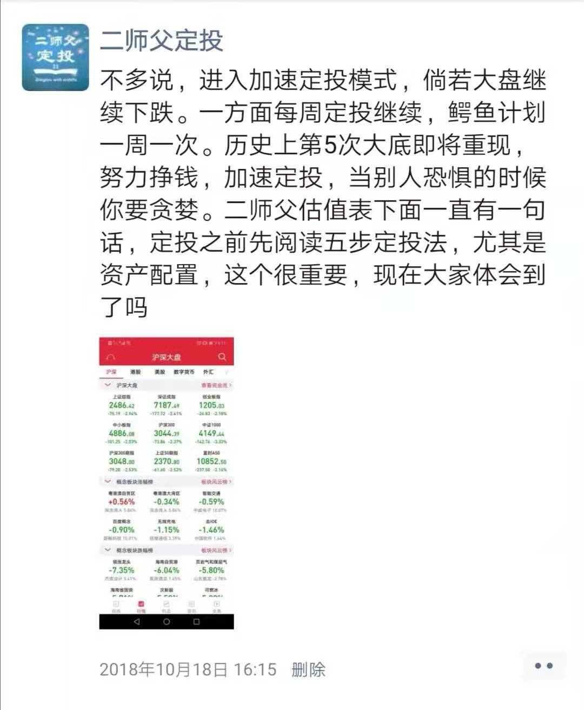
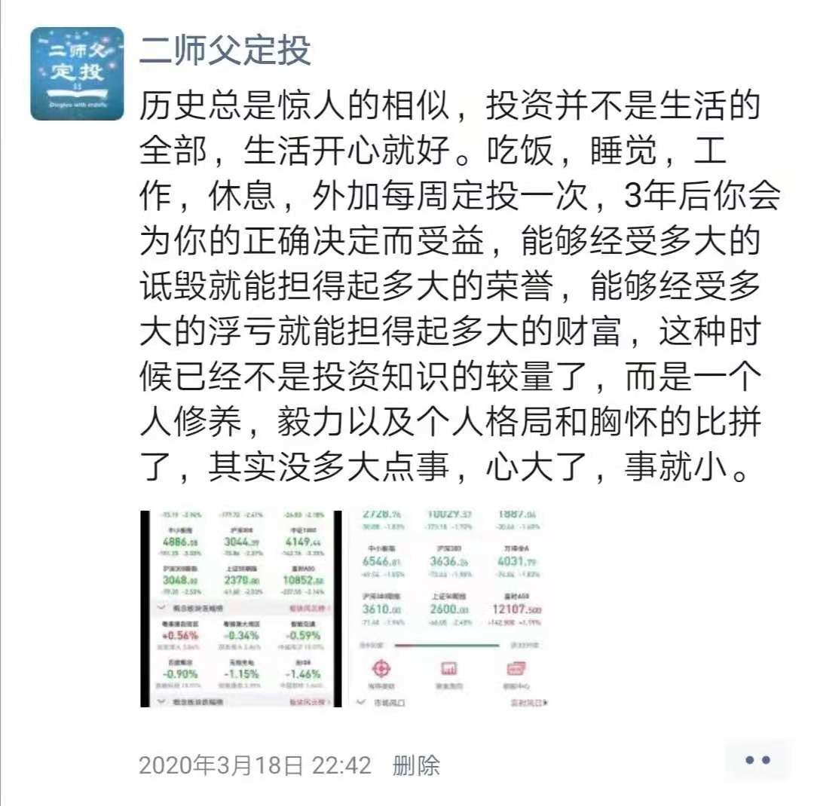

======================================================

_type: q&a
@🍀 凝🌸 慧🍀[841855248254242]
2020-12-01 15:30:03 Tue  
topic_id: 582281858884884

@🍀 凝🌸 慧🍀

>  师父好！今天鳄鱼计划买入医疗的逻辑，是因为它持续下跌到正常偏低估值，且未破前期1.97低点、今天又重新站上5日和10日均线吗？

@二师父

>  是的哈，长期看这个医疗基金很有价值，而且只买了一份，容错空间比较大

阅读[5199]  评论[5]  赞[0] 

======================================================

_type: talk
@二师父[28814221155551]
2020-12-01 18:36:30 Tue  
topic_id: 815518148824482

<e type="hashtag" hid="51285145822154" title="#A股红了#" /> 开门红，这两年都是牛年，今年在牛中过完，明年就要稍微警惕了。不过我们有利润收割做保障，而且基金不会出现股票封死跌停，真的来一波15年大涨，如果杀跌破20日均线再走人来的及，所以如果不是着急用钱，目前多拿一拿是正确选择。

@蛋炒饭不加蛋 at 2020-12-01 18:36:30 Tue

> 场外基金也是看对应的场内基金跌破20日均线卖出吗？

----------

@二师父 at 2020-12-01 18:36:30 Tue

> 如果逆市收割不用看均线

----------

@范毅君 at 2020-12-01 18:36:30 Tue

> 卖的早，来得晚，纪律性差。修炼才刚刚开始[可怜]

----------

@志亮 at 2020-12-01 18:36:30 Tue

> 屁股功一定要练好才能赚钱。

----------

@二师父 at 2020-12-01 18:36:30 Tue

> 板凳坐三年

----------

@志亮 at 2020-12-01 18:36:30 Tue

> 这是我投资两年得到的经验，追涨杀跌收益最终比不上持股不动[捂脸]

----------

@二师父 at 2020-12-01 18:36:30 Tue

> 我是真实的感受到你成长了，投资水平上一个台阶

----------

@涓涓 at 2020-12-01 18:36:30 Tue

> 这两天确实有动摇想加仓做趋势，幸好看见二师父的文章，赶紧熄火，老老实实跟着师父走

----------

阅读[5310]  评论[11]  赞[0] 

+++++++++++++++++++++++++++++++++++++++++++++++++++++

文件：
2020-12-01 18:33:52 Tue
文件大小：[25553]
28481215584121-12月A股开门红.docx

======================================================

_type: talk
@二师父[28814221155551]
2020-12-01 19:10:14 Tue  
topic_id: 815518148248822

<e type="hashtag" hid="28518858514151" title="#每日估值数据#" /> 市盈率百分位51.31%，市净率百分位31.27%，SY-BY百分位60.8%，SY/BY百分位59.77%。

估值数据上升了，A股波动了4个月又回到原点，而部分企业创了新高，坚定持有优质板块，远离垃圾板块。二师父说看均线只是辅助，投资最根本的是投资哲学，投资策略以及对基本面和价值的理解，包括仓位管理，均线可看可不看。

阅读[5453]  评论[0]  赞[0] 

======================================================

_type: talk
@阿宝[422212151424158]
2020-12-01 20:41:54 Tue  
topic_id: 182285814258252

还没读完，但是共鸣很多，简单聊一下

@杜志彪 at 2020-12-01 20:41:54 Tue

> 已经在喜马拉雅搜到语音版，作者水晶苍蝇拍对吗？

----------

@衣袂飘香 at 2020-12-01 20:41:54 Tue

> 你真是一个热爱学习，能够自我总结、自律性强的好孩子[强]

----------

@二师父 at 2020-12-01 20:41:54 Tue

> 好孩子。。。

----------

阅读[5165]  评论[3]  赞[0] 

+++++++++++++++++++++++++++++++++++++++++++++++++++++

文件：
2020-12-01 20:41:30 Tue
文件大小：[14848]
15158482425822-12.1  读股市进阶之道有感.doc

======================================================

_type: q&a
@日月⭐️辰[414842182855248]
2020-12-01 22:00:21 Tue  
topic_id: 414418121415118

@日月⭐️辰

>  师父您好，请问手上如果有资金，目前这种行情下，是提前还贷合适？还是用于投资比较好？如果投资基金，目前是不是不适合追高？还是说定投的话什么时候都可以开始？如果投债基是定投好还是一次性投呢？还是把资金放货基里，耐心等待机会再开始？谢谢🙏
>  例外第三方财富公司推荐的那种理财产品 七个点左右，不知道安全不安全？例如民生财富的，

@二师父

>  不要提前还贷，目前贷款利率比两融的利率低，自己投资再差也有10个点的年化，目前这个位置可以建一到二层仓位，如果继续涨的话到高点逐步获利走人，预计十二月会有行情，如果不幸没有涨，那么两层仓位不重，接着市场下来了就可以继续投资了，债基波动不大，可以在10年期国债收益率3.8以上一次配置，定投的话基本都可以
>  
>  理财产品就别买了，货币基金最保险，理财产品一出事就是大事，而且这个7个点的固定收益品种本来就不合理，不要买了

阅读[5161]  评论[0]  赞[0] 

======================================================

_type: q&a
@小眼静🎀[844121141821482]
2020-12-02 12:04:55 Wed  
topic_id: 815518111855842

@小眼静🎀

>  二师父，之前因为着急用钱把定投都卖出了，现在有了闲置资金想继续定投，但大盘点数涨的很高，有什么推荐的吗？

@二师父

>  目前可以关注的有医疗，金融板块，最好跟着实盘走比较稳健，可以先跟着乌龟计划建立一个底仓或者自己做一个沪深300加国债的组合

阅读[4960]  评论[0]  赞[0] 

======================================================

_type: talk
@佳[844145484515482]
2020-12-02 13:17:36 Wed  
topic_id: 414418111125188

二师父，你的酒基金都清仓了吗？我看鳄鱼计划里的持仓没有这个基金

@二师父 at 2020-12-02 13:17:36 Wed

> 我自己的账户还剩了一点，纯属观察了，鳄鱼计划当时3月份把酒一次转到消费了，这是有记录的哈。因为这个基金规模当时比较小，很多投资者害怕，不敢跟，所以折中了下就转到消费投了。

----------

@吃肉肉 at 2020-12-02 13:17:36 Wed

> 请问鳄鱼计划的持仓在哪里看？

----------

@onepiecewi* at 2020-12-02 13:17:36 Wed

> 我也不知道

----------

阅读[4812]  评论[3]  赞[0] 

======================================================

_type: talk
@二师父[28814221155551]
2020-12-02 19:47:06 Wed  
topic_id: 215855288224141

<e type="hashtag" hid="51285144115284" title="#每日估值表#" /> 估值表来啦，目前都是正常偏高估值，大家严格按照纪律操作哈，高估可以不卖，但是最好别追，趋势投资在于趋势反转的势，而不在于追高，可以读一读索罗斯的《<e type="web" href="https://wx.zsxq.com/mweb/views/weread/search.html?keyword=金融炼金术" title="金融炼金术" style="book" />》。

很多还有钱的朋友咋办呢，准备好现金，A股平均一到两年就会有个大跌。2016年到2020年这5年每年都有机会，关键子弹要足够。

@子辰 at 2020-12-02 19:47:06 Wed

> 估值表比较模糊，我应该没近视

----------

@二师父 at 2020-12-02 19:47:06 Wed

> 你得点开看原图才行

----------

阅读[4857]  评论[2]  赞[0] 

+++++++++++++++++++++++++++++++++++++++++++++++++++++

图片：
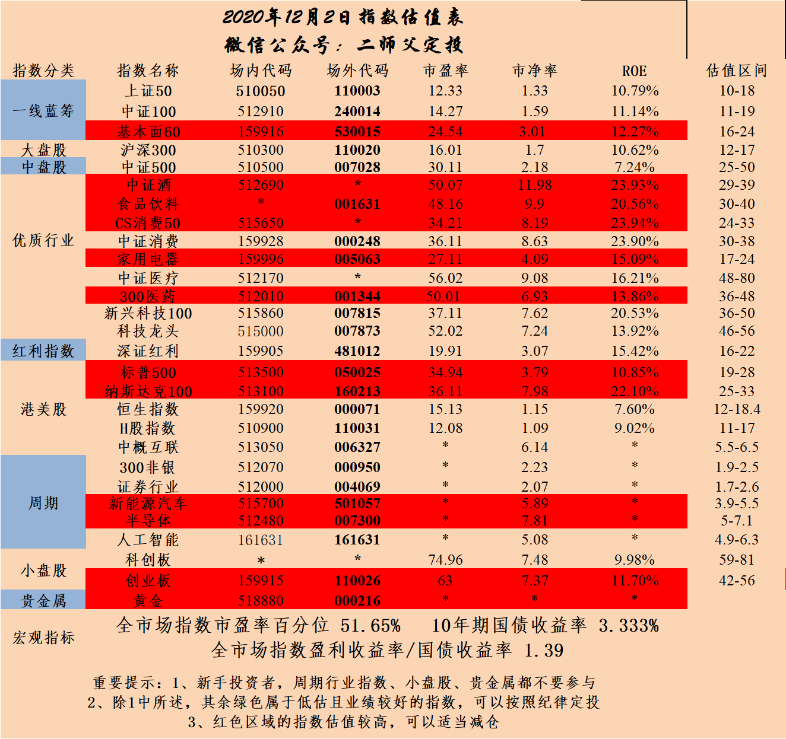

======================================================

_type: talk
@二师父[28814221155551]
2020-12-02 19:54:10 Wed  
topic_id: 414844588525528

<e type="hashtag" hid="51285144115184" title="#了解下乌龟计划#" /> 很多读者今年收益率比乌龟计划还好，可能比较幸运，一入场就来了个大跌，长期坚持投资纪律，才能实现复利增值，关键不在于一年收益多少，而在于历经多次牛熊而不倒。

@付云 at 2020-12-02 19:54:10 Wed

> 二师傅，我家二宝刚出生，之前咨询过您关于教育金的问题，我想通过乌龟计划实现教育金储备。每个月定投定投定投十年！不知道是否可以实现。

----------

@二师父 at 2020-12-02 19:54:10 Wed

> 这个是可以的，只要预期收益率在年化10到15个点之间都可以

----------

@付云 at 2020-12-02 19:54:10 Wed

> 要不要选择什么时候开始呢，现在的位置比较高。

----------

@二师父 at 2020-12-02 19:54:10 Wed

> 一次性购买，Sy-by百分位百分之30以下最好，目前适合每周操作的时候跟上

----------

阅读[5027]  评论[4]  赞[0] 

+++++++++++++++++++++++++++++++++++++++++++++++++++++

文件：
2020-12-02 19:52:05 Wed
文件大小：[282056]
15158488544542-手把手带你学习乌龟计划.docx

======================================================

_type: q&a
@🍀 凝🌸 慧🍀[841855248254242]
2020-12-02 22:05:27 Wed  
topic_id: 182522454552182

@🍀 凝🌸 慧🍀

>  师父好，如果想投资5g和芯片，您能给些投资建议吗？谢谢！

@二师父

>  5G价值不大，芯片还可以投资，不过最好别定投，做趋势反转就比较好，如果做对了，当下来时候直接清仓走人，如果做错了，认错也走人，别逆势投这个，景气周期会越来越高，相反资金撤场了越跌越没人气

阅读[3284]  评论[3]  赞[0] 

======================================================

_type: talk
@吃肉肉[118228144221282]
2020-12-03 05:36:57 Thu  
topic_id: 182522442152282

<e type="hashtag" hid="51285144115184" title="#了解下乌龟计划#" /> 
师父，求教，我还不明白你的鳄鱼计划在哪里看？天天基金链接里的操作是乌龟计划还是鳄鱼计划？[捂脸]

@JOY at 2020-12-03 05:36:57 Thu

> 鳄鱼计划在星球搜 鳄鱼计划，乌龟计划搜 乌龟计划，都有记录。天天基金搜索 乌龟计划，有实盘。就像你用百度一样的。

----------

@zxc at 2020-12-03 05:36:57 Thu

> 天天基金场外的是乌龟计划，鳄鱼计划是场内的。鳄鱼计划发车时二师父公众号和星球都会发布

----------

@吃肉肉 at 2020-12-03 05:36:57 Thu

> 好的，谢谢！

----------

@吃肉肉 at 2020-12-03 05:36:57 Thu

> 鳄鱼计划是场内的证券账户里操作的是吗？货币基金（银华日利)和16国债19怎么买？

----------

@吃肉肉 at 2020-12-03 05:36:57 Thu

> 是滴，我想问一下代码😃，在哪里买。

----------

@JOY at 2020-12-03 05:36:57 Thu

> 你要是有场内证券账户的话，一般场内场外的就都能买。天天基金只能买场外的，你去搜下看看就知道了

----------

@吃肉肉 at 2020-12-03 05:36:57 Thu

> 好的

----------

@长安流歌 at 2020-12-03 05:36:57 Thu

> 请问，鳄鱼计划用的是存量资金还是增量资金

----------

阅读[3135]  评论[8]  赞[0] 

======================================================

_type: talk
@二师父[28814221155551]
2020-12-03 10:23:35 Thu  
topic_id: 815855224241212

<e type="hashtag" hid="28518855451481" title="#乌龟计划#" /> 基本面60，投资一年有47个点收益率，目前进入高估区域，分步减仓，一次卖出0.25份，中证500，收割利润0.25份转移到易方达中债，代码003358，50ah收割利润0.25份转移到广发中债，代码003376。

目前基本股债轮动形成，今年明显股牛债熊，做好平衡配置即可。如果资金充足，股权仓位低于百分之30可以不用卖出，直接买入债券基金即可。

@杳杳 at 2020-12-03 10:23:35 Thu

> 天天基金要卖出只能解散组合卖出，不然就得整体卖出。[流汗]

----------

@二师父 at 2020-12-03 10:23:35 Thu

> 他这个确实不大友好，我给他们反馈了，技术正在开发

----------

@庆余年 at 2020-12-03 10:23:35 Thu

> 收割利润的0.25份是指，比如我的一份是2000元，0.25就是500对么？还是说0.25是这只基金的25%

----------

@二师父 at 2020-12-03 10:23:35 Thu

> 一份的百分之25

----------

@sky at 2020-12-03 10:23:35 Thu

> 师父，转入的两个都是中债，有什么区别吗？

----------

@二师父 at 2020-12-03 10:23:35 Thu

> 都是国开债，不同基金公司的品种，追踪和费率稍有差异

----------

@mumomo at 2020-12-03 10:23:35 Thu

> 说的是利润的25%吧

----------

@二师父 at 2020-12-03 10:23:35 Thu

> 一份的0.25

----------

阅读[3299]  评论[22]  赞[0] 

======================================================

_type: talk
@二师父[28814221155551]
2020-12-03 10:47:09 Thu  
topic_id: 215855224412221

<e type="hashtag" hid="15284511441582" title="#推荐一本书#" /> 给大家推荐一本书，《<e type="web" href="https://wx.zsxq.com/mweb/views/weread/search.html?keyword=巴菲特之道" title="巴菲特之道" style="book" />》，这本书算是我的入门书，里面讲了一个点非常好，就是少看账户，这样会减少自己的损失厌恶感，让我们更有利于长期持有，通常一个人看账户频率与收益成反比，大家有兴趣可以阅读下，可以多看看基金的基本信息，持仓企业基本面，了解越多持有的时候信心越足，但是少看账户波动，看长了容易拿不住。要想投资收益好，第一要买好的基金或者股票，第二要买好的价位，第三还得有一定仓位，第四一定拿的住，坐稳了，否则就是常说的卖飞了。

未来继续往上还是向下我已经没法预判了，唯一可以确定的是，3588点是本轮大压力位，要想牛三全面开启这个不突破是不大可能的，如果成交额持续1.2亿以上，创业板换手率5%以上还突破不了大家就要警惕了。

@蛋炒饭不加蛋 at 2020-12-03 10:47:09 Thu

> 创业板换手率怎么看？

----------

@二师父 at 2020-12-03 10:47:09 Thu

> 同花顺或者东方财富

----------

@蛋炒饭不加蛋 at 2020-12-03 10:47:09 Thu

> 我在同花顺没找到

----------

阅读[3589]  评论[3]  赞[0] 

======================================================

_type: talk
@二师父[28814221155551]
2020-12-03 11:02:48 Thu  
topic_id: 815855224188182

刚和天天基金工作人员沟通了下，明天单独调仓功能上线，大家可以自己单笔调仓了，看看功能如何

@苍天有井明月空🌙 at 2020-12-03 11:02:48 Thu

> 是可以手动操作了

----------

@吃肉肉 at 2020-12-03 11:02:48 Thu

> 师父的沟通太及时了，正准备配置。

----------

@lily at 2020-12-03 11:02:48 Thu

> 你们可以一键调仓吗？

----------

@苍天有井明月空🌙 at 2020-12-03 11:02:48 Thu

> 可以

----------

@lily at 2020-12-03 11:02:48 Thu

> 我怎么不行啊[大哭]

----------

@lily at 2020-12-03 11:02:48 Thu

> 我打开乌龟计划，都不像以前那样 以前师父有调仓会有提示的 我一键跟投就可以了，现在打开乌龟计划没有提示了，跟不了了，这是啥情况啊[惊讶]

----------

@吃肉肉 at 2020-12-03 11:02:48 Thu

> 是一键跟投确认持有份额后，以后的操作就可以单独对其中的基金进行买卖调整了是吗？

----------

阅读[3304]  评论[7]  赞[0] 

+++++++++++++++++++++++++++++++++++++++++++++++++++++

图片：

======================================================

_type: talk
@二师父[28814221155551]
2020-12-03 11:07:09 Thu  
topic_id: 414844552154528

基本可以查阅的信息直接查阅就可以啦，这个换手率直接打开app搜索创业板即可查询

@蛋炒饭不加蛋 at 2020-12-03 11:07:09 Thu

> 谢谢二师父

----------

@吃肉肉 at 2020-12-03 11:07:09 Thu

> 师父，货币基金，你的持仓银华日利的代码是511880还是511881？哪个好一点？

----------

@二师父 at 2020-12-03 11:07:09 Thu

> 511880

----------

@百变 at 2020-12-03 11:07:09 Thu

> 老师：能讲讲换手率的正常范围吗

----------

@二师父 at 2020-12-03 11:07:09 Thu

> 2到5

----------

@百变 at 2020-12-03 11:07:09 Thu

> 谢谢[玫瑰]

----------

阅读[3346]  评论[6]  赞[0] 

+++++++++++++++++++++++++++++++++++++++++++++++++++++

图片：
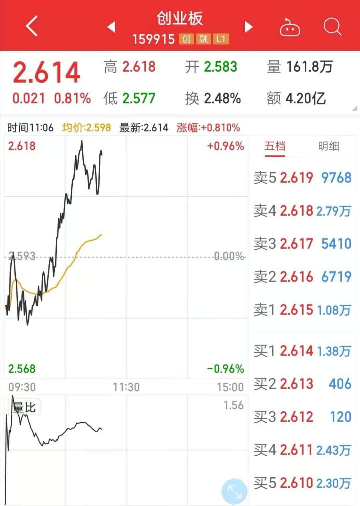

======================================================

_type: talk
@门萨🐨[51411455828824]
2020-12-03 13:38:32 Thu  
topic_id: 215855221121281

昨天忘了卖，今天走人……

阅读[3202]  评论[0]  赞[0] 

+++++++++++++++++++++++++++++++++++++++++++++++++++++

图片：
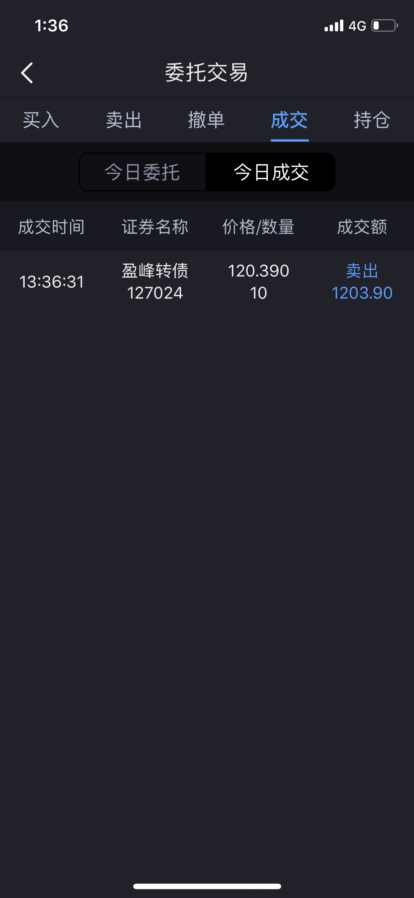

======================================================

_type: q&a
@日月⭐️辰[414842182855248]
2020-12-03 14:35:22 Thu  
topic_id: 414844551521428

@日月⭐️辰

>  师父 还是想麻烦你帮忙看看这种系列的类固收😹尤其红色圈起来的那几类
>  投资方向 银行债券类的
>  只想知道这种安不安全🙈
>  身边也不知道问谁好
>  因为除了基金还想配点其他收益产品
>  万分感谢🙏

@二师父

>  你确定是红色圈的吗，这是泛海投资基金管理公司的私募产品，我查了下泛海一号是R4风险产品，有本金全部损失风险，固收加买偏债混合基金是比较好的，损失可控
>  
>  不要相信宣传，记得原油宝当时也是写的R2还是R3，结果最后评估其实是R5

阅读[3324]  评论[7]  赞[0] 

======================================================

_type: q&a
@onepiecewi*[244414114545811]
2020-12-03 14:36:45 Thu  
topic_id: 582122542145844

@onepiecewi*

>  师父，你最近的鳄鱼计划操作，今天想跟投，发现医疗又起来了，是缓缓再跟吗？

@二师父

>  最好当日跟，如果后面跟有偏差能接受也可以的，目前比之前买入涨了2.9个点，涨幅并不大

阅读[3439]  评论[3]  赞[0] 

======================================================

_type: q&a
@一心一意[844421848411122]
2020-12-03 14:41:39 Thu  
topic_id: 414844558222288

@一心一意

>  师父好，天天基金网显示大农业指数低估，我看我们的布局里没有，是赛道不好么

@二师父

>  这个基金还不错的，目前并不低估哈，他们算的有问题

阅读[3460]  评论[1]  赞[0] 

======================================================

_type: talk
@二师父[28814221155551]
2020-12-03 18:41:59 Thu  
topic_id: 182522411185282

<e type="hashtag" hid="28518858514151" title="#每日估值数据#" /> 市盈率百分位51.26%，市净率百分位32.63%，SY-BY百分位61.33%，SY/BY百分位60.15%。

最近有刚加入的朋友，如果对预期收益率偏低的话，固收加选择二级债基和偏债混合比较好。收益稳定，回撤可控。而至于每月增量资金一直没投，可以存着等更好的机会，也可以改善改善生活，添几件冬季的新衣服，换个车，投资也是为了更好的生活。

真正的投资并不需要每时每刻都行动，投资界和实业界完全不同。

做实业是越努力越收获，而股市，如果时机不对，越努力反而越失败，我选择等待，直到可以投资的信号出现。

@Mr-K at 2020-12-03 18:41:59 Thu

> 选择+努力

----------

阅读[3650]  评论[1]  赞[0] 

======================================================

_type: q&a
@日月⭐️辰[414842182855248]
2020-12-03 22:19:55 Thu  
topic_id: 414844521211548

@日月⭐️辰

>  师父，您好，我是新手小白，😭所以问题有点点多，还请见谅，因为我是买了您那本指数定投的书关注了您的公众号，才有缘在这星球里像您学习，无比荣幸☺️☺️看了您的五步定投法好几遍，😹😹才终于慢慢有了点感觉（价值高值得多品多学）但还是有几个不懂的点望赐教🤝
>  1⃣️，您的四个账户中，防守账户我理解的是用来购买保险类的资金是吗？这个资金是未来购买保险资金的总额吗？比如重疾险一年1W，买二十年，这个账户就要放20W？😂
>  2⃣️比如有100W资金，是防守账户➕日用账户一起占30W，余下70W是稳健账户和进攻账户，其中稳健账户占63W，进攻账户7W？如果我用您的五步定投法去跟投您的乌龟或鳄鱼计划，年华收益大概会是在几个点左右？收益的本金是按70算的不？😬😬
>  3⃣️看了您的很多文章，我的理解是后面的投资根据您不断更新的SY—BY百分比数值可自行去判断标的当下是否适合定投？或者只适合持有收割，甚至数值到达绝对高位就要清仓再等待的意思是吗？因为刚开始学定投学的思维是长期持有坚持定投 ，但是看了您的文章后发现还是要适情况而定？
>  4⃣️五步定投里的市场指数百分位是您说的哪个？😂
>  5⃣️经常看到您提到当十年国债利率大于3.5这个概念，是不是当大于3.5的时候开始配置债了？类似于您说的熊市低估时大量买入？因为我看现在已经3.3几了🙈
>  谢谢师父🍬🍬☺️

@二师父

>  1，这个防守账户资金是应对意外的资金，比如疫情突然失业这种意外情况，让自己不至于短期没有收入而不得提取自己账户的金融资产，购买保险一年保费也就几千到一万，工资就够了的，不用额外准备哈
>  
>  2，防守账户资金根据自身需求配置，如果家庭夫妇双方的工资待遇比较好，收入稳定，可以少量配置，进攻账户可以理解为投资股票，承担高风险高收益，对于刚投资的朋友，就稳健账户增值即可，乌龟计划预期年化收益率百分之10到15，五年两倍，10年4倍。鳄鱼计划预期年化百分之20，4年两倍，12年8倍
>  
>  3，长期坚持定投适合美股，单边长牛，而a股很难，因为波动太大，06年高位定投到08年底部那是血崩，没人能坚持下来，所以最好的是在sy-by百分位50以下再考虑定投，这样回撤可控，长期定投理论上可以实现盈利，然而实际上波动没人受得了，18年跌到底部很多机构都扛不住减仓了，所以需要在市场相对低位的时候投资
>  
>  4，那是全市场指数市盈率百分位，有中证全指，也有万得全A，这两个有参考意义，上证指数只是沪市股票集合，并不能代表全市场，有点瘸腿
>  
>  5，如果利率走高，通胀较为严重时候投资债券性价比凸现，3.5以上代表债券投资价值比较高，如果大量买入结合市场利率，信贷情况，股市走势综合考虑，如果国债收益率高，股市依旧上行区间没必要配置大量债券，相反，股市高位泡沫严重，而国债收益率也很高，信贷收紧，货币收紧，这时候配债很好，股权优先于债券配置，因为债券市场长期看收益率是低于股票和指数的

阅读[3430]  评论[15]  赞[1] 

======================================================

_type: q&a
@小鱼[241182222251181]
2020-12-04 10:41:31 Fri  
topic_id: 182522488585282

@小鱼

>  三大剑客银行，这个价位配置点，准备打新股，合适吗？

@二师父

>  股票投资不仅仅只看价格，还有上升预期，以及自己对波动的承受能力，这价位配长期大概率拿不住，如果想配置，招行1.4倍市净率以下比较安全了，我不知道你的投资经验，所以真没法给具体建议，最近俩月有人逆市加华兰生物，结果把今年赚的亏完了还倒赔

阅读[3258]  评论[1]  赞[0] 

======================================================

_type: q&a
@xu[2441485251]
2020-12-04 11:57:51 Fri  
topic_id: 582122421412124

@xu

>  请问二师傅，现在还能跟头乌龟计划啊

@二师父

>  可以的，后面跟上就行，当前发车就意味着当前的机会，没有机会我也不会买的

阅读[3275]  评论[3]  赞[0] 

======================================================

_type: q&a
@lily[548488251242584]
2020-12-04 13:31:34 Fri  
topic_id: 215855452518281

@lily

>  师父，请问一下，那个银华日利和支付宝的余额宝，哪个收益更好一点呢？

@二师父

>  银华日利高一点，部分短债也可以，流动性差一点，我用的中国银行里面的货币基金，收益也还挺高

阅读[3251]  评论[0]  赞[0] 

======================================================

_type: talk
@范毅君[118551121224142]
2020-12-04 13:35:24 Fri  
topic_id: 414844245841828

这是我大牛市顶买的两千基金，后来懒得卖，就当观察哨，我感觉不是啥特别好的基金，只能算中等吧，看看现在，我感觉现在指数看着没长多少，但敬畏应该有了[呲牙][呲牙]

阅读[3262]  评论[0]  赞[0] 

+++++++++++++++++++++++++++++++++++++++++++++++++++++

图片：
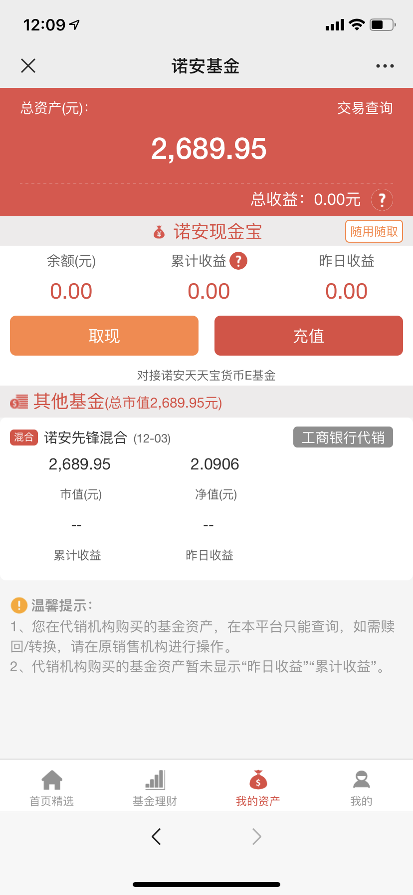

======================================================

_type: talk
@二师父[28814221155551]
2020-12-04 14:10:26 Fri  
topic_id: 414844245582558

白酒真猛，a股投资，喝酒吃药，永葆长青！银行券商冲不起来，对后市依旧保守态度，稳住，买得好，也得拿得住。

@栀子花开 at 2020-12-04 14:10:26 Fri

> 白酒这么个涨法真特么的不科学[调皮]

----------

@香香 at 2020-12-04 14:10:26 Fri

> 白酒靠的是信仰，不是估值。

----------

@丸子妈 at 2020-12-04 14:10:26 Fri

> 今天白酒etf清了

----------

@雨淡风清 at 2020-12-04 14:10:26 Fri

> 酒大哥还没破前高呢！这次医药采购的药丸也没要玩。

----------

阅读[3452]  评论[4]  赞[0] 

======================================================

_type: talk
@二师父[28814221155551]
2020-12-04 17:31:39 Fri  
topic_id: 414844284824118

<e type="hashtag" hid="28512841524481" title="#医疗行业分析#" /> 只有对一个行业或者企业有深度认知，才敢买，也拿得住。注重基本面分析，技术分析是术，基本分析是道。

@阿宝 at 2020-12-04 17:31:39 Fri

> 谢谢！老师

----------

@吃肉肉 at 2020-12-04 17:31:39 Fri

> 师父，在场内购买指数，指数的市值计算参与打新的额度吗？谢谢！

----------

@二师父 at 2020-12-04 17:31:39 Fri

> 不算

----------

@吃肉肉 at 2020-12-04 17:31:39 Fri

> 好的

----------

阅读[3590]  评论[4]  赞[0] 

+++++++++++++++++++++++++++++++++++++++++++++++++++++

文件：
2020-12-04 17:30:49 Fri
文件大小：[29336]
51418414284884-为什么不买下行的基建，反而继续买这个板块.docx

======================================================

_type: q&a
@果实妈咪[182225518588452]
2020-12-05 11:40:15 Sat  
topic_id: 182522154244522

@果实妈咪

>  二师父，香港银行卡咋开？

@二师父

>  直接去香港即可

阅读[3158]  评论[0]  赞[0] 

======================================================

_type: q&a
@隔窗遥望[241884481854181]
2020-12-05 11:41:33 Sat  
topic_id: 582122411451444

@隔窗遥望

>  #每日估值数据 市盈率百分位51.31%，市净率百分位31.27%，SY-BY百分位60.8%，SY/BY百分位59.77%。
>  
>  估值数据上升了，A股波动了4个月又回到原点，而部分企业创了新高，坚定持有优质板块，远离垃圾板块。二师父说看均线只是辅助，投资最根本的是投资哲学，投资策略以及对基本面和价值的理解，包括仓位管理，均线可看可不看。
>  师父，这几个百分率，怎么看什么时候适合买，什么时候适合卖？

@二师父

>  百分位越低越有价值，Sy-by百分位10以下可以抄底

阅读[3257]  评论[3]  赞[0] 

======================================================

_type: q&a
@吃肉肉[118228144221282]
2020-12-05 18:27:09 Sat  
topic_id: 182522141822512

@吃肉肉

>  师父，为什么现在我在天天基金里点一键跟投，就按您的仓位比例自动分配金额，而不是可以选其中一个基金来单独投？

@二师父

>  既可以先一键跟投建底仓，也可以单只购买，如果是一键就是按照比例

阅读[3251]  评论[4]  赞[0] 

======================================================

_type: q&a
@nana[48222415211188]
2020-12-05 22:19:59 Sat  
topic_id: 815855421854152

@nana

>  师傅好！银行理财经理推荐一款投连险年金产品，请帮我看看是否能买？谢谢🙏

@二师父

>  不适合，投资连接险费率高，而且收益和损失均需要客户承担，收益越高，承担风险越大，他推荐理由是啥

阅读[3253]  评论[3]  赞[0] 

======================================================

_type: q&a
@shininggre*[15551242111522]
2020-12-05 22:21:33 Sat  
topic_id: 182522148255452

@shininggre*

>  二师父，您好。最近想把资金汇总到一个证券账户。在天天基金有部门场外资金可直接转场内。但也有部分没办法转场内。我能想到的办法是：把这部分没法转的场外基金卖掉，金额到账后再从证券账户买回来。但这个办法耗时耗手续费，有没有其他方法呢？

@二师父

>  没有办法，只有等高估清仓，或者直接卖出，转过去，费一些时间

阅读[3398]  评论[0]  赞[0] 

======================================================

_type: q&a
@志亮[422125851552828]
2020-12-06 16:38:10 Sun  
topic_id: 182522111811412

@志亮

>  二师父，据我所知千股跌停时股票一般是赎不回来的，请问若出现这种情况时，场内或场外基金可以赎回吗？这个问题很重要，希望二师父能够回答。

@二师父

>  场外可以的，场内基金如果出现了流动性问题，可能会有暂时卖不出的情况，停牌了才卖不出，如果股票没有停牌，一般可以

阅读[3331]  评论[2]  赞[0] 

======================================================

_type: q&a
@sunny在路上[841885811111842]
2020-12-06 16:42:40 Sun  
topic_id: 815855441515542

@sunny在路上

>  沃森这个事件对生物医药ETF影响会多大？下周这个etf应该直接卖了还是观察？

@二师父

>  医疗etf里面没有重仓这个基金，这种雷不算太大，对整体医疗行业没啥大影响，如果真跌下来了，买就对了，左侧交易的话没必要卖，右侧交易的话可以出了

阅读[3379]  评论[5]  赞[0] 

======================================================

_type: q&a
@素兮[548121415528244]
2020-12-06 20:16:00 Sun  
topic_id: 582122482145254

@素兮

>  二师父，中欧推出的水滴养老怎么看？可以每月定投么？不管市场牛熊？

@二师父

>  他们组合还是挺不错的，不过主动管理型组合也需要在低位投收益率会更好，牛转熊依然有回撤

阅读[3304]  评论[3]  赞[0] 

======================================================

_type: q&a
@范毅君[118551121224142]
2020-12-07 12:57:34 Mon  
topic_id: 582121224118524

@范毅君

>  二师父，平安银行市净率在多少比较安全，卖光了，打新用，看看多少可以接回来

@二师父

>  1.03，银行主要看经济周期，金融危机的时候平安和中国平安都是最糟糕的

阅读[3158]  评论[3]  赞[0] 

======================================================

_type: q&a
@永刚[15581448518112]
2020-12-07 17:49:31 Mon  
topic_id: 414848485841518

@永刚

>  师父，我是刚加入进来的，我想知道现在鳄鱼计划的持仓情况，我想办法补仓，以后跟上您抄作业。

@二师父

>  星球搜索鳄鱼计划即可，鳄鱼往期可不用补，后面跟上就行

阅读[2992]  评论[0]  赞[0] 

======================================================

_type: q&a
@苍天有井明月空🌙[28882214181441]
2020-12-07 17:49:50 Mon  
topic_id: 815858588414442

@苍天有井明月空🌙

>  二师父，你得书籍电子版在哪里可以看到。

@二师父

>  这个微信读书上有

阅读[3028]  评论[0]  赞[0] 

======================================================

_type: talk
@二师父[28814221155551]
2020-12-07 18:42:46 Mon  
topic_id: 414848485222528

<e type="hashtag" hid="88512818441512" title="#关于雷区#" /> 每次暴雷都比较开心，如果能把指数打到安全边际内就妥妥地加仓。沃森生物就比较惨了，20%的跌幅。

@志亮 at 2020-12-07 18:42:46 Mon

> 前几天看跌这么多刚想抄底，幸好最后忍住了。[呲牙]

----------

@梧桐 at 2020-12-07 18:42:46 Mon

> 二师父，您有时间分析一下年金险吧，值不值得买，虽然利率不高，但资产隔离的功能感觉还可以用。

----------

@二师父 at 2020-12-07 18:42:46 Mon

> 这个看需求，如果您觉得利率符合预期可以

----------

@梧桐 at 2020-12-07 18:42:46 Mon

> 谢谢二师父

----------

阅读[3299]  评论[4]  赞[0] 

+++++++++++++++++++++++++++++++++++++++++++++++++++++

文件：
2020-12-07 18:41:42 Mon
文件大小：[28354]
15158818825822-雷区中的风险与机会.docx

======================================================

_type: talk
@二师父[28814221155551]
2020-12-07 19:35:56 Mon  
topic_id: 182525251224412

<e type="hashtag" hid="224445218111" title="#全市场估值数据#" /> 12月份指数调仓，部分指数的估值可能会稍有变化，长期投资而言短期的波动和估值变化影响不大，抓住主要的核心区间即可。

当前SY-BY百分位61.53%，SY/BY百分位60.3%，市盈率百分位51.78%，市净率百分位33.47%。数据我做了调整，大家看的话直接看百分位数据就好，百分位数据越低可以上的仓位越重，如果想看方法可以看看书里面有介绍，基本的风险溢价系数，并没有什么特别大的难度，而关键是理解原理之后，知道这个数据并不是简单的变化，而是变化中隐含着金融市场内在变动逻辑。

跨年行情有没有目前不好预测，不过今年市场到这个位置，已经挺不错了，算是A股的高光时刻。在以后的投资时间中，我们还会面临低谷，面临高光，关键是如何应对，而不是预测到何时低谷，何时高光。

阅读[3280]  评论[0]  赞[0] 

======================================================

_type: talk
@lison[88242184121442]
2020-12-07 20:18:38 Mon  
topic_id: 182525258828812

芯片etf现在可以上车吗

@二师父 at 2020-12-07 20:18:38 Mon

> 芯片这个投资风险偏大，慎重

----------

阅读[3120]  评论[1]  赞[0] 

======================================================

_type: talk
@百变[15285855281882]
2020-12-08 10:37:41 Tue  
topic_id: 582121242255824

师父：50AH现在可以清仓了吗？

@二师父 at 2020-12-08 10:37:41 Tue

> 可以的

----------

阅读[2961]  评论[1]  赞[0] 

======================================================

_type: talk
@志亮[422125851552828]
2020-12-08 15:28:19 Tue  
topic_id: 815858544228542

白酒为何你还不跌？[捂脸]

阅读[2882]  评论[0]  赞[0] 

======================================================

_type: q&a
@一心一意[844421848411122]
2020-12-08 16:42:22 Tue  
topic_id: 815858544224282

@一心一意

>  师父好，全仓养老账户按股债轮动模型，如果出现股债双杀的情况，我们一样按sy-by的百分位进行调仓么，还是不动作，或者追加一部分资金

@二师父

>  按照sy-by百分位调仓，这种情况很少，长期看债券和股票都是向上的，出了这种情况拿的住就行，下跌不是坏事，关键是上涨，当牛市高位07年15这种就要考虑退出，持有现金才是最大的风险

阅读[3020]  评论[4]  赞[0] 

======================================================

_type: q&a
@蛋炒饭不加蛋[118281818482542]
2020-12-08 16:42:49 Tue  
topic_id: 182525211415212

@蛋炒饭不加蛋

>  请问二师父场外华宝分级医疗162412年底会转型吗？

@二师父

>  会的，已经出了公告，分级基金今年都会转型升级

阅读[3124]  评论[3]  赞[0] 

======================================================

_type: talk
@二师父[28814221155551]
2020-12-08 18:35:14 Tue  
topic_id: 215858541211551

<e type="hashtag" hid="15284584522442" title="#关于白酒#" /> 白酒是长期看好的，不过目前高估，没有白酒了，最后一点酒ETF观察，如果还能短期翻一倍，那么我的投资方法可能要修正了，如果不能，那么继续坚守高估卖本，A股还是那个A股，没有一丝丝改变。看市场演绎吧。

@雨淡风清 at 2020-12-08 18:35:14 Tue

> 我贪心

----------

@志亮 at 2020-12-08 18:35:14 Tue

> 前几天我把茅台卖了，一卖就涨。[撇嘴]，让我感觉是卖错了吗？明明很高估了啊！

----------

@二师父 at 2020-12-08 18:35:14 Tue

> 如果拿的住可以长期，他的估值是变化，而市值一直在长期向上

----------

@志亮 at 2020-12-08 18:35:14 Tue

> 还是太贪心了些，以为要大跌，再买回来的。

----------

阅读[3287]  评论[4]  赞[0] 

+++++++++++++++++++++++++++++++++++++++++++++++++++++

文件：
2020-12-08 18:33:32 Tue
文件大小：[29133]
15158888228812-茅台又新高了，真的靠信仰吗.docx

======================================================

_type: talk
@二师父[28814221155551]
2020-12-08 18:59:37 Tue  
topic_id: 215858541418811

<e type="hashtag" hid="224445218111" title="#全市场估值数据#" /> 市盈率百分位50.63%，市净率百分位32.63%，SY-BY百分位59.67%，SY/BY百分位58.62%。

最近一个月不看盘，今天国债收益率下跌，国债价格上涨起来了，继续配债，等待市场出现绝佳机会。年初很多专家预测今年是科技牛，而我依旧坚定自己的消费和医疗投资板块，少量配置的科技100，结果这两个真的比科技强多了，投资科技选择中概、龙头科技，人工智能，新能源。

@苍天有井明月空🌙 at 2020-12-08 18:59:37 Tue

> 看空A股吗

----------

@二师父 at 2020-12-08 18:59:37 Tue

> 不是

----------

阅读[3434]  评论[2]  赞[0] 

======================================================

_type: q&a
@刘佳柒[815555885511852]
2020-12-08 19:58:34 Tue  
topic_id: 182525218181252

@刘佳柒

>  二师父，我定投了融通人工智能，八个月了，还亏2个点，快坚持不住了，还有希望盈利吗？

@二师父

>  有希望的，周期性指数控制仓位，不要无脑定投，宽基指数和盈利稳定的指数可以长期

阅读[3233]  评论[1]  赞[0] 

======================================================

_type: talk
@二师父[28814221155551]
2020-12-09 19:37:56 Wed  
topic_id: 582121115218844

<e type="hashtag" hid="51285144115284" title="#每日估值表#" /> 估值数据没有太大变化，科技100和人工智能快进入低估了，目前市场两级分化，白酒板块和新能源板块估值偏高，金融科技估值相对较低。机会都不太好，重点关注医疗和中概股的机会。

阅读[3018]  评论[0]  赞[0] 

+++++++++++++++++++++++++++++++++++++++++++++++++++++

图片：
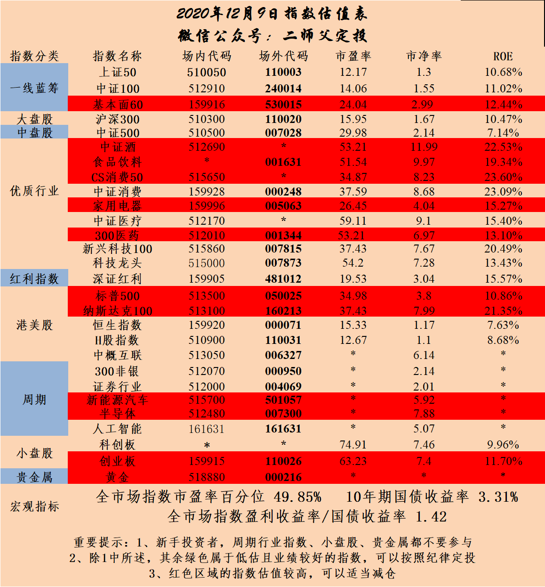

======================================================

_type: q&a
@nana[48222415211188]
2020-12-09 20:25:24 Wed  
topic_id: 215858852121521

@nana

>  师傅，50AH基金有17个点的收益，是迷收割利润好？还是一次性清仓好？如果清仓换什么好呢？

@二师父

>  如果选择价值类基金50ah比较好，如果选择平衡性基金，深红利或者基本面60比较好，如果选择成长性基金，创业板或者创业板50比较好

阅读[2833]  评论[5]  赞[0] 

======================================================

_type: talk
@二师父[28814221155551]
2020-12-09 20:40:38 Wed  
topic_id: 815858882814882

<e type="hashtag" hid="51285185455154" title="#做好应对#" /> 对市场建立预期，然后在预期之上做好应对，这是最佳策略。临近年底，冲刺完成小目标，大家加油，迎接崭新的2021.

阅读[3160]  评论[0]  赞[0] 

+++++++++++++++++++++++++++++++++++++++++++++++++++++

文件：
2020-12-09 20:39:16 Wed
文件大小：[30085]
15142221182552-A股的波动是正常的，做好应对.docx

======================================================

_type: talk
@二师父[28814221155551]
2020-12-09 20:48:21 Wed  
topic_id: 414848885548128

<e type="hashtag" hid="552114551414" title="#估值数据#" /> 市盈率百分位49.85%，市净率百分位32.09%，SY-BY百分位58.67%，SY/BY百分位57.97%，大家注意，投资股权类品种采用逆向定投的话一般市盈率百分位在50%以下或者SY-BY百分位在50%以下，这是为什么我们最近一直没有投的原因，严格数量化投资，这样才能管住手，靠情绪判断容易失误操作。明天实盘见。

阅读[2833]  评论[0]  赞[0] 

======================================================

_type: talk
@二师父[28814221155551]
2020-12-10 10:44:39 Thu  
topic_id: 215858221821881

<e type="hashtag" hid="28518855451481" title="#乌龟计划#" /> 买入易方达国开债003358买入0.25份，债券本来很安全，波动较小，咱们再结合定投的方法买入，风险进一步降低。未来随着国债收益率的走高会进一步加大债券的配置力度，买债券要么国债、要么国债基金，要么国开债基金。信用债和企业债安全系数比国债低一些，尽量不要购买，还有二级债基也尽量避免。

很多机构又再预测明年的行情和机会了，大家听听就可以，无论是美国的彼得林奇还是中国的徐新，都没有靠预测市场盈利的。专注做好配置，债券的投资不完全是避险，长期看投资债券的年化收益率可以在5%到6%之间，而结合市场估值投资的话收益率会更高一些，这比理财产品安全系数高而且收益率高，当然选择债券了。

@吃肉肉 at 2020-12-10 10:44:39 Thu

> 跟投组合里没有这个，是调仓了是吗？

----------

@二师父 at 2020-12-10 10:44:39 Thu

> 有这个，上一期就购买了的

----------

@吃肉肉 at 2020-12-10 10:44:39 Thu

> 好的，跟上。

----------

@幽兰 at 2020-12-10 10:44:39 Thu

> 二师父，可以用广发中债国开债的定投代替这个吗

----------

@二师父 at 2020-12-10 10:44:39 Thu

> 可以的

----------

@日月⭐️辰 at 2020-12-10 10:44:39 Thu

> 师父 二级债基为何要避免？

----------

@幽兰 at 2020-12-10 10:44:39 Thu

> 好的，跟上。

----------

@二师父 at 2020-12-10 10:44:39 Thu

> 因为有的债券会踩雷，不过基金经理会分散配置，可以降低风险

----------

阅读[3048]  评论[16]  赞[0] 

======================================================

_type: q&a
@姥姥不疼. 爷爷不爱[48544481458248]
2020-12-10 10:51:32 Thu  
topic_id: 215858221848421

@姥姥不疼. 爷爷不爱

>  刚才二师父定投003358，那么上周投的003376还投么

@二师父

>  也可以投的，这两个是目前主要配置的品种

阅读[2851]  评论[5]  赞[0] 

======================================================

_type: q&a
@小鱼[241182222251181]
2020-12-10 11:08:57 Thu  
topic_id: 815858828121552

@小鱼

>  券商是不是可以建仓啦

@二师父

>  你底仓建立了按照网格交易就行，或者华宝自动，1.12是临界点，这个波动很大，轻仓做比较合适

阅读[2849]  评论[0]  赞[0] 

======================================================

_type: q&a
@nana[48222415211188]
2020-12-10 11:34:38 Thu  
topic_id: 815858221285142

@nana

>  师傅好！有银行理财产品到期。现在银行理财产品收益率下降，还要耽心踩雷。现光大证券推荐买这个固收+基金，请师傅帮忙看看是否合适？谢谢您！

@二师父

>  这个策略也是股债轮动，建议选择往期业绩好的固收加基金，选择固收加唯一的好处是给基金经理主动权，他们优选股票和债券进行轮动配置

阅读[2871]  评论[1]  赞[0] 

======================================================

_type: talk
@幽兰[815554522442422]
2020-12-10 12:01:29 Thu  
topic_id: 815858221151182

二师父，券商ETF价格1.12附近了，之前1.23的时候出了大部分，现在这个价格是否再入手一些？

@二师父 at 2020-12-10 12:01:29 Thu

> 可以的

----------

阅读[2710]  评论[1]  赞[0] 

======================================================

_type: talk
@志亮[422125851552828]
2020-12-10 12:58:01 Thu  
topic_id: 215858245548151

A股只有两种股票，白酒和其它[呲牙]，喝酒才能强国。

@二师父 at 2020-12-10 12:58:01 Thu

> 19年我的招商白酒一倍，20年酒etf一倍，最强a股基金

----------

@志亮 at 2020-12-10 12:58:01 Thu

> 是真牛B[微笑]

----------

阅读[2803]  评论[2]  赞[0] 

======================================================

_type: talk
@杜志彪[544454124115854]
2020-12-10 13:44:28 Thu  
topic_id: 215858245814811

<e type="hashtag" hid="281158522841" title="#每日打卡#" /> 12月10日：场外买入广发中债一份，场内买入券商一份。

@范毅君 at 2020-12-10 13:44:28 Thu

> 买了国开债没买券商，在等等[呲牙][呲牙]

----------

阅读[2847]  评论[1]  赞[0] 

======================================================

_type: q&a
@波多黎各[28428858544121]
2020-12-11 07:55:54 Fri  
topic_id: 815858214888842

@波多黎各

>  师父，估值表里面没有深红利吗？我看它持仓应该是高估了吧

@二师父

>  有深红利，他是快要进入高估了的

阅读[2693]  评论[2]  赞[0] 

======================================================

_type: q&a
@永刚[15581448518112]
2020-12-11 07:57:09 Fri  
topic_id: 414848522185518

@永刚

>  二师父，现金投资是国债逆回购收益好还是银华日利收益好？

@二师父

>  这个看市场利率情况，有时候是国债收益率高，一般节假日前申购国债收益率会高于货币基金收益率

阅读[2788]  评论[0]  赞[0] 

======================================================

_type: q&a
@林凤崎[421882481454488]
2020-12-11 08:19:16 Fri  
topic_id: 815858241141112

@林凤崎

>  二师父，易方达中小盘盈利30%，要止盈吗，这支消费为主

@二师父

>  这只基金运营不错，拿的住而且基金经理不换可以长期持有，如果波动拿不住就需要分步止盈了

阅读[2885]  评论[1]  赞[0] 

======================================================

_type: talk
@杜志彪[544454124115854]
2020-12-11 10:09:34 Fri  
topic_id: 215858211881211

<e type="hashtag" hid="281158522841" title="#每日打卡#" /> 工商银行短短几天就有10%的振幅，把收割的10%利润买回。

@苍天有井明月空🌙 at 2020-12-11 10:09:34 Fri

> 这么巧

----------

阅读[2713]  评论[1]  赞[0] 

======================================================

_type: q&a
@蛋炒饭不加蛋[118281818482542]
2020-12-11 10:22:54 Fri  
topic_id: 414848512558548

@蛋炒饭不加蛋

>  请问二师父，郭睿的中欧消费主题持仓怎么样，这半年表现没之前好

@二师父

>  新宝股份，太阳纸业比较差，其他的还可以

阅读[2997]  评论[1]  赞[0] 

======================================================

_type: q&a
@乖子[28441841181151]
2020-12-11 10:24:27 Fri  
topic_id: 815858211522142

@乖子

>  二师父您好，0.42买的华宝油气可以出掉一部分了吗，现在0.31，谢谢。

@二师父

>  可以的，这只基金不行了，优选a股基金，其次美股纳斯达克，港股恒生科技这些投资，强周期指数黄金原油都可以放弃投资

阅读[3076]  评论[6]  赞[0] 

======================================================

_type: talk
@二师父[28814221155551]
2020-12-11 10:51:18 Fri  
topic_id: 815858211455412

<e type="hashtag" hid="28512814884111" title="#转债打新#" /> 年底新债比较多，大家记得申购。

白酒涨的我已经看不懂了，最后剩余900手etf，看他会不会逆天，有的大v已经从鼓吹科技转向鼓吹白酒了，谨记，风险是涨出来的。可以持有，不要追。

长期投资就两大赛道，消费加医疗，不可替代的需求。

@Chu at 2020-12-11 10:51:18 Fri

> 二师父长期看好消费和医疗是因为他们是刚需么？因为我看到林园也是只看好这两个板块

----------

@二师父 at 2020-12-11 10:51:18 Fri

> 这是一方面，他们本身企业利润高，而且随着行业寡头公司的品牌效应越来越强，几乎没有新兴公司能击败他们，护城河足够宽，属于坐地收钱的公司

----------

@幽兰 at 2020-12-11 10:51:18 Fri

> 遗憾一直没机会入手。另外银行券商也是跌出机会了吗？

----------

@二师父 at 2020-12-11 10:51:18 Fri

> 银行主要招行，1.4倍市净率以下可投，券商波动大，做网格即可

----------

@艾琪（王钥） at 2020-12-11 10:51:18 Fri

> 跟着二十父买的酒ETF，大盘跌到3344就清仓了，收获颇丰[微笑]。下一步打算把钱入到消费和国债了

----------

@防汛抗旱 at 2020-12-11 10:51:18 Fri

> 现在打新债受限了吗？以前可以一键，现在不可以了

----------

@二师父 at 2020-12-11 10:51:18 Fri

> 需要做个测评

----------

阅读[3085]  评论[7]  赞[0] 

======================================================

_type: q&a
@不知道不明了[15584248411812]
2020-12-11 12:52:14 Fri  
topic_id: 414848248124818

@不知道不明了

>  师父，我买了一部分兴全合润分级还有兴全趋势，您觉得怎么样呀

@二师父

>  兴全合润挺不错的

阅读[3076]  评论[2]  赞[0] 

======================================================

_type: q&a
@阳光[421884185252128]
2020-12-11 15:04:31 Fri  
topic_id: 815858452285842

@阳光

>  师父好：目前消费可以进哪个基金合适啊？或者关注哪个消费基金？

@二师父

>  消费关注7个基金，场内消费etf，场内消费50，场内家电etf，场内酒etf，场外食品饮料指数基金，场外中证消费指数基金，场外中证白酒指数基金

阅读[2935]  评论[0]  赞[0] 

======================================================

_type: q&a
@苍天有井明月空🌙[28882214181441]
2020-12-11 15:05:37 Fri  
topic_id: 582121425542184

@苍天有井明月空🌙

>  你组合仓位不高，三四层，今天能一键加仓，加一层吗

@二师父

>  可以加的，然后再跟着定投就行

阅读[2956]  评论[0]  赞[0] 

======================================================

_type: talk
@二师父[28814221155551]
2020-12-11 16:30:00 Fri  
topic_id: 215858454815211

<e type="hashtag" hid="28512814844411" title="#债券的配置逻辑#" /> 2018年和2019年债券市场都是不看的哈，每个阶段市场都有不同有价值的品种，目前唯一比较好的就是债券了，未来股市新一轮机会到来的时候仍旧会配置的，不要着急。

@日月⭐️辰 at 2020-12-11 16:30:00 Fri

> 师父，意思是现在适合配置中长债吗？现在买债是不是相当于您说的“熊市买股”在债卷低位买入，未来高位卖出？[偷笑]不好意思我是一枚小白[捂脸][捂脸]

----------

@雨淡风清 at 2020-12-11 16:30:00 Fri

> 二师父，可以配点可转债的债券吗

----------

@二师父 at 2020-12-11 16:30:00 Fri

> 是这个意思

----------

@二师父 at 2020-12-11 16:30:00 Fri

> 目前不大适合

----------

@雨淡风清 at 2020-12-11 16:30:00 Fri

> 好的

----------

@日月⭐️辰 at 2020-12-11 16:30:00 Fri

> 谢谢师父 那债卷也是定投还是可以一次性买 ？

----------

@栀子花开 at 2020-12-11 16:30:00 Fri

> 二师傅，现在开始配债券了吗，春耕行情不来了吗？

----------

@二师父 at 2020-12-11 16:30:00 Fri

> 定投

----------

阅读[3334]  评论[9]  赞[0] 

+++++++++++++++++++++++++++++++++++++++++++++++++++++

文件：
2020-12-11 16:28:37 Fri
文件大小：[93552]
51452251521524-债券的配置逻辑.docx

======================================================

_type: q&a
@香香[118822418121212]
2020-12-11 21:24:49 Fri  
topic_id: 414848242182588

@香香

>  二师父，乌龟计划中的各指数基金是否太多了点？能否精简点呢？

@二师父

>  分散轮动配置比较好的，如果精简的话选择一个深红利加国债基金即可

阅读[3009]  评论[0]  赞[0] 

======================================================

_type: talk
@二师父[28814221155551]
2020-12-11 22:37:05 Fri  
topic_id: 215858488144821

<e type="hashtag" hid="144254515412" title="#全市场估值#" /> 全市场市盈率百分位49.78%，全市场市净率百分位31.27%，SY-BY百分位58.87%，SY/BY百分位58.34%。

当前市场估值偏低，对于市盈率百分位和SY-BY百分位有一个低于50%，如果仓位较轻，可以开始慢慢定投，而对于高仓位的朋友，可以三个数据同时低于50%再开始投资。不同的仓位不同的选择。

白酒属于消费大类的细分项目，消费有白酒，有奶制品，有调味品，有白色电器，有啤酒，有肉制品，有零食，可以选择消费大类，也可以选择消费细分板块或者龙头企业，整体赛道都是较为优质。长期看好也就3到5个赛道，其实并不需要抓住太多，好机会到来的时候重仓3到5个赛道足够了。

阅读[3230]  评论[0]  赞[0] 

======================================================

_type: q&a
@飞的那个飞[48584811554158]
2020-12-12 17:18:59 Sat  
topic_id: 215858484455421

@飞的那个飞

>  财通转债可以吃肉吗？

@二师父

>  这个肯定吃肉了，今年中签挺多啊

阅读[2927]  评论[1]  赞[0] 

======================================================

_type: talk
@二师父[28814221155551]
2020-12-12 17:33:19 Sat  
topic_id: 182525144554152

<e type="hashtag" hid="88512814411112" title="#关于未来投资规划#" /> 星球有老读者也有新读者，老读者一直在定投指数仓位肯定在5成以上，所以按照目前的规划，逐步配置债券，即使未来泡沫牛来了，手握仓位依然不会追高，而A股牛市都很短，往往不可能持续一年爆发性上涨，那么配置的债券等到泡沫牛之后，该领涨的就是债券了。

另外市场不好预测，当下无论是继续涨，还是下跌，没有办法给出比较肯定的答案，不过可以肯定的是，目前配置债券未来收益会不错，不去赌未来的涨跌，而是基于各种可能做出最优解，这就是投资中的选择题。

而另外一种情况，目前刚入场，又怕错过的，最好两种方法，极度有耐心，就等到估值表里面大部分绿色低估的时候配置，这是最佳策略，如果并不是极度耐心，可以当下上3成指数仓位，这就意味着需要忍受浮动，而后的配置再跟上即可，一般悟性好的一轮牛熊下来基本上就学会了，关键是自己去实践加总结，不然很难形成自己的投资体系。

没有体系，短期牛市来了，东买买西卖卖看着像是赚了，来一波大熊市可能全还回去了。

估值和仓位是匹配的，先匹配适合自己的仓位，接着才是动态平衡，核心把握住仓位的管理，才是穿越牛熊的核心，而这需要远见，在市场起飞之前，别人丢弃优质基金的时候布局，这是逆向思维和趋势思维本质不同，既然基金有价值，我们就选择在他遭遇冷落最低谷的时候投资，等待反转，你可以理解为邓普顿的逆向投资，也可以理解为索罗斯的趋势反转。其实本质都是一个开口向上的抛物线的底部区域的积累问题，如果你看到这一点，并能够坚守住，那么投资不难，至于研究基金持仓基本面的问题交给我就可以。

@上上签 at 2020-12-12 17:33:19 Sat

> 目前七层仓，实盘投资涨幅36.72％，年化19.43％

买过白酒和华宝油气二个特殊，白酒消费行业现在盈利93.22%（三层仓），华宝油气现在—33.99（仓位不到百分之一），大部分基金都买过，宽基沪深300，中证500，基本面50，基本面60，中证1000，还有恒生，行业消费 医药 地产 银行 保险 汽油，还有一些债券（国债 海外债 企业债这些）

现在优选赛道，宽基买易方达上证50，还有深证红利，行业选择消费（偏白酒） 医药（选择主动性基金或者是医药100）科技（中概互联和纳斯达克100），人工智能在观望

感谢遇见，以前啥都不懂，现在刚刚入门，从一个门外汉渐渐了解投资理财的世界，敬畏市场，感恩市场，感谢遇见二师傅[玫瑰]

----------

@二师父 at 2020-12-12 17:33:19 Sat

> [强][强]

----------

@上上签 at 2020-12-12 17:33:19 Sat

> 电子商务专业跨行来到金融行业，现在公司什么产品都做，有股票 上海黄金交易所的黄金 期货 还有私募基金都有，很感谢大学那时候的自学，但是我发现金融行业天然就有原罪，现实和想象不一样，唯有确定就是不确定！

----------

阅读[3362]  评论[3]  赞[0] 

======================================================

_type: q&a
@林凤崎[421882481454488]
2020-12-12 21:03:14 Sat  
topic_id: 414848251245858

@林凤崎

>  50AH优选低估了吗

@二师父

>  目前还没有的

阅读[2977]  评论[0]  赞[0] 

======================================================

_type: talk
@阿宝[422212151424158]
2020-12-13 11:34:44 Sun  
topic_id: 582121448211424

股市进阶之道这本书不错，推荐！

阅读[2856]  评论[0]  赞[0] 

+++++++++++++++++++++++++++++++++++++++++++++++++++++

文件：
2020-12-13 11:34:43 Sun
文件大小：[25088]
28425548125421-12.13 读股市进阶之道有感.doc

======================================================

_type: talk
@永刚[15581448518112]
2020-12-13 17:56:51 Sun  
topic_id: 182525182488542

二师父好：顺周期指数基金只适合右侧交易吗？...点击链接查看剩余内容<e type="web" href="https://articles.zsxq.com/id_u9zvwto0rkjd.html" title="向师父提问" cache="" />

@二师父 at 2020-12-13 17:56:51 Sun

> 顺周期是指股票的涨跌与经济周期一致，比如银行，也可以左侧交易，强周期才只适合右侧交易

----------

@防汛抗旱 at 2020-12-13 17:56:51 Sun

> 现在打新要具备什么条件？

----------

@二师父 at 2020-12-13 17:56:51 Sun

> 股票市值20日一万以上就行

----------

阅读[2774]  评论[3]  赞[0] 

======================================================

_type: talk
@苍天有井明月空🌙[28882214181441]
2020-12-14 09:13:22 Mon  
topic_id: 582121825121584

二师父你好，新股上市也都可以打新吗

@二师父 at 2020-12-14 09:13:22 Mon

> a股都可以

----------

阅读[2677]  评论[1]  赞[0] 

======================================================

_type: talk
@二师父[28814221155551]
2020-12-14 09:41:12 Mon  
topic_id: 414848145585428

<e type="hashtag" hid="28512814884111" title="#转债打新#" /> 大秦转债，顶格申购。煤炭大跌，周期性板块最好避免投资，稳定盈利的行业指数或者宽基指数作为首选。

@CY at 2020-12-14 09:41:12 Mon

> 师傅，靖远发债中签10张，估计有肉吃么？在哪能看到可转债的价格分析呀？

----------

@二师父 at 2020-12-14 09:41:12 Mon

> 有的

----------

@波多黎各 at 2020-12-14 09:41:12 Mon

> 师父，是一上市就卖吗？还是可以一直拿着？

----------

@二师父 at 2020-12-14 09:41:12 Mon

> 这个上市卖出

----------

@波多黎各 at 2020-12-14 09:41:12 Mon

> 师父，大秦中了一手，请问上市就卖还是拿着？

----------

@二师父 at 2020-12-14 09:41:12 Mon

> 120到140区间卖

----------

阅读[2845]  评论[6]  赞[0] 

======================================================

_type: q&a
@永刚[15581448518112]
2020-12-14 10:24:39 Mon  
topic_id: 182525824855422

@永刚

>  二师父好， 请教一下哪些是强周期的指数基金？

@二师父

>  煤炭，有色，军工，人工智能，券商，原油，黄金，钢铁等等

阅读[2885]  评论[1]  赞[0] 

======================================================

_type: talk
@百变[15285855281882]
2020-12-14 12:04:15 Mon  
topic_id: 215858154482881

老师：华宝证券的余额理财能开通吗？提现有手续费吗？

@二师父 at 2020-12-14 12:04:15 Mon

> 可以，具体费用问题你咨询客户经理，他会给你详细解答

----------

阅读[2711]  评论[1]  赞[0] 

======================================================

_type: q&a
@陈洲[88245122222212]
2020-12-14 15:19:09 Mon  
topic_id: 582125211512844

@陈洲

>  二师父、自从加入星球后到现在才有点搞清乌龟和鳄鱼计划，之前跟着你定投了一些，但最近看乌龟计划，发现自己只买了其中2个指数，我准备按你天天里的实盘重新定投，我目前的比例不对，买的也没完全按你的实盘，现在不高估的仍然可以定投，是吗？鳄鱼计划之前没跟过，现在跟上可以吗？但不太看到鳄鱼计划的发车

@二师父

>  如果不理解的话最好按照每次发车的节奏来定投，正常估值区域人工智能，券商等强周期指数不要投，关键在于回撤，面对账户大幅度回撤也能坚持，目前标的是没问题的
>  
>  这两个投资计划实时跟没问题，不要相隔太久，不然买入价格太大没有意义了。鳄鱼计划本来很少投资的，市场真正的超级投资机会往往就是有限的那么几个月，鳄鱼计划连续一月四次发车这几年也就大概四个月，市场大多时候平淡无奇，习惯就好。
>  
>  除了股票，这俩实盘只要操作了都会及时公布，没有公布那就没有动，今年三月份动作大一些，那时候机会也确实很好，目前仓位合适持有是最佳选择，还没有特别好的买入机会。

阅读[2851]  评论[3]  赞[0] 

======================================================

_type: talk
@二师父[28814221155551]
2020-12-14 18:57:57 Mon  
topic_id: 582125215484484

<e type="hashtag" hid="51285521245254" title="#指数调仓对投资的影响#" /> 最近一个月涉及指数调仓，看看指数调仓对投资的影响。

阅读[2841]  评论[0]  赞[0] 

+++++++++++++++++++++++++++++++++++++++++++++++++++++

文件：
2020-12-14 18:56:09 Mon
文件大小：[30890]
48254412284158-指数调仓对我们投资指数基金的影响.docx

======================================================

_type: q&a
@永刚[15581448518112]
2020-12-14 20:51:40 Mon  
topic_id: 215852582452411

@永刚

>  谢谢师父指导，5g，新能源车算强周期指数吗？

@二师父

>  这两个也是强周期指数，盈利稳定的行业指数不会有太大的周期性影响

阅读[2764]  评论[0]  赞[0] 

======================================================

_type: q&a
@永刚[15581448518112]
2020-12-15 10:11:28 Tue  
topic_id: 182524245145512

@永刚

>  二师父：为什么强周期指数基金不适合左侧交易，只适合右侧交易，期待您指点。

@二师父

>  这个看资金的成本，有的强周期指数很长时间底部趴着，对于逆向交易时间成本比较高，而且心理压力较大，如果可以接受这种周期，那么左侧交易是可以的，而大部分人忍受不了长期底部趴着的走势

阅读[2589]  评论[0]  赞[0] 

======================================================

_type: q&a
@孙平[48548211154218]
2020-12-15 10:12:28 Tue  
topic_id: 414845455882428

@孙平

>  请问师父:深证红利指数近期分红，除权时估值有变化吗？可以加仓吗？

@二师父

>  会有一定变化，这个指数持有就好，目前机会一般，如果以5到10年为周期投资，定投也可以，这个位置回撤还是比较大的。

阅读[2742]  评论[0]  赞[0] 

======================================================

_type: talk
@悦雪[88242858484422]
2020-12-15 10:15:17 Tue  
topic_id: 414845451151418

师父好，请问前几日右侧买入医疗，可以出吗？

@二师父 at 2020-12-15 10:15:17 Tue

> 所有投资大方向都是按照左侧走的，所以盈利没有在15个点以上不会考虑出。如果你觉得赚的合适，可以出，医疗目前并不便宜。

----------

@悦雪 at 2020-12-15 10:15:17 Tue

> 收到，感谢您指点[微笑]

----------

阅读[2645]  评论[2]  赞[0] 

======================================================

_type: talk
@二师父[28814221155551]
2020-12-15 10:25:10 Tue  
topic_id: 414845451114518

<e type="hashtag" hid="28518858514151" title="#每日估值数据#" /> 当前市盈率百分位49.56%，市净率百分位31.22%，SY-BY百分位58.62%，SY/BY百分位58.09%，如果A股按照这种走势在跌两周，就可以开始定投了。市场短期走势很难预测，不要相信自己的感觉和判断，因为人的心理机制决定了感性的决断都是不大靠谱的。

长期优选盈利稳定的基金和成长股龙头，避免概念基金和炒作企业，随着退市机制的完善，裸泳公司都会爆出来的。

@六尘不改 at 2020-12-15 10:25:10 Tue

> 再跌两周。。。[流泪]

----------

@二师父 at 2020-12-15 10:25:10 Tue

> 只是假设，也许涨两周，涨了就继续持有不动

----------

@六尘不改 at 2020-12-15 10:25:10 Tue

> 嗯嗯，我觉得这个月应该可以站稳3458

----------

阅读[2939]  评论[3]  赞[0] 

======================================================

_type: q&a
@蛋炒饭不加蛋[118281818482542]
2020-12-15 11:04:22 Tue  
topic_id: 815852545511222

@蛋炒饭不加蛋

>  请问二师父，怎么确定行业龙头是哪个，有什么标准或者查看方法

@二师父

>  看财报，这个只能看到目前阶段的，百度曾经是龙头，现在落后于腾讯，字节跳动，这些都会反映到原始财务数据中，对于普通投资者可以直接放弃困境反转企业，选择确定性的行业龙头适度分散

阅读[2917]  评论[6]  赞[0] 

======================================================

_type: talk
@百变[15285855281882]
2020-12-15 12:38:28 Tue  
topic_id: 215852545121851

老师：512010医药您清仓了吗？

@丸子妈 at 2020-12-15 12:38:28 Tue

> 我还盈利5个点，没动

----------

@百变 at 2020-12-15 12:38:28 Tue

> 我看换手率想留留，结果一看均线图那么长一根阳线，还是卖了吧！[捂脸]没底气

----------

阅读[2738]  评论[2]  赞[0] 

======================================================

_type: q&a
@大兵[15422125545452]
2020-12-15 17:07:21 Tue  
topic_id: 815852542851152

@大兵

>  师傅好：问一下30岁男 重疾险有推荐的么

@二师父

>  守卫者3号

阅读[2948]  评论[5]  赞[0] 

======================================================

_type: talk
@二师父[28814221155551]
2020-12-15 19:51:45 Tue  
topic_id: 815852541145242

<e type="hashtag" hid="51285521558824" title="#投资中最忌讳的事情#" /> 这是投资两大坑，尽量避免。误入一个可能问题就大了。

@栀子花开 at 2020-12-15 19:51:45 Tue

> 二师傅，工银红利基金明天分红了，我只买了3200块收益才800多，显示分红有711.54，分红这么高吗？

----------

@二师父 at 2020-12-15 19:51:45 Tue

> 分红净值有调整，等分红以后就正常了

----------

@云云 at 2020-12-15 19:51:45 Tue

> 师父，分红选现金分红还是红利再投资呢？

----------

@二师父 at 2020-12-15 19:51:45 Tue

> 都可以

----------

阅读[3140]  评论[4]  赞[0] 

+++++++++++++++++++++++++++++++++++++++++++++++++++++

文件：
2020-12-15 19:51:06 Tue
文件大小：[31555]
48254842425128-投资中最忌讳的事情.docx

======================================================

_type: talk
@二师父[28814221155551]
2020-12-15 20:58:16 Tue  
topic_id: 215852515815181

<e type="hashtag" hid="224445218111" title="#全市场估值数据#" /> 市盈率百分位49.81%，市净率百分位32.07%。

SY/BY百分位58.19%，SY-BY百分位58.82%。目前市场一直震荡，不上不下的，短期走势不好预测，我只看数据出手，盲目悲观或者乐观都容易陷入A股的波动陷阱。

鳄鱼计划之前清仓银行买入医疗，有读者再问卖不卖，这个就取决于自己了，如果我有操作的话都会公布，没有公布的话就是不动了。

目前买的少确实是因为机会一般，大家可以看看往期今年3月和前两年的记录，那车速很多人都跟不上，该休息就休息，这才是鳄鱼，不动则已，一动就要吃到肉。

阅读[3119]  评论[0]  赞[0] 

======================================================

_type: q&a
@永刚[15581448518112]
2020-12-15 22:13:21 Tue  
topic_id: 215852541845421

@永刚

>  二师父好，上证50，中证100和沪深300，如果选一只基金，您认为哪个更好？

@二师父

>  如果这三只选择的话，中证100会更好的，集中投资沪深优质企业

阅读[2901]  评论[0]  赞[0] 

======================================================

_type: q&a
@smile[111888142241442]
2020-12-15 22:14:04 Tue  
topic_id: 582125282812854

@smile

>  二师父，请问今天深红利怎么一下扣款这么多呢？

@二师父

>  这个不用担心，因为分红净值有变化，分红之后净值会重新调整过来

阅读[3026]  评论[4]  赞[0] 

======================================================

_type: talk
@二师父[28814221155551]
2020-12-16 10:43:59 Wed  
topic_id: 182524522455222

<e type="hashtag" hid="881251425252" title="#鳄鱼计划#" /> 卖出16国债19一手，7月份买入两手，目前盈利0.5%。买入券商ETF一份。目前的行情分化太严重，白酒继续领涨，券商起不来。二师父说过，牛市到来，券商一定是先领涨，而牛市后期或者结束了券商肯定也会先下来。

未来的走势不预测，当前券商处于一个击球区，一份资金很安全，所有的交易都是左侧，不管是之前的医疗还是现在的券商，都是左侧。券商只适合波段，不适合长期持有，他也是最佳网格品种。

再介绍下份数安排，假设资金有100万，那么一份就是4000元，这个数额是变动的。总之每次都是资金除以250份。

@姥姥不疼. 爷爷不爱 at 2020-12-16 10:43:59 Wed

> 请教二师父，目前咱们场外不是还正在定投国债么，同时您前段也讲过国债拿着等涨够6-8%的收益再出手，那为啥现在才盈利0.5%，您就调仓尼

----------

@幽兰 at 2020-12-16 10:43:59 Wed

> 出于什么考虑卖掉16-19

----------

@二师父 at 2020-12-16 10:43:59 Wed

> 目前短期一个压力位，下来了还会接上的，场内投资比较灵活

----------

@J at 2020-12-16 10:43:59 Wed

> 师父，你卖出的国债是003358吗？

----------

@二师父 at 2020-12-16 10:43:59 Wed

> 019547，场内代码

----------

@J at 2020-12-16 10:43:59 Wed

> 哦，场外的是不是继续持有即可？

----------

@二师父 at 2020-12-16 10:43:59 Wed

> 是的，还会继续投的，场外波段手续费太高

----------

@J at 2020-12-16 10:43:59 Wed

> 好的[强]

----------

阅读[3073]  评论[11]  赞[0] 

+++++++++++++++++++++++++++++++++++++++++++++++++++++

图片：

======================================================

_type: q&a
@永刚[15581448518112]
2020-12-16 10:53:58 Wed  
topic_id: 414845844514518

@永刚

>  师父好，医疗ETF，消费ETF，科技ETF指数基金应该做左侧交易，对吧？除了这三类指数基金以外，还有哪些类别的指数基金适合做左侧交易？谢谢您！

@二师父

>  宽基指数和盈利稳定的指数都可以，目前投资的人工智能和券商也属于周期指数，也是左侧交易，控制仓位即可，强周期指数最好右侧，左侧交易也能做，前提是控制仓位。

阅读[2995]  评论[0]  赞[0] 

======================================================

_type: q&a
@姥姥不疼. 爷爷不爱[48544481458248]
2020-12-16 11:06:32 Wed  
topic_id: 182524522488112

@姥姥不疼. 爷爷不爱

>  请教二师父，目前咱们场外不是还正在定投国债么，同时您前段也讲过国债拿着等涨够6-8%的收益再出手，那为啥现在才盈利0.5%，您就调仓尼

@二师父

>  这是国债长期投资年化收益，目前短期一个压力位，下来了还会接上的，场内投资比较灵活

阅读[3132]  评论[0]  赞[0] 

======================================================

_type: talk
@志亮[422125851552828]
2020-12-16 12:28:43 Wed  
topic_id: 582125125448424

白酒专治各种不服，我就问还有谁？[呲牙][憨笑][捂脸]

@光少 at 2020-12-16 12:28:43 Wed

> 跌了不卖，涨了拿不了[捂脸]

----------

@志亮 at 2020-12-16 12:28:43 Wed

> 主要是越涨你越不敢买。[呲牙]

----------

@JOY at 2020-12-16 12:28:43 Wed

> 新能车

----------

@光少 at 2020-12-16 12:28:43 Wed

> 没错，心里作用，我买了泸州老窖也是翻倍了，跌了十多个点就跑了，现在又涨了一倍[捂脸]

----------

@栀子花开 at 2020-12-16 12:28:43 Wed

> 股民：服了服了，再也不敢看空了

----------

@志亮 at 2020-12-16 12:28:43 Wed

> 白酒没变，变的是人心。

----------

阅读[3013]  评论[6]  赞[0] 

======================================================

_type: q&a
@Vivian[582228554481154]
2020-12-16 14:51:31 Wed  
topic_id: 182524521482412

@Vivian

>  老师，请问您鳄鱼计划里面的人工智能代码是哪一个？

@二师父

>  515070

阅读[3153]  评论[2]  赞[0] 

======================================================

_type: q&a
@冉冉[88445118854412]
2020-12-16 16:41:14 Wed  
topic_id: 414845841842258

@冉冉

>  二师傅，今日深红利分红，我在交易里看见2020年12月16日15：01分分红资金支出，但我的余额宝里并没有收入，而且，我的支付宝总金额减少了大致分红的金额，那么这笔钱到哪里找呢？

@二师父

>  这是除息金额扣除导致净值下降，之后分红金额到账以后就正常了。

阅读[3105]  评论[4]  赞[0] 

======================================================

_type: talk
@二师父[28814221155551]
2020-12-16 19:09:29 Wed  
topic_id: 215852888142241

<e type="hashtag" hid="825188852442" title="#估值表#" /> 白酒高估，科技100低估，记得年初有私募经理语言今年要么没有行情，要么就是科技行情，结果完全与市场相反，其实预测都有跟风倾向，越是很多人认为对的，往往是错的，因为28原理决定，金字塔顶尖的就属于少部分人。

市场的钟摆都会过度，无论是白酒还是科技，只要钟摆过度，就会出手，这一点永远不变，A股市场不需要讲太多的逻辑，这里的逻辑便是浓香型科技和酱香型科技。

@范毅君 at 2020-12-16 19:09:29 Wed

> 科技一百可以上车吗，二师父

----------

@庆余年 at 2020-12-16 19:09:29 Wed

> 二师父，退市新规出了之后是不是对上市的小型企业特别不利，中证500都快跌到低估了，还有持有的必要麽？

----------

@二师父 at 2020-12-16 19:09:29 Wed

> 确实不大好，有机会可以转换

----------

@二师父 at 2020-12-16 19:09:29 Wed

> 再等等，目前还是下跌趋势

----------

@庆余年 at 2020-12-16 19:09:29 Wed

> 好的，谢谢二师父。

----------

@雨淡风清 at 2020-12-16 19:09:29 Wed

> 酱香型的好

----------

@范毅君 at 2020-12-16 19:09:29 Wed

> 好的[呲牙]

----------

@范毅君 at 2020-12-16 19:09:29 Wed

> 二师父我中证500比例比较高，现阶段转换什么比较合适，还是暂时不动

----------

阅读[3233]  评论[11]  赞[0] 

+++++++++++++++++++++++++++++++++++++++++++++++++++++

图片：
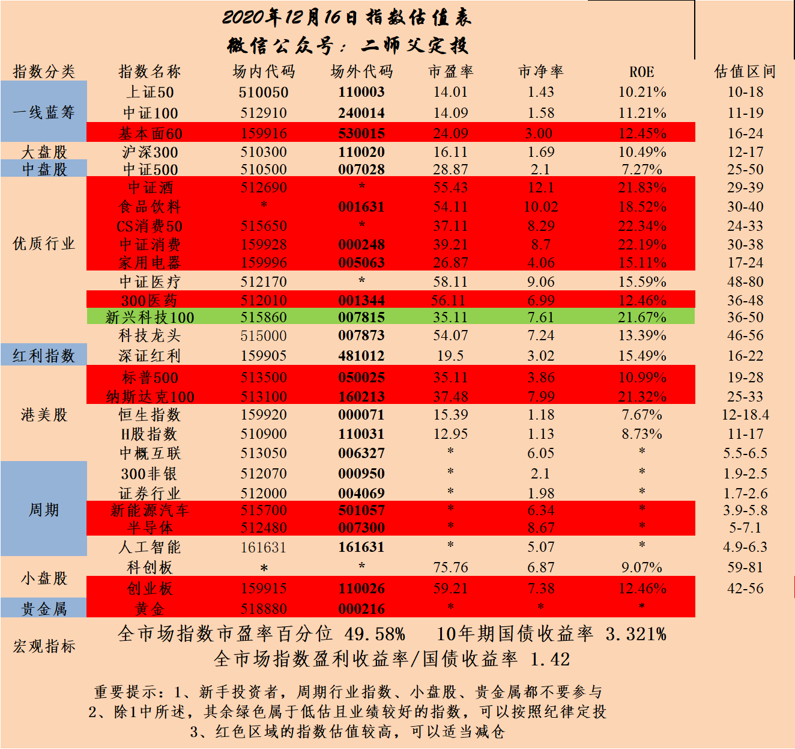

======================================================

_type: talk
@二师父[28814221155551]
2020-12-16 19:14:34 Wed  
topic_id: 182524555818452

<e type="hashtag" hid="28512258111541" title="#关于分红#" /> 大家了解下分红，其实对投资影响不大，未来有了机会可以继续投资，宽基指数适合稳健投资者，深红利和上证50都是不错的选择。

@cotton at 2020-12-16 19:14:34 Wed

> 师父分红就是利润之外发的吗

----------

@丸子妈 at 2020-12-16 19:14:34 Wed

> 场内的深红利，没有看到分红啊

----------

@二师父 at 2020-12-16 19:14:34 Wed

> 相当于赎回净值，不收手续费

----------

@二师父 at 2020-12-16 19:14:34 Wed

> 场内我也没看到，应该是延迟了

----------

@cotton at 2020-12-16 19:14:34 Wed

> 好的

----------

@丸子妈 at 2020-12-16 19:14:34 Wed

> 深红利，场内有看到分红吗?我看还是没有

----------

@二师父 at 2020-12-16 19:14:34 Wed

> 我也没看到

----------

阅读[3472]  评论[7]  赞[0] 

+++++++++++++++++++++++++++++++++++++++++++++++++++++

文件：
2020-12-16 19:13:08 Wed
文件大小：[32828]
28425282222811-深红利分红之后可以继续投资吗.docx

======================================================

_type: talk
@二师父[28814221155551]
2020-12-16 19:33:33 Wed  
topic_id: 215852882555211

<e type="hashtag" hid="552114551414" title="#估值数据#" /> 当前市盈率百分位49.58%，市净率百分位31.21%，SY/BY百分位57.99%,SY-BY百分位58.62%。

今天卖出16国债19大家不要担心，本来就只买了两手，还没大面积投资，未来随着股市走高，债市走低，还是大力配置债券基金的，这只是短期压力位一个波段，投资有的时候比较灵活，如果你不喜欢这种方式，完全可以就用一招，全面配置，低估定投，正常收割，高估卖本。全看自己喜好。总之仓位适合就好，前两年一直是8成仓位，我是非常看好后市，而随着A股底部抬升和国际局势不确定性，我也偏保守了一点，而对于7.8成左右仓位，就算超级牛来了，也不会亏，平衡好就行。

而且随着券商，医疗，科技、债券的下挫，未来还有更好的补仓机会。

阅读[3536]  评论[0]  赞[0] 

======================================================

_type: q&a
@xu[2441485251]
2020-12-16 23:11:46 Wed  
topic_id: 815852882485182

@xu

>  请问二师傅:今天第一次中了新股振邦智能，请问新股上市以后如何操作啊？谢谢！

@二师父

>  开板卖，或者连板之后停了卖

阅读[3365]  评论[0]  赞[0] 

======================================================

_type: talk
@杜志彪[544454124115854]
2020-12-17 09:39:26 Thu  
topic_id: 582125151881184

<e type="hashtag" hid="281158522841" title="#每日打卡#" /> 12月17日场内卖出新能车20%本金（高估卖本）

@Sunflower at 2020-12-17 09:39:26 Thu

> 我今年到现在累计收益率终于跑赢大盘了，持仓收益率跟大盘差不到1个点了[呲牙]

----------

@杜志彪 at 2020-12-17 09:39:26 Thu

> 赞👍

----------

阅读[3155]  评论[2]  赞[0] 

======================================================

_type: talk
@波多黎各[28428858544121]
2020-12-17 09:40:55 Thu  
topic_id: 815852828112412

师父，请问双a的债可以打吗？打债最低标准是什么？

@JOY at 2020-12-17 09:40:55 Thu

> 之前师父说过牛市可以盲打

----------

@波多黎各 at 2020-12-17 09:40:55 Thu

> 现在是牛市吗？

----------

@二师父 at 2020-12-17 09:40:55 Thu

> 是牛市

----------

阅读[3196]  评论[3]  赞[0] 

======================================================

_type: talk
@幽兰[815554522442422]
2020-12-17 10:03:19 Thu  
topic_id: 182524544521822

今天的券商是不是又可以加了

@二师父 at 2020-12-17 10:03:19 Thu

> 把握好仓位没问题的

----------

@光少 at 2020-12-17 10:03:19 Thu

> 中证500是盈利不好了吗

----------

阅读[3354]  评论[2]  赞[0] 

======================================================

_type: talk
@二师父[28814221155551]
2020-12-17 11:01:32 Thu  
topic_id: 414845855154258

<e type="hashtag" hid="15284424555412" title="#实盘加可转债打新#" /> 买入易方达国开债0.25份，中证500转换0.25份到易方达国开债。债券配置是不会变的，只是场外不会做波段，而随着市场一路下行一直加仓，这就相当于我们2018年买指数一样，不过债券波动很小，未来收益率可能会少一些。这也印证了二师父说的，每一次大跌都是给我们致富的机会。

持有的消费要继续新高了，耐心真的可以创造价值，不过这期间需要忍受波动，没有较长的投资规划真的挺难做到。

@吃肉肉 at 2020-12-17 11:01:32 Thu

> 中证500这个在乌龟计划的组合里可以直接操作转换到易方达国开债是吗？不是另外加仓买的吧？

----------

@幽兰 at 2020-12-17 11:01:32 Thu

> 二师父我的乌龟计划买得晚，现在中证500还浮亏一点，需要都转换到国债吗？

----------

@二师父 at 2020-12-17 11:01:32 Thu

> 另外也买了，都有操作

----------

@Chu at 2020-12-17 11:01:32 Thu

> 二师父，我看地产类基金和企业Wan科和Bao 利还是比较便宜，可以加大定投吗

----------

@二师父 at 2020-12-17 11:01:32 Thu

> 就转换了0.25份

----------

@二师父 at 2020-12-17 11:01:32 Thu

> 地产不大好，未来难跑赢大盘

----------

@onepiecewi* at 2020-12-17 11:01:32 Thu

> 师父，代码是什么，我输入名字找不到。

----------

@二师父 at 2020-12-17 11:01:32 Thu

> 003358

----------

阅读[3481]  评论[13]  赞[0] 

======================================================

_type: talk
@二师父[28814221155551]
2020-12-17 11:02:41 Thu  
topic_id: 182524544845522

目前可转债牛市，可以盲打，如果类似2018年可转债连续破发熊市就可以避开了，只打公司质量好而且评级AAA以上的。

阅读[3463]  评论[0]  赞[0] 

======================================================

_type: q&a
@刘佳柒[815555885511852]
2020-12-17 11:07:42 Thu  
topic_id: 414845855221848

@刘佳柒

>  请问，000524现在是否可以进？连续下跌十天了

@二师父

>  你说岭南吗？低于10的我都不看的

阅读[3531]  评论[2]  赞[0] 

======================================================

_type: talk
@二师父[28814221155551]
2020-12-17 11:13:08 Thu  
topic_id: 215852822141521

加仓的一份医疗已经有8.94个点了，而恒生该怎么差还是怎么差，不要认为一个基金跌了就有投资价值，很多基金环保，油气，煤炭都是别人涨他小涨，别人跌他大跌，虽然有底，但是也有天花板，而高景气板块动不动就把天花板给掀开了，选择合理价格买优质基金会更佳，而不是以跌了多少为标准

@云淡风轻 at 2020-12-17 11:13:08 Thu

> 请问二师父医疗代码是512170嘛？

----------

@二师父 at 2020-12-17 11:13:08 Thu

> 对

----------

@光少 at 2020-12-17 11:13:08 Thu

> 二师父，医药ETF是否可以进仓了

----------

@二师父 at 2020-12-17 11:13:08 Thu

> 买的话都会发车

----------

@杜志彪 at 2020-12-17 11:13:08 Thu

> 跟师傅加一份医疗[微笑]

----------

@苍天有井明月空🌙 at 2020-12-17 11:13:08 Thu

> 没说加吧

----------

@苍天有井明月空🌙 at 2020-12-17 11:13:08 Thu

> 恒生能补吗

----------

@杜志彪 at 2020-12-17 11:13:08 Thu

> [呲牙]是我错了(＞＜)

----------

阅读[3606]  评论[9]  赞[0] 

======================================================

_type: q&a
@林玮[844111858288412]
2020-12-17 15:55:53 Thu  
topic_id: 182524515584282

@林玮

>  师父，重仓白酒的基金还能持有吗？比如005827、110011

@二师父

>  白酒目前还是升势中，可以持有，等趋势结束止盈一些，拿的住的话可以长期，a股波动大，重仓单一板块终身持有太难

阅读[3328]  评论[3]  赞[0] 

======================================================

_type: q&a
@木蘭荟-黄英💋[51418242225424]
2020-12-18 08:37:40 Fri  
topic_id: 215852818242221

@木蘭荟-黄英💋

>  请问:为什么会这样转出和转入的操作？好处是什么？ 
>  是只图方便吗？？还是会……？？

@二师父

>  这属于直接调仓的，转换到当下更有价值的品种

阅读[3262]  评论[7]  赞[0] 

======================================================

_type: q&a
@天马行空[548818851412444]
2020-12-18 08:38:02 Fri  
topic_id: 815852214455442

@天马行空

>  二师傅，我有100多万资金， 20万做券商网格 ，其余因估值高暂时没有重仓的基金，003358我定投多少合适，具体怎么买。需要一次重仓再分期定投吗。谢谢。

@二师父

>  并不需要的，和实盘持仓保持一致即可

阅读[3388]  评论[0]  赞[0] 

======================================================

_type: talk
@厚基薄发[15522588545552]
2020-12-18 09:05:21 Fri  
topic_id: 414845511818558

二师傅好，能够帮忙分析一下华夏创成长和华夏创蓝筹的投资价值价值吗？它和创业板指数哪个更有投资价值呢？谢谢

@二师父 at 2020-12-18 09:05:21 Fri

> 创蓝筹，创业板和创业板50较好

----------

阅读[3260]  评论[1]  赞[0] 

======================================================

_type: talk
@百变[15285855281882]
2020-12-18 10:37:21 Fri  
topic_id: 815852455541222

老师：5G类的ETF我们为什么不买？通信ETF快跌到底了。

@二师父 at 2020-12-18 10:37:21 Fri

> 为什么跌到底了就要买？

----------

阅读[3313]  评论[1]  赞[0] 

======================================================

_type: talk
@范毅君[118551121224142]
2020-12-18 13:44:50 Fri  
topic_id: 182524124888122

现在大盘虽说在盘整，但个股分化非常厉害，个股真的挣钱很难，赔钱太容易，跟着二师父好好学基金定投，严格控制股票仓位以基金为 主，股票太刺激，不适合我这种小白[捂脸]

@二师父 at 2020-12-18 13:44:50 Fri

> 企业分析是不是也不用了[呲牙]

----------

@Sunflower at 2020-12-18 13:44:50 Fri

> 主要是心脏受不了，还是基金好😂

----------

@范毅君 at 2020-12-18 13:44:50 Fri

> 我也不会，也没时间，一直想学一下财务报表怎么看呢[流泪]

----------

@志亮 at 2020-12-18 13:44:50 Fri

> 学习股票知识对买基金也有用的。你不研究企业怎么知道这是一只好基金，基金也是由一篮子股票组成的，我一直在完善自己的投资体系，目前差不多理顺了。

----------

@范毅君 at 2020-12-18 13:44:50 Fri

> 向你学习，慢慢学习中[捂脸]

----------

@志亮 at 2020-12-18 13:44:50 Fri

> 不敢，我也是正在学习中。

----------

阅读[3176]  评论[6]  赞[0] 

======================================================

_type: talk
@二师父[28814221155551]
2020-12-18 18:32:05 Fri  
topic_id: 182524128142422

<e type="hashtag" hid="28512252111541" title="#投资中的垃圾思维#" /> 很多读者可能会有疑问，有的基金已经降到1元以下净值了，还有没有投资价值，投资第一要选择优质企业，然后才考虑价格，一家企业或者基金本来质量就差，那么没必要去考虑价格了，可以直接走人。

关于券商再单独说下，如果做波段，这个是可以做的，如果不做波段，长期投资，券商是不如300的。因为A股历来波动大，所以在震荡时期选择这个波段收益会比震荡的300好，也因此选择券商，如果你不做波段，就长期持有，那么就不用配置券商了。这是单独说明的，A股有其独特性，不同的品种有不同的投资策略和方法。

阅读[3509]  评论[0]  赞[0] 

+++++++++++++++++++++++++++++++++++++++++++++++++++++

文件：
2020-12-18 18:28:45 Fri
文件大小：[32723]
15142415881252-求你别再捡垃圾了.docx

======================================================

_type: talk
@二师父[28814221155551]
2020-12-18 19:03:01 Fri  
topic_id: 815852451125542

<e type="hashtag" hid="552114551414" title="#估值数据#" /> 市净率百分位31.21%，市盈率百分位50.03%，SY-BY百分位59.35%，SY/BY百分位58.59%。

继续震荡吧，目前应该没有空仓的朋友，如果有的话，注意大约全市场指数成交额在6500亿左右，可以拿易方达上证50和深红利建4到5成底仓，然后再进行配置。

空仓容易追涨，如果空仓不追的话不要紧。当然很多朋友都可以自己玩，然后看看有没有天赋，有的人投资股票比较有天赋，也不完全拘泥我讲的，投资收益也不错。

怎么看有没有天赋呢？连续5年投资跑赢沪深300收益，那么就可以断定为天赋选手，杨老师说过辨材需7年，至少5年，这个市场变化大，一年盈利很难判断是运气还是实力。

@遇见了你 at 2020-12-18 19:03:01 Fri

> 二师父，全市场指数成交额怎么算？

----------

@海马 at 2020-12-18 19:03:01 Fri

> 师父，市盈率百分位搞错了吧

----------

@蛋炒饭不加蛋 at 2020-12-18 19:03:01 Fri

> 市盈率百分位是不是打错了？[呲牙]

----------

@二师父 at 2020-12-18 19:03:01 Fri

> 改过来了

----------

@二师父 at 2020-12-18 19:03:01 Fri

> 在万得app或者同花顺可以看到

----------

@wty at 2020-12-18 19:03:01 Fri

> 二师父，同花顺查“全巿场指数”成交额的界面截图，能发一下吗？找半天没见呢[抓狂]

----------

@二师父 at 2020-12-18 19:03:01 Fri

> 万得也可以

----------

@Vivian at 2020-12-18 19:03:01 Fri

> 老师，我的仓位太低才两层。现在这个点位还可以加仓吗？加到您说的四五层，感觉不便宜啊，怕跌[抠鼻]

----------

阅读[3533]  评论[11]  赞[0] 

======================================================

_type: talk
@Vivian[582228554481154]
2020-12-18 20:53:06 Fri  
topic_id: 414845285444518

老师，券商做网格分成十格。是不是这样说，我有二十万,价格1.2的时候买了一份两万,1.8的时候出一份两万。如果价格没有跌到1.2以下，那不是一直都没有机会用完20万资金，我这样做法对不对？最近都是在1.2徘徊，我都是买一份二万，1.8又卖了，感觉剩余资金闲置好久了，不知道做法对不对

@Vivian at 2020-12-18 20:53:06 Fri

> 说错了，是1.12买入，1.18卖出

----------

@爱华 at 2020-12-18 20:53:06 Fri

> 你在1.12时买十万，如果下跌/上涨 就按计划买入/卖出
大部人都不是满仓，如果下跌了呢？现在看是有十万资金闲置，一旦下跌还是有退路，活得久很重要

----------

@Vivian at 2020-12-18 20:53:06 Fri

> 谢谢

----------

@二师父 at 2020-12-18 20:53:06 Fri

> 1.12时候可以建三成底仓，然后剩余资金分成9份，你也要保证这种操作如果券商一直跌到0.6还能不止损一直补仓，当下看是一直波动，而极端情况券商跌幅也是很大的，安全第一了

----------

@Vivian at 2020-12-18 20:53:06 Fri

> 多谢老师，从您这学习很多

----------

阅读[3161]  评论[5]  赞[0] 

======================================================

_type: q&a
@wty[548488548545444]
2020-12-19 10:05:48 Sat  
topic_id: 215852482158421

@wty

>  二师父，个股的历年财务报告一般在哪里可以下载呢，每次拿到财务报表要逐个录入整理三表太耗费时间了，有什么好的建议吗？

@二师父

>  财报说有数据，可以看，他们有整理的，原始财报有疑惑再重点阅读

阅读[3188]  评论[1]  赞[0] 

======================================================

_type: talk
@二师父[28814221155551]
2020-12-19 10:17:31 Sat  
topic_id: 582125418524824

新兴科技100的规模一直在降，虽然整体科技板块资金都流出，不过投资还是注意一下，尤其是场外的，龙头科技规模和持股集中度更高，优选龙头科技，白酒继续走高，接下来关注下科技板块，我们都是在机构和大部分投资者不关注的时候开始关注，之前很多看好科技板块的大V又去做白酒了，而这时候正是白酒风险慢慢累积的时候，利润收割百分之100以后成本为零可以持有看戏了。我们总是搜寻被丢弃的优质板块和企业，在安全边际内，资金还没有炒作之前布局，永远不跟随市场。这并不需要高超的技能，而仅仅需要耐心。

@志亮 at 2020-12-19 10:17:31 Sat

> 我的思路和二师父投资基金的一样，我现在己经不追涨杀跌了，基本是潜伏在市场暂时冷落的低估标的，耐心等待风起，入市接近两年，投资体系不断完善，我有一种预感这种方法应该是最适合我的。从之前长春高新被套25个点到现在解套还盈利了，我才发现慢就是快，耐心持有优质企业，和时间做朋友，最后终有回报的，套用价值投资者的一句话：“价值可能会迟到，但却不会缺席”。

----------

@🍀 凝🌸 慧🍀 at 2020-12-19 10:17:31 Sat

> [强][强][强]😄

----------

@志亮 at 2020-12-19 10:17:31 Sat

> 见笑见笑😜

----------

阅读[3405]  评论[3]  赞[0] 

+++++++++++++++++++++++++++++++++++++++++++++++++++++

图片：
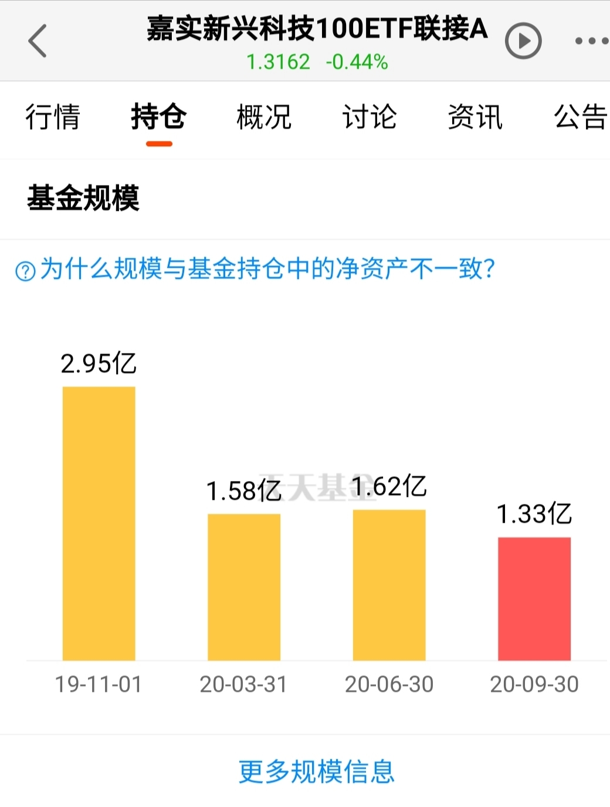
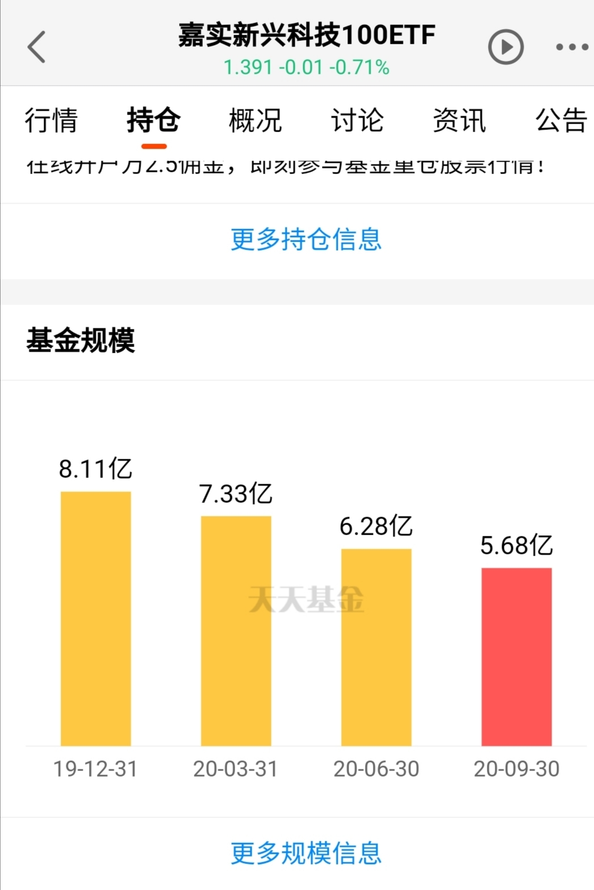

======================================================

_type: q&a
@天高云淡[28448118151241]
2020-12-20 21:56:05 Sun  
topic_id: 215852411585841

@天高云淡

>  二师父，请问银行市净率跌到了历史低位，为什么您不选择定投呢？求解惑

@二师父

>  因为市净率越低不代表越有价值，相反却体现出资产质量不佳，才一直破净，而银行指数里面有很多这样的企业，所以避免了。
>  
>  思维需要转换下，不然很容易跑不赢大盘。未来继续投资高景气行业或者优质宽基大概率是跑赢银行指数的

阅读[2983]  评论[0]  赞[0] 

======================================================

_type: q&a
@庆余年[15584481824122]
2020-12-20 22:21:11 Sun  
topic_id: 815852411828852

@庆余年

>  二师父，我最近针对持有的几款蓝筹大盘指数做指数精简。目前持有50ah优选，基本面60，沪深300，中证500。目前有两个想法，一是保留基本面60，把其他的全部卖出，买入深红利和上证50；二是全部卖出或者部分转入中证100，请问这样的思路从波动和收益上综合来看有没有问题？

@二师父

>  如果从整体持仓看，都是宽基指数，波动差不多，而从心理因素看，人有锚固心理，调仓看着浮亏会感觉跌的多，而回撤带来的损失效应低一些，排除心理因素是一样的
>  
>  投一只就中证100或者深红利，投两只就选易方达上证50和深红利，纯被动的上证50跑赢300概率也不大。

阅读[2967]  评论[1]  赞[0] 

======================================================

_type: q&a
@蛋炒饭不加蛋[118281818482542]
2020-12-20 22:22:14 Sun  
topic_id: 182524188558512

@蛋炒饭不加蛋

>  请问二师父，怎么判断个股买卖点

@二师父

>  我是计算企业市值，如果三年有一倍收益，就值得出手，否则就不出手

阅读[3003]  评论[7]  赞[0] 

======================================================

_type: talk
@老丁[15541182455482]
2020-12-21 11:18:43 Mon  
topic_id: 215852151585521

二师父问一个问题，如果一个股价一年前是A元钱，现在同等估值情况下价格是B，那么 B是不是应该等于（A-分红）*（1+ROE）？谢谢

阅读[2739]  评论[0]  赞[0] 

======================================================

_type: talk
@百变[15285855281882]
2020-12-21 11:31:56 Mon  
topic_id: 815852151522542

老师：食品ETF今天能买不？

阅读[2764]  评论[0]  赞[0] 

======================================================

_type: q&a
@lily[548488251242584]
2020-12-21 11:46:25 Mon  
topic_id: 414845145114218

@lily

>  老师，目前手上有20万资金，想请问一下，放在天天基金的活期宝里，还是买银华日利？哪个收益高呢？谢谢二师父，等你发车

@二师父

>  购买银华日利，场内可以在节假日进行国债逆回购，至于货币基金，收益差不多的。

阅读[2929]  评论[8]  赞[0] 

======================================================

_type: q&a
@孤芳自赏[548114442211184]
2020-12-21 14:01:30 Mon  
topic_id: 815852185582522

@孤芳自赏

>  请问二师父华夏食品饮料etf咋样，可以买吗？

@二师父

>  低估以后可以买

阅读[2837]  评论[0]  赞[0] 

======================================================

_type: q&a
@永刚[15581448518112]
2020-12-21 15:04:47 Mon  
topic_id: 582125812145414

@永刚

>  二师父你好，我目前的仓位在50%以下，中证500目前的市盈率和市净率都比较低，是历史估值的40%以下，现在可以不可以建底仓，謝謝您！

@二师父

>  中证500比较差，目前估值分位低并不代表投资未来赚的多，小盘股指数创业板更好

阅读[2791]  评论[1]  赞[0] 

======================================================

_type: q&a
@xu[2441485251]
2020-12-21 15:06:47 Mon  
topic_id: 582125812184254

@xu

>  请问二师傅:光伏ETF现在能建个两层仓吗？谢谢！

@二师父

>  你是准备做趋势还是逆势？

阅读[2859]  评论[2]  赞[0] 

======================================================

_type: talk
@二师父[28814221155551]
2020-12-21 18:42:35 Mon  
topic_id: 815852184288512

<e type="hashtag" hid="15284584522442" title="#关于白酒#" /> 介绍一种卖本留利的方法，我在投资股票时候用这个，市值翻一倍卖出一半，零成本持有。关于周期性指数，大家自己投资，最好趋势，而我就不实盘带了，周期指数只带大家投人工智能和券商，其余大家自己玩。做趋势只要严格止损，没啥风险。不过我觉得最大的成本是精力，会耗费很多时间，而逆向投资的好处是省时省心，适合上班族。

@范毅君 at 2020-12-21 18:42:35 Mon

> 请问人工智能的网格在哪啊，二师父

----------

@二师父 at 2020-12-21 18:42:35 Mon

> 网格券商最好，这个波动大，可以来回做。

----------

@范毅君 at 2020-12-21 18:42:35 Mon

> 好的，我人工智能买了一直没动，感觉不是很好玩😂所以想咨询一下具体操作策略

----------

@二师父 at 2020-12-21 18:42:35 Mon

> 这个涨跌都很大，中线持有到一波一般有30%到40%收益再考虑出，不适合长期。

----------

@范毅君 at 2020-12-21 18:42:35 Mon

> 这下明白了，也是低估开始，后面有三十四十点涨幅再出，是这个意思吗[害羞]

----------

@wty at 2020-12-21 18:42:35 Mon

> 还有最后一份白酒，就让它见证一下哪里是高点吧[偷笑]

----------

@范毅君 at 2020-12-21 18:42:35 Mon

> 我人工智能早期买的，最高收益好像超过30点，没动，现在只要不到十个点[可怜]所以得好好学习一下

----------

@雨淡风清 at 2020-12-21 18:42:35 Mon

> 舍不得啊！

----------

阅读[2861]  评论[22]  赞[0] 

+++++++++++++++++++++++++++++++++++++++++++++++++++++

文件：
2020-12-21 18:40:16 Mon
文件大小：[32074]
88425485555422-关于白酒，你必须慎重了.docx

======================================================

_type: talk
@二师父[28814221155551]
2020-12-21 19:15:26 Mon  
topic_id: 182524851418522

<e type="hashtag" hid="552114551414" title="#估值数据#" /> 市盈率百分位51.72%，市净率百分位32.08%，SY-BY百分位60.78%，SY/BY百分位59.97%。市场两级分化，投资难度加大，这种时候倾向于暂停，耐心持有就好。

@丸子妈 at 2020-12-21 19:15:26 Mon

> 可不可以卖出呢?节后要用钱

----------

阅读[2854]  评论[1]  赞[0] 

======================================================

_type: q&a
@HeLLO[15548451524442]
2020-12-21 19:18:35 Mon  
topic_id: 815852184242852

@HeLLO

>  二师父，目前中证500ETF不怎么好，能否换成159969（中证100p）？

@二师父

>  同市值调仓最好低位进行，不然发生回撤会导致心理压力较大

阅读[2784]  评论[3]  赞[0] 

======================================================

_type: q&a
@永刚[15581448518112]
2020-12-21 22:28:19 Mon  
topic_id: 215852181288151

@永刚

>  请教一下二师父，永辉超市现在可以建底仓吗？

@二师父

>  星球不给个股买卖建议哈

阅读[2773]  评论[0]  赞[0] 

======================================================

_type: q&a
@天马行空[548818851412444]
2020-12-22 08:07:27 Tue  
topic_id: 182524844442182

@天马行空

>  二师父，请问340001兴全可转债混合基金咋样，估值高吗。听说每年分红很高。分红稳定吗。诚求解。谢谢。

@二师父

>  今年分红比较高，以前并不高，往年派息每年至少一次，如果低位配置可略微跑赢大盘

阅读[2657]  评论[1]  赞[0] 

======================================================

_type: q&a
@是喵喵吖～[421441114141158]
2020-12-22 09:41:28 Tue  
topic_id: 414845152582528

@是喵喵吖～

>  师父，想请教您，像医疗ETF一般啥时候卖呢。我是上次跟着您一起买的。现在有11个点儿了。

@二师父

>  如果资金长期不用的话，这个适合中长期持有，不用卖出，反之这时候可以卖出利润百分之11，一直收割到持仓成本为零，长期持有，当时买入医疗并未极度便宜，当前收割利润没有问题，未来肯定还有机会买入

阅读[2639]  评论[1]  赞[0] 

======================================================

_type: talk
@志亮[422125851552828]
2020-12-22 10:55:27 Tue  
topic_id: 414842424112228

真是扭曲的市场，白酒一直涨，三傻一直跌。

@志亮 at 2020-12-22 10:55:27 Tue

> 看来大A不同其它市场，策略需要根据市场变化来灵活变通。

----------

@J at 2020-12-22 10:55:27 Tue

> 明天白酒应该会调整

----------

@志亮 at 2020-12-22 10:55:27 Tue

> 这很难说，散户和基金追高太厉害了。

----------

阅读[2511]  评论[3]  赞[0] 

======================================================

_type: q&a
@光少[244124552511141]
2020-12-22 11:02:03 Tue  
topic_id: 215854548555221

@光少

>  二师父您好！光伏ETF您怎么看？能否投？

@二师父

>  光伏属于景气行业，未来不错的

阅读[2664]  评论[0]  赞[0] 

======================================================

_type: talk
@杜志彪[544454124115854]
2020-12-22 11:29:25 Tue  
topic_id: 815854548884442

<e type="hashtag" hid="281158522841" title="#每日打卡#" /> #每日打卡 12月23日场内卖出新能车20%本金（17日刚卖完，3个交易日又涨10%，继续高估卖本没错[微笑]），医疗也收割10%利润吧，后边的事谁也不知道，别人贪婪我恐惧。

阅读[2611]  评论[0]  赞[0] 

======================================================

_type: q&a
@天马行空[548818851412444]
2020-12-22 14:42:18 Tue  
topic_id: 582124245552224

@天马行空

>  二师父， 欧洲疫情会对股市有很大影响吗。下午跌得太狠了。券商也跌破位了。

@二师父

>  如果真的变异了会有很大影响，做投资要做好应对各种可能的预案，我们没有追高，短期回撤到安全边际会是更好的加仓机会。

阅读[2600]  评论[7]  赞[0] 

======================================================

_type: q&a
@J[28281541518551]
2020-12-22 14:50:36 Tue  
topic_id: 215854542212221

@J

>  师父，高估卖出的资金现在可以转换到易方达国债上吗？

@二师父

>  可以的，虽然债基波动比指数少很多，但是分批转换更安全

阅读[2600]  评论[0]  赞[0] 

======================================================

_type: q&a
@ㅤ[815858455584412]
2020-12-22 15:55:28 Tue  
topic_id: 182521211255542

@ㅤ

>  师父，我是小白，现在做定投的话哪几个比较合适呢？

@二师父

>  小白从沪深300开始，这个最容易，然后逐步拓展到上证50，深红利，创业板，最后优选行业指数，如果投资不错，根据自己是否有天赋再决定要不要进行个股的投资

阅读[2531]  评论[2]  赞[0] 

======================================================

_type: q&a
@雨淡风清[844418818858882]
2020-12-22 16:10:22 Tue  
topic_id: 182521211215452

@雨淡风清

>  二师父，非银，金融和科技快没有利润了。是否需要等待低估加仓？最近食品饮料的基金多了起来，这波白酒和他们有一定的关系吧？

@二师父

>  到达安全边际以内可以重新开始定投的，食品饮料里面大部分白酒企业，所以涨的好

阅读[2589]  评论[3]  赞[0] 

======================================================

_type: talk
@二师父[28814221155551]
2020-12-22 20:36:44 Tue  
topic_id: 414842418881248

<e type="hashtag" hid="48415288885428" title="#下跌如何应对#" /> 作为逆向交易者，不会在下跌的时候逃跑，控制仓位才是王道。

@苍天有井明月空🌙 at 2020-12-22 20:36:44 Tue

> 恒生真是不行，补仓也不是卖了也不是。

----------

@二师父 at 2020-12-22 20:36:44 Tue

> 有机会调仓，A股好一些

----------

@栀子花开 at 2020-12-22 20:36:44 Tue

> 今天券商跌倒我成本线了，加了一份仓。如果继续跌我打算加到总仓位的20%。请问二师傅我这样会不会很冒险？

----------

@二师父 at 2020-12-22 20:36:44 Tue

> 慢慢加，券商价格不到0.56不加到20%，而且钱长期不用，那就没事的。

----------

阅读[2703]  评论[4]  赞[0] 

+++++++++++++++++++++++++++++++++++++++++++++++++++++

文件：
2020-12-22 20:35:43 Tue
文件大小：[32505]
88425428488852-做好防守，下跌也不怕的.docx

======================================================

_type: talk
@二师父[28814221155551]
2020-12-22 20:53:51 Tue  
topic_id: 582124281512514

<e type="hashtag" hid="552114551414" title="#估值数据#" /> 虽然看着跌了，而估值数据依然变化不大，因为人有损失厌恶心理所以感觉跌了很多，实际上没有。

市盈率百分位50.15%，市净率百分位32.08%，SY/BY百分位57.21%，SY-BY百分位57.89%。记住，数据不会骗人，严格量化投资，是规避风险最佳方式。

我们一直做防守，债券今天是上涨的，这是配置债券的意义所在，账户波动小才能拿的住，至于未来如何不做推演，只是当符合投资原则的机会到了，出手即可，没有机会，宁可拿着货币基金的收益哭，也不赌不确定的涨。

@丸子妈 at 2020-12-22 20:53:51 Tue

> 债券基金涨了2个点左右

----------

阅读[2581]  评论[1]  赞[0] 

======================================================

_type: q&a
@吴涛[421181451425128]
2020-12-22 21:27:33 Tue  
topic_id: 414842414152288

@吴涛

>  师父，今天证券放量大跌，踩在了悬崖边上了，下一步会继续破位大跌吗，还能做波段吗

@二师父

>  有可能的，主要是海外疫情因素不确定，但是这个位置网格没问题，券商重回1.1只是时间问题，我记得你做趋势的，可以下跌企稳之后加仓

阅读[2639]  评论[1]  赞[0] 

======================================================

_type: q&a
@JOY[111881481812422]
2020-12-23 09:56:40 Wed  
topic_id: 215854855118281

@JOY

>  师父，请问N永安转债开盘破发了，是留留看看，还是直接出呢?

@二师父

>  直接出了

阅读[2487]  评论[2]  赞[0] 

======================================================

_type: talk
@二师父[28814221155551]
2020-12-23 10:56:25 Wed  
topic_id: 582124124124444

<e type="hashtag" hid="88512488812222" title="#方向比努力重要#" /> 事实证明今年逐步调仓银行是正确选择，如果坚守就一直坚守，但市场并非一成不变，把握住投资中本质不变的，然后灵活应对，投资需要坚持，更需要在正确方向坚持。

@百变 at 2020-12-23 10:56:25 Wed

> 努力像二师父学习，守住心，管住手！牢牢把握安全边际，选择优质赛道，低估定投！

----------

@杜志彪 at 2020-12-23 10:56:25 Wed

> 执行好16字方针，投资很简单，但真正能做到不容易，期间考验人性的贪婪和恐惧，五步定投法值得推广，小散的福音[微笑]

----------

@样 at 2020-12-23 10:56:25 Wed

> 师父减过仓吗？

----------

@二师父 at 2020-12-23 10:56:25 Wed

> 减过

----------

@吃肉肉 at 2020-12-23 10:56:25 Wed

> 向师父学习

----------

@丸子妈 at 2020-12-23 10:56:25 Wed

> 多看少操作

----------

阅读[2518]  评论[6]  赞[0] 

+++++++++++++++++++++++++++++++++++++++++++++++++++++

图片：
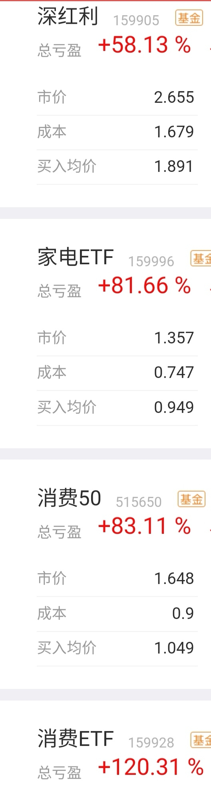

======================================================

_type: talk
@二师父[28814221155551]
2020-12-23 18:30:18 Wed  
topic_id: 815854882428512

<e type="hashtag" hid="481211145528" title="#指数估值#" /> 大家关注的食品饮料是高估的，如果逆势投资，低估和正常都还能考虑，高估的一定是暂时避免的哈。做趋势的话，只要严格止损，不用关注估值。

建议做逆势，美国很多投资家都是这种方式，已经被验证过有效性，而且我们自己利用这种方法也挣钱了，也符合A股市场。

@J at 2020-12-23 18:30:18 Wed

> 师父，新兴科技100到达低估了，现在适合开始定投了吗

----------

@二师父 at 2020-12-23 18:30:18 Wed

> 控制节奏可以

----------

@HeLLO at 2020-12-23 18:30:18 Wed

> 新兴科技100跟科技龙头哪个更好一些？

----------

@二师父 at 2020-12-23 18:30:18 Wed

> 龙头科技，未来企业龙头都会更加有价值一点

----------

@HeLLO at 2020-12-23 18:30:18 Wed

> 场外科技龙头007873还未到低估，007815低估，如果两选一，应选007873更优？

----------

@二师父 at 2020-12-23 18:30:18 Wed

> 等更好的入场机会，优选龙头科技

----------

阅读[2243]  评论[6]  赞[0] 

+++++++++++++++++++++++++++++++++++++++++++++++++++++

图片：

======================================================

_type: q&a
@永刚[15581448518112]
2020-12-23 18:53:25 Wed  
topic_id: 182521554118212

@永刚

>  二师父好，请问一下科技类细分行业的ETF基金哪一类成长性更好，盈利相对更稳定？5g.通信,新能源，半导体或其他类别的ETF?

@二师父

>  龙头科技或者纳斯达克稳定一些，其余几个盈利都不稳定

阅读[2258]  评论[0]  赞[0] 

======================================================

_type: talk
@二师父[28814221155551]
2020-12-23 19:55:13 Wed  
topic_id: 182521551245522

昨天A股小跌一下，很多人惊慌失措，今天又起来了。 下半年是结构性牛市中的箱体震荡行情，在A股历史上有超长时间的低位震荡，但是市场高位震荡确实少见。 不同于底部反复震荡磨底，定投者可以一直坚持定投积累优...点击链接查看剩余内容<e type="web" href="https://articles.zsxq.com/id_kp5vjxq5oxro.html" title="箱体震荡，不动如山" cache="" />

@🍀 凝🌸 慧🍀 at 2020-12-23 19:55:13 Wed

> 一个投资者的收益源于对投资系统和纪律的愚忠。[强][强][强]师父总结的太对！

----------

阅读[2303]  评论[1]  赞[0] 

======================================================

_type: q&a
@Kiwi 的拾金之路[241182454821121]
2020-12-23 19:56:00 Wed  
topic_id: 215854882414521

@Kiwi 的拾金之路

>  二师父，科创50ETF现在估值如何？值得投资吗

@二师父

>  科创50是不错的指数，目前正常估值，如果下跌到低位适合投资的。

阅读[2401]  评论[0]  赞[0] 

======================================================

_type: talk
@蔡寅宵[118554814444112]
2020-12-23 21:46:01 Wed  
topic_id: 582124114825514

二师父，张乐财富通网格上线了，教教我们呗

@二师父 at 2020-12-23 21:46:01 Wed

> 你是指教什么？按照我设定的价格走没问题的

----------

阅读[2228]  评论[1]  赞[0] 

======================================================

_type: talk
@二师父[28814221155551]
2020-12-24 11:36:44 Thu  
topic_id: 815854821558582

<e type="hashtag" hid="48415288141148" title="#乌龟计划263#" /> 买入易方达国开债（003358）0.25份，继续买入，逐步转移到债券基金上，乌龟计划几乎是不择时的，只要投资收益率能够保证未来超过货币基金收益率2倍就会出手。而且国开债基金回撤相对指数基金较小，在当下位置长期定投直到股债反转是可以的。

对于没有仓位的朋友可以先建立一部分底仓。今年和去年行情都非常好，而我始终忘记不了2013，2015，2018，每一次账户市值新高的时候都想想假如市场发生了回撤，是否还可以像现在这样，如果可以，那么投资组合非常棒，如果不能，就需要做好防守，四个账户如何，仓位如何，股债比例如何。这些才是投资中最重要的事情。

@幽兰 at 2020-12-24 11:36:44 Thu

> 二师父，继续用广发中债代替易方达国开债，没问题吧？

----------

@二师父 at 2020-12-24 11:36:44 Thu

> 没有问题的

----------

@幽兰 at 2020-12-24 11:36:44 Thu

> 好的，感谢

----------

@小东 at 2020-12-24 11:36:44 Thu

> 可以买场内的国债吗

----------

@HeLLO at 2020-12-24 11:36:44 Thu

> 广发中债跟易方达国债哪个更有价值？

----------

@二师父 at 2020-12-24 11:36:44 Thu

> 都一样

----------

@Vivian at 2020-12-24 11:36:44 Thu

> 老师，0.25份是当月增量资金乘以0.25对吧？

----------

@二师父 at 2020-12-24 11:36:44 Thu

> 对

----------

阅读[2161]  评论[9]  赞[0] 

======================================================

_type: q&a
@rtdmm小米[422188284881148]
2020-12-24 11:39:22 Thu  
topic_id: 215854824154551

@rtdmm小米

>  请问二师父，中概互联可以建仓不？

@二师父

>  目前可以利用均线定投策略轻仓定投

阅读[2134]  评论[2]  赞[0] 

======================================================

_type: q&a
@天马行空[548818851412444]
2020-12-24 15:55:42 Thu  
topic_id: 815854848448252

@天马行空

>  二师父，股市没机会时，我能否把银行大额存款买成银华日利，具体咋买。谢谢

@二师父

>  直接在场内账户搜索银华日利买入即可

阅读[2019]  评论[8]  赞[0] 

======================================================

_type: q&a
@林玮[844111858288412]
2020-12-24 21:31:16 Thu  
topic_id: 582124182158154

@林玮

>  二师父，现在在查茅台，重仓茅台的005827，110011基金要不要赎回？

@二师父

>  我看了下，茅台仓位不重，大约百分之10，这个基金经理不换的话可以中长期持有，可以试试卖利留本，保证回撤时候拿的住，多持有优质基金是没问题的

阅读[1895]  评论[4]  赞[0] 

======================================================

_type: q&a
@顾屹峰[28242255855121]
2020-12-25 09:59:26 Fri  
topic_id: 182521588125412

@顾屹峰

>  我想在03032、03088、03033中选一个.应该选那个？建几成仓？

@二师父

>  华夏的，这个目前不适合一次加仓，可以轻仓定投

阅读[1719]  评论[1]  赞[0] 

======================================================

_type: talk
@幽兰[815554522442422]
2020-12-25 10:15:19 Fri  
topic_id: 215854255524511

二师父，今天合适入手中概互联吗，小买一点。

@二师父 at 2020-12-25 10:15:19 Fri

> 可以

----------

@幽兰 at 2020-12-25 10:15:19 Fri

> 师父，请问中国互联和中概互联入哪个好一些？

----------

@二师父 at 2020-12-25 10:15:19 Fri

> 中概互联

----------

阅读[1608]  评论[3]  赞[0] 

======================================================

_type: q&a
@雾海[182558155252512]
2020-12-25 10:59:37 Fri  
topic_id: 582124522544184

@雾海

>  老师好，投资基金有一段时间的收益是甚微，请问老师现在我想定投指数基金，请问老师有什么好的建议？或者这段时间投哪几支基金好？请老师不吝赐教

@二师父

>  最近几个月大盘震荡确实收益不大好，选定优质的几个基金等待绝佳机会，市场注定不可能每时每刻都挣钱，当前阶段以偏债混合为主，或者暂停投资，等待中概还有医疗这两个行业的机会。

阅读[1691]  评论[1]  赞[0] 

======================================================

_type: q&a
@姥姥不疼. 爷爷不爱[48544481458248]
2020-12-25 19:28:35 Fri  
topic_id: 815854251158182

@姥姥不疼. 爷爷不爱

>  请教二师父，您怎么看在当前振荡市下，这几个月混合基收益强于指数基，

@二师父

>  少有的高位震荡，市场资金在各个板块轮动，哪个板块资金报团收益就好，主要取决机构资金动向

阅读[1424]  评论[1]  赞[0] 

======================================================

_type: q&a
@姥姥不疼. 爷爷不爱[48544481458248]
2020-12-27 10:06:29 Sun  
topic_id: 582124455148424

@姥姥不疼. 爷爷不爱

>  请教二师父，能否用90日均线定投策略，投资波动性的蓝筹大盘股（如建设银行），若能，怎么确定该股在您讲的低估位置进行90日均线波动投入及卖出

@二师父

>  这个只适合指数，买股票主要看基本面，和策略关系不大

阅读[1090]  评论[0]  赞[0] 

======================================================

_type: q&a
@雪莲[421485848588118]
2020-12-27 10:19:54 Sun  
topic_id: 182521452122882

@雪莲

>  二师父您好，我目前有一笔银行存款到期了，大约六万，考虑到两年后可能要用到，现在不知道该买债券还是银华日利比较好，想听听二师父有什么好的建议？麻烦您了，谢谢！

@二师父

>  两年后要用时间周期比较长，可以保守点，一部分购买银华日利，一部分购买债券

阅读[1174]  评论[4]  赞[0] 

======================================================

_type: q&a
@林凤崎[421882481454488]
2020-12-27 12:25:36 Sun  
topic_id: 414842255448128

@林凤崎

>  我想定投农业方面的，不是猪肉。能帮忙推荐一两支基金吗？我不知怎么找。谢谢

@二师父

>  农业精选164403

阅读[1130]  评论[1]  赞[0] 

======================================================

_type: q&a
@姥姥不疼. 爷爷不爱[48544481458248]
2020-12-27 12:29:47 Sun  
topic_id: 215854444241851

@姥姥不疼. 爷爷不爱

>  买入工商银行挣分红，详见下面，二师父怎么看

@二师父

>  他这个逻辑有问题，为啥分红多就能挣钱，银行分红都不低，这些年表现差一点，你可以对比几大行的分红情况，这个分红不代表你额外的投资收入

阅读[1161]  评论[0]  赞[0] 

======================================================

_type: q&a
@呵呵→_→[15414558111442]
2020-12-28 10:04:40 Mon  
topic_id: 215854154158541

@呵呵→_→

>  师傅万顺转债要卖掉么，

@二师父

>  可以卖了

阅读[838]  评论[0]  赞[0] 

======================================================

_type: q&a
@闲云[48522815485458]
2020-12-28 10:12:44 Mon  
topic_id: 182521825455582

@闲云

>  国债现在可以定投吗？在场外？

@二师父

>  可以的，场内场外都可以

阅读[886]  评论[0]  赞[0] 

======================================================

_type: q&a
@永刚[15581448518112]
2020-12-28 10:15:15 Mon  
topic_id: 414842211158418

@永刚

>  二师父您好，年底了，我想复盘全年的投资收益情况，想请教一下，从哪几个方面复盘分析呢？

@二师父

>  1，收益率情况以及整体资金利用率 2，自己所有的交易情况，买入和卖出分析，有没有违背自己交易原则，是清晰明白赚钱还是不明不白 3，赚钱原因和亏钱原因 4，针对今年操作，自己的投资再未来还有什么需要完善的地方，在投资过程中必须遵守的铁律

阅读[906]  评论[0]  赞[0] 

======================================================

_type: q&a
@🍀 凝🌸 慧🍀[841855248254242]
2020-12-28 10:17:03 Mon  
topic_id: 182521188151542

@🍀 凝🌸 慧🍀

>  师父好！请教您：如果目前手里有100万闲置资金，可长期不用。可否现在定投购买一些偏债混合基金，比如南方宝元债券、民生加银鹏程混合？放在银行理财收益太低，又没有低估的指数可以投，挺纠结。

@二师父

>  可以的，资金放着也是贬值，除非短期有使用的可能，尽量投资一些稳健的品种，然后绝佳机会到来时候可以调出来进行投资

阅读[918]  评论[14]  赞[0] 

======================================================

_type: q&a
@天马行空[548818851412444]
2020-12-28 12:03:27 Mon  
topic_id: 815854151844452

@天马行空

>  华宝添益511990和511880比哪个更好，511990做套利有风险吗。谢谢师傅

@二师父

>  这两个差不多，折溢价套利都有风险，货币基金套利也不会有太大利润

阅读[783]  评论[1]  赞[0] 

======================================================

_type: talk
@二师父[28814221155551]
2020-12-28 12:08:36 Mon  
topic_id: 815854151151212

注意混合债和偏债混合不是一个概念，偏债混合是配置偏重债券的混合基金，也有配置股票，混合债是债券混合基金，尽量投资国债，风险低一些

阅读[770]  评论[0]  赞[0] 

======================================================

_type: talk
@二师父[28814221155551]
2020-12-28 15:11:24 Mon  
topic_id: 215854185141281

<e type="hashtag" hid="552145855254" title="#国债逆回购#" /> 今天买了一些国债逆回购，还是不错的。临近年底，调整到合理仓位，明年再来吧。今年行情确实比较好，很多投资者都挣钱了，明年和大家多分享一些财报知识，不管是基金投资还是企业投资，都要研读企业基本面，价格和估值并不是最重要的，价值才是第一位的。

@栀子花开 at 2020-12-28 15:11:24 Mon

> 今天买了500块中概互联，打算每两周一次定投它了

----------

@顾小胖 at 2020-12-28 15:11:24 Mon

> 二师父我看到银华日利要分红，登记日是12月30日，10份配20.15元，是留着分红好还是卖出买逆回购更合适啊？

----------

@二师父 at 2020-12-28 15:11:24 Mon

> 逆回购

----------

@顾小胖 at 2020-12-28 15:11:24 Mon

> 好的谢谢二师父

----------

@天马行空 at 2020-12-28 15:11:24 Mon

> 师傅的逆回购利息大概多少。

----------

@二师父 at 2020-12-28 15:11:24 Mon

> 百分之4点多

----------

@天马行空 at 2020-12-28 15:11:24 Mon

> 谢谢师傅

----------

@陈洲 at 2020-12-28 15:11:24 Mon

> 刚去华宝智投看了，似乎没有4点多的，是不是随便买哪个逆回购都差不多？

----------

阅读[731]  评论[15]  赞[0] 

+++++++++++++++++++++++++++++++++++++++++++++++++++++

文件：
2020-12-28 15:08:55 Mon
文件大小：[56807]
51451214425854-这个品种又到了最佳买入时刻.docx

======================================================

_type: q&a
@素兮[548121415528244]
2020-12-28 23:58:33 Mon  
topic_id: 182521851558112

@素兮

>  二师父，万顺发债今天破发，该继续持有么？

@二师父

>  可以走了

阅读[389]  评论[0]  赞[0] 

======================================================

_type: talk
@Audrey[15284421255842]
2020-12-29 08:05:47 Tue  
topic_id: 815854124424212

想开通富途账号 买港股 港股经常比A股便宜很多 
二师傅公众号里富途开户联系人futu567 加微信一直没通过是咋回事 换对接人了吗

@二师父 at 2020-12-29 08:05:47 Tue

> 直接开通或者联系鑫财通的，你要有咨询需求我给她说下

----------

@幽兰 at 2020-12-29 08:05:47 Tue

> 富途开户有优惠链接吗？

----------

@二师父 at 2020-12-29 08:05:47 Tue

> 置顶文章有点

----------

@Audrey at 2020-12-29 08:05:47 Tue

> 想开通富途 富途有对接人可以咨询吗

----------

@二师父 at 2020-12-29 08:05:47 Tue

> 有的，我给那边说下

----------

阅读[309]  评论[5]  赞[0] 

======================================================

_type: talk
@平安是福[118222545154542]
2020-12-29 09:45:29 Tue  
topic_id: 215854121225411

师父：润建转偾怎么操作？

@二师父 at 2020-12-29 09:45:29 Tue

> 可以出了

----------

@平安是福 at 2020-12-29 09:45:29 Tue

> 好的

----------

阅读[240]  评论[2]  赞[0] 

======================================================

_type: q&a
@光少[244124552511141]
2020-12-29 09:45:37 Tue  
topic_id: 215854181842211

@光少

>  二师父您好！支付宝蚂蚁保险里面相互宝买这个作用大吗

@二师父

>  用处不大，可以不用买

阅读[289]  评论[1]  赞[0] 

======================================================

_type: q&a
@天马行空[548818851412444]
2020-12-29 15:39:44 Tue  
topic_id: 182521811148442

@天马行空

>  二师父，目前市场不好，我准备把所有的积蓄拿出来买银华日利和国债逆回购。可行吗。今天试验一天，25万盈利43元，比银行存款高一倍。数额不小，得先请示下师父才敢实施。

@二师父

>  可以的

阅读[12]  评论[2]  赞[0] 

======================================================

_type: talk
@二师父[28814221155551]
2020-12-29 16:23:34 Tue  
topic_id: 815854115455482

<e type="hashtag" hid="48415254588528" title="#今年投资总结#" /> 打开支付宝输入口令，64726555可以领取红包。星球不知道还有没有单身朋友，可以到公众号留言哈。

2020年感谢大家的陪伴，今年春节还得发大红包，去年给说过，如果今年不过3500，就发红包，估计是到不了了，其实我感觉是有无形力量在控盘，整体市场热度早就超过18年初了。不管到与不到，我们坚持下来了，有了投资盈利的经验，未来的投资之路就会越走越顺畅的。

@wty at 2020-12-29 16:23:34 Tue

> 来晚了，各位都神速啊[偷笑]

----------

@杜志彪 at 2020-12-29 16:23:34 Tue

> 师父没抢到，大家太快了[偷笑]

----------

@rtdmm小米 at 2020-12-29 16:23:34 Tue

> 来晚了[捂脸][捂脸]

----------

@衣袂飘香 at 2020-12-29 16:23:34 Tue

> 没抢到红包也不要紧，我们今年赚的何止3500。

----------

@素兮 at 2020-12-29 16:23:34 Tue

> 星球有单身朋友[大哭]不过怎么公众号没人留言[大哭][大哭]

----------

@二师父 at 2020-12-29 16:23:34 Tue

> 留了一个，可能都脱单了

----------

@兴乐之家 at 2020-12-29 16:23:34 Tue

> 请问师傅 在哪块输入口令呀？

----------

@J at 2020-12-29 16:23:34 Tue

> 师父准备搞单身联谊活动吗

----------

阅读[1]  评论[12]  赞[0] 

+++++++++++++++++++++++++++++++++++++++++++++++++++++

文件：
2020-12-29 16:18:12 Tue
文件大小：[118539]
28428545451511-收获的2020，接下来如何投资.docx

======================================================

_type: talk
@二师父[28814221155551]
2020-12-29 16:28:23 Tue  
topic_id: 582124882424824

这也太快了吧，3秒钟

@alicedream* at 2020-12-29 16:28:23 Tue

> 二师父，我都还不知道呢，红包就抢完了！[大哭]

----------

@二师父 at 2020-12-29 16:28:23 Tue

> 还会有的，我也奇怪咋这么快

----------

@庆余年 at 2020-12-29 16:28:23 Tue

> 我还老老实实把文章看完了再领的红包[流汗][流汗][流汗]，结果就没了。。。。

----------

@蛋炒饭不加蛋 at 2020-12-29 16:28:23 Tue

> 一样

----------

@吃肉肉 at 2020-12-29 16:28:23 Tue

> 哈哈，师父继续，打破自己的记录。[呲牙]

----------

@J at 2020-12-29 16:28:23 Tue

> 明天还有红包发吗师父，麻烦提早12小时通知我[偷笑]

----------

@🍀 凝🌸 慧🍀 at 2020-12-29 16:28:23 Tue

> 才看到，感觉错过1个亿[发呆][发呆][偷笑]

----------

阅读[1]  评论[7]  赞[0] 

+++++++++++++++++++++++++++++++++++++++++++++++++++++

图片：
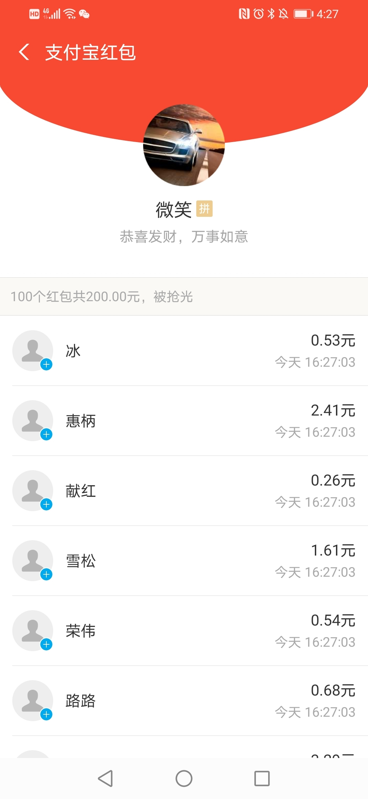

======================================================

_type: q&a
@苍天有井明月空🌙[28882214181441]
2020-12-29 19:10:03 Tue  
topic_id: 182521885588812

@苍天有井明月空🌙

>  你好，华泰证券网格交易上线了，可以用华泰做券商网格吗，我想问下，网格交易这块有教程吗，

@二师父

>  可以的，网格操作我在书和课程里面都讲过哈，严格按照价位表操作没有问题

阅读[1]  评论[0]  赞[0] 

======================================================

_type: talk
@兴乐之家[815581125824522]
2020-12-29 22:19:32 Tue  
topic_id: 582124885845824

请问在支付宝哪个位置输入口令？

阅读[1]  评论[0]  赞[0] 

======================================================

_type: q&a
@兴乐之家[815581125824522]
2020-12-29 22:51:05 Tue  
topic_id: 815854112115242

@兴乐之家

>  二师傅你好，请问一下每日估值表在哪儿查看？

@二师父

>  这个在置顶第三篇文章

阅读[1]  评论[0]  赞[0] 

======================================================

_type: talk
@二师父[28814221155551]
2020-12-29 23:42:37 Tue  
topic_id: 815851855881512

<e type="hashtag" hid="552114551414" title="#估值数据#" /> 当前市盈率百分位51.47%，市净率百分位33.59%，SY-BY百分位57.46%，SY/BY百分位56.06%。

依然结构性行情，龙头优质企业领涨。注意投资不是低估就一定要买，低估是必要条件，好的投资需要企业业绩好、长期稳定的经营业绩是根本，低估和预期只是必要条件，有了业绩，高估值随着时间也会消化，没有业绩，企业最终会退市破产，那不是便宜与昂贵的问题，而是出手与停止的问题。

只有优质企业或者优质基金进入低估才有最大的价值。

@雨淡风清 at 2020-12-29 23:42:37 Tue

> 二师父，问下，双汇算不算龙头？

----------

@二师父 at 2020-12-29 23:42:37 Tue

> 算

----------

@苍天有井明月空🌙 at 2020-12-29 23:42:37 Tue

> 现在闲钱太多有点难受

----------

@雨淡风清 at 2020-12-29 23:42:37 Tue

> 谢谢

----------

阅读[1]  评论[4]  赞[0] 

======================================================

_type: talk
@二师父[28814221155551]
2020-12-30 10:48:03 Wed  
topic_id: 414841841424848

<e type="hashtag" hid="51285452445444" title="#投资最重要的事情#" /> 最近一直复盘，二师父对比了下2016年沪深300和当下沪深300的指数点位，近5年时间沪深300涨幅也就35%左右，这意味着如果2016年初入市而且重仓沪深300的朋友，当下收益率也就30%，入场时间很重要，很多朋友都是2019年入市的，当时正好是一个低点。

其次，虽然5年沪深300没有怎么涨，而五粮液涨了14倍，泰格医药涨了10倍。这说明选对企业比择时更重要，A股长期价值投资是可以的。

那么投资最重要的事情是什么，第一研究基本面，自己能够把握住企业的价值，第二择时能力，控制好安全边际，第三，耐心，长期持有让价值兑现。

最最重要的就是选择赛道和选择企业，这是最为重要的，选择好赛道和好企业，相对买贵一点，长期持有时间可以消化这个贵，而买错了垃圾，时间是会让其价值毁灭。

时间是优秀企业的朋友，是垃圾企业的敌人。做人也一样，时间是人品好，靠谱，正直，担当的人的朋友，而是品质低劣，懦弱，退缩没有信义人的敌人。

买好企业，放弃捡垃圾，已经超越众多投资者了。

@onepiecewi* at 2020-12-30 10:48:03 Wed

> 听师傅的话

----------

@lily at 2020-12-30 10:48:03 Wed

> 跟着师父走

----------

@吃肉肉 at 2020-12-30 10:48:03 Wed

> 师父，你说的优质的赛道和企业有哪些？

----------

@二师父 at 2020-12-30 10:48:03 Wed

> 食品饮料，医疗，生物医药，新能源，人工智能，光伏，五粮液，汾酒，青岛啤酒，海天味业，伊利股份，泰格医药，爱尔眼科，迈瑞医疗，拼多多，腾讯，美团。

----------

@吃肉肉 at 2020-12-30 10:48:03 Wed

> 好的，谢谢师父！

----------

阅读[1]  评论[5]  赞[0] 

======================================================

_type: q&a
@李震笛[422112248211828]
2020-12-30 11:56:56 Wed  
topic_id: 414841841285248

@李震笛

>  二师傅，现在这个时间点，红利类型的基金可以出来吗？

@二师父

>  哪个红利基金

阅读[1]  评论[3]  赞[0] 

======================================================

_type: talk
@光少[244124552511141]
2020-12-30 12:03:35 Wed  
topic_id: 815851851422542

温馨提示[玫瑰]
逆回购今天买1天享受4天收益，报价还不错,有闲置资金可以参与哦

阅读[1]  评论[0]  赞[0] 

+++++++++++++++++++++++++++++++++++++++++++++++++++++

图片：
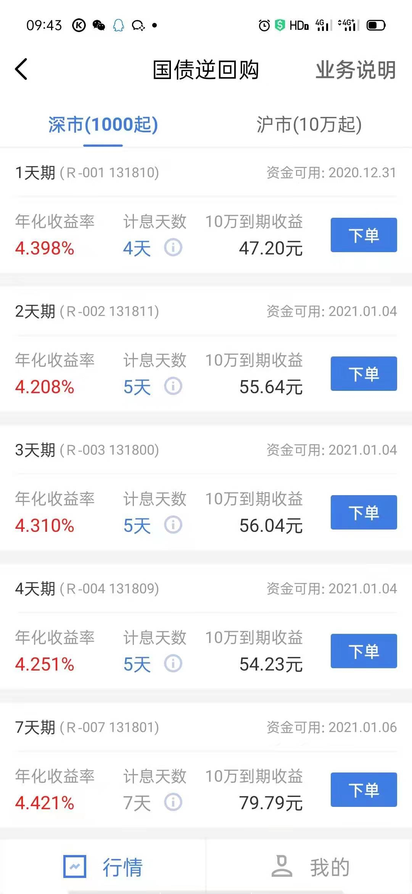

======================================================

_type: q&a
@一心一意[844421848411122]
2020-12-30 13:36:14 Wed  
topic_id: 414841841115848

@一心一意

>  师父好，同样一笔资金如果按股债轮动模型一直全仓，年化收益10%。如果按乌龟计划，场外定投，最终的年化收益率哪个高一些，我看师父的乌龟计划年化收益目前18%左右，单纯看部分资金收益挺高的，但是如果看整体资金，其余资金放在货币基金里，整体收益还没达到10%，这样理解的对么

@二师父

>  每月结余投资可以乌龟计划投，如果你手握大量现金收益率再搞也没用

阅读[1]  评论[1]  赞[0] 

======================================================

_type: q&a
@波多黎各[28428858544121]
2020-12-30 17:10:16 Wed  
topic_id: 182528555482442

@波多黎各

>  师傅，现在定投广发中债7-10，后期预计多久会等到债牛开启？我看现在a股风潮说的是现在是慢牛，高层也希望慢牛，如果开启像美丽国的10年牛市，投资债券岂不是亏死？

@二师父

>  首先假设你的说法成立，但是目前鳄鱼计划债券仓位很低，乌龟计划债券仓位稍重，不过也低于百分之10，继续投下去会在百分之50仓位停止，牛市来了依然赚的很爽啊，今天鳄鱼计划继续新高，投资债券并不影响
>  
>  其次，你这说的a股10年慢牛，要是a股真的连续涨10年不回调，10年后我退出投资界
>  
>  逆向投资是真难的，别看现在大家都兴冲冲投资股市，18年当时坚持的没几个，总有几个熊市跌的你怀疑人生，总有几个牛市涨的你怀疑人生，这就是a股

阅读[1]  评论[1]  赞[0] 

======================================================

_type: talk
@二师父[28814221155551]
2020-12-30 19:39:49 Wed  
topic_id: 414841881421858

<e type="hashtag" hid="825188852442" title="#估值表#" /> 当前人工智能进入低估，仓位不足的可以继续定投。周期性指数波动会较大。A股当下结构行情，方向很重要，白酒继续上涨，今年酒ETF的涨幅超过了茅台，如果A股指数也是和美股一样单边上涨，可以不收割利润，直接高位止盈即可。

@🍀 凝🌸 慧🍀 at 2020-12-30 19:39:49 Wed

> 师父，今天场内人工智能指数怎么这么大交易量？

----------

@二师父 at 2020-12-30 19:39:49 Wed

> 这个基金今天买的比较多

----------

@🍀 凝🌸 慧🍀 at 2020-12-30 19:39:49 Wed

> 那就是说有不少人看好它了，量一下子放大，估计是机构吧[偷笑]

----------

@J at 2020-12-30 19:39:49 Wed

> 新兴科技100现在可以继续定投吗师父？

----------

@二师父 at 2020-12-30 19:39:49 Wed

> 可以，不过龙头科技和中概互联更好一些

----------

阅读[1]  评论[5]  赞[0] 

+++++++++++++++++++++++++++++++++++++++++++++++++++++

图片：
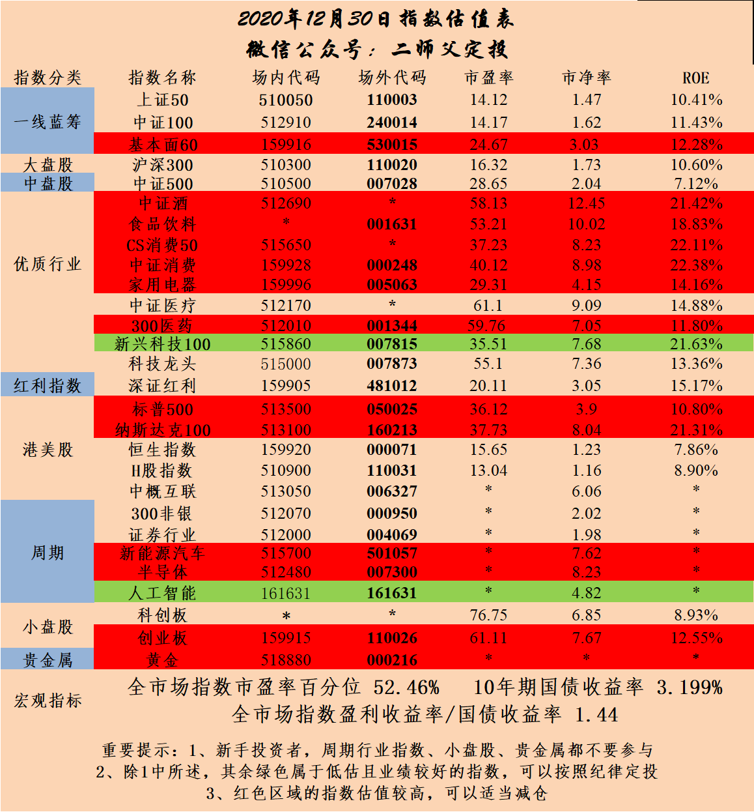

======================================================

_type: talk
@二师父[28814221155551]
2020-12-30 19:42:12 Wed  
topic_id: 182528558282482

<e type="hashtag" hid="88512425118552" title="#关于中证500#" /> 长期投资优选指数能够跑赢沪深300，如果简单投资，直接选择沪深300即可，猜错了板块收益率定投收益率甚至不如300.

@HeLLO at 2020-12-30 19:42:12 Wed

> 二师父分师有道理，我目前持中证500比例还算比较多，按目前有好的切换指数？

----------

@二师父 at 2020-12-30 19:42:12 Wed

> 目前没有，可以慢慢转到债券配置

----------

阅读[1]  评论[2]  赞[0] 

+++++++++++++++++++++++++++++++++++++++++++++++++++++

文件：
2020-12-30 19:41:20 Wed
文件大小：[15899]
51451281252824-中证500当前是否值得买.docx

======================================================

_type: talk
@二师父[28814221155551]
2020-12-31 08:40:28 Thu  
topic_id: 414841852185488

有港股账户的，可以利用闲余资金定投恒生科技，在非高估的时候采用均线策略

@wty at 2020-12-31 08:40:28 Thu

> 二师父，能把恒生科技指数的估值加到估值表中作为参考吗？另外，均线定投策略是看20日均线吗？

----------

@二师父 at 2020-12-31 08:40:28 Thu

> 目前正常估值的，参考中概

----------

@二师父 at 2020-12-31 08:40:28 Thu

> 60日

----------

@wty at 2020-12-31 08:40:28 Thu

> 多谢二师父🙏

----------

@雾海 at 2020-12-31 08:40:28 Thu

> 二师傅啊，我是小白，能讲讲均线策略具体怎么做，谢谢！

----------

@雾海 at 2020-12-31 08:40:28 Thu

> 二师傅，请问如何方便入金到涨乐全球通帐户。

----------

@二师父 at 2020-12-31 08:40:28 Thu

> 办理一张香港卡

----------

阅读[1]  评论[7]  赞[0] 

+++++++++++++++++++++++++++++++++++++++++++++++++++++

图片：
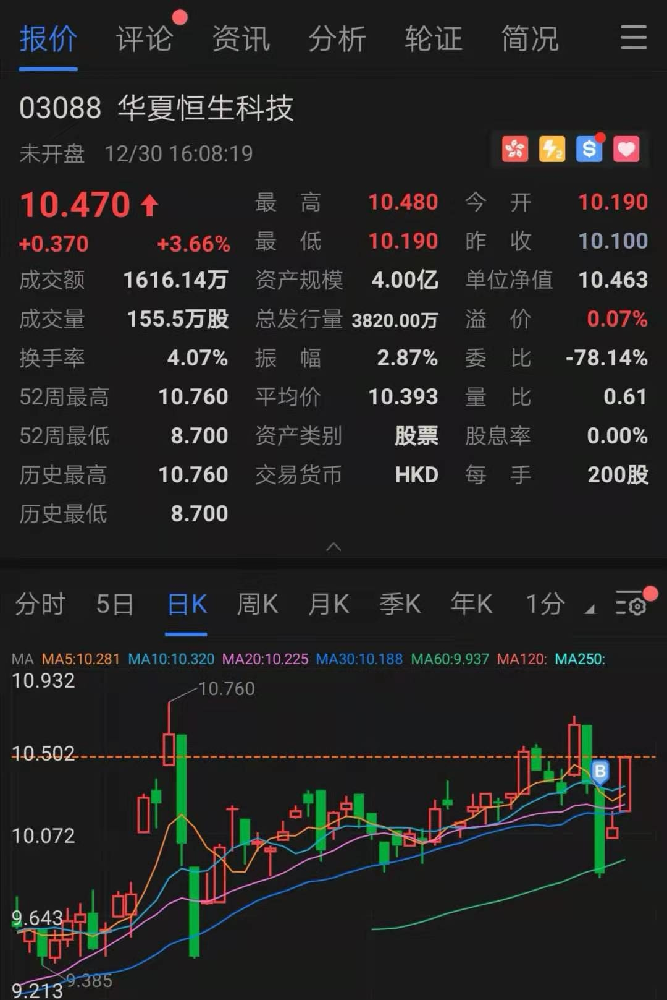

======================================================

_type: talk
@孟倩[118822124154582]
2020-12-31 08:44:21 Thu  
topic_id: 815851824184122

二师父，纳斯达克指数目前适合入场定投吗？040046，270042哪个好一点？谢谢！

@二师父 at 2020-12-31 08:44:21 Thu

> 目前不适合，如果3月那样的回撤能接受就可以投，纳斯达克长期向上，如果不惧任何级别回撤是可以，这个因人而异

----------

@孟倩 at 2020-12-31 08:44:21 Thu

> 华安是不是比广发的好一点？

----------

@二师父 at 2020-12-31 08:44:21 Thu

> 对

----------

@孟倩 at 2020-12-31 08:44:21 Thu

> 谢谢师父

----------

阅读[1]  评论[4]  赞[0] 

======================================================

_type: talk
@二师父[28814221155551]
2020-12-31 10:00:48 Thu  
topic_id: 414841851245228

跨年行情，春节前3500有希望，a股总是不按套路出牌

@六尘不改 at 2020-12-31 10:00:48 Thu

> 感觉今天就有希望

----------

@庆余年 at 2020-12-31 10:00:48 Thu

> 我还是希望二师父发红包哈哈，3500早晚回来的，红包没了就没了[呲牙][呲牙][呲牙]

----------

@二师父 at 2020-12-31 10:00:48 Thu

> 哈哈，今年春节前没到3500就发

----------

@杜志彪 at 2020-12-31 10:00:48 Thu

> 这节奏总是不按套路出牌[微笑]，昨天看微信留言清仓那位大哥估计不知现在什么表情[微笑]

----------

@二师父 at 2020-12-31 10:00:48 Thu

> 短线赚钱很难

----------

阅读[1]  评论[5]  赞[0] 

======================================================

_type: talk
@二师父[28814221155551]
2020-12-31 10:35:57 Thu  
topic_id: 582128158858884

<e type="hashtag" hid="28512428522121" title="#定投实盘264期#" /> 调仓：精准医疗调仓至易方达国开债（003358），中证500调仓0.5份至易方达国开债（003358）。

买入广发中债7-10国开债0.25份（003376）。

附图是底部一次配置的收益率，今年4月份调了一次仓，同期对比，底部配置比定投收益率好，然而，底部配置需要有极端耐心等待，同时要忍受长期资金利用率不足的情况，所以综合考虑，存量资金可以底部一次配置，每月结余定投是最佳的方式。

今年投资结束了，明年预计鳄鱼计划发车24次，乌龟计划发车40次，慢慢积累，慢慢变富。

@Yingshengw* at 2020-12-31 10:35:57 Thu

> 这个行业轮动在哪里可以看到？

----------

@二师父 at 2020-12-31 10:35:57 Thu

> 雪球

----------

@是喵喵吖～ at 2020-12-31 10:35:57 Thu

> 师父. 请问如果一份是2000，0.5份就是1000，就是说调1000块钱的中证500到国债是吗

----------

@素兮 at 2020-12-31 10:35:57 Thu

> 广发中债和易方达的国开债有何区别？可以只选广发中债么？

----------

@二师父 at 2020-12-31 10:35:57 Thu

> 可以的，不同基金公司的品种

----------

@庆余年 at 2020-12-31 10:35:57 Thu

> 按道理来讲，预苗出现利好，不应该是拉动医药指数上涨麽？怎么还全部调出了？

----------

@顾小胖 at 2020-12-31 10:35:57 Thu

> 请问精准医疗是全部调仓到易方达国开债吗？

----------

@二师父 at 2020-12-31 10:35:57 Thu

> 是的哈

----------

阅读[1]  评论[15]  赞[0] 

+++++++++++++++++++++++++++++++++++++++++++++++++++++

图片：

======================================================

_type: q&a
@姥姥不疼. 爷爷不爱[48544481458248]
2020-12-31 11:00:01 Thu  
topic_id: 182528515158452

@姥姥不疼. 爷爷不爱

>  精准医疗全部仓位调至易方达国开债么，还是调0.5份

@二师父

>  全部的

阅读[1]  评论[6]  赞[0] 

======================================================

_type: q&a
@姥姥不疼. 爷爷不爱[48544481458248]
2020-12-31 11:18:00 Thu  
topic_id: 815851848122112

@姥姥不疼. 爷爷不爱

>  精准医疗仓位是多少

@二师父

>  仓位很低，大概百分之1，这个实盘有显示的

阅读[1]  评论[0]  赞[0] 

======================================================

_type: talk
@幽兰[815554522442422]
2020-12-31 11:20:32 Thu  
topic_id: 182528515818412

二师父，今天券商大涨，需要出一些吗，还是得严格按1.18？

@二师父 at 2020-12-31 11:20:32 Thu

> 看仓位，如果之前下跌很难受可以出一点

----------

@幽兰 at 2020-12-31 11:20:32 Thu

> 😂就是这个意思

----------

阅读[1]  评论[2]  赞[0] 

======================================================

_type: q&a
@孤芳自赏[548114442211184]
2020-12-31 11:28:08 Thu  
topic_id: 815851842555242

@孤芳自赏

>  精准医疗指数可以直接转场内吗？

@二师父

>  东方财富有这个功能

阅读[1]  评论[0]  赞[0] 

======================================================

_type: talk
@丸子妈[28512522184441]
2020-12-31 15:05:28 Thu  
topic_id: 215851844218251

今天收盘不到3500点🤩

@二师父 at 2020-12-31 15:05:28 Thu

> 哈哈，我说的是今年春节[呲牙]

----------

@丸子妈 at 2020-12-31 15:05:28 Thu

> 好吧，还有1个多月，哈哈

----------

@二师父 at 2020-12-31 15:05:28 Thu

> 红包我已经准备好了

----------

@丸子妈 at 2020-12-31 15:05:28 Thu

> 红包，抢的速度太快了~

----------

阅读[1]  评论[4]  赞[0] 

======================================================

_type: talk
@二师父[28814221155551]
2020-12-31 15:05:56 Thu  
topic_id: 182528511485142

还差27点，有希望，坐等跨年行情

@夏萍 at 2020-12-31 15:05:56 Thu

> 希望很大[呲牙]

----------

@好运玲玲 at 2020-12-31 15:05:56 Thu

> 2020完美收官，感恩二师父！！！

----------

@Chu at 2020-12-31 15:05:56 Thu

> 今年收益真的超预期了，师父有机会也写写对明年的看法

----------

@二师父 at 2020-12-31 15:05:56 Thu

> 各大券商分析师很多看法[呲牙]

----------

@栀子花开 at 2020-12-31 15:05:56 Thu

> 这一涨，好多指数突破了上限天花板，感觉春耕行情有搞头。二师傅，我来个神棍预测明年一季度上综指突破3800点，创业板突破3200点。嘿嘿[耶]

----------

阅读[1]  评论[5]  赞[0] 

======================================================

_type: q&a
@葛亚丽[841858254128252]
2020-12-31 15:58:34 Thu  
topic_id: 815851841552522

@葛亚丽

>  二师父你好，精准医疗为啥调至国开债呢？

@二师父

>  做防守，未来随着牛市进一步高涨将会把债券仓位慢慢升至5成

阅读[1]  评论[4]  赞[0] 

======================================================

