_type: talk
@雨淡风清[844418818858882]
2021-01-01 15:38:14 Fri  
topic_id: 414841541215248

新年快乐ヾ ^_^♪🎉🎉

@天马行空 at 2021-01-01 15:38:14 Fri

> 新年到了，喜马拉雅师傅继续更新呀

----------

阅读[1]  评论[1]  赞[0] 

======================================================

_type: q&a
@波多黎各[28428858544121]
2021-01-01 17:35:12 Fri  
topic_id: 582128528584214

@波多黎各

>  师傅，请问国开债的收益比其他的债款收益率如何长期定投国开债可以不？有没有激进一些的债券？

@二师父

>  16国债19，选择久期比较长的国债收益率好一些，波动也更大一些

阅读[1]  评论[0]  赞[0] 

======================================================

_type: talk
@二师父[28814221155551]
2021-01-01 21:43:23 Fri  
topic_id: 582128511458184

<e type="hashtag" hid="15284141515142" title="#2021应对方法#" /> 无论市场如何变化，把握住不变的东西，兵来将挡水来土掩。

@素兮 at 2021-01-01 21:43:23 Fri

> 二师父说的“如果是春季躁动行情，涨到一定阶段可以将前期买错了的板块清仓，然后保持半仓等待市场回调后进入”，这里前期买错的板块是指在7月高点追高买入后来便逢下跌的板块，还是指在3月大跌时低位就买入，到后来的上涨没有超过沪深300的收益的板块？

----------

@二师父 at 2021-01-01 21:43:23 Fri

> 持仓股票基本面不好，长期没有潜力的板块

----------

@雾海 at 2021-01-01 21:43:23 Fri

> 请问二师傅，沪深300指数和创业板50指数具体是买哪一支好？

----------

@素兮 at 2021-01-01 21:43:23 Fri

> 恒生国企，中证500算是么？

----------

@二师父 at 2021-01-01 21:43:23 Fri

> 易方达沪深300，华安创业板50

----------

@二师父 at 2021-01-01 21:43:23 Fri

> 算

----------

@Vivian at 2021-01-01 21:43:23 Fri

> 老师，易方达沪深300是场内etf吗，代码是多少？我没找到[害羞]

----------

@二师父 at 2021-01-01 21:43:23 Fri

> 510300

----------

阅读[1]  评论[9]  赞[0] 

+++++++++++++++++++++++++++++++++++++++++++++++++++++

文件：
2021-01-01 21:41:52 Fri
文件大小：[17726]
48258842144858-2021年行情沙盘推演及应对策略.docx

======================================================

_type: talk
@二师父[28814221155551]
2021-01-01 21:51:39 Fri  
topic_id: 582128514528524

<e type="hashtag" hid="455542111428" title="#均线策略#" /> 均线投资的话，大家看指数偏离均线的程度，均线偏离差是（指数点位——60日均线点位）/60日均线点位，然后当指数点位偏离均线程度越大的时候，投资越多，当指数上升到均线以上开始卖出。

图中所示是恒生科技的指数点位和60日均线，均线投资避免在高估区域投资即可。

还有做趋势的，上升突破20日均线买入，跌破20日均线卖出，为了避免追涨杀跌，散户尽量不要做趋势。

@J at 2021-01-01 21:51:39 Fri

> 师父，恒生科技在a股现在有对应的基金吗

----------

@二师父 at 2021-01-01 21:51:39 Fri

> 暂时没有

----------

阅读[1]  评论[2]  赞[0] 

+++++++++++++++++++++++++++++++++++++++++++++++++++++

图片：
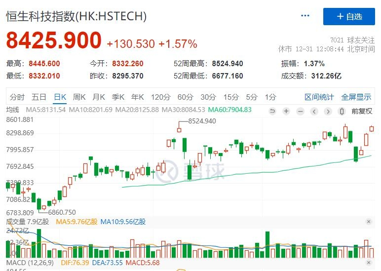

======================================================

_type: q&a
@隔窗遥望[241884481854181]
2021-01-02 12:09:54 Sat  
topic_id: 815851284415542

@隔窗遥望

>  恒生指数小亏，能不能转投人工智能

@二师父

>  可以直接投，不用转

阅读[1]  评论[0]  赞[0] 

======================================================

_type: q&a
@是喵喵吖～[421441114141158]
2021-01-02 23:14:06 Sat  
topic_id: 582128554114424

@是喵喵吖～

>  二师父！新年好！
>  我很早之前买了益生，有半年多了吧没卖，一直到现在。我有点不舍得割肉离场，因为钱倒是也不多，也用不到，现在亏损了30%我就想一直放着吧哪怕等两三年，我想等它回来后再卖掉。想请教您我这种做法可行吗😂
>  
>  其他基金啥的我其实都是按照二师父的严格执行的。都很好。这个是我自己瞎操作买的😂。

@二师父

>  不可行哈，找机会就走了，你出来的这笔钱很快就挣到20个点了

阅读[1]  评论[1]  赞[0] 

======================================================

_type: q&a
@范毅君[118551121224142]
2021-01-03 19:36:28 Sun  
topic_id: 815851414451222

@范毅君

>  二师父，被特斯拉刷屏，有没有买特斯拉比例比较高的鸡，特别是场内的，可能去分一杯羹😅

@二师父

>  新能源车吧，特斯拉涨，新能源也会跟上

阅读[1]  评论[1]  赞[0] 

======================================================

_type: talk
@J[28281541518551]
2021-01-03 19:46:40 Sun  
topic_id: 215851155142521

师父，新年好，请教一下均线一般参考哪几个最有效？5、10、20、60、90日，选哪几个？

@二师父 at 2021-01-03 19:46:40 Sun

> 这个看你要做啥

----------

@J at 2021-01-03 19:46:40 Sun

> 短线趋势

----------

@二师父 at 2021-01-03 19:46:40 Sun

> 5日线

----------

@J at 2021-01-03 19:46:40 Sun

> 谢谢师父，请问10、20、60日均线分别适合做多长时间的趋势？

----------

@二师父 at 2021-01-03 19:46:40 Sun

> 60或者90是长线趋势

----------

阅读[1]  评论[5]  赞[0] 

======================================================

_type: talk
@百变[15285855281882]
2021-01-03 21:27:14 Sun  
topic_id: 414841148252888

<e type="hashtag" hid="455542111428" title="#均线策略#" /> 老师：新年好！看20日均线买入和卖出指的是指数还是指数所对应的基金？

@二师父 at 2021-01-03 21:27:14 Sun

> 看你是做趋势还是逆势在，这是不同的哈

----------

@百变 at 2021-01-03 21:27:14 Sun

> 做逆势！

----------

@二师父 at 2021-01-03 21:27:14 Sun

> 90日均线下，非高估可以买，赛道需要选好

----------

@百变 at 2021-01-03 21:27:14 Sun

> 老师：90日均线在哪里看？谢谢[玫瑰]

----------

@二师父 at 2021-01-03 21:27:14 Sun

> 股票账户都有

----------

@百变 at 2021-01-03 21:27:14 Sun

> 谢谢[玫瑰]

----------

@百变 at 2021-01-03 21:27:14 Sun

> 老师就是我理财路上的舵手，90日均线设置好了！谢谢[微笑][玫瑰][玫瑰][玫瑰]

----------

阅读[1]  评论[7]  赞[0] 

======================================================

_type: talk
@二师父[28814221155551]
2021-01-03 22:09:55 Sun  
topic_id: 414841145481128

<e type="hashtag" hid="88512421542822" title="#最聪明的投资者#" /> 假期重读了聪明的投资者，总结出四个字：守正出奇。新的一年，继续把握基本盘，把握长牛赛道——消费、白酒、医疗，长期定投。

@雾海 at 2021-01-03 22:09:55 Sun

> 二师傅现在开始买白酒时机好吗？如果可以是买哪只基金好？

----------

@二师父 at 2021-01-03 22:09:55 Sun

> 定投不是好时机

----------

阅读[1]  评论[2]  赞[0] 

+++++++++++++++++++++++++++++++++++++++++++++++++++++

文件：
2021-01-03 22:08:07 Sun
文件大小：[752270]
28428884145551-谁是最聪明的投资者.docx

======================================================

_type: talk
@二师父[28814221155551]
2021-01-04 09:44:08 Mon  
topic_id: 182528855424812

茅台2千了，记得之前星球有个读者10万不知道买啥，有人说了茅台，好企业关键得拿的住

@lily at 2021-01-04 09:44:08 Mon

> 老师，国债逆回购的钱回笼了，是投银华日利还是继续国债逆回购呢？谢谢老师

----------

@二师父 at 2021-01-04 09:44:08 Mon

> 比银华日利高就逆回购

----------

@自由飞翔 at 2021-01-04 09:44:08 Mon

> 师父，医疗ETF14.5个点了，要继续持有不？

----------

@二师父 at 2021-01-04 09:44:08 Mon

> 持有的，未来还会继续补仓，如果你仓位重可以卖出利润

----------

@自由飞翔 at 2021-01-04 09:44:08 Mon

> 好呢

----------

@rtdmm小米 at 2021-01-04 09:44:08 Mon

> 二师父的预言3500马上就要到了[呲牙][呲牙]

----------

阅读[1]  评论[6]  赞[0] 

======================================================

_type: talk
@杜志彪[544454124115854]
2021-01-04 11:29:38 Mon  
topic_id: 414841181488428

<e type="hashtag" hid="281158522841" title="#每日打卡#" /> 202年1月4日新年第一次打卡，新能车太疯狂继续卖出利润和本金，目前成本已经是负的了，已经收割了60%本金，消费高估又有10%利润了，集训收割[微笑]

@杜志彪 at 2021-01-04 11:29:38 Mon

> 好几个错别字[调皮]

----------

@丸子妈 at 2021-01-04 11:29:38 Mon

> 不错哟

----------

@Sunflower at 2021-01-04 11:29:38 Mon

> 我还有资金没有投入，所以只收割了打算剔出去的基金利润，19年累计收益率32%持仓收益率跑赢大盘

----------

@杜志彪 at 2021-01-04 11:29:38 Mon

> 今年调仓了，调出了300ETF，500ETF，目标跑赢300指数10个百分点，2020年跑赢了6个百分点。

----------

@Sunflower at 2021-01-04 11:29:38 Mon

> 期待2021有更好的机会

----------

@杜志彪 at 2021-01-04 11:29:38 Mon

> 我大A加仓的机会有的是，就怕就你不敢加，不过在大家比较嗨的时候还要多敬畏市场，让我们慢慢变富。

----------

@Sunflower at 2021-01-04 11:29:38 Mon

> 我之前在白酒收益率60%的时候加了几万，怕跌下来没敢全部加了，现在手里还有10万没买入，我现在都是场外，场内的不敢碰

----------

阅读[1]  评论[7]  赞[0] 

======================================================

_type: talk
@夏萍[28221454818281]
2021-01-04 11:29:40 Mon  
topic_id: 815851181588542

3500突破

@幽兰 at 2021-01-04 11:29:40 Mon

> 二师父发红包呀[呲牙]

----------

@子辰 at 2021-01-04 11:29:40 Mon

> 都没见有什么大资金流入市场，为什么指数涨那么猛，不会是将金融资金调资到食品消费等板块了吧？

----------

阅读[1]  评论[2]  赞[0] 

+++++++++++++++++++++++++++++++++++++++++++++++++++++

图片：
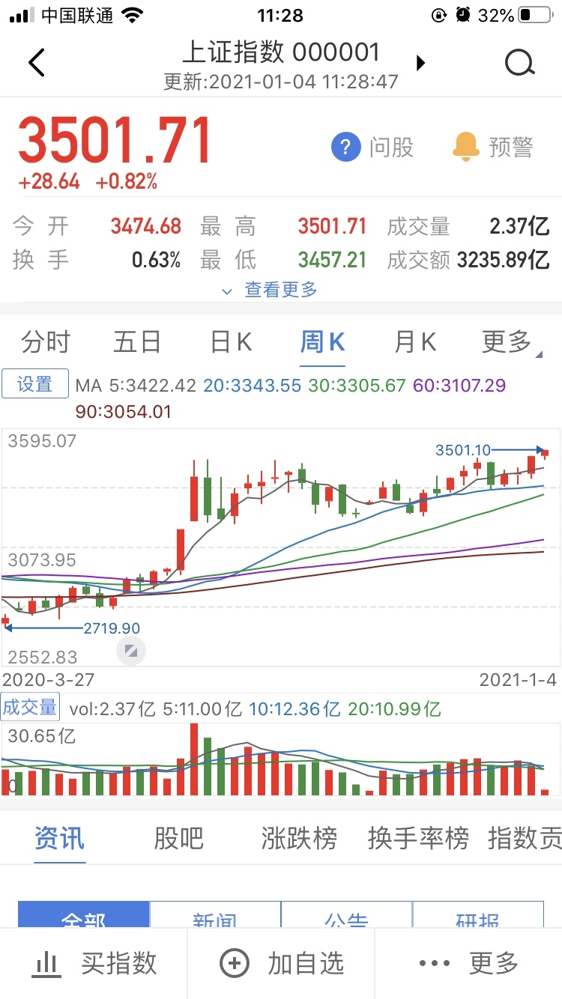

======================================================

_type: talk
@二师父[28814221155551]
2021-01-04 11:35:48 Mon  
topic_id: 582128818251284

<e type="hashtag" hid="28512421884251" title="#今天突破了#" /> 大盘盘中突破3500点，也算是破了吧，19年阴跌很长时间，为了鼓励大家坚持定投，二师父说了，今年如果春节前不突破3500点，二师父会给大家发红包，不是为了预测，不是显示自己多聪明，而是为了给大家打气，坚持下来的朋友都收获了，牛市真的来了，至于走多远，无法预测，按照既定的规划投资吧，每一轮牛市都不容错过

红包依然有，大大地有，放心，一起坚持投资，面包和幸福都会有的。今天组合新高，突破之后继续持有。

@丸子妈 at 2021-01-04 11:35:48 Mon

> 今天卖了一格券商

----------

@光少 at 2021-01-04 11:35:48 Mon

> 谢谢二师父[玫瑰]

----------

@范毅君 at 2021-01-04 11:35:48 Mon

> 我股票折腾半天，还不如沪深300收益，还是跟着二师父混靠谱[呲牙][呲牙]

----------

@衣袂飘香 at 2021-01-04 11:35:48 Mon

> 破了3500！即使二师父不必发红包也很开心。何况今天抢到了红包，六分钱[得意]

----------

@范毅君 at 2021-01-04 11:35:48 Mon

> 我比你厉害，三毛多[偷笑][偷笑]

----------

@天马行空 at 2021-01-04 11:35:48 Mon

> 二师父，是否以后和3000点以下永别了

----------

@二师父 at 2021-01-04 11:35:48 Mon

> 目前还不好说

----------

阅读[1]  评论[7]  赞[0] 

======================================================

_type: talk
@范毅君[118551121224142]
2021-01-04 11:56:26 Mon  
topic_id: 215851181828251

这家伙，各个机构都在喊涨，打脸神器，大A不要给他们面子[捂脸]

@志亮 at 2021-01-04 11:56:26 Mon

> 三傻是真的傻，地产是真的惨，怕高都是苦命人。

----------

阅读[1]  评论[1]  赞[0] 

======================================================

_type: talk
@二师父[28814221155551]
2021-01-04 12:08:09 Mon  
topic_id: 182528858514852

<e type="hashtag" hid="28512421812551" title="#红包来了#" /> 今天估计手速不会那么快，支付宝输入口令即可。

@alicedream* at 2021-01-04 12:08:09 Mon

> 谢谢二师父！[玫瑰][玫瑰][玫瑰]

----------

@wty at 2021-01-04 12:08:09 Mon

> 红包收到🧧🧧[呲牙][呲牙]

----------

@smile at 2021-01-04 12:08:09 Mon

> 谢谢师父。银行今天跌不少，应该怎样操作呢？有必要加仓吗？

----------

@Sunflower at 2021-01-04 12:08:09 Mon

> 谢谢二师父～新的一年大家一起坚持定投慢慢变富

----------

@二师父 at 2021-01-04 12:08:09 Mon

> 没必要，银行别投了，招行有好的机会市净率1.4或者1.5左右可以投，大概率跑不赢大盘

----------

@smile at 2021-01-04 12:08:09 Mon

> 谢谢回复，那就等回本后再卖出吧，希望近期可以回本[发呆]

----------

@庆余年 at 2021-01-04 12:08:09 Mon

> 前不久看到二师父说乌龟计划今年大概会发车40次，如果是慢涨行情，应该现在没有低估适合买入的基金了吧？

----------

@二师父 at 2021-01-04 12:08:09 Mon

> 会有回调的

----------

阅读[1]  评论[25]  赞[0] 

+++++++++++++++++++++++++++++++++++++++++++++++++++++

图片：
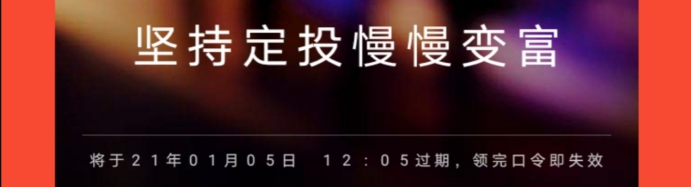

======================================================

_type: q&a
@葛亚丽[841858254128252]
2021-01-04 15:16:55 Mon  
topic_id: 414841154255548

@葛亚丽

>  二师父你好，现在有六万闲钱，配置什么呢？国债吗？指数基金现在都不能投了吧？

@二师父

>  医疗，中概回调还是可以的，总共6万闲钱吗，如果有防守账户资金，6万可以配置偏债混合基金

阅读[1]  评论[14]  赞[0] 

======================================================

_type: talk
@二师父[28814221155551]
2021-01-04 15:33:03 Mon  
topic_id: 582128852851814

<e type="hashtag" hid="51285458524414" title="#开门红#" /> 不管今年市场怎么走，发车计划不会有太大变动，市场不同阶段有不同的机会，大家跟着操作一轮牛熊基本上就入门了，以后再自己投投股票看能否跑赢300，如果能可以提高股权投资比例，如果不能，还是退回来投资指数。慢慢来比较快。其实市场情绪冰点就是2年前的4号，当时很多人都倒下了，放弃了投资，回过头看，无非两年时间而已。

房产投资的话目前唯一有价值的就是一二线城市学区房，本质是阶级分化，圈子很重要，除此以外，最好不要购买非自住以外的任何房子，未来投资股市收益肯定好于房产。

@苍天有井明月空🌙 at 2021-01-04 15:33:03 Mon

> 今天医疗小补了点

----------

@J at 2021-01-04 15:33:03 Mon

> 师父，如果是以前买下的房子，三线城市，应该如何处理？

----------

@二师父 at 2021-01-04 15:33:03 Mon

> 自住的话就住，不住的话可以出租，租不出去的话赶紧卖

----------

@J at 2021-01-04 15:33:03 Mon

> 能出租的情况下是出租还是出售把钱投股权好？

----------

@二师父 at 2021-01-04 15:33:03 Mon

> 这个看房子具体位置，城市人口流动情况，规划内是否有商圈，地铁等，还有租售比以及家庭房产总量

----------

@J at 2021-01-04 15:33:03 Mon

> 谢谢师父！

----------

阅读[1]  评论[6]  赞[0] 

+++++++++++++++++++++++++++++++++++++++++++++++++++++

文件：
2021-01-04 15:28:31 Mon
文件大小：[18211]
51451155255144-A股开门红，机会还是有.docx

======================================================

_type: talk
@二师父[28814221155551]
2021-01-04 20:11:33 Mon  
topic_id: 182528848418212

多多事件已经遭遇讨伐了，不管真假，很多时候拼命改变只是为了榨取价值的鸡汤话语，命都没了，还有什么意义，千万别被洗脑。

活着，开心最重要，努力不是为了逆天改命，而是为了不会因为缺钱而做自己不喜欢的事情，这也是财务自由的本质意义。

阅读[1]  评论[0]  赞[0] 

======================================================

_type: q&a
@林凤崎[421882481454488]
2021-01-04 21:00:01 Mon  
topic_id: 215851121128141

@林凤崎

>  今天天天基金怎么没更新呀

@二师父

>  有延迟

阅读[1]  评论[1]  赞[0] 

======================================================

_type: q&a
@北京记忆王  智能英*[182542152114542]
2021-01-04 21:49:31 Mon  
topic_id: 815851145815452

@北京记忆王  智能英*

>  二师父，恒生指数现在还能买吗

@二师父

>  不建议这个，港股指数等中概回调买或者港股医疗指数，恒生大概率也跑不赢沪深300

阅读[1]  评论[2]  赞[0] 

======================================================

_type: talk
@二师父[28814221155551]
2021-01-04 21:51:03 Mon  
topic_id: 182528812425182

恒生科技等a股指数出了再投，港股费率实在太高，大家通过二师父a股账户开通费率万一，这样手续费差了两个量级，港股账户还是留着长线买股票或者打新

阅读[1]  评论[0]  赞[0] 

======================================================

_type: talk
@二师父[28814221155551]
2021-01-04 22:20:06 Mon  
topic_id: 215851142825151

<e type="hashtag" hid="28518858514151" title="#每日估值数据#" /> 当前市盈率百分位58.17%，市净率百分位36.23%，SY-BY百分位67.64%，SY/BY百分位64.04%。

无论是两年前还是现在，中国市场都有机会，关键是提升自己的认知，才能把握住。经历过牛市的朋友都知道A股的牛市很猛，不要轻易降低股权仓位到5层以下，不然最后会有点难受。另外，当前逐步防守了，不出3年，你就能理解，防守的意义。

A股会有牛市，但是10年长牛不会，长牛的基础是股价和企业业绩基本吻合，否则不会的哈，所有的推理都是有逻辑支撑，包括二师父说的3500，都不是瞎蒙胡猜，而是有逻辑推理的。

希望这次大家都可以从市场中提升认知同时有所收获，改善生活。

阅读[1]  评论[0]  赞[0] 

======================================================

_type: q&a
@Vivian[582228554481154]
2021-01-04 22:58:21 Mon  
topic_id: 582128845442414

@Vivian

>  老师，现在仓位配置一半。还有一半闲置资金，看了您之前的回复，牛市来了，仓位不要低于一半，那我现在剩下一半资金大概38万要配置什么呢。全部买偏债基金还是等回调再加仓指数基金？

@二师父

>  等回调配置优质指数，偏债混合有点鸡肋

阅读[1]  评论[0]  赞[0] 

======================================================

_type: talk
@二师父[28814221155551]
2021-01-04 23:17:44 Mon  
topic_id: 182528811222482

你应该分散投资于几种不同的股票。因为在每5只你买的股票之中，可能会有1只表现非常好，有1只表现非常糟，另外3只表现一般。

 不要对1只股票固执己见，要保持一个开放的心胸。

不要随便挑一只股票就算了，你得先研究再投资。

阅读[1]  评论[0]  赞[0] 

======================================================

_type: talk
@二师父[28814221155551]
2021-01-05 09:25:49 Tue  
topic_id: 215851118485411

<e type="hashtag" hid="48415251225128" title="#关于卖出和闲余资金打理#" /> 当下是否需要卖出，这个主要看仓位和持仓基金基本面。如果基金持仓优质而且仓位很轻，可以长期拿着，回撤对自己影响也不大。如果基金不行，那么就要换。注意基金不涨和基金不行不是一个概念。这涉及到看持仓企业基本面的问题，如果基金持仓企业大部分很差，就没必要留了，不管亏赚，市场抬高就是走人的机会，而对于持仓股票比较优质的基金，可以拿着的，优质企业总会是一轮又一轮市值新高。

最近市场做了一个对比，跌落神坛的中石油和新星宁德时代，每个时代都会有当下的机会和热点，比如90年代结婚时候的三转一响，现在结婚的房子车子，比如06年大牛股钢铁、石油、银行，现在的大牛股消费，医疗，新能源。投资是投未来的预期，如果企业有预期，而且可以经受一定程度浮动，拿着，恐高都是苦命人。

另外关于闲余资金打理，如果短期使用，可以购买货币基金，流动性第一，如果2到3年都不用，可以购买国开债广发中债或者易方达中债，大牛市来了肯定会亏，不过可以和股权对冲，反之熊市来了则大概率是盈利，尤其是经济危机来的时候，债券的收益率异常高，这时候就可以安心持有，不惧危机。

市场不好预测，可以对市场做出预期，但是不要依据预测而进行买入操作。

阅读[1]  评论[0]  赞[0] 

======================================================

_type: talk
@二师父[28814221155551]
2021-01-05 09:55:28 Tue  
topic_id: 582128881845124

<e type="hashtag" hid="881251425252" title="#鳄鱼计划#" /> 计划今年发车20来次，买入广发中债7-10国开债两份，003376。

场内账户和场外账户均可申购的。如果能经受住较大波动，16国债19相当于上杠杆的债券，也可以选择。

@呵呵→_→ at 2021-01-05 09:55:28 Tue

> 师傅场内买那个

----------

@二师父 at 2021-01-05 09:55:28 Tue

> 003376，在场内买的

----------

@一心一意 at 2021-01-05 09:55:28 Tue

> 003376场内买不了啊

----------

@二师父 at 2021-01-05 09:55:28 Tue

> 可以场内申购的

----------

@sky at 2021-01-05 09:55:28 Tue

> 师父，在华泰涨乐上搜索出来的结果只有理财的啊，这样就属于场外了吧，怎么买场内的？

----------

@二师父 at 2021-01-05 09:55:28 Tue

> 相当于在场外申购，场内的国债etf或者国债，一些场内信用债尽量不参与

----------

@牛牛 at 2021-01-05 09:55:28 Tue

> 二师父，场内申购怎么操作啊

----------

@二师父 at 2021-01-05 09:55:28 Tue

> 就是场内既可以进行场内申购，也可以进行场外申购，找理财产品，然后输入代码可以场外申购，场内申购直接找到场内申购按钮点击即可

----------

阅读[1]  评论[30]  赞[0] 

+++++++++++++++++++++++++++++++++++++++++++++++++++++

图片：
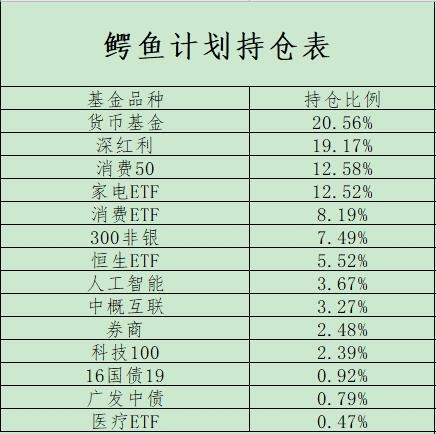

======================================================

_type: talk
@二师父[28814221155551]
2021-01-05 10:59:44 Tue  
topic_id: 215851112424851

被五粮液教育了，恐高的都是苦命人，买入和持有分开，不能追逐泡沫，但是可以享受一段时间

推荐一本书，在股市大崩溃前抛出的人，巴鲁克大师传记。其实顶级高手是对市场精准认知和对人性看的非常通透的。

@范毅君 at 2021-01-05 10:59:44 Tue

> 被云南白药吊打，最近云南白药整了一些钱，节前手贱清空了，想现在可以接回来，结果是暴涨[流泪][流泪]

----------

@蛋炒饭不加蛋 at 2021-01-05 10:59:44 Tue

> 喝酒兴国，收问询函照样涨

----------

@志亮 at 2021-01-05 10:59:44 Tue

> 今年最后悔的事情是卖了五粮液，本来我想拿着养老的。[流泪]

----------

@二师父 at 2021-01-05 10:59:44 Tue

> 还有消费，拿稳了，以后养老

----------

@杜志彪 at 2021-01-05 10:59:44 Tue

> 我已经找到了这本书好好拜读一下，消费2天又涨了10%，我恐高是不是苦命的人。

----------

@涓涓 at 2021-01-05 10:59:44 Tue

> 二师父，买入和持有分开，这句没有理解到，能不能解释一下

----------

@二师父 at 2021-01-05 10:59:44 Tue

> 就是一个板块目前虽然不能买了，但不代表不看好，依然可以继续持有，两者是分开的

----------

@涓涓 at 2021-01-05 10:59:44 Tue

> 明白了，谢谢师傅

----------

阅读[1]  评论[9]  赞[0] 

+++++++++++++++++++++++++++++++++++++++++++++++++++++

图片：

======================================================

_type: q&a
@素兮[548121415528244]
2021-01-05 11:12:00 Tue  
topic_id: 815851112444852

@素兮

>  怎么没有买入的地方？

@二师父

>  从交易菜单，点击买入，输入代码即可

阅读[1]  评论[4]  赞[0] 

======================================================

_type: q&a
@王春媚[244424882221141]
2021-01-05 14:26:27 Tue  
topic_id: 815885555121452

@王春媚

>  师傅，朋友想在你这开户，在学堂的链接发不过去，能不能您给个开户的二维码

@二师父

>  <e type="web" href="https://m.touker.com/trade/activity/common/channelOpen.htm?moduleDataId=275&channel=V2SF" title="https://m.touker.com/trade/activity/common/channelOpen.htm?moduleDataId=275&channel=V2SF" />，这是场内的，场外的公众号底部也有

阅读[1]  评论[1]  赞[0] 

======================================================

_type: talk
@二师父[28814221155551]
2021-01-05 14:59:43 Tue  
topic_id: 582112221141124

<e type="hashtag" hid="15284148812442" title="#继续把握高景气方向#" /> 当下值得关注的三个方向，生物医药、医疗、创新药，优选医疗，医药行业CRO赛道和靶向药赛道是最佳的。

趋势形成之后短期难以改变，如果卖出本金之后，剩余部分长期持有利润翻滚，如果不惧波动可以长期持有，A股波动太大，未经历过08年或者15年熊市不要轻言长期持有。

@Amanda at 2021-01-05 14:59:43 Tue

> 二师父，是要关注医药基金吗？还是要开始布局了？您建议买指数还是主动基金呢？谢谢！

----------

@二师父 at 2021-01-05 14:59:43 Tue

> 从过往收益率看部分主动医药基金优于指数基金，我比较倾向医疗etf，回撤百分之20左右可建仓

----------

@Amanda at 2021-01-05 14:59:43 Tue

> 谢谢！

----------

@志亮 at 2021-01-05 14:59:43 Tue

> 前几天终于把万科和平安割了，买这两只垃圾两年就没赚过钱，浪费了我两年牛市行情，牛市要敢于追涨，换了其它股我现在天天数钱，永远不要跟市场作对，市场永远是对的，可惜我醒悟太迟了，现在己经进入牛市最后一浪了，风险已经开始大了。

----------

@二师父 at 2021-01-05 14:59:43 Tue

> 你入市的机会很好，刚好两年牛市

----------

@志亮 at 2021-01-05 14:59:43 Tue

> 我觉得熊市入市更好，我当时是按低估买的，没什么经验，受了一些大V影响做价值投资，刚好运气不好这两年市场风格转换，都是抱团取暖，我觉得现在的市场适合做趋势投资，所以我换策略，不能固守不变，投资应该要灵活变通。

----------

@苍天有井明月空🌙 at 2021-01-05 14:59:43 Tue

> 卖了买啥

----------

@是喵喵吖～ at 2021-01-05 14:59:43 Tue

> 但是我记得二师父说不要追涨呢，除非你能接受大幅回撤

----------

阅读[1]  评论[18]  赞[0] 

+++++++++++++++++++++++++++++++++++++++++++++++++++++

文件：
2021-01-05 14:57:30 Tue
文件大小：[284980]
51458448412544-结构性行情继续演绎，把握高景气方向.docx

======================================================

_type: q&a
@无意心外[215544415215811]
2021-01-05 15:40:18 Tue  
topic_id: 215885558282281

@无意心外

>  二师父，现在医药行业CRO无论是股票还是指数基金都涨了很多了，现在还能进场吗？

@二师父

>  回调到中期支撑位可以，现在买属于博弈上涨

阅读[1]  评论[5]  赞[0] 

======================================================

_type: q&a
@是喵喵吖～[421441114141158]
2021-01-05 15:43:07 Tue  
topic_id: 215885558452281

@是喵喵吖～

>  师父，想请教您个问题！
>  我和我对象的公积金账户加起来有个4万块钱，一直也没有动，目前每个月还1500的房贷，直接从公积金里扣除。 
>  我想请教您是否要把公积金提出来，比如提出3万，自己理财用。 目前这三年吧倒是还没有换房子的想法（因为换房子的话会用到公积金嘛）
>  谢谢师父！🌹🌹

@二师父

>  你问问当地公积金贷款政策，取出来会不会影响贷款，计算下如果按照4万公积金贷款的利息大概省出多少，然后计算下四年4万理财收益，哪个高选择哪个
>  
>  北京市属公积金贷款额度和账户余额挂钩，取出来有影响，4万的话大概贷款25年，200万贷款大约会比商贷每月少400利息
>  
>  你综合对比下吧

阅读[1]  评论[1]  赞[0] 

======================================================

_type: q&a
@蛋炒饭不加蛋[118281818482542]
2021-01-05 15:55:17 Tue  
topic_id: 182552225145542

@蛋炒饭不加蛋

>  请问二师父，半导体芯片连涨好多天，近期科技算抬头了吗？

@二师父

>  是的，科技被揍了很久了

阅读[1]  评论[1]  赞[0] 

======================================================

_type: talk
@xu[2441485251]
2021-01-05 20:19:12 Tue  
topic_id: 815885585588242

二师傅您好！医疗ETF目前3层仓盈利10个点，后面可以每个星期定投一点吗？谢谢！

@二师父 at 2021-01-05 20:19:12 Tue

> 可以的，长期投资关键要拿的住，回撤的时候也能坚持，这是高景气方向。

----------

阅读[1]  评论[1]  赞[0] 

======================================================

_type: q&a
@海马[15158245825242]
2021-01-05 21:11:17 Tue  
topic_id: 582112212115444

@海马

>  师父：医疗ETF指数场外用华宝中证医疗指数代替可以吗？

@二师父

>  可以的，目前已经完成了分级基金转型，下次回调的时候可以投资了

阅读[1]  评论[0]  赞[0] 

======================================================

_type: talk
@幽兰[815554522442422]
2021-01-05 21:41:08 Tue  
topic_id: 815885585414812

二师父，七月底才入的深红利，收益都有31.9%了，适合长期持有吗？

@二师父 at 2021-01-05 21:41:08 Tue

> 如果能经受住波动，是适合长期持有的

----------

阅读[1]  评论[1]  赞[0] 

======================================================

_type: talk
@二师父[28814221155551]
2021-01-05 21:41:32 Tue  
topic_id: 182552252181482

<e type="hashtag" hid="28512445551481" title="#财报对比学习#" /> 投资过程中考察企业基本面是很重要的，以后大家在分析企业是否具有投资价值之前，先看看财报，包括自己持仓基金是否优质，就看前十大重仓企业的财报，如果前十大重仓企业3个以上财报显示业绩有问题，这种基金就可以放弃了，防止主动基金经理老鼠仓，防止指数投资陷入价值陷阱。

从今年三月份以来二师父就逐步开始调出银行了，而却投资了相关的消费，就以消费代表企业五粮液以及银行代表企业民生银行来对比，大家可以慢慢看，有很多问题对比就知道企业经营业绩是决定企业上涨的第一性因素，而非所谓的便宜。

从民生银行第四页来看，民生银行第三季度季报归属母公司扣非净利润同比负增长35.25%，民生银行前三季度归属母公司扣非净利润同比负增长17.71%，也就意味着民生银行第三季度利润下降35.25%，前三季度利润下降17.71%。对于非扩张初创企业，如果企业经营净利润持续下滑，那么很容易遭遇戴维斯双杀。虽然也有困境反转的情况，比如特斯拉在上市之初利润和现金流都为负数，最后困境反转，但是马斯克曾经也是经历过很大的困顿期，对于过往业绩并无确定性增长的企业，慎重考虑。

A股企业很多，如果有任何漏洞，都可以避免投资。最典型的是乐视网，从2010年以后，他的净利润增长率常年为负数，没有业绩支撑的要么是真的差，要么是未来应为创新而带动了收入增长，否则最终价值毁灭。

再看资产项目，实际金融资产降低了100多亿，而递延所得税资产反而增加了100多亿，这是个疑点，递延所得税资产属于未来预计，不能完全等同有实际价值的资产。

看基本面，大家多读读财报，一点点耐心看， 慢慢就会发现很多企业不值得投资，一定注意基本面分析，一家企业涨的好不代表他不垃圾，乐视曾经也涨的好，然而他依然是垃圾。读财报就是找到真正有业绩的企业，那么未来市值会反映到业绩上。

阅读[1]  评论[0]  赞[0] 

+++++++++++++++++++++++++++++++++++++++++++++++++++++

文件：
2021-01-05 20:23:02 Tue
文件大小：[411961]
88421415884482-民生银行.PDF

2021-01-05 20:23:02 Tue
文件大小：[275210]
48251214882288-五粮液.PDF

======================================================

_type: talk
@杜志彪[544454124115854]
2021-01-06 09:26:07 Wed  
topic_id: 414884854524528

<e type="hashtag" hid="281158522841" title="#每日打卡#" /> 2021年1月6日新年第二次打卡，消费2天又10%利润，我还是按原来策略继续收割，我恐高，可怜人[微笑]

@阝東 at 2021-01-06 09:26:07 Wed

> 我也是每涨10％收割一次[囧]

----------

@杜志彪 at 2021-01-06 09:26:07 Wed

> 刚刚券商触发卖出一份[微笑]

----------

@二师父 at 2021-01-06 09:26:07 Wed

> 山不在高，有仙则名，水不在深，有龙则灵，钱不在多，有赚就行。

----------

@阝東 at 2021-01-06 09:26:07 Wed

> 现在我剩6层仓位，等疯狂大牛了，跟着二师傅走😁

----------

@二师父 at 2021-01-06 09:26:07 Wed

> 可以，适当均线小仓位投投，然后资金配置些债券防守

----------

阅读[1]  评论[5]  赞[0] 

======================================================

_type: talk
@J[28281541518551]
2021-01-06 09:34:53 Wed  
topic_id: 582112152452144

师父，人工智能现在还适合进场吗

@二师父 at 2021-01-06 09:34:53 Wed

> 适合

----------

@J at 2021-01-06 09:34:53 Wed

> 我也这么想[微笑] 科技100也适合加仓吗

----------

@二师父 at 2021-01-06 09:34:53 Wed

> 可以

----------

@J at 2021-01-06 09:34:53 Wed

> [OK]人工智能和科技100目前仍在低估区域，对吗师父？

----------

@二师父 at 2021-01-06 09:34:53 Wed

> 没有了，低估是必要条件，目前投资是投科技和人工智能的预期，不是投资的估值反转

----------

@Amanda at 2021-01-06 09:34:53 Wed

> 二师父，科技100和人工智能，优选哪个？还是两个一起定投？

----------

@二师父 at 2021-01-06 09:34:53 Wed

> 优选科技100，不过当前市场仍旧无效，优质的科技主动基金相对指数基金有部分超额收益，行业指数会有平均收益。优选科技100，注意整体仓位控制，A股科技指数仓位10%以下，更多的方向是消费、医疗、互联网，美股科技

----------

@J at 2021-01-06 09:34:53 Wed

> 好的，谢谢师父！

----------

阅读[1]  评论[11]  赞[0] 

======================================================

_type: talk
@二师父[28814221155551]
2021-01-06 10:03:31 Wed  
topic_id: 182552542885212

<e type="hashtag" hid="88512445888512" title="#讲一下均线定投以及牛市来了如何应对#" /> 首先说说均线定投，这个适合小仓位资金中期投资。均线定投需要满足三个条件，选择的基金是高景气方向，基金没有严重泡沫，估值适中，然后看均线选择投资。

长选做均线定投的基金酒ETF，医疗ETF，中概互联，纳斯达克。当前酒ETF和中概比较高估，不适合，那么中概和医疗是适合的。大家看图中90日均线，当基金价格在90日均线以下开始投资，盈利在5%——10%以上且基金价格在均线以上卖出。也适合震荡市场。当然16国债19也适合这种方法，不过债券波动小，预期收益率调低到5%。

牛市来了如何应对，这个在沙盘推演里面说了，如果前期上涨的板块继续涨，银行没涨，那么可以逐步卖出前期买错的，买错的不是指高位买的，而是指基本面差的股票以及持仓较差的基金。

注意二师父说了三种情况，第一种是银行涨，所有都涨，意思不是说行情就是这个，而是给出三种不同行情我们的应对策略。

对于前期跟着二师父走的朋友，仓位肯定都在5到7以上，目前不会焦虑，那么对于空仓的朋友如何办呢？可以建立深红利10%仓位，易方达上证50这个基金10%仓位。广发中债7——10年国开债这个基金80%仓位，这样配置长期持有大概率是6%——8%收益率，比你干看着股市强。

当然对于没有接触过股市的朋友这样配置可能心里会发怵，深红利已经那么高了，还配置，以后跌了怎么办。注意仓位只有10%，另外有80%的国开债防守，未来股市跌了，国开债不会跌，这样会给你一个安全垫。

目前就这样子，牛市来了不要再傻傻定投，定投适合熊市底部阴跌区间，不同市场有不同的策略，但是不管怎么变，投资的核心思想是不变的。

@苍天有井明月空🌙 at 2021-01-06 10:03:31 Wed

> 中概互联持0，直接上一份或两份可以吗

----------

@二师父 at 2021-01-06 10:03:31 Wed

> 注意是均线以下哈，如果没有高估，可以均线以下投资

----------

@J at 2021-01-06 10:03:31 Wed

> 师父，恒生指数还微亏1%，减仓还是继续持有直到盈利再卖好？

----------

@二师父 at 2021-01-06 10:03:31 Wed

> 可以逐步减仓了，以后有机会投资中概。

----------

阅读[1]  评论[4]  赞[0] 

+++++++++++++++++++++++++++++++++++++++++++++++++++++

图片：

======================================================

_type: talk
@二师父[28814221155551]
2021-01-06 10:25:37 Wed  
topic_id: 414884858411158

<e type="hashtag" hid="48415224885588" title="#长期追踪的几家企业#" /> 之前答应过读者12月以后说一些基本面好的企业，大家如果选择的话从这个里面选可能比自己选要好一些。至于何时买入就不做建议，还是那句话，股市有风险，投资需谨慎。

目前市场还是超额收益比较明显的，星球还是有专业投资股票的朋友，选对大方向不会比指数差。但关键是认知要上来，不要固守三傻，这个我说了很多次，你可以等民生银行反转了再投，而不要去赌业绩反转，这个太难了。等你反转了，精选好企业景气企业的早就赚嗨了，很多人其实是买错了方向，而不断给投资者洗脑，我是价值投资者，其实并不是，这有点像岳不群说自己是名门正派，然后网络人心企图实现自己的武林盟主梦。大家不要被误导了，亏钱不是价值投资。

直接说企业吧。

消费方向：五粮液、茅台、泸州老窖、山西汾酒；医药方向：泰格医药、金域医学、迈瑞医疗、爱尔眼科；电器设备和互联网方向：隆基股份、宁德时代、拼多多、腾讯股份。

这是大方向，如果自己投资也尽量在这几个赛道里面选择，投资企业如果啥都不懂，那么以下几条不要碰：第一：净资产收益率低于10%的企业不要碰，毛利率低于10%的企业不要碰，业绩增速持续低于10%的企业不要碰，股价低于10的企业不要碰。这几个指标严格遵守，踩雷概率小了很多，至于后面慢慢学习吧，认知提高一点，股市胜率就更高一点，这是一个永无止境的过程。

@志亮 at 2021-01-06 10:25:37 Wed

> 二师说的对呀，我为什么死抱三傻，我不能在其它行业赚嗨后，等三傻起来再去买吗？我以前真是太傻了[捂脸]。

----------

@二师父 at 2021-01-06 10:25:37 Wed

> 一起学习吧，你也成长很快了，入市才2年

----------

@mumomo at 2021-01-06 10:25:37 Wed

> 二师父，这些数据从哪里查

----------

@二师父 at 2021-01-06 10:25:37 Wed

> 上市公司都会公布财务报表的

----------

@mumomo at 2021-01-06 10:25:37 Wed

> 官网查看吗

----------

@二师父 at 2021-01-06 10:25:37 Wed

> 对，东方财富也有数据，不过是F10

----------

@mumomo at 2021-01-06 10:25:37 Wed

> 谢谢您

----------

@志亮 at 2021-01-06 10:25:37 Wed

> 现在感觉打通任督二肪一样，今天早上见海螺有异动，在起飞时马上切入[呲牙]

----------

阅读[1]  评论[8]  赞[0] 

======================================================

_type: q&a
@mumomo[111812248825412]
2021-01-06 11:00:00 Wed  
topic_id: 414884854125448

@mumomo

>  二师父，恒生指数现在基本回本，现在直接卖出还是再等等

@二师父

>  可以卖了，中概互联更好

阅读[1]  评论[8]  赞[0] 

======================================================

_type: talk
@J[28281541518551]
2021-01-06 11:02:18 Wed  
topic_id: 215885828245511

师父。券商盈利8个点，请问有必要去全清吗

@二师父 at 2021-01-06 11:02:18 Wed

> 没有必要，这个可以做网格

----------

阅读[1]  评论[1]  赞[0] 

======================================================

_type: talk
@幽兰[815554522442422]
2021-01-06 11:05:26 Wed  
topic_id: 582112151548214

二师父，中证500现在可以全清吗，还是分步调？想找机会换其他赛道。

@二师父 at 2021-01-06 11:05:26 Wed

> 分步调整，对标创业板50比中证500好，可以逐步转移到国债，等有机会投资创业板

----------

@幽兰 at 2021-01-06 11:05:26 Wed

> 感觉创业50很难等到机会，😄

----------

@丸子妈 at 2021-01-06 11:05:26 Wed

> 周一就把中证500全清了，后面用来买人工智能可以不?

----------

@二师父 at 2021-01-06 11:05:26 Wed

> 可以，等医疗有回调的话医疗更好，人工智能也是好赛道，不过周期性较强

----------

@丸子妈 at 2021-01-06 11:05:26 Wed

> 好的。那就再等等

----------

阅读[1]  评论[5]  赞[0] 

======================================================

_type: talk
@上上签[244184512458541]
2021-01-06 11:58:02 Wed  
topic_id: 215885824452841

感谢遇见二师傅[玫瑰]

虽然现在没有之前频繁发言，但是自己一直都在观察学习

现在还年轻刚开始工作半年，这段时间阶段是累计本金

切勿本末倒置，感觉自己状态（  ）不对

可能是工作问题天天看盘影响心态，但有利有弊

起风了，唯有努力生存

（欢迎交流互相探讨）

阅读[1]  评论[0]  赞[0] 

+++++++++++++++++++++++++++++++++++++++++++++++++++++

图片：
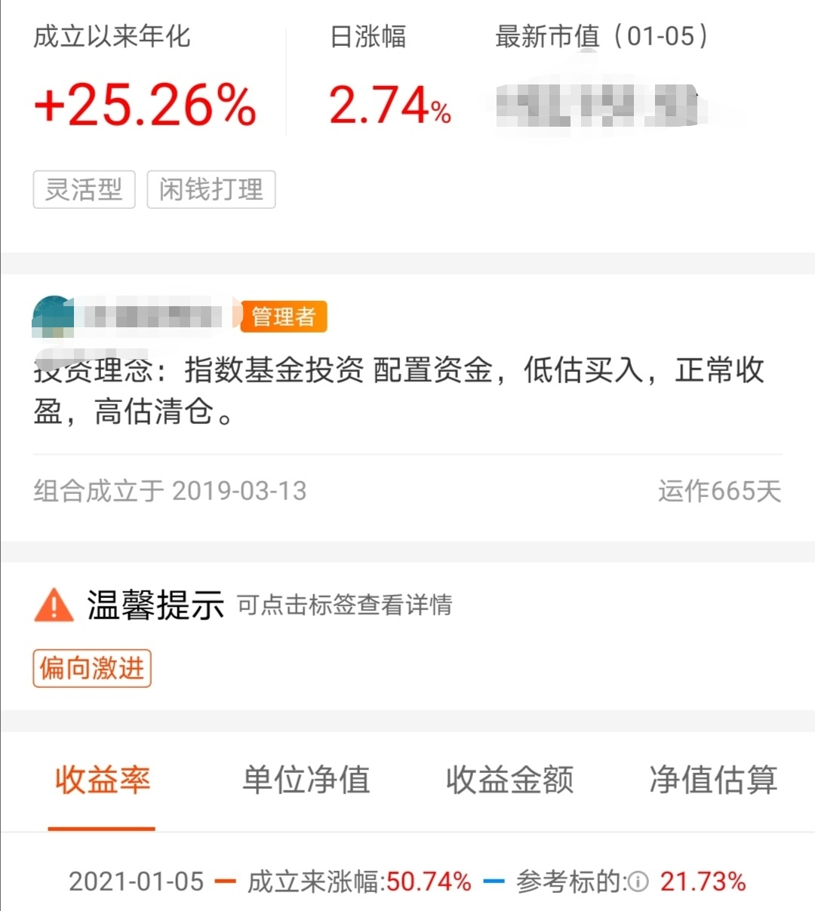

======================================================

_type: q&a
@A0洪氏日杂批发[544885222181514]
2021-01-06 11:58:55 Wed  
topic_id: 414884852245428

@A0洪氏日杂批发

>  二师父，开通科创板要50万，我把50万转进证券帐户，不买股票，只买国债逆回购，放上20个交易日，也可以开通吗？

@二师父

>  可以的，国债逆回购或者货币基金放20天都可以开通

阅读[1]  评论[0]  赞[0] 

======================================================

_type: q&a
@梅子[118548488224242]
2021-01-06 12:05:57 Wed  
topic_id: 182552541512122

@梅子

>  二师父，场内买基金成交价格是按实时价还是收盘价？谢谢

@二师父

>  市价委托实时价格，限价委托按照你规定的价格，都不是收盘价

阅读[1]  评论[0]  赞[0] 

======================================================

_type: talk
@二师父[28814221155551]
2021-01-06 13:48:19 Wed  
topic_id: 815885821252842

<e type="hashtag" hid="141128442252" title="#乌龟计划调仓#" /> 南方中证全指证券调仓到广发国开债，恒生国企调仓30%到易方达中概互联，恒生国企调仓70%到广发国开债，中证500调仓0.5份到广发国开债，购买易方达国开债0.25份。

做好防守，目前国开债的持仓比例大约也就20%，不算太保守的仓位，注意防守，然后重点关注医疗和中概回调的机会，目前建立中概一点点底仓，等待回调继续投资。

@云云 at 2021-01-06 13:48:19 Wed

> 二师父，易方达中概互联的代码是多少？

----------

@王雷 at 2021-01-06 13:48:19 Wed

> 二师父您好证券户目前有26万的恒生国企。中概互联有十万持仓。请问我的恒生国企怎么操作

----------

@二师父 at 2021-01-06 13:48:19 Wed

> 总仓位多少，总体配置了哪些

----------

@王雷 at 2021-01-06 13:48:19 Wed

> 一百六十左右。配置500。H股。券商。长江电力。有色

----------

@王雷 at 2021-01-06 13:48:19 Wed

> 还有中概

----------

@二师父 at 2021-01-06 13:48:19 Wed

> 都不太好啊，国债还有现金大概多少

----------

@二师父 at 2021-01-06 13:48:19 Wed

> 006327

----------

@王雷 at 2021-01-06 13:48:19 Wed

> 国债16-19有六个。现金16个

----------

阅读[1]  评论[27]  赞[0] 

======================================================

_type: q&a
@姥姥不疼. 爷爷不爱[48544481458248]
2021-01-06 14:25:52 Wed  
topic_id: 815885821425582

@姥姥不疼. 爷爷不爱

>  现在还能否用支付宝（马云已……）买基金？

@二师父

>  这是个问题，支付宝未来堪忧，不过他只是代销，钱有托管机构托管，所以别担心哈

阅读[1]  评论[0]  赞[0] 

======================================================

_type: q&a
@天马行空[548818851412444]
2021-01-06 14:28:21 Wed  
topic_id: 414884851245158

@天马行空

>  二师父，20万准备买国开债，具体咋操作。多少建底仓，定投份额，定投方法还有持续时间如何安排。谢谢

@二师父

>  如果你有100万指数，现在直接买20万国开债没问题，后面再有增量资金定投，如果没有指数仓位，配置百分之10沪深300，百分之90国开债非常稳健

阅读[1]  评论[5]  赞[0] 

======================================================

_type: q&a
@林凤崎[421882481454488]
2021-01-06 14:30:33 Wed  
topic_id: 215885821281281

@林凤崎

>  易方达中概互联代码是多少呀

@二师父

>  006327

阅读[1]  评论[3]  赞[0] 

======================================================

_type: talk
@二师父[28814221155551]
2021-01-06 14:51:56 Wed  
topic_id: 582112158842824

沙盘推演第一种情况，银行拉升普涨，那么突破3583，且银行站上前期高位，那么就可以打开想想空间了，坐等市场演绎吧。

只做预期，然后应对，见招拆招，且行且谨慎。

@烟九•二手车 at 2021-01-06 14:51:56 Wed

> 天量级出现了

----------

@杜志彪 at 2021-01-06 14:51:56 Wed

> 今天持有行业指数只有医疗跑赢了300指数，其它都落后于300，也该歇会了，慢慢来[微笑]

----------

@🍀 凝🌸 慧🍀 at 2021-01-06 14:51:56 Wed

> 昨天看平安银行跌的最狠，就在18元左右买了3万，结果，今天涨这么凶啊[呲牙]

----------

@二师父 at 2021-01-06 14:51:56 Wed

> 低吸富三代，追高毁一生

----------

@🍀 凝🌸 慧🍀 at 2021-01-06 14:51:56 Wed

> 师父，我这是低吸，还是追高啊？

----------

@二师父 at 2021-01-06 14:51:56 Wed

> 低吸啊，银行都被揍了一遍又一遍

----------

@吃肉肉 at 2021-01-06 14:51:56 Wed

> 你逆势前行哈[拳头]

----------

@🍀 凝🌸 慧🍀 at 2021-01-06 14:51:56 Wed

> 😂 😂 我就感觉好像便宜了不少，想着先买个3万，如果价格再低到17元多，我就再多买点，结果不给机会了。

----------

阅读[1]  评论[11]  赞[0] 

======================================================

_type: talk
@二师父[28814221155551]
2021-01-06 15:20:19 Wed  
topic_id: 215885845515851

北京今天体感温度负20度，据说是本世纪以来最冷的一天，真的体会到了寒风刺骨的感觉，以前觉得外卖小哥挺好，骑着小车横扫北京城，现在觉得他们真不容易啊，我也彻底打消了当外卖小哥的念头。

@吃肉肉 at 2021-01-06 15:20:19 Wed

> 二师父还念着当外卖小哥哈，有理想[呲牙]。

----------

@lily at 2021-01-06 15:20:19 Wed

> [呲牙]

----------

@光少 at 2021-01-06 15:20:19 Wed

> 二师父注意身体保暖

----------

@二师父 at 2021-01-06 15:20:19 Wed

> 嗯，暖气和空调都开了，今年真奇怪

----------

@是喵喵吖～ at 2021-01-06 15:20:19 Wed

> 真好冷呀！二师父和大家都要注意保暖。我前几天骑电动车还摔倒了。还好买了意外险[捂脸][捂脸]

----------

阅读[1]  评论[5]  赞[0] 

======================================================

_type: talk
@lily[548488251242584]
2021-01-06 15:25:50 Wed  
topic_id: 182552512288242

师父，银华日利要不要转成国开债？

@二师父 at 2021-01-06 15:25:50 Wed

> 不用的

----------

@lily at 2021-01-06 15:25:50 Wed

> 好的 谢谢师父

----------

阅读[1]  评论[2]  赞[0] 

======================================================

_type: talk
@二师父[28814221155551]
2021-01-06 16:17:13 Wed  
topic_id: 414884824285128

<e type="hashtag" hid="552114551414" title="#估值数据#" /> 市盈率百分位58.44%，市净率百分位36.97%，SY-BY百分位67.42%，SY/BY百分位63.28%。

注意，当四个数据都在80%以上意味着市场整体高估，那时候随时撤退，目前还可以拿一拿，暂时关闭账户。

去年最糟糕的一件事就是把我之前卸载的股票账户给装回来了，真的有耐心，在一轮底部买入优质企业，耐心拿个2到3三年，比频繁操作强的多，不管未来怎么震荡，sy-by百分位不到80%以上，不会降低6成以下，市场总是非理性的，2019年年初百分位大概在8%，当时很多人以为A股再也不会涨了，2008年百分位大概在3%，经历过2008的都以为中国股市要推到重来了，市场难以预测，我们可以做的是控制仓位，用仓位对冲来平稳前行。

阅读[1]  评论[0]  赞[0] 

======================================================

_type: talk
@丸子妈[28512522184441]
2021-01-06 18:53:35 Wed  
topic_id: 414884822821228

科创50怎么样?值得长期持有吗？

@二师父 at 2021-01-06 18:53:35 Wed

> 一个周期可以，终身持有暂不适合

----------

阅读[1]  评论[1]  赞[0] 

======================================================

_type: talk
@二师父[28814221155551]
2021-01-06 20:08:31 Wed  
topic_id: 182552518252412

南极电商，曾经比肩茅台，南极电商是一家以“南极人”品牌授权为主业的电商服务企业。公司近年来不断收购其他品牌，已成功从内衣品牌转型为全品类品牌，授权运营类目涵盖内衣、床上用品、男装、女装、童装及母婴、健康生活等。

2019年，南极电商毛利率超过93%，2020年上半年，公司股价涨幅将近70%，两项表现都超越了贵州茅台，被视为“毛利率比肩茅台”的大牛股。公司股价自2020年2月到7月上旬，从最低的9.06元一路飙涨至24.41元。

因为出色的股价表现，南极电商得到了机构投资者的偏爱。公司三季报显示，公司股票受到公募基金、北向资金、社保基金、保险和券商理财的追捧。其中，公募基金是其最大的“拥趸”，一共有31家公司的93只基金共计持有3.4037亿股公司股票。

此外，北向资金持有9934.73万股，占流通A股比例为5.09%；保险公司持有3701.87万股，占流通A股比例为1.89%；券商集合理财持有276.2万股，占流通A股比例为0.14%。

以“长期稳健”著称的社保基金，也在其十大流动股股东明细之中。根据三季报，全国社保基金416组合、全国社保基金418组合和全国社保基金423组合三只基金共计持有1.1257亿股，占流通A股比例为5.76%。

@苍天有井明月空🌙 at 2021-01-06 20:08:31 Wed

> 天量下跌

----------

@清风徐来 at 2021-01-06 20:08:31 Wed

> 师傅，现在价位这么低可以入手了吗？

----------

@二师父 at 2021-01-06 20:08:31 Wed

> 不是，这就是一定要避免的

----------

@清风徐来 at 2021-01-06 20:08:31 Wed

> 好的，谢谢师傅

----------

@向前进 at 2021-01-06 20:08:31 Wed

> 师父，怎么避免呢，看财报吗

----------

@二师父 at 2021-01-06 20:08:31 Wed

> 看财报，线下调查企业，问企业员工，买龙头，分散投资，不逆势加仓

----------

@向前进 at 2021-01-06 20:08:31 Wed

> 好的，谢谢师父

----------

@吃肉肉 at 2021-01-06 20:08:31 Wed

> 这种业绩，不应该还会涨吗？机构那么快撤场。

----------

阅读[1]  评论[11]  赞[0] 

+++++++++++++++++++++++++++++++++++++++++++++++++++++

图片：
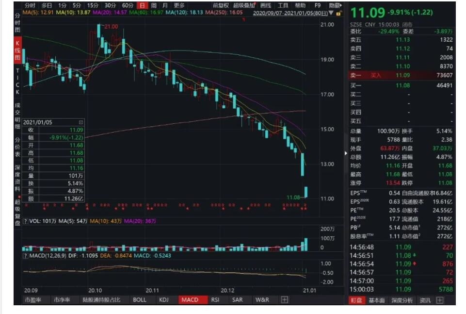

======================================================

_type: talk
@二师父[28814221155551]
2021-01-06 20:52:32 Wed  
topic_id: 215885841841481

<e type="hashtag" hid="825188852442" title="#估值表#" /> 目前已经没有低估的指数了，牛市太猛，目前已经不适合定投了哈，唯一可以投资的标的就是国债和国开债，波动小收益稳健，永远记住：逆向思维，每一轮牛市都有一个核心暴涨板块，那么这个板块在牛市终结以后一定是回调最长的，未来白酒、空间还有多少空间无法预测，且走且谨慎，如果追高买入发生了巨大回调，记得赶紧跑，如果是18年，19年或者今年年初买的倒不用慌张，慢慢退场，不着急。

@🍀 凝🌸 慧🍀 at 2021-01-06 20:52:32 Wed

> 龙头科技和深红利也开始高估了，我刚把利润收割完，[囧]

----------

@吃肉肉 at 2021-01-06 20:52:32 Wed

> 已暂停定投

----------

@smile at 2021-01-06 20:52:32 Wed

> 请问高估的指数什么时候卖出呢？还是不动？

----------

阅读[1]  评论[3]  赞[0] 

+++++++++++++++++++++++++++++++++++++++++++++++++++++

图片：
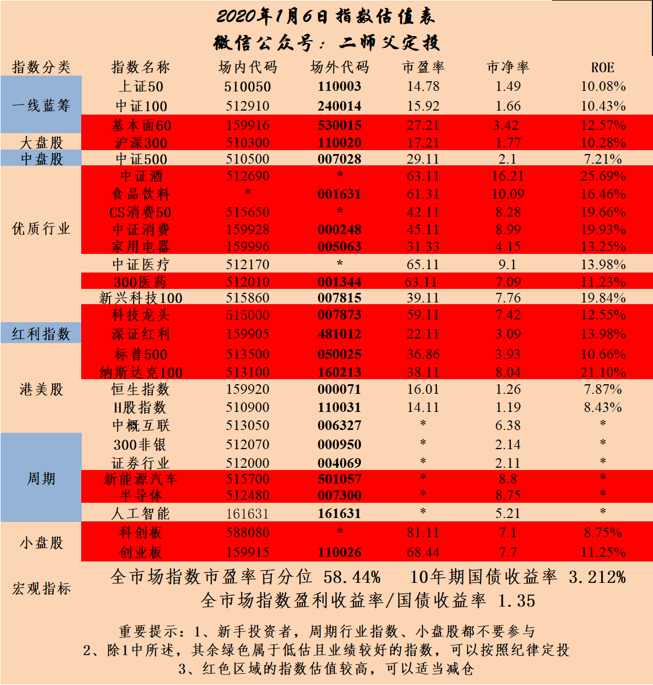

======================================================

_type: q&a
@闲云[48522815485458]
2021-01-06 20:54:11 Wed  
topic_id: 815885841841552

@闲云

>  二师父：家电ETF咋样？

@二师父

>  好标的，咱们已经投资了哈，之前也有详细介绍

阅读[1]  评论[3]  赞[0] 

======================================================

_type: talk
@二师父[28814221155551]
2021-01-06 23:22:38 Wed  
topic_id: 182552584455842

<e type="hashtag" hid="48415224258888" title="#提示#" /> 关于高估是否卖以及何时卖，当前不要轻易下车，前期已经收割利润了保证合理仓位，然后就拿着

二师父一直强调这是轮牛市，两年前已经说过了，大家不要怕涨，优先卖出不涨的，比如很水的地产，中证红利，然后消费医疗新能源有仓位先拿一拿，拿不住卖出留利润持有，切记不是卖涨的好的，而是卖没有啥预期的

不要怕，拿住了，只要是优质资产，拿稳了，还没买够的，牛市回调就是上车机会，但是不要追着买。

低估是买入的必要条件，而不是赚钱的充分条件，这个要理解清楚了。

@天马行空 at 2021-01-06 23:22:38 Wed

> 感觉要赚大钱，必须再熊市市积累筹码。比如今年的疫情。

----------

@天马行空 at 2021-01-06 23:22:38 Wed

> 赚大钱，感觉必须在熊市积累廉价筹码。普通行情难。

----------

@丸子妈 at 2021-01-06 23:22:38 Wed

> 深红利之前卖了一网，现在盈利10个点，深红利还可以继续持有吧?

----------

@二师父 at 2021-01-06 23:22:38 Wed

> 可以，你的买入价比较高，这个位置别投了

----------

@丸子妈 at 2021-01-06 23:22:38 Wed

> 看错了，现在盈利16个点，还是不投了吗

----------

@二师父 at 2021-01-06 23:22:38 Wed

> 如果不是做趋势的话至少等正常估值时候投

----------

@丸子妈 at 2021-01-06 23:22:38 Wed

> 好的

----------

阅读[1]  评论[7]  赞[0] 

======================================================

_type: talk
@J[28281541518551]
2021-01-07 00:36:49 Thu  
topic_id: 582112184218114

师父，请问南方宝元现在适合一次买入吗？

@二师父 at 2021-01-07 00:36:49 Thu

> 分3批买入

----------

@J at 2021-01-07 00:36:49 Thu

> [OK]以哪些指标作为这三次买入的时点？

----------

@二师父 at 2021-01-07 00:36:49 Thu

> 三档，回撤百分之3，百分之6加仓二，三次

----------

@J at 2021-01-07 00:36:49 Thu

> 好的师父，请问是指南方宝元还是大盘指数回撤？

----------

@二师父 at 2021-01-07 00:36:49 Thu

> 南方宝元债

----------

@丸子妈 at 2021-01-07 00:36:49 Thu

> 我选择的汇添富双利债券

----------

阅读[1]  评论[6]  赞[0] 

======================================================

_type: q&a
@王春媚[244424882221141]
2021-01-07 08:26:57 Thu  
topic_id: 414884812181158

@王春媚

>  师父好，之前定投的基金重仓白酒饮料板块的，要不要出掉？

@二师父

>  还拿一拿，目前机构抱团核心资产，仍旧有上涨空间，至于顶点在哪里不好预测，仓位轻不用卖，仓位重可以分批卖出，参考卖本留利润中期持有到抱团终结再清仓

阅读[1]  评论[1]  赞[0] 

======================================================

_type: talk
@二师父[28814221155551]
2021-01-07 09:09:42 Thu  
topic_id: 182552422842842

<e type="hashtag" hid="88512445441252" title="#可转债评级#" /> 今日上市转债，永冠转债，是永冠新材对标的可转债，公司主要是布基，纸基，膜基三大类胶带，销售市场覆盖多个国家地区公司主要两条成长主线，同类公司洁美科技，从同类公司来看，还是可以，

公司当前净资产收益率9.72%，毛利率17.49%，永冠转债转股价值96.2元，到期赎回价格115元，转股溢价率3.95%。

当前永冠转债评级AA减，结合企业质量以及转股价值，如果中签上市可卖，不要留念。

阅读[1]  评论[0]  赞[0] 

======================================================

_type: q&a
@小鱼[241182222251181]
2021-01-07 10:12:02 Thu  
topic_id: 182552425424452

@小鱼

>  中概互联今天可以建底仓了吗

@二师父

>  我稍后出一个网格表

阅读[1]  评论[6]  赞[0] 

======================================================

_type: talk
@幽兰[815554522442422]
2021-01-07 10:55:23 Thu  
topic_id: 582112521841814

二师父，今天想在场内买点中概互联可以么，目前中概互联基本空仓，只有昨天场内跟了一些

@样 at 2021-01-07 10:55:23 Thu

> 我也想在场内买点中概

----------

@苍天有井明月空🌙 at 2021-01-07 10:55:23 Thu

> 我也空仓昨天买到场外了，[尴尬]

----------

@样 at 2021-01-07 10:55:23 Thu

> 个人感觉中概股的事情还没结束，先买点建个底仓，别到时候忘了[偷笑][偷笑]

----------

@幽兰 at 2021-01-07 10:55:23 Thu

> [呲牙]坐等二师父的网格表

----------

阅读[1]  评论[4]  赞[0] 

======================================================

_type: talk
@二师父[28814221155551]
2021-01-07 11:21:42 Thu  
topic_id: 815885252511482

<e type="hashtag" hid="48415224212218" title="#中概互联网格#" /> 大家可以按照网格建立底仓，有底仓的可以到1.98建立，然后平时忙的，可以用华宝智投软件扫描二维码，有个智能条件单，自动交易，实现躺赚。目前我自己也做起来了，乌龟计划先行买入中概互联，未来深红利压舱不动，即使超级牛市来了，要卖他也是最后一个，不要怕，底部坚守住了，现在只要有四个账户做防守，收割了利润，咱们不怕跌，跌了之后核心资产好价格依然补仓，当前就是耐心持有，超额收益源于选对好企业和耐心持有，一定要耐心持有，不要随意空仓。

@苍天有井明月空🌙 at 2021-01-07 11:21:42 Thu

> 涨乐财富通也开网格了，也可以用财富通做吗

----------

@二师父 at 2021-01-07 11:21:42 Thu

> 可以

----------

@幽兰 at 2021-01-07 11:21:42 Thu

> 二师父，今天如果不到1.98，可以建底仓吗？

----------

@二师父 at 2021-01-07 11:21:42 Thu

> 可以少建立一点

----------

@素兮 at 2021-01-07 11:21:42 Thu

> 底仓是几份？

----------

@幽兰 at 2021-01-07 11:21:42 Thu

> 好的

----------

@日月⭐️辰 at 2021-01-07 11:21:42 Thu

> 扫二维码说跌幅应在负0.5到负100之间，师父怎么设立啊？

----------

@苍天有井明月空🌙 at 2021-01-07 11:21:42 Thu

> 三万就是15000份啊

----------

阅读[1]  评论[24]  赞[0] 

+++++++++++++++++++++++++++++++++++++++++++++++++++++

图片：
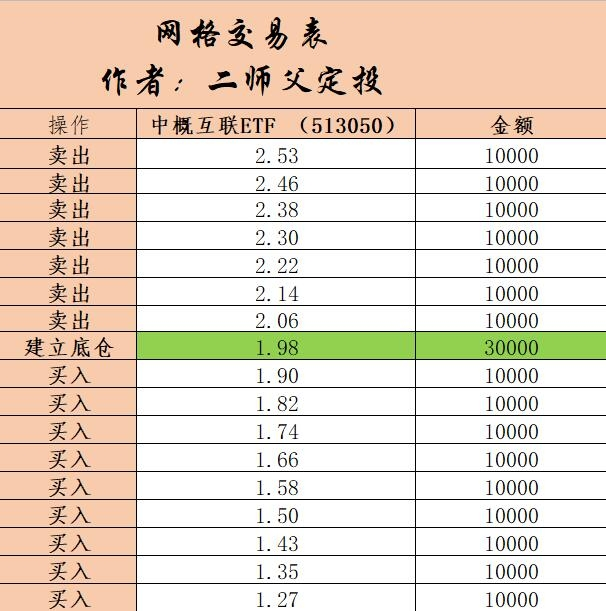

======================================================

_type: q&a
@波多黎各[28428858544121]
2021-01-07 12:09:55 Thu  
topic_id: 182552424442582

@波多黎各

>  师父，地产银行低估现在可以入吗？

@二师父

>  地产已经没必要关注了，招商银行，平安银行算是勉强能跑赢大盘的，低估只是必要条件，不是充分条件哈

阅读[1]  评论[4]  赞[0] 

======================================================

_type: talk
@二师父[28814221155551]
2021-01-07 12:45:23 Thu  
topic_id: 815885252155482

这是条件单

@苍天有井明月空🌙 at 2021-01-07 12:45:23 Thu

> 

----------

@苍天有井明月空🌙 at 2021-01-07 12:45:23 Thu

> 

----------

@苍天有井明月空🌙 at 2021-01-07 12:45:23 Thu

> 

----------

@苍天有井明月空🌙 at 2021-01-07 12:45:23 Thu

> 我设置的对吗，

----------

@二师父 at 2021-01-07 12:45:23 Thu

> 华泰你问问客户经理，华宝进入直接就是了

----------

@苍天有井明月空🌙 at 2021-01-07 12:45:23 Thu

> 好的

----------

@苍天有井明月空🌙 at 2021-01-07 12:45:23 Thu

> 华宝进去就是，在哪里我刚华宝开的户，没找见啊

----------

@二师父 at 2021-01-07 12:45:23 Thu

> 需要扫描二维码

----------

阅读[1]  评论[11]  赞[0] 

+++++++++++++++++++++++++++++++++++++++++++++++++++++

图片：
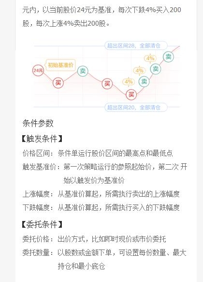

======================================================

_type: q&a
@Vivian[582228554481154]
2021-01-07 13:20:41 Thu  
topic_id: 815885254588412

@Vivian

>  老师，我用华泰的网格交易中概互联，提示这样下不了单呢

@二师父

>  你问问客户经理，账户里面有，我是自动操作的

阅读[1]  评论[3]  赞[0] 

======================================================

_type: q&a
@玲子～[28281828284211]
2021-01-07 13:41:15 Thu  
topic_id: 815885254858442

@玲子～

>  师父，请问如果新手小白刚入门，空仓，这波行情基金可以如何操作😁

@二师父

>  假设20万，今天一次买入深红利2万，易方达上证2万，广发中债7-10年国开债16万，然后后面每月收入结余跟上乌龟计划定投就可以

阅读[1]  评论[5]  赞[0] 

======================================================

_type: q&a
@葛亚丽[841858254128252]
2021-01-07 13:41:54 Thu  
topic_id: 815885254884882

@葛亚丽

>  二师父你好，中概互联要到1.98才能买入吗？现在价位还不能买是吧？

@二师父

>  可以少买一点建个底仓，到1.98再正式网格

阅读[1]  评论[3]  赞[0] 

======================================================

_type: q&a
@姥姥不疼. 爷爷不爱[48544481458248]
2021-01-07 13:57:32 Thu  
topic_id: 414884542814528

@姥姥不疼. 爷爷不爱

>  浦银安盛动力

@二师父

>  没搜到，要么不投资企业，投资企业就从我说的几个方向

阅读[1]  评论[1]  赞[0] 

======================================================

_type: talk
@悦雪[88242858484422]
2021-01-07 14:47:32 Thu  
topic_id: 215885285254281

师父，同量资金能用场内16国债19替代场外广发国开债吗？

@二师父 at 2021-01-07 14:47:32 Thu

> 可以的，能经受波动就行

----------

@悦雪 at 2021-01-07 14:47:32 Thu

> 谢谢[强]

----------

@小东 at 2021-01-07 14:47:32 Thu

> 师父，到期了，续不了费

----------

@二师父 at 2021-01-07 14:47:32 Thu

> 加微信ershifudt

----------

@丸子妈 at 2021-01-07 14:47:32 Thu

> 我的马上也要到期了

----------

阅读[1]  评论[5]  赞[0] 

======================================================

_type: talk
@二师父[28814221155551]
2021-01-07 16:11:36 Thu  
topic_id: 815885288851522

<e type="hashtag" hid="15284114418142" title="#市场正在悄悄发生重大变化#" /> 牛市继续走到哪里不大清楚，拿住就好了，保持耐心，继续持有，持盈，目前没有下车，耐心持盈，我们期待已久的牛市似乎就要真的来了。

@栀子花开 at 2021-01-07 16:11:36 Thu

> 二师傅你把券商指数清仓了吗？

----------

@二师父 at 2021-01-07 16:11:36 Thu

> 乌龟计划清了，鳄鱼没有

----------

@栀子花开 at 2021-01-07 16:11:36 Thu

> 你不看好券商吗？我现在券商还有12%的仓位

----------

@二师父 at 2021-01-07 16:11:36 Thu

> 券商网格可以的

----------

@光少 at 2021-01-07 16:11:36 Thu

> 指数牛出现，小盘股遭殃。

----------

@西锦巴乌 at 2021-01-07 16:11:36 Thu

> 请问师父你清仓了场外乌龟的券商是不看好这轮行情中券商的表现了？

----------

阅读[1]  评论[6]  赞[0] 

+++++++++++++++++++++++++++++++++++++++++++++++++++++

文件：
2021-01-07 16:07:35 Thu
文件大小：[27951]
15148854288882-市场正在悄悄发生重大变化.docx

======================================================

_type: talk
@次郎🌻[48551412448858]
2021-01-07 16:40:09 Thu  
topic_id: 582112511514124

二师父，请教下，我有一笔钱理财到期了，现在想拿出来继续投基金，大概30w，但现在基金大多在高位，请问如果是二师父您的话，该怎么安排比较好，感谢指教。

@二师父 at 2021-01-07 16:40:09 Thu

> 如果是长期不用的资金，我会配置60%股票，40%国债。你可以直接配置易方达上证50仓位10%，深红利仓位10%，国开债80%，这样子比较好，也安全

----------

@次郎🌻 at 2021-01-07 16:40:09 Thu

> 你好老师，我还没太明白，上证50和深红利各10%的话是股票占20%，债券80%是这样分配吗？是直接一步布局到位，还是底仓➕定投的方式呢？

----------

@二师父 at 2021-01-07 16:40:09 Thu

> 一步到位

----------

@水冰月槑槑🌙 at 2021-01-07 16:40:09 Thu

> 师父深红利是159905吗？场外有没有？国开债基金是不会亏损本金的吗？

----------

阅读[1]  评论[4]  赞[0] 

======================================================

_type: talk
@二师父[28814221155551]
2021-01-07 21:19:49 Thu  
topic_id: 815885225821822

<e type="hashtag" hid="88512442454512" title="#推荐一首歌#" /> 最近涨的太猛了，乌龟计划，鳄鱼计划以及自己的股票连续新高。

不知道还能持续多久，我看到了15年牛市的影子，这时候需要的不是技术，不是策略，不是如何操作，而是稳定的心态，推荐大悲咒，睡前听三遍，泡个脚，洗个澡，让自己慢下来。

熊市需要坚守，牛市也需要坚守，大家守住哈，啥时候下车可以跟着我走，也可以自己做决定，但是卖出就要做好接不回来的准备。

另外提示一下，每到这种时候都会发行新基金，不要跟风，最痛苦的是短期赚了而长期亏更多。

@wty at 2021-01-07 21:19:49 Thu

> 静待二师父卖出信号！

----------

@wty at 2021-01-07 21:19:49 Thu

> [咖啡][咖啡][咖啡]

----------

@好运玲玲 at 2021-01-07 21:19:49 Thu

> 跟着二师父买，跟着二师父卖

----------

@Hi·DD at 2021-01-07 21:19:49 Thu

> 推荐一首啥歌呀

----------

@梧桐 at 2021-01-07 21:19:49 Thu

> 洗澡泡脚加音乐

----------

@二师父 at 2021-01-07 21:19:49 Thu

> 大悲咒啊

----------

@Hi·DD at 2021-01-07 21:19:49 Thu

> 😂😂😂

----------

@葛亚丽 at 2021-01-07 21:19:49 Thu

> 感谢有你，跟着二师父收获很多

----------

阅读[1]  评论[11]  赞[0] 

======================================================

_type: q&a
@闲云[48522815485458]
2021-01-07 21:45:53 Thu  
topic_id: 182552442251252

@闲云

>  国开债指数现在是低估吗？

@二师父

>  当前货币宽松，国开债基金值得投资，和低估没关系

阅读[1]  评论[0]  赞[0] 

======================================================

_type: q&a
@不忘初心[48512884144218]
2021-01-07 21:46:17 Thu  
topic_id: 215885225255141

@不忘初心

>  师傅，您好！请问这个基金还适合定投吗？这个基金是基金组合中的一个，到现在都是不赔不赚的。

@二师父

>  可以不用投了哈，换标的中概互联

阅读[1]  评论[4]  赞[0] 

======================================================

_type: talk
@二师父[28814221155551]
2021-01-08 00:11:56 Fri  
topic_id: 414884552518128

<e type="hashtag" hid="552114551414" title="#估值数据#" /> 市盈率百分位59.84%，市净率百分位39.17%，SY/BY百分位66.35%，SY-BY百分位70.37%。市场估值越来越高，白酒估值在冲击2006年估值，低估不一定马上涨，高估不一定马上跌，继续耐心持有。

@雨淡风清 at 2021-01-08 00:11:56 Fri

> 二师父，有没有粮食方面适合的基金。看这天气，明年粮食还得涨一波

----------

@二师父 at 2021-01-08 00:11:56 Fri

> 没关注这个

----------

@雾海 at 2021-01-08 00:11:56 Fri

> 二师傅，请问基金几种情况才开始收割利润？

----------

@二师父 at 2021-01-08 00:11:56 Fri

> 仓位过高的时候

----------

@雾海 at 2021-01-08 00:11:56 Fri

> 好的，谢谢

----------

阅读[1]  评论[5]  赞[0] 

======================================================

_type: talk
@二师父[28814221155551]
2021-01-08 10:10:09 Fri  
topic_id: 414884524525188

<e type="hashtag" hid="825412412212" title="#可转债打新#" /> 锋龙发债顶格申购，评级A加，电气行业从事汽车零部件研发销售，有破发可能，中签后上市卖掉，预计在105到120

@sky at 2021-01-08 10:10:09 Fri

> 最近破发的比较多，A＋的都不敢打了[发呆]

----------

@二师父 at 2021-01-08 10:10:09 Fri

> 可以选择AA以上

----------

阅读[1]  评论[2]  赞[0] 

======================================================

_type: talk
@Chu[88888125211582]
2021-01-08 10:33:23 Fri  
topic_id: 582112542821554

大盘突破3583点咯

阅读[1]  评论[0]  赞[0] 

======================================================

_type: q&a
@Kiwi 的拾金之路[241182454821121]
2021-01-08 12:00:06 Fri  
topic_id: 215885244858821

@Kiwi 的拾金之路

>  师父，科创50ETF跟科创板50ETF，有区别吗？

@二师父

>  这两个是一样的哈，本质都是跟踪科创50的指数

阅读[1]  评论[0]  赞[0] 

======================================================

_type: q&a
@宁静以致远[841158451581452]
2021-01-08 13:31:40 Fri  
topic_id: 815885244411882

@宁静以致远

>  二师父，N电子50今天入场，推荐入手吗？

@二师父

>  这是哪个？

阅读[1]  评论[2]  赞[0] 

======================================================

_type: talk
@二师父[28814221155551]
2021-01-08 13:43:44 Fri  
topic_id: 414884522115518

<e type="hashtag" hid="881251425252" title="#鳄鱼计划#" /> 车来了，家电（159996）卖出一份，消费（159928）卖出一份，恒生（159920）卖出一份，300非银（512070）卖出两份，国开债（003376）买入15份

仓位图稍后发布，先发车，这几个标的大家跟买的消费是翻倍了，恒生差一些，总体情况不错，该卖就卖，3583没站稳，先防守一次，河北情况不容乐观，谨慎为上

@好运玲玲 at 2021-01-08 13:43:44 Fri

> 跟上

----------

@🍀 凝🌸 慧🍀 at 2021-01-08 13:43:44 Fri

> 师父，国开债，15份？还是1.5份

----------

@二师父 at 2021-01-08 13:43:44 Fri

> 15份

----------

@Vivian at 2021-01-08 13:43:44 Fri

> 老师，债券价格未到底部，这时候一次买入这么多手是什么考虑呢？

----------

@二师父 at 2021-01-08 13:43:44 Fri

> 目前流动性宽裕，今年资产大牛年，不要持有过多现金，债券除了价差收益还有利息收益

----------

@Vivian at 2021-01-08 13:43:44 Fri

> 明白了，谢谢

----------

@罗大发 at 2021-01-08 13:43:44 Fri

> 师父 目前仓位多少

----------

@二师父 at 2021-01-08 13:43:44 Fri

> 稍等，我发一下

----------

阅读[1]  评论[24]  赞[0] 

======================================================

_type: talk
@二师父[28814221155551]
2021-01-08 14:36:13 Fri  
topic_id: 182552418541442

<e type="hashtag" hid="88512442148252" title="#仓位图#" /> 这是仓位图哈，目前这个仓位比较适合，还是维持原有判断，上涨站稳3583，咱们可以持有不用卖，今天刚摸了一下，有点危险，保持这个仓位，等待市场选择。

股市有时候挺有意思的，昨天刚在公众号跟一读者说我卖飞了五粮液，今天就大跌，其实股市是很难预测的，尊重客观事实就好，树不会涨到天上去，当然我不清楚未来白酒会不会继续新高，那不要紧，再涨继续卖一点，就跟低估区域买一样，慢慢买，总能到最低，慢慢卖，总能到最高。

@西锦巴乌 at 2021-01-08 14:36:13 Fri

> 师父：广发中债能在场内买？

----------

@吃肉肉 at 2021-01-08 14:36:13 Fri

> 师父，这个广发中债的场内代码是多少？

----------

@二师父 at 2021-01-08 14:36:13 Fri

> 可以的哈，在理财产品那①栏，相当于申购，资金回来速度慢

----------

@二师父 at 2021-01-08 14:36:13 Fri

> 只有这个，是证券账户申购得

----------

@九妹Amy'' at 2021-01-08 14:36:13 Fri

> 师傅，货币基金指代码是多少哇

----------

@吃肉肉 at 2021-01-08 14:36:13 Fri

> 我有证券账户，买不了广发中债，显示没有您操作德这个代码？师父指点下怎么买广发中债。

----------

@二师父 at 2021-01-08 14:36:13 Fri

> 511880

----------

@二师父 at 2021-01-08 14:36:13 Fri

> 在理财里面搜索产品

----------

阅读[1]  评论[9]  赞[0] 

+++++++++++++++++++++++++++++++++++++++++++++++++++++

图片：
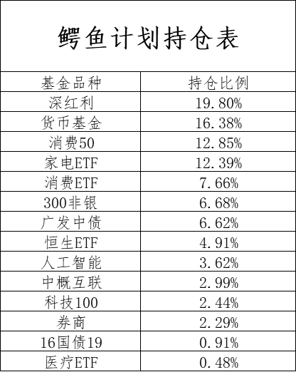

======================================================

_type: talk
@二师父[28814221155551]
2021-01-08 16:09:21 Fri  
topic_id: 582112582215284

<e type="hashtag" hid="48415222488288" title="#今天公开了我的股票池#" /> 大家自己可以做一个参考，根据我的范围来比自己整胜率高一些，当然仅供参考，大家可以说说自己的心得。

@志亮 at 2021-01-08 16:09:21 Fri

> 二师父你变了，保守的你，我在表中居然没看到招商银行、中国平安、万科等[呲牙]，居然有宁德和亿纬，你不是说不支持科技股的吗？

----------

@Chu at 2021-01-08 16:09:21 Fri

> 师父，白色家电只有美的集团，但很多人说格力才是龙头，虽然今年收益不好，但基本面还是不错的，不看好格力么？

----------

@二师父 at 2021-01-08 16:09:21 Fri

> 你讲的几个都是没啥前景的，投资指数收益都比他们强很多，这两个是新能源方向，估值表也有指数的

----------

@二师父 at 2021-01-08 16:09:21 Fri

> 嗯嗯，格力现在线下渠道压价比较厉害，很多经销都说难做，你可以实地调研下

----------

@志亮 at 2021-01-08 16:09:21 Fri

> 是的，看对大方向，距离赚钱就容易多了，先看对行业，就能赚到钱，再在行业中找对个股，就再赚多一点，再找对买点就赚的更多了。

----------

@蛋炒饭不加蛋 at 2021-01-08 16:09:21 Fri

> 二师父，华兰生物达安基因还有海尔智家怎么样

----------

@二师父 at 2021-01-08 16:09:21 Fri

> 没研究过

----------

@志亮 at 2021-01-08 16:09:21 Fri

> 生物医药一般的人很难研究懂，而且有政策风险。

----------

阅读[1]  评论[20]  赞[0] 

+++++++++++++++++++++++++++++++++++++++++++++++++++++

文件：
2021-01-08 16:07:56 Fri
文件大小：[271514]
88421128114552-高位杀跌，送你三个锦囊和一张表格.docx

======================================================

_type: q&a
@水冰月槑槑🌙[51142428222184]
2021-01-08 20:20:24 Fri  
topic_id: 182552481214552

@水冰月槑槑🌙

>  深红利是159905吗？你说的国开债基金，是不会亏损本金的吗？

@二师父

>  对，国开债基金不是保本的哈，国债逆回购是保本的，深红利代码是的

阅读[1]  评论[0]  赞[0] 

======================================================

_type: talk
@二师父[28814221155551]
2021-01-08 20:31:08 Fri  
topic_id: 215885214258141

<e type="hashtag" hid="48415222451228" title="#指数和主动对比#" /> 大家看看比较好的主动基金易方达消费和指数收益对比，易方达消费5年上涨百分之328，中证消费5年上涨百分之328，食品饮料五年上涨百分之429，中证白酒5年上涨百分之628，这是明盘数据，消费主动基金没有跑赢我们追踪的中证酒指数

未来还是主要投资指数，主动基金可以作为辅助，今年还是主投白酒，价格合适就入，不要再说方向变了，没变的，除了光伏，人工智能，新能源，其他的所谓科技都要被打脸

@幽兰 at 2021-01-08 20:31:08 Fri

> 二师父，人工智能还在浮亏，值得长期持有吗

----------

@二师父 at 2021-01-08 20:31:08 Fri

> 可以的，目前资金都炒作新能源去了，耐心持有，这种基金一轮炒作高点就要退出，新能源也一样

----------

@苍天有井明月空🌙 at 2021-01-08 20:31:08 Fri

> 银河万家周一就卖

----------

@样 at 2021-01-08 20:31:08 Fri

> 二师父，请问鳄鱼计划算是激进组合吗？组合的收益和回撤区间大概多少？

----------

@二师父 at 2021-01-08 20:31:08 Fri

> 也不算激进，最大回撤控制在百分之30以内，截至目前年化收益率百分之23，预期收益率年化百分之15到20

----------

阅读[1]  评论[5]  赞[0] 

======================================================

_type: talk
@二师父[28814221155551]
2021-01-08 21:42:04 Fri  
topic_id: 215885214118251

<e type="hashtag" hid="552114551414" title="#估值数据#" /> 市盈率百分位58.68%，市净率百分位35.27%，SY-BY百分位68.05%，SY/BY百分位63.93%。

大家注意市场发生的两个变化，第一河北的情况，可以找河北朋友了解具体发生了啥，这个事件如果严重的话可能会对A股市场有影响。

虽然北上资金继续流入，但是上方支撑位结合本次河北事件，太吻合了，预计会有一波机会，大家不要盲目抄底，每一次如果有回调的话等调整到位再补仓。

中概互联就按照价格走，券商也还是那个价格保持不变，简简单单地，投资基金比股票轻松多了，买入之后该干啥干啥，然后过段时间只考虑赚了卖不卖就行了。

@海马 at 2021-01-08 21:42:04 Fri

> 市场涨多了，分岐大，波动也大

----------

@吃肉肉 at 2021-01-08 21:42:04 Fri

> 师父，现在在做网格的有哪几个？我现在知道的是中概互联，券商，券商的网格表有变化吗？人工智能和中证500有在做吗？

----------

@吃肉肉 at 2021-01-08 21:42:04 Fri

> 师父，华宝的佣金是0.015%，可以申请调到万分之一吗？

----------

@二师父 at 2021-01-08 21:42:04 Fri

> 基金是万一

----------

@范毅君 at 2021-01-08 21:42:04 Fri

> 我感觉河北疫情可控，只是人们恐慌大，保定一个市场有一个石家庄确诊病例因为呆过几天，而去这个地方的人众多，所以潜在危险大，但现在应急健全，人们重视，个人认为很快就能控制，只是个人观点

----------

@范毅君 at 2021-01-08 21:42:04 Fri

> 两周后上重要时间节点，如果人数没有激增，就没有大问题

----------

@二师父 at 2021-01-08 21:42:04 Fri

> 其实倒没啥，已经做了一道防守了，万一再次出现杀跌，继续增仓。

----------

@吃肉肉 at 2021-01-08 21:42:04 Fri

> 好的

----------

阅读[1]  评论[11]  赞[0] 

======================================================

_type: talk
@二师父[28814221155551]
2021-01-09 10:31:33 Sat  
topic_id: 182558255544182

<e type="hashtag" hid="51285444144154" title="#介绍下偏债混合基金#" /> 这个品种对于保守的投资者可以，而对于激进的投资者不大适合。看个人需求了，每个投资者的风险偏好是不一样的。

@范毅君 at 2021-01-09 10:31:33 Sat

> 白药下了车，只能傻傻的说拜拜[流泪][流泪]

----------

@wty at 2021-01-09 10:31:33 Sat

> 二师父，偏债混合基推荐哪几个基金呢？

----------

@mumomo at 2021-01-09 10:31:33 Sat

> 同求二师父推荐

----------

@wty at 2021-01-09 10:31:33 Sat

> 我拿着工银双利债券快1.5年，目前收益10%+，中间加过一次仓，做为打底资产沒卖出过。看看二师父有推荐更好的偏债混合基，再养一只基[偷笑]

----------

@衣袂飘香 at 2021-01-09 10:31:33 Sat

> 跟车跟车，跟着二师父的车，稳妥。

----------

@二师父 at 2021-01-09 10:31:33 Sat

> 推荐一个二级债基一个偏债混合，二级债基，易方达裕丰回报债券（000171），这个是历史最大回撤8.75%，年化收益率10.8%，偏债混合，泰康宏泰回报混合（002767）

----------

@wty at 2021-01-09 10:31:33 Sat

> 收到，谢谢🙏

----------

阅读[1]  评论[7]  赞[0] 

+++++++++++++++++++++++++++++++++++++++++++++++++++++

文件：
2021-01-09 10:30:27 Sat
文件大小：[31658]
15148818845812-一个新的投资品种.docx

======================================================

_type: talk
@二师父[28814221155551]
2021-01-09 14:21:27 Sat  
topic_id: 182558258215852

<e type="hashtag" hid="51285444188554" title="#注意沪深300指数的一个变化#" /> 12月指数调仓以后，沪深300权重发生了重大变化。

先看看指数的加权方式。

沪深300指数采用国际普遍流行的自由流通量加权计算方法。自由流通量剔除了以下两部分股份后的公众自由流通股份：一是限售股份；二是公司创建者、家族和高级管理人员长期持有的股份、国家持股、战略投资者持股、冻结股份、受限制的员工持股和交叉持股等六类股东中某股东及其一致行动人合计持股超过5%的股东持有的股份。此外，为了避免大小非解禁等股东持股变化导致的指数频繁调整，对于股东行为引起的自由流通量变化，每半年定期调整一次。

确定自由流通量后，通过分级靠档的方法来计算自由流通量调整市值。例如中国平安总股本73.45 亿，其中流通A股47.86亿，限售A股8.6亿，占A股比例约为17.67%。在流通股东中，深圳市投资控股有限公司、源信行投资有限公司和深业公司作为中国平安的发起人股东，每一家的持股比例都超过5%，合计持股为29.81%，因此被视为非自由流通股份。再加上18%的限售股，共计47.48%被扣除，最终自由流通比例为52.52%。分级靠档后，60%的流通A股将用于中国平安流通市值的计算。

那么意味着一家公司在沪深300里面权重越大，自由流通市值越大。在二师父的书中《<e type="web" href="https://wx.zsxq.com/mweb/views/weread/search.html?keyword=指数基金定投，慢慢变富" title="指数基金定投，慢慢变富" style="book" />》，72页，有沪深300指数重仓股票，那是2019年的记录，分别是中国平安、贵州茅台、招商银行、兴业银行、恒瑞医药、格力电器、美的集团、五粮液、伊利股份，中信证券。

现在沪深300持仓分别是：贵州茅台、中国平安、五粮液、招商银行、美的集团、恒瑞医药、格力电器、伊利股份、兴业银行、隆基股份。

当前中国平安已经退居第二，隆基股份进入前十，从这些变化能看出以下几个信息。保险行业在下降，消费行业在上升，整体金融业后退，新能源异军突起。

这就是方向啊，为什么我会投资新能源和光伏，主要是景气周期和十四五规划大力发展，这个我稍后详细解读。

指数有劣汰留良的功能，沪深300指数就可以干掉市场大部分股票，让机构棒我们选股，就是最佳的，对于没有天赋的投资者，老老实实定投沪深300指数基金+创业板50或者创业板指数基金将跑赢市场百分之90的投资者，未来会有越来越多的人意识到这个问题，这次注册制到来中国股市要改天换地了，炒垃圾，炒小，炒新难以继续赚钱，股民要及早意识到市场潜在的变化。

@HeLLO at 2021-01-09 14:21:27 Sat

> 光伏方面场内场外有哪支基金？

----------

@二师父 at 2021-01-09 14:21:27 Sat

> 光伏etf，515790

----------

@梧桐 at 2021-01-09 14:21:27 Sat

> 二师父，现在这个515790光伏etf还可以买吗

----------

@二师父 at 2021-01-09 14:21:27 Sat

> 长期可以

----------

阅读[1]  评论[4]  赞[0] 

======================================================

_type: q&a
@闲云[48522815485458]
2021-01-09 14:21:48 Sat  
topic_id: 414884821248148

@闲云

>  家电已经高估了啊？

@二师父

>  对，目前高估，适合持有或者分步止盈

阅读[1]  评论[0]  赞[0] 

======================================================

_type: q&a
@浪淘沙[118815282288482]
2021-01-09 14:41:28 Sat  
topic_id: 182558258218242

@浪淘沙

>  感恩二师父，自从按您的提示买了中欧先进制造股票以后，两个多月已经盈利36个多点了，如果中间不加仓，第一笔底仓都有44.9个点了。如果新能源趋势改变，还请您提示一下哈。
>  还有请问下，军工的趋势还在吗？

@二师父

>  新能源目前仍旧是资金抱团的主要方向，可以中期持有，当资金彻底瓦解就要赶紧撤退。
>  
>  目前这轮牛市的核心方向就是白酒、医疗、新能源、光伏中的一到二个，防止市场假摔，先拿一拿，趋势反转后卖出一半，破位之后再清仓。
>  
>  军工中期是有预期的，受益于军队装备条例签订，对军队装备的研制工作以及促进军工产业链发展预期较高，目前适合持盈。
>  
>  不过上周跳空有个缺口，大概率短期会有回调，如果能接受浮动可以拿着，不能接受浮动可以先收割利润。

阅读[1]  评论[6]  赞[1] 

======================================================

_type: q&a
@Kiwi 的拾金之路[241182454821121]
2021-01-09 17:33:19 Sat  
topic_id: 215881581121441

@Kiwi 的拾金之路

>  师父，想问一下您有关一个网格交易的逻辑！比如我设置上涨3%，回落0.5%卖出，假如单边行情，大涨了6%一直没有回落，就会一直不卖出吗？如果涨到了8%回落了0.5%这个时候才卖出吗？会卖出几格？

@二师父

>  回落不卖，到了设定价格才卖出的

阅读[1]  评论[2]  赞[0] 

======================================================

_type: solution
2021-01-09 19:17:14 Sat  
topic_id: 815881525248882

阅读[1]  评论[0]  赞[0] 

======================================================

_type: talk
@二师父[28814221155551]
2021-01-10 12:45:15 Sun  
topic_id: 215881544882881

<e type="hashtag" hid="48415222252828" title="#最近关注的投资机会#" /> 最近可以关注光伏产业投资机会，这是新能源赛道，未来光伏产业有很大成长空间，对于这类基金，适合一次性买入或者分批买入，不需要长期定投。

投资不能光看市盈率，市盈率在同一企业相对比较的时候有价值，可是在一个长周期或者对于成长企业没太大价值，比如二师父追踪的泰格医药，他的市盈率一直很高，可是市值却是不断增大。

企业是有生命周期的，在企业成长阶段，市场对企业预期高，所以他们市盈率都会比较高，而随着企业不断成长，最终市盈率整体也会下来，这就是大家可以看到不管熊市跌到多狠，上证50指数市盈率都会低于创业板。

目前光伏已经加入估值表，注意，抓主要矛盾，赛道是第一位，企业质量第二位，估值第三位，市场上很多人讲错了，总是认为银行市盈率低，就不断低吸，其实从赛道角度分析，银行未来已经不如很多优质行业了。除非大资金抱团也只是短期，长期银行是下行趋势，未来二师父是不会再投银行了，而且也不会给他估值，我估值只会给优质赛道的行业指数估值。

光伏行业符合国家十四五规划战略目标，投资要跟党走，跟着国家大战略走。至于我说不投科技，是不投那些披着科技名称不做科研的科技企业，光伏、新能源多关注，未来会在实盘配置，大约总仓位会5%左右。

市场每时每刻都会有机会，把握组合的基本盘，比如宽基+消费+医疗就是我们的基本盘，这一定是要重仓的，属于核心配置，其他的市场短期机会二师父也会多发掘，短期有预期的可以买。

注意我说的垃圾不是那种一直横盘的企业，而是企业经营差，管理层很水，不诚信的企业，以后都不要捡垃圾，找企业要找好的，找老公也得找人品好，诚信、勤奋，大度有担当的，他们会越来越好，如果你找老公就是和找企业一样总是找垃圾，企图以后变好，那注定会不幸啊。

从各个角度看，咱们都要找好的，而不是找差的。

@雨淡风清 at 2021-01-10 12:45:15 Sun

> 二师父，我昨天看了下中证500竟然还在角落里躺着[流泪]

----------

@二师父 at 2021-01-10 12:45:15 Sun

> 确实已经不行了，以后宽基只投300和创业板50

----------

@雨淡风清 at 2021-01-10 12:45:15 Sun

> 下次调仓把他处理了

----------

@永刚 at 2021-01-10 12:45:15 Sun

> 师父，光伏ETF代码是多少？

----------

@二师父 at 2021-01-10 12:45:15 Sun

> 515790

----------

@圣诞结® at 2021-01-10 12:45:15 Sun

> 二师父，去年一直主要投的宽基，涨了就会收割一部分利润，现在还剩下大概6成仓左右，现在还能买消费医疗吗？

----------

@二师父 at 2021-01-10 12:45:15 Sun

> 医疗回调可以，消费等等哈

----------

@林凤崎 at 2021-01-10 12:45:15 Sun

> 000991和001694都有光伏，哪个好

----------

阅读[1]  评论[15]  赞[0] 

======================================================

_type: talk
@二师父[28814221155551]
2021-01-10 17:16:58 Sun  
topic_id: 414881418882448

<e type="hashtag" hid="88512444188182" title="#关于主动基金#" /> 周末二师父又对比了下指数基金和主动基金，中证白酒的收益率是好于易方达消费的，从优质赛道看，主动基金并未战胜指数基金，不过这两个业绩都很好，说下主动基金投资思路。

这是易方达消费的回撤情况，最大控制在25%以内，水平很高的，如果能够经受这么大回撤，而且长期投资5年以上，那么可以在市场情绪低迷时候一次性买入，长期持有，最终一定是复利增值的。

有个风险就是基金经理更换可能导致亏损，一旦基金经理更换，而且基金经理以前业绩不佳，就及时清仓，如果基金经理不换就长期持有。

@蛋炒饭不加蛋 at 2021-01-10 17:16:58 Sun

> 没啥基金是比得过白酒科技的[呲牙]

----------

@二师父 at 2021-01-10 17:16:58 Sun

> 你说哪个科技

----------

@付云 at 2021-01-10 17:16:58 Sun

> 这支基金最让我心疼了，没拿住，我从2018年定投到2019年，居然无缘无故给清仓了，至今后悔。[流泪]

----------

阅读[1]  评论[3]  赞[0] 

+++++++++++++++++++++++++++++++++++++++++++++++++++++

图片：
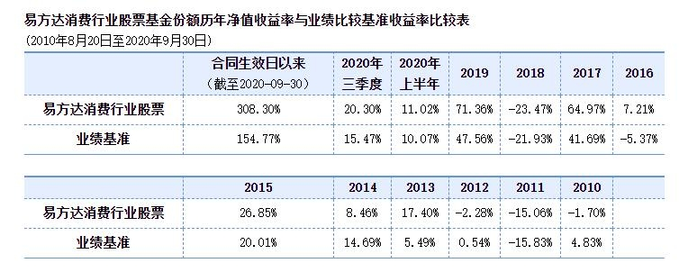

======================================================

_type: talk
@二师父[28814221155551]
2021-01-10 22:23:27 Sun  
topic_id: 215881855528481

<e type="hashtag" hid="28512444148211" title="#给新手推荐两只指数基金#" /> 沪深300etf，创业板50etf，就这两只坚持低吸，你会跑赢很多人，就一招，低了买，底部重仓，高位适当收割利润，真的，比自己投资股票收益强很多，大家可以对比试试，最简单的就是最强的

@🍀 凝🌸 慧🍀 at 2021-01-10 22:23:27 Sun

> [鼓掌][鼓掌][鼓掌]

----------

@范毅君 at 2021-01-10 22:23:27 Sun

> 二师父，是低估才能低吸吗，还是到什么位置可以开始定投

----------

@范毅君 at 2021-01-10 22:23:27 Sun

> 创业板50场内代码是588080吗，二师父

----------

@smile at 2021-01-10 22:23:27 Sun

> 请问二师父，沪深300随便买哪只是不是都差别不大？看到富荣沪深300增强的今年收益很高，这种规模不大的公司的产品能买吗？

----------

@二师父 at 2021-01-10 22:23:27 Sun

> 都差不多，我没搜到富荣300增强

----------

@二师父 at 2021-01-10 22:23:27 Sun

> 159949，都差不多

----------

@二师父 at 2021-01-10 22:23:27 Sun

> 熊市低估可以，牛市时候回调到情绪低位

----------

@范毅君 at 2021-01-10 22:23:27 Sun

> 好的[呲牙][呲牙]

----------

阅读[1]  评论[17]  赞[0] 

======================================================

_type: q&a
@尚红丽[118511558855142]
2021-01-10 22:51:22 Sun  
topic_id: 582118281881214

@尚红丽

>  师父，创业板50的场内代码是多少？我想关注一下，谢谢！

@二师父

>  159949

阅读[1]  评论[2]  赞[0] 

======================================================

_type: talk
@二师父[28814221155551]
2021-01-11 05:25:54 Mon  
topic_id: 414881848588518

本周末，经过历史收益率对比分析，发现科技赛道主动基金超额收益明显，在以后的投资中，科技赛道精选优质的主动基金定投获取超额收益

目前消费赛道，医疗服务赛道，主动基金并未比指数基金有超额收益，大部分还没有跑赢，咱们投资思想把握核心思想，买基金就是买企业，买企业就是买企业成长后的利润兑现，这是不变的。标的尊重客观事实，根据市场变化而变化，投资中变得东西。

超额收益首选源于企业质量，其次才是源于择时和仓位管理，仓位管理更多的是保证好的持仓体验

@无意心外 at 2021-01-11 05:25:54 Mon

> 主动基金该怎么选择呢？

----------

@二师父 at 2021-01-11 05:25:54 Mon

> 主要挑选好的基金经理和投研团队

----------

@wty at 2021-01-11 05:25:54 Mon

> 等待二师父分享科技赛道的主动基金！

----------

阅读[1]  评论[3]  赞[0] 

======================================================

_type: talk
@二师父[28814221155551]
2021-01-11 09:26:19 Mon  
topic_id: 582118125151544

<e type="hashtag" hid="51285448258444" title="#继续放弃捡垃圾#" /> 专注成长行业，大家看泰格医药这些企业，市盈率不会低于20的，但是一直市值新高，等最后成长起来了，市盈率低了，预期也小了，投资不要但看市盈率，对于盈利稳定的弱周期行业，市盈率是一个很好的参考指标，而对于成长企业，市盈率越高反映的市场预期越高。拿着锤子看什么东西都是钉子。

方向第一，企业经营业绩第二位，价格第三位。主要矛盾是方向，方向比努力重要。你在银行里面用放大镜分析企业，最终努力得到的结果也是有上限的。

@Vivian at 2021-01-11 09:26:19 Mon

> 谢谢老师分享，每天跟着学习一点点[玫瑰]

----------

@JOY at 2021-01-11 09:26:19 Mon

> 师父，那请教下，如果打算调仓500到300的话，什么情况下会比较合适呢？

----------

@二师父 at 2021-01-11 09:26:19 Mon

> 熊市的话跌到底部，牛市的话跌到地量区域。目前牛市，应该不会到极端底部，如果有回调，到达地量区域就可以调整。

----------

@JOY at 2021-01-11 09:26:19 Mon

> 谢谢！

----------

阅读[1]  评论[4]  赞[0] 

+++++++++++++++++++++++++++++++++++++++++++++++++++++

文件：
2021-01-11 09:23:12 Mon
文件大小：[30381]
15112254215842-注册制全面实行，后面的投资方向.docx

======================================================

_type: talk
@二师父[28814221155551]
2021-01-11 09:33:31 Mon  
topic_id: 215881851555121

<e type="hashtag" hid="51285448242484" title="#关于消费#" /> 虽然消费是优质赛道，未来20年看好，但是目前真的是高位了，3月投资的话到现在差不多也有一倍利润了，所以不要觉得消费跌10%就可以继续投了，消费可以持有，将持有和买入分开，不回撤30%，消费不会再重新入场了。

今年关注的方向，医疗，CRO，三高药品以及心血管医疗器械类，互联网科技，光伏能源。其他的基本上要么没预期，要么没好的价格，不用管。

@永刚 at 2021-01-11 09:33:31 Mon

> CRO指什么？

----------

@二师父 at 2021-01-11 09:33:31 Mon

> 通过合同形式给医疗企业、制药企业在基础医学和临床医学研发过程中提供提供专业化服务的商业性机构

----------

阅读[1]  评论[2]  赞[0] 

======================================================

_type: talk
@二师父[28814221155551]
2021-01-11 09:47:32 Mon  
topic_id: 582118128251244

<e type="hashtag" hid="51285448241224" title="#高估基金的卖出方法#" /> 跌破5日线，短期下行趋势，跌破20日线中期下行趋势，高估的指数在放量下跌破均线以后可以适当卖出，当然有的时候是假摔，要保证总仓位比较高，因为卖出短期内很难再接回来，卖出了就要做好短期不接的准备，否则卖出也就没有意义了

阅读[1]  评论[0]  赞[0] 

+++++++++++++++++++++++++++++++++++++++++++++++++++++

图片：
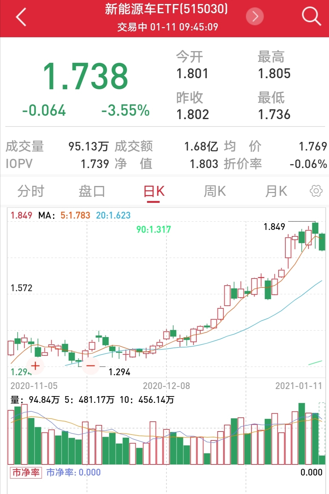

======================================================

_type: talk
@杜志彪[544454124115854]
2021-01-11 09:55:20 Mon  
topic_id: 215881851548551

<e type="hashtag" hid="281158522841" title="#每日打卡#" />  2021年1月11日新年第三次打卡，早上调整了一下仓位，随师父调整到了8层仓以下，等候今年好的机会再加上去[微笑]

阅读[1]  评论[0]  赞[0] 

======================================================

_type: q&a
@王春媚[244424882221141]
2021-01-11 09:57:41 Mon  
topic_id: 215881852881821

@王春媚

>  师父：天弘中证光伏产业指数011102，这个指数可以吗？现在买行不行？

@二师父

>  这个基金可以，等等下跌企稳了买，光伏是景气方向

阅读[1]  评论[2]  赞[0] 

======================================================

_type: q&a
@J[28281541518551]
2021-01-11 11:04:52 Mon  
topic_id: 215881851485811

@J

>  师父，你上周五买进了15份国开债，当天忘记跟投了，今天可以买吗？

@二师父

>  可以的，防守下，让组合更加稳健，如果牛市爆发，可能牺牲一定收益率，但是持仓心理状态比较好，调整好了就不动了，等待市场疯狂或者回调再行动

阅读[1]  评论[3]  赞[0] 

======================================================

_type: q&a
@苍天有井明月空🌙[28882214181441]
2021-01-11 14:33:34 Mon  
topic_id: 414881882854548

@苍天有井明月空🌙

>  仓位三层多，今天适合加点吗

@二师父

>  加点宽基，如果有回调再定投，保证指数仓位50%以上，这样上涨不会焦虑，如果有耐心等待，继续等。

阅读[1]  评论[5]  赞[0] 

======================================================

_type: talk
@二师父[28814221155551]
2021-01-11 15:36:42 Mon  
topic_id: 182558558252282

雪球竟然有人让把医疗卖了转基建，无论怎么看，医疗都是秒杀基建的，这个行业有巨大的成长空间，拿着市盈率一个指标就说基金没价值了，过于绝对化。

对比了一下，当下医疗行业相对来说也有超额收益，未来采用主动基金进行配置。

买主动基金本质是买基金经理，如果基金经理发生了更换，那么我们采用备选方案，立刻让被动的医疗ETF作为替代选手上场。

A股市场超额收益明显，学会让机构打理自己的资金，一个是编纂指数的机构，一个是打理基金的基金经理团队。这个投资模式适合市场上90%的人，只有少数10%的人适合自己投资股票取得超过配置基金的收益率。

@范毅君 at 2021-01-11 15:36:42 Mon

> 二师父准备入手主动基金吗，发车通知啊

----------

@二师父 at 2021-01-11 15:36:42 Mon

> 目前A股市场超额收益还是有的，新兴成长行业超额收益明显，盈利稳定的弱周期行业没有超额收益，在成长行业会选择优质的主动基金进行投资，其余的选择指数基金。

等待市场机会，择基+择时双重结合贡献超额收益。当下更注重择基和择股。择时的超额收益比之前降低了

----------

@范毅君 at 2021-01-11 15:36:42 Mon

> 现在股票完全没思路，好的卖了，垃圾留着，天天跌[捂脸][捂脸]

----------

@二师父 at 2021-01-11 15:36:42 Mon

> 持盈止损，好企业要一直拿着利润兑现，坏企业立刻斩仓，不要犹豫

----------

@范毅君 at 2021-01-11 15:36:42 Mon

> 嗯，新手跌倒几次，就学会了，我现在感觉，炒股最核心的，是纪律性，不断修炼[呲牙]

----------

@海马 at 2021-01-11 15:36:42 Mon

> 师父，我一直以来都是投资主动基金，少量配置指数，期待师父推荐一些优质的主动基金！

----------

@二师父 at 2021-01-11 15:36:42 Mon

> 好的

----------

阅读[1]  评论[7]  赞[0] 

======================================================

_type: talk
@二师父[28814221155551]
2021-01-11 17:09:33 Mon  
topic_id: 582118118822854

<e type="hashtag" hid="15284118521152" title="#高瓴采访文稿#" /> 巴菲特早期也是捡便宜思路，他遇到芒格以后改变了，A股已经不适合捡便宜思路，越早意识到，对往后的财富增值越有利，马斯克登上了世界首富宝座，这个世界唯一不变的就是变化，坚守价值，拥抱变化。

@范毅君 at 2021-01-11 17:09:33 Mon

> 好好学习[流泪]

----------

@志亮 at 2021-01-11 17:09:33 Mon

> 我是2020年12月时看了雪球一位大V才醒悟估值陷阱的，对方理念是只买好公司，不太注重估值，而他的朋友却是只买低估值的优质公司，比如他执念单叼万科一只，道不同不相为谋，就分道扬镳了，结果两年了他资产翻了10倍，他朋友只收益20%。我若是早认识这位大V，现在这两年收益估计也可以翻两倍了，可惜认识太迟了，希望这次牛市久一点吧，让我快点回本再赚个50%点我也愿意了。

----------

@二师父 at 2021-01-11 17:09:33 Mon

> 其实那不是低估，而是景气度下降，估值的本质是企业未来发展带来的市值比现在大，有发展空间

----------

@志亮 at 2021-01-11 17:09:33 Mon

> 是的，这个就是“低估陷阱”。

----------

@二师父 at 2021-01-11 17:09:33 Mon

> 云梦不知道你看了没，她是掉进去了

----------

阅读[1]  评论[5]  赞[0] 

+++++++++++++++++++++++++++++++++++++++++++++++++++++

图片：
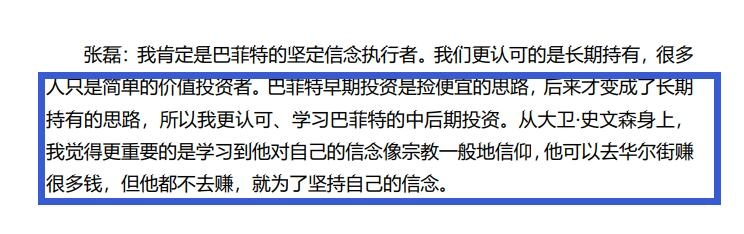

+++++++++++++++++++++++++++++++++++++++++++++++++++++

文件：
2021-01-11 17:07:05 Mon
文件大小：[1416456]
28445821142811-张磊采访文稿.pdf

======================================================

_type: q&a
@故事[455458815888]
2021-01-11 19:21:03 Mon  
topic_id: 215881881218141

@故事

>  投资国债有哪些基金？有场外的基金么？国开债有哪些基金？

@二师父

>  国债etf，场外目前是国开债基金，广发中债7-10年国开债

阅读[1]  评论[3]  赞[0] 

======================================================

_type: talk
@二师父[28814221155551]
2021-01-11 19:36:08 Mon  
topic_id: 815881822285842

<e type="hashtag" hid="28512441841281" title="#关于补仓#" /> 今天放量跌破了5日线，问题不大，就是注意不要在成交额1.2万亿元以上补仓，不管做趋势还是反转，都别在情绪高亢的时候补仓，很容易被带进去，未来如果真的震荡筑地大约成交额8000亿元以下再考虑进，重点关注光伏，医疗，互联网，尤其是医疗，这是重点方向，中长线板块。

@付云 at 2021-01-11 19:36:08 Mon

> 可以补仓么，一直不敢动[微笑][流泪]

----------

@二师父 at 2021-01-11 19:36:08 Mon

> 回调到位可以补，目前不着急

----------

@素兮 at 2021-01-11 19:36:08 Mon

> 成交额在哪里看？

----------

@二师父 at 2021-01-11 19:36:08 Mon

> 万得app，或者同花顺

----------

@J at 2021-01-11 19:36:08 Mon

> 等师父摔杯发号

----------

@雨淡风清 at 2021-01-11 19:36:08 Mon

> 等着二师父的信号弹。看今天好多大V都减仓了

----------

@二师父 at 2021-01-11 19:36:08 Mon

> 那是做趋势的吧

----------

@smile at 2021-01-11 19:36:08 Mon

> 请问医药现在可以关注吗

----------

阅读[1]  评论[18]  赞[0] 

======================================================

_type: q&a
@学习者[145418411842]
2021-01-11 22:09:46 Mon  
topic_id: 215881824851251

@学习者

>  老师好，属于小白，目前想拿20万尝试，媳妇10万，我10万，想定投指数基金，该如何操作？

@二师父

>  可以的，这样安排，你当元帅，你媳妇当军师，每次行动之前晚上先商量下，意见一致就行动。
>  意见不一致学堂来讨论讨论直到意见一致。
>  
>  推荐三个标的，沪深300指数基金，易方达裕丰回报债券，广发中债国开债，目前先买8万易方达裕丰回报债券，2万易方达沪深300指数，然后开始定投，沪深300正常估值，且净值在90日均线以下每周定投一次，把仓位加上来
>  
>  用好这三个标的，年化百分之10的稳健收益是没问题的，认知上来了再扩充创业板以及行业指数

阅读[1]  评论[6]  赞[0] 

======================================================

_type: talk
@二师父[28814221155551]
2021-01-11 23:36:44 Mon  
topic_id: 215881821182551

<e type="hashtag" hid="224445218111" title="#全市场估值数据#" /> 市盈率百分位58.02%，市净率百分位34.44%，SY-BY百分位65.9%，SY/BY百分位61.89%。

市场的短期波动非常正常，大家尽量少看盘，看多了总会觉得跌了很多，然而实际上今年来沪深300是上涨的。大家容易锚定自己的账户市值，少看盘心态会更好。

注意投资过程中趋势反转，上行趋势反转需要减仓，下行趋势反转需要加仓，注意体会这个思路，今天债券是跌的，只有人工智能、中国互联，医疗是涨的，如今利率低位，流动性宽松，这个不会持续，如果股市继续跌，债券会有一定对冲。这样持仓体验比较好。

对于这种回撤不用慌张，毕竟没有满仓，只要跌到了合适的击球区，继续加上就行。

关于消费，有没有必要清仓，如果投资是5年甚至更长周期的规划，消费收割利润就行，值得长期持有，收割利润只是为了降低仓位，在下跌的时候拿的住，如果心理素质好，不畏浮动，A股波动大，完全只买不卖理论上可行，实际上很难做到。

大家放心，有机会该发车发车，切记不要锚定资产价格，认为白酒跌了6%，这个板块好，是不是可以加点，这种思维要给纠正过来，白酒仍旧很贵，可以持有，但是不能买入，将持有和买入给分开。

好了，等我发车，如果大跌，鳄鱼计划只买不卖，如果震荡那么网格，看看券商，是不是快到了1.12了，又可以无脑挣钱了。

@苍天有井明月空🌙 at 2021-01-11 23:36:44 Mon

> 二师傅券商网格发个二维码吧，里面设置很多不会，还是二维码方便

----------

@二师父 at 2021-01-11 23:36:44 Mon

> 好的

----------

@吃肉肉 at 2021-01-11 23:36:44 Mon

> 师父，人工智能有二维码吗？

----------

@二师父 at 2021-01-11 23:36:44 Mon

> 有的，稍后出一个

----------

@吃肉肉 at 2021-01-11 23:36:44 Mon

> 好的，谢谢师父！

----------

阅读[1]  评论[5]  赞[0] 

======================================================

_type: q&a
@天马行空[548818851412444]
2021-01-12 05:27:34 Tue  
topic_id: 215881848141851

@天马行空

>  券商目前两层仓。1.12左右买的，1.18时卖出4分之一，准备跌百分之五买进4分之一。但明天大概率大跌，估计留的两层底仓利润要跌没了，心痛啊。请问二师傅，1.18时全卖出不是能锁定更多的利润吗。留底仓有何意义。

@二师父

>  因为现在并不贵，没底仓上涨大概率忍不住想追

阅读[1]  评论[1]  赞[0] 

======================================================

_type: q&a
@梅子[118548488224242]
2021-01-12 08:31:18 Tue  
topic_id: 815881842228152

@梅子

>  二师父，买了易方达消费行业基金盈利达50%，想转换一下易方达其他的基金，能否给推荐几只。谢谢了

@二师父

>  易方达医疗保健行业混合，易方达上证50指数A

阅读[1]  评论[0]  赞[0] 

======================================================

_type: talk
@二师父[28814221155551]
2021-01-12 09:07:35 Tue  
topic_id: 414881822448148

<e type="hashtag" hid="51285448551244" title="#估值陷阱出现的原因#" /> 估值陷阱出现的原因在于估值体系的错误，对于企业估值，本质是PEG和企业未来自由现金流折现，也就意味着，如果企业在未来3到5年所能产生的利润变成的现金，在按照一定的利率折现到现在就得到未来企业市值当前折现值，如果当前市值小于折现值，那么代表低估。

然而大多数人，在估值的时候更多的只看市盈率，这本来就是错误的搞法，一家成长企业，市盈率往往高于100，但是是非常低估的，因为他处于成长期，在未来时间内能够产生很多利润并由利润转化为现金。这些钱折现到现在将会得到较大的市值折现。

而对于夕阳行业，很多都是低市盈率，这正好反映了市场预期，虽然市盈率低，但是他们整体增长缓慢，并不能产生急速增长的利润，那么自然未来市值折现就低。

记得3月份投资消费和白酒的时候，有的人说这个没低估，就是典型的只看市盈率忽略企业业绩增长，同理，说地产低估的也是一样，只看市盈率，完全无法真正理解估值的本质。

为什么股价会上涨，本质是企业市值上涨，为什么企业市值会上涨，本质是企业创造了现金流，导火索才是市场先生，我们需要抓住本质，投资的企业到底未来能不能产生充沛的自由现金流，如果能，一时被套，很快就能盈利，反之如果不能，即使牛市来了，依然没有转机。

@志亮 at 2021-01-12 09:07:35 Tue

> 我又来了，二师父说的对[呲牙]

----------

@志亮 at 2021-01-12 09:07:35 Tue

> 平安地产还在趴着呢！

----------

@二师父 at 2021-01-12 09:07:35 Tue

> 是的，现在又有人提粪坑兄弟，未来一定反转，这属于市场博弈，赚了也是小钱，我觉得真正顶级高手还是费雪、林奇、芒格这些成长股投资，真正的注重企业盈利增长。消费、医疗、新能源未来还是比地产、银行强。

----------

@志亮 at 2021-01-12 09:07:35 Tue

> 地产平安最多是修复一波，但长期肯定跑不过高景气行业。[微笑]

----------

阅读[1]  评论[4]  赞[0] 

======================================================

_type: talk
@二师父[28814221155551]
2021-01-12 09:28:07 Tue  
topic_id: 182558511521282

<e type="hashtag" hid="48415221558528" title="#投资企业是否需要高抛低吸#" />在投资中，卖出就三个条件，第一企业未来没有增长了，没有利润或者有利润收不到钱，这属于基本面变坏了，第二个投资企业股价过高有泡沫，第三个 条件有更好的投资机会。

买了如果没有达到这个条件，就长期持有，估值不要看市盈率，看市值，五粮液现在看也不算卖飞，只是没吃到鱼尾，今年还有没有机会未可知。五粮液目前市值1.16万亿，根据我的计算，如果2021年内五粮液市值能够低到8000亿以下，那么进入击球区域了。

投资不要频繁行动，除了网格交易，一次出手至少要保证有30%以上的利润，不然操心一次都划不来，当投资机会和既定的不一致时候，就一个字：等

@西锦巴乌 at 2021-01-12 09:28:07 Tue

> 师父好！你说估值不要看PE要看市值，不会看怎么办？（如何补这一课）比如你提出的五粮液估值低于8000亿以下可以投资，这个8000亿的依据是什么？谢谢！

----------

@二师父 at 2021-01-12 09:28:07 Tue

> 计算没有市场情绪推动下大约2023年底五粮液大概市值能够到达1.45万亿，三年一倍收益，值得出手了。

----------

@西锦巴乌 at 2021-01-12 09:28:07 Tue

> 师父：你的3年后市值达到1.45亿的推算依据是什么？

----------

@二师父 at 2021-01-12 09:28:07 Tue

> 根据企业的经营状况预测3年后的利润，然后乘以市盈率。

----------

@素兮 at 2021-01-12 09:28:07 Tue

> 二师父，如何看五粮液市值到8000亿了？对应的股价大概是多少？

----------

@二师父 at 2021-01-12 09:28:07 Tue

> 200

----------

阅读[1]  评论[6]  赞[0] 

======================================================

_type: q&a
@多读书[88482152228812]
2021-01-12 09:29:55 Tue  
topic_id: 215881844588881

@多读书

>  请问二师父，不在场内买中证医疗，可以在场外买华宝中证医疗（162412）吗？

@二师父

>  可以的，目前已经完成转型，医疗回调可以补仓定投，医疗是可以重仓的方向

阅读[1]  评论[1]  赞[0] 

======================================================

_type: q&a
@光少[244124552511141]
2021-01-12 10:16:24 Tue  
topic_id: 215881844215511

@光少

>  二师父您好！新出的食品ETF有没有了解？

@二师父

>  有了解，追踪的细分食品指数基金，是一个好基金，可以等食品饮料估值进入正常的时候开始利用均线策略进行定投，进入低估区域加倍定投。

阅读[1]  评论[2]  赞[0] 

======================================================

_type: talk
@二师父[28814221155551]
2021-01-12 10:19:24 Tue  
topic_id: 815881844445452

<e type="hashtag" hid="28512441224151" title="#为什么深红利是最好的宽基之一#" /> 看看为啥选择深红利，以及A股宽基价值对比，有了基本的宽基仓位，可以优选行业基金+主动管理基金+择时取得超额收益。

如果不想太操心，沪深300+创业板50组合就能够满足投资需求了。

@素兮 at 2021-01-12 10:19:24 Tue

> 基本面60和深红利比，哪个更好？

----------

@二师父 at 2021-01-12 10:19:24 Tue

> 深红利

----------

@涓涓 at 2021-01-12 10:19:24 Tue

> 去年跟着二师父投深红利，收获良多，表白二师父[强]

----------

阅读[1]  评论[3]  赞[0] 

+++++++++++++++++++++++++++++++++++++++++++++++++++++

文件：
2021-01-12 10:17:57 Tue
文件大小：[29735]
15112518121542-A股核心指数投资价值分析.docx

======================================================

_type: talk
@二师父[28814221155551]
2021-01-12 10:38:25 Tue  
topic_id: 582118144828214

<e type="hashtag" hid="48415221245818" title="#企业市值大致估算#" /> 之前在财报课程中讲过企业市值计算方法，大致说一下，我的方法，核心思想模糊的正确，不要用放大镜去错误的行业找机会，而要用眼睛在正确的行业找机会。

当下我只投资盈利稳定的弱周期性行业和盈利高速增长的高景气行业，前者比较容易一点，毕竟经过发展企业头部效应显现具有盈利稳定性，而第二种比较难把握是告诉增长是否可以持续以及持续的时间，那么这就需要一个人对行业、对企业的发展有非常深远的见解，这几乎决定了投资成败。

盈利稳定的弱周期性行业，预估三年以后的利润然后乘以未来市盈率大致得到3年后市值，如果经过3年发展，在不靠市场情绪推动下，企业市值翻一倍，那么当下投资至少可以保证1倍收益。

对于盈利高速增长的高景气行业，看PEG，PEG小于1，值得投资。

这两种投资模式在彼得林奇成功投资有讲过。那么这个计算核心是什么，是对企业的理解，看财报，看公司管理层传记，行业分析报告等，了解的越多，投资胜率就越大一点。

阅读[1]  评论[0]  赞[0] 

======================================================

_type: talk
@璐老诗[88818121525822]
2021-01-12 11:01:13 Tue  
topic_id: 582118148215414

二师父 我用东方财富买的国债在哪里看啊

@二师父 at 2021-01-12 11:01:13 Tue

> 你问下客户经理，东方财富我没用过

----------

@xu at 2021-01-12 11:01:13 Tue

> 二师傅能不能发一个券商网格二维码啊，不会设置，谢谢！

----------

@二师父 at 2021-01-12 11:01:13 Tue

> 我已经让券商在做了，可以先买点

----------

@璐老诗 at 2021-01-12 11:01:13 Tue

> 谢谢 找到啦

----------

阅读[1]  评论[4]  赞[0] 

======================================================

_type: q&a
@爱华[844445144558182]
2021-01-12 11:32:39 Tue  
topic_id: 414881518445248

@爱华

>  二师父好，我今天中签 南网能源，请问我什么时候卖出呀？谢谢😊

@二师父

>  南网能源属于景气行业的好公司，可以拿一拿，然后持续跟踪

阅读[1]  评论[2]  赞[0] 

======================================================

_type: talk
@二师父[28814221155551]
2021-01-12 13:33:30 Tue  
topic_id: 414881515445548

市场还是跌不下去，因为很多空仓投资者握着资金等着抄底，一下来，抄底资金就给拖上来了。不做预测，目前投资做的好有三个标准，吃得下饭，睡得着觉，笑得出来，如果三点做不到，仓位或者持仓股票质量有问题，记得及时更正，如果每天工作开开心心，看着账户也不焦虑也不害怕，那没问题，拿着，等市场先按捺不住，我们再考虑行动。

@志亮 at 2021-01-12 13:33:30 Tue

> 说的对，当你吃不了饭，睡不着觉的就要找原因了。[微笑]

----------

@光少 at 2021-01-12 13:33:30 Tue

> 有道理，心态很重要，买到好标的，控制好仓位，做到心中不㤺

----------

@丸子妈 at 2021-01-12 13:33:30 Tue

> 经历过牛熊的人很淡定🤓

----------

阅读[1]  评论[3]  赞[0] 

======================================================

_type: q&a
@刘英（潍坊大东化工有*[815828225545182]
2021-01-12 13:53:59 Tue  
topic_id: 815881212522882

@刘英（潍坊大东化工有*

>  二师父，我是小白，刚看完您的指数基金定投这本书，懵懵懂懂，想定投，能推荐几只合适的指数基金吗

@二师父

>  易方达沪深300指数基金，易方达裕丰回报债券，这两个基金适合入门选手，稳健，只要坚持下来收益率不错，然后边做边学

阅读[1]  评论[3]  赞[0] 

======================================================

_type: talk
@幽兰[815554522442422]
2021-01-12 14:45:48 Tue  
topic_id: 215881212458521

二师父，这个券商真是涨疯了，1.22卖掉剩下的一半可取不？

@🍀 凝🌸 慧🍀 at 2021-01-12 14:45:48 Tue

> 我也在这么想[偷笑]

----------

@二师父 at 2021-01-12 14:45:48 Tue

> 不要慌，慢慢卖

----------

@幽兰 at 2021-01-12 14:45:48 Tue

> 1.0入的，想趁着大涨赶紧收割一半😂

----------

@幽兰 at 2021-01-12 14:45:48 Tue

> 今天这涨幅太喜人了……

----------

@🍀 凝🌸 慧🍀 at 2021-01-12 14:45:48 Tue

> 二师父发话了，要心定，按网格操作[呲牙]

----------

@幽兰 at 2021-01-12 14:45:48 Tue

> 你卖了吗，我卖了一半…

----------

@🍀 凝🌸 慧🍀 at 2021-01-12 14:45:48 Tue

> 哈哈，我买了五分之一[呲牙][偷笑]

----------

@吃肉肉 at 2021-01-12 14:45:48 Tue

> 我卖了一点

----------

阅读[1]  评论[8]  赞[0] 

======================================================

_type: talk
@二师父[28814221155551]
2021-01-12 14:55:42 Tue  
topic_id: 215881212484111

不要慌，应对指南已经给出了，新高不卖。拿住，等趋势终结。当然，网格无所谓，按照网格出，上午懊悔的朋友是不是很高兴了，卖了才会拍断大腿。

@幽兰 at 2021-01-12 14:55:42 Tue

> [偷笑]只卖了网格券商，其他的没动，可以吧

----------

@二师父 at 2021-01-12 14:55:42 Tue

> 可以

----------

@Vivian at 2021-01-12 14:55:42 Tue

> 老师厉害👍

----------

@杜志彪 at 2021-01-12 14:55:42 Tue

> 现在券商可以自动网格交易都不用管了，刚看了一下3%仓位，上上下下挺能折腾的，2年收益113%。

----------

@苍天有井明月空🌙 at 2021-01-12 14:55:42 Tue

> 证券网格给个二维码吧

----------

@吃肉肉 at 2021-01-12 14:55:42 Tue

> 大腿拍肿了

----------

@HeLLO at 2021-01-12 14:55:42 Tue

> 从高点回撤20%，指大盘指数点位，还是利润？

----------

@吃肉肉 at 2021-01-12 14:55:42 Tue

> 牛

----------

阅读[1]  评论[9]  赞[0] 

+++++++++++++++++++++++++++++++++++++++++++++++++++++

图片：
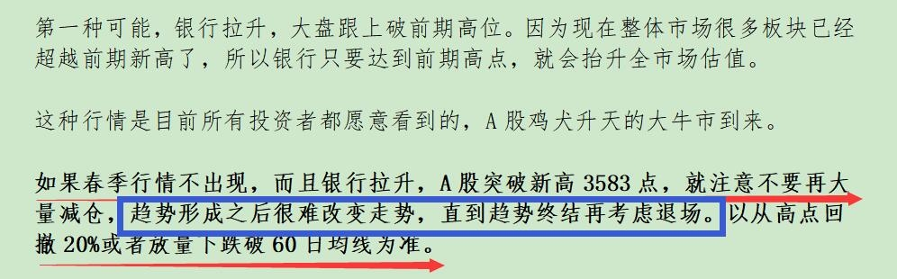

======================================================

_type: talk
@二师父[28814221155551]
2021-01-12 15:19:22 Tue  
topic_id: 414881515128888

<e type="hashtag" hid="48418222425588" title="#券商网格表#" />这是网格表，二维码是券商设计的，可以设置自动，不用手动考虑卖出。

@Gingo at 2021-01-12 15:19:22 Tue

> 师父 人工智能以前估值表推荐的场内代码是161613 现在是换了吗？

----------

@光少 at 2021-01-12 15:19:22 Tue

> 今天券商网格
1.23出了一份

----------

@二师父 at 2021-01-12 15:19:22 Tue

> 换了的

----------

@不知道不明了 at 2021-01-12 15:19:22 Tue

> 师父，这三种基金在总仓位中分别占多大比例合适呢，然后如果建立底仓的话应该在各自仓位中建多少比例呀

----------

@二师父 at 2021-01-12 15:19:22 Tue

> 要保证主仓8成，剩余可以自己分配

----------

@雨淡风清 at 2021-01-12 15:19:22 Tue

> 二师父明天要不要把161631转投到515070上去？

----------

@苍天有井明月空🌙 at 2021-01-12 15:19:22 Tue

> 可以用这个二维码里面的设置吗，把建立底仓金额改了就行了吗

----------

@二师父 at 2021-01-12 15:19:22 Tue

> 不用的，差不太多

----------

阅读[1]  评论[24]  赞[0] 

+++++++++++++++++++++++++++++++++++++++++++++++++++++

图片：
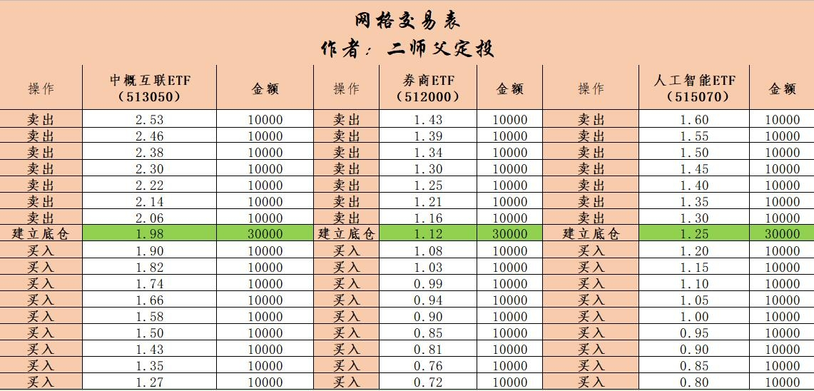

======================================================

_type: q&a
@水冰月槑槑🌙[51142428222184]
2021-01-12 15:24:36 Tue  
topic_id: 215881214585121

@水冰月槑槑🌙

>  发送验证码之后就一直提示安全下载或者其他方式下载，点了没反应是怎么回事？

@二师父

>  windlikeman，你加他，客户经理，备注二师父，咨询他吧

阅读[1]  评论[1]  赞[0] 

======================================================

_type: talk
@刘英（潍坊大东化工有*[815828225545182]
2021-01-12 15:24:39 Tue  
topic_id: 182558481254182

老师，前段时间跟着别人买了一只中证红利指数的基金，就是富国中证红利指数增强这只基金，老师觉得值得定投吗

@二师父 at 2021-01-12 15:24:39 Tue

> 这个不如沪深300和深红利

----------

阅读[1]  评论[1]  赞[0] 

======================================================

_type: q&a
@水冰月槑槑🌙[51142428222184]
2021-01-12 16:27:46 Tue  
topic_id: 815881214254582

@水冰月槑槑🌙

>  师父每次看星球聊天都一脸懵逼，现在是到牛市了吗？手上有8万可支配的闲钱，应该怎么计划？看了好几遍星球的内容，有的您给推荐10%沪深300＋10%创业板＋80%国债
>  有的是推荐上证50＋深红利＋广发中债
>  我想要收益高一点的，应该怎么配置？

@二师父

>  现在就是牛市主升浪行情，激进一点选择第一种，牛市来了可以小赚一点，如果发生深度回调压力也比较小。

阅读[1]  评论[0]  赞[0] 

======================================================

_type: q&a
@🍀 凝🌸 慧🍀[841855248254242]
2021-01-12 18:01:52 Tue  
topic_id: 414881244221448

@🍀 凝🌸 慧🍀

>  师父，今天沪深成交量大概1.1万亿，比之前1.2万亿，今天算不算缩量上涨啊？

@二师父

>  是缩量上涨，大概减少了1100亿

阅读[1]  评论[7]  赞[0] 

======================================================

_type: talk
@二师父[28814221155551]
2021-01-12 22:56:54 Tue  
topic_id: 182558128844412

<e type="hashtag" hid="552114551414" title="#估值数据#" /> 市盈率百分位59.84%，市净率百分位36.24%，SY-BY百分位69.64%，SY/BY百分位64.78%，不要轻易下车，要想全部下车，至少等到估值分位到达90%以上。

趋势确立，先拿住，不要卖了又追进去，卖出之后就做好接不回来的打算。

未来慢慢下车，然后上车当下最优品种，投资就是一个选择题，选择当下最优质资产持有。我不确定会不会有回撤，但是我可以确定的是即使牛市也会有巨幅下跌，未来不管回撤多少，不会将筹码交出，除非太贵了。

@阝東 at 2021-01-12 22:56:54 Tue

> 现在还有没有人说万点不是梦[呲牙]

----------

@二师父 at 2021-01-12 22:56:54 Tue

> 哈哈，我看谁第一个

----------

阅读[1]  评论[2]  赞[0] 

======================================================

_type: q&a
@雨淡风清[844418818858882]
2021-01-13 08:07:55 Wed  
topic_id: 182558155512242

@雨淡风清

>  二师父今天有个专门做食品饮料的基金上市，要不要买点515170。现在是不是有点贵？

@二师父

>  这个目前除非做趋势，否则别买了然后跌了补仓，这个与贵便宜没关系，而看你的投资方法，短期看他是很贵了，长期10年看他不贵

阅读[1]  评论[3]  赞[0] 

======================================================

_type: q&a
@🍀 凝🌸 慧🍀[841855248254242]
2021-01-13 08:26:38 Wed  
topic_id: 215881488242211

@🍀 凝🌸 慧🍀

>  师父好，您能推荐一些值得关注的医疗、科技类的主动基金吗？谢谢！😀

@二师父

>  关注葛兰，刘格菘的基金

阅读[1]  评论[14]  赞[0] 

======================================================

_type: q&a
@nana[48222415211188]
2021-01-13 10:34:03 Wed  
topic_id: 215881481845841

@nana

>  师傅您好！请问159967创成长这只基金怎么样？

@二师父

>  创成长和创蓝筹都是不错的，前段时间这两只基金做了拆分，如果投资成长企业，这两只首选创成长。

阅读[1]  评论[3]  赞[0] 

======================================================

_type: q&a
@J[28281541518551]
2021-01-13 10:38:03 Wed  
topic_id: 182558158245422

@J

>  师父，最近消费都纷纷进入高估，但有一个消费红利（008928）目前还是正常，而且下跌比较厉害，请教师父，为什么会出现这种情况的？

@二师父

>  你这看的估值都是机构根据市盈率算的，这些都是错误的方法错误的结论，就我看目前的价格投资消费红利不如投资消费。
>  
>  原因和中证红利是一样的，深红利比中证红利好，但是分红比中证红利少，一个企业在发展过程中如果一直成长和扩张，那么资金就会更多地用于再投资而不是分红，反之那些发展逐步下滑的企业才会更多考虑分红。
>  
>  原始资料都错了，所以自然出现偏差。未来预期低的企业市盈率和市净率都会持续下降，不要固守一个指标，多方证伪，你会发现这些就是错的结论。

阅读[1]  评论[3]  赞[0] 

======================================================

_type: q&a
@王春媚[244424882221141]
2021-01-13 10:46:56 Wed  
topic_id: 414881281812418

@王春媚

>  师父好！请问513550  今天新上市，值不值得投？

@二师父

>  看了下持仓，评级为中等投资价值的港股通基金，可以按照均线定投策略定投，平均收益率没问题，一次建仓当前位置不值得。

阅读[1]  评论[1]  赞[0] 

======================================================

_type: talk
@次郎🌻[48551412448858]
2021-01-13 11:02:58 Wed  
topic_id: 182558158152182

老师，请教一下，国开债具体场内买哪个？谢谢

@二师父 at 2021-01-13 11:02:58 Wed

> 003376

----------

@二师父 at 2021-01-13 11:02:58 Wed

> 或者你用16国债19替代

----------

阅读[1]  评论[2]  赞[0] 

======================================================

_type: q&a
@顾小胖[841154144118242]
2021-01-13 11:07:24 Wed  
topic_id: 815881481451482

@顾小胖

>  师傅请问515880怎么样啊？以前不懂的时候无脑买的中间亏过好一阵子，现在勉强回本了不知道该不该出掉

@二师父

>  通信设备有业绩持续提升和资金报团预期的逻辑，可以轻仓持有，不属于长期投资的赛道

阅读[1]  评论[1]  赞[0] 

======================================================

_type: q&a
@Pacifica[15548581554152]
2021-01-13 12:08:54 Wed  
topic_id: 582118418441114

@Pacifica

>  二师傅，请教一下：一只基金分红后，我在这只基金上的收益百分比是包含了分红的红利的？比如：我看见天天基金网上某只基金，我盈利50%，中间我收到过2次现金分红，那么这个50%的盈利中包含了分红的利润？

@二师父

>  分红包含现金分红和红利再投资，这两种都是以份额的形式分红的，与投资利润没有关联，账户盈利是投资的利润，不包含分红

阅读[1]  评论[1]  赞[0] 

======================================================

_type: q&a
@闲云[48522815485458]
2021-01-13 12:09:06 Wed  
topic_id: 215881425541121

@闲云

>  师傅您说的易方达裕丰债券是场内还是场外买好啊？现在就可以买吧

@二师父

>  现在可以买，选择场外基金

阅读[1]  评论[1]  赞[0] 

======================================================

_type: q&a
@手牵手看夕阳[244112548184141]
2021-01-13 12:24:57 Wed  
topic_id: 182558142582142

@手牵手看夕阳

>  二师父，请教一下。遇到跌停涨停的股票时后面该如何操作？

@二师父

>  第一看看企业质量，企业质量好，跌停之后跌不动了有回升的时候继续买，如果企业质量不好，有机会赶紧走人，如果遇到封死跌停，在集合竞价的时候挂单，能成就成，不能成第二天继续挂单。不投资垃圾股票，涨停跌停都不是太大的事。

阅读[1]  评论[3]  赞[0] 

======================================================

_type: q&a
@马明谦[241845211824851]
2021-01-13 13:03:03 Wed  
topic_id: 215881425221841

@马明谦

>  师傅：我是理财小白，想在您在天天基金里管理的乌龟计划里建个底仓，您看是今天买还是明天买合适呢？谢谢了！

@二师父

>  差别不大，从货币时间价值考虑今天合适，投资要趁早，不过目前不是低位，底仓可以轻一点

阅读[1]  评论[9]  赞[0] 

======================================================

_type: talk
@幽兰[815554522442422]
2021-01-13 13:10:29 Wed  
topic_id: 215881425482221

二师父今天发车吗？

@二师父 at 2021-01-13 13:10:29 Wed

> 暂时没有了，持有就好。

----------

阅读[1]  评论[1]  赞[0] 

======================================================

_type: q&a
@小鱼[241182222251181]
2021-01-13 13:56:08 Wed  
topic_id: 815881425142212

@小鱼

>  今天场内医疗是不是可以再加点仓

@二师父

>  可以加仓我会发车

阅读[1]  评论[0]  赞[0] 

======================================================

_type: q&a
@永刚[15581448518112]
2021-01-13 16:05:20 Wed  
topic_id: 182558144182142

@永刚

>  二师父好，什么类型的基金或股票才使用均线定投策略定投呢？

@二师父

>  盈利稳定的基金价格适中都可以，股票不要定投，看准了直接买入就行。

阅读[1]  评论[2]  赞[0] 

======================================================

_type: talk
@二师父[28814221155551]
2021-01-13 16:54:56 Wed  
topic_id: 582118454842524

<e type="hashtag" hid="51285481822484" title="#地产又出事了#" /> 最近短期没车，我判断市场还会有回调，等回调到位再出手。网格二维码稍后发给大家，震荡的话做做网格可以。

医疗我看了下从上次买入到现在涨了18.65%，就跌了一天，其实还是涨了很多的。如果真有机会，我肯定首先出击，留了一些现金就是给医疗仓位的。

@苍天有井明月空🌙 at 2021-01-13 16:54:56 Wed

> 坐等网格二维码

----------

@志亮 at 2021-01-13 16:54:56 Wed

> 哈哈，我就是从粪坑走岀来的那个人，入市两年，在错误的道路上白白浪费了两年牛市，谁知道我当中经历了什么[捂脸]。

----------

@Vivian at 2021-01-13 16:54:56 Wed

> 老师，文章说保险不太好，那么非银300里面有保险成份股，是不是非银300也要减仓呢？

----------

@涓涓 at 2021-01-13 16:54:56 Wed

> 今天这篇有点不像二师父的风格[偷笑]

----------

@二师父 at 2021-01-13 16:54:56 Wed

> 哈哈，我是啥风格

----------

@二师父 at 2021-01-13 16:54:56 Wed

> 以后还有很多机会，认知起来了就能赚

----------

@二师父 at 2021-01-13 16:54:56 Wed

> 非银里面有券商和保险，组合配置很好的，百分之10以下仓位合适

----------

@涓涓 at 2021-01-13 16:54:56 Wed

> 冷静，客观，有点小鸡汤😁

----------

阅读[1]  评论[8]  赞[0] 

+++++++++++++++++++++++++++++++++++++++++++++++++++++

文件：
2021-01-13 16:51:10 Wed
文件大小：[30925]
48224544251158-地产白马出事了.docx

======================================================

_type: q&a
@无意心外[215544415215811]
2021-01-14 03:19:38 Thu  
topic_id: 182558112528182

@无意心外

>  二师父，朋友推荐了三只基金，帮忙评估一下这三个基金怎么样啊：嘉实港股优势010041,易方达竞争优势010198,甄选回报两年900052

@二师父

>  第二个基金还可以，另外两只价值比较低，投资主动基金主要评估基金经理

阅读[1]  评论[5]  赞[0] 

======================================================

_type: q&a
@毛毛宇[88281885112212]
2021-01-14 08:15:16 Thu  
topic_id: 414881218285448

@毛毛宇

>  二师夫，易方达裕丰汇报基金，是一次性投入，还是分期定投？

@二师父

>  如果能承受百分之10左右的波动，那么一次买入，如果这个波动感觉有点大，先买底仓，然后分批买入

阅读[1]  评论[10]  赞[0] 

======================================================

_type: q&a
@🍀 凝🌸 慧🍀[841855248254242]
2021-01-14 09:06:37 Thu  
topic_id: 414881218115288

@🍀 凝🌸 慧🍀

>  师父好，想请教：10几年来，沪深300指数基金的年化收益率大概是多少？如果以现在为起点，今年您预计沪深300还会有10%左右的收益率吗？谢谢！

@二师父

>  看你的起点在哪个位置，从07年高位算，沪深300到现在年化收益率还是负数，这个我预测不了

阅读[1]  评论[1]  赞[0] 

======================================================

_type: q&a
@wty[548488548545444]
2021-01-14 09:13:42 Thu  
topic_id: 582118485228524

@wty

>  二师父，想问一下，可转账打新需要持有深市/沪市一定股票是吗？

@二师父

>  不需要，A股票打新需要，最近可转债行情不好，择优打，今日的我准备放弃申购了

阅读[1]  评论[1]  赞[0] 

======================================================

_type: q&a
@光少[244124552511141]
2021-01-14 09:42:08 Thu  
topic_id: 815881412825852

@光少

>  二师父您好！今天超声转债破发是拿着还是出了？谢谢！

@二师父

>  出了

阅读[1]  评论[0]  赞[0] 

======================================================

_type: q&a
@贵玉1*[28458118115811]
2021-01-14 09:44:56 Thu  
topic_id: 582118485111284

@贵玉1*

>  二师父，A股股票打新，我名下华泰10万，华宝40万，一起股票市值50万，华泰有2年了，能开通科创板吗

@二师父

>  需要合并到一个账户里面

阅读[1]  评论[0]  赞[0] 

======================================================

_type: talk
@蔡寅宵[118554814444112]
2021-01-14 10:10:55 Thu  
topic_id: 182558184112152

二师父，买入价格设定限价？还是市价？小白发问

@二师父 at 2021-01-14 10:10:55 Thu

> 一般市价，如果你想到达固定价格成交，就限价

----------

阅读[1]  评论[1]  赞[0] 

======================================================

_type: talk
@蔡寅宵[118554814444112]
2021-01-14 10:12:28 Thu  
topic_id: 182558184114552

网格，设定卖出，买入价格，限价？市价？

@二师父 at 2021-01-14 10:12:28 Thu

> 设定价格，限价

----------

阅读[1]  评论[1]  赞[0] 

======================================================

_type: talk
@二师父[28814221155551]
2021-01-14 10:15:07 Thu  
topic_id: 182558184118482

<e type="hashtag" hid="455485542258" title="#网格交易表#" /> 大家直接扫码就可以网格了，自动交易即可，不用太操心，A股波动大，网格收益不错的。注意，主仓得有，然后副仓位加网格不断波动盈利。

@苍天有井明月空🌙 at 2021-01-14 10:15:07 Thu

> 感谢

----------

@吃肉肉 at 2021-01-14 10:15:07 Thu

> 谢谢师父

----------

@onepiecewi* at 2021-01-14 10:15:07 Thu

> 没有下载华宝，看不了

----------

@lily at 2021-01-14 10:15:07 Thu

> 谢谢师父

----------

@lily at 2021-01-14 10:15:07 Thu

> 师父，现在这3个基金价格都高，怎么建底仓啊？比如券商ETF，要等到1.12才能建底仓吗？

----------

@好运玲玲 at 2021-01-14 10:15:07 Thu

> 跟上

----------

@风动幡动心不动 at 2021-01-14 10:15:07 Thu

> 师傅好！方便给网格交易表格或者截图吗？我没用华宝软件交易[呲牙]

----------

@二师父 at 2021-01-14 10:15:07 Thu

> 已经给了

----------

阅读[1]  评论[23]  赞[0] 

+++++++++++++++++++++++++++++++++++++++++++++++++++++

图片：

======================================================

_type: talk
@二师父[28814221155551]
2021-01-14 10:23:53 Thu  
topic_id: 414881215145558

没有华宝的，按照这个价格来就行了，我稍后再来一篇详解。

@吃肉肉 at 2021-01-14 10:23:53 Thu

> 已经开通华宝，师父，我直接扫码，输入代码，其他不变就可以了吧？

----------

@二师父 at 2021-01-14 10:23:53 Thu

> 是的，底仓需要自己买入

----------

@吃肉肉 at 2021-01-14 10:23:53 Thu

> 好的嗯

----------

@Dave Pan at 2021-01-14 10:23:53 Thu

> 师父，这个网格底仓买入3万后，如果一直上涨，岂不是卖3格就没有持仓可卖了？什么情况能卖到顶部？

----------

@果实妈咪 at 2021-01-14 10:23:53 Thu

> 我也在纠结这个问题

----------

@二师父 at 2021-01-14 10:23:53 Thu

> 我稍后写篇文章详解

----------

@不知道不明了 at 2021-01-14 10:23:53 Thu

> 师父，这几只每只的底仓一般建立25%的仓位吗？相对于每只的投资总金额来看

----------

@二师父 at 2021-01-14 10:23:53 Thu

> 对的

----------

阅读[1]  评论[10]  赞[0] 

+++++++++++++++++++++++++++++++++++++++++++++++++++++

图片：

======================================================

_type: talk
@Vivian[582228554481154]
2021-01-14 10:55:45 Thu  
topic_id: 582118484121524

老师，请问券商网格。我按照网格1.12买入六万，1.18卖出1万，1.23卖出一万，现在又回到1.18,我要不要再买入1万，还是要等到1.12再买入2万？

@二师父 at 2021-01-14 10:55:45 Thu

> 如果资金充裕可以买1万，资金不充裕不用买

----------

阅读[1]  评论[1]  赞[0] 

======================================================

_type: talk
@志亮[422125851552828]
2021-01-14 11:19:43 Thu  
topic_id: 215881414844241

现在市场风格又变，不再完全是大盘抱团，而是修复低估产业，轮动很快，很难抓得住，趋势策略需要作出改变，先出三分一仓位观望为主。[微笑]

阅读[1]  评论[0]  赞[0] 

======================================================

_type: talk
@二师父[28814221155551]
2021-01-14 12:59:48 Thu  
topic_id: 582118822418244

<e type="hashtag" hid="15284184215212" title="#想补仓的别急#" /> 未来消费不会补仓，除非深度回调，医疗破了60日均线，中概价格1.98记得喊我加仓，光伏破120日均线，记得喊我发车。

锁仓休息，买基金的好处就是，买入，持有，然后钱变多了。稍后出一个波动小的配置组合表，低风险预期低收益新手可以直接配置入门学习，边练边学

@阝東 at 2021-01-14 12:59:48 Thu

> 我现在也是在医疗破60日均线，但是我想可不可以破20天均线[调皮][害羞]

----------

阅读[1]  评论[1]  赞[0] 

======================================================

_type: talk
@牛牛[548141224521114]
2021-01-14 13:03:17 Thu  
topic_id: 582118822452854

<e type="hashtag" hid="15284184215212" title="#想补仓的别急#" /> 二师父，光伏515790我1.2元买了8000，是不是买高了啊？

@二师父 at 2021-01-14 13:03:17 Thu

> 不在乎这个的，观察仓，我自己没公开发车的操作你别跟

----------

@牛牛 at 2021-01-14 13:03:17 Thu

> 好的，谢谢二师父

----------

阅读[1]  评论[2]  赞[0] 

======================================================

_type: talk
@乖子[28441841181151]
2021-01-14 13:28:53 Thu  
topic_id: 215881155122521

二师父，您好，我此前直接扫码用您的券商网格，但是交易后，那个基准价就变了，导致发生错误的网格交易，我是哪里设置错了吗？谢谢

@二师父 at 2021-01-14 13:28:53 Thu

> 变成多少了

----------

@乖子 at 2021-01-14 13:28:53 Thu

> 不好意思，昨天忘记回了，变成1.17了

----------

@乖子 at 2021-01-14 13:28:53 Thu

> 不知道是不是我设置的原因，我是直接扫您的码，每次交易完就变要重新设置，我上次就忘了重置

----------

@二师父 at 2021-01-14 13:28:53 Thu

> 您加windlikeman，他会给您解答

----------

阅读[1]  评论[4]  赞[0] 

======================================================

_type: talk
@二师父[28814221155551]
2021-01-14 13:40:53 Thu  
topic_id: 182558822811512

<e type="hashtag" hid="48415215884418" title="#网格交易详解#" /> 关于网格交易，可以有最基本的低买高卖，也可以进阶，目前最详细的方法都写出来了，大家可以灵活运用，也可以完全机械化，这个取决于自己。

@姥姥不疼. 爷爷不爱 at 2021-01-14 13:40:53 Thu

> 请教二师父，宽基沪深300、创业板50、深红利可以5%或10%网格么[抱拳][抱拳]

----------

@二师父 at 2021-01-14 13:40:53 Thu

> 可以，不过长期持有策略更适合

----------

@姥姥不疼. 爷爷不爱 at 2021-01-14 13:40:53 Thu

> 请教二师父，那券商、中概、人工智能目前还在正常估值，并未进入低估区，做网格是否未遵循“谨守安全边际原则”，[抱拳][抱拳]

----------

@二师父 at 2021-01-14 13:40:53 Thu

> 那你可以等一等，到下一波熊市

----------

阅读[1]  评论[4]  赞[0] 

+++++++++++++++++++++++++++++++++++++++++++++++++++++

文件：
2021-01-14 13:39:41 Thu
文件大小：[336688]
51442528541424-网格交易详解.docx

======================================================

_type: talk
@二师父[28814221155551]
2021-01-14 13:47:40 Thu  
topic_id: 215881155115141

开了华泰国际，送了1股阿里，3股恒生科技。这个费用比较友好，88包年，适合现金打新和恒生科技网格

@不知道不明了 at 2021-01-14 13:47:40 Thu

> 师父，请问这个怎么开呀

----------

@二师父 at 2021-01-14 13:47:40 Thu

> 置顶第三篇文章，港美股开户链接

----------

阅读[1]  评论[2]  赞[0] 

+++++++++++++++++++++++++++++++++++++++++++++++++++++

图片：
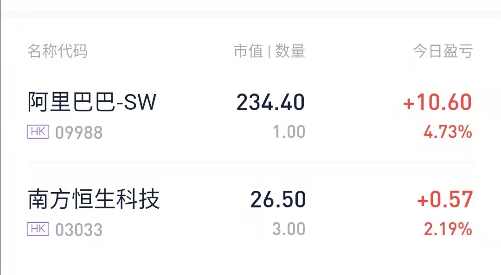

======================================================

_type: q&a
@宁静以致远[841158451581452]
2021-01-14 13:51:19 Thu  
topic_id: 215881155112481

@宁静以致远

>  要续费而不能

@二师父

>  加微信ershifudt

阅读[1]  评论[0]  赞[0] 

======================================================

_type: talk
@二师父[28814221155551]
2021-01-14 16:29:36 Thu  
topic_id: 215881152511821

<e type="hashtag" hid="51285485151124" title="#没车#" /> 我们偶尔发车一次，但是保证发车就有利润。注意防守，可以现金，可以债券，比如7——10国开债就是防守的，股市大跌或者经济危机国开债依然会涨。这样下跌抗的住，满仓干真的跌了受不了，今天看到公司有同事清仓了，一人问怎么办，另一人建议：赶紧跑。

说实话我不擅长跑路，即使3月份那样的暴跌，我也是加仓到高位迎接的，不害怕跌，也不害怕涨，在于仓位管理，对股市的认知，以及强大的心理素质。

给刚入场的朋友一个配置组合：创业板指数基金10%仓位+沪深300指数基金10%仓位+易方达裕丰回报债40%仓位+广发中债7-10年国开债10%仓位，这种配合就是很稳的，配置好了以后忘记股市涨跌，专心来学堂学习，很多爱分享的朋友进步很大，希望我们可以一起提高认知，探索到股市的第一性真理，这样才可以让自己的资产稳步增值。

总之，别看一时，学会做长跑冠军。

@雾海 at 2021-01-14 16:29:36 Thu

> 二师傅，创业板指数基金是买哪？

----------

@二师父 at 2021-01-14 16:29:36 Thu

> 华安创业板50

----------

@杜志彪 at 2021-01-14 16:29:36 Thu

> 明天开盘把大秦转债卖了就把仓锁上不看了，每天看着学堂就行了[微笑]

----------

@马明谦 at 2021-01-14 16:29:36 Thu

> 大秦转债是开盘就卖还是等一等稳了再呢？第一次中签不知道怎么操作[害羞]。

----------

@二师父 at 2021-01-14 16:29:36 Thu

> 最近可转债行情一般，开盘卖出

----------

@马明谦 at 2021-01-14 16:29:36 Thu

> 好的师傅，谢谢啦！[抱拳]

----------

@Vincent at 2021-01-14 16:29:36 Thu

> 二师父，华安创业板50，搜了下，很多，你指的是哪个代码

----------

@二师父 at 2021-01-14 16:29:36 Thu

> 华安创业板50指数

----------

阅读[1]  评论[8]  赞[0] 

+++++++++++++++++++++++++++++++++++++++++++++++++++++

文件：
2021-01-14 16:21:08 Thu
文件大小：[31220]
28445251125551-今日无车.docx

======================================================

_type: q&a
@Tim[241555882155111]
2021-01-14 18:50:26 Thu  
topic_id: 182558828125212

@Tim

>  您好，第一次请教，本人基金仓位70%，理财和债基30%，其中宽基上证50、沪深300和中证500等共占50%，行业等占20%，中证500在逐步减仓，请问中证500降到多少比合理？增量资金也有20%可以准备进来，但这个组合是否过于保守？这两年平均收益25%左右，谢谢

@二师父

>  还行，如果能承受更大的波动可以配置一些创业板，提高行业指数配置比例，中证500把利润收割了即可

阅读[1]  评论[8]  赞[0] 

======================================================

_type: talk
@二师父[28814221155551]
2021-01-14 20:11:44 Thu  
topic_id: 582118812142814

每次下跌很多朋友都后悔当时卖少了，其实没必要，只要不影响生活，波动不是风险，如果波动不太适应，那么说明股权仓位过重，需要多配置一些国开债基金，二级债基，等债券类基金做平衡，每个人的承受能力不同，大家适当调整就好。

阅读[1]  评论[0]  赞[0] 

======================================================

_type: q&a
@天马行空[548818851412444]
2021-01-14 20:19:09 Thu  
topic_id: 215881185842481

@天马行空

>  二师父，听说货币基金存在爆仓风险，我买了百万的银华日利，会发生爆仓吗。怎样你避免呢。谢谢。

@二师父

>  买股票加杠杆有可能爆仓，货币基金不会爆仓，你听谁说的

阅读[1]  评论[3]  赞[0] 

======================================================

_type: q&a
@wty[548488548545444]
2021-01-14 20:21:13 Thu  
topic_id: 182558852515212

@wty

>  二师父，我现在70%仓位，其中33%宽基，20%行业基金（AI智能、医疗医药+消费），15%债基，2%创业板。问一下二师父，创业板目前可以加仓到10%吗？

@二师父

>  等跌一跌，震一震市场情绪稳定之后再加，目前持续成交额万亿元，先稳定稳定，我们常说的仓位是指数基金占总金额的比例，不加债券

阅读[1]  评论[1]  赞[0] 

======================================================

_type: talk
@二师父[28814221155551]
2021-01-14 21:13:12 Thu  
topic_id: 414881184141818

在股市上，我见过三种谈理想的人：

第一种谈着谈着，他和你的钱都越来越多；
第二种谈着谈着，他和你的钱都越来越少；
第三种谈着谈着，他的钱越来越多，你的钱越来越少。

我喜欢并希望学习第一种人，虽然这不代表我们注定会成功。杨天南！

阅读[1]  评论[0]  赞[0] 

======================================================

_type: talk
@二师父[28814221155551]
2021-01-14 21:36:57 Thu  
topic_id: 815881185115112

<e type="hashtag" hid="28512412841481" title="#讲一讲对冲#" /> 上周五鳄鱼计划直接配置了15份国开债，虽然牛市时候配置债券会降低收益率，但是会有很好的防守作用。

这两天下跌，然而国开债是上涨的，这比全仓沪深300就好多了，在资本市场活着永远比挣得多重要。如果保守的话加大债券的配置，如果激进的话，多增加股权的配置。

不是说指数即将上涨而买，而是在他被人抛弃的时候，人弃我取，人取我与，适合指数，也适合债券。

阅读[1]  评论[0]  赞[0] 

======================================================

_type: talk
@二师父[28814221155551]
2021-01-14 22:05:02 Thu  
topic_id: 215881188841241

<e type="hashtag" hid="28518858514151" title="#每日估值数据#" /> 市盈率百分位58.76%，市净率百分位34.44%，SY-BY百分位65.55%，SY/BY百分位61.31%。

这个估值仍旧找不到让我出手的动力，以为跌了，而实际上，鳄鱼计划今年以来还是盈利很多的，是今年以来哈，其实并没有跌多少，只是我们锚固了账户金额，或者有的投资者追高买了股票。

乌龟计划固定下，见下表，咱们严格遵守纪律。

阅读[1]  评论[0]  赞[0] 

+++++++++++++++++++++++++++++++++++++++++++++++++++++

图片：
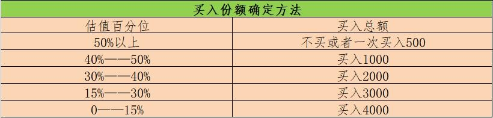

======================================================

_type: talk
@二师父[28814221155551]
2021-01-15 08:33:42 Fri  
topic_id: 182558842518212

<e type="hashtag" hid="28512412241441" title="#三种估值状态的指数投资方法#" /> 第一种估值状态，绿色，估值表绿色的品种，无脑定投，坚持定投，然后积累等待，估值回升以后，获利走人。这不需要止损。

第二种估值状态，估值表橙色的品种，均线定投，按照均线策略来轻仓定投，有机会进入低估区域就无脑定投，直到估值回升，获利走人，也不需要止损。

第三种估值状态，估值表红色的品种，趋势买入，向上突破10日均线，放量，买入。向下突破10日均线，放量，止盈，账户亏损10%，开始止损。

三种方法，任何时候都可以用，学堂有几位朋友做的比较好，投资是灵活的事情，学会自己驾驭，对于学堂刚进来的朋友，可以根据我设定的几个组合做配置，然后跟车就行，学习是一件积累的事情，慢慢积累，自然就会有所提高啦。

@HeLLO at 2021-01-15 08:33:42 Fri

> 师父，什么是均线策略？

----------

@二师父 at 2021-01-15 08:33:42 Fri

> 低于均线以下开始定投，可以看看我书里面有说

----------

@是喵喵吖～ at 2021-01-15 08:33:42 Fri

> 师父，请问放量是什么意思。 另外 红色的品种，如果账户亏损10%，您说的止损是指卖出吗。还是到达一定低估位置后补仓，拉低成本。

----------

@二师父 at 2021-01-15 08:33:42 Fri

> 放量是成交额放大，对于高位买的红色可能亏，可是如果严格按照绿色买入，红色区域一定是大赚的

----------

@是喵喵吖～ at 2021-01-15 08:33:42 Fri

> 嗯嗯谢谢师父

----------

阅读[1]  评论[5]  赞[0] 

======================================================

_type: talk
@二师父[28814221155551]
2021-01-15 08:43:58 Fri  
topic_id: 815881125255442

<e type="hashtag" hid="88512412241112" title="#讲白酒#" /> 高位抱团有所松动，白酒处于高估区域而且下跌形成死叉点，破了10日均线，类似这种时候可以考虑止盈，止盈方法：两种，第一是上行区间逐步收割利润，剩余部分长期持有，长期看白酒还会新高，以5到10年的周期，这个不用怀疑。

止盈方法二：卖本留利润。比如之前如果投资1万元白酒，现在是2万元，直接卖出1万元，剩余利润长期持有，到达了我们设定的条件再重新定投。

@smile at 2021-01-15 08:43:58 Fri

> 二师父，跌破十日线的一线白酒，目前可以上车吗？还是等继续回调？以前没买过

----------

@二师父 at 2021-01-15 08:43:58 Fri

> 目前都已经走人了哈，不适合上车

----------

@smile at 2021-01-15 08:43:58 Fri

> 谢谢二师父提醒，要跌到什么位置才适合上车呢？

----------

@二师父 at 2021-01-15 08:43:58 Fri

> 至少要跌到白酒正常估值才能开始定投

----------

@smile at 2021-01-15 08:43:58 Fri

> 收到！隆基股份目前是正常估值不？能上车不？[晕]

----------

@二师父 at 2021-01-15 08:43:58 Fri

> 隆基我在车上，股票不做建议哈，这个自己决定买卖

----------

@smile at 2021-01-15 08:43:58 Fri

> 嗯嗯，谢谢二师父

----------

阅读[1]  评论[7]  赞[0] 

+++++++++++++++++++++++++++++++++++++++++++++++++++++

图片：
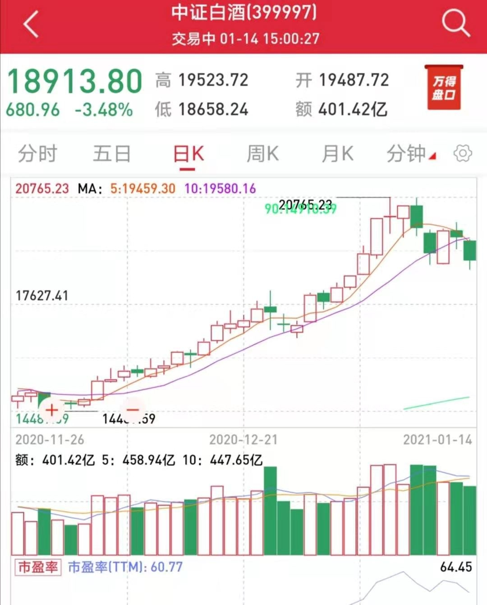

======================================================

_type: q&a
@鳗鱼[182242255828582]
2021-01-15 10:51:36 Fri  
topic_id: 414854452458818

@鳗鱼

>  师父，N大秦转债是直接卖出，还是可以继续持有？

@二师父

>  可以卖了哈

阅读[1]  评论[4]  赞[0] 

======================================================

_type: talk
@二师父[28814221155551]
2021-01-15 10:54:39 Fri  
topic_id: 215825524288881

大家注意下，我说的止损是做趋势的朋友，对于定投基金，除非基金面临清盘危机，否则不需要止损的，在低位定投，在上涨的时候已经收割了利润，降低仓位，那么即使发生危机重新跌破成本价或者极端低位，就是上车机会，不用止损，只要买的便宜，基金质量好的话，就长期拿着。等待机会到了再次入场，或者等待机构散户抬轿子继续新高。

我讲的趋势和定投是两回事，不能混淆了。

@是喵喵吖～ at 2021-01-15 10:54:39 Fri

> 师父如果是做趋势的 例如白酒 新能源之类的。跌了就一定要止损卖出吗？ 如果长期看好 继续持有不动 等到回到低估或正常 再加仓拉低成本可以吗。

----------

@二师父 at 2021-01-15 10:54:39 Fri

> 如果你是在低估区域做的，可以一直加，如果你在高估区域做的，那就得走，因为从高估区域到低估区域跌的幅度太大了

----------

@悦雪 at 2021-01-15 10:54:39 Fri

> 师父，如果趋势买入仓位不到10%,该如何操作？止损吗？还是等到企稳补仓

----------

@二师父 at 2021-01-15 10:54:39 Fri

> 做趋势，如果是在低估区域做的，可以补，如果在高位做的，不管仓位破了都得走

----------

@悦雪 at 2021-01-15 10:54:39 Fri

> 无仓位前几日买在高点了，这种情况该怎么办

----------

@二师父 at 2021-01-15 10:54:39 Fri

> 现在总仓位多少，盈亏情况，还有具体基金发给我看下

----------

@悦雪 at 2021-01-15 10:54:39 Fri

> 我高点买了深红利，占总资金10%，约亏2.5个点，怎么操作[擦汗]

----------

@二师父 at 2021-01-15 10:54:39 Fri

> 这个拿着，仓位百分之10，宽基不要紧的，等跌到位了再投，我说的是行业指数和股票

----------

阅读[1]  评论[9]  赞[0] 

======================================================

_type: q&a
@聪明的笨蛋[544858411212244]
2021-01-15 11:57:02 Fri  
topic_id: 215825521524251

@聪明的笨蛋

>  二师傅港股打新出金到内地银行卡是不是会被拒？所以必须办境外卡？

@二师父

>  是的，必须办理大陆卡香港账户或者办理香港卡，没有的话暂时不要入金

阅读[1]  评论[0]  赞[0] 

======================================================

_type: talk
@百变[15285855281882]
2021-01-15 13:16:06 Fri  
topic_id: 414854451282848

老师：光伏跌破120日均线(1.15)了.现在1.138

@二师父 at 2021-01-15 13:16:06 Fri

> 你看错了，看指数，你这基金都不到120天

----------

@百变 at 2021-01-15 13:16:06 Fri

> 哦！[捂脸]

----------

@百变 at 2021-01-15 13:16:06 Fri

> 老师那看均线策略是看基金还是看指数？

----------

@二师父 at 2021-01-15 13:16:06 Fri

> 指数

----------

@百变 at 2021-01-15 13:16:06 Fri

> 老师：光伏产业指数没有120日均线？那参考那个指数看120日均线买入啊？

----------

@二师父 at 2021-01-15 13:16:06 Fri

> 这个

----------

@百变 at 2021-01-15 13:16:06 Fri

> 哦！没有这个软件，只能等老师提醒了。

----------

阅读[1]  评论[7]  赞[0] 

======================================================

_type: q&a
@J[28281541518551]
2021-01-15 13:18:40 Fri  
topic_id: 582152258558524

@J

>  师父，N大秦转债今天上市只涨了2%不到，比平时的转债盈利10%以上少很多，是卖出还是继续持有好？

@二师父

>  卖了好

阅读[1]  评论[11]  赞[0] 

======================================================

_type: q&a
@付云[844148188522822]
2021-01-15 14:26:52 Fri  
topic_id: 414854451418258

@付云

>  二师傅，对军工板块有什么看法，有没有什么好的基金。七分钟理财顾问在财经上有推荐。

@二师父

>  十四五期间新型武器装备列装进程加快，产业链上游企业订单会加速增长，有利好预期，另外军队装备条例，军队计量条例等规定实施，军队和国防改革过渡到解决政策机制，这些会带动国防科技的发展，这种行业可以找找相关主动基金

阅读[1]  评论[2]  赞[0] 

======================================================

_type: q&a
@一剪梅[844115184528882]
2021-01-15 14:28:27 Fri  
topic_id: 414854451155448

@一剪梅

>  🎁盯住市场的“称重机”机制，聚焦「高质量」投资机会！
>  🏆华泰柏瑞副总经理、主动权益团队负责人——李晓西先生 最新力作
>  🚀华泰柏瑞质量 「010608」
>  🔥下周一重磅发售（18号）！
>  💥募集限额：80亿
>  📖封闭期2-3个月。  
>  师父，这个基金怎么样？下周一可以买吗？

@二师父

>  这个基金我看不到持仓，没法评估，主动基金我是看经理结合基金持仓股票的

阅读[1]  评论[0]  赞[0] 

======================================================

_type: talk
@二师父[28814221155551]
2021-01-15 16:03:49 Fri  
topic_id: 215825542248881

<e type="hashtag" hid="51285485485484" title="#分化#" /> 市场分化出现了，坚守住已经投资的板块，别看短期一天一个月，你去看看长期10年哪些好，大多数人看的都太短了。

@Chu at 2021-01-15 16:03:49 Fri

> 师父对3583往上走还是有信心不？最近恒生国企连连上涨，我一直都没卖，需要调整吗？

----------

@二师父 at 2021-01-15 16:03:49 Fri

> 中概更好一些

----------

@Chu at 2021-01-15 16:03:49 Fri

> 那是最近就调整么？全仓调到中概么？我恒生国企的仓位占比总仓位百分之8。现在盈利2个点

----------

阅读[1]  评论[3]  赞[0] 

+++++++++++++++++++++++++++++++++++++++++++++++++++++

文件：
2021-01-15 16:03:04 Fri
文件大小：[32537]
48224558281418-聊一聊市场上两级分化的板块.docx

======================================================

_type: talk
@二师父[28814221155551]
2021-01-15 17:25:33 Fri  
topic_id: 215825544522121

今年拜读，学习进步成长！

阅读[1]  评论[0]  赞[0] 

+++++++++++++++++++++++++++++++++++++++++++++++++++++

图片：

======================================================

_type: q&a
@庆余年[15584481824122]
2021-01-15 17:27:13 Fri  
topic_id: 414854422485828

@庆余年

>  二师父，请问一下，如果我把市面上的基金按照三个月收益前10%，半年收益前10%，近一年收益10%，近两年收益前10%，近三年收益前10%，基金经理从业年限三年以上，基金规模2亿以上，三年内最大回撤30%以内，是否可以筛一批优质基金出来？不考虑是指数，混合，股票类基金，请问这个筛基金的逻辑有没有啥问题？

@二师父

>  这个思路挺好的，控制回撤和不控制回撤的分开筛选，有的回撤会大一些，然后多个5年业绩

阅读[1]  评论[4]  赞[0] 

======================================================

_type: q&a
@永刚[15581448518112]
2021-01-15 23:58:52 Fri  
topic_id: 414854418221558

@永刚

>  二师父好：均线定投策略需要按照指数的均线进行操作，如果按照ETF基金的均线进行操作，您认为差别大吗？可不可以只按ETF指数的均线进行均线定投策略？
>  第二个问题趋势买入法可不可以按照20均线进行操作？金叉时买入，死叉时卖出。有没有统计学数字，这种胜算的几率有多大比例？谢谢！

@二师父

>  如果etf成立时间很长就没问题的
>  
>  这种方法赚不到大钱，我用过的，有的时候死叉确立还是在上升通道中，真正赚大钱需要看长期持有，坐热冷板凳

阅读[1]  评论[1]  赞[0] 

======================================================

_type: talk
@庆余年[15584481824122]
2021-01-16 00:07:31 Sat  
topic_id: 215825512418211

基金排行数据分析

@二师父 at 2021-01-16 00:07:31 Sat

> 感谢分享

----------

@庆余年 at 2021-01-16 00:07:31 Sat

> [呲牙][呲牙][呲牙]

----------

@吃肉肉 at 2021-01-16 00:07:31 Sat

> 感谢分享

----------

@圣诞结® at 2021-01-16 00:07:31 Sat

> 谢谢 辛苦了

----------

@庆余年 at 2021-01-16 00:07:31 Sat

> [抱拳][抱拳]

----------

@飞的那个飞 at 2021-01-16 00:07:31 Sat

> 太厉害了

----------

@样 at 2021-01-16 00:07:31 Sat

> 谢谢[强][强][强][强]

----------

阅读[1]  评论[7]  赞[0] 

+++++++++++++++++++++++++++++++++++++++++++++++++++++

文件：
2021-01-16 00:07:31 Sat
文件大小：[287916]
15112444114442-基金排行.docx

======================================================

_type: q&a
@孤芳自赏[548114442211184]
2021-01-16 05:36:46 Sat  
topic_id: 582152284245454

@孤芳自赏

>  师父：天壕没注意它上市了，破发了怎么办，星期一接着卖吗？

@二师父

>  周一接着卖，目前转债也出现分化

阅读[1]  评论[0]  赞[0] 

======================================================

_type: talk
@二师父[28814221155551]
2021-01-16 07:29:16 Sat  
topic_id: 815825514841852

<e type="hashtag" hid="28512414554421" title="#估值分位#" /> 市盈率百分位59.39%，市净率百分位36.28%，SY-BY百分位67.7%，SY/BY百分位69.28%。

全市场估值仍旧中等位置，不要盲目抄底，重点关注互联网，医疗、金融板块，对于个股，如果不能经受30%左右的波动，追高的记得止损。好企业也得买的相对便宜，不然一个浪下来就被动走人了。

目前仍旧以防守为主，小心美股崩盘的风险，关注市场流动性和信用，如果流动性和信用收紧，那么回调会到来。

@圣诞结® at 2021-01-16 07:29:16 Sat

> 准备等回调买医疗

----------

阅读[1]  评论[1]  赞[0] 

======================================================

_type: talk
@二师父[28814221155551]
2021-01-16 10:38:15 Sat  
topic_id: 582152122854524

<e type="hashtag" hid="88512414582182" title="#接下来的方向#" /> 注意结构性机会，港股打新可以继续动起来了，转债缓缓，一直不中，而且破发概率大，打的话尽量选择AAA级别的。

@素兮 at 2021-01-16 10:38:15 Sat

> 二师父，这种行情下前几天发的几只ETF的网格还可以用么？

----------

@二师父 at 2021-01-16 10:38:15 Sat

> 可以用，安全边际我都测算了，加到最底部一格还没起来，基本到底了，持有一定是盈利的

----------

@付云 at 2021-01-16 10:38:15 Sat

> 军工的ETF可以么，主动型有推荐么[微笑]

----------

@付云 at 2021-01-16 10:38:15 Sat

> 二师傅，白酒不再是2021年的主要赛道了么，那么消费呢！

----------

@二师父 at 2021-01-16 10:38:15 Sat

> 可以etf，这种属于做预期

----------

@二师父 at 2021-01-16 10:38:15 Sat

> 也不是，我说的不是主赛道意思买入没啥机会，持有和买入是分开的

----------

@付云 at 2021-01-16 10:38:15 Sat

> 持有就继续保持，不再买入[微笑]

----------

阅读[1]  评论[7]  赞[0] 

+++++++++++++++++++++++++++++++++++++++++++++++++++++

文件：
2021-01-16 10:36:22 Sat
文件大小：[323534]
28445224888251-结构性行情下的投资机会.docx

======================================================

_type: q&a
@付云[844148188522822]
2021-01-16 11:59:21 Sat  
topic_id: 815825858285442

@付云

>  二师傅，我一直想把中证500全部调仓到沪深300，之前在底部没有建300的仓位，500的仓位大概占了10%，一直不太好，盈利就16%的样子！

@二师父

>  底部调仓，现在可以把500出了

阅读[1]  评论[7]  赞[0] 

======================================================

_type: q&a
@一笑而过[241144144444511]
2021-01-16 12:45:46 Sat  
topic_id: 414854848514458

@一笑而过

>  二师父你好！小白一枚，网格扫码后，表格中的数据不用自填，直接提交吗？

@二师父

>  对的，然后自己买个底仓就行了

阅读[1]  评论[6]  赞[0] 

======================================================

_type: talk
@二师父[28814221155551]
2021-01-16 17:53:50 Sat  
topic_id: 182542521215112

<e type="hashtag" hid="455451412888" title="#讲基金#" /> 介绍一只金融类的基金。易方达金融股票行业股票，这只基金成立时间不久，然而投资风格稳定，集中投资金融类企业，从目前看易方达金融行业股票今年跑赢沪深300，成立来打了平手，对于长跑选手，优选这类金融类基金更容易缺德超额收益。

今年开始，在乌龟计划中会加入主动型股票基金，机构选股更容易取得超额收益，一方面择时，另外一方面择基，双向结合有利于收益率提升，同时注意本金的累计，当收益率一定时，本金越多，总收入越大。

市场总是有效的，不是说固收某一个方向，而是把握核心不变，不断升级改造，终身成长。

@薇薇 at 2021-01-16 17:53:50 Sat

> 师父，现在这只基金适合买入吗

----------

@二师父 at 2021-01-16 17:53:50 Sat

> 有机会我会发车的哈

----------

@Tim at 2021-01-16 17:53:50 Sat

> 易方达张坤那只吗？

----------

@二师父 at 2021-01-16 17:53:50 Sat

> 张坤是消费的

----------

@Tim at 2021-01-16 17:53:50 Sat

> 是哦，好多白酒，哈哈，这支现在偏高了吧

----------

@二师父 at 2021-01-16 17:53:50 Sat

> 短期看高，长期看还好

----------

@衣袂飘香 at 2021-01-16 17:53:50 Sat

> 好勒，跟上。

----------

@天马行空 at 2021-01-16 17:53:50 Sat

> 师父，易方达金融股票具体怎样定投。看估值吗

----------

阅读[1]  评论[8]  赞[0] 

======================================================

_type: talk
@二师父[28814221155551]
2021-01-16 18:23:00 Sat  
topic_id: 815825851125482

<e type="hashtag" hid="88512414518412" title="#海通证券研究#" /> 中长期视角看，本轮牛市是转型升级牛，主线是科技+消费。我们认为21年行业配置的第一梯队是科技：一是政策推动，中央经济工作会议将“强化国家战略科技力量”列为排名第一的重点任务，继续强调依托新型举国体制突破核心技术、解决一系列“卡脖子”问题，同时强调了清洁能源、绿色发展，“十四五”规划建议稿也强调坚持创新驱动发展，科技自立自强，加快在关键核心技术领域实现突破；二是产业链扩散，2010-2015年前后科技股行情上下游行业间传导过程是从电子设备开始、逐渐向软件内容传导并扩散至场景应用，当前正处5G引领的新一轮科技周期中，前期以硬件为主，中后期带动软件革新需求，最终万物互联、人工智能，依照硬件-软件-内容-应用场景规律，往后看计算机（云计算、人工智能）、传媒（游戏等）、新能源产业链等产业发展空间更大。根据赛迪顾问预测，2021年中国人工智能市场规模将达到818.7亿元，未来几年并有望保持30%增速。根据海通分析师预测：2021年云计算相关领域上市公司净利润增速有望达23%、物联网模组45%、网络安全38%、设备商31%、关键器材27%；新能源汽车销量有望冲击190万辆、同比增长58%；传媒中最热门的游戏版块2021年销售收入有望达3324亿，同比增长20%。

2021年行业配置的第二梯队是内需：“十四五”规划《<e type="web" href="https://wx.zsxq.com/mweb/views/weread/search.html?keyword=建议" title="建议" style="book" />》再次强调构建“双循环”新发展格局，提出形成强大国内市场，将扩大内需作为战略基点。中央经济工作会议强调注重需求侧管理，扩大内需着力点就在扩大消费上，发挥国内市场消费在构建“双循环”格局中的重要作用，努力形成需求牵引供给。展望21年，大众消费有望崛起。回顾08年金融危机历史经验，货币宽松、四万亿等刺激政策推出后，高收入人群首先受益，08Q4-09Q2城镇居民人均可支配收入增速分别高于农村居民家庭人均现金收入增速的6.0%/1.6%/1.9%，这一阶段汽车、家电等耐用消费和高端白酒等可选消费行业需求旺盛，珠宝、化妆品、汽车等高端消费增速迅速上升；09Q3起随着基建、房地产投资落地和制造业、服务业用工需求扩张，农村居民收入增速逐渐超过城镇居民，粮油、食品、饮料等大众消费增速顺势崛起。今年以来，城镇居民收入受到疫情的影响较小，而农村居民特别是外出务工者收入受冲击较大，20Q3城镇居民人均可支配收入同比增5.4%，高于农村外出务工劳动力月均收入增速3.3%，因此今年可选消费品中汽车和高端白酒表现亮眼。借鉴09-10年经验，预计乳制品、餐饮、超市等大众消费需求或将大增。根据海通分析师预测，2021年乳制品板块归母净利润同比增速预计为80%，餐饮预计为110%，超市预计为70%。

从荀玉根观点看，当前仍旧处于牛市格局中，而市场热度是60度，注意这个热度已经比较高了，从估值看，处于中等偏上，那么问题在于，谁也不能确定未来就是今年这个牛市最后爆发，就需要做好准备，万一发生回撤，是否拿的住，如果拿的住，那是没有问题得，长期看指数一直向上，最多坐过山车，未来依然起来。

反之，如果前期追高，回撤较大拿不住那就会有风险，所以当下最重要得不是预测牛市或者熊市，而是做压力测试，自己可以经受账户多大浮亏，把最坏的情况考虑进去。

阅读[1]  评论[0]  赞[0] 

======================================================

_type: talk
@二师父[28814221155551]
2021-01-17 09:52:00 Sun  
topic_id: 215825825528151

<e type="hashtag" hid="28512414258851" title="#优质的港股基金#" /> 目前这些基金都是非常优质的，重点关注，预计港股2021年会有行情，之前被锤的太惨了。

@蛋炒饭不加蛋 at 2021-01-17 09:52:00 Sun

> 师父要等回调发车吗

----------

@二师父 at 2021-01-17 09:52:00 Sun

> 是的

----------

@HeLLO at 2021-01-17 09:52:00 Sun

> 二师父，要开通港股股票帐户才可买吗？

----------

@蛋炒饭不加蛋 at 2021-01-17 09:52:00 Sun

> 师父要等回调发车吗

----------

@蛋炒饭不加蛋 at 2021-01-17 09:52:00 Sun

> 谢谢二师父

----------

@蛋炒饭不加蛋 at 2021-01-17 09:52:00 Sun

> 恒生科技要的吧

----------

@永刚 at 2021-01-17 09:52:00 Sun

> 二师父，恒生科技网格基准价是多少？

----------

@二师父 at 2021-01-17 09:52:00 Sun

> 我明天发一个

----------

阅读[1]  评论[8]  赞[0] 

+++++++++++++++++++++++++++++++++++++++++++++++++++++

文件：
2021-01-17 09:51:09 Sun
文件大小：[33784]
88445248115142-讲几只有价值的港股基金.docx

======================================================

_type: talk
@志亮[422125851552828]
2021-01-17 14:06:24 Sun  
topic_id: 182542545441842

我想说说目前的几种投资体系，不知你们是那一种？

第一种：价值投资
价值投资，按照老股民的说法就是买入低估值的股票，然后长期持有到高估就卖出。听起来是不是很简单，是的，太简单了，这不是低买高卖吗，很简单呀，但真正能做到的却是少数人，归根到底还是因为散户本金太少了，是的，我知道拿着好股票，放几年这大概率是能赚钱的。你们大咖们本金最低几百万甚至几千万的已经实现财务自由了，做价值投资就算年化10%也够你们快乐生活了，你叫我们散户几万或十几万本金去价值投资，这不是开玩笑吧，我们来股市是来发财的，不是来休闲娱乐玩的，像雪球某大V经常说我来股市是来娱乐是来提款来玩的，我想我们还没有这个资格玩，因为我们没有几千万的身家[呲牙]，以上应该就是大部分散户做不到价值投资的主要原因。

第二种：趋势投资
很多人一听就以为是追涨杀跌，其实也不完全是，按我的理解趋势投资也可以是右侧交易，比如一只股票跌到底部反转了，刚准备起飞进入主升浪了，那趋势投资者这时候买入就是右侧交易，追涨杀跌应该是追买那种在高位的股票这才叫追涨杀跌，所以趋势投资有两种的。趋势投资比价值投资的优势就是不会被套，价值投资应该是左侧交易吧，就是越跌越买，我感觉这也很危险，普通人很难看懂透一间公司的，就算你懂看财报也没用，因为你怎么也比不上人家专业的，特别是A股做假账太多了，若是不幸买到像远的“中国石油”，近的“南极电商”怎么办，南极电商以我的能力看财报一点问题也没有呀，但为什么跌跌不休？所以我觉得趋势投资还是有一定优势的。

第三种：网格交易
一般适用于券商股票或券商ETF，这种在震荡市还是能赚点小钱的，本金少也没多大用，但总比没得赚好。[呲牙]

第四种：价值投资+投机
我是看雪球上某大V的一种方法，对方买十几二十只股票，然后设置一套框架估值，那种高估就卖一点，然后补仓到另一只低估的股票上，对方买的大部分是保险平安、地产万科基建这类低估值股票，其实我开始也认为这方法好呀，但后来才发现此方法只适合追求稳健收益，和喜欢折腾一下的手痒的投资者，收益其实真不高，对方的几年组合收益高是得益于2018年前的，自从后面的“房住不炒后”，我怀疑他后期可能连沪深300都不一定跑得过。

最后说说我吧，2019年大概4月份入市吧，牛市入市不知是幸运还是不幸，刚开始是追涨杀跌的，所以2019年我亏了总金的30%，当时害怕极了，就在2020年我开始学价值投资，可惜运气不好，在雪球上经某大V推荐买了万科、平安，美其名为价值投资，然后我刻舟求剑地给自己套了一个固定估值框架，最后就把曾经买过的大牛股：五粮液、泸州老窖、海天、通策这些都过早卖掉[流汗]，因为那个投资体系告诉我它们都高估了[捂脸]，最后也导致了我又浪费了一年牛市，2020年我只盈利了5%收益，但总比亏损的好，算是有一点点进步吧[捂脸]。2021年我是真的气坏了，所以我再次换投资体系，针对现在的结构性牛市，我打算用基本面+趋势投资法，现在市场变了，我也知道以后做高成长的价值投资应该胜过那些“老古董”的只买低估值做价投的人，但是没办法呀，我又是一个胆小的人，虽然说“怕高都是苦命人”，但我认为现在极可能是牛市下期，若现在我做高成长的价值投资，一旦遇到牛市崩了，那种高位股跌下来是很厉害的，我的本金就会损失惨重，这对于我这个刚入市不到两年的股民打击太沉重了，极可能一跌不起（因为目前我身体原因我没法工作了，我输不起），若选择万科、平安这等票我又怕浪费现在的行情，所以我只能选择一些高景气基本面好的股票做趋势投资，我叫它“价值投机”。入市前资金是100万，是我的全部家当了，2019年亏了30万，2020年赚了5万，2021年改了“价值投机”后又赚回了几万，即目前还亏20%本金，即亏损20万，希望老天爷赏好饭吃吧。我也不贪了，这轮牛市结速后我能回本再赚个50%就够了，我想下次熊市后我一定会选择第一种价值投资的，那时候应该轻松很多的。

目前上面几套投资体系我都有记录：我是这样认为的，投资者应该灵活运用一下，熊市应该用第一种价值投资，震荡市用网格，牛市单边上涨用趋势投资，不知你们用的是那一种投资体系？第一次发这么长的帖，希望大家支持！[呲牙][呲牙][憨笑][憨笑]

@二师父 at 2021-01-17 14:06:24 Sun

> 投资指数吧，忘记过去的失败，80万重新开始。这些都是书上的，我基本上预判当下买入三年能获得百分之50或者一倍收益，就会买一点，然后极端底部抄底锁仓满仓等待。如果找不到这样的，就买货币基金。

炒股需要天赋和偏财运的，我认识一哥们偏财运就很好，做比特币比特币赚，做股票股票赚，不太强求，指数适合普通投资者

----------

@苍天有井明月空🌙 at 2021-01-17 14:06:24 Sun

> 书名还记得吗

----------

@志亮 at 2021-01-17 14:06:24 Sun

> 感谢二师父的解答，有考虑过投资指数的，但又怕浪费现在的行情，总想着赚一笔后再投资指数，有时候挺纠结的。[捂脸]

----------

@* at 2021-01-17 14:06:24 Sun

> 指数基金定投-慢慢变富

----------

@浪淘沙 at 2021-01-17 14:06:24 Sun

> 我股票账户一个月追涨杀跌亏了20%，算上之前赚的，亏了30%，基金账户还盈利32%，挺后悔的，没坚持住初心又买了股票，还好基金是大头[呲牙]

----------

@志亮 at 2021-01-17 14:06:24 Sun

> 买股票输应该是操作太频繁的原因，基金少操作，所以更容易赚钱。[捂脸]

----------

@浪淘沙 at 2021-01-17 14:06:24 Sun

> 有这个原因，还有我买在了比较高的位置，被洗出去了。

----------

@闪闪的星光 at 2021-01-17 14:06:24 Sun

> 应该投资指数基金，普通投资者保住本金是第一位的。
长期投资指数基金年化收益10-15%的收益，也很不错了

----------

阅读[1]  评论[18]  赞[0] 

======================================================

_type: q&a
@不知道不明了[15584248411812]
2021-01-17 17:14:48 Sun  
topic_id: 815825821585242

@不知道不明了

>  师父，请问如果一只主动基金成立以来最大回撤40％，要算当前市场位置下这只基金的回撤幅度，乘上的这个系数应该是啥比较合适呀，万德全A的市盈率百分位吗？还是别的什么呢

@二师父

>  这个你看看基金成立时间，如果基金在2006年以前成立，最大回撤还是4，那么如果不换基金经理的话未来大概率还是在4以内，如果是18年底成立的，这个就需要预估极端情况了

阅读[1]  评论[8]  赞[0] 

======================================================

_type: q&a
@郑义泽（庭武）[582152242542254]
2021-01-17 17:57:18 Sun  
topic_id: 215825821581851

@郑义泽（庭武）

>  二师父，请问现在买互联网和医药的股票，各推荐一只

@二师父

>  我不推荐股票的，核心资产表你可以参考下，我的股票池就是他，定期追踪更新

阅读[1]  评论[2]  赞[0] 

======================================================

_type: q&a
@*[414848454821418]
2021-01-17 20:04:39 Sun  
topic_id: 815825821128182

@*

>  二师父，我有个组合，你帮忙看下有什么不妥的地方吗？景顺鼎益4.67%  ，医疗ETF20%  ,深红利6.7%  ，新能车ETF6.7%  ,富国天惠10%，中概互联ETF6.6%,  前海开源稀缺资源混合A5.3%  ,  易方达裕丰债券回报10%，  伊利股份18%，  美年健康12%。  谢谢

@二师父

>  整体持仓没问题，美年健康这个企业不好

阅读[1]  评论[8]  赞[0] 

======================================================

_type: q&a
@郑义泽（庭武）[582152242542254]
2021-01-17 20:25:03 Sun  
topic_id: 815825845541242

@郑义泽（庭武）

>  二师父，晚上好！请问“中概互联”513050！先建底仓，再网格定投，现在合适进场吗？“上投摩根生物医药”001984！建底仓后，要用什么方法定投？现在合适进场吗？谢谢！

@二师父

>  网格交易价格表格已经公布了，严格按照价格走没问题，医药先以a股医疗etf为主进行配置，港股医疗是作为辅助

阅读[1]  评论[4]  赞[0] 

======================================================

_type: talk
@二师父[28814221155551]
2021-01-18 08:56:28 Mon  
topic_id: 215825841181111

<e type="hashtag" hid="28512414188441" title="#最新网格交易表——含恒生科技#" />

@吃肉肉 at 2021-01-18 08:56:28 Mon

> 买不了[撇嘴]

----------

@小鱼 at 2021-01-18 08:56:28 Mon

> 恒生科技，查不到吗

----------

@一无所有 at 2021-01-18 08:56:28 Mon

> 我也买不了恒生科技

----------

@二师父 at 2021-01-18 08:56:28 Mon

> 在港股账户才有

----------

@Gingo at 2021-01-18 08:56:28 Mon

> 师父 想问没有港股账户 可以用恒生互联网ETF（513333）代替恒生科技吗？

----------

@二师父 at 2021-01-18 08:56:28 Mon

> 这个还在认购中，你就做中概互联网

----------

@乖子 at 2021-01-18 08:56:28 Mon

> 我有个港股账户，一直不知道咋进去，放在那闲着

----------

@二师父 at 2021-01-18 08:56:28 Mon

> 办港卡才能入金

----------

阅读[1]  评论[12]  赞[0] 

+++++++++++++++++++++++++++++++++++++++++++++++++++++

图片：
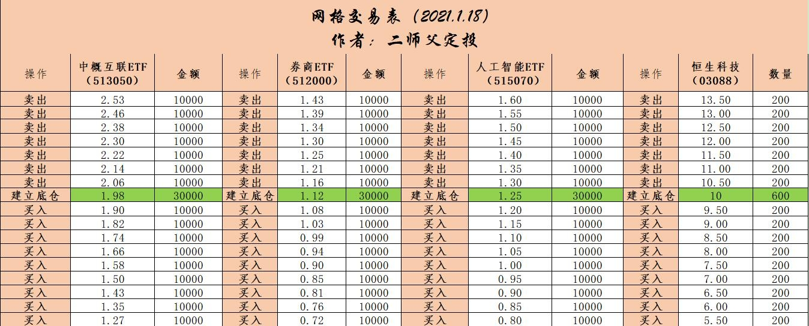

======================================================

_type: talk
@二师父[28814221155551]
2021-01-18 09:09:08 Mon  
topic_id: 815825818452812

<e type="hashtag" hid="15284511441582" title="#推荐一本书#" /> 《澄明之境：清泽谈投资之道》，昨天有个读者讲了自己的困惑，他说的那些方法我也都用过，真正赚钱不取决于方法，而取决于对企业的理解以及是否能耐心等待自己理解的企业价值兑现。

为什么推荐这本书呢？因为这本书谈到了如何选择自己的投资体系，我相信星球的朋友有做趋势的，有做价值的，这些都不是决定成败的核心，核心是对投资标的的理解以及自己是否能够认知正确并坚守自己的方法，无论赚钱还是亏钱。

在这本书中，清泽把投资上升到了信仰的高度，只有信仰才是投资智慧坚实的基础，无论遭遇怎样的危机或者逆境，能够始终坚守住自己的投资原则和方法是难能可贵的。

作为一名投资者，以平和的心态看待得失，成功的事情简单重复去做，是投资追求的最高境界，千万不能够左右摇摆。

比如你已经用了一种方法赚钱，还想着这种赚的不过瘾，又要去换一种，可能换了不适合你，不适合当下市场，又给折进去。比如你已经结婚，媳妇各方面都很好，这时候你又碰到一个女性，你感觉更好，又准备离婚开启新的生活，结果可能是两边都没得到。

收心、守心，修心。退回到自己的范围内，赚自己能赚的钱，不失为一种智慧。

@衣袂飘香 at 2021-01-18 09:09:08 Mon

> 二师父谈着谈着，又上升到了哲学高度。

----------

@🍀 凝🌸 慧🍀 at 2021-01-18 09:09:08 Mon

> 感谢师父分享，我已开始拜读这本好书[愉快][玫瑰][玫瑰][玫瑰]

----------

阅读[1]  评论[2]  赞[0] 

======================================================

_type: talk
@二师父[28814221155551]
2021-01-18 09:34:21 Mon  
topic_id: 582152181482124

<e type="hashtag" hid="141128442252" title="#乌龟计划调仓#" /> 易方达沪深300非银（000950）转换到易方达金融行业股票（008283），份额1000，剩余止盈清仓，卖本留利润。

买入上投摩根中国生物医药（001984）0.5份。

如果没有300非银的，不用调仓，可以直接购买以上两只标的。

@门萨🐨 at 2021-01-18 09:34:21 Mon

> 师父，为啥把300非银转了

----------

@二师父 at 2021-01-18 09:34:21 Mon

> 换易方达金融了，这个更好一些

----------

@Candice at 2021-01-18 09:34:21 Mon

> 请问一下 001984为啥不直接用超级转换呢？

----------

@二师父 at 2021-01-18 09:34:21 Mon

> 我只换了一部分，剩余调出了

----------

@Chu at 2021-01-18 09:34:21 Mon

> 鳄鱼计划里面的300非银要调吗

----------

@二师父 at 2021-01-18 09:34:21 Mon

> 目前不用，调仓我会通知的

----------

@无意心外 at 2021-01-18 09:34:21 Mon

> 二师父，每份是多少啊？这里的1000份和0.5份的基数是一样的吗？

----------

@二师父 at 2021-01-18 09:34:21 Mon

> 1000是买入的相对于净值的份额

----------

阅读[1]  评论[39]  赞[0] 

======================================================

_type: q&a
@闲云[48522815485458]
2021-01-18 10:31:08 Mon  
topic_id: 215825812542121

@闲云

>  请问二师父，易50和银行ETF要清仓吗？

@二师父

>  易50是哪个？银行etf目前上升趋势中，拿到涨不动了用易方达金融替代，银行宁波，邮储，招行，宁波价值大点，其他的拖后腿了

阅读[1]  评论[0]  赞[0] 

======================================================

_type: talk
@二师父[28814221155551]
2021-01-18 10:38:11 Mon  
topic_id: 215825812251211

<e type="hashtag" hid="48415212154218" title="#关于易方达金融#" /> 这是首次投资主动基金，已经跟踪很久了，无论是基金经理还是持仓股票都没问题。后面我也会持续追踪基金经理更换以及持仓情况。

作为市场上金融类基金，这个是我目前发现比较好的，如果大家有更好的标的可以推荐。对于部分行业，如果主动配置能够取得超额收益，那么也会选取主动基金。

投资不局限，哪种标的能帮我们低风险地获取高收益就选择哪个。

@毛毛宇 at 2021-01-18 10:38:11 Mon

> 师夫转了1000份额，是大笔买入吧！这次买入，属于鳄鱼计划的性质？

----------

@二师父 at 2021-01-18 10:38:11 Mon

> 不是的，1000，是份额乘以净值，金额也就1000多元，一次最多买10到20份，这个和基金里面的份额不一样

----------

@雨淡风清 at 2021-01-18 10:38:11 Mon

> 我的仓乱了[流泪][流泪]账户归理的问题。重新开的仓和以前的仓位对不起来了，债权比例过高。

----------

@闲云 at 2021-01-18 10:38:11 Mon

> 这个是定投吗？

----------

@二师父 at 2021-01-18 10:38:11 Mon

> 有机会就投

----------

阅读[1]  评论[5]  赞[0] 

======================================================

_type: q&a
@J[28281541518551]
2021-01-18 11:13:18 Mon  
topic_id: 414854815222558

@J

>  师父，华夏50ah目前盈利20%多，请问怎么处理好？

@二师父

>  拿着或收割利润

阅读[1]  评论[1]  赞[0] 

======================================================

_type: talk
@笔记[841152254588422]
2021-01-18 12:23:07 Mon  
topic_id: 182542581444222

二师傅，有没有好的基金组合回测工具推荐，可以加入基准指数进行对比。

@二师父 at 2021-01-18 12:23:07 Mon

> 晨星网

----------

@笔记 at 2021-01-18 12:23:07 Mon

> 谢谢🙏

----------

阅读[1]  评论[2]  赞[0] 

======================================================

_type: talk
@二师父[28814221155551]
2021-01-18 13:35:43 Mon  
topic_id: 815825811558282

今天共有21只新基金进入募集期。截至发稿前，今日首发的易方达竞争优势企业首募规模已达到1000亿元左右，远超150亿元募集上限，预计配售在10%左右。这一数据也使得易方达竞争优势企业首募规模，超越南方阿尔法此前首募规模的709.55亿元，成为2021年以来新基金募集规模最大的产品。

上面没有收紧流动性的意思，不要轻易下车，下车之后做好短期上不来的准备。

@苍天有井明月空🌙 at 2021-01-18 13:35:43 Mon

> 冯波这配售资金量不大买了也等于买了个寂寞。

----------

@二师父 at 2021-01-18 13:35:43 Mon

> 这说明，大家只能寂寞地拿着现金

----------

阅读[1]  评论[2]  赞[0] 

======================================================

_type: q&a
@李震笛[422112248211828]
2021-01-18 14:55:59 Mon  
topic_id: 815825258518412

@李震笛

>  二师傅，对于华夏上证50AH能给个大致方向吗？持有一年多了，感觉这个跑得最慢。谢谢

@二师父

>  能承受风险的话下次我发车加仓医疗你直接调过去，宽基比较稳，行业波动大，想更高收益且能承受更大波动的话多配置行业

阅读[1]  评论[2]  赞[0] 

======================================================

_type: talk
@平安是福[118222545154542]
2021-01-18 15:02:21 Mon  
topic_id: 815825258852512

师父恒生110031回本，是拿着还是换掉

@二师父 at 2021-01-18 15:02:21 Mon

> 拿着

----------

阅读[1]  评论[1]  赞[0] 

======================================================

_type: q&a
@wty[548488548545444]
2021-01-18 16:30:27 Mon  
topic_id: 815825258128512

@wty

>  港股华夏恒生科技上次调整买了一层仓，就再没有机会上车了，继续等待吗？还是可以使用90日均线定投策略呢？困惑😖

@二师父

>  长线就90日均线定投，短线网格，都没问题

阅读[1]  评论[4]  赞[0] 

======================================================

_type: q&a
@闲云[48522815485458]
2021-01-18 19:58:00 Mon  
topic_id: 582152524114514

@闲云

>  二师父调仓的两个是定投吗？每周四？

@二师父

>  乌龟计划是场外的，只调仓了这个，场内还没动

阅读[1]  评论[0]  赞[0] 

======================================================

_type: q&a
@闲云[48522815485458]
2021-01-18 20:08:51 Mon  
topic_id: 414854542824428

@闲云

>  场外定投？我今天设置成周四定投了，天天基金。今天就没买，那明天再买？

@二师父

>  都可以，长期看一天两天的波动可以忽略了

阅读[1]  评论[2]  赞[0] 

======================================================

_type: talk
@二师父[28814221155551]
2021-01-18 20:42:48 Mon  
topic_id: 815825485282452

<e type="hashtag" hid="48415211414848" title="#小目标#" /> 年底冲刺20公里，每月增加一公里，加油

@苍天有井明月空🌙 at 2021-01-18 20:42:48 Mon

> 牛

----------

@衣袂飘香 at 2021-01-18 20:42:48 Mon

> 二师父加油。我每星期锻炼6次，每次一小时或一个半小时。

----------

@二师父 at 2021-01-18 20:42:48 Mon

> 厉害

----------

阅读[1]  评论[3]  赞[0] 

+++++++++++++++++++++++++++++++++++++++++++++++++++++

图片：
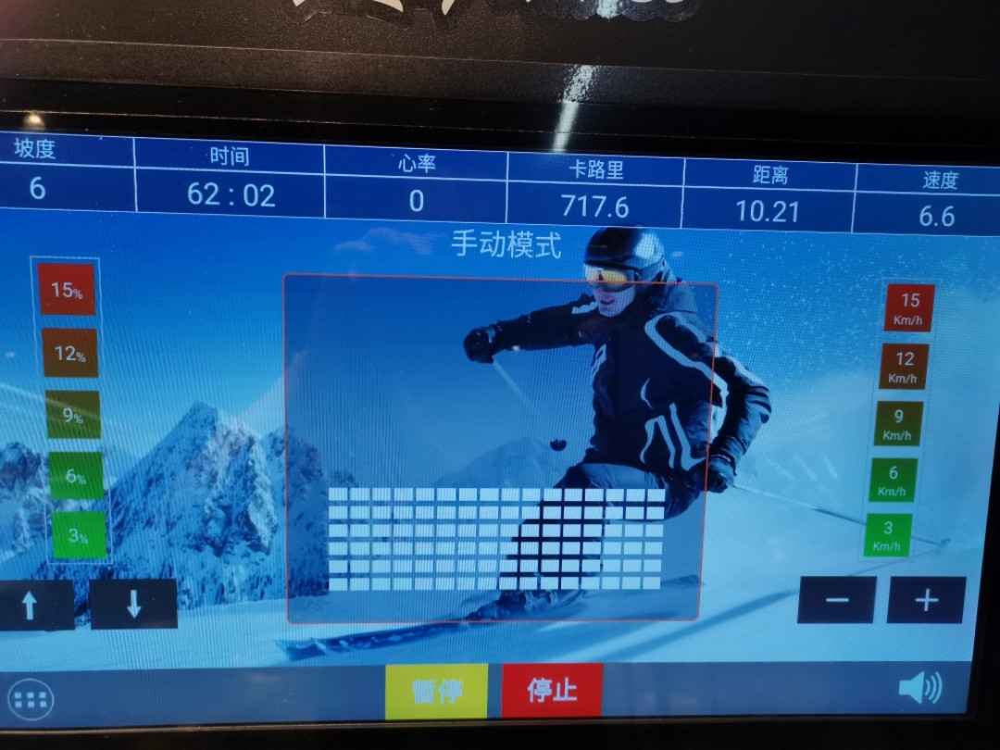

======================================================

_type: talk
@二师父[28814221155551]
2021-01-19 09:25:28 Tue  
topic_id: 815825425484442

<e type="hashtag" hid="48415144114558" title="#仓位和估值数据#" /> 仓位是指投资指数基金+主动基金+股票的金额占总投资金额的比例。不包括债券基金，大家注意看看仓位，极端保守，仓位不要低于5成，极端基金仓位不要高于9成。合理预期，近两年时间股市都给我们带来了非常不错的收益，可以对2021年有乐观的预期，不过这时候得做防守了投资看的不是3天以后得涨跌，至少得看3年以后。大多数人包括市场上很多教投资得，看的都有点短，最怕做短期正确但是长期错误得事。

市盈率百分位59.61%，市净率百分位37.06%，SY-BY百分位69.37%，SY/BY百分位64.75%。当前估值已经高于2018年1月估值，但是比2015年6月，比2007年6月低，反转发生在信用收紧得临界点，至于何时反转，不得而知，如果仓位合适，可以长期持有，如果仓位过重，记得上涨减仓，全面卖出得时候至少得到估值百分位数据80%以上，如果不着急用钱，多持有优质指数，调仓部分不属于卖出。

@mumomo at 2021-01-19 09:25:28 Tue

> 二师父，可转债算在仓位里吗

----------

@二师父 at 2021-01-19 09:25:28 Tue

> 算，可以不用配这个

----------

@JOY at 2021-01-19 09:25:28 Tue

> 师父，看您昨天把场外的非银都收割了，仓位不重，场外的非银还有持有价值么？或者调仓的话，您有什么建议吗？

----------

@二师父 at 2021-01-19 09:25:28 Tue

> 易方达金融，这个我讲过，仓位不重直接调整到这个更好，后面如果回调可以再加点

----------

@JOY at 2021-01-19 09:25:28 Tue

> 谢谢您～

----------

@丸子妈 at 2021-01-19 09:25:28 Tue

> 可转债基金应该也算，债券基金不算，对吧?

----------

@二师父 at 2021-01-19 09:25:28 Tue

> 对

----------

阅读[1]  评论[7]  赞[0] 

======================================================

_type: talk
@薇薇[111185852284182]
2021-01-19 10:36:23 Tue  
topic_id: 815825428825422

师父，今天的可转债还打吗，另外二师父建议哪个评级以上的可转债可以放心打，大概率不会破发

@二师父 at 2021-01-19 10:36:23 Tue

> 目前AAA以上保险，最近可转债行情都不大好

----------

@薇薇 at 2021-01-19 10:36:23 Tue

> 好的，谢谢师父

----------

阅读[1]  评论[2]  赞[0] 

======================================================

_type: talk
@二师父[28814221155551]
2021-01-19 10:41:41 Tue  
topic_id: 215825428821411

<e type="hashtag" hid="48415144115558" title="#未来的一些方向#" /> 机构资金都去抄底港股了，准备好资金，等待A股回调，港股配置的有恒生指数，恒生科技、中概，差不多够了，后面恒生用中概替代。

另外港股医疗买入了一点，后面如果继续涨就暂停，如果回调也会投资的。总之不会和机构抢筹码，避开他们。

@素兮 at 2021-01-19 10:41:41 Tue

> 恒生几天前就全调仓了[大哭]

----------

@二师父 at 2021-01-19 10:41:41 Tue

> 调哪里了

----------

@素兮 at 2021-01-19 10:41:41 Tue

> 国开债和中概互联

----------

@二师父 at 2021-01-19 10:41:41 Tue

> 中概挺好，就是估值稍微高一点

----------

@闲云 at 2021-01-19 10:41:41 Tue

> 持有华夏恒生ETF联接(000071) ，那现在需要加仓吗？[微笑]

----------

@JOY at 2021-01-19 10:41:41 Tue

> 前些时候把恒生都调仓了[流泪]～看来真是功夫不够哈，忍了快一年了，就差这一哆嗦了，完美错过这波行情～

----------

@程大圣 at 2021-01-19 10:41:41 Tue

> H股etf要不要卖一下[偷笑]

----------

@二师父 at 2021-01-19 10:41:41 Tue

> 慢慢卖，还得涨

----------

阅读[1]  评论[9]  赞[0] 

+++++++++++++++++++++++++++++++++++++++++++++++++++++

文件：
2021-01-19 10:39:49 Tue
文件大小：[33920]
28445151545251-刺激，涨完A股涨港股.docx

======================================================

_type: q&a
@Zyxj[111841455151112]
2021-01-19 10:52:57 Tue  
topic_id: 582152451128114

@Zyxj

>  二师父您好！广发证券买不了03088这个基金，要怎么办

@二师父

>  置顶文章，港美股开户开通港股账户才能购买

阅读[1]  评论[4]  赞[0] 

======================================================

_type: q&a
@雪莲[421485848588118]
2021-01-19 11:09:03 Tue  
topic_id: 582152451548824

@雪莲

>  二师父您好，我前段时间配置了25%的518880.现在负了1.48%，您帮我看看，这个基金还适合持有吗？

@二师父

>  黄金别弄了，强周期指数，不生息，长期跑不赢沪深300

阅读[1]  评论[1]  赞[0] 

======================================================

_type: talk
@CY[48248584825128]
2021-01-19 11:16:58 Tue  
topic_id: 414854258224488

师父，消费ETF小幅回调，可以补仓吗？目前消费空仓状态

@二师父 at 2021-01-19 11:16:58 Tue

> 虽然回调了，但是消费仍旧盈利翻倍，我没补，如果准备投资10年，不惧任何回撤，现在可以补，否则不要补。

----------

@CY at 2021-01-19 11:16:58 Tue

> 好的，主要考虑春节可能会有一波，谢谢师傅明白嘞~

----------

阅读[1]  评论[2]  赞[0] 

======================================================

_type: q&a
@好运玲玲[244188585541521]
2021-01-19 12:40:32 Tue  
topic_id: 815825424148252

@好运玲玲

>  二师父您好！帮忙看一下通信设备etf515880怎么样，现在可以买入吗？

@二师父

>  这个可以买，作为卫星配置

阅读[1]  评论[1]  赞[0] 

======================================================

_type: q&a
@J[28281541518551]
2021-01-19 13:33:33 Tue  
topic_id: 414854251454428

@J

>  师父，今天消费收割的盈利可否调仓至你昨天买入的易方达金融行业主动基金和上投生物科技？

@二师父

>  如果仓位重就现金，如果仓位不重那就调整过去

阅读[1]  评论[0]  赞[0] 

======================================================

_type: q&a
@Amanda[111184528448582]
2021-01-19 13:35:44 Tue  
topic_id: 215825421524141

@Amanda

>  二师父，能说说芯片吗？现在有投资价值吗？可以入手吗？谢谢！

@二师父

>  芯片和半导体属于一个方向的，景气周期，目前也是国家战略推动，唯一不确定的是芯片国产替代能否实现，如果可以的话，那么值得配置，如果不可以的话，他就不如纳斯达克

阅读[1]  评论[0]  赞[0] 

======================================================

_type: talk
@二师父[28814221155551]
2021-01-19 13:37:50 Tue  
topic_id: 414854251815248

港股沸腾了，全面配置值得拥有，无论多看好一个板块，永远别单调

@Philip🎭 Y at 2021-01-19 13:37:50 Tue

> 中概互联没来得及上车 
现在能上吗

----------

@二师父 at 2021-01-19 13:37:50 Tue

> 别上了，场内都有溢价了

----------

@Philip🎭 Y at 2021-01-19 13:37:50 Tue

> 谢谢师父，还是按照网格发车

----------

@闲云 at 2021-01-19 13:37:50 Tue

> 上证50要减仓吗？

----------

@二师父 at 2021-01-19 13:37:50 Tue

> 仓位重可以卖出利润部分

----------

@闲云 at 2021-01-19 13:37:50 Tue

> 谢谢二师父，每次提问都能得到很明确的回答，投资小白心里踏实多了！感谢🙏

----------

阅读[1]  评论[6]  赞[0] 

======================================================

_type: talk
@九妹Amy''[815584258228542]
2021-01-19 15:32:19 Tue  
topic_id: 182542112524242

二师傅，新能源是不是没有行情了，目前亏4个点，成本2.227买入的，买了4万块钱，是继续等还是找机会卖出了

@二师父 at 2021-01-19 15:32:19 Tue

> 这个不好预测，追高买入设定止损点，不管如何破了8个点亏损走人，明天再观察下，新能车跌破20日均线放量就走了，如果撑住了还可以等一等。

----------

@志亮 at 2021-01-19 15:32:19 Tue

> 趋势交易买入前就要有策略，一定要设置好止损点，若是不幸被套就要舍得割肉，趋势不同逆势投资，下跌时千万不要补仓，趋势比逆势唯一的优势就是不会被套，不会怕遇到像“南极电商”这种票，要懂得利用趋势的优势，投资就不怕追高，怕高都是苦命人。
当你问二师父时，你这次投资己输了一半，因为你买入时没策略，当然这只是我个人见解[呲牙]，不对之处请见谅，毕竟我也只是一个小韭菜[呲牙]。

----------

@是喵喵吖～ at 2021-01-19 15:32:19 Tue

> 我就是😂买之前没有打算好😂

----------

@志亮 at 2021-01-19 15:32:19 Tue

> 买入时有策略遇到下跌就不慌，保证本金才是最重要的，至于能不能赚，赚多少就看老天爷了[呲牙][呲牙][呲牙]

----------

@九妹Amy'' at 2021-01-19 15:32:19 Tue

> 好的，师傅，谢谢

----------

阅读[1]  评论[5]  赞[0] 

======================================================

_type: talk
@二师父[28814221155551]
2021-01-19 16:45:58 Tue  
topic_id: 815825445448452

<e type="hashtag" hid="824514224452" title="#指数估值表#" /> 消费和深红利进入正常估值，食品和白酒、新能源继续高估，不要碰，之前3月新能源和白酒是低估的，一定要有耐心等待，定投也至少重回正常估值按均线策略。不然回撤很大，不知道星球有多少朋友经过2015年熊市，谁也无法预测下一次是飞刀还是反弹，保守主义投资者夜夜安枕。持有的继续持有，买入成本低，很难跌到成本价格以下，回去了继续满仓。但从低估到高估，从高估到低估这个位置保持耐心。

光伏新加入了，是个景气行业指数，未来鳄鱼计划会配置，乌龟计划相对保守，强周期的未来会退出配置。总会有机会的，二师父一直会发掘机会，如果发掘不到，就休息。

之前估值表一周一更，就是我把更多的精力放在研究行业和企业上了，大家看，银行指数和地产指数都是不估值的，每一次选择或者放弃都是为了让我或者我们变得更好，而不是偷懒，我不是个懒人，一直在精进，而实际上行业研究和企业研究所耗费的精力远比估值表多，当然，也会为我们的投资贡献更好的收益。

最近波动大，这是A股现状，保持合理仓位和睡眠，握住了，随便上车或者下车很快心态就崩了，稳住才能赢。可以自行上车或者下车，但是要保证节奏。

@smile at 2021-01-19 16:45:58 Tue

> 二师父，请问你觉得哪种宽基组合更好：1、深红利+50ah+创业板50；2、300+500+创业板；3、中证100+深红利+创业板。谢谢

----------

@二师父 at 2021-01-19 16:45:58 Tue

> 第三个更好

----------

@smile at 2021-01-19 16:45:58 Tue

> 谢谢二师父，中证100和深红利重叠很大吗？您有更好的组合推荐不？[微笑]

----------

@smile at 2021-01-19 16:45:58 Tue

> 有点不明白，如果选50ah和深红利不是没有重叠吗？为啥方案3反而更好呢

----------

@🍀 凝🌸 慧🍀 at 2021-01-19 16:45:58 Tue

> 不断深入研究行业和企业，肯定是要消耗大量时间和精力，感谢二师父不断分享劳动成果！[玫瑰][玫瑰][玫瑰]

----------

@二师父 at 2021-01-19 16:45:58 Tue

> 有部分重合，易方达上证50吧，宽基年化10到15，合理预期就行

----------

@smile at 2021-01-19 16:45:58 Tue

> 多谢二师父

----------

@杜志彪 at 2021-01-19 16:45:58 Tue

> 我消费高估收割了4次，今天加了一份，掌握节奏慢慢来[微笑]

----------

阅读[1]  评论[15]  赞[0] 

+++++++++++++++++++++++++++++++++++++++++++++++++++++

图片：
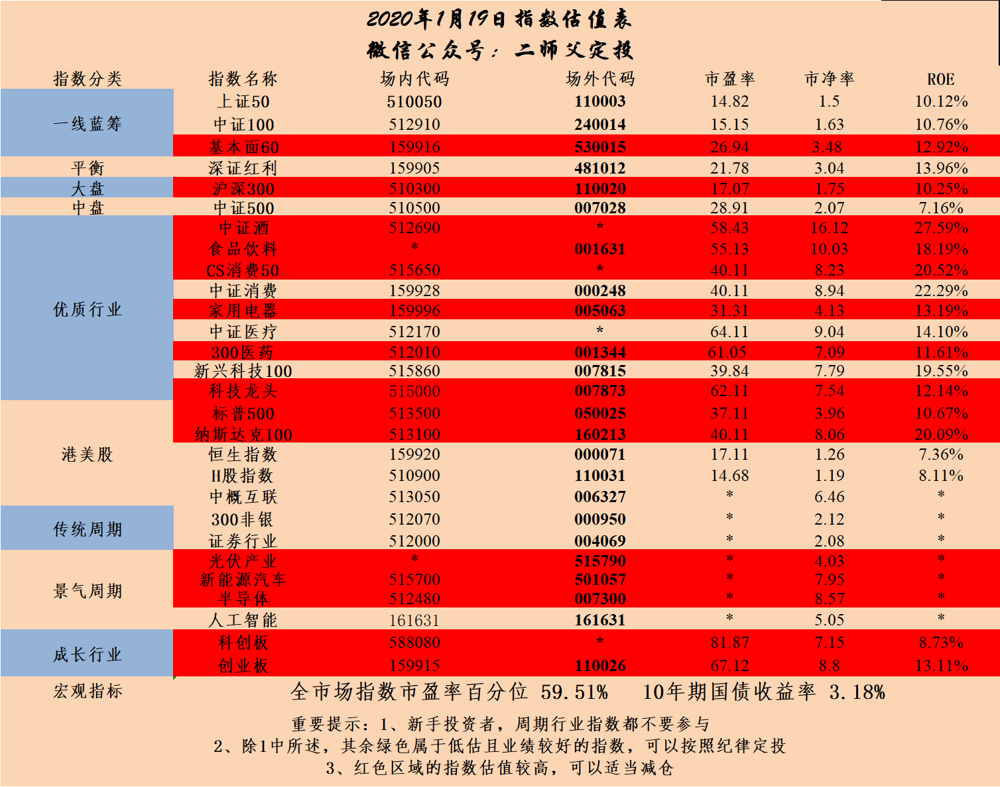

======================================================

_type: q&a
@长安流歌[118228425411222]
2021-01-19 21:23:47 Tue  
topic_id: 815825444154142

@长安流歌

>  师父:深红利正常估值，前面没有很多仓位，是不是可以加仓？是买场内基金，还是买场外，代码是多少

@二师父

>  一般是低估的时候一直定投，目前可以轻仓定投，如果在90日均线以下可以正常定投，这样的话比较保险，建底仓目前还不大合适

阅读[1]  评论[1]  赞[0] 

======================================================

_type: q&a
@北京记忆王  智能英*[182542152114542]
2021-01-19 21:52:41 Tue  
topic_id: 215825441282541

@北京记忆王  智能英*

>  请教二师傅，现有基金创50百分30，深红利百分6，光伏百分6，医疗百分8，隆基股份百分50，这样合适吗？预备隆基股份掉下来，再加仓。敢于二师傅，这种想法可行吗？

@二师父

>  没啥问题，光伏景气板块，隆基是光伏龙头，波动能承受住就可以的

阅读[1]  评论[1]  赞[0] 

======================================================

_type: q&a
@付云[844148188522822]
2021-01-20 09:44:46 Wed  
topic_id: 582152488245424

@付云

>  想加仓中概互联网，可以不！多少合适

@二师父

>  你目前加就属于赌趋势上涨了，如果能设定止损位和回撤止盈位，多少都合适，如果不能的话，就别加了

阅读[1]  评论[1]  赞[0] 

======================================================

_type: talk
@二师父[28814221155551]
2021-01-20 09:46:48 Wed  
topic_id: 815825411518152

大家注意，我说港股好，不是让大家现在去买，机构是在去年11月底就进了，目前一直加资金，如果这时候买，就要考虑港股崩的时候自己会不会走，比如之前追高白酒的，发现不对立马撤退，不要混淆定投和趋势两种方法

@雨淡风清 at 2021-01-20 09:46:48 Wed

> 在别人疯狂的时候我们要冷静，管住手啊！血的教训

----------

@志亮 at 2021-01-20 09:46:48 Wed

> 现在进去被割韭菜，我守着我的a股好了[呲牙]

----------

@二师父 at 2021-01-20 09:46:48 Wed

> 是的，初期能吃一波，但是很多人吃着吃着加的仓位越来越大，最后被割了

----------

@mumomo at 2021-01-20 09:46:48 Wed

> 二师父，那今天认购的华夏恒生互联网513333是不是也不要认购啊

----------

@二师父 at 2021-01-20 09:46:48 Wed

> 看你是哪种策略了

----------

@付云 at 2021-01-20 09:46:48 Wed

> 剁手[呲牙][呲牙][呲牙]

----------

@mumomo at 2021-01-20 09:46:48 Wed

> 就是说，赌趋势就上，按估值的话就先不要动，对不对

----------

@二师父 at 2021-01-20 09:46:48 Wed

> 差不多这个意思

----------

阅读[1]  评论[11]  赞[0] 

======================================================

_type: q&a
@J[28281541518551]
2021-01-20 09:48:14 Wed  
topic_id: 815825411518822

@J

>  师父，人工智能和医疗etf现在合适加仓吗

@二师父

>  轻仓加可以

阅读[1]  评论[6]  赞[0] 

======================================================

_type: talk
@二师父[28814221155551]
2021-01-20 10:20:55 Wed  
topic_id: 182542825218552

两个重要的事，第一：关于何时加仓，目前跌不下去，仓位不足的，正常估值指数可以回调加仓，不要追高，高估的指数别动，回调多少都别加，除非你设定止损位。

第二：关于仓位，极端保守的投资者仓位不能够低于5成，激进的投资者仓位不能超过9成。

做好这两点，基本没啥问题，至于卖出随意，只要不触碰5层以上的仓位线就可以。

@是喵喵吖～ at 2021-01-20 10:20:55 Wed

> 师父咱们前段时间买入的医疗现在盈利20%多了，也是持仓不动就可以是吧。

----------

@二师父 at 2021-01-20 10:20:55 Wed

> 不动，这是高景气赛道，除非你持仓特别多，可以收割利润。后面如果有回调还会继续买入的

----------

@水冰月槑槑🌙 at 2021-01-20 10:20:55 Wed

> 医疗是哪一个？

----------

@二师父 at 2021-01-20 10:20:55 Wed

> 512170

----------

@芙瑞雅阳阳潘 at 2021-01-20 10:20:55 Wed

> 师父的意思是，现在大盘上升通道，不要轻易卖出，保留至少5发仓位，我解读的可对？

----------

@二师父 at 2021-01-20 10:20:55 Wed

> 是的，大概率今年还是走牛，所以主仓不能丢

----------

@芙瑞雅阳阳潘 at 2021-01-20 10:20:55 Wed

> 好哒，份额一定拿住！

----------

阅读[1]  评论[7]  赞[0] 

======================================================

_type: talk
@二师父[28814221155551]
2021-01-20 11:30:00 Wed  
topic_id: 414854148251228

<e type="hashtag" hid="48415148552418" title="#关于港股的态度#" />

@阝東 at 2021-01-20 11:30:00 Wed

> 等二师傅喊下车，我就把恒生割一半或者清了

----------

@步步惊心 at 2021-01-20 11:30:00 Wed

> 二师父你好 001984是香港基金？谢谢

----------

@步步惊心 at 2021-01-20 11:30:00 Wed

> 二师父你好 164906 513050 002891基金是香港基金还是美国基金？如果是美国的现在美元汇率高，核算吗？ 谢谢😜

----------

@自由飞翔 at 2021-01-20 11:30:00 Wed

> 中概互联继续持有！

----------

阅读[1]  评论[4]  赞[0] 

+++++++++++++++++++++++++++++++++++++++++++++++++++++

文件：
2021-01-20 11:29:49 Wed
文件大小：[33431]
15112845188512-警惕别当了接盘侠.docx

======================================================

_type: q&a
@shininggre*[15551242111522]
2021-01-20 15:52:28 Wed  
topic_id: 815825154212282

@shininggre*

>  二师父，您好。手头有个基金001469，全指金融地产，收益率不好，想换成其他基金，请问有无推荐？谢谢。

@二师父

>  同赛道的话易方达金融股票好一点，不同赛道的话当下等着消费回调慢慢转移好一点

阅读[1]  评论[0]  赞[0] 

======================================================

_type: talk
@二师父[28814221155551]
2021-01-20 15:57:33 Wed  
topic_id: 414854142248528

<e type="hashtag" hid="552114551414" title="#估值数据#" /> 今日估值数据，市盈率百分位59.57%，市净率百分位37.83%，SY-BY百分位69.34%，SY/BY百分位64.57%。

当下仍旧震荡结构行情，白酒消停了，医疗发力，目前消费回调，50AH计划慢慢在均线以下调仓到消费基金，其他的暂时不同，仓位不会降低，如果能承受波动，可以适当增加行业指数的配置，如果不能承受太大波动，沪深300就是不错的选择。

@wty at 2021-01-20 15:57:33 Wed

> 消费和创业板仓位各有2%，看估值表沪深300高估了，想把沪深300ETF换仓到主要消费或创业板，创业板也高估，现在能换到主要消费吗？

----------

@二师父 at 2021-01-20 15:57:33 Wed

> 这个没太大必要了，300也不错的，消费涨了，300也大概率涨

----------

@wty at 2021-01-20 15:57:33 Wed

> 好的👌，那就不折腾了，等消费回调再慢慢买，谢谢二师父

----------

@付云 at 2021-01-20 15:57:33 Wed

> 现在定投沪深300能不能行呢？

----------

@二师父 at 2021-01-20 15:57:33 Wed

> 能坚持一个牛熊周期可以

----------

@付云 at 2021-01-20 15:57:33 Wed

> 现在挺纠结的，买什么都太贵了！之前一直没有配好宽基！现在慢慢想开始积累，结果是“轻舟已过万重山”，我想现在逐步建立宽基，300+深红利+科创50。长期持有，不知道能不能行。可是又怕高处不胜寒啊！一直纠结中，求教二师傅

----------

阅读[1]  评论[6]  赞[0] 

======================================================

_type: talk
@二师父[28814221155551]
2021-01-20 16:35:04 Wed  
topic_id: 215825185288581

恒生科技太猛了，比小米涨的还多，每个产品都有其意义，投资先选对方向，然后再把握细节。

@nana at 2021-01-20 16:35:04 Wed

> 师傅，开通了沪港通、深港通都买不了恒生科技，应该开通什么渠道才能买？

----------

@二师父 at 2021-01-20 16:35:04 Wed

> 在置顶文章开通香港账户

----------

阅读[1]  评论[2]  赞[0] 

======================================================

_type: talk
@天马行空[548818851412444]
2021-01-21 03:27:39 Thu  
topic_id: 182542842885552

<e type="hashtag" hid="552114551414" title="#估值数据#" /> 沪深300代码多少，请教师傅。

@梅子 at 2021-01-21 03:27:39 Thu

> 510300场内，110020场外

----------

@天马行空 at 2021-01-21 03:27:39 Thu

> 谢谢

----------

阅读[1]  评论[2]  赞[0] 

======================================================

_type: q&a
@天马行空[548818851412444]
2021-01-21 08:27:02 Thu  
topic_id: 414854154121228

@天马行空

>  师傅，易方达裕丰汇报债券和广发中债国开债有何不同。收益和风险做个比较呗。好像师傅推荐得仓位裕丰多得多。

@二师父

>  易方达裕丰回报债收益率会好一点，风险偏高一些，国开债相对比较稳定一些，收益率低一点，适合防守配置

阅读[1]  评论[1]  赞[0] 

======================================================

_type: q&a
@鳗鱼[182242255828582]
2021-01-21 09:13:10 Thu  
topic_id: 815825128142452

@鳗鱼

>  师父，手头有40万资金，大概半年后要用，如何配置妥当一些？谢谢！

@二师父

>  那只有货币基金了，如果能承受百分之5左右的亏损，可以配置二级债基

阅读[1]  评论[4]  赞[0] 

======================================================

_type: talk
@二师父[28814221155551]
2021-01-21 09:55:26 Thu  
topic_id: 215825124181281

<e type="hashtag" hid="51285821885514" title="#267期乌龟计划#" /> 继续发车，调仓，一份卖出50AH,买入一份消费，相当于调整。如果消费继续回调的话，依然会调整，未来会增配行业指数。如果无仓位的，可以直接买0.5份消费，如果仓位过重的，卖出50AH，就不用买了，大家根据实际来。

@自由飞翔 at 2021-01-21 09:55:26 Thu

> 师父，003376是国开债吧？

----------

@果实妈咪 at 2021-01-21 09:55:26 Thu

> 代码不对，我搜出来也是国债

----------

@是喵喵吖～ at 2021-01-21 09:55:26 Thu

> 师父 那个汇添富消费是不是代码写错了

----------

@二师父 at 2021-01-21 09:55:26 Thu

> 不好意思代码写错了，我改一下，000248

----------

@J at 2021-01-21 09:55:26 Thu

> 师父，50AH高估了吗

----------

@Kevin Chan at 2021-01-21 09:55:26 Thu

> 二师父，汇添富消费的代码是不写错了呀

----------

@白山羊 at 2021-01-21 09:55:26 Thu

> 在天天基金上根投了，是每次发车都点一键跟投吗[囧]

----------

@吃肉肉 at 2021-01-21 09:55:26 Thu

> 代码不对

----------

阅读[1]  评论[12]  赞[0] 

+++++++++++++++++++++++++++++++++++++++++++++++++++++

图片：
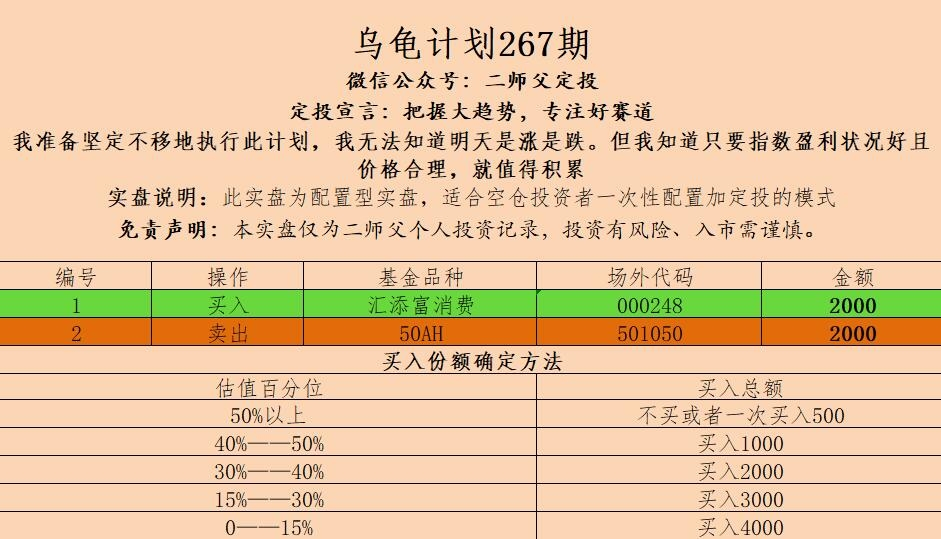

======================================================

_type: talk
@幽兰[815554522442422]
2021-01-21 09:58:07 Thu  
topic_id: 815825124114182

二师父，您那个华宝开户的链接怎么找来着？还有佣金费率是多少？

@二师父 at 2021-01-21 09:58:07 Thu

> 置顶文章有的，基金万一免五

----------

@幽兰 at 2021-01-21 09:58:07 Thu

> 已经成功开户，是要明天才能开始交易吗？

----------

@二师父 at 2021-01-21 09:58:07 Thu

> 开了就可以

----------

阅读[1]  评论[3]  赞[0] 

======================================================

_type: talk
@二师父[28814221155551]
2021-01-21 10:04:50 Thu  
topic_id: 414854151441558

各位读者抱歉，消费的代码写错了，是000248，已经更正过来了，直接同比例调仓，因为天天基金调仓会有延迟交易，所以先卖出，后买入

@毛毛宇 at 2021-01-21 10:04:50 Thu

> 师夫，为什么不买场内的消费ETF159928？

----------

@二师父 at 2021-01-21 10:04:50 Thu

> 场内消费比重很多了，你参考我鳄鱼计划仓位，你场内买一样的

----------

@丸子妈 at 2021-01-21 10:04:50 Thu

> 场内没多少消费，现在可以场内场外同时买消费吗？

----------

@二师父 at 2021-01-21 10:04:50 Thu

> 轻仓可以

----------

阅读[1]  评论[4]  赞[0] 

======================================================

_type: talk
@二师父[28814221155551]
2021-01-21 10:40:12 Thu  
topic_id: 182542848511222

去年鳄鱼补了医疗他就一路上涨，没有给补仓的机会，我还是喜欢熊市，可以慢慢积累份额，目前医疗仓位不足，后面消费估计不会再补了，除非进入低估，更多的是等医疗，科技回调再次补。如果不回调，那就等着吧。

熊市的时候，我们要坚信，股市一定会涨起来的，牛市的时候我们也要坚信，股市一定会跌下去的。

@舵手 at 2021-01-21 10:40:12 Thu

> 好多专家和经济学家说以后很长一段时间没有熊市了，至少十年。我经历了07和15，这种言论听了不少，虽然如此，还是战战兢兢如履薄冰。

----------

@二师父 at 2021-01-21 10:40:12 Thu

> 听听就行了，专家今年三月说经济危机来了，要清仓，听他们的我们就越来越穷，15年万点不是梦，不知道跪了多少人

----------

@样 at 2021-01-21 10:40:12 Thu

> 师父，我想把中证500调仓到今天投的消费，或者是食品饮料里可以吗？长期看好消费和食品饮料，2年前还懵懵懂懂的时候买的中证500，现在也有70+%的收益了

----------

@二师父 at 2021-01-21 10:40:12 Thu

> 消费调整可以，不过回撤会很大，食品饮料里面酒企业比较多，先等等

----------

@样 at 2021-01-21 10:40:12 Thu

> 好的，那我晚点再调整过去，真是一个不断学习的过程，两年前买500的时候，也是做了功课的，现在更贪心了[偷笑]，不再满足买宽基了，当时是想着把孩子的压岁钱存着

----------

阅读[1]  评论[5]  赞[0] 

======================================================

_type: q&a
@小鱼[241182222251181]
2021-01-21 11:16:59 Thu  
topic_id: 215825121418541

@小鱼

>  场内没有消费基金，这个价位可以建仓吗

@二师父

>  场内也有消费etf的，目前建必须控制头寸

阅读[1]  评论[1]  赞[0] 

======================================================

_type: talk
@二师父[28814221155551]
2021-01-21 12:27:49 Thu  
topic_id: 815825145811852

面对当下的行情我只想说，知足不辱，知止不殆

知道满足就不会受到屈辱，知道适可而止就不会有危险。其实何止投资，商场，官场也是完全一样。

@杜志彪 at 2021-01-21 12:27:49 Thu

> 大家这么踊跃估计2月份要割一批了，控制好仓位吧[微笑]

----------

阅读[1]  评论[1]  赞[0] 

======================================================

_type: talk
@二师父[28814221155551]
2021-01-21 12:37:55 Thu  
topic_id: 582152842511224

张坤，萧楠的基金最新持仓股票出来了，注重科技，减少了医药和消费，这两个基金经理确实厉害，他们的混合基金值得多关注，尤其是张坤，管理资产规模1000亿，这是很少见的，优质的基金经理管理的主动基金仍具有很大的超额收益

@衣袂飘香 at 2021-01-21 12:37:55 Thu

> 二师父，今年多研究些主动基金，我们可以拓宽学习领域。

----------

@圣诞结® at 2021-01-21 12:37:55 Thu

> 我的易方达蓝筹买了一年半 利润率竟然都有75%了 当初本金少 就买了一只主动性 没想到就这个涨的最好😂

----------

@二师父 at 2021-01-21 12:37:55 Thu

> 好的

----------

@栀子花开 at 2021-01-21 12:37:55 Thu

> 我每周定投的坤哥的蓝筹精选，半年下来收益率达到了56%，400亿的规模还有这么大超额收益想不敢想

----------

@六尘不改 at 2021-01-21 12:37:55 Thu

> 现在700亿了

----------

@六尘不改 at 2021-01-21 12:37:55 Thu

> 我坤哥天下无敌

----------

@波多黎各 at 2021-01-21 12:37:55 Thu

> 请问二师父，他俩这两个混合基金啥时候入合适？等牛熊转换吗？

----------

@二师父 at 2021-01-21 12:37:55 Thu

> 相对低位的时候

----------

阅读[1]  评论[14]  赞[0] 

======================================================

_type: q&a
@Rachel[51558542555524]
2021-01-22 08:19:09 Fri  
topic_id: 182545281248542

@Rachel

>  请问什么基金是可以重仓小鹏 蔚来 理想 特斯拉的基金呢？

@二师父

>  ARKK，这个重仓是特斯拉

阅读[1]  评论[0]  赞[0] 

======================================================

_type: talk
@二师父[28814221155551]
2021-01-22 08:33:40 Fri  
topic_id: 182545525824282

<e type="hashtag" hid="144254515412" title="#全市场估值#" /> 市盈率百分位60.27%，市净率百分位41.18%，SY-BY百分位70.62%，SY/BY百分位66.37%。

市场估值进一步上升，贵不代表立马会下跌，便宜不代表立马会上涨，在2019年初的时候全市场估值低到了10%以下，当时所有人都以为不会再涨了，现在各路大神纷纷预言A股10年牛市，不会再跌了，然而这些都是违背常识的。

SY-BY百分位到达90%以上的时候，一定记得减仓，除非自己能够经受住任何级别的波动，可以长期持有，否则记得慢慢获利收获了，现在的话，利润收割之后，还可以捂一捂。情绪的钟摆尚未摆到极限。

@🍀 凝🌸 慧🍀 at 2021-01-22 08:33:40 Fri

> 每天看到师父的分析，真是安心[愉快][爱心]

----------

阅读[1]  评论[1]  赞[0] 

======================================================

_type: talk
@二师父[28814221155551]
2021-01-22 08:48:20 Fri  
topic_id: 215828858111581

<e type="hashtag" hid="15284824514852" title="#乌龟计划持仓#" /> 当前乌龟计划持仓如下，未来会逐步加大行业指数的配置。做个小调查，大家是想景气周期新能源，光伏等基金只在鳄鱼计划配置，还是既在鳄鱼计划，也在在乌龟计划中配置，选择只在鳄鱼中配置的打个1，选择两个里面都配置的打个2.

注意目前乌龟计划仓位76%，这个仓位未来涨了会稳稳拿住，跌了也会稳稳拿住，先调整宽基到行业，然后如果真的再来一次深蹲的话，启动资金继续定投。

行情不好预测，即使牛市，也会有回调的，多分析基金和行业动向，把握住主要机会。

@吃肉肉 at 2021-01-22 08:48:20 Fri

> 1

----------

@Tim at 2021-01-22 08:48:20 Fri

> 2

----------

@木易火 at 2021-01-22 08:48:20 Fri

> 1

----------

@北京记忆王  智能英* at 2021-01-22 08:48:20 Fri

> 2

----------

@庆余年 at 2021-01-22 08:48:20 Fri

> 2

----------

@黎雄 at 2021-01-22 08:48:20 Fri

> 1

----------

@冯林锋 at 2021-01-22 08:48:20 Fri

> 1

----------

@🍀 凝🌸 慧🍀 at 2021-01-22 08:48:20 Fri

> 2

----------

阅读[1]  评论[89]  赞[0] 

+++++++++++++++++++++++++++++++++++++++++++++++++++++

图片：
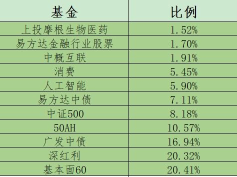

======================================================

_type: q&a
@J[28281541518551]
2021-01-22 09:49:43 Fri  
topic_id: 582151125558824

@J

>  师父，靖远转债今天破发了，能继续持有到盈利吗？还是卖出？

@二师父

>  卖出了，最近一段时间3A以下评级的转债放弃申购

阅读[1]  评论[10]  赞[0] 

======================================================

_type: q&a
@Dolly[244124525445551]
2021-01-22 10:19:54 Fri  
topic_id: 414858845288188

@Dolly

>  二师父，今天的可转债N韦尔转涨了50%，停牌了，要怎么卖出？

@二师父

>  熔断之后过一段时间会重启交易

阅读[1]  评论[1]  赞[0] 

======================================================

_type: talk
@二师父[28814221155551]
2021-01-22 10:26:12 Fri  
topic_id: 215828852184521

最近高景气板块，光伏+医疗，市场来回做，先是白酒新能车，现在是另外两个，券商仍旧没有拉升，市场信心不够充足，方向很重要

@丸子妈 at 2021-01-22 10:26:12 Fri

> 光伏的基金代码是?

----------

@二师父 at 2021-01-22 10:26:12 Fri

> 估值表有

----------

@浪淘沙 at 2021-01-22 10:26:12 Fri

> 二师父，请问光伏的场外基金是哪个呢？

----------

@二师父 at 2021-01-22 10:26:12 Fri

> 目前还没有

----------

@浪淘沙 at 2021-01-22 10:26:12 Fri

> 好的，谢谢二师父

----------

阅读[1]  评论[5]  赞[0] 

======================================================

_type: talk
@二师父[28814221155551]
2021-01-22 11:10:48 Fri  
topic_id: 582151124145224

<e type="hashtag" hid="51285825552824" title="#方向#" /> 多追踪机构持仓，他们花费巨资投研分析都是非常有价值的。
今天基金账户是浮亏的，股票账户是浮盈的，主要是股票账户搞得是光伏和医药两个方向，而基金账户消费配置的比较多，对于普通投资者还是全面配置相对稳妥。最近市场波动大，注意稳定心态，之前泰格医药大涨我下车了，下车了就做好上不来的准备，真的无惧任何波动的话，轻仓分散长期持有优质龙头是最好的策略，比来回折腾强。

阅读[1]  评论[0]  赞[0] 

+++++++++++++++++++++++++++++++++++++++++++++++++++++

文件：
2021-01-22 11:06:37 Fri
文件大小：[33526]
28445118882481-跟着大佬走，找到投资方向.docx

======================================================

_type: q&a
@林凤崎[421882481454488]
2021-01-22 11:53:04 Fri  
topic_id: 414858842288218

@林凤崎

>  二师父，我指数类的都基本出了，进的主动基金，有问题吗

@二师父

>  这得分基金，有的主动基金好，也有的主动基金很差

阅读[1]  评论[2]  赞[0] 

======================================================

_type: q&a
@nana[48222415211188]
2021-01-22 12:31:50 Fri  
topic_id: 582151124815414

@nana

>  师傅，这个集合产品怎么样？能买吗？

@二师父

>  最好不要买

阅读[1]  评论[2]  赞[0] 

======================================================

_type: talk
@二师父[28814221155551]
2021-01-22 13:36:28 Fri  
topic_id: 815828885111542

<e type="hashtag" hid="881251425252" title="#鳄鱼计划#" /> 卖出恒生ETF（159920）3份，同比例资金买入光伏ETF（515790）3份。注意目前鳄鱼计划仓位已经降低到8成以下，如果未来有深度回调的话，会继续加仓，当前位置如果SY-BY百分位不上升到80%以上，暂时不考虑减仓。

仓位表每次也公布的，大家参考下，其实市场还是有结构性机会，多发掘。

@向前进 at 2021-01-22 13:36:28 Fri

> 师父光伏买入价是多少

----------

@二师父 at 2021-01-22 13:36:28 Fri

> 1.28

----------

@自由飞翔 at 2021-01-22 13:36:28 Fri

> 跟进

----------

@老妖 at 2021-01-22 13:36:28 Fri

> 场外可以用什么基金代替光伏

----------

@二师父 at 2021-01-22 13:36:28 Fri

> 目前还没有

----------

@庆余年 at 2021-01-22 13:36:28 Fri

> 之前筛选出一只收益还可以的主动基金，光伏锂电池行业的，东方创新科技混合，仅供参考。

----------

@杜志彪 at 2021-01-22 13:36:28 Fri

> 单位有点忙，看到时快收盘了，资金已经进到逆回购里了，星期一跟上光伏。

----------

@付云 at 2021-01-22 13:36:28 Fri

> 今天开了一天会，下周一跟上光伏

----------

阅读[1]  评论[11]  赞[0] 

+++++++++++++++++++++++++++++++++++++++++++++++++++++

图片：
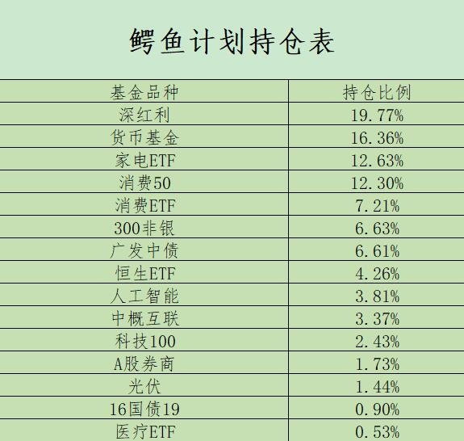

======================================================

_type: q&a
@J[28281541518551]
2021-01-22 13:37:17 Fri  
topic_id: 215828885111541

@J

>  师父，今天乌龟计划有发车吗

@二师父

>  没车了，乌龟计划基本就是固定的哈

阅读[1]  评论[3]  赞[0] 

======================================================

_type: q&a
@smile[111888142241442]
2021-01-22 13:38:22 Fri  
topic_id: 182545552824582

@smile

>  二师父，请问科技龙头etf和创业板50etf哪个更值得定投呢？目前可以上车吗？谢谢！

@二师父

>  这两个都非常值得定投，目前还不能上车，没有仓位的话可以等破20日均线小幅加仓，破60日均线开始固定定投

阅读[1]  评论[3]  赞[0] 

======================================================

_type: talk
@幽兰[815554522442422]
2021-01-22 13:40:05 Fri  
topic_id: 582151111221144

二师父 今天的形势，医疗ETF用卖出吗？

@果实妈咪 at 2021-01-22 13:40:05 Fri

> 同问，感觉很厉害医药

----------

@二师父 at 2021-01-22 13:40:05 Fri

> 我没有卖出，上次跟车的应该有30%多的利润了，要卖的话把这30%卖了吧，医疗回调还会继续加仓的

----------

@🍀 凝🌸 慧🍀 at 2021-01-22 13:40:05 Fri

> 我昨天收割了利润，也想问问师父 今天要不要卖出一部分？

----------

@果实妈咪 at 2021-01-22 13:40:05 Fri

> 百分之三十多啦二师父

----------

@幽兰 at 2021-01-22 13:40:05 Fri

> 场内医疗上次跟车买的不多，能否全卖出等下次机会再入

----------

@二师父 at 2021-01-22 13:40:05 Fri

> 想卖的话可以继续收割利润，我还是持有的哈。这个位置卖出也没啥不妥，应该还会有回调的。

----------

@果实妈咪 at 2021-01-22 13:40:05 Fri

> 我比较少，还是继续持有吧

----------

@🍀 凝🌸 慧🍀 at 2021-01-22 13:40:05 Fri

> 谢谢师父[愉快]

----------

阅读[1]  评论[8]  赞[0] 

======================================================

_type: talk
@二师父[28814221155551]
2021-01-22 13:58:20 Fri  
topic_id: 815828888511812

泰格医药4年10倍，以后尽量避免波段思维，买入，持有，富有，波段可以赚，但是真正赚几十倍几百倍还是靠长期持有。好企业都是不断向上的，真正需要卖的是民生银行，南极电商，这种

@章兵朋 at 2021-01-22 13:58:20 Fri

> 平安银行好像也不咋地

----------

阅读[1]  评论[1]  赞[0] 

======================================================

_type: talk
@二师父[28814221155551]
2021-01-22 14:27:44 Fri  
topic_id: 582151111141814

万绿丛中一点红，消费医疗是普通投资者的标配

@Philip🎭 Y at 2021-01-22 14:27:44 Fri

> 最近乌龟很少看到入医疗啊

----------

@二师父 at 2021-01-22 14:27:44 Fri

> 周一不刚买入一次，你没买？

----------

@Philip🎭 Y at 2021-01-22 14:27:44 Fri

> 翻文，感觉错过一个亿

----------

@二师父 at 2021-01-22 14:27:44 Fri

> 那个是a股医疗加港股医疗，加上今天的应该收益有百分之12了吧，QDII基金净值公布有延迟

----------

@Philip🎭 Y at 2021-01-22 14:27:44 Fri

> 真的！我跟投了

----------

@🍀 凝🌸 慧🍀 at 2021-01-22 14:27:44 Fri

> 很开心[愉快]

----------

@小鱼 at 2021-01-22 14:27:44 Fri

> 最近精准医疗场外为什么不投了

----------

@二师父 at 2021-01-22 14:27:44 Fri

> 医疗主动基金相对指数基金有超额收益，会用主动基金替代

----------

阅读[1]  评论[8]  赞[0] 

+++++++++++++++++++++++++++++++++++++++++++++++++++++

图片：
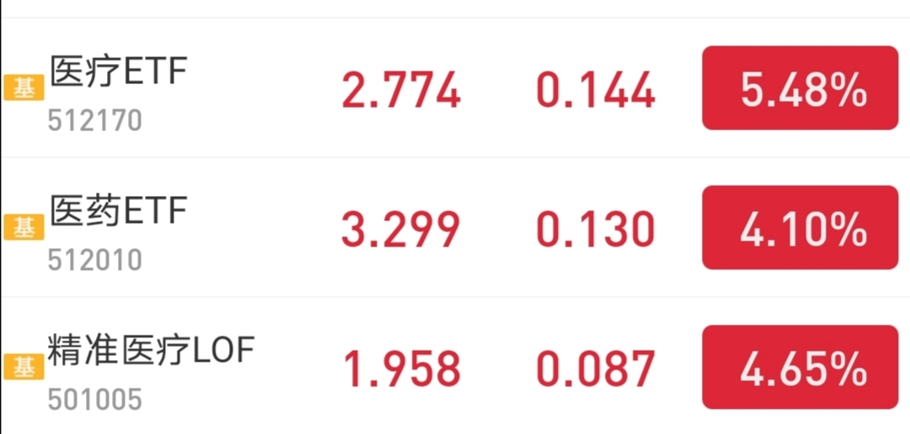

======================================================

_type: q&a
@哼哼[414855555484488]
2021-01-22 14:38:31 Fri  
topic_id: 815828888225822

@哼哼

>  二师父，刚加入，很明显跟不上节奏，我现在有深红利和红利ETF，今天绿了。能否帮我配几只鸡养着。

@二师父

>  红利etf可以不用配置，目前确实没啥好的机会，你转一半红利到消费etf，然后慢慢定投消费etf，比红利etf好，深红利可以留着，刚开始仓位打低一点

阅读[1]  评论[1]  赞[0] 

======================================================

_type: q&a
@刘英（潍坊大东化工有*[815828225545182]
2021-01-22 15:04:23 Fri  
topic_id: 215828888424181

@刘英（潍坊大东化工有*

>  老师，想问一下：链接基金跟股票指数基金有什么不同，投资哪个更好呢。比如：天弘沪深300指数增强A跟沪深300ETF链接A

@二师父

>  这个沪深300链接基金是重仓300指数基金的，增强基金的话相当于一部分复制指数，一部分基金经理主动选股，如果基金经理水平高的话增强基金会更好

阅读[1]  评论[0]  赞[0] 

======================================================

_type: q&a
@刘英（潍坊大东化工有*[815828225545182]
2021-01-22 15:13:33 Fri  
topic_id: 414858888214888

@刘英（潍坊大东化工有*

>  经常看到老师说的乌龟计划，是什么，刚来没几天，看不懂

@二师父

>  就是一个投资计划，可以在天天基金组合板块搜索乌龟计划，可以看到投资记录

阅读[1]  评论[0]  赞[0] 

======================================================

_type: talk
@二师父[28814221155551]
2021-01-22 15:15:24 Fri  
topic_id: 582151111485884

<e type="hashtag" hid="552114551414" title="#估值数据#" /> 市盈率百分位60.27%，市净率百分位41.99%，SY-BY百分位70.77%，SY/BY百分位66.67%。

成交额又起来了，当前的投资基本上属于调仓阶段，集中到优质行业指数上面，如果指数不回调到位，不会新增资金投资，就利用已投资股权基金转换，结构和方向非常重要，盈利才是王道。

@光少 at 2021-01-22 15:15:24 Fri

> 医疗太猛了没法加仓[捂脸]

----------

阅读[1]  评论[1]  赞[0] 

======================================================

_type: q&a
@波多黎各[28428858544121]
2021-01-22 15:47:15 Fri  
topic_id: 582151115225844

@波多黎各

>  师父，现在可以定投国开债吗？收益会比货基少不？银行，保险还算低估吗？

@二师父

>  目前定投已经意义不大了，做好组合配置，部分指数，部分债基，部分二级债基比较好。
>  
>  现在买银行，不如买光伏，银行一直下坡路，就招行，宁波，平安银行好点，李录建仓的邮储银行可以关注下

阅读[1]  评论[10]  赞[0] 

======================================================

_type: talk
@二师父[28814221155551]
2021-01-22 15:56:19 Fri  
topic_id: 582151115218824

又同学说，星球能不能问非投资问题，其实都可以问，投资是一个选择题，人生也是一个选择题，之所以人生有困惑是因为不知道怎么选择，就跟你不知道现在到底是买医疗好还是买银行好一样，只有多思考提升认知，选对了，才过的越来越舒服，否则，只会过的越来越艰难

@苍天有井明月空🌙 at 2021-01-22 15:56:19 Fri

> 比特币怎么看，

----------

@波多黎各 at 2021-01-22 15:56:19 Fri

> 师父，在星球问非投资问题会不会弄得星球太乱？

----------

@二师父 at 2021-01-22 15:56:19 Fri

> 不会，投资是提高认知，很多知识都需要理解

----------

阅读[1]  评论[3]  赞[0] 

======================================================

_type: q&a
@北京记忆王  智能英*[182542152114542]
2021-01-22 16:02:57 Fri  
topic_id: 582151115218844

@北京记忆王  智能英*

>  请教二师父，百分五十隆基股份，百分三十海康卫视，百分二十基金（全面配置），这样的池可行吗？谢谢

@二师父

>  能经受住波动可以，医疗最好配置一些，我不知道你投资多少年了，如果14年走到现在，对风险和波动理解比较深刻的话，这样配置可以，我重仓是在基金，股票大约总投资额的百分之10

阅读[1]  评论[1]  赞[0] 

======================================================

_type: q&a
@Amanda[111184528448582]
2021-01-22 16:18:07 Fri  
topic_id: 182545554528482

@Amanda

>  二师父，你好！广发双擎升级混合和广发高端制造股票，你能简单评一下吗？哪个更好？谢谢！

@二师父

>  刘格菘的好一点，风格稳定一些，主要还是新能源，医疗方向。广发高端制造过往收益率好，不过基金经理换的很勤，这是个潜在风险

阅读[1]  评论[2]  赞[0] 

======================================================

_type: q&a
@smile[111888142241442]
2021-01-22 17:17:01 Fri  
topic_id: 815828882458122

@smile

>  二师父，想请教个小白问题，既然目前趋势是龙头大盘股，但为何创业板也涨得不错呢？是不是创业板并非全部都是小盘股？

@二师父

>  创业板里面很多成长医疗股票，所以最近涨的好

阅读[1]  评论[5]  赞[0] 

======================================================

_type: talk
@小鱼[241182222251181]
2021-01-22 20:28:26 Fri  
topic_id: 215828825252881

问个其他问题，你们听过中源乐充吗，就是买新能源汽车的充电桩，投了十几万钱，心里有些忐忑不安

@涓涓 at 2021-01-22 20:28:26 Fri

> 二师父说过，仓位以能吃好睡着为佳，心里忐忑需要好好考量

----------

@JOY at 2021-01-22 20:28:26 Fri

> 师父说，不理解、不明白的不投，赚认知范围内的钱～
金额以能吃得下、睡得着为准～

----------

阅读[1]  评论[2]  赞[0] 

======================================================

_type: q&a
@向前进[118554515482152]
2021-01-23 00:07:31 Sat  
topic_id: 182545545254522

@向前进

>  二师父，请教个问题，保险的话大公司保费贵，保的项目少，小公司的性价比高，但是小公司万一倒闭了会不会没有保障了

@二师父

>  不会的，保险公司只有合并，就算之前的保险公司被兼并了，仍然有银保监会保障的

阅读[1]  评论[0]  赞[0] 

======================================================

_type: q&a
@心情[422114152822488]
2021-01-23 00:07:42 Sat  
topic_id: 215828828558511

@心情

>  女儿刚上大学，想定投基金，二师父现在有什么推荐的吗？

@二师父

>  沪深300和创业板

阅读[1]  评论[2]  赞[0] 

======================================================

_type: q&a
@蛋炒饭不加蛋[118281818482542]
2021-01-23 00:08:04 Sat  
topic_id: 815828825114222

@蛋炒饭不加蛋

>  请问二师父刘格崧的广发鑫享混合002132是科技类的混合基吗？看到和他之前的广发双擎广发小盘重仓股不太一样

@二师父

>  他的风格有变化，有科技类，也有其他的

阅读[1]  评论[3]  赞[0] 

======================================================

_type: talk
@笔记[841152254588422]
2021-01-23 08:24:24 Sat  
topic_id: 182545548154142

二师傅，科创50有没有投资价值。

@二师父 at 2021-01-23 08:24:24 Sat

> 有的，估值表的基金都有价值，价值大小的区别

----------

阅读[1]  评论[1]  赞[0] 

======================================================

_type: talk
@二师父[28814221155551]
2021-01-23 08:53:39 Sat  
topic_id: 215828821185241

<e type="hashtag" hid="28512152185841" title="#关注医疗的基金#" /> 介绍了一款主动基金和一款指数基金，优先选择有超额收益的主动基金，如果主动基金发生了变化，及时调仓即可。

@付云 at 2021-01-23 08:53:39 Sat

> 学习让人进步和快乐😊，太及时了

----------

@涓涓 at 2021-01-23 08:53:39 Sat

> 安心，坐等回调

----------

@姥姥不疼. 爷爷不爱 at 2021-01-23 08:53:39 Sat

> 投资就是等待、上升、收割三部曲，而等待是最痛苦的比耐心比毅力，等待的过程就是个人的修行，又有多少人耐不住诱惑寂寞冲进去却被收割[委屈]

----------

@幽兰 at 2021-01-23 08:53:39 Sat

> 葛兰的中欧确实赞，上个月接近低估的时候我发了个小黑车，现在38%收益了，同期发的华宝小黑车也有31%

----------

@衣袂飘香 at 2021-01-23 08:53:39 Sat

> 文章看了两遍。“等待下一波调整大概20%左右可以开始投资”，这句话是否可以理解为，当下的净值，打8折的时候，就是我们可以进场的时机？

----------

@天马行空 at 2021-01-23 08:53:39 Sat

> 请教师傅，这两只基金是定投还是一次买入，仓位多少。

----------

@二师父 at 2021-01-23 08:53:39 Sat

> 差不多，打8折差不多可以定投

----------

@衣袂飘香 at 2021-01-23 08:53:39 Sat

> 好的。大家一块盯着[呲牙]

----------

阅读[1]  评论[15]  赞[0] 

+++++++++++++++++++++++++++++++++++++++++++++++++++++

文件：
2021-01-23 08:52:50 Sat
文件大小：[34590]
15115222251422-布局医疗，这两只基金值得关注.docx

======================================================

_type: q&a
@不知道不明了[15584248411812]
2021-01-23 23:27:21 Sat  
topic_id: 215828844888581

@不知道不明了

>  师父，目前我打算投资易方达蓝筹精选、兴全合润或兴全合宜以及富国天惠成长这三只主动基金，对应的也是国内顶级的三位基金经理，想问一下这三只的投资比例怎么分配比较好呀，仅就投资主动基金的总金额而言。

@二师父

>  在市场低位可以直接配置

阅读[1]  评论[2]  赞[0] 

======================================================

_type: q&a
@爱华[844445144558182]
2021-01-23 23:28:58 Sat  
topic_id: 182545512425442

@爱华

>  二师父好，我三年前买的：东方红睿泽三年定开基金，预计开放申购时间：2021.01.29 15:00  --2021.02.05 15:500
>  请问应该卖出吗？哪天卖出呢？（净值又是哪一天）谢谢

@二师父

>  目前的位置拿着比较好，可以出部分保持合理仓位

阅读[1]  评论[1]  赞[0] 

======================================================

_type: talk
@二师父[28814221155551]
2021-01-24 17:14:49 Sun  
topic_id: 414858542884818

<e type="hashtag" hid="88512154818542" title="#科技赛道#" /> 关于科技赛道，细分领域的基金，值得投资科技重点关注，光伏短期看贵，以长周期看，他还是婴儿阶段的。

@苍天有井明月空🌙 at 2021-01-24 17:14:49 Sun

> 知行合一。牢记

----------

阅读[1]  评论[1]  赞[0] 

+++++++++++++++++++++++++++++++++++++++++++++++++++++

文件：
2021-01-24 17:13:36 Sun
文件大小：[35215]
48228441212288-科技基金最好的细分赛道.docx

======================================================

_type: q&a
@刘英（潍坊大东化工有*[815828225545182]
2021-01-25 05:14:45 Mon  
topic_id: 215828825415281

@刘英（潍坊大东化工有*

>  老师，易方达裕丰回报债券适合定投还是一次性买入，我看这只鸡一直是上涨的。

@二师父

>  如果能接受百分之10左右回撤可以一次购买的

阅读[1]  评论[1]  赞[0] 

======================================================

_type: q&a
@韭菜鸡蛋[241545411425141]
2021-01-25 05:15:54 Mon  
topic_id: 414858854125218

@韭菜鸡蛋

>  二师傅，麻烦分析一下创业板60，创成长和创蓝筹。当前能不能建仓。

@二师父

>  都属于成长股指数，建仓看仓位和你的策略，不同仓位和不同策略会有不同答案

阅读[1]  评论[2]  赞[0] 

======================================================

_type: q&a
@波多黎各[28428858544121]
2021-01-25 10:21:20 Mon  
topic_id: 215828228485141

@波多黎各

>  师父，靖远转债跟大秦转债要拿着吗？靖远已经破发了

@二师父

>  不用拿了

阅读[1]  评论[14]  赞[0] 

======================================================

_type: q&a
@为何[244111458152581]
2021-01-25 11:17:53 Mon  
topic_id: 815828222515522

@为何

>  证券ETF能买吗？

@二师父

>  可以的

阅读[1]  评论[6]  赞[0] 

======================================================

_type: talk
@二师父[28814221155551]
2021-01-25 11:26:49 Mon  
topic_id: 182545444551182

<e type="hashtag" hid="51285812128584" title="#未来策略#" />

@J at 2021-01-25 11:26:49 Mon

> 师父，港股通50etf是t+0吗？

----------

@志亮 at 2021-01-25 11:26:49 Mon

> 今天继续吃大肉[呲牙]

----------

@闲云 at 2021-01-25 11:26:49 Mon

> 二师父，上投摩根中国生物医药和人工智能现在是定投还是一次买入好呢？

----------

@马明谦 at 2021-01-25 11:26:49 Mon

> 准备持有的同庆楼股票上次回调后慢涨了几天，今天又急跌了。本来一激动准备跑，看了师傅的这篇文章踏实了！继续卧倒！

----------

@吃肉肉 at 2021-01-25 11:26:49 Mon

> 牛，吃大肉，我吃面。[闭嘴]

----------

@志亮 at 2021-01-25 11:26:49 Mon

> 早上笑嘻嘻，下午mmp,尾盘又微笑😂

----------

阅读[1]  评论[6]  赞[0] 

+++++++++++++++++++++++++++++++++++++++++++++++++++++

文件：
2021-01-25 11:26:39 Mon
文件大小：[34337]
28448584554451-继续卧倒.docx

======================================================

_type: q&a
@郑义泽（庭武）[582152242542254]
2021-01-25 12:11:12 Mon  
topic_id: 414858555588188

@郑义泽（庭武）

>  师父，我昨天开了华宝智投，今天能通过吗？今天通过要不要明天才交易？

@二师父

>  你打开账户试试

阅读[1]  评论[1]  赞[0] 

======================================================

_type: talk
@杜志彪[544454124115854]
2021-01-25 13:45:39 Mon  
topic_id: 215828445554281

去年年底换掉了恒生ETF和500ETF，刚刚看到了AH500ETF，查了查二十大持仓情况，准备认购一点占总仓位的1.5%，有兴趣的朋友可以关注一下[微笑]（主要是我场内没有港股的份额了）

@果实妈咪 at 2021-01-25 13:45:39 Mon

> 代码多少哈哈，我也没有

----------

@J at 2021-01-25 13:45:39 Mon

> 应该是AH50吧？不是AH500哦

----------

@杜志彪 at 2021-01-25 13:45:39 Mon

> 认购代码517103，以后场内代码517100

----------

@JOY at 2021-01-25 13:45:39 Mon

> 50AH吗？

----------

@杜志彪 at 2021-01-25 13:45:39 Mon

> 不是，这个今天刚开始认购，不着急一直到2月3日结束，你们先研究一下，或者咨询一下师父，结合自己情况看是否认购，如果有中概互联和300ETF、500ETF就没必要配了（我300ETF也调没了）。

----------

阅读[1]  评论[5]  赞[0] 

======================================================

_type: q&a
@为何[244111458152581]
2021-01-25 13:46:17 Mon  
topic_id: 182545148155122

@为何

>  软件服务行业有没有推荐的基金呢？

@二师父

>  002891

阅读[1]  评论[1]  赞[0] 

======================================================

_type: q&a
@天马行空[548818851412444]
2021-01-25 13:47:07 Mon  
topic_id: 215828421144581

@天马行空

>  009803和003358是同一只基金吗。好像009803赎回费更低。谢谢

@二师父

>  同一个类型的

阅读[1]  评论[2]  赞[0] 

======================================================

_type: q&a
@果实妈咪[182225518588452]
2021-01-25 13:52:11 Mon  
topic_id: 815828445585122

@果实妈咪

>  二师父，哪个网站可以查看摩根生物的每天涨幅情况，谢谢

@二师父

>  这个净值公布时走延迟的

阅读[1]  评论[0]  赞[0] 

======================================================

_type: q&a
@🐰Mandy[244148854285821]
2021-01-25 13:55:23 Mon  
topic_id: 414858224485588

@🐰Mandy

>  二师傅，H股etf跟恒生国企适合收割利润了吗

@二师父

>  适合的，收割利润并不影响仓位

阅读[1]  评论[0]  赞[0] 

======================================================

_type: q&a
@隔窗遥望[241884481854181]
2021-01-25 14:16:46 Mon  
topic_id: 414858224885528

@隔窗遥望

>  师父，这是我目前持仓情况，感觉不太合理，怎么调整一下，能不能详细指导一下，目前仓位接近7成

@二师父

>  麻烦写上基金名称，你这样写我的工作量太大了

阅读[1]  评论[2]  赞[0] 

======================================================

_type: q&a
@爱华[844445144558182]
2021-01-25 15:01:08 Mon  
topic_id: 414858224515588

@爱华

>  二师父好，请问想看到年报，怎么能找到？谢谢

@二师父

>  公司官网或者巨潮资讯网

阅读[1]  评论[1]  赞[0] 

======================================================

_type: q&a
@隔窗遥望[241884481854181]
2021-01-25 16:25:26 Mon  
topic_id: 215828448885511

@隔窗遥望

>  师父，我的持仓，目前7成仓位，感觉不太合理，怎么调整一下，麻烦你看看

@二师父

>  配置没啥大问题，都是稳健的宽基指数，如果预期收益率更高的话，未来可以配置一些医疗，创业板和消费板块。

阅读[1]  评论[0]  赞[0] 

======================================================

_type: q&a
@葛亚丽[841858254128252]
2021-01-26 00:22:10 Tue  
topic_id: 414858222115488

@葛亚丽

>  二师父你好，这个招行的朝朝宝能买吗？

@二师父

>  你去看看风险评级，R1是可以购买的

阅读[1]  评论[3]  赞[0] 

======================================================

_type: talk
@二师父[28814221155551]
2021-01-26 09:50:17 Tue  
topic_id: 815828411111142

<e type="hashtag" hid="452414142288" title="#港股#" /> 最近市场波动大，控制好仓位哈，不同于底部无脑买入，这时候买入就要更加慎重了。

@smile at 2021-01-26 09:50:17 Tue

> 科技类和保险目前可以买不，二师父

----------

@二师父 at 2021-01-26 09:50:17 Tue

> 利率上行保险可以，科技类很多的

----------

@smile at 2021-01-26 09:50:17 Tue

> 就是电子设备类的，这几天跌，不知道可以买点不

----------

@二师父 at 2021-01-26 09:50:17 Tue

> 企稳之后可以的

----------

@smile at 2021-01-26 09:50:17 Tue

> 怎样判断企稳呢？就是开始上升之后吗？

----------

@二师父 at 2021-01-26 09:50:17 Tue

> 大致跌到支撑位

----------

@西锦巴乌 at 2021-01-26 09:50:17 Tue

> 师父好：上投摩根生物医药的主要成份股上午跌的较多，如果下午依然如故的话现是否可以加点仓位？谢谢

----------

@二师父 at 2021-01-26 09:50:17 Tue

> 不要有价格锚固思维

----------

阅读[1]  评论[9]  赞[0] 

+++++++++++++++++++++++++++++++++++++++++++++++++++++

文件：
2021-01-26 09:48:34 Tue
文件大小：[83683]
88448528111552-港股大涨，还能继续买入吗.docx

======================================================

_type: talk
@梧桐[844118451242512]
2021-01-26 10:11:46 Tue  
topic_id: 215828155854111

二师父，请问今天的快手是融资多打，还是打一手

@二师父 at 2021-01-26 10:11:46 Tue

> 多打可以的，快手不错

----------

阅读[1]  评论[1]  赞[0] 

======================================================

_type: q&a
@🍀 凝🌸 慧🍀[841855248254242]
2021-01-26 10:26:55 Tue  
topic_id: 182545825884182

@🍀 凝🌸 慧🍀

>  师父好，感觉今天国债逆回购利率比平时好像高出不少，什么信号？

@二师父

>  资金避险追求稳定收益的需求高

阅读[1]  评论[1]  赞[0] 

======================================================

_type: q&a
@潘力新[15111555855482]
2021-01-26 12:24:38 Tue  
topic_id: 582151825124824

@潘力新

>  二师父好，能源ETF价格一直在很低的价格区间徘徊，是属于低估吗？能不能做定投？

@二师父

>  没太大价值

阅读[1]  评论[1]  赞[0] 

======================================================

_type: q&a
@李垚垚[548145221582444]
2021-01-26 12:24:51 Tue  
topic_id: 182545824552412

@李垚垚

>  二师父军工今天跌了现在可以入手不！

@二师父

>  可以邓下跌企稳之后再入

阅读[1]  评论[5]  赞[0] 

======================================================

_type: talk
@幽兰[815554522442422]
2021-01-26 14:18:23 Tue  
topic_id: 414858142155818

今天跌的厉害，二师父不发车吗？[呲牙]

@杜志彪 at 2021-01-26 14:18:23 Tue

> 券商网格收到短信触发一份。

----------

@🍀 凝🌸 慧🍀 at 2021-01-26 14:18:23 Tue

> 继续加仓券商

----------

@🍀 凝🌸 慧🍀 at 2021-01-26 14:18:23 Tue

> 网格操作，跌买涨卖

----------

@幽兰 at 2021-01-26 14:18:23 Tue

> 我刚也加了券商

----------

@苍天有井明月空🌙 at 2021-01-26 14:18:23 Tue

> 券商1.12建了三万底仓

----------

@幽兰 at 2021-01-26 14:18:23 Tue

> 👍

----------

@马明谦 at 2021-01-26 14:18:23 Tue

> 我今天1.121进的，没等到1.120.[呲牙]

----------

@幽兰 at 2021-01-26 14:18:23 Tue

> 厉害，1.121入的时候提示我资金不足，转完钱过来就再没1.121😂最后1.122买的

----------

阅读[1]  评论[11]  赞[0] 

======================================================

_type: q&a
@wty[548488548545444]
2021-01-26 18:28:21 Tue  
topic_id: 582151811154844

@wty

>  快手打新能打吗？

@二师父

>  我已经打了

阅读[1]  评论[4]  赞[0] 

======================================================

_type: talk
@二师父[28814221155551]
2021-01-26 20:07:55 Tue  
topic_id: 815828184588812

<e type="hashtag" hid="552114551414" title="#估值数据#" /> 市盈率百分位60.29%，市净率百分位42.8%，SY-BY百分位70.87%，SY/BY百分位66.72%，虽然大跌，但是估值并未有较大回落，仓位轻的可以逐步加，仓位重的最好别随便抄底了，还在山腰中。

@杜志彪 at 2021-01-26 20:07:55 Tue

> 没跌多少啊，还在70%呢[微笑]

----------

@一心一意 at 2021-01-26 20:07:55 Tue

> 师父好，这个sy-by百分位数据，是不是必须在网站上付费才可以看到

----------

@天马行空 at 2021-01-26 20:07:55 Tue

> 7到十年国债昨天回撤不小，20万回撤300多。

----------

@二师父 at 2021-01-26 20:07:55 Tue

> 这个我自己算的

----------

阅读[1]  评论[4]  赞[0] 

======================================================

_type: q&a
@JOY[111881481812422]
2021-01-27 08:41:10 Wed  
topic_id: 414858251528158

@JOY

>  师父，请教您：韦尔转债是拿一拿，还是直接出～

@二师父

>  可以卖出了

阅读[1]  评论[2]  赞[0] 

======================================================

_type: q&a
@海马[15158245825242]
2021-01-27 08:45:50 Wed  
topic_id: 414858154228248

@海马

>  师父，你怎么看待公募基金“抱团股票"？会不会产生踩踏的风险？

@二师父

>  如果持续抱团，股价上涨会消耗业绩增长，类似美国上世纪漂亮50行情，结束之后，很难跑赢大盘。

阅读[1]  评论[1]  赞[0] 

======================================================

_type: q&a
@雾海[182558155252512]
2021-01-27 09:02:42 Wed  
topic_id: 182545848824222

@雾海

>  25号我在华泰证券中了上银发债，是持有还是卖出。

@二师父

>  留一点钱缴款，上市首日卖出

阅读[1]  评论[1]  赞[0] 

======================================================

_type: q&a
@哼哼[414855555484488]
2021-01-27 09:03:05 Wed  
topic_id: 414858151254118

@哼哼

>  二师父，刚才看到中签了，上银转债AAA，但转股溢价率37%点多，怎么为好

@二师父

>  缴款，然后上市首日卖出

阅读[1]  评论[1]  赞[0] 

======================================================

_type: q&a
@哼哼[414855555484488]
2021-01-27 09:03:33 Wed  
topic_id: 182545848151422

@哼哼

>  二师父好，打新债的中签率和时间有关系吗？怎么提高中签率？

@二师父

>  没啥关系，最近可转债行情一般，优选可转债进行打新

阅读[1]  评论[0]  赞[0] 

======================================================

_type: q&a
@A0洪氏日杂批发[544885222181514]
2021-01-27 09:04:20 Wed  
topic_id: 215828121484221

@A0洪氏日杂批发

>  上银转债，东财显示AAA级，我才打新，中签率太高，我中了两签，我妈中一签，我老婆中了一签，二师父，会破发吗？有必要缴款吗？

@二师父

>  我的也中了，他的发行规模比较大，准备缴款，如果aaa级别的都破发了，后续可转债打新可以停一停

阅读[1]  评论[6]  赞[0] 

======================================================

_type: q&a
@Kiwi 的拾金之路[241182454821121]
2021-01-27 09:08:57 Wed  
topic_id: 414858155228188

@Kiwi 的拾金之路

>  师父，半导体ETF跟芯片ETF有什么区别？

@二师父

>  他俩都同属一个赛道，只是分类不同，芯片是电子技术中实现电路小型化的一种方法，在半导体表面制造
>  
>  而半导体是指在室温下和绝缘体之间具有导电性的材料

阅读[1]  评论[0]  赞[0] 

======================================================

_type: talk
@老孙头[422115118524548]
2021-01-27 09:19:12 Wed  
topic_id: 582151858882544

这㳄调整，没涨的劵商怎么也在其列？

@二师父 at 2021-01-27 09:19:12 Wed

> 券商就是靠牛市来了吃一波，跌的时候基本不会错过

----------

阅读[1]  评论[1]  赞[0] 

======================================================

_type: talk
@二师父[28814221155551]
2021-01-27 11:02:27 Wed  
topic_id: 815828148548512

<e type="hashtag" hid="15284855528482" title="#核心资产与漂亮50行情分析#" />

阅读[1]  评论[0]  赞[0] 

+++++++++++++++++++++++++++++++++++++++++++++++++++++

文件：
2021-01-27 11:02:12 Wed
文件大小：[35984]
51441245254444-中国核心资产会不会重现美国漂亮50行情.docx

======================================================

_type: talk
@二师父[28814221155551]
2021-01-27 14:25:02 Wed  
topic_id: 182545818214212

<e type="hashtag" hid="28512188828541" title="#核心资产表#" /> A股核心资产表，供大家参考，我的股票池，非荐股，大家自行决定买卖时机。至于什么不加银行，主要相对于指数投资无法取得超额收益，那么也就没必要了。从这里面选择比自己选成功概率大一些，定期会更新一下。

@志亮 at 2021-01-27 14:25:02 Wed

> 不错，坚持一下。[呲牙]

----------

@二师父 at 2021-01-27 14:25:02 Wed

> [呲牙]

----------

@杜志彪 at 2021-01-27 14:25:02 Wed

> 收藏了，只有美的，等着机会持有核心资产。

----------

@苍天有井明月空🌙 at 2021-01-27 14:25:02 Wed

> 一收藏

----------

@Hi·DD at 2021-01-27 14:25:02 Wed

> 为何不看好保险呢？

----------

@二师父 at 2021-01-27 14:25:02 Wed

> 利率上行保险比较好，金融危机时候保险也是最惨的，若水三千，只取一瓢

----------

@Hi·DD at 2021-01-27 14:25:02 Wed

> 感谢回答👍

----------

@志亮 at 2021-01-27 14:25:02 Wed

> 都是好股票呀[憨笑]

----------

阅读[1]  评论[20]  赞[0] 

+++++++++++++++++++++++++++++++++++++++++++++++++++++

图片：
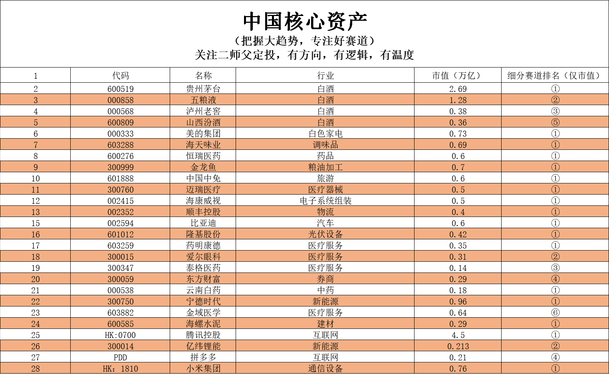

======================================================

_type: talk
@二师父[28814221155551]
2021-01-27 14:55:41 Wed  
topic_id: 215828141255881

<e type="hashtag" hid="824514224452" title="#指数估值表#" />

@天马行空 at 2021-01-27 14:55:41 Wed

> 今天尾盘4万买了券商

----------

@吃肉肉 at 2021-01-27 14:55:41 Wed

> 牛

----------

@天马行空 at 2021-01-27 14:55:41 Wed

> 难道就因为我尾盘买了点券商，美股开始跌了。

----------

阅读[1]  评论[3]  赞[0] 

+++++++++++++++++++++++++++++++++++++++++++++++++++++

图片：
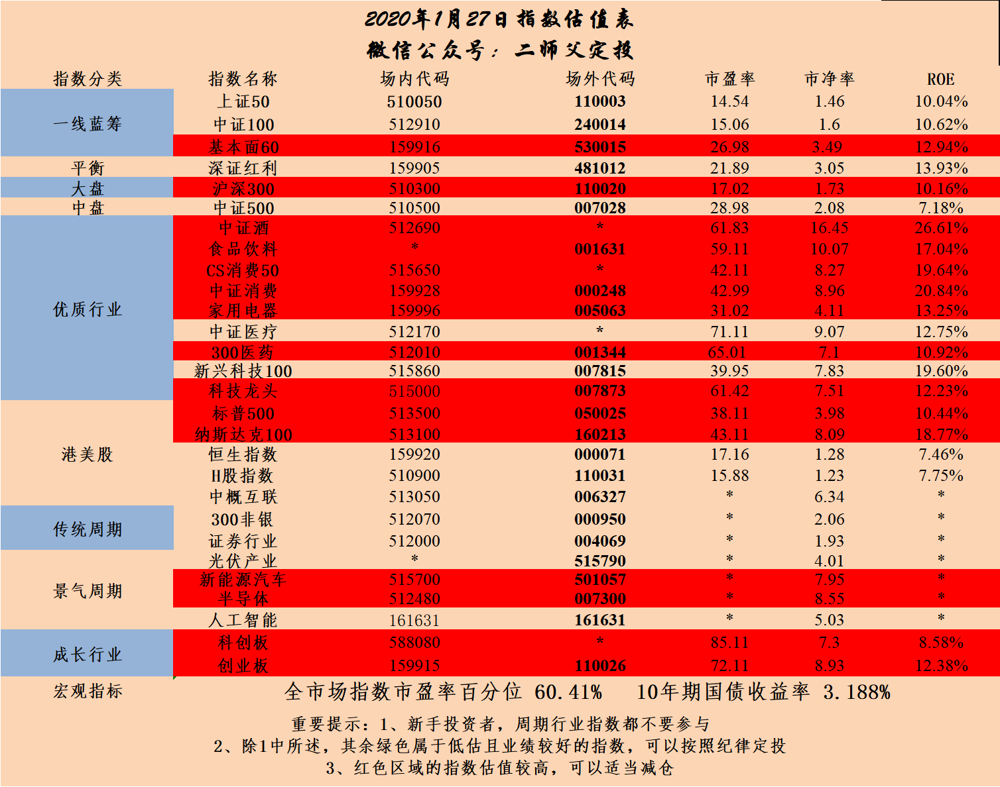

======================================================

_type: q&a
@永刚[15581448518112]
2021-01-27 19:19:04 Wed  
topic_id: 582151882815844

@永刚

>  二师父您好，您的均线策略中提出放量跌破20线时，需要卖出。我的问题是为什么是放量而不是缩量？

@二师父

>  放量跌破20日线意味着空头力量大

阅读[1]  评论[1]  赞[0] 

======================================================

_type: q&a
@天马行空[548818851412444]
2021-01-28 07:26:35 Thu  
topic_id: 582155225844814

@天马行空

>  二师父，美股跌了，昨天1.12元买了几万的券商咋办。还有20万元的易方达7到10年国开债已经连跌两天了，和股市同步，估计今天还要跌。听师父的指导。

@二师父

>  这个跌幅是很正常的，美股高位，未来回撤或者大跌都有可能，如果在股市不能轻松经历百分之30回撤，那么就要控制仓位，比如20万受不了，那就减到10万，波动是非常正常的

阅读[1]  评论[8]  赞[0] 

======================================================

_type: talk
@陈[844415515418422]
2021-01-28 09:49:33 Thu  
topic_id: 414855441842118

二师父，现在定投实盘在哪儿看？还是周四吗？

@二师父 at 2021-01-28 09:49:33 Thu

> 是的哈

----------

阅读[1]  评论[1]  赞[0] 

======================================================

_type: talk
@二师父[28814221155551]
2021-01-28 09:52:09 Thu  
topic_id: 815822551888552

<e type="hashtag" hid="881422852442" title="#定投实盘#" /> 实盘已经发布了哈，天天基金可以看到详细操作。继续调整仓位，保持股权仓位不变，慢慢调整宽基到行业指数。未来以优质行业为主，宽基为辅。如果仓位低的，可以只买不卖，如果仓位重的，可以只卖不买。

@无意心外 at 2021-01-28 09:52:09 Thu

> 二师父，一键调仓手续费是不是不需要啊？我前几天刚买的上投摩根，持有才几天，现在清仓手续费率特别高。一键调仓是在天天基金操作吗？

----------

@小鱼 at 2021-01-28 09:52:09 Thu

> 为什么摩根要卖了呀，投的也不多呀

----------

@丸子妈 at 2021-01-28 09:52:09 Thu

> 我也是上周才买

----------

@吃肉肉 at 2021-01-28 09:52:09 Thu

> 师父，不看好上投摩根了吗？

----------

@是喵喵吖～ at 2021-01-28 09:52:09 Thu

> 师父摩根我本来也是买了2000。但是因为卡的问题扣了1000，后来我又买了1000。可能这样导致我收益是2%😂 我能等几天清仓吗 就是等等有盈利的时候。另外、感觉他挺好的呀为啥清仓了呢？

----------

@无意心外 at 2021-01-28 09:52:09 Thu

> 上次持有没几天卖了一批债券，手续费率太高了，现在不敢随意操作了

----------

@二师父 at 2021-01-28 09:52:09 Thu

> 准备全力做a股医疗，未来仓位上到百分之20左右，这个基金长期看不错的

----------

@二师父 at 2021-01-28 09:52:09 Thu

> 全力做a股医疗

----------

阅读[1]  评论[44]  赞[0] 

+++++++++++++++++++++++++++++++++++++++++++++++++++++

图片：
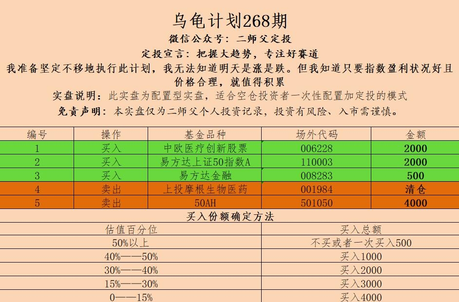

======================================================

_type: talk
@杜志彪[544454124115854]
2021-01-28 11:02:06 Thu  
topic_id: 582155111481544

<e type="hashtag" hid="281158522841" title="#每日打卡#" /> #每日打卡  2021年1月28日新年第四次打卡，天天基金跟师父场外加医疗上证50和金融了，场内医疗就不动了，场内没有50和金融基金，加一点吧，把94卖了的100股平安我觉得可以买回来了[微笑]

@Sunflower at 2021-01-28 11:02:06 Thu

> 目前我中证主要消费收益率26%，不想再定投了因为有白酒和食品饮料，你觉得我是现在持有等高点再卖，还是现在收割利润后买入医疗好呢？目前仓位就算中等吧，吃的下饭睡得着觉

----------

@杜志彪 at 2021-01-28 11:02:06 Thu

> 一切取决于你持有的仓位，我消费还有5.8层仓位，不会再动了，等着便宜了再加，医疗我有3.3%，也是等着便宜了再加，新能车还有2%，电器2%，券商3%，MSCI持有19.4%，深红利8.3%， 科技6.1%，科创0.5%，光伏1.4%，AH500ETF1.4%，股票38.4%（有点多了[微笑]，这几天加了10%股票）这一加仓位91.6%，不过睡得还是挺好[调皮]

----------

@Sunflower at 2021-01-28 11:02:06 Thu

> 那我就着留着等等再出，我医疗一点仓位都没有了

----------

阅读[1]  评论[3]  赞[0] 

======================================================

_type: q&a
@JOY[111881481812422]
2021-01-28 11:14:03 Thu  
topic_id: 182544555125422

@JOY

>  师父，今天的一品发债，您申购了吗？

@二师父

>  这个我申购了哈，最近很少中签

阅读[1]  评论[5]  赞[0] 

======================================================

_type: q&a
@蛋炒饭不加蛋[118281818482542]
2021-01-28 12:14:03 Thu  
topic_id: 815828148482412

@蛋炒饭不加蛋

>  请问二师傅个股的年报预披露在哪可以看

@二师父

>  巨潮资讯网

阅读[1]  评论[1]  赞[0] 

======================================================

_type: q&a
@JOY[111881481812422]
2021-01-28 12:43:53 Thu  
topic_id: 215822882241151

@JOY

>  师父，请教下，统计仓位是应该按持仓的本金来算，还是合计利润之后的？

@二师父

>  所有的哈，包括利润部分，股权持仓金额都在计算范围内

阅读[1]  评论[3]  赞[0] 

======================================================

_type: talk
@二师父[28814221155551]
2021-01-28 13:47:01 Thu  
topic_id: 182544554811112

<e type="hashtag" hid="454188124548" title="#关于下跌#" /> 股市的波动是正常的，控制好仓位，保持良好的持仓体验就行。

券商已经到了击球区，网格就严格按照纪律，不要摇摆，历史上券商最低是到达0.56，只要严格根据网格走，长期一定是盈利的。

至于股票何时加仓，这个非常灵活，加晚了，机会错过了，加早了，被套住了。我选择保守一点，放弃短期机会，比如五粮液如果有机会到达8000亿市值以下，会重新介入，否则阶段性的性价比不高的机会都放弃了。

减少出手时间，胜率大于赔率，才是最好的投资姿势。

@天马行空 at 2021-01-28 13:47:01 Thu

> 今天1.2卖出些，昨天买多了，仓位5万，心理压力小点。

----------

@芙瑞雅阳阳潘 at 2021-01-28 13:47:01 Thu

> 师父，什么叫减少出手时间？

----------

@二师父 at 2021-01-28 13:47:01 Thu

> 次数，频率降低一点

----------

@芙瑞雅阳阳潘 at 2021-01-28 13:47:01 Thu

> 3400加仓可好？

----------

@二师父 at 2021-01-28 13:47:01 Thu

> 看具体基金

----------

@芙瑞雅阳阳潘 at 2021-01-28 13:47:01 Thu

> 您判断这次下跌的压力位在哪？

----------

@二师父 at 2021-01-28 13:47:01 Thu

> 上涨才有压力位啊

----------

@芙瑞雅阳阳潘 at 2021-01-28 13:47:01 Thu

> 刚才表述有误，[偷笑]您判断这次下跌的支撑位在哪？

----------

阅读[1]  评论[15]  赞[0] 

======================================================

_type: talk
@幽兰[815554522442422]
2021-01-28 14:12:17 Thu  
topic_id: 582155114248524

二师父，中概互联上次冲高的时候我清了，这两天看着跌了又想加。现在这个价格是不是还是高，不值得入？

@二师父 at 2021-01-28 14:12:17 Thu

> 我觉得还是有点高啊

----------

@幽兰 at 2021-01-28 14:12:17 Thu

> 嗯，是的。

----------

@杜志彪 at 2021-01-28 14:12:17 Thu

> 我网格还定着1.98建仓呢，等着[微笑]

----------

@幽兰 at 2021-01-28 14:12:17 Thu

> 1.98有点难

----------

@🍀 凝🌸 慧🍀 at 2021-01-28 14:12:17 Thu

> 急性子[偷笑]

----------

@幽兰 at 2021-01-28 14:12:17 Thu

> 哈哈，没买

----------

@杜志彪 at 2021-01-28 14:12:17 Thu

> 不怕错过，仓位已经8.4层了[微笑]

----------

@丸子妈 at 2021-01-28 14:12:17 Thu

> 等1.98

----------

阅读[1]  评论[10]  赞[0] 

======================================================

_type: talk
@平安是福[118222545154542]
2021-01-28 14:12:41 Thu  
topic_id: 182544551282512

师父：我原来有天天基金账户，怎样才能享受师父的1折优惠

@二师父 at 2021-01-28 14:12:41 Thu

> 这个买基金都是一折的

----------

@平安是福 at 2021-01-28 14:12:41 Thu

> 哦

----------

阅读[1]  评论[2]  赞[0] 

======================================================

_type: q&a
@洋[28488251551141]
2021-01-28 14:21:45 Thu  
topic_id: 182544551215112

@洋

>  二师父，今天的国债逆回购为什么这么高？

@二师父

>  第一临近节假日，第二资金比较充裕

阅读[1]  评论[2]  赞[0] 

======================================================

_type: talk
@平安是福[118222545154542]
2021-01-28 15:14:30 Thu  
topic_id: 414855882252548

师父：我查了一下，我天天基金的费率还是0.15折

@JOY at 2021-01-28 15:14:30 Thu

> 这个0.15是折扣还是百分数？指数基金要是0.15%，那就是正常的，大家都这样。折扣应该是1.00折。

----------

阅读[1]  评论[1]  赞[0] 

======================================================

_type: q&a
@永刚[15581448518112]
2021-01-28 16:27:30 Thu  
topic_id: 182544542828512

@永刚

>  二师父好，您书中提到的记帐App哪一款好，麻烦推荐。

@二师父

>  我用的随手记，体验还不错的

阅读[1]  评论[5]  赞[0] 

======================================================

_type: q&a
@是喵喵吖～[421441114141158]
2021-01-28 19:10:31 Thu  
topic_id: 815822828281252

@是喵喵吖～

>  师父，请问您怎么看今天歌尔转债下跌这个事儿。明天我想抄歌尔转债做一个反抽可以吗

@二师父

>  最好别炒可转债，股票和基金风险小一些的

阅读[1]  评论[2]  赞[0] 

======================================================

_type: talk
@百变[15285855281882]
2021-01-28 19:27:52 Thu  
topic_id: 582155155151884

老师：在哪能提前看到央行公开市场操作逆回购情况？

@二师父 at 2021-01-28 19:27:52 Thu

> 中央银行官网

----------

@百变 at 2021-01-28 19:27:52 Thu

> 谢谢[玫瑰]

----------

阅读[1]  评论[2]  赞[0] 

======================================================

_type: talk
@二师父[28814221155551]
2021-01-28 19:50:35 Thu  
topic_id: 182544544422822

<e type="hashtag" hid="552114551414" title="#估值数据#" /> 市盈率百分位59.95%，市净率百分位39.26%，SY-BY百分位70.65%，SY/BY百分位66.79%。市场估值仍旧偏高，如果这种时候遇到下跌先等跌透了再加仓。股市短期运行走势很难把握，抓住长期就好。

控制好仓位，卧倒，等待机会出击。不要有锚固思维，虽然跌了，但是整体上今年还是上涨的，心态最重要。

阅读[1]  评论[0]  赞[0] 

======================================================

_type: q&a
@天马行空[548818851412444]
2021-01-28 21:00:56 Thu  
topic_id: 414855855155248

@天马行空

>  二师父，易方达7到10年国开债三天前买20万. 三天赔了快900了。这只基不是很稳定吗。目前市场是拿着还是割肉。不会喋喋不休吧。谢谢师父指教。

@二师父

>  随着利率上行他也会下跌的哈，只是相对股票波动小一些

阅读[1]  评论[9]  赞[0] 

======================================================

_type: talk
@二师父[28814221155551]
2021-01-29 09:28:04 Fri  
topic_id: 414855821511118

<e type="hashtag" hid="51285815252484" title="#配置方向#" /> 接下来的重点配置方向

@J at 2021-01-29 09:28:04 Fri

> 师父，为啥科技和人工智能没进入备选池呢？

----------

@二师父 at 2021-01-29 09:28:04 Fri

> 不是重点了

----------

@圣诞结® at 2021-01-29 09:28:04 Fri

> 突然好期待下跌[捂脸]

----------

@杜志彪 at 2021-01-29 09:28:04 Fri

> 新能源车不用电池该用太阳能又是一次革命（太阳能充电成本下降到比电池还便宜）

----------

@苍天有井明月空🌙 at 2021-01-29 09:28:04 Fri

> 人工智能还能做网格吗

----------

@二师父 at 2021-01-29 09:28:04 Fri

> 按照表格来

----------

@苍天有井明月空🌙 at 2021-01-29 09:28:04 Fri

> 谢谢

----------

@xu at 2021-01-29 09:28:04 Fri

> 二师傅，酒 食品 医疗 光伏ETF现在能建个底仓吗，谢谢！

----------

阅读[1]  评论[10]  赞[0] 

+++++++++++++++++++++++++++++++++++++++++++++++++++++

文件：
2021-01-29 09:27:49 Fri
文件大小：[38678]
88448258552822-深度回调，重点配置这些基金.docx

======================================================

_type: talk
@二师父[28814221155551]
2021-01-29 12:35:43 Fri  
topic_id: 182544585558212

关于50ah调仓，不是因为高估卖出，而是找同期更好的基金 ，高估卖出适合基本面60，卖了短期就不再买入，而调仓是把一个基金换到更好的一个基金上面，未来还会继续调整，调整完毕就等着回调买入

这轮牛市已经到了下半场，大家注意，随时做好防守，赚够了该下车下车，保守点没啥错，如果成本低而且指数优质，高估也可以不卖，长期持有，因为长期不投，手里多了现金也降低了仓位

@李震笛 at 2021-01-29 12:35:43 Fri

> 二师傅，可以调换到哪里？

----------

@二师父 at 2021-01-29 12:35:43 Fri

> 昨天已经操作了哈，实盘

----------

@李震笛 at 2021-01-29 12:35:43 Fri

> 在哪里看？

----------

@二师父 at 2021-01-29 12:35:43 Fri

> 星球昨天发的

----------

阅读[1]  评论[4]  赞[0] 

======================================================

_type: talk
@次郎🌻[48551412448858]
2021-01-29 14:32:20 Fri  
topic_id: 182544581825282

老师请教下，广发中债为何是跟随股市的涨跌而涨跌的，这个配置本来是用来防守的，我的理解应该是股市跌，债券会涨。所以不明白，这样如何做到防守效果

@二师父 at 2021-01-29 14:32:20 Fri

> 他的跌幅很小，利率上行他是跌的

----------

阅读[1]  评论[1]  赞[0] 

======================================================

_type: talk
@次郎🌻[48551412448858]
2021-01-29 14:36:16 Fri  
topic_id: 414855812142158

最近股市的表现。二师傅怎么看后面的趋势，我前些天一次性买入的深红利和50ETF目前都套住了，广发中债也微跌，请问这些后面怎么处理，卧倒吗？谢谢回复。

@二师父 at 2021-01-29 14:36:16 Fri

> 看5200能不能撑住，如果仓位不重跌了继续加

----------

@素兮 at 2021-01-29 14:36:16 Fri

> 若5200跌破了呢？

----------

@二师父 at 2021-01-29 14:36:16 Fri

> 那就不大友好了

----------

@素兮 at 2021-01-29 14:36:16 Fri

> 二师父，5200你指的是啥？我刚刚只是顺势问了，现在回过神发现不明白5200指啥[大哭]

----------

@二师父 at 2021-01-29 14:36:16 Fri

> 万得a指数点位

----------

阅读[1]  评论[5]  赞[0] 

======================================================

_type: talk
@幽兰[815554522442422]
2021-01-29 16:06:13 Fri  
topic_id: 815822811214452

二师父，我现在仓位以债基、混合债为主，如果后面市场持续波动，我该什么策略，找机会提高指数基金仓位还是卧倒。
目前分布情况
1、二级债、混合债、国债 70.3%；
2、指数基金、主动基金、场内基金（做网格）12.4%；
3、固收理财、现金17.3%。

@二师父 at 2021-01-29 16:06:13 Fri

> 下跌之后债券逐步往指数转移

----------

@幽兰 at 2021-01-29 16:06:13 Fri

> 好的

----------

阅读[1]  评论[2]  赞[0] 

======================================================

_type: q&a
@波多黎各[28428858544121]
2021-01-29 21:06:10 Fri  
topic_id: 414855544554848

@波多黎各

>  师父，影院龙头股是横店吗？

@二师父

>  万达电影和光线传媒

阅读[1]  评论[0]  赞[0] 

======================================================

_type: q&a
@JOY[111881481812422]
2021-01-29 21:07:24 Fri  
topic_id: 582155525544854

@JOY

>  师父，想请您给看下持仓，后期怎么调整比较好～
>  另外想请教下，目前来看，您觉得大盘如果一直跌，就单只基金来说，到多少利润率的可以拿着不用卖出了，多少利润率以内的比较适合收割利润，或者直接清仓？
>  买得有点杂，这个图是场外的：（一次好像只能发一张，场内和货基我另外发下）

@二师父

>  有利润都可以收割，中证红利可以不用投资了。这个与多少没关系。

阅读[1]  评论[0]  赞[0] 

======================================================

_type: q&a
@JOY[111881481812422]
2021-01-29 21:08:36 Fri  
topic_id: 815822252215822

@JOY

>  这个图是场内和货基的

@二师父

>  金融类300非银和券商比例太大了，可以多增加一些消费和医疗的

阅读[1]  评论[1]  赞[0] 

======================================================

_type: talk
@二师父[28814221155551]
2021-01-29 21:11:18 Fri  
topic_id: 182544421542412

<e type="hashtag" hid="552114551414" title="#估值数据#" /> 市盈率百分位59.06%，市净率百分位36.2%，SY-BY百分位68.91%，SY/BY百分位64.5%。

处于第四楼层，相对昂贵，控制仓位。最近跌的比较大，等支撑位回踩确认之后再加仓，目前下行阶段，先等等。前期已经收割利润了，就不用卖出了。控制一个自己舒适的仓位即可。

阅读[1]  评论[0]  赞[0] 

======================================================

_type: q&a
@M[51281818588224]
2021-01-30 05:59:25 Sat  
topic_id: 414855541588828

@M

>  二师父，场外10月份以来一直买了场外的券商基金，现在一直跌，仓位比较重，后面会有补涨机会吗

@二师父

>  会有机会，不过券商跌起来仍旧会比较惨，所以需要控制仓位

阅读[1]  评论[0]  赞[0] 

======================================================

_type: talk
@二师父[28814221155551]
2021-01-30 09:28:30 Sat  
topic_id: 815822282225852

<e type="hashtag" hid="15284854411842" title="#下一步应对方法#" /> 看看下一步如何应对。

@次郎🌻 at 2021-01-30 09:28:30 Sat

> 二师父的意思是，5200的时候补仓，继续跌到一楼4900的话就满仓，即使再跌，也不要割肉，满仓卧倒等待回升，是这个意思吗。

----------

@二师父 at 2021-01-30 09:28:30 Sat

> 不是哈，4900是9成

----------

@次郎🌻 at 2021-01-30 09:28:30 Sat

> 好的👌🏻

----------

@🍀 凝🌸 慧🍀 at 2021-01-30 09:28:30 Sat

> 谢谢师父，这样我们就心里有数啦[玫瑰][玫瑰][玫瑰]

----------

@芙瑞雅阳阳潘 at 2021-01-30 09:28:30 Sat

> 还没有学会看万得全市场指数

----------

@J at 2021-01-30 09:28:30 Sat

> 喜欢师父的写作风格

----------

@陈 at 2021-01-30 09:28:30 Sat

> 问个小白的问题，5200和4900是哪个指数？

----------

@二师父 at 2021-01-30 09:28:30 Sat

> 万得a

----------

阅读[1]  评论[10]  赞[0] 

+++++++++++++++++++++++++++++++++++++++++++++++++++++

文件：
2021-01-30 09:28:09 Sat
文件大小：[39781]
15115452118882-都进来，我来给你按摩.docx

======================================================

_type: talk
@顾屹峰[28242255855121]
2021-01-30 13:52:37 Sat  
topic_id: 582155514811814

在什么网上可以验证基金定投策略的有效性，策略有些复杂。基金的数据在哪些网上可以查到

@二师父 at 2021-01-30 13:52:37 Sat

> 晨星网

----------

阅读[1]  评论[1]  赞[0] 

======================================================

_type: solution
2021-01-30 16:51:06 Sat  
topic_id: 582155551114484

阅读[1]  评论[0]  赞[0] 

======================================================

_type: q&a
@永刚[15581448518112]
2021-01-30 21:29:16 Sat  
topic_id: 414855558552548

@永刚

>  二师父好，从哪个网站能查到指数基金的市盈率和ROE?

@二师父

>  果仁网或者理杏仁

阅读[1]  评论[0]  赞[0] 

======================================================

_type: talk
@百变[15285855281882]
2021-01-30 23:20:46 Sat  
topic_id: 582155542141214

老师：这两个选哪一个万得APP

@rtdmm小米 at 2021-01-30 23:20:46 Sat

> 

----------

@百变 at 2021-01-30 23:20:46 Sat

> 这个应该是付费的吧？

----------

@rtdmm小米 at 2021-01-30 23:20:46 Sat

> 有免费的功能，足够了

----------

@百变 at 2021-01-30 23:20:46 Sat

> 谢谢[玫瑰][玫瑰][玫瑰]

----------

阅读[1]  评论[4]  赞[0] 

+++++++++++++++++++++++++++++++++++++++++++++++++++++

图片：
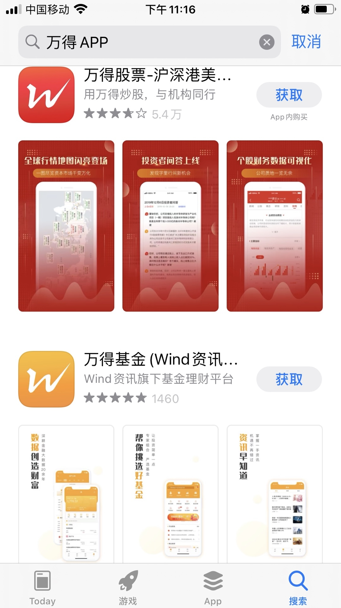

======================================================

_type: talk
@二师父[28814221155551]
2021-01-31 15:48:41 Sun  
topic_id: 815822215251122

<e type="hashtag" hid="51285818412554" title="#何时加仓#" /> 注意战略底仓和游击仓的区别。长期+短期，才能真正应对变化莫测的A股市场。

阅读[1]  评论[0]  赞[0] 

+++++++++++++++++++++++++++++++++++++++++++++++++++++

文件：
2021-01-31 15:48:03 Sun
文件大小：[38095]
51441551848114-跌多少该加仓.docx

======================================================

_type: talk
@佳[844145484515482]
2021-01-31 18:13:31 Sun  
topic_id: 215822218511221

跑步400米一圈

阅读[1]  评论[0]  赞[0] 

======================================================

_type: talk
@圣诞结®[28448281541121]
2021-01-31 21:53:57 Sun  
topic_id: 215822411228151

周六去爬山 全程8公里 累计爬升550米 早晨6点集合 19点到家 身体累了 精神愉悦了 腿还是会酸 新的一年继续加强锻炼 [加油]

@西锦巴乌 at 2021-01-31 21:53:57 Sun

> 第二天步行4公里完成

----------

阅读[1]  评论[1]  赞[0] 

+++++++++++++++++++++++++++++++++++++++++++++++++++++

图片：
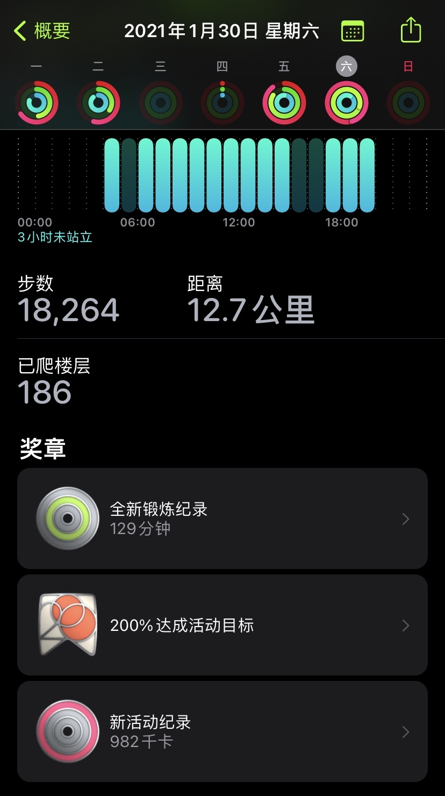

======================================================

