_type: q&a
@永刚[15581448518112]
2021-02-01 00:27:22 Mon  
topic_id: 215822242825821

@永刚

>  二师父好，中证500已跌破90日均线，可以建底仓了吗？我目前的总体仓位70%。

@二师父

>  可以建仓，不过小盘股指数创业板比中证500更好一些

阅读[1]  评论[3]  赞[0] 

======================================================

_type: talk
@二师父[28814221155551]
2021-02-01 09:15:18 Mon  
topic_id: 582155824851854

<e type="hashtag" hid="51285825552824" title="#方向#" /> 注意接下来的投资方向

@二师父 at 2021-02-01 09:15:18 Mon

> cfa值得考，含金量比较高

----------

@隔窗遥望 at 2021-02-01 09:15:18 Mon

> 持有其他宽基指数的是不是要慢慢调整到行业指数上

----------

@二师父 at 2021-02-01 09:15:18 Mon

> 看个人风险偏好

----------

@老孙头 at 2021-02-01 09:15:18 Mon

> 有分析说，货币政策紧平衡要维持1到2个季度。那么，金融行业基金是否需及时退出？谢谢！

----------

@二师父 at 2021-02-01 09:15:18 Mon

> 具体哪个板块？

----------

@老孙头 at 2021-02-01 09:15:18 Mon

> 易方达金融行业股票基金

----------

@二师父 at 2021-02-01 09:15:18 Mon

> 不用的，这个估值比较低，控制仓位百分之10以内，跌了继续定投

----------

@老孙头 at 2021-02-01 09:15:18 Mon

> [抱拳][咖啡]

----------

阅读[1]  评论[14]  赞[0] 

+++++++++++++++++++++++++++++++++++++++++++++++++++++

文件：
2021-02-01 09:15:07 Mon
文件大小：[38550]
48228528848518-接下来注意这几个方向.docx

======================================================

_type: talk
@百变[15285855281882]
2021-02-01 11:07:31 Mon  
topic_id: 815822185541882

老师：通讯ETF做个波段行不行？

阅读[1]  评论[0]  赞[0] 

======================================================

_type: q&a
@清茶半盏[182245485228522]
2021-02-01 12:31:10 Mon  
topic_id: 582155815142184

@清茶半盏

>  师父：光伏现在适合加仓吗？场内广发国债没跟车现在用不用补点？

@二师父

>  可以的，后面有好机会我也会发车

阅读[1]  评论[1]  赞[0] 

======================================================

_type: q&a
@静[244148554842811]
2021-02-01 12:31:28 Mon  
topic_id: 815822185824182

@静

>  二师父光伏现在可以继续买吗？

@二师父

>  可以的，后面有好机会也会继续买

阅读[1]  评论[0]  赞[0] 

======================================================

_type: talk
@二师父[28814221155551]
2021-02-01 13:22:36 Mon  
topic_id: 815822182412522

<e type="hashtag" hid="48415181114858" title="#鳄鱼计划2月第一次#" /> 买入香港证券（513090）两份，卖出16国债19。目前剩余现金约40份，债券大约16份，跌下去了，就买买买。如果跌不下去，那就游击了。

@牛牛 at 2021-02-01 13:22:36 Mon

> 二师父，香港证券你买的价格是多少啊

----------

@二师父 at 2021-02-01 13:22:36 Mon

> 1.275

----------

@欣 at 2021-02-01 13:22:36 Mon

> 二师父，新手可以直接跟着你的鳄鱼计划买吗？

----------

@二师父 at 2021-02-01 13:22:36 Mon

> 可以，你能经受浮动拿住就没问题

----------

@牛牛 at 2021-02-01 13:22:36 Mon

> 谢谢，二师父。

----------

@涓涓 at 2021-02-01 13:22:36 Mon

> 二师父，是把国债清了吗？

----------

@二师父 at 2021-02-01 13:22:36 Mon

> 对，就一手，以后直接买广发中债了

----------

@涓涓 at 2021-02-01 13:22:36 Mon

> 广发中债是场外的？

----------

阅读[1]  评论[18]  赞[0] 

======================================================

_type: talk
@二师父[28814221155551]
2021-02-01 13:44:53 Mon  
topic_id: 414855185154818

<e type="hashtag" hid="51285818881424" title="#仓位表#" /> 这是当前持仓，如果到达第一个支撑位，仓位8.5，到达第二支撑位，仓位9。不要怕，下跌不是卖出的理由。

@Vivian at 2021-02-01 13:44:53 Mon

> 老师，仓位8.5是说百分八十五仓位吗？

----------

@二师父 at 2021-02-01 13:44:53 Mon

> 对

----------

@无意心外 at 2021-02-01 13:44:53 Mon

> 新加入的人，以前配置的仓位肯定现在不能买了。是不是只买入师父你新增的品种？

----------

@二师父 at 2021-02-01 13:44:53 Mon

> 是的

----------

阅读[1]  评论[4]  赞[0] 

+++++++++++++++++++++++++++++++++++++++++++++++++++++

图片：
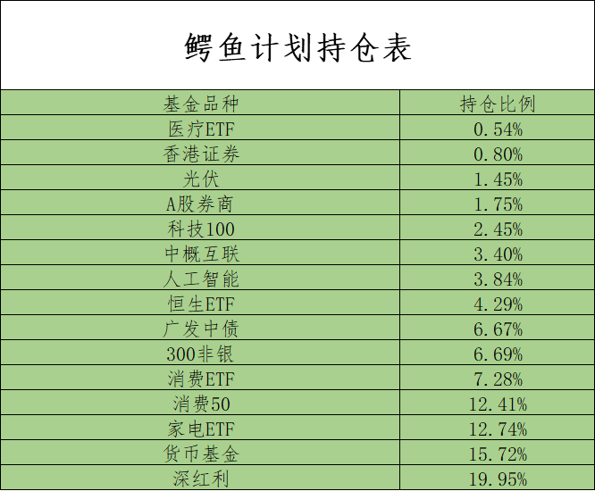

======================================================

_type: q&a
@老妖[118514521115522]
2021-02-01 13:49:10 Mon  
topic_id: 215822182125851

@老妖

>  光伏再跌多少个点可以重仓？或者低估

@二师父

>  再跌个百分之40可以一次重仓，总仓位最好控制在百分之20以内

阅读[1]  评论[4]  赞[0] 

======================================================

_type: talk
@二师父[28814221155551]
2021-02-01 13:58:57 Mon  
topic_id: 414855182488218

特发转债今天跌了百分之22，没事最好别投可转债，盈亏同源的

阅读[1]  评论[0]  赞[0] 

======================================================

_type: talk
@阿宝[422212151424158]
2021-02-01 21:34:11 Mon  
topic_id: 215822124541581

唐朝《<e type="web" href="https://wx.zsxq.com/mweb/views/weread/search.html?keyword=价值投资实战手册" title="价值投资实战手册" style="book" />》

阅读[1]  评论[0]  赞[0] 

+++++++++++++++++++++++++++++++++++++++++++++++++++++

文件：
2021-02-01 21:34:11 Mon
文件大小：[194496]
88448212244522-2.1 读唐朝《价值投资实战手册》有感.pdf

======================================================

_type: talk
@二师父[28814221155551]
2021-02-02 06:12:45 Tue  
topic_id: 215822148114251

<e type="hashtag" hid="552114551414" title="#估值数据#" /> 市盈率百分位59.27%，市净率百分位37.02%，SY-BY百分位68.61%，SY/BY百分位52.81%。

目前策略就是剩余二成仓位打游击，主仓继续握住，等到全市场有泡沫的时候再出，长期不用的钱都要用来持有优质资产，现金总是贬值的。

@吃肉肉 at 2021-02-02 06:12:45 Tue

> 师父，军工ETF现在是否适合建底仓？

----------

@二师父 at 2021-02-02 06:12:45 Tue

> 不适合

----------

@吃肉肉 at 2021-02-02 06:12:45 Tue

> 好的👌🏻

----------

@J at 2021-02-02 06:12:45 Tue

> 师父，光伏如何操作为好？可以具体分析下吗

----------

@二师父 at 2021-02-02 06:12:45 Tue

> 不用操作

----------

@J at 2021-02-02 06:12:45 Tue

> 亏了6%呢，可以补一点仓吗

----------

@二师父 at 2021-02-02 06:12:45 Tue

> 拿着，后面深度回调再补仓

----------

@J at 2021-02-02 06:12:45 Tue

> 好的，谢谢师父

----------

阅读[1]  评论[10]  赞[0] 

======================================================

_type: talk
@二师父[28814221155551]
2021-02-02 09:24:35 Tue  
topic_id: 815822141212222

<e type="hashtag" hid="15284842588482" title="#关于上海机场的分析#" />

@杜志彪 at 2021-02-02 09:24:35 Tue

> 其实我持有2年多了，仓位也是一点一点加上去的，目前占比30%，挂了2天跌停价格，目前还没有成交。

----------

@杜志彪 at 2021-02-02 09:24:35 Tue

> 我估算市值应该在1000-1100亿之间，对应股价51.89—57.08应该还有一个跌停。

----------

@杜志彪 at 2021-02-02 09:24:35 Tue

> 疫情超预期，打开板就走，要不睡着也不踏实[微笑]

----------

@二师父 at 2021-02-02 09:24:35 Tue

> 杀跌太厉害了

----------

@J at 2021-02-02 09:24:35 Tue

> 请问打开板是啥意思？

----------

@杜志彪 at 2021-02-02 09:24:35 Tue

> 国家规定每天股价振幅不能超过10%，跌停板就是最低价格卖出，但是卖的量多，买的量少，成交的少，散户一般卖不出去，要排队成交，开板就是买卖均衡了，可以正常交易了。

----------

@J at 2021-02-02 09:24:35 Tue

> 谢谢，解释得很详细[强]

----------

阅读[1]  评论[7]  赞[0] 

+++++++++++++++++++++++++++++++++++++++++++++++++++++

文件：
2021-02-02 09:24:34 Tue
文件大小：[38574]
51441422141154-一家跌停的龙头企业，是走是留.docx

======================================================

_type: talk
@Nick.yang[118281888551882]
2021-02-02 10:57:04 Tue  
topic_id: 414855114554488

师傅，大家都说光伏，今天可以买一点把，也不知道买哪个，可否推荐一下

@Zyxj at 2021-02-02 10:57:04 Tue

> 515790

----------

阅读[1]  评论[1]  赞[0] 

======================================================

_type: q&a
@是喵喵吖～[421441114141158]
2021-02-02 11:08:14 Tue  
topic_id: 582155848452884

@是喵喵吖～

>  师父这是我场内和场外的，今天整理了一下。感觉场外的买的种类有点多😂。想麻烦您有空的时候帮我指点下好吗。比如需要精简卖掉哪些。或者货币基金占比大的话要不要买一些债券。 谢谢啦。

@二师父

>  尽量集中一点，50ah可以慢慢调整到易方达上证50指数a，创业板低位的时候，中证500可以换成创业板50，你跟着我乌龟计划持仓走差不多，仓位还行，下跌了可以继续补

阅读[1]  评论[1]  赞[0] 

======================================================

_type: q&a
@YAO[28848244851581]
2021-02-02 11:08:28 Tue  
topic_id: 215822115254811

@YAO

>  二师父，军工etf买哪只比较好？

@二师父

>  这个都差不多的

阅读[1]  评论[0]  赞[0] 

======================================================

_type: talk
@厚基薄发[15522588545552]
2021-02-02 12:19:48 Tue  
topic_id: 215822118852551

请问：累计净值和成立来的百分数如何解读

@二师父 at 2021-02-02 12:19:48 Tue

> 累计净值是单位净值和成立后派息总额之和

----------

@厚基薄发 at 2021-02-02 12:19:48 Tue

> 成立以来收益率如何解读？和累计净值有什么关系？

----------

阅读[1]  评论[2]  赞[0] 

+++++++++++++++++++++++++++++++++++++++++++++++++++++

图片：
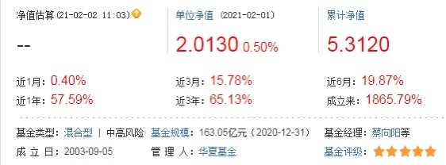

======================================================

_type: q&a
@铁观音[28444524525851]
2021-02-02 12:29:24 Tue  
topic_id: 414855118888858

@铁观音

>  师父，问一下，看压力位和支撑位，是看日k线还是周k线？

@二师父

>  日线

阅读[1]  评论[0]  赞[0] 

======================================================

_type: talk
@平安是福[118222545154542]
2021-02-02 13:24:08 Tue  
topic_id: 414855118281528

师父：场内有5GETF，拿了一年了，现在跌剩7个点了，现在这个位置，是拿着，还是换别的，感觉老也起不来

@二师父 at 2021-02-02 13:24:08 Tue

> 5G确实一般

----------

阅读[1]  评论[1]  赞[0] 

======================================================

_type: talk
@二师父[28814221155551]
2021-02-03 06:36:18 Wed  
topic_id: 582154215124124

<e type="hashtag" hid="15284842111222" title="#节前这样操作#" /> 还有8天就过年了，控制下仓位，依然持有基金过年哈。有机会仍旧会发车。春节前估计就明天最后一次定投实盘了。

@J at 2021-02-03 06:36:18 Wed

> 师父，请问如何判断当下市场属于牛市回调呢？

----------

@二师父 at 2021-02-03 06:36:18 Wed

> 熊市他会一直下行的，现在根本下不去啊

----------

阅读[1]  评论[2]  赞[0] 

+++++++++++++++++++++++++++++++++++++++++++++++++++++

文件：
2021-02-03 06:35:09 Wed
文件大小：[38077]
51441414225214-节前这样操作.docx

======================================================

_type: talk
@二师父[28814221155551]
2021-02-03 06:52:35 Wed  
topic_id: 182541254555142

<e type="hashtag" hid="552114551414" title="#估值数据#" /> 市盈率百分位59.56%，市净率百分位37.79%，SY/BY百分位65.5%，SY-BY百分位69.83%。估值介于第三层和第四层之间。大家注意所说的估值楼层，一层是无脑买入优质指数，五层就要逐步下车了，基本是一轮牛市高位。

严格遵守这个操作买基金分散配置，长期肯定是盈利的，对于核心企业，分散配置按照估值楼层来走也没有问题的。

阅读[1]  评论[0]  赞[0] 

======================================================

_type: q&a
@林玮[844111858288412]
2021-02-03 08:04:08 Wed  
topic_id: 815824582511842

@林玮

>  师父，曼卡龙这只股票怎么样，百年不遇中了一签

@二师父

>  挺好的，可以持有，或者开板后卖出

阅读[1]  评论[0]  赞[0] 

======================================================

_type: q&a
@Kiwi 的拾金之路[241182454821121]
2021-02-03 08:04:24 Wed  
topic_id: 215824555451851

@Kiwi 的拾金之路

>  师父，场外基金后缀有A，也有C的，除了买卖手续费的区别，还有什么别的区别吗？

@二师父

>  就这个区别，其他本质上没有不同的

阅读[1]  评论[0]  赞[0] 

======================================================

_type: solution
2021-02-03 09:44:13 Wed  
topic_id: 815824584284852

阅读[1]  评论[0]  赞[0] 

======================================================

_type: talk
@林佩洪 Tina L*[422182445284428]
2021-02-03 10:49:32 Wed  
topic_id: 815824581581112

二师父，小白现在没有仓，刚刚在天天基金关注了您的乌龟计划，只放了1万。请问要如何建立底仓呢？谢谢师傅

@二师父 at 2021-02-03 10:49:32 Wed

> 等我明天调仓之后，你可以直接买半仓，后面再跟着走定投就跟上了

----------

阅读[1]  评论[1]  赞[0] 

======================================================

_type: talk
@陈[844415515418422]
2021-02-03 12:15:24 Wed  
topic_id: 815824528252882

二师父，最近有些不用的钱，适合再追加买点什么？

@二师父 at 2021-02-03 12:15:24 Wed

> 明天调仓后，乌龟计划直接一半仓位可以

----------

@陈 at 2021-02-03 12:15:24 Wed

> 好！

----------

@陈 at 2021-02-03 12:15:24 Wed

> 就是比如有十万一次性五万？

----------

@二师父 at 2021-02-03 12:15:24 Wed

> 对，在我明天调仓以后

----------

@样 at 2021-02-03 12:15:24 Wed

> 二师父这么有信心，一定选了牛基，提前透露透露呗

----------

@苍天有井明月空🌙 at 2021-02-03 12:15:24 Wed

> 坐等明天调仓

----------

@二师父 at 2021-02-03 12:15:24 Wed

> 就明天了，我直接调整后，仓位和标的跟上就可以了

----------

阅读[1]  评论[7]  赞[0] 

======================================================

_type: talk
@志亮[422125851552828]
2021-02-03 12:46:15 Wed  
topic_id: 182541245155142

新高的还是新高，新低的平安还在跌跌不休，你以为是价值投资洼地，我认为是粪坑，幸好提早卖出了，要不今年还会继续亏损[发呆]，现在的行情要汰弱留强，选错股是熊市，选对股就是牛市[呲牙][呲牙][调皮][调皮][憨笑][憨笑]。

@吃肉肉 at 2021-02-03 12:46:15 Wed

> 我经过认真预判，你肯定选对牛股了[呲牙]，暴露下持仓情况呗。

----------

@志亮 at 2021-02-03 12:46:15 Wed

> 都是时下热门股、隆基、阳光、亿纬。[呲牙]

----------

@吃肉肉 at 2021-02-03 12:46:15 Wed

> 牛

----------

@二师父 at 2021-02-03 12:46:15 Wed

> 是的，跟随市场

----------

@光少 at 2021-02-03 12:46:15 Wed

> 强者恒强[强]

----------

@志亮 at 2021-02-03 12:46:15 Wed

> 是的，现在这个市场不同以前了，高成长确定性更大于估值，我觉得投资还是要灵活变通的，不可能永远都是老一套一成不变的，若是这样股市就太容易赚钱了，没必要跟市场斗气，市场永远是对的，只要能紧跟市场的步伐，你就能赚钱，平安除非能拿个三五年以上吧，还是能赚钱的，但话又说回来，若我真能拿个三五年不动的，那我买高成长股不更好，途中虽然波动大，但相信还是能秒杀平安的，所以不论是短、中、长期都秒杀平安，我为什么还要坚持持有平安，早点卖好早点跳出这个坑。[呲牙]

----------

@二师父 at 2021-02-03 12:46:15 Wed

> 哈哈，华尔街名言，市场永远是对的

----------

@志亮 at 2021-02-03 12:46:15 Wed

> 哈哈，这两年重仓坚守万科、平安的都很郁闷，都快被逼成内伤了，特别是单吊一只那些牛人，现在都是一脸懵逼？这种情况我就经历过，特别是对于我这个新手我很不理解这市场为什么会变成这样，我看了雪球上很多大V都说这是价值投资的呀。

----------

阅读[1]  评论[13]  赞[0] 

======================================================

_type: talk
@泓.[414858828855888]
2021-02-03 14:25:14 Wed  
topic_id: 414852455881448

怎么止盈好 不止盈放着是能赚比较多吗

@二师父 at 2021-02-03 14:25:14 Wed

> 如果牛市趋势在的话可以放着，如果一轮牛市趋势终结最好就止盈

----------

@志亮 at 2021-02-03 14:25:14 Wed

> 现在是二八行情，你的基金或股票若是一直上涨的证明趋势还在，那就继续拿着，等趋势反转了你就可以止盈了[微笑]

----------

阅读[1]  评论[2]  赞[0] 

======================================================

_type: talk
@二师父[28814221155551]
2021-02-03 17:04:06 Wed  
topic_id: 582154254541154

<e type="hashtag" hid="552114551414" title="#估值数据#" /> 市盈率百分位59.89%，市净率百分位38.39%，SY/BY百分位67.69%，SY-BY百分位71.22%，估值楼层相对昂贵，控制仓位。

目前市场分化比较严重，一边是抱团股一直上涨，另外一边是部分企业处于冰点，到底要不要去配置那些冰点股票，我觉得没必要，长期投资股票就用我核心资产表里面的，如果想配置金融类，选择我挑选的金融基金就好了。

明天乌龟计划会直接调仓，幅度稍微大一点，调仓之后可以跟上，保证没有偏离，对于空仓的朋友，按照我明天调仓的，可以直接建立5成仓位，后面再逐步定投把仓位加起来，然后阴历年的定投基本结束了。

后面如果有极佳机会，下周三可能发车一次，如果没有，就等待牛年的到来吧。

@小鱼 at 2021-02-03 17:04:06 Wed

> 这么大幅度，不是现在楼层挺高的吗。感觉有些意外

----------

@二师父 at 2021-02-03 17:04:06 Wed

> 调仓而已，并未新增投入

----------

@小鱼 at 2021-02-03 17:04:06 Wed

> 嗯嗯，我仓位低，一直没跟上节奏，这次一定要好好跟上

----------

@马明谦 at 2021-02-03 17:04:06 Wed

> 师傅：085585银河文体娱乐混合我大概有一成仓位，一直没什么起色。当时准备长期持有，想着等疫情影响结束后应该会有收获，但又对这只基金信心又不足。师傅您建议是继续留着还是清了转到乌龟计划里。

----------

@二师父 at 2021-02-03 17:04:06 Wed

> 代码是对的吗？

----------

@马明谦 at 2021-02-03 17:04:06 Wed

> 师傅：是005585，刚打错了。

----------

@二师父 at 2021-02-03 17:04:06 Wed

> 基金规模很小，换乌龟计划配置好一点，你等明天调仓以后建仓合适

----------

@马明谦 at 2021-02-03 17:04:06 Wed

> 好的！谢谢了师傅，基金规模还不到四千万。

----------

阅读[1]  评论[10]  赞[0] 

======================================================

_type: talk
@二师父[28814221155551]
2021-02-03 17:26:35 Wed  
topic_id: 815824524442152

<e type="hashtag" hid="825188852442" title="#估值表#" /> 现在是越高估的涨的越好，越低估的跌的越惨，市场总是有效的，高速业绩增长可以支撑上涨，如果真的熊市来了，消费跌，其实金融也会跌，他俩不可能对冲。

@栀子花开 at 2021-02-03 17:26:35 Wed

> 二师傅，星球续费直接点续费就行了吧？

----------

@二师父 at 2021-02-03 17:26:35 Wed

> 可以，加微信ershifudt的话便宜一点

----------

@志亮 at 2021-02-03 17:26:35 Wed

> 对冲不了的，比如平安，吃肉没它份，挨打就没落下[捂脸]，雪球上某大V开始就配置了保险平安，现在都卖出骂粗口：“防守，我去他妈的防守，我不防了，进攻才是最好的防守”，的确，你买高估值股赚了几十个点，一旦下跌，怎么也皮粗肉厚，大不了回撒二三十个点后再跑吧。😄

----------

@二师父 at 2021-02-03 17:26:35 Wed

> 这人素质不行啊，亏了不找自己原因净骂人

----------

@志亮 at 2021-02-03 17:26:35 Wed

> 那倒不是，这是他写文章的风格[呲牙]，也没骂谁，应该算是骂自己吧，他原本是半仓了平安想做防守的，那知打错算盘了[捂脸]。

----------

@smile at 2021-02-03 17:26:35 Wed

> 那现在割肉了吗？

----------

阅读[1]  评论[6]  赞[0] 

+++++++++++++++++++++++++++++++++++++++++++++++++++++

图片：
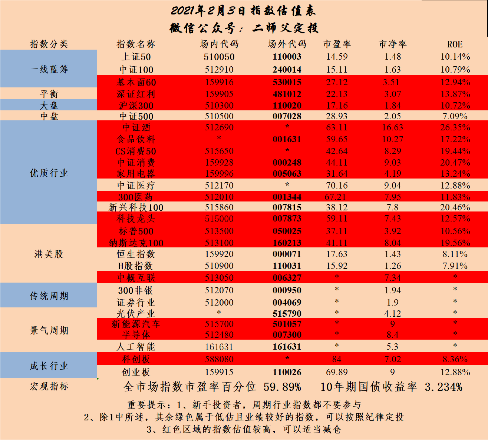

======================================================

_type: q&a
@光少[244124552511141]
2021-02-03 17:28:59 Wed  
topic_id: 582154254588814

@光少

>  二师父您好！REITs有了解过吗？可以买吗？

@二师父

>  房地产信托基金，可以作为卫星配置

阅读[1]  评论[0]  赞[0] 

======================================================

_type: q&a
@栀子花开[118248824481842]
2021-02-03 20:52:55 Wed  
topic_id: 815824845152112

@栀子花开

>  二师傅，请教个问题，现在是牛市，可为什么券商自7月上涨后就震荡下行啊？我重仓券商（15%）不见起色，要调仓不？

@二师父

>  不用调仓，这说明大家市场信心不足，要做好防守，真牛市券商一定涨

阅读[1]  评论[3]  赞[0] 

======================================================

_type: q&a
@永刚[15581448518112]
2021-02-03 20:54:11 Wed  
topic_id: 582154141141554

@永刚

>  二师傅父您好，您1月19日估值表中，创业板是高估的，但2月3日的估值表，创业板是正常估值，他们两个的市盈率.市净率和ROE值都差不多，为什么现在变成正常估值了呢？

@二师父

>  这个需要看企业盈利的，去年公司业绩快报也会对估值有影响，估值指标只是其中一个参考

阅读[1]  评论[1]  赞[0] 

======================================================

_type: q&a
@闪闪的星光[88285424418582]
2021-02-03 21:09:09 Wed  
topic_id: 815824848122542

@闪闪的星光

>  师傅好，请教
>  
>  上证50指数000016、恒生A股行业龙头指数HSCAIT
>  上面这两个指数哪一个更好一点呢？
>  
>  易方达上证50指数A110003、
>  汇丰晋信恒生龙头指数A540012，
>  
>  上面这两只基金哪一只更好些呢？

@二师父

>  易方达上证50指数a更好一些

阅读[1]  评论[1]  赞[0] 

======================================================

_type: talk
@浪淘沙[118815282288482]
2021-02-03 22:12:59 Wed  
topic_id: 582154145588884

二师父，请你看看我的持仓，中欧先进制造、广发和万家算不算重合了？易方达蓝筹和景顺长城也重合了吧？请问有必要整合吗？还有这个配置是不是太激进了？我另外还有相当于南方债券2倍金额的货币基金。

@二师父 at 2021-02-03 22:12:59 Wed

> 可以的，如果能经受住回撤，这个配置没啥问题，挺不错的组合，注意防守一下。

----------

@浪淘沙 at 2021-02-03 22:12:59 Wed

> 好的，谢谢二师父，今天的乌龟计划调仓了消费，我现有易方达蓝筹和景顺长城可以替代消费吗？还需要再投消费吗？

----------

阅读[1]  评论[2]  赞[0] 

======================================================

_type: talk
@浪淘沙[118815282288482]
2021-02-03 22:13:46 Wed  
topic_id: 182541514125522

图片没发出来

阅读[1]  评论[0]  赞[0] 

+++++++++++++++++++++++++++++++++++++++++++++++++++++

图片：
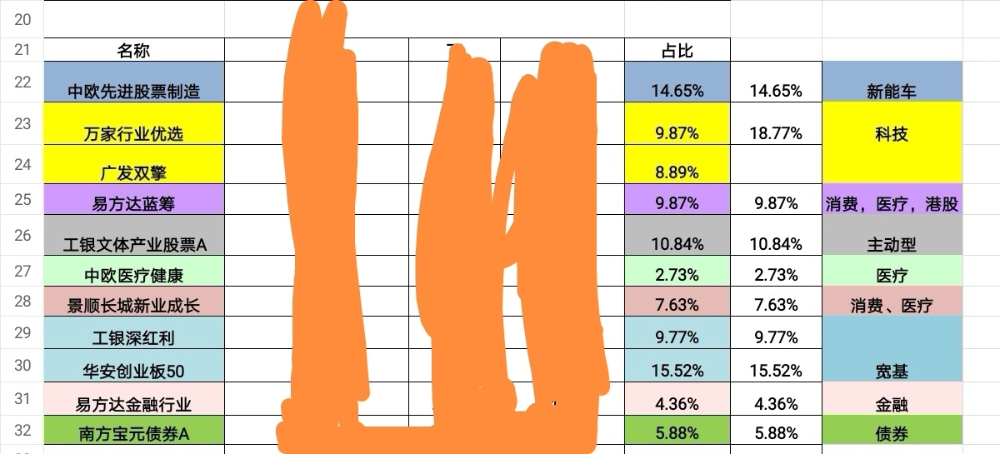

======================================================

_type: talk
@二师父[28814221155551]
2021-02-04 06:22:56 Thu  
topic_id: 582154182848284

<e type="hashtag" hid="28518855451481" title="#乌龟计划#" /> 调仓来了，大家跟上哈。这个组合目前仓位降到了70%，进一步防守，如果明年上涨，依然不会错过，如果春节过后流动性收紧，开启左侧定投，一般春节后和两会时候会有一个下跌的。

@清茶半盏 at 2021-02-04 06:22:56 Thu

> 这么早就发车了

----------

@小鱼 at 2021-02-04 06:22:56 Thu

> 好早

----------

@丸子妈 at 2021-02-04 06:22:56 Thu

> 早啊

----------

@孤芳自赏 at 2021-02-04 06:22:56 Thu

> 可以换成场内的吗？

----------

@二师父 at 2021-02-04 06:22:56 Thu

> 可以

----------

@欣 at 2021-02-04 06:22:56 Thu

> 虽然不太懂感觉但是二师父好厉害呀哈哈，空仓的我准备上车啦[呲牙]

----------

@是喵喵吖～ at 2021-02-04 06:22:56 Thu

> 师父 请问清仓卖掉和超级转换他俩是一样的吗。比如我可以直接把50AH进行超级转换吗。时间他也是按今天的是吧。

----------

@二师父 at 2021-02-04 06:22:56 Thu

> 可以的

----------

阅读[1]  评论[41]  赞[0] 

+++++++++++++++++++++++++++++++++++++++++++++++++++++

文件：
2021-02-04 06:21:45 Thu
文件大小：[113845]
15115841211852-乌龟计划269期(空仓的朋友记得上车）.docx

======================================================

_type: talk
@二师父[28814221155551]
2021-02-04 06:26:10 Thu  
topic_id: 815824815141242

<e type="hashtag" hid="28512128855181" title="#关于估值#" /> 估值有很多流派，一方面是巴菲特自由现金流思想，另外一方面是彼得林奇的PEG指标。如果有兴趣看财务报表的话，可以用巴菲特思想给盈利稳定的弱周期企业估值，大致估算企业未来三年自由现金流折现，然后对比当下市值，如果远远高于当下市值，那么就是低估。

而对于比亚迪、泰格医药、爱尔眼科这种高成长企业，彼得林奇的PEG指标更为适合，一般计算PEG小于1属于低估状态，比如泰格医药，去年盈利增速到达100%，这样来看他的PEG就是小于1的。

总体是这两种思路，估值的核心是企业盈利，而非便宜，很多大V都陷进去了，大家及早拔出来。

@smile at 2021-02-04 06:26:10 Thu

> 二师父，平安现在该怎样操作呢，被套几个点[大哭]

----------

@二师父 at 2021-02-04 06:26:10 Thu

> 平安不大好

----------

@志亮 at 2021-02-04 06:26:10 Thu

> 平安今天可能会高开，正是卖出的好机会，换上核心强势股，不要继续趴在火坑里。[机智]

----------

@smile at 2021-02-04 06:26:10 Thu

> 希望吧，不是利空吗？还会高开？但是已经套几个点了，高开估计也不能回本

----------

@志亮 at 2021-02-04 06:26:10 Thu

> 多数高开，业绩超预期了，但也只能反弹一下，正是卖出机会。

----------

@smile at 2021-02-04 06:26:10 Thu

> 果然高开了，反弹到什么价格可以出呢？我成本81，肯定回不了本

----------

@志亮 at 2021-02-04 06:26:10 Thu

> 这个真不清楚，股价短期很难预测呀，这个反弹到多少真不知道[捂脸]

----------

@smile at 2021-02-04 06:26:10 Thu

> 哎，真是昙花一现啊，手慢了

----------

阅读[1]  评论[9]  赞[0] 

======================================================

_type: q&a
@*[414848454821418]
2021-02-04 08:11:16 Thu  
topic_id: 215824818828521

@*

>  二师父你好，在哪能看到你的核心资产表，我想配置点股票

@二师父

>  知识星球有公布的，或者公众号后台回复核心资产表

阅读[1]  评论[0]  赞[0] 

======================================================

_type: q&a
@刘佳柒[815555885511852]
2021-02-04 08:25:36 Thu  
topic_id: 815824818842882

@刘佳柒

>  你好二师父，我看您把人工智能清仓了，我的还亏3个点，怎么操作？仓位不高，5万元。

@二师父

>  我是直接调仓了，换成盈利稳定的弱周期行业指数长期持有，你根据实际情况来，依然可以持有的，鳄鱼计划仍旧持有人工智能，等待下一波周期到来还会有行情

阅读[1]  评论[1]  赞[0] 

======================================================

_type: q&a
@天马行空[548818851412444]
2021-02-04 09:09:34 Thu  
topic_id: 582154181421814

@天马行空

>  二师父，跟投乌龟计划，种类很清楚。份额咋跟投。比如您今天买入汇添富中证主要消费etf2000元。我一共投100万，100万除以250是一份。那么我该买几份。谢谢

@二师父

>  那就买一份可以了

阅读[1]  评论[4]  赞[0] 

======================================================

_type: talk
@陈[844415515418422]
2021-02-04 09:52:56 Thu  
topic_id: 215824812521421

二师父，您清仓的，我们也跟着清仓吗？

阅读[1]  评论[0]  赞[0] 

======================================================

_type: q&a
@不知道不明了[15584248411812]
2021-02-04 09:54:07 Thu  
topic_id: 182541584248822

@不知道不明了

>  师父，保利地产我16.1建了700的底仓作为打新的门槛，最近下跌比较大，我能每跌2元就加仓700股来分摊成本么？

@二师父

>  没必要加这个，投资股票就用我表格里面的，不然就容易浪费钱

阅读[1]  评论[2]  赞[0] 

======================================================

_type: talk
@陈[844415515418422]
2021-02-04 10:06:56 Thu  
topic_id: 215824812824111

二师父，2018.12月买的华宝油气还亏百分之快三十，清仓不？

@J at 2021-02-04 10:06:56 Thu

> 师父很早之前就提示清仓这个

----------

@二师父 at 2021-02-04 10:06:56 Thu

> 换，a股指数

----------

@cotton at 2021-02-04 10:06:56 Thu

> 也可以拿着是吗？二师傅

----------

@陈 at 2021-02-04 10:06:56 Thu

> [呲牙]当时没看到提示

----------

@shi at 2021-02-04 10:06:56 Thu

> 我19年1月开始定投，中间最大亏损超过50%.
目前已经回本了。
上周五是近期最高点下来超过8%了，我准备下周抛了，至少抛一半。

----------

阅读[1]  评论[5]  赞[0] 

======================================================

_type: q&a
@为何[244111458152581]
2021-02-04 10:09:26 Thu  
topic_id: 215824812825541

@为何

>  芯片ETF、5GETF现在适合买吗？

@二师父

>  不看好，可以适当作为卫星配置，不宜重仓

阅读[1]  评论[3]  赞[0] 

======================================================

_type: talk
@志亮[422125851552828]
2021-02-04 10:26:03 Thu  
topic_id: 182541588241552

茅台真是酱香型科技呀[憨笑]，永远都是一直涨涨涨，可惜我以前格局太小早卖出了，以前我只懂死死抱着平安，难道就因为平安不涨所以抱着，茅台涨太多了就要卖出？这典型是韭菜思维，难怪以前我亏钱了。[捂脸]

@涓涓 at 2021-02-04 10:26:03 Thu

> 茅台虽好，但是不敢买，一手20万，波动心理挺不住，我还需要修炼[捂脸]

----------

@志亮 at 2021-02-04 10:26:03 Thu

> 你错了，现在这个行情茅台是最稳的，我若不是有更好的标的，我也会买茅台的。[呲牙]

----------

@涓涓 at 2021-02-04 10:26:03 Thu

> 我知道他好，但是我心理关过不了，波动起来我怕拿不住，所以还要历练

----------

@二师父 at 2021-02-04 10:26:03 Thu

> 破20日均线轻仓搞白酒

----------

@涓涓 at 2021-02-04 10:26:03 Thu

> 我觉得在茅台上赚大钱的人都是心理素质特别强的人，有耐心，有恒心，拿的住。如果是我早期买了茅台的话，估计在第一个翻番的时候就岀了，不可能等到后面的n个番，心理不够强大

----------

@苍天有井明月空🌙 at 2021-02-04 10:26:03 Thu

> 白酒以前一年一点行情都没。能拿住，拿到现在啥都有了

----------

阅读[1]  评论[6]  赞[0] 

======================================================

_type: talk
@二师父[28814221155551]
2021-02-04 10:52:09 Thu  
topic_id: 215824811815481

白酒etf，介绍一只白酒etf，161725，这是非常好的标的，对于长牛基金，纳斯达克，白酒，高估区域也可以轻仓定投，然后有了10个点以上利润收割，如果不幸发生深度回调，因为是轻仓，可以继续补，而且只要基金长牛，未来还会新高，比如茅台，业绩增长比估值重要，业绩第一，估值第二，赚钱才是硬道理

@是喵喵吖～ at 2021-02-04 10:52:09 Thu

> 师父这个也是等机会再开始是吧

----------

@二师父 at 2021-02-04 10:52:09 Thu

> 是的哈

----------

@cotton at 2021-02-04 10:52:09 Thu

> 现在不买吗

----------

@二师父 at 2021-02-04 10:52:09 Thu

> 等等吧，目前买个一手两手问题不大，赚了走人

----------

@样 at 2021-02-04 10:52:09 Thu

> 我想先买1手建底仓，先占个坑，怕时间久了忘了它，师父下次喊买的时候再加仓，如何？

----------

@二师父 at 2021-02-04 10:52:09 Thu

> 这个没问题

----------

@果实妈咪 at 2021-02-04 10:52:09 Thu

> 这个是场内的白酒基金吗？

----------

@二师父 at 2021-02-04 10:52:09 Thu

> 对的

----------

阅读[1]  评论[8]  赞[0] 

======================================================

_type: q&a
@范毅君[118551121224142]
2021-02-04 10:57:34 Thu  
topic_id: 215824811812251

@范毅君

>  二师父，今天把中证500清了，因为仓位比较重，钱回来，有没有合适的现在适合做底仓的基金，可以建立底仓，还是留钱过年，过年再找机会呀

@二师父

>  总体仓位重超过百分之70就留着过年，预计明年开年两会期间会有机会

阅读[1]  评论[3]  赞[0] 

======================================================

_type: q&a
@nana[48222415211188]
2021-02-04 11:06:37 Thu  
topic_id: 182541588452182

@nana

>  师傅，鳄鱼计划AI智能还继续买吗？

@二师父

>  持有中，如果继续跌的话还会补仓的

阅读[1]  评论[8]  赞[0] 

======================================================

_type: talk
@二师父[28814221155551]
2021-02-04 11:18:28 Thu  
topic_id: 215824811221841

关于券商，目前券商一直跌跌不休，这不是个好兆头，一般牛市来的时候券商会领涨，而牛市结束前期券商首先就下来了，注意做好防守，市场透露的信号多加注意，今天组合调仓，不要觉得追高了，其实转了一笔到债券，再次防守，明年怎么走已经不好预测，不过这个仓位匹配是不怕下跌的，好的持仓体验非常重要

@Chu at 2021-02-04 11:18:28 Thu

> 师父，那劵商的网格还继续吗？快又到一网了，还继续买入吗？还是等等

----------

@杜志彪 at 2021-02-04 11:18:28 Thu

> 来短信了，自动成交一份券商网格。

----------

@二师父 at 2021-02-04 11:18:28 Thu

> 如果是网格的话就按照价格加，即使蹲下去了，未来还会起来的

----------

@杜志彪 at 2021-02-04 11:18:28 Thu

> 仓位降下来舒服多了[微笑]

----------

@天马行空 at 2021-02-04 11:18:28 Thu

> 根据券商的表现，难道熊市来了吗。请师父指点迷津 谢谢。券商有8万呢。心焦。

----------

@栀子花开 at 2021-02-04 11:18:28 Thu

> 我券商28万呢，跌出了翔。本来只有10多万，没做网格，一直跌一直补仓加到了28万。以后要注意节奏

----------

@天马行空 at 2021-02-04 11:18:28 Thu

> 利润全部回吐完油跌百分之1.7

----------

@二师父 at 2021-02-04 11:18:28 Thu

> 你总共100万，才8万仓位不用担心啊

----------

阅读[1]  评论[13]  赞[0] 

======================================================

_type: q&a
@永刚[15581448518112]
2021-02-04 11:50:51 Thu  
topic_id: 815824811412882

@永刚

>  二师父你好，科创板目前这个价位可以建仓吗？

@二师父

>  轻仓定投可以了

阅读[1]  评论[0]  赞[0] 

======================================================

_type: talk
@二师父[28814221155551]
2021-02-04 11:56:24 Thu  
topic_id: 414852811152228

先挑战第一支撑位，5200点破了，仓位先上到8层，看能不能撑住，不要怕跌，每一次下跌都是为了让我们变得更富有

@样 at 2021-02-04 11:56:24 Thu

> 师父，没看明白呀，这不还是5400+多点么？从哪里看到5200点破的

----------

@二师父 at 2021-02-04 11:56:24 Thu

> 我说的意思是看能不能破

----------

@样 at 2021-02-04 11:56:24 Thu

> sorry. 回去补语文😄

----------

@二师父 at 2021-02-04 11:56:24 Thu

> 可能我没表达清楚

----------

@吃肉肉 at 2021-02-04 11:56:24 Thu

> 师父得意识是5200点是一个支撑位，如果点位一直在5200的上方，稳稳的，跌破5200点，就那个了[呲牙]。

----------

阅读[1]  评论[5]  赞[0] 

+++++++++++++++++++++++++++++++++++++++++++++++++++++

图片：
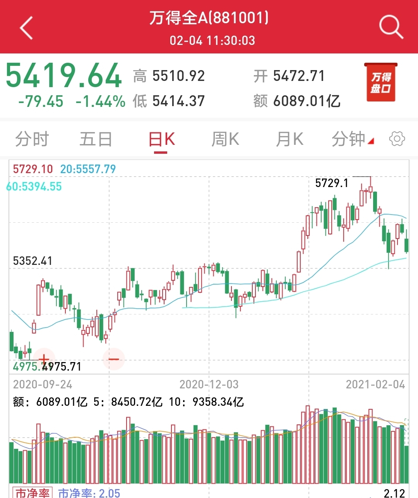

======================================================

_type: q&a
@龙宾[844118285441882]
2021-02-04 12:58:18 Thu  
topic_id: 414852544858228

@龙宾

>  二师父您好，这是我目前的持仓情况，大概是5成仓，结合早上的乌龟计划，我是否把中证500和上证50清仓掉，补入消费和创业板。想请教一下，如果清掉那两个的话，后面的持有比例怎么控制会好一些？谢谢

@二师父

>  控制下债券的比例，增持一些债券做防守，消费和创业板少量补仓即可

阅读[1]  评论[1]  赞[0] 

======================================================

_type: q&a
@wty[548488548545444]
2021-02-04 16:28:08 Thu  
topic_id: 215824254252121

@wty

>  二师父，快手中了一手，今天暗盘要卖出吗？

@二师父

>  上市首日卖吧

阅读[1]  评论[5]  赞[0] 

======================================================

_type: talk
@以古论今[28214421582421]
2021-02-04 17:30:53 Thu  
topic_id: 815824254122822

新能源汽车怎么样，可以入手吗

阅读[1]  评论[0]  赞[0] 

======================================================

_type: talk
@二师父[28814221155551]
2021-02-04 23:23:47 Thu  
topic_id: 215824284848821

<e type="hashtag" hid="481211145528" title="#指数估值#" /> 市盈率百分位59.35%，市净率百分位36.2%，Sy-by百分位70.52%，Sy/by百分位67.11%，估值楼层第四层

看后市表现，如果回调继续买入，震荡或者上行都持有

@雨淡风清 at 2021-02-04 23:23:47 Thu

> 二师父，估值这楼会约盖越高的[得意]加油

----------

@杜志彪 at 2021-02-04 23:23:47 Thu

> 师父场内创业板50是华安的159949，要是场内交易买这个对吧，您场外是交银没有场内对吧。

----------

@二师父 at 2021-02-04 23:23:47 Thu

> 对，场内选华安的

----------

阅读[1]  评论[3]  赞[0] 

======================================================

_type: talk
@二师父[28814221155551]
2021-02-05 06:18:44 Fri  
topic_id: 215824281818141

<e type="hashtag" hid="48415158282858" title="#分化的行情#" /> 最近指数上涨，而市场上小票连续暴击，继续拥抱龙头，拥抱伟大企业。等待回调，坚定不移地买入。

@自愉自乐 at 2021-02-05 06:18:44 Fri

> 这鸡汤喝得打一激灵！加油！

----------

@为何 at 2021-02-05 06:18:44 Fri

> 四只标的指的是哪四只啊？

----------

@二师父 at 2021-02-05 06:18:44 Fri

> 目前比较贵，以后合适的时候会买入的

----------

@为何 at 2021-02-05 06:18:44 Fri

> 好的，我以为错过什么信息了。

----------

@smile at 2021-02-05 06:18:44 Fri

> 想知道哪四只[得意]

----------

@二师父 at 2021-02-05 06:18:44 Fri

> 后面发车的时候会公布的

----------

@涓涓 at 2021-02-05 06:18:44 Fri

> 坚定跟着二师父走[强]

----------

@J at 2021-02-05 06:18:44 Fri

> 师父，人工智能最大跌幅还有多少？现在适合几点仓吗

----------

阅读[1]  评论[11]  赞[0] 

+++++++++++++++++++++++++++++++++++++++++++++++++++++

文件：
2021-02-05 06:18:04 Fri
文件大小：[39232]
15115811282452-股灾式牛市，坚定不移地买入.docx

======================================================

_type: q&a
@林玮[844111858288412]
2021-02-05 06:20:34 Fri  
topic_id: 215824281818281

@林玮

>  师父，万得全走势在哪里能看到

@二师父

>  万得股票app

阅读[1]  评论[0]  赞[0] 

======================================================

_type: q&a
@波多黎各[28428858544121]
2021-02-05 09:07:21 Fri  
topic_id: 414852558218458

@波多黎各

>  师父，能请教一下录哥的邮政储蓄银行的逻辑吗？重仓有何意义，国企面对改制是否有意义

@二师父

>  这个你得请教录哥，他怎么想的我不知道啊

阅读[1]  评论[1]  赞[0] 

======================================================

_type: q&a
@wty[548488548545444]
2021-02-05 09:16:30 Fri  
topic_id: 582154551822424

@wty

>  二师父，鳄鱼计划里的证券保险（512070）下一步的策略有规划吗？感觉它和券商ETF方向一致，能否春节后就卖出清仓了呢？

@二师父

>  我会等起来了再卖出，盈利之后你可以自行卖出然后调仓。

阅读[1]  评论[1]  赞[0] 

======================================================

_type: q&a
@清茶半盏[182245485228522]
2021-02-05 09:17:53 Fri  
topic_id: 815824228152542

@清茶半盏

>  师父:007130中庚小盘股这支基金成份股质量怎样？基金经理丘栋荣评价如何

@二师父

>  邱栋荣还可以的，小盘股别买了，价值不大，买龙头指数

阅读[1]  评论[0]  赞[0] 

======================================================

_type: q&a
@宁静致远[111815225552422]
2021-02-05 09:38:09 Fri  
topic_id: 582154555224424

@宁静致远

>  老师您好，重庆银行今天上市，什么时候卖出合适呢？谢谢

@二师父

>  开板或者收阴线的时候

阅读[1]  评论[1]  赞[0] 

======================================================

_type: talk
@璐老诗[88818121525822]
2021-02-05 10:02:18 Fri  
topic_id: 182541444542852

请问二师父 证券指数基金或者etf可以配吗

@二师父 at 2021-02-05 10:02:18 Fri

> 可以的

----------

@二师父 at 2021-02-05 10:02:18 Fri

> 可以

----------

阅读[1]  评论[2]  赞[0] 

======================================================

_type: talk
@二师父[28814221155551]
2021-02-05 11:31:40 Fri  
topic_id: 815824224524812

看了下，调仓后的基金，涨幅比之前的三只都好，市场永远是对的，未来继续调整，以行业指数为主，构建一个可以全天候投资的组合。

今年主旋律，无视回调，无脑拿住，新高不卖，回调补仓，仓位重的，自行收割利润即可

@蛋炒饭不加蛋 at 2021-02-05 11:31:40 Fri

> 二师父是看好年后的行情吗[呲牙]

----------

@幽兰 at 2021-02-05 11:31:40 Fri

> 券商ETF感觉起不来😂

----------

@二师父 at 2021-02-05 11:31:40 Fri

> 看好的，这个位置做好防守拿住就行了

----------

@杜志彪 at 2021-02-05 11:31:40 Fri

> 嗯经过调仓，场内目前75%指数基金+4%股票+21%货币基金，上午持有收益1.02%，师父我又回到正确的轨道上了[微笑]

----------

@二师父 at 2021-02-05 11:31:40 Fri

> 这次主要是疫情超预期，投资总有意外

----------

@Tim at 2021-02-05 11:31:40 Fri

> 佩服，与时俱进，及时调整策略

----------

@Nienie💝 at 2021-02-05 11:31:40 Fri

> 昨天的乌龟计划没跟，今天跟可以么？

----------

@二师父 at 2021-02-05 11:31:40 Fri

> 会稍微有点偏离

----------

阅读[1]  评论[11]  赞[0] 

======================================================

_type: q&a
@Tim[241555882155111]
2021-02-05 12:28:32 Fri  
topic_id: 414852552525518

@Tim

>  2021计划慢慢偏重了股票仓位，预计由10%调到20%，投资标的是中概互联龙头，这样调整有问题吗？由其小米最近的回落，二师父怎么看？

@二师父

>  没啥问题，分散配置就好，百分之20完全风险可控，小米是一家好企业，他家的充电宝，洗牙器，还有电动牙刷我用了体验都不错

阅读[1]  评论[2]  赞[0] 

======================================================

_type: q&a
@老妖[118514521115522]
2021-02-05 16:02:01 Fri  
topic_id: 182541415154822

@老妖

>  段永平的书有什么值得推荐？书名

@二师父

>  他有个博客，书好像没有

阅读[1]  评论[1]  赞[0] 

======================================================

_type: q&a
@周涛[215828115454221]
2021-02-05 16:02:12 Fri  
topic_id: 582154541542224

@周涛

>  师父，钢铁行业有没有投资价值，比如凌钢股份，近期跌的厉害，可不可以建仓

@二师父

>  没啥价值

阅读[1]  评论[1]  赞[0] 

======================================================

_type: q&a
@潘力新[15111555855482]
2021-02-05 16:05:09 Fri  
topic_id: 414852528254458

@潘力新

>  请问二师父：长江电力这只股票值得长期持有吗

@二师父

>  表现一般，持有他不如跟着我买指数

阅读[1]  评论[1]  赞[0] 

======================================================

_type: q&a
@老妖[118514521115522]
2021-02-05 16:13:48 Fri  
topic_id: 215824248422411

@老妖

>  师傅，新能源汽车有长期持有的价值吗？是否属于优质企业，汇添富中证新能源汽车产业

@二师父

>  是优质企业，不过波动太大，如果能经受百分之50以上的波动就长期持有，经受不了的话就不能长期持有

阅读[1]  评论[0]  赞[0] 

======================================================

_type: q&a
@杜志彪[544454124115854]
2021-02-05 16:34:39 Fri  
topic_id: 215824248444211

@杜志彪

>  师父今天早上发的文章我盘中又看了2遍，今天的走势完全印证了您的观点，市场今后会偏向大市值龙头企业，500ETF最近走势也是如此，盘中我又调换了一下，把MSCIETF调换到了富时A50，这样和行业指数在配合起来会更加均衡一些，仓位还是20%加上10%深红利配合45%行业指数，您看可以吗？

@二师父

>  可以的，组合比较稳健，可以关注下创业板50，也是非常不错的

阅读[1]  评论[9]  赞[0] 

======================================================

_type: q&a
@姥姥不疼. 爷爷不爱[48544481458248]
2021-02-05 16:50:13 Fri  
topic_id: 582154541882584

@姥姥不疼. 爷爷不爱

>  二师父怎么看

@二师父

>  你想问什么？

阅读[1]  评论[7]  赞[0] 

======================================================

_type: q&a
@付云[844148188522822]
2021-02-05 16:53:41 Fri  
topic_id: 815824248112552

@付云

>  二师傅，最近军工跌一直跌跌不休，您对这个题材怎么看？

@二师父

>  军工指数，受到事件，新闻的影响带来资金涌入，属于炒预期，预期暂时结束，资金出走，就下跌了。军工不确定性很大，不适合定投

阅读[1]  评论[3]  赞[0] 

======================================================

_type: talk
@二师父[28814221155551]
2021-02-06 04:41:40 Sat  
topic_id: 182541484255112

<e type="hashtag" hid="552114551414" title="#估值数据#" /> 市盈率百分位59.4%，市净率百分位36.2%，SY-BY百分位70.5%，SY/BY百分位67.01%，估值楼层53.35%。

目前市场两级分化，注册制改革带来的变化真的来了，拥抱龙头企业。

阅读[1]  评论[0]  赞[0] 

======================================================

_type: talk
@二师父[28814221155551]
2021-02-06 06:28:59 Sat  
topic_id: 582154585125214

<e type="hashtag" hid="51285854588584" title="#如何应对当下行情#" /> 打不过就加入，不要死扛，在公司不要和领导抬杠，在家不要和媳妇抬杠，在股市不要和市场抬杠，他们永远是对的，有了这个认知生活会少很多烦恼

@smile at 2021-02-06 06:28:59 Sat

> 二师父辛苦啦，非常赞同[强]想请教一个小白问题，就是当牛市过后股价下滑时，债券的价格是不是上升的？从而起到缓冲作用？如果配置的是二级债，在牛市进入熊市的过程中，会是什么效果呢？

----------

@梧桐 at 2021-02-06 06:28:59 Sat

> 请教二师父，您的鳄鱼计划里同时配置了广发中债国开债和易方达中债国开债，重复吗，个人只配置一个行不行。

----------

@衣袂飘香 at 2021-02-06 06:28:59 Sat

> 二师父不仅智商高，情商也是杠杠的[微笑]

----------

@志亮 at 2021-02-06 06:28:59 Sat

> 早两年在股市有这个认知的散户，现在收益都翻好几倍了。[捂脸]

----------

@二师父 at 2021-02-06 06:28:59 Sat

> 二级债基的话进入熊市也会跌

----------

@二师父 at 2021-02-06 06:28:59 Sat

> 一个也行的哈

----------

@二师父 at 2021-02-06 06:28:59 Sat

> 过奖了

----------

阅读[1]  评论[7]  赞[0] 

+++++++++++++++++++++++++++++++++++++++++++++++++++++

文件：
2021-02-06 06:27:53 Sat
文件大小：[41791]
28448112448121-面对抱团行情，讲三点最重要的干货.docx

======================================================

_type: talk
@柔软时光[544482252441484]
2021-02-06 12:46:42 Sat  
topic_id: 215824455212581

<e type="hashtag" hid="51285854588584" title="#如何应对当下行情#" /> 我的持仓中还有科创50、券商ETF和AI ETF，占比约10%，需要全部调仓吗？

@二师父 at 2021-02-06 12:46:42 Sat

> 不用的，目前处于周期阶段底部，长期拿着等待周期反转大幅度盈利再卖出

----------

@柔软时光 at 2021-02-06 12:46:42 Sat

> 谢谢二师父

----------

阅读[1]  评论[2]  赞[0] 

======================================================

_type: talk
@二师父[28814221155551]
2021-02-06 16:59:30 Sat  
topic_id: 582154421454184

推荐一本书，小善似大恶，大善似无情，活着的目的是为了对周围的人，事行善，有了这样的认知生活幸福度会提升很多。

阅读[1]  评论[0]  赞[0] 

+++++++++++++++++++++++++++++++++++++++++++++++++++++

图片：
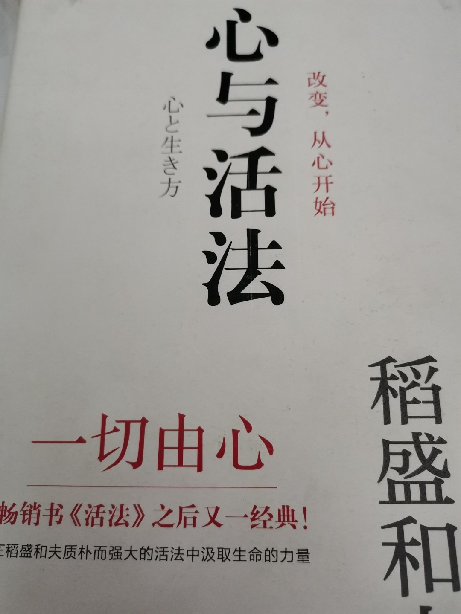

======================================================

_type: q&a
@范毅君[118551121224142]
2021-02-06 17:07:32 Sat  
topic_id: 182541125112512

@范毅君

>  二师父，能否不区分鳄鱼计划和乌龟计划，综合总结一下，目前比较合理的基金比例，还有最近如果底仓或者定投，应该怎么操作，中证500卖了，仓位有点低，想再买点

@二师父

>  那你就以乌龟计划为主，目前做好配置，留一些现金，500卖了转一些到国开债，消费，中欧医疗和创业板50，如果涨了就拿着，回调的话慢慢定投补仓

阅读[1]  评论[3]  赞[0] 

======================================================

_type: talk
@二师父[28814221155551]
2021-02-07 05:50:40 Sun  
topic_id: 414852182822458

<e type="hashtag" hid="15284841844182" title="#三款主动基金#" /> 记得收藏哈，今年择时发车，长期定投，建立一个穿越牛熊的组合，市场低位买指数，市场震荡买主动。

@齿轮 at 2021-02-07 05:50:40 Sun

> 二师父，还有一款，中欧时代先锋[呲牙]

----------

@二师父 at 2021-02-07 05:50:40 Sun

> 这个比较一般吧

----------

@齿轮 at 2021-02-07 05:50:40 Sun

> 师父眼光更高[偷笑]

----------

@样 at 2021-02-07 05:50:40 Sun

> 师父，蓝筹和富国天惠，兴全合宜相比呢？

----------

@二师父 at 2021-02-07 05:50:40 Sun

> 我写篇文章分析下

----------

@样 at 2021-02-07 05:50:40 Sun

> 期待

----------

@浪淘沙 at 2021-02-07 05:50:40 Sun

> 我忘记怎么收藏了，请球友们告诉下[呲牙]

----------

@smile at 2021-02-07 05:50:40 Sun

> 二师父，第一支基金是不是要等消费指数低估以后再买？还是看大盘？

----------

阅读[1]  评论[13]  赞[0] 

+++++++++++++++++++++++++++++++++++++++++++++++++++++

文件：
2021-02-07 05:49:52 Sun
文件大小：[179509]
88442558158812-这三只基金，值得投资.docx

2021-02-07 06:12:14 Sun
文件大小：[4917223]
51445221821554-这三只基金，值得投资.m4a

======================================================

_type: talk
@二师父[28814221155551]
2021-02-07 06:40:39 Sun  
topic_id: 182541851584542

<e type="hashtag" hid="458188281228" title="#鳄鱼计划持仓#" /> 分析视频以及调整计划视频稍后会发到微博上，仅供参考，不是说越便宜就越值得购买。

@J at 2021-02-07 06:40:39 Sun

> 原来师父的光伏也跟我的一样，亏6%[呲牙]

----------

@二师父 at 2021-02-07 06:40:39 Sun

> 我俩买入一样的，当然一样的

----------

@J at 2021-02-07 06:40:39 Sun

> 我中途发了一两次黑车加过仓

----------

@王春媚 at 2021-02-07 06:40:39 Sun

> 师父的消费定投几年了？

----------

@二师父 at 2021-02-07 06:40:39 Sun

> 两年多

----------

@欣 at 2021-02-07 06:40:39 Sun

> 这个鳄鱼计划能在天天基金买吗？

----------

@二师父 at 2021-02-07 06:40:39 Sun

> 可以

----------

@衣袂飘香 at 2021-02-07 06:40:39 Sun

> 二师父的收益率是实际的收益率，还是多次买卖以后总盈亏显示的数字呢？

----------

阅读[1]  评论[27]  赞[0] 

+++++++++++++++++++++++++++++++++++++++++++++++++++++

图片：
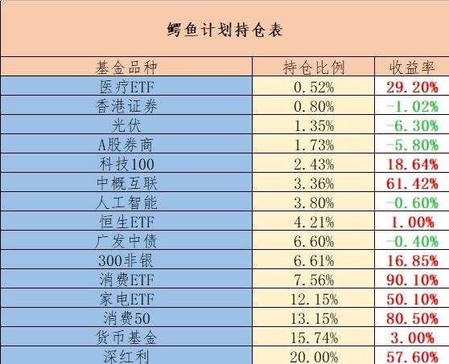

======================================================

_type: talk
@张发荣[582145828584414]
2021-02-07 14:25:03 Sun  
topic_id: 582154855142554

关于定投：刚入菜鸟，想跟着二师父一起做定投，希望能分享

@Sunflower at 2021-02-07 14:25:03 Sun

> 建议先刷楼，看精华

----------

@二师父 at 2021-02-07 14:25:03 Sun

> 欢迎

----------

阅读[1]  评论[2]  赞[0] 

======================================================

_type: talk
@Nick.yang[118281888551882]
2021-02-07 23:05:34 Sun  
topic_id: 582154845241514

想问一个问题，现在手上还有一个30~40的仓位，有个15 16万，过年说是买个货币基金好的还是放在余额宝里？货币基金的话，是不是你之前推荐的那三款？

@二师父 at 2021-02-07 23:05:34 Sun

> 国债逆回购，然后货币基金

----------

阅读[1]  评论[1]  赞[0] 

======================================================

_type: talk
@二师父[28814221155551]
2021-02-08 05:55:43 Mon  
topic_id: 215824144848581

<e type="hashtag" hid="28512121848451" title="#主动基金投资价值分析#" /> 昨天读者提到的基金，二师父测评了下，易方达蓝筹更好，值得投资，本周调仓会加入他。

@海马 at 2021-02-08 05:55:43 Mon

> 师父，易方达蓝筹规模己经670亿了，这么大的规模会不会影响未来的超额收益？

----------

@向前进 at 2021-02-08 05:55:43 Mon

> 师父，我前面瞎买的几个主动基金涨涨跌跌，目前盈亏如下，诺安成长混合（-0.47%），诺安和鑫灵活配置混合(-20.73%)，银河行业优选混合（13.61%），银河创新成长混合(15.03%)，东方阿尔法精选灵活配置混合A(-18.78%)，国联安中证全指半导体产品与设备ETF连接C1(-7.15%)，基本每个1万，师父能否帮忙看下还要不要持有，应该怎么调整，谢谢[抱拳]

----------

@素兮 at 2021-02-08 05:55:43 Mon

> 二师父，中欧新蓝筹混合怎么样？

----------

@样 at 2021-02-08 05:55:43 Mon

> 蓝筹和兴全合润相比呢？现在纠结这两个

----------

@二师父 at 2021-02-08 05:55:43 Mon

> 这个是有可能的

----------

@二师父 at 2021-02-08 05:55:43 Mon

> 我这个文章

----------

@二师父 at 2021-02-08 05:55:43 Mon

> 我写个文章

----------

@素兮 at 2021-02-08 05:55:43 Mon

> 辛苦二师父

----------

阅读[1]  评论[24]  赞[0] 

+++++++++++++++++++++++++++++++++++++++++++++++++++++

文件：
2021-02-08 05:55:11 Mon
文件大小：[41014]
88442584215542-三只优质的主动基金投资价值对比.docx

======================================================

_type: talk
@海马[15158245825242]
2021-02-08 09:01:07 Mon  
topic_id: 182541882448882

师父，看一下我的持仓[呲牙]

@吃肉肉 at 2021-02-08 09:01:07 Mon

> 牛🐮

----------

@海马 at 2021-02-08 09:01:07 Mon

> 都是根据师父的投资理念去配置[微笑]

----------

阅读[1]  评论[2]  赞[0] 

+++++++++++++++++++++++++++++++++++++++++++++++++++++

图片：
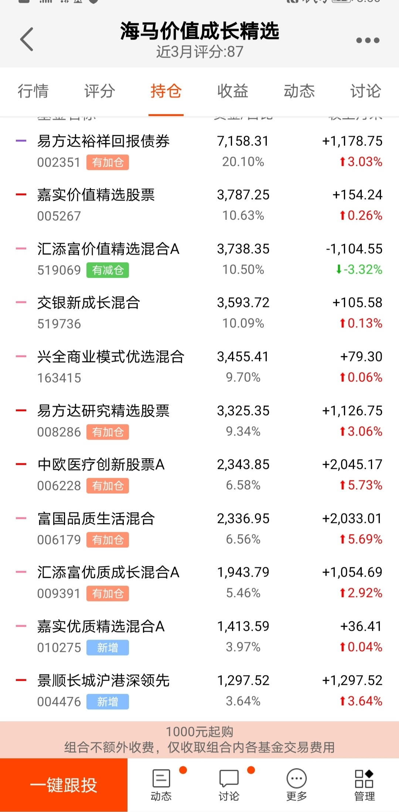

======================================================

_type: talk
@庆余年[15584481824122]
2021-02-08 12:51:19 Mon  
topic_id: 182541884581112

21年2月份基金排行对比

阅读[1]  评论[0]  赞[0] 

+++++++++++++++++++++++++++++++++++++++++++++++++++++

文件：
2021-02-08 12:51:08 Mon
文件大小：[303074]
28442525524241-基金排行-210208.docx

======================================================

_type: q&a
@宁静以致远[841158451581452]
2021-02-08 14:34:55 Mon  
topic_id: 414852111258188

@宁静以致远

>  二师父，519736交银新成长519772交银新生活力这两支基金点评一下吧，推荐吗？

@二师父

>  我稍后写个文章分析下

阅读[1]  评论[8]  赞[0] 

======================================================

_type: talk
@二师父[28814221155551]
2021-02-08 16:56:07 Mon  
topic_id: 815821555482482

<e type="hashtag" hid="552114551414" title="#估值数据#" /> 市盈率百分位59.44%，市净率百分位37.02%，SY/BY百分位67.64%，SY-BY百分位70.9%，估值楼层第四层。

目前这个行情适合持有或者把前期买的差的基金进行转换，仓位重的适当止盈，保持9层或者8层仓位以下比较合适，春节前乌龟计划会最后进行一次调仓，然后开心过年，坐等明年回调补仓了，震荡市场以混合基金和主动型股票基金为主，2月份会把市场好的主动基金都分析一遍。

@丸子妈 at 2021-02-08 16:56:07 Mon

> 人工智能略亏，需要调仓吗

----------

@二师父 at 2021-02-08 16:56:07 Mon

> 多少仓位，百分之10以内可以拿着的

----------

@丸子妈 at 2021-02-08 16:56:07 Mon

> 好的，不多

----------

@云卷云舒 at 2021-02-08 16:56:07 Mon

> 辛苦师父了[呲牙]

----------

阅读[1]  评论[4]  赞[0] 

======================================================

_type: talk
@幽兰[815554522442422]
2021-02-08 17:15:06 Mon  
topic_id: 182548222115552

老天！[天啊]刚看完二师父视频，原来二师父这么年轻？一直脑补是45岁左右的老帅哥，听声音有30岁？佩服了…

@二师父 at 2021-02-08 17:15:06 Mon

> 别被我的声音骗了

----------

@幽兰 at 2021-02-08 17:15:06 Mon

> 厉害了， 年轻有为

----------

@Sunflower at 2021-02-08 17:15:06 Mon

> 听声音挺年轻的感觉应该是30左右[偷笑]

----------

@衣袂飘香 at 2021-02-08 17:15:06 Mon

> 还以为这次能看到二师父的真容，结果，呜呜呜……二师父什么时候能露脸呢[呲牙]

----------

@二师父 at 2021-02-08 17:15:06 Mon

> 哪天辞职了的时候

----------

@天马行空 at 2021-02-08 17:15:06 Mon

> 哪里看视频

----------

@素兮 at 2021-02-08 17:15:06 Mon

> 想知道二师父主业是做什么的[呲牙]

----------

@二师父 at 2021-02-08 17:15:06 Mon

> 日常搬砖

----------

阅读[1]  评论[8]  赞[0] 

======================================================

_type: q&a
@隔窗遥望[241884481854181]
2021-02-08 17:57:46 Mon  
topic_id: 582158222558884

@隔窗遥望

>  看师父公号上说打卡学习，在哪里打卡，学习什么，我也想参加

@二师父

>  就是看文章，打卡自己学习记录，学习下我的文章，坚持一年就会有很大进步的

阅读[1]  评论[1]  赞[0] 

======================================================

_type: q&a
@蛋炒饭不加蛋[118281818482542]
2021-02-08 18:34:23 Mon  
topic_id: 414852118525818

@蛋炒饭不加蛋

>  请问二师傅之前我中了日升发债，今天看持仓里日升发债不见了，我想问下这个日升发债显示红利是什么情况，是自动卖出了？

@二师父

>  这个是给退了的

阅读[1]  评论[7]  赞[0] 

======================================================

_type: talk
@二师父[28814221155551]
2021-02-09 05:43:46 Tue  
topic_id: 815821585481452

<e type="hashtag" hid="48415151258858" title="#主动基金测评#" /> 每天测评三只主动基金，我会慢慢发出来的，大家提到的都会一一去分析，本周三调仓，兴全合润会加入选择中，先调仓，如果上涨就拿住，有回调就定投。

@杜志彪 at 2021-02-09 05:43:46 Tue

> 二师父的乌龟计划今年收益感觉要超越鳄鱼计划了[微笑]

----------

@JOY at 2021-02-09 05:43:46 Tue

> 师父，您方便的话，给看看这里面的呢？据说是这两年排前八的~

----------

@二师父 at 2021-02-09 05:43:46 Tue

> 有可能，这次真的是核心资产单边上

----------

@二师父 at 2021-02-09 05:43:46 Tue

> 好的，我看看哈

----------

@宁静以致远 at 2021-02-09 05:43:46 Tue

> 二师父，别忘了评评交银施罗德的几只基金哈！[强][抱拳]

----------

@二师父 at 2021-02-09 05:43:46 Tue

> 正在写文章，一天三只哈

----------

阅读[1]  评论[6]  赞[0] 

+++++++++++++++++++++++++++++++++++++++++++++++++++++

文件：
2021-02-09 05:42:45 Tue
文件大小：[84455]
28442521848541-测评三只十年长牛的混合基金.docx

======================================================

_type: q&a
@铁钢[15581258582882]
2021-02-09 08:09:32 Tue  
topic_id: 414851484225288

@铁钢

>  二师父您好，我是一个基金小白，刚刚接触基金定投，有幸加入到这个大家庭。我想请教一下：年前我想配置您推荐的易方达蓝筹，是定投吗？按什么周期比较合理？谢谢

@二师父

>  目前有点高，可以组合配置，最大回撤百分之40，轻仓定投问题不大

阅读[1]  评论[2]  赞[0] 

======================================================

_type: q&a
@🍀 凝🌸 慧🍀[841855248254242]
2021-02-09 10:53:16 Tue  
topic_id: 215821584241121

@🍀 凝🌸 慧🍀

>  师父好，今天的两只可转债值得打新吗，虽然评级AA—。

@二师父

>  行情不好，选择3a以上的打

阅读[1]  评论[3]  赞[0] 

======================================================

_type: q&a
@云淡风轻[28281845224241]
2021-02-09 11:37:08 Tue  
topic_id: 414851482145228

@云淡风轻

>  请问二师父为什么每次收割利润后，成本跟着也下降了一点呢？🤔

@二师父

>  软件计算的是成本价格，而实际是买入均价不变的

阅读[1]  评论[1]  赞[0] 

======================================================

_type: talk
@幽兰[815554522442422]
2021-02-09 11:55:26 Tue  
topic_id: 215821581545251

二师父是说今天要发大车吗[呲牙]

@小鱼 at 2021-02-09 11:55:26 Tue

> 明天吧

----------

@幽兰 at 2021-02-09 11:55:26 Tue

> 明天买入得节后确认了吧？

----------

@芙瑞雅阳阳潘 at 2021-02-09 11:55:26 Tue

> 师父啥时候说的今天发车？

----------

@幽兰 at 2021-02-09 11:55:26 Tue

> 我好像在公众号评论里看见的，师傅说要发大车

----------

阅读[1]  评论[4]  赞[0] 

======================================================

_type: talk
@平安是福[118222545154542]
2021-02-09 13:32:02 Tue  
topic_id: 182548258154282

师父：新股申购可以盲打吗

@二师父 at 2021-02-09 13:32:02 Tue

> a股可以

----------

@平安是福 at 2021-02-09 13:32:02 Tue

> 好的，谢谢！

----------

阅读[1]  评论[2]  赞[0] 

======================================================

_type: talk
@二师父[28814221155551]
2021-02-09 15:13:03 Tue  
topic_id: 215821525511421

春节要来了，市场发红包了，开心过年

@栀子花开 at 2021-02-09 15:13:03 Tue

> 二师傅，感觉春节红包是不是提前了，今年国家倡导就地过年，大伙没事干就打开股票和基金看看[微笑]

----------

@二师父 at 2021-02-09 15:13:03 Tue

> 是的吧，主要是大家都等着回调补仓

----------

@光少 at 2021-02-09 15:13:03 Tue

> 今天收到大红包[偷笑]

----------

@🍀 凝🌸 慧🍀 at 2021-02-09 15:13:03 Tue

> 今天收到最大红包[鼓掌][鼓掌][鼓掌]

----------

阅读[1]  评论[4]  赞[0] 

======================================================

_type: q&a
@永刚[15581448518112]
2021-02-09 17:28:21 Tue  
topic_id: 582158255552154

@永刚

>  师父，目前混合基金的基金净值是最高的，这个时候买入合适吗？

@二师父

>  这个分情况，不同的混合基金不一样，有的是可以买的，这个与当下净值无关

阅读[1]  评论[2]  赞[0] 

======================================================

_type: talk
@泓.[414858828855888]
2021-02-09 22:02:21 Tue  
topic_id: 815821521524112

明天适合加仓吗

@苍天有井明月空🌙 at 2021-02-09 22:02:21 Tue

> 你觉得呢

----------

@Sunflower at 2021-02-09 22:02:21 Tue

> 看你仓位多少，如果仓位不多，想加仓可以少加点，如果不着急就等今年加仓的机会，我也在忍耐等着今年的机会

----------

阅读[1]  评论[2]  赞[0] 

======================================================

_type: q&a
@林玮[844111858288412]
2021-02-10 07:35:48 Wed  
topic_id: 215821542884511

@林玮

>  在哪里能看到鳄鱼计划？

@二师父

>  知识星球会同步的哈

阅读[1]  评论[0]  赞[0] 

======================================================

_type: talk
@二师父[28814221155551]
2021-02-10 09:37:59 Wed  
topic_id: 815821544584242

<e type="hashtag" hid="88512145544222" title="#发车乌龟计划+鳄鱼计划#" /> 乌龟计划如下表，鳄鱼计划买入券商ETF一份（512000），买入互联网50三份（517050），今天本来发大车的，不过准备入手的两只混合基金暂停了申购，所以咱们也缓缓。

基金投资有风险，入市需谨慎，仅为个人操作。扫描二维码可以一键跟投，空仓的朋友可以一键买入，有仓位的跟上就可以了。

@JOY at 2021-02-10 09:37:59 Wed

> 师父，请问是哪两只准备入的基金暂停申购了？先看看哈

----------

@二师父 at 2021-02-10 09:37:59 Wed

> 易方达蓝筹精选和汇添富全球消费混合

----------

@JOY at 2021-02-10 09:37:59 Wed

> 谢谢～

----------

@顾。 at 2021-02-10 09:37:59 Wed

> 咦，为什么清仓了中概互联呀？

----------

@云淡风清 at 2021-02-10 09:37:59 Wed

> 师父，鳄鱼计划的中概互联要不要清仓

----------

@mumomo at 2021-02-10 09:37:59 Wed

> 二师父，乌龟计划的中概互联为什么要清仓呢

----------

@Vivian at 2021-02-10 09:37:59 Wed

> 老师，股指站上3600高位了，基金为何不等回调再进？

----------

@栀子花开 at 2021-02-10 09:37:59 Wed

> 兴全和润我昨天清仓了[呲牙]

----------

阅读[1]  评论[48]  赞[0] 

+++++++++++++++++++++++++++++++++++++++++++++++++++++

图片：
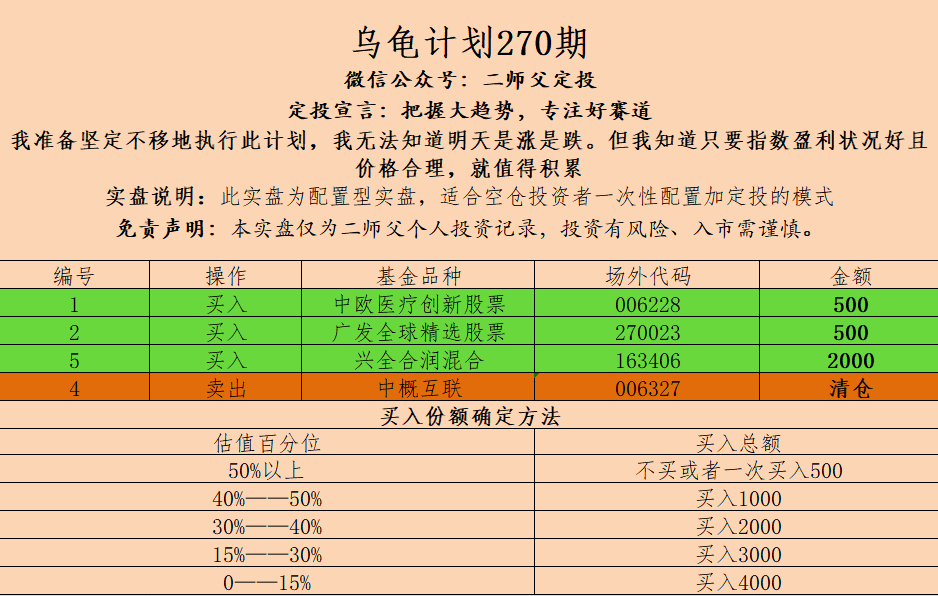

======================================================

_type: talk
@二师父[28814221155551]
2021-02-10 09:53:42 Wed  
topic_id: 414851422884518

今年唯一中了一只上银转债，赚了4块钱，赶紧走，转债已经不想打了

@范毅君 at 2021-02-10 09:53:42 Wed

> 挣了2.5

----------

@栀子花开 at 2021-02-10 09:53:42 Wed

> 我赚了个鸭蛋

----------

@王燕 at 2021-02-10 09:53:42 Wed

> 赚了5元，赶紧走了，前面两个都赔了[捂脸]

----------

@章兵朋 at 2021-02-10 09:53:42 Wed

> 3.5跑路

----------

@🍀 凝🌸 慧🍀 at 2021-02-10 09:53:42 Wed

> 哈哈哈，我也是赚了4块钱[偷笑]

----------

@雨的依恋 at 2021-02-10 09:53:42 Wed

> 刚看到，去看了下我赚1.5[呲牙]

----------

@爱华 at 2021-02-10 09:53:42 Wed

> 1.3

----------

@Siller at 2021-02-10 09:53:42 Wed

> 今年妄图打转债，结果被转债打

----------

阅读[1]  评论[12]  赞[0] 

======================================================

_type: q&a
@葛亚丽[841858254128252]
2021-02-10 10:14:23 Wed  
topic_id: 815821544848822

@葛亚丽

>  二师父你好，005827为什么要暂停申购赎回呢？

@二师父

>  港股休市，里面有港股

阅读[1]  评论[0]  赞[0] 

======================================================

_type: q&a
@泓.[414858828855888]
2021-02-10 10:26:58 Wed  
topic_id: 182548211458212

@泓.

>  2月9日3点前买的 今天的收益还算的嘛？

@二师父

>  算的

阅读[1]  评论[0]  赞[0] 

======================================================

_type: q&a
@王春媚[244424882221141]
2021-02-10 10:29:14 Wed  
topic_id: 815821544224822

@王春媚

>  师父，香港证券加仓吗？

@二师父

>  这次没有加

阅读[1]  评论[1]  赞[0] 

======================================================

_type: talk
@Lion超超[48418188882428]
2021-02-10 12:17:53 Wed  
topic_id: 582158282452544

二师父 50和50AH哪一个长期看比较好。目前两个都在定投，我想一个抛出换别的板块。

@二师父 at 2021-02-10 12:17:53 Wed

> 易方达上证50

----------

@Lion超超 at 2021-02-10 12:17:53 Wed

> 之前不是说Ah更好嘛

----------

@二师父 at 2021-02-10 12:17:53 Wed

> ah有溢价差的时候才是

----------

@Lion超超 at 2021-02-10 12:17:53 Wed

> 那我转化过去吧

----------

@梧桐 at 2021-02-10 12:17:53 Wed

> 请教二师父，易方达上证50增强和易方达上证50哪一个好

----------

阅读[1]  评论[5]  赞[0] 

+++++++++++++++++++++++++++++++++++++++++++++++++++++

图片：
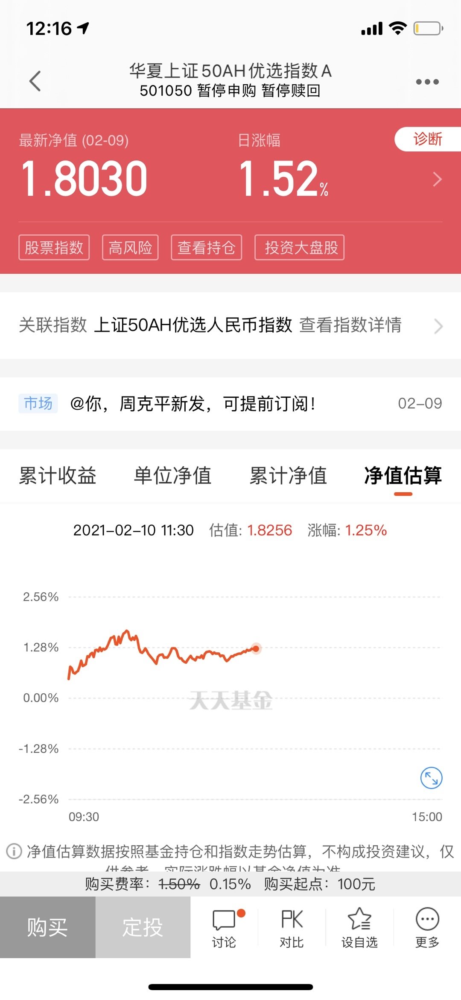
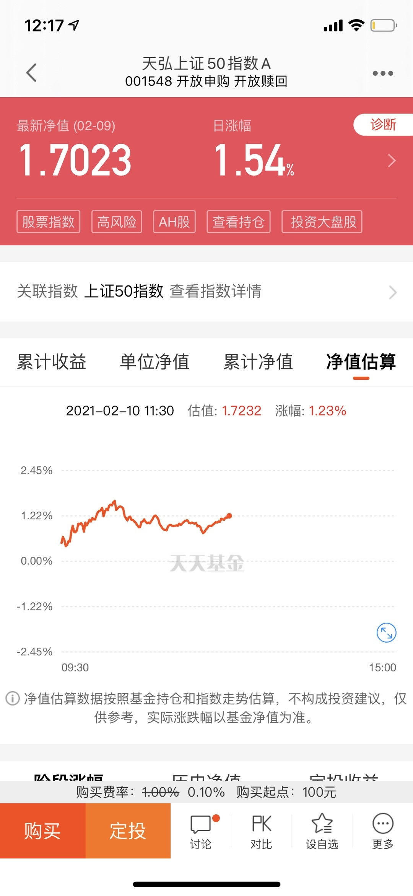

======================================================

_type: talk
@二师父[28814221155551]
2021-02-10 13:43:42 Wed  
topic_id: 414851418424248

<e type="hashtag" hid="552114551414" title="#估值数据#" /> 目前大致估值百分位市盈率60.35%，市净率百分位38.47%，SY-BY百分位72.36%，SY/BY百分位69.4%，钟摆已经到了右边，至于未来能摆多远，就不知道了，我放弃坐波段，一直拿着，在这种时候波段，可能下车就容易上不来。长期看企业市值是向上的，这是常持的基础。

@栀子花开 at 2021-02-10 13:43:42 Wed

> 二师傅，到了右侧，是不是意味着上涨通道打开了

----------

@二师父 at 2021-02-10 13:43:42 Wed

> 就是现在处于钟摆右侧，上行趋势

----------

@志亮 at 2021-02-10 13:43:42 Wed

> 我也没做了，拿着阳光捂股丰登[呲牙]。

----------

@二师父 at 2021-02-10 13:43:42 Wed

> 哈哈，恭喜吃肉

----------

@志亮 at 2021-02-10 13:43:42 Wed

> 哈哈，二师父这几天应该也吃到大肉了吧，春节发红包啦，我持股过年[微笑]。

----------

@二师父 at 2021-02-10 13:43:42 Wed

> 哈哈，我持有的隆基，还行

----------

@🍀 凝🌸 慧🍀 at 2021-02-10 13:43:42 Wed

> 谢谢师父每日行情分析，我每天都认真学！今年第一个月，已实现我自己的第一个小目标10%收益16W，我满意，非常好，落袋为安。这两年家人生病，花费不少，算是贴补。假期我要好好复盘，继续学习师父的分析文章，提高自己的投资水平。祝师父阖家牛年大吉，身体健康！[爱心][玫瑰][玫瑰][玫瑰][抱拳][抱拳]

----------

@天马行空 at 2021-02-10 13:43:42 Wed

> 160万赚了16万，一个月吗。

----------

阅读[1]  评论[18]  赞[0] 

======================================================

_type: talk
@二师父[28814221155551]
2021-02-10 14:00:08 Wed  
topic_id: 215821518518451

<e type="hashtag" hid="458188281228" title="#鳄鱼计划持仓#" /> 当前持仓，仓位又上升到了8成，遇到回调逐步再加仓，医疗这种一次买到低位的并不好，虽然盈利很多，但是仓位不足，不要有成本价思维，仓位匹配合适的价格就好了。

@J at 2021-02-10 14:00:08 Wed

> 今天加仓了吗师父

----------

@二师父 at 2021-02-10 14:00:08 Wed

> 这说了啊

----------

@J at 2021-02-10 14:00:08 Wed

> 加了医疗吗

----------

@二师父 at 2021-02-10 14:00:08 Wed

> 有说的，鳄鱼计划，你看看

----------

@杜志彪 at 2021-02-10 14:00:08 Wed

> 师父场内没加，场外加的。

----------

@香香 at 2021-02-10 14:00:08 Wed

> 长期价值投资是否不需要择时更好？

----------

@二师父 at 2021-02-10 14:00:08 Wed

> 不能绝对化，你现在买茅台肯定没有一年前买好啊

----------

@J at 2021-02-10 14:00:08 Wed

> 师父，我对互联网50这个基金比较不熟悉，您可以以科普一下吗？它跟中概互联、中国互联的区别在于？

----------

阅读[1]  评论[10]  赞[0] 

+++++++++++++++++++++++++++++++++++++++++++++++++++++

图片：
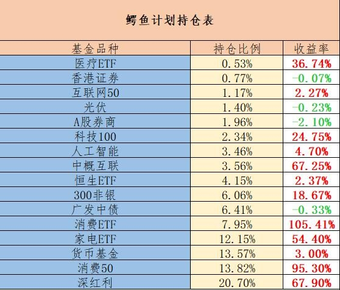

======================================================

_type: talk
@志亮[422125851552828]
2021-02-10 14:50:47 Wed  
topic_id: 215821518288111

茅台是真牛，入市两年最后悔的一件事就是1800卖了茅台，格局太小了。[捂脸]

@涓涓 at 2021-02-10 14:50:47 Wed

> 以后有机会的

----------

阅读[1]  评论[1]  赞[0] 

======================================================

_type: q&a
@ 🇦 🇬 🇧 🇹[182218122141512]
2021-02-10 15:23:09 Wed  
topic_id: 582158281414254

@ 🇦 🇬 🇧 🇹

>  二师父  请教一下 对环保一块  现在可以下手吗

@二师父

>  环保并不好

阅读[1]  评论[0]  赞[0] 

======================================================

_type: talk
@光少[244124552511141]
2021-02-10 19:06:29 Wed  
topic_id: 414851415255828

这两天市场先生真给力👍👍👍祝大家新年快乐[玫瑰]

@🍀 凝🌸 慧🍀 at 2021-02-10 19:06:29 Wed

> 真是惊喜激动啊，没想到市场连续发大红包[呲牙][偷笑][红包][红包][红包]

----------

@🍀 凝🌸 慧🍀 at 2021-02-10 19:06:29 Wed

> 祝大家牛年大吉，健康如意！[爱心][玫瑰][玫瑰][玫瑰]

----------

@Sunflower at 2021-02-10 19:06:29 Wed

> 新年快乐🎉

----------

@J at 2021-02-10 19:06:29 Wed

> 新年快乐🎉

----------

阅读[1]  评论[4]  赞[0] 

======================================================

_type: q&a
@素兮[548121415528244]
2021-02-10 22:24:03 Wed  
topic_id: 582145424254824

@素兮

>  二师父，光伏ETF的持仓股和一些新能源为主的行业基金是不是差不多？

@二师父

>  新能车和光伏一个是上游产业链，一个是下游产业链，光伏是新能源这个能源，新能源车是产品。单就光伏而言，他属于新能源的一个细分赛道

阅读[1]  评论[0]  赞[0] 

======================================================

_type: talk
@天马行空[548818851412444]
2021-02-11 05:37:33 Thu  
topic_id: 414825241885588

师父，除了跟投你的计划之外，大部分资金我白天做华宝添益的差价，晚上吃银行理财利息，一天下来200万平均挣350元。在没机会重仓基金的情况下 这个操作有意义吗  ，能代替国债投资吗。目前我看7到10年期国债也在跌。谢谢师傅。

@天马行空 at 2021-02-11 05:37:33 Thu

> 和大家比起来这点收益不值一提，我今年疫情期间没有投资，等市场底部再重仓基金。

----------

@二师父 at 2021-02-11 05:37:33 Thu

> 没有意义，不要太贪心，没有人能精准买到底部

----------

@J at 2021-02-11 05:37:33 Thu

> 哈哈，真实

----------

@J at 2021-02-11 05:37:33 Thu

> 您有200万资金在手，只要控制好仓位选好优质赛道，仅用部分资金打底仓，收益也能赶超一天350元的

----------

@天马行空 at 2021-02-11 05:37:33 Thu

> 谢谢大家的指教。

----------

@天马行空 at 2021-02-11 05:37:33 Thu

> 谢谢师父

----------

@天马行空 at 2021-02-11 05:37:33 Thu

> 谢谢指教。

----------

@姥姥不疼. 爷爷不爱 at 2021-02-11 05:37:33 Thu

> 华宝添益具体怎么做

----------

阅读[1]  评论[24]  赞[0] 

======================================================

_type: talk
@二师父[28814221155551]
2021-02-11 06:27:55 Thu  
topic_id: 582145428151414

新年好，二师父祝愿大家新的一年都平安喜乐，开开心心，打开支付宝可以领取红包

@云云 at 2021-02-11 06:27:55 Thu

> 谢谢师父，新年快乐🎊

----------

@好运玲玲 at 2021-02-11 06:27:55 Thu

> 谢谢二师父！感恩遇见二师父！[抱拳]

----------

@向前进 at 2021-02-11 06:27:55 Thu

> 第三名[呲牙] 谢谢二师父，感恩遇见二师父，祝师父新年快乐，阖家幸福，身体健康，财源滚滚[玫瑰]

----------

@清茶半盏 at 2021-02-11 06:27:55 Thu

> 谢谢二师父的红包，大家新年快乐！

----------

@王春媚 at 2021-02-11 06:27:55 Thu

> 师父新年快乐🎉🎉🎉

----------

@宁静致远 at 2021-02-11 06:27:55 Thu

> 感谢二师父，新年快乐！[玫瑰][玫瑰]🎉🎉

----------

@梧桐 at 2021-02-11 06:27:55 Thu

> 二师父新春快乐，大家新春快乐

----------

@涓涓 at 2021-02-11 06:27:55 Thu

> 二师父新年快乐，一切顺利

----------

阅读[1]  评论[15]  赞[0] 

+++++++++++++++++++++++++++++++++++++++++++++++++++++

图片：

======================================================

_type: talk
@二师父[28814221155551]
2021-02-11 06:43:20 Thu  
topic_id: 215842451824211

<e type="hashtag" hid="15284812422552" title="#起身再次出发#" /> 感谢陪伴，新年继续努力，不断成长！

@云云 at 2021-02-11 06:43:20 Thu

> 看了满满的感动，有幸认识到二师父，向你学习，目标明确，内心坚定

----------

@向前进 at 2021-02-11 06:43:20 Thu

> [强]佩服，祝心想事成！ 也希望自己在新的一年有目标有收获：跟着师父学习，向其他努力的读者学习，读完了师父的书，开始读师父推荐的书，健身从每天4遍广播体操开始！[呲牙]

----------

@阝東 at 2021-02-11 06:43:20 Thu

> 新的一年新的开始让我们一起进步

----------

@阿宝 at 2021-02-11 06:43:20 Thu

> 谢谢

----------

@云卷云舒 at 2021-02-11 06:43:20 Thu

> 感恩遇见二师父，和师父一同成长，快乐的度过了2020。祝师父新年快乐，心想事成，新的一年带领我们继续冲鸭[呲牙][呲牙][呲牙]

----------

@CY at 2021-02-11 06:43:20 Thu

> 同对CFA考试感兴趣，不知二师父能否建一个CFA准备群，或推荐相关培训机构或者书籍？非科班出身，想挑战自己～

----------

@二师父 at 2021-02-11 06:43:20 Thu

> 京东淘宝就可以啦，可以报个班，这个主要靠自己

----------

@CY at 2021-02-11 06:43:20 Thu

> 好呢，我找找｜

----------

阅读[1]  评论[13]  赞[0] 

+++++++++++++++++++++++++++++++++++++++++++++++++++++

文件：
2021-02-11 06:42:15 Thu
文件大小：[42370]
51445281814484-新的一年，起身再次出发.docx

======================================================

_type: talk
@二师父[28814221155551]
2021-02-11 07:32:10 Thu  
topic_id: 414825241582188

红包没领到的别灰心，我会一直发到大年初五，没破3500会给大家发红包，破了依然会发，就是图个开心，等迎来财神，新的一年大家就自己发了

@涓涓 at 2021-02-11 07:32:10 Thu

> 虽然我没有抢到红包，但是想给二师父发红包，感恩遇见[玫瑰]

----------

@素兮 at 2021-02-11 07:32:10 Thu

> 二师父明天打算几点发红包，我提前候着[偷笑]

----------

阅读[1]  评论[2]  赞[0] 

======================================================

_type: talk
@齿轮[844148444855122]
2021-02-11 08:08:26 Thu  
topic_id: 182514128411422

祝二师父新春快乐，万事如意，身体健康，财源滚滚。[呲牙][呲牙][呲牙]

阅读[1]  评论[0]  赞[0] 

======================================================

_type: talk
@🍀 凝🌸 慧🍀[841855248254242]
2021-02-11 16:00:20 Thu  
topic_id: 182514154142212

写给球友天马行空的回复：
这位球友，你好！谢谢你在我另一个帖子里的关注，其实，咱俩情况差不多，我就说说我的操作，不一定值得学习参考，权当交流哈。

首先，我是属于那种能够承受一定风险的基民，有点小激进。我目前的指数基金、主动型基金、债基，基本上都是11月下旬陆续开始投入的。因为家人重病，11月之前不能投入多。11月份才开始加大投入，所以我的基金成本偏高。但是我敢在市场回调时，大胆加仓，拉低成本。

第二，每天坚持学习二师父的基金分析，然后找出适合自己的基金，每周复盘自己的操作、持仓结构、仓位管理等等。

第三、因为我的基金成本不便宜，所以采取一半买二级债基，一半买指数基金、主动基金和少量股票的策略。
1、二级债基中，基本都能盈利，短短2个多月，最好的收益已达5%（南方宝元），最差的如你所说那个广发7-10中债，亏几百。
2、指数基金，以深红利、创业50、医疗、中概、光伏为主（原来还买过龙头科技和人工智能，后来发现上攻动能有限，就坚决卖出了。）券商ETF会来回做网格。
3、主动基金有中欧医疗创新、富国天惠、广发科技、易方达蓝筹等等几个优质基金（这些都是二师父在文中分析过，我自己认真再学习对比好多遍相关指标）。
我买入这几个基金大概是12月，上证指数都不低了，回调到3400多点时，我就加仓了，比如易方达蓝筹买5W，广发科技买5W，等等。然后，再定投。
前几天，我觉得那个广发7—10国开债近期太弱了，一直跌，就坚决转换到其他主动基金了，马上扭亏为赢。

今天大年三十，事情有点多，先写到这，咱们可以随时交流。

祝球友们牛年财运亨通，大吉大利！[愉快][玫瑰][玫瑰][玫瑰]🎉🎉🎉

@🍀 凝🌸 慧🍀 at 2021-02-11 16:00:20 Thu

> 忘了说，我的基金账户总体一直盈利的，就算回撤，也是盈利的，所以在比较高点位进入市场，没有遇到大级别回撤，只能说比较幸运，并不具完全参考性。但我已经计划过，如果遇到大级别回撤，我要如何安排资金一步步加仓。

----------

@天马行空 at 2021-02-11 16:00:20 Thu

> 谢谢凝慧球友的长篇回复。没想到是11月入市的，太厉害了。一定会多读几遍回复，汲取经验，争取早日像你一样成功。谢谢经验分享。祝牛年🐮发大财，有不懂的地方会再次叨扰请教。

----------

@天马行空 at 2021-02-11 16:00:20 Thu

> 凝慧球友属于厚积薄发，加天分。我虽笨鸟也未先飞，从今得勤奋学习了。

----------

@一心一意 at 2021-02-11 16:00:20 Thu

> 赶上市场好，感觉幸运的成分多一些，

----------

@🍀 凝🌸 慧🍀 at 2021-02-11 16:00:20 Thu

> 您太谦虚了，谢谢您的回复，多交流[抱拳][抱拳][抱拳]！这只是我的真实投资经历，如果要是遇到那年3200一直跌到2445，估计我也会很难受，但我不会害怕。当时，根据二师父的每日文章分析和我收集的各方面情况汇总，我觉得是值得用一半资金来陆续建仓和定投。如果真是出现大级别回调的话，我就肯定会把那一半债基转为优质指数基或主动基，继续加仓的，这些我都有基本操作安排。所以心态一直比较能稳住[愉快]

----------

@🍀 凝🌸 慧🍀 at 2021-02-11 16:00:20 Thu

> 谢谢您，过奖了！二师父的那本书《指数基金，慢慢变富》我反复读了好几遍，还会再读，对我启发很大，特别是二师父的投资哲学和理念，我尽量做到活学活用[愉快]。

----------

@🍀 凝🌸 慧🍀 at 2021-02-11 16:00:20 Thu

> 说的是哈，确实比较幸运。我尽量在决定操作之前，收集整合各方面情况后，再多学习和分析，结合自己实际情况，减少盲目性。[愉快]

----------

@天马行空 at 2021-02-11 16:00:20 Thu

> 二师父的书我也买了，但确实没有反复精读。准备拿出来认真研读。胸有成竹才能沉着应战。加强学习吧。凝慧的成功不止是市场带来的运气，同样的市场不赚钱的也很多。

----------

阅读[1]  评论[10]  赞[0] 

======================================================

_type: talk
@阝東[844111541211852]
2021-02-11 23:34:59 Thu  
topic_id: 414825281858848

球友们新年快乐牛气冲天

@🍀 凝🌸 慧🍀 at 2021-02-11 23:34:59 Thu

> 牛云亨通[鼓掌][鼓掌][鼓掌][爱心][转圈][转圈][转圈]

----------

阅读[1]  评论[1]  赞[0] 

======================================================

_type: talk
@🍀 凝🌸 慧🍀[841855248254242]
2021-02-12 02:01:16 Fri  
topic_id: 182514145582442

新年第一天，分享感触挺深的几句话，这是最近我买来送给朋友孩子的书《<e type="web" href="https://wx.zsxq.com/mweb/views/weread/search.html?keyword=小狗钱钱" title="小狗钱钱" style="book" />》中的摘录：
如何挣到很多钱？
1、要始终帮别人解决问题。
2、要始终集中精力，关注你知道的、能做到的和拥有的。
……😊

阅读[1]  评论[0]  赞[0] 

======================================================

_type: talk
@二师父[28814221155551]
2021-02-12 06:49:51 Fri  
topic_id: 815842428214122

<e type="hashtag" hid="88512145482252" title="#分享一只主动基金#" /> 红包来了，大家来抢吧，我会一直发到正月初五，迎财神，一天没抢到，第二天接着来。

@清茶半盏 at 2021-02-12 06:49:51 Fri

> 新年快乐

----------

@一笑而过 at 2021-02-12 06:49:51 Fri

> 谢谢！二师父新年快乐！

----------

@乖子 at 2021-02-12 06:49:51 Fri

> 谢谢二师父，跟着您挣钱还有红包拿，[呲牙]，祝福幸福安康，牛年更牛！

----------

@水冰月槑槑🌙 at 2021-02-12 06:49:51 Fri

> 每次都这么快[捂脸]看到就没了

----------

@丸子妈 at 2021-02-12 06:49:51 Fri

> 新年快乐，你们怎么都起来得这么早

----------

@🎈铮 at 2021-02-12 06:49:51 Fri

> 二师父新年快乐🎉

----------

@🍀 凝🌸 慧🍀 at 2021-02-12 06:49:51 Fri

> 师父新年好[愉快][玫瑰][玫瑰][玫瑰]

----------

@jorfy at 2021-02-12 06:49:51 Fri

> 二师父新年快乐

----------

阅读[1]  评论[19]  赞[0] 

+++++++++++++++++++++++++++++++++++++++++++++++++++++

图片：

+++++++++++++++++++++++++++++++++++++++++++++++++++++

文件：
2021-02-12 06:48:49 Fri
文件大小：[42361]
15114284454112-这只主动基金可以纳入基金池.docx

======================================================

_type: q&a
@不知道不明了[15584248411812]
2021-02-12 20:53:42 Fri  
topic_id: 215842448555441

@不知道不明了

>  二师父您新年好呀，过去一年和您一起学习收获挺多的。请问对于您提到的景顺长城的优质主动基金，如果我现在有一部分闲置资金准备仅专门投资这只基金，一口气买几层仓位比较合适呢，6层可以么？剩下的4层再做定投慢慢加仓。

@二师父

>  我觉得目前按照百分之40的回撤来算，你能经受住波动的金额，就是目前可以加的仓位，另外做好备选方案，如果基金经理更换记得及时调仓，如果基金经理不换，那以10年周期来看就是向上的

阅读[1]  评论[0]  赞[0] 

======================================================

_type: talk
@二师父[28814221155551]
2021-02-13 08:52:03 Sat  
topic_id: 414825221811158

<e type="hashtag" hid="48415124118118" title="#关于主动基金的投资思路#" />

@天马行空 at 2021-02-13 08:52:03 Sat

> 及时雨

----------

@衣袂飘香 at 2021-02-13 08:52:03 Sat

> 最近我在想，目前估值是第4层，相对高位，周围谈论基金的人也多了起来，毫无疑问，目前市场的热度比较高，况且中国股市牛短熊长，二师父以及星球的朋友们，我们是否要更多加一个心眼，密切关注牛熊趋势，防止市场的暴击。

----------

阅读[1]  评论[2]  赞[0] 

+++++++++++++++++++++++++++++++++++++++++++++++++++++

文件：
2021-02-13 08:51:45 Sat
文件大小：[243444]
88442855582882-现在买混合基金是否追高了.docx

======================================================

_type: talk
@二师父[28814221155551]
2021-02-13 08:53:47 Sat  
topic_id: 815842441255182

<e type="hashtag" hid="88512145118112" title="#抢红包了#" />

@sky at 2021-02-13 08:53:47 Sat

> 哈哈，今天第一，谢谢二师父

----------

@白山羊 at 2021-02-13 08:53:47 Sat

> [抱拳][抱拳]

----------

阅读[1]  评论[2]  赞[0] 

+++++++++++++++++++++++++++++++++++++++++++++++++++++

图片：

======================================================

_type: talk
@舵手[815858155822852]
2021-02-13 08:55:32 Sat  
topic_id: 815842441258522

<e type="hashtag" hid="88512145118112" title="#抢红包了#" /> 二师父早ﾉ☀

阅读[1]  评论[0]  赞[0] 

======================================================

_type: talk
@舵手[815858155822852]
2021-02-13 08:56:25 Sat  
topic_id: 815842441258852

<e type="hashtag" hid="88512145118112" title="#抢红包了#" /> 不会抢，哈哈

阅读[1]  评论[0]  赞[0] 

======================================================

_type: talk
@步步惊心[544842545554154]
2021-02-13 08:57:30 Sat  
topic_id: 215842441258841

<e type="hashtag" hid="88512145118112" title="#抢红包了#" /> 二师父新年好

阅读[1]  评论[0]  赞[0] 

======================================================

_type: talk
@平安是福[118222545154542]
2021-02-13 09:06:24 Sat  
topic_id: 414825221542528

<e type="hashtag" hid="88512145118112" title="#抢红包了#" /> 谢谢师父！过年好

阅读[1]  评论[0]  赞[0] 

======================================================

_type: talk
@隔窗遥望[241884481854181]
2021-02-13 18:50:59 Sat  
topic_id: 414825218885218

今天上午把近期师父分析的主动基金大概整理了一下，打算年后开始定投景顺长城鼎益混合，易方达蓝筹精选师父说现在有点贵，等两会结束或三季度看看能不能回调，那就再等等。
师父，现在投景顺长城行不行？

@🍀 凝🌸 慧🍀 at 2021-02-13 18:50:59 Sat

> 现在是否能投资景顺长城鼎益这只基金，师父已经在昨天分析过了，也就是说如果这只基金出现最大回撤40%，你就问问自己：是否能承受可能出现的最大亏损金额。

----------

@🍀 凝🌸 慧🍀 at 2021-02-13 18:50:59 Sat

> 现在这只基金净值是3.88元，回撤40%的话，就是跌倒了2.32元，自己是否能承受这样的亏损？换句话说，现在如果一次性投入1万买这只基金，但是后来亏损了4000元，自己是否能承受？

----------

@🍀 凝🌸 慧🍀 at 2021-02-13 18:50:59 Sat

> 我的理解是：师父的分析是提示我们在投资前，要考虑最大回撤问题。

----------

@隔窗遥望 at 2021-02-13 18:50:59 Sat

> 嗯嗯，控制好仓位，做好承受最坏情况的心理准备

----------

@🍀 凝🌸 慧🍀 at 2021-02-13 18:50:59 Sat

> 同意同意，现在的大部分优质基金都不便宜了，要么耐心等回调，要么轻仓定投。

----------

阅读[1]  评论[5]  赞[0] 

+++++++++++++++++++++++++++++++++++++++++++++++++++++

图片：
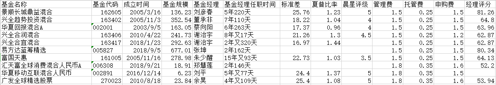

======================================================

_type: talk
@永刚[15581448518112]
2021-02-13 19:56:02 Sat  
topic_id: 414825218558588

感恩二师父一路的指引，让我初步形成了自己的投资体系，在此恭祝您及家人牛年大吉，阖家欢乐，万事如意！

阅读[1]  评论[0]  赞[0] 

======================================================

_type: q&a
@隔窗遥望[241884481854181]
2021-02-14 10:29:32 Sun  
topic_id: 582145481554824

@隔窗遥望

>  师父，定投主动基金是定期定额还是定期不定额？如果不定额，怎么确定每期投入金额？

@二师父

>  这个就很灵活了，看基金目前所处的位置，基金目前比较便宜就可以直接多买点

阅读[1]  评论[2]  赞[0] 

======================================================

_type: q&a
@隔窗遥望[241884481854181]
2021-02-14 10:31:28 Sun  
topic_id: 815842418281452

@隔窗遥望

>  师父说主动基金主要看经理，选择好的经理管理的主动基金，只要经理不更换就可以长期持有。
>  目前震荡行情持有主动基金的策略是无视回调，无脑拿住，新高不卖，回调补仓。
>  但在一篇文章里又说是否卖出取决于三点:基本面、波动率、投资周期。
>  那我该怎么做，只看经理是否更换，还是需要定期分析以上所说的三点。
>  如果是要分析，没那个金刚钻啊。

@二师父

>  这个不是主动基金的策略，而是控制好仓位之后，尽量长期持有股权类品种，主动基金投资相对灵活一点，如果刚开始的话就跟随基金经理，不用太恪守书上的规则

阅读[1]  评论[0]  赞[0] 

======================================================

_type: talk
@二师父[28814221155551]
2021-02-14 20:10:01 Sun  
topic_id: 182514821811542

<e type="hashtag" hid="51285844211224" title="#分析两只较好的基金#" />

@吃肉肉 at 2021-02-14 20:10:01 Sun

> 二师父会投这两个标的吗？

----------

@二师父 at 2021-02-14 20:10:01 Sun

> 实盘投了的

----------

@吃肉肉 at 2021-02-14 20:10:01 Sun

> 好的

----------

@吃肉肉 at 2021-02-14 20:10:01 Sun

> 好的

----------

阅读[1]  评论[4]  赞[0] 

+++++++++++++++++++++++++++++++++++++++++++++++++++++

文件：
2021-02-14 20:09:42 Sun
文件大小：[88079]
28442858218451-从高瓴资本和景林资产最新持仓分析这两只基金的价值.docx

======================================================

_type: talk
@二师父[28814221155551]
2021-02-14 20:12:49 Sun  
topic_id: 815842151582852

<e type="hashtag" hid="28512144588521" title="#红包口令#" />

@J at 2021-02-14 20:12:49 Sun

> 一秒就抢完了吗？

----------

@mumomo at 2021-02-14 20:12:49 Sun

> 一次也没抢到的路过

----------

@舵手 at 2021-02-14 20:12:49 Sun

> 节日快乐！

----------

@雪莲 at 2021-02-14 20:12:49 Sun

> 每次都完美错过

----------

@圣诞结® at 2021-02-14 20:12:49 Sun

> 握爪[呲牙]

----------

@芙瑞雅阳阳潘 at 2021-02-14 20:12:49 Sun

> 今天又来晚了[偷笑]

----------

阅读[1]  评论[6]  赞[0] 

+++++++++++++++++++++++++++++++++++++++++++++++++++++

图片：

======================================================

_type: q&a
@王春媚[244424882221141]
2021-02-15 11:23:13 Mon  
topic_id: 215842151524211

@王春媚

>  师父：H股ETF（510900）有没有投资价值？

@二师父

>  这个表现不太好，很难跑赢沪深300

阅读[1]  评论[0]  赞[0] 

======================================================

_type: talk
@二师父[28814221155551]
2021-02-15 17:17:26 Mon  
topic_id: 182514845555542

<e type="hashtag" hid="51285844158414" title="#红包来了，大家赶紧抢#" /> 5分钟后发公众号，大家赶紧先抢吧。

@J at 2021-02-15 17:17:26 Mon

> 师父真贴心，先照顾了我们这班学院的友友[呲牙]

----------

@范毅君 at 2021-02-15 17:17:26 Mon

> 今天赶上了[呲牙]

----------

@雨的依恋 at 2021-02-15 17:17:26 Mon

> 没赶上过，完美错开[呲牙]

----------

@二师父 at 2021-02-15 17:17:26 Mon

> 明天还有一天

----------

@涓涓 at 2021-02-15 17:17:26 Mon

> 每天都错过[流泪]

----------

@雪莲 at 2021-02-15 17:17:26 Mon

> 没一次赶上的

----------

@J at 2021-02-15 17:17:26 Mon

> 师父以后派红包记得先通知学院自己人，毕竟我们付费的，对师父支持力度也比公众号免费读者要大一些[呲牙]

----------

@二师父 at 2021-02-15 17:17:26 Mon

> 好的哈

----------

阅读[1]  评论[8]  赞[0] 

+++++++++++++++++++++++++++++++++++++++++++++++++++++

图片：
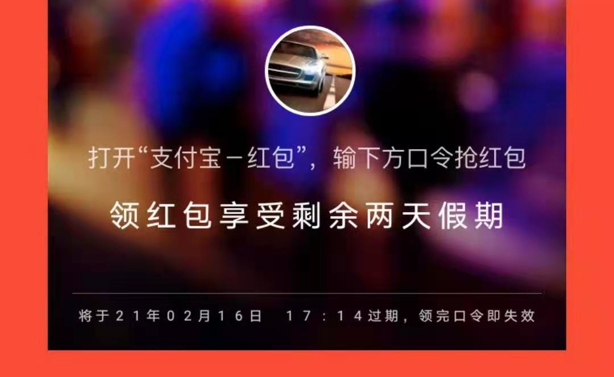

======================================================

_type: talk
@二师父[28814221155551]
2021-02-15 17:19:43 Mon  
topic_id: 414825158888148

<e type="hashtag" hid="28512144821481" title="#指数基金和主动型股票基金如何取舍#" />

@范毅君 at 2021-02-15 17:19:43 Mon

> 核心资产表

----------

@范毅君 at 2021-02-15 17:19:43 Mon

> 二师父后台是指这里不[捂脸]

----------

@二师父 at 2021-02-15 17:19:43 Mon

> 公众号，星球也有发过的

----------

@范毅君 at 2021-02-15 17:19:43 Mon

> 那我就知道，我截图了[呲牙][呲牙][呲牙]

----------

阅读[1]  评论[4]  赞[0] 

+++++++++++++++++++++++++++++++++++++++++++++++++++++

文件：
2021-02-15 17:17:46 Mon
文件大小：[43451]
48225541554518-被动指数基金和主动股票基金如何取舍.docx

======================================================

_type: q&a
@*[414848454821418]
2021-02-16 17:10:32 Tue  
topic_id: 414825125884118

@*

>  二师父你好！乐普医疗这只股票你怎么看，有没有投资价值

@二师父

>  乐普医疗专注于心脑血管器械，有价值的

阅读[1]  评论[1]  赞[0] 

======================================================

_type: q&a
@不知道不明了[15584248411812]
2021-02-16 17:11:09 Tue  
topic_id: 414825128258158

@不知道不明了

>  师父，可以帮忙分析一下萧楠的易方达瑞恒灵活配置么，它的持仓和你之前文章提到的刘彦春的那只比咋样呀？这两只可以同时配置么，谢谢啦

@二师父

>  可以同时配置，两只都非常不错，易方达那只规模稍微小一点，两个基金经理都很不错

阅读[1]  评论[0]  赞[0] 

======================================================

_type: talk
@二师父[28814221155551]
2021-02-16 17:13:00 Tue  
topic_id: 582144248442454

发红包了，赶快哈。

@范毅君 at 2021-02-16 17:13:00 Tue

> 要发财的节奏[呲牙][呲牙]

----------

@mumomo at 2021-02-16 17:13:00 Tue

> 终于抢到一回，谢谢二师父

----------

@衣袂飘香 at 2021-02-16 17:13:00 Tue

> 神啊，二师父的1000个红包，在迎财神的这一天，真的抢到一个了，看来今年不发都难啊！

----------

@雨的依恋 at 2021-02-16 17:13:00 Tue

> 今天迎财神，抢到了红包，牛年是要发财的节奏[害羞]

----------

@丸子妈 at 2021-02-16 17:13:00 Tue

> 连续几天，一个红包都没抢到

----------

阅读[1]  评论[5]  赞[0] 

+++++++++++++++++++++++++++++++++++++++++++++++++++++

图片：

======================================================

_type: talk
@二师父[28814221155551]
2021-02-16 17:16:21 Tue  
topic_id: 414822421225858

<e type="hashtag" hid="28512144454511" title="#聊聊工作和投资#" />

阅读[1]  评论[0]  赞[0] 

+++++++++++++++++++++++++++++++++++++++++++++++++++++

文件：
2021-02-16 17:15:24 Tue
文件大小：[45398]
88442288511212-初五迎接财神——聊聊工作和投资.docx

======================================================

_type: q&a
@wty[548488548545444]
2021-02-16 18:08:15 Tue  
topic_id: 182511218852252

@wty

>  二师父，港股昭衍新药IPO，能打新吗？

@二师父

>  现金摸可以打的

阅读[1]  评论[1]  赞[0] 

======================================================

_type: talk
@玲珑[244188122251251]
2021-02-16 19:23:24 Tue  
topic_id: 215844515825851

老师,因个人原退了房款首付，约十万资金如何配置？

@二师父 at 2021-02-16 19:23:24 Tue

> 可以先5万乌龟计划，然后回调补仓。

----------

@玲珑 at 2021-02-16 19:23:24 Tue

> 好的，谢谢老师！

----------

@玲珑 at 2021-02-16 19:23:24 Tue

> 明天就执行

----------

阅读[1]  评论[3]  赞[0] 

======================================================

_type: talk
@二师父[28814221155551]
2021-02-17 19:16:54 Wed  
topic_id: 215844851515551

<e type="hashtag" hid="88512141525412" title="#A股稳了#" /> 注意前期市场的两个信号

@志亮 at 2021-02-17 19:16:54 Wed

> 还是见机行事吧，边打边退吧。[微笑]

----------

@吃肉肉 at 2021-02-17 19:16:54 Wed

> 师父，再普及下，混合基金是啥，有哪些好的混合基金[微笑]。

----------

@二师父 at 2021-02-17 19:16:54 Wed

> 我最近介绍的这些都是混合基金啊

----------

@吃肉肉 at 2021-02-17 19:16:54 Wed

> 噢，真是够小白了[捂脸]。

----------

@小鱼 at 2021-02-17 19:16:54 Wed

> 2.10买的兴全合润怎么交易失败的呀，你们呢

----------

@二师父 at 2021-02-17 19:16:54 Wed

> 我是成功了，你买了多少

----------

@小鱼 at 2021-02-17 19:16:54 Wed

> 500元

----------

阅读[1]  评论[7]  赞[0] 

+++++++++++++++++++++++++++++++++++++++++++++++++++++

文件：
2021-02-17 19:16:34 Wed
文件大小：[38899]
48225555551258-全球大涨，A股大概率稳了.docx

======================================================

_type: q&a
@慕容[548814822814844]
2021-02-18 08:15:18 Thu  
topic_id: 582144128844824

@慕容

>  持有易方达上证50增强a50%，嘉实基本面50指数a20%，大成中证红利指数a10%，中欧时代先锋股票a10%，安信价值精选股票10%两年时间，应该怎样逐步调整仓位呢？是否应该停止上证50定投，逐步卖出，加大中证红利的持有比例？

@二师父

>  优先卖出中证红利，可以转移到货币基金或者债券基金，如果回调到位再进行补仓。

阅读[1]  评论[1]  赞[0] 

======================================================

_type: q&a
@波多黎各[28428858544121]
2021-02-18 09:30:29 Thu  
topic_id: 582144114881884

@波多黎各

>  师父，现在还有余量钱，请问可以定投你推荐的刘彦春的基金吗？另外，谢治宇的兴全合宜怎么样？准备拿几年

@二师父

>  能经受回撤，长期不用的钱是可以的

阅读[1]  评论[1]  赞[0] 

======================================================

_type: talk
@薇薇[111185852284182]
2021-02-18 10:42:46 Thu  
topic_id: 414822858222848

二师父，麻烦问下年前计划的调仓后来因为限购的原因停止了，今天还发车吗

@二师父 at 2021-02-18 10:42:46 Thu

> 暂时等等哈

----------

阅读[1]  评论[1]  赞[0] 

======================================================

_type: talk
@慕容[548814822814844]
2021-02-18 10:45:10 Thu  
topic_id: 815844828415812

师父上证50，基本面50继续持有吗？还是需要逐步卖出呢？之前学习指数温度看现在都特别高，只有中证红利指数温度低，按照这个理论应该加仓中证红利。不知道怎么操作才正确呢？

@二师父 at 2021-02-18 10:45:10 Thu

> 需要看企业基本面，好企业买的便宜，有时候不好的企业买的便宜也表现很差

----------

@Sunflower at 2021-02-18 10:45:10 Thu

> 我之前也重仓了中证红利，但是发现分红稳定也不错，但是成长的慢，所以后来就都清仓了，现在宽基我就只有深证红利、基本面60、沪深300还持有了

----------

阅读[1]  评论[2]  赞[0] 

======================================================

_type: talk
@芙瑞雅阳阳潘[421181844812818]
2021-02-18 13:58:18 Thu  
topic_id: 215844824548881

今天大盘不理想

@雨淡风清 at 2021-02-18 13:58:18 Thu

> 大盘也不想上班

----------

@天马行空 at 2021-02-18 13:58:18 Thu

> [偷笑]

----------

@J at 2021-02-18 13:58:18 Thu

> [偷笑]

----------

@芙瑞雅阳阳潘 at 2021-02-18 13:58:18 Thu

> 😂😂😂

----------

阅读[1]  评论[4]  赞[0] 

======================================================

_type: talk
@范毅君[118551121224142]
2021-02-18 15:29:18 Thu  
topic_id: 182511541852812

这是要风格转换吗，中证500开始反弹了

@二师父 at 2021-02-18 15:29:18 Thu

> 找基金经理来切换，今天茅股全部跳水

----------

阅读[1]  评论[1]  赞[0] 

======================================================

_type: talk
@二师父[28814221155551]
2021-02-18 20:28:51 Thu  
topic_id: 815844842844452

<e type="hashtag" hid="51285848585244" title="#讲讲今天的市场#" />

@阝東 at 2021-02-18 20:28:51 Thu

> 去年我也一样，本想第一个交易日赚它一笔的，当时有9成，没想到跌了，然后直接就加满仓，然后就害怕了，最后还是坚持下来了，现在的我最多8.5层就行了，不怕它下跌了，防守都做好了

----------

阅读[1]  评论[1]  赞[0] 

+++++++++++++++++++++++++++++++++++++++++++++++++++++

文件：
2021-02-18 20:28:39 Thu
文件大小：[40757]
88442244124852-A股坚挺了三分钟，全靠顺周期撑着.docx

======================================================

_type: talk
@二师父[28814221155551]
2021-02-18 20:39:18 Thu  
topic_id: 215844842222211

<e type="hashtag" hid="552114551414" title="#估值数据#" /> 市盈率百分位60.39%，市净率百分位39.43%，SY-BY百分位72.86%，SY/BY百分位70.82%。估值楼层第四层，目前两个实盘仓位都是比较合理的，即使有回撤也不怕，还是原计划，上涨拿住，回撤到两个支撑位加仓。定投计划依然保持不变，优先混合基金，等跌透以后行业基金，就不知道市场给不给机会了。

@永刚 at 2021-02-18 20:39:18 Thu

> 师父，支撑位是怎么判断呢？

----------

@二师父 at 2021-02-18 20:39:18 Thu

> 买入多于卖出就是支撑位

----------

@圣诞结® at 2021-02-18 20:39:18 Thu

> 师父，请问从哪里看买入和卖出的数据？

----------

@二师父 at 2021-02-18 20:39:18 Thu

> 东方财富

----------

@J at 2021-02-18 20:39:18 Thu

> 师父，两个支撑位大概是大盘在什么位置？

----------

@二师父 at 2021-02-18 20:39:18 Thu

> 万得5200和4900两个支撑位

----------

@J at 2021-02-18 20:39:18 Thu

> 好的谢谢师父

----------

@J at 2021-02-18 20:39:18 Thu

> 师父，请问在万得app哪个地方可以查看这个数据？一下找不到

----------

阅读[1]  评论[15]  赞[0] 

======================================================

_type: q&a
@Tim[241555882155111]
2021-02-18 21:51:43 Thu  
topic_id: 215844844582451

@Tim

>  大盘调整不怕，跌到位可以加仓，问题最怕是风格转向前期没涨的中小盘，例如中证500，抱团股瓦解的话，是最麻烦的，请问接下来怎么观察它的方向呢？

@二师父

>  你看资金流向和走势，如果抱团瓦解，那么资金会有流动的

阅读[1]  评论[4]  赞[0] 

======================================================

_type: talk
@慕容[548814822814844]
2021-02-19 06:05:20 Fri  
topic_id: 414822818528428

二师父现在已经持有的有盈利基金达到了我自己的预期收益率，我应该逐步卖出买回收益吗？比如上证50指数，长期投资的话是只收割收益，本金不动吗？

@二师父 at 2021-02-19 06:05:20 Fri

> 收割利润就可以了

----------

阅读[1]  评论[1]  赞[0] 

======================================================

_type: talk
@样[844124458224442]
2021-02-19 11:35:37 Fri  
topic_id: 815844255282482

等二师父喊加仓[呲牙][呲牙][呲牙]

阅读[1]  评论[0]  赞[0] 

======================================================

_type: talk
@二师父[28814221155551]
2021-02-19 14:06:25 Fri  
topic_id: 414822548558128

<e type="hashtag" hid="51285848852544" title="#乌龟计划271#" /> 实盘继续发车

@Vincent at 2021-02-19 14:06:25 Fri

> 上车

----------

@范毅君 at 2021-02-19 14:06:25 Fri

> 跟了

----------

@云云 at 2021-02-19 14:06:25 Fri

> 二师父，是今天操作吗？

----------

@淡泊宁静 at 2021-02-19 14:06:25 Fri

> 天天基金没有显示跟投啊？

----------

@范毅君 at 2021-02-19 14:06:25 Fri

> 已有，有延时

----------

@wty at 2021-02-19 14:06:25 Fri

> 已经跟上

----------

@二师父 at 2021-02-19 14:06:25 Fri

> 对的

----------

@淡泊宁静 at 2021-02-19 14:06:25 Fri

> 谢谢，已经跟了[微笑]

----------

阅读[1]  评论[36]  赞[0] 

+++++++++++++++++++++++++++++++++++++++++++++++++++++

图片：
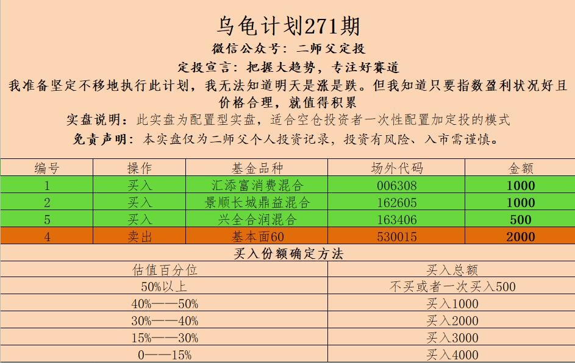

======================================================

_type: talk
@二师父[28814221155551]
2021-02-19 14:28:04 Fri  
topic_id: 582144524114184

加仓后发现大盘红了，看来蹲着抄底的朋友还是不少啊

@三峡情 at 2021-02-19 14:28:04 Fri

> 盯了二天，跟着二师父上车了

----------

阅读[1]  评论[1]  赞[0] 

======================================================

_type: talk
@孟倩[118822124154582]
2021-02-19 14:36:54 Fri  
topic_id: 582144524154854

<e type="hashtag" hid="51285848852544" title="#乌龟计划271#" /> 
师父，我买了景顺长城新兴成长混合(260108）和汇添富全球互联混合(001668），是否能替代162605和006308？我看了持仓，有很多是一样的。不知道哪个更优质？为啥？

@二师父 at 2021-02-19 14:36:54 Fri

> 景顺长城新兴成长可以替代，汇添富全球互联混合与消费混合有些区别的，不过都是比较优质的基金。

----------

@孟倩 at 2021-02-19 14:36:54 Fri

> 好的，那就都买上。谢谢！

----------

阅读[1]  评论[2]  赞[0] 

======================================================

_type: talk
@慕容[548814822814844]
2021-02-19 19:18:04 Fri  
topic_id: 414822584811528

二师父我之前每月两次定投上证50，这段时间是不是应该停一停呢？

@二师父 at 2021-02-19 19:18:04 Fri

> 是纯被动的吗，如果你以一轮牛熊看目前可以停一停，如果长期看定投没问题，主要是投资的规划周期

----------

@慕容 at 2021-02-19 19:18:04 Fri

> 是被动定投的。懂了，谢谢二师父

----------

阅读[1]  评论[2]  赞[0] 

======================================================

_type: talk
@陈[844415515418422]
2021-02-20 08:37:30 Sat  
topic_id: 815844422541142

二师父，买了000248还用买006308吗？

@二师父 at 2021-02-20 08:37:30 Sat

> 两者持仓还是有区别的

----------

阅读[1]  评论[1]  赞[0] 

======================================================

_type: talk
@二师父[28814221155551]
2021-02-20 11:25:27 Sat  
topic_id: 414822252545228

<e type="hashtag" hid="51284285255254" title="#如何应对市场风格切换#" /> 两种方式，是较好的应对方法

@J at 2021-02-20 11:25:27 Sat

> 师父，市场风格向中小盘股转变，我们之前持有的消费、科技、医疗等行业指数基金如何操作较好？

----------

@二师父 at 2021-02-20 11:25:27 Sat

> 拿着就好了，这个与市场无关

----------

@柔软时光 at 2021-02-20 11:25:27 Sat

> 个人觉得，上证50与中证500才是在轮动

----------

@二师父 at 2021-02-20 11:25:27 Sat

> 这是目前创业板股票质量成长性都很好的原因，500最近几天表现确实不错

----------

@J at 2021-02-20 11:25:27 Sat

> 好

----------

@涓涓 at 2021-02-20 11:25:27 Sat

> 刚把500清了他就涨了[撇嘴]

----------

@付云 at 2021-02-20 11:25:27 Sat

> 再买回来，反正不高[微笑][微笑][微笑]

----------

@涓涓 at 2021-02-20 11:25:27 Sat

> 伤心了，不买了

----------

阅读[1]  评论[15]  赞[0] 

+++++++++++++++++++++++++++++++++++++++++++++++++++++

文件：
2021-02-20 11:24:52 Sat
文件大小：[40812]
28442452828411-风格切换，如何应对.docx

======================================================

_type: talk
@芙瑞雅阳阳潘[421181844812818]
2021-02-20 18:43:13 Sat  
topic_id: 182511114158242

现在赚钱的基金太多了，要怎么分辨基金的好坏呢？

@二师父 at 2021-02-20 18:43:13 Sat

> 指数基金看基金持仓，主动基金看基金经理

----------

阅读[1]  评论[1]  赞[0] 

======================================================

_type: talk
@Audrey[15284421255842]
2021-02-20 22:34:12 Sat  
topic_id: 182511182821142

深红利目前高估了嘛

@二师父 at 2021-02-20 22:34:12 Sat

> 目前是高估了哈

----------

阅读[1]  评论[1]  赞[0] 

======================================================

_type: talk
@Audrey[15284421255842]
2021-02-20 22:37:17 Sat  
topic_id: 414822214184528

中证100目前是高估吗

@二师父 at 2021-02-20 22:37:17 Sat

> 这个也是了

----------

@Audrey at 2021-02-20 22:37:17 Sat

> 那我换成主动基金 谢谢二师傅😊

----------

@二师父 at 2021-02-20 22:37:17 Sat

> 这个看主动基金仓位，主动基金股票仓位偏低才有防守功能

----------

阅读[1]  评论[3]  赞[0] 

======================================================

_type: q&a
@黄峥臻|企业软件应用[88288581145482]
2021-02-21 09:20:12 Sun  
topic_id: 215844418454411

@黄峥臻|企业软件应用

>  老师，0基础，刚学
>  看了你的视频，想买（交银创业50，易方达上证50，工银深证红利）这个宽基组合，
>  看了你的书，说是要在低估时定投，
>  现在这几个指数都高估，
>  我要怎么开始定投呢？

@二师父

>  高估的话可以等等，如果想现在投，每次少量定投一点，控制仓位，长期看他们是会一直向上的

阅读[1]  评论[1]  赞[0] 

======================================================

_type: talk
@二师父[28814221155551]
2021-02-21 16:01:09 Sun  
topic_id: 215844158412811

<e type="hashtag" hid="28514512212541" title="#适合防守的基金#" />

@范毅君 at 2021-02-21 16:01:09 Sun

> 二师父，最近基本都是介绍场外基金，场内现在基本没什么合适的吗

----------

@二师父 at 2021-02-21 16:01:09 Sun

> 券商可以定投，等互联网和医疗跌下来

----------

@HeLLO at 2021-02-21 16:01:09 Sun

> 二师父，高位边打边撤，介绍这两支适合一次性介入还是定投。

----------

@Chu at 2021-02-21 16:01:09 Sun

> 师父。现在可以一次性投入易方达裕丰回报债吗？现在手中有30万基本五年不会用到又不想买货币基金

----------

@二师父 at 2021-02-21 16:01:09 Sun

> 可以逐步转移到二级债基或者纯债，广发这只要定投，配置的话控制仓位，他的回撤比较大

----------

@二师父 at 2021-02-21 16:01:09 Sun

> 回撤大约15以内，可以先配置，然后定投，注意分散几只

----------

@HeLLO at 2021-02-21 16:01:09 Sun

> 有好的纯债推荐下

----------

@李震笛 at 2021-02-21 16:01:09 Sun

> 二师傅，咱们前面投的两款医药基金，是不是要开始逐步减仓？

----------

阅读[1]  评论[14]  赞[0] 

+++++++++++++++++++++++++++++++++++++++++++++++++++++

文件：
2021-02-21 16:00:58 Sun
文件大小：[97194]
51445452415484-两款适合防守的基金.docx

======================================================

_type: talk
@二师父[28814221155551]
2021-02-21 17:07:39 Sun  
topic_id: 815844154482142

<e type="hashtag" hid="881251425252" title="#鳄鱼计划#" /> 当前鳄鱼计划持仓，主仓消费+科技+医疗不动，如果医疗和互联网两大基金有回调继续加仓，偶尔券商打打游击，看市场情况走势了。300非银和人工智能表现不佳，对于周期指数等待他的景气周期到来即可，尤其是300非银，里面券商指数较多，要想出的话等到新一轮券商行情。

@慕容 at 2021-02-21 17:07:39 Sun

> 二师父鳄鱼计划，你最近是否有发车计划？我还没有上车

----------

@二师父 at 2021-02-21 17:07:39 Sun

> 最近没有了，乌龟计划可以

----------

@慕容 at 2021-02-21 17:07:39 Sun

> 好的，收到

----------

@J at 2021-02-21 17:07:39 Sun

> 师父，券商行情好像一般都两个月左右一次？

----------

@慕容 at 2021-02-21 17:07:39 Sun

> 鳄鱼的收益是不是更好一些，风险性也较大。现在处于高位，不适合上车是吗？

----------

@二师父 at 2021-02-21 17:07:39 Sun

> 对，底部配置后就很少动了，优选基金加底部重仓

----------

@永刚 at 2021-02-21 17:07:39 Sun

> 师父，SHS互联网的代码是多少？

----------

@二师父 at 2021-02-21 17:07:39 Sun

> 这个规律我还没发现

----------

阅读[1]  评论[15]  赞[0] 

+++++++++++++++++++++++++++++++++++++++++++++++++++++

图片：
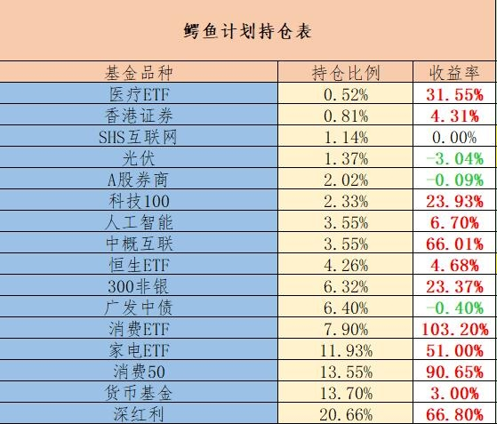

======================================================

_type: talk
@幽兰[815554522442422]
2021-02-21 17:47:37 Sun  
topic_id: 414822142155118

二师父，娃有一笔压岁钱，想让我帮他买基金，买完长期不用的,目前市场情况下，有什么推荐的？

@二师父 at 2021-02-21 17:47:37 Sun

> 预期收益率多少，南方宝元债、易方达裕丰回报债券，等等，相对稳健。

----------

@幽兰 at 2021-02-21 17:47:37 Sun

> 请问二师父，南方宝元、易方达裕丰回报这些如果长期持有，预期收益率可达到10%吗？

----------

@二师父 at 2021-02-21 17:47:37 Sun

> 年化6到10

----------

@丸子妈 at 2021-02-21 17:47:37 Sun

> 广发稳健觉得不错，我都给孩子定投的

----------

阅读[1]  评论[4]  赞[0] 

======================================================

_type: talk
@芙瑞雅阳阳潘[421181844812818]
2021-02-21 21:50:21 Sun  
topic_id: 815844185245112

师父，您对市场趋势下一步如何预判？

@二师父 at 2021-02-21 21:50:21 Sun

> 3月份估计会有个下跌

----------

@芙瑞雅阳阳潘 at 2021-02-21 21:50:21 Sun

> 大概率会回调到什么程度呢？您预判小牛市行情何时结束？

----------

@蛋炒饭不加蛋 at 2021-02-21 21:50:21 Sun

> 请问二师傅为什么会下跌？有没有什么逻辑存在

----------

@范毅君 at 2021-02-21 21:50:21 Sun

> 两会

----------

@芙瑞雅阳阳潘 at 2021-02-21 21:50:21 Sun

> 两会结束，小牛也结束？

----------

阅读[1]  评论[5]  赞[0] 

======================================================

_type: q&a
@娃娃after🎈[88818155445112]
2021-02-22 12:59:31 Mon  
topic_id: 215844124125451

@娃娃after🎈

>  请问二师父，手头有笔3万元，想买纯债，大概3-5年，能推荐几只基金吗？谢谢

@二师父

>  易方达裕丰回报债，南方宝元债

阅读[1]  评论[3]  赞[0] 

======================================================

_type: talk
@浪淘沙[118815282288482]
2021-02-22 13:08:15 Mon  
topic_id: 182511841811152

二师父，请问今年还看好光伏etf吗？

@二师父 at 2021-02-22 13:08:15 Mon

> 光伏是长线

----------

@浪淘沙 at 2021-02-22 13:08:15 Mon

> 请问这个长线最低要看多久？现在比以前沉得住气些了，但时不时需要老师指点。

----------

@二师父 at 2021-02-22 13:08:15 Mon

> 一直到新能源转换结束的时候，他都有潜力

----------

@浪淘沙 at 2021-02-22 13:08:15 Mon

> 好的，谢谢二师父。

----------

@素兮 at 2021-02-22 13:08:15 Mon

> 新能源转换结束是指什么？怎么判断？

----------

@二师父 at 2021-02-22 13:08:15 Mon

> 新能源不能再满足需求的时候

----------

阅读[1]  评论[6]  赞[0] 

======================================================

_type: talk
@涓涓[111815125145522]
2021-02-22 13:40:54 Mon  
topic_id: 414822151845488

二师父，今天医疗股跌，能轻仓入一些吗？比如泰格这种的

@二师父 at 2021-02-22 13:40:54 Mon

> 他的波动很大，如果可以承受下跌企稳之后可以

----------

阅读[1]  评论[1]  赞[0] 

======================================================

_type: talk
@二师父[28814221155551]
2021-02-22 16:42:42 Mon  
topic_id: 215844142828111

<e type="hashtag" hid="48412415118418" title="#市场风格切换做好防守#" /> 防守到位，不要慌

@样 at 2021-02-22 16:42:42 Mon

> 二师父，张清华的易方达新收益混合，如何？他管理的盘子很大

----------

@范毅君 at 2021-02-22 16:42:42 Mon

> 感觉小盘股虽说涨了，但是很多资金还是流出的，上涨乏力[捂脸]

----------

@蛋炒饭不加蛋 at 2021-02-22 16:42:42 Mon

> 请问两个支撑位是指什么

----------

@二师父 at 2021-02-22 16:42:42 Mon

> 这是偏股混合，还是很优质的

----------

@二师父 at 2021-02-22 16:42:42 Mon

> 万得全a指数，一个5200，一个4900

----------

@蛋炒饭不加蛋 at 2021-02-22 16:42:42 Mon

> 谢谢二师父

----------

@苍天有井明月空🌙 at 2021-02-22 16:42:42 Mon

> 今天补了

----------

@wty at 2021-02-22 16:42:42 Mon

> 二师父，“债基是熊市的旗手”怎么理解？债基大幅度上涨，意味着熊市可能要来到？

----------

阅读[1]  评论[13]  赞[0] 

+++++++++++++++++++++++++++++++++++++++++++++++++++++

文件：
2021-02-22 16:41:32 Mon
文件大小：[39460]
28442444142181-成交额破万亿，抱团股集体下挫，切勿自乱阵脚.docx

======================================================

_type: q&a
@永刚[15581448518112]
2021-02-22 20:35:42 Mon  
topic_id: 182511814181422

@永刚

>  请教二师父，先进制造业有行业指数吗？如果没有哪一个指数更接近呢？

@二师父

>  材料etf

阅读[1]  评论[4]  赞[0] 

======================================================

_type: q&a
@zy[841125288558422]
2021-02-22 20:37:53 Mon  
topic_id: 414822125221548

@zy

>  二师父，国泰中证全指通信设备etf联接基金可以投吗？

@二师父

>  定投可以

阅读[1]  评论[3]  赞[0] 

======================================================

_type: q&a
@ 🇦 🇬 🇧 🇹[182218122141512]
2021-02-22 20:42:14 Mon  
topic_id: 815844115281552

@ 🇦 🇬 🇧 🇹

>  二师夫  微信里的养老跟教育理财看好么  还有一个问题 对今年的购房加强管理怎么看

@二师父

>  这还是为了抑制炒房，房子不让炒，资金只能入股市，利好股票市场

阅读[1]  评论[1]  赞[0] 

======================================================

_type: talk
@庆余年[15584481824122]
2021-02-22 21:19:04 Mon  
topic_id: 182511882888542

基金工具分享

@二师父 at 2021-02-22 21:19:04 Mon

> 持仓都比较优质

----------

@庆余年 at 2021-02-22 21:19:04 Mon

> 谢谢二师父的认可[呲牙][呲牙][呲牙]

----------

阅读[1]  评论[2]  赞[0] 

+++++++++++++++++++++++++++++++++++++++++++++++++++++

文件：
2021-02-22 21:19:04 Mon
文件大小：[591456]
88442112888222-基金持仓及工具分享.docx

======================================================

_type: talk
@二师父[28814221155551]
2021-02-22 22:00:29 Mon  
topic_id: 582144881512144

<e type="hashtag" hid="552114551414" title="#估值数据#" /> 市盈率百分位59.97%，市净率百分位38.47%，SY-BY百分位72.06%，SY/BY百分位68.98%。估值数据仍旧偏高，控制好仓位，支撑位补仓，每周定投继续保持不变。注意现在每周定投头寸很小，只有500元，真的跌回去了，每周定投金额就会加大了。

债基还是值得配置的，看了下，国债收益率正在下行，如果股市继续走熊，利率下行的话。债基会逆势而上。

阅读[1]  评论[0]  赞[0] 

======================================================

_type: talk
@玲珑[244188122251251]
2021-02-23 06:48:13 Tue  
topic_id: 815844111145482

老师，乌龟计划已买，这么多支鹅，应该先定投哪支！鄂鱼计划我现在建仓能买不？坐等指点！

@二师父 at 2021-02-23 06:48:13 Tue

> 鳄鱼计划先等等，乌龟计划定投以汇添富全球消费，景顺长城混合，易方达金融股票，兴全合润为主

----------

阅读[1]  评论[1]  赞[0] 

======================================================

_type: q&a
@水冰月槑槑🌙[51142428222184]
2021-02-23 07:53:32 Tue  
topic_id: 182518222241582

@水冰月槑槑🌙

>  二师父鳄鱼计划在哪里买？现在可以建仓吗

@二师父

>  场内买的哈，这个最好单只同步买，乌龟计划适合建仓

阅读[1]  评论[0]  赞[0] 

======================================================

_type: q&a
@shi[15551458885282]
2021-02-23 08:20:43 Tue  
topic_id: 414821444844558

@shi

>  二师父，有些时间没来了。
>  汇报一下目前的情况，基金的总体收益31%，最开心的事情是华宝油气也已经基本回本了。
>  我整理了一下目前的基金，如图。
>  目前是否有需要清仓（落袋为安）的了？
>  ps：以前的估值表，我翻了一下，最近看您没发布，是否可以发布一次。（我想看看哪些属于红色的了）

@二师父

>  这周三发布一次，可以转移部分基金到南方宝元债做下防守

阅读[1]  评论[1]  赞[0] 

======================================================

_type: talk
@丸子妈[28512522184441]
2021-02-23 10:01:34 Tue  
topic_id: 414821448544148

二师父，手里的医药ETF是不是换成医疗ETF更好？

@二师父 at 2021-02-23 10:01:34 Tue

> 对，医疗更好

----------

@为何 at 2021-02-23 10:01:34 Tue

> 医疗现在可以买吗？

----------

@二师父 at 2021-02-23 10:01:34 Tue

> 轻仓定投可以，还不便宜

----------

阅读[1]  评论[3]  赞[0] 

======================================================

_type: talk
@芙瑞雅阳阳潘[421181844812818]
2021-02-23 10:32:38 Tue  
topic_id: 215841558445441

师父，“固收+”类基金有保底收益吗？例如汇添富稳健添益一年010219

@二师父 at 2021-02-23 10:32:38 Tue

> 没有的，他们也是权益类品种，波动小一些

----------

@闲云 at 2021-02-23 10:32:38 Tue

> 二师父，防守的两个基金是一次性买入还是定投呢？

----------

@芙瑞雅阳阳潘 at 2021-02-23 10:32:38 Tue

> 师父，这种的算防守类基金吗？

----------

@二师父 at 2021-02-23 10:32:38 Tue

> 算的

----------

阅读[1]  评论[4]  赞[0] 

======================================================

_type: talk
@方华[815842448214142]
2021-02-23 12:43:17 Tue  
topic_id: 582148128541414

师父，最近有什嚒场外基金打新推荐吗？

@二师父 at 2021-02-23 12:43:17 Tue

> 易方达新享A

----------

@方华 at 2021-02-23 12:43:17 Tue

> 001342吗？

----------

@二师父 at 2021-02-23 12:43:17 Tue

> 对的

----------

@方华 at 2021-02-23 12:43:17 Tue

> 谢谢师傅，这支是属于防守型的债券基金对吗？

----------

@二师父 at 2021-02-23 12:43:17 Tue

> 对的

----------

阅读[1]  评论[5]  赞[0] 

======================================================

_type: talk
@慕容[548814822814844]
2021-02-23 13:54:00 Tue  
topic_id: 815841885552212

二师父看了两个纯债基金，易方达裕丰回报债和南方元宝债，为什么在天天基金里排名非常靠后，而且显示表现不佳呢？这个影响现在开始配置吗？

@二师父 at 2021-02-23 13:54:00 Tue

> 这个按照业绩排名的，涨的好的基金靠前，目前防守适合配置的

----------

阅读[1]  评论[1]  赞[0] 

======================================================

_type: talk
@CY[48248584825128]
2021-02-23 13:54:34 Tue  
topic_id: 182518552224152

师父，港股投资除了打新还有什么推荐的方法？

@二师父 at 2021-02-23 13:54:34 Tue

> 直接购买啊，港股通或者港股账户

----------

@CY at 2021-02-23 13:54:34 Tue

> 明白，是想问有没有港股基金推荐或者指数，还是行业个股什么的[嘿哈]

----------

@二师父 at 2021-02-23 13:54:34 Tue

> 恒生科技，港股腾讯不错

----------

@CY at 2021-02-23 13:54:34 Tue

> 好呢

----------

阅读[1]  评论[4]  赞[0] 

======================================================

_type: q&a
@永刚[15581448518112]
2021-02-23 14:05:51 Tue  
topic_id: 582148112212514

@永刚

>  二师父，通信ETF，5 GETF和半导体ETF选哪一个更稳定更好一些？

@二师父

>  都不稳定，从这三个里面选择半导体更好一些

阅读[1]  评论[0]  赞[0] 

======================================================

_type: talk
@二师父[28814221155551]
2021-02-23 17:20:53 Tue  
topic_id: 414821882888518

<e type="hashtag" hid="88514514228842" title="#医疗的买入姿势#" />

@慕容 at 2021-02-23 17:20:53 Tue

> 二师父我没有医疗基金，是跟随乌龟计划走就可以，还是现在自己再额外定投一些呢？我也看好医疗行业，风险承受范围是回撤30%心理能扛住，再多了就不敢保了

----------

@二师父 at 2021-02-23 17:20:53 Tue

> 跟着乌龟计划吧，或者重新进入低估，这个波动还是很大的

----------

@慕容 at 2021-02-23 17:20:53 Tue

> 收到[抱拳][抱拳]

----------

阅读[1]  评论[3]  赞[0] 

+++++++++++++++++++++++++++++++++++++++++++++++++++++

文件：
2021-02-23 17:20:50 Tue
文件大小：[145780]
51444225481414-医疗大跌，是否到了加仓时机.docx

======================================================

_type: talk
@慕容[548814822814844]
2021-02-23 18:51:28 Tue  
topic_id: 414821881448418

二师父天天基金上周五跟投乌龟计划，显示24日确认，周四看收益。资金投入确认的市场好长啊，都是这样的吗？正确的搭车步骤应该是？

@二师父 at 2021-02-23 18:51:28 Tue

> 周四搭车就可以，确认时间是有延迟的

----------

@慕容 at 2021-02-23 18:51:28 Tue

> 收到

----------

阅读[1]  评论[2]  赞[0] 

======================================================

_type: talk
@二师父[28814221155551]
2021-02-23 22:30:58 Tue  
topic_id: 815841822815242

<e type="hashtag" hid="552114551414" title="#估值数据#" /> 当前市盈率百分位59.69%，市净率百分位37.83%，SY-BY百分位71.92%，SY/BY百分位68.76%，市场没跌下来，本周大概率还是按照原份额定投，然后高估的基本面60开始转到混合基金和债券基金做防守，保证下跌抗的住。

@雾海 at 2021-02-23 22:30:58 Tue

> 二师傅债券基金是买哪一只？以前没买。

----------

@雾海 at 2021-02-23 22:30:58 Tue

> 二师傅，我今天打算降低仓位，然后买债券基金可以吗？

----------

@二师父 at 2021-02-23 22:30:58 Tue

> 南方宝元债，易方达裕丰，国开债都可以

----------

阅读[1]  评论[3]  赞[0] 

======================================================

_type: talk
@二师父[28814221155551]
2021-02-24 09:05:14 Wed  
topic_id: 215841821418411

<e type="hashtag" hid="28514514441421" title="#讲一讲如何做防守#" /> 最近市场回撤比较大，如果满仓会比较难受，投资永远记住底部重仓，高位适当控制仓位。今天讲讲如何做防守。

防守的第一招：控制仓位，比如市场下跌，暴跌，但是你只有5层仓位，大跌就会比较兴奋，因为还有钱可以投出去。这是利润收割法的本质，建立在A股会巨幅波动的基础上，如果有一天A股真的长牛了，那么利润收割是没有意义的，长牛是长持的基础。

防守的第二招：高位转配置，之前已经分析过，对于好的偏债混合基金和平衡型混合基金，回撤会比较小，而且长期向上，这样一轮下跌之后容易拿的住，未来会继续新高。当前比较好转配置的基金南方宝元债、易方达裕丰回报债等等。

大家根据仓位来，如果之前是空仓的朋友，这次下跌就找机会蹲进去，反之如果仓位太重，大跌难受就防守一下，不断的进攻防守，你会发现在股市牛熊切换之间自己的账户总资产也不断升高了。

@丸子妈 at 2021-02-24 09:05:14 Wed

> 学习

----------

阅读[1]  评论[1]  赞[0] 

======================================================

_type: q&a
@潘力新[15111555855482]
2021-02-24 09:07:59 Wed  
topic_id: 215841821418121

@潘力新

>  二师父好，我是新手。请教个问题：现在资金短期做防守可以买入16国债19吗？这个和南方宝元，易方达丰裕这样的基金比，有什么劣势没有？

@二师父

>  16国债19的波动还是挺大的，他的优势是当通胀走低，利率下行，熊市的时候涨幅好，而牛市尤其利率上行的时候他跌的也比较厉害。易方达裕丰和南方宝元债更加稳健一些

阅读[1]  评论[3]  赞[0] 

======================================================

_type: q&a
@果实妈咪[182225518588452]
2021-02-24 09:43:22 Wed  
topic_id: 414821828284518

@果实妈咪

>  医疗停牌啥意思二师父，谢谢

@二师父

>  份额拆分所以停牌了，拆分完毕复牌就可以正常交易了

阅读[1]  评论[1]  赞[0] 

======================================================

_type: q&a
@小鱼[241182222251181]
2021-02-24 09:43:44 Wed  
topic_id: 582148141424184

@小鱼

>  今天医疗怎么停牌了，是好还是坏

@二师父

>  就是基金份额拆分，对投资没有影响

阅读[1]  评论[0]  赞[0] 

======================================================

_type: q&a
@王春媚[244424882221141]
2021-02-24 09:45:04 Wed  
topic_id: 182518515122142

@王春媚

>  师父，能源化工有没有好的ETF？这个方向有没有投资价值？

@二师父

>  159981，这种和有色一样，是做预期差的，放水以及宏观顺周期的时候有利好预期

阅读[1]  评论[0]  赞[0] 

======================================================

_type: talk
@陈[844415515418422]
2021-02-24 09:49:28 Wed  
topic_id: 414821828141248

二师父，这两天能把什么加点仓呢？

@二师父 at 2021-02-24 09:49:28 Wed

> 看你多少仓位

----------

@陈 at 2021-02-24 09:49:28 Wed

> 八成

----------

@二师父 at 2021-02-24 09:49:28 Wed

> 先稳着，加点南方宝元债

----------

@悦雪 at 2021-02-24 09:49:28 Wed

> 师父，我三成仓位，能加什么？谢谢

----------

@二师父 at 2021-02-24 09:49:28 Wed

> 先定投兴全合润，医疗消费下来了再投

----------

阅读[1]  评论[5]  赞[0] 

======================================================

_type: talk
@蓝魔森林[28888244485121]
2021-02-24 10:27:31 Wed  
topic_id: 182518514545812

问下二师傅，易方达科创50链接c是个新的基金，今天蚂蚁金服推来的，还在筹资阶段，这个值得投资吗？感觉可以小仓位观察。谢谢

@二师父 at 2021-02-24 10:27:31 Wed

> 场内可以买的

----------

阅读[1]  评论[1]  赞[0] 

======================================================

_type: talk
@防汛抗旱[111848815428452]
2021-02-24 11:41:02 Wed  
topic_id: 182518511244822

二师父，仓位五层左右，有没有必要乌龟计划加点，看您这两天没发车？

@cotton at 2021-02-24 11:41:02 Wed

> 师傅，我这样一直躺着，行不

----------

@二师父 at 2021-02-24 11:41:02 Wed

> 有防守，资金长期不用可以的哈

----------

@二师父 at 2021-02-24 11:41:02 Wed

> 底仓有了，没必要单独加了，每周四还会定投的，有资金跟上就行

----------

@cotton at 2021-02-24 11:41:02 Wed

> 长期是多长。。。

----------

@二师父 at 2021-02-24 11:41:02 Wed

> 3，4年不准备用

----------

@cotton at 2021-02-24 11:41:02 Wed

> 假如两三年要用呢。现在全出来？

----------

@二师父 at 2021-02-24 11:41:02 Wed

> 感觉你有点压力，那你出一部分，转移到南方宝元债，这个稳健一些，让下跌压力不那么大

----------

@cotton at 2021-02-24 11:41:02 Wed

> 不，我不动

----------

阅读[1]  评论[8]  赞[0] 

======================================================

_type: talk
@二师父[28814221155551]
2021-02-24 12:03:04 Wed  
topic_id: 414821822828848

<e type="hashtag" hid="48412412151248" title="#科创50如何投资#" /> 聊聊大家关心的科创50，最近波动比较大，刚好算是一个压力测试，只有真的经历过高位下跌，才知道自己的承受能力，如果难受，多做防守，二级债基和偏债混合已经介绍过了，还有国开债，虽然牛市跑输，但是下跌的时候抗揍。

@慕容 at 2021-02-24 12:03:04 Wed

> 前两天看了一些芯片的文章，中国芯是必须要走的一步，中芯国际的发展是否会得到国家的大力扶持？长期发展是否值得期待呢？

----------

阅读[1]  评论[1]  赞[0] 

+++++++++++++++++++++++++++++++++++++++++++++++++++++

文件：
2021-02-24 11:58:24 Wed
文件大小：[135474]
28444581522821-聊聊科创50怎么投资.docx

======================================================

_type: talk
@志亮[422125851552828]
2021-02-24 13:14:08 Wed  
topic_id: 815841844181522

有点熊市感觉了，几天亏了23点，回调得太厉害了，但这一次我选择坚持，做长线价值投资，己预算下跌30%-50%，现在就看谁先熬不住了[微笑]。

@志亮 at 2021-02-24 13:14:08 Wed

> 不破不立，没经历过熊市，这次真的要吸取教训了，全仓时应该在上涨到压力位时减仓的，不过这次下跌心里倒是不慌，可能是我的投资心态开始成熟了吧，手上拿的都是核心资产，解套是肯定可以的，就是需要时间，熊市能加速投资者快速成长的，希望我能尽快成长起来。

----------

@阝東 at 2021-02-24 13:14:08 Wed

> 你满仓了？

----------

@一心一意 at 2021-02-24 13:14:08 Wed

> 准备套多久呢[撇嘴]

----------

@志亮 at 2021-02-24 13:14:08 Wed

> 是满仓的，判断失误就被套。

----------

@志亮 at 2021-02-24 13:14:08 Wed

> 难说，短的一两个月，若是进入熊市的两三年都有可能，但目前是结构性牛市，应该是套一两个月吧[微笑]，反正这次硬抗了。

----------

@涓涓 at 2021-02-24 13:14:08 Wed

> 这次回调不打算把茅台接回来？

----------

@志亮 at 2021-02-24 13:14:08 Wed

> 不换股了，手上的票也是垓心资产，没必要轻易换股。[微笑]

----------

@JOY at 2021-02-24 13:14:08 Wed

> 可能去年年后那次跌太猛了，这次感觉就没那么强烈了。坚决持有，等着吧～就是不知道这次会调整多久，感觉是机构在大调仓，主力基本都是流出的～

----------

阅读[1]  评论[11]  赞[0] 

======================================================

_type: q&a
@许军[815841225522412]
2021-02-24 13:17:45 Wed  
topic_id: 182518511155152

@许军

>  师父，我之前买的国政生物医药一直在跌，是减仓还清仓？

@二师父

>  是否重仓，如果仓位10以内不用减的

阅读[1]  评论[0]  赞[0] 

======================================================

_type: q&a
@Chu[88888125211582]
2021-02-24 16:35:30 Wed  
topic_id: 414821818445558

@Chu

>  二师父，互联网50下跌非常多，可以加仓吗

@二师父

>  控制头寸，定投可以

阅读[1]  评论[0]  赞[0] 

======================================================

_type: q&a
@smile[111888142241442]
2021-02-24 16:36:18 Wed  
topic_id: 582148182825424

@smile

>  二师父，医疗医药个股现在应该割肉还是加仓呢？还会继续跌多少啊：（

@二师父

>  医疗基金最大跌幅百分之45，个股分情况看

阅读[1]  评论[0]  赞[0] 

======================================================

_type: q&a
@🐰Mandy[244148854285821]
2021-02-24 16:43:11 Wed  
topic_id: 215841812848551

@🐰Mandy

>  二师傅，目前还可以做网格投资吗？有哪些基金还适合网格投资？

@二师父

>  适合，置顶第三篇文章里面网格交易价格表可以参考下，都适合网格的

阅读[1]  评论[1]  赞[0] 

======================================================

_type: q&a
@静儿~[815844815852842]
2021-02-24 17:40:42 Wed  
topic_id: 582148185825184

@静儿~

>  二师父，我是新手，现在知识星球一头雾水，完全不知道从哪里开始怎么学习，不理解很多术语，我该怎么做

@二师父

>  先看看置顶五步定投法，然后开始利用沪深300定投，边投边学习总结

阅读[1]  评论[0]  赞[0] 

======================================================

_type: talk
@二师父[28814221155551]
2021-02-24 18:40:56 Wed  
topic_id: 582148188852154

最近是这样子的，不要害怕，继续定投，一会看看估值数据，决定明天加不加头寸。鳄鱼计划卧倒，万得敢触摸5200点支撑位，仓位上到8.5。乌龟计划三层债券防守，后面也是如果跌到支撑位转换到指数或者混合基金。

我预判今年会有较大回撤，但是不会和2018年一样全年走低。长期看持有股权优于现金，而波动就是需要付出的成本。前期收割利润或者配置了防守基金，现在就继续卧倒了。

@ 🇦 🇬 🇧 🇹 at 2021-02-24 18:40:56 Wed

> 万得全A到5200就是10个月均线

----------

@衣袂飘香 at 2021-02-24 18:40:56 Wed

> 全是健康食品，绿油油。

----------

@志亮 at 2021-02-24 18:40:56 Wed

> 大V们都说牛市喜欢暴跌暴涨，不知是真是假。

----------

@样 at 2021-02-24 18:40:56 Wed

> 二师父很沉得住气，我今天加了点医疗和中概互联

----------

@Sunflower at 2021-02-24 18:40:56 Wed

> 有点小激动[偷笑]

----------

@自愉自乐 at 2021-02-24 18:40:56 Wed

> 拙见：全A指数5450左右企稳反弹，也是逃命的一次机会！小心驶得万年船，大减仓后一个字：等！

----------

阅读[1]  评论[6]  赞[0] 

+++++++++++++++++++++++++++++++++++++++++++++++++++++

图片：
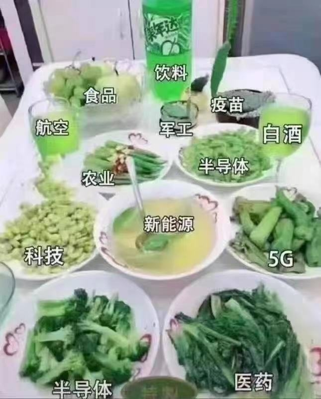

======================================================

_type: talk
@二师父[28814221155551]
2021-02-24 19:35:26 Wed  
topic_id: 414821544842418

<e type="hashtag" hid="15285258118452" title="#每周估值表#" /> 还是很多高估的，回撤大很正常，目前连年前的位置都没跌到，做好防守就可以了。考验投资信仰的时候来临。

@庆余年 at 2021-02-24 19:35:26 Wed

> 估计好多人信仰都塌了

----------

@圣诞结® at 2021-02-24 19:35:26 Wed

> 二师父今天乌龟照常发车吧？

----------

@二师父 at 2021-02-24 19:35:26 Wed

> 发车

----------

@J at 2021-02-24 19:35:26 Wed

> 师父，请问光伏和科技100目前还有最大多少跌幅？

----------

@二师父 at 2021-02-24 19:35:26 Wed

> 光伏最大跌幅百分之45以内，新兴科技100最大跌幅百分之40以内

----------

@J at 2021-02-24 19:35:26 Wed

> 好的，还有医疗和医药的最大跌幅分别是多少

----------

@二师父 at 2021-02-24 19:35:26 Wed

> 医疗百分之55，医药百分之65

----------

@J at 2021-02-24 19:35:26 Wed

> OK，谢谢师父

----------

阅读[1]  评论[8]  赞[0] 

+++++++++++++++++++++++++++++++++++++++++++++++++++++

图片：
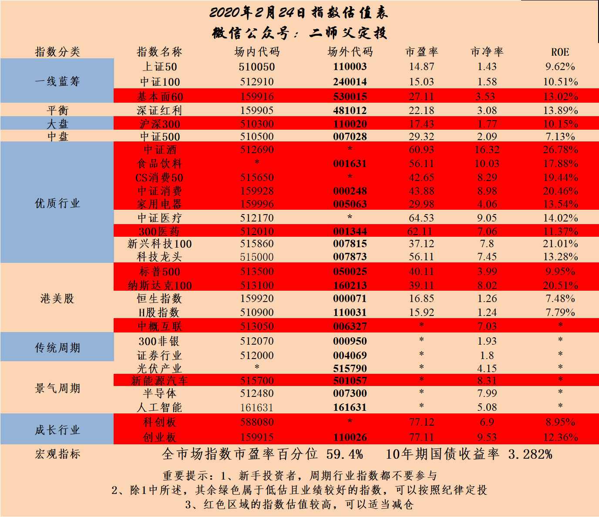

======================================================

_type: q&a
@海马[15158245825242]
2021-02-24 22:57:14 Wed  
topic_id: 182518422452122

@海马

>  师父，每一轮牛市都是先涨低估值价值股→然后涨科技类型的成长股→最后涨便宜的周期股票→牛市终结，目前是最后一波！你认同吗？

@二师父

>  认同的，成长股是盈利高速增长的，不一定科技

阅读[1]  评论[0]  赞[0] 

======================================================

_type: q&a
@🍀 凝🌸 慧🍀[841855248254242]
2021-02-25 08:50:55 Thu  
topic_id: 815841285445122

@🍀 凝🌸 慧🍀

>  师父好，今天看了中国证券报发出的的兴全知名基金经理董承非1月份对于今年市场行情的内部观点，您如何看待？
>  ——————————
>  基本进入防守打法
>  
>  （摘要）在会议纪要中，董承非指出，年初市场呈现明显躁动行情。对2021年全年比较悲观，不看好，目前相对谨慎。
>  
>  董承非直指，现在市场已经脱离基本面进入资金正反馈过程。但是第一，这些核心资产质地不错，但也仅限于用现在的眼光来看，未来如何发展未知。第二，即使这些核心资产质地不错，匹配现在这样的估值，如果未来股价不大幅下跌，未来很长时间给投资者带来的回报会少得可怜。
>  
>  谈及自己对市场的感觉，董承非直言，已经在做一些预防性的动作，在监控一些总量指标。

@二师父

>  我对2021年并不悲观，不过防守是对的，主要目前的估值太高了，需要时间来消化。防守一是控制仓位，另外增加防守基金配置

阅读[1]  评论[2]  赞[0] 

======================================================

_type: talk
@慕容[548814822814844]
2021-02-25 09:40:06 Thu  
topic_id: 215841288825421

二师父今天的定投发车有具体的时间选择吗？还是一天中的任何联系时间都可以呢？

@丸子妈 at 2021-02-25 09:40:06 Thu

> 3点前买，都是按当日净值的。

----------

阅读[1]  评论[1]  赞[0] 

======================================================

_type: talk
@二师父[28814221155551]
2021-02-25 10:09:17 Thu  
topic_id: 582148511582554

<e type="hashtag" hid="15285284512182" title="#实盘#" /> 继续定投，转移高估的基金到混合基金和债券基金，防守做好，优先定投兴全和润混合，如果市场有回调，继续补仓低估指数，目前指数都不便宜了，所以要么定投混合基金，要么暂停一下。

@小鱼 at 2021-02-25 10:09:17 Thu

> 收到

----------

@门萨🐨 at 2021-02-25 10:09:17 Thu

> 已跟[呲牙]

----------

@衣袂飘香 at 2021-02-25 10:09:17 Thu

> 请问二师父，我的鳄鱼计划里，也有高估的300和 F60指数，我的鳄鱼计划的仓位也跟您差不多，这两个指数的仓位占总仓位6%，目前需要操作吗？如果要的话，怎么操作比较好？谢谢您啦。

----------

@圣诞结® at 2021-02-25 10:09:17 Thu

> 二师父，我的基本面60剩的不多了，如果要是直接清仓可以吗？后期它上涨幅度还大吗？

----------

@二师父 at 2021-02-25 10:09:17 Thu

> 牛市来了他依然跑赢大盘

----------

@慕容 at 2021-02-25 10:09:17 Thu

> 二师父是直接从天天基金定投乌龟计划呢，还是按照你的实际操作根据自身情况选择同步你操作的这四个基金呢？

----------

@二师父 at 2021-02-25 10:09:17 Thu

> 都可以，你看自己适合哪种方式

----------

@圣诞结® at 2021-02-25 10:09:17 Thu

> 好哒 那我就留点以后喝汤 谢谢师父

----------

阅读[1]  评论[10]  赞[0] 

+++++++++++++++++++++++++++++++++++++++++++++++++++++

图片：
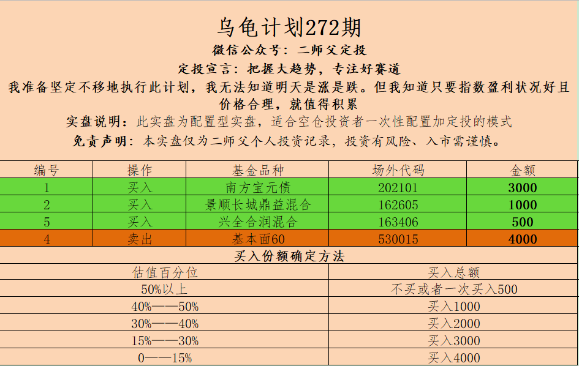

======================================================

_type: q&a
@隔窗遥望[241884481854181]
2021-02-25 10:11:44 Thu  
topic_id: 414821588524858

@隔窗遥望

>  师父，现在轻仓定投你前期介绍的主动基金可以吗？还是要再等等

@二师父

>  可以跟着实盘来哈

阅读[1]  评论[0]  赞[0] 

======================================================

_type: q&a
@光少[244124552511141]
2021-02-25 10:12:53 Thu  
topic_id: 215841288284511

@光少

>  二师父您好！医疗ETF为什么会调底价格？

@二师父

>  这是因为基金份额拆分，净值降低

阅读[1]  评论[6]  赞[0] 

======================================================

_type: q&a
@🐰Mandy[244148854285821]
2021-02-25 10:14:05 Thu  
topic_id: 815841288858522

@🐰Mandy

>  二师傅今天医疗512170股价调整出来了，适合买入么

@二师父

>  可以定投，这个位置医疗不便宜，最好优选一些医药混合基金，或者自己控制定投金额

阅读[1]  评论[0]  赞[0] 

======================================================

_type: q&a
@小眼静🎀[844121141821482]
2021-02-25 10:14:44 Thu  
topic_id: 215841288845541

@小眼静🎀

>  二师父，家人想入一些基金，目前空仓状态，适合建仓吗？仓位控制大概在几成合适？还是跟着您乌龟计划直接定投比较好

@二师父

>  按照乌龟计划走，先建立一部分仓位，然后继续定投，有回调再补仓

阅读[1]  评论[8]  赞[0] 

======================================================

_type: q&a
@一心一意[844421848411122]
2021-02-25 10:28:48 Thu  
topic_id: 215841284842251

@一心一意

>  师父好，华宝油气上涨了，是什么原因哪

@二师父

>  疫情逐步控制，企业复工原油需求提升，目前油汽类企业也涨起来了

阅读[1]  评论[2]  赞[0] 

======================================================

_type: q&a
@顾小胖[841154144118242]
2021-02-25 11:04:44 Thu  
topic_id: 815841284488222

@顾小胖

>  师傅想请教一个私人问题不知道可不可以，和男友马上进入谈婚论嫁了，两人都是外地户口，原计划今年在上海买套小房子作婚房，结果上海出限购新政，因男友离异未满三年，导致2022年6月才可以在上海买房，已经攒好的首付大约130万就闲置下来，从现在到明年年中大概16个月这笔钱不知道该如何打理，目前考虑以下三个选项：1、去周边不限购地区买房作为增值保值手段（如嘉善、青山湖等）；2、买银行定期理财产品；3、拿来买场内或场外基金。请问这三个选择哪个比较好呢？或者2和3都做的话大概以什么比例分配资金比较好一点呢？（和男友两个人目前年薪相加大约46W左右）

@二师父

>  部分买货币基金，部分买二级债基比较好，房子买了无法保值，不限购的地区流动性也不大好，如果五年内出售因为税率的原因不得不压价，所以最好买来就住然后落户，或者长期出租，自己以后租房也比较合适。
>  
>  所以追求流动性二三选择就可以，等你想买房资金能立刻到位，不会错过时机。

阅读[1]  评论[3]  赞[0] 

======================================================

_type: q&a
@范毅君[118551121224142]
2021-02-25 12:50:16 Thu  
topic_id: 182518451841582

@范毅君

>  二师父，光伏什么时候可以补仓

@二师父

>  我计划是跌百分之5补仓

阅读[1]  评论[1]  赞[0] 

======================================================

_type: q&a
@铁钢[15581258582882]
2021-02-25 12:59:58 Thu  
topic_id: 582148518142284

@铁钢

>  请问二师父，最近我想做一次调仓，买些债基规避风险，因为指数估值基本都是高估了。我计划买30万的债基，看了三只债基，分别是易方达裕丰回报债券、易方达增强回报债券和易方达裕鑫债券，我是每只投十万还是全投入到一只基金里。这三只基金哪个更好些，请您给个建议。谢谢

@二师父

>  这三个都可以的，可以一次买入，回撤预计百分之10以内

阅读[1]  评论[0]  赞[0] 

======================================================

_type: q&a
@蛋炒饭不加蛋[118281818482542]
2021-02-25 13:00:53 Thu  
topic_id: 582148518288214

@蛋炒饭不加蛋

>  请问二师父，一线白酒的极限跌幅大约是多少？市盈率的合理区间是多少？

@二师父

>  极限跌幅是百分之65以内，白酒指数大约45倍市盈率进入低估，预计40倍市盈率重新投资

阅读[1]  评论[7]  赞[0] 

======================================================

_type: q&a
@衣袂飘香[118248548242452]
2021-02-25 13:02:05 Thu  
topic_id: 215841281425841

@衣袂飘香

>  请问二师父，我的鳄鱼计划里，也有高估的300和 F60指数，我的鳄鱼计划的仓位也跟您差不多，这两个指数的仓位占总仓位6%，目前需要操作吗？如果要的话，怎么操作比较好？谢谢您啦。

@二师父

>  如果下跌心理压力大，可以卖出减仓到自己所能承受范围，或者转移到南方宝元，易方达裕丰这些债基

阅读[1]  评论[1]  赞[0] 

======================================================

_type: talk
@杜志彪[544454124115854]
2021-02-25 14:28:08 Thu  
topic_id: 414821554812258

<e type="hashtag" hid="281158522841" title="#每日打卡#" /> 2月25日新源车触发买入一份，我加仓喽[微笑]

@J at 2021-02-25 14:28:08 Thu

> 我加了一份光伏[微笑]

----------

@果实妈咪 at 2021-02-25 14:28:08 Thu

> 新能车买入条件是啥？

----------

@果实妈咪 at 2021-02-25 14:28:08 Thu

> 可否分享一下谢谢

----------

@杜志彪 at 2021-02-25 14:28:08 Thu

> 光伏我再等等看，1.1以下考虑加一份，至于新能车去年开始收割了很多份了，最后一次收割2.2元，如果最大回撤到50%时1.1元（年线在1.5元左右，我判断回撤应该30%），我给它10份资金，目前2元先加一份看看，等进入正常和低估时可以考虑加倍买入。

----------

阅读[1]  评论[4]  赞[0] 

======================================================

_type: q&a
@nana[48222415211188]
2021-02-25 15:07:32 Thu  
topic_id: 215841225288181

@nana

>  师傅：您好！医疗E TF（512170）折分后亏了3万多，这是怎么回事呢？请教一下。谢谢您！

@二师父

>  份额拆分是不影响投资者总收益的

阅读[1]  评论[2]  赞[0] 

======================================================

_type: q&a
@许军[815841225522412]
2021-02-25 15:32:04 Thu  
topic_id: 815841225444252

@许军

>  师父，我是小白，怎么查询每支基金的估值呀？还有最近新能源可以入手吗？

@二师父

>  每周估值表里面有基金的估值情况

阅读[1]  评论[0]  赞[0] 

======================================================

_type: talk
@黄峥臻|企业软件应用[88288581145482]
2021-02-25 15:44:46 Thu  
topic_id: 815841222211242

二师父，乌龟计划中，两只纯债（广发、易方达7-10），有什么作用？接下来操作占比会变化吗？

@二师父 at 2021-02-25 15:44:46 Thu

> 防守的，如果熊市来了他会保住利润

----------

@黄峥臻|企业软件应用 at 2021-02-25 15:44:46 Thu

> 好的，谢谢

----------

阅读[1]  评论[2]  赞[0] 

======================================================

_type: q&a
@彩云飞[182518855212112]
2021-02-25 19:06:04 Thu  
topic_id: 215841221525811

@彩云飞

>  师父，图在哪找？

@二师父

>  这个我每天会发估值数据，你看百分位就可以，需要图的话我会贴一下

阅读[1]  评论[0]  赞[0] 

======================================================

_type: talk
@二师父[28814221155551]
2021-02-26 08:31:02 Fri  
topic_id: 182518185511452

<e type="hashtag" hid="224445218111" title="#全市场估值数据#" /> 市盈率百分位59.52%，市净率百分位36.22%，SY-BY百分位71.79%，SY/BY百分位68.61%。整体还是位于第四楼层，大家控制下仓位，如果不惧波动，可以长期持有的，看看买的基金和企业基本面没有问题，长期拿住就一定可以穿越牛熊。

@样 at 2021-02-26 08:31:02 Fri

> 上次跟师父一起买的光伏，现在负12个点了，可以加了吗？这个最大回撤是多少？

----------

@二师父 at 2021-02-26 08:31:02 Fri

> 光伏最大跌幅百分之45以内

----------

@样 at 2021-02-26 08:31:02 Fri

> 看来还有很大空间下跌的，那我再等等加仓

----------

@吃肉肉 at 2021-02-26 08:31:02 Fri

> 师父说的整体处于第四楼层，是怎么划分的，总共有多少层？每层的估值区间是多少？

----------

@二师父 at 2021-02-26 08:31:02 Fri

> 总共5层，楼层越高越贵

----------

阅读[1]  评论[5]  赞[0] 

======================================================

_type: talk
@二师父[28814221155551]
2021-02-26 09:35:51 Fri  
topic_id: 582148481845554

<e type="hashtag" hid="881251425252" title="#鳄鱼计划#" /> 标的：互联网50ETF(517050）
操作方式：场内买入1份
标的：恒生ETF(159920）
操作方式：场内清仓卸货

港股今年重点投资互联网50，如果有大跌，医疗和互联网仓位加起来，基本上就可以了。回撤比较多，大家控制好仓位。

@J at 2021-02-26 09:35:51 Fri

> 师父，我已经持仓中概互联，还需要买互联网50吗

----------

@二师父 at 2021-02-26 09:35:51 Fri

> 两者有区别，可以配置上

----------

@wty at 2021-02-26 09:35:51 Fri

> 跟车了，刚刚买入1份

----------

@是喵喵吖～ at 2021-02-26 09:35:51 Fri

> 师傅可以问一下您场内一份是多少吗 场外我记得您说过一份是2000。想参考一下。要不自己心里没有数😂

----------

@J at 2021-02-26 09:35:51 Fri

> 好。互联网50是港股吗？跟中概的区别是什么呢？

----------

@二师父 at 2021-02-26 09:35:51 Fri

> 对

----------

@二师父 at 2021-02-26 09:35:51 Fri

> 互联网50有一些企业服务类公司

----------

@是喵喵吖～ at 2021-02-26 09:35:51 Fri

> 场内您的是多少来[捂脸]

----------

阅读[1]  评论[16]  赞[0] 

======================================================

_type: q&a
@Zyxj[111841455151112]
2021-02-26 09:52:57 Fri  
topic_id: 414821215422218

@Zyxj

>  二师父，酒etf512690可以建仓吗？

@二师父

>  计划40倍市盈率后投资，目前不在我的考虑范围，如果能承受大波动可以轻仓

阅读[1]  评论[1]  赞[0] 

======================================================

_type: q&a
@许军[815841225522412]
2021-02-26 09:53:23 Fri  
topic_id: 215841412544411

@许军

>  师父，场内的鳄鱼计划可以跟投吗？如果可以怎么跟投？

@二师父

>  自己通过置顶文章开通场内账户买入即可

阅读[1]  评论[2]  赞[0] 

======================================================

_type: q&a
@隔窗遥望[241884481854181]
2021-02-26 10:53:57 Fri  
topic_id: 215841412458481

@隔窗遥望

>  师父，想配置一些偏债基金，是配置一个就行还是要配几个，推荐一下

@二师父

>  易方达裕丰，南方宝元

阅读[1]  评论[0]  赞[0] 

======================================================

_type: q&a
@隔窗遥望[241884481854181]
2021-02-26 11:02:24 Fri  
topic_id: 815841412485422

@隔窗遥望

>  配置的主动基金怎么操作，一直持有吗？有没有像指数基金一样的系统操作方法。感觉配置了主动基金有点懵，不知道后面怎么办

@二师父

>  股票基金高位也是适当减仓，不是无脑持有，优质混合基金基金经理不换长期持有

阅读[1]  评论[0]  赞[0] 

======================================================

_type: q&a
@永刚[15581448518112]
2021-02-26 12:07:49 Fri  
topic_id: 815841414254542

@永刚

>  二师父：家电ETF，现在已经跌破并偏离90日线，是否可以建立底仓？

@二师父

>  可以轻仓定投

阅读[1]  评论[0]  赞[0] 

======================================================

_type: q&a
@郑义泽（庭武）[582152242542254]
2021-02-26 12:14:05 Fri  
topic_id: 582148484515584

@郑义泽（庭武）

>  二师父，今天我想网格互联网50ETF，场内代码是517050！请问网格最低点和最高点多少为宜？谢谢你

@二师父

>  网格用中概互联，1.98建底仓，今天我加了点恒生科技做网格

阅读[1]  评论[10]  赞[0] 

======================================================

_type: q&a
@许军[815841225522412]
2021-02-26 13:43:31 Fri  
topic_id: 582148822141284

@许军

>  师父，这是我现在的仓位，我想慢慢跟上您的步伐，感觉我现在的布局太激进了，想听听您给我的建议！

@二师父

>  目前满仓的话确实有点激进，要保证下跌抗的住

阅读[1]  评论[1]  赞[0] 

======================================================

_type: q&a
@天马行空[548818851412444]
2021-02-26 13:51:57 Fri  
topic_id: 215841155442421

@天马行空

>  二师父，根据以往经验，两会是否会利好股市。谢谢。

@二师父

>  根据以往记录，两会期间股市会大跌

阅读[1]  评论[4]  赞[0] 

======================================================

_type: talk
@样[844124458224442]
2021-02-26 14:01:00 Fri  
topic_id: 582148822484454

万得全指数跌破60日线了，等师父说的第一个支撑位5200能不能跌到，还有子弹，等加仓…

@Sunflower at 2021-02-26 14:01:00 Fri

> 我刚想查查呢，谢谢分享

----------

@小鱼 at 2021-02-26 14:01:00 Fri

> 这个是什么软件

----------

@样 at 2021-02-26 14:01:00 Fri

> 万得股票

----------

@小鱼 at 2021-02-26 14:01:00 Fri

> 谢谢

----------

@芙瑞雅阳阳潘 at 2021-02-26 14:01:00 Fri

> 5200打算加仓

----------

阅读[1]  评论[5]  赞[0] 

+++++++++++++++++++++++++++++++++++++++++++++++++++++

图片：
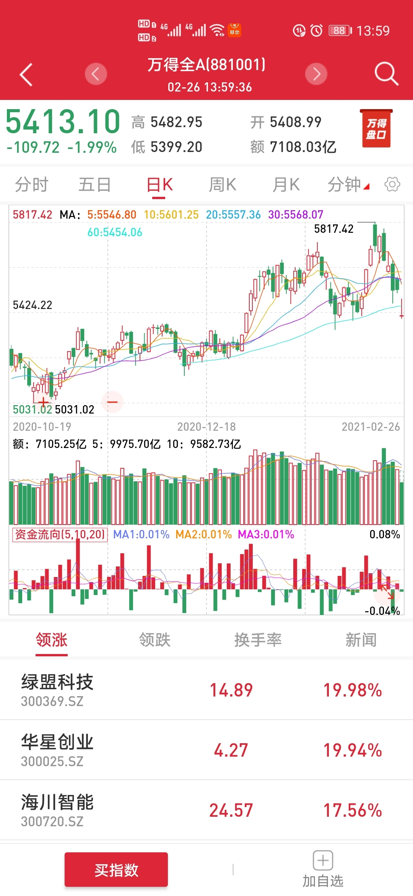

======================================================

_type: talk
@慕容[548814822814844]
2021-02-26 15:06:23 Fri  
topic_id: 215841158821281

二师父网格定投，是否有可以直接使用的软件呢？还是需要自己制表，去定投呢

@二师父 at 2021-02-26 15:06:23 Fri

> 有华宝证券可以自动的

----------

@慕容 at 2021-02-26 15:06:23 Fri

> 好的好的，谢谢二师父

----------

阅读[1]  评论[2]  赞[0] 

======================================================

_type: talk
@二师父[28814221155551]
2021-02-26 16:58:58 Fri  
topic_id: 815841152521182

<e type="hashtag" hid="48412848515448" title="#如何应对大跌#" /> 应对大跌纪律+防守+仓位，结合四个账户，可以应对任何下跌。

@柔软时光 at 2021-02-26 16:58:58 Fri

> 想了解二师父目前全部投资持仓比例为多少？

----------

@二师父 at 2021-02-26 16:58:58 Fri

> 大约百分之73

----------

@柔软时光 at 2021-02-26 16:58:58 Fri

> 我持仓85%，是否高了需调整？

----------

@二师父 at 2021-02-26 16:58:58 Fri

> 看自己下跌是否承受的了，受不了反弹时候就减仓一些，预计3月份会是个阶段性低位，不用过于担心

----------

@柔软时光 at 2021-02-26 16:58:58 Fri

> 应该能承受，不会减仓

----------

@柔软时光 at 2021-02-26 16:58:58 Fri

> 想问问二师父，目前你全部投资股票持仓比例为多少呢？我持仓比例为85%，是否高了？

----------

@二师父 at 2021-02-26 16:58:58 Fri

> 股票大概就百分之8，我重仓的是基金

----------

阅读[1]  评论[7]  赞[0] 

+++++++++++++++++++++++++++++++++++++++++++++++++++++

文件：
2021-02-26 16:58:03 Fri
文件大小：[134623]
48222421851118-应对大跌的法宝.docx

======================================================

_type: q&a
@未来[841858428188582]
2021-02-27 00:40:13 Sat  
topic_id: 414821184484818

@未来

>  二师父，您好，请教下2个问题，计划50万买基金，李晓星新发基金银华心享一年持有（已购买15万，下周一购买5万），袁芳园兴混合20万，今天购买5万，计划分4次购买完毕，何帅，交银阿尔法核心10万，今天第一笔2.5万，计划分4次购买完毕。
>  
>  请教：资金是属于闲钱，1、以上3只基金优缺点。2、现在基金在比较高点，剩下的资金如何购买比较合适，麻烦帮忙解答，感谢

@二师父

>  最好把基金名称和代码写上，方便查阅，剩余资金配置二级债基加货币基金即可

阅读[1]  评论[3]  赞[0] 

======================================================

_type: talk
@二师父[28814221155551]
2021-02-27 10:37:55 Sat  
topic_id: 815841181415282

<e type="hashtag" hid="48412848188548" title="#关于乌龟计划的情况#" /> 有很多朋友估计投资了这个计划，这周复盘下，防守已经做了，如果真的发生大跌，坚持买入就行，不用过度恐慌，持仓全部是优质基金。

@慕容 at 2021-02-27 10:37:55 Sat

> 二师父乌龟计划的年化收益率，按照正常的情况下，预期年化收益率的范围大概是？

----------

@二师父 at 2021-02-27 10:37:55 Sat

> 年化10到15

----------

@慕容 at 2021-02-27 10:37:55 Sat

> 收到[呲牙]

----------

阅读[1]  评论[3]  赞[0] 

+++++++++++++++++++++++++++++++++++++++++++++++++++++

文件：
2021-02-27 10:37:04 Sat
文件大小：[85125]
28444512518581-黑色一星期，复盘乌龟计划，坚定买入.docx

======================================================

_type: solution
2021-02-27 14:13:03 Sat  
topic_id: 815841128558412

@杜志彪 at 2021-02-27 14:13:03 Sat

> 记录一下场外天天基金2021年收益0.87%

----------

阅读[1]  评论[1]  赞[0] 

======================================================

_type: talk
@孟倩[118822124154582]
2021-02-27 16:32:32 Sat  
topic_id: 182518841514852

师父，帮忙看下场内、场外的持仓情况吧！场外品种好像有点多了😥  ，怎么精简呢？还有哪些需要优化的地方？请赐教[抱拳]

@二师父 at 2021-02-27 16:32:32 Sat

> 可以集中投资，把宽基砍了，券商仓位降低，以消费医疗科技为主

----------

@孟倩 at 2021-02-27 16:32:32 Sat

> 谢谢！

----------

@水墨青花 at 2021-02-27 16:32:32 Sat

> 师父，星球续费是直接在首页点击续费吗

----------

@二师父 at 2021-02-27 16:32:32 Sat

> 是的，加微信ershifudt优惠点

----------

@水墨青花 at 2021-02-27 16:32:32 Sat

> 加微信了

----------

阅读[1]  评论[5]  赞[0] 

+++++++++++++++++++++++++++++++++++++++++++++++++++++

图片：
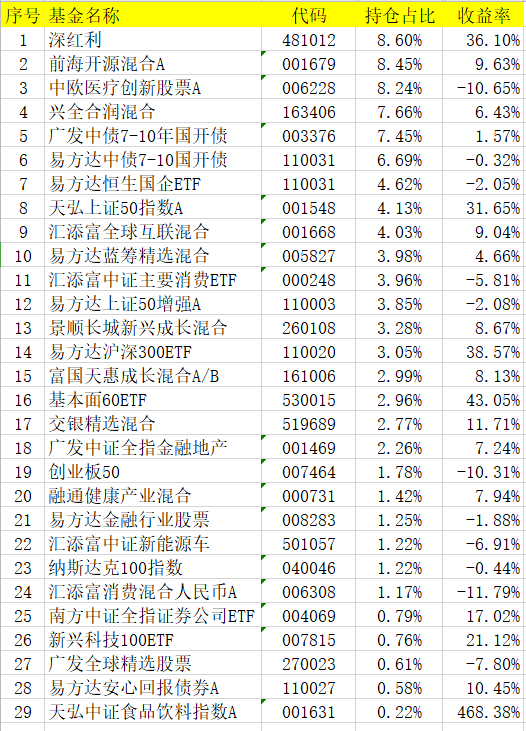
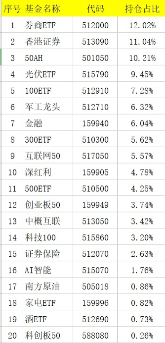

======================================================

_type: talk
@二师父[28814221155551]
2021-02-28 15:37:32 Sun  
topic_id: 815841112244552

<e type="hashtag" hid="48412845814518" title="#看看老巴的来信，学习学习#" /> 里面有推荐书哈，这几本书都是经典，值得多学习。另外关于续费，直接扫码即可如果是加入三年以上的朋友（2018年2月28日之前加入的），续费直接联系我微信，你觉得星球给你带来多少价值就支付多少。1元起步（这是对付出的肯定），一起成长三年，其实还愿意留下来交流的都是老朋友了。

@Zyxj at 2021-02-28 15:37:32 Sun

> 我就跟着二师父了！

----------

@光少 at 2021-02-28 15:37:32 Sun

> 我已经是第三年了[呲牙]

----------

@慕容 at 2021-02-28 15:37:32 Sun

> 新兵入伍，看到跟随三年的朋友好羡慕，如果能在当时有投资意识，现在应该是小富婆了[呲牙]

----------

@丸子妈 at 2021-02-28 15:37:32 Sun

> 刚续了，哈哈

----------

@艾琪（王钥） at 2021-02-28 15:37:32 Sun

> 我是第三年了，提前2个月直接在星球续费的。

----------

@范毅君 at 2021-02-28 15:37:32 Sun

> 我第二年

----------

@J at 2021-02-28 15:37:32 Sun

> 请问大家怎么续费的？在星球可以直接续费吗

----------

@二师父 at 2021-02-28 15:37:32 Sun

> 可以，或者扫描置顶二维码

----------

阅读[1]  评论[8]  赞[0] 

+++++++++++++++++++++++++++++++++++++++++++++++++++++

文件：
2021-02-28 15:29:33 Sun
文件大小：[34245]
88444852514882-老巴来信了.docx

======================================================

_type: talk
@二师父[28814221155551]
2021-02-28 15:55:52 Sun  
topic_id: 414821115244188

<e type="hashtag" hid="48412845818248" title="#仓位管理的方法#" /> 仓位管理分账户考虑，通常有日用账户+稳健账户+防守账户+进攻账户。稳健账户和防守账户可以有多个，总体合并为一个，其中的现金流除以总金额等于10%，那么总仓位是90%。

我们说的仓位是排除日用账户和防守账户之后，剩余投资账户的资金的仓位。

仓位管理有个总体原则，全市场越低估，仓位越重，比如全市场百分位10%以下，那么可以满仓而当全市场百分位90%以上就要逐步降低仓位到5层以下。

对于中途的各种波动，如果钱长期不用，可以忽略波动，保守者把仓位稳定在5到7层以上，激进者把仓位稳定在7到9以上，这是根据每个人承受回撤的能力而定的。

很少有人能够精准做波段，比如高点空仓等跌下来再接进去，要么就是接在了半山腰，要么就是大跌恐惧不敢再入场了，所以合理控制仓位，分步增仓，分步减仓，让持仓心理状态一直处于稳定状态，就是最好的投资状态。

@静儿~ at 2021-02-28 15:55:52 Sun

> 二师父，①“全市场百分位10%”是什么意思？这个数值怎么算出来？②仓位稳定在5到7层，是什么意思？

----------

@二师父 at 2021-02-28 15:55:52 Sun

> 这个是代表当前估值分比百分之90的时间都低仓位稳定在5到7是投资金额占总金额百分之50到70

----------

@静儿~ at 2021-02-28 15:55:52 Sun

> 关于第一个问题的解答，我没有明白，说的再具体点行吗

----------

@二师父 at 2021-02-28 15:55:52 Sun

> 哪里没有明白呢

----------

@静儿~ at 2021-02-28 15:55:52 Sun

> 全市场百分位10%的解释，没看懂

----------

@二师父 at 2021-02-28 15:55:52 Sun

> 这是假设，不是当前计算为百分之10

----------

@慕容 at 2021-02-28 15:55:52 Sun

> 我也有点看不懂

----------

@二师父 at 2021-02-28 15:55:52 Sun

> 慢慢来吧

----------

阅读[1]  评论[16]  赞[0] 

======================================================

_type: talk
@庆余年[15584481824122]
2021-02-28 20:17:16 Sun  
topic_id: 815815555422552

三月份基金排行数据

阅读[1]  评论[0]  赞[0] 

+++++++++++++++++++++++++++++++++++++++++++++++++++++

文件：
2021-02-28 20:17:16 Sun
文件大小：[366531]
28444852442251-基金排行-2103.docx

======================================================

