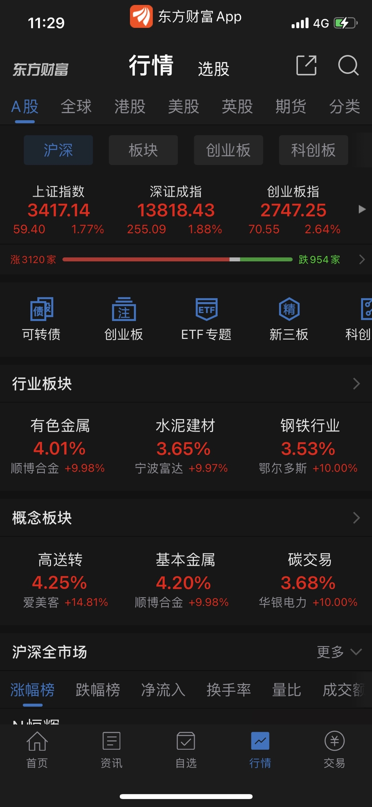
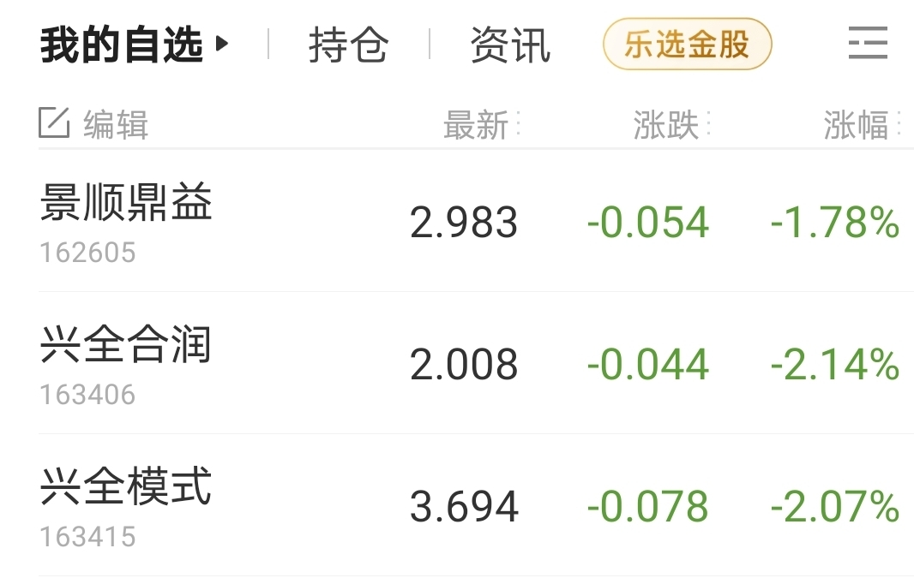

_type: talk
@芙瑞雅阳阳潘[421181844812818]
2021-03-01 10:29:27 Mon  
topic_id: 182582255151812

师父，中信证券一直在跌，为啥呀？

@二师父 at 2021-03-01 10:29:27 Mon

> 上周五盘后公司公布，中信证券拟以A股配股股权登记日收市后的股份总数为基数，按照每10股配售不超过1.5股的比例向全体A股股东配售；拟以H股配股股权登记日确定的全体合资格H股股东所持的股份总数为基数，按照每10股配售不超过1.5股的比例向全体H股股东配售。本次配股募集资金总额不超过人民币280亿元，扣除发行费用后的募集资金净额拟全部用于发展资本中介业务、增加对子公司的投入、加强信息系统建设以及补充其他营运资金。

这对中信短期利空

----------

阅读[1]  评论[1]  赞[0] 

======================================================

_type: talk
@幽兰[815554522442422]
2021-03-01 11:10:59 Mon  
topic_id: 582182215222554

券商你们还有加吗？感觉一直起不来

@Sunflower at 2021-03-01 11:10:59 Mon

> 我有两手，打算5毛钱的时候再多买

----------

@幽兰 at 2021-03-01 11:10:59 Mon

> 五毛钱能到得了吗

----------

@Sunflower at 2021-03-01 11:10:59 Mon

> 不知道，但是我记得二师父说券商最低的时候5毛钱，慢慢等了，我没有太多操作时间所以不做网格，买了两手就等着价格低下来

----------

@芙瑞雅阳阳潘 at 2021-03-01 11:10:59 Mon

> 亲人分析一下中信证券呗，闺蜜重仓，心情不美丽呀[偷笑]

----------

@天马行空 at 2021-03-01 11:10:59 Mon

> 跌得不轻

----------

@苍天有井明月空🌙 at 2021-03-01 11:10:59 Mon

> 做网格多舒服，任他跌涨，无所谓

----------

阅读[1]  评论[6]  赞[0] 

======================================================

_type: talk
@二师父[28814221155551]
2021-03-01 20:19:25 Mon  
topic_id: 815815821288182

<e type="hashtag" hid="15281524818252" title="#谈谈券商#" /> 券商只适合网格，千万不要重仓，当V起来的时候是很爽，而长期趴着的时候也是真的难受。

@范毅君 at 2021-03-01 20:19:25 Mon

> 券商，按照二师父网格继续一点点加，不急，上下皆可，上次大涨清仓后，这次杀进来，网格，还是红的，越跌越是机会[呲牙][呲牙]

----------

@二师父 at 2021-03-01 20:19:25 Mon

> 对的

----------

阅读[1]  评论[2]  赞[0] 

+++++++++++++++++++++++++++++++++++++++++++++++++++++

文件：
2021-03-01 20:18:52 Mon
文件大小：[32619]
51444118255844-A股雄起，券商为何还趴着.docx

======================================================

_type: q&a
@玄武[48512825154828]
2021-03-01 22:15:23 Mon  
topic_id: 414814454582148

@玄武

>  请问二师傅，如果熊市来了，想规避风险，是买点纯债，还是混债什么的？

@二师父

>  买纯债基金避险是很好的

阅读[1]  评论[1]  赞[0] 

======================================================

_type: talk
@二师父[28814221155551]
2021-03-01 23:37:07 Mon  
topic_id: 582182144242584

<e type="hashtag" hid="552114551414" title="#估值数据#" /> 市盈率百分位59.29%，市净率百分位36.24%，SY-BY百分位70.9%，SY/BY百分位67.79%，整体估值楼层仍旧第四层。市场震荡可以握住主仓，然后网格，注意券商随着越来越低，然后加仓拉低成本之后网格出点就可以灵活变动。

@🎈铮 at 2021-03-01 23:37:07 Mon

> 二师父，是券商可以继续网格的意思吗

----------

@二师父 at 2021-03-01 23:37:07 Mon

> 对的

----------

@🎈铮 at 2021-03-01 23:37:07 Mon

> 好的，谢谢二师父，网格价位不变是吧

----------

@二师父 at 2021-03-01 23:37:07 Mon

> 对的，随着买入拉低成本卖出可以等有5个点利润收网

----------

@聆听露水 at 2021-03-01 23:37:07 Mon

> 二师父，昨天买了你的指数基金定投课，[强][强][强]讲的特别好。跟随你的课，来到知识星球二师父学堂，[奋斗]跟着师父学点东西。

----------

阅读[1]  评论[5]  赞[0] 

======================================================

_type: talk
@慕容[548814822814844]
2021-03-02 05:45:11 Tue  
topic_id: 182582511814882

二师父我持有一个易方达黄金ETF联结C，002963，一年时间，一直时亏损的，请问是否有继续持有的价值呢？

@二师父 at 2021-03-02 05:45:11 Tue

> 黄金最好别投了，转二级债基比黄金强

----------

@慕容 at 2021-03-02 05:45:11 Tue

> 收到，二师父

----------

阅读[1]  评论[2]  赞[0] 

======================================================

_type: solution
2021-03-02 11:30:50 Tue  
topic_id: 215815812182181

@果实妈咪 at 2021-03-02 11:30:50 Tue

> 代码多少呀大神[偷笑]

----------

@杜志彪 at 2021-03-02 11:30:50 Tue

> 场内512690目前不便宜请谨慎购买[微笑]

----------

@果实妈咪 at 2021-03-02 11:30:50 Tue

> 苗一眼看看

----------

阅读[1]  评论[3]  赞[0] 

======================================================

_type: talk
@Sunflower[244185124281811]
2021-03-02 13:20:24 Tue  
topic_id: 414814812288518

大家好，我前天晚上更新了星球后里面的文档点开都没有字了，各位有什么办法吗？苹果手机重启、推出重进都不行，清楚缓存也不行[流泪]

@庆余年 at 2021-03-02 13:20:24 Tue

> 不一定是星球的问题，可能是你文档软件的问题，星球本身是不能打开文档的。

----------

@Sunflower at 2021-03-02 13:20:24 Tue

> 我联系了星球，说是系统版本问题，明天中午让我试试他们的测试版

----------

阅读[1]  评论[2]  赞[0] 

======================================================

_type: talk
@二师父[28814221155551]
2021-03-02 21:09:43 Tue  
topic_id: 815815285512242

<e type="hashtag" hid="28514854281421" title="#医疗的建仓机会和方式#" />

@永刚 at 2021-03-02 21:09:43 Tue

> 现在医疗可以建底仓吗？

----------

@二师父 at 2021-03-02 21:09:43 Tue

> 可以定投

----------

@聆听露水 at 2021-03-02 21:09:43 Tue

> 师父，请问新兵学完您的课，刚加入进来想初步实践，目前空仓。请师傅指点迷津[抱拳][抱拳]

----------

@慕容 at 2021-03-02 21:09:43 Tue

> 二师父能不能理解成中证医疗到14000是建仓也可以，现在开始逐步建仓也可以呢

----------

@二师父 at 2021-03-02 21:09:43 Tue

> 现在可以定投

----------

@慕容 at 2021-03-02 21:09:43 Tue

> 好的

----------

阅读[1]  评论[6]  赞[0] 

+++++++++++++++++++++++++++++++++++++++++++++++++++++

文件：
2021-03-02 21:07:53 Tue
文件大小：[292119]
28444221854241-医疗和生物医药的投资机会.docx

======================================================

_type: q&a
@衣袂飘香[118248548242452]
2021-03-02 21:37:17 Tue  
topic_id: 215815285884881

@衣袂飘香

>  请教二师父。我去年初买了刘格菘的广发科技先锋混合008903，目前持仓收益率大约43%。近期市场风格切换，该支基金一年内最大回撤将近15%。目前我比较纠结，该支基金接下来怎么操作比较好呢？
> 其实投入的金额不多，也就2万多元，钱也不急着用的，只是我不知道如何操作才合适，特意请教，谢谢您。

@二师父

>  可以转配置一部分到易方达增强回报债券，阶段性高位适当防守，然后有回调再转入即可，刘格菘的投资水平可以，只是这一波杀跌普遍跌的比较厉害

阅读[1]  评论[3]  赞[0] 

======================================================

_type: talk
@二师父[28814221155551]
2021-03-02 21:56:48 Tue  
topic_id: 815815285242142

<e type="hashtag" hid="552114551414" title="#估值数据#" /> 市盈率百分位58.78%，市净率百分位33.46%，SY-BY百分位70.1%，SY/BY百分位66.72%。

慢慢估值下降，收益率也会有回撤，这时候就体现仓位管理和防守基金的重要性，市场只能有预判，切记不要根据市场的预判做投资决策。

阅读[1]  评论[0]  赞[0] 

======================================================

_type: talk
@雨淡风清[844418818858882]
2021-03-03 15:15:13 Wed  
topic_id: 582182558415214

大盘跟个神经病似的，先来个三级跳然后跟个猴子样上窜下跳，一点也不像牛

@匿名的码农 at 2021-03-03 15:15:13 Wed

> [捂脸][捂脸]

----------

@幽兰 at 2021-03-03 15:15:13 Wed

> 猴市这是

----------

阅读[1]  评论[2]  赞[0] 

======================================================

_type: talk
@丸子妈[28512522184441]
2021-03-03 19:11:00 Wed  
topic_id: 182582414844412

投资新能源的话，是买场内etf好，还是选择场外的行业主题基金比较好？

@二师父 at 2021-03-03 19:11:00 Wed

> 行业ETF或者刘格菘的混合基金

----------

阅读[1]  评论[1]  赞[0] 

======================================================

_type: talk
@二师父[28814221155551]
2021-03-03 20:07:18 Wed  
topic_id: 215815244848511

<e type="hashtag" hid="28514885241521" title="#基金娱乐化的时候重温投资哲学#" />

阅读[1]  评论[0]  赞[0] 

+++++++++++++++++++++++++++++++++++++++++++++++++++++

文件：
2021-03-03 20:04:25 Wed
文件大小：[33283]
28444241581411-明星基金经理受邀参加天天向上，基金界又在唱哪出.docx

======================================================

_type: talk
@二师父[28814221155551]
2021-03-03 21:21:27 Wed  
topic_id: 182582411815122

<e type="hashtag" hid="552114551414" title="#估值数据#" /> 市盈率百分位59.04%，市净率百分位34.38%，SY-BY百分位70.67%，SY/BY百分位67.59%。当前市场上窜下跳，避免频繁操作。

可以逢高减仓，转配利润到达债券基金，加仓位置大约是全市场成交额7000亿元左右，或者万得全A5200点支撑位的时候。

@🍀 凝🌸 慧🍀 at 2021-03-03 21:21:27 Wed

> 师父好，您说的加仓的条件，和定投是不一样的吧？

----------

@二师父 at 2021-03-03 21:21:27 Wed

> 对的，定投每周四固定投就可以

----------

阅读[1]  评论[2]  赞[0] 

======================================================

_type: talk
@二师父[28814221155551]
2021-03-03 22:21:00 Wed  
topic_id: 815815241485552

<e type="hashtag" hid="825188852442" title="#估值表#" /> 当前创业板和科创50进入正常估值了，白酒仍旧高估，继续等待，白酒预计40倍市盈率左右重启投资，医疗和创业板可以先走起来。

严格遵循，低估不卖出，高估不买入。

阅读[1]  评论[0]  赞[0] 

+++++++++++++++++++++++++++++++++++++++++++++++++++++

图片：

======================================================

_type: talk
@二师父[28814221155551]
2021-03-04 09:39:49 Thu  
topic_id: 182582488285882

<e type="hashtag" hid="88514885414822" title="#实盘273#" /> 当前实盘，继续防守，卖出高估的基本面60，转移到二级债基，然后每周定投继续，对于有了利润的朋友，可以直接把利润部分转移到二级债基。

@范毅君 at 2021-03-04 09:39:49 Thu

> 前几天跟投二师父看错了，跟投了2000基本面60，宝宝心里苦[捂脸]

----------

@二师父 at 2021-03-04 09:39:49 Thu

> 额，可以撤单

----------

@范毅君 at 2021-03-04 09:39:49 Thu

> 早确认了，拿着吧，没多少钱[偷笑][偷笑]

----------

@慕容 at 2021-03-04 09:39:49 Thu

> 二师父我直接跟投乌龟计划可以吗

----------

@二师父 at 2021-03-04 09:39:49 Thu

> 可以的

----------

@wty at 2021-03-04 09:39:49 Thu

> 二师父，基本面60今天清仓是吗？这只基还剩多少仓位了？

----------

@二师父 at 2021-03-04 09:39:49 Thu

> 还有大概百分之9

----------

@wty at 2021-03-04 09:39:49 Thu

> 收到，谢谢二师父

----------

阅读[1]  评论[15]  赞[0] 

+++++++++++++++++++++++++++++++++++++++++++++++++++++

图片：

======================================================

_type: q&a
@多读书[88482152228812]
2021-03-04 09:41:06 Thu  
topic_id: 182582488215522

@多读书

>  请问二师父人工智能和新兴科技100还可以每周定投吗？

@二师父

>  可以的，科技100准备止盈，这两个指数波动都较大，控制百分之20以内仓位

阅读[1]  评论[1]  赞[0] 

======================================================

_type: talk
@二师父[28814221155551]
2021-03-04 10:02:18 Thu  
topic_id: 182582125222142

<e type="hashtag" hid="881251425252" title="#鳄鱼计划#" /> 科技100(515860）清仓卸货，科技未来只会投资中概和互联网50ETF，这个基金盈利一般，大概是25%利润，严重不如消费和医疗，在中国只有两大赛道值得长期持有，消费和医疗。其他的上涨了该收割利润就收割利润。

卖出之后蹲点5200点支撑位。

@吃肉肉 at 2021-03-04 10:02:18 Thu

> 师父，我买的是007815，新兴科技100策略ETF链接A清仓止盈吗？

----------

@二师父 at 2021-03-04 10:02:18 Thu

> 对，你看你仓位，70%以上仓位可以直接把这个转到二级债基

----------

@吃肉肉 at 2021-03-04 10:02:18 Thu

> 收到，谢谢！

----------

@吃肉肉 at 2021-03-04 10:02:18 Thu

> 已经跟上

----------

@向前进 at 2021-03-04 10:02:18 Thu

> 师父，科技100目前亏7个点，先清仓，等待其他机会吗

----------

@丸子妈 at 2021-03-04 10:02:18 Thu

> 今天补了点葛兰的医疗

----------

@丸子妈 at 2021-03-04 10:02:18 Thu

> 人工智能和中概互联，哪个更好

----------

@二师父 at 2021-03-04 10:02:18 Thu

> 可以转二级债基，等待机会

----------

阅读[1]  评论[16]  赞[0] 

======================================================

_type: talk
@平安是福[118222545154542]
2021-03-04 10:24:43 Thu  
topic_id: 215815458888881

师父：师父515000还持有还是也清仓

@二师父 at 2021-03-04 10:24:43 Thu

> 也可以走，转配置

----------

@平安是福 at 2021-03-04 10:24:43 Thu

> 好的

----------

阅读[1]  评论[2]  赞[0] 

======================================================

_type: talk
@芙瑞雅阳阳潘[421181844812818]
2021-03-04 12:14:37 Thu  
topic_id: 815815452824222

师父，光伏ETF今天怎么跌这么多呢？

@二师父 at 2021-03-04 12:14:37 Thu

> 今天集体下挫，抱团资金撤场

----------

@芙瑞雅阳阳潘 at 2021-03-04 12:14:37 Thu

> 怎么应对？

----------

@二师父 at 2021-03-04 12:14:37 Thu

> 仓位不多拿着就行，等待企稳补仓

----------

@芙瑞雅阳阳潘 at 2021-03-04 12:14:37 Thu

> 嗯，好的，补仓

----------

阅读[1]  评论[4]  赞[0] 

======================================================

_type: talk
@悦雪[88242858484422]
2021-03-04 12:49:20 Thu  
topic_id: 815815452215852

师父，今天场内创业板跌了5%，可以投一份吗？还是再观望一下，谢谢

@二师父 at 2021-03-04 12:49:20 Thu

> 如果没有仓位可以一份观察仓，一份问题不大，然后再观望，有仓位可以等等

----------

@杜志彪 at 2021-03-04 12:49:20 Thu

> 再等等，师父核心池里除了水泥在年线以下其它还没到（水泥应该算周期股，周期就不碰了哈），我等其它的年线以下来100股[微笑]

----------

阅读[1]  评论[2]  赞[0] 

======================================================

_type: talk
@黄巧[844145518844422]
2021-03-04 13:50:08 Thu  
topic_id: 414814242448418

今天跌的有点懵[流泪]

@一心一意 at 2021-03-04 13:50:08 Thu

> 二师父那句话怎么说来着，，他涨任他涨，他跌任他跌，大江看明月，

----------

@黄巧 at 2021-03-04 13:50:08 Thu

> 😄

----------

@黄巧 at 2021-03-04 13:50:08 Thu

> 要做到那么淡定需要时间

----------

@二师父 at 2021-03-04 13:50:08 Thu

> 需要仓位，今天破位了，仓位一定要控制好

----------

@衣袂飘香 at 2021-03-04 13:50:08 Thu

> 好像习惯了，麻木了[撇嘴]

----------

阅读[1]  评论[5]  赞[0] 

======================================================

_type: talk
@二师父[28814221155551]
2021-03-04 16:24:41 Thu  
topic_id: 182582855244142

<e type="hashtag" hid="552114551414" title="#估值数据#" /> 市盈率百分位58.77%，市净率百分位33.46%，SY-BY百分位70.25%，SY/BY百分位67.06%，整体估值中等，最近杀跌厉害，两会下跌重现，今年会偏重防守，如果跌到地量时候也会继续出手的，否则耐心等着，一直都是放量跌，以及大佬对美国股市偏离基本面的判断，都值得警惕。

@以古论今 at 2021-03-04 16:24:41 Thu

> 现在留几层仓

----------

@二师父 at 2021-03-04 16:24:41 Thu

> 激进8层以下，保守6层以下

----------

阅读[1]  评论[2]  赞[0] 

======================================================

_type: q&a
@🍀 凝🌸 慧🍀[841855248254242]
2021-03-04 18:04:16 Thu  
topic_id: 582182811812814

@🍀 凝🌸 慧🍀

>  师父好，两个支撑位～万得全A指数5200点和4900点，大概对应到上证综指是多少点啊？😊

@二师父

>  我不看上证综指的，直接看万得就可以了，这个指数能找到

阅读[1]  评论[3]  赞[0] 

======================================================

_type: q&a
@隔窗遥望[241884481854181]
2021-03-04 18:38:20 Thu  
topic_id: 414814188114888

@隔窗遥望

>  师父，消费，医疗，科技有哪些好的指数基金可以推荐一下吗？

@二师父

>  消费etf白酒etf，食品etf，医疗etf，互联网50etf，中概互联

阅读[1]  评论[4]  赞[0] 

======================================================

_type: talk
@二师父[28814221155551]
2021-03-04 22:09:09 Thu  
topic_id: 215815125248821

<e type="hashtag" hid="15281555242452" title="#大跌之后如何应对#" /> 今天是放量跌，结合当前大佬提示美股风险，大家对后市还是谨慎一些。控制合理仓位，应对极端情况，永远对市场保持敬畏。仓位第一，保证发生大跌扛得住。

第二，更多投资者关心何时上车，以目前这种情况，抱团股最近没有得到机构资金建仓，没有看到企稳趋势，暂时可以等等，成交额缩到极致之后再考虑进场。

当前最佳的就是继续止盈高估指数，转移到二级债基。

如果高估基金重回正常估值，可以选择一次清仓，也可以持有，等待新一轮高估。

第三、最佳的方式是每周固定定投，目前以二级债基、混合基金为主，如果市场还有大跌的化，就以混合基金+指数基金为主。

重新检查了下乌龟计划和鳄鱼计划的持仓标的，都是非常优质的，跌下来就是左侧交易的机会，对于创业板，科创板50、光伏、人工智能这种周期性和波动较大的指数，可以等待指数破年线之后定投，而对于优质盈利稳定的指数，正常估值区域破60或90日均线都可以。

今年以防守为主，一定要保住去年赚取的利润，千万不能让自己把赚的钱倒亏出去了。

@衣袂飘香 at 2021-03-04 22:09:09 Thu

> 二师父是领路人。市场下跌既是考验信仰的时候，也是借此机会检验下跌的承受力，并在这种动荡中，继续学习、感受无常中的某种规律性。

----------

@二师父 at 2021-03-04 22:09:09 Thu

> 控制好仓位，经历一波牛熊就有经验了

----------

@衣袂飘香 at 2021-03-04 22:09:09 Thu

> 好的，一直都对标二师父您的仓位。

----------

@衣袂飘香 at 2021-03-04 22:09:09 Thu

> 而且昨天听从你的建议，把主动基金广发科技先锋混合，收割了1万元的利润，今天觉得好开心啊。

----------

@shi at 2021-03-04 22:09:09 Thu

> 已经降了两层仓位。
其中，基本抛了全部国泰有色（留一点点作为看盘，等到跌到正常值再下一轮定投），盈利52%。

----------

@🍀 凝🌸 慧🍀 at 2021-03-04 22:09:09 Thu

> 谢谢师父提示！节前疯涨的时候，我已收割全部利润并减仓。节后，感市场上窜下跳不太靠谱，在这次大跌前的一天，我很幸运又趁着大涨，清仓了一些有盈利的主动基金和债基（2～7个点不等），再次降低仓位。之所以果断卖出，是因为自己之前有些冒进，加仓入手量有点大，后来感觉外围情况不好，所以赶紧卖出。

----------

@黄峥臻|企业软件应用 at 2021-03-04 22:09:09 Thu

> 二师父，成交收缩到极致，是怎么判断？

----------

@二师父 at 2021-03-04 22:09:09 Thu

> 看市场成交额和换手率

----------

阅读[1]  评论[9]  赞[0] 

======================================================

_type: q&a
@天马行空[548818851412444]
2021-03-05 06:31:59 Fri  
topic_id: 182582848224542

@天马行空

>  二师父，看美股行情估计今天还得跌。券商仓位有些重了，亏损百分之四。也不想再加仓了。目前行情很危险，是卧倒还是割肉。谢谢。成本1.074

@二师父

>  券商仓位高于百分之30就先退一部分

阅读[1]  评论[0]  赞[0] 

======================================================

_type: talk
@慕容[548814822814844]
2021-03-05 07:34:19 Fri  
topic_id: 582182858525124

二师父我把收割的利润，定投了乌龟计划，这种操作可以吗？收益是近期不用的钱

@二师父 at 2021-03-05 07:34:19 Fri

> 可以

----------

@慕容 at 2021-03-05 07:34:19 Fri

> 收到

----------

阅读[1]  评论[2]  赞[0] 

======================================================

_type: talk
@二师父[28814221155551]
2021-03-05 09:40:13 Fri  
topic_id: 815815145282442

<e type="hashtag" hid="881251425252" title="#鳄鱼计划#" />继续卸货，两会大跌魔咒未打破，今天除了鳄鱼计划卸货还有乌龟计划也会调仓，关注天天乌龟计划，本次为个人操作，卸货后大概率一直休息。易方达中小盘再次可以申购再考虑入场。

仅为个人操作，非投资建议，虽然未能卖到最高点，但是我们盈利了。

@Sunflower at 2021-03-05 09:40:13 Fri

> 二师父如果仓位不高，持有的是白酒消费还有跟投的医疗可以长期持有不卖出吗？目前收益回吐不少，吃的下饭睡的着觉

----------

@二师父 at 2021-03-05 09:40:13 Fri

> 可以，极端情况回撤30左右能接受就可以

----------

@向前进 at 2021-03-05 09:40:13 Fri

> 师父，没有消费50，消费etf 159928是不是可以一样清仓了

----------

@二师父 at 2021-03-05 09:40:13 Fri

> 可以卖本留利润

----------

@向前进 at 2021-03-05 09:40:13 Fri

> 好的，谢谢

----------

@一心一意 at 2021-03-05 09:40:13 Fri

> 我按二师父的反向，买入一部分仓

----------

@陈 at 2021-03-05 09:40:13 Fri

> 二师父，为什么这么低，你还卖掉这么多？

----------

@二师父 at 2021-03-05 09:40:13 Fri

> 并不低，你看持仓已经涨了很多

----------

阅读[1]  评论[32]  赞[0] 

+++++++++++++++++++++++++++++++++++++++++++++++++++++

图片：

======================================================

_type: q&a
@🎈铮[28284825441841]
2021-03-05 09:52:09 Fri  
topic_id: 182582812414442

@🎈铮

>  二师父，乌龟计划一共投5万，现在2成仓位了，剩余的分多少份跟着您投呢，鳄鱼计划都是用的增量资金，现阶段就是按一份2000跟投的，因为看操作比较少

@二师父

>  分一年吧，这次计划如果易方达中小盘混合不放开，或者指数百分位不低于百分之50，就停止定投了，今年估计有机会

阅读[1]  评论[1]  赞[0] 

======================================================

_type: talk
@芙瑞雅阳阳潘[421181844812818]
2021-03-05 10:12:56 Fri  
topic_id: 215815145155221

师父，光伏ETF今天可以加仓吗？

@二师父 at 2021-03-05 10:12:56 Fri

> 我没加了，一直放量跌，缩量涨，外围情况糟糕，整体股市中等偏高位置，易方达中小盘限购，市场不企稳不考虑入场了，除了债基

----------

@芙瑞雅阳阳潘 at 2021-03-05 10:12:56 Fri

> 好的，那先放着吧

----------

@芙瑞雅阳阳潘 at 2021-03-05 10:12:56 Fri

> 师父，沒忍住，光伏加仓了[偷笑]

----------

阅读[1]  评论[3]  赞[0] 

======================================================

_type: q&a
@水冰月槑槑🌙[51142428222184]
2021-03-05 11:34:27 Fri  
topic_id: 414814122455248

@水冰月槑槑🌙

>  二师父这两个跌了好多可以加仓吗？

@二师父

>  不用锚固心理，大盘尚未企稳，可以看看易方达中小盘何时放开申购，再入场

阅读[1]  评论[0]  赞[0] 

======================================================

_type: talk
@平安是福[118222545154542]
2021-03-05 11:45:20 Fri  
topic_id: 414814122842818

师父：目前主动管理基金易方达110011收益53%，富国天惠161005收益24%，富国高新100060收益24%，广发双擎005911收益37.8收益，要不要操作？

@二师父 at 2021-03-05 11:45:20 Fri

> 仓位多少，8层以上收割利润然后购买南方宝元债

----------

@平安是福 at 2021-03-05 11:45:20 Fri

> 场外+场外总仓位6层

----------

阅读[1]  评论[2]  赞[0] 

======================================================

_type: talk
@平安是福[118222545154542]
2021-03-05 12:09:33 Fri  
topic_id: 215815144254111

写错了是场内+场外共6层多点

@二师父 at 2021-03-05 12:09:33 Fri

> 适当卖出，多配点防守债基偏债混合

----------

阅读[1]  评论[1]  赞[0] 

======================================================

_type: talk
@二师父[28814221155551]
2021-03-05 12:16:56 Fri  
topic_id: 215815144284551

<e type="hashtag" hid="88514888841522" title="#接下来操作姿势#" /> 我已经由进攻转为防守了，无非是牛市来了少赚点，但是危机到来之时依然扛得住

@lily at 2021-03-05 12:16:56 Fri

> 师父，我的汇添富中证消费目前亏5.9%，也要卖吗？

----------

@二师父 at 2021-03-05 12:16:56 Fri

> 看整体仓位不重拿着，等跌到位了可以继续定投的

----------

@宋航 at 2021-03-05 12:16:56 Fri

> 二师父。我看乌龟计划中的中正消费基金000248。是全部清仓，是什么原因啊？

----------

@二师父 at 2021-03-05 12:16:56 Fri

> 高位回撤从高估区域到正常估值区域清仓，后面有好机会也会继续投资的

----------

@JOY at 2021-03-05 12:16:56 Fri

> 师父，您可以出个年化10～20的实盘么？咱们这里回撤大些也可以接受的小伙伴应该也不少，5～10感觉稍低点哈～

----------

@二师父 at 2021-03-05 12:16:56 Fri

> 鳄鱼计划啊，乌龟计划预期年化百分之10到15

----------

@JOY at 2021-03-05 12:16:56 Fri

> 好的，拭目以待～

----------

@宋航 at 2021-03-05 12:16:56 Fri

> 明白了。谢谢二师父

----------

阅读[1]  评论[11]  赞[0] 

+++++++++++++++++++++++++++++++++++++++++++++++++++++

文件：
2021-03-05 12:15:54 Fri
文件大小：[14180]
48222245554558-接下来这么操作.docx

======================================================

_type: talk
@二师父[28814221155551]
2021-03-05 17:10:42 Fri  
topic_id: 182582884211122

<e type="hashtag" hid="88514888245212" title="#做好防守#" /> 最近半月急跌，有人认为是回调，有人认为是熊市开始，如果万得A撑不住5200点情况真的不大妙，所以继续做好防守，宁可少赚一点，别让市场把自己彻底击溃了。君子不立危墙之下。

调仓完毕之后，可以卧倒，不要再追加，无论反弹还是下跌，都没有意义，注意一个指标，易方达中小盘放开申购之日，就是我们重启定投之时，如果他一直不放开，就等市场百分位40以下开始投资。

@smile at 2021-03-05 17:10:42 Fri

> 可以看易方达蓝筹不？是不是也一样

----------

@二师父 at 2021-03-05 17:10:42 Fri

> 他并没有完全限制

----------

@一心一意 at 2021-03-05 17:10:42 Fri

> 把易方达中小盘放开申购作为指标，是不是有点勉强哪，

----------

@二师父 at 2021-03-05 17:10:42 Fri

> 也会参考估值和走势

----------

阅读[1]  评论[4]  赞[0] 

======================================================

_type: q&a
@黄峥臻|企业软件应用[88288581145482]
2021-03-05 18:27:26 Fri  
topic_id: 182582884585842

@黄峥臻|企业软件应用

>  二师父想，问一下这支基金怎么样。
>  华夏能源革新股票(003834)，之前买了一些。有没有更好的可以选择？

@二师父

>  曲扬的前海开源人工智能可以关注下

阅读[1]  评论[4]  赞[0] 

======================================================

_type: q&a
@徐美芳[51112822252224]
2021-03-05 18:27:51 Fri  
topic_id: 414814115512448

@徐美芳

>  二师傅能把今天天天基金上面的调仓在星球上也公布一下吗？我不是在天天上买的，看不到具体调仓哦

@二师父

>  可以的，等数据出来以后

阅读[1]  评论[0]  赞[0] 

======================================================

_type: talk
@雨淡风清[844418818858882]
2021-03-05 19:56:41 Fri  
topic_id: 182582881584252

我想问一个问题啊，这个东西我也看不明白，只知道这个现象很不好。美国大量资金争夺短缺的10年国债，出现“倒贴”现象。“倒贴”已经极为罕见，更罕见的是-4%的倒贴程度，堪称闻所未闻。这是不是说明美国金融市场处于极端不正常的状态，金融风暴正在酝酿。这对我国股市有什么影响。[流泪][流泪][流泪]

阅读[1]  评论[0]  赞[0] 

======================================================

_type: talk
@二师父[28814221155551]
2021-03-05 20:52:31 Fri  
topic_id: 215815114428811

<e type="hashtag" hid="458188281228" title="#鳄鱼计划持仓#" /> 当前鳄鱼计划持仓，继续防守，按照这个仓位，即使发生了股灾也不怕，无非就是牛市到来少赚一点，还是保守点好，争取一直在市场活下来。后面就卧倒了，调仓频繁只会在特殊时刻，大部分日子都没有太大动作。

@春晓 at 2021-03-05 20:52:31 Fri

> 二师傅，货币基金哪款好

----------

@二师父 at 2021-03-05 20:52:31 Fri

> 银华日利

----------

@光少 at 2021-03-05 20:52:31 Fri

> 二师父，有乌龟计划持仓表吗？

----------

@二师父 at 2021-03-05 20:52:31 Fri

> 这个等后台数据更新了我再发一下

----------

@光少 at 2021-03-05 20:52:31 Fri

> 好的，谢谢

----------

@春晓 at 2021-03-05 20:52:31 Fri

> 谢谢二师傅

----------

@雾海 at 2021-03-05 20:52:31 Fri

> 师傅，天天乌龟计划的持仓是在哪里看？

----------

@二师父 at 2021-03-05 20:52:31 Fri

> 天天基金可以看，后台数据公布有延迟，等更新完毕我会发到星球

----------

阅读[1]  评论[10]  赞[0] 

+++++++++++++++++++++++++++++++++++++++++++++++++++++

图片：

======================================================

_type: q&a
@心情[422114152822488]
2021-03-06 08:47:01 Sat  
topic_id: 414818445824428

@心情

>  二师父，光伏两层仓位，亏12个点，还能继续拿着吗？

@二师父

>  仓位太重了，目前这个位置最多0.5层仓位

阅读[1]  评论[5]  赞[0] 

======================================================

_type: talk
@二师父[28814221155551]
2021-03-06 15:42:00 Sat  
topic_id: 815818582558442

<e type="hashtag" hid="51284111815884" title="#买他就对了#" /> 说说买债的逻辑，如果回撤受不了，可以转移到部分二级债，回撤小一点，风控做好，其次才是挣钱。

@雾海 at 2021-03-06 15:42:00 Sat

> 二师傅 我买的是易方达中债7~10年的，这一样吗

----------

@二师父 at 2021-03-06 15:42:00 Sat

> 可以

----------

阅读[1]  评论[2]  赞[0] 

+++++++++++++++++++++++++++++++++++++++++++++++++++++

文件：
2021-03-06 15:40:38 Sat
文件大小：[46395]
88444482284222-买他就对了.docx

======================================================

_type: q&a
@🍀 凝🌸 慧🍀[841855248254242]
2021-03-07 09:32:56 Sun  
topic_id: 414818451542218

@🍀 凝🌸 慧🍀

>  师父好，想请教您：
>  1、如果目前资金量比较大，想买二级债基、混合债基等，该如何买入，一次性？还是每周买入？
>  2、之前您提到的易方达裕丰债券和南方宝元债券，哪个更稳妥？如果都配，比例您建议咋安排？
>  谢谢师父！😊

@二师父

>  1，每周分批买入
>  
>  2，易方达裕丰比南方宝元，3比2比价合适

阅读[1]  评论[1]  赞[0] 

======================================================

_type: talk
@二师父[28814221155551]
2021-03-07 10:23:07 Sun  
topic_id: 815818521182522

<e type="hashtag" hid="28514882542141" title="#复盘鳄鱼计划#" /> 开始卸货降低仓位，预计还会继续降低仓位，最近已经没有投资计划了。张坤易方达中小盘混合放开申购是买入的必要条件，不是说就把这个当作一个指标，核心关注SY-BY百分位，重启到50%以下会考虑开始。

鳄鱼计划是我在场内投的，大家看不到我的操作，未来如果估值楼层降到一层，我会拿出部分资金在场外天天基金建立一个类鳄鱼计划，机会总会有，资本市场每隔几年都会出现一个大机会，这一波大家应该都赚到了。

知足常乐，知止不殆，能赚就好，想想去年做生意那么多人亏损，而投资还能赚取高额的收益，知足啦。一个人如果不贪，一生就不会出大事。

@水墨青花 at 2021-03-07 10:23:07 Sun

> 请教，易方达中小盘继续持有还是卖出？

----------

@二师父 at 2021-03-07 10:23:07 Sun

> 长期是可以持有的

----------

@水墨青花 at 2021-03-07 10:23:07 Sun

> 好的，谢谢

----------

@JOY at 2021-03-07 10:23:07 Sun

> 师父，请教下，您场内买的广发中债那些债基，是不是也是场外的代码品种，只是用了场内的账号和资金？

----------

@二师父 at 2021-03-07 10:23:07 Sun

> 对的，相当于在场内申购，这个你也可以场外申购，一样的

----------

@JOY at 2021-03-07 10:23:07 Sun

> 谢谢

----------

@云卷云舒 at 2021-03-07 10:23:07 Sun

> 师父，卖出的资金买货基还是债基啊

----------

@二师父 at 2021-03-07 10:23:07 Sun

> 货币基金

----------

阅读[1]  评论[8]  赞[0] 

+++++++++++++++++++++++++++++++++++++++++++++++++++++

文件：
2021-03-07 10:18:01 Sun
文件大小：[85390]
15111142125522-鳄鱼计划每周复盘2021.3.6.docx

======================================================

_type: talk
@ 🇦 🇬 🇧 🇹[182218122141512]
2021-03-07 18:29:39 Sun  
topic_id: 815818541822542

[发呆]现在减仓是不是被割实了  美国的刺激法案对这股市一点作用都没有  还是有其他看法

@二师父 at 2021-03-07 18:29:39 Sun

> 卖出的基金都是盈利的，怎么被割了

----------

@ 🇦 🇬 🇧 🇹 at 2021-03-07 18:29:39 Sun

> 😂  我被割了

----------

阅读[1]  评论[2]  赞[0] 

======================================================

_type: talk
@二师父[28814221155551]
2021-03-07 19:49:18 Sun  
topic_id: 582181248451244

<e type="hashtag" hid="15281554585242" title="#解读两会#" /> 两会消息解读

阅读[1]  评论[0]  赞[0] 

+++++++++++++++++++++++++++++++++++++++++++++++++++++

文件：
2021-03-07 19:49:01 Sun
文件大小：[41860]
88444424222512-解读两会与投资相关的消息.docx

======================================================

_type: q&a
@庆余年[15584481824122]
2021-03-07 20:39:53 Sun  
topic_id: 815818544188482

@庆余年

>  二师父，去年十月份进的南方原油，成本0.532，目前盈利37%左右，仓位1.5层。请问后市的原油还有到1块左右的上升空间麽？我的逻辑是后期经济好转，对原油的需求会加大。

@二师父

>  有希望，可以继续持有，破20日均线止盈

阅读[1]  评论[4]  赞[0] 

======================================================

_type: talk
@二师父[28814221155551]
2021-03-08 07:02:49 Mon  
topic_id: 215818811215821

本月很重要，如果抱团股和持有抱团股的基金有反弹的话，可以逢高减仓，突破前期高位才能确定牛市趋势仍在，这个概率不大，大家尽量保守点。至于何时开始定投，等估值百分位破50以下了，开启新一轮左侧交易，基金都是我分享的长牛标的

至于原油顺周期这些可以跟随市场趋势，他们周期性太强，不太适合做定投

@李震笛 at 2021-03-08 07:02:49 Mon

> 二师傅，减掉八成仓位，或者清仓，这个阶段可以吗

----------

@二师父 at 2021-03-08 07:02:49 Mon

> 如果能够保证上涨不会追，那么可以的

----------

@涓涓 at 2021-03-08 07:02:49 Mon

> 二师父，目前五成仓，还需要继续减吗？

----------

@二师父 at 2021-03-08 07:02:49 Mon

> 如果反弹突破前高不用，反之上不去可以减一些

----------

阅读[1]  评论[4]  赞[0] 

======================================================

_type: talk
@二师父[28814221155551]
2021-03-08 09:13:35 Mon  
topic_id: 182585425844122

女神节，祝大家节日快乐呀

@涓涓 at 2021-03-08 09:13:35 Mon

> 终于抢到二师父的红包了，过年的时候一个都没抢到

----------

@雪莲 at 2021-03-08 09:13:35 Mon

> 今年抢到的第一个红包[微笑]

----------

@🍀 凝🌸 慧🍀 at 2021-03-08 09:13:35 Mon

> 谢谢师父[愉快][转圈][转圈][转圈]

----------

@一无所有 at 2021-03-08 09:13:35 Mon

> 谢谢二师父!🎉🎉

----------

@向前进 at 2021-03-08 09:13:35 Mon

> 谢谢师父

----------

@小牧童 at 2021-03-08 09:13:35 Mon

> 哈哈，谢谢！

----------

@西锦巴乌 at 2021-03-08 09:13:35 Mon

> 谢谢师父

----------

@白山羊 at 2021-03-08 09:13:35 Mon

> 谢谢二师父啦

----------

阅读[1]  评论[15]  赞[0] 

+++++++++++++++++++++++++++++++++++++++++++++++++++++

图片：

======================================================

_type: talk
@二师父[28814221155551]
2021-03-08 10:16:29 Mon  
topic_id: 582181525515184

<e type="hashtag" hid="881251425252" title="#鳄鱼计划#" /> 卖出深红利20份，卖出人工智能5份，卖出300非银5份。仅为个人操作，卖出之后短期半年内可能不会再买入，有赚就好，卖出的品种都是盈利的，小头寸互联网，医疗，港股证券未来跌下去了仍旧会加仓

越来越发现，人最难克服的不是恐惧，而是贪婪。

@rtdmm小米 at 2021-03-08 10:16:29 Mon

> 二师父深红利卖完了没？

----------

@二师父 at 2021-03-08 10:16:29 Mon

> 还有大概百分之6仓位，整体持仓百分之38左右

----------

@样 at 2021-03-08 10:16:29 Mon

> 仓位降这么快，月初还是8成多吧，一下就到3.5了

----------

@二师父 at 2021-03-08 10:16:29 Mon

> 你看我连续卸货四天，自己算算哈

----------

@Chu at 2021-03-08 10:16:29 Mon

> 师父，你的仓位是说的股票仓位还是债基加上货基也在里面？

----------

@二师父 at 2021-03-08 10:16:29 Mon

> 就是指数站总金额比例

----------

@多读书 at 2021-03-08 10:16:29 Mon

> 请问二师父是整体仓位降到3.5了，还是只是鳄鱼计划？
因为我只有场外的6成仓位，拿不住现在要卖多少了

----------

@二师父 at 2021-03-08 10:16:29 Mon

> 鳄鱼计划

----------

阅读[1]  评论[13]  赞[0] 

======================================================

_type: talk
@二师父[28814221155551]
2021-03-08 11:10:31 Mon  
topic_id: 215818252118881

熊市旗手，提前配置虽然少了收益，但是最终市场反转他来扛起大旗

@舵手 at 2021-03-08 11:10:31 Mon

> 谢谢师父，已经配置一些了

----------

@云卷云舒 at 2021-03-08 11:10:31 Mon

> 师父，今天卖的资金买什么好呀

----------

@二师父 at 2021-03-08 11:10:31 Mon

> 货币基金

----------

@云卷云舒 at 2021-03-08 11:10:31 Mon

> 谢谢师父！有赚就好[呲牙]

----------

阅读[1]  评论[4]  赞[0] 

+++++++++++++++++++++++++++++++++++++++++++++++++++++

图片：

======================================================

_type: talk
@Philip🎭 Y[28518855518151]
2021-03-08 12:51:09 Mon  
topic_id: 815818254128112

二师父最近接连下车后的资金，我看朋友提问都是回货币基金，有什么不错的货币基金吗？
或是这些应该放在哪里，准备下一次再战呢～？
谢谢师父

@二师父 at 2021-03-08 12:51:09 Mon

> 国债逆回购，货币基金都差不多，我买的银华日利

----------

@天马行空 at 2021-03-08 12:51:09 Mon

> 买入r2级别的银行理财可以吗。利息比货币基金高。

----------

阅读[1]  评论[2]  赞[0] 

======================================================

_type: q&a
@哼哼[414855555484488]
2021-03-08 13:33:32 Mon  
topic_id: 815818285448212

@哼哼

>  二师父，你说的万的A撑住5200。撑到什么时候算是撑的住。我资金有限，涨的时候没跑，打算长期持有的，像深红利这种，已经跌了5%，还能不能补？谢谢

@二师父

>  现在等等啊，看这次下跌是否稳住，能稳住就可以，稳不住的话就比较危险

阅读[1]  评论[1]  赞[0] 

======================================================

_type: talk
@二师父[28814221155551]
2021-03-08 14:44:42 Mon  
topic_id: 815818288845812

<e type="hashtag" hid="15281554151852" title="#大跌怎么做#" /> 一定要控制好仓位，如果目前仓位影响工作，影响了睡眠，一定降低，不要死扛。至于何时加仓，先等大盘稳住，这种跌势非常凌厉，老手永远死于抄底，谨慎谨慎再谨慎。少赚一点没事的，先保住去年的利润。

@杜志彪 at 2021-03-08 14:44:42 Mon

> 深红利减到成本价0.07了，又减了点消费，也都是盈利，整体仓位降到4.5层了，等师父信号吧。

----------

@小鱼 at 2021-03-08 14:44:42 Mon

> 去年利润全没了，还亏好几万大洋，只能放着。等跌不动了，加仓

----------

@丸子妈 at 2021-03-08 14:44:42 Mon

> 心态正常

----------

阅读[1]  评论[3]  赞[0] 

+++++++++++++++++++++++++++++++++++++++++++++++++++++

文件：
2021-03-08 14:42:55 Mon
文件大小：[13009]
51444442442514-大跌，何去何从.docx

======================================================

_type: talk
@芙瑞雅阳阳潘[421181844812818]
2021-03-08 15:09:21 Mon  
topic_id: 215818288211121

师父，看沪指要跌到哪个点位了？[偷笑]

@二师父 at 2021-03-08 15:09:21 Mon

> 这得问郭主席，他一个讲话搞的市场大震

----------

@芙瑞雅阳阳潘 at 2021-03-08 15:09:21 Mon

> 他又讲啥了

----------

阅读[1]  评论[2]  赞[0] 

======================================================

_type: talk
@苍天有井明月空🌙[28882214181441]
2021-03-08 16:56:53 Mon  
topic_id: 182585454428512

请问，网格继续吗，没有啥影响吧

@二师父 at 2021-03-08 16:56:53 Mon

> 如果破位了网格的价位会稍有调整。

----------

@苍天有井明月空🌙 at 2021-03-08 16:56:53 Mon

> 调整会通知吗

----------

阅读[1]  评论[2]  赞[0] 

======================================================

_type: talk
@二师父[28814221155551]
2021-03-08 17:36:57 Mon  
topic_id: 414818585252448

<e type="hashtag" hid="48412885145428" title="#盈亏同源#" /> 最近看了下我投资的基金，集中在消费医疗互联网科技金融。之前涨的好的现在回撤也大，这就是常说的盈亏同源，无法避免，那么是不是就转移方向呢。

大可不必，不能因为别人回撤了就说他不好，前期止盈之后，等待企稳再次入场定投，下一轮他们依然表现最佳，成长股价值投资，低位定投，不断加码，高位逐步止盈即可。

至于当下止盈是否不符合左侧交易原则。实际上，当下止盈并不是不符合左侧，别忘了这一波是从2019年底部起来的，收了一个月阴线，仍旧在右侧。

如果这是从2019年年初这样跌，我肯定大幅度加仓，然而，过去一年很多股票涨了3倍，很多基金涨了一倍，这不可持续，估值也不低，所以当下不会接飞刀。

那有人又说，万一市场起来了岂不是没赚到。根据我的判断，大幅度下挫不会那么容易起来，即使起来了，我们也无非少赚一点，你更多需要考虑的是万一继续下行到底抗不抗的住，这才是关键。

@蛋炒饭不加蛋 at 2021-03-08 17:36:57 Mon

> 个人觉得应该没这么容易起来，套牢盘太多了，至少要横盘震荡段时间吧

----------

@吃肉肉 at 2021-03-08 17:36:57 Mon

> 扛不住，敬畏市场先生！

----------

阅读[1]  评论[2]  赞[0] 

======================================================

_type: q&a
@黎雄[841555255485222]
2021-03-08 17:38:15 Mon  
topic_id: 582181515414524

@黎雄

>  师傅白酒和医药跌到正常估值没，可以开始定投了不。

@二师父

>  医疗是正常估值，白酒还早，医疗可以轻仓定投控制仓位，白酒不行，可以耐心等等

阅读[1]  评论[1]  赞[0] 

======================================================

_type: talk
@二师父[28814221155551]
2021-03-08 22:56:12 Mon  
topic_id: 182585444221452

<e type="hashtag" hid="552114551414" title="#估值数据#" /> 目前第三层，我知道要跌，但是这个速度和幅度确实超预期了，连续四天降低仓位，其实今天乌龟计划也准备继续降，结果高开低走，反正深红利是优质基金，不降了。未来不管发生多大回撤，拿住，等到跌到位了继续定投，如果真有机会到达估值一层，将会再次精准抄底。

也许明天就反弹，反弹之后不要追，严格遵守纪律。整体是跌势，市场无重大利好，很多指数都破了120日线了，不要着急投资，08年18年部分指数跌破年线还有巨大跌幅，安全第一，先稳住了。

@🍀 凝🌸 慧🍀 at 2021-03-08 22:56:12 Mon

> 师父辛苦了[月亮][玫瑰][玫瑰][玫瑰]

----------

@涓涓 at 2021-03-08 22:56:12 Mon

> 我跟着二师父，拿住

----------

@JOY at 2021-03-08 22:56:12 Mon

> 这两天感觉是砸盘加踩踏[捂脸]

----------

阅读[1]  评论[3]  赞[0] 

+++++++++++++++++++++++++++++++++++++++++++++++++++++

图片：

======================================================

_type: q&a
@天马行空[548818851412444]
2021-03-09 04:39:40 Tue  
topic_id: 182585448151542

@天马行空

>  二师父，券商是继续网格还是反弹时清仓。

@二师父

>  网格的，这个在安全边际内，如果跌下去了，可以长期拿着，第一网格资金少，第二下一波行情来了券商就起来了

阅读[1]  评论[1]  赞[0] 

======================================================

_type: q&a
@wty[548488548545444]
2021-03-09 09:17:37 Tue  
topic_id: 815818245114422

@wty

>  二师父，恒生科技指数一直按照均线定投在买入，现在仓位已经2层仓位了，可以继续均线定投买入吗？

@二师父

>  目前暂停，这个仓位太重了

阅读[1]  评论[2]  赞[0] 

======================================================

_type: q&a
@林玮[844111858288412]
2021-03-09 09:42:23 Tue  
topic_id: 815818248522412

@林玮

>  师父，美国继续发钱，黄金etf可以买吗？

@二师父

>  不用配置黄金，美债收益率上行可以配置一些债券

阅读[1]  评论[0]  赞[0] 

======================================================

_type: talk
@二师父[28814221155551]
2021-03-09 09:46:47 Tue  
topic_id: 414818528852458

继续下行，这个位置就没必要卖出了，场内3.6成仓位，场外4.5成仓位，等跌透了再入场，目前很多板块仍旧很贵

@J at 2021-03-09 09:46:47 Tue

> 师父，医疗是不是进入低估了，现在可以定投了吗？

----------

@衣袂飘香 at 2021-03-09 09:46:47 Tue

> 二师父好！昨天鳄鱼没操作，今天的挂单没成交，是不是就暂时不动了？

----------

@衣袂飘香 at 2021-03-09 09:46:47 Tue

> 目前5成仓位。

----------

@二师父 at 2021-03-09 09:46:47 Tue

> 不动了

----------

@衣袂飘香 at 2021-03-09 09:46:47 Tue

> 好。

----------

阅读[1]  评论[5]  赞[0] 

======================================================

_type: talk
@二师父[28814221155551]
2021-03-09 09:50:31 Tue  
topic_id: 815818248848422

老读者都知道几次底部都是满仓干，这次不一样了，等着，我还有很多资金，机会来了一定会买的，如果有把握就自己发车，没把握就跟着我实盘走

@吃肉肉 at 2021-03-09 09:50:31 Tue

> 跟着师父走，如果有个股有很好的机会也会跟着走，[微笑]。

----------

@雨的依恋 at 2021-03-09 09:50:31 Tue

> 再跟着二师父，自己买就被割了，昨天有点忙，那股挂单还没卖出去，刚刚清的[捂脸]

----------

@Chu at 2021-03-09 09:50:31 Tue

> 我也是跟着师父把仓位降到4层了，所以现在等着发车了，刚才看到万得全A破5200了

----------

阅读[1]  评论[3]  赞[0] 

======================================================

_type: q&a
@样[844124458224442]
2021-03-09 10:38:42 Tue  
topic_id: 215818244488521

@样

>  请教二师父，5200以下了，如何操作？是接着等4900还是怎样

@二师父

>  暂不操作

阅读[1]  评论[0]  赞[0] 

======================================================

_type: q&a
@顾小胖[841154144118242]
2021-03-09 10:38:59 Tue  
topic_id: 582181544415184

@顾小胖

>  师父请问人工智能的网格是不是应该停了呀

@二师父

>  网格轻仓可以做

阅读[1]  评论[1]  赞[0] 

======================================================

_type: q&a
@葛亚丽[841858254128252]
2021-03-09 10:59:53 Tue  
topic_id: 815818244125142

@葛亚丽

>  二师父你好，介绍几个场内的中债，和货币基金，谢谢

@二师父

>  场内买入国债ETF比较好，货币基金银华日利。

阅读[1]  评论[0]  赞[0] 

======================================================

_type: q&a
@葛亚丽[841858254128252]
2021-03-09 11:12:46 Tue  
topic_id: 582181544881184

@葛亚丽

>  二师父你好，是图片上的这些吗？价格怎么这么高啊？

@二师父

>  是的，就是这个哈

阅读[1]  评论[1]  赞[0] 

======================================================

_type: talk
@二师父[28814221155551]
2021-03-09 12:56:00 Tue  
topic_id: 815818241124412

<e type="hashtag" hid="51284118455544" title="#关于价值投资#" /> 什么是价值投资，用低于价值的价格买入股票，用高于价值的价格卖出股票。

一句话就讲清楚了价值投资，投资有个钟摆效应，价格可能远低于价值，也可能远高于价值，难点在于判断价值，同时如果可以精准判断，那么就会有把握

更难点在于克服贪婪，明明知道有泡沫，价格高于价值，还是舍不得卖出，因为即使泡沫还会上涨，这就是贪婪作祟

为什么贪官明知道有危险还会去做，不是他傻，而是巨大利润的诱惑，股市也一样，一年5倍的诱惑导致大家无论什么价格都敢买，导致大家忘记了，价格高于价值有泡沫

为什么卖出就不是价值投资呢，到底什么是价值投资，在中国没有明确定义，而可以给一个定义，亏钱一定不是价值投资

@柔软时光 at 2021-03-09 12:56:00 Tue

> 能技术性地精确择时当然是对的[强]

----------

阅读[1]  评论[1]  赞[0] 

======================================================

_type: q&a
@小眼静🎀[844121141821482]
2021-03-09 13:02:29 Tue  
topic_id: 815818241145212

@小眼静🎀

>  二师父，向您请教个问题，我认为只要投资的是有价值的基金迟早会涨回来的，不知道这个观点是否有问题，个人心态比较好回撤2.30也能承受，但最近一直看人说被套牢了，是因为买的股不对吗？

@二师父

>  对，有价值的基金和股票最终都会起来，被套有两种情况，第一买的股票不行，第二买的基金太贵，比如07年买的优质沪深300也用了很多年才回本，算上通货膨胀，回本了也没有意义

阅读[1]  评论[3]  赞[0] 

======================================================

_type: q&a
@好运玲玲[244188585541521]
2021-03-09 13:44:30 Tue  
topic_id: 182585482281452

@好运玲玲

>  二师父您好！这几个基金我利润已经收割了，但本金一直没有减，最近跌的比较厉害，尤其含有酒，药的，请问能否一直拿着，还是卖出降低仓位？

@二师父

>  这个看仓位，仓位5成以下就可以拿着，应该稳的住，拿不住的话适当再减仓，有赚就好

阅读[1]  评论[1]  赞[0] 

======================================================

_type: talk
@二师父[28814221155551]
2021-03-09 15:34:02 Tue  
topic_id: 182585484825212

<e type="hashtag" hid="552114551414" title="#估值数据#" /> 市盈率百分位55.32%，市净率百分位32.42%，SY/BY百分位64.2%，SY-BY百分位61.84%。

大盘虽然跌了很多，仍旧位于估值中枢以上，万得A5200点没有守住，这个就要警惕了，前面跟着减仓得，现在仓位大致都在5层以下，未来无论什么大跌都扛得住了。

至于未来涨了突破前期新高，今年概率不大，就算涨了，少赚一点不会少块肉，可是真的大跌了，那可会少好几块肉。

星球有朋友记得说经历过08年和15年，保持敬畏吧，什么10年牛市，什么万点不是梦，什么5000点牛市起点，听听就可以，常识是树不会到天上去。

当然不必过于悲观，手持得优质基金无论回撤多大，未来到达安全边际或者大盘企稳仍旧会投资。长期看，优质基金优质企业一定是向上得。

@🍀 凝🌸 慧🍀 at 2021-03-09 15:34:02 Tue

> 师父好，大盘若企稳的话，有哪些具体的量化指标可供参考，相关数值是多少呢？谢[微笑]

----------

@二师父 at 2021-03-09 15:34:02 Tue

> 换手率，成交额，股民情绪，还有全市场估值

----------

@🍀 凝🌸 慧🍀 at 2021-03-09 15:34:02 Tue

> 谢谢师父，那成交额的参考数值大概是什么水平？[微笑]

----------

@二师父 at 2021-03-09 15:34:02 Tue

> 这个和前期高位对比较低就是了

----------

@柔软时光 at 2021-03-09 15:34:02 Tue

> 我没跟上二师父的卸货，亏大了，只能选择卧倒[微笑]不过从指数投资长期看，这次也许只是一个小浪花。

----------

@🍀 凝🌸 慧🍀 at 2021-03-09 15:34:02 Tue

> 收到，谢谢师父[愉快]

----------

阅读[1]  评论[6]  赞[0] 

======================================================

_type: talk
@宁静致远[111815225552422]
2021-03-09 18:45:34 Tue  
topic_id: 815818211855522

二师父，我要续费

@二师父 at 2021-03-09 18:45:34 Tue

> 加微信ershifudt

----------

阅读[1]  评论[1]  赞[0] 

======================================================

_type: talk
@二师父[28814221155551]
2021-03-09 19:30:11 Tue  
topic_id: 815818211225252

<e type="hashtag" hid="88514881148512" title="#乌龟计划仓位#" /> 乌龟计划仓位出来了，目前债券大致56%，仓位大概44%，这个资金比整体投资少很多，大致匹配就行。

为什么债券配置这么多，因为对宏观经济解读以及当下美股风险的评估，未来A股的压力也相对较大，保守一些会更好，这样配置最多是少赚一点，然而当真正的风险来临的时候组合会很稳健，这就是组合的意义，现在最悲惨的莫过于重仓了易方达蓝筹的，盈亏同源，高收益对应高风险，先看看自己的承受能力。

对于未来不用过于悲观，今年的投资一定会有大机会，定投不需要择时，可是长期看真正底部重仓的收益率高于定投的，当你在市场久了自然就知道何时是极端底部，何时是阶段底部，何时趋势反转。这些需要经验积累。

而真正获取收益并不靠这个，靠的是大概率取胜，核心就是随着全市场估值控制仓位。

阅读[1]  评论[0]  赞[0] 

======================================================

_type: talk
@陈[844415515418422]
2021-03-09 19:48:22 Tue  
topic_id: 414818511285188

二师父，如果可以接受大的跌幅，可不可以不卖继续持有？

@二师父 at 2021-03-09 19:48:22 Tue

> 优质基金可以的，长期向上

----------

@陈 at 2021-03-09 19:48:22 Tue

> 好的，都是跟您18年开始定投的，应该优质呢！[呲牙]

----------

阅读[1]  评论[2]  赞[0] 

======================================================

_type: q&a
@蛋炒饭不加蛋[118281818482542]
2021-03-09 21:07:30 Tue  
topic_id: 582181588842454

@蛋炒饭不加蛋

>  请问二师父现在这个情况，留五成仓的优秀主动基金，另外留五成仓的现金等待抄底好还是买入债券基金好？

@二师父

>  留点现金比较好

阅读[1]  评论[1]  赞[0] 

======================================================

_type: q&a
@泓.[414858828855888]
2021-03-09 21:07:56 Tue  
topic_id: 182585125185422

@泓.

>  老师 能推荐下半导体 和卷商的etf嘛 还有纯债的基金 麻烦帮找下看那个比较适合买。谢谢🙏

@二师父

>  华宝券商etf，国债etf，半导体可以不用投

阅读[1]  评论[0]  赞[0] 

======================================================

_type: q&a
@林玮[844111858288412]
2021-03-10 06:49:52 Wed  
topic_id: 414818288415888

@林玮

>  师父，今天如果大盘大涨，要赎回吗，谢谢

@二师父

>  问题有点大，是股票还是基金，浮盈浮亏情况，仓位多少

阅读[1]  评论[3]  赞[0] 

======================================================

_type: talk
@二师父[28814221155551]
2021-03-10 10:16:47 Wed  
topic_id: 414818285148228

<e type="hashtag" hid="48412854418258" title="#中证医疗#" /> 这是目前中证医疗的走势情况，大致区间如下，当下是正常估值，对于这种优质的指数，正常估值也可以定投，先把仓位加到15%，低估了再把仓位加到30%，值得长期投资。低估代表了绝佳的投资机会，

目前情况就是满仓的想卖，空仓的想投，找到平衡点，管理好仓位就行。

@永刚 at 2021-03-10 10:16:47 Wed

> 师父，占仓位的15%是指占总资金，还是股权仓位？

----------

@二师父 at 2021-03-10 10:16:47 Wed

> 总资金

----------

@水冰月槑槑🌙 at 2021-03-10 10:16:47 Wed

> 二师父你这个表看不懂[囧]意思是医疗价格在多少就可以开始定投了，现在价格我看了一下是0.73

----------

@二师父 at 2021-03-10 10:16:47 Wed

> 定投没事，现在就可以

----------

@一心一意 at 2021-03-10 10:16:47 Wed

> 15%，如果是250份资金，是买入250份的15%么

----------

@二师父 at 2021-03-10 10:16:47 Wed

> 不是让现在建仓

----------

@一心一意 at 2021-03-10 10:16:47 Wed

> 师父说股权仓位，绕绕就晕了

----------

@二师父 at 2021-03-10 10:16:47 Wed

> 这个仓位是比如你有100万资金，百分之15就是15万

----------

阅读[1]  评论[9]  赞[0] 

+++++++++++++++++++++++++++++++++++++++++++++++++++++

图片：

======================================================

_type: q&a
@smile[111888142241442]
2021-03-10 10:19:56 Wed  
topic_id: 182585154558112

@smile

>  二师父，请问新能源的估值指标看哪个呢？要到什么时候上车比较合适？谢谢

@二师父

>  可以参考市净率，看仓位，空仓现在可以定投，最佳机会当然是这一波杀到底部。

阅读[1]  评论[3]  赞[0] 

======================================================

_type: talk
@二师父[28814221155551]
2021-03-10 10:45:32 Wed  
topic_id: 582181414214514

还是讲下市场，价值投资关键在于价值用来选股，技术分析用来择时，择时是非常有意义，比如你去年三月到5月买入中证消费是赚的，而今年2月买入消费是亏的，同样一只基金，买入时点不同盈亏完全不同。

择时可以看估值，也就是看价格和价值的对比，也可以看技术分析作为辅助，就是多一个参考指标，多一份底气，没必要一棍子把技术分析打死了。

目前大盘指数是位于半年线以下，今天上涨连5日线都没过，牛市不可能一直在20日线以下，所以就要注意了

这时候可以不卖，但是买入要警惕，无脑定投沪深300未来肯定盈利，但是你明知道是下行趋势还这么做底部非常难受的。

另外我说医疗可以投，不是建立底仓，就是说现在定投可以，如果不太理解我说的，可以严格跟着实盘走，至少长期稳定盈利，在a股市场，收益率年化百分之3打败百分之70的人，收益率百分之10打败百分之90的人。

低估进入高估需要一段时间，高估进入低估也需要一段时间，耐心从低估等到高估或者泡沫再卖出会提高收益，耐心从高估等到低估再买也会提高收益。

@🍀 凝🌸 慧🍀 at 2021-03-10 10:45:32 Wed

> 师父的意思，即便有反弹，还是要下跌的，是吗

----------

@二师父 at 2021-03-10 10:45:32 Wed

> 不预测市场，只是基本判断

----------

@🍀 凝🌸 慧🍀 at 2021-03-10 10:45:32 Wed

> “目前大盘指数是位于半年线以下，今天上涨连5日线都没过，牛市不可能一直在20日线以下，所以就要注意了”，师父，这句话 我不明白，能给再说说吗[捂脸]

----------

@二师父 at 2021-03-10 10:45:32 Wed

> 有啥不明白？

----------

@🍀 凝🌸 慧🍀 at 2021-03-10 10:45:32 Wed

> 牛市不可能一直在20日线以下，

----------

@二师父 at 2021-03-10 10:45:32 Wed

> 牛市指数不会一直在20日线以下的

----------

@🍀 凝🌸 慧🍀 at 2021-03-10 10:45:32 Wed

> 原来我太愚钝哈，那会继续向20日线以下走吗？

----------

@姣🍎 at 2021-03-10 10:45:32 Wed

> 我理解的是，现在这些天行情一直在20日线以下，说明牛市没迎来，可能就是要转熊了。

----------

阅读[1]  评论[8]  赞[0] 

======================================================

_type: q&a
@JOY[111881481812422]
2021-03-10 14:38:43 Wed  
topic_id: 582181451118554

@JOY

>  师父，请问券商还能做网格么？

@二师父

>  可以的，如果市场反转，网格点需要调整了，这个是最佳网格品种，目前在安全边际以内

阅读[1]  评论[1]  赞[0] 

======================================================

_type: q&a
@老妖[118514521115522]
2021-03-10 15:27:12 Wed  
topic_id: 414818258522158

@老妖

>  我请教一个问题，在医疗和白酒处于低估或者正常估值的时候满仓进，长期持有，本金一直不卖，在高估的时候卖出利润，低估的时候用利润买入，可以达到年化收益20个点以上吗

@二师父

>  这个需要看市场行情，如果经常有类似今年医药白酒大牛市，超过百分之20年化很容易，而如果一直是12到15年那样行情，就会偏低，长期看稳定年化15到20没有太大问题

阅读[1]  评论[2]  赞[0] 

======================================================

_type: talk
@二师父[28814221155551]
2021-03-10 16:27:28 Wed  
topic_id: 414818255482448

<e type="hashtag" hid="28514825882241" title="#跌破支撑位#" /> 易方达中小盘还没有放开申购，估值数据还没有到达40%分位，暂时不投资，今年先保住去年的利润，已经开始负收益了，不过鳄鱼计划开始跑赢300，不可能每年都赚钱，有个合理预期就好。

空仓的朋友害怕踏空，周定投沪深300没事，只要能坚持，现在轻仓定投，低估加倍定投，未来一定正收益，这是不用怀疑的。

阅读[1]  评论[0]  赞[0] 

+++++++++++++++++++++++++++++++++++++++++++++++++++++

文件：
2021-03-10 16:23:46 Wed
文件大小：[15603]
28444158112551-5200点支撑位破了.docx

======================================================

_type: talk
@二师父[28814221155551]
2021-03-10 17:01:52 Wed  
topic_id: 582181455158854

<e type="hashtag" hid="552114551414" title="#估值数据#" /> 估值表更新了，目前估值变化还是很大，有三个指数进入低估区域，均属于周期类指数，可以轻仓定投。而前期涨的好的指数仍旧在高估区域内，暂停投资，这次下跌之后我们依然会重启左侧交易的，市场从来不缺机会，准备好子弹。

@吃肉肉 at 2021-03-10 17:01:52 Wed

> 子弹满满，等待水杯。

----------

@Chu at 2021-03-10 17:01:52 Wed

> 终于看到绿色出现了，跟着师父从满屏绿到满屏红，现在万红丛中一点绿[偷笑]

----------

@二师父 at 2021-03-10 17:01:52 Wed

> 哈哈，一波一波就富有了

----------

@孤芳自赏 at 2021-03-10 17:01:52 Wed

> 请问二师父：华宝智投512070只有证券保险指数它跟易方达300非银指数是一样的吗？

----------

@幽兰 at 2021-03-10 17:01:52 Wed

> 人工智能还有投资价值吗

----------

@二师父 at 2021-03-10 17:01:52 Wed

> 有的

----------

@二师父 at 2021-03-10 17:01:52 Wed

> 这个是一样的

----------

@永刚 at 2021-03-10 17:01:52 Wed

> 师父，估值表人工智能161631和场内人工智能515070一样吗？

----------

阅读[1]  评论[11]  赞[0] 

+++++++++++++++++++++++++++++++++++++++++++++++++++++

图片：

======================================================

_type: talk
@涓涓[111815125145522]
2021-03-10 22:02:15 Wed  
topic_id: 414818128825858

二师父，我中了5手新股003040，现下这个大跌的光景，不知道是喜是忧，上市应该怎么操作呢？

@二师父 at 2021-03-10 22:02:15 Wed

> 上市破发了就走，没破发等开板后卖出

----------

阅读[1]  评论[1]  赞[0] 

======================================================

_type: talk
@芙瑞雅阳阳潘[421181844812818]
2021-03-11 10:22:02 Thu  
topic_id: 182585881214442

师傅，今天可以加点仓不？

@二师父 at 2021-03-11 10:22:02 Thu

> 目前没加，今天计划继续卖出，买入二级债基。你结合自己仓位，还有趋势和定投也有区别

----------

@J at 2021-03-11 10:22:02 Thu

> 师父，手里的消费50是不是继续卖出转二级债基？我想转到兴全合润可以不？

----------

@云卷云舒 at 2021-03-11 10:22:02 Thu

> 师父今天准备卖出那些呀！

----------

阅读[1]  评论[3]  赞[0] 

======================================================

_type: talk
@范毅君[118551121224142]
2021-03-11 10:53:34 Thu  
topic_id: 815818114285122

今天会反弹，还是会涨了个寂寞，大家猜猜[呲牙][呲牙]

@范毅君 at 2021-03-11 10:53:34 Thu

> 券商貌似还是半死不活

----------

@志亮 at 2021-03-11 10:53:34 Thu

> 应该会反弹两三天。

----------

@Chu at 2021-03-11 10:53:34 Thu

> 我感觉券商的表现让我觉得市场不乐观，我会继续降低仓位到三层，留出资金给优质主动基金和消费医药低估时候入场

----------

@范毅君 at 2021-03-11 10:53:34 Thu

> 我也感觉券商连动都不动，后续够呛

----------

@衣袂飘香 at 2021-03-11 10:53:34 Thu

> 我猜明天先高再低。

----------

阅读[1]  评论[5]  赞[0] 

======================================================

_type: talk
@门萨🐨[51411455828824]
2021-03-11 11:44:24 Thu  
topic_id: 414818112124288

是割了一波又回来了吗[可怜]

@志亮 at 2021-03-11 11:44:24 Thu

> 韭菜来回切割。

----------

阅读[1]  评论[1]  赞[0] 

+++++++++++++++++++++++++++++++++++++++++++++++++++++

图片：

======================================================

_type: talk
@林凤崎[421882481454488]
2021-03-11 11:57:28 Thu  
topic_id: 215818114114141

本来作了计划现在开始定投，今天怎么可以涨这么多

阅读[1]  评论[0]  赞[0] 

======================================================

_type: talk
@芙瑞雅阳阳潘[421181844812818]
2021-03-11 12:10:41 Thu  
topic_id: 182585888218852

师父，我想加仓光伏，反正长期持有，再跌再买。师父，这样操作理论上行不行？

@二师父 at 2021-03-11 12:10:41 Thu

> 医疗可以少量加点

----------

@芙瑞雅阳阳潘 at 2021-03-11 12:10:41 Thu

> 嗯，医疗一直在无脑定投。师父放弃光伏了吗？

----------

@二师父 at 2021-03-11 12:10:41 Thu

> 没有放弃，优先医疗

----------

@芙瑞雅阳阳潘 at 2021-03-11 12:10:41 Thu

> 好哒！场内有意思，师父还有其他场内可以买吗？

----------

@二师父 at 2021-03-11 12:10:41 Thu

> 互联网etf也可以，目前这个位置买，上涨有利润就可以出

----------

@芙瑞雅阳阳潘 at 2021-03-11 12:10:41 Thu

> 好，师父，代码？

----------

@二师父 at 2021-03-11 12:10:41 Thu

> 517200

----------

@芙瑞雅阳阳潘 at 2021-03-11 12:10:41 Thu

> 买了

----------

阅读[1]  评论[8]  赞[0] 

======================================================

_type: q&a
@🎈铮[28284825441841]
2021-03-11 12:16:12 Thu  
topic_id: 582181858514884

@🎈铮

>  二师父，华夏恒生科技现阶段可以入么，港股里有2万块钱闲着

@二师父

>  恒生科技10元左右可以网格，轻仓，这个回撤的时候会比较大

阅读[1]  评论[0]  赞[0] 

======================================================

_type: talk
@二师父[28814221155551]
2021-03-11 12:32:14 Thu  
topic_id: 815818111881512

<e type="hashtag" hid="15281542142452" title="#关于投资买与卖的问题#" /> 很多读者都在问要不要买，这其实问题不完整。

一个完整的交易包括：什么时候买，中间波动如何应对，什么时候卖。

拿恒生科技为例子，当下极限下跌幅度大概在55%，那么现在买，涨了如何应对，跌了如何应对，买了浮亏20%如何应对，浮盈20%如何应对，这些问题想清楚了就可以操作了。

一个交易形成一个闭环，当你问买入的时候，一定要把后面两个问题想清楚，这样子才是完整的，否则涨了一直拿或者追加又亏了，跌了不知道到底是补仓还是止损，这些在交易之前都要想清楚。

同时区分自己做价值还是做趋势，趋势上行可以看KDJ，金叉点这些指标，作为参考，可以决定要不要入场。

而做逆向投资，就需要看清企业真正的价值，指数的价值，以及未来极端情况下的最大下跌幅度，这次白马股普遍回调30%左右，这个幅度已经超过了人的心理承受范围，所以当这种情况发生，到底是死扛还是及时退出，买入的时候搞清楚。

金融世界是无须运行的，唯一确定的就是随着企业盈利增长企业的市值和指数点位长期向上。而期间的波动无序，我们需要做的不是预测，而是应对。

如果你不想操心太多，严格遵循三大定投策略，只做混合基金、宽基指数、优质的行业指数，其余的全部放弃，就是估值表里面周期指数，景气周期和传统周期都放弃，等待能力圈建立之后再拓展。

投资稳定获利是需要艰苦学习和付出的，认知越接近市场真相，盈利概率越大，而人的认知有限性决定了不可能认识金融市场全貌，所以时刻谦虚，敬畏市场，错了及时承认错误。

阅读[1]  评论[0]  赞[0] 

======================================================

_type: talk
@二师父[28814221155551]
2021-03-11 12:59:44 Thu  
topic_id: 582181888552824

<e type="hashtag" hid="15281542145852" title="#实盘274#" /> 实盘发车，退四进一，组合整体仓位控制在40%，无论发生多大回撤都扛得住。未来不会再减仓了，进可攻退可守，唯一做的就是等待机会，下一次大跌的时候依然会坚定不移的买入，之后就可以完全休息了，类似这种行情要么不做，要么等每次止跌后利用龙头做右侧，设定止损位问题不大，这种方法挣钱难度大，需要耗费大量精力，建议还是耐心等待机会。

@西锦巴乌 at 2021-03-11 12:59:44 Thu

> 师父好！刚才看了你乌龟计划的持仓发现现金没有了，那请问我们现在手头有较多的现金怎么办？（大约30%）持有还是全买债券？谢谢

----------

@二师父 at 2021-03-11 12:59:44 Thu

> 持有货币基金比较好，或者定投二级债基未来收益率也不错

----------

@西锦巴乌 at 2021-03-11 12:59:44 Thu

> 明白，谢了！

----------

@wty at 2021-03-11 12:59:44 Thu

> 二师父，今天深红利也跟着减仓了，您深红利还持有多少%呢，是只剩深红利利润部分了吗？

----------

@二师父 at 2021-03-11 12:59:44 Thu

> 不多了，只剩利润，后面再涨也不会追了

----------

@wty at 2021-03-11 12:59:44 Thu

> 好的，谢谢二师父，我减仓后也只留了利润！👌[玫瑰][玫瑰][玫瑰]

----------

阅读[1]  评论[6]  赞[0] 

+++++++++++++++++++++++++++++++++++++++++++++++++++++

图片：

======================================================

_type: talk
@晴[15422515228522]
2021-03-11 13:45:07 Thu  
topic_id: 215818111411511

二师父，请问一下，我之前打新中了好几手先声药业，破发，亏得底儿掉，咋办[流泪][流泪][流泪]

@二师父 at 2021-03-11 13:45:07 Thu

> 卖了

----------

@晴 at 2021-03-11 13:45:07 Thu

> 亏2万[流泪][流泪][流泪]，后面没有希望了嘛

----------

阅读[1]  评论[2]  赞[0] 

======================================================

_type: q&a
@小白老赵[244148555454141]
2021-03-11 16:10:27 Thu  
topic_id: 182584224211842

@小白老赵

>  二师傅好，您说到张坤的基金，说百分位回到50%以下可以买，在哪里可以看到这些基金的SY-BY百分位？谢谢啦！！！

@二师父

>  不是他的，而是全市场指数百分位低于百分之50，他的蓝筹精选可以定投，目前可以轻仓定投，坚持一到二年，盈利可观

阅读[1]  评论[1]  赞[0] 

======================================================

_type: talk
@百变[15285855281882]
2021-03-11 20:23:31 Thu  
topic_id: 815812551251542

老师：沪深300历史最低市盈率在哪看？谢谢

@小鱼 at 2021-03-11 20:23:31 Thu

> 二师父续费，发你微信啦

----------

@二师父 at 2021-03-11 20:23:31 Thu

> 果仁网

----------

阅读[1]  评论[2]  赞[0] 

======================================================

_type: talk
@二师父[28814221155551]
2021-03-12 08:14:23 Fri  
topic_id: 414815458488418

<e type="hashtag" hid="552114551414" title="#估值数据#" /> 市盈率百分位52.55%，市净率百分位32.55%，SY-BY百分位62.17%，SY/BY百分位60.57%。百分位数据越大，代表当下全市场估值越贵，反之代表当下全市场估值越便宜。

现在怎么投资，对于仓位不多的朋友，可以选择混合基金兴全和润、兴全趋势进行定投，这些优质混合基金长期向上。适合在估值中枢及以下定投，不需要等待极端低位的时候。

@小不点儿点😘 at 2021-03-12 08:14:23 Fri

> 现在可以投了吗

----------

@二师父 at 2021-03-12 08:14:23 Fri

> 仓位低的话这两只混合基金可以轻仓定投

----------

阅读[1]  评论[2]  赞[0] 

======================================================

_type: q&a
@Chu[88888125211582]
2021-03-12 09:02:11 Fri  
topic_id: 215812528828441

@Chu

>  师父，这几个看到新闻都特别提到国家重视个人养老制度的发展，就我个人而言，进入基金定投其实就是想在年轻时候为养老准备。体面养老，那现在国家大力提倡搞个人养老制度投资是否有利于养老类基金的投资的发展？

@二师父

>  在十九届五中全会有提到，深入实施健康中国行动，完善国民健康促进政策，织牢国家公共卫生防护网，为人民提供全方位全周期健康服务，落实医疗机构卫生责任，创新医疗协同发展
>  
>  这会利好医疗，医药，公共卫生，检测行业

阅读[1]  评论[1]  赞[0] 

======================================================

_type: talk
@二师父[28814221155551]
2021-03-12 10:12:21 Fri  
topic_id: 414815455885588

<e type="hashtag" hid="452582815458" title="#网格#" /> 带大家手把手网格，有被套风险，今年a股风险较大，严控仓位，轻仓投资，底仓8000股，每次2000股买入。2000股卖出，大家可以少量资金学习，或者在华宝自动交易

@衣袂飘香 at 2021-03-12 10:12:21 Fri

> 已经按照二师父前段时间发的，进行网格了。

----------

@顾小胖 at 2021-03-12 10:12:21 Fri

> 师父之前按照表格在做的网格需要停止或者做别的操作吗

----------

@二师父 at 2021-03-12 10:12:21 Fri

> 不用的，那个可以做，没问题，考虑有读者不会，带一下

----------

@顾小胖 at 2021-03-12 10:12:21 Fri

> 好的好的，谢谢师傅

----------

@cotton at 2021-03-12 10:12:21 Fri

> 同样的买了三次吗

----------

@二师父 at 2021-03-12 10:12:21 Fri

> 一次买的，系统成交有延迟

----------

@cotton at 2021-03-12 10:12:21 Fri

> 就是买4395是吗

----------

@二师父 at 2021-03-12 10:12:21 Fri

> 8000股

----------

阅读[1]  评论[10]  赞[0] 

+++++++++++++++++++++++++++++++++++++++++++++++++++++

图片：

======================================================

_type: talk
@芙瑞雅阳阳潘[421181844812818]
2021-03-12 10:18:59 Fri  
topic_id: 182584244541452

师父，我对股票型基金有偏爱，不喜欢债基和混合基，所以只投股票行不行？我用光伏etf和互联网etf跟你学网格可好？

阅读[1]  评论[0]  赞[0] 

======================================================

_type: talk
@芙瑞雅阳阳潘[421181844812818]
2021-03-12 10:19:22 Fri  
topic_id: 182584244541122

师父，我对股票型基金有偏爱，不喜欢债基和混合基，所以只投股基行不行？我用光伏etf和互联网etf跟你学网格可好？

@二师父 at 2021-03-12 10:19:22 Fri

> 可以，大跌抗的住没事的，长期他们收益也最好，网格参考置顶文章表格

----------

@芙瑞雅阳阳潘 at 2021-03-12 10:19:22 Fri

> 好的

----------

阅读[1]  评论[2]  赞[0] 

======================================================

_type: q&a
@小袁[841582442185482]
2021-03-12 10:48:23 Fri  
topic_id: 215812522255411

@小袁

>  老师好，我有个问题很矛盾，仓位管理，是根据中证全指 这些大环境指标来定，还是根据指数的估值来调整呢，有没有这方面的介绍资料？谢谢了

@二师父

>  金融市场本身就比较复杂，灵活一点根据宏观金融环境管理，机械一点根据市场估值管理。

阅读[1]  评论[1]  赞[0] 

======================================================

_type: q&a
@波多黎各[28428858544121]
2021-03-12 13:28:01 Fri  
topic_id: 815812522121522

@波多黎各

>  师父，农银工业4.0混合跟汇丰晋信低碳先锋，重合度高不高？或者随便选一个？

@二师父

>  可以同时投的

阅读[1]  评论[0]  赞[0] 

======================================================

_type: talk
@二师父[28814221155551]
2021-03-12 16:10:05 Fri  
topic_id: 815812548241582

<e type="hashtag" hid="88514828888212" title="#看懂一笔成功投资#" /> 如何是成功的投资，把握逻辑，开仓，平仓点，重点如何应对亏损和波动

阅读[1]  评论[0]  赞[0] 

+++++++++++++++++++++++++++++++++++++++++++++++++++++

文件：
2021-03-12 16:09:31 Fri
文件大小：[29980]
51448251152824-聊一聊中证红利和深证红利.docx

======================================================

_type: talk
@二师父[28814221155551]
2021-03-12 16:34:49 Fri  
topic_id: 582185241448254

<e type="hashtag" hid="28514828882581" title="#稳健养老组合#" /> 标的，招商产业债券、工银瑞信双利债券、易方达增强回报债券、南方宝元债、南方天天利B，2：2：2：2：2，分批买入，遇到大跌时候南方天天利B转移到债券基金，后续做一个表格放到置顶，这种组合比较简单，就不实盘展示了。

@🍀 凝🌸 慧🍀 at 2021-03-12 16:34:49 Fri

> 期待，谢谢师父，这样组合预期收益年化大概几点？

----------

@二师父 at 2021-03-12 16:34:49 Fri

> 6到10

----------

@🍀 凝🌸 慧🍀 at 2021-03-12 16:34:49 Fri

> 好的好的，对于需求稳健的资金，这收益就够了[愉快]

----------

@🍀 凝🌸 慧🍀 at 2021-03-12 16:34:49 Fri

> 师父 ，以目前情市场况，如果资金量比较大，分批买入，具体要分批多少次买入比较合适？

----------

@二师父 at 2021-03-12 16:34:49 Fri

> 如果资金长期不用，可以建立三层底仓，然后剩余资金分五次加入

----------

@🍀 凝🌸 慧🍀 at 2021-03-12 16:34:49 Fri

> 收到，谢谢师父[愉快][玫瑰][玫瑰][玫瑰]

----------

@Chu at 2021-03-12 16:34:49 Fri

> 师傅，这个组合最大回撤多大，我最近也有资金想分几次回撤多少的时候入场

----------

@二师父 at 2021-03-12 16:34:49 Fri

> 最多百分之8以内

----------

阅读[1]  评论[19]  赞[0] 

======================================================

_type: q&a
@helen[544884424181154]
2021-03-12 22:27:55 Fri  
topic_id: 414815414228448

@helen

>  二师父，看到你文章中提到开仓券商，请问白天星球有提示吗？

@二师父

>  有啊，白天我发了截图啊，建仓8000股，你看看星球消息

阅读[1]  评论[0]  赞[0] 

======================================================

_type: talk
@幽兰[815554522442422]
2021-03-13 11:14:18 Sat  
topic_id: 414815844582218

二师父，去年7月份开始入手的广发中债国开债，持有到现在收益率1.96%，还有继续长期持有的必要么？

@二师父 at 2021-03-13 11:14:18 Sat

> 可以继续持有，慢慢等有指数基金进入低估，可以分批转到指数上面

----------

阅读[1]  评论[1]  赞[0] 

======================================================

_type: talk
@二师父[28814221155551]
2021-03-13 20:32:16 Sat  
topic_id: 182584454248152

当前的投资方向和风险，目前以防守为主，可以投资二级债基和偏债混合基金，具体以昨天公布的基金为主，如果有需求的话可以开一个债基组合，回撤控制在百分之10以内，预期收益率在5到8个点，要保证把之前的利润赚到手

第二个是网格，以之前的表格为主，券商网格已经开仓，后面操作会同步

第三个是回撤可控的混合基金，比如华夏回报，兴全合润，兴全趋势等等，开启左侧定投，医疗和白酒可以等待更好的机会，预计估值楼层二层以下可以开始投资

第四个是顺周期方向，化工，煤炭，电力右侧交易

整体市场估值中枢投资难度加大，不能无脑投资，降低收益预期，多防守

@永刚 at 2021-03-13 20:32:16 Sat

> 师父，网格建底仓的价格是不是也应该调整？现在看起来建底仓的价格有点高呀。

----------

@二师父 at 2021-03-13 20:32:16 Sat

> 如果熊市来了需要调整，券商现在可以到1，随着加仓成本是下移的

----------

阅读[1]  评论[2]  赞[0] 

======================================================

_type: q&a
@徐美芳[51112822252224]
2021-03-14 12:56:08 Sun  
topic_id: 215812222428441

@徐美芳

>  二师傅，请问前面发的债券组合，选择债券A还是债券C合适呢？

@二师父

>  长期持有选择a类，短期持有选择c类，后面会出一个组合

阅读[1]  评论[0]  赞[0] 

======================================================

_type: talk
@二师父[28814221155551]
2021-03-15 15:23:18 Mon  
topic_id: 582185424218544

<e type="hashtag" hid="28514824121811" title="#医疗#" /> 两款优质的医疗基金，未来会投资，如果在5200点徘徊，全市场成交额到达5000到7000亿就可以投资了。耐心等等，今年会有机会的。

@王春媚 at 2021-03-15 15:23:18 Mon

> 师父，这两个基金场内代码多少？

----------

@二师父 at 2021-03-15 15:23:18 Mon

> 医疗才有场内代码，其他的没有

----------

@王春媚 at 2021-03-15 15:23:18 Mon

> 是512107吗

----------

@二师父 at 2021-03-15 15:23:18 Mon

> 512170

----------

@王春媚 at 2021-03-15 15:23:18 Mon

> 谢谢师傅！

----------

@李震笛 at 2021-03-15 15:23:18 Mon

> 啥时候可以投，二师傅喊一声，万得A的指数看不到

----------

@二师父 at 2021-03-15 15:23:18 Mon

> 除了股票，基金实盘我都会发布到星球的

----------

阅读[1]  评论[7]  赞[0] 

+++++++++++++++++++++++++++++++++++++++++++++++++++++

文件：
2021-03-15 15:21:25 Mon
文件大小：[31022]
15118288241222-医疗行业优质的股票基金和指数基金.docx

======================================================

_type: talk
@二师父[28814221155551]
2021-03-15 15:44:06 Mon  
topic_id: 582185424281824

<e type="hashtag" hid="552114551414" title="#估值数据#" /> 市盈率百分位53.38%，市净率百分位31.78%，SY-BY百分位62.91%，SY/BY百分位61.24%，市场整体估值仍旧不低，大家看上证综合指数比2018年年初低，但是医疗、白酒、新能源比2018年初高了很多，整体市场估值是被三傻和小票拉低的，如果市场反转，三傻也很难逆势上涨，跌幅会小一点。

阅读[1]  评论[0]  赞[0] 

======================================================

_type: talk
@二师父[28814221155551]
2021-03-15 17:28:44 Mon  
topic_id: 182584121882542

估值表里面的指数都是我非常看好的，不看好的指数也不会给估值，估值并没有意义，投资首选要选好标的，这是第一步，第二步才是估值，好基金，好价格=好投资。

大家有好的行业指数推荐，如果确实是好指数，也会纳入估值表，如果不是很好的行业，用好估值表里面的基金，真的就足够了，再多下去可能让投资收益率下降。

阅读[1]  评论[0]  赞[0] 

======================================================

_type: talk
@天玺哥[421828421128848]
2021-03-15 18:34:22 Mon  
topic_id: 414815241545828

二师父，我刚刚进入您的星球，估值表在哪里查看啊？

@二师父 at 2021-03-15 18:34:22 Mon

> 在置顶第三篇文章后面图片哈

----------

阅读[1]  评论[1]  赞[0] 

======================================================

_type: talk
@二师父[28814221155551]
2021-03-15 19:09:19 Mon  
topic_id: 582185428411114

<e type="hashtag" hid="88514824112852" title="#目前的总体投资思路#" /> 当下市场波动大，前期涨的好的消费医疗新能源已经开始杀跌，场内鳄鱼计划仓位低于50%，但是跌幅和上证指数近似，盈亏是同源的，过去通过这些挣钱了，那么当一波杀跌之后他们也是最惨的。然而不用怀疑，长期消费、医疗、互联网仍旧是收益最好的，所以减仓之后等待低估的机会再入场即可。

当下想要投资的话以二级债基、偏债混合、纯债基金为主。

说说主动基金和指数基金的投资思路。指数基金仍旧遵循低估买入，正常收割，高估卖本的思路，主动基金是全市场估值低位时候定投，然后长期持有，卧倒不动，等待一轮又一轮的新高，唯一卖出的理由就是主动基金质量变差，持仓股票整体不佳。

赚自己该赚的钱，除了消费、医疗、科技、宽基、混合，其他的基金都是辅助，真正赚大钱需要主动压住这五个方向。

最近龙头跌停，股票投资难度确实很大，2018年五粮液，伊利都跌停的，只有真正经历过大跌才能理解股市的残酷，握住现金，等待真正好机会再开始，没必要接飞刀，如果非常想投资，目前定投兴全合润、兴全趋势就是不错的选择，等待大约再跌10%，部分指数基金就可以开始定投了。

@丸子妈 at 2021-03-15 19:09:19 Mon

> 兴全合润一直在买

----------

@六尘不改 at 2021-03-15 19:09:19 Mon

> 兴全合宜怎么样

----------

@二师父 at 2021-03-15 19:09:19 Mon

> 这个也可以，兴全趋势偏重防守，合宜偏重港股，兴全的几个混合基金都是相对稳健的，风格不过于保守也不过于激进

----------

@六尘不改 at 2021-03-15 19:09:19 Mon

> 好的，准备把表现不好的换到这个

----------

@alicedream* at 2021-03-15 19:09:19 Mon

> 二师父：想问一下，之前很早买的主动基金一直没动，成本较低，也有较大幅度的浮盈，有没有必要在现在这种情况下收割一部分利润，抓住这次下调的机会重新买入，我自己主动基金的成本应该比现在低不少，我自己怎么都算不出来这样操作是不划算，请二师父帮我理理思路？

----------

@二师父 at 2021-03-15 19:09:19 Mon

> 可以转移一部分到招商产业债或者卖出买货币基金，赚了以后防守下

----------

@alicedream* at 2021-03-15 19:09:19 Mon

> 但是我看你这篇文章里的是主动基金只要持仓股未变坏，就可以一直持有至再一轮新高？还有现在这样防守拿出的钱如果后期在想进，是不只有等跌倒成本价后再买入才划算？否则只要在成本价之上再次买入然后等待新高都不如现在卧倒不动等新高更划算？

----------

@alicedream* at 2021-03-15 19:09:19 Mon

> 比如：成本价3元买入，最近一次新高是10元没有卖出，一直跌至6元才想到卖出，而后没等到跌倒3元再次买入的机会，而是在4元买入，再等新高，这样的卖出买入是不就不如一直持有3元成本卧倒不动等待新高划算吧？

----------

阅读[1]  评论[11]  赞[0] 

======================================================

_type: q&a
@不知道不明了[15584248411812]
2021-03-16 09:33:42 Tue  
topic_id: 582185455582254

@不知道不明了

>  师父，现在可转债还可以认购吗？我中了华自发债，要缴款么，评级AA-

@二师父

>  这个有破发风险，如果害怕亏损就可以不用，已经中签了最好缴款，别让信用出现问题

阅读[1]  评论[2]  赞[0] 

======================================================

_type: talk
@二师父[28814221155551]
2021-03-16 11:15:38 Tue  
topic_id: 215812445514551

<e type="hashtag" hid="28514821854821" title="#关于买入和卖出价格#" /> 大家注意，买入和卖出不严格遵循价格。为什么不看这个。

价格只是一个参考，好企业市值不断升高，价格不断升高，基金本质就是持仓企业，那么基金也会不断新高。

买入和卖出没有严格界限，如果不怕回撤，优秀的混合基金，回撤可控的混合基金长期持有实现年化10%左右的收益率问题不大。

问题在于部分基金回撤太大，比如这次医疗，白酒从高位回撤30%，大部分人是承受不住的，这就要求我们高位及时收割利润，至于何时高位，大致从市场情绪，估值指标以及市场宏观流动性，以及股市政策能够判断。

这就需要经验，总之，在相对低位买入，在相对高位卖出即可。不用追求完美，买到最低位，卖到最高位。在不断地实践中不断地总结，慢慢地将投资收益率稳定下来，长期年化10%——20%之间稳定的收益率可以说在A股市场算是高手了。

@吃肉肉 at 2021-03-16 11:15:38 Tue

> 喜欢听师父对市场情绪，估值指标以及市场宏观流动性，以及股市政策的分析和跟踪。[呲牙]

----------

@衣袂飘香 at 2021-03-16 11:15:38 Tue

> 是的，最高点最低点很难有人能够把握到位，收益率年化10~20%就已经很不错了。

----------

阅读[1]  评论[2]  赞[0] 

======================================================

_type: talk
@二师父[28814221155551]
2021-03-16 16:57:28 Tue  
topic_id: 215812442455111

<e type="hashtag" hid="88514821252842" title="#闲钱打理#" /> 最近一直在分享低风险品种，防守好了，就不怕跌，就像球赛一样，有守门员，有前锋，有中锋，还有后卫，都配齐全了。

低风险安心组合预计本周上线，对于家庭资金不满足2.5%收益率的朋友，可以投资。放量跌，缩量涨，券商一直趴着，对后市仍旧保持谨慎态度，不要太乐观。

@Chu at 2021-03-16 16:57:28 Tue

> 我看了一下今天的成交量才7300多亿，是不是马上要到师父的击球区了？今天感觉比以往缩量更厉害了。

----------

@二师父 at 2021-03-16 16:57:28 Tue

> 如果缩量下跌就可以开干了，再等等

----------

@Chu at 2021-03-16 16:57:28 Tue

> 好的，我已经只有三层仓位了，摩拳擦掌等着师父说开干

----------

@范毅君 at 2021-03-16 16:57:28 Tue

> 等口令

----------

@潘力新 at 2021-03-16 16:57:28 Tue

> 二师父：我查了银行app的货币基金，目前年化是1.7-3.0%不等，请教老师这跟在场内买银华日利的区别是什么？哪个更优？

----------

@二师父 at 2021-03-16 16:57:28 Tue

> 差不多的，我是场内账户方便资金管理

----------

@潘力新 at 2021-03-16 16:57:28 Tue

> 明白了谢谢

----------

阅读[1]  评论[7]  赞[0] 

+++++++++++++++++++++++++++++++++++++++++++++++++++++

文件：
2021-03-16 16:55:29 Tue
文件大小：[31507]
28441854214151-短期6个月要用到的钱如何打理.docx

======================================================

_type: talk
@二师父[28814221155551]
2021-03-16 22:41:13 Tue  
topic_id: 215258858254541

<e type="hashtag" hid="552114551414" title="#估值数据#" /> 市盈率百分位53.96%，市净率百分位30.11%，SY-BY百分位63.16%，SY/BY百分位61.29%。目前市场没有企稳，大家定投想投资的话以我说的两个防守做的好的混合基金为主，兴全合润，兴全趋势，我减仓之后肯定是会过一段时间入场的，如果大盘真的反弹了，也不会追。

后面会出一个预期年化5%——10%，回撤再10%以内的实盘组合，以防守为主，今年主旋律防守中进攻，把前两年赚到的稳住就非常不错了。

阅读[1]  评论[0]  赞[0] 

======================================================

_type: talk
@二师父[28814221155551]
2021-03-17 09:35:32 Wed  
topic_id: 182425552824482

<e type="hashtag" hid="552181215584" title="#分析基金#" /> 看一款好的混合基金，兴全合宜，目前低估的指数基金都是周期性指数，这类基金无论是传统周期还是景气周期都不适合重仓，所以有仓位了暂时可以不用加码，定投的话看目前多关注混合基金，等待优质指数低估后再重仓杀入。

今天出一个低风险实盘组合，可以一次配置，稍后发布到天天基金。

@丸子妈 at 2021-03-17 09:35:32 Wed

> 合润和合宜哪个更佳？

----------

@二师父 at 2021-03-17 09:35:32 Wed

> 合润好一些

----------

阅读[1]  评论[2]  赞[0] 

+++++++++++++++++++++++++++++++++++++++++++++++++++++

文件：
2021-03-17 09:32:48 Wed
文件大小：[409668]
48221888228118-兴全合宜.docx

======================================================

_type: talk
@二师父[28814221155551]
2021-03-17 13:22:51 Wed  
topic_id: 182425554112212

<e type="hashtag" hid="88514821444282" title="#稳健组合#" /> 组合出来啦，大家预期收益率在5%——10%之间的可以跟投哈。中期投资1到3年。

@永刚 at 2021-03-17 13:22:51 Wed

> 师父，东财网格建底仓价格多少？

----------

@二师父 at 2021-03-17 13:22:51 Wed

> 这个价位不公布了，股票风险大

----------

@水墨青花 at 2021-03-17 13:22:51 Wed

> 师父，光伏ETF哪个好些

----------

@二师父 at 2021-03-17 13:22:51 Wed

> 515790

----------

@水墨青花 at 2021-03-17 13:22:51 Wed

> 好的

----------

@多读书 at 2021-03-17 13:22:51 Wed

> 请问二师父，这个组合建底仓是现在建吗？然后剩下的五成仓位隔多久买入一次？

----------

@二师父 at 2021-03-17 13:22:51 Wed

> 看你接受多大回撤，如果可以接受百分之10，可以一次买入，否则剩余每个月买一次

----------

阅读[1]  评论[7]  赞[0] 

+++++++++++++++++++++++++++++++++++++++++++++++++++++

图片：

+++++++++++++++++++++++++++++++++++++++++++++++++++++

文件：
2021-03-17 13:21:58 Wed
文件大小：[51743]
28441882282841-一款适合大众投资的稳健基金组合.docx

======================================================

_type: talk
@杜志彪[544454124115854]
2021-03-17 13:39:21 Wed  
topic_id: 582521115851814

<e type="hashtag" hid="281158522841" title="#每日打卡#" /> 3月17日今天1元建立6000股光伏网格，行业发展不错慢慢来。

@二师父 at 2021-03-17 13:39:21 Wed

> 这个可以，全市场估值分位30%我也要建仓了

----------

@杜志彪 at 2021-03-17 13:39:21 Wed

> 等您鳄鱼计划发车，我先小来一下[调皮]

----------

@二师父 at 2021-03-17 13:39:21 Wed

> 有可能你这个就是底部了

----------

@爱华 at 2021-03-17 13:39:21 Wed

> 光伏50和光伏ETF哪个好点儿呢？

----------

@杜志彪 at 2021-03-17 13:39:21 Wed

> 估值表里的光伏

----------

阅读[1]  评论[5]  赞[0] 

======================================================

_type: q&a
@素素[215818215412841]
2021-03-17 13:54:18 Wed  
topic_id: 215258882115251

@素素

>  师父，能说说现今半导体的发展态势吗，不知道能不能投

@二师父

>  国内半导体容易被美国技术卡住，投资半导体，优选纳斯达克指数，如果半导体真的实现国产替代，再考虑投资。

阅读[1]  评论[1]  赞[0] 

======================================================

_type: q&a
@天玺哥[421828421128848]
2021-03-17 15:15:55 Wed  
topic_id: 815258825888422

@天玺哥

>  二师父鳄鱼计划什么时候发车？

@二师父

>  计划估值分位百分之30以下，最近几周没有发车计划了

阅读[1]  评论[0]  赞[0] 

======================================================

_type: talk
@二师父[28814221155551]
2021-03-17 16:10:53 Wed  
topic_id: 414548854241548

<e type="hashtag" hid="825188852442" title="#估值表#" /> 最近这行情没法整，券商底仓后，一动不动，还是美股给力。等待吧，要真有机会肯定第一时间发车，我自己也比较讨厌持有现金。没机会发车被套意义不大。医疗快进入低估了，后面可以长期坚持定投，18年一起定投过的朋友都知道，最后很多人受到各种利空消息影响都想放弃了，不要太早入场，一旦入了，就坚持到底，直到大幅度盈利。

@范毅君 at 2021-03-17 16:10:53 Wed

> 等召唤

----------

@wty at 2021-03-17 16:10:53 Wed

> 耐心等待二师父，上次错过，这次要跟啊

----------

@吃肉肉 at 2021-03-17 16:10:53 Wed

> 手握重金，等待召唤。

----------

@黎雄 at 2021-03-17 16:10:53 Wed

> 师傅人工智能好久开启定投呢

----------

@二师父 at 2021-03-17 16:10:53 Wed

> 现在可以的

----------

@志亮 at 2021-03-17 16:10:53 Wed

> 这次是真的经历一次牛转熊了，感觉投资也成熟了很多，现在每天盯盘时间越来越少了，目前被套了40个点，还是有一点儿慌的。

----------

@小不点儿点😘 at 2021-03-17 16:10:53 Wed

> 等师父吼一吼

----------

@二师父 at 2021-03-17 16:10:53 Wed

> 高位还是得撤一点，控制仓位

----------

阅读[1]  评论[12]  赞[0] 

+++++++++++++++++++++++++++++++++++++++++++++++++++++

图片：

======================================================

_type: talk
@百变[15285855281882]
2021-03-17 17:14:29 Wed  
topic_id: 582521151244244

老师：看年k线涨跌幅用不复权，前复权，后复权中的哪一个？

@二师父 at 2021-03-17 17:14:29 Wed

> 前复权

----------

@百变 at 2021-03-17 17:14:29 Wed

> 在哪个软件上查看？

----------

@二师父 at 2021-03-17 17:14:29 Wed

> 万得，雪球，东财，choice都可以

----------

@百变 at 2021-03-17 17:14:29 Wed

> 谢谢[玫瑰]

----------

阅读[1]  评论[4]  赞[0] 

======================================================

_type: talk
@二师父[28814221155551]
2021-03-18 08:27:39 Thu  
topic_id: 582521148155544

<e type="hashtag" hid="88514845514112" title="#关于何时投资#" /> 大家看中证医疗指数，以月线图为例，底部区域是下面的红框，顶部区域是上面的红框，虽然两根月阴线大跌，跌幅达到了30%，但是仍然不是非常低位。那么有底仓的朋友可以先观察，目前不是重仓买入点。没底仓的朋友先买个一份看看情况。

投资是长短结合的，对于当前位置医疗最大跌幅在60%左右，刚刚稳住年线，如果能稳住后面还会进一步反弹，稳不住那么后面跌幅就会很大。

一个位置投不投与仓位投资期限止盈止损点有关，如果不想操心，直接低估区域无脑买入即可，但是大家看看过去医疗也有好几年趴在底部，所以长期浮亏非常难受，能够接受那么医疗差不多再跌5%就进入低估，可以定投了，反之就不要开仓。

已经建仓的券商网格可以跟，预计每跌5%加仓2000到3000股，每涨5%减仓2000到3000股。如果我操作了，就会发到星球，没有发就是没操作。

@范毅君 at 2021-03-18 08:27:39 Thu

> 二师父，这两个红框怎么画，求解答[调皮]

----------

@二师父 at 2021-03-18 08:27:39 Thu

> 截图软件里面有的

----------

@范毅君 at 2021-03-18 08:27:39 Thu

> 好的，谢谢[呲牙]

----------

阅读[1]  评论[3]  赞[0] 

+++++++++++++++++++++++++++++++++++++++++++++++++++++

图片：

======================================================

_type: q&a
@宁静以致远[841158451581452]
2021-03-18 10:16:15 Thu  
topic_id: 414548814551848

@宁静以致远

>  二师父，这个电子指数可以买吗？跌下去很多了。

@二师父

>  不要买，这是追踪中证电子的，你看看他历史走势，仍旧相对高位。真的熊市来了他会跌到怀疑人生，现在还想买的话可以参考两个定投计划，另外定投兴全合润、兴全趋势也会收益很好，电子可以放弃了。

阅读[1]  评论[1]  赞[0] 

======================================================

_type: talk
@二师父[28814221155551]
2021-03-18 13:11:03 Thu  
topic_id: 182425581128152

<e type="hashtag" hid="88514845884852" title="#关于定投#" />最近都没有车，想要定投的选择兴全合润和兴全趋势，这两个基金都是长期向上的。

乌龟计划和鳄鱼计划调仓后卧倒即可。对于偏冷门行业指数不要做定投，看准了市场低位一次买入即可，或者直接放弃，只投盈利稳定的宽基沪深300+消费+白酒+医药+医疗等等。注意我说的投是在相对低位，不是现在。

@幽兰 at 2021-03-18 13:11:03 Thu

> 如果是想长期给孩子定投，投哪个更好一些？

----------

@二师父 at 2021-03-18 13:11:03 Thu

> 兴全合润，或者乌龟计划

----------

@幽兰 at 2021-03-18 13:11:03 Thu

> 谢谢二师父，乌龟计划给自己投了

----------

@丸子妈 at 2021-03-18 13:11:03 Thu

> 我给孩子定投的广发稳健混合

----------

阅读[1]  评论[4]  赞[0] 

======================================================

_type: talk
@二师父[28814221155551]
2021-03-18 14:14:41 Thu  
topic_id: 414548811444248

<e type="hashtag" hid="15281512558222" title="#市场主流ETF基金#" /> 每日市场主流ETF，集中表现好的消费是、医药、互联网，食品，化工，创业板，组合虽然仓位低于50%，但是跑赢了上证综合指数，要专注长期好的赛道，至于通信、电子、煤炭等等，要么不做，要么短期，阶段止盈。

@Hi·DD at 2021-03-18 14:14:41 Thu

> 太多都看不过来了[憨笑]最近现金比例增大，还在等二师父开车

----------

@二师父 at 2021-03-18 14:14:41 Thu

> 哈哈，看来又发财了

----------

@Hi·DD at 2021-03-18 14:14:41 Thu

> [偷笑]主要跟着二师父卖卖卖

----------

阅读[1]  评论[3]  赞[0] 

+++++++++++++++++++++++++++++++++++++++++++++++++++++

文件：
2021-03-18 14:12:55 Thu
文件大小：[165376]
48221851841848-市场主流ETF基金.xls

======================================================

_type: talk
@二师父[28814221155551]
2021-03-18 17:32:44 Thu  
topic_id: 215258252824441

<e type="hashtag" hid="552114551414" title="#估值数据#" /> 市盈率百分位55.36%，市净率百分位33.39%，SY-BY百分位64.71%，SY/BY百分位62.1%。整体市场估值位于中等位置，当前这种位置定投以混合基金为主，上证50、沪深300、消费，医疗进入低估之后也可以定投。而300非银、人工智能、券商这种周期指数作为卫星配置，不是重仓投资标的。

@丸子妈 at 2021-03-18 17:32:44 Thu

> 50Etf盈利22个点，需要清仓吗？金额不多

----------

@二师父 at 2021-03-18 17:32:44 Thu

> 反弹后卖出本金，让利润奔跑

----------

@天马行空 at 2021-03-18 17:32:44 Thu

> 二师傅，现在市场企稳了吗

----------

@二师父 at 2021-03-18 17:32:44 Thu

> 短期企稳了，不知道还会不会二次杀跌，15年时候下跌也来了一次反弹，不过后面又有个第二次熔断，行情走势没法精准预测哈

----------

阅读[1]  评论[4]  赞[0] 

======================================================

_type: talk
@二师父[28814221155551]
2021-03-19 09:05:40 Fri  
topic_id: 582521552548244

<e type="hashtag" hid="28514845428211" title="#当下行情判断#" /> 目前的外部环境，包括美债 、纳指、美元乃至商品都处于后疫情危机时代极不稳定状态，A股只有交易性机会，大机会还是等等，想要投的可以轻仓先走，以兴全的几只混合基金定投为主，长期向上，适合长期定投积累，重仓机会目前没有。没有特别好的机会拿着3%的收益率比瞎操作都要强的。

长期定投不用择时，当下就是最好的时机，混合基金回撤小，先走一步，指数回撤大，低估之后开始定投，不用择时，至于卖出，确实是因为贵了，别觉得高位回撤20%就便宜了，这个便宜是相对的，相对顶部是便宜，相对底部还不是特别便宜。

阅读[1]  评论[0]  赞[0] 

======================================================

_type: q&a
@xu[2441485251]
2021-03-19 09:27:35 Fri  
topic_id: 815258225244222

@xu

>  请问二师傅，天弘中证光伏产业指数C（011103）现在可以定投吗？谢谢！

@二师父

>  目前最好的机会是混合基金，要么不投，要么投兴全合润，兴全趋势这些，或者券商网格，其他的都别乱动

阅读[1]  评论[0]  赞[0] 

======================================================

_type: talk
@二师父[28814221155551]
2021-03-19 10:27:35 Fri  
topic_id: 215258228241851

<e type="hashtag" hid="15281512148412" title="#为什么当下兴全合润等基金可以定投#" /> 现在很多读者想要投资，总问我平安能不能买，东财啥价位可以加，如果还在问这种问题，股票真的不用买了。平安这种股票在经济上行的时候表现好，如果金融危机来了，他跌的不仅跌妈不认识，爷爷奶奶都不认识。非专业投资者，最好分仓配置，部分股票，部分基金。保证黑天鹅到来的时候不至于出场。

为什么兴全合润值得投资。大家看看兴全合润过往的走势图和历史回撤数据，首先收益率吊打沪深300，其次回撤基本控制在30%以内，按照如今的回撤，极端情况下合润的回撤控制在30%以内，重仓股优质，基金经理和兴全投研团队精选股票可以控制回撤，这和葛兰、张坤基金的风格是不一样的。如果现在想投，就这个，如果觉得未来30%的回撤经受不住，就等。

至于指数基金，二师父反复说过了新手以宽基（上证50+沪深300+深红利+创业板50为主）小白可以放弃创业板50。只投前三个。老手以消费、白酒、医疗、医药、中概互联、SHS互联网为主，其他的都可以作为辅助，尤其是周期指数，是卫星配置。

白酒是我最喜欢的一个指数，20年投的时候还有人说贵了，还有人说思维跟不上时代，以A股科技为主，A股科技除了商业模式创新，真的技术领先的不多，这是事实，要实事求是。任何科技创新最终要落实到产品和服务上，如果没有产品支撑，那么也可以理解为造梦。

所以，要讲的很清楚了，目前要么不投，等我发车，要么真的资金太多，定投兴全合润、兴全商业模式优选，兴全趋势这些基金。其他的都放一放。

所有的投资决策要有数据支撑，数据是不会骗人的，保证数据正确，要多方求证逻辑成立，只要是经过独立思考的，即使做错了，也知道错在哪里，会慢慢进步，反之总是凭着感觉买，感觉便宜了，感觉要涨了，长时间感觉最后钱就感觉越来越少了。

@J at 2021-03-19 10:27:35 Fri

> 师父，请问光伏还有最大多少跌幅？目前浮亏21%，是继续持有还是把它换到兴全合润好一些呢？

----------

@二师父 at 2021-03-19 10:27:35 Fri

> 大约百分之35以内，多少仓位？我会继续持有，底部补仓

----------

@J at 2021-03-19 10:27:35 Fri

> 仓位占场内资金4.68%

----------

@二师父 at 2021-03-19 10:27:35 Fri

> 看你能不能接受这个跌幅，能的话就不用调

----------

@J at 2021-03-19 10:27:35 Fri

> 抗跌压力测试，加一起去到50%了，哈哈那就和师傅一起抗一下试试

----------

阅读[1]  评论[5]  赞[0] 

+++++++++++++++++++++++++++++++++++++++++++++++++++++

图片：

======================================================

_type: talk
@陈[844415515418422]
2021-03-19 10:31:51 Fri  
topic_id: 215258228212411

二师父，我记得你有次发了个文章说要买股票从这些优质企业里选的文章，怎么找不到了？隆基股票年前120多，现在不到八十可以买吗？[呲牙]

@二师父 at 2021-03-19 10:31:51 Fri

> 现在已经快到高瓴资本的成本价了，有个核心资产表，我发一下，光伏龙头未来大概率比光伏涨的好，不过前期涨的多，最近回撤也大

----------

@陈 at 2021-03-19 10:31:51 Fri

> 那就是可以入手买点？

----------

阅读[1]  评论[2]  赞[0] 

======================================================

_type: talk
@百变[15285855281882]
2021-03-19 11:48:52 Fri  
topic_id: 182425444518852

二师父：万得站上5200站多久就证明下跌趋稳？

@二师父 at 2021-03-19 11:48:52 Fri

> 这只是结果，主要看美股的情况，去年很多美股涨了5到40倍不等，美股要是出事了a股也不会太好

----------

@百变 at 2021-03-19 11:48:52 Fri

> 谢谢，我明白了！

----------

阅读[1]  评论[2]  赞[0] 

======================================================

_type: talk
@二师父[28814221155551]
2021-03-19 13:45:22 Fri  
topic_id: 815258221448882

<e type="hashtag" hid="51284142482414" title="#目前三个组合目前情况#" /> 如图是目前三个组合的情况，有读者一直在跟着，如果严格走的话，目前肯定是盈利的，局部亏损不影响整体。不过市场下跌，仍旧有回撤，价值投资不可避免的要经受浮亏，空仓是不可能的，即使经济危机来了也不会空仓，这是价值观的问题，长期看，经济是不断增长的，企业盈利是不断增长的，建立在这个基础上，可以减仓防范风险，但是不会空仓。

今天要说的是，组合目前仓位都非常低，一方面是减仓了，另外一方面是前期抱团股大跌组合的股权资产发生了下跌，每天市值都在下降，被动降低了仓位。

当前的问题在于，这个跌幅如果按照比较坏的情况能否承受住，如果能承受住，这个位置就没必要卖出了，如果不能够承受住，减仓到让自己能承受的范围。或者加仓安心组合，保住已有的利润。鳄鱼计划之前加仓的光伏已经亏了20%以上，这就是投资的不确定性，好赛道遇到巨幅杀跌依然有跌幅，然而投资只有三份，并不影响整体，这就是为什么很少给大家说哪个股票能买，哪个股票不能买，就算基金经理他也不会单调一只股票，而是几十只甚至几百只股票组合，对于普通投资者，一定要做好全面配置，控制每个基金的仓位，防止意外发生。

人性都是贪婪的，总想着跌了再加一把股市反弹了就赚了，如果这样做的话会有成功的概率，比如支撑位反弹，这就属于博弈思维。

如果真的是投资的话，那么就等待严格量化投资，估值低位开始投，这样子长期下来才是一个稳健的复利增值的投资系统，

耐心等待，不要顺着人群奔跑，当市场80%的人想要加仓的时候，那就等等，当市场只有20%的人想要加仓的时候，就开干了。手里有资金的可以自己先投投，等我发车的时候你资金再回来就可以的。

@幽兰 at 2021-03-19 13:45:22 Fri

> 今天不加点券商吗二师父？

----------

@二师父 at 2021-03-19 13:45:22 Fri

> 券商网格0.95加

----------

阅读[1]  评论[2]  赞[0] 

+++++++++++++++++++++++++++++++++++++++++++++++++++++

图片：

======================================================

_type: q&a
@隔窗遥望[241884481854181]
2021-03-19 13:51:16 Fri  
topic_id: 582521558515884

@隔窗遥望

>  师父发的云计算基金的文章，里面说云计算指数市净率2.8以下可以开始投资，这个市净率是观察930851这个指数的市净率吗？是不是理杏仁上可以看到

@二师父

>  我在wind上看的，万得app也有，观察指数市净率

阅读[1]  评论[3]  赞[0] 

======================================================

_type: q&a
@林玮[844111858288412]
2021-03-19 13:51:40 Fri  
topic_id: 815258221428152

@林玮

>  师父，新基金中欧研究精选混合a可以投吗？

@二师父

>  放开申购，市场估值分位百分之40以下可以定投

阅读[1]  评论[0]  赞[0] 

======================================================

_type: talk
@二师父[28814221155551]
2021-03-19 14:54:49 Fri  
topic_id: 414548524544228

关于网格，券商正在做，1元底仓价格，0.95的时候会加仓，其实市场反反复复上涨下跌加重了人的恐惧心理，人对损失厌恶的程度是对盈利喜悦程度的2.5倍，所以光震荡就会让投资者不断加重恐惧。

券商没有跌多少，只是感觉跌了，加仓点位，券商0.95元的时候，不到不加，到了继续2000股。大概率熊市来了，要长期被套，做好准备，牛市来了，那就该券商表演了。

@天马行空 at 2021-03-19 14:54:49 Fri

> 长期是多久

----------

@二师父 at 2021-03-19 14:54:49 Fri

> 这就不好预测了，短的话三天就反弹，长的话一到二年

----------

@天马行空 at 2021-03-19 14:54:49 Fri

> [流泪]

----------

阅读[1]  评论[3]  赞[0] 

======================================================

_type: talk
@二师父[28814221155551]
2021-03-19 21:36:34 Fri  
topic_id: 815258415555452

<e type="hashtag" hid="881251425252" title="#鳄鱼计划#" /> 这是持仓表，总结稍后发到公众号，最近跌的很多啊，消费从盈利100%多到60%，医疗从盈利30%到3%，光伏跌了21%。

高估的时候还是减少贪婪，及时收割利润，严重高位的时候可以卖出本金留下利润，让利润奔跑，就不怕跌。

过个年，把牛过没了，目前市场还是没有到达情绪底部，当然估值更没有底部，所以一直没有发车，在等等，如果市场成交额到达5000到7000亿之间，而且不大跌了，开始定投，或者一直放量跌，那么就等到估值分位40%以下再定投，不然进去就容易被埋了。

我这个仓位今年要是牛市肯定跑输大盘，今年要是熊市妥妥地跑赢大盘。我判断跑赢大盘概率大，从外围市场、中美关系以及A股当下估值看都是赢面大。如果跑输了，牛市继续飙涨，也认了，小富靠勤，中富靠德，大富靠命。知足常乐。

阅读[1]  评论[0]  赞[0] 

+++++++++++++++++++++++++++++++++++++++++++++++++++++

图片：

======================================================

_type: talk
@阿宝[422212151424158]
2021-03-19 21:49:45 Fri  
topic_id: 414548214485228

慢慢变富，感谢下跌！

@二师父 at 2021-03-19 21:49:45 Fri

> 市盈率分位点太短了，你看看从指数基期到现在的市盈率分位点

----------

@阿宝 at 2021-03-19 21:49:45 Fri

> 是的！谢谢纠正。

----------

阅读[1]  评论[2]  赞[0] 

+++++++++++++++++++++++++++++++++++++++++++++++++++++

文件：
2021-03-19 21:49:44 Fri
文件大小：[1308179]
15118481241422-3.19 面对内心，保持平和；耐心等待，慢慢赚钱.pdf

======================================================

_type: q&a
@天马行空[548818851412444]
2021-03-20 08:02:45 Sat  
topic_id: 215258414288541

@天马行空

>  南方润元纯债202108风险和收益。能大笔购买代替货币基金吗。谢谢

@二师父

>  纯债基金有利率风险和信用风险，也会有波动的，不能替代货币基金哈

阅读[1]  评论[0]  赞[0] 

======================================================

_type: talk
@二师父[28814221155551]
2021-03-20 08:40:22 Sat  
topic_id: 582521484824214

关于场内三只lof基金，之前本没有买，这次纳入定投计划了，其实本质和场外混合基金一样的，因为指数在低估区域投资会收益最大化，而当市场机会一般的时候，投资混合基金长期持有会有更好的收益，除非极端泡沫或者基金出了问题，不然是不用考虑卖出的，乌龟计划已经投了两只，未来下跌企稳会开启新一轮左侧交易，在震荡企稳或者全市场低位越跌越买，不会考虑卖出，鳄鱼计划里面还没有买过这三只基金，公布的持仓有的是准备买但没有买的优质品种。

@王春媚 at 2021-03-20 08:40:22 Sat

> 师父，现在可以买这三只基金吗？

----------

@二师父 at 2021-03-20 08:40:22 Sat

> 后两只可以轻仓定投，自己拿不准可以等我发车

----------

@王春媚 at 2021-03-20 08:40:22 Sat

> 左右师父！

----------

@王春媚 at 2021-03-20 08:40:22 Sat

> 谢谢师父！

----------

阅读[1]  评论[4]  赞[0] 

+++++++++++++++++++++++++++++++++++++++++++++++++++++

图片：

======================================================

_type: talk
@二师父[28814221155551]
2021-03-20 11:29:12 Sat  
topic_id: 414548144441558

<e type="hashtag" hid="15281515258442" title="#关于不同投资需求朋友的应对方法#" /> 周五出了一个投票，现在大家不同投资需求有三种应对方法，结合实际来操作。

阅读[1]  评论[0]  赞[0] 

+++++++++++++++++++++++++++++++++++++++++++++++++++++

文件：
2021-03-20 11:28:29 Sat
文件大小：[73419]
48221511414228-投票结果出来了.docx

======================================================

_type: q&a
@清茶半盏[182245485228522]
2021-03-20 11:54:55 Sat  
topic_id: 215258411181421

@清茶半盏

>  师父，央行如果加息会不会股债双杀

@二师父

>  看加多少，利率高位比如百分之4甚至更高，有可能，另外高通胀是股债双杀的原因

阅读[1]  评论[0]  赞[0] 

======================================================

_type: talk
@浪淘沙[118815282288482]
2021-03-20 13:01:02 Sat  
topic_id: 215258152522811

二师父，问个小白问题，在华宝智投场内申购南方宝元债券，和在天天基金上申购，费用是一样的吗？

@二师父 at 2021-03-20 13:01:02 Sat

> 你看折扣，如果一样折扣那么费用一样的

----------

@浪淘沙 at 2021-03-20 13:01:02 Sat

> 好的，谢谢二师父

----------

阅读[1]  评论[2]  赞[0] 

======================================================

_type: talk
@二师父[28814221155551]
2021-03-20 18:16:05 Sat  
topic_id: 182425821145522

<e type="hashtag" hid="88514848888452" title="#网格最新以及底价调整方法#" /> 这是最新网格表，这和1.12网格表有啥区别，1.12网格表是去年9月市场支撑位做的，现在明显市场不是在支撑位。为什么这么说，现在市场点位和估值比去年9月高，但是券商比去年9月便宜，券商这个指数有个特点，牛市的时候他率先涨，熊市的时候他率先跌，这个规律在以前是适用的。

那么当下调整券商网格初始价位，之前在1.12建立底仓的朋友怎么办，是否需要清仓，这个不需要的，注意每次买入都是2000股，那么当下次继续0.95，0.9买入，即使你整体是浮亏的，但是2000股在0.95买入的涨到1元就是盈利，这时候可以出掉这2000股，具体出不出根据市场趋势决定。

网格最死板的就是设定自动交易，但是当你真的做好了以后完全可以灵活运用，比如新建的8000股，如果未来跌到0.95，跌到0.9再加仓一次，等反弹到0.95就减仓，一次相当于在0.9买入的赚了一笔。

网格属于赚小钱，波段投机，赚大钱必须底部重仓长期持有吃到一整轮牛市涨幅。大家根据自己的实际情况，可做可不做。注意观察，券商如果能够涨起来，那么这次下跌就是回调，券商如果继续跌，那么大概率就是牛转熊了。

@🍀 凝🌸 慧🍀 at 2021-03-20 18:16:05 Sat

> 谢谢师父[微笑]

----------

@素兮 at 2021-03-20 18:16:05 Sat

> 之前在1.12建立的券商网格是不是停止运行，仓位保留，重新在1元处建立新网格？

----------

@二师父 at 2021-03-20 18:16:05 Sat

> 不用，你继续网格价格就下来了，那么底仓价格下来后，卖出价格也变了

----------

@素兮 at 2021-03-20 18:16:05 Sat

> 好的👌

----------

@西锦巴乌 at 2021-03-20 18:16:05 Sat

> 师父：全市场和某行业指数估值百分位在哪里能查到？谢谢了

----------

@二师父 at 2021-03-20 18:16:05 Sat

> wind金融终端

----------

阅读[1]  评论[6]  赞[0] 

+++++++++++++++++++++++++++++++++++++++++++++++++++++

图片：

======================================================

_type: talk
@二师父[28814221155551]
2021-03-21 18:38:50 Sun  
topic_id: 215258121445581

<e type="hashtag" hid="51284144248514" title="#乌龟计划将要投资标的#" /> 这是乌龟计划将要投资的标的，从市场上筛选的最优质的12只基金，不断实行左侧交易，想要投资的从这里面选择会比较好，后面机会来了我会发车的。大家关注星球和天天基金即可。

同样的标的，但是不同人投资有的赚了，有的亏了，择时很重要，然而很多人只是听了别人一句淡化择时，就无脑买入，实践才是检验真理的唯一标准，如果方法能长期赚钱，就值得长期使用，反之，方法是有问题的，就需要反思。

@天玺哥 at 2021-03-21 18:38:50 Sun

> 坚决跟随二师父的步伐，耐心等待。

----------

@上上签 at 2021-03-21 18:38:50 Sun

> 白酒我喜欢直接买指数型，医药还是喜欢葛兰的基金

----------

@水冰月槑槑🌙 at 2021-03-21 18:38:50 Sun

> 二师父请问不同类型的基金配置多少比例才合理？

----------

@二师父 at 2021-03-21 18:38:50 Sun

> 这个看市场位置，当下要降低权益类基金的配置，类似市场底部是可以满仓的

----------

@wty at 2021-03-21 18:38:50 Sun

> 二师父，517050是场内基金，乌龟计划是要购买场外的，这个有对应的场外基金吗？

----------

@二师父 at 2021-03-21 18:38:50 Sun

> 这个稍后会有场外的，暂时没有

----------

@wty at 2021-03-21 18:38:50 Sun

> 知道了，谢谢谢🙏

----------

@wty at 2021-03-21 18:38:50 Sun

> 二师父，刚刚发现汇添富中证主要消费不在您打算投资的列表呢？什么逻辑和考虑呢？

----------

阅读[1]  评论[10]  赞[0] 

+++++++++++++++++++++++++++++++++++++++++++++++++++++

图片：

======================================================

_type: talk
@二师父[28814221155551]
2021-03-21 18:42:18 Sun  
topic_id: 215258121448241

<e type="hashtag" hid="15281511218482" title="#关于组合怎样投资#" />

阅读[1]  评论[0]  赞[0] 

+++++++++++++++++++++++++++++++++++++++++++++++++++++

文件：
2021-03-21 18:42:04 Sun
文件大小：[150921]
28441454124221-三个组合何时适合投资.docx

======================================================

_type: talk
@涓涓[111815125145522]
2021-03-22 09:50:19 Mon  
topic_id: 182425882884482

二师父：请问新股上市停牌是什么意思？不让交易？

@二师父 at 2021-03-22 09:50:19 Mon

> 上涨或者下跌到一定程度就会停牌，稍后会复牌的

----------

@涓涓 at 2021-03-22 09:50:19 Mon

> 果然一会儿就可以交易了，卖了赚点小钱

----------

阅读[1]  评论[2]  赞[0] 

======================================================

_type: talk
@二师父[28814221155551]
2021-03-22 10:11:36 Mon  
topic_id: 414548115212158

说几个事，当下唯一开仓的券商etf，网格很简单，我每次交易2000股，到达设定价位就买入，有5个点盈利就开始卖出，如果没有的话，就不动，无论市场如何波动，不要动，谨守原则才能持续挣钱。下一个买入点，0.95。

乌龟计划开仓大家注意，每日估值数据，SY-BY百分位和市盈率百分位同时进入百分之50以下会开始，用不了多久了，耐心等待，书里面写的是到百分之30以下，越低投资胜算越大，越高投资越危险，鳄鱼计划进半年没有买入股权品种的打算，要买的话也是买债券。

大家自己想投的话可以自己投我讲的几只混合基金或者乌龟计划，安心组合。

雪球周末吃了一个瓜，几个大V代别人理财，结果被举报了，公开推荐，代替操作账户属于违法行为，已经被处理了，可能犯事的人自己都不知道，大家也得注意，想让别人帮你打理财富要么选择公募基金，要么信托，要么私募基金这些有监管渠道的，不要盲目相信任何人，包括我。

读者也有找我诊断的，找我代理的，通通拒绝了，小善似大恶，大善似无情。因为我知道，即使给你说了一只，可能最终也会亏，身边很多例子买股票先赚后赔，不是股票原因，完全是到了最后控制不住自己。

星球以后可以讨论投资理念，分析财务报表，研究企业文化，商业模式，但是不再说任何股票买入价格，卖出价格的问题。

@吃肉肉 at 2021-03-22 10:11:36 Mon

> 师父，人工智能和中概互联的网格没有变化吧？

----------

@二师父 at 2021-03-22 10:11:36 Mon

> 没

----------

@吃肉肉 at 2021-03-22 10:11:36 Mon

> 好的

----------

@王模堂 at 2021-03-22 10:11:36 Mon

> 516850新能源80 ETF 有哪些股票组成？是碳中和概念吗？现在能购买吗？二师傅。

----------

@二师父 at 2021-03-22 10:11:36 Mon

> 碳中和就是炒作预期，不用定投方式

----------

@王模堂 at 2021-03-22 10:11:36 Mon

> 那现在能买吗？

----------

@二师父 at 2021-03-22 10:11:36 Mon

> 碳中和是利好光伏的

----------

@许军 at 2021-03-22 10:11:36 Mon

> 师父你说的券商ETF，是说的沪基还是深基了？

----------

阅读[1]  评论[8]  赞[0] 

+++++++++++++++++++++++++++++++++++++++++++++++++++++

图片：

======================================================

_type: q&a
@曾来[841555815828282]
2021-03-22 13:57:12 Mon  
topic_id: 815258111255522

@曾来

>  师父，手里还有一部分中证500，本金收得差不多了，持仓里边百分之七十是利润，这个现在清了还是再拿一下？

@二师父

>  利润拿着，如果转的话一次配置南方宝元债，工银双利债这些也可以。

阅读[1]  评论[10]  赞[0] 

======================================================

_type: talk
@二师父[28814221155551]
2021-03-22 16:44:39 Mon  
topic_id: 815252552825212

解读易主席讲话，不会有系统性风险，高估的白酒和新能源除外。当前投资最好以稳健的混合基金为主，兴全合润，趋势。虽然进攻型差一点，但是波动小。这个看资金量，有的人就几万，白酒随便玩，有的人投资几百万，以风控和小波动为主。

阅读[1]  评论[0]  赞[0] 

+++++++++++++++++++++++++++++++++++++++++++++++++++++

文件：
2021-03-22 16:43:18 Mon
文件大小：[115774]
28441425245151-易主席硬气讲话，很给力.docx

======================================================

_type: talk
@二师父[28814221155551]
2021-03-22 21:08:06 Mon  
topic_id: 582525228252154

忘记补款了，直接强扣，中签记得缴款，没有短信通知都忘记中签了。最近转债行情一般，大家谨慎申购，能承受破发风险的随意。

@光少 at 2021-03-22 21:08:06 Mon

> 我也中了中钢

----------

@二师父 at 2021-03-22 21:08:06 Mon

> 这个债不错，有肉吃

----------

阅读[1]  评论[2]  赞[0] 

+++++++++++++++++++++++++++++++++++++++++++++++++++++

图片：

======================================================

_type: talk
@二师父[28814221155551]
2021-03-22 21:49:57 Mon  
topic_id: 215252551254281

今日成交额7500亿元，大概市场估值分位百分之50以下，或者成交额5000到7000亿之间，可以轻仓定投，以估值偏低的混合基金，易方达金融，中证医疗为主，300非银为主。

@天玺哥 at 2021-03-22 21:49:57 Mon

> 二师父这个万得全A（881001）在哪看呢

----------

@二师父 at 2021-03-22 21:49:57 Mon

> 万得app

----------

阅读[1]  评论[2]  赞[0] 

+++++++++++++++++++++++++++++++++++++++++++++++++++++

图片：

======================================================

_type: q&a
@许军[815841225522412]
2021-03-23 09:54:35 Tue  
topic_id: 215252828855811

@许军

>  师父，场内券商网格法购买是买512000还是159842？

@二师父

>  512000

阅读[1]  评论[0]  赞[0] 

======================================================

_type: talk
@Sunflower[244185124281811]
2021-03-23 13:14:29 Tue  
topic_id: 215252824585411

大家好，我想天天基金开个账户，但是目前绑定不了银行卡，总是卡在银行免密支付，进入下一步总是跳到网上银行，请问有没有同样经历的朋友，怎么解决的呀？

@二师父 at 2021-03-23 13:14:29 Tue

> 换个银行卡，或者退出重新注册

----------

@Sunflower at 2021-03-23 13:14:29 Tue

> 好的谢谢二师父

----------

阅读[1]  评论[2]  赞[0] 

======================================================

_type: q&a
@Vincent[15448144581152]
2021-03-23 15:03:02 Tue  
topic_id: 182424512588482

@Vincent

>  二师父，问下，我在华泰证券有账户，然后想在华宝证券加挂账户（一拖七）后，那华泰账户那边还能进行场内基金交易吗？

@二师父

>  这个你问下客户经理

阅读[1]  评论[1]  赞[0] 

======================================================

_type: talk
@二师父[28814221155551]
2021-03-23 15:24:46 Tue  
topic_id: 815252845455242

<e type="hashtag" hid="552114551414" title="#估值数据#" /> 市盈率百分位54.04%，SY-BY百分位61.56%，SY/BY百分位59.4%。当下市场一直震荡，成交额没有缩至冰点，不用着急投资，券商最近涨了点，不过也没有大行情。

唯一涨的好的就是碳中和概念，另外市场在炒作ST，杀白马估值，这点和2018年有点像，谨慎为好，如果仓位保持适度，可以设定自动定投，然后减少看盘，今年大概率有好机会。

阅读[1]  评论[0]  赞[0] 

======================================================

_type: talk
@二师父[28814221155551]
2021-03-23 17:04:46 Tue  
topic_id: 815252848815222

<e type="hashtag" hid="51284148281114" title="#土耳其金融混沌解读#" />

@sky at 2021-03-23 17:04:46 Tue

> 第一个受水灾影响的国家

----------

阅读[1]  评论[1]  赞[0] 

+++++++++++++++++++++++++++++++++++++++++++++++++++++

文件：
2021-03-23 17:04:32 Tue
文件大小：[51363]
88441448252142-股债汇三杀，这个国家市场崩了.docx

======================================================

_type: talk
@心斋[544845214152284]
2021-03-23 17:57:26 Tue  
topic_id: 815252848154142

二师父  请问港股打新您怎么看？谢谢！

@二师父 at 2021-03-23 17:57:26 Tue

> 优质股打新很不错的，破发风险较大，适合能承受一定亏损的朋友，另外不要用大陆卡入金

----------

@心斋 at 2021-03-23 17:57:26 Tue

> 谢谢二师父

----------

阅读[1]  评论[2]  赞[0] 

======================================================

_type: q&a
@海马[15158245825242]
2021-03-24 09:16:40 Wed  
topic_id: 582525188821484

@海马

>  师父，我在天天基金设置按沪深300高中低估定投，低估多投，高估少投，中估正常投入，但是发现天天基金的估值表跟你的差距好大，有什么可行的办法？

@二师父

>  设定自动定额定投，我估值表里面显示正常估值的时候，你自动定投金额1000元，我估值表里面显示低估的时候，改下金额，你自动定投2000元，极端低位手动加投

阅读[1]  评论[1]  赞[0] 

======================================================

_type: talk
@二师父[28814221155551]
2021-03-24 10:45:45 Wed  
topic_id: 182424424422152

券商发力了，如果到了1.05就卖出一份，稳稳盈利，行情不好，今年要降低预期，多配置防守品种。自己开车设置自动定投稳一点。

@林玮 at 2021-03-24 10:45:45 Wed

> 昨天1.015卖出一份

----------

@二师父 at 2021-03-24 10:45:45 Wed

> 可以，积累小盈利，增强投资信心

----------

@苍天有井明月空🌙 at 2021-03-24 10:45:45 Wed

> 之前网格取消改成手动吗，还是网格自动不用管

----------

@林玮 at 2021-03-24 10:45:45 Wed

> 跟着二师父[玫瑰]

----------

@二师父 at 2021-03-24 10:45:45 Wed

> 自动的，不用过多关注这个

----------

@J at 2021-03-24 10:45:45 Wed

> 师父，可以列出光伏继续下跌的加仓价格分位吗？想参考一下如何加仓

----------

@二师父 at 2021-03-24 10:45:45 Wed

> 整个市场都是处于弱势，先不要动

----------

@J at 2021-03-24 10:45:45 Wed

> 好的，谢谢师父

----------

阅读[1]  评论[8]  赞[0] 

======================================================

_type: q&a
@天玺哥[421828421128848]
2021-03-24 15:21:22 Wed  
topic_id: 182424428142422

@天玺哥

>  二师父在拜读您的书，SY股票盈利收益率，这个数据在哪里可以看到？

@二师父

>  盈利收益率是市盈率的倒数

阅读[1]  评论[1]  赞[0] 

======================================================

_type: q&a
@冉冉[88445118854412]
2021-03-24 18:02:24 Wed  
topic_id: 215252282252841

@冉冉

>  二师傅好！今天能发一下估值表吗？

@二师父

>  今晚会发布的哈

阅读[1]  评论[1]  赞[0] 

======================================================

_type: talk
@二师父[28814221155551]
2021-03-24 23:14:00 Wed  
topic_id: 182424445415582

<e type="hashtag" hid="552114551414" title="#估值数据#" /> 当前不要乱动，可以自行设置沪深300定投，或者以分享的几只混合基金为主，低估的几个指数都不是适合重仓的，其实股市大机会往往就那几个，18年关注的朋友都知道我们把握住了，未来还有没有不知道，我只知道股市不是娱乐圈，任何操作必须建立在理性分析、数据支持和逻辑思考的基础上。

只要不贪，就不会出大事，最坏的结果就是少赚一点。

@样 at 2021-03-24 23:14:00 Wed

> 定投的兴全合润和工银文体

----------

@西锦巴乌 at 2021-03-24 23:14:00 Wed

> 老师：估值表是否发错了[呲牙]

----------

@二师父 at 2021-03-24 23:14:00 Wed

> 不好意思，改过来了

----------

@天玺哥 at 2021-03-24 23:14:00 Wed

> 师父 沪深300现在可以开始定投吗？

----------

@二师父 at 2021-03-24 23:14:00 Wed

> 可以小额定投

----------

@吃肉肉 at 2021-03-24 23:14:00 Wed

> 师父，中了恒宇信通500股，今天四点要交款，这股怎么样？

----------

@二师父 at 2021-03-24 23:14:00 Wed

> 属于军工行业，企业一般，可以开板后走人，不用留念，打新和买个股不一样，南网能源也一般，不过碰到了碳中和概念涨的好

----------

@吃肉肉 at 2021-03-24 23:14:00 Wed

> 好的，谢谢。

----------

阅读[1]  评论[8]  赞[0] 

+++++++++++++++++++++++++++++++++++++++++++++++++++++

图片：

======================================================

_type: q&a
@永刚[15581448518112]
2021-03-25 14:23:53 Thu  
topic_id: 414545528188188

@永刚

>  二师父：恒生科技03088在港股通场内不能购买吗？在那里能买？

@二师父

>  开通港美股账户可以

阅读[1]  评论[0]  赞[0] 

======================================================

_type: q&a
@王春媚[244424882221141]
2021-03-25 14:45:15 Thu  
topic_id: 815252241511152

@王春媚

>  师父，兴全模式和兴全合润是偏消费型的吧？是不是还没跌到位？

@二师父

>  跌到位这得看你想要哪种底部，他俩不是重仓消费，回撤在偏股混合基金里面较低

阅读[1]  评论[1]  赞[0] 

======================================================

_type: q&a
@样[844124458224442]
2021-03-25 14:57:35 Thu  
topic_id: 215252241851581

@样

>  二师父，昨天美国法案的通过对中概股有哪些影响，长期还是短期？中概etf是补还是撤？中概etf仓位不重

@二师父

>  这是短期影响，企业基本面变化和高位牛转熊才需要撤，这个位置中概再跌一跌到低估区域就可以投资了。
>  
>  注意科技股大跌的时候会比较猛，不重仓就可以，长期他们是向上的，不用担心美国的影响

阅读[1]  评论[0]  赞[0] 

======================================================

_type: talk
@二师父[28814221155551]
2021-03-25 16:45:28 Thu  
topic_id: 215252241111241

<e type="hashtag" hid="28514815518851" title="#介绍了一款混合基金#" /> 当下定投避开热门行业指数，选择宽基沪深300+一些优质的回撤可控的混合基金。

@云云 at 2021-03-25 16:45:28 Thu

> 二师父，现在轻仓定投易方达蓝筹可以吗？

----------

@二师父 at 2021-03-25 16:45:28 Thu

> 可以

----------

@云云 at 2021-03-25 16:45:28 Thu

> 谢谢[握手]

----------

@梧桐 at 2021-03-25 16:45:28 Thu

> 二师父，兴全趋势的累计净值11.67，收益2519%是怎么计算的，不太懂

----------

@二师父 at 2021-03-25 16:45:28 Thu

> 有拆分

----------

@宁静以致远 at 2021-03-25 16:45:28 Thu

> 二师父，之前问您的交银新成长和交银新生活力啥时候帮分析一下呀？

----------

@二师父 at 2021-03-25 16:45:28 Thu

> 下周一可以吧

----------

@宁静以致远 at 2021-03-25 16:45:28 Thu

> 太好了，谢谢！

----------

阅读[1]  评论[8]  赞[0] 

+++++++++++++++++++++++++++++++++++++++++++++++++++++

文件：
2021-03-25 16:44:49 Thu
文件大小：[36726]
28441151582851-比较适合当下定投的混合基金.docx

======================================================

_type: talk
@二师父[28814221155551]
2021-03-25 20:24:02 Thu  
topic_id: 414545518552848

<e type="hashtag" hid="552114551414" title="#估值数据#" /> 市盈率百分位51.96%，SY/BY百分位55.33%，SY-BY百分位57.01%，当前沪深300周线六连阴，再次说明咱们之前减仓大概率没有错误，短期可能有反弹，但是周线六连阴，我入市以来只经历过三次，后面都是很大的下跌，防范风险，敬畏市场。如果之前和我仓位保持一致的，目前基本上扛的住，等待下跌到达安全边际开仓定投即可，当高位下跌的时候什么都不做就是胜利，要管住手，或者买入债券基金也会相对安全。

@永刚 at 2021-03-25 20:24:02 Thu

> 现在仓位是4.5成，亏8%，需要减仓吗？

----------

@二师父 at 2021-03-25 20:24:02 Thu

> 抗的住下跌就不用，扛不住反弹的时候转移部分到债券

----------

@🍀 凝🌸 慧🍀 at 2021-03-25 20:24:02 Thu

> 师父的意思，根据历史数据参考，之后可能还会有更大下跌是吗？

----------

@二师父 at 2021-03-25 20:24:02 Thu

> 是的，历史经验看6到7周连阴反弹后还会继续跌

----------

@🍀 凝🌸 慧🍀 at 2021-03-25 20:24:02 Thu

> 感谢师父提示

----------

阅读[1]  评论[5]  赞[0] 

======================================================

_type: q&a
@黄峥臻|企业软件应用[88288581145482]
2021-03-26 09:14:21 Fri  
topic_id: 815252154882452

@黄峥臻|企业软件应用

>  二师父，请教一下。
>  手上的资金不多。按长期3-5年定投来看，一周可投500。
>  目前看好的是，你推荐的兴全混合和中证医疗指数。
>  是不是只投一支比较好，我就不能按你乌龟计划里的比例来分散了？
>  我要怎么操作更优？望指点🙏

@二师父

>  就定投兴全混合，300跌下来了进入低估可以加进来，其他的不用

阅读[1]  评论[1]  赞[0] 

======================================================

_type: talk
@二师父[28814221155551]
2021-03-26 09:53:11 Fri  
topic_id: 215252154415151

<e type="hashtag" hid="28518855451481" title="#乌龟计划#" />买入招商产业债 217022 ；3000元
         买入大摩双利增强债券 000024 ；3000元，调仓两只基金到兴全趋势，兴全商业模式，未来大盘如果跌10%或者百分位40%以下逐步开启左侧越跌越买模式。一切都在计划之中，反之如果真的预言10年牛市，那么我就一直这个仓位等待机会，即使美股10年牛市中途也会有多次回调的，不要怕错过。

@顾小胖 at 2021-03-26 09:53:11 Fri

> 师傅请问是选95%转换还是100%转换啊？没明白什么意思

----------

@二师父 at 2021-03-26 09:53:11 Fri

> 100%转换，95%转换相当于是把资金95%转过去，100%转换是全部转换过去。

----------

@顾小胖 at 2021-03-26 09:53:11 Fri

> 看到您是广发全球精选超级转换到兴全商业，但是我照着转的时候提示赎回基金不支持基金互转业务，是不是要去找客服问问呢？

----------

@二师父 at 2021-03-26 09:53:11 Fri

> 是的，你问问客服，是可以转

----------

@圣诞结® at 2021-03-26 09:53:11 Fri

> 调出的两只基金是全部调到兴全吗

----------

@二师父 at 2021-03-26 09:53:11 Fri

> 是的哈，一个兴全趋势，一个兴全商业，趋势偏防守，商业偏进攻，回撤控制比较好

----------

@是喵喵吖～ at 2021-03-26 09:53:11 Fri

> 师傅我没明白呢 您说的调仓两只基金是调了那两只基金到兴全哇

----------

@二师父 at 2021-03-26 09:53:11 Fri

> 兴全商业模式，兴全趋势

----------

阅读[1]  评论[15]  赞[0] 

======================================================

_type: talk
@二师父[28814221155551]
2021-03-26 10:05:52 Fri  
topic_id: 414545142188558

<e type="hashtag" hid="881251425252" title="#鳄鱼计划#" /> 标的：招商产业债(217022）
操作方式：场内买入10份
标的：大摩双利增强债券(000024）
操作方式：场内买入10份。

这个可以开通天天基金账户场外买入，场内卖出的话回款特别慢，加仓的时候需要预留资金，目前这个仓位比较好，当然不必严格跟着我，我的投资偏向保守，长期如果能经历回撤的话，多持有股权是比债券更好的。

@苍天有井明月空🌙 at 2021-03-26 10:05:52 Fri

> 涨乐财富通场内买可以吗

----------

@二师父 at 2021-03-26 10:05:52 Fri

> 理财栏买的

----------

@lily at 2021-03-26 10:05:52 Fri

> 师父，我还有点深红利，要不要全卖了？

----------

@二师父 at 2021-03-26 10:05:52 Fri

> 不用的，保持一部分底仓，避免反弹追涨

----------

@Chu at 2021-03-26 10:05:52 Fri

> 师父，我看到今天成家量估计应该最多就6000多亿，但今天怎么上涨这么厉害

----------

@二师父 at 2021-03-26 10:05:52 Fri

> 上涨无量是因为没有场外资金进入

----------

阅读[1]  评论[6]  赞[0] 

======================================================

_type: q&a
@水冰月槑槑🌙[51142428222184]
2021-03-26 15:25:24 Fri  
topic_id: 582525815845884

@水冰月槑槑🌙

>  二师父看到安心组合里边有8只债券，太多了管理不过来，只投3只可以吗。长期定投，如果债券利率下降，是停止定投还是怎么操作？

@二师父

>  一次买入就可以了，纯债基金可以不用定投，不是完全看利率，利率只是影响债券走势的一个因素，还有通胀和流动性预期，一般纯债和一级债波动在6个点以内，二级债基波动在10个点以内

阅读[1]  评论[0]  赞[0] 

======================================================

_type: q&a
@多读书[88482152228812]
2021-03-26 15:28:02 Fri  
topic_id: 582525815848854

@多读书

>  请二师父帮忙看一下我的持仓需要做什么调整吗？

@二师父

>  不需要调整，组合比较稳健，这次反弹优先收割中证500利润，跌下来继续定投持仓中的混合基金和低估指数，采用倒金字塔式加仓，中证500可以不用投了

阅读[1]  评论[3]  赞[0] 

======================================================

_type: talk
@庆余年[15584481824122]
2021-03-27 14:40:13 Sat  
topic_id: 414545121524218

经过一个多月下跌，很多明星基金跌下神坛，同时也有不少不受关注的回撤控制的很好的“小”基金脱颖而出。

阅读[1]  评论[0]  赞[0] 

+++++++++++++++++++++++++++++++++++++++++++++++++++++

文件：
2021-03-27 14:40:13 Sat
文件大小：[235409]
544451515815184-基金排行-2104.docx

======================================================

_type: talk
@二师父[28814221155551]
2021-03-28 16:49:32 Sun  
topic_id: 414542441552818

<e type="hashtag" hid="28514814555451" title="#两款混合基金投资分析#" />

@宁静以致远 at 2021-03-28 16:49:32 Sun

> 谢谢二师父！

----------

阅读[1]  评论[1]  赞[0] 

+++++++++++++++++++++++++++++++++++++++++++++++++++++

文件：
2021-03-28 16:49:11 Sun
文件大小：[55143]
844428222222252-交银新成长混合和交银新动力投资价值分析.docx

======================================================

_type: q&a
@范毅君[118551121224142]
2021-03-28 18:46:28 Sun  
topic_id: 815254585558452

@范毅君

>  二师父，看中概股这📉，是不是大功率今年会有机会啊😢又怕有期待

@二师父

>  有机会，之前也有很久中概股一直趴着的情况

阅读[1]  评论[4]  赞[0] 

======================================================

_type: q&a
@李震笛[422112248211828]
2021-03-28 22:38:40 Sun  
topic_id: 182421251282552

@李震笛

>  二师傅，现在这个阶段，港股有什么指数类或者主动型基金可以买吗

@二师父

>  恒生再跌一跌到低估了可以考虑

阅读[1]  评论[0]  赞[0] 

======================================================

_type: q&a
@晨曈微露[215828225545851]
2021-03-29 13:37:29 Mon  
topic_id: 815254524212442

@晨曈微露

>  手上有笔五十万闲钱暂时一年内用不上。银行理财收益太低，二师傅麻烦问一下有什么好的建议吗？

@二师父

>  如果是一年后要买房的钱尽量还是货币基金和银行理财搭配，货币基金占额度大一些。

阅读[1]  评论[0]  赞[0] 

======================================================

_type: q&a
@小鱼[241182222251181]
2021-03-29 13:43:47 Mon  
topic_id: 414542424145448

@小鱼

>  中概互联是不是按照网格进行，那是不是差不多可以建仓啦

@二师父

>  中概股最近发生了危机，可以先等等，如果能经受极端情况下最大55%左右的跌幅，现在可以开始网格。定投不着急的。

阅读[1]  评论[1]  赞[0] 

======================================================

_type: talk
@二师父[28814221155551]
2021-03-29 15:35:09 Mon  
topic_id: 215254548214881

<e type="hashtag" hid="15281581582122" title="#一起来看看中概股#" /> 一起看看大跌的中概股，对我们有何启示。短期要用到的钱尽量不要投资，或者做短线，资金快出，不然刚好投入遇到大跌，要用钱只能亏着出局了。

阅读[1]  评论[0]  赞[0] 

+++++++++++++++++++++++++++++++++++++++++++++++++++++

文件：
2021-03-29 15:34:14 Mon
文件大小：[32146]
422258528142588-聊一聊大跌的中概股.docx

======================================================

_type: talk
@二师父[28814221155551]
2021-03-29 16:29:05 Mon  
topic_id: 414542425444188

<e type="hashtag" hid="552114551414" title="#估值数据#" /> 市盈率百分位52.48%，SY-BY百分位57.81%，SY/BY百分位55.98%，如果市场再震荡一段时间，还能企稳，说明支撑位有效，反之，如果继续下跌，百分位数据50%以下那么咱们就可以轻仓定投了，定投不需要管是否下跌，只要下跌幅度可控，就可以长期坚持定投。

阅读[1]  评论[0]  赞[0] 

======================================================

_type: q&a
@水冰月槑槑🌙[51142428222184]
2021-03-29 22:22:26 Mon  
topic_id: 582524181254224

@水冰月槑槑🌙

>  二师父没看到你公众号里的保险内容和产品。现在准备给家人配置一下，重疾险选择消费型的还是返还型的？30岁要配置寿险吗？

@二师父

>  重疾选择消费型的，寿险看个人需求，家庭财力充足可以配置，消费重疾加百万医疗加医疗加意外足够了，重疾首先配置。

阅读[1]  评论[1]  赞[0] 

======================================================

_type: talk
@杜志彪[544454124115854]
2021-03-30 10:59:26 Tue  
topic_id: 182421421288482

来短信了，光伏出一网[微笑]

@九妹Amy'' at 2021-03-30 10:59:26 Tue

> 你用光伏做网格吗？

----------

@杜志彪 at 2021-03-30 10:59:26 Tue

> 一元加了5份，每下跌5%加一份，每上涨5%出一份，华泰账户可设自动成交方式。

----------

@九妹Amy'' at 2021-03-30 10:59:26 Tue

> 学以致用哈，厉害

----------

阅读[1]  评论[3]  赞[0] 

======================================================

_type: talk
@二师父[28814221155551]
2021-03-30 16:37:26 Tue  
topic_id: 215254285214451

<e type="hashtag" hid="15281581855842" title="#关于兴全合润和兴全合宜#" /> 优质混合基金长期适合投资，一般市场情绪低位开始，比如大盘成交额在6000亿以下开始投资，大盘成交额在12000亿元以上开始收割利润。如果全市场低位开始分批加大马力买入。

阅读[1]  评论[0]  赞[0] 

+++++++++++++++++++++++++++++++++++++++++++++++++++++

文件：
2021-03-30 16:35:48 Tue
文件大小：[89708]
844428211121222-兴全合润和兴全合宜谁更有投资价值.docx

======================================================

_type: q&a
@天玺哥[421828421128848]
2021-03-31 08:03:56 Wed  
topic_id: 582524514525884

@天玺哥

>  师父杭银发债这个咋样？有破发风险没？

@二师父

>  这只转债AAA评级，信用很好，而且正股对标杭州银行，企业质量也不错，破发风险很低，不用担心

阅读[1]  评论[3]  赞[0] 

======================================================

_type: talk
@二师父[28814221155551]
2021-03-31 08:56:20 Wed  
topic_id: 815254224414212

<e type="hashtag" hid="552114551414" title="#估值数据#" /> 市盈率百分位53.07%，SY-BY百分位58.55%，SY/BY百分位56.41%。

今年很大概率是震荡行情，底仓握住，适当网格，有盈利就好，积少成多。对于主仓投资的基金，都是长期持有的，需要保证买到相对低位，这样大跌才能拿的住。

阅读[1]  评论[0]  赞[0] 

======================================================

_type: talk
@二师父[28814221155551]
2021-03-31 19:59:55 Wed  
topic_id: 215254218188581

<e type="hashtag" hid="51284188182244" title="#兴全合润与富国天惠#" /> 对比两只混合基金，当下投资以混合基金为主，合润也可以场内网格，长线仓位和短线仓位分开，震荡市场不来点开胃菜撑不过去。

@呵呵→_→ at 2021-03-31 19:59:55 Wed

> 场内是163406么

----------

@永刚 at 2021-03-31 19:59:55 Wed

> 师父，场内合润网格建仓价格麻烦您建议一下。

----------

@二师父 at 2021-03-31 19:59:55 Wed

> 目前可以，小网格

----------

@二师父 at 2021-03-31 19:59:55 Wed

> 对的

----------

@永刚 at 2021-03-31 19:59:55 Wed

> 谢谢

----------

阅读[1]  评论[5]  赞[0] 

+++++++++++++++++++++++++++++++++++++++++++++++++++++

文件：
2021-03-31 19:57:15 Wed
文件大小：[32128]
244428485284411-兴全合润是否比的过富国天惠.docx

======================================================

