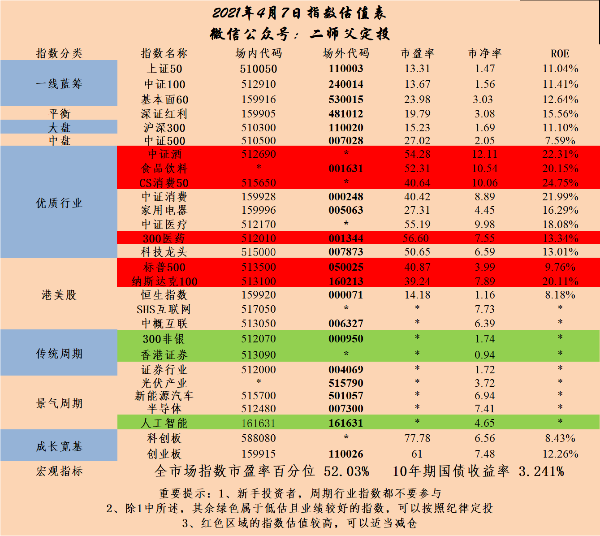
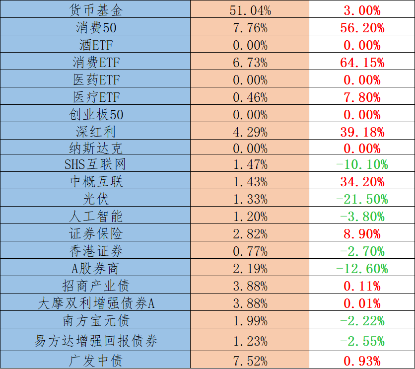
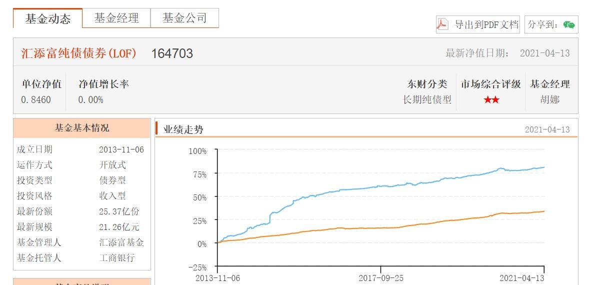
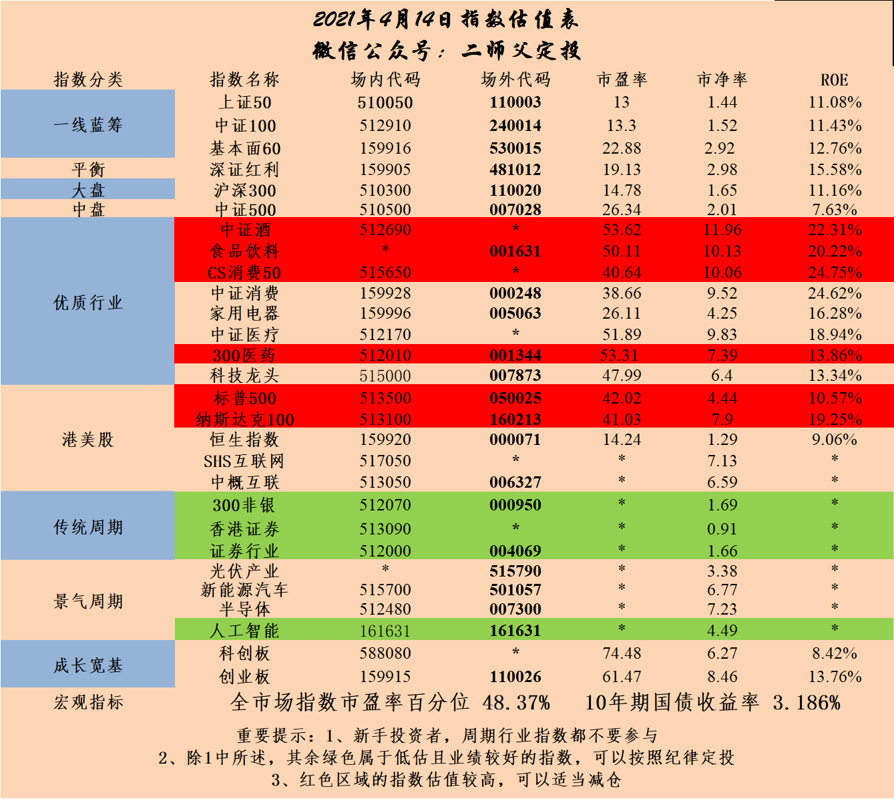
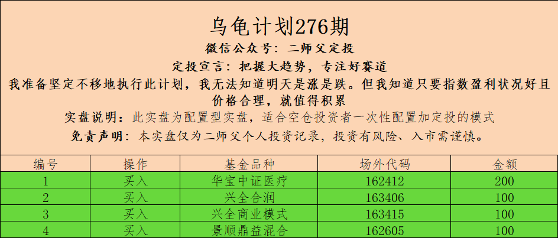
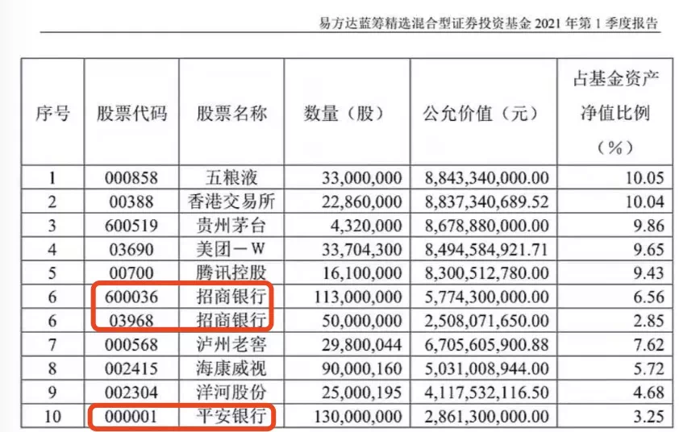
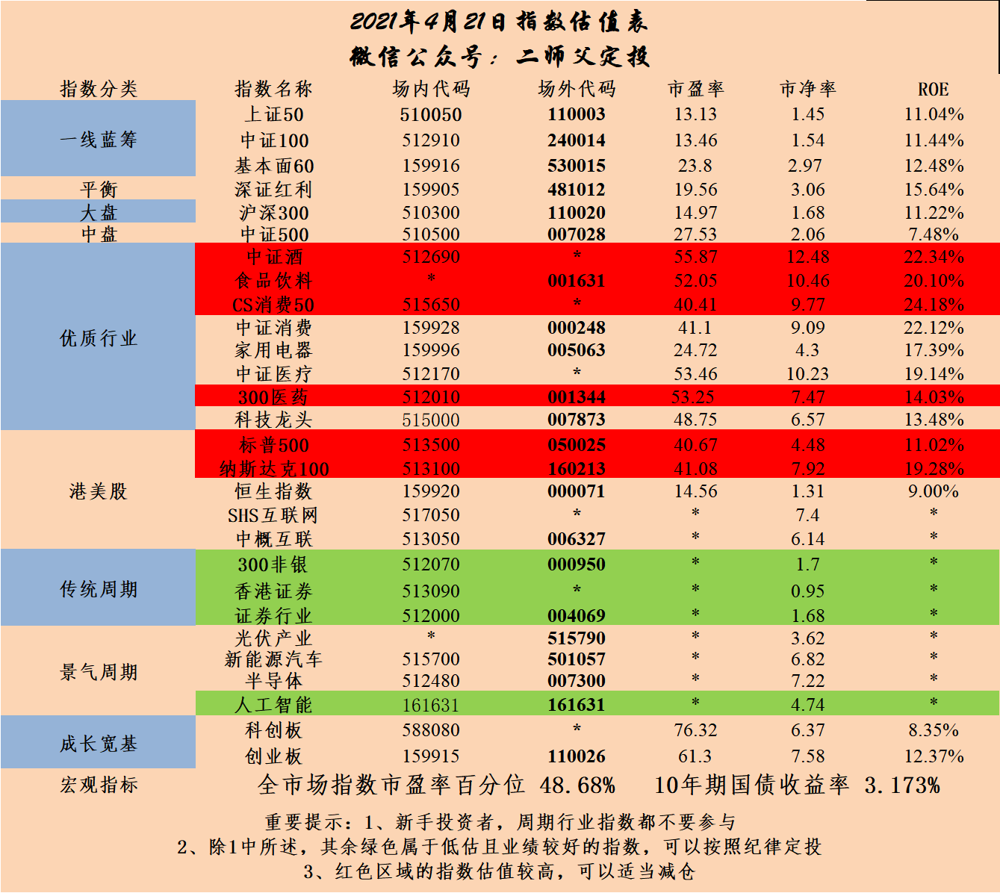
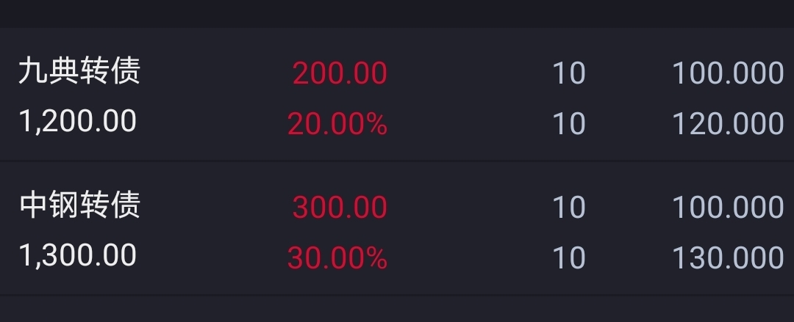
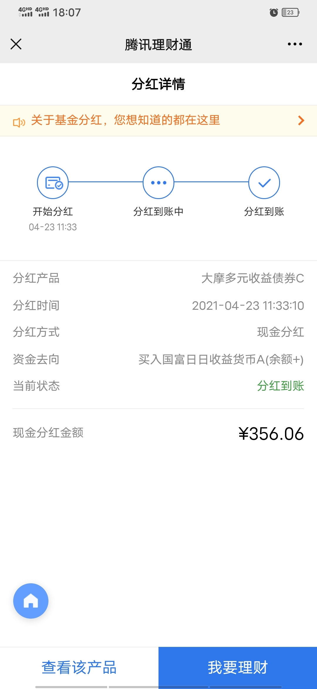
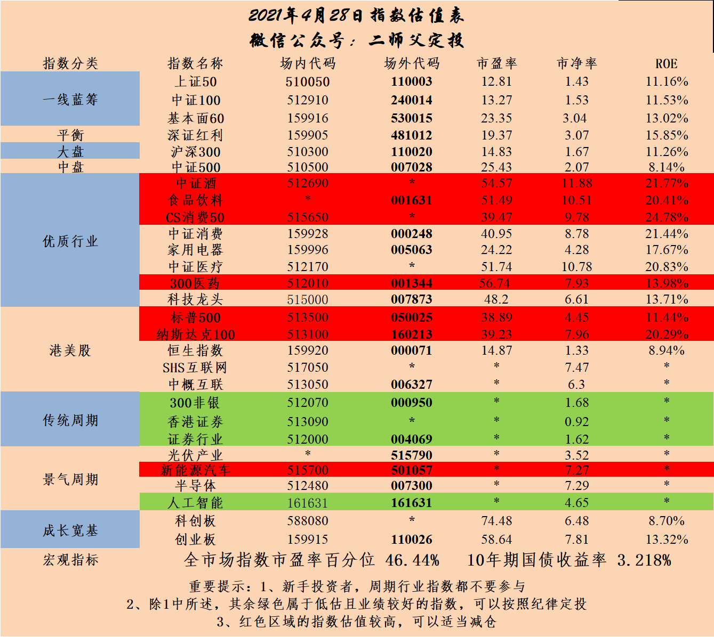

_type: talk
@二师父[28814221155551]
2021-04-01 09:29:48 Thu  
topic_id: 215254451522251

<e type="hashtag" hid="825188852442" title="#估值表#" /> 每周估值表，目前几个周期指数低估，不作为投资重点，宽基和盈利稳定的行业指数进入低估之后才是重点投资对象。

阅读[1]  评论[0]  赞[0] 

+++++++++++++++++++++++++++++++++++++++++++++++++++++

图片：

======================================================

_type: talk
@涓涓[111815125145522]
2021-04-01 10:38:33 Thu  
topic_id: 182421128112842

二师父，我之前中了一只新股003040，上市后就卖了，结果这只股一路涨停，只有买的，没有卖的，这是什么逻辑？

@付云 at 2021-04-01 10:38:33 Thu

> 悲剧了[得意]

----------

@二师父 at 2021-04-01 10:38:33 Thu

> 新股连板，a股这种新股不在少数

----------

阅读[1]  评论[2]  赞[0] 

======================================================

_type: talk
@二师父[28814221155551]
2021-04-01 17:29:34 Thu  
topic_id: 182421158581882

<e type="hashtag" hid="51284188442224" title="#如何解决基金赚钱，基民不赚钱#" />

@天玺哥 at 2021-04-01 17:29:34 Thu

> 紧随二师父步伐[奋斗][奋斗][奋斗]

----------

阅读[1]  评论[1]  赞[0] 

+++++++++++++++++++++++++++++++++++++++++++++++++++++

文件：
2021-04-01 17:29:19 Thu
文件大小：[33135]
244428481484141-公募基金狂赚20000亿，为啥基民还有亏损的.docx

======================================================

_type: q&a
@🍀 凝🌸 慧🍀[841855248254242]
2021-04-02 09:24:52 Fri  
topic_id: 215254148122551

@🍀 凝🌸 慧🍀

>  师父好，据悉易方达蓝筹精选混合4月7号恢复正常交易，打开申购了。

@二师父

>  是的哈

阅读[1]  评论[6]  赞[0] 

======================================================

_type: talk
@二师父[28814221155551]
2021-04-02 09:30:55 Fri  
topic_id: 414542125241128

<e type="hashtag" hid="552114551414" title="#估值数据#" /> 市盈率百分位52.29%，市净率百分位30.83%，SY-BY百分位57.98%，SY/BY百分位56.01%。市场最近上涨是受益于业绩年报公布带来的利好，长线仓位继续卧倒，网格可以走起来，不要在相对昂贵的时候买入长线仓位，长线仓位都是估值中枢以下定投或者底部重仓的，否则一个回调容易拿不住。

阅读[1]  评论[0]  赞[0] 

======================================================

_type: talk
@杜志彪[544454124115854]
2021-04-02 11:51:45 Fri  
topic_id: 582524882544454

刚在华泰存1000元涨乐星投一个月，客户经理给50红包，有兴趣朋友可以搞一下[微笑]

@雨的依恋 at 2021-04-02 11:51:45 Fri

> 我也存了

----------

@黎雄 at 2021-04-02 11:51:45 Fri

> 我们华泰没有呢，请问在哪里看

----------

@杜志彪 at 2021-04-02 11:51:45 Fri

> 师父当初介绍开通的群里。

----------

阅读[1]  评论[3]  赞[0] 

======================================================

_type: talk
@二师父[28814221155551]
2021-04-02 16:36:14 Fri  
topic_id: 582524885452254

<e type="hashtag" hid="48412548214448" title="#白酒和易方达消费的对比#" /> 白酒是目前发现最佳的一只指数基金，等待好价格就行了，之前仓位重的，反弹后可以逐步降低仓位。

阅读[1]  评论[0]  赞[0] 

+++++++++++++++++++++++++++++++++++++++++++++++++++++

文件：
2021-04-02 16:34:33 Fri
文件大小：[34591]
844428442258482-招商中证白酒和易方达消费投资价值对比.docx

======================================================

_type: talk
@二师父[28814221155551]
2021-04-03 19:15:14 Sat  
topic_id: 815251581514512

<e type="hashtag" hid="15281424522522" title="#投资价值观#" /> 星球读者投资价值观基本一致，趋势和逆势一起做方法没问题，然而价值观冲突了。

@吃肉肉 at 2021-04-03 19:15:14 Sat

> 师父，我中了杭银发债，需要上市后卖出吗？

----------

@二师父 at 2021-04-03 19:15:14 Sat

> 卖出

----------

@吃肉肉 at 2021-04-03 19:15:14 Sat

> 好的，谢谢！

----------

阅读[1]  评论[3]  赞[0] 

+++++++++++++++++++++++++++++++++++++++++++++++++++++

文件：
2021-04-03 19:14:36 Sat
文件大小：[33786]
544451481144214-聊一聊投资的价值观.docx

======================================================

_type: talk
@庆余年[15584481824122]
2021-04-03 22:40:54 Sat  
topic_id: 215251522551121

基金筛选工具

阅读[1]  评论[0]  赞[0] 

+++++++++++++++++++++++++++++++++++++++++++++++++++++

文件：
2021-04-03 22:40:31 Sat
文件大小：[183162]
544451481421824-支付宝新功能.docx

======================================================

_type: q&a
@一无所有[244112224815551]
2021-04-04 20:35:20 Sun  
topic_id: 215251521811581

@一无所有

>  二师父，你好！我要续费，怎么交呢？

@二师父

>  置顶文章有个二维码

阅读[1]  评论[1]  赞[0] 

======================================================

_type: talk
@二师父[28814221155551]
2021-04-04 20:49:42 Sun  
topic_id: 215251542148811

<e type="hashtag" hid="51284525554144" title="#关于巴菲特指标#" /> 巴菲特指标已经逼近190%，需要关注下

@吃肉肉 at 2021-04-04 20:49:42 Sun

> 师父，A股总市值在哪里看得到？

----------

@二师父 at 2021-04-04 20:49:42 Sun

> 同花顺

----------

@衣袂飘香 at 2021-04-04 20:49:42 Sun

> 新增的一些资金已经开始配置债券组合了。

----------

@J at 2021-04-04 20:49:42 Sun

> 师父，请问巴菲特指标在a股适用吗？如果适用，a股目前的这个指标相当于百分之多少？

----------

@二师父 at 2021-04-04 20:49:42 Sun

> 目前a股百分之85.12，在百分之70以下非常值得投资

----------

@杜志彪 at 2021-04-04 20:49:42 Sun

> 美国疫苗已经打了1亿多了，估计再有2个月就全打完了，预期下半年会收紧流动性，风险可能在下半年到来，内循环的话最保险的还是医疗消费。

----------

阅读[1]  评论[6]  赞[0] 

+++++++++++++++++++++++++++++++++++++++++++++++++++++

文件：
2021-04-04 20:49:11 Sun
文件大小：[33786]
244428412454151-巴菲特指标超越警戒线.docx

======================================================

_type: talk
@二师父[28814221155551]
2021-04-05 17:32:48 Mon  
topic_id: 815251855412152

<e type="hashtag" hid="48412545215448" title="#一起看看A股的巴菲特指数#" /> 目前A股是没有严重泡沫的，如果美股下跌带来A股下跌将会是机会，外国疫情又加重了，看看货币政策何时收紧。不要对疫苗抱有太大希望，有很多打了疫苗的仍旧会染上新冠，原因不知道是病毒变异还是去年疫苗还在实验期间。

@西锦巴乌 at 2021-04-05 17:32:48 Mon

> 师父：请问A股的总市值在哪儿能查到？谢谢

----------

@二师父 at 2021-04-05 17:32:48 Mon

> 同花顺

----------

阅读[1]  评论[2]  赞[0] 

+++++++++++++++++++++++++++++++++++++++++++++++++++++

文件：
2021-04-05 17:31:07 Mon
文件大小：[34074]
544455222545544-聊一聊A股的巴菲特指数.docx

======================================================

_type: q&a
@鳗鱼[182242255828582]
2021-04-06 08:50:23 Tue  
topic_id: 182428451284522

@鳗鱼

>  二师父，持有东方财富，现在东财配债，能不能买？

@二师父

>  可以的，这个转债很不错

阅读[1]  评论[1]  赞[0] 

======================================================

_type: q&a
@雨松儿[241181845581451]
2021-04-06 13:46:40 Tue  
topic_id: 815251225821112

@雨松儿

>  二师傅，现在可以定投芯片ETF吗？如果可以，哪只比较好？

@二师父

>  沪深300比较好，优先配置，芯片可以少量网格

阅读[1]  评论[0]  赞[0] 

======================================================

_type: talk
@二师父[28814221155551]
2021-04-06 14:28:41 Tue  
topic_id: 582528555525524

<e type="hashtag" hid="15281421244122" title="#谢治宇的投资理念#" /> 带大家了解谢治宇，了解基金经理的投资理念对投资成功也是非常重要的。

@曾来 at 2021-04-06 14:28:41 Tue

> 师父，我需要续费，已经在你微信上发信息了，没回我呢

----------

@二师父 at 2021-04-06 14:28:41 Tue

> 没看手机，直接扫描置顶二维码即可

----------

@曾来 at 2021-04-06 14:28:41 Tue

> 好的

----------

@西锦巴乌 at 2021-04-06 14:28:41 Tue

> 师父好！想咨询下：我目前还持有招商证券基金，占的比重较大，为13％左右，目前还盈利23％，请问该基金接下来如何操作好呢？是降低比重还是清仓还是持有不动，谢谢

----------

@二师父 at 2021-04-06 14:28:41 Tue

> 反弹可以逐步转到二级债基

----------

@西锦巴乌 at 2021-04-06 14:28:41 Tue

> 明白

----------

阅读[1]  评论[6]  赞[0] 

+++++++++++++++++++++++++++++++++++++++++++++++++++++

文件：
2021-04-06 14:27:42 Tue
文件大小：[37515]
844422551482882-谢治宇的投资理念，白酒到底有没有泡沫.docx

======================================================

_type: talk
@百变[15285855281882]
2021-04-06 14:57:41 Tue  
topic_id: 182428444154122

二师父：在华宝智投跟投网格，私募佐罗需要提供开户姓名和账户，说是核对信息，安全吗？望解答！🙏

@二师父 at 2021-04-06 14:57:41 Tue

> 不用提供啊

----------

阅读[1]  评论[1]  赞[0] 

======================================================

_type: talk
@二师父[28814221155551]
2021-04-06 17:03:10 Tue  
topic_id: 582528554555854

<e type="hashtag" hid="552114551414" title="#估值数据#" /> 市盈率百分位52.4%，市净率百分位30.3%，SY-BY百分位58.17%，SY/BY百分位56.18%。市场仍旧处于估值中枢位置，长线仓位大约在万得全A指数成交量6000亿以下开始加，如果一直处于6000亿以下得成交量且两周不创新低，可以加大定投金额，目前市场反复，可以做短线，长线仓位稳住不用动。

阅读[1]  评论[0]  赞[0] 

======================================================

_type: talk
@二师父[28814221155551]
2021-04-06 17:10:32 Tue  
topic_id: 582528554545224

<e type="hashtag" hid="15281421555282" title="#我的姐姐#" /> 这部电影上映看了看还不错得，讲的是一个家庭父母因车祸父母双亡，然后留下了被收养得姐姐和亲弟弟得故事，故事就不剧透了，大家有兴趣可以自己看看。

二胎政策放开，现在80、90后都有机会要两个孩子了，一个家庭两个孩子尤其是姐弟组合是最好得，父母终将会离开世界，而留给孩子得就是兄妹，姐弟，兄弟之间得陪伴。有些东西不是钱能够解决，也不是学区房可以摆平得，在关键问题上还是需要至亲之人得守护和陪伴。这是任何东西都无法替代得。

姐弟组合有个大问题，小时候姐姐和弟弟肯定会干架，这一点毋庸置疑，然而随着时间流逝，姐姐和弟弟都长大以后，姐姐会向母亲一样为弟弟着想，弟弟也会向保护天使一样保护姐姐。

有姐姐或者弟弟得都深有体会吧。

@吃肉肉 at 2021-04-06 17:10:32 Tue

> 我认为哥妹组合比较好，男的作为哥哥，更需要担当，更加有力量保护妹妹。

----------

@二师父 at 2021-04-06 17:10:32 Tue

> 男的作为弟弟也要有担当

----------

@衣袂飘香 at 2021-04-06 17:10:32 Tue

> 我猜二师父有个姐姐。不过，我是有一个弟弟。

----------

@付云 at 2021-04-06 17:10:32 Tue

> 兄弟同心，其利断金！关键是兄弟不容易同心[偷笑]

----------

@🍀 凝🌸 慧🍀 at 2021-04-06 17:10:32 Tue

> 我家是哥哥妹妹组合，也是从小干架！可有趣儿的是，我哥自从考上大学后，立马变了一个人，对我和爸爸妈妈，特别特别好，特别懂事，属于那种报喜不报忧的，性格也特乐观，家里什么难事，他都扛着，他说自己开化太晚了[偷笑]。

----------

@Sunflower at 2021-04-06 17:10:32 Tue

> 我是独生子女，我自己想过要不要二胎，但是问题很多，首先就是有了二胎父母没法给带了，完全请月嫂不放心，还有就是自己的身体能不能再要二胎

----------

@二师父 at 2021-04-06 17:10:32 Tue

> 我也想有

----------

@二师父 at 2021-04-06 17:10:32 Tue

> 大学都报喜不报忧了，成熟算早的

----------

阅读[1]  评论[12]  赞[0] 

======================================================

_type: talk
@二师父[28814221155551]
2021-04-07 11:02:17 Wed  
topic_id: 414541515251148

<e type="hashtag" hid="28514254242841" title="#一个机会#" /> 东财转债今天打新别忘记了，大概率吃肉，如果上市有机会回落到100元左右，我还会再买一些，今年股市行情好不好看看4月份会议货币政策的动向，如果货币政策收紧，那么股市表现也不会太好了，多配点债券是正道。如果4月份货币政策继续宽松那么还有机会。

我觉得会收紧了，今年以来股市没被炒，学区房被炒的火热，武汉、合肥、北京最猛，有的学区房一周能涨100万，北京最猛的是学区房一晚上涨了60万，一方面是15年放开二胎出生的孩子逐步到了入学年龄段，另外一方面海外求学不便加大了国内入学需求。供需决定价格。

@样 at 2021-04-07 11:02:17 Wed

> 师父，东财转债的中签率这么高吗？我同事两个账号打都中了，有个还是2000，我的四个账号都中，不会破发吧[撇嘴][撇嘴][撇嘴]

----------

@二师父 at 2021-04-07 11:02:17 Wed

> 大概两户中一签，你运气比较好

----------

阅读[1]  评论[2]  赞[0] 

+++++++++++++++++++++++++++++++++++++++++++++++++++++

文件：
2021-04-07 10:57:11 Wed
文件大小：[35838]
844422581858442-今天有个赚钱机会.docx

======================================================

_type: q&a
@冯林锋[841551141441422]
2021-04-07 14:06:22 Wed  
topic_id: 182428122228442

@冯林锋

>  二师父东方财富转债有配额，是点买入还是点卖出

@二师父

>  买入

阅读[1]  评论[0]  赞[0] 

======================================================

_type: talk
@二师父[28814221155551]
2021-04-07 23:00:18 Wed  
topic_id: 215251488888411

<e type="hashtag" hid="825188852442" title="#估值表#" /> 每周估值数据定期更新，低估值投资更加安全，坚持低估定投，长期持有3年一定获利颇丰。

阅读[1]  评论[0]  赞[0] 

+++++++++++++++++++++++++++++++++++++++++++++++++++++

图片：

======================================================

_type: talk
@幽兰[815554522442422]
2021-04-08 09:41:21 Thu  
topic_id: 414541254842488

二师父，今天中概互联会不会出现机会？

@二师父 at 2021-04-08 09:41:21 Thu

> 还没看到

----------

阅读[1]  评论[1]  赞[0] 

======================================================

_type: talk
@二师父[28814221155551]
2021-04-08 15:44:32 Thu  
topic_id: 215251421284111

<e type="hashtag" hid="51284512451214" title="#看一只清盘基金#" /> 如何避免买的基金清盘

阅读[1]  评论[0]  赞[0] 

+++++++++++++++++++++++++++++++++++++++++++++++++++++

文件：
2021-04-08 15:44:14 Thu
文件大小：[37574]
422255425552488-这只基金清盘了.docx

======================================================

_type: q&a
@夏萍[28221454818281]
2021-04-08 15:49:29 Thu  
topic_id: 182428141811242

@夏萍

>  师父，美林时钟现在还有效吗？如有效，目前属于经济滞胀期吗？

@二师父

>  当前处于滞胀期，滞胀分为两种，第一是经济停摆，高通胀、高失业率，第二种是GDP下行，CPI上行，国内目前还好，已经由GDP下行开始扭转，而从经济角度分析，当下经济仍是下行阶段，处于滞涨期。

阅读[1]  评论[1]  赞[0] 

======================================================

_type: q&a
@Chu[88888125211582]
2021-04-08 15:58:07 Thu  
topic_id: 215251425845841

@Chu

>  师父，我想问下中了一只达瑞电子，我看到价钱好吓人啊。会破发吗？第一次中创业板，一般什么情况卖，之前都是中主板的知道开板就卖，这个要怎么操作啊请指教

@二师父

>  大概率吃肉，不用担心，万一破发了直接走，目前A股新股、次新都有资金炒作的，很少破发，仍旧是连板之后卖出，参考南网能源、顺控发展

阅读[1]  评论[1]  赞[0] 

======================================================

_type: talk
@门萨🐨[51411455828824]
2021-04-09 09:02:36 Fri  
topic_id: 215251114848821

东财中签率那么高呀[呲牙]

@三峡情 at 2021-04-09 09:02:36 Fri

> 哪有，我都好久没中过了，恭喜！

----------

@门萨🐨 at 2021-04-09 09:02:36 Fri

> [愉快][愉快]

----------

@姥姥不疼. 爷爷不爱 at 2021-04-09 09:02:36 Fri

> 俺也中了[坏笑]

----------

@🍀 凝🌸 慧🍀 at 2021-04-09 09:02:36 Fri

> 我也中签了[愉快]

----------

@Chu at 2021-04-09 09:02:36 Fri

> 我也中签了，看来中签率真的很高

----------

@光少 at 2021-04-09 09:02:36 Fri

> 俺中了两签

----------

@Sunflower at 2021-04-09 09:02:36 Fri

> 好久不见啦～连着亏了两次没敢再申购了[捂脸]

----------

@门萨🐨 at 2021-04-09 09:02:36 Fri

> 好久不见，东财可以打

----------

阅读[1]  评论[13]  赞[0] 

+++++++++++++++++++++++++++++++++++++++++++++++++++++

图片：

======================================================

_type: talk
@二师父[28814221155551]
2021-04-09 16:17:08 Fri  
topic_id: 815285551414252

<e type="hashtag" hid="88514288512212" title="#顺丰#" /> 顺丰业绩暴雷，很多机构踩雷，兴全趋势有投资，不过仓位只有不到5%，不用担心

阅读[1]  评论[0]  赞[0] 

+++++++++++++++++++++++++++++++++++++++++++++++++++++

文件：
2021-04-09 16:13:24 Fri
文件大小：[33626]
844422512222482-顺丰也不顺了.docx

======================================================

_type: talk
@二师父[28814221155551]
2021-04-09 17:37:56 Fri  
topic_id: 182452252512142

<e type="hashtag" hid="552114551414" title="#估值数据#" /> 市盈率百分位51.84%，市净率百分位30.3%，SY-BY百分位57.74%，SY/BY百分位56.12%。地量快要出现了，万得全A6000亿以下，就是阶段地量，如果仓位不足得可以在地量补点，如果仓位够了，就别动。

逆势加仓需要分时机得，如果现在百分位是10%，那毫不犹豫买买买，市场不上不下还是谨慎一点，看看四月底货币政策，大致可以判断今年行情了。

@天玺哥 at 2021-04-09 17:37:56 Fri

> 每天看着二师父说几句心里踏实[呲牙]

----------

阅读[1]  评论[1]  赞[0] 

======================================================

_type: q&a
@Kiwi 的拾金之路[241182454821121]
2021-04-10 17:19:48 Sat  
topic_id: 815285525881822

@Kiwi 的拾金之路

>  二师父，为什么中证银行ETF（512800）从来没有分过红？

@二师父

>  他的净值很低，分红后要保证净值不低于面值

阅读[1]  评论[0]  赞[0] 

======================================================

_type: talk
@二师父[28814221155551]
2021-04-10 21:24:26 Sat  
topic_id: 182452214145852

<e type="hashtag" hid="88514288428852" title="#阿里#" /> 芒格抄底阿里了，我也准备看机会来一点。

@天玺哥 at 2021-04-10 21:24:26 Sat

> 师父，中概互联现在能进入不？

----------

@二师父 at 2021-04-10 21:24:26 Sat

> 等一等

----------

@小不点儿点😘 at 2021-04-10 21:24:26 Sat

> 等二师父通知

----------

阅读[1]  评论[3]  赞[0] 

+++++++++++++++++++++++++++++++++++++++++++++++++++++

文件：
2021-04-10 21:23:22 Sat
文件大小：[34309]
422255845581188-阿里被罚款182亿，反垄断将继续.docx

======================================================

_type: talk
@二师父[28814221155551]
2021-04-11 21:03:23 Sun  
topic_id: 182452525851882

<e type="hashtag" hid="51284515221544" title="#对比易方达上证50和沪深300#" />

阅读[1]  评论[0]  赞[0] 

+++++++++++++++++++++++++++++++++++++++++++++++++++++

文件：
2021-04-11 21:03:09 Sun
文件大小：[34293]
544455111258824-易方达上证50和沪深300对比哪个更佳.docx

======================================================

_type: talk
@芙瑞雅阳阳潘[421181844812818]
2021-04-12 12:10:20 Mon  
topic_id: 815285825551242

师父，面对国际对台湾问题的威胁，您认为现在股市、基金的大环境是怎样的？如何应对？

@芙瑞雅阳阳潘 at 2021-04-12 12:10:20 Mon

> 还适合拿长线吗？

----------

@二师父 at 2021-04-12 12:10:20 Mon

> 5年不用的钱可以长线，短期要用的钱都可以出来了。

目前股市的危险点不在于国际对台湾问题，而在于美国债务危机和美股泡沫，如果美国不出事，A股今年大概率震荡，如果美国出事了，A股也不会好。

----------

阅读[1]  评论[2]  赞[0] 

======================================================

_type: q&a
@我本善良[414818545812118]
2021-04-12 15:30:02 Mon  
topic_id: 815285881442482

@我本善良

>  二师傅麻烦问一下太平乐享今生年金分红保险能买吗

@二师父

>  流动性较差，收益偏低，身故之后也只是返还了缴存的保险费或者合同现金价值，看个人家庭需求是否能接受这样的流动性和收益。

阅读[1]  评论[0]  赞[0] 

======================================================

_type: q&a
@小袁[841582442185482]
2021-04-12 15:49:18 Mon  
topic_id: 414584552824158

@小袁

>  您好师傅，中证医疗指数现在面临的最大回撤是多少？
>  预测最大回撤 是否可用（当前PE-最低PE）/当前PE，还是怎么算呢？  谢谢

@二师父

>  根据历史回撤对比，取最值，这种方法计算的可以做个参考数据

阅读[1]  评论[0]  赞[0] 

======================================================

_type: talk
@二师父[28814221155551]
2021-04-12 17:27:40 Mon  
topic_id: 582512558211244

<e type="hashtag" hid="51284515511544" title="#关于上证50的投资#" /> 模拟了，从07年高位定投到09年和现在都是盈利的，然而很少有人能够坚持长期浮亏还扣款，自己真金白银和模拟是两回事。所以投资严控安全边际，在安全范围内投资，偶尔错过一些机会，而真正市场阴跌震荡的时候不会倒下。

@阝東 at 2021-04-12 17:27:40 Mon

> 二师父，我每一周坚持定投沪深300，设置盈利5％，8％还是10％全部取出最好，目前我是设置5％好快就到目标了

----------

@二师父 at 2021-04-12 17:27:40 Mon

> 小目标的话设定百分之5和百分之8，到了分别取一部分，然后回调继续新一轮小目标定投

----------

阅读[1]  评论[2]  赞[0] 

+++++++++++++++++++++++++++++++++++++++++++++++++++++

文件：
2021-04-12 17:26:03 Mon
文件大小：[36579]
244422825258581-如果07年高位定投上证50指数，会发生什么.docx

======================================================

_type: talk
@百变[15285855281882]
2021-04-12 18:51:06 Mon  
topic_id: 414584551514858

二师父：巴菲特指标中的中国GDP是用2020年全国国内生产总值这个指标吗？[玫瑰]

@二师父 at 2021-04-12 18:51:06 Mon

> 是的

----------

阅读[1]  评论[1]  赞[0] 

======================================================

_type: talk
@二师父[28814221155551]
2021-04-12 22:52:52 Mon  
topic_id: 815285244512882

<e type="hashtag" hid="15281454415882" title="#什么时候开始投#" /> 最近很多读者关心何时开始投，第一如果沪深300跌到了2018年的高位那个位置，并且继续向下，第二如果医疗进入低估，开始投，一直放量跌，从3月开始到现在几乎每次单日跌幅超过1%都是放量，这种时候恐慌情绪就没有完全释放，不要着急，手握一部分仓位，等待调整即可。

自己想要单独投的话目前混合基金兴全合润或者易方达上证50是稍微好一些的标的，能坚持下去都会有比较好的结果。

@吃肉肉 at 2021-04-12 22:52:52 Mon

> 师父，这些百分比代表什么[呲牙]。

----------

@二师父 at 2021-04-12 22:52:52 Mon

> 截图少了，前面是持仓比例，后面是盈亏

----------

@吃肉肉 at 2021-04-12 22:52:52 Mon

> 好的，等师父吹号。

----------

阅读[1]  评论[3]  赞[0] 

+++++++++++++++++++++++++++++++++++++++++++++++++++++

图片：

======================================================

_type: talk
@二师父[28814221155551]
2021-04-13 16:29:19 Tue  
topic_id: 414584245458258

<e type="hashtag" hid="51284515825554" title="#抱团股继续崩#" /> 之前抱团股持续闪崩，投资基金更加安全，尤其是债券基金，熊市的时候表现会好一些，当然盈亏同源，躲过了下跌，牛市的时候持有债券也是持续跑输市场

阅读[1]  评论[0]  赞[0] 

+++++++++++++++++++++++++++++++++++++++++++++++++++++

文件：
2021-04-13 16:28:06 Tue
文件大小：[36919]
422255824451428-抱团股频繁闪崩，定投基金更安全.docx

======================================================

_type: talk
@二师父[28814221155551]
2021-04-13 16:32:36 Tue  
topic_id: 215285452524221

<e type="hashtag" hid="28514282152451" title="#介绍小目标定投#" /> 小目标定投是一次止盈的方法，昨天有读者提到过这个。介绍下怎么进行小目标定投。

选择标的：沪深300ETF，当前沪深300ETF最大回撤45%以内。

可以按照周定投的方法，盈利10%以上开始收割利润。

将目标定投和利润收割法相结合，当然也可以有了10%的利润以后一次止盈，只要投资周期低于1年，这样一次操作就代表着年化收益率高于10%。

阅读[1]  评论[0]  赞[0] 

======================================================

_type: talk
@阿宝[422212151424158]
2021-04-13 21:43:53 Tue  
topic_id: 182452152118482

@衣袂飘香 at 2021-04-13 21:43:53 Tue

> 很棒，学习了。

----------

阅读[1]  评论[1]  赞[0] 

+++++++++++++++++++++++++++++++++++++++++++++++++++++

文件：
2021-04-13 21:43:53 Tue
文件大小：[101063]
844422244548852-3.8     读香帅财富报告有感.pdf

======================================================

_type: talk
@二师父[28814221155551]
2021-04-13 22:30:51 Tue  
topic_id: 215285488541281

<e type="hashtag" hid="552114551414" title="#估值数据#" /> 当前市盈率百分位48.88%，SY-BY百分位52.96%，SY/BY百分位50.8%，注意全市场指数市盈率百分位又降到50%以下，如果能继续下跌，本周四可能发车，发车顺序优先乌龟计划，其次鳄鱼计划。

今年大概率震荡，如果发车的话将会长短线仓位结合，长线仓位长期持有到下一轮高位，短线仓位解决不挣钱的问题。

目前需要注意美国量化宽松政策退坡，这会给股市带来一定冲击，然而只要安全边际到了，就可以重启新一轮越跌越买，控制节奏和仓位，不要担心。

阅读[1]  评论[0]  赞[0] 

======================================================

_type: talk
@二师父[28814221155551]
2021-04-14 09:18:46 Wed  
topic_id: 815285425848582

<e type="hashtag" hid="15281451258842" title="#一只场内债券基金#" /> 鳄鱼计划一直采用场内账户申购债券基金，这种方式回款比较慢，有的读者接受不了，另外一种方式是场内账户买入LOF型债券基金，这样费率较低，而且也能很快到账。

当前已经进入紧货币、紧信用周期，是利好债券市场的，无论是前期配置的国开债还是最近配置的招商产业、大摩双利都有一定涨幅，虽然不大，但是和股市下跌比起来还有这样的收益率是不错的。

场内债券基金找到了五只，今天分享第一只汇添富债券，属于长期纯债，适合一次性投资，除了在紧货币宽信用周期以外，债券都是一次投资即可。

本基金的投资范围为固定收益类品种,国债、金融债、央行票据、公司债、企业债、地方政府债、可转换债券、可分离债券、短期融资券、中期票据、中小企业私募债券、资产支持证券、债券回购、银行存款(包括定期存款及协议存款),以及法律法规或中国证监会允许投资的其他固定收益类品种。

这些都是可以对冲股市的，可以这样讲，当牛市的时候，债券肯定跑不赢指数，所以配置债券主要是控制回撤同时在股熊债牛期间获取年化6%左右的收益率。

@JOY at 2021-04-14 09:18:46 Wed

> 师父，看了下这只基金，规模只有0.02亿，场内也没什么成交量？不知是我找错了，还是广发信息更新有问题，还是说场内的不用看规模？

----------

@JOY at 2021-04-14 09:18:46 Wed

> 

----------

@二师父 at 2021-04-14 09:18:46 Wed

> 没有问题，目前场内规模是比较低，场外的高一些

----------

@JOY at 2021-04-14 09:18:46 Wed

> 谢谢～

----------

@JOY at 2021-04-14 09:18:46 Wed

> 师父，那麻烦再问下，要是场内规模和成交量都很低，会发生卖不出去的情况么？

----------

@二师父 at 2021-04-14 09:18:46 Wed

> 只有等等规模起来后或者选择场外的

----------

阅读[1]  评论[6]  赞[0] 

+++++++++++++++++++++++++++++++++++++++++++++++++++++

图片：

======================================================

_type: talk
@二师父[28814221155551]
2021-04-14 17:25:35 Wed  
topic_id: 815285445211882

<e type="hashtag" hid="48412581182858" title="#债券基金的投资方法#" /> 不同基金的投资方法是不同的，看看债券基金如何投资。

@太阳照常升起 at 2021-04-14 17:25:35 Wed

> 二师父，现在的时机适合一次性配置安心组合吗？

----------

@二师父 at 2021-04-14 17:25:35 Wed

> 适合

----------

@衣袂飘香 at 2021-04-14 17:25:35 Wed

> 宽货币宽信用周期时候，股票是强牛市，债券是震荡市。
  紧货币宽信用周期时候，股票弱牛市，债券熊市。
  紧货币紧信用周期时候，股票强熊市，债券震荡市。
   宽货币紧信用周期时候，股票弱熊市，债券强牛市。
@二师父，这几句不大懂，能解释下为什么吗？

----------

@二师父 at 2021-04-14 17:25:35 Wed

> 宽货币是强牛基础，社融收缩经济活力减少，股票会走弱，而资金会有避险趋势，这是大致的经济运行规律，实际上影响股市牛熊有非常多因素

----------

@衣袂飘香 at 2021-04-14 17:25:35 Wed

> 好吧，我继续学习。您说的我大致是懂的，就是不知道如何能得出上述4句话的那些结论。不理解原理真是记不住。

----------

阅读[1]  评论[5]  赞[0] 

+++++++++++++++++++++++++++++++++++++++++++++++++++++

文件：
2021-04-14 17:25:12 Wed
文件大小：[37549]
544455585811214-如何投资债券基金.docx

======================================================

_type: talk
@二师父[28814221155551]
2021-04-14 19:49:31 Wed  
topic_id: 215285442118511

<e type="hashtag" hid="552114551414" title="#估值数据#" />明天可能开启定投，定投周期一个月一次，控制节奏，市场仍旧不便宜，而数据显示当前估值百分位50%以下，可以控制节奏出手了，完全量化投资，避免受到情绪干扰。

@范毅君 at 2021-04-14 19:49:31 Wed

> 听召唤

----------

@🍀 凝🌸 慧🍀 at 2021-04-14 19:49:31 Wed

> 收到

----------

@范毅君 at 2021-04-14 19:49:31 Wed

> 二师父，今天买的啥，记得公布一下啊[呲牙][呲牙]

----------

@二师父 at 2021-04-14 19:49:31 Wed

> 发了啊，天天基金也买了

----------

@范毅君 at 2021-04-14 19:49:31 Wed

> 天天基金不会看[流泪]

----------

@二师父 at 2021-04-14 19:49:31 Wed

> 

----------

@范毅君 at 2021-04-14 19:49:31 Wed

> 明白了[调皮][调皮]

----------

阅读[1]  评论[7]  赞[0] 

+++++++++++++++++++++++++++++++++++++++++++++++++++++

图片：

======================================================

_type: talk
@二师父[28814221155551]
2021-04-15 09:40:46 Thu  
topic_id: 815285414122522

<e type="hashtag" hid="28518855451481" title="#乌龟计划#" /> 车来了，后面看情况发车，四只基金最大跌幅都在50%以内，合润最大跌幅不会超过30%，定投比较安全，不过需要把握节奏，我知道每次大跌或者阴跌都会特别难受，所以控制合理仓位，慢慢买入。

@庆余年 at 2021-04-15 09:40:46 Thu

> 这都是0.1份，0.05份麽😂😂😂

----------

@新~~~ at 2021-04-15 09:40:46 Thu

> 二师父，麻烦给出对应的场内号码好吗？

----------

@二师父 at 2021-04-15 09:40:46 Thu

> 好的

----------

阅读[1]  评论[3]  赞[0] 

+++++++++++++++++++++++++++++++++++++++++++++++++++++

图片：

======================================================

_type: talk
@二师父[28814221155551]
2021-04-15 09:47:10 Thu  
topic_id: 582512484841514

刚发的帖子被星球删除了，大家看天天基金操作，在置顶文章点击天天基金即可。

@姥姥不疼. 爷爷不爱 at 2021-04-15 09:47:10 Thu

> 星球为啥删了，违规么？

----------

@二师父 at 2021-04-15 09:47:10 Thu

> 不知道，这得问星球

----------

@吃肉肉 at 2021-04-15 09:47:10 Thu

> 已经跟上

----------

@水冰月槑槑🌙 at 2021-04-15 09:47:10 Thu

> 天天基金为什么看不到你的加仓动态

----------

@二师父 at 2021-04-15 09:47:10 Thu

> 可能有延迟

----------

@杜志彪 at 2021-04-15 09:47:10 Thu

> 跟调的资金比例有点小，额外又加了点，不知会不会造成偏离度偏移。

----------

@二师父 at 2021-04-15 09:47:10 Thu

> 没问题，额外加的反弹可以做网格，当前这个是支撑位，看看4月政治局会议货币政策导向可能会打破震荡。

----------

@水冰月槑槑🌙 at 2021-04-15 09:47:10 Thu

> 天天基金跟投偏离度比较大，是调仓还是只跟投新加仓的

----------

阅读[1]  评论[9]  赞[0] 

======================================================

_type: q&a
@春晓[48418482258118]
2021-04-15 11:03:02 Thu  
topic_id: 182452825242242

@春晓

>  二师傅，之前买入的中欧医疗创新股票A是不是可以定投

@二师父

>  可以的，这个和中证医疗是一个类型

阅读[1]  评论[0]  赞[0] 

======================================================

_type: q&a
@wty[548488548545444]
2021-04-15 14:41:48 Thu  
topic_id: 815285152488222

@wty

>  二师父，场内16国债19的收益率3.8%，还要继续持有吗？

@二师父

>  可以继续持有的，熊市他表现会不错，等继续跌到更好的机会可以卖出国债买优质指数

阅读[1]  评论[3]  赞[0] 

======================================================

_type: talk
@二师父[28814221155551]
2021-04-15 23:18:29 Thu  
topic_id: 815288581124842

<e type="hashtag" hid="552114551414" title="#估值数据#" /> 市盈率百分位47.45%，SY-BY百分位51.04%，SY/BY百分位49.01%。估值数据逐步下移了，看看4月货币政策会不会收紧，如果继续收紧银根和流动性，那么可能会进一步下跌。定投没事，控制加仓的份额和频率，不管怎么跌，基金长期向上，优质指数+优质混合。

在这个位置，如果真的熊市来了，越跌越买没有问题，买到盈利位置。注意长线仓位和短线仓位结合。长线仓位就是持有到下一次高估或者牛市疯狂的时候卖出，短线仓位就是有了10个点或者20个点的利润就开始分批获利走人。

A股市场不同于中国房市和美国股市，他容易横盘，也容易跌过头或者涨过头，所以要选择适合A股的策略。

@永刚 at 2021-04-15 23:18:29 Thu

> 师父：短线仓位是指哪些类型的基金？

----------

@二师父 at 2021-04-15 23:18:29 Thu

> 波动大的，如果对波动无感，一直持有到下一次热的时候

----------

阅读[1]  评论[2]  赞[0] 

======================================================

_type: q&a
@刘享英[244111852518411]
2021-04-16 08:43:52 Fri  
topic_id: 414588458284128

@刘享英

>  二师父，请教下，中了500股东瑞股份，这个可以缴款吗？😂😂

@二师父

>  可以的

阅读[1]  评论[6]  赞[0] 

======================================================

_type: q&a
@马明谦[241845211824851]
2021-04-16 13:53:30 Fri  
topic_id: 815288521825482

@马明谦

>  师傅：我仓里有些同庆楼的股票，今天发的预计会“年度拟10转3股派1元（含税）”。
>  10转3派一元是什么意思啊师傅？

@二师父

>  这是公司的分红方案，每持有10股转曾3股并派一元红利

阅读[1]  评论[0]  赞[0] 

======================================================

_type: talk
@平安是福[118222545154542]
2021-04-16 14:02:49 Fri  
topic_id: 582511242424424

师父：现在的新股可以盲打吗？

@二师父 at 2021-04-16 14:02:49 Fri

> a股可以

----------

阅读[1]  评论[1]  赞[0] 

======================================================

_type: talk
@二师父[28814221155551]
2021-04-16 19:32:42 Fri  
topic_id: 582511248252254

<e type="hashtag" hid="51284552441484" title="#患难见真情#" /> 好基金也要坚守，买的基金质量没问题，坚持低吸，低吸富三代，追高毁一生

@🍀 凝🌸 慧🍀 at 2021-04-16 19:32:42 Fri

> 谢谢师父的每日分析，继续学习！[玫瑰][玫瑰][玫瑰]

----------

阅读[1]  评论[1]  赞[0] 

+++++++++++++++++++++++++++++++++++++++++++++++++++++

文件：
2021-04-16 19:31:57 Fri
文件大小：[38611]
422255281811548-患难见真情.docx

======================================================

_type: talk
@百变[15285855281882]
2021-04-16 20:16:33 Fri  
topic_id: 815288541821422

二师父：合理股价=每股收益/银行利息，这银行利息参照那个数据？是十年国债收益率还是其他？

@二师父 at 2021-04-16 20:16:33 Fri

> 这个是怎么定的

----------

@百变 at 2021-04-16 20:16:33 Fri

> 那请教一个问题：一支股票的合理价格怎么计算？[玫瑰]

----------

@二师父 at 2021-04-16 20:16:33 Fri

> 只能大致估算，看市值如果三年市值大约一倍增长预计合理

----------

@百变 at 2021-04-16 20:16:33 Fri

> 从成立至现在估算，还是业绩稳定增长时？

----------

@曾来 at 2021-04-16 20:16:33 Fri

> 什么叫合理股价？都能算出来那大家都在炒什么？没有意义的纠结

----------

@百变 at 2021-04-16 20:16:33 Fri

> 你不服？你看二师父就能预估合理的市值和判断出高估或低估！

----------

@曾来 at 2021-04-16 20:16:33 Fri

> 把舌头捋直了说话

----------

@曾来 at 2021-04-16 20:16:33 Fri

> 另外把你说的话和我说的话过一遍脑子再说话

----------

阅读[1]  评论[10]  赞[0] 

======================================================

_type: talk
@二师父[28814221155551]
2021-04-16 20:25:05 Fri  
topic_id: 582511248144184

曾经的白马，以后散户炒股越来越难，基金是最好的选择

<e type="web" href="https://mp.weixin.qq.com/s/51y1b6PaFUa76wXiJDCSNA" title="16万股民懵了！刚刚，惊天炸雷引爆！昔日千亿白马股巨亏近300亿！暴跌90%，1300亿灰飞烟灭，交..." />

@smile at 2021-04-16 20:25:05 Fri

> 二师父，您觉得被套的恒瑞还能持有吗

----------

@二师父 at 2021-04-16 20:25:05 Fri

> 还可以，基本面没问题，等反弹转到稳健的基金吧，A股波动很大。

----------

@smile at 2021-04-16 20:25:05 Fri

> 谢谢师父回复，希望还能回本

----------

阅读[1]  评论[3]  赞[0] 

======================================================

_type: talk
@二师父[28814221155551]
2021-04-17 23:28:17 Sat  
topic_id: 182455555484882

<e type="hashtag" hid="48412558411588" title="#最好的一只基金#" /> 可能星球朋友都已经不满足沪深300了，而这永远是基本的指数，入门首选。

阅读[1]  评论[0]  赞[0] 

+++++++++++++++++++++++++++++++++++++++++++++++++++++

文件：
2021-04-17 23:27:43 Sat
文件大小：[38880]
111144148242852-如果只选一只基金投资，最好的是什么.docx

======================================================

_type: talk
@二师父[28814221155551]
2021-04-17 23:37:37 Sat  
topic_id: 815288888451812

<e type="hashtag" hid="552114551414" title="#估值数据#" /> 市盈率百分位47.99%，SY-BY百分位51.52%，SY/BY百分位49.55%，目前估值处于一个中枢位置，乌龟计划月定投，鳄鱼计划暂时不动，今年以防守为主，该进攻的时候也会进攻的。

马上地量，万得全A6000亿以下可以阶段建仓，地量以下不破新低就没大事。

阅读[1]  评论[0]  赞[0] 

======================================================

_type: talk
@二师父[28814221155551]
2021-04-18 19:10:32 Sun  
topic_id: 215288821541241

<e type="hashtag" hid="88514228284442" title="#你会选择鸡娃吗#" /> 丁克和单身一族大增，孩子的教育将会更加精细化，不得不承认，现在的00后10后大多数已经比同期的我优秀很多了，社会进步的必然，鸡娃否，取决于目的。

阅读[1]  评论[0]  赞[0] 

+++++++++++++++++++++++++++++++++++++++++++++++++++++

文件：
2021-04-18 19:09:06 Sun
文件大小：[61252]
422255225885888-你会选择鸡娃吗.docx

======================================================

_type: talk
@二师父[28814221155551]
2021-04-19 09:14:20 Mon  
topic_id: 815128842488852

<e type="hashtag" hid="825412412212" title="#可转债打新#" /> 仙乐转债发行，有破发风险，能承受的可以申购，当前投资机会不多，我选择申购，首日卖出策略。

@郑义泽（庭武） at 2021-04-19 09:14:20 Mon

> 二师父，申购了上市日期是几号？

----------

@吃肉肉 at 2021-04-19 09:14:20 Mon

> 师父，我中了淇滨发债和杭银发债，也是首日上市的卖出策略吗？

----------

@二师父 at 2021-04-19 09:14:20 Mon

> 这个需要看后续公布

----------

@郑义泽（庭武） at 2021-04-19 09:14:20 Mon

> 谢谢二师父

----------

@二师父 at 2021-04-19 09:14:20 Mon

> 是的

----------

@吃肉肉 at 2021-04-19 09:14:20 Mon

> 好的👌🏻

----------

阅读[1]  评论[6]  赞[0] 

======================================================

_type: talk
@二师父[28814221155551]
2021-04-19 17:23:11 Mon  
topic_id: 582851184142514

<e type="hashtag" hid="51284551844244" title="#300增强哪家强#" /> 沪深300增强基金介绍，比纯被动的沪深300指数基金有一定超额收益率。

@wty at 2021-04-19 17:23:11 Mon

> 天弘沪深300增强不到2亿，可以定投吗？还是可以用上证50+深红利组合替代沪深300增强呢？

----------

@二师父 at 2021-04-19 17:23:11 Mon

> 第二个组合更好的

----------

@wty at 2021-04-19 17:23:11 Mon

> 收到，谢谢二师父，感恩一路指点🙏

----------

@阝東 at 2021-04-19 17:23:11 Mon

> 我喜欢沪深300和上证50一起定投，虽然收益不多，当是很稳定，小小的目标让我吃到了好多鸡腿

----------

阅读[1]  评论[4]  赞[0] 

+++++++++++++++++++++++++++++++++++++++++++++++++++++

文件：
2021-04-19 17:21:56 Mon
文件大小：[36056]
111144185128882-300增强到底哪家强.docx

======================================================

_type: talk
@二师父[28814221155551]
2021-04-19 17:28:21 Mon  
topic_id: 414158812822548

<e type="hashtag" hid="552114551414" title="#估值数据#" /> 市盈率百分位48.08%，SY-BY百分位51.65%，SY/BY百分位49.54%。

今天放量反弹，如果股票被套的可以寻求机会转移到混合基金或者二级债基，买股票要么极端低位要么支撑位，全市场成交额1万亿以上不要做买入，很容易短期挣钱，然后中期被套。

@吃肉肉 at 2021-04-19 17:28:21 Mon

> 师父，请教一下，你说的全市场成交额一亿以上不要做买入，具体怎么理解？

----------

@二师父 at 2021-04-19 17:28:21 Mon

> 万亿

----------

@吃肉肉 at 2021-04-19 17:28:21 Mon

> 好的👌🏻

----------

阅读[1]  评论[3]  赞[0] 

======================================================

_type: q&a
@姥姥不疼. 爷爷不爱[48544481458248]
2021-04-19 20:05:15 Mon  
topic_id: 815128811514822

@姥姥不疼. 爷爷不爱

>  中签中装转2，有破发风险么

@二师父

>  破发概率较小

阅读[1]  评论[0]  赞[0] 

======================================================

_type: talk
@门萨🐨[51411455828824]
2021-04-20 07:14:53 Tue  
topic_id: 182845452152522

张老板是没得买了，所以买银行吗[呲牙]

阅读[1]  评论[0]  赞[0] 

+++++++++++++++++++++++++++++++++++++++++++++++++++++

图片：

======================================================

_type: q&a
@王春媚[244424882221141]
2021-04-20 08:10:47 Tue  
topic_id: 582851512514224

@王春媚

>  师父：智能驾驶ETF（516520）可以投吗？

@二师父

>  最好选择盈利稳定的行业指数基金或者宽基指数和混合基金

阅读[1]  评论[1]  赞[0] 

======================================================

_type: q&a
@样[844124458224442]
2021-04-20 11:05:16 Tue  
topic_id: 582851515158144

@样

>  请教二师父，消费类的基金我现在持有这三支，想精简一下，留一支或两支，请问应该怎么选择？谢谢😜

@二师父

>  第一或者第三只都可以的

阅读[1]  评论[1]  赞[0] 

======================================================

_type: talk
@二师父[28814221155551]
2021-04-20 23:14:46 Tue  
topic_id: 215128242422111

<e type="hashtag" hid="51284458114854" title="#如何应对震荡市场#" /> 兵来将挡，水来土屯

阅读[1]  评论[0]  赞[0] 

+++++++++++++++++++++++++++++++++++++++++++++++++++++

文件：
2021-04-20 23:14:14 Tue
文件大小：[32447]
544455825115454-震荡市场如何应对.docx

======================================================

_type: q&a
@无意心外[215544415215811]
2021-04-21 14:15:41 Wed  
topic_id: 414158512525818

@无意心外

>  二师父，新股商络电子今天上市了，这个要什么时候能卖呢？

@二师父

>  赚够了就卖，或者开板之后

阅读[1]  评论[2]  赞[0] 

======================================================

_type: talk
@二师父[28814221155551]
2021-04-21 16:21:43 Wed  
topic_id: 182845125522542

<e type="hashtag" hid="552114551414" title="#估值数据#" /> 市盈率百分位48.68%，SY/BY百分位50.1%，SY-BY百分位52.3%。

市场跌跌涨涨，现在还是震荡为主，今天介绍两个品种，适合支撑位波段，长线仓位还是继续等待。股市萎靡，部分地区的房子涨幅不错，大类资产配置房子、基金、保险均衡配置，资产价格轮动，核心涨跌原理看供需。

阅读[1]  评论[0]  赞[0] 

======================================================

_type: talk
@二师父[28814221155551]
2021-04-21 16:51:35 Wed  
topic_id: 215128458251821

<e type="hashtag" hid="552114551414" title="#估值数据#" /> 每日估值表，目前变动不大，国债收益率下行，利好债券，本质股债轮动不完全股跌债涨，也与利率，通胀等有紧密联系。

阅读[1]  评论[0]  赞[0] 

+++++++++++++++++++++++++++++++++++++++++++++++++++++

图片：

======================================================

_type: talk
@二师父[28814221155551]
2021-04-21 17:19:16 Wed  
topic_id: 215128458488521

<e type="hashtag" hid="15281148142552" title="#适合波段的品种#" /> 当前阶段适合波段的品种，支撑位买入，撑住了反弹逐步减仓，如果没撑住，后面再继续定投即可

@J at 2021-04-21 17:19:16 Wed

> 师傅请教怎么看一只基金的支撑位？

----------

@二师父 at 2021-04-21 17:19:16 Wed

> 成交额极度萎缩的时候，买入量大于卖出量

----------

@J at 2021-04-21 17:19:16 Wed

> 谢谢师傅- 那可以在哪里查看这些数据？

----------

@二师父 at 2021-04-21 17:19:16 Wed

> 同花顺

----------

阅读[1]  评论[4]  赞[0] 

+++++++++++++++++++++++++++++++++++++++++++++++++++++

文件：
2021-04-21 17:17:55 Wed
文件大小：[39755]
422255184154848-适合波段的品种.docx

======================================================

_type: q&a
@隔窗遥望[241884481854181]
2021-04-22 08:22:20 Thu  
topic_id: 582851415451454

@隔窗遥望

>  师父，中证医疗512170和医疗基金162412，投哪个更好

@二师父

>  这两个都可以，一个是场内etf基金，一个是场外基金

阅读[1]  评论[0]  赞[0] 

======================================================

_type: q&a
@wty[548488548545444]
2021-04-22 16:27:42 Thu  
topic_id: 815128458142182

@wty

>  二师父，想给女儿买儿童重疾险，有推荐吗？

@二师父

>  推荐这个<e type="web" href="https://cps.qixin18.com/apps/cps/lhz1029368/product/detail?prodId=104244&planId=128889" title="健康保普惠多倍版重大疾病保险计划" cache="" />

阅读[1]  评论[1]  赞[0] 

======================================================

_type: q&a
@王春媚[244424882221141]
2021-04-22 22:00:05 Thu  
topic_id: 815128145515242

@王春媚

>  师父好：安信稳健增值混合A（001316）的场内代码多少？

@二师父

>  这种不是LOF型基金，是没有场内代码的

阅读[1]  评论[0]  赞[0] 

======================================================

_type: talk
@二师父[28814221155551]
2021-04-22 22:01:12 Thu  
topic_id: 414158121451218

<e type="hashtag" hid="28514445851181" title="#值得长期定投的基金#" /> 长线与短线并不矛盾，核心盈利即可。

@老孙头 at 2021-04-22 22:01:12 Thu

> 怎么打不开？

----------

@二师父 at 2021-04-22 22:01:12 Thu

> 重启试试

----------

@无意心外 at 2021-04-22 22:01:12 Thu

> 这个是平均收息率吧，那我如果想买，是要选择买入时点吗？一次性买入还是分期买？手头

----------

@二师父 at 2021-04-22 22:01:12 Thu

> 看市场，估值中枢时候分批买

----------

@无意心外 at 2021-04-22 22:01:12 Thu

> 估值中枢怎么看？怎么才合适买入呢？二师父到时候会提醒吗？

----------

@二师父 at 2021-04-22 22:01:12 Thu

> 看每日估值数据，买入看我实盘

----------

@无意心外 at 2021-04-22 22:01:12 Thu

> 好的，谢谢二师父，实盘是指乌龟计划吗？

----------

@二师父 at 2021-04-22 22:01:12 Thu

> 对

----------

阅读[1]  评论[8]  赞[0] 

+++++++++++++++++++++++++++++++++++++++++++++++++++++

文件：
2021-04-22 22:00:28 Thu
文件大小：[72154]
111141241581282-什么基金值得长期定投.docx

======================================================

_type: talk
@二师父[28814221155551]
2021-04-22 22:40:28 Thu  
topic_id: 815128141214482

<e type="hashtag" hid="552114551414" title="#估值数据#" /> 市盈率百分位49.2%，SY-BY百分位52.77%，SY/BY百分位50.54%。

市场不温不火，终会有分化的一天，要么向下，要么向上，前提是一直在场。

@🍀 凝🌸 慧🍀 at 2021-04-22 22:40:28 Thu

> 师父这么晚辛苦了[微笑][月亮]

----------

阅读[1]  评论[1]  赞[0] 

======================================================

_type: talk
@平安是福[118222545154542]
2021-04-23 09:27:03 Fri  
topic_id: 815128114484422

师父：东财转3怎么操作?

@杜志彪 at 2021-04-23 09:27:03 Fri

> 我已经卖了（一签杭银一签东财够幸运了）

----------

@平安是福 at 2021-04-23 09:27:03 Fri

> 我也卖[呲牙]

----------

@杜志彪 at 2021-04-23 09:27:03 Fri

> 我是没时间看，有时间东财还是有希望多赚点。

----------

@Siller at 2021-04-23 09:27:03 Fri

> 临停是不能卖了吗

----------

@🍀 凝🌸 慧🍀 at 2021-04-23 09:27:03 Fri

> 30%涨停，哈哈，赚了300元[鼓掌][鼓掌][鼓掌]

----------

@🍀 凝🌸 慧🍀 at 2021-04-23 09:27:03 Fri

> 下午14：57分会开盘的，

----------

@Siller at 2021-04-23 09:27:03 Fri

> 谢谢

----------

@门萨🐨 at 2021-04-23 09:27:03 Fri

> 卖

----------

阅读[1]  评论[11]  赞[0] 

======================================================

_type: talk
@二师父[28814221155551]
2021-04-23 11:00:40 Fri  
topic_id: 582851888414824

今天还不错啊，5个鸡腿

@梧桐 at 2021-04-23 11:00:40 Fri

> 祝贺二师父，今天的新债打不打。

----------

@二师父 at 2021-04-23 11:00:40 Fri

> 能承受破发风险可以的

----------

@云云 at 2021-04-23 11:00:40 Fri

> 二师父，打开就卖掉吗？

----------

@吃肉肉 at 2021-04-23 11:00:40 Fri

> 今天杭银转债出了[微笑]

----------

@二师父 at 2021-04-23 11:00:40 Fri

> 对

----------

@云云 at 2021-04-23 11:00:40 Fri

> 好的，谢谢[玫瑰]

----------

@Dolly at 2021-04-23 11:00:40 Fri

> 哇哇，二师父中了涨得最好的，航银才14 %

----------

@门萨🐨 at 2021-04-23 11:00:40 Fri

> 这啥时候打的[坏笑]

----------

阅读[1]  评论[12]  赞[0] 

+++++++++++++++++++++++++++++++++++++++++++++++++++++

图片：

======================================================

_type: talk
@二师父[28814221155551]
2021-04-23 11:03:17 Fri  
topic_id: 215128111425421

最近这行情可以目标定投，定投达到10个点收益率一次走人，等待回调再入场，长线仓位卧倒即可，有人觉得波段比长期持有收益率高，也不完全是，有的做了波段，结果越涨越高，最后又追进入，反而不如长期持有

@悦雪 at 2021-04-23 11:03:17 Fri

> 师父，这会300轻仓还能定投吗？

----------

@二师父 at 2021-04-23 11:03:17 Fri

> 轻仓是可以的

----------

@门萨🐨 at 2021-04-23 11:03:17 Fri

> 是短线仓位目标定投吗？

----------

@二师父 at 2021-04-23 11:03:17 Fri

> 对的

----------

@杜志彪 at 2021-04-23 11:03:17 Fri

> 3月15日0.7买了一份医疗，刚刚0.827卖出了，等低估再买回来。

----------

阅读[1]  评论[5]  赞[0] 

======================================================

_type: talk
@平安是福[118222545154542]
2021-04-23 14:19:00 Fri  
topic_id: 815122552455252

师父：现在什么样评级的可转债可以申购

@二师父 at 2021-04-23 14:19:00 Fri

> 2AA级别的

----------

阅读[1]  评论[1]  赞[0] 

======================================================

_type: talk
@二师父[28814221155551]
2021-04-23 20:50:58 Fri  
topic_id: 414155488285248

<e type="hashtag" hid="51284442425114" title="#今天吃肉的举手#" /> 网格依然适合，原始网格是安全边际以内加仓，不断加。

另外一种支撑位，一次买入，如果没有撑住，长期投资，撑住了就可以阶段性盈利。

长线仓位与短线仓位结合，不固执长期持有，也不局限短期投机。

@好运玲玲 at 2021-04-23 20:50:58 Fri

> 跟着二师父吃到大肉肉了[强]

----------

@阿宝 at 2021-04-23 20:50:58 Fri

> 老师，补充一下，可转债个人买入卖出经验，1、转股价值大于90才考虑打，求稳的话转股溢价率为负数申购。2、卖出，通常上市首日卖出，一般溢价率在15%到20%就可以卖，溢价率指标可以到集思录查看。3、利用可转债的溢价率套利。（1）转股期，可转债溢价为负，当天转换成相应的股票，T+1天后卖出，但是存在一定风险，因为第二天的股价是涨是跌，不确定。（2）转股期，可转债相对股票价格溢价为负，手中持有正股100股，卖出股票→买入对应可转债→转换成对应股票，赚取差价，这个比较安全。（3）短期套利法：某只股票涨停，无法买入，并且判断后期还会涨停，这时候可以借道买入它的可转债，然后转换成对应的股票，之后择机卖出。风险在于能否准确判断正股的上涨。
一般来说选择可转债基金（兴全可转债，易方达安心回报债）和多账户打新可转债就够用了。

----------

阅读[1]  评论[2]  赞[0] 

+++++++++++++++++++++++++++++++++++++++++++++++++++++

文件：
2021-04-23 20:49:34 Fri
文件大小：[73747]
844424544585522-今天吃大肉了.docx

======================================================

_type: talk
@阿宝[422212151424158]
2021-04-24 06:40:31 Sat  
topic_id: 215122525845541

人人都可以读得懂，写的很简单！

阅读[1]  评论[0]  赞[0] 

+++++++++++++++++++++++++++++++++++++++++++++++++++++

文件：
2021-04-24 06:40:31 Sat
文件大小：[85338]
544454244418484-4.24  读《用生活常识就能看懂财务报表.pdf

======================================================

_type: q&a
@衣袂飘香[118248548242452]
2021-04-24 12:40:57 Sat  
topic_id: 215122582852451

@衣袂飘香

>  二师父好！请教个问题。在美容院上班的小姑娘，今年20岁，她向我吐露了烦恼，除了工资以外，没有任何的医保社保，她的父母是外来务工人员，40多岁，在工厂上班，除了农保之外也没有任何保障。我是建议她和她的父母都要至少买医疗保险。如果这个建议是对的话，他们最好是买何种医疗保险呢？
> 谢谢您。

@二师父

>  <e type="web" href="https://cps.qixin18.com/apps/cps/lhz1029368/product/detail?prodId=104143&planId=128691" title="京彩一生防癌险（续保版）" cache="" />，可以看看京彩一生防癌险，适合老年人。

阅读[1]  评论[3]  赞[0] 

======================================================

_type: q&a
@隔窗遥望[241884481854181]
2021-04-24 12:42:37 Sat  
topic_id: 182844245845852

@隔窗遥望

>  师父，有个问题一直没想明白，投资混合基金，是一直持有就可以，还是要低买高卖波段操作？如果需要操作怎么判断买卖时点？

@二师父

>  不用走两个极端，一个是长期不卖的极端，一个是买了就卖的极端。
>  
>  混合基金看基金质量，如果一直持仓优质，基金经理不错的话，可以长期持有。极端泡沫，比如2007年高位，2015年高位这种时刻也是需要卖出部分的。

阅读[1]  评论[2]  赞[0] 

======================================================

_type: talk
@张发荣[582145828584414]
2021-04-24 13:07:19 Sat  
topic_id: 582855255285884

二师父，高端制造哪个基金比较推荐？

@二师父 at 2021-04-24 13:07:19 Sat

> 009049

----------

@张发荣 at 2021-04-24 13:07:19 Sat

> 001856看着持仓也差不多，估值我不会看

----------

阅读[1]  评论[2]  赞[0] 

======================================================

_type: talk
@二师父[28814221155551]
2021-04-24 13:42:04 Sat  
topic_id: 582855255114414

<e type="hashtag" hid="15281112854882" title="#大妈躺赚的秘密#" /> 看看大妈如何躺赚100倍

@苍天有井明月空🌙 at 2021-04-24 13:42:04 Sat

> 透彻

----------

@🍀 凝🌸 慧🍀 at 2021-04-24 13:42:04 Sat

> 师父分析得太好了，这则新闻频频刷屏[呲牙]

----------

@柔软时光 at 2021-04-24 13:42:04 Sat

> 看过一个长期数据分析，持有指数ETF大概率战胜80%的主动基金，而且关键是不波段，做波段就是在赌涨跌。

----------

@二师父 at 2021-04-24 13:42:04 Sat

> 具体数据分享看看

----------

阅读[1]  评论[4]  赞[0] 

+++++++++++++++++++++++++++++++++++++++++++++++++++++

文件：
2021-04-24 13:41:33 Sat
文件大小：[34451]
544454248425414-大妈躺赚100倍的秘密.docx

======================================================

_type: talk
@二师父[28814221155551]
2021-04-25 20:10:00 Sun  
topic_id: 582855525544214

<e type="hashtag" hid="48412228525418" title="#东财3#" /> 看看东财3如何卖出，都是有方法的，每个人根据自己的投资预期和所能承受的风险而定。

阅读[1]  评论[0]  赞[0] 

+++++++++++++++++++++++++++++++++++++++++++++++++++++

文件：
2021-04-25 20:09:18 Sun
文件大小：[35089]
422252848524548-开盘后，东财转3如何卖出.docx

======================================================

_type: q&a
@CY[48248584825128]
2021-04-26 17:58:16 Mon  
topic_id: 582855555585514

@CY

>  师父，中证银行ETF没有底仓现在时机建议进入吗？

@二师父

>  定投是可以的，不要上太大仓位

阅读[1]  评论[0]  赞[0] 

======================================================

_type: q&a
@🍀 凝🌸 慧🍀[841855248254242]
2021-04-26 17:58:31 Mon  
topic_id: 414155555552458

@🍀 凝🌸 慧🍀

>  师父，今天算放量下跌吧？

@二师父

>  是的，高开低走，放量下跌

阅读[1]  评论[4]  赞[0] 

======================================================

_type: talk
@二师父[28814221155551]
2021-04-26 21:30:00 Mon  
topic_id: 215122248824851

<e type="hashtag" hid="28514444452551" title="#基金投资卖出#" /> 何时卖出投资的基金

阅读[1]  评论[0]  赞[0] 

+++++++++++++++++++++++++++++++++++++++++++++++++++++

文件：
2021-04-26 21:29:47 Mon
文件大小：[36013]
422252888288548-基金投资什么时候卖出.docx

======================================================

_type: talk
@以古论今[28214421582421]
2021-04-26 22:13:38 Mon  
topic_id: 582855541482144

二师傅，目前证券亏损比较大，负十个点，感觉最近没什么行情，想转到医疗和中概股去，合适吗？

@二师父 at 2021-04-26 22:13:38 Mon

> 目前都没啥行情，要么退一部分，等待回调入医疗，目前印度疫情爆发，医疗还有利好。

----------

阅读[1]  评论[1]  赞[0] 

======================================================

_type: talk
@二师父[28814221155551]
2021-04-26 23:33:33 Mon  
topic_id: 414155521412858

<e type="hashtag" hid="552114551414" title="#估值数据#" /> 市盈率百分位47.53%，SY-BY百分位51.63%，SY/BY百分位50.08%。

当前一轮反弹之后遇到阻力，还是和之前一样，支撑位加，反弹到相对高位退，震荡市场要么波段，要么卧倒，总之，低吸，高跑。要跌到情绪低位的时候入，这是短线仓位。

长线仓位可以不用，现在和2018年，2019年情况不同了，那时候基本上都在说买买买，确实是非常明确的主升浪行情中，而现在不一样，资金有出逃，从房市的火热就能够感知，房子如果处于二三线核心城市圈核心地段都涨了很多了。

以致于部分城市被约谈，很大一部分资金是股市流出。今年投资慎重，策略已经讲了，且打且退。波段基金景顺鼎益和兴全合润都还可以，券商太差了，这也说明没有牛市，牛市的话券商不可能这么差劲。

@吃肉肉 at 2021-04-26 23:33:33 Mon

> 明天走一波

----------

@小牧童 at 2021-04-26 23:33:33 Mon

> 一手房和二手房倒挂厉害

----------

@门萨🐨 at 2021-04-26 23:33:33 Mon

> 等着再跌一跌

----------

阅读[1]  评论[3]  赞[0] 

======================================================

_type: talk
@ 🇦 🇬 🇧 🇹[182218122141512]
2021-04-27 18:13:45 Tue  
topic_id: 182844121244852

买2000元基金  分红356

阅读[1]  评论[0]  赞[0] 

+++++++++++++++++++++++++++++++++++++++++++++++++++++

图片：

======================================================

_type: talk
@二师父[28814221155551]
2021-04-27 22:20:00 Tue  
topic_id: 815122488281512

<e type="hashtag" hid="48412221425448" title="#好的投资品种#" /> 国债逆回购星球朋友已经熟悉了，有闲余资金，这两天可以买上，节后可以继续投资。

阅读[1]  评论[0]  赞[0] 

+++++++++++++++++++++++++++++++++++++++++++++++++++++

文件：
2021-04-27 22:17:11 Tue
文件大小：[26063]
422252852554458-临近假期，有啥好的投资品种.docx

======================================================

_type: talk
@二师父[28814221155551]
2021-04-27 23:50:45 Tue  
topic_id: 414155285524448

<e type="hashtag" hid="552114551414" title="#估值数据#" /> 市盈率百分位47.18%，SY-BY百分位51.33%，SY/BY百分位49.76%。

大盘继续震荡上行，按照原策略执行，5穷，六绝七翻身，一般5到6月会有机会的。

@三峡情 at 2021-04-27 23:50:45 Tue

> 等风来[呲牙]

----------

@样 at 2021-04-27 23:50:45 Tue

> 师父，真想知道，印度的疫情会不会再一次把世界拖下水，跌到去年三四月份那样

----------

@二师父 at 2021-04-27 23:50:45 Tue

> 估计不会的

----------

阅读[1]  评论[3]  赞[0] 

======================================================

_type: talk
@二师父[28814221155551]
2021-04-28 21:36:06 Wed  
topic_id: 414155121558488

<e type="hashtag" hid="51284448558154" title="#茅台#" /> 我不看空茅台和核心城市的房产，没有必要，说房价跌的，那是人口流失的乡镇和县城，产业发展，人口流入的核心区域房价年化8%以上是没有问题的。

@JOY at 2021-04-28 21:36:06 Wed

> 师父，请问您建仓对比的是哪几只呢，可否告知？

----------

@二师父 at 2021-04-28 21:36:06 Wed

> 中证医疗，中证白酒，景顺鼎益，兴全合润

----------

@JOY at 2021-04-28 21:36:06 Wed

> 谢谢～

----------

阅读[1]  评论[3]  赞[0] 

+++++++++++++++++++++++++++++++++++++++++++++++++++++

文件：
2021-04-28 21:34:52 Wed
文件大小：[25799]
111141511441812-聊一聊茅台的业绩雷.docx

======================================================

_type: talk
@隔窗遥望[241884481854181]
2021-04-28 21:54:08 Wed  
topic_id: 215122141428141

今天没有估值表吗？

@二师父 at 2021-04-28 21:54:08 Wed

> 有的

----------

@隔窗遥望 at 2021-04-28 21:54:08 Wed

> 在哪里看？是我没找到吗？

----------

@二师父 at 2021-04-28 21:54:08 Wed

> 稍后发

----------

阅读[1]  评论[3]  赞[0] 

======================================================

_type: talk
@二师父[28814221155551]
2021-04-28 22:59:22 Wed  
topic_id: 215122115251521

<e type="hashtag" hid="825188852442" title="#估值表#" /> 变化不大，新能源进入高估区域，反弹仍旧是前期涨幅高的优先反弹，今年最佳两个机会，医疗+中概。另外辅助宽基指数和混合基金，上次定投的医疗已经有了10%的涨幅，短期不追高，如果上涨就继续持有。

@慕容 at 2021-04-28 22:59:22 Wed

> 二师父，医疗你买的什么？中证医疗嘛？

----------

@二师父 at 2021-04-28 22:59:22 Wed

> 对的

----------

@慕容 at 2021-04-28 22:59:22 Wed

> 好的[呲牙]

----------

@慕容 at 2021-04-28 22:59:22 Wed

> 二师父能发一下你买的医疗代码吗？傻傻分不清楚

----------

@二师父 at 2021-04-28 22:59:22 Wed

> 162412

----------

@慕容 at 2021-04-28 22:59:22 Wed

> 刚买呢，买错了，重来[呲牙][呲牙]

----------

@样 at 2021-04-28 22:59:22 Wed

> 等师父说的机会。光伏还亏着呢[流泪]

----------

阅读[1]  评论[7]  赞[0] 

+++++++++++++++++++++++++++++++++++++++++++++++++++++

图片：

======================================================

_type: talk
@二师父[28814221155551]
2021-04-29 21:24:39 Thu  
topic_id: 582854215544284

<e type="hashtag" hid="88514415558812" title="#旗手#" /> 看看最近投资的大逻辑方向

@🍀 凝🌸 慧🍀 at 2021-04-29 21:24:39 Thu

> 师父好，绿茵转债评级AA—，能行吗？

----------

@🍀 凝🌸 慧🍀 at 2021-04-29 21:24:39 Thu

> 仔细找了些该公司资料，还是可以的。
评级虽为AA—，但公司最近两年业绩很不错，2020年和2019年的净利润增速都在30%+，今年一季度营收和净利润继续同比增加30%，而且现金流也比较好。

目前公司的滚动市盈率才12.35倍，在个股的历史估值中处于底部。

公司的基本面还可以，如果能保持利润增速，现在的估值可以说是很便宜了。

----------

@二师父 at 2021-04-29 21:24:39 Thu

> 可以的

----------

阅读[1]  评论[3]  赞[0] 

+++++++++++++++++++++++++++++++++++++++++++++++++++++

文件：
2021-04-29 21:24:16 Thu
文件大小：[35607]
544454184445114-牛市旗手反转了？.docx

======================================================

_type: talk
@二师父[28814221155551]
2021-04-30 08:51:21 Fri  
topic_id: 215124522552241

<e type="hashtag" hid="552114551414" title="#估值数据#" /> 市盈率百分位43.39%，SY-BY百分位48.5%，SY/BY百分位46.37%。

随着一季度季报公布，全市场估值略微下移，估值和指数点位以及价格都是不同的，价格高，不代表估值高。

@庆余年 at 2021-04-30 08:51:21 Fri

> 新的指数估值表下周发麽[呲牙][呲牙][呲牙]

----------

@二师父 at 2021-04-30 08:51:21 Fri

> 是的，下周开盘

----------

@衣袂飘香 at 2021-04-30 08:51:21 Fri

> 上市公司的利润提升了[微笑]。

----------

@样 at 2021-04-30 08:51:21 Fri

> 师父准备百分位大概多少的时候开始定投？也停了个把月了吧

----------

@二师父 at 2021-04-30 08:51:21 Fri

> 没有那么久，上次是4月15号投的，涨的还不错

----------

阅读[1]  评论[5]  赞[0] 

======================================================

_type: talk
@二师父[28814221155551]
2021-04-30 10:16:46 Fri  
topic_id: 215124522155441

医疗和创业板逆势走高，还是受益于疫情，创业板中较多医疗企业，所以表现也是不错的。

券商的表现和预期一样，大盘较弱，他起不来，目前定投还是月定投为主，其余的抓结构性机会，支撑位买入，压力位卖出，长线仓位一直持有，不要频繁操作。

@杜志彪 at 2021-04-30 10:16:46 Fri

> 汇报一下来通知了，光伏1.1自动成交一份[微笑]

----------

@二师父 at 2021-04-30 10:16:46 Fri

> 这个网格不错

----------

@杜志彪 at 2021-04-30 10:16:46 Fri

> 4月还不错，师父刚看了一下场内资金持有收益7.08%，账户收益3.87%，同期300指数2.29%，放假再总结一下，看看有没有可以收割的[微笑]

----------

阅读[1]  评论[3]  赞[0] 

======================================================

_type: q&a
@上上签[244184512458541]
2021-04-30 18:11:16 Fri  
topic_id: 414152425851488

@上上签

>  二师傅咨询一个问题
>  投资QDII型的REITS基金，需不需要择时
>  如果需要择时，按照怎么数据作为买入和卖出的参考指标呢

@二师父

>  可以参考房屋成交量数据，不是无脑买

阅读[1]  评论[1]  赞[0] 

======================================================

_type: talk
@二师父[28814221155551]
2021-04-30 21:40:03 Fri  
topic_id: 182841282212542

<e type="hashtag" hid="15281182442122" title="#谈谈市场#" /> 五一先休息，节后再站，永远记住，先挑选好基金，跌到位了，低吸长持，或者低吸高抛。不要反过来了。

阅读[1]  评论[0]  赞[0] 

+++++++++++++++++++++++++++++++++++++++++++++++++++++

文件：
2021-04-30 21:39:13 Fri
文件大小：[35979]
244424454255551-市场和预期一样.docx

======================================================

