_type: talk
@二师父[28814221155551]
2021-08-01 00:55:56 Sun  
topic_id: 818524852851412

<e type="hashtag" hid="51288188512124" title="#警惕券商研报#" /> 券商研报数据可供参考，但是不能照抄照搬。看了看目前中美的形势以及强势板块的估值，今年仍旧以防守为主，保住过往的利润，如果追加光伏、芯片、新能源，注意设定止损位，定投肯定不合适的。

阅读[1]  评论[0]  赞[0] 

+++++++++++++++++++++++++++++++++++++++++++++++++++++

文件：
2021-08-01 00:53:27 Sun
文件大小：[44150]
244412125112581-警惕券商研报.docx

======================================================

_type: talk
@泓.[414858828855888]
2021-08-01 15:59:16 Sun  
topic_id: 581254111458224

种业的基金能买嘛？推荐下

@二师父 at 2021-08-01 15:59:16 Sun

> 现在疫情又发作了，可以买点医疗

----------

阅读[1]  评论[1]  赞[0] 

======================================================

_type: talk
@二师父[28814221155551]
2021-08-01 21:24:57 Sun  
topic_id: 185241551822142

<e type="hashtag" hid="88511811454182" title="#吴亦凡进去透露的信号#" />

@防汛抗旱 at 2021-08-01 21:24:57 Sun

> 丐帮怎么处理？

----------

@二师父 at 2021-08-01 21:24:57 Sun

> 反弹撤退，或者坚守到下一次高估

----------

@三峡情 at 2021-08-01 21:24:57 Sun

> 二师父分析的有理，我看白酒对社会也没什么贡献呀，为啥一直被追捧

----------

@二师父 at 2021-08-01 21:24:57 Sun

> 就过去5年

----------

阅读[1]  评论[4]  赞[0] 

+++++++++++++++++++++++++++++++++++++++++++++++++++++

文件：
2021-08-01 21:24:45 Sun
文件大小：[44665]
844412121428882-凡凡进去了.docx

======================================================

_type: q&a
@铥@铥~~[582228558115884]
2021-08-01 21:35:57 Sun  
topic_id: 185241551854452

@铥@铥~~

>  000248消费基金怎么办？下去15个点了，要割吗

@二师父

>  多少仓位，如果轻仓的话等低估再买，如果重仓的话还是避一避

阅读[1]  评论[0]  赞[0] 

======================================================

_type: talk
@二师父[28814221155551]
2021-08-01 21:58:31 Sun  
topic_id: 418452854258488

<e type="hashtag" hid="88511811451222" title="#关于仓位说明#" /> 目前仓位很轻，场外大致50%仓位，场内大致30%仓位，按照计划，明天降低深红利仓位以后，场外仓位就只有30%多，场内仓位就只有20%多，这个仓位很危险，一旦市场反转，就会踏空，所以大家不要盲目跟随。

独立思考，做自己的投资决定，我是判断未来会有危机发生，所以提前减仓应对，未来一定会有机会，因为我是业余投资人，投资业绩差跑输大盘也不会被扣绩效，所以敢于降低仓位，而基金经理不同，踏空了会被骂，也赚不到钱，所以他们宁可顶着回撤的压力也不会顶着踏空的压力。

如果真有机会，我一定会毫不犹豫地干进去，如18年10月，和20年3月，在大家都恐慌的时候乐观，相反现在大家都乐观的时候，谨慎点没错。

仅为个人投资和思考记录，对错不重要，重要的是思考过程，如果真有牛市，为什么券商一直是下行的？为什么核心资产都崩了？

而且美股已经是近20年的高位，他没出事，A股就已经这样了，如果他崩了，大家想想后果。

当然投资会继续，如果想要投资，注意五个板块的机会：第一医疗、第二储能和新能源、第三光伏、第四、芯片，第五、高端制造。

@吃肉肉 at 2021-08-01 21:58:31 Sun

> 明天清仓深红利和五粮液，中免，趋势变了，

----------

@老孙头 at 2021-08-01 21:58:31 Sun

> 光伏似也属新能源？

----------

@二师父 at 2021-08-01 21:58:31 Sun

> 是

----------

@梧桐 at 2021-08-01 21:58:31 Sun

> 二师父，深红利已经低估了，也要减仓吗。

----------

@样 at 2021-08-01 21:58:31 Sun

> 最近一段时间二师父的文章观点都是不看好消费了，是消费基本面发生变化了吗？

----------

@二师父 at 2021-08-01 21:58:31 Sun

> 逻辑变了

----------

@门萨🐨 at 2021-08-01 21:58:31 Sun

> 储能有人在抬了

----------

阅读[1]  评论[7]  赞[0] 

======================================================

_type: talk
@蒋[15528828284222]
2021-08-01 22:12:11 Sun  
topic_id: 418452854158448

二师傅，有没有场外定投的科创板基金

@二师父 at 2021-08-01 22:12:11 Sun

> 我每周四投的就是啊

----------

@蒋 at 2021-08-01 22:12:11 Sun

> 能不能在发一次，我找不到了

----------

@二师父 at 2021-08-01 22:12:11 Sun

> 011609

----------

@蒋 at 2021-08-01 22:12:11 Sun

> 谢谢

----------

阅读[1]  评论[4]  赞[0] 

======================================================

_type: talk
@二师父[28814221155551]
2021-08-02 09:50:43 Mon  
topic_id: 818524845414852

<e type="hashtag" hid="48411811254818" title="#鳄鱼计划和乌龟计划调仓#" /> 鳄鱼计划卖出深红利，3月份卖出不够果断，导致利润回撤了一些，还是有些贪婪，不过整体盈利的，乌龟计划也同步卖出，同时转移易方达金融和易方达上证50，这两只是亏损的，方向变了，目前滞胀周期，多持有债券和现金，部分转移到科创50，大盘蓝筹彻底切换到中小盘成长，这是未来5年确定的方向。

@好运玲玲 at 2021-08-02 09:50:43 Mon

> 我也是各都留了一部分，利润回撤了很多，今天果断跟着二师父卖掉

----------

@果实妈咪 at 2021-08-02 09:50:43 Mon

> 二师父，是卖出深红利买易方达金融和上证50吗？

----------

@二师父 at 2021-08-02 09:50:43 Mon

> 转到深红利和易方达金融债券基金了，衰退期债券会涨，上证50转到科创50了

----------

@水墨青花 at 2021-08-02 09:50:43 Mon

> 师父，深红利场内场外都清仓了吗

----------

@门萨🐨 at 2021-08-02 09:50:43 Mon

> 今天风格好像又换了。真不能瞎追，要守住纪律

----------

@二师父 at 2021-08-02 09:50:43 Mon

> 清了

----------

@水墨青花 at 2021-08-02 09:50:43 Mon

> 好的，谢谢

----------

阅读[1]  评论[7]  赞[0] 

======================================================

_type: q&a
@是喵喵吖～[421441114141158]
2021-08-02 09:52:29 Mon  
topic_id: 218524845454521

@是喵喵吖～

>  二师父想问下 您的工银深证算是清仓了吗。 除了这个以外，您转换的易方达金融和易方达上证50 我都是在亏损的。也需要跟着转换吗？

@二师父

>  可以不转，但是别加仓了。

阅读[1]  评论[1]  赞[0] 

======================================================

_type: q&a
@飞向彩云端[28882141285281]
2021-08-02 10:00:59 Mon  
topic_id: 818524845188212

@飞向彩云端

>  二师父：您好！请问517050互联网50ETF是继续投还是暂停观望。

@二师父

>  可以暂停了

阅读[1]  评论[1]  赞[0] 

======================================================

_type: talk
@二师父[28814221155551]
2021-08-02 20:15:37 Mon  
topic_id: 418452811884228

<e type="hashtag" hid="15288588815542" title="#芯片下跌的故事#" /> 今天芯片反转，光伏、新能源、芯片均高估，高估是不是和左侧交易的，右侧追击，如果失败赶紧撤，保证自己不接盘，这种钱其实也最难挣，所以还是等回调比较好。

@呵呵→_→ at 2021-08-02 20:15:37 Mon

> 师傅我还有7成的现金能直接全部买场内招商双债么

----------

@二师父 at 2021-08-02 20:15:37 Mon

> 能承受波动可以

----------

@是喵喵吖～ at 2021-08-02 20:15:37 Mon

> 师父请问那光伏需要在高位的时候清仓吗。还是减仓持有呀

----------

@二师父 at 2021-08-02 20:15:37 Mon

> 股票还是基金？

----------

@是喵喵吖～ at 2021-08-02 20:15:37 Mon

> 是基金 光伏ETF。不多 就2000

----------

@二师父 at 2021-08-02 20:15:37 Mon

> 需要的，可以跌破20日均线的时候清仓

----------

@是喵喵吖～ at 2021-08-02 20:15:37 Mon

> 好的谢谢师父！

----------

阅读[1]  评论[7]  赞[0] 

+++++++++++++++++++++++++++++++++++++++++++++++++++++

文件：
2021-08-02 20:14:05 Mon
文件大小：[43255]
544485848442584-你算老几引发的惨案.docx

======================================================

_type: talk
@二师父[28814221155551]
2021-08-02 22:05:59 Mon  
topic_id: 218524255828851

<e type="hashtag" hid="552114551414" title="#估值数据#" /> 市盈率百分位38.81%，SY/BY百分位31.8%，SY-BY百分位35.99%。

当前估值持续下滑，主要是消费、医疗、大金融的带动，市场两级分化，消费和医疗如果跌下来了会是机会，不用过度担心，只是A股的波动会走极端，下跌控制好加仓频率和空间，消费和医疗问题不大。

阅读[1]  评论[0]  赞[0] 

======================================================

_type: talk
@Vivian[582228554481154]
2021-08-03 13:26:50 Tue  
topic_id: 818524284428252

老师，持有的国开债半年收益率百分四，现在继续持有还是要卖出？最近很忙没去关注投资，直接来问老师了，谢谢

@二师父 at 2021-08-03 13:26:50 Tue

> 继续持有

----------

阅读[1]  评论[1]  赞[0] 

======================================================

_type: talk
@ 🇦 🇬 🇧 🇹[182218122141512]
2021-08-03 13:40:15 Tue  
topic_id: 581254514444514

005903这只基能不能抄个底啊现在

@二师父 at 2021-08-03 13:40:15 Tue

> 基金规模只有0.25亿

----------

阅读[1]  评论[1]  赞[0] 

======================================================

_type: q&a
@永刚[15581448518112]
2021-08-03 15:04:00 Tue  
topic_id: 818524225182142

@永刚

>  请教师父：深红利还在您的估值表里，目前是低估，为什么不能定投该指数呢？

@二师父

>  可以定投的，这只基金还是很好，定投到正常估值停止，持有到高估还是会有很高的盈利。
>  
>  我卖出是因为上一轮的投资已经结束，获利走人，在下行趋势中，卖出资金为接下来的熊市准备，现在都太乐观了，未来危机都随时发生。这个我之前在文章中写过如何应对。当大家都绝望的时候可以甩开膀子干，比如18年底部，比如去年，搜集筹码，当大家都觉得未来是10年牛市的时候，就要当心了。
>  
>  至于定投是可以，无论多大的危机，最后都会过去，唯一一点是大幅度浮亏能否经受住。而进入低估以后不代表不会继续跌，这就是定投的风险，如果评估下能抗住下跌，坚持定投，目前定投深红利没问题。

阅读[1]  评论[2]  赞[0] 

======================================================

_type: q&a
@坚持学习[421148841558188]
2021-08-03 15:06:03 Tue  
topic_id: 818524228555852

@坚持学习

>  二师傅，看到你卖出了深红利，那富国中证红利需要卖出吗？

@二师父

>  可以卖出，买点二级债基

阅读[1]  评论[0]  赞[0] 

======================================================

_type: talk
@二师父[28814221155551]
2021-08-03 16:34:14 Tue  
topic_id: 218524228441221

医疗器械etf，159883，在新冠检测板块带动下向上，可以关注下

@天玺哥 at 2021-08-03 16:34:14 Tue

> 二师父现在的位置适合建仓吗？

----------

@二师父 at 2021-08-03 16:34:14 Tue

> 预期还行

----------

@天玺哥 at 2021-08-03 16:34:14 Tue

> 谢谢师父

----------

阅读[1]  评论[3]  赞[0] 

======================================================

_type: talk
@二师父[28814221155551]
2021-08-03 21:14:29 Tue  
topic_id: 185241112458142

<e type="hashtag" hid="28511255885451" title="#腾讯解读#" /> 看看网络游戏对腾讯的影响

阅读[1]  评论[0]  赞[0] 

+++++++++++++++++++++++++++++++++++++++++++++++++++++

文件：
2021-08-03 21:14:00 Tue
文件大小：[44405]
111181224225142-继续跳水.docx

======================================================

_type: talk
@二师父[28814221155551]
2021-08-03 23:27:58 Tue  
topic_id: 418452228121818

<e type="hashtag" hid="552114551414" title="#估值数据#" /> 市盈率百分位38.66%，SY-BY百分位36.03%，SY/BY百分位31.99%。

估值数据继续下降，还是半仓运行，今年以来赚钱难度增大，目前还是医疗和科创的机会好一点，如果能接受浮动，深红利是可以轻仓定投的，坚持到下一次反转，依然会有不错的盈利。

中丐互联可以暂时等一等，场内溢价10%以上是出货的机会，面对不确定性，先观望。

阅读[1]  评论[0]  赞[0] 

======================================================

_type: talk
@二师父[28814221155551]
2021-08-03 23:29:16 Tue  
topic_id: 581254441882214

<e type="hashtag" hid="28511255882151" title="#每周主动基金估值表#" />

@丸子妈 at 2021-08-03 23:29:16 Tue

> 手里的兴全合润，一个账号盈利，一个账号还亏损，盈利的是3年前就建仓，中途分批赎回了一些盈利，目前持有盈利9个点，亏的账号跌了6个点

----------

@J at 2021-08-03 23:29:16 Tue

> 亏着14%[流泪]

----------

@J at 2021-08-03 23:29:16 Tue

> 师傅，易方达金融现在可以定投吗

----------

阅读[1]  评论[3]  赞[0] 

+++++++++++++++++++++++++++++++++++++++++++++++++++++

图片：
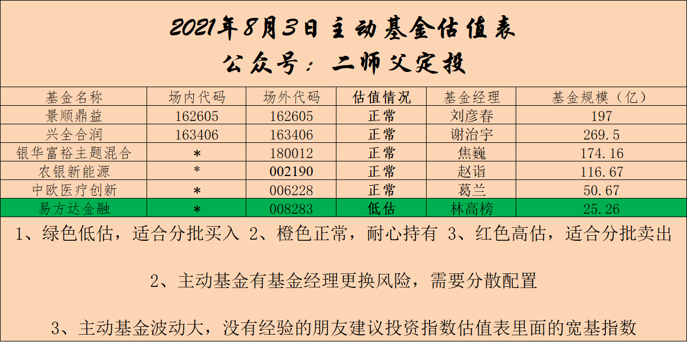

======================================================

_type: talk
@JOY[111881481812422]
2021-08-04 10:48:07 Wed  
topic_id: 185241185458182

师父，请问下，今天看公告说，达摩双利增强债券A的基金经理张雪因休假超期，目前不再管理此基金，是否后期会有影响？

@二师父 at 2021-08-04 10:48:07 Wed

> 有可能有影响，观察下如果业绩出现滑落，招商产业债，招商双债可以替代下

----------

@JOY at 2021-08-04 10:48:07 Wed

> 好的，谢谢

----------

阅读[1]  评论[2]  赞[0] 

======================================================

_type: talk
@二师父[28814221155551]
2021-08-04 10:49:36 Wed  
topic_id: 218524418225821

<e type="hashtag" hid="881251425252" title="#鳄鱼计划#" /> 清仓中概互联，买入医药etf两份。

今年主要投资方向，医药医疗和双创，不做长线仓位，有盈利就走，熊市底部才是长线重仓，很显然现在并不是。

中概互联场内10个点溢价，真的别买了，目前走挺合适，场外支撑位买的也被套了，目前只有等，补仓不合适。

这次中概给我的启示，一定要买的足够便宜。

@果实妈咪 at 2021-08-04 10:49:36 Wed

> 我上次刚买的一次还亏着啊二师父，可以不卖不

----------

@二师父 at 2021-08-04 10:49:36 Wed

> 可以

----------

@雾海 at 2021-08-04 10:49:36 Wed

> 我中概互联都亏了13%也卖出吗？

----------

@二师父 at 2021-08-04 10:49:36 Wed

> 场外可以不用

----------

@雾海 at 2021-08-04 10:49:36 Wed

> 好的

----------

@秦风殇韵（刘豫斌） at 2021-08-04 10:49:36 Wed

> 中概转成腾讯了，比较看好腾讯长期业绩

----------

@杜志彪 at 2021-08-04 10:49:36 Wed

> 中概和我没缘都没挣到钱，好在不多只有两份，转给医疗吧[微笑]

----------

阅读[1]  评论[7]  赞[0] 

+++++++++++++++++++++++++++++++++++++++++++++++++++++

图片：

======================================================

_type: talk
@二师父[28814221155551]
2021-08-04 11:10:01 Wed  
topic_id: 818524418445842

现在中概场内溢价8个点，涨幅都是溢价贡献的，我觉得场内是个走人的机会，毕竟都比实际贵了8到9个点，场外先趴着吧，如果互联网不和地产一样，他还是有希望的。

@赵晓勇 at 2021-08-04 11:10:01 Wed

> 我还亏钱的，是换出来还是继续持仓？[微笑]

----------

@二师父 at 2021-08-04 11:10:01 Wed

> 场外可以继续持

----------

@赵晓勇 at 2021-08-04 11:10:01 Wed

> 明白了师傅

----------

@果实妈咪 at 2021-08-04 11:10:01 Wed

> 我也是，怎么换场外[微笑]

----------

@云卷云舒 at 2021-08-04 11:10:01 Wed

> 师父好！我场内申购的也卖出吗

----------

@二师父 at 2021-08-04 11:10:01 Wed

> 换不了，现在场外限购，场内溢价才起来

----------

@二师父 at 2021-08-04 11:10:01 Wed

> 场内申购还是买入，场内申购不用，如果买入这个溢价是可以走的

----------

@云卷云舒 at 2021-08-04 11:10:01 Wed

> 好的，谢谢！

----------

阅读[1]  评论[8]  赞[0] 

+++++++++++++++++++++++++++++++++++++++++++++++++++++

图片：
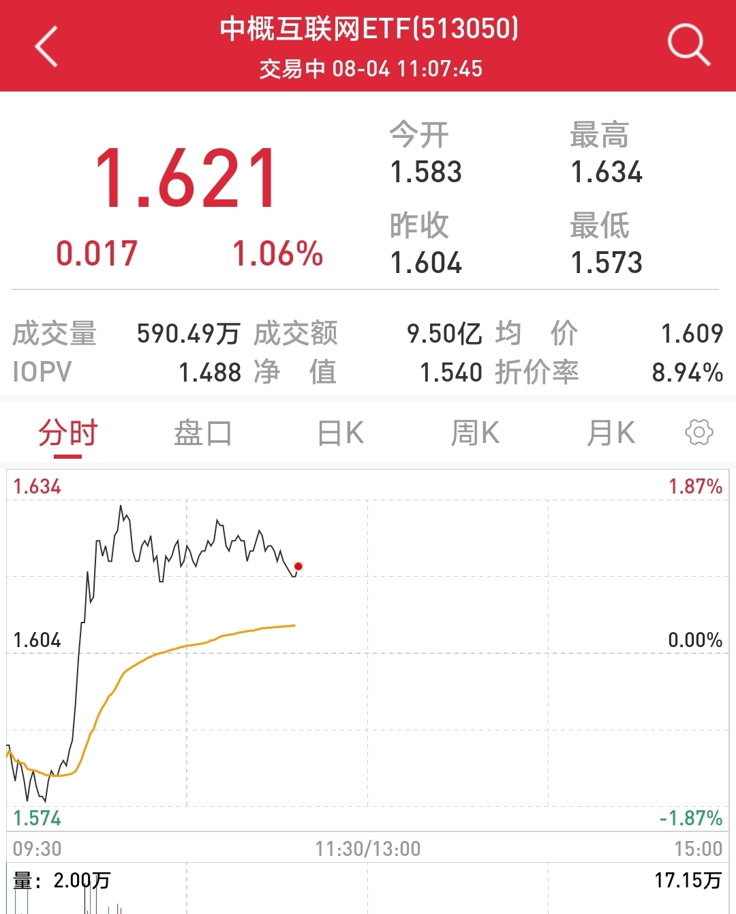

======================================================

_type: q&a
@铥@铥~~[582228558115884]
2021-08-04 14:05:48 Wed  
topic_id: 818524411455152

@铥@铥~~

>  007815和161631还有定投必要吗？还是科创50就可以代替呢

@二师父

>  可以投，是不同的方向，科技100涵盖面更广，人工智能是细分领域，科创50是宽基指数，确定性更强

阅读[1]  评论[0]  赞[0] 

======================================================

_type: q&a
@毛毛宇[88281885112212]
2021-08-04 14:24:00 Wed  
topic_id: 581254488484154

@毛毛宇

>  二师父，医药etf代码多少？

@二师父

>  512010

阅读[1]  评论[0]  赞[0] 

======================================================

_type: talk
@xu[2441485251]
2021-08-04 14:30:41 Wed  
topic_id: 185241188855252

二师傅您好！互联网502层仓负6个点，是清仓还是继续持有，谢谢！

@二师父 at 2021-08-04 14:30:41 Wed

> 继续持有

----------

阅读[1]  评论[1]  赞[0] 

======================================================

_type: q&a
@王春媚[244424882221141]
2021-08-04 16:32:11 Wed  
topic_id: 818524155158112

@王春媚

>  师父，军工ETF您能推荐一只吗？

@二师父

>  512660

阅读[1]  评论[1]  赞[0] 

======================================================

_type: talk
@二师父[28814221155551]
2021-08-04 20:27:11 Wed  
topic_id: 185241828245852

<e type="hashtag" hid="51288522542114" title="#基金估值表#" /> 现在市场出现了极端，低估的一直在跌，高估的一直在涨，大家也要灵活一些，正常估值，有预期的可以轻仓定投，控制银行、保险、地产，中丐这些的仓位，低估只是保证买的便宜，正如传媒，低估了好几年了，只是行业没有预期，所以多年不涨。

@门萨🐨 at 2021-08-04 20:27:11 Wed

> 感觉大A已经撕裂[发呆]

----------

阅读[1]  评论[1]  赞[0] 

+++++++++++++++++++++++++++++++++++++++++++++++++++++

图片：
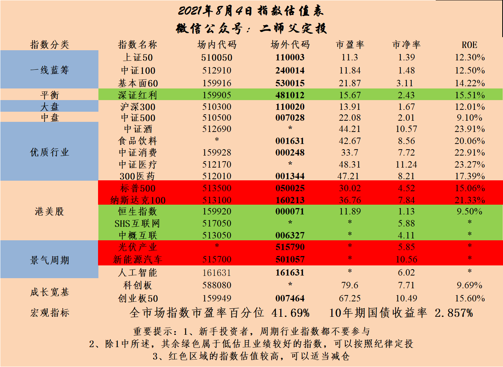

======================================================

_type: talk
@二师父[28814221155551]
2021-08-04 20:51:28 Wed  
topic_id: 818524151842542

<e type="hashtag" hid="28518855451481" title="#乌龟计划#" /> 买入中欧医疗（006228） 100元
买入易方达增强回报债券（110017） 300 元
买入科创50 (011609) 100元，还是防守为主，仓位已经降到了5层以下，最坏的结果是踏空，最好的结果是小赚或者避免了巨亏，挺好的，今年很多人都是亏得，虽然新能源涨了，光伏涨了，很多人也买了，可重仓得不多，仓位+收益率结合才最重要。

股市赚钱需要时机，时机来了赶上去才行，时机不来只能赚小钱或者不挣钱。

@晴 at 2021-08-04 20:51:28 Wed

> 二师父，乌龟机会不是一直在买入和超级转换？为什么说仓位降到五成以下了？

----------

@二师父 at 2021-08-04 20:51:28 Wed

> 债券基金不算的，股票基金占总的才算

----------

阅读[1]  评论[2]  赞[0] 

======================================================

_type: talk
@宋航[48548414258158]
2021-08-05 12:02:36 Thu  
topic_id: 581254854281284

二师父，昨天的估值数据是多少啊？

@二师父 at 2021-08-05 12:02:36 Thu

> SY-BY百分位37.51%

----------

阅读[1]  评论[1]  赞[0] 

======================================================

_type: talk
@雪莲[421485848588118]
2021-08-05 16:56:35 Thu  
topic_id: 218524142528251

二师父您好，我场内买的中概互联网ETF现浮亏22.65%，10%的仓位，昨天鳄鱼计划没跟上清仓，我不知道后续该咋操作好，也不清楚它还有多大的下跌空间，想听听您的看法和建议，谢谢！

@二师父 at 2021-08-05 16:56:35 Thu

> 最大还有40%，要么反弹或者高溢价的时候卖出一部分，要么持有

----------

@雪莲 at 2021-08-05 16:56:35 Thu

> 好的，谢谢二师父！

----------

阅读[1]  评论[2]  赞[0] 

======================================================

_type: talk
@二师父[28814221155551]
2021-08-05 19:45:39 Thu  
topic_id: 581254848848114

<e type="hashtag" hid="552114551414" title="#估值数据#" /> 市盈率百分位38.77%，SY-BY百分位35.99%，SY/BY百分位31.75%。

如果再跌一跌，估值楼层要下降了。

阅读[1]  评论[0]  赞[0] 

======================================================

_type: talk
@二师父[28814221155551]
2021-08-05 19:49:04 Thu  
topic_id: 418452121118888

<e type="hashtag" hid="228288421221" title="#仓位管理#" /> 刚好有读者朋友问到，乌龟计划没有卖出，都是转移，为什么也降低仓位了，大家看债券基金比例大致在60%，这是不算仓位的，所以整体仓位组合很低。

这个位置风险挺高的，医疗和创业板都在压力位，而且放量不涨，都是那些估值上天的继续嗨，所以谨慎点没错，仓位低最多少赚一点，没啥大碍。

新能源有有利好，不知道这轮大涨最后会以什么方式结束。

@门萨🐨 at 2021-08-05 19:49:04 Thu

> 门票股不需要择时，那么热门赛道是不是也尽量不碰？

----------

@二师父 at 2021-08-05 19:49:04 Thu

> 看基本面

----------

阅读[1]  评论[2]  赞[0] 

+++++++++++++++++++++++++++++++++++++++++++++++++++++

文件：
2021-08-05 19:45:49 Thu
文件大小：[42090]
844414845244112-聊一聊仓位.docx

======================================================

_type: q&a
@乖子[28441841181151]
2021-08-05 21:18:05 Thu  
topic_id: 218524115221481

@乖子

>  二师父，我有三个东财转债，请问可以买出了吗

@二师父

>  可以卖出

阅读[1]  评论[1]  赞[0] 

======================================================

_type: talk
@二师父[28814221155551]
2021-08-06 22:11:35 Fri  
topic_id: 185248545584212

<e type="hashtag" hid="28511252412151" title="#看看当年的互联网泡沫#" />

@🎈铮 at 2021-08-06 22:11:35 Fri

> 二师父中概互联为什么清仓呢？现在不能定投么

----------

@二师父 at 2021-08-06 22:11:35 Fri

> 场内有10个点溢价，刚好是离场机会，场外定投的话控制百分之10以内仓位

----------

阅读[1]  评论[2]  赞[0] 

+++++++++++++++++++++++++++++++++++++++++++++++++++++

文件：
2021-08-06 22:11:25 Fri
文件大小：[45020]
111181581214222-20年前的故事.docx

======================================================

_type: q&a
@🍀 凝🌸 慧🍀[841855248254242]
2021-08-06 22:54:10 Fri  
topic_id: 581258151442284

@🍀 凝🌸 慧🍀

>  师父好，请教一个问题：您怎么看中证500的投资思路？谢谢😊

@二师父

>  小市值企业今年表现会比大市值好，你这个投资思路是啥意思

阅读[1]  评论[3]  赞[0] 

======================================================

_type: talk
@二师父[28814221155551]
2021-08-06 23:35:47 Fri  
topic_id: 818521822858582

<e type="hashtag" hid="552114551414" title="#估值数据#" /> 市盈率百分位41.19%，SY-BY百分位36.96%，SY/BY百分位32.66%。

腾讯又被告了，马上就要突破08年下跌记录，历史总会重复，但是意外时有发生，金融市场的运动是非线性的，任何情况都有可能。

阅读[1]  评论[0]  赞[0] 

======================================================

_type: talk
@二师父[28814221155551]
2021-08-07 16:18:38 Sat  
topic_id: 581258145151214

<e type="hashtag" hid="88511252124212" title="#关于腾讯#" />

@sky at 2021-08-07 16:18:38 Sat

> 师父，这篇是被鹅厂删掉的文章吗？[呲牙]

----------

@二师父 at 2021-08-07 16:18:38 Sat

> 是，鹅厂也怕了

----------

阅读[1]  评论[2]  赞[0] 

+++++++++++++++++++++++++++++++++++++++++++++++++++++

文件：
2021-08-07 16:18:29 Sat
文件大小：[43975]
422212548854828-腾讯又出利空了，何时抄底.docx

======================================================

_type: q&a
@坚持学习[421148841558188]
2021-08-08 18:41:06 Sun  
topic_id: 418451811485528

@坚持学习

>  二师父，可以评估下芒果超媒这只股票吗？7月12日新闻，有8.49亿股票解禁，占总股本的42％，可能是导致了7月份的下跌。目前的水位，风险性如何？整个传媒板块，目前估值算高估吗？

@二师父

>  传媒行业都没必要投了

阅读[1]  评论[3]  赞[0] 

======================================================

_type: talk
@孟倩[118822124154582]
2021-08-09 14:56:00 Mon  
topic_id: 185248415518442

师父，三一重工目前值得入手吗？

@二师父 at 2021-08-09 14:56:00 Mon

> 短期三一重工在涨，主要是当下热钱多，流出的资金来买便宜板块，从大方向看，现在基建地产规模都在收缩，对于工程器械的需求增速会下滑，长期投资这不是一个好方向

----------

@孟倩 at 2021-08-09 14:56:00 Mon

> 明白了，谢谢！

----------

阅读[1]  评论[2]  赞[0] 

======================================================

_type: q&a
@哼哼[414855555484488]
2021-08-09 17:03:15 Mon  
topic_id: 218521242515251

@哼哼

>  二师父，钱不多就买了深红利成本2.8，前段时间徘徊在2.6，就选择躺倒了没关。今天看了下，都挺了，估计硬了都。咋办，可否继续降低成本？

@二师父

>  没有必要，拿着就行，这轮上涨是因为炒作芯片的又重回白酒了，前期不敢定投可能仓位也不低，刚好这次反弹如果到高位是减仓机会，如果仓位不重，拿着就行，他是个好基金

阅读[1]  评论[1]  赞[0] 

======================================================

_type: talk
@二师父[28814221155551]
2021-08-09 21:49:09 Mon  
topic_id: 581258581242524

<e type="hashtag" hid="51288524425214" title="#看看三傻#" /> 关于三傻的看法，结果不重要，重要的是有没有逻辑，逻辑是否正确。

阅读[1]  评论[0]  赞[0] 

+++++++++++++++++++++++++++++++++++++++++++++++++++++

文件：
2021-08-09 21:48:15 Mon
文件大小：[42864]
422212551821228-三傻又行了？.docx

======================================================

_type: talk
@芙瑞雅阳阳潘[421181844812818]
2021-08-09 22:52:38 Mon  
topic_id: 818521218122522

师父，讲讲您对现在股市的看法？

@二师父 at 2021-08-09 22:52:38 Mon

> 市场一直放量，资金推动的结构牛市，未来如果继续涨依然是光伏、新能源、芯片这些方向，最终反转接最后一棒的会比较惨。

----------

阅读[1]  评论[1]  赞[0] 

======================================================

_type: talk
@二师父[28814221155551]
2021-08-10 00:05:37 Tue  
topic_id: 581258488582524

<e type="hashtag" hid="552114551414" title="#估值数据#" /> 市盈率百分位45.25%，SY-BY百分位40.16%，SY/BY百分位35.85%。

目前市场资金在几大板块游走，估值也一直在低位波动，而实际上大家看新能源的估值相对于去年翻了3倍，就是三傻拉低了整体估值，实际上有预期的板块估值已经上天了。

阅读[1]  评论[0]  赞[0] 

======================================================

_type: q&a
@云云[118525244841512]
2021-08-10 15:03:21 Tue  
topic_id: 418451141548158

@云云

>  二师父，国泰转债打开就卖还是先放着？

@二师父

>  涨到157了，明天看看合适就可以走

阅读[1]  评论[1]  赞[0] 

======================================================

_type: q&a
@海马[15158245825242]
2021-08-10 15:03:51 Tue  
topic_id: 218521151124821

@海马

>  师父国泰转债这只债优质吗？开盘涨到130元

@二师父

>  比较优质，很少首日涨百分之60

阅读[1]  评论[4]  赞[0] 

======================================================

_type: talk
@呵呵→_→[15414558111442]
2021-08-10 20:38:36 Tue  
topic_id: 418451181158448

多少年了，终于中了一个牙签

@Chu at 2021-08-10 20:38:36 Tue

> 我也中了这个，不知道能赚多少😂

----------

@丸子妈 at 2021-08-10 20:38:36 Tue

> 不错

----------

阅读[1]  评论[2]  赞[0] 

+++++++++++++++++++++++++++++++++++++++++++++++++++++

图片：
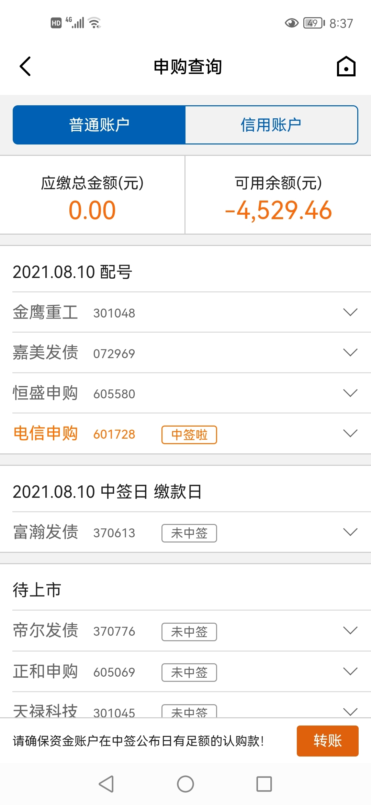

======================================================

_type: talk
@二师父[28814221155551]
2021-08-10 21:33:54 Tue  
topic_id: 581258851884224

<e type="hashtag" hid="51288524841214" title="#一天两倍的高度#" /> 资金不断游走，方向很难判断，芯片从分析师怒怼行业专家的时候已经走向了最终的狂热，现在开始下行了。

阅读[1]  评论[0]  赞[0] 

+++++++++++++++++++++++++++++++++++++++++++++++++++++

文件：
2021-08-10 21:32:41 Tue
文件大小：[42661]
244414241124811-一天两倍.docx

======================================================

_type: talk
@二师父[28814221155551]
2021-08-10 22:05:02 Tue  
topic_id: 818521122881482

<e type="hashtag" hid="552114551414" title="#估值数据#" /> 市盈率百分位45.27%，SY-BY百分位40.28%，SY/BY百分位35.93%。

阅读[1]  评论[0]  赞[0] 

======================================================

_type: q&a
@乖子[28441841181151]
2021-08-11 11:22:19 Wed  
topic_id: 185248811454552

@乖子

>  二师父，我有两个国泰转债昨天没注意，今天涨到五百多可以卖了吗？谢谢

@二师父

>  可以卖了

阅读[1]  评论[1]  赞[0] 

======================================================

_type: talk
@二师父[28814221155551]
2021-08-11 21:40:35 Wed  
topic_id: 185212225581222

<e type="hashtag" hid="825188852442" title="#估值表#" />

@永刚 at 2021-08-11 21:40:35 Wed

> 只有一个低估的吗？

----------

@二师父 at 2021-08-11 21:40:35 Wed

> 对

----------

阅读[1]  评论[2]  赞[0] 

+++++++++++++++++++++++++++++++++++++++++++++++++++++

图片：
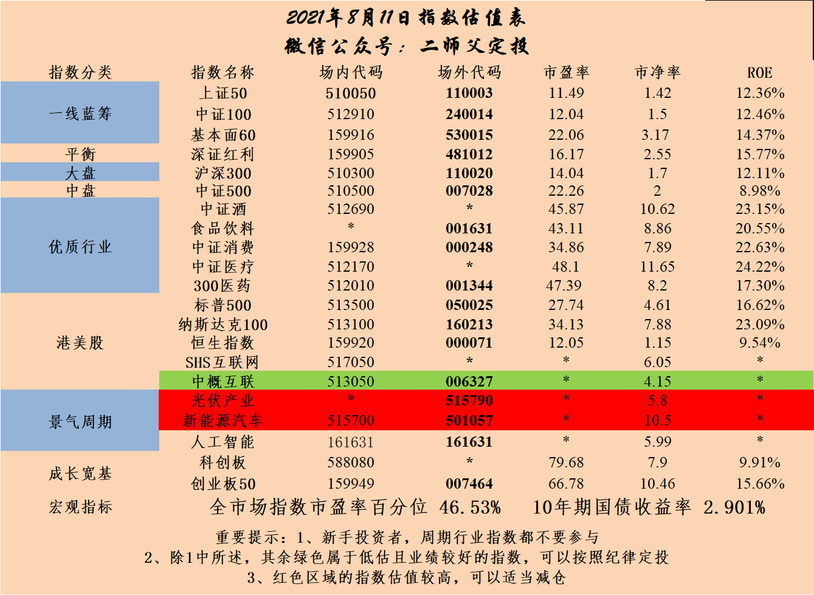

======================================================

_type: talk
@毛毛宇[88281885112212]
2021-08-11 22:26:00 Wed  
topic_id: 818545558122812

请问二师夫，传媒为啥总是走低，什么原因啊？

@二师父 at 2021-08-11 22:26:00 Wed

> 传媒过了快速发展期，疫情对于传媒影响是持续性的，整体行业没有政策扶持和利好，资金不会进场，所以持续走低。

----------

阅读[1]  评论[1]  赞[0] 

======================================================

_type: talk
@二师父[28814221155551]
2021-08-11 23:04:22 Wed  
topic_id: 218545551555441

<e type="hashtag" hid="28518855451481" title="#乌龟计划#" /> 坚持买入，买入中欧医疗（006228） 100元
买入易方达增强回报债（110017） 300元
买入科创50 (011609) 100元。两个进攻，一个防守，在正确的赛道积累一定会有好的结果。

阅读[1]  评论[0]  赞[0] 

======================================================

_type: talk
@呵呵→_→[15414558111442]
2021-08-12 10:47:58 Thu  
topic_id: 218545584124451

师傅，药明还能起来么，不知不觉就搞成重仓了[撇嘴]，补仓后成本146

@二师父 at 2021-08-12 10:47:58 Thu

> 企业没啥问题，就是目前医疗板块利空消息太多

----------

@呵呵→_→ at 2021-08-12 10:47:58 Thu

> 好的，那只能用出韭菜的绝招，装死了[呲牙]

----------

阅读[1]  评论[2]  赞[0] 

======================================================

_type: talk
@二师父[28814221155551]
2021-08-12 18:01:32 Thu  
topic_id: 581242254814844

<e type="hashtag" hid="552114551414" title="#估值数据#" /> 市盈率百分位46%,SY-BY百分位40.75%，SY/BY百分位36.17%。

今年的行情还是债券表现好，继续按照既定策略定投，然后储备一些备用现金，已被不时之需，疫情加洪灾，接下来发生啥还不确定，一定要降低杠杆。

阅读[1]  评论[0]  赞[0] 

======================================================

_type: talk
@二师父[28814221155551]
2021-08-13 21:13:51 Fri  
topic_id: 185212455215212

<e type="hashtag" hid="51288511518854" title="#谨慎点#" /> 控制好仓位，防守账户备好资金，持续定投比较好，谨慎抄底。

@天玺哥 at 2021-08-13 21:13:51 Fri

> 听二师父的控制好节奏，仓位开启左侧交易定投。

----------

阅读[1]  评论[1]  赞[0] 

+++++++++++++++++++++++++++++++++++++++++++++++++++++

文件：
2021-08-13 21:13:06 Fri
文件大小：[42651]
422212122418258-谨慎点是好事.docx

======================================================

_type: talk
@二师父[28814221155551]
2021-08-14 20:45:53 Sat  
topic_id: 218545248422821

<e type="hashtag" hid="88511288424182" title="#聊聊军工#" /> 关于军工适合做趋势反转，在政策刚出的时候，埋伏，业绩退坡或者政策力度减弱后慢慢撤，A股值得终身持有的并不多。

阅读[1]  评论[0]  赞[0] 

+++++++++++++++++++++++++++++++++++++++++++++++++++++

文件：
2021-08-14 20:44:41 Sat
文件大小：[43049]
844414115215482-聊一聊军工.docx

======================================================

_type: talk
@Vivian[582228554481154]
2021-08-14 22:36:57 Sat  
topic_id: 185212414444512

老师，卖房有笔资金两百多万，长期未用，想稳健收理财利息，请问目前要如何配置理财比较好？

@二师父 at 2021-08-14 22:36:57 Sat

> 看你能承受多大波动，能承受百分之10以内波动，买入安心组合，不能承受波动，买入货币基金

----------

@Vivian at 2021-08-14 22:36:57 Sat

> 谢谢老师

----------

阅读[1]  评论[2]  赞[0] 

======================================================

_type: talk
@二师父[28814221155551]
2021-08-15 15:43:28 Sun  
topic_id: 218545212148481

<e type="hashtag" hid="15288455824812" title="#华尔街英语#" /> 华尔街英语面临困境，对于超长期办卡需要慎重。

@衣袂飘香 at 2021-08-15 15:43:28 Sun

> 您公众号上有引用说，半导体的凛冬将至。我的场内账户上还持有一定的人工智能，其中一部分是做网格的。
   人工智能和人工智能Ai，怎么处理比较好呢？

----------

@二师父 at 2021-08-15 15:43:28 Sun

> 人工智能里面持仓主要是计算机软件类企业，这一波已经到了阶段高点可以动态止盈

----------

@衣袂飘香 at 2021-08-15 15:43:28 Sun

> 动态止盈具体怎么操作？

----------

阅读[1]  评论[3]  赞[0] 

+++++++++++++++++++++++++++++++++++++++++++++++++++++

文件：
2021-08-15 15:42:58 Sun
文件大小：[43511]
111181888521582-华尔街英语也穷途陌路了.docx

======================================================

_type: talk
@二师父[28814221155551]
2021-08-15 15:50:51 Sun  
topic_id: 218545212141551

<e type="hashtag" hid="51288511824214" title="#现金打理方式#" /> 目前现金打理主要三种方式。

第一种：货币基金，场内货币基金，场外货币基金，银行货币基金均可。这种适合大额资金，期待流动性更强。

第二种，国债逆回购，小额资金，设定自动购买，如果当日股票账户有资金没有交易，那么软件自动下单就会成交，提高资金利用率。

第三种，银行AppT+0理财产品，这类流动性比货币基金更好，我用的是中国银行的理财产品，有时候会有限额，但是购买以后每天可以快速提取资金5万，比较方便。

基本上目前这三种方式比较安全稳定，T+0银行理财可能会有浮亏，我买了几年还暂时没有，去年有些银行出现过净值下跌的情况，对于这类品种，还是轻配较好。

@JOY at 2021-08-15 15:50:51 Sun

> T+0的产品会有赎回风险，有的时候如果到了这个产品的当日最大赎回限额，是会赎不出来的。不过一般当日晚12点以后，还是可以的～

----------

@丸子妈 at 2021-08-15 15:50:51 Sun

> 招商的银行理财也还可以

----------

阅读[1]  评论[2]  赞[0] 

======================================================

_type: q&a
@冯林锋[841551141441422]
2021-08-16 09:38:26 Mon  
topic_id: 418424182552418

@冯林锋

>  二师父，持有牧原股份的股票，可以优先配可转债吗

@二师父

>  对，股票持有者优先配债

阅读[1]  评论[0]  赞[0] 

======================================================

_type: talk
@南方姑娘[118248821588412]
2021-08-16 10:05:17 Mon  
topic_id: 218545181548541

二师父，早上好！申购中签中旗新材500股，这个怎么样？

@二师父 at 2021-08-16 10:05:17 Mon

> 石英石研发材料企业，还不错

----------

@南方姑娘 at 2021-08-16 10:05:17 Mon

> 好的，谢谢二师父！

----------

阅读[1]  评论[2]  赞[0] 

======================================================

_type: q&a
@🐰Mandy[244148854285821]
2021-08-16 19:26:09 Mon  
topic_id: 418424181521848

@🐰Mandy

>  二师父，中了个川恒新债，是不是上市第一天卖比较好？

@二师父

>  首日如果到了130可以卖出

阅读[1]  评论[1]  赞[0] 

======================================================

_type: talk
@二师父[28814221155551]
2021-08-16 22:10:48 Mon  
topic_id: 581242844111814

<e type="hashtag" hid="281158284851" title="#市场分析#" /> 板块轮动，如何抓住机会。

阅读[1]  评论[0]  赞[0] 

+++++++++++++++++++++++++++++++++++++++++++++++++++++

文件：
2021-08-16 22:10:29 Mon
文件大小：[45396]
244411581124511-结构性挨打，稳健吃肉.docx

======================================================

_type: talk
@二师父[28814221155551]
2021-08-16 23:28:44 Mon  
topic_id: 581242848245844

<e type="hashtag" hid="552114551414" title="#估值数据#" /> 市盈率百分位43.54%，SY-BY百分位35.59%，SY/BY百分位35.69%，估值变化不大，主要是市场震荡，现阶段成交额持续不降低，还是结构性行情，基本上板块会轮动，很少出现齐涨齐跌的情况。

阅读[1]  评论[0]  赞[0] 

======================================================

_type: talk
@二师父[28814221155551]
2021-08-17 09:44:58 Tue  
topic_id: 185212881254252

<e type="hashtag" hid="881251425252" title="#鳄鱼计划#" /> 双创etf买入一份，医药etf买入一份，按照设定的价格，保持节奏，到了就买，好基金只会输时间不会输钱，如果中概有机会跌到1.3也会考虑的

一方面价格，另外一方面基金质量和预期。

@永刚 at 2021-08-17 09:44:58 Tue

> 医药ETF是中证医疗ETF吗？代码一样吗？

----------

@二师父 at 2021-08-17 09:44:58 Tue

> 医药etf512010

----------

@静 at 2021-08-17 09:44:58 Tue

> 双创ETF是159780吗

----------

@二师父 at 2021-08-17 09:44:58 Tue

> 159783

----------

@不再YY的猪 at 2021-08-17 09:44:58 Tue

> 刚买就跌[呲牙]

----------

@🐰Mandy at 2021-08-17 09:44:58 Tue

> 二师父，医药是场外还是场内

----------

@二师父 at 2021-08-17 09:44:58 Tue

> 场内

----------

@🐰Mandy at 2021-08-17 09:44:58 Tue

> 今天还合适买入吗

----------

阅读[1]  评论[9]  赞[0] 

======================================================

_type: q&a
@隔窗遥望[241884481854181]
2021-08-17 21:18:01 Tue  
topic_id: 218548584155481

@隔窗遥望

>  新能源和半导体有什么基金可以关注，前面关注了光伏ETF515790，这些赛道什么时候可以进入

@二师父

>  还早，等这些赛道的基金被大骂的时候再进，虽然跌了，还是在高位，目前进入属于博弈，风险较大

阅读[1]  评论[1]  赞[0] 

======================================================

_type: talk
@二师父[28814221155551]
2021-08-17 21:39:34 Tue  
topic_id: 185215258254142

<e type="hashtag" hid="28511282212521" title="#市场反转#" /> 做好布局，市场涨跌无所畏惧，然后继续定投即可，目前市场机会一般，真的跌到了去年3月，18年10月那样绝佳的机会我也会说的，一定保证合理仓位

@西锦巴乌 at 2021-08-17 21:39:34 Tue

> 师父：昨天买入双创50有提醒吗？在哪儿提醒的？谢谢

----------

@二师父 at 2021-08-17 21:39:34 Tue

> 知识星球啊，你往前翻一下发言记录

----------

阅读[1]  评论[2]  赞[0] 

+++++++++++++++++++++++++++++++++++++++++++++++++++++

文件：
2021-08-17 21:38:14 Tue
文件大小：[14006]
244411545121521-基金上热搜了.docx

======================================================

_type: talk
@二师父[28814221155551]
2021-08-17 23:18:37 Tue  
topic_id: 418428454822828

<e type="hashtag" hid="552114551414" title="#估值数据#" /> 市盈率百分位38.66%，SY-BY百分位37.11%，SY/BY百分位33.86%。

估值数据开始下移，可以开始慢慢定投，今天刚买入的医药和双创就下跌，不要紧，不追求买在最低点，相对低位吸筹码就行。

阅读[1]  评论[0]  赞[0] 

======================================================

_type: talk
@二师父[28814221155551]
2021-08-17 23:32:13 Tue  
topic_id: 581241252548484

<e type="hashtag" hid="88514141542152" title="#主动基金估值表#" /> 目前中欧医疗股票低估，可以开始继续定投，持续积累。

阅读[1]  评论[0]  赞[0] 

+++++++++++++++++++++++++++++++++++++++++++++++++++++

图片：
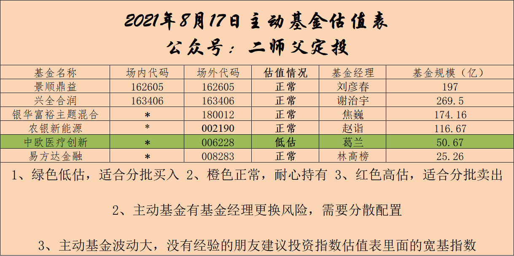

======================================================

_type: talk
@鳗鱼[182242255828582]
2021-08-18 09:44:55 Wed  
topic_id: 185215248452282

二师父，中了只新股N金鹰，什么时候卖好一点，谢谢！

@二师父 at 2021-08-18 09:44:55 Wed

> 新股一般开板后卖

----------

@鳗鱼 at 2021-08-18 09:44:55 Wed

> 收到，谢谢师父！

----------

阅读[1]  评论[2]  赞[0] 

======================================================

_type: talk
@二师父[28814221155551]
2021-08-18 19:19:57 Wed  
topic_id: 218548512212411

<e type="hashtag" hid="552114551414" title="#估值数据#" /> 市盈率百分位38.85%，SY/BY百分位34.01%，SY-BY百分位37.2%。

大盘持续震荡，板块轮动涨跌，坚守自己的一亩三分地，这次券商涨起来，场内可以慢慢卖出了。以后就不会做波段，看着每次涨了很多，其实没赚多少钱，真正赚大钱需要选准方向，真的想做券商可以考虑东方财富。

@永刚 at 2021-08-18 19:19:57 Wed

> 请教二师父：东方财富可以做网格吗？如果能做网格建仓的价格定在多少合适？

----------

@wty at 2021-08-18 19:19:57 Wed

> 同感！

----------

@二师父 at 2021-08-18 19:19:57 Wed

> 可以，价格自己定吧，我不大清楚你的风险承受能力。

----------

阅读[1]  评论[3]  赞[0] 

======================================================

_type: talk
@二师父[28814221155551]
2021-08-18 19:57:03 Wed  
topic_id: 818548512185552

<e type="hashtag" hid="552114551414" title="#估值数据#" /> 低估的品种又多了，无论是指数基金还是股票基金，进入低估区域以后，都是慢慢定投，底仓建立一般是确认底部开始建立，否则没有意义，大宗买入基本上保证未来很快就涨，如果不能有确切的判断，那么最好不要大笔买入。

仓位和赔率、以及未来的成长性是匹配的。

@老孙头 at 2021-08-18 19:57:03 Wed

> 拜读“计划”290，劵商操作有数了。金融行业008283，尚有被套的部分仓位，该如何应对？[抱拳]

----------

@二师父 at 2021-08-18 19:57:03 Wed

> 这次金融护盘反弹的话可以卖出

----------

@毛毛宇 at 2021-08-18 19:57:03 Wed

> 二师夫，今天有实盘操作吗？

----------

阅读[1]  评论[3]  赞[0] 

+++++++++++++++++++++++++++++++++++++++++++++++++++++

图片：
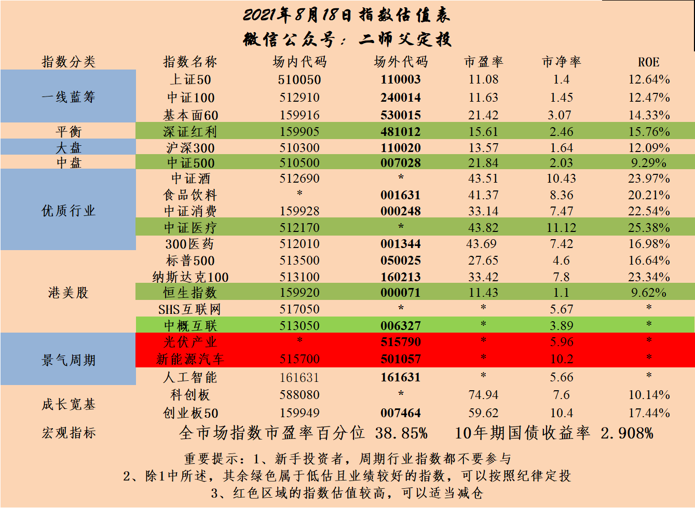

======================================================

_type: talk
@付云[844148188522822]
2021-08-18 21:24:22 Wed  
topic_id: 185215281444212

二师傅，想咨询一下对互联网ETF行业和农业ETF的短期和长期的看法？

@二师父 at 2021-08-18 21:24:22 Wed

> 短期都不行，长期的话互联网政策打压放松会有好转，农业里面大部分是猪肉企业，需要等待猪周期反转

----------

@付云 at 2021-08-18 21:24:22 Wed

> 对于互联网，我也很纠结！专门研究了十九届五中全会内容和十四五规划、2035年的愿景目标，国家对产业数字化，数字产业，信息化的愿景目标是很明确的，我觉得这些都离不开互联网的技术！我个人认为，前期，互联网公司的核心竞争力同国家想发展实业的政策上有所偏离，同时互联网寡头现象严重，控制了衣食住行，同甚至差点去跟平头老百姓抢饭碗，所以出台了一系列政策，其实目的还是希望企业认识真正想发展的方向，让互联网提高政治站位，解决国家发展的卡脖子问题上来！这才是国家想看到的，互联网企业早日认识到这点，保持与中央的统一部署的高度上来，才能走出困局！其实，我还是相信这个行业的领军企业能很快转型，迎来春天，所以，我还是看中它，准备长期持有和定投[微笑][微笑][微笑]。纯属个人看法哈，我不知道对不对

----------

@付云 at 2021-08-18 21:24:22 Wed

> 说衣食住行有点不对哈

----------

阅读[1]  评论[3]  赞[0] 

======================================================

_type: q&a
@🎈铮[28284825441841]
2021-08-19 13:43:18 Thu  
topic_id: 418428584251558

@🎈铮

>  二师父，请问景顺鼎益混合和工银深红利可以开始定投了吗？

@二师父

>  定投是可以的

阅读[1]  评论[0]  赞[0] 

======================================================

_type: q&a
@顾小胖[841154144118242]
2021-08-19 15:11:56 Thu  
topic_id: 581241248528244

@顾小胖

>  师傅好，我的AI人工智能ETF设置了条件单，7月29日1.321时触发条件单了但是因为超出偏差限制没有委托，但是它的基准价变成了1.321，导致8月17日1.268时它触发条件买入了。这个情况下实际上是该卖出时没卖出，但是基准价却提高了，导致不该买入时买入了对吧？请问这种情况下我该如何做呢？需要更改条件单的设置或者手动修改基准价吗？（目前基准价1.268）

@二师父

>  多次执行触发委托的条件单（如分批建仓、分批出货、网格交易等条件单）触发偏差控制会继续进行监控，但监控的基准价会随着触发失败的价格进行变化。
>  
>  可以先暂停条件单，然后手动修改下基准价

阅读[1]  评论[0]  赞[0] 

======================================================

_type: q&a
@Zyxj[111841455151112]
2021-08-19 15:12:09 Thu  
topic_id: 818548281215242

@Zyxj

>  师父，今天不发车吗？

@二师父

>  昨天晚上发了，就是今天的

阅读[1]  评论[9]  赞[0] 

======================================================

_type: talk
@二师父[28814221155551]
2021-08-19 15:21:58 Thu  
topic_id: 581241552521554

现在管理严格，有时候发买入操作会被删帖，以后我尽量在发之后检查一下

阅读[1]  评论[0]  赞[0] 

======================================================

_type: talk
@二师父[28814221155551]
2021-08-19 21:56:59 Thu  
topic_id: 818548245812482

<e type="hashtag" hid="51288514245184" title="#不要指望A股按照套路出牌#" /> 当前市场变化很多，坚持既定的投资，一直定投医疗和科创50，直到盈利暂停，收不收割利润看个人。如果大跌，那就一直投下去，光伏等进入正常估值也会开始，目前就这几个方向，新能源估值太高，暂时没有计划。

@永刚 at 2021-08-19 21:56:59 Thu

> 光伏现在是高估吗？

----------

@阿宝 at 2021-08-19 21:56:59 Thu

> 谢谢！

----------

@二师父 at 2021-08-19 21:56:59 Thu

> 是的

----------

@付云 at 2021-08-19 21:56:59 Thu

> 啥时候可以入咧

----------

@付云 at 2021-08-19 21:56:59 Thu

> 碳中和现在有好的标的基金不！医疗之前已经布局了！光伏仓位不重不大，想在后期补上，不知道啥时候上车合适！

----------

@二师父 at 2021-08-19 21:56:59 Thu

> 碳中和ETF

----------

@二师父 at 2021-08-19 21:56:59 Thu

> 是高估

----------

阅读[1]  评论[7]  赞[0] 

+++++++++++++++++++++++++++++++++++++++++++++++++++++

文件：
2021-08-19 21:55:18 Thu
文件大小：[15413]
111188454542182-不要指望A股按照套路出牌.docx

======================================================

_type: talk
@二师父[28814221155551]
2021-08-20 08:49:08 Fri  
topic_id: 581241548814514

<e type="hashtag" hid="552114551414" title="#估值数据#" /> 市盈率百分位39.1%，SY-BY百年分为36.51%，SY/BY百分位32.71%。

中概股已经股灾了，大家关心的是能不能投，这个可以投，只是要注意方式，定投不适合，稍后把加仓价位标出来，仅供参考，君子不立危墙之下，如果不能接受亏损的，就不要买这个板块，不确定性较大，指数不死，类似传媒，不死也是植物人了。

@云卷云舒 at 2021-08-20 08:49:08 Fri

> 师父好！中概股需要清了吗

----------

@二师父 at 2021-08-20 08:49:08 Fri

> 这个位置走就没必要了

----------

@云卷云舒 at 2021-08-20 08:49:08 Fri

> 好的，谢谢师父！

----------

@光少 at 2021-08-20 08:49:08 Fri

> 好彩场内走了，场外还在，不过投入不多

----------

@Mo.DC at 2021-08-20 08:49:08 Fri

> 今天价位，该下几成仓，最低能看到1.2吗[大哭]

----------

@老孙头 at 2021-08-20 08:49:08 Fri

> 中概股，稍后把加仓价位标出来？？？

----------

阅读[1]  评论[6]  赞[0] 

======================================================

_type: talk
@二师父[28814221155551]
2021-08-20 10:01:53 Fri  
topic_id: 818548212814442

中了一签，可转债坚持打新，意外收获

@Chu at 2021-08-20 10:01:53 Fri

> 比中国电信赚的多😂

----------

@二师父 at 2021-08-20 10:01:53 Fri

> 人间真实

----------

@范毅君 at 2021-08-20 10:01:53 Fri

> 好久不中签了[流泪]

----------

@泓. at 2021-08-20 10:01:53 Fri

> 这个直接卖了吗？

----------

@二师父 at 2021-08-20 10:01:53 Fri

> 目前熔断了，等一等再卖，下午2点57以后吧

----------

@泓. at 2021-08-20 10:01:53 Fri

> 好的 谢谢

----------

@光少 at 2021-08-20 10:01:53 Fri

> 我也中了一签，等开卖[呲牙]

----------

@隔窗遥望 at 2021-08-20 10:01:53 Fri

> 我也中了一签

----------

阅读[1]  评论[8]  赞[0] 

+++++++++++++++++++++++++++++++++++++++++++++++++++++

图片：
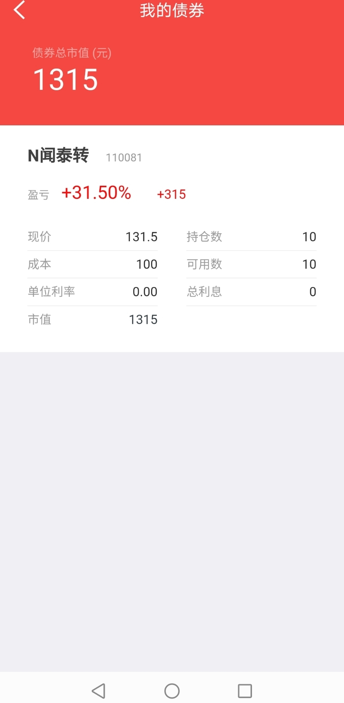

======================================================

_type: talk
@芙瑞雅阳阳潘[421181844812818]
2021-08-20 15:02:55 Fri  
topic_id: 218548458121851

师父，怎么看现在的大盘形势？

@二师父 at 2021-08-20 15:02:55 Fri

> 啥形势

----------

@芙瑞雅阳阳潘 at 2021-08-20 15:02:55 Fri

> 怎么看现在的行情？

----------

@二师父 at 2021-08-20 15:02:55 Fri

> 很差，没啥利好

----------

@芙瑞雅阳阳潘 at 2021-08-20 15:02:55 Fri

> 要割肉卖掉吗？

----------

@二师父 at 2021-08-20 15:02:55 Fri

> 这种问题没法回答

----------

阅读[1]  评论[5]  赞[0] 

======================================================

_type: q&a
@小鱼[241182222251181]
2021-08-20 18:45:31 Fri  
topic_id: 818548214225422

@小鱼

>  医疗最近怎么了，要不要加仓，

@二师父

>  受到了集采消息的影响，每周四继续定投就行

阅读[1]  评论[0]  赞[0] 

======================================================

_type: talk
@二师父[28814221155551]
2021-08-20 23:29:22 Fri  
topic_id: 218548482225441

<e type="hashtag" hid="48411582528588" title="#大跌原因来看看#" />

阅读[1]  评论[0]  赞[0] 

+++++++++++++++++++++++++++++++++++++++++++++++++++++

文件：
2021-08-20 23:29:08 Fri
文件大小：[14293]
111188448185142-利空有点多.docx

======================================================

_type: talk
@二师父[28814221155551]
2021-08-21 15:54:39 Sat  
topic_id: 818548421551282

<e type="hashtag" hid="28511284211411" title="#未来的投资方向#" />

@老孙头 at 2021-08-21 15:54:39 Sat

> 科创50，前几天老师荐的是易方达011609，需要置换吗？

----------

@二师父 at 2021-08-21 15:54:39 Sat

> 不用的

----------

阅读[1]  评论[2]  赞[0] 

+++++++++++++++++++++++++++++++++++++++++++++++++++++

文件：
2021-08-21 15:54:16 Sat
文件大小：[16710]
544488541228254-共同富裕路径下的投资方向.docx

======================================================

_type: talk
@二师父[28814221155551]
2021-08-22 21:25:35 Sun  
topic_id: 418425445411418

<e type="hashtag" hid="28511284184551" title="#关于市场的看法#" /> 这个位置已经到了没必要卖出的时候，除非一种情况，仓位已经影响到生活，如果之前跟着卖出的朋友，相信肯定是迎接下跌，准备开启左侧交易的。

@老孙头 at 2021-08-22 21:25:35 Sun

> 被套进的中概互联，面对内外双重政策影响，既然大概率继续下跌，虽然不影响生活，但先回避一下有何弊端？请指教！

----------

@二师父 at 2021-08-22 21:25:35 Sun

> 反弹可能又追进去了

----------

阅读[1]  评论[2]  赞[0] 

+++++++++++++++++++++++++++++++++++++++++++++++++++++

文件：
2021-08-22 21:24:38 Sun
文件大小：[45467]
844411214582112-这个位置没必要跑路.docx

======================================================

_type: talk
@二师父[28814221155551]
2021-08-23 21:21:34 Mon  
topic_id: 185214214841422

<e type="hashtag" hid="15288442141142" title="#关于未来的投资方向#" /> 未来的投资方向还是在中小企业这块，景气度集中在碳中和赛道，消费、医疗是长牛赛道，这两块不用担心，只是A股的波动大，你需要忍一下。

@王春媚 at 2021-08-23 21:21:34 Mon

> 师父，中证1000现在定投可以吗？

----------

@二师父 at 2021-08-23 21:21:34 Mon

> 轻仓可以

----------

@王春媚 at 2021-08-23 21:21:34 Mon

> 谢谢师傅父

----------

@马明谦 at 2021-08-23 21:21:34 Mon

> 师傅：恒瑞现在适合补仓吗？

----------

@二师父 at 2021-08-23 21:21:34 Mon

> 不谈股票

----------

@永刚 at 2021-08-23 21:21:34 Mon

> 中证500可以定投吗？

----------

@二师父 at 2021-08-23 21:21:34 Mon

> 低估后可以的

----------

@Pacifica at 2021-08-23 21:21:34 Mon

> 二师父，请教一下，投中证500和中证1000会不会有重合呢？

----------

阅读[1]  评论[12]  赞[0] 

+++++++++++++++++++++++++++++++++++++++++++++++++++++

文件：
2021-08-23 21:20:35 Mon
文件大小：[46535]
544488428244184-方向很对.docx

======================================================

_type: talk
@二师父[28814221155551]
2021-08-24 08:41:53 Tue  
topic_id: 818542512441122

<e type="hashtag" hid="552114551414" title="#估值数据#" /> 市盈率百分位百分之39.9，sy/by百分位百分之33.72，sy-by百分位百分之37.32，整体市场震荡，估值数据下移，如果资金量大，不怕回撤，可以适当增加定投资金量

阅读[1]  评论[0]  赞[0] 

======================================================

_type: talk
@二师父[28814221155551]
2021-08-24 10:19:18 Tue  
topic_id: 185214281811412

<e type="hashtag" hid="51288552485244" title="#投资中的变与不变#" /> 什么时候变，什么时候不变，这是一件很难的事，不仅仅在投资中，在生活，在工作都会遇到。

没有理论和原则，人容易迷失，成为墙头草，风吹两边倒。没有灵活，容易刻板教条，认死理，你明明告诉我是这样，为何言行不一致。

在生活太多这样例子，所以原则性和灵活性要把握好，有一个尺度。这种思维方式会给你免去很多烦恼。

有了原则，坚持底线，不会做错人，有了灵活，随机应变，很会来事。

转换到投资上，原则是啥，以超级便宜的价格，便宜的价格，合理公道的价格买入优质企业。这是原则。

那问题来了，如果一家企业不太优秀，可是价格极度便宜，买吗？

如果一家企业非常优秀，可是价格不太便宜，买吗？

这就需要灵活，把握一个度，本来已经空仓，又遇到优秀的企业，即使不便宜，但是也得有车，那就上。

本来已经重仓，又遇到不那么优秀的企业，即使非常便宜，也得考虑机会成本。

综合决策，再来考虑是否买入。

如果没法综合判断，就一招，宽基指数，低估买入，正常持有，高估卖本。完全稳赢，可这种方式过于机械，仓位过低牛市必定追高，所以投资没有万全的方法，不断学习成长才是王道。

学会否定自己，否定自己的投资策略，如果你从任何一个角度都无法否定之后，那么才是完善的，我们党的党章，每5年的计划，宪法都在不断改变，适应时代的需求，为什么投资策略和方法不能变，如果a股未来10年是十年长牛，那么就不需要定投，一直涨的市场，买入持有就对了。当然，以现在a股的特性，仍旧是轮动与暴涨暴跌结合，定投非常适合。

@防汛抗旱 at 2021-08-24 10:19:18 Tue

> 说得好。一直跟着走，就是感觉投资的标的有点多，投10万元，分成了近20个鸡

----------

@二师父 at 2021-08-24 10:19:18 Tue

> 可以缩减一下

----------

阅读[1]  评论[2]  赞[0] 

======================================================

_type: talk
@老孙头[422115118524548]
2021-08-24 13:42:06 Tue  
topic_id: 818542852812512

沪深300，可以对易方达联接与景顺增强作个比较吗？

@二师父 at 2021-08-24 13:42:06 Tue

> 好的

----------

阅读[1]  评论[1]  赞[0] 

======================================================

_type: talk
@绝世名伶。[418442242548888]
2021-08-24 16:08:35 Tue  
topic_id: 218542854245541

二师父：在拜读您的“指数基金定投，慢慢变富”看到了这个公众号，加入了进来，之后如何跟二师父学习，请赐教。[抱拳]

@二师父 at 2021-08-24 16:08:35 Tue

> 每天会有分享，先把置顶文章看一遍

----------

阅读[1]  评论[1]  赞[0] 

======================================================

_type: talk
@平安是福[118222545154542]
2021-08-24 16:21:16 Tue  
topic_id: 818542854484152

师父：我和我老公是63和62年生人，有社保和医保，如果还想买一份医疗保险和意外保险，有什么好的险种吗？请你帮我推荐一下呗。

@二师父 at 2021-08-24 16:21:16 Tue

> 是北京社保吗

----------

@平安是福 at 2021-08-24 16:21:16 Tue

> 不是，辽宁

----------

@二师父 at 2021-08-24 16:21:16 Tue

> 如果是北京社保有一款非常合适的医疗险，不是北京设包，看看这两个<e type="web" href="https://cps.qixin18.com/apps/cps/lhz1029368/product/detail?prodId=103430&planId=127150" title="“定心丸”乐享一生百万医疗险" cache="" />，<e type="web" href="https://cps.qixin18.com/apps/cps/lhz1029368/product/detail?prodId=2053&planId=2525" title="“年年无忧”综合意外险" cache="" />

----------

阅读[1]  评论[3]  赞[0] 

======================================================

_type: q&a
@冉冉[88445118854412]
2021-08-24 16:41:24 Tue  
topic_id: 185214524158452

@冉冉

>  请问二师傅，恒生科技大盘指数代码是什么？

@二师父

>  HSTECH

阅读[1]  评论[2]  赞[0] 

======================================================

_type: talk
@二师父[28814221155551]
2021-08-24 16:44:51 Tue  
topic_id: 418425842218548

<e type="hashtag" hid="48411554122418" title="#关注中概超高溢价#" /> 中概溢价飙升，很多人买入，这种时候要慎重，如果场内价格能到1.4，这是我准备再次开仓的价格，如果不到，那就没必要了。

@静 at 2021-08-24 16:44:51 Tue

> 问价。这个溢价是从哪里看到的

----------

@sky at 2021-08-24 16:44:51 Tue

> 券商软件，华泰的涨乐都可以看

----------

@静 at 2021-08-24 16:44:51 Tue

> 谢谢

----------

阅读[1]  评论[3]  赞[0] 

+++++++++++++++++++++++++++++++++++++++++++++++++++++

文件：
2021-08-24 16:44:11 Tue
文件大小：[45143]
111188842844412-太疯狂了.docx

======================================================

_type: talk
@JOY[111881481812422]
2021-08-25 12:50:33 Wed  
topic_id: 185282111188412

师父，您最新的鳄鱼持仓表可以再公布下吗？

@二师父 at 2021-08-25 12:50:33 Wed

> 今晚发一下

----------

@JOY at 2021-08-25 12:50:33 Wed

> 谢谢，那等您公布～

----------

阅读[1]  评论[2]  赞[0] 

======================================================

_type: talk
@嘉宾[548814141545814]
2021-08-25 18:35:23 Wed  
topic_id: 185282181222242

请问，目前场内跟投医疗还是医药比较合适？

@二师父 at 2021-08-25 18:35:23 Wed

> 都挺好的

----------

阅读[1]  评论[1]  赞[0] 

======================================================

_type: q&a
@娃娃after🎈[88818155445112]
2021-08-25 20:05:28 Wed  
topic_id: 418425885541118

@娃娃after🎈

>  请问老人的钱，大几十万，怎么投比较好。可以一次性投入，3-5年不动。谢谢

@二师父

>  买30%货币基金，买70%安心组合。剩余30%货币基金等沪深300低估以后周定投，高估后逐步止盈转移到安心组合。低估以后再定投。

阅读[1]  评论[0]  赞[0] 

======================================================

_type: talk
@二师父[28814221155551]
2021-08-25 21:40:03 Wed  
topic_id: 418414144125548

<e type="hashtag" hid="552114551414" title="#估值数据#" /> 低估的越来越多了，慢慢定投起来。

@J at 2021-08-25 21:40:03 Wed

> 师傅，主动基金的估值表可以每周四更新一次吗？

----------

@二师父 at 2021-08-25 21:40:03 Wed

> 每周三晚上吧，刚好周四可以参考定投

----------

@J at 2021-08-25 21:40:03 Wed

> 好啊，谢谢师傅[鼓掌]

----------

@Philip🎭 Y at 2021-08-25 21:40:03 Wed

> 师傅 你的鳄鱼深红利清仓，可是估值你说是低估（绿色）这是为什么啊

----------

@二师父 at 2021-08-25 21:40:03 Wed

> 低估和清仓没有啥联系，传媒也是低估，就是不涨

----------

@Philip🎭 Y at 2021-08-25 21:40:03 Wed

> 那现在应该定投还是清仓呀？我之前一直跟着乌龟，现在盈利不少

----------

@二师父 at 2021-08-25 21:40:03 Wed

> 我都已经清仓了，如果跟的早，就清仓

----------

@Philip🎭 Y at 2021-08-25 21:40:03 Wed

> 谢谢师父

----------

阅读[1]  评论[8]  赞[0] 

+++++++++++++++++++++++++++++++++++++++++++++++++++++

图片：
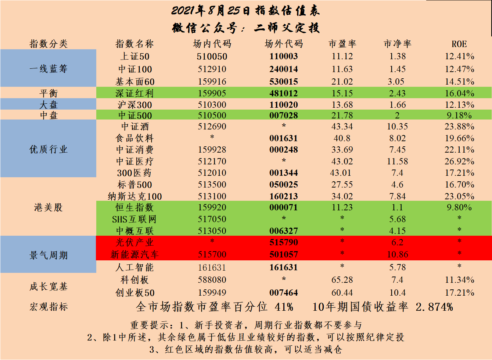

======================================================

_type: talk
@二师父[28814221155551]
2021-08-25 21:43:43 Wed  
topic_id: 818515155141412

<e type="hashtag" hid="15288445421112" title="#乌龟计划291期#" /> 买入中欧医疗（006228） 100元
买入易方达增强回报债（110017） 100元
买入科创50 (011609) 100元
买入景顺鼎益混合（162605）100元
买入兴全合润（163406）100元。

未来这些基金会持续买入，直到盈利为止，中概互联大致的投资计划是，1.4买入一次，1.3买入一次，1.2买入一次，依次类推，如果价格不到，就暂停买入了。设定买入价格，不到就不买，是个好习惯，这次中概互联其实场内操作没啥问题，主要是场外，支撑位直接打了5%仓位，然后遇到利空，其实本来已经最高点卖出，当做错了以后再想办法修正就行。未来一定可以让中概盈利走人，前提是足够耐心。

@丸子妈 at 2021-08-25 21:43:43 Wed

> 中概你是买的场内还是场外？

----------

@J at 2021-08-25 21:43:43 Wed

> 师傅，科创还没到达低估区，为何开始定投呢？

----------

@二师父 at 2021-08-25 21:43:43 Wed

> 比较有前景，均线定投策略

----------

阅读[1]  评论[3]  赞[0] 

======================================================

_type: talk
@二师父[28814221155551]
2021-08-26 08:58:16 Thu  
topic_id: 581282812454554

<e type="hashtag" hid="48412124415418" title="#鳄鱼计划持仓表#" /> 当前鳄鱼计划持仓，一直半仓，仅为个人投资记录，不作为投资建议。前期很多好的品种家电、消费50、深红利已经清仓，一轮又一轮找到方向重仓，买入+卖出一个闭环，账户总市值不断提高。

现在大白马基金重新下跌，那么就开始第二轮定投，买好的基金，在基金价格相对便宜的时候介入，中长期持有，高估逐步卖出本金，趋势不再的时候清仓。

@Chu at 2021-08-26 08:58:16 Thu

> 师父，今年鳄鱼计划的收益率多少呀

----------

@二师父 at 2021-08-26 08:58:16 Thu

> 截止现在负百分之2.27

----------

@Chu at 2021-08-26 08:58:16 Thu

> 跑赢300了，我也是负1左右

----------

阅读[1]  评论[3]  赞[0] 

+++++++++++++++++++++++++++++++++++++++++++++++++++++

图片：
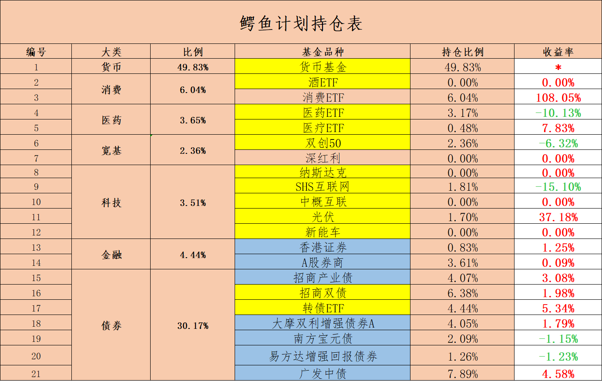

======================================================

_type: talk
@阿宝[422212151424158]
2021-08-26 11:25:11 Thu  
topic_id: 581282818224484

读《资产配置攻略构建长效的投资体系》有感，投资贵在坚持，相信简单的力量，长期的力量！

@🍀 凝🌸 慧🍀 at 2021-08-26 11:25:11 Thu

> 您好，您提到的资产配置攻略这篇文章，在哪里能看到？

----------

@阿宝 at 2021-08-26 11:25:11 Thu

> 网上有这本书。

----------

@🍀 凝🌸 慧🍀 at 2021-08-26 11:25:11 Thu

> 谢谢😊

----------

阅读[1]  评论[3]  赞[0] 

+++++++++++++++++++++++++++++++++++++++++++++++++++++

图片：

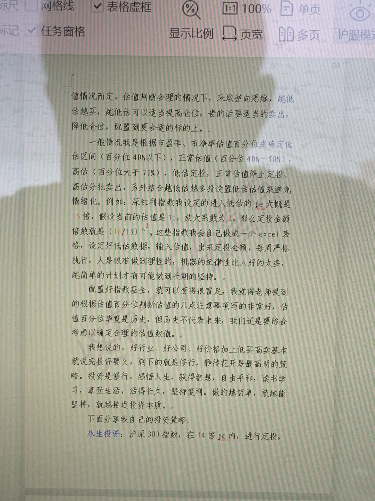
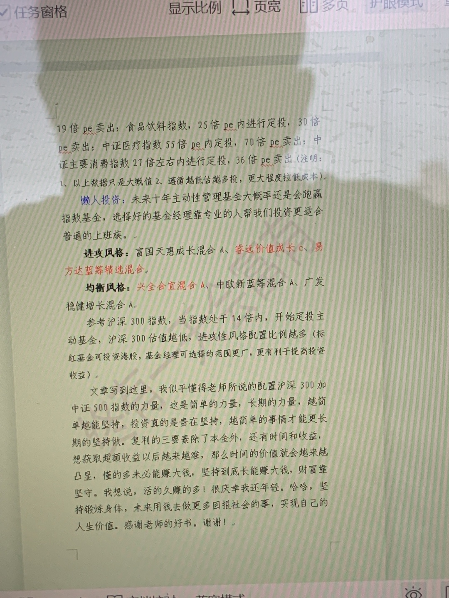
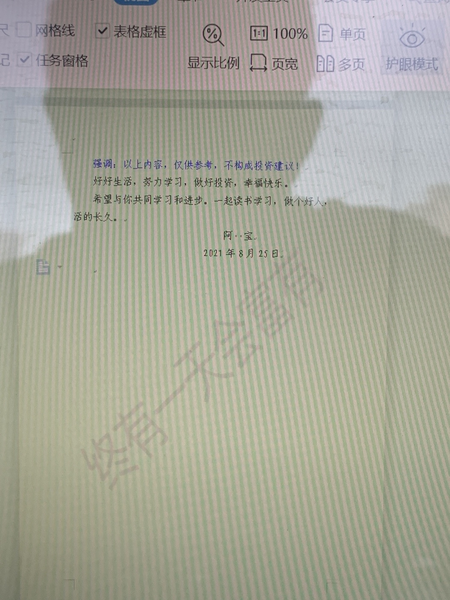

======================================================

_type: q&a
@Sunflower[244185124281811]
2021-08-26 14:31:26 Thu  
topic_id: 185282842282452

@Sunflower

>  二师父您好，我的光伏收益率55%了，但是持仓很低，有必要卖出吗？

@二师父

>  可以再拿一拿，回落百分之10止盈，或者趋势不再的时候卖出

阅读[1]  评论[0]  赞[0] 

======================================================

_type: q&a
@冉冉[88445118854412]
2021-08-26 14:34:40 Thu  
topic_id: 185282842512542

@冉冉

>  请问二师傅，恒生科技有没有推荐的基金？恒生科技现在估值怎样？有投资价值吗？有可以推荐的基金吗？

@二师父

>  03033，还可以，就是波动太大，港股股灾风险较大

阅读[1]  评论[1]  赞[0] 

======================================================

_type: talk
@二师父[28814221155551]
2021-08-26 14:39:20 Thu  
topic_id: 218515125455441

关于低估，什么是低估，是价格低于价值，很便宜，买入后有安全边际，最大下跌幅度可控，但是低估不意味着买了马上就涨，一般一个指数刚进入低估，如果发生极端情况，仍旧是有可能继续下跌的，最大跌幅百分之50以内

为什么卖出深红利，就是因为虽然低估但是是下行趋势，而且这只基金严格跟车重仓的，肯定赚钱了，我不会让自己在曾经赚钱的基金和股票上又发生亏损，哪怕卖出后他又涨了，也跟我们没关系

投资是个性化的事情，你可以有你的判断，但最后投资结果将会证明判断的对与错，这就是认知变现。

@柔软时光 at 2021-08-26 14:39:20 Thu

> 今年1月底调整了一次持仓，到目前结果是，在宽基中，中证500最好，上涨11%，深红利最差，下跌21%；行业ETF中，光伏ETF上涨30%，最差是互联网50，下跌25%；在股票投资中，B股收益最好，有15%；综合全部投资来看，只比上证指数高1个点。数据供参考，我也很疑惑什么时候该卖出，自己的原则是达到投资目标再卖出。

----------

@永刚 at 2021-08-26 14:39:20 Thu

> 师父：您觉得现在建仓定投深红利合适吗？您觉得深红利这个基金未来发展潜力不好吗？

----------

@二师父 at 2021-08-26 14:39:20 Thu

> 平均水平，比光伏，医疗，碳中和，新能源要差一些

----------

@永刚 at 2021-08-26 14:39:20 Thu

> 未来配置到总量的15%您觉得合适吗？

----------

@二师父 at 2021-08-26 14:39:20 Thu

> 逐步定投到明年这个仓位可以

----------

@永刚 at 2021-08-26 14:39:20 Thu

> 谢谢您！

----------

阅读[1]  评论[6]  赞[0] 

======================================================

_type: talk
@二师父[28814221155551]
2021-08-26 21:35:19 Thu  
topic_id: 185282814212122

<e type="hashtag" hid="51288551485144" title="#跌出机会了#" /> 明天继续下跌的话，准备发车，猜猜我想买啥。

@sky at 2021-08-26 21:35:19 Thu

> 今天医药收盘666

----------

@章兵朋 at 2021-08-26 21:35:19 Thu

> 医药

----------

@Mo.DC at 2021-08-26 21:35:19 Thu

> 是不是上证指数会长期在3000以上

----------

@二师父 at 2021-08-26 21:35:19 Thu

> 大概率是了，极端情况才会破3000以下

----------

@黎雄 at 2021-08-26 21:35:19 Thu

> 师傅券商ETF占比9%，现在盈利6%。需要减仓嘛

----------

@二师父 at 2021-08-26 21:35:19 Thu

> 需要

----------

阅读[1]  评论[6]  赞[0] 

+++++++++++++++++++++++++++++++++++++++++++++++++++++

文件：
2021-08-26 21:34:48 Thu
文件大小：[46349]
422144444515848-跌出机会了.docx

======================================================

_type: q&a
@sky[841855245244852]
2021-08-26 21:49:38 Thu  
topic_id: 185282814214542

@sky

>  师父，最近双低转债没有发车呢？

@二师父

>  太忙了，这周争取开始发车

阅读[1]  评论[0]  赞[0] 

======================================================

_type: talk
@二师父[28814221155551]
2021-08-27 09:44:34 Fri  
topic_id: 218515112255241

<e type="hashtag" hid="881251425252" title="#鳄鱼计划#" /> 医药etf买入一份，双创50买入一份，不断左侧买入，严格控制仓位和买入价格。

@乖子 at 2021-08-27 09:44:34 Fri

> 适合建底仓吗？

----------

@二师父 at 2021-08-27 09:44:34 Fri

> 定投就行了

----------

@永刚 at 2021-08-27 09:44:34 Fri

> 师父把科技龙头剔出估值表，说明这个指数基金不值得投资了，想知道逻辑。

----------

@二师父 at 2021-08-27 09:44:34 Fri

> 科技光伏新能源板块更好

----------

@Pacifica at 2021-08-27 09:44:34 Fri

> 请教二师父，我定投了一点科创50， 但是科创50和双创50的成分股还是有较大的区别。我是否应该两个都投呢？

----------

@二师父 at 2021-08-27 09:44:34 Fri

> 如果只投一个的话双创50，如果投两个的话选择科创50和创业板50

----------

@Pacifica at 2021-08-27 09:44:34 Fri

> 好👌！

----------

阅读[1]  评论[7]  赞[0] 

+++++++++++++++++++++++++++++++++++++++++++++++++++++

图片：
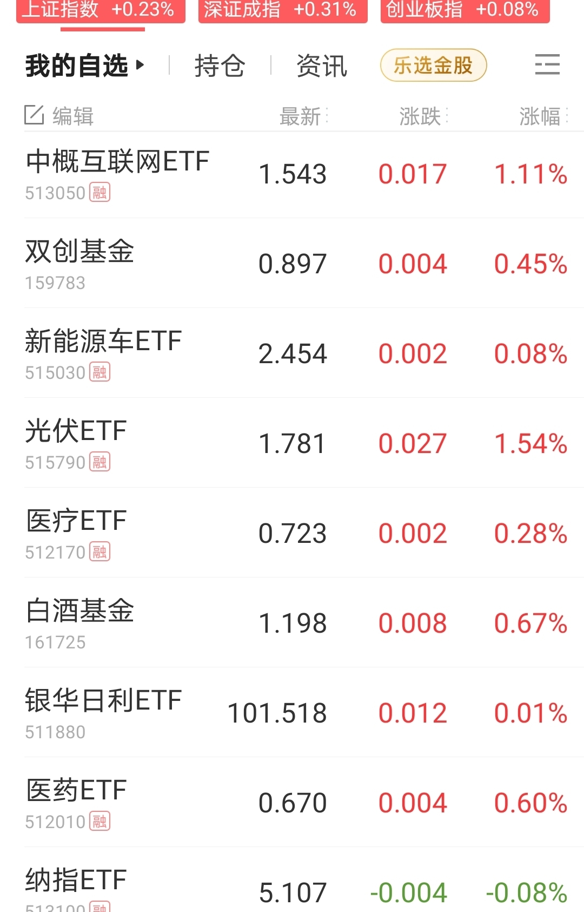

======================================================

_type: talk
@二师父[28814221155551]
2021-08-27 22:37:47 Fri  
topic_id: 581281111542554

<e type="hashtag" hid="28511222888841" title="#两大赛道坍塌#" /> 又崩了两个赛道，今年投资压中光伏的就胜利了，选择方向很重要。

阅读[1]  评论[0]  赞[0] 

+++++++++++++++++++++++++++++++++++++++++++++++++++++

文件：
2021-08-27 22:36:55 Fri
文件大小：[45846]
544822214181814-两大赛道坍塌.docx

======================================================

_type: talk
@二师父[28814221155551]
2021-08-28 00:45:58 Sat  
topic_id: 818518881525822

<e type="hashtag" hid="552114551414" title="#估值数据#" /> 市盈率百分位38.72%，SY-BY百分位37.2%，SY/BY百分位33.84%。

全市场估值很低了，目前值得定投的有医疗和科创50，科创50并不便宜，但是景气赛道，没有高估的时候可以结合均线定投，比如光伏，之前就没有低估，然而景气周期持续上涨，所以对于优质赛道，正常估值的时候均线以下仍旧可以投的。

台湾定投教母讲的定投是持续无脑定投，类似长牛指数纳斯达克很适合，取得一个平均的市场收益率。

@永刚 at 2021-08-28 00:45:58 Sat

> 按全市场估值，目前总股权占比多大合适？

----------

@二师父 at 2021-08-28 00:45:58 Sat

> 5层仓位，这个不能机械的应对，看波动自己是否能承受

----------

阅读[1]  评论[2]  赞[0] 

======================================================

_type: talk
@二师父[28814221155551]
2021-08-28 17:22:35 Sat  
topic_id: 185285548228452

<e type="hashtag" hid="28511222281211" title="#与新能源相关的指数#" />

阅读[1]  评论[0]  赞[0] 

+++++++++++++++++++++++++++++++++++++++++++++++++++++

文件：
2021-08-28 17:20:03 Sat
文件大小：[46237]
244155522851151-与新能源有关的指数汇总.docx

======================================================

_type: talk
@阿宝[422212151424158]
2021-08-28 22:55:39 Sat  
topic_id: 418418825858118

我们一起来看这本书！

阅读[1]  评论[0]  赞[0] 

+++++++++++++++++++++++++++++++++++++++++++++++++++++

图片：

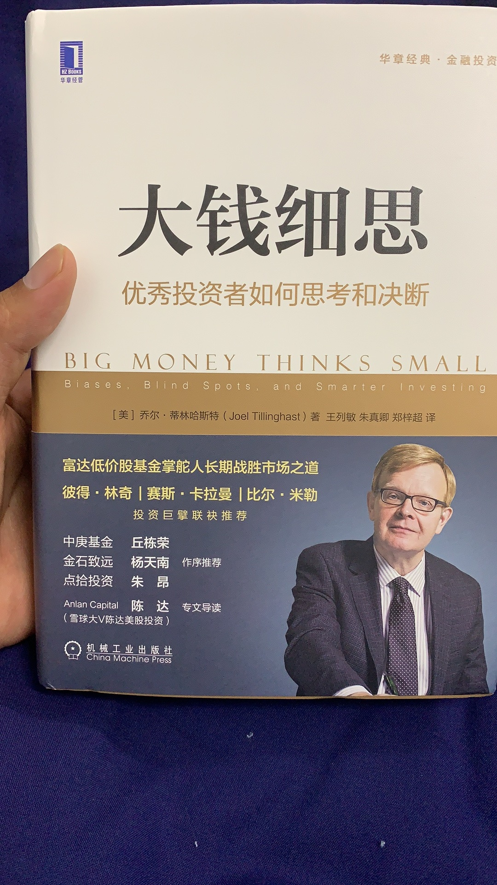

======================================================

_type: talk
@庆余年[15584481824122]
2021-08-29 09:43:45 Sun  
topic_id: 218518841582851

本月基金排行榜

阅读[1]  评论[0]  赞[0] 

+++++++++++++++++++++++++++++++++++++++++++++++++++++

文件：
2021-08-29 09:43:12 Sun
文件大小：[941911]
422144424842888-基金排行-第九期.docx

======================================================

_type: talk
@二师父[28814221155551]
2021-08-29 21:18:48 Sun  
topic_id: 218518258251211

<e type="hashtag" hid="15288444184212" title="#科创50指数#" /> 关于科创50指数调仓分析

阅读[1]  评论[0]  赞[0] 

+++++++++++++++++++++++++++++++++++++++++++++++++++++

文件：
2021-08-29 21:18:27 Sun
文件大小：[45756]
422144421818288-科创50指数迎来调整.docx

======================================================

_type: q&a
@wty[548488548545444]
2021-08-30 10:56:49 Mon  
topic_id: 818518844122212

@wty

>  二师父，请教一下，国内有grn碳积分期权的etf吗？侄女在美国可以用美元投的，国内有类似的投资工具吗？

@二师父

>  有期货交易，期权这种我还没了解到

阅读[1]  评论[1]  赞[0] 

======================================================

_type: q&a
@衣袂飘香[118248548242452]
2021-08-30 11:10:51 Mon  
topic_id: 581281518141854

@衣袂飘香

>  二师父好。鳄鱼计划里面的光伏ETF，收益率有将近60%了，要收割一些利润吗？我的持仓比例和您差不多。

@二师父

>  收割利润是可以的，我的仓位比较少，就准备一直持有了

阅读[1]  评论[1]  赞[0] 

======================================================

_type: talk
@二师父[28814221155551]
2021-08-30 22:00:40 Mon  
topic_id: 218518242125581

<e type="hashtag" hid="48411552488258" title="#继续分化#" /> 光伏买了，但是仓位太低，值得反思，收益率高，仓位低也不行。二者要同时起来。

@老孙头 at 2021-08-30 22:00:40 Mon

> “亏钱肯定不是价值投资”，可列为经典。（被套的）券商、银行只跌不弾，这么拿着可行吗？有点头疼。

----------

@J at 2021-08-30 22:00:40 Mon

> 师傅，你的原则开始发生改变了

----------

@庆余年 at 2021-08-30 22:00:40 Mon

> 拥抱变化，是好事。

----------

@J at 2021-08-30 22:00:40 Mon

> 拥抱变化是好，但原则改变只是会让我们感到有点无所适从，消费是好赛道到达低估反而因为下行趋势而停止加仓，不明白所以然。

----------

@J at 2021-08-30 22:00:40 Mon

> 以前的原则是低估定投，正常收割，高估卖出，现在变成追热点和趋势去了[捂脸]玩法大不同，万一踩不中热点板块或变成了追涨呢？

----------

@庆余年 at 2021-08-30 22:00:40 Mon

> 消费没有低估，如果现在想做定投有很多价值类的可以投，包括一些优质的主动基。为啥要强明显在下行的赛道，就算你要买，不应该等下跌企稳麽？

----------

@庆余年 at 2021-08-30 22:00:40 Mon

> 二师父的定投操作，我看来是比较保守的，没看到你说的追热点或者趋势。

----------

@J at 2021-08-30 22:00:40 Mon

> 更正一下，消费龙头目前是低估的，大消费还在正常区域，白酒是高估。这三者有区别。

----------

阅读[1]  评论[15]  赞[0] 

+++++++++++++++++++++++++++++++++++++++++++++++++++++

文件：
2021-08-30 21:59:49 Mon
文件大小：[45784]
422144844285158-继续分化.docx

======================================================

_type: talk
@二师父[28814221155551]
2021-08-30 23:08:34 Mon  
topic_id: 818518244425222

<e type="hashtag" hid="552114551414" title="#估值数据#" /> 市盈率百分位35.94%，SY-BY百分位34.65%，SY/BY百分位30.72%，再跌一跌市场就要进入估值楼层二层了。

目前市场极端分化，结构牛市和结构熊市共演，未来大概率不会有全面的疯牛市了，选对板块就是牛市

@永刚 at 2021-08-30 23:08:34 Mon

> 师父：科技龙头指数基金现在是低估吗？

----------

@二师父 at 2021-08-30 23:08:34 Mon

> 是低估的

----------

阅读[1]  评论[2]  赞[0] 

======================================================

_type: talk
@二师父[28814221155551]
2021-08-31 21:42:44 Tue  
topic_id: 418418185485418

<e type="hashtag" hid="145545111422" title="#白酒指数#" /> 关于追热点问题，高估的指数从来没有买过，不存在追高，热点可以追，低估买入或者正常估值，而高估的时候除非设定止损线，否则不会买入，投资策略并没有变化，都是低吸，均符合三大定投策略。

阅读[1]  评论[0]  赞[0] 

+++++++++++++++++++++++++++++++++++++++++++++++++++++

文件：
2021-08-31 21:41:15 Tue
文件大小：[45754]
544824451155124-白酒回撤30%了.docx

======================================================

_type: talk
@二师父[28814221155551]
2021-08-31 22:42:53 Tue  
topic_id: 418418181821588

<e type="hashtag" hid="552114551414" title="#估值数据#" /> 市盈率百分位35.94%，SY-BY百分位34.6%，SY/BY百分位30.67%。

市场估值进一步下移，开启定投三个方向，中欧医疗股票、科创50，易方达增强回报债，没有问题。

光伏说看好，但也是等待回调买入，并没有追高。

@杜志彪 at 2021-08-31 22:42:53 Tue

> 选对赛道，卖出高估，买入低估，赚时间的钱，慢慢变富。

----------

@马卿 at 2021-08-31 22:42:53 Tue

> 二师父，券商ETF要清吗

----------

阅读[1]  评论[2]  赞[0] 

======================================================

