_type: q&a
@铥@铥~~[582228558115884]
2021-09-01 20:08:17 Wed  
topic_id: 818518145844412

@铥@铥~~

>  科创50场外代码有推荐吗？除了588080

@二师父

>  同一指数，不同代码差别不大的，选择一个头部基金公司，并且追踪误差小的基金即可

阅读[1]  评论[0]  赞[0] 

======================================================

_type: talk
@二师父[28814221155551]
2021-09-01 21:40:43 Wed  
topic_id: 581281884211154

<e type="hashtag" hid="552114551414" title="#估值数据#" /> 市盈率百分位34.23%，市净率百分位34.34%，SY-BY百分位33.6%，SY/BY百分位26.63%，估值很快就要进入二楼了，低估的指数也越来越多。

阅读[1]  评论[0]  赞[0] 

======================================================

_type: talk
@二师父[28814221155551]
2021-09-01 21:43:07 Wed  
topic_id: 818518114584882

<e type="hashtag" hid="88511245511212" title="#实盘记录#" /> 买入易方达增强回报债200元，中欧医疗、景顺鼎益、科创50各100元，投资中不存在追高，即使投资光伏，也会等他跌下来，看好和买入，看空和卖出是两回事。

@杜志彪 at 2021-09-01 21:43:07 Wed

> 师父星球里是不是忘发估值表了，没看到。

----------

阅读[1]  评论[1]  赞[0] 

======================================================

_type: talk
@二师父[28814221155551]
2021-09-02 08:41:21 Thu  
topic_id: 418415445524818

<e type="hashtag" hid="481211145528" title="#指数估值#" /> 9月1日估值表

@吃肉肉 at 2021-09-02 08:41:21 Thu

> 师父，光伏需要减仓吗？减多少层仓？

----------

@二师父 at 2021-09-02 08:41:21 Thu

> 可以卖出全部利润

----------

@吃肉肉 at 2021-09-02 08:41:21 Thu

> 收到，谢谢！

----------

@秦风殇韵（刘豫斌） at 2021-09-02 08:41:21 Thu

> 光伏盈利90%多了，今天忘了操作，明天看情况落袋吧

----------

阅读[1]  评论[4]  赞[0] 

+++++++++++++++++++++++++++++++++++++++++++++++++++++

图片：
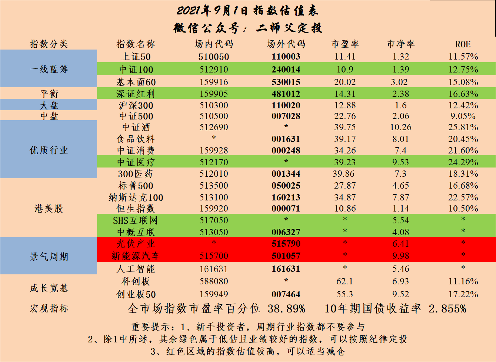

======================================================

_type: talk
@二师父[28814221155551]
2021-09-02 10:46:34 Thu  
topic_id: 581285212541424

<e type="hashtag" hid="881251425252" title="#鳄鱼计划#" /> 买入白酒基金161725一份，医药基金512010一份，卖出券商一份。

白酒支撑位，可以先买一份，反弹就波段卖出，支撑位没撑住的话下探后再买。

看空不做空，看多不追涨，总会有机会的。一直低迷的券商也开始发力了，在起伏中买入卖出，最后获利的就是你。

@云卷云舒 at 2021-09-02 10:46:34 Thu

> 老师！双创50到了0.85，可以买了吗[呲牙]

----------

@二师父 at 2021-09-02 10:46:34 Thu

> 可以，下一次0.8再买

----------

@云卷云舒 at 2021-09-02 10:46:34 Thu

> 好的谢谢！

----------

@光少 at 2021-09-02 10:46:34 Thu

> 二师父，现在医疗ETF低估区域还不能投吗

----------

@二师父 at 2021-09-02 10:46:34 Thu

> 可以投

----------

@光少 at 2021-09-02 10:46:34 Thu

> 没看到你发布投[偷笑]

----------

@二师父 at 2021-09-02 10:46:34 Thu

> 后面会的，不着急

----------

@秦风殇韵（刘豫斌） at 2021-09-02 10:46:34 Thu

> 券商波段还挺爽的

----------

阅读[1]  评论[8]  赞[0] 

======================================================

_type: talk
@二师父[28814221155551]
2021-09-02 19:35:18 Thu  
topic_id: 818512528548542

<e type="hashtag" hid="15288412454552" title="#均衡配置#" /> 目前轻仓定投，反弹盈利收割利润，不到极端估值不会再次重仓了，控制好仓位，应对可能发生的风险。

阅读[1]  评论[0]  赞[0] 

+++++++++++++++++++++++++++++++++++++++++++++++++++++

文件：
2021-09-02 19:34:18 Thu
文件大小：[47019]
544824821154154-均衡配置的重要性.docx

======================================================

_type: talk
@二师父[28814221155551]
2021-09-02 19:50:47 Thu  
topic_id: 218512528822221

<e type="hashtag" hid="552114551414" title="#估值数据#" /> 市盈率百分位34.5%，SY-BY百分位33.89%，SY/BY百分位27.69%。

估值逐步下移，慢慢开启左侧新一轮定投是合适的，当下A股市场就是如此，每一轮高位会涨到极端，而每一轮低位会跌到极端，把握住极端低迷不恐惧，极端高位不贪婪就行。

阅读[1]  评论[0]  赞[0] 

======================================================

_type: talk
@二师父[28814221155551]
2021-09-02 20:03:01 Thu  
topic_id: 185284245518222

<e type="hashtag" hid="88514141542152" title="#主动基金估值表#" />

@梦的旋律 at 2021-09-02 20:03:01 Thu

> 指数基金的估值很多地方都能查到，最缺的就是主动基金的[强]

----------

@Pacifica at 2021-09-02 20:03:01 Thu

> 二师父，中欧医疗创新和葛兰管理的另外一个老基金，中欧医疗，似乎持仓都差不多，就是管理规模不一样吧？

----------

@二师父 at 2021-09-02 20:03:01 Thu

> 叫啥名，持仓一致的话看看投资策略一致就表示差不多

----------

@Pacifica at 2021-09-02 20:03:01 Thu

> 003095 中欧医疗健康

----------

@二师父 at 2021-09-02 20:03:01 Thu

> 这俩基金一个混合一个股票，类型不同。混合基金仓位更灵活一些

----------

@Pacifica at 2021-09-02 20:03:01 Thu

> 谢谢回复[微笑]

----------

阅读[1]  评论[6]  赞[0] 

+++++++++++++++++++++++++++++++++++++++++++++++++++++

图片：
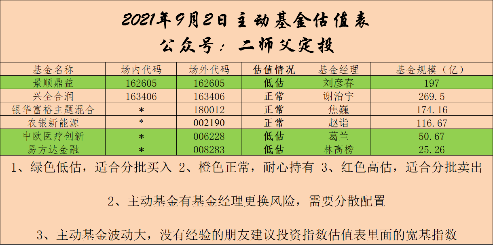

======================================================

_type: talk
@付云[844148188522822]
2021-09-03 11:45:54 Fri  
topic_id: 418415814581288

二师傅，可转债ETF今年表现挺好的，能加仓么？加到多少合适

@二师父 at 2021-09-03 11:45:54 Fri

> 不超过百分之10，这个位置转债不便宜

----------

@丸子妈 at 2021-09-03 11:45:54 Fri

> 可转债可以做波段

----------

阅读[1]  评论[2]  赞[0] 

======================================================

_type: talk
@二师父[28814221155551]
2021-09-03 17:40:57 Fri  
topic_id: 218512258254211

<e type="hashtag" hid="15288412114522" title="#持续被锤，还能定投吗#" />

阅读[1]  评论[0]  赞[0] 

+++++++++++++++++++++++++++++++++++++++++++++++++++++

文件：
2021-09-03 17:40:43 Fri
文件大小：[46328]
844154182552542-持续被锤，还能投吗.docx

======================================================

_type: talk
@Fernando杜[841518122414242]
2021-09-03 21:49:47 Fri  
topic_id: 218512254588881

二师父好，今年自打A股到3500左右，也是因个人原因，没有再跟进调整仓位。最近上来看到有几只基二师父早已清仓，我也希望做一些调整。目前有这五只还有些亏损，想请问二师父，我是否应该清仓呢？谢谢
汇添富中证主要消费（000248）；
易方达上证50（110003）；
工银深红利（481012）；
易方达金融行业股票（008283）；
汇添富全球消费混合人民币（006308）。

另外，还想请教二师父，新能源板块风光电将会和储能一起组合，之前看您介绍过储能产业指数（931746），不知现在是否适合定投这只基金？谢谢

@二师父 at 2021-09-03 21:49:47 Fri

> 目前这个位置清仓不大适合了，金融行业股票可以走，金融危机来的话这个会跌的很惨，储能可以等一等，优选光伏指数，回调到60日均线以下再定投

----------

@Fernando杜 at 2021-09-03 21:49:47 Fri

> 好的，谢谢您的回复[呲牙]

----------

阅读[1]  评论[2]  赞[0] 

======================================================

_type: talk
@杜志彪[544454124115854]
2021-09-04 14:54:11 Sat  
topic_id: 581285552211154

简单总结一下前8个月情况:场外不用说了，用增量资金跟二师父定投就可以了，没动脑子，主要是场内，由于2021想获取超额收益，去掉了去年的宽基指数，保留了深红利和创业板50，其它的随二师父配置了医疗消费互联网50，还有少量的香港证券，可转债ETF,招商双债，双创，新能车，光伏，4只个股，目前6层仓，由于消费医疗没有减仓可能是跑输300指数（－7%）的原因吧，目前场内正在周定投低估的医疗和互联网50，等待新能车、光伏、碳中和、军工的定投机会，至于消费我想低估以后还是可以定投，等待下一个高估的周期，未来10年还是瞄准医疗消费科技三大赛道，请二师父把把关，看看思路是否正确。

@杜志彪 at 2021-09-04 14:54:11 Sat

> 目前收益－8.19%

----------

@二师父 at 2021-09-04 14:54:11 Sat

> 消费低估了定投是没问题的，长期看这是长牛赛道，以10年周期看可以忽略波动，和医疗一样，不过目前消费降级，整体消费受到抑制，加上过去两年消费涨的太猛，所以趋势转换也正常，A股波动太大，单一地终身持有有点行不通，高估如果不想清仓，也可以卖出本金

----------

阅读[1]  评论[2]  赞[0] 

======================================================

_type: talk
@二师父[28814221155551]
2021-09-04 21:27:51 Sat  
topic_id: 185284445815482

<e type="hashtag" hid="15288415225842" title="#医疗基金如何挑选#" />

阅读[1]  评论[0]  赞[0] 

+++++++++++++++++++++++++++++++++++++++++++++++++++++

文件：
2021-09-04 21:27:41 Sat
文件大小：[45798]
422142158112558-医疗基金如何挑选.docx

======================================================

_type: talk
@二师父[28814221155551]
2021-09-05 20:16:36 Sun  
topic_id: 581285582452214

<e type="hashtag" hid="15288415551212" title="#低估区域和底部的区别#" />

阅读[1]  评论[0]  赞[0] 

+++++++++++++++++++++++++++++++++++++++++++++++++++++

文件：
2021-09-05 20:16:26 Sun
文件大小：[162971]
422142128484258-如何区分底部和低估区域.docx

======================================================

_type: talk
@那方山的树，佛陀座下*[244412158214221]
2021-09-06 11:18:08 Mon  
topic_id: 818512451551422

今天续费，跟着二师傅买基金，不知不觉也进步了不少，主要是心态好了很多

@二师父 at 2021-09-06 11:18:08 Mon

> 加油

----------

阅读[1]  评论[1]  赞[0] 

======================================================

_type: talk
@二师父[28814221155551]
2021-09-06 21:26:25 Mon  
topic_id: 418415158121428

<e type="hashtag" hid="281158284851" title="#市场分析#" /> 上周四发车的，今天吃肉，涨幅不大，整体医药还是浮亏，继续持有，定投即可。

@J at 2021-09-06 21:26:25 Mon

> 哈哈师傅很幽默，这个标题有点吴亦凡[呲牙]

----------

阅读[1]  评论[1]  赞[0] 

+++++++++++++++++++++++++++++++++++++++++++++++++++++

文件：
2021-09-06 21:25:37 Mon
文件大小：[45503]
844151511211442-涨幅有点猛，你忍一下.docx

======================================================

_type: talk
@二师父[28814221155551]
2021-09-06 21:41:51 Mon  
topic_id: 581285855212814

<e type="hashtag" hid="552114551414" title="#估值数据#" /> 市盈率百分位34.6%，SY-BY百分位34.06%，SY/BY百分位27.98%。

估值楼层三层，继续半仓定投，估值楼层二层后再全部股权投资。

阅读[1]  评论[0]  赞[0] 

======================================================

_type: talk
@二师父[28814221155551]
2021-09-07 00:51:04 Tue  
topic_id: 218512145251151

市场分析音频文件，来个视频，来个音频

<e type="web" href="http://zjapp-data.oss-cn-shanghai.aliyuncs.com/voice/share/95682315321217024/96f227d5-dcac-49e0-9467-a1a895401b5d.mp3?Expires=1631551776&OSSAccessKeyId=LTAI4G7uoJPRKqRHKXjdTkwR&Signature=CU35sVuta8EhAkC0U2av5mm39hc%3D" title="http://zjapp-data.oss-cn-shanghai.aliyuncs.com/voi..." />

@香香 at 2021-09-07 00:51:04 Tue

> 声音好好听，请问是二师父本人的声音吗？

----------

@香香 at 2021-09-07 00:51:04 Tue

> 声音好好听像播音员，请问是二师父本人的声音吗？

----------

@二师父 at 2021-09-07 00:51:04 Tue

> 不是哈

----------

阅读[1]  评论[3]  赞[0] 

======================================================

_type: talk
@Vivian[582228554481154]
2021-09-07 10:11:09 Tue  
topic_id: 818512141528482

老师，中概互联现在要开始定投或者补仓吗？之前买八千元，亏百分二十五

@Vivian at 2021-09-07 10:11:09 Tue

> 老师，帮忙回复一下吧

----------

阅读[1]  评论[1]  赞[0] 

======================================================

_type: q&a
@吴飞[818585844118852]
2021-09-07 20:03:01 Tue  
topic_id: 185284884115522

@吴飞

>  指数的低估阈值是指什么？还有定投系数怎么分配呢？

@二师父

>  进入低估区域的估值数据，这周发一下，定投系数主要根据估值高低确定

阅读[1]  评论[0]  赞[0] 

======================================================

_type: q&a
@阿宝[422212151424158]
2021-09-07 20:05:01 Tue  
topic_id: 218512114881821

@阿宝

>  易方达科创50（011609）和双创50，老师觉得估值低估、正常、高估，的大致位置是多少？目前位置长期定投科创50，以老师自己来说如何制定投资策略，定投金额。科技是大的方向，老师谈谈您的理解？谢谢！

@二师父

>  目前都是正常估值，目前的话可以设定一年定投周期，长期定投，高估收割利润，中小微科技企业受到国家政策扶持，目前北交所设立也是为了给三板企业融资的

阅读[1]  评论[2]  赞[0] 

======================================================

_type: talk
@二师父[28814221155551]
2021-09-07 22:37:25 Tue  
topic_id: 418412442855288

<e type="hashtag" hid="28511242552421" title="#下次准备定投的一个板块#" /> 传媒大家关注下，下次发车会开始。仅供参考，投资他纯属便宜。

@黎雄 at 2021-09-07 22:37:25 Tue

> 师傅传媒后期怎么卖呢，是等估值回归，还是反弹赚一波就走

----------

@二师父 at 2021-09-07 22:37:25 Tue

> 反弹收割利润，盈利翻倍后卖出本金

----------

阅读[1]  评论[2]  赞[0] 

+++++++++++++++++++++++++++++++++++++++++++++++++++++

文件：
2021-09-07 22:35:02 Tue
文件大小：[45331]
544828115442444-关注一个超跌反弹的板块.docx

======================================================

_type: talk
@隔窗遥望[241884481854181]
2021-09-07 22:39:43 Tue  
topic_id: 581284224142254

今天文章里提到的传媒板块投哪只基金，我加入基金池关注一下，等着发车

@二师父 at 2021-09-07 22:39:43 Tue

> 传媒ETF

----------

@手牵手看夕阳 at 2021-09-07 22:39:43 Tue

> 512980

----------

阅读[1]  评论[2]  赞[0] 

======================================================

_type: talk
@二师父[28814221155551]
2021-09-08 00:04:38 Wed  
topic_id: 581284228141544

<e type="hashtag" hid="51288545228884" title="#介绍底仓+定投的投资策略#" /> 声音不是我的声音哈，是我用AI合成的，以前自己还傻傻的阅读，专业的事交给机器人，声音比我的还好听，后面多分享这种音频，大家开车或者做家务的时候也能够学习啦。

阅读[1]  评论[0]  赞[0] 

+++++++++++++++++++++++++++++++++++++++++++++++++++++

文件：
2021-09-08 00:03:16 Wed
文件大小：[281853]
422141882412848-底仓+定投的投资策略.mp3

======================================================

_type: talk
@二师父[28814221155551]
2021-09-08 09:31:43 Wed  
topic_id: 418412485212518

<e type="hashtag" hid="881251425252" title="#鳄鱼计划#" /> 买入传媒etf8份，代码512980，原因已经解读，有问题再说，仅为个人投资记录，投资均有风险，请注意

@小鱼 at 2021-09-08 09:31:43 Wed

> 8份,买的挺多的，跟上

----------

@Chu at 2021-09-08 09:31:43 Wed

> 师父买的时候是什么价位呀？

----------

@二师父 at 2021-09-08 09:31:43 Wed

> 0.736

----------

@杜志彪 at 2021-09-08 09:31:43 Wed

> 前两天买了点分众的观察仓，刚看了一下，传媒ETF第一大持仓股就是分众，我就拿分众替代传媒ETF可以把师父？

----------

@老孙头 at 2021-09-08 09:31:43 Wed

> 老师的一份金额大概几多[强]

----------

@二师父 at 2021-09-08 09:31:43 Wed

> 也可以，控制仓位

----------

@二师父 at 2021-09-08 09:31:43 Wed

> 用总投资额除以250

----------

@章兵朋 at 2021-09-08 09:31:43 Wed

> 没跟上[撇嘴]

----------

阅读[1]  评论[8]  赞[0] 

======================================================

_type: talk
@二师父[28814221155551]
2021-09-08 10:37:42 Wed  
topic_id: 418412482552528

<e type="hashtag" hid="48411525481428" title="#关于可转债投资和打新#" /> 最近两个月转债上涨比较猛，市场火热，投资的转债ETF也已经盈利10%以上，目前符合双低转债策略的转债只有一张，投资风险大于潜在收益，所以暂时不发车，转债也是有牛熊的，18年就是转债大熊市。

所以当下转债投资暂时不发车了，下一次当转债由牛转熊，市场有符合标准的双低转债咱们再次投资。

无论股市还是债市，都是在火热的时候离开，在低迷的时候淡定地入场。

牛市转债打新就可以盲打，这是和转债熊市操作不同的地方。

@Chu at 2021-09-08 10:37:42 Wed

> 跟着师父也有10多点收益了，是收割利润还是继续持有呀

----------

@二师父 at 2021-09-08 10:37:42 Wed

> 都可以

----------

阅读[1]  评论[2]  赞[0] 

======================================================

_type: talk
@平安是福[118222545154542]
2021-09-08 14:59:22 Wed  
topic_id: 218514522542881

师父：上次介绍的医疗保险，投保地选不了啊，意外险也买不了

@二师父 at 2021-09-08 14:59:22 Wed

> 任选一个地域就行，不影响理赔

----------

阅读[1]  评论[1]  赞[0] 

======================================================

_type: talk
@二师父[28814221155551]
2021-09-08 19:54:33 Wed  
topic_id: 218514545148251

<e type="hashtag" hid="481211145528" title="#指数估值#" /> 有几个指数进入正常估值了，当指数进入正常估值就开始收割利润，或者持有就行。

@永刚 at 2021-09-08 19:54:33 Wed

> 中证100回归正常估值，可以定投吗？

----------

@二师父 at 2021-09-08 19:54:33 Wed

> 刚进入正常估值也是可以定投的

----------

@杜志彪 at 2021-09-08 19:54:33 Wed

> 胆子越来越小了，半份低估定投医疗，互联网，科创。

----------

阅读[1]  评论[3]  赞[0] 

+++++++++++++++++++++++++++++++++++++++++++++++++++++

图片：
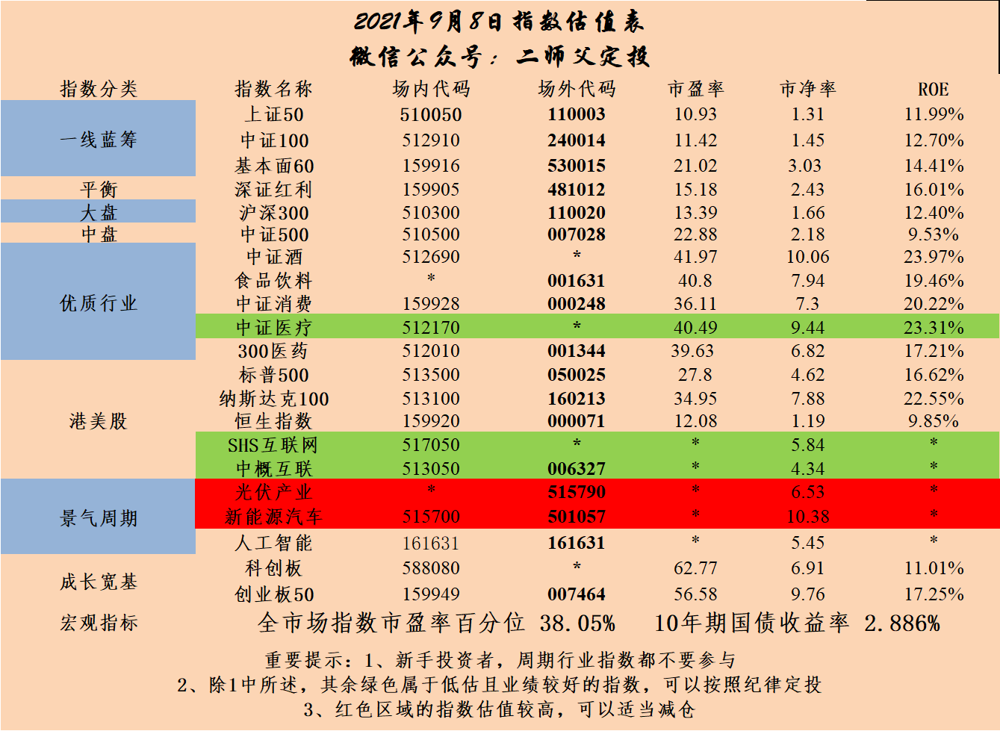

======================================================

_type: talk
@二师父[28814221155551]
2021-09-08 20:17:27 Wed  
topic_id: 185281215215522

<e type="hashtag" hid="28511242825841" title="#乌龟计划发车#" /> 买入中欧医疗（006228） 100元
买入科创50 (011609) 100元
景顺鼎益混合 （162605） 100元
买入易方达增强回报债（110017） 200元
买入广发中证传媒（004752） 2000元

传媒如果上午跟车的话已经盈利3%以上了，后面就是考虑加仓或者收割利润的问题。

@范毅君 at 2021-09-08 20:17:27 Wed

> 今天忙忘了，没跟上 收盘买了个观察仓 明天继续[流泪]

----------

@隔窗遥望 at 2021-09-08 20:17:27 Wed

> 今天上车了

----------

@衣袂飘香 at 2021-09-08 20:17:27 Wed

> 上午跟车了，坚定跟。

----------

@杜志彪 at 2021-09-08 20:17:27 Wed

> 我前连天买的是传媒ETF的十大重仓股，计划是长期的，师父的短线就不参与了[微笑]

----------

@Pacifica at 2021-09-08 20:17:27 Wed

> 师傅请教一下，我持有近3年葛兰管理的003093，中欧医疗，这个是个老基金，规模有300多亿。而你持有的006228，也是葛兰管理的医疗基金，比较新一点，规模只有70多亿。我想把我持有的规模较大的中欧医疗换成规模小一点的006228，你觉得怎么样呢？

----------

@二师父 at 2021-09-08 20:17:27 Wed

> 你确定代码没错？

----------

@Pacifica at 2021-09-08 20:17:27 Wed

> 003095[害羞][害羞]

----------

@二师父 at 2021-09-08 20:17:27 Wed

> 不用换，拿住了，发生大跌再买就行

----------

阅读[1]  评论[9]  赞[0] 

======================================================

_type: talk
@二师父[28814221155551]
2021-09-08 20:53:35 Wed  
topic_id: 818514548254222

<e type="hashtag" hid="88514141542152" title="#主动基金估值表#" />

阅读[1]  评论[0]  赞[0] 

+++++++++++++++++++++++++++++++++++++++++++++++++++++

图片：
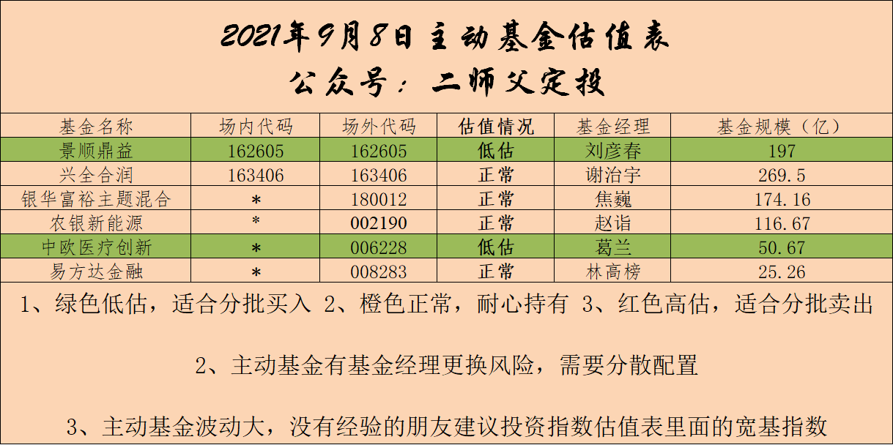

======================================================

_type: talk
@信阳田平[51448212515184]
2021-09-09 07:30:08 Thu  
topic_id: 218514518521841

二师父，为什么上证红利ETF最近两月长的很好，而深证红利ETF基本没怎么涨？

@二师父 at 2021-09-09 07:30:08 Thu

> 上证红利里面周期性企业比较多，目前周期性企业表现好，深红利里面消费企业比较多，目前消费股票下跌比较严重

----------

@信阳田平 at 2021-09-09 07:30:08 Thu

> 明白了，多谢二师父[抱拳]

----------

阅读[1]  评论[2]  赞[0] 

======================================================

_type: q&a
@lily[548488251242584]
2021-09-09 10:02:28 Thu  
topic_id: 185281588525282

@lily

>  老师，我一直在定投易方达蓝筹精选混合，但表现不好，我需要换成啥比较好呢？谢谢老师

@二师父

>  沪深300或者中证100指数基金

阅读[1]  评论[0]  赞[0] 

======================================================

_type: talk
@那方山的树，佛陀座下*[244412158214221]
2021-09-09 10:29:18 Thu  
topic_id: 818514811454112

二师傅，劳驾推荐一只科技基金，我想把现有持仓中的5g和计算机换成一只科技基金可行吗？

@二师父 at 2021-09-09 10:29:18 Thu

> 科创50或者农银新能源，二者都没有低估，可以采用均线定投策略轻仓定投

----------

阅读[1]  评论[1]  赞[0] 

======================================================

_type: talk
@毛毛宇[88281885112212]
2021-09-09 13:36:55 Thu  
topic_id: 818514252451822

二师夫，中概互联今天可以买吗？跌了不少了！

@Vivian at 2021-09-09 13:36:55 Thu

> 同问

----------

@二师父 at 2021-09-09 13:36:55 Thu

> 目前中概互联是比较便宜，我计划1.4再买，可以再等等，或者按照网格策略加仓

----------

阅读[1]  评论[2]  赞[0] 

======================================================

_type: talk
@平安是福[118222545154542]
2021-09-09 15:43:40 Thu  
topic_id: 581284524428124

师父：买保险提交订单出来这个，是买不了吗？

@二师父 at 2021-09-09 15:43:40 Thu

> 1971年之前的不性，您多大，我来具体找

----------

@平安是福 at 2021-09-09 15:43:40 Thu

> 我和老公分别是63年和62年出生

----------

@二师父 at 2021-09-09 15:43:40 Thu

> 这个年龄合适的重疾很少，防癌和意外险考虑吗

----------

@平安是福 at 2021-09-09 15:43:40 Thu

> 可以得

----------

阅读[1]  评论[4]  赞[0] 

+++++++++++++++++++++++++++++++++++++++++++++++++++++

图片：
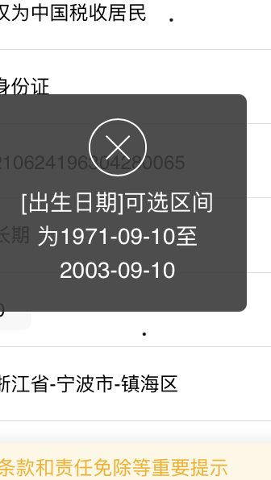

======================================================

_type: talk
@二师父[28814221155551]
2021-09-09 20:33:43 Thu  
topic_id: 581284515118224

<e type="hashtag" hid="15288418215552" title="#关于主动基金问题的解答#" /> 主动基金投资如何应对风险

阅读[1]  评论[0]  赞[0] 

+++++++++++++++++++++++++++++++++++++++++++++++++++++

文件：
2021-09-09 20:33:27 Thu
文件大小：[43157]
111828584854882-基金经理都给整抑郁了.docx

======================================================

_type: talk
@慕容[548814822814844]
2021-09-09 20:47:23 Thu  
topic_id: 218514282842521

二师父有什么消费型意外险，和重疾险推荐吗？36岁，还有家里老人将近60岁。经济实惠基础保障型

@二师父 at 2021-09-09 20:47:23 Thu

> <e type="web" href="https://cps.qixin18.com/apps/cps/lhz1029368/product/detail?prodId=103958&planId=128361" title="孝心安老年人意外险" cache="" />，这是老年人意外险，<e type="web" href="https://cps.qixin18.com/apps/cps/lhz1029368/product/detail?prodId=104158&planId=128721" title="勇者无惧-5-6类个人意外险" cache="" />，这是青年人意外险，老年人60岁，<e type="web" href="https://cps.qixin18.com/apps/cps/lhz1029368/product/detail?prodId=104248&planId=128894" title="达尔文5号焕新版" cache="" />，这是优质的重疾险，老年人60岁意外险就可以了，如果是北京人的话有一款保险很不错，意外的价格还可以保重疾

----------

阅读[1]  评论[1]  赞[0] 

======================================================

_type: talk
@二师父[28814221155551]
2021-09-09 22:21:50 Thu  
topic_id: 218514284822411

<e type="hashtag" hid="552114551414" title="#估值数据#" /> 市盈率百分位38.43%，SY-BY百分位36.7%，SY/BY百分位33.17%，估值稍微有所提升，煤炭和有色涨幅很好，周期性板块大涨，也确实说明当前是牛市末期了，等周期涨到高位后，开始杀跌大概率就会带动全体板块的下跌，我们已经做好应对，后面持续定投优质板块，周期板块买入参与后立刻走人，他们不适合长期定投，一般涨一波大的就要跌个好几年

阅读[1]  评论[0]  赞[0] 

======================================================

_type: talk
@二师父[28814221155551]
2021-09-09 22:55:11 Thu  
topic_id: 418412582285258

<e type="hashtag" hid="28511241541581" title="#转债实盘#" /> 拿出了一部分资金做转债实盘，之前的轮动速度太快，很多读者跟不上，现在实际做一个分享买入和卖出，供大家学习。

双低值低120的转债已经没有，所以适当的放开了一点，双低值相对较低和价格相对较低的结合。仓位也控制下，预计30%到40%仓位建仓，然后回撤后逐步加仓，上涨轮动后高溢价率或者价格超过140考虑逐步卖出。

整体策略还是双低轮动，不过频率会降低。然后绝对不会考虑130以上的转债。

转债下是有保底的，最次持有到期也能够获得债券收益率。

阅读[1]  评论[0]  赞[0] 

+++++++++++++++++++++++++++++++++++++++++++++++++++++

图片：
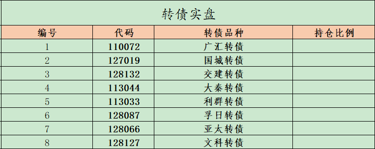

======================================================

_type: talk
@二师父[28814221155551]
2021-09-09 23:32:08 Thu  
topic_id: 218514225421451

<e type="hashtag" hid="28511241515251" title="#每日音频分享#" /> 没时间看文章的朋友可以多听听音频

阅读[1]  评论[0]  赞[0] 

+++++++++++++++++++++++++++++++++++++++++++++++++++++

文件：
2021-09-09 23:31:32 Thu
文件大小：[1902803]
111828581115582-基金经理都给整抑郁了.mp3

======================================================

_type: talk
@二师父[28814221155551]
2021-09-10 09:37:30 Fri  
topic_id: 818514222111882

<e type="hashtag" hid="881251425252" title="#鳄鱼计划#" /> 红利etf510880买入8份，开始开车啦，如果牛市就此终结，我们继续开始把仓位打满，如果牛市不终结，红利etf还会继续表现的，预计最高仓位百分之15左右。

仅供参考，未来所有的品种基金和可转债，一定保证盈利后卖出，如果非盈利卖出，那么我自己给大家发红包，请大家监督。

@那方山的树，佛陀座下* at 2021-09-10 09:37:30 Fri

> 好高啊

----------

@wty at 2021-09-10 09:37:30 Fri

> 红利已经涨很高了，这时候进去是准备平衡配置？

----------

@样 at 2021-09-10 09:37:30 Fri

> 这么高还买入，不太像二师父的风格呀

----------

@wty at 2021-09-10 09:37:30 Fri

> 我也在想，不太像二师父的风格呀

----------

@二师父 at 2021-09-10 09:37:30 Fri

> 他的估值并不高，不能看涨了就认为追高了，即使熊市来了，价值类基金表现也比成长类好

----------

@杜志彪 at 2021-09-10 09:37:30 Fri

> 二师父仓位低，我买4份。

----------

@wty at 2021-09-10 09:37:30 Fri

> 哦，明白了，我也跟着建仓4份了！

----------

@西锦巴乌 at 2021-09-10 09:37:30 Fri

> 请问师父买入红利的理由？就目前位置看已经较高了

----------

阅读[1]  评论[11]  赞[0] 

======================================================

_type: talk
@二师父[28814221155551]
2021-09-10 09:41:51 Fri  
topic_id: 418412552442548

<e type="hashtag" hid="28512814884111" title="#转债打新#" /> 瑞丰转债今日发行，顶格申购

阅读[1]  评论[0]  赞[0] 

======================================================

_type: talk
@nana[48222415211188]
2021-09-10 09:50:26 Fri  
topic_id: 185281441244842

二师傅好！今天牧原转债上市，什么时候卖合适？

@二师父 at 2021-09-10 09:50:26 Fri

> 下午熔断解除后

----------

阅读[1]  评论[1]  赞[0] 

======================================================

_type: talk
@二师父[28814221155551]
2021-09-10 21:30:43 Fri  
topic_id: 185281481458882

<e type="hashtag" hid="51288548521214" title="#两个红利指数的区别#" /> 看看深证红利和中证红利有何区别

阅读[1]  评论[0]  赞[0] 

+++++++++++++++++++++++++++++++++++++++++++++++++++++

文件：
2021-09-10 21:30:23 Fri
文件大小：[45933]
544828524442254-两个红利指数的区别.docx

======================================================

_type: q&a
@绝世名伶。[418442242548888]
2021-09-10 21:38:39 Fri  
topic_id: 818514215181882

@绝世名伶。

>  #二师父您好，鳄鱼计划 红利etf510880买入8份，开始开车啦，我是新加入的学员，想请教一下这个计划里的八份，每份是多少钱，如何购买这个计划。赐教谢谢！

@二师父

>  这个用自己的总投资金额除以250等于一份金额，比如你有25万，那么一份是1000元，自己在证券账户购买，置顶文章里面有华宝证券开户链接

阅读[1]  评论[0]  赞[1] 

======================================================

_type: talk
@二师父[28814221155551]
2021-09-10 21:53:38 Fri  
topic_id: 818514214214252

<e type="hashtag" hid="552114551414" title="#估值数据#" /> 市盈率百分位38.81%，SY-BY百分位37.25%，SY/BY百分位33.84%，估值楼层还是第三层。

最近买了两个周期指数传媒和红利，红利在这个位置如果下跌可以持续定投，仓位15%到20%以内是何时的哈，注意我买的仓位，只有8份，总体份额是250份，如果我梭哈红利ETF，确实追高了，而只有8份，问题真的不大，跌下来后面就要开始持续加仓了。

第二个传媒，这个股息率低，不值得持续定投，而是网格加仓，比如0.7，0.65，0.6这样的分层网格来加仓。

不同的投资标的是不同的投资方法的，目前市场上的机会我觉得就是这些哈。

持续定投的指数适合一种，盈利稳定，而且跌的非常惨，比如白酒指数跌到25倍市盈率的话就可以持续定投，如果放长周期看，未来10年一定会有某个阶段会达到的，需要做的就是，再不是极端便宜的时候轻仓参与，极端便宜的时候重仓参与。

阅读[1]  评论[0]  赞[0] 

======================================================

_type: talk
@二师父[28814221155551]
2021-09-11 13:51:17 Sat  
topic_id: 818514454152522

<e type="hashtag" hid="15288418484242" title="#每日音频分享中证红利和深红利的区别#" />

@HeLLO at 2021-09-11 13:51:17 Sat

> =师父中证红利，深红利现低估？代码分别什么？现适合买哪个？

----------

@二师父 at 2021-09-11 13:51:17 Sat

> 中证红利没有低估，上行趋势，深红利低估，不过是下行趋势，两个都可以买，左侧定投买深红利，建底仓先买中证红利，代码场内和场外不同

----------

@HeLLO at 2021-09-11 13:51:17 Sat

> 场内中证红利515080？基建看已涨好多？继续看好？

----------

@二师父 at 2021-09-11 13:51:17 Sat

> 对，底仓加网格合适

----------

阅读[1]  评论[4]  赞[0] 

+++++++++++++++++++++++++++++++++++++++++++++++++++++

文件：
2021-09-11 13:50:26 Sat
文件大小：[1634891]
244151288154111-中证红利和深红利的区别.mp3

======================================================

_type: talk
@二师父[28814221155551]
2021-09-11 18:37:05 Sat  
topic_id: 418412288152148

<e type="hashtag" hid="88511241452142" title="#后来的投资方向#" /> 语音和音频同步，星球没法发布视频，在外部平台抖音、b占有发布视频。

阅读[1]  评论[0]  赞[0] 

+++++++++++++++++++++++++++++++++++++++++++++++++++++

文件：
2021-09-11 18:34:22 Sat
文件大小：[43572]
422141585522528-8月金融数据出来了，接下来投资该怎么走.docx

2021-09-11 18:34:22 Sat
文件大小：[2462868]
844151282244242-8月金融数据出来了，投资方向怎么选.mp3

======================================================

_type: talk
@二师父[28814221155551]
2021-09-11 20:18:22 Sat  
topic_id: 218514482255551

<e type="hashtag" hid="48412124415418" title="#鳄鱼计划持仓表#" /> 市场结构性机会发掘，医疗、白酒、光伏、互联网是长期赛道，持有到高估再卖出，其他的金融+周期，可以结合利润收割。互联网未来的发展还有待政策验证。

阅读[1]  评论[0]  赞[0] 

+++++++++++++++++++++++++++++++++++++++++++++++++++++

图片：
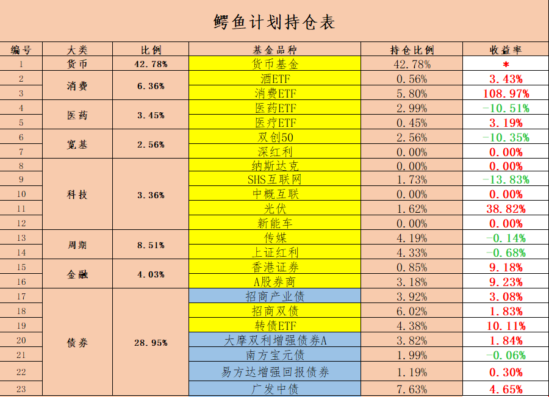

======================================================

_type: talk
@二师父[28814221155551]
2021-09-11 23:35:29 Sat  
topic_id: 418412282142518

科创板的行业定位是面向世界科技前沿、经济主战场、国家重大需求，主要服务于符合国家战略、突破关键核心技术、市场认可度高的科技创新企业，简单来讲就是硬科技型企业；而创业板行业定位于创新、创造、创意，主要服务成长型创新创业企业，支持传统产业与新技术、新产业、新业态、新模式深度融合。

北交所行业定位将重点放在了创新型中小企业。中小企业一直是中国经济发展中极其重要的微观主体，贡献了全国50%以上的税收，60%以上的GDP，70%以上的技术创新成果和80%以上的劳动力就业，是中国经济的基本盘，而创新型中小企业更是重中之重。

今年市场行情转变，中证1000、中庚小盘表现都比大盘股好，这种轮动效应在A股市场很常见。

阅读[1]  评论[0]  赞[0] 

======================================================

_type: talk
@二师父[28814221155551]
2021-09-12 09:23:26 Sun  
topic_id: 581284451418844

<e type="hashtag" hid="51288548451544" title="#与基建相关的投资基金#" />

@🍀 凝🌸 慧🍀 at 2021-09-12 09:23:26 Sun

> 师父，这篇文章与昨天的文章重复了，是不是发错了？

----------

@二师父 at 2021-09-12 09:23:26 Sun

> 好的，我重新上传了

----------

@🍀 凝🌸 慧🍀 at 2021-09-12 09:23:26 Sun

> 谢谢师父，已经看到了[愉快]

----------

阅读[1]  评论[3]  赞[0] 

+++++++++++++++++++++++++++++++++++++++++++++++++++++

文件：
2021-09-12 09:23:11 Sun
文件大小：[3218956]
422141554288858-与基建相关的投资基金.mp3

2021-09-12 15:32:05 Sun
文件大小：[43815]
544828551444584-与基建相关的基金有哪些值得投资.docx

======================================================

_type: talk
@林玮[844111858288412]
2021-09-12 22:47:00 Sun  
topic_id: 418412121181258

师父，510880是深红利？

@二师父 at 2021-09-12 22:47:00 Sun

> 这是上证红利

----------

阅读[1]  评论[1]  赞[0] 

======================================================

_type: q&a
@Kellyjia[422115541424148]
2021-09-13 08:30:21 Mon  
topic_id: 185281812115182

@Kellyjia

>  二师父，我买了中证500、创业板50、深沪300、证券指数这些基金，打算以存钱为目的，长期投资，现在每天都定投，像我这种需求，需要止盈吗？

@二师父

>  需要止盈，高估分批止盈

阅读[1]  评论[0]  赞[0] 

======================================================

_type: q&a
@阿宝[422212151424158]
2021-09-13 08:47:34 Mon  
topic_id: 418412118228888

@阿宝

>  老师你好，请教几个问题：1、两融数据从哪查询？2015年牛市两融数据是多少？2、新增投资者数量在哪查询？目前是个什么情况？3、新发基金规模在哪查询？去年是多少万亿的规模？4、你现在的身边谈论股票的人多吗？相比以前来说；5每日市场成交量连续万亿以上很长时间了，除了量化交易，房地产资金在加快流入，在个房地产资金流入数据如何查询？6、现在市场上目前低估板块主要是哪一些？7、券商的利好因素不断，个人觉得有机会，老师如何看？老师前期买入中证传媒除了便宜还是有一个重要因素看好后期市场整体表现吗？

@二师父

>  目前1.9万亿，15年大概2.2万亿，新增投资者数量8月187万，2020年新发基金规模3.16万亿，在东方财富这些数据可以查询。
>  
>  讨论股票人挺多的，我身边投资股票的朋友不少。热度比今年1月低一些了，去年7月是讨论最火热的时候，房地产资金流入具体指什么数据？
>  
>  目前低估的医疗，基建，传媒，中证红利，上证红利，中概互联。
>  
>  买入传媒看好价值股表现，包括基建和红利，后面也会逐步投资了。券商会有机会，目前牛市最后一阶段是情绪驱动，券商会有表现，防止过度洗盘下车。

阅读[1]  评论[6]  赞[0] 

======================================================

_type: talk
@二师父[28814221155551]
2021-09-13 10:28:52 Mon  
topic_id: 818514111485522

<e type="hashtag" hid="881251425252" title="#鳄鱼计划#" /> 基建工程买入8份，代码165525。继续买入，之前卸货的深红利一直跌，接下来投资转向就是红利etf，上证红利和中证红利。要注意大势注重趋势，小势注重逆势，煤炭，钢铁发力一般就是牛市的第三阶段了，在进攻的时候控制仓位，随时可能退出。

白酒，医疗，新能源是好赛道，但是也要注意仓位和定投节奏，不到最底部不满仓

@苍天有井明月空🌙 at 2021-09-13 10:28:52 Mon

> 跟

----------

@庆余年 at 2021-09-13 10:28:52 Mon

> 代码是399995还是165525

----------

@二师父 at 2021-09-13 10:28:52 Mon

> 文中发了哈

----------

@庆余年 at 2021-09-13 10:28:52 Mon

> [玫瑰][玫瑰][玫瑰]

----------

@阿宝 at 2021-09-13 10:28:52 Mon

> 老师之前看不上这些板块的，但是市场在变，策略也变，对牛市的判断和对仓位的控制，持仓也在变！

----------

@JOY at 2021-09-13 10:28:52 Mon

> 师父，请问您是多少价位入的基建？

----------

@二师父 at 2021-09-13 10:28:52 Mon

> 0.901

----------

@wty at 2021-09-13 10:28:52 Mon

> 二师父，跟着买了！问一下，预计这波周期行情持续多久呢？预计收益能达到多少？

----------

阅读[1]  评论[10]  赞[0] 

======================================================

_type: talk
@二师父[28814221155551]
2021-09-13 11:30:46 Mon  
topic_id: 218511555511121

投资是有周期的，房产，股市，汇市都一样，有大周期有小周期，周期底部进，周期顶部出，是王道，即使一个王朝也是有周期的，没有永恒一说，有开始就有终结

阅读[1]  评论[0]  赞[0] 

======================================================

_type: talk
@二师父[28814221155551]
2021-09-13 18:13:40 Mon  
topic_id: 581288228428854

<e type="hashtag" hid="28511215548121" title="#周期指数的定投频率#" /> 如何进行周期指数投资，频率和仓位都要把握。今年的行情演绎了17年的走势，价值股走高，成长股走低。

@庆余年 at 2021-09-13 18:13:40 Mon

> 生日快乐🎁🎁🎁

----------

@二师父 at 2021-09-13 18:13:40 Mon

> 谢谢

----------

@🍀 凝🌸 慧🍀 at 2021-09-13 18:13:40 Mon

> 师父是今天生日吗？生日快乐，幸福满满！🎉🎉🎉[玫瑰][玫瑰][玫瑰][蛋糕][鼓掌][鼓掌][鼓掌]

----------

@二师父 at 2021-09-13 18:13:40 Mon

> 谢谢

----------

@wty at 2021-09-13 18:13:40 Mon

> 生日快乐🎂🎁🎁🎁

----------

@JOY at 2021-09-13 18:13:40 Mon

> 🎂生日快乐！[玫瑰]

----------

@小牧童 at 2021-09-13 18:13:40 Mon

> 师父，生日快乐[玫瑰][玫瑰][玫瑰]

----------

@二师父 at 2021-09-13 18:13:40 Mon

> 谢谢

----------

阅读[1]  评论[10]  赞[1] 

+++++++++++++++++++++++++++++++++++++++++++++++++++++

文件：
2021-09-13 18:12:50 Mon
文件大小：[45939]
844151441282212-关于周期指数投资频率问题的说明.docx

======================================================

_type: talk
@二师父[28814221155551]
2021-09-13 22:25:05 Mon  
topic_id: 185288251514412

<e type="hashtag" hid="552114551414" title="#估值数据#" /> 市盈率百分位39.58%，SY/BY百分位34.44%，SY-BY百分位37.7%。

估值数据稍稍提高了，万得全A指数已经突破前高，而消费、医疗却下跌不少，目前市场风格切换确认，医疗可以继续定投，消费如果有底仓的话建议再等等。

接下来重点再周期方向和红利方向。

上证红利和中证红利选择一个，基建、传媒，优先上证红利和中证红利、其次基建，再次医疗，最后传媒。

互联网继续下跌，如果中概互联跌到1.4开始网格交易，不跌到的话持有剩余的部分即可。

基本上该投的方向已经分享，可以接着干活，无论多么激进，仓位都要控制再7成以内，仓位超过7成的建议逢高继续减仓。

阅读[1]  评论[0]  赞[0] 

======================================================

_type: talk
@二师父[28814221155551]
2021-09-13 23:25:18 Mon  
topic_id: 185288258244522

<e type="hashtag" hid="51288582285884" title="#分享我经常看数据的一些网站#" /> 无数据不投资，我经常看数据的一些网站，估值信息，WIND终端、果仁网，乐咕乐股官网这三个可以看看大致估值数据。

资金、融资融券、基金报告信息，东方财富、巨潮资讯网

研报信息，慧博投研和萝卜投研，慧博投研比较好。

大致把这些信息了解到位基本上从宏观到微观就有所了解了，慢慢学习就好，投资决策是根据宏观经济政策、产业周期以及当前经济形势、企业基本面、技术面、资金面以及牛熊周期决定的，当你学习的越多，做决策的时候认知越接近真理，赔率越低，胜率就会增高了。

@阿宝 at 2021-09-13 23:25:18 Mon

> 老师可以举个例子简单手把手教一下查数据，以及各个数据的应用和意义吗？

----------

@🍀 凝🌸 慧🍀 at 2021-09-13 23:25:18 Mon

> 我也特希望师父能举例子教教我们

----------

@二师父 at 2021-09-13 23:25:18 Mon

> 好的

----------

@阿宝 at 2021-09-13 23:25:18 Mon

> 辛苦老师

----------

阅读[1]  评论[4]  赞[0] 

======================================================

_type: talk
@二师父[28814221155551]
2021-09-14 09:30:38 Tue  
topic_id: 581288255848484

<e type="hashtag" hid="222484545521" title="#打新提示#" /> 泉峰转债今天可以打新，这家汽车企业，主要业务汽车零部件研发；汽车零部件及配件制造；轴承、齿轮和传动部件制造；轴承、齿轮和传动部件销售；齿轮及齿轮减、变速箱制造；齿轮及齿轮减、变速箱销售；新能源汽车电附件销售；电机及其控制系统研发；电机制造；工程和技术研究和试验发展；导航、测绘、气象及海洋专用仪器制造；导航、测绘、气象及海洋专用仪器销售；模具制造；家用电器制造；家用电器零配件销售。

从近一年数据来看公司利润和营收都是稳步增长的，首日上市肯定是有肉吃。

对于新债，大家都参与，如果跌破面值，符合双低标准的话，那么继续买入，转债打新和投资都是可以的。

因为高价转债风险大，即使有预期也不建议做，所以任何买入的转债都要把价格控制在120以内，这是低风险投资者的原则，当然艺高人胆大，高手除外。

阅读[1]  评论[0]  赞[0] 

======================================================

_type: talk
@林玮[844111858288412]
2021-09-14 09:39:53 Tue  
topic_id: 185288241225452

师父，165525有网格吗

@二师父 at 2021-09-14 09:39:53 Tue

> 有，按照0.85的基准价，0.85，0.8，0.75，0.7，0.65，0.6加

----------

@林玮 at 2021-09-14 09:39:53 Tue

> 谢谢

----------

阅读[1]  评论[2]  赞[0] 

======================================================

_type: talk
@天马行空[548818851412444]
2021-09-14 09:48:47 Tue  
topic_id: 418411452481888

请问师傅，跟踪沪深300，中证500，上证50被动指数基金最好的的代码多少。三选二淘汰哪个。谢谢

@二师父 at 2021-09-14 09:48:47 Tue

> 沪深300加中证500组合就可以，50和300都是大盘，选择易方达或者天弘这两个大公司

----------

阅读[1]  评论[1]  赞[0] 

======================================================

_type: talk
@JOY[111881481812422]
2021-09-14 10:06:38 Tue  
topic_id: 418411452858448

师父，想请教下您对光伏的看法。
您目前这些仓位是打算长持，还是也有出货的打算？如果出，会在什么情况下出，比如上涨到什么位置，或是下跌到什么位置？另外，请问您收割过利润了吗？

@二师父 at 2021-09-14 10:06:38 Tue

> 之前卖过一份，可以关注下，如果清仓的话是情绪高点和业绩转折点，如果卖出的话看上涨到压力位不破新高就卖，没有具体的数

----------

@JOY at 2021-09-14 10:06:38 Tue

> 好的，谢谢您～

----------

阅读[1]  评论[2]  赞[0] 

======================================================

_type: talk
@二师父[28814221155551]
2021-09-14 21:51:10 Tue  
topic_id: 218511518141851

<e type="hashtag" hid="88511215285422" title="#关于市场的分析#" /> 接下来对于一些具体问题解答我会文字或者音频的形式，星球发不了视频，大家有兴趣可以看我视频号，内容都是一样的。学习很重要，每天进步一点点，日积月累，自然认知提高以后，在市场的胜率就更大一些了。

@梧桐 at 2021-09-14 21:51:10 Tue

> 二师父，传媒和基建要如何应对。

----------

@二师父 at 2021-09-14 21:51:10 Tue

> 按照网格加仓就可以了，这两个不用担心

----------

@梧桐 at 2021-09-14 21:51:10 Tue

> 明白，谢谢

----------

阅读[1]  评论[3]  赞[0] 

+++++++++++++++++++++++++++++++++++++++++++++++++++++

文件：
2021-09-14 21:49:29 Tue
文件大小：[47166]
544828822148844-要小心了.docx

2021-09-14 21:49:29 Tue
文件大小：[3134946]
244151155841141-要小心了.mp3

======================================================

_type: talk
@二师父[28814221155551]
2021-09-14 22:06:26 Tue  
topic_id: 581288284458184

<e type="hashtag" hid="552114551414" title="#估值数据#" /> 市盈率百分位39.21%，SY/BY百分位34.11%，SY-BY百分位37.68%。

按照凯利公式，如果空仓开始投资的话，仓位就是1-0.4*2=0.2，不过这个仓位太低了，所以，最低仓位是20%以上，仓位管理在投资中非常重要，先把这个做好了，然后再考虑具体基金。

当然具体也可以1-百分位数据=目前仓位。

阅读[1]  评论[0]  赞[0] 

======================================================

_type: talk
@二师父[28814221155551]
2021-09-14 22:48:28 Tue  
topic_id: 185288288241122

<e type="hashtag" hid="88511215282552" title="#中证500指数的估值#" />

@杜志彪 at 2021-09-14 22:48:28 Tue

> 学习了

----------

@JOY at 2021-09-14 22:48:28 Tue

> 感谢老师干货分享

----------

阅读[1]  评论[2]  赞[0] 

+++++++++++++++++++++++++++++++++++++++++++++++++++++

文件：
2021-09-14 22:48:19 Tue
文件大小：[6129000]
544828825121414-中证500指数的估值.m4a

======================================================

_type: talk
@二师父[28814221155551]
2021-09-15 19:47:22 Wed  
topic_id: 818511281441522

<e type="hashtag" hid="825188852442" title="#估值表#" /> 对于盈利稳定的指数，可以越跌越买，而对于不稳定盈利的行业指数就需要注意了，这种时候即使低估，也需要采用网格加仓法，把握下跌空间，否则在一个横盘位置买的太多，再跌一个大的，就被套住了。

消费也即将进入低估区域，进入低估区域后也会逐步开始消费基金的投资，选择标的大概率是汇添富消费ETF连接和中证白酒，白酒离低估区域还有很长的距离，大家耐心等待，如果这时候买也是小仓位，还没有到持续定投的时候。

阅读[1]  评论[0]  赞[0] 

+++++++++++++++++++++++++++++++++++++++++++++++++++++

图片：
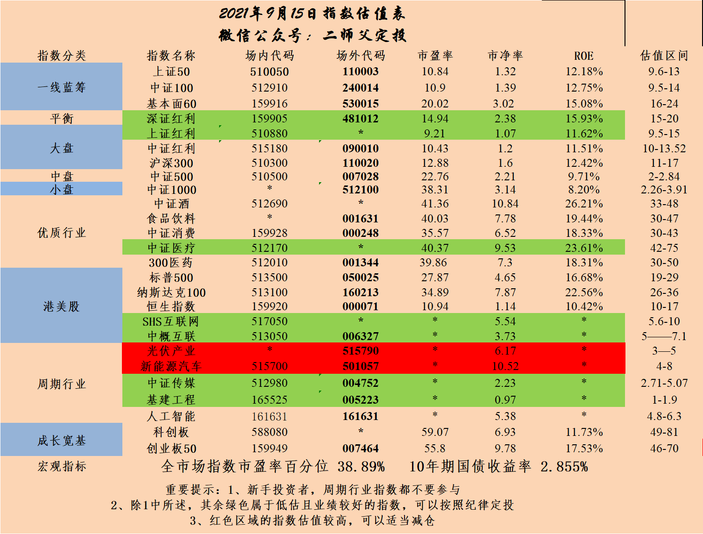

======================================================

_type: talk
@二师父[28814221155551]
2021-09-15 19:50:52 Wed  
topic_id: 218511228285581

<e type="hashtag" hid="15285284512182" title="#实盘#" /> 买入中证1000（161039） 2000元
中证红利（090010） 1000元
工银前沿医疗 (001717) 200元
华宝医疗（162412） 300元
基建工程 (005223) 500元。

目前仓位非常轻，如果遇到大跌，慢慢可以开启左侧交易了，现在我得观察是大盘指数已经进入下行趋势了，小盘股中证1000仍旧是上行趋势，可以逢低做多，大盘指数先暂停，沪深300跌到10倍市盈率开启左侧交易更为合适。

医疗是低估区域，可以长期坚持定投，这是稳定盈利的指数，只输时间，大概率还会迎来新的行情的。

@果实妈咪 at 2021-09-15 19:50:52 Wed

> 师父，你现在乌龟计划一份多少钱？

----------

@二师父 at 2021-09-15 19:50:52 Wed

> 2000

----------

@果实妈咪 at 2021-09-15 19:50:52 Wed

> 那这次相当于买了2份总体对吗？二师父

----------

@林玮 at 2021-09-15 19:50:52 Wed

> 小盘股涨好多了

----------

@二师父 at 2021-09-15 19:50:52 Wed

> 对的

----------

阅读[1]  评论[5]  赞[0] 

+++++++++++++++++++++++++++++++++++++++++++++++++++++

图片：
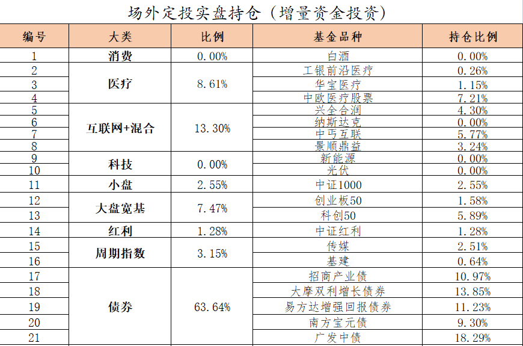

======================================================

_type: talk
@二师父[28814221155551]
2021-09-16 10:01:55 Thu  
topic_id: 818511242442822

<e type="hashtag" hid="881251425252" title="#鳄鱼计划#" /> 医疗买入两份，1000etf买入六份，注意我的仓位很低，没有超过百分之50，所以确定了方向以后先把仓位加起来，很显然，消费和蓝筹已经确认跌势了，连涨5年之后确认跌势大概率就是一直走低，短期一个月说明不了问题，一年以后再来看。更重要的是18年五粮液市盈率15倍，现在35倍，连去年底部都没有跌到，所以宁可错过也别犯错。

因为现在监管严格，鳄鱼计划和转债实盘在星球发，乌龟计划和安心组合直接看天天基金。

基本上过去两年是大盘行情，现在是小盘行情，轮动没有问题，只是创业板经过持续上涨，他已经不是小盘，而是大盘了，大小主要看企业市值。

@wty at 2021-09-16 10:01:55 Thu

> 1000ETF代码多少？

----------

@wty at 2021-09-16 10:01:55 Thu

> 看到了

----------

@🐰Mandy at 2021-09-16 10:01:55 Thu

> 双创基金不买了吗

----------

@二师父 at 2021-09-16 10:01:55 Thu

> 买，按照网格跌到0.8或者0.75时候买，优选定投基金，中证红利，1000，医疗，基建

----------

@🐰Mandy at 2021-09-16 10:01:55 Thu

> 网格在哪里看？

----------

@二师父 at 2021-09-16 10:01:55 Thu

> 就是以1为基准价，然后每跌百分之五加仓一次

----------

@🐰Mandy at 2021-09-16 10:01:55 Thu

> 好的，谢谢

----------

@杜志彪 at 2021-09-16 10:01:55 Thu

> 按计划还是一份医疗吧，3份1000ETF,不知不觉已经7层了.到最后真是不缺机会，缺钱了[微笑]

----------

阅读[1]  评论[12]  赞[0] 

+++++++++++++++++++++++++++++++++++++++++++++++++++++

图片：
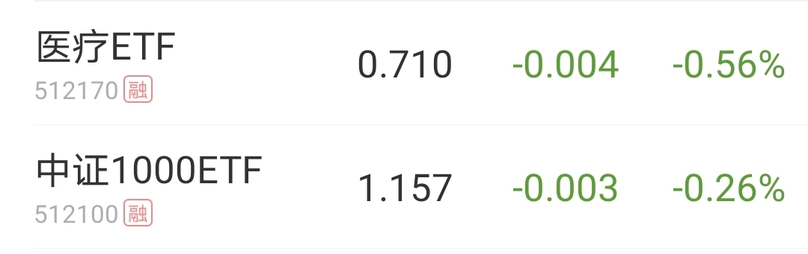

======================================================

_type: talk
@林玮[844111858288412]
2021-09-16 14:06:44 Thu  
topic_id: 185288485524122

师父，债券不投了？

@二师父 at 2021-09-16 14:06:44 Thu

> 可转债还是债券基金？

----------

@林玮 at 2021-09-16 14:06:44 Thu

> 债券基金

----------

@二师父 at 2021-09-16 14:06:44 Thu

> 暂时不了，股市过热的时候投资债券避险，你风险偏好低的话可以投二级债基，收益率长期也能跑赢通胀

----------

阅读[1]  评论[3]  赞[0] 

======================================================

_type: talk
@二师父[28814221155551]
2021-09-16 14:44:00 Thu  
topic_id: 581288581555154

<e type="hashtag" hid="51288582858814" title="#投资说明#" /> 目前乌龟计划和鳄鱼计划里面的持仓品种都没有问题，看看仓位，如果防守账户没有资金，每月结余较少的话仓位别超过百分之70

接下来就是回调买入了，白酒和消费先等等，各方数据显示都不好，这两个品种是过去重仓，但是投资逻辑变了，尤其是现在消费降级，房产价格降低，还有的期房烂尾，大家消费信心不足，所以暂时停止，景顺鼎益混合里面有消费，后面跌到设定价格会买入的，消费etf留有部分利润，如果反弹就拿着，根据我的判断，消费肯定还会跌，短期都是弱反弹。

对于其他品种，医疗在百分之20仓位以内可以持续定投，中证红利也可以，1000也行，其他的就根据我的网格发车了

为什么这样，以中概为例子，如果持续定投，弱反弹也定投，不知不觉仓位干到百分之50以上，有人就是这样做的，如果后面再跌，定投都没法摊低成本。

所以方法很重要，全市场指数百分位不跌到10以下，就不要有抄底的想法。

另外债券的防守已经结束，未来利率上行债券可能会走低，这时候如果股市继续下行，再把盈利的债券转过来就行。

@夏萍 at 2021-09-16 14:44:00 Thu

> 师父现在要全部卖出债券基金吗？

----------

@二师父 at 2021-09-16 14:44:00 Thu

> 这倒没有，债券基金是波动小，利率上行利空股市和债市，但是利率走势没人得知，所以还是不动的好，对于可转债基金，可以收割利润

----------

@夏萍 at 2021-09-16 14:44:00 Thu

> 好的，谢谢！

----------

@杜志彪 at 2021-09-16 14:44:00 Thu

> 是的还是稳点好，已经7层仓位，下面除医疗继续定投，其它低估品种采取网格下跌买入法。

----------

@老孙头 at 2021-09-16 14:44:00 Thu

> 那么，被套的“中概”，如何处置为好？真担心出现“定投都没法摊低成本”的结果。

----------

@西锦巴乌 at 2021-09-16 14:44:00 Thu

> 控制节奏网格定投

----------

@二师父 at 2021-09-16 14:44:00 Thu

> 对，另一位读者给出答案了，网格，而不是无脑定投

----------

阅读[1]  评论[7]  赞[0] 

======================================================

_type: talk
@云卷云舒[28288212211221]
2021-09-16 16:13:28 Thu  
topic_id: 185288484524422

师父好！想知道鳄鱼计划里面预计宽基、医药、科技、消费、周期及金融比较多少合适！然后可以公布一下您的持仓比例吗[微笑]

@二师父 at 2021-09-16 16:13:28 Thu

> 公布了啊，上周末发的鳄鱼计划持仓，这个比例是变化的

----------

@云卷云舒 at 2021-09-16 16:13:28 Thu

> 比例多少[捂脸]

----------

@云卷云舒 at 2021-09-16 16:13:28 Thu

> 好的，谢谢！

----------

@二师父 at 2021-09-16 16:13:28 Thu

> 有啊，你看看周末发的持仓比例

----------

阅读[1]  评论[4]  赞[0] 

======================================================

_type: q&a
@多读书[88482152228812]
2021-09-16 16:13:51 Thu  
topic_id: 185288484525582

@多读书

>  请问二师父，混合类的基金现在还都是亏得，但定投也要停止了吗？

@二师父

>  具体是哪只基金，不同的基金不同对待

阅读[1]  评论[2]  赞[0] 

======================================================

_type: talk
@嘉宾[548814141545814]
2021-09-16 17:24:38 Thu  
topic_id: 185288488541442

二师傅，最新网格哪里可查？

@二师父 at 2021-09-16 17:24:38 Thu

> 稍后发一下

----------

阅读[1]  评论[1]  赞[0] 

======================================================

_type: talk
@二师父[28814221155551]
2021-09-16 21:34:06 Thu  
topic_id: 418411248448458

<e type="hashtag" hid="28511215112811" title="#四个账户和仓位#" /> 中概互联的网格表稍后发一下，大家想投的话按照网格来，不要抢跑，场内到了我设定的价格依然会买回来，场外一样的。

鳄鱼计划和乌龟计划仓位都有发布，我觉得仓位控制很重要，目前已经跌成白马股灾了，而因为周期股的盛况，大家还在拼命加大白马，肯定未来能挣钱，不过大概率需要很长时间，我得方向是中小专精特新企业，同时回调，方向在这里。

选择比努力重要，2020年没有买白酒医疗的基本上收益一般，现在看未来我判断是中小企业，大家可以依照自己的判断投资，我的仅供参考。

还有个重要问题，很多人都在说2022年金融危机，这个需要防一手，要么是防守账户资金，要么是先参与，风向不对了走人。二选一。

阅读[1]  评论[0]  赞[0] 

+++++++++++++++++++++++++++++++++++++++++++++++++++++

文件：
2021-09-16 21:29:14 Thu
文件大小：[46754]
422141124515518-聊聊四个账户和仓位.docx

======================================================

_type: talk
@二师父[28814221155551]
2021-09-16 23:08:01 Thu  
topic_id: 185288121121812

<e type="hashtag" hid="15288482888142" title="#中概的网格#" /> 如果计划买入中概就照着这个网格买，开始干活了，中概预期比较低，反弹可以适当出。

@顾小胖 at 2021-09-16 23:08:01 Thu

> 师傅请问是513050吗

----------

@二师父 at 2021-09-16 23:08:01 Thu

> 对

----------

@顾小胖 at 2021-09-16 23:08:01 Thu

> 谢谢师傅

----------

阅读[1]  评论[3]  赞[0] 

+++++++++++++++++++++++++++++++++++++++++++++++++++++

图片：
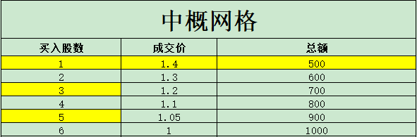

======================================================

_type: talk
@二师父[28814221155551]
2021-09-16 23:35:15 Thu  
topic_id: 418411241448548

<e type="hashtag" hid="552114551414" title="#估值数据#" /> 市盈率百分位34.89%，SY-BY百分位34.75%，SY/BY百分位31.37%。目前的投资方向在于价值类基金，低估值、高股息的一些基金，经过过去两年的成长，高ROE基金的估值得到了不断的提升，风险也在于此，当市场风险释放的时候，资金还会流走，这就是为什么我的持仓也开始切换了，一是小盘股，二是红利类。

大幅减仓消费过了5个月后看看是否正确，当然即使我确定消费会跌，也留了一部分底仓，防止追高，所以每个投资操作都是经过周密布局的，接下来，布局专精特新中小企业和价值类基金。注意激进的投资者仓位控制在8层以内，保守的投资者控制在5成以内。

不会有系统风险，但是要防止黑天鹅和美联储加息，目前缩减购债是确定了，只等靴子落地。

阅读[1]  评论[0]  赞[0] 

======================================================

_type: talk
@二师父[28814221155551]
2021-09-17 09:39:24 Fri  
topic_id: 218511482441441

<e type="hashtag" hid="28511241541581" title="#转债实盘#" /> 正裕，君禾，岱勒三只转债各买入10张，目前大致百分之35仓位，控制买入节奏，双低125下很少，买入低价格的，盈利百分之10以上或者双低值160以上走，最近市场波动大，不建议投资股票，转债最差也有到期债券收益，股票的底部难以预测

@九妹Amy'' at 2021-09-17 09:39:24 Fri

> 师傅，为啥贷勒转债10张1000多块钱，而君禾和正裕转债10张的是10000多，是我软件出问题了吗

----------

@二师父 at 2021-09-17 09:39:24 Fri

> 你截图我看看，都买同等比例的才对

----------

@九妹Amy'' at 2021-09-17 09:39:24 Fri

> 

----------

@二师父 at 2021-09-17 09:39:24 Fri

> 那你买1张，我是买的10张，按照规则沪市转债发行是1手面值1000元。

----------

@九妹Amy'' at 2021-09-17 09:39:24 Fri

> 好的

----------

阅读[1]  评论[5]  赞[0] 

+++++++++++++++++++++++++++++++++++++++++++++++++++++

图片：
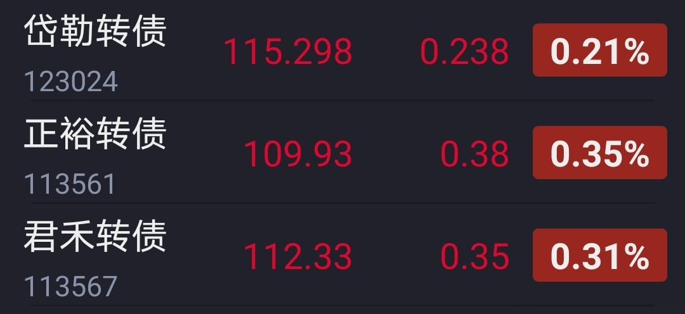

======================================================

_type: talk
@二师父[28814221155551]
2021-09-17 10:04:23 Fri  
topic_id: 581288414224224

方向确立了，接下来是小盘股和价值股，很多人3300的时候盈利，3600时候亏损，在于重仓了消费和医药，成长股的投资暂缓，19，20是成长股的春天，21，22就是价值股了，价值股不一定涨，但是跑赢成长股没问题，未来方向逢低做多价值股，成长股投资先缓一缓，记得创业板也有16到18三年下跌记录，而当年价值股表现是更好的

@蛋炒饭不加蛋 at 2021-09-17 10:04:23 Fri

> 请问二师父，医药消费科技半导体军工是成长股吗？

----------

@二师父 at 2021-09-17 10:04:23 Fri

> 都是，价值股是低估值的，也就是过去两年表现不好的

----------

@蛋炒饭不加蛋 at 2021-09-17 10:04:23 Fri

> 怎么看待新能源和科技呢，一个国产替代一个碳中和

----------

@二师父 at 2021-09-17 10:04:23 Fri

> 新能源我判断业绩增速的顶部就是周期顶部，高市盈率未来反转就是戴维斯双杀，科技有很多，具体看是哪一块，新能源和碳中和是两个概念，他的产业很多，长期看实现碳中和需要能源转型

----------

@蛋炒饭不加蛋 at 2021-09-17 10:04:23 Fri

> 新能源中的光伏，科技中的半导体芯片还能看吗

----------

@二师父 at 2021-09-17 10:04:23 Fri

> 半导体芯片有周期的，光伏是长线赛道，不过目前估值很高了

----------

@蛋炒饭不加蛋 at 2021-09-17 10:04:23 Fri

> 价值股里有什么赛道可以推荐吗？

----------

@二师父 at 2021-09-17 10:04:23 Fri

> 三傻属于价值股，但是金融企业在经济危机来临时候很危险，所以不打算做了，目前在买基建避险

----------

阅读[1]  评论[12]  赞[0] 

======================================================

_type: talk
@二师父[28814221155551]
2021-09-17 16:27:45 Fri  
topic_id: 418411255285528

<e type="hashtag" hid="51288581288854" title="#医疗大涨#" /> 看看医疗大涨原因及应对策略，转债投资基本浮亏了，接下来就是需要靠策略来投资，首先买入后有涨有跌，那么市场位置决定了仓位，高估的时候买入10%仓位也没有太大问题，因为高估也有可能继续涨。但是高估买入90%就不行了。

接下来，我们所有品种都会再盈利卖出，包括场外中概互联，既然如此，就要有策略应对。比如中概如何能做到盈利卖出。第一不要定投，持续的定投会钝化，尤其是价格很贵的时候。

第二，网格，在下行的不同区间买入，比如1.4的时候开始买一次，1.3再买一次，1.2再买。就这样子才能让成本越来越低。否则一直从1.8买到1.5，其实并没有让价格低多少，反而仓位重了，后面跌到1.2再买都没用了，耐心很重要。

@阿宝 at 2021-09-17 16:27:45 Fri

> 定投开始的位置很重要！[强]

----------

@wty at 2021-09-17 16:27:45 Fri

> 鳄鱼计划的转债ETF下跌了，帮分析一下什么原因，有盈利状态，能继续拿着吗？还是可以走人了？

----------

@二师父 at 2021-09-17 16:27:45 Fri

> 因为转债已经到了阶段性高位，如果经受不住波动，这个位置可以走了

----------

@wty at 2021-09-17 16:27:45 Fri

> 明白，多谢二师父🙏

----------

阅读[1]  评论[4]  赞[0] 

+++++++++++++++++++++++++++++++++++++++++++++++++++++

文件：
2021-09-17 16:23:24 Fri
文件大小：[46582]
544828882848144-医疗大涨.docx

======================================================

_type: talk
@二师父[28814221155551]
2021-09-18 10:10:38 Sat  
topic_id: 185288182155422

<e type="hashtag" hid="15288485588582" title="#常用的经济数据之PMI#" /> 对金融投资有兴趣的朋友可以多学习下，以后开个专题怎么查金融、经济、股市数据，并如何分析，可以进一步提升自己的认知，没有兴趣的朋友跟车就行了。未来转债、基金实盘，均保证盈利卖出。

另外注意仓位控制，今年我观察到平安的走势和08年有点像，已经连续跌了9个月，再连续跌3个月的话真就危险了。总之，别太贪婪，有赚就行。

阅读[1]  评论[0]  赞[0] 

+++++++++++++++++++++++++++++++++++++++++++++++++++++

文件：
2021-09-18 10:06:46 Sat
文件大小：[173521]
244151111285511-常用的经济数据之PMI.docx

2021-09-18 10:06:46 Sat
文件大小：[939825]
422141111584888-经济数据之PMI.mp3

======================================================

_type: talk
@二师父[28814221155551]
2021-09-18 18:41:39 Sat  
topic_id: 218855555881511

<e type="hashtag" hid="48411518558588" title="#关于转债的分析#" /> 可转债投资尽量避免高价和溢价率很高的转债，低价格高溢价率可以，高价格低溢价率慎重。

@wty at 2021-09-18 18:41:39 Sat

> 分析的很清楚、很到位，学习了！[抱拳][抱拳][抱拳]

----------

阅读[1]  评论[1]  赞[0] 

+++++++++++++++++++++++++++++++++++++++++++++++++++++

文件：
2021-09-18 18:41:01 Sat
文件大小：[46771]
544812224152524-转债ETF开始下跌，需要卖出吗.docx

2021-09-18 18:41:02 Sat
文件大小：[1954630]
244185554825251-转债ETF下跌，需要卖出吗.mp3

======================================================

_type: talk
@二师父[28814221155551]
2021-09-19 10:44:56 Sun  
topic_id: 185522252214112

<e type="hashtag" hid="88511414812282" title="#定投中最重要的事情#" />

阅读[1]  评论[0]  赞[0] 

+++++++++++++++++++++++++++++++++++++++++++++++++++++

文件：
2021-09-19 10:44:36 Sun
文件大小：[46258]
422184441585558-定投中最重要的事.docx

======================================================

_type: talk
@二师父[28814221155551]
2021-09-20 12:53:15 Mon  
topic_id: 418844452181858

<e type="hashtag" hid="88511414245212" title="#中证红利的估值#" /> 如何判断价值类指数的估值。

@秦风殇韵（刘豫斌） at 2021-09-20 12:53:15 Mon

> 我的中证红利持有收益40%，还继续等一段，再收割么？

----------

@二师父 at 2021-09-20 12:53:15 Mon

> 可以

----------

@李金泉 at 2021-09-20 12:53:15 Mon

> 二师傅，您的市盈率估算方法和其他比如wind是不一样的吗？这一天wind上中证红利的估值是6.3左右，现在的话是5.74，您这边是多少呢？现在适合1.5倍定投吗？

----------

@二师父 at 2021-09-20 12:53:15 Mon

> 数据都是网上查询的，不同网站的计算方法不同，目前正常定投即可

----------

@李金泉 at 2021-09-20 12:53:15 Mon

> 谢谢二师傅

----------

阅读[1]  评论[5]  赞[0] 

+++++++++++++++++++++++++++++++++++++++++++++++++++++

文件：
2021-09-20 12:52:56 Mon
文件大小：[48119]
111852551418582-中证红利的估值怎么判断.docx

======================================================

_type: talk
@二师父[28814221155551]
2021-09-21 17:47:46 Tue  
topic_id: 581122122185254

<e type="hashtag" hid="28511414442421" title="#中秋快乐#" />

@王春媚 at 2021-09-21 17:47:46 Tue

> 祝二师父中秋快乐！！！

----------

@sky at 2021-09-21 17:47:46 Tue

> 祝二师父中秋节快乐！

----------

@三峡情 at 2021-09-21 17:47:46 Tue

> 中秋快乐！万事如意！

----------

阅读[1]  评论[3]  赞[0] 

+++++++++++++++++++++++++++++++++++++++++++++++++++++

文件：
2021-09-21 17:47:39 Tue
文件大小：[46930]
544812154244224-中秋节快乐.docx

======================================================

_type: talk
@二师父[28814221155551]
2021-09-22 19:47:57 Wed  
topic_id: 418844851855148

<e type="web" href="https://xueqiu.com/live/11094" title="https://xueqiu.com/live/11094" />，晚上8点在雪球直播，有兴趣的朋友可以来聊聊天

阅读[1]  评论[0]  赞[0] 

======================================================

_type: talk
@二师父[28814221155551]
2021-09-22 22:55:16 Wed  
topic_id: 218855242411241

<e type="hashtag" hid="825188852442" title="#估值表#" /> 医疗进入正常估值，可以先暂停定投

阅读[1]  评论[0]  赞[0] 

+++++++++++++++++++++++++++++++++++++++++++++++++++++

图片：
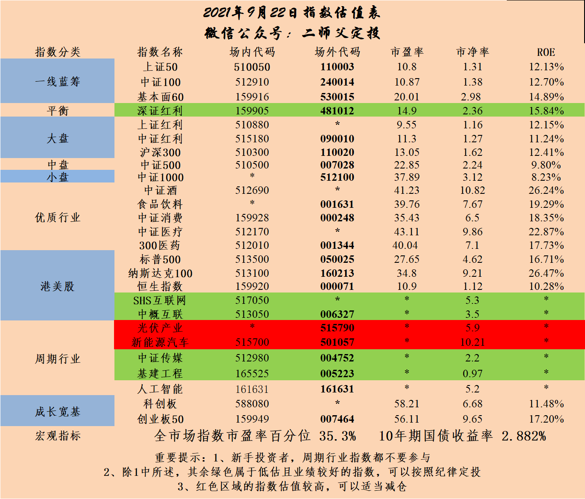

======================================================

_type: talk
@二师父[28814221155551]
2021-09-22 23:00:10 Wed  
topic_id: 818855242154452

<e type="hashtag" hid="881422852442" title="#定投实盘#" /> 买入中证红利500元，以后每周四盘中发车，当日操作，以当日收盘价格成交。

@林玮 at 2021-09-22 23:00:10 Wed

> 师父，在场内买效果一样吗？

----------

@二师父 at 2021-09-22 23:00:10 Wed

> 一样的

----------

@林玮 at 2021-09-22 23:00:10 Wed

> 好的

----------

阅读[1]  评论[3]  赞[0] 

======================================================

_type: talk
@门萨🐨[51411455828824]
2021-09-23 10:08:03 Thu  
topic_id: 218855212821811

今日份大羊腿[发呆]

阅读[1]  评论[0]  赞[0] 

+++++++++++++++++++++++++++++++++++++++++++++++++++++

图片：
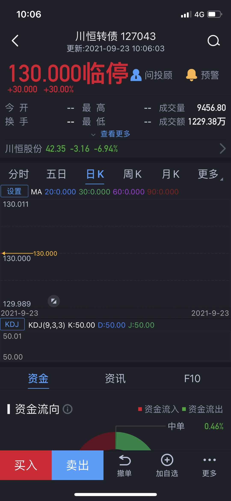

======================================================

_type: talk
@二师父[28814221155551]
2021-09-23 22:52:00 Thu  
topic_id: 418844288585548

<e type="hashtag" hid="88511215285422" title="#关于市场的分析#" />

阅读[1]  评论[0]  赞[0] 

+++++++++++++++++++++++++++++++++++++++++++++++++++++

文件：
2021-09-23 22:51:50 Thu
文件大小：[43627]
544812524482244-卧倒就可以了.docx

======================================================

_type: talk
@二师父[28814221155551]
2021-09-23 23:10:34 Thu  
topic_id: 418844282881448

<e type="hashtag" hid="552114551414" title="#估值数据#" /> 市盈率百分位35.96%，SY-BY百分位34.99%，SY/BY百分位31.18%，估值楼层即将下到第二层，如果再跌跌可以适当加大定投金额。按照底仓+定投策略，当前可以卧倒

阅读[1]  评论[0]  赞[0] 

======================================================

_type: talk
@二师父[28814221155551]
2021-09-24 14:36:46 Fri  
topic_id: 218855421484511

<e type="hashtag" hid="28511411245541" title="#可转债实盘#" /> 弘信转债买入10张，时达转债买入10张，最近转债行情不好，慢慢买入，这个策略适合分散摊大饼，长期持有到125以上或者不符合双低策略卖出

@枫叶 at 2021-09-24 14:36:46 Fri

> 10张是1000股吗

----------

@二师父 at 2021-09-24 14:36:46 Fri

> 100

----------

阅读[1]  评论[2]  赞[0] 

======================================================

_type: talk
@二师父[28814221155551]
2021-09-24 16:31:03 Fri  
topic_id: 818855442512852

<e type="hashtag" hid="15288188414442" title="#关于中丐的投资策略#" />

@枫叶 at 2021-09-24 16:31:03 Fri

> 文件不存在怎么回事

----------

@二师父 at 2021-09-24 16:31:03 Fri

> 我换一下

----------

阅读[1]  评论[2]  赞[0] 

+++++++++++++++++++++++++++++++++++++++++++++++++++++

文件：
2021-09-25 18:19:03 Sat
文件大小：[44288]
111852441284152-中丐互联到点了.docx

======================================================

_type: talk
@二师父[28814221155551]
2021-09-25 18:20:25 Sat  
topic_id: 185522824584522

<e type="hashtag" hid="28511411418841" title="#关于结构性市场的思考#" /> 结构性市场如何投资

阅读[1]  评论[0]  赞[0] 

+++++++++++++++++++++++++++++++++++++++++++++++++++++

文件：
2021-09-25 18:20:17 Sat
文件大小：[44211]
244185224512481-关于结构性市场的思考.docx

======================================================

_type: talk
@二师父[28814221155551]
2021-09-25 18:27:19 Sat  
topic_id: 581122825521224

<e type="hashtag" hid="552114551414" title="#估值数据#" /> 市盈率百分位34.89%，SY-BY百分位34.39%，SY/BY百分位30.4%。

估值整体是继续下降的，把握结构性机会。

阅读[1]  评论[0]  赞[0] 

======================================================

_type: talk
@二师父[28814221155551]
2021-09-26 22:49:37 Sun  
topic_id: 218851815825121

<e type="hashtag" hid="28511155554121" title="#节假日如何投资#" /> 节假日购买逆回购品种是更合适的，货币基金和银行理财产品收益率偏低。

阅读[1]  评论[0]  赞[0] 

+++++++++++++++++++++++++++++++++++++++++++++++++++++

文件：
2021-09-26 22:48:06 Sun
文件大小：[72031]
244185215251241-节假日该如何投资.docx

======================================================

_type: talk
@二师父[28814221155551]
2021-09-27 14:09:41 Mon  
topic_id: 218851254211851

<e type="hashtag" hid="48415224212218" title="#中概互联网格#" /> 严格按照网格操作，我不知道还会跌多少，我只知道按照纪律操作

@毛毛宇 at 2021-09-27 14:09:41 Mon

> 这算鳄鱼计划了吧？一下大额买入！

----------

@衣袂飘香 at 2021-09-27 14:09:41 Mon

> 买几份？

----------

@杜志彪 at 2021-09-27 14:09:41 Mon

> 目前净值1.407场内买点压箱底[微笑]

----------

@二师父 at 2021-09-27 14:09:41 Mon

> 不算，我自己账户的资金网格

----------

@二师父 at 2021-09-27 14:09:41 Mon

> 这是我自己账户网格，鳄鱼计划还没开始

----------

@衣袂飘香 at 2021-09-27 14:09:41 Mon

> 哦，好的

----------

@丸子妈 at 2021-09-27 14:09:41 Mon

> 跌了21个点的，咋办?

----------

@二师父 at 2021-09-27 14:09:41 Mon

> 仓位在百分之10以内的话，可以在1.4以下继续定投

----------

阅读[1]  评论[9]  赞[0] 

+++++++++++++++++++++++++++++++++++++++++++++++++++++

图片：
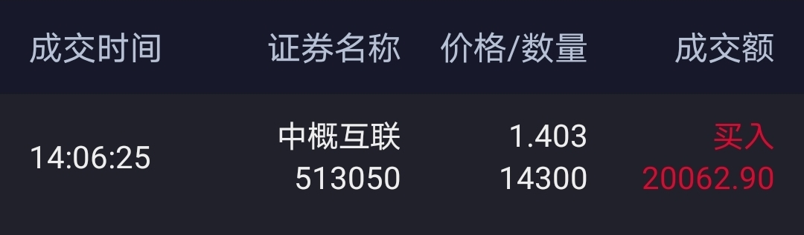

======================================================

_type: talk
@JOY[111881481812422]
2021-09-27 15:00:23 Mon  
topic_id: 818851254145442

师父，您基建工程补仓吗？

@二师父 at 2021-09-27 15:00:23 Mon

> 下个月吧

----------

阅读[1]  评论[1]  赞[0] 

======================================================

_type: q&a
@胡译丹[28884422841821]
2021-09-28 14:39:49 Tue  
topic_id: 218851242558881

@胡译丹

>  二师父好！请问一下:支付宝上的【相互保】可以退出吗？如果可以请问怎么设置退出？打扰了！谢谢！

@二师父

>  点击蚂蚁保险，相互宝，然后进入保障详情页面，被保险人信息上方的放弃保障-退出即可

阅读[1]  评论[1]  赞[0] 

======================================================

_type: talk
@二师父[28814221155551]
2021-09-28 21:14:59 Tue  
topic_id: 818851218448252

<e type="hashtag" hid="15288822415212" title="#踩了一个雷#" /> 可转债强赎，在发生前要处理了。另外中丐的价格买入和卖出价格有奖竞猜一下，大家猜猜看。

@西锦巴乌 at 2021-09-28 21:14:59 Tue

> 下次买入价1.333即下跌5％

----------

阅读[1]  评论[1]  赞[0] 

+++++++++++++++++++++++++++++++++++++++++++++++++++++

文件：
2021-09-28 21:14:04 Tue
文件大小：[44685]
844185184811412-踩了一个雷.docx

======================================================

_type: talk
@二师父[28814221155551]
2021-09-29 00:03:13 Wed  
topic_id: 418841244488188

<e type="hashtag" hid="552114551414" title="#估值数据#" /> 市盈率百分位34.19%，SY-BY百分位34.09%，SY/BY百分位29.7%。

马上估值楼层就要跌到2层了，预计到1，2层成长组合发车，或者明年阴历新年开始。

目前还是以定投红利、基建、医疗为主，医疗目前估值正常了，可以先暂停。中概互联网格，如果浮亏20%和场外乌龟计划一样，那么在1.45以下定投，仓位控制在10%以内，是可以的。或者停止补仓，目前这个位置没必要卖了。

阅读[1]  评论[0]  赞[0] 

======================================================

_type: talk
@二师父[28814221155551]
2021-09-29 11:25:01 Wed  
topic_id: 218851151481241

<e type="hashtag" hid="28511411245541" title="#可转债实盘#" /> 卖出弘信转债和时达转债，因为强赎，提前走人了，中概下一次买入价1.3，卖出价1.47，场外也一样，分批加，不持续定投，这个品种价值已经降低了，持续定投的可以选择医疗，红利，基建，1000这些

阅读[1]  评论[0]  赞[0] 

======================================================

_type: q&a
@胡译丹[28884422841821]
2021-09-29 13:20:49 Wed  
topic_id: 218851185254421

@胡译丹

>  二师父好！我想再开一个户，有人给我推荐【华泰证券】，有人给我推荐【国信证券】。请问一下这两个证劵哪个更好呢？打扰了。谢谢！

@二师父

>  华泰好一些，置顶文章有开户链接

阅读[1]  评论[0]  赞[0] 

======================================================

_type: talk
@二师父[28814221155551]
2021-09-29 17:06:46 Wed  
topic_id: 185528851488412

<e type="hashtag" hid="825188852442" title="#估值表#" />

@杜志彪 at 2021-09-29 17:06:46 Wed

> 这两天调整了一下仓位，昨天卖出了转债ETF,今天猪茅回本，把补仓的那部分出了，仓位又降了点，终于回到6.5层了，明天可以踏实定投了[微笑]

----------

@小鱼 at 2021-09-29 17:06:46 Wed

> 我的要58才回本了，郁闷

----------

阅读[1]  评论[2]  赞[0] 

+++++++++++++++++++++++++++++++++++++++++++++++++++++

图片：
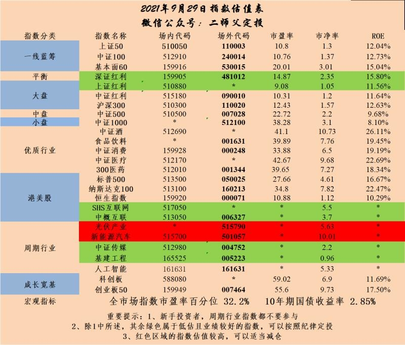

======================================================

_type: talk
@林凤崎[421882481454488]
2021-09-29 20:29:21 Wed  
topic_id: 581128818482514

二师父，今天科创打新股同益中如何

@二师父 at 2021-09-29 20:29:21 Wed

> 不错

----------

阅读[1]  评论[1]  赞[0] 

======================================================

_type: talk
@JOY[111881481812422]
2021-09-30 09:38:55 Thu  
topic_id: 581128841588124

师父，今天打车吗？

@JOY at 2021-09-30 09:38:55 Thu

> 不好意思，写错了，想问定投发车的[调皮]

----------

@二师父 at 2021-09-30 09:38:55 Thu

> 有的

----------

阅读[1]  评论[2]  赞[0] 

======================================================

_type: talk
@二师父[28814221155551]
2021-09-30 10:16:13 Thu  
topic_id: 185528814222422

<e type="hashtag" hid="28518855451481" title="#乌龟计划#" /> 买入基建工程（005223）500元，买入中证海外50ETF联接人民币A(006327)500元。天天基金关注可以看到。这些品种没有绝对的不买，控制节奏，比如中证海外50ETF联接人民币下一次可能等到跌到1.3的时候再买。能不能跌到我无法判断，我只知道到了就该出手，不到的话就等待。

@梧桐 at 2021-09-30 10:16:13 Thu

> 006327现净值1.09

----------

@二师父 at 2021-09-30 10:16:13 Thu

> 说的是场内的价格

----------

@阿宝 at 2021-09-30 10:16:13 Thu

> 耐心是最好的品质

----------

阅读[1]  评论[3]  赞[0] 

======================================================

_type: talk
@二师父[28814221155551]
2021-09-30 11:56:46 Thu  
topic_id: 581128845828144

<e type="hashtag" hid="48411144188528" title="#安心过节#" /> 过节期间多休息，可以多看看书，少看账户，到了价格加仓即可。

阅读[1]  评论[0]  赞[0] 

+++++++++++++++++++++++++++++++++++++++++++++++++++++

文件：
2021-09-30 11:56:13 Thu
文件大小：[44492]
422184125224148-关闭账户，安心过节.docx

======================================================

_type: talk
@呵呵→_→[15414558111442]
2021-09-30 22:56:41 Thu  
topic_id: 218851111458551

师傅，新三板股票打新是什么，跟普通股票区别在哪，然后可以打么。

@二师父 at 2021-09-30 22:56:41 Thu

> 可以打，利润比较小，开通新三板就行

----------

阅读[1]  评论[1]  赞[0] 

======================================================

