_type: talk
@二师父[28814221155551]
2021-10-01 22:07:06 Fri  
topic_id: 218885585451581

<e type="hashtag" hid="15288824151422" title="#投资到底赚的什么钱#" />

阅读[1]  评论[0]  赞[0] 

+++++++++++++++++++++++++++++++++++++++++++++++++++++

文件：
2021-10-01 22:06:53 Fri
文件大小：[45233]
544811222528824-国庆节，聊聊轻松的话题.docx

======================================================

_type: talk
@二师父[28814221155551]
2021-10-02 23:19:13 Sat  
topic_id: 185552241515812

<e type="hashtag" hid="48411145141448" title="#当无事可做的时候怎么办#" />

阅读[1]  评论[0]  赞[0] 

+++++++++++++++++++++++++++++++++++++++++++++++++++++

文件：
2021-10-02 23:19:05 Sat
文件大小：[43976]
244188554421841-无事可做的时候.docx

======================================================

_type: talk
@二师父[28814221155551]
2021-10-03 23:31:02 Sun  
topic_id: 185552585555252

<e type="hashtag" hid="88511152124142" title="#国庆推荐一本书#" />

@杜志彪 at 2021-10-03 23:31:02 Sun

> 看书时想起了清仓的家电ETF,持股首位已经是科沃斯了，看了看格力懂姐姐实现进军新能源车了，买下了银隆，不过我还是不太看好跨界经营，许家印就是例子，扩张太快，步子太大了，我还有2%的美的，我想问问目前家电ETF是否低估，处于估值的什么位置，是否可以网格式买入。

----------

@二师父 at 2021-10-03 23:31:02 Sun

> 网格是可以的

----------

@杜志彪 at 2021-10-03 23:31:02 Sun

> 目前在低估区域吗？

----------

@二师父 at 2021-10-03 23:31:02 Sun

> 目前还没有低估

----------

@杜志彪 at 2021-10-03 23:31:02 Sun

> 好的，那就再等等[微笑]

----------

阅读[1]  评论[5]  赞[0] 

+++++++++++++++++++++++++++++++++++++++++++++++++++++

文件：
2021-10-03 23:30:54 Sun
文件大小：[45302]
111855252448452-推荐一本书.docx

======================================================

_type: talk
@二师父[28814221155551]
2021-10-04 22:02:31 Mon  
topic_id: 581112521448824

<e type="hashtag" hid="15288824881252" title="#人口数据#" />

阅读[1]  评论[0]  赞[0] 

+++++++++++++++++++++++++++++++++++++++++++++++++++++

文件：
2021-10-04 22:02:22 Mon
文件大小：[44526]
244188584488221-最新一线、新一线城市人口数据出炉.docx

======================================================

_type: talk
@二师父[28814221155551]
2021-10-05 14:48:36 Tue  
topic_id: 218885288555851

<e type="hashtag" hid="48411142428288" title="#医药再一次遇到了利空消息#" />

阅读[1]  评论[0]  赞[0] 

+++++++++++++++++++++++++++++++++++++++++++++++++++++

文件：
2021-10-05 14:48:18 Tue
文件大小：[45291]
422188458551288-一个利空.docx

======================================================

_type: talk
@阝東[844111541211852]
2021-10-06 16:26:15 Wed  
topic_id: 185552441814822

二师父，现在的人都说限电了，是产能过剩，遏制美国？防止金融危机？还是与碳中和有关系呢？

@二师父 at 2021-10-06 16:26:15 Wed

> 是因为电力供应不足

----------

阅读[1]  评论[1]  赞[0] 

======================================================

_type: talk
@二师父[28814221155551]
2021-10-06 17:29:59 Wed  
topic_id: 218885221821181

<e type="hashtag" hid="88511154885212" title="#成长组合和价值组合的区别#" /> 聊聊两个组合的区别，计划10月份成长组合建立观察仓，1，2楼慢慢定投，5，6楼考虑卖出，不做波段，中间长期持有。

阅读[1]  评论[0]  赞[0] 

+++++++++++++++++++++++++++++++++++++++++++++++++++++

文件：
2021-10-06 17:27:37 Wed
文件大小：[45589]
422188452514448-成长组合和价值组合的区别.docx

======================================================

_type: talk
@二师父[28814221155551]
2021-10-07 21:58:20 Thu  
topic_id: 418884244182518

<e type="hashtag" hid="28511154282821" title="#芒格抄底#" /> 明天中概股大概率反弹，如果触摸到收网价格，开始提款。

@杜志彪 at 2021-10-07 21:58:20 Thu

> 我加基建工程[微笑]

----------

阅读[1]  评论[1]  赞[0] 

+++++++++++++++++++++++++++++++++++++++++++++++++++++

文件：
2021-10-07 21:57:47 Thu
文件大小：[44316]
544811144111124-芒格抄底了.docx

======================================================

_type: talk
@二师父[28814221155551]
2021-10-08 10:10:50 Fri  
topic_id: 818885485255182

今天精选层5家企业均可申购，我已经申购，预计可以吃肉，可转债今天没有

@wty at 2021-10-08 10:10:50 Fri

> 怎么申购呢，需要开通什么账户吗？

----------

@二师父 at 2021-10-08 10:10:50 Fri

> 在新三板里面，开通精选层就可以

----------

@西锦巴乌 at 2021-10-08 10:10:50 Fri

> 申购股数有讲究吗？

----------

@二师父 at 2021-10-08 10:10:50 Fri

> 根据资金量来的，账户资金

----------

@wty at 2021-10-08 10:10:50 Fri

> 收到，谢谢🙏，新手小白，还没有额度购买，估计明年才可以开户参与，先跟二师父学习了！[抱拳]

----------

阅读[1]  评论[5]  赞[0] 

======================================================

_type: talk
@二师父[28814221155551]
2021-10-08 21:10:27 Fri  
topic_id: 218885124511181

<e type="hashtag" hid="15288821141452" title="#成长组合#" /> 成长组合今天建仓了，估值楼层二楼以下适合定投。

@样 at 2021-10-08 21:10:27 Fri

> 成长组合在星球里不公开吗？买了什么呢

----------

@二师父 at 2021-10-08 21:10:27 Fri

> 公开的，因为时间限制，组合建立5天以后才可以公开

----------

@lily at 2021-10-08 21:10:27 Fri

> 成长组合是场内买吗？要单独一个账户吗？师父

----------

@二师父 at 2021-10-08 21:10:27 Fri

> 不用，也是天天基金的，后面成立5天以后会公开

----------

阅读[1]  评论[4]  赞[0] 

+++++++++++++++++++++++++++++++++++++++++++++++++++++

文件：
2021-10-08 21:09:34 Fri
文件大小：[45646]
422188544428188-说两件事.docx

======================================================

_type: talk
@二师父[28814221155551]
2021-10-09 20:23:33 Sat  
topic_id: 818885112182442

<e type="hashtag" hid="15288821882452" title="#如何选择组合#" />

@阝東 at 2021-10-09 20:23:33 Sat

> 如果我一次性投6个我选好的基金，然后每一个月做平衡，每次每个基金资金一样，不定投  （会不会太频繁），比如我就投了1万2，每次都是这个资金，多了就收割，少了就补回来了，这样的话，是不是比网格差，收益也差？

----------

@二师父 at 2021-10-09 20:23:33 Sat

> 怎么平衡

----------

@阝東 at 2021-10-09 20:23:33 Sat

> 就是每次每个基金都是2000，无论涨跌都回到1万2

----------

@二师父 at 2021-10-09 20:23:33 Sat

> 价值平均，有点拔鲜花浇灌野草的味道

----------

@阝東 at 2021-10-09 20:23:33 Sat

> 对噢，我就没想到这点[微笑][微笑]谢谢提醒

----------

阅读[1]  评论[5]  赞[0] 

+++++++++++++++++++++++++++++++++++++++++++++++++++++

文件：
2021-10-09 20:23:26 Sat
文件大小：[44999]
111855428888422-不同的组合如何选择.docx

======================================================

_type: talk
@二师父[28814221155551]
2021-10-10 19:35:29 Sun  
topic_id: 418888488144188

<e type="hashtag" hid="51288828285284" title="#美联储加息对市场的影响#" /> 加息和降息有周期，股市的走向也有周期，顺着周期下行的趋势，在安全边际布局，然后等待周期反转。

今年以来房产企业破产的很多，大家买房子尽量不要买期房，如果买新房最好买准现房，不知道下一个雷何时来，房价跌了不可怕，烂尾楼真的是巨大黑天鹅。

阅读[1]  评论[0]  赞[0] 

+++++++++++++++++++++++++++++++++++++++++++++++++++++

文件：
2021-10-10 19:31:19 Sun
文件大小：[45635]
544811518482824-美联储加息周期对成长价值风格的影响.docx

======================================================

_type: talk
@二师父[28814221155551]
2021-10-11 08:45:26 Mon  
topic_id: 185555241481212

<e type="hashtag" hid="51288828124884" title="#新三板打新#" /> 关于新三板打新，在新三板交易里面，点击新三板打新即可，我会用一部分资金申购，专精特新企业都集中在这里，大概率会盈利的，开通精选层目前只需要50万资产保有20个交易日，然后账号里面答题就可以开通。如果之前开通了精选层，那么目前创新层是自动开的。

@梧桐 at 2021-10-11 08:45:26 Mon

> 精选层、创新层需要相应的市值吗，二师父

----------

@二师父 at 2021-10-11 08:45:26 Mon

> 开通需要资金，不需要购买股票，打新不用市值，账户有资金就行

----------

@梧桐 at 2021-10-11 08:45:26 Mon

> 我看了看，新三板目前资金要求10个交易日日均100万呢

----------

@二师父 at 2021-10-11 08:45:26 Mon

> 这是开通的要求

----------

@衣袂飘香 at 2021-10-11 08:45:26 Mon

> 我点开来是这样的，买不了，为啥？呢？

----------

@衣袂飘香 at 2021-10-11 08:45:26 Mon

> 我也开通了呀。

----------

@二师父 at 2021-10-11 08:45:26 Mon

> 开盘以后

----------

@衣袂飘香 at 2021-10-11 08:45:26 Mon

> 现在进去也还是这样😭

----------

阅读[1]  评论[13]  赞[0] 

+++++++++++++++++++++++++++++++++++++++++++++++++++++

图片：
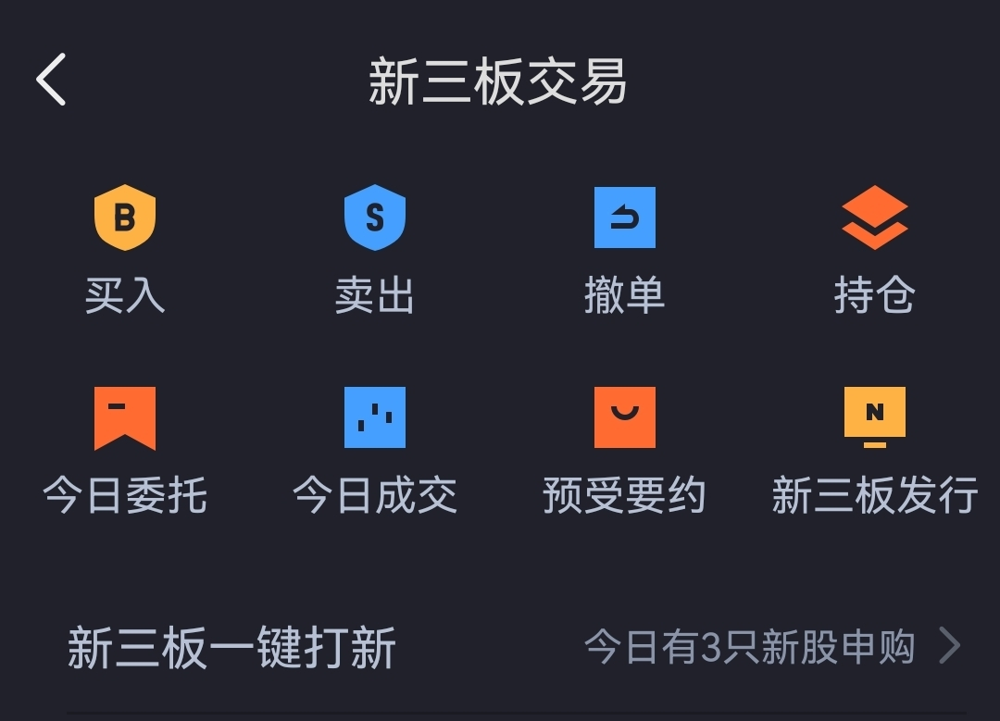

======================================================

_type: talk
@二师父[28814221155551]
2021-10-11 09:34:54 Mon  
topic_id: 581111258282244

<e type="hashtag" hid="28511411245541" title="#可转债实盘#" /> 搜特转债买入10张，在双低值以下，中概互联到了出网价格，可以卖出一网，也可以继续持有，浮亏的头寸可以继续持有。

@小白 at 2021-10-11 09:34:54 Mon

> 二师父，你的中概互联的网格表能不能发给我一份？

----------

@二师父 at 2021-10-11 09:34:54 Mon

> 好的

----------

@cotton at 2021-10-11 09:34:54 Mon

> 就叫特转债吗

----------

@二师父 at 2021-10-11 09:34:54 Mon

> 名字是搜特转债，128100

----------

@cotton at 2021-10-11 09:34:54 Mon

> 我以为，搜索，特转债

----------

@苍天有井明月空🌙 at 2021-10-11 09:34:54 Mon

> 十张一千多？

----------

@二师父 at 2021-10-11 09:34:54 Mon

> 对

----------

阅读[1]  评论[7]  赞[0] 

======================================================

_type: talk
@二师父[28814221155551]
2021-10-11 10:10:42 Mon  
topic_id: 418888451244588

<e type="hashtag" hid="48411141884558" title="#中概互联网格表#" /> 1.4的底仓价格，然后根据价格买入和卖出，严格遵守，目前如果出一网，如果回落到1.4再可以接进来。

因为没法判断中概到底是持续震荡还是反转，所以两手准备，一部分仓位长期持有到高估，包括我自己持有阿里也准备到下一轮高位。

另外就是网格，波段，底仓+网格，即使中概一直不涨，一直波动，在底部区域震荡我们也能盈利。后面随着实际情况涨跌会有调整，总体思路是没啥问题。

阅读[1]  评论[0]  赞[0] 

+++++++++++++++++++++++++++++++++++++++++++++++++++++

图片：
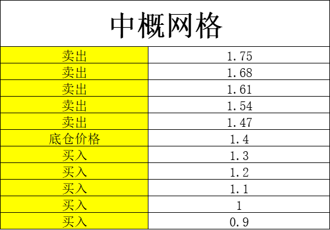

======================================================

_type: talk
@二师父[28814221155551]
2021-10-11 15:31:37 Mon  
topic_id: 185555211412242

<e type="hashtag" hid="281158284851" title="#市场分析#" /> 今天整体成长股偏弱，还是延续价值股风格，银行股表现较好。中概股在美团罚款靴子落地以后开始反弹，不过场内溢价率仍旧很高，所以还是按照纪律收网，长线仓位和短线仓位分开。如果有耐心经受任何波动，可以长期持有到下一次高估，如果没有这样子的毅力，中丐还是网格合适，价格表已经发了，上个月也发了操作。

现在医疗利空很多，控制在20%仓位以内，我们还会继续定投，长期看医疗是非常好的行业，目前估值正常偏低，正常定投即可。

其实投资不怕下跌，而怕上涨，涨了我们被迫需要卖出，资金没有可投资的地方，而下跌会给与很好的机会。今年成长股普遍下跌，预计今年四季度和明年都是非常好的布局时机。短期一到二年布局浮亏，在周期反转以后就是收获的时候。

阅读[1]  评论[0]  赞[0] 

======================================================

_type: talk
@二师父[28814221155551]
2021-10-11 23:26:51 Mon  
topic_id: 581111122454824

<e type="hashtag" hid="552114551414" title="#估值数据#" /> 市盈率百分位33.24%，SY-BY百分位34.81%，SY/BY百分位32.31%。

目前估值楼层是到第三层了，因为流动性收紧，估值楼层不仅仅考虑了全市场估值，也考虑了流动性，流动性收紧，成长股继续跌，但是消费医疗整体处于正常估值，左侧轻仓建立底仓，然后定投，如果复制2018，那么持续定投就行。

注意一次投资和定投的区别，定投是知道要跌，所以分隔买入，而一次性投资是预判要涨，所以梭哈。这是不同的。

阅读[1]  评论[0]  赞[0] 

======================================================

_type: talk
@二师父[28814221155551]
2021-10-11 23:27:54 Mon  
topic_id: 818888855421842

<e type="hashtag" hid="48411141558828" title="#关于风格轮动的进一步讲解#" />

@样 at 2021-10-11 23:27:54 Mon

> 想跟二师父的成长组合实盘，什么时候公开呀

----------

@二师父 at 2021-10-11 23:27:54 Mon

> 成立5天以后

----------

@杜志彪 at 2021-10-11 23:27:54 Mon

> 昨天忘收互联了，虽然少点也收一网吧[微笑]

----------

@杜志彪 at 2021-10-11 23:27:54 Mon

> 猪茅我55出了收益10%，留点仓位看看后边继续加仓红利和基建。

----------

阅读[1]  评论[4]  赞[0] 

+++++++++++++++++++++++++++++++++++++++++++++++++++++

文件：
2021-10-11 23:27:53 Mon
文件大小：[45205]
844188244284282-拯救成功，典型的风格轮动.docx

======================================================

_type: talk
@二师父[28814221155551]
2021-10-12 14:11:08 Tue  
topic_id: 418888588184148

<e type="hashtag" hid="881251425252" title="#鳄鱼计划#" /> 基建买入一份，双创50买入一份，今年四季度到明年都是布局好时机，控制节奏，慢慢买入，仓位逐步提高

成长组合建立后需要5天时间才能公布，大家不着急，长期投资不缺机会

@是喵喵吖～ at 2021-10-12 14:11:08 Tue

> 师傅请问是159782吗

----------

@二师父 at 2021-10-12 14:11:08 Tue

> 我买的是159783

----------

@是喵喵吖～ at 2021-10-12 14:11:08 Tue

> 哦哦好的谢谢师傅

----------

@阿宝 at 2021-10-12 14:11:08 Tue

> 我今天买了一点场内的科创50，属于长期的慢慢配置。老师所说的买入双创50一份，这个“一份”是如何定义的？我记得之前看过你关于份额的描述，忘了是哪篇文章，还望老师指点一下

----------

@二师父 at 2021-10-12 14:11:08 Tue

> 总投资金额除以250是一份金额，鳄鱼计划仓位本周末发一下

----------

@阿宝 at 2021-10-12 14:11:08 Tue

> 谢谢！懂了

----------

@样 at 2021-10-12 14:11:08 Tue

> 成长组合是定投吗

----------

@二师父 at 2021-10-12 14:11:08 Tue

> 是的

----------

阅读[1]  评论[13]  赞[0] 

======================================================

_type: talk
@二师父[28814221155551]
2021-10-12 18:57:40 Tue  
topic_id: 218888225222811

<e type="hashtag" hid="48411141255128" title="#债券基金经理更换如何应对#" /> 投资中基金经理更换不可避免，关键看如何应对

阅读[1]  评论[0]  赞[0] 

+++++++++++++++++++++++++++++++++++++++++++++++++++++

文件：
2021-10-12 18:57:11 Tue
文件大小：[45236]
422188511112248-债券基金经理更换，投资的债券基金需要卖出吗.docx

======================================================

_type: talk
@二师父[28814221155551]
2021-10-12 18:59:22 Tue  
topic_id: 818888225224482

<e type="hashtag" hid="552114551414" title="#估值数据#" /> 市盈率百分位33.13%，SY-BY百分位34.73%，SY/BY百分位32.21%。

估值楼层还是第三层，主要是流动性收紧了，目前适合以1到2年为周期左侧建仓，慢慢把仓位加起来，下一轮飞起来，我们的资产必定再次增加。

阅读[1]  评论[0]  赞[0] 

======================================================

_type: talk
@海〔纳百川〕[422111285141888]
2021-10-13 11:23:05 Wed  
topic_id: 818888241544112

请问二师父，我前段时间重仓了股票，最近亏麻了，然后割肉了，但心里总想着要是继续买股票是不是就能回本，请问这种赌徒心理怎么克服？

@二师父 at 2021-10-13 11:23:05 Wed

> 卸载账户，忘记这事

----------

@赵晓勇 at 2021-10-13 11:23:05 Wed

> 我有40的利润回撤的差不多了，还要继续吗？

----------

@二师父 at 2021-10-13 11:23:05 Wed

> 这是你提问吗

----------

阅读[1]  评论[3]  赞[0] 

======================================================

_type: talk
@二师父[28814221155551]
2021-10-13 13:51:27 Wed  
topic_id: 581111581444514

成长组合今天公开了，扫描二维码可以看到

@果实妈咪 at 2021-10-13 13:51:27 Wed

> 二维码在哪里二师父[流泪]

----------

@赵晓勇 at 2021-10-13 13:51:27 Wed

> 没有看到

----------

@二师父 at 2021-10-13 13:51:27 Wed

> 置顶第二篇文章底部

----------

@二师父 at 2021-10-13 13:51:27 Wed

> 你扫码了？

----------

@范毅君 at 2021-10-13 13:51:27 Wed

> 第二个置顶是乌龟计划啊

----------

@果实妈咪 at 2021-10-13 13:51:27 Wed

> 二师父，这个成长组合也是定投吗？

----------

@二师父 at 2021-10-13 13:51:27 Wed

> 扫码三个组合都在天天基金

----------

@二师父 at 2021-10-13 13:51:27 Wed

> 在估值楼层二层可以定投

----------

阅读[1]  评论[18]  赞[0] 

======================================================

_type: q&a
@赵晓勇[182841554451522]
2021-10-13 14:06:07 Wed  
topic_id: 185555485185282

@赵晓勇

>  师傅我想请教股票还要继续吗？利润回撤到底线啦，在回撤就没有啦？

@二师父

>  这需要看企业基本面，现在监管严格，不谈股票了

阅读[1]  评论[0]  赞[0] 

======================================================

_type: talk
@二师父[28814221155551]
2021-10-13 14:09:54 Wed  
topic_id: 581111581824824

目前场外基金组合都在天天公开了，波动小的安心组合，适合保守的投资者一次买入，波动适中的乌龟计划，适合稳健投资者跟车，波动很大的成长组合适合激进的投资者在估值楼层二层以下定投

大家根据实际情况来即可。

阅读[1]  评论[0]  赞[0] 

======================================================

_type: talk
@二师父[28814221155551]
2021-10-13 20:45:26 Wed  
topic_id: 418888244115428

<e type="hashtag" hid="51288522542114" title="#基金估值表#" /> 估值表来了，明天继续定投，盘中发车，乌龟计划偏价值，成长组合偏成长，大家看实际情况来

@宋航 at 2021-10-13 20:45:26 Wed

> 二师父，估值数据有吗？

----------

@二师父 at 2021-10-13 20:45:26 Wed

> 稍后发布

----------

阅读[1]  评论[2]  赞[0] 

+++++++++++++++++++++++++++++++++++++++++++++++++++++

图片：
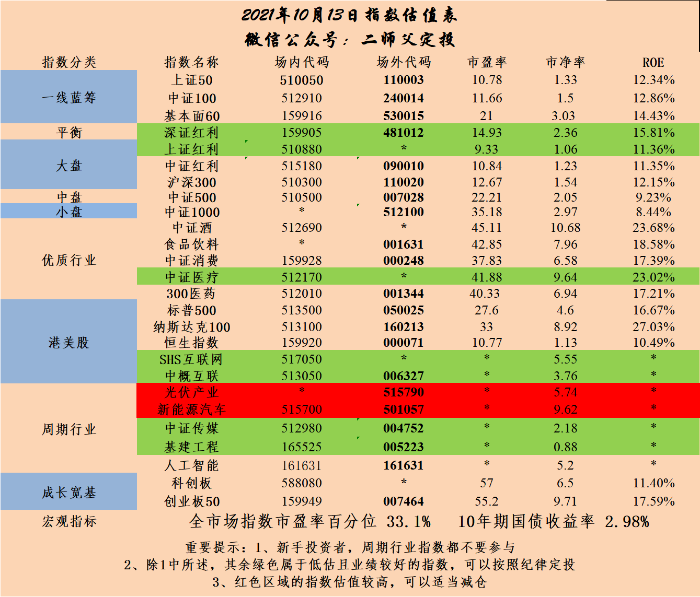

======================================================

_type: talk
@二师父[28814221155551]
2021-10-13 23:12:48 Wed  
topic_id: 418888245528548

<e type="hashtag" hid="552114551414" title="#估值数据#" /> 市盈率百分位33.1%，SY-BY百分位34.91%，SY/BY百分位32.74%。

估值楼层仍旧第三层，类似这种反弹的时候就不要追，追和定投是两码事，比如一次定投一份，涨了买也没事，关键是有的读者会按捺不住，涨了就一次买入50%，如果恰好继续涨，还可以赚一笔，如果只是弱反弹，那么就会很危险。

我觉得今年还是以防守为主，可以在底仓的基础上慢慢定投，但是不能大仓位追涨，学会低吸，非常重要。

阅读[1]  评论[0]  赞[0] 

======================================================

_type: talk
@二师父[28814221155551]
2021-10-14 09:40:27 Thu  
topic_id: 581111411555214

<e type="hashtag" hid="88511185585152" title="#乌龟计划加可转债#" /> 买入500元基建工程，文科转债买入10张，10张是980元。

面值100以下的转债债性强，不用担心，有债券保底。

中概出网价格到了，可以卖，也可以拿，总之赚了以后价格不贵就不用太纠结拿还是卖。

@果实妈咪 at 2021-10-14 09:40:27 Thu

> 文科转债代码多少，二师父

----------

@二师父 at 2021-10-14 09:40:27 Thu

> 128127

----------

阅读[1]  评论[2]  赞[0] 

======================================================

_type: q&a
@是喵喵吖～[421441114141158]
2021-10-14 10:13:07 Thu  
topic_id: 818888488441112

@是喵喵吖～

>  师父请问现在有什么债券可以适合一次性买入吗。有四五万块钱吧 暂时用不到。觉得货币基金有点低。谢谢啦！

@二师父

>  一次买入安心组合比较合适，适度分散，最好不要单独一次购买一只债券基金

阅读[1]  评论[2]  赞[0] 

======================================================

_type: q&a
@维真[818585418182212]
2021-10-14 11:01:21 Thu  
topic_id: 218888482824551

@维真

>  二师父，乌龟计划这个周四定投吗？

@二师父

>  对，每周四乌龟计划发车

阅读[1]  评论[0]  赞[0] 

======================================================

_type: talk
@二师父[28814221155551]
2021-10-14 22:02:27 Thu  
topic_id: 418888224418458

<e type="hashtag" hid="28511188158121" title="#市场持续缩量，适合慢慢上车#" />

@衣袂飘香 at 2021-10-14 22:02:27 Thu

> 二师父，你的成长组合也是按份投吗？比如，昨天你加仓的金额，算是几份呢？

----------

@二师父 at 2021-10-14 22:02:27 Thu

> 0.5份

----------

阅读[1]  评论[2]  赞[0] 

+++++++++++++++++++++++++++++++++++++++++++++++++++++

文件：
2021-10-14 22:02:08 Thu
文件大小：[44901]
544811858218454-缩量后的机会.docx

======================================================

_type: talk
@二师父[28814221155551]
2021-10-14 22:13:24 Thu  
topic_id: 218888445848151

<e type="hashtag" hid="552114551414" title="#估值数据#" /> 市盈率百分位33.24%，SY-BY百分位34.83%，SY/BY百分位32.48%。

市场持续震荡，估值楼层一层的机会今年估计戏不大，二层的时候慢慢建仓吧。

阅读[1]  评论[0]  赞[0] 

======================================================

_type: talk
@云卷云舒[28288212211221]
2021-10-14 23:26:09 Thu  
topic_id: 818888442442112

师父好！搜特和文科转债晚上出来股票的业绩预期，都是亏损，对明天的转债有影响吗？要不要走啊！

@二师父 at 2021-10-14 23:26:09 Thu

> 会有影响的，看你的投资策略，如果是做趋势就需要离开，我的策略是长期持有，低于100的转债长期持有也有债券收益保底，所以不用走

----------

@云卷云舒 at 2021-10-14 23:26:09 Thu

> 好的，谢谢师父！

----------

阅读[1]  评论[2]  赞[0] 

======================================================

_type: talk
@二师父[28814221155551]
2021-10-15 09:34:46 Fri  
topic_id: 418888118212488

<e type="hashtag" hid="15288855851282" title="#看市场的三个数据#" /> 第一个，百分位数据，这个咱们每天公布，百分位越低，市场越便宜，SY-BY数据百分位我处理过，也是百分位越低，市场越便宜，原理讲过了，判断的时候直接用就行。

第二个，股票总市值/gdp，查阅同花顺和国家统计局的数据就可以查到。然后一般在60%以下极度便宜，90%以上就很贵了。计算的时候排除B股和H股的数据，如果加上了B股和H股的数据，那么数值会偏高一些。

第三个，社融增速，股市行情大致和社融增速一直，社融增速高，股市行情好，社融增速差 ，股市行情基本不好，即使短期有行情，后面也会埋着坑。

投资多方数据参考，多一个参考多一份胜算，但是没有百分之一百确定的，切记要放弃确定性思维，拥抱概率思维。

阅读[1]  评论[0]  赞[0] 

======================================================

_type: q&a
@J[28281541518551]
2021-10-15 10:29:01 Fri  
topic_id: 185555885844452

@J

>  师父，请问券商现在适合跟中概一样做网格吗？如果适合，师父能否发一下网格表？

@二师父

>  可以的，以1.08为底仓价格，百分之5的网格点

阅读[1]  评论[7]  赞[0] 

======================================================

_type: talk
@二师父[28814221155551]
2021-10-15 11:17:00 Fri  
topic_id: 818888112428852

1，新希望：2021年前三季度预计亏损59.95亿元–63.95亿元
2，正邦科技：2021年前三季度亏损约69.5亿元–79.5亿元
3，牧原股份：三季度亏损5-10亿元
4，永东股份：2021年前三季度净利润约2.66亿元-2.74亿元 同比增长287.47%-299.11%
5，搜于特：预计2021年前三季度净利润亏损20亿元-23亿元
6，文科园林：2021年前三季度预计净利2600万元–3900万元，同比减少72%–81%

三季度业绩压力大，社融增速也下滑，四季度大概率呈压，慢慢左侧建仓。

成长组合和安心组合今日上涨，乌龟计划下跌，成长行情更胜一筹。

@样 at 2021-10-15 11:17:00 Fri

> 有点贪心，想等成长组合净值在1以下再建仓[微笑][微笑]

----------

阅读[1]  评论[1]  赞[0] 

======================================================

_type: talk
@雪莲[421485848588118]
2021-10-15 14:56:25 Fri  
topic_id: 818888111544182

二师父你好，场内16国债19最近利润回撤很多，是继续持有还是清仓？

@二师父 at 2021-10-15 14:56:25 Fri

> 可以减仓一半

----------

@雪莲 at 2021-10-15 14:56:25 Fri

> 明白了，谢谢二师父！

----------

阅读[1]  评论[2]  赞[0] 

======================================================

_type: talk
@二师父[28814221155551]
2021-10-15 21:48:58 Fri  
topic_id: 818882554521482

<e type="hashtag" hid="51288815218854" title="#如何挑选组合#" />

@嘉宾 at 2021-10-15 21:48:58 Fri

> 场内的如何选择？

----------

@二师父 at 2021-10-15 21:48:58 Fri

> 场内参考鳄鱼计划

----------

阅读[1]  评论[2]  赞[0] 

+++++++++++++++++++++++++++++++++++++++++++++++++++++

文件：
2021-10-15 21:48:44 Fri
文件大小：[45998]
244188115418111-这样选组合投资.docx

======================================================

_type: talk
@二师父[28814221155551]
2021-10-15 21:55:23 Fri  
topic_id: 218882554544841

<e type="hashtag" hid="552114551414" title="#估值数据#" /> 市盈率百分位33.35%，SY-BY百分位35.52%，SY/BY百分位33.32%。

目前国债收益率持续走高，国债和国开债表现都很一般，流动性收紧，股市表现也会差一些，接下来大概率会有投资机会，长线仓位等待入场，少部分资金依旧选择网格。

@梧桐 at 2021-10-15 21:55:23 Fri

> 二师父，国开债需要先出来吗

----------

@二师父 at 2021-10-15 21:55:23 Fri

> 可以出一部分

----------

@梧桐 at 2021-10-15 21:55:23 Fri

> 明白

----------

阅读[1]  评论[3]  赞[0] 

======================================================

_type: talk
@二师父[28814221155551]
2021-10-16 21:00:49 Sat  
topic_id: 218882528288221

<e type="hashtag" hid="51288815152854" title="#家庭保险配置指南#" /> 有保险托底，家庭压力就会小一些，让保险来做保障，让基金来赚收益。

阅读[1]  评论[0]  赞[0] 

+++++++++++++++++++++++++++++++++++++++++++++++++++++

文件：
2021-10-16 21:00:02 Sat
文件大小：[49025]
244188112181211-家庭保险配置指南.docx

======================================================

_type: talk
@二师父[28814221155551]
2021-10-17 20:59:30 Sun  
topic_id: 218882512848511

<e type="hashtag" hid="51288815184454" title="#布局的方向#" />

@果实妈咪 at 2021-10-17 20:59:30 Sun

> 未来房子真的还不如理财吗？

----------

@二师父 at 2021-10-17 20:59:30 Sun

> 这个问题太大了，具体看哪里的房子，还有什么投资水平对比

----------

@果实妈咪 at 2021-10-17 20:59:30 Sun

> 那倒是哟谢谢二师父

----------

阅读[1]  评论[3]  赞[0] 

+++++++++++++++++++++++++++++++++++++++++++++++++++++

文件：
2021-10-17 20:59:20 Sun
文件大小：[85546]
422185442125128-少折腾，积极布局.docx

======================================================

_type: talk
@二师父[28814221155551]
2021-10-18 07:27:11 Mon  
topic_id: 185554525421812

<e type="hashtag" hid="825412412212" title="#可转债打新#" /> 瑞丰转债今日上市，如果开盘低于110可以适当持有，今日无新债发行。

阅读[1]  评论[0]  赞[0] 

======================================================

_type: q&a
@维真[818585418182212]
2021-10-18 17:53:04 Mon  
topic_id: 185554552152212

@维真

>  老师好，我进入学堂时间不长，老师写的书：指数基金定投慢慢变富己经学习完了，我问一下老师：接下来再进一步跟老师学习，需要怎样学习，学习那些课程？请老师指点，谢谢老师。

@二师父

>  掌握了基本的投资原理，然后再投资实践，在实践过程中阅读每天分享的文章，不断总结，需要时间积累

阅读[1]  评论[1]  赞[0] 

======================================================

_type: talk
@二师父[28814221155551]
2021-10-18 21:38:04 Mon  
topic_id: 418885854151248

<e type="hashtag" hid="88511182482112" title="#何时投资白酒#" />

@隔窗遥望 at 2021-10-18 21:38:04 Mon

> 512690现在1.2，大概什么时候可以进场？

----------

@隔窗遥望 at 2021-10-18 21:38:04 Mon

> 不会看支撑位

----------

@隔窗遥望 at 2021-10-18 21:38:04 Mon

> 白酒和消费一点儿没有，什么时候能建个底仓？

----------

@二师父 at 2021-10-18 21:38:04 Mon

> 1.1就可以，如果明天再跌6%可能就会发车了

----------

@隔窗遥望 at 2021-10-18 21:38:04 Mon

> 👌明天看看能不能给机会

----------

@杜志彪 at 2021-10-18 21:38:04 Mon

> 我打算1块进场[呲牙]

----------

@二师父 at 2021-10-18 21:38:04 Mon

> 那这要赚大了

----------

阅读[1]  评论[7]  赞[0] 

+++++++++++++++++++++++++++++++++++++++++++++++++++++

文件：
2021-10-18 21:37:52 Mon
文件大小：[45973]
422185454842848-白酒大跌，可以定投了吗.docx

======================================================

_type: talk
@二师父[28814221155551]
2021-10-19 10:32:06 Tue  
topic_id: 185554411451142

<e type="hashtag" hid="881251425252" title="#鳄鱼计划#" /> 买入农业etf5份，红利etf1份，代码如下。

@冉冉 at 2021-10-19 10:32:06 Tue

> 请问二师傅，农业类型主题基金参考的指数是什么？代码是什么？恳请能告知，谢谢！

----------

@二师父 at 2021-10-19 10:32:06 Tue

> 中证农业000949

----------

@西锦巴乌 at 2021-10-19 10:32:06 Tue

> 师父：配置农业是基于今年的自然灾害还是………

----------

@wty at 2021-10-19 10:32:06 Tue

> 今天很忙，不过还是跟上买入了农业！麻烦二师父分析一下农业板块的机会！谢谢

----------

@二师父 at 2021-10-19 10:32:06 Tue

> 农业需求旺盛，猪周期未来反转，目前价格合适

----------

@二师父 at 2021-10-19 10:32:06 Tue

> 好的，目前受灾，农业板块供给受限，生猪栏增多这个板块的机会会逐步凸现，目前价格也不贵

----------

阅读[1]  评论[6]  赞[0] 

+++++++++++++++++++++++++++++++++++++++++++++++++++++

图片：
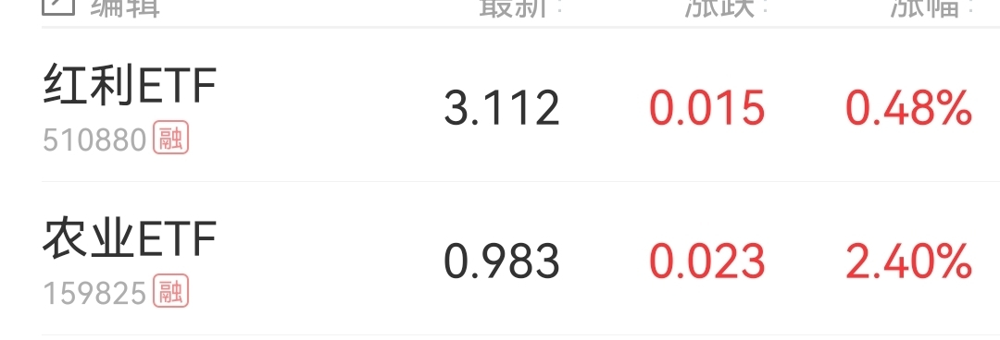

======================================================

_type: talk
@门萨🐨[51411455828824]
2021-10-19 19:19:52 Tue  
topic_id: 581115584441124

咋啦！？？

@衣袂飘香 at 2021-10-19 19:19:52 Tue

> 天呐，咋啦？我还有他的基金呢。

----------

@二师父 at 2021-10-19 19:19:52 Tue

> 卸任了，我猜测不堪压力

----------

@门萨🐨 at 2021-10-19 19:19:52 Tue

> 哎，太难了😭

----------

阅读[1]  评论[3]  赞[0] 

+++++++++++++++++++++++++++++++++++++++++++++++++++++

图片：
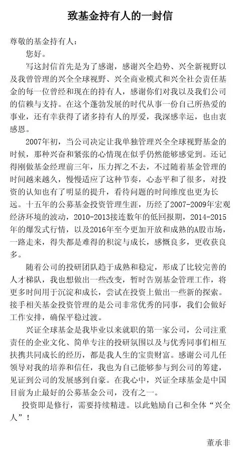

======================================================

_type: talk
@二师父[28814221155551]
2021-10-19 21:23:52 Tue  
topic_id: 818882211422842

<e type="hashtag" hid="48411185128528" title="#老董走了，如何应对#" />

@样 at 2021-10-19 21:23:52 Tue

> 请教，谢志宇要接管兴全趋势的话，那他管理的基金规模得过千亿了吧，业绩上是不是得打折扣了啊，那谢志宇的兴全合润是继续持有还是转成别的，兴全合润是我的第一重仓基金，规模大了，心里好慌

----------

@二师父 at 2021-10-19 21:23:52 Tue

> 规模大了确实不好掉头，调仓不方便

----------

阅读[1]  评论[2]  赞[0] 

+++++++++++++++++++++++++++++++++++++++++++++++++++++

文件：
2021-10-19 21:23:43 Tue
文件大小：[45396]
544815244212144-老董走了.docx

======================================================

_type: talk
@二师父[28814221155551]
2021-10-20 08:19:53 Wed  
topic_id: 418885284225488

<e type="hashtag" hid="552114551414" title="#估值数据#" /> 市盈率百分位34.59%，SY-BY百分位36.39%，SY/BY百分位34.36%。

估值数据一直在30%左右徘徊，社融增速持续下滑，适合正常定投，预计明年会发生反转。

大家投资一定要跟上形势，转变思维，董哥过去15年做的很好，然而最近两年尤其是今年的业绩确实弱了一些，到底是什么原因，今年没抓住新能源的普遍收益差，而大佬在1月提示新能源风险，现在未提，大家都忘记了这里的风险，这时候就要谨慎。

那么为何谨慎成长组合还加仓了新能源，首先是组合配置，仓位在20%以内风险可控，其次成长周期新能源还有比较长的路，回调布局合适。

任何时候都要清楚自己为什么做，有逻辑，这样才能不断成长进步。

@J at 2021-10-20 08:19:53 Wed

> 师父，明年会发生反转指的是什么？熊转牛的味道吗？

----------

@二师父 at 2021-10-20 08:19:53 Wed

> 下跌反转

----------

@门萨🐨 at 2021-10-20 08:19:53 Wed

> 看好新能源。甚至感觉最近油价上涨是为了倒逼新能源。做运输的油价涨了运费不涨，都难撑[流泪]

----------

@二师父 at 2021-10-20 08:19:53 Wed

> 原材料涨价，实体太难了

----------

阅读[1]  评论[4]  赞[0] 

======================================================

_type: talk
@二师父[28814221155551]
2021-10-20 19:42:00 Wed  
topic_id: 185554148252412

<e type="hashtag" hid="88512414582182" title="#接下来的方向#" /> 接下来就是每周乌龟计划，然后成长组合等待跌破净值或者估值楼层二楼以下持续定投。

阅读[1]  评论[0]  赞[0] 

+++++++++++++++++++++++++++++++++++++++++++++++++++++

文件：
2021-10-20 19:39:22 Wed
文件大小：[41655]
844182255845222-选这个方向.docx

======================================================

_type: talk
@二师父[28814221155551]
2021-10-20 23:43:57 Wed  
topic_id: 185554115558212

<e type="hashtag" hid="552114551414" title="#估值数据#" /> 市盈率百分位34.48%，SY-BY百分位36.83%，SY/BY百分位35.65%。

因市场变动很小，估值数据变化也不大，等待第四季度和的布局机会，迎接年初行情。

阅读[1]  评论[0]  赞[0] 

======================================================

_type: talk
@二师父[28814221155551]
2021-10-21 08:45:33 Thu  
topic_id: 185554118422122

泉峰转债今日上市，可能会涨停，正股三季度业绩好一直涨，所以熔断解除后可以首日卖出。

阅读[1]  评论[0]  赞[0] 

======================================================

_type: talk
@二师父[28814221155551]
2021-10-21 09:50:59 Thu  
topic_id: 418885214428858

<e type="hashtag" hid="28518855451481" title="#乌龟计划#" /> 买入工银医疗500元，买入中证红利500元，扫码可以看到，基建后面也会持续买入，我自己也配置了中国交建和中国建筑。成长组合目前净值大于1，而且估值楼层未到二层，暂停买入。

@小鱼 at 2021-10-21 09:50:59 Thu

> 代码多少呀

----------

@二师父 at 2021-10-21 09:50:59 Thu

> 

----------

@Della🌻🌴明 at 2021-10-21 09:50:59 Thu

> 二师父~建筑行业的买入逻辑是什么

----------

@阿宝 at 2021-10-21 09:50:59 Thu

> 优秀！

----------

@二师父 at 2021-10-21 09:50:59 Thu

> 股息高

----------

@Della🌻🌴明 at 2021-10-21 09:50:59 Thu

> [抱拳]谢谢(~‾⌣‾)~

----------

@春晓 at 2021-10-21 09:50:59 Thu

> 二师傅，买入中欧医疗可以么

----------

@二师父 at 2021-10-21 09:50:59 Thu

> 可以的，实盘三只医疗基金选择一个就行

----------

阅读[1]  评论[15]  赞[0] 

+++++++++++++++++++++++++++++++++++++++++++++++++++++

图片：

======================================================

_type: q&a
@晴[15422515228522]
2021-10-21 14:43:16 Thu  
topic_id: 818882414184542

@晴

>  二师父，作为互联网大龄打工女青年，去考个基金从业资格证怎么样？这行有年龄歧视吗，个人有点兴趣

@二师父

>  可以啊，对年龄没啥歧视，关键看你的投资水平。证券从业，分析师都可以考一考。

阅读[1]  评论[0]  赞[0] 

======================================================

_type: q&a
@徐美芳[51112822252224]
2021-10-21 15:36:50 Thu  
topic_id: 218882411545541

@徐美芳

>  文科转债继续拿着还是出掉呢？谢谢！

@二师父

>  继续拿着的，如果你是做短线就选择有预期的转债，我做双低，低于100元符合双低原则就长期持有，计划跌到90以下继续买入的，这种策略需要忍受长期浮亏，但是都不会亏钱

阅读[1]  评论[0]  赞[0] 

======================================================

_type: talk
@二师父[28814221155551]
2021-10-21 21:01:39 Thu  
topic_id: 418885142851258

<e type="hashtag" hid="48411182244528" title="#ETF投资需要择时吗#" /> 投资ETF是否需要择时，答案是需要的，具体原因也分析了，最基本的择时就是低估区域买入，高估区域卖出。

@庆余年 at 2021-10-21 21:01:39 Thu

> 二师父可否解读一下MSCI中国A股ETF？

----------

@阝東 at 2021-10-21 21:01:39 Thu

> 那如果可转债双低买入，怎么判断卖出点呢？

----------

@二师父 at 2021-10-21 21:01:39 Thu

> 追踪高ROE指数的etf，持仓都是a股龙头企业，适合轻仓常持，按照目前的风向，小市值企业表现更好，这类大市值指数比较稳健

----------

@二师父 at 2021-10-21 21:01:39 Thu

> 这个看的比较多，股票的业绩，转债价格，短期的公告事件影响

----------

@庆余年 at 2021-10-21 21:01:39 Thu

> 好的，谢谢二师父

----------

阅读[1]  评论[5]  赞[0] 

+++++++++++++++++++++++++++++++++++++++++++++++++++++

文件：
2021-10-21 21:00:53 Thu
文件大小：[129735]
111854452841442-投资ETF要不要择时.docx

======================================================

_type: q&a
@J[28281541518551]
2021-10-21 22:33:16 Thu  
topic_id: 218884585114811

@J

>  师傅，请问现在每周有主动基金估值表吗？易方达金融行业是低估吗

@二师父

>  有的，后面每周发到星球，易方达金融股票目前正常估值

阅读[1]  评论[2]  赞[0] 

======================================================

_type: talk
@二师父[28814221155551]
2021-10-21 22:40:25 Thu  
topic_id: 581114211215584

<e type="hashtag" hid="552114551414" title="#估值数据#" /> 市盈率百分位33.67%，SY-BY百分位34.63%，SY/BY百分位33.76%。

市场持续震荡，第一方面网格，第二方面配债，目前只有这两个盈利得方式了。

长线仓位成长组合，看看四季度有没有机会再入场，市场震荡是比较考验耐心得，敢于低仓位运行。

@西锦巴乌 at 2021-10-21 22:40:25 Thu

> 现在债券收益也不好呀[大哭]

----------

@二师父 at 2021-10-21 22:40:25 Thu

> 长期看是比货币基金好一些的

----------

@西锦巴乌 at 2021-10-21 22:40:25 Thu

> 那到是

----------

阅读[1]  评论[3]  赞[0] 

======================================================

_type: talk
@二师父[28814221155551]
2021-10-22 08:52:18 Fri  
topic_id: 418882482841118

投资最重要的是策略，可以对行情进行预判，但是最终不会依靠预判来做决策，所有的投资都是基于策略的基础上，有了好的策略，无论买入上涨还是下跌都有应对方法。

@衣袂飘香 at 2021-10-22 08:52:18 Fri

> 这张图风景很好看呀。 是二师父拍的吗？

----------

@防汛抗旱 at 2021-10-22 08:52:18 Fri

> 师父，9月份开始投红利etf的逻辑是啥？感觉被套了

----------

@二师父 at 2021-10-22 08:52:18 Fri

> 看好后面价值股，预计上百分之15仓位，可以继续定投的

----------

@二师父 at 2021-10-22 08:52:18 Fri

> 这是网上的

----------

阅读[1]  评论[4]  赞[0] 

+++++++++++++++++++++++++++++++++++++++++++++++++++++

图片：

======================================================

_type: talk
@二师父[28814221155551]
2021-10-22 19:42:17 Fri  
topic_id: 218884548854181

<e type="hashtag" hid="552114551414" title="#估值数据#" /> 市盈率百分位34.42%，SY-BY百分位36.2%，SY/BY百分位34.34%。

投资基本上是准备在两个三个位置加仓，第一下跌幅度有限的位置，第二趋势反转的位置，第三支撑位，一般回撤一定幅度再持续震荡就是支撑位。

类似医疗现在就是支撑位，这个位置买入就是寻求反弹，当然也有支撑位买入被套的，比如中概互联再支撑位的时候就没有撑住，跌下去了，所以支撑位一次买入就要控制仓位，实际投资很灵活，需要具体问题具体应对。

刚加入星球的朋友可以听听置顶的课程，后面会录制一个视频课程，老读者已经掌握了基本知识，可以不用听，跟踪每日数据和我对市场的解读就好，基本上经历过一轮牛熊就会对市场有个大致的认识，下一次经历底部不会恐慌，经历顶部不会贪婪。

阅读[1]  评论[0]  赞[0] 

======================================================

_type: talk
@二师父[28814221155551]
2021-10-22 19:44:09 Fri  
topic_id: 818884548851812

<e type="hashtag" hid="51288814448124" title="#北向资金开始爆买了#" /> 一般北向资金开始爆买就会有行情，如果这期间市场回调，慢慢布局，仓位不要低于50%，等到春节行情到来的时候再减仓，A股的规律是发生了春节行情，当年就大概率不会有超级牛市。

阅读[1]  评论[0]  赞[0] 

+++++++++++++++++++++++++++++++++++++++++++++++++++++

文件：
2021-10-22 19:42:59 Fri
文件大小：[45684]
544815555854254-北向资金又开始爆买了.docx

======================================================

_type: talk
@二师父[28814221155551]
2021-10-23 06:35:10 Sat  
topic_id: 818884515512442

投资功夫在股市之外，关于基金投资已经把基础知识讲的比较多了，后面就是巩固和提示投资的时间点，股市之外的功夫，推荐王阳明全集，可以好好学一学，找到自己的方向，不仅仅是投资，还有事业生活，凡事向内求，知行合一。

@小牧童 at 2021-10-23 06:35:10 Sat

> 师父，买哪个版本的王阳明好一些

----------

@二师父 at 2021-10-23 06:35:10 Sat

> 我用的这个版本的，你可以先对比看下电子书，王阳明全集，然后再买自己喜欢看的就行

----------

@小牧童 at 2021-10-23 06:35:10 Sat

> 好的👌

----------

阅读[1]  评论[3]  赞[0] 

+++++++++++++++++++++++++++++++++++++++++++++++++++++

图片：

======================================================

_type: talk
@二师父[28814221155551]
2021-10-23 08:34:53 Sat  
topic_id: 581114282551244

听听这个声音如何

@wty at 2021-10-23 08:34:53 Sat

> 👌

----------

阅读[1]  评论[1]  赞[0] 

+++++++++++++++++++++++++++++++++++++++++++++++++++++

文件：
2021-10-23 08:34:44 Sat
文件大小：[301329]
111854441115252-小知识：指数基金是可以扛通货膨胀的.mp3

======================================================

_type: talk
@二师父[28814221155551]
2021-10-23 10:04:52 Sat  
topic_id: 185551282811522

<e type="hashtag" hid="88511184122482" title="#MSCI中国A50指数投资价值分析#" />

@隔窗遥望 at 2021-10-23 10:04:52 Sat

> 这个指数有基金可以投吗？

----------

@云云 at 2021-10-23 10:04:52 Sat

> 语音乱断句，不咋地哦

----------

@二师父 at 2021-10-23 10:04:52 Sat

> 文章里面已经说了哈

----------

@二师父 at 2021-10-23 10:04:52 Sat

> 好的，我尽量自己读

----------

@隔窗遥望 at 2021-10-23 10:04:52 Sat

> 没看到啊，只看到MSCI中国A50指数的代码

----------

@二师父 at 2021-10-23 10:04:52 Sat

> 159602，可以等认购结束以后

----------

@隔窗遥望 at 2021-10-23 10:04:52 Sat

> 好的，我先关注一下

----------

阅读[1]  评论[7]  赞[0] 

+++++++++++++++++++++++++++++++++++++++++++++++++++++

文件：
2021-10-23 10:04:29 Sat
文件大小：[590985]
544815554841444-MSCI中国A50互联互通指数投资价值分析.mp3

2021-10-23 10:04:49 Sat
文件大小：[441639]
422185552128218-MSCI中国A50互联互通指数投资价值分析.docx

======================================================

_type: talk
@二师父[28814221155551]
2021-10-23 15:36:12 Sat  
topic_id: 818884514121452

<e type="hashtag" hid="48411182128248" title="#书籍分享#" /> 这书是我自己讲的，大家看看效果如何，平时工作日就机器人音频，周末有空的话就是我自己的音频解读，带大家读书，读好书，做好人，不断成长进步，人生的意义也在于此。因为星球暂时无法上传视频，所以在公众号和视频号上会上传视频。

@丸子妈 at 2021-10-23 15:36:12 Sat

> 无法播放

----------

@二师父 at 2021-10-23 15:36:12 Sat

> 是不是没有mp4，我这可以

----------

@丸子妈 at 2021-10-23 15:36:12 Sat

> 下载后播放可以了

----------

阅读[1]  评论[3]  赞[0] 

+++++++++++++++++++++++++++++++++++++++++++++++++++++

图片：
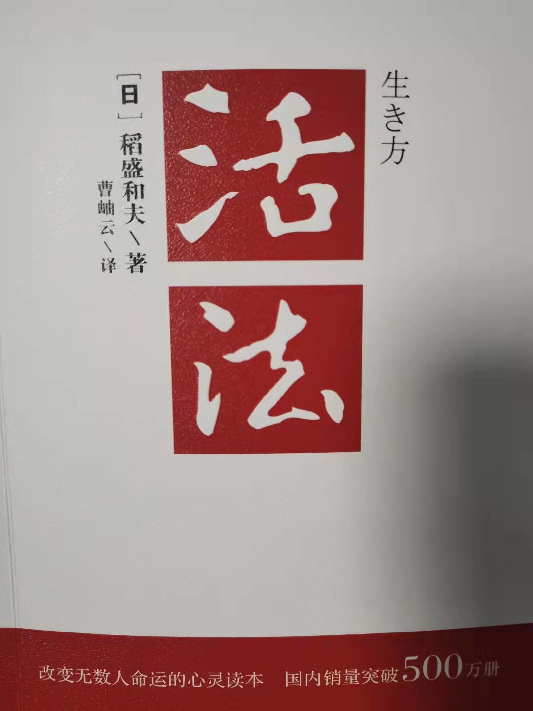

+++++++++++++++++++++++++++++++++++++++++++++++++++++

文件：
2021-10-23 15:34:04 Sat
文件大小：[3321998]
844182221442222-活法之人生的意义.m4a

======================================================

_type: talk
@Della🌻🌴明[422155212484558]
2021-10-23 17:12:39 Sat  
topic_id: 218884511818111

二师父~请教下，如何看待中自科技新股破发？下周一要上市的凯尔达中签不知道怎么操作了

@二师父 at 2021-10-23 17:12:39 Sat

> 我在文章里面提到过，看情况，如果a股未来港股化的话，首日亏了最好就离场，目前a股破发概率还是相对较低的，别太担心

----------

@Della🌻🌴明 at 2021-10-23 17:12:39 Sat

> 明白啦！看首日表现[抱拳][抱拳]

----------

阅读[1]  评论[2]  赞[0] 

======================================================

_type: talk
@二师父[28814221155551]
2021-10-24 15:22:03 Sun  
topic_id: 218884882822111

#三个指数投资价值分析以及房地产税的解读#

阅读[1]  评论[0]  赞[0] 

+++++++++++++++++++++++++++++++++++++++++++++++++++++

文件：
2021-10-24 15:12:58 Sun
文件大小：[46730]
111854411525282-港股通50和中国50以及沪深300投资价值对比.docx

2021-10-24 15:21:52 Sun
文件大小：[7462850]
544815544121584-港股通50和中国50以及沪深300投资价值对比.m4a

======================================================

_type: talk
@二师父[28814221155551]
2021-10-25 09:41:16 Mon  
topic_id: 818884845124422

今日帝欧转债可以打新，迪森转债买入10张，转债投资策略是长期持有摊大饼，如果下跌了就当做债券持有，目前仅君禾转债盈利，其余均浮亏，若没有强赎就一直持有，如果不能接受长期浮亏，请勿跟投。

阅读[1]  评论[0]  赞[0] 

======================================================

_type: talk
@手牵手看夕阳[244112548184141]
2021-10-25 21:29:55 Mon  
topic_id: 581114588554514

传媒可以加仓吗？

@二师父 at 2021-10-25 21:29:55 Mon

> 可以

----------

@手牵手看夕阳 at 2021-10-25 21:29:55 Mon

> 现在有点浮亏。

----------

阅读[1]  评论[2]  赞[0] 

======================================================

_type: talk
@二师父[28814221155551]
2021-10-25 22:47:49 Mon  
topic_id: 218884455282551

<e type="hashtag" hid="15288845252542" title="#市场大事#" /> 语音讲解会更丰富一些

阅读[1]  评论[0]  赞[0] 

+++++++++++++++++++++++++++++++++++++++++++++++++++++

文件：
2021-10-25 22:46:37 Mon
文件大小：[8379559]
111854124128142-大事.m4a

2021-10-25 22:46:51 Mon
文件大小：[46962]
422185245241218-大事.docx

======================================================

_type: talk
@二师父[28814221155551]
2021-10-25 23:13:38 Mon  
topic_id: 418882245824188

<e type="hashtag" hid="552114551414" title="#估值数据#" /> 市盈率百分位34.61%，SY-BY百分位36.35%，SY/BY百分位34.4%。

目前这个位置成长组合可以停止，乌龟计划持续定投，直到没有值得投资标的的时候。

关于新能源能否投，这个问题真没有标准答案，我的成长组合是建仓了，但是仅限于组合6只基金的仓位，而且加仓位置是实时的，没有固定的答案。

不要固化投资，本质上没有违背几大主要原则就行：价值、逆向、保守。不违背即可。

@样 at 2021-10-25 23:13:38 Mon

> 等成长组合加仓

----------

阅读[1]  评论[1]  赞[0] 

======================================================

_type: talk
@二师父[28814221155551]
2021-10-26 09:42:17 Tue  
topic_id: 581114411541414

转债打新，盲打即可，首日破发，继续持有补仓，最差也有债券收益率，遇到炒作还能吃到大肉，关键需要忍受长期浮亏，看个人性格选择策略

阅读[1]  评论[0]  赞[0] 

+++++++++++++++++++++++++++++++++++++++++++++++++++++

图片：

======================================================

_type: talk
@二师父[28814221155551]
2021-10-26 21:59:39 Tue  
topic_id: 818884445252812

<e type="hashtag" hid="552114551414" title="#估值数据#" /> 市盈率百分位34.59%，SY-BY百分位36.31%，SY/BY百分位34.38%。

估值楼层第三层，接下来成长组合发车一定是两个条件，第一估值楼层二层以下，第二净值跌破1.注意虽然现在A股市场估值不高，但是组合投资的基金都是高波动的，要严格控制安全边际，耐心守候，静待花开。

乌龟计划定投不变，一直是全面配置，而且更倾向于低估品种，安全边际足够高。

阅读[1]  评论[0]  赞[0] 

======================================================

_type: talk
@二师父[28814221155551]
2021-10-26 22:16:26 Tue  
topic_id: 185551112415122

<e type="hashtag" hid="15288845515122" title="#基金分红的处理方式#" />

阅读[1]  评论[0]  赞[0] 

+++++++++++++++++++++++++++++++++++++++++++++++++++++

文件：
2021-10-26 22:14:45 Tue
文件大小：[4564658]
244182425828521-基金分红了，该如何处理.m4a

2021-10-26 22:15:05 Tue
文件大小：[48008]
111854142545212-基金分红了，该如何处理.docx

======================================================

_type: talk
@二师父[28814221155551]
2021-10-27 08:45:10 Wed  
topic_id: 581114448441144

<e type="hashtag" hid="825412412212" title="#可转债打新#" /> 今天赛伍转债发行，可以顶格申购。正股赛伍技术高技术复合材料（特殊功能复合材料及制品）、塑料加工专用设备及装置的研发、生产和销售；销售太阳能电池组件及相关配件；从事高技术复合材料（特殊功能复合材料及制品）、功能性薄膜、合成树脂、胶黏剂、胶带的来料加工、检测、批发及进出口业务（不涉及国营贸易管理商品，涉及配额、许可证管理商品的，按国家有关规定办理申请）。

属于光伏概念板块，目前公司和隆基有过合作，当前光伏还是处于上行周期，如果中签的话可以考虑125元以上卖出，或者双低值160以上卖出。双低值=转债价格+溢价率*100.仅供参考。

另外希望转2预计未来一周可能发行，百元含权率大约12%，参考正股价格，可以适当配售。正股新希望从高位跌了60%，如果有耐心长期持有可以考虑，如果发行前新希望盈利7%以上就可以考虑做个短线。

目前市场投资盈利难度较大，长线仓位继续不懂，适当网格波段，转债打新、申购或者转债配售都值得的。

@wty at 2021-10-27 08:45:10 Wed

> 刚收到消息，中了帝欧债，很久没有中了[偷笑]

----------

@防汛抗旱 at 2021-10-27 08:45:10 Wed

> 我也中了

----------

阅读[1]  评论[2]  赞[0] 

======================================================

_type: talk
@二师父[28814221155551]
2021-10-27 09:35:47 Wed  
topic_id: 818884415811422

<e type="hashtag" hid="881251425252" title="#鳄鱼计划#" /> 中概互联买入两份，中证1000买入一份，代码如图。定投非一次性买入，估值楼层三层以下逐步积累仓位到8，然后长期持有到市场狂热减仓，指数投资唯一需要的是耐心

@永刚 at 2021-10-27 09:35:47 Wed

> 中证1000是低估吗？

----------

@二师父 at 2021-10-27 09:35:47 Wed

> 没有低估，上行趋势，均线以下或者支撑位买入

----------

@🎈铮 at 2021-10-27 09:35:47 Wed

> 二师父，上次跟着买了一份红利ETF，现在跌6点多了，不加仓么？

----------

@二师父 at 2021-10-27 09:35:47 Wed

> 加

----------

@云卷云舒 at 2021-10-27 09:35:47 Wed

> 我咋亏了11个点了呀[捂脸][捂脸][捂脸]

----------

@J at 2021-10-27 09:35:47 Wed

> 请教师父，ETF中的涨跌幅百分比是怎么计算得来的？我想自己算一下中概当天跌3%的话应该去到多少价格

----------

@二师父 at 2021-10-27 09:35:47 Wed

> 当前价格乘以0.97

----------

@J at 2021-10-27 09:35:47 Wed

> 师父，我想问软件上显示etf的当前跌幅是在它当天开盘价还是最高价的基础上计算出来的？

----------

阅读[1]  评论[10]  赞[0] 

+++++++++++++++++++++++++++++++++++++++++++++++++++++

图片：
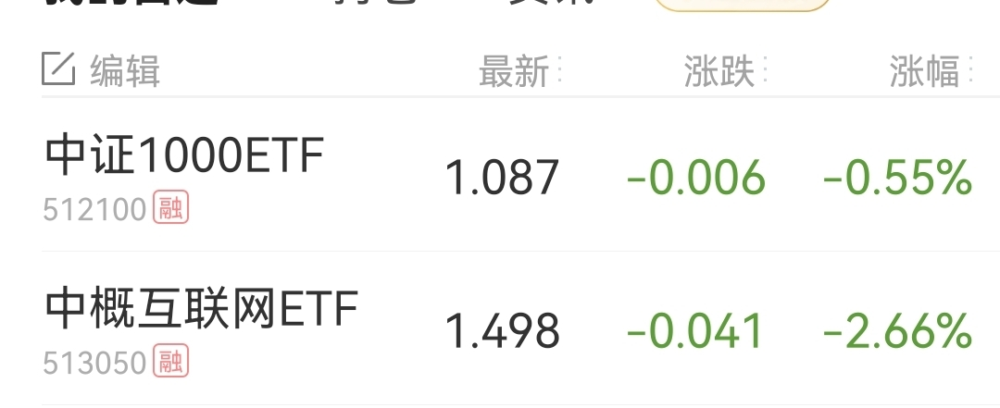

======================================================

_type: talk
@二师父[28814221155551]
2021-10-27 11:08:06 Wed  
topic_id: 581114481158254

基金投资看好的标的都会持续加仓的，只是侧重点不同，优选最值得配置的基金优先加仓

就比如只有一个周末，去看电影还是泡温泉，都是不错的放松方式。只能选一个，当然选择最佳的

阅读[1]  评论[0]  赞[0] 

======================================================

_type: talk
@二师父[28814221155551]
2021-10-27 21:58:57 Wed  
topic_id: 185551828588482

<e type="hashtag" hid="825188852442" title="#估值表#" /> 又有新的品种进入低估了，可以重启定投，今天的文章讲了组合，后面我会开展配置组合，详解配置组合收益率，以及投资风险。

大家注意，投资有配置和定投两种方式，配置要做好风控，做好回撤的控制，而定投需要选择高波动高成长的指数。

阅读[1]  评论[0]  赞[0] 

+++++++++++++++++++++++++++++++++++++++++++++++++++++

图片：
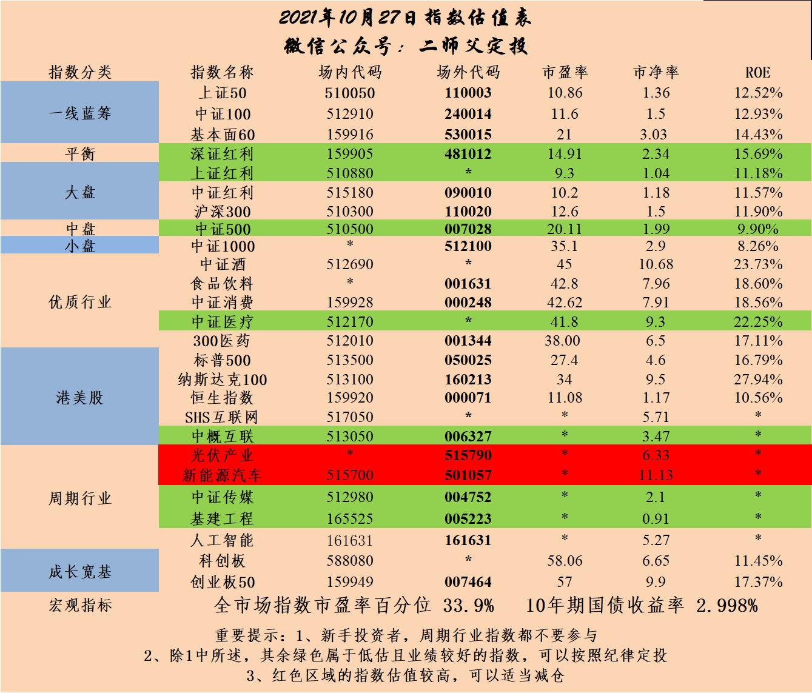

======================================================

_type: talk
@二师父[28814221155551]
2021-10-27 22:17:00 Wed  
topic_id: 818884151452222

<e type="hashtag" hid="28511128458241" title="#安心组合分析#" />

@宋航 at 2021-10-27 22:17:00 Wed

> 二师父，文档内容似乎在上个文档看到过[捂脸]

----------

@二师父 at 2021-10-27 22:17:00 Wed

> 听听音频，文件出了一点问题

----------

@样 at 2021-10-27 22:17:00 Wed

> 二师父，买了读书会员的，那个送的小音箱什么时候发出来？看着还挺可爱，期待…

----------

@二师父 at 2021-10-27 22:17:00 Wed

> 我问问，你也可以咨询下客服

----------

@二师父 at 2021-10-27 22:17:00 Wed

> 联系客服，可以查到具体的物流信息的

----------

阅读[1]  评论[5]  赞[0] 

+++++++++++++++++++++++++++++++++++++++++++++++++++++

文件：
2021-10-27 22:16:55 Wed
文件大小：[5549208]
544815848228584-安心组合分析.m4a

======================================================

_type: talk
@二师父[28814221155551]
2021-10-28 09:24:02 Thu  
topic_id: 218884125128241

宏发转债，顶格申购，对应企业是做继电器的，转股价值不高，预期盈利百分之20。

阅读[1]  评论[0]  赞[0] 

======================================================

_type: talk
@二师父[28814221155551]
2021-10-28 09:55:39 Thu  
topic_id: 218884128854821

<e type="hashtag" hid="28518855451481" title="#乌龟计划#" /> 中证1000买入500元，基建买入500元，持续定投，非一次买入。

大家注意，现在很多基金都有性价比了，不过因为要控制仓位和每次买入的额度，所以只能精选，不过每一只后面都会加仓的，直到下一轮爆发。

白酒目前不是很贵，再跌百分之10左右考虑定投，农银新能源是比较好的光伏基金，再跌到60日均线以下轻仓定投。

@J at 2021-10-28 09:55:39 Thu

> 师父，主动基金估值表可以更新发一下吗？请问易方达金融现在是低估还是正常估值？

----------

@二师父 at 2021-10-28 09:55:39 Thu

> 好的，今晚发以下

----------

@J at 2021-10-28 09:55:39 Thu

> 好的[抱拳]

----------

@春晓 at 2021-10-28 09:55:39 Thu

> 二师傅，这个和512100中证1000一样么

----------

@二师父 at 2021-10-28 09:55:39 Thu

> 一样的，是南方基金公司的品种

----------

阅读[1]  评论[5]  赞[0] 

+++++++++++++++++++++++++++++++++++++++++++++++++++++

图片：
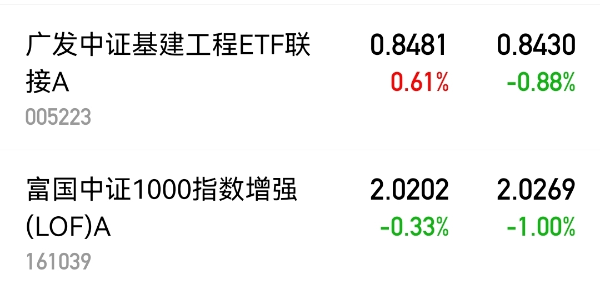

======================================================

_type: talk
@二师父[28814221155551]
2021-10-28 12:56:36 Thu  
topic_id: 418882155141418

<e type="hashtag" hid="28511128155541" title="#四个不同段位的组合#" /> 出了四个组合，大家可以看看分析文章找到自己适合的，前三个属于一次配置的，后面王者组合属于配置+定期再平衡，关注以后再平衡加仓也会有消息。具体策略分析见文章，扫码关注组合也会有具体投资方案。

@门萨🐨 at 2021-10-28 12:56:36 Thu

> 且慢相当可

----------

阅读[1]  评论[1]  赞[0] 

+++++++++++++++++++++++++++++++++++++++++++++++++++++

图片：

+++++++++++++++++++++++++++++++++++++++++++++++++++++

文件：
2021-10-28 12:56:28 Thu
文件大小：[764989]
244182112141281-定投组合跟车流程说明.docx

2021-10-28 12:56:27 Thu
文件大小：[323489]
544815885848514-配置组合跟车流程说明.docx

2021-10-28 12:56:28 Thu
文件大小：[1323985]
422185115121528-四个不同段位的投资组合.docx

======================================================

_type: talk
@二师父[28814221155551]
2021-10-28 12:57:05 Thu  
topic_id: 185551844828542

<e type="hashtag" hid="28511128155541" title="#四个不同段位的组合#" /> 出了四个组合，大家可以看看分析文章找到自己适合的，前三个属于一次配置的，后面王者组合属于配置+定期再平衡。

@芳瑛榕子 at 2021-10-28 12:57:05 Thu

> 二师父，这个文档下载了打不开啊？

----------

@二师父 at 2021-10-28 12:57:05 Thu

> 你用电脑试试

----------

@芳瑛榕子 at 2021-10-28 12:57:05 Thu

> 我就是用电脑下载的，显示无法打开，因为内容有问题

----------

@二师父 at 2021-10-28 12:57:05 Thu

> 手机呢，我这是显示可以

----------

@芳瑛榕子 at 2021-10-28 12:57:05 Thu

> 手机可以[捂脸]谢谢二师父

----------

@芳瑛榕子 at 2021-10-28 12:57:05 Thu

> 手机上下载了，只能在手机上看，在电脑上看不了

----------

@shi at 2021-10-28 12:57:05 Thu

> 二师父，分析了一下四个组合：
青铜：100%债券
白银：100%债券
黄金：80%债券，20%股票
王者：40%债券，60%股票 
感觉，黄金和王者之间相差太大。

能否再组合几个，比如：
60%债券，40%股票
50%债券，50%股票
40%债券，60%股票？

----------

@二师父 at 2021-10-28 12:57:05 Thu

> 可以

----------

阅读[1]  评论[11]  赞[0] 

+++++++++++++++++++++++++++++++++++++++++++++++++++++

图片：
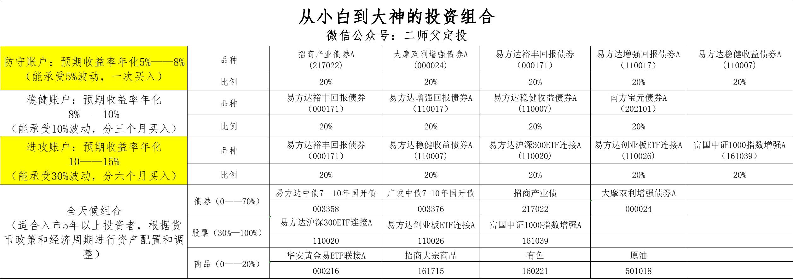

+++++++++++++++++++++++++++++++++++++++++++++++++++++

文件：
2021-10-28 12:57:02 Thu
文件大小：[1323985]
111854884882452-四个不同段位的投资组合.docx

======================================================

_type: q&a
@永刚[15581448518112]
2021-10-28 14:47:44 Thu  
topic_id: 581118242115124

@永刚

>  师父，请教一下，打新用的底仓，只用ETF基金做底仓，不配置股票，可以吗？

@二师父

>  不行的，只有买股票才能打新

阅读[1]  评论[0]  赞[0] 

======================================================

_type: talk
@二师父[28814221155551]
2021-10-29 00:33:12 Fri  
topic_id: 218881518125541

<e type="hashtag" hid="552114551414" title="#估值数据#" /> 市盈率百分位百分之32.17，Sy-by百分位百分之33.83，sy/by百分位百分之31.27，市场回撤逐步布局，仓位6层以下问题不大

阅读[1]  评论[0]  赞[0] 

======================================================

_type: talk
@二师父[28814221155551]
2021-10-29 00:47:02 Fri  
topic_id: 818881514211552

<e type="hashtag" hid="88514141542152" title="#主动基金估值表#" />

阅读[1]  评论[0]  赞[0] 

+++++++++++++++++++++++++++++++++++++++++++++++++++++

图片：
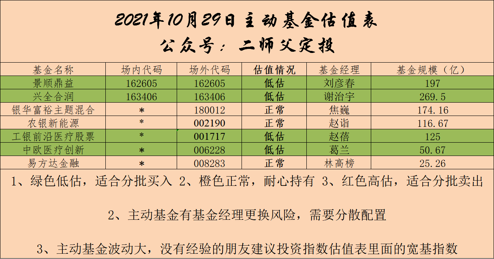

======================================================

_type: talk
@二师父[28814221155551]
2021-10-29 01:11:26 Fri  
topic_id: 218881514452881

<e type="hashtag" hid="28511122558811" title="#鳄鱼计划仓位表#" /> 目前仓位大约45%，继续加仓，直到现金完毕，最后极端下跌的时候债券会逐步转换，目前还是耐心加仓即可。不要总是指望一买就涨，这种属于趋势的判断，需要投资功力，买入下跌是好事，可以更多地买入。不过开仓安全边际要控制好，明天大概率还会发车。先逐步将仓位上到60%。

@嘉宾 at 2021-10-29 01:11:26 Fri

> 请问，鳄鱼计划是选择性跟投，还是完全一样？感觉师父的品种有些多，管理不来[捂脸]

----------

@二师父 at 2021-10-29 01:11:26 Fri

> 你根据实际情况来吧，我每周会发以下目前的仓位和盈亏情况

----------

阅读[1]  评论[2]  赞[0] 

+++++++++++++++++++++++++++++++++++++++++++++++++++++

图片：
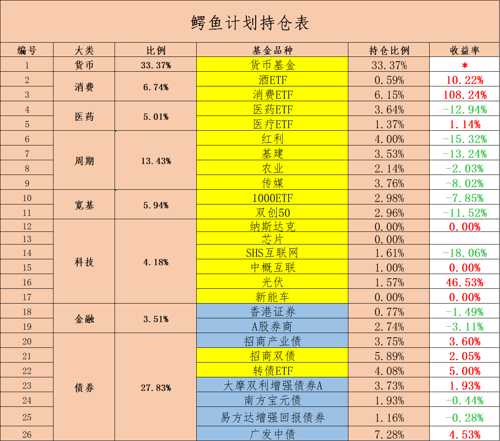

======================================================

_type: talk
@二师父[28814221155551]
2021-10-29 06:44:23 Fri  
topic_id: 581118284815824

四个组合我都有买的，后面看市场机会，王者组合会持续买入，发车系统会提示，不在公众号单独发文，做好配置完全没问题

有人质疑为什么收益这么好基金经理不做，他低估了基金经理的水平，以兴全合润为例，10年收益率百分之600，远超组合，不过大部分人拿不住，这就是组合的优势

@样 at 2021-10-29 06:44:23 Fri

> 成长组合什么时候发车？资金有限，只能选个别的组合跟车

----------

@二师父 at 2021-10-29 06:44:23 Fri

> 估值楼层跌到2或者净值跌破1，到了你叫我来发车

----------

@西锦巴乌 at 2021-10-29 06:44:23 Fri

> 请问王者组合发车在哪提示？

----------

@二师父 at 2021-10-29 06:44:23 Fri

> 置顶1扫码关注王者组合，发车会提醒的

----------

@样 at 2021-10-29 06:44:23 Fri

> 没问题，之前各买了100建个底仓，会持续关注

----------

阅读[1]  评论[5]  赞[0] 

+++++++++++++++++++++++++++++++++++++++++++++++++++++

图片：
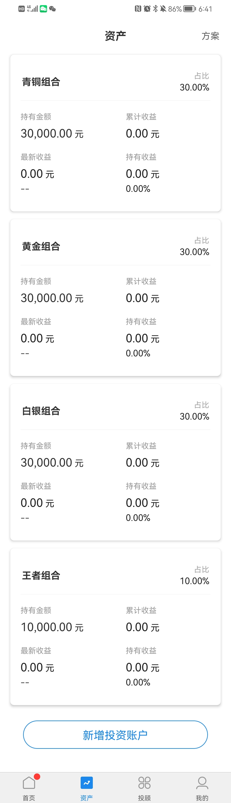

======================================================

_type: talk
@二师父[28814221155551]
2021-10-29 09:39:30 Fri  
topic_id: 185558522284852

<e type="hashtag" hid="881251425252" title="#鳄鱼计划#" /> 买入纳斯达克3份，芯片6份，互联网50买入2份，中证1000买入1份。代码如下，今天的可转债记得打。

@J at 2021-10-29 09:39:30 Fri

> 师父，纳斯达克不是高估吗？为什么买入鳄鱼计划呢？

----------

@JOY at 2021-10-29 09:39:30 Fri

> 师父，想请教下您纳指买入的逻辑。

----------

@二师父 at 2021-10-29 09:39:30 Fri

> 老虎富途这些券商不能用了，利好美股纳斯达克，会有很多人通过正规渠道买纳斯达克来配置美股

----------

@二师父 at 2021-10-29 09:39:30 Fri

> 老虎富途这些券商不能用了，利好美股纳斯达克，会有很多人通过正规渠道买纳斯达克来配置美股，如果买入有10个点以上溢价就可以考虑逐步出了，回撤后轻仓定投，纳斯达克长期向上

----------

@JOY at 2021-10-29 09:39:30 Fri

> 谢谢

----------

@J at 2021-10-29 09:39:30 Fri

> 太有洞察力了师父，给你个赞

----------

@光少 at 2021-10-29 09:39:30 Fri

> 哇塞！今天跟上二师父大手笔买入[色]

----------

@二师父 at 2021-10-29 09:39:30 Fri

> 吃了肉，不错啊

----------

阅读[1]  评论[8]  赞[0] 

+++++++++++++++++++++++++++++++++++++++++++++++++++++

图片：
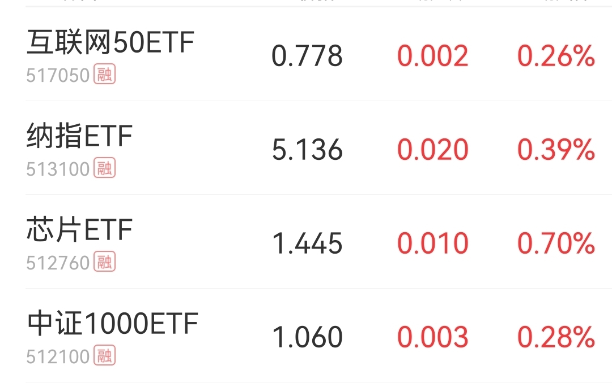

======================================================

_type: talk
@Vivian[582228554481154]
2021-10-29 09:54:05 Fri  
topic_id: 418881844882128

老师，最近有笔资金三十万，长期不用。想稳健配置，比银行理财好些的收益。请问可以全部配置债券吗。广大中债今年收益不错，配这只可以吗

@二师父 at 2021-10-29 09:54:05 Fri

> 你预期收益率多少，能经受回撤多少

----------

@Vivian at 2021-10-29 09:54:05 Fri

> 预期收益率百分六吧，比理财好些。回撤百分十能接受

----------

@二师父 at 2021-10-29 09:54:05 Fri

> 安心组合，青铜组合，白银组合可以各买入10万

----------

@Vivian at 2021-10-29 09:54:05 Fri

> 谢谢老师，请问这三个组合现在就可以一次性买入是吗

----------

@二师父 at 2021-10-29 09:54:05 Fri

> 能接受百分之10回撤是可以一次买入的

----------

阅读[1]  评论[5]  赞[0] 

======================================================

_type: talk
@二师父[28814221155551]
2021-10-29 19:54:27 Fri  
topic_id: 818881882485252

<e type="hashtag" hid="281158284851" title="#市场分析#" /> 今天早盘买入，不知道后面上涨，这属于市场馈赠，长期投资总是相对低位布局，等待机会把仓位拉满，偶尔波段，等一波大行情资产就可以增加不少，波段只是赚小钱，大赚需要长期持有。

阅读[1]  评论[0]  赞[0] 

+++++++++++++++++++++++++++++++++++++++++++++++++++++

文件：
2021-10-29 19:53:20 Fri
文件大小：[47750]
422182488141248-大反弹，吃肉.docx

======================================================

_type: talk
@二师父[28814221155551]
2021-10-29 20:07:57 Fri  
topic_id: 581118115488224

<e type="hashtag" hid="552114551414" title="#估值数据#" /> 市盈率百分位32.24%，SY-BY百分位33.85%，SY/BY百分位31.31%。

市场继续反弹，医疗是不错的布局方向，刚刚支撑位反弹，因为我们仓位还可以，就不追加了，后面持续定投，成长组合发车需要等待好机会，不用太着急，第四度大概率是会给投资机会的。可以先配置，等机会来的时候再撤出基金投资。

@西锦巴乌 at 2021-10-29 20:07:57 Fri

> 师父：我是一个相对激进的投资者，在基金配置中债券固益类与股票权益类按3：7配置，那请问在股票权益类中宽基指数、行业指数、混合指数和股票型指数各按多少比例较合适？谢谢！

----------

@二师父 at 2021-10-29 20:07:57 Fri

> 如果激进的话，可以只配非周期性行业指数和股票指数

----------

@西锦巴乌 at 2021-10-29 20:07:57 Fri

> 明白

----------

阅读[1]  评论[3]  赞[0] 

======================================================

_type: q&a
@隔窗遥望[241884481854181]
2021-10-29 20:15:18 Fri  
topic_id: 818881882418822

@隔窗遥望

>  跟投了乌龟计划，和四种组合可以比较一下吗？

@二师父

>  乌龟计划是每月收入结余投资，组合适合手里的资金分三到四次配置完毕

阅读[1]  评论[1]  赞[0] 

======================================================

_type: q&a
@夏日荷花[28888284252421]
2021-10-30 13:00:48 Sat  
topic_id: 581118155814584

@夏日荷花

>  二师父，您好！想请问为什么基金的收益比对都会选择沪深300呢？谢谢

@二师父

>  因为沪深300是最基本的指数，如果投资股票类基金，长期跑不赢沪深300，不如直接投资沪深300，这样还能节省大量精力

阅读[1]  评论[0]  赞[0] 

======================================================

_type: talk
@二师父[28814221155551]
2021-10-30 15:47:06 Sat  
topic_id: 218881845441281

如果选择三只基金进行投资，要怎么选

@wty at 2021-10-30 15:47:06 Sat

> 二师父在哪里可以回测我自己挑选的几只基金的历史收益呢？

----------

@二师父 at 2021-10-30 15:47:06 Sat

> 晨星网、韭圈，ETF组合宝

----------

@wty at 2021-10-30 15:47:06 Sat

> 收到，谢谢

----------

阅读[1]  评论[3]  赞[0] 

+++++++++++++++++++++++++++++++++++++++++++++++++++++

文件：
2021-10-30 15:47:06 Sat
文件大小：[5240835]
544814251212424-20211030_153931.m4a

2021-10-30 15:48:07 Sat
文件大小：[47969]
244184528585481-优选三只基金进行投资.docx

======================================================

_type: q&a
@sky[841855245244852]
2021-10-30 16:05:13 Sat  
topic_id: 185558512581422

@sky

>  师父，是不是美国的货币政策转变会导致能源&矿石类的价格大跌？

@二师父

>  是的，影响还是很大，美联储加息会带来全球流动性收紧。

阅读[1]  评论[2]  赞[0] 

======================================================

_type: talk
@Vivian[582228554481154]
2021-10-31 09:09:21 Sun  
topic_id: 818881818855882

老师，安心组合具体配置能否发一下？只找到对应音频，找不到文章，想保存不方便。谢谢老师

@二师父 at 2021-10-31 09:09:21 Sun

> 

----------

阅读[1]  评论[1]  赞[0] 

======================================================

_type: q&a
@永刚[15581448518112]
2021-10-31 20:47:36 Sun  
topic_id: 581118522281554

@永刚

>  师父，请教一下，你的估值表里为什么踢除了科技龙头指数基金？

@二师父

>  a股科技更看好光伏，锂电，新能源，芯片这些

阅读[1]  评论[1]  赞[0] 

======================================================

_type: q&a
@梧桐[844118451242512]
2021-10-31 21:51:31 Sun  
topic_id: 581118524111214

@梧桐

>  二师父您好，最近有的新股破发，接下来打新怎么选。

@二师父

>  明天的我先放弃，具体看企业质量，不能再盲打了

阅读[1]  评论[0]  赞[0] 

======================================================

_type: talk
@二师父[28814221155551]
2021-10-31 22:11:54 Sun  
topic_id: 418881542211528

<e type="hashtag" hid="88511122215882" title="#行业ETF介绍#" />11月就来了，继续布局投资，打新建议先等等，可转债可以盲打。

阅读[1]  评论[0]  赞[0] 

+++++++++++++++++++++++++++++++++++++++++++++++++++++

文件：
2021-10-31 22:11:28 Sun
文件大小：[48575]
111851218458412-我最看好的行业ETF.docx

======================================================

_type: talk
@zy[841125288558422]
2021-10-31 23:20:55 Sun  
topic_id: 185558428411182

二师父，规模特别小的etf有被清盘的风险吗？

@二师父 at 2021-10-31 23:20:55 Sun

> 持续低于1亿有风险

----------

阅读[1]  评论[1]  赞[0] 

======================================================

