_type: talk
@二师父[28814221155551]
2021-11-01 09:40:09 Mon  
topic_id: 185544845244822

<e type="hashtag" hid="881251425252" title="#鳄鱼计划#" /> 家电买入三份，医疗买入6份。

@样 at 2021-11-01 09:40:09 Mon

> 二师父，请问买读书会送的小音箱什么时候发货？也不知道去哪里问客服

----------

@二师父 at 2021-11-01 09:40:09 Mon

> 点击这里的客服

----------

@二师父 at 2021-11-01 09:40:09 Mon

> 购买后7个工作日内发货

----------

@杜志彪 at 2021-11-01 09:40:09 Mon

> 师父把家电ETF加入估值表吧

----------

@二师父 at 2021-11-01 09:40:09 Mon

> 好的

----------

@样 at 2021-11-01 09:40:09 Mon

> 问了，没人回复，22号买的会员

----------

@二师父 at 2021-11-01 09:40:09 Mon

> 我联系下

----------

@二师父 at 2021-11-01 09:40:09 Mon

> 在企业微信里面回复人工，会有人工联系你

----------

阅读[1]  评论[8]  赞[0] 

+++++++++++++++++++++++++++++++++++++++++++++++++++++

图片：
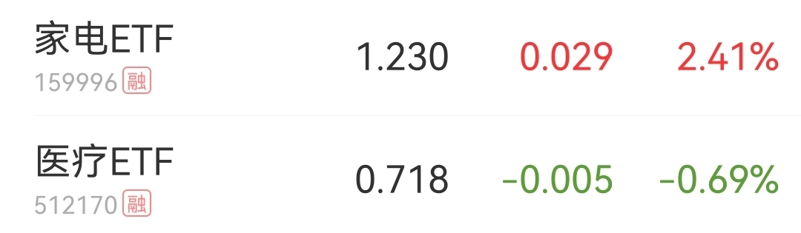

======================================================

_type: talk
@二师父[28814221155551]
2021-11-01 21:51:30 Mon  
topic_id: 418855114441888

<e type="hashtag" hid="15288844821182" title="#中概互联的投资机会#" />

阅读[1]  评论[0]  赞[0] 

+++++++++++++++++++++++++++++++++++++++++++++++++++++

文件：
2021-11-01 21:51:21 Mon
文件大小：[46404]
422182845454888-中概互联的机会又来了.docx

2021-11-01 21:51:22 Mon
文件大小：[3414173]
844184852525882-中概互联的投资机会来了.m4a

======================================================

_type: talk
@二师父[28814221155551]
2021-11-01 22:06:11 Mon  
topic_id: 218822115885841

<e type="hashtag" hid="552114551414" title="#估值数据#" /> 市盈率百分位33.3%，SY/BY百分位31.8%，SY-BY百分位31.8%。

如果市场再跌两天，差不多进入第二楼层，整体市场确实不贵，还动不动白马跌停，今天我的青岛啤酒就吃了一个跌停板，目前虽然看着成交额大，不过都跑去炒作新三板了，主板其实行情并不好。

咱们依然耐心布局，保持50%以上的仓位，做好配置，坚持定投，等待市场的极端机会。

阅读[1]  评论[0]  赞[0] 

======================================================

_type: talk
@二师父[28814221155551]
2021-11-02 10:00:22 Tue  
topic_id: 581154221851414

今天可以打新希望转债，直接顶格申购，隆基股份也要发债了，持有隆基的福利来了

@小东 at 2021-11-02 10:00:22 Tue

> 今天新股能打吗

----------

@二师父 at 2021-11-02 10:00:22 Tue

> 可以

----------

@小东 at 2021-11-02 10:00:22 Tue

> 谢谢

----------

@梧桐 at 2021-11-02 10:00:22 Tue

> 二师父，每天的新股可不可以打，希望能得到您的指教。

----------

@二师父 at 2021-11-02 10:00:22 Tue

> 好的

----------

阅读[1]  评论[5]  赞[0] 

======================================================

_type: talk
@二师父[28814221155551]
2021-11-02 12:19:16 Tue  
topic_id: 218824554518121

股票打新目前可以先暂停科创和创业板打新，只打主板的企业，未来新股福利可能会消失，农业板块和军工板块涨的不错，主要是tw事件，后期如果农业板块有回调可以继续布局，重点在锂电，光伏，农业，医疗，芯片，双创，1000，辅助中概，白酒，家电，纳斯达克，基建，红利。

阅读[1]  评论[0]  赞[0] 

======================================================

_type: talk
@二师父[28814221155551]
2021-11-02 20:36:13 Tue  
topic_id: 818824584818812

<e type="hashtag" hid="51288854251824" title="#中概互联的网格操作方法#" /> 今天出了文件，可能以后组合不让做了，不过我会继续投资，乌龟计划和鳄鱼计划包括成长组合有机会都会发车，供大家参考，政策一天一个变，谁也不知道明天会发生什么，总之不管怎么样，都要遵守规则，我会长久陪伴，除非客观不可控因素。

大家也知道，我最近发车都同步到了微博，因为嗅到了不一样的风向，如果以后星球也被管了，咱们微博见，如果彻底不让玩了，有投资问题还可以给我私信，很愿意和大家交流，这几年分享，认识了很多朋友，我也成长了很多，感恩！

@衣袂飘香 at 2021-11-02 20:36:13 Tue

> 唉，这整的。

----------

@慕容 at 2021-11-02 20:36:13 Tue

> 师父，你中概互联的代码是？

----------

@二师父 at 2021-11-02 20:36:13 Tue

> 513050

----------

@慕容 at 2021-11-02 20:36:13 Tue

> 师父，现在买是不是贵了，等低于1.4再买？

----------

@二师父 at 2021-11-02 20:36:13 Tue

> 目前中概价格还是很便宜的

----------

@坚持学习 at 2021-11-02 20:36:13 Tue

> 二师父，你的微博账号是什么呢？

----------

@二师父 at 2021-11-02 20:36:13 Tue

> 二师父定投

----------

@坚持学习 at 2021-11-02 20:36:13 Tue

> 好的，谢谢二师父

----------

阅读[1]  评论[20]  赞[0] 

+++++++++++++++++++++++++++++++++++++++++++++++++++++

文件：
2021-11-02 20:32:35 Tue
文件大小：[46871]
244184281182411-以中概互联为例讲讲网格的具体操作方法.docx

======================================================

_type: q&a
@坚持学习[421148841558188]
2021-11-03 10:16:54 Wed  
topic_id: 218824545882251

@坚持学习

>  二师父，您好。
>  目前的国际形势，还有国内的监管趋向缩紧严格，作为普通投资者应该如何应对呢？
>  目前在股票市场我的账户是亏损状态，亏损百分之25。认识您的公众号之后，就没有买过股票了，准备这块不回血就先不管了。
>  如果未来发生金融危机，如何保障自己资金的安全呢？
>  期盼您的答复，谢谢二师父。

@二师父

>  监管严格是规范市场，不是打压市场，普通投资者可以多市场布局，中国美国印度越南都可以
>  
>  金融危机来了的话多持有货币基金和国债即可

阅读[1]  评论[2]  赞[0] 

======================================================

_type: talk
@林玮[844111858288412]
2021-11-03 10:33:03 Wed  
topic_id: 185541212818212

师父，首华发债的正股如何？中签了还不知道正股情况[尴尬]

@小鱼 at 2021-11-03 10:33:03 Wed

> 我也中了

----------

@二师父 at 2021-11-03 10:33:03 Wed

> 正股质量一般，转股价值偏低，估计涨幅比较小，破发就拿着就行

----------

@林玮 at 2021-11-03 10:33:03 Wed

> 谢谢师傅

----------

阅读[1]  评论[3]  赞[0] 

======================================================

_type: talk
@门萨🐨[51411455828824]
2021-11-03 14:51:32 Wed  
topic_id: 818824541285182

准备走…

@二师父 at 2021-11-03 14:51:32 Wed

> 不再拿一拿

----------

@门萨🐨 at 2021-11-03 14:51:32 Wed

> 果然今天上了150，走了。落袋为安

----------

阅读[1]  评论[2]  赞[0] 

+++++++++++++++++++++++++++++++++++++++++++++++++++++

图片：
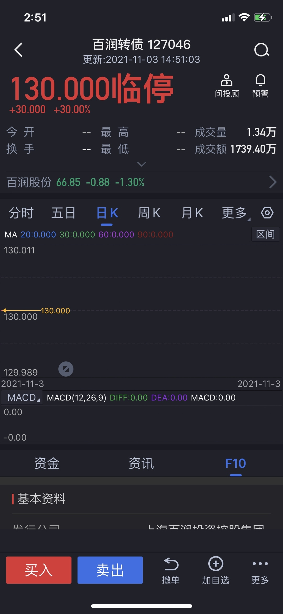

======================================================

_type: talk
@二师父[28814221155551]
2021-11-03 21:58:47 Wed  
topic_id: 818824511521552

<e type="hashtag" hid="824514224452" title="#指数估值表#" /> 每周指数估值表，光伏短期遇到利空，美国扣押了隆基出口的货物，暂时避开，如果有光伏的可以止盈。等待隆基到了支撑位再开始。

@苍天有井明月空🌙 at 2021-11-03 21:58:47 Wed

> 光伏盈利了45个点，可以跑点了吧

----------

@二师父 at 2021-11-03 21:58:47 Wed

> 可以卖一部分了

----------

@苍天有井明月空🌙 at 2021-11-03 21:58:47 Wed

> 盈利的出了吗，1.2的本

----------

@二师父 at 2021-11-03 21:58:47 Wed

> 可以出一半，然后剩余继续持有

----------

@苍天有井明月空🌙 at 2021-11-03 21:58:47 Wed

> 好哒

----------

@cotton at 2021-11-03 21:58:47 Wed

> 不建议光伏全卖了是吗

----------

@二师父 at 2021-11-03 21:58:47 Wed

> 是的，不用全部卖的

----------

阅读[1]  评论[7]  赞[0] 

+++++++++++++++++++++++++++++++++++++++++++++++++++++

图片：

======================================================

_type: talk
@二师父[28814221155551]
2021-11-03 21:59:17 Wed  
topic_id: 418852411451858

<e type="hashtag" hid="51288854188844" title="#场外版的好基金#" />

阅读[1]  评论[0]  赞[0] 

+++++++++++++++++++++++++++++++++++++++++++++++++++++

文件：
2021-11-03 21:59:04 Wed
文件大小：[47309]
544814544514184-看好的基金场外版.docx

======================================================

_type: talk
@二师父[28814221155551]
2021-11-03 22:28:30 Wed  
topic_id: 818824511811812

<e type="hashtag" hid="48411152544828" title="#读书分享#" /> 《<e type="web" href="https://wx.zsxq.com/mweb/views/weread/search.html?keyword=海龟交易法则" title="海龟交易法则" style="book" />》值得一读，学会建立自己的思维模型和操作风格，严格遵循投资纪律。

阅读[1]  评论[0]  赞[0] 

+++++++++++++++++++++++++++++++++++++++++++++++++++++

文件：
2021-11-03 22:27:58 Wed
文件大小：[46860]
422182522528148-海归交易法则第一讲.docx

======================================================

_type: talk
@二师父[28814221155551]
2021-11-04 08:45:13 Thu  
topic_id: 218824254282541

北京时间周四凌晨2点，美联储11月FOMC决议公布，正如市场预期，决议官宣将于11月开启缩债，每月减少150亿美元的购债。此外，决议还宣布不加息，维持政策利率在0%-0.25%不变。

美联储加息这事都知道了，反而对市场影响不大，尤其是释放信号加息需要到明年12月底，那么就更不用担心。一直提示美股风险，不过今年美股收益是最好的，长期持有只适合美股和越南市场

加息后利好生息资产，多配置价值类基金，成长类基金适当减仓，这是一年后的事情了

光伏利空，而且高位，可以适当止盈，未来回调百分之30或者支撑位再进行投资

@苍天有井明月空🌙 at 2021-11-04 08:45:13 Thu

> 中概是不是利好

----------

@苍天有井明月空🌙 at 2021-11-04 08:45:13 Thu

> 做网格二维码能发下吗，

----------

@衣袂飘香 at 2021-11-04 08:45:13 Thu

> 二师父，您说的光伏止盈，是指收割利润吗？还是全部赎回呢？

----------

@二师父 at 2021-11-04 08:45:13 Thu

> 赎回利润就可以了

----------

@衣袂飘香 at 2021-11-04 08:45:13 Thu

> 好的

----------

阅读[1]  评论[5]  赞[0] 

======================================================

_type: talk
@果实妈咪[182225518588452]
2021-11-04 09:40:57 Thu  
topic_id: 418852541415458

二师父，乌龟计划今天不发车吗？

@二师父 at 2021-11-04 09:40:57 Thu

> 发车的，中午买，计划买中证1000，以前关注的还是可以跟投

----------

@果实妈咪 at 2021-11-04 09:40:57 Thu

> 我以为星球看不到呢[大哭]

----------

@二师父 at 2021-11-04 09:40:57 Thu

> 发了会公布的哈

----------

@果实妈咪 at 2021-11-04 09:40:57 Thu

> 谢谢二师父[爱心][爱心]

----------

阅读[1]  评论[4]  赞[0] 

======================================================

_type: talk
@二师父[28814221155551]
2021-11-04 11:27:31 Thu  
topic_id: 818824288182152

<e type="hashtag" hid="28511242825841" title="#乌龟计划发车#" /> 鹏华可转债，工银医疗，中证1000各买入500元，代码如下，星球会一直运行下去的，大家放心，假如发生意外，也会有其他平台，不用担心哈。

止盈基金如果只是高估可以收割利润，只有基金彻底不行或者趋势彻底变了才需要全部卖出，光伏收割利润或者卖一半均可。

以前跟投的可以继续跟，我是有资格证的，如果以后不能直接买，你可以买相同的基金到自己账户也行。

@宋航 at 2021-11-04 11:27:31 Thu

> 二师父，昨天的估值数据是多少啊？

----------

@罗大发 at 2021-11-04 11:27:31 Thu

> 师父不定投基建了吗

----------

@二师父 at 2021-11-04 11:27:31 Thu

> 投的

----------

@样 at 2021-11-04 11:27:31 Thu

> 不能一建跟投了呀

----------

@二师父 at 2021-11-04 11:27:31 Thu

> 转成投顾组合可以

----------

阅读[1]  评论[5]  赞[0] 

+++++++++++++++++++++++++++++++++++++++++++++++++++++

图片：
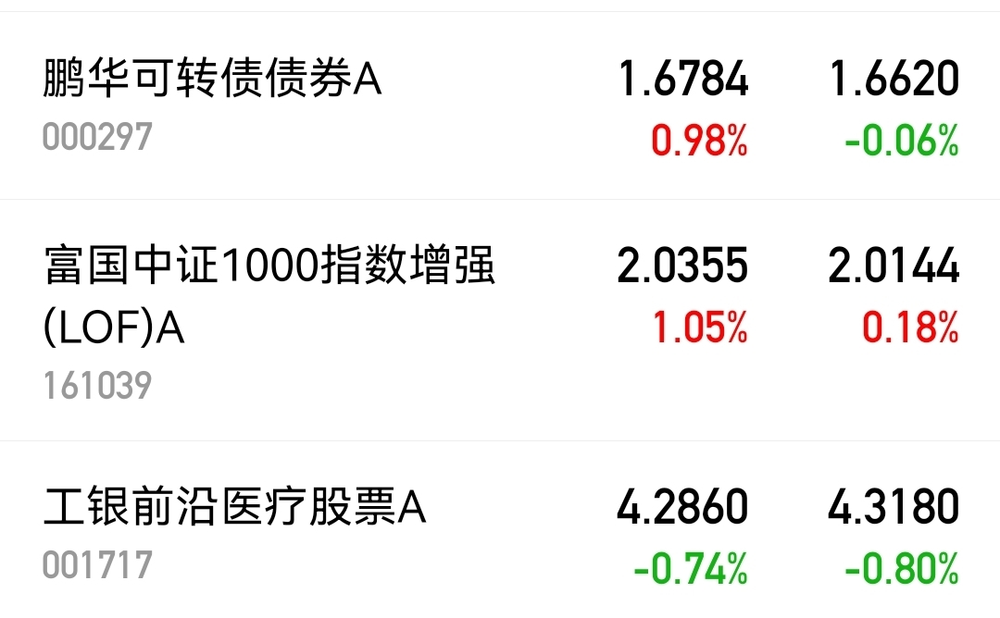

======================================================

_type: talk
@JOY[111881481812422]
2021-11-04 11:44:42 Thu  
topic_id: 818824288144882

师父，请问电源设备有对应的好点的基金吗？

@二师父 at 2021-11-04 11:44:42 Thu

> 电池etf

----------

@二师父 at 2021-11-04 11:44:42 Thu

> 159755

----------

@JOY at 2021-11-04 11:44:42 Thu

> 谢谢您～

----------

阅读[1]  评论[3]  赞[0] 

======================================================

_type: talk
@二师父[28814221155551]
2021-11-04 22:22:04 Thu  
topic_id: 818824221114812

<e type="hashtag" hid="88511145888112" title="#讲解美联储缩减购债的影响#" />

阅读[1]  评论[0]  赞[0] 

+++++++++++++++++++++++++++++++++++++++++++++++++++++

文件：
2021-11-04 22:21:47 Thu
文件大小：[47688]
422182245825428-美联储议息会议明确缩减购债，对投资的影响.docx

======================================================

_type: talk
@二师父[28814221155551]
2021-11-04 23:28:55 Thu  
topic_id: 581154542821284

<e type="hashtag" hid="552114551414" title="#估值数据#" /> 市盈率百分位33.64%，SY-BY百分位34.38%，SY/BY百分位31.47%。

估值数据变化不大，而且A股震荡太大，长期持有不适合，比如金龙鱼、比如牧原，高位回调55%以上介入收入都可以，而长期持有真的不佳。

真的适合长期持有的只有美股，今晚又新高了，而且他们是熊市比较短的，不会太煎熬。

关于组合，目前可以出投顾组合，也能跟投，不过要额外收费，本来基金收管理费，投顾再收投顾费，这还不如自己投资呢？或者复制我的组合直接买，何必要额外缴纳投顾费，这个改革究竟如何还不可知，不过每踏进一步都需要谨慎。

@样 at 2021-11-04 23:28:55 Thu

> 组合可以解除跟投，变成自己的组合，然后二师父每次买的时候跟着买就行了吧？

----------

@枫叶 at 2021-11-04 23:28:55 Thu

> 请问老师，QQQ是什么

----------

@二师父 at 2021-11-04 23:28:55 Thu

> 也可以，后面可能会出投顾组合

----------

@二师父 at 2021-11-04 23:28:55 Thu

> 美股纳斯达克基金

----------

@样 at 2021-11-04 23:28:55 Thu

> 投顾组合会另外再收管理费的吧？又增加一笔成本

----------

@二师父 at 2021-11-04 23:28:55 Thu

> 好像是，所以还在考虑

----------

@阿宝 at 2021-11-04 23:28:55 Thu

> 老师分享，我们自己买

----------

阅读[1]  评论[7]  赞[0] 

======================================================

_type: q&a
@王春媚[244424882221141]
2021-11-05 08:40:18 Fri  
topic_id: 218824244142581

@王春媚

>  师父，消费ETF现在有没有配置的价值？

@二师父

>  消费etf长期投资可以的，目前没有低估，可以等60日均线以下定投，百分之20仓位以下

阅读[1]  评论[1]  赞[0] 

======================================================

_type: talk
@门萨🐨[51411455828824]
2021-11-05 13:24:48 Fri  
topic_id: 581154584241224

组合确实不给买了[尴尬]

@wty at 2021-11-05 13:24:48 Fri

> [流泪]

----------

@shi at 2021-11-05 13:24:48 Fri

> 自己的组合可以的吧？

----------

阅读[1]  评论[2]  赞[0] 

+++++++++++++++++++++++++++++++++++++++++++++++++++++

图片：
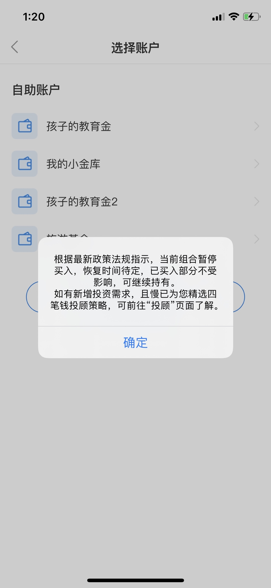

======================================================

_type: q&a
@维真[818585418182212]
2021-11-05 14:53:16 Fri  
topic_id: 581154584421214

@维真

>  乌龟计划，在天天基金上不上买了，是真的吗老师！不能一健跟投了。

@二师父

>  暂时不能了，后面可能出投顾组合

阅读[1]  评论[0]  赞[0] 

======================================================

_type: talk
@二师父[28814221155551]
2021-11-05 17:06:19 Fri  
topic_id: 418852511224828

关于组合，后面还会继续运行的，就是投顾费的问题，没考虑好再加个投顾费增加了成本，不如自己配置，所以还在思考未来的方向，总之是为了大家更好的投资。

我的组合都会更新投资思路，大家主要学习配置方法，抄作业也可以，持仓品种和当前盈亏情况都是实时公布的，不能一建买入不代表不能投资，可以自己按照我的投资比例来进行买入的，场内没有变化的，继续250份资金，每月买入1到4次，结合估值和市场环境，预期进行分阶段止盈。

阅读[1]  评论[0]  赞[0] 

======================================================

_type: talk
@二师父[28814221155551]
2021-11-05 21:22:57 Fri  
topic_id: 418852245148218

<e type="hashtag" hid="51288842555814" title="#消费还能否投资#" />

@苍天有井明月空🌙 at 2021-11-05 21:22:57 Fri

> 上个月就开始消费天定投。

----------

@二师父 at 2021-11-05 21:22:57 Fri

> 那可以了

----------

阅读[1]  评论[2]  赞[0] 

+++++++++++++++++++++++++++++++++++++++++++++++++++++

文件：
2021-11-05 21:22:48 Fri
文件大小：[47552]
422182285281558-食品饮料频频提价，消费反弹还能投资吗.docx

======================================================

_type: talk
@二师父[28814221155551]
2021-11-05 21:25:07 Fri  
topic_id: 418852245145818

<e type="hashtag" hid="552114551414" title="#估值数据#" /> 大家投资别看大盘，也就是上证指数，他是个周期指数，没有啥意义，看看主流ETF，也就是咱们投资的就行了，尤其是消费、医疗、光伏、锂电、碳中和、家电、芯片这些。具体到细分行业，你会发现有轮动。

市盈率百分位33.64%，SY-BY百分位33.95%，SY/BY百分位30.05%。

阅读[1]  评论[0]  赞[0] 

======================================================

_type: talk
@水冰月槑槑🌙[51142428222184]
2021-11-06 12:52:23 Sat  
topic_id: 818824482122412

二师父您好，现在好几个保险工作人员都像我推荐增额定寿和年金险，锁定利率3.8，这种类型的推荐购买吗

@二师父 at 2021-11-06 12:52:23 Sat

> 年金险和增额定寿险的安全性是有保障的，预期收益率和流动性如果自己能够接受的话可以买。

如果能接受5%左右的波动，青铜组合的收益率会比这个寿险的收益率高

15到21这几个年份年初一次买入收益率分别是16.83%，2.31%，5.41%，4.01%，11.19%，8.33%，4.97%。平均收益率7.5%，是这两款保险的两倍收益率，而且流动性很好，资金随时取出用于家庭支出和投资，比年金险性价比会更高一些。

----------

@水冰月槑槑🌙 at 2021-11-06 12:52:23 Sat

> 好的谢谢二试父，我最近没有登陆星球，等会儿了解一下青铜组合。手头目前有大约10万现金一直没动，应该怎么支配？

----------

@二师父 at 2021-11-06 12:52:23 Sat

> 需要看这笔钱的预期收益率以及能够投资的期限，然后才能够根据收益预期和投资期限做投资安排

----------

@水冰月槑槑🌙 at 2021-11-06 12:52:23 Sat

> 高于5%就行了，要不然我放着一直就浪费了。打算长期投资，暂时用不到

----------

@二师父 at 2021-11-06 12:52:23 Sat

> 那可以买入青铜组合，置顶有详细介绍

----------

阅读[1]  评论[5]  赞[0] 

======================================================

_type: talk
@夏日荷花[28888284252421]
2021-11-06 19:29:12 Sat  
topic_id: 418852258541228

<e type="hashtag" hid="51288854251824" title="#中概互联的网格操作方法#" /> 请问二师父，如果我计划在中概互联上投资十万元，我每次应该买入总投资额的百分之多少呢？

@二师父 at 2021-11-06 19:29:12 Sat

> 可以先买入4万，然后按照网格，每次买入1万。场内合适，场外卖出需要30天，C基金30天以上没有手续费

----------

@夏日荷花 at 2021-11-06 19:29:12 Sat

> 谢谢二师父

----------

阅读[1]  评论[2]  赞[0] 

======================================================

_type: talk
@夏日荷花[28888284252421]
2021-11-06 19:38:55 Sat  
topic_id: 185541145451112

<e type="hashtag" hid="51288854251824" title="#中概互联的网格操作方法#" /> 还有，网格操作是不是只适合场内操作呀？

阅读[1]  评论[0]  赞[0] 

======================================================

_type: talk
@二师父[28814221155551]
2021-11-06 20:17:24 Sat  
topic_id: 418852258255248

<e type="hashtag" hid="222225148551" title="#五步定投法#" /> 新加入的朋友看看五步定投法，听听课程，作为一个基本的入门，持续的学习在每日分享，入门很简单，进阶就需要持续学习加投资总结了。

当然如果信任的话，可以跟车，跟我实际资金买入的标的，问题也不大。

@衣袂飘香 at 2021-11-06 20:17:24 Sat

> 谢谢二师父，常读常新。

----------

@阿宝 at 2021-11-06 20:17:24 Sat

> 已学习！正确的理念，可以实践的操作，优秀！向老师学习，感谢无私分享！

----------

阅读[1]  评论[2]  赞[0] 

+++++++++++++++++++++++++++++++++++++++++++++++++++++

文件：
2021-11-06 20:17:21 Sat
文件大小：[393375]
544814454425844-五步定投法为你的基金投资保驾护航.docx

======================================================

_type: talk
@阿宝[422212151424158]
2021-11-06 21:16:45 Sat  
topic_id: 185541144225852

复利信徒，推荐大家，值得一读！

阅读[1]  评论[0]  赞[0] 

+++++++++++++++++++++++++++++++++++++++++++++++++++++

文件：
2021-11-06 21:16:45 Sat
文件大小：[2099520]
544814454815854-3878flxt(2)(1).pdf

======================================================

_type: talk
@二师父[28814221155551]
2021-11-06 23:01:06 Sat  
topic_id: 581154455488584

<e type="hashtag" hid="51288842441184" title="#持仓数据#" /> 鳄鱼计划目前持仓，黄色部分是会持续买入的，后面预计估值楼层到2层的话，仓位到70%，现金先打完，如果继续跌的话，债基卖出清仓换成ETF。

星球朋友经历过18年的应该不怕跌了。这是整体思路，我无法预测短期涨跌，只是在这个位置，不必要恐慌，慢慢耐心积累股权资产。后面买入严格依据低估定投策略+均线定投策略，判断基建要上涨也判断失误了，主要还是过度相信券商研报，不过本来处于安全边际中，问题不大，接下来可以网格式加仓。

未来加息周期可能纳斯达克还会涨，所以没仓位的要占据一些底仓，仓位重没有止盈的，可以卖出一部分，总之不能空仓美股。

越南也不错，目前还没有ETF，可以选择场外投资。

@以古论今 at 2021-11-06 23:01:06 Sat

> 纳斯达克现在低估吗？可以买入吗？

----------

@二师父 at 2021-11-06 23:01:06 Sat

> 没低估，不过我买了，原因解释了

----------

阅读[1]  评论[2]  赞[0] 

+++++++++++++++++++++++++++++++++++++++++++++++++++++

图片：
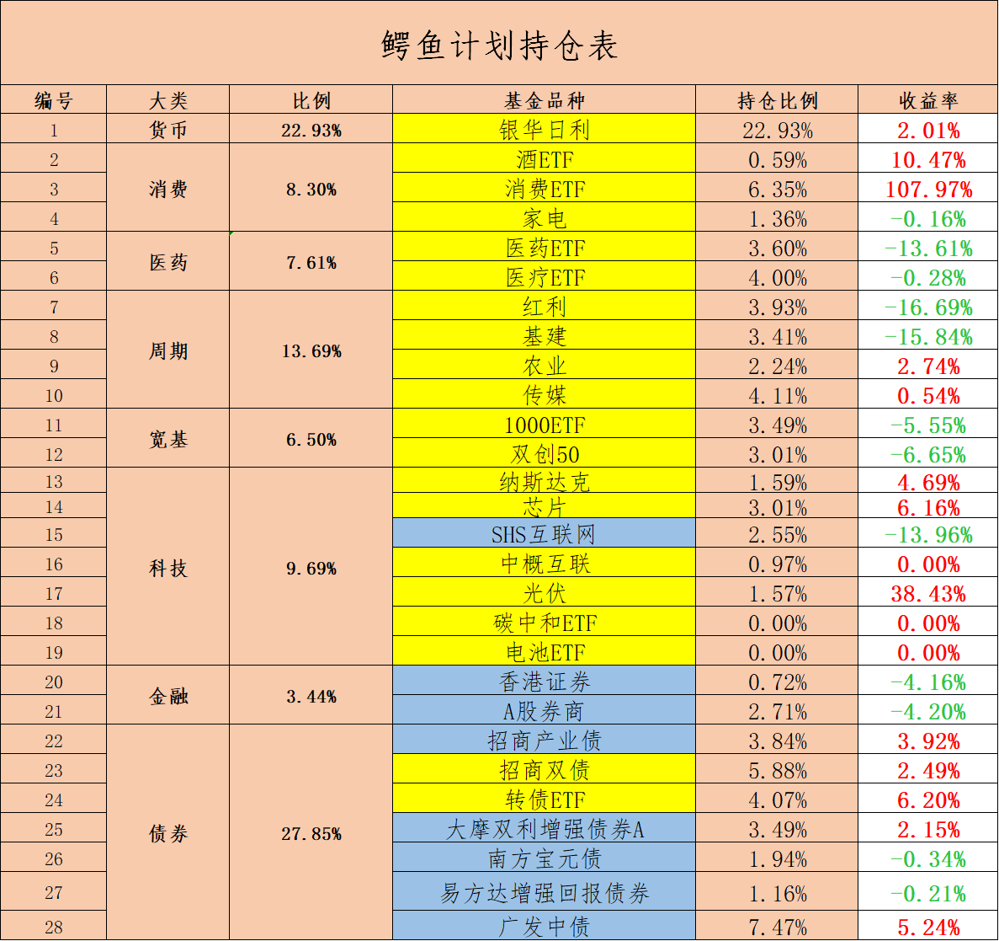

======================================================

_type: talk
@二师父[28814221155551]
2021-11-07 09:24:43 Sun  
topic_id: 818824445444842

<e type="hashtag" hid="15288812118882" title="#止盈光伏，加仓这个方向#" /> 接下来的投资方法和攻略。

@cotton at 2021-11-07 09:24:43 Sun

> 全部卖光吗

----------

@二师父 at 2021-11-07 09:24:43 Sun

> 不用的，卖出利润部分就行，光伏很不错，24年之前发生深度回调都可以补仓

----------

@范毅君 at 2021-11-07 09:24:43 Sun

> 我本来就没有多少，现在清仓了，等待下一次定投机会[可怜]

----------

阅读[1]  评论[3]  赞[0] 

+++++++++++++++++++++++++++++++++++++++++++++++++++++

文件：
2021-11-07 09:20:50 Sun
文件大小：[110373]
844184421255182-止盈光伏，加仓这个方向.docx

2021-11-07 09:24:16 Sun
文件大小：[5927381]
111851148425212-止盈光伏，加仓这个方向.m4a

======================================================

_type: talk
@二师父[28814221155551]
2021-11-07 09:27:34 Sun  
topic_id: 185541112118142

<e type="hashtag" hid="452582815458" title="#网格#" /> 这两只基金是我自己会做的网格，大家严格根据价格买入和卖出就行，上涨能盈利，震荡也可以盈利。

不要抱怨市场，而要想清楚如何利用市场赚钱。

@夏日荷花 at 2021-11-07 09:27:34 Sun

> 等待513050进入1.4的价格

----------

阅读[1]  评论[1]  赞[0] 

+++++++++++++++++++++++++++++++++++++++++++++++++++++

图片：
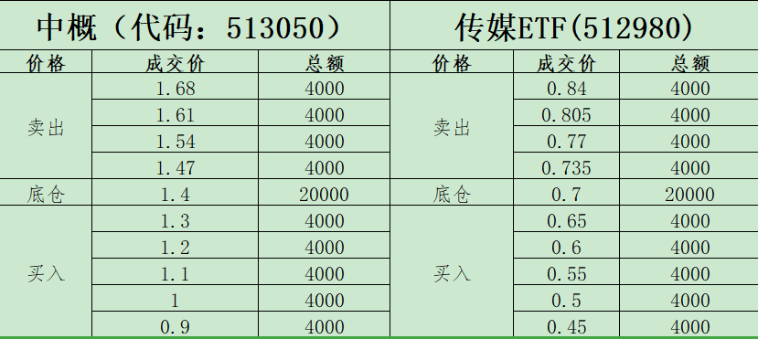

======================================================

_type: talk
@二师父[28814221155551]
2021-11-07 09:28:23 Sun  
topic_id: 818824445415552

<e type="hashtag" hid="452582815458" title="#网格#" /> 这两只基金是我自己会做的网格，大家严格根据价格买入和卖出就行，上涨能盈利，震荡也可以盈利。

不要抱怨市场，而要想清楚如何利用市场赚钱。

@果实妈咪 at 2021-11-07 09:28:23 Sun

> 二师父，您这个网格上涨卖出是设置的百分之五，下跌卖出设置的百分之七吧？

----------

@二师父 at 2021-11-07 09:28:23 Sun

> 没有固定，稍微调整了下

----------

@果实妈咪 at 2021-11-07 09:28:23 Sun

> 噢噢明白了谢谢

----------

@心斋 at 2021-11-07 09:28:23 Sun

> 二师父，请问传媒没有底仓，现在还可以做网格吗？

----------

@二师父 at 2021-11-07 09:28:23 Sun

> 按照我价格可以

----------

@心斋 at 2021-11-07 09:28:23 Sun

> 好，谢谢二师父!

----------

阅读[1]  评论[6]  赞[0] 

+++++++++++++++++++++++++++++++++++++++++++++++++++++

图片：

======================================================

_type: talk
@二师父[28814221155551]
2021-11-07 16:11:25 Sun  
topic_id: 185541818415242

目前市场上拿到牌照的机构，在公布房产税政策试点以后，马上就发了投顾组合的文件，规范市场，引导资金入市，预计有200万亿的规模，积极参与，踏浪而行，现在买股权和等同于15年前买房。

@苍天有井明月空🌙 at 2021-11-07 16:11:25 Sun

> 怎么买啊，二师父

----------

@庆余年 at 2021-11-07 16:11:25 Sun

> 这个200万亿的资金的来源是？房市，险资还是社保基金？

----------

@二师父 at 2021-11-07 16:11:25 Sun

> 都有的，房市流动性锁住了，估计也没有太多的量

----------

@二师父 at 2021-11-07 16:11:25 Sun

> 买什么

----------

@蛋炒饭不加蛋 at 2021-11-07 16:11:25 Sun

> 请问二师父，没有牌照有什么影响吗？我发现没有信达澳银基金公司

----------

@二师父 at 2021-11-07 16:11:25 Sun

> 代销牌照和投顾牌照是分开的，对买基金没有影响，只是没有牌照他们不能展开投顾业务

----------

@蛋炒饭不加蛋 at 2021-11-07 16:11:25 Sun

> 懂了，那是基金组合的牌照吗？个人出的组合怎么算？

----------

@二师父 at 2021-11-07 16:11:25 Sun

> 是基金公司的牌照，个人组合只是不能做投顾，买基金不受影响

----------

阅读[1]  评论[10]  赞[0] 

+++++++++++++++++++++++++++++++++++++++++++++++++++++

图片：
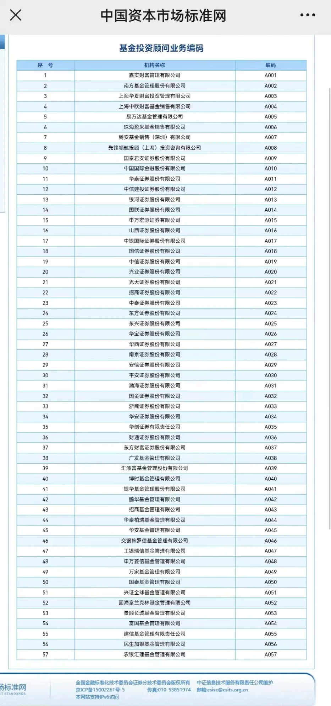

======================================================

_type: talk
@二师父[28814221155551]
2021-11-08 09:17:37 Mon  
topic_id: 418851445188588

<e type="hashtag" hid="825412412212" title="#可转债打新#" /> 今日两只转债发行，一个是天然气业务，一个是玻璃纤维业务，顶格申购。

双低策略近来有些失效，不过价格低，长期持有最差也有债券收益率，遇到风起还会吃一波。

摊大饼和双低策略都不错，不过摊大饼有亏损走掉的可能，所以选择适合自己的策略。

阅读[1]  评论[0]  赞[0] 

======================================================

_type: talk
@二师父[28814221155551]
2021-11-08 11:07:03 Mon  
topic_id: 818821554121112

安心组合今日买入，后面组合可能不能公开，不过买入截图发出来问题不大，大家仅供参考，组合跟投也可以，不过我需要入职投顾公司或者和投顾合作，这样子决策的时候就没法按照自己的意愿了，很可能会为了利益妥协，另外目前也不想辞职，所以思考很久，如果组合不能完全以我为主，那么就不会再升级为一建跟投了。如果和投顾合作并不会成为招安对象，那么再考虑合作。

不过我会继续做好投研分析，给出分析意见和自己的操作，也会说明白投资的逻辑，我所有的组合都是自己的钱买的，没有代替他人理财，没有杠杆，也没有融资。

@门萨🐨 at 2021-11-08 11:07:03 Mon

> 好像可以跟着调仓哎[呲牙]

----------

@二师父 at 2021-11-08 11:07:03 Mon

> 如果以前关注了，调仓是可以的

----------

@老孙头 at 2021-11-08 11:07:03 Mon

> [强][玫瑰]

----------

阅读[1]  评论[3]  赞[0] 

+++++++++++++++++++++++++++++++++++++++++++++++++++++

图片：
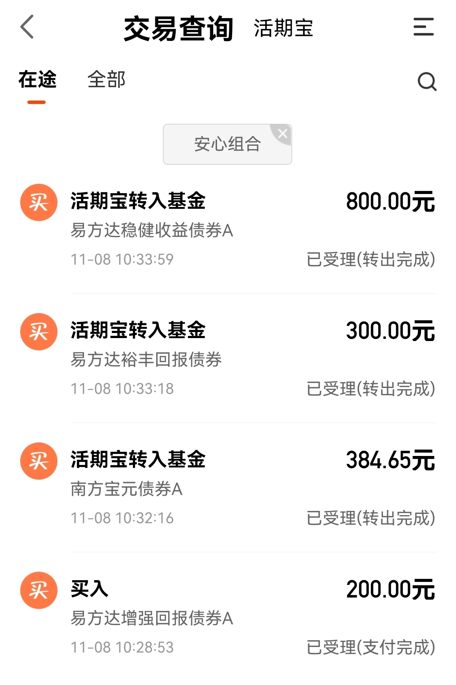

======================================================

_type: talk
@二师父[28814221155551]
2021-11-09 00:27:49 Tue  
topic_id: 185548241584252

<e type="hashtag" hid="15288815551482" title="#估值数据+市场分析#" /> 市盈率百分位32.93%，SY-BY百分位33.71%，SY/BY百分位29.55%。

估值数据依然在震动中，目前成长组合是接近1的净值，如果加息周期到来，组合大概率跌，所以等待净值破1后买入。

另外当前是上游原材料价格上涨带来的通货膨胀，央行也在定向降息来扶持小企业。

今天央行推出碳减排公局，相当于在投入流动性支持绿色经济。

对于未来不用过度悲观，要避开保险和地产两个行业，而对于家电、基建、传媒、互联网跌下来了就要乐观，以好价格买入。

当前问题在于光伏和锂电是高估，而十四五规划中一直在提到发展光伏和锂电，所以至少在2024年这个周期，光伏锂电回撤以后加仓，成长组合有这两只基金。控制加仓频率就行了。

今年的防守已经结束，接下来转守为攻，资金不足的可以考虑逐步将国开债和国债卖出然后定投低估的指数。资金足的，就用现有资金定投即可。

@防汛抗旱 at 2021-11-09 00:27:49 Tue

> 师父，可以开启周定投的有哪些

----------

@二师父 at 2021-11-09 00:27:49 Tue

> 医疗，基建，红利，沪深300，中证1000

----------

@浪淘沙 at 2021-11-09 00:27:49 Tue

> 二师父，最近很忙，有一段时间没看星球了，请问红利是深红利还是中证红利？

----------

@二师父 at 2021-11-09 00:27:49 Tue

> 上证红利和中证红利

----------

@浪淘沙 at 2021-11-09 00:27:49 Tue

> 谢谢二师父

----------

阅读[1]  评论[5]  赞[0] 

======================================================

_type: talk
@林玮[844111858288412]
2021-11-09 06:43:13 Tue  
topic_id: 218821545884111

师父，563000可以买点吗？

@二师父 at 2021-11-09 06:43:13 Tue

> 参考均线策略，60日均线以下可以长期定投

----------

@林玮 at 2021-11-09 06:43:13 Tue

> 好的

----------

@衣袂飘香 at 2021-11-09 06:43:13 Tue

> 二师父，今天的新股可以打吗？

----------

@隔窗遥望 at 2021-11-09 06:43:13 Tue

> 这个60日均线指的是哪个标的的均线，因为这个基金是新基金还没有60日均线

----------

@二师父 at 2021-11-09 06:43:13 Tue

> 指数的均线

----------

@隔窗遥望 at 2021-11-09 06:43:13 Tue

> 这个指数的代码是什么

----------

阅读[1]  评论[6]  赞[0] 

======================================================

_type: talk
@二师父[28814221155551]
2021-11-09 07:10:23 Tue  
topic_id: 818821545254552

<e type="hashtag" hid="15288815558522" title="#学习方法#" /> 最近迎来市场强监管，大家不用担心，组合会一直公布，给大家讲了配置方案，就可以自己去账户配置，如果拿不准的可以来问我或者星球的一些朋友，确定了可以再行动。

当然，就是有朋友自己一次买入几十万感觉心里没底，所以想跟车，所以未来场外组合统一规定周四发车，鳄鱼计划也统一规定到周四发车。有机会就买，没机会就不买，不临时开车，网格是严格根据价格，到了买入价就买，到了卖出价格就卖，如果大家工作忙的话，来不及关注，记得周四一定要来看看。

思考了很久，也和一些朋友交流，还是觉得和投顾合作并不好，首先我会受制于机构，其次管理费额外多出一笔，相当于买个基金交了两次费用，不划算。

所以，每次我买了基金都会公布答案，是否抄作业大家就根据实际情况来了。

股市投资需要两心，平常心，满足心，做到这两点，不会迷失自己了。

阅读[1]  评论[0]  赞[0] 

+++++++++++++++++++++++++++++++++++++++++++++++++++++

图片：

======================================================

_type: q&a
@维真[818585418182212]
2021-11-09 09:55:21 Tue  
topic_id: 418851428214828

@维真

>  老师好：乌龟计划我己跟投一段时间了，由于不能一健跟投，接下来的投资这样投您看行吗？按照乌龟计划的毎支基金百分比，开启定投，其中的主动基金和指数基金，毎周定投一次，债券基金每月定投一次，其它占比较小的也是每月定投一次，你看这样投可以吗？

@二师父

>  债券基金目前可以不用投了，乌龟计划里面的中概，医疗，基建，1000，红利可以长期定投了

阅读[1]  评论[0]  赞[0] 

======================================================

_type: q&a
@维真[818585418182212]
2021-11-09 12:30:25 Tue  
topic_id: 581158248554224

@维真

>  老师好：乌龟计划里，中概、医疗、基建、1000、红利等投资比例应该是多少？

@二师父

>  基建和1000可以百分之20以内，中概，医疗在百分之10以内

阅读[1]  评论[0]  赞[0] 

======================================================

_type: talk
@雪莲[421485848588118]
2021-11-09 13:36:24 Tue  
topic_id: 818821515514852

二师父您好，君禾转债现在盈利10个点，等盈利多少止盈？

@二师父 at 2021-11-09 13:36:24 Tue

> 10到30个点都可以止盈

----------

@雪莲 at 2021-11-09 13:36:24 Tue

> 好的谢谢！

----------

阅读[1]  评论[2]  赞[0] 

======================================================

_type: talk
@二师父[28814221155551]
2021-11-09 21:21:11 Tue  
topic_id: 418851411115448

<e type="hashtag" hid="15288815442452" title="#一起看看基金的内卷#" /> 未来行业ETF会迎来井喷式发展，优选赛道，严格按照五步定投法操作，把握住我说的方向，剩下的就是按照纪律执行就可以了。

阅读[1]  评论[0]  赞[0] 

+++++++++++++++++++++++++++++++++++++++++++++++++++++

文件：
2021-11-09 21:19:40 Tue
文件大小：[46455]
422155882858128-基金竟然也内卷.docx

======================================================

_type: talk
@二师父[28814221155551]
2021-11-09 22:06:28 Tue  
topic_id: 185548522451452

<e type="hashtag" hid="552114551414" title="#估值数据#" /> 市盈率百分位32.92%，SY/BY百分位29.57%，SY-BY百分位33.72%。

估值数据几乎没有太大变化。估值楼层还是在第三层，成长组合发车就会在估值楼层二层以下或者净值跌破1.

本周四会做一个海外组合，建仓后也是周四发车，如果净值跌破1或者纳斯达克的均线在60日均线以下开始买入。

当别人恐惧的时候开始干活，永远和市场反过来。

今年防守到位，现在开启不断定投买入的节奏，我无法预料下一波爆发何时到来，但是一定会来的，只需要在到来的时候拥有足够的仓位。

@样 at 2021-11-09 22:06:28 Tue

> 海外组合有场内的吗？

----------

@二师父 at 2021-11-09 22:06:28 Tue

> 越南没有场内的有部分基金没有，可以用纳斯达克替代

----------

@样 at 2021-11-09 22:06:28 Tue

> 成长组合净值马上到1了

----------

@二师父 at 2021-11-09 22:06:28 Tue

> 跌破1加仓

----------

阅读[1]  评论[4]  赞[0] 

======================================================

_type: talk
@二师父[28814221155551]
2021-11-10 06:36:56 Wed  
topic_id: 185548521854582

各位同学早，今年行业巨变，重新洗牌，百年未有之大变局，这时候不是恐慌和保守的时候，而是寻找机会和机遇的时候，努力发现下一个机会，在洗牌结束以后你的人生会不一样。

@Chu at 2021-11-10 06:36:56 Wed

> 师父是要开始大干一场了吗[偷笑]

----------

@二师父 at 2021-11-10 06:36:56 Wed

> 对的

----------

@衣袂飘香 at 2021-11-10 06:36:56 Wed

> 二师父早！

----------

@勇往直前 at 2021-11-10 06:36:56 Wed

> 怎么干

----------

@JOY at 2021-11-10 06:36:56 Wed

> 师父能说说方向吗[微笑][呲牙]

----------

@二师父 at 2021-11-10 06:36:56 Wed

> 家电，基建，光伏，锂电，纳斯达克，越南

----------

@二师父 at 2021-11-10 06:36:56 Wed

> 我写一下

----------

@JOY at 2021-11-10 06:36:56 Wed

> 谢谢～

----------

阅读[1]  评论[20]  赞[0] 

+++++++++++++++++++++++++++++++++++++++++++++++++++++

图片：

======================================================

_type: talk
@平安是福[118222545154542]
2021-11-10 13:38:49 Wed  
topic_id: 185548551124182

师父，文件在雪球打不开，在哪里能看到？需要下载什么软件？

@二师父 at 2021-11-10 13:38:49 Wed

> 在置顶文章可以看

----------

阅读[1]  评论[1]  赞[0] 

======================================================

_type: talk
@平安是福[118222545154542]
2021-11-10 13:43:18 Wed  
topic_id: 218821884485511

君禾转债涨了不少

阅读[1]  评论[0]  赞[0] 

======================================================

_type: talk
@苍天有井明月空🌙[28882214181441]
2021-11-10 14:44:14 Wed  
topic_id: 818821881521282

安心组合不能追加买，要一个一个买吗

@二师父 at 2021-11-10 14:44:14 Wed

> 是的，按照比例就行，现在能看到吧，后面看能不能合作也可以一建购买

----------

阅读[1]  评论[1]  赞[0] 

======================================================

_type: talk
@二师父[28814221155551]
2021-11-10 15:08:16 Wed  
topic_id: 218821881842421

目前指数表现一般，开启股票网格，东方财富，保利地产，中国建筑，中枢价格分别是33，13，4.5。账户可以自动设定参数。这几家企业退市的概率都很小。

组合大家都可以看到持仓标的和比例，可以自己买，可转债盈利了合适价格卖出，或者回撤百分之5卖出，如果不盈利就一直拿着就行，低价转债不会输钱，需要能熬。

发车的都在周四，成长组合净值1以下，海外组合净值1以下，持续定投，开始积累了，牛市休息，熊市干活。

阅读[1]  评论[0]  赞[0] 

======================================================

_type: talk
@二师父[28814221155551]
2021-11-10 21:53:19 Wed  
topic_id: 581158542554854

<e type="hashtag" hid="552114551414" title="#估值数据#" /> 今天市场开始大跌，是因为昨天美股特斯拉暴跌，然后尾盘拉升，地产行业和医疗行业迎来利好。

医疗行业如果没有仓位可以适当加，有仓位拿着就行。

每周四定投，鳄鱼计划、乌龟计划都固定周四定投。

@杜志彪 at 2021-11-10 21:53:19 Wed

> 电器居然还在正常估值。

----------

@二师父 at 2021-11-10 21:53:19 Wed

> 马上就进入低估值了

----------

阅读[1]  评论[2]  赞[0] 

+++++++++++++++++++++++++++++++++++++++++++++++++++++

图片：
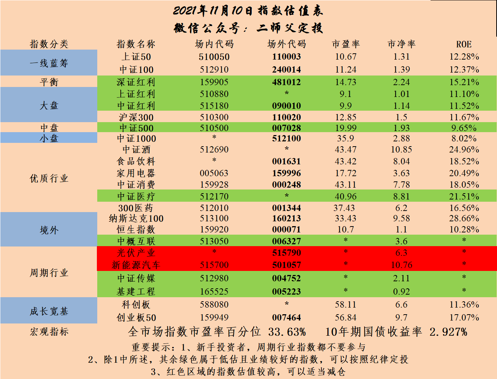

======================================================

_type: talk
@二师父[28814221155551]
2021-11-10 22:08:59 Wed  
topic_id: 218821245458841

<e type="hashtag" hid="88511148418142" title="#大利好#" /> 医疗迎来利好

@隔窗遥望 at 2021-11-10 22:08:59 Wed

> 已点击

----------

阅读[1]  评论[1]  赞[0] 

+++++++++++++++++++++++++++++++++++++++++++++++++++++

文件：
2021-11-10 22:08:42 Wed
文件大小：[46197]
544855158128154-大利好.docx

======================================================

_type: talk
@二师父[28814221155551]
2021-11-10 22:46:04 Wed  
topic_id: 818821248525422

明天开始干活，这个车肯定发的，按照这个比例建仓，还没能公开，我称之为出海打猎组合，建仓后净值1以下每周四买入，计划明天买入1000元，现在不能跟投，大家可以自己买入即可。

成长组合净值还是没跌破1，非常扛跌，只要跌破1，你来喊我发车，我判断还是有可能得，而且概率不低。

@是喵喵吖～ at 2021-11-10 22:46:04 Wed

> 师傅今天发车吗 是不是还没有发～

----------

@样 at 2021-11-10 22:46:04 Wed

> 二师父，这个出海打猎 回撤和收益大概预期是多少？

----------

@二师父 at 2021-11-10 22:46:04 Wed

> 回撤不控，预期年化百分之15，长期持有

----------

@门萨🐨 at 2021-11-10 22:46:04 Wed

> 果然是出海了哈哈哈

----------

@Pacifica at 2021-11-10 22:46:04 Wed

> 师傅，这个怎么跟投呢？按照你图中这个比例，自己去买，对吧？

----------

@二师父 at 2021-11-10 22:46:04 Wed

> 对，自己买

----------

@Pacifica at 2021-11-10 22:46:04 Wed

> 比例就按你规划的来，对吧？

----------

@样 at 2021-11-10 22:46:04 Wed

> 那跟成长组合差不多，资金有限，那就只跟成长组合了

----------

阅读[1]  评论[8]  赞[0] 

+++++++++++++++++++++++++++++++++++++++++++++++++++++

图片：
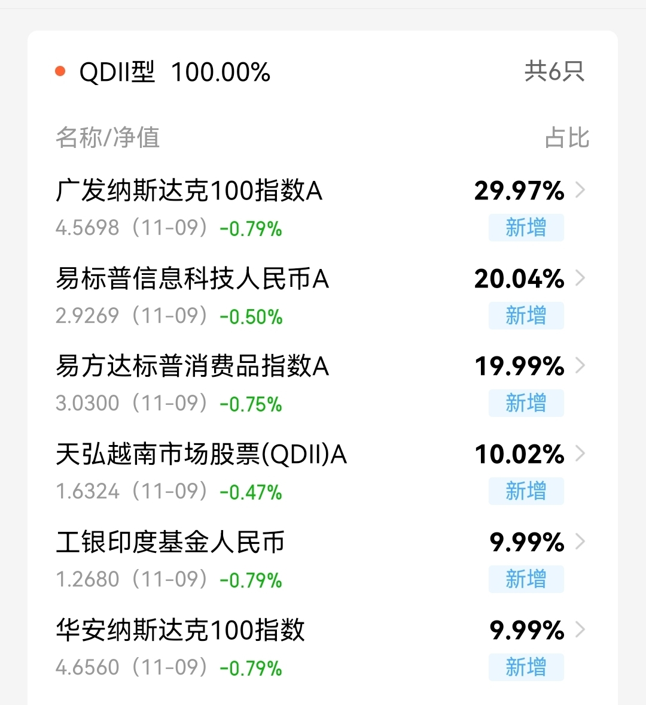

======================================================

_type: talk
@二师父[28814221155551]
2021-11-11 08:42:24 Thu  
topic_id: 218821241442541

今日三只新债，稍后记得申购。可转债是很好的投资品种。

阅读[1]  评论[0]  赞[0] 

+++++++++++++++++++++++++++++++++++++++++++++++++++++

图片：
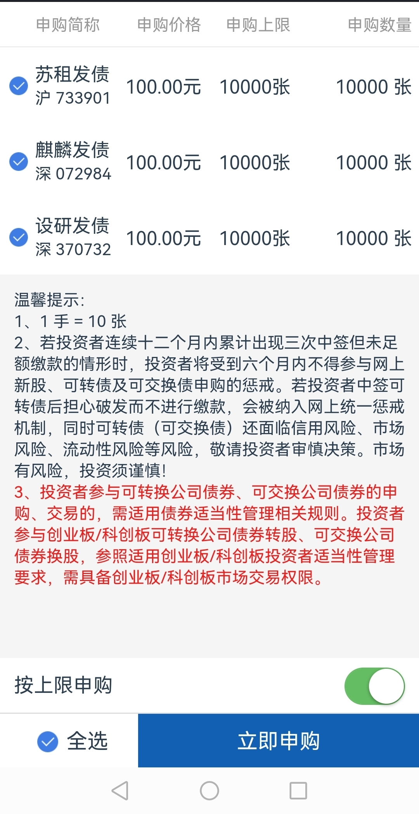

======================================================

_type: talk
@二师父[28814221155551]
2021-11-11 08:56:20 Thu  
topic_id: 185548418821812

巴菲特指标，92%，处于正常偏低的位置，这时候没到底部，所以仓位7成左右合适。

咱们根据市场估值控制仓位，为什么19年和20年敢于满仓，就在于当时估值低，现在就是新能源和光伏两个板块估值较高，基建、家电、传媒都不算太高。

传媒已经开始盈利，后面跌下去再加仓。接下来就搞低估的家电、基建。碳中和、锂电代码在五步定投法里面，破60日均线轻仓定投，和纳斯达克一样。

预计明年会有回调，不过回调后还会大涨，这些就是方向哈，大战略不能错，小的局部基金可以亏，但是大方向要把握好。

@样 at 2021-11-11 08:56:20 Thu

> 二师父，请问成长组合里面加创业板50和科创板50的逻辑是什么？这两个也是重仓医药医疗和新能源的吧？组合里有了行业基金的呀

----------

阅读[1]  评论[1]  赞[0] 

+++++++++++++++++++++++++++++++++++++++++++++++++++++

图片：
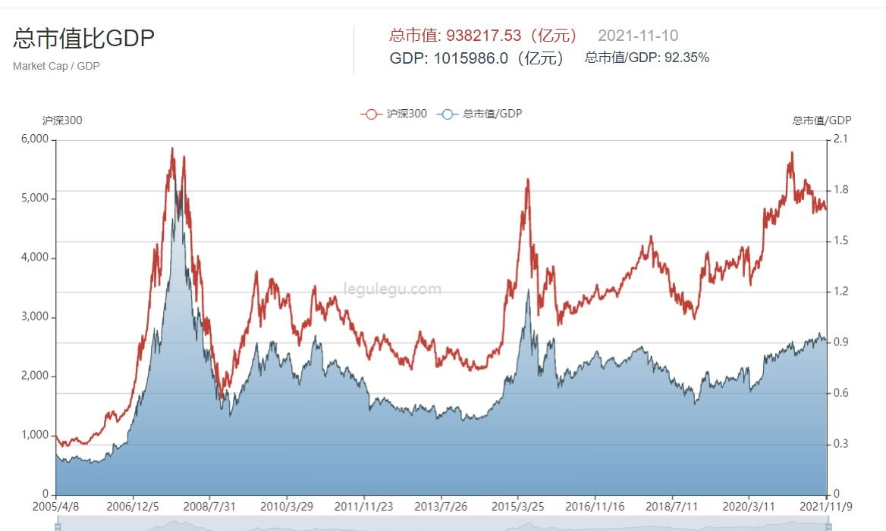

======================================================

_type: q&a
@维真[818585418182212]
2021-11-11 09:37:10 Thu  
topic_id: 581158582124554

@维真

>  老师好，乌龟计划今天发车吗？因为我们不能一健跟投了，接下来怎么投资乌龟计划，就看老师的发车了，

@二师父

>  今天还会继续发车的，不能一键跟投了，你可以自己在天天建立一个组合，然后我买基金，在天天基金搜索乌龟计划，就能看到，然后你跟着买就行
>  
>  现在问题是不知道监管如何定政策。如果未来不允许公开操作，那么可能天天就看不到操作了，所以我也在寻求投顾合作，保证合法合规的方式来分享投资
>  
>  如果将来不能看组合，你可以学习我的思路，自己配置，然后已经买入的基金基本都符合低估策略和均线策略，长期持有一定是盈利的，等到盈利以后再利润收割卖出就行了，不用担心不发车自己投入的钱会一直亏下去

阅读[1]  评论[2]  赞[0] 

======================================================

_type: talk
@二师父[28814221155551]
2021-11-11 09:47:15 Thu  
topic_id: 418851514581248

<e type="hashtag" hid="48411128142888" title="#每周四发车#" /> 乌龟计划买入500元基建，鳄鱼计划买入基建一份，家电一份。出海打猎组合买入1000元。出海打猎持仓昨天已经发布了，大家自己建组合，和我一致就行。纳斯达克是高估，不过我是长期定投，所以不太在乎回撤，如果不能经受百分之50左右波动的，请不要跟车。成长组合净值1以上，继续持有。

传媒已经出坑，如果跌了再买，涨了可以持有，或者到10个点收割利润。

以后固定周四发车，买入和卖出都在这一天，所有基金都在盈利卖出，如果发生亏损卖出的情况，我给大家发500元红包，请共同监督。

@九妹Amy'' at 2021-11-11 09:47:15 Thu

> 师傅，家电代码是多少

----------

@小鱼 at 2021-11-11 09:47:15 Thu

> 出海打猎，是不是暂时不能买

----------

@二师父 at 2021-11-11 09:47:15 Thu

> 置顶文章五步定投法，里面有家电etf代码。可以存一下，以后发车基本会从这里给代码

----------

@二师父 at 2021-11-11 09:47:15 Thu

> 可以啊，我买了，不过不能公开

----------

@小鱼 at 2021-11-11 09:47:15 Thu

> 我在组合里搜不到，出海打猎

----------

@二师父 at 2021-11-11 09:47:15 Thu

> 我说了，不能公开

----------

@罗大发 at 2021-11-11 09:47:15 Thu

> 师父的传媒盈利几个点就卖了？

----------

@二师父 at 2021-11-11 09:47:15 Thu

> 没卖啊，你咋看的我卖了？

----------

阅读[1]  评论[17]  赞[0] 

+++++++++++++++++++++++++++++++++++++++++++++++++++++

图片：
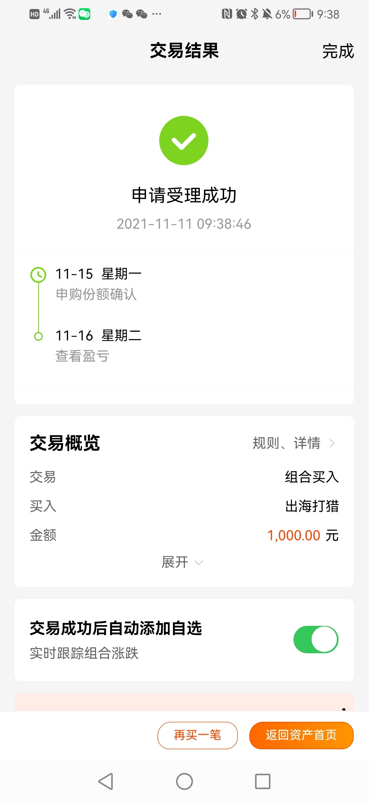
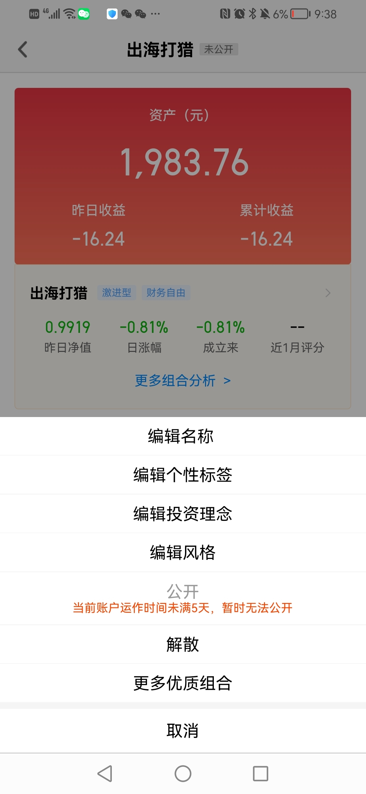

======================================================

_type: talk
@平安是福[118222545154542]
2021-11-11 10:11:57 Thu  
topic_id: 418851514225888

师父在哪里能看到

@二师父 at 2021-11-11 10:11:57 Thu

> <e type="web" href="https://mp.weixin.qq.com/s/kVxN6cUEncXD-pw3laEkCw" title="大利好" cache="" />

----------

@平安是福 at 2021-11-11 10:11:57 Thu

> 谢谢！为什么你发的联接我能看到，我在我发的这个就看不到，打开显示其它应用打开呢，唉，年纪大了啥也整不明白[流泪]

----------

@水墨青花 at 2021-11-11 10:11:57 Thu

> 师父，出海打猎组合怎么搜

----------

@二师父 at 2021-11-11 10:11:57 Thu

> 目前公开不了，买入比例和代码分享了

----------

@二师父 at 2021-11-11 10:11:57 Thu

> 用word打开，以后我同步下音频

----------

阅读[1]  评论[5]  赞[0] 

+++++++++++++++++++++++++++++++++++++++++++++++++++++

图片：
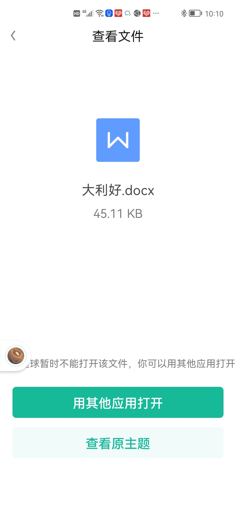

======================================================

_type: talk
@二师父[28814221155551]
2021-11-11 11:20:46 Thu  
topic_id: 581158581142854

10月，“菜比肉贵”成为不少市民的直观感受，鲜菜接棒猪肉成为推动CPI上涨的主力。11月11日，国家统计局北京调查总队发布10月北京居民消费价格（CPI）数据，10月CPI总水平环比上涨0.9%。其中，鲜菜价格环比上涨33.9%带动食品价格环比上涨5.5%。此外，非食品价格环比上涨0.1%，消费品价格上涨2.0%，服务价格下降0.3%。

ppi和cpi剪刀差缩小，商品周期都要凉凉，坚决不碰，超跌板块布局，抵制通胀最佳方式买金融资产

@lily at 2021-11-11 11:20:46 Thu

> 请问一下，鳄鱼计划的一份是怎么定的？我找不到那个文件。准备跟投了

----------

@二师父 at 2021-11-11 11:20:46 Thu

> 账户总资金除以250

----------

@lily at 2021-11-11 11:20:46 Thu

> 谢谢师父

----------

阅读[1]  评论[3]  赞[0] 

======================================================

_type: talk
@果实妈咪[182225518588452]
2021-11-11 14:33:40 Thu  
topic_id: 185548488552442

二师父，这种组合可以在券商账户里面创建不

@水墨青花 at 2021-11-11 14:33:40 Thu

> 师父，锂电代码是159755吗

----------

@二师父 at 2021-11-11 14:33:40 Thu

> 可以

----------

@水墨青花 at 2021-11-11 14:33:40 Thu

> 好的，谢谢

----------

阅读[1]  评论[3]  赞[0] 

======================================================

_type: q&a
@冉冉[88445118854412]
2021-11-11 17:43:06 Thu  
topic_id: 581158422584224

@冉冉

>  二师傅，估值表中能不能把基本面60的估值加上？

@二师父

>  他和深红利是一个类型的，参考深红利就可以

阅读[1]  评论[0]  赞[0] 

======================================================

_type: talk
@二师父[28814221155551]
2021-11-11 21:04:08 Thu  
topic_id: 418851242285148

<e type="hashtag" hid="51288845224514" title="#市场全面爆发#" /> 今天市场强势反弹，后期会不会继续无法预测，不过社融数据预计四季度见底，遇到回调后适当布局迎接跨年行情。

@冉冉 at 2021-11-11 21:04:08 Thu

> 谢谢！

----------

阅读[1]  评论[1]  赞[0] 

+++++++++++++++++++++++++++++++++++++++++++++++++++++

文件：
2021-11-11 21:03:25 Thu
文件大小：[46632]
111844585585412-全面爆发.docx

======================================================

_type: talk
@二师父[28814221155551]
2021-11-11 21:36:37 Thu  
topic_id: 218821451545821

<e type="hashtag" hid="552114551414" title="#估值数据#" /> 市盈率百分位33.24%，市净率百分位28.44%，SY-BY百分位34.44%，SY/BY百分位31.69%。

估值变化依然不大。目前实盘发车都是周四，都是我自己的资金投资后发出的，非模拟盘。仅供大家参考。关于不能跟车的问题，现在除了投顾组合都不能跟车，大家就需要自己建立组合然后配置即可。场内券商账户和场外的都可以，不过投资的比例和头寸要一致。

四个组合在可以接受的回撤范围内是能够一次买入的，我自己是一次买的，就长期持有，青铜组合和白银组合是预期发生极端情况卖出补仓指数。

目前监管很严格，我也不确定这个事能做多久，不过有一点大家放心，从主观上我不会离开大家，毕竟从4年前开始做这个，每晚分享已经成为了习惯，也是我最快乐的事情，即使投资不能讲了，我也会分享一下生活，每周带大家学习一本书。

总之，相遇都是缘分，曾经我有过做财商教育的梦想，不过一直没有辞职，就害怕做成了割韭菜企业，果不其然，去年很多企业就成了割韭菜企业，那么未来我一定会边上班，边做。如果不上班出来做这个的话一定是在我实现财务自由没有经济压力以后。

在北京实现财务自由还是很难得，没有孩子可能还稍微好一点，有了孩子还能财务自由的太难了，不过我正在努力，虽然很慢，但是长久，不在乎做的有多大，也不需要额外的名声，只要长长久久就行，反之快道很快，短期能带来巨大的财富和名利，但是不持久，可能还会出大事。

@衣袂飘香 at 2021-11-11 21:36:37 Thu

> 支持你，二师父！

----------

@杜志彪 at 2021-11-11 21:36:37 Thu

> 能坚持做自己喜欢的事情就了不起[微笑]

----------

@JOY at 2021-11-11 21:36:37 Thu

> 慢慢来就好啦～

----------

@小牧童 at 2021-11-11 21:36:37 Thu

> 师父是一股清流的存在，不受利益诱惑，无私的带领我们前行，感激！感恩！

----------

@shi at 2021-11-11 21:36:37 Thu

> 谢谢二师父的带领。
有个问题，二师父是如何平衡上班工作和投资分享的？

----------

@二师父 at 2021-11-11 21:36:37 Thu

> 工作提高效率，早上早起学习，保持锻炼，让注意力更加集中

----------

@shi at 2021-11-11 21:36:37 Thu

> 收到，谢谢二师父。
早起+锻炼💪💪💪

----------

阅读[1]  评论[7]  赞[1] 

======================================================

_type: q&a
@好运玲玲[244188585541521]
2021-11-12 12:42:00 Fri  
topic_id: 218821422811411

@好运玲玲

>  二师父您好！我在华泰证券购买了军工etf（512560），今天显示停牌了，我看了一下昨天发了一个公告，但我看不懂是什么意思？还有在停牌期间有没有收益？请二师父指点一下。

@二师父

>  他进行份额拆分，拆分后资产净值不变，份额净值会改变。
>  
>  在停牌期间也会有收益的，复牌后就能继续交易了

阅读[1]  评论[1]  赞[0] 

======================================================

_type: talk
@二师父[28814221155551]
2021-11-12 21:40:56 Fri  
topic_id: 818821442451442

<e type="hashtag" hid="28511142821881" title="#北交所开市#" /> 今天主板表现不佳，不过精选层企业大部分可以的，中国股市就有这个特点。

那么之前咱们也布局了中证1000，小盘股方向，可以很明显的看到，现在中小盘股表现优于沪深300，如果接下来中证1000持续回调，依然做多加仓，大方向可以。

沪深300定投必然也是没问题的，不过赚钱需要的时间可能长一点。目前是小市值企业上行趋势的。

阅读[1]  评论[0]  赞[0] 

+++++++++++++++++++++++++++++++++++++++++++++++++++++

文件：
2021-11-12 21:39:09 Fri
文件大小：[46927]
422155541884418-他来了，他脚踩着七彩云来了.docx

======================================================

_type: talk
@二师父[28814221155551]
2021-11-12 21:51:44 Fri  
topic_id: 581158445488844

<e type="hashtag" hid="552114551414" title="#估值数据#" /> 市盈率百分位34.86%，市净率百分位29.71%，SY-BY百分位35.51%，SY/BY百分位32.93%。

基本上无变化，这行情不太给力，没有极端下跌，也没有极端上涨，握住手里的仓位就行了，然后每周四定投。

阅读[1]  评论[0]  赞[0] 

======================================================

_type: talk
@二师父[28814221155551]
2021-11-12 22:46:05 Fri  
topic_id: 581158448854224

<e type="hashtag" hid="51288845142214" title="#关于可转债的估值#" /> 大家投资可转债适当看看市场热度，目前可转债中位数在124，属于一个过热的市场。

基本上可转债中位数在120到130属于过热状态，在130以上属于极度过热状态。在110到120之间属于适中状态。

在110以下属于属于低迷，在100以下属于极端低迷。。

那么投资的时候就可以把握住这个规律，建仓在转债中位数115以下是最合适的，过热的时候就卖出。

无论是投资任何品种都记住在低迷的时候入场，在行情高涨的时候退场。

@雪莲 at 2021-11-12 22:46:05 Fri

> 二师父，在哪查看转债中位数

----------

@二师父 at 2021-11-12 22:46:05 Fri

> 集思录

----------

@雪莲 at 2021-11-12 22:46:05 Fri

> 好的，谢谢二师父！

----------

阅读[1]  评论[3]  赞[0] 

+++++++++++++++++++++++++++++++++++++++++++++++++++++

图片：
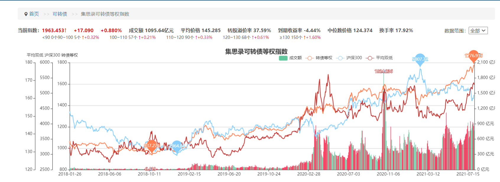

======================================================

_type: talk
@二师父[28814221155551]
2021-11-13 07:57:21 Sat  
topic_id: 185548185548222

<e type="hashtag" hid="51288845144184" title="#周五组合分析#" /> 目前鳄鱼计划仓位50%，乌龟计划仓位40%，整体持仓保守，接下来逐步加仓到6.5层左右，迎接跨年行情。成长股跌了一年，新能源今年继续涨，预计明年仍旧是价值股的行情，如果出现光伏、碳中和、锂电等赛道基金回调30%左右，记得上车，他们是长线方向。互联网的时代已经过去，未来更多是网格和波段，高位止盈。

另外说说四个组合，一次建仓后目前仅黄金组合浮亏，其余均盈利，虽然利润不高，但是比在股市上窜下跳要强，这些组合的最大回撤是从15年高位测算的，经历一轮股灾后回撤可以控制在5%到27%，是非常合理的。

这也就是我常说的为什么可以在回撤可控的范围内一次配置，只是过去金融资产经常出现幺蛾子，所以投资者在配置的时候难免心有顾虑，这个不要紧，慢慢在市场久了就会懂。

可转债实盘暂时没法打开，周末系统维护，下周发送，不过双低策略和低价策略明显跑输低溢价策略，大家选择自己的策略就行。

投资首先想最坏的情况发生了，是否能接受，比如投资100元的转债，最多下跌到60元，最大下跌幅度是40%,如果分批加仓的话，可以控制在25%以内，这样子就不用害怕了。更为关键的是未来到期是肯定盈利的。不用担心和股票一样跌下去起不来。

这就是可转债的优势。

当然不排除一种情况公司破产了，资产清算后公司没有资产了，那么只能认亏，当然这种情况到目前为止还没有发生，不过需要注意，万一发生了怎么办，需要控制仓位，摊大饼分散，这是投资转债的风险点。

破产，资不抵债，无论对股东还是债权人都是最坏的结果，可转债属于债券，优先于股东赔付，破产清算后没有资产了赔付了只能认亏，只要还有剩余资产都要优先赔付可转债，股东永远是最后赔付。

从这个角度来看，转债的风险低于股票，而且对于东财转债、隆基转债，优质企业转债破产概率几乎为零。

@阿宝 at 2021-11-13 07:57:21 Sat

> 谢谢！本周中新债6个，配债3个，属于佛系打新。本周买入深红利，医疗；下周计划考虑购买的指数：深红利、医疗、上证50，最好希望消费龙头、消费50能在跌一跌给个上车机会，那就很nice了。

----------

@二师父 at 2021-11-13 07:57:21 Sat

> 非常不错，都是优质蓝筹龙头，坚持定投长期复利。

----------

@阿宝 at 2021-11-13 07:57:21 Sat

> 以后跟着老师好好学习，多学习，多分享，锻炼身体，健康快乐，复利百年。

----------

@二师父 at 2021-11-13 07:57:21 Sat

> 你跑步很快

----------

@阿宝 at 2021-11-13 07:57:21 Sat

> 我们的工作是应急救援，体能是基础。老师很自律，公众号一直写到现在，传播投资理念和人生哲学，我很受益。感谢之前老师送我的《指数基金，慢慢变富》，我看完送我领导看，他也很受益。但行好事，莫问前程，向你学习。

----------

@阿宝 at 2021-11-13 07:57:21 Sat

> 《<e type="web" href="https://wx.zsxq.com/mweb/views/weread/search.html?keyword=指数基金定投，慢慢变富" title="指数基金定投，慢慢变富" style="book" />》

----------

@二师父 at 2021-11-13 07:57:21 Sat

> [握手][握手]

----------

@云起 at 2021-11-13 07:57:21 Sat

> 对的

----------

阅读[1]  评论[16]  赞[0] 

+++++++++++++++++++++++++++++++++++++++++++++++++++++

图片：
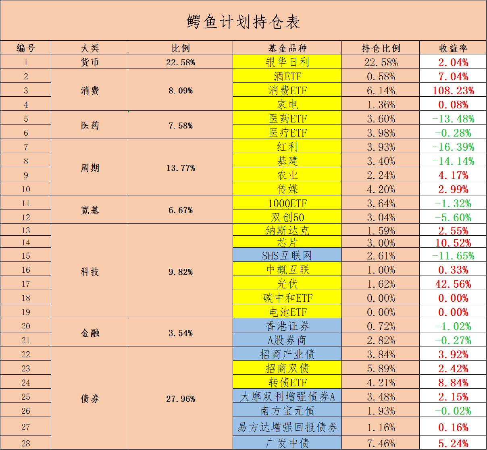

======================================================

_type: talk
@阿宝[422212151424158]
2021-11-13 10:58:51 Sat  
topic_id: 218821412881111

推荐一本书，《<e type="web" href="https://wx.zsxq.com/mweb/views/weread/search.html?keyword=房价的逻辑" title="房价的逻辑" style="book" />》作者北京大学徐远教授。
附部分读书笔记：房价有没有泡沫？这个问题的结论和我之前想的不太一样，答案是很贵但谈不上泡沫。理由是北京的房价是纽约房价的一半，从长期来看北京的供需和资源集中程度都远远高于纽约，长期看房价高于纽约才算是合理的，纽约房价谈不上泡沫，北京更不是，既然北京不是，国内别的城市就更不是。
有个实事是：房子不是每个人都能买得起的，只有中高、阶层才能买得起房子住，还有很多人以后要租房住，那么房价注定不便宜。如何看待房价高收入比？用成长股的思维来看待房价收入比，未来居民收入还会增长，10后的收入和现在的房价对比起来，就不贵了，未来居民收入增速还很快，给的估值就很难便宜，考虑到未来，现在的房价就不贵。既然长期看当前的房价不算贵，那么为什么一直在调控房价？是为了减缓财富分配加剧，给年轻人上车的机会，调控的不是房价，是增速，为的是维护社会稳定，让年轻人有机会上车，有追求，有希望。
（这里所说的房子是大城市核心区域的房子，买房子就是买城市的发展，大城市好区域的房产依然是好资产。）重点：控制房价增速，是为给年轻人能够上车的机会，未来房价还会上涨，但涨幅和以前不一样，大城市加核心位置的房子涨幅更快，没有发展的城市房价可能会比较危险，你如何考虑呢？大城市工作机会多、资源很丰富，年轻人会有更高的收入，更多的可能，大部分人都很向往，愿意去，那么根据最基本的经济规律需求很大，而房子供应有限，那么大城市核心区域房子就如同高成长的股票，很难便宜，越来越贵！

@shi at 2021-11-13 10:58:51 Sat

> 如何才能保持经济继续高增长40年？
我想只有劳动和科技的发展。
别想着有了房子就可以躺平了。

如果大家都想躺平在房子上，
那就是以前躺平在那一堆粮食上一样。

----------

@二师父 at 2021-11-13 10:58:51 Sat

> 是的，要发展高科技国家才有希望

----------

@阿宝 at 2021-11-13 10:58:51 Sat

> 房价的长期逻辑还在，长期上涨趋势，不会改变。但大城市的房子很难买，条件严苛，起步太高，并不适合大部分人，倘若有机会还是可以买。股权投资未来可期

----------

阅读[1]  评论[3]  赞[0] 

+++++++++++++++++++++++++++++++++++++++++++++++++++++

图片：
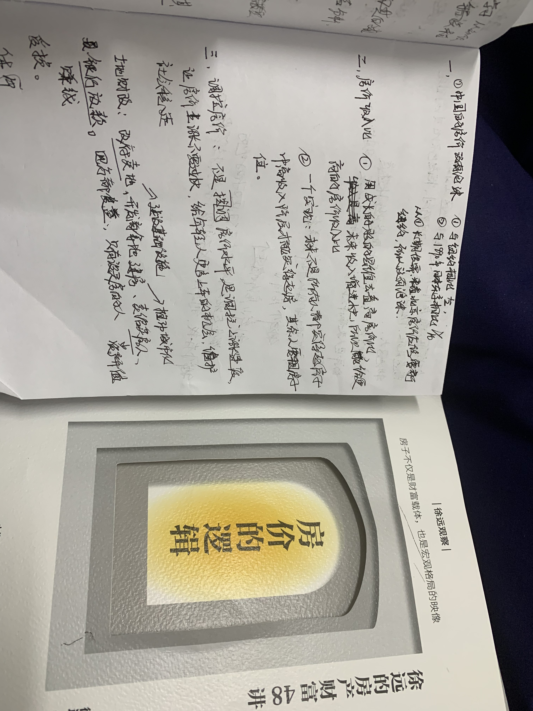

======================================================

_type: talk
@二师父[28814221155551]
2021-11-13 19:00:09 Sat  
topic_id: 418851144155858

好未来的故事告诉我们，永远别抄底任何股票，低估分散不精研，踏准了时代和趋势才能赚钱，和趋势作对最终会被淘汰的。

投资也一样，在趋势性赛道寻找相对便宜的机会，在一个即将被淘汰的行业挑选企业是矮子里面选择将军，将军也比高个子里面的矮子差

阅读[1]  评论[0]  赞[0] 

======================================================

_type: talk
@二师父[28814221155551]
2021-11-13 19:45:56 Sat  
topic_id: 418851148448288

<e type="hashtag" hid="88511142221842" title="#全面解读元宇宙#" /> 元宇宙学习一下，拥抱新的事物，当无法年轻人的时候，就说明我们老了，拥抱变化，解放思想，打开想象力。投不投资是一回事，一定要密切关注社会新生事物，财富都会往这里汇聚。

@shi at 2021-11-13 19:45:56 Sat

> 希望这个元宇宙成为我们征服源宇宙的工具。
这和希望投资能更好地改善我们的生活一样~

----------

@艾琪（王钥） at 2021-11-13 19:45:56 Sat

> 想起电影《<e type="web" href="https://wx.zsxq.com/mweb/views/weread/search.html?keyword=头号玩家" title="头号玩家" style="book" />》了，如果VR、游戏、云办公这些大热，那么都离不开5G基站建设，二师父，现在是不是可以考虑布局这些呢？

----------

@二师父 at 2021-11-13 19:45:56 Sat

> 我觉得5g以后会升级到6g，布局芯片好一些，或者美股芯片纳斯达克

----------

@艾琪（王钥） at 2021-11-13 19:45:56 Sat

> 谢谢师父指教

----------

阅读[1]  评论[4]  赞[0] 

+++++++++++++++++++++++++++++++++++++++++++++++++++++

文件：
2021-11-13 19:42:33 Sat
文件大小：[47248]
844122284225542-全面解读元宇宙.docx

======================================================

_type: q&a
@徐美芳[51112822252224]
2021-11-14 16:05:57 Sun  
topic_id: 818845584421222

@徐美芳

>  请教二师傅，支付宝里购买基金，经过多次买卖后怎样计算购买一个基金使用的金额呢？

@二师父

>  查看买入记录或者自己记下买入金额

阅读[1]  评论[0]  赞[0] 

======================================================

_type: talk
@二师父[28814221155551]
2021-11-14 18:55:20 Sun  
topic_id: 818845528125552

<e type="hashtag" hid="28511142454841" title="#债券基金暴雷#" /> 最近有个基金公司债券基金暴雷，大家投资注意适度分散，切记不要单调，风险很大。

阅读[1]  评论[0]  赞[0] 

+++++++++++++++++++++++++++++++++++++++++++++++++++++

文件：
2021-11-14 18:54:42 Sun
文件大小：[155130]
544855554448854-3A债券也不顶用，投资需分散.docx

======================================================

_type: talk
@💞柠檬茶💞[818524151154212]
2021-11-15 11:55:52 Mon  
topic_id: 185512285582582

二师父好，新来的星球学习，但是不知道如何下手啊[尴尬]

@二师父 at 2021-11-15 11:55:52 Mon

> 可以先听听置顶的课程

----------

@💞柠檬茶💞 at 2021-11-15 11:55:52 Mon

> 好的

----------

阅读[1]  评论[2]  赞[0] 

======================================================

_type: talk
@💞柠檬茶💞[818524151154212]
2021-11-15 11:57:53 Mon  
topic_id: 185512285585822

所谓的基金定投和可转债打新哪里学习呢[撇嘴]

@二师父 at 2021-11-15 11:57:53 Mon

> <e type="web" href="https://open.lizhiweike.com/oauth2/authorize?client_id=weike-html5-frontend&response_type=w_code&redirect_uri=https%3A%2F%2Fm.lizhiweike.com%2Fchannel2%2F355516%3Fdiscount_code%3D66203848%26y%3D1" title="荔枝微课" cache="" />，点这个

----------

@💞柠檬茶💞 at 2021-11-15 11:57:53 Mon

> [OK]

----------

阅读[1]  评论[2]  赞[0] 

======================================================

_type: talk
@敏[218522144111811]
2021-11-15 16:15:55 Mon  
topic_id: 581142288841424

<e type="hashtag" hid="452582815458" title="#网格#" /> 在哪个交易所买入好

@西锦巴乌 at 2021-11-15 16:15:55 Mon

> 华宝智投

----------

阅读[1]  评论[1]  赞[0] 

======================================================

_type: talk
@从A到Z[414841151821548]
2021-11-15 19:52:25 Mon  
topic_id: 818845858228242

二师父，学习您的课程受益匪浅，按照近期的投资逻辑，应该按照您前期规划的网格操作中概互联和传媒两支etf，中概互联我前期就已建仓，成本1.52目前小亏，以后会按照您的方法操作，小亏进一步证明跟您学习的重要性。传媒目前按照网格已无法建仓，是否持续关注，严格执行网格，还是可以先建底仓。
另基建etf按照您的要求是定投，我可否先建底仓，然后每周定投。请您指教。

@二师父 at 2021-11-15 19:52:25 Mon

> 基建定投就可以了，传媒可以适当建立百分之1到2的底仓。

----------

@从A到Z at 2021-11-15 19:52:25 Mon

> 谢谢师傅

----------

@从A到Z at 2021-11-15 19:52:25 Mon

> 师傅是百分之1到2还是百分之10到20。另券商etf是否有价值继续持有，我的成本是1.198

----------

@二师父 at 2021-11-15 19:52:25 Mon

> 1到2，别弄错了

----------

@从A到Z at 2021-11-15 19:52:25 Mon

> 好的

----------

@二师父 at 2021-11-15 19:52:25 Mon

> 券商波动大，只适合网格

----------

@从A到Z at 2021-11-15 19:52:25 Mon

> 网格参照什么标准呢

----------

阅读[1]  评论[7]  赞[0] 

======================================================

_type: q&a
@坚持学习[421148841558188]
2021-11-15 19:56:55 Mon  
topic_id: 581142285524114

@坚持学习

>  二师父，券商这个，网格交易暂停了，一直跌。这个如何处理比较好呢？

@二师父

>  可以继续做，以1块钱作为价格中枢，每上涨百分之5出一网，到1买入，每跌百分之5买一网

阅读[1]  评论[2]  赞[0] 

======================================================

_type: talk
@二师父[28814221155551]
2021-11-15 19:59:39 Mon  
topic_id: 418824848524218

转债实盘，波动较大，一般是卖出盈利的参考每盈利百分之10卖出一部分，目前转债估值较高，不建议参与，参与的话尽量双低值在110以内，或者价格100以内。

阅读[1]  评论[0]  赞[0] 

+++++++++++++++++++++++++++++++++++++++++++++++++++++

图片：
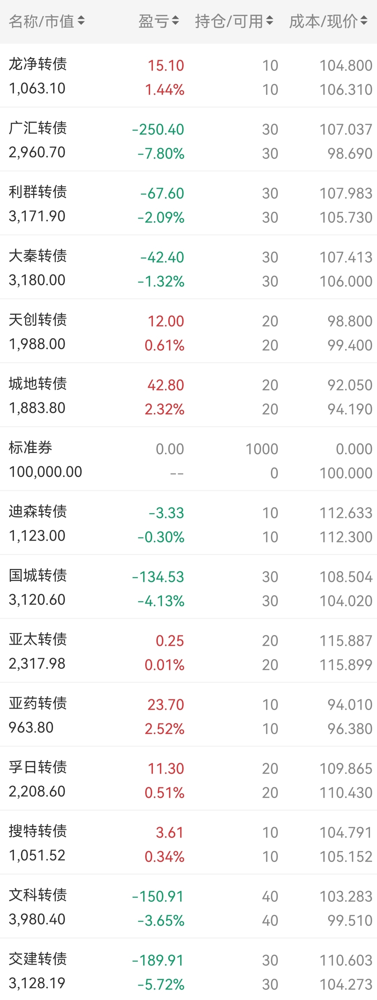

======================================================

_type: talk
@💞柠檬茶💞[818524151154212]
2021-11-15 20:29:20 Mon  
topic_id: 418824848214518

基建ETF哪款基金可以参与定投呢二师父？

@二师父 at 2021-11-15 20:29:20 Mon

> 在置顶五步定投法里面有代码哈

----------

阅读[1]  评论[1]  赞[0] 

======================================================

_type: talk
@二师父[28814221155551]
2021-11-15 21:27:32 Mon  
topic_id: 818845854188582

<e type="hashtag" hid="51288848428214" title="#今天市场分析#" /> 投资的两种模式，既可以捡垃圾，也可以选择盈利稳定的优质基金。

阅读[1]  评论[0]  赞[0] 

+++++++++++++++++++++++++++++++++++++++++++++++++++++

文件：
2021-11-15 21:24:12 Mon
文件大小：[46451]
544855485282214-没想到都跑路了.docx

======================================================

_type: talk
@二师父[28814221155551]
2021-11-15 22:22:25 Mon  
topic_id: 818845851811582

<e type="hashtag" hid="552114551414" title="#估值数据#" /> 市盈率百分位35.24%，SY-BY百分位35.73%，SY/BY百分位32.85%。

今天成长组合跌的多，乌龟计划相对稳健，如果加息周期到来，成长股肯定会跌的多，这时候就是加仓机会，投资不能着急。

当前以低估的价值指数为主，比如基建、传媒、红利等等。

@防汛抗旱 at 2021-11-15 22:22:25 Mon

> 红利确定低估？我跟着进的亏10个点

----------

@二师父 at 2021-11-15 22:22:25 Mon

> 进入低估也可能跌百分之50，这是安全边际

----------

阅读[1]  评论[2]  赞[0] 

======================================================

_type: talk
@从A到Z[414841151821548]
2021-11-16 08:55:47 Tue  
topic_id: 185512551452542

师傅，新能源etf还能持有吗，入场时间不对，目前没有利润，小亏

@二师父 at 2021-11-16 08:55:47 Tue

> 看仓位，大仓位就比较危险

----------

@从A到Z at 2021-11-16 08:55:47 Tue

> 不大，百分之十，我清仓？

----------

阅读[1]  评论[2]  赞[0] 

======================================================

_type: talk
@平安是福[118222545154542]
2021-11-16 14:27:53 Tue  
topic_id: 185512541212582

师父：君禾转债现在还持有中吗？

@二师父 at 2021-11-16 14:27:53 Tue

> 我没有了

----------

@平安是福 at 2021-11-16 14:27:53 Tue

> 啥时候卖的？在哪里看师父操作？

----------

@二师父 at 2021-11-16 14:27:53 Tue

> 不公布操作了，以后自己买卖

----------

@胡醒醒 at 2021-11-16 14:27:53 Tue

> 啊，不能公布吗

----------

@二师父 at 2021-11-16 14:27:53 Tue

> 嗯嗯，股票和可转债都有监管风险

----------

阅读[1]  评论[5]  赞[0] 

======================================================

_type: talk
@敏[218522144111811]
2021-11-16 17:11:25 Tue  
topic_id: 418824851548148

<e type="hashtag" hid="51288842441184" title="#持仓数据#" /> 这计划如何跟投，是自己去场内场外购买吗？有配置跟投不？

@二师父 at 2021-11-16 17:11:25 Tue

> 仅供参考

----------

阅读[1]  评论[1]  赞[0] 

======================================================

_type: q&a
@维真[818585418182212]
2021-11-16 18:30:25 Tue  
topic_id: 418824881124158

@维真

>  老师好，我想继续投资师父的乌龟计划，因不能一键跟投了，是不是自己得创建一个新组合，把原乌龟组合里面的投资的金额和基金，挪到新创建的基金组合里面就行了，请老师给详细说一下，怎么操作？谢谢老师。

@二师父

>  以前的不动，新建一个组合就可以了

阅读[1]  评论[0]  赞[0] 

======================================================

_type: talk
@二师父[28814221155551]
2021-11-16 21:29:41 Tue  
topic_id: 218845842181821

<e type="hashtag" hid="51288848841824" title="#关于传媒ETF如何应对#" /> 传媒ETF鳄鱼计划和乌龟计划均有建仓。

计划未来上涨逐步卖出，不会追的，考虑下跌的中证1000，基建，红利。

关于低估，低估的指数一般最大下跌幅度控制在50%以内，通过定投可以将浮亏控制在35%以内，符合人的心理承受能力，2018年定投的时候遇到过这种极端跌幅，投资先考虑最坏的情况，然后决定是否出手。

@样 at 2021-11-16 21:29:41 Tue

> 传媒etf卖的时候会发星球吗？

----------

@二师父 at 2021-11-16 21:29:41 Tue

> 会

----------

阅读[1]  评论[2]  赞[0] 

+++++++++++++++++++++++++++++++++++++++++++++++++++++

文件：
2021-11-16 21:27:41 Tue
文件大小：[46369]
544855812151114-别追.docx

======================================================

_type: talk
@二师父[28814221155551]
2021-11-16 22:24:52 Tue  
topic_id: 218845844244411

<e type="hashtag" hid="552114551414" title="#估值数据#" /> 市盈率百分位34.98%，SY-BY百分位35.28%，SY/BY百分位32.23%。

基本上没有变化，板块分化内部牛市，最近是传媒和医疗表演了。

未来仅公布基金投资计划，可转债分享投资策略，买入卖出公布不符合监管要求，目前和投顾公司在谈合作，咱们一切的投资分享都建立在合规的基础上。

否则躺枪了就玩不下去了。

阅读[1]  评论[0]  赞[0] 

======================================================

_type: talk
@💞柠檬茶💞[818524151154212]
2021-11-17 07:05:17 Wed  
topic_id: 581142585258824

二师父，听了两天音频感觉对指数基金的了解还是不太明白，有没有书面的介绍啊，或者我要不要买本你写的那个书再结合着看

@二师父 at 2021-11-17 07:05:17 Wed

> 可以的，微信读书也有电子版的

----------

@💞柠檬茶💞 at 2021-11-17 07:05:17 Wed

> 报名了星球学习您就给赠送一本呗[呲牙]

----------

@二师父 at 2021-11-17 07:05:17 Wed

> 我也是网上买

----------

@💞柠檬茶💞 at 2021-11-17 07:05:17 Wed

> 二师傅如何选指数基金需要参考的那些数据我觉得挺难的[撇嘴]，能学的会吗？

----------

@二师父 at 2021-11-17 07:05:17 Wed

> 你多听听课程，再看看文章

----------

@💞柠檬茶💞 at 2021-11-17 07:05:17 Wed

> 嗯，好吧

----------

@💞柠檬茶💞 at 2021-11-17 07:05:17 Wed

> 微信读书收费吗？

----------

阅读[1]  评论[7]  赞[0] 

======================================================

_type: talk
@💞柠檬茶💞[818524151154212]
2021-11-17 11:26:28 Wed  
topic_id: 185512122845582

二师傅这个债券收益率挺高，能选吗？

@二师父 at 2021-11-17 11:26:28 Wed

> 不是保本的

----------

@💞柠檬茶💞 at 2021-11-17 11:26:28 Wed

> 哦，那不考虑了

----------

阅读[1]  评论[2]  赞[0] 

+++++++++++++++++++++++++++++++++++++++++++++++++++++

图片：
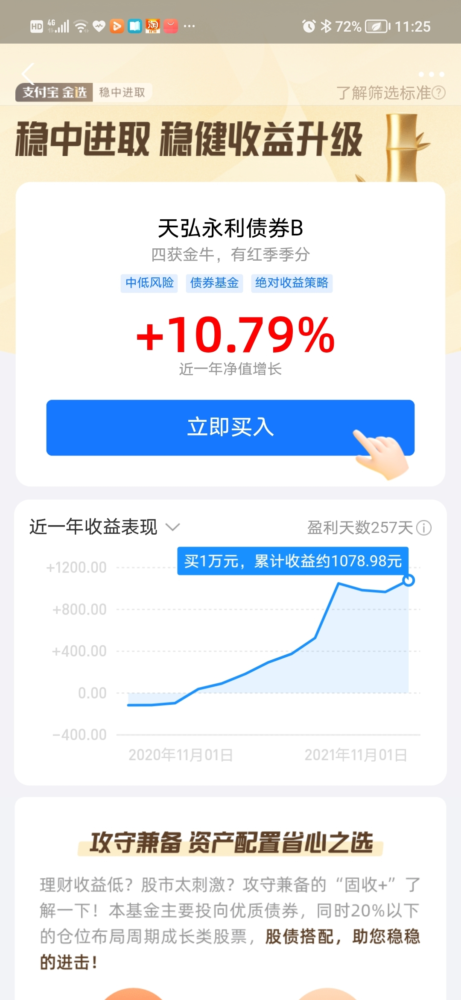

======================================================

_type: talk
@二师父[28814221155551]
2021-11-17 21:58:56 Wed  
topic_id: 418824282115828

<e type="hashtag" hid="15288882524222" title="#两款红利ETF解读#" />

@JOY at 2021-11-17 21:58:56 Wed

> 师父，文档里面内容不全哈～

----------

@二师父 at 2021-11-17 21:58:56 Wed

> 一会改一下

----------

阅读[1]  评论[2]  赞[0] 

+++++++++++++++++++++++++++++++++++++++++++++++++++++

文件：
2021-11-18 21:16:10 Thu
文件大小：[46093]
111844818548482-别被表象迷惑.docx

======================================================

_type: talk
@二师父[28814221155551]
2021-11-17 22:30:03 Wed  
topic_id: 818845481255112

<e type="hashtag" hid="825188852442" title="#估值表#" />

@从A到Z at 2021-11-17 22:30:03 Wed

> 师傅，传媒和中概互联是做网格还是定投呢

----------

@二师父 at 2021-11-17 22:30:03 Wed

> 网格的

----------

@cotton at 2021-11-17 22:30:03 Wed

> 今天发吗

----------

@二师父 at 2021-11-17 22:30:03 Wed

> 发

----------

阅读[1]  评论[4]  赞[0] 

+++++++++++++++++++++++++++++++++++++++++++++++++++++

图片：
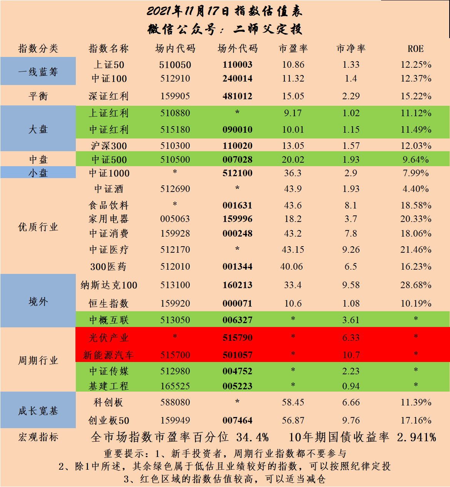

======================================================

_type: q&a
@隔窗遥望[241884481854181]
2021-11-18 09:52:10 Thu  
topic_id: 218845481115211

@隔窗遥望

>  四种组合里每种组合的投资标的都是不变的吗？一直持有可以吗？王者组合能不能每月定投？

@二师父

>  看情况，一般是不变的，如果基金发生强赎，规模变低需要调仓

阅读[1]  评论[0]  赞[0] 

======================================================

_type: talk
@二师父[28814221155551]
2021-11-18 09:53:56 Thu  
topic_id: 418824251842558

<e type="hashtag" hid="51288882114544" title="#周四发车#" /> 乌龟计划买入中证1000，500元，海外组合一次买入1000元，鳄鱼计划中概互联，中证1000各买入一份。

固定周四发车，避免情绪操作。

@云云 at 2021-11-18 09:53:56 Thu

> 师父，海外是按比例总共买入1000元是吗？

----------

@二师父 at 2021-11-18 09:53:56 Thu

> 是的哈

----------

@云云 at 2021-11-18 09:53:56 Thu

> 好，谢谢🙏

----------

@cotton at 2021-11-18 09:53:56 Thu

> 海外组合在哪呢。。

----------

@二师父 at 2021-11-18 09:53:56 Thu

> 天天基金

----------

@cotton at 2021-11-18 09:53:56 Thu

> 没有天天基金[尴尬]

----------

@二师父 at 2021-11-18 09:53:56 Thu

> 上周发了组合持仓和比例

----------

@cotton at 2021-11-18 09:53:56 Thu

> 好呢

----------

阅读[1]  评论[15]  赞[0] 

======================================================

_type: talk
@雪莲[421485848588118]
2021-11-18 11:48:30 Thu  
topic_id: 185512114225182

二师父您好，我场内的中概互联ETF现在成本1.776浮亏16.61%.百分之12的仓位，我后续该逢低买入拉低成本，还是该按您的网格买入卖出？哪中操作更适合我？谢谢！

@二师父 at 2021-11-18 11:48:30 Thu

> 网格

----------

@雪莲 at 2021-11-18 11:48:30 Thu

> 好的，谢谢二师父！

----------

阅读[1]  评论[2]  赞[0] 

======================================================

_type: talk
@二师父[28814221155551]
2021-11-18 12:31:06 Thu  
topic_id: 818845442824442

如果中概百分之15以上仓位就不用再买入了，乌龟计划和鳄鱼计划的持仓比例是可以看到的，同样的投资，仓位不同，最终会有很大区别

@从A到Z at 2021-11-18 12:31:06 Thu

> 基建还定投吗

----------

@二师父 at 2021-11-18 12:31:06 Thu

> 投

----------

@从A到Z at 2021-11-18 12:31:06 Thu

> 多少呢？

----------

@二师父 at 2021-11-18 12:31:06 Thu

> 买的时候会发的

----------

@从A到Z at 2021-11-18 12:31:06 Thu

> 我还以为周四要买

----------

@二师父 at 2021-11-18 12:31:06 Thu

> 买了会发车

----------

@从A到Z at 2021-11-18 12:31:06 Thu

> 收到

----------

阅读[1]  评论[7]  赞[0] 

======================================================

_type: talk
@二师父[28814221155551]
2021-11-18 14:18:30 Thu  
topic_id: 818845444528882

场外都有买入，公开发车可能以后不允许，大家多学方法

阅读[1]  评论[0]  赞[0] 

+++++++++++++++++++++++++++++++++++++++++++++++++++++

图片：
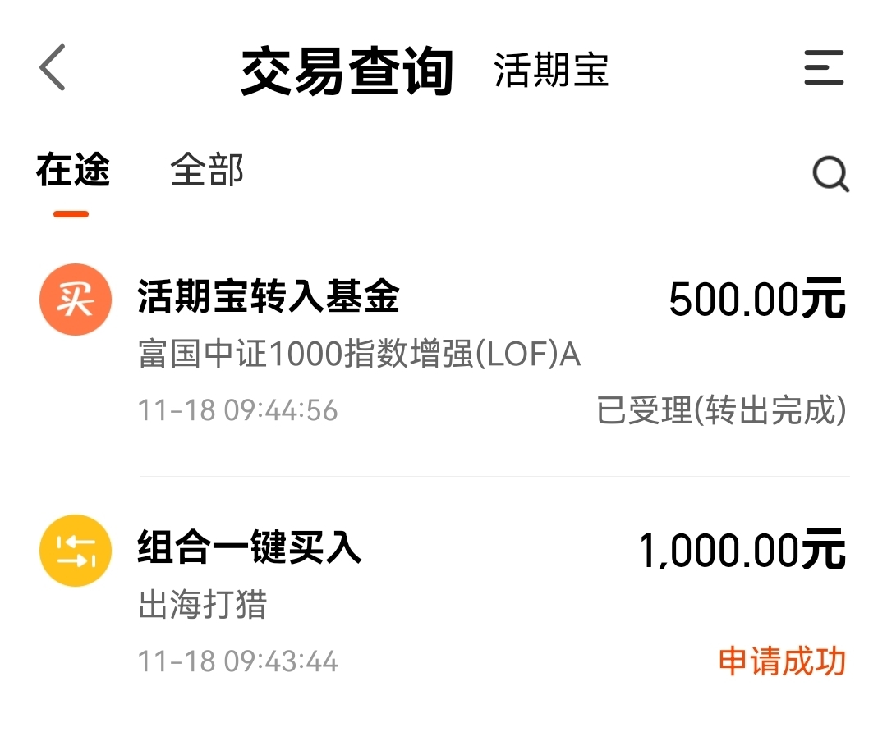

======================================================

_type: talk
@二师父[28814221155551]
2021-11-18 21:15:24 Thu  
topic_id: 818845412485852

<e type="hashtag" hid="452582815458" title="#网格#" /> 互联网企业的利润普遍在下降，还是网格靠谱，计划暂停除了网格以外的所有互联网企业投资。

英伟达利润大增，阿里利润大降，很明显的问题，企业的价格最终都反映了盈利的情况。

@苍天有井明月空🌙 at 2021-11-18 21:15:24 Thu

> 现在是个做网格除了中概还有什么，券商和人工智能挺好，一直在做也有盈利

----------

@二师父 at 2021-11-18 21:15:24 Thu

> 传媒

----------

@苍天有井明月空🌙 at 2021-11-18 21:15:24 Thu

> 传媒鳄鱼计划有，盈利几个点。做网格底是多少，多少开始做

----------

@二师父 at 2021-11-18 21:15:24 Thu

> 置顶有

----------

@果实妈咪 at 2021-11-18 21:15:24 Thu

> 中概股又崩了，之前乌龟计划一次买的还亏很多，需要卖出不？二师父

----------

@二师父 at 2021-11-18 21:15:24 Thu

> 这个位置就没必要卖了

----------

阅读[1]  评论[6]  赞[0] 

+++++++++++++++++++++++++++++++++++++++++++++++++++++

文件：
2021-11-18 21:14:00 Thu
文件大小：[46793]
111844818548512-聊一聊大家关心的一个问题.docx

======================================================

_type: q&a
@wty[548488548545444]
2021-11-18 21:34:57 Thu  
topic_id: 218845442842151

@wty

>  二师父，我看有一款恒生医疗ETF（513060），麻烦分析一下投资价值，现在是否是建仓机会呢？

@二师父

>  建议避开港股，投资a股或者美股基金

阅读[1]  评论[1]  赞[0] 

======================================================

_type: talk
@二师父[28814221155551]
2021-11-18 21:56:35 Thu  
topic_id: 581142484251544

<e type="hashtag" hid="552114551414" title="#估值数据#" /> 市盈率百分位35.61%，SY-BY百分位35.75%，SY/BY百分位32.71%。

整体估值变化不大，市场波动，也只有寻找超跌方向补仓，反弹后卖出，长线仓位继续加，坚持积累。

@从A到Z at 2021-11-18 21:56:35 Thu

> 是哪三支呢

----------

@二师父 at 2021-11-18 21:56:35 Thu

> 没明白你的问题

----------

@从A到Z at 2021-11-18 21:56:35 Thu

> 我是说您讲的这三个百分位指的是三支基金吗？

----------

@二师父 at 2021-11-18 21:56:35 Thu

> 不是的，这个只代表市场估值高低

----------

@从A到Z at 2021-11-18 21:56:35 Thu

> 收到

----------

阅读[1]  评论[5]  赞[0] 

======================================================

_type: q&a
@黎雄[841555255485222]
2021-11-19 08:48:34 Fri  
topic_id: 185512822184512

@黎雄

>  师傅双创50的选股规则是怎样的，之前你写的文章找不到了，忘了。谢谢

@二师父

>  是从科创板和创业板中选取市值较大的50只新兴产业上市公司，目前更偏重创业板

阅读[1]  评论[0]  赞[0] 

======================================================

_type: talk
@胡醒醒[28881248811141]
2021-11-19 10:15:22 Fri  
topic_id: 185512828885182

二师父，北交所首发基金值得投吗

@二师父 at 2021-11-19 10:15:22 Fri

> 如果没有封闭期的可以

----------

@胡醒醒 at 2021-11-19 10:15:22 Fri

> 基本都有2年封闭期

----------

阅读[1]  评论[2]  赞[0] 

======================================================

_type: talk
@二师父[28814221155551]
2021-11-19 21:37:17 Fri  
topic_id: 581141254124554

<e type="hashtag" hid="88511115442442" title="#跨年行情的判断#" />

阅读[1]  评论[0]  赞[0] 

+++++++++++++++++++++++++++++++++++++++++++++++++++++

文件：
2021-11-19 21:37:04 Fri
文件大小：[46687]
111841225485582-起飞了.docx

======================================================

_type: talk
@二师父[28814221155551]
2021-11-19 22:10:21 Fri  
topic_id: 185515241442812

<e type="hashtag" hid="552114551414" title="#估值数据#" /> 估值数据PE代表市盈率，SY—BY是风险溢价率，这三个指标衡量市场估值，估值百分位越低，估值越低。

市盈率百分位34.71%,SY-BY百分位35.23%，SY/BY百分位32.16%。

阅读[1]  评论[0]  赞[0] 

======================================================

_type: talk
@二师父[28814221155551]
2021-11-20 10:17:38 Sat  
topic_id: 218848542421221

<e type="hashtag" hid="48411114211888" title="#周五实盘分析#" /> 目前鳄鱼计划仓位51%，临近年底，逐步转守为攻，主要方向就是持仓里面的基金。

第一是纳斯达克，长期看好，回调会买入，一直都有人说纳斯达克泡沫，不过30倍市盈率的纳斯达克估值真的比A股130倍市盈率的科技股泡沫小。

第二是低估值板块、家电、基建、红利，中概互联，后面也会持续定投，分别仓位5%左右。

第三是碳中和、锂电池板块，准备回调到60日均线以下买入，计划仓位15%左右，看好至2025年。

第四医疗和白酒，1000ETF.

乌龟计划仓位41%，这个在天天基金搜索二师父定投，关注即可，投资以低估值板块为主。

成长组合，净值1.3，净值跌破1以下持续定投，长期持有到估值楼层4层以上，不考虑收割利润。

海外组合，净值1.001，净值跌破1以下持续定投，长期持有作为养老，极端泡沫的时候卖出。

置顶的四个组合配置，可以稍微改动，比如华夏回报可用中证1000替代，债基目前都是非常优质的，调仓也是卖出劣质的基金，买入优质的基金，然后继续持有，以后都要习惯持有股权品种。

@杜志彪 at 2021-11-20 10:17:38 Sat

> 最近有点激进，加了点十八罗汉，到了8层仓位，场内已经停止定投了，目前采用向下网格的加仓法。

----------

@二师父 at 2021-11-20 10:17:38 Sat

> 横盘一年跌不下去不用太悲观

----------

@样 at 2021-11-20 10:17:38 Sat

> 请教成长组合是准备采用哪种再平衡策略

----------

@JOY at 2021-11-20 10:17:38 Sat

> 请问十八罗汉是啥？

----------

阅读[1]  评论[4]  赞[0] 

+++++++++++++++++++++++++++++++++++++++++++++++++++++

图片：
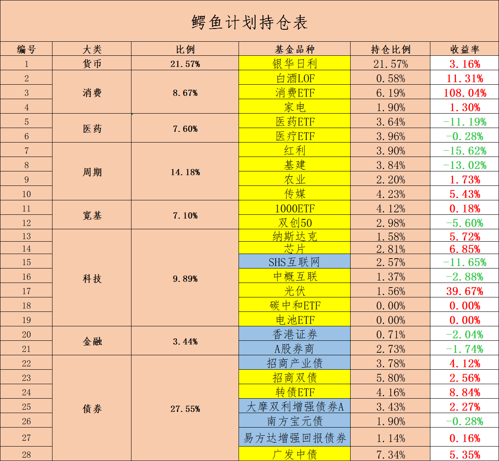

======================================================

_type: talk
@二师父[28814221155551]
2021-11-20 15:31:27 Sat  
topic_id: 218848541858421

<e type="hashtag" hid="51288882842444" title="#可转债基金如何投资#" /> 一般大牛市起步都是看可转债，如果100元以下的可转债一只也没有了，基本上意味着超级牛市起步，现在处于这个阶段的末期，对于投资最好追涨，可以看到中证转债指数从15年高位到最低也跌了55%，风控永远第一位，要想挣钱，先保证不赔钱。

阅读[1]  评论[0]  赞[0] 

+++++++++++++++++++++++++++++++++++++++++++++++++++++

文件：
2021-11-20 15:29:56 Sat
文件大小：[110137]
544854211142224-可转债基金要怎么投资.docx

======================================================

_type: talk
@二师父[28814221155551]
2021-11-20 16:35:07 Sat  
topic_id: 818848518581442

重点学习再平衡策略，王者组合就是用的再平衡策略，一个月或者一个季度再平衡一次，提高了投资资金的利用率，同时也跑赢了大盘，适合A股这种波动市场。

@shi at 2021-11-20 16:35:07 Sat

> 30年5倍，年化也有5.5%了，如果放在之后30年，感觉也挺香了。
不仅能打败所有年金险，估计也能跑赢大部分债券基金了吧。

----------

阅读[1]  评论[1]  赞[0] 

+++++++++++++++++++++++++++++++++++++++++++++++++++++

文件：
2021-11-20 16:30:08 Sat
文件大小：[33503]
844124588455442-《低风险投资之路》第一讲.docx

======================================================

_type: talk
@二师父[28814221155551]
2021-11-21 13:59:01 Sun  
topic_id: 581141128482284

<e type="hashtag" hid="48411118485458" title="#大的方向#" /> 未来4年，高端制造+新能源，这是主旋律，可以超配仓位。

其余的辅助就行。另外组合配置是很不错的，债基+沪深300+中证1000+创业板50一次配置定期再平衡，回撤控制再30%以内，而且收益率高于沪深300.

注意，这个回撤再30%以内是什么含义，意味着再15年牛市高位配置60%指数，达到这个回撤，如果实际投资过程中根据估值楼层再估值楼层六楼的时候，将指数的仓位降低到1，仅持有二级债基和偏债混合，最大回撤就会控制再10%以内，风险都是因为无知，如果真的学的比较好了，风险是可以控制在有效范围内的。

@一心一意 at 2021-11-21 13:59:01 Sun

> 比例是25%一份么

----------

@一心一意 at 2021-11-21 13:59:01 Sun

> 组合配置，一份的比例是25%么

----------

@二师父 at 2021-11-21 13:59:01 Sun

> 各20%

----------

阅读[1]  评论[3]  赞[0] 

+++++++++++++++++++++++++++++++++++++++++++++++++++++

文件：
2021-11-21 13:55:51 Sun
文件大小：[47305]
422152825522428-大变局下的投资方向.docx

======================================================

_type: talk
@二师父[28814221155551]
2021-11-21 15:03:40 Sun  
topic_id: 818848885582822

<e type="hashtag" hid="48411118482858" title="#如何来进行资产切换#" /> 资产切换依据的标准是什么，利率和估值是比较重要的。

下周讲沈南鹏的传记，红衫资本创始人沈南鹏的成长经历和创业经历，通过读优秀人物传记也可以给自己带来很大的启发，大家会发现每个人都不是随便就做成事情的。

@shi at 2021-11-21 15:03:40 Sun

> 配个草图，不知配的对不对？
再提两个问题：
1,目前利率处于什么水平？（高，中，低），趋势怎么样？ 
（是不是目前比较低了，还将更低？）
2，目前股市热度怎么样？（很热，中性，冷清），趋势怎么样？
（这个问题好像是我们想要知道的，所以是否可以从目前市场仓位变化情况，来判断股市的趋势呢？就是说大家加仓，我就减仓。）
3，根据上述分析，由于股票很难判断目前是什么状态，那么就先按中性考虑，又由于利率也是比较低了，所以股票仓位应该在50%-75%附近，并可以在这个区域内慢慢加仓股票。
哎，不知自己是不是属于瞎乱分析了[微笑]

----------

@二师父 at 2021-11-21 15:03:40 Sun

> 这个只能参考，和经济周期也有关系，目前利率低位，股市很热，主升浪阶段

----------

阅读[1]  评论[2]  赞[0] 

+++++++++++++++++++++++++++++++++++++++++++++++++++++

文件：
2021-11-21 15:02:05 Sun
文件大小：[32612]
111841514884282-《低风险投资之路》第二讲.docx

======================================================

_type: talk
@阝東[844111541211852]
2021-11-21 19:11:04 Sun  
topic_id: 581141111541244

二师父，那个再平衡策略还是有点不懂，能再说说不，如何配置好点？

@二师父 at 2021-11-21 19:11:04 Sun

> 我星球再发一篇帖子

----------

阅读[1]  评论[1]  赞[0] 

======================================================

_type: talk
@苍天有井明月空🌙[28882214181441]
2021-11-21 19:29:08 Sun  
topic_id: 818848888211182

二师父氢燃料基金有推荐的吗，

@二师父 at 2021-11-21 19:29:08 Sun

> 这个没有

----------

阅读[1]  评论[1]  赞[0] 

======================================================

_type: talk
@二师父[28814221155551]
2021-11-21 21:08:55 Sun  
topic_id: 185515551814852

<e type="hashtag" hid="88511118511412" title="#讲讲再平衡策略#" /> 再平衡策略是定期等值平均。

以实际例子来定，我选择了二只债基，三只指数基金。

假设有50万，那么一次买入5只基金各10万。无论市场怎么变化，每个季度50万要么上涨要么下跌。

假设一个季度后，市值变成了60万，那么肯定有的基金多于12万，有的基金少于12万。

我进行再平衡，就是让所有的基金都变成12万即可，这种就是卖出涨的多的，买入涨的少的。

有两种方式，第一种方式是一直保持这个比例，第二种方式是根据市场估值，如果估值楼层降低的很多，那么可以提高指数基金的仓位。

这种初始6成仓位的模型，即使从15年顶峰下来，最大回撤是27%，那么从这个位置走，最大回撤就至少可以控制在15%左右。也就意味着投入100万，最大可能浮亏15万左右。

需要有一定投资经验的朋友使用。

定投的好处是分批买入不至于抄顶，而弊端在于资金利用率太低，如果没有做好配置，可能定投了几个月，资金还有很多，市场大涨，容易追高，所以先要做好配置，再用结余资金再平衡或者定投。

阅读[1]  评论[0]  赞[0] 

======================================================

_type: talk
@DY🍉[241551422851141]
2021-11-22 08:15:51 Mon  
topic_id: 581141154515124

请问各位师兄师姐～投资组合在哪里看，鳄鱼计划？乌龟计划？

@二师父 at 2021-11-22 08:15:51 Mon

> 在置顶第二个四个组合里面

----------

@DY🍉 at 2021-11-22 08:15:51 Mon

> 置顶的四个组合不是青铜～黄金组合吗？乌龟计划，鳄鱼计划那里看？

----------

@二师父 at 2021-11-22 08:15:51 Mon

> 天天基金搜索乌龟计划

----------

@DY🍉 at 2021-11-22 08:15:51 Mon

> 乌龟计划我在天天基金找到了，鳄鱼计划呢？

----------

@二师父 at 2021-11-22 08:15:51 Mon

> 每周发布组合分析，他是在场内买的

----------

阅读[1]  评论[5]  赞[0] 

======================================================

_type: q&a
@DY🍉[241551422851141]
2021-11-22 08:41:52 Mon  
topic_id: 581141152158254

@DY🍉

>  二师父您好，我是看了你的书之后才进来的新粉丝。我是今年初开始关注基金投资的，大半年看了很多投资的书，有理财知识启蒙的，也有专门讲指数定投的。可是我很疑惑，当我这个月自己想要实际操作的时候，发现还是无从下手，看了你的星球里面提到乌龟计划鳄鱼计划，这些是投资组合吗？可是我看鳄鱼计划持仓25只吗？这个多只管理起来是否有困难呢？我目前有15w的了可投资资金，上周五买了一万中概互联，其他就没有操作了……我应该怎么配置投资组合呢？

@二师父

>  这些是定投型的，你可以配置2万招商产业债、2万易方达稳健收益债券，2万沪深300，2万中证1000.
>  
>  剩余资金进行定投即可。刚开始投资不建议买中概互联这类行业指数。
>  
>  持仓是25只，有的板块是一致的，虽然债基很多，他们同属一个类型，把握住大类就可以。

阅读[1]  评论[2]  赞[0] 

======================================================

_type: talk
@二师父[28814221155551]
2021-11-22 09:07:18 Mon  
topic_id: 581141154884584

<e type="hashtag" hid="51288881111144" title="#配置和定投的区别#" /> 为什么配置没有在低估区域也配置，因为组合的仓位，比如投资者10万，王者组合各配置1万，整体仓位30%都不到，完全不用担心他跌下去，这就是为什么低估也可以配置。

反之，如果不做配置，企图总是等着低估买入，如果市场没有低估，拿着10万现金，出现大牛市，几乎没有人能保证自己不追涨。

大家根据自己所能承受的波动情况来进行配置，四个组合分别对应防守账户，稳健账户，进攻账户，财务自由账户。

@苍天有井明月空🌙 at 2021-11-22 09:07:18 Mon

> 现在适合闲钱入债基吗

----------

@二师父 at 2021-11-22 09:07:18 Mon

> 适合

----------

@DY🍉 at 2021-11-22 09:07:18 Mon

> 这四个组合占总仓位的多少合适呢？

----------

@二师父 at 2021-11-22 09:07:18 Mon

> 能经受住波动的话，可以全部配置

----------

阅读[1]  评论[4]  赞[0] 

======================================================

_type: talk
@从A到Z[414841151821548]
2021-11-22 13:21:33 Mon  
topic_id: 185515514851842

师傅，高端装备制造etf，现在可以入手吗

@二师父 at 2021-11-22 13:21:33 Mon

> 具体代码

----------

@从A到Z at 2021-11-22 13:21:33 Mon

> 516320

----------

@二师父 at 2021-11-22 13:21:33 Mon

> 可以用均线策略定投，注意他的规模太小

----------

阅读[1]  评论[3]  赞[0] 

======================================================

_type: talk
@二师父[28814221155551]
2021-11-22 13:27:06 Mon  
topic_id: 185515514844252

两只没来得及上车的，等回调到60日线以下，如果没回调，先配价值，基建，家电，红利。

注意组合配置任何时候都可以，只要你告诉我你能经受的最大回撤，我就大致评估组合方案，每个人承受能力不同，所以选择不同组合，配置好了以后再定投，防止钱太多追高或者被骗。

@从A到Z at 2021-11-22 13:27:06 Mon

> 60日线下是定投以上两只吗

----------

@二师父 at 2021-11-22 13:27:06 Mon

> 是的

----------

@从A到Z at 2021-11-22 13:27:06 Mon

> 到时是否需要建底仓，另基建，家电，红利等也是按照这个原则操作吗

----------

@二师父 at 2021-11-22 13:27:06 Mon

> 不需要，定投就行

----------

@从A到Z at 2021-11-22 13:27:06 Mon

> 收到，家电，红利的代码是？

----------

@二师父 at 2021-11-22 13:27:06 Mon

> 置顶文章五步定投法有

----------

@从A到Z at 2021-11-22 13:27:06 Mon

> 收到

----------

阅读[1]  评论[7]  赞[0] 

+++++++++++++++++++++++++++++++++++++++++++++++++++++

图片：
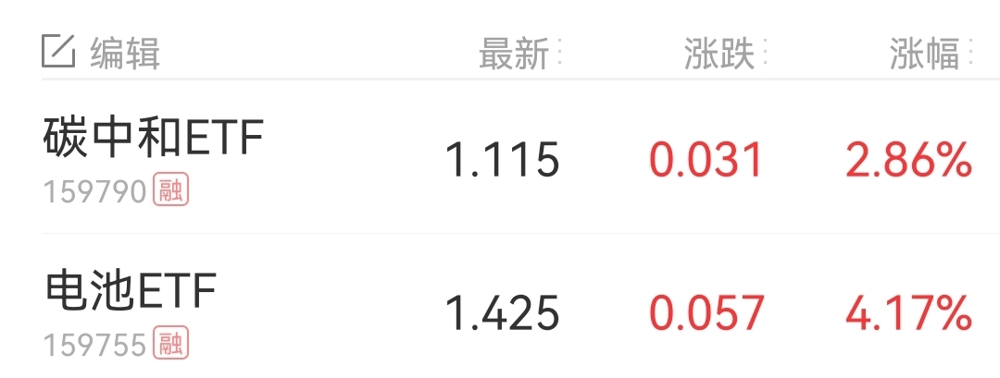

======================================================

_type: talk
@二师父[28814221155551]
2021-11-22 22:44:11 Mon  
topic_id: 218848255145181

<e type="hashtag" hid="15288885442542" title="#成长股爆发#" /> 再一次成长股行情，坚守自己的阵地，不要风格漂移，如果锂电和碳中和回调到60日线以下，开始定投，如果没有，继续红利、基建，1000.中证1000已经出坑，坚守红利和基建定投即可。

每种方法都可以挣钱，关键是在合适的时候出手，然后坚守。

阅读[1]  评论[0]  赞[0] 

+++++++++++++++++++++++++++++++++++++++++++++++++++++

文件：
2021-11-22 22:42:38 Mon
文件大小：[46493]
244124254852551-要涨出事了.docx

======================================================

_type: talk
@二师父[28814221155551]
2021-11-22 23:50:01 Mon  
topic_id: 218848258421451

<e type="hashtag" hid="552114551414" title="#估值数据#" /> 市盈率百分位37.59%，SY-BY百分位37.8%，SY/BY百分位34.64%。

市场估值上移。刚进来的朋友可以不用看我的定投计划，直接配置组合就行，一个是保守的白银组合，全部是二级债基，一个是稍微激进一点的王者组合，60%的指数，40%的二级债基。配置就可以。从15年牛市高位配置最大回撤是27%，那么当前配置最大回撤可以控制在20%以内，根据自己所能承受的浮亏额度来匹配投资金额。

另外定投以宽基为主，同时低估定投并不是任何时候都有机会低估的，尤其是市场处于主升浪行情里面，一位等待低估就可能错过了行情，等待下一波牛市，握着现金会导致资金利用率不足，如果是长期不用的闲钱需要做好组合配置。

方法、包括基金以及存在的风险都讲了，大家要学习，目前社融触底回升、利率持续下行，央妈也开始放出风声，坚决不搞大水漫灌从货币执行报告中去除了，那么接下来不用悲观。

当然想跟车的可以继续跟，这意味着我俩盈亏同源，不是所有朋友都受得了的。我更希望投资者能明白其中逻辑，终有一天监管严格，我退出之后，你依然会做投资。

阅读[1]  评论[0]  赞[0] 

======================================================

_type: talk
@夏日荷花[28888284252421]
2021-11-23 07:58:16 Tue  
topic_id: 818848252448252

<e type="hashtag" hid="15288885442542" title="#成长股爆发#" /> 二师父，中证1000用的是161039吗？

@二师父 at 2021-11-23 07:58:16 Tue

> 在置顶五步定投法那篇文章有代码

----------

@DY🍉 at 2021-11-23 07:58:16 Tue

> 二师父～置顶我没有看到五步定投法，不知道是不是我界面有问题，置顶只有三篇文章

----------

@二师父 at 2021-11-23 07:58:16 Tue

> 有啊，就那篇五步定投法里面文章讲了

----------

阅读[1]  评论[3]  赞[0] 

======================================================

_type: talk
@从A到Z[414841151821548]
2021-11-23 09:01:37 Tue  
topic_id: 581141412224554

师傅，半导体目前还有机会入场吗？

@二师父 at 2021-11-23 09:01:37 Tue

> 有

----------

@从A到Z at 2021-11-23 09:01:37 Tue

> 你的操作联系呢？60日均线定投？

----------

@二师父 at 2021-11-23 09:01:37 Tue

> 我已经买入，计划明年初卸货

----------

@从A到Z at 2021-11-23 09:01:37 Tue

> 那就是目前可以进场，您的仓位建议呢？还有代码？

----------

@九妹Amy'' at 2021-11-23 09:01:37 Tue

> 师傅，你说的红利代码是多少？谢谢

----------

阅读[1]  评论[5]  赞[0] 

======================================================

_type: talk
@防汛抗旱[111848815428452]
2021-11-23 11:31:15 Tue  
topic_id: 218848488452841

宏发债涨停，出不出？

@二师父 at 2021-11-23 11:31:15 Tue

> 出，下午卖

----------

@门萨🐨 at 2021-11-23 11:31:15 Tue

> 今天忘了卖[撇嘴]

----------

阅读[1]  评论[2]  赞[0] 

======================================================

_type: q&a
@DY🍉[241551422851141]
2021-11-23 17:09:51 Tue  
topic_id: 418828254218148

@DY🍉

>  二师父：这两天我仔细看了最近一年的新球内容，并且把定投5步法2.0又看了两遍，有如下疑问，还望解答。1.新手主要是用稳健账户在低估时定投指数，您分享的鳄鱼计划新手是否可以参与，如果参与鳄鱼计划，参与的资金控制在一个什么比例比较好？2.五步定投法里面定投份数确认用的3年，在当下市场情况入场，定投计算份数用几年合适？3.您前两天给了我一个两个债基➕沪深300和中证1000的配置建议，债基和指数基金一样也是根据估值定投吗？债基的估值应该如何计算？4.五步定投法里面提到因为注册制推行不看好中证1000但是目前转为看好，是因为注册制已经在创业板科创板实行了的原因吗？对于中小市值不会再有不利影响？5，我打算配置了组合之后按照纪律周定投，如果在我配置之后沪深300中证500一直不跌到低估位置，我是等待，还是加其他的低估指数进来？6.五步定投法分享的货币基金我在天天基金查了下7日年化是二点几，是最近货币基金下跌了吗？在货币基金收益不太高的情况下，稳健账户也是指数➕货币基金吗？问题有点多，辛苦二师父～感谢

@二师父

>  1、可以参与，能抗住浮亏就行，我所有基金卖出都会盈利后卖出。比例自己控制即可。
>  
>  2、目前50份就行，大盘随时可能会起来。还是主升浪周期。
>  
>  3、不是定投，这是配置，你如果能经受住20%的波动，目前可以60%的债基+20%沪深300+20%中证1000
>  
>  4、这个问题很好，有作过功课，你将来大概率会赚钱。看好小市值企业是因为上面转向了，不是因为注册制对小市值企业没有影响，今年新三板改革以及北交所成立就是为小企业服务的。老大16年讲理直气壮做强做大国有企业，现在专门为中小企业助力，方向变了哈。
>  
>  5、你放心他可能配置好以后一直涨，但是一定未来会低估，别担心回不到低估，配置好了以后，就可以找超跌板块，比如红利，基建定投，或者沪深300、中证1000回调后60日均线定投，或者低估都可以，时间够久，一定会高低估切换的。
>  
>  防守账户可以用青铜组合债基或者天天基金安心组合替代。
>  
>  青铜组合预期年化收益率6%，最大回撤5%，我的防守账户自己已经用它替换了。在利率下行，通胀高涨的时候尽量少持有现金。

阅读[1]  评论[3]  赞[0] 

======================================================

_type: talk
@二师父[28814221155551]
2021-11-23 21:49:03 Tue  
topic_id: 581141458558554

好好准备，迎接跨年行情

@马军 at 2021-11-23 21:49:03 Tue

> 看好的赛道—低估—90均线下10%—时间，收益不错！看不懂的赛道不投！总结二师父过往投资思路！

----------

@shi at 2021-11-23 21:49:03 Tue

> 还是红利，1000，基建这三个安全。
光伏锂电池算了算了，没那命[呲牙]

----------

阅读[1]  评论[2]  赞[0] 

+++++++++++++++++++++++++++++++++++++++++++++++++++++

文件：
2021-11-23 21:48:54 Tue
文件大小：[46975]
111841445252112-迎接跨年行情.docx

======================================================

_type: talk
@二师父[28814221155551]
2021-11-23 21:53:00 Tue  
topic_id: 418828251525118

看关于扶持中小企业的具体实事清单，如果上面支持的方向不去做的话，还要一直做打压的教育和互联网，属于方向错误。

我记得特别清楚，16年我领导开会讲的老大讲话：理直气壮地做强做优做大国有企业，大家看这5年普遍大市值企业涨的好，而且发展好。

现在还提这个吗，现在提的是专精特新中小企业，所以为什么清仓上证50，买中证1000呢？年初的行动，被人骂，一如去年清仓地产买食品饮料一样，正确的赚钱的操作总是被骂，而真正赚钱的方法只被少数人掌握了。

投资是认知的变现，高层态度、逻辑、业绩最重要。

@DY🍉 at 2021-11-23 21:53:00 Tue

> 师父～一般通过什么渠道或者软件看这些新闻？

----------

@二师父 at 2021-11-23 21:53:00 Tue

> 东方财富和财联社

----------

阅读[1]  评论[2]  赞[0] 

+++++++++++++++++++++++++++++++++++++++++++++++++++++

图片：

======================================================

_type: talk
@二师父[28814221155551]
2021-11-23 22:44:17 Tue  
topic_id: 581141442125824

<e type="hashtag" hid="552114551414" title="#估值数据#" /> 市盈率百分位37.59%，SY-BY百分位37.81%，SY/BY百分位34.66%。

估值没太大变化，接着继续定投中证红利、基建和中证1000。年后1月初卸货芯片光伏基金。

@杜志彪 at 2021-11-23 22:44:17 Tue

> 师父军工的估值目前处于什么位置。

----------

@二师父 at 2021-11-23 22:44:17 Tue

> 正常偏高

----------

@水墨青花 at 2021-11-23 22:44:17 Tue

> 师父，白酒现在什么估值

----------

@二师父 at 2021-11-23 22:44:17 Tue

> 正常估值，白酒偏离60日均线以下可投

----------

@水墨青花 at 2021-11-23 22:44:17 Tue

> 好的，谢谢

----------

@水墨青花 at 2021-11-23 22:44:17 Tue

> 师父，今天发估值表吗

----------

@二师父 at 2021-11-23 22:44:17 Tue

> 发

----------

@水墨青花 at 2021-11-23 22:44:17 Tue

> OK

----------

阅读[1]  评论[10]  赞[0] 

======================================================

_type: talk
@二师父[28814221155551]
2021-11-24 19:01:10 Wed  
topic_id: 818848152822522

<e type="hashtag" hid="48411112248458" title="#散户不赔钱指南#" /> 马上将组合做成一个表，大家根据自己的情况配置，股权时代到来，能够实现年化10%左右的收益率就跑赢房子了，多买金融资产，最次也要买二级债基，不然就被摔下车了。

另外估值表里面的基金，控制10%仓位，低估或者季度均线以下都可以定投，不用担心涨不起来，行业指数需要行业周期，盈利情况以及未来的成长空间。

@DY🍉 at 2021-11-24 19:01:10 Wed

> 师父～请问你是按照什么标准计算这个指数是否低估的？

----------

@DY🍉 at 2021-11-24 19:01:10 Wed

> 绿色低估？我怎么感觉你画的是蓝色？😂😂

----------

@二师父 at 2021-11-24 19:01:10 Wed

> 参考市盈率，市净率，股息率和净资产收益率

----------

@DY🍉 at 2021-11-24 19:01:10 Wed

> 这个你的书里面说过，但是具体怎么看可以说说吗？

----------

@二师父 at 2021-11-24 19:01:10 Wed

> 可以听听课程哈，置顶的，以前都讲过

----------

@DY🍉 at 2021-11-24 19:01:10 Wed

> 荔枝微课不知道为什看不了，我试了几次了，还有就是我的界面置顶只有三个，没有看到课程

----------

@二师父 at 2021-11-24 19:01:10 Wed

> 你把链接发到微信

----------

@DY🍉 at 2021-11-24 19:01:10 Wed

> 师父，我下载了荔枝微课，找到了您，但是发现我进不去，好像还需要收费，我们已经加入了知识新球的要再加入一次荔枝微课吗

----------

阅读[1]  评论[14]  赞[0] 

+++++++++++++++++++++++++++++++++++++++++++++++++++++

图片：
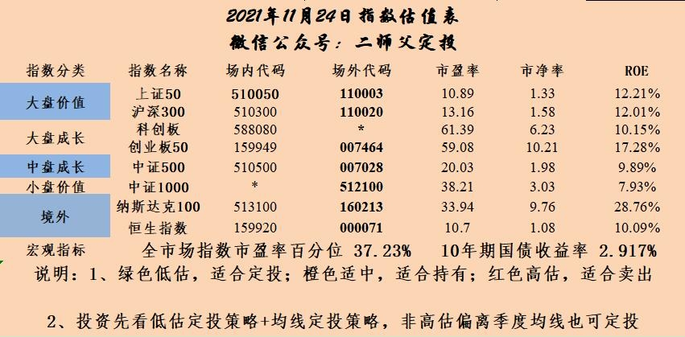

+++++++++++++++++++++++++++++++++++++++++++++++++++++

文件：
2021-11-24 18:55:41 Wed
文件大小：[47423]
844124244288242-散户躺赚指南.docx

======================================================

_type: talk
@二师父[28814221155551]
2021-11-24 19:09:45 Wed  
topic_id: 218848152842511

<e type="hashtag" hid="51288884421124" title="#估值讲解#" /> 每周三讲行业估值和行业分析。

白酒板块，目前正常估值，支撑位大致在8500点，目前反弹中，最好别追，如果定投60日均线以下。

锂电池板块，高估，已经连续涨了3年，最多还有一个多月的高光时刻，趋势反转后很危险。

医疗板块，低估中，控制20%仓位可以继续定投。

光伏板块：高估，建议分步止盈。

家电板块：正常估值，60日均线以下定投。

基建板块：低估，可以继续定投，仓位控制在10%以内。

军工板块：估值正常偏高，定投的话可以在60日均线以下。

不定投的板块，中概互联，教育ETF.

@蓝精灵 at 2021-11-24 19:09:45 Wed

> 二师父，请问新手现在开始定投，定投您说的中证红利，基建和中证1000合适吗，还有在场内定投中证1000，怎样选择基金呀！谢谢！

----------

@门萨🐨 at 2021-11-24 19:09:45 Wed

> 还有半导体[撇嘴]

----------

@二师父 at 2021-11-24 19:09:45 Wed

> 场内中证1000估值表里面有，新手买宽基就行，参考60日均线以下

----------

@老孙头 at 2021-11-24 19:09:45 Wed

> 场外中概互联（仓位接近2成）被套近15%，还可以继续持有吗？

----------

@二师父 at 2021-11-24 19:09:45 Wed

> 可以，但是别买了

----------

@老孙头 at 2021-11-24 19:09:45 Wed

> [抱拳][咖啡]

----------

@云逸风汐 at 2021-11-24 19:09:45 Wed

> 证券板块怎么说呢请问证券板块怎么说呢？可以加吗

----------

@二师父 at 2021-11-24 19:09:45 Wed

> 不考虑，准备年后清仓了，有兴趣可以关注东方财富，他比证券好

----------

阅读[1]  评论[11]  赞[0] 

======================================================

_type: talk
@二师父[28814221155551]
2021-11-24 20:13:37 Wed  
topic_id: 818848152188422

低估很难，18年很多低估的，都有1倍到5倍的涨幅，所以现在低估少的正常，可以选择不投，等低估也可以选择回调投一部分。

@DY🍉 at 2021-11-24 20:13:37 Wed

> 师父～我可能是个笨蛋吧，我把链接发到微信，点开到了你的课，但是听课目录让我点击购买，是298元，但是点击购买又说缺乏参数，买不了[大哭][大哭]还有就是我看到的置顶只有三个，一个是网格，一个是四个组合，一个是学院必读。没有其他的了ppt也没有看到

----------

@DY🍉 at 2021-11-24 20:13:37 Wed

> 师父，我找到了，听课去了……

----------

阅读[1]  评论[2]  赞[0] 

======================================================

_type: talk
@二师父[28814221155551]
2021-11-24 22:37:58 Wed  
topic_id: 218848185154421

全行业估值表，每周末发布一次，星球朋友慎重选择，控制仓位即可，而且对于高景气度的行业，处于上行周期，回调到60日均线也会投，大家综合考虑，如果入场不久的投资者还是以宽基为主，可越跌越投

阅读[1]  评论[0]  赞[0] 

======================================================

_type: talk
@二师父[28814221155551]
2021-11-25 07:13:31 Thu  
topic_id: 818848181851152

请问下大家现在在天天基金后台能看到几个组合

@wty at 2021-11-25 07:13:31 Thu

> 四个

----------

@二师父 at 2021-11-25 07:13:31 Thu

> ok

----------

@雪莲 at 2021-11-25 07:13:31 Thu

> 四个

----------

阅读[1]  评论[3]  赞[0] 

======================================================

_type: talk
@二师父[28814221155551]
2021-11-25 09:47:58 Thu  
topic_id: 418828154251288

<e type="hashtag" hid="88511114155212" title="#发车#" /> 开始进攻，乌龟计划买入中证红利4000元，鳄鱼计划红利etf买入6份，电池etf买入2份，碳中和etf买入2份。

央行货币政策转向了，目前是衰退后期，股票要开始表现了，等央行货币政策再次转向开始降低预期，经济差，还得轰油门放水，少持有现金，最次的青铜组合也要做起来，不然钱贬值很快的。

@衣袂飘香 at 2021-11-25 09:47:58 Thu

> 电池etf是561910吗？

----------

@苍天有井明月空🌙 at 2021-11-25 09:47:58 Thu

> 青铜和安心组合一样吗

----------

@雾海 at 2021-11-25 09:47:58 Thu

> 中证红利的编号多少？

----------

@二师父 at 2021-11-25 09:47:58 Thu

> 159755

----------

@二师父 at 2021-11-25 09:47:58 Thu

> 安心组合更保守一点

----------

@二师父 at 2021-11-25 09:47:58 Thu

> 场外还是场内

----------

@苍天有井明月空🌙 at 2021-11-25 09:47:58 Thu

> [强][强][强]

----------

@雾海 at 2021-11-25 09:47:58 Thu

> 场内

----------

阅读[1]  评论[23]  赞[0] 

======================================================

_type: talk
@二师父[28814221155551]
2021-11-25 09:49:02 Thu  
topic_id: 185515842115242

季度线60，半年120，考虑有交易日一个季度只有60天

阅读[1]  评论[0]  赞[0] 

======================================================

_type: talk
@二师父[28814221155551]
2021-11-25 10:06:37 Thu  
topic_id: 218848125144881

代码在第三篇文章，有详细介绍哈，请自取

阅读[1]  评论[0]  赞[0] 

+++++++++++++++++++++++++++++++++++++++++++++++++++++

图片：
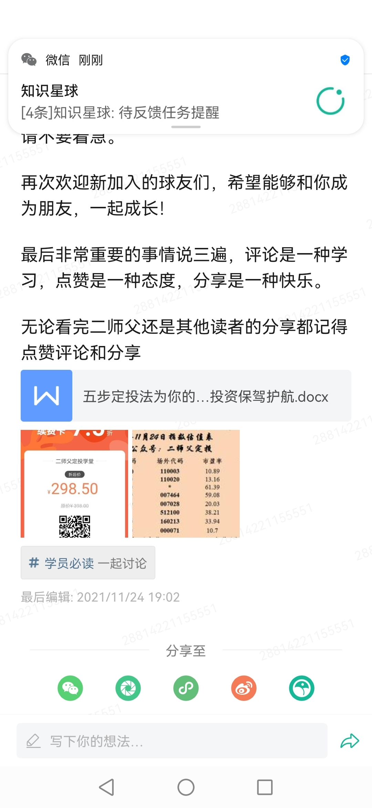

======================================================

_type: talk
@二师父[28814221155551]
2021-11-25 10:25:03 Thu  
topic_id: 418828158482128

关于买锂电说一下，这个板块确实高估了，然而不确定周期何时终止，我判断终结在明年初，所以回调买入。当然也可能判断错误，这个没法把控，所以我给了百分之0.8仓位，而红利更确定，仓位已经百分之8了，还会继续加，有多大的胜率给多大仓位

@🎈铮 at 2021-11-25 10:25:03 Thu

> 嗯嗯，那如果回调，就继续持有，等待机会再投是吧

----------

@二师父 at 2021-11-25 10:25:03 Thu

> 是的，如果最后一个月拉升就可以卖出了，如果是趋势反转那就等跌百分之35左右再考虑进场，仓位很重要

----------

@🎈铮 at 2021-11-25 10:25:03 Thu

> 好的，谢谢二师父解答

----------

@cotton at 2021-11-25 10:25:03 Thu

> 场内有很多碳中和哦。二师傅。是哪个

----------

@二师父 at 2021-11-25 10:25:03 Thu

> 置顶第三篇文章里面有代码

----------

阅读[1]  评论[5]  赞[0] 

======================================================

_type: talk
@毛毛宇[88281885112212]
2021-11-25 12:12:55 Thu  
topic_id: 581141854815124

二师傅，第三篇文章在哪里？找不到！[流泪]  给发个代码呗？中证红利和红利etf的代码！

@二师父 at 2021-11-25 12:12:55 Thu

> 置顶五步定投法

----------

@Zyxj at 2021-11-25 12:12:55 Thu

> 

----------

@DY🍉 at 2021-11-25 12:12:55 Thu

> 学员必读里面

----------

阅读[1]  评论[3]  赞[0] 

======================================================

_type: q&a
@维真[818585418182212]
2021-11-25 12:23:18 Thu  
topic_id: 818848124484222

@维真

>  老师好，我自建了一个组合，己把师父的乌龟计划里所有基金，按照配比己仿制完成，今天己经进行第二次一键投资了，可是对组合的操作，还是不太熟悉，我问一下师父：你今天增投的大成中证红利指数A，是投资到乌龟计划里边呢？还是乌龟计划外单投一笔呢？

@二师父

>  就是乌龟计划里面的，一直有投这个啊，大成中证红利

阅读[1]  评论[0]  赞[0] 

======================================================

_type: q&a
@DY🍉[241551422851141]
2021-11-25 13:28:55 Thu  
topic_id: 418828151842448

@DY🍉

>  师父：请问可以像以前一样发布估值表吗？我今天按照您之前的建议配置了，但是感觉中证1000太高了，所以想选一个稍微低估一点的指数定投。但是周三的估值表好像相比之前的减少了很多，而且没有一个低估

@二师父

>  周末可以发，我建议新入场投资者不要配行业

阅读[1]  评论[1]  赞[0] 

======================================================

_type: q&a
@维真[818585418182212]
2021-11-25 13:29:41 Thu  
topic_id: 418828151418228

@维真

>  老师好，我是说：如果投资到乌龟计划里面，是不是各基金占比就犮生了变化？师父你今天投的红利的4000元是投到乌龟计划里面，还是在乌龟计划外面？我们如何操作，请师父指教。

@二师父

>  计划内的，每周定投后比例都是变化的

阅读[1]  评论[1]  赞[0] 

======================================================

_type: q&a
@坚持学习[421148841558188]
2021-11-25 15:41:53 Thu  
topic_id: 818848145555822

@坚持学习

>  二师父，目前持有建信中证500，代码000478，持仓21%。沪深300，每月定投500，代码000311，持仓13%。对于这两个基金，仓位建议持仓比例是多少呢？这个两只，有必要止盈卖出吗？沪深300有必要继续定投吗？

@二师父

>  可以定投各百分之40以内，沪深300也可以投的，60日均线下或者低估，定投没问题

阅读[1]  评论[1]  赞[0] 

======================================================

_type: talk
@二师父[28814221155551]
2021-11-25 21:42:30 Thu  
topic_id: 818842518125152

阅读[1]  评论[0]  赞[0] 

+++++++++++++++++++++++++++++++++++++++++++++++++++++

文件：
2021-11-25 21:42:15 Thu
文件大小：[6149582]
244124185285811-以中证500为例讲解基金的估值.m4a

2021-11-25 21:42:29 Thu
文件大小：[47324]
844124185285222-以中证500为例讲解如何给基金估值.docx

======================================================

_type: talk
@二师父[28814221155551]
2021-11-25 21:51:46 Thu  
topic_id: 218842518141511

<e type="hashtag" hid="552114551414" title="#估值数据#" /> 市盈率百分位37.78%，市净率百分位32.68%，SY-BY百分位37.09%，SY/BY百分位33.42%。

市场一直都是几大板块资金切换，这种时候做短线很难得，成长组合的模式比较好，选择优质三个板块，耐心等着资金轮动。

如果做中线，寻找超跌板块即可。每一次超跌横盘以后入场。

@J at 2021-11-25 21:51:46 Thu

> 师父，哪几个是现在的超跌板块？

----------

@二师父 at 2021-11-25 21:51:46 Thu

> 传媒，基建，中证红利，互联网

----------

@J at 2021-11-25 21:51:46 Thu

> 谢谢师父

----------

阅读[1]  评论[3]  赞[0] 

======================================================

_type: q&a
@DY🍉[241551422851141]
2021-11-25 21:58:00 Thu  
topic_id: 185514285815852

@DY🍉

>  请问师父：刚刚听了您的微课，债卷基金您说10年国债利率大于3.8%买入纯债基金，10年国债利率小于3.2%卖出纯债基金，现在10年国债利率是2.9%！那现在是不是并不适合买入纯债基金？
>  还有就是你说不考虑混合债卷基金，不考虑债卷基金，只考虑纯债基金，可是我看乌龟计划里面的组合！好像有配置非纯债基金，有一些债卷基金，又有债卷又有股票？

@二师父

>  那是利率债，16国债19就是这种，广发国开债也是，利率大于3.8那是极端机会，遇到了就要大举买入
>  
>  如果是用利率债和指数做再平衡的话，不用二级债，如果考虑组合，追求稳健收益，二级债基可以的。因为纯债和指数组合就相当于混合基金或者二级债基，根据持仓比例不同。
>  
>  现在是不大适合买入，因为一旦利率反转上行的话，纯债大概率是要跌的。
>  
>  但是可以做配置，长期看债券除了息差收益还有利息收益。

阅读[1]  评论[1]  赞[0] 

======================================================

_type: talk
@二师父[28814221155551]
2021-11-25 22:48:17 Thu  
topic_id: 185514284154112

<e type="hashtag" hid="88511111582122" title="#四个组合#" /> 大家自行选择，利率下行，货币政策宽松，逆周期调节，多配置金融资产。

@苍天有井明月空🌙 at 2021-11-25 22:48:17 Thu

> 全天候也有点保守吧。

----------

@二师父 at 2021-11-25 22:48:17 Thu

> 激进啊，你仔细看看，可以拉满股票

----------

@苍天有井明月空🌙 at 2021-11-25 22:48:17 Thu

> [强][强][强]

----------

@梧桐 at 2021-11-25 22:48:17 Thu

> 二师父，第二个的比例是不是20，20，30，30

----------

@二师父 at 2021-11-25 22:48:17 Thu

> 对，我改一下

----------

@JOY at 2021-11-25 22:48:17 Thu

> 原油现在不低啦，师父，您觉得还有空间哈？

----------

@二师父 at 2021-11-25 22:48:17 Thu

> 不是让现在配，而是说根据货币政策和经济周期进行调整，前面有提示可以看看

----------

@DY🍉 at 2021-11-25 22:48:17 Thu

> 师父：稳健账户全部是债卷吗？我看5步定投法稳健账户是指数➕货币，然后根据市场越低指数越多，进攻账户是股票？因为我是新手所以不打算买股票，就只有防守账户，日常消费账户，和稳健账户……

----------

阅读[1]  评论[11]  赞[0] 

+++++++++++++++++++++++++++++++++++++++++++++++++++++

图片：
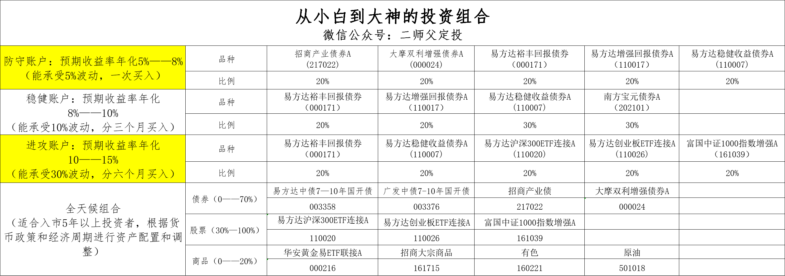

======================================================

_type: talk
@Philip🎭 Y[28518855518151]
2021-11-26 03:04:58 Fri  
topic_id: 818842514154582

二师父好，我一直跟着乌龟有三年了。其中也跟着一起买进卖出，🈶️赚有赔，之前家里有事断掉了一段时间。最近正在跟着整理。读完了最近的文章，我看了一下我目前的持仓和盈亏感觉很焦虑，是不是该止损一些了…可能之前没有跟着卖。体会到了你说的那句话，
会买是徒弟，会卖才是师父！
发出来也不怕大家嘲笑了，
一起学习，一起进步！
谢谢师父！

@🎈铮 at 2021-11-26 03:04:58 Fri

> 应该有情况类似的人，比如我[偷笑]

----------

@慕容 at 2021-11-26 03:04:58 Fri

> 这一年感觉总是在逆向操作，买在高位，看着浮亏。拿着吧，时机总会来。我记得一句话:指数赌的是国运。

----------

@二师父 at 2021-11-26 03:04:58 Fri

> 目前这个位置，这些先别卖，我看不到你的总仓位，你货币基金目前有多少，如果焦虑的话先别买了，把这些拿着。然后等春节行情或者明年价值基金反转，盈利后收割利润，把仓位降低到不焦虑为止。

----------

@Philip🎭 Y at 2021-11-26 03:04:58 Fri

> 谢谢师父 目前总仓40% 还有一半在货币基金

----------

@二师父 at 2021-11-26 03:04:58 Fri

> 那拿着就行的，等起来优先卖出恒生国企和中概互联

----------

阅读[1]  评论[5]  赞[0] 

+++++++++++++++++++++++++++++++++++++++++++++++++++++

图片：
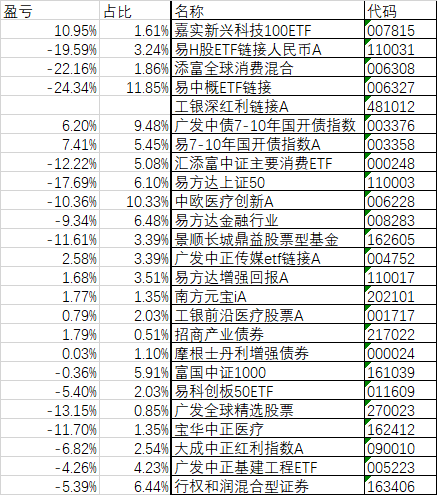

======================================================

_type: talk
@林玮[844111858288412]
2021-11-26 08:59:21 Fri  
topic_id: 818842858285582

师父，可以推荐一个食品饮料etf或消费etf场外基金吗，谢谢

@二师父 at 2021-11-26 08:59:21 Fri

> 汇添富中证消费etf联接a，515170，食品饮料

----------

@林玮 at 2021-11-26 08:59:21 Fri

> 谢谢

----------

阅读[1]  评论[2]  赞[0] 

======================================================

_type: talk
@一心一意[844421848411122]
2021-11-26 10:11:47 Fri  
topic_id: 218842852858251

新股申购还可以盲打么

@二师父 at 2021-11-26 10:11:47 Fri

> 不行了

----------

阅读[1]  评论[1]  赞[0] 

======================================================

_type: talk
@二师父[28814221155551]
2021-11-26 11:32:33 Fri  
topic_id: 218842854552281

成长组合，今天买了汇添富中证新能源车800元，这个组合仅选择优质标的，淡化择时，专注锂电，碳中和，光伏，芯片，医疗，白酒六大优质行业，回调到位就买，何时卖出？第一，产业周期结束，第二，估值严重泡沫

这六大行业产业周期不可能结束，永远需要发展，除非来一个元宇宙这样的变革。但是元宇宙在中国做不起来，美国的阿斯麦和英伟达可以关注

对于之前买入的，如果发生了浮亏，分情况，焦虑的停止补仓

比较兴奋的，选择优质基金补仓

然后等待市场反转，有些基金需要处理掉，第一港股基金，第二中国互联网基金。中概互联如果没有溢价，场内网格继续做，即使这个行业一直趴着，波动也能挣钱，行业是不会消亡的，投资都会犯错误，今年买了阿里，也是亏了，不过会有应对，反弹后卖出。

跟着趋势走，过去20年买房的都赚了，买万科的也赚了，未来肯定不行，时代趋势如此。

医疗宽基，消费医疗跌到位控制一定仓位买就对了，投资逻辑出问题的别补。

大方向已经给了，6大赛道加宽基。

如果价值行情，关注中国建筑，陕西煤业，这些行业和企业。也就是低市盈率高股息率。

@永刚 at 2021-11-26 11:32:33 Fri

> 锂电是指电池ETF吗？

----------

@西锦巴乌 at 2021-11-26 11:32:33 Fri

> 师父好！现不能一键跟投了请问成长组合中的各部分组合占比各多少？谢谢了

----------

@二师父 at 2021-11-26 11:32:33 Fri

> 对，锂电产业链很多，电池etf是其中一个

----------

@二师父 at 2021-11-26 11:32:33 Fri

> 这是目前比例，天天基金上可以看到

----------

@西锦巴乌 at 2021-11-26 11:32:33 Fri

> 看到了，谢谢了

----------

阅读[1]  评论[5]  赞[0] 

======================================================

_type: q&a
@海马[15158245825242]
2021-11-26 11:47:10 Fri  
topic_id: 818842854541852

@海马

>  师父，现在哪些行业基金或者宽基可以用来做网格？

@二师父

>  中概互联没有溢价的时候，中证传媒，券商，中证500

阅读[1]  评论[4]  赞[0] 

======================================================

_type: talk
@二师父[28814221155551]
2021-11-26 18:37:06 Fri  
topic_id: 185514558454112

<e type="hashtag" hid="28511111855581" title="#突发黑天鹅#" /> 今天南非出了一个黑天鹅，大家需要注意。

如果仓位过重的话，下跌很难受，就不能补仓了，如果仓位合适，我说的方向是可以继续做的。

学会长期持有债券和指数，长期都是向上的，不要在乎单只基金涨跌，整体赚钱就行，偶尔踩坑了，别用越跌越买的思路。

就拿恒生国企指数，这个以前投了，20年卖出，反弹卖出，也没有补仓。

在方向上的基金才能越跌越买，没有逻辑的只能低吸轻仓网格。

真正赚钱需要靠优质基金重仓，否则赚了一倍，只买了1000元，也没啥用

阅读[1]  评论[0]  赞[0] 

+++++++++++++++++++++++++++++++++++++++++++++++++++++

文件：
2021-11-26 18:33:54 Fri
文件大小：[46789]
422152154184848-突发黑天鹅.docx

======================================================

_type: talk
@蛋炒饭不加蛋[118281818482542]
2021-11-26 19:03:07 Fri  
topic_id: 581145118541844

请问二师父，海康威视东方雨虹这些核心资产一路下跌像样的反弹都没有，是逻辑变了吗？

@二师父 at 2021-11-26 19:03:07 Fri

> 没研究这两个了

----------

@蛋炒饭不加蛋 at 2021-11-26 19:03:07 Fri

> 没戏了吗

----------

阅读[1]  评论[2]  赞[0] 

======================================================

_type: talk
@二师父[28814221155551]
2021-11-27 08:22:28 Sat  
topic_id: 185514548521222

<e type="hashtag" hid="552114551414" title="#估值数据#" /> 市盈率百分位36.94%，市净率百分位31.88%，SY/BY百分位31.54%。

估值下移，接下来可能会有回撤，可以开始加仓了。注意投资需要卖出的。

类似医疗支撑位买入，反弹卖出，赚个30%就很不错。很多人总是想着拿的越久收益率越高，其实并不是这样子，总之不要太贪婪。

贪婪有两种表现，第一舍不得卖出，第二高位基金刚回撤一点就进场抄底。

@DY🍉 at 2021-11-27 08:22:28 Sat

> 师父，我配置的时候买成了天弘沪深300增强有没有问题？

----------

@二师父 at 2021-11-27 08:22:28 Sat

> 没问题

----------

阅读[1]  评论[2]  赞[0] 

======================================================

_type: talk
@二师父[28814221155551]
2021-11-27 10:51:02 Sat  
topic_id: 218842845558251

<e type="hashtag" hid="825188852442" title="#估值表#" /> 如果你什么也不理解，那么设计的8只宽基，5只主动基，按照配置的比例，10%+4%，绿色买，红色卖，一定可以盈利。如果坚持5年还赚不到钱你来找我。大部分人亏钱原因，第一红色舍不得卖，第二红色刚变成橙色就问是不是可以抄底了，结果抄底被套，跌下来没钱补仓。

所以第一分散，第二仓位，他再好，不到设定标准不买。

而跟我车的，大家可以随意一点，低估也可能卖出，比如中概传媒这种，低估反弹也会卖出。

一周一种基础估值表，一种行业估值表，仅星球分享，注意，只有基础估值表可以遵循仓位+绿买红卖原则。

我自己发车就随意一些，高估的也会买，低估的也会卖。

为什么高估也会买，定性分析，更加看好未来的行业成长空间，这就跟你过去买房一样，需要管什么高估低估吗，03年买还是09年买都不重要，他只要一直上涨，有钱就买。

所以需要判断出什么行业才是未来几年长期上涨的，同时价格也不是特别贵，然后什么时候行业周期结束，退场，这就需要研究了。

刚入场，就结合初级版的估值表8+5=13只基金，足够拉。投资先保证不亏钱。

@蓝精灵 at 2021-11-27 10:51:02 Sat

> 师父，场内基金的代码怎样查呢？谢谢

----------

@二师父 at 2021-11-27 10:51:02 Sat

> 这些是主动基金，只有场外代码，etf和lof基金才有场内代码

----------

@wty at 2021-11-27 10:51:02 Sat

> 二师父，天弘中证食品饮料ETF联接（场外基金）能替代汇添富消费升级吗？有什么区别，望指点！谢谢🙏

----------

@二师父 at 2021-11-27 10:51:02 Sat

> 可以，食品饮料持股更加集中，消费还有非食品饮料

----------

@蓝精灵 at 2021-11-27 10:51:02 Sat

> 师父，富国中证500指数增强（lof）a，161017，这个基金能在场内定投嘛？谢谢

----------

@蓝精灵 at 2021-11-27 10:51:02 Sat

> 师父，想问一下您说的宽基是上证50，沪深300，中证500，中证1000，上证红利，深证红利，中证红利，这几只嘛！谢谢

----------

@二师父 at 2021-11-27 10:51:02 Sat

> 前4只

----------

@光少 at 2021-11-27 10:51:02 Sat

> 跟着二师父投基金稳赚不赔的[强]

----------

阅读[1]  评论[14]  赞[0] 

+++++++++++++++++++++++++++++++++++++++++++++++++++++

图片：
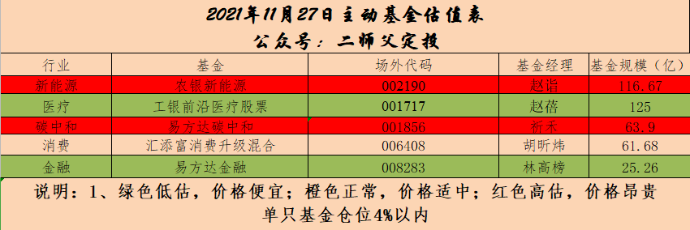

======================================================

_type: talk
@二师父[28814221155551]
2021-11-27 12:01:17 Sat  
topic_id: 581145142514114

以后大家关注下这个组合，天天发车就不再星球发了，场内操作星球发车。

根据新手我设计了一个策略，严格低估买入，高估卖出，就是估值表里面的8只基金加5只主动基金，控制单只基金仓位，每周只要低估就买，买到百分之10仓位停止，严格遵守。

实际投资没这么简单，而整体百分之80宽基加百分之20行业基金。投资资金10万，从这个策略里面可以看到定投弊端，资金利用率不足，不如一次配置，不过适合新手，为什么呢，因为稳赚不赔，新手拿着货币基金也有可能比自己瞎买强

@蓝精灵 at 2021-11-27 12:01:17 Sat

> 师父，您发的图片上的责任认证通过呢，谢谢

----------

@二师父 at 2021-11-27 12:01:17 Sat

> ？？

----------

@蓝精灵 at 2021-11-27 12:01:17 Sat

> 师父就是您上面发的图片在哪能看见，需要添加嘛

----------

@二师父 at 2021-11-27 12:01:17 Sat

> 天天基金搜索二师父定投即可

----------

@蓝精灵 at 2021-11-27 12:01:17 Sat

> 谢谢师父

----------

阅读[1]  评论[5]  赞[0] 

+++++++++++++++++++++++++++++++++++++++++++++++++++++

图片：
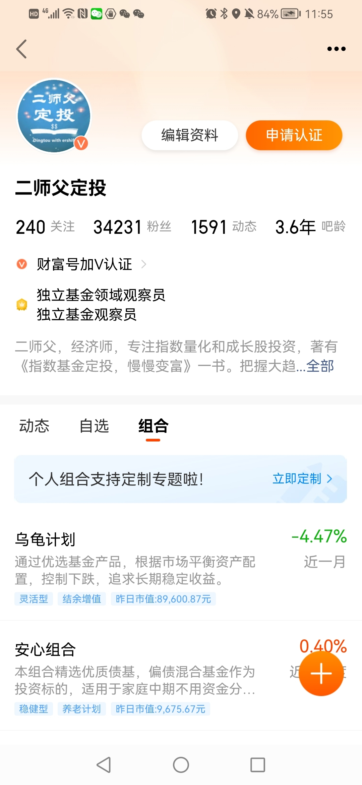

======================================================

_type: talk
@二师父[28814221155551]
2021-11-27 12:46:41 Sat  
topic_id: 185514512484842

估值表

@DY🍉 at 2021-11-27 12:46:41 Sat

> 师父，中证500和中证1000你是不是用的市净率做估值区间

----------

@二师父 at 2021-11-27 12:46:41 Sat

> 对

----------

阅读[1]  评论[2]  赞[0] 

+++++++++++++++++++++++++++++++++++++++++++++++++++++

图片：
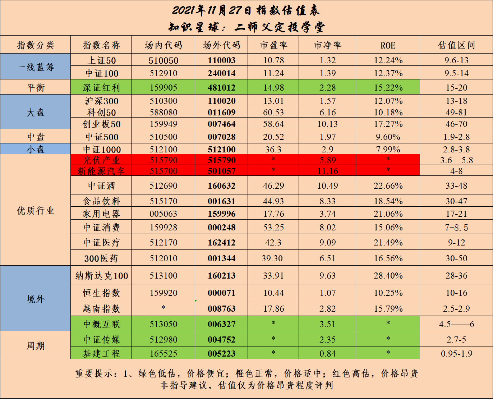

======================================================

_type: talk
@二师父[28814221155551]
2021-11-27 17:39:35 Sat  
topic_id: 218842844282581

<e type="hashtag" hid="88511111258442" title="#中证1000#" /> 这是中证1000的持仓企业，包含了标普道琼斯概念、股权激励、地方国企、员工持股、小盘成长、专精特新等概念，是值得投资的，需要注意，他的波动率大，定投控制20%仓位，如果有30%利润可以分步收割。

我是非常看好中证1000的行情的，上涨了继续持有，如果下跌，逐步加仓到15%左右，极端行情补仓到20%。

阅读[1]  评论[0]  赞[0] 

+++++++++++++++++++++++++++++++++++++++++++++++++++++

文件：
2021-11-27 17:29:36 Sat
文件大小：[212992]
111841812284822-000852cons.xls

======================================================

_type: talk
@二师父[28814221155551]
2021-11-27 18:00:12 Sat  
topic_id: 218842844458441

<e type="hashtag" hid="51288888521824" title="#专注自己的赛道#" />

阅读[1]  评论[0]  赞[0] 

+++++++++++++++++++++++++++++++++++++++++++++++++++++

文件：
2021-11-27 17:59:57 Sat
文件大小：[46745]
544854842142424-人多的地方不要去.docx

======================================================

_type: talk
@二师父[28814221155551]
2021-11-27 18:04:22 Sat  
topic_id: 185514511124422

持仓情况，接下来重点投资家电、1000ETF、中证红利，基建。

阅读[1]  评论[0]  赞[0] 

+++++++++++++++++++++++++++++++++++++++++++++++++++++

图片：
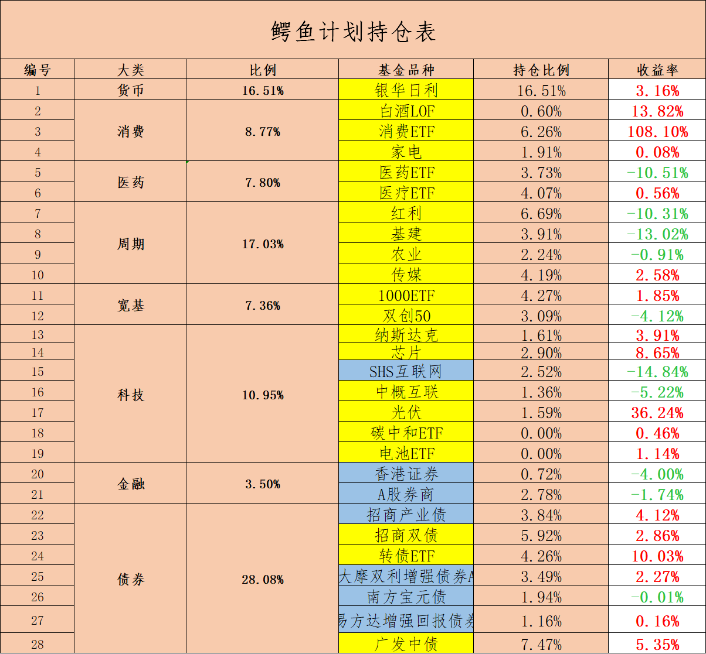

======================================================

_type: talk
@林玮[844111858288412]
2021-11-28 07:33:37 Sun  
topic_id: 818842814841822

师父，周一如果大跌要怎么操作

@二师父 at 2021-11-28 07:33:37 Sun

> 不操作，仓位5层以下的可以补一些，1000和中证红利

----------

阅读[1]  评论[1]  赞[0] 

======================================================

_type: talk
@光少[244124552511141]
2021-11-28 12:10:38 Sun  
topic_id: 218842258884421

周末全球股市大恐慌！

阅读[1]  评论[0]  赞[0] 

+++++++++++++++++++++++++++++++++++++++++++++++++++++

图片：
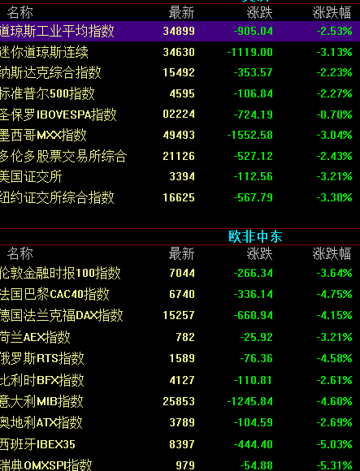

======================================================

_type: talk
@二师父[28814221155551]
2021-11-28 18:58:44 Sun  
topic_id: 185514421452422

关注恐慌指数，如果上升到高位，可以开仓加码

阅读[1]  评论[0]  赞[0] 

+++++++++++++++++++++++++++++++++++++++++++++++++++++

图片：
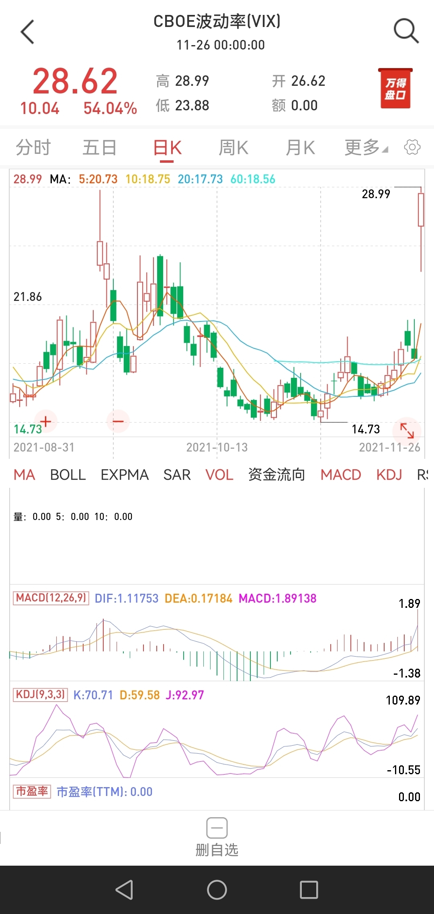

======================================================

_type: q&a
@DY🍉[241551422851141]
2021-11-28 19:00:08 Sun  
topic_id: 818842254848882

@DY🍉

>  师父：今天又在看你的书，书中说全市场指数市盈率越低，越有投资价值。SY-BY和SY/BY越大越有投资价值。那我是不是可以理解成：全市场指数市盈率和SY /BY以及SY-BY呈现反向变动？为什么我看估值数据，市盈率百分位和SY-BY百分位以及SY/BY百分位是在同向变动，降低的气候一起降，升高的时候一起升高？

@二师父

>  是的，你理解没有问题，我在计算的时候数据做了处理，用1减去了百分位，所以是同方向变动，实际上是反方向变动的

阅读[1]  评论[3]  赞[0] 

======================================================

_type: talk
@二师父[28814221155551]
2021-11-28 19:08:40 Sun  
topic_id: 418825542515518

<e type="hashtag" hid="48411111288288" title="#精选保险#" />

阅读[1]  评论[0]  赞[0] 

+++++++++++++++++++++++++++++++++++++++++++++++++++++

文件：
2021-11-28 19:08:29 Sun
文件大小：[58887]
844124112144582-抓紧时间上车.docx

======================================================

_type: talk
@二师父[28814221155551]
2021-11-28 20:58:45 Sun  
topic_id: 818842288552182

<e type="hashtag" hid="15288888154112" title="#二师父读书会#" /> 天才少年沈南鹏

阅读[1]  评论[0]  赞[0] 

+++++++++++++++++++++++++++++++++++++++++++++++++++++

文件：
2021-11-28 20:58:28 Sun
文件大小：[32950]
544854884822244-天才少年沈南鹏.docx

2021-11-28 20:58:28 Sun
文件大小：[2994915]
244124114155541-天才少年沈南鹏.m4a

======================================================

_type: talk
@二师父[28814221155551]
2021-11-29 09:06:19 Mon  
topic_id: 218842228442581

今天新股和新债都可以申购

阅读[1]  评论[0]  赞[0] 

======================================================

_type: q&a
@王春媚[244424882221141]
2021-11-29 15:20:46 Mon  
topic_id: 218842448821541

@王春媚

>  师父，中概互联还可以买吗？

@二师父

>  等场内没有溢价了可以网格，定投不行了

阅读[1]  评论[1]  赞[0] 

======================================================

_type: q&a
@老孙头[422115118524548]
2021-11-29 15:21:33 Mon  
topic_id: 418825228542558

@老孙头

>  “需要处理掉的”的中国互联网基金是指哪些基金？和“中概互联”不是一码事吧（前两天老师指教“可以”持有，但“别买了”）？

@二师父

>  所有在海外上市的互联网企业都是的

阅读[1]  评论[2]  赞[0] 

======================================================

_type: talk
@二师父[28814221155551]
2021-11-29 20:20:18 Mon  
topic_id: 581145485525224

<e type="hashtag" hid="28511111114541" title="#把握宏观经济周期#" />

@Vivian at 2021-11-29 20:20:18 Mon

> 老师，债券可以持有到什么时候要不要卖一部分？

----------

@二师父 at 2021-11-29 20:20:18 Mon

> 通胀底部的时候

----------

@DY🍉 at 2021-11-29 20:20:18 Mon

> 可以通过一些具体的指标来判断吗？

----------

@二师父 at 2021-11-29 20:20:18 Mon

> 经济周期变化比较复杂，只能大致判断，根据cpi，ppi和gdp

----------

阅读[1]  评论[4]  赞[0] 

+++++++++++++++++++++++++++++++++++++++++++++++++++++

文件：
2021-11-29 20:20:09 Mon
文件大小：[29578]
244121525581851-把握宏观经济周期.docx

======================================================

_type: talk
@二师父[28814221155551]
2021-11-29 23:38:25 Mon  
topic_id: 185514188111112

<e type="hashtag" hid="552114551414" title="#估值数据#" /> 市盈率百分位37.78%，SY-BY百分位37.09%，SY/BY百分位33.42%。

阅读[1]  评论[0]  赞[0] 

======================================================

_type: talk
@二师父[28814221155551]
2021-11-30 21:36:02 Tue  
topic_id: 218842121451481

<e type="hashtag" hid="51122222188584" title="#沪深300低估#" />

阅读[1]  评论[0]  赞[0] 

+++++++++++++++++++++++++++++++++++++++++++++++++++++

文件：
2021-11-30 21:35:54 Tue
文件大小：[29997]
422151421551118-沪深300低估了.docx

======================================================

_type: talk
@二师父[28814221155551]
2021-11-30 21:37:52 Tue  
topic_id: 818842121488452

<e type="hashtag" hid="825188852442" title="#估值表#" /> 估值表，如果什么都不懂，严格低估定投，非低估就拿着货币基金，这种虽然有贬值的风险，但是只要碰到一次大危机就可以大赚。机会都是给有耐心的人。

如果喜欢自己投资并且能承担回撤风险，再在基础的指数上更进一步。

阅读[1]  评论[0]  赞[0] 

+++++++++++++++++++++++++++++++++++++++++++++++++++++

图片：
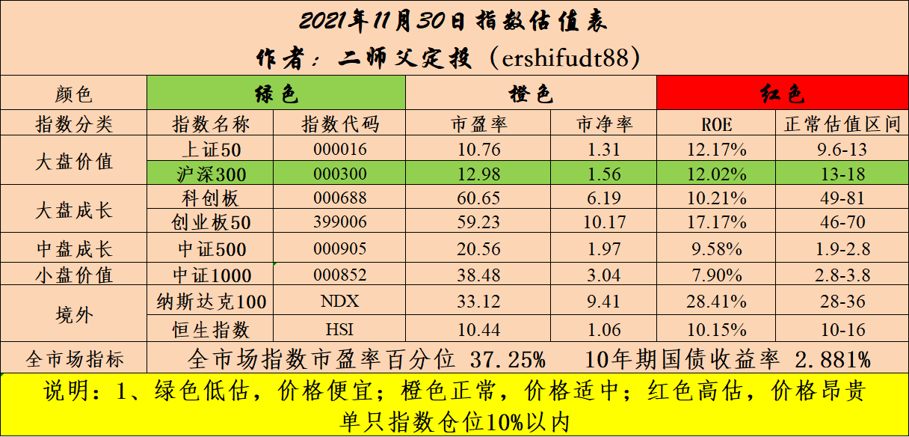

======================================================

