_type: talk
@二师父[28814221155551]
2022-02-01 22:42:52 Tue  
topic_id: 418552155411558

春晚释放的信号，大家可以看看春晚，欢迎分享自己的看法。

@李金泉 at 2022-02-01 22:42:52 Tue

> 二师傅，因为没有场内账号，场外006327易方达中国互联网50适合网格吗？会不会权重太集中了？

----------

@二师父 at 2022-02-01 22:42:52 Tue

> 可以考虑天弘恒生科技C，持有7天以上

----------

@李金泉 at 2022-02-01 22:42:52 Tue

> 谢谢二师傅！

----------

阅读[1]  评论[3]  赞[0] 

+++++++++++++++++++++++++++++++++++++++++++++++++++++

文件：
2022-02-01 22:42:06 Tue
文件大小：[32211]
544884412185844-春晚的信息量很大.docx

======================================================

_type: talk
@杜志彪[544454124115854]
2022-02-02 16:10:57 Wed  
topic_id: 818224145144812

师父今年要想投资三胖的话是不是银行更有上涨潜力，比如159940和512800二选一的话应该选择银行，要是放在以前我就直接上平安了。

@杜志彪 at 2022-02-02 16:10:57 Wed

> 我认为要想稳住指数还是要靠银行券商保险。

----------

@二师父 at 2022-02-02 16:10:57 Wed

> 银行是会好一些，利率上升有利于银行

----------

阅读[1]  评论[2]  赞[0] 

======================================================

_type: talk
@二师父[28814221155551]
2022-02-02 22:11:28 Wed  
topic_id: 418552125418528

放心这次不是股市，而是足球，如果一直买足球输，现在也已经赚了不少了。

@庆余年 at 2022-02-02 22:11:28 Wed

> 股市跟足球又有啥区别呢？大哥不笑二哥而已[憨笑][憨笑][憨笑]

----------

@二师父 at 2022-02-02 22:11:28 Wed

> 哈哈，股足永弃

----------

阅读[1]  评论[2]  赞[0] 

+++++++++++++++++++++++++++++++++++++++++++++++++++++

文件：
2022-02-02 22:10:32 Wed
文件大小：[31852]
244114485141241-又遭暴击.docx

======================================================

_type: talk
@Coding[241512548488421]
2022-02-03 14:35:35 Thu  
topic_id: 185441885252412

二师傅，一直定投现在被套的死死的，有什么建议

@二师父 at 2022-02-03 14:35:35 Thu

> 卧倒，网格加仓，比如这次跌到10%买一次，下一次到20%再买，不要一味加仓。

然后单只基金仓位控制10%以内，这样子避免震荡位置买入过多。

----------

阅读[1]  评论[1]  赞[0] 

+++++++++++++++++++++++++++++++++++++++++++++++++++++

图片：
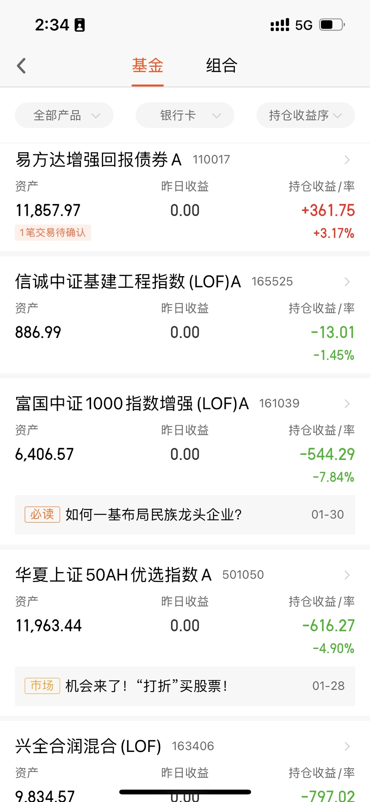
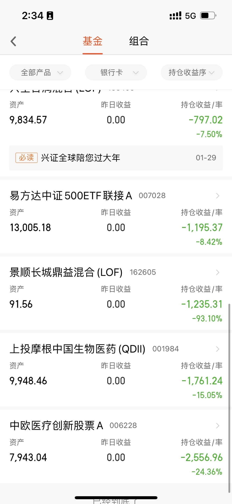

======================================================

_type: talk
@二师父[28814221155551]
2022-02-03 15:44:13 Thu  
topic_id: 185441885211242

我的健身秘密武器，不错的装备。

阅读[1]  评论[0]  赞[0] 

+++++++++++++++++++++++++++++++++++++++++++++++++++++

文件：
2022-02-03 15:43:24 Thu
文件大小：[144884]
244114488248851-分享我的秘密武器.docx

======================================================

_type: talk
@二师父[28814221155551]
2022-02-04 21:45:16 Fri  
topic_id: 185448528121282

传媒板块大概率下跌，后面择机布局，机会永远是跌出来的，关键是下跌的时候要有耐心等待，等待跌到位后入场。

@衣袂飘香 at 2022-02-04 21:45:16 Fri

> 我们的乌龟计划里面有传媒，开市要止盈出来吗？

----------

@衣袂飘香 at 2022-02-04 21:45:16 Fri

> 不对啊，传媒在乌龟的持有收益率是负的一点多。

----------

@二师父 at 2022-02-04 21:45:16 Fri

> 之前止盈过一次，卖了一半

----------

@衣袂飘香 at 2022-02-04 21:45:16 Fri

> 是的。开市的时候要先卖了吗？

----------

@二师父 at 2022-02-04 21:45:16 Fri

> 不卖啊，涨起来再卖

----------

@衣袂飘香 at 2022-02-04 21:45:16 Fri

> 好的👌

----------

@坚持学习 at 2022-02-04 21:45:16 Fri

> 二师父，传媒ETF 还剩一半, 仓位百分之1，成本0.65，是持有，还是开盘马上就卖呢？

----------

@二师父 at 2022-02-04 21:45:16 Fri

> 拿着就行了，还会起来的

----------

阅读[1]  评论[8]  赞[0] 

+++++++++++++++++++++++++++++++++++++++++++++++++++++

文件：
2022-02-04 21:42:08 Fri
文件大小：[453014]
111881158512842-这个板块要凉了.docx

======================================================

_type: talk
@二师父[28814221155551]
2022-02-05 22:07:56 Sat  
topic_id: 218221822584521

<e type="hashtag" hid="28855251441521" title="#虎年赚钱秘籍#" /> 虎年赚钱，稳字当头。分享索罗斯说过的一句话，判断对错并不重要，重要的在于正确时获取了多大利润，错误时亏损了多少。这个才是关键。

@庆余年 at 2022-02-05 22:07:56 Sat

> 有色金属和化工呢？这俩兄弟21年也涨了一波了。

----------

@二师父 at 2022-02-05 22:07:56 Sat

> 也属于周期板块

----------

阅读[1]  评论[2]  赞[0] 

+++++++++++++++++++++++++++++++++++++++++++++++++++++

文件：
2022-02-05 22:06:31 Sat
文件大小：[36414]
244114425821511-迎财神，虎年赚钱秘籍.docx

======================================================

_type: talk
@二师父[28814221155551]
2022-02-06 15:56:23 Sun  
topic_id: 418551825845488

明天2022第一次开盘，买定离手，节前买的丐帮大概率会有提款机会。还是既定策略，涨了5%到10%收一网。咱们上方还有SHS互联网和中概互联被套中，这俩兄弟是长线仓位，不会卖飞。

阅读[1]  评论[0]  赞[0] 

+++++++++++++++++++++++++++++++++++++++++++++++++++++

文件：
2022-02-06 15:54:43 Sun
文件大小：[37280]
244114428544141-喜迎春季行情.docx

======================================================

_type: talk
@二师父[28814221155551]
2022-02-07 09:53:26 Mon  
topic_id: 581558522414284

<e type="hashtag" hid="881251425252" title="#鳄鱼计划#" /> 中概网格164906卖出一份，还有三份，赚5个点，就这样来回即可，不用担心卖飞，上方压力套牢盘太多，短期是冲不上去的，即使她一直不涨，网格也可以盈利。

@芳瑛榕子 at 2022-02-07 09:53:26 Mon

> 没跟上节奏啊[流汗]我买的513050涨幅不大[委屈]

----------

@范毅君 at 2022-02-07 09:53:26 Mon

> 我上次又没跟上节奏[流泪][流泪]

----------

阅读[1]  评论[2]  赞[0] 

======================================================

_type: q&a
@范毅君[118551121224142]
2022-02-07 17:27:53 Mon  
topic_id: 185448454422542

@范毅君

>  二师父，小孩子的压岁钱，想每年给她存起来，比较稳健的，买什么比较合合适

@二师父

>  易方达裕祥回报债券，广发中债1-3年国开债，这两只都是很稳健的，尤其是第二只短债，不过波动小对应收益率也会相对较低

阅读[1]  评论[5]  赞[0] 

======================================================

_type: talk
@二师父[28814221155551]
2022-02-07 21:08:32 Mon  
topic_id: 218221281555151

<e type="hashtag" hid="552114551414" title="#估值数据#" /> 市盈率百分位30.09%，市净率百分位22.96%，SY-BY百分位28.21%，SY/BY百分位14.36%。

目前估值楼层还是2层，估值略有下移，如果加息回调的话继续布局，上涨持有或者收割利润都可以。

今天中石油大爆发，这不是个好事情哇，一般中石油大涨后面大盘就会下跌。

@芳瑛榕子 at 2022-02-07 21:08:32 Mon

> 二师父，被你言中了，昨天中石油大涨，今天三大指数全线下跌，这是什么逻辑呢？

----------

@吴涛 at 2022-02-07 21:08:32 Mon

> 二师父，中石油和中移动这种低价大市值股票涨停，从资金的角度看，算不算大资金想避险。

----------

@二师父 at 2022-02-07 21:08:32 Mon

> 属于大资金护盘

----------

阅读[1]  评论[3]  赞[0] 

======================================================

_type: talk
@二师父[28814221155551]
2022-02-07 22:08:20 Mon  
topic_id: 218221228511241

喜迎开门红，如果基建压力位冲不上去的话后面就会回调，今天的大涨我理解不是起步的上涨，市场不好预测，可以持有或者收割利润都行。

@老孙头 at 2022-02-07 22:08:20 Mon

> 喝茅台今年怕有难处？

----------

@芳瑛榕子 at 2022-02-07 22:08:20 Mon

> 可以这样理解吗：上涨收割利润，回调继续加仓？

----------

@二师父 at 2022-02-07 22:08:20 Mon

> 市场不好预测

----------

阅读[1]  评论[3]  赞[0] 

+++++++++++++++++++++++++++++++++++++++++++++++++++++

文件：
2022-02-07 22:07:18 Mon
文件大小：[37560]
111881118255222-开门红.docx

======================================================

_type: talk
@静[241555148454251]
2022-02-08 09:41:42 Tue  
topic_id: 818221445114252

老师，帮忙看看是否需要止损

@二师父 at 2022-02-08 09:41:42 Tue

> 不用的，耐心持有，你这仓位不重

----------

@静 at 2022-02-08 09:41:42 Tue

> 那我是要每跌破10%就增加份额

----------

@二师父 at 2022-02-08 09:41:42 Tue

> 网格可以找基建，中概这种方向

----------

@苍天有井明月空🌙 at 2022-02-08 09:41:42 Tue

> [尴尬][尴尬][尴尬][尴尬][尴尬][尴尬][发怒][发怒]

----------

阅读[1]  评论[4]  赞[0] 

+++++++++++++++++++++++++++++++++++++++++++++++++++++

图片：
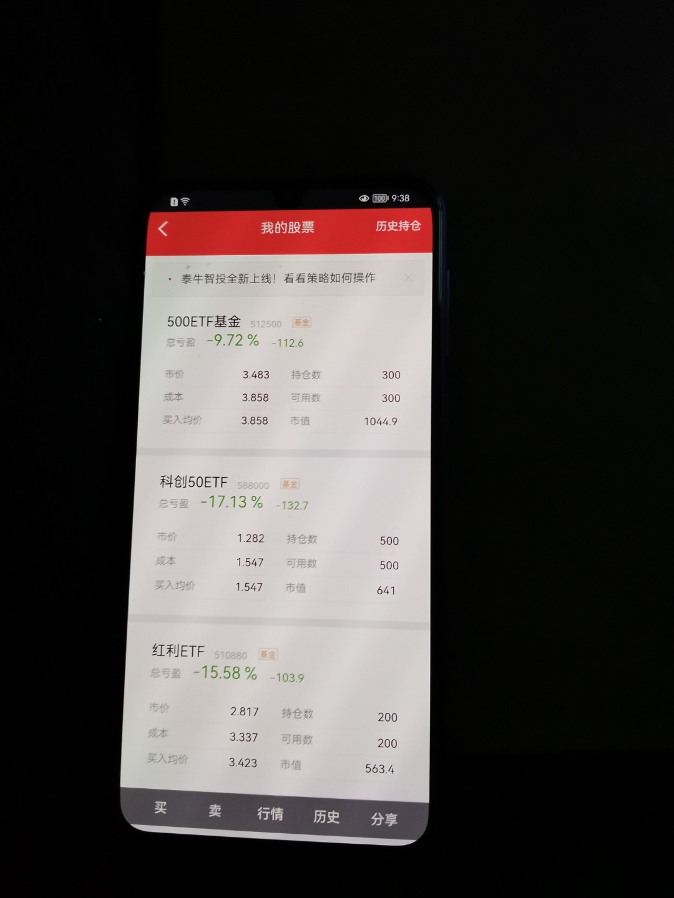
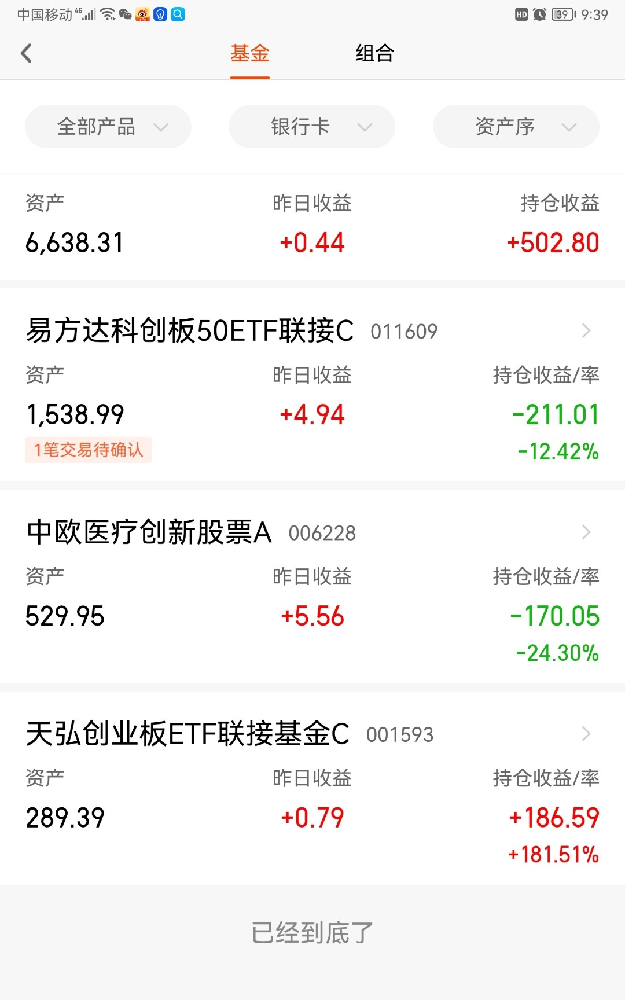

======================================================

_type: talk
@隔窗遥望[241884481854181]
2022-02-08 12:42:40 Tue  
topic_id: 581558445481284

什么时候发估值表

@二师父 at 2022-02-08 12:42:40 Tue

> 晚上

----------

阅读[1]  评论[1]  赞[0] 

======================================================

_type: talk
@丸子妈[28512522184441]
2022-02-08 18:42:37 Tue  
topic_id: 581558485225124

乌龟计划不能追加，是等反弹吗？
调仓觉得没必要了

@二师父 at 2022-02-08 18:42:37 Tue

> 拿着就行，定投价值类基金或者二级债基

----------

阅读[1]  评论[1]  赞[0] 

+++++++++++++++++++++++++++++++++++++++++++++++++++++

图片：
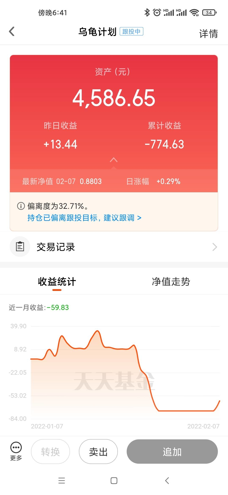

======================================================

_type: talk
@二师父[28814221155551]
2022-02-08 20:11:27 Tue  
topic_id: 218221411541111

行情继续分化，今年价值为主。

阅读[1]  评论[0]  赞[0] 

+++++++++++++++++++++++++++++++++++++++++++++++++++++

文件：
2022-02-08 20:10:30 Tue
文件大小：[38210]
111881188254542-分化行情.docx

======================================================

_type: talk
@二师父[28814221155551]
2022-02-08 20:28:11 Tue  
topic_id: 818221411841842

中证500和中证1000都低估了，可以开始定投，网格式加仓。

@坚持学习 at 2022-02-08 20:28:11 Tue

> 二师父，建信中证500，000478也可以定投了吗？

----------

@二师父 at 2022-02-08 20:28:11 Tue

> 网格加仓可以

----------

阅读[1]  评论[2]  赞[0] 

+++++++++++++++++++++++++++++++++++++++++++++++++++++

图片：
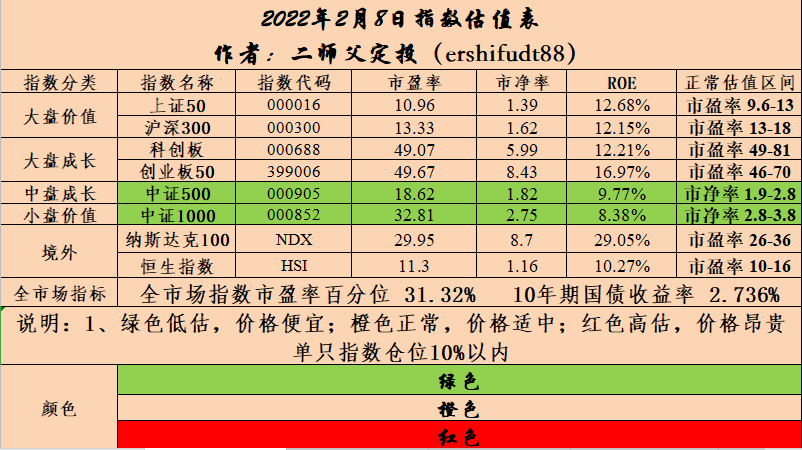

======================================================

_type: talk
@手牵手看夕阳[244112548184141]
2022-02-09 19:02:28 Wed  
topic_id: 818221122111882

红利可以收割一波吗？

@二师父 at 2022-02-09 19:02:28 Wed

> 如果有15个点以上了可以，

----------

@手牵手看夕阳 at 2022-02-09 19:02:28 Wed

> 现在收益6个点

----------

阅读[1]  评论[2]  赞[0] 

======================================================

_type: talk
@二师父[28814221155551]
2022-02-09 20:33:35 Wed  
topic_id: 185448841188212

谷爱凌成了大家追捧的对象，我觉得基因是真重要，其次是家庭环境。

后面再来看看哪些板块的机会。跌下来了就是机会，涨起来就拿着吧，中药今天表现很可以。

@老孙头 at 2022-02-09 20:33:35 Wed

> 小“翠微”涨上天了！旗手不倒应还有空间？

----------

@二师父 at 2022-02-09 20:33:35 Wed

> 哈哈，a股的心思难猜

----------

@杜志彪 at 2022-02-09 20:33:35 Wed

> 看不太懂国家发行数字货币，企业的盈利模式是什么，市场有多大的利润空间，我能想到的也就是软件服务，

----------

@JOY at 2022-02-09 20:33:35 Wed

> 个人理解，货币数字化是大势所趋~市场那么大，让私营资本做这个事，最后会出大问题，不如国家来做～

----------

@JOY at 2022-02-09 20:33:35 Wed

> 蚂蚁金服为什么上不了市，也许就是这个原因吧～大规模的现代战争，基本就是金融资本之争了～

----------

阅读[1]  评论[5]  赞[0] 

+++++++++++++++++++++++++++++++++++++++++++++++++++++

文件：
2022-02-09 20:32:01 Wed
文件大小：[38438]
111888255488422-谷神.docx

======================================================

_type: talk
@庆余年[15584481824122]
2022-02-09 23:10:09 Wed  
topic_id: 581558845282484

现金管理

在做资产配置的时候，手上总是有一些短期用不上，但是放长期（一年以上）也不方便的钱需要进行管理，但是放在货币里面利息也太少。所以我整理了一些比银行理财收益高，回撤较低的债券基金，方便大家做现金管理。可以从中选一只或者多只，一次性投入均可。
筛选逻辑为：
1.将市面上所有的债券基金按照近一月、近3月、近6月、今年以来、近一年、近3年排序，取前三分之一，然后取并集；
2.去掉三年以内成立的基金...

@苍天有井明月空🌙 at 2022-02-09 23:10:09 Wed

> 余利宝3.4不香吗

----------

@庆余年 at 2022-02-09 23:10:09 Wed

> 有自己的投资渠道即可，我并没有说提供的是最优解。

----------

@防汛抗旱 at 2022-02-09 23:10:09 Wed

> 余利宝在哪

----------

@苍天有井明月空🌙 at 2022-02-09 23:10:09 Wed

> 就支付宝余利宝呀

----------

@J at 2022-02-09 23:10:09 Wed

> 所以结论是鹏华丰禄是首选吗

----------

@庆余年 at 2022-02-09 23:10:09 Wed

> 统一说明一下，这个只是从数据角度上给出的，具体的你们可以根据指标自行筛选，并且半年或者一年后这份数据都会有变化。认同这个逻辑的供你们参考。

----------

@防汛抗旱 at 2022-02-09 23:10:09 Wed

> 不对个人开放

----------

@庆余年 at 2022-02-09 23:10:09 Wed

> 看中回撤的可以参考

----------

阅读[1]  评论[10]  赞[0] 

======================================================

_type: talk
@从A到Z[414841151821548]
2022-02-10 08:50:00 Thu  
topic_id: 218221115485551

请问中概目前的网格操作逻辑是什么？

@芳瑛榕子 at 2022-02-10 08:50:00 Thu

> 赚波动的钱

----------

@从A到Z at 2022-02-10 08:50:00 Thu

> 按照多大的网格操作？

----------

@二师父 at 2022-02-10 08:50:00 Thu

> 百分之5

----------

@从A到Z at 2022-02-10 08:50:00 Thu

> 基准是1.2？还是

----------

阅读[1]  评论[4]  赞[0] 

======================================================

_type: talk
@二师父[28814221155551]
2022-02-10 13:55:26 Thu  
topic_id: 418524444852288

<e type="hashtag" hid="28855282242221" title="#安心组合#" /> 易方达裕祥回报债券买入1000元。

阅读[1]  评论[0]  赞[0] 

+++++++++++++++++++++++++++++++++++++++++++++++++++++

图片：
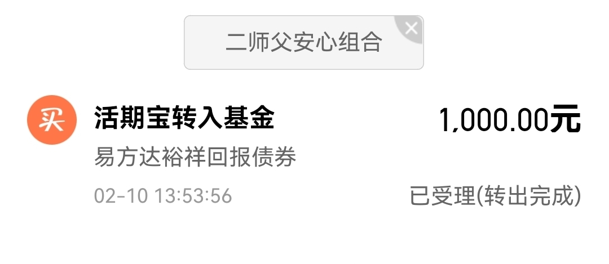

======================================================

_type: talk
@二师父[28814221155551]
2022-02-10 13:57:33 Thu  
topic_id: 818245555821222

<e type="hashtag" hid="881251425252" title="#鳄鱼计划#" /> 中证1000买入一份，网格加仓，下一次到1再加，用时间换空间。宽基指数最后坚持都能起来

@雾海 at 2022-02-10 13:57:33 Thu

> 是中证1000ETF吗

----------

@二师父 at 2022-02-10 13:57:33 Thu

> 对

----------

@雾海 at 2022-02-10 13:57:33 Thu

> 谢谢！

----------

@芳瑛榕子 at 2022-02-10 13:57:33 Thu

> 二师父，中证1000以现在的位置看，根据历史数据，到最低还有多大的跌幅呢？

----------

@二师父 at 2022-02-10 13:57:33 Thu

> 最多百分之45

----------

@芳瑛榕子 at 2022-02-10 13:57:33 Thu

> 好的

----------

@芳瑛榕子 at 2022-02-10 13:57:33 Thu

> 二师父，我看到场內ETF有两家，一家南方基金，规模18个亿以上，一个华夏基金，规模2个亿以上，费率都是一样的，选哪个好呢？

----------

阅读[1]  评论[7]  赞[0] 

======================================================

_type: q&a
@小鱼[241182222251181]
2022-02-10 13:59:53 Thu  
topic_id: 418524444442218

@小鱼

>  今天场外不定投了吗

@二师父

>  买了，易方达裕祥

阅读[1]  评论[1]  赞[0] 

======================================================

_type: talk
@奉壹[218521884455481]
2022-02-10 14:02:48 Thu  
topic_id: 818245555844852

159996家电etf，仓位未达10%，目前估值为中等，今天跌接近2%，适合继续定投吗？还是等低估？

@奉壹 at 2022-02-10 14:02:48 Thu

> 之前一直跌2%就加仓，但是后来发现原来这基金一直处于中偏高估

----------

@杜志彪 at 2022-02-10 14:02:48 Thu

> 春节前应该到低估了，应该17以下，10%就我来说应该就到位仓了，不会再加了，你准备加到多少仓位，建议你拉大点网格5%－15%供你参考。

----------

@奉壹 at 2022-02-10 14:02:48 Thu

> [抱拳][抱拳]感谢杜兄指导，那就先不加仓了，留子弹等下一步操作[社会社会]

----------

阅读[1]  评论[3]  赞[0] 

======================================================

_type: talk
@二师父[28814221155551]
2022-02-10 21:03:27 Thu  
topic_id: 418524484821428

看看A股市场的规律

阅读[1]  评论[0]  赞[0] 

+++++++++++++++++++++++++++++++++++++++++++++++++++++

文件：
2022-02-10 21:03:13 Thu
文件大小：[38654]
244111521452181-不变的规律.docx

======================================================

_type: talk
@二师父[28814221155551]
2022-02-10 21:17:58 Thu  
topic_id: 581542212581554

说说网格加仓法，持续定投有个弊端，如果持续在支撑位定投积累仓位到达重仓，然后遇到大跌就很危险，所以在没有明确反转的时候网格加仓合适，尤其是子弹不多的时候。

1000ETF的加仓点分别是1、0.95，0.9，0.85，0.8。

@王春媚 at 2022-02-10 21:17:58 Thu

> 师父，农业没有仓位现在还可以买吗？

----------

@夏日荷花 at 2022-02-10 21:17:58 Thu

> 我场内买的是161039，可以吗？

----------

@二师父 at 2022-02-10 21:17:58 Thu

> 可以的

----------

@二师父 at 2022-02-10 21:17:58 Thu

> 可以

----------

@王春媚 at 2022-02-10 21:17:58 Thu

> 收到，谢谢师父！

----------

@芳瑛榕子 at 2022-02-10 21:17:58 Thu

> 二师父，中证1000是只做网格不长持吗？

----------

@二师父 at 2022-02-10 21:17:58 Thu

> 网格买入，高位盈利会卖出

----------

阅读[1]  评论[7]  赞[0] 

======================================================

_type: talk
@二师父[28814221155551]
2022-02-10 21:28:53 Thu  
topic_id: 818245585488142

<e type="hashtag" hid="552114551414" title="#估值数据#" />市盈率百分位30.09%，SY-BY百分位28.77%，SY/BY百分位15.15%。

阅读[1]  评论[0]  赞[0] 

======================================================

_type: talk
@云云[118525244841512]
2022-02-11 10:25:58 Fri  
topic_id: 185412541124512

师父，中概每增加5%自己卖出还是等你信号？

@二师父 at 2022-02-11 10:25:58 Fri

> 都可以的

----------

@云云 at 2022-02-11 10:25:58 Fri

> 好，知道了

----------

阅读[1]  评论[2]  赞[0] 

======================================================

_type: q&a
@Kevin Chan[48221851244458]
2022-02-11 15:34:49 Fri  
topic_id: 185412541851242

@Kevin Chan

>  二师父 中证1000 是买这个是吗？

@二师父

>  是的，网格加仓

阅读[1]  评论[0]  赞[0] 

======================================================

_type: talk
@默[51552188528254]
2022-02-11 17:24:32 Fri  
topic_id: 581542182522514

二师父您好，中概互联基金有好几只。请问买哪只最合适呢

@二师父 at 2022-02-11 17:24:32 Fri

> 第一二只都可以

----------

@默 at 2022-02-11 17:24:32 Fri

> 二师父，恒生互联呢。

----------

阅读[1]  评论[2]  赞[0] 

+++++++++++++++++++++++++++++++++++++++++++++++++++++

图片：
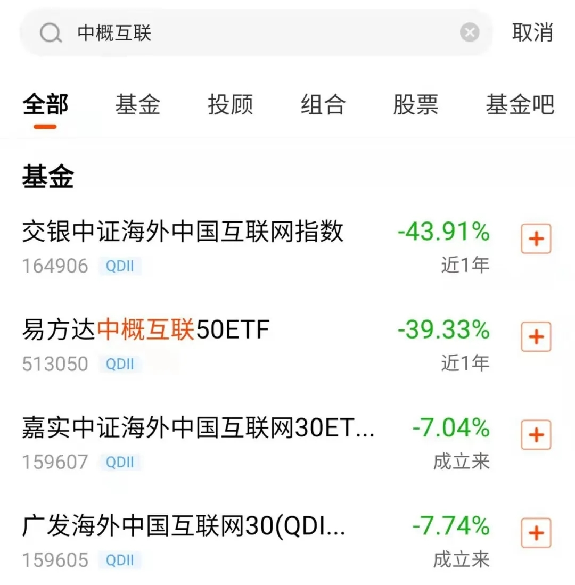

======================================================

_type: talk
@二师父[28814221155551]
2022-02-11 19:07:09 Fri  
topic_id: 185412585222152

目前上证指数也适合网格，今年的长线仓位中概互联513050，计划开始入场，大家可以参考我的，也可以跟我一样，每个人思路不同，但是只要控制住风险，同时盈利不贪婪，保住利润，那么长期盈利没问题。

该出手的时候就出手，鉴于行情震荡，准备拿上证etf网格，下周一6份底仓，其他的确实没找到好机会，上证指数再怎么垃圾，冲上3500没问题，那么他只要不断波动，小利润也是可以的，而且下跌有保证，最大不会超过百分之20，安全可靠，就这么干，其他的机会没找到，你们找到没。

@吃肉肉 at 2022-02-11 19:07:09 Fri

> 保险干它

----------

@二师父 at 2022-02-11 19:07:09 Fri

> 哈哈，平安现在平安了？

----------

@吃肉肉 at 2022-02-11 19:07:09 Fri

> 稳，回调就有好机会😎。

----------

@默 at 2022-02-11 19:07:09 Fri

> 二师父，在哪看您的实盘

----------

@二师父 at 2022-02-11 19:07:09 Fri

> 星球啊，即时发车

----------

@芳瑛榕子 at 2022-02-11 19:07:09 Fri

> 二师父，你的513050长线刚准备入场，我的已经半成以上仓位了[捂脸]我想问，现在入场的话，分几次完成建仓呢？

----------

@二师父 at 2022-02-11 19:07:09 Fri

> 百分之50仓位？

----------

@芳瑛榕子 at 2022-02-11 19:07:09 Fri

> 是啊，我的中概互联占到我给它分配资金的一半以上了[难过]

----------

阅读[1]  评论[26]  赞[0] 

+++++++++++++++++++++++++++++++++++++++++++++++++++++

图片：
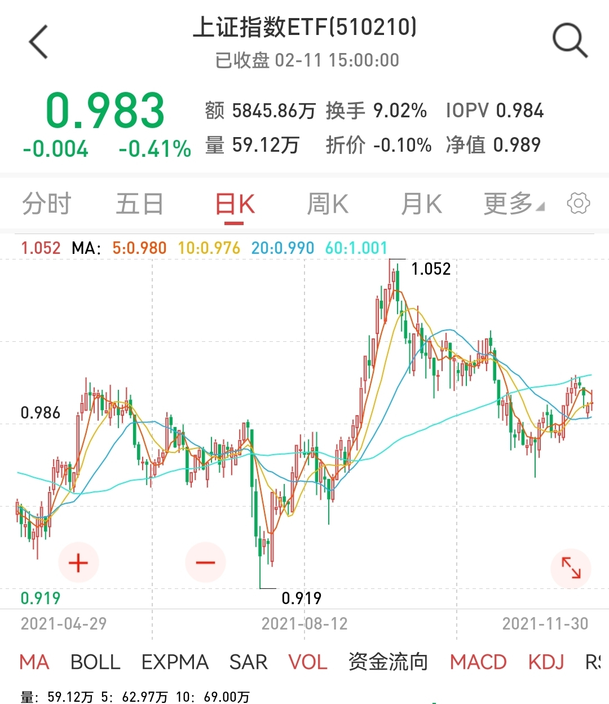

======================================================

_type: talk
@二师父[28814221155551]
2022-02-11 21:55:18 Fri  
topic_id: 581542185152814

加息确定了，做价值板块，目前超跌板块等企稳之后再加，不会接飞刀，医疗虽然我的仓位轻，但是这种跌法也很难受，很难想象重仓朋友的感受，均衡配置很重要。

方向1：上证指数ETF，下周一会建底仓，然后网格。

方向2：中概互联513050长线，至少30%利润考虑卖出，164906短线，有5%的利润开始卖出，网格和长线不矛盾。

方向3：我说的价值板块：农业、基建、红利、1000，都是网格加仓，今年看看逐步把仓位再加到80%。

成长板块也有，跌的真惨，我不加仓也不卖出，防止反弹追高。

医疗给我的启示是：支撑位不要建底仓，否则跌穿以后下跌没有底线。

@芳瑛榕子 at 2022-02-11 21:55:18 Fri

> 二师父，怎么看支撑位呢？

----------

@二师父 at 2022-02-11 21:55:18 Fri

> 就是买入力量大于卖出力量，最终形成支撑

----------

@芳瑛榕子 at 2022-02-11 21:55:18 Fri

> 在k线上怎么看知道哪里是支撑位呢？

----------

@二师父 at 2022-02-11 21:55:18 Fri

> 下跌横盘的位置

----------

@芳瑛榕子 at 2022-02-11 21:55:18 Fri

> 谢谢二师父

----------

@Mo.DC at 2022-02-11 21:55:18 Fri

> 好的，方向很明确，那上证50算不算价值

----------

@李金泉 at 2022-02-11 21:55:18 Fri

> 二师傅，那传媒现在适合网格吗？周五跌了之后，刚建底仓。

----------

@二师父 at 2022-02-11 21:55:18 Fri

> 适合

----------

阅读[1]  评论[10]  赞[0] 

+++++++++++++++++++++++++++++++++++++++++++++++++++++

文件：
2022-02-11 21:47:30 Fri
文件大小：[32420]
244111512285511-加息确定了.docx

======================================================

_type: q&a
@CY[48248584825128]
2022-02-12 16:53:19 Sat  
topic_id: 218245255251851

@CY

>  师父7-10国债为什么跌的这么厉害😭 重仓要逐步卖出吗？

@二师父

>  因为加息扰动，需要逐步卖出了，之前我们发车已经卖出了一半仓位，后面再看情况

阅读[1]  评论[2]  赞[0] 

======================================================

_type: talk
@二师父[28814221155551]
2022-02-12 20:26:55 Sat  
topic_id: 818245284824222

阅读[1]  评论[0]  赞[0] 

+++++++++++++++++++++++++++++++++++++++++++++++++++++

文件：
2022-02-12 20:26:52 Sat
文件大小：[32458]
844111852541452-加息周期下的投资机会.docx

======================================================

_type: talk
@二师父[28814221155551]
2022-02-12 20:45:39 Sat  
topic_id: 218245284281181

鳄鱼计划持仓表，成长股跌的很惨，医疗首当其冲，后面成长板块都不会追加仓位了，以价值为主，沪深300价值场外，上证ETF场内。

防守为主，先把货币基金买完，然后资金不足卖出债基买入指数基金，以价值为主，放弃成长。已经投资的成长仓位继续坚守，未来一定会起来的。

不投不代表永远不投，未来成长跌到位开始有反转迹象，再开始定投。

@Dolly at 2022-02-12 20:45:39 Sat

> 300价值买哪只

----------

@二师父 at 2022-02-12 20:45:39 Sat

> 银河300价值

----------

@JOY at 2022-02-12 20:45:39 Sat

> 师父，请问转债EFT还适合买入吗？

----------

@二师父 at 2022-02-12 20:45:39 Sat

> 目前这个位置不大适合

----------

@JOY at 2022-02-12 20:45:39 Sat

> 那要是场内的话，适合买哪个呢？

----------

@二师父 at 2022-02-12 20:45:39 Sat

> 511380

----------

@JOY at 2022-02-12 20:45:39 Sat

> 谢谢您

----------

@防汛抗旱 at 2022-02-12 20:45:39 Sat

> 沪深场外、上证场内，场内场外是什么考虑？反过来行不行

----------

阅读[1]  评论[9]  赞[0] 

+++++++++++++++++++++++++++++++++++++++++++++++++++++

图片：
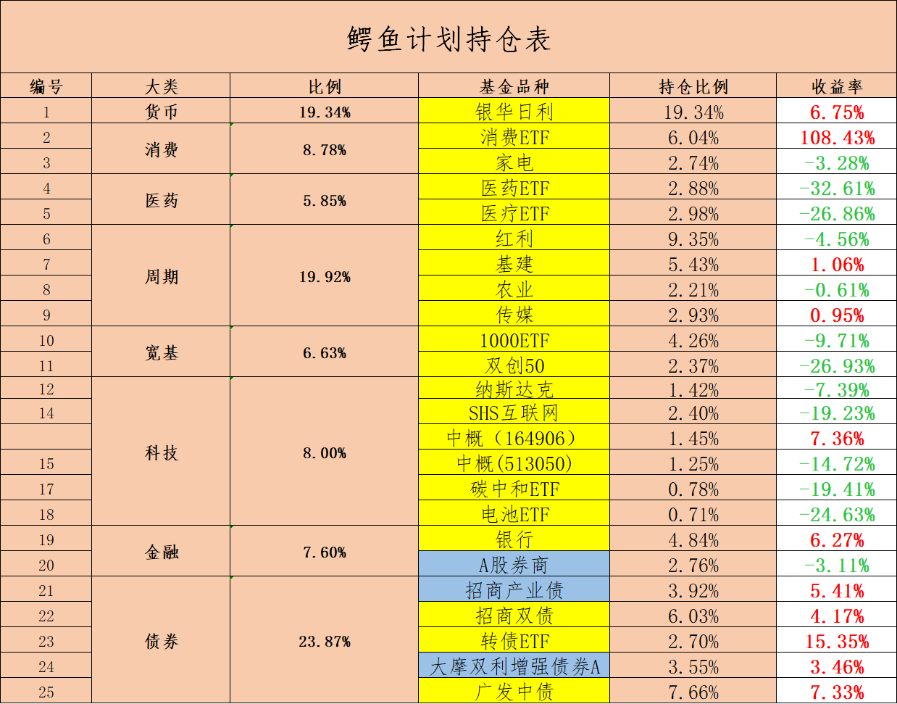

======================================================

_type: talk
@二师父[28814221155551]
2022-02-13 19:48:05 Sun  
topic_id: 418524522418288

关于接下来投资的选择，保守派，选择短债或者二级债，基金派，价值类基金，300价值、中证红利都是的。

成长走势下行，如果有持仓可以选择卧倒，不建议加仓。

对比沪深300成长和沪深300价值就可以发现，成长下行，价值上行。

选择价值。

很多人说为什么不是越跌越买，越跌越买是便宜的时候，创业板已经涨了3年，可不敢越跌越买，可能会有反弹，但是最终创业板跌破支撑位他也会和医疗一样的命运。

@践行 at 2022-02-13 19:48:05 Sun

> 二师父，保守组合和稳组合里面的几只债基当前还可以按照推荐的配置比例加仓吗？

防守账户：5%-8%收益率，5%波动，各20%
217022  招商产业债券A
000024  大摩双利增强债券A
000171  易方达裕丰回报债券
110017  易方达增强回报债券A
110007  易方达稳健收益债券A

稳健账户：8%-10%收益率：10%波动，
000171  易方达裕丰回报债券
110017  易方达增强回报债券A
110007  易方达稳健收益债券A
202101  南方宝元债券A

----------

@二师父 at 2022-02-13 19:48:05 Sun

> 可以的

----------

阅读[1]  评论[2]  赞[0] 

======================================================

_type: talk
@二师父[28814221155551]
2022-02-14 09:44:36 Mon  
topic_id: 581542821585214

<e type="hashtag" hid="15522588524122" title="#实盘发车#" /> 鳄鱼计划，上证指数etf买入8份，成长组合银河300价值，中证红利各买入1000元。

开始干活，都开始买上证etf了，表示认可市场波动，同时看好周期。

代码如图所示。

@雪莲 at 2022-02-14 09:44:36 Mon

> 二师父，上证ETF的代码是啥？

----------

@二师父 at 2022-02-14 09:44:36 Mon

> 图中有

----------

@雪莲 at 2022-02-14 09:44:36 Mon

> 看到了，谢谢！

----------

@小鱼 at 2022-02-14 09:44:36 Mon

> 都是场内的
吗

----------

@二师父 at 2022-02-14 09:44:36 Mon

> 不是有代码

----------

@枫叶 at 2022-02-14 09:44:36 Mon

> 上证指数可以用上证50代替吗

----------

@二师父 at 2022-02-14 09:44:36 Mon

> 不行

----------

@杜志彪 at 2022-02-14 09:44:36 Mon

> 我也将长债赎回，拿出长债一层资金买入上证ETF,回撤5%再加，目前看应该比持有债券好[微笑]

----------

阅读[1]  评论[14]  赞[0] 

+++++++++++++++++++++++++++++++++++++++++++++++++++++

图片：
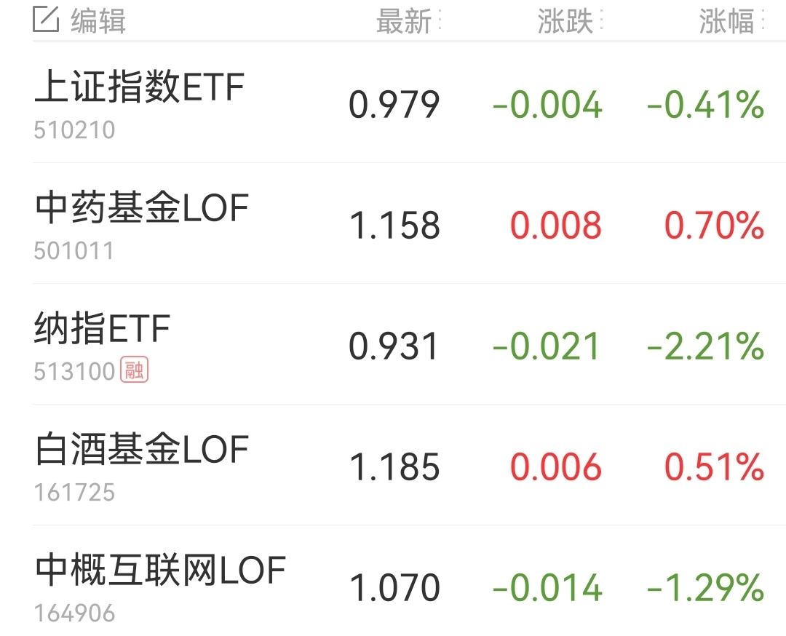
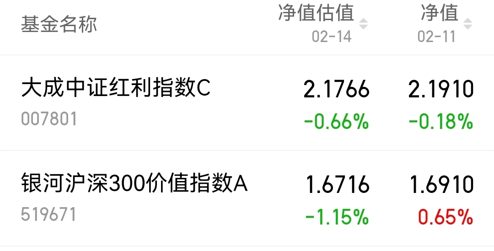

======================================================

_type: talk
@二师父[28814221155551]
2022-02-14 21:40:55 Mon  
topic_id: 418524155551888

长线仓位卧倒，价值波段，接下来就这个策略，我判断成长是反弹。

今年要么没行情，要么就是价值，坚持定投吧。

阅读[1]  评论[0]  赞[0] 

+++++++++++++++++++++++++++++++++++++++++++++++++++++

文件：
2022-02-14 21:40:13 Mon
文件大小：[30057]
244111821815211-价值和成长齐跌.docx

======================================================

_type: talk
@二师父[28814221155551]
2022-02-14 22:06:25 Mon  
topic_id: 185412844824242

<e type="hashtag" hid="552114551414" title="#估值数据#" /> 市盈率百分位31.58%，SY-BY百分位31.16%，SY/BY百分位19.77%。

估值进一步下滑，估值楼层二层。价值和成长一起跌，成交额急速下滑，越是人气低迷的时候越是布局机会，相反人气高涨的时候就要撤退了。

阅读[1]  评论[0]  赞[0] 

======================================================

_type: talk
@二师父[28814221155551]
2022-02-14 23:04:38 Mon  
topic_id: 185412841121512

估值表，科创50进入低估。

@隔窗遥望 at 2022-02-14 23:04:38 Mon

> 科创板有什么基金可以选择

----------

@二师父 at 2022-02-14 23:04:38 Mon

> 科创板etf

----------

@手牵手看夕阳 at 2022-02-14 23:04:38 Mon

> 加了两手科创50ETF，试试水

----------

阅读[1]  评论[3]  赞[0] 

+++++++++++++++++++++++++++++++++++++++++++++++++++++

图片：

======================================================

_type: talk
@雪莲[421485848588118]
2022-02-15 10:46:05 Tue  
topic_id: 581542844484124

二师父，搜特转债，从浮盈16/%到现在浮亏近3%，公司好像出了问题，是不是应卖出了？

@二师父 at 2022-02-15 10:46:05 Tue

> 搜特有退市风险，找机会可以卖了，盈利的转债回落记得卖出，别让赚钱的变成亏钱的

----------

@雪莲 at 2022-02-15 10:46:05 Tue

> 明白了，谢谢二师父解惑！

----------

阅读[1]  评论[2]  赞[0] 

======================================================

_type: q&a
@顾小胖[841154144118242]
2022-02-15 13:51:45 Tue  
topic_id: 581542882841854

@顾小胖

>  师父迪森转债从浮盈跌到浮亏了，是继续持有还是卖出更好呢

@二师父

>  多少仓位？

阅读[1]  评论[3]  赞[0] 

======================================================

_type: q&a
@坚持学习[421148841558188]
2022-02-15 15:37:39 Tue  
topic_id: 581542885112214

@坚持学习

>  二师父好，证券的股票或者是基金，需要撤出吗？仓位总体占百分之10的样子。
>  在加息的背景下，券商后续应该怎么把握呢？

@二师父

>  不太好，如果不能接受百分之30左右波动，需要撤出来，如果可以的话，长期拿着还会起来的

阅读[1]  评论[1]  赞[0] 

======================================================

_type: talk
@苍天有井明月空🌙[28882214181441]
2022-02-15 17:51:34 Tue  
topic_id: 218248555251481

您好，我想问下好的保险产品在哪里找。

@二师父 at 2022-02-15 17:51:34 Tue

> 公众号菜单下有，做了分类，可以找找合适的

----------

阅读[1]  评论[1]  赞[0] 

======================================================

_type: talk
@二师父[28814221155551]
2022-02-15 21:32:26 Tue  
topic_id: 218248552852881

网格式买入，网格式卖出。通过空间来换取利润。

阅读[1]  评论[0]  赞[0] 

+++++++++++++++++++++++++++++++++++++++++++++++++++++

文件：
2022-02-15 21:27:42 Tue
文件大小：[31384]
844111815521582-震荡市场，网格更加合适.docx

======================================================

_type: talk
@二师父[28814221155551]
2022-02-16 18:05:41 Wed  
topic_id: 185415514224152

中信证券开始唱多基建，要小心。

今年做农业（猪肉偏消费），中药、科创50，先把仓位逐步加起来。成为重仓，红利、基建已经重仓了，基本上就配置好了，然后卧倒。

中概、传媒、上证网格。

整体就这么玩。

股票被东财伤了以后，开始保守点。

@坚持学习 at 2022-02-16 18:05:41 Wed

> 传媒上次卖了一部分，剩下的继续持有吗？

----------

@二师父 at 2022-02-16 18:05:41 Wed

> 持有

----------

阅读[1]  评论[2]  赞[0] 

+++++++++++++++++++++++++++++++++++++++++++++++++++++

文件：
2022-02-16 17:59:04 Wed
文件大小：[31472]
844111458188422-坏菜了.docx

======================================================

_type: talk
@二师父[28814221155551]
2022-02-16 23:54:00 Wed  
topic_id: 418528815521458

<e type="hashtag" hid="552114551414" title="#估值数据#" /> 市盈率百分位31.99%，SY/BY百分位20.46%，SY-BY百分位31.69%。

当前估值未到底部，但是市场情绪极端低迷，持续定投三大方向周期价值+消费+医药+科技。

消费是农业ETF，医药是中药，科技是科创50.

这些属于长期持有方向，互联网+传媒+上证网格。即使一直震荡也能盈利。

无论怎么跌，目前上证、互联网、传媒都在低位，不会套很多的。

@芳瑛榕子 at 2022-02-16 23:54:00 Wed

> 二师父，预计科创50的最大跌幅有多少？

----------

@芳瑛榕子 at 2022-02-16 23:54:00 Wed

> 二师父，目前中药比医疗、生物科技更具有吸引力吗？我不明白中药的长期投资价值。

----------

@二师父 at 2022-02-16 23:54:00 Wed

> 百分之48

----------

@二师父 at 2022-02-16 23:54:00 Wed

> 中药受集采影响小，很多中药都有专用药效

----------

阅读[1]  评论[4]  赞[0] 

======================================================

_type: talk
@二师父[28814221155551]
2022-02-17 09:38:32 Thu  
topic_id: 818248258822112

<e type="hashtag" hid="881251425252" title="#鳄鱼计划#" /> 科创50买入5份，中药买入6份，农业买入1份。

@隔窗遥望 at 2022-02-17 09:38:32 Thu

> 中证500，中证1000可以定投吗？

----------

@二师父 at 2022-02-17 09:38:32 Thu

> 可以

----------

@黎雄 at 2022-02-17 09:38:32 Thu

> 师傅之前买的双创基金159783，需要换成科创50嘛

----------

@二师父 at 2022-02-17 09:38:32 Thu

> 不用，等跌下来了继续买，持有就行

----------

@坚持学习 at 2022-02-17 09:38:32 Thu

> 二师父，想请教一下这样投的逻辑。科创是因为进入低估，对吗，那中药和农业呢？

----------

@坚持学习 at 2022-02-17 09:38:32 Thu

> 在资金量不多的情况下，可以选一只吗，优选哪一只呢？

----------

@二师父 at 2022-02-17 09:38:32 Thu

> 相对有价值，处于上升周期

----------

@二师父 at 2022-02-17 09:38:32 Thu

> 沪深300价值

----------

阅读[1]  评论[18]  赞[0] 

+++++++++++++++++++++++++++++++++++++++++++++++++++++

图片：
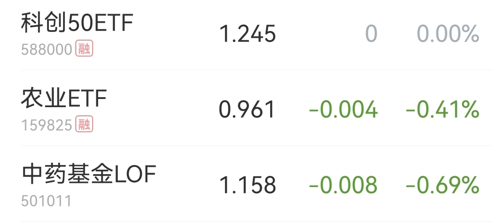

======================================================

_type: talk
@二师父[28814221155551]
2022-02-17 09:43:33 Thu  
topic_id: 185415425428112

<e type="hashtag" hid="15288821141452" title="#成长组合#" /> 中药买入1000元，农业买入1000元。坚持定投，仓位重的可以暂停。

方向很重要，保守的选择二级债定投。

@Philip🎭 Y at 2022-02-17 09:43:33 Thu

> 乌龟发车吗

----------

@二师父 at 2022-02-17 09:43:33 Thu

> 不发

----------

@王春媚 at 2022-02-17 09:43:33 Thu

> 师父，基建要卖出吗？

----------

@二师父 at 2022-02-17 09:43:33 Thu

> 仓位重可以卖出一部分

----------

@王春媚 at 2022-02-17 09:43:33 Thu

> 收到，谢谢师父！

----------

@坚持学习 at 2022-02-17 09:43:33 Thu

> 二师父，成长组合，在哪里可以看？

----------

@二师父 at 2022-02-17 09:43:33 Thu

> 天天基金，搜索成长组合

----------

@水墨青花 at 2022-02-17 09:43:33 Thu

> 师父，基建目前估值如何

----------

阅读[1]  评论[10]  赞[0] 

======================================================

_type: q&a
@wty[548488548545444]
2022-02-17 09:47:49 Thu  
topic_id: 581541521154514

@wty

>  二师父，隆基转债今天上市，怎么不能卖了呢？

@二师父

>  停牌，稍后复牌可以卖

阅读[1]  评论[4]  赞[0] 

======================================================

_type: q&a
@绝世名伶。[418442242548888]
2022-02-17 11:28:10 Thu  
topic_id: 581541525254454

@绝世名伶。

>  二师父：请教一下，中签隆基转债今天上市，怎么操作谢谢了

@二师父

>  可以卖出的

阅读[1]  评论[0]  赞[0] 

======================================================

_type: talk
@绝世名伶。[418442242548888]
2022-02-17 11:57:36 Thu  
topic_id: 218248251818151

好的！

阅读[1]  评论[0]  赞[0] 

======================================================

_type: talk
@二师父[28814221155551]
2022-02-18 21:59:48 Fri  
topic_id: 581541425441844

美团大跌，互联网寒冬。164906还是不错的，目前1.08，按照策略。1.1卖出，1买入。赚钱不就这么简单？一买一卖就赚了。除了网格互联网不会大加仓位。

红利、基建最近都盈利不错，有读者考虑是否卖出，我觉得可以分仓，长线仓位就一直拿着，有了50%甚至翻倍的利润后再考虑卖出，不然赚不到大钱。另外再分一个账户，做波段，确实A股很长时间在波动，长线和短线结合，防止卖飞了，又追涨。

大家仓位基本上都上来了，如果中药、农业、科创50、红利、基建等基金有回撤，回撤到5%到10%，在这个基础上继续定投。

上涨了赚钱，下跌了转股，波动网格赚钱，低位无论市场怎么走，都好办，唯一不好办的是整体高估，那时候就不知道买啥好了，只能退出或者买入债基。所以不怕跌，怕涨。

@芳瑛榕子 at 2022-02-18 21:59:48 Fri

> 盼着红利跌，现在仓位太少[呲牙]

----------

@李金泉 at 2022-02-18 21:59:48 Fri

> 请问二师傅，网格可以按照收益率来收割吗？

----------

@二师父 at 2022-02-18 21:59:48 Fri

> 可以的

----------

@蛋炒饭不加蛋 at 2022-02-18 21:59:48 Fri

> 请问二师父，长线账户和波段账户配比多少比较合适？波段账户的买入卖出标准是什么？5日均线吗？

----------

@二师父 at 2022-02-18 21:59:48 Fri

> 这个看自己的资金分配，买入都是一样的，只是波段短期会卖出

----------

@蛋炒饭不加蛋 at 2022-02-18 21:59:48 Fri

> 是有效跌破5日均线卖出吗？

----------

阅读[1]  评论[6]  赞[0] 

+++++++++++++++++++++++++++++++++++++++++++++++++++++

文件：
2022-02-18 21:53:38 Fri
文件大小：[30094]
844111441154882-美团被定点爆破.docx

======================================================

_type: talk
@庆余年[15584481824122]
2022-02-19 14:52:13 Sat  
topic_id: 818248125144582

现金管理-低回撤低波动版

在做资产配置的时候，手上总是有一些短期用不上，但是放长期（一年以上）也不方便的钱需要进行管理，但是放在货币里面利息也太少。所以我整理了一些比银行理财收益高，回撤较低的债券基金，方便大家做现金管理。可以从中选一只或者多只，一次性投入均可。
这份表的内容更侧重与回撤和波动，对收益要求并不高，供对回撤有较大要求的人参考。
筛选逻辑为：
1.去掉三年以内成立的基金，去掉投资年限短...

@庆余年 at 2022-02-19 14:52:13 Sat

> 仅做数据分享，有基金筛选逻辑上的问题可以问。投资问题还是问二师父哈[呲牙][呲牙][呲牙]

----------

@蛋炒饭不加蛋 at 2022-02-19 14:52:13 Sat

> 谢谢

----------

阅读[1]  评论[2]  赞[0] 

======================================================

_type: q&a
@IT[582851511244154]
2022-02-19 16:35:32 Sat  
topic_id: 418528152458828

@IT

>  老师，我加入星球了，请问不是有基金课程吗？

@二师父

>  在置顶文章里面有链接

阅读[1]  评论[1]  赞[0] 

======================================================

_type: talk
@二师父[28814221155551]
2022-02-21 22:21:41 Mon  
topic_id: 818242541158542

<e type="hashtag" hid="552114551414" title="#估值数据#" /> 市盈率百分位32.36%，SY-BY百分位32.51%，SY/BY百分位23.67%。

估值有所下降，地产和基建继续迎来利好，多地首付降低到了20%，关注建材板块。

互联网继续网格，1块以下买入，虽然美团腾讯都在跌，但是咱们网格的成本价格依然比市场价格低。

@芳瑛榕子 at 2022-02-21 22:21:41 Mon

> 就等二师父的中概发车了[偷笑]

----------

阅读[1]  评论[1]  赞[0] 

======================================================

_type: talk
@默[51552188528254]
2022-02-21 22:31:16 Mon  
topic_id: 581545248855284

请问二师父，中概互联上周刚建了30%底仓，现在还是否可以加仓。

阅读[1]  评论[0]  赞[0] 

======================================================

_type: q&a
@匿名的码农[28288455512251]
2022-02-22 09:44:31 Tue  
topic_id: 818242514221242

@匿名的码农

>  二师父好，纳指100快要低估了，能投了不？或者啥时候能投呢？

@二师父

>  美联储缩表以后

阅读[1]  评论[0]  赞[0] 

======================================================

_type: talk
@二师父[28814221155551]
2022-02-22 10:11:50 Tue  
topic_id: 818242252824552

成长组合，煤炭清仓，盈利百分之12，等跌下来继续买入，长线和短线不矛盾，百分之70长期持有，百分之30波段。

有耐心等待可以不用波段，长期拿着就行，只等待大盈利的机会。

@老孙头 at 2022-02-22 10:11:50 Tue

> 煤炭，也可“长期拿着”吗？

----------

@二师父 at 2022-02-22 10:11:50 Tue

> 长期是多久，终身还是1年

----------

阅读[1]  评论[2]  赞[0] 

======================================================

_type: talk
@二师父[28814221155551]
2022-02-22 14:05:30 Tue  
topic_id: 218242288551481

<e type="hashtag" hid="881251425252" title="#鳄鱼计划#" /> 中概互联164906买入一份

@赵晓勇 at 2022-02-22 14:05:30 Tue

> 和买513050有区别吗？

----------

@二师父 at 2022-02-22 14:05:30 Tue

> 股票仓位上有些不同

----------

@赵晓勇 at 2022-02-22 14:05:30 Tue

> 我去自救搞一份网格

----------

@娃娃after🎈 at 2022-02-22 14:05:30 Tue

> 请问和159605有什么区别？

----------

@二师父 at 2022-02-22 14:05:30 Tue

> 追踪的指数不同，这个追踪的是互联网30

----------

@芳瑛榕子 at 2022-02-22 14:05:30 Tue

> 这个是网格的吗

----------

@二师父 at 2022-02-22 14:05:30 Tue

> 是的

----------

@芳瑛榕子 at 2022-02-22 14:05:30 Tue

> 跟😁

----------

阅读[1]  评论[13]  赞[0] 

======================================================

_type: q&a
@梧桐[844118451242512]
2022-02-23 15:02:50 Wed  
topic_id: 185414481128552

@梧桐

>  二师父，广发中债003376需要赎回吗

@二师父

>  可以赎回买入其他优质指数基金，如果不计划加仓可以拿着

阅读[1]  评论[3]  赞[0] 

======================================================

_type: talk
@二师父[28814221155551]
2022-02-24 09:40:31 Thu  
topic_id: 218242424424451

<e type="hashtag" hid="881251425252" title="#鳄鱼计划#" /> 电池etf买入一份，代码159755，目前不便宜，网格分批加仓，控制仓位。

阅读[1]  评论[0]  赞[0] 

======================================================

_type: q&a
@蛋炒饭不加蛋[118281818482542]
2022-02-25 11:12:15 Fri  
topic_id: 418522488145848

@蛋炒饭不加蛋

>  请问二师父，基建50最近走的弱是因为没预期了吗？稳增长要等两会政策才会再发力吗？

@二师父

>  资金流动到成长板块了

阅读[1]  评论[3]  赞[0] 

======================================================

_type: q&a
@光少[244124552511141]
2022-02-25 11:17:45 Fri  
topic_id: 185411255115122

@光少

>  二师父，医疗ETF是否有企稳的迹象？可否开始定投？

@二师父

>  可以定投，已经跌了百分之40了，网格加仓没问题，但是整体不太看好医疗，我在定投中药

阅读[1]  评论[0]  赞[0] 

======================================================

_type: talk
@二师父[28814221155551]
2022-02-26 21:24:46 Sat  
topic_id: 418522848128118

见证历史，目前比较看好中药，科创50，农业，基建、红利、沪深300价值，继续定投。

俄乌之战可能带来机会。

@吃肉肉 at 2022-02-26 21:24:46 Sat

> 二师父威武，元宇宙言中了，建筑言中了。[强]

----------

@芳瑛榕子 at 2022-02-26 21:24:46 Sat

> 二师父，恒生ETF基金目前估值如何？是不是买了中概就不用买这个了？

----------

@二师父 at 2022-02-26 21:24:46 Sat

> 是的，买一个就行

----------

@坚持学习 at 2022-02-26 21:24:46 Sat

> 二师父，沪深300价值，可以推荐一下吗？

----------

阅读[1]  评论[4]  赞[0] 

+++++++++++++++++++++++++++++++++++++++++++++++++++++

文件：
2022-02-26 21:23:30 Sat
文件大小：[30719]
241555811884441-见证历史.docx

======================================================

_type: talk
@二师父[28814221155551]
2022-02-27 21:49:29 Sun  
topic_id: 185411448424452

来学习巴菲特。明天开盘，可能波动会很大，别被甩下车，要下车也得是自己赚钱了，止盈下车。

@枫叶 at 2022-02-27 21:49:29 Sun

> 家电为什么一直跌

----------

@九妹Amy'' at 2022-02-27 21:49:29 Sun

> 师傅，同问

----------

阅读[1]  评论[2]  赞[0] 

+++++++++++++++++++++++++++++++++++++++++++++++++++++

文件：
2022-02-27 21:48:55 Sun
文件大小：[32372]
241555251582241-他来了.docx

======================================================

_type: talk
@林凤崎[421882481454488]
2022-02-28 14:43:02 Mon  
topic_id: 218244211485481

二师傅，基建推荐一下

@二师父 at 2022-02-28 14:43:02 Mon

> 场外广发中证基建

----------

阅读[1]  评论[1]  赞[0] 

======================================================

_type: talk
@IT[582851511244154]
2022-02-28 22:00:56 Mon  
topic_id: 581544411481244

老师，您说的SY-BY、SY/BY是什么意思？

@二师父 at 2022-02-28 22:00:56 Mon

> SY是盈利收益率，BY是国债收益率

----------

阅读[1]  评论[1]  赞[0] 

======================================================

_type: talk
@二师父[28814221155551]
2022-02-28 23:01:02 Mon  
topic_id: 185411154148412

基金经理更换，影响不大，关键是地缘政治的影响。

阅读[1]  评论[0]  赞[0] 

+++++++++++++++++++++++++++++++++++++++++++++++++++++

文件：
2022-02-28 20:32:26 Mon
文件大小：[29616]
118222144122142-换人了.docx

======================================================

_type: talk
@二师父[28814221155551]
2022-02-28 23:13:30 Mon  
topic_id: 581544415828184

<e type="hashtag" hid="552114551414" title="#估值数据#" /> 市盈率百分位32.21%，市净率百分位25.68%，SY-BY百分位31.86%，估值楼层第二层，指标数据我在书中有解释过，SY是盈利收益率百分位，BY是国债收益率，这是衡量昂贵程度的指标，只需要记住数字越低越便宜就行，想深入学习的朋友可以看看我以前的文章和书中的解释，看不明白可以再来问。

目前基建又下来了，低估定投，利润收割就适合这种底部震荡的指数，不需要赚大钱，每次赚个20%，30%就不错。只要不是追高，根本不怕下跌。

最怕每次一跌就准备卖出，一涨就准备追进去，这种永远都没法长期盈利。

关于中概，下一次网格位置0.95，严格把自己当作交易机器人，到了价格就买，到了价格就卖。不管盈亏。

当然，严格执行的最终结果就是一定盈利。这才是为什么我们不在乎盈亏，只执行。

做好了过程，结果就会好。

@芳瑛榕子 at 2022-02-28 23:13:30 Mon

> 二师父，中概还不到可以重仓的时候吗？

----------

@二师父 at 2022-02-28 23:13:30 Mon

> 最多百分之20

----------

阅读[1]  评论[2]  赞[0] 

======================================================

