_type: q&a
@维真[818585418182212]
2022-04-01 11:10:51 Fri  
topic_id: 585214584824284

@维真

>  二师父你好，乌龟计划里面的地产你打算什么时候卖出？

@二师父

>  盈利百分之10或者15以上

阅读[1]  评论[0]  赞[0] 

======================================================

_type: talk
@手牵手看夕阳[244112548184141]
2022-04-01 12:38:28 Fri  
topic_id: 812584458818212

家电现在的位置如何？

@二师父 at 2022-04-01 12:38:28 Fri

> 比较便宜了

----------

@范毅君 at 2022-04-01 12:38:28 Fri

> 可以适当定投吗，二师父

----------

@二师父 at 2022-04-01 12:38:28 Fri

> 可以

----------

@范毅君 at 2022-04-01 12:38:28 Fri

> 现在家电场内持有6000股，亏9个点，那再跌逐步定投[呲牙]

----------

阅读[1]  评论[4]  赞[0] 

======================================================

_type: talk
@二师父[28814221155551]
2022-04-01 21:07:37 Fri  
topic_id: 812584482548242

<e type="hashtag" hid="51122818125554" title="#超跌指数#" /> 关注超跌指数，每一次大跌都是给我们布局的机会。截至目前，本次底部布局的指数全部盈利。恐慌是正常的，再不同的位置，加上不同的仓位。

阅读[1]  评论[0]  赞[0] 

+++++++++++++++++++++++++++++++++++++++++++++++++++++

文件：
2022-04-01 21:05:11 Fri
文件大小：[384319]
241582512881411-一季度超跌的指数.docx

======================================================

_type: talk
@二师父[28814221155551]
2022-04-02 12:16:11 Sat  
topic_id: 212584445242421

3月发车不少，有朋友没跟上，接下来可以考虑这只基金，回撤有限，这个位置还是可以配置的。

@小草罗仕英，电话，* at 2022-04-02 12:16:11 Sat

> 什么代码呢

----------

@二师父 at 2022-04-02 12:16:11 Sat

> 文章里面有

----------

@小草罗仕英，电话，* at 2022-04-02 12:16:11 Sat

> 我怎么看不到呀

----------

@二师父 at 2022-04-02 12:16:11 Sat

> 截图里面

----------

阅读[1]  评论[4]  赞[0] 

+++++++++++++++++++++++++++++++++++++++++++++++++++++

文件：
2022-04-02 12:14:07 Sat
文件大小：[83472]
241582858824421-没上车的怎么办.docx

======================================================

_type: talk
@二师父[28814221155551]
2022-04-02 12:21:59 Sat  
topic_id: 812584445241112

估值表，还是有4只低估的宽基，严格按照纪律投，低估投宽基是最稳妥的投资方法。

阅读[1]  评论[0]  赞[0] 

+++++++++++++++++++++++++++++++++++++++++++++++++++++

图片：
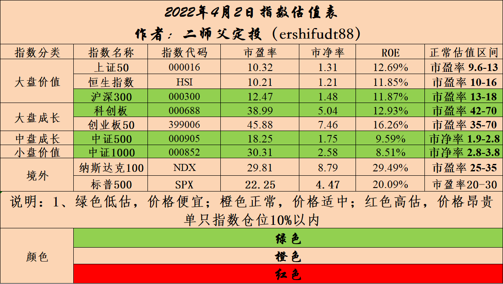

======================================================

_type: talk
@林玮[844111858288412]
2022-04-03 06:58:23 Sun  
topic_id: 585214888828544

师父，可以用港股科技etf代替恒生科技吗，没有港股户头

@二师父 at 2022-04-03 06:58:23 Sun

> 可以的，恒生科技etf在a股账户也可以买

----------

@林玮 at 2022-04-03 06:58:23 Sun

> 好的，代码是多少，谢谢

----------

@二师父 at 2022-04-03 06:58:23 Sun

> 之前分享过截图

----------

阅读[1]  评论[3]  赞[0] 

======================================================

_type: talk
@二师父[28814221155551]
2022-04-03 17:53:35 Sun  
topic_id: 184258255585512

<e type="hashtag" hid="15522858112152" title="#外资又杀回来了#" /> 明天可能会发车， 去年一整年没大力发车，今年机会不错，上车。目前这个位置再加一部分偏债混合和二级债，无论今年走牛走熊都会正收益，非常不错。当然这些都是个人投资记录，大家可以选择参考。

@蛋炒饭不加蛋 at 2022-04-03 17:53:35 Sun

> 明天股市不开门吧

----------

@二师父 at 2022-04-03 17:53:35 Sun

> 下周开门以后

----------

@以古论今 at 2022-04-03 17:53:35 Sun

> 为什么二级债牛熊都会正收益?

----------

@二师父 at 2022-04-03 17:53:35 Sun

> 债基有保底，目前这个位置股基已经跌的较多了

----------

@芳瑛榕子 at 2022-04-03 17:53:35 Sun

> 看来我去年12月买的二级债有望亏转盈[偷笑]

----------

阅读[1]  评论[5]  赞[0] 

+++++++++++++++++++++++++++++++++++++++++++++++++++++

文件：
2022-04-03 17:51:06 Sun
文件大小：[32363]
421485881515828-规定调整，外资杀回来了.docx

======================================================

_type: talk
@二师父[28814221155551]
2022-04-05 06:51:42 Tue  
topic_id: 184258281428812

<e type="hashtag" hid="28855125551541" title="#指数加仓计划#" /> 地产加了一份，目前已经止盈，接下来还是按照这个计划，不到就卧倒或者加仓固收加，到了就买入，盈利有10个点就分批卖出，经过本人10年实践，这种方法不是赚钱最多的方法，但是是省心省力的方法，适合上班族

中证1000到了价格了，明天开盘加一次，预计还会加仓三个固收加基金

用固收加稳固大盘，用指数取得超额收益！

@廖Simone at 2022-04-05 06:51:42 Tue

> 二师傅标普500回调到多少点位补仓

----------

@二师父 at 2022-04-05 06:51:42 Tue

> 4400

----------

@廖Simone at 2022-04-05 06:51:42 Tue

> 好的，数字经济板块最近没看你聊过，还是关注中证软件，计算机那两个指数吧

----------

@二师父 at 2022-04-05 06:51:42 Tue

> 对，大数据可以关注下

----------

@廖Simone at 2022-04-05 06:51:42 Tue

> 好的

----------

@小糊涂 at 2022-04-05 06:51:42 Tue

> 二师傅，入群不久。不太能跟上您的节奏，是周定投和随机购买相互结合么？

----------

@二师父 at 2022-04-05 06:51:42 Tue

> 是的

----------

阅读[1]  评论[7]  赞[0] 

+++++++++++++++++++++++++++++++++++++++++++++++++++++

图片：
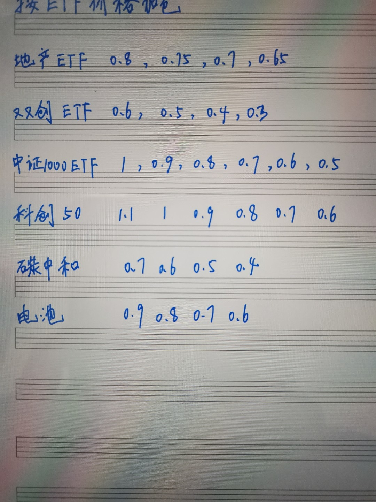
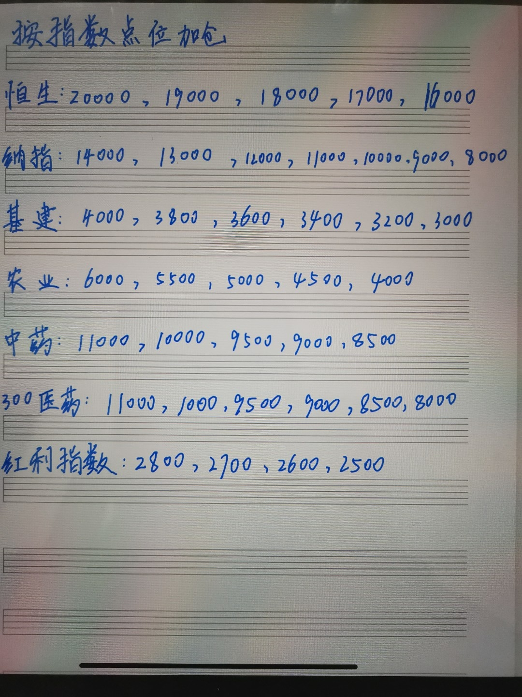

======================================================

_type: talk
@二师父[28814221155551]
2022-04-05 07:53:41 Tue  
topic_id: 415481412514448

纳斯达克的定投策略，他的止盈策略还在研究，很容易就卖飞了。这是个长牛指数，也是价值投资的起源之地美国的指数，喜欢长期持有的，选择纳斯达克吧。

@CY at 2022-04-05 07:53:41 Tue

> 请问场内如何投纳斯达克ETF呀？

----------

@二师父 at 2022-04-05 07:53:41 Tue

> 直接买纳斯达克etf

----------

@CY at 2022-04-05 07:53:41 Tue

> 辛苦分享下代码好吗？

----------

@二师父 at 2022-04-05 07:53:41 Tue

> 513100

----------

阅读[1]  评论[4]  赞[0] 

+++++++++++++++++++++++++++++++++++++++++++++++++++++

文件：
2022-04-05 07:52:59 Tue
文件大小：[131031]
241582842551521-纳斯达克定投策略.docx

======================================================

_type: talk
@二师父[28814221155551]
2022-04-05 20:04:25 Tue  
topic_id: 812581888548852

明天开盘继续加仓，市场释放的信号比较明显，以二级债和偏债混合为主，这些基金回撤非常小，本身市场估值低，完全没啥问题，基本上扛个一年就妥妥盈利。

如果资金一年以上不用，尽量少配置银行理财，容易雷而且收益率并不太好。学会配置净值型资产是未来的趋势。

@波波 at 2022-04-05 20:04:25 Tue

> 内容配错了？

----------

@留影 at 2022-04-05 20:04:25 Tue

> 求代码，有代码更安心，呵呵

----------

@二师父 at 2022-04-05 20:04:25 Tue

> 代码我之前全部分享了，加仓代码就从里面选择

----------

@留影 at 2022-04-05 20:04:25 Tue

> 好的，谢谢

----------

阅读[1]  评论[4]  赞[0] 

+++++++++++++++++++++++++++++++++++++++++++++++++++++

文件：
2022-04-05 20:47:40 Tue
文件大小：[31682]
241582815442841-荀玉根最新论断.docx

======================================================

_type: talk
@二师父[28814221155551]
2022-04-06 09:38:01 Wed  
topic_id: 212581221424181

<e type="hashtag" hid="141128442252" title="#乌龟计划调仓#" /> 买入安信稳健混合c8000元，易方达裕祥1000元，地产持续上涨，预期收益率10到15个点收割利润，是不是很快，a股的方向早已经转向价值，基建股也不错，今天账户是走高的，再发一车就卧倒了。

@防汛抗旱 at 2022-04-06 09:38:01 Wed

> 这个安信的混合是啥特点，有之前其他的可替代？不想开那么多

----------

@二师父 at 2022-04-06 09:38:01 Wed

> 二级债可以，易方达裕祥，他的特点是股票是稳增长方向

----------

@防汛抗旱 at 2022-04-06 09:38:01 Wed

> 那个裕丰呢？

----------

@二师父 at 2022-04-06 09:38:01 Wed

> 裕丰也可以，他可转债多一些，回撤大一点

----------

@坚持学习 at 2022-04-06 09:38:01 Wed

> 二师父，之前设置的定投，沪深300价值，广发中债，易方达增强债，市继续定投吗？

----------

@二师父 at 2022-04-06 09:38:01 Wed

> 定投没事

----------

阅读[1]  评论[6]  赞[0] 

+++++++++++++++++++++++++++++++++++++++++++++++++++++

图片：
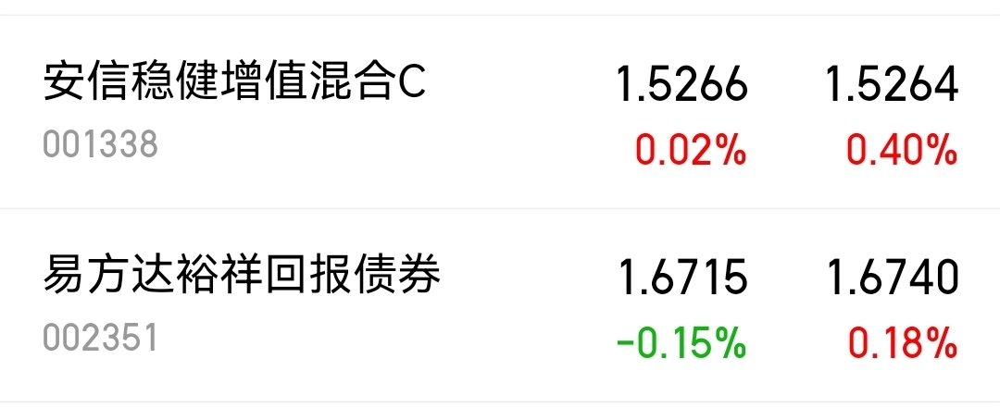

======================================================

_type: talk
@二师父[28814221155551]
2022-04-06 09:46:29 Wed  
topic_id: 415481551181588

<e type="hashtag" hid="881251425252" title="#鳄鱼计划#" /> 华泰鼎利混合买入20份，标普500卖出两份，1000etf买入一份。

中药涨的不错，还是没有卖出计划，这个药的投资思路和两年前投资消费的思路一样，至少盈利百分之50再考虑卖出，很多基金我都会波段，不过他不会的。

@小鱼 at 2022-04-06 09:46:29 Wed

> 华泰鼎利是a还是c呀

----------

@二师父 at 2022-04-06 09:46:29 Wed

> c

----------

@云云 at 2022-04-06 09:46:29 Wed

> 师父，华泰鼎利混合是场内吗？

----------

@二师父 at 2022-04-06 09:46:29 Wed

> 你也可以买场外的

----------

@一心一意 at 2022-04-06 09:46:29 Wed

> 华泰鼎力预期收益大概多少啊

----------

@二师父 at 2022-04-06 09:46:29 Wed

> 年化百分之7

----------

@cotton at 2022-04-06 09:46:29 Wed

> 20份吗

----------

@二师父 at 2022-04-06 09:46:29 Wed

> 对，你结合自己资金来，我买完还剩50份现金了

----------

阅读[1]  评论[25]  赞[0] 

+++++++++++++++++++++++++++++++++++++++++++++++++++++

图片：
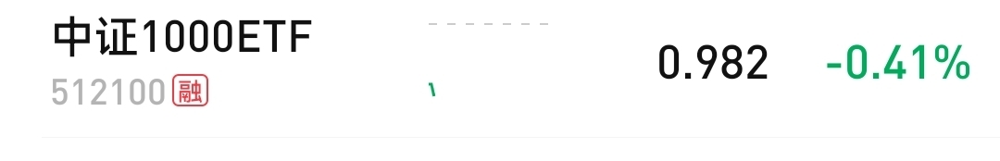
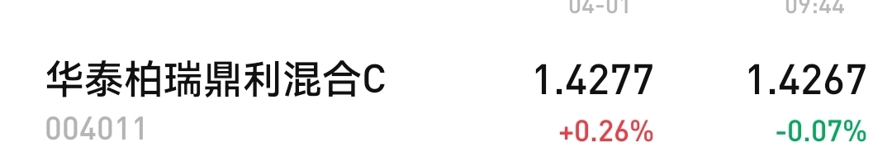

======================================================

_type: talk
@二师父[28814221155551]
2022-04-06 09:52:57 Wed  
topic_id: 415481551124258

1000价格到了，慢慢买入，电池和碳中和越来越不行了，可以拉大网格

我说的方向都还可以，中证红利稍微弱一点，地产最强，耐心持有，至少10个点以上收割利润

@从A到Z at 2022-04-06 09:52:57 Wed

> 电池和碳中和的买入价格是？

----------

@wty at 2022-04-06 09:52:57 Wed

> 红利ETF终于要回本了……

----------

@二师父 at 2022-04-06 09:52:57 Wed

> 上面有啊

----------

@从A到Z at 2022-04-06 09:52:57 Wed

> 好的

----------

阅读[1]  评论[4]  赞[0] 

+++++++++++++++++++++++++++++++++++++++++++++++++++++

图片：
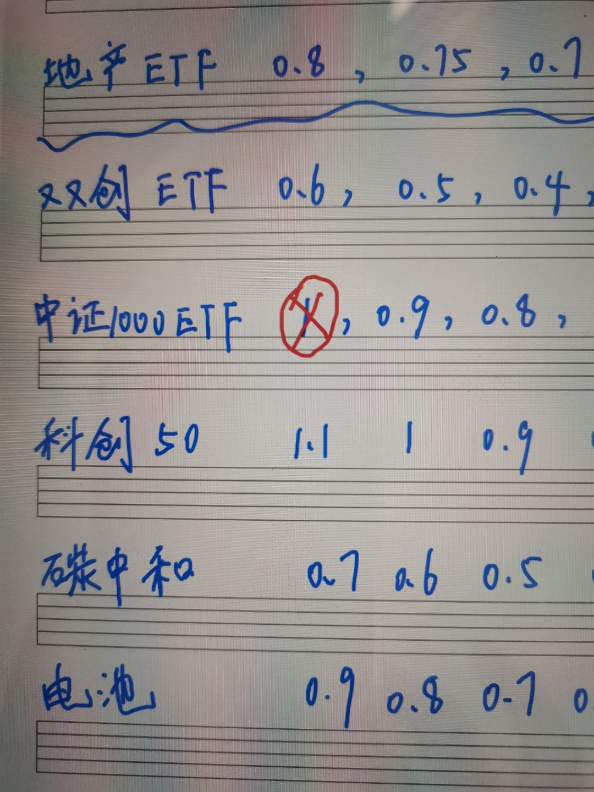

======================================================

_type: talk
@二师父[28814221155551]
2022-04-06 12:20:06 Wed  
topic_id: 415481528555518

<e type="hashtag" hid="48844158151148" title="#关于固守加品种#" /> 最近买的品种二级债，也有偏债混合。

二级债的特点是股票占比在10%——20%之间，一般年化收益率在6%——10%之间。这些品种我们都有分享过。

另外是偏债混合，比如今天投的两只就是偏债混合，大家可以自己看最近多年走势，回撤小，而且不管熊市市场怎么跌，这两只基金都是不断向上的。

也因此这类基金被称为画线派基金。

这两类基金都适合长期持有，如果好的品种年化做到9%，考虑通胀6%，其实实际收益率3%，那么500万一年就有15万的收益。

假设，500万存到货币基金里面，妥妥地贬值，所以大额不用的资金可以考虑稳健配置。

至于指数投资，属于出奇部分，有的时候能取得超额收益，比如最近一个月投资的基金，有的就实现了10%——20%的收益率，当然这和运气和水平有关系，不是每一次都这么好运，如果遇到市场大熊市，就会出现大亏损，所以出奇部分还是少资金。

当总体资金量不足100万的时候，可以适当激进一点，当总体资金量超过1000万，就要做好防守，毕竟赚100万努努力还是可以达到的，而赚1000万则不是那么容易，这就是不同资金量需要不同思路。

另外债基，年化收益率6%，长期来看也是刚好跑赢通胀，如果钱长期不用，也尽量配置债券。要习惯波动，过去买房持续大涨的好日子可能一去不复返，13年钱荒才导致股债双杀，大部分时候长期持有股票和债券收益率是能够均值回归的，年化8%左右。

所以咱们要预定一个目标，年化8%是保底，长期持有债基和偏债混合就能达到，如果这个都达不到，先不要超过和买股权类基金。

守正方能出奇，连辛苦挣来的钱都守不住，还希望通过炒股一年5倍，有点难度。

@helen at 2022-04-06 12:20:06 Wed

> 请问二师父，你的基建一共买了几份啊

----------

@二师父 at 2022-04-06 12:20:06 Wed

> 9份

----------

@helen at 2022-04-06 12:20:06 Wed

> 知道了，谢谢

----------

@梧桐 at 2022-04-06 12:20:06 Wed

> 二师父，现在通胀是6吗

----------

@二师父 at 2022-04-06 12:20:06 Wed

> 官方发布4.6，个人觉得不止

----------

@梧桐 at 2022-04-06 12:20:06 Wed

> 4.6也够高的了，国债利率都到不了。

----------

阅读[1]  评论[6]  赞[0] 

======================================================

_type: talk
@二师父[28814221155551]
2022-04-06 13:35:14 Wed  
topic_id: 585218545218224

<e type="hashtag" hid="15522845812452" title="#提款#" /> 乌龟计划，目前南方地产收益率8个点，下午涨了3个点，11个点，符合提款规则，卖出7分之一，大约500元

如果有中建的也注意提款，虽然大涨突破压力位，但是出了上影线，可以适当收割利润，从底部起来也涨了百分之26了

找对方向，底部不恐惧，就相对容易了，没有卖飞一说，20天不到11个点收益率，还行的。地产这波炒作不知道持续多久，我只知道，涨的越多，未来套的人越多。

@水墨青花 at 2022-04-06 13:35:14 Wed

> 师父，地产仓位低，现在适合适当加仓吗

----------

@二师父 at 2022-04-06 13:35:14 Wed

> 我今天在卖，你买了相当于接我的盘

----------

@光少 at 2022-04-06 13:35:14 Wed

> 中建已提款了[呲牙]还留了点继续持有

----------

@二师父 at 2022-04-06 13:35:14 Wed

> 恭喜恭喜，这肉不少吃

----------

@光少 at 2022-04-06 13:35:14 Wed

> 对[呲牙]，底仓+波段做

----------

@水墨青花 at 2022-04-06 13:35:14 Wed

> 那不动了

----------

@摆渡人 at 2022-04-06 13:35:14 Wed

> 中建是什么

----------

@二师父 at 2022-04-06 13:35:14 Wed

> 中国建筑

----------

阅读[1]  评论[11]  赞[0] 

======================================================

_type: talk
@二师父[28814221155551]
2022-04-06 14:19:25 Wed  
topic_id: 585218548218114

这次底部布局的方向基本盈利了，除了科创50很弱，其他都还行。

重点是基建、中药、农业、300价值，中证红利。

虽然他们不如成长股那么涨幅迅速，但是在加息周期表现却是非常相对较好的。

还是按照纪律，300价值如果有机会重回4600继续每周定投，否则耐心持有。

今年5月缩表，还有一个大会，大事很多，给投资留点缓冲地段。

我说的方向回调都可以做，其他方向做的话就轻仓，重仓方向不能做错了。

@匿名的码农 at 2022-04-06 14:19:25 Wed

> 二师父，中药还能上车吗？之前没有跟

----------

@奉壹 at 2022-04-06 14:19:25 Wed

> 红利ETF（510880）从2.7左右买入连续涨了很久，清仓止盈了10%，烦请二师父解答一下，这笔清仓的钱是等红利etf回调再加仓还是听候布局你所推荐的方向。

----------

@二师父 at 2022-04-06 14:19:25 Wed

> 这个看你自己安排了，指数基金需要择时买入，如果债基就随意了

----------

@光少 at 2022-04-06 14:19:25 Wed

> 地产，基建，中药都出了盈利的部分，等回调再加仓

----------

@奉壹 at 2022-04-06 14:19:25 Wed

> 我不太想钱闲置，想尽快投入使用，最近开车频繁，我怕资金跟不上。但看二师父意思可能接下来进场容易被套，所以不确定未来的发车频率[偷笑]

----------

@韩韩 at 2022-04-06 14:19:25 Wed

> 今天内容好多，我都看晕了555，得好好学习跟上节奏呀

----------

阅读[1]  评论[6]  赞[0] 

+++++++++++++++++++++++++++++++++++++++++++++++++++++

文件：
2022-04-06 14:16:42 Wed
文件大小：[31928]
241582255488181-大涨，火速加仓.docx

======================================================

_type: talk
@二师父[28814221155551]
2022-04-06 14:29:35 Wed  
topic_id: 212581241548121

兄弟们，我发车的时候没有跟，现在我都要卖了，你们想上车，这种问题真不太好回答，反正我在a股这么多年，一个经验就是，宁可不赚钱，也不追高。

今天买了20份，这么多资金为何没有1份地产呢，不是没有原因的哈。

@庆余年 at 2022-04-06 14:29:35 Wed

> 合理安排资金吧，宁愿错失机会，也不要赌风险😷😷😷。况且大A从来都不缺机会，缺钱。

----------

阅读[1]  评论[1]  赞[0] 

======================================================

_type: talk
@二师父[28814221155551]
2022-04-06 20:11:01 Wed  
topic_id: 585218584482254

<e type="hashtag" hid="552114551414" title="#估值数据#" /> 市盈率百分位27.92%，市净率百分位18.61%，SY-BY百分位26.59%。

估值楼层还是第二层，虽然现在很便宜，但是估值楼层依然第二层，主要是成长股的估值没有下来，如果未来想要到一楼，成长股还有30%的下行空间，价值股的下行空间并不太大了。

阅读[1]  评论[0]  赞[0] 

======================================================

_type: talk
@二师父[28814221155551]
2022-04-07 11:28:44 Thu  
topic_id: 585218414824884

<e type="hashtag" hid="28518855451481" title="#乌龟计划#" /> 买入易方达裕祥500元，这只基金可以一直定投，或者一次买入，每周四如果易方达裕祥盈利就继续持有，如果浮亏，就买500元，确定性很大，持有10年收益率差不多一倍。

其他方向看好的很明确基建，地产，猪肉，中药，300价值，中证红利，目前全部盈利，有回调就买。不回调就耐心持有。

剩下的就是美股，回调以后标普500和纳斯达克继续定投，a股这个位置这个仓位已经差不多，除非重新跌破成本价，不然不再盲目补仓，因为美联储缩表风险还是挺大的，所以我竟然在定投二级债基，当然是有底仓的，配置的混合和二级债都非常稳，即使发生危机，以目前的位置，最大回撤绝对不超过百分之3到5，这就不用担心了。

美股也有回调，看看前期支撑位能否跌破，轻仓定投问题不大。止盈利润收割是最佳方法，可以防止卖飞。

医疗被套，不再补仓，从业绩上看没有太大问题，持仓成本大约在医疗etf0.72，等待下一次起来吧，保持底仓的好处是，下一次医疗被炒作不会追高。

@防汛抗旱 at 2022-04-07 11:28:44 Thu

> 裕丰要不要转裕祥

----------

@二师父 at 2022-04-07 11:28:44 Thu

> 不用

----------

@韩韩 at 2022-04-07 11:28:44 Thu

> 这个跟上了

----------

@摆渡人 at 2022-04-07 11:28:44 Thu

> 猪肉对应的是159825ETF吗

----------

@二师父 at 2022-04-07 11:28:44 Thu

> 516670

----------

阅读[1]  评论[5]  赞[0] 

+++++++++++++++++++++++++++++++++++++++++++++++++++++

图片：
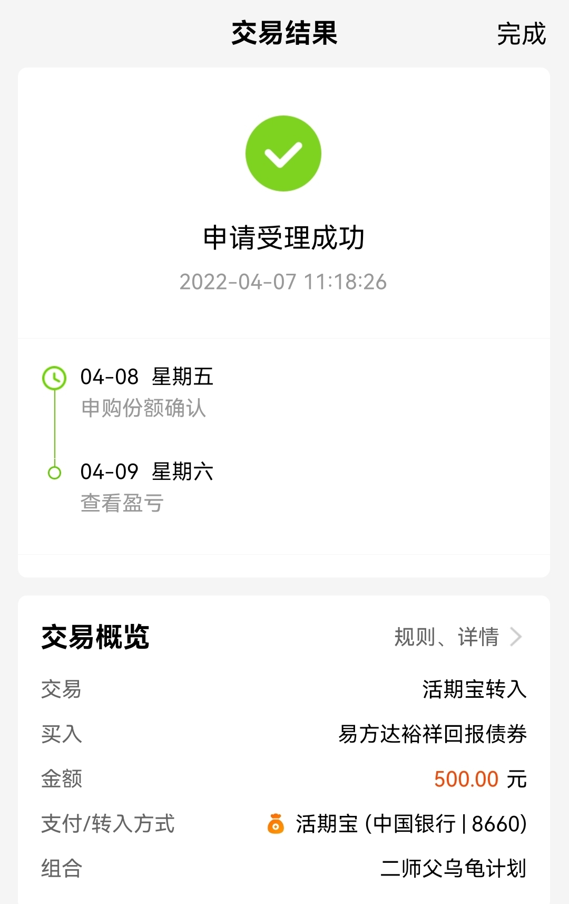

======================================================

_type: q&a
@JOY[111881481812422]
2022-04-07 15:28:11 Thu  
topic_id: 812581422488512

@JOY

>  师父，要是买场内的债基，请问目前有哪些适合的呢？

@二师父

>  场内只有招商双债

阅读[1]  评论[5]  赞[0] 

======================================================

_type: talk
@珅爹[15451242541142]
2022-04-07 21:29:03 Thu  
topic_id: 415481222128848

现在持有纳斯达克，是继续持有还是出掉一部分？

@二师父 at 2022-04-07 21:29:03 Thu

> 我准备定投了

----------

@珅爹 at 2022-04-07 21:29:03 Thu

> 是不是60日线下开始定投？

----------

@二师父 at 2022-04-07 21:29:03 Thu

> 是的

----------

@样 at 2022-04-07 21:29:03 Thu

> 请问二师父给纳指多少仓位？分成多少份去投？我还没有纳指，这次想跟上步骤

----------

@二师父 at 2022-04-07 21:29:03 Thu

> 百分之20仓位

----------

@韩韩 at 2022-04-07 21:29:03 Thu

> 20%仓位是指，我打算这只基金投1万元，第一次投2000元，对吗

----------

@二师父 at 2022-04-07 21:29:03 Thu

> 总资金10万，最多买2万

----------

阅读[1]  评论[7]  赞[0] 

======================================================

_type: q&a
@摆渡人[818582151851212]
2022-04-07 23:00:15 Thu  
topic_id: 184258182541222

@摆渡人

>  二师傅，请问目前持仓的医疗新能源半导体光伏类基金浮亏状态下，这种市场行情该如何处理比较合适。

@二师父

>  持仓多少，如果单个仓位百分之10以内可以躺平，如果仓位过重的话考虑反弹减仓至能承受的仓位

阅读[1]  评论[0]  赞[0] 

======================================================

_type: talk
@二师父[28814221155551]
2022-04-08 07:16:09 Fri  
topic_id: 212581414412521

<e type="hashtag" hid="552114551414" title="#估值数据#" /> 市盈率百分位25.98%，SY-BY百分位25.01%，SY/BY百分位12.6%，估值楼层二层，如果再跌10%，估计估值楼层就进入一层了。

这个位置，除非短期买的基金盈利，做小波段，否则不必卖出了。

咱们估值楼层总共是6层，1，2层最安全，18年10月，20年3月，都到了估值楼层1层。这个位置卖出不划算。

当前美联储加息刚开始，和18年不同，18年美联储加息已经走到末期，20年还在放水，所以那时候我敢满仓，而现在不行，加息一般3年左右会发生大的动荡。

咱们要做好防守，防守选择债基、偏债混合是不错的，即使发生危机，好的纯债基金是上涨的，比如去年布局的招商产业债，如果不缺钱就一直拿着，预期年化收益率5.5%，比银行理财好。

另外二级债和偏债混合遇到危机则波动小，一般回撤控制在10%以内，大家要知道真的危机来了沪深300跌50%也很常见。

反之，如果今年走牛，这些基金的预期收益率也能跟上来。

做好了防守，就要进攻，进攻的基金方向已经分享，后面持续分享，又到了每周坚持定投的日子了。

@嘉宾 at 2022-04-08 07:16:09 Fri

> 请问纯债及二级债等，现在分批入还是一次买入，怎么操作合适些？

----------

@二师父 at 2022-04-08 07:16:09 Fri

> 一次买入

----------

阅读[1]  评论[2]  赞[0] 

======================================================

_type: talk
@珅爹[15451242541142]
2022-04-08 07:26:34 Fri  
topic_id: 415481212152218

请问那么多基金，总共分多少份进行定投？各类之间的配比怎样？

@二师父 at 2022-04-08 07:26:34 Fri

> 100到300份之间

----------

阅读[1]  评论[1]  赞[0] 

======================================================

_type: talk
@珅爹[15451242541142]
2022-04-08 09:11:35 Fri  
topic_id: 415481144445858

您好。
乌龟组合通过天天基金买入，高点买入半途进场，现在亏损严重，能不能把后续每次加仓的时候的金额改成翻倍投？

@二师父 at 2022-04-08 09:11:35 Fri

> 易方达裕祥可以

----------

阅读[1]  评论[1]  赞[0] 

======================================================

_type: talk
@二师父[28814221155551]
2022-04-08 14:24:39 Fri  
topic_id: 184242255158842

最近发生了一件事，美国众议院院长佩洛西准备访台，中方要求取消。

大家注意，今年美联储加息不是最危险的，要对地缘政治关注。

如果真的发生了意外，投资都可以停了。希望一切平安哈。

@奉壹 at 2022-04-08 14:24:39 Fri

> 现在光伏持仓1.400，大概在15%仓位，二师父预计光伏还有多少回撤？需要定投降低成本吗？

----------

@二师父 at 2022-04-08 14:24:39 Fri

> 不需要，不要买

----------

@摆渡人 at 2022-04-08 14:24:39 Fri

> 二师父能说明一下为什么嘛

----------

@二师父 at 2022-04-08 14:24:39 Fri

> 什么为什么？

----------

@以古论今 at 2022-04-08 14:24:39 Fri

> 华泰鼎立一次性买入70万，可行不？还是分次买入

----------

@以古论今 at 2022-04-08 14:24:39 Fri

> 如果发生地缘政治，华泰鼎立这样的二级债基也停止吗？

----------

@二师父 at 2022-04-08 14:24:39 Fri

> 如果资金700万以上的话可以，这个看情况，如果我们和弯弯打起来了，那么可以停一停

----------

@cotton at 2022-04-08 14:24:39 Fri

> 停了的话，手里持有的是不是卧倒呢，还是说盈利的要都清空

----------

阅读[1]  评论[9]  赞[0] 

+++++++++++++++++++++++++++++++++++++++++++++++++++++

文件：
2022-04-08 14:18:00 Fri
文件大小：[472146]
421485225144228-稳增长方向依然很猛，大盘是否见底.docx

======================================================

_type: talk
@二师父[28814221155551]
2022-04-08 23:16:21 Fri  
topic_id: 212525524528241

<e type="hashtag" hid="552114551414" title="#估值数据#" />市盈率百分位26.06%，SY-BY百分位25.07%，SY/BY百分位12.76%。

今年的方向越来越明显，稳增长方向。

基建、地产、银行、保险、中药、猪肉、农业。

农业我用的是股票，就不聊了，基金暂时没找到。

大家主要做六个方向，基建、地产、银行、保险、中药、猪肉，目前只有保险没配置，周末会介绍保险基金。

回调至成本价格以下可以定投，这些方向都是稳增长方向。

至于下游产业链，基建带动建材、水泥、等一系列板块起来，相关行业也会利好，如果想自己做，也可以，总之往这六个方向靠，同时辅助一些宽基，纳斯达克、恒生、上证指数，300价值、中证红利。

基本上足够了。医疗、锂电、碳中和、芯片、光伏这些板块不是今年的重点，如果想做，1%仓位就足够了，不要重仓。

方向很重要，跟着产业政策和趋势走，广州久违的接力贷又回来了，福州放开限购了。地产政策的放松带来地产的起飞，目前大家有钱都不敢投资，银行理财和货币基金的额度都不够，上面一定会刺激基建地产的，否则5.5%的目标根本不可能实现。

阅读[1]  评论[0]  赞[0] 

======================================================

_type: talk
@珅爹[15451242541142]
2022-04-09 06:13:44 Sat  
topic_id: 585252242814514

纳斯达克重仓轻微亏损状态，是先赎回还是继续投？师傅是场内交易纳斯达克指数还是场外？

@二师父 at 2022-04-09 06:13:44 Sat

> 不要超过30%，场内场外都可以的

----------

阅读[1]  评论[1]  赞[0] 

======================================================

_type: talk
@二师父[28814221155551]
2022-04-09 07:59:13 Sat  
topic_id: 184242215281142

目前准备配置的方向。除了保险都有配置，已经盈利的中药、农业、基建、地产、银行，随时都可以收割利润。

投资的第一要义是先赚钱，保证不赔钱，只要遵循低估定投，正常收割，高估卖本，是不会亏的哈。

昨天说的停止投资是出现了极端情况，我们和taiwan打起来了，肯定是要停止投资，那时候尽可能赎回，不过这种概率太小了，别过于担心。也多关注局势的发展，这个话题不能聊，总之，极端黑天鹅是0.01%的概率，不需要为这0.01%担心。

@李金泉 at 2022-04-09 07:59:13 Sat

> 二师傅，那如果纳斯达克100和标普500怎么选怎么投呢？现在合适吗？

----------

@二师父 at 2022-04-09 07:59:13 Sat

> 定投可以的

----------

@李金泉 at 2022-04-09 07:59:13 Sat

> 谢谢

----------

阅读[1]  评论[3]  赞[0] 

+++++++++++++++++++++++++++++++++++++++++++++++++++++

文件：
2022-04-09 07:55:52 Sat
文件大小：[151240]
118254184515142-现在可以买的基金.docx

======================================================

_type: talk
@二师父[28814221155551]
2022-04-09 08:00:13 Sat  
topic_id: 585252241288224

每日估值表，严格按照这个估值表定投，问题不大。你需要做的就是耐心坚持。

阅读[1]  评论[0]  赞[0] 

+++++++++++++++++++++++++++++++++++++++++++++++++++++

图片：
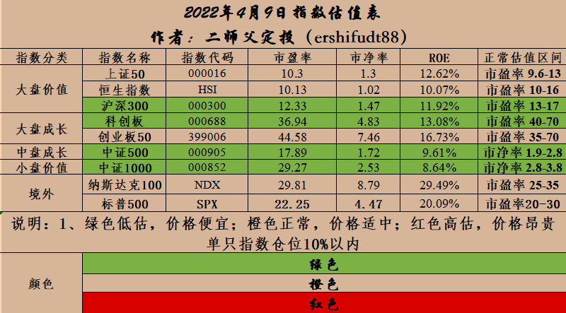

======================================================

_type: talk
@二师父[28814221155551]
2022-04-09 15:21:02 Sat  
topic_id: 585252282142544

关于科创50，目前科创50一直跌，这种指数和创业板类似，不能持续定投，需要用时间换空间，简单说就是网格交易模式，假设以前是每周定投一次，现在每下跌10%加仓一份，按照这种加仓模式，最多有4次加仓机会，这种是比较合适的。

因为加息周期所有的成长指数都会大跌。

而价值类指数稍微好一点，等大熊市来了，那么就是成长和价值一起跌，到时候就可以全部债基了。目前最好的债基招商产业债，年化收益率5.5%，妥妥地跑赢通胀。

有读者亏怕了，直接存了3年定期，其实拿的住的话，收益率不如债基。

当然存定期有好处就是，可以管住手，不会把钱用来瞎抄底。

阅读[1]  评论[0]  赞[0] 

======================================================

_type: talk
@二师父[28814221155551]
2022-04-10 07:37:29 Sun  
topic_id: 415454842542218

兴全合润，易方达蓝筹目前可以轻仓定投

可以结合估值楼层，一二楼定投，五六楼止盈

长期持有的基金债券基金，偏债混合基金，这种基金不适合长期持有

@珅爹 at 2022-04-10 07:37:29 Sun

> 什么叫一二楼，什么叫五六楼？

----------

@二师父 at 2022-04-10 07:37:29 Sun

> 每天分享的估值数据，估值一楼代表市场极度低估，估值六楼代表市场极度高估

----------

@韩韩 at 2022-04-10 07:37:29 Sun

> 二师父，债券基金和偏债混合基金可以长期持有。
兴全混合和易方达蓝筹这类，偏股型混合基金，不适合长期持有。对吧

----------

@二师父 at 2022-04-10 07:37:29 Sun

> 也可以长期持有，不过高估的时候要止盈

----------

@韩韩 at 2022-04-10 07:37:29 Sun

> 好的好的，现在明白思路了

----------

@老孙头 at 2022-04-10 07:37:29 Sun

> “这种基金不适合长期持有“—是指“兴全合润，易方达蓝筹“这种吗？

----------

@二师父 at 2022-04-10 07:37:29 Sun

> 对，高位要止盈

----------

@蛋炒饭不加蛋 at 2022-04-10 07:37:29 Sun

> 周定投的话分几年定投呢？

----------

阅读[1]  评论[12]  赞[0] 

======================================================

_type: talk
@二师父[28814221155551]
2022-04-10 09:44:55 Sun  
topic_id: 184242528255582

基建已经不再低估，可以持有或者收割利润，保险还是低估的，可以轻仓定投。

如果仓位已经可以了，卧倒就行了。

阅读[1]  评论[0]  赞[0] 

+++++++++++++++++++++++++++++++++++++++++++++++++++++

文件：
2022-04-10 09:44:21 Sun
文件大小：[32868]
118254828518482-语不惊人死不休.docx

======================================================

_type: talk
@珅爹[15451242541142]
2022-04-10 17:09:42 Sun  
topic_id: 212525884241481

请教一下，基金定投的话，由于短期申购赎回会产生赎回手续费，部分赎回时，天天基金会不会优先卖掉早期申购的基金份额来避免高手续费。

@二师父 at 2022-04-10 17:09:42 Sun

> 会的

----------

阅读[1]  评论[1]  赞[0] 

======================================================

_type: talk
@二师父[28814221155551]
2022-04-10 21:55:50 Sun  
topic_id: 812525822445542

周末看了看各个板块，依然是四傻有行情。

放弃创业板里里面的方向，创业板未来不低估不会再投了。

里面所有的票都避开，我们在年前已经全部清仓了创业板，医疗目前是浮亏的，属于一个不太好的方向，先躺平，等估值消化完毕再做打算。

要做的话，今年就做四傻，回调买入，涨了盈利了就卖或者持有，星球的朋友都是按照纪律来得，我很放心。

对未来比较悲观的，可以定投安信稳健增值混合，这个基金里面也主要是三傻持仓，而且属于偏债混合，是非常稳健的。

@珅爹 at 2022-04-10 21:55:50 Sun

> 四傻是什么？

----------

@二师父 at 2022-04-10 21:55:50 Sun

> 银保地基

----------

@一心一意 at 2022-04-10 21:55:50 Sun

> 鳄鱼的科创50.和双创都清仓了么？没看到啊

----------

@二师父 at 2022-04-10 21:55:50 Sun

> 拿着的

----------

阅读[1]  评论[4]  赞[0] 

======================================================

_type: talk
@二师父[28814221155551]
2022-04-11 09:56:59 Mon  
topic_id: 812525815842482

<e type="hashtag" hid="881251425252" title="#鳄鱼计划#" /> 保险主题买入一份，成长组合，保险主题买入2000元。

目前回调重点买基建，地产，其次300价值，银行保险。

害怕回撤的，定投我说的二级债基和偏债混合。

熊市慢慢买入，坚持积累。10个点收割利润，卖的房产似乎没有飞，经过10多年的执行，经历两轮牛熊，利润收割法适合a股，创业板不要碰，里面三大持仓，新能源，锂电，医疗，这些暂停，今年大概率是创业板熊市了。

@珅爹 at 2022-04-11 09:56:59 Mon

> 是场内吗？建议场内还是场外？

----------

@李金泉 at 2022-04-11 09:56:59 Mon

> 请问二师傅保险主题网格拉倒多少呢？

----------

@二师父 at 2022-04-11 09:56:59 Mon

> 这个我先定投，有一定仓位百分之10网格

----------

@李金泉 at 2022-04-11 09:56:59 Mon

> 如果今年价值股，保险主题股价也蛮低了，请教下为什么要10%那么大呢？下跌空间还很多吗？

----------

@二师父 at 2022-04-11 09:56:59 Mon

> 因为我会先定投，积累一定的仓位，金融危机的时候银行和保险会跌的比较惨

----------

@李金泉 at 2022-04-11 09:56:59 Mon

> 了解了，谢谢

----------

@涓涓 at 2022-04-11 09:56:59 Mon

> 请问二师父，今天回调适合买入地产基金吗？目前仓位很低，不到1%

----------

@二师父 at 2022-04-11 09:56:59 Mon

> 看着要继续回调了，定投没事

----------

阅读[1]  评论[10]  赞[0] 

+++++++++++++++++++++++++++++++++++++++++++++++++++++

图片：
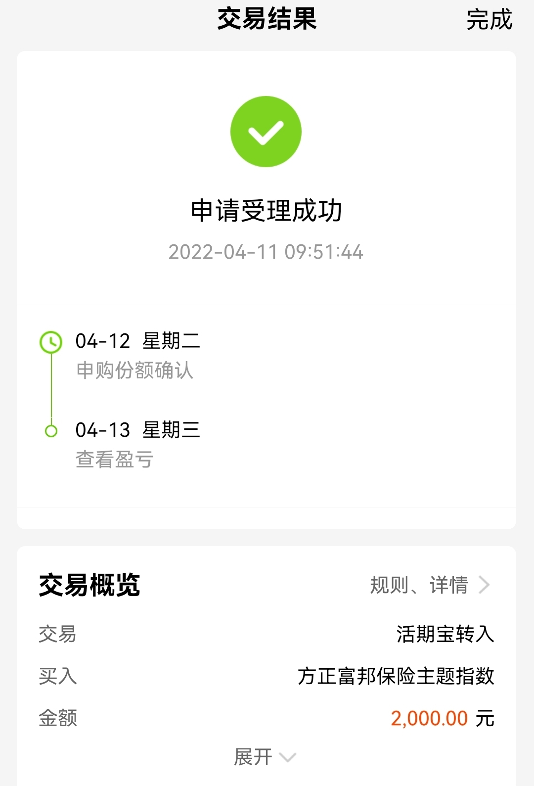
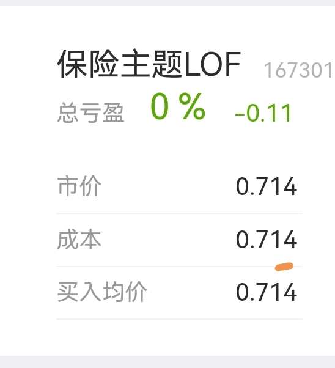

======================================================

_type: talk
@二师父[28814221155551]
2022-04-11 10:46:12 Mon  
topic_id: 212525818581851

科创持有中，卖出必定盈利，非盈利卖出我给大家发红包，投资均有风险，控制好仓位

@珅爹 at 2022-04-11 10:46:12 Mon

> 科創明明是亏损，哪里盈利啊？

----------

@二师父 at 2022-04-11 10:46:12 Mon

> 我没说盈利啊

----------

阅读[1]  评论[2]  赞[0] 

+++++++++++++++++++++++++++++++++++++++++++++++++++++

图片：
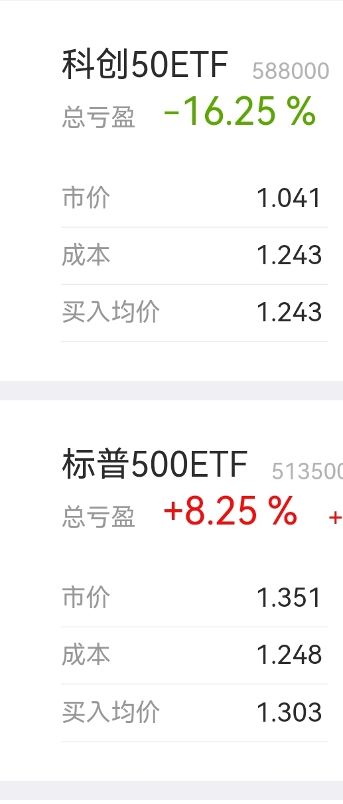

======================================================

_type: talk
@二师父[28814221155551]
2022-04-11 13:04:40 Mon  
topic_id: 212525211511421

科创50跌破发行点位了，他估计成为不了纳斯达克了，以后他和上证指数一样就是难兄难弟，以后等他跌到反转我再来网格吧。

中国股市，我们猜测到底是创业板成为纳斯达克，还是科创板成为纳斯达克，最后发现我们都想多了，这个市场，除了消费，其他的都只适合低买高卖。

@wty at 2022-04-11 13:04:40 Mon

> [流泪]

----------

@杜志彪 at 2022-04-11 13:04:40 Mon

> 是的，我现在就是不跌破3000我就等反转了，期间有跌的多的就调调仓，总原则是不追加资金了。

----------

@JOY at 2022-04-11 13:04:40 Mon

> 师父，请教下，科创板和创业板极端情况下，各自还有多大的下探空间？创业板参考19年年初的底部价格有意义吗？科创板好像还没有底部数据～

----------

@二师父 at 2022-04-11 13:04:40 Mon

> 没有意义，股市非线性

----------

@JOY at 2022-04-11 13:04:40 Mon

> 谢谢

----------

阅读[1]  评论[5]  赞[0] 

======================================================

_type: talk
@二师父[28814221155551]
2022-04-11 19:24:12 Mon  
topic_id: 812525451825122

<e type="hashtag" hid="552114551414" title="#估值数据#" />市盈率百分位26.26%%，SY-BY百分位25.69%，SY/BY百分位13.9%。

估值楼层二层，其实看起来市场跌了，但是整体并未创下新低，新低是创业板和深证成指。这俩指数未来是要继续新低的。如果中途有反弹，还是减仓创业板。

但是上证指数没事，这次3月布局的基建、地产还是盈利的，银行目前也盈利，保险刚减仓，如果继续跌，坚持定投。主要买低估四傻，基建、地产，银行跌回成本价格再买，如果不跌回成本价格，躺平。

如果你的持仓是300价值、中证红利、这些价值类基金，或者债基，目前长期拿住，如果是成长类基金，遇到反弹尽可能离开。

每周坚持定投一点点，选择低估的宽基和行业，注意分散配置，以债基、二级债为主，剩余坚持定投。

@衣袂飘香 at 2022-04-11 19:24:12 Mon

> 好

----------

@摆渡人 at 2022-04-11 19:24:12 Mon

> 保险刚建仓还是减仓

----------

@二师父 at 2022-04-11 19:24:12 Mon

> 刚建仓

----------

@珅爹 at 2022-04-11 19:24:12 Mon

> 好像没有发车指令啊

----------

阅读[1]  评论[4]  赞[0] 

======================================================

_type: talk
@珅爹[15451242541142]
2022-04-12 06:15:07 Tue  
topic_id: 812525428444882

上午好，纳斯达克跌破60日线了，是否定投？场内还是场外好呢？从经济运行趋势来讲，和标普比起来，是否定投标普更合适？

@二师父 at 2022-04-12 06:15:07 Tue

> 定投的，这两个都不错

----------

阅读[1]  评论[1]  赞[0] 

======================================================

_type: talk
@菖朴健康[582841185442854]
2022-04-12 06:42:13 Tue  
topic_id: 812525428122182

二师父，这个消息在哪里看到的呢？

@二师父 at 2022-04-12 06:42:13 Tue

> choice数据，你去东方财富也能找到的

----------

@菖朴健康 at 2022-04-12 06:42:13 Tue

> 明白，谢啦

----------

阅读[1]  评论[2]  赞[0] 

+++++++++++++++++++++++++++++++++++++++++++++++++++++

图片：
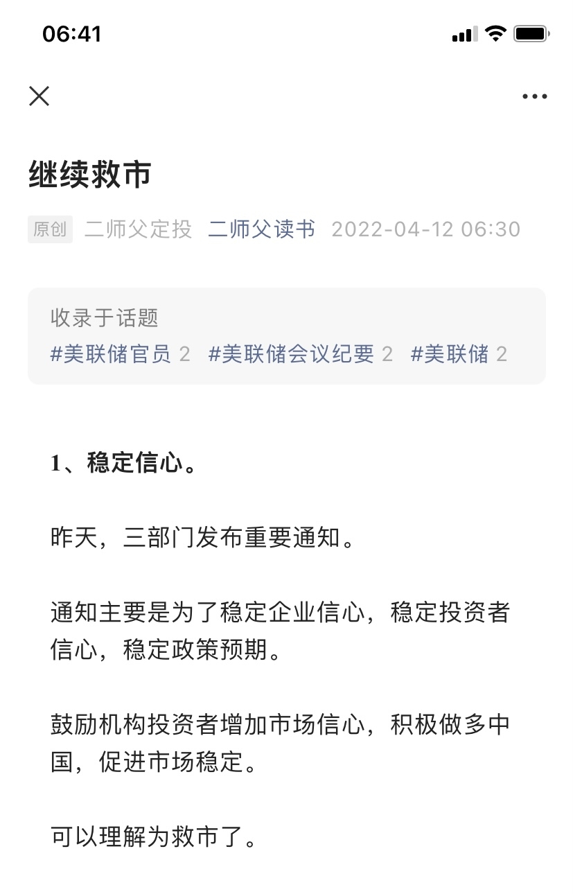

======================================================

_type: talk
@二师父[28814221155551]
2022-04-12 08:52:04 Tue  
topic_id: 184242144821482

基金代码，大家收藏下，纳斯达克跌破60日线可以轻仓定投了，本周会开始轻仓定投，别抄底就行。注意，定投和一次买入的区别，定投是手里有10万一次买入100或者1000，这样才能摊低成本，本来手里就只有10万，一次就干进3万，没法摊低成本，而且会有锚固效应，导致越跌越买，越买越套。

因为重仓的买入价位太高了。控制好现金，管住手，每周四定投，盈利了就不投了，安全第一。

阅读[1]  评论[0]  赞[0] 

+++++++++++++++++++++++++++++++++++++++++++++++++++++

图片：
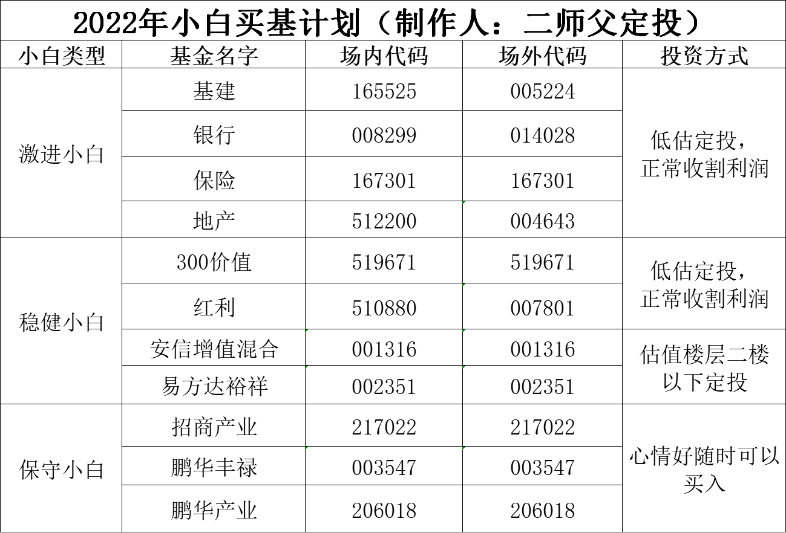

======================================================

_type: talk
@二师父[28814221155551]
2022-04-12 08:58:13 Tue  
topic_id: 415454252444528

<e type="hashtag" hid="88855124442822" title="#2022年小白买基金计划#" /> 基金代码，大家收藏下，大家在券商做好了投资类型测试，根据自己的风险偏好，然后就可以开始投资了。

@奉壹 at 2022-04-12 08:58:13 Tue

> 就喜欢这种简洁明了的啊哈哈哈[偷笑][偷笑]谢谢分享

----------

@防汛抗旱 at 2022-04-12 08:58:13 Tue

> 目前有低估的吗

----------

@二师父 at 2022-04-12 08:58:13 Tue

> 保险和基建低估

----------

@珅爹 at 2022-04-12 08:58:13 Tue

> 纳斯达克呢

----------

@二师父 at 2022-04-12 08:58:13 Tue

> 纳斯达克也可以

----------

@摆渡人 at 2022-04-12 08:58:13 Tue

> 二师父，这个保险我看了下持仓怎么还有宁德时代啊，不是纯种的啊

----------

@二师父 at 2022-04-12 08:58:13 Tue

> 没有完全是保险的etf

----------

阅读[1]  评论[7]  赞[0] 

+++++++++++++++++++++++++++++++++++++++++++++++++++++

图片：

======================================================

_type: talk
@二师父[28814221155551]
2022-04-12 09:12:40 Tue  
topic_id: 415454252888218

星球可以建立专栏了，计划做一个发车专栏和估值专栏，这样可以更容易查阅。

@匿名的码农 at 2022-04-12 09:12:40 Tue

> 专栏好，说实话，目前的加仓信息不好查看

----------

@留影 at 2022-04-12 09:12:40 Tue

> 想大家之所想[强]

----------

@一叶秋末ヾ at 2022-04-12 09:12:40 Tue

> 这个可以有，期待尽快出来[呲牙]

----------

阅读[1]  评论[3]  赞[0] 

======================================================

_type: talk
@二师父[28814221155551]
2022-04-12 16:57:11 Tue  
topic_id: 585252481458824

芒格爷爷都割肉了，大家别对自己要求太高，总体赚钱就行。

阅读[1]  评论[0]  赞[0] 

+++++++++++++++++++++++++++++++++++++++++++++++++++++

文件：
2022-04-12 16:56:34 Tue
文件大小：[33740]
241584514454541-芒格爷爷跑路了.docx

======================================================

_type: talk
@珅爹[15451242541142]
2022-04-12 17:09:24 Tue  
topic_id: 812525418125552

今天卖出保险了吗？

@二师父 at 2022-04-12 17:09:24 Tue

> 没有啊，今天不用卖

----------

阅读[1]  评论[1]  赞[0] 

======================================================

_type: talk
@懂心[241128241828251]
2022-04-12 19:31:41 Tue  
topic_id: 184242188414242

二师父，请问买保险主题基金资金分几份啊？

@二师父 at 2022-04-12 19:31:41 Tue

> 计划10份

----------

@懂心 at 2022-04-12 19:31:41 Tue

> 好嘞，谢谢您

----------

阅读[1]  评论[2]  赞[0] 

======================================================

_type: talk
@二师父[28814221155551]
2022-04-13 13:27:41 Wed  
topic_id: 212525122424141

<e type="hashtag" hid="881251425252" title="#鳄鱼计划#" /> 卖出红利etf一份，有盈利就收割利润，熊市要么网格赚点小钱，要么卧倒，网格低买高卖在熊市也可以盈利，中药没有收割利润，又跌回去了，这就是a股市场的现状。传媒去年收割了一半，今年也回去了，消费顶部收割了一半，回撤了百分之30，剩下的长期持有，我用10年来验证下长期持有真的有效吗，如果长期持有消费都不行的话，那么你懂的。

截图的三只基金各买入10份，不要盲目买，从去年开始，无脑定投的一直亏钱，标的很重要，买入时间也很重要，持仓的招商产业，国开债等基金基本盈利6个点左右，对比下沪深300，真的算超神了。

追求绝对盈利，跑赢沪深300没有太大意义

@小鱼 at 2022-04-13 13:27:41 Wed

> 卖出红利，场内还是场外呀

----------

@二师父 at 2022-04-13 13:27:41 Wed

> 场内

----------

@cotton at 2022-04-13 13:27:41 Wed

> 那你的剩余资金用完了？

----------

@二师父 at 2022-04-13 13:27:41 Wed

> 上次50份，用了30份，还有20份

----------

@cotton at 2022-04-13 13:27:41 Wed

> 嗯呢。。

----------

@What if at 2022-04-13 13:27:41 Wed

> 截图买入的是鳄鱼计划吗？

----------

@二师父 at 2022-04-13 13:27:41 Wed

> 是的

----------

@JOY at 2022-04-13 13:27:41 Wed

> 截图的这3支也是买的场内的吧？

----------

阅读[1]  评论[18]  赞[0] 

+++++++++++++++++++++++++++++++++++++++++++++++++++++

图片：
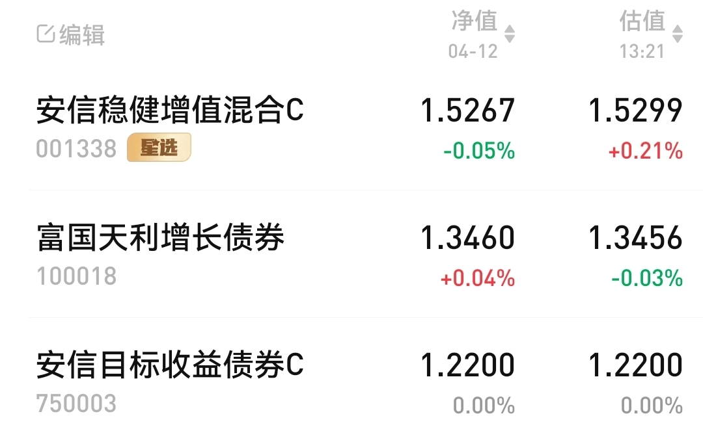

======================================================

_type: talk
@二师父[28814221155551]
2022-04-13 13:30:33 Wed  
topic_id: 415454155224158

以后大家就可以在专栏看我的发车复盘了，无论任何情况，本人公开发车基金如果出现亏损卖出的情况，我给大家发红包，任何一只基金都保证盈利卖出，不追求跑赢沪深300，追求绝对盈利，今年沪深300跌了17个点，你跌了10个点，跑赢了沪深300那也是亏钱，绝对盈利才是关键。

@坚持学习 at 2022-04-13 13:30:33 Wed

> 二师父，请问怎么进去，星球没找到入口哦

----------

@二师父 at 2022-04-13 13:30:33 Wed

> 在置顶

----------

@留影 at 2022-04-13 13:30:33 Wed

> 用app看，网页版好像找不到

----------

@西锦巴乌 at 2022-04-13 13:30:33 Wed

> 请问哪个app？

----------

@二师父 at 2022-04-13 13:30:33 Wed

> 就在星球，置顶的下面

----------

阅读[1]  评论[5]  赞[0] 

+++++++++++++++++++++++++++++++++++++++++++++++++++++

图片：
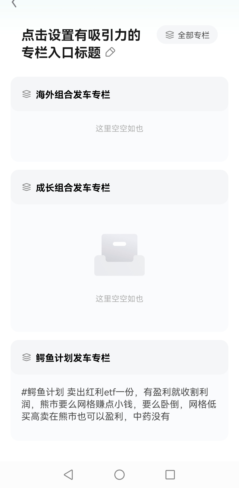

======================================================

_type: talk
@二师父[28814221155551]
2022-04-13 14:10:53 Wed  
topic_id: 585252854245524

还没结束，这是历史必然，不确定性很大。

阅读[1]  评论[0]  赞[0] 

+++++++++++++++++++++++++++++++++++++++++++++++++++++

图片：
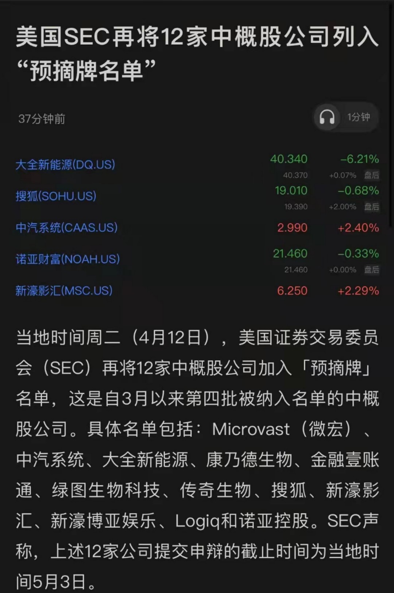

======================================================

_type: talk
@珅爹[15451242541142]
2022-04-13 14:37:14 Wed  
topic_id: 184242841581212

什么时候有估值图更新？

@二师父 at 2022-04-13 14:37:14 Wed

> 周六

----------

阅读[1]  评论[1]  赞[0] 

======================================================

_type: talk
@二师父[28814221155551]
2022-04-13 22:19:34 Wed  
topic_id: 184245282885112

<e type="hashtag" hid="552114551414" title="#估值数据#" /> 市盈率百分位25.38%，SY-BY百分位24.46%，SY/BY百分位12.04%，估值楼层二楼，预计万得A再跌10%就进入一层了。

目前配置了一些保守得底仓，类似一级债基、二级债基、偏债混合，都是长期向上得，波动可控。所以一次仓位拉上来。

未来坚持每周四定投，偶尔收割利润。

交易实际上是一个闭环。

分为买入和卖出，从结果上看，卖出价格高于买入价格就盈利了。

既然如此，我们就需要关注买的便宜，未来能涨得多得品种。

当前方向依然是纳斯达克、基建、地产、银行、保险、中证红利、300价值。

全部往价值方向走，同时赚了就把钱拿出来买货币基金或者一级债基。这些都是避险品种，稳步向上，很多嚷嚷着终身持有的可能连15年都没经历过。

低估定投，正常收割，高估卖本。永远不变，坚定执行就可以稳定盈利。

@wty at 2022-04-13 22:19:34 Wed

> 二师父，广发中债1-3年持有30天了，要继续持有还是可以转换成华泰鼎利和安信稳健增值？

----------

@二师父 at 2022-04-13 22:19:34 Wed

> 转成安信稳健增值

----------

@wty at 2022-04-13 22:19:34 Wed

> 谢谢🙏

----------

@奉壹 at 2022-04-13 22:19:34 Wed

> 师傅，今天标普继续定投吗

----------

@二师父 at 2022-04-13 22:19:34 Wed

> 定投纳斯达克

----------

@奉壹 at 2022-04-13 22:19:34 Wed

> 好的，谢谢

----------

@样 at 2022-04-13 22:19:34 Wed

> 二师父纳斯达克是场外还是场内？

----------

@二师父 at 2022-04-13 22:19:34 Wed

> 场外

----------

阅读[1]  评论[8]  赞[0] 

======================================================

_type: talk
@二师父[28814221155551]
2022-04-14 10:02:23 Thu  
topic_id: 212528854414241

<e type="hashtag" hid="15522815258112" title="#周四定投海外组合#" /> 基础仓位建立好了以后，接下来就是周四固定定投，如果纳斯达克持续60日线以下，今年就坚持定投，一直等有5到10个点利润再收割，纳斯达克进入低估以后再加倍定投

纳斯达克是常牛指数，历史上最长下跌时间是一年半，不会很难熬，a股指数最长下跌时间比较长，相对难熬

不管怎么变化，投资抓住一点，两大策略，不抄底，坚持定投，盈利卖出，那么指数投资就大概率盈利

对于债基，容易买了垃圾债暴雷，所以尽量配置20只固收加分散，单一暴雷了，只有小部分仓位不至于伤筋动骨

@梧桐 at 2022-04-14 10:02:23 Thu

> 债基也容易爆雷吗，比如白银黄金组合，概率多大

----------

@二师父 at 2022-04-14 10:02:23 Thu

> 概率特别小，主要看持仓的基金经理会不会买到类似恒大这种暴雷企业债，一般公募基金会有仓位控制，对整体影响不大

----------

@梧桐 at 2022-04-14 10:02:23 Thu

> 明白了

----------

@小鱼 at 2022-04-14 10:02:23 Thu

> 光发A还是C呀

----------

@二师父 at 2022-04-14 10:02:23 Thu

> c

----------

@留影 at 2022-04-14 10:02:23 Thu

> 请问这个基金的净值是算昨夜美股价格还是今夜的美股价格

----------

@FK Hsiang at 2022-04-14 10:02:23 Thu

> 二師父、納斯達克QDII定投場外和場內基金、為什麼選擇場外基金考量點是什麼？

----------

@二师父 at 2022-04-14 10:02:23 Thu

> 给大家一个参考，你是可以场内的

----------

阅读[1]  评论[8]  赞[0] 

+++++++++++++++++++++++++++++++++++++++++++++++++++++

图片：
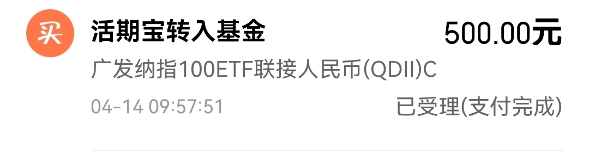

======================================================

_type: talk
@防汛抗旱[111848815428452]
2022-04-14 10:02:26 Thu  
topic_id: 585251124484424

请教师父，要买一个公寓，抽钱出来怎么抽相对好点？

@二师父 at 2022-04-14 10:02:26 Thu

> 垃圾股票，成长板块的基金，债基

----------

阅读[1]  评论[1]  赞[0] 

======================================================

_type: talk
@二师父[28814221155551]
2022-04-14 10:43:46 Thu  
topic_id: 415458841851848

创业板一直在跌，这个走势和15年很像，别补仓他，可以买上证指数，但是创业板和里面相关股票一定不能再补仓，安全第一

@波波 at 2022-04-14 10:43:46 Thu

> 科创50呢？

----------

@二师父 at 2022-04-14 10:43:46 Thu

> 也暂停，只买市盈率15以下的指数，安全第一

----------

阅读[1]  评论[2]  赞[0] 

======================================================

_type: q&a
@韩韩[241582255451111]
2022-04-14 11:00:44 Thu  
topic_id: 212528851824251

@韩韩

>  二师父，买了同业存单，适合长期拿着吗？还是卖掉换债基比较好呢

@二师父

>  不用的，他的风险和收益是介于货币基金和债券基金之间的

阅读[1]  评论[2]  赞[0] 

======================================================

_type: talk
@二师父[28814221155551]
2022-04-14 13:57:22 Thu  
topic_id: 212528882414841

分享一只基金，市场在利好加持下反弹了，昨天把整体仓位加上来了，接下来如果继续反弹就卧倒或者收割利润，如果跌下来再加仓。

注意创业板不要买，反弹就是出货的机会，上方套牢盘太多，不会新高的。

能够做的就是二级债、偏债混合，四傻和美股指数。

@留影 at 2022-04-14 13:57:22 Thu

> 文不对题？

----------

@JOY at 2022-04-14 13:57:22 Thu

> 师父，您说得是哪只呀？文章发错了吧？

----------

@二师父 at 2022-04-14 13:57:22 Thu

> 消费啊

----------

@JOY at 2022-04-14 13:57:22 Thu

> 这回对了，刚刚看见的是转债

----------

阅读[1]  评论[4]  赞[0] 

+++++++++++++++++++++++++++++++++++++++++++++++++++++

文件：
2022-04-14 14:19:04 Thu
文件大小：[174012]
241584821482181-我终身持有的一只基金.docx

======================================================

_type: talk
@小草罗仕英，电话，*[118851525454512]
2022-04-14 14:16:01 Thu  
topic_id: 585251115888214

老师，300价值扣款了，要撤回来不

@二师父 at 2022-04-14 14:16:01 Thu

> 不用，定投没事

----------

@小草罗仕英，电话，* at 2022-04-14 14:16:01 Thu

> 好的谢谢

----------

阅读[1]  评论[2]  赞[0] 

======================================================

_type: q&a
@好运玲玲[244188585541521]
2022-04-14 14:25:54 Thu  
topic_id: 812528885424252

@好运玲玲

>  二师父你好！平安中短债债券A（004827）和平安如意中短债A（007017）可以买吗？

@二师父

>  这两只是可以买的

阅读[1]  评论[0]  赞[0] 

======================================================

_type: talk
@二师父[28814221155551]
2022-04-15 07:33:10 Fri  
topic_id: 184245585512282

<e type="hashtag" hid="88855148844422" title="#被套的基金怎么办#" /> 被套的基金如果没有清盘风险，一般长期持有，除非重仓追了高估的基金。

因为A股7年一个周期，一般低位买入，长期持有7年的过程中，一定会盈利。

短的7天就回来了，最迟不会超过7年。

这是宽基指数和优质行业指数，周期指数追高了不一定能再次起来，比如传媒这种，所以需要控制仓位，防止发生极端情况不至于账户大幅度缩水。

对于普通投资者依然是沪深300+中证500+中证1000这种宽基指数更好，因为早晚能涨起来，而对于行业基金，未必。

另外，股市不好做的时候，短债基金、长债基金、混合债基金，偏债混合基金等都值得配置。最近有读者交流买的银行理财产品亏钱了，这可能是以后的常态，我们需要习惯配置波动性的权益投资品。类似短债的波动在3%左右，长债的波动在6%左右，更容易让投资者拿的住。

加息周期，投资要稳健为主，并不是任何时候都闷着头往前冲。

最近几次加仓的都属于偏债混合类型的划线基金，这些品种在股市大跌的时候也不一定就会下跌，也有上涨的，只是收益率相对于股票低一些，当预期悲观，适当降低收益率，并不是坏事。

去年就讲过，即使牛市来了，配置了这些稳健的品种赚20%，最多少赚一点，而牛市不来，招商产业债、稳健增值混合等稳健基金也有小额收益，可以对冲部分基金下跌的损失。

看个人的需求，有的人性格激进，满仓穿越，这种模式在经济和股市大爆发的时候赚的很快，但是在经济下行和股市大跌的时候回撤也很大，选择适合自己的模式，低风险稳健投资更加合适。

@以古论今 at 2022-04-15 07:33:10 Fri

> 偏债混合适合一次性投入吗？跟定投比长期看应该收益率更高

----------

@二师父 at 2022-04-15 07:33:10 Fri

> 我是分批买入的，熊市高，牛市低，反正有个平均

----------

阅读[1]  评论[2]  赞[0] 

======================================================

_type: talk
@珅爹[15451242541142]
2022-04-15 08:37:05 Fri  
topic_id: 212528818182821

我在天天基金买的乌龟计划，从成立到现在，除了开头一段，后来都是一路下行，买的债券基金都填补不了股票基金的坑啊。

@二师父 at 2022-04-15 08:37:05 Fri

> 股市大行情不好，只有等下一轮牛周期了

----------

阅读[1]  评论[1]  赞[0] 

======================================================

_type: talk
@珅爹[15451242541142]
2022-04-15 08:55:47 Fri  
topic_id: 585251185258444

请教一下，美联储加息，把持有的纳斯达克指数基金转成标准普尔指数基金是不是更有防守性？更稳妥？

@二师父 at 2022-04-15 08:55:47 Fri

> 可以，他的跌幅相对纳斯达克小一点

----------

阅读[1]  评论[1]  赞[0] 

======================================================

_type: talk
@二师父[28814221155551]
2022-04-15 09:51:01 Fri  
topic_id: 585251188541414

<e type="hashtag" hid="881251425252" title="#鳄鱼计划#" /> 今日艾迪转债，顶格申购，卖出可转债etf，留下一份，卖出的资金用来后面补仓。

去年布局的债基，都还不错，以后卖出盈利的，都留下最后一份，长期持有，等再次便宜的时候再买入。学会止盈，我看了看，虽然今年以来账户整体有回撤，但是配置了很多债基，过去的利润保住了，要做的就是熊市少亏，牛市大赚然后及时撤场。

我只能保证公开发车，卖出都是盈利的，如果亏损卖出，我会给大家发红包，如果发现自己买贵了，可以拿一拿，等跌透了再买拉低成本，如果发现买错了，那只能走人了。

@FK Hsiang at 2022-04-15 09:51:01 Fri

> 二師父 、可轉債ETF(511380)請教這個估值PE現在處於什麼分位值？要看那個指數？我2月建倉採用週定投、目前浮虧2.32%還能持續定投嗎？

----------

@二师父 at 2022-04-15 09:51:01 Fri

> 中证转债

----------

阅读[1]  评论[2]  赞[0] 

+++++++++++++++++++++++++++++++++++++++++++++++++++++

图片：

======================================================

_type: talk
@二师父[28814221155551]
2022-04-15 11:21:24 Fri  
topic_id: 184245422184522

听说这是芒格割肉的原因

@坚持学习 at 2022-04-15 11:21:24 Fri

> 二师父好，中概仓位15％，要割吗？风险性可以帮忙评估吗？

----------

@坚持学习 at 2022-04-15 11:21:24 Fri

> 之前减了一部分的仓

----------

@二师父 at 2022-04-15 11:21:24 Fri

> 中概不会本金损失的，但是阿里不好说了

----------

@坚持学习 at 2022-04-15 11:21:24 Fri

> 谢谢二师父

----------

阅读[1]  评论[4]  赞[0] 

+++++++++++++++++++++++++++++++++++++++++++++++++++++

图片：

======================================================

_type: talk
@雪莲[421485848588118]
2022-04-15 14:17:31 Fri  
topic_id: 212528254142521

二师父，佩蒂转债这段时间一直跌，现在浮亏两个多点，还能继续持有吗？

@二师父 at 2022-04-15 14:17:31 Fri

> 尽量做双低的

----------

@雪莲 at 2022-04-15 14:17:31 Fri

> 好的，谢谢二师父！

----------

阅读[1]  评论[2]  赞[0] 

======================================================

_type: talk
@二师父[28814221155551]
2022-04-15 14:53:20 Fri  
topic_id: 812528251882142

这只基金大家可以收藏一下

阅读[1]  评论[0]  赞[0] 

+++++++++++++++++++++++++++++++++++++++++++++++++++++

图片：
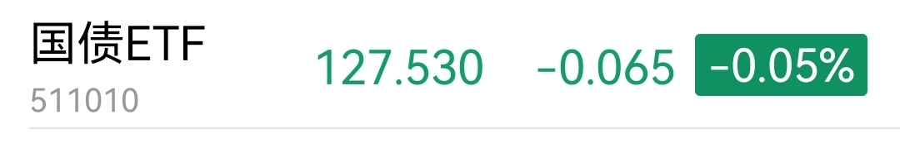

======================================================

_type: talk
@二师父[28814221155551]
2022-04-15 16:28:15 Fri  
topic_id: 415458584454588

<e type="hashtag" hid="51288845144184" title="#周五组合分析#" /> 乌龟计划：目前以二级债基+偏债混合为主，剩余持有银行、基建、地产、医疗、科创。银行、基建、地产表现相对较稳，医疗和科创表现较差，按照A股的周期情况，这类品种一旦形成下跌趋势，较难反转，所以继续持有，以时间换空间。这类品种估值即使不变，以每年15%的盈利增速，那么持有几年也会盈利，不必担心。只是短期会有点难受，咱们的仓位都控制在5%以内，这种波动是在人的心理承受范围内的。

银行、基建、地产的策略依然明确，低买然后收割利润，如果不跌回成本价格，就不用再加仓。

安心组合：这个组合持仓全部是短债基金、长债基金、二级债基、偏债混合。

比较安稳，类似白银组合和青铜组合，可以分三个月购买。

成长组合，前五个重仓分别是300价值、农业、恒生、中药、红利，后面也会逐步定投保险和银行，注意这个定投和无脑定投是有区别的，而是严格控制加仓的价格，低于第一次买入价格以后再买入，否则上涨收割利润，这种思路适合熊市，因为有底仓，所以不怕卖飞了。后面持仓有计算机、新能源车、光伏，医疗，科创50，仓位均不足2%，这些品种估计今年都不会太好，加息周期高成长的表现很差，后面也不会加仓了。那么需要卖出吗？并不需要，基金不会跌没，耐心持有，等跌个1年到达底部，再次入场摊低成本，如果判断错误，成长股走牛，我们也不至于追高。恒生科技也有少部分仓位，按照网格方式买入卖出，低买高卖。对于低估值的品种，网格是熊市最佳的方式。熊市要么躺平，要么离场，要么空仓，你选择一个适合你的，总之每一次买入都要慎重，因为买入就决定了你是否盈利。

能不能买，看仓位，看好的，未来涨的好的可以重仓。不看好的，可以轻仓观察，看看自己判断是否正确。

海外组合：海外组合以标普500、纳斯达克、越南为主，底仓建立之后，就是等待市场回调的时候定投，纳斯达克历史上除了2000年互联网泡沫，最大跌幅是08年金融危机53%，当前已经跌了差不多20%了，再按照纪律定投也没事。

有的读者说为什么没有低估也定投，这涉及到纳斯达克本身的特性，他很优质，随着利润增长很快，他未来低估了也比18年高估的时候指数点位高，所以只要不是特别热，都可以定投的。

鳄鱼计划：鳄鱼计划目前重仓主要是上证指数、上证红利、基建、农业、中药，消费、恒生、银行，重仓稳健型的有华泰柏瑞、中债、安信稳健和目标、富国天利、招商产业、大摩双利。 轻仓的1000ETF，白酒、双创、医疗、传媒、纳斯达克、标普500，医药、券商、科创50、电池、保险、碳中和、家电等。

目前稳健的基金除了天利刚建仓略微浮亏，其他的都是盈利的，未来如果想补仓可以从这里提款。

红利、基建、银行、上证指数这些在大跌的时候也更加抗跌，有限选择这种抗揍的。而科创50、电池、碳中和不够抗揍，就等等再买。这依然涉及仓位问题。虽然这些成长基金跌的多，但是整体仓位较轻，不会伤筋动骨，这就是仓位管理的好处。

目前医药持续回调，已经快到了新一次击球区域。每下一个台阶买一次，很显然，医药这个支撑一直在博弈，如果博弈输了，那么下跌就会很大，和医疗一样，不用去赌博，设定一个价格，到了咱们买就行了。

阅读[1]  评论[0]  赞[0] 

======================================================

_type: talk
@二师父[28814221155551]
2022-04-15 19:41:18 Fri  
topic_id: 585251414158154

<e type="hashtag" hid="552114551414" title="#估值数据#" /> 市盈率百分位25.38%，SY-BY百分位24.56%，SY/BY百分位12.32%。

整体市场低迷，这种时候适合积累，但是要避开创业板方向。

@范毅君 at 2022-04-15 19:41:18 Fri

> 二师父，电池，家电，传媒该怎么操作

----------

@二师父 at 2022-04-15 19:41:18 Fri

> 电池仓位不重就卧倒，仓位重等反弹减仓，传媒卧倒，反弹盈利卖出，家电价格每下降百分之5买一份，这个方向没问题

----------

@范毅君 at 2022-04-15 19:41:18 Fri

> 好的，二师父[呲牙]

----------

@蛋炒饭不加蛋 at 2022-04-15 19:41:18 Fri

> 新能源军工会有波段反弹的机会吗？资源股基金需要卖出吗？

----------

@二师父 at 2022-04-15 19:41:18 Fri

> 主要是这波疫情影响了汽车零部件供应，新能源别碰了

----------

@蛋炒饭不加蛋 at 2022-04-15 19:41:18 Fri

> 没机会反弹降仓，都是跌几天涨一天

----------

阅读[1]  评论[6]  赞[0] 

======================================================

_type: talk
@二师父[28814221155551]
2022-04-15 20:31:32 Fri  
topic_id: 415458282285418

<e type="hashtag" hid="51122841422484" title="#基金投资方向#" /> 今年的方向300价值、中证红利。注意煤炭可以阶段止盈了，这个位置比较危险。

地产、基建、银行、保险四傻方向低吸高抛，留住底仓二级债基+偏债混合。现在预期很弱，大家把握住平均收益率就好了，再也不是2018年那种满仓梭哈的时机了。

不同周期下，不同配置方向，别做错了。

@梧桐 at 2022-04-15 20:31:32 Fri

> 二师父，兴全合润还没有低估吗。

----------

@梧桐 at 2022-04-15 20:31:32 Fri

> 都跌了好多了。

----------

@二师父 at 2022-04-15 20:31:32 Fri

> 低估的

----------

@梧桐 at 2022-04-15 20:31:32 Fri

> 再请二师父重点讲一下目前50，300，500，1000这些宽基指数如何操作吧。毕竟行业指数风险大。

----------

@二师父 at 2022-04-15 20:31:32 Fri

> 这些都可以网格加仓，每跌百分之5到10买一次，反弹就收割利润，资金放在债基里面，最差一年也有百分之5

----------

@梧桐 at 2022-04-15 20:31:32 Fri

> 网格比定投更适合吗。

----------

@二师父 at 2022-04-15 20:31:32 Fri

> 如果定投选择300价值

----------

@梧桐 at 2022-04-15 20:31:32 Fri

> 好的

----------

阅读[1]  评论[12]  赞[0] 

+++++++++++++++++++++++++++++++++++++++++++++++++++++

文件：
2022-04-15 20:29:05 Fri
文件大小：[32998]
548214512528214-宁在四傻里面哭，不在锂电里面笑.docx

======================================================

_type: talk
@二师父[28814221155551]
2022-04-16 11:28:24 Sat  
topic_id: 415458228582518

美国收割全世界的本质。

阅读[1]  评论[0]  赞[0] 

+++++++++++++++++++++++++++++++++++++++++++++++++++++

文件：
2022-04-16 11:28:12 Sat
文件大小：[33215]
118251458211512-美国凭什么收割全世界.docx

======================================================

_type: talk
@凡星[454851884288]
2022-04-16 12:32:59 Sat  
topic_id: 212528448145111

最近在调整仓位，发现以前做了一些骚操作，很多都是在高估值区间买入的，然后等行情下降区间，又不知道何时沽出，导致最后白忙

@凡星 at 2022-04-16 12:32:59 Sat

> 300价值PE走势

----------

@凡星 at 2022-04-16 12:32:59 Sat

> 沪深300 PE走势

----------

@FK Hsiang at 2022-04-16 12:32:59 Sat

> 請教您這個估值APP要付費嗎？估值不是在APP上能查閱嗎？我是感覺市場一片大好時、違反作業元則忽略了估值、追求明星賽道結果多在高估值進倉、導致現在套牢躺平了！

----------

@凡星 at 2022-04-16 12:32:59 Sat

> 图片截图的app是天天基金...

----------

@FK Hsiang at 2022-04-16 12:32:59 Sat

> 感謝🙏、天天基金正確✅！

----------

阅读[1]  评论[5]  赞[0] 

+++++++++++++++++++++++++++++++++++++++++++++++++++++

文件：
2022-04-16 12:32:58 Sat
文件大小：[65976]
841584281842242-300价值_2022-04-16.xlsx

2022-04-16 12:32:59 Sat
文件大小：[66944]
548214518145544-沪深300指数_2022-04-16.xlsx

======================================================

_type: talk
@珅爹[15451242541142]
2022-04-17 06:13:51 Sun  
topic_id: 415458144152118

如果台海发生战争，持有纳斯达克基金是否非常不安全，会不会被美方冻结和没收？

@二师父 at 2022-04-17 06:13:51 Sun

> a股账户基金不至于，美国银行卡有可能

----------

@珅爹 at 2022-04-17 06:13:51 Sun

> 那通过天天基金买入不是A 股账户啊

----------

@二师父 at 2022-04-17 06:13:51 Sun

> 场外基金也没事，关注下吧，美国太无赖，连俄罗斯国债都能作废，啥事都干的出来

----------

@珅爹 at 2022-04-17 06:13:51 Sun

> 那为啥场外基金就没事呢？想没收什么不能没收？

----------

@二师父 at 2022-04-17 06:13:51 Sun

> 这是中国外汇买的，他怎么没收？

----------

阅读[1]  评论[5]  赞[0] 

======================================================

_type: talk
@二师父[28814221155551]
2022-04-17 08:32:12 Sun  
topic_id: 585251821188814

<e type="hashtag" hid="825188852442" title="#估值表#" /> 目前四只指数低估，按照估值表控制单一基金10%仓位定投问题不大。

这适合增量资金，存量资金配置白银组合和青铜组合就行。我看了看去年配置的白银组合截至现在回撤只有0.69%，青铜组合我已经卖了加仓了基金了，估计同期青铜组合是盈利的，当时我卖出的时候是3月，是盈利的。

定投不是万能的，先做好基础配置，再定投，青铜组合和白银组合相当于是基本盘，守正的部分，而定投是出奇的部分，利用青铜组合和白银组合追求年化6%-12%的保底收益率，再定投优质板块，追求年化15%——20%的超额收益率。

这种方式还不错，另外还有兴趣的话，就结合中国的政策短期投资下A股，A股暴涨暴跌，就这么个特性，这次稳增长基建和地产股票底部涨幅40%，而锂矿股票跌幅30%，如果你死守，只能被锤。

@摆渡人 at 2022-04-17 08:32:12 Sun

> 二哥，那目前这个创业板和科创板两宽基指数，是否适合采用网格策略。每下跌10%买入一次，反弹5%卖出一次，来降低此前收益率。

----------

@二师父 at 2022-04-17 08:32:12 Sun

> 科创可以，创业板我说了很多次了，不要碰

----------

@韩韩 at 2022-04-17 08:32:12 Sun

> 二师父，怎么判断一只基金属于创业板还是科创板

----------

@二师父 at 2022-04-17 08:32:12 Sun

> 看持仓股票

----------

@FK Hsiang at 2022-04-17 08:32:12 Sun

> 二師父、請教一下正常估值區、中証500和中証1000是採用市淨率、其他用市盈率看估值為什麼？

----------

@二师父 at 2022-04-17 08:32:12 Sun

> 里面有些周期股，盈利不够稳定，用市盈率失效了

----------

阅读[1]  评论[6]  赞[0] 

+++++++++++++++++++++++++++++++++++++++++++++++++++++

图片：
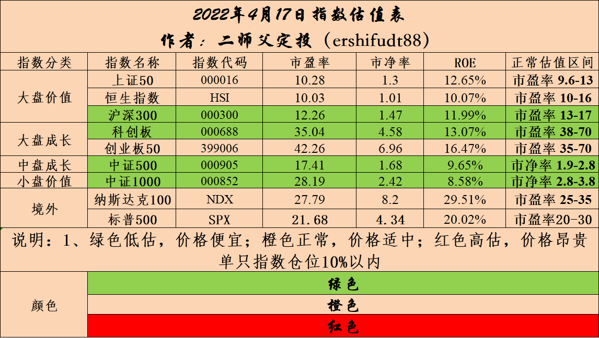

======================================================

_type: q&a
@凡星[454851884288]
2022-04-17 11:40:24 Sun  
topic_id: 415458141441188

@凡星

>  二师父，您好！我想咨询一下，我目前持有创业板50ETF大约7w，仓位25%，当前看你估计创业板处于下行区间，请问如果是这种情况，你后续会如何操作？
>  
>  我目前想到的有以下方式:
>  1. 直接清仓，换持沪深300或者其他指数基金
>  2. 继续等待，在一定范围内逐步卖出，如果价格继续下调，再加仓
>  3. 逐步减仓
>  
>  但是具体如何实际操作还没想好

@二师父

>  如果是我的话我会留百分之5以内的仓位，转移百分之5以内仓位到沪深300，其余转到买入安心稳健增值混合和招商产业债

阅读[1]  评论[0]  赞[0] 

======================================================

_type: talk
@二师父[28814221155551]
2022-04-17 17:34:10 Sun  
topic_id: 212528188285221

防守账户和稳健账户的投资标的和代码，这些组合配置相对简单，搭配防守组合：股票比例0——15%之间，稳健账户：股票比例15%——30%。

这是守正的部分，用这种配置，年化收益率大致可以在5%——10%，再根据不同的经济周期配置黄静、原油、大宗商品，有色金属等等，以及配置一些可能有超额收益的行业指数，争取做到10%-20%。

基本上这是很好的思路了，股票投资A股更加适合跟着政策走，去年跟着碳中和走，今年跟着稳增长走，价值投资的思路还是留给基金，我现在发现了一种方法叫做卖本留利润，如果一只股票盈利可观，向下跌破死叉点，卖掉本金，利润长期持有，只要股票基本面不变化，那么长期持有靠股息分红，反正也是自己从市场赚来的，一直拿的住，牛市抱紧，熊市赚了该走就走吧。

@FK Hsiang at 2022-04-17 17:34:10 Sun

> 二師父、請教一下當前局勢最優建倉原則？小白投資者當前建倉防守帳戶約當等於債基要佔多少百分比倉位？

----------

@二师父 at 2022-04-17 17:34:10 Sun

> 百分之90

----------

阅读[1]  评论[2]  赞[0] 

+++++++++++++++++++++++++++++++++++++++++++++++++++++

文件：
2022-04-17 17:29:08 Sun
文件大小：[9788]
421482222185118-防守账户和稳健账户的投资标的和代码.xlsx

======================================================

_type: talk
@IT[582851511244154]
2022-04-17 20:31:48 Sun  
topic_id: 812528181222812

请问二师父，债基的投资逻辑是否股跌债基收益上涨，是否可以定投债基，如果可以，如何定投？

@二师父 at 2022-04-17 20:31:48 Sun

> 并不完全是，债基有两部分收益，一部分是利息，一部分是价差波动，因为受到利率影响小，所以价差波动小，长期没有暴雷的债券是向上的，债基分不同类别，有的适合一次买入，有的分批买入，不用定投

----------

@IT at 2022-04-17 20:31:48 Sun

> 好的，谢谢指教。

----------

阅读[1]  评论[2]  赞[0] 

======================================================

_type: talk
@二师父[28814221155551]
2022-04-18 09:36:19 Mon  
topic_id: 184245811558142

<e type="hashtag" hid="881251425252" title="#鳄鱼计划#" /> 卖出红利etf6份，卖出银行etf3份。震荡市卧倒或者网格，卖出资金可以买入货币基金，也可以买入防守或者稳健组合。

@衣袂飘香 at 2022-04-18 09:36:19 Mon

> 二师父，你的红利是盈利了才卖的吗？我的还没盈利呢。负的2点多。要卖吗？

----------

@衣袂飘香 at 2022-04-18 09:36:19 Mon

> 我的银行也才盈利了百分之一点多，你的怎样？也一起卖吗？

----------

@二师父 at 2022-04-18 09:36:19 Mon

> 我大致盈利2点多，浮亏可以暂时不卖，如果价格再跌到3月那个位置，我还会再买点，震荡市可以不动的，我是做网格

----------

@二师父 at 2022-04-18 09:36:19 Mon

> 银行盈利也是2点多，你如果还有很多补仓资金也不用卖

----------

@衣袂飘香 at 2022-04-18 09:36:19 Mon

> 好的，明白了，谢谢您

----------

阅读[1]  评论[5]  赞[0] 

======================================================

_type: talk
@二师父[28814221155551]
2022-04-18 09:45:24 Mon  
topic_id: 812528144288442

<e type="hashtag" hid="28518855451481" title="#乌龟计划#" /> 中证红利，广发中证基建a转换到安信稳健增值混合C，招商中证银行转换到易方达裕祥回报债券。

@范毅君 at 2022-04-18 09:45:24 Mon

> 这是卖出利润吗

----------

@Glühwein at 2022-04-18 09:45:24 Mon

> 红利收益10%也要卖出吗？

----------

@二师父 at 2022-04-18 09:45:24 Mon

> 转换了

----------

@二师父 at 2022-04-18 09:45:24 Mon

> 仅供参考

----------

@范毅君 at 2022-04-18 09:45:24 Mon

> 二师父，基建现在也要转换吗，不是看好基建吗，而且最近跌幅比较大，转换逻辑是啥[愉快]

----------

@二师父 at 2022-04-18 09:45:24 Mon

> 赚了挺多啊，你看中建都盈利百分之30了，这才一个月。而且还有c类留着，这种品种就是网格，赚了就走

----------

@范毅君 at 2022-04-18 09:45:24 Mon

> 谢谢，明白了

----------

@cotton at 2022-04-18 09:45:24 Mon

> 广发没看到可以转换呢

----------

阅读[1]  评论[13]  赞[0] 

======================================================

_type: talk
@二师父[28814221155551]
2022-04-18 09:50:06 Mon  
topic_id: 184245811445482

<e type="hashtag" hid="15288821141452" title="#成长组合#" /> 大成中证红利转换到安信稳健增值混合a。3月投入已盈利，转换防守。

@衣袂飘香 at 2022-04-18 09:50:06 Mon

> 跟了。

----------

@JOY at 2022-04-18 09:50:06 Mon

> 师父，天天上的红利，是不是都转了？

----------

@二师父 at 2022-04-18 09:50:06 Mon

> 转了，如果还有机会跌下去再买，没有就算了

----------

@坚持学习 at 2022-04-18 09:50:06 Mon

> 二师父，大成红利全部转换吗

----------

@二师父 at 2022-04-18 09:50:06 Mon

> 是的

----------

阅读[1]  评论[5]  赞[0] 

======================================================

_type: talk
@二师父[28814221155551]
2022-04-18 10:31:14 Mon  
topic_id: 415458121484418

说说思路，前期买入的银行，红利，基建基本有盈利了，转换到稳健的两只基金，长期是能跑赢沪深300的，比投资其他的收益也会更好。

为什么不持有等待大牛市爆发呢，到目前为止还有人在等06年那种牛市，其实牛市已经走完了，沪深300连续跌了一年3个月，这就是熊市，去年3月已经大规模卸货，然后做稳健的网格品种

熊市的初期就是做反弹或者买入防守品种，保住过去赚到的利润

那么有人说，你判断错了怎么办，超级牛市来了咋办，告诉你，不可能，即使我判断错了，买入安信稳健增值混合c，易方达裕祥，也能跟上沪深300。

并没有空仓，其实别贪心最重要，现在做啥生意一个月有百分之10的利润，能赚就好。

再次提醒，创业板不要买，上证指数，300价值等板块跌幅有限，创业板一旦走主跌浪，买多少就会被套多少，反弹也只是诱惑你入场继续套你的。

@JOY at 2022-04-18 10:31:14 Mon

> 师父，看了下双创，持仓基本和创业板差不多，是不是也按创业板的思路操作呢？

----------

@二师父 at 2022-04-18 10:31:14 Mon

> 可以停了，只做价值板块，耐心等到他跌到18年的位置再进行买入，如果等不到反弹盈利收割利润。

----------

@韩韩 at 2022-04-18 10:31:14 Mon

> 二师父，有机会能不能讲讲各个板块的区别以及怎么看基金属于哪个板块，小白有时候看不懂

----------

@二师父 at 2022-04-18 10:31:14 Mon

> 好的

----------

@Yesen at 2022-04-18 10:31:14 Mon

> 中药下跌后，要定投吗

----------

@老孙头 at 2022-04-18 10:31:14 Mon

> 场外中药指数盈一个来点，需要转换吗？

----------

@二师父 at 2022-04-18 10:31:14 Mon

> 我会发车

----------

@二师父 at 2022-04-18 10:31:14 Mon

> 根据你的实际来，可以转百分之20

----------

阅读[1]  评论[11]  赞[0] 

======================================================

_type: talk
@二师父[28814221155551]
2022-04-18 19:38:33 Mon  
topic_id: 812522852218582

加息周期下值得投资的品种，投资有多种搭配，不同经济周期不同策略，需要对宏观有充分的认识，专注于贝塔收益，而非阿法收益。

@王模堂 at 2022-04-18 19:38:33 Mon

> 二师傅，白酒属于消费的重要组成部分，白酒ETF现在这个价位可以买一些了吗？

----------

@二师父 at 2022-04-18 19:38:33 Mon

> 看你的风险偏好

----------

阅读[1]  评论[2]  赞[0] 

+++++++++++++++++++++++++++++++++++++++++++++++++++++

文件：
2022-04-18 19:37:11 Mon
文件大小：[34943]
421482188221518-加息周期下，哪些品种值得投资.docx

======================================================

_type: talk
@二师父[28814221155551]
2022-04-18 19:54:18 Mon  
topic_id: 184244528582812

<e type="hashtag" hid="51122845524814" title="#周一市场分析和板块讲解#" /> 以后一周三讲，周一市场和基金，周三讲估值，周五讲组合。大家想听什么也可以告诉我。如果有没有明白的可以及时沟通，尽量先多学习，当知识武装了头脑。

当前价值风格开始下行，成长板块开始上行，什么是价值，什么是成长，看市盈率，长年市盈率在10倍以下的板块就是价值板块，常年市盈率在30倍以上的就是成长板块，介于15到25之间的属于平衡型板块。

这些数据可以在东方财富和万得APP查到，都是公开分享得数据，需要注意中证指数官网和东方财富不同平台计算得规则略有区别，所以数据略有不同，需要纵向对比。

那么什么时候利好价值，什么时候利好成长呢？

可以简单理解，加息周期利好价值，降息周期利好成长，因为成长股需要更多得融资来发展，而价值类企业已经壮大并不太需要，所以利率得变化对于成长股得影响更大。

这也是为什么不买创业板得原因，中途下跌可能会有反弹，但是这种属于超跌反弹，并不会再次走主升浪，所以我们不要被短期一天得走势给骗了，普通投资者看的太短，如果以5年为周期来规划投资，创业板当前就是不值得，如果以5天为周期规划投资，创业板当前还是可以赌一赌得，所以不同得人不同得方法最终正确与错误也没有绝对答案。

但无论对错，其中得道理要明白，为什么买入，为什么卖出，以基建为例子，从3月15号大部分基建企业已经走了一轮反弹，底部反弹得时候就是买入机会，而高位回落正好止盈，你如果只看到了他跌了5%，而忘记他已经涨了25%，就会觉得他便宜了。

但这个贵与便宜也是相对得，如果站在5年至周期看，他仍旧低位，只是谁也无法预料到他最终什么时候能起来。

那么卖掉本金留住利润，剩余利润长期持有，这就是不败之法，任他以后怎么跌，我都赚了，牛不牛呢？

这种方法，在牛市得时候不太好，容易踏空，所以底仓不要丢，要防止自己追涨，也要防止自己踏空，最好得办法就是根据市场涨跌，调整，把仓位控制在自己从容的位置，这需要长期经历一整轮牛熊才能够感知，不经大熊市不知道股市有多恐怖，不经历大牛市，你也无法想象股市究竟有多疯狂。

关键的修炼还是在于个人的自制力，设定了价格，到了就买入，不到就不买，管他涨跌，坚持这样做，就不会掉到坑里，同时要关注国际大事，为什么我在卖出，大家看看taihai局势，这是最不确定的，你说疫情、股灾、加息都可控，而这是不可控的，所以有赚了稍微出来休息休息，万一牛市来了，最坏的结果少赚一点，又不会少块肉。

@嘉宾 at 2022-04-18 19:54:18 Mon

> 又涨知识了，迷茫或过热/过冷时，都需要拿出来看看。

----------

@嘉宾 at 2022-04-18 19:54:18 Mon

> 求教，最近想跟随鳄鱼计划，转移到安信稳健之类，但是场内无法购买，是什么原因？

----------

@二师父 at 2022-04-18 19:54:18 Mon

> 可以买，找到理财产品，他不是etf

----------

@珅爹 at 2022-04-18 19:54:18 Mon

> 您刚刚说现在是降息周期 ，利好成长，创业板属于成长，为啥不能买呢？

----------

@二师父 at 2022-04-18 19:54:18 Mon

> 加息

----------

阅读[1]  评论[5]  赞[0] 

======================================================

_type: q&a
@凡星[454851884288]
2022-04-18 20:54:28 Mon  
topic_id: 812522852582542

@凡星

>  二师父，您好！想再咨询您一个问题，我目前有几十万的资金预估2~3个月后动用，目前这笔钱是放在余额宝等货币基金里面，请问有没有什么更好的收益投资渠道吗？直接转为债券基金？可以承受3%左右的下降波动。谢谢！

@二师父

>  三个月就没必要折腾了，多不了几个点收益，债基2个月也就百分之1不到，不划算，找期限长的国债逆回购或者固定利息的理财，不要承受波动

阅读[1]  评论[0]  赞[0] 

======================================================

_type: talk
@二师父[28814221155551]
2022-04-19 10:19:42 Tue  
topic_id: 212522848114521

<e type="hashtag" hid="142852258522" title="#可转债打新提示#" /> 今日上市转债聚合转债，上涨50%，今天收盘前可以找机会卖出。

湘佳股份：可转债发行，4月19日申购，顶格申购。

@Glühwein at 2022-04-19 10:19:42 Tue

> 农业盈利7%[强][强]

----------

@二师父 at 2022-04-19 10:19:42 Tue

> 记得收割利润

----------

@Glühwein at 2022-04-19 10:19:42 Tue

> 10%收割可以吗

----------

@二师父 at 2022-04-19 10:19:42 Tue

> 可以

----------

@杜志彪 at 2022-04-19 10:19:42 Tue

> 没中啊[囧]

----------

@杜志彪 at 2022-04-19 10:19:42 Tue

> 就中了2个中银

----------

阅读[1]  评论[6]  赞[0] 

======================================================

_type: talk
@二师父[28814221155551]
2022-04-19 17:21:28 Tue  
topic_id: 585255185445244

<e type="hashtag" hid="51122845811124" title="#妖债恒行#" /> 最近新股不行，新债还不错。注意止盈，震荡市场就适合波段。长期仓位可以不动，但是波段可以有，将本金收割完毕以后，利润长期持有，即使大跌，也是盈利的，最终想什么时候卖全看心情了。

接下来重点投资纳斯达克、波段中药、农业（猪肉方向）、地产、基建、红利。即使大盘一直不涨，也能盈利，长期持有可以考虑安信稳健增值混合和易方达裕祥。

其他的方向遇到反弹该止盈就止盈，不再过多投入。

@样 at 2022-04-19 17:21:28 Tue

> 二师父前面不是说中药不波段的吗？

----------

阅读[1]  评论[1]  赞[0] 

+++++++++++++++++++++++++++++++++++++++++++++++++++++

文件：
2022-04-19 17:17:54 Tue
文件大小：[32992]
421482151252158-目瞪口呆.docx

2022-04-19 17:18:02 Tue
文件大小：[7099016]
241584121424121-目瞪口呆.m4a

======================================================

_type: talk
@老孙头[422115118524548]
2022-04-19 22:09:48 Tue  
topic_id: 184244424241542

请教老师——成立三年多的睿远成长价值混合基金，规模大，调仓少，也无分红。我逐步买入的、累积仓位已有五成了，至今收益跌去了2/3(三年多仅余下20%)。这个基金每次限购一千元，赎回就是决裂，守住规模很有手法。对其前景不明，不知如何处置？

@二师父 at 2022-04-19 22:09:48 Tue

> 你的仓位太多了，这个基金表现很差，19年20年表现好是因为赶上了牛市，我建议多配置偏债混合，回撤控制在百分之5以内，而且单只基金仓位百分之10以内，防止发生意外。

----------

阅读[1]  评论[1]  赞[0] 

======================================================

_type: talk
@二师父[28814221155551]
2022-04-20 09:37:23 Wed  
topic_id: 184244458488522

<e type="hashtag" hid="825412412212" title="#可转债打新#" /> 今天两只可转债发行，顶格申购，打新坚持就可以的，可转债投资可坚持双低策略，这是目前最稳妥的策略，低溢价策略容易杀高价格。

@珅爹 at 2022-04-20 09:37:23 Wed

> 请问什么是双低政策？

----------

@二师父 at 2022-04-20 09:37:23 Wed

> 就是价格和溢价都很低的

----------

阅读[1]  评论[2]  赞[0] 

======================================================

_type: talk
@二师父[28814221155551]
2022-04-20 09:50:18 Wed  
topic_id: 415455581144188

<e type="hashtag" hid="881251425252" title="#鳄鱼计划#" /> 清仓科创50和双创etf，加息对成长股利空，全部避开，等待下次降息周期入场。农业卖出5份，获利走人，留了一点仓位。熊市只能波段或者不操作。

亏损卖出，给大家发红包，加息利空成长，利好价值，高市盈率股票都别买了。

@廖Simone at 2022-04-20 09:50:18 Wed

> [微笑]

----------

@光少 at 2022-04-20 09:50:18 Wed

> 谢谢二师父[抱拳]

----------

@庆余年 at 2022-04-20 09:50:18 Wed

> 农业卖出后还有多少份？

----------

@二师父 at 2022-04-20 09:50:18 Wed

> 两份

----------

@防汛抗旱 at 2022-04-20 09:50:18 Wed

> 场外的全清吗

----------

@庆余年 at 2022-04-20 09:50:18 Wed

> 创业科创有点严重了，都亏了百分之三十多[撇嘴][撇嘴][撇嘴]

----------

@珅爹 at 2022-04-20 09:50:18 Wed

> 纳斯达克指数还可以留着吗？

----------

@cotton at 2022-04-20 09:50:18 Wed

> 可以不清吗。。

----------

阅读[1]  评论[25]  赞[0] 

+++++++++++++++++++++++++++++++++++++++++++++++++++++

图片：

======================================================

_type: talk
@二师父[28814221155551]
2022-04-20 10:10:10 Wed  
topic_id: 212522225528421

<e type="hashtag" hid="28518855451481" title="#乌龟计划#" />医疗转换到安信稳健增值混合C，科创50转换到易方达裕祥。可以不清仓，转换到这种稳健的，预期年化7%。

@Philip🎭 Y at 2022-04-20 10:10:10 Wed

> 师父医疗是那个医疗呀～？

----------

@二师父 at 2022-04-20 10:10:10 Wed

> 中欧医疗和工银医疗

----------

@坚持学习 at 2022-04-20 10:10:10 Wed

> 医疗目前是亏的，要转吗？

----------

阅读[1]  评论[3]  赞[0] 

======================================================

_type: talk
@懂心[241128241828251]
2022-04-20 10:10:57 Wed  
topic_id: 415455554452818

请问师父，纳斯达克不也是成长股吗？加息不是对成长股不利吗？那投标普500会更好一些吗？

@二师父 at 2022-04-20 10:10:57 Wed

> 加息标普500跌的会少一些，降息标普500涨幅也比纳斯达克少

----------

@懂心 at 2022-04-20 10:10:57 Wed

> 那现在不属于加息周期吗？

----------

@懂心 at 2022-04-20 10:10:57 Wed

> 我的意思就是定投标普500，会比定投纳斯达克好一些吧😄

----------

@二师父 at 2022-04-20 10:10:57 Wed

> 加息标普500跌的少，降息周期标普500也涨的少，盈亏同源

----------

@懂心 at 2022-04-20 10:10:57 Wed

> 明白了，师父

----------

@Pacifica at 2022-04-20 10:10:57 Wed

> 二师父投的标普500和纳斯达克指数是分别选择的哪一个基金呢？

----------

@二师父 at 2022-04-20 10:10:57 Wed

> 这几个，c类波段，a类长线

----------

@Pacifica at 2022-04-20 10:10:57 Wed

> 谢谢

----------

阅读[1]  评论[8]  赞[0] 

======================================================

_type: talk
@二师父[28814221155551]
2022-04-20 10:42:57 Wed  
topic_id: 212522225211821

<e type="hashtag" hid="15288821141452" title="#成长组合#" /> 新能源车和光伏转换到易方达增强回报债，医疗和科创50转换到安信稳健增值混合A。天弘中证农业卖出8000份，这一波基建、地产和农业获利还可以，也印证了判断，成长股凉凉，加息周期不好做，只有价值行情。

阶段止盈，中药盈利没有止盈又回去了，该收割就得收割，别让自己在曾经赚钱的基金上亏钱。

A股值得长期持有的好像只有消费，如果消费未来也和中概一样，那么就没有值得长期持有的了。

@奉壹 at 2022-04-20 10:42:57 Wed

> 光伏现在1.25左右徘徊，成本1.4，一直没敢加仓，二师父判断会跌破1.2吗？如果继续持有的话，大概需要好几年才回本？

----------

@二师父 at 2022-04-20 10:42:57 Wed

> 不看好

----------

@梧桐 at 2022-04-20 10:42:57 Wed

> 二师父，中药在这个位置可以买吗，没有中药仓位。

----------

阅读[1]  评论[3]  赞[0] 

======================================================

_type: talk
@林玮[844111858288412]
2022-04-20 14:17:50 Wed  
topic_id: 585255558112884

师父，地产etf可以买吗

@二师父 at 2022-04-20 14:17:50 Wed

> 可以买一份，按趋势还在跌，不过定投可以

----------

阅读[1]  评论[1]  赞[0] 

======================================================

_type: talk
@二师父[28814221155551]
2022-04-20 14:36:52 Wed  
topic_id: 812522221284542

<e type="hashtag" hid="48844122428418" title="#低估值的板块#" /> 加息可以买低估值板块，低买高卖，市盈率10倍以下的都没问题，但是高市盈率的别买了，可以不卖，但是别买，等美国进入新一轮降息周期，或者跌到18年那种位置再买。

创业板虽然跌了不少，但是走势和15年比较像，慎重。按照规律会有一波反弹，然后再来几年阴跌。趋势无法改变

@以古论今 at 2022-04-20 14:36:52 Wed

> 300价值收益率全部回去了

----------

@二师父 at 2022-04-20 14:36:52 Wed

> 震荡市只能波段

----------

@匿名的码农 at 2022-04-20 14:36:52 Wed

> 在等反弹[流泪][流泪]

----------

阅读[1]  评论[3]  赞[0] 

======================================================

_type: talk
@二师父[28814221155551]
2022-04-20 22:03:32 Wed  
topic_id: 812545111484482

<e type="hashtag" hid="48844122848528" title="#百年变局#" /> 音频有额外信息，大家可以听听，加息周期，确实资产价格承压，控制好仓位，优先标普500+纳斯达克，其次A股价值。加仓之前做好压力测试，不要在支撑位反复加仓，一旦破位就回泄洪。

阅读[1]  评论[0]  赞[0] 

+++++++++++++++++++++++++++++++++++++++++++++++++++++

文件：
2022-04-20 21:55:55 Wed
文件大小：[32866]
241581558251421-百年变局.docx

2022-04-20 21:56:14 Wed
文件大小：[9403202]
118258225428182-百年变局.m4a

======================================================

_type: talk
@二师父[28814221155551]
2022-04-21 08:46:51 Thu  
topic_id: 184215228842422

<e type="hashtag" hid="552114551414" title="#估值数据#" />市盈率百分位23.17%，SY-BY百分位23.45%，SY/BY百分位11.44%。

估值近一步下移，18年时候最低市盈率百分位到达了8%，这一次会不会到不知道，但是投资要留有余地，做好压力测试，加息周期是利好低估值得板块。

市盈率10倍以下得，另外国内大力扶持中药，而之前鼓励得西药治疗已经慢慢淡化，这和整体战略有关，就是为了以国内为主，不依靠国外，包括统一大市场这个事，整体来看的话未来投资环境相对较难。

置顶得方向还是没啥太大问题，风险偏好高得低估值价值股或者纳斯达克、标普500，风险偏好低得二级债基和偏债混合。银华富裕主题混合得基金经理开始出来道歉了，暂时躲避消费和医药，然后转向低估值得银行，我们选择得低估值四个方向，可以低买高卖，价值股的好处是安全性好，但是收益预期较低。

阅读[1]  评论[0]  赞[0] 

======================================================

_type: talk
@二师父[28814221155551]
2022-04-21 09:02:51 Thu  
topic_id: 212548585545211

<e type="hashtag" hid="825412412212" title="#可转债打新#" /> 山石转债今天上市，发行规模2.67亿，属于小盘转债，现在基金行情不好，游资在炒作可转债，新债都参与下，中签率虽然低，但是中了基本可以有一些盈利。

垒知转债今日发行，顶格申购，正股是建筑行业的，溢价率很低，税后收益2.6%，妥妥的盈利。

@留影 at 2022-04-21 09:02:51 Thu

> 今天的定投日咋操作，中证1000加仓吗

----------

@二师父 at 2022-04-21 09:02:51 Thu

> 没有操作了，你自己结合自己的仓位来

----------

@JOY at 2022-04-21 09:02:51 Thu

> 师父，您方便再出一版场内的持仓表吗？碳中和和电池没清吧？

----------

@二师父 at 2022-04-21 09:02:51 Thu

> 清了

----------

@衣袂飘香 at 2022-04-21 09:02:51 Thu

> 那您的碳综合和电池，应该也是亏损清仓吧？我们都还留着呢，没看到你清仓的消息。

----------

@二师父 at 2022-04-21 09:02:51 Thu

> 昨天发了啊

----------

@衣袂飘香 at 2022-04-21 09:02:51 Thu

> 场内鳄鱼，只看到双创、科创还有农业啊。

----------

@二师父 at 2022-04-21 09:02:51 Thu

> 发掉了，我给个表格

----------

阅读[1]  评论[9]  赞[0] 

======================================================

_type: talk
@二师父[28814221155551]
2022-04-21 11:20:40 Thu  
topic_id: 585241214588454

投资买入和卖出是一个闭环，有加仓也有减仓，不懂止盈赚的钱最终也会回去，大家加仓看看置顶的表格，按照激进，保守，稳健的风格来。建议稳健一点，二级债和偏债混合，我计划之后纳斯达克基金为主，a股基金等估值楼层降到一层再说，能够克制自己不加仓也是一种定力。

5月缩表，看看美联储的动作。

@小草罗仕英，电话，* at 2022-04-21 11:20:40 Thu

> 300价值已经扣款了，要撤回吗

----------

@庆余年 at 2022-04-21 11:20:40 Thu

> 这是放弃大A了么

----------

@样 at 2022-04-21 11:20:40 Thu

> 今天之后也许就到一层了

----------

@二师父 at 2022-04-21 11:20:40 Thu

> 不用

----------

@二师父 at 2022-04-21 11:20:40 Thu

> 没有放弃，到一层再说，不到先躺平

----------

阅读[1]  评论[5]  赞[0] 

======================================================

_type: talk
@二师父[28814221155551]
2022-04-21 13:18:26 Thu  
topic_id: 415428481145548

<e type="hashtag" hid="881251425252" title="#鳄鱼计划#" />今年来鳄鱼计划收益率 -5.7%，跑赢沪深300收益率11.9%。争取年内实现8%正收益，收益来源一方面债基的稳健增值，另一方面低估值指数低买高卖，第三方面定投纳斯达克中长期持有。

低估值指数市盈率10倍以下的回调到前期低位可以适当加仓，反弹卖出，市盈率25倍以上的指数，属于成长股指数，最好等到估值楼层第一层加仓，安全第一。

@Glühwein at 2022-04-21 13:18:26 Thu

> 消费eft现在可以建仓吗？之前没关注过

----------

@珅爹 at 2022-04-21 13:18:26 Thu

> 现在怎么开始执行呢？

----------

@顾小胖 at 2022-04-21 13:18:26 Thu

> 师父请问鳄鱼计划的电池ETF和碳中和ETF是什么时候清仓的呀

----------

@一心一意 at 2022-04-21 13:18:26 Thu

> 我的也在啊，碳中和，电池

----------

@Chu at 2022-04-21 13:18:26 Thu

> 这个收益率是今年还是你从投资鳄鱼计划算？鳄鱼计划是什么时候开始的？

----------

@二师父 at 2022-04-21 13:18:26 Thu

> 今年一月份，从投资以来收益率百分之92

----------

@二师父 at 2022-04-21 13:18:26 Thu

> 没建

----------

@二师父 at 2022-04-21 13:18:26 Thu

> 昨天清的

----------

阅读[1]  评论[12]  赞[0] 

+++++++++++++++++++++++++++++++++++++++++++++++++++++

图片：

======================================================

_type: talk
@二师父[28814221155551]
2022-04-21 16:01:24 Thu  
topic_id: 585241254222884

<e type="hashtag" hid="552114551414" title="#估值数据#" /> 市盈率百分位22.43%，SY-BY百分位22.96%，SY/BY百分位10.51%。

今天上证指数还是在3月15的支撑位上运行，万得A已经破位了，成长股大概率还会跌，想定投可以轻仓定投宽基或者价值类基金，市盈率10倍以下。

我计划等等，市场底部的到来需要时间，重仓出击以白银组合更加稳妥，这个回撤基本上可控，而创业板最好是避开。经历过15年的朋友都知道，创业板破位以后不跌到私募被动清盘是不会停止的。

知足不辱，知止不殆，知道满足就不会受屈辱，知道停止就不会有危险，可以长久.

A股表现确实不大好，未来以定投美股纳斯达克为主，本周是因为上涨浮盈暂停，等下周如果跌回去再来，下跌定投，上涨收割利润，今年5次加息，肯定有机会的。

A股也会投，不过策略是低买高卖，适合波动的市场，对于长期定投，更倾向于偏债混合和二级债基，值得长期持有，其他的都是涨跌到极致的品种，只能低买高卖。事实证明A股没有长牛，如果以后走出长牛再说，要实事求是。

@光少 at 2022-04-21 16:01:24 Thu

> 二师父，可能会击穿政策底了吗

----------

@二师父 at 2022-04-21 16:01:24 Thu

> 创业板已经击穿了，不太乐观

----------

@光少 at 2022-04-21 16:01:24 Thu

> 明白

----------

阅读[1]  评论[3]  赞[0] 

======================================================

_type: talk
@二师父[28814221155551]
2022-04-21 20:30:22 Thu  
topic_id: 184215215111542

<e type="hashtag" hid="51122882122884" title="#接下来如何应对#" /> 熊市如何应对，仓位不足的可以考虑安信稳健增值混合，华泰柏瑞鼎利灵活配置混合，易方达裕祥，易方达增强回报，置顶都有，他们属于二级债基，定投指数可以支撑位低吸，然后涨起来再抛，二级债基适合长期持有。

@摆渡人 at 2022-04-21 20:30:22 Thu

> 白银组合哪里看的到

----------

@二师父 at 2022-04-21 20:30:22 Thu

> 之前星球文章介绍过，就是一个股票债券2比8的组合

----------

@王模堂 at 2022-04-21 20:30:22 Thu

> 国债是否可以场内购买呢？

----------

@二师父 at 2022-04-21 20:30:22 Thu

> 可以，有单只国债，也有国债etf

----------

阅读[1]  评论[4]  赞[0] 

+++++++++++++++++++++++++++++++++++++++++++++++++++++

文件：
2022-04-21 20:28:01 Thu
文件大小：[114037]
548218115842424-今年收益率最好的竟然是他.docx

2022-04-21 20:28:13 Thu
文件大小：[13357707]
548218115842444-今年收益率最好的竟然是他.m4a

======================================================

_type: talk
@二师父[28814221155551]
2022-04-21 21:26:16 Thu  
topic_id: 415428425585158

恐慌指数8，低于10就是情绪低位，上一次最低是5以下，这一次跌破了，不过创业板跌破前低，还是上证指数相对有保障

@风彩 at 2022-04-21 21:26:16 Thu

> 请问师兄，我手上有中证银行，消费，医药，科技，纳指，标普500六个指数基金各六分之一，我想再加入中证红利和标普红利机会两个基金各八分之一，您觉得怎么样？谢谢

----------

@二师父 at 2022-04-21 21:26:16 Thu

> 回调以后是可以的

----------

阅读[1]  评论[2]  赞[0] 

+++++++++++++++++++++++++++++++++++++++++++++++++++++

图片：
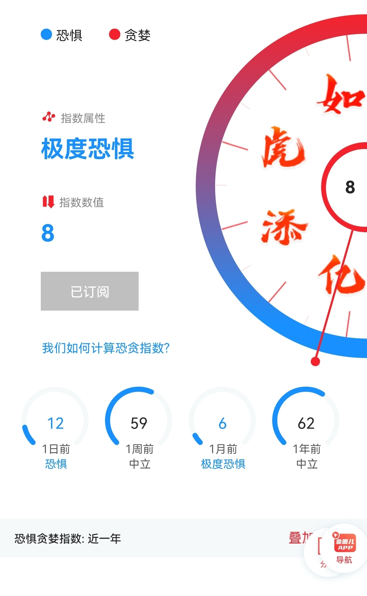

======================================================

_type: talk
@以古论今[28214421582421]
2022-04-22 13:54:21 Fri  
topic_id: 812548851441582

今天加中药

阅读[1]  评论[0]  赞[0] 

======================================================

_type: talk
@二师父[28814221155551]
2022-04-22 19:25:36 Fri  
topic_id: 585241118211244

汇率贬值和美联储加息叠加一起，谨慎应对，低估值为主。市盈率偏低的，比市盈率偏高的好。

今晚在新浪和几个朋友有场直播，关注新浪微博二师父定投，点击文章联接可以进入，晚上8点，有兴趣可以来听听。

阅读[1]  评论[0]  赞[0] 

+++++++++++++++++++++++++++++++++++++++++++++++++++++

文件：
2022-04-22 19:24:19 Fri
文件大小：[32031]
241581844588241-还是出事了.docx

======================================================

_type: talk
@二师父[28814221155551]
2022-04-23 09:44:42 Sat  
topic_id: 212548248141121

7年一个周期，大家发现了没有，08年高峰到15年高峰，15年高峰到2022年高峰

后面的剧本我都可以告诉大家，成长基金继续跌，跌到情绪崩溃，中期反弹，反弹以后再次跌，熊市已经来了。去年牛市末期，今年熊市初期。

如何应对，第一买入二级债基或者短债基金避险，第二网格四傻和中药。胆子小的第一种方式，胆子大的第二种方式。

@范毅君 at 2022-04-23 09:44:42 Sat

> 那被套的咋办，二师父，反弹减仓，还是卧倒，还是波段[呲牙]

----------

@二师父 at 2022-04-23 09:44:42 Sat

> 看你什么被套了，如果是基建，地产，这种下跌到位可以继续买，然后网格获利，如果是创业板，锂电新能源，就反弹减仓

----------

@范毅君 at 2022-04-23 09:44:42 Sat

> 猪肉呢，二师父[偷笑]

----------

@二师父 at 2022-04-23 09:44:42 Sat

> 反弹可以继续卖

----------

@范毅君 at 2022-04-23 09:44:42 Sat

> 好的，二师父，这个波段已经没希望了吗[捂脸]被套比较厉害😂

----------

@二师父 at 2022-04-23 09:44:42 Sat

> 有希望，百分之10网格，你买的是畜牧还是农业

----------

@范毅君 at 2022-04-23 09:44:42 Sat

> 我买的股票，微信讨论吧😂

----------

@李金泉 at 2022-04-23 09:44:42 Sat

> 二师傅，那成长股的指数定投，比如中证500/1000/家电等是不是要先暂停了，等局势稳定了再投呢？

----------

阅读[1]  评论[10]  赞[0] 

+++++++++++++++++++++++++++++++++++++++++++++++++++++

图片：
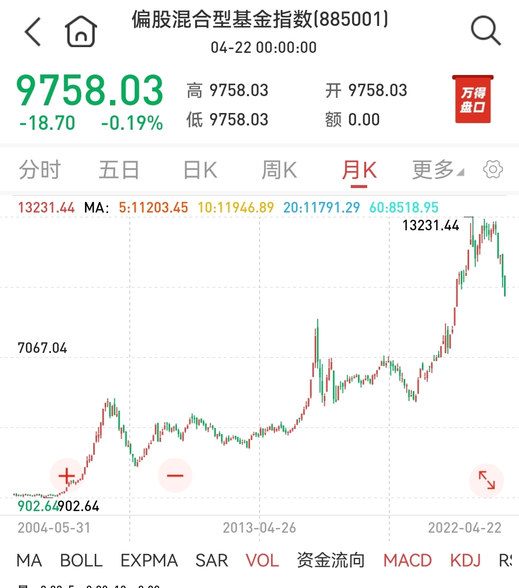

======================================================

_type: talk
@二师父[28814221155551]
2022-04-23 17:24:58 Sat  
topic_id: 212548218222421

估值的说明，按照15年股灾和08年股灾的规律，一般下跌5到9个月会有一轮三个月的反弹。大家如果仓位能承受的话，可以等中期反弹减仓，加仓可以等到5月2号美联储落地之后再考虑。

方向就是之前一直介绍的，置顶也有写。中药问题不大，极限点位看到2018年那个位置，比较可控，大家再扛一扛可能就见到曙光了。

尤其是四傻板块，不用割肉。加息是利好低估值的价值板块。

但是高市盈率50倍以上的，很危险，加息就是杀高估值的，这些方向要避免。

什么是低估值，看市盈率，凡是10倍市盈率以下的，就不要担心，凡是市盈率40倍以上的，就要小心。

@范毅君 at 2022-04-23 17:24:58 Sat

> 谢谢二师父，好像有点方向了[偷笑]

----------

@衣袂飘香 at 2022-04-23 17:24:58 Sat

> 二师父，您说一般下跌5~9个月，会有三个月的反弹。那现在是下跌了几个月了？中期反弹大约会在什么时候呢？

----------

@二师父 at 2022-04-23 17:24:58 Sat

> 不确定，我猜7，8月吧

----------

@衣袂飘香 at 2022-04-23 17:24:58 Sat

> 哦，那还要跌好久呢。

----------

阅读[1]  评论[4]  赞[0] 

+++++++++++++++++++++++++++++++++++++++++++++++++++++

文件：
2022-04-23 17:20:33 Sat
文件大小：[158087]
118258581418422-估值情况详细说明.docx

======================================================

_type: talk
@二师父[28814221155551]
2022-04-23 20:38:25 Sat  
topic_id: 585241585822824

大家都好乐观啊，我比较实事求是，大家看创业板50，是不是和15年走势一模一样，再跌2到3个月，反弹，反弹以后就是深不见底的熊市，我并不是死多头，熟悉我的朋友知道18年到20年一直喊加油干，那是主升浪周期，现在新一轮熊市开始了，熊市初期，券商先跌，成长股先跌，价值涨，熊市中期，价值和成长一起跌，跌到大家都离场了，差不多新一轮牛市孕育了

逻辑上有问题吗，并没有，你给我个创业板大涨的理由，纳斯达克跌，他单边上涨吗？

投资一定要客观，错了就认错，在错误的方向坚持，等于毁灭。

阅读[1]  评论[0]  赞[0] 

+++++++++++++++++++++++++++++++++++++++++++++++++++++

图片：
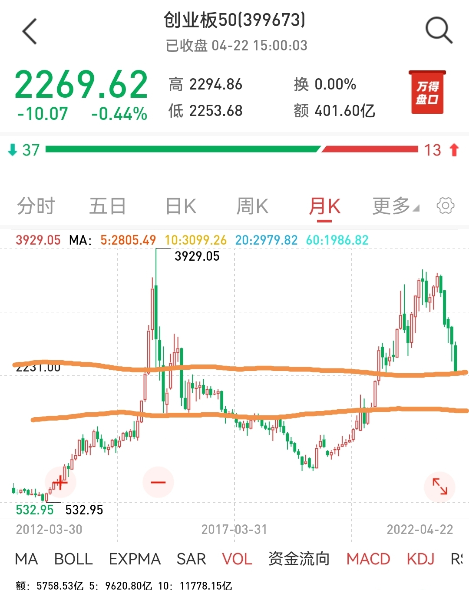

======================================================

_type: talk
@二师父[28814221155551]
2022-04-23 20:41:15 Sat  
topic_id: 212548212158141

来看看地产，15年股灾才4800，这几年没有涨，最大跌幅百分之28，这就是我敢买三傻的原因，不是不买而是等待一个绝佳机会，低吸，买的便宜，怎么卖都赚钱

阅读[1]  评论[0]  赞[0] 

+++++++++++++++++++++++++++++++++++++++++++++++++++++

图片：
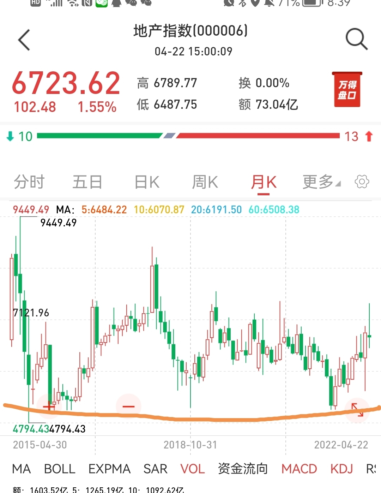

======================================================

_type: talk
@二师父[28814221155551]
2022-04-24 11:32:57 Sun  
topic_id: 812548488511282

全国统一大市场解读。

当前定投推荐安信稳健增值混合A，易方达裕祥，易方达增强回报债。这种风险低，先底仓卧倒，浮亏继续加码。即使发生危机，下跌有限。

指数基金推荐红利etf，基建ETF，地产ETF，预计下周下跌继续低买，涨起来就高卖，上一波咱们基本上赚了，再做一波，即使熊市一直震荡一直震荡，只要有波段就可以盈利。

而底仓配置白银组合，牛市来了不会踏空。

这是整体思路，白银组合保底，网格获取超额收益。

@如约而至 at 2022-04-24 11:32:57 Sun

> 老师，前天直播，第一次见庐山真面目，看你面相就是大富大贵之人，跟你混，吃不了亏[坏笑]

----------

@二师父 at 2022-04-24 11:32:57 Sun

> 一起进步

----------

@JOY at 2022-04-24 11:32:57 Sun

> 师父，下次直播能否早点通知哈，上次错过了～

----------

@二师父 at 2022-04-24 11:32:57 Sun

> 好的

----------

阅读[1]  评论[4]  赞[0] 

+++++++++++++++++++++++++++++++++++++++++++++++++++++

文件：
2022-04-24 11:27:37 Sun
文件大小：[32104]
421481542424218-全国统一大市场到底是什么回事.docx

2022-04-24 11:29:48 Sun
文件大小：[6156761]
118258421215242-全国统一大市场解读.m4a

======================================================

_type: talk
@二师父[28814221155551]
2022-04-24 18:01:41 Sun  
topic_id: 585241455284214

宁德时代推迟公布业绩公告，业绩肯定差到没法过审核。锂电池，新能源完蛋了，今年别买。创业板也别买

@FK Hsiang at 2022-04-24 18:01:41 Sun

> 二師父、請教倉位10%的新能源、創業板浮虧28%、是否清倉？還是躺平？

----------

@二师父 at 2022-04-24 18:01:41 Sun

> 这个只有自己决定了

----------

阅读[1]  评论[2]  赞[0] 

======================================================

_type: talk
@林玮[844111858288412]
2022-04-25 13:50:10 Mon  
topic_id: 184215825121182

师父，今天到一层了吗？

@以古论今 at 2022-04-25 13:50:10 Mon

> 到了你敢加吗？

----------

@样 at 2022-04-25 13:50:10 Mon

> 我也想问到了没

----------

@砥砺前行 at 2022-04-25 13:50:10 Mon

> 预计到地下室了

----------

@二师父 at 2022-04-25 13:50:10 Mon

> 收盘了我看看数据

----------

@杜志彪 at 2022-04-25 13:50:10 Mon

> 应该没有

----------

@杜志彪 at 2022-04-25 13:50:10 Mon

> 还差100点[偷笑]

----------

阅读[1]  评论[6]  赞[0] 

======================================================

_type: talk
@二师父[28814221155551]
2022-04-25 19:26:08 Mon  
topic_id: 415425482822128

<e type="hashtag" hid="552114551414" title="#估值数据#" /> 市盈率百分位20.18%，SY-BY百分位19.75%，SY/BY百分位7.05%。

估值楼层还是二层，预计跌到2800多就差不多到一层了。

金融市场容易极端，下跌的时候这样，上涨的时候也这样。

控制加仓节奏，最好的办法是不择时，每周四固定买一点点。

买A股指数本质是相信中国国运，如果国家长期向上，这个国家的资产就没问题，世界前二大经济体，中国和美国，是值得配置的，如果这两大经济体不行了，那就没有行的了。

道路总是曲折，但是会一直曲折向上。

大家需要做的是规划好资金，做好压力测试，然后根据最坏的情况来配置资金，最后执行就行了。市场的运行无法掌握，但是我们可以掌握自己的买入和卖出的节奏，做到这一点，就已经胜利了。

7年一个周期，今年是熊市初期，那么按照规律，未来5年可能是熊市，中期可能会有反弹，但是沪深300突破前高，创业板突破前高短期是不可能看到的了，上证还是有点希望。

熊市如何应对，心态和现金，二者缺一不可。

@梧桐 at 2022-04-25 19:26:08 Mon

> 今天发估值表吗

----------

@二师父 at 2022-04-25 19:26:08 Mon

> 除了创业板和科创板，其他宽基都可以定投

----------

@梧桐 at 2022-04-25 19:26:08 Mon

> 谢谢

----------

@小袁 at 2022-04-25 19:26:08 Mon

> 估值楼层还是一层，预计跌到2800多就差不多到一层了。

老师，是不是打错字了，估值楼层还是二层[呲牙]

----------

@IT at 2022-04-25 19:26:08 Mon

> 师父，300价值ETF现在还适合建立底仓吗，如果可以，是否可以参照沪深300指数市盈率使用低估定投策略进行？

----------

@二师父 at 2022-04-25 19:26:08 Mon

> 可以定投

----------

@IT at 2022-04-25 19:26:08 Mon

> 师父，你的意思是说，只要指数在低估区域，指基短期价格上涨也可以定投吧，我见300价值最近价格涨了不少。

----------

@二师父 at 2022-04-25 19:26:08 Mon

> 可以的

----------

阅读[1]  评论[9]  赞[0] 

======================================================

_type: talk
@二师父[28814221155551]
2022-04-25 22:22:38 Mon  
topic_id: 415425454558228

未雨绸缪，屯点物资，股市不好，屯点现金。

@吃肉肉 at 2022-04-25 22:22:38 Mon

> 囤货了，未来有大事发生。美丽国疯了，不会让全世界好过。

----------

阅读[1]  评论[1]  赞[0] 

+++++++++++++++++++++++++++++++++++++++++++++++++++++

文件：
2022-04-25 22:21:14 Mon
文件大小：[864486]
841581244851282-上海人民最后悔没囤的：这份清单北京朋友必须收藏.docx

======================================================

_type: talk
@二师父[28814221155551]
2022-04-26 06:32:56 Tue  
topic_id: 812542521214252

当前这个估值，除了创业板和科创板，其他宽基都可以定投，不用担心，只要拿的住，不打仗，未来都能挣钱。

大盘极限支撑在2650，在这个位置我会继续上仓位，主要是配置价值内，目前熊市初期，创业板下跌才刚刚开始。

如果跌破2500，可以直接满上卧倒。

除非极端事件，否则不可能破这个位置。

我们去年买的债基先别卖，这是目前唯一上涨的品种，关键时刻能够保命或者卖出加仓，只有到绝佳机会的时候才卖出他们加仓，否则就拿着，准备过冬！

@韩韩 at 2022-04-26 06:32:56 Tue

> 去年买的债基是指白银组合吗

----------

@二师父 at 2022-04-26 06:32:56 Tue

> 不是哈，7-10年国开债，1-3年国开债，招商产业债这些，那时候你好像还没关注，不过没关系，有现金也可以

----------

@韩韩 at 2022-04-26 06:32:56 Tue

> 哦哦，好好学习让金融敏感力跟上一点

----------

阅读[1]  评论[3]  赞[0] 

======================================================

_type: talk
@二师父[28814221155551]
2022-04-26 07:18:19 Tue  
topic_id: 415425451184458

今日加仓计划，淡定应对！

@梧桐 at 2022-04-26 07:18:19 Tue

> 二师父的补仓计划几乎全是行业，宽基不补吗。

----------

@二师父 at 2022-04-26 07:18:19 Tue

> 补，子弹有限，优先行业，除了创业板和科创板，其他都可以补。

----------

@二师父 at 2022-04-26 07:18:19 Tue

> 对了，上证是宽基

----------

@梧桐 at 2022-04-26 07:18:19 Tue

> 明白

----------

@珅爹 at 2022-04-26 07:18:19 Tue

> 请问鳄鱼计划和成长计划有什么区别啊？

----------

@梧桐 at 2022-04-26 07:18:19 Tue

> 以前的油气，现在的中概，不确定性太大，我还是安心补宽基。

----------

@二师父 at 2022-04-26 07:18:19 Tue

> 一个场内一个场外

----------

@二师父 at 2022-04-26 07:18:19 Tue

> 宽基最安全，沪深300，标普500，中证500，中证1000

----------

阅读[1]  评论[16]  赞[0] 

+++++++++++++++++++++++++++++++++++++++++++++++++++++

图片：
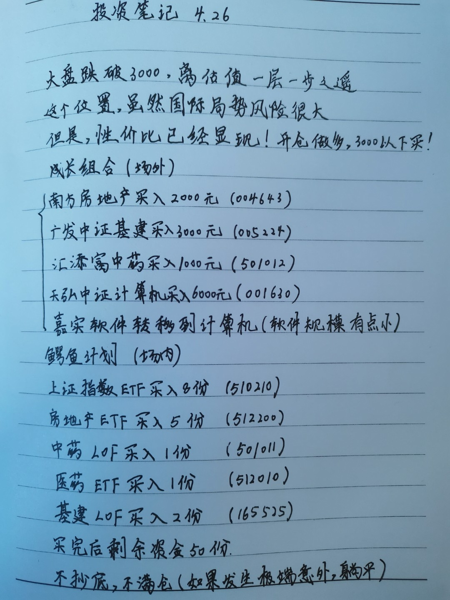

======================================================

_type: talk
@奉壹[218521884455481]
2022-04-26 10:23:38 Tue  
topic_id: 585245244422844

二师父，烦请各周四之前提醒一下场内外保持定投的基金是否继续执行，比如300价值，中证红利，纳指，标普等等之前有提及过逢周四定投的。
有时候想搜索一下定投计划，但是发现二师父多数是在评论处回复，在搜索栏找不到[尴尬]
麻烦了，谢谢[抱拳]不胜感激

@二师父 at 2022-04-26 10:23:38 Tue

> 300价值，标普500可以定投啊

----------

阅读[1]  评论[1]  赞[0] 

======================================================

_type: q&a
@Joey [422115481514888]
2022-04-26 11:30:25 Tue  
topic_id: 585245282841854

@Joey 

>  师傅 现在保险行业能买点吗 还是再等等跌透了再买 之前有仓位还在亏着

@二师父

>  可以先等等，优先买宽基，上证指数，基建，地产

阅读[1]  评论[1]  赞[0] 

======================================================

_type: q&a
@IT[582851511244154]
2022-04-26 11:32:18 Tue  
topic_id: 585245282841544

@IT

>  师父，我目前持仓如下，股票60%（双汇、海天、美的、海康）目前回撤10.54%，指基25%（300ETF、500ETF、红利ETF）目前回撤7.25%，股基3%（新能源、前沿医疗）目前回撤30.78%，债基4%（易方达安心回报、南方宝元债）目前回撤3.92。请问在没有后续现金追加的前提下，能不能调仓，如果可以，怎么调为好，谢谢。

@二师父

>  没有现金了就反弹盈利减仓，新能源和医疗可以往宽基，基建地产方向调整。股票不做建议了，其他没啥问题，债基有盈利优先卖出易方达安心回报债

阅读[1]  评论[3]  赞[0] 

======================================================

_type: talk
@二师父[28814221155551]
2022-04-26 13:12:47 Tue  
topic_id: 184214285814222

计算机也属于成长板块，不过超跌，大家看距离18年的低位只有14个点跌幅，不过加息周期表现可能会不太好，大家以宽基和价值为主。

@如约而至 at 2022-04-26 13:12:47 Tue

> 有仓位，被套中，是做T解套还是卧倒不动？

----------

@二师父 at 2022-04-26 13:12:47 Tue

> 都可以

----------

阅读[1]  评论[2]  赞[0] 

+++++++++++++++++++++++++++++++++++++++++++++++++++++

图片：
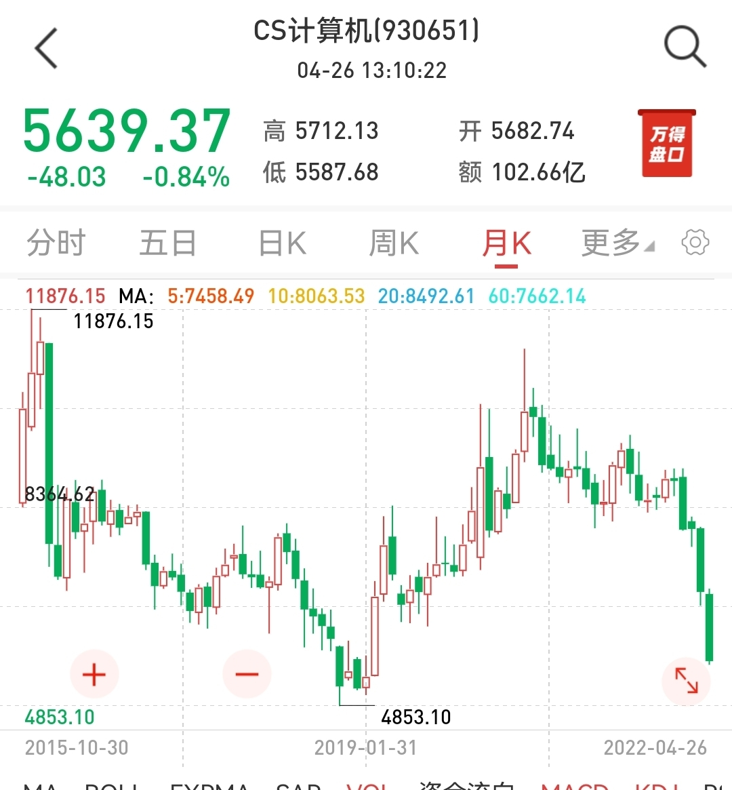

======================================================

_type: talk
@二师父[28814221155551]
2022-04-26 14:20:16 Tue  
topic_id: 184214284441212

只剩下这些品种上涨了，今年可能比2018年还惨，18年很多估值并不高，而现在很多赛道依然在高位，咱们只买低估的，虽然赚的不多，但是安全

@蛋炒饭不加蛋 at 2022-04-26 14:20:16 Tue

> 基建还能持有吗

----------

@二师父 at 2022-04-26 14:20:16 Tue

> 能啊，我今天刚买

----------

@蛋炒饭不加蛋 at 2022-04-26 14:20:16 Tue

> 嗯，基建仓位比较重被套了，今天这弱反弹有点不知所措

----------

@二师父 at 2022-04-26 14:20:16 Tue

> 单只基金仓位不要超过20，极限了

----------

@蛋炒饭不加蛋 at 2022-04-26 14:20:16 Tue

> 超过了些，现在稳增长和赛道一起被打，市场是反应过度了吗

----------

@二师父 at 2022-04-26 14:20:16 Tue

> 没有反应过度，而是疫情的原因

----------

@以古论今 at 2022-04-26 14:20:16 Tue

> 。华泰柏瑞鼎利年末可以实现正收益吗？

----------

@二师父 at 2022-04-26 14:20:16 Tue

> 除了货币基金，没有基金能确定有收益的

----------

阅读[1]  评论[13]  赞[0] 

+++++++++++++++++++++++++++++++++++++++++++++++++++++

图片：
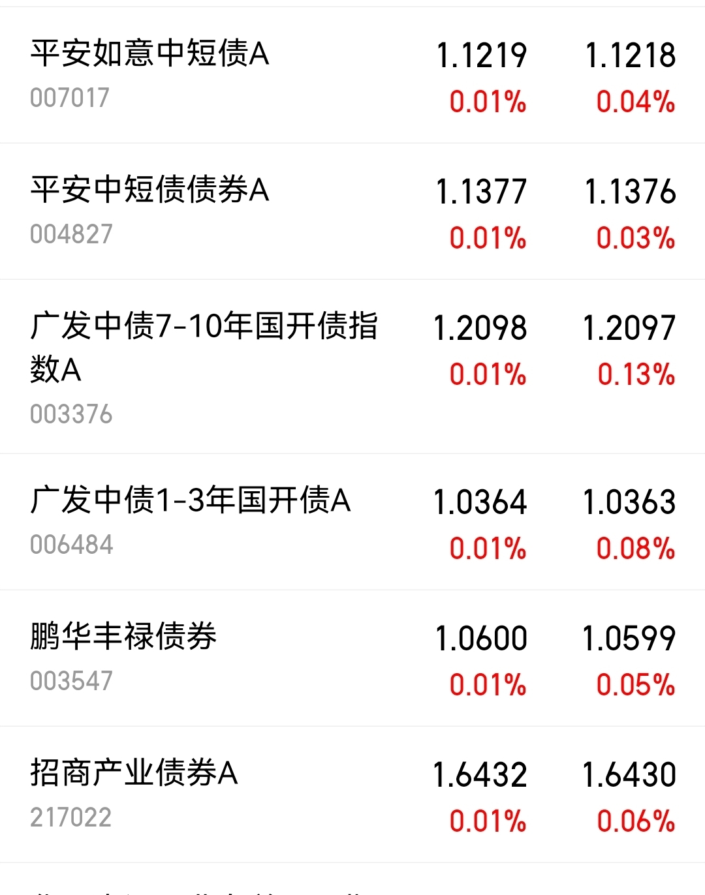

======================================================

_type: talk
@二师父[28814221155551]
2022-04-26 19:24:18 Tue  
topic_id: 812542858415842

基建迎来了好消息

@光少 at 2022-04-26 19:24:18 Tue

> 收到，涨了就减

----------

阅读[1]  评论[1]  赞[0] 

+++++++++++++++++++++++++++++++++++++++++++++++++++++

图片：
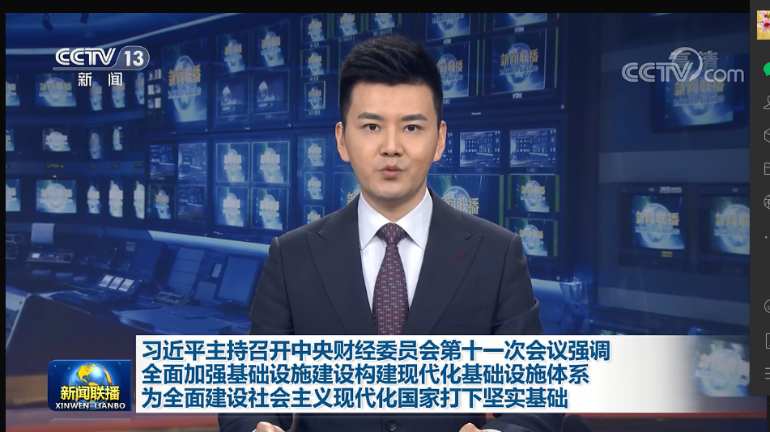

======================================================

_type: talk
@二师父[28814221155551]
2022-04-26 20:17:27 Tue  
topic_id: 184214524552442

今天估值楼层一层，宽基第一位上证指数，第二位沪深300价值，第三位沪深300，第四位中证500，第五位，中证1000。

@梧桐 at 2022-04-26 20:17:27 Tue

> 这个上证指数可以用上证50来替代吗

----------

@二师父 at 2022-04-26 20:17:27 Tue

> 可以

----------

@梧桐 at 2022-04-26 20:17:27 Tue

> 谢谢二师父

----------

@老孙头 at 2022-04-26 20:17:27 Tue

> "一只货币基金"---哪只？[抱拳]

----------

@二师父 at 2022-04-26 20:17:27 Tue

> 银华日利

----------

@李金泉 at 2022-04-26 20:17:27 Tue

> 二师傅，能否问下，你现在的资金指数基金和偏债基金比例是多少呢？

----------

@二师父 at 2022-04-26 20:17:27 Tue

> 指数基金百分之40，偏债基金百分之40

----------

@蛋炒饭不加蛋 at 2022-04-26 20:17:27 Tue

> 二师父请问如果现在是熊市初期已经估值一层的话，后面熊市五年的话估值还会下跌的很多吗？

----------

阅读[1]  评论[10]  赞[0] 

+++++++++++++++++++++++++++++++++++++++++++++++++++++

文件：
2022-04-26 20:05:44 Tue
文件大小：[60143]
118241224254812-到了.docx

======================================================

_type: talk
@二师父[28814221155551]
2022-04-26 20:58:12 Tue  
topic_id: 812542851828822

<e type="hashtag" hid="552114551414" title="#估值数据#" />市盈率百分位17.89%，SY-BY百分位13.82%，SY/BY百分位3.71%，估值楼层刚进入一层。

趋势形成很难改变，正如高估之后还会继续冲高一样，底部会反复磨底部。然后当所有人扛不住以后再拉升，这时候心态需要好，耐心等待。

宽基+基建+地产+纳斯达克。今天老大主持会议强调要全面加强基础设施建设构建现代化基础设施体系，为全面建设社会注意现代化国家打下坚实的基础。

基建咱们场内场外都有仓位，如果上涨了，记得干啥，不用提醒了哈。

千万不要赚了，然后上涨追加仓位，再把赚的给赔回去了，划不来。

@珅爹 at 2022-04-26 20:58:12 Tue

> 涨多少卖？

----------

@二师父 at 2022-04-26 20:58:12 Tue

> 赚4，5个点就可以分批卖

----------

@JOY at 2022-04-26 20:58:12 Tue

> 谨记师父教诲~

----------

阅读[1]  评论[3]  赞[0] 

======================================================

_type: talk
@二师父[28814221155551]
2022-04-26 21:28:07 Tue  
topic_id: 212542851451551

4月22日，华尔街突然将阿里巴巴创始人马云列为起诉对象。根据诉讼请求，这些律师正召集所有2020年6月至12月购买阿里股票的投资人，共同发起集体诉讼，要求阿里和马云赔偿股价下跌的损失，阿里股价距离2020年12月已经下跌超60%，市值蒸发3万亿港元，期间累计成交额超万亿美金，如果起诉胜诉，可能赔偿金额达到数千亿元。

中概股可能继续凉凉了，恒生科技也躺平比较好，风险太大！

@摆渡人 at 2022-04-26 21:28:07 Tue

> 投资亏了，还可以起诉去要回来啊？

----------

@二师父 at 2022-04-26 21:28:07 Tue

> 美国啥事干不出来

----------

@留影 at 2022-04-26 21:28:07 Tue

> 这如果能胜诉，不是脸不要了，是底裤都不要了

----------

@JOY at 2022-04-26 21:28:07 Tue

> 还可以直接冻结哈～对美国来说有什么不可以的呢～

----------

阅读[1]  评论[4]  赞[0] 

======================================================

_type: talk
@IT[582851511244154]
2022-04-26 23:09:30 Tue  
topic_id: 184214555588822

师父，场内购买，上证50ETF(510050)、基建ETF（516950）、房地产ETF（512200）吗？

@二师父 at 2022-04-26 23:09:30 Tue

> 是的

----------

阅读[1]  评论[1]  赞[0] 

======================================================

_type: talk
@二师父[28814221155551]
2022-04-27 09:34:57 Wed  
topic_id: 212542822141251

打新还是要坚持哈，行情惨淡，先休息休息了

@光少 at 2022-04-27 09:34:57 Wed

> 二师父，A股打新还可以打吗

----------

@二师父 at 2022-04-27 09:34:57 Wed

> 容易掉坑里，别打了

----------

@光少 at 2022-04-27 09:34:57 Wed

> 收到，稳健好[强]

----------

阅读[1]  评论[3]  赞[0] 

+++++++++++++++++++++++++++++++++++++++++++++++++++++

图片：
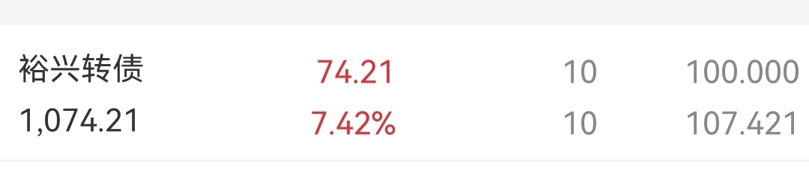

======================================================

_type: talk
@二师父[28814221155551]
2022-04-27 15:57:44 Wed  
topic_id: 184214511458242

极度恐惧，可以作为参考

@蛋炒饭不加蛋 at 2022-04-27 15:57:44 Wed

> 哪里看的

----------

@二师父 at 2022-04-27 15:57:44 Wed

> 韭圈

----------

@蛋炒饭不加蛋 at 2022-04-27 15:57:44 Wed

> 好的

----------

@兴乐之家 at 2022-04-27 15:57:44 Wed

> 二师父，韭圈是哪个平台呀？怎么进入呢？

----------

@二师父 at 2022-04-27 15:57:44 Wed

> 小程序

----------

阅读[1]  评论[5]  赞[0] 

+++++++++++++++++++++++++++++++++++++++++++++++++++++

图片：
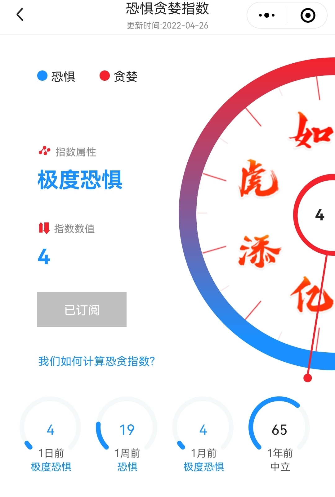

======================================================

_type: talk
@二师父[28814221155551]
2022-04-27 19:46:29 Wed  
topic_id: 415425515428818

<e type="hashtag" hid="552114551414" title="#估值数据#" />市盈率百分位17.47%，SY-BY百分位11.44%，SY/BY百分位3.04%。

估值楼层第一层。

当下市场情绪极端低迷，投资就是这样子，在别人低迷的时候买入，在情绪亢奋的时候卖出。知道容易，做到很难。

还是以价值方向+基建+地产为主，宽基除了创业板和科创板都可以。

今天创业板反弹，熊市中也会有阶段性反弹，这个反弹过后就是更加深的下跌。

咱们避开成长板块就行，如果自己想做，也只能按照趋势交易策略去做，不能够越跌越买。

@李金泉 at 2022-04-27 19:46:29 Wed

> 二师傅，想问下，为啥科创现在不行呢？

----------

@二师父 at 2022-04-27 19:46:29 Wed

> 流动性收紧，不利于科创的表现

----------

阅读[1]  评论[2]  赞[0] 

======================================================

_type: talk
@二师父[28814221155551]
2022-04-27 20:32:44 Wed  
topic_id: 184214484488412

医药20年来只有近两年是连续跌的

@Glühwein at 2022-04-27 20:32:44 Wed

> 未来不看好医疗了？

----------

@二师父 at 2022-04-27 20:32:44 Wed

> 医疗得等到降息周期才会有表现，最近两年不看好

----------

阅读[1]  评论[2]  赞[0] 

+++++++++++++++++++++++++++++++++++++++++++++++++++++

图片：
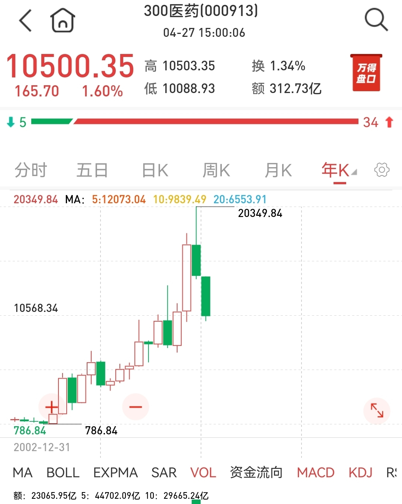

======================================================

_type: talk
@珅爹[15451242541142]
2022-04-27 22:12:03 Wed  
topic_id: 585245422515554

二师傅，您好，成长组合刚开仓就三个多点了，是继续持有还是放掉？放掉还不够七天啊。

@二师父 at 2022-04-27 22:12:03 Wed

> 拿着啊

----------

阅读[1]  评论[1]  赞[0] 

======================================================

_type: talk
@二师父[28814221155551]
2022-04-28 09:37:28 Thu  
topic_id: 812542488854822

<e type="hashtag" hid="881251425252" title="#鳄鱼计划#" /> 买入上证50，纳斯达克，红利各一份，咱们低买高卖即可，熊市要么卧倒，要么波段

至少持有7天这是对基金的尊敬，如果想做短线就场内即可。即使一直3500以下，只要低买高卖，几年后你会发现账户钱慢慢变多了

@Pacifica at 2022-04-28 09:37:28 Thu

> 二师父，已经买了综指，还需要配置50指数吗？

----------

@二师父 at 2022-04-28 09:37:28 Thu

> 可以分散一下哈，单只基金仓位百分之20以内，他俩属于同一个方向，分散配置是出于投资管理的仓位原则

----------

@Pacifica at 2022-04-28 09:37:28 Thu

> 明白了

----------

@珅爹 at 2022-04-28 09:37:28 Thu

> 一份是多少？能不能场外买？

----------

@珅爹 at 2022-04-28 09:37:28 Thu

> 已经涨起来了，不能买了

----------

阅读[1]  评论[5]  赞[0] 

+++++++++++++++++++++++++++++++++++++++++++++++++++++

图片：
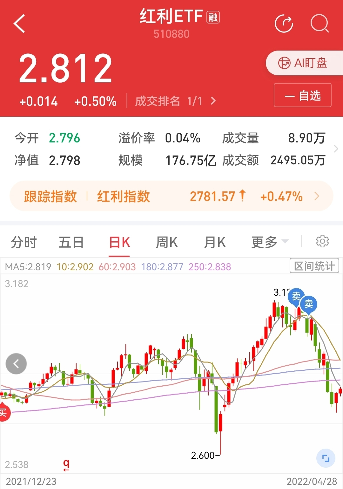
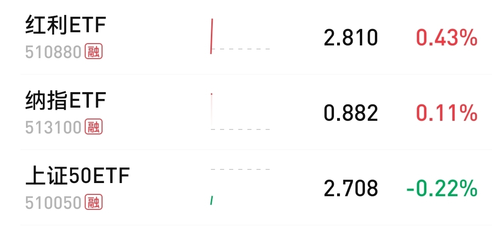

======================================================

_type: talk
@二师父[28814221155551]
2022-04-28 11:03:45 Thu  
topic_id: 812542484125842

关于这轮牛转熊的一些思考。

这轮牛转熊从去年3月就开始了，只是指数很有迷惑性，成长板块继续涨，而沪深300率先跌，估值楼层反应的很清楚。只是大家都被迷惑了。

那么关于定投是否有必要从4楼定投到1楼，我认为没有必要，没有绝佳机会就等待。

手握债基或者现金等待，只要耐心，我们一生中总能够出现一次两次一楼或者六楼的机会，这是命运，遇到就把握，遇不到就专心做自己的事情。

很多时候努力没有用，在股市尤其这样，以定投沪深300为例子，如果是从去年2月开始定投的，到现在还浮亏不少，微笑曲线何时再现不知道，但是压力很大，回本也需要时间。

所以我认为高安全边际更好。估值三四五六楼不投资，或者只投资债基。

或者只做趋势交易，如果发生了亏损就止损，这种是最好的保护，以创业板为例子，3楼的时候买入，他还是高估，到现在已经一楼了还在跌，这种类型的基金就更加适合趋势交易，趋势来了跟着赚，趋势破了走人，看错了趋势，及时止损，反对越跌越买，这个是最重要的，摊低成本本身是悖论，对于一个跌幅70%的指数，定投是没办法摊低成本的，因为定投有钝化效应，假设本金积累到100万，后面每次定投1000，怎么都没法摊低。这就导致大部分人高位重仓的基金，底部继续定投也没用。

对于行业指数，也更加适合趋势交易，无论是中概还是传媒，都是这种，谁也无法保证行业一直涨，而只有消费才值得越跌越买。其他的都多少有些风险，要么控制仓位，要么趋势交易。

那一楼二楼怎么投资，可以二楼可以定投二级债基、权益类基金，一楼只买权益类基金。将主仓位长期持有和副仓位长期持有结合。

怎么会卖飞呢？副仓位全部卖掉了还有主仓位的资金，这是最佳的模式。

总之，认知到位了，接下来就是坚定自己的想法和执行，因为大部分人都会在1楼卖出，6楼买入。这是人性弱点。咱们学习投资就要学习这种境界。

1楼买入，6楼卖出，说起来简单，做起来，很难，谁能严格做到，他就是神一样的存在。

@衣袂飘香 at 2022-04-28 11:03:45 Thu

> 说的很清楚，1楼买，345不买，6楼卖！

----------

@杜志彪 at 2022-04-28 11:03:45 Thu

> 我也是在思考这件事情，为追求超额收益21年将宽基指数投资转向行业指数，但行业指数也有其专业性周期起伏，缺乏专业知识的情况下单纯左侧交易确实不知行业低迷何时才起来，带入右侧交易确实有必要。

----------

@梧桐 at 2022-04-28 11:03:45 Thu

> 二师父，为什么这次调整中，券商看起来更弱一些。

----------

@二师父 at 2022-04-28 11:03:45 Thu

> 熊市来了

----------

@嘉宾 at 2022-04-28 11:03:45 Thu

> 请问，这里的主仓位和副仓位，如何理解？

----------

@二师父 at 2022-04-28 11:03:45 Thu

> 主仓位长期持有，副仓位波段

----------

阅读[1]  评论[6]  赞[0] 

======================================================

_type: talk
@二师父[28814221155551]
2022-04-28 22:22:29 Thu  
topic_id: 184214111485842

<e type="hashtag" hid="552114551414" title="#估值数据#" />市盈率百分位18.23%，SY-BY百分位15.44%，SY/BY百分位4.83%。

估值楼层刚好在一二层边界这里，这个位置和18年9月很接近了，除了去年的赛道古，地产、基建、等便宜到令人发指。

接下来的方向，上证指数、上证50指数，地产、基建，中药跌破年线了，加仓可以缓一缓，A股筑底需要一个过程，不会一下子就反弹起来的。

最好的方式就是佛系定投，建立底仓以后每周四定投一点点。

另外主动基金可以关注易方达蓝筹，没有风格漂移，长期来持续跑赢沪深300，只是需要我们自己择时，1，2楼买入，到了未来5楼的时候，别再追捧热门，止盈就好。

券商大跌，说明市场的熊市已经来临。

熊市的思路和牛市完全不同，熊市需要熬，需要网格，反弹走人，不要一直买买买，而不懂得止盈，最后可能好几年不挣钱。

熊市初期，券商领跌，这是必然的。

而价值股还可能有表现，这就是为什么要配置价值股的原因，如果价值股都不行了，那么成长股和价值股会一起下行。

如果只推荐一个指数，选择上证ETF或者上证50etf。

@嘉宾 at 2022-04-28 22:22:29 Thu

> 接下来的方向，上证指数、上证50指数，地产、基建，中药跌破年线了，加仓可以缓一缓
能解释下？

----------

@二师父 at 2022-04-28 22:22:29 Thu

> 跌破年线代表相应板块暂时进入下跌趋势，可以等下跌企稳再追加

----------

@cotton at 2022-04-28 22:22:29 Thu

> 准备开启熊市？。。

----------

@二师父 at 2022-04-28 22:22:29 Thu

> 沪深300已经熊了一年了

----------

@cotton at 2022-04-28 22:22:29 Thu

> 不会再熊了吧。。

----------

@二师父 at 2022-04-28 22:22:29 Thu

> 熊市是一个持续的过程，中途会有些小反弹

----------

@🎈铮 at 2022-04-28 22:22:29 Thu

> 二师父易方达优质精选混合怎么样

----------

@二师父 at 2022-04-28 22:22:29 Thu

> 不错的，值得投资，我计划下个月投易方达蓝筹，这俩基金都不错，过往收益率蓝筹高一点

----------

阅读[1]  评论[9]  赞[0] 

======================================================

_type: talk
@以古论今[28214421582421]
2022-04-29 00:19:06 Fri  
topic_id: 812542418115122

华泰柏瑞鼎立  现在的情势下怎么看，怎么操作

@二师父 at 2022-04-29 00:19:06 Fri

> 我感觉你的仓位重了，现在的风险是taihai，其他的还好

----------

阅读[1]  评论[1]  赞[0] 

======================================================

_type: talk
@二师父[28814221155551]
2022-04-29 11:08:14 Fri  
topic_id: 415425148118848

<e type="hashtag" hid="51288845144184" title="#周五组合分析#" /> 目前乌龟计划和安心组合躺平中，持有的二级债基和价值类基金在加息周期表现会比较好。这种不用太操心，乌龟计划中的权益类品种反弹继续收割利润。

为什么利润收割，就是因为市场不会一直涨，止盈落袋更加合适。大家一定要学会止盈，今年以来很多明星基金跌幅20%以上，长期持有不太适合这个市场。

鳄鱼计划目前主要投资上证指数、上证50、基建、地产，计划下次加仓跌到2900以下，如果跌不到，不再上仓位，留有点现金给一点缓冲的空间，之前2880建仓的基本盈利，想止盈也可以分批止盈。

大盘走势很弱，再加上俄乌局势，台海局势，建议大家投资留有余地。

成长组合，计划长期坚持定投，2600——3000点低于成本价每周四佛系定投一点，10%的利润开始收割。

海外组合，海外组合重点投资纳斯达克和越南指数，采用网格加仓的方法，低估之后持续定投。

方法已经公布了，接下来就是执行。按照A股的规律，一般熊市5年左右，所以等待下一次牛市周期大概率就是2028年左右了。

当然熊市也会有反弹，咱们低位买入，反弹卖出也可以挣钱，但是再想像过去2020年2021年一年1到3倍的收益就很难了。

@齐林 at 2022-04-29 11:08:14 Fri

> 二师父，可以买场内和场外基金的情况下，更建议买哪种方式呢？

----------

@二师父 at 2022-04-29 11:08:14 Fri

> 场内

----------

@样 at 2022-04-29 11:08:14 Fri

> 场内买基金能不能分组，像天天基金那样

----------

@二师父 at 2022-04-29 11:08:14 Fri

> 不能

----------

@丁咚 at 2022-04-29 11:08:14 Fri

> 请问，乌龟计划和成长组合都是场外定投，有什么区别吗？

----------

@珅爹 at 2022-04-29 11:08:14 Fri

> 您好，您说周四定投成长组合，问题是这周二已经跟二师父开仓了，周四还要定投吗？

----------

@二师父 at 2022-04-29 11:08:14 Fri

> 以后没超过3000点就定投啊

----------

@二师父 at 2022-04-29 11:08:14 Fri

> 乌龟计划保守一点，固收加偏多

----------

阅读[1]  评论[10]  赞[0] 

======================================================

_type: talk
@二师父[28814221155551]
2022-04-29 11:30:41 Fri  
topic_id: 585245825121554

从费率角度分析，场内交易比场外划算的，场外的至少费率是千分之2起步，而场内我这里最低可以到万0.6，买入和卖出就万1.2.场外的费率就高了。

首先7天以内有巨额赎回费，2年以内赎回也有费用，而且即使长期持有，买入费率单算也比场内的高。

从这个角度看，场内更好，而且场内资金出入非常方便，如果急需用钱，当天卖出，第二天就能到银行卡，场外就得慢一些。

大家结合自己的需求来就好，场内和场外投资并没有本质区别的。

@齐林 at 2022-04-29 11:30:41 Fri

> 二师父，推荐下你用的开户渠道，支付宝上面有开户，但是好像不太方便

----------

@二师父 at 2022-04-29 11:30:41 Fri

> 

----------

阅读[1]  评论[2]  赞[0] 

======================================================

_type: talk
@懂心[241128241828251]
2022-04-29 11:43:26 Fri  
topic_id: 212542152255181

二师父，请问场内和场外的基金收取的管理费都是一样的吧？比如510050和001051

@二师父 at 2022-04-29 11:43:26 Fri

> 一样的

----------

阅读[1]  评论[1]  赞[0] 

======================================================

_type: talk
@二师父[28814221155551]
2022-04-29 13:22:42 Fri  
topic_id: 415425141188458

<e type="hashtag" hid="881251425252" title="#鳄鱼计划#" /> 基建工程卖出一份，提款过节，目前不贵，也可以不卖，三天提款，舒服吧！

@珅爹 at 2022-04-29 13:22:42 Fri

> 成长组合不动是吧？

----------

@二师父 at 2022-04-29 13:22:42 Fri

> 不动

----------

@凡星 at 2022-04-29 13:22:42 Fri

> 如果在低估区，采用网格法进行交易，在价格5%，卖出1份，假如价格再次回撤回成本价，重新买入一份吗？

----------

@二师父 at 2022-04-29 13:22:42 Fri

> 可以的

----------

阅读[1]  评论[4]  赞[0] 

======================================================

_type: talk
@珅爹[15451242541142]
2022-04-29 14:10:55 Fri  
topic_id: 812542185841212

个人在招商景气优选C去年成立时申购买入，至今亏损40%了，可以补了吗？

@二师父 at 2022-04-29 14:10:55 Fri

> 这个不大了解

----------

阅读[1]  评论[1]  赞[0] 

======================================================

_type: talk
@IT[582851511244154]
2022-04-29 14:45:26 Fri  
topic_id: 212542185482541

请问师父，就抵御风险而言，债基仓位占比多少合适？

@二师父 at 2022-04-29 14:45:26 Fri

> 看你收入占比资金情况，假如你投了50万，每年收入50万，目前债基百分之20就行了，加入你投了，200万，每年收入50万，目前就百分之30，这个看具体情况

----------

@IT at 2022-04-29 14:45:26 Fri

> 师父，如果我计划只投资两类，价值基金、债券基金，两者仓位占比分别为多少合适？

----------

@二师父 at 2022-04-29 14:45:26 Fri

> 看你具体的资金实力

----------

@IT at 2022-04-29 14:45:26 Fri

> 比如总额100万，后续每年可以追加投资20万。

----------

@二师父 at 2022-04-29 14:45:26 Fri

> 百分之60价值，百分之40债基

----------

@IT at 2022-04-29 14:45:26 Fri

> 收到，谢谢师父。

----------

阅读[1]  评论[6]  赞[0] 

======================================================

_type: talk
@二师父[28814221155551]
2022-04-29 20:42:03 Fri  
topic_id: 812542125585152

<e type="hashtag" hid="552114551414" title="#估值数据#" /> 市盈率百分位18.23%，SY-BY百分位15.57%，SY/BY百分位4.73%。

估值楼层二层，大家真的不必在乎涨了三个点，只要仓位没有超过60%的，继续定投加仓没有问题。当下为什么不满仓，不是因为估值不够低，而是因为国际局势不确定性。

美联储加息和中概股的打压已经结束，暂时不用恐慌，但是国际局势瞬息万变，咱们得留有余地。

不管什么时候，买基金本质是买国运，对于世界上两个大国美国和中国，长期发展向好，做多是没有问题的。

计划易方达蓝筹，上证50纳入成长组合投资范围，易方达蓝筹一二楼买入，5，6楼卖出，长线，上证50类似上证指数，低买高卖。

当前是熊市，只是不大确定会走多久，从去年开始沪深300已经跌了16个月了，比金融危机的时候跌的时间还长，这个指数不用担心，需要注意的是创业板，警惕反弹追涨，中期反弹忍不住追进去容易二次被套。

@IT at 2022-04-29 20:42:03 Fri

> 师父，易方达蓝筹里面的美团W持仓5.02%，属于中概股吧？

----------

@二师父 at 2022-04-29 20:42:03 Fri

> 对的，现在国内政策风险已经基本解除了

----------

@IT at 2022-04-29 20:42:03 Fri

> 师父，明白了。

----------

阅读[1]  评论[3]  赞[0] 

======================================================

_type: talk
@珅爹[15451242541142]
2022-04-30 04:50:17 Sat  
topic_id: 585244258552814

二师父，标普500大跌，血亏，是补还是不动啊？补 按定投补还是大补？请指教。

@二师父 at 2022-04-30 04:50:17 Sat

> 网格补

----------

阅读[1]  评论[1]  赞[0] 

======================================================

_type: talk
@二师父[28814221155551]
2022-04-30 08:32:59 Sat  
topic_id: 415422424418288

介绍了恒生科技指数，这个咱们在场外有投资的，目前盈利大约3%，未来如果回调到4400以下可以择机再定投。仓位不用太重，10%以内就行。互联网行业的急速发展期已经过去了，适当轻仓定投，30%以上的利润再进行收割。

另外纳斯达克和标普500已经跌破支撑位，这种位置就不要着急定投，耐心等待下一轮下跌企稳。今年加息，不会缺机会的。所以咱们每一轮反弹都适当止盈，之前止盈了标普500，接下来可以再继续定投，然后反复，下行周期要么避开市场，要么定投+止盈。只有牛市主升浪周期才可以长期持有。

不同的牛熊周期，不同的策略。

@老孙头 at 2022-04-30 08:32:59 Sat

> 半山腰买的场外012348，目前还亏10个点。老师说的4400是个什么概念？在哪里查看？

----------

@二师父 at 2022-04-30 08:32:59 Sat

> 没重仓的话，恒生科技4400以下可以网格加仓，5500以上逐步卖出

----------

@老孙头 at 2022-04-30 08:32:59 Sat

> 请教—4400(5500)是个什么概念？在哪里查看？

----------

@二师父 at 2022-04-30 08:32:59 Sat

> 恒生科技指数

----------

阅读[1]  评论[4]  赞[0] 

+++++++++++++++++++++++++++++++++++++++++++++++++++++

文件：
2022-04-30 08:29:30 Sat
文件大小：[33009]
421452881124418-一个神奇的指数.docx

======================================================

