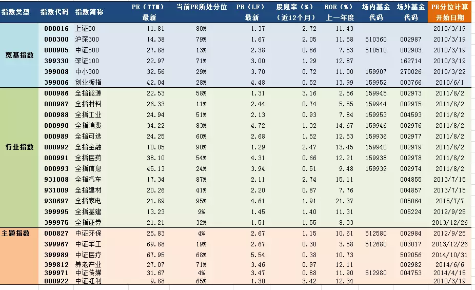
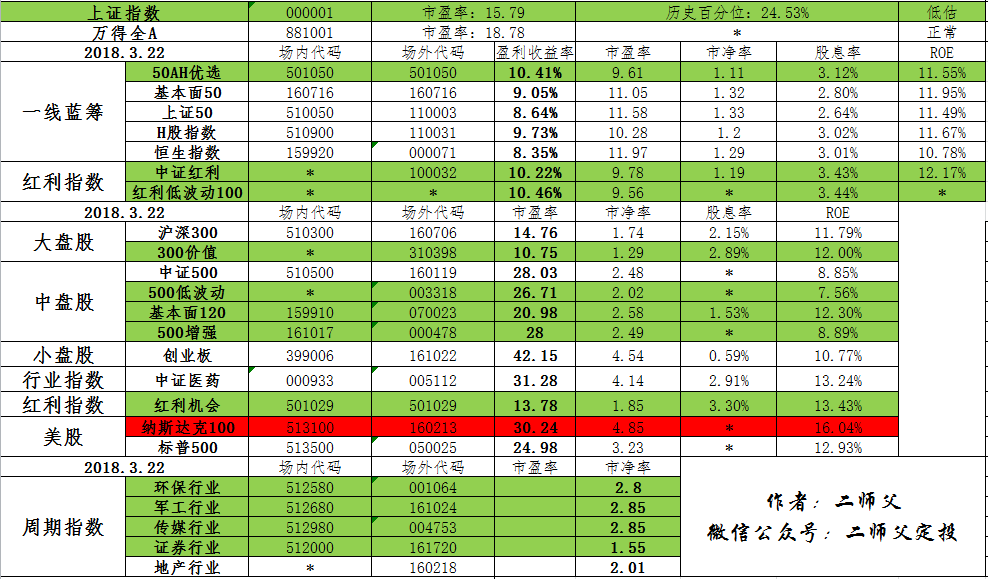
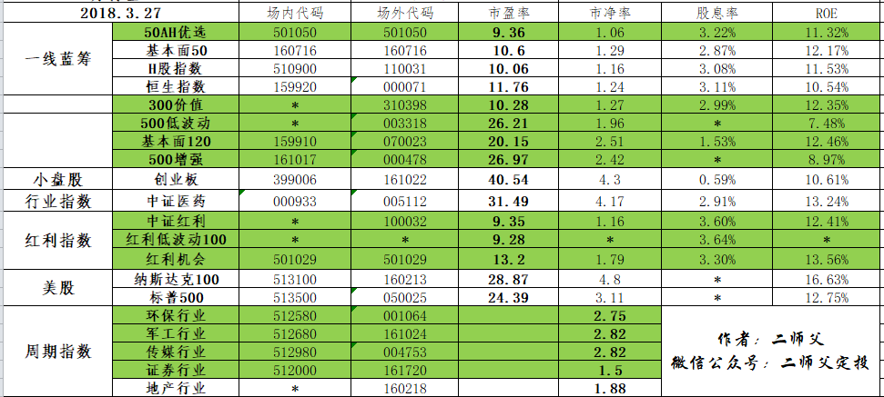

_type: q&a
@我叫太阳[28284125518241]
2018-03-02 10:21:41 Fri  
topic_id: 88814454245442

@我叫太阳

>  师父场外代码的在哪里搜索那个中正500我在蚂蚁金融，和同花顺上搜索到了都买不了什么情况？

@二师父

>  蚂蚁财富可以搜索到，蛋卷也可以

阅读[75]  评论[0]  赞[0] 

======================================================

_type: talk
@二师父[28814221155551]
2018-03-04 01:54:36 Sun  
topic_id: 15581818888282

新手学习之路，从这里开启

阅读[261]  评论[0]  赞[0] 

+++++++++++++++++++++++++++++++++++++++++++++++++++++

文件：
2018-03-04 01:54:24 Sun
文件大小：[247603]
51115552125124-新手如何开启指数基金定投之路.pdf

======================================================

_type: q&a
@吴振华[48824428222158]
2018-03-07 21:49:34 Wed  
topic_id: 88811514824812

@吴振华

>  师父，您提到的这些基金有没有平台或银行可以都能买到，平时上班忙，这样操作可以简单些，谢谢

@二师父

>  嗯嗯，这些不用去银行的，给你推荐几个平台，第一，蚂蚁财富，阿里巴巴推出的，这里可以购买场外基金，很方便，可以设置慧定投，自动扣款，刚好你上班忙不用经常操作。第二，蛋卷基金，这个是雪球推出的，他比蚂蚁财富的优势在于，从蛋卷提现到银行卡不用手续费，而且有的基金申购有折扣。这两个平台都是申购场外基金。对应我指数估值表里面的场外代码。第三种就是银行，开通网上银行，购买，这种购买没有场外基金方便，我没用。第四种，开通证券账户，我用的是华泰证券，里面可以买etf，这种购买手续费比较低，就是这种购买是你在别人手中买，流动性弱点。综上，推荐你在蛋卷买，这个是最方便的。

阅读[246]  评论[9]  赞[0] 

======================================================

_type: talk
@二师父[28814221155551]
2018-03-09 19:04:01 Fri  
topic_id: 48811558882828

被评为了理财基金达人，继续加油

阅读[61]  评论[0]  赞[0] 

+++++++++++++++++++++++++++++++++++++++++++++++++++++

图片：

======================================================

_type: talk
@二师父[28814221155551]
2018-03-09 21:56:43 Fri  
topic_id: 48811558111848

中概互联网投资价值分析，BAT的集合体

阅读[285]  评论[0]  赞[0] 

+++++++++++++++++++++++++++++++++++++++++++++++++++++

文件：
2018-03-09 21:56:17 Fri
文件大小：[275725]
15554414541482-中概互联网这只基金怎么样.pdf

======================================================

_type: q&a
@我叫太阳[28284125518241]
2018-03-11 21:06:57 Sun  
topic_id: 15588481254822

@我叫太阳

>  师父拉我进荔枝那个课堂下

@二师父

>  好

阅读[67]  评论[0]  赞[0] 

======================================================

_type: talk
@二师父[28814221155551]
2018-03-12 16:34:04 Mon  
topic_id: 88811452218852

买入大法，结合市盈率，越跌越买

阅读[275]  评论[0]  赞[0] 

+++++++++++++++++++++++++++++++++++++++++++++++++++++

文件：
2018-03-12 16:33:47 Mon
文件大小：[236923]
48885522248488-2、低估的指数基金怎么买入.pdf

======================================================

_type: talk
@二师父[28814221155551]
2018-03-13 23:26:29 Tue  
topic_id: 88811428255852

欢迎新同学的到来，有任何问题都可以在群内交流沟通，不局限于基金，信息的链接才能产生价值。多交流，多沟通，才能进步喔。

阅读[55]  评论[0]  赞[0] 

======================================================

_type: q&a
@成[15451812248822]
2018-03-14 02:38:39 Wed  
topic_id: 28811428842511

@成

>  中证传媒004752和004753有什么区别呀

@二师父

>  一个是c类基金，一个是a类基金。c类基金没有申购费用，一般7天以后也没有赎回费用，但是管理费托管费高，适合短期。a类有申赎费用，但是管理费托管费较低，适合长期

阅读[62]  评论[0]  赞[0] 

======================================================

@二师父[28814221155551]
2018-03-15 12:39:36 Thu  
topic_id: 88811415848222

>  @二师父
>  

阅读[67]  评论[0]  赞[0] 

======================================================

_type: talk
@二师父[28814221155551]
2018-03-15 23:23:39 Thu  
topic_id: 51188488518524

交易记录及心得分享

阅读[274]  评论[0]  赞[0] 

+++++++++++++++++++++++++++++++++++++++++++++++++++++

文件：
2018-03-15 23:23:32 Thu
文件大小：[291218]
48885515888188-2018年3月15日交易日志.pdf

======================================================

@二师父[28814221155551]
2018-03-17 10:33:57 Sat  
topic_id: 28255582228541

>  @二师父
>  

阅读[270]  评论[1]  赞[0] 

======================================================

_type: q&a
@学征[2421882451]
2018-03-17 12:57:19 Sat  
topic_id: 88255584824142

@学征

>  从周期指数来说，环保、传媒、军工都会在3月开会期间都有所增长，但现在是会议已进入尾声并且年报都会陆续公布，市场将会震荡。这样的行业是否值得继续投资？现在市场属于熊市或慢牛行情，证券行业指数只有在牛市增长快速，证券行业指数是否也要遵循右侧交易？

@二师父

>  二师父交易策略不预测市场走势，这是上帝做的事情，低估定投即可，你可以看看往期我的文章。另外现在还不是牛市，多积累基金份额

阅读[62]  评论[0]  赞[0] 

======================================================

_type: q&a
@飞的那个飞[48584811554158]
2018-03-17 14:07:27 Sat  
topic_id: 51522214144524

@飞的那个飞

>  师父 我最近才定投 我是配置一个月定投一次 我配置了一个大盘基金基本面60 然后是不是应该配置一个中小盘 我看低估表有300价值 500低波动 500增强 看师父的实盘是说马上500就要到正常了！我现在是不是需要投资300价值！小白一个是不是幼稚了

@二师父

>  基本面是深圳证券交易所的股票组合的基金，严格不能说是大盘。大盘，沪深300。中盘，中证500。定投的话在低估区域都是安全边际以内。中证500里面500增强我在很低点就投入了，所以现在浮盈，如果再继续上涨就到达正常估值了。

阅读[90]  评论[0]  赞[0] 

======================================================

_type: talk
@二师父[28814221155551]
2018-03-17 20:59:26 Sat  
topic_id: 88255528512422

大小盘轮动完美实现风险对冲，该如何操作，请看

@谅 at 2018-03-17 20:59:26 Sat

> 这篇老师将购买基金，风险对冲组合的，强烈推荐同学们下载认真看。

----------

阅读[281]  评论[1]  赞[0] 

+++++++++++++++++++++++++++++++++++++++++++++++++++++

文件：
2018-03-17 20:59:13 Sat
文件大小：[239586]
15554481285182-指数基金投资过程中如何避免基金的相关性.pdf

======================================================

_type: talk
@xiao666[51558214242284]
2018-03-18 13:38:55 Sun  
topic_id: 48544452821848

师傅怎么听你的荔枝课堂？请把我加入吧

@二师父 at 2018-03-18 13:38:55 Sun

> 还有几个小时开课了，不知道能不能进去，到时候有课程回放

----------

@xiao666 at 2018-03-18 13:38:55 Sun

> 等你给我们授权吗？刚进去要收费

----------

@二师父 at 2018-03-18 13:38:55 Sun

> 进去，我一会授权

----------

@xiao666 at 2018-03-18 13:38:55 Sun

> 老师，看你发的代码有场内和场内，会不会存在不一致的情况（比如场外是低估，场内是高估）？到底在哪里买比较好，请老师分析一下

----------

@二师父 at 2018-03-18 13:38:55 Sun

> 不会，低估是指数低估，都一样的，场内手续费低一些，但是不能自动定投

----------

阅读[59]  评论[5]  赞[0] 

======================================================

_type: q&a
@成[15451812248822]
2018-03-19 03:19:00 Mon  
topic_id: 51522241882224

@成

>  二师父，我是新人，不太了解，我们的基金在高估时卖出有人会接盘吗？不太懂这个流程。

@二师父

>  场外基金是申购和赎回，交易对象是基金公司，不是卖给他人，卖给基金公司，这个不用担心。场内是卖给别人，一般都会有人买的，如果出现了卖不出去的情况那就要大跌了，一般是有人接盘的，所以高估就要卖了，你自己也不知道转折点在哪

阅读[71]  评论[2]  赞[0] 

======================================================

_type: q&a
@慧医生[15451285824822]
2018-03-19 15:01:25 Mon  
topic_id: 51522282428524

@慧医生

>  怎么看不到今天的师傅的基金交易记录呢

@二师父

>  你好，今天并不符合二师父交易原则，所以就没有公布，当日如果有交易，一定会在三点之前公布的，当日若没有公布，则代表当日无交易。一般一周交易一次，大盘急速下跌一周会交易多次。若达到正常估值，大盘一直上涨，可能长时间无交易，持有就好，等着基金上涨赚钱

阅读[239]  评论[0]  赞[0] 

======================================================

_type: q&a
@成[15451812248822]
2018-03-20 02:21:14 Tue  
topic_id: 28255514411251

@成

>  二师父，中证传媒你为什么不选004752

@二师父

>  这个问题之前解释过，因为手续费的问题c类基金没有申购费用，当持有大于7日，也没有赎回费用

阅读[68]  评论[1]  赞[0] 

======================================================

_type: q&a
@victoria[15455121858422]
2018-03-20 02:35:23 Tue  
topic_id: 28255511484851

@victoria

>  二师父，现在创业板指数10026现在能定投吗？我看齐俊杰的粉丝圈中齐老师一直推荐，创业板好像也要向上走的趋势，请您给分析一下，谢谢

@二师父

>  你好，是这样的，创业板经过两年下跌目前估值不高，但是还没有达到二师父的安全边际，未来预测这种事情谁也不知道，现在创业板有两种趋势，一是继续上涨一直到高位，不投的话可能就是没有获得收益，但是以目前创业板43倍市盈率开始下跌最大跌幅会达到百分之70多，一般人承受不了，所以我们只有等待机会，当达到我们设定的安全边际才能够投资。齐俊杰的分析我看过，他是说创业板捅破年线就要投资，他给的目前市盈率跟我的差别不大，只不过我设定的低估区域更加安全，是在38倍市盈率以下为低估，市盈率波动区域在29到135，所以现在没有到达该条件。齐的判断是估值百分位低于百分之50可以投，这样风险很大的，你可以算一算百分位从百分之50跌倒百分之10跌幅有多大，很多人承受不了的。所以二师父目前没有投资。等待机会。如果创业板涨了跟我也没有关系，我很多低估的指数都会赚钱，但是现在追涨投入创业板，下跌亏损就非常大了。综合考虑，目前不建议进入。另外，不要相信预测市场的，你去看看巴菲特，股神都说他无法预测市场，其他人怎么能够预测呢？

阅读[285]  评论[3]  赞[0] 

======================================================

@二师父[28814221155551]
2018-03-20 14:41:00 Tue  
topic_id: 51522124125414

>  @二师父
>  

阅读[267]  评论[4]  赞[0] 

======================================================

_type: talk
@二师父[28814221155551]
2018-03-20 15:36:41 Tue  
topic_id: 88255854221552

提醒，最近读者问题有点多，读者提问有可能被淹没，如果提问1天以后还没回答，可以艾特下我

阅读[61]  评论[0]  赞[0] 

======================================================

_type: talk
@学征[2421882451]
2018-03-21 01:09:37 Wed  
topic_id: 28255882258221

50AH优选和上证50的持股是一样的，最大的区别就是当一家企业同时在上海和香港两地上市，如果港股价格低，那么50AH就用价格低的港股代替同样的A股作为样本股，这样50AH的价格就比上证50的低了，很明显只要50AH的盈利收益率更高那么他就更有投资价值(该段文字来源于二师父公众号)
 从图片(来源于万得资讯＆老罗话指数投资)中可以得到相应的上证50PE，它的数值大小与中证指数公司公布的滚动市盈率差不多，那从这个数值怎么能得出50AH的市盈率？是说要把50AH持股成分股比例都要进行核算？还有近几天从天天APP上看到该基金的估值和实际差的有些远，说明50AH对个股权重比例进行了相应调整，那是不是相应的估值是不是有滞后性？

@二师父 at 2018-03-21 01:09:37 Wed

> 你如果有兴趣的话算出重仓股票的市盈率，然后加权平均得到基金的市盈率。一般是查数据，估算

----------

阅读[77]  评论[1]  赞[0] 

+++++++++++++++++++++++++++++++++++++++++++++++++++++

图片：

======================================================

_type: q&a
@victoria[15455121858422]
2018-03-21 03:07:38 Wed  
topic_id: 51522115518154

@victoria

>  老师我一直不清楚：当某日大盘或某指数下跌，我买入，确认的价格是当天的还是第二天的？我看买完显示都是第二天才到帐，第二天往往又涨了。为什么不能买入马上确认价格到帐呢

@二师父

>  一般都是T+1的，也就是当日买入，次日开始确认份额，当日3点之前买入以当日基金价值确认，当日3点之后买入以次日价格确认。比如你在3月21日3点之前买入那么次日确认份额是以21日3点收盘时候的净值确认份额，不用担心第二天上涨。每次提问也不用都给我付费，学堂里面提问一般看到我都会回答的。

阅读[87]  评论[1]  赞[0] 

======================================================

_type: q&a
@victoria[15455121858422]
2018-03-21 12:36:17 Wed  
topic_id: 51522114511844

@victoria

>  二师父，我刚刚学习定投知识，看了一些相关知识，介绍买基金看过往业绩，一年三年五年排名，符合这些条件的基金与目前低估的基金完全不一样，我查了一下您列的目前低估的基金代码，历史业绩今年，去年也不好，有的收益很一般，有的还是负的，一直不敢买，而好买基金网上推荐的都是年化二十到三十的基金，那底该怎么选择啊，我不敢选了，请老师指导一下吧。

@二师父

>  二师父说过一句话，过去荣耀的将来一定衰败，你看创业板15年涨幅，再看看现在他的净值对比下。很多人根据推荐买，在高位买，很容易被套住

阅读[90]  评论[1]  赞[0] 

======================================================

_type: q&a
@xiao666[51558214242284]
2018-03-21 12:37:03 Wed  
topic_id: 28255884442251

@xiao666

>  请问老师，目前定投蓝筹，大盘，中盘，小盘比例多少合适？

@二师父

>  大盘策略:中盘策略=6:4

阅读[90]  评论[3]  赞[0] 

======================================================

_type: q&a
@victoria[15455121858422]
2018-03-21 23:20:25 Wed  
topic_id: 88255824854112

@victoria

>  老师您好！我看了您写的相关文章，也很认可您的投资理念，目前想按您定投的6支基金来进行周定投，总额每月5万，请问是平均分配好，还是按一定比例进行分配呢？另外如果大盘下跌，进行手动加仓，以哪里可以看到上面基金对应的指数是否下跌进行操作呢？关于下跌手动加仓这块是什么决定是否加仓，我一直没太明白。我是个新手，学习观察了半年多，问题也比较多，希望老师给予指导。

@二师父

>  如果每月定投5万，那么要保证有180万的资金，且3到5年不会用到。你如果时间充裕的话可以看盘，但是这样手动加仓不适合新手。你可以选择定期不定额投资，就是采用蚂蚁或者蛋卷的智能定投，设置一定的扣款金额，根据均线设置的，跌的越多，买的越多。上涨了就可以少买。关于如何看到指数涨跌，这个在万得股票可以看到，时事跟踪的。然后手动加仓，不是根据下跌，而是根据估值，有的是市盈率，周期指数是市净率，这种估值指标越低买的越多。我建议你自动定投，定期不定额，然后估值进入正常开始收割利润，因为你的资金量稍大，超过100万了，所以要做好风险控制，安全边际设置的要更加严格，投资的基金标的也最好控制在3到4支这样最好

阅读[309]  评论[2]  赞[0] 

======================================================

_type: talk
@二师父[28814221155551]
2018-03-22 12:59:30 Thu  
topic_id: 51522141845844

今日交易。个人实盘，不是操作建议。基本面120，买入2份，300价值，买入1份

阅读[77]  评论[0]  赞[0] 

======================================================

_type: talk
@二师父[28814221155551]
2018-03-22 14:27:29 Thu  
topic_id: 48544825825528

阅读[125]  评论[0]  赞[0] 

+++++++++++++++++++++++++++++++++++++++++++++++++++++

文件：
2018-03-22 14:27:07 Thu
文件大小：[5341073]
15554852241552-腾讯发布95页重磅报告：中国互联网未来5年的趋势是这样的！（完整版）.pdf

======================================================

_type: talk
@二师父[28814221155551]
2018-03-22 16:20:29 Thu  
topic_id: 51522145444584

<e type="hashtag" hid="281881225141" title="#投资箴言#" /> 以天为单位看待收益的人，相信的是奇迹和运气；以年为单位瞄准收益的人，相信的是天赋和能力；以3-5年为周期规划财务的人，相信的是胆识和眼光；以10年为单位思考财富的人，相信的是常识和复利；以更长周期看待财富的人，相信的是时代和命运。很多事情，不是学识智商有啥区别，而是从格局开始的。

阅读[77]  评论[0]  赞[0] 

======================================================

_type: talk
@二师父[28814221155551]
2018-03-22 23:19:04 Thu  
topic_id: 88255218282552

<e type="hashtag" hid="518118541554" title="#3.22指数估值#" /> 美国加息，市场有可能进一步走低，这都是我们积累股份的好时机，控制仓位，控制加仓频率，坚持低估区域定投

阅读[270]  评论[0]  赞[0] 

+++++++++++++++++++++++++++++++++++++++++++++++++++++

图片：

======================================================

_type: talk
@二师父[28814221155551]
2018-03-23 02:05:29 Fri  
topic_id: 48544518114858

@victoria at 2018-03-23 02:05:29 Fri

> 怎么知道今天哪个细分指数跌了几个点呢

----------

@二师父 at 2018-03-23 02:05:29 Fri

> 在基金购买软件有

----------

阅读[325]  评论[2]  赞[0] 

+++++++++++++++++++++++++++++++++++++++++++++++++++++

文件：
2018-03-23 02:05:17 Fri
文件大小：[230182]
88882185215122-基金定投如此简单，你为何还在亏损.pdf

======================================================

@二师父[28814221155551]
2018-03-23 12:33:48 Fri  
topic_id: 15422122214552

>  @二师父
>  

阅读[90]  评论[0]  赞[0] 

======================================================

_type: q&a
@思念☆雙眸[88225224454522]
2018-03-23 12:34:10 Fri  
topic_id: 28255455542421

@思念☆雙眸

>  今天要加仓吧

@二师父

>  做好资金配置，分步加仓

阅读[96]  评论[0]  赞[0] 

======================================================

_type: talk
@二师父[28814221155551]
2018-03-23 12:35:20 Fri  
topic_id: 48544244412118

<e type="hashtag" hid="481882421418" title="#今日交易#" /> 买50ah一份，500增强一份，300价值两份，基本面120两份

@思念☆雙眸 at 2018-03-23 12:35:20 Fri

> 您的一份是多少钱？怎么算的

----------

@二师父 at 2018-03-23 12:35:20 Fri

> 在五步定投法里面有，第二步，资金配置

----------

@victoria at 2018-03-23 12:35:20 Fri

> 二师父您为什么买两份300，120，只买一份50ah，500呢，中证500跌的很多，为什么不多买它呢

----------

@二师父 at 2018-03-23 12:35:20 Fri

> 根据估值来的，而不是跌幅

----------

@victoria at 2018-03-23 12:35:20 Fri

> 二师父300价值，120正常估值是多少怎能知道他现在是低估值呢

----------

@victoria at 2018-03-23 12:35:20 Fri

> 目前300价值比其他几个更有投资价值吗

----------

@二师父 at 2018-03-23 12:35:20 Fri

> 这个根据整个市场情况估算，按照a股情况从05年到现在市场整体估值下移，因为最开始估值过高

----------

阅读[82]  评论[7]  赞[0] 

======================================================

_type: talk
@二师父[28814221155551]
2018-03-23 12:36:56 Fri  
topic_id: 28255455511851

商务部，拟对30亿美元进口产品加征关税，大家怎么看，有何想法吗？

@谅 at 2018-03-23 12:36:56 Fri

> 人民币升值值钱了，买进口货变得划算，商务部想保护本国产业，然而中国制造已经够用了，投资能买更多的国外指数基金了。

----------

阅读[81]  评论[1]  赞[0] 

======================================================

_type: talk
@二师父[28814221155551]
2018-03-24 01:26:42 Sat  
topic_id: 15422128848282

<e type="web" href="https://mp.weixin.qq.com/s/Q5xVll6D_hMlGKIOONlV8Q" title="二师父，今天要加仓吗" cache="http://cache.zsxq.com/201803/15996f05b99be823fafd7b264b1feeae7186bb5ac31909c989dbb3348c8b1471" /> ，加不加，文章告诉你

阅读[81]  评论[0]  赞[0] 

======================================================

_type: talk
@二师父[28814221155551]
2018-03-25 14:43:32 Sun  
topic_id: 48544252218288

@victoria at 2018-03-25 14:43:32 Sun

> 老师50AH，300价值，中证500，红利机会，基本面120的历史估值大概多少，低估分别又是多少，在下跌加仓时应用您的公式，有个低估阀值，我没有数据无法应用，谢谢

----------

@二师父 at 2018-03-25 14:43:32 Sun

> 这些看市盈率估值就行啦，从历史来看，a股最开始估值都很高，所以最近十几年估值都是下移趋势，不是固定不变的

----------

阅读[321]  评论[2]  赞[0] 

+++++++++++++++++++++++++++++++++++++++++++++++++++++

文件：
2018-03-25 14:43:25 Sun
文件大小：[277481]
28882182288821-2018年3月投资总结.pdf

======================================================

_type: talk
@二师父[28814221155551]
2018-03-25 22:53:55 Sun  
topic_id: 28255448111421

阅读[326]  评论[0]  赞[0] 

+++++++++++++++++++++++++++++++++++++++++++++++++++++

文件：
2018-03-25 22:53:51 Sun
文件大小：[225210]
15554858552252-市场底部的暴跌不是风险，而是机会.pdf

======================================================

_type: q&a
@学征[2421882451]
2018-03-27 09:53:54 Tue  
topic_id: 28255154884281

@学征

>  二师父，您所说的200份是指每只基金要准备出200份的资金成本，还是说总体资金被均分为200份？从最近的操作日志来看，交易较为频繁，这200份从建仓、补仓及定投怎么分配的？200份的资金大概能打多久？

@二师父

>  存量资金保证3年，最近市场跌就加了，今天就没有操作

阅读[92]  评论[0]  赞[0] 

======================================================

_type: talk
@啦啦啦[28281514452811]
2018-03-27 13:58:22 Tue  
topic_id: 28255151242841

请问二师父，如何实现定期不定额操作呢？小白的话，直接选择软件自带的“上涨少投，下跌多投”吗？谢谢！

@二师父 at 2018-03-27 13:58:22 Tue

> 蚂蚁财富或者蛋卷基金有慧定投，可以实现

----------

阅读[81]  评论[1]  赞[0] 

======================================================

_type: q&a
@学征[2421882451]
2018-03-27 18:33:30 Tue  
topic_id: 48544184852848

@学征

>  二师父，在选择沪深300时，通过4433选基法可以把300价值找到，但有个关键因素是这只基金最近半年更换了基金经理。针对基金经理这个维度的选择，在相应估值中是否有考量？

@二师父

>  指数基金不用考虑基金经理的因素

阅读[95]  评论[0]  赞[0] 

======================================================

_type: talk
@二师父[28814221155551]
2018-03-28 01:19:38 Wed  
topic_id: 48544182121418

<e type="hashtag" hid="518151854154" title="#3.27指数估值#" /> 估值表来啦，别问二师父什么基金好，表中绿色低估可投，二师父不推荐股票，不推荐基金，不预测大盘走势。对了，星球里面发表是发表自己的观点大家讨论，要是像二师父提问就 在提问里面输入问题，这样二师父才能得到提醒，不然容易忽略

阅读[274]  评论[0]  赞[0] 

+++++++++++++++++++++++++++++++++++++++++++++++++++++

图片：

======================================================

_type: q&a
@victoria[15455121858422]
2018-03-28 03:06:28 Wed  
topic_id: 51522818222484

@victoria

>  老师我还是不明白，假设前天在上午10点，中证500为5675（最低值），我马上买入，收盘时又涨到5800多，那净值是对应的哪个点呢

@二师父

>  场外是最后的收盘价格

阅读[106]  评论[2]  赞[0] 

======================================================

_type: q&a
@汤圆君[881125824112]
2018-03-29 14:39:38 Thu  
topic_id: 28258518281851

@汤圆君

>  请问二师父，能不能增加一列当前市盈率的历史分位点？就是某指数目前市盈率在历史数据的高低。

@二师父

>  我觉得这种对投资帮助不大，因为历史市盈率参照的不同持续时间会有很大的不同，而且近十几年估值是一直下移的，这样就会导致百分位也会下降，会误导我们投资

阅读[299]  评论[6]  赞[0] 

======================================================

_type: q&a
@陈洲[88245122222212]
2018-03-29 19:51:31 Thu  
topic_id: 15425284481452

@陈洲

>  二师父，我是基金投资的小白，但最近不止一次看到基金定投，我目前每月会卖2000-5000的货币基金，这笔钱三年内用不到，看起来定投比买货币基金收益要高，想跟你学定投，但是不会看估值，看了你的5步定投，还是没明白定投和我定期买基金的差别

@二师父

>  货币基金收益是稳定的，但是长期的话跑不赢通货膨胀，指数基金定投有风险，每天有浮亏和浮盈，但是按照策略投资，实现年化百分之15到20的收益是可能的。如果投资有环节出了问题，也有可能导致亏损。所以需要不断学习

阅读[109]  评论[0]  赞[0] 

======================================================

@二师父[28814221155551]
2018-03-31 21:49:30 Sat  
topic_id: 88258824514512

>  @二师父
>  

阅读[102]  评论[0]  赞[0] 

======================================================

