_type: q&a
@陈洲[88245122222212]
2018-05-02 12:28:13 Wed  
topic_id: 48585281125288

@陈洲

>  今天在蚂蚁基金上买入了3种基金，有定投和买入两个入口，定投买入的设置日期后提示每月买入的日期，另外的买入入口没有提示，是不是二师父说的不定期不定额的投资？我是每月定投，但有时不如到月末多出来点钱，通过买入这种方式再增加点投资，买入这个操作，我的理解对吗？

@二师父

>  对，可以设置慧定投，这样到每月就可以实现低点多买，高点少买

阅读[543]  评论[0]  赞[0] 

======================================================

_type: q&a
@日臻[48525151551818]
2018-05-02 21:56:59 Wed  
topic_id: 51515458525244

@日臻

>  雪球里面的组合，能设成自动跟单吗，还是每次都要手动

@二师父

>  是你自己的组合吗

阅读[540]  评论[1]  赞[0] 

======================================================

_type: q&a
@微风[48551414411248]
2018-05-02 21:59:18 Wed  
topic_id: 15454148821582

@微风

>  一般都是用那个app，蛋卷怎么样呢

@二师父

>  蛋卷不错的，我就用的蛋卷

阅读[586]  评论[1]  赞[0] 

======================================================

_type: talk
@二师父[28814221155551]
2018-05-03 04:09:08 Thu  
topic_id: 88282442224282

<e type="hashtag" hid="518181588544" title="#5.2指数估值#" /> 指数估值表来啦，无论多忙都会坚持，我知道你们与我同行

@cotton at 2018-05-03 04:09:08 Thu

> 坚持指的是手动定投么？比如您推荐的，我已经上周买了，设置每周一定投。今天形势很不好，那我是该放任不管等到下周一自动定投，还是今天手动加

----------

@二师父 at 2018-05-03 04:09:08 Thu

> 如果设置自动定投就要严格按照纪律，不能盲目加仓

----------

@cotton at 2018-05-03 04:09:08 Thu

> 好的。。。

----------

阅读[869]  评论[3]  赞[0] 

+++++++++++++++++++++++++++++++++++++++++++++++++++++

图片：
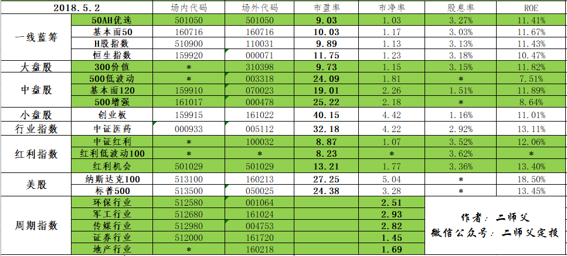

======================================================

_type: talk
@二师父[28814221155551]
2018-05-04 03:41:53 Fri  
topic_id: 28282158252241

<e type="hashtag" hid="281818152211" title="#5.3指数估值#" /> 定投按照纪律，不要盲目加仓，新手设置自动定投最好。至于以前买入了一些自己都搞不懂的基金怎么办，二师父只能说，我也无能为力。

@victoria at 2018-05-04 03:41:53 Fri

> 耐心，坚持✊

----------

@cotton at 2018-05-04 03:41:53 Fri

> 你说的是我[呲牙]

----------

@二师父 at 2018-05-04 03:41:53 Fri

> [呲牙][呲牙]

----------

阅读[930]  评论[3]  赞[0] 

+++++++++++++++++++++++++++++++++++++++++++++++++++++

图片：
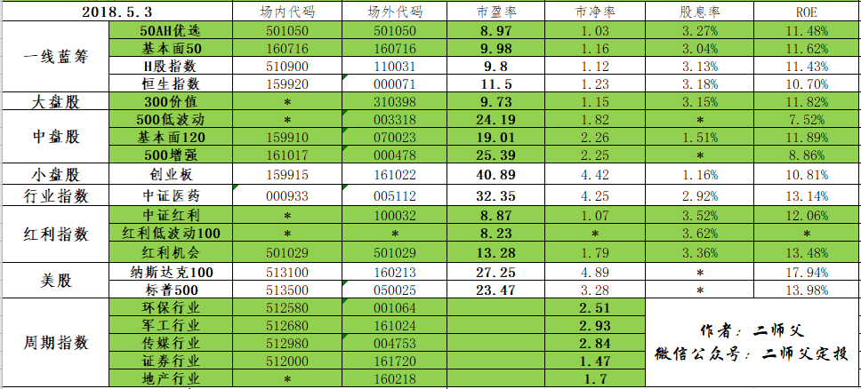

======================================================

_type: q&a
@Pacifica[15548581554152]
2018-05-04 11:44:14 Fri  
topic_id: 48585148558448

@Pacifica

>  二师父，在你看来，定投一只基金，需要把资金分为多少份才合适？

@二师父

>  150份

阅读[675]  评论[14]  赞[0] 

======================================================

_type: talk
@二师父[28814221155551]
2018-05-05 02:10:08 Sat  
topic_id: 15451242554452

投资的五个方面，欢迎交流讨论

@victoria at 2018-05-05 02:10:08 Sat

> 我觉的如果资金充裕的话，保险除了给父母买，也要给自己买一些重疾或意外险，因为我们现在是家庭的支柱。

----------

阅读[1014]  评论[1]  赞[0] 

+++++++++++++++++++++++++++++++++++++++++++++++++++++

文件：
2018-05-05 02:09:02 Sat
文件大小：[348125]
51114551425484-当拥有一大笔资金该如何投资.pdf

======================================================

_type: q&a
@思念☆雙眸[88225224454522]
2018-05-05 11:44:08 Sat  
topic_id: 88284525282512

@思念☆雙眸

>  二师父，你定的每周几是定投日呢？是周定投还是月定投？

@二师父

>  可以周四，我是不定期投资

阅读[742]  评论[0]  赞[0] 

======================================================

_type: q&a
@ss_佳汝[15481512828122]
2018-05-07 13:29:08 Mon  
topic_id: 51514124221454

@ss_佳汝

>  一只指数基金 如果既可以场内买 又可以场外买。每周定投2000左右的话。是不是优先选择场内买

@二师父

>  场内费率低一些的

阅读[791]  评论[0]  赞[0] 

======================================================

_type: talk
@飞的那个飞[48584811554158]
2018-05-07 16:05:04 Mon  
topic_id: 51514111524424

师父货币基金有可能亏损吗？

@二师父 at 2018-05-07 16:05:04 Mon

> 以前募集的没有可能

----------

@飞的那个飞 at 2018-05-07 16:05:04 Mon

> 谢谢师父

----------

阅读[815]  评论[2]  赞[0] 

======================================================

_type: talk
@二师父[28814221155551]
2018-05-08 01:31:14 Tue  
topic_id: 28284825285581

<e type="hashtag" hid="881812212522" title="#5.8指数估值#" /> 今天小涨，这些短暂的浮盈和浮亏都不重要，按照纪律，坚持定投就好。如果布局已经完毕，那就耐心持有，长期我是看到A股的。只要持有时间够长，买入成本够低，绝对是盈利的。

阅读[1190]  评论[0]  赞[0] 

+++++++++++++++++++++++++++++++++++++++++++++++++++++

图片：

======================================================

_type: talk
@二师父[28814221155551]
2018-05-08 01:44:48 Tue  
topic_id: 28284825288451

阅读[1283]  评论[0]  赞[0] 

+++++++++++++++++++++++++++++++++++++++++++++++++++++

文件：
2018-05-08 01:44:36 Tue
文件大小：[288961]
28884245452281-你为什么一买就暴跌.pdf

======================================================

_type: q&a
@孙健[15548444488812]
2018-05-09 00:04:32 Wed  
topic_id: 28284844212411

@孙健

>  请问老师，中证1000有没有推荐的场内外基金可以购买？

@二师父

>  中证1000市值太小，不建议购买哈

阅读[1015]  评论[1]  赞[0] 

======================================================

_type: talk
@二师父[28814221155551]
2018-05-09 04:21:10 Wed  
topic_id: 28284841525141

5月8日估值表，目前部分浮盈，还需要定投吗？仍处于低估区域，定投可以按照节奏，二师父布局差不多，坐等估值上升和股票背后公司盈利增长。

@丁丁 at 2018-05-09 04:21:10 Wed

> 二师父布局差不多了，能公布下现在的仓位和成本吗

----------

@二师父 at 2018-05-09 04:21:10 Wed

> 目前投资的有，红利机会，中证红利增强，300价值，500增强，基本面120，券商，50ah，

----------

阅读[1380]  评论[2]  赞[0] 

+++++++++++++++++++++++++++++++++++++++++++++++++++++

图片：
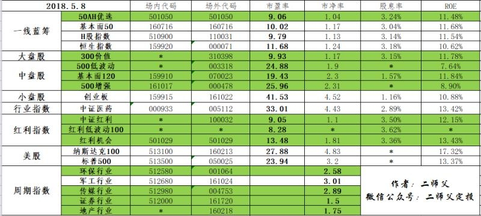

======================================================

_type: q&a
@ss_佳汝[15481512828122]
2018-05-09 14:43:30 Wed  
topic_id: 28284815525141

@ss_佳汝

>  请问有没有相关的养老产业基金推荐？能定投中证养老吗现在？谢谢

@二师父

>  000968，目前也是低估，可以定投，医药养老都是不错的行业

阅读[1040]  评论[0]  赞[0] 

======================================================

_type: talk
@二师父[28814221155551]
2018-05-10 04:22:53 Thu  
topic_id: 28284452451581

<e type="hashtag" hid="481811558288" title="#5.9指数估值#" /> 估值表来了，根据有的读者说，自己分不清颜色，所以二师父在前面用文字标注了估值情况，低估和正常。目前仍旧低估，按照纪律定投就好。

阅读[1424]  评论[0]  赞[0] 

+++++++++++++++++++++++++++++++++++++++++++++++++++++

图片：
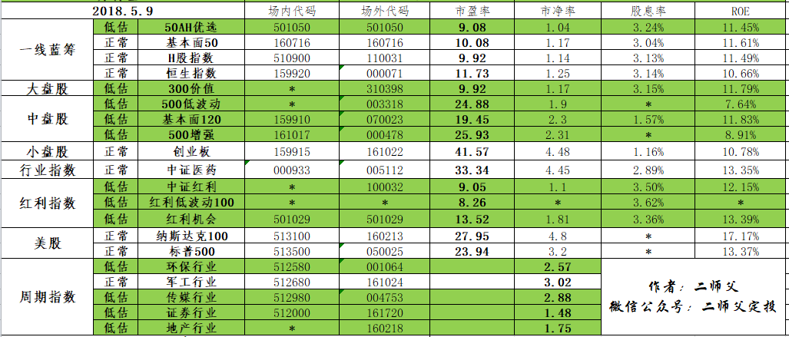

======================================================

_type: talk
@二师父[28814221155551]
2018-05-10 04:23:56 Thu  
topic_id: 15451124128242

中证养老投资价值分析，感谢这位同学提出的有价值的问题。二师父会考虑将这个基金加入估值表。我们相互学习，共同进步。

阅读[1544]  评论[0]  赞[0] 

+++++++++++++++++++++++++++++++++++++++++++++++++++++

文件：
2018-05-10 04:23:10 Thu
文件大小：[347759]
51114544455144-养老产业投资价值分析.pdf

======================================================

_type: q&a
@阿晨[88885122258182]
2018-05-10 11:11:40 Thu  
topic_id: 48582242425228

@阿晨

>  师父，我投中证银行相关基金目前已被套，帐面已亏损近8%，如何解套？要坚持下去吗？我的想法：亏损到10%时，加仓投资额的20%，你看这样是否可行？

@二师父

>  不行，首先做好资金配置，然后按月或者按周定投

阅读[1146]  评论[0]  赞[0] 

======================================================

_type: q&a
@Pacifica[15548581554152]
2018-05-10 11:43:45 Thu  
topic_id: 51514425812584

@Pacifica

>  二师父，我在看你写的“关于红利指数基金”的文章。我有一个疑问，你在文章中提到“12年的时间里面标普A股红利机会指数涨幅达到1121.41%。但是我看了501029，它是2017年1月成立的呀。刚刚一年多的历史。是不是搞错了？

@二师父

>  虽然指数基金才成立一年，但是该指数基金对应的指数确是一直存在的，就比如红利低波动100指数现在虽然有，不过基金还没有募集

阅读[1208]  评论[5]  赞[0] 

======================================================

_type: talk
@二师父[28814221155551]
2018-05-11 01:10:39 Fri  
topic_id: 48582258454188

<e type="hashtag" hid="158588148882" title="#5.10指数估值#" /> 最近市场小涨了一下，二师父的定投基金基本浮盈，虽然仍旧是市场底部，但是已经在短期内不考虑入手了。因为房产二师父还是认为比基金更有投资价值，努力挣钱，基金属于资产，房产也属于资产。好好工作，攒足资金，等待最佳入场机会。只要耐心，会来得，四月份二师父操作了三次都是在市场3050点时候买入的，如果那个时候不恐惧这时候收益也有一部分了。所以，还是要耐心等待机会。如果资金充足，而且是不定期投资，二师父还是建议按照纪律来定投。低估就投资。

@汤圆君 at 2018-05-11 01:10:39 Fri

> 请问二师父，目前我刚开始定投2个月，后续资金充足，还可以继续定投表格里目前绿色的基金吗？

----------

@二师父 at 2018-05-11 01:10:39 Fri

> 可以的，按照之前的纪律操作，可以减少定投金额，一直到正常估值

----------

@J-YC at 2018-05-11 01:10:39 Fri

> 房产比基金更有投资价值？现在是入场投资房产的时机吗？投资哪里呢？

----------

@二师父 at 2018-05-11 01:10:39 Fri

> 你有大笔资金的话可以考虑，强二线，人口流入地方，但是不要多持有，房产税正在悄悄落地

----------

阅读[1434]  评论[4]  赞[0] 

+++++++++++++++++++++++++++++++++++++++++++++++++++++

图片：
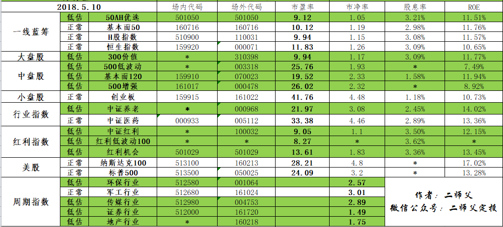

======================================================

_type: talk
@二师父[28814221155551]
2018-05-12 15:26:11 Sat  
topic_id: 28284414825241

11号指数估值表，昨天忘公布了，补上

@超级奶爸 at 2018-05-12 15:26:11 Sat

> 二师父，请教个问题。比如我定期投资了一只指数三年，每个月定投3000，突然某天我需要卖掉20000元，这时候赎回的费用怎么算？按1.5%还是0？

----------

@二师父 at 2018-05-12 15:26:11 Sat

> 这个你看基金具体费率的公布情况，每支基金都是不一样的，有的低于7天是一个费率，7到270是一个费率，总之持有时间越长卖出费率越低。有的是一年之后就没有卖出手续费了

----------

@二师父 at 2018-05-12 15:26:11 Sat

> 看错了，不好意思，如果你这笔赎回资金已经持有一年，按照0计算

----------

阅读[1396]  评论[3]  赞[0] 

+++++++++++++++++++++++++++++++++++++++++++++++++++++

图片：
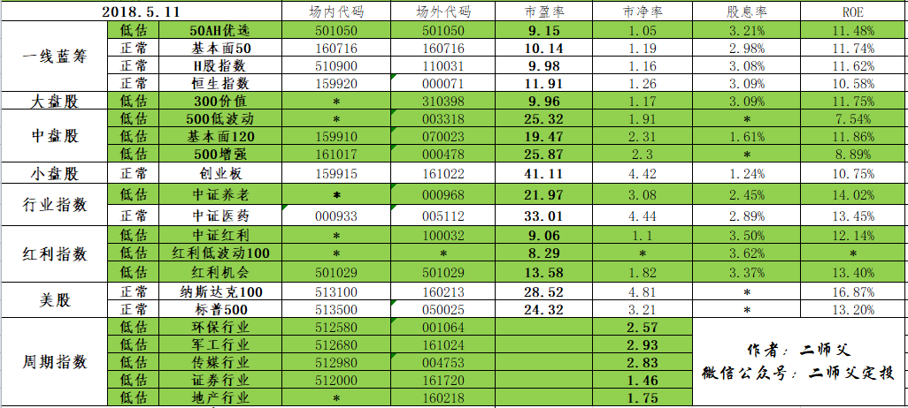

======================================================

_type: talk
@二师父[28814221155551]
2018-05-12 21:52:05 Sat  
topic_id: 88284411211212

以我投资的50ah为例，这个基金持有时间小于7天费率最高，持有时间超过一年卖出免手续费，所以，从费率的角度来看投资也要长期持有，百分之1.5的费率相当于1万需要150的卖出手续费，这是相当高了

阅读[1035]  评论[0]  赞[0] 

+++++++++++++++++++++++++++++++++++++++++++++++++++++

图片：
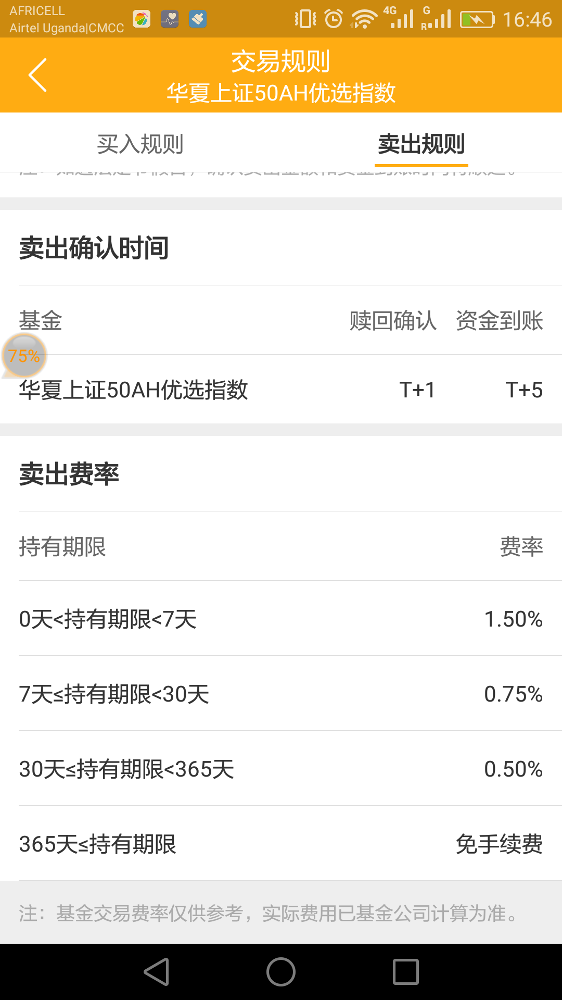

======================================================

_type: talk
@二师父[28814221155551]
2018-05-13 04:13:15 Sun  
topic_id: 51514825228454

指数估值方法，又谈一遍，说来说去反正核心原理就是那样了。今天母亲节，记得给麻麻打电话问好，报平安。这比什么都重要。

阅读[1457]  评论[0]  赞[0] 

+++++++++++++++++++++++++++++++++++++++++++++++++++++

文件：
2018-05-13 04:12:24 Sun
文件大小：[331461]
51114585451154-再谈怎么给指数基金估值.pdf

======================================================

_type: talk
@二师父[28814221155551]
2018-05-14 01:27:16 Mon  
topic_id: 28284182215441

@青花绣 at 2018-05-14 01:27:16 Mon

> 学耐心💪

----------

阅读[1437]  评论[1]  赞[0] 

+++++++++++++++++++++++++++++++++++++++++++++++++++++

文件：
2018-05-14 01:27:07 Mon
文件大小：[348527]
28884214258251-谈谈投资中最重要的品质.pdf

======================================================

_type: talk
@二师父[28814221155551]
2018-05-15 03:27:14 Tue  
topic_id: 15451815212842

<e type="hashtag" hid="518522515124" title="#5.14指数估值#" /> 中证养老进入正常估值，市场还是在底部区域，注意，这是二师父自己设定的，你也可以认为不是，不要看涨了多少，根据估值来来判断市场目前的位置，涨了百分之10，但是之前跌了百分之20，其实还是跌的。按照纪律定投就好，如果到达不适合投资的区域，二师父会公布的，表格里面白色的基金目前是一定不能够投资的了。

@汤圆君 at 2018-05-15 03:27:14 Tue

> 中证养老进入正常估值区域是不是就不能定投啦？

----------

@二师父 at 2018-05-15 03:27:14 Tue

> 对，目前持有就好

----------

阅读[1314]  评论[2]  赞[0] 

+++++++++++++++++++++++++++++++++++++++++++++++++++++

图片：

======================================================

_type: solution
2018-05-15 07:11:22 Tue  
topic_id: 51514841184424

@二师父 at 2018-05-15 07:11:22 Tue

> 坚持做下去，同时开源节流，增加储蓄，投资金额增加了，收益也会起来，目前正好进入市场学习经验

----------

@画面 at 2018-05-15 07:11:22 Tue

> 感谢您 每天为我们做的每一件事儿 辛苦了 二师父  投资是一生的修行…我会继续努力学习…

----------

@二师父 at 2018-05-15 07:11:22 Tue

> 一起学习，坚持

----------

阅读[1519]  评论[3]  赞[0] 

======================================================

_type: talk
@二师父[28814221155551]
2018-05-16 01:55:37 Wed  
topic_id: 15458288144852

<e type="hashtag" hid="481544518158" title="#5.15指数估值#" /> 进一步涨，低估品种很多接近正常，按照纪律投资，珍惜低估的机会

阅读[1486]  评论[0]  赞[0] 

+++++++++++++++++++++++++++++++++++++++++++++++++++++

图片：
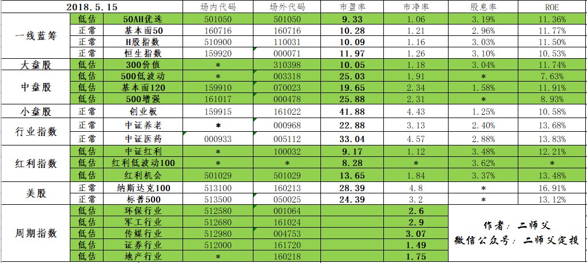

======================================================

_type: talk
@二师父[28814221155551]
2018-05-17 04:55:46 Thu  
topic_id: 88281884844142

<e type="hashtag" hid="881255152112" title="#5.16指数估值#" /> 最近加入了一些新朋友，建议多读下以前的文章，制定好投资策略，做好资金配置，坚持绿色低估定投，等待未来收获。

阅读[1401]  评论[0]  赞[0] 

+++++++++++++++++++++++++++++++++++++++++++++++++++++

图片：
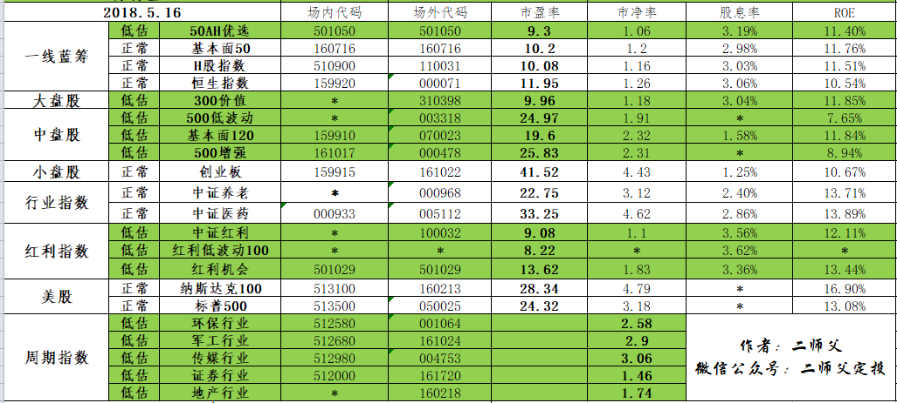

======================================================

_type: talk
@二师父[28814221155551]
2018-05-17 11:51:20 Thu  
topic_id: 88281828284842

今日交易，买入券商一份。

@波波 at 2018-05-17 11:51:20 Thu

> 终于又出手了

----------

@八月猪妈妈 at 2018-05-17 11:51:20 Thu

> 终于看到二师傅动了！

----------

@二师父 at 2018-05-17 11:51:20 Thu

> 学会耐心等待机会

----------

@cotton at 2018-05-17 11:51:20 Thu

> 什么叫买入券商一份[呲牙]

----------

@二师父 at 2018-05-17 11:51:20 Thu

> 就是根据资金配置确定好一份金额，比如是1000，那么买入一份就是1000，券商就是证券指数，估值表里面有代码

----------

@cotton at 2018-05-17 11:51:20 Thu

> [强]

----------

@勤能行之 at 2018-05-17 11:51:20 Thu

> 我今天也跟着师傅买了，开心

----------

@二师父 at 2018-05-17 11:51:20 Thu

> 每日公布的话三点之前，如果场外购买最好三点之前

----------

阅读[1103]  评论[19]  赞[0] 

======================================================

_type: talk
@二师父[28814221155551]
2018-05-18 01:46:18 Fri  
topic_id: 48581828855558

<e type="hashtag" hid="481548441558" title="#5.17指数估值#" /> 又跌回来了，市场反复震荡把很多韭菜就给割了，我们要做长期投资者，坚持，坚守，继续定投。剩下的就交给时间了。

阅读[1388]  评论[0]  赞[0] 

+++++++++++++++++++++++++++++++++++++++++++++++++++++

图片：

======================================================

_type: talk
@二师父[28814221155551]
2018-05-18 02:05:18 Fri  
topic_id: 88281848258512

当别人恐惧的时候就要贪婪

阅读[1456]  评论[0]  赞[0] 

+++++++++++++++++++++++++++++++++++++++++++++++++++++

文件：
2018-05-18 02:05:15 Fri
文件大小：[298211]
51114424415544-不要错过A股此时的投资机会.pdf

======================================================

_type: talk
@二师父[28814221155551]
2018-05-19 02:34:48 Sat  
topic_id: 51518188182144

<e type="hashtag" hid="281258888511" title="#5.18指数估值#" /> 今日指数估值，上涨了部分，仍旧值得投资，坚持，坚守，保证自己能够平静地看待股市涨跌，那么我们的投资系统和规则就是没有问题的。

@汤圆君 at 2018-05-19 02:34:48 Sat

> 二师父，能给周期指数也加上roe吗？

----------

@二师父 at 2018-05-19 02:34:48 Sat

> roe是市净率除以市盈率，因为周期指数市盈率失效，所以就没加

----------

@艺晗 at 2018-05-19 02:34:48 Sat

> 请教二师父红利机会的最高，最低的估值是多少呀，谢谢🙏

----------

@二师父 at 2018-05-19 02:34:48 Sat

> 只有低估区域值，最低估值是没人知道啊

----------

@艺晗 at 2018-05-19 02:34:48 Sat

> 谢谢您回复，那它的估值区间是多少呀

----------

@二师父 at 2018-05-19 02:34:48 Sat

> 红利机会低估和正常估值界限是15倍市盈率

----------

@艺晗 at 2018-05-19 02:34:48 Sat

> 明白了，谢谢您[强][抱拳][抱拳]

----------

阅读[1379]  评论[7]  赞[0] 

+++++++++++++++++++++++++++++++++++++++++++++++++++++

图片：

======================================================

_type: q&a
@Pacifica[15548581554152]
2018-05-19 12:49:23 Sat  
topic_id: 15458588422112

@Pacifica

>  二师父，你曾经讲过，最好定投300价值和500低波，但是我定投场内的500和300已差不多半年了，所以不太想放弃它们改为场外的指数基金。请问一下，我这种考虑方式是否正确？

@二师父

>  不用放弃啊，中证500可投，沪深300估值不是很低

阅读[1059]  评论[1]  赞[0] 

======================================================

_type: talk
@二师父[28814221155551]
2018-05-20 04:06:51 Sun  
topic_id: 15458455118242

@微风 at 2018-05-20 04:06:51 Sun

> 太敬业了

----------

@二师父 at 2018-05-20 04:06:51 Sun

> 谢谢，今天520不要忘记了给媳妇惊喜

----------

@微风 at 2018-05-20 04:06:51 Sun

> 哈哈，必须秀一把

----------

阅读[1422]  评论[3]  赞[0] 

+++++++++++++++++++++++++++++++++++++++++++++++++++++

文件：
2018-05-20 04:06:42 Sun
文件大小：[279710]
48882288518158-投资的道路上交学费是不可避免的.pdf

======================================================

_type: talk
@二师父[28814221155551]
2018-05-21 02:57:48 Mon  
topic_id: 15458144142112

定投指数基金如何盈利，需要弄清楚

阅读[1480]  评论[0]  赞[0] 

+++++++++++++++++++++++++++++++++++++++++++++++++++++

文件：
2018-05-21 02:57:25 Mon
文件大小：[293970]
28884482548151-定投的指数基金是如何赚钱的.pdf

======================================================

_type: q&a
@汤圆君[881125824112]
2018-05-21 16:21:44 Mon  
topic_id: 28281448214581

@汤圆君

>  提问二师父，行业主题类指数基金，可否采用主动型基金代替？比如医药，消费，传媒，环保等，均有相当优秀的主动型基金，可大幅跑赢对应指数

@二师父

>  据测算，在牛市主动基金百分之95跑不赢指数基金，因为基金经理会不断调仓，如果更换成了水平低的基金经理，那么更加糟糕，所以指数基金是更好的选择，如果你不满足，可以选择股票，当然这更需要功底

阅读[1114]  评论[0]  赞[0] 

======================================================

_type: talk
@二师父[28814221155551]
2018-05-22 02:07:45 Tue  
topic_id: 15458182184512

如果资金充足，目前仍旧可以按照纪律定投。

@Pacifica at 2018-05-22 02:07:45 Tue

> 二师父，我开始定投指数基金的时间不长。如果穿越了熊牛市，指数基金的投资回报能达到年回报20%？这估计是高手才有这样的收益吧？

----------

@二师父 at 2018-05-22 02:07:45 Tue

> 如果每一步都按照纪律投资，而且有大牛大熊这样的行情，是可以获得百分之15到百分之20的年化收益率的，这是最基本的收益率，但是很多人因为贪婪就放弃了

----------

@Pacifica at 2018-05-22 02:07:45 Tue

> 谢谢回复

----------

阅读[1509]  评论[3]  赞[0] 

+++++++++++++++++++++++++++++++++++++++++++++++++++++

文件：
2018-05-22 02:07:32 Tue
文件大小：[287658]
28884484522211-市场缓步上涨的时候我们该怎么定投.pdf

======================================================

_type: talk
@二师父[28814221155551]
2018-05-22 02:08:31 Tue  
topic_id: 28281415412841

<e type="hashtag" hid="881258418842" title="#5.21指数估值#" />

阅读[1506]  评论[0]  赞[0] 

+++++++++++++++++++++++++++++++++++++++++++++++++++++

图片：
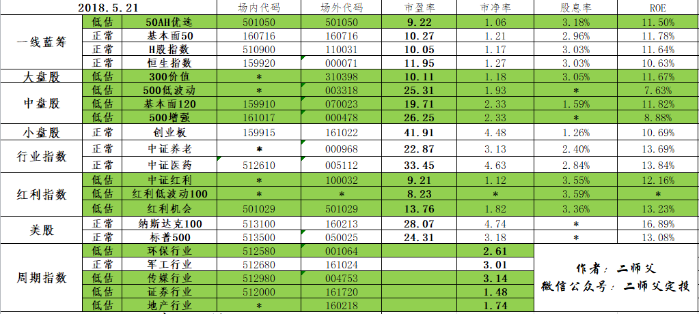

======================================================

_type: talk
@二师父[28814221155551]
2018-05-23 00:34:13 Wed  
topic_id: 28281154184251

@Pacifica at 2018-05-23 00:34:13 Wed

> 二师父的文章值得反复看，温故知新！

----------

阅读[1526]  评论[1]  赞[0] 

+++++++++++++++++++++++++++++++++++++++++++++++++++++

文件：
2018-05-23 00:34:10 Wed
文件大小：[339080]
51114452512484-投资常见的心理误区.pdf

======================================================

_type: talk
@二师父[28814221155551]
2018-05-24 01:26:06 Thu  
topic_id: 28281122588541

<e type="hashtag" hid="518524458514" title="#5.23指数估值#" />估值表来啦，今日如果300价值和券商继续下跌则可以买入。每天坚持，投资就是把复杂的事情简单化，把简单的事情重复做。

@victoria at 2018-05-24 01:26:06 Thu

> 老师昨天股市为什么下跌幅度较大

----------

@二师父 at 2018-05-24 01:26:06 Thu

> 股市短期是投票机，市场恐慌情绪导致的

----------

@cotton at 2018-05-24 01:26:06 Thu

> 券商是指最后一行的证券行业吗

----------

@二师父 at 2018-05-24 01:26:06 Thu

> 对的就是证券行业，券商有华泰，平安，这些，都是证券行业，估值表里代表证券行业指数基金

----------

@cotton at 2018-05-24 01:26:06 Thu

> 周期指数倒数第二行的是吗[调皮]。您买一份，就是手动补仓的意思我的理解对吗

----------

@二师父 at 2018-05-24 01:26:06 Thu

> 对的，根据资金配置分出一份的金额，然后买入一份就是相应的金额

----------

@cotton at 2018-05-24 01:26:06 Thu

> 161720在蛋卷那里是招商券商[害羞]

----------

@二师父 at 2018-05-24 01:26:06 Thu

> 对，招商券商分级

----------

阅读[1505]  评论[13]  赞[0] 

+++++++++++++++++++++++++++++++++++++++++++++++++++++

图片：
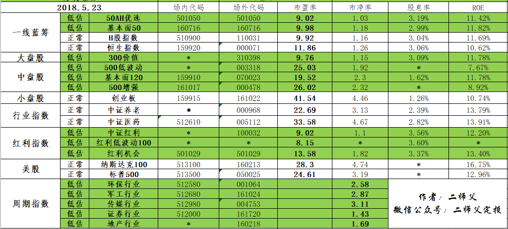

======================================================

_type: talk
@二师父[28814221155551]
2018-05-24 01:27:19 Thu  
topic_id: 51518855215254

推荐几个工具来查询估值，二师父把鱼竿给你，自己去钓鱼，这种感觉最好。大家有好的方法也记得分享哈。

@Sherwood at 2018-05-24 01:27:19 Thu

> 请教一个问题，您不认可按且慢按百分位评估，那您是按什么标准方法给出高估低估的建议的？

----------

@二师父 at 2018-05-24 01:27:19 Thu

> 你好，我是按照最大下跌幅度来控制低估与正常估值的安全阀值的。因为普通投资者所能够承受的最大心理跌幅是百分之30左右，所以二师父在低估阀值开始一次投资的最大下跌幅度为百分之40左右，结合我们分步建仓，那么最大下跌幅度控制在15到25个百分点，普通投资者能够承受。低估的安全阀值由此而来。

----------

@Sherwood at 2018-05-24 01:27:19 Thu

> 您40%下跌阀值又是怎么算的？是根据历史最低还是3/5年最低？

----------

@Sherwood at 2018-05-24 01:27:19 Thu

> 还有一个价值漫步也是按百分位算的，但是给出的建议甚至数据和且慢管家还不一样。哪一个比较准一点？

----------

@二师父 at 2018-05-24 01:27:19 Thu

> 指数成立以来最低

----------

@二师父 at 2018-05-24 01:27:19 Thu

> 我看看价值漫步的再给你回复哈，这个没看过

----------

阅读[1605]  评论[6]  赞[0] 

+++++++++++++++++++++++++++++++++++++++++++++++++++++

文件：
2018-05-24 01:26:36 Thu
文件大小：[680637]
51114451142444-如何查询A股常见指数的市盈率.pdf

======================================================

_type: talk
@二师父[28814221155551]
2018-05-24 14:23:51 Thu  
topic_id: 28281145124241

<e type="hashtag" hid="481882421418" title="#今日交易#" /> 300价值买入一份，券商买入一份。按照纪律坚持定投，保证子弹充足。

@Audrey at 2018-05-24 14:23:51 Thu

> 300价值前几天我就投了，亏损2％，我是不是投早了

----------

@二师父 at 2018-05-24 14:23:51 Thu

> 不早，目前300价值已经是9倍多市盈率，非常低估了。咱们在低估区域投资不是说基金不会下跌，而是在这个区域投资下跌幅度可以控制在一定范围内，不会出现巨大回撤。只要坚持在低估区域买入，迟早会涨上去的，不过定投需要按照纪律和把握好节奏。

----------

@Audrey at 2018-05-24 14:23:51 Thu

> 谢谢二师傅 每天都看你的文章

----------

阅读[1587]  评论[3]  赞[0] 

======================================================

_type: talk
@二师父[28814221155551]
2018-05-25 03:20:53 Fri  
topic_id: 28281115251821

<e type="hashtag" hid="481542151128" title="#5.24指数估值#" /> 低估定投，坚持就是王者

@孙健 at 2018-05-25 03:20:53 Fri

> 师父注意身体，这么晚还没睡

----------

@王斯王 at 2018-05-25 03:20:53 Fri

> 请问500增强高于多少是高估 请问这个高估是如何得出的

----------

@二师父 at 2018-05-25 03:20:53 Fri

> 38倍市盈率到达高估，根据历史市盈率回测得出来的，可以自己设定，看你的风险承受能力

----------

@王斯王 at 2018-05-25 03:20:53 Fri

> 谢谢🙏

----------

阅读[1558]  评论[4]  赞[0] 

+++++++++++++++++++++++++++++++++++++++++++++++++++++

图片：
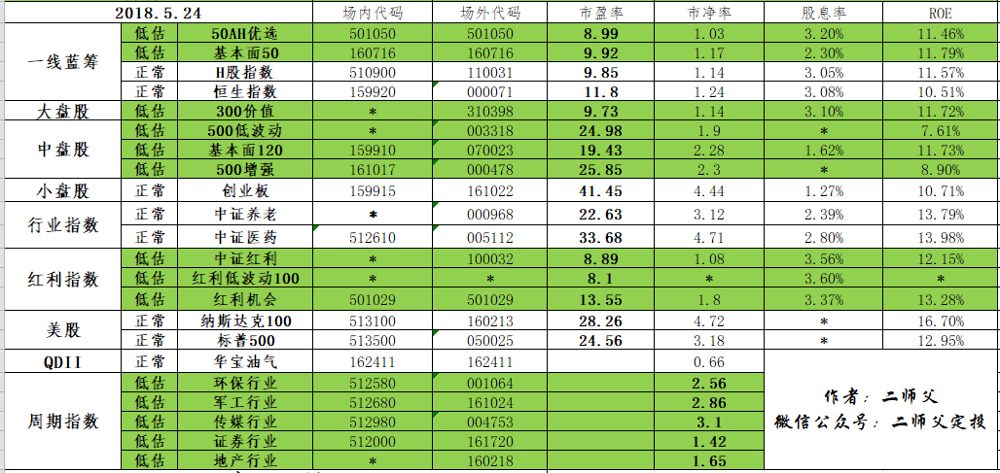

======================================================

_type: talk
@二师父[28814221155551]
2018-05-26 03:32:48 Sat  
topic_id: 88225854284452

<e type="hashtag" hid="518528245584" title="#5.25指数估值#" /> 5.25指数估值，按照节奏定投，我们也不知道牛市何时到来，也许明天，也许一年后，预测没人能做到，我们能做的就是在低估区域一点一点地耐心积累份额，这样牛市到来时候我们才有笑傲股市的资本

阅读[1448]  评论[0]  赞[0] 

+++++++++++++++++++++++++++++++++++++++++++++++++++++

图片：
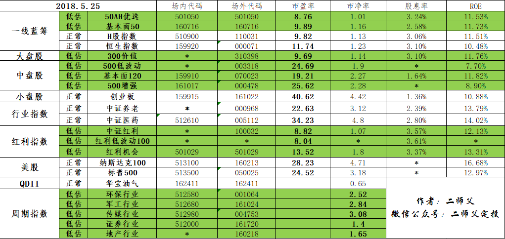

======================================================

_type: talk
@二师父[28814221155551]
2018-05-26 03:36:23 Sat  
topic_id: 51552124518584

阅读[1507]  评论[0]  赞[0] 

+++++++++++++++++++++++++++++++++++++++++++++++++++++

文件：
2018-05-26 03:36:18 Sat
文件大小：[304011]
88884145524152-模拟一个傻瓜定投者.pdf

======================================================

_type: q&a
@Tim哥[15451581224852]
2018-05-27 10:58:25 Sun  
topic_id: 88225828528142

@Tim哥

>  建议表格加上一个历史最低估值，方便比较，免得冲动

@二师父

>  稍后考虑加上

阅读[1142]  评论[3]  赞[0] 

======================================================

@二师父[28814221155551]
2018-05-27 13:11:28 Sun  
topic_id: 88225822581482

>  @二师父
>  

阅读[1175]  评论[2]  赞[0] 

======================================================

_type: q&a
@TIME[51188125888554]
2018-05-27 16:01:11 Sun  
topic_id: 28225822214811

@TIME

>  二师父你好，今天在雪球偶然拜读文章，受益颇深，我现在问题很纠结，今年第一个交易日开始定投，现在问题是，基金个数越投越多，自己看着都挺好，但是肯定有问题，想请您帮忙分析一下，我应该把哪些舍掉？我觉得有5只左右足矣，让您费心了。还有图片没放下的富国创业板161022，兴全合润分级163406。

@二师父

>  二师父采用的是低风险的指数基金投资，不像股票基金会有大的调仓风险，你这里定投的创业板现在还没有低估呢，不过快了。至于中证50目前低估可以继续定投。其他的根据自身情况来定。建议采用估值表里面的指数基金投资

阅读[1643]  评论[1]  赞[0] 

======================================================

_type: talk
@二师父[28814221155551]
2018-05-27 16:06:56 Sun  
topic_id: 51552155421254

今天看到学堂有同学的持仓，二师父感觉太过于分散，正常情况下不是先定投。而是先学习，然后做定投计划，是每月投还是每周投，投资多少只基金，一次金额多少，何时停投，何时卖出，何时清仓。如果这些心里没谱的话，那么定投还没有入门，建议先读学堂的文章学习，不懂的大家相互讨论或者问二师父。一定要弄清楚了再投资，挣钱不容易，要捂好自己的钱袋子，投资就是为了挣钱的。如果不挣钱，那么定投就失去了意义

阅读[1196]  评论[0]  赞[0] 

======================================================

_type: q&a
@xiao666[51558214242284]
2018-05-27 19:03:19 Sun  
topic_id: 88225824584452

@xiao666

>  请问老师，传媒行业市净率低估和高估的阈值是多少？谢谢

@二师父

>  低估阀值大概是3.3左右的市净率。

阅读[1229]  评论[0]  赞[0] 

======================================================

@二师父[28814221155551]
2018-05-27 22:13:28 Sun  
topic_id: 15442512422142

>  @二师父
>  

阅读[1254]  评论[0]  赞[0] 

======================================================

_type: q&a
@明天会更好[48528152285488]
2018-05-28 02:34:23 Mon  
topic_id: 48554828858518

@明天会更好

>  师父您好，打算先投一只，应该怎么选啊？

@二师父

>  500增强，场外，场内就中证500

阅读[1228]  评论[0]  赞[0] 

======================================================

_type: talk
@二师父[28814221155551]
2018-05-28 02:54:11 Mon  
topic_id: 15442515541282

@波波 at 2018-05-28 02:54:11 Mon

> 二师父，鳄鱼计划在哪里？

----------

@二师父 at 2018-05-28 02:54:11 Mon

> 就在学堂，一个月大概买入一次到两次，没有适合机会就不买

----------

@victoria at 2018-05-28 02:54:11 Mon

> 定投计划准备在什么时间开始

----------

@二师父 at 2018-05-28 02:54:11 Mon

> 每周四

----------

@victoria at 2018-05-28 02:54:11 Mon

> 这个周四吗

----------

@二师父 at 2018-05-28 02:54:11 Mon

> 定投实盘每周四，鳄鱼一月一到二次

----------

阅读[1718]  评论[6]  赞[0] 

+++++++++++++++++++++++++++++++++++++++++++++++++++++

文件：
2018-05-28 02:54:01 Mon
文件大小：[320951]
28884148452221-关于定投实盘的说明.pdf

======================================================

_type: talk
@二师父[28814221155551]
2018-05-28 18:20:42 Mon  
topic_id: 15442585221252

<e type="hashtag" hid="281251228421" title="#5.28指数估值#" /> 新版指数估值表出炉了，早点跟大家见面，估值表会逐步完善的，一起加油

@victoria at 2018-05-28 18:20:42 Mon

> 老师泸深300和300价值是一样的吗，在齐俊杰的星球里说泸深300，上证50还未到低估范围，还要再等等

----------

@二师父 at 2018-05-28 18:20:42 Mon

> 不一样，300没低估，准备把这个也加进去

----------

阅读[1540]  评论[2]  赞[0] 

+++++++++++++++++++++++++++++++++++++++++++++++++++++

图片：
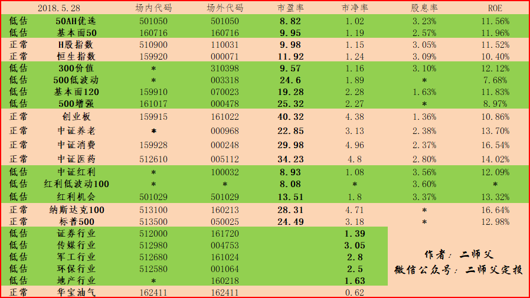

======================================================

_type: talk
@二师父[28814221155551]
2018-05-29 01:52:58 Tue  
topic_id: 48554811512818

阅读[1511]  评论[0]  赞[0] 

+++++++++++++++++++++++++++++++++++++++++++++++++++++

文件：
2018-05-29 01:52:57 Tue
文件大小：[301836]
51114848112814-宁可错过，也别过错.pdf

======================================================

_type: talk
@二师父[28814221155551]
2018-05-29 12:05:12 Tue  
topic_id: 88225252415222

<e type="hashtag" hid="881251425252" title="#鳄鱼计划#" />  这是之前的鳄鱼定投，不定期发车，一月零到2次不等，最多3次。目前鳄鱼计划基本浮盈，券商浮亏3个百分点，截止目前，券商最大下跌幅度为28个百分点，在风险控制范围内，在低估区域内。还是坚持定投，不要一次买入，今日买入券商一份，对应的是估值表里面的中证证券，指数代码见估值表。现在开始布局，牛市就可以收获了。

@唐晟*理财号 at 2018-05-29 12:05:12 Tue

> 半道上车，哪能看到完事整的鳄鱼计划实盘呢？

----------

@二师父 at 2018-05-29 12:05:12 Tue

> 学堂往期

----------

阅读[1469]  评论[2]  赞[0] 

======================================================

_type: q&a
@刘元园[48245425482148]
2018-05-29 13:26:21 Tue  
topic_id: 15442424851252

@刘元园

>  二师父好，新手定投华宝中证500增强和景顺长城沪深300增强，64开，妥否，基金小白提问，望解答。

@二师父

>  500增强可以，很低估了。可以看看富国，广发，这些的，选择规模大的。300增强不建议。

阅读[1021]  评论[1]  赞[0] 

======================================================

@二师父[28814221155551]
2018-05-29 21:09:34 Tue  
topic_id: 48554541158548

>  @二师父
>  

阅读[1020]  评论[0]  赞[0] 

======================================================

_type: talk
@二师父[28814221155551]
2018-05-30 02:00:12 Wed  
topic_id: 15442454852282

<e type="hashtag" hid="881251412212" title="#5.29指数估值#" /> 低估积累股份就好，坚持定投，敬畏市场，按照纪律

阅读[1413]  评论[0]  赞[0] 

+++++++++++++++++++++++++++++++++++++++++++++++++++++

图片：
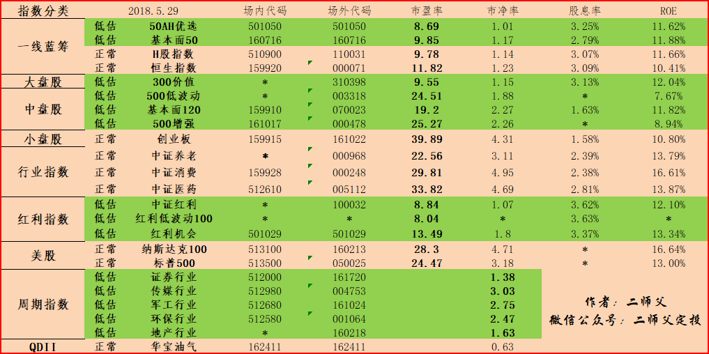

======================================================

_type: talk
@二师父[28814221155551]
2018-05-30 02:00:56 Wed  
topic_id: 51552515812114

5月总结，和大家一起进步啊。

@cotton at 2018-05-30 02:00:56 Wed

> 二师傅有工作吗[呲牙]

----------

@二师父 at 2018-05-30 02:00:56 Wed

> 有啊

----------

阅读[1499]  评论[2]  赞[0] 

+++++++++++++++++++++++++++++++++++++++++++++++++++++

文件：
2018-05-30 02:00:33 Wed
文件大小：[345234]
15551882825882-二师父5月定投总结.pdf

======================================================

_type: q&a
@麦的风[51584485218884]
2018-05-30 08:08:42 Wed  
topic_id: 48554582852158

@麦的风

>  二师傅，想要建立基金定投系统需要学习哪些投资知识，能否分享下您看过投资方面的书籍，二师傅同时也可以把读后的总结和思考分享下，希望同二师傅共同学习不断进步。盼回复！

@二师父

>  第一，可以看看二师父投资系统的文章，初步建立知识体系。第二，关于书。推荐好点的，低风险投资之路，估值的艺术，大国的博弈，穷查理宝典，巴菲特索罗斯的投资喜欢，随机漫步的傻瓜，流血的股市，金融炼金术，激荡30年，安全边际，逆向交易者。这些够了。第三，二师父开后期开两个专栏，一个读书专栏分享我读书的总结提炼，有的书说的很绕，需要提出重点，有的可以结合实际。一个帮助大家建立投资系统的专栏

阅读[1509]  评论[4]  赞[1] 

======================================================

_type: talk
@Audrey[15284421255842]
2018-05-30 10:46:27 Wed  
topic_id: 51552518282484

二师傅好，今天受到利空消息影响，a股全面大跌，要不要，是不是补仓的好机会呢

@波波 at 2018-05-30 10:46:27 Wed

> 同问

----------

@二师父 at 2018-05-30 10:46:27 Wed

> 补仓会在群里通知的，不要着急，另外如果是发表观点就在发表这里说，如果是提问就点击提问，不然有可能看不到。还有，按照纪律，不要手动加太多，不然子弹不够了。切记

----------

@Audrey at 2018-05-30 10:46:27 Wed

> 谢谢二师傅 那我今天少加一点 可以吗 木有找到提问按钮

----------

@二师父 at 2018-05-30 10:46:27 Wed

> 可以的，打开主界面，如图，第二个提问

----------

@獵戸 at 2018-05-30 10:46:27 Wed

> 你好二師父 請問你說的群是這個app界面下的學堂嗎？還是微信群呢？

----------

@二师父 at 2018-05-30 10:46:27 Wed

> 知识星球手机app界面

----------

阅读[1012]  评论[6]  赞[0] 

======================================================

_type: q&a
@勤能行之[481211221828]
2018-05-30 11:43:40 Wed  
topic_id: 28225281814581

@勤能行之

>  我只有十五万了，请问师傅怎么安排才好

@二师父

>  今天凌晨特朗普又开始反悔在华盛顿同意的协议，又准备开始贸易战，这就是黑天鹅。以后还可能面临大跌。所以，一定要控制好节奏。如果15万，必须保证这15万三到五年不用才可以投资。按照当前的情况，还需分配到两年，假如你是定投3只指数基金，那么需要300份，每份150000除以300为500元每份，倘若为了更加保守，防范风险每份为300。记住投资的第一要义是不要亏损

阅读[1097]  评论[8]  赞[0] 

======================================================

_type: q&a
@陈Being[28845245224851]
2018-05-30 11:45:30 Wed  
topic_id: 48554581811458

@陈Being

>  二师父，能否详细分别讲一下各种医药医疗指数的持仓与区别，我之前一直在投中证医药100和广发医药卫生这2个，代码分别是000059和001180，请问这两个是否低估，不知道现在要不要继续坚持下去到下一轮牛市，

@二师父

>  目前已经是正常估值了，如果是之前低估定投，现在应该浮盈了。持仓分析稍后研究下写文

阅读[1092]  评论[0]  赞[0] 

======================================================

_type: talk
@二师父[28814221155551]
2018-05-30 12:09:07 Wed  
topic_id: 88225228511842

<e type="hashtag" hid="881251425252" title="#鳄鱼计划#" /> 贸易战开始，市场估计又新一轮大跌，按照计划定投。此计划对人性挑战较高，谨慎参考。新手参考定投实盘即可。今日买入券商一份，500增强一份。恐惧的人多了，机会就来了

@Audrey at 2018-05-30 12:09:07 Wed

> 500增强和500低波动哪个更好一点呀，我投的500低波

----------

@二师父 at 2018-05-30 12:09:07 Wed

> 都行的，都是低估，我投的500增强

----------

@Audrey at 2018-05-30 12:09:07 Wed

> 谢谢😙

----------

@落叶无痕 at 2018-05-30 12:09:07 Wed

> 看样子二师父今天要出手鳄鱼计划了

----------

@二师父 at 2018-05-30 12:09:07 Wed

> 已经出手，在学堂内公布了

----------

@落叶无痕 at 2018-05-30 12:09:07 Wed

> 我咋没看到啊？？？

----------

@二师父 at 2018-05-30 12:09:07 Wed

> 额，就是这条消息啊，你仔细读

----------

@落叶无痕 at 2018-05-30 12:09:07 Wed

> 欧欧，哈哈，我反应慢了点

----------

阅读[1557]  评论[10]  赞[0] 

======================================================

_type: q&a
@勤能行之[481211221828]
2018-05-30 13:59:02 Wed  
topic_id: 28225228245241

@勤能行之

>  想请师傅介绍一下网格交易法，师傅，可以吗？

@二师父

>  我没用网格交易法，后续写个文章介绍下吧

阅读[1188]  评论[1]  赞[0] 

======================================================

_type: talk
@二师父[28814221155551]
2018-05-31 03:52:43 Thu  
topic_id: 48554528888428

<e type="hashtag" hid="158428888422" title="#5.30指数估值#" /> 坚持是世界上最伟大的力量，我们无法预测黑天鹅及市场走向，但是可以做好风险控制，

明天定投实盘发车，第一期。切记请勿跟投，这是和鳄鱼计划一起的给大家参考的实盘。

定投实盘每周四三点之前会在发车，定期不定额，请做好资金配置，谨慎投资。

@victoria at 2018-05-31 03:52:43 Thu

> 我昨晚上看到大跌已经入手了

----------

@西费 at 2018-05-31 03:52:43 Thu

> 下手够早啊

----------

阅读[1501]  评论[2]  赞[0] 

+++++++++++++++++++++++++++++++++++++++++++++++++++++

图片：
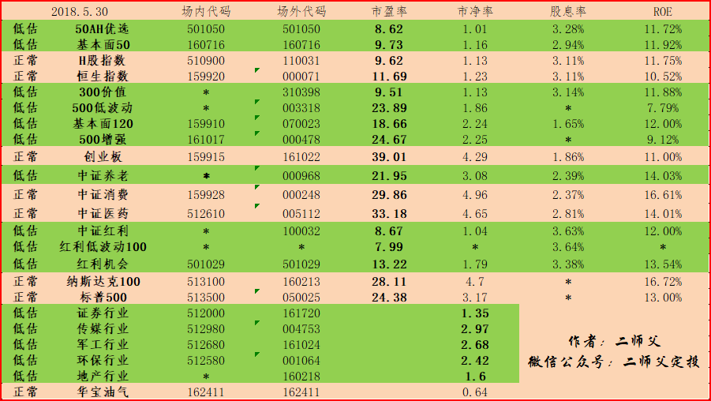

======================================================

_type: talk
@二师父[28814221155551]
2018-05-31 03:58:18 Thu  
topic_id: 88225248888882

<e type="hashtag" hid="481541111548" title="#6月定投计划#" /> 在别人恐惧的时候该我们出手了，慢慢来，不要急。

@victoria at 2018-05-31 03:58:18 Thu

> 把二师傅的定投计划抄了一遍

----------

@二师父 at 2018-05-31 03:58:18 Thu

> 这个只是计划，还没买呢

----------

@cotton at 2018-05-31 03:58:18 Thu

> 二师傅，定投实盘那里，你的定期不定额，难道你是手动定投么。我是自动的，每次数额一样。鳄鱼计划和定投实盘有好几只都是一样的呢？

----------

@二师父 at 2018-05-31 03:58:18 Thu

> 一个择时，一个不择时，鳄鱼计划有周期指数，宽基没啥区别

----------

@cotton at 2018-05-31 03:58:18 Thu

> 好想知道你的工作[发呆]

----------

阅读[1655]  评论[5]  赞[0] 

+++++++++++++++++++++++++++++++++++++++++++++++++++++

文件：
2018-05-31 03:58:00 Thu
文件大小：[325839]
28884114145121-二师父六月定投计划.pdf

======================================================

_type: q&a
@艺晗[28282881811411]
2018-05-31 11:01:18 Thu  
topic_id: 48554528114848

@艺晗

>  感谢二师父的分享，食品饮料和消费行业指数，觉得一个是防守一个是趋势，可不可以请二师父也关注一下和加在估值表里，万分感谢🙏

@二师父

>  好，我研究下，中证消费已经加了

阅读[1186]  评论[1]  赞[0] 

======================================================

_type: talk
@二师父[28814221155551]
2018-05-31 11:24:24 Thu  
topic_id: 28225242442521

<e type="hashtag" hid="158452221212" title="#定投实盘第一期#" />  大家好，定投实盘开始第一期了。这个是二师父根据读者建议开的定期不定额投资，与鳄鱼计划有区别，具体见以前文章，关于定投实盘的说明。

二师父还是要提醒一句，请勿跟投，此计划只是投资参考，不是投资建议。

此计划不择时，所以每周四不论涨跌都买。涨了少买，跌了多买。

今日买入，500增强一份，50ah优选一份。
另提醒一句请勿盲目增加买入份数，遵守纪律

@西费 at 2018-05-31 11:24:24 Thu

> 开始了啊

----------

@勤能行之 at 2018-05-31 11:24:24 Thu

> 我就是盲目增加了买入的份数。

----------

@二师父 at 2018-05-31 11:24:24 Thu

> 谢谢支持，总结经验，这样操作就会越来越成熟啦

----------

阅读[1674]  评论[3]  赞[0] 

======================================================

_type: q&a
@陈Being[28845245224851]
2018-05-31 15:41:43 Thu  
topic_id: 48552115151128

@陈Being

>  请问沪深300与300价值有什么区别？

@二师父

>  300价值是300的策略指数，具有超额收益

阅读[1201]  评论[2]  赞[0] 

======================================================

_type: talk
@二师父[28814221155551]
2018-05-31 22:23:00 Thu  
topic_id: 28221558212221

<e type="hashtag" hid="281285511481" title="#5.31指数估值#" /> 5.31日指数估值，养老又进入正常了。二师父多此说过，机会都是跌出来的，风险都是涨出来的。昨天按照纪律加仓了吗？不管市场怎么变化，始终保证按照自己的系统买入，卖出即可。哪怕明天股市关门，都跟我们没影响。

@徐斌 at 2018-05-31 22:23:00 Thu

> 雪球阿里巴巴昨天post了一文，说基金定投超过20次成本平均效果就会慢慢向一次投入靠拢。请教二师父，这个效果对定投低估指数基金适用吗？

----------

@二师父 at 2018-05-31 22:23:00 Thu

> 不是的，定投的作用就是分散风险和平滑收益曲线

----------

@徐斌 at 2018-05-31 22:23:00 Thu

> 嗯，他对比的是1000次无脑定投，不看估值不做止赢。成本波动就大了[微笑]

----------

阅读[1582]  评论[3]  赞[0] 

+++++++++++++++++++++++++++++++++++++++++++++++++++++

图片：
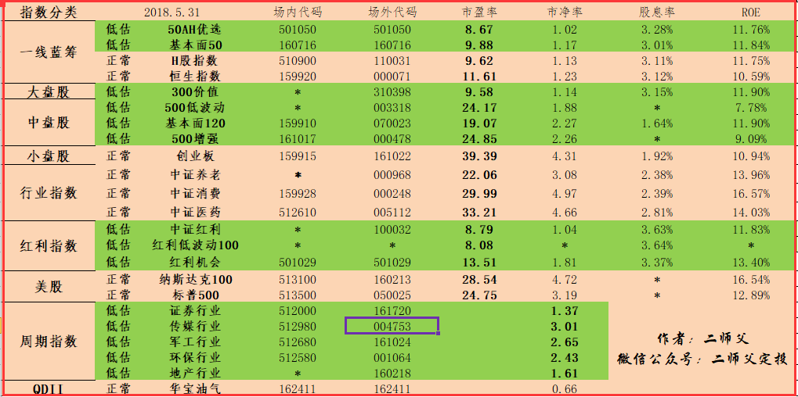

======================================================

