_type: talk
@二师父[28814221155551]
2019-01-01 01:59:12 Tue  
topic_id: 51444411121884

专注专业

@小明 at 2019-01-01 01:59:12 Tue

> 老师新年快乐🎉

----------

@海盗 at 2019-01-01 01:59:12 Tue

> 二师父，新年快乐！

----------

@海盗 at 2019-01-01 01:59:12 Tue

> 二师父指的纯被动型指数基金是指那几个etf吗？

----------

@冉冉 at 2019-01-01 01:59:12 Tue

> 师傅新年快乐！

----------

@冉冉 at 2019-01-01 01:59:12 Tue

> 新的一年里，是否是将500增强转换成500ETF?

----------

@杜志彪 at 2019-01-01 01:59:12 Tue

> 是不是可理解如果在50AH和50ETF之间选择一种，目前更倾向于50ETF这种被动指数基金。

----------

@新的开始 at 2019-01-01 01:59:12 Tue

> 大家节日快乐

----------

@二师父 at 2019-01-01 01:59:12 Tue

> 场外也有纯被动指数基金

----------

阅读[1827]  评论[13]  赞[0] 

+++++++++++++++++++++++++++++++++++++++++++++++++++++

文件：
2019-01-01 01:56:53 Tue
文件大小：[22056]
28848422142141-19年，请专注自己的投资能力圈.docx

======================================================

_type: q&a
@杜志彪[544454124115854]
2019-01-01 12:40:17 Tue  
topic_id: 15111154228412

@杜志彪

>  您好二师傅，祝您在新的一年投资顺利，阖家幸福健康快乐。
>  在此想请教一下熊市和牛市是如何定义的，目前我的理解是观察沪深综合指数是否突破年线，突破年线意味着牛市的开始，相反则进入熊市。在收割利润时我们判断熊牛是依据手里的基金走势还是依据沪深综合指数为依据呢。

@二师父

>  可转债价格均突破100元可作为牛市来临的依据

阅读[944]  评论[0]  赞[0] 

======================================================

_type: talk
@二师父[28814221155551]
2019-01-01 14:11:08 Tue  
topic_id: 51444418152214

学堂问答精华之市场分析

阅读[958]  评论[0]  赞[0] 

+++++++++++++++++++++++++++++++++++++++++++++++++++++

文件：
2019-01-01 14:10:59 Tue
文件大小：[417043]
28848424222181-二师父定投学堂问答精华整理——市场分析.pdf

======================================================

_type: talk
@二师父[28814221155551]
2019-01-01 14:27:23 Tue  
topic_id: 15111158541252

有保险需求的朋友可以看看，购买保险一定避免分红险。这部分内容比较少，后期完善，19年继续努力

阅读[984]  评论[0]  赞[0] 

+++++++++++++++++++++++++++++++++++++++++++++++++++++

文件：
2019-01-01 14:26:57 Tue
文件大小：[323644]
28848424224511-二师父定投学堂问答精华整理——保险养老.pdf

======================================================

_type: talk
@二师父[28814221155551]
2019-01-01 14:52:51 Tue  
topic_id: 15111158511152

阅读[1008]  评论[0]  赞[0] 

+++++++++++++++++++++++++++++++++++++++++++++++++++++

文件：
2019-01-01 14:52:13 Tue
文件大小：[354567]
88848424224282-二师父定投学堂问答精华整理——基金估值.pdf

======================================================

_type: talk
@西锦巴乌[88448285428482]
2019-01-01 15:40:12 Tue  
topic_id: 15111158421852

<e type="hashtag" hid="825818842822" title="#网格交易#" /> 师父新年好！有一点还不是很明白，如果按照你的网格交易法那么建仓完毕时成本是4.181元，假如价格往上走超过4.181元是否要先收割利润？谢谢

@啊哦呃伊唔คิดถ* at 2019-01-01 15:40:12 Tue

> 可以卖。

----------

@二师父 at 2019-01-01 15:40:12 Tue

> 没有卖出啊

----------

阅读[901]  评论[2]  赞[0] 

======================================================

_type: talk
@二师父[28814221155551]
2019-01-01 15:54:44 Tue  
topic_id: 88444481241182

关于投资方法的问答挺多，大家更关注的是实际操作问题

阅读[1007]  评论[0]  赞[0] 

+++++++++++++++++++++++++++++++++++++++++++++++++++++

文件：
2019-01-01 15:54:32 Tue
文件大小：[663415]
88848424452482-二师父定投学堂问答精华整理——投资方法.pdf

======================================================

_type: talk
@二师父[28814221155551]
2019-01-01 16:45:16 Tue  
topic_id: 48222281284228

阅读[1028]  评论[0]  赞[0] 

+++++++++++++++++++++++++++++++++++++++++++++++++++++

文件：
2019-01-01 16:45:04 Tue
文件大小：[595820]
15515141128852-二师父定投学堂问答精华整理——指数分析.pdf

======================================================

_type: q&a
@啊哦呃伊唔คิดถ*[28445845514521]
2019-01-01 21:09:17 Tue  
topic_id: 15111142582512

@啊哦呃伊唔คิดถ*

>  这个假期读了二师父  「五步定投」，「网格交易具体操作」，「五档买卖和网格交易结合结合」。
>  
>  问题一:后面两篇规则都是针对场内的，那场外的适用吗？
>  
>  问题二:五步定投里面讲到一个买入公式，跌越多买入份数越大，所以如果第一个问题场外不适用网格交易和五档，那是不是场外的基金得坚持持有到正常估值或牛市？
>  
>  问题三:五步定投讲到增量资金再平衡，是不是剩下的每份投的钱也要跟着调？
>  
>  问题四:像我有高估就开始定投的消费指数，是指数进入低估就投一下，到正常估值就不动，通过这种操作坚持到指数开始盈利吗？

@二师父

>  1、场外的话就五步定投法啊。不建议短期卖出。
>  
>  2、都是要持有到正常估值和牛市的。做网格也只是部分资金，用来低于熊市的震荡行情。
>  
>  3、需要调整，你的总体投入金额变了的话，那么每份的金额也跟着变动了。
>  
>  4、低估定投买入的成本较低可能没有到正常估值就盈利，这个时候还是可以继续坚持定投的。

阅读[966]  评论[1]  赞[0] 

======================================================

_type: talk
@二师父[28814221155551]
2019-01-01 21:37:18 Tue  
topic_id: 48222254225828

这两篇多一些，是精华，至此，18年的总结基本告一段落，新的一年更加努力向上。

赚更多的钱，发更多的红包。

阅读[1010]  评论[0]  赞[0] 

+++++++++++++++++++++++++++++++++++++++++++++++++++++

文件：
2019-01-01 21:36:33 Tue
文件大小：[663415]
28848424114411-二师父定投学堂问答精华整理——投资方法.pdf

2019-01-01 21:36:33 Tue
文件大小：[595820]
51141454884484-二师父定投学堂问答精华整理——指数分析.pdf

======================================================

_type: talk
@二师父[28814221155551]
2019-01-02 01:43:40 Wed  
topic_id: 88444428418852

新年的新计划，继续坚持定投。

阅读[1665]  评论[0]  赞[0] 

+++++++++++++++++++++++++++++++++++++++++++++++++++++

文件：
2019-01-02 01:43:28 Wed
文件大小：[22307]
48828251881428-二师父19年全年定投计划.docx

======================================================

_type: talk
@shi[15551458885282]
2019-01-02 02:37:37 Wed  
topic_id: 48222258212158

<e type="hashtag" hid="225824552481" title="#打卡#" /> 打卡23 （今天打卡放到星球）:
2019年1月1日
1.理财：
元旦，休息，理财计划按部就班。
后期多考虑生活改善方面，而不是钱。
钱是手段，目的是：生活更美好。
今年需要办理的大事：改善住房情况，在孩子读书附近租个房子。

2.学习读书：
订阅了《每天听见吴晓波第三季》，并听了昨天和今天关于2018的总结和对2019的寄语。2019是艰难的半年，加不确定的半年，现金为王。
关注：5G商用和一带一路。
3.健身：晚上一看书，忘记打乒乓球了。今年身体要放第一位，锻炼好身体，为可能的二孩计划准备。

4.工作：
上午应一位业主邀请，参加了家庭聚餐，挺好的，以后多多采取这种沟通，友情好了，工作还难吗？
晚上全体人员聚餐，为了明天的工作，加油。
5.娱乐：
下午看了会儿《寻龙诀》，下载了个app玩了一会儿国际象棋。

@二师父 at 2019-01-02 02:37:37 Wed

> 棒啊，你是我见过战斗力比较强的女性，是不是在工程单位啊

----------

@shi at 2019-01-02 02:37:37 Wed

> 谢谢二师父。
不过，二师父，我可是爷们，呵呵:-) 
可惜也不胜酒力，否则下次就和二师父一醉方休了。
对，我们公司是做贸易和工程总承包的，所以经常要出差。

----------

@二师父 at 2019-01-02 02:37:37 Wed

> 总包也很爽啊，相当半个业主

----------

@shi at 2019-01-02 02:37:37 Wed

> 二师父，总包不好干啊。
一不小心两头受气是小事，干砸一个项目几年都恢复不了元气。

----------

阅读[1620]  评论[4]  赞[0] 

======================================================

_type: talk
@二师父[28814221155551]
2019-01-02 03:44:08 Wed  
topic_id: 15111141442542

<e type="hashtag" hid="825818842822" title="#网格交易#" /> 以后的交易计划严格按照这张表

如果你对以后大盘看涨，底仓多建立一点，如果你对以后大盘看跌，底仓少建立一点。

百分比可以百分之4，百分之3，百分之5，自己设置即可

一个档位只买入一次，避免频繁加仓。有的基金可能下跌超过20个百分点，所以会在5个档位以上。做好心理准备。

阅读[982]  评论[0]  赞[0] 

+++++++++++++++++++++++++++++++++++++++++++++++++++++

图片：
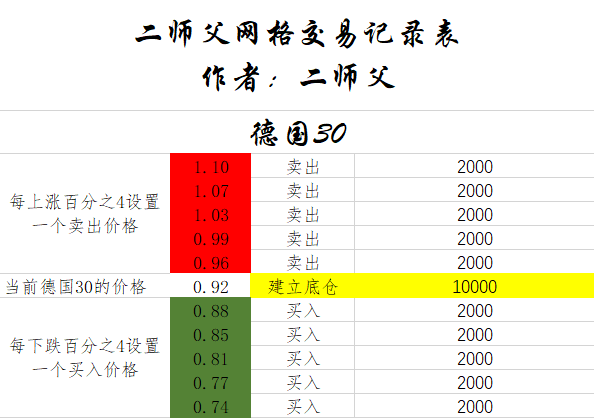

======================================================

_type: talk
@二师父[28814221155551]
2019-01-02 03:46:04 Wed  
topic_id: 28444424225811

<e type="hashtag" hid="825818842822" title="#网格交易#" />  以后的交易计划严格按照这张表

如果你对以后大盘看涨，底仓多建立一点，如果你对以后大盘看跌，底仓少建立一点。

百分比可以百分之4，百分之3，百分之5，自己设置即可

一个档位只买入一次，避免频繁加仓。有的基金可能下跌超过20个百分点，所以会在5个档位以上。做好心理准备。

阅读[1015]  评论[0]  赞[0] 

+++++++++++++++++++++++++++++++++++++++++++++++++++++

图片：
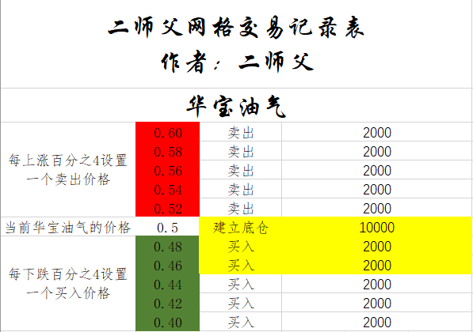

======================================================

_type: talk
@二师父[28814221155551]
2019-01-02 03:47:21 Wed  
topic_id: 28444424228851

<e type="hashtag" hid="825818842822" title="#网格交易#" />  以后的交易计划严格按照这张表

如果你对以后大盘看涨，底仓多建立一点，如果你对以后大盘看跌，底仓少建立一点。

百分比可以百分之4，百分之3，百分之5，自己设置即可

一个档位只买入一次，避免频繁加仓。有的基金可能下跌超过20个百分点，所以会在5个档位以上。做好心理准备。

阅读[1099]  评论[0]  赞[0] 

+++++++++++++++++++++++++++++++++++++++++++++++++++++

图片：
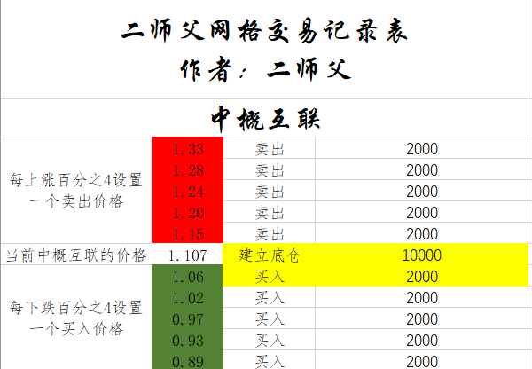

======================================================

_type: talk
@二师父[28814221155551]
2019-01-02 03:49:10 Wed  
topic_id: 48222252558888

以后的交易计划严格按照这张表

如果你对以后大盘看涨，底仓多建立一点，如果你对以后大盘看跌，底仓少建立一点。

百分比可以百分之4，百分之3，百分之5，自己设置即可

一个档位只买入一次，避免频繁加仓。有的基金可能下跌超过20个百分点，所以会在5个档位以上。做好心理准备。

阅读[1098]  评论[0]  赞[0] 

+++++++++++++++++++++++++++++++++++++++++++++++++++++

图片：

======================================================

_type: talk
@二师父[28814221155551]
2019-01-02 03:50:35 Wed  
topic_id: 15111141445582

以后的交易计划严格按照这张表

如果你对以后大盘看涨，底仓多建立一点，如果你对以后大盘看跌，底仓少建立一点。

百分比可以百分之4，百分之3，百分之5，自己设置即可

一个档位只买入一次，避免频繁加仓。有的基金可能下跌超过20个百分点，所以会在5个档位以上。做好心理准备。

医药ETF底仓还没建立，明天建立。在正常和低估的界限，建立底仓也比较安全。

阅读[1127]  评论[0]  赞[0] 

+++++++++++++++++++++++++++++++++++++++++++++++++++++

图片：
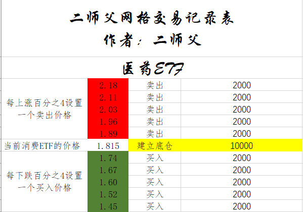

======================================================

_type: talk
@二师父[28814221155551]
2019-01-02 03:51:31 Wed  
topic_id: 48222252558818

以后的交易计划严格按照这张表

如果你对以后大盘看涨，底仓多建立一点，如果你对以后大盘看跌，底仓少建立一点。

百分比可以百分之4，百分之3，百分之5，自己设置即可

一个档位只买入一次，避免频繁加仓。有的基金可能下跌超过20个百分点，所以会在5个档位以上。做好心理准备。

阅读[1140]  评论[0]  赞[0] 

+++++++++++++++++++++++++++++++++++++++++++++++++++++

图片：
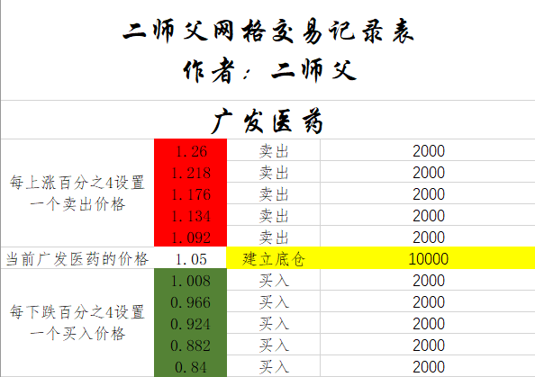

======================================================

_type: talk
@二师父[28814221155551]
2019-01-02 03:52:16 Wed  
topic_id: 15111141445422

以后的交易计划严格按照这张表

如果你对以后大盘看涨，底仓多建立一点，如果你对以后大盘看跌，底仓少建立一点。

百分比可以百分之4，百分之3，百分之5，自己设置即可

一个档位只买入一次，避免频繁加仓。有的基金可能下跌超过20个百分点，所以会在5个档位以上。做好心理准备。

300ETF的底仓明天建立

@shi at 2019-01-02 03:52:16 Wed

> 二师父子弹大大的呀:-)

----------

@二师父 at 2019-01-02 03:52:16 Wed

> 也不多了，主要想换一套房子

----------

阅读[1185]  评论[2]  赞[0] 

+++++++++++++++++++++++++++++++++++++++++++++++++++++

图片：

======================================================

_type: talk
@二师父[28814221155551]
2019-01-02 03:52:53 Wed  
topic_id: 88444424228252

以后的交易计划严格按照这张表

如果你对以后大盘看涨，底仓多建立一点，如果你对以后大盘看跌，底仓少建立一点。

百分比可以百分之4，百分之3，百分之5，自己设置即可

一个档位只买入一次，避免频繁加仓。有的基金可能下跌超过20个百分点，所以会在5个档位以上。做好心理准备。

@海盗 at 2019-01-02 03:52:53 Wed

> 二师父辛苦了。

----------

@西锦巴乌 at 2019-01-02 03:52:53 Wed

> 请问师父：Qdii也用这种网格吗？

----------

@二师父 at 2019-01-02 03:52:53 Wed

> 场内现在都用网格了

----------

@门萨🐨 at 2019-01-02 03:52:53 Wed

> 如果比当前价格低或者高，如何建底仓

----------

@二师父 at 2019-01-02 03:52:53 Wed

> 比当前价格低，多买点，反之，少买点

----------

阅读[1250]  评论[5]  赞[0] 

+++++++++++++++++++++++++++++++++++++++++++++++++++++

图片：
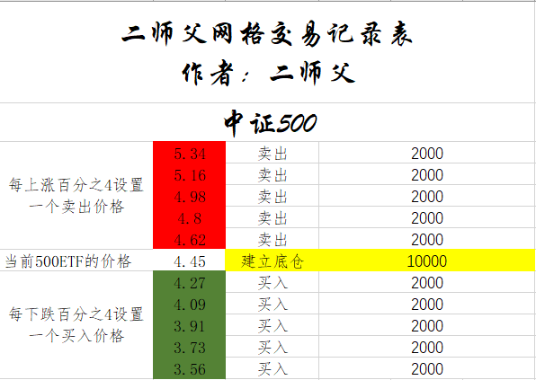

======================================================

_type: q&a
@寻道人[51452125525484]
2019-01-02 09:55:27 Wed  
topic_id: 28444424128211

@寻道人

>  二师傅您好，我如果想选一个港股的etf作为投资标的，是159920恒生etf好，还是510900H股etf好呢，谢谢

@二师父

>  目前是恒生国企，港股跌下去没底部，控制仓位

阅读[1229]  评论[1]  赞[0] 

======================================================

_type: talk
@二师父[28814221155551]
2019-01-02 10:05:09 Wed  
topic_id: 15111148554812

<e type="hashtag" hid="881251425252" title="#鳄鱼计划#" /> 医药ETF和沪深300ETF建立底仓，成交价格比网格里面的还要便宜，当别人恐惧的时候需要贪婪，二师父从文章阅读和关注已经看到很多人开始恐惧了，此后交易严格按照网格的价格操作，不跌到交易网格里面的价位绝不加仓，遵守纪律。

@victoria at 2019-01-02 10:05:09 Wed

> 底仓分额多少

----------

@海盗 at 2019-01-02 10:05:09 Wed

> 二师父，看了那么多网格交易，我想只从中选择两个建仓底，感觉选择哪两个好？

----------

@victoria at 2019-01-02 10:05:09 Wed

> 知道了

----------

@二师父 at 2019-01-02 10:05:09 Wed

> 看自己的资金量决定，网格已经在群内公布啦

----------

@二师父 at 2019-01-02 10:05:09 Wed

> 中证500和沪深300

----------

@海盗 at 2019-01-02 10:05:09 Wed

> 谢谢二师父

----------

@自由自在 at 2019-01-02 10:05:09 Wed

> 请问二师父，医药ETF是指场内的广发医药？还是其他的？谢谢！

----------

@二师父 at 2019-01-02 10:05:09 Wed

> 这是场内的300医药ETF

----------

阅读[2037]  评论[19]  赞[0] 

======================================================

_type: q&a
@Antony[51442528215124]
2019-01-02 10:36:33 Wed  
topic_id: 51444458145884

@Antony

>  二师傅好，在关注您之前买了医药的主动型基金，现在的收益是–17.95。犹豫要不要现在换成医药eft，还是企稳之后再换?

@二师父

>  这个先放着吧，场内的可以换成广发医药，场外的医药100，都是指数基金，定投即可

阅读[1256]  评论[1]  赞[0] 

======================================================

_type: q&a
@Jewel[244448815142241]
2019-01-02 12:44:54 Wed  
topic_id: 48222251285258

@Jewel

>  请问能不能在广发证券同时开了两个账户的？以前注册的手续费等太高了，想再开个有优惠的？

@二师父

>  得先销户，或者来华泰的也行

阅读[1198]  评论[0]  赞[0] 

======================================================

_type: talk
@凭栏观海[244414845852181]
2019-01-02 21:04:00 Wed  
topic_id: 51444444825414

打卡:目前股市可谓黑云压城城欲摧，我们所能做到的就是坚持，在如此人心惶惶的黑暗局势下，坚持低估定投。总会等到甲光向日金鳞开的日子。冬天来了，春天还会远吗？相信，坚持，等待……

阅读[1010]  评论[0]  赞[0] 

======================================================

_type: q&a
@夏萍[28221454818281]
2019-01-02 21:48:53 Wed  
topic_id: 28444441582421

@夏萍

>  师父，小白问题
>  1请问以往每周定投的市盈率从哪里能查到？除了从你的每期发布里查，还有什么简便的方法查到？
>  2以下是我的配置沪深300，中证500，医药100，中证红利，50ah优选，哪几个适合重仓？还需要再配置什么？

@二师父

>  果仁网，理杏仁，宽基指数可以重仓，还可以加个消费

阅读[1106]  评论[0]  赞[0] 

======================================================

_type: talk
@shi[15551458885282]
2019-01-03 02:23:21 Thu  
topic_id: 51444482258244

<e type="hashtag" hid="225824552481" title="#打卡#" /> 打卡24:2019年1月2日
1.理财：
今天大盘又跌了，自己的股票略红。中概互联又跌了，今天启动两次鳄鱼计划，每次4份（就当把底仓加加码吧）。其它无操作。
媳妇发来一个西城区160平的房子，四室两厅，单价不贵（难道真降了），不过总价1100万了。 一边安慰：就过过眼瘾吧:-)  一边心里骂：哪个混蛋中介瞎发东西，破坏家庭和睦啊。
不过，我的梦想在远方，大大呀，让房价一定别涨噢，等我工资翻2番再说。
二师父，我感觉，对住房的需求越高，实现财务自由的时间会越晚。永无天日了呀。 大家说，目前的房子到底算是个资产还是个负债鬼呀？

2.学习读书：
《每天听见吴晓波第三季》，关于ofo，关于40年变革，关于女排的拼搏精神。没跨年那两次说的好。

3.健身：12000步，20分钟卡拉OK，发现唱歌也挺费体力的。

4.工作：
按部就班，沟通沟通。前面总结刚结束，后面又得竞聘，12月和1月真是最头疼的两个月。加油吧。

5.娱乐：
看完了《寻龙诀》，心中的彼岸花啊，你在哪儿。

@二师父 at 2019-01-03 02:23:21 Thu

> 西城1100万还不贵，10年前通州2000一平米，现在6万，过去买房就让你实现财务自由了，现在不行了，高位接盘太多就是韭菜

我对住房需求不大，能住，舒心，孩子能上学就行

----------

@西锦巴乌 at 2019-01-03 02:23:21 Thu

> 纵有房屋千间也只能安塌一床

----------

@shi at 2019-01-03 02:23:21 Thu

> 有道理，今年换个好的床和床垫子去。

----------

阅读[1009]  评论[3]  赞[0] 

======================================================

_type: talk
@二师父[28814221155551]
2019-01-03 03:32:42 Thu  
topic_id: 88444415544552

<e type="hashtag" hid="481211145528" title="#指数估值#" />

@shi at 2019-01-03 03:32:42 Thu

> 二师父，中证银行和中证红利，市盈率这么低（年利润百分之十几了），是否可以多买点了？
目前只是是主要定投的六只指数基金之一（另外四只是50,300,500,医药）。

----------

阅读[1715]  评论[1]  赞[0] 

+++++++++++++++++++++++++++++++++++++++++++++++++++++

图片：
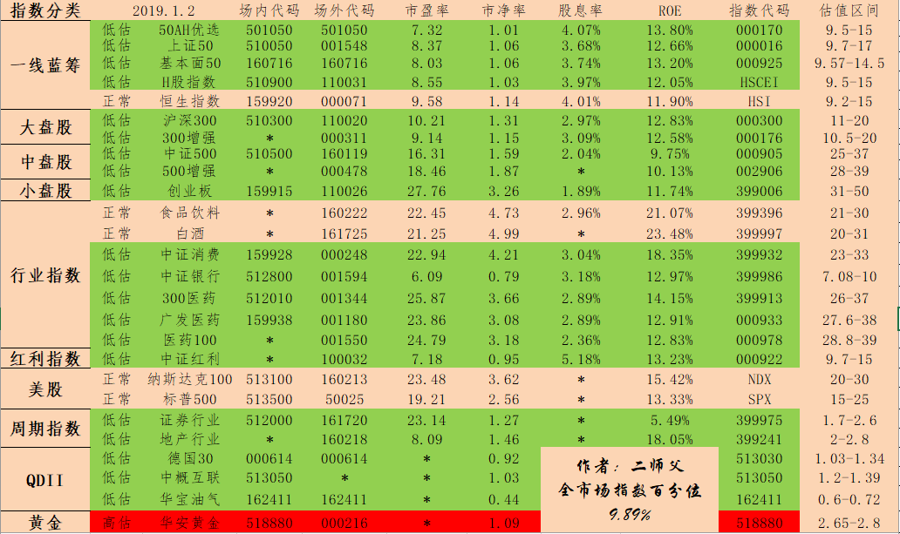

======================================================

_type: talk
@二师父[28814221155551]
2019-01-03 03:33:56 Thu  
topic_id: 15111182211252

@王秦川 at 2019-01-03 03:33:56 Thu

> 二师父：场外还是严格按照每周四定投不变，不需要其它操作。

----------

@二师父 at 2019-01-03 03:33:56 Thu

> 对

----------

@王秦川 at 2019-01-03 03:33:56 Thu

> 谢谢你，太省心了[呲牙][呲牙][呲牙]

----------

@王秦川 at 2019-01-03 03:33:56 Thu

> 我追加了一份医学100，可以吧？

----------

@二师父 at 2019-01-03 03:33:56 Thu

> 可以

----------

@西锦巴乌 at 2019-01-03 03:33:56 Thu

> 请问师父：万德全A的百分位在哪里能看到？谢谢

----------

@二师父 at 2019-01-03 03:33:56 Thu

> 估值表里面。

----------

@西锦巴乌 at 2019-01-03 03:33:56 Thu

> 除了老师的估值表还有其他地方吗？谢谢

----------

阅读[1853]  评论[11]  赞[0] 

+++++++++++++++++++++++++++++++++++++++++++++++++++++

文件：
2019-01-03 03:33:00 Thu
文件大小：[21207]
48828225422428-定投机会是跌出来的.docx

======================================================

_type: talk
@二师父[28814221155551]
2019-01-03 03:44:53 Thu  
topic_id: 48222214422558

<e type="hashtag" hid="825818188882" title="#300医药的网格记录表#" /> 今天底仓价格是1.295.

@夏萍 at 2019-01-03 03:44:53 Thu

> 师父场外适合做网格吗

----------

@二师父 at 2019-01-03 03:44:53 Thu

> 不适合

----------

@根号2 at 2019-01-03 03:44:53 Thu

> [强]真不错

----------

阅读[1118]  评论[3]  赞[0] 

+++++++++++++++++++++++++++++++++++++++++++++++++++++

图片：

======================================================

_type: talk
@二师父[28814221155551]
2019-01-03 03:51:49 Thu  
topic_id: 51444482244414

每天晚上对比网格里面的价格，除了华宝油气，都没有出发网格交易条件，如果明天油气继续在0.44以下，则加仓地三个档位。当然这是个人操作，石油波动大，谨慎投资。

@Xiang赛斯文 at 2019-01-03 03:51:49 Thu

> 请问二师傅本名叫什么，本职是从事哪方面工作？跟了那么长时间还不知道

----------

@二师父 at 2019-01-03 03:51:49 Thu

> 低调低调

----------

@Xiang赛斯文 at 2019-01-03 03:51:49 Thu

> 花了钱进来，连个姓甚名谁都不告诉啊？这跟低调有什么关系？

----------

@二师父 at 2019-01-03 03:51:49 Thu

> 笔名二师父

----------

@门萨🐨 at 2019-01-03 03:51:49 Thu

> 这也是隐私哈，没必要问那么多。学习讨论即可。

----------

阅读[1188]  评论[5]  赞[0] 

======================================================

_type: q&a
@海盗[48248118584848]
2019-01-03 10:46:25 Thu  
topic_id: 28444412284421

@海盗

>  跟着二师父一路定投过来发现定投的有十几个之多，反过头来一检查，有的时候很早以前定投过几次，后来就没有再定投。有的定投的比较频繁。像我这种情况怎么定投怎么分配资金才好？或者是每次选择2到3种去定投，以什么标准去选择为好？
>  我先说说自己是怎么操作的，我目前是以定投日跌幅最大的几个再看看近期该基金没有什么大涨，我就把它选择为定投标的，选择2到3个。另外平时观察场内哪个品种跌幅接近3%，我就买一份。二师父，我这种方法行得通吗？希望二师父给提点建议，谢谢！

@二师父

>  不能看跌幅，需要看估值，以市盈率或者市净率或者净值为参考指标

阅读[1174]  评论[6]  赞[0] 

======================================================

_type: q&a
@海盗[48248118584848]
2019-01-03 10:47:15 Thu  
topic_id: 51444485482844

@海盗

>  该图是中概互联的持仓，中概互联属于海外投资，中国的公司在美国上市，是不是这样理解就对了？

@二师父

>  还有香港

阅读[1217]  评论[3]  赞[0] 

======================================================

_type: talk
@二师父[28814221155551]
2019-01-03 11:01:42 Thu  
topic_id: 48222215115848

<e type="hashtag" hid="881422852442" title="#定投实盘#" /> 今日华宝油气大涨，已经不在买入价格区域，等待。

另外定投实盘不变，买入易方达沪深300一份，中证500a一份，汇添富消费一份，如果有买入鳄鱼计划的，此实盘不用再买

这仅针对场外用户

@小白 at 2019-01-03 11:01:42 Thu

> 昨天鳄鱼计划了，今天还买吗？

----------

@二师父 at 2019-01-03 11:01:42 Thu

> 请仔细阅读哈，如果有买入鳄鱼计划的，此实盘不用购买

----------

@二师父 at 2019-01-03 11:01:42 Thu

> 大家仔细阅读哈，此实盘针对场外用户，如果有购买鳄鱼计划的，次实盘不用购买

----------

@自由自在 at 2019-01-03 11:01:42 Thu

> 谢谢二师父！

----------

@速。冻 at 2019-01-03 11:01:42 Thu

> 小白不知道这几个代码是什么

----------

@二师父 at 2019-01-03 11:01:42 Thu

> 估值表里面有代码，场内和场外的都有哈

----------

@海盗 at 2019-01-03 11:01:42 Thu

> 以定投

----------

阅读[1854]  评论[7]  赞[0] 

======================================================

_type: talk
@二师父[28814221155551]
2019-01-03 11:34:43 Thu  
topic_id: 15111181284252

康美药业被立案调查，之前有人问过，个股千万不要逆势加仓

阅读[1139]  评论[0]  赞[0] 

======================================================

_type: q&a
@j[15522428212422]
2019-01-03 12:52:22 Thu  
topic_id: 48222212588248

@j

>  请教二师傅，我们拿多少仓位做网格比较合适？

@二师父

>  这个具体情况具体而定，先建立一部分让你舒服的底仓，然后剩余加仓资金，分5到
>  8次即可

阅读[1205]  评论[0]  赞[0] 

======================================================

_type: talk
@曾峰[111852515852422]
2019-01-03 14:20:00 Thu  
topic_id: 51444484824484

根据课程要求，写了小白的2018年投资总结和2019年投资计划，恳请二师父指正！

@二师父 at 2019-01-03 14:20:00 Thu

> 过去犯的错误吸取教训就好，只要按照这种态度继续学习，3到5年肯定进步很大的

----------

@海盗 at 2019-01-03 14:20:00 Thu

> 欢迎新同学🎉🎉🎉

----------

@shi at 2019-01-03 14:20:00 Thu

> 一直在求索，为你点赞。有你这样的同学，真好:-)

----------

阅读[1179]  评论[3]  赞[0] 

+++++++++++++++++++++++++++++++++++++++++++++++++++++

文件：
2019-01-03 14:19:59 Thu
文件大小：[169515]
51141445821444-一个小白的2018年投资总结和2019年投资初步计划.pdf

======================================================

_type: talk
@二师父[28814221155551]
2019-01-03 15:54:05 Thu  
topic_id: 48222211854158

买保险可以这个基金，平安30的仓位，还不错呀，有好基金记得推荐

@活着，不易 at 2019-01-03 15:54:05 Thu

> 基本面50 的首仓也是中国平安！

----------

@二师父 at 2019-01-03 15:54:05 Thu

> 平安的股票我也有

----------

@活着，不易 at 2019-01-03 15:54:05 Thu

> [憨笑]不炒股！我只是觉得基本面50不错，就推荐了！另外如果买了基本面50，是不是就不适合再买这个了呢？

----------

阅读[1123]  评论[3]  赞[0] 

+++++++++++++++++++++++++++++++++++++++++++++++++++++

图片：
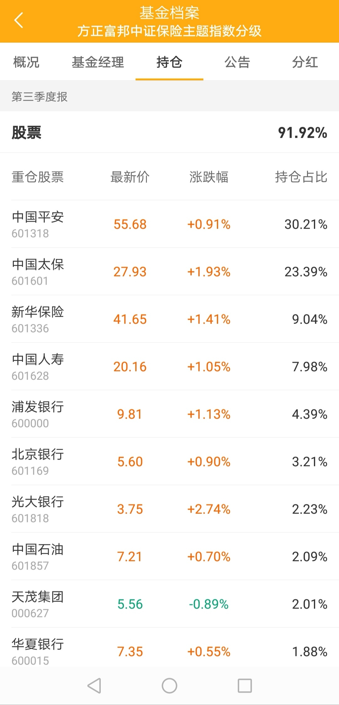

======================================================

_type: q&a
@江南蚕园（郑婷）[48281815141548]
2019-01-03 16:44:39 Thu  
topic_id: 48222148485518

@江南蚕园（郑婷）

>  二师父，白银有研究过吗？我已经看到好几个说白银比黄金更有投资价值

@二师父

>  白银也是避险品种，收益率不会很高，选择一个就可以啦，我选择黄金和债券避险

阅读[1194]  评论[1]  赞[0] 

======================================================

_type: q&a
@TIME[51188125888554]
2019-01-03 16:46:47 Thu  
topic_id: 48222148485258

@TIME

>  老大，我有中信卓越25万，现在不到20万了，正好是去年第一个交易日买的，一年亏了20多个点，真是被它坑透了，这个经理重仓的东方雨虹，青岛海尔和银行股，真是血亏，我想把它换成512000，能行吗？还是换成中信或者华泰海通？多谢指导。

@二师父

>  券商也不适合重仓，建议分散配置，500，
>  300，消费，医药，券商，这样做网格，很多人在那个时候冲进去，亏了不少

阅读[1288]  评论[1]  赞[0] 

======================================================

_type: talk
@二师父[28814221155551]
2019-01-04 04:44:21 Fri  
topic_id: 15111821418212

估值表里面黄金虽然高估了，但是需要分批卖出，因为虽然高估，可是仍旧有人投机买入推高金价。

阅读[1717]  评论[0]  赞[0] 

+++++++++++++++++++++++++++++++++++++++++++++++++++++

图片：
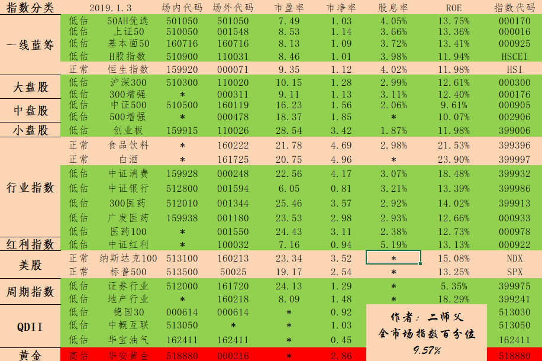

======================================================

_type: talk
@二师父[28814221155551]
2019-01-04 04:46:42 Fri  
topic_id: 88444154241512

很多人做事都是看到利益看到好处之后才做，眼光很短。投资是一件长期的事情，不要追着市场走。打造诺亚方舟，我们的红利仓位已经够了

@海盗 at 2019-01-04 04:46:42 Fri

> 二师父，既然分红对投资者来说没有什么意义，那么分红的主要目的是什么？

----------

@海盗 at 2019-01-04 04:46:42 Fri

> 股息率，我百度了一下也理解不了。股息率对于我们投资者来说有什么关系？还望二师父能给予最通俗的解释。谢谢🙏

----------

@二师父 at 2019-01-04 04:46:42 Fri

> 股息率和分红率两个概念，分红率就是扣除各种费用给你分的资金，股息相当于每股派息。

----------

@海盗 at 2019-01-04 04:46:42 Fri

> 谢谢

----------

阅读[1908]  评论[4]  赞[0] 

+++++++++++++++++++++++++++++++++++++++++++++++++++++

文件：
2019-01-04 04:45:16 Fri
文件大小：[20210]
15515111454222-中证红利要分红了，现在可以重仓买一部分吗.docx

======================================================

_type: talk
@宁静致远[15455442225412]
2019-01-04 10:13:23 Fri  
topic_id: 51448211115124

各位，为何置顶的估值表，始终是11月14日的，是我打开方式不对吗？

@杜志彪 at 2019-01-04 10:13:23 Fri

> 都一样

----------

@海盗 at 2019-01-04 10:13:23 Fri

> 以二师父每天发送的文章为准。

----------

@宁静致远 at 2019-01-04 10:13:23 Fri

> 好的，谢谢

----------

@二师父 at 2019-01-04 10:13:23 Fri

> 忘记更新了，今晚更新下哈

----------

阅读[1078]  评论[4]  赞[0] 

======================================================

_type: talk
@二师父[28814221155551]
2019-01-04 12:54:41 Fri  
topic_id: 15118254258552

<e type="hashtag" hid="881251425252" title="#鳄鱼计划#" /> 本次鳄鱼计划网格交易，卖出券商两份，盈利近8个百分点。也算是熊市的一笔不错的收益了，记住不要全部卖出，其他的基金也一样坚持做网格交易，及时大盘一直震荡我们也能挣钱。

@健哥 at 2019-01-04 12:54:41 Fri

> 二师父网格交易有实盘吗

----------

@二师父 at 2019-01-04 12:54:41 Fri

> 有，鳄鱼计划现在就是用的网格，之前我在学堂大表格了，你看看我的操作价位

----------

@健哥 at 2019-01-04 12:54:41 Fri

> 跟着二师父一起走，有计划，有方寸，能坚持。

----------

@健哥 at 2019-01-04 12:54:41 Fri

> 谢谢二师父，券商这次大涨后，网格交易记录表有调整吗，还可以按照0.68建立底仓吗

----------

@二师父 at 2019-01-04 12:54:41 Fri

> 没有调整，我就按照表格执行了

----------

@健哥 at 2019-01-04 12:54:41 Fri

> 底仓10000指的是10000股吗？卖出2份，是指4000股吗？

----------

@二师父 at 2019-01-04 12:54:41 Fri

> 这个根据自己实际情况来

----------

阅读[1886]  评论[7]  赞[0] 

======================================================

_type: q&a
@凭栏观海[244414845852181]
2019-01-04 13:07:47 Fri  
topic_id: 28441588224811

@凭栏观海

>  中证消费现在低估，是先建立底仓再定投好呢，还是从现在开始单纯用定投的方式好呢？

@二师父

>  我用的是网格交易，先建立底仓，然后开始网格操作，券商今天已经赚了8个点了

阅读[1189]  评论[0]  赞[0] 

======================================================

_type: q&a
@凭栏观海[244414845852181]
2019-01-04 13:09:16 Fri  
topic_id: 48221488551128

@凭栏观海

>  我目前已经定投了中证医药100，还有必要再增加定投300医药吗？是不是再定投一个中证消费更合适呢？

@二师父

>  这两个配置的股票是不同的，300医药里面的股票是类似于恒瑞这种大型医药企业，医药100呢是中小医药企业，看你自己的配置情况而定，我都配置的有，分散配置，大型企业配置多一点

阅读[1245]  评论[1]  赞[0] 

======================================================

_type: talk
@Eric[48548828828848]
2019-01-04 13:18:43 Fri  
topic_id: 88441582542252

为什么要有网格交易，定投不行吗？

@海盗 at 2019-01-04 13:18:43 Fri

> 可以呀

----------

@杜志彪 at 2019-01-04 13:18:43 Fri

> 我是同时进行，原来持有一部分500ETF，当底仓用了。

----------

@根号2 at 2019-01-04 13:18:43 Fri

> 方法没有对错，但要认真了解后在用，用不好就是双刃剑

----------

阅读[1186]  评论[3]  赞[0] 

======================================================

_type: q&a
@20181108……[51511128814554]
2019-01-04 14:41:55 Fri  
topic_id: 88441582841412

@20181108……

>  二师父能介绍一下定投和网格区别吗？

@二师父

>  没啥区别，这个网格也是一种定投策略，只是他的操作更加严格，保证少动，另外定投低估定投适合单边下跌行情，网格交易呢就适合震荡行情

阅读[1243]  评论[3]  赞[0] 

======================================================

_type: q&a
@二徒弟[111188488282522]
2019-01-04 14:43:25 Fri  
topic_id: 28441582814451

@二徒弟

>  二师父，我的090010中证红利在1.550时建10000底仓，然后周定125。我想在涨回到底仓位时，保证不亏的情况下减一半底仓。觉得这个目前底仓有点重，如果下跌，按原定投计划成本基本拉不下来，如果要想拉下来估算资金撑三年有点玄。清一半底仓这个操作可行不？

@二师父

>  仓位看自己是否能够承受，如果下跌太多心态不好可以卖出，这个每个人情况不同的

阅读[1266]  评论[1]  赞[0] 

======================================================

_type: talk
@Audrey[15284421255842]
2019-01-04 21:08:57 Fri  
topic_id: 51448252481844

中证红利分红 要缴纳个税吗

@二师父 at 2019-01-04 21:08:57 Fri

> 不用的

----------

@Audrey at 2019-01-04 21:08:57 Fri

> 谢谢二师傅 现金分红和红利再投选哪种比较好呀

----------

@二师父 at 2019-01-04 21:08:57 Fri

> 资金不足就现金，有钱很多的话就红利投资

----------

@Audrey at 2019-01-04 21:08:57 Fri

> 中证红利一份分红0.188,如果买了1w块钱的中证红利,是不是分1880

----------

@二师父 at 2019-01-04 21:08:57 Fri

> 看红利的价格

----------

阅读[1063]  评论[5]  赞[0] 

======================================================

_type: talk
@二师父[28814221155551]
2019-01-04 21:41:11 Fri  
topic_id: 88441525115282

在炒股这一行，没有什么是百分之百的。如果第一手进货太多，一旦股票下跌，噩梦就开始了。每天下跌，你希望这是最后一天；有时小小的反弹，你就把它看成大起的前兆；很快这只股票可能跌得更低，你的心又往下沉。你会失去理性判断的能力。

@海盗 at 2019-01-04 21:41:11 Fri

> 说得对

----------

阅读[1143]  评论[1]  赞[0] 

======================================================

_type: talk
@二师父[28814221155551]
2019-01-05 02:53:49 Sat  
topic_id: 51448255215224

<e type="hashtag" hid="225812851481" title="#交易策略#" /> 大家不用把网格交易想的太过于复杂，也不用长期盯盘的。

当然，如果你是坚定的价值投资者，持有到牛市高估区域是最佳，可以实现利润爆发。

场外定投二师父这里有蛋卷开户渠道，场内定投有华泰和广发，市场费率最低，在置顶文章有福利注册渠道

关于港股打新，建议先拼团打新，有时候能赚有时候会亏，大概率是赚的，等建立能力圈以后再开户。

@二师父 at 2019-01-05 02:53:49 Sat

> 记得点赞评论分享哈

----------

@爱华 at 2019-01-05 02:53:49 Sat

> 谢谢二师父教导，我昨天下午在盯盘，把我累的[捂脸]

----------

@小牧童 at 2019-01-05 02:53:49 Sat

> 二师父，您好！一：网格和低估定投的资金配比多少适合？二：还有网格是不是以后上涨或者下跌到一定震荡区间都要都要设置网格？（在振荡区域内）三：因为大盘底部我们不得而知，网格底仓是不是不适合设置过重？谢谢！

----------

@二师父 at 2019-01-05 02:53:49 Sat

> 这个仓位每个人都是不同的，只能说要自己舒适的仓位，另外，网格在低估震荡区域内做就行了，正常估值就可以持有

----------

@小牧童 at 2019-01-05 02:53:49 Sat

> 谢谢！

----------

@根号2 at 2019-01-05 02:53:49 Sat

> 可以提高资金的使用效率

----------

@二徒弟 at 2019-01-05 02:53:49 Sat

> 华泰和广发哪个好？华泰的雪盈可以对接，但广发不能，可是广发免五块最低消费啊，这个对于周投几百块还是很有优势的，不知道华泰有没有

----------

@二师父 at 2019-01-05 02:53:49 Sat

> 两个都可以啊，都免

----------

阅读[1867]  评论[11]  赞[0] 

+++++++++++++++++++++++++++++++++++++++++++++++++++++

文件：
2019-01-05 02:51:22 Sat
文件大小：[441400]
88848118481142-运用这个策略，今天盈利八个点.pdf

======================================================

_type: talk
@二师父[28814221155551]
2019-01-05 03:07:49 Sat  
topic_id: 28441522582281

<e type="hashtag" hid="481211145528" title="#指数估值#" /> 消费进入正常估值，大家周末愉快。

@杜志彪 at 2019-01-05 03:07:49 Sat

> 进入正常估值是要停止定投吗？

----------

@二师父 at 2019-01-05 03:07:49 Sat

> 对，可以停止了，不过放量大涨，估计短期还是会上涨

----------

@shi at 2019-01-05 03:07:49 Sat

> 二师父，我想现在开始定投华宝油气？是否合适？

----------

@二师父 at 2019-01-05 03:07:49 Sat

> 300和100医药持仓股票不同的，看个人资金情况，油气可以定投，轻仓。

----------

阅读[1752]  评论[4]  赞[0] 

+++++++++++++++++++++++++++++++++++++++++++++++++++++

图片：
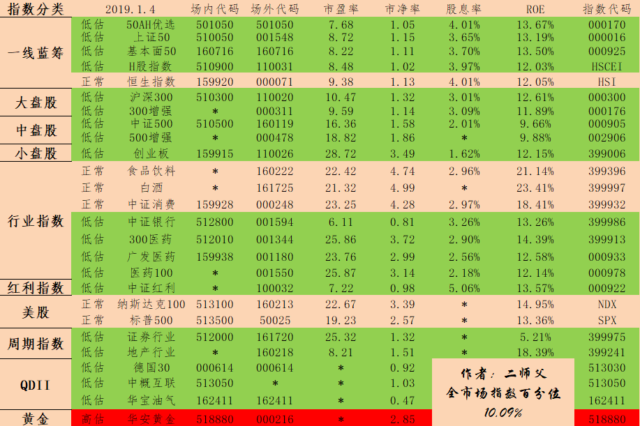

======================================================

_type: talk
@Audrey[15284421255842]
2019-01-05 11:02:39 Sat  
topic_id: 48221451248858

中证红利一份分红0.188元,如果买了1w块钱的中证红利,是不是分1880元?如果是这样利率好高诶

@sun at 2019-01-05 11:02:39 Sat

> 然后除权下来

----------

@Eric at 2019-01-05 11:02:39 Sat

> 😂不知道数学怎么学的

----------

阅读[985]  评论[2]  赞[0] 

+++++++++++++++++++++++++++++++++++++++++++++++++++++

图片：
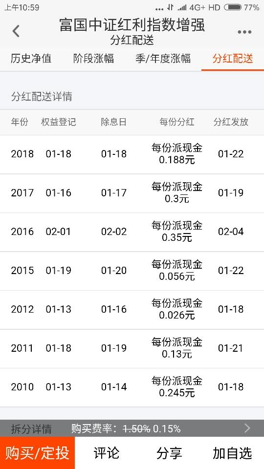

======================================================

_type: talk
@二师父[28814221155551]
2019-01-05 11:42:06 Sat  
topic_id: 51448258454824

<e type="hashtag" hid="281181228851" title="#周末答疑#" /> 关于分红的问题已经说了哈，基金公司不会额外分钱给你

另外关于港股打新，如果还没有自己严格的交易系统可以先不开户，直接用二师父的拼团打新去操作，一次几百元，很方便。

打新的话记住如果中签千万别长拿，当天11点前记得卖出

@啊哦呃伊唔คิดถ* at 2019-01-05 11:42:06 Sat

> 打新入口只有那个二维码吗？小程序的不是现金

----------

@二师父 at 2019-01-05 11:42:06 Sat

> 是现金啊，还可以开通港股账户的

----------

@啊哦呃伊唔คิดถ* at 2019-01-05 11:42:06 Sat

> 领投小程序吗？

----------

@二师父 at 2019-01-05 11:42:06 Sat

> 对啊

----------

@啊哦呃伊唔คิดถ* at 2019-01-05 11:42:06 Sat

> T币

----------

@啊哦呃伊唔คิดถ* at 2019-01-05 11:42:06 Sat

> 是我打开方式不对吗？

----------

@二师父 at 2019-01-05 11:42:06 Sat

> 在具体股票拼团那里点击下面的拼吧

----------

@啊哦呃伊唔คิดถ* at 2019-01-05 11:42:06 Sat

> 用T币的，不是现金。

----------

阅读[1090]  评论[10]  赞[0] 

======================================================

_type: talk
@啊哦呃伊唔คิดถ*[28445845514521]
2019-01-05 15:46:09 Sat  
topic_id: 15118212142522

套用之前看到二师父的一个模板，做了个基金持仓表。
资金不多，大家见笑了[捂脸]

提问@二师父，等下次消费进入低估，我是继续投我这个 110022，还是换成中证消费。
如果可以继续投 110022，麻烦二师父告知一下估值区域，谢谢。

@二师父 at 2019-01-05 15:46:09 Sat

> 这个不是指数基金

----------

@啊哦呃伊唔คิดถ* at 2019-01-05 15:46:09 Sat

> 那下次是要换成中证消费吗？

----------

阅读[1048]  评论[2]  赞[0] 

+++++++++++++++++++++++++++++++++++++++++++++++++++++

图片：
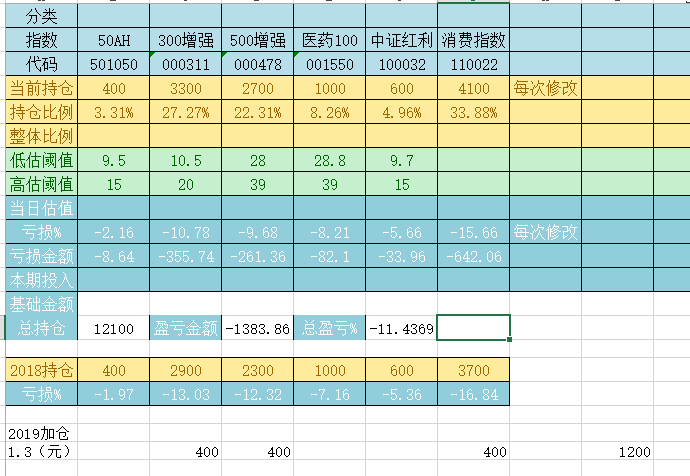

======================================================

_type: talk
@二师父[28814221155551]
2019-01-05 16:48:39 Sat  
topic_id: 88441545145452

债券市场也比较重要。第一，收益率曲线较其他指标能够更可靠地预测经济周期的重要拐点。陡峭化的收益率曲线意味着经济复苏，是投资风险资产的绝佳时机，而倒挂的收益率曲线往往伴随着经济放缓或衰退，此时应降低风险资产的配置。相关研究显示，收益率曲线大概能领先12个月预测经济周期，而股票市场只能提前6~9个月做出预测。

@西锦巴乌 at 2019-01-05 16:48:39 Sat

> 是否可以理解为现在是投资风险资产的好机会？

----------

@二师父 at 2019-01-05 16:48:39 Sat

> 投资股权资产的好机会，股债还是有轮动的

----------

@西锦巴乌 at 2019-01-05 16:48:39 Sat

> [愉快]

----------

阅读[1069]  评论[3]  赞[0] 

======================================================

_type: q&a
@乐山乐水[111852858512242]
2019-01-05 17:23:37 Sat  
topic_id: 48221428444458

@乐山乐水

>  二师父好，1.2日在天天基金论坛里偶然看到您的2019定投计划，被您的投资理念所吸引，这两天看完了您18年的所有文章，只恨认识太晚，去年在买基金的路上也犯了很多错误，至今还是亏损状态。现在我有两个问题，想请教您。1.在18年初高点买入100032，现在浮亏15%左右，高点买入000311，浮亏21%左右，这种情况下可否借鉴五档买入法，或者有什么更好的方法推荐。2.您低估定投实盘中的银行指数001594和房产指数160218处于低估，但是我已经持有银行指数161723和地产指数160628这两只指数基金是否低估，可以代替001594和160218定投吗，非常感谢！

@二师父

>  高位买入没有好的办法了，红利和300目前都低估，要么定投，要么持有，不要卖出
>  
>  另外，后面的几个基金具体名称附一下哈，不然还得一个个查，一般基金没问题，只要规模大，流动性好，基本都可以的

阅读[1126]  评论[3]  赞[0] 

======================================================

_type: talk
@拥抱太阳的风筝[48812454818528]
2019-01-05 21:28:18 Sat  
topic_id: 28441544242141

二师父，50AH优选 为什么有两个代码000170和950090？中证官网上只有950090呀!

@二师父 at 2019-01-05 21:28:18 Sat

> CSI950090是chainext指数，最具规模和参考价值，SH000170是上交所的指数，参考一个就行

----------

阅读[1033]  评论[1]  赞[0] 

======================================================

_type: talk
@二师父[28814221155551]
2019-01-05 22:22:33 Sat  
topic_id: 15118211188542

看看格力的，已经站稳20日和5日均线，财务指标非常棒

@二徒弟 at 2019-01-05 22:22:33 Sat

> 这么说我35.79进的格力可以继续拿着了

----------

@二师父 at 2019-01-05 22:22:33 Sat

> 可以，击穿5日或者20日均线可以考虑卖

----------

阅读[1066]  评论[2]  赞[0] 

+++++++++++++++++++++++++++++++++++++++++++++++++++++

图片：
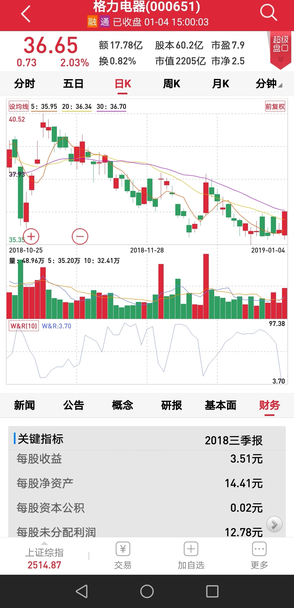

======================================================

_type: talk
@自由飞翔[544442815144244]
2019-01-06 01:12:32 Sun  
topic_id: 88441541258442

<e type="hashtag" hid="281158522841" title="#每日打卡#" /> 第四期：1.截止目前，300,500,医药100,证券行业四支指数基金仓位上下相差不大,各占单只计划总仓位的30%左右；2.坚持每周四定投,上上周开始，证券行业暂停，增加低估的中证银行。3.发现中证消费是个香饽饽，刚进入低估，每次等不及到周四，就又进入正常估值，下回只要进入低估得立马买部份。4.坚持场外定投外，考虑在场内实践网格交易，得空开户去。5.近段南方气温变化大，孩子感冒折腾好几天，没能及时打卡，但我一直都在，默默关注着师傅每日的更新及星球动态；6.聪明的投资者一书在床头已放置半年，真心惭愧，时间都去哪了？7.感恩师傅每日分享，产出的同时，背后定是n倍的付出；8.迟来的祝福，祝福师父并星球朋友们：2019年身体健康，开心充实，财源滚滚！

@二师父 at 2019-01-06 01:12:32 Sun

> 天气多变，照顾好孩子的身体，投资理财不是最重要的

----------

@海盗 at 2019-01-06 01:12:32 Sun

> 写的很好

----------

@自由飞翔 at 2019-01-06 01:12:32 Sun

> 嗯嗯，理财机会也不容错过，哈哈

----------

阅读[1064]  评论[3]  赞[0] 

======================================================

_type: talk
@二师父[28814221155551]
2019-01-06 02:37:14 Sun  
topic_id: 51448248585424

<e type="hashtag" hid="454841141288" title="#均线偏离表#" /> 这个也是变化的，券商上周拉升，已经显示偏离度为正，需要迈出了。

@惟子 at 2019-01-06 02:37:14 Sun

> 二师父:我是场外定时定额买的证券指数，结合均线偏离表，现在也必须卖出？

----------

@惟子 at 2019-01-06 02:37:14 Sun

> 二师父:我是场外定时定额买的证券指数，目前盈利7个点，结合均线偏离表，现在是逐步收割？还是一次性卖出？

----------

@二师父 at 2019-01-06 02:37:14 Sun

> 请灵活运用哈，你现在浮亏，之前买入时候必然没使用均线策略

----------

@惟子 at 2019-01-06 02:37:14 Sun

> 是的，建底仓时，当时还没关注二师父的公众号。嗯，目前盈利7个点

----------

阅读[1697]  评论[4]  赞[0] 

+++++++++++++++++++++++++++++++++++++++++++++++++++++

图片：
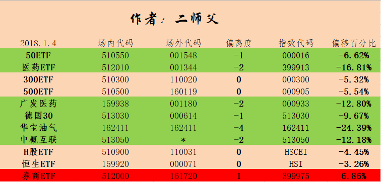

======================================================

_type: talk
@二师父[28814221155551]
2019-01-06 02:41:26 Sun  
topic_id: 48221421512288

搞了点腾讯和平安的，中短线，定投一直长线，每周四定投加上自己的场内账户。基金定投，股票交易，国债逆回购，债券投资的体系都建立了。接下来就是港股打新和国债逆回购。感觉港股打新就是碰运气，7成的概率，反正我还在实验，等我练成大功来教大家。国债逆回购也有投资，不过还没有确定盈利的方法。

二师父建立系统的原则是，我能够给大家讲清楚，那么代表我是真懂了，否则我还是不懂。

@Pacifica at 2019-01-06 02:41:26 Sun

> 二师父，关于债券投资的文章之前有发过吗？我没有留意到

----------

@二师父 at 2019-01-06 02:41:26 Sun

> 投资债券基金，之前是投资广发纯债，我嫌收益率低了，停止了，现在是投资国开债，根据国债收益率进行定投

----------

@Pacifica at 2019-01-06 02:41:26 Sun

> 谢谢师父，学习一下先

----------

阅读[1848]  评论[3]  赞[0] 

+++++++++++++++++++++++++++++++++++++++++++++++++++++

文件：
2019-01-06 02:38:15 Sun
文件大小：[402892]
88842555588252-熊市定投，牛市买股，你会成为赢家.pdf

======================================================

_type: talk
@二师父[28814221155551]
2019-01-06 03:27:53 Sun  
topic_id: 88441541458512

1997年的亚洲金融危机表面上是泰铢大幅贬值引起的，但是其发生的根源在于这些发展中国家为了维持高增长过度利用外债融资，而一旦国内经济表现不佳、资本外逃很容易造成国内的外汇储备不足以偿付外债。亚洲金融危机迅速波及其他新兴市场，1998年俄罗斯国债出现违约，新兴市场国债与美债、德债之间的利差迅速扩大，造成美国大型对冲基金长期资本管理公司（LTCM）的息差套利交易面临巨额亏损，这使得美联储不得不降低利率以应对危机，重塑金融市场的稳定性。但是降低利率是一把双刃剑，紧随其后的是美国股票市场的泡沫化，直到2000年美联储连续若干次加息后，纳斯达克的科技股泡沫终于被刺破，美国经济开始陷入衰退。随后美联储又开始大幅降低利率，2003年将联邦基金利率降至1%，创40年历史新低。低利率刺激了按揭贷款的大幅增长以及房地产行业的繁荣，毫无疑问这对于经济的短期复苏起到了关键作用，但也为后来更严重的次贷危机埋下了重大隐患。从这些金融事件的发展历史可以看出，降低利率的初衷是为了应对危机，是提振经济的必要手段，但长期的低利率本身也是下一个资产泡沫形成的温床，最终的结果是以另一个危机替代前一个危机。

阅读[1185]  评论[0]  赞[0] 

======================================================

_type: talk
@二师父[28814221155551]
2019-01-06 10:52:34 Sun  
topic_id: 28441515811841

苹果股价下跌跟市场营收是有关系的。首先全球智能终端市场逐步饱和，为了增加营收，苹果只能在销量保持不变的情况下，提高价格，最终市场占有率越来越少。第二，中国智能终端逐步向外拓展，比如华为小米，二师父认识的很多外国朋友都是使用的华为，现在随着5G的即将到来，苹果将进一步焦虑。第三，民族情绪，国人还是有很多人对毛衣站不满，自己不仅不用苹果，也教育孩子不用苹果。想想看，如果中国人都不用苹果了，那苹果价格必然重创。

@阿@浩 at 2019-01-06 10:52:34 Sun

> 是的，苹果的辉煌历史过去了[微笑]

----------

@阿@浩 at 2019-01-06 10:52:34 Sun

> 很看好华为

----------

@二师父 at 2019-01-06 10:52:34 Sun

> 乔布斯时代终结

----------

@爱华 at 2019-01-06 10:52:34 Sun

> 支持华为

----------

阅读[1073]  评论[4]  赞[0] 

======================================================

_type: talk
@梧桐花语[244445185248881]
2019-01-06 11:57:18 Sun  
topic_id: 51448285124824

各位，假如今年股市走N字形走势，上升到假如是2800点，那么2500定投的基金就获利了百分之十五了，那这时候是不是赎回后，再重新定投。

@二师父 at 2019-01-06 11:57:18 Sun

> 可以赎回部分，别全卖了，无法保证再低价买回

----------

阅读[1053]  评论[1]  赞[0] 

======================================================

_type: q&a
@海盗[48248118584848]
2019-01-06 12:41:34 Sun  
topic_id: 15118284544112

@海盗

>  二师父，荔枝微课什么时候更新

@二师父

>  更新了啊

阅读[1237]  评论[0]  赞[0] 

======================================================

_type: q&a
@海盗[48248118584848]
2019-01-06 13:35:13 Sun  
topic_id: 51448285158454

@海盗

>  二师父，您好！
>  一支基金有场内代码和场外代码，那么指数代码代表什么？
>  另外以前二师父好像说过一个基金的估值高低并不是其本身的估值，而是和它相对的指数的估值。我的理解对吗？

@二师父

>  是的，指数代码我也加上了啊

阅读[1257]  评论[0]  赞[0] 

======================================================

_type: talk
@二师父[28814221155551]
2019-01-06 14:16:33 Sun  
topic_id: 15118284488252

<e type="hashtag" hid="281181228851" title="#周末答疑#" /> 策略需要灵活运用，比如之前没有按照均线策略操作，券商的价格买贵了，现在均线策略显示卖出时候仍旧浮亏，那这个时候就别卖了，这和很多人基金买贵了，到达正常估值仍旧浮亏一样，还是不需要卖

另外，很多读者说大盘涨到2800点是否要全部卖出等跌下来再回去接盘，这是不合理的，因为无法保证卖出又能够重新以低价买入，所以我们建立了网格和利润收割方法

@惟子 at 2019-01-06 14:16:33 Sun

> 谢谢二师父

----------

@凭栏观海 at 2019-01-06 14:16:33 Sun

> 世事难料，两手准备

----------

阅读[1220]  评论[2]  赞[0] 

======================================================

_type: q&a
@默[51552188528254]
2019-01-06 18:52:31 Sun  
topic_id: 51448284152154

@默

>  请问二师父，看您以中证500为例示范了如何进行网格交易操作。建好底仓之后每跌4%净值买入一份。请问有没有必要多分成几份，跌的越低买入越多。比如，跌第一个4%买入一份，第二个4%买入2份……

@二师父

>  可以跌第一次买入1.2，第二次买1.4，如果你资金充裕可以加倍购买

阅读[1219]  评论[0]  赞[0] 

======================================================

_type: talk
@二师父[28814221155551]
2019-01-06 19:13:57 Sun  
topic_id: 88441514211222

大家尽量学堂提问，如果不方便的话，微信提问我在发到学堂，大家都可以看到哈

@春晓 at 2019-01-06 19:13:57 Sun

> 好的，谢谢二师父

----------

阅读[1191]  评论[1]  赞[0] 

+++++++++++++++++++++++++++++++++++++++++++++++++++++

图片：
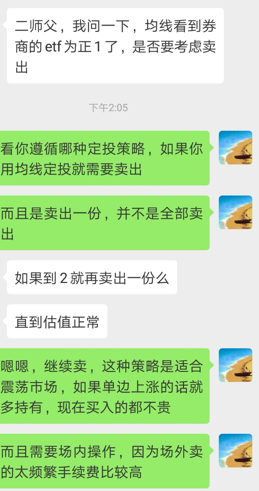

======================================================

_type: q&a
@杜志彪[544454124115854]
2019-01-06 22:43:16 Sun  
topic_id: 28441511584181

@杜志彪

>  二师傅您好：请教一下股票可以套用估值法交易吗，例如中国平安的估值区间是多少，这个可以估吗？

@二师父

>  平安用pev估值，但是股票投资不能只看估值，还得看公司的财务指标，经营状况，买入时候需要结合当前市场情况，股票逆势加仓，需要看准基本面，这个浮动太大了，所以我投资股票没有用估值这种方法，而是建立在基本面基础上的趋势交易

阅读[1245]  评论[0]  赞[0] 

======================================================

_type: talk
@二师父[28814221155551]
2019-01-07 03:06:54 Mon  
topic_id: 28441858155181

再说说三个策略的区别，可以灵活运用，低估定投为主，网格交易为辅，看了看公众号数据，关注者大多集中在北京上海深圳广州四个城市。基金和股权投资还是只在一线普及，二三线并没有发展很好。这是不利于经济发展的。如果哪一天，中国的股权投资者不再以投资股票为不敢见人的事情，那么这个国家的金融就发展很好了。最近我也在给我的家人普及这个股权投资理念。

当你自己做到，然后感染身边的人，这才是最棒的。从这些数据来看股权投资在中国真的才刚刚起步。

@海盗 at 2019-01-07 03:06:54 Mon

> 永远不知道这次是回调还是牛市的开始，所以建立一定的仓底[强]

----------

@海盗 at 2019-01-07 03:06:54 Mon

> 感觉也只有现在这种极低估值的情况下建立仓底还可以

----------

@Zhu Yongsh* at 2019-01-07 03:06:54 Mon

> 网格交易的图示表格容易有歧义，价格涨应该是份数减少，价格低应该是增加的。

----------

@二师父 at 2019-01-07 03:06:54 Mon

> 涨，是卖出份额递增，有写卖出2字

----------

阅读[1954]  评论[4]  赞[0] 

+++++++++++++++++++++++++++++++++++++++++++++++++++++

文件：
2019-01-07 03:03:13 Mon
文件大小：[395598]
48825448421888-二师父3个定投策略的区别.pdf

======================================================

_type: q&a
@夏萍[28221454818281]
2019-01-07 03:23:14 Mon  
topic_id: 15118525422142

@夏萍

>  师父对于买入数额的公式其中有点不太明白，师父看看我理解的对不对，假如定投最低额是500，最低估值是25，最新估值是16.36，亏损是10%，本次实际要买入的1146元对吗？
>  如果是盈利还需要计算吗？应该怎么算？

@二师父

>  根据公式加仓是这样的，可以加倍买入，如果盈利了，卖出的话在正常估值卖出利润部分清仓即可，如果高估了，逐步卖出本金清仓

阅读[1343]  评论[0]  赞[0] 

======================================================

_type: talk
@二师父[28814221155551]
2019-01-07 04:18:39 Mon  
topic_id: 28441858148481

今日操作提示，券商银行大涨的话可卖，中概互联和广发医药大跌时候可买，看具体情况而定

@勤能行之 at 2019-01-07 04:18:39 Mon

> 师傅，场外的也卖吗？

----------

@shi at 2019-01-07 04:18:39 Mon

> 二师父，请教一下：中概互联，我在同花顺看，价格1.06几，基金净值只有1.01多, 这算不算溢价了？ 有什么地方可以买到价格低的吗？

----------

@二师父 at 2019-01-07 04:18:39 Mon

> 不用哈，资金量充裕，场外持有到正常估值收割利润，别短线，手续费高

----------

@二师父 at 2019-01-07 04:18:39 Mon

> 这是溢价了，可以场外申购，新出了易方达中概互联

----------

阅读[1365]  评论[4]  赞[0] 

======================================================

_type: talk
@健哥[51511242852814]
2019-01-07 10:58:54 Mon  
topic_id: 48221842448288

二师父，你好！您可以发布一下黄金的网格交易记录表吗？

@二师父 at 2019-01-07 10:58:54 Mon

> 黄金不适合网格，网格适合高波动品种

----------

@健哥 at 2019-01-07 10:58:54 Mon

> 谢谢

----------

阅读[1288]  评论[2]  赞[0] 

======================================================

@二师父[28814221155551]
2019-01-07 12:02:02 Mon  
topic_id: 88441852858112

>  @二师父
>  

阅读[1369]  评论[0]  赞[0] 

======================================================

_type: talk
@sun[15481522845412]
2019-01-07 13:36:29 Mon  
topic_id: 28441854444141

今日打卡:券商卖出两格，收益9%，特发转债卖出收益24.3%，创业板和油气错过了一格买卖的交易。

@德仁则昌 at 2019-01-07 13:36:29 Mon

> 特发转债是可转债吗，怎么盈利这么高

----------

@sun at 2019-01-07 13:36:29 Mon

> 是可转债，主要是正股连着涨停，其实还折价差不多20%，我怕坐了过山车，就卖了。

----------

@sun at 2019-01-07 13:36:29 Mon

> 可转债也不能无脑买。

----------

@德仁则昌 at 2019-01-07 13:36:29 Mon

> 我看到了，你这个运气真不错。

----------

阅读[1285]  评论[4]  赞[0] 

======================================================

_type: talk
@二师父[28814221155551]
2019-01-07 22:23:08 Mon  
topic_id: 15118554111812

<e type="hashtag" hid="142511142112" title="#格局重塑#" /> 格物致知，格是认识和认知的意思，格局就是一个人认知事物的大局观

比如同样是买基金，有人就局限于基金波动给自己带来一定的收益，有人希望是通过基金定投来实现财务自由。

两种不同的认知带来的是不同的行动，前者一般就是趋势交易，赚点就跑，后者将更多的精力放在长期投资上。

格局大的人会更加大气，能够忍受大浮亏，能够在基金浮盈几倍仍旧拿的住，这样才能真正实现财务增长

无论投资还是工作，干事业，智商分野并不很重要，重要的是认知事物的高度，大气的男性会给人安全感，大气的女性会散发独特的魅力

这是认识事物的高度不同所造成思想的不同，希望大家可以提升认知事物的高度，做一个大气，包容，胸怀宽广的人

有利于投资，更有利于幸福生活

@根号2 at 2019-01-07 22:23:08 Mon

> 说的真好

----------

阅读[1849]  评论[1]  赞[0] 

======================================================

_type: talk
@二师父[28814221155551]
2019-01-08 02:48:24 Tue  
topic_id: 48221854414448

<e type="hashtag" hid="825812122842" title="#避免溢价#" /> 最有效的避免溢价的方法。真正的投资者需要场内和场外都精通，即使有的平台不使用

@爱华 at 2019-01-08 02:48:24 Tue

> 早上第一件事就是学习二师父文章，满满的干货，感谢[玫瑰][玫瑰]

----------

@sun at 2019-01-08 02:48:24 Tue

> 很清楚地解释了溢价与折价，谢谢！

----------

@自由飞翔 at 2019-01-08 02:48:24 Tue

> 胜读一本书，谢谢师父[抱拳]

----------

阅读[1903]  评论[3]  赞[0] 

+++++++++++++++++++++++++++++++++++++++++++++++++++++

文件：
2019-01-08 02:47:41 Tue
文件大小：[596967]
15514224544122-学会这一招，就能避免高溢价基金.pdf

======================================================

_type: talk
@二师父[28814221155551]
2019-01-08 02:48:57 Tue  
topic_id: 51448152282224

<e type="hashtag" hid="481211145528" title="#指数估值#" /> 300医药进入正常估值，可以逐步收割利润

@好运玲玲 at 2019-01-08 02:48:57 Tue

> 老师您好！因为是新手，您说的300医药进入正常估值，可逐步收购利润，是指场内还是场外定投？

----------

@二师父 at 2019-01-08 02:48:57 Tue

> 有10个点的利润的话都可以逐步卖出利润部分了

----------

阅读[1858]  评论[2]  赞[0] 

+++++++++++++++++++++++++++++++++++++++++++++++++++++

图片：
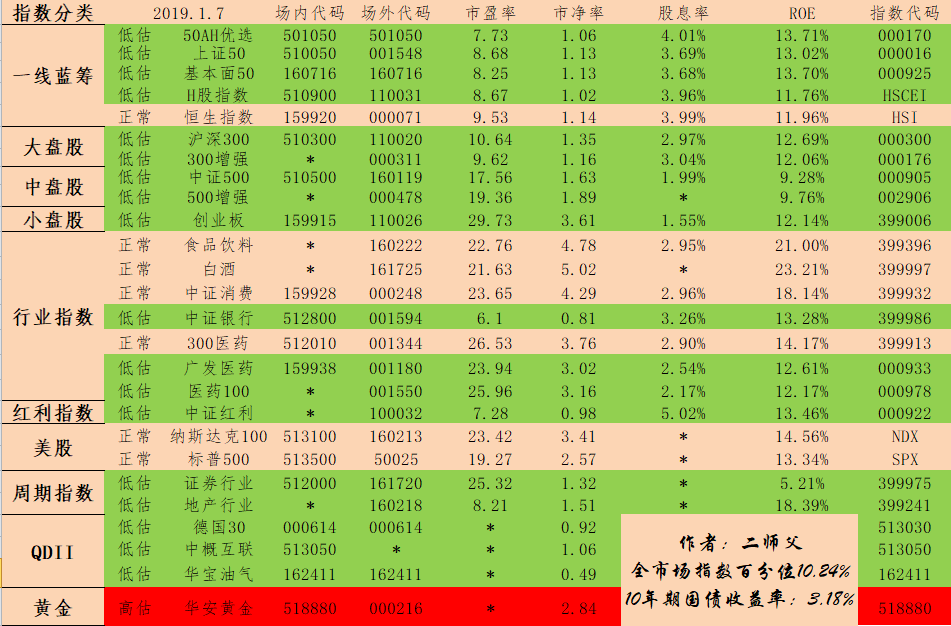

======================================================

_type: talk
@二师父[28814221155551]
2019-01-08 10:39:46 Tue  
topic_id: 28441828844441

<e type="hashtag" hid="225812121451" title="#周二推荐书#" /> 现在我们的油气快盈利了，到达0.52可以卖出一份，行情不好就多学习，不要乱买卖，今天推荐一本书巴菲特与索罗斯的投资习惯，哪些是好习惯，哪些是坏习惯，学习之后我们要保留投资的好习惯，改掉投资的坏习惯

@Kelven at 2019-01-08 10:39:46 Tue

> 0.52仍未到正常估值就卖了吗？

----------

@二师父 at 2019-01-08 10:39:46 Tue

> 卖出一份，并不全卖，网格交易

----------

阅读[1223]  评论[2]  赞[0] 

======================================================

_type: talk
@二师父[28814221155551]
2019-01-08 15:37:38 Tue  
topic_id: 48221851888518

康美已经成这样了，投资个股一定要记得止损哈，据说是行贿了

@宁静致远 at 2019-01-08 15:37:38 Tue

> 幸好我在去年八月20多元时把康美全卖掉了，持仓半年多，略有盈利。当时得知康美营收主要靠中药饮片，觉得前景不好。

----------

阅读[1130]  评论[1]  赞[0] 

+++++++++++++++++++++++++++++++++++++++++++++++++++++

图片：
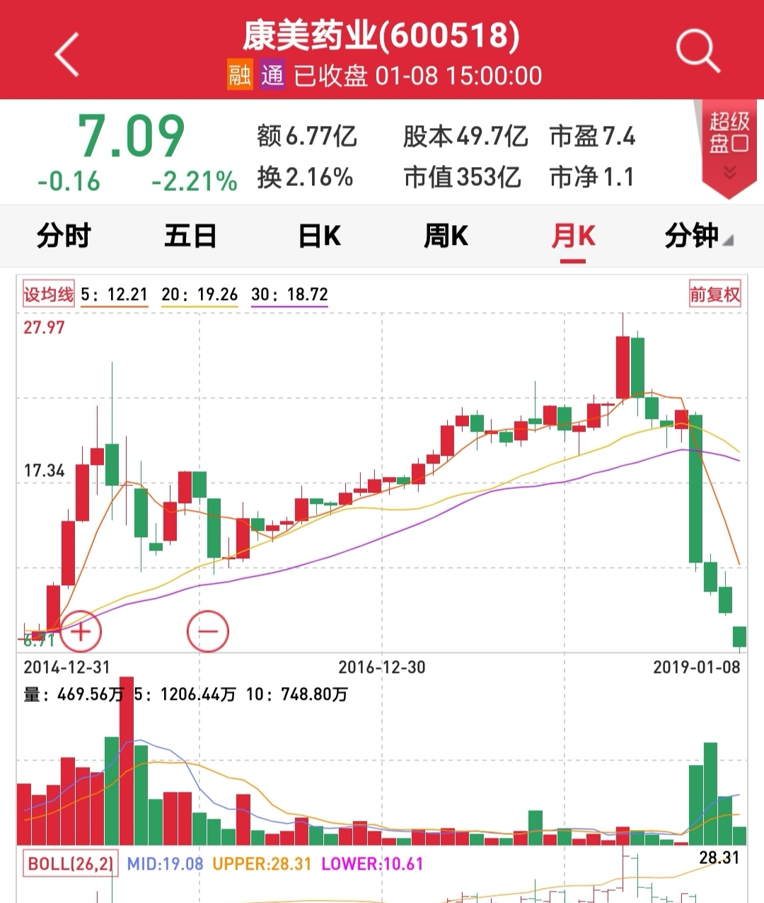

======================================================

_type: talk
@二师父[28814221155551]
2019-01-08 15:40:24 Tue  
topic_id: 28441821882881

推荐股票是违法的，我绝对不会跟大家推荐股票

阅读[1164]  评论[0]  赞[0] 

+++++++++++++++++++++++++++++++++++++++++++++++++++++

图片：
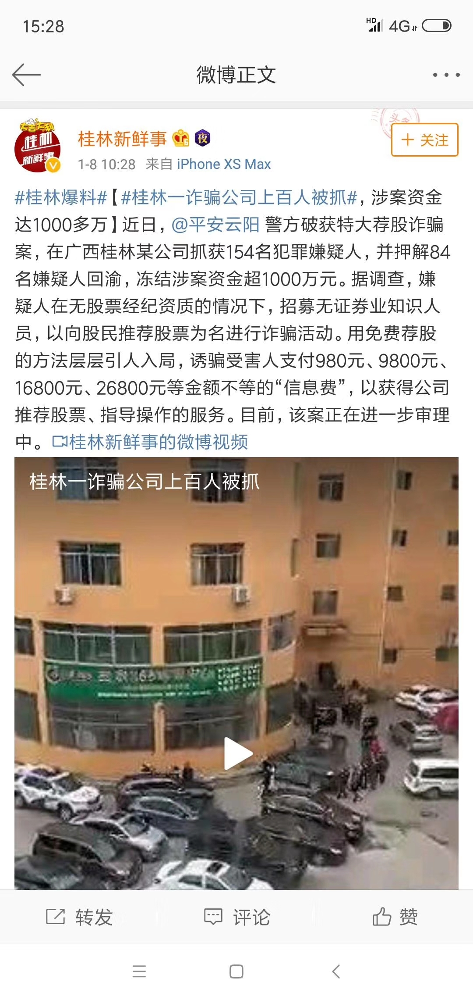

======================================================

_type: talk
@二师父[28814221155551]
2019-01-08 20:14:57 Tue  
topic_id: 28441845255581

<e type="hashtag" hid="552112255524" title="#答疑#" /> 为啥华宝油气到了0.52没有正常估值就卖了，这是网格交易，有可能他没到正常估值就又下跌了，所以先卖出，当然不排除单边上涨的情况，这是概率问题

现在有人觉得学堂都是定投和投资信息，有些单调，想加入一些生活内容，大家觉得如何，可以发表各自的意见，因为理财也是理生活。

@王秦川 at 2019-01-08 20:14:57 Tue

> 很好啊，生活不只是眼前的苟且，还有诗和远方[调皮]，

----------

@二师父 at 2019-01-08 20:14:57 Tue

> 👍👍

----------

@啊哦呃伊唔คิดถ* at 2019-01-08 20:14:57 Tue

> 我觉得公众号发过的内容，星球就不需要再发一次了吧？除非有其他原因，或者内容更完全更具体

----------

@二师父 at 2019-01-08 20:14:57 Tue

> 这样有利于搜索和下载打印，公众号不好搜索

----------

@勤能行之 at 2019-01-08 20:14:57 Tue

> 公众号发过的文章，在学堂还是应该发一遍，有利于检索。

----------

@勤能行之 at 2019-01-08 20:14:57 Tue

> 我觉得确实是有感而发的有价值的好文章和好心得就可以分享一下。

----------

阅读[1732]  评论[6]  赞[0] 

======================================================

_type: q&a
@爱华[844445144558182]
2019-01-08 22:25:17 Tue  
topic_id: 51448141252584

@爱华

>  二师父好，请问一下债基的业绩和基金经理关系大吗?谢谢😊

@二师父

>  关系不大，一般和10年起国债收益率有关系，10年期国债收益率越低，债券基金价格越高

阅读[1155]  评论[1]  赞[0] 

======================================================

_type: q&a
@速。冻[51415484228284]
2019-01-08 22:43:20 Tue  
topic_id: 28441848855421

@速。冻

>  二师父每日估值一般都是晚上几点发布？有时候好晚啊

@二师父

>  每晚2，3点，是次日凌晨

阅读[1188]  评论[0]  赞[0] 

======================================================

_type: q&a
@夏萍[28221454818281]
2019-01-08 23:16:21 Tue  
topic_id: 51448141521824

@夏萍

>  请问老师用的是什么软件可以查到iopv数值，我从天天基金里及其他平台都没有查到，请老师给予帮助

@二师父

>  万得股票，有免费的也有付费的，都可以查到

阅读[1189]  评论[3]  赞[0] 

======================================================

_type: talk
@二师父[28814221155551]
2019-01-09 03:25:04 Wed  
topic_id: 48221822514458

黄金回落了，快进入正常估值啦。其他的低估品种放心定投哈。

阅读[1725]  评论[0]  赞[0] 

+++++++++++++++++++++++++++++++++++++++++++++++++++++

图片：

======================================================

_type: talk
@二师父[28814221155551]
2019-01-09 03:27:44 Wed  
topic_id: 28441844215511

没有只跌不涨的股市，分析了四大指数，其实无论股市还是宇宙都一样的。最近行情没有，不适合乱动，多看书，多学习吧。点赞是一种态度，评论是一种学习，分享是一种快乐。记得点赞评论分享。

@王秦川 at 2019-01-09 03:27:44 Wed

> 无论什么派，结果最重要。人类只有在不断探索创新改变中才能进步。经验只能借鉴，敢于挑战才让人敬佩[抱拳][抱拳][抱拳]

----------

@sun at 2019-01-09 03:27:44 Wed

> 过去的荣耀将有一天可能衰败，现在的衰败将有一天可能大放光彩。谢谢老师的分享。

----------

阅读[1889]  评论[2]  赞[0] 

+++++++++++++++++++++++++++++++++++++++++++++++++++++

文件：
2019-01-09 03:26:10 Wed
文件大小：[805553]
88842585542282-没有只跌不涨的股市.pdf

======================================================

_type: talk
@勤能行之[481211221828]
2019-01-09 10:10:33 Wed  
topic_id: 88441841245152

我觉得确实是有感而发的，有价值的好文章和好心得，可以分享给大家。

阅读[1155]  评论[0]  赞[0] 

======================================================

_type: talk
@sun[15481522845412]
2019-01-09 10:27:24 Wed  
topic_id: 28441841212251

今日华宝油气卖出一格，二师父在0.52，想必网距比我略大？

阅读[1146]  评论[0]  赞[0] 

======================================================

_type: talk
@二师父[28814221155551]
2019-01-09 11:43:40 Wed  
topic_id: 15118582221552

<e type="hashtag" hid="881251425252" title="#鳄鱼计划#" /> 卖出500一份，建立了底仓，不用怕，定投可以继续，二师父现在鳄鱼计划和场外定投分开，本来就是目标收益率不同的实盘

@门萨🐨 at 2019-01-09 11:43:40 Wed

> 为啥你建的底仓都比我低[流泪]

----------

@二师父 at 2019-01-09 11:43:40 Wed

> 刚好那天发网格表的时候建立了

----------

@西锦巴乌 at 2019-01-09 11:43:40 Wed

> 我上午也卖出了一份500[愉快]

----------

阅读[1813]  评论[3]  赞[0] 

======================================================

_type: talk
@杜志彪[544454124115854]
2019-01-09 11:47:17 Wed  
topic_id: 48221814441118

今天4.64按计划卖出网格的500一份，单周定投的医药和消费进入正常估值，明天暂停定投了，300是双周投，要到下下星期四再说，500是月投要等二月份，暂停部分的资金要不要转到其它低估品种上，比如中概互联，大家有好的建议吗？谢谢😜

@二师父 at 2019-01-09 11:47:17 Wed

> 可以投资其他低估品种啊，仍然很低

----------

@杜志彪 at 2019-01-09 11:47:17 Wed

> 那就选择中概互联，看好今后互联网发展，会深入我们生活中的方方面面。

----------

@杜志彪 at 2019-01-09 11:47:17 Wed

> 已经按计划买入一份中概互联，下周四见[悠闲]

----------

阅读[1233]  评论[3]  赞[0] 

======================================================

_type: talk
@健哥[51511242852814]
2019-01-09 13:28:25 Wed  
topic_id: 15118582425182

上午券商0.76卖出一份

阅读[1149]  评论[0]  赞[0] 

======================================================

_type: talk
@shi[15551458885282]
2019-01-09 15:06:34 Wed  
topic_id: 15118484488822

二师父最近有点增量资金，想先放到蛋卷货币基金中，然后慢慢转换为指数基金。
关于货币基金的选择，是否有什么门道或者推荐。
或者我就按盘子大于100亿以上就行？

@二师父 at 2019-01-09 15:06:34 Wed

> 利率高并且稳定

----------

阅读[1180]  评论[1]  赞[0] 

======================================================

_type: talk
@二师父[28814221155551]
2019-01-09 16:14:38 Wed  
topic_id: 48221515158488

北京养一个小孩的费用，努力吧

@爱华 at 2019-01-09 16:14:38 Wed

> 😢

----------

阅读[1337]  评论[1]  赞[0] 

+++++++++++++++++++++++++++++++++++++++++++++++++++++

图片：
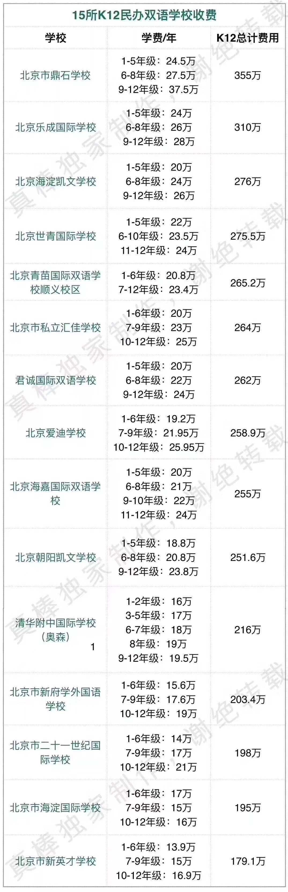

======================================================

_type: talk
@Jamway Lu[88211888455222]
2019-01-09 16:48:10 Wed  
topic_id: 48221512458848

今日打卡~卖出一份券商，卖出一份500。
今天下午考完本学期最后一门试，前面的网格知识需要恶补一下了，定投和考研真的很搭~
有幸在任性的年纪学习了理财投资，遇到了二师父以及志同道和的各位朋友们

@二师父 at 2019-01-09 16:48:10 Wed

> 住考研顺利

----------

@Jamway Lu at 2019-01-09 16:48:10 Wed

> 谢谢二师父~[呲牙]

----------

@王秦川 at 2019-01-09 16:48:10 Wed

> 比我们那时代幸福多了，抓住了机遇。

----------

阅读[1321]  评论[3]  赞[0] 

+++++++++++++++++++++++++++++++++++++++++++++++++++++

图片：
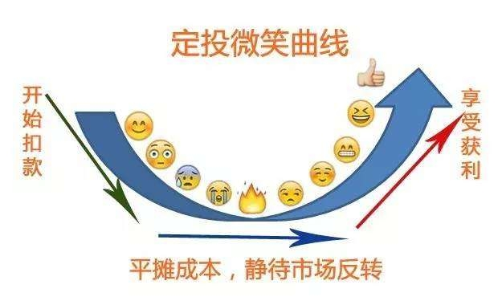

======================================================

_type: q&a
@小明[544828524525514]
2019-01-09 21:39:24 Wed  
topic_id: 28441214185841

@小明

>  老师好，目前我的华宝油气已经盈利18.5%，看您之前说的，到0.52就可以卖出一份。但我底仓建得不多，现在仓位只有我理想仓位的一半。我现在有点疑惑，我是现在按照网格计划先卖出一份呢？还是坚持这个仓位，继续持有呢？或者现在就加仓至理想仓位呢？

@二师父

>  定投吧，0.52也是低估，不过距离正常估值不远了，如果不卖的话也别追涨

阅读[1328]  评论[1]  赞[0] 

======================================================

_type: q&a
@好运玲玲[244188585541521]
2019-01-09 21:58:03 Wed  
topic_id: 88441211258442

@好运玲玲

>  老师您好！中概互联场内不做网格交易，直接定投可以吗？

@二师父

>  可以的，低估定投，正常收割利润，高估卖出即可，不用网格交易法直接低估定投法就行的

阅读[1382]  评论[0]  赞[0] 

======================================================

_type: q&a
@夏萍[28221454818281]
2019-01-10 01:16:58 Thu  
topic_id: 48221511281888

@夏萍

>  老师均线上有个疑问，为什么设置了90的均线，有些总显示0呢？

@二师父

>  你这是选择的月线，要选择日线，这样才是90日均线

阅读[1348]  评论[0]  赞[0] 

======================================================

_type: talk
@二师父[28814221155551]
2019-01-10 03:06:49 Thu  
topic_id: 88441452522852

@王秦川 at 2019-01-10 03:06:49 Thu

> 需要常提醒⏰，尤其是在有点浮赢的时候

----------

@凭栏观海 at 2019-01-10 03:06:49 Thu

> 牛顿是经典物理学的泰山北斗，可他炒股却一败涂地！他说:我可以计算出天体的运行，却无法计算出人性的疯狂！只有傻傻的低估定投，才是市场生存的长久之道。正如老子所说:抱朴守拙。大智若愚，大巧若拙，大音希声，大象无形，道隐无名！傻傻的低估定投正好符合老子的思想！

----------

阅读[2012]  评论[2]  赞[0] 

+++++++++++++++++++++++++++++++++++++++++++++++++++++

文件：
2019-01-10 03:06:33 Thu
文件大小：[406912]
28842588454581-不要企图买在最低点，卖在最高点.pdf

======================================================

_type: talk
@二师父[28814221155551]
2019-01-10 03:07:33 Thu  
topic_id: 28441452522851

黄金正常估值啦，等待回归我们再买入，这样一步步的买入卖出，必定就是获利的最佳方式。

@活着，不易 at 2019-01-10 03:07:33 Thu

> 师父，采用均线定投策略的时候，均线的选择是选择指数代码的还是选择场内代码的呢？

----------

@二师父 at 2019-01-10 03:07:33 Thu

> 看场内基金代码，指数代码容易有误差

----------

@活着，不易 at 2019-01-10 03:07:33 Thu

> 好的！谢谢师父！

----------

@夏萍 at 2019-01-10 03:07:33 Thu

> 师父医药100我10.29开始定投的，开始定投的市盈率是23倍多，从业绩走势看，目前的市盈率应该比开始定投的低，但目前市盈率就是25多，这是什么原因？

----------

阅读[1375]  评论[4]  赞[0] 

+++++++++++++++++++++++++++++++++++++++++++++++++++++

图片：

======================================================

_type: q&a
@凭栏观海[244414845852181]
2019-01-10 11:36:38 Thu  
topic_id: 15118124515282

@凭栏观海

>  场内买基金一买一卖手续费总共多少啊？最低收费多少？

@二师父

>  我这福利开户是万0.6，一次购买一万，收0.6，最低是0.1

阅读[1316]  评论[2]  赞[0] 

======================================================

_type: q&a
@活着，不易[48221851188118]
2019-01-10 11:38:31 Thu  
topic_id: 88441452211482

@活着，不易

>  师父，在广发开户后还能在华泰开户吗？华泰开户后可以在雪球交易吗？平时你们都是用什么软件实现场内交易的呢？

@二师父

>  两者不冲突，广发是广发易淘金，华泰是涨乐财付通

阅读[1387]  评论[0]  赞[0] 

======================================================

_type: talk
@二师父[28814221155551]
2019-01-10 11:53:23 Thu  
topic_id: 88441454455122

<e type="hashtag" hid="881422852442" title="#定投实盘#" /> 买入医药100一份，50ah一份，医药100是类似场内广发医药的。代码在之前实盘记录已经公布啦，低估定投场外坚持即可

@王秦川 at 2019-01-10 11:53:23 Thu

> 太好了，谢谢师傅，投了

----------

@速。冻 at 2019-01-10 11:53:23 Thu

> 二师父应该给小白说下为啥买入这两个指数

----------

@二师父 at 2019-01-10 11:53:23 Thu

> 这两个指数，一个医药，一个50ah，以前基金的价值都分析过，医药是长青行业，300医药和医药100刚好大盘和小盘医药都配置齐全了

目前医药100是低估的，优先选择这个，50ah是上证50的策略指数，有ah折价买入的超额收益，所以选择这个

----------

@活着，不易 at 2019-01-10 11:53:23 Thu

> 主要是，十个定投基金里，为什么这次选择这两个定投？

----------

@二师父 at 2019-01-10 11:53:23 Thu

> 第一看估值，第二看仓位

----------

阅读[1391]  评论[5]  赞[0] 

======================================================

_type: q&a
@爱华[844445144558182]
2019-01-10 22:53:15 Thu  
topic_id: 15118155882882

@爱华

>  二师父好，关于5G您有什么看法?

@二师父

>  5G是未来的一个新趋势，会引发一轮新的产业革命，美国之所以打击华为，5G也是其中一个原因

阅读[1224]  评论[0]  赞[0] 

======================================================

_type: q&a
@凭栏观海[244414845852181]
2019-01-10 22:54:49 Thu  
topic_id: 48221285815558

@凭栏观海

>  目前银行股低估，是买中证银行基金呢还是买龙头银行个股呢？个股银行那个比较好呢，农业银行还是建设银行等其他银行？

@二师父

>  个股银行可以买招商银行，如果你能够忍受较大回撤，可以选择个股银行，如果你不能忍受较大回撤，那么定投中证银行指数基金即可

阅读[1333]  评论[0]  赞[0] 

======================================================

_type: q&a
@gxbill[88842585142152]
2019-01-10 22:56:02 Thu  
topic_id: 28441482245451

@gxbill

>  传媒行业也很低估了 二师父觉得传媒行业怎么样？看定投记录好像没有这个行业的 是不看好么？

@二师父

>  这个基金以前买过几次，仓位不重，这个行业是周期性行业，不确定性太大，确定的消费和医药，等行业是很不错的，如果选择周期行业，建议券商和地产就足够了

阅读[1352]  评论[0]  赞[0] 

======================================================

_type: q&a
@夏萍[28221454818281]
2019-01-10 22:59:26 Thu  
topic_id: 51448415448584

@夏萍

>  师父，医药100我10.29开始定投，定投的市盈率是23倍多，从业绩走势看，目前的市盈率应该比开始定投的低，但目前市盈率就是25多，这是什么原因？

@二师父

>  市盈率和基金净值不是同步的哈，这就是我们用市盈率判断估值高低而不是看净值
>  
>  有一个公式，基金净值等于市盈率乘以盈利加分红
>  
>  这就意味着当盈利下降，而市盈率增加，基金净值是有可能不变的
>  
>  上次医药代量采购事件已经让医药一些企业盈利受到部分影响，所以在市盈率增加净值并没有也完全同步
>  
>  市盈率估值只适合盈利稳定的品种，医药盈利虽然稳定，但是最近是受到了一些影响

阅读[1472]  评论[0]  赞[0] 

======================================================

_type: talk
@二师父[28814221155551]
2019-01-11 04:12:46 Fri  
topic_id: 48221254258488

<e type="hashtag" hid="481211145528" title="#指数估值#" /> 黄金进入高估啦，其他的估值还是没变。

阅读[1926]  评论[0]  赞[0] 

+++++++++++++++++++++++++++++++++++++++++++++++++++++

图片：
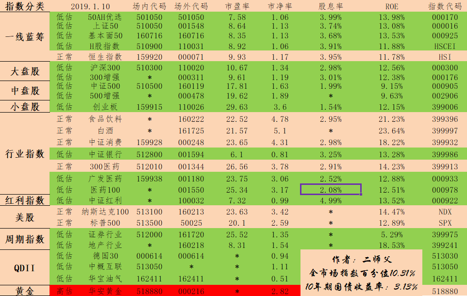

======================================================

_type: talk
@二师父[28814221155551]
2019-01-11 04:13:17 Fri  
topic_id: 88441425428582

<e type="hashtag" hid="481144488858" title="#投资理念#" /> 纪律必须严格遵守哈，这是定投里面很重要的一件事情。

@海盗 at 2019-01-11 04:13:17 Fri

> 首先，谢谢二师父的优质文章的分享！🙏跟着二师父定投一路走来，发现场外定投的标的有12个之多，和二师父一样，每次定投也都择优选择2到3个标的进行投资，长期下来就发现有的标的投的频率高，有的定投的频率很低，不知以后会有什么影响没有？像这样的情况，希望二师父能给点建议，谢谢

----------

@王秦川 at 2019-01-11 04:13:17 Fri

> 谢谢师傅，苦口婆心，不厌其烦的重复提醒🔔，收藏了，经常看看，才能自律。若干年后感谢自己现在的坚持✊

----------

@二师父 at 2019-01-11 04:13:17 Fri

> [强][强]

----------

@二师父 at 2019-01-11 04:13:17 Fri

> 就是重仓基金对收益影响大，那些轻仓基金无论涨跌对收益影响都不大的

----------

阅读[2115]  评论[4]  赞[0] 

+++++++++++++++++++++++++++++++++++++++++++++++++++++

文件：
2019-01-11 04:12:54 Fri
文件大小：[26044]
28842581455451-无论盈亏，请遵守定投纪律.docx

======================================================

_type: talk
@二师父[28814221155551]
2019-01-11 04:14:25 Fri  
topic_id: 88441425428542

这是实盘里面的代码，给大家参考下，这种表格只有晚上有时间做，白天会及时文字公布。

阅读[1473]  评论[0]  赞[0] 

+++++++++++++++++++++++++++++++++++++++++++++++++++++

图片：
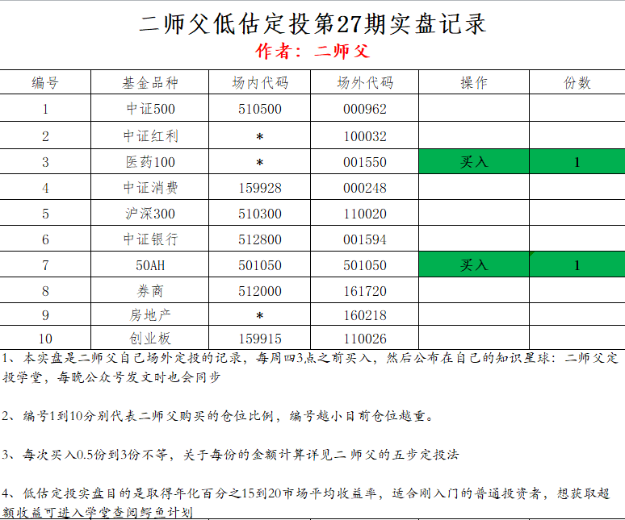

======================================================

_type: q&a
@TIME[51188125888554]
2019-01-11 13:47:21 Fri  
topic_id: 51448451551414

@TIME

>  二师父，st辉丰大跌，但是转债今天大涨，这是什么逻辑呢？前几天股涨债涨我理解，这一次股跌债涨我就不明白了，还望二师父明示！

@二师父

>  目前债券牛市，本来这只股票价值就不大，可转债一方面是股权，还有一方面有债性，不会完全同涨同跌

阅读[1380]  评论[0]  赞[0] 

======================================================

_type: talk
@健哥[51511242852814]
2019-01-11 20:01:57 Fri  
topic_id: 51448442482544

在华宝0.52时赎回一份，然后下降一些，没降到合理位置，也就没买，过几天又上升到0.52，这时需要再赎回一份，还是在上一级赎回？请教二师父

@二师父 at 2019-01-11 20:01:57 Fri

> 仓位不重的话不用赎回了，因为目前油气仍旧低估

----------

@海盗 at 2019-01-11 20:01:57 Fri

> 低估和网格交易相结合

----------

阅读[1246]  评论[2]  赞[0] 

======================================================

_type: talk
@二师父[28814221155551]
2019-01-12 03:56:28 Sat  
topic_id: 88441444185142

<e type="hashtag" hid="481211145528" title="#指数估值#" /> 目前黄金正常估值，300医药和医药100是大盘医药股和小盘医药股，是有区别的，最好都配置。

阅读[1858]  评论[0]  赞[0] 

+++++++++++++++++++++++++++++++++++++++++++++++++++++

图片：

======================================================

_type: talk
@二师父[28814221155551]
2019-01-12 03:57:14 Sat  
topic_id: 28441444188551

<e type="hashtag" hid="481144488858" title="#投资理念#" /> 如何做资产配置，希望对你有帮助

@好运玲玲 at 2019-01-12 03:57:14 Sat

> 非常赞同这样的投资理念，跟着二师父理财，稳妥。[强][强][强]

----------

@凭栏观海 at 2019-01-12 03:57:14 Sat

> 醍醐灌顶，茅塞顿开，恍然大悟

----------

阅读[2037]  评论[2]  赞[0] 

+++++++++++++++++++++++++++++++++++++++++++++++++++++

文件：
2019-01-12 03:56:59 Sat
文件大小：[1964496]
28842525122281-要想财务自由，先学习家庭资产配置.docx

======================================================

_type: talk
@飞的那个飞[48584811554158]
2019-01-12 18:00:54 Sat  
topic_id: 28441415111511

师傅民生银行保本理财！但是看不到他们是货币基金还是投资其它！这样的理财敢操作吗？？

@二师父 at 2019-01-12 18:00:54 Sat

> 银行的固定收益理财产品是可以买的，一般收益率也不会太高

----------

阅读[1191]  评论[1]  赞[0] 

======================================================

_type: talk
@二师父[28814221155551]
2019-01-12 22:39:35 Sat  
topic_id: 88441414454412

<e type="hashtag" hid="225255814551" title="#关于抄底#" /> 今天有读者问是否可以抄底，他想用信用卡借钱来买基金，怕错过行情，二师父是非常不建议的。因为目前是市场底部，可是问题在于你不知道大盘会趴多久，就用余钱投资，可以把余钱全部用来买指数基金，但是千万别贷款买基金。

有的读者问我是否有做线下巡回演讲的想法，目前还没有，希望5年之内有机会吧，其实高中最大的爱好就是演讲，梦想当演说家，可惜大学选专业没有找到这个专业，如果真的有机会的话，算是圆梦了。

@爱华 at 2019-01-12 22:39:35 Sat

> [玫瑰][玫瑰][抱拳]

----------

阅读[1943]  评论[1]  赞[0] 

+++++++++++++++++++++++++++++++++++++++++++++++++++++

文件：
2019-01-12 22:31:40 Sat
文件大小：[242174]
88842524885142-政策底已经确认，可以抄底吗？.docx

======================================================

_type: talk
@二师父[28814221155551]
2019-01-12 22:40:56 Sat  
topic_id: 48221212241848

这是均线偏离表，类似网格交易，我把网格交易自己的买入卖出点位公布在学堂置顶表格里面，大家参考设置底仓建立位置就行。

@活着，不易 at 2019-01-12 22:40:56 Sat

> 感谢二师父！

----------

@默 at 2019-01-12 22:40:56 Sat

> 太贴心了，非常需要。

----------

@生活、小船 at 2019-01-12 22:40:56 Sat

> 二师父，今天刚加入学习，看了之前的一些文章，收益良多。所以想开始跟着大家定投，关于建立底仓有点疑问。根据表格，我是否应该在-2偏离度的基金建立底仓？是在场内还是场外建立底仓，哪个更合适呢？

----------

@二师父 at 2019-01-12 22:40:56 Sat

> 医药ETF在低估和正常估值区域徘徊，可以建立底仓，华宝油气涨了不少了，而且是周期性较强，底仓不宜过重

----------

@二师父 at 2019-01-12 22:40:56 Sat

> 如果在7天内有卖出需求建议场内

----------

@生活、小船 at 2019-01-12 22:40:56 Sat

> 谢谢二师父解惑

----------

阅读[1358]  评论[6]  赞[0] 

+++++++++++++++++++++++++++++++++++++++++++++++++++++

图片：
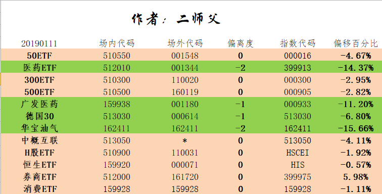

======================================================

_type: q&a
@笑拥Le monde[111141845114112]
2019-01-13 02:03:35 Sun  
topic_id: 48221211822588

@笑拥Le monde

>  二师父，富国中证500和景顺长城沪深300各浮亏十几个点，能否停止定投，改投500低波动和300价值。另外中概互联和H股指数现在适合定投吗

@二师父

>  可以停止，但是不要卖出，浮亏是正常的，我的500也是浮亏十几个点，300浮亏少点，如果换的话纯被动指数即可，这样费率更低
>  
>  中概互联可以定投，我的持仓成本是1.1，这个基金也很有价值，H股指数基金属于港股大蓝筹了，目前低估，不过警惕港股下跌风险就好，16年港股市盈率跌到过6倍

阅读[1353]  评论[0]  赞[0] 

======================================================

_type: talk
@二师父[28814221155551]
2019-01-13 21:54:02 Sun  
topic_id: 88441154182852

<e type="hashtag" hid="825255218512" title="#逆向思维#" /> 逆向思维是投资过程中非常重要的一种思维，行为金融学的观念就和逆向思维不谋而合，与大众选择反过来。

当你定投时间越久，你会发现，选择什么基金并不重要。如果对于新手，你不会选择，我就推荐中证500和沪深300基金坚持在这两个基金上定投，越跌越买，你基本能够战胜市场百分之80的投资者。很多人都坚持不下去的，要么下跌不敢加仓，要么稍有盈利就全部卖出了

最简单的事情往往是最重要的事情，可是很多人并不知道这个简单的道理。

@Zhu Yongsh* at 2019-01-13 21:54:02 Sun

> 价值买入，投机卖出

----------

阅读[1880]  评论[1]  赞[0] 

+++++++++++++++++++++++++++++++++++++++++++++++++++++

文件：
2019-01-13 21:50:43 Sun
文件大小：[383197]
28842524115241-如何利用逆向思维进行不同基金品种的配置.pdf

======================================================

_type: talk
@自由飞翔[544442815144244]
2019-01-13 22:43:41 Sun  
topic_id: 88441151888222

<e type="hashtag" hid="225255814551" title="#关于抄底#" /> 师傅，我现在仓位44%,这情况那还可以建些底仓哈[呲牙]

阅读[1162]  评论[0]  赞[0] 

======================================================

_type: talk
@二师父[28814221155551]
2019-01-14 02:34:35 Mon  
topic_id: 15118855454442

<e type="hashtag" hid="142511142112" title="#格局重塑#" /> 实现财务自由需要思维转变，通常一个职场人会有四种思维，打工思维，自由职业者思维，企业雇主思维，投资者思维，如果要实现财务自由必须拥有投资者思维，让金钱为你赚钱，打工者思维和投资者思维结合也能够实现财务自由，最佳的是企业雇主思维和投资者思维结合，或者自由职业者思维和投资者思维结合

无论你是雇员，拿企业固定工资的，还是自由职业者，自己工作的收入取决自己工作价值，还是企业老板，都要有投资思维，否则无法实现财务自由，有的人天生适合打工，有的人天生适合当老板，这个改变难度大

可是投资者思维一定具备，希望大家认真领会这里面的区别

阅读[1847]  评论[0]  赞[0] 

======================================================

_type: talk
@二师父[28814221155551]
2019-01-14 04:47:01 Mon  
topic_id: 15118855444422

你的顾问只能和你一样聪明。如果你不聪明，他们就无法告诉你太多；如果你已经掌握了财务知识，有能力的顾问就能向你提出更复杂的财务建议；如果你没有掌握财务知识，他们必须按照法律仅为你制定安全、没有风险的财务战略；如果你不是一个成熟的投资者，那么他们仅能建议低风险、低回报的投资，例如‘多元化投资’。没有哪个顾问会愿意花时间教你，因为他们的时间也是金钱。因此，如果你靠自己学到的财务知识管理你的钱，那么有能力的顾问就会告诉你只有少数人才会注意到的投资和策略。但是，你首先必须接受教育，做好自己那部分工作。永远记住，你的顾问只能和你一样聪明

@海盗 at 2019-01-14 04:47:01 Mon

> 有内涵

----------

@自由自在 at 2019-01-14 04:47:01 Mon

> 赞同[强]

----------

@凭栏观海 at 2019-01-14 04:47:01 Mon

> 这就是现实

----------

@凭栏观海 at 2019-01-14 04:47:01 Mon

> 这就是门当户对

----------

@王秦川 at 2019-01-14 04:47:01 Mon

> 赞同，但现实中往往是人都不能正常评估自己的估值[偷笑]

----------

阅读[1232]  评论[5]  赞[0] 

======================================================

_type: q&a
@寻道人[51452125525484]
2019-01-14 12:04:31 Mon  
topic_id: 48221188181818

@寻道人

>  二师傅，能不能点评一下512040国信价值这个基金。谢谢

@二师父

>  你这个代码是否正确，没搜到呢

阅读[1217]  评论[2]  赞[0] 

======================================================

_type: q&a
@20181108……[51511128814554]
2019-01-14 12:05:32 Mon  
topic_id: 48221188154818

@20181108……

>  二师父，医药ETF按照均线偏离是-2，都是估值表已经是正常估值了。这种情况怎么处理。

@二师父

>  如果仓位不重的话可以继续定投，目前是在低估和正常区域徘徊

阅读[1342]  评论[0]  赞[0] 

======================================================

_type: q&a
@凭栏观海[244414845852181]
2019-01-14 12:06:12 Mon  
topic_id: 88441182155242

@凭栏观海

>  恒生ETF以现在的估值，可以在场内购买吗？

@二师父

>  恒生国企可以，已经低估了，而恒生指数估值目前并不是特别低，建议再等等

阅读[1390]  评论[6]  赞[0] 

======================================================

_type: talk
@二师父[28814221155551]
2019-01-14 12:18:08 Mon  
topic_id: 28441184555811

<e type="hashtag" hid="881251425252" title="#鳄鱼计划#" /> 广发医药买入两份，已经跌下1元价格了，各种利空之下别人恐慌卖出，就是我进场的机会，这次和以前也没什么不同，切记。

@Yingshengw* at 2019-01-14 12:18:08 Mon

> 必须得加仓，今天加了医药ETF
和100

----------

@王秦川 at 2019-01-14 12:18:08 Mon

> 今天还可以买医药300吗

----------

@二师父 at 2019-01-14 12:18:08 Mon

> 可以的，目前是在正常和低估徘徊

----------

@王秦川 at 2019-01-14 12:18:08 Mon

> 是啊，医药是贯穿牛熊市，最近流感😷爆发，现在预防流感病毒的药紧缺，

----------

@二师父 at 2019-01-14 12:18:08 Mon

> 这是个好行业，目前是遭遇了很多方面利空消息

----------

@默 at 2019-01-14 12:18:08 Mon

> 二师父，请问广发医药和医药ETF是选择一只定投还是两个都选？

----------

@二师父 at 2019-01-14 12:18:08 Mon

> 广发医药是中小盘股医药股票，300医药是龙头医药股票，最好都配置一些

----------

@爱华 at 2019-01-14 12:18:08 Mon

> 今天买了广发和医药etf

----------

阅读[1463]  评论[13]  赞[0] 

======================================================

_type: q&a
@凭栏观海[244414845852181]
2019-01-14 16:52:17 Mon  
topic_id: 15118842515242

@凭栏观海

>  格力电器以现在的估值和股价，值得分批购买吗？

@二师父

>  股票基本面没问题，我是中期看20日均线买的，不逆向操作

阅读[1417]  评论[1]  赞[0] 

======================================================

_type: q&a
@涟012941[15458181812212]
2019-01-14 22:14:43 Mon  
topic_id: 28441128111141

@涟012941

>  请教二师父，中证银行场内512800成立至今好像没有分红，是不是这个基金本来就没有分红？

@二师父

>  有分红的，只有达到基金分红条件才会分红，etf基金都是现金分红

阅读[1344]  评论[0]  赞[0] 

======================================================

_type: q&a
@Yingshengw*[51452284525124]
2019-01-14 22:23:34 Mon  
topic_id: 88441122555882

@Yingshengw*

>  二师父，为什么从来没有人分析过深证100这个指数，这个指数的最大问题在哪里，谢谢你

@二师父

>  他的选股规则不够严格，比如无重大违规，经营无异常，无重大亏损，这些都是非常基本的条件啊

阅读[1396]  评论[0]  赞[1] 

======================================================

_type: talk
@二师父[28814221155551]
2019-01-14 23:07:01 Mon  
topic_id: 28441122481511

<e type="hashtag" hid="481211145528" title="#指数估值#" /> 指数估值来了，300医药重回低估，很多人说自己的消费盈利8个点，医药浮亏10个点，是不是医药不行了。要记住，行业有错杀的时候，不要忘记08年的奶制品行业，14年的白酒行业，行业危机就是给与我们机会，和市场大众反过来就行，没多少人敢逆势加仓，我们要做成功的少数。

估值区间也公布了，大家可以参考下。还有下面的两个指标，国债收益率和市盈率百分位也是一个参考指标，不要看掉了

@王秦川 at 2019-01-14 23:07:01 Mon

> 辛苦了[咖啡][咖啡][咖啡]

----------

阅读[2062]  评论[1]  赞[1] 

+++++++++++++++++++++++++++++++++++++++++++++++++++++

图片：

======================================================

_type: q&a
@笑拥Le monde[111141845114112]
2019-01-15 02:58:44 Tue  
topic_id: 422258582455458

@笑拥Le monde

>  二师父，均线定投级差怎么设置，如果资金允许，级差越大越好吗

@二师父

>  我是设置的6个百分点，比较保守，资金充裕的话，可以设置小一点的

阅读[1497]  评论[4]  赞[0] 

======================================================

_type: talk
@二师父[28814221155551]
2019-01-15 03:04:40 Tue  
topic_id: 244428284542451

<e type="hashtag" hid="881288554512" title="#基金分析#" /> 这两个都是医药基金，一个是大盘医药股票，一个是中小盘医药股票。

不建议500医药。对于不再估值表里面的基金请谨慎定投。另外，创业板，因为注册制和可创板的推动对他的影响会非常大，目前可以暂停定投了

@凭栏观海 at 2019-01-15 03:04:40 Tue

> 具体购买那个跟踪300医药的基金呢？

----------

@二师父 at 2019-01-15 03:04:40 Tue

> 估值表里面有啊

----------

阅读[2291]  评论[2]  赞[0] 

+++++++++++++++++++++++++++++++++++++++++++++++++++++

文件：
2019-01-15 03:02:36 Tue
文件大小：[275854]
15514215884182-300医药和医药100投资价值分析.docx

======================================================

_type: talk
@二师父[28814221155551]
2019-01-15 10:57:01 Tue  
topic_id: 844428281851422

<e type="hashtag" hid="142511181542" title="#周二荐书#" /> 邓普顿教你逆向投资，当市场持续低迷，投资者情绪悲观时候，我们需要进一步理解逆向思维，不要做大多数投资人正在做的事情

@凭栏观海 at 2019-01-15 10:57:01 Tue

> 逆向而动，无往不胜

----------

阅读[2066]  评论[1]  赞[0] 

======================================================

_type: talk
@拥抱太阳的风筝[48812454818528]
2019-01-15 17:44:52 Tue  
topic_id: 111145444188152

二师父，提个二师父网格交易记录表的问题，假定建立底仓的价格是p，那么买入第n档价位：p*(1-4％)^n，买出第n档价位：p*(1+4％)^n，对吗

@二师父 at 2019-01-15 17:44:52 Tue

> 第一档，乘以0.96，第二档，，乘以0.92

----------

@拥抱太阳的风筝 at 2019-01-15 17:44:52 Tue

> 买入：第一档，乘以0.96，第二档，乘以0.92，第三档，乘以0.88，第四档，乘以0.84，第五档，乘以0.80
卖出：第一档，乘以1.04，第二档，乘以1.08，第三档，乘以1.12，第四档，乘以1.16，第五档，乘以1.20
对吗?

----------

@二师父 at 2019-01-15 17:44:52 Tue

> 对

----------

阅读[1365]  评论[3]  赞[0] 

======================================================

_type: talk
@二师父[28814221155551]
2019-01-16 02:26:26 Wed  
topic_id: 844428248285282

<e type="hashtag" hid="881288554512" title="#基金分析#" /> 分析了两只港股大蓝筹。越来越多的读者开始打印二师父的文章学习，二师父现在写文文章都会再重新读一遍，把最有价值的留给大家。

二师父坚信，坚持做好一件小事，坚持10年以上都是了不起的成就。继续努力，大家可以多给身边的朋友传递定投的理念。

@Pacifica at 2019-01-16 02:26:26 Wed

> 我已经打印了厚厚一本了

----------

@二师父 at 2019-01-16 02:26:26 Wed

> 那我更得仔细点了

----------

@小牧童 at 2019-01-16 02:26:26 Wed

> 二师父，您好！几个问题1:万得全A历史市盈率走势图哪里能找到？2:50Ah比H股指数更低估，为什么场内考虑买？3:恒生国企和恒生指数市盈率走势图我在官网没找到，您是自己做的图吗？4:恒生国企成分股和50Ah成分股我查找的是两者除了平安其他没有重合的？请指教谢谢二师父！

----------

@二师父 at 2019-01-16 02:26:26 Wed

> 关于这个市盈率图的话都是我自己做的哈，网上就只有万得有了

另外这个为啥选择场内的h股etf呢，我是想在场内做网格，而场内的50ah是lof基金，我的场内都是etf基金，为了保持一致，所以呢我的场内就选择了h股etf基金，场外我仍旧投的50ah

对于你说只有一个重合的是不可能的哈，你在哪里查阅的，把持仓表发我看看，看是不是参考的指数不一样哈

----------

@小牧童 at 2019-01-16 02:26:26 Wed

> 二师父，这是50Ah成分股

----------

@二师父 at 2019-01-16 02:26:26 Wed

> 这是前10大重仓股，得看所有的持仓股票，我今天抽空再看看哈

----------

阅读[2101]  评论[6]  赞[0] 

+++++++++++++++++++++++++++++++++++++++++++++++++++++

文件：
2019-01-16 02:26:19 Wed
文件大小：[484149]
51145244444584-恒生指数和恒生国企指数投资价值分析.pdf

======================================================

_type: talk
@二师父[28814221155551]
2019-01-16 02:33:49 Wed  
topic_id: 111145415452142

<e type="hashtag" hid="481211145528" title="#指数估值#" /> 消费和300医药进入正常估值了，如果仓位比较重可以逐步按照五步定投法来收割利润了。尤其是消费基金，二师父盈利10个百分点了。

当低估的时候勇敢加仓，当盈利的时候记得收割利润，我们必定能够盈利。牛市来的时候再赚把大的，牛市不来的时候，吃点蚊子腿的肉也可以。

二师父做事，写文章都干净利落，不会有一个废字，请你仔细阅读，有读者之前怀疑二师父的网格交易法，我在学堂发布的都有记录，当日发布第二天就按照发布的价格建立了底仓，如果你按照二师父的建议来操作的话，现在已经可以收割一部分利润。

不要自己去探索，思而不学则殆，有怀疑的精神固然好，不过你得有逻辑的给推理出来，能够把我的理论推翻，我就会接受你的批评，也会感谢你，因为你让我避免了一次错误的投资。

二师父建议，如果你真的进了学堂，必然是认可二师父的，我觉得最好的方法就是你完全就听我的，尤其是你的意见和我的不一样的时候，这样事后再来思考为什么。

你的经验，思维，格局达不到，就会和我的思想有偏差的，富人和穷人的思想偏差就是在思维，这是我最近一个质的改变。

说了很多，有悟性的朋友估计才能够看懂。大家坚持定投把。

@凭栏观海 at 2019-01-16 02:33:49 Wed

> 的确如此

----------

@凭栏观海 at 2019-01-16 02:33:49 Wed

> 相信，照着做

----------

@自由飞翔 at 2019-01-16 02:33:49 Wed

> 师父，有几个问题请教：1.我昨天上午才买的300医药，那买入的价格是以前天收盘价为准还是昨天的收盘价为准？2.周一买的货基，可今天还未确认？上面写的是t+1呢，这种情况一般是什么原因？3.周四的定投日和扣款日，同样，基金价格是以当天还是前一天的收盘价为准？

----------

@二师父 at 2019-01-16 02:33:49 Wed

> 场内还是场外啊，场外就是收盘价格成交，蛋卷的问题你问下客服，正常情况是t加1日确认

----------

@自由飞翔 at 2019-01-16 02:33:49 Wed

> 场外，我在天天基金买的。那我再问下客服，谢谢🙏

----------

阅读[2098]  评论[5]  赞[0] 

+++++++++++++++++++++++++++++++++++++++++++++++++++++

图片：
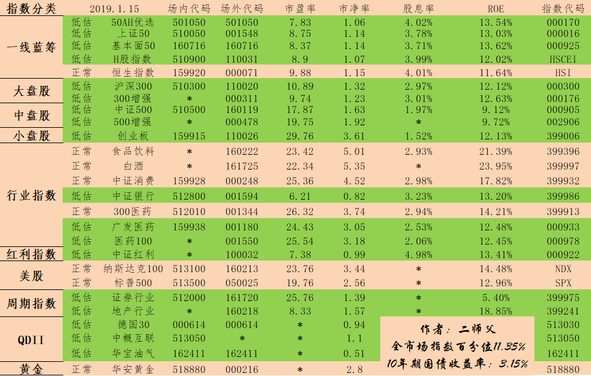
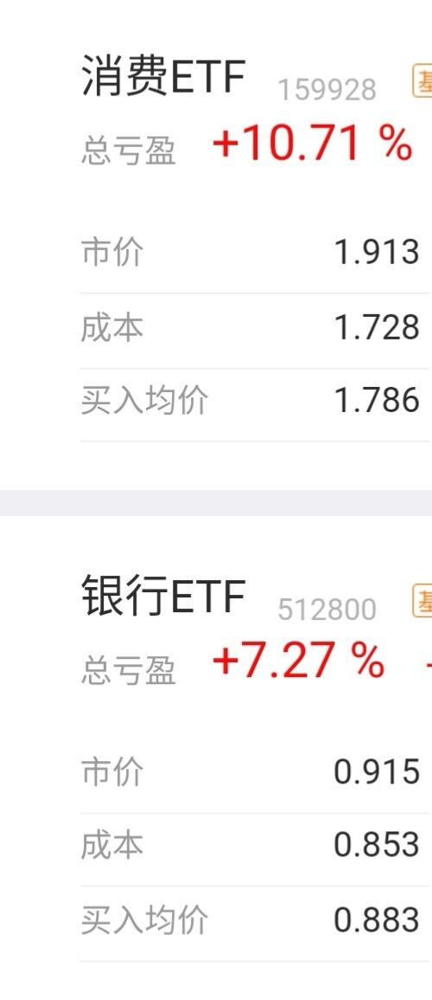

======================================================

_type: q&a
@凭栏观海[244414845852181]
2019-01-16 10:30:27 Wed  
topic_id: 544451545144444

@凭栏观海

>  目前可转债值得投资吗？

@二师父

>  值得投资，刚入门的话可以选择可转债基金进行投资

阅读[1385]  评论[0]  赞[0] 

======================================================

_type: talk
@二师父[28814221155551]
2019-01-16 10:44:20 Wed  
topic_id: 111145414414812

<e type="hashtag" hid="881251425252" title="#鳄鱼计划#" /> H股etf建立底仓，底仓价格1.127，仅为个人操作，不代表任何操作建议

@王秦川 at 2019-01-16 10:44:20 Wed

> 紧跟老师，场外50AH，对吧

----------

@自由自在 at 2019-01-16 10:44:20 Wed

> 王秦川，场外110031.二师父估值表中有

----------

@二师父 at 2019-01-16 10:44:20 Wed

> 对的

----------

@杜志彪 at 2019-01-16 10:44:20 Wed

> 我找到的159920和您的价格对不上。

----------

@二师父 at 2019-01-16 10:44:20 Wed

> 510900，你找的是恒生ETF

----------

@王秦川 at 2019-01-16 10:44:20 Wed

> 谢谢老师提醒，我以前定投的是501050

----------

@二师父 at 2019-01-16 10:44:20 Wed

> 这个也可以，场内场外都是这个代码，lof基金

----------

阅读[1407]  评论[7]  赞[0] 

======================================================

_type: q&a
@默[51552188528254]
2019-01-16 12:08:22 Wed  
topic_id: 111145411222222

@默

>  二师父，关于网格交易还是有些不明白的地方，请教您。建仓10份，上涨4%卖1.2份，再涨4%，卖1.4份…。下跌4%，买入1.2份，再跌4%，买入1.4份…。我想问一下网格交易是不是基本上不留底仓，上涨20%的时候已经卖了8份。另外，如果一直下跌，那就会一直加仓，不需要等到建仓时价格可能就已经产生盈利，该如何操作呢？

@二师父

>  网格交易适合震荡市场，如果单边上涨的话就持有，不要全卖了。
>  
>  另外如果在低估区域内一直加仓定投，会出现你说的那种情况，没到建仓价格就盈利了，也别卖，还是到对应价位卖出，因为本来就是低估区域以下买入的，价格太低卖出不划算

阅读[1403]  评论[5]  赞[0] 

======================================================

_type: q&a
@老丁[15541182455482]
2019-01-16 16:38:06 Wed  
topic_id: 844428215451182

@老丁

>  二师傅，想请教一些关于股指点数和股指PE的关系的问题。
>   
>  1、是不是可以简单理解股指点数是和股票价格成线性相关的？ 即：价格=点数*常量
>   
>  2、如果上面的假设成立，PE=P/E，而不论是动态市盈率，还是静态市盈率，E最少在一个季度内（动态算法），或者一年中（静态算法）应该是一个常量。那么 PE=点数*（常量/E）；而（常量/E）这个本身也是一个常量，那么我就推断出 PE 和 点数 应该是有接近线性关系的关系，不知道这个推论是不是正确？
>   
>  3、如果上面的推论是正确的，这个中证消费的PE和点数，应该是联动浮动呀，显然这个图上不是的，而且很多时候是返向相关，这个是什么原因呢？
>  
>  谢谢

@二师父

>  股票点数又叫做股票价格指数，这个是很多股票一起组成的，反应整体股票的涨跌情况，实际对应就是该股票指数的基金，基本是通涨同跌的
>  
>  第二个推论是建立在盈利稳定的品种上，如果盈利稳定的品种就可以有类似推论，对于周期指数是不对的
>  
>  这个上面没有反向相关呢，我看图是基本正相关的，当然你那个公式少了一个，应该是指数点数＝市盈率乘以盈利＋分红，分红情况会有变化的，一般pe越小，股息率越大，这是误差原因所在

阅读[1345]  评论[2]  赞[0] 

======================================================

_type: talk
@健哥[51511242852814]
2019-01-16 19:36:06 Wed  
topic_id: 244428218254421

二师父，你好！我是网格交易建立底仓10000股，每到一个节点加仓或赎回2000股，这样安排合理吗？

@二师父 at 2019-01-16 19:36:06 Wed

> 可以，如果发现行情是单边上涨就可以停止赎回了。

----------

阅读[1209]  评论[1]  赞[0] 

======================================================

_type: talk
@二师父[28814221155551]
2019-01-16 21:30:08 Wed  
topic_id: 111145485818552

<e type="hashtag" hid="454548854818" title="#二师父定投哲学#" /> 二师父定投哲学，我所有得操作都是基于定投哲学得。大家再实际得定投过程中也需要不断总结自己得交易系统和定投哲学。

@王秦川 at 2019-01-16 21:30:08 Wed

> 收藏了，慢慢理会，“因为投资到最后你会发现，你根本就不是和其他的股民在竞争，你需要克服的就是自己人性的弱点。谁若能够克服自己人性的弱点，那么他必将在股市大获全胜。”
谁若能够克服自己人性的弱点，那么他（她）的人生将会越来越精彩。

----------

@二师父 at 2019-01-16 21:30:08 Wed

> 👍👍👍👍

----------

@默 at 2019-01-16 21:30:08 Wed

> 二师父这个定投哲学，本人非常认同，一直到现在还在我的黑板上，一抬头就能看两眼。能再投资初期就有缘接触到二师父并受到影响，也是比较幸运的事情，可以少走很多弯路。

----------

阅读[2105]  评论[3]  赞[1] 

+++++++++++++++++++++++++++++++++++++++++++++++++++++

文件：
2019-01-16 21:28:38 Wed
文件大小：[40236]
88842518841212-二师父定投哲学(2019.1.16).docx

======================================================

_type: talk
@二师父[28814221155551]
2019-01-16 22:17:09 Wed  
topic_id: 844428212858282

<e type="hashtag" hid="481211145528" title="#指数估值#" /> 今日估值表出炉，最近大盘指数很魔性，一直在2500点徘徊，按兵不动，积累现金。明日场外定投，按照纪律操作就好。哪怕股市动荡，我们打造诺亚方舟，自岿然不动。XD全称是exclud dividend ，除去利息，表明改日是这个指数得除息日

@王秦川 at 2019-01-16 22:17:09 Wed

> 辛苦了[咖啡][咖啡][咖啡]
场外更需要耐心等待，更需要常看你的投资哲学，才能不成为韭菜，总是频繁的买进卖出。克服贪婪，克服快速发财的想法[微笑]

----------

阅读[2024]  评论[1]  赞[0] 

+++++++++++++++++++++++++++++++++++++++++++++++++++++

图片：

======================================================

_type: q&a
@凭栏观海[244414845852181]
2019-01-16 23:09:25 Wed  
topic_id: 844428212845122

@凭栏观海

>  激进账户里最看好贵州茅台、格力电器和云南白药，目前还没有下决心买那个？请老师指导一下

@二师父

>  股票我不推荐哈，我持仓目前有腾讯和平安，在买入之前先建立建议系统

阅读[1474]  评论[0]  赞[0] 

======================================================

_type: q&a
@.Five[15451258412542]
2019-01-17 09:15:42 Thu  
topic_id: 111145122242282

@.Five

>  二师父好~ 新人报道 不知二师父对目前的5g及工业互联网板块怎么看，这两个板块是否具有未来中长线投资的价值还是仅是昙花一现，在2500点上证的政策底确定的时候，此时进场买筹码是否是好的时机呢

@二师父

>  这个我是非常看好的，工业互联网是实现万物互联的新一代互联网革命，5G的推广和流行将网络不仅仅可以用于智能手机，还有运动手环以及很多人工智能设备，两者都会给未来的商业和社会带来巨大变化
>  
>  二师父投资哲学里面讲过，投资和宏观面关系不大，与预测未来经济走势和事物发展方向关系不大，所以如果涉及到投资股权，还得看具体企业的经营情况和财务指标
>  
>  自下而上的投资理念，希望你能够理解

阅读[1412]  评论[5]  赞[0] 

======================================================

_type: talk
@二师父[28814221155551]
2019-01-17 10:25:35 Thu  
topic_id: 844428455282442

<e type="hashtag" hid="881422852442" title="#定投实盘#" /> 这是二师父的定投实盘，今天抽了时间做了下表格，平时工作忙就可能没法做表格，以后没有公布表格，大家就参照表格里面的场外代码定投即可

里面的中概互联没有投资，场外正在认购，标普500也没有持仓，之前二师父定投的中证传媒已经不准备定投了，没有放进来，大家现在持有，后期卖出二师父会提示。

后面会逐步增加债券和可转债基金，我们的定投标的实现全球配置，最多不会超过20个。

今天买入的是基础配置，大盘不涨也不跌，实在是没啥机会，那就定投最基本的宽基指数，等待市场给我们的机会。

场外一折申购开户链接如下：<e type="web" href="https://danjuanapp.com/marketopenaccount?channel=1500012018" title="https://danjuanapp.com/marketopenaccount?channel=1..." />

@好运玲玲 at 2019-01-17 10:25:35 Thu

> 老师您好！场外除了您定投实盘里的医药100我定投了，场外还定投了医药300ETF和广发医药，可以吗？

----------

@二师父 at 2019-01-17 10:25:35 Thu

> 选择医药100和300医药两个就行，300医药目前正常估值，可以等等，这两个基金一个大盘，一个中小盘，可以分散配置，医药100和广发医药的持仓基本类似，选择一个就行啦

----------

@王秦川 at 2019-01-17 10:25:35 Thu

> 谢谢二师父。我平时工作忙，不懂，我相信术业有专攻，如果不是自己精通的行业，一旦认准，信任就是最好的选择。信任二师父，我有空也在重温你原来的文章，慢慢学习，争取能看懂你们的聊天内容。今天跟着定投

----------

@二师父 at 2019-01-17 10:25:35 Thu

> 是的，那些一直持有指数基金的人，赚的最多的不是钱，而是时间，是生活。——约翰·博格

----------

阅读[2139]  评论[4]  赞[0] 

+++++++++++++++++++++++++++++++++++++++++++++++++++++

图片：
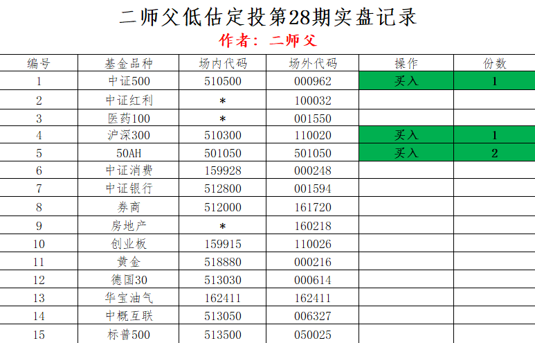

======================================================

_type: q&a
@凭栏观海[244414845852181]
2019-01-17 10:36:34 Thu  
topic_id: 111145122454242

@凭栏观海

>  可转债可以在场内购买吗？购买可转债是用资金购买一家公司的还是多购买几家公司的？老师可否推荐一下目前适合购买的可转债？谢谢

@二师父

>  可以啊，可转债就是场内购买，购买可转债相当于既购买了一家公司股权，又有债券保底，不过可转债有提前强制回售条款，所以不是很好把握，建议投资可转债基金，易方达安心回报债券或者兴全转债，后面我会写文章分享的

阅读[1518]  评论[8]  赞[0] 

======================================================

_type: q&a
@寻道人[51452125525484]
2019-01-17 11:18:46 Thu  
topic_id: 244428455482581

@寻道人

>  二师傅您好，您的估值表里，为什么看不到德国30，华宝油气，中概互联的ROE数值呀

@二师父

>  这种海外的QDII指数基金没法用ROE指标估值哈

阅读[1488]  评论[2]  赞[0] 

======================================================

_type: q&a
@老丁[15541182455482]
2019-01-17 11:33:30 Thu  
topic_id: 844428455428242

@老丁

>  你好，二师父，有个关于红利指数的问题想请教。看你之前的文章说过，红利业绩是 红利机会 > 红利低波动 > 中证红利。为什么在估计表里，还有你的实盘中，采用的是中证红利呢？谢谢。

@二师父

>  这个问题解释过，业绩看的是红利机会曾经的业绩，以前你看他的年化平均收益率是很好，因为大部分中盘股票，赶上了15年的红利增长期
>  
>  可是过去不能完全代表未来，我选择中证红利第一是因为现在估值低，第二是因为分红稳定，红利基金的投资逻辑也主要是看分红

阅读[1539]  评论[1]  赞[0] 

======================================================

_type: talk
@二师父[28814221155551]
2019-01-17 11:50:09 Thu  
topic_id: 244428455121281

<e type="hashtag" hid="552521145244" title="#关于国企指数和50ah成分股的问题#" /> 小牧童同学比较爱思考，提出了恒生中国企业指数成分股和50ah成分股没有大部分重合的问题。

二师父找出了两个指数的成分股持仓，大家看指数的成分股时候切记不要只看前10大重仓股，因为有的股票也有，只是持有比例不同的。

二师父对比了下，很多企业中国石油化工，中国中铁，中国石油股份，建设银行等许多企业都是相重合的，大家可以自己对比下，如果有问题可以提出来。

欢迎多讨论交流，有疑问直接把自己的想法发布到学堂，然后拿出证明材料。在学习的道路上犯错误是难免的，只要不断学习思考，我们的知识盲点就会越来越少，我们的投资就会越来越好，总之，别怕说错话，别怕犯错误，说错了想错了没关系，如果一直有问题不解决，用错误的投资理念指导自己投资那么是要亏钱的。

也请大家多批评指正二师父观点不够完善的地方，我们一起学习进步，共同成长。

@小牧童 at 2019-01-17 11:50:09 Thu

> 刚对比了一下，有20个是重合的，习惯看前十大重仓，谢谢二师父，让我改正了一个习惯[呲牙][呲牙][呲牙]

----------

@二师父 at 2019-01-17 11:50:09 Thu

> 不客气，多交流

----------

@静默 at 2019-01-17 11:50:09 Thu

> 从哪里能看基金包含哪些股票？谢谢

----------

阅读[2321]  评论[3]  赞[0] 

+++++++++++++++++++++++++++++++++++++++++++++++++++++

图片：
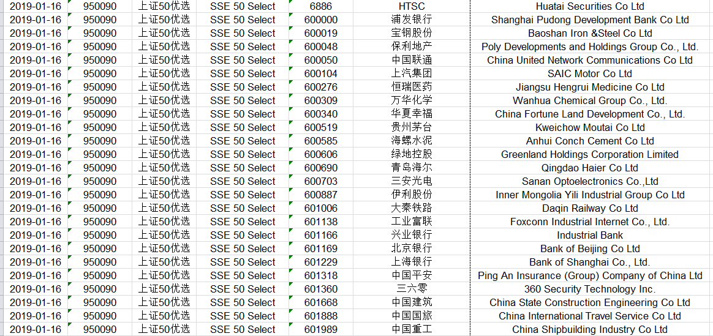
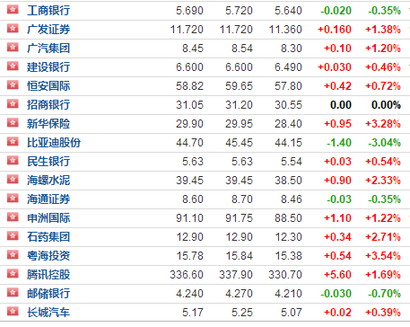
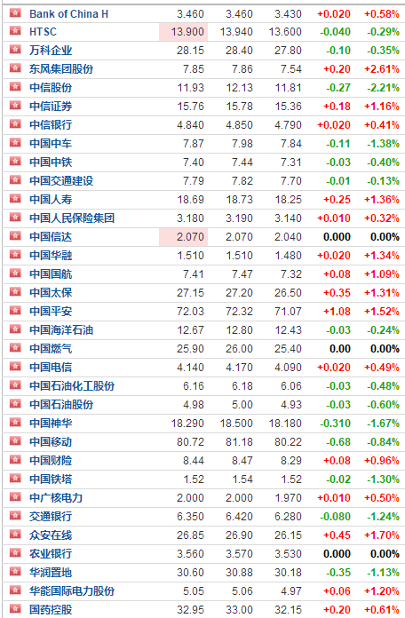
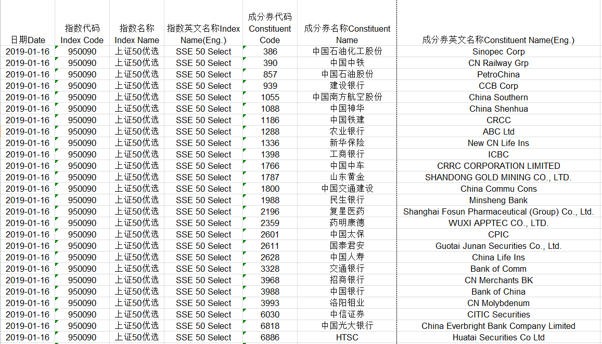

======================================================

_type: q&a
@凭栏观海[244414845852181]
2019-01-17 11:52:33 Thu  
topic_id: 111145122112582

@凭栏观海

>  请问老师，场内基金159954H股ETF和场内基金510900H股ETF如何选择？现在可以建底仓吗？我已经在场外定投了上证50ah,还有必要在场内建仓这两个H股ETF中的一个吗？

@二师父

>  这两个都可以定投，我选择的是恒生国企，其实50ah也行的，我就是为了保证持仓都是ETF基金，所以就选择了国企指数，选择一个建立底仓就行，如果已经定投了50ah并且仓位不轻就不用在场内买了

阅读[1700]  评论[1]  赞[0] 

======================================================

_type: talk
@老丁[15541182455482]
2019-01-17 19:00:26 Thu  
topic_id: 111145128422412

二师父，我想投中证消费，去查阅了一些历史数据，分别看了 全部，5年，和3年的20%分位值和PE的关系图。发现只有采用3年的数据时才有很短一段时间的低估，如果采用5年或更长时间的数据，这个指数已经很多年不低估了。所以我有几个问题想请教您一下

1、这个指数刚才成立之初有一段时间非常高的PE，而这阶段的PE 20%分位也线陡降的状态，后期就是比较平稳的直线。所以我分析，这些年少有低估机会，是不是因为有这段时期的存在？那么如果采用百分位估计的话，是不是要除去这段时期呢？

2、对于这种很难到历史20%分位的指数，是不是可以放宽低估的阈值呢？并且它进入低估时间很短，是不是可以采用，一低估大量采购的方式来收集份额？如果不这样，感觉很难有机会收集份额。

3、对于指数的估值，我看网上多数介绍都是用历史百分位数据来做相对位置的判断的。不知道这种方式是可靠性如何？是不是有更好的估值方式呢？

谢谢，期待您的回复

@二师父 at 2019-01-17 19:00:26 Thu

> 1，不建议百分位估值就是因为a股成立之初估值及其高，所以如果你要用这种方法那个阶段的是要去掉

2，不要改阈值，我们设定的安全边际就严格遵守，历史总是不断轮回，设定的原则就坚定去遵守，活下去比赚的多重要，如果你看好消费行业，可以买消费行业股票，做好止损，逆势加仓务必控制好安全边际

消费前段日子是进入低估了的，我买入了一些，如今盈利11个点，可以刚进入低估建底仓，这是没问题的

3好的估值方法就是格雷厄姆，这是最安全也是最保守的，建议你去看看1929年股灾，学会防范风险

----------

@老丁 at 2019-01-17 19:00:26 Thu

> 好的，谢谢二师傅

----------

@活着，不易 at 2019-01-17 19:00:26 Thu

> 这是用什么软件查的呢？

----------

@老丁 at 2019-01-17 19:00:26 Thu

> 理杏仁网站，二师父有推荐过

----------

阅读[1504]  评论[4]  赞[0] 

+++++++++++++++++++++++++++++++++++++++++++++++++++++

图片：
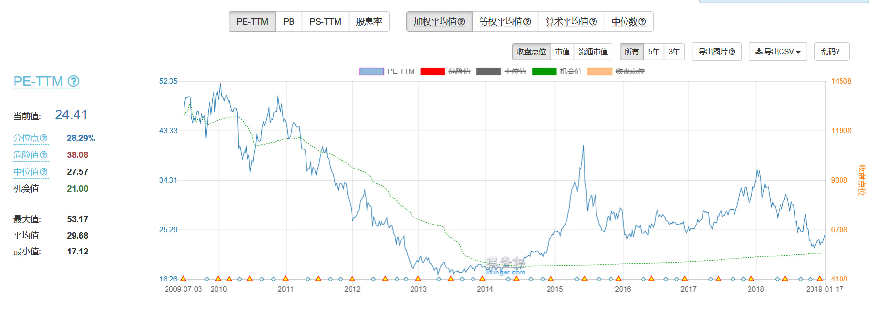
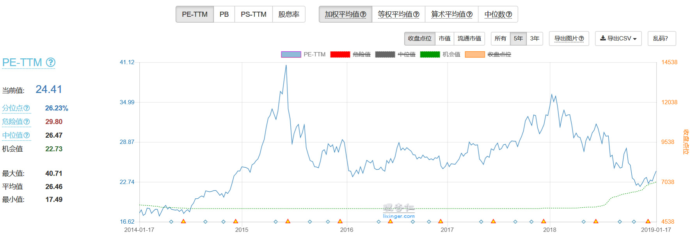
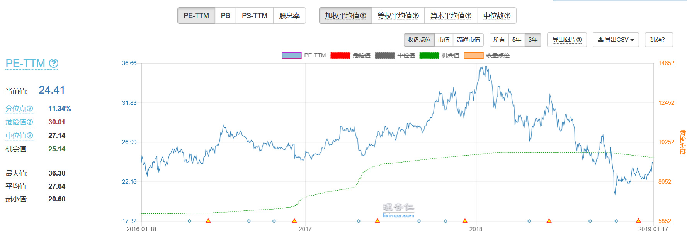

======================================================

_type: talk
@凭栏观海[244414845852181]
2019-01-17 19:48:01 Thu  
topic_id: 111145128122182

打卡:文革时代有一句话，叫做知识越多越反动。这个“反动”可以用老子《道德经》的话来解释，叫做“道者，反之动”，再套用投资哲学，就是逆大众情绪而动。所以，还是要多学习知识，才可以逆大众情绪而动。这就是知识越多越“反动“的无厘头的趣解。

@逍遥生 at 2019-01-17 19:48:01 Thu

> 知识学习多了就会对事物越来越了解，会让你判断更加正确。拿定投来说，有的人挣钱有的人不挣钱，原因可能很多。但是我觉得还是因为学习认识不够，对一些问题没有仔细去研究。懂了知识后再去选择判断会更好一些。

----------

阅读[1552]  评论[1]  赞[0] 

======================================================

_type: talk
@二师父[28814221155551]
2019-01-18 03:01:56 Fri  
topic_id: 244428488511551

<e type="hashtag" hid="481211145528" title="#指数估值#" /> 指数的估值最近变化不大，大盘一直在2500点附近，所以我们就耐心等待就好，做坚定的长期投资者。

约翰伯格大师去世了，他告诉我们长期持有指数基金赚取最多的不是收益，而是我们的时间和幸福生活

@凭栏观海 at 2019-01-18 03:01:56 Fri

> 最幸福的事，就是与指数基金慢慢变老，你涨你的，我长我的[呲牙]

----------

@凭栏观海 at 2019-01-18 03:01:56 Fri

> 最幸福的事，就是与指数基金一起慢慢变老，你涨你的，我长我的[呲牙]

----------

@Pacifica at 2019-01-18 03:01:56 Fri

> 说的真好！

----------

@勤能行之 at 2019-01-18 03:01:56 Fri

> 说的真好！

----------

@Phil at 2019-01-18 03:01:56 Fri

> 被动投资工具就像一台洗衣机，将人从繁复的投资工作解放出来

----------

阅读[2305]  评论[5]  赞[0] 

+++++++++++++++++++++++++++++++++++++++++++++++++++++

图片：
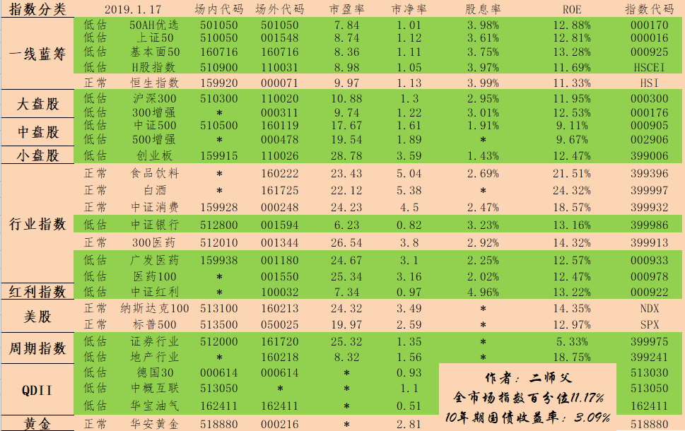

======================================================

_type: talk
@二师父[28814221155551]
2019-01-18 03:20:19 Fri  
topic_id: 844428488511252

<e type="hashtag" hid="225258244811" title="#股票投资系统#" /> 为新手打造了比较简略的五步交易法则，虽然不是特别的严谨，但是按照这个方法操作你会有章法，而且比较安全的。

阅读[2468]  评论[0]  赞[0] 

+++++++++++++++++++++++++++++++++++++++++++++++++++++

文件：
2019-01-18 03:13:37 Fri
文件大小：[727310]
88842514518512-二师父为股票新手打造的五步交易法.pdf

======================================================

_type: talk
@凭栏观海[244414845852181]
2019-01-18 10:28:05 Fri  
topic_id: 244428484412211

请问老师，易方达安心回报债券现在值得投资吗？一次性投资还是分批？

@二师父 at 2019-01-18 10:28:05 Fri

> 目前不适合了，等便宜了开始定投

----------

@凭栏观海 at 2019-01-18 10:28:05 Fri

> 谢谢老师指导

----------

@二师父 at 2019-01-18 10:28:05 Fri

> 不好意思，我之前看错基金了，易方达安心回报债券是可转债基金，目前可以定投的，更正一下哈

----------

@凭栏观海 at 2019-01-18 10:28:05 Fri

> 谢谢老师，辛苦啦

----------

阅读[1635]  评论[4]  赞[0] 

======================================================

_type: talk
@宁静致远[15455442225412]
2019-01-18 15:28:03 Fri  
topic_id: 111145142214182

请教二师父，我想在资产配置中加入一定比例的纯债券基金，希望是跟股票走势相关性比较低的，有人推荐华夏海外收益债和华夏亚债中国指数。目前适合买入吗？或者二师父有更好的品种，请指导一下。谢谢

@二师父 at 2019-01-18 15:28:03 Fri

> 债券基金目前都比较贵了，不建议定投，可以买可转债基金

----------

@宁静致远 at 2019-01-18 15:28:03 Fri

> 好的，学习了[抱拳]

----------

阅读[1546]  评论[2]  赞[0] 

======================================================

_type: talk
@二师父[28814221155551]
2019-01-18 16:34:53 Fri  
topic_id: 544451452528124

上交所发布：国债逆回购自1月21日起交易时间延长30分钟！即延长至15时30分闭市。投资者可在A股交易时段内专注于股票交易，在A股闭市后再将闲钱投入国债逆回购，互不干扰，轻松赚钱！

@J-YC at 2019-01-18 16:34:53 Fri

> 这是想看清楚我们能进入股市的到底有多少钱吗？

----------

@二师父 at 2019-01-18 16:34:53 Fri

> 啊哈

----------

@门萨🐨 at 2019-01-18 16:34:53 Fri

> 细思极恐

----------

阅读[1641]  评论[3]  赞[0] 

======================================================

_type: talk
@二师父[28814221155551]
2019-01-18 18:55:30 Fri  
topic_id: 422258255285228

课程更新到8.2节了，预计年底可以更新完毕，大家听了之后有问题，不清楚给我反馈，我会重新录制，课程ppt稍后也会发到答疑群里

@土木工程部 at 2019-01-18 18:55:30 Fri

> 是什么课程，在哪里

----------

@二师父 at 2019-01-18 18:55:30 Fri

> 置顶文章有介绍

----------

阅读[1672]  评论[2]  赞[0] 

======================================================

_type: talk
@凭栏观海[244414845852181]
2019-01-18 20:22:49 Fri  
topic_id: 544451455844214

打卡:一，目前我持有的基金如下:50AH,景顺长城沪深300增强，建信中证500增强，中证红利，红利机会，中证医药100。二，今天阅读刘诚的《投资要义》，很认同书里面的投资理念。即:在系统性机会的前提下，低估值+分散化+长期坚持。与二师傅的投资理念很是相通。

@一位农民兄弟 at 2019-01-18 20:22:49 Fri

> 现在刘诚老师认为A股的转债更具有投资价值

----------

阅读[1656]  评论[1]  赞[0] 

======================================================

_type: talk
@二师父[28814221155551]
2019-01-18 22:27:24 Fri  
topic_id: 422258252582118

<e type="hashtag" hid="481211145528" title="#指数估值#" /> 估值表来啦，沪深300进入正常估值，停止投资，可以开始收割利润。另外说下关于纯债基金投资，二师父是当10年期国债收益率高于3.8个百分点以上开始定投。目前适合卖出纯债基金。

消费和300医药估值都进入正常啦，定投一定要按照纪律，进入正常估值就停止定投

@拥抱太阳的风筝 at 2019-01-18 22:27:24 Fri

> 我的定投曰是每周五，18号已停止定投000248

----------

@TIME at 2019-01-18 22:27:24 Fri

> 这么快就不投降，感觉刚要涨，要不要锁仓啊二师父

----------

@二师父 at 2019-01-18 22:27:24 Fri

> 按照纪律收割利润，之前咱们已经定投很多了

----------

阅读[2417]  评论[3]  赞[0] 

+++++++++++++++++++++++++++++++++++++++++++++++++++++

图片：
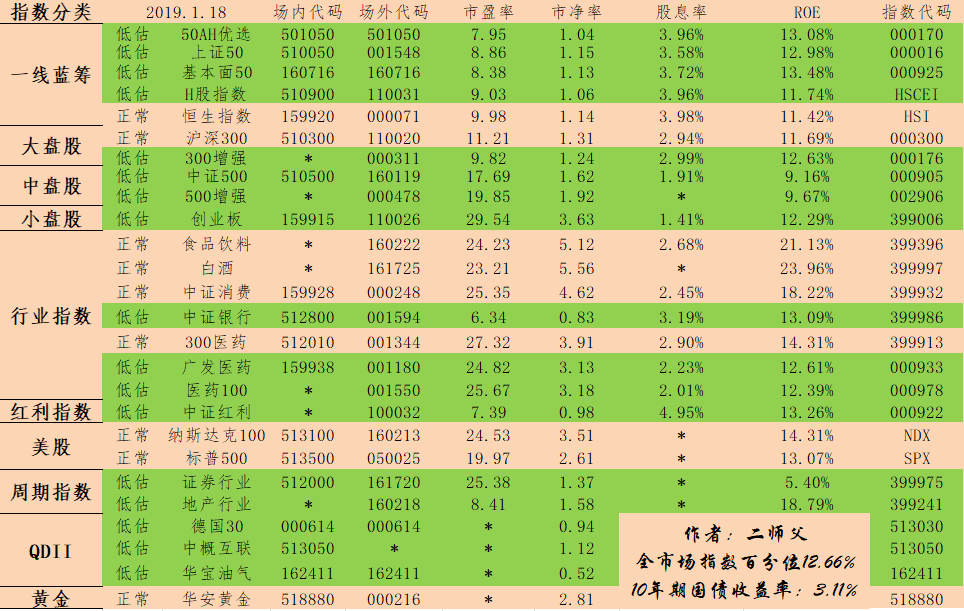

======================================================

_type: talk
@二师父[28814221155551]
2019-01-18 22:45:25 Fri  
topic_id: 422258252528128

<e type="hashtag" hid="281184881481" title="#卖出策略#" /> 运用恰当的卖出策略来获利，利润收割了解下

@王秦川 at 2019-01-18 22:45:25 Fri

> 二师父真是我们的好老师[咖啡][咖啡][咖啡]

----------

@拥抱太阳的风筝 at 2019-01-18 22:45:25 Fri

> 二师父，用我的情况做实例，讲讲具体怎么操作，光看文字说明，还是一头雾水。

----------

@拥抱太阳的风筝 at 2019-01-18 22:45:25 Fri

> 

----------

@拥抱太阳的风筝 at 2019-01-18 22:45:25 Fri

> 感觉在进入正常估值停止定投后，持仓成本应该不会变化，变化的应该是每天的基金净值，请二师父指正

----------

@啊哦呃伊唔คิดถ* at 2019-01-18 22:45:25 Fri

> 上午在群里讨论过，这是我的逻辑计算过程

----------

阅读[2647]  评论[5]  赞[0] 

+++++++++++++++++++++++++++++++++++++++++++++++++++++

文件：
2019-01-18 22:45:20 Fri
文件大小：[169094]
48825844241888-消费指数连涨10个点，你卖出了吗.docx

======================================================

_type: talk
@健哥[51511242852814]
2019-01-19 12:36:54 Sat  
topic_id: 422258228124228

师父，你好！现在平安59.92的价格适合买入吗？只是小量买入。

@二师父 at 2019-01-19 12:36:54 Sat

> 股票买入看均线，长期超20日均线可以，设定10个点止损位，我持有的有部分

----------

阅读[1596]  评论[1]  赞[0] 

======================================================

_type: talk
@二师父[28814221155551]
2019-01-20 04:04:52 Sun  
topic_id: 244428418821241

<e type="hashtag" hid="454841141288" title="#均线偏离表#" />

@20181108…… at 2019-01-20 04:04:52 Sun

> 师父你这个表是按照指数计算还是单个基金计算的

----------

@海盗 at 2019-01-20 04:04:52 Sun

> 单个基金净值和90日均线比值

----------

@20181108…… at 2019-01-20 04:04:52 Sun

> 谢谢

----------

@20181108…… at 2019-01-20 04:04:52 Sun

> 50ETF场内代码

----------

@海盗 at 2019-01-20 04:04:52 Sun

> 表里的场内代码有一点失误，510050是50etf的场内代码

----------

@victoria at 2019-01-20 04:04:52 Sun

> 二师父偏离越大的是越有投资价值的吗

----------

@victoria at 2019-01-20 04:04:52 Sun

> 关于均线偏离的文章从哪篇可以看到，我不太懂

----------

@二师父 at 2019-01-20 04:04:52 Sun

> 在低估区域内，偏离度越大越有投资价值，这个类似于网格交易，你搜索均线，或者网格，以前就有文章啦

----------

阅读[2355]  评论[8]  赞[0] 

+++++++++++++++++++++++++++++++++++++++++++++++++++++

图片：
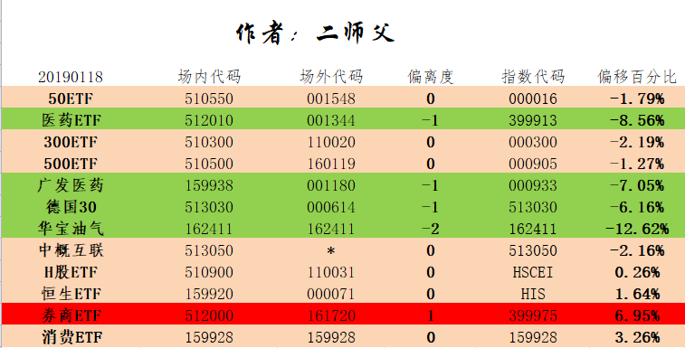

======================================================

_type: talk
@二师父[28814221155551]
2019-01-20 04:06:17 Sun  
topic_id: 844428418821452

<e type="hashtag" hid="825258185542" title="#投资大师#" />

@王秦川 at 2019-01-20 04:06:17 Sun

> 传承精神，学会变通。致敬大师

----------

阅读[2554]  评论[1]  赞[0] 

+++++++++++++++++++++++++++++++++++++++++++++++++++++

文件：
2019-01-20 04:06:07 Sun
文件大小：[169668]
48825848284548-指数基金之父辞世，他给后人留下哪些财富.docx

======================================================

_type: talk
@二师父[28814221155551]
2019-01-21 02:43:03 Mon  
topic_id: 544455221888824

<e type="hashtag" hid="142425814852" title="#定投风险#" /> 基金定投的风险先了解下，然后再开始定投

阅读[2468]  评论[0]  赞[0] 

+++++++++++++++++++++++++++++++++++++++++++++++++++++

文件：
2019-01-21 02:42:25 Mon
文件大小：[25643]
88842852211212-基金定投的风险1.20.docx

======================================================

_type: talk
@二师父[28814221155551]
2019-01-21 09:14:59 Mon  
topic_id: 844422551522452

<e type="hashtag" hid="142511142112" title="#格局重塑#" /> 海纳百川，有容乃大。现实社会中，我们往往遇到很多黑暗的东西与自己纯真的理想不符合。

这时候该怎么办，要么同流合污，要么格格不入。这是黑白思维。

我们可以建立一层保护层，理想的心灵外面是痞里痞气，邪恶的，坏坏的，幽默的，知识渊博的，反应灵敏的，应对黑暗的壳子

有人说，这样不就是两面人吗。

非也，就像大树想要向更光明的高处生长，那么他的根系必须向更黑暗的地底扎根，只有这样才能成长。

作为我们想要融入社会成长而不会同流和污，这是好方法，别人不会认为你清高，你也仍旧有自己的理想，只是在心里，这才是大智慧

否则，你为了正义，说一堆，别人肯定说你装，内心有正义，从举手投足散发的气质看出来，与表面的言语等没有关系，伪君子的话往往都是好听的

阅读[2372]  评论[0]  赞[0] 

======================================================

_type: talk
@二师父[28814221155551]
2019-01-21 09:32:46 Mon  
topic_id: 111144228282522

华宝油气，医药，消费盈利了，网格交易记得卖出一份，以后不再提醒，大家按照表格操作

阅读[1546]  评论[0]  赞[0] 

======================================================

_type: q&a
@xazzen健辉[51452125142254]
2019-01-21 13:39:13 Mon  
topic_id: 111144252288112

@xazzen健辉

>  二师父好~，请问指数基金经理调仓换股具体系点操作呢？基金经理是指数成份股换了后下一工作日马上无脑买，还是会择日择时机换呢？

@二师父

>  这个是基金公告里面有发文公布调仓时间的

阅读[1464]  评论[0]  赞[0] 

======================================================

_type: q&a
@王秦川[844151411882412]
2019-01-21 13:39:48 Mon  
topic_id: 244422585258511

@王秦川

>  你好，二师父，场外卖出基金的净值是当天收盘的净值吗？

@二师父

>  如果是交易日三点之前场外卖出那么净值是当天收盘价格

阅读[1610]  评论[0]  赞[0] 

======================================================

_type: q&a
@健哥[51511242852814]
2019-01-21 23:05:49 Mon  
topic_id: 844422584144852

@健哥

>  请教一下师父，518880黄金ETF在什么价格买入比较合适呢？

@二师父

>  看估值表有，现在不适合，之前高估我都卖出一部分啦

阅读[1477]  评论[1]  赞[0] 

======================================================

_type: talk
@二师父[28814221155551]
2019-01-22 04:13:27 Tue  
topic_id: 422255454848128

<e type="hashtag" hid="552145455184" title="#可转债#" />

@寻道人 at 2019-01-22 04:13:27 Tue

> 请问二师傅，你推荐的2个转债基金代码是多少啊

----------

@二师父 at 2019-01-22 04:13:27 Tue

> 110027，易方达安心回报债券

----------

@西锦巴乌 at 2019-01-22 04:13:27 Tue

> 易方达安心110027、兴全可转债340001

----------

@寻道人 at 2019-01-22 04:13:27 Tue

> 谢谢

----------

@梧桐花语 at 2019-01-22 04:13:27 Tue

> 兴全可转债基金不是原来的杨云经理了，换了新经理表现一般，长信可转债偏小盘配置，基金经理2014年开始任职。

----------

@小溪医生 at 2019-01-22 04:13:27 Tue

> 买可转债基金就不用担心被强制赎回了吧

----------

@二师父 at 2019-01-22 04:13:27 Tue

> 这个是不用担心的

----------

@olivia 刘_2* at 2019-01-22 04:13:27 Tue

> 请问在哪里能看到“大部分可转债价格低于100或者接近130.？ 多谢🙏

----------

阅读[2474]  评论[11]  赞[0] 

+++++++++++++++++++++++++++++++++++++++++++++++++++++

文件：
2019-01-22 04:13:14 Tue
文件大小：[169188]
28842885248421-可转债你知道如何投资吗.docx

======================================================

_type: talk
@二师父[28814221155551]
2019-01-22 04:13:57 Tue  
topic_id: 844422525858142

<e type="hashtag" hid="481211145528" title="#指数估值#" />

@乡下人 at 2019-01-22 04:13:57 Tue

> 师傅你好，股票账户在哪开啊？怎么开？

----------

@二师父 at 2019-01-22 04:13:57 Tue

> 置顶文章有福利开户二维码

----------

@小溪医生 at 2019-01-22 04:13:57 Tue

> 二师父，没买过定投，这周可以开始定投吗？

----------

@二师父 at 2019-01-22 04:13:57 Tue

> 可以的，买估值表里面低估的品种，买入之前把我的五步定投法看一下

----------

@小溪医生 at 2019-01-22 04:13:57 Tue

> 好的，五步定投法已经学习几遍了，打算这周开始跟着您定投，结合你以前对新手的建议，从000478和000311开始定投行吗？

----------

@二师父 at 2019-01-22 04:13:57 Tue

> 建议中证500，纯被动指数

----------

阅读[2406]  评论[6]  赞[0] 

+++++++++++++++++++++++++++++++++++++++++++++++++++++

图片：

======================================================

_type: talk
@hdmw99[28824141882541]
2019-01-22 10:26:46 Tue  
topic_id: 844422522418552

二师傅您好。请教您关于利润收割的问题，在实操中，我遇到如下情况：

比如券商ETF，当前为估值正常（或正偏离），我在定投日卖掉了盈利的部分。但股票交易软件，会自动调减其持仓成本，则卖出后，还显示有利润。

到了下一个定投日，假如股价未变，我无法看出 “是否该继续卖出？”（按理说：已不需要再次卖出了，但交易软件还显示有利润），该如何解？

@Shitou_li at 2019-01-22 10:26:46 Tue

> 同样有这个疑问请教二师父

----------

@有你真好 at 2019-01-22 10:26:46 Tue

> 自己做个表格记录每次交易时间，价格和数量

----------

@二师父 at 2019-01-22 10:26:46 Tue

> 记录你每次买入价格，不要看利润，根据市场价格买入卖出

----------

@自由飞翔 at 2019-01-22 10:26:46 Tue

> 同样有这个疑问，谢谢

----------

@小牧童 at 2019-01-22 10:26:46 Tue

> 二师父，我也看不懂，就是以后每次收割的10%不知道怎么参考！谢谢！

----------

@二师父 at 2019-01-22 10:26:46 Tue

> 网格交易是独立于五步定投法之外的，不用利润收割，浮盈直接卖出一份即可

----------

@老丁 at 2019-01-22 10:26:46 Tue

> 这个一份，是按照价值理解的一份呢？还是按照份额理解的一份？比如之前 是 100快买入100个份额，现在涨到150块，但是份额还是100个，是卖出100快（以之前的购买总价计算），还是卖出150块（以之前的购买份额计算）？谢谢

----------

@二师父 at 2019-01-22 10:26:46 Tue

> 关于份数份确定，在五步定投法讲过了

----------

阅读[1479]  评论[8]  赞[0] 

======================================================

_type: talk
@西锦巴乌[88448285428482]
2019-01-22 11:28:53 Tue  
topic_id: 111144241251222

<e type="hashtag" hid="552145455184" title="#可转债#" /> 师父好！上午比较了两只债券基金觉得还是易方达较合适但不知现在购买是否合时？是釆取一次性购买还是分次？谢谢

@凭栏观海 at 2019-01-22 11:28:53 Tue

> 我刚刚买了易方达安心回报，是一次性买的

----------

@杜志彪 at 2019-01-22 11:28:53 Tue

> 这个市场外的吧

----------

@杜志彪 at 2019-01-22 11:28:53 Tue

> 刚在蛋卷里搜了一下，出了一个A，一个B，是选A对吧。这个在场内能买吗？

----------

@梧桐花语 at 2019-01-22 11:28:53 Tue

> 易方达安心回报是可转债基金，不是纯债券基金。

----------

@西锦巴乌 at 2019-01-22 11:28:53 Tue

> 股票占15%左右、现金3%左右

----------

@西锦巴乌 at 2019-01-22 11:28:53 Tue

> 股票基本上是蓝筹股

----------

@二师父 at 2019-01-22 11:28:53 Tue

> 可转债基金可以买，债券基金目前不合适，不要购买

----------

阅读[1484]  评论[7]  赞[0] 

======================================================

_type: talk
@二师父[28814221155551]
2019-01-22 13:10:15 Tue  
topic_id: 111144241414822

<e type="hashtag" hid="142511181542" title="#周二荐书#" /> 本次推一个视频，曾仕强教授的易经的智慧，真的蕴含无穷的智慧

阅读[1551]  评论[0]  赞[0] 

======================================================

_type: q&a
@凌燕[51442188414844]
2019-01-22 19:31:27 Tue  
topic_id: 844422521484282

@凌燕

>  二师父，我定投了半年的一支主动型基金，因为换基金经理了，业绩不太好，暂停定投。目前净值0.86，想用网格交易法定投，不知从何下手，怎样估算每份购买价格?怎样计算加仓系数?怎样安排网格?

@二师父

>  是这样的哈，不管是我们网格交易法还是低估定投策略，都不适合选择主动基金作为定投标的
>  
>  当前市场情况建议中证500很适合作为网格交易的标的，就用当前中证500的价格作为底仓建立价格，不用设置加仓系数，建立底仓以后，中证500每下跌4个百分点买入一份，每上涨4个百分点卖出一份

阅读[1502]  评论[3]  赞[0] 

======================================================

_type: q&a
@蔡蔡蔡[15442451484542]
2019-01-22 20:17:27 Tue  
topic_id: 244422521128181

@蔡蔡蔡

>  二师父。如何系统的看财务报表啊

@二师父

>  主要是三大表，利润表，资产负债表，现金流量表，需要找到营业收入，利润，经营模式，商业模式，是否有造假，重点关注利润增长率，营业收入是否可持续

阅读[1545]  评论[3]  赞[0] 

======================================================

_type: talk
@二师父[28814221155551]
2019-01-22 22:13:45 Tue  
topic_id: 111144214512122

<e type="hashtag" hid="142424582412" title="#财报网站#" /> 财报说|企业财务报告数据分析网- eGouz上网导航  <e type="web" href="https://www.egouz.com/topics/18642.html" title="财报说|企业财务报告数据分析网-+eGouz上网导航" cache="" />，通过这个网站学习财报知识是非常不错的，给大家分享，你们有好的资源也可以分享给大家啊，书籍的话都写的晦涩，估计不适合新手，等二师父忙完了自己的基金定投相关内容后再写写阅读财报的文章，一步步来，先通过基金定投打好基础，这样后面进步才快的

阅读[1519]  评论[0]  赞[0] 

======================================================

_type: talk
@二师父[28814221155551]
2019-01-23 04:19:16 Wed  
topic_id: 422255422824288

<e type="hashtag" hid="481211145528" title="#指数估值#" />

@海盗 at 2019-01-23 04:19:16 Wed

> 二师父辛苦了

----------

@生活、小船 at 2019-01-23 04:19:16 Wed

> 二师父，我看创业板昨天降了，现在是不是可以建创业板底仓了呢？

----------

@二师父 at 2019-01-23 04:19:16 Wed

> 创业板轻仓定投即可，不用建底仓，也不用重仓

----------

@生活、小船 at 2019-01-23 04:19:16 Wed

> 那需要建底仓的一般是大盘和蓝筹还有严重低估的基金么？

----------

@二师父 at 2019-01-23 04:19:16 Wed

> 对的

----------

@生活、小船 at 2019-01-23 04:19:16 Wed

> 好的，谢谢二师父指点[抱拳]

----------

阅读[2333]  评论[6]  赞[0] 

+++++++++++++++++++++++++++++++++++++++++++++++++++++

图片：

======================================================

_type: talk
@二师父[28814221155551]
2019-01-23 04:20:55 Wed  
topic_id: 844422544845422

阅读[2581]  评论[0]  赞[0] 

+++++++++++++++++++++++++++++++++++++++++++++++++++++

文件：
2019-01-23 04:19:59 Wed
文件大小：[47524]
15514555855482-上证50AH优选指数投资价值分析.docx

======================================================

_type: talk
@Eric[48548828828848]
2019-01-23 10:06:43 Wed  
topic_id: 844422541545452

请问，现阶段债券基金相比于货币基金，是不是更有优势？

@二师父 at 2019-01-23 10:06:43 Wed

> 债券基金目前比较贵了，不适合定投

----------

阅读[1511]  评论[1]  赞[0] 

======================================================

_type: talk
@老丁[15541182455482]
2019-01-23 13:13:38 Wed  
topic_id: 111144285155252

你好，二师父，关于医药100有问题想请教。

1、医药100是等权加权的，那么我们参考PE的数据是不是应该以等权平均值去参考呢？之前问过一些朋友，他们说参考加权值，我赶脚比较奇怪，所以请教一下。

2、图片为医药100的等权PE图，如图显示最近PE已经创造历史新低，假设这个图是正确的（先不讨论是不是应该看等权PE图）。那么对于这种PE在创造新低的指数，原有的PE低估阈值是不是还有效？还是应该重新设置阈值呢？

3、我假设一种极端情况 PE 一直创造新低很长一段时间才触底，我们买的是相对于历史中的低位，但是如果这种假设成立，历史低位的数据不断被改写，那么我们现在买的份额，不会不买贵呢？没有没什么其他方式可以辅助估值呢？

4、最后想了解一下指数的低估阈值是怎么样确定的？目前我了解到的大多数方式都是参考历史数据，大致预估低估阈值的方法。但是对于上面举例的那种，历史被改写的指数，没有没有什么办法可以通过定量计算出来呢？如果要学习阈值的计算方法，没有没什么理论，或书籍推荐呢？谢谢

@二师父 at 2019-01-23 13:13:38 Wed

> 参考加权，你是等权指数，只是权重一样，仍旧是加权平均

不用重新设置，历史大底会有被突破的可能，我们设置的时候已经考虑了

不会买贵，因为还有赚企业成长的钱，唯一的风险是企业的增长变慢，还有roe估值，因为这衡量的是企业盈利

----------

@老丁 at 2019-01-23 13:13:38 Wed

> 你好，二师父，感谢你的回复，能不能讲一下ROE估值具体是怎么样看的呢？另外我下午查了一下，最近中证500的PE是刷新了历史新低的，请看这个截图，我是采用越低估越投的方式，所以最近这个指数都在加倍投，但是如果这种创新低的时间很长（比如1年以上，2倍投入），资金会有点跟不上。所以就想了解下，这种创新低的状态一般会持续多久呢？是不是要降低每期的投入数额（比如就是正常的1倍投入），让资金能持续更长时间？谢谢

----------

@海盗 at 2019-01-23 13:13:38 Wed

> 能说一下这是哪个网站的数据吗？收费不？

----------

@二师父 at 2019-01-23 13:13:38 Wed

> 中证500确实创了新低，因为科创板的落实，后面中小板的价值会越来越低，所以为了防止长期浮亏，我场内做网格，roe是衡量企业盈利的指标，roe越大，企业盈利越好

----------

@老丁 at 2019-01-23 13:13:38 Wed

> 理杏仁网站，是有收费的，但是很便宜

----------

@海盗 at 2019-01-23 13:13:38 Wed

> 谢谢老丁，一直以来都是看二师父的估值表。

----------

阅读[1573]  评论[6]  赞[0] 

+++++++++++++++++++++++++++++++++++++++++++++++++++++

图片：
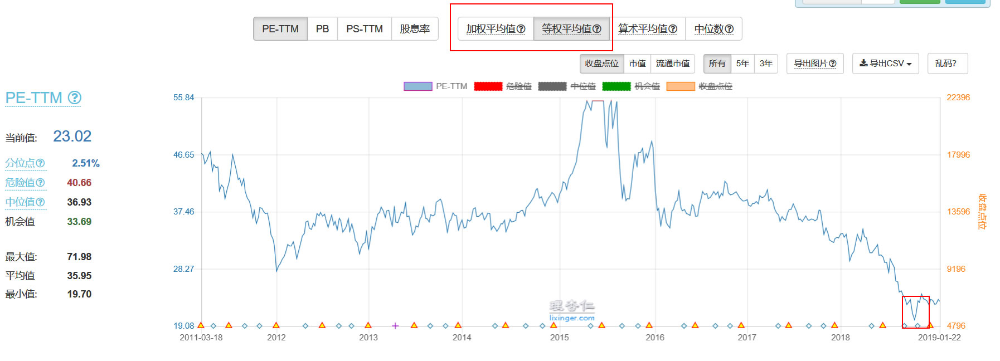

======================================================

_type: q&a
@超级奶爸[48528544118258]
2019-01-23 21:47:32 Wed  
topic_id: 422255844822888

@超级奶爸

>  二师父，指数估值曲线图中的突变是何种原因造成的，会对收益产生何种影响

@二师父

>  这个基金估值不一定准

阅读[1587]  评论[2]  赞[0] 

======================================================

_type: talk
@二师父[28814221155551]
2019-01-24 04:07:58 Thu  
topic_id: 111144525458482

阅读[2359]  评论[0]  赞[0] 

+++++++++++++++++++++++++++++++++++++++++++++++++++++

图片：
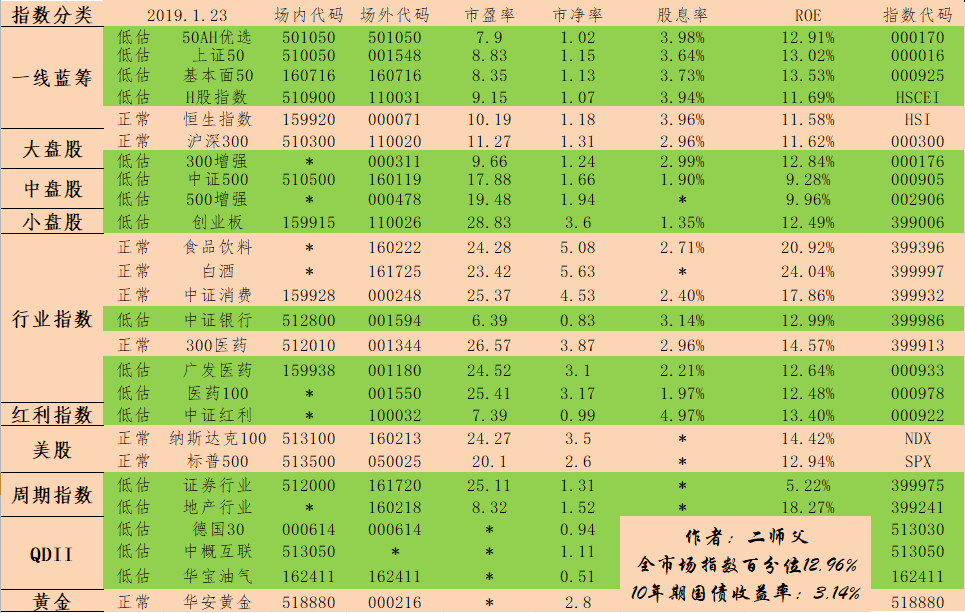

======================================================

_type: talk
@二师父[28814221155551]
2019-01-24 04:08:38 Thu  
topic_id: 422255848581518

@海盗 at 2019-01-24 04:08:38 Thu

> 写的很贴切，能进一步理解网络交易。

----------

@拥抱太阳的风筝 at 2019-01-24 04:08:38 Thu

> 1月23日，券商ETF收盘价是0.736，适合建立底仓吗

----------

@拥抱太阳的风筝 at 2019-01-24 04:08:38 Thu

> 二师父，以券商ETF为例，从刚开始低估到再下跌百分之十五，刚开始低估和再下跌百分之十五两个点，指的是中证证券的估值还是券商ETF的价格（分别对应中证证券在进入低估时的估值及其再下跌百分之十五时的估值）

----------

@二师父 at 2019-01-24 04:08:38 Thu

> 就是券商ETF的，可以建立，不过要保证有充足的资金加仓

----------

@二徒弟 at 2019-01-24 04:08:38 Thu

> 二师父，举例中说中证500下跌到4.14时，也就是第二个4%，买入1.2份，这个1.2是怎么出来的？

----------

@二师父 at 2019-01-24 04:08:38 Thu

> 越跌越买，你也可以买1.5

----------

@olivia 刘_2* at 2019-01-24 04:08:38 Thu

> 二师父，想问下，如何得知开始低估呢？这个点怎么判断？

----------

@二师父 at 2019-01-24 04:08:38 Thu

> 这个阈值表我今晚再发一遍，根据区间判断，就是低于最低点低估，高于最高点高估，中间的是正常估值

----------

阅读[2586]  评论[9]  赞[0] 

+++++++++++++++++++++++++++++++++++++++++++++++++++++

文件：
2019-01-24 04:08:31 Thu
文件大小：[169950]
48825881148848-网格交易法的核心要点.docx

======================================================

_type: q&a
@阿晨[88885122258182]
2019-01-24 08:42:26 Thu  
topic_id: 244422858222811

@阿晨

>  师父，能给个中概互联的网格表吗？

@二师父

>  表格在置顶文章啊

阅读[1632]  评论[0]  赞[0] 

======================================================

_type: talk
@二师父[28814221155551]
2019-01-24 11:34:14 Thu  
topic_id: 544455128158814

<e type="hashtag" hid="881422852442" title="#定投实盘#" /> 买入中证500，易方达安心回报债券，国泰房地产行业指数各一份

场外定投和场内定投结合，不局限于一种策略

@西锦巴乌 at 2019-01-24 11:34:14 Thu

> 请问师父：我看了易安心回报持有的债券价格基本都超100元了，兴全的基本都低于100元，这是两位基金经理择债的能力导致的还是其他原因？谢谢

----------

@惟子 at 2019-01-24 11:34:14 Thu

> 二师父:房地产开始建仓了？

----------

@二师父 at 2019-01-24 11:34:14 Thu

> 成长能力

----------

@二师父 at 2019-01-24 11:34:14 Thu

> 对的，目前价格很低，轮动配置

----------

@惟子 at 2019-01-24 11:34:14 Thu

> 谢谢二师父[抱拳]

----------

@海盗 at 2019-01-24 11:34:14 Thu

> 问一下，易方达安心回报债A还是B

----------

@二师父 at 2019-01-24 11:34:14 Thu

> a

----------

@门萨🐨 at 2019-01-24 11:34:14 Thu

> 师父，债劵价格在哪里查

----------

阅读[2466]  评论[12]  赞[0] 

======================================================

_type: talk
@老丁[15541182455482]
2019-01-24 12:41:22 Thu  
topic_id: 111144528485152

你好，二师父，想请教你一个问题，在之前的回复中，你谈到 “ 中证500确实创了新低，因为科创板的落实，后面中小板的价值会越来越低，”，能否详细分析一下，科创板 和 注册制对中小板的具体影响呢？

1、首先想明确一下，您的概念中，中小板是怎么定义的，一般情况下，是以市值来区分的，比如中证500这种我理解的应该算是中盘股，所以想了解下，科创板 和 注册制对中盘比如中证500这种，和市值1000位开外的那些股票，是否都会影响？影响程度是否一样？

2、科创板 和 注册制，对于不同行业的影响是否一样？还是说行业不同影响会不同，比如 科创板，我理解的就是和科技相关的内容，那么 比如消费，金融这些行业视乎就和这个没什么关系？是不是可以这样理解呢。

3、另外 注册制，我理解是对中小垃圾股都会有影响，不分行业，不知道是不是这样，那么如果这个理解是对的，是不是 带有“全指” 二字的指数就少碰，同时对于行业指数，做好是在300 XX，或者800 XX里面选择？

不知道这样的推论，是否正确，谢谢

@二师父 at 2019-01-24 12:41:22 Thu

> 以前a股ipo是核准制，上市公司是有一部分壳价值的，而现在注册制，上市公司的壳价值就没了，假设大市值的企业是800亿，小市值的企业是80亿，壳价值是60亿，壳价值消失对大市值的企业影响就很小，可以忽略不计，对小市值的企业影响就大了，所以会导致中小企业投资价值下降

对于科创板的落实，这是抽血作用，市场上的总钱是一样的，那么一部分资金就入科创板，创业板就必然被削弱了

----------

@老丁 at 2019-01-24 12:41:22 Thu

> 是否可以理解，科创业是抽血整个市场的血，市场上无论大小股都会被影响，因为总水杯抽调一部分？谢谢

----------

阅读[1532]  评论[2]  赞[0] 

======================================================

_type: talk
@土木工程部[51514112455814]
2019-01-24 23:09:05 Thu  
topic_id: 544455114444884

今天把创业板指数基金卖出，全转到兴全转债和中证500了

@根号2 at 2019-01-24 23:09:05 Thu

> 干的漂亮

----------

阅读[1345]  评论[1]  赞[0] 

======================================================

_type: talk
@二师父[28814221155551]
2019-01-25 02:57:28 Fri  
topic_id: 544455118154414

阅读[2209]  评论[0]  赞[0] 

+++++++++++++++++++++++++++++++++++++++++++++++++++++

图片：
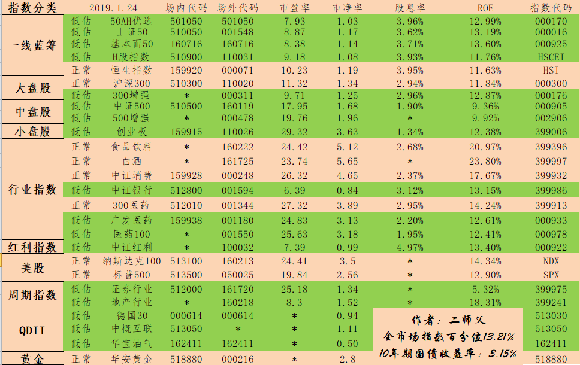

======================================================

_type: talk
@二师父[28814221155551]
2019-01-25 02:57:53 Fri  
topic_id: 422255881852228

阅读[2482]  评论[0]  赞[0] 

+++++++++++++++++++++++++++++++++++++++++++++++++++++

文件：
2019-01-25 02:57:49 Fri
文件大小：[24603]
51145555881414-REITs基金投资价值分析.docx

======================================================

_type: q&a
@杜志彪[544454124115854]
2019-01-25 14:16:39 Fri  
topic_id: 111144544844412

@杜志彪

>  目前看估值512000还是低估的，科创板的上市，券商还是有盈利预期的，如果成立，以目前券商走势下如何建仓512000，是采用网格法，还是老实定投呢？

@二师父

>  我场外是按照纪律定投，场内是网格交易，两手准备，因为不知道何时震荡结束

阅读[1426]  评论[3]  赞[0] 

======================================================

_type: talk
@二师父[28814221155551]
2019-01-26 03:37:27 Sat  
topic_id: 544455545244144

<e type="hashtag" hid="481211145528" title="#指数估值#" /> 估值数据，大家坚持定投即可，当你坚持的时候，其实你的胜率就是逐步增大的，因为别人在不断放弃

阅读[2189]  评论[0]  赞[0] 

+++++++++++++++++++++++++++++++++++++++++++++++++++++

图片：

======================================================

_type: talk
@二师父[28814221155551]
2019-01-26 03:42:43 Sat  
topic_id: 111144414211442

估值数据和财报查询方法，大家可以自行查阅

@海盗 at 2019-01-26 03:42:43 Sat

> 干货

----------

阅读[2456]  评论[1]  赞[0] 

+++++++++++++++++++++++++++++++++++++++++++++++++++++

文件：
2019-01-26 03:42:03 Sat
文件大小：[1530593]
28842221818151-估值数据和财报数据查询方法.docx

======================================================

_type: talk
@顾。[51558482245254]
2019-01-26 08:40:39 Sat  
topic_id: 111144414418412

表格里沪深300已经不是低估了，所以我把沪深300的定投停止了，但是目前我沪深300仍然是浮亏（从2018.3.22开始每日定投），请问现在是如何处理？是停止定投，直到盈利时再逐步收割嘛？
谢谢！！

@二师父 at 2019-01-26 08:40:39 Sat

> 对的，先停止定投，等盈利再收割利润

----------

@老丁 at 2019-01-26 08:40:39 Sat

> 二师父，有一个疑问，沪深300和300价值严格来说不是同样的指数，用沪深300的高低估来判单300价值的操作，这种会不会产生误差呢？谢谢

----------

@二师父 at 2019-01-26 08:40:39 Sat

> 你这个不是沪深300，这是300价值，300价值目前仍旧低估的

----------

阅读[1485]  评论[3]  赞[0] 

+++++++++++++++++++++++++++++++++++++++++++++++++++++

图片：
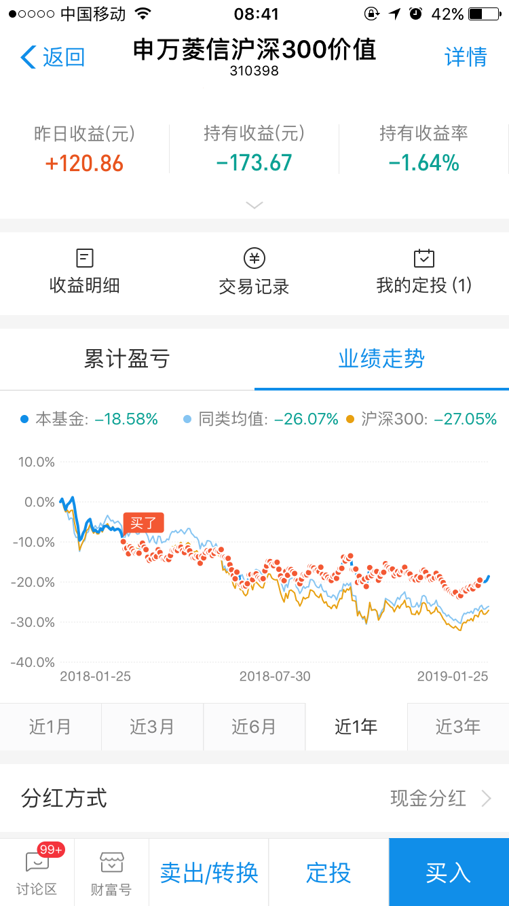

======================================================

_type: talk
@老丁[15541182455482]
2019-01-26 11:33:31 Sat  
topic_id: 544455544258284

二师父，请教一个问题，比如 准备投4只指数，按周投，每周1份/只，每年50次/只。如果出现，

情况A：有一只一年都没低估，这一只全年50份都没投出去，那么这50份应该怎么处理呢？是否可以挪用这只50份，投到低估的3只中去？还是等以后这只低估了，加倍投入？

情况B：有一只出现历史大底的情况，是否可以加大投入，比如本来是一周1份，改成一周2份，但这样50份不到一年就没了，那么当这50份用光以后，是不是就停止这一年的投入，等第二年有新的份额以后再投？还是说严格按计划，就一次一份，不管是不是大底？

谢谢

@S& at 2019-01-26 11:33:31 Sat

> 这个问题好，我也想问情况A。情况B有点像均线吧。

----------

@老丁 at 2019-01-26 11:33:31 Sat

> 嗯有点，但是我觉得问题的是核心是，如何确定份数，如果一年准备50份，在正常情况下，一次一份没问题，但是入到不正常的情况，就是那种需要加倍投的时候，50份是肯定不够的，那就需要多的份额，这个多的份额从哪里？这个是核心问题。我现在能想到的一种是挪用别的份额，比如A情况那种；还一种方式，就是一年准备60份，10份作为备用，关键时候拿出来，这个有点像鳄鱼计划，但是有可能就是这10份一年都用不上，出现份额浪费的情况。所以这个问题一直有些没想明白。

----------

@S& at 2019-01-26 11:33:31 Sat

> 看看二师父怎么回吧，我也一直没搞明白这个。

----------

@二师父 at 2019-01-26 11:33:31 Sat

> 严格按照纪律，任何一只基金都会到达低估的，除非是对冲的基金，比如指数基金和债券基金，一般指数基金低估，债券基金是高估，这时候就可以把投资于债券基金的资金投入指数基金

----------

@活着，不易 at 2019-01-26 11:33:31 Sat

> 所以我在考虑要不要采用轮动配置，选十个基金，每次挑选三四个偏离度高的定投？！对于份额，我觉得这也是个估算值而已，轻易不满仓这一原则时刻都是必需的！

----------

@老丁 at 2019-01-26 11:33:31 Sat

> 轮动策略我也想过，不知道是否有回测计算过效果呢。单思考，我觉得轮动有个问题，就是其实每次基金的买入都可以当做一个单次购买行为，但是单次的相对偏离最大，不代表整体时间内的最便宜，不晓得你怎么看这个问题？

----------

@老丁 at 2019-01-26 11:33:31 Sat

> 也就是说，不论什么情况，就按照计划好的，一次一份的投是吧？谢谢

----------

@活着，不易 at 2019-01-26 11:33:31 Sat

> 正是没有办法做好回测，所以我也只是停留在考虑阶段！而且轮动配置持有基金可能会较多，没有时间管理过来也是个问题！轮动配置只是解决在某个基金正常估值时有低估的可替代，这样资产不用握在手里太久！对于最便宜的问题，我选取轮动的基金都是处于低估的，只能说相对便宜，没有谁能保证每一笔买入都是最便宜吧？！见解也不是很成熟，还望多指教！

----------

阅读[1522]  评论[14]  赞[0] 

======================================================

_type: talk
@自由飞翔[544442815144244]
2019-01-27 00:32:06 Sun  
topic_id: 544455585145584

<e type="hashtag" hid="281158522841" title="#每日打卡#" /> 第五期，1.每周四坚持定投各0.5份：300增强，500增强，中证银行，医药100；2.300医药低估时有单独购买5份；3.目前仓位较大的分别有：300增强，500增强，医药100,证券行业，中证银行。

阅读[1479]  评论[0]  赞[0] 

======================================================

_type: talk
@二师父[28814221155551]
2019-01-27 01:53:47 Sun  
topic_id: 544455585558524

<e type="hashtag" hid="454541522258" title="#证监会易帅#" />

阅读[2523]  评论[0]  赞[0] 

+++++++++++++++++++++++++++++++++++++++++++++++++++++

文件：
2019-01-27 01:53:31 Sun
文件大小：[168849]
28842245812821-证监会易帅，股市怎么走.docx

======================================================

_type: talk
@二师父[28814221155551]
2019-01-27 01:56:30 Sun  
topic_id: 111144484448482

<e type="hashtag" hid="454841141288" title="#均线偏离表#" />

阅读[2467]  评论[0]  赞[0] 

+++++++++++++++++++++++++++++++++++++++++++++++++++++

图片：
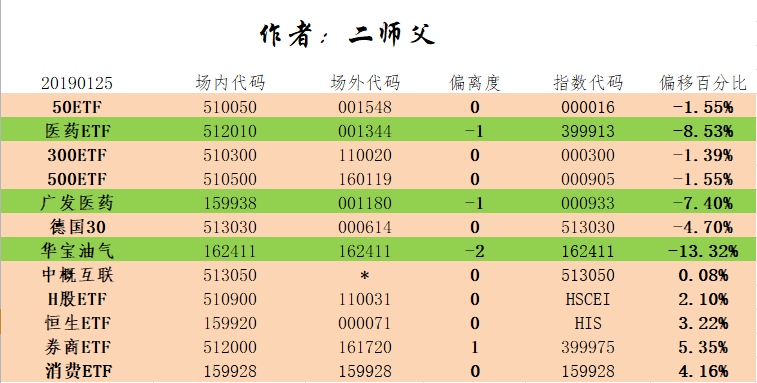

======================================================

_type: talk
@海盗[48248118584848]
2019-01-27 10:58:01 Sun  
topic_id: 244422214825141

刚才把我先后投资的三个平台的盈亏大概算了算，跟着二师父的步伐一路定投过来，现在的亏损仅有0.03%。说明二师父的策略应对熊市低估定投外加鳄鱼计划，包括后期又加入的网格交易，确实有真实可靠的可行性！以后更得跟着二师父好好学习[鼓掌]

@二师父 at 2019-01-27 10:58:01 Sun

> 这个成绩不错啊

----------

@勤能行之 at 2019-01-27 10:58:01 Sun

> 师傅稳扎稳打的策略是可行和有效的。

----------

阅读[1549]  评论[2]  赞[0] 

======================================================

_type: talk
@二师父[28814221155551]
2019-01-28 02:23:03 Mon  
topic_id: 544455425821514

<e type="hashtag" hid="225251445421" title="#二师父定投总结#" /> 善于总结的人才会有进步

@王秦川 at 2019-01-28 02:23:03 Mon

> 坚持定投，风雨无阻，这已经成为我生命中不可或缺的一部分。[强][强][强]
过去听人介绍买的基金亏了，紧跟二师父一个多月定投都浮赢了，整理一下基金，把过去的股票性基金清理掉，专投指数基金的定投

----------

阅读[2413]  评论[1]  赞[0] 

+++++++++++++++++++++++++++++++++++++++++++++++++++++

文件：
2019-01-28 02:22:42 Mon
文件大小：[23548]
15514414148182-二师父1月定投总结.docx

======================================================

_type: q&a
@Antony[51442528215124]
2019-01-28 02:25:33 Mon  
topic_id: 422255245841288

@Antony

>  二师傅您好！2018年初开始定投了两支主动型基金，现在的收益率为-7%和0.67％，而通过定投计算器测算，如果购买指数基金，收益率还会下修很多。所以我能不能这样理解，定投主动型基金，如果基金或者基金经理选的好，那么主动型基金的灵活性和收益率会好于指数基金呢?

@二师父

>  为啥购买指数基金收益率会下降呢？持仓股票是相同的吗？如果基金经理选的好，主动基金会在一个阶段表现好

阅读[1470]  评论[0]  赞[0] 

======================================================

_type: talk
@二师父[28814221155551]
2019-01-28 09:48:37 Mon  
topic_id: 111144152215842

<e type="hashtag" hid="142511142112" title="#格局重塑#" /> 每个周一，二师父都分享一些观点和案例来帮助大家提升格局，这才是帮助我们投资成功和生活幸福的最重要因素

曾经听一位教授讲过一个案例，他说他大学同学里，他的班长成为了广州军区医院的院长，他的团支书成为了武汉医药集团董事长，他的组织委员成为了上海市浦东区创业协会会长，而他的寝室长因为贪污腐败成为了阶下囚。而他当年是院学生会主席，现在是武汉理工大学生物学院院长

多年以前我不懂，为啥他列举的学生干部都成为了各个公司的骨干人物，而那个寝室长却混的那么糟糕

最核心的原因就是格局不同，寝室长面对的是一个小圈子4个人，就是收收寝室费，说不定还从中贪图小便宜。而校院学生干部面对的全体老师和同学，经常需要花费自己的时间和精力帮助别人做事，甚至有些时候还会吃亏，正是在这种情形下的锻炼才培养了他们的格局和气魄，最终养成了大格局大视野，不再计较小的得失

这种人进入社会是更容易得到别人赏识，也更能够团结人一起干事业的

阅读[2355]  评论[0]  赞[0] 

======================================================

@二师父[28814221155551]
2019-01-28 15:25:50 Mon  
topic_id: 544455411551884

>  @二师父
>  

阅读[1394]  评论[2]  赞[0] 

======================================================

_type: talk
@老丁[15541182455482]
2019-01-28 17:21:04 Mon  
topic_id: 111144155818552

二师父，你好，想了解下50AH PE 历史最低数据，网上查了半天有的说是6，有的说是7.5，这么会差这么多呢？个人感觉7.5的那个不是太靠谱，但还是想向您求证一下。

另外，50AH这种历史数据都找不到的指数，是不是可以用上证50的数据去代替计算，不知道这样的思路是否可行？谢谢

@二师父 at 2019-01-28 17:21:04 Mon

> 代替是可以的，里面持仓股大致类似，我发现你学习很认真，不过需要告诉你一句话，投资追求模糊的正确即可，不用较真，推荐一本书，投资中最重要的事，霍华德，马克思写的

----------

@老丁 at 2019-01-28 17:21:04 Mon

> 好的，空余我去看看，谢谢二师父

----------

阅读[1374]  评论[2]  赞[0] 

======================================================

_type: talk
@二师父[28814221155551]
2019-01-28 18:47:57 Mon  
topic_id: 844422484158542

“读万卷书，不如行万里路；行万里路，不如阅人无数；阅人无数，仍需高人指路。”

@王秦川 at 2019-01-28 18:47:57 Mon

> 慢慢悟透

----------

阅读[1429]  评论[1]  赞[0] 

======================================================

_type: talk
@二师父[28814221155551]
2019-01-28 21:27:25 Mon  
topic_id: 244422481285221

<e type="hashtag" hid="481211145528" title="#指数估值#" /> 黄金重回高估，记得逐步卖出，机会不好，收拾收拾心情等着过年把，明年再战

@王秦川 at 2019-01-28 21:27:25 Mon

> 还要周四定投一次，才过年🧨坚持✊

----------

@二师父 at 2019-01-28 21:27:25 Mon

> 坚持

----------

阅读[2288]  评论[2]  赞[0] 

+++++++++++++++++++++++++++++++++++++++++++++++++++++

图片：
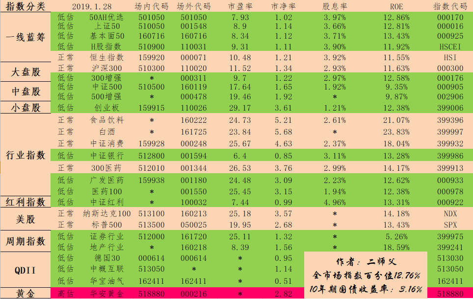

======================================================

_type: talk
@二师父[28814221155551]
2019-01-29 01:49:40 Tue  
topic_id: 111144142444212

<e type="hashtag" hid="142428825442" title="#指数基金定投理念普及#" /> 还是有很多读者怀疑指数基金投资价值，所以他们仍旧研究股票和股票基金，就二师父经验来讲，大多数人投资股票和股票基金是亏损的，如果你真的喜欢研究，那么就研究指数基金和股票，当指数基金定投挣钱以后再开始股票投资，这样你会更加敬畏市场，亏损可能性就小很多。

@西锦巴乌 at 2019-01-29 01:49:40 Tue

> 2028-6-6相约[奋斗]

----------

@老丁 at 2019-01-29 01:49:40 Tue

> [发呆] 为啥是2028-6-6？

----------

@西锦巴乌 at 2019-01-29 01:49:40 Tue

> 我们坚持定投10年

----------

@二师父 at 2019-01-29 01:49:40 Tue

> 每年的6.6，12.12是二师父读者节日，坚持10年以后再看我们的投资效果

----------

@老丁 at 2019-01-29 01:49:40 Tue

> 懂了，才跟着学习，好多东西不知道

----------

@小白 at 2019-01-29 01:49:40 Tue

> 跟2028年有约呀！感谢师父！[玫瑰]

----------

阅读[2500]  评论[6]  赞[0] 

+++++++++++++++++++++++++++++++++++++++++++++++++++++

文件：
2019-01-29 01:48:01 Tue
文件大小：[169956]
28842244444121-券商内部200多个上市公司黑名单外泄，你的股票中枪了吗.docx

======================================================

_type: q&a
@往事随风[48515148521428]
2019-01-29 08:44:39 Tue  
topic_id: 244422425112111

@往事随风

>  请问二师父：想投点债券基金，听说可转债下可保底上可赚收益，您怎么看？

@二师父

>  可转债基金我分析过哈，下有保底是的，不过上不封顶不是，因为有强制赎回条款，目前可转债基金可以定投

阅读[1494]  评论[0]  赞[0] 

======================================================

_type: q&a
@往事随风[48515148521428]
2019-01-29 08:44:57 Tue  
topic_id: 544455452884214

@往事随风

>  现在是投可转债的好时机吗？

@二师父

>  可以啊，之前文章我讲过

阅读[1592]  评论[0]  赞[0] 

======================================================

_type: talk
@二师父[28814221155551]
2019-01-29 08:46:17 Tue  
topic_id: 111144142881482

大家阅读我的文章要一字不落的阅读，因为很多问题我都在文章讲过，千万别跳读

@jiangya at 2019-01-29 08:46:17 Tue

> 二师父，我是刚加入星球的，700多个精华文章，都没有归类整理，我要从头开始一篇一篇阅读吗？

----------

@二师父 at 2019-01-29 08:46:17 Tue

> 加我微信，有精华整理啊

----------

@jiangya at 2019-01-29 08:46:17 Tue

> 你的微信号是ershifudt88吗？

----------

@二师父 at 2019-01-29 08:46:17 Tue

> ershifudt

----------

阅读[1588]  评论[4]  赞[0] 

======================================================

_type: talk
@二师父[28814221155551]
2019-01-29 09:46:15 Tue  
topic_id: 544455451111284

<e type="hashtag" hid="881251425252" title="#鳄鱼计划#" /> 卖出中概互联一份，买入3天期的国债逆回购品种，熊市震荡网格交易也能够赚钱，现在大盘反复震荡大家理解为什么做网格交易了吗

@jiangya at 2019-01-29 09:46:15 Tue

> 二师父，定投开始之前，是不是所有的资金都买货币基金，然后定投日从货币基金转指数基金？

----------

@二师父 at 2019-01-29 09:46:15 Tue

> 是的

----------

@jiangya at 2019-01-29 09:46:15 Tue

> 明白了，谢谢二师父！

----------

@乡下人 at 2019-01-29 09:46:15 Tue

> 师傅，哪家银行卡转入不限额啊？农行每日限额1万太麻烦了。

----------

@二师父 at 2019-01-29 09:46:15 Tue

> 转到哪里，我用的中国银行

----------

@jiangya at 2019-01-29 09:46:15 Tue

> 可以自己设置每日限额的，你问问银行。

----------

@勤能行之 at 2019-01-29 09:46:15 Tue

> 理解啦，师傅

----------

@活着，不易 at 2019-01-29 09:46:15 Tue

> 二师父，场内买那个货币基金好一点？

----------

阅读[2520]  评论[11]  赞[0] 

======================================================

_type: talk
@老丁[15541182455482]
2019-01-29 12:25:56 Tue  
topic_id: 244422424241241

二师父，你好，才开始跟着学习，错过了之前消费板块低估的时间，现在看到可选消费还是有不少指数是低估的，所以有几个关于可选消费的问题想请教一下。

1、从整体上来看，可选消费这个行业，是不是值得作为一个行业分类来配置？有什么风险呢？

2、目前 全指可选（指数代码：000989）这一直指数很低估的，但是发现一个问题，就是它的样本股多达455只，其中300多只成分股，市值都不到100亿，一大半的市值，不到50亿。您之前说过，注册制对这些市值很小的公司影响比较大，所以这种以多半都是小市值公司组成的指数，是否值得购买，安全性如何？

3、注册制对公司的影响风险大小，是不是单看市值判断（市值越小，风险越大）？还是说有其他的影响因素？

谢谢，期待回复

@二师父 at 2019-01-29 12:25:56 Tue

> 可选消费没有必须消费稳定，必须消费无论经济好坏，我们都必须购买的生活必需品，如果家庭经济拮据，可选消费的购买力就会下降，所以必须消费是要优于可选消费的

注册制对整个股市都有影响，相当于强退一些经营不善的企业，不仅仅是小市值企业

----------

@老丁 at 2019-01-29 12:25:56 Tue

> 谢谢二师父

----------

阅读[1555]  评论[2]  赞[0] 

======================================================

_type: talk
@二师父[28814221155551]
2019-01-29 12:56:36 Tue  
topic_id: 544455454421514

<e type="hashtag" hid="142511181542" title="#周二荐书#" /> 聪明的投资者，这是格雷厄姆所著，没有具体的操作，但是可以帮助你树立正确的投资价值观，这才是最重要的，很多人一直无法进入价值投资之门是因为初始的观念都错误了

@.Five at 2019-01-29 12:56:36 Tue

> 还有彼得林奇[得意]

----------

阅读[1605]  评论[1]  赞[0] 

======================================================

_type: talk
@二师父[28814221155551]
2019-01-30 03:13:04 Wed  
topic_id: 422255222481148

<e type="hashtag" hid="481211145528" title="#指数估值#" /> 估值表里面的基金涵盖了几乎各个行业各个国家的品种，用这些投资已经足够给自己带来不错的收益率。接下来大家如果有兴趣研究的话建议把更多的精力放在对人性和轮回的研究，这才是决定成败的关键。

因为二师父的读者都是和二师父投资一样的标的，为啥还是收益率不同，不在于投资水平，在于能否克制住自己的人性弱点。

@熵增就减 at 2019-01-30 03:13:04 Wed

> 请问应该克服那种人性的弱点，都有哪些？师傅，打扰了

----------

@二师父 at 2019-01-30 03:13:04 Wed

> 恐惧，贪婪，急躁

----------

@熵增就减 at 2019-01-30 03:13:04 Wed

> 😁😁😁  谢谢师傅

----------

阅读[2306]  评论[3]  赞[0] 

+++++++++++++++++++++++++++++++++++++++++++++++++++++

图片：

======================================================

_type: talk
@二师父[28814221155551]
2019-01-30 03:14:32 Wed  
topic_id: 544455444218824

<e type="hashtag" hid="481144488858" title="#投资理念#" /> 主动基金是有两个风险的，无法规避，所以选择被动的指数基金是正确的选择，我们不仅要定投指数基金，更加要明白为什么投资，这样在熊市的时候我们才拿的住

@凭栏观海 at 2019-01-30 03:14:32 Wed

> 老子的“无为而治，顺其自然”，就是被动指数基金的精髓！

----------

@二师父 at 2019-01-30 03:14:32 Wed

> 已经上升到哲学高度了，非常赞

----------

@杜明 at 2019-01-30 03:14:32 Wed

> 华泰

----------

@熵增就减 at 2019-01-30 03:14:32 Wed

> 请问师傅指的是场外还是场内的指数基金？

----------

@二师父 at 2019-01-30 03:14:32 Wed

> 都有

----------

阅读[2559]  评论[5]  赞[0] 

+++++++++++++++++++++++++++++++++++++++++++++++++++++

文件：
2019-01-30 03:13:43 Wed
文件大小：[170273]
51145548422844-盘点那些投资10年仍旧亏损的主动基金.docx

======================================================

_type: q&a
@Shitou_li[15155885518252]
2019-01-30 09:18:43 Wed  
topic_id: 844422444242422

@Shitou_li

>  二师父，你好！年终了会有笔年终奖到账，我计划是拿出80%想趁这两天业绩爆雷均分加仓手里所持etf(300、500、红利、消费、券商、医药），想听听您的建议？谢谢

@二师父

>  300可以少买点，如果这笔钱长期不用，加仓没问题的，目前机会很好

阅读[1580]  评论[2]  赞[0] 

======================================================

_type: talk
@二师父[28814221155551]
2019-01-30 10:06:49 Wed  
topic_id: 422255222182548

目前来看还是货币基金和天天财收益率高

@二徒弟 at 2019-01-30 10:06:49 Wed

> 这是在哪里呢

----------

@Claire at 2019-01-30 10:06:49 Wed

> 二师父，是什么平台的产品呀

----------

@二师父 at 2019-01-30 10:06:49 Wed

> 公众号后台回复华泰，置顶文章也有啊

----------

@二师父 at 2019-01-30 10:06:49 Wed

> 华泰的啊

----------

@凌燕 at 2019-01-30 10:06:49 Wed

> 天天财是个啥？

----------

@二师父 at 2019-01-30 10:06:49 Wed

> 一个固定收益加浮动收益品种

----------

@Claire at 2019-01-30 10:06:49 Wed

> 谢谢二师父

----------

@victoria at 2019-01-30 10:06:49 Wed

> 

----------

阅读[1640]  评论[13]  赞[0] 

+++++++++++++++++++++++++++++++++++++++++++++++++++++

图片：
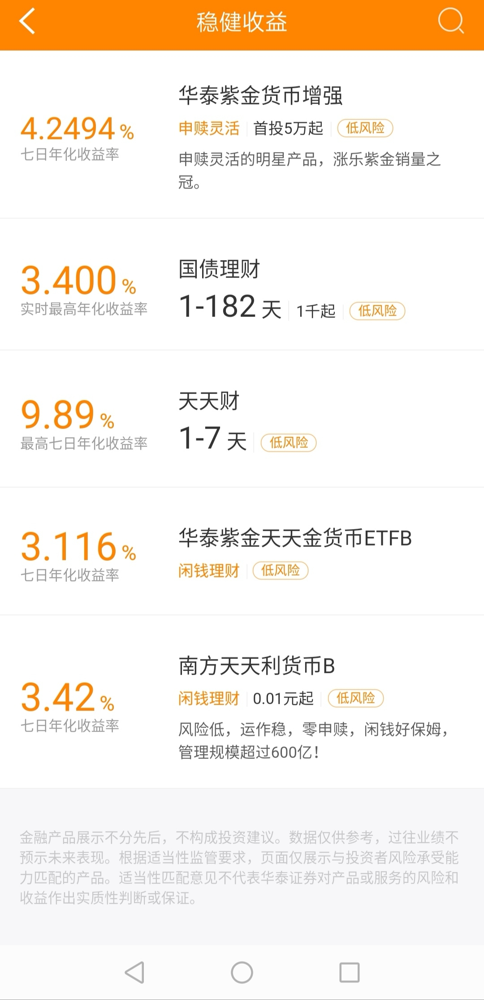

======================================================

_type: talk
@victoria[15455121858422]
2019-01-30 13:53:18 Wed  
topic_id: 544455481512244

二师父我买的消费赢利了7个多点，现在卖吗

@victoria at 2019-01-30 13:53:18 Wed

> 

----------

@二师父 at 2019-01-30 13:53:18 Wed

> 把盈利部分卖出就行了，不要全部卖了，防止踏空

----------

阅读[1503]  评论[2]  赞[0] 

======================================================

_type: talk
@二师父[28814221155551]
2019-01-30 22:26:27 Wed  
topic_id: 544455484145554

华尔街日报，纯英文内容，适合拓展知识面。投资的学习不仅仅局限于证券知识。

阅读[1689]  评论[0]  赞[0] 

+++++++++++++++++++++++++++++++++++++++++++++++++++++

文件：
2019-01-30 22:25:36 Wed
文件大小：[6529963]
88842212552542-华尔街日报-2019-01-29.pdf

======================================================

_type: talk
@二师父[28814221155551]
2019-01-30 22:44:27 Wed  
topic_id: 244422414222151

<e type="hashtag" hid="481211145528" title="#指数估值#" /> 黄金涨的越来越多了，高估就逐步卖出本金，正常估值卖出利润就行。其实即使到高估，基金仍旧具有投机价值，因为很多人看着基金赚钱了就会追涨，这是市场上很常见的情况。

阅读[2441]  评论[0]  赞[0] 

+++++++++++++++++++++++++++++++++++++++++++++++++++++

图片：
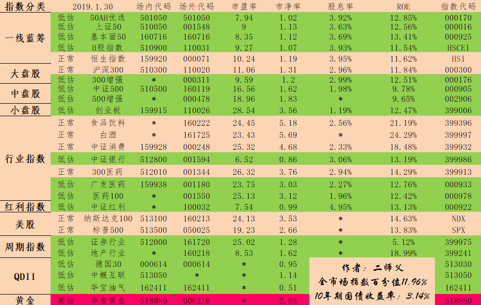

======================================================

_type: talk
@二师父[28814221155551]
2019-01-31 02:19:28 Thu  
topic_id: 544455822825144

<e type="hashtag" hid="225285851281" title="#固定收益#" /> 固定收益品种，需要开通股票账户，很奇怪，二师父福利开户渠道无论是星球置顶文章还是公众号都有公布，竟然还有人不知道，这是信息获取能力的不同。

固定收益，二师父就选用的货币基金和国债逆回购

阅读[2674]  评论[0]  赞[0] 

+++++++++++++++++++++++++++++++++++++++++++++++++++++

文件：
2019-01-31 02:17:49 Thu
文件大小：[486427]
28842212828881-蓐羊毛：投资一天，享受10天的收益.docx

======================================================

_type: talk
@凭栏观海[244414845852181]
2019-01-31 09:56:19 Thu  
topic_id: 544455821511144

2018股票暴雷阵阵，只要投资宽基指数基金，即便天雷滚滚，与我何干焉？！安全第一，本金第一，稳健第一，知足常乐，傻傻的挺好！

阅读[1578]  评论[0]  赞[0] 

======================================================

_type: talk
@二师父[28814221155551]
2019-01-31 10:02:19 Thu  
topic_id: 422255148582818

<e type="hashtag" hid="881422852442" title="#定投实盘#" /> 年前最后一买，中证500买入2份，医药100买入一份，地产指数买入一份，大开买戒。

震荡市场，场外定投积累，场内网格交易小幅度赚取利润。提前预祝大家新年快乐

@熵增就减 at 2019-01-31 10:02:19 Thu

> 一份等于多少股啊

----------

@二师父 at 2019-01-31 10:02:19 Thu

> 这个看你有多少资金了

----------

@熵增就减 at 2019-01-31 10:02:19 Thu

> 谢谢，师傅

----------

阅读[2578]  评论[3]  赞[0] 

======================================================

_type: q&a
@小丹KG[15584511122512]
2019-01-31 12:40:16 Thu  
topic_id: 544455821852584

@小丹KG

>  请教二师父，为何最近医药类指数跌的比较厉害？是否是加仓时机？

@二师父

>  医药最近遭遇了各种政策，造假的影响，是加仓时机

阅读[1634]  评论[0]  赞[0] 

======================================================

_type: talk
@二师父[28814221155551]
2019-01-31 14:45:06 Thu  
topic_id: 544455825412844

<e type="hashtag" hid="881251425252" title="#鳄鱼计划#" /> 场内买入500etf一份，卖出华宝油气一份，银行etf一份，网格交易就是适合熊市赚钱，底仓思维加概率思维，让投资变简单

阅读[2567]  评论[0]  赞[0] 

======================================================

