_type: talk
@二师父[28814221155551]
2019-02-01 04:27:46 Fri  
topic_id: 111144855455212

<e type="hashtag" hid="481211145528" title="#指数估值#" /> 今日估值表，愿大家新年快乐，阖家幸福。其实挣钱并不是最重要的，健康的身体和陪伴家人才是最重要的，春节就可以放下工作和学习，多多陪伴家人啦。

@王秦川 at 2019-02-01 04:27:46 Fri

> 祝二师父新年快乐🎈🎊🍾️，请问，你说“中证500为首的中盘和小盘股一路下跌，后期因为注册制度落实，更多的小盘企业将会被淘汰掉。沧海横流，方显英雄本色，投资也要投资大蓝筹为主，”，但这次实盘定投，还是定投的500、医学100

----------

@二师父 at 2019-02-01 04:27:46 Fri

> 大蓝筹为主不是说不投资中证500和医药100了，创业板这类小盘股是没有投资了

----------

@王秦川 at 2019-02-01 04:27:46 Fri

> 谢谢回复，明白了，继续在二师父学堂好好学习。

----------

@凭栏观海 at 2019-02-01 04:27:46 Fri

> 二师父辛苦啦

----------

阅读[2507]  评论[4]  赞[0] 

+++++++++++++++++++++++++++++++++++++++++++++++++++++

图片：
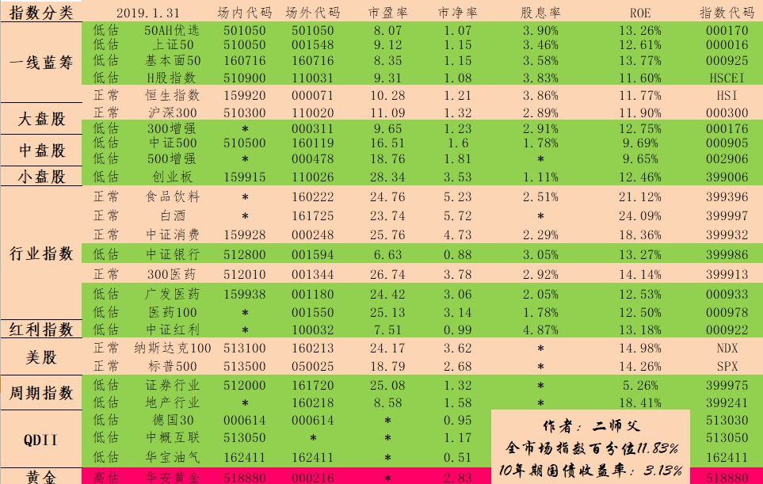

======================================================

_type: talk
@二师父[28814221155551]
2019-02-01 04:29:59 Fri  
topic_id: 422255188588428

<e type="hashtag" hid="552148115414" title="#定投计划#" /> 学会制定计划然后执行，然后总结，PDCA,plan，do，check，action
用四个步骤来逐步完成学习和工作，你会发现自己进步很大的

@好运玲玲 at 2019-02-01 04:29:59 Fri

> 忙完2018，2019一定认真跟着师傅学习[拳头][拳头][拳头]

----------

@自由飞翔 at 2019-02-01 04:29:59 Fri

> 祝师傅新春快乐，阖家幸福！

----------

@理财小小白 at 2019-02-01 04:29:59 Fri

> 二师父，易方达安心回报债券A是一款什么类型的基金？这个基金的买卖要怎么操作呢？有估值数据参考吗？谢谢

----------

@二师父 at 2019-02-01 04:29:59 Fri

> 这是可转债基金，估值非量化，70%可转债的价格低于100元可以开始逐步定投

----------

阅读[2765]  评论[4]  赞[0] 

+++++++++++++++++++++++++++++++++++++++++++++++++++++

文件：
2019-02-01 04:28:48 Fri
文件大小：[22890]
48825512524858-二师父19年2月定投计划.docx

======================================================

_type: q&a
@凭栏观海[244414845852181]
2019-02-01 08:42:43 Fri  
topic_id: 422255188224218

@凭栏观海

>  对于利润收割，我的理解是:只有在定投的基金估值开始正常时，才开始慢慢逐步分批卖出。如果定投的基金还是低估，哪怕目前利润很高了，也暂时等待估值达到正常时候，再考虑分批卖出。这样理解对吗？

@二师父

>  对的，利润收割是基金估值正常开始收割，如果低估不管利润多少都可以定投

阅读[1637]  评论[0]  赞[0] 

======================================================

_type: talk
@二师父[28814221155551]
2019-02-01 13:07:10 Fri  
topic_id: 544454218511414

<e type="hashtag" hid="881251425252" title="#鳄鱼计划#" /> 券商卖出一份，还是建立在网格交易的基础上，以后买入卖出都在学堂公布下，个人投资操作，不代表任何投资建议

鳄鱼计划是场内操作，定投实盘是场外操作

阅读[1549]  评论[0]  赞[0] 

======================================================

_type: talk
@二师父[28814221155551]
2019-02-01 21:25:22 Fri  
topic_id: 111141245255122

<e type="hashtag" hid="481211145528" title="#指数估值#" /> 今年的最后一期指数估值表更新完毕，18年是我的人生转折之年，从最开始的几个品种的分享，到如今覆盖了全球市场的指数估值，从最开始的每周一分享，到现在的每天都开始记录分享，我只想挑战下自己。

人都是给逼出来的，当我执著的时候，时间也会向我投降，感谢团队成员的支持和帮助，感谢每一位读者的赞赏。原来生活还可以这么美好，18年即将远去，还有19年，在我的计划之中，19年之后我将放下手头所有的工作，然后周游世界，旅行，健身，读书，写作，这就是我对余生的规划。但行好事，前程似锦。

只要我一步步走下去，未来肯定能够实现自己的目标的。在肖申克救赎里面，瑞德预测安迪用小榔头挖隧道需要挖掘600年的时间，然而他只用了19年。

不要低估自己的潜力，坚持踏实走下去，也许我用不了19年的时间就能够实现财务自由。自己实现财务自由，然后帮助读者实现财务自由，这就是我今生最渴望做的事情。

世间万物，希望至美，至美之物，永不凋零。

愿自己无论何时何地，处于何种境地，都要怀揣着对未来的希望和憧憬，因为这是永生不灭之物，永远存在于我的心底，没有任何人能够夺去。

@今晚吃手抓，谁给点大* at 2019-02-01 21:25:22 Fri

> 冒昧的问下，二师父您结婚了没有？

----------

@二师父 at 2019-02-01 21:25:22 Fri

> 还没呢，要给我介绍女朋友？

----------

@今晚吃手抓，谁给点大* at 2019-02-01 21:25:22 Fri

> 单身真好，可以如此的自由安排时间……

----------

@二师父 at 2019-02-01 21:25:22 Fri

> 19年以后我肯定结婚了😁

----------

@杜志彪 at 2019-02-01 21:25:22 Fri

> 有幸结识二师付，2019也是我全新的开始。

----------

@今晚吃手抓，谁给点大* at 2019-02-01 21:25:22 Fri

> 满满来，就像罗胖说的，结婚是应该准备好了才做的事情……

----------

@二师父 at 2019-02-01 21:25:22 Fri

> 我也很幸运结识您

----------

@肖妙芬 at 2019-02-01 21:25:22 Fri

> 感恩二师傅，谢谢🙏

----------

阅读[2520]  评论[16]  赞[0] 

+++++++++++++++++++++++++++++++++++++++++++++++++++++

图片：
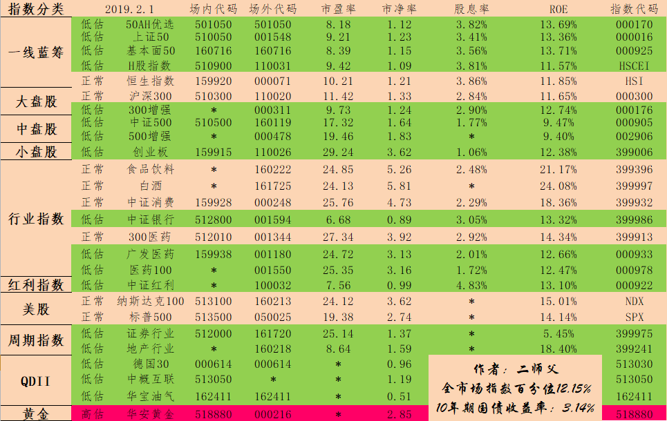

======================================================

_type: talk
@二师父[28814221155551]
2019-02-02 02:44:17 Sat  
topic_id: 422252452584118

<e type="hashtag" hid="825285222842" title="#中国指数基金的普及率#" />指数基金扩容，这是近10年的趋势，我们要抓住机会。 

有的读者说我要多休息，其实你没有理解写作的快乐，正如有的人去桌游或者打游戏不知疲惫一样，二师父写作的时候就是最快乐的时候，每天三件事一定会做

第一是健身，第二是读书，第三是写作。其实如果你能够坚持下去，不出3年，你的人生轨迹就会发生翻天覆地的变化，只不过大部分人对写作没兴趣，就不强求了

@海盗 at 2019-02-02 02:44:17 Sat

> 每当和别人谈起指数基金，别人经常问的话就是问你挣多少钱了？我说，得等三五年，目光得放远一点。对方立马是一脸不屑的表情[撇嘴]

----------

@二师父 at 2019-02-02 02:44:17 Sat

> 人无远虑，必有近忧

----------

阅读[2591]  评论[2]  赞[0] 

+++++++++++++++++++++++++++++++++++++++++++++++++++++

文件：
2019-02-02 02:41:22 Sat
文件大小：[169553]
28842455121821-指数基金进一步扩容，我们要做第一个吃螃蟹的人.docx

======================================================

_type: talk
@二师父[28814221155551]
2019-02-02 19:12:25 Sat  
topic_id: 422252424542288

在投资方面，我们不能够相信自己的经验，只能够依靠历史事实和自己学习的知识，因为每个人的人生都太过短暂，无法经历证券市场上发生的每一件事情

切勿让经验主义害了自己

阅读[1328]  评论[0]  赞[0] 

======================================================

_type: q&a
@凭栏观海[244414845852181]
2019-02-02 22:11:54 Sat  
topic_id: 244424545444851

@凭栏观海

>  二师父，我今天换了一个手机，怎么样才能够把我加入的您的知识星球挪到我新手机上？

@二师父

>  你直接下载一个知识星球用微信登录就可以了

阅读[1492]  评论[1]  赞[0] 

======================================================

_type: talk
@二师父[28814221155551]
2019-02-03 03:19:15 Sun  
topic_id: 111141211215482

<e type="hashtag" hid="142452482852" title="#行业分析#" /> 金融服务业之保险指数的投资价值分析，保险行业在中国和基金一样也是朝阳行业

@彩色 at 2019-02-03 03:19:15 Sun

> 请问二师父在哪里可以看到保险指数的pev呢，如果要配置保险指数基金，有什么推荐不呢？还是自己选择？

----------

@二师父 at 2019-02-03 03:19:15 Sun

> 这个是计算的，在雪球上能看到，目前有个方证保险是大部分持有保险股票的，你可以看看

----------

阅读[2625]  评论[2]  赞[0] 

+++++++++++++++++++++++++++++++++++++++++++++++++++++

文件：
2019-02-03 03:18:24 Sun
文件大小：[22561]
15514125148822-金融服务业之保险指数投资价值分析.docx

======================================================

_type: talk
@凭栏观海[244414845852181]
2019-02-03 14:21:00 Sun  
topic_id: 844424541848212

投资指数基金如同投资古董，三年不开张，开张吃三年！

阅读[1456]  评论[0]  赞[0] 

======================================================

_type: talk
@渔夫[844418821855242]
2019-02-04 17:26:25 Mon  
topic_id: 422252412154858

二师父！您好今天是大年三十，在这里祝您在新的一年里身体健康，万事如意，祝您在新的一年里投资顺利，早曰实现财务自由。

@二师父 at 2019-02-04 17:26:25 Mon

> 谢谢您

----------

阅读[1356]  评论[1]  赞[0] 

======================================================

_type: talk
@二师父[28814221155551]
2019-02-04 21:09:19 Mon  
topic_id: 544454122855844

大家新年快乐，去雪球领红包

@小涛@我的四季生活 at 2019-02-04 21:09:19 Mon

> 雪球哪里呢二师父
？

----------

@二师父 at 2019-02-04 21:09:19 Mon

> 一分钟给抢完了

----------

@小涛@我的四季生活 at 2019-02-04 21:09:19 Mon

> [流泪]

----------

阅读[1413]  评论[3]  赞[0] 

======================================================

_type: talk
@二师父[28814221155551]
2019-02-04 21:09:34 Mon  
topic_id: 111141522844882

大家新年快乐，去雪球领红包

@二徒弟 at 2019-02-04 21:09:34 Mon

> 怎么领啊？二师父新年快乐，来年发大财

----------

阅读[2469]  评论[1]  赞[0] 

======================================================

_type: talk
@二师父[28814221155551]
2019-02-05 04:38:16 Tue  
topic_id: 422252848255118

<e type="hashtag" hid="225285851281" title="#固定收益#" /> 我的固定收益品种投资，小赚一点就行，保值增值还是得持有股权。

阅读[2709]  评论[0]  赞[0] 

+++++++++++++++++++++++++++++++++++++++++++++++++++++

文件：
2019-02-05 04:35:57 Tue
文件大小：[22291]
28842452448181-我的保本账户配置了哪些固定收益品种.docx

======================================================

_type: talk
@拥抱太阳的风筝[48812454818528]
2019-02-05 08:29:05 Tue  
topic_id: 844424858148282

祝二师父和学堂里的每个人猪年身体健康，心想事成，阖家幸福！

@二师父 at 2019-02-05 08:29:05 Tue

> 谢谢

----------

阅读[1454]  评论[1]  赞[0] 

======================================================

_type: q&a
@凭栏观海[244414845852181]
2019-02-05 12:08:44 Tue  
topic_id: 544454125112484

@凭栏观海

>  我原来购买的易方达上证50已经将近十年了，到现在盈利46%，盈利16000多元。可是目前上证50依然是低估。我现在很纠结，是节后分批卖出止盈呢，还是继续持有到正常或者高估才开始卖出呢？请老师有时间指导一下

@二师父

>  持有到正常估值收割利润比较好的

阅读[1630]  评论[3]  赞[0] 

======================================================

_type: talk
@二师父[28814221155551]
2019-02-06 01:48:54 Wed  
topic_id: 844424885252442

<e type="hashtag" hid="454584148148" title="#卖出系统#" /> 基金定投的卖出系统，当正常估值时候，把利润部分逐步卖出，至于低估的时候，即使不买也别卖出了。

@海盗 at 2019-02-06 01:48:54 Wed

> 这篇文章对于刚接触指数基金的小伙伴们具有很重要的引导作用。因为大多数人一开始关注的只有指数的点位，也弄不清啥是市盈率，市盈率有什么参考价值，更说不清市盈率和点位的关系。

----------

阅读[2740]  评论[1]  赞[0] 

+++++++++++++++++++++++++++++++++++++++++++++++++++++

文件：
2019-02-06 01:48:20 Wed
文件大小：[96239]
48825242485488-基金盈利很多但仍旧低估，需要卖出吗.docx

======================================================

_type: talk
@二师父[28814221155551]
2019-02-07 03:43:55 Thu  
topic_id: 422252881811428

<e type="hashtag" hid="825285182482" title="#学习定投的方法#" /> 无论是学习定投，还是学习其他的技能，都要先破除固有的思维认知

@海盗 at 2019-02-07 03:43:55 Thu

> 二师父在过年期间还继续写文章，谢谢二师父

----------

@j at 2019-02-07 03:43:55 Thu

> 每天健身读书定投[强]

----------

@alicedream* at 2019-02-07 03:43:55 Thu

> 二师父：你的理念我太喜欢了！

----------

阅读[2668]  评论[3]  赞[0] 

+++++++++++++++++++++++++++++++++++++++++++++++++++++

文件：
2019-02-07 03:43:17 Thu
文件大小：[22345]
88842485585452-学习基金定投必须突破固有思维认知.docx

======================================================

_type: q&a
@闪闪的星光[88285424418582]
2019-02-07 18:50:39 Thu  
topic_id: 544454152811244

@闪闪的星光

>  在场内交易可以用网格法，请问场外交易也可以使用网格法吗？
>  如果网格法不适用于场外交易的话，那么为什么不适用于场外交易呢？

@二师父

>  场外交易短7天内赎回会有惩罚性收费

阅读[1402]  评论[1]  赞[0] 

======================================================

_type: talk
@二师父[28814221155551]
2019-02-08 02:27:55 Fri  
topic_id: 544454154552284

<e type="hashtag" hid="825288558882" title="#财商教育#" /> 在自己学习定投的同时，不要忘记了培养孩子的财商，如果我们自己财商不足，就和孩子一起成长吧

阅读[2612]  评论[0]  赞[0] 

+++++++++++++++++++++++++++++++++++++++++++++++++++++

文件：
2019-02-08 02:27:10 Fri
文件大小：[23422]
51145412541824-家长要利用压岁钱来给孩子进行财商教育.docx

======================================================

_type: q&a
@王秦川[844151411882412]
2019-02-08 13:42:37 Fri  
topic_id: 244424821828251

@王秦川

>  二师父：今天买港股，恒生国企指数是今天收盘的基金净值吗？

@二师父

>  场外购买是按照2月11日的净值确认份额

阅读[1356]  评论[0]  赞[0] 

======================================================

_type: q&a
@归去来兮[111851181241512]
2019-02-08 15:32:37 Fri  
topic_id: 422252851528818

@归去来兮

>  二师父我是刚来的，我以前喜欢定投一些比较看好的主动基金，比如易方达消费行业什么的，那么采用的方法也应该是在低估时加大定投，到合理估值时开始收割利润，到高估时逐步卖出吗？
> 另外有两个问题：1涨到合理估值时还需要继续定投吗？  继续涨到高估时不再定投了吧？  2主动型基金估值是否合理？我该怎么看呢？怎么评定估值是否合理？你的估值表里并不会有主动性基金的估值呀？谢谢！
> ps.  我17年时基金赚了很多钱，18年市场掉头向下时，没舍得大幅减仓，结果利润都吐回去了还亏损，既然已经错过了减仓的时间，现在只能继续定投了，下次我一定要吸取这次教训，在高估时要减仓收割利润。

@二师父

>  您好主动基金定投的话也是低估定投，估值正常收割利润，高估逐步卖出本金
>  
>  在基金估值合理的时候就不要再买入基金了，而是开始收割利润，定投全部是在指数基金低估的时候买入
>  
>  主动基金的估值采用看对应持仓股票一致的指数基金的估值即可，建议定投指数基金，因为持仓股票都一样，而主动基金基金经理对基金的影响非常大，并且频繁调仓，不容易把握，指数基金定投的话相对简单，策略也不复杂，比主动基金要好
>  
>  购买主动基金我认为是不如股票投资的

阅读[1483]  评论[2]  赞[0] 

======================================================

_type: talk
@二师父[28814221155551]
2019-02-09 01:48:50 Sat  
topic_id: 244424842428441

<e type="hashtag" hid="454588485888" title="#指数基金的发展和优势#" /> 二师父经常就宣讲指数基金的发展历史和优势，就是为了让大家树立信心，看到指数基金的未来，美国的现在很大一部分是中国的未来。指数基金也一样，任何新生事物都是饱受诟病的，只不过有的后面会发展很好，能不能把握住就看眼光了。

阅读[2655]  评论[0]  赞[0] 

+++++++++++++++++++++++++++++++++++++++++++++++++++++

文件：
2019-02-09 01:47:24 Sat
文件大小：[23123]
51145412858214-世界上第一只指数基金也曾受到诋毁.docx

======================================================

_type: q&a
@冬夫[15122585122182]
2019-02-09 10:42:18 Sat  
topic_id: 422252822448488

@冬夫

>  二师父好！第一次参与定投，原因是感觉医药指数新低，估计年后受艾滋病疫苗影响还会下跌，而医药行业上市公司选股专业性太强，指数定投是一种好办法，三、五年后赚钱大概率事件，现准备定投中弘医指100A，看您的表估值也处于低估状态，现请教：1、假设年终奖10万元建底仓，以后每月工资定投5000千元左右至指数高估；2、用5万元建底仓，后5万在不高估情况下每周或月不定额买入。上述哪种方式科学些？

@二师父

>  后一种方式合理些，因为是这样的，我们定投采用的存量资金定投，就是目前手头盈余的资金，每月工资5000元属于增量资金，这个就有不确定性。可能工资需要花费
>  
>  另外不要仅仅投资一直指数，可以结合两只宽基指数，加三只行业指数，在低估区域定投，可以分散行业风险。沪深300，中证500，医药，消费，银行

阅读[1391]  评论[0]  赞[0] 

======================================================

_type: talk
@归去来兮[111851181241512]
2019-02-09 11:13:55 Sat  
topic_id: 111141511541252

有个振奋人心的消息，中国科学家陈小平研究出了用虐原虫刺激人体免疫系统，从而消灭人体中的大量癌细胞，在实践中已经有好多例晚期癌症患者，被判了死刑的都奇迹般的康复了。
陈小平在做癌症相关性研究时发现，非洲疟原虫肆虐的地方，癌症发病率都出奇的低，而且排除了其他的相关性，只和疟疾发病率相关。经过深入研究后发现是因为疟原虫入侵刺激了人体的大量免疫系统，从而顺带的把癌细胞都误杀了。晚期癌症之所以难治是因为最后能发作的癌细胞都是经过人体免疫系统层层筛选出来的，能够欺骗人体免疫系统的久经战场的癌细胞，人体的免疫系统没有被激发，所以无法消灭癌细胞。
 激活人体免疫系统治疗癌症是未来的一个新的重要发展方向，用疟原虫刺激就是目前发现的一个很好的办法，用自身的免疫系统消灭癌细胞，没有毒副作用，这对于抗癌药公司来说是个大利空，西药治疗晚期癌症毫无作用，而且费钱伤身体，这对于抗癌药的代表公司，比如恒瑞医药来说是个大利空。不过宁可医药股崩盘，也希望能有这样革命性的科技成果问世，造福人类，如果能攻克癌症的话，整个人类的平均寿命估计能提高10年以上，毕竟癌症是人类生命第一大杀手。
   这个成功未来必能获得诺贝尔医学奖，目前来看无论是从实地调研还是理论还是从临床实践上希望很大，这和西方正在研究的细胞免疫疗法方向是一致的，只不过是中国科学家发现了用疟原虫刺激这一更有效的单号，合作的钟南山院士都已经证实了确实有疗效，也许在不久的将来，癌症也是变成一个可以治愈的疾病了。

蓝耀访谈
钟南山院士就“疟疾治疗癌症”这一主题接受凤凰网采访
 刘诗卉  2017-10-23 星期一  3961 浏 览
癌症免疫治疗

0:00

在10月19日在广州举办的“2017疟疾与癌症跨界交流会”上，钟南山院士、李国桥教授等来自国内外的疟疾和肿瘤研究的专家们首次将疟疾和癌症这两类重大疾病放在一起讨论，进行了一场跨界交流。

本次会议的发起人和共同主席，疟原虫免疫疗法治疗癌症的首创者陈小平教授公布的其团队的研究成果再次证明了两种疾病中的密切关系。其团队与钟南山团队合作进行的疟原虫免疫疗法治疗晚期肺癌的临床试验获得初步成效——3例患者其中2例显效。

钟南山院士表示，疟疾是一个领域，癌症是另一个领域，而疟疾与癌症跨界形成了一个新的领域。研究发现，疟原虫可以天然激发人体的免疫功能，使得肿瘤生成血管减少，疟原虫同时能够激发T细胞功能，杀死肿瘤细胞或使其生长减慢。

@海盗 at 2019-02-09 11:13:55 Sat

> 真希望能研究出，也更希望价格平民化

----------

@二师父 at 2019-02-09 11:13:55 Sat

> 这个那也得用非活性疟原虫，类似于脑疟的很可怕，比癌症都可怕

----------

@归去来兮 at 2019-02-09 11:13:55 Sat

> 这个会控制虐原虫浓度的，癌症治愈后就用杀疟药消灭掉。并且现在据说已经研究并提取使用疟原虫中的有效蛋白来刺激，更安全。

----------

@归去来兮 at 2019-02-09 11:13:55 Sat

> 要说国内有些医药公司也真是不争气，研究几十年化学药在癌症治疗方面也没什么进展，要么就都是模仿国外仿制药，不思进取。美国早就开展细胞免疫疗法治疗了，国内还在天天搞仿制药，一带量采购就歇菜只能大幅降价，说到底还是没有自己的核心技术核心竞争力，被时代抛弃也没啥可惜的。

----------

阅读[1355]  评论[4]  赞[0] 

======================================================

_type: q&a
@王秦川[844151411882412]
2019-02-09 11:25:00 Sat  
topic_id: 422252822858418

@王秦川

>  二师父，你好！才跟你定投一个月，这几天利用假期看了你以前的文章，越来越认同你的投资理念，你崇拜的大师格雷厄姆总结出一个永恒的价值投资基本原则：安全边际。安全第一，赢利第二。所以有信心跟你定投，底仓➕定投，准备建立底仓，怕踏空，你能推荐几个指数基金建底仓吗？谢谢🙏

@二师父

>  不用怕踏空，市场总会给机会，我最推荐的是50ah，沪深300，中证500，消费，医药，银行，有的现在是正常估值，投低估的就行

阅读[1455]  评论[1]  赞[0] 

======================================================

_type: q&a
@凭栏观海[244414845852181]
2019-02-09 21:49:47 Sat  
topic_id: 844424841411852

@凭栏观海

>  有人说，中证红利指数基金与沪深300差不多，都是大盘蓝筹股。但是中证红利属于策略型基金，比沪深300这种更好，只要选一种就可以了。如果二选一，中证红利更好。这种说法有道理吗？

@二师父

>  从分红的角度讲，中证红利的股息率是比300的价值要高，但是两者的优劣没有可比性，一个属于文科班，一个属于理科班，比不了
>  
>  沪深300红利，300价值，成长这些策略指数是优于沪深300指数的，因为他们是300策略指数

阅读[1587]  评论[0]  赞[0] 

======================================================

_type: talk
@二师父[28814221155551]
2019-02-10 02:51:10 Sun  
topic_id: 544454185248514

<e type="hashtag" hid="454588452528" title="#券商指数价值分析#" /> 券商指数暴涨暴跌，可以投资吗？任何指数投资之前都先分析一番，然后结合自己的资金情况做好配置。最近在看郭子仪，是曾仕强老先生讲的，真的讲的特别好。一个人在世上，肯定会遇到小人，尤其在体制内。

对于郭子仪，遇到了于朝恩，一正一邪，正所谓一阴一阳之谓道。有好人就有坏人，坏人存在是有意义的，所以要允许坏人的存在，他存在的意义就是衬托出好人的博大。

人生在世，追求四个字，心安理得。悟道了这一点，最近放下很多事，专心工作，专心投资，等一切准备就绪，我就可以出来专心干我的事业了。学堂从2018年2.9日开始建立到现在已经成立了一年的时间。发展不是很快。

没有专门的推广，因为我就想慢点来，我要让我的实力和水平以及德性修养要远远高于我收获到的荣誉，掌声，否则会有灾祸。另外坚决避免商业炒作。

我就一步步踏踏实实的走，按照既定目标走，不急不躁，能走多远看天命了，随缘。

@Claire at 2019-02-10 02:51:10 Sun

> 二师父，以你的实力和修为，一定能走向成功的。我们跟随你。💪

----------

@二师父 at 2019-02-10 02:51:10 Sun

> 谢谢支持啊

----------

阅读[2844]  评论[2]  赞[0] 

+++++++++++++++++++++++++++++++++++++++++++++++++++++

文件：
2019-02-10 02:43:17 Sun
文件大小：[22637]
28842488251251-暴涨暴跌的券商指数可以投资吗？.docx

======================================================

_type: talk
@凭栏观海[244414845852181]
2019-02-10 06:01:55 Sun  
topic_id: 544454185125284

感悟:技术分析无用，基本面分析也是徒然。唯有低估买入+分散化+长期持有，才是正途。！

@二师父 at 2019-02-10 06:01:55 Sun

> 再加分步减仓

----------

阅读[1519]  评论[1]  赞[0] 

======================================================

@二师父[28814221155551]
2019-02-10 13:06:28 Sun  
topic_id: 844424812285452

>  @二师父
>  

阅读[1498]  评论[0]  赞[0] 

======================================================

_type: q&a
@彩色[48415121851218]
2019-02-10 13:09:17 Sun  
topic_id: 422252815228428

@彩色

>  一直没明白，怎么判断一个指数进入低估或是正常呢？跪求二师父推荐判断方法或者学习资料！看了很多精华文章还没明白，可能我太蠢了

@二师父

>  根据阈值来判断，这个在我估值表都公布了

阅读[1606]  评论[5]  赞[0] 

======================================================

_type: talk
@二师父[28814221155551]
2019-02-11 02:00:45 Mon  
topic_id: 422252245441148

<e type="hashtag" hid="825288825512" title="#如何抵御财富缩水#" /> 不同资产规模的人如何抵御财富缩水，选择不同的侧重点，记住无论资产规模多少，一定要摒弃单一的打工思维。未来社会肯定很多职业会消失。

@毛S at 2019-02-11 02:00:45 Mon

> 持续稳定12%复利好像有点难[撇嘴]

----------

@二师父 at 2019-02-11 02:00:45 Mon

> 低估分散定投是能够实现的

----------

阅读[2884]  评论[2]  赞[0] 

+++++++++++++++++++++++++++++++++++++++++++++++++++++

文件：
2019-02-11 01:58:40 Mon
文件大小：[23192]
88842482858552-不同资产规模的人抵御财富缩水的方式也不同.docx

======================================================

_type: talk
@二师父[28814221155551]
2019-02-11 10:55:07 Mon  
topic_id: 244424452148121

<e type="hashtag" hid="881251425252" title="#鳄鱼计划#" /> 华宝油气买入一份，就利用波动大的指数在低估区域做网格交易，有波动就能挣钱。

@新的开始 at 2019-02-11 10:55:07 Mon

> 跟了一份[呲牙]

----------

@Nienie💝 at 2019-02-11 10:55:07 Mon

> 这个计划是用借振荡，用网格来做是么？是不是得经常跟盘

----------

@二师父 at 2019-02-11 10:55:07 Mon

> 这个自己可以设定自己的买入卖出网格价格，在置顶文章有我设定的买入和卖出价格

----------

阅读[1508]  评论[3]  赞[0] 

======================================================

_type: q&a
@杜志彪[544454124115854]
2019-02-11 14:17:28 Mon  
topic_id: 244424454212251

@杜志彪

>  二师父您好：场内有可以定投的房地产基金吗？

@二师父

>  有的，不过成交额比较小，我担心流动性不好就选择场外了

阅读[1403]  评论[0]  赞[0] 

======================================================

_type: q&a
@琪琪[2421884541]
2019-02-11 14:54:05 Mon  
topic_id: 544454412528814

@琪琪

>  二师父，看你在雪球发表判断，市场进入右侧，此时还是按估值继续定投操作么？是否卖出买入策略需要做调整？谢谢

@二师父

>  不需要调整，正常估值还是收割利润，进入右侧还回不回来谁也不知道，指数基金低估定投策略，股票趋势策略，严格按照纪律

阅读[1423]  评论[0]  赞[0] 

======================================================

_type: talk
@二师父[28814221155551]
2019-02-11 16:34:39 Mon  
topic_id: 544454412841844

今天开门红，大家都准备好了吗

@土木工程部 at 2019-02-11 16:34:39 Mon

> 准备好手割还是加仓[疑问]

----------

@二师父 at 2019-02-11 16:34:39 Mon

> 下跌加，上涨卖

----------

@王秦川 at 2019-02-11 16:34:39 Mon

> 准备好了，等待二师父的指示，今天场外也跟了一份华宝油气

----------

@好运玲玲 at 2019-02-11 16:34:39 Mon

> 准备好了

----------

@健哥 at 2019-02-11 16:34:39 Mon

> 底仓是一直保留不卖吗

----------

@健哥 at 2019-02-11 16:34:39 Mon

> 之前中证消费建立底仓10000股，随后上涨，之后赎回了2次，目前只有6000股，现在收益17.78%，感觉不该卖底仓，请老师指点。

----------

@二师父 at 2019-02-11 16:34:39 Mon

> 正常估值可以卖出部分，高估了就逐步清仓

----------

@二师父 at 2019-02-11 16:34:39 Mon

> 看你的资金量有多少，如果还有一大笔资金没有投入可以不用卖

----------

阅读[1390]  评论[8]  赞[0] 

======================================================

_type: talk
@二师父[28814221155551]
2019-02-11 20:48:14 Mon  
topic_id: 422252288222118

<e type="hashtag" hid="142511142112" title="#格局重塑#" /> 最近在看郭子仪的人生智慧，他作为四代重臣，碰到了奸险狡诈的太监余朝恩，这个大太监不仅打压郭子仪，更过份的就是挖了郭子仪的祖坟。

这时候郭子仪知道如果为了一时的怨气和余朝恩斗争，最终自己也变成小人，而且后代会遭殃，所以他还是忍了，没有选择直接和余朝恩斗

这是做人的格局，不要总是和人斗，即使是小人，我们也选择远离的方法，退一步海阔天空，他自己恶贯满盈之后总有被收拾的一天

如果你自己斗，那么恩怨就在自己身上，一切有因有果，还是自己承受的。

所以远离小人，远离有戾气的人，不要让他们伤到我们，也别让我们卷入其中，如果他们主动挑事，也远离，这不是懦弱，而是胸怀博大，不与之计较。

阅读[2597]  评论[0]  赞[0] 

======================================================

_type: talk
@野渡无人舟自横[48844524228558]
2019-02-12 00:18:32 Tue  
topic_id: 422252285214288

为什么今天华宝油气大跌4.84%而南方原油仅跌0.99%？

@二师父 at 2019-02-12 00:18:32 Tue

> 原油基金是追踪的原油，华宝油气持仓是油气上游公司的股票，二者不一样

----------

阅读[1298]  评论[1]  赞[0] 

======================================================

_type: q&a
@Nienie💝[244122251284851]
2019-02-12 03:39:33 Tue  
topic_id: 844424482488112

@Nienie💝

>  不好意思，我对场内场外不是很懂。二师父有时间给讲一下么？我看还有你场内操作，场外也可以跟的做法。这是什么原理？还是我理解错了。

@二师父

>  原理都差不多的，场外是在基金第三方销售平台购买，场内是在证券账户购买。场外低估定投就可以了，无论涨跌，无论盈亏，只要低估就定投。
>  
>  场内的鳄鱼计划的买入更加严格一点，同时在震荡市场做网格，如果不是震荡市，也还是买入一直持有

阅读[1433]  评论[0]  赞[0] 

======================================================

_type: talk
@二师父[28814221155551]
2019-02-12 04:34:48 Tue  
topic_id: 244424482121541

<e type="hashtag" hid="481211145528" title="#指数估值#" /> 新年以后第一次发估值表，开工。

@Pacifica at 2019-02-12 04:34:48 Tue

> 中概互联和消费都没有建底仓，仅仅是定投，份额太少，有点可惜了

----------

@二师父 at 2019-02-12 04:34:48 Tue

> 总会有机会的

----------

@蒋 at 2019-02-12 04:34:48 Tue

> 我现在场内300ETF赢利10个点了，是不是要卖出？

----------

@二师父 at 2019-02-12 04:34:48 Tue

> 可以收割利润，别全卖

----------

阅读[2743]  评论[4]  赞[0] 

+++++++++++++++++++++++++++++++++++++++++++++++++++++

图片：
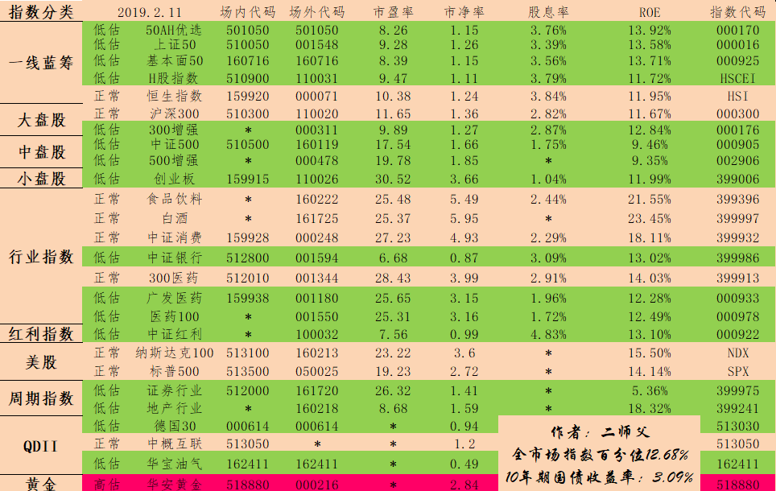

======================================================

_type: talk
@二师父[28814221155551]
2019-02-12 04:35:54 Tue  
topic_id: 844424482121882

@Pacifica at 2019-02-12 04:35:54 Tue

> 一看标题，心里一抖，打翻了手中的茶碗。打开文章一读，内心归于宁静，但是还是期待着收获的小喜悦。谢谢师父的好文

----------

阅读[3125]  评论[1]  赞[0] 

+++++++++++++++++++++++++++++++++++++++++++++++++++++

文件：
2019-02-12 04:35:39 Tue
文件大小：[25917]
88842481458142-李大霄宣布牛市到来，你准备好了吗.docx

======================================================

_type: talk
@健哥[51511242852814]
2019-02-12 11:59:24 Tue  
topic_id: 422252254221858

反弹往往是我们新手最兴奋的时候，也是最危险的时候，希望师父能在合适赎回时机提醒一下，谢谢！

@二师父 at 2019-02-12 11:59:24 Tue

> 按照利润收割法收割就行，现在还很便宜

----------

阅读[1337]  评论[1]  赞[0] 

======================================================

_type: q&a
@冉冉[88445118854412]
2019-02-12 12:25:31 Tue  
topic_id: 544454452225284

@冉冉

>  二师傅好。请问基金净资产若逐步变低对基金估值会形成怎样的影响？能不能理解净资产走低基金投资价值也要变小？

@二师父

>  股票的净资产吧，基金是净值，如果变得很低，对于企业讲基本面就恶化了

阅读[1456]  评论[0]  赞[0] 

======================================================

_type: q&a
@Eric[48548828828848]
2019-02-12 12:25:50 Tue  
topic_id: 422252281155848

@Eric

>  五步定投法可不可以再发一次，我的找不到了

@二师父

>  学堂搜索五步定投法

阅读[1484]  评论[0]  赞[0] 

======================================================

_type: q&a
@杜志彪[544454124115854]
2019-02-12 12:27:29 Tue  
topic_id: 422252254212528

@杜志彪

>  二师父您好：我19年开始定投的医药，消费，中概互联，300ETF都已进入正常估值，停止了定投，目前只剩下500ETF，50ETF和H股ETF三个，网格只对500ETF增加了底仓，后边在定投的话您是怎么做的，是把正常估值定投的份额加到三个低估ETF里，还是选择新的低估品种，再有就是留着这些份额等低估了再加进去。

@二师父

>  资金多的话就选择新的投资品种，市场上低估的还是很多的，资金不足的话就拿着等待低估

阅读[1580]  评论[0]  赞[0] 

======================================================

_type: q&a
@王秦川[844151411882412]
2019-02-12 12:45:45 Tue  
topic_id: 422252254114848

@王秦川

>  二师父：我昨天场外跟投的华宝油气，净值是多少，在什么地方看？

@二师父

>  基金净值走势曲线那里可以看到

阅读[1532]  评论[0]  赞[0] 

======================================================

_type: talk
@二师父[28814221155551]
2019-02-12 14:19:59 Tue  
topic_id: 422252258828888

<e type="hashtag" hid="142511181542" title="#周二荐书#" />书名字， 这样学习就够了，利用拆书法来学习致用类图书

阅读[2937]  评论[0]  赞[0] 

======================================================

_type: talk
@二师父[28814221155551]
2019-02-13 04:13:42 Wed  
topic_id: 244424445145181

<e type="hashtag" hid="481211145528" title="#指数估值#" />

阅读[2831]  评论[0]  赞[0] 

+++++++++++++++++++++++++++++++++++++++++++++++++++++

图片：

======================================================

_type: talk
@二师父[28814221155551]
2019-02-13 04:15:15 Wed  
topic_id: 544454442842844

<e type="hashtag" hid="481144488858" title="#投资理念#" />

@无名书苑 at 2019-02-13 04:15:15 Wed

> 写的很好[强]

----------

@西锦巴乌 at 2019-02-13 04:15:15 Wed

> 师父的这张图很好，把我们现在处在的位置一目了然地呈现出来，不被目前的📈迷惑而乱了方寸[强][强][强]

----------

阅读[3195]  评论[2]  赞[0] 

+++++++++++++++++++++++++++++++++++++++++++++++++++++

文件：
2019-02-13 04:14:28 Wed
文件大小：[68755]
15514142125142-大盘一路上涨，定投下不去手怎么办.docx

======================================================

_type: q&a
@归去来兮[111851181241512]
2019-02-13 11:03:56 Wed  
topic_id: 544454444145244

@归去来兮

>  二师父您好，我的白酒和消费指数和基金现在涨了不少了，大概15%，我看现在估值是正常了，估值正常这时操作策略是什么？是锁仓，还是减仓？如果减仓策略是什么，先减掉增长利润部分？比如15%？（但总体目前还是亏的，去年套牢下来，下面补了不少仓）

@二师父

>  先卖出利润部分，其他的估值处于低估的继续定投即可

阅读[1378]  评论[3]  赞[0] 

======================================================

_type: talk
@陈[844415515418422]
2019-02-13 15:08:11 Wed  
topic_id: 244424441122811

二师父，我发了点年终奖，想都买基金，下图是我买的，请您给点建议，应该买那些？

@二师父 at 2019-02-13 15:08:11 Wed

> 50ah，300增强，500增强，医药100

----------

@陈 at 2019-02-13 15:08:11 Wed

> 谢谢您！

----------

阅读[1207]  评论[2]  赞[0] 

+++++++++++++++++++++++++++++++++++++++++++++++++++++

图片：
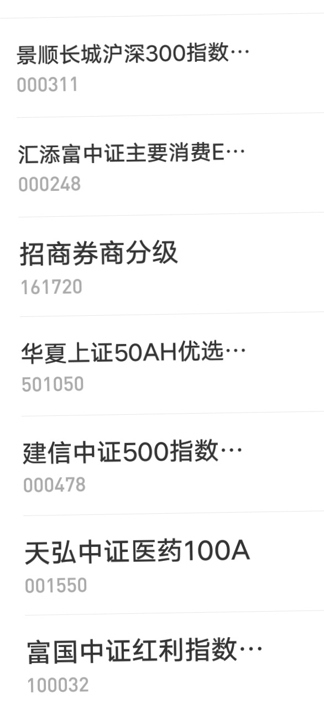

======================================================

_type: q&a
@Shitou_li[15155885518252]
2019-02-13 15:58:05 Wed  
topic_id: 422252214422118

@Shitou_li

>  二师父您好，请问蛋卷和天天哪个好一点，我准备开一个，拓展下场外基金定投（以前在南方定投只有几个很少的标的，跟着二师父，18年学到不少知识，想另开一个更全面的平台拓展场外定投），场内可定投品种相对少一些，场内目前持仓图片上的品种！如果场外开仓有没有好的建议，谢谢

@二师父

>  场外我选择的是管理费率低的渠道，蛋卷和天天都不错，天天赎回快，蛋卷界面简洁，各有优势，看你喜欢用哪个了，我都开过。多分享一起进步啊

阅读[1304]  评论[2]  赞[0] 

======================================================

_type: q&a
@好运玲玲[244188585541521]
2019-02-13 18:21:18 Wed  
topic_id: 422252214541448

@好运玲玲

>  二师父您好！年前我在天天基金场内买了900股中概互联，因为是新手想尝试一下初次没敢多买，现在已经盈利129.45，现在看估值表中概互联已经在正常估值，是否也要把利润部分卖掉？

@二师父

>  可以卖出一部分，不过7天内买的别卖，会有强制收手续费

阅读[1265]  评论[0]  赞[0] 

======================================================

@二师父[28814221155551]
2019-02-13 18:23:17 Wed  
topic_id: 422252215854248

>  @二师父
>  

阅读[1282]  评论[6]  赞[0] 

======================================================

_type: talk
@陈[844415515418422]
2019-02-13 20:44:43 Wed  
topic_id: 544454484211424

二师父，看您的五步定投里讲的是高估后再按比例收割利润，可怎么看其他同学问您的问题里都是正常估值有百分之十利润，就开始把盈利部分收割？

@二师父 at 2019-02-13 20:44:43 Wed

> 正常估值收割利润，高估就开始逐步卖出本金了

----------

阅读[1179]  评论[1]  赞[0] 

======================================================

_type: q&a
@程洋[28258521545511]
2019-02-13 20:45:03 Wed  
topic_id: 111141184822842

@程洋

>  二师傅你好!如何查看指数基金的PE

@二师父

>  指数的pe就是市盈率，这个你在估值表的市盈率一栏可以看到，每天都会发布的，自己也可以到中证指数官网，果仁网，理杏仁这些地方看到的，都是免费的数据

阅读[1308]  评论[0]  赞[0] 

======================================================

_type: q&a
@杜志彪[544454124115854]
2019-02-13 20:46:41 Wed  
topic_id: 111141181225222

@杜志彪

>  您好二师父：选择了2只低估场内基金中证银行和德国30，替代进入正常估值的中概互联300ETF，但是查到的场内德国30代码是513030，表中的000614是场外基金代码，不知我查的对不对，场内定投是买入513030对吧。

@二师父

>  对，这个替代是可以的，000614是华宝油气的，德国30是513030，中概互联最近涨的不错，等待低估再定投

阅读[1547]  评论[1]  赞[0] 

======================================================

_type: talk
@二师父[28814221155551]
2019-02-13 21:47:10 Wed  
topic_id: 544454484181544

<e type="hashtag" hid="552511488184" title="#定投提示#" /> 之前我们场内建了底仓进行网格交易，如果按照我设置的格子现在已经卖出很多了，大家最新做网格交易的话可以在低估区域内自己设置网格，记住，只要低估区域内建立底仓都是安全的

另外需要注意，指数估值是在每日估值表里面，不是网格图，虽然券商这种基金最近涨了很多，不过二师父明确告诉大家券商仍旧低估的，你可以看看券商指数从15年股灾到现在已经连续跌了三年，是很便宜的，以至于之前二师父定投券商时候有的读者问，券商基金三年没涨，以后还会涨吗

切记投资一定要向前看10年，再向后看10年，不要只看几天的涨跌情况

@小溪医生 at 2019-02-13 21:47:10 Wed

> 请问二师父，低估区域里的指数估值，低估程度是否也不相同，目前哪个指数低估程度最低？

----------

@二师父 at 2019-02-13 21:47:10 Wed

> 中证500，50ah，医药100

----------

@蒋 at 2019-02-13 21:47:10 Wed

> 我今天买了H股ETH，广发医药，医药ETF，做低仓，进行网格交易。这几只基金按90日均线来算偏离度可以吗？

----------

@二师父 at 2019-02-13 21:47:10 Wed

> 可以，医药etf正常估值不太适合

----------

@蒋 at 2019-02-13 21:47:10 Wed

> 如果出现单边上涨行情，是卖出底仓，还是可以加仓

----------

@二师父 at 2019-02-13 21:47:10 Wed

> 不要追涨，如果真的是单边上涨，可以设定止损点，然后买入基本面好的股票

----------

阅读[3124]  评论[6]  赞[0] 

======================================================

_type: talk
@二师父[28814221155551]
2019-02-14 04:42:49 Thu  
topic_id: 422252211511118

<e type="hashtag" hid="481211145528" title="#指数估值#" /> 创业板和H股指数进入正常估值，对于正常估值区间，在这个估值表已经公布了，大家参照这个就知道是否低估。

@jiangya at 2019-02-14 04:42:49 Thu

> 这个估值表好，增加了正常估值区间。感谢二师傅的分享！另外，对于同时都低估的指数，是否应该优先选择低估幅度更大一些的指数来定投？

----------

@二师父 at 2019-02-14 04:42:49 Thu

> 对的，我们将更多的资金集中到配置更多的低估指数基金

----------

阅读[2976]  评论[2]  赞[0] 

+++++++++++++++++++++++++++++++++++++++++++++++++++++

图片：
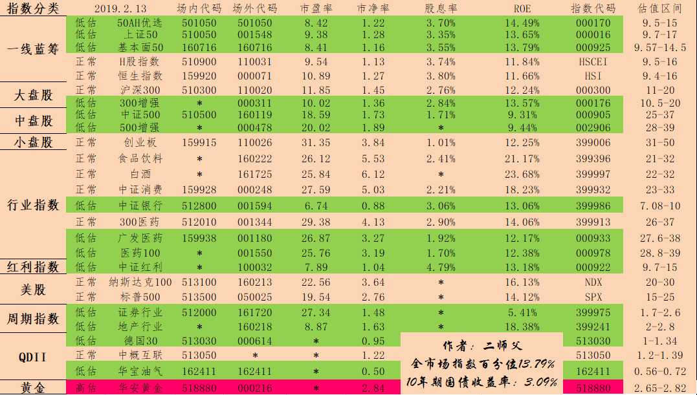

======================================================

_type: talk
@二师父[28814221155551]
2019-02-14 04:43:49 Thu  
topic_id: 844424411211112

<e type="hashtag" hid="454588145228" title="#市场预测#" /> 二师父不擅长预测，天王预测可信吗

阅读[3314]  评论[0]  赞[0] 

+++++++++++++++++++++++++++++++++++++++++++++++++++++

文件：
2019-02-14 04:43:26 Thu
文件大小：[25762]
88842424254152-上证指数四连阳，还信不信周天王.docx

======================================================

_type: talk
@自然[111185452115512]
2019-02-14 08:32:15 Thu  
topic_id: 844424158228152

全指医疗，中证医药，医药100指数有什么区别?谢谢

@二师父 at 2019-02-14 08:32:15 Thu

> 可以看看我以前写的一篇文章医药基金的三架马车，这三个基金都分析了一遍

----------

@自然 at 2019-02-14 08:32:15 Thu

> 二师傅，应该在哪里找的?谢谢

----------

@自然 at 2019-02-14 08:32:15 Thu

> 二师傅，我没找到，应该从哪里搜索的？

----------

@二师父 at 2019-02-14 08:32:15 Thu

> 在学堂搜索医药相关词语

----------

@自然 at 2019-02-14 08:32:15 Thu

> 在星球的二师傅定投学堂中还是微信公众号中都没有搜到

----------

@二师父 at 2019-02-14 08:32:15 Thu

> 搜医药基金的三架马车

----------

阅读[1318]  评论[6]  赞[0] 

======================================================

_type: q&a
@西锦巴乌[88448285428482]
2019-02-14 10:11:44 Thu  
topic_id: 422252148121428

@西锦巴乌

>  师父好！之前买的股票型基金现在有盈利了是否可以把它处理掉或转换成低估的指数型基金？谢谢

@二师父

>  对，你先看看持仓股票，如果持仓股票不好，全部卖出，如果持仓股票好，逐步卖出，或者转移到低估指数基金

阅读[1342]  评论[1]  赞[0] 

======================================================

_type: q&a
@凭栏观海[244414845852181]
2019-02-14 10:44:42 Thu  
topic_id: 422252145845848

@凭栏观海

>  二师父老师，现在银行如果定投，是选择银行指数基金还是直接投资银行的龙头股招商银行?或者民生银行?谢谢

@二师父

>  都可以，资金大可以选三家头部银行逆势加仓，设置5个档位，比如先建底仓，没下降几个点加一次，这样相当于自己构建指数基金，银行风险比较小

阅读[1440]  评论[1]  赞[0] 

======================================================

_type: talk
@二师父[28814221155551]
2019-02-14 10:48:19 Thu  
topic_id: 844424152888242

<e type="hashtag" hid="552511812284" title="#场外低估定投实盘#" /> 大盘今天没有继续上涨，好兆头，买入50ah，中证500指数a，德国30各一份，消费开始收割一次利润，收割的资金买入货币基金用于之后加仓低估的指数基金，这就是资金轮动配置，总是去买入市场低估的资产

@Shitou_li at 2019-02-14 10:48:19 Thu

> 我也卖出了沪深300.消费etf，医药etf利润，准备把利润建仓50ah，德国30，加仓中证500.有个疑咨询下师傅，券商还有10%利润没有出，不过目前证券etf低估怎么考虑？谢谢二师傅

----------

@二师父 at 2019-02-14 10:48:19 Thu

> 可以持有，如果仓位重的话做网格也行，目前牛市并没有明显信号

----------

@Shitou_li at 2019-02-14 10:48:19 Thu

> 今天是定投日，原本也要定投低估指数，想着卖出利润又在加仓所以就拿不定注意，谢谢师傅

----------

阅读[3092]  评论[3]  赞[0] 

======================================================

_type: q&a
@顾。[51558482245254]
2019-02-14 12:00:32 Thu  
topic_id: 422252145555528

@顾。

>  1、二师父，你好。沪深300，我选择定投的是300价值，已经定投快一年了，看你表格里没有300价格，只有沪深300和300增强，那我是否换？
>  2、若不需要更换，300价值现在是否低估？它的估值区间是多少？ 谢谢！

@二师父

>  不用换，300价值是12到23倍市盈率

阅读[1382]  评论[1]  赞[0] 

======================================================

_type: talk
@Shitou_li[15155885518252]
2019-02-14 14:01:06 Thu  
topic_id: 422252142841218

场外新开仓，以后跟着二师傅系统性优化投资体系……

@小涛@我的四季生活 at 2019-02-14 14:01:06 Thu

> 二师父没有这些组合吧

----------

@二师父 at 2019-02-14 14:01:06 Thu

> 可以在我的系统上建立自己的交易系统，青出于蓝胜于蓝，希望你们都能超越我成为投资高手，我也会不断努力学习的

----------

@Shitou_li at 2019-02-14 14:01:06 Thu

> 没有，我是到处看到处学，只要能创造价值的都行

----------

@Shitou_li at 2019-02-14 14:01:06 Thu

> 以后还得多请教您，跟您学习

----------

阅读[1291]  评论[4]  赞[0] 

+++++++++++++++++++++++++++++++++++++++++++++++++++++

图片：

======================================================

_type: talk
@二师父[28814221155551]
2019-02-14 20:14:53 Thu  
topic_id: 111141855444512

这是场外实盘的所有代码，场内买入也可以，标的都是一样的，就是费率稍微有些差别，如果资金量在100万以上的还是建议场内

@olivia 刘_2* at 2019-02-14 20:14:53 Thu

> 二师父，场内买入的时候，价格一直是变动的，一般买在哪个点比较好？我刚开始接触场内，总是贪心想去买最低点，所以总是错过……[囧]

----------

@王秦川 at 2019-02-14 20:14:53 Thu

> 辛苦了二师父[咖啡][咖啡][咖啡]，平时忙，紧跟二师父就行了。

----------

@王秦川 at 2019-02-14 20:14:53 Thu

> 二师父你的操作都是在星球🌍上公布吧[微笑]

----------

@二师父 at 2019-02-14 20:14:53 Thu

> 避免溢价就行，一天的价格不用太在意

----------

@二师父 at 2019-02-14 20:14:53 Thu

> 是的，都会在星球公布的

----------

@文斌 at 2019-02-14 20:14:53 Thu

> 新人一个，二师父辛苦了！请问目前低估品种如中证500，中证红利等，可以在场外一次性多买建底仓，再逐步定投？

----------

@二师父 at 2019-02-14 20:14:53 Thu

> 可以的

----------

阅读[3002]  评论[7]  赞[0] 

+++++++++++++++++++++++++++++++++++++++++++++++++++++

图片：
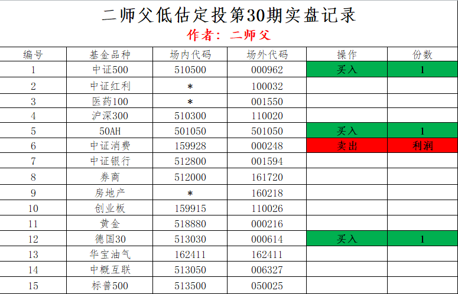

======================================================

_type: q&a
@程洋[28258521545511]
2019-02-14 20:43:37 Thu  
topic_id: 422252188282188

@程洋

>  二师父你好!建信中证500指数增强A要不要坚持定投。

@二师父

>  可以坚持定投，建信500增强，和中证500增强a选择一个就行啦，持仓股票有重复的

阅读[1259]  评论[0]  赞[0] 

======================================================

_type: q&a
@凭栏观海[244414845852181]
2019-02-14 21:12:51 Thu  
topic_id: 844424188128542

@凭栏观海

>  收割利润是否可以这样理解:比如投资5万，现在净赚了1万，成了6万。收割利润是否意味着卖出1万元的基金?

@二师父

>  对，就是这个意思，然后当我们投资基金翻倍的话相当于是卖出了一半份额，一直收割利润到牛市基金净值翻倍那么我们之前的投入本金全部赎回，剩余的一半放在账户里就是净利润

阅读[1427]  评论[1]  赞[0] 

======================================================

_type: talk
@归去来兮[111851181241512]
2019-02-14 21:40:13 Thu  
topic_id: 244424182554411

<e type="hashtag" hid="552511812284" title="#场外低估定投实盘#" /> 学习

阅读[1269]  评论[0]  赞[0] 

======================================================

_type: talk
@二师父[28814221155551]
2019-02-15 04:26:55 Fri  
topic_id: 244424181152541

<e type="hashtag" hid="481211145528" title="#指数估值#" /> 说下债券，国债收益率高于3.8个百分点以后可以定投债券基金，投资的时候二师父会说的。目前投资指数基金即可。定投就是把简单的事情重复做，把重复的事情认真做。

@凭栏观海 at 2019-02-15 04:26:55 Fri

> 赞同

----------

阅读[3061]  评论[1]  赞[0] 

+++++++++++++++++++++++++++++++++++++++++++++++++++++

图片：
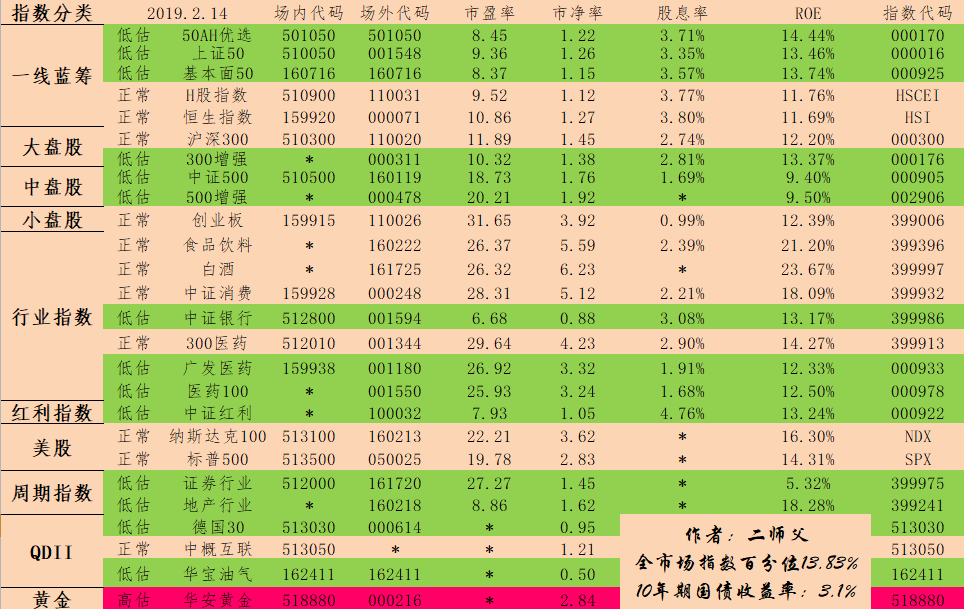

======================================================

_type: talk
@二师父[28814221155551]
2019-02-15 04:28:27 Fri  
topic_id: 422252181145418

基金卖出策略，博采众长，然后取其精华，总结下你自己适合哪种卖出策略。

阅读[3404]  评论[0]  赞[0] 

+++++++++++++++++++++++++++++++++++++++++++++++++++++

文件：
2019-02-15 04:27:50 Fri
文件大小：[71519]
51145458554484-二师父教你三招多样化的基金卖出策略.docx

======================================================

_type: q&a
@小米兔[48245525418488]
2019-02-15 10:43:41 Fri  
topic_id: 544454852828484

@小米兔

>  请问什么时候停止定投，是在正常估值还是高估值的时候？

@二师父

>  正常估值时候停止

阅读[1301]  评论[2]  赞[0] 

======================================================

_type: talk
@自由飞翔[544442815144244]
2019-02-15 10:53:59 Fri  
topic_id: 111141842848452

<e type="hashtag" hid="281158522841" title="#每日打卡#" /> 第六期，1.每周四坚持定投：300增强，500增强，中证银行，医药100；2.300医药和中证消费在低估时有购买，少量持有，目前医药盈利11个点，消费盈利19个点；3.50AH于昨天建底仓，后续每周四定投；4.目前仓位较大的分别有：300增强，500增强，医药100,证券行业，50AH。5.特别感恩师傅的无私，每天的干货分享都是及时雨，定投的路上只觉本金太少，自从记账后发现自己更尊重钱[微笑]

阅读[1269]  评论[0]  赞[0] 

======================================================

_type: q&a
@好运玲玲[244188585541521]
2019-02-15 12:08:49 Fri  
topic_id: 244424125118841

@好运玲玲

>  二师父您好！闲钱可以放在微信理财里的保险产品或是安稳债基里吗？比如“平安养老富盈360天”、“太平养老颐养270天”这样的定期，或是“嘉实超短债”，它们的收益都比放在银行里的收益高。

@二师父

>  不适合，这种没多少收益，流动性也差，就买货币基金可以了

阅读[1273]  评论[1]  赞[0] 

======================================================

_type: q&a
@🙏shishi[51184511225484]
2019-02-15 12:09:52 Fri  
topic_id: 422252158848288

@🙏shishi

>  [怎么看建信500，去年开始跟车，建仓的其他表现都很好，就是建信亏损快50%了，这个我需要清一下，还是继续买点拉低成本呀

@二师父

>  保持现有仓位，不要轻仓，可以拉长定投周期，别放弃定投，你估计投早了

阅读[1291]  评论[0]  赞[0] 

======================================================

_type: q&a
@风信子[544458822111224]
2019-02-15 12:54:03 Fri  
topic_id: 544454851518844

@风信子

>  二师父，你好。中证消费现在是正常估值，可我才买了2次，现在盈利19% 也才100多块钱。是不是不理它？

@二师父

>  那就放着吧，买了也赚不到多少钱，等进入低估再投

阅读[1338]  评论[2]  赞[0] 

======================================================

_type: q&a
@白乌鸦[244122188112241]
2019-02-15 15:08:48 Fri  
topic_id: 244424128184211

@白乌鸦

>  二师父，请问怎么找到含某一重仓股的基金？比如找
>  
>  到重仓股含当升科技的基金

@二师父

>  去相关基金里面查阅前10大重仓股，先确定股票的行业以及市值，然后缩小范围

阅读[1291]  评论[0]  赞[0] 

======================================================

_type: talk
@olivia 刘_2*[244184425421151]
2019-02-15 19:30:29 Fri  
topic_id: 422252124485118

小白一枚，场外定投从18年12月开始，300增强目前浮盈10%，500增强浮盈6.5%，之前因不知道低估高估的概念，在底部时也不敢增加份额。回调时还直接把智能定投给停了。完全是瞎操作。感谢遇到可以在理财之路遇到了师父，自己慢慢学习吧。昨天开始场内小额投了50ah，500ETF，券商ETF，感受了一把，觉得很刺激……对抗自己的人性的感觉好特别……买基买出了新的人生感悟[偷笑]

目前仓位4%。

做个认真的学生[奋斗]
好记性不如烂笔头

@二师父 at 2019-02-15 19:30:29 Fri

> 很棒，我也像你学习[强][强]

----------

阅读[1197]  评论[1]  赞[1] 

+++++++++++++++++++++++++++++++++++++++++++++++++++++

图片：
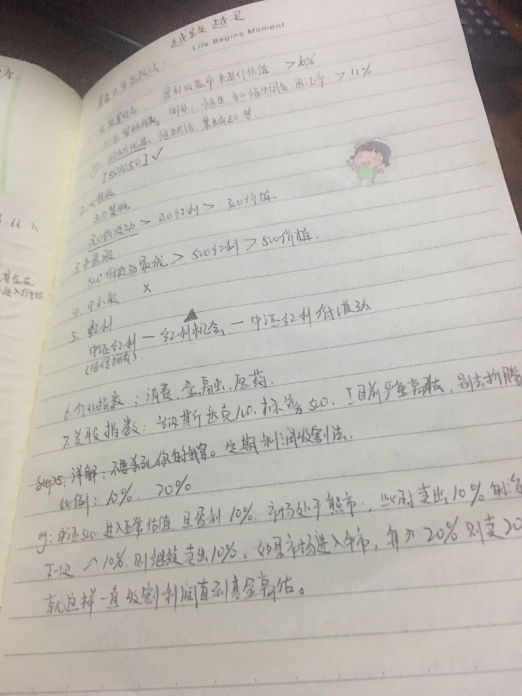

======================================================

_type: q&a
@程洋[28258521545511]
2019-02-15 23:01:52 Fri  
topic_id: 111141812585112

@程洋

>  二师父你好!如何判断基金是高估还是低估?

@二师父

>  在我的估值表里面有阈值，可以根据这个简单判断，低估最低就是低估，实际自己判断基金估值和投资价值需要结合净资产收益率，股息率，市盈率，市净率等各个指标判断

阅读[1190]  评论[0]  赞[0] 

======================================================

_type: q&a
@王雷[51452418141424]
2019-02-15 23:03:37 Fri  
topic_id: 544454842185214

@王雷

>  二师傅您好300增强我投的是100032需要换成000311吗？100032也是300增强是吗？还有环保目前亏百分之20本金有九万是应该出来换别的基金，还是继续定投？还是放着不动等牛市？谢谢回答

@二师父

>  300增强标的都是一样没必要换，100032是中证红利增强不是300增强，环保和传媒如果之前买过，资金部急着用的话目前可以一直拿着，到正常估值逐步卖出

阅读[1252]  评论[3]  赞[0] 

======================================================

_type: q&a
@归去来兮[111851181241512]
2019-02-15 23:07:40 Fri  
topic_id: 544454842428554

@归去来兮

>  二师父医药指数值得定投吗？医药最近感觉黑天鹅不断，不知道长期定投是否安全，带量采购是否会使医药的估值下降？

@二师父

>  值得定投的这个不用担心，带量采购看情况，有可能使医药企业利润下降，目前我的300医药是盈利的，医药100略有浮亏，因为医药100是小盘医药股票，如果你担心的话那就只投300医药，这个需要等等，目前正常估值

阅读[1285]  评论[5]  赞[0] 

======================================================

_type: q&a
@归去来兮[111851181241512]
2019-02-15 23:08:50 Fri  
topic_id: 111141812855112

@归去来兮

>  二师父请教一个利润收割的问题，上涨15%的时候，卖掉了15%，然后跌回去了，在底部继续不断的定投，当重新上涨到15%这个价位时，还需要再次收割吗？

@二师父

>  需要的，这个也不是说固定的，假设你有50万，投资了2万，这个时候投入资金明显不足就不需要收割，根据实际情况决定

阅读[1344]  评论[0]  赞[0] 

======================================================

_type: q&a
@LookGod[15142444258282]
2019-02-16 03:32:58 Sat  
topic_id: 422251422811548

@LookGod

>  今天碰到一个小问题，之前二师父给的沪深300高估阈值是20，可是15年时候已经高估了，那时候的300PE才18，，根据历史估值来看，PE13就算是比较高的了，感觉高估阈值15比较合适，，另外个人感觉未来指数会有整体估值下移的趋势。二师父可以解惑一下嘛，，🙏

@二师父

>  15年那时候是中小盘牛市，整体沪深300没有特别高估，主要高估集中在了创业板，市盈率都100多了，那一次也不是基于基本面情况下的牛市后期我会继续跟踪，如果有调整会好知大家的

阅读[1279]  评论[0]  赞[0] 

======================================================

_type: talk
@二师父[28814221155551]
2019-02-16 04:50:56 Sat  
topic_id: 544458244584424

<e type="hashtag" hid="481211145528" title="#指数估值#" /> 每日估值表，坚持低估定投

@生活、小船 at 2019-02-16 04:50:56 Sat

> 二师父，之前一直在说的阀值是在这里找么？是哪个呢？

----------

@爱华 at 2019-02-16 04:50:56 Sat

> 往前再找到两个估值表里就有

----------

@生活、小船 at 2019-02-16 04:50:56 Sat

> 多谢，找到了

----------

@朱宇超 at 2019-02-16 04:50:56 Sat

> 二师父。股指表的指数市盈率是静态还是动态呀

----------

@二师父 at 2019-02-16 04:50:56 Sat

> 这个是滚动市盈率

----------

@惟子 at 2019-02-16 04:50:56 Sat

> 二师父:看到中概互联低估了呀

----------

@二师父 at 2019-02-16 04:50:56 Sat

> 对的

----------

@惟子 at 2019-02-16 04:50:56 Sat

> 刚查了一下，不能场外购买，唉😔

----------

阅读[3148]  评论[10]  赞[0] 

+++++++++++++++++++++++++++++++++++++++++++++++++++++

图片：
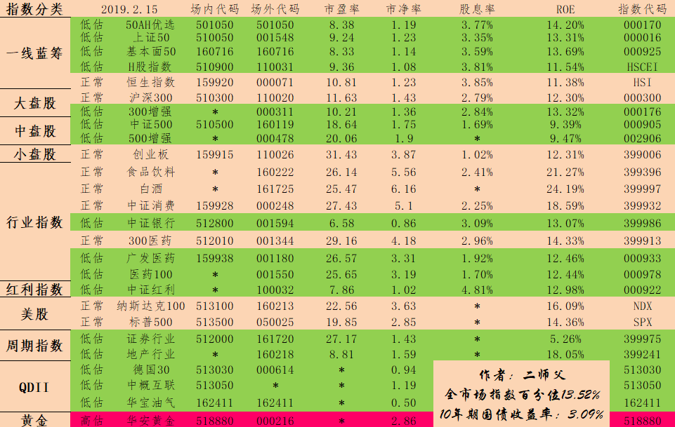

======================================================

_type: talk
@二师父[28814221155551]
2019-02-16 04:54:02 Sat  
topic_id: 111148211481152

<e type="hashtag" hid="454582221888" title="#人性弱点#" /> 学会克服人性弱点，然后就能够投资成功了。

@海盗 at 2019-02-16 04:54:02 Sat

> 耐心很重要。

----------

阅读[3513]  评论[1]  赞[0] 

+++++++++++++++++++++++++++++++++++++++++++++++++++++

文件：
2019-02-16 04:53:11 Sat
文件大小：[25670]
28842442814581-买基金的人性之战.docx

======================================================

_type: q&a
@xazzen健辉[51452125142254]
2019-02-16 11:32:16 Sat  
topic_id: 422251422254528

@xazzen健辉

>  二师兄好，请问华夏海外收益债，好久前买的，现持有中，不知怎么卖，想请教一下这个是像债基那样在十年期国债收益率跌破3时清仓吗？还是？

@二师父

>  海外美元收益债券看美元指数，美元指数低买入，美元指数高卖出

阅读[1356]  评论[0]  赞[0] 

======================================================

_type: q&a
@远熹[544814518545554]
2019-02-16 11:48:30 Sat  
topic_id: 422251422155548

@远熹

>  二师父，我今年才开始接触指数定投，因为没有什么钱，打算先拿几万块试一下，但我不知道怎么合理分配定投的频率，这方面可以指点一下么

@二师父

>  中证500，沪深300，医药100，消费etf，选择低估的开始定投，目前中证500和医药100低估，这四个轮动定投就可以了

阅读[1391]  评论[0]  赞[0] 

======================================================

_type: q&a
@冉冉[88445118854412]
2019-02-16 11:50:59 Sat  
topic_id: 111148211815822

@冉冉

>  请问二师傅，食品消费指数中有农业类股票吗？如何查看食品消费指数中农业股的占比?

@二师父

>  去中证指数官网，查阅相关指数，下载持仓股票表格可以看到每只股票，在饼状图里面有行业配比

阅读[1494]  评论[0]  赞[0] 

======================================================

_type: q&a
@凭栏观海[244414845852181]
2019-02-16 22:19:17 Sat  
topic_id: 111148281485152

@凭栏观海

>  二师父的估值表为什么不纳入深证红利呢?据说也是非常优秀的一个基金?

@二师父

>  红利基金我主要看分红，这只基金分红不太好，成长性是不错，不过我投资红利基金是看分红，不是成长性

阅读[1481]  评论[0]  赞[0] 

======================================================

_type: talk
@二师父[28814221155551]
2019-02-17 04:28:49 Sun  
topic_id: 422251411558418

<e type="hashtag" hid="454841141288" title="#均线偏离表#" /> 如果市场不再震荡，可以不用这种策略了，绿色是基金价格偏离均线以下，可以买入

@小涛@我的四季生活 at 2019-02-17 04:28:49 Sun

> 请问二师父偏离值是根据什么估算的？如果是偏离度一就买入一份吗？

----------

@二师父 at 2019-02-17 04:28:49 Sun

> 根据偏移百分比来的

----------

阅读[3326]  评论[2]  赞[0] 

+++++++++++++++++++++++++++++++++++++++++++++++++++++

图片：
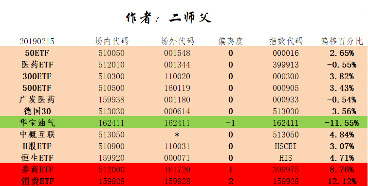

======================================================

_type: talk
@二师父[28814221155551]
2019-02-17 04:30:53 Sun  
topic_id: 422251411558858

<e type="hashtag" hid="825284144182" title="#能力圈#" /> 找准自己的能力圈，不管是基金还是股票，首先得了解自己是否合适，是否在投资能力圈以内。

阅读[3606]  评论[0]  赞[0] 

+++++++++++++++++++++++++++++++++++++++++++++++++++++

文件：
2019-02-17 04:29:46 Sun
文件大小：[24668]
51145444244524-学会固守自己的能力圈.docx

======================================================

_type: talk
@老丁[15541182455482]
2019-02-17 10:27:06 Sun  
topic_id: 111148525181812

二师父，请教一个问题，目前沪深300已经正常估值，所以想改用300增强代替，看您推荐的场外300增强的是 000311，我看下这个基金的介绍，它的跟踪标底仍然是 沪深300，那么这里有个问题，就是 300增强 和 沪深300 为什么一个已经正常估值了，另外一个还是低估呢？如果是 300增强是沪深300的一个策略变体，那么300增强的估值和沪深300是一个什么关系呢？谢谢

@二师父 at 2019-02-17 10:27:06 Sun

> 本质区别不大，沪深300增强是追踪的沪深300指数，可是他不是完全复制，有主动选股调仓，会带来一部分超额收益，成长性在牛市中会比沪深300更加，安全边际可以稍微放宽一点

----------

@老丁 at 2019-02-17 10:27:06 Sun

> 谢谢

----------

阅读[1332]  评论[2]  赞[0] 

======================================================

_type: q&a
@niwota[422255254814458]
2019-02-17 10:52:40 Sun  
topic_id: 244421511484251

@niwota

>  您好二师父，我想的定投策略是在低PE区域定投，然后在中间持有不动，等待高PE区域卖出。我的问题是在低PE区分多少期定投呢，如何在低位达到理想的仓位呢？谢谢！

@二师父

>  如果从第一轮熊市结束，选择150期或者250期，现在选择50或者100期可以，如果你仓位低可以建底仓

阅读[1449]  评论[8]  赞[0] 

======================================================

_type: talk
@二师父[28814221155551]
2019-02-17 11:27:10 Sun  
topic_id: 844421852582512

<e type="hashtag" hid="281181228851" title="#周末答疑#" /> 关于定投，如果新开户，目前定投至少要保证3成以上的仓位，这样才可以避免踏空的可能。至于何时建立底仓，看当前基金的价格，如果最大历史下跌幅度15个百分点左右，适合建立底仓

关于股票购买，也是可以的，参照二师父股票五步趋势交易法，注意和基金定投思维是不同的，因为投资股票是买公司，要买优质公司，股票购买可以选择二师父合作的广发证券，免最低5元，很划算

关于牛市是否到来，二师父认为还早，继续按照网格和低估定投策略执行即可，牛市到来的标志可以看可转债价格，如果可转债价格都在100元以上，那么牛市来了

债券基金熊市是不适合定投的，牛市资金涌入股市才可以逐步定投债券基金，我选择的是国开债

@波 at 2019-02-17 11:27:10 Sun

> 谢谢二师父！让我们受益匪浅。

----------

@杜志彪 at 2019-02-17 11:27:10 Sun

> 国开债是场内的还是厂外的，有代码吗？

----------

@二师父 at 2019-02-17 11:27:10 Sun

> 有的003358

----------

@半路出家滚雪球 at 2019-02-17 11:27:10 Sun

> 最大历史下跌幅度15%左右适合建立底仓，请问这句话怎么理解？

----------

@好运玲玲 at 2019-02-17 11:27:10 Sun

> 二师父您好！就是如果现在准备30万的资金准备定投指数基金，那么现在开始定投要拿出9万建立底仓吗？

----------

@好运玲玲 at 2019-02-17 11:27:10 Sun

> 现在现在二师父的估值标里哪几个适合建立底仓？

----------

@二师父 at 2019-02-17 11:27:10 Sun

> 意思可以这样理解，假设中证500历史上最低价格4.1，那么价格到达4.82，历史最大跌幅就是15个百分点了，具体我没查，思路是这样

----------

@二师父 at 2019-02-17 11:27:10 Sun

> 如果3年资金不用的话可以，中证500，50ah可以的

----------

阅读[3579]  评论[13]  赞[1] 

======================================================

_type: q&a
@光少[244124552511141]
2019-02-17 13:14:45 Sun  
topic_id: 544458125182884

@光少

>  二师父，我持有国泰互联网+股票这支基金，目前亏损30%，还能继续持有吗？是加仓？还是退仓？

@二师父

>  股票基金目前别卖了，等上涨以后逐步卖，目前是市场低位，卖了划不来

阅读[1508]  评论[1]  赞[0] 

======================================================

_type: talk
@二师父[28814221155551]
2019-02-17 20:27:28 Sun  
topic_id: 244421851522121

做一个测试，觉得挺有意思的

有以下三个人，你觉得选择哪个以后生活会更幸福

a，自己有100万，给你10万

b，自己有10万，给你10万

c，自己有0万，借钱给你10万

你选哪个

@小涛@我的四季生活 at 2019-02-17 20:27:28 Sun

> a

----------

@小涛@我的四季生活 at 2019-02-17 20:27:28 Sun

> 因为给那10万的人一定是比较重要的人，而给出金额只占总资金把百分之十，会比较快赚回来。

----------

@niwota at 2019-02-17 20:27:28 Sun

> C  
幸福是一种感受，与实际价值无关。
C的感受最强。

----------

@.Five at 2019-02-17 20:27:28 Sun

> c 从无到有最快乐

----------

@杜志彪 at 2019-02-17 20:27:28 Sun

> 我也选A

----------

@二师父 at 2019-02-17 20:27:28 Sun

> 哈哈，经济学思维运用不错

----------

@小涛@我的四季生活 at 2019-02-17 20:27:28 Sun

> 还需要多多像师父学习

----------

@二师父 at 2019-02-17 20:27:28 Sun

> c意味着你一嫁给他就负债

----------

阅读[1386]  评论[14]  赞[0] 

======================================================

_type: q&a
@蝙蝠侠大战超人[48522585242588]
2019-02-17 21:20:44 Sun  
topic_id: 844421851542512

@蝙蝠侠大战超人

>  二师父，你好，手上还有几万的余钱想定投，目前已经定投2只基金：融通创业板指数A/B（每个月2000元定投），天弘中医药100指数A（每个月定投1000元）。接下来想每个月再定投一只宽基和一只行业基金，可以接受短期波动和一定的风险，目标长期持有2年以上，我想一下现在有估值低的宽基和行业基金推荐一下吗？谢谢

@二师父

>  50ah优选，中证500或者银行业指数基金

阅读[1403]  评论[3]  赞[0] 

======================================================

_type: q&a
@凭栏观海[244414845852181]
2019-02-17 21:25:10 Sun  
topic_id: 544458128122284

@凭栏观海

>  喜欢医药类股票，片仔癀估值如何?目前值得介入吗？

@二师父

>  基本面指标不错，市盈率挺高的，你可以用我介绍的未来现金流折现法计算下

阅读[1491]  评论[1]  赞[0] 

======================================================

_type: q&a
@卢大瑞[88842452422152]
2019-02-18 00:22:29 Mon  
topic_id: 844421882551122

@卢大瑞

>  二师父，您好，上半年可转债能投吗，有没有推荐关注的，谢谢

@二师父

>  可以投资的，具体的你看下集思录，我投的是易方达安心回报债券基金

阅读[1401]  评论[1]  赞[0] 

======================================================

_type: talk
@二师父[28814221155551]
2019-02-18 02:39:23 Mon  
topic_id: 422251885882148

<e type="hashtag" hid="281158284851" title="#市场分析#" /> 未来市场分析，很类似05年和13年底部走势，走完这个底部，牛市可期。

@Swallow at 2019-02-18 02:39:23 Mon

> 一直都有投资意识，18年正式工作开始，从拿到第一份工资开始就买基金，第一份买入的是中证500，一开始也亏也跌，但是我看的很淡，一直相信市场会回暖，只是时间问题，每月除生活开支剩1万块左右，因为没结婚，所以压力不大，每个月剩下的钱全部都投进去了，我计划4-5年和男朋友买房，目前所有基金基本都盈利，还在坚持定投，直到高估慢慢卖出，认识二师父以后，内心更坚定，相信市场

----------

@二师父 at 2019-02-18 02:39:23 Mon

> 你刚毕业工资挺高啊，很少有能一月攒一万的

----------

@Swallow at 2019-02-18 02:39:23 Mon

> 我在广州，一线城市，平时生活也比较省，基本房租+生活费，2000左右，饭卡有补贴，吃饭基本都去饭堂吃，广州房价高，都不知道以后买不买的起房，压力也很大[捂脸][捂脸]现在跟二师父学习，不求一夜暴富，跑赢通货就满足了。

----------

@二师父 at 2019-02-18 02:39:23 Mon

> 和男朋友一起努力没问题的，我得像你学习啊，好节俭

----------

阅读[3761]  评论[4]  赞[0] 

+++++++++++++++++++++++++++++++++++++++++++++++++++++

文件：
2019-02-18 02:38:27 Mon
文件大小：[25652]
51145444858824-当前是本轮熊市末期，布局基金的好时机.docx

======================================================

_type: talk
@小诸葛[88484182152412]
2019-02-18 08:56:52 Mon  
topic_id: 844421882411812

请问军工指数有研究吗，现在是否低估？

@二师父 at 2019-02-18 08:56:52 Mon

> 是低估，周期指数

----------

阅读[1351]  评论[1]  赞[0] 

======================================================

_type: q&a
@好运玲玲[244188585541521]
2019-02-18 10:11:04 Mon  
topic_id: 244421884542551

@好运玲玲

>  二师父您好！看您的中证500场外定投实盘选的是天弘中证500指数a，但您的估值标里推荐的是南方中证500etf联接和建信中证500指数增强，我们定投到底选哪个好？

@二师父

>  都可以，中证500和南方中证是纯被动指数，500增强不是完全被动指数，有一定的主动选股特性。之前我投的500增强，现在投的是中证500a这个费率低，南方中证500也可以，选择一个就行，追踪的指数都是一样的

阅读[1469]  评论[0]  赞[0] 

======================================================

_type: talk
@二师父[28814221155551]
2019-02-18 11:16:24 Mon  
topic_id: 544458152285444

<e type="hashtag" hid="825281855852" title="#关于刚需买房#" /> 在评论区看到有买房的信息，刚需买房一定不要等，借钱够了首付就马上上车。

我是毕业第一年买房的，当时家人也不同意，说什么女朋友没定，买了也没法就住，房价是涨是跌不清除，想卖不一定卖的了

总之一旦认定一个观点就会找各种论据证明自己是对的，不过我还是顶住了各方压力上车了，借了很多钱，不然首付凑不齐，后来可以用工资还

永远别怕还不上房贷，只要努力，你得成长速度一定会是很快的

说了这么多就一个观点，刚需有钱尽快上车，没钱借钱上车

@彩色 at 2019-02-18 11:16:24 Mon

> 好想知道二师父生活在哪个城市呢？哈哈

----------

@二师父 at 2019-02-18 11:16:24 Mon

> 你猜

----------

@小涛@我的四季生活 at 2019-02-18 11:16:24 Mon

> 我觉得还是看个人的理财观

----------

@Swallow at 2019-02-18 11:16:24 Mon

> 广州，我单位附近400-500，我18年才毕业，买不起，[捂脸][捂脸][捂脸]

----------

@.Five at 2019-02-18 11:16:24 Mon

> 同二师父呀~我是毕业一年半借钱上车的  长期看 房价仍然必涨

----------

@凭栏观海 at 2019-02-18 11:16:24 Mon

> 胆大心细，有勇有谋！

----------

@二师父 at 2019-02-18 11:16:24 Mon

> 一线是很贵，基本没有家里支援是很难凑首付

----------

@二师父 at 2019-02-18 11:16:24 Mon

> 有远见

----------

阅读[1465]  评论[11]  赞[0] 

======================================================

_type: talk
@老丁[15541182455482]
2019-02-18 12:37:51 Mon  
topic_id: 111148542155852

二师父，问一个比较弱的问题，就是A股历史牛熊周期到底是几个呀？是用什么标准划分的呢？看你的文章说的是5个，但是网上好些说是8次，10次的都有。我理解的，两个波峰（或则波谷）之前的区域就是一个周期，但是如下图，蓝色区域可以理解为一个周期，但是图中两个蓝黄区间，感觉也可以算是一个周期呀？所以就想问下牛熊周强划分是以什么为标准的？谢谢

@二师父 at 2019-02-18 12:37:51 Mon

> 那个算小周期，顶多是在政策之间的回调，牛熊周期看估值指标，每次历史底部指标到达，就是熊底部，我说的是大的牛熊周期，那种小幅度波动是波段涨跌

大的牛熊周期是资产增倍的好机会，小的波段可以小赚一笔

----------

阅读[1368]  评论[1]  赞[0] 

+++++++++++++++++++++++++++++++++++++++++++++++++++++

图片：
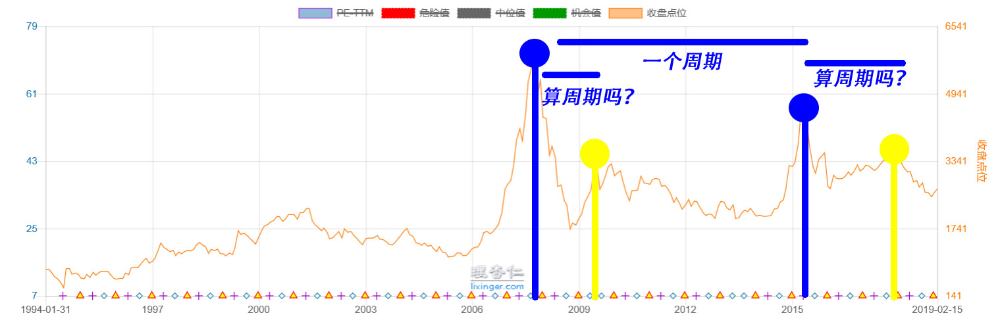

======================================================

_type: q&a
@背心[51441214442224]
2019-02-18 14:03:32 Mon  
topic_id: 244421828555121

@背心

>  师傅，今天大盘又涨了，还敢买吗，推荐一下

@二师父

>  如果今天是定投日，可以买啊，仍旧很便宜的

阅读[1463]  评论[0]  赞[0] 

======================================================

_type: q&a
@蝙蝠侠大战超人[48522585242588]
2019-02-18 14:09:59 Mon  
topic_id: 544458151228484

@蝙蝠侠大战超人

>  二师父，今年大部分基金都在低估值区间，定投的方式哪一种性价比高？收利大？A 一次性买入该基金几万块 然后再通过每个月小额定投，筑底+定投的方式 。 B 每个月按时定投，把原先想几万块一次性买入的 分期平均到每个月定投里

@二师父

>  a性价比高，目前处于市场底部区域

阅读[1526]  评论[1]  赞[0] 

======================================================

_type: talk
@汤圆君[881125824112]
2019-02-18 15:02:02 Mon  
topic_id: 422251858584548

请问二师父，低估的品种比较多，在定投时，是各有权重还是平均购买？

阅读[1404]  评论[0]  赞[0] 

======================================================

_type: talk
@二师父[28814221155551]
2019-02-18 15:05:22 Mon  
topic_id: 244421828282281

<e type="hashtag" hid="142511142112" title="#格局重塑#" /> 要有承受财富的大胸怀，也要有忍受浮亏的大心脏，很多人跌了受不了，涨了也受不了，这样是做不好投资的

能忍受巨大浮亏才能够是价值投资，能承受巨大浮盈才有机会获取巨大财富

要有大胸怀，大心脏，大气魄

一个人事业的高度取决于他胸怀的宽广度

目前点位仍旧适合买入，不要看一天两天，我们需要看到股市长期运行的规律，这样才不会被短期涨跌乱了心神

@波 at 2019-02-18 15:05:22 Mon

> 上升到了哲学的高度！

----------

@波 at 2019-02-18 15:05:22 Mon

> 大局观，大智慧！

----------

@健哥 at 2019-02-18 15:05:22 Mon

> 能忍受巨大浮亏才能够是价值投资
能承受巨大浮盈才有机会获取巨大财富
[强][强][强][强][强][强]

----------

阅读[3759]  评论[3]  赞[0] 

======================================================

_type: q&a
@汤圆君[881125824112]
2019-02-18 15:57:13 Mon  
topic_id: 244421828442121

@汤圆君

>  请问二师父，现在开始建仓，哪些低估指数适合建仓？

@二师父

>  50ah，中证500，银行指数基金，医药指数基金可以

阅读[1557]  评论[9]  赞[0] 

======================================================

_type: q&a
@半路出家滚雪球[844151182512222]
2019-02-18 16:33:41 Mon  
topic_id: 422251858118848

@半路出家滚雪球

>  请问二师父，我是新加入的，请问每个指数的估值区间是如何确定的？有没有详细的估值计算方法？如果方便公布的话，麻烦再贴一下，谢谢。

@二师父

>  好的，今晚估值表贴一下

阅读[1593]  评论[0]  赞[0] 

======================================================

_type: talk
@陈[844415515418422]
2019-02-18 22:24:06 Mon  
topic_id: 544458142185254

二师父，您好！蛋卷里，持有收益超过百分之十收割掉百分之十后，显示的持有收益里是不还包括已经卖掉的金额？那下次什么时候收割？怎么算？

@二师父 at 2019-02-18 22:24:06 Mon

> 这个收益率与份数无关，只和持仓成本和基金净值有关，下次继续收割，直到把投入的本金收割回来或者基金进入高估

----------

@陈 at 2019-02-18 22:24:06 Mon

> 那么几天前收益率百分之十收割过一次。过了一周收益率又成了百分之十五，这个时候怎么收割？不会计算了！

----------

@小米兔 at 2019-02-18 22:24:06 Mon

> 同疑惑

----------

@小牧童 at 2019-02-18 22:24:06 Mon

> 可以按照定投的总金额来，多出来的就是收益！达到10%再收割！

----------

@YtingLi at 2019-02-18 22:24:06 Mon

> 那就是，比如我投入成本金额是5万元，收益达到每5000收割一次是吧？还是其它理解？谢谢

----------

@小牧童 at 2019-02-18 22:24:06 Mon

> 是的

----------

@陈 at 2019-02-18 22:24:06 Mon

> 谢谢

----------

@小牧童 at 2019-02-18 22:24:06 Mon

> [愉快]

----------

阅读[1387]  评论[12]  赞[0] 

======================================================

_type: q&a
@Antony[51442528215124]
2019-02-19 00:08:45 Tue  
topic_id: 544458158825124

@Antony

>  二师傅好！最近关注了易方达的上证50，代码110003，对比了天弘001548，华夏501050，感觉易方达更好，除了管理费高一点。二师傅怎么看

@二师父

>  华夏的50ah优选好一些的，这个基金呢持仓股票是沪港深低估的股票轮动的，具有折价的超额收益，另外两个差别不大

阅读[1395]  评论[0]  赞[0] 

======================================================

_type: q&a
@波[28855811142441]
2019-02-19 00:10:31 Tue  
topic_id: 544458142524424

@波

>  现在在 招商中证白酒基金上建底仓，开始定投，并持有到高估再卖出，好不好？

@二师父

>  这个目前是正常估值啊，按照纪律是需要在低估开始定投的

阅读[1526]  评论[2]  赞[0] 

======================================================

_type: q&a
@夏萍[28221454818281]
2019-02-19 00:12:06 Tue  
topic_id: 544458142454454

@夏萍

>  师父指数基金的对冲基金除了债券还有其他的吗

@二师父

>  还有黄金指数基金，德国30指数基金，美股指数基金，恒生指数基金

阅读[1556]  评论[0]  赞[0] 

======================================================

_type: talk
@二师父[28814221155551]
2019-02-19 05:02:11 Tue  
topic_id: 111148515421412

今天学堂有个读者感叹：“我终于知道自己为什么每次都被套了。”

二师父明白他的感叹，早在18年大盘一路大跌的时候，很多和二师父一起坚持定投的读者忍受不了浮亏，一些退出装死，一些直接清仓止损。这位读者是后者。

可是最近一周的时间，A股股市一路上涨，很多读者按捺不住，大多数是后悔，要么是后悔认识二师父晚了，要么是后悔之前害怕暴跌停止了定投。二师父现在经常会遇到这样的问题：“二师父，请问现在开始花几万元买中证500或者中证白酒指数基金，然后后面再开始定投可以吗？”

对于低估的指数基金，建立底仓是没有问题的。从操作角度来讲完全可以。然而，从定投的理念上讲，这不是定投了，这是基于对未来的上涨预期做的一次投机性买入。如果假设我是上帝，我告诉你接下来一个月你买的中证500一定会下跌，那么你还会买入吗？不会的。所以你的操作实质已经不是定投了，而是追涨。

二师父多次提醒，机会是跌出来的，风险是涨出来的。很多人，在大盘2500点的时候不敢入场，可是在大盘暴涨到3500点甚至5000点还敢借钱入场。因为利益的诱惑终于让自己内心的贪婪压过了恐惧。

定投指数基金切记不要追涨，宁可错过也别过错，在高位买入，在低位卖出是韭菜的行为，不要修炼成为一棵老韭菜，我们要成为理性的投资者。

二师父以前做过一次测试，模拟了历史上最笨的一个投资者，他从08年A股历史最顶点一直定投，到15年牛市，就采用最常见的宽基指数基金中证500，他最后的收益率也能够达到15个百分点，这个帖子去年写过，都是有数据回测证明的。

连最笨的投资者都能够取得如此好的收益率，为什么人做不到，因为人性的贪，人性的惧，各种弱点。比如最近的加仓行为，比如当大盘暴跌停止定投的行为。所以，基金定投不适合太聪明的人，不太适合想一夜暴富的人。

大智若愚，大巧若拙，大成若缺。真正有智慧的人都是看起来很傻的。希望你能够笨一点，踏实一点，按照既定的策略定投，财不入急门，耐心方可成就伟业。

别追涨，切记，尤其是大盘在4000点以上，追涨而又不设置止损点无异于自己给自己挖坑。当然，现在仍旧处于市场低位，对于低估的指数基金可以建立底仓，二师父只是提醒，追涨是定投大忌，尤其是在牛市的时候。

@波 at 2019-02-19 05:02:11 Tue

> 这篇文章很好！

----------

阅读[3987]  评论[1]  赞[1] 

======================================================

_type: talk
@二师父[28814221155551]
2019-02-19 05:03:44 Tue  
topic_id: 544458141524544

今天估值表一直传不上去，明天再传吧

@波 at 2019-02-19 05:03:44 Tue

> 辛苦了！二师父。

----------

阅读[1667]  评论[1]  赞[0] 

======================================================

_type: q&a
@自由飞翔[544442815144244]
2019-02-19 11:16:02 Tue  
topic_id: 244421844184411

@自由飞翔

>  师傅，中证红利是有包括在中证500里的吧？买了500增强是否有必要买中证红利？帮建议下！

@二师父

>  这两个可以同时定投的，重合度不大，红利基金是高股息策略，分红较多

阅读[1581]  评论[1]  赞[0] 

======================================================

_type: talk
@健哥[51511242852814]
2019-02-19 11:17:23 Tue  
topic_id: 422251821822818

师父能否介绍一下港股打新，如何赎回，需要注意些什么？谢谢

@二师父 at 2019-02-19 11:17:23 Tue

> 可以，你加我微信，ershifudt，有港股打新群，可以参照暗盘交易，每天不管盈亏，首日就要卖出

----------

阅读[1581]  评论[1]  赞[0] 

======================================================

_type: talk
@二师父[28814221155551]
2019-02-19 11:22:48 Tue  
topic_id: 422251821818158

<e type="hashtag" hid="481211145528" title="#指数估值#" /> 昨天的估值表，有的基金逐渐进入正常估值了，大家珍惜定投机会，港股打新的话可以加我微信ershifudt

@YtingLi at 2019-02-19 11:22:48 Tue

> 师父，正常估值按后面给出参考的最高值取，还是最低或中间，比如区间是9.5-15

----------

@门萨🐨 at 2019-02-19 11:22:48 Tue

> 低于9.5是低估，高于15是高估，9.5到15是正常

----------

@YtingLi at 2019-02-19 11:22:48 Tue

> 谢谢

----------

阅读[4156]  评论[3]  赞[0] 

+++++++++++++++++++++++++++++++++++++++++++++++++++++

图片：

======================================================

_type: talk
@二师父[28814221155551]
2019-02-19 11:39:38 Tue  
topic_id: 111148518414252

<e type="hashtag" hid="225848111481" title="#港股打新#" /> 
港股打新也是一种投资渠道，如果没有精力可以利用二师父的微信拼团打新渠道实现盲打，手动买入，中签之后首日自动卖出。如果有精力的朋友可以开户打新，拼团和开户渠道都可以见文末的二维码

平均每只新股申购所需资金为4000港元，因此通常投入本金15000港元~20000港元（人民币：12000元~16000元）足够参与打新了，少了只能眼睁睁看着新股没钱申购，多了资金闲置浪费，由于港股分配规则为优先保证人手中一签，因此每只新股申购1手的性价比是最高的，资金利用率也是最高的。

1、入金方式：1、香港银行卡  2、普通大陆银行卡 均可可完成入金操作，香港卡手续费低一些，开户可以直接在中国开，准备护照和签证即可，大陆卡手续费低一点
2、入金步骤：登录大陆银行卡-->购汇（港币）-->跨境汇款（汇入证券公司临时子账号）-->跨境汇款成功后-->通知证券公司即可

3、入金注意：

1、购汇用途、跨境汇款用途填写子女赡养费、旅游、购物最容易通过审核。

2、优先选择香港银行卡或建设银行、光大银行、工商银行、民生银行，交通银行最容易入金成功。

3、由于跨境汇款是按笔收取一定手续费用，因此建议入金尽量一次性入够，否则会额外支付手续费

4、入金手续费：1、香港银行卡入金免手续费 2、大陆陆行入金手续费差不多每笔200元左右（其中:银行跨境汇款120元左右，证券公司接受资金费用120港币左右）

第三步：打新策略 

港股打新与A股不同的是，港股新股会出现一定的破发概率，因此需要按照一定的策略进行打新操作：

港股招股价格与收益率有一定关系，即：在港股新股中，招股价越低，股票首日收益率平均越高：

1、建议打新：招股价小于1.5元，打新首日取的正收益比率高达87.78%，可获取平均收益率为346.06%；

2、招股价在0.2-0.3元，0.5-0.6元的港股，打新首日取的正收益率高达100%，可重点关注。

3、港股打新首日收益率>0、首日收益率平均值，均随着招股价成下降趋势，因此港股招股价越低，取的正收益的概率越高，收益率也越高。

4、不建议打新：招股价大于1.5元以上，打新首日取的正收益率仅为36.24%，可获取的平均收益率仅为1.98%

第四步：查看中签

港股打新后，一般1周后公布是否中签，披露易网站当天9点即可查询是否中签

1、提前查看是否中签：披露易网站查询是否中签

2、证券公司当天短信或者APP通知是否中签

第五步：新股卖出

港股新股，从申购到公布中签到上市，一般经历2周时间，一般上市首日涨幅最大，建议新股上市首日择机卖出，切记恋战当成炒股。另外可参考暗盘涨幅的1.5~2倍卖出（此策略需同时参看新股的基本面）
暗盘查询方法：1、各券商APP形式上市前一日（16点0分-18点30分可以查看暗盘交易情况） 

@小米兔 at 2019-02-19 11:39:38 Tue

> 拼团打新那个靠谱吗？

----------

@二师父 at 2019-02-19 11:39:38 Tue

> 没问题啊

----------

阅读[1925]  评论[2]  赞[1] 

+++++++++++++++++++++++++++++++++++++++++++++++++++++

图片：

======================================================

_type: q&a
@凭栏观海[244414845852181]
2019-02-19 14:11:35 Tue  
topic_id: 111148518858812

@凭栏观海

>  大成中华沪深港300指数基金160925，2月18日发行，据说涵盖了沪深港三地的蓝筹股，按照估值原则，现在是否值得投资？

@二师父

>  嗯嗯，这个不错，可以定投的，都是优质蓝筹股

阅读[1767]  评论[1]  赞[0] 

======================================================

_type: talk
@二师父[28814221155551]
2019-02-19 14:12:44 Tue  
topic_id: 111148582288852

书单，一次来个全面的，好好学习，才能多多赚钱

@王秦川 at 2019-02-19 14:12:44 Tue

> 赚钱都是给有准备的人[强][强][强]

----------

@Swallow at 2019-02-19 14:12:44 Tue

> 厉害了，

----------

@Audrey at 2019-02-19 14:12:44 Tue

> 太棒了

----------

@门萨🐨 at 2019-02-19 14:12:44 Tue

> 棒棒哒

----------

阅读[1788]  评论[4]  赞[0] 

+++++++++++++++++++++++++++++++++++++++++++++++++++++

图片：
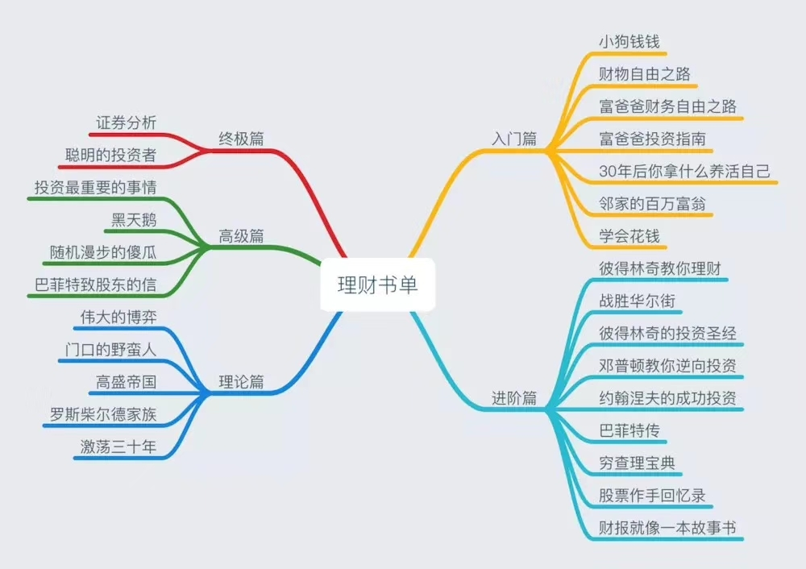

======================================================

_type: talk
@二师父[28814221155551]
2019-02-19 14:29:09 Tue  
topic_id: 244421815844881

<e type="hashtag" hid="881251425252" title="#鳄鱼计划#" /> 场内德国30买入一份，目前场内就这只基金浮亏，其他都盈利了，定投记住要逆向操作。

@jorfy at 2019-02-19 14:29:09 Tue

> 目前没有浮亏的，等机会吧

----------

@王雷 at 2019-02-19 14:29:09 Tue

> 二师傅之前的文章您写的3000多点附近出一半是吧？到时您会通知是吗？

----------

@二师父 at 2019-02-19 14:29:09 Tue

> 看情况，如果是确认牛市来的话也一直持有，如果是反转行情可以出，具体需要后续确认

----------

@蒋 at 2019-02-19 14:29:09 Tue

> 今天场内买了中证银行。

----------

阅读[1776]  评论[4]  赞[0] 

======================================================

_type: talk
@玲珑[244188122251251]
2019-02-19 15:03:33 Tue  
topic_id: 844421815282812

<e type="hashtag" hid="881251425252" title="#鳄鱼计划#" /> 我也买了

阅读[1690]  评论[0]  赞[0] 

======================================================

_type: q&a
@蝙蝠侠大战超人[48522585242588]
2019-02-20 02:36:44 Wed  
topic_id: 422251811211118

@蝙蝠侠大战超人

>  二师父，请问一下：南方中证500量化C股票这只基金处于低估值期吗？我想买这只基金

@二师父

>  我看了南方中证500C是低估的，500量化C没看到

阅读[1599]  评论[0]  赞[0] 

======================================================

_type: talk
@二师父[28814221155551]
2019-02-20 04:12:37 Wed  
topic_id: 422251544428888

中概互联一直在波动，其他没变，关于国债收益率我再说下，等国债收益率高于3.7或者3.8个百分点，纯债基金才具有定投价值，大牛市的时候国债收益率肯定是超过4个百分点的

@Zyxj at 2019-02-20 04:12:37 Wed

> 师父，估值到正常的时候就停止正在定投的标的，对吗？

----------

@二师父 at 2019-02-20 04:12:37 Wed

> 对的，低估值的时候定投，正常估值的时候停止，高估的时候卖出

----------

@门萨🐨 at 2019-02-20 04:12:37 Wed

> 股和债是相反的，为啥大牛市股涨债也涨？

----------

@二师父 at 2019-02-20 04:12:37 Wed

> 国债收益率等于收益除以债券价格，债券价格涨，国债收益率低

----------

阅读[4193]  评论[4]  赞[0] 

+++++++++++++++++++++++++++++++++++++++++++++++++++++

图片：
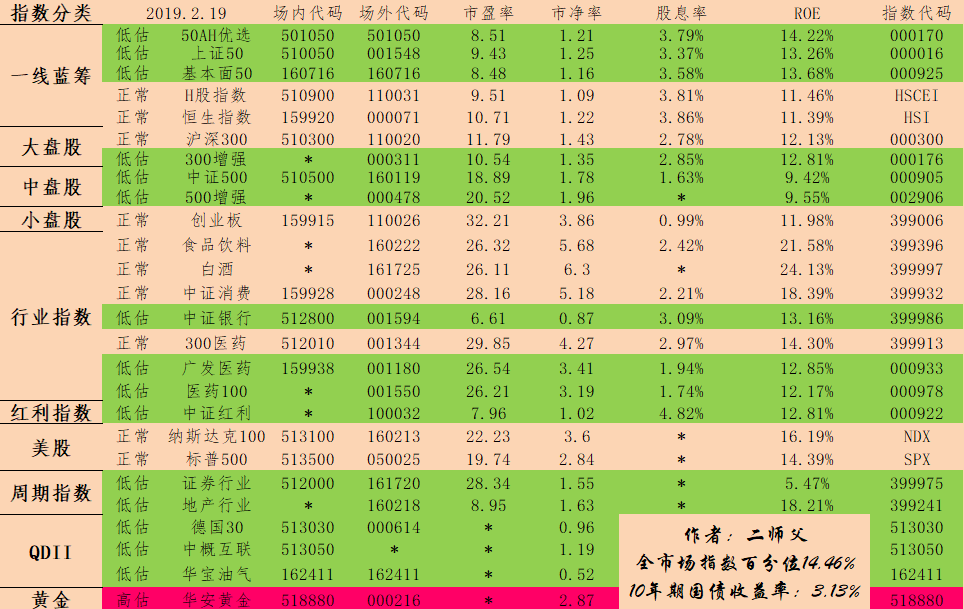

======================================================

_type: talk
@二师父[28814221155551]
2019-02-20 04:15:25 Wed  
topic_id: 111148422215542

银行业投资价值分析，目前仍旧处于市场低位，值得定投，不要患得患失，稳定心态。该卖出利润就卖出，处于低估仓位不足仍旧继续定投

港股打新，就选择拼团打新，如果精力够可以开通香港账户，不过我觉得为了那点收益专门开个账户挺麻烦的，时间比金钱宝贵。当然，如果你天生对投资感兴趣那多多研究对于自己理财体系的完善是有好处的。

@凭栏观海 at 2019-02-20 04:15:25 Wed

> 如果已经定投了上证50，上证50里面银行股也比较多，是否还有必要专门定投银行指数基金吗？

----------

@小牧童 at 2019-02-20 04:15:25 Wed

> 二师父，您好！请问这两张市盈率市净率图是在什么平台来的？谢谢，还有我们一般的市盈率市净率参考区间参考几年的比较适合？谢谢！

----------

@二师父 at 2019-02-20 04:15:25 Wed

> 没必要，买几个龙头银行股也可以

----------

@二师父 at 2019-02-20 04:15:25 Wed

> 这是果仁网下载的，我们参考到03年以后的就行，之前的数据都高的离谱

----------

@刘哲 at 2019-02-20 04:15:25 Wed

> 老师您好，能推荐几个低估银行股吗？我一直关注建行和平安，您觉得那个更有成长价值？

----------

@二师父 at 2019-02-20 04:15:25 Wed

> 平安可以，推荐招行，兴业，中行，美元业务只有中行能办

----------

@小牧童 at 2019-02-20 04:15:25 Wed

> 谢谢二师父[愉快]

----------

@Nienie💝 at 2019-02-20 04:15:25 Wed

> 额，买了中证银行和上证50，是不是冲突了。您推荐的那些银行股就是单纯的股票么？还是也是基金，要定投的。

----------

阅读[1959]  评论[9]  赞[0] 

+++++++++++++++++++++++++++++++++++++++++++++++++++++

文件：
2019-02-20 04:13:19 Wed
文件大小：[250421]
88842414541152-经济晴雨表：银行业投资价值分析.docx

======================================================

_type: q&a
@凭栏观海[244414845852181]
2019-02-20 11:25:49 Wed  
topic_id: 111148424418282

@凭栏观海

>  中概互联ETF链接基金已经发行，现在的估值，可以定投场外中概互联吗？

@二师父

>  可以的，不过中概互联的估值一直在低估和正常估值徘徊

阅读[1623]  评论[2]  赞[0] 

======================================================

_type: q&a
@开卷沐春意[422214414858458]
2019-02-20 11:27:41 Wed  
topic_id: 422251542444228

@开卷沐春意

>  二师傅，您好，请问今天可以买哪种做T

@二师父

>  中证500和上证50都可以

阅读[1594]  评论[0]  赞[0] 

======================================================

_type: q&a
@小明[544828524525514]
2019-02-20 14:53:02 Wed  
topic_id: 544458524458284

@小明

>  老师您好，请问天弘中证证券保险指数A，现在适合定投吗？

@二师父

>  可以定投的，注意仓位，因为证券波动大，方证证券保险不错

阅读[1519]  评论[2]  赞[0] 

======================================================

_type: q&a
@开卷沐春意[422214414858458]
2019-02-20 14:53:50 Wed  
topic_id: 844421254415842

@开卷沐春意

>  二师傅，我看510500的技术指标图KD   RSI的两条线一组在80转头朝下了，另一组跌破80了。我还敢买吗？

@二师父

>  定投不需要看技术指标的，估值处于低估就没问题，思维转过来，下跌你买入成本也低

阅读[1593]  评论[1]  赞[0] 

======================================================

_type: q&a
@开卷沐春意[422214414858458]
2019-02-20 14:54:30 Wed  
topic_id: 544458524485124

@开卷沐春意

>  麻烦您给我看下，好吗？

@二师父

>  定投不用看这个，如果股票可以看看技术指标，直接定投就行

阅读[1711]  评论[0]  赞[0] 

======================================================

_type: q&a
@小米兔[48245525418488]
2019-02-20 14:55:34 Wed  
topic_id: 422251542211258

@小米兔

>  二师父，歪个楼。我想问一下，私募是不是就是对本金有要求，大多数的私募收益稳定性和风险性其实还是比较好的？

@二师父

>  私募得100万，18年雪球200多只私募好像就十几只收益是正的，也不稳定，看市场情况

阅读[1683]  评论[3]  赞[0] 

======================================================

_type: q&a
@zxc[51145258542214]
2019-02-20 14:56:50 Wed  
topic_id: 111148421824552

@zxc

>  二师父，我妈妈07年在高点的时候买了两万块的483003工银精选平衡混合基金，然后一直放着没管。最近一看，市值缩水到六千，想问一下该持有还是卖出

@二师父

>  放着吧，等牛市回来卖，反正也亏了这么多了，止损的话一般10个点就要及时止损，要么就一直定投，也能盈利，千万别亏了50多个点还止损

阅读[1814]  评论[1]  赞[0] 

======================================================

@二师父[28814221155551]
2019-02-20 18:50:06 Wed  
topic_id: 844421251821142

>  @二师父
>  

阅读[1828]  评论[5]  赞[0] 

======================================================

_type: q&a
@开卷沐春意[422214414858458]
2019-02-20 19:16:38 Wed  
topic_id: 244421288524821

@开卷沐春意

>  二师傅，明天我如果做T，买场内哪支基金好呢？是510500还是512880还是别的哪个场内基金？盼你回复。

@二师父

>  510500比较好，场内500Etf

阅读[1879]  评论[0]  赞[0] 

======================================================

_type: q&a
@蒋[15528828284222]
2019-02-20 20:20:47 Wed  
topic_id: 544458511242514

@蒋

>  请问二师父，PE百分位是怎么回事？，怎么计算的？，PB百分位是怎么回事？，怎么计算的？

@二师父

>  这个是市盈率百分位，相当于在一定的历史区间内，当前市盈率处在其中的哪个位置

阅读[1881]  评论[0]  赞[0] 

======================================================

_type: q&a
@夏萍[28221454818281]
2019-02-20 20:50:31 Wed  
topic_id: 111148454412242

@夏萍

>  师父能否抽个时间写写，基金做T的相关内容，新手不懂，谢谢

@二师父

>  可以啊，可以参照网格交易，先建立底仓，根据浮盈和浮亏比例来卖出，可以搜索以前的文章网格交易

阅读[1962]  评论[2]  赞[0] 

======================================================

_type: talk
@二师父[28814221155551]
2019-02-21 04:34:34 Thu  
topic_id: 544458451125444

<e type="hashtag" hid="454581211588" title="#理财入门#" /> 先找准一个点，钻研然后逐步衍生，不要害怕犯错误，每个人都是从错误种学习，要么是从自己得错误学习，要么是从他人得错误中学习

阅读[4639]  评论[0]  赞[0] 

+++++++++++++++++++++++++++++++++++++++++++++++++++++

文件：
2019-02-21 04:32:57 Thu
文件大小：[28057]
51145821251514-如何学习才能入理财之门.docx

======================================================

_type: talk
@二师父[28814221155551]
2019-02-21 04:35:35 Thu  
topic_id: 111148145524822

因为考虑到精华太多，以后估值表的内容就不发送了

@二师父 at 2019-02-21 04:35:35 Thu

> 打错了，估值表不设为精华，依旧发送

----------

@王秦川 at 2019-02-21 04:35:35 Thu

> 二师父你好，请问什么是边界区定投？

----------

@惟子 at 2019-02-21 04:35:35 Thu

> 乍一看到，心里咯噔一下，二师父辛苦了[抱拳]

----------

@二师父 at 2019-02-21 04:35:35 Thu

> 正常估值和低估值之间就是边界区，比如有的基金刚进入正常估值投一次也可以，后面继续涨就停止了，追求模糊的正确

----------

@alicedream* at 2019-02-21 04:35:35 Thu

> 二师父：想问一下，现在债券基金需要配置吗？您之前建议的国开债需不需要现在配置点？

----------

@二师父 at 2019-02-21 04:35:35 Thu

> 现在不需要，等市场回暖，一般上证指数3500点以上，看10年期国债收益率，10年期国债收益率3.8个百分点以上可以买入债券基金

----------

@alicedream* at 2019-02-21 04:35:35 Thu

> 二师夫：刚又认真看了一下您之前发的精华，了解到现在不是定投债券基金的好时候，等着后面跟着您再开始定投！

----------

@alicedream* at 2019-02-21 04:35:35 Thu

> 谢谢二师父！

----------

阅读[1949]  评论[8]  赞[1] 

+++++++++++++++++++++++++++++++++++++++++++++++++++++

图片：
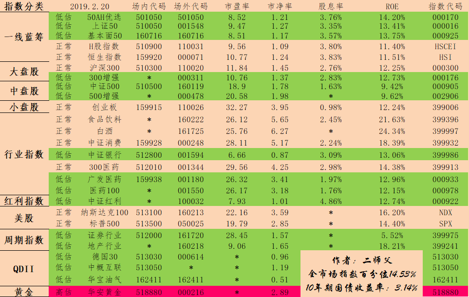

======================================================

_type: q&a
@半路出家滚雪球[844151182512222]
2019-02-21 09:30:16 Thu  
topic_id: 244421428415221

@半路出家滚雪球

>  请问二师父，每个指数基金的估值范围是怎么算的？主要是按PE百分位吗？能不能找个时间具体讲一讲。谢谢！

@二师父

>  我没有根据pe百分位估值，因为每个指数的历史区间不同，pe百分位差别很大。估值区间根据指数的市盈率，市净率，股息率，净资产收益率，还有盈利增长率算出来的，你可以直接用简易估值法，看市盈率的历史走势图

阅读[1824]  评论[0]  赞[0] 

======================================================

_type: talk
@二师父[28814221155551]
2019-02-21 09:58:52 Thu  
topic_id: 111148144244122

<e type="hashtag" hid="881422852442" title="#定投实盘#" /> 买入中证银行一份，国泰国证房地产行业一份，德国30一份，都是前两个是行业指数基金，后面一个是德国蓝筹指数基金，盈利了也要坚持定投，场外定投更加适合长期持有，因为基金持有时间越长赎回费率越低。

定投到最后你会发现选择什么基金，什么时候定投并不重要，关键在于固定的时间需要风雨无阻的买入，然后正常估值逐步卖出即可

@小涛@我的四季生活 at 2019-02-21 09:58:52 Thu

> 这个计划的德国30和鳄鱼中的德国30是一样的吧

----------

@凯 at 2019-02-21 09:58:52 Thu

> 二师父你是场内买入还是场外买入

----------

@小涛@我的四季生活 at 2019-02-21 09:58:52 Thu

> 今天德国30在涨喔

----------

@半路出家滚雪球 at 2019-02-21 09:58:52 Thu

> 看二师父的文章大概2周了，今天终于建立了第一份定投计划，坚持学习，坚持按规则操作[奋斗]

----------

@二师父 at 2019-02-21 09:58:52 Thu

> 一样的，一个场内，一个场外

----------

@二师父 at 2019-02-21 09:58:52 Thu

> 不要看涨跌，要看估值

----------

@二师父 at 2019-02-21 09:58:52 Thu

> 鳄鱼计划是场内，这个定投实盘是场外申购

----------

@二师父 at 2019-02-21 09:58:52 Thu

> 一起坚持啊

----------

阅读[4546]  评论[13]  赞[0] 

======================================================

_type: talk
@二师父[28814221155551]
2019-02-21 10:36:38 Thu  
topic_id: 244421422844481

北京和上海，这两个城市，你们觉得哪个好

@Dave Pan at 2019-02-21 10:36:38 Thu

> 两个城市承担的责任不同。从气候居住来说，上海更合适些；从创新容错性来讲，上海要差些。

----------

@小涛@我的四季生活 at 2019-02-21 10:36:38 Thu

> 上海人不是比较排外吗？[呲牙]我觉得还是看个人在哪个行业工作

----------

@小涛@我的四季生活 at 2019-02-21 10:36:38 Thu

> 北京气候不好

----------

@.Five at 2019-02-21 10:36:38 Thu

> 上海 虽然我在广州 但是去两个城市感觉不一样，北京是大部分人是为了拼搏，上海更适合生活

----------

@梅川类酷 at 2019-02-21 10:36:38 Thu

> 来上海😃😃😃😃

----------

@勤能行之 at 2019-02-21 10:36:38 Thu

> 上海有20年没去过了，没有发言权。据说雾霾也很严重。房价也不便宜。

----------

@勤能行之 at 2019-02-21 10:36:38 Thu

> 北京除了气候不好以外，其他还是可以的。

----------

@凭栏观海 at 2019-02-21 10:36:38 Thu

> 我常年在北京，但是我觉得还是上海好

----------

阅读[1915]  评论[24]  赞[0] 

======================================================

_type: talk
@锐淡恬思[48582848418488]
2019-02-21 11:48:46 Thu  
topic_id: 544458455815884

@定投专家~二师父，能否详细公布下你的定投实盘

@门萨🐨 at 2019-02-21 11:48:46 Thu

> 每次发车都公布了，你搜索定投实盘

----------

阅读[1776]  评论[1]  赞[0] 

======================================================

_type: q&a
@半路出家滚雪球[844151182512222]
2019-02-21 20:50:31 Thu  
topic_id: 111148115245512

@半路出家滚雪球

>  请问二师父，低估的定投标的选择时，除了大类不重复外，是不是应该优先选择离正常估值下沿打折更多的基金买？比如现在的中证500、地产和中证红利？

@二师父

>  对的，在成长性一致的情况下，是优先选择更低估的指数基金，这样在估值上移的时候能够享受到更多的涨幅

阅读[1742]  评论[0]  赞[0] 

======================================================

_type: q&a
@冉冉[88445118854412]
2019-02-21 22:33:26 Thu  
topic_id: 544458441141444

@冉冉

>  请问二师傅，什么是分级基金?能讲解一下分级基金如何操作及注意事项吗？谢谢

@二师父

>  分级基金相当于把一个母基金拆分城两个子基金，两个子基金一个相当于债券基金，一个相当于带杠杆的指数基金，也是直接购买，这种上折和下折规则比较复杂，以后可能都取消了，不是很建议购买

阅读[1806]  评论[3]  赞[0] 

======================================================

_type: q&a
@凯[244415182418811]
2019-02-21 22:34:13 Thu  
topic_id: 544458441818454

@凯

>  二师父，从明天开始想做网格交易，建立底仓，买什么标的适合？

@二师父

>  500Etf和上证50etf，这两个宽基指数做网格很安全

阅读[1847]  评论[2]  赞[0] 

======================================================

_type: talk
@二师父[28814221155551]
2019-02-22 04:58:59 Fri  
topic_id: 244421415441241

<e type="hashtag" hid="481211145528" title="#指数估值#" /> 估值表里面中概互联一直涨涨跌跌，持有就好。其他低估的基金可以定投，都适合建立底仓。切记不要追涨

@凭栏观海 at 2019-02-22 04:58:59 Fri

> 就是说，中概互联现在不能定投吗？我的理解对吗？

----------

@二师父 at 2019-02-22 04:58:59 Fri

> 对

----------

阅读[1896]  评论[2]  赞[0] 

+++++++++++++++++++++++++++++++++++++++++++++++++++++

图片：
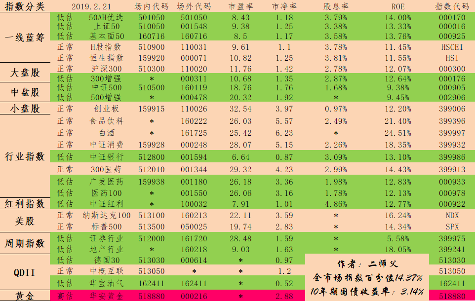

======================================================

_type: talk
@二师父[28814221155551]
2019-02-22 04:59:49 Fri  
topic_id: 844421415441212

@Claire at 2019-02-22 04:59:49 Fri

> 每天的第一件事就是学习二师父的文章，毎当定投路上迷茫的时候，就会找到方向，得到坚持下去的信心。谢谢你，好老师[咖啡]

----------

@二师父 at 2019-02-22 04:59:49 Fri

> 请多指教

----------

@凭栏观海 at 2019-02-22 04:59:49 Fri

> 非常认同

----------

@Franky at 2019-02-22 04:59:49 Fri

> 确实如此，有时候自己一个人即使知道方法是正确的，前途也是光明的，但是一个人行走依然会感到孤独和彷徨！

----------

@理财小小白 at 2019-02-22 04:59:49 Fri

> 二师父，中证500低波动也是很好的策略股票啊，熊市时回撤小，牛市时也不差，为什么不放到基金估值表中供大家选择呢？

----------

@二师父 at 2019-02-22 04:59:49 Fri

> 我的估值表里面的基金都是我自己投资的，中证500指数是很不错的，当中证500没有低估的时候就用500增强替代

----------

阅读[5011]  评论[6]  赞[0] 

+++++++++++++++++++++++++++++++++++++++++++++++++++++

文件：
2019-02-22 04:59:35 Fri
文件大小：[149205]
48825145812828-中证500被动指数和策略指数的区别.docx

======================================================

_type: q&a
@远熹[544814518545554]
2019-02-22 05:13:10 Fri  
topic_id: 422251214548488

@远熹

>  请问二师父，融通创业板指数增强C怎么样，现在可以买么？

@二师父

>  目前创业板不建议，等低估了再投

阅读[1964]  评论[1]  赞[0] 

======================================================

_type: q&a
@家树[544854851425424]
2019-02-22 09:14:46 Fri  
topic_id: 844421418882142

@家树

>  一般底仓几成？

@二师父

>  看具体基金的估值和自己的仓位，还有心理承受能力，不固定

阅读[1924]  评论[1]  赞[0] 

======================================================

_type: q&a
@背心[51441214442224]
2019-02-22 09:47:28 Fri  
topic_id: 544458484282114

@背心

>  师傅想打新股，介绍一下渠道

@二师父

>  加我微信，ershifudt，教你拼团打新和注册账户打新

阅读[2040]  评论[5]  赞[0] 

======================================================

_type: q&a
@乡下人[28244152425511]
2019-02-22 12:47:43 Fri  
topic_id: 422251212285848

@乡下人

>  师傅，如何培养孩子的理财观？有相应的书籍推荐吗？

@二师父

>  从储蓄开始，之后给他介绍各种理财产品，让他有个初步的意识，小狗钱钱还行

阅读[1937]  评论[0]  赞[0] 

======================================================

_type: talk
@海盗[48248118584848]
2019-02-22 14:59:49 Fri  
topic_id: 244421155511441

我是在去年上证3000点进场了，到现在的2800点，我算了算总体盈利3%，其中只有德国30略微亏损，不过仓位不重。跟着二师父一路低估定投下去，外加鳄鱼加仓，还有网格交易。真的很佩服二师父的套路，以后更得加倍努力学习。

@二师父 at 2019-02-22 14:59:49 Fri

> 套路？

----------

@海盗 at 2019-02-22 14:59:49 Fri

> [呲牙][呲牙][呲牙]

----------

@门萨🐨 at 2019-02-22 14:59:49 Fri

> 哈哈

----------

@波 at 2019-02-22 14:59:49 Fri

> 用词不当，你的语文是体育是体育老师教的吧？"套路"应该是"智慧"。

----------

@波 at 2019-02-22 14:59:49 Fri

> 大局观，大智慧。

----------

@雨的依恋 at 2019-02-22 14:59:49 Fri

> 套路[偷笑][偷笑]

----------

@cotton at 2019-02-22 14:59:49 Fri

> [偷笑][偷笑]

----------

@王雷 at 2019-02-22 14:59:49 Fri

> [呲牙][呲牙]

----------

阅读[1845]  评论[11]  赞[0] 

======================================================

_type: q&a
@小牧童[28484254825881]
2019-02-22 22:39:10 Fri  
topic_id: 111148824512122

@小牧童

>  二师父，您好，您对300价值怎么看？我看年度涨幅和阶段涨幅也不比300增强差。还有一个问题：选择基金的时候看公司、费率、规模、误差，这几个的重要性怎么排列的？谢谢！

@二师父

>  300价值也可以的，300指数选择其中一个就行。主要看基金公司和规模，保证安全性和流动性，其次是估值，确保便宜，有足够的安全边际，然后就是费率尽可能低，大多数指数基金管理费都相对较低。最后看误差，优质的基金公司跟踪误差也不会很大

阅读[1688]  评论[0]  赞[0] 

======================================================

_type: talk
@二师父[28814221155551]
2019-02-23 04:40:54 Sat  
topic_id: 422251188255528

指数估值，珍惜低估的机会

@海盗 at 2019-02-23 04:40:54 Sat

> 越来越发现这张表的珍贵了[强]

----------

@王雷 at 2019-02-23 04:40:54 Sat

> 二师父环保和传媒估值正常了吗？

----------

@二师父 at 2019-02-23 04:40:54 Sat

> 还没有，这两只基金的投资价值比不上地产和券商这两个周期指数的，后期上涨了可以逐步卖出

----------

@王雷 at 2019-02-23 04:40:54 Sat

> 好的，也一直想估值正常了出了。谢谢二师父！

----------

@蒋 at 2019-02-23 04:40:54 Sat

> 全市场指数百分位现在是高还是低？

----------

@二师父 at 2019-02-23 04:40:54 Sat

> 很低的，低于20个点都非常低

----------

阅读[4465]  评论[6]  赞[0] 

+++++++++++++++++++++++++++++++++++++++++++++++++++++

图片：

======================================================

_type: talk
@二师父[28814221155551]
2019-02-23 04:41:58 Sat  
topic_id: 544458811455544

随便聊聊

@自由飞翔 at 2019-02-23 04:41:58 Sat

> 我也不例外！真想戒掉这坏毛病！每天要关注几次上证指数是涨了还是跌了，每天要进师父星球看最新消息！庆幸的是涨跌在我心中，不会形成操作，严格在按师傅的定投规则进行！

----------

@Phil at 2019-02-23 04:41:58 Sat

> 股票和其他投资品种割韭菜的方法很神奇，只要进场就会不识庐山真面目。事前规划得怎么好，开盘就懵了。不怕你不买，就怕你不看，看了就会心痒，心痒就想动作，一动就出错，这样的循环会无数次重复。巴菲特在盘面时间从不看盘，忍住不看盘是长期投资的关键环节。

----------

阅读[4783]  评论[2]  赞[0] 

+++++++++++++++++++++++++++++++++++++++++++++++++++++

文件：
2019-02-23 04:41:36 Sat
文件大小：[25613]
51144212428254-券商又涨停，好嗨.docx

======================================================

_type: q&a
@文斌[544855858152284]
2019-02-23 09:36:40 Sat  
topic_id: 544458811822144

@文斌

>  二师父你好，场内中证500从18年10月到现在有3成，自拜读你的文章，开始场外定投5支低估指数基金，到现在只有一成，大盘过快，我原打算长期资金定投，现在有点担心不敢放手投入，另外有两支测试股少的很，求指教！😘😘😘

@二师父

>  现在仍旧处于市场低位，耐心定投即可

阅读[1634]  评论[1]  赞[0] 

======================================================

_type: q&a
@往事随风[48515148521428]
2019-02-23 12:02:27 Sat  
topic_id: 422251185582248

@往事随风

>  请问师父：可转债基金现在上车晚不晚，除了易方达安心债您还推荐哪个？博时的信用债好还是转债赠强好？

@二师父

>  可转债基金目前仍旧可以上车的，博时信用债券基金即可，看最近的涨幅可转债基金都输给指数基金了

阅读[1542]  评论[1]  赞[0] 

======================================================

_type: q&a
@晨[51411182152424]
2019-02-23 12:09:02 Sat  
topic_id: 544458815482114

@晨

>  二师父好，学习比较了近一年，感觉您的操作上理论和实践结合的比较好，入门快、理解深、实战性强，想跟着走下去。请问，低估实盘和鳄鱼计划（场外场内）一起投是不是效果更好？

@二师父

>  对呀，场外低估定投实盘适合长期持有，场内的鳄鱼计划偶尔在非常低估区域且市场处于震荡的情况下做网格交易，而且鳄鱼计划的安全边际设置的更加严格

阅读[1637]  评论[1]  赞[0] 

======================================================

_type: q&a
@林西瓜🍉[28855581582851]
2019-02-23 12:12:26 Sat  
topic_id: 422251185145858

@林西瓜🍉

>  二师父，请问赎回基金的时候系统是否先赎回最先买入的那些份额呢，比如我2017-10买1份，2018－5买两份，如果现在赎回1份，是先赎回2017的？赎回两份就是2017和2018的？

@二师父

>  是的，如果在不同时期定投了一个指数基金，赎回的时候会先赎回那些先申购的基金

阅读[1737]  评论[0]  赞[0] 

======================================================

_type: q&a
@开卷沐春意[422214414858458]
2019-02-23 20:34:10 Sat  
topic_id: 844421128288282

@开卷沐春意

>  二师傅您好，假如有十万元资金常年不用，投资的话，您的低估值定投，鳄鱼计划和网格交易，哪种投资方式最好呢？现在定投的话可以选哪几种，估值高不高？

@二师父

>  可以低估实盘和鳄鱼计划同时进行，网格交易已经没有买入了，不知道后续是继续涨还是回调，目前估值仍旧不高，可以买的

阅读[1640]  评论[0]  赞[0] 

======================================================

_type: q&a
@王秦川[844151411882412]
2019-02-23 22:50:30 Sat  
topic_id: 544458855288114

@王秦川

>  二师父：你好，跟你定投二个月来，最大的收获是，心态好了，你的标的都是安全的，特别有信心，涨跌都舒服，都从容，在之前我听别人介绍，定投了2支主动型股票基金，（在二师父学堂才知道我的基金是主动型）去年3月份开始定投，每周都投，现在仓位重，现在还亏了7%，经过两个月的学习，才知道选错了，对这两支基金没有信心，如果股市下跌回撤（我感觉牛市行情还早）会继续亏，请问二师父，需不需要止损？谢谢🙏

@二师父

>  你把股票基金代码和基金名称发我看看，如果持仓股票好的话可以停止定投，继续持有，毕竟现在处于市场低位，肯定会涨起来，只是时间问题

阅读[1614]  评论[5]  赞[0] 

======================================================

_type: talk
@二师父[28814221155551]
2019-02-24 04:08:02 Sun  
topic_id: 111148848825222

周末随便聊聊，把定投当作一日三餐，可能你就不会那么紧张了

阅读[4775]  评论[0]  赞[0] 

+++++++++++++++++++++++++++++++++++++++++++++++++++++

文件：
2019-02-24 04:06:26 Sun
文件大小：[24708]
28844588225211-特刘会，牛来了？.docx

======================================================

_type: talk
@二师父[28814221155551]
2019-02-24 04:09:33 Sun  
topic_id: 544458858821224

均线偏离表，适合震荡市场，因为最近涨的多，所以大多数都飘红了

@爱华 at 2019-02-24 04:09:33 Sun

> 二师父好，券商在偏离表是红的，在估值表是绿的，我应该?[疑问]

----------

@二师父 at 2019-02-24 04:09:33 Sun

> 均线偏离类似网格交易，根据这种策略这会卖，主要参考估值表，我们看是否低估，低估可以持有。看个人在投资依据哪种策略的

----------

@光少 at 2019-02-24 04:09:33 Sun

> 二师父您好！华宝气油定投一份多少资金合适？

----------

@凭栏观海 at 2019-02-24 04:09:33 Sun

> 沪深300已经正常估值了，沪深300增强是不是也性价比不高了呢

----------

@二师父 at 2019-02-24 04:09:33 Sun

> 这个没有定的，做网格你有100元，那一份1元差不多

----------

@二师父 at 2019-02-24 04:09:33 Sun

> 价值还行，现在我是用50ah替代的

----------

@光少 at 2019-02-24 04:09:33 Sun

> 请教二师父，网格是怎么做的？

----------

@二师父 at 2019-02-24 04:09:33 Sun

> 学堂搜索网格交易，看看以前文章，有介绍

----------

阅读[1680]  评论[10]  赞[0] 

+++++++++++++++++++++++++++++++++++++++++++++++++++++

图片：
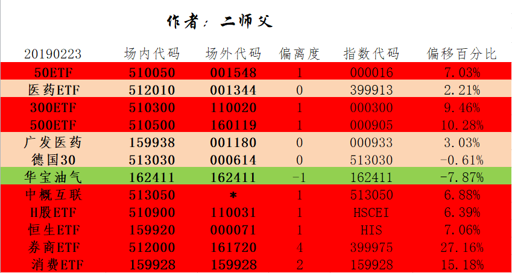

======================================================

_type: q&a
@半路出家滚雪球[844151182512222]
2019-02-24 08:59:20 Sun  
topic_id: 422251124458228

@半路出家滚雪球

>  这两天在翻帖子学习鳄鱼计划的策略，想请问一下二师父，鳄鱼计划也是每周固定时间投入的吗？比如明天投入一份华宝油气，如果下周一华宝油气的均线偏离度还是-1的话，是继续投入一份，还是要等到偏离度变成-2的时候才投入第二份？谢谢！

@二师父

>  对的，这是一个参考，鳄鱼计划不定期不定额加仓，如果市场处于特别低位会一次买入很多，之前做网格交易我底仓买了不少，现在鳄鱼计划操作减少了

阅读[1685]  评论[2]  赞[0] 

======================================================

_type: q&a
@凭栏观海[244414845852181]
2019-02-24 11:31:51 Sun  
topic_id: 244421145848881

@凭栏观海

>  沪深300已经正常估值了，沪深300增强是不是也性价比不高了呢？

@二师父

>  评论区刚回答了

阅读[1707]  评论[0]  赞[0] 

======================================================

_type: talk
@无名书苑[51188588215444]
2019-02-24 12:33:05 Sun  
topic_id: 111148815241442

请教二师父：场内指数基金和场外指数基金的交易费用哪个更便宜点？场外基金的交易费用很好查，场内的交易费用跟购买股票的交易费用是一样的吗？

@二师父 at 2019-02-24 12:33:05 Sun

> 场内交易费用比股票要低些

----------

阅读[1508]  评论[1]  赞[0] 

======================================================

_type: q&a
@江南蚕园（郑婷）[48281815141548]
2019-02-24 13:02:04 Sun  
topic_id: 111148815212582

@江南蚕园（郑婷）

>  请教二师父，科创板基金暂时应该不会出来，那么科创板小散值得参与吗？

@二师父

>  这个有门槛要求，需要账户资金高于50万，建议先观望下

阅读[1694]  评论[0]  赞[0] 

======================================================

_type: q&a
@程洋[28258521545511]
2019-02-24 20:31:54 Sun  
topic_id: 244421141812411

@程洋

>  二师父你好!模塑转债、亚太转债、众兴转债那个有投资价值?

@二师父

>  模塑转债可以，建议投资可转债基金，风险低一些

阅读[1584]  评论[0]  赞[0] 

======================================================

_type: talk
@二师父[28814221155551]
2019-02-25 03:31:38 Mon  
topic_id: 244421118228421

有恒产者有恒心，讲道理，房子和股票都是恒产，只不过在中国啊，这个股票波动太大，所以很投机失败的人没有意识到他的价值。

@凭栏观海 at 2019-02-25 03:31:38 Mon

> [强][强]

----------

@小涛@我的四季生活 at 2019-02-25 03:31:38 Mon

> 我觉得还是要看当事人的个人经济情况与生活规划。如果创业失败，又有房贷那绝对是双重打击。要最个比较周全的财务计划

----------

@二师父 at 2019-02-25 03:31:38 Mon

> 文中写了，一般有房贷就不敢瞎折腾的，就老实上班，我没见过有房贷还敢创业的，当然我敢，哈哈哈

----------

阅读[4745]  评论[3]  赞[0] 

+++++++++++++++++++++++++++++++++++++++++++++++++++++

文件：
2019-02-25 03:30:53 Mon
文件大小：[26382]
15511254412142-买房子还是买股票.docx

======================================================

_type: q&a
@王小肚[15548444855822]
2019-02-25 08:48:55 Mon  
topic_id: 544458884154824

@王小肚

>  二师父，华宝油气，中概互联，这些估值怎么计算的？谢谢！

@二师父

>  参考他们的阈值表

阅读[1471]  评论[0]  赞[0] 

======================================================

_type: q&a
@蔡蔡蔡[15442451484542]
2019-02-25 08:51:51 Mon  
topic_id: 844421114285852

@蔡蔡蔡

>  二师父你好。配置中证500和沪深300，是搜对应的代码吗？代码搜出来有的有两个，直接买吗？

@二师父

>  沪深300目前正常估值，可以用50ah替代，或者300增强替代，中证500选择天弘中证500或者南方中证500都可以

阅读[1537]  评论[1]  赞[0] 

======================================================

_type: talk
@二师父[28814221155551]
2019-02-25 09:46:56 Mon  
topic_id: 544458888228224

<e type="hashtag" hid="142442111552" title="#关于最近市场的一点看法#" /> 最近涨的挺好，大家保持淡定就好，即使是从3300点开始定投，二师父相信只要坚持下来的朋友目前也是盈利的。

不要预测市场，也别追涨，无论是公众号还是星球我都提醒过多次，当前是很好的投资时刻，有的朋友学习了，坚持了，行动了，浮亏了，现在自然能够享受到上涨的喜悦

如果不是仓位特别重压力大，目前除了收割利润就别全部卖了，虽然不确定会不会回调，但是二师父保证牛市来了，必定涨幅惊人，耐心持有，财富才会属于你。

@cotton at 2019-02-25 09:46:56 Mon

> 我一直都觉得自己本金投入的不够多。那现在浮盈了，是不是不管它，继续放着比较合适还是卖出部分盈利呢

----------

@二师父 at 2019-02-25 09:46:56 Mon

> 如果仓位不重可以一直放着的，到牛市卖

----------

@郭明伟 at 2019-02-25 09:46:56 Mon

> 二师父好，现在的行情不算小牛市嘛

----------

@二师父 at 2019-02-25 09:46:56 Mon

> 目前上涨很快，牛市还称不上，如果证券再这样涨两天就是阶段牛市了

----------

阅读[4637]  评论[4]  赞[0] 

======================================================

_type: q&a
@汤圆君[881125824112]
2019-02-25 09:54:07 Mon  
topic_id: 844421111555582

@汤圆君

>  问一下二师父，电子，信息，计算机方面，哪只指数比较好？

@二师父

>  我首推医药和消费，这三个里面我都没投，你要投的话建议信息方面

阅读[1567]  评论[1]  赞[0] 

======================================================

_type: q&a
@蝙蝠侠大战超人[48522585242588]
2019-02-25 12:50:18 Mon  
topic_id: 844421111188422

@蝙蝠侠大战超人

>  二师父你好，每个月或每两周定投了4只基金，分别融通创业板指数A/B，华夏沪港通上证50AH优选，建信中证500指数增强A，天弘中证医药100指数A。想再定投一只基金，能不能再推荐一只不同于上面行业的基金？该投 银行类基金？券商类基金？华油宝气基金？还是其他？

@二师父

>  德国30或者华宝油气，消费进入低估了也可以定投，油气是周期指数，注意控制仓位

阅读[1515]  评论[2]  赞[0] 

======================================================

_type: q&a
@victoria[15455121858422]
2019-02-25 13:09:59 Mon  
topic_id: 544442222182514

@victoria

>  二师父，现在这个点上，如果还有资金，哪些基金更适合呢

@二师父

>  中证500，50ah优选，地产指数，都是不错的标的

阅读[1516]  评论[1]  赞[0] 

======================================================

_type: talk
@二师父[28814221155551]
2019-02-25 13:11:41 Mon  
topic_id: 111112222581812

<e type="hashtag" hid="142442185112" title="#操作提示#" /> 中证传媒涨了6个百分点，很快进入盈利状态，如果之前定投的可以等待盈利之后卖出，我是不打算定投这个指数了，大家可以根据实际情况来，周期指数我只投券商，地产和油气，太多了不方便管理

@杨小峰 at 2019-02-25 13:11:41 Mon

> 我也准备跟二师父一起卖了，还有环保是不是也可以卖了，以后就不投了

----------

@二师父 at 2019-02-25 13:11:41 Mon

> 可以卖，主要集中投资，这两个基金也有价值，不过集中资金到最优质指数

----------

@cotton at 2019-02-25 13:11:41 Mon

> 好的

----------

阅读[1591]  评论[3]  赞[0] 

======================================================

_type: q&a
@高达无双喝味全[48851828182858]
2019-02-25 13:57:47 Mon  
topic_id: 844445555452212

@高达无双喝味全

>  科创版的基金 师傅怎么看  是否有科创打新的功能？

@二师父

>  比较看好，因为是老大推的，可以搞

阅读[1703]  评论[6]  赞[0] 

======================================================

_type: q&a
@冉冉[88445118854412]
2019-02-25 15:20:56 Mon  
topic_id: 111112524152212

@冉冉

>  请问二师傅，这次是有什么实质性利好消息吗？怎么涨的这么快，这么让人不放心呢，我的份额不多，卖掉一些浮赢吗？

@二师父

>  份额不多可以不用卖，这次主要是老大讲话和刘总和特朗普美国会谈

阅读[1651]  评论[0]  赞[0] 

======================================================

_type: q&a
@凭栏观海[244414845852181]
2019-02-25 16:20:22 Mon  
topic_id: 544442124255884

@凭栏观海

>  老师，以目前情况来看，可转债基金还可以买吗？如果可以，老师有推荐的标的吗？

@二师父

>  安信可转债基金可以的，目前可以投中证500和医药指数，这两个仍旧低估

阅读[1743]  评论[2]  赞[0] 

======================================================

_type: talk
@陈[844415515418422]
2019-02-25 17:04:12 Mon  
topic_id: 844445854482842

二师父，买了建信中证500增强还用买天弘500吗？您推荐最近还能买中证500，是不买了指数增强也可以？两个买一个就可以了是不是？

@二师父 at 2019-02-25 17:04:12 Mon

> 对的，买一个就行，两个都是很好的500指数标的

----------

阅读[1532]  评论[1]  赞[0] 

======================================================

_type: q&a
@开卷沐春意[422214414858458]
2019-02-25 19:35:03 Mon  
topic_id: 244445851854441

@开卷沐春意

>  二师傅，蛋卷基金的南方天天利B,可以快输赎回吗？

@二师父

>  t加2，如果急需用钱可以提前一点

阅读[1614]  评论[0]  赞[0] 

======================================================

_type: talk
@二师父[28814221155551]
2019-02-25 20:43:55 Mon  
topic_id: 844445851414812

<e type="hashtag" hid="142511142112" title="#格局重塑#" /> 再重复一句老话，以天为单位看待收益的人，相信的是奇迹和运气；以年为单位瞄准收益的人，相信的是天赋和能力；以3-5年为周期规划财务的人，相信的是胆识和眼光；以10年为周期看待财富的人，相信的是常识和复利；以更长周期看待财富的人，相信的是时代和命运。

财富的增长与智商和学历都没有太大关系，决定因素往往是大的经济周期，学会忘却一天的收益，这不是真正的盈利，真正盈利是一轮牛熊下来你得资产整体翻倍，这才是改变你阶层的投资方法。

买20万，涨30个点，也就多6万，刚刚够北京一年的房租和饮食。不能对你的生活有太大改变。

赚钱了别以为自己很厉害，亏钱了别以为自己很愚蠢，这都是经济周期的作用。宇宙之大，人于其间不过沧海一粟。学会敬畏自然，学会敬畏生命，学会敬畏市场。你会发现自己的渺小，也不在执着于投资的增长和下跌，这样的你反而会在市场表现良好

生命诚可贵，股票价更高，若为自由故，二者皆可抛。

@王秦川 at 2019-02-25 20:43:55 Mon

> 谢谢你及时的提醒⏰，听二师父的，做个有格局的人，这轮牛熊周期下来，二师父的粉丝会越来越多的。

----------

@冉冉 at 2019-02-25 20:43:55 Mon

> 谢谢二师傅耐心的教导，关于10年投资看复利，那么什么类型的标的复利最好呢？富国中证红利这只基金可以做标的吗？

----------

@健哥 at 2019-02-25 20:43:55 Mon

> 富国中证红利适合长期定投

----------

@二师父 at 2019-02-25 20:43:55 Mon

> 复利的意思是投资本金生出的利息继续投资，利滚利，不用特定基金，哪只基金低估且涨幅好就可以。

----------

@冉冉 at 2019-02-25 20:43:55 Mon

> 那么也就是说基金分红的时候不选择现金分红，对吗？

----------

@二师父 at 2019-02-25 20:43:55 Mon

> 我一般选择现金分红，然后资金再自己去分配，如果不想这样的话，可以在市场处于低位的时候选择红利再投资，在市场处于高位的时候选择红利再投资

----------

@二师父 at 2019-02-25 20:43:55 Mon

> 说错了，在市场高位时候选择现金分红

----------

@自由飞翔 at 2019-02-25 20:43:55 Mon

> 心底正窃喜，师父的提醒就来了[呲牙][呲牙][呲牙]

----------

阅读[4866]  评论[9]  赞[2] 

======================================================

_type: q&a
@生活（袁）[844411812115152]
2019-02-25 21:51:18 Mon  
topic_id: 244445885585411

@生活（袁）

>  二师傅你好，有没有好的债券基金，推荐一下，谢谢

@二师父

>  国开债不错😊目前债券不适合定投的

阅读[1670]  评论[2]  赞[0] 

======================================================

_type: talk
@二师父[28814221155551]
2019-02-26 05:01:05 Tue  
topic_id: 544442114185184

<e type="hashtag" hid="481211145528" title="#指数估值#" /> 目前上证50，券商都进入正常估值了，进入正常估值就停止定投，可以卖出利润部分。其他低估的指数可以继续定投，不用害怕

@victoria at 2019-02-26 05:01:05 Tue

> 现在中证500在什么位置呢

----------

@二师父 at 2019-02-26 05:01:05 Tue

> 仍旧处于低估状态呢

----------

@门萨🐨 at 2019-02-26 05:01:05 Tue

> 能买的还有很多嘛

----------

@凭栏观海 at 2019-02-26 05:01:05 Tue

> 跟着二师父，定投无忧愁，赞👍👍👍👍

----------

@王雷 at 2019-02-26 05:01:05 Tue

> 二师父如果估值正常了。还是亏。应该怎么操作

----------

@半路出家滚雪球 at 2019-02-26 05:01:05 Tue

> 请问一下，进入正常估值卖出利润，是一进入正常估值马上卖，还是要等定投日再操作呢？

----------

@飘羽 at 2019-02-26 05:01:05 Tue

> 可买的确实还有不少，不过是每个都买一点呢，还是定住1-2个买？

----------

@Eric at 2019-02-26 05:01:05 Tue

> 我的养老还是亏损

----------

阅读[1588]  评论[17]  赞[0] 

+++++++++++++++++++++++++++++++++++++++++++++++++++++

图片：

======================================================

_type: talk
@二师父[28814221155551]
2019-02-26 05:03:23 Tue  
topic_id: 544442114185524

<e type="hashtag" hid="225225114281" title="#上涨是否可买入#" />解答了大家常见的问题。学习有一个过程，当你把二师父的文章都看懂了，基础扎实了，再去学习股票，可转债，信用卡，保险的投资知识就会很轻松了。慢慢来，需要一个过程。

@自由飞翔 at 2019-02-26 05:03:23 Tue

> 看到文中的杠精，忍不住笑[呲牙][呲牙][呲牙]

----------

阅读[4971]  评论[1]  赞[0] 

+++++++++++++++++++++++++++++++++++++++++++++++++++++

文件：
2019-02-26 05:02:13 Tue
文件大小：[94437]
15511242122282-两只指数基金都盈利30多个点，还能再买入吗.docx

======================================================

_type: talk
@老丁[15541182455482]
2019-02-26 09:56:04 Tue  
topic_id: 422224858444888

二师父，有个问题想请教一下，现在券商赢利超过30%，但是仓位很低，要不要收割利润呢？因为券商是周期行行业，浮动会很大，担心会不会跌回去。我想表达的是券商这种，会不会走出和大盘相逆的行情，就是大盘仍然涨，但是它因为一些什么不知道原因，跌，这种情况会不会发生呢？谢谢

@二师父 at 2019-02-26 09:56:04 Tue

> 券商虽然是周期指数，暴涨暴跌，但是不会和大盘相反，大盘涨，他只会涨的更厉害

----------

@老丁 at 2019-02-26 09:56:04 Tue

> 好的谢谢二师父，那我还是持有好了。[微笑]

----------

阅读[1235]  评论[2]  赞[0] 

======================================================

_type: q&a
@半路出家滚雪球[844151182512222]
2019-02-26 11:31:40 Tue  
topic_id: 422224854111828

@半路出家滚雪球

>  最近在学习鳄鱼计划的规则，有些地方有疑惑，还望二师父解答。
>  假设1：本周一华宝油气偏离度-1，买入一份，下周一仍然是偏离度-1，是继续买入一份还是不买？
>  假设2：本周一华宝油气偏离度-1，买入一份，本周四偏离度变为-2，是否继续加仓2份？
>  望二师父对上述两种情况的操作策略解答，谢谢！

@二师父

>  假设华宝油气处于低估区域，本周偏离度负1下周负1，两次都可以买入1份，如果下周变成负2了，这个可以多买点，买入1.5份或者2份都可以的

阅读[1438]  评论[1]  赞[0] 

======================================================

_type: talk
@二师父[28814221155551]
2019-02-26 12:02:15 Tue  
topic_id: 111112544225242

<e type="hashtag" hid="881251425252" title="#鳄鱼计划#" /> 卖出券商利润部分，场内卖，场外也卖。记住别清仓，只卖出利润。

场内买入华宝油气和德国30各一份。

大家券商都盈利了吗？留个言看看哪些指数盈利哪些浮亏，一起交流。

@高达无双喝味全 at 2019-02-26 12:02:15 Tue

> 券商已经40个点了  感谢师傅[偷笑]  只是投的比较少  大多数还集中在500   今天收割利润

----------

@王雷 at 2019-02-26 12:02:15 Tue

> 券商盈利了30多个点。环保，创业，医药100，500，传媒亏[大哭]

----------

@爱华 at 2019-02-26 12:02:15 Tue

> 券商30%+，创业板负五（很早买的，后来没买），整体4.5层仓

----------

@爱华 at 2019-02-26 12:02:15 Tue

> 二师父怎么看军工呀？[微笑]

----------

@多读书 at 2019-02-26 12:02:15 Tue

> 二师父，请问在场内用网格交易法做华宝油气可以吗？

----------

@半路出家滚雪球 at 2019-02-26 12:02:15 Tue

> 二师父，鳄鱼计划不是要偏离度负一才买吗？德国30偏离度是0啊

----------

@二师父 at 2019-02-26 12:02:15 Tue

> 这个在低估区域就行，偏离度为负代表更有投资价值，投资追求模糊的正确，大方向把握准就好

----------

@二师父 at 2019-02-26 12:02:15 Tue

> 可以的

----------

阅读[4562]  评论[23]  赞[0] 

======================================================

_type: talk
@渔夫[844418821855242]
2019-02-26 12:22:53 Tue  
topic_id: 111112544242222

二师父！您好！中证500低波动。广发中证医药卫生。上证50AH优选指数。华宝红利基金。大成沪深300指数。五只全盈利。謝谢谢您！。

@二师父 at 2019-02-26 12:22:53 Tue

> 这是您认真学习的结果，学习您钻研知识的精神

----------

阅读[1271]  评论[1]  赞[0] 

======================================================

_type: talk
@渔夫[844418821855242]
2019-02-26 12:29:09 Tue  
topic_id: 422224855452228

现在没有收割利润。等是否能冲上3000。(指数)。根据情况随时收割。

@二师父 at 2019-02-26 12:29:09 Tue

> 现在收割或者3000点以上收割都可以，上证指数已经快到3000点了。只要耐心持有，未来的利润更大

----------

阅读[1271]  评论[1]  赞[0] 

======================================================

_type: q&a
@蒋[15528828284222]
2019-02-26 12:44:14 Tue  
topic_id: 244445828411121

@蒋

>  现在场内医药ETF盈利10多个点，300ETF盈利20多个点，请问二师父要不要卖出？如卖出是分段卖，还是一次性卖？本来是打算做底仓的。

@二师父

>  盈利卖出利润，不要清仓哈，正常估值也会上涨的，即使到达高估区域，因为投机者追涨也会导致指数非理性上涨

阅读[1402]  评论[1]  赞[0] 

======================================================

@二师父[28814221155551]
2019-02-26 12:49:06 Tue  
topic_id: 422224855452818

>  @二师父
>  

阅读[1502]  评论[0]  赞[0] 

======================================================

_type: q&a
@guoqiuhong[51285485422424]
2019-02-26 13:00:29 Tue  
topic_id: 544442155154244

@guoqiuhong

>  请问易方达消费基金还适合定投吗？目前才开始盈利。想换券商基金，有推荐吗？

@二师父

>  这两个基金都已经正常估值，不太适合了

阅读[1554]  评论[5]  赞[0] 

======================================================

_type: q&a
@陈洲[88245122222212]
2019-02-26 14:13:16 Tue  
topic_id: 244445822841421

@陈洲

>  我根据二师傅的估值表买了蓝筹，大盘，中盘，今天发现大盘的沪深300价值代码和估值表里不一样了，代码会变还是我买错了？

@二师父

>  不会的，我把300价值换了下，代码不会变，目前300价值也快进入正常估值了，注意收割利润

阅读[1472]  评论[0]  赞[0] 

======================================================

_type: talk
@山人[88812842582212]
2019-02-26 14:14:43 Tue  
topic_id: 544442155825524

感谢二师傅整体盈利12.4%，继续紧跟二师傅定投步伐。

@二师父 at 2019-02-26 14:14:43 Tue

> 你是那厉害的百分之0.5

----------

阅读[1499]  评论[1]  赞[0] 

+++++++++++++++++++++++++++++++++++++++++++++++++++++

图片：
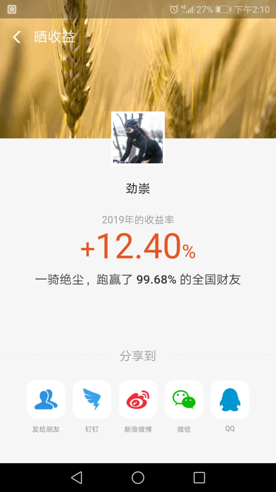

======================================================

_type: q&a
@紫色天使[844124551411152]
2019-02-26 14:20:43 Tue  
topic_id: 844445822224552

@紫色天使

>  二师父你好，我于2017年买入蓝思科技股票，当时20元一股，买入9299股，买入了20万， 2018年一路跌到6元，最近涨到8元多，我这种情况是不是该割肉出局？还是继续等待牛市到来把本赚回来，我怕这只股票再也涨不到20块了，想听听二师父的建议。

@二师父

>  目前再等等，按照我的股票交易系统一般是到亏损10个点止损，我看了看财务指标，16年盈利增长率不行，17年可以，等18年年报出来了再看看，估计是不行的。科技股很可怕的，巴菲特在苹果上也栽了

阅读[1603]  评论[0]  赞[0] 

======================================================

@二师父[28814221155551]
2019-02-26 14:35:46 Tue  
topic_id: 111112544845182

>  @二师父
>  

阅读[1596]  评论[0]  赞[0] 

======================================================

_type: q&a
@冉冉[88445118854412]
2019-02-26 14:41:07 Tue  
topic_id: 244445822122221

@冉冉

>  二师傅，目前环保产业估值如何，我2015年买在高点的建信环保产业基金001166现在仍亏损35%，现在怎样处理呢？

@二师父

>  这个高位接盘就只有定投才能解套，钱不用的话拿着等牛市来吧

阅读[1682]  评论[3]  赞[0] 

======================================================

_type: talk
@惟子[88481814485542]
2019-02-26 15:05:51 Tue  
topic_id: 111112541241412

目前持有场外基金：南方中证500、广发医药、景顺长城300增强、易方达创业板、上证50AH、华宝油气、国泰房地产指数均是盈利。现阶段，除易方达创业板暂停定投，其它基金参考二师父估值表，均属低估期，仍在每月定投。

阅读[1506]  评论[0]  赞[0] 

======================================================

_type: talk
@半路出家滚雪球[844151182512222]
2019-02-26 16:54:52 Tue  
topic_id: 844445845814452

参考网上前辈做的策略做了一个自己的低估周定投策略，还请二师父和各位高人批评指正！

@杨小峰 at 2019-02-26 16:54:52 Tue

> 看起来挺不错啊

----------

@波 at 2019-02-26 16:54:52 Tue

> 此图表非常细致！虽然我看不懂，但我看得出作者认真的态度！

----------

@半路出家滚雪球 at 2019-02-26 16:54:52 Tue

> 被你逗笑了[呲牙]

----------

@Demon at 2019-02-26 16:54:52 Tue

> 浮亏系数那里是跌5就要单笔加3000的意思吗[微笑][微笑]

----------

@Demon at 2019-02-26 16:54:52 Tue

> 还有一个就是单笔加仓是每个区间只加一次？下降再涨再跌的算不算？感觉这个表做的很细致了

----------

@LookGod at 2019-02-26 16:54:52 Tue

> 感觉加仓系数有点大，前期还好，后期仓位上来后浮亏对资金量要求很高，应该是我之前做的那个[捂脸]，现在我还是用估值决定增大金额了，放弃浮亏了，而且为了方便实用简化了很多～

----------

@半路出家滚雪球 at 2019-02-26 16:54:52 Tue

> 谢谢建议，原来您是原创，实践出真知。

----------

阅读[1637]  评论[7]  赞[0] 

+++++++++++++++++++++++++++++++++++++++++++++++++++++

图片：
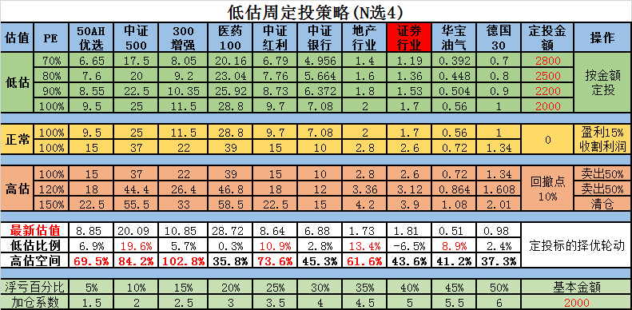

======================================================

_type: q&a
@幽幽菊花茶[51425212482114]
2019-02-26 18:06:36 Tue  
topic_id: 111112512144112

@幽幽菊花茶

>  二师父您好，你文章里那个“领投”港股打新，您参加过没？我试着投了2个，共127元，今天一个亏0.6元，一个赢利5.2元，港股这么容易就中签了吗，有点儿疑惑

@二师父

>  港股中签率很高的，基本能中，也有不中的情况，而且收益率比a股高，百分之70多的股首日上涨

阅读[1721]  评论[0]  赞[0] 

======================================================

_type: q&a
@不息[48251142155258]
2019-02-26 18:11:32 Tue  
topic_id: 544442142485124

@不息

>  二师父，我想问下如何在当天3点前预估某个基金的市盈率？方便当天操作

@二师父

>  参考前一天的就行，一般情况下，指数上涨，市盈率会上涨的，大部分是这样

阅读[1747]  评论[3]  赞[0] 

======================================================

_type: q&a
@家树[544854851425424]
2019-02-26 20:11:13 Tue  
topic_id: 844445848554152

@家树

>  德国30为什么场内外的价格不一样？

@二师父

>  一个是场内ETF，一个是ETF链接基金，不一样的啊

阅读[1632]  评论[0]  赞[0] 

======================================================

_type: q&a
@ChangCHEN[28284541841281]
2019-02-26 20:12:12 Tue  
topic_id: 544442141154544

@ChangCHEN

>  二师父 定投的上证50 基本面50和中证500分别盈利10-20 最近涨得太快了 是否要赎回部分 具体建议怎么操作请指导谢谢

@二师父

>  上证50和基本面50可以赎回一些，中证500可以再等等，比如你投资了1万，盈利了2000，那么卖出2000元就行了

阅读[1807]  评论[5]  赞[0] 

======================================================

_type: talk
@二师父[28814221155551]
2019-02-26 22:07:22 Tue  
topic_id: 544442145111524

<e type="hashtag" hid="142511181542" title="#周二荐书#" /> 伟大的博弈，看看美国金融发展史，学会把视野放长远一点，你就发现股市永远是在涨跌间变化的。

阅读[4805]  评论[0]  赞[0] 

======================================================

_type: q&a
@唐僧[28482288811141]
2019-02-26 22:11:02 Tue  
topic_id: 422224825888258

@唐僧

>  二师父，行情比我预期来的要早，现在计划定投仓位不到40%，现在这行情，是稍微加大点步伐呢，还是继续按计划定投呢？我现在是按估值买，涨了就少买，降了就多买，前些日子2400是我最高兴的时候，哈哈。

@二师父

>  继续定投啊，加大步伐应该是在2400点的时候，目前正常投或减少投

阅读[1840]  评论[0]  赞[0] 

======================================================

_type: talk
@二师父[28814221155551]
2019-02-27 02:12:25 Wed  
topic_id: 244445815522181

<e type="hashtag" hid="481211145528" title="#指数估值#" /> 广发医药也正常估值了，珍惜低估定投的机会哈。

阅读[1767]  评论[0]  赞[0] 

+++++++++++++++++++++++++++++++++++++++++++++++++++++

图片：
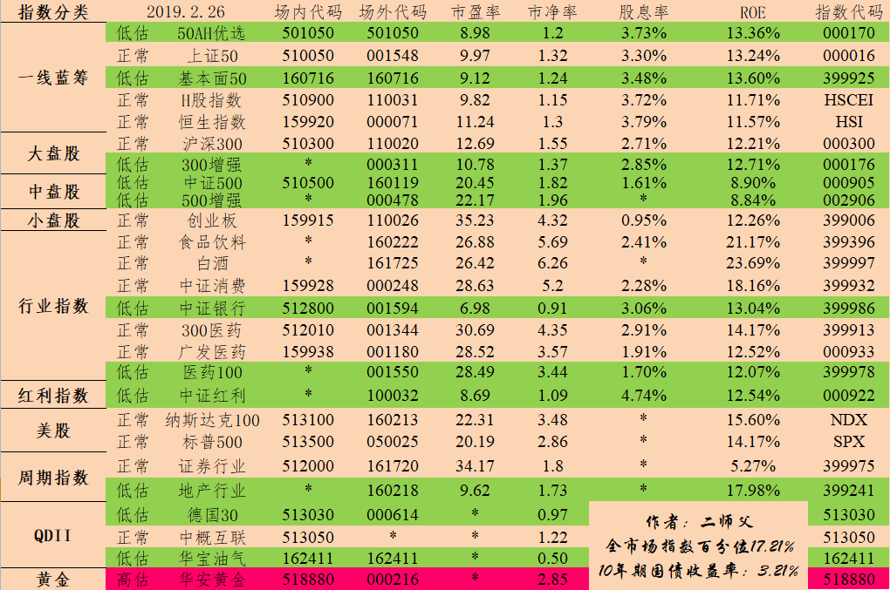

======================================================

_type: talk
@二师父[28814221155551]
2019-02-27 02:14:55 Wed  
topic_id: 544442182255854

<e type="hashtag" hid="142444828582" title="#定投总结#" />

@niwota at 2019-02-27 02:14:55 Wed

> 这么晚还没睡 ，难怪全面盈利[强]

----------

@Claire at 2019-02-27 02:14:55 Wed

> 跟着二师父走过收获的二月，不仅仅是稳稳的盈利，更多的是和一群志同道合的一起学习成长的那份快乐。[愉快]

----------

@二师父 at 2019-02-27 02:14:55 Wed

> 研究也挺快乐

----------

@二师父 at 2019-02-27 02:14:55 Wed

> 独乐乐不如众乐乐

----------

阅读[5371]  评论[4]  赞[0] 

+++++++++++++++++++++++++++++++++++++++++++++++++++++

文件：
2019-02-27 02:14:20 Wed
文件大小：[24239]
51144254541884-全面浮盈的二月.docx

======================================================

_type: talk
@二师父[28814221155551]
2019-02-27 04:41:20 Wed  
topic_id: 544442182248414

<e type="hashtag" hid="142444828122" title="#五步定投2.0#" /> 花了点时间更新了五步定投2.0，在更新的过程中我确实发现了自己的问题，写的文章很主观，这是出版编辑给我的建议。

因为以前也做过编辑，经常写新闻稿，对那种一成不变的新闻稿很厌倦，所以不愿意太官方。以后还是得更加专业，写的文章尽量客观，让读者能够理性思考，独立决策，这样大家才能够成长。

@.Five at 2019-02-27 04:41:20 Wed

> 感谢二师父的分享~

----------

@凭栏观海 at 2019-02-27 04:41:20 Wed

> 非常棒

----------

@勤能行之 at 2019-02-27 04:41:20 Wed

> 暂时没时间看，也要先点赞。

----------

@王秦川 at 2019-02-27 04:41:20 Wed

> 五步定投2.0 简单易懂，没有太多复杂的专业术语，是基金定投新手的葵花宝典[强]，加入学堂学习，认同了二师父的投资理念后，跟二师父低估买，盈利卖，涨跌舒服，再次明白了我们定投的初衷，定投基金的目的就是让财务轻松自由后，做自己喜欢的事情，专心本质工作，而不是花太多的精力在股市中，让市场涨跌的焦虑情绪影响正常的生活，长期投资不缺投资机会，关键是，投资机会到来时，你有没有钱。
不要因为走得太远而忘记为什么出发

----------

@二师父 at 2019-02-27 04:41:20 Wed

> 不忘初心，方得始终

----------

阅读[5511]  评论[5]  赞[2] 

+++++++++++++++++++++++++++++++++++++++++++++++++++++

文件：
2019-02-27 04:38:35 Wed
文件大小：[935903]
48822452522128-二师父为基金新手打造的五步定投法（2.0）.pdf

======================================================

_type: q&a
@晨[51411182152424]
2019-02-27 08:27:05 Wed  
topic_id: 111112582552242

@晨

>  二师父好，请问场外跟投操作鳄鱼计划可以吗？

@二师父

>  您好，也是可以的，不过在短期时间7天以为别赎回，因为场外投资7天以内赎回会有一个惩罚性收费

阅读[1835]  评论[1]  赞[0] 

======================================================

_type: talk
@王秦川[844151411882412]
2019-02-27 09:19:16 Wed  
topic_id: 422224814151418

<e type="hashtag" hid="142444828122" title="#五步定投2.0#" /> 简单易懂，没有太多复杂的专业术语，是基金定投新手的葵花宝典[强]，加入学堂学习，认同了二师父的投资理念后，跟二师父低估买，盈利卖，涨跌舒服，再次明白了我们定投的初衷，定投基金的目的就是让财务轻松自由后，做自己喜欢的事情，专心本质工作，而不是花太多的精力在股市中，让市场涨跌的焦虑情绪影响正常的生活，长期投资不缺投资机会，关键是，投资机会到来时，你有没有钱。
不要因为走得太远而忘记为什么出发

@凭栏观海 at 2019-02-27 09:19:16 Wed

> 二师父是投资奇才，这个领域是有天才的

----------

@王秦川 at 2019-02-27 09:19:16 Wed

> 哈哈哈，我们幸运，认识了奇才。我们遇到了二师父这个牛股🐂，让高兴认识了你们，以后我们一起跟二师父定投下去，也提升一下格局[得意][得意][得意][愉快][愉快][愉快]

----------

阅读[1734]  评论[2]  赞[0] 

======================================================

_type: talk
@远熹[544814518545554]
2019-02-27 09:20:30 Wed  
topic_id: 422224814124528

二师父，我有两个问题，中证500和500增强都在低谷区选哪个好，现在创业板在正常估值，是不是可以把利润卖出了

@凭栏观海 at 2019-02-27 09:20:30 Wed

> 500增强

----------

@凭栏观海 at 2019-02-27 09:20:30 Wed

> 根据老师的五步定投法，如果基金低估，就继续持有；如果基金估值正常，就收割利润。

----------

@远熹 at 2019-02-27 09:20:30 Wed

> 谢谢

----------

阅读[1862]  评论[3]  赞[0] 

======================================================

_type: q&a
@幻水[881185412112]
2019-02-27 09:22:36 Wed  
topic_id: 244445815128281

@幻水

>  600177雅戈尔，前几次因为有中信证券，所以牛市跑赢大盘，假如未来有一次牛市，600177雅戈尔还能跑赢大盘吗？支撑结论的逻辑是什么啊？

@二师父

>  雅戈尔盈利能力一般，收益增长率更糟糕，我不看好这只股票，买股票要从投资企业的角度分析，仅看股价涨跌就成了投机。比特币没啥价值，就是因为资金炒，所以非理性上涨

阅读[2088]  评论[2]  赞[0] 

======================================================

_type: talk
@陈[844415515418422]
2019-02-27 09:47:57 Wed  
topic_id: 111112585252482

二师父，您好！仓位不高，利润达到百分位十到二十，是不是已目前情况可以继续持有？

@凭栏观海 at 2019-02-27 09:47:57 Wed

> 根据老师的五步定投法，如果基金低估，就继续持有；如果基金估值正常，就收割利润。

----------

@陈 at 2019-02-27 09:47:57 Wed

> 谢谢你！按利润金额卖出相应份额？

----------

@凭栏观海 at 2019-02-27 09:47:57 Wed

> 卖出利润部分

----------

@陈 at 2019-02-27 09:47:57 Wed

> 谢谢你！

----------

阅读[1916]  评论[4]  赞[0] 

======================================================

_type: q&a
@海盗[48248118584848]
2019-02-27 10:12:38 Wed  
topic_id: 244445818888111

@海盗

>  二师父，您好！现在,我的整体收益率已达10%.有很多基金的估值都正常了，其中最厉害的是券商，涨幅已经35%了。现在是卖出利润好，还是继续持有到高估再卖出好

@二师父

>  卖出利润好，严格按照五步定投法的纪律操作

阅读[2252]  评论[0]  赞[0] 

======================================================

_type: q&a
@远熹[544814518545554]
2019-02-27 12:41:43 Wed  
topic_id: 544442181451484

@远熹

>  二师父，现在300增强在低估区，但是这个指数的基金有好几只，那具体选那一只投资该怎么判断呢

@二师父

>  第一看这个基金规模，规模要在1亿以上，保证流动性，然后看基金公司，大的基金公司比较好，背靠大树好乘凉。第三看费率，选择相对较低的费率，最后看看跟踪误差如何，跟踪误差要尽可能小

阅读[2230]  评论[0]  赞[0] 

======================================================

_type: q&a
@晨[51411182152424]
2019-02-27 12:51:12 Wed  
topic_id: 422224818214548

@晨

>  二师父好，如果低估定投实盘某指数达到正常估值后可以停止定投并卖出利润部分，如果不卖出，等到高估时再卖出，不是可以更好的发挥复利的作用吗？

@二师父

>  那也可以的，可是有一种情况，比如不卖出利润部分，发生较大回撤，会有利润回吐，比如18年3500点一直下跌到2400点

阅读[2296]  评论[9]  赞[0] 

======================================================

_type: q&a
@陈洲[88245122222212]
2019-02-27 14:30:06 Wed  
topic_id: 544442188528144

@陈洲

>  这里虽然是定投，但五步法里讲到资产配置，最近想买保险，想问下大家都买什么保险？

@二师父

>  <e type="web" href="https://mp.weixin.qq.com/s/DC6bMXgBfVEoeUzhEwXfSw" title="二师父送给你的保险大全" cache="" />，这里有几款保险介绍，我也准备近1年配置重疾险，目前还在选择中

阅读[2264]  评论[4]  赞[0] 

======================================================

_type: q&a
@暖心人[844121214481512]
2019-02-27 18:46:42 Wed  
topic_id: 422224544121218

@暖心人

>  师父好，新人来报道，想请问老师，护指300和中证500分别有几只基金啊？从哪里找寻

@二师父

>  欢迎你啊，目前沪深300有嘉实，华夏，天弘，易方达，博时等基金公司的指数基金，可以从晨星基金官方网站查阅，如果是场外定投选择其中一家规模较大，费率较低的定投就可以啦
>  
>  如果是场内定投的话，选择300ETF或者500ETF定投，这个在证券账户可以查到，目前沪深300指数正常估值，可用50ah优选指数替代或者沪深300增强替代

阅读[2113]  评论[3]  赞[0] 

======================================================

_type: q&a
@玉博珠宝[15551254545122]
2019-02-27 23:23:31 Wed  
topic_id: 544442524185114

@玉博珠宝

>  二师父您好！对消费型定期寿险有研究吗？

@二师父

>  一般是看重疾，定期寿险性价比也很高，不过购买这个心里关难过，约定某个年龄段内被保险人死亡或者全残，才会有保障

阅读[1884]  评论[0]  赞[0] 

======================================================

_type: q&a
@王秦川[844151411882412]
2019-02-27 23:24:40 Wed  
topic_id: 422224542248828

@王秦川

>  二师父：你上次建议的基金000978，择时卖了，现在浮亏接近4%，我准备卖了，卖了准备投300增强（低估），是一次性转投，还是分次。

@二师父

>  我没有推荐这个基金啊，是不是代码写错了，目前点位不是很低，建议定投，如果再跌百分之20可以一次全部买入

阅读[1972]  评论[4]  赞[0] 

======================================================

_type: talk
@二师父[28814221155551]
2019-02-28 04:44:27 Thu  
topic_id: 844445285512122

<e type="hashtag" hid="481211145528" title="#指数估值#" /> 今天的变化不大，还是正常定投就好了。如果仓位比较重，记得收割利润哈

@小溪医生 at 2019-02-28 04:44:27 Thu

> 广发医药又低估了

----------

阅读[1998]  评论[1]  赞[0] 

+++++++++++++++++++++++++++++++++++++++++++++++++++++

图片：
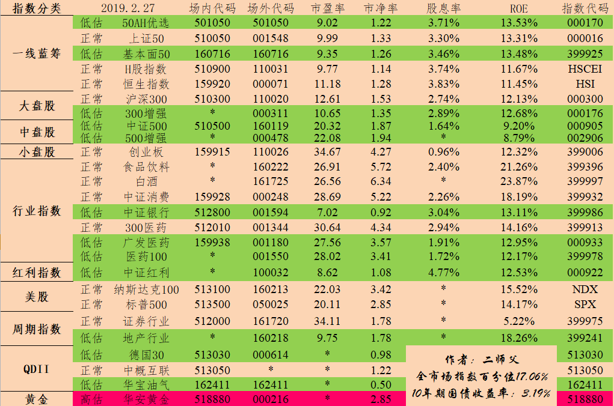

======================================================

_type: talk
@二师父[28814221155551]
2019-02-28 04:45:19 Thu  
topic_id: 422224584415128

<e type="hashtag" hid="481182218558" title="#投资计划#" /> 下个月的投资计划，按照计划来，任他风吹雨打，我自闲庭信步

@半路出家滚雪球 at 2019-02-28 04:45:19 Thu

> 二师父，中证红利目前也是低估蛮多的，为什么不选择这个标的呢？

----------

@丸子妈 at 2019-02-28 04:45:19 Thu

> 同问

----------

@二师父 at 2019-02-28 04:45:19 Thu

> 之前中证红利第2大仓位，而且这个基金主要是分红，成长性不是最好的，所以没有列出

----------

@杨荧 at 2019-02-28 04:45:19 Thu

> 嗯……我属于悟性低的。每隔一段时间都要去复习下五步定投法

----------

@二师父 at 2019-02-28 04:45:19 Thu

> 慢慢来总会有顿悟的一天

----------

@啊哦额咦呜吁 at 2019-02-28 04:45:19 Thu

> 二师傅说的平安是中国平安还是平安银行

----------

@二师父 at 2019-02-28 04:45:19 Thu

> 中国平安

----------

阅读[5809]  评论[11]  赞[0] 

+++++++++++++++++++++++++++++++++++++++++++++++++++++

文件：
2019-02-28 04:44:42 Thu
文件大小：[24198]
28844545518141-面对技术牛市，3月定投需这样规划.docx

======================================================

_type: talk
@二师父[28814221155551]
2019-02-28 06:18:04 Thu  
topic_id: 244445288122181

<e type="hashtag" hid="825224521842" title="#财务自由需要的钱#" /> 计算你实现财务自由需要多少钱，先看看你每年的消费支出是多少，假设每年50万。那么通过指数基金定投每年实现15个点的收益率，有10个点贡献给通货膨胀，还有5个点的收益提取资金出来给自己开支，所以需要的资金50
除以0.05，为1000万，假设节约点，每年花20万，只需要400万，这样计算的话，如果延迟或者放弃在北京买房，我根本不用19年就完全可以实现财务自由

所以为了尽早实现财务自由，可以延迟在北京买房，至于孩子上学这个问题，首先我目前没孩子，其次我从农村都能混到北京，我孩子如果在省会都混不好的话那怪不得我

所以为了尽早实现财务自由我基本是延迟或者放弃在北京买房，一个人不能奢求太多，我哥在北京买房，但是看到他为了一套房子耗在一个地方我从内心感到恐惧。

如果让我在北京房子和户口与自己人生自由这二者之间选择的话我选择人生自由。只有我自己自由了开心了，我才能给家庭更好的生活，金融思维做选择，真的很轻松。

所以乐观估算，按照我现在的发展，可以用7年实现财务自由。大家也可以算下自己实现财务自由需要的时间。

经过了两个月的思考，我跳出了固化思维，好开心。以后每一天都朝着这个目标努力，看看7年2026年以后我是否能够真正过着不用上班的自由生活，每天有一半的时间考虑去哪玩，继续加油💪💪💪💪💪💪

@TIME at 2019-02-28 06:18:04 Thu

> 因病在家休息半年， 也仔细考虑了这个问题，500就够家里财务自由了，中国资本市场未来还是很看好的。

----------

@shi at 2019-02-28 06:18:04 Thu

> 真羡慕啊。
15%的稳定持续收益有点难吧？

----------

@二师父 at 2019-02-28 06:18:04 Thu

> 年化还是可以的

----------

@小米兔 at 2019-02-28 06:18:04 Thu

> 如果只定投指数基金可以到15的年化吗？

----------

@二师父 at 2019-02-28 06:18:04 Thu

> 这个是可以的，按照策略定投

----------

阅读[2364]  评论[5]  赞[0] 

======================================================

_type: q&a
@暖心人[844121214481512]
2019-02-28 11:46:34 Thu  
topic_id: 844445282882182

@暖心人

>  老师，鳄鱼计划到底是啥啊？我怎么没找到文本

@二师父

>  学堂搜索鳄鱼计划就看到了，是我在场内操作的定投计划

阅读[1974]  评论[6]  赞[0] 

======================================================

_type: q&a
@Jewel[244448815142241]
2019-02-28 11:47:03 Thu  
topic_id: 544442515455854

@Jewel

>  二师父，早上好，想请问一下领投拼团打新的具体操作，请问需要什么条件。在广发账户里面操作吗？

@二师父

>  公众号后台回复港股，扫描二维码就可以参与港股打新

阅读[1987]  评论[0]  赞[0] 

======================================================

_type: q&a
@好运玲玲[244188585541521]
2019-02-28 11:51:19 Thu  
topic_id: 422224585141548

@好运玲玲

>  二师父您好！百万医疗险怎么样？身边有不少朋友买的这个。

@二师父

>  乐享百万医疗险这个还不错的

阅读[2040]  评论[2]  赞[0] 

======================================================

_type: q&a
@小炜[28855811418121]
2019-02-28 11:55:57 Thu  
topic_id: 111112451225482

@小炜

>  二师父，请问用上证红利可以替代50AH吗？若不能，理由是什么呢？目前我重仓的是中证500，一部分证券ETF，少量上证红利。请请点评下这个组合吧。

@二师父

>  这个替代不是很好，上证50，沪深300可以替代，上证红利是根据股息率进行选股的

阅读[2186]  评论[0]  赞[0] 

======================================================

_type: talk
@二师父[28814221155551]
2019-02-28 12:10:54 Thu  
topic_id: 111112451185542

<e type="hashtag" hid="825224541552" title="#低估定投实盘#" /> 买入50ah优选0.5份，地产指数0.5份，因为上涨我们定投资金的比例也减少啦，坚持定投哈，要停止的时候我会告诉大家的

@小涛@我的四季生活 at 2019-02-28 12:10:54 Thu

> 我才跟投

----------

@小涛@我的四季生活 at 2019-02-28 12:10:54 Thu

> [大哭]

----------

@今晚吃手抓，谁给点大* at 2019-02-28 12:10:54 Thu

> 二师父，按您的意思，我目前持有中证红利，医药100，500增强，300增强，是否有必要开始50AH，如果可以是否可以建立底仓，仓位大概多少合适？

----------

@二师父 at 2019-02-28 12:10:54 Thu

> 没必要，投资300增强也可以，这两个是差不多的

----------

@今晚吃手抓，谁给点大* at 2019-02-28 12:10:54 Thu

> [抱拳]

----------

@今晚吃手抓，谁给点大* at 2019-02-28 12:10:54 Thu

> 二师父，现在可以开始定投华宝油气吗，如果可以，建立多少底仓合适？

----------

@二师父 at 2019-02-28 12:10:54 Thu

> 华宝油气从现在到历史最底部还有百分之45的跌幅，如果你的底仓金额能够经受住这个浮动，那就建多少的底仓

----------

@今晚吃手抓，谁给点大* at 2019-02-28 12:10:54 Thu

> [抱拳]

----------

阅读[5901]  评论[11]  赞[0] 

======================================================

_type: q&a
@乖子[28441841181151]
2019-02-28 15:48:54 Thu  
topic_id: 244445228512121

@乖子

>  请问我基本面50的卖出了利润部分，然后这个钱可以拿来投资低估值的？比如老师今天的这两支。谢谢

@二师父

>  可以的啊

阅读[1993]  评论[0]  赞[0] 

======================================================

_type: q&a
@Kevin Chan[48221851244458]
2019-02-28 16:04:27 Thu  
topic_id: 111112445142122

@Kevin Chan

>  二师傅，想问一下，有没有哪里可以计算我买了很多只基金，计算我收益率的工具，类似模拟交易的工具

@二师父

>  你说是回测吧，整体收益率app里面都有，回测用智投星或者果仁

阅读[2020]  评论[2]  赞[0] 

======================================================

_type: q&a
@小牧童[28484254825881]
2019-02-28 20:04:11 Thu  
topic_id: 844445228125822

@小牧童

>  二师父，您好！我们所说的指数翻了多少倍，它是从发布日期的数值算还是基日的基值算开始倍数？从图片500医药我看同花顺从15年第一天开始既不是发布日期也不是基日，其他指数有些是发布日期有些是基日！有些迷糊，望二师父解答，谢谢！

@二师父

>  你这图我看不到啊，15年第一天不就是跟14年最后一天吻合吗？我们算指数涨幅是从基日公布的基点开始计算不同在于，指数点位是不包含分红的，如果考虑分红，指数点位实际上是要更高些

阅读[1968]  评论[4]  赞[0] 

======================================================

_type: q&a
@niwota[422255254814458]
2019-02-28 20:19:05 Thu  
topic_id: 844445222858482

@niwota

>  请问二师父，红利指数中目前哪个更适合投资，哪个更适合定投。还请帮助分析一下。
>  对应的场外基金推荐哪支，谢谢！

@二师父

>  红利基金我是推荐中证红利的，中证红利，上证红利，深证红利，里面中证红利的分红最好也最稳定，所以推荐，代码100032

阅读[1904]  评论[2]  赞[0] 

======================================================

_type: q&a
@林西瓜🍉[28855581582851]
2019-02-28 20:22:37 Thu  
topic_id: 111112441221182

@林西瓜🍉

>  二师父，为什么那么多指数有两个代码的？像300医药又分399913/000913

@二师父

>  这是因为有的指数是跨市场指数，399开头的是深交所的指数代码，000开头的是上交所的指数代码，如果某个指数只在某一个交易所发布，那么这个时候他就只有一个代码的

阅读[2019]  评论[1]  赞[0] 

======================================================

_type: q&a
@gxbill[88842585142152]
2019-02-28 20:29:59 Thu  
topic_id: 544442555882254

@gxbill

>  二师傅考虑沪港深中国价值指数么？感觉这个指数的选股策略就是低估的 推荐把这个也加到估值表里，代码501310

@二师父

>  这个指数的选股策略是选择沪港深三地低估的股票组成指数，也有投资价值，后期考虑是否加入
>  
>  目前我们的估值表里面已经涵盖了，沪深港德美等五地的股票指数，如果配置完全了是比较全面的
>  
>  二师父有个想法是后期自己构建一个二师父诺亚方舟指数

阅读[2034]  评论[6]  赞[0] 

======================================================

_type: q&a
@冉冉[88445118854412]
2019-02-28 21:36:25 Thu  
topic_id: 844445224241112

@冉冉

>  今天又仔细读了二师傅的新定投五步法，对于基金配置深受启发。目前我主要配置了沪深300增强、中证500增强、中证红利及中证500，想再配置些比如华宝油气合适吗？华宝油气是按我们的交易时间购买吗？

@二师父

>  是的，场内购买及时成交，场外申购还是当天收盘三点成交

阅读[1985]  评论[3]  赞[0] 

======================================================

_type: q&a
@韬韬[422212184181458]
2019-02-28 21:49:32 Thu  
topic_id: 244445224458521

@韬韬

>  二师父，您好，现在医药100补涨后还适合建仓定投吗？建仓几层比较合适？

@二师父

>  医药基金布局我们是从去年发生了长生生物疫苗造假事件开始定投的，期间又发生了类似带量采购等一系列利空事件，所以二师父根据追跌选择投入了较多
>  
>  当前医药100的估值快进入正常估值，不适合建立底仓，正常定投就好，一定要记住逆向思维
>  
>  我还记得我们定投医药基金时候很多医生都开始怀疑他的价值，一致看空，切记当所有人看空的时候就是我们建立底仓的好时机，现在不太适合哈

阅读[2056]  评论[3]  赞[0] 

======================================================

