_type: talk
@二师父[28814221155551]
2019-08-01 04:16:29 Thu  
topic_id: 111882844148282

<e type="hashtag" hid="481211145528" title="#指数估值#" />

阅读[3857]  评论[1]  赞[0] 

+++++++++++++++++++++++++++++++++++++++++++++++++++++

图片：
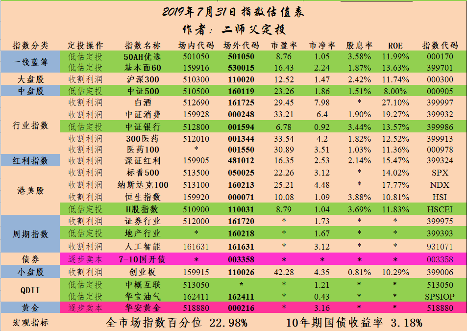

======================================================

_type: talk
@二师父[28814221155551]
2019-08-01 04:16:49 Thu  
topic_id: 422114155251418

<e type="hashtag" hid="552148115414" title="#定投计划#" />

@衣袂飘香 at 2019-08-01 04:16:49 Thu

> 二师父的鳄鱼计划已经基本布局好了，可是我才刚刚执行鳄鱼计划。准备在低估区域，按一年50份到70份的节奏完成，不知这样的节奏是否合理，或者有更好的意见建议？请教二师父，谢谢。@二师父

----------

阅读[5701]  评论[1]  赞[0] 

+++++++++++++++++++++++++++++++++++++++++++++++++++++

文件：
2019-08-01 04:16:42 Thu
文件大小：[25029]
15422112154522-相信未来，8月继续坚定定投.docx

======================================================

_type: talk
@二师父[28814221155551]
2019-08-01 04:27:28 Thu  
topic_id: 244115122445511

<e type="hashtag" hid="551518542254" title="#198定投实盘#" /> 比例加上了后面的小数位，是对应100%的

@朝阳模具 at 2019-08-01 04:27:28 Thu

> 定投1份？总资金分成多少份？

----------

@老丁 at 2019-08-01 04:27:28 Thu

> 二师父，用AH50+F60代替沪深300可以不？300已经很久没低估了

----------

@🍀一秋 at 2019-08-01 04:27:28 Thu

> 定投1份是2000元，然后按师父上面的表格是分成4份来定投的呀

----------

@🍀一秋 at 2019-08-01 04:27:28 Thu

> 300你都会说很久没低估了呀，我们现在做的是在低估区域的基金来坚持定投。300现在都是收割利润[微笑]

----------

@二师父 at 2019-08-01 04:27:28 Thu

> 可以的，我就是这样投的场外的

----------

@志亮 at 2019-08-01 04:27:28 Thu

> 我也没买泸深300，就买了AH50和F60

----------

阅读[5972]  评论[6]  赞[0] 

+++++++++++++++++++++++++++++++++++++++++++++++++++++

图片：
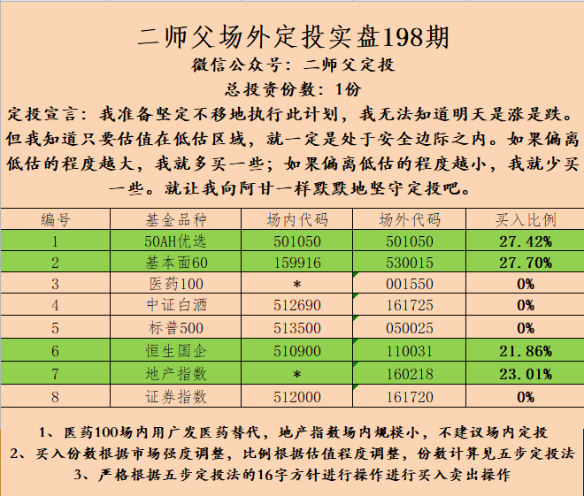

======================================================

_type: talk
@小小鸟[111885884481252]
2019-08-01 10:07:31 Thu  
topic_id: 544882842182884

二师父如果时间允许。能不能制作一张场内网格交易的表格供大家参考使用。

阅读[3694]  评论[1]  赞[0] 

======================================================

_type: q&a
@雪莲[421485848588118]
2019-08-01 10:41:13 Thu  
topic_id: 844115124584222

@雪莲

>  二师父你好，我想知道恒生国企指数基金的阀值是多少？想查看当前滚动市盈率在哪能看到？

@二师父

>  9.5倍市盈率，估值表里面就是当前滚动市盈率，恒生指数官网可以查到

阅读[3973]  评论[1]  赞[0] 

======================================================

_type: talk
@Sunflower[244185124281811]
2019-08-01 12:57:27 Thu  
topic_id: 244115148258551

二师父您好，我的养老基金定投的中证红利，市盈率是不是可以参考深证红利市盈率呀？还是需要我去网上专门查呢？我记得您评论过一句话，但是找不到了。

@二师父 at 2019-08-01 12:57:27 Thu

> 中证红利和深证红利差别还是很大的，现在中证红利低估，可以在中证指数官网查阅，也可以在3000点以下开始定投这个指数，比较稳健的一个指数基金

----------

@What if at 2019-08-01 12:57:27 Thu

> 富国中证红利指数的估值是参照中证官网那个里面的中证红利指数（指数代码000922）的市盈率1（P/E1）吗

----------

@二师父 at 2019-08-01 12:57:27 Thu

> 可以在果仁网看

----------

阅读[3800]  评论[4]  赞[0] 

======================================================

_type: talk
@J[28281541518551]
2019-08-01 13:10:40 Thu  
topic_id: 544882841512254

华宝智投app里都没有实时显示净值和溢价率，大家也有出现这样情况吗？这一点建议华宝改进一下app里这个bug，查询起来太不方便了

阅读[3915]  评论[0]  赞[0] 

+++++++++++++++++++++++++++++++++++++++++++++++++++++

图片：
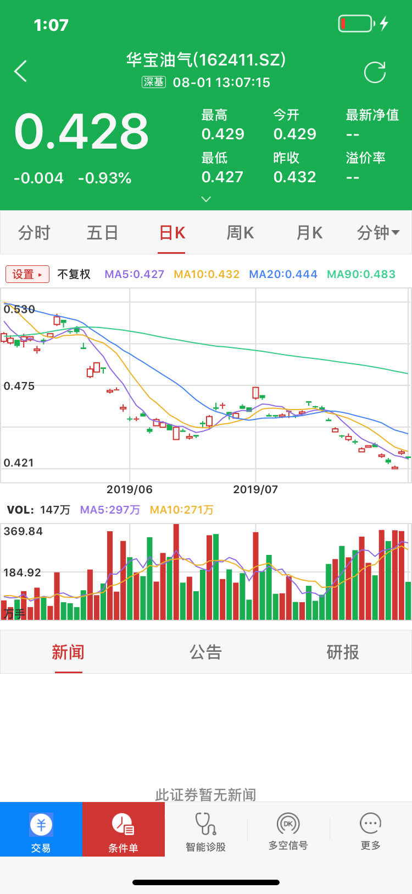

======================================================

_type: q&a
@J[28281541518551]
2019-08-01 20:14:37 Thu  
topic_id: 844115148254842

@J

>  师傅，做均线偏离定投可以从正常区域开始吗？还是一定要等待进入低估才可以做T？

@二师父

>  可以的，前提是你能克服下跌恐惧而且一直有资金加仓

阅读[3701]  评论[1]  赞[0] 

======================================================

_type: talk
@林荫[15115451828452]
2019-08-01 21:40:56 Thu  
topic_id: 844115115284552

我有开光大证券，现在换华泰是需要去注销吗？有点麻烦。。

@二师父 at 2019-08-01 21:40:56 Thu

> 这个不用的，一个人可以开三个证券账户

----------

阅读[3738]  评论[1]  赞[0] 

======================================================

_type: talk
@二师父[28814221155551]
2019-08-02 04:17:21 Fri  
topic_id: 422114118251118

<e type="hashtag" hid="145458855482" title="#周五读书#" /> 《一个投资者的心灵修炼》，最后一次音频读书分享，后面分享采用文字的形式

@J at 2019-08-02 04:17:21 Fri

> 师傅用音频做读书分享很好啊！什么时候都可以听，为什么改文字呢？

----------

@rtdmm小米 at 2019-08-02 04:17:21 Fri

> 音频分亨，更喜欢

----------

@木子李 at 2019-08-02 04:17:21 Fri

> 师傅，不要有压力，还是很喜欢你的音频分享的。

----------

@二师父 at 2019-08-02 04:17:21 Fri

> 没有压力，工作太忙，录制不方便

----------

@二师父 at 2019-08-02 04:17:21 Fri

> 时间不够

----------

阅读[5865]  评论[5]  赞[0] 

+++++++++++++++++++++++++++++++++++++++++++++++++++++

文件：
2019-08-02 04:11:45 Fri
文件大小：[27399833]
28255448145841-第一讲.m4a

======================================================

_type: talk
@林荫[15115451828452]
2019-08-02 04:26:51 Fri  
topic_id: 111882885112512

华泰开户，点这个界面没反应，大家有遇到过吗？我操作几次都是这样。

@王燕 at 2019-08-02 04:26:51 Fri

> 遇到过，上传了好几次才弄好

----------

阅读[3937]  评论[1]  赞[0] 

+++++++++++++++++++++++++++++++++++++++++++++++++++++

图片：

======================================================

_type: talk
@韬韬[422212184181458]
2019-08-02 09:32:26 Fri  
topic_id: 844115111845242

师傅，油气今天跌的不错，场内比较便宜，准备建仓5成，合适吗？

@二师父 at 2019-08-02 09:32:26 Fri

> 我说了这个别重仓

----------

@门萨🐨 at 2019-08-02 09:32:26 Fri

> 定投⭕的口吻都是，emmm，今天跌的不错😂

----------

阅读[3774]  评论[3]  赞[0] 

======================================================

_type: talk
@rtdmm小米[422188284881148]
2019-08-02 09:57:09 Fri  
topic_id: 544882888548244

二师父的鳄鱼还不出击？还在潜伏？

@杜志彪 at 2019-08-02 09:57:09 Fri

> 师父是网格0.42是买入点，我是0.41

----------

@杜志彪 at 2019-08-02 09:57:09 Fri

> 小仓位资金完全可以自己操作，不用等二师父，定好的规则就行就可以了[微笑]

----------

@小小鸟 at 2019-08-02 09:57:09 Fri

> 今天场内溢价。大家是选择在场内买还是场外申购？

----------

@rtdmm小米 at 2019-08-02 09:57:09 Fri

> 有道理[强]，谢谢同学[鼓掌][鼓掌]

----------

阅读[3867]  评论[4]  赞[0] 

======================================================

_type: q&a
@victoria[15455121858422]
2019-08-02 10:22:30 Fri  
topic_id: 111882888441582

@victoria

>  二师父今天适合买点什么

@二师父

>  已经买了

阅读[4119]  评论[6]  赞[0] 

======================================================

_type: q&a
@彩色[48415121851218]
2019-08-02 12:48:19 Fri  
topic_id: 244118555285251

@彩色

>  二师父，请问深证红利可以买场外吗？我看推荐的场外指数基金持仓与指数持仓不一样？可以买吗？还是建议买场内？

@二师父

>  场外可以买，这是etf联接基金，也可以用基本面60替代

阅读[4005]  评论[1]  赞[0] 

======================================================

_type: talk
@林荫[15115451828452]
2019-08-02 14:50:03 Fri  
topic_id: 244118558512881

请问二师父，华泰证券试了好多次都开不了户，操作无反应 ，华宝证券好用吗？费用是同样的吗？

@二师父 at 2019-08-02 14:50:03 Fri

> 广发也可以

----------

阅读[3587]  评论[1]  赞[0] 

======================================================

_type: q&a
@小白老赵[244148555454141]
2019-08-03 01:42:23 Sat  
topic_id: 844118585814452

@小白老赵

>  老师好，最近香港态势越来越复杂，我们的定投是否需要审时度势做些考虑？谢谢

@二师父

>  等待恒生指数低估买入

阅读[3334]  评论[1]  赞[0] 

======================================================

_type: talk
@二师父[28814221155551]
2019-08-03 04:53:38 Sat  
topic_id: 844118582812142

<e type="hashtag" hid="481211145528" title="#指数估值#" /> 深证红利和证券指数进入低估区域了。

@是喵喵吖～ at 2019-08-03 04:53:38 Sat

> 二师父 今天买合适吗 低谷的时候也不用等到周四是吧

----------

@杜志彪 at 2019-08-03 04:53:38 Sat

> 要是规划好的定投，把时间拉长了哪天买都一样（场内）

----------

@寻道人 at 2019-08-03 04:53:38 Sat

> 请问二师傅，您的估值表和蛋卷上的估值表有出入，比如证券你这里是低估，蛋卷上是高估，那么实操中我们如何抉择为好？

----------

@二师父 at 2019-08-03 04:53:38 Sat

> 现在还不是低谷

----------

@二师父 at 2019-08-03 04:53:38 Sat

> 证券低估的

----------

@J at 2019-08-03 04:53:38 Sat

> 师傅，深红利和证券进入低估太好了，等很久了。这两个您是场内做偏离度定投或网格的，对吧？

----------

@二师父 at 2019-08-03 04:53:38 Sat

> 主要参考低估值，根据偏离度定投回撤比较大，不适合新手

----------

阅读[5231]  评论[7]  赞[0] 

+++++++++++++++++++++++++++++++++++++++++++++++++++++

图片：
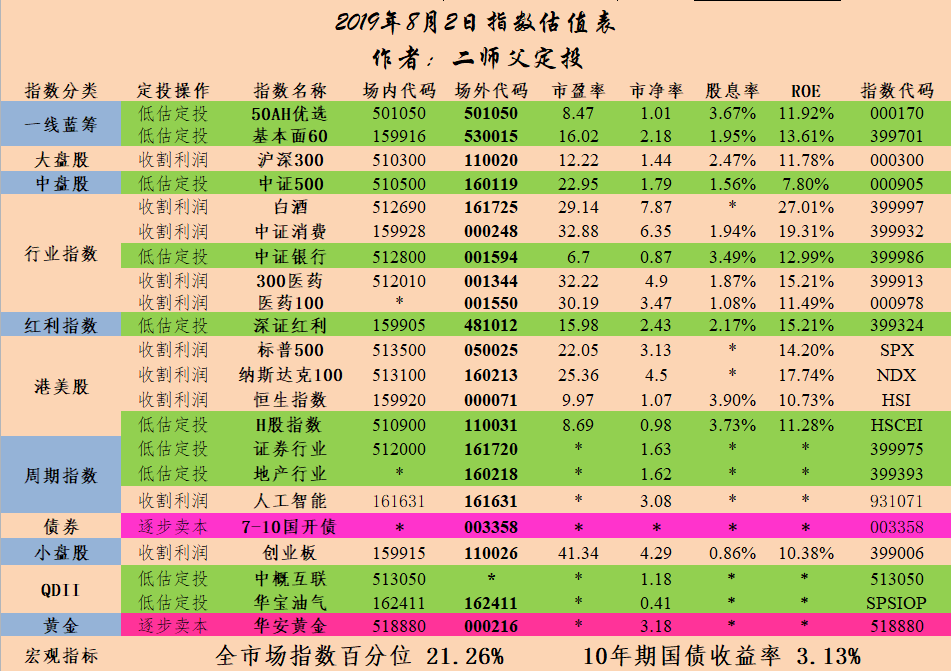

======================================================

_type: talk
@二师父[28814221155551]
2019-08-03 04:54:15 Sat  
topic_id: 544881215185844

<e type="hashtag" hid="145442558142" title="#定投微笑曲线#" />

@志亮 at 2019-08-03 04:54:15 Sat

> 二师父，A股指数是可以有微笑曲线，但华宝油气没有呀，它是单边下跌的，比如从2014年顶部定投到现在还要亏近50多个点，这是中国石油第二了，若遇到这种情况还要坚持定投吗？有可能这辈子这个套也解不了呢？

----------

@二师父 at 2019-08-03 04:54:15 Sat

> 他有微笑曲线，你的问题是一次买的多了，不是没有微笑曲线

----------

@淘淘 at 2019-08-03 04:54:15 Sat

> 感谢二师父，现在唯一需要做的就是坚定信心，大胆加仓，期待跌得更加猛烈点

----------

@衣袂飘香 at 2019-08-03 04:54:15 Sat

> 二师父的鳄鱼计划已经基本布局好了，可是我才刚刚执行鳄鱼计划。准备在低估区域，按一年50份到70份的节奏完成，不知这样的节奏是否合理，或者有更好的意见建议？请教二师父，谢谢@二师父

----------

@二师父 at 2019-08-03 04:54:15 Sat

> 都在2900点以下买入没有问题的

----------

@衣袂飘香 at 2019-08-03 04:54:15 Sat

> 您的意思是，只要在2900点以下，可以把鳄鱼计划短期全部加满吗？还是说在2900点以下，分批买入，一年配置完成？您的意思我没有很明白，再请您指教。

----------

@二师父 at 2019-08-03 04:54:15 Sat

> 我的意思是2900点以下定投很安全

----------

阅读[5444]  评论[7]  赞[0] 

+++++++++++++++++++++++++++++++++++++++++++++++++++++

文件：
2019-08-03 04:53:59 Sat
文件大小：[411392]
51522448822224-大跌不用恐惧，可以利用定投的微笑曲线挣钱.pdf

======================================================

_type: talk
@Philosophe*[544882828818444]
2019-08-03 07:38:16 Sat  
topic_id: 844118582245852

早，想问二师父3个问题：
1. 我现在配置的基金为50AH，基本面60，中证500，地产指数，应该没有重合吧
2. 本来想坚持中证500，但实在太弱，想换成H股，请问直接换是不是就等于直接买入了
3. 这么大跌应该勇敢加仓了，仓位该如何加啊

@二师父 at 2019-08-03 07:38:16 Sat

> 没有重合，直接定投就行，没有必要换仓。加仓增加定投金额，比如之前一次购买2000元，现在一次购买3000元

----------

@Philosophe* at 2019-08-03 07:38:16 Sat

> 感谢二师父解答～

----------

阅读[3602]  评论[2]  赞[0] 

======================================================

_type: talk
@二师父[28814221155551]
2019-08-03 15:14:25 Sat  
topic_id: 244118581825421

8月MSCI第二次扩容将落地实施，外资流入有望延续。7月北上资金延续净流入120亿元。进入8月，A股的MSCI第二次扩容将实施生效，MSCI将于8月7日宣布指数季度调整结果，并于8月27日收盘后生效。其中的一项重要调整就是A股扩容，即大盘A股的纳入比例从10％提高至15％。

据其测算，此次调整将带来被动增量资金36亿美元（约合人民币245亿元），被动增量资金大概率在27日当天收盘前流入。

阅读[3427]  评论[0]  赞[0] 

======================================================

_type: talk
@树叶[544811512145144]
2019-08-03 15:49:10 Sat  
topic_id: 111885258454812

<e type="hashtag" hid="142825811122" title="#定投周报#" /> 二师父定投周报第19期

阅读[3771]  评论[0]  赞[0] 

+++++++++++++++++++++++++++++++++++++++++++++++++++++

文件：
2019-08-03 15:48:17 Sat
文件大小：[386064]
88255415824122-二师父定投周报8.3（第19期）.docx

======================================================

@二师父[28814221155551]
2019-08-03 20:49:06 Sat  
topic_id: 422118458125128

>  @二师父
>  

阅读[3708]  评论[0]  赞[0] 

======================================================

_type: talk
@二师父[28814221155551]
2019-08-04 03:04:43 Sun  
topic_id: 422118452884118

<e type="hashtag" hid="552485154144" title="#指数投资价值分析#" /> 基本面60和深证红利指数投资价值分析

@J at 2019-08-04 03:04:43 Sun

> 师傅，场外定投基本面60，场内用深红利做T可以吗

----------

@二师父 at 2019-08-04 03:04:43 Sun

> 可以

----------

阅读[5573]  评论[2]  赞[0] 

+++++++++++++++++++++++++++++++++++++++++++++++++++++

文件：
2019-08-04 03:04:16 Sun
文件大小：[433398]
51522482812484-基本面60和深证红利指数投资价值分析.pdf

======================================================

_type: q&a
@紫色天使[844124551411152]
2019-08-04 03:09:07 Sun  
topic_id: 844118522228122

@紫色天使

>  二师父，什么时候有空给我们讲讲可转债的知识吧！

@二师父

>  可转债投资推荐一本书，可转债投资魔法书，不建议投资可转债，可以投资可转债基金或者在牛市期间进行可转债打新，每次打2A级以上的可转债基本能挣钱。

阅读[3836]  评论[2]  赞[0] 

======================================================

_type: talk
@二师父[28814221155551]
2019-08-04 03:14:51 Sun  
topic_id: 244118524888811

<e type="hashtag" hid="281181228851" title="#周末答疑#" /> 刚开始进入定投仓位很低怎么办，可以按照基本定投金额，在当前的位置加倍定投，但是最好不要一次买入，因为我们不知道熊市持续多久，只要股市一直震荡，即使不下跌，大家的恐惧也是不断加深的，这个心理学原因二师父已经讲过了。

所以建议，最快也需要把资金安排到明年6月份定投完，保守一点，投资安全性第一，挣钱其次。你看之前3200点吵着要建立底仓的朋友都很痛苦了。不要着急，投资切记切记买入慎重再慎重。

@衣袂飘香 at 2019-08-04 03:14:51 Sun

> 谢谢二师父，心里有数了。

----------

阅读[3951]  评论[1]  赞[0] 

======================================================

_type: q&a
@木子李[422118511854218]
2019-08-04 13:15:57 Sun  
topic_id: 111885212415822

@木子李

>  师父，近期想买一只货币基金长期持有（作为防守账户），下图是您推荐过的，目前阶段，您看哪个更合适？还是南方天天吗？

@二师父

>  南方天天利货币B

阅读[3999]  评论[5]  赞[0] 

======================================================

_type: q&a
@朝阳模具[15528112482582]
2019-08-04 14:16:03 Sun  
topic_id: 422118428814828

@朝阳模具

>  二师父，目前的主流指数中，指数背后公司长期盈利能力强的有哪些指数？另外看一个指数的长期盈利能力的指标是不是看这个指数的ROE？

@二师父

>  医药、消费，食品饮料等指数。主要看和利润相关的指标，ROE=E/B，相当于衡量的是单位净资产的盈利情况，那么只要和盈利相关的指标，也就是和扣非每股净利润或者扣非每股净利润增长率相关的指标，都是衡量股票的盈利能力。

阅读[4041]  评论[0]  赞[0] 

======================================================

_type: q&a
@一剪梅[844115184528882]
2019-08-04 21:07:10 Sun  
topic_id: 111885214121112

@一剪梅

>  师父，您好！现在这个阶段买场外基金，买地产还是买华宝油汽好呢？

@二师父

>  宽基指数，50ah，基本面60，沪深300，中证500这些好一点，我不清楚你的投资水平，这两个周期指数都不建议

阅读[3912]  评论[4]  赞[0] 

======================================================

_type: q&a
@幻水[881185412112]
2019-08-04 21:08:56 Sun  
topic_id: 244118542445281

@幻水

>  请先看一下：华宝证券研究团队的：“从AH溢价指数看港股配置价值”。<e type="web" href="https://mp.weixin.qq.com/s/dL-uG8wp7ON2wP2hwoC9rw" title="从AH溢价指数看港股配置价值" cache="" />
>  我有一个投资建议，投资逻辑如下，
>  1.目前银行的PB在0.8附近，我个人是非常看好银行ETF。
>  2.目前AH溢价指数在历史高位，历史统计表明一般90天后有能87.5%的概率获得超额收益，超额收益的收益率平均为8.97%。我想用“510900H股ETF”来代替“银行ETF”，“H股ETF”含有不少银行股。
>  您觉得我这个投资逻辑可以吗？
>  在天天基金网上查“H股ETF”，显示是“暂无行业分布数据”。不知道银行业到底是占了多少百分比？

@二师父

>  这两个我都有投资，h股etf没有银行低估，两者的风格也是不同的。回撤的话h股etf会比银行高，两者出现行情也不同，港股牛市和A股牛市不同步

阅读[3991]  评论[0]  赞[0] 

======================================================

_type: talk
@二师父[28814221155551]
2019-08-04 21:33:07 Sun  
topic_id: 244118841124441

<e type="hashtag" hid="825858222822" title="#本周市场分析#" /> 本周几个事情，一是科创板上市企业涨幅都很猛，翻倍了，这是A股独有的特色。

第二是货币基金有清盘的，随着货币基金收益率越来越低，很多货币基金规模大幅下降，交银施罗德天运宝货币市场基金发布清盘公告，如果购买这个基金的朋友需要注意了。

第三是美国发布降息的消息，通常情况下在市场流动性不好的时候才会宣布降息，增加市场上的资金量，促进经济的发展。这相当于美国提前打了一个预防针。我们也需要警惕经济的进一步下滑，做好应对措施。

第四、特不靠谱又发推特了，这是股市继续下跌的主因，不过这次幅度不大，看来这个刺激对我们的影响已经有限制了。因为央行两次降准对我们整体股市的走势有提振作用。

未来定投的话，已经布局完毕的就耐心持有，刚加入星球的慢慢定投不着急，先体验下自己在剧烈波动的股市里的情绪变化，然后用理性的思考把自己的情绪一点点地消除，这样才容易定投成功。

@ajingge at 2019-08-04 21:33:07 Sun

> 请教一下货币基金清盘，购买者会亏损吗？还是直接赎回即可

----------

@二师父 at 2019-08-04 21:33:07 Sun

> 在清盘之前赎回就行，一般清盘之前会发公告

----------

@ajingge at 2019-08-04 21:33:07 Sun

> 了解了，谢谢师傅

----------

阅读[5767]  评论[3]  赞[0] 

======================================================

_type: talk
@二师父[28814221155551]
2019-08-05 00:35:36 Mon  
topic_id: 844118815142182

<e type="hashtag" hid="828225121242" title="#市场下跌的时候定投怎么操作#" /> 不管市场怎么变，我们定投原则不变

阅读[5759]  评论[0]  赞[0] 

+++++++++++++++++++++++++++++++++++++++++++++++++++++

文件：
2019-08-05 00:34:21 Mon
文件大小：[60767]
15422185844142-市场持续下跌的时候，定投该怎么操作呢.docx

======================================================

_type: talk
@杜志彪[544454124115854]
2019-08-05 09:25:42 Mon  
topic_id: 544881181888884

华宝油气网格0.41今天加一份，由于星期五调整账户，补上师父星期五的鳄鱼计划，深红利和银行ETF[得意]

@杜志彪 at 2019-08-05 09:25:42 Mon

> 银行和红利成交，坐等油气0.41[呲牙]

----------

@杜志彪 at 2019-08-05 09:25:42 Mon

> 书到了

----------

@J at 2019-08-05 09:25:42 Mon

> 深红利还没到建立底仓的价格啊

----------

@杜志彪 at 2019-08-05 09:25:42 Mon

> 深红利已经低估了，我是随二师父加的鳄鱼计划。

----------

@光少 at 2019-08-05 09:25:42 Mon

> 卷商ETF今天可以鳄鱼计划加仓了吗

----------

@J at 2019-08-05 09:25:42 Mon

> 我是严守纪律，不到价位不买进，尽量不被情绪左右打乱节奏

----------

@光少 at 2019-08-05 09:25:42 Mon

> 华宝油气网格0.41了可加仓了

----------

@杜志彪 at 2019-08-05 09:25:42 Mon

> 开盘就填好了，已经成交了[抱拳]

----------

阅读[3877]  评论[10]  赞[0] 

======================================================

_type: talk
@光少[244124552511141]
2019-08-05 11:30:53 Mon  
topic_id: 844118811212542

二师父，今天怎么没发估值表了

@Sunflower at 2019-08-05 11:30:53 Mon

> 今天周一，明天才有的

----------

阅读[3733]  评论[2]  赞[0] 

======================================================

_type: q&a
@光明无顶[51184452185224]
2019-08-05 15:34:17 Mon  
topic_id: 544881522558154

@光明无顶

>  二师父，按照您给的链接注册了华泰账号，从哪里可以看到买入费率？

@二师父

>  涨乐财富通，交易，查询交割

阅读[3528]  评论[0]  赞[0] 

======================================================

_type: q&a
@朝阳模具[15528112482582]
2019-08-05 18:44:38 Mon  
topic_id: 544881521124554

@朝阳模具

>  二师父，正常估值收割利润，比如低估时间里定投了十万金额，赚5个点，回到了正常估值，利润是5000，意思是卖出5000吗？

@二师父

>  是的，一般收割利润是有了至少10个点或者20个点开始收割

阅读[3471]  评论[0]  赞[0] 

======================================================

_type: q&a
@柠小萌🍭[544881845482114]
2019-08-05 18:47:47 Mon  
topic_id: 244118254224581

@柠小萌🍭

>  二师父，估值表里所有场外定投的基金有对应场内代码的可以都转到场内定投吗？这样费率是不是更便宜？相比较二者还有什么优劣势吗？

@二师父

>  申购费是更加便宜一些，场内有的基金成交额太少，比如深F60，还有的白酒指数没有，只有etf。另外有的场内基金有折价或者溢价，这对于普通投资者不太好把握，其他的区别不大

阅读[3518]  评论[2]  赞[0] 

======================================================

_type: q&a
@YAO[28848244851581]
2019-08-05 20:58:04 Mon  
topic_id: 544881524851214

@YAO

>  提问，二师父：50ETF估值处于哪个区域（低估、正常、高估）可参考你表里的50AH吧？

@二师父

>  目前是低估的，50ah里面有折价选股机制，他的估值比上证50要低一些的

阅读[3539]  评论[0]  赞[0] 

======================================================

@二师父[28814221155551]
2019-08-06 02:07:28 Tue  
topic_id: 844118285525882

>  @二师父
>  

阅读[3482]  评论[0]  赞[0] 

======================================================

_type: talk
@二师父[28814221155551]
2019-08-06 03:24:40 Tue  
topic_id: 544881512428824

<e type="hashtag" hid="481211145528" title="#指数估值#" /> 黄金又飙涨了，目前盈利19个点，我的止盈点位是25个点，还有一半仓位，如果到达了就清，不贪婪。

估值表只有在工作日的时候才发布的，大家不要着急，该来的总会来。

@杜志彪 at 2019-08-06 03:24:40 Tue

> 恒生指数居然还没低估，估计今天就差不多了[得意]

----------

@杜志彪 at 2019-08-06 03:24:40 Tue

> 看了周线和月线后明白了什么叫成熟的市场，相比较我大A稳健多了[强]

----------

阅读[5308]  评论[2]  赞[0] 

+++++++++++++++++++++++++++++++++++++++++++++++++++++

图片：
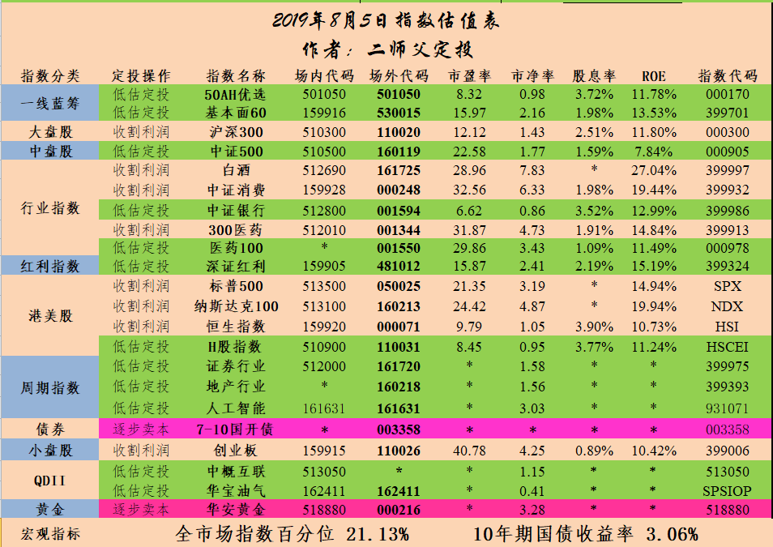

======================================================

_type: talk
@二师父[28814221155551]
2019-08-06 03:26:45 Tue  
topic_id: 544881512428844

<e type="hashtag" hid="228228812581" title="#当前市场对定投的影响#" /> 最近宏观经济发生的变化很多，对我们定投有什么影响呢

阅读[3578]  评论[0]  赞[0] 

+++++++++++++++++++++++++++++++++++++++++++++++++++++

文件：
2019-08-06 03:25:04 Tue
文件大小：[24622]
51522488824854-人民币兑美元汇率破7，今晨美股暴跌，对我们定投有何影响.docx

======================================================

_type: talk
@二师父[28814221155551]
2019-08-06 03:28:20 Tue  
topic_id: 111885452128882

<e type="hashtag" hid="145445584242" title="#估值讲堂#" /> 债券基金如何估值呢？10年期国债收益率=收益/国债价格，当10年期国债收益率越低的时候，也就是国债价格越高。

类似当前的情况，国债收益率低，债券价格高，处于高估阶段，长债，国债等债券都不建议买入了。因为我们是周期型投资者，不是趋势型投资者

阅读[3685]  评论[1]  赞[0] 

======================================================

_type: q&a
@A0洪氏日杂批发[544885222181514]
2019-08-06 10:33:43 Tue  
topic_id: 244118284451241

@A0洪氏日杂批发

>  今天有加仓的朋友吗？

@二师父

>  发表观点直接点发表，不要点提问

阅读[3472]  评论[4]  赞[0] 

======================================================

_type: talk
@A0洪氏日杂批发[544885222181514]
2019-08-06 10:39:30 Tue  
topic_id: 422118582212858

指数急跌，是不是真的有很多人恐慌啊，准备2万元加仓，今天一万元，如果大盘到2600点左右再加一万，目前已定投9万元了

@A0洪氏日杂批发 at 2019-08-06 10:39:30 Tue

> 下午，大盘如果拉起来了，就不定投了，等周四

----------

@杜志彪 at 2019-08-06 10:39:30 Tue

> 这个方法我用过，我准备了5万，2500点加了一万，计划每下跌100点加一万，可惜只用了一次资金就回笼了[得意]

----------

阅读[3527]  评论[2]  赞[0] 

======================================================

_type: talk
@杜志彪[544454124115854]
2019-08-06 10:51:23 Tue  
topic_id: 844118284188822

昨天学习了聪明的定投，更加坚定了低估定投策略，不同的策略其实都是在下跌途中根据资金情况收集尽量多的底部筹码，然后交给时间等待牛市到来，收集过程会很长，看谁坚持的住，资金使用更合理，今日券商网格一份，执行8月场外定投。

@杜志彪 at 2019-08-06 10:51:23 Tue

> 跟投深红利，银行ETF鳄鱼计划一份

----------

阅读[3606]  评论[1]  赞[0] 

======================================================

_type: q&a
@光年之外的饭团[118222815212212]
2019-08-06 11:10:08 Tue  
topic_id: 111885458221452

@光年之外的饭团

>  二师父 今天大跌 定投可以加仓吗

@二师父

>  可以加，控制好节奏，保证有充裕的资金加仓，这次美国已经降息，需要警惕

阅读[3701]  评论[5]  赞[0] 

======================================================

_type: q&a
@远山[841555422151212]
2019-08-06 12:47:29 Tue  
topic_id: 844118281842542

@远山

>  二师父，大盘两干七百多点了，定投的上证50和沪深300能手动加仓吗

@二师父

>  可以的，不过一定要控制好节奏

阅读[3599]  评论[1]  赞[0] 

======================================================

_type: q&a
@是喵喵吖～[421441114141158]
2019-08-06 13:31:44 Tue  
topic_id: 844118281155552

@是喵喵吖～

>  二师父 请问一下 有两个问题想请教
>  1、周五下午过了三点买就不合适了是吧 因为周六周天停业 相当于钱转了但是没得到利用 
>  2、如果是周六买的，那么是按周二的净值还是周一的净值给计算呢 
>  
>  谢谢二师父

@二师父

>  1，一般是工作日三点之前买入，可以以当天的收盘净值成交
>  2，周六周日买，以周一的收盘净值成交

阅读[3748]  评论[0]  赞[0] 

======================================================

_type: talk
@二师父[28814221155551]
2019-08-06 15:21:47 Tue  
topic_id: 844118228111242

新开了一个号，讲宏观财经的，降息、降准、GDP、CPI等宏观经济指标可能大家都不太理解，还有常见的金融思维、颠覆思维，长尾思维，规模思维，学会利用金融思维帮助自己做决策，其实生活中的任何一个选择题都涉及到金融思维。

因为宏观金融就是实现资源最优配置的，你选择工作A还是工作B就看怎么实现资源最优配置，21世纪是知识经济时代，首先要有知识，其次需要用金融思维武装自己的头脑。

阅读[3843]  评论[0]  赞[0] 

+++++++++++++++++++++++++++++++++++++++++++++++++++++

图片：

======================================================

_type: q&a
@志亮[422125851552828]
2019-08-06 22:39:09 Tue  
topic_id: 244118245115221

@志亮

>  请问二师父华宝油气是指数基金吗？我现在对这只基金回本一点信心都没。

@二师父

>  是QDII指数基金

阅读[3615]  评论[2]  赞[0] 

======================================================

_type: talk
@二师父[28814221155551]
2019-08-07 04:19:15 Wed  
topic_id: 111885415882582

<e type="hashtag" hid="481211145528" title="#指数估值#" /> 沪深300也进入低估，好机会不是常有，慢慢学习，慢慢布局吧

@秦风殇韵（刘豫斌） at 2019-08-07 04:19:15 Wed

> 每天一看到这表，信心满满

----------

@二师父 at 2019-08-07 04:19:15 Wed

> 净值和估值是不同的，上证指数成立才100点，现在2000多点，仍旧低估

----------

阅读[3554]  评论[4]  赞[0] 

+++++++++++++++++++++++++++++++++++++++++++++++++++++

图片：
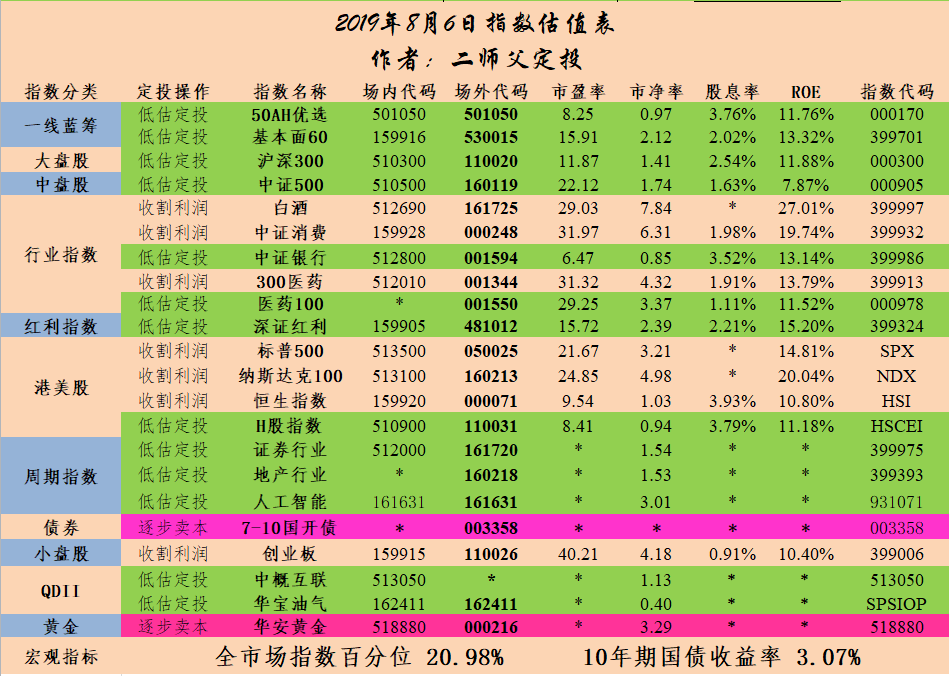

======================================================

_type: talk
@二师父[28814221155551]
2019-08-07 04:20:43 Wed  
topic_id: 111885415882442

<e type="hashtag" hid="228228185221" title="#精选优质基金进行定投#" /> 优中选优，集中投资即可

@妖孽 at 2019-08-07 04:20:43 Wed

> 8层仓在2800位置，跌了好开心，忧愁弹药不足

----------

阅读[3681]  评论[1]  赞[0] 

+++++++++++++++++++++++++++++++++++++++++++++++++++++

文件：
2019-08-07 04:20:08 Wed
文件大小：[25207]
48544148584418-2777.56点，如何选择指数基金进行定投.docx

======================================================

_type: q&a
@学以致用[244415184181451]
2019-08-07 04:30:08 Wed  
topic_id: 244118248818811

@学以致用

>  二师父，可以分享一下如何有效的控制回撤吗？我的基金组合从今年3280点满仓，到目前为止已经回撤快15%了！都有点懵圈了

@二师父

>  你的问题在于相对高位满仓，没有定投，控制回撤主要以下几个方面。
>  
>  1、分散轮动在低估区域定投
>  
>  投资的指数包括50AH和基本面60这样的蓝筹指数基金，有中证500这样的中盘股指数基金，还有创业板这样的小盘股指数基金，华宝油气、黄金ETF等大宗商品对标的指数基金。当然不乏恒生国企、恒生指数、标普500、中概互联等海外或者境外指数基金。
>  
>  这些基金品种的涨跌不是同步的。在同一个时间段，有些基金会涨的多，有些基金会跌的多。比如最近消费和医药基金涨幅不错，而油气、中概互联基金就跌的比较惨。
>  
>  如果没有做好分散配置，在一次投资过程中只购买了一种类别的指数基金，遇到这种基金发生较大下跌的时候，我们账户的浮亏就会很大。
>  
>  2、不追涨
>  
>  你的投资回撤较大在于追涨了，之前没有定投，没有仓位，一次重仓结果遇到回撤。
>  
>  不追涨，控制内心的贪婪，谨遵逆向交易策略。你这还好，没有在市场顶点冲进去，否则更加被动。

阅读[5797]  评论[0]  赞[0] 

======================================================

_type: q&a
@醉流雨[422151445242248]
2019-08-07 08:21:33 Wed  
topic_id: 844118242541122

@醉流雨

>  二师父，今天我想买平安和格力的股票，这两个票你分析下，谢谢。

@二师父

>  你好，为了避免投资者误理解投资股票信息，不再公开场合提供股票投资价值分析

阅读[3875]  评论[0]  赞[0] 

======================================================

_type: q&a
@J[28281541518551]
2019-08-07 12:55:55 Wed  
topic_id: 244118215821241

@J

>  师傅，你好，手中的存量资金可否这样进行加仓：在2800以下，按价值平均法把持有的每只指数基金补平浮亏额。例如，10000本金，现在亏了2000，就加仓2000，上涨就持有，下跌就继续补，始终保持本金为10000。你看这样的策略应对大回撤可行吗

@二师父

>  可以加倍定投，你这种方法对控制回撤没啥帮助，不要怕回撤，只要基本面没有问题，最终涨幅都会惊人，控制回撤的话就需要全面配置，不追涨，坚持低估区域以内定投

阅读[3820]  评论[9]  赞[0] 

======================================================

_type: q&a
@往事随风[48515148521428]
2019-08-07 22:09:39 Wed  
topic_id: 422118511141258

@往事随风

>  请问老师：如何看待标普价值这个指数，在蛋卷里已经是极度低估了

@二师父

>  是华宝标普中国A股质量价值指数吗？
>  
>  这个基金规模小于一亿。新募集的基金，规模小于一亿的基金我都不予考虑投资

阅读[3400]  评论[0]  赞[0] 

======================================================

_type: q&a
@学以致用[244415184181451]
2019-08-07 22:11:48 Wed  
topic_id: 422118244444158

@学以致用

>  二师父，请问一下上证50和深证基本面60，按道理这两只基金应该没有重合的股票！为什么这两基金里都有平安银行和五粮液呢？

@二师父

>  你看得不是上证50指数，你看得的易方达上证50指数基金。
>  
>  这是一只增强型的指数基金，增强型的基金有主动选股的特点，所以他选择了五粮液，这只在深圳证券交易所上市的股票，如果是被动指数就不会出现这种情况。
>  
>  主动选股对于增强型的指数基金，有其优势，也有其劣势

阅读[3534]  评论[0]  赞[0] 

======================================================

_type: talk
@二师父[28814221155551]
2019-08-08 03:03:31 Thu  
topic_id: 844118458841112

建立好投资体系就能够轻松做好自己的定投组合了。

@志亮 at 2019-08-08 03:03:31 Thu

> 二师父，按你说的低估定投应该是场外的吧，而鳄鱼计划是场内均线策略和网格策略，我在场内是否也可以用低估定投？它和鳄鱼计划那个是主食？

----------

@杜志彪 at 2019-08-08 03:03:31 Thu

> 低估是主食，鳄鱼是甜点[呲牙]

----------

@mumomo at 2019-08-08 03:03:31 Thu

> 二师父，公式里边的A怎么理解？

----------

@二师父 at 2019-08-08 03:03:31 Thu

> 鳄鱼计划是主要的，其实我之前没有定投实盘，只是给新手一个参考

----------

@二师父 at 2019-08-08 03:03:31 Thu

> 初始金额

----------

@志亮 at 2019-08-08 03:03:31 Thu

> 你说错了，二师父鳄鱼计划是主要的[呲牙]

----------

@志亮 at 2019-08-08 03:03:31 Thu

> 明白了[呲牙]

----------

@杜志彪 at 2019-08-08 03:03:31 Thu

> 不好意思，我是新手没考虑周全，误导你了，我主要是做低估定投，鳄鱼计划只是偶尔跟投，还没有详细学习。

----------

阅读[5083]  评论[8]  赞[0] 

+++++++++++++++++++++++++++++++++++++++++++++++++++++

文件：
2019-08-08 03:03:07 Thu
文件大小：[34067]
88255151284222-面对跌跌不休的行情，普通投资者建立好投资体系就能够自己配置指数基金定投组合.docx

======================================================

_type: talk
@二师父[28814221155551]
2019-08-08 03:04:05 Thu  
topic_id: 244118458841111

指数估值，黄金继续走高，低估的品种越来越多。

@烟九•二手车 at 2019-08-08 03:04:05 Thu

> 黄金能收割了么，20%+的收益

----------

阅读[3601]  评论[1]  赞[0] 

+++++++++++++++++++++++++++++++++++++++++++++++++++++

图片：
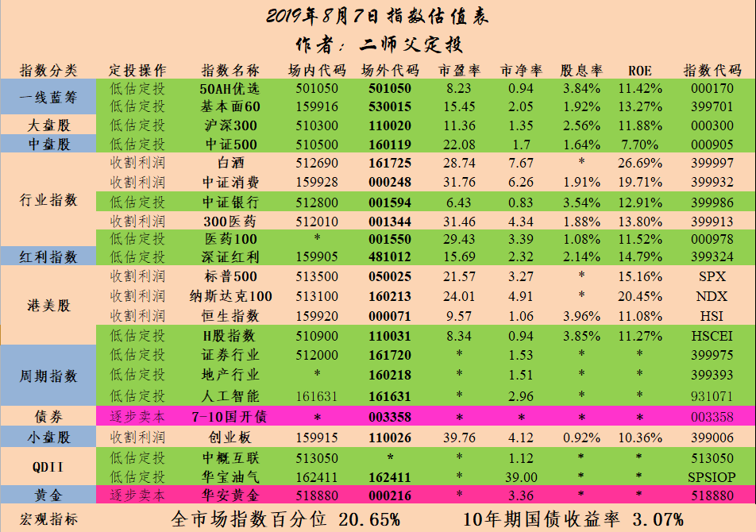

======================================================

_type: talk
@杜志彪[544454124115854]
2019-08-08 12:17:24 Thu  
topic_id: 111885152252812

上午接个短信说华宝油气单个账户单日限额1000元[囧]没理解错吧

@JOY at 2019-08-08 12:17:24 Thu

> 应该是的

----------

@杜志彪 at 2019-08-08 12:17:24 Thu

> 外汇投资额度限额

----------

@齐俊波 at 2019-08-08 12:17:24 Thu

> 没看懂。一次买入一万元也没问题呀。

----------

阅读[3136]  评论[4]  赞[0] 

======================================================

_type: q&a
@朝阳模具[15528112482582]
2019-08-08 12:20:41 Thu  
topic_id: 844118454225582

@朝阳模具

>  二师父，看看我的类鳄鱼计划，已经执行一个月了，给点建议。

@二师父

>  不要根据跌幅来投资，参考估值指标，这两个指数比较稳，坚持从现在定投风险不大

阅读[3502]  评论[0]  赞[0] 

======================================================

_type: q&a
@鱼饱饱🐷[244414844252241]
2019-08-08 12:21:30 Thu  
topic_id: 844118451584152

@鱼饱饱🐷

>  二师傅，存量资金由于一些原因需要挪用，是按照现在的份额继续定投，投完拉倒，还是减少每周份额，延长定投时间？

@二师父

>  继续投，当前位置投完了锁仓即可，以后有资金再继续投

阅读[3732]  评论[1]  赞[0] 

======================================================

_type: q&a
@紫色天使[844124551411152]
2019-08-08 12:23:12 Thu  
topic_id: 844118451184222

@紫色天使

>  二师父，今天定投中概互联的时候发现折价率很高哦，可是他又没有场外对应的基金，这种情况还能定投吗，虽然他折价率高，但是还是比我现在的持仓成本价低，这种情况能买吗

@二师父

>  也可以场内购买的，只是价格比净值会高一些

阅读[3815]  评论[3]  赞[0] 

======================================================

_type: q&a
@[123456789*[111828182412112]
2019-08-08 13:20:09 Thu  
topic_id: 244118485885411

@[123456789*

>  二师父，有个定投金额分配问题请教。目前在场外定投，每周金额2000，共计定投4只基金。但金额如何分配给四只基金呢？平均分配感觉不太合理。谢谢指教！

@二师父

>  根据估值来分配，估值越低的分配越多，公式分配权重＝低估阈值/估值指标

阅读[3816]  评论[3]  赞[0] 

======================================================

_type: talk
@二师父[28814221155551]
2019-08-08 19:30:43 Thu  
topic_id: 422118282211288

今年3月，MSCI公布A股的“入摩”方案，分三步走，将扩大中国A股在MSCI全球基准指数中的纳入因子由5%提升至20%。此前，作为2019年5月的半年度指数审议的一部份，MSCI把指数中现有的中国大盘A股纳入因子从5%增加至10%，同时以10%的纳入因子纳入中国创业板大盘A股。

此次的调整是第二步，作为2019年8月的季度指数审议的一部份，MSCI会把指数中的所有中国大盘A股纳入因子从10%增加至15%。8月份指数季度调整会于北京时间8月8日凌晨公布果，此次调整结果将于8月27日收盘后正式生效。

年内还会有第三步，作为2019年11月的半年度指数审议的一部份，MSCI会把指数中的所有中国大盘A股纳入因子从15%增加至20%，同时将中国中盘A股（包括符合条件的创业板股票）以20%的纳入因子纳入MSCI指数。

阅读[3668]  评论[0]  赞[0] 

======================================================

_type: talk
@二师父[28814221155551]
2019-08-09 01:09:37 Fri  
topic_id: 844118122841442

<e type="hashtag" hid="481211145528" title="#指数估值#" /> 指数估值表，黄金破位，可以考虑卖出

阅读[3547]  评论[0]  赞[0] 

+++++++++++++++++++++++++++++++++++++++++++++++++++++

图片：
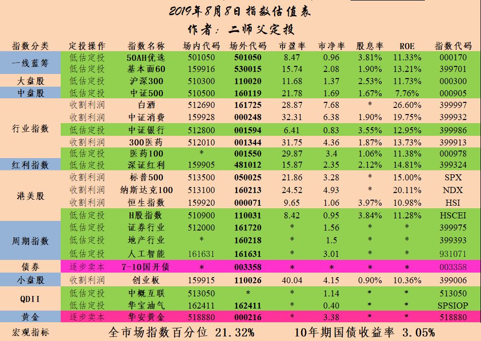

======================================================

_type: talk
@二师父[28814221155551]
2019-08-09 01:11:35 Fri  
topic_id: 244118122815581

<e type="hashtag" hid="145448525452" title="#转融资费率下调#" />一个小利好， 降息就意味着市场放水。水多了，船也就涨起来了

阅读[5250]  评论[0]  赞[0] 

+++++++++++++++++++++++++++++++++++++++++++++++++++++

文件：
2019-08-09 01:10:42 Fri
文件大小：[24272]
88255182288412-股市降息，利好出现了.docx

======================================================

_type: talk
@二师父[28814221155551]
2019-08-09 02:19:55 Fri  
topic_id: 844118122245852

<e type="hashtag" hid="145458855482" title="#周五读书#" />

阅读[5338]  评论[0]  赞[0] 

+++++++++++++++++++++++++++++++++++++++++++++++++++++

文件：
2019-08-09 02:19:44 Fri
文件大小：[360519]
48544185582858-《投资者的心灵修炼》第二讲.pdf

======================================================

_type: q&a
@太阳照常升起[421484421415448]
2019-08-09 12:48:42 Fri  
topic_id: 422118152512418

@太阳照常升起

>  二师父好，最近在学习五步定投法。我想问一下，低估阈值与市盈率是如何计算出来的？该项指标的官方获取途径有哪些？多谢

@二师父

>  计算根据市价/市盈率。查阅有中证指数官网，深证指数官网，WIND.
>  
>  这三个比较权威

阅读[3286]  评论[0]  赞[0] 

======================================================

_type: q&a
@老丁[15541182455482]
2019-08-09 12:54:23 Fri  
topic_id: 244118124452511

@老丁

>  二师父，问个问题，中证银行这种指数，到底算不算周期指数呀？估值判断的主要依据是PB吗？能否讲一下，PE，PB，ROE，股息率这些指标如何运用在这一指数的估值判断上？是不是有个优先参考的顺序呀？
>  
>  另外之前你经常谈到的几大估值指标是不是上面这些，还有一个全市场百分位？也能否讲一下，如何用这些指标来共同来判定一个指数的估值的？也就是对于一个具体的指数，这些估值指标在判定中的优先参考顺序，以及当部分指标正常，部分低估或高估的时候，如何判定指数是高估还是低估的？谢谢

@二师父

>  银行指数是周期指数，不是强周期指数，这个看对周期指数界定的严格程度，银行PE和PB，ROE估值都可以
>  
>  这几个指标需要综合运用的，就比如一个人的身体素质你在判断的时候你肺活量、耐力、速度、爆发力等等很多综合指标，只有这些指标综合有着一个不错的成绩才是比较好的身体素质。估值判断也是这样。优先的指标有市盈率，股息率和ROE
>  
>  全市场百分位是某一个指标的全市场百分位，比如市盈率全市场百分位，市净率全市场百分位，这是单一指标的衡量情况。实际判断的时候无法考量一个单一指标来决定低估与否。比如一个人的耐力指标100分，其他各项指标均为50分，就无法说这个人身体素质好

阅读[3442]  评论[0]  赞[0] 

======================================================

_type: q&a
@杜志彪[544454124115854]
2019-08-09 12:55:39 Fri  
topic_id: 544881854418124

@杜志彪

>  二师父目前估值表里，中证红利的市盈率有可以参考的标的吗？

@二师父

>  中证红利估值表里面暂时没有参考的，这个指数滚动市盈率在9.6倍以下可以判定低估。

阅读[3533]  评论[3]  赞[0] 

======================================================

@二师父[28814221155551]
2019-08-09 12:57:16 Fri  
topic_id: 844118121542482

>  @二师父
>  

阅读[3642]  评论[0]  赞[0] 

======================================================

_type: talk
@海盗[48248118584848]
2019-08-09 18:28:32 Fri  
topic_id: 111885811212182

<e type="hashtag" hid="225118152481" title="#指数基金均线偏离表#" />

@烟九•二手车 at 2019-08-09 18:28:32 Fri

> 弱弱问一句，偏离度是怎么计算出来的？不懂

----------

@海盗 at 2019-08-09 18:28:32 Fri

> 这是根据90日均线算出来的

----------

@烟九•二手车 at 2019-08-09 18:28:32 Fri

> 感谢，低于均线就是负，对吧

----------

@海盗 at 2019-08-09 18:28:32 Fri

> 对

----------

@[123456789* at 2019-08-09 18:28:32 Fri

> 为何选用90天均线？可以指教一下吗

----------

@海盗 at 2019-08-09 18:28:32 Fri

> 互相学习，这是二师父总结出的经验

----------

@三峡情 at 2019-08-09 18:28:32 Fri

> 感谢感谢！总是这么及时的指导我们下一步行动计划[玫瑰][玫瑰]

----------

@Fernando杜 at 2019-08-09 18:28:32 Fri

> 感谢分享，有个小问题，我是通过万得股票软件看大盘涨跌，这个软件只显示了5天、10天、20天、60天和120天均线。不知你的90天均线数据是如何得到的？是自己算的吗？谢谢

----------

阅读[3615]  评论[14]  赞[0] 

+++++++++++++++++++++++++++++++++++++++++++++++++++++

图片：
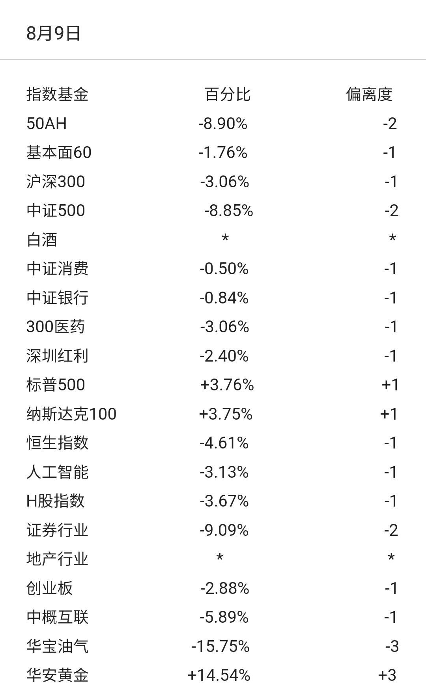

======================================================

_type: talk
@二师父[28814221155551]
2019-08-10 02:57:33 Sat  
topic_id: 111885885142212

<e type="hashtag" hid="481211145528" title="#指数估值#" /> 黄金继续上攻，市场情绪总是在钟摆的两端过度摆动，低估之后会更低，高估之后会更高，这就是股市

阅读[3369]  评论[0]  赞[0] 

+++++++++++++++++++++++++++++++++++++++++++++++++++++

图片：
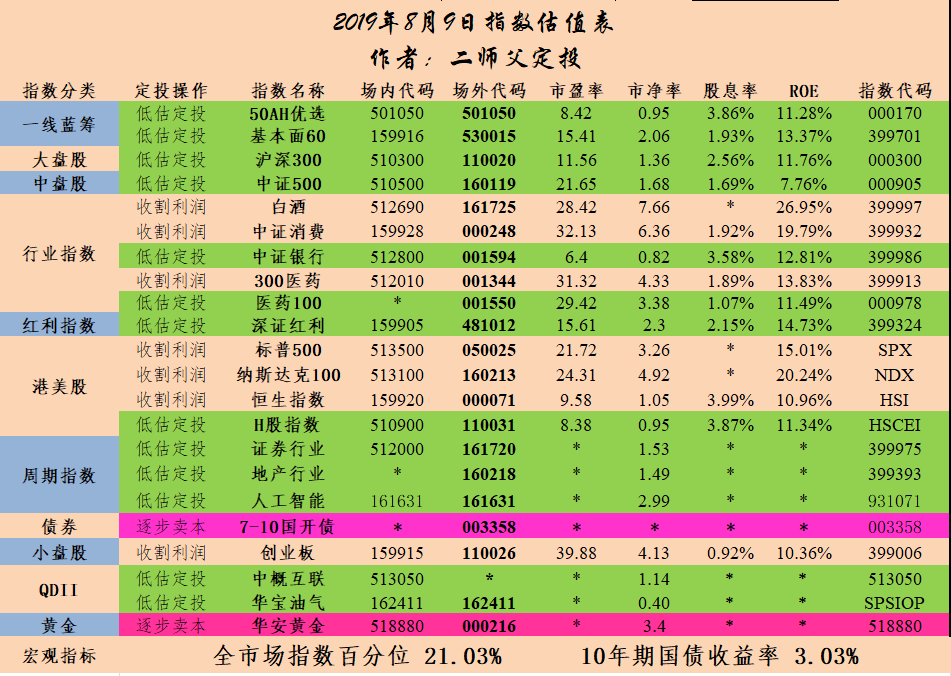

======================================================

_type: talk
@二师父[28814221155551]
2019-08-10 02:59:32 Sat  
topic_id: 544881881452244

<e type="hashtag" hid="828221218222" title="#券商指数#" />

阅读[3581]  评论[0]  赞[0] 

+++++++++++++++++++++++++++++++++++++++++++++++++++++

文件：
2019-08-10 02:59:17 Sat
文件大小：[347871]
28255181558841-股市黄金坑区域，券商还是正常估值吗.pdf

======================================================

_type: talk
@Philosophe*[544882828818444]
2019-08-10 07:41:23 Sat  
topic_id: 244118118118411

二师父早，我现有四只基为50ah, 中证500，基本面60，地产指数，是否有必要再配置个医药100。不重合吧？

@凭栏观海 at 2019-08-10 07:41:23 Sat

> 不重合

----------

@是喵喵吖～ at 2019-08-10 07:41:23 Sat

> 你好像没有选择 二师父提问  你可以去 提问 里发 这样会自动提醒二师父

----------

阅读[3529]  评论[2]  赞[0] 

======================================================

_type: talk
@Philosophe*[544882828818444]
2019-08-10 07:41:23 Sat  
topic_id: 111885885885822

二师父早，我现有四只基为50ah, 中证500，基本面60，地产指数，是否有必要再配置个医药100。不重合吧？

@朝阳模具 at 2019-08-10 07:41:23 Sat

> 没有重合

----------

@行云流水 at 2019-08-10 07:41:23 Sat

> 现在可以再加个券商

----------

@妖孽 at 2019-08-10 07:41:23 Sat

> 银行很低估，要不要来点......

----------

@Philosophe* at 2019-08-10 07:41:23 Sat

> 银行和50Ah里有重合部分 不打紧么😢初学莫见怪

----------

@Philosophe* at 2019-08-10 07:41:23 Sat

> 大神请问，是先加上医药100后么？现在这行情是比如每星期定投几百的好，还是建个几万的底仓

----------

@Philosophe* at 2019-08-10 07:41:23 Sat

> 加银行的话，是一次买入一定资金比较好，比如说一万还是一星期定投两千样子。应该是后者吧😂，小白问题莫见笑

----------

@妖孽 at 2019-08-10 07:41:23 Sat

> 不怕跌 建点底仓外加定投。上涨有收益，下跌赚份额

----------

@Philosophe* at 2019-08-10 07:41:23 Sat

> 好的谢谢

----------

阅读[3674]  评论[8]  赞[0] 

======================================================

_type: talk
@树叶[544811512145144]
2019-08-10 13:04:09 Sat  
topic_id: 244118111185151

<e type="hashtag" hid="142825811122" title="#定投周报#" /> 二师父定投周报第20期

阅读[4382]  评论[0]  赞[0] 

+++++++++++++++++++++++++++++++++++++++++++++++++++++

文件：
2019-08-10 13:03:59 Sat
文件大小：[353804]
28255181222851-二师父定投周报8.10（第20期）.docx

======================================================

_type: talk
@二师父[28814221155551]
2019-08-11 03:55:10 Sun  
topic_id: 111884228411112

定投成功心法

@杜志彪 at 2019-08-11 03:55:10 Sun

> 文中提到的保险指数，我前期也想找找有没有合适的，但是可能由于保险股并不多，所有没找到单独的保险基金，只是有和券商合在一起的券商保险基金，二师父您有推荐的保险基金吗？

----------

@二师父 at 2019-08-11 03:55:10 Sun

> 方正富邦

----------

阅读[4419]  评论[2]  赞[0] 

+++++++++++++++++++++++++++++++++++++++++++++++++++++

文件：
2019-08-11 03:55:06 Sun
文件大小：[24501]
15425244254122-指数基金定投成功的心法.docx

======================================================

_type: q&a
@朝阳模具[15528112482582]
2019-08-11 13:17:07 Sun  
topic_id: 244112551484511

@朝阳模具

>  二师父，目前定投账户仓位三层不到，是继续定投，还是一次性把仓位买到5~7层？

@二师父

>  继续定投哈，在投资里面风险控制比盈利重要

阅读[4536]  评论[1]  赞[0] 

======================================================

_type: q&a
@幻水[881185412112]
2019-08-11 19:30:39 Sun  
topic_id: 111884251481152

@幻水

>  接上一条，第三页，共三页。
>  …………
>  8.当银行1.1<PB≤1.15，持有自有资金51%的银行ETF，另外持有自有资金49%的债券。
>  9.当银行1.15<PB≤1.2，持有自有资金34%的银行ETF，另外持有自有资金66%的债券。	
>  10.当银行1.2<PB，持有自有资金17%的银行ETF，另外持有自有资金83%的债券。	
>  2013年第3季度到2019第2季度约6年，100万增值到约247万，回报率147%，简单年化回报率24.5%
>  其中银行ETF每年3%分红未计算。
>  请问您觉得这个策略未来可行吗？有何缺陷吗？
>  …………
>  第三页，共三页。

@二师父

>  可行，第一当银行市净率走高时候债券的持有率过高，第二，有杠杆风险，低位横盘资金压力大

阅读[4492]  评论[0]  赞[0] 

======================================================

_type: talk
@二师父[28814221155551]
2019-08-12 02:54:40 Mon  
topic_id: 844112522255442

<e type="hashtag" hid="145412545142" title="#定投需要注意的问题#" /> 世界经济局势多变，当前定投需要注意的问题

阅读[4476]  评论[0]  赞[0] 

+++++++++++++++++++++++++++++++++++++++++++++++++++++

文件：
2019-08-12 02:53:04 Mon
文件大小：[24602]
48548452482118-世界经济局势多变，我们定投指数基金需要注意的问题.docx

======================================================

_type: talk
@二师父[28814221155551]
2019-08-12 02:59:34 Mon  
topic_id: 422115455544158

<e type="hashtag" hid="228245828441" title="#本周市场总结#" /> 部分数据来自蛋卷基金

7月CPI同比上涨2.8%，（连续5个月处于“2时代”，并创2018年2月以来新高）。PPI环比下降0.2%，降幅比上月收窄0.1个百分点。处于经济滞胀时期。证金公司下调转融资费率0.8%，相当于股市降息，有利于融资购买股权。

新增开户数100万，和上月持平，市场情绪仍旧低迷，是投资的好时间。但是极度的恐惧时刻仍旧没有到来，因为公众号人数仍旧以每天两位数的速度增长。

去年12月第二次探底的时候，公众号的人数出现了唯一的一次负增长。抄底的时刻尚未到来，继续等待。

阅读[4754]  评论[0]  赞[0] 

======================================================

_type: q&a
@青鸟飞鱼、此生不换[844111545424582]
2019-08-12 12:43:52 Mon  
topic_id: 422115451455418

@青鸟飞鱼、此生不换

>  二师父蛋卷基金实盘是什么？怎么找呀？

@二师父

>  只有天天基金实盘，在天天基金搜索二师父低估定投

阅读[4442]  评论[0]  赞[0] 

======================================================

_type: talk
@老孙头[422115118524548]
2019-08-12 12:56:13 Mon  
topic_id: 244112521228211

怎样理解所谓“倒微笑曲线周期”？——“先下跌后回升”即“微笑曲线周期”是基金定投最适合的市场条件；“震荡向上”条件下定投可能导致盈利减少，然而由于市场整体向上，定投基金仍然能保持盈利；“震荡向下”条件下定投能够有效的降低持仓成本；“先升后回落”即“倒微笑曲线周期”是基金定投最不适合的市场条件，投资人需要在可能出现的“倒微笑曲线周期”及时止盈(金融界—“指数基金定投的几大法门”)

阅读[4343]  评论[0]  赞[0] 

======================================================

_type: q&a
@榕声竹影[844118218251282]
2019-08-12 21:34:49 Mon  
topic_id: 844112544882522

@榕声竹影

>  二师父您好，请问您说的今天发各个指数低估和高估的阙值发在哪里了？

@二师父

>  今天晚上发到星球

阅读[4299]  评论[0]  赞[0] 

======================================================

_type: q&a
@朝阳模具[15528112482582]
2019-08-12 22:54:40 Mon  
topic_id: 111884282825842

@朝阳模具

>  二师父，请教个问题
>  上证50和上证50AH的近五年，近三年历史收益率分别是多少？

@二师父

>  上证50，三年年化百分之8.16
>  50ah，三年年化百分之7.78

阅读[4250]  评论[0]  赞[0] 

======================================================

_type: talk
@二师父[28814221155551]
2019-08-13 02:52:53 Tue  
topic_id: 844112518455152

<e type="hashtag" hid="481211145528" title="#指数估值#" /> 指数估值表，后面有估值阈值表，大家可以参考下，定期更新一下。

@老丁 at 2019-08-13 02:52:53 Tue

> 二师父，结合你刚发的估值表，正好请教一个关于中证银行的估值问题，你对中证银行的估值采用PE为主要因素，网上看过一些文章，多数是以PB为参考的，所以想请教下你采用PE为主的估值方式是不是有什么特别的考虑？因为依照你刚发的这个阈值，中证银行PE 7.2-10，查了下数据（如下图），中证银行PE 高于7.2的时候非常少，如果从PE的角度看7.2更像是高估的阈值，所以想请教下，采用PE估值是不是有什么其他的考虑呢？可以分享一下吗？谢谢

----------

@二师父 at 2019-08-13 02:52:53 Tue

> 因为银行不是强周期指数，所以采用市盈率和市净率都可以。银行近来市盈率偏低与中国近年来经济有关，这个估值阈值是从整体历史区间考虑的，所以才会出现上述情况，高估阈值偏高的情况，后面也会随着中国经济的发展状况有所变化

----------

@老丁 at 2019-08-13 02:52:53 Tue

> 谢谢二师父！

----------

@Bruce at 2019-08-13 02:52:53 Tue

> 请问二师父，中证红利和全指医药的阈值有吗

----------

阅读[5606]  评论[5]  赞[0] 

+++++++++++++++++++++++++++++++++++++++++++++++++++++

图片：
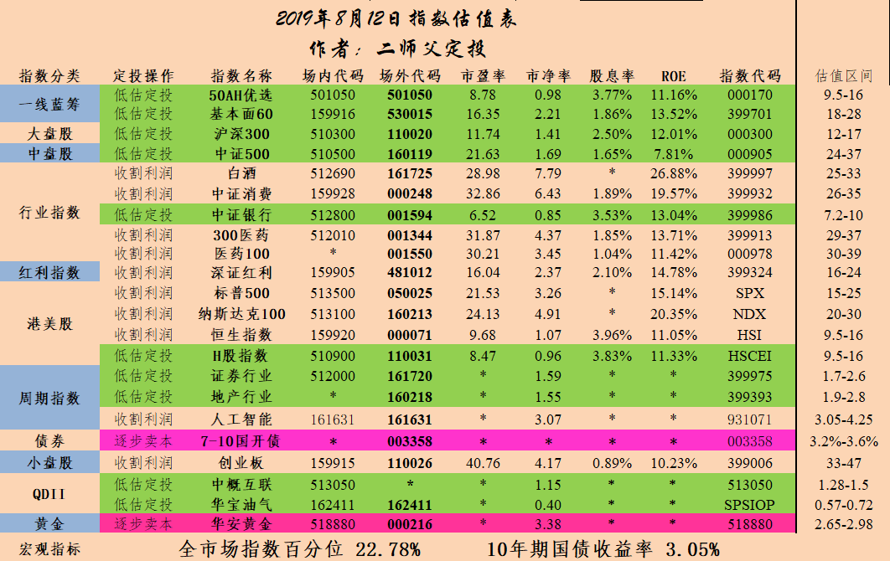

======================================================

_type: talk
@二师父[28814221155551]
2019-08-13 02:55:43 Tue  
topic_id: 111884285125112

<e type="hashtag" hid="551542444144" title="#场内定投标的选择#" /> 场内定投标的的选择

@一剪梅 at 2019-08-13 02:55:43 Tue

> 师父，在场外券商和银行指数也可以配置吗？

----------

阅读[4339]  评论[1]  赞[0] 

+++++++++++++++++++++++++++++++++++++++++++++++++++++

文件：
2019-08-13 02:55:19 Tue
文件大小：[24730]
51521241281454-场内定投，哪些指数基金值得配置.docx

======================================================

_type: talk
@二师父[28814221155551]
2019-08-13 03:01:23 Tue  
topic_id: 844112518458142

<e type="hashtag" hid="145445584242" title="#估值讲堂#" /> 估值时候常用的几大指标：市盈率，市净率，股息率，ROE，分红

其中，最需要考虑的是市盈率和市净率，这两个指标涉及到格雷厄姆安全边际，必须保证足够的安全边际

其次是股息率和ROE，一个衡量指数的盈利，一个衡量指数的分红，通常高盈利，高分红值得靠。

@老丁 at 2019-08-13 03:01:23 Tue

> 你好，二师父，现在中证500的ROE只有7%的样子，这种情况下，是要停下来观察一下，还是可以接着定投呢？谢谢

----------

@二师父 at 2019-08-13 03:01:23 Tue

> 看仓位重的话就停一停

----------

@老丁 at 2019-08-13 03:01:23 Tue

> 谢谢

----------

阅读[5737]  评论[3]  赞[0] 

======================================================

_type: talk
@Philosophe*[544882828818444]
2019-08-13 07:44:15 Tue  
topic_id: 111884285811282

用银行替代50Ah的意思是指50AH转换成银行么？还是50AH暂停定投，而去投银行。因为看到银行的重仓持股和50AH有很多重合。
另外已经配置了周期指数地产，有否必要再配置券商

@鸿何服饰 at 2019-08-13 07:44:15 Tue

> 地产与证券都是强周期行业指数，不可重仓，只可轻仓，而且这两种指数不可长期持有，只可取中线收益，而且这两种指数只有极低估才考虑参与。银行可以重仓。

----------

阅读[4364]  评论[1]  赞[0] 

======================================================

_type: talk
@二师父[28814221155551]
2019-08-14 03:59:05 Wed  
topic_id: 844112288888212

<e type="hashtag" hid="828248521582" title="#谈话利好#" /> 短期利好，我们还是做好布局和定投的准备，不依靠短期预测市场来进行投资。

阅读[3832]  评论[0]  赞[0] 

+++++++++++++++++++++++++++++++++++++++++++++++++++++

文件：
2019-08-14 03:58:15 Wed
文件大小：[24146]
51521245588144-刘总理和姆努钦谈话，这个利好能好起来吗.docx

======================================================

_type: talk
@杜志彪[544454124115854]
2019-08-14 12:36:02 Wed  
topic_id: 544885518845814

二师父您今年以来跑赢了沪深300了吗？我昨天看了一下账户才14%，大家有跑赢沪深300指数的吗？

@山人 at 2019-08-14 12:36:02 Wed

> 加入星球比较早的学员应该都跑赢了.

----------

阅读[3552]  评论[1]  赞[0] 

+++++++++++++++++++++++++++++++++++++++++++++++++++++

图片：
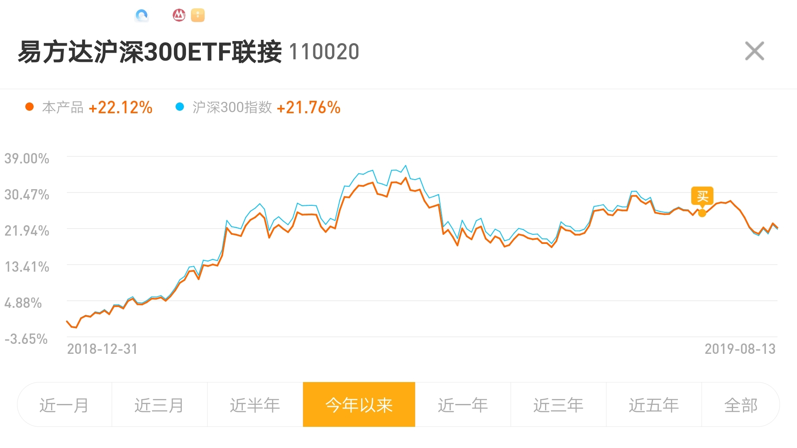

======================================================

_type: q&a
@上上签[244184512458541]
2019-08-14 12:55:24 Wed  
topic_id: 844112284481142

@上上签

>  二师傅，你怎么看一句话呢
>  上证50最根本的问题，不是估值够不够低，而是金融行业占比实在太高，最根本的解决办法，通过主动增强，来优化成分股的行业结构，易方达上证50是目前这个问题的最优解。AH轮动这种方式，在2014年开通沪港通之后，超额收益就已经可以忽略不计了。

@二师父

>  这句话要得出得结论是上证50优于50AH.
>  
>  开通沪港通是超额收益不存在得必要非充分条件，如果真的超额收益不在了，那么他的充分条件是是港股和A股折溢价消失。所以并无法说明沪港通存在超额收益也不存在了

阅读[3696]  评论[1]  赞[0] 

======================================================

_type: q&a
@春晓[48418482258118]
2019-08-14 12:56:54 Wed  
topic_id: 111884451188122

@春晓

>  二师傅，我问一下，场外定投如果正常估值了，是不是也可以不收割利润，拿到百分之15到20的利润在卖。

@二师父

>  场外就是这样操作的，一般是有20个点左右的利润开始收割，逐步收割利润到达高估区域。
>  
>  当然看市场环境，震荡市场的话可以10个点的利润进行收割

阅读[3927]  评论[0]  赞[0] 

======================================================

_type: talk
@二师父[28814221155551]
2019-08-15 03:54:39 Thu  
topic_id: 111884414551252

<e type="hashtag" hid="481211145528" title="#指数估值#" /> 没有大的变化，继续定投，大多数的日子都是平淡的，坚持积累到爆发的那一天。

阅读[3682]  评论[0]  赞[0] 

+++++++++++++++++++++++++++++++++++++++++++++++++++++

图片：
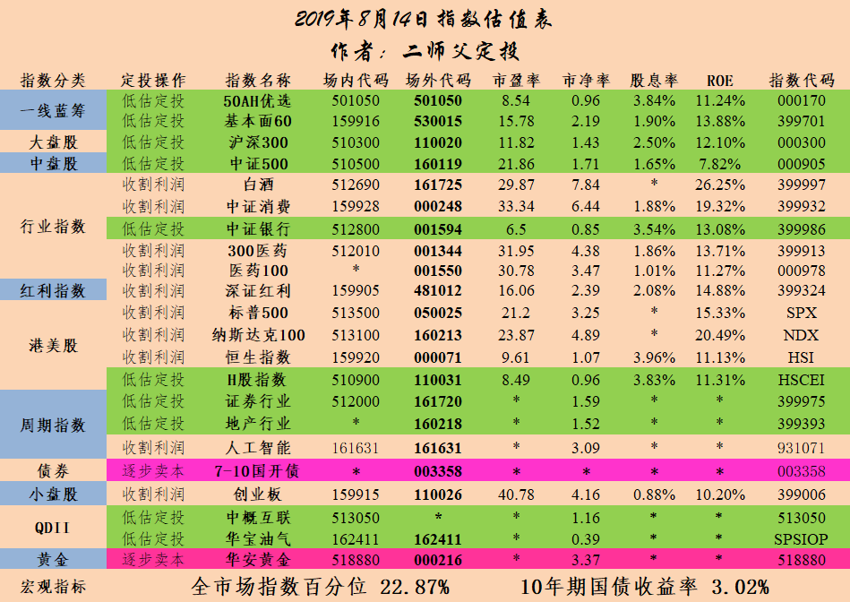

======================================================

_type: talk
@二师父[28814221155551]
2019-08-15 04:07:52 Thu  
topic_id: 544885545114524

<e type="hashtag" hid="228244542451" title="#每周四定投实盘#" /> 买入一份，比例如图所示

此实盘非跟投，仅为二师父场外定投操作记录，不具有任何投资建议功能，投资者投资需风险自行承担

@海〔纳百川〕 at 2019-08-15 04:07:52 Thu

> 没有买50AH呢？

----------

@Nienie💝 at 2019-08-15 04:07:52 Thu

> 师父上个星期就说了把50ah换了银行，要保证每天看星球哈，要不会漏信息

----------

@海〔纳百川〕 at 2019-08-15 04:07:52 Thu

> 谢谢谢谢

----------

@kevin at 2019-08-15 04:07:52 Thu

> 请问二师父，把50ah换了银行，那50ah就一直套着不管了吗

----------

@二师父 at 2019-08-15 04:07:52 Thu

> 持有到正常估值收割利润

----------

阅读[3976]  评论[5]  赞[0] 

+++++++++++++++++++++++++++++++++++++++++++++++++++++

图片：
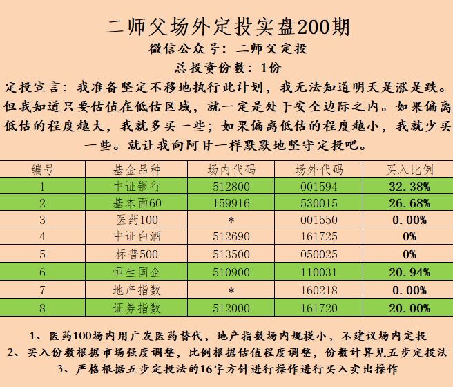

======================================================

_type: talk
@烟九•二手车[244185818522141]
2019-08-15 08:36:20 Thu  
topic_id: 544885545882484

二师父，早上好！关于债券型基金定投收买了一年，收益4.3%，是否要卖出了？还是可以持续定投？

@鸿何服饰 at 2019-08-15 08:36:20 Thu

> 可以卖出，

----------

阅读[3815]  评论[1]  赞[0] 

======================================================

_type: talk
@醉流雨[422151445242248]
2019-08-15 10:54:19 Thu  
topic_id: 244112244128581

补一张图

阅读[3778]  评论[0]  赞[0] 

+++++++++++++++++++++++++++++++++++++++++++++++++++++

图片：
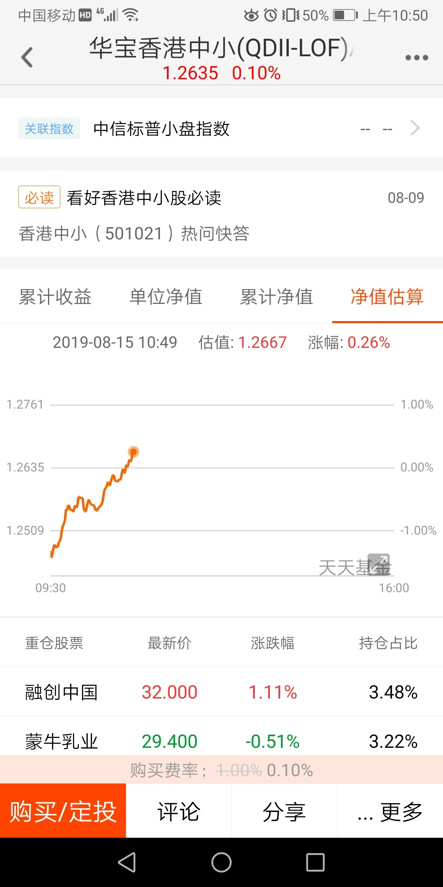

======================================================

_type: q&a
@美美[48224811151218]
2019-08-15 15:01:26 Thu  
topic_id: 244112218422151

@美美

>  二师父你好！这几天没有看星球，今天看的时候是不是说50ah优选停止定投了，换成中证银行吗？

@二师父

>  是啊，这个说了挺多次了

阅读[3776]  评论[2]  赞[0] 

======================================================

_type: talk
@二师父[28814221155551]
2019-08-16 04:17:56 Fri  
topic_id: 422115248122548

<e type="hashtag" hid="458522555128" title="#估值思维和成长思维#" /> 不要仅看股市短期涨跌

阅读[3420]  评论[0]  赞[0] 

+++++++++++++++++++++++++++++++++++++++++++++++++++++

文件：
2019-08-16 04:17:37 Fri
文件大小：[24611]
88258512854222-不要被震荡下跌迷惑了双眼.docx

======================================================

_type: q&a
@学以致用[244415184181451]
2019-08-16 13:00:48 Fri  
topic_id: 111884124455142

@学以致用

>  二师父，兴权沪深300指数(163407)，申万菱信中证500指数(003986)，这两只基金跟一般的沪深300、中证500有什么区别？如果以这两只中证800为投资标地，长期持有定投，能超过常规的沪深300，中证500吗？

@二师父

>  没啥区别，不同的基金公司募集的指数基金。
>  
>  一般无法取得超额收益，以300策略指数，300价值。500策略指数，500低波动或者500增强来定投可能取得超额收益。

阅读[2962]  评论[1]  赞[0] 

======================================================

_type: talk
@二师父[28814221155551]
2019-08-16 19:10:48 Fri  
topic_id: 844112481821242

星球被提示有违规内容，将面临风险，以后一切具体投资标是否值得投资的问题不再回答，只做投资分析和记录，二师父的任何观点不是投资建议，入市需谨慎，投资需要风险自行承担

@麻烦得很 at 2019-08-16 19:10:48 Fri

> 请问，实盘定投还会有吗？谢谢

----------

@二师父 at 2019-08-16 19:10:48 Fri

> 有的

----------

@陈飞🤗 at 2019-08-16 19:10:48 Fri

> 这么一回答说明油气没戏？

----------

@陈飞🤗 at 2019-08-16 19:10:48 Fri

> 不是说鳄鱼计划油气到0.38就会加一次仓吗？怎么没发出来

----------

@二师父 at 2019-08-16 19:10:48 Fri

> 不知道是哪里问题，还在考虑鳄鱼计划是否发送

----------

@Hi·DD at 2019-08-16 19:10:48 Fri

> 星球被投诉了？

----------

@二师父 at 2019-08-16 19:10:48 Fri

> 不知道

----------

阅读[3122]  评论[7]  赞[0] 

======================================================

_type: q&a
@晴儿[241555155525841]
2019-08-16 21:09:06 Fri  
topic_id: 422115281841858

@晴儿

>  二师傅，请问天弘中证银行指数A（001594）和天弘中证银行指数C（001595）有什么区别？A买入是收费的，C买入是免费的，我看了一下基金经理和相关介绍也都是一样的，C的规模比A还大一点，为什么我们选择的是A不是C呢？

@二师父

>  C的管理费比较高，二者的区别主要是收费方式。
>  
>  A类基金申购费高，管理费低，适合长期持有。
>  
>  相反C类基金免申购费，管理低，适合短期投资

阅读[3090]  评论[0]  赞[0] 

======================================================

_type: talk
@老孙头[422115118524548]
2019-08-17 00:38:17 Sat  
topic_id: 422115254185258

避免坐过山车——不管是基金公司，或者其他的一些自媒体，建议大家做基金定投，都是真真切切地从投资者的利益出发，希望投资者能大概率赚到钱的。

　　但是不管怎么讲，基金定投最好都要设置最佳的止盈点，因为只有设置了止盈，你的收益才会落袋为安，才不会跟着股市的波动而坐过山车。—《新浪财经麻利二铺》

阅读[2837]  评论[0]  赞[0] 

======================================================

_type: talk
@二师父[28814221155551]
2019-08-17 03:17:07 Sat  
topic_id: 111884144154542

<e type="hashtag" hid="481211145528" title="#指数估值#" />每日指数估值表，仅作为参考数据，非投资建议。

阅读[3791]  评论[0]  赞[0] 

+++++++++++++++++++++++++++++++++++++++++++++++++++++

图片：

======================================================

_type: talk
@二师父[28814221155551]
2019-08-17 03:18:15 Sat  
topic_id: 244112422482821

按照定投计划行事，关键在于有自己的投资系统，定投计划，风控措施。

@妖孽 at 2019-08-17 03:18:15 Sat

> 请问二师父，举例场内溢价3%，意思是不是1块最后成交要1.03了。贵了3%？

----------

@二师父 at 2019-08-17 03:18:15 Sat

> 假设净值1元，实时价格是1.03，可以理解为卖贵了百分之3

但是如果溢价时候卖出就卖贵了百分之3，相当于多赚了

----------

阅读[2954]  评论[2]  赞[0] 

+++++++++++++++++++++++++++++++++++++++++++++++++++++

文件：
2019-08-17 03:17:49 Sat
文件大小：[24811]
28258855854411-不跟风，不追热点，按照自己的定投计划执行.docx

======================================================

_type: talk
@二师父[28814221155551]
2019-08-17 03:54:46 Sat  
topic_id: 111884144151582

<e type="hashtag" hid="551544848444" title="#读书分享投资者的心灵修炼#" /> 下一讲我们继续讲资产配置计划和全面的投资计划。

作为周期投资者首先放弃了去预测哪类资产将要暴涨，更加关注的是来做资产配置，不管哪类资产涨，我们不会缺席。

星球说有违规内容，一直坚持的原则是不做任何金融产品的推荐，更加不会推荐个股和做股票分析，做好自己该做的，结果如何就顺其自然了。

@雪莲 at 2019-08-17 03:54:46 Sat

> 二师父你好，我的手机怎么打不开文件，显示检测不到能打开的应用？

----------

@雪莲 at 2019-08-17 03:54:46 Sat

> 显示无法打开

----------

@上上签 at 2019-08-17 03:54:46 Sat

> 下载一个WPS Office,打开看看

----------

@雪莲 at 2019-08-17 03:54:46 Sat

> 好的，谢谢！@佚人

----------

@Claire at 2019-08-17 03:54:46 Sat

> 谢谢师父对书中内容深入浅出的讲解。

----------

@二师父 at 2019-08-17 03:54:46 Sat

> 不客气哈

----------

阅读[4268]  评论[6]  赞[0] 

+++++++++++++++++++++++++++++++++++++++++++++++++++++

文件：
2019-08-17 03:52:40 Sat
文件大小：[24904]
88258855854112-投资者的心灵修炼第3讲.docx

======================================================

_type: talk
@树叶[544811512145144]
2019-08-17 13:48:40 Sat  
topic_id: 244112421228241

<e type="hashtag" hid="142825811122" title="#定投周报#" /> 二师父定投周报第21期

阅读[3233]  评论[0]  赞[0] 

+++++++++++++++++++++++++++++++++++++++++++++++++++++

文件：
2019-08-17 13:48:33 Sat
文件大小：[299181]
48548844254128-二师父定投周报8.17（第21期） .docx

======================================================

_type: q&a
@学以致用[244415184181451]
2019-08-17 21:22:27 Sat  
topic_id: 422115225221158

@学以致用

>  二师父，深证红利估值现在处于什么位置了，低估值是多少？如果定投的话，把深证基本面60换成深证红利可以吗？

@二师父

>  深证红利目前是正常估值，阈值是16倍市盈率
>  
>  如果深证红利低估，可以用这个替代，因为二者的持仓股票都是深证市场的，而且重合度还比较大。

阅读[3119]  评论[1]  赞[0] 

======================================================

_type: talk
@二师父[28814221155551]
2019-08-18 04:22:35 Sun  
topic_id: 244112441584581

<e type="hashtag" hid="551548151144" title="#债券基金和可转债基金投资逻辑#" /> 严格意义上讲这是两个完全不同的投资品种，所以投资的逻辑也是不同的。投资的时候不能看到有债字就以为是债券基金，需要查看持仓品种进行确定。

为了星球安全运营，后面回答问题和发布消息都会加上免责声明，请知悉。越发的觉得，自由是相对的。

免责声明：本文任何观点，皆为二师父个人投资心得记录，不构成投资建议。读者根据本文及星球任何观点进行投资，须自行承担风险。

@木子李 at 2019-08-18 04:22:35 Sun

> 理解相对的自由，希望一直能有跟师父交流的平台。好不容易找对山上的师门，而今上山的路也非坦途。无论怎样，仍希望跟谁师傅长久学习，让财商和财富也日渐聚集。

----------

@凯 at 2019-08-18 04:22:35 Sun

> 理解师父，希望能长久的跟随师父脚步

----------

@婧哥哥🙊📷📷📷 at 2019-08-18 04:22:35 Sun

> 二师父～可转债投资有什么建议？

----------

@二师父 at 2019-08-18 04:22:35 Sun

> 一起成长进步

----------

@二师父 at 2019-08-18 04:22:35 Sun

> [握手][握手]

----------

@二师父 at 2019-08-18 04:22:35 Sun

> 可转债基金和指数基金属于股权性质品种，可以采用定投模式，可转债回售条款和转股条款比较复杂，不适合普通投资者

----------

@云淡风轻 at 2019-08-18 04:22:35 Sun

> 说的好呀[微笑]

----------

阅读[3880]  评论[7]  赞[0] 

+++++++++++++++++++++++++++++++++++++++++++++++++++++

文件：
2019-08-18 04:11:22 Sun
文件大小：[328242]
48548848585828-债券基金和可转债基金投资的区别.pdf

======================================================

@二师父[28814221155551]
2019-08-18 04:33:55 Sun  
topic_id: 111884111211552

>  @二师父
>  

阅读[3101]  评论[0]  赞[0] 

======================================================

@二师父[28814221155551]
2019-08-18 22:38:59 Sun  
topic_id: 544885881548424

>  @二师父
>  

阅读[2789]  评论[0]  赞[0] 

======================================================

_type: q&a
@学以致用[244415184181451]
2019-08-18 22:41:41 Sun  
topic_id: 244112441848581

@学以致用

>  二师父，恒生A股行业龙头指数A(540012)，这只是什么基金？是宽基还是窄基？跟一般的沪深300，中证500这类基金有什么区别？如何查看估值呢？

@二师父

>  这是一只股票基金，属于宽基指数
>  
>  沪深300和中证500是指数基金，指数基金是被动选股，复制指数即可。而主动型的股票基金是基金经理主动选择股票。
>  
>  查看估值可以参考同类指数基金的估值情况。
>  
>  免责声明：本回答任何观点，皆为二师父个人投资心得，不构成投资建议。读者根据本文及星球任何观点进行投资，须自行承担风险。

阅读[2834]  评论[1]  赞[0] 

======================================================

@二师父[28814221155551]
2019-08-18 22:42:58 Sun  
topic_id: 422115118112548

>  @二师父
>  

阅读[2899]  评论[2]  赞[0] 

======================================================

@二师父[28814221155551]
2019-08-18 22:46:39 Sun  
topic_id: 111884884441882

>  @二师父
>  

阅读[2945]  评论[2]  赞[0] 

======================================================

@二师父[28814221155551]
2019-08-18 22:47:19 Sun  
topic_id: 544884221222554

>  @二师父
>  

阅读[3147]  评论[0]  赞[0] 

======================================================

_type: talk
@银河系[111814581215452]
2019-08-18 23:28:57 Sun  
topic_id: 244114558445481

目前仓位：12%沪深300，50%中欧短债，38%南方天天利货币B
考虑到目前十年期国债利率3.03%，不敢配置长债基金，所以主要是短债喝货币基金。
可以的话请大家给点建议。

@二师父 at 2019-08-18 23:28:57 Sun

> 很保守的配置了，可以多配置一些指数基金

----------

@银河系 at 2019-08-18 23:28:57 Sun

> 请问现在是否可以一次性买入20%仓位的217022招商产业债券（用天天利货币取出换）

----------

@A0洪氏日杂批发 at 2019-08-18 23:28:57 Sun

> 太保守了

----------

@二师父 at 2019-08-18 23:28:57 Sun

> 定投最好，以指数基金为主

----------

阅读[3198]  评论[4]  赞[0] 

======================================================

_type: talk
@二师父[28814221155551]
2019-08-19 02:42:37 Mon  
topic_id: 544884225121154

<e type="hashtag" hid="551548454584" title="#投资模式#" /> 定投指数基金的朋友都属于周期投资者，那么也就意味着除了基金将要清盘，是不需要止损的。

@rtdmm小米 at 2019-08-19 02:42:37 Mon

> 请问二师父，估值阀值一般好久变化？是季报后？半年报后？还是年报后？

----------

@二师父 at 2019-08-19 02:42:37 Mon

> 一般指数调仓以后会调整

----------

阅读[4130]  评论[2]  赞[0] 

+++++++++++++++++++++++++++++++++++++++++++++++++++++

文件：
2019-08-19 02:41:45 Mon
文件大小：[332957]
15425528558522-投资之前先确定自己是周期还是趋势投资者.pdf

======================================================

_type: q&a
@Hi·DD[422111285512858]
2019-08-19 13:24:36 Mon  
topic_id: 544884228454144

@Hi·DD

>  二师父觉得科技和计算机类的需要布局吗？现在趋势挺好，515000，512720

@二师父

>  这两只基金都是新募集的基金，不确定性很大，科技类基金还是纳斯达克比较好，目前正常估值，也不便宜
>  
>  投资要追求大概率的确定性，如果是做趋势的话要设置止损点，这和周期定投有本质区别
>  
>  免责声明：本回答任何观点，皆为二师父个人投资心得，不构成投资建议。读者根据本文及星球任何观点进行投资，须自行承担风险。

阅读[3063]  评论[0]  赞[0] 

======================================================

_type: q&a
@木子李[422118511854218]
2019-08-19 13:46:32 Mon  
topic_id: 844114585282852

@木子李

>  师傅，能推荐几本关于可具体操作的书吗，比如讲估值指标的具体计算方法或者来源的书，您的课程对6大估值指标，提纲携领重点的讲解了，知道是什么，现在想知道为什么。另外，那一水鱼的《投资第一课》是否推荐？请赐教！

@二师父

>  指标的原理，有格雷厄姆写的聪明的投资者，那一水的鱼写的投资第一课和理财不用懂太多也可以的
>  
>  计算原理和方法大概知道就行，都是程序自动计算，不用自己手动计算的

阅读[3080]  评论[0]  赞[0] 

======================================================

_type: q&a
@Bob Zhang *[28842425182241]
2019-08-19 13:47:19 Mon  
topic_id: 422112488442188

@Bob Zhang *

>  今天银行跌，是有什么利空那

@二师父

>  lpr利率改革，以后贷款利率调整会和中期借贷便利挂钩

阅读[3165]  评论[2]  赞[0] 

======================================================

_type: q&a
@忙忙碌碌[88221212185552]
2019-08-19 15:45:06 Mon  
topic_id: 111881255545142

@忙忙碌碌

>  二师傅今天我在知识　星球收到一个通知，将对于2019年8月20号的用户收取20%的费用这是什么意思？这是什么意思啊？其他用户收到了吗？

@二师父

>  就是星球的创建者是个人主体会收取百分之20的手续费

阅读[3170]  评论[0]  赞[0] 

======================================================

_type: q&a
@紫色天使[844124551411152]
2019-08-19 15:45:57 Mon  
topic_id: 844114588445512

@紫色天使

>  二师傅，如果够买您的股票训练营后是不是也有一个像星球这样子经常发布一些股票的信息呢，让我们跟着二师傅慢慢的成长呢

@二师父

>  这个没有的哈，是一个投资系统的建立

阅读[3227]  评论[0]  赞[0] 

======================================================

_type: q&a
@康[48581124158228]
2019-08-19 16:58:53 Mon  
topic_id: 422112488118428

@康

>  在蛋卷上为什么华宝油气在交易日只能购买1000元

@二师父

>  场外现在都限制申购了

阅读[3185]  评论[1]  赞[0] 

======================================================

_type: q&a
@Bruce[241524241422111]
2019-08-19 17:01:02 Mon  
topic_id: 844114584412252

@Bruce

>  二师父，我是今天加入的新球友，估值表中没有找到中证红利和全指医药的阈值，能提供一下吗？另外，沪深300的阈值是12到17，意思是12以下是低估，12到17是正常持有，17以上逐渐卖出的意思吗？谢谢答疑

@二师父

>  中证红利阈值9.5到16，全指医药阈值29到
>  40，阈值区间是正常估值区间，低于最低是低估，高于最高就是高估

阅读[3408]  评论[0]  赞[0] 

======================================================

_type: talk
@二师父[28814221155551]
2019-08-19 17:02:13 Mon  
topic_id: 244114584124421

星球加的人一多，我就知道今天涨了，去看了看果然这样，历史总是惊人的相似

@小小鸟 at 2019-08-19 17:02:13 Mon

> 👍

----------

@飞的那个飞 at 2019-08-19 17:02:13 Mon

> 哈哈

----------

@紫色天使 at 2019-08-19 17:02:13 Mon

> 又忘记了，市场不可预测

----------

阅读[3612]  评论[4]  赞[0] 

======================================================

_type: talk
@二师父[28814221155551]
2019-08-20 02:36:40 Tue  
topic_id: 422112452888128

<e type="hashtag" hid="828215582452" title="#抓住不变的东西#" /> 有些东西一直变，我们无法抓住，就看周期。

当然还有最佳策略，重仓做大周期，轻仓做短线，两者结合。

阅读[3574]  评论[0]  赞[0] 

+++++++++++++++++++++++++++++++++++++++++++++++++++++

文件：
2019-08-20 02:35:41 Tue
文件大小：[364911]
51521112422224-今天红了，究竟发生了什么.pdf

======================================================

_type: talk
@二师父[28814221155551]
2019-08-20 02:36:56 Tue  
topic_id: 544884254111844

<e type="hashtag" hid="481211145528" title="#指数估值#" />

阅读[3575]  评论[0]  赞[0] 

+++++++++++++++++++++++++++++++++++++++++++++++++++++

图片：
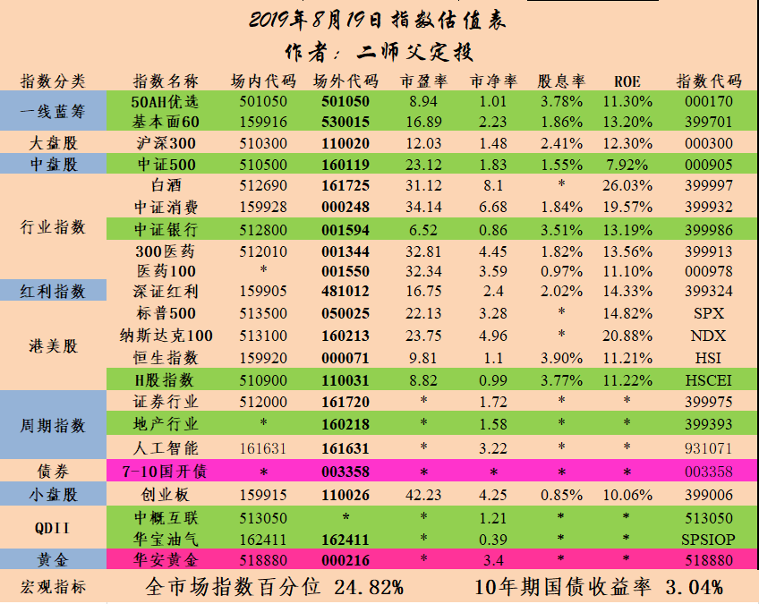

======================================================

_type: talk
@二师父[28814221155551]
2019-08-20 02:51:07 Tue  
topic_id: 244114524882241

<e type="hashtag" hid="458585422518" title="#周二估值讲堂#" /> 关于指数百分位和万得全A 指数百分位的计算方法。

首先说一下我没有用这个方法给具体指数估值，因为具体指数盈利情况和未来成长情况不同，过去不代表未来。二师父只用这个百分位大概判断股市的位置。

计算方法很简单的，把所有的数据排列，按照时间从前到后排列，然后在EXCEL表格里面边际RANK函数，EXCEL表格就会自动计算出百分位。有兴趣的同学可以试一试。多个渠道就对估值的理解加深一分。

阅读[3741]  评论[0]  赞[0] 

======================================================

_type: q&a
@凭栏观海[244414845852181]
2019-08-20 02:51:56 Tue  
topic_id: 244114581212141

@凭栏观海

>  地产，现在二师父暂时停住定投了吗？

@二师父

>  暂时停止了。

阅读[3969]  评论[5]  赞[0] 

======================================================

_type: q&a
@孙平[48548211154218]
2019-08-20 02:52:47 Tue  
topic_id: 544884218848484

@孙平

>  二师父，请问投资股票型基金比如中欧时代先锋，能否按五步定投法操作？如何把握该基金的估值情况？

@二师父

>  这种基金不适合五步定投法，因为持仓股票变化不规律，完全是跟基金经理的投资风格有关。

阅读[3984]  评论[1]  赞[0] 

======================================================

_type: q&a
@Fernando杜[841518122414242]
2019-08-20 02:53:47 Tue  
topic_id: 244114524524851

@Fernando杜

>  二师父，您好。我目前正在学习您传授的五步定投法，在您的方法中提到了每期定投的份数可参考万得全A市盈率百分位进行调整，我自己尝试计算了一下该数据。我选择了8月16日的数据，通过万得股票查到当天万得A市盈率是16.35，历史万得A市盈率最高是70.89，所以我用（16.35-70.89）*100%计算市盈率百分位，得到23.06%。不知我的计算过程是否正确，请您指正，谢谢。

@二师父

>  你这是大致的估算，正确的计算方法是把万得全A指数得历史市盈率按照年份排列，然后设置rank函数计算。

阅读[4324]  评论[3]  赞[0] 

======================================================

_type: talk
@二师父[28814221155551]
2019-08-20 02:55:06 Tue  
topic_id: 244114524884251

推荐一本书，我今晚在看的，写的不错，《看的见的与看不见的》，讲政治经济学的，有兴趣的朋友可以读一读。

@Claire at 2019-08-20 02:55:06 Tue

> 师父，下次是分享这本书吗？

----------

@二师父 at 2019-08-20 02:55:06 Tue

> 只是推荐，下次分享买入持有富有

----------

@YAO at 2019-08-20 02:55:06 Tue

> 出版社和作者最好也列明一下，以防买错版本[呲牙]

----------

阅读[4329]  评论[3]  赞[0] 

======================================================

_type: talk
@二师父[28814221155551]
2019-08-20 09:59:41 Tue  
topic_id: 544884258544814

<e type="hashtag" hid="881251425252" title="#鳄鱼计划#" /> 卖出人工智能一份。

免责声明：本计划仅为二师父个人投资记录，并非跟投，不构成投资建议。读者根据本计划及星球以往任何投资计划进行投资，须自行承担风险。

阅读[4124]  评论[2]  赞[0] 

======================================================

_type: q&a
@仰望[15118155428812]
2019-08-20 10:26:00 Tue  
topic_id: 544884258412554

@仰望

>  估值表里面的数据怎么看，怎么判断一支基金是否值得买入？如何从估值表里判断，基金是否被高估或者低估？本人小白一个，还请二师父多多指教！

@二师父

>  估值表绿色是低估的，橙色是正常估值，红色是高估。盈利成长性好，估值低的基金值得投资
>  
>  免责声明：本回答任何观点，皆为二师父个人投资心得，不构成投资建议。读者根据本文及星球任何观点进行投资，须自行承担风险。

阅读[4252]  评论[0]  赞[0] 

======================================================

_type: talk
@二师父[28814221155551]
2019-08-20 10:30:03 Tue  
topic_id: 111881248188882

<e type="hashtag" hid="881422852442" title="#定投实盘#" /> 卖出医药100百分之15的利润

很多人总是在上涨的时候追，券商已经正常估值还准备入，没有定法，先搞清自己是哪类投资者。

免责声明：本实盘任何观点，皆为二师父个人投资记录，不构成投资建议，非跟投。读者根据本文及星球任何观点进行投资，须自行承担风险。

@佳 at 2019-08-20 10:30:03 Tue

> 二师父，我医药才6%多的利润，要不要卖出？还是等到10%才卖出呢

----------

@秦岭云横 at 2019-08-20 10:30:03 Tue

> 具体是多少

----------

@波 at 2019-08-20 10:30:03 Tue

> 定投优质的指数基金,低估买入,高估卖出,正常估值继续持有或者卖出利润。

正常估值时如果持仓重,建议卖出利润,如果持仓轻,建议继续持有。

----------

阅读[4340]  评论[3]  赞[0] 

======================================================

@二师父[28814221155551]
2019-08-20 22:54:44 Tue  
topic_id: 111881214528582

>  @二师父
>  

阅读[4121]  评论[2]  赞[0] 

======================================================

_type: q&a
@tanxin[241524428884281]
2019-08-20 22:55:23 Tue  
topic_id: 111881211524122

@tanxin

>  二师父你好！我用五步定投法中的定投权重公式PE 1/PE2*B，得出的结果跟你的投资比例不一样是怎么回事？

@二师父

>  因为我加了定投系数，这个是自行设置的。

阅读[4172]  评论[0]  赞[0] 

======================================================

_type: talk
@二师父[28814221155551]
2019-08-21 04:12:51 Wed  
topic_id: 111881284112512

<e type="hashtag" hid="481211145528" title="#指数估值#" /> 券商在正常估值和低估值之间，强周期指数的安全边际设置严格一点好，不然跌的多了很多人是承受不了的。

@呼唤旷野 at 2019-08-21 04:12:51 Wed

> 就是可以收割利润了吗

----------

阅读[4143]  评论[1]  赞[0] 

+++++++++++++++++++++++++++++++++++++++++++++++++++++

图片：
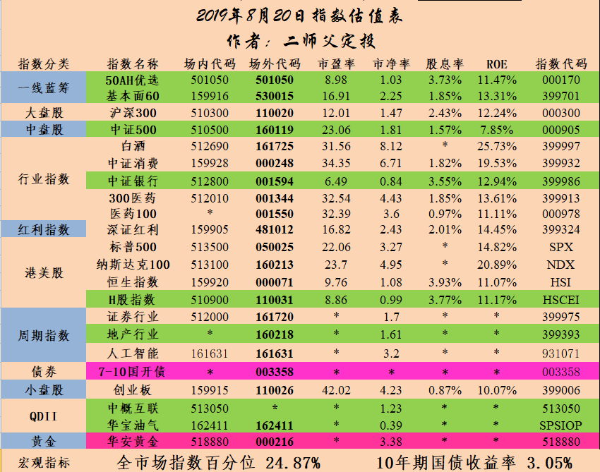

======================================================

_type: talk
@二师父[28814221155551]
2019-08-21 04:14:19 Wed  
topic_id: 111881284112422

<e type="hashtag" hid="828212581812" title="#利率改革对定投银行指数的影响#" /> 有时候，坏事反而是好事。

比如股市跌的多了，反而给投资者更多低价格买入的机会，当然坏处就是浮亏也会多。好与坏没有定论。

@波 at 2019-08-21 04:14:19 Wed

> 我今天也买了银行指数基金。

----------

阅读[4387]  评论[1]  赞[0] 

+++++++++++++++++++++++++++++++++++++++++++++++++++++

文件：
2019-08-21 04:13:09 Wed
文件大小：[25489]
28258884448521-LPR利率形成机制改革，意味着降息，对定投银行指数有何影响.docx

======================================================

_type: talk
@二师父[28814221155551]
2019-08-21 04:26:06 Wed  
topic_id: 111881284112822

<e type="hashtag" hid="828212581222" title="#投资和生活的联系#" /> 今天想谈谈投资和生活的联系，二师父发觉很多投资者在生活和工作都游刃有余，可是一到投资问题上就容易思维不清晰。

今天拿一个生活例子和定投指数类比，希望大家从生活中可以找到和定投相关之处，这是活学活用。

每个人都有驾照，肯定也会开车，上坡的时候到底是用三档还是二档呢？

我想这个问题大家都会回答：先三档上，感觉上不去再二档。很容易呀。

那定投的过程中很多问题都可以用这个答案解答：比如仓位，低估的时候感觉买的不够，那好，1层够不够，先来上1层呀，来了1层，感觉不够，慢慢加到2层，不够，再加，一直加到够为止。

这么简单的道理不懂，很多人一上来满仓抄底，被套。股市不懂，开车总会吧，没人能够5档起步，也没人直接从一档加到5档吧。那样直接熄火了。就算新手也不会那样干。可股市里面总有人这样干。

还有人卖出也是，经常一次全卖了，结果后面大涨，好一点的就是等待机会，糟糕的又重新进去。

开车不一样吗？如果直接从5档降到1档，会损害变速箱和发动机的。

投资并没有那么难，多学，多实践，多想。关键要有兴趣，我妈对投资没兴趣，对打麻将有兴趣，她就能把我的学习，工作，考试等等都可以和她打麻将联系起来，如果谁定投指数到达这个层面，那基本上很难亏钱了。

@rtdmm小米 at 2019-08-21 04:26:06 Wed

> 二师父总能用简单易懂的语言解读深奥的投资难题

----------

@波 at 2019-08-21 04:26:06 Wed

> 大道至简![强][强][强]

----------

阅读[5203]  评论[2]  赞[0] 

======================================================

_type: talk
@妖孽[544888148518184]
2019-08-21 22:03:26 Wed  
topic_id: 844114885184122

学堂封了？今天咋没点动静[疑问][疑问][疑问][疑问]

@二师父 at 2019-08-21 22:03:26 Wed

> 大家都很淡定了

----------

阅读[3716]  评论[1]  赞[0] 

======================================================

_type: talk
@二师父[28814221155551]
2019-08-22 03:36:16 Thu  
topic_id: 844114888144152

<e type="hashtag" hid="481211145528" title="#指数估值#" />

阅读[3907]  评论[0]  赞[0] 

+++++++++++++++++++++++++++++++++++++++++++++++++++++

图片：
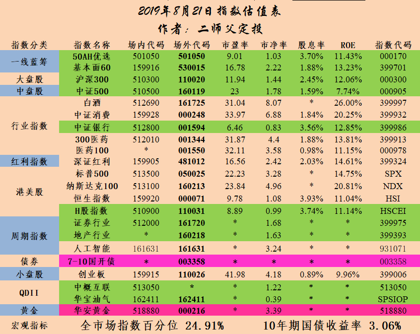

======================================================

_type: talk
@二师父[28814221155551]
2019-08-22 03:36:48 Thu  
topic_id: 544884111844824

相对低位，与底部还是有距离的。

阅读[4007]  评论[0]  赞[0] 

+++++++++++++++++++++++++++++++++++++++++++++++++++++

文件：
2019-08-22 03:36:34 Thu
文件大小：[25026]
88258828141422-当前市场处于何种位置，是否已经到达底部了.docx

======================================================

_type: talk
@二师父[28814221155551]
2019-08-22 03:45:40 Thu  
topic_id: 244114888141521

<e type="hashtag" hid="881422852442" title="#定投实盘#" /> 买入0.5份。有的低估暂时停止，并不代表不投了，第一考虑仓位，第二考虑最佳价值，第三是考虑政策。

免责声明：本实盘仅为二师父个人投资记录，非跟投，不构成投资建议。读者根据本实盘及星球任何观点进行投资，须自行承担风险。

@J at 2019-08-22 03:45:40 Thu

> 师傅，基本面60和证券仍是低估，停止定投的原因请问是什么呢

----------

@木子李 at 2019-08-22 03:45:40 Thu

> 师傅在第一段里说：有的低估暂时停止，并不代表不投了，第一考虑仓位，第二考虑最佳价值，第三是考虑政策。

----------

@🎈铮 at 2019-08-22 03:45:40 Thu

> 可是我仓位也就一成，投一份怎么样

----------

@J at 2019-08-22 03:45:40 Thu

> 基本面60投资价值很高，跟银行指数是不同风格的投资标的，只是不明白师父停止的所以然，希望师父讲一下

----------

@木子李 at 2019-08-22 03:45:40 Thu

> 一起等待师傅的答复

----------

@J at 2019-08-22 03:45:40 Thu

> [握手]

----------

@高达无双喝味全 at 2019-08-22 03:45:40 Thu

> 买一份  等2800以下建仓3成  剩下继续定投 保证牛市来时候不踏空

----------

@🎈铮 at 2019-08-22 03:45:40 Thu

> [抱拳]

----------

阅读[4855]  评论[14]  赞[0] 

+++++++++++++++++++++++++++++++++++++++++++++++++++++

图片：
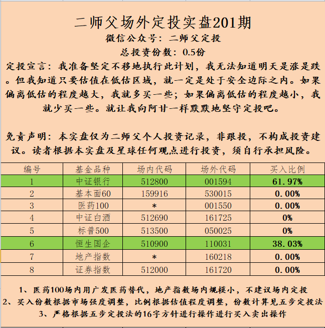

======================================================

_type: q&a
@黎雄[841555255485222]
2019-08-22 05:10:42 Thu  
topic_id: 844114888512552

@黎雄

>  是师傅你好，才出的科技ETF（515000），可以分析一下嘛

@二师父

>  这个是科技综合股票指数，市盈率比较高，不建议考虑这类新基金
>  
>  以后有了科创板或者纳斯达克指数进入低估可以考虑

阅读[4296]  评论[2]  赞[0] 

======================================================

_type: talk
@007[51511545424824]
2019-08-22 20:29:08 Thu  
topic_id: 422112551284458

<e type="hashtag" hid="552114551414" title="#估值数据#" /> 估值表里咋没有恒生国企指数估值？

@007 at 2019-08-22 20:29:08 Thu

> 原来H股指数就是啊👍 👍 👌

----------

阅读[3387]  评论[2]  赞[0] 

======================================================

_type: talk
@二师父[28814221155551]
2019-08-23 02:05:06 Fri  
topic_id: 844114242411152

<e type="hashtag" hid="481211145528" title="#指数估值#" /> 变化不大，这种行情就需要耐心。

阅读[3434]  评论[0]  赞[0] 

+++++++++++++++++++++++++++++++++++++++++++++++++++++

图片：
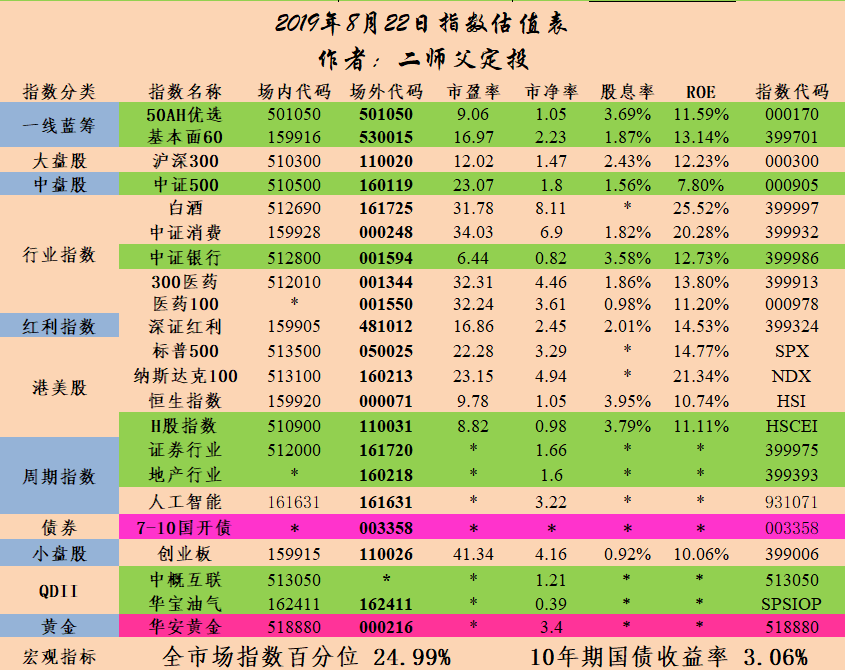

======================================================

_type: talk
@二师父[28814221155551]
2019-08-23 02:05:52 Fri  
topic_id: 111881414188842

<e type="hashtag" hid="145484852582" title="#定投重要的事#" /> 你觉得定投什么最重要

@屿 at 2019-08-23 02:05:52 Fri

> 每天早上起来看到的手机通知就是二师父知识星球的动态，经常是半夜更新，二师父的日复一日坚持做一件事的精神让人感动，是我们的榜样[强]

----------

@二师父 at 2019-08-23 02:05:52 Fri

> 相互学习啊

----------

@波 at 2019-08-23 02:05:52 Fri

> 定投最重要的是像二师父那样有耐心地坚持,在正确的道路上越走越好!

----------

阅读[3599]  评论[3]  赞[0] 

+++++++++++++++++++++++++++++++++++++++++++++++++++++

文件：
2019-08-23 02:05:25 Fri
文件大小：[26605]
48548852854118-定投最重要的是什么.docx

======================================================

_type: q&a
@风动幡动心不动[844418442154182]
2019-08-23 02:10:19 Fri  
topic_id: 422112552258458

@风动幡动心不动

>  师傅好！打算以沪深300、中证红利指数两只做组合长期定投，持仓比例1：1，这个方案可行吗？

@二师父

>  这个策略之前分享过，利用这两个指数。3000点以下定投，2700点以下加倍定投，这样3000点以上必定是盈利的。何时卖出根据仓位，增量资金数目及上证指数的点位综合判断。
>  
>  免责声明：本回答任何观点，皆为二师父个人投资心得，不构成投资建议。读者根据本文及星球任何观点进行投资，须自行承担风险。

阅读[3707]  评论[1]  赞[0] 

======================================================

_type: talk
@海盗[48248118584848]
2019-08-23 04:06:14 Fri  
topic_id: 422112525188458

<e type="hashtag" hid="225118152481" title="#指数基金均线偏离表#" />

@海盗 at 2019-08-23 04:06:14 Fri

> 供大家参考

----------

@仰望 at 2019-08-23 04:06:14 Fri

> 偏离度是什么？

----------

@Fernando杜 at 2019-08-23 04:06:14 Fri

> 多谢，辛苦💦

----------

@Bruce at 2019-08-23 04:06:14 Fri

> 场外定投加仓可以参考均线偏离表吗？还是只适用于场内

----------

@海盗 at 2019-08-23 04:06:14 Fri

> 这是二师父自己研发的，应对市场一直处于震荡模式，对于指数基金处于低估状态时，建立一定的仓底，当偏离度为正的时候就卖出，为负的时候就买入。

----------

@海盗 at 2019-08-23 04:06:14 Fri

> 1,偏离度是以90日均线为基础而算出来的
2.大部分资金还是用于定投低估指数

----------

@海盗 at 2019-08-23 04:06:14 Fri

> 场内。

----------

阅读[3879]  评论[7]  赞[0] 

+++++++++++++++++++++++++++++++++++++++++++++++++++++

图片：
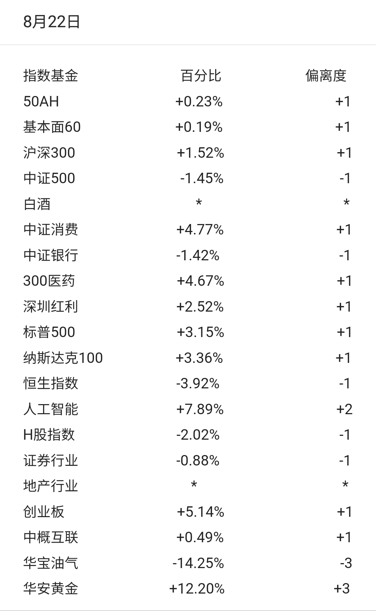

======================================================

_type: talk
@康[48581124158228]
2019-08-23 08:38:50 Fri  
topic_id: 111881411422582

华宝红利亏损为什么跌的比较凶呢？

@波 at 2019-08-23 08:38:50 Fri

> 华宝红利510029不是一个好的指数基金,二师父以前做过详细论述的,建议少投或慎投。

----------

@牧歌 at 2019-08-23 08:38:50 Fri

> 那我已经买了的怎么办呀？

----------

@兜兜囡囡 at 2019-08-23 08:38:50 Fri

> 放着

----------

阅读[3819]  评论[3]  赞[0] 

======================================================

_type: q&a
@李震笛[422112248211828]
2019-08-23 12:48:47 Fri  
topic_id: 844114244128422

@李震笛

>  二师傅，有研究与5G题材相关的指数吗？这类股票最近都很看好，有没有好的指数可以投？

@二师父

>  目前还没有这类5G指数，和信息技术行业有关。
>  
>  为何看好这类股票呢，他们成长性和ROE都不是很好

阅读[3843]  评论[2]  赞[0] 

======================================================

_type: q&a
@学以致用[244415184181451]
2019-08-23 12:53:37 Fri  
topic_id: 544884548144484

@学以致用

>  你好 二师傅！打算以兴权沪深300、深证基本面60、50AH，3只做组合长期定投，持仓比例4: 3: 3，这个方案可行吗？

@二师父

>  兴全沪深300是增强型的指数基金，最近一年比纯被动的沪深300指数基金收益好一些
>  
>  长期投资这三个指数非常不错，比较稳健，沪深300里面会有部分股票与基本面60，50ah重合

阅读[3857]  评论[1]  赞[0] 

======================================================

_type: q&a
@徐绍飞*[241521411111581]
2019-08-23 13:49:57 Fri  
topic_id: 111881418124112

@徐绍飞*

>  二师傅你好，请问估值表后面的阀值是根据a股以往历史产生的高低数据得出。还是说也有结合外围成熟市场的一个正常估值参考。因为我们都知道哎，A股之前一直都是政策加炒作。但a股以后也会向成熟的市场靠拢，那这些因素都有考虑在估值表里面吗？如果机构投资者占到大半以上那弱周期优质板块估值可能就不会过分的高低估，那可能是在小范围内波动成长。那价值投机的收益会否追不上长期持有，恳请赐教。

@二师父

>  A股像成熟市场转变需要时间的，成熟国家的股票市场的估值都是在较低的市盈率范围内波动，比如美国，不过美国的股市已经有百年历史，在刚成立的时候也是暴涨暴跌。
>  
>  估值表的数据主要是根据A股指数的估值来提供的，目前并未参考其他国家股票市场数据，A股和成熟国家的股票市场一样的话，需要大概10到20年左右的发展时间。
>  
>  所以当前的定投策略是适合A股的，对于单边上涨的长牛市，定投收益率不如一次性投资。无论是估值数据还是投资风格都随着市场变化而改变。10年前肯定以买房投资为主，今天以指数定投为主，10年后投资什么到了那时候再看，把当下做好。
>  
>  不管是什么样的股票市场，都以中长期持有为主，这样才可以使得投资收益最大化，而A股波动大，结合这种股市行情做波段可以避免利润损失。

阅读[4026]  评论[2]  赞[0] 

======================================================

_type: talk
@二师父[28814221155551]
2019-08-24 03:29:47 Sat  
topic_id: 111881125145152

<e type="hashtag" hid="481211145528" title="#指数估值#" /> 黄金晚间又涨了，美股下跌，他的估值一直不低，警惕美股暴跌。

@波 at 2019-08-24 03:29:47 Sat

> 以优质的宽基指数如沪深300,中证500,一线蓝筹等为主,以优秀的行业指数如白酒,消费,医药,银行等为辅,以策略指数基金如红利,低波动,基本面,价值等为重点,少量参与油气,证券,地产等周期指数。低估时坚持定投,正常时继续持有或卖出利润,高估时分批卖出。比较适合理财小白,新手和绝大多数普通投资者。

----------

@衣袂飘香 at 2019-08-24 03:29:47 Sat

> 指数百分位大于25了，对投资有影响吗？

----------

@二师父 at 2019-08-24 03:29:47 Sat

> 指数百分位越大，说明股市整体位置越高，这是衡量整体股市估值的指标

----------

阅读[3937]  评论[3]  赞[0] 

+++++++++++++++++++++++++++++++++++++++++++++++++++++

图片：
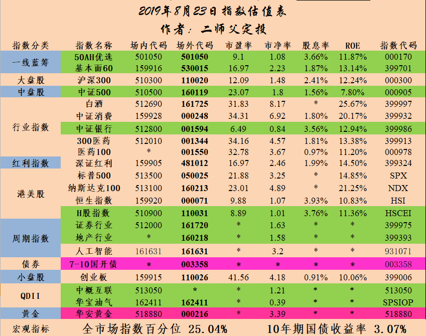

======================================================

_type: talk
@二师父[28814221155551]
2019-08-24 03:30:44 Sat  
topic_id: 244114458428441

<e type="hashtag" hid="828214514812" title="#网格策略#" /> 升级的网格策略，有兴趣的可以研究下，没有时间和兴趣的低估定投就好啦。

@J at 2019-08-24 03:30:44 Sat

> 师傅，有一个疑问：指数上涨4%卖出一份，意味着有可能出现一种情况—-仍是亏损状态下卖出吗？

----------

@波 at 2019-08-24 03:30:44 Sat

> 划知识重点
现在投资渠道少，唯有定投指数是当前最优质的投资，低门槛，策略简单，适合普通投资者。

----------

@波 at 2019-08-24 03:30:44 Sat

> 感觉网格操作有一定的难度,比较适合有一定基础的成熟投资者在振荡市中采用。对我等理财小白,还是低估定投,正常估值卖出利润,高估分批卖出全部,更简单更适用更适合。

----------

@二师父 at 2019-08-24 03:30:44 Sat

> 止盈不止损

----------

@志亮 at 2019-08-24 03:30:44 Sat

> 我也是用网格交易，算是二师父说的半升级版吧[微笑]

----------

@二师父 at 2019-08-24 03:30:44 Sat

> 有自己的理念和策略就行

----------

阅读[4784]  评论[8]  赞[0] 

+++++++++++++++++++++++++++++++++++++++++++++++++++++

文件：
2019-08-24 03:30:04 Sat
文件大小：[172116]
15425515524252-二师父升级版网格交易策略.docx

======================================================

_type: talk
@二师父[28814221155551]
2019-08-24 04:09:06 Sat  
topic_id: 111881125141442

<e type="hashtag" hid="228214514241" title="#读书投资者心灵修炼#" /> 本书读完了，如果觉得书好可以买来放在枕边反复阅读，如果不是准备终身阅读的书籍其实没必要购买，囤积心理很糟糕。

下一本准备越读《买入、持有、富有》，5本价值投资类的书籍，已经读了2本了，不知大家有何感悟。

@波 at 2019-08-24 04:09:06 Sat

> 我发现我和二师父是三观相合的人。

----------

@Claire at 2019-08-24 04:09:06 Sat

> 本书最后结论那10条，反复读了好多遍，逐步领会其中的道理。谢谢师父推荐的这本好书。继续下一本的阅读。

----------

@二师父 at 2019-08-24 04:09:06 Sat

> 这个不容易啊

----------

@二师父 at 2019-08-24 04:09:06 Sat

> 每定投一段时间再阅读就会有新的领悟

----------

阅读[4821]  评论[4]  赞[0] 

+++++++++++++++++++++++++++++++++++++++++++++++++++++

文件：
2019-08-24 04:07:05 Sat
文件大小：[24055]
88258848852512-投资者的心灵修炼第4讲.docx

======================================================

_type: talk
@树叶[544811512145144]
2019-08-24 12:57:40 Sat  
topic_id: 244114454825481

<e type="hashtag" hid="142825811122" title="#定投周报#" /> 二师父定投周报第22期

阅读[4131]  评论[0]  赞[0] 

+++++++++++++++++++++++++++++++++++++++++++++++++++++

文件：
2019-08-24 12:57:39 Sat
文件大小：[248280]
48548828242118-二师父定投周报8.24（第22期）.docx

======================================================

_type: talk
@衣袂飘香[118248548242452]
2019-08-24 22:26:17 Sat  
topic_id: 111881155818852

<e type="hashtag" hid="828214514812" title="#网格策略#" /> 二师父在以前的文章里说过，在低估的前提下转以均线策略，再加以网格交易，是应对震荡市好方法。今天这种升级版的网格交易，还需要结合均线偏离度吗？如何结合？

@二师父 at 2019-08-24 22:26:17 Sat

> 抓住核心就行，本质是逆向思维加低估定投，网格下跌购买本质是逆向思维，均线负偏离度加仓也是逆向思维，把握总体原则就行，如果多方策略触发买入条件就说明安全系数最高。

----------

@衣袂飘香 at 2019-08-24 22:26:17 Sat

> 除了二师父所说的核心本质之外，表面上的区别是否可以这么认为:网格交易，建立了底仓，而均线偏离策略按照偏离度决定是否加倍定投？

----------

阅读[3927]  评论[2]  赞[0] 

======================================================

_type: talk
@二师父[28814221155551]
2019-08-25 03:03:02 Sun  
topic_id: 111881158511852

<e type="hashtag" hid="551584555244" title="#长期定投#" /> 坚持下去，五月天演唱会在鸟巢举办了，不知有没有朋友去过。

他们从99年坚持到现在整整20年了，而有的人定投仅仅坚持2年甚至2个月不到。

光辉灿烂的日子和牛市账户爆发的时光可能就短暂的时光，大多数时候是默默无闻的耕耘和积累。坚持定投，走过的路，扣过的款是不会欺骗你的。

@衣袂飘香 at 2019-08-25 03:03:02 Sun

> 是的，发自内心的认同和热爱，才会不以坚持坚守坚忍为苦，反而为乐。

----------

@三峡情 at 2019-08-25 03:03:02 Sun

> 坚定信念，坚持定投，谢谢二师父领路！

----------

@惟子 at 2019-08-25 03:03:02 Sun

> 有二师父领路，风雨同行

----------

阅读[4839]  评论[3]  赞[0] 

+++++++++++++++++++++++++++++++++++++++++++++++++++++

文件：
2019-08-25 03:00:40 Sun
文件大小：[26163]
15425514424522-美元兑离岸人民币突破了7.13，做好长期定投的准备.docx

======================================================

_type: talk
@银河系[111814581215452]
2019-08-25 22:31:12 Sun  
topic_id: 544884458484544

二师父可以点评下易方达上证50和沪深300哪个好吗？谢谢

@二师父 at 2019-08-25 22:31:12 Sun

> 他俩属于包含与被包含的关系。

从最近半年的走势来看，易方达上证50是优于沪深300的。

这和他的主动选股策略有关系，里面重仓了消费股票，近半年消费股票涨的多。而他们的估值也较高。

综合看，易方达上证50目前的成长性高，而沪深300比较稳健。

----------

@银河系 at 2019-08-25 22:31:12 Sun

> 谢谢二师父

----------

阅读[3668]  评论[2]  赞[0] 

======================================================

_type: talk
@二师父[28814221155551]
2019-08-26 02:14:05 Mon  
topic_id: 244114445455451

<e type="hashtag" hid="551584855884" title="#掌握一个指标#" /> 股市和工作，生活不一样，看得越多，学的越多可能越乱，越做不好，牛顿在股市亏损就是一个例子。

他和感情比较类似，主要看客观，主观努力只能够起一部分作用，所以对股市正确的态度是用7成力学习即可，过犹不及。

看懂基本的指标，投资能够取得一定的超越大众的收益率，就已经很好了。

@J at 2019-08-26 02:14:05 Mon

> 请问师傅万得全A指数市盈率在哪里可以查到？除了师傅的估值表。

----------

@西锦巴乌 at 2019-08-26 02:14:05 Mon

> 万得全A交易软件

----------

@J at 2019-08-26 02:14:05 Mon

> 请问是万得股票吗？安装了，具体在哪个栏目下查看？

----------

@西锦巴乌 at 2019-08-26 02:14:05 Mon

> 万得全A交易软件点沪深大全找到万得全A点进去再点更多盘口就可以看到了

----------

@J at 2019-08-26 02:14:05 Mon

> 好的，感谢！看到目前市盈率17，这个等于师傅估值表里的万得全A指数百分比吗？感觉不是，请教应该怎样换算呢？

----------

@YtingLi at 2019-08-26 02:14:05 Mon

> 同问师父：万得全A市盈率所处的百分比怎么查看，谢谢

----------

@二师父 at 2019-08-26 02:14:05 Mon

> 在每日的估值表下面有个历史百分位数据

----------

阅读[3800]  评论[7]  赞[0] 

+++++++++++++++++++++++++++++++++++++++++++++++++++++

文件：
2019-08-26 02:11:02 Mon
文件大小：[328662]
88258844254412-这周事情有点多，看不懂宏观就看一个指标.pdf

======================================================

_type: q&a
@美美[48224811151218]
2019-08-26 02:20:28 Mon  
topic_id: 844114421151242

@美美

>  二师父好！现在中海医疗的估值怎么样？能定投吗？

@二师父

>  这是一只股票基金，持有的股票以中盘医药股票为主。
>  
>  目前医药股票都涨的挺多，属于正常估值。
>  
>  免责声明：本回答任何观点，皆为二师父个人投资心得，不构成投资建议。读者根据本文及星球任何观点进行投资，须自行承担风险。

阅读[3851]  评论[1]  赞[0] 

======================================================

_type: talk
@毛太史[844118585542442]
2019-08-26 11:50:32 Mon  
topic_id: 844114441585842

二师父好，网格交易中概互联涨跌幅度设置为3%还是4%好些？

@二师父 at 2019-08-26 11:50:32 Mon

> 都一样，如果设置3%，加仓次数就要多准备一些，预留充足的安全边际。

----------

@毛太史 at 2019-08-26 11:50:32 Mon

> 谢谢二师父

----------

阅读[3656]  评论[2]  赞[0] 

======================================================

_type: q&a
@海〔纳百川〕[422111285141888]
2019-08-27 03:43:49 Tue  
topic_id: 844114441524882

@海〔纳百川〕

>  二师父您好！请问创金合信货币A(001909)和南方天天利货币B(003474)哪个更有投资价值？

@二师父

>  这个基金创金信货币不稳定。从收益率看创金信货币的7日年化2.98%比南方天天利货币B的7日年化2.73%要高
>  
>  然而不能够忽视隐形的费率，综合管理费，托管费和销售费，创金信货币是比南方天天利货币B高出0.9%的，所以综合看还是南方好一点。

阅读[3232]  评论[0]  赞[0] 

======================================================

_type: talk
@二师父[28814221155551]
2019-08-27 03:45:41 Tue  
topic_id: 544884821145254

<e type="hashtag" hid="551222484554" title="#医药基金#" /> 既然选择了定投就遵守规则，定投很慢，但是也很安全。

中产阶级挣钱都不容易，学会慢慢变富。

阅读[3449]  评论[0]  赞[0] 

+++++++++++++++++++++++++++++++++++++++++++++++++++++

文件：
2019-08-27 03:44:34 Tue
文件大小：[79845]
15425585425412-股市下跌，医药一枝独秀，还可以入手吗.docx

======================================================

_type: talk
@二师父[28814221155551]
2019-08-27 03:46:51 Tue  
topic_id: 844114158842542

<e type="hashtag" hid="481211145528" title="#指数估值#" /> 估值表下面有万得全A市盈率百分位和10年期国债收益率，也要关注下。

阅读[3517]  评论[0]  赞[0] 

+++++++++++++++++++++++++++++++++++++++++++++++++++++

图片：
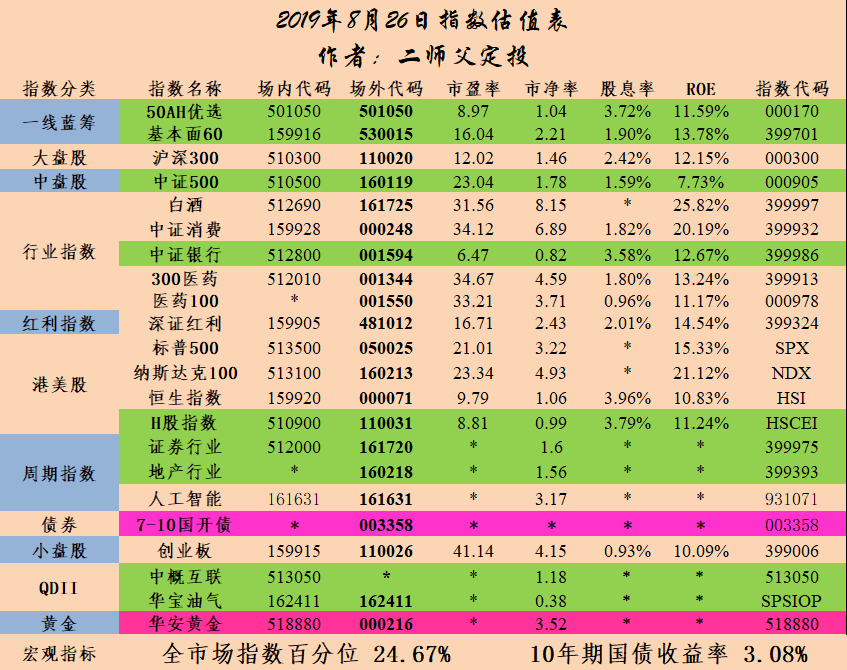

======================================================

_type: talk
@彩色[48415121851218]
2019-08-27 11:49:46 Tue  
topic_id: 422112142421848

今天收割医药100的利润了，哈哈。20%，有点小激动。上次已经收割一次10%了，这次收另一个10%。

@rtdmm小米 at 2019-08-27 11:49:46 Tue

> 基金选得好

----------

@Hi·DD at 2019-08-27 11:49:46 Tue

> 好羡慕呀[偷笑]

----------

阅读[3191]  评论[2]  赞[0] 

======================================================

_type: talk
@银河系[111814581215452]
2019-08-27 22:25:28 Tue  
topic_id: 544888218425254

美股2008年股灾后十年长牛，大家觉得A股下一次熊市之后也这样的可能性有多大？毕竟历史总是惊人的相似。

@二师父 at 2019-08-27 22:25:28 Tue

> 中国是独一无二的，等哪天一夜暴富的人都没了，10年长牛估计来了。

----------

@志亮 at 2019-08-27 22:25:28 Tue

> 10年后吧，不还是20年后吧[呲牙]

----------

阅读[3056]  评论[2]  赞[0] 

======================================================

_type: q&a
@学以致用[244415184181451]
2019-08-28 04:30:39 Wed  
topic_id: 422111484544818

@学以致用

>  二师父，你能帮我分析一下嘉实新兴产业股票(000751)，这是一支投资什么领域的基金股票啊？目前占仓20%左右，值得继续持有吗

@二师父

>  这个是股票基金，持股分散，重仓股有医药，消费，保险各个行业，没法估值，建议换成指数基金定投比较稳健。
>  
>  有一点不懂，为啥你都不知道他是什么领域的股票基金，还敢20%的仓位，万一亏了呢？
>  
>  免责声明：本回答任何观点，皆为二师父个人投资心得，不构成投资建议。读者根据本文及星球任何观点进行投资，须自行承担风险。

阅读[3010]  评论[0]  赞[0] 

======================================================

_type: q&a
@恋尘[51558584455824]
2019-08-28 04:31:47 Wed  
topic_id: 844111588414182

@恋尘

>  师父，我刚才找半天收割利润的公式没找到我记得以前在学堂说过，我医药盈利20点了想把盈利卖掉麻烦再给说下公式我算一下份额

@二师父

>  这个比较简单，假设盈利的利润是2000元，当前的市场价格是1.5元，那么卖出份数就是2000/1.5.
>  
>  卖出利润本质是减仓。

阅读[3039]  评论[0]  赞[0] 

======================================================

_type: talk
@二师父[28814221155551]
2019-08-28 04:37:50 Wed  
topic_id: 244111525485441

<e type="hashtag" hid="481211145528" title="#指数估值#" /> 黄金仍旧走高，钟摆总是过度摆动。

有读者收割利润了，看到其他朋友表示羡慕，其实你也可以的，关键在于你是否按照我的做。先学笨，再学聪明。学习书法和绘画都一样，先要摹写或者临写，达芬奇都不能跳过这一步。

当你严格按照我的五步定投法操作，想亏钱都难，等你自己在市场运用这个策略持续3年盈利，然后自制力很强，就可以不用拘泥五步定投法，随心操作，你会发现投资很简单，一直能赚。

当然，控制人的贪欲特别难，现在是熊了4年了，我敢保证，上证综合指数一旦冲破4000点，又会有人预测，超级牛市来了，长牛市来了，万点不是梦。哎，这是股市，也是人生。

免责声明：本回答任何观点，皆为二师父个人投资心得，不构成投资建议。读者根据本文及星球任何观点进行投资，须自行承担风险。

@Hi·DD at 2019-08-28 04:37:50 Wed

> 嗯。严格按照五步定投法。

----------

@rtdmm小米 at 2019-08-28 04:37:50 Wed

> 先学笨，严格按低估定投的原则执行

----------

阅读[3335]  评论[2]  赞[0] 

+++++++++++++++++++++++++++++++++++++++++++++++++++++

图片：

======================================================

_type: talk
@二师父[28814221155551]
2019-08-28 04:38:49 Wed  
topic_id: 422111454284218

<e type="hashtag" hid="551588544814" title="#港股指数#" />

阅读[3911]  评论[0]  赞[0] 

+++++++++++++++++++++++++++++++++++++++++++++++++++++

文件：
2019-08-28 04:38:13 Wed
文件大小：[25164]
15425588444522-港股指数基金是否可以加倍定投.docx

======================================================

_type: talk
@林荫[15115451828452]
2019-08-28 12:48:49 Wed  
topic_id: 422111451828488

请问场内溢价，是否到场外买？这样在核算利润时看起来会不会很乱啊？二师父是如何处理这个问题的？

阅读[3029]  评论[0]  赞[0] 

======================================================

_type: q&a
@秦岭云横[88884245415542]
2019-08-28 14:27:10 Wed  
topic_id: 544888251822444

@秦岭云横

>  场内，华宝油气防守型溢价套利如何操作？

@二师父

>  场外申购，场内溢价卖出，别套利，这个指数容易被套进去

阅读[3097]  评论[2]  赞[0] 

======================================================

_type: q&a
@J[28281541518551]
2019-08-28 14:27:39 Wed  
topic_id: 111888245818582

@J

>  师傅你好，请问万得全A历史百分位在哪里可以查看？是只能通过师傅的估值表看吗？

@二师父

>  其他的渠道我还没发现，大家可以说说还有哪些渠道

阅读[3337]  评论[4]  赞[0] 

======================================================

_type: q&a
@凭栏观海[244414845852181]
2019-08-28 14:27:56 Wed  
topic_id: 111888244224152

@凭栏观海

>  今天银行股大跌，可否逆势加仓？

@二师父

>  把握住定投节奏可以的

阅读[3559]  评论[0]  赞[0] 

======================================================

_type: talk
@海盗[48248118584848]
2019-08-28 15:28:33 Wed  
topic_id: 244111545521251

<e type="hashtag" hid="225118152481" title="#指数基金均线偏离表#" />

@仰望 at 2019-08-28 15:28:33 Wed

> 华宝标普石油天然气，偏离度大，净值也非常低，适不适合买入，进行投资？

----------

@Sunflower at 2019-08-28 15:28:33 Wed

> 二师父说了，低估的都可以定投，但是这个是强周期指数，不能重仓

----------

@海盗 at 2019-08-28 15:28:33 Wed

> 说得对

----------

@衣袂飘香 at 2019-08-28 15:28:33 Wed

> 请教各位，网格交易，底仓价格如何确定。比如，理论上，非周期性行业，建立底仓的价格是刚进入低估后再下跌10%。可是我们的估值表只有阈值没有价格，要怎么换算呢？

----------

@海盗 at 2019-08-28 15:28:33 Wed

> 我们的大部分资金还是用于定投指数，网格交易只是针对市场反复震荡，指数极度低估的时候，建立一个仓底，做一个小的波段，不能以主要投资为目标。

----------

@海盗 at 2019-08-28 15:28:33 Wed

> 定投指数，分批建仓的意思就是平摊风险。而做网格交易，是在市场反复震荡的时候，最好是极度低估的指数，这个时候用建立仓底，有两大好处。
1.如果市场一直震荡，按照网格交易，我们也有收益。
2.如果市场开始一路上涨，我们也建立了仓底，降低了持仓成本。
3.如果市场开始下跌，由于我们是在指数极度低估的时候购买，所以买的也不会太贵。
以上是我自己理解二师父网格交易的初衷，有哪里理解不对的或者有错误的地方，还请同学们指出，互相学习，共同进步！

----------

@衣袂飘香 at 2019-08-28 15:28:33 Wed

> 谢谢你，我也认同你的观点。我想问的是，底仓的价格是怎么计算出来的，因为估值表里面只有低估的阈值。

----------

@衣袂飘香 at 2019-08-28 15:28:33 Wed

> 是的，近期的市场行情就是反复震荡，所以前几天二师父讲解了升级版的网格交易。您的观点我是认同的。我的问题是，如果按照原来的网格交易策略，底仓的价格要怎么计算出来？

----------

阅读[3462]  评论[12]  赞[0] 

+++++++++++++++++++++++++++++++++++++++++++++++++++++

图片：
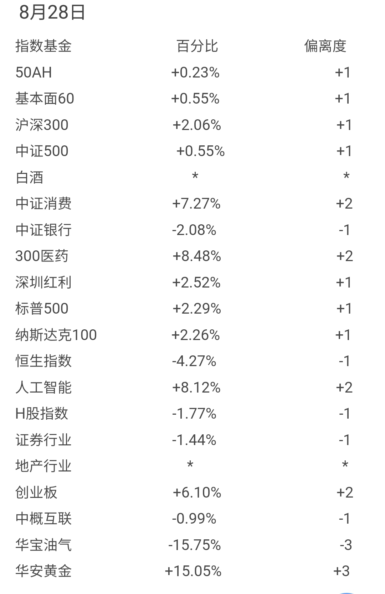

======================================================

_type: talk
@二师父[28814221155551]
2019-08-29 05:16:07 Thu  
topic_id: 544888248451124

<e type="hashtag" hid="481211145528" title="#指数估值#" /> 消费进入高估了，继续喝酒吃药行情

阅读[3562]  评论[0]  赞[0] 

+++++++++++++++++++++++++++++++++++++++++++++++++++++

图片：
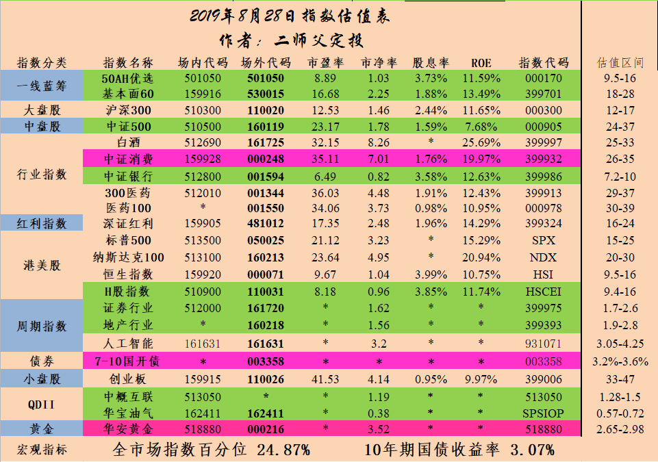

======================================================

_type: talk
@二师父[28814221155551]
2019-08-29 05:17:15 Thu  
topic_id: 244111541428851

<e type="hashtag" hid="142444828582" title="#定投总结#" /> 时常总结，不忘走过的路

@Hi·DD at 2019-08-29 05:17:15 Thu

> 所以处女座更自律和更追求完美，与二师父的风格倒挺相称，貌似处女座马上要吹蜡烛了🎂

----------

@二师父 at 2019-08-29 05:17:15 Thu

> [微笑][微笑]

----------

阅读[3824]  评论[2]  赞[0] 

+++++++++++++++++++++++++++++++++++++++++++++++++++++

文件：
2019-08-29 05:16:51 Thu
文件大小：[25041]
88258258515822-八月市场震荡，整体计算我们投资还是挣了的.docx

======================================================

_type: talk
@二师父[28814221155551]
2019-08-29 05:26:15 Thu  
topic_id: 111888218145442

<e type="hashtag" hid="881422852442" title="#定投实盘#" /> 坚持就是胜利

@小宝 at 2019-08-29 05:26:15 Thu

> 这次是只买这两个是么

----------

@二师父 at 2019-08-29 05:26:15 Thu

> 是呢

----------

@自由飞翔 at 2019-08-29 05:26:15 Thu

> 师父，我目前的基金仓位分布如图，现每周在定投的是黄色标识的5只基金，请帮建议下是否需要调整？谢谢

----------

@三峡情 at 2019-08-29 05:26:15 Thu

> 二师父，我不明白为什么之前银行偏离-3的时候，定投的金额还是现在多呢

----------

@二师父 at 2019-08-29 05:26:15 Thu

> 证券可以大一点，地产比例少一些

----------

@二师父 at 2019-08-29 05:26:15 Thu

> 主要参考估值指标，均线偏离度是短期观测指标

----------

@自由飞翔 at 2019-08-29 05:26:15 Thu

> 好的，谢谢师父，证券之前3000多点时减过仓，那我现在的定投再调整下[抱拳][抱拳]

----------

@🐰Mandy at 2019-08-29 05:26:15 Thu

> 恒生国企跟银行是买场外还是场内的？

----------

阅读[3993]  评论[9]  赞[0] 

+++++++++++++++++++++++++++++++++++++++++++++++++++++

图片：
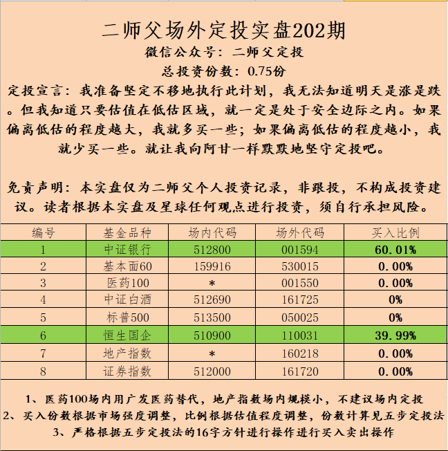

======================================================

_type: q&a
@Shitou_li[15155885518252]
2019-08-29 13:06:16 Thu  
topic_id: 544888282145524

@Shitou_li

>  师父，随着场内指数基金不断的拓展，构建稳定组合很有必要，目前想的是构建股债平衡及适当的货币基金，请教下场内有好的债券和货币基金推荐没有？谢谢

@二师父

>  16国债19，国债ETF，银华日利，华宝添益。
>  
>  免责声明：本回答任何观点，皆为二师父个人投资心得，不构成投资建议。读者根据本文及星球任何观点进行投资，须自行承担风险。

阅读[3060]  评论[0]  赞[0] 

======================================================

_type: q&a
@平安幸福[244124188281811]
2019-08-29 13:19:24 Thu  
topic_id: 111888284855422

@平安幸福

>  二师父，购买基金的成本和利润只能自己单独计算吗？时间长了都忘了一共定投了多少成本，收割了多少利润，而支付宝、天天中显示的持有利润并不真实和准确，有没有更好的方法和软件？

@二师父

>  有IRR定投收益率计算器，这个需要每次手动输入
>  
>  成本不用自己计算，在蛋卷这种软件里面会有持仓成本和当前净值。用（当前净值-持仓成本）/持仓成本=利润率，净值法计算是比较精确的，我们考虑的是总体收益率

阅读[3112]  评论[2]  赞[0] 

======================================================

_type: q&a
@美美[48224811151218]
2019-08-29 13:21:32 Thu  
topic_id: 844111514555852

@美美

>  二师父好！在蛋卷里定投，我设置的是每周四定投，今天想增加一个定投，是今天扣款呢还是下周扣款？

@二师父

>  这周开始和下周开始没啥区别啊，直接设置就行，定投是一件长期坚持的事情，何时开始不重要，坚持就行了

阅读[3194]  评论[0]  赞[0] 

======================================================

_type: talk
@林荫[15115451828452]
2019-08-29 14:05:03 Thu  
topic_id: 844111514444842

请问场内溢价，是否到场外买？这样在核算利润时看起来会不会很乱啊？二师父是如何处理这个问题的？

@二师父 at 2019-08-29 14:05:03 Thu

> 溢价尽量避免

----------

阅读[3142]  评论[1]  赞[0] 

======================================================

_type: talk
@二师父[28814221155551]
2019-08-29 15:46:31 Thu  
topic_id: 111888288211142

<e type="hashtag" hid="828158142882" title="#读者福利#" /> 点击这个链接注册蛋卷可以领取一门周期课程，免费的

<e type="web" href="https://danjuanapp.com/activity/dav-coupon/5420381?channel=2500000094" title="https://danjuanapp.com/activity/dav-coupon/5420381..." />

阅读[3412]  评论[0]  赞[0] 

+++++++++++++++++++++++++++++++++++++++++++++++++++++

图片：

======================================================

_type: talk
@二师父[28814221155551]
2019-08-30 03:18:55 Fri  
topic_id: 544888124485254

<e type="hashtag" hid="481211145528" title="#指数估值#" /> 指数估值，今天的文章谈了谈怎么收割利润和计算收益率，不要怕麻烦，挣钱如果不麻烦那估计是骗局，多动手，这样更能加深自己对指数的理解。

@光少 at 2019-08-30 03:18:55 Fri

> 消费又可以卖出了，卖出20%

----------

@水墨青花 at 2019-08-30 03:18:55 Fri

> 师父，中概互联最近应该怎么做

----------

@二师父 at 2019-08-30 03:18:55 Fri

> 定投就行

----------

@水墨青花 at 2019-08-30 03:18:55 Fri

> 好的，谢谢

----------

阅读[3812]  评论[4]  赞[0] 

+++++++++++++++++++++++++++++++++++++++++++++++++++++

图片：
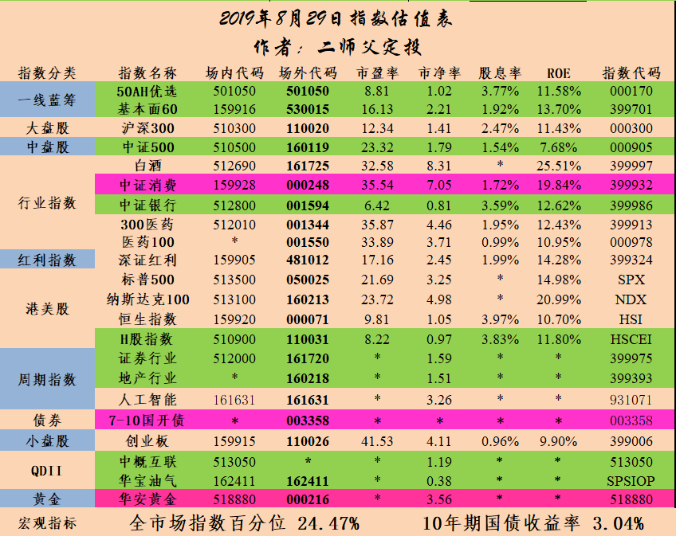

======================================================

_type: talk
@二师父[28814221155551]
2019-08-30 03:20:45 Fri  
topic_id: 544888124485124

<e type="hashtag" hid="551825211144" title="#利润收割的方法#" />方法很简单，但是知易行难，如果学会利润收割的话，很多指数都加仓和收割几次啦。因为还是有不少指数在低估和正常波动，这是震荡市场的策略。

@柠小萌🍭 at 2019-08-30 03:20:45 Fri

> 二师父，目前市场的利润收割是控制在10%还是20%呢？

----------

@二师父 at 2019-08-30 03:20:45 Fri

> 熊市10个点

----------

@柠小萌🍭 at 2019-08-30 03:20:45 Fri

> 但是按照课程里面讲的可以看60日和90日均线卖出，价格在这两个之上，每次按20%卖出，现在深证红利和医药100都超过了，以哪个为参考呢？

----------

@二师父 at 2019-08-30 03:20:45 Fri

> 那是做均线交易的，如果利润收割就用利润收割法

----------

阅读[3410]  评论[4]  赞[0] 

+++++++++++++++++++++++++++++++++++++++++++++++++++++

文件：
2019-08-30 03:19:28 Fri
文件大小：[25899]
51521428122284-谈谈利润收割和卖出.docx

======================================================

_type: talk
@二师父[28814221155551]
2019-08-30 03:25:03 Fri  
topic_id: 844111854412842

今天休息会，读书内容明天分享[呲牙]

@三峡情 at 2019-08-30 03:25:03 Fri

> 二师父辛苦了[玫瑰][玫瑰]

----------

@J at 2019-08-30 03:25:03 Fri

> 二师父辛苦了[玫瑰][玫瑰]

----------

@Claire at 2019-08-30 03:25:03 Fri

> 师父，不急的。你先休息一下。[咖啡]

----------

阅读[3306]  评论[3]  赞[0] 

======================================================

_type: q&a
@徐绍飞*[241521411111581]
2019-08-30 12:37:19 Fri  
topic_id: 544888111482514

@徐绍飞*

>  二师傅，你好，请问您的估值表格叁考范围是如何计算来的，十几年前的历史数据从哪里调呢，我其实是想找做好的历史pEpb走势图，

@二师父

>  这个从Wind里面调出来，免费的软件果仁网或者理杏仁网站，如果要找从开始到现在的数据就只有wind相对齐全一些啦

阅读[3165]  评论[2]  赞[0] 

======================================================

_type: talk
@林荫[15115451828452]
2019-08-30 15:07:30 Fri  
topic_id: 844111882114112

华泰买基金从哪入口呀?是实时价格吗？

@二师父 at 2019-08-30 15:07:30 Fri

> 从涨乐财富通入口购买

----------

阅读[2934]  评论[1]  赞[0] 

======================================================

_type: talk
@二师父[28814221155551]
2019-08-31 03:14:30 Sat  
topic_id: 844111824114822

<e type="hashtag" hid="552148115414" title="#定投计划#" />16字方针全面配置，低估定投，正常收割，高估卖本。

如果你不知道如何做，就想想二师父的定投16字方针，当年游击战的16字方针指引战斗，结果攻无不克，战无不胜。

用这16字方针定投指数基金也是非常有效的，难点在于严格遵守。

阅读[2831]  评论[0]  赞[0] 

+++++++++++++++++++++++++++++++++++++++++++++++++++++

文件：
2019-08-31 03:12:33 Sat
文件大小：[25196]
88258485441542-二师父九月定投计划.docx

======================================================

_type: talk
@二师父[28814221155551]
2019-08-31 03:16:00 Sat  
topic_id: 544888154884524

<e type="hashtag" hid="481211145528" title="#指数估值#" /> 消费和白酒进入高估啦。记得不要太贪婪哈，别人贪婪的时候我们得恐惧。

@心斋 at 2019-08-31 03:16:00 Sat

> 二师父，之前一直持有易方达消费基金，也收割过几次利润，请问现在消费高估了，是一次卖本还是分次比较好？

----------

@二师父 at 2019-08-31 03:16:00 Sat

> 按照上涨比例分步卖出，因为高估的基金仍旧有上涨的可能，至于何时清仓没有定论

----------

@心斋 at 2019-08-31 03:16:00 Sat

> 好的，谢谢二师父

----------

@rtdmm小米 at 2019-08-31 03:16:00 Sat

> 同学买得好，你啥时候开始定投的？

----------

@二师父 at 2019-08-31 03:16:00 Sat

> 去年很多机会

----------

@rtdmm小米 at 2019-08-31 03:16:00 Sat

> 就是哈，认识二师父太晚了，还好已经认可二师父的定投理念，努力提高自己，等待和忍耐，好机会一定会有的

----------

@心斋 at 2019-08-31 03:16:00 Sat

> 同学，是去年7月份建了底仓，然后定投到今年上半年

----------

阅读[3406]  评论[7]  赞[0] 

+++++++++++++++++++++++++++++++++++++++++++++++++++++

图片：
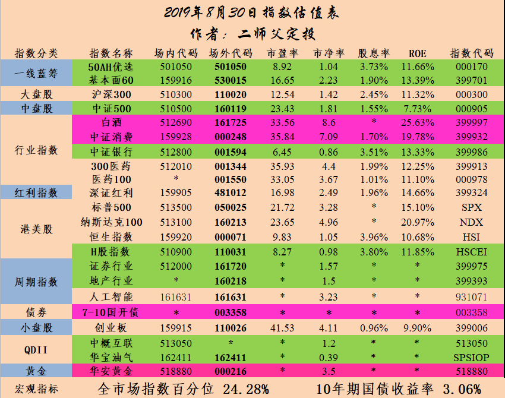

======================================================

_type: talk
@二师父[28814221155551]
2019-08-31 03:45:25 Sat  
topic_id: 844111821555852

#周五读书《买入持有富有：一名金牛基金经理得投资之路》# 这是一本好书，用了浅显易懂的语言把价值理念讲清楚了，而且作者自己经历丰富，文笔中流露着真诚，值得一读。

阅读[3679]  评论[0]  赞[0] 

+++++++++++++++++++++++++++++++++++++++++++++++++++++

文件：
2019-08-31 03:44:33 Sat
文件大小：[24235]
51521412448114-《买入持有富有：一名金牛基金经理得投资之路》总体介绍.docx

======================================================

_type: talk
@树叶[544811512145144]
2019-08-31 13:40:53 Sat  
topic_id: 844111845211452

<e type="hashtag" hid="142825811122" title="#定投周报#" /> 二师父定投周报第23期

阅读[3105]  评论[0]  赞[0] 

+++++++++++++++++++++++++++++++++++++++++++++++++++++

文件：
2019-08-31 13:40:48 Sat
文件大小：[275365]
28258488584241-二师父定投周报8.31（第23期）.docx

======================================================

_type: talk
@二师父[28814221155551]
2019-08-31 20:17:16 Sat  
topic_id: 244111844224441

<e type="hashtag" hid="281181228851" title="#周末答疑#" /> 关于卖出，这个问题说不完，大家在实际定投的过程中就会发现问题。

首先卖出的第一条原则，止盈不止损。也就是定投指数基金的过程中在亏损的时候不用卖，只有在盈利的时候卖，这种特点也说明指数基金定投适合极度厌恶亏损的朋友。

那么止盈是什么意思？止盈这里的意思不是说盈利了就全部卖出。而是盈利之后才可以考虑卖，盈利是卖出的必要条件，而非充分条件。

盈利卖出有两种情况，第一是正常估值，利润收割法则，有多少盈利就卖出多少盈利，最精确的计算方法是假设投入了2万，账面资金是2.2万，那么就卖出0.2万的利润。这样是精确，可是需要记录每次定投的金额，适合有耐心的人，二师父追求模糊的正确，所以计算出收益率然后卖出即可。

比如第一次的利润率是10%，卖出10%的利润，第二次的利润率是20%，那么卖出20%-10%=10%的利润即可。

第二是高估值的情况，消费高估发生了很多次，去年年初就一直高估，那时候很多人也是着急冲进去买白酒和消费，结果被套。

这就是不遵循估值投资的危害。所以我们坚守逆向思维，现在适合卖出，不管是白酒还是消费，都需要逐步减仓，这样投资才是安全的。

当然高估的基金，依旧会涨，至于涨到哪里不知道，牛市不言顶，熊市不言底，不要企图买在最低点，也别企图卖在最高点，每上涨一定的幅度卖出一定比例，最终清仓，然后不要再追涨，等待下一轮低估。

@J at 2019-08-31 20:17:16 Sat

> 坚定信念 此志不渝

----------

阅读[3707]  评论[1]  赞[0] 

======================================================

_type: q&a
@孙平[48548211154218]
2019-08-31 23:09:36 Sat  
topic_id: 844111841858282

@孙平

>  二师父，基金估值正常时，如果第一次交易卖出10%的利润，那么请问第二次卖出是在该基金涨10%时，还是涨20%时卖出10%部分？谢谢

@二师父

>  逐步减的，如果基金卖出后重回低估，那么继续定投，再次进入正常估值的时候再卖，如果一直涨，就逐步卖，第一次10个点时候，第二次20个点时候，第三次30个点时候

阅读[2982]  评论[2]  赞[0] 

======================================================

