_type: talk
@二师父[28814221155551]
2019-09-01 02:40:41 Sun  
topic_id: 244111841155121

<e type="hashtag" hid="145824111542" title="#查看基金的持仓#" /> <e type="web" href="http://www.cnindex.com.cn/" title="深证指数|国证指数" cache="" />，附上国证指数官网的链接，这是查阅深证指数的。

阅读[3923]  评论[0]  赞[0] 

+++++++++++++++++++++++++++++++++++++++++++++++++++++

文件：
2019-09-01 02:39:51 Sun
文件大小：[282930]
88258484545152-如何查看一只指数基金的持仓.docx

======================================================

_type: talk
@二师父[28814221155551]
2019-09-01 02:46:45 Sun  
topic_id: 111888518825242

看到一张图片，不知道大家什么感受，我是觉得放弃比坚持更需要勇气。不管放弃还是坚守，希望大家都可以过上自己喜欢的生活

@志亮 at 2019-09-01 02:46:45 Sun

> 我喜欢自由自在的生活，所以我想实现财务自由

----------

@鸿何服饰 at 2019-09-01 02:46:45 Sun

> 不管在哪里生活，幸福最重要，如果不幸福不开心生活“天堂”又怎么样。

----------

@衣袂飘香 at 2019-09-01 02:46:45 Sun

> 幸福，更多的是主观感受，是内心的感觉。和生活的地方，并没有必然的关系，所以，遵从自己的内心。
   当你见到一个人，他的身材匀称，面带光泽，笑容温暖，语气平和，那么他大多满意自己的生活。

----------

@二师父 at 2019-09-01 02:46:45 Sun

> 说的有道理

----------

@衣袂飘香 at 2019-09-01 02:46:45 Sun

> [微笑]

----------

@CKSJ at 2019-09-01 02:46:45 Sun

> 只想指出一点，夜生活逆天时而动 ，不利于健康 。另外人的逍遥自在是在内心世界，而非外在世界 ，也许成都相对北京更易获得一种幸福感

----------

阅读[3306]  评论[6]  赞[0] 

+++++++++++++++++++++++++++++++++++++++++++++++++++++

图片：
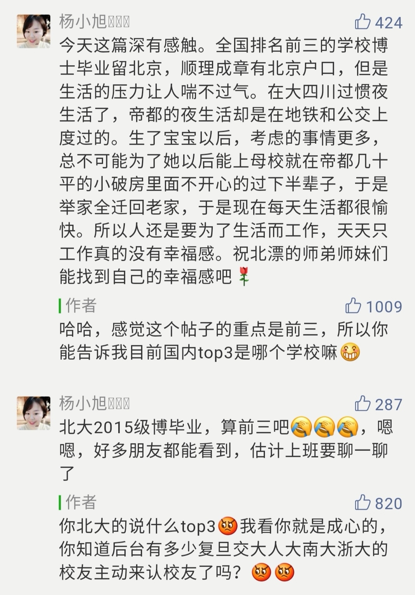

======================================================

@二师父[28814221155551]
2019-09-01 13:13:42 Sun  
topic_id: 422111814444858

>  @二师父
>  

阅读[3148]  评论[0]  赞[0] 

======================================================

_type: talk
@老孙头[422115118524548]
2019-09-01 13:34:42 Sun  
topic_id: 544888584241414

请教——医药指数处于正常估值阶段(定投暂停)，而―些知名基金网站却积极宣传：该板块正在进入“黄金时代”或断言其就是下―个“白酒板块”。该如何理解、对待？—谢谢老师及诸高手！

@美美 at 2019-09-01 13:34:42 Sun

> 同问

----------

@二师父 at 2019-09-01 13:34:42 Sun

> 有利于销售

----------

阅读[3156]  评论[2]  赞[0] 

======================================================

_type: talk
@林荫[15115451828452]
2019-09-01 16:37:35 Sun  
topic_id: 544888584812124

请问二师父，现在开仓定投，是按选好的品种各配置一部分吗？不在低估范围的要不要配置呢？

@林荫 at 2019-09-01 16:37:35 Sun

> 还有，现在定投，存量资金投入时间为一年吗？

----------

@二师父 at 2019-09-01 16:37:35 Sun

> 不在低估的就不用配置了

----------

@林荫 at 2019-09-01 16:37:35 Sun

> 那这样，持有各基金的比例会不会和预期差距大。比如原计划中证500占30%，沪深300占30%，标普10%，港股10%，证券10%，油气10%，有部分不低估，是等低估时再买吗？多余的资金是加大低估基金的比例，还是留存等待?

----------

@二师父 at 2019-09-01 16:37:35 Sun

> 这个比例也不是固定的啊，如果你买入的基金进入高估了，是要逐步减仓的，投资并不追求比例一致

----------

@林荫 at 2019-09-01 16:37:35 Sun

> 还是不太明白怎么样建底仓。😂

----------

@林荫 at 2019-09-01 16:37:35 Sun

> 还是不太明白怎么样建底仓。😂

----------

阅读[3148]  评论[6]  赞[0] 

======================================================

_type: talk
@二师父[28814221155551]
2019-09-02 04:20:11 Mon  
topic_id: 244111452184881

<e type="hashtag" hid="481144488858" title="#投资理念#" /> 安全第一，不管投资还是创业，都一样

@志亮 at 2019-09-02 04:20:11 Mon

> 追高吃面[呲牙]，默念三遍

----------

阅读[3817]  评论[1]  赞[0] 

+++++++++++++++++++++++++++++++++++++++++++++++++++++

文件：
2019-09-02 04:19:30 Mon
文件大小：[25735]
28258481484151-为什么逆势定投，而不是乘胜追击.docx

======================================================

_type: q&a
@李震笛[422112248211828]
2019-09-02 12:48:14 Mon  
topic_id: 422111242154548

@李震笛

>  二师傅，我有比较高位买的沪深300，有3成的仓位，至少是亏的状态，现在基本已经平仓。我现在想出来，然后改换其他低估值的，比如中证银行。请问您，有必要吗

@二师父

>  讲了很多次了哈，亏损不要卖出，可以用还没有定投的资金去积累低估的资产

阅读[2927]  评论[0]  赞[0] 

======================================================

@二师父[28814221155551]
2019-09-02 12:48:41 Mon  
topic_id: 844111488854542

>  @二师父
>  

阅读[3013]  评论[0]  赞[0] 

======================================================

_type: talk
@林荫[15115451828452]
2019-09-02 15:28:59 Mon  
topic_id: 844111482522512

我在华泰证券~场内基金里买证券512000，怎么买不了？大家用华泰买基金是直接和股票一样买入吗？

@二师父 at 2019-09-02 15:28:59 Mon

> 可能委托价格太低，涨的多了

----------

@林荫 at 2019-09-02 15:28:59 Mon

> 不是，没显示数量，只有申购金额，所以我不知道操作对了吗，你能截个操作界面图给我吗？

----------

@二师父 at 2019-09-02 15:28:59 Mon

> 数量乘以单价就是总金额

----------

@林荫 at 2019-09-02 15:28:59 Mon

> 我是说只显示申购总金额，还买入不了，说没有这个代码，我第一次用华泰在场内操作，是不是搞错了？

----------

@二师父 at 2019-09-02 15:28:59 Mon

> 有这个代码，你在涨乐财富通搜索代码就有的

----------

@速。冻 at 2019-09-02 15:28:59 Mon

> 截图发出来，大家一看就明白原因了

----------

@林荫 at 2019-09-02 15:28:59 Mon

> 终于明白了，我用电脑版软件操作的，不是涨乐，所以操作不成功。谢谢大家的建议。

----------

@rtdmm小米 at 2019-09-02 15:28:59 Mon

> 电脑版也可以买啊，和买卖股票一样操作

----------

阅读[2967]  评论[13]  赞[0] 

======================================================

_type: q&a
@恋尘[51558584455824]
2019-09-02 22:12:23 Mon  
topic_id: 422111254588218

@恋尘

>  师父我就是微信上那个交首付的，我还想请教您个问题我月供4700多在天津郊区，我想这3年之内还几个大额的，因为这月供对我来说压力有点大，我工资7000多还没结婚也没存款了家里的意思是努力挣两年还上大额然后月供少了之后再存钱因为那样压力也不大了

@二师父

>  恭喜你哈，首先说结论：不用提前还贷
>  
>  第一、你如果是等额本息贷款，大概年利率上浮10%是5个多点的利率，远低于M2增速和通货膨胀率，相当于把钱贬值的风险转移给银行了
>  
>  第二、压力是好事，会让你有动力去更加努力工作开源，并且会让你减少很多不必要的开支。学会爱上肩上的压力和责任，这句话有点鸡汤，但还是比较有道理。现在4700对你来说可能很多，但是随着你的收入的提高和纸币的贬值，两年以后必定非常之轻松，只要踏实工作或者开辟副业，这一点毋庸置疑
>  
>  第三、既然你有了大额存款比如20万，这笔钱放在手里不是比直接放到银行更加让你有安全感吗
>  
>  永远记住，刚需买房在可承受范围内杠杆越大越好，多像银行低息贷款，这是通向财务自由之路的首要功课。我想借，可是还没有太多的渠道呢。

阅读[3510]  评论[7]  赞[0] 

======================================================

_type: q&a
@Hi·DD[422111285512858]
2019-09-02 23:02:53 Mon  
topic_id: 111888145281512

@Hi·DD

>  二师父，今天发现有一笔理财到期，是不是可以把它作为底仓买入，目前还剩四十多份。

@二师父

>  不怕特不靠谱搞事情就可以啊，今天涨了，如果仓位让你不舒服，感觉焦虑，可以加的，但是得把握下如果跌了依旧不恐惧，这个度只能自己拿捏

阅读[2891]  评论[3]  赞[0] 

======================================================

_type: talk
@二师父[28814221155551]
2019-09-03 03:08:55 Tue  
topic_id: 544888451882214

<e type="hashtag" hid="481211145528" title="#指数估值#" /> 白酒和消费继续走高，切记不要追高

@秦风殇韵（刘豫斌） at 2019-09-03 03:08:55 Tue

> 表格里面没有恒生国企，可以参考哪个？

----------

@惟子 at 2019-09-03 03:08:55 Tue

> H股指数

----------

@小宝 at 2019-09-03 03:08:55 Tue

> 二师父好像没有推荐科技指数的？

----------

@二师父 at 2019-09-03 03:08:55 Tue

> 纳斯达克是科技股

----------

@Dr. 邓 at 2019-09-03 03:08:55 Tue

> 国内科技股指数：场内515000；场外161631

----------

阅读[3432]  评论[5]  赞[0] 

+++++++++++++++++++++++++++++++++++++++++++++++++++++

图片：
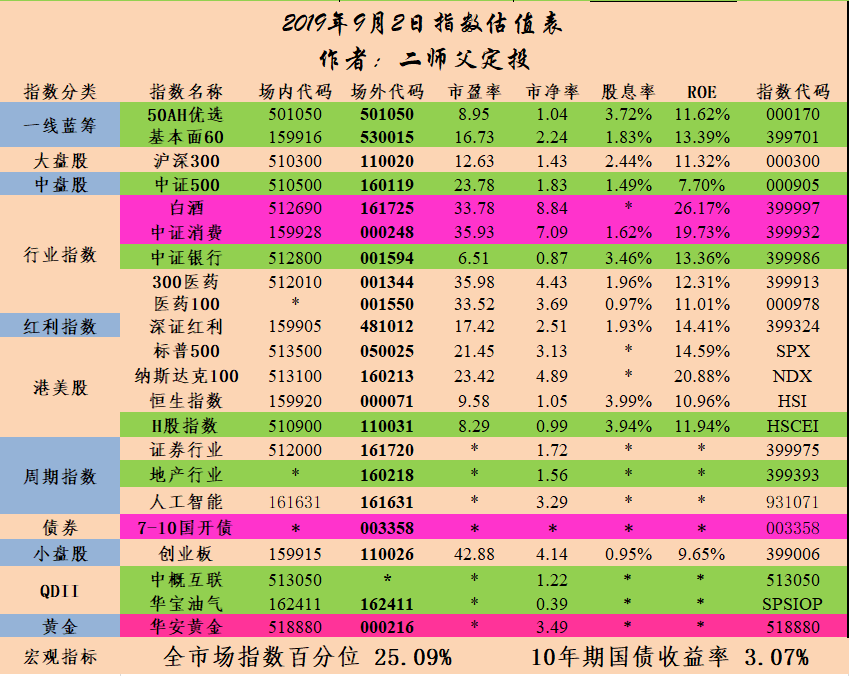

======================================================

_type: talk
@二师父[28814221155551]
2019-09-03 03:16:31 Tue  
topic_id: 844111428115842

为什么选择更加低估的指数

阅读[2883]  评论[0]  赞[0] 

+++++++++++++++++++++++++++++++++++++++++++++++++++++

文件：
2019-09-03 03:16:16 Tue
文件大小：[26523]
28258422184251-为什么当前我会选择恒生国企等表现不好的指数，而不是消费和医药.docx

======================================================

_type: talk
@二师父[28814221155551]
2019-09-03 04:32:55 Tue  
topic_id: 544888451885484

<e type="hashtag" hid="145445584242" title="#估值讲堂#" /> 恒生国企的估值详解，市盈率指标近18年的估值分位是17.36%，这个仅供参考，不是估值主流，关键看几个数据。

当前市盈率是8.29，在11年和16年最低点的时候大概是6左右，所以当前是很低的。一个历史低点预计在7倍左右，但是十几年就出现了那么两次机会，不一定能等到，目前就是低估区域。

ROE为11%,综合看这个指标并不是最佳，但是考虑的第一要素是昂贵和便宜程度，其次才是成长指标。

股息率接近4倍，这已经完全高于一年定期和大多数货币基金的收益率，也就意味着即使指数不涨，股息分红也能够有这么高的收益率。

今年是港股的低估年，至于低到哪里不清楚，总之，不预测底部，低估的时候布局。

阅读[3638]  评论[0]  赞[0] 

======================================================

_type: q&a
@LaoYan[844448554448122]
2019-09-03 04:38:32 Tue  
topic_id: 422111258121528

@LaoYan

>  二师父，您好，将要发行的5GETF可以先建底仓，今后定投吗？

@二师父

>  中证5G指数是中证指数官网发布的指数，叫5G通信
>  
>  中证5G通信主题指数选取产品和业务与5G通信技术相关的上市公司作为样本股，包括但不限于电信服务、通信设备、计算机及电子设备和计算机运用等细分行业，旨在反映相关领域的A股上市公司整体表现。
>  
>  主要集中电信业务和信息技术，目前市盈率30倍以上，并不是一个很低的估值。
>  
>  对于一个标的要建立在充分理解的基础上才可以投资

阅读[3075]  评论[0]  赞[0] 

======================================================

_type: talk
@二师父[28814221155551]
2019-09-03 04:57:34 Tue  
topic_id: 111888145888512

<e type="hashtag" hid="225125488281" title="#关于学习#" />今天说点题外话，投资是为了什么，学习是为了什么。

不仅仅是为了挣钱，不仅仅是学到一点知识。而是学会认识世界的方法论，知道怎么取判断一个问题，知道怎么去做选择，取舍。

大家的问题集中在买什么基金，该不该买，这是学习的浅层，知识面。也就是怎么做，而不是为什么这么做。

学习能够带给我们什么：是在不断的探索和思考过程中给我们带来的征服知识的雄心，克服困难的勇气和百折不挠的毅力。这些知识可能以后都不记得了，而你学习这些知识的方法却伴随一生。这比你在股市赚多少钱重要的多。

二师父的逻辑和方法已经很清楚了，先从大的方向入手，有了整体的系统再深入学习判断，如果连一只基金的类型，持仓股票，如何估值的， 买入之后亏损的防御系统都不知道，来问我推荐基金也是没有必要的。

我发觉自己传递的方法也许有了一点问题，导致很多投资者更关注的是明天买什么，什么基金该不该买。这其实并不重要。

重要的是不管一次投资，你买入的逻辑是什么，即使投资失败，也是有用的，至少知道错在哪里，否则永远赚了亏了，并不知道为什么赚，其实你赚了钱，但也失去了再股市不断成长的机会。

股市是一道选择题，选择A基金投资，就放弃B基金投资，人生也是一道选择题，选择了北京，就要放弃武汉或者成度（你家乡的地方）。

核心原则是什么，是如何将资源最有配置，效益最大化。那问题来了，我怎么知道最大化。

方法1、过去预测未来，这是演绎。方法2、用理论指导，这是推理。

希望大家明白，第二种方法最有效。因为过去对了1000次，未来也有一次是不对的。涉及到基金的选择无非就几个理论，估值，成长、是否符合自己的投资系统。如果这种选择题做不好，在工作的选择，伴侣的选择，今后定居点的选择也会更加茫然。

今后，我会少给大家答案，引导大家思考自己选择，因为个人资源不同，怎么配置关键在于自己的分配。我的选择不一定对，但是我敢于相信自己的选择，即使错了，我也不会逃避，愿意承担责任。

要想自己做选择，自己做配置，第一要学习基本判断知识，第二要自信，第三要承担责任。这是人成长所必须经历的。坚持需要毅力，放弃需要智慧。如果一个人既能坚持，又善放弃，那真的很厉害了。

星球很多老师，关于学习方法这是我的浅见，若有不对之处，请批评指正。

@三峡情 at 2019-09-03 04:57:34 Tue

> 大道至简

----------

阅读[3938]  评论[1]  赞[0] 

======================================================

_type: q&a
@Dr. 邓[844185218554482]
2019-09-03 12:07:13 Tue  
topic_id: 111888148854542

@Dr. 邓

>  二师父，您好！我是刚加入的成员，想请教一下华宝油气：国际原油从最低点到现在指数也已翻倍，为何华宝油气越走越低，现0.39左右，怎么解释，谢谢🙏

@二师父

>  因为油气指数是重仓的与油气相关的美股，他的涨跌不仅与原油有关，还和美股有关

阅读[2901]  评论[5]  赞[0] 

======================================================

_type: q&a
@玄武[48512825154828]
2019-09-03 12:07:57 Tue  
topic_id: 544888458844224

@玄武

>  二师父最近中证银行和恒生指数在低估区域，想定投，推荐哪些基金指数？

@二师父

>  恒生指数还没有低估，目前低估的是中证银行和恒生国企

阅读[3200]  评论[4]  赞[0] 

======================================================

_type: talk
@二师父[28814221155551]
2019-09-04 03:34:54 Wed  
topic_id: 844111412441182

<e type="hashtag" hid="828154158452" title="#定投的四种模式#" /> 灵活运用各类定投模式和方法，选择适合自己的。

阅读[2810]  评论[0]  赞[0] 

+++++++++++++++++++++++++++++++++++++++++++++++++++++

文件：
2019-09-04 03:34:33 Wed
文件大小：[25511]
48548251545458-定投的四种模式.docx

======================================================

_type: talk
@二师父[28814221155551]
2019-09-04 03:49:40 Wed  
topic_id: 111888184182582

<e type="hashtag" hid="481211145528" title="#指数估值#" /> 恒生指数进入低估

@Hi·DD at 2019-09-04 03:49:40 Wed

> 好多指数涨了，市盈率反而低了[疑问]

----------

@速。冻 at 2019-09-04 03:49:40 Wed

> 盈利上涨导致估值被动下跌了

----------

@chenye at 2019-09-04 03:49:40 Wed

> 证券行业的市净率变动好大啊，什么原因啊？

----------

@杜志彪 at 2019-09-04 03:49:40 Wed

> 世事轮回，总于低估了，港股还是很有投资价值的，加入定投组合[微笑]

----------

@二师父 at 2019-09-04 03:49:40 Wed

> 这个行业波动性大

----------

@Hi·DD at 2019-09-04 03:49:40 Wed

> 二师父今天买了恒生，这个一份应该是很大份额吧，适合网格交易？

----------

@二师父 at 2019-09-04 03:49:40 Wed

> 可以，港股下跌也很厉害，慎重

----------

@Hi·DD at 2019-09-04 03:49:40 Wed

> 好，二师父应该是说了可能有60%的回撤

----------

阅读[3442]  评论[8]  赞[0] 

+++++++++++++++++++++++++++++++++++++++++++++++++++++

图片：
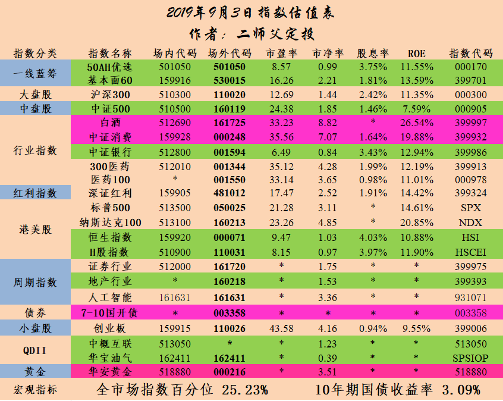

======================================================

_type: q&a
@杜志彪[544454124115854]
2019-09-04 04:21:02 Wed  
topic_id: 244111445515111

@杜志彪

>  二师父能提供一下中证保险167301目前的估值和估值阀值区间吗😀

@二师父

>  我没找到这个指数，只有两个中证证券保险指数，H30588,399966

阅读[2995]  评论[7]  赞[0] 

======================================================

_type: q&a
@李依祚[844148481122152]
2019-09-04 04:25:22 Wed  
topic_id: 844111448812412

@李依祚

>  师傅你好，中证TMT指数基金怎么样，现在可以定投吗

@二师父

>  中证TMT产业主题指数由TMT产业中规模较大、流动性较好的100只公司股票组成，反映A股上市公司中数字新媒体相关产业公司股票的走势。
>  
>  这个主题指数以信息技术和可选消费行业指数为主，目前信息技术和可选消费行业股票估值偏高。

阅读[3019]  评论[1]  赞[0] 

======================================================

_type: q&a
@速。冻[51415484228284]
2019-09-04 04:27:32 Wed  
topic_id: 111888118244122

@速。冻

>  二师父，地产指数目前是不是没有投资价值了？

@二师父

>  地产指数当前跌只是因为房地产政策，14，15年表现也很弱，16年市场松动表现很好。17年317限购到现在一直房地产行业一直处于弱周期
>  
>  这是国民支柱产业，仍然值得关注，周期指数证券确定性比地产确定性强，主要看对房地产的政策。

阅读[3205]  评论[8]  赞[0] 

======================================================

_type: talk
@志亮[422125851552828]
2019-09-04 10:40:47 Wed  
topic_id: 244111411884851

各位亲爱的基友们，银行板块开始回暖了[胜利]，你们前些天有没有参考二师父的实盘，把50AH换成中证银行了？

@Sunflower at 2019-09-04 10:40:47 Wed

> 没有两个都在定投

----------

@艾琪（王钥） at 2019-09-04 10:40:47 Wed

> 听二师父的话，银行定定投金额增大了一倍，50AH减少定投金额

----------

@美美 at 2019-09-04 10:40:47 Wed

> 我参考二师父的实盘，把50ha换成中证银行了

----------

阅读[2896]  评论[3]  赞[0] 

======================================================

_type: talk
@二师父[28814221155551]
2019-09-04 12:25:40 Wed  
topic_id: 244111411152451

<e type="hashtag" hid="881251425252" title="#鳄鱼计划#" /> 卖出医药etf一份，买入恒生指数一份，最大历史单边下跌幅度百分之60

风格切换，我总是买入表现差的，大多数人看到的是明天，而我愿意默默等待10年，潜力股往往看着平平

免责声明：本计划仅为二师父个人投资心得，不是跟投，不构成投资建议。读者根据本文及星球任何观点进行投资，须自行承担风险。

@冬夫 at 2019-09-04 12:25:40 Wed

> 恒生指数是穿透是投港股什么类型股票？

----------

@二师父 at 2019-09-04 12:25:40 Wed

> 大盘股

----------

@朝阳模具 at 2019-09-04 12:25:40 Wed

> 恒生指数目前总份额就一份？

----------

@二师父 at 2019-09-04 12:25:40 Wed

> 目前持仓是的

----------

@J at 2019-09-04 12:25:40 Wed

> 昨天把医药11%的利润收割了

----------

@二师父 at 2019-09-04 12:25:40 Wed

> 没问题的，先赢而后求大胜

----------

@美美 at 2019-09-04 12:25:40 Wed

> 二师父你好！你说的恒生指数是不是指华夏恒生ETF链接？

----------

@二师父 at 2019-09-04 12:25:40 Wed

> 那个是场内etf，这是场外的，本质一样

----------

阅读[3743]  评论[16]  赞[0] 

======================================================

_type: q&a
@朝阳模具[15528112482582]
2019-09-04 13:41:11 Wed  
topic_id: 544888822252224

@朝阳模具

>  二师父，进入星球半个月了，主要是想了解下鳄鱼计划的操作，比如现在有20万资金想做鳄鱼计划，这20万资金一般分成多少份，现阶段可以买入多少份。二师父能公开下自己的鳄鱼计划实盘吗？以便参考了解下

@二师父

>  多学习方法和思想，买入时点不同，同样的指数必然不同的收益率，最重要的不是我买了什么，而是为什么这样配置，为什么短线和长线结合，这些都需要理解的，不然到时候遇到大涨或者大跌很难控制自己，这也是我并未在公众号公布的原因，按照周期当前分成一年定投足够啦，需要定计划实践，实践的过程中会遇到很多问题
>  
>  免责声明：本回答仅为二师父个人投资心得，不构成投资建议。读者根据本文及星球任何观点进行投资，须自行承担风险。

阅读[2893]  评论[0]  赞[0] 

======================================================

_type: q&a
@Sunflower[244185124281811]
2019-09-04 14:08:34 Wed  
topic_id: 111888822218582

@Sunflower

>  二师父你好，想请问如果黄金低估了是买黄金的基金好，还是买银行那种可以兑换黄金实物的纸黄金好呢？

@二师父

>  黄金链接基金比较好，流动性好，方便，和黄金走势是基本吻合的
>  
>  纸黄金需要开通黄金存折账户，他的优势在于可以通过凭证换取实物黄金，而黄金不能带来现金流，不属于资产，除了黄金首饰，没必要持有黄金实物，并不保值
>  
>  免责声明：本回答仅为二师父个人投资心得，不构成投资建议。读者根据本文及星球任何观点进行投资，须自行承担风险。

阅读[2951]  评论[0]  赞[0] 

======================================================

_type: q&a
@幻水[881185412112]
2019-09-04 16:24:55 Wed  
topic_id: 422111145542548

@幻水

>  我2018年10月左右买了两个基金，各买了10万元，分分别是：标普港股通低波红利C(005052)，港股通高股息低波（005702），这两个基金在年初的时候还有盈利，现在都亏损了。
>  我现在有10万元现金，想在以下四个基金选1个或2个加仓：请问选哪一个或二个啊？标普港股通低波红利C(005052)，港股通高股息低波（005702），易方达恒生国企ETF（510900），银行ETF（512800）。还希望你能简单理由。

@二师父

>  港股的股息率都相对很高的，尤其是港股大盘股指数。
>  
>  这两个高股息没法体现他相对于港股的绝对优势。低波动策略比较稳健，长期看，这种SMART策略很多对标普通指数长期反而跑不赢。
>  
>  恒生国企属于港股大盘，当前因为外部因素估值已经很低了，需要防范港股股灾的风险。
>  
>  银行指数属于四个中最稳健的，分红也较高，目前的估值和18年底部的差不多，但是价格要高成长性不错。
>  
>  免责声明：本回答仅为二师父个人投资心得，不构成投资建议。读者根据本文及星球任何观点进行投资，须自行承担风险。

阅读[3094]  评论[0]  赞[0] 

======================================================

_type: talk
@老孙头[422115118524548]
2019-09-04 22:27:02 Wed  
topic_id: 244111188524121

有高手认为，本轮(大盘)“最后的狂欢”，也就“2～3天”了。对定投策略有何影响(大概率的话)？

@志亮 at 2019-09-04 22:27:02 Wed

> 最近的狂欢？这什么意思？

----------

阅读[2710]  评论[1]  赞[0] 

======================================================

_type: q&a
@佳[844145484515482]
2019-09-04 22:30:32 Wed  
topic_id: 244111151848511

@佳

>  二师父，今年4月份在高位的时候买了中证计算机指数c（001630，低位有补过一次仓位，今天终于收益率获利2%了，不知道该如何处理？是不是该全卖了？

@二师父

>  中证计算机指数以在深交所和上交所上市且满足入围标准的分属于信息技术行业的A股为样本空间，选取一段时期（前6个月）平均总市值的比重、平均自由流通市值的比重和平均成交金额的比重综合排名前100名的股票构成样本股。
>  
>  总体持仓以信息技术行业的股票为主，信息技术行业的估值是相对偏高的。而对于计算机指数，当前市盈率40.15，中位数大概是37，处于正常偏高的位置。ROE当前是7%，盈利相对较弱，投资概念股是亏损的源头。股息率也很低，仅为0.67%，远远低于A股常见的宽基指数。

阅读[2843]  评论[2]  赞[0] 

======================================================

@二师父[28814221155551]
2019-09-04 23:02:12 Wed  
topic_id: 544888828141424

>  @二师父
>  

阅读[2998]  评论[0]  赞[0] 

======================================================

_type: q&a
@Sunflower[244185124281811]
2019-09-04 23:06:10 Wed  
topic_id: 244111188844811

@Sunflower

>  二师父你好，我按照你当初建议的中证红利养老基金定投策略做了点改变，5万分几次在明年1月份之前定投完作为底仓，现在有3万多，这两天涨了不少，我一次投5000，明天是依旧投进去，还是等后面震荡跌下去的时候投呢？不知道后面会不会震荡，震荡还会不会比现在低，谢谢二师父指点

@二师父

>  红利基金在3000点以下定投是安全的，后面会不会震荡不好说，总之仓位控制以自己心情平静为宜。如果仓位并不让你感到恐惧，可以按照原计划定投。
>  
>  免责声明：本回答仅为二师父个人投资心得，不构成投资建议。读者根据本文及星球任何观点进行投资，须自行承担风险。

阅读[3088]  评论[3]  赞[0] 

======================================================

_type: talk
@海盗[48248118584848]
2019-09-05 01:17:03 Thu  
topic_id: 422111188128558

<e type="hashtag" hid="225118152481" title="#指数基金均线偏离表#" />

@海盗 at 2019-09-05 01:17:03 Thu

> 谢谢二师父

----------

@J at 2019-09-05 01:17:03 Thu

> 设立了一个原则：-2及以下才买进[得意]

----------

@西男 at 2019-09-05 01:17:03 Thu

> 请教海盗：偏离表中的百分比是如何得来的？

----------

@西男 at 2019-09-05 01:17:03 Thu

> 请问人工智能指数增加的是哪一个基金？求场内代码

----------

@海盗 at 2019-09-05 01:17:03 Thu

> 可以

----------

@海盗 at 2019-09-05 01:17:03 Thu

> 根据基金90日均线得来的，具体也可以搜索查阅以前的

----------

@海盗 at 2019-09-05 01:17:03 Thu

> 二师傅的估值表里面有呀

----------

@西男 at 2019-09-05 01:17:03 Thu

> 嗯，我找到数据算出来了，谢谢

----------

阅读[3028]  评论[13]  赞[1] 

+++++++++++++++++++++++++++++++++++++++++++++++++++++

图片：
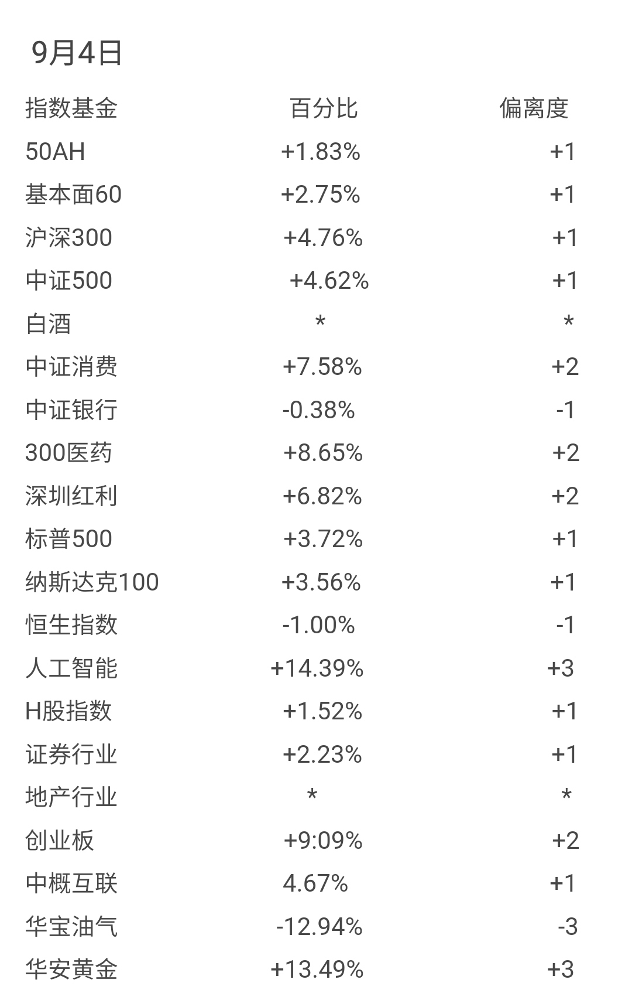

======================================================

_type: talk
@二师父[28814221155551]
2019-09-05 03:55:27 Thu  
topic_id: 544888815248444

<e type="hashtag" hid="481211145528" title="#指数估值#" /> 绿色是低估的，橙色是正常估值，红色是高估的。恒生指数今天涨了又进入正常估值了

@淘淘 at 2019-09-05 03:55:27 Thu

> 二师傅这个高估低估的线是怎么画出来的呢

----------

@What if at 2019-09-05 03:55:27 Thu

> 二师父，上半年投的富国中证红利指数增强（100032）是不是可以参照估值表里的深证红利啊？

----------

@暖暖 at 2019-09-05 03:55:27 Thu

> 老师，中证500都不低估了么。

----------

@二师父 at 2019-09-05 03:55:27 Thu

> 根据阈值，一般调整了会公布

----------

@二师父 at 2019-09-05 03:55:27 Thu

> 这个不行哈，目前中证红利是低估的

----------

@二师父 at 2019-09-05 03:55:27 Thu

> 不低估了

----------

阅读[3814]  评论[6]  赞[0] 

+++++++++++++++++++++++++++++++++++++++++++++++++++++

图片：
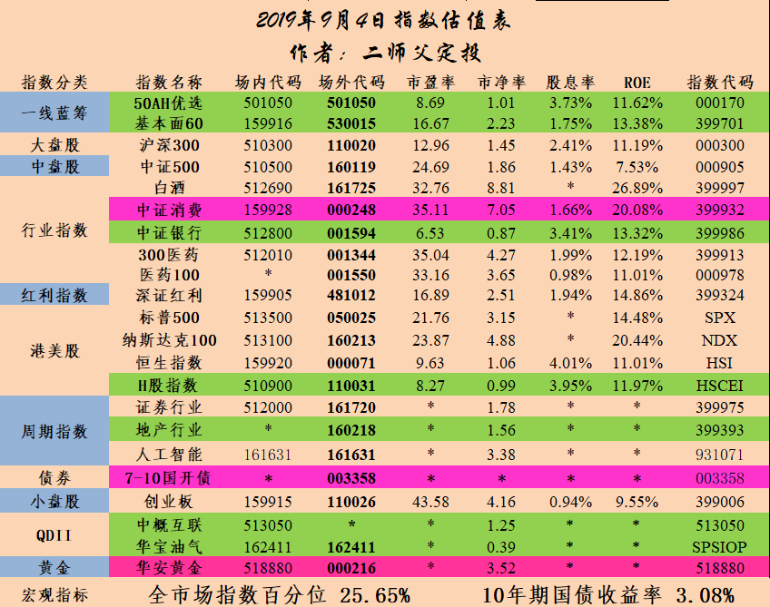

======================================================

_type: talk
@二师父[28814221155551]
2019-09-05 03:57:47 Thu  
topic_id: 111888854218852

为什么亏钱的总是你，从本源上去思考问题。

@淘淘 at 2019-09-05 03:57:47 Thu

> 干了这碗鸡汤，二师傅总是提醒我们保持冷静和理性

----------

阅读[3428]  评论[1]  赞[0] 

+++++++++++++++++++++++++++++++++++++++++++++++++++++

文件：
2019-09-05 03:56:00 Thu
文件大小：[26343]
88258442221212-为什么亏钱的总是你.docx

======================================================

_type: talk
@二师父[28814221155551]
2019-09-05 04:37:34 Thu  
topic_id: 244111182518141

<e type="hashtag" hid="458184251418" title="#203期定投实盘#" />定投实盘选的指数相对稳健，但覆盖全面，投资稳健第一，赚钱第二。投资份数0.75份，越涨我们的定投份数就会越少了。

 免责声明：本实盘仅为二师父个人投资心得，非跟投，不构成投资建议。读者根据本文及星球任何观点进行投资，须自行承担风险。

@JOY at 2019-09-05 04:37:34 Thu

> 师父，您说恒生正常估值了，那为什么还买入呢？

----------

@二师父 at 2019-09-05 04:37:34 Thu

> 涨了之后才进去正常估值的

----------

@速。冻 at 2019-09-05 04:37:34 Thu

> 恒生指数与买的恒生国企是两个不同的指数

----------

@志亮 at 2019-09-05 04:37:34 Thu

> 二师父加上地产了。[微笑]

----------

@Hi·DD at 2019-09-05 04:37:34 Thu

> 我第一次知道基金也会有四五个点的涨幅[捂脸]

----------

@🐰Mandy at 2019-09-05 04:37:34 Thu

> 二师父基金都是场外定投吗？没有场内吗？

----------

@陈飞🤗 at 2019-09-05 04:37:34 Thu

> 你去看华宝油气，没有个4.5个点我都感觉有点不正常

----------

@Hi·DD at 2019-09-05 04:37:34 Thu

> 啥意思？现在我只看到一个多点？

----------

阅读[4194]  评论[25]  赞[0] 

+++++++++++++++++++++++++++++++++++++++++++++++++++++

图片：
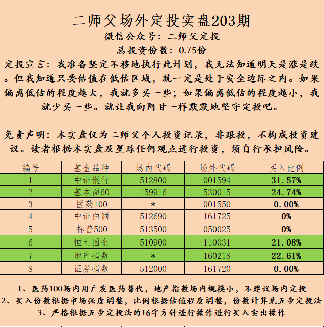

======================================================

_type: q&a
@玄武[48512825154828]
2019-09-05 05:02:18 Thu  
topic_id: 244111188452881

@玄武

>  二师父帮我看看富国中证新能源汽车161028和华宝海外中国成长混合（QDII）241001这两支基金目前的估值，市盈率等，目前小仓位持有这两支，亏损幅度新能源21个点，成长16个点，后续能有什么好的建议？

@二师父

>  新能源汽车市净率3.42，估值正常偏低。
>  
>  华宝海外这个没查到数据。

阅读[3481]  评论[0]  赞[0] 

======================================================

_type: q&a
@聪明的笨蛋[544858411212244]
2019-09-05 12:33:27 Thu  
topic_id: 244111182254451

@聪明的笨蛋

>  二师父场内定投溢价数据是否可以完全参照万得股票的溢价折价数据？

@二师父

>  这个可以的，集思录也行

阅读[2882]  评论[0]  赞[0] 

======================================================

@二师父[28814221155551]
2019-09-05 12:35:12 Thu  
topic_id: 844111184882812

>  @二师父
>  

阅读[3121]  评论[1]  赞[0] 

======================================================

_type: talk
@二师父[28814221155551]
2019-09-05 12:51:29 Thu  
topic_id: 422111154128448

<e type="hashtag" hid="881251425252" title="#鳄鱼计划#" /> 卖出券商一份，深红利一份，本计划仅为个人投资记录，非跟投和投资建议，投资有风险，大家根据本计划和星球任何观点投资需自行承担风险。

现在都盈利10个点以上了，投资无定法，能稳健赚钱的就是好方法

@朝阳模具 at 2019-09-05 12:51:29 Thu

> 一般来说，账户总资金会分成多少份？

----------

@🎈铮 at 2019-09-05 12:51:29 Thu

> 二师父这是我的持仓，想麻烦二师父分析下500和深红利建议卖不，为什么呢

----------

@二师父 at 2019-09-05 12:51:29 Thu

> 150到250

----------

@二师父 at 2019-09-05 12:51:29 Thu

> 可以收割利润，或者继续持有

----------

@韩气 at 2019-09-05 12:51:29 Thu

> 二师傅的#鳄鱼计划实盘如何搜索才能看到？我只在这里搜到讨论，另外您说的买入一份，卖出一份是多少？小白一个，见谅[尴尬]

----------

@二师父 at 2019-09-05 12:51:29 Thu

> 用学堂的搜索功能，这个份数是自己把总金额分出来的

----------

@玄武 at 2019-09-05 12:51:29 Thu

> 二师父鳄鱼计划是不是场内定投，和买卖股票差不多，可以时时买卖，需要时间比较自由的人操作？

----------

@二师父 at 2019-09-05 12:51:29 Thu

> 是的，关于场内和场外你可以看看置顶的介绍

----------

阅读[3885]  评论[12]  赞[0] 

======================================================

_type: q&a
@老司基[111852221242122]
2019-09-05 22:40:32 Thu  
topic_id: 111888844118222

@老司基

>  二师父，能点评一下睿远价值成长混合A（007119）这款基金吗？上市爆款，现在限购1000。

@二师父

>  混合基金，近一年涨的比较稳，不过我没法给他估值

阅读[2630]  评论[0]  赞[0] 

======================================================

_type: talk
@二师父[28814221155551]
2019-09-06 03:08:15 Fri  
topic_id: 421444428244148

<e type="hashtag" hid="225245851881" title="#关于卖出#" /> 卖出也是艺术。3000点以上，宽基指数就适合减半定投了

@Hi·DD at 2019-09-06 03:08:15 Fri

> 刚开始定投的也需要减半吗？

----------

阅读[2618]  评论[1]  赞[0] 

+++++++++++++++++++++++++++++++++++++++++++++++++++++

文件：
2019-09-06 03:07:07 Fri
文件大小：[26819]
28258444124251-大盘3000点，盈利是否卖出.docx

======================================================

_type: talk
@二师父[28814221155551]
2019-09-06 03:09:25 Fri  
topic_id: 841555548455152

<e type="hashtag" hid="481211145528" title="#指数估值#" /> 估值在手，利润我有。买入和卖出主要都看估值。

绿色低估，橙色正常，红色高估。

阅读[3259]  评论[0]  赞[0] 

+++++++++++++++++++++++++++++++++++++++++++++++++++++

图片：
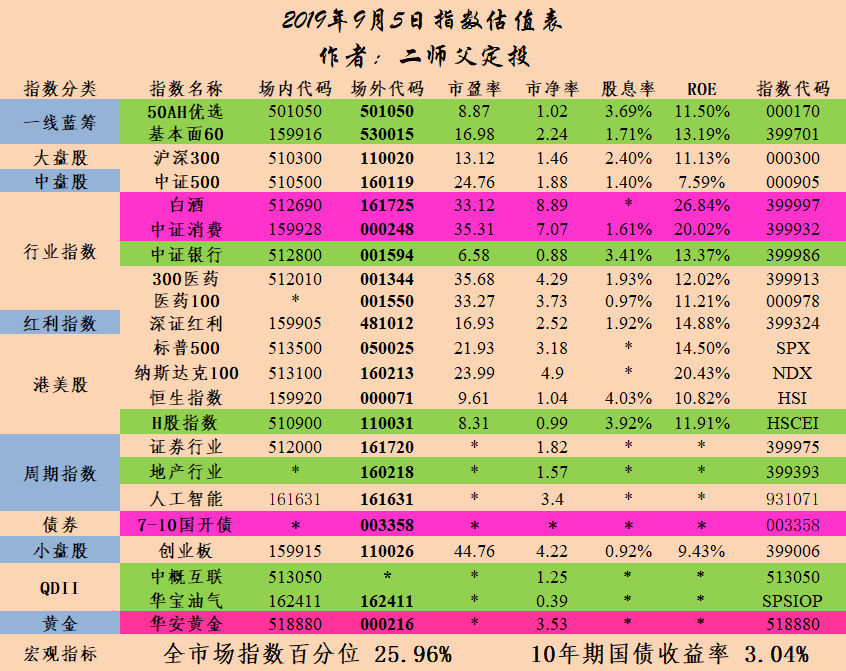

======================================================

_type: talk
@Shitou_li[15155885518252]
2019-09-06 09:05:34 Fri  
topic_id: 548222248251814

<e type="hashtag" hid="481211145528" title="#指数估值#" /> 能低估定投的标的越来越少，每月增量资金该怎样规划呢？谢谢

阅读[2383]  评论[0]  赞[0] 

======================================================

_type: q&a
@芳Fang[422111488554588]
2019-09-06 10:47:27 Fri  
topic_id: 118222215884552

@芳Fang

>  请问师傅场内代码在哪里能搜索到？

@二师父

>  在股票账户可以的

阅读[2394]  评论[0]  赞[0] 

======================================================

_type: q&a
@孙平[48548211154218]
2019-09-06 10:48:14 Fri  
topic_id: 841555542558122

@孙平

>  二师父，请问国泰国证航天军工指数基金有没有定投价值？

@二师父

>  周期指数，因为迎国庆短期涨的还不错

阅读[2411]  评论[0]  赞[0] 

======================================================

_type: q&a
@J[28281541518551]
2019-09-06 10:48:40 Fri  
topic_id: 841555541858882

@J

>  师傅好，请问目前有未用上的定投资金适合买入短债过渡吗

@二师父

>  货币基金即可，收益率差别不大的

阅读[2555]  评论[1]  赞[0] 

======================================================

_type: q&a
@幻水[881185412112]
2019-09-06 10:51:33 Fri  
topic_id: 548222248425514

@幻水

>  这个基金为什么多天在折价率都是负的，折价率是负的，是不是我以比净值高的价格买，就等于我买了就亏了百分之一点四几呢？如果考虑到它可以场外申购然后转场内，请问它折价率在哪一个范围里面是比较合理的？买了不算很亏。
>  另外请问H股etf，你觉得在哪一个价格以下买估值比较合理的？雪球上有人鼓吹H股ETF到了百年不遇的价格。请问你怎么看？

@二师父

>  一般溢价率不超过百分之一，当然这也看估值，如果基金绝对低估，高溢价也不会有特别大损失
>  
>  h股etf目前低估，距离历史大底部还有一段距离远，百年不遇就有点过了

阅读[2831]  评论[0]  赞[0] 

======================================================

_type: q&a
@11kuan[241545115251521]
2019-09-06 15:45:05 Fri  
topic_id: 421444418412518

@11kuan

>  二师父，想请教您煤炭等权指数现处于相对低点，其估值也是低估的吗？可以投资吗？

@二师父

>  煤炭、钢铁、军工、券商、地产都是强周期指数
>  
>  当前煤炭是低估的。

阅读[2684]  评论[0]  赞[0] 

======================================================

_type: talk
@二师父[28814221155551]
2019-09-06 15:59:10 Fri  
topic_id: 548222281154144

<e type="hashtag" hid="552485548284" title="#家庭资产配置#" /> 时不时地把家庭资产、资金规划下。资产主要是房产和股权类投资品。算一算每月房贷、车贷和支出以及收入，然后可以得出月结余。这是最需要规划的。

防守账户，我觉得放25万足够，买入货币基金，这笔钱不要动。用于应对意外。记住，有转行，换城市，换工作的，这个资金量就要大，保证2到3年不工作能活下去，这样的话即使一时没找到工作也能过得比较滋润。

稳健账户，投资基金，每月结余可以放到这里，先买入货币基金，然后等着投资的时候直接买。关于增量资金如何规划，划归到剩余投资的资金里面，配置好期限，预计定投到什么时间，然后定投份数确定好，用这个资金除以定投份数，就是自己的每份金额，这是一个动态的过程，因为有时候会有意外之财，高结余的朋友也会发现这个账户资金越来越大。

日用账户，如果每月收入完全覆盖所有支出，并且工作稳定，没有跳槽意愿的，这个账户不用了。

进攻账户，股票投资不适合普通投资者，不建议配置，当然有兴趣和精力研究的朋友可以学习学习，用10%的仓位投资。未来养老需求比较大，主要集中在60和70后，可以给自己准备一个养老账户，吃股息。保证晚年可以享受生活。

基金定投的稳健在于资金配置合理。希望大家多做配置，不要纠结一两个基金，格局要大，这是致富之道

@三峡情 at 2019-09-06 15:59:10 Fri

> 简单实用！继续努力

----------

@Sunflower at 2019-09-06 15:59:10 Fri

> 工作6年多养老个人账户才2万多，养老不能光靠国家，还得靠自己，好在我已经开始准备养老了[捂脸]

----------

@二师父 at 2019-09-06 15:59:10 Fri

> 有远见

----------

@J at 2019-09-06 15:59:10 Fri

> 我觉得这篇必须收藏一下[得意]

----------

阅读[3419]  评论[4]  赞[0] 

======================================================

_type: talk
@二师父[28814221155551]
2019-09-06 16:07:15 Fri  
topic_id: 118222281222482

我建议大家多分享多讨论，自己正确的操作，错误的操作，困惑的地方，时间长了很多困惑的问题也解决了，提问你会发现，我回答一个问题立马又有下一个困惑，这需要在不断地学习中才能慢慢消除的，不可能几个问题就让学会定投

@Hi·DD at 2019-09-06 16:07:15 Fri

> 一进市场就三千点，这才刚开始定投不到一成，眼看估值表的绿条越来越少，这两天硬气的把银行给加到三成，但总觉得哪里不太对[捂脸]这种情形是不是只能干瞪眼了

----------

@二师父 at 2019-09-06 16:07:15 Fri

> 有钱任性

----------

@Hi·DD at 2019-09-06 16:07:15 Fri

> 扎心了

----------

@What if at 2019-09-06 16:07:15 Fri

> 上半年投的，3200点的时候进去的，之后一路绿到头，这几天才刚刚追平，很多基金估值已经进入正常值了。感觉进去的点不对劲，是抛了等机会再重新进去，还是拿着，等低估继续投啊？

----------

@二师父 at 2019-09-06 16:07:15 Fri

> 好不容易积累的资产拿住了哈，卖飞了就糟了

----------

@What if at 2019-09-06 16:07:15 Fri

> 之前一直投了富国中证红利指数的，现在估值表不更新了，手上的基金怎么处理啊

----------

@rtdmm小米 at 2019-09-06 16:07:15 Fri

> 刚开始定投的时候，我错误地操作是没按原则买，结果是关灯吃面，一路修行之后再操作时严格按照低估定投的策略执行，结果是妥妥的盈利，而且现在心态极好，所以我想告诉新同学，如果你想买的指数基金没低估就等待和忍耐，不要着急，机会总会有的

----------

@二师父 at 2019-09-06 16:07:15 Fri

> 是否盈利呢，3000点以下可以一直投，以上可以持有或者收割利润

----------

阅读[2874]  评论[12]  赞[0] 

======================================================

_type: q&a
@仰望[15118155428812]
2019-09-06 16:46:26 Fri  
topic_id: 241555514588421

@仰望

>  二师父，准备投20w的货币基金，请问有什么推荐的基金吗？货币基金有什么参数可以作为参考吗？

@二师父

>  投资的基金见置顶文章两个实盘，里面比较详细
>  
>  货币基金主要看费率和万份收益以及稳定性

阅读[2873]  评论[0]  赞[0] 

======================================================

_type: talk
@liao[48588555425818]
2019-09-06 17:00:31 Fri  
topic_id: 548222284248454

有没有什么好的投资标可以代替余额宝的，收益太低了

@黎雄 at 2019-09-06 17:00:31 Fri

> 京东金融里面的银行定期存款

----------

阅读[2864]  评论[1]  赞[0] 

======================================================

_type: q&a
@光少[244124552511141]
2019-09-06 18:59:15 Fri  
topic_id: 241555514881841

@光少

>  二师父您好！请问基金到高估值收割利润时，是到了高估后开始10%计算收割利润，还是基金在正常估值刚进入高估就开始收割呢？比如说，在正常估值期间已达到10%利润我已收割了，又刚进入高估是否又要马上收割本金的20%？谢谢二师父！请分解

@二师父

>  一般指数基金从低估区域到高估区域会有70到120个点不等程度的涨幅，所以到高估区域是卖出本金，正常估值是收割利润
>  
>  当然如果指数长期涨幅好，比如医药，消费这种，可以不用收割利润，收割利润只是为了防止回撤

阅读[3001]  评论[1]  赞[0] 

======================================================

_type: q&a
@芳Fang[422111488554588]
2019-09-06 19:08:12 Fri  
topic_id: 241555514821151

@芳Fang

>  进攻账户，股票投资不适合普通投资者，不建议配置，当然有兴趣和精力研究的朋友可以学习学习，用10%的仓位投资。未来养老需求比较大，主要集中在60和70后，可以给自己准备一个养老账户，吃股息。保证晚年可以享受生活。 
>  请问师傅这样一个养老账户买什么股票比较好？以后可以长期养老吃股息

@二师父

>  不建议投资股票，优质的行业指数基金，常见的宽基指数，还有股息分红多的红利指数基金都是可以作为养老指数定投的

阅读[3112]  评论[2]  赞[0] 

======================================================

_type: q&a
@Priest(T泉V*[88812525585412]
2019-09-06 19:09:09 Fri  
topic_id: 421444412211888

@Priest(T泉V*

>  请问二师傅，刚发布降准的消息，对银行形成利好，之前没有定投银行，现在可以一次性建立底仓吗？还是可以开始定投？

@二师父

>  这个很早都已经开始定投了啊，目前银行仍旧低估的

阅读[3177]  评论[0]  赞[0] 

======================================================

_type: talk
@二师父[28814221155551]
2019-09-06 20:46:10 Fri  
topic_id: 241555511518481

今天发布降准啦，去年年末降过一次，结果你懂的，不做预测，踏实积累资产就好啦

@二师父 at 2019-09-06 20:46:10 Fri

> 之前已经加倍，我现在减额了

----------

@rtdmm小米 at 2019-09-06 20:46:10 Fri

> 请问二师父:减额是因为全市场指数百分位大于25%吗？

----------

@二师父 at 2019-09-06 20:46:10 Fri

> 嗯嗯，根据整体估值来

----------

阅读[3215]  评论[5]  赞[0] 

======================================================

   _type: talk
   @二师父[28814221155551]
   2019-09-07 03:36:11 Sat  
   topic_id: 241555852511151

   <e type="hashtag" hid="481211145528" title="#指数估值#" /> 消费进入正常估值。要相信轮回是存在的，当你忘记的时候去读读红楼梦，二师父的人生经历和所见之事告诉我，不仅股市，人生也是有周期的。所以我选择利用周期定投。

免责声明：本估值表仅为二师父个人投资记录，不构成投资建议。读者根据本估值表及星球任何观点进行投资，须自行承担风险。

   阅读[3846]  评论[0]  赞[0] 

+++++++++++++++++++++++++++++++++++++++++++++++++++++

图片：
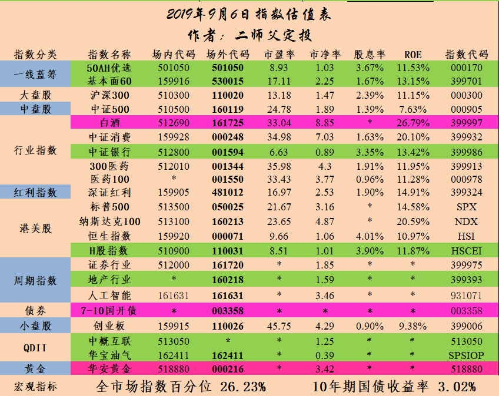

======================================================

_type: talk
@二师父[28814221155551]
2019-09-07 03:38:29 Sat  
topic_id: 421444845411128

<e type="hashtag" hid="458188582488" title="#央行降准了#" /> 降准是利好的，耐心等待吧。静待花开。

阅读[3977]  评论[0]  赞[0] 

+++++++++++++++++++++++++++++++++++++++++++++++++++++

文件：
2019-09-07 03:37:52 Sat
文件大小：[26017]
28258418118221-央行降低存款准备金率，对银行指数有何影响.docx

======================================================

_type: talk
@二师父[28814221155551]
2019-09-07 04:09:38 Sat  
topic_id: 241555852855151

<e type="hashtag" hid="145458855482" title="#周五读书#" /> 讲了讲书里面关于房子和股市的看法

@志亮 at 2019-09-07 04:09:38 Sat

> 你认为现在正是投资股市的最好机会，2800的时候错过了，现在3000也不迟，总不能等5000的时候才冲进去吧……那个风险太大了[微笑]

----------

@二师父 at 2019-09-07 04:09:38 Sat

> 正确

----------

@艾琪（王钥） at 2019-09-07 04:09:38 Sat

> 可以理解为未来十年的风口在股市

----------

阅读[4132]  评论[3]  赞[0] 

+++++++++++++++++++++++++++++++++++++++++++++++++++++

文件：
2019-09-07 04:09:16 Sat
文件大小：[24962]
28258418118441-《买入持有富有：一名金牛基金经理得投资之路》第一讲.docx

======================================================

_type: q&a
@玄武[48512825154828]
2019-09-07 11:23:04 Sat  
topic_id: 548222124212114

@玄武

>  二师父，目前我有20万稳健资金，如果现在开始跟随您定投指数基金，如何建仓，定投设为一年期的话，长短如何，还是三年？

@二师父

>  因为一轮熊市周期大概5年，如今已经熊了4年，如果保守点长一些，稳健点的话可以短一些

阅读[3365]  评论[0]  赞[0] 

======================================================

_type: talk
@树叶[544811512145144]
2019-09-07 12:13:54 Sat  
topic_id: 548222124544544

<e type="hashtag" hid="142825811122" title="#定投周报#" /> 二师父定投周报第24期

阅读[3381]  评论[0]  赞[0] 

+++++++++++++++++++++++++++++++++++++++++++++++++++++

文件：
2019-09-07 12:13:54 Sat
文件大小：[248929]
88258412851422-二师父定投周报9.7（第24期）.docx

======================================================

_type: talk
@二师父[28814221155551]
2019-09-07 14:09:17 Sat  
topic_id: 548222124851524

<e type="hashtag" hid="281181228851" title="#周末答疑#" /> 长期持有VS短期获利了结。

从原则上讲，需要长期持有，因为投资主要是挣企业盈利增长的钱，未来A股背后优质企业的高速增长是确定性的。所以需要长期持有才能够真正享受到复利。

问题的关键在于，A股经常有大波动，经常发生巨大回撤，不及时止盈容易有较大回撤。

那么怎么办。不用纠结到底长期持有和短期获利。大多数人思维非黑即白，认为自己如果不长期持有就是投机，这样有是偏颇。价值投资不意味着长期持有。价值投资意味着以远远低于股票价值的价格买入优质股票。然后耐心持有。

那么我们只要遵循一个原则：低估买入就是价值投资，至于卖出，我仍旧以中长期持有为原则，然后辅助一定小仓位的大波段操作。你看16年大盘3000多点，现在大盘仍旧3000多点，如果一直长期持有不卖，相当于三年是坐了过山车的。

当然，谁也不排除未来A股有可能发生美国那样的超级大牛市，一切皆有可能，如果那种机会出现了，拿着，长期持有10年，让财富翻滚。

@衣袂飘香 at 2019-09-07 14:09:17 Sat

> 最近的股市，是否可以理解为暂时告别震荡V型上行？如果是的话，是否要停止移动网格收割策略，改为安心持有，等基金到正常估值的时候再收割利润？

----------

@二师父 at 2019-09-07 14:09:17 Sat

> 要想大额利润是需要长期持有的

----------

@志亮 at 2019-09-07 14:09:17 Sat

> 我查了相关历史，长持不动胜过80%股民

----------

阅读[3985]  评论[3]  赞[0] 

======================================================

_type: talk
@二师父[28814221155551]
2019-09-07 18:30:04 Sat  
topic_id: 421444888581248

<e type="hashtag" hid="458188281228" title="#鳄鱼计划持仓#" /> 这是鳄鱼计划持仓，油气比较糟糕，等这次油气起来盈利之后将会放弃这个指数，布局好的耐心等待迎接牛市，可以来抄我的底，但别追高

@rtdmm小米 at 2019-09-07 18:30:04 Sat

> 二师父的医药，消费是长期持有？

----------

@二师父 at 2019-09-07 18:30:04 Sat

> 长期持有

----------

@速。冻 at 2019-09-07 18:30:04 Sat

> 一直对二师父的鳄鱼计划策略懵里懵懂，希望再讲讲

----------

@二师父 at 2019-09-07 18:30:04 Sat

> 好的

----------

@陌路花 at 2019-09-07 18:30:04 Sat

> 消费太牛了

----------

@淘淘 at 2019-09-07 18:30:04 Sat

> 怎么抄底，买中概互联吗？

----------

@J at 2019-09-07 18:30:04 Sat

> [强]师傅，恒生ETF是恒生指数还是恒生国企？

----------

@二师父 at 2019-09-07 18:30:04 Sat

> 恒生指数

----------

阅读[3480]  评论[17]  赞[0] 

+++++++++++++++++++++++++++++++++++++++++++++++++++++

图片：

======================================================

_type: talk
@二师父[28814221155551]
2019-09-08 02:41:05 Sun  
topic_id: 841555884854442

<e type="hashtag" hid="228188441521" title="#中证信息指数#" />

@妖孽 at 2019-09-08 02:41:05 Sun

> 信息技术真是刺激呀[呲牙]，大盘3288梭哈直接进去，最大浮亏19%，现在倒赚3%[呲牙]，现在得赶紧跑

----------

@二师父 at 2019-09-08 02:41:05 Sun

> 人民币贬值这么快，亏大了

----------

@妖孽 at 2019-09-08 02:41:05 Sun

> 重仓在二师父门下的低估优质指数大赚，定投太慢了，偶尔2700-2800，会开下黑车。信息技术这个是听信3500谣言才梭哈进去捞点油水在跑，结果栽了。

----------

@rtdmm小米 at 2019-09-08 02:41:05 Sun

> 买入时机很关键呢

----------

@志亮 at 2019-09-08 02:41:05 Sun

> 二师父，这次降准会复制一月份行情吗？

----------

@二师父 at 2019-09-08 02:41:05 Sun

> 不知道啊

----------

@佳 at 2019-09-08 02:41:05 Sun

> 我也是这样，认识二师父比较晚，听信别人也入了信息技术，趁着这次大涨，能够不亏钱就跑出来了

----------

阅读[3268]  评论[7]  赞[0] 

+++++++++++++++++++++++++++++++++++++++++++++++++++++

文件：
2019-09-08 02:40:42 Sun
文件大小：[26548]
51521485821824-5G和AI时代来临，聊聊中证信息指数的价值.docx

======================================================

_type: talk
@二师父[28814221155551]
2019-09-08 03:00:23 Sun  
topic_id: 841555884851252

<e type="hashtag" hid="145855118552" title="#周末答疑之鳄鱼计划的说明#" /> 先说说为啥会有两个实盘。

其实最开始投资的时候我是在支付宝投资的，然后发现这里费率比较高我就想选择了场内定投，就在证券账户买，主要是华泰和广发。当我在网上分享的时候，很多读者都建议开一个实盘便于大家学习。于是我在蛋卷开了场外定投实盘，场外周四定投。这样大家看到的我就有两个实盘了，后来天天基金搞一个实盘大赛，邀请我参赛玩玩，就转移到天天基金了，这就是大家目前看到的实盘。

主要投资鳄鱼计划为啥叫鳄鱼计划呢？因为这个计划很少动，就像鳄鱼一样才叫鳄鱼计划。很多人总想把投资买入顾定成一个套路，然后不定期买入就是定投，否则不叫定投。这其实错误的。真的高收益率在于选对标的，同时买入时机正确。

比方说，如果你今年年初1月买入，一个白酒，传媒，时机都对。可是明显后者比较差劲。

另外一个买入时机，同样的白酒，年初买和现在买差了80个点的收益率。

从这两者对比知道买入标的重要，买入时机也重要。

那么问题来了，如果从年初一次重仓的收益率比定投差吗？不会，一定比定投好。因为年初就是低点。鳄鱼计划就是找到这样的时机重点出击，其实份数倒是其次。

很多人的问题又来了，你怎么知道底部区域在哪里？当你在市场的时间久了，就对市场有感觉，这个感觉源于周围人的情绪，源于股市的估值数据，很多信息，比如指数的跌幅，指数的股息率，全市场指数百分位，国债收益率。所有综合判断基本可以确定底部区域，比如历史最大下跌幅度都只有10%的时候直接买入8成仓位，也是可以的.

那还有读者有问题，万一这不是底部呢？岂不是买早了，巴菲特都无法知道底部在哪里的，所以需要长期市场锻炼，能够经受住浮亏，买入了只要是优质的指数不管亏多少都拿的住，否则就不要做这种投资。

这是鳄鱼计划的本质，等待周期底部区域，加仓买入，这时候才是建立底仓的机会。相反，很多人追涨。

不要总是想着固定一个模式投资，投资真的不是1+1等于2，他是人性之战，你和所有股民包括机构的博弈，低估定投实盘这种操作可以保证一个平均的收益率，但是真的想取得超额收益

第一，选对标的，这个工作二师父可以做，第二、敢于底部重仓，这个得靠你自己，没多少人人敢在2000点的时候还往里冲的，你有100万，底部就买10万啥用也没有。第三、忍受的住浮亏，这个得靠你自己，不是每个人都能够经受住长达3年得浮亏得。不信咱们走着看。第四、拿得住，有的人浮亏能忍受，指数上涨反而拿不住，总怕回撤。真正大高收益一定是历史大牛市到来，取得翻倍得，那就需要耐心持有好几年得时间。

所以二师父能给你做的，就是每天分析指数得价值，增加优质得指数，淘汰劣质得指数，你需要做到，底部不恐惧，忍住浮亏不止损，拿得住，拥有容纳财富得胸怀。

这三点，只能靠自己修炼，如果你选用了我的指数还没有取得高收益，第一可能没有碰到18年那样得历史机会，第二就是这三点没做到。

大家对号入座吧。

不讲买什么，大家把最本质得东西搞清楚吧。

@rtdmm小米 at 2019-09-08 03:00:23 Sun

> 全是干货！

----------

@哈哈 at 2019-09-08 03:00:23 Sun

> 天天基金实盘搜索没看到啊老师

----------

@光少 at 2019-09-08 03:00:23 Sun

> 搜二师父实盘

----------

@J at 2019-09-08 03:00:23 Sun

> 喜欢这句：拥有容纳财富的胸怀。

----------

阅读[4048]  评论[5]  赞[0] 

======================================================

_type: talk
@二师父[28814221155551]
2019-09-08 15:26:12 Sun  
topic_id: 841555828445212

<e type="hashtag" hid="228188141581" title="#保险之新生儿疾病核保#" /> 投保之前的核保工作是很重要的，新生儿核保重点关注两类疾病，新生儿肺炎和新生儿惊厥。

新生儿肺炎：吸入性肺炎和感染性肺炎，吸入性肺炎由于吸入羊水、胎粪或乳汁引起的肺部化学炎症；新生儿感染性肺炎，是指致病微生物的入侵导致的肺炎

核保结论：若是治愈了，一般可标体承包。

惊厥，又叫做抽筋，抽风，惊风，抽搐。
表现为阵发性四肢和面部肌肉抽动，多伴有两侧眼球上翻，凝视或斜视，神志不清，口吐白沫或者嘴角牵动，呼吸暂停，面色轻紫，6岁以下的儿童发病会影响智力发育和健康。

惊厥分为热性、感染性、疾病性。小孩主要以热性惊厥为主，是一种伴发性疾病，伴发于感染性疾病发热期。

热性惊厥：原发疾病治愈，可以标准体承保
其他疾病，按照病因，不同情况需要加费或者拒保

在投保之前一定要如实健康告知，否则如果不符合健康告知的条件可能会影响后期理赔。

阅读[2991]  评论[0]  赞[0] 

======================================================

_type: talk
@二师父[28814221155551]
2019-09-08 19:10:28 Sun  
topic_id: 841555822224822

华尔街的牛被人砸了，这预示着美股要凉凉？

阅读[3019]  评论[0]  赞[0] 

+++++++++++++++++++++++++++++++++++++++++++++++++++++

图片：
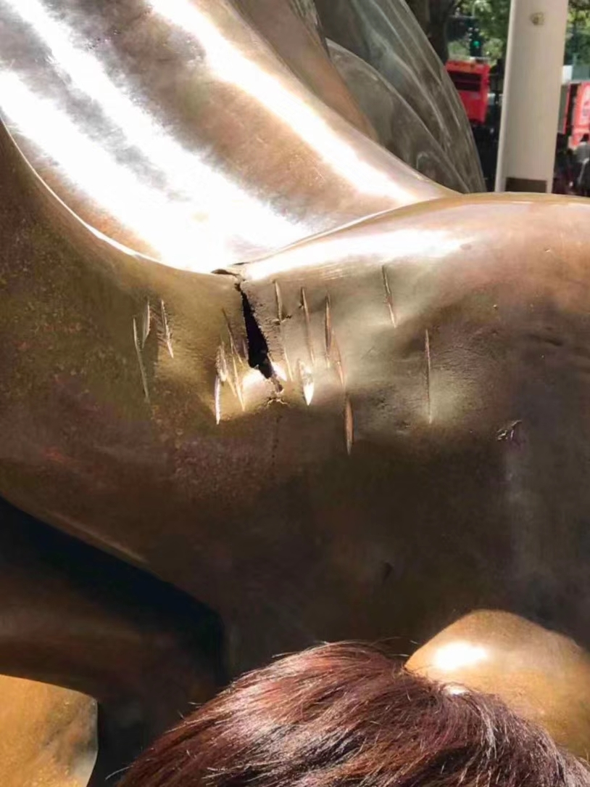

======================================================

_type: talk
@梧桐[844118451242512]
2019-09-08 21:00:26 Sun  
topic_id: 421444852444818

请教二师父，实物黄金并不保值这句话如何理解。

@二师父 at 2019-09-08 21:00:26 Sun

> 买实物黄金无法产生现金流，是贬值的

----------

@梧桐 at 2019-09-08 21:00:26 Sun

> 实物黄金可不可以低买高卖

----------

@二师父 at 2019-09-08 21:00:26 Sun

> 可以的，他和原油一样低买高卖赚钱。

----------

阅读[2987]  评论[3]  赞[0] 

+++++++++++++++++++++++++++++++++++++++++++++++++++++

图片：
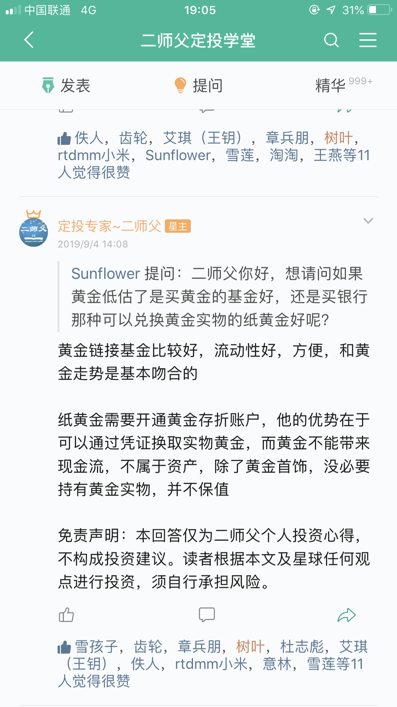

======================================================

_type: talk
@二师父[28814221155551]
2019-09-08 21:51:21 Sun  
topic_id: 118222548828182

<e type="hashtag" hid="458185444258" title="#一周市场分析#" />本周五连阳， 警惕。还记得18年年初的11连阳吗？

我能说的就这么多了。降准从严格意义上是利好股市的。因为相当于往市场释放资金。现在房市被锁住了，北京大部分房价下跌，购买意愿不足。

为什么。第一类购房人群，70末80初的改善购房，800万，首付大概650万，把之前买的卖了也不一定凑够，所以一部分抑制了他们的需求。

第二类购房人群，80末90初的刚需购房，一部分农二代或者家庭不够富裕的，150万上车首付太多，这一批购房需求被抑制。另外，90后追求自由，并不会被房子束缚，大多数是未婚主义者，或者丁克，所以购房意愿就没有那么强烈了。

那么未来资金只能流入实体经济和股市。抓住机会吧，创业很难，可是买入优质企业很简单，长期持有，中国经济发展必然带来一批长青的企业。

本分析仅为个人投资记录，不作为投资参考，投资者根据此文及星球任何观点投资需要自行承担风险。

@Hi·DD at 2019-09-08 21:51:21 Sun

> 所以，如果下来了是绝好的加仓机会？

----------

@二师父 at 2019-09-08 21:51:21 Sun

> 房子？

----------

@是喵喵吖～ at 2019-09-08 21:51:21 Sun

> 二师傅什么是连阳

----------

@二师父 at 2019-09-08 21:51:21 Sun

> 连着涨

----------

@Hi·DD at 2019-09-08 21:51:21 Sun

> 股票[捂脸]

----------

@是喵喵吖～ at 2019-09-08 21:51:21 Sun

> 哦哦

----------

@二师父 at 2019-09-08 21:51:21 Sun

> 是的哈

----------

@银河系 at 2019-09-08 21:51:21 Sun

> 本来打算明天买洋河和招行，那根据师父的建议是近期不要买是吗？过段时间会有比较好的机会是吗？谢谢

----------

阅读[3844]  评论[13]  赞[0] 

======================================================

@二师父[28814221155551]
2019-09-08 21:54:39 Sun  
topic_id: 118222548824252

>  @二师父
>  

阅读[3138]  评论[2]  赞[0] 

======================================================

_type: q&a
@与世无争[421844554514848]
2019-09-08 23:07:38 Sun  
topic_id: 241555845824521

@与世无争

>  老师我下载了天天基金，想跟您学习定投，但我在天天基金没有找到您的实盘？

@二师父

>  搜索二师父低估定投

阅读[3266]  评论[0]  赞[0] 

======================================================

_type: talk
@二师父[28814221155551]
2019-09-09 01:11:33 Mon  
topic_id: 548222142824414

投资要有大胸怀和大心脏，和知识水平无关，关乎一个人的眼界和格局。眼界决定了你看待事物的宽度，格局决定了你看待事物的高度。

没有理由不看好中国，更没有理由不看好中国企业，既然如此，我们购买的非常便宜的中国优质企业，那就拿住。

阅读[3409]  评论[0]  赞[0] 

+++++++++++++++++++++++++++++++++++++++++++++++++++++

文件：
2019-09-09 01:11:29 Mon
文件大小：[26774]
88258155282222-投资要有大胸怀与大心脏.docx

======================================================

_type: talk
@杜志彪[544454124115854]
2019-09-09 12:25:22 Mon  
topic_id: 841555841841142

昨天学了一下师傅发愣[偷笑]，发愣时琢磨，怎么百分之一百跑赢300指数，结果还真琢磨出来了[偷笑]，比如现在3000点一次性买入300ETF一万元，估值正常以上收割10%，保持本金不动，下跌到低估区域补齐本金（或者本金每减少10%就补齐本金），这样循环操作是不是就跑赢300指数了[微笑]

@行云流水 at 2019-09-09 12:25:22 Mon

> 低估是加倍定投的

----------

@J at 2019-09-09 12:25:22 Mon

> 这个不就是价值平均法吗？

----------

@杜志彪 at 2019-09-09 12:25:22 Mon

> 是的，如果配合低估定投，盈利会回报更大，我就是琢磨为什么我今年账户盈利落后300ETF。

----------

@杜志彪 at 2019-09-09 12:25:22 Mon

> 兄台是高手，我只是想把这个是分享刚接触定投的朋友们一起学习研究，我看回复中有的不懂什么是十一连阳，可能都是刚接触股市理财的新朋友。

----------

@J at 2019-09-09 12:25:22 Mon

> 这种方法对资金量的要求比较高，效果也是蛮好的，本质上也是师傅所提的越跌买进越多。互相学习，共同进步[握手]

----------

阅读[2941]  评论[5]  赞[0] 

======================================================

_type: q&a
@玄武[48512825154828]
2019-09-09 12:51:17 Mon  
topic_id: 421444821484288

@玄武

>  二师父，请问场外定投怎么没有，沪深300，中证500，创业板相关指数，都是蓝筹，行业指数，这样会不会有所偏颇？

@二师父

>  比较保险，场外就是给新手参考的，而且并不会偏，优质的蓝筹，优质的行业已经覆盖，我的场内定投有的，除了沪深300，其他的你说的都有投

阅读[3001]  评论[0]  赞[0] 

======================================================

_type: q&a
@J[28281541518551]
2019-09-09 12:59:45 Mon  
topic_id: 548222148128884

@J

>  师傅你好，现在港股很便宜，请问每周定投银行的份额能用50AH替代吗？

@二师父

>  能啊，50ah里面本来就有银行，可以替换的

阅读[3087]  评论[2]  赞[0] 

======================================================

_type: q&a
@Dr. 邓[844185218554482]
2019-09-09 13:00:29 Mon  
topic_id: 421444821852228

@Dr. 邓

>  定投学堂的每日估值表到哪里看，制定的那张还是八月份的？

@二师父

>  精华里面往期文章有

阅读[3356]  评论[0]  赞[0] 

======================================================

_type: talk
@二师父[28814221155551]
2019-09-09 14:36:07 Mon  
topic_id: 118222582228242

5G和人工智能代表未来的方向，可以关注下，地产如果一直是当前的风向标的话，后面周期指数的投资可以用这些替代

@速。冻 at 2019-09-09 14:36:07 Mon

> 5G有相关指数吗？估值不低吧

----------

@二师父 at 2019-09-09 14:36:07 Mon

> 有，先观察

----------

@青岛sunrise at 2019-09-09 14:36:07 Mon

> 不高即可。好行业的不高弹性好。

----------

@朝阳模具 at 2019-09-09 14:36:07 Mon

> 持有科技ETF

----------

@齿轮 at 2019-09-09 14:36:07 Mon

> 二师父也可关注一下教育产业

----------

@二师父 at 2019-09-09 14:36:07 Mon

> 好的

----------

@榕声竹影 at 2019-09-09 14:36:07 Mon

> 二师父，请问有专门跟踪科技指数的场外基金可以定投吗？选哪一只好呢？[抱拳]

----------

@二师父 at 2019-09-09 14:36:07 Mon

> 有的，不过目前科技指数估值不低哈

----------

阅读[3327]  评论[12]  赞[0] 

======================================================

_type: q&a
@梦[51522822251484]
2019-09-09 17:38:59 Mon  
topic_id: 421444814821288

@梦

>  请问景顺长城沪深300增强现在是低估吗？是否值得定投？

@二师父

>  是低估的哈，不过大盘已经上了3000点，比之前贵多了

阅读[3259]  评论[2]  赞[0] 

======================================================

_type: q&a
@醉流雨[422151445242248]
2019-09-09 19:57:26 Mon  
topic_id: 841555818848412

@醉流雨

>  我在支付宝平台基金转换的，3点之前操作的。请问明天的涨跌和转换部分有关么，？

@二师父

>  如果是三点之前转换的，那么你看下交易是以当日收盘价格成交，明天的涨跌就算新基金的

阅读[3267]  评论[0]  赞[0] 

======================================================

_type: talk
@黎雄[841555255485222]
2019-09-09 20:23:16 Mon  
topic_id: 841555814511842

今天咋没大涨呢，那么多利好

阅读[3113]  评论[1]  赞[0] 

======================================================

_type: q&a
@玄武[48512825154828]
2019-09-09 22:51:37 Mon  
topic_id: 841555814154252

@玄武

>  二师父，沪深300是不是可以替代中证银行和基本面60？

@二师父

>  是的哈，沪深300和中证银行以及基本面60有部分指数是重合

阅读[3240]  评论[0]  赞[0] 

======================================================

_type: q&a
@Dr. 邓[844185218554482]
2019-09-09 23:03:43 Mon  
topic_id: 118222588558222

@Dr. 邓

>  二师傅：1、每日估值表在哪里看啊，置顶那张关注8.28的，精华主题里也看不到啊！2、现在港股的中信证券、海通证券的价格只有A股60%左右，我们是否买港股更合算呢？谢谢！

@二师父

>  今天发布下，也给置顶，每天都会发布。
>  
>  港股目前相对a股是有折价，所以港股指数也投资比较多

阅读[3278]  评论[0]  赞[0] 

======================================================

_type: talk
@二师父[28814221155551]
2019-09-10 03:02:44 Tue  
topic_id: 241555255558221

<e type="hashtag" hid="481211145528" title="#指数估值#" /> 今日估值表，出现了风格轮动，有读者疑问，为什么场外实盘不配置创业板，中概互联等指数。这类指数波动大，我在公众号的估值表都没有展示，只在学堂公布，就是大家是愿意认真学习的。对于全面配置，二师父很认可，不过需要先学习，否则重仓了创业板或者油气类指数压力很大，也希望学堂读者先学习，不管是课程还是往期文章系统看一遍，这样的话投资才会比较稳健。

@妖孽 at 2019-09-10 03:02:44 Tue

> 麻烦二师父在分析下人工智能，这几天蹭蹭的往上蹿，没仓位心里憋屈呀！假如现在建仓3层，到低估有多少回扯。

----------

@二师父 at 2019-09-10 03:02:44 Tue

> 不要追涨

----------

阅读[3746]  评论[2]  赞[0] 

+++++++++++++++++++++++++++++++++++++++++++++++++++++

图片：
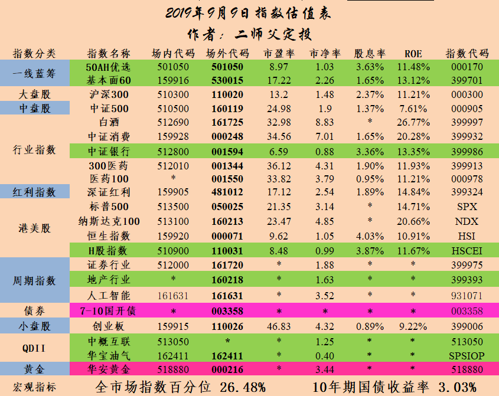

======================================================

_type: talk
@二师父[28814221155551]
2019-09-10 03:05:23 Tue  
topic_id: 421444544448288

<e type="hashtag" hid="481211145528" title="#指数估值#" /> 上证综合指数6连涨，定投坚持把，不做预测，如果仓位重的朋友，可以享受上涨或者收割利润啦。

本文仅为二师父个人投资心得记录，不构成投资建议，请知悉。

@闲云 at 2019-09-10 03:05:23 Tue

> 二师父看看易方达50目前是高估了吗？

----------

@二师父 at 2019-09-10 03:05:23 Tue

> 正常估值

----------

@齐俊波 at 2019-09-10 03:05:23 Tue

> 看了二师父这篇文章，心里清楚了不少。目前银行和中证500加起来占资金总量的5成，华宝油气占4成。资金余量不多了，坐等上涨📈。[微笑][微笑]

----------

阅读[3918]  评论[3]  赞[0] 

+++++++++++++++++++++++++++++++++++++++++++++++++++++

文件：
2019-09-10 03:03:55 Tue
文件大小：[26359]
28258158112121-上证综合指数6连涨，定投仍旧需要坚持.docx

======================================================

_type: talk
@林荫[15115451828452]
2019-09-10 08:11:32 Tue  
topic_id: 421444544522888

请问二师父，同一个人在华泰可以开两个户吗？开第二个户是否也有优惠佣金，还需要输入推荐码吗？

@凯 at 2019-09-10 08:11:32 Tue

> 不能

----------

@章兵朋 at 2019-09-10 08:11:32 Tue

> 不能有两个账户吧

----------

阅读[3045]  评论[2]  赞[0] 

======================================================

_type: q&a
@手牵手看夕阳[244112548184141]
2019-09-10 12:32:40 Tue  
topic_id: 548222524444214

@手牵手看夕阳

>  鳄鱼计划收割利润，是以手为单位收割吗，我买的500ETF买了两手，如果收割的话，直接收割一手吗？还是等到高估的时候再卖？

@二师父

>  至少收割一手啊，一手才500多呢

阅读[3180]  评论[3]  赞[0] 

======================================================

_type: talk
@二师父[28814221155551]
2019-09-10 22:12:01 Tue  
topic_id: 548222414582814

有读者付费提问，祝我节日快乐，感谢，问题就不用回答了哈。感谢大家

@黎雄 at 2019-09-10 22:12:01 Tue

> 感谢老师一路的陪伴，你就是我们理财道路上的一盏明灯，使我们少走弯路，少掉坑。最主要是不被套

----------

@hdmw99 at 2019-09-10 22:12:01 Tue

> 感谢老师，把自己辛苦所学，以最通俗易懂方式，传授给我们，既有理论知识又有实战指导。每一个我们花5分钟看完的内容，我感觉，是老师翻阅多本书，用几个甚至几十个小时消化总结出来的。能认识二师父，真是我的幸运

----------

@烟九•二手车 at 2019-09-10 22:12:01 Tue

> 感恩有你，愿二师父越来越优秀！安康喜乐顺！

----------

阅读[2729]  评论[3]  赞[0] 

======================================================

_type: talk
@二师父[28814221155551]
2019-09-11 03:51:03 Wed  
topic_id: 421444258844488

<e type="hashtag" hid="481211145528" title="#指数估值#" /> 指数估值表，黄金回踩1500支撑位，清仓，盈利20%。不贪婪，是我的原则，不管之后再涨到多高，都跟我没有关系了，等待下一次周期。

本估值表仅为二师父个人投资记录，非投资建议，读者根据估值表和星球以往任何观点进行投资都需要自行承担风险

@光少 at 2019-09-11 03:51:03 Wed

> 二师父你好！黄金卖出是外盘还是内盘？

----------

@Hi·DD at 2019-09-11 03:51:03 Wed

> 股票和基金账户是分开的，原本习惯了大盘一绿资金就会缩水的趋势，但是基金账户市值新高[捂脸]

----------

@二师父 at 2019-09-11 03:51:03 Wed

> 场外的

----------

@二师父 at 2019-09-11 03:51:03 Wed

> 因为我们买的优质指数，并不完全随大盘

----------

@Hi·DD at 2019-09-11 03:51:03 Wed

> 我看市场指数已经超过25点分位了，仓位三成还能整份定投吗？还是说最好0.5份呢？还有四十多份没用

----------

@二师父 at 2019-09-11 03:51:03 Wed

> 主要看仓位是否合理

----------

阅读[3157]  评论[6]  赞[0] 

+++++++++++++++++++++++++++++++++++++++++++++++++++++

图片：
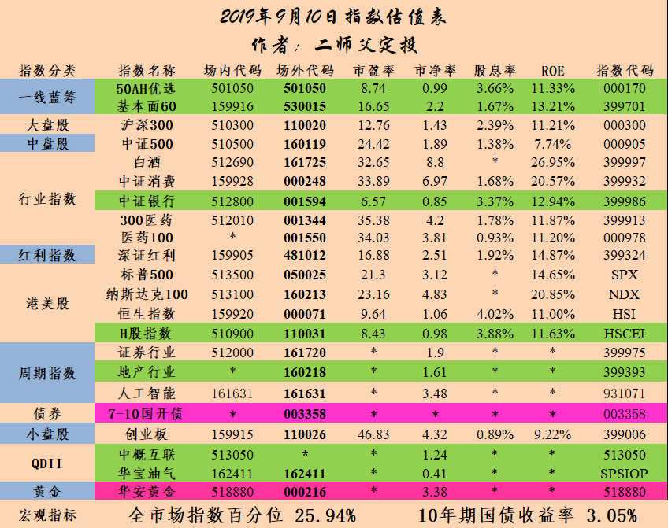

======================================================

_type: talk
@二师父[28814221155551]
2019-09-11 03:54:13 Wed  
topic_id: 421444258844418

<e type="hashtag" hid="225884245441" title="#配置#" /> 场外不进行中证500和创业板定投的原因

弄明白自己的投资风格和追求收益率，找到适合自己的指数定投

@What if at 2019-09-11 03:54:13 Wed

> 创业板的上周盈利清了，现在场外还有定投中证500，现在刚刚有盈利，要换成场内的吗？

----------

@柠小萌🍭 at 2019-09-11 03:54:13 Wed

> 二师父，请问一下，在场内进行定投可以吗？还是场内只适合鳄鱼计划？现在3000点以上，是不是就不适合鳄鱼计划了？

----------

@二师父 at 2019-09-11 03:54:13 Wed

> 看自己如何方便了

----------

@二师父 at 2019-09-11 03:54:13 Wed

> 场内定投什么计划都可以

----------

阅读[3491]  评论[4]  赞[0] 

+++++++++++++++++++++++++++++++++++++++++++++++++++++

文件：
2019-09-11 03:53:28 Wed
文件大小：[26745]
88258151145242-为什么场外定投没有选择中证500和创业板.docx

======================================================

_type: talk
@二师父[28814221155551]
2019-09-11 04:08:01 Wed  
topic_id: 421444258844258

<e type="hashtag" hid="881288554512" title="#基金分析#" /> 科技龙头515000最近涨的很不错，关于科技股指数，二师父不太建议新手投资者进行定投。因为波动也大。

这个基金主要持仓股票是恒瑞医药，海康威视，立讯精密，华兰生物。最近大涨也与医药股票大涨有关系。

目前这个指数才刚出来，无法追踪较长时间的估值情况，市盈率是偏高的，根据我们的定投原则，宁可错过，也别过错，不懂不做。建议观察为主。毕竟恒瑞医药和华兰生物等股票的估值已经接近高估了。

本文仅为二师父个人投资心得记录，非投资建议，读者根据星球任何观点进行投资需要风险自担。

@老孙头 at 2019-09-11 04:08:01 Wed

> 二师父，天弘中证电子指数如何？

----------

@二师父 at 2019-09-11 04:08:01 Wed

> 可以，目前正常估值

----------

阅读[3476]  评论[2]  赞[0] 

======================================================

_type: talk
@One[422118584812518]
2019-09-11 10:42:43 Wed  
topic_id: 421444255511528

白酒etf，跌幅3点几了，该不该买一点做个t呀？

@二师父 at 2019-09-11 10:42:43 Wed

> 估值不低

----------

@杜志彪 at 2019-09-11 10:42:43 Wed

> 坚持低估买入，实在忍不住就做单份网格吧，起码准备10份资金，一份一份的买，很舒服[偷笑]

----------

@志亮 at 2019-09-11 10:42:43 Wed

> 应该还有得跌，跌破60天均线就可以建仓了。

----------

@[123456789* at 2019-09-11 10:42:43 Wed

> 为什么是60日均线，可以解释下吗？谢谢！

----------

阅读[2615]  评论[4]  赞[0] 

======================================================

_type: q&a
@烟九•二手车[244185818522141]
2019-09-11 12:49:40 Wed  
topic_id: 241555422414181

@烟九•二手车

>  二师父，您好！想问下债券基金是不是比较稳？还是有低估和高估的区别？和货币基金有什么区别吗？

@二师父

>  短债基金稳一些，长债基金也有高估和低估之分，他并不保本，也有风险，货币基金是固定收益品种

阅读[2823]  评论[1]  赞[0] 

======================================================

_type: q&a
@背心[51441214442224]
2019-09-11 12:50:07 Wed  
topic_id: 548222454118884

@背心

>  消费ETF今天又跌了，低估没有，师傅

@二师父

>  没有那么快了，上周还是高估的

阅读[2905]  评论[0]  赞[0] 

======================================================

_type: talk
@二师父[28814221155551]
2019-09-11 12:53:47 Wed  
topic_id: 118222141515252

<e type="hashtag" hid="458185121228" title="#场外实盘#" /> 今天大盘跌，白酒消费都跌，投资的50ah银行恒生国企证券却是上涨的，风格总是轮动的，别看基金一时，且看他一世

开始收割券商11个点的利润了，不贪婪，自己舒服就好

本文仅为二师父个人投资心得记录，非投资建议，读者根据星球任何观点进行投资需要风险自担。

@老司基 at 2019-09-11 12:53:47 Wed

> 二师父，请问你证券是收割利索还是清仓？

----------

@乖子 at 2019-09-11 12:53:47 Wed

> 收割11个点是怎么收割？我的有25个点

----------

@二师父 at 2019-09-11 12:53:47 Wed

> 都说是收割利润啦

----------

@二师父 at 2019-09-11 12:53:47 Wed

> 之前没收的话，那就收25个点

----------

@乖子 at 2019-09-11 12:53:47 Wed

> 意思是把利润收割完

----------

@🎈铮 at 2019-09-11 12:53:47 Wed

> 二师父医药不卖么，看了您场内都50%收益率了，怎么能做到一直持有的呢[强]

----------

@三峡情 at 2019-09-11 12:53:47 Wed

> 二师父，请问天天基金卖过一次后利润显示就不对了，后续如果又投入了，怎么计算实际利润？

----------

@二师父 at 2019-09-11 12:53:47 Wed

> 保证合理的仓位

----------

阅读[3550]  评论[15]  赞[0] 

======================================================

_type: talk
@康[48581124158228]
2019-09-11 13:10:15 Wed  
topic_id: 118222141582812

华宝油气有些看不懂呢？场内和场外相差比较大呢？

@章兵朋 at 2019-09-11 13:10:15 Wed

> 油气还差一点回本，我4.2买的

----------

@康 at 2019-09-11 13:10:15 Wed

> 我的也是4.2左右回本

----------

阅读[2780]  评论[2]  赞[0] 

======================================================

_type: talk
@二师父[28814221155551]
2019-09-12 03:43:21 Thu  
topic_id: 241555415515141

<e type="hashtag" hid="481211145528" title="#指数估值#" /> 估值表，最近白酒和消费从高估进入正常估值了，慢慢等待，总会有机会的。

@远山 at 2019-09-12 03:43:21 Thu

> 高估低估好象轮动很频繁，不是说不要频繁操作吗？

----------

@二师父 at 2019-09-12 03:43:21 Thu

> 没有很频繁啊，中概互联好久没卖出了，盈利也不少

----------

阅读[3125]  评论[2]  赞[0] 

+++++++++++++++++++++++++++++++++++++++++++++++++++++

图片：
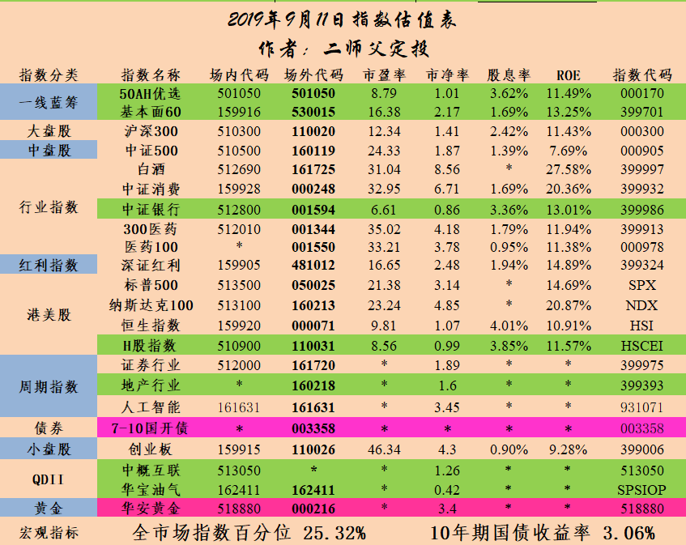

======================================================

_type: talk
@二师父[28814221155551]
2019-09-12 03:43:54 Thu  
topic_id: 421444214414118

<e type="hashtag" hid="145851241522" title="#市场轮动给我们的启示#" /> 市场轮动风格给我们投资有何启示

阅读[3309]  评论[0]  赞[0] 

+++++++++++++++++++++++++++++++++++++++++++++++++++++

文件：
2019-09-12 03:43:34 Thu
文件大小：[27020]
28258188282121-市场风格轮动，白酒跌银行涨，给我们定投有何启示.docx

======================================================

_type: talk
@二师父[28814221155551]
2019-09-12 03:54:05 Thu  
topic_id: 118222182285882

<e type="hashtag" hid="228181412141" title="#204期定投实盘#" /> 坚持本身也是一件幸福的事。万得A市盈率百分位25%以上，0.5份定投。

@老司基 at 2019-09-12 03:54:05 Thu

> 二师父，这2个指数现在适合建立底仓吗？

----------

@mumomo at 2019-09-12 03:54:05 Thu

> 同问二师父，进入学堂较晚，现在仓位较低，有两到三层仓位，这两只适合建立一部分底仓吗？或者说现在有总共几成仓位比较合适？

----------

@二师父 at 2019-09-12 03:54:05 Thu

> 这个仓位的建立看买入时机，要在低估才可以哈

----------

@二师父 at 2019-09-12 03:54:05 Thu

> 白酒不适合

----------

@老司基 at 2019-09-12 03:54:05 Thu

> 银行和恒生呢？

----------

@二师父 at 2019-09-12 03:54:05 Thu

> 最好定投

----------

@是喵喵吖～ at 2019-09-12 03:54:05 Thu

> 师傅请问一下你的一份是买入多少钱呀

----------

@速。冻 at 2019-09-12 03:54:05 Thu

> 二师父一份2000

----------

阅读[3486]  评论[9]  赞[0] 

+++++++++++++++++++++++++++++++++++++++++++++++++++++

图片：
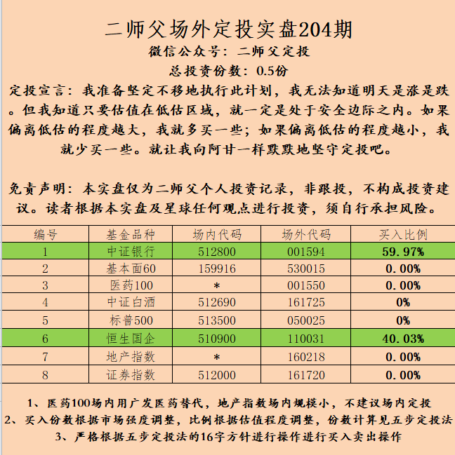

======================================================

_type: talk
@二师父[28814221155551]
2019-09-12 09:26:26 Thu  
topic_id: 421444218441828

学堂的朋友要把学习定投知识放在第一位，踏踏实实地学习估值，基金配置，哪些基金的波动性较大，哪些基金盈利比较稳定

一来仅仅想知道是否建立底仓，不错过市场机会，这样即使赚钱了，基本功也不扎实

@木子李 at 2019-09-12 09:26:26 Thu

> 支持楼上的，学了定投课程，但还是处于好像知道又好像不是很知道的状态[撇嘴]。想更加深入些讲解，比如举一个估值整个产生的过程，计算、参考的数据等等吧。麻烦师傅

----------

@二师父 at 2019-09-12 09:26:26 Thu

> 可以的

----------

@二师父 at 2019-09-12 09:26:26 Thu

> 好，我再课程里面在详细讲解下，最近三个月完善哈

----------

@二师父 at 2019-09-12 09:26:26 Thu

> 都会讲的，关注二师父荔枝微课直播间，更新就会通知

----------

@rtdmm小米 at 2019-09-12 09:26:26 Thu

> 磨刀不误砍柴工

----------

阅读[2561]  评论[13]  赞[0] 

======================================================

_type: talk
@二师父[28814221155551]
2019-09-12 09:40:28 Thu  
topic_id: 118222185288142

<e type="hashtag" hid="881251425252" title="#鳄鱼计划#" /> 卖出中概互联一份，始终保持盈利卖出

本计划仅为二师父个人投资心得记录，非投资建议和指导

@远山 at 2019-09-12 09:40:28 Thu

> 老师的鳄鱼计划一般持有多长时间卖出？

----------

@二师父 at 2019-09-12 09:40:28 Thu

> 不等原则上长期持有到牛市，也有小部分仓位结合震荡市场来进行操作

----------

@银河系 at 2019-09-12 09:40:28 Thu

> 请问老师卖出中概互联的逻辑是什么？目前中概互联不是处于低估（价格低于1.3—1.35）状态？

----------

@二师父 at 2019-09-12 09:40:28 Thu

> 第一仓位不轻，第二目前盈利，第三还有更为低估的基金

----------

阅读[3232]  评论[4]  赞[0] 

======================================================

_type: q&a
@怡明[828821154142]
2019-09-12 11:08:53 Thu  
topic_id: 241555418448441

@怡明

>  您好，老师，新加入星球，请问我应该怎样加入实盘定投？目前有1万可投入？从哪看实盘操作？

@二师父

>  在学堂搜索按钮搜索实盘即可

阅读[2644]  评论[1]  赞[0] 

======================================================

_type: q&a
@怡明[828821154142]
2019-09-12 15:38:30 Thu  
topic_id: 548222488251884

@怡明

>  您好，老师，我是新加入星球的，我是按您提供的估值低估的定投呢还是买入？谢谢了

@二师父

>  都是坚持长期定投的

阅读[2340]  评论[0]  赞[0] 

======================================================

_type: talk
@林荫[15115451828452]
2019-09-12 16:27:05 Thu  
topic_id: 241555411125851

请问现在入场，存量资金是一年投入好，还是长一点时间？

@是喵喵吖～ at 2019-09-12 16:27:05 Thu

> 可以选择 顶部的【提问】然后选择二师父 这样二师父能看到 你的问题

----------

@林荫 at 2019-09-12 16:27:05 Thu

> 哦，明白了，谢谢提醒!

----------

@是喵喵吖～ at 2019-09-12 16:27:05 Thu

> 不客气😊一起学习

----------

阅读[2231]  评论[3]  赞[0] 

======================================================

_type: talk
@二师父[28814221155551]
2019-09-12 16:43:54 Thu  
topic_id: 118222188815222

其实原油基金比油气追踪原油的精准度要高，不过他的成交额比较低，看看以后的发展

@Hi·DD at 2019-09-12 16:43:54 Thu

> 今天看了一篇文章说：华宝油气跟踪的是等权重指数，对大小石油公司一视同仁，不超配大公司，也不歧视小公司，雨露均沾。而广发石油跟踪的是加权指数，更喜欢财大气粗的大公司，大公司买的多，小公司买的少。所以在市场低迷期，广发石油的表现优于华宝油气。

----------

阅读[2372]  评论[1]  赞[0] 

======================================================

_type: q&a
@银河系[111814581215452]
2019-09-12 20:09:28 Thu  
topic_id: 421444144581558

@银河系

>  请问老师，有和招商产业债券业绩差不多的不受股市影响的纯债基金吗？
>  有的话麻烦推荐一下，目前A股三千点，想先买点债券基金过度下，谢谢

@二师父

>  没明白你的意思，什么不受股市影响？
>  
>  纯债有广发纯债，国开债

阅读[2361]  评论[2]  赞[0] 

======================================================

_type: talk
@梧桐[844118451242512]
2019-09-12 22:07:57 Thu  
topic_id: 841555152415452

请教二师父，今天50ah定投失败，是香港股市休市吗，还是别的原因

@速。冻 at 2019-09-12 22:07:57 Thu

> 港股通放假了

----------

@梧桐 at 2019-09-12 22:07:57 Thu

> 谢谢您

----------

阅读[2236]  评论[2]  赞[0] 

======================================================

_type: q&a
@林荫[15115451828452]
2019-09-13 02:52:48 Fri  
topic_id: 118222824184152

@林荫

>  请问现在入场，存量资金是一年投入好，还是长一点时间？希望二师父能分享一下关于目前点位的存量资金操作方法。

@二师父

>  一年差不多，但是需要减少定投份额，因为指数整体涨起来了
>  
>  按照一年分配，以3000点为中枢，高于3000低估指数正常定投，低于3000低估指数加倍定投
>  
>  本回答仅为二师父个人投资观点，非投资建议和指导，投资有风险，读者根据星球任何观点投资需风险自行承担

阅读[2246]  评论[0]  赞[0] 

======================================================

_type: q&a
@是喵喵吖～[421441114141158]
2019-09-13 02:53:23 Fri  
topic_id: 241555152412181

@是喵喵吖～

>  师傅请问这个收益值当的收割吗？是五六只基金加起来的

@二师父

>  收割是单个基金收割的，根据单个基金的收益率来决定收割的比例

阅读[2450]  评论[0]  赞[0] 

======================================================

_type: talk
@二师父[28814221155551]
2019-09-13 03:47:12 Fri  
topic_id: 421444142241558

<e type="hashtag" hid="481211145528" title="#指数估值#" /> 估值逐步上移，不要着急，按照既定的策略定投即可。

阅读[3215]  评论[0]  赞[0] 

+++++++++++++++++++++++++++++++++++++++++++++++++++++

图片：

======================================================

_type: talk
@二师父[28814221155551]
2019-09-13 03:52:36 Fri  
topic_id: 421444142241248

<e type="hashtag" hid="458154482128" title="#股市上涨的故事#" /> 2700点到3000点发生了什么

@烟九•二手车 at 2019-09-13 03:52:36 Fri

> 定期不定额买低估，每周固投一份，有下滑大的时候就再买0.5份进行加仓，目前仓位才两成，之前着急进入。现在心态慢慢转变，静待时机，慢慢积累，边学边用，提升自己财商，更重要的是提升职场价值。积累基础财富真的不容易，一方面消费习惯了大手大脚，一方面人情世故，更多的是供房供车，以前基本没剩余，现在每月节余多2000，再增加其他收入，生活越来越好！心态也更平稳不浮躁。

----------

@Yanzhen at 2019-09-13 03:52:36 Fri

> 那些错过的机会不属于你，从现在开始纪律定投👍

----------

阅读[3423]  评论[2]  赞[0] 

+++++++++++++++++++++++++++++++++++++++++++++++++++++

文件：
2019-09-13 03:51:39 Fri
文件大小：[26141]
88258181218412-2700点到3000点的故事.docx

======================================================

_type: q&a
@dongyan[118248124212812]
2019-09-13 09:11:17 Fri  
topic_id: 241555151542841

@dongyan

>  二师父好 看您的哪篇文章 才知道如何场内交易

@二师父

>  先用置顶文章的优惠链接开个户，然后我找专人教你

阅读[2587]  评论[0]  赞[0] 

======================================================

_type: talk
@门萨🐨[51411455828824]
2019-09-13 11:41:08 Fri  
topic_id: 548222828822214

㊗️各位球友中秋快乐🎉🎉

@梧桐 at 2019-09-13 11:41:08 Fri

> 门萨中秋快乐

----------

阅读[2688]  评论[1]  赞[0] 

======================================================

_type: talk
@葛亚丽[841858254128252]
2019-09-13 13:38:11 Fri  
topic_id: 118222852212222

在这里提问问题吗？

@葛亚丽 at 2019-09-13 13:38:11 Fri

> 现在哪只指数适合定投啊，二师父？

----------

@陈飞🤗 at 2019-09-13 13:38:11 Fri

> 绿色的都可以

----------

@葛亚丽 at 2019-09-13 13:38:11 Fri

> 谢谢🙏

----------

@二师父 at 2019-09-13 13:38:11 Fri

> 注意最后先别投周期指数

----------

阅读[2451]  评论[4]  赞[0] 

======================================================

_type: talk
@007[51511545424824]
2019-09-13 14:12:24 Fri  
topic_id: 841555185518452

二师傅我们定投指数基金估计对应大盘指数多少点位开始卖出呢能超过4500点吗？？

@二师父 at 2019-09-13 14:12:24 Fri

> 收割利润

----------

阅读[2432]  评论[1]  赞[0] 

======================================================

_type: talk
@二师父[28814221155551]
2019-09-13 15:41:42 Fri  
topic_id: 421444188112118

<e type="hashtag" hid="228125541851" title="#今日休息#" /> 投资是为了更好地生活，生活更加幸福，今天休息，适当享受生活的美好，也有利于平和心态的培养，大家节日快乐

@土木工程部 at 2019-09-13 15:41:42 Fri

> 老师节日快乐[微笑]圈友们节日快乐

----------

@J at 2019-09-13 15:41:42 Fri

> 师傅和球友们中秋节快乐！

----------

@梧桐 at 2019-09-13 15:41:42 Fri

> 祝二师父中秋快乐，投资顺利。

----------

阅读[2559]  评论[3]  赞[0] 

======================================================

_type: talk
@二师父[28814221155551]
2019-09-14 03:06:09 Sat  
topic_id: 421444182112828

<e type="hashtag" hid="551852141144" title="#投资理财的意义#" />

@Claire at 2019-09-14 03:06:09 Sat

> 理财来理生活，投资来投人生。师父的观念总是最精辟的。

----------

阅读[3111]  评论[1]  赞[0] 

+++++++++++++++++++++++++++++++++++++++++++++++++++++

文件：
2019-09-14 03:05:58 Sat
文件大小：[26256]
28258125824281-中秋节，聊聊投资理财的意义.docx

======================================================

@二师父[28814221155551]
2019-09-14 03:08:25 Sat  
topic_id: 241555184415881

>  @二师父
>  

阅读[2525]  评论[0]  赞[0] 

======================================================

_type: talk
@树叶[544811512145144]
2019-09-14 08:41:38 Sat  
topic_id: 241555181841521

<e type="hashtag" hid="142825811122" title="#定投周报#" /> 二师父定投周报第25期

阅读[2517]  评论[0]  赞[0] 

+++++++++++++++++++++++++++++++++++++++++++++++++++++

文件：
2019-09-14 08:41:20 Sat
文件大小：[246667]
88258125815842-二师父定投周报9.14（第25期).docx

======================================================

_type: q&a
@光少[244124552511141]
2019-09-14 14:59:54 Sat  
topic_id: 841555181542482

@光少

>  二师父你好！有那些健康保险可推荐的？

@二师父

>  重疾险有芯爱，主要特点是保额高，心血管疾病加倍保障，癌症二次赔付，65岁以后患特疾可以额外赔付。
>  <e type="web" href="https://cps.qixin18.com/m/lhz1029368/product/detail-103898-128311.html" title="产品详情-芯爱重大疾病保险" cache="" />
>  
>  医疗险有定心丸百万医疗，保险合同的保障期限是5年，并且5年内保费不变，当5年期届满，续保条款写明“不会因为被保险人个人的风险状况变化或已经产生理赔而拒绝投保人为被保险人继续投保”。
>  另外5年内共享1万免赔额，达到后，剩余年度无免赔额，这一点直接碾压市面其他百万医疗险，因为这种设计会更加的实用。
>  
>  举个例子，比如每年都因为一个小毛病需要住院几天，每次报销完就只花了8000块，要是一般的百万医疗险这5年一分钱都没办法理赔，但是如果是”定心丸“这款产品，就可以获得3万的理赔金额。
>  <e type="web" href="https://cps.qixin18.com/m/lhz1029368/product/detail-103798-128022.html" title="产品详情-安康欣悦医疗险" cache="" />

阅读[2341]  评论[0]  赞[0] 

======================================================

_type: q&a
@康[48581124158228]
2019-09-14 15:25:19 Sat  
topic_id: 421444181822288

@康

>  蛋卷的高端理财，私募基金靠谱不？

@二师父

>  不知道你的靠谱是什么意思
>  
>  18年雪球200多个私募盈利的就10来个人吧

阅读[2364]  评论[0]  赞[0] 

======================================================

_type: q&a
@陆修远[241588822852141]
2019-09-14 15:27:48 Sat  
topic_id: 548222851854554

@陆修远

>  二师傅，3个问题1.到哪里去查询股票，或者指数的市盈率百分位?
>  2.如何衡量股息率和净资产率好坏？
>  3.那个网站可以查询到所以的指数基金？

@二师父

>  1指数百分位查询在理杏仁
>  2，股息率一般越高分红越多，净资产收益率越大盈利越好
>  3，天天基金和蛋卷基金基本都可以了

阅读[2509]  评论[0]  赞[0] 

======================================================

_type: q&a
@陆修远[241588822852141]
2019-09-14 15:28:07 Sat  
topic_id: 548222851842544

@陆修远

>  1.什么是鳄鱼定投法？
>  2.什么是网格定投法？
>  3.还有什么5步定投法？

@二师父

>  这三个你看看置顶的文章都有介绍的哈

阅读[2635]  评论[0]  赞[0] 

======================================================

@二师父[28814221155551]
2019-09-14 16:37:51 Sat  
topic_id: 118222844288852

>  @二师父
>  

阅读[2707]  评论[0]  赞[0] 

======================================================

_type: talk
@葛亚丽[841858254128252]
2019-09-14 16:52:32 Sat  
topic_id: 548222855518554

老师好，50AH、中证银行这两个估值最低，定投这两个怎么样？

@二师父 at 2019-09-14 16:52:32 Sat

> 选择一个就行

----------

@妖孽 at 2019-09-14 16:52:32 Sat

> 选提问，这样二师父能第一时间看见回复你。
50AH和银行重合度比较高，二选一即可，或者选只基本面60

----------

@葛亚丽 at 2019-09-14 16:52:32 Sat

> 好的，谢谢老师

----------

@葛亚丽 at 2019-09-14 16:52:32 Sat

> 谢谢老师

----------

阅读[2784]  评论[4]  赞[0] 

======================================================

_type: q&a
@葛亚丽[841858254128252]
2019-09-14 20:58:40 Sat  
topic_id: 421444152445428

@葛亚丽

>  老师你好，之前买的保险健康无忧寿险附加重疾险，保额太低，想再买份重疾险，还能买吗？

@二师父

>  可以的，只要身体健康，符合健康告知的要求就可以

阅读[2828]  评论[0]  赞[0] 

======================================================

@二师父[28814221155551]
2019-09-14 21:16:08 Sat  
topic_id: 241555124552211

>  @二师父
>  

阅读[2959]  评论[0]  赞[0] 

======================================================

_type: talk
@二师父[28814221155551]
2019-09-15 03:06:34 Sun  
topic_id: 841555145141842

<e type="hashtag" hid="458154511828" title="#长期持有VS短期波段#" /> 长期持有为主，短期波段为辅

@Bruce at 2019-09-15 03:06:34 Sun

> 二师父，我是场外定投，波段仓位需要单独买C类基金？还有，回头看才知道什么时候是大波段，现阶段按估值正常收割利润吃小波段吗？最后，先波段收割利润的方法就是网格策略吗？

----------

@二师父 at 2019-09-15 03:06:34 Sun

> 收割利润是基础的指数定投方法

----------

阅读[3534]  评论[2]  赞[0] 

+++++++++++++++++++++++++++++++++++++++++++++++++++++

文件：
2019-09-15 03:05:57 Sun
文件大小：[26278]
28258122488481-长期持有VS短期波段.docx

======================================================

_type: talk
@二师父[28814221155551]
2019-09-15 03:08:51 Sun  
topic_id: 118222812818582

<e type="hashtag" hid="281181228851" title="#周末答疑#" /> 投资基金的配置。坚持低估的原则，然后选择低估指数基金里面盈利好的，股息率高的，过去10年时间表现稳健的。

估值表除了部分周期指数基金，其他的基本满足这个条件。所以新手投资者第一步是先看懂估值表和置顶的几篇文章再来提问。

@志亮 at 2019-09-15 03:08:51 Sun

> 喜欢白酒指数，准备重仓[微笑]

----------

@二师父 at 2019-09-15 03:08:51 Sun

> 目前估值不低

----------

@志亮 at 2019-09-15 03:08:51 Sun

> 嗯，目前在耐心等待，有机会再进[微笑]

----------

阅读[2982]  评论[3]  赞[1] 

======================================================

_type: q&a
@dongyan[118248124212812]
2019-09-15 11:04:42 Sun  
topic_id: 421444128414828

@dongyan

>  二师父 现在开始鳄鱼计划 买银行和恒生两个指数可以吗

@二师父

>  鳄鱼计划一般在全市场指数百分位25以上就停止了

阅读[2907]  评论[4]  赞[0] 

======================================================

_type: q&a
@葛亚丽[841858254128252]
2019-09-15 11:21:18 Sun  
topic_id: 241555148815151

@葛亚丽

>  老师早上好，听您讲课基金要轮动配置，牛市的时候买债券，熊市买股票，在漫长的熊市过程中是不是都不用购买债券基金了。还有您讲的要配置的三家中长期纯债券基金，我买的160618和 217022债券，里面也没有持仓股票，不是纯债券吗？

@二师父

>  周期性投资者的特点在于购买低估的资产，熊市的时候股票便宜，债券贵，所以在熊市的时候周期性投资者应该是注重股权资产的积累
>  
>  另外两只基金是纯债型基金

阅读[2972]  评论[0]  赞[0] 

======================================================

_type: q&a
@恋尘[51558584455824]
2019-09-15 20:13:33 Sun  
topic_id: 841555115544542

@恋尘

>  师父我想问下，我想在工商银行里面的贵金属和能源用网格交易买白银和天然气我看这两个波动还可以，你给个建议能行吗和基金相比哪个更容易赚点

@二师父

>  不熟不做，稳健的宽基指数背后企业盈利都是不断增长的，如果一个品种不懂，千万别买

阅读[2834]  评论[1]  赞[0] 

======================================================

_type: talk
@二师父[28814221155551]
2019-09-16 02:30:03 Mon  
topic_id: 841555118124822

如何实现基金的全面配置

阅读[2715]  评论[0]  赞[0] 

+++++++++++++++++++++++++++++++++++++++++++++++++++++

文件：
2019-09-16 02:30:20 Mon
文件大小：[23765]
48548152552258-如何实现指数基金的全面配置.docx

======================================================

_type: q&a
@YAO[28848244851581]
2019-09-16 02:32:38 Mon  
topic_id: 421444114548418

@YAO

>  沙特内政部14日称：当日凌晨，位于沙特的世界最大石油加工设施和1个油田被无人机袭击，并引起大火。这次袭击将加剧波斯湾地区的紧张局势。
>  这一事件近期是否会加剧华宝油气的上扬？

@二师父

>  一般供油紧张原油价格就会上涨，华宝油气和原油价格有70%的相关度，估计会有一定程度的上涨

阅读[2689]  评论[0]  赞[0] 

======================================================

_type: q&a
@榕声竹影[844118218251282]
2019-09-16 02:33:55 Mon  
topic_id: 548222882415124

@榕声竹影

>  二师父您好，请问如果低估的指数到正常估值后要停止定投，由于定投份额太少利润即使达到10%也不多，是否可以考虑把这个指数基金全部超级转换到仍在低估区的指数基金上继续定投？

@二师父

>  那也可以，转换的话是需要收取费率的，不如一直持有，因为正常估值的基金仍旧会上涨，不同指数基金的涨跌有一个轮动效应

阅读[2733]  评论[0]  赞[0] 

======================================================

_type: talk
@二师父[28814221155551]
2019-09-16 02:36:15 Mon  
topic_id: 118222885848422

<e type="hashtag" hid="825858222822" title="#本周市场分析#" /> 本周大盘涨幅还不错，得益于节日利好。

在这种大盘指数处于中等偏下位置的上涨，要注意别追加仓位。因为你不知道到底是真牛市还是一个短期上涨

做好配置，合理控制仓位，不管涨跌都冷静应对即可。

@老孙头 at 2019-09-16 02:36:15 Mon

> 请教——如果大盘有“阶段性调整”，对我们定投是何影响？

----------

@二师父 at 2019-09-16 02:36:15 Mon

> 往下调的话给我们更多积累低估资产的机会了

----------

阅读[3391]  评论[2]  赞[0] 

======================================================

@二师父[28814221155551]
2019-09-16 11:40:44 Mon  
topic_id: 548228521585214

>  @二师父
>  

阅读[2483]  评论[5]  赞[0] 

======================================================

_type: q&a
@林荫[15115451828452]
2019-09-16 11:41:27 Mon  
topic_id: 841551252451822

@林荫

>  二师父好，我交作业，课程中说的邮箱地址不太清晰，能重新发一下吗？

@二师父

>  你好，邮箱是ershifudt@126.com

阅读[2488]  评论[2]  赞[0] 

======================================================

_type: q&a
@怡明[828821154142]
2019-09-16 15:07:12 Mon  
topic_id: 548228524251414

@怡明

>  您好，老师，新加入星球的，想新入场，请问天天基金里有二师父定投实盘，我现在可以一键跟投吗？还是看每周四您的场外实投？场外实投里有没有划线的，我还备底仓吗？怎样才更合理？谢谢了

@二师父

>  场外定投在天天基金和星球都能看到，坚持定投风险小一些的
>  
>  底仓建立只有在市场相对低位才建立

阅读[2596]  评论[0]  赞[0] 

======================================================

_type: talk
@二师父[28814221155551]
2019-09-16 15:08:32 Mon  
topic_id: 241551251555581

油气涨了，价值回归只会迟到，不会缺席，继续坚守

@ajingge at 2019-09-16 15:08:32 Mon

> 快到成本线了[撇嘴]

----------

@心韵 at 2019-09-16 15:08:32 Mon

> 二师傅：现在从你的二维码进入，还有低佣开户吗？华宝政卷的股票和基金交易费是多少？与华泰相比那个好用？

----------

@烟九•二手车 at 2019-09-16 15:08:32 Mon

> 已收益10个点，是否可以收割一下呢？

----------

@二师父 at 2019-09-16 15:08:32 Mon

> 我用的华泰

----------

@二师父 at 2019-09-16 15:08:32 Mon

> 可以

----------

@心韵 at 2019-09-16 15:08:32 Mon

> 谢谢！明白

----------

阅读[2656]  评论[7]  赞[0] 

======================================================

_type: q&a
@学以致用[244415184181451]
2019-09-16 16:50:28 Mon  
topic_id: 241551285154141

@学以致用

>  二师父，我发现很多大V的配置、组合都没有跑赢沪深300，那为什么不直接买一支沪深300呢，这样多简单啊

@二师父

>  在低估区域直接买沪深300长期持有也是可以的，毕竟是中国规模最大的300家企业，非常稳健

阅读[2743]  评论[2]  赞[0] 

======================================================

_type: talk
@老孙头[422115118524548]
2019-09-16 23:20:51 Mon  
topic_id: 241551281124811

中金策略——港股指数如恒生国企指数周期性板块占比略高、且整体估值更低，短期反弹空间可能比A股指数略大。

阅读[2298]  评论[0]  赞[0] 

======================================================

_type: talk
@汉尼拔[552144155244]
2019-09-16 23:22:31 Mon  
topic_id: 421441581152158

握草，油气今晚目前为止8个点了。

@烟九•二手车 at 2019-09-16 23:22:31 Mon

> 亏？盈？

----------

@二师父 at 2019-09-16 23:22:31 Mon

> 已经13个了

----------

@汉尼拔 at 2019-09-16 23:22:31 Mon

> 盈10个点

----------

阅读[2421]  评论[4]  赞[0] 

======================================================

_type: talk
@二师父[28814221155551]
2019-09-17 03:51:19 Tue  
topic_id: 118228442411552

<e type="hashtag" hid="828128851522" title="#价值回归#" /> 今天谈的是油气，等待价值回归需要耐心。不过这个品种不是完全跟踪原油，后面会考虑盈利之后换成原油

@银河系 at 2019-09-17 03:51:19 Tue

> 期待二师父的原油波段操作计划

----------

@二师父 at 2019-09-17 03:51:19 Tue

> 很少做波段，价值投资需要耐心

----------

@衣袂飘香 at 2019-09-17 03:51:19 Tue

> 是的，我的盈利了。

----------

@美美 at 2019-09-17 03:51:19 Tue

> 二师父你好！现在还能不能定投华宝油气了？

----------

@二师父 at 2019-09-17 03:51:19 Tue

> 可以定投，要轻仓

----------

阅读[2598]  评论[5]  赞[0] 

+++++++++++++++++++++++++++++++++++++++++++++++++++++

文件：
2019-09-17 03:50:38 Tue
文件大小：[26048]
15425815142812-等待价值回归需要坚守的耐心.docx

======================================================

@二师父[28814221155551]
2019-09-17 03:52:35 Tue  
topic_id: 841551288851212

>  @二师父
>  

阅读[2640]  评论[0]  赞[0] 

======================================================

_type: q&a
@🎈铮[28284825441841]
2019-09-17 03:53:44 Tue  
topic_id: 548228511518154

@🎈铮

>  二师父，看了8月30号利润收割的文章，利润收割一次之后，下次该如何计算利润还是不会，求教

@二师父

>  也看仓位的，如果牛市来了也可以等等。
>  
>  机械收割的话，第一次盈利10%，收割百分之10，然后继续上涨，盈利20%，再收割10%，这样类推。

阅读[2683]  评论[1]  赞[0] 

======================================================

_type: q&a
@银河系[111814581215452]
2019-09-17 03:55:24 Tue  
topic_id: 421441585158118

@银河系

>  二师父您好，计划十万元（31份）买华宝油气。
>  请问目前买入的话，直接买14.2份吗？
>  以及价格高于0.62的话，是全部卖出吗？
>  谢谢。

@二师父

>  这是个强周期品种，不建议新手投资者买入，如果定投的话，也要记得轻仓。

阅读[2825]  评论[3]  赞[0] 

======================================================

_type: talk
@二师父[28814221155551]
2019-09-17 03:56:26 Tue  
topic_id: 118228442411152

<e type="hashtag" hid="481211145528" title="#指数估值#" /> 估值变化不大，市场不上不下，耐心等待吧

@银河系 at 2019-09-17 03:56:26 Tue

> 请问二师父，怎么判断7-10年国开债高低估？

----------

@阿真 at 2019-09-17 03:56:26 Tue

> 记的二师父讲过，低估3.8，高估3.2

----------

阅读[3519]  评论[2]  赞[0] 

+++++++++++++++++++++++++++++++++++++++++++++++++++++

图片：
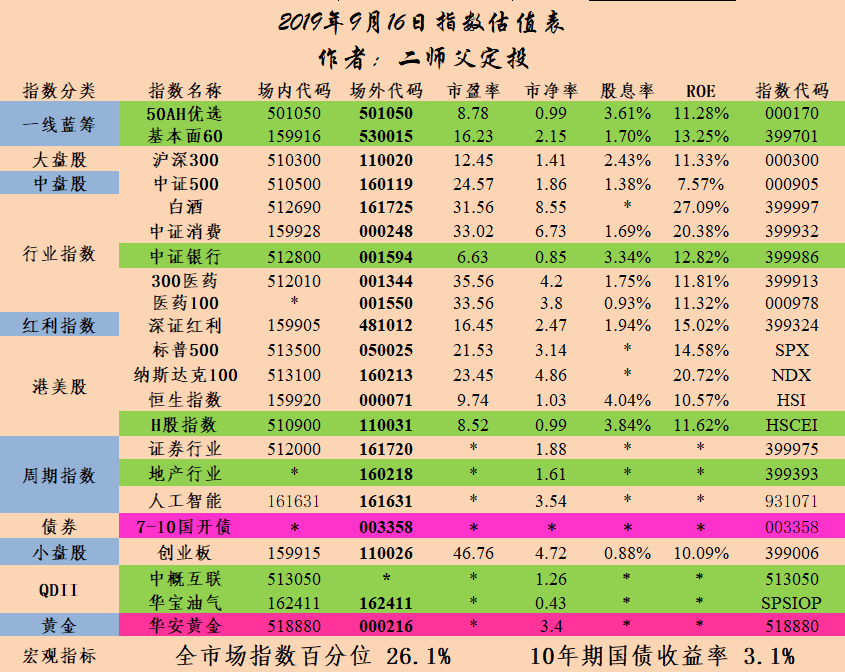

======================================================

_type: talk
@工具栏[244121288541111]
2019-09-17 10:03:42 Tue  
topic_id: 118228445184182

二师父  华宝油气现在盈利了 是不是可以抛掉了  我记得上次你说回本了以后以后就不炒这个了

@凯 at 2019-09-17 10:03:42 Tue

> 我们还没回本呢，有盈利可以减仓

----------

阅读[2612]  评论[1]  赞[0] 

======================================================

_type: q&a
@葛亚丽[841858254128252]
2019-09-17 12:55:19 Tue  
topic_id: 118228444241522

@葛亚丽

>  每一只指数的估值都不一样啊，在哪里能看到每只指数的估值界限呢？

@二师父

>  这个我今晚发一下

阅读[2610]  评论[0]  赞[0] 

======================================================

_type: talk
@二师父[28814221155551]
2019-09-17 13:15:25 Tue  
topic_id: 421441551545418

该收割就收割，不收割也可以，只要下跌不后悔就行

阅读[2562]  评论[0]  赞[0] 

======================================================

@二师父[28814221155551]
2019-09-17 13:16:49 Tue  
topic_id: 241551221252851

>  @二师父
>  

阅读[2708]  评论[3]  赞[0] 

======================================================

_type: q&a
@怡明[828821154142]
2019-09-17 18:54:03 Tue  
topic_id: 421441524285228

@怡明

>  请问老师，国泰中证生物医药ETF联接A，累计收益百分之16.43  汇添富创新医药混合累计收益百分之15.21，我应收割利润吗？谢谢了！

@二师父

>  没有收割的话可以收割收益率对应的利润

阅读[2309]  评论[3]  赞[0] 

======================================================

_type: q&a
@素兮[548121415528244]
2019-09-17 18:54:29 Tue  
topic_id: 421441524258858

@素兮

>  股息率多少算高，多少算低？

@二师父

>  一般来说，3.8个点以上算高，1.2个点以下算低

阅读[2468]  评论[0]  赞[0] 

======================================================

@二师父[28814221155551]
2019-09-17 19:38:48 Tue  
topic_id: 118228415522122

>  @二师父
>  

阅读[2667]  评论[2]  赞[0] 

======================================================

_type: talk
@树叶[544811512145144]
2019-09-17 19:56:22 Tue  
topic_id: 421441528588258

个人使用的excle投资利润收割表，有兴趣的朋友可以试试

@木子李 at 2019-09-17 19:56:22 Tue

> 来的及时[强][强][强]

----------

@树叶 at 2019-09-17 19:56:22 Tue

> 谢谢

----------

@奇迹相伴 at 2019-09-17 19:56:22 Tue

> 表格没有公式吗？

----------

@树叶 at 2019-09-17 19:56:22 Tue

> K列以后都是公式

----------

@是喵喵吖～ at 2019-09-17 19:56:22 Tue

> 谢谢 下下来学习一下

----------

@奇迹相伴 at 2019-09-17 19:56:22 Tue

> 我的电脑咋不显示有公式呀

----------

@树叶 at 2019-09-17 19:56:22 Tue

> 那你输入一下试试，看有无变化

----------

@树叶 at 2019-09-17 19:56:22 Tue

> 又发一次，再试试

----------

阅读[2903]  评论[8]  赞[0] 

+++++++++++++++++++++++++++++++++++++++++++++++++++++

文件：
2019-09-17 19:56:22 Tue
文件大小：[15139]
15425814884882-模板.xlsx

======================================================

_type: q&a
@素兮[548121415528244]
2019-09-17 21:33:31 Tue  
topic_id: 841551244241442

@素兮

>  您之前说过，当万得全A市盈率百分位在22.5%-25%时，买入0.5份。现在已经到了26%多，那么那些低估值的指数还适合进场定投么？定投的份数又怎么定合适？我刚刚关注这方面，还没建立仓位。

@二师父

>  现在比例调整了下，27.5到30，买入0.25份，25到27.5，买入0.5份，22.5到25，买入0.75份，20到22.5，买入1份。
>  
>  低估的指数都是可以定投的

阅读[2788]  评论[7]  赞[0] 

======================================================

_type: talk
@树叶[544811512145144]
2019-09-17 22:02:23 Tue  
topic_id: 841551244152452

excle投资利润收割表，可以一试

@🎈铮 at 2019-09-17 22:02:23 Tue

> 好东西，正是我所需，研究研究

----------

@是喵喵吖～ at 2019-09-17 22:02:23 Tue

> 超级好用呢！

----------

阅读[2925]  评论[2]  赞[1] 

+++++++++++++++++++++++++++++++++++++++++++++++++++++

文件：
2019-09-17 22:01:03 Tue
文件大小：[15144]
51521844112154-模板.xlsx

======================================================

_type: q&a
@葛亚丽[841858254128252]
2019-09-17 22:15:56 Tue  
topic_id: 241551244214141

@葛亚丽

>  二师父好，估值区间在哪里看啊？

@二师父

>  今天公布下

阅读[2926]  评论[0]  赞[0] 

======================================================

_type: q&a
@康[48581124158228]
2019-09-17 22:16:20 Tue  
topic_id: 548228544812454

@康

>  华宝油气9月16号场内上涨4.29%，但是9月16号场外却上涨了10.36%呢？两者相差这多大呢？

@二师父

>  收盘净值参考的时间点是不同的

阅读[3078]  评论[4]  赞[0] 

======================================================

_type: talk
@二师父[28814221155551]
2019-09-17 22:37:01 Tue  
topic_id: 548228548214844

<e type="hashtag" hid="481211145528" title="#指数估值#" /> 估值表9月17，最后一列是指数的阈值

@速。冻 at 2019-09-17 22:37:01 Tue

> 今晚这么早

----------

@朝阳模具 at 2019-09-17 22:37:01 Tue

> 银行的估值不参考PB？

----------

@二师父 at 2019-09-17 22:37:01 Tue

> pe和pb都可以

----------

@JOY at 2019-09-17 22:37:01 Tue

> 师父，一直有个疑问：咱们实盘定投的恒生国企为什么不放估值表呢？

----------

@二师父 at 2019-09-17 22:37:01 Tue

> 恒生国企指数就是H股指数哈

----------

@JOY at 2019-09-17 22:37:01 Tue

> 哦，哦，代码是一样的～晕～谢谢～

----------

阅读[3796]  评论[6]  赞[0] 

+++++++++++++++++++++++++++++++++++++++++++++++++++++

图片：
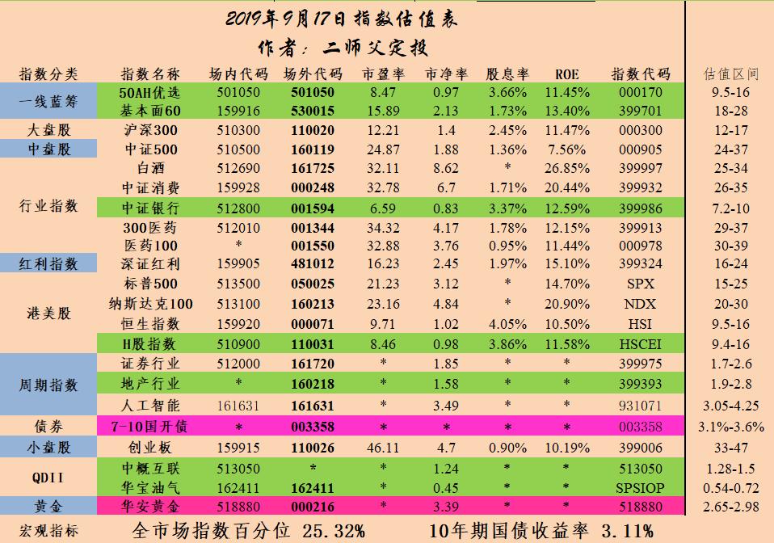

======================================================

_type: q&a
@康[48581124158228]
2019-09-17 22:39:26 Tue  
topic_id: 421441522124548

@康

>  华宝油气今晚卖出，以明天周三3点的价格为准吗？

@二师父

>  场外是的，以明天收盘净值成交

阅读[3241]  评论[0]  赞[0] 

======================================================

_type: talk
@二师父[28814221155551]
2019-09-17 22:42:38 Tue  
topic_id: 241551241522221

<e type="hashtag" hid="145845124442" title="#定投的计划与锚定心理#" /> 机会常有，准备好子弹即可，即使大盘一直震荡，我们也能反复盈利

@Mr-K at 2019-09-17 22:42:38 Tue

> 所以不要太关注大盘，自己心里要明确知道以估值作为标准来衡量，不要被大盘指数迷惑了。心里清楚有一个标准很重要，不然会被市场左右情绪，跟着市场先生走

----------

阅读[3374]  评论[1]  赞[0] 

+++++++++++++++++++++++++++++++++++++++++++++++++++++

文件：
2019-09-17 22:42:37 Tue
文件大小：[119674]
88258144825112-大盘跌破3000点，A股市场总是不缺机会的.docx

======================================================

_type: talk
@林荫[15115451828452]
2019-09-18 08:04:32 Wed  
topic_id: 841551215251522

<e type="hashtag" hid="458188281228" title="#鳄鱼计划持仓#" /> 消费的盈利是卖了部分份额才有这么多吧？

阅读[2902]  评论[0]  赞[0] 

======================================================

_type: q&a
@康[48581124158228]
2019-09-18 18:28:17 Wed  
topic_id: 421441511514418

@康

>  师父，你好，我刚回了一笔款，想买一些中证银行，是一次性买入呢？还是分为几笔买入？

@二师父

>  能承受波动可以一次性投资，不能经受波动分批买入

阅读[2590]  评论[0]  赞[0] 

======================================================

@二师父[28814221155551]
2019-09-18 21:16:04 Wed  
topic_id: 421441245558228

>  @二师父
>  

阅读[2411]  评论[0]  赞[0] 

======================================================

@二师父[28814221155551]
2019-09-18 21:17:54 Wed  
topic_id: 241551452415481

>  @二师父
>  

阅读[2528]  评论[2]  赞[0] 

======================================================

_type: q&a
@mumomo[111812248825412]
2019-09-18 22:14:53 Wed  
topic_id: 421441242484248

@mumomo

>  二师父，关于利润收割的问题，之前券商涨到10%的时候，收割了一次利润，后来涨到1几没到20%又回撤到10%以下了，那么，下次再收割利润是到10%还是20%？谢谢

@二师父

>  如果仓位轻的话就是百分之20的时候再收割

阅读[2579]  评论[0]  赞[0] 

======================================================

@二师父[28814221155551]
2019-09-18 23:01:14 Wed  
topic_id: 548228424554814

>  @二师父
>  

阅读[2732]  评论[6]  赞[0] 

======================================================

_type: talk
@海盗[48248118584848]
2019-09-19 00:05:33 Thu  
topic_id: 118228121844282

<e type="hashtag" hid="225118152481" title="#指数基金均线偏离表#" />

@银河系 at 2019-09-19 00:05:33 Thu

> 最近银行和华宝油气不都比较低估？

----------

阅读[2744]  评论[1]  赞[0] 

+++++++++++++++++++++++++++++++++++++++++++++++++++++

图片：
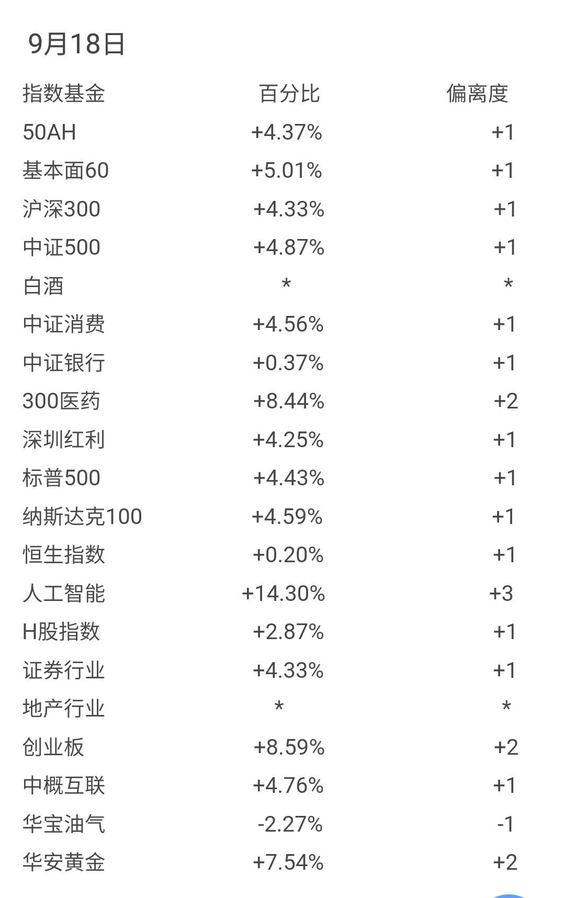

======================================================

_type: talk
@海盗[48248118584848]
2019-09-19 00:55:37 Thu  
topic_id: 841551451525282

<e type="hashtag" hid="225118152481" title="#指数基金均线偏离表#" /> 
网格交易，这是二师父的独特见解之处，的确有很多很多指数基金投资倡导者，着重提倡低估定投，分批买入，一直买买买，一直持有。然后等市场转暖买，进入高估，然后分批卖出，获取收益。然而市场却不是如约从低估一步一步走向高估，而是涨涨跌跌，一直在某个区域上下波动，因为不确定的因素太多太多了。而我们的收益很可能像坐过山车一样，高高低低，更有甚者会回到原点。错过了很多很多大的波段。而二师父把“波段操作”和“长期持有”这两个看似很矛盾的很好的融洽在一起。操作其实很简单，就是把准备定投指数的资金分出去一小部分去做波段，能把未来很多不确定增加些许确定，牛市来与不来，只要有波动，我们就有收益。而波动是A股最最主要的特征。看似简单的操作，其实融入很多过人的智慧。

@二师父 at 2019-09-19 00:55:37 Thu

> 不要总是问问题，多分享，自然有提高，或者别人分享的好，直接赞赏，付出心态会让你和别人慢慢拉开差距

----------

@海盗 at 2019-09-19 00:55:37 Thu

> 谢谢二师父的打赏[抱拳]

----------

@烟九•二手车 at 2019-09-19 00:55:37 Thu

> 这个网格是场内交易的吧

----------

阅读[2901]  评论[3]  赞[1] 

======================================================

_type: talk
@二师父[28814221155551]
2019-09-19 01:39:00 Thu  
topic_id: 118228128215282

<e type="hashtag" hid="458155444888" title="#定投过程中的大额增量资金怎么打理#" />

@衣袂飘香 at 2019-09-19 01:39:00 Thu

> 二师父您好！文中说“若整体股票市场处于低估，对于低估的宽基指数可以一次性建立底仓5成”。那还要遵循“非周期性指数，在刚进入低估时数值的90%建立底仓”这个原则吗？我的意思是说，若整体股票市场处于低估，但是具体的指数还没有到达低估时数值的90%，这种状况要怎么办呢？

----------

@二师父 at 2019-09-19 01:39:00 Thu

> 以单个指数为准，因为市场风格轮动，即使大盘低估，还有单个指数估值很高的情况

----------

@衣袂飘香 at 2019-09-19 01:39:00 Thu

> 好的谢谢你。

----------

阅读[3064]  评论[3]  赞[0] 

+++++++++++++++++++++++++++++++++++++++++++++++++++++

文件：
2019-09-19 01:38:20 Thu
文件大小：[26352]
28285811284811-定投过程中得到了一笔大额资金该怎么处理.docx

======================================================

_type: talk
@二师父[28814221155551]
2019-09-19 01:41:42 Thu  
topic_id: 421441241428828

<e type="hashtag" hid="481211145528" title="#指数估值#" /> 债券基金已经进入正常估值了，股市继续走高，债券基金会逐步下跌。学会股债轮动。

@黎雄 at 2019-09-19 01:41:42 Thu

> 师傅场内推荐一只债券基金嘛

----------

@二师父 at 2019-09-19 01:41:42 Thu

> 国债etf

----------

@黎雄 at 2019-09-19 01:41:42 Thu

> 师傅这些国债顺便选都可以嘛

----------

@二师父 at 2019-09-19 01:41:42 Thu

> 看看成交额，场内就一个

----------

阅读[3562]  评论[4]  赞[0] 

+++++++++++++++++++++++++++++++++++++++++++++++++++++

图片：
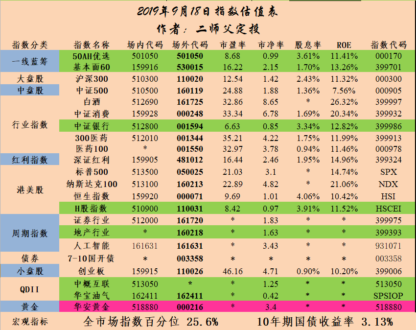

======================================================

_type: talk
@二师父[28814221155551]
2019-09-19 01:49:08 Thu  
topic_id: 118228128215822

<e type="hashtag" hid="228122555841" title="#二师父场外定投实盘205期#" /> 

微信公众号：二师父定投
总投资份数：0.5份
定投宣言：我准备坚定不移地执行此计划，我无法知道明天是涨是跌。但我知道只要估值在低估区域，就一定是处于安全边际之内。如果偏离低估的程度越大，我就多买一些；如果偏离低估的程度越小，我就少买一些。就让我向阿甘一样默默地坚守定投吧。

最近大盘在3000点晃悠，按照百分位来决定投资的比例，这个是二师父自己设定的，原则是百分位越小定投金额越大。

银行和基本面60各买一半。

免责声明：本实盘仅为二师父个人投资记录，非跟投，不构成投资建议。读者根据本实盘及星球任何观点进行投资，须自行承担风险。

@Claire at 2019-09-19 01:49:08 Thu

> 象阿甘一样坚守定投💪

----------

@二师父 at 2019-09-19 01:49:08 Thu

> 一起坚持

----------

@张拾川 at 2019-09-19 01:49:08 Thu

> 二师傅所谓的一份是多少钱

----------

@二师父 at 2019-09-19 01:49:08 Thu

> 自己分配一下，把存量资金进行分配得到一定的份数

----------

阅读[3843]  评论[4]  赞[0] 

======================================================

_type: talk
@二师父[28814221155551]
2019-09-19 01:54:56 Thu  
topic_id: 841551451542142

<e type="hashtag" hid="828122555812" title="#自由#" /> 人为自己的行为立法，按照自己的意志去行动，并未相应结果承担责任，这就是自由的内涵。

我想我已经自由了。

@幽幽菊花茶 at 2019-09-19 01:54:56 Thu

> 说的太好了[咖啡]

----------

阅读[3186]  评论[1]  赞[0] 

======================================================

_type: q&a
@哈哈[88214814112582]
2019-09-19 02:44:37 Thu  
topic_id: 421441241448228

@哈哈

>  利润收割之后
>  基金的收益率就乱掉了
>  怎么计算呢

@二师父

>  这个收益率不看软件系统计算的，需要自己计算，以蛋卷基金举例子
>  
>  假设你买入了中证500，就打开这个基金的持仓，然后会看到持有单价，最新净值。收益率=（最新净值-持有单价）/持有单价
>  
>  这就是你的实际收益率，实际收割的过程中需要注意并不一定是机械的收割。也看行情和仓位，行情无法预测，谁也不知道是超级大牛市还是昙花一现。
>  
>  仓位就比较好把握了，假设你才3成仓，还没有买够，就别收割了。假设已经满仓，那么果断收割，这和仓位也有关系，总之灵活运用，不要教条
>  
>  把投资当成一门艺术，而不是数字游戏，这才是真正的投资。
>  
>  本回答仅为二师父个人投资观点，非投资建议和指导，投资有风险，读者根据星球任何观点投资需风险自行承担

阅读[1864]  评论[2]  赞[0] 

======================================================

_type: q&a
@醉流雨[422151445242248]
2019-09-19 09:05:25 Thu  
topic_id: 241551485148511

@醉流雨

>  二师父，请帮我推荐几个场内定投的产品吧，谢谢。

@二师父

>  在置顶文章鳄鱼计划里面有介绍

阅读[2963]  评论[0]  赞[0] 

======================================================

@二师父[28814221155551]
2019-09-19 09:09:41 Thu  
topic_id: 421441288885258

>  @二师父
>  

阅读[3124]  评论[3]  赞[0] 

======================================================

_type: q&a
@怡明[828821154142]
2019-09-19 10:57:04 Thu  
topic_id: 241551482855481

@怡明

>  请问老师，我是新加入星球的，今天您定投实盘什么时间发？我跟投就可以了吗？谢谢了！

@二师父

>  已经发布了，实盘并不是跟投，只是二师父个人投资记录，仅供参考哈
>  
>  新加入球友建议好好阅读置顶的文章，保证基础扎实，明白投资逻辑和赚钱原理，有疑问多在星球和大家讨论，这样才能不断进步

阅读[3204]  评论[0]  赞[0] 

======================================================

_type: q&a
@葛亚丽[841858254128252]
2019-09-19 16:31:16 Thu  
topic_id: 548228414212444

@葛亚丽

>  二师父好，在低估定投策略的定投比例如何确定的，没看懂。能用简单的方法说一下吗，或者举例说明。

@二师父

>  这个可以定性也可以定量
>  
>  定量的话比方同时投资中证500和沪深300，他们进入低估区域了
>  
>  用阈值除以当前市盈率得到500和300的权重分别是1和2，如果不考虑系数的话，那么500的投资比例就是1除以3，300的投资比例就是2除以3
>  
>  具体计算方法是这样，在定投的时候也要结合仓位

阅读[2915]  评论[6]  赞[0] 

======================================================

@二师父[28814221155551]
2019-09-19 16:32:10 Thu  
topic_id: 421441282841258

>  @二师父
>  

阅读[3019]  评论[0]  赞[0] 

======================================================

_type: talk
@梧桐[844118451242512]
2019-09-19 20:56:23 Thu  
topic_id: 241551422558251

中国股市不成熟，恰恰说明中国股市估值区间变化较大，甚至牛熊交替较快，这对于可以买的更便宜甚至卖的更贵的投资者是更有利的。用二师父的话来理解这句话：中国股市最不缺的就是机会。

@玄武 at 2019-09-19 20:56:23 Thu

> 就是 就是，耐心等待就好

----------

阅读[2755]  评论[1]  赞[0] 

======================================================

_type: q&a
@黎雄[841555255485222]
2019-09-19 23:03:31 Thu  
topic_id: 841551421242582

@黎雄

>  师傅想在A股打新股，有没有泸市和深市比较适合长期持有的股票

@二师父

>  打新就不要长期持有了

阅读[2781]  评论[1]  赞[0] 

======================================================

_type: talk
@二师父[28814221155551]
2019-09-20 01:47:53 Fri  
topic_id: 118228112542512

<e type="hashtag" hid="481211145528" title="#指数估值#" /> 最后一排就是阈值。低估和正常估值的界限以及正常估值和高估的界限

@笑拥Le monde at 2019-09-20 01:47:53 Fri

> 二师父，全市场指数百分位是从哪年开始计算的，加权市盈率还是中位数？

----------

@二师父 at 2019-09-20 01:47:53 Fri

> 从2000年开始的

----------

阅读[3496]  评论[2]  赞[0] 

+++++++++++++++++++++++++++++++++++++++++++++++++++++

图片：
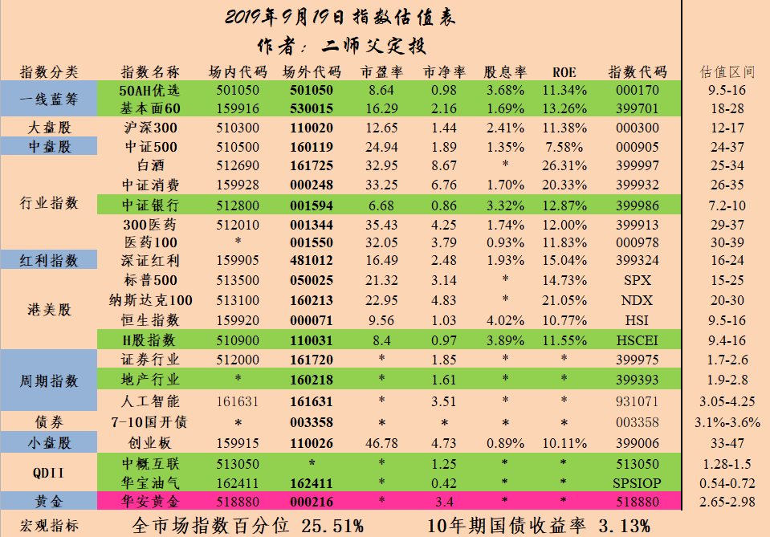

======================================================

_type: talk
@二师父[28814221155551]
2019-09-20 01:49:51 Fri  
topic_id: 241551445825811

<e type="hashtag" hid="881125525822" title="#估值#" /> 当前A股市场所处的位置

@小牧童 at 2019-09-20 01:49:51 Fri

> 师父：格雷厄姆指数两个数字2和1.82您是参考哪些数字算出来的？

----------

@二师父 at 2019-09-20 01:49:51 Fri

> 2是阈值，保证盈利收益率是10年期国债收益率两倍，1.82是实际的，用全市场指数盈利收益率除以10年期国债收益率

----------

@小牧童 at 2019-09-20 01:49:51 Fri

> 好的，谢谢师父！

----------

阅读[3197]  评论[3]  赞[0] 

+++++++++++++++++++++++++++++++++++++++++++++++++++++

文件：
2019-09-20 01:49:34 Fri
文件大小：[26890]
48584542281858-当前A股市场处于何种位置.docx

======================================================

_type: talk
@二师父[28814221155551]
2019-09-20 01:51:12 Fri  
topic_id: 841551445825212

<e type="hashtag" hid="145458855482" title="#周五读书#" />

@Claire at 2019-09-20 01:51:12 Fri

> 谢谢师父教会我们正确的投资思维。[咖啡]

----------

@远山 at 2019-09-20 01:51:12 Fri

> 第六段文字有一个“致命”的错别字

----------

阅读[3789]  评论[2]  赞[0] 

+++++++++++++++++++++++++++++++++++++++++++++++++++++

文件：
2019-09-20 01:50:49 Fri
文件大小：[24793]
51512524418144-《买入持有富有：一名金牛基金经理得投资之路》第二讲.docx

======================================================

_type: q&a
@与世无争[421844554514848]
2019-09-20 01:57:00 Fri  
topic_id: 548228458815114

@与世无争

>  二师傅，您好！我是刚加入星球不久的学员，现在手里有十来万一半年内不用想做做定投，应该怎么做？

@二师父

>  以稳健为主，大部分要放在货币基金里面，少部分定投稳健的沪深300，中证500等指数，当这些不低估的时候，也可以定投50AH，基本面60，银行指数
>  
>  本回答仅为二师父个人投资观点，非投资建议和指导，投资有风险，读者根据星球任何观点投承担

阅读[3304]  评论[2]  赞[0] 

======================================================

_type: q&a
@孙平[48548211154218]
2019-09-20 02:14:39 Fri  
topic_id: 841551445528252

@孙平

>  二师父，最近有些基金因巨额赎回而出现净值大幅上涨的情况，请问基金巨额买入时，会不会稀释净值的上涨？

@二师父

>  会的，之前富国沪深300增强就出现过这种情况

阅读[3412]  评论[0]  赞[0] 

======================================================

_type: talk
@二师父[28814221155551]
2019-09-20 11:11:23 Fri  
topic_id: 118228811111582

<e type="hashtag" hid="825412412212" title="#可转债打新#" /> 申购桃李发债，顶格申购，一般中签一手，不论涨跌，首日卖出

本消息仅为二师父个人投资记录，非投资建议和指导，投资有风险，读者根据星球任何观点投承担

@20181108…… at 2019-09-20 11:11:23 Fri

> 谢谢二师父提醒

----------

@掌心的温暖 at 2019-09-20 11:11:23 Fri

> 谢谢提醒[鼓掌][鼓掌][鼓掌]

----------

@佳 at 2019-09-20 11:11:23 Fri

> 首日卖出是怎么操作？是开盘就卖出吗？

----------

@二师父 at 2019-09-20 11:11:23 Fri

> 上市卖出

----------

@Snow at 2019-09-20 11:11:23 Fri

> 能申购多少，中签率是多少？比如有5万元，应该申购多少？

----------

@二师父 at 2019-09-20 11:11:23 Fri

> 最多中签一手，1000元

----------

@玄武 at 2019-09-20 11:11:23 Fri

> 顶格申购什么意思？和股票打新有什么区别

----------

@Snow at 2019-09-20 11:11:23 Fri

> 申购后几天上市？

----------

阅读[3618]  评论[10]  赞[0] 

======================================================

_type: q&a
@乖子[28441841181151]
2019-09-20 13:32:14 Fri  
topic_id: 241551445482281

@乖子

>  二师父，您好，您能写一篇关于记账，特别是基金购买盈利记录的小文章吗？谢谢

@二师父

>  记账选择软件就行，我是10元以上的收入和支出就记录下来，月低分析本月的收入和支出情况，然后思考哪些方面的收入增幅大，是否在这个方面继续增大收入，然后严格控制消费支出的情况，当然是在不影响生活品质的情况下。
>  
>  记录收益之前我是用的EXCEL。每次将定投的基金写出来，然后定投本金累计，得到定投单个基金的成本，然后到一定时间后，用基金的总金额减去成本，然后除以成本就得到你的收益率。
>  
>  这种方法比较费时间，适合时间宽裕的朋友。

阅读[3599]  评论[1]  赞[0] 

======================================================

_type: q&a
@孙平[48548211154218]
2019-09-20 16:13:26 Fri  
topic_id: 548228882128124

@孙平

>  二师父，请问中邮中证价值回报量化策略指数型基金和中证500基金持仓有重复吗？

@二师父

>  具体指数代码是哪个呢？

阅读[3208]  评论[4]  赞[0] 

======================================================

_type: talk
@二师父[28814221155551]
2019-09-20 16:20:05 Fri  
topic_id: 118228882545212

刚收到消息，以前在支付宝买的富国中证500增强分红了，长期持有优质指数分红也是一种不错的选择

@心韵 at 2019-09-20 16:20:05 Fri

> 二师父：图片是东方财富股票交易所，今天收盘后显示的溢价，溢价（H/A）3.65%这是什么意思？

----------

@凯 at 2019-09-20 16:20:05 Fri

> 师傅我的是分红再投😂

----------

@二师父 at 2019-09-20 16:20:05 Fri

> 这说明港股相当于a股有溢价

----------

@二师父 at 2019-09-20 16:20:05 Fri

> 也没问题的

----------

@心韵 at 2019-09-20 16:20:05 Fri

> 谢谢二师傅

----------

阅读[3453]  评论[5]  赞[0] 

======================================================

_type: talk
@老孙头[422115118524548]
2019-09-20 21:15:40 Fri  
topic_id: 118228881218422

投资大佬陈光明—“前一轮红利已经消化差不多了，下一轮社会发展两个方向，一是人工智能，二是生物科技。”——老师认可度如何？有相关主题进入定投标的吗？

@无争初学 at 2019-09-20 21:15:40 Fri

> 总感觉师父以大指数为主，您说的是专项指数吗？我初来不懂，以稳为主

----------

@二师父 at 2019-09-20 21:15:40 Fri

> 人工智能我已经布局，加入了估值表，还有一个是5G，正在研究，这个指数刚出来，了解程度不深，AI和5G是未来的方向

----------

阅读[3270]  评论[2]  赞[0] 

======================================================

_type: talk
@二师父[28814221155551]
2019-09-20 23:24:45 Fri  
topic_id: 421441112158828

<e type="hashtag" hid="481211145528" title="#指数估值#" /> 有人问未来方向，未来我看好的有人工智能和5G，估值表有人工智能，先把学堂的学好了，学有余力再看其他的，我讲的都是非常非常基础的，如果连我这些都没整明白就鼓捣其他的，有点舍本逐末

另外5G也是未来的方向，这个指数正在研究中，新出来的指数不要着急，没有99%的把握就别投资，因为我们的原则：避免亏损永远第一位。

阅读[3817]  评论[0]  赞[0] 

+++++++++++++++++++++++++++++++++++++++++++++++++++++

图片：
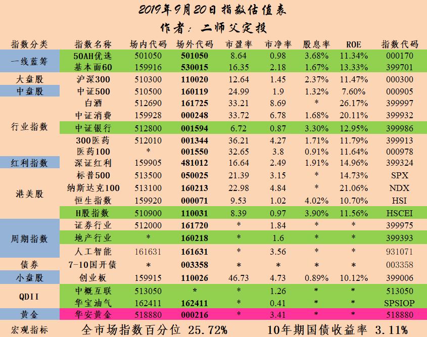

======================================================

_type: talk
@二师父[28814221155551]
2019-09-20 23:27:49 Fri  
topic_id: 421441112152458

<e type="hashtag" hid="828121821552" title="#风险#" /> 基金定投的风险，知道风险点，然后避免，那么定投就会比较稳。

这个文章以前写过，更新了一下，但是要常记在心中，因为我定投这么多年，有时候也容易被投资者及市场情绪影响，培养自己的原则并遵守是克制自己情绪的好方法。

阅读[3541]  评论[0]  赞[0] 

+++++++++++++++++++++++++++++++++++++++++++++++++++++

文件：
2019-09-20 23:25:18 Fri
文件大小：[25566]
15452454551452-基金定投的风险.docx

======================================================

_type: talk
@树叶[544811512145144]
2019-09-21 09:10:09 Sat  
topic_id: 421441111118248

<e type="hashtag" hid="142825811122" title="#定投周报#" /> 二师父定投周报第26期

阅读[3910]  评论[0]  赞[0] 

+++++++++++++++++++++++++++++++++++++++++++++++++++++

文件：
2019-09-21 09:09:53 Sat
文件大小：[301486]
28285282248481-二师父定投周报9.21（第26期）.docx

======================================================

_type: talk
@二师父[28814221155551]
2019-09-21 13:22:26 Sat  
topic_id: 841585552485282

<e type="hashtag" hid="551858558884" title="#格雷厄姆指数#" /> 用的是全市场指数盈利收益率/中国10年期国债收益率

假设我们全市场指数选择万得全A指数，当前市盈率17.2，盈利收益率5.81%；中国10年期国债收益率3.1%

格雷厄姆指数=5.81/3.1=1.87

@烟九•二手车 at 2019-09-21 13:22:26 Sat

> 低于2，是低估期的意思？

----------

@二师父 at 2019-09-21 13:22:26 Sat

> 高于2才是代表低估

----------

@素兮 at 2019-09-21 13:22:26 Sat

> 格雷厄姆指数是怎么运用的？

----------

@二师父 at 2019-09-21 13:22:26 Sat

> 大于2说明低估，这是他的观测，比值越大越低估，格雷厄姆极度保守

----------

阅读[3830]  评论[4]  赞[0] 

======================================================

_type: q&a
@Dr. 邓[844185218554482]
2019-09-21 16:40:41 Sat  
topic_id: 548212224282584

@Dr. 邓

>  二师父，好久不见！提问：1、投资股市多年并未赚到钱，散户倾向于买基金我已认同，但买主动型基金还是买指数型基金一直困扰着我。指数型基金排除人为因素干扰，费用低，但中国市场波动大很容易十年梦一回；从中国市场近十五年的基金业绩看，排名靠前的都是主动管理型基金，比如易方达、交银等主动型基金业绩非常好，但管理费用高些，也有些差的基金。2、科创板有可以买的指数基金吗？期待回复，谢谢！

@二师父

>  1、你把对应的指数基金和主动基金比较一下。最好的办法如果你有困扰，实践才是检验真理的唯一标准，自己投资一下，别人的基金能赚那么多，为什么你投资就亏呢？那是因为他只展示了好的主动基金
>  
>  我投资的是指数基金，因为简单，从几千只主动基金里面挑选一只优质的还得保证基金经理不更换表现一直棒，真的有点赌博的味道，因为不确定性太大。
>  
>  2、暂时还没有科创板基金。

阅读[3962]  评论[3]  赞[1] 

======================================================

_type: talk
@二师父[28814221155551]
2019-09-22 01:42:18 Sun  
topic_id: 118252254255152

定投是否需要一直投下去，高手往往不拘泥的，底部区域增加频率也是一种方法。定投只是手段，不是目的

阅读[3224]  评论[0]  赞[0] 

+++++++++++++++++++++++++++++++++++++++++++++++++++++

文件：
2019-09-22 01:41:21 Sun
文件大小：[25231]
48584582811818-定投是不是要一直投下去.docx

======================================================

_type: q&a
@学以致用[244415184181451]
2019-09-22 10:16:22 Sun  
topic_id: 421484485144488

@学以致用

>  二师父 如果只定投不止盈，长期持有，只赚企业成长的钱！那应该选什么样基金呢？

@二师父

>  在中国不适合长期持有，长持的话白酒消费这类是一直涨的，可以穿越牛熊

阅读[3067]  评论[3]  赞[0] 

======================================================

_type: q&a
@幻水[881185412112]
2019-09-23 02:14:18 Mon  
topic_id: 548212252845124

@幻水

>  你好，我有两个问题要问：
>  问题一：深证成指和深证100相关性是多少啊？
>  问题二：深证成指和中证500相关性是多少啊？

@二师父

>  问题一，深证成指和深证100相关性比较大
>  
>  问题二，深证成指和中证500相关性不大

阅读[2976]  评论[0]  赞[0] 

======================================================

_type: q&a
@远山[841555422151212]
2019-09-23 02:15:29 Mon  
topic_id: 241585528418541

@远山

>  老师，消费类基金选那只好点呢，之前我定投了一只消费分级基金，听说分级基金二0二年前要全部清盘，我想选一只转换过去。

@二师父

>  汇添富中证消费不错，分级基金的母基金没事

阅读[3037]  评论[0]  赞[0] 

======================================================

_type: talk
@二师父[28814221155551]
2019-09-23 02:44:08 Mon  
topic_id: 841585521184842

没有机会的时候就耐心等待，另外国庆有好玩的地方吗，长江以北，推荐一下。

@孙平 at 2019-09-23 02:44:08 Mon

> 1.内蒙额济纳旗胡杨林、酒泉东风航天城、敦煌、嘉峪关、张掖丹霞地貌；2.西宁塔尔寺、甘南拉卜楞寺、青海湖、茶卡盐湖；3.西安兵马俑、明城墙、大小雁塔、回民街、终南山，品尝三秦美食，来西安了我招呼您。

----------

@Yingshengw* at 2019-09-23 02:44:08 Mon

> 甘肃张掖山丹军马场，特别值得去玩

----------

@秦岭云横 at 2019-09-23 02:44:08 Mon

> 秦岭鳌太穿越

----------

@Hi·DD at 2019-09-23 02:44:08 Mon

> 二师父出行也只能选黄金周吗[捂脸]

----------

@二师父 at 2019-09-23 02:44:08 Mon

> Good

----------

@二师父 at 2019-09-23 02:44:08 Mon

> 心痛的问题

----------

@二师父 at 2019-09-23 02:44:08 Mon

> 👍👍

----------

阅读[3170]  评论[17]  赞[0] 

+++++++++++++++++++++++++++++++++++++++++++++++++++++

文件：
2019-09-23 02:43:46 Mon
文件大小：[25528]
15452458582512-没有好机会的时候就耐心等待.docx

======================================================

_type: talk
@不再YY的猪[422118542885848]
2019-09-23 08:52:42 Mon  
topic_id: 548212242552824

<e type="hashtag" hid="281122421221" title="#提问#" /> 请问AI 5G这类较新的指数的估值阈值是如何确定的？因为我理解确定估值阈值需要参考较为长期的历史数据，而新指数并没有长期历史数据？谢谢指教~

@志亮 at 2019-09-23 08:52:42 Mon

> 5G没什么估不估值的，我认为这是题材股，跟着政策走就可以，若说估值现在5G股大多都是高估，那为什么还涨，风险和机会并取，根据自己风格来买基金就对了。[微笑]

----------

阅读[3058]  评论[1]  赞[0] 

======================================================

_type: q&a
@Hi·DD[422111285512858]
2019-09-23 11:51:36 Mon  
topic_id: 241585548415541

@Hi·DD

>  二师父，可转债是一个账户就可以申购一次，还是一个人只能申购一次？因为一个人可以开三个账户

@二师父

>  打新是一个人只能申购一次

阅读[3000]  评论[0]  赞[0] 

======================================================

@二师父[28814221155551]
2019-09-23 12:55:13 Mon  
topic_id: 241585548118151

>  @二师父
>  

阅读[2880]  评论[0]  赞[0] 

======================================================

_type: q&a
@Gingo[544812851155554]
2019-09-23 12:56:04 Mon  
topic_id: 118252215881852

@Gingo

>  二师父你好 请问中小板指的估值处于什么位置呢？是否建议定投？

@二师父

>  创业板快高估了，中小板的估值也不低，不建议现在入手，投资还是以优质的上市企业为主，赚取企业盈利增长的钱

阅读[2930]  评论[0]  赞[0] 

======================================================

_type: talk
@冬夫[15122585122182]
2019-09-23 15:33:42 Mon  
topic_id: 421484421544528

二师父好，跟踪您指数估值表有段时间了，发觉您对指数估值相对保守，导致低估区时间停留时间太短，来不及重仓及半重仓，解决方式建立底仓或加大定投比例？

@二师父 at 2019-09-23 15:33:42 Mon

> 可以的，只要你能经受住大波动，3000点以下都是机会，去年10月和今年一月的机会抓住了吗，那时候适合建底仓

----------

@Yingshengw* at 2019-09-23 15:33:42 Mon

> 到了这个时候很多人就开始有点急了，2700点的时候他们不会有这个问题的

----------

@志亮 at 2019-09-23 15:33:42 Mon

> 3000点是个考完人性的位置，不上不下的[偷笑]

----------

@冬夫 at 2019-09-23 15:33:42 Mon

> 快了，下月大机会来临，准备资金吧，我有的是耐心

----------

阅读[2825]  评论[4]  赞[0] 

======================================================

_type: talk
@二师父[28814221155551]
2019-09-23 16:00:42 Mon  
topic_id: 241585541218251

今天又跌了，跌破3000点，其实大盘即使不涨到4000点，我们从3000定投到2700，然后涨到3000，再卖一部分，这样反复也能挣钱，熊市波动是挣钱利器。

而很多人却把波动理解为风险，这是a股不同于其他股票市场的地方

@大李子 at 2019-09-23 16:00:42 Mon

> 那不是3000还没有高估，是持有吗？

----------

@二师父 at 2019-09-23 16:00:42 Mon

> 目前市场点位仍旧比较低

----------

阅读[3137]  评论[2]  赞[0] 

======================================================

_type: talk
@姥姥不疼. 爷爷不爱[48544481458248]
2019-09-23 19:43:53 Mon  
topic_id: 841585515451252

请教二师父，159916基本面60能否做网格交易

@二师父 at 2019-09-23 19:43:53 Mon

> 可以的

----------

@姥姥不疼. 爷爷不爱 at 2019-09-23 19:43:53 Mon

> 谢谢您指导。

----------

阅读[2915]  评论[2]  赞[0] 

======================================================

_type: q&a
@🐰Mandy[244148854285821]
2019-09-23 23:16:09 Mon  
topic_id: 241585514225581

@🐰Mandy

>  二师父，中证红利场内场外的代码是啥呀？

@二师父

>  只有场外的，富国中证红利和大成中证红利，场内的还没有

阅读[2837]  评论[0]  赞[0] 

======================================================

_type: talk
@二师父[28814221155551]
2019-09-24 03:23:19 Tue  
topic_id: 841585511581212

<e type="hashtag" hid="552145855254" title="#国债逆回购#" /> 国债逆回购走起，蓐点羊毛

@青青竹 at 2019-09-24 03:23:19 Tue

> 师傅，国债逆回购比货币基金收益好吗？如果我把货币基金转出来，买国债逆回购，到期再转入货币基金，中间可能有几天是没有收益的吧？

----------

@二师父 at 2019-09-24 03:23:19 Tue

> 看不同的品种，以及借钱的难度，货币基金转入资金到成交需要一段时间

----------

@Snow at 2019-09-24 03:23:19 Tue

> 今天的收益率不是特别高啊

----------

@二师父 at 2019-09-24 03:23:19 Tue

> 是的，如果市场资金量大收益就不高

----------

阅读[3013]  评论[4]  赞[0] 

+++++++++++++++++++++++++++++++++++++++++++++++++++++

文件：
2019-09-24 03:22:56 Tue
文件大小：[24652]
88285222212852-假期临近，国债逆回购可以蓐点羊毛.docx

======================================================

_type: talk
@二师父[28814221155551]
2019-09-24 03:25:53 Tue  
topic_id: 118252288258112

@圣诞结® at 2019-09-24 03:25:53 Tue

> 二师父，我上月买了160119 现在看是不是不应该继续定投了？

----------

@理财小小白 at 2019-09-24 03:25:53 Tue

> 二师父，请问中概互联基金成立才一年不到，您的估值阈值是怎么定的呢？谢谢

----------

@二师父 at 2019-09-24 03:25:53 Tue

> 这个之前定投现在应该盈利了，可以等进入低估再定投

----------

@二师父 at 2019-09-24 03:25:53 Tue

> 指数成立很早，你看的是场外基金，场内基金也成立比较早

----------

@圣诞结® at 2019-09-24 03:25:53 Tue

> 好的 谢谢

----------

阅读[3519]  评论[5]  赞[0] 

+++++++++++++++++++++++++++++++++++++++++++++++++++++

图片：
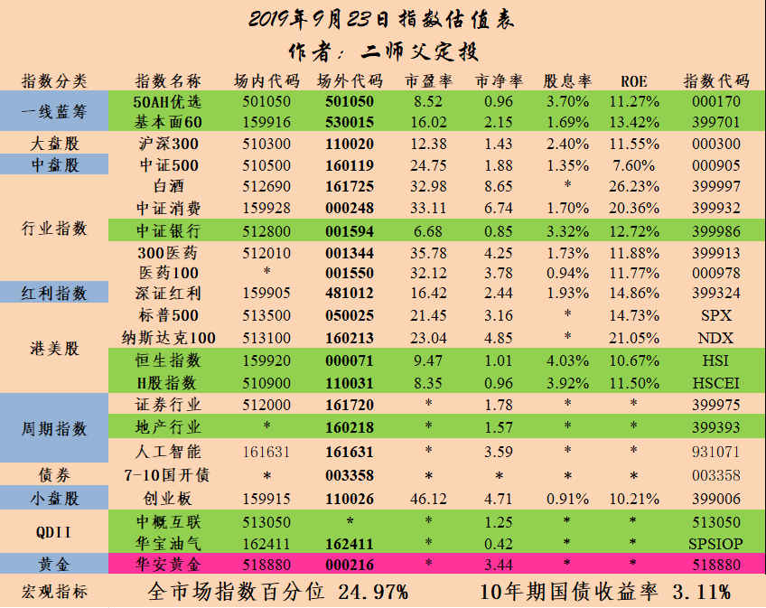

======================================================

_type: q&a
@波多黎各[28428858544121]
2019-09-24 11:13:45 Tue  
topic_id: 548212288222554

@波多黎各

>  二师父，现在房地产黄金期已经过了吗？现在投资房地产是不是高位接盘侠？

@二师父

>  房产大涨才会成为接盘侠，目前很多地方的房产都被按住了，如果投资的话不是特别建议，因为流动性被限制住，即使房价稳步上涨，算上银行利息和各种交易税费还是亏的。
>  
>  当然，资金量大，全款购买，类似北京通州的一些笋盘还是比较有价值，也需要看区域，海淀一平米13万的价格，涨到26万我觉得5年内非常不现实，而基金收益率翻倍就容易多了

阅读[2872]  评论[0]  赞[0] 

======================================================

_type: q&a
@小宝[224251451141]
2019-09-24 11:16:07 Tue  
topic_id: 241585855518511

@小宝

>  新债是都能打么，还是有选择性的

@二师父

>  盲打是可以的，一般选择A级新债，熊市选择AA级的，这样胜率更大

阅读[2916]  评论[2]  赞[0] 

======================================================

_type: q&a
@怡明[828821154142]
2019-09-24 11:41:08 Tue  
topic_id: 841585852822142

@怡明

>  课程学习的优惠过期了，想学习如何领优惠券？

@二师父

>  加微信ershifudt领取

阅读[2914]  评论[0]  赞[0] 

======================================================

_type: q&a
@jier[118552824811122]
2019-09-24 11:41:52 Tue  
topic_id: 841585852824512

@jier

>  请问现在贵州茅台，五粮液是不是不适宜再买入了？

@二师父

>  不适合，白酒已经中等偏高位

阅读[2950]  评论[0]  赞[0] 

======================================================

_type: q&a
@凭栏观海[244414845852181]
2019-09-24 15:11:12 Tue  
topic_id: 548212124114114

@凭栏观海

>  请问老师，华宝油气以后老师暂时不打算投资了吗？

@二师父

>  投了一些，准备上升以后收割利润，如果下跌到0.38继续加仓，没有的话就等等，这个基金盈利一般

阅读[2896]  评论[1]  赞[0] 

======================================================

_type: talk
@二师父[28814221155551]
2019-09-25 05:51:58 Wed  
topic_id: 118252551445822

网络不好，只有发图片

机场侯机，买了杯卡布奇诺提神然后完成了估值表，恒生又正常了，定投不用关注每天的估值变化

我每天更新只是保持一个连续性，这已经成为我生命中的一部分。

@rtdmm小米 at 2019-09-25 05:51:58 Wed

> 二师父辛苦了！游山玩水去了！

----------

@Hi·DD at 2019-09-25 05:51:58 Wed

> 二师父貌似国庆才出游，那现在是出差？调研？能透露下哪家公司的票嘛

----------

@玄武 at 2019-09-25 05:51:58 Wed

> 感谢二师父

----------

@阿志¹ at 2019-09-25 05:51:58 Wed

> 辛苦了🍺

----------

@二师父 at 2019-09-25 05:51:58 Wed

> 哪家公司票是啥意思

----------

@Hi·DD at 2019-09-25 05:51:58 Wed

> [捂脸]股票

----------

@二师父 at 2019-09-25 05:51:58 Wed

> 没有调研公司啊

----------

阅读[2976]  评论[7]  赞[0] 

+++++++++++++++++++++++++++++++++++++++++++++++++++++

图片：
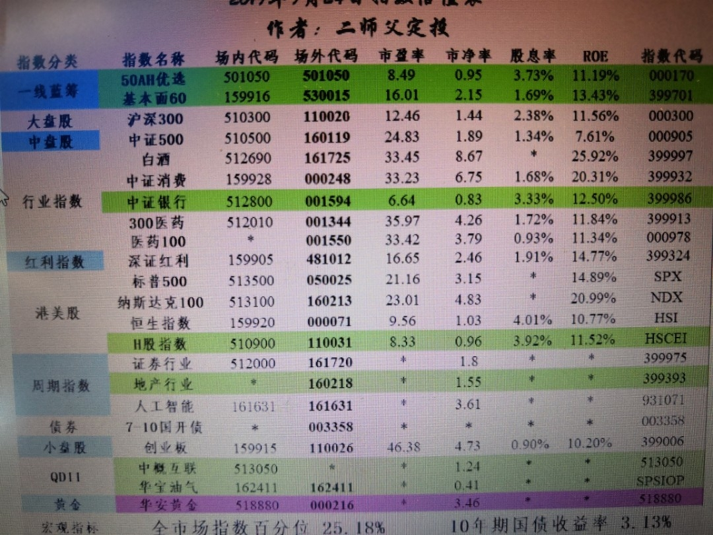

======================================================

_type: talk
@二师父[28814221155551]
2019-09-25 05:55:07 Wed  
topic_id: 548212114551884

<e type="hashtag" hid="228145428251" title="#改变错误定投观念#" /> 改变错误定投观念，用正确的认知指导定投

阅读[2569]  评论[0]  赞[0] 

+++++++++++++++++++++++++++++++++++++++++++++++++++++

文件：
2019-09-25 05:55:07 Wed
文件大小：[24024]
88285241424852-改变这些错误的定投思维认知，你的收益率会翻倍1.docx

======================================================

_type: q&a
@幻水[881185412112]
2019-09-25 06:10:10 Wed  
topic_id: 241585854414451

@幻水

>  有券商特别看好未来钴的价格，觉得涨幅会很大，他的理由有2点。
>  1.境外的钴矿关闭。
>  2.5G技术会带来换手机会要，需要电池，电池会用到钴。
>  我自己挑选了三个股票：
>  第1个是603799华友钴业
>  第2个是300618寒锐钴业
>  第3个是300409道氏技术
>  你觉得这三个股票怎么样？
>  你有什么补充和推荐的和吗？
>  另外这三个股票按照百分比按照多少配置比较好？
>  另外你觉得就是这三个股票未来的涨幅会有多少呢？
>  另外有没有和钴有相关的研究报告呢？

@二师父

>  看看华友钴业，17年盈利情况尚佳，18年每股收益增长率是负数，19年第一季报，中报每股收益增长率均为负数。由此就可以看到这个企业一直下坡路，券商判断没有数据支撑。
>  
>  赌博和投资区别最本质的在于，投资是用金钱转取确定性的利润，赌博是用金钱搏取不确定的利润。
>  
>  这种预测就是赚取不确定性的利润，可以称之为赌博。如果不会选择股票，排除法，宁可错杀一只好股票，也不要放过一只坏股票，因为重仓了一只好股票并不会让你财务自由，但是重仓了一只坏股票，你会损失巨大。

阅读[2650]  评论[0]  赞[0] 

======================================================

@二师父[28814221155551]
2019-09-25 06:10:54 Wed  
topic_id: 548212111842454

>  @二师父
>  

阅读[3034]  评论[0]  赞[0] 

======================================================

_type: talk
@二师父[28814221155551]
2019-09-25 06:22:13 Wed  
topic_id: 548212114542424

<e type="hashtag" hid="458124255548" title="#指数和指数基金#" /> 指数基金都是追踪指数的基金，很多指数编纂出来，但是还没有相应的基金，指数的成立一定是先于指数基金的。

注意指数基金的估值实质上是对相关指数的估值，而不是给具体基金的估值。对一只指数基金估值需要找到他对应的指数，然后再进行估值。

@柔软时光 at 2019-09-25 06:22:13 Wed

> 今天有篇文章说上次金融危机时做空者说，下一个金融危机来自ETF指数基金，二师父怎么看？

----------

@二师父 at 2019-09-25 06:22:13 Wed

> 为什么来自ETF，理论依据是什么

----------

@柔软时光 at 2019-09-25 06:22:13 Wed

> 他的观点是现在国外ETF增长太快，如果股市下跌，大家都卖ETF，而有些ETF中的股票成交量很小，根本卖不出去，造成ETF卖不出引发更大跌幅。这个观点值得思考。

----------

@二师父 at 2019-09-25 06:22:13 Wed

> 金融系统不仅仅包含股市的，如果股市下跌了，那么投资者不仅仅卖出ETF，也会有卖出股票的情况。对于国外的ETF投资者都是机构投资者，相对理性，只要不出现疯狂抛售的情况，金融危机还是比较难得。需要注意所有国家的降息潮，这个信号释放的是所有国家预期经济下行压力大，所以提前开始降息应对，这在08年的时候也出现过

----------

阅读[3076]  评论[4]  赞[0] 

======================================================

_type: talk
@海盗[48248118584848]
2019-09-25 20:51:26 Wed  
topic_id: 421484528882458

<e type="hashtag" hid="225118152481" title="#指数基金均线偏离表#" />

@Gingo at 2019-09-25 20:51:26 Wed

> 请问偏离表一般是多久发一次？

----------

@海盗 at 2019-09-25 20:51:26 Wed

> 一般一个星期吧，今天就准备发了

----------

阅读[2613]  评论[2]  赞[0] 

+++++++++++++++++++++++++++++++++++++++++++++++++++++

图片：
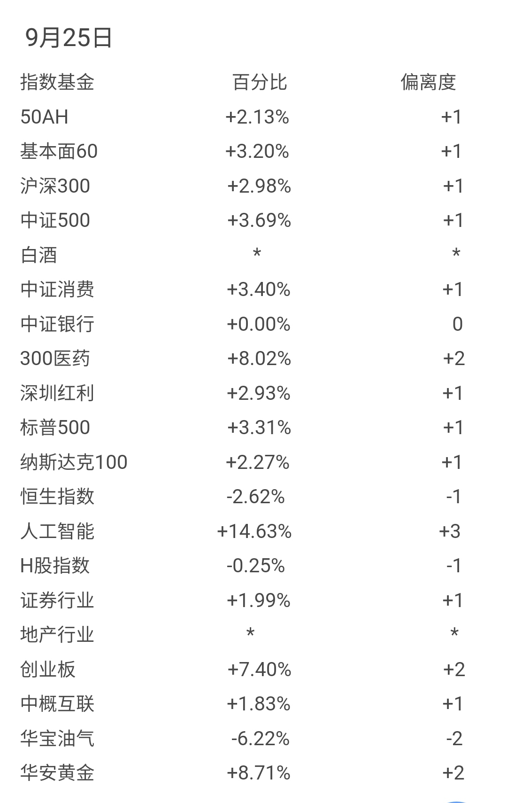

======================================================

_type: talk
@二师父[28814221155551]
2019-09-26 00:11:24 Thu  
topic_id: 548212545521224

<e type="hashtag" hid="481211145528" title="#指数估值#" /> 恒生指数和中证500同时 进入低估了，在A股投资，往往不缺机会，我们缺钱。

阅读[2949]  评论[0]  赞[0] 

+++++++++++++++++++++++++++++++++++++++++++++++++++++

图片：
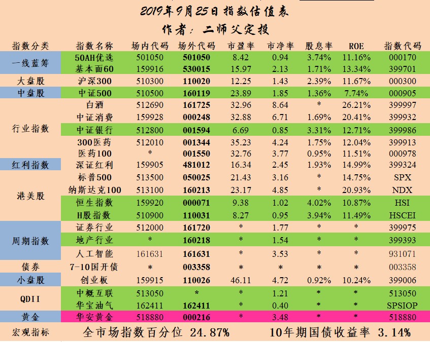

======================================================

_type: talk
@二师父[28814221155551]
2019-09-26 00:12:32 Thu  
topic_id: 548212545521284

当投资的指数盈利变差，你会如何操作

阅读[2617]  评论[0]  赞[0] 

+++++++++++++++++++++++++++++++++++++++++++++++++++++

文件：
2019-09-26 00:12:17 Thu
文件大小：[26045]
15452485185212-当投资的指数盈利变差该如何操作.docx

======================================================

_type: q&a
@银河系[111814581215452]
2019-09-26 00:15:24 Thu  
topic_id: 118252445222542

@银河系

>  华宝油气主要追踪国外的油气公司，因提前油气基金开盘，所以可以看下相关基金涨跌来判断华宝油气涨跌，请问具体看哪一个？是否有编号，谢谢

@二师父

>  华宝油气基金是追踪的标普石油天然气上游股票指数，代码是SPSIOP

阅读[2711]  评论[0]  赞[0] 

======================================================

_type: q&a
@恋尘[51558584455824]
2019-09-26 00:16:31 Thu  
topic_id: 548212555282824

@恋尘

>  师父我问下，我新债游族网络中了20张，不是说只能中一手吗，是这个标的不好没人打吗

@二师父

>  20张费用是多少，一般涨幅大的转债中签概率小一些

阅读[2699]  评论[0]  赞[0] 

======================================================

_type: q&a
@helen[544884424181154]
2019-09-26 00:21:14 Thu  
topic_id: 841585222821412

@helen

>  请问今天中概互联跳水是因为昨晚美股跌吗？

@二师父

>  是的，中概互联和港美股的涨跌关系比较大，所以当港美股跌的时候，中概互联一般也是下跌

阅读[2744]  评论[2]  赞[0] 

======================================================

@二师父[28814221155551]
2019-09-26 00:23:03 Thu  
topic_id: 421484524112558

>  @二师父
>  

阅读[2906]  评论[1]  赞[0] 

======================================================

_type: talk
@二师父[28814221155551]
2019-09-26 00:31:53 Thu  
topic_id: 548212548258544

<e type="hashtag" hid="142812215812" title="#周四定投实盘#" /> 206期定投实盘，定投需要长期坚持，坚持每周扣款，迎接大牛市

@三峡情 at 2019-09-26 00:31:53 Thu

> 已经跟投！

----------

@那方山的树，佛陀座下* at 2019-09-26 00:31:53 Thu

> 二师傅，我是第一期跟投

----------

@艾琪（王钥） at 2019-09-26 00:31:53 Thu

> 坚持定投

----------

@二师父 at 2019-09-26 00:31:53 Thu

> 建议弄明白定投原理

----------

阅读[3168]  评论[4]  赞[0] 

+++++++++++++++++++++++++++++++++++++++++++++++++++++

图片：
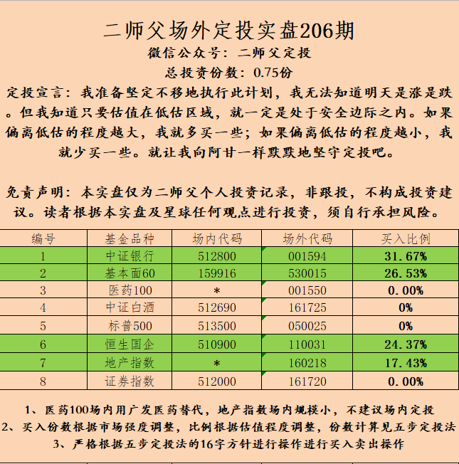

======================================================

_type: talk
@沐[28441854884511]
2019-09-26 14:00:40 Thu  
topic_id: 421484512818858

二师父，今天格雷厄姆指数是多少了？

@二师父 at 2019-09-26 14:00:40 Thu

> 今天是1.88，还是低于2

----------

@玄武 at 2019-09-26 14:00:40 Thu

> 达到2，就是比较低估了吧？

----------

@沐 at 2019-09-26 14:00:40 Thu

> 是

----------

@沐 at 2019-09-26 14:00:40 Thu

> 谢谢二师父

----------

阅读[2518]  评论[4]  赞[0] 

======================================================

@二师父[28814221155551]
2019-09-26 16:53:01 Thu  
topic_id: 241585241285541

>  @二师父
>  

阅读[2950]  评论[2]  赞[0] 

======================================================

_type: q&a
@是喵喵吖～[421441114141158]
2019-09-26 17:04:03 Thu  
topic_id: 241585241112421

@是喵喵吖～

>  二师父想请问一下 上证50里 华夏上证50AH和易方达上证50指数A 哪个更具有投资价值呢  看业绩表现好像后者更好一些？

@二师父

>  易方达上证50的收益率在今年是高于上证50AH的，这是真的。
>  
>  不过这个基金是主动型基金，基金经理可以主动选择股票的，里面重仓了消费，白酒、医药等股票，这些股票今年涨幅大，所以今年的易方达上证50表现很好。其实如果你之前投资了相关的白酒，医药指数，收益率会更高的。
>  
>  50AH也有重仓消费医药股票，比例小一些，更多的是银行股票，所以今年表现也比易方达上证50差一点，定投指数基金就是在基金下跌多而且估值低，但本身盈利好的时候投资，这样等基金价值回归就能够赚取收益，实现戴维斯双击。
>  
>  两个指数都具有投资价值，如果以后上证50重仓的这些优质股票更加，低估，那么上证50就更有投资价值，而对于现在，上证50指数显然是比较贵了。

阅读[2629]  评论[0]  赞[0] 

======================================================

_type: q&a
@默容乐[28512842845821]
2019-09-26 17:09:55 Thu  
topic_id: 118252482458542

@默容乐

>  二师父，定投采取场外好还是场内好呢？长期收益两个差别多少呀？

@二师父

>  差别不大，场外定投是以收盘价格成交的，一般是T+2，比方说今天定投，两天的在途交易时间，两天后成交
>  
>  场内定投是以委托的实时价格成交的，卖出资金也能够实时到账。
>  
>  通过这两个渠道定投主要是费率和成交时间差别，在二师父的福利开户渠道进行场内定投，买入和卖出费率可以做到万1，就是一万元收取1元的手续费，缩减定投成本。
>  
>  至于收益率，都是跟踪相关指数的指数基金，差别不大的。

阅读[2596]  评论[0]  赞[0] 

======================================================

_type: talk
@二师父[28814221155551]
2019-09-26 17:47:23 Thu  
topic_id: 548212588552484

<e type="hashtag" hid="481211145528" title="#指数估值#" /> 指数估值，今天继续下跌，银行倒是上涨了。

坚持定投，积累优质资产，做多中国，对于中概互联指数，重仓了美股，还是需要警惕美股下跌的。

@rtdmm小米 at 2019-09-26 17:47:23 Thu

> 二师父今天这么早？

----------

@二师父 at 2019-09-26 17:47:23 Thu

> 回国了稍微早点

----------

@Pacifica at 2019-09-26 17:47:23 Thu

> 二师傅，中概互联主要标的是阿里和腾讯，为啥你认为重仓了美股呢？

----------

@二师父 at 2019-09-26 17:47:23 Thu

> 阿里是在美国上市的啊

----------

@Pacifica at 2019-09-26 17:47:23 Thu

> 这个我理解，但是阿里大部分业务和收益还是在中国市场发生的啊

----------

@二师父 at 2019-09-26 17:47:23 Thu

> 对，腾讯也是在香港上市的内地企业，但是港美股划分不是业务所在地，而是上市地点

----------

@Pacifica at 2019-09-26 17:47:23 Thu

> 好的，现在明白了。谢谢二师傅

----------

阅读[3106]  评论[7]  赞[0] 

+++++++++++++++++++++++++++++++++++++++++++++++++++++

图片：
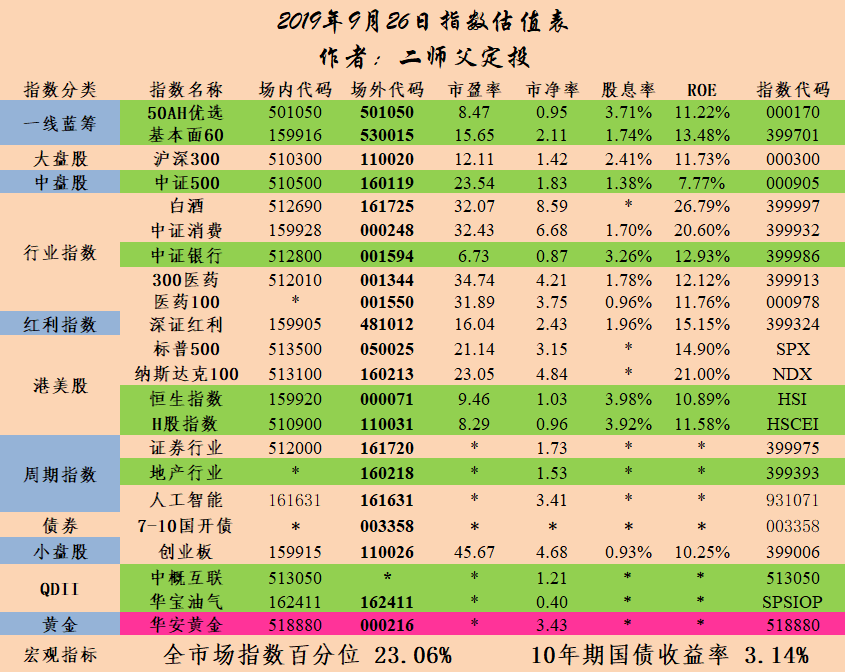

======================================================

_type: q&a
@jier[118552824811122]
2019-09-26 22:53:23 Thu  
topic_id: 241585211542121

@jier

>  请问大盘PE在哪里查？

@二师父

>  在万得，中证指数官网都可以查到的

阅读[2399]  评论[0]  赞[0] 

======================================================

_type: q&a
@圣诞结®[28448281541121]
2019-09-26 23:11:49 Thu  
topic_id: 841585211814112

@圣诞结®

>  二师父，请问易方达中小盘混合，易方达蓝筹精选混合，这两只现在还适合继续加仓定投吗？谢谢

@二师父

>  易方达中小盘混合，名字叫做中小盘混合，不过并不是重仓的中小盘股票，里面重仓的是航空、消费、医药等股票，目前估值也比较高
>  
>  易方达蓝筹精选混合，情况相同，重仓的两只港股腾讯、香港交易所价值比较高，估值也适中，但是整体上的A股估值较高

阅读[2729]  评论[2]  赞[0] 

======================================================

@二师父[28814221155551]
2019-09-26 23:15:57 Thu  
topic_id: 241585211281521

>  @二师父
>  

阅读[2782]  评论[0]  赞[0] 

======================================================

_type: talk
@二师父[28814221155551]
2019-09-27 00:30:59 Fri  
topic_id: 548212424144424

<e type="hashtag" hid="828148811522" title="#逆势定投的原则#" /> 坚持逆势定投也是需要条件的，并不是所有的基金都适合逆势定投，并不是所有的时机都适合逆势定投。

坚持这三大定投的原则进行逆势定投，这样才会有不错的收益率。

阅读[2926]  评论[0]  赞[0] 

+++++++++++++++++++++++++++++++++++++++++++++++++++++

文件：
2019-09-27 00:29:20 Fri
文件大小：[25048]
48584244541528-坚持逆势定投的三大原则.docx

======================================================

_type: talk
@二师父[28814221155551]
2019-09-27 19:17:35 Fri  
topic_id: 841585484128442

70，站起来富起来强起来

阅读[2477]  评论[0]  赞[0] 

+++++++++++++++++++++++++++++++++++++++++++++++++++++

图片：

======================================================

_type: q&a
@醉流雨[422151445242248]
2019-09-27 20:41:43 Fri  
topic_id: 548212428512884

@醉流雨

>  请问二师父，北向资金现在净买入最多的平安银行，现在可以买么，？

@二师父

>  你的股票交易系统建立了吗

阅读[2519]  评论[0]  赞[0] 

======================================================

_type: q&a
@Hi·DD[422111285512858]
2019-09-27 21:10:59 Fri  
topic_id: 241585488412221

@Hi·DD

>  有个很奇怪的事想问下二师父，上午挂单买深F60挂了4.091，但是一直买不进去，卖却直接就出去了

@二师父

>  因为买入委托价格没有涨到设置的位置就不会成交，但是同样的委托价格低于实际的市场价格就容易卖出

阅读[2611]  评论[7]  赞[0] 

======================================================

@二师父[28814221155551]
2019-09-27 23:10:45 Fri  
topic_id: 241585482824581

>  @二师父
>  

阅读[2447]  评论[1]  赞[0] 

======================================================

@二师父[28814221155551]
2019-09-27 23:13:17 Fri  
topic_id: 548212418255584

>  @二师父
>  

阅读[2521]  评论[0]  赞[0] 

======================================================

_type: q&a
@Dr. 邓[844185218554482]
2019-09-27 23:15:27 Fri  
topic_id: 241585428888181

@Dr. 邓

>  二师傅，您好！深基本面60，虽市盈率较低，但从价格历史走势来看也处于相对高位，如企业盈利下降的话，市盈率就会升高。你是比较长期看好这些企业的发展，才会继续定投是吗，谢谢！

@二师父

>  不能看价格，价格是长期上涨的，看看他的股息率和市盈率市净率指标。
>  
>  深市的基本面60指数长期看盈利是增长的，除非出现意外情况，否则不会出现你说的盈利下降市盈率升高的情况。
>  
>  我是看好这些优质蓝筹的稳健性，在目前位置并不贵，不要被价格误导了。

阅读[2598]  评论[0]  赞[1] 

======================================================

_type: talk
@二师父[28814221155551]
2019-09-27 23:39:25 Fri  
topic_id: 241585428444581

<e type="hashtag" hid="481211145528" title="#指数估值#" /> 今日估值表，变化不大，投资大多数时候都是平淡无奇的日子

@志亮 at 2019-09-27 23:39:25 Fri

> 在支付宝说白酒板块已经高估到80%,想不到二师父这里还是正常估值[微笑]

----------

@二师父 at 2019-09-27 23:39:25 Fri

> 白酒板块属于高盈利企业，也可以承担更多的估值溢价

----------

阅读[2986]  评论[2]  赞[0] 

+++++++++++++++++++++++++++++++++++++++++++++++++++++

图片：
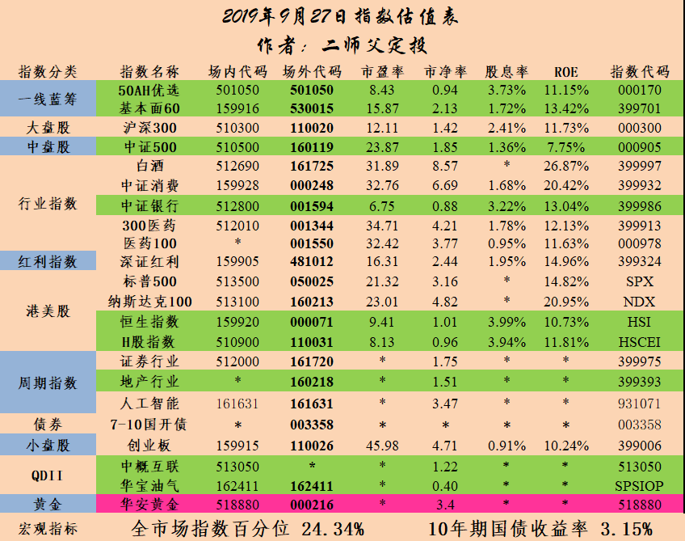

======================================================

_type: q&a
@小小鸟[111885884481252]
2019-09-28 10:26:26 Sat  
topic_id: 118252144184582

@小小鸟

>  请问二师父，科技etf和半导体etf里面包含科创板的成份股吗？现在有没有投资的价值？

@二师父

>  里面是有部分科创板成分股的，不仅包含这两个行业，科创板里面还包含人工智能、云计算和互联网，生物医药等很多领域的。
>  
>  科技ETF追踪的是中证科技龙头指数，开始的时候比较有投资价值，可是最近一段时间被炒的火热，估值已经不低，现在入手并不是好时机，而且这类指数涨幅大，跌幅也大，需要谨慎。
>  
>  半导体ETF的估值就更高了，市盈率高达60多倍，这种行业盈利较低，也需要谨慎。

阅读[2521]  评论[0]  赞[0] 

======================================================

_type: talk
@树叶[544811512145144]
2019-09-28 11:43:24 Sat  
topic_id: 118252112251282

<e type="hashtag" hid="142825811122" title="#定投周报#" /> 二师父定投周报第27期

阅读[2714]  评论[0]  赞[0] 

+++++++++++++++++++++++++++++++++++++++++++++++++++++

文件：
2019-09-28 11:43:24 Sat
文件大小：[266567]
28285451844151-二师父定投周报9.28（第27期）.docx

======================================================

_type: q&a
@jier[118552824811122]
2019-09-28 13:59:58 Sat  
topic_id: 548212442584444

@jier

>  请问是否只有华宝证券才能自动网格交易？后台回复股票没有反应呢？

@二师父

>  网格自动交易只有华宝可以的，在星球置顶链接也可以注册

阅读[2567]  评论[0]  赞[0] 

======================================================

_type: talk
@二师父[28814221155551]
2019-09-28 16:42:52 Sat  
topic_id: 241585448548581

<e type="hashtag" hid="145458855482" title="#周五读书#" /> 在高铁上更新的，好企业加好价格。如何避免劣质企业，如何判断是否是好价格

@简史 at 2019-09-28 16:42:52 Sat

> 盈利收益率有个安全范围吗？

----------

@志亮 at 2019-09-28 16:42:52 Sat

> 这个应该是净资产收益率

----------

@Claire at 2019-09-28 16:42:52 Sat

> 辛苦师父了

----------

@二师父 at 2019-09-28 16:42:52 Sat

> 按照格雷厄姆是高于10%才予以考虑，这个设置的特别严格

----------

@二师父 at 2019-09-28 16:42:52 Sat

> 还好还好

----------

阅读[3121]  评论[5]  赞[0] 

+++++++++++++++++++++++++++++++++++++++++++++++++++++

文件：
2019-09-28 16:42:51 Sat
文件大小：[25598]
15452128121512-《买入持有富有：一名金牛基金经理得投资之路》第三讲.docx

======================================================

_type: talk
@不再YY的猪[422118542885848]
2019-09-28 19:20:34 Sat  
topic_id: 118252115152542

<e type="hashtag" hid="281854444451" title="#读者提问#" /> 据传，白宫有意向要求在美上市的中概股退市，如果可能的话，中概互联指数岂不是要凉凉？二师傅如何评价？

@李依祚 at 2019-09-28 19:20:34 Sat

> 我的圈子里也在传，中概互联不太妙

----------

@二师父 at 2019-09-28 19:20:34 Sat

> 这个确实面临下跌，目前中概股盈利，可以减少部分仓位

----------

阅读[2649]  评论[2]  赞[0] 

======================================================

_type: q&a
@Dr. 邓[844185218554482]
2019-09-29 00:44:20 Sun  
topic_id: 118252112882812

@Dr. 邓

>  二师傅，下午好！深基本60与深红利对比，除市盈率深60低一点点，其他指标都深红利好，主要前10成分股也差不多，还有一点红利的规模近13亿，而60只有5亿多点，赎回时的压力也是要考虑的。您的表红利还没到绿色，接下来是否买红利也可以，谢谢！

@二师父

>  红利也快进入低估区域了，两者的持仓股票还是有部分差异，总体上一致，场内我是用深红利替代基本面60，场内的基本面60成交额是真的很低，对于场外的基本面60，5亿的规模也不小了

阅读[2808]  评论[0]  赞[0] 

======================================================

@二师父[28814221155551]
2019-09-29 00:46:31 Sun  
topic_id: 118252115452512

>  @二师父
>  

阅读[2849]  评论[0]  赞[0] 

======================================================

_type: q&a
@幻水[881185412112]
2019-09-29 00:49:26 Sun  
topic_id: 241585448424181

@幻水

>  南方基金推荐一个股债平衡的基金。南方宝元，基金代码202101。该基金成立于2002年，至今已是17年的老基金了，截至9月24日，累计收益率高达503.89%，年化收益率都超过11%。
>  普通的债券型基金股票投资上限是20%，而南方宝元却是35%
>  请问类似优秀股债平衡的基金还有吗？最好股票仓位高一点。

@二师父

>  没有必要配置这种股债轮动基金，因为股票和债券有明显的轮动效应，股市低位的时候购买纯重仓股票的指数基金，股市高位的时候购买纯债基金，这样比购买股债轮动基金收益率好。

阅读[2976]  评论[0]  赞[0] 

======================================================

@二师父[28814221155551]
2019-09-29 00:51:46 Sun  
topic_id: 841585442851542

>  @二师父
>  

阅读[3086]  评论[2]  赞[0] 

======================================================

_type: talk
@二师父[28814221155551]
2019-09-29 01:32:00 Sun  
topic_id: 841585441488412

<e type="hashtag" hid="145811485122" title="#9月定投总结#" /> 这篇文章是在旅途中的酒店完成的，月底总结是好习惯。

其实很多事情当成为习惯，作起来并没有那么辛苦，真的热爱的话，我写记录下每一个文字的过程都是快乐的。

回国之后短期需要处理一些事情，可能更新不够及时，过一点时间就好啦。

@志亮 at 2019-09-29 01:32:00 Sun

> 活到老学到老，支持二师父[微笑]

----------

@素兮 at 2019-09-29 01:32:00 Sun

> 二师父，你的中概互联是全部卖出还是就把盈利部分卖出？鳄鱼计划的卖出呢？也是全部卖出？

----------

@二师父 at 2019-09-29 01:32:00 Sun

> 卖了一部分，我就在场内定投的这个指数

----------

@衣袂飘香 at 2019-09-29 01:32:00 Sun

> 二师父您好！中概互联我是按照你8月6号的网格进行交易的，目前网格的数字有变化吗？

----------

@二师父 at 2019-09-29 01:32:00 Sun

> 还没有，预计后面会下跌一些，再根据实际情况操作

----------

@衣袂飘香 at 2019-09-29 01:32:00 Sun

> 好的，谢谢您。

----------

阅读[3686]  评论[6]  赞[0] 

+++++++++++++++++++++++++++++++++++++++++++++++++++++

文件：
2019-09-29 01:29:26 Sun
文件大小：[24013]
15452152212842-喜迎国庆，总结下9月的定投.docx

======================================================

_type: q&a
@孙平[48548211154218]
2019-09-29 16:44:45 Sun  
topic_id: 548212482855424

@孙平

>  二师父，请讲解一下万得股票里基金k线图和基金净值的关系，为何万得里面基金涨跌幅度和基金涨跌幅不一致？如：万得里恒生etf涨跌幅是－0.37%，而恒生etf实际涨跌幅为0.07%（2019.9.27），谢谢

@二师父

>  你看的是159920，恒生etf基金实际涨幅0.07%，而指数显示是跌的，这是因为追踪误差，etf基金和指数涨幅基本一致，有一部分误差

阅读[3045]  评论[1]  赞[0] 

======================================================

_type: q&a
@mumomo[111812248825412]
2019-09-29 22:42:31 Sun  
topic_id: 241585411218521

@mumomo

>  二师父，下周国庆假期，要不要把周四的定投提前到明天？

@二师父

>  如果资金多可以提前，我还是坚持到下次周四开市进行定投

阅读[2933]  评论[1]  赞[0] 

======================================================

_type: talk
@二师父[28814221155551]
2019-09-29 23:34:55 Sun  
topic_id: 241585155452111

<e type="hashtag" hid="458122188548" title="#十月定投计划#" /> 耐心定投，如果仓位已经足够就可以锁仓了。

12点之前发文，睡觉，调整生物钟。听读者的建议，保重身体，健康写作50年。

@阿真 at 2019-09-29 23:34:55 Sun

> 对，身体是第一位的，最好10点就睡，第二天5点起床，绝对精神满满

----------

@二师父 at 2019-09-29 23:34:55 Sun

> 那是那是

----------

@志亮 at 2019-09-29 23:34:55 Sun

> 我也是夜猫子，所以常看到二师父深夜3点还在发文章[微笑]，二师父要注意身体，带领我们一起慢慢变富[微笑]

----------

@二师父 at 2019-09-29 23:34:55 Sun

> 哈哈，你牛🐮

----------

阅读[3528]  评论[4]  赞[0] 

+++++++++++++++++++++++++++++++++++++++++++++++++++++

文件：
2019-09-29 23:32:35 Sun
文件大小：[25317]
51512415442854-二师父十月定投计划.docx

======================================================

_type: q&a
@牛宝福[28482281284141]
2019-09-30 09:02:17 Mon  
topic_id: 241588554581811

@牛宝福

>  二师父，我是今天新加入的星球，请问鳄鱼计划是在哪个平台，可以一键跟投吗？

@二师父

>  鳄鱼计划在星球，你搜索下往期鳄鱼计划就能看到啦

阅读[3013]  评论[0]  赞[0] 

======================================================

_type: talk
@二师父[28814221155551]
2019-09-30 23:06:03 Mon  
topic_id: 548211214524844

<e type="hashtag" hid="828141882542" title="#定投指数基金如何实现波段盈利#" /> 对于已经入门的投资者，可以看看如何实现波段盈利

阅读[2842]  评论[0]  赞[0] 

+++++++++++++++++++++++++++++++++++++++++++++++++++++

文件：
2019-09-30 23:05:45 Mon
文件大小：[24253]
48584281444228-定投指数基金如何实现波段盈利.docx

======================================================

_type: talk
@二师父[28814221155551]
2019-09-30 23:18:25 Mon  
topic_id: 841588584284512

<e type="hashtag" hid="481211145528" title="#指数估值#" /> 指数估值表，恒生进入正常估值，昨天有人说港股不行，今天就涨给他看

@风轻云淡 at 2019-09-30 23:18:25 Mon

> 二师父，全市场指数百分位就是万得全指数吗？

----------

@二师父 at 2019-09-30 23:18:25 Mon

> 全市场指数有中证全指和万得全A指数两个

----------

阅读[3130]  评论[2]  赞[0] 

+++++++++++++++++++++++++++++++++++++++++++++++++++++

图片：
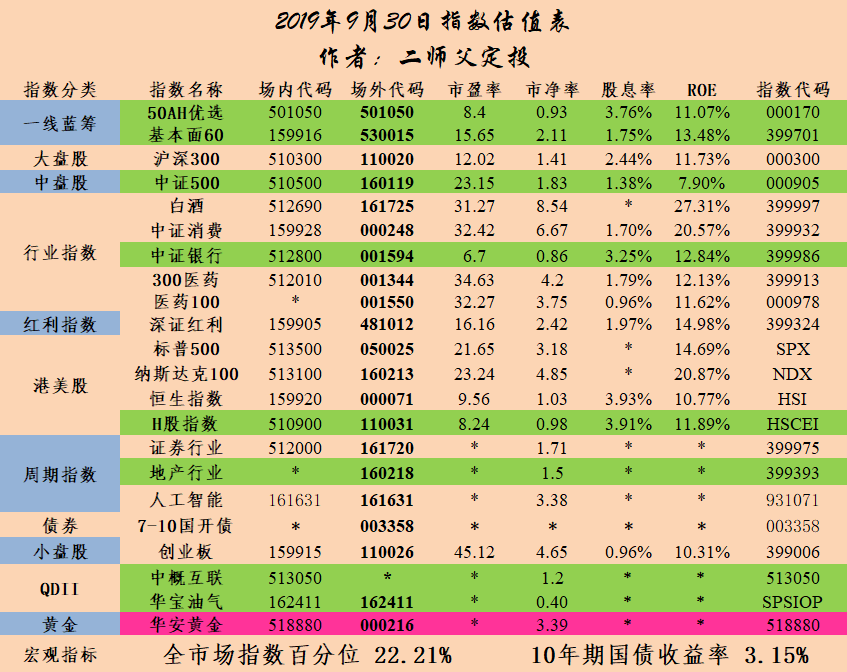

======================================================

_type: talk
@二师父[28814221155551]
2019-09-30 23:39:02 Mon  
topic_id: 841588584454412

<e type="hashtag" hid="551848115444" title="#周一市场总结#" /> 蛋卷的基金周报做的很好，分享给大家，里面都是数据的展示。

阅读[2890]  评论[0]  赞[0] 

+++++++++++++++++++++++++++++++++++++++++++++++++++++

文件：
2019-09-30 23:38:57 Mon
文件大小：[321883]
48584281445288-蛋卷基金周报0929.docx

======================================================

