_type: talk
@树叶[544811512145144]
2020-02-01 09:32:39 Sat  
topic_id: 241855115244211

<e type="hashtag" hid="142825811122" title="#定投周报#" /> 二师父定投周报第44期

@Della🌻🌴明 at 2020-02-01 09:32:39 Sat

> 认真的二师父很帅！

----------

阅读[5478]  评论[1]  赞[0] 

+++++++++++++++++++++++++++++++++++++++++++++++++++++

文件：
2020-02-01 09:32:32 Sat
文件大小：[273881]
51518442848884-二师父定投周报2.1（第44期）.docx

======================================================

_type: talk
@二师父[28814221155551]
2020-02-01 14:21:14 Sat  
topic_id: 241855118451441

<e type="hashtag" hid="555855444224" title="#理性思考#" /> 1月31日从中国科学院上海药物所获悉，该所和武汉病毒所联合研究初步发现，中成药双黄连口服液可抑制新型冠状病毒。

人民日报抢先报道，结果5分钟全网双黄连售光，甚至连鸡鸭服用的双黄连也被卖光

典型的羊群效应，跟风，买指数买股票也一样，不要听专家预测，自己先搞清楚其中的原理，为什么买，赚什么钱，这样才不至于成为市场那百分之70亏损的人

@我还没有考驾照 at 2020-02-01 14:21:14 Sat

> 开盘大跌，理性的人会不会被羊群踩踏？

----------

@Sunflower at 2020-02-01 14:21:14 Sat

> 专家说不要出门，好多人都不听劝[捂脸]

----------

@二师父 at 2020-02-01 14:21:14 Sat

> 都是2600到3000之间积累的筹码，下跌也不用怕

----------

@齿轮 at 2020-02-01 14:21:14 Sat

> 下跌才能更好加仓

----------

@Pansy at 2020-02-01 14:21:14 Sat

> 如果双黄连有用，还要钟先生去武汉干什么？为什么遇到事情的时候总是不舍得用脑子想想呢，脑子就是用来思考的啊……千万不要当摆设啊！
在疫情面前，应该保持理智冷静的思考才是啊！

----------

阅读[5415]  评论[5]  赞[0] 

======================================================

_type: talk
@二师父[28814221155551]
2020-02-01 20:15:16 Sat  
topic_id: 421844111522858

慢慢思考，果断决策，不论是股市买卖还是人生选择都一样

@老孙头 at 2020-02-01 20:15:16 Sat

> 跟投的南方中证券商指数，是否可减仓一部分？行情再启动时再补？

----------

@二师父 at 2020-02-01 20:15:16 Sat

> 可以

----------

阅读[6290]  评论[2]  赞[0] 

+++++++++++++++++++++++++++++++++++++++++++++++++++++

文件：
2020-02-01 20:14:42 Sat
文件大小：[25159]
28281448211421-买或者卖，都要用慢思考.docx

======================================================

_type: talk
@二师父[28814221155551]
2020-02-02 14:33:09 Sun  
topic_id: 118525228554582

明天开市，淡定一点，看的越少，越不慌，如果不准备买或者卖就别看账户了

@王燕 at 2020-02-02 14:33:09 Sun

> 有点不淡定啊！不知道得跌多少，鳄鱼计划发车时师父记得说一下。

----------

@范毅君 at 2020-02-02 14:33:09 Sun

> 买，半仓，一点一点进

----------

@苍天有井明月空🌙 at 2020-02-02 14:33:09 Sun

> 

----------

@二师父 at 2020-02-02 14:33:09 Sun

> 计划明天，看情况，不用过于担心

----------

@自由飞翔 at 2020-02-02 14:33:09 Sun

> 师父说的都是我所想并想问的，进星球就能看到及时的答案[抱拳][抱拳]

----------

阅读[5254]  评论[5]  赞[0] 

======================================================

_type: talk
@二师父[28814221155551]
2020-02-02 20:07:15 Sun  
topic_id: 421848485844228

<e type="hashtag" hid="822124528542" title="#恒生指数#" /> 2月3日要开展1.2万亿的公开市场逆回购操作投放资金，这是对市场的利好，主要是对冲黑天鹅的利空，不管明天走势如何，严格按照定投纪律操作是没有问题的，二师父判断是要跌，所以如果准备买卖就打开账户，如果已经满仓不准备减仓就别看账户了。等到下次投资者情绪较高的时候再打开即可。

@王模堂 at 2020-02-02 20:07:15 Sun

> 场内恒生指数代码和场外指数代码是多少？

----------

@特仑苏 at 2020-02-02 20:07:15 Sun

> 二师父，逆回购操作资金是什么？

----------

@二师父 at 2020-02-02 20:07:15 Sun

> 见置顶文章估值表

----------

@二师父 at 2020-02-02 20:07:15 Sun

> 央行投放的

----------

阅读[5356]  评论[4]  赞[0] 

+++++++++++++++++++++++++++++++++++++++++++++++++++++

文件：
2020-02-02 20:04:16 Sun
文件大小：[24304]
51518448852844-恒生指数投资价值分析.docx

======================================================

_type: talk
@二师父[28814221155551]
2020-02-02 20:24:19 Sun  
topic_id: 548121215148854

<e type="hashtag" hid="455152458818" title="#关于股票投资#" /> 最近很多读者问我自己买的股票怎么办，一般都是属于追涨买入然后被套的情形，这种问我我也很难办，最好的办法是不投资股票。

如果真的有兴趣，主要是男性，天生的性格，喜欢扩张，喜欢研究，那么再买入一只股票之前，先下载这只企业五年的财务报表，把财务报表都读懂了然后再考虑是否需不需要买，这是基本功，如果不做好，即使未来买了好股票也拿不住的。

现金流量表，资产负债表，利润表必须都读懂了，读不懂怎么办，还是老老实实的投资指数。

阅读[5378]  评论[0]  赞[0] 

======================================================

_type: talk
@王模堂[241848855148111]
2020-02-03 01:26:07 Mon  
topic_id: 548121214841224

<e type="hashtag" hid="822124528542" title="#恒生指数#" /> 恒生指数可以埸内交易吗？埸内埸外代码多少？

@铁观音 at 2020-02-03 01:26:07 Mon

> 可以看一下公众号里面的估值表，里面都有

----------

@王模堂 at 2020-02-03 01:26:07 Mon

> 谢谢各位。

----------

阅读[5195]  评论[2]  赞[0] 

======================================================

_type: talk
@二师父[28814221155551]
2020-02-03 09:35:51 Mon  
topic_id: 841858528218552

<e type="hashtag" hid="881251425252" title="#鳄鱼计划#" /> 买入恒生指数一份，500ETF一份，机会来了，按照节奏加仓

@陈伟 at 2020-02-03 09:35:51 Mon

> 老师，我刚加入，一份是多少？

----------

@铁观音 at 2020-02-03 09:35:51 Mon

> 老师，没仓位，现在要建立底仓，买4成，直接买4成恒生和500etf各一半可否？

----------

@二师父 at 2020-02-03 09:35:51 Mon

> 每个人资金不一样根据自己的资金适当分配

----------

@陈伟 at 2020-02-03 09:35:51 Mon

> 好的，那么500ETF是指中证500吗？

----------

@二师父 at 2020-02-03 09:35:51 Mon

> 对的

----------

@二师父 at 2020-02-03 09:35:51 Mon

> 那建立4成合适，不过不用恒生，用300ETF和500ETF建立底仓

----------

@General at 2020-02-03 09:35:51 Mon

> 二师父，请问基金代码是多少

----------

@陈伟 at 2020-02-03 09:35:51 Mon

> 谢谢老师

----------

阅读[5441]  评论[29]  赞[0] 

======================================================

_type: talk
@志亮[422125851552828]
2020-02-03 10:34:18 Mon  
topic_id: 841858528121542

今天真是重伤[撇嘴]，终于明白二师说的要经历过熊市才能成长了，但付出代价太大了。

@海盗 at 2020-02-03 10:34:18 Mon

> 都是浮亏，不卖出就行。反而这是加仓的好时机

----------

@门萨🐨 at 2020-02-03 10:34:18 Mon

> 玩定投的人今天都会觉得很开心[微笑]

----------

@志亮 at 2020-02-03 10:34:18 Mon

> 问题是我己经满仓了[发呆]

----------

@海盗 at 2020-02-03 10:34:18 Mon

> 那持有吧，指数是坑定会涨起来的

----------

@志亮 at 2020-02-03 10:34:18 Mon

> 问题是我满仓的是股票，基金倒是7层仓，唉……这真是太难了[尴尬]

----------

@海盗 at 2020-02-03 10:34:18 Mon

> 股票不是一般人所能驾驭的，市场里百分之八九十都是当韭菜的呀

----------

@背心 at 2020-02-03 10:34:18 Mon

> 买吧，明天直接低开，反正我也买了，感觉有点着急了

----------

@三峡情 at 2020-02-03 10:34:18 Mon

> 我的股票也买不动了，只能眼看着跌，暂时不去管它了，准备加大力度买基金

----------

阅读[4912]  评论[8]  赞[0] 

======================================================

_type: q&a
@波多黎各[28428858544121]
2020-02-03 10:41:40 Mon  
topic_id: 118525245815482

@波多黎各

>  二师傅，以前不懂一直定投的是003318的景顺中证500低波动，现在应该停止转成估值表中的中证500吗？

@二师父

>  换成纯被动的好一些

阅读[5239]  评论[2]  赞[0] 

======================================================

_type: talk
@姥姥不疼. 爷爷不爱[48544481458248]
2020-02-03 10:43:13 Mon  
topic_id: 548121251844514

刚才跟投二师父500ETF一份，买入价5.345，耶[微笑][微笑]

@是喵喵吖～ at 2020-02-03 10:43:13 Mon

> 请问是160119吗场外代码

----------

@姥姥不疼. 爷爷不爱 at 2020-02-03 10:43:13 Mon

> 不是，场内买的

----------

@是喵喵吖～ at 2020-02-03 10:43:13 Mon

> 请问场内代码是？

----------

@姥姥不疼. 爷爷不爱 at 2020-02-03 10:43:13 Mon

> 510500

----------

@是喵喵吖～ at 2020-02-03 10:43:13 Mon

> 好的谢谢啊

----------

@铁观音 at 2020-02-03 10:43:13 Mon

> 我买的成本5.351，比你贵一丢丢

----------

@Supreme Wa* at 2020-02-03 10:43:13 Mon

> 这个是买股票吗？

----------

阅读[5208]  评论[7]  赞[0] 

======================================================

_type: talk
@A0洪氏日杂批发[544885222181514]
2020-02-03 10:52:18 Mon  
topic_id: 118525244242252

一直都在默念，别人恐惧我贪婪，我要贪婪，心里想的加仓一万的，手中动的加了两万仓

@A0洪氏日杂批发 at 2020-02-03 10:52:18 Mon

> 基本面60,恒生国企，沪深300,中证500和中证100，中证银行补仓。上证50指数，天天基金测算只跌2.86点，没有补

----------

阅读[5205]  评论[1]  赞[0] 

======================================================

_type: talk
@二师父[28814221155551]
2020-02-03 11:14:38 Mon  
topic_id: 118525244285552

<e type="hashtag" hid="458588251558" title="#周一市场分析#" /> 今天不用分析了，中国股市的现状就这样，疯长狂跌，其实波动越大，能够利用波动挣钱的越容易

把握节奏，不要贪婪，到了2700点不加仓非要等2500这也是贪婪，相对底部买入然后持有就行，8成仓位主力不动，2成仓位波段，不管什么行情都能赚

估值表今天可以发布一次，少看股市，如果有特殊行情我会公布估值表的，比如今天这种，总之，一切都是为了让大家多赚钱，每个家庭都有每个家庭的不易，希望星球里面的朋友都能多赚一些，生活的更好一些

另外，生活没有什么不可能，股市也没有什么不可能，始终保持对生命的敬畏，对股市的敬畏

@姥姥不疼. 爷爷不爱 at 2020-02-03 11:14:38 Mon

> 谢谢您，二师父[微笑][微笑][抱拳][抱拳]

----------

@清水倾城 at 2020-02-03 11:14:38 Mon

> 置顶的估值表貌似比周报的还旧呢，怎么不一起更新呢

----------

@二师父 at 2020-02-03 11:14:38 Mon

> 休市了

----------

@蓝魔森林 at 2020-02-03 11:14:38 Mon

> 继续按规则定投

----------

@Claire at 2020-02-03 11:14:38 Mon

> 谢谢师父，处处替学友们着想，贴心的服务！

----------

@范* at 2020-02-03 11:14:38 Mon

> 二师父，市场确实低估，但你怎么知道，这就是底部呢？8成仓，太冒险了

----------

@二师父 at 2020-02-03 11:14:38 Mon

> 我场内快9层了，在全市场指数市盈率10个点买的，我不是在大盘3500点买的，所以没有冒险

----------

阅读[5652]  评论[7]  赞[0] 

======================================================

_type: q&a
@孟倩[118822124154582]
2020-02-03 11:15:51 Mon  
topic_id: 241858522541441

@孟倩

>  师父，小白一枚，准备先从场外定投开始实践。是否等您估值表出来计算好比例再行动？目前无仓位，选择哪几只比较好呢？

@二师父

>  易方达沪深300和易方达中证500可以各买入一点，然后开始实践定投，新手入门就从这两只最基本的开始

阅读[5946]  评论[1]  赞[0] 

======================================================

_type: talk
@Philosophe*[544882828818444]
2020-02-03 12:14:39 Mon  
topic_id: 841858522214552

我一学金融的朋友说定投的基金应该在恐慌爆发前赶快卖了，但我的理解一直是浮亏的保留的，今天反而是加仓的时候。也不知道我对了没 求大神们解答，因为是他带我入的定投的坑。有点心慌

@拥抱太阳的风筝 at 2020-02-03 12:14:39 Mon

> 不知道你什么时侯买的，今天我也加点

----------

@雨的依恋 at 2020-02-03 12:14:39 Mon

> 我也加了

----------

@陈飞🤗 at 2020-02-03 12:14:39 Mon

> 现在这个点位，你慌什么

----------

@A0洪氏日杂批发 at 2020-02-03 12:14:39 Mon

> 你朋友说的是爆发前，关键是这个“前”，哪个知道呢，知道的话，我过年前就可以清仓卖出了，今天再买回来

----------

@范毅君 at 2020-02-03 12:14:39 Mon

> 我严重同意你的意见，特别是这次突发疫情，后面还有禽流感，地震，谁又能预测的到呢[可怜]

----------

阅读[5656]  评论[5]  赞[0] 

======================================================

_type: talk
@Philosophe*[544882828818444]
2020-02-03 12:14:39 Mon  
topic_id: 548121255584224

我一学金融的朋友说定投的基金应该在恐慌爆发前赶快卖了，但我的理解一直是浮亏的保留的，今天反而是加仓的时候。也不知道我对了没 求大神们解答，因为是他带我入的定投的坑。有点心慌

阅读[5767]  评论[0]  赞[0] 

======================================================

_type: talk
@二师父[28814221155551]
2020-02-03 17:14:14 Mon  
topic_id: 841858545415152

<e type="hashtag" hid="481211145528" title="#指数估值#" /> 今天特殊行情发布估值表，供大家定投参考，不用担心，少关注股市，除非极端低估和极端高估的时候。之前说锁仓，等2900加，结果两天跌到了2700，今天的鳄鱼计划已经公布，指数和股票都加仓了，严格遵守逆向思维，严格按照纪律，这样涨跌不惊，不要觉得买早了，如果你2700点不敢加仓，我可以肯定2500你早就被吓跑了。

白酒和消费再来三个今天这样的跌幅就可以大举买入了，市场总会有机会的，不要担心子弹上膛，场外定投，场内买入走起来。

@样 at 2020-02-03 17:14:14 Mon

> 今天加了一些，明天准备接着加

----------

@一心一意 at 2020-02-03 17:14:14 Mon

> 鳄鱼计划公布在哪啊[囧]

----------

@二师父 at 2020-02-03 17:14:14 Mon

> 星球啊

----------

@紫色天使 at 2020-02-03 17:14:14 Mon

> 说实话，第一次经历这样的场面，我的心里还是有点恐慌，毕竟白花花的银子就这么看着流走了，心理很慌，总想把之前的卖掉，然后等到底部再一次买入，我总认为自己可以做到，然后想着向二师傅这些牛人都做不到这一点，我又怎么能保证自己做到呢？这当中肯定有操作的难处，突然想起了这句话，别人恐惧我贪婪，别人贪婪我恐惧，我现在有恐惧心理，说明我还只是个韭菜级别的投资者，说明我的理论知识还不够，还需学习，看到二师傅的文章我就淡定了许多，内心告诉自己，不要随意操作，然后安心生活！

----------

@二师父 at 2020-02-03 17:14:14 Mon

> 这是股市的难点，亏的真金白银睡都难受，只是理性的人会克服，这样才能挣到钱

----------

@华为～ at 2020-02-03 17:14:14 Mon

> 二师父，怎么进星球看鳄鱼计划？

----------

@紫色天使 at 2020-02-03 17:14:14 Mon

> 相信星球里80%的人都跟我一样的想法，但是能够管住自己手的人寥寥无几，因为这需要足够的理论知识来支撑你度过这个难关，感谢二师父的陪伴，跟着您学到了很多，尤其在这难关之际，能有高人指点，感到欣慰，也没那么恐慌了！

----------

@雨的依恋 at 2020-02-03 17:14:14 Mon

> 我小白一个，今天跌成这样居然一点也不慌，这是大家的功劳，团队的力量，然后跟买了500ETF，在场外加了点劵商，一看师父发的估值表，券商正常估值[偷笑]明天跌了再加点

----------

阅读[6495]  评论[18]  赞[0] 

+++++++++++++++++++++++++++++++++++++++++++++++++++++

图片：
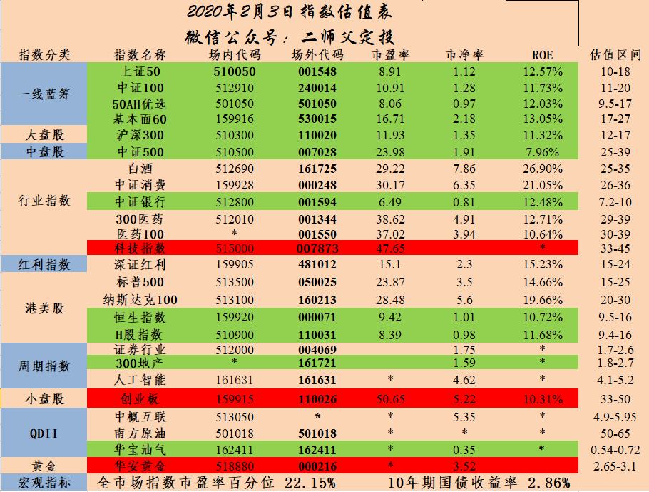

======================================================

_type: talk
@姥姥不疼. 爷爷不爱[48544481458248]
2020-02-03 17:59:03 Mon  
topic_id: 118525212888222

天天基金涉嫌恶意关闭服务器

@凯 at 2020-02-03 17:59:03 Mon

> 确实登不上

----------

@雪莲 at 2020-02-03 17:59:03 Mon

> 我2点半后一直登不上，还以为手机有问题。

----------

@样 at 2020-02-03 17:59:03 Mon

> 我还以为是网络问题，登录多次都死机

----------

@姥姥不疼. 爷爷不爱 at 2020-02-03 17:59:03 Mon

> 实时播报：天天基金尾盘系统故障长达半小时，多位基民无法登陆和操作赎回。截至目前，天天基金仍未发布官方公告或致歉声明。（界面）

----------

@🍀 凝🌸 慧🍀 at 2020-02-03 17:59:03 Mon

> 我也遇到过好几次这情况，可恶啊

----------

阅读[5760]  评论[5]  赞[0] 

+++++++++++++++++++++++++++++++++++++++++++++++++++++

图片：

======================================================

_type: talk
@二师父[28814221155551]
2020-02-03 18:02:22 Mon  
topic_id: 841858548555222

<e type="hashtag" hid="455485542258" title="#网格交易表#" /> 这是网格交易的表格，其实原理，怎么样建立底仓，怎样升级卖出都在课程讲过了，很多同学可能平时比较忙，没时间学习，所以二师父还是定期公布下网格交易表。

大家根据这个价格买入卖出就行啦，我的鳄鱼计划是结合了3个定投策略的，其中就有网格策略，并不简单地买入持有到牛市，所以你也会看到我在券商、500ETF刚进入正常估值的时候有过卖出。这是根据市场特性决定，有人说我投机，但既然在中国股市，就要用符合中国特色的策略，比如苏联的城市包围农村策略在中国就不适用，巴菲特的终身持有目前在中国也是不太适用的，未来可能，那也是很多年以后的事情。

不管怎么变，指数没有进入低估区域从来不投，尽管也错过一些机会，比如人工智能，但是非常安全，不会让自己陷入被套牢的窘境。

@姥姥不疼. 爷爷不爱 at 2020-02-03 18:02:22 Mon

> 重要！！[强][强]

----------

@mumomo at 2020-02-03 18:02:22 Mon

> 二师父，绿色那一行是建立底仓的位置吧。

----------

@二师父 at 2020-02-03 18:02:22 Mon

> 对

----------

@Della🌻🌴明 at 2020-02-03 18:02:22 Mon

> 二师父，一个网格跟去年发的网格表格的底仓价格是做了调整嘛？

----------

@二师父 at 2020-02-03 18:02:22 Mon

> 调整了

----------

@隔窗遥望 at 2020-02-03 18:02:22 Mon

> 绿色代表可以买的价格吗？

----------

@二师父 at 2020-02-03 18:02:22 Mon

> 对，可建立2成底仓的价格

----------

@木蘭荟-黄英💋 at 2020-02-03 18:02:22 Mon

> 二师父想请问  仓位的意思是:预算总共购买这支股票的全部钱。底仓的意思是:低入这个值就可以开始定期买入了。 二成仓的意思是:我预算一万，底仓来了我先购入2千。   我理解的意思对吗

----------

阅读[6300]  评论[23]  赞[0] 

+++++++++++++++++++++++++++++++++++++++++++++++++++++

图片：
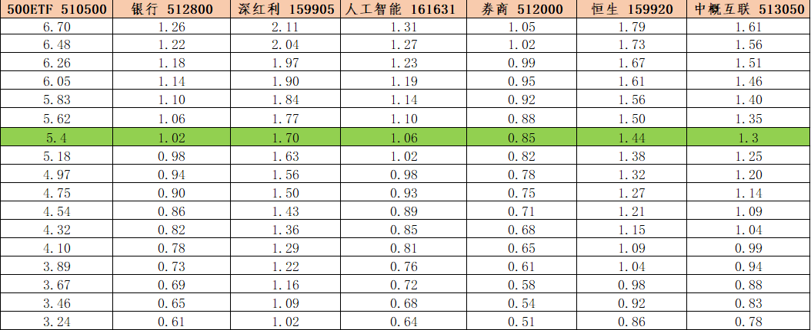

======================================================

_type: talk
@二师父[28814221155551]
2020-02-03 18:17:01 Mon  
topic_id: 548121241212224

<e type="hashtag" hid="825144418522" title="#关于鳄鱼计划#" /> 还有人不知道在哪看鳄鱼计划，看星球，有机会会发布，没机会一直不动或者仅卖出，只能说没好好听讲，置顶文章也有关于实盘的说明

阅读[6287]  评论[0]  赞[0] 

+++++++++++++++++++++++++++++++++++++++++++++++++++++

图片：
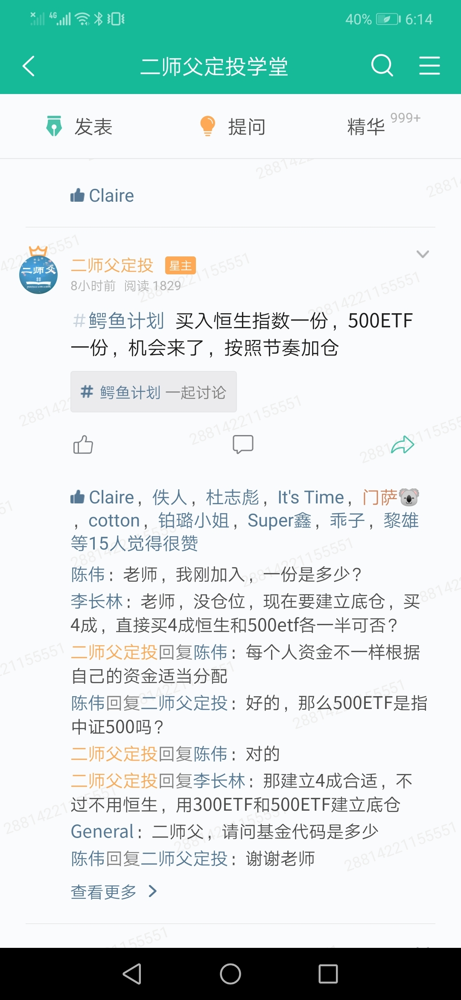
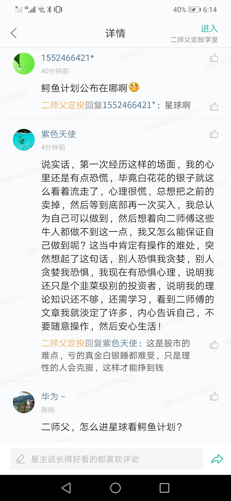

======================================================

_type: talk
@二师父[28814221155551]
2020-02-03 20:37:27 Mon  
topic_id: 548121241481444

A股暴跌，外资买入，你也需要，仓位够的就网格，仓位不够的就继续加仓，就这样。未经失意，不能说懂人生；未经暴跌，不能说懂股市；未经失恋，不能说懂得爱情。很多事情，需要经历才懂，而有智慧的人会提前学习，在经历之前就懂得了其中的道理，经历之时就会减轻很多痛苦。这是学习与不学习的区别。

@铁观音 at 2020-02-03 20:37:27 Mon

> 师傅有没有好的基本面的股票推荐一两只呢？

----------

@二师父 at 2020-02-03 20:37:27 Mon

> 股票不推荐，想投资股票自己学习财务报表课程

----------

@Claire at 2020-02-03 20:37:27 Mon

> 读书让我们提升了认知，经历让我们丰富了体验。

----------

阅读[6949]  评论[3]  赞[0] 

+++++++++++++++++++++++++++++++++++++++++++++++++++++

文件：
2020-02-03 20:34:32 Mon
文件大小：[24418]
28281414518511-A股在暴跌，外资在买入.docx

======================================================

_type: talk
@姥姥不疼. 爷爷不爱[48544481458248]
2020-02-04 10:06:09 Tue  
topic_id: 241858518552551

鳄鱼作业：买入券商一份，买入价0.85，坐等起飞，耶[太阳][太阳][微笑][微笑]

@Rujing静 at 2020-02-04 10:06:09 Tue

> 场内还是场外啊二师父

----------

@姥姥不疼. 爷爷不爱 at 2020-02-04 10:06:09 Tue

> 二师父不在，我是学员，我在场内买入

----------

@秦风殇韵（刘豫斌） at 2020-02-04 10:06:09 Tue

> 估值表里面券商时正常估值下限吧，为啥不买低估的指数呢？

----------

@姥姥不疼. 爷爷不爱 at 2020-02-04 10:06:09 Tue

> 估值都是相对的，木有绝对的低估

----------

阅读[5406]  评论[4]  赞[0] 

======================================================

_type: q&a
@隔窗遥望[241884481854181]
2020-02-04 10:51:15 Tue  
topic_id: 421848418882258

@隔窗遥望

>  在天天基金购买场内基金，要转到东方财富开户购买吗？

@二师父

>  是的，不过建议从我这里华泰开户，费率更低，东方财富会有额外的5元佣金

阅读[5610]  评论[2]  赞[0] 

======================================================

_type: talk
@二师父[28814221155551]
2020-02-04 11:10:06 Tue  
topic_id: 841858518815182

<e type="hashtag" hid="881288554512" title="#基金分析#" />006327，中证海外连接人民币，这只基金追踪的是中证海外互联网50指数。

 中证海外中国互联网50指数选取海外交易所上市的50家中国互联网企业作为样本股，采用自由流通市值加权计算。

重仓股票是腾讯控股、阿里巴巴、美团、京东等中国互联网巨头，可以说现在没有公司可以撼动腾讯控股和阿里巴巴的地位，这两个公司在整个指数里面的持仓股票占60%。是投资者投资互联网公司的最佳选择，投资科技企业有科技龙头，纳斯达克和中概互联。相比较而言中概股的风险更低一些，业绩会更加稳定。

截至2019年12月这只基金的规模已经超过了1亿，未来等待中概互联50进入低估也可以考虑中证海外连接人民币。

@蓝色流星 at 2020-02-04 11:10:06 Tue

> 基本面60能恢复定投了吗？

----------

@二师父 at 2020-02-04 11:10:06 Tue

> 可以

----------

@是喵喵吖～ at 2020-02-04 11:10:06 Tue

> 师傅之前定投的50AH 中证银行可以恢复定投吗

----------

@二师父 at 2020-02-04 11:10:06 Tue

> 可以

----------

@特仑苏 at 2020-02-04 11:10:06 Tue

> 二师父科技股还有一个161128易普标信息科技人民币。这个基金追踪的是普标500里面的科技股，和纳斯达克里面重仓重合的有，苹果，微软，思科，英特尔。二师父怎么看这只基金，如果和纳斯达克一起买，重启度算高吗？如果只选择一个，哪一个更能体现科技股，或者是说更有价值。

----------

@二师父 at 2020-02-04 11:10:06 Tue

> 纳斯达克更有价值，这是纳斯达克市场剔除了金融股以后选择的100只高科技、高成长股票，科技股指数纳斯达克，互联网指数中概互联，目前是最有价值的

----------

阅读[5786]  评论[6]  赞[0] 

======================================================

_type: talk
@二师父[28814221155551]
2020-02-04 19:42:41 Tue  
topic_id: 421848844254188

<e type="hashtag" hid="145255528842" title="#放弃预测#" /> 耐心定投，坚持积累，每周四的定投还会继续的，目前的机会很好，后天继续开始，不要着急，市场总是不缺机会的。

有人预测今天跌，其实我倒希望跌，我还想再跌7%，不过市场不会对你那么好的，那么对付市场最好的方法就是定投，不管他上涨还是下跌。

@圣诞结® at 2020-02-04 19:42:41 Tue

> 昨天加仓，结果涨了，没赶上最低的[捂脸][捂脸]

----------

@静 at 2020-02-04 19:42:41 Tue

> 只要是低估区域，不管哪个点定投都行，但一定要坚持定投，不要被短期时间内涨跌所害怕

----------

@蓝魔森林 at 2020-02-04 19:42:41 Tue

> 我身边还有一些朋友，昨天跟我说尽快加仓，2700的机会很快就会没有。我就继续按照我的节奏来，不预测趋势，只按照规则来，投资未来，不在乎短期涨跌。

----------

@二师父 at 2020-02-04 19:42:41 Tue

> 心态好最好，谁也不知道股市的短期走向

----------

阅读[5662]  评论[4]  赞[0] 

+++++++++++++++++++++++++++++++++++++++++++++++++++++

文件：
2020-02-04 19:40:36 Tue
文件大小：[24723]
15458822441512-李大霄脸都被打肿了，你怎么还在预测市场.docx

======================================================

_type: talk
@二师父[28814221155551]
2020-02-04 19:47:12 Tue  
topic_id: 421848844258148

<e type="hashtag" hid="555842525524" title="#指数基金持久战#" /> 如果做到了，按照二师父说的做，一针二力三心四户，你现在除了担心病毒，对于股市不可能担心的。学习，实践，简单吗？不简单，就是每天打卡这么简单的事情也不是每个人都能坚持的，不信试试，坚持下来的指数投资肯定非常成功，也过得比较开心。

@陌路花 at 2020-02-04 19:47:12 Tue

> 定投坚持了快一年，昨天一天由浮盈转为浮亏，但并不害怕，低估就坚持定投，谢谢二师父一路的鼓劲。

----------

@衣袂飘香 at 2020-02-04 19:47:12 Tue

> 说的真好，投资基金，功夫在股市之外。

----------

@二师父 at 2020-02-04 19:47:12 Tue

> 港股A股低迷，回暖了就好了

----------

@银河系 at 2020-02-04 19:47:12 Tue

> 建议二师父以后可以的话发文字，发PDF每次都是等到蛋卷推送才看[尴尬]

----------

@老孙头 at 2020-02-04 19:47:12 Tue

> 文字咋模糊不清？诸位有吗？[抱拳]

----------

@二师父 at 2020-02-04 19:47:12 Tue

> 蛋卷？

----------

阅读[6041]  评论[17]  赞[0] 

+++++++++++++++++++++++++++++++++++++++++++++++++++++

文件：
2020-02-04 19:45:26 Tue
文件大小：[561748]
28281155224411-论指数基金定投持久战.pdf

======================================================

_type: talk
@六尘不改[241555484551821]
2020-02-04 22:36:54 Tue  
topic_id: 548121524545554

我在天天基金定投基金，昨天大跌的时候3点前补仓，然而发现今天反弹后的收益并未计算昨天补仓的部分资金，比如我本来有一万的基金，昨天补仓一万，今天涨了3%，确只给我按原来的一万计算收益只有300，也就是说今天买入的基金不是按今天的净值买入吗？有谁明白可以给我解释一下谢谢

@凯 at 2020-02-04 22:36:54 Tue

> 显示更新慢，过两天看

----------

@六尘不改 at 2020-02-04 22:36:54 Tue

> 但是今天的收益已经更新了，并没有昨天补仓的部分，难道明后天再给我算进去，没那么好的事吧？

----------

@风云 at 2020-02-04 22:36:54 Tue

> 前天天天的系统出了问题

----------

阅读[5062]  评论[3]  赞[0] 

======================================================

_type: talk
@堂吉诃德的小助手[15528821588422]
2020-02-05 10:16:06 Wed  
topic_id: 241858285821821

这个涨这么多，是算错了？到底挣得有没有这么多？40%？一天

@堂吉诃德的小助手 at 2020-02-05 10:16:06 Wed

> 有没有人能回答一下？

----------

@二师父 at 2020-02-05 10:16:06 Wed

> 这是分级基金折算，后面会调整过来的

----------

@堂吉诃德的小助手 at 2020-02-05 10:16:06 Wed

> 那就是没挣这么多？

----------

@堂吉诃德的小助手 at 2020-02-05 10:16:06 Wed

> 分级不是加杠杆？加完也挣不了这么多吧？

----------

@范* at 2020-02-05 10:16:06 Wed

> 基金上有下折公告你看到了没。
现在这会你看到的盈利都是虚假的，因为你卖不出去。暂停交易了。比如你有100份额，每份1元，你总共有100元的基金。下折后变50份额，每份2元了，你还是有100元基金。

----------

@堂吉诃德的小助手 at 2020-02-05 10:16:06 Wed

> 白欢喜啊

----------

阅读[4932]  评论[6]  赞[0] 

+++++++++++++++++++++++++++++++++++++++++++++++++++++

图片：
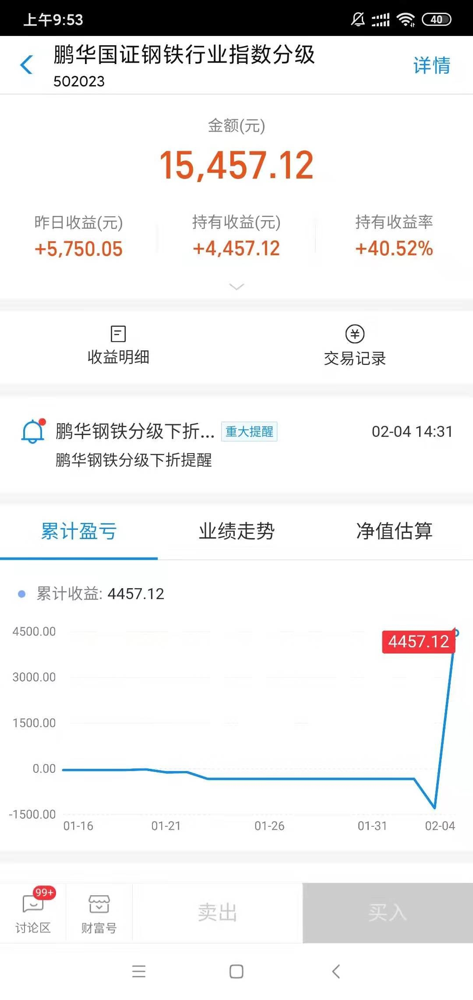
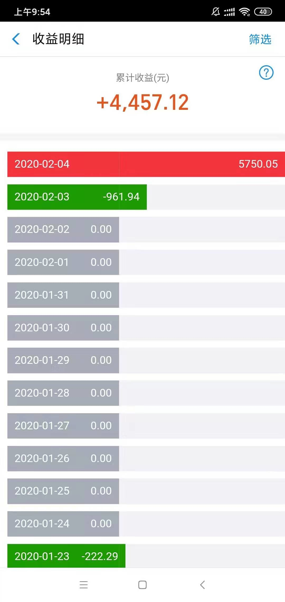

======================================================

_type: talk
@二师父[28814221155551]
2020-02-05 11:19:32 Wed  
topic_id: 421848585888458

<e type="hashtag" hid="555425184554" title="#周三答疑#" /> 星球文字发不出去，答疑就这样了，目前的应对策略。涨了我继续网格，跌了我继续加仓。主仓位不动，剩余网格。场外一直定投到牛市到来。

@Joey  at 2020-02-05 11:19:32 Wed

> 师傅 你上次好像说过年后开盘医药准备卖一半，还卖不卖呢

----------

@二师父 at 2020-02-05 11:19:32 Wed

> 还没卖，因为暴跌了，高估了可以卖一半的，医药已经盈利很多

----------

@冬夫 at 2020-02-05 11:19:32 Wed

> 二师傅，定投H股指数买恒生还是H股指数？

----------

@二师父 at 2020-02-05 11:19:32 Wed

> 场外h股指数，场内买的恒生

----------

阅读[5077]  评论[4]  赞[0] 

+++++++++++++++++++++++++++++++++++++++++++++++++++++

图片：
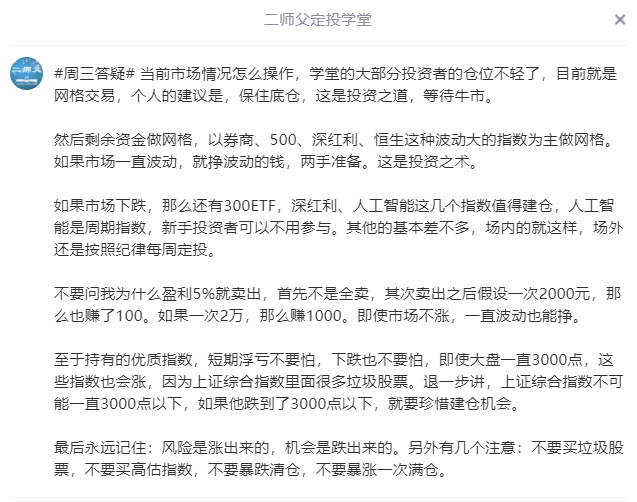

======================================================

_type: talk
@🍀 凝🌸 慧🍀[841855248254242]
2020-02-05 15:09:56 Wed  
topic_id: 841858284281552

二师父好！一直在跟您学习场外场内投资，除了坚持场外定投指数基金，这两天趁市场大跌，初次尝试按照您的场内网格交易策略。今天就小赚了快4000，把利润买了，保持仓位，利用波动赚钱。谢谢二师父！还要继续学习，这只是初次实践场内交易。

@二师父 at 2020-02-05 15:09:56 Wed

> 主仓位不动，等待牛市的到来

----------

@🍀 凝🌸 慧🍀 at 2020-02-05 15:09:56 Wed

> 好哒好哒，谢谢二师父！[愉快][抱拳][抱拳][抱拳]

----------

@清水倾城 at 2020-02-05 15:09:56 Wed

> 这是多少资金在做网格，一天就挣4000，[强]

----------

@是喵喵吖～ at 2020-02-05 15:09:56 Wed

> 同问哈哈哈

----------

阅读[4566]  评论[4]  赞[0] 

======================================================

_type: talk
@一筐石头[88281282515822]
2020-02-05 15:27:57 Wed  
topic_id: 421848582524188

二师父，你好，现在开始定投中证500，是否合适，现在投入仓位多少比较合适

@二师父 at 2020-02-05 15:27:57 Wed

> 沪深300和中证500都可以

----------

@一筐石头 at 2020-02-05 15:27:57 Wed

> 目前点位适合多少仓位投入

----------

@二师父 at 2020-02-05 15:27:57 Wed

> 5成仓位没问题

----------

@一筐石头 at 2020-02-05 15:27:57 Wed

> 网格是什么意思？求解

----------

@二师父 at 2020-02-05 15:27:57 Wed

> 就是底部波段操作，建议听听课程，或者按照网格价格表操作

----------

@心韵 at 2020-02-05 15:27:57 Wed

> 今天网格卖出一份政卷

----------

阅读[4710]  评论[6]  赞[0] 

======================================================

_type: talk
@二师父[28814221155551]
2020-02-05 15:47:50 Wed  
topic_id: 548121514422284

有人问我问题，啥适合做网格，我答券商，他又问券商他看很多人亏了，真的适合吗，我说适合，他又问，券商波动大，波动大的适合网格吗，我说，波动大的适合。他还在问

打破砂锅问到底不是个好习惯

@清水倾城 at 2020-02-05 15:47:50 Wed

> 喂饭文可解决[偷笑]

----------

@大⭐ at 2020-02-05 15:47:50 Wed

> [偷笑][偷笑]

----------

@老司基 at 2020-02-05 15:47:50 Wed

> 师父，咨询一下开户事宜。
1.直接扫描公众号二维码开户，费率费率自行调整还是需要联系谁？
2.第一次开户，开创业板是必须到营业厅？全国哪里的都可以？
3.我看你那开户有华泰还有华宝，我只做场内ETF基金，选哪个划算？

----------

@🍀 凝🌸 慧🍀 at 2020-02-05 15:47:50 Wed

> 我在定投指数基金前，偶然看见了二师父的评论，文章观点很是吸引我。后来，仔细阅读了二师父2019年的所有文章，再学习二师父五步定投法，然后就先开始实践场外定投。这期间，边投边总结反思，发现自己存着很多投资纪律上的问题[偷笑]。后来觉得学习上“吃不饱”，继续购买课程进一步提升。

----------

@二师父 at 2020-02-05 15:47:50 Wed

> 1，基金经理会给你电话2，开户创业板需要到附近营业厅3，都一样

----------

@🍀 凝🌸 慧🍀 at 2020-02-05 15:47:50 Wed

> 建议打破砂锅问到底之前，还是自己要完成基础功课吧。

----------

@是喵喵吖～ at 2020-02-05 15:47:50 Wed

> 给你点赞 向你学习 我学习上还是没有太上进[呲牙]

----------

@🍀 凝🌸 慧🍀 at 2020-02-05 15:47:50 Wed

> 哈哈，咱们要珍惜这个缘分，在二师父带领下一起好好学习，互相启发，共同提高！[愉快][抱拳][抱拳]

----------

阅读[5101]  评论[10]  赞[0] 

======================================================

_type: talk
@二师父[28814221155551]
2020-02-05 18:15:58 Wed  
topic_id: 841858281842152

<e type="hashtag" hid="481211145528" title="#指数估值#" /> 今日份估值表，低估的仍旧很多，如果仓位不足可以继续定投，300医药高估，可以继续拿着，也可以分步卖出。资金不用的话也可以持有。

网格券商今日可以出一份，目前的位置挺好，向上继续卖，向下继续买，如果明天继续跌，再加仓一次，如果不跌，那就暂停了。

今日定投稍后继续，不要着急，A股定投从来不缺机会，缺钱，二师父的定投策略适合A股的长熊市，如果以后A股市场环境变了，我的策略也会变的，二师父认为在中国股民的推动下，即使注册制到来，牛短熊长的特性短期也改变不了，所以大家可以利用这个策略做好现在的投资，十几年以后市场环境变了，到时候我们赚的也差不多了。

@蓝魔森林 at 2020-02-05 18:15:58 Wed

> 本周定投实盘有参考吗？

----------

阅读[5524]  评论[1]  赞[0] 

+++++++++++++++++++++++++++++++++++++++++++++++++++++

图片：
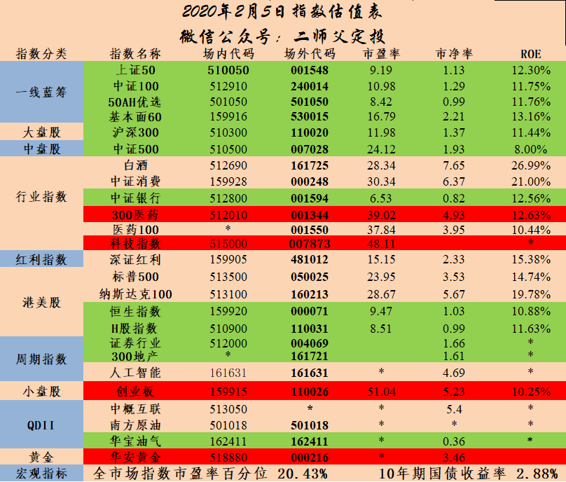

======================================================

_type: talk
@二师父[28814221155551]
2020-02-05 18:37:05 Wed  
topic_id: 841858281811242

<e type="hashtag" hid="144812115422" title="#223期定投实盘#" /> 本周已经买入，在天天基金实盘公布，每周三收盘操作，以周四收盘价格成交，新的一年场外定投实盘券商暂停，未来盈利逐步卖出,都是在极度低估区域定投的优质指数，牛市到来盈利都会很好，这个基金波动大，适合场内波段操作，鳄鱼计划目前场内操作有购买券商ETF，费率低，短期和长期都适合。

医药、消费、中概互联都是优质的行业指数，目前不低估，耐心等待，等机会来了再定投，要始终相信，市场会给机会的，曾经医药低估到很多人怀疑医药不会再涨起来。

@蓝魔森林 at 2020-02-05 18:37:05 Wed

> 50ah买了，为什么还要买h股指数呀？50ah会挑两地便宜的买

----------

@二师父 at 2020-02-05 18:37:05 Wed

> 他俩不完全重复，H股里面还有一些只在港交所上市的企业

----------

@老司基 at 2020-02-05 18:37:05 Wed

> 师父，天天实盘跟投每次都是按你所有比例跟投，并不是当期跟投，请问怎么搞？

----------

@二师父 at 2020-02-05 18:37:05 Wed

> 第二次是根据当期买入投的

----------

@雨淡风清 at 2020-02-05 18:37:05 Wed

> 跟上二师父节奏。坚定信心

----------

@门萨🐨 at 2020-02-05 18:37:05 Wed

> 回忆起医药低估的那段时间[捂脸]

----------

@二师父 at 2020-02-05 18:37:05 Wed

> 当时很多人劝我别买了

----------

@门萨🐨 at 2020-02-05 18:37:05 Wed

> 哈哈哈哈[坏笑]

----------

阅读[5724]  评论[24]  赞[0] 

+++++++++++++++++++++++++++++++++++++++++++++++++++++

图片：
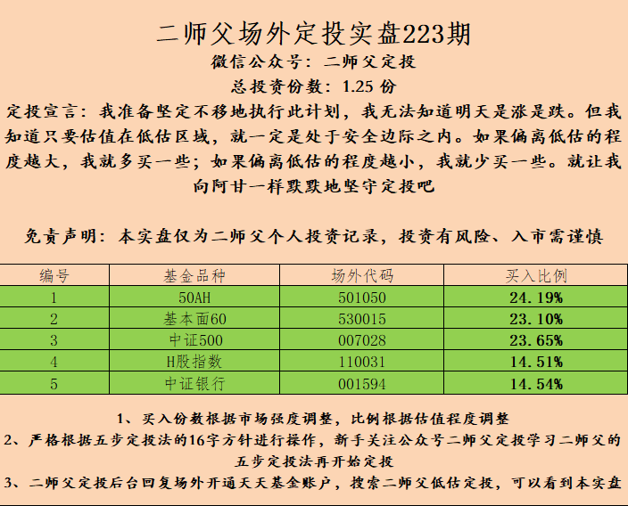

======================================================

_type: talk
@二师父[28814221155551]
2020-02-05 20:35:21 Wed  
topic_id: 118525445142522

<e type="hashtag" hid="455124185888" title="#消费指数#" /> 目前消费指数并不值得购买，再等等，现在买不会过错，可是违背一次纪律，下一次可能就收不住了，原则是不能违背的

@元亨 at 2020-02-05 20:35:21 Wed

> 纪律

----------

@紫色天使 at 2020-02-05 20:35:21 Wed

> 今天一口气再次看了一遍二师傅的荔枝微课的课程，感觉参透了很多，理解了更多！！！

----------

@二师父 at 2020-02-05 20:35:21 Wed

> 棒

----------

@JOY at 2020-02-05 20:35:21 Wed

> 是哈，纪律太重要了，年前差点忍不住就买了主动基金～

----------

阅读[5045]  评论[4]  赞[0] 

+++++++++++++++++++++++++++++++++++++++++++++++++++++

文件：
2020-02-05 20:34:11 Wed
文件大小：[107003]
51518828181884-消费指数如此抗跌，现在可以买入吗.docx

======================================================

_type: q&a
@20181108……[51511128814554]
2020-02-06 08:59:02 Thu  
topic_id: 421848552184288

@20181108……

>  二师父好，基本面60场内和场外购买有无区别？

@二师父

>  费率的区别最主要，这个ETF场内成交额不大

阅读[4706]  评论[1]  赞[0] 

======================================================

_type: talk
@二师父[28814221155551]
2020-02-06 09:38:26 Thu  
topic_id: 241858245488151

<e type="hashtag" hid="881251425252" title="#鳄鱼计划#" /> 买入300ETF两份，深红利一份，仅为个人投资记录，目前很好的机会，不贪婪也不恐惧，市场不会一下子到底部，也不会一下子到顶部，别猜底部在哪

@学以致用 at 2020-02-06 09:38:26 Thu

> 目前深红利进入低估了吗？

----------

@丸子妈 at 2020-02-06 09:38:26 Thu

> 二师父，如果还没建立底仓的，现在可以开始启动吗

----------

@二师父 at 2020-02-06 09:38:26 Thu

> 说明下，开盘挂的单，深红利成交价1.856，300成交价3.8

----------

@二师父 at 2020-02-06 09:38:26 Thu

> 上午开盘跌了在低估界限了

----------

@二师父 at 2020-02-06 09:38:26 Thu

> 可以

----------

@背心 at 2020-02-06 09:38:26 Thu

> 紧紧跟随

----------

@陈伟 at 2020-02-06 09:38:26 Thu

> 都在场内吗？

----------

@二师父 at 2020-02-06 09:38:26 Thu

> 是的

----------

阅读[5636]  评论[15]  赞[0] 

======================================================

_type: q&a
@娃娃after🎈[88818155445112]
2020-02-06 12:41:47 Thu  
topic_id: 421848528245448

@娃娃after🎈

>  天天基金里的实盘一直不显示2月5日的动态？app的问题吗？

@二师父

>  他有延迟显示的，我昨天操作了

阅读[4689]  评论[2]  赞[0] 

======================================================

_type: talk
@二师父[28814221155551]
2020-02-06 13:29:21 Thu  
topic_id: 421848528121288

<e type="hashtag" hid="555841222824" title="#长江电力财务报表分析#" />最近有同学学习财务报表课程，学习非常认真，做了详细的笔记，在正确的方向上，按照这种精神业余时间学习3到5年的时间，投资水平一定飞速增长，我也在向大家学习，踏实认真地积累财务知识。

这是我对长江电力财务报表的解读，和这位朋友的解读有些不一样的地方，可以相互交流，正好现在还有时间，上班之后可能就没有更多的时间天天钻研财务报表了。

长江电力是中国三峡集团控股的上市公司,主要从事水力发电业务,现拥有三峡、葛洲坝、溪洛渡和向家坝四座电站的全部发电资产,年设计发电能力1918.5亿千瓦时。截至2017年底,公司水电装机82台,装机容量4549.5万千瓦,其中单机70万千瓦及以上级巨型机组58台,占世界投产的单机70万千瓦及以上水电机组总数的半数以上,是国内大型的电力上市公司和全球大型的水电上市公司。

长江电力经营活动中产生现金流净额最近5年397.4亿，396.9亿，389.9亿，397.9亿，213亿。筹资活动中的现金流净额分别是负304.7亿，负280.3亿，40.7亿，负378.4亿，负196.1亿。最近两年偿还债务、分配股利的资金增多，吸收到的投资资金减少。期末现金流储备处于一个稳定的状态。

2018年毛利率62%，净利率42%，近几年扣非净利润增长率48%，16%，8%，-0.8%。利润增长有所下滑。

应收账款占总资产比重2%，存货占总资产0.1%，比率较低，应收账款周转天数21天，存货周转天数4.6天，回款速度较慢，存货周转很快。根据杜邦分析，杠杆偏高，然而资产周转率偏低导致净资产收益率偏低。

流动比率和速冻比率偏低，在水电行业里面偿债能力较弱。另外资产负债率单一指标不足以判定企业得负债偿还情况，需要结合流动、速冻比率以及企业得现金流量情况。经营活动现金流确实高于净利润，这是个好得指标，需要注意，这只意味着公司短期没有死掉的风险。

@阿宝 at 2020-02-06 13:29:21 Thu

> 谢谢老师。

----------

@紫色天使 at 2020-02-06 13:29:21 Thu

> 二师父，今天看到了您的华泰佣金免五的开户福利，可是在加入您星球之前我已经开通了华泰证券，那我可以把我现有的华泰账户注销，然后再通过扫您的二维码再开户呢？

----------

@二师父 at 2020-02-06 13:29:21 Thu

> 可以，你也可以开广发的

----------

@紫色天使 at 2020-02-06 13:29:21 Thu

> 广发也是免五吗，二师父？

----------

@二师父 at 2020-02-06 13:29:21 Thu

> 是的

----------

@紫色天使 at 2020-02-06 13:29:21 Thu

> 需要通过您的渠道开户吗，我好像没看到您的渠道

----------

@二师父 at 2020-02-06 13:29:21 Thu

> 置顶文章有的

----------

@齿轮 at 2020-02-06 13:29:21 Thu

> 三峡集团是国资委明确的十家争创世界一流示范企业的一家，实力雄厚。

----------

阅读[5470]  评论[9]  赞[0] 

======================================================

_type: talk
@凯[244415182418811]
2020-02-06 15:26:00 Thu  
topic_id: 241858242488211

今天用华宝证券建立了两个网格

@杜志彪 at 2020-02-06 15:26:00 Thu

> 这个价格有点高啊，我是这个价格昨天卖了一份。

----------

@凯 at 2020-02-06 15:26:00 Thu

> 早上开盘建的底仓，挂的条件单，自动做网格

----------

阅读[4428]  评论[2]  赞[0] 

+++++++++++++++++++++++++++++++++++++++++++++++++++++

图片：
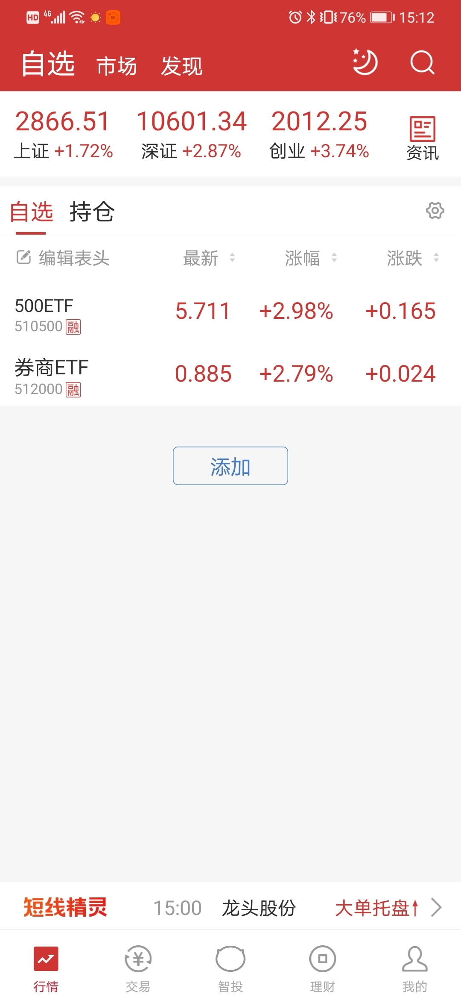

======================================================

_type: talk
@二师父[28814221155551]
2020-02-06 18:43:03 Thu  
topic_id: 841858215542112

每次发布网格表之后就涨，从18年到现在都是这样，不贪心，涨了就出点，跌了再加点，就算牛市不来，也能盈利。我相信牛市会到来的，所以基金份额不要轻易卖出，不管市场是大跌还是大涨

@老孙头 at 2020-02-06 18:43:03 Thu

> 网格交易，适合于什么对象？我一无所知，学习并实战起来如较复杂，就安于跟投指数得了。

----------

@二师父 at 2020-02-06 18:43:03 Thu

> 波动市场，不懂得话定投就行

----------

@蓝魔森林 at 2020-02-06 18:43:03 Thu

> 有个问题，为什么2月5的全市场指数市盈率百分位比2月3日的还要低？ 5号是20.43%

----------

@二师父 at 2020-02-06 18:43:03 Thu

> 市盈率下降了

----------

@蓝魔森林 at 2020-02-06 18:43:03 Thu

> 但是5号的大盘指数比3号要高100点左右。这个怎么理解？

----------

@二师父 at 2020-02-06 18:43:03 Thu

> 指数点位总是不断涨的，上证综合指数最开始几十倍市盈率，100点起步，指数上涨最后市盈率却一直降

----------

@蓝魔森林 at 2020-02-06 18:43:03 Thu

> 那实质上5号定投会比3号能买到更低价格的股份了，投资时机更好？

----------

@蓝魔森林 at 2020-02-06 18:43:03 Thu

> 那是不是也应证了有时候也不要纠结那一两天短期的大盘点数位了。

----------

阅读[5345]  评论[8]  赞[0] 

+++++++++++++++++++++++++++++++++++++++++++++++++++++

文件：
2020-02-06 18:41:45 Thu
文件大小：[24582]
28281182182111-二师父223期低估定投实盘(医药100进入高估区域).docx

======================================================

_type: q&a
@阿宝[422212151424158]
2020-02-06 19:35:44 Thu  
topic_id: 841858215588112

@阿宝

>  老师，如何查看北上资金动向？如何寻找社保基金重仓股票？谢谢

@二师父

>  东方财富，万得都有，社保指数里面有相应股票

阅读[4586]  评论[2]  赞[0] 

======================================================

_type: talk
@二师父[28814221155551]
2020-02-06 21:30:32 Thu  
topic_id: 548121581281114

2月6日晚间，A股分两节登上央视《新闻联播》节目，内容时长分别为1分15秒和1分50秒，合计报道时长达到3分05秒。节目中提到，截至当日下午收盘，A股三大指数已经连涨3天，与此同时，财政、货币、金融等政策措施不断，保证疫情期间资本市场平稳运行。《新闻联播》又报道称，近期国际媒体继续关注中国股市的动向，表示积极看待中国股市前景。同时，多位外国经济专家指出，疫情对中国经济的影响是短暂的，他们对中国经济长期向好充满信心。

@凯 at 2020-02-06 21:30:32 Thu

> 这意思是要来牛市吧

----------

@范毅君 at 2020-02-06 21:30:32 Thu

> 是怕跌厉害了，我感觉，今年经济肯定受影响、不过只要疫情控制住，肯定股市会📈[呲牙]

----------

@二师父 at 2020-02-06 21:30:32 Thu

> 没看到这个意思

----------

@二师父 at 2020-02-06 21:30:32 Thu

> 控制不住要钱也没用了

----------

@范毅君 at 2020-02-06 21:30:32 Thu

> 肯定会控制住，就是牛顿时代，疫情也挺过去了，困难是暂时的，拐点会来的

----------

@陈飞🤗 at 2020-02-06 21:30:32 Thu

> 这说明现在经济不好，一般不好的时候才说好

----------

阅读[4576]  评论[7]  赞[0] 

======================================================

_type: talk
@二师父[28814221155551]
2020-02-06 21:46:11 Thu  
topic_id: 118525485515152

目前道琼斯股票指数分为四个部分：第一部分是工业股票指数，由30种有代表性的大工商业公司的股票组成，反映美国整个工商业股票的价格水平；第二部分是运输业股票指数，包括20种有代表性的运输业公司的股票，由8家铁路运输公司、8家航空公司和4家公路货运公司组成；第三部分是公用事业股票指数，由代表着美国公用事业的15家煤气公司和电力公司的股票组成；第四部分是平均价格综合指数，它是综合前三组股票价格平均指数65种股票而得出的综合指数。

阅读[4581]  评论[0]  赞[0] 

======================================================

_type: talk
@凯[244415182418811]
2020-02-07 09:45:20 Fri  
topic_id: 241858211152141

再建一个网格

@勇气永存 at 2020-02-07 09:45:20 Fri

> 我昨天也建了网格。今天看，发现有一两个标准价被改了，华宝智投这样做太危险了。大家有没有碰到类似的情况？

----------

@凯 at 2020-02-07 09:45:20 Fri

> 我挂的条件单，设定好后就不用管了

----------

@凯 at 2020-02-07 09:45:20 Fri

> 成交后会按新的基准价进行

----------

@凯 at 2020-02-07 09:45:20 Fri

> 

----------

@General at 2020-02-07 09:45:20 Fri

> 这是从哪设置的啊，没找到

----------

@凯 at 2020-02-07 09:45:20 Fri

> 条件单

----------

@General at 2020-02-07 09:45:20 Fri

> 我试了一下涨乐财付通只能设置a股，不能设置基金

----------

@凯 at 2020-02-07 09:45:20 Fri

> 只有华宝证券能自动网格交易

----------

阅读[4300]  评论[11]  赞[0] 

+++++++++++++++++++++++++++++++++++++++++++++++++++++

图片：
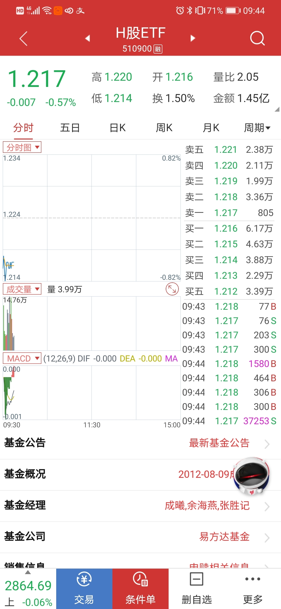
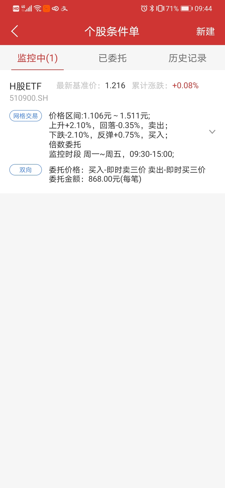

======================================================

_type: talk
@二师父[28814221155551]
2020-02-07 10:14:29 Fri  
topic_id: 241858455558841

<e type="hashtag" hid="825112122842" title="#读书#" /> 学会逆向交易，网格交易也是逆向交易，如果建立了底仓，券商和500都可以出一网了，等待下跌再接回来，当然不一定会回来，可是从18年到现在两年了，券商和500已经波动了N次，我在券商赚的比银行上要多。这就是波动的好处

@凯 at 2020-02-07 10:14:29 Fri

> 券商和500波动大挺适合做网格

----------

@老孙头 at 2020-02-07 10:14:29 Fri

> 都是指基金吧？

----------

@helen at 2020-02-07 10:14:29 Fri

> 出一网是卖掉一格？

----------

@二师父 at 2020-02-07 10:14:29 Fri

> 是啊

----------

阅读[4526]  评论[4]  赞[0] 

+++++++++++++++++++++++++++++++++++++++++++++++++++++

文件：
2020-02-07 10:12:24 Fri
文件大小：[24834]
51518852425154-塞尔登《逆向交易者》第三讲.docx

======================================================

_type: talk
@二师父[28814221155551]
2020-02-07 10:44:23 Fri  
topic_id: 241858455524451

<e type="hashtag" hid="555841184244" title="#关于高估的医药基金#" /> 医药投资二师父投资了三只，第一是场外的医药100，第二是场内的医药ETF，第三是场内的广发医药。

广发医药追踪的是全指医药：全指医药是从中证全指样本股医药卫生行业内选择流动性和市场代表幸较好的股票作为持仓股票。如果行业内股票数量少于或等于50只，那么中证全指医药的样本股就为中证全指里面的全部医药股票。如果行业内股票数量多于50只，那么分别按照股票的日均成交额和日均总市值进行排名筛选。

医药ETF追踪的是300医药，沪深300医药是由沪深300指数样本股中的医药卫生行业股票组成。行业集中度高，截至到2019年11月29日，沪深300医药指数里面的恒瑞医药股票权重30.82%

医药100追踪的是中证医药100：中证医药100指数是从全指医药里面挑选近一年日均总市值在前100名的股票作为指数样本，然后等权重分配，每只股票的权重不会相差很大。

目前三只基金都进入了高估值，投资者需要考虑逐步卖出。当然根据历史情况，这些基金进入高估区域仍旧会继续上涨，所以遵循分步减仓的方法。

切记卖出之后不能追涨，比如你在1.54元卖出了广发医药，别在1.65的时候又给买入，牛市的时候经常有人干这种事，这就是瞎折腾。

曾经1元的广发医药吓得不敢买，现在就别追高了，逆向思维请遵守。

@背心 at 2020-02-07 10:44:23 Fri

> 二师傅你说的 场内医药ETF代码是多少？有人知道吗？告诉我一声，谢谢

----------

@二师父 at 2020-02-07 10:44:23 Fri

> 估值表有

----------

@背心 at 2020-02-07 10:44:23 Fri

> 看到了，我晕

----------

阅读[4678]  评论[3]  赞[0] 

======================================================

_type: q&a
@是喵喵吖～[421441114141158]
2020-02-07 14:59:49 Fri  
topic_id: 241858458524281

@是喵喵吖～

>  二师父请问中国平安的股票值得长期持有吗？

@二师父

>  值得长期持有，我仍旧持有中，优质的企业，股票投资回撤较大，需要谨慎，可以听一听读财报课程，当读懂了企业基本面之后更加容易长期持有，增强长持的底气，如果自己不是真的对一家企业的财力、运营以及盈利还有未来发展有比较清晰的判断，很难长持的。
>  
>  需要注意，中国平安从2011年到2013年的时候50元跌到了30元，回撤大概30%，遭遇极端熊市，优质股票也会被错杀

阅读[4253]  评论[6]  赞[0] 

======================================================

_type: q&a
@秦风殇韵（刘豫斌）[241555548554841]
2020-02-07 17:24:07 Fri  
topic_id: 421848242285128

@秦风殇韵（刘豫斌）

>  二师父，我在蛋卷上买的基金，在卖出的时候，如果我是第一天晚上9点提交卖出申请，是不是以第二天下午三点收盘净值算，为什么我看截图通知怎么像是按第三天收盘来结算？
>  
>  如果是后者，那用蛋卷做网格根本不合适了，要预测两天后的涨跌太难了。

@二师父

>  场外基金不适合网格，如果是今晚卖出，那么会以下周一的收盘价格成交，下周二确认

阅读[4207]  评论[4]  赞[0] 

======================================================

_type: talk
@二师父[28814221155551]
2020-02-07 18:45:06 Fri  
topic_id: 241858451555251

@妖孽 at 2020-02-07 18:45:06 Fri

> 心态崩了……苦苦守候一年的银行收益破新底，追涨热门两周收益创新高。

----------

@妖孽 at 2020-02-07 18:45:06 Fri

> 低估买买买，跌跌跌
高估卖卖卖，涨涨涨

----------

@范毅君 at 2020-02-07 18:45:06 Fri

> 拿住肯定会涨，买的又不贵、我银行也是亏的

----------

@jier at 2020-02-07 18:45:06 Fri

> 一年还太短，耐心等待起飞

----------

@志亮 at 2020-02-07 18:45:06 Fri

> 这就是一个考险了，我也差点多次想换股追涨，或者是我们的心还没静下来。[呲牙]

----------

@飞的那个飞 at 2020-02-07 18:45:06 Fri

> 大盘要动，银行肯定要动的！！

----------

阅读[4310]  评论[6]  赞[0] 

+++++++++++++++++++++++++++++++++++++++++++++++++++++

文件：
2020-02-07 18:44:56 Fri
文件大小：[16460]
88281128251152-跳水之后5连阳，放弃抄底思维.docx

======================================================

_type: talk
@二师父[28814221155551]
2020-02-08 00:36:57 Sat  
topic_id: 841858482282522

晚上看了看实盘，银行表现确实不佳，比起半导体而言，差了70个点的收益

然而，认真分析了半导体的估值，想了想15年的创业板，我知道，当潮水褪去的时候就会知道谁在裸泳，一定要守得住

银行16个点的仓位，场内第一重仓，这是个稳健的指数，尽管有周期性，但是不用害怕

多看看涨的好的，比如中概，医药，消费深红利等等，天天盯着油气和银行会影响心态，行业有周期，耐心点就好

阅读[4109]  评论[0]  赞[0] 

======================================================

_type: talk
@二师父[28814221155551]
2020-02-08 09:26:59 Sat  
topic_id: 841858484512822

<e type="hashtag" hid="555841452244" title="#讲解高估卖本的方法#" /> 医药100、广发医药、300医药都进入高估了。按照高估卖本的方法，需要逐步卖出。刚进入高估区域需要卖出20%仓位，具体操作如下。

以场外的天天基金的医药100为例子，总投入1516.74元，最新净值0.9025，成本单价0.6581，投入份额1680，那么收益率（0.9025-0.6581）/0.6581=37.13%

卖出本金包括利润和本金之和，总投入1680不会再增加，分五次减仓，那么一次卖出份额1680/5=336份，大约每上涨10%卖出336份。

场内同样的操作原理，不出意外下周一开始卖出医药100总仓位的20%，广发医药和沪深300医药同样操作。这个绝对年化收益率已经很高了，如果继续上涨那么仍旧会收益上涨，如果跌下来，何时再卖出就具体问题具体分析。

总之，买的好，卖出肯定盈利的。

@云云 at 2020-02-08 09:26:59 Sat

> 二师父，每上涨10%指的是总额1516.74上涨10%，卖出20%吗？

----------

@二师父 at 2020-02-08 09:26:59 Sat

> 看净值计算

----------

@顾。 at 2020-02-08 09:26:59 Sat

> 二师父可以给下公式 ，这上涨10%是什么意思吗？我也不太明白。是指原来收益37.13%，涨到收益47.13%？

----------

@木子李 at 2020-02-08 09:26:59 Sat

> 师父请教一下，每上涨10%，具体指在什么基础上上涨10%？例子中37.13%的基础上，还是收益率公式计算下来只要超过10%就算？

----------

@木子李 at 2020-02-08 09:26:59 Sat

> 跟你问的差不多[捂脸]

----------

@二师父 at 2020-02-08 09:26:59 Sat

> 对，从高估区域开始，每上涨10个点卖出百分之20

----------

@二师父 at 2020-02-08 09:26:59 Sat

> 在高估的时候，也就是从37.13再涨10个点继续卖

----------

@顾。 at 2020-02-08 09:26:59 Sat

> 还有问下二师父，卖出部分之后，成本单价会改变吗？

----------

阅读[4693]  评论[20]  赞[0] 

======================================================

_type: talk
@树叶[544811512145144]
2020-02-08 15:10:38 Sat  
topic_id: 241858481228221

<e type="hashtag" hid="142825811122" title="#定投周报#" /> 二师父定投周报第45期

阅读[3904]  评论[0]  赞[0] 

+++++++++++++++++++++++++++++++++++++++++++++++++++++

文件：
2020-02-08 15:10:32 Sat
文件大小：[246938]
15458844455152-二师父定投周报2.8（第45期）.docx

======================================================

_type: talk
@蛋炒饭不加蛋[118281818482542]
2020-02-08 17:19:14 Sat  
topic_id: 841858428214822

请问有什么手机app可以查看基金和指数近几日的涨跌幅

@雨淡风清 at 2020-02-08 17:19:14 Sat

> 广发宜淘金

----------

@蛋炒饭不加蛋 at 2020-02-08 17:19:14 Sat

> 只能看近一个月的吗

----------

@雨淡风清 at 2020-02-08 17:19:14 Sat

> 你现在要做的就是去下载一个，然后看看。我说的永远是我说的，你得去看看。

----------

@蛋炒饭不加蛋 at 2020-02-08 17:19:14 Sat

> 我下载了，只看到近一个月

----------

@雨淡风清 at 2020-02-08 17:19:14 Sat

> 能说下那只基金么？我去看看

----------

@蛋炒饭不加蛋 at 2020-02-08 17:19:14 Sat

> 我随便看了只，002939

----------

@雨淡风清 at 2020-02-08 17:19:14 Sat

> 长城证券？2018年上市。可以看全，除非你看的是年线看不到，月周日小时都可以看。如果不明白就百度下吧

----------

@蛋炒饭不加蛋 at 2020-02-08 17:19:14 Sat

> 不是，是基金

----------

阅读[3984]  评论[8]  赞[0] 

======================================================

_type: q&a
@阿宝[422212151424158]
2020-02-08 18:26:25 Sat  
topic_id: 548121451485854

@阿宝

>  老师，问个问题，全市场百分位，可以在哪自己进行查询？

@二师父

>  其他地方好像查不到，我自己做的，市盈率可以在万得股票看

阅读[4175]  评论[1]  赞[0] 

======================================================

_type: talk
@二师父[28814221155551]
2020-02-08 18:58:55 Sat  
topic_id: 841858422582242

<e type="hashtag" hid="144815184542" title="#2020年投保大全#" /> 2020年性价比最高的保险大全，供大家参考，对于家庭经济支柱，重疾、意外和医疗险需要全面配置，然后才是生活和投资理财。

@娃娃after🎈 at 2020-02-08 18:58:55 Sat

> 请问二师父 儿童重疾险买定期的还是终身的好？

----------

@二师父 at 2020-02-08 18:58:55 Sat

> 买定期的，不用终身

----------

阅读[4363]  评论[2]  赞[0] 

+++++++++++++++++++++++++++++++++++++++++++++++++++++

文件：
2020-02-08 18:57:53 Sat
文件大小：[608419]
88281122442822-2020年性价比最高的保险大全.pdf

======================================================

_type: talk
@二师父[28814221155551]
2020-02-08 20:32:07 Sat  
topic_id: 548121455522884

银行指数不涨，怎么办，网起来，等待银行指数起飞

@王模堂 at 2020-02-08 20:32:07 Sat

> 二师傅，比较适合做网格交易的，除了中证银行指数，中证红利指数，券商指数，还有哪些指数呢？

----------

@二师父 at 2020-02-08 20:32:07 Sat

> 波动大的，500，创业板

----------

@妖孽 at 2020-02-08 20:32:07 Sat

> 稳健的网银行，激进的网劵商

----------

@J at 2020-02-08 20:32:07 Sat

> 师傅，创业板一直大波动，但一直高估，这是否就不适合做网格？

----------

@二师父 at 2020-02-08 20:32:07 Sat

> 等低估

----------

@圣诞结® at 2020-02-08 20:32:07 Sat

> 二师父 网格是不是仅限于场内？场外可以做吗？

----------

@二师父 at 2020-02-08 20:32:07 Sat

> 不能

----------

阅读[5137]  评论[7]  赞[0] 

+++++++++++++++++++++++++++++++++++++++++++++++++++++

文件：
2020-02-08 20:31:39 Sat
文件大小：[153625]
88281122158282-银行指数一直不涨，定投者该怎么办.docx

======================================================

_type: talk
@海盗[48248118584848]
2020-02-08 23:16:50 Sat  
topic_id: 421848252814558

<e type="hashtag" hid="225118152481" title="#指数基金均线偏离表#" />

@岁月如歌 at 2020-02-08 23:16:50 Sat

> 请问你这指数基金均线偏离表是怎么做的，能指教一下吗？

----------

@海盗 at 2020-02-08 23:16:50 Sat

> 客气了，互相学习。打开一个场内交易软件，比如广发，里面选择一个90日均线，用现在的价格减去90日均线的价格，再除以90日均线得到的结果，是0%~6%，就是+1, 6%~12%就是+2,以此类推.再者如果得到的结果是0~-6%，就是-1，也以此类推

----------

@岁月如歌 at 2020-02-08 23:16:50 Sat

> 谢谢你的解答

----------

阅读[4145]  评论[3]  赞[1] 

+++++++++++++++++++++++++++++++++++++++++++++++++++++

图片：
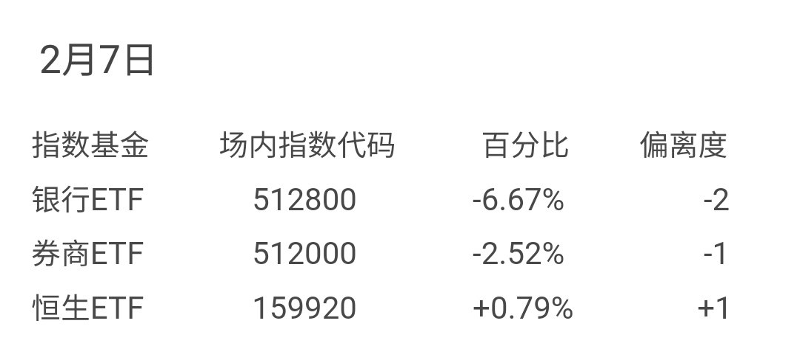

======================================================

_type: talk
@二师父[28814221155551]
2020-02-09 08:42:28 Sun  
topic_id: 421848224141288

<e type="hashtag" hid="555841885524" title="#三个实盘的说明#" /> 目前三个实盘，除了股票实盘不公布，其余的都已经公布，大家可以看看其中的策略和标的，投资的标的都在估值表里面。

另外注意一个问题，投资别折腾，很多人跑不赢基准收益率。即使不定投，做配置，当前直接买入40%的沪深300+40%的中证500+20%的债券基金，你的收益率也可以跑赢市场90%的人。

所以，投资有定投，也有配置。

@静若繁花 at 2020-02-09 08:42:28 Sun

> 二师父，500这几天涨了这么多，现在还低估吗？

----------

@二师父 at 2020-02-09 08:42:28 Sun

> 低估

----------

@静若繁花 at 2020-02-09 08:42:28 Sun

> 才发现，500的低估值变了，以前是24，现在是25

----------

阅读[5317]  评论[3]  赞[0] 

+++++++++++++++++++++++++++++++++++++++++++++++++++++

文件：
2020-02-09 08:39:29 Sun
文件大小：[328349]
48581151188848-关于二师父实盘的说明.pdf

======================================================

_type: q&a
@阿宝[422212151424158]
2020-02-09 12:18:06 Sun  
topic_id: 548121441448154

@阿宝

>  求一本《生命周期投资法》电子书

@二师父

>  有没有同学有这本书

阅读[4380]  评论[1]  赞[0] 

======================================================

_type: talk
@二师父[28814221155551]
2020-02-09 13:17:40 Sun  
topic_id: 548121441855144

一个退市基金，规模太小的基金一定避免

@老司基 at 2020-02-09 13:17:40 Sun

> 基金退市还持有的话怎么算？

----------

@二师父 at 2020-02-09 13:17:40 Sun

> 不可能持有了，会按照退市净值计算剩余资金

----------

阅读[4422]  评论[2]  赞[0] 

+++++++++++++++++++++++++++++++++++++++++++++++++++++

图片：
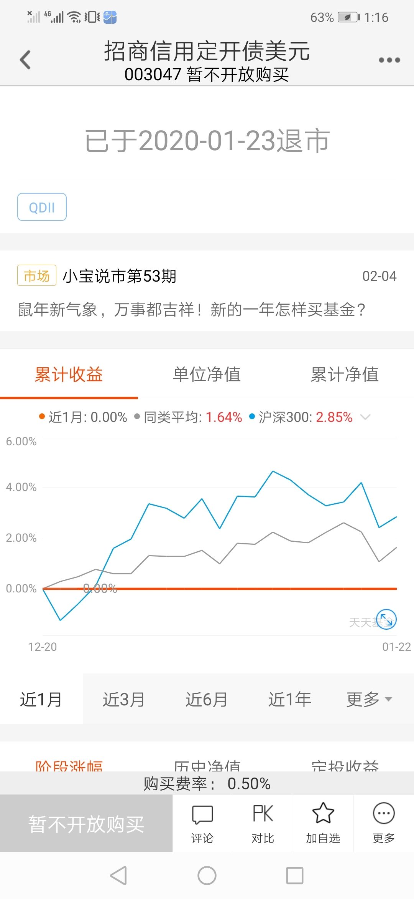

======================================================

_type: talk
@是喵喵吖～[421441114141158]
2020-02-09 13:29:00 Sun  
topic_id: 241858442552511

之前有位星球学员自己做了一个excel表 就可以自己填入买入的基金 自动计算份额 收益 记录卖出利润啥的 我之前下过 但是在电脑上找不到了 请问大家还有那个表吗？感谢🙏

@岁月如歌 at 2020-02-09 13:29:00 Sun

> 师父，请问这个同学的表格在哪可以学习呢

----------

@是喵喵吖～ at 2020-02-09 13:29:00 Sun

> 自动计算的公式还不会 😂

----------

@JOY at 2020-02-09 13:29:00 Sun

> 你搜 定投金额计算 应该能找到

----------

@特仑苏 at 2020-02-09 13:29:00 Sun

> 你什么公式不会可以问，然后也可以百度。表格还是根据自己需要量身定做好

----------

@树叶 at 2020-02-09 13:29:00 Sun

> 发星球了，看是不是你需要的

----------

@是喵喵吖～ at 2020-02-09 13:29:00 Sun

> 谢谢大家！我继续努力学习！！现在还很小白！[害羞]

----------

@是喵喵吖～ at 2020-02-09 13:29:00 Sun

> 是的！就是这个！[愉快]

----------

阅读[4445]  评论[8]  赞[0] 

======================================================

_type: talk
@二师父[28814221155551]
2020-02-09 17:47:42 Sun  
topic_id: 548121444218484

两个指数投资价值分析，创业板只能轻仓配置，对于新手，估值表券商以下的指数都可以不用配置。

阅读[4670]  评论[0]  赞[0] 

+++++++++++++++++++++++++++++++++++++++++++++++++++++

文件：
2020-02-09 17:47:09 Sun
文件大小：[95091]
48581124558848-创业板指数和创业板50指数投资价值分析对比.docx

======================================================

_type: talk
@二师父[28814221155551]
2020-02-10 08:51:10 Mon  
topic_id: 241885852518511

市场分析及应对策略

@A0洪氏日杂批发 at 2020-02-10 08:51:10 Mon

> 不希望二师父发红包，希望市场给我发红包，3500点见就好了，虽然不预测市场，但是哪一个同胞不是希望3500点早点到来呢

----------

@二师父 at 2020-02-10 08:51:10 Mon

> 熊的久可以多积累一点

----------

阅读[4521]  评论[2]  赞[0] 

+++++++++++++++++++++++++++++++++++++++++++++++++++++

文件：
2020-02-10 08:49:10 Mon
文件大小：[170041]
48581128544528-市场分析2.10.docx

======================================================

_type: talk
@二师父[28814221155551]
2020-02-10 09:32:17 Mon  
topic_id: 118552524544852

<e type="hashtag" hid="881251425252" title="#鳄鱼计划#" /> 卖出广发医药和医药etf百分之20仓位，买入白银0.5份，南方原油0.5份，两个强周期品种，投资者可以不用投，仅个人操作记录

@🎈铮 at 2020-02-10 09:32:17 Mon

> 白银是白银基金吗？

----------

@凯 at 2020-02-10 09:32:17 Mon

> 师父白银代码多少

----------

@二师父 at 2020-02-10 09:32:17 Mon

> 161226

----------

@大兵 at 2020-02-10 09:32:17 Mon

> 请问南方原油跟华宝油气有什么不同？场内买的还有华宝油气还跌着呢，怎么操作？还建议买南方原油吗？

----------

@飞向彩云端 at 2020-02-10 09:32:17 Mon

> 二师父：您买入的白银代码是哪个。场内还是场外。

----------

@二师父 at 2020-02-10 09:32:17 Mon

> 不做建议，纯属个人操作，原油和原油期货的关联大，油气和石油天然气指数关联大

----------

@二师父 at 2020-02-10 09:32:17 Mon

> 场内

----------

@大兵 at 2020-02-10 09:32:17 Mon

> 师父，请问场内白酒ETF能否买入？您怎么看，谢谢！

----------

阅读[5192]  评论[14]  赞[0] 

======================================================

_type: talk
@二师父[28814221155551]
2020-02-10 09:43:34 Mon  
topic_id: 421884845584118

操作完毕，场内低于1万的资金没法买货币基金，可以买国债逆回购，虽然一天只有几毛，但是比让钱睡觉好

记住这个思维，你可以睡，但是你的钱不能睡，要让他24小时为你打工，这才是富人思维

@苍天有井明月空🌙 at 2020-02-10 09:43:34 Mon

> 这在那个平台

----------

@二师父 at 2020-02-10 09:43:34 Mon

> 华泰

----------

@铁观音 at 2020-02-10 09:43:34 Mon

> 场内货币基金咋买？代码多少

----------

@青青竹 at 2020-02-10 09:43:34 Mon

> 我知道了，我就缺乏这样的思维，总让钱睡觉，才让我没有实现财富自由！[捂脸]

----------

@铁观音 at 2020-02-10 09:43:34 Mon

> 师傅，这个收益好像还不够手续费的，算一下还是亏损的，可以减免手续费吗？

----------

@二师父 at 2020-02-10 09:43:34 Mon

> 手续费是百万分之5

----------

阅读[4623]  评论[6]  赞[0] 

+++++++++++++++++++++++++++++++++++++++++++++++++++++

图片：
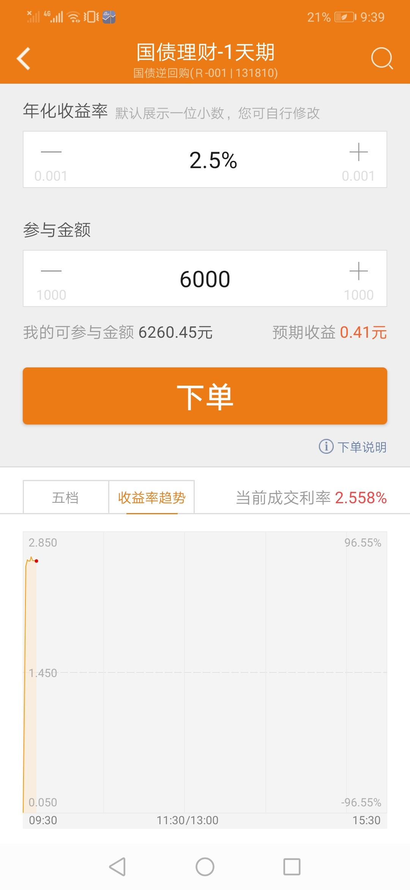

======================================================

_type: talk
@二师父[28814221155551]
2020-02-10 16:20:50 Mon  
topic_id: 841885888855882

1928年，标准普尔500指数是17.66点，到了1949年，该指数为16.76点——也就是说，标准普尔500指数在21年的时间里实际上是下跌的。1900年，道琼斯工业平均指数是77.66点，而1932年是50.16点。在32年的时间里，整个市场基本上没有任何表现。1968年，标准普尔500指数是100.53点，到了1982年，其指数为109.65点——在14年的时间里，市场依旧没有为投资者带来收益。在这段时期的最后阶段，有些投资者会认为股票的收益率更高。然而，货币市场基金在此期间的收益率为10%～15%，要高于股票的收益率。

不同的市场环境不同应对，如果踏错了经济周期，没有正确的策略，依然不挣钱。

@海马 at 2020-02-10 16:20:50 Mon

> 这种环境应该用二师父的网格交易可以挣钱[呲牙]

----------

@二师父 at 2020-02-10 16:20:50 Mon

> 底仓加网格，底部也很舒服

----------

@海马 at 2020-02-10 16:20:50 Mon

> 二师父厉害，低估定投应对牛市，鳄鱼计划和网格这两个策略应对震荡行情和熊市什么市场环境用什么策略。👍 👍

----------

阅读[4356]  评论[3]  赞[0] 

======================================================

_type: q&a
@Supreme Wa*[841584142184452]
2020-02-10 17:50:32 Mon  
topic_id: 841885888284242

@Supreme Wa*

>  为什么货币基金的资金可以超级转换到天弘上证50指数A（001548），却不可以转换到华夏上证50AH优选指数A（501050）？

@二师父

>  直接购买可以的啊

阅读[4410]  评论[1]  赞[0] 

======================================================

_type: talk
@树叶[544811512145144]
2020-02-10 18:34:05 Mon  
topic_id: 241885888128551

个人做的计算表，上次分享过一次，不知道是不是同学需要的，有兴趣的同学可以试试，需要完善的请大家多提宝贵意见，共同学习，共同进步。

@J at 2020-02-10 18:34:05 Mon

> 请问同学，理论收益率是怎么计算？

----------

@树叶 at 2020-02-10 18:34:05 Mon

> （持有份数—理论份数）/理论份数

----------

@是喵喵吖～ at 2020-02-10 18:34:05 Mon

> 对对对就是这个非常感谢！！[哇][哇]

----------

@J at 2020-02-10 18:34:05 Mon

> 持有份数和收益率好像没有直接关系吧？是不是应该看理论成本和实际成本？

----------

@树叶 at 2020-02-10 18:34:05 Mon

> 是的

----------

@二师父 at 2020-02-10 18:34:05 Mon

> (净值-成本)/成本

----------

@J at 2020-02-10 18:34:05 Mon

> 謝謝師傅[抱拳]

----------

阅读[4743]  评论[7]  赞[0] 

+++++++++++++++++++++++++++++++++++++++++++++++++++++

文件：
2020-02-10 18:30:42 Mon
文件大小：[16383]
48581121544588-天天基金收益计算模板.xlsx

======================================================

_type: talk
@二师父[28814221155551]
2020-02-10 19:05:39 Mon  
topic_id: 241885888114211

指数连涨一周，拿住，适当网格，2700到2900的黄金坑可得把握住了

阅读[5026]  评论[0]  赞[0] 

+++++++++++++++++++++++++++++++++++++++++++++++++++++

文件：
2020-02-10 19:04:46 Mon
文件大小：[18456]
51518848544524-连涨一周，未来会如何.docx

======================================================

_type: talk
@007[51511545424824]
2020-02-10 21:18:06 Mon  
topic_id: 241885882155281

二师傅华宝油气最近这么熊🐻是什么影响吧油气走势这么差？？

@二师父 at 2020-02-10 21:18:06 Mon

> 经济滞胀加上原油弱周期共振

----------

@范毅君 at 2020-02-10 21:18:06 Mon

> 二师父，原油场外可以适量买点吗现在？南方和华油哪个比较好

----------

@二师父 at 2020-02-10 21:18:06 Mon

> 投也只能轻仓

----------

@范毅君 at 2020-02-10 21:18:06 Mon

> 嗯，我看华宝还限额

----------

@二师父 at 2020-02-10 21:18:06 Mon

> 选场内

----------

@范毅君 at 2020-02-10 21:18:06 Mon

> 好的

----------

@范毅君 at 2020-02-10 21:18:06 Mon

> 场内是不是点击置顶学习指南，直接申请就可以啊[微笑]

----------

@二师父 at 2020-02-10 21:18:06 Mon

> 申请一个账户

----------

阅读[4601]  评论[9]  赞[0] 

======================================================

_type: q&a
@一心一意[844421848411122]
2020-02-11 08:25:59 Tue  
topic_id: 241885828522421

@一心一意

>  二师父，怎么叫黄金坑

@二师父

>  就是现在机会很好，投基金类似捡黄金

阅读[4624]  评论[0]  赞[0] 

======================================================

_type: talk
@二师父[28814221155551]
2020-02-11 08:27:44 Tue  
topic_id: 841885828251512

the happiness can lead to the success ,however the success does not lead to the happiness

@Zyxj at 2020-02-11 08:27:44 Tue

> 幸福可以导致成功，但成功不会导致成功

----------

@章兵朋 at 2020-02-11 08:27:44 Tue

> [撇嘴]

----------

@乖子 at 2020-02-11 08:27:44 Tue

> [呲牙][呲牙][呲牙]

----------

阅读[4738]  评论[3]  赞[0] 

======================================================

_type: talk
@二师父[28814221155551]
2020-02-11 09:30:33 Tue  
topic_id: 421884858251128

<e type="hashtag" hid="455121851548" title="#可转债打新与场内基金套利#" /> 今天的两只可转债都可以打，奥瑞转债和恩捷转债，打新方法二师父在基金课程中讲了。

另外讲讲场内基金套利，这种套利利润不大，主要是开拓大家的投资思路。利用场内的LOF型基金进行操作。

讲讲溢价套利，比如现在的华宝油气，溢价超过了6%，那么可以在华泰或者广发或等证券账户进行申购，这是以基金的净值成交的，目前油气价格0.36，可是他的净值是0.34，那么申购会比购买便宜

等申购成功以后，在进行线上场外转场内，在场内卖出，相当于赚了6%的溢价，如果油气上涨，赚的更多。

当然啦，目前油气每天只能够申购1000元，正好可以小额资金套利，未来赚的收益率就是6.22%+油气价格增长率，溢价套利还是挺不错的。

类似的方法可以在中证500等指数上使用，当然，一定需要控制安全边际，之前有人就用油气套利把自己给套进去了

@向前进 at 2020-02-11 09:30:33 Tue

> 只看到买入卖出选项，没找到在哪里申购

----------

@二师父 at 2020-02-11 09:30:33 Tue

> 场内申购，在理财产品搜索

----------

@衣袂飘香 at 2020-02-11 09:30:33 Tue

> 我试试。已经在华泰账户上，通过基金交易，公募基金交易申购成功，不知道以后如何场外转场内？

----------

@向前进 at 2020-02-11 09:30:33 Tue

> 谢谢，是在理财中搜“华宝油气”吗，没搜到这个产品，有产品代码吗

----------

@二师父 at 2020-02-11 09:30:33 Tue

> 直接申请场外转场内即可

----------

@二师父 at 2020-02-11 09:30:33 Tue

> 162411

----------

@向前进 at 2020-02-11 09:30:33 Tue

> 谢谢指导

----------

@心韵 at 2020-02-11 09:30:33 Tue

> 申购的手续费是1.5%吗？

----------

阅读[5042]  评论[40]  赞[0] 

======================================================

_type: talk
@Pansy[48281554424548]
2020-02-11 10:06:15 Tue  
topic_id: 118552545811882

疫情期间，在家努力学习二师父的课程，课程真的很系统，比我之前自己学的零碎知识好太多了。
看看圈友们，感觉自己的的起点好低啊，刚开始学习定投。可能我最初对自己的定位有点低，因为很喜欢自己的本职工作，所以大部分时间都在钻研业务上，剩余的小部分时间，学学基金理财，主要是为了资产保值，如果能再小赚一笔就更好了[哇]

@衣袂飘香 at 2020-02-11 10:06:15 Tue

> 很棒啊，加油。

----------

@苍天有井明月空🌙 at 2020-02-11 10:06:15 Tue

> 打新打多少张

----------

@Pansy at 2020-02-11 10:06:15 Tue

> 谢谢啊

----------

@Pansy at 2020-02-11 10:06:15 Tue

> 顶格申购就好

----------

阅读[4860]  评论[4]  赞[0] 

+++++++++++++++++++++++++++++++++++++++++++++++++++++

图片：

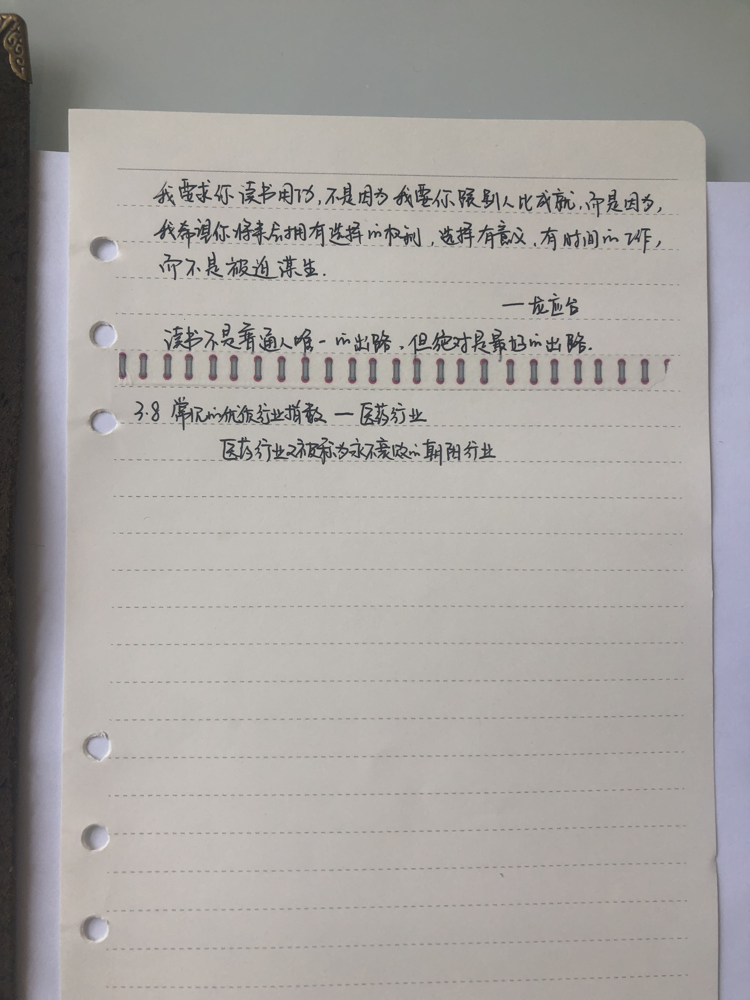

======================================================

_type: talk
@二师父[28814221155551]
2020-02-11 18:35:05 Tue  
topic_id: 421884828414228

医药基金的分析

阅读[5015]  评论[0]  赞[0] 

+++++++++++++++++++++++++++++++++++++++++++++++++++++

文件：
2020-02-11 18:34:52 Tue
文件大小：[20994]
48581118418458-医药指数基金的投资价值分析.docx

======================================================

_type: talk
@007[51511545424824]
2020-02-11 22:27:11 Tue  
topic_id: 118552518518512

为啥华宝油气不适合重仓？

@风云 at 2020-02-11 22:27:11 Tue

> 不代表原油价格，是美国油企的综合，好像是这样

----------

@铁观音 at 2020-02-11 22:27:11 Tue

> 周期性太强，新手把控不住

----------

@JOY at 2020-02-11 22:27:11 Tue

> 波动大，可能会长期低迷，跌起来还没底线

----------

阅读[4056]  评论[3]  赞[0] 

======================================================

_type: talk
@二师父[28814221155551]
2020-02-12 07:13:30 Wed  
topic_id: 241885815452281

价值投资书籍，最近抓紧时间多学习，这才是投资最重要的事。复制这段内容后打开百度网盘手机App，操作更方便哦 链接:<e type="web" href="https://pan.baidu.com/s/1zNsUQ6-a1ApwMXQYMqP_-Q" title="https://pan.baidu.com/s/1zNsUQ6-a1ApwMXQYMqP_-Q" /> 提取码:hk55

@淘淘 at 2020-02-12 07:13:30 Wed

> 资料太好啦

----------

@JOY at 2020-02-12 07:13:30 Wed

> 感谢分享～

----------

@乖子 at 2020-02-12 07:13:30 Wed

> 谢谢

----------

@shee at 2020-02-12 07:13:30 Wed

> 赞👍

----------

@样 at 2020-02-12 07:13:30 Wed

> 谢谢

----------

@样 at 2020-02-12 07:13:30 Wed

> 我打开是空白的，怎么回事呢

----------

@rtdmm小米 at 2020-02-12 07:13:30 Wed

> 二师父，点开没有呢

----------

@二师父 at 2020-02-12 07:13:30 Wed

> 现在估计可以了

----------

阅读[4189]  评论[12]  赞[0] 

======================================================

_type: talk
@二师父[28814221155551]
2020-02-12 09:22:24 Wed  
topic_id: 118552585244482

接下来分享书籍，解读基金和漫步华尔街，先分享解读基金，大家可以预习下

@Claire at 2020-02-12 09:22:24 Wed

> 谢谢师父

----------

阅读[4226]  评论[1]  赞[0] 

======================================================

_type: talk
@二师父[28814221155551]
2020-02-12 14:12:22 Wed  
topic_id: 421884811852288

<e type="hashtag" hid="555425184554" title="#周三答疑#" /> 语音讲解会更加清楚

@清水倾城 at 2020-02-12 14:12:22 Wed

> 大赞语音

----------

@凯 at 2020-02-12 14:12:22 Wed

> 师父，那最近是不是每天可以买1000华宝油气来操作

----------

@二师父 at 2020-02-12 14:12:22 Wed

> 你资金多少？

----------

@凯 at 2020-02-12 14:12:22 Wed

> 还有6万空余资金

----------

@二师父 at 2020-02-12 14:12:22 Wed

> 0.36以下，溢价率5个点以上可以，需要控制仓位

----------

@凯 at 2020-02-12 14:12:22 Wed

> 收到，谢谢

----------

@那方山的树，佛陀座下* at 2020-02-12 14:12:22 Wed

> 还是喜欢文字，因为以后上班了，语音不方便播放

----------

@夏萍 at 2020-02-12 14:12:22 Wed

> 这个假期重温了师父的课程，完善、系统，受益终生，谢谢🙏师父

----------

阅读[4652]  评论[8]  赞[0] 

+++++++++++++++++++++++++++++++++++++++++++++++++++++

文件：
2020-02-12 14:10:22 Wed
文件大小：[8765001]
15458888212582-周三答疑.m4a

======================================================

_type: talk
@二师父[28814221155551]
2020-02-12 14:16:41 Wed  
topic_id: 841885811845152

<e type="hashtag" hid="222141185421" title="#年化8%的配置组合#" /> 投资有定投也有配置，不同的投资人有着不同的收益目标，那么自然而然预期收益率也是不同的，如果投资者预期收益率在8%——10%左右，可以采用2233组合，一次购买20%的易方达沪深300，20%的易方达中证500，30%的博时信用债，30%的广发纯债。直接长期持有就好，有了增量资金再进行定投。

在全市场指数市盈率百分位30%以下可以用这种配置，需要经受波动。

@学以致用 at 2020-02-12 14:16:41 Wed

> 老师，债券无涨跌停限制，这会不会削弱组合抗跌能力啊？

----------

@二师父 at 2020-02-12 14:16:41 Wed

> 不会，会削弱收益率，债券波动没有指数大

----------

@衣袂飘香 at 2020-02-12 14:16:41 Wed

> 上文说直接长期持有就好，您所说的长期是多久？@二师父

----------

阅读[4125]  评论[3]  赞[0] 

======================================================

_type: talk
@二师父[28814221155551]
2020-02-12 17:13:53 Wed  
topic_id: 118552422541152

<e type="hashtag" hid="455121154158" title="#指数扩容#" /> 部分指数进入正常估值，医药指数集体高估。对于新入门投资者券商以下的指数可以不用考虑，回撤较大，周期性很强。

去了地产指数，未来选择类似全指金融的代替地产和银行指数。

@老司基 at 2020-02-12 17:13:53 Wed

> 二师父，地产是不看好了吗？

----------

@二师父 at 2020-02-12 17:13:53 Wed

> 都是分级，看好

----------

@蓝魔森林 at 2020-02-12 17:13:53 Wed

> 地产我还没卖 等一波就清了

----------

@蓝魔森林 at 2020-02-12 17:13:53 Wed

> 半导体行业指数以后有考虑加吗？

----------

@二师父 at 2020-02-12 17:13:53 Wed

> 目前已经疯了，100多倍市盈率，等他降降温

----------

@蓝魔森林 at 2020-02-12 17:13:53 Wed

> 好吧

----------

@雨淡风清 at 2020-02-12 17:13:53 Wed

> 二师父，我们能拿些增强型的基金来替代我们现有的基金么？

----------

@二师父 at 2020-02-12 17:13:53 Wed

> 不用的，费率高，跟踪误差也大

----------

阅读[4578]  评论[17]  赞[0] 

+++++++++++++++++++++++++++++++++++++++++++++++++++++

图片：
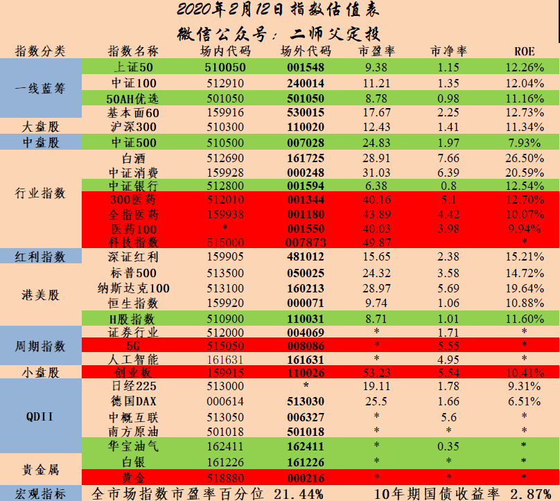

======================================================

_type: talk
@二师父[28814221155551]
2020-02-12 20:38:14 Wed  
topic_id: 841885252111842

学堂没有在2700减仓的吧，目前仓位合适，拿住就行，少额资金做网格

@那方山的树，佛陀座下* at 2020-02-12 20:38:14 Wed

> 我是在今天减仓的，二师傅

----------

@好运玲玲 at 2020-02-12 20:38:14 Wed

> 没减，加了[微笑]

----------

@志亮 at 2020-02-12 20:38:14 Wed

> 知道了，继续看二师父的文章才能能我头脑清醒一些，近来差点被科技迷住了。

----------

@铁观音 at 2020-02-12 20:38:14 Wed

> 师傅好，计划10万块做鳄鱼计划，在2月初建立底仓沪深300和中证500各买了25000元，现在中证500賺了10个点了，那天看见说中证500波动大，要做网格，现在有点不知道怎么处理了？买的这25000元中证500用来做网格吗？还是继续拿着就行？还是卖利润？还是卖20本金？沪深300盈利6个点，也是继续拿着吗？

----------

@杜志彪 at 2020-02-12 20:38:14 Wed

> 知足常乐挺好😊

----------

@二师父 at 2020-02-12 20:38:14 Wed

> 网格需要建立好底仓以后再做的，保证有一定的底部仓位

----------

@爱华 at 2020-02-12 20:38:14 Wed

> 今天卖出部分广发医药

----------

@铁观音 at 2020-02-12 20:38:14 Wed

> 意思是在建立3成底仓之后在网格是吧？

----------

阅读[4546]  评论[13]  赞[0] 

+++++++++++++++++++++++++++++++++++++++++++++++++++++

文件：
2020-02-12 20:37:31 Wed
文件大小：[19099]
28225555545511-2700减仓的你，现在怎么办.docx

======================================================

_type: talk
@二师父[28814221155551]
2020-02-12 21:14:14 Wed  
topic_id: 421884542812448

<e type="hashtag" hid="455121125858" title="#224期定投实盘#" /> 市场上涨，定投1份，忘记市场涨跌，坚持定投，都是优质指数，未来一定会反转的。

@速。冻 at 2020-02-12 21:14:14 Wed

> 二师父，50ah和恒生国企重合度有多大？

----------

@雨淡风清 at 2020-02-12 21:14:14 Wed

> 二师父你好，现在看来创业板优于上证。也就是说医药和科技涨的比较好是吧？创业板是不是盘子比较小好炒作？还有我听说最近小盘股涨幅优于大盘股，也就是说中证500和1000涨的比大盘要好，现在虽然还在低估建立底仓是不是有些晚，还能不能等回调下？

----------

@二师父 at 2020-02-12 21:14:14 Wed

> 主要看重国企里面的腾讯，移动等在港交所上市的企业

----------

@二师父 at 2020-02-12 21:14:14 Wed

> 不要心急，低估布局好，创业板之前跌的时候也很厉害，今年是中小盘行情

----------

@雨淡风清 at 2020-02-12 21:14:14 Wed

> 就是没有听二师父的话全面布局啊[衰]

----------

@铁观音 at 2020-02-12 21:14:14 Wed

> 二师父好，买入比例的公式是什么？我按照课件里面的算出来和你发的这个结果为啥不一样呢？差的蛮多，是要加系数吗？

----------

@二师父 at 2020-02-12 21:14:14 Wed

> 对，定投系数的原因，银行的系数低一些

----------

@陌路花 at 2020-02-12 21:14:14 Wed

> 二师父，感觉银行就像乡下的房子，虽然便宜，但是涨不上去啊[流汗]

----------

阅读[4052]  评论[11]  赞[0] 

+++++++++++++++++++++++++++++++++++++++++++++++++++++

图片：
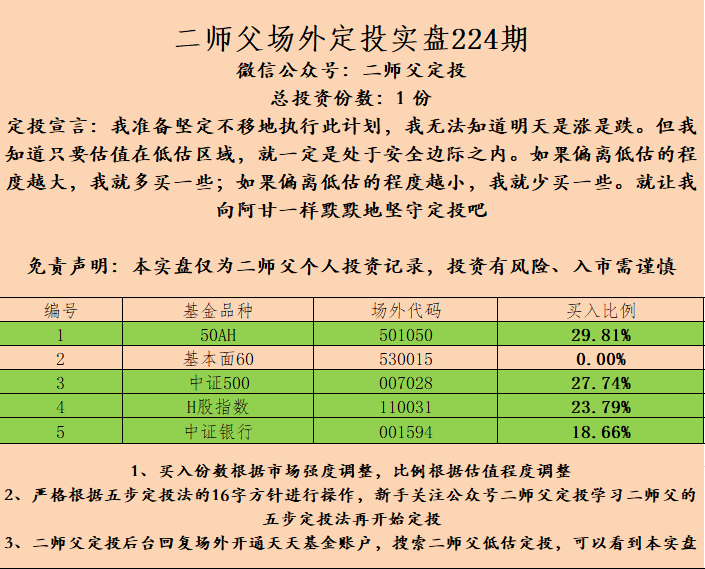

======================================================

_type: q&a
@林玮[844111858288412]
2020-02-13 07:23:19 Thu  
topic_id: 118552455814482

@林玮

>  老师，估值表什么时候发布啊？这种特殊时期能否一星期发布两次呢？

@二师父

>  每周三发布，可以的，之前2月3号大跌很多指数进入低估当天就发布了

阅读[3698]  评论[2]  赞[0] 

======================================================

_type: talk
@二师父[28814221155551]
2020-02-13 07:26:04 Thu  
topic_id: 548112515218544

“研究”和“交易”还是很有距离的。比如不少好的研究员、分析师，自己炒股也赚不到钱。

精细一点回答：很多人都能够告诉你机会在哪里，但没办法告诉你，这些机会到底该怎么抓。

而二师父可以，因为我的一整套投资系统是一个闭环，我就用它在投资盈利，经过市场检验

阅读[3850]  评论[0]  赞[0] 

======================================================

_type: q&a
@alicedream*[88281414821222]
2020-02-13 10:01:30 Thu  
topic_id: 421884585228428

@alicedream*

>  二师父，不好意思，可转债中了10个，可是不知道怎样交款？

@二师父

>  账户有资金，会自动扣款的

阅读[3771]  评论[3]  赞[0] 

======================================================

_type: talk
@二师父[28814221155551]
2020-02-13 12:12:31 Thu  
topic_id: 241885284442411

和沪深300持平的短债，股市的波动需要策略去应对

@蓝魔森林 at 2020-02-13 12:12:31 Thu

> 现在这种短债还可以投吗？ 想把余额宝的钱转出来试试债券

----------

@二师父 at 2020-02-13 12:12:31 Thu

> 短债可以，长债不太适合

----------

@蓝魔森林 at 2020-02-13 12:12:31 Thu

> OK

----------

@苍天有井明月空🌙 at 2020-02-13 12:12:31 Thu

> 我要上车

----------

@特仑苏 at 2020-02-13 12:12:31 Thu

> 二师父，能说下为什么短债可以投，长债不建议，短债和长债区别主要是什么，感觉都是稳定正常的。

----------

@二师父 at 2020-02-13 12:12:31 Thu

> 这和债券久期有关系，长债受利率波动价格变化大，现在国债收益率低位，债券价格高，虽然也是稳步净值增长，可是如果发生了债灾，长债也会有一定的跌幅

----------

@蓝魔森林 at 2020-02-13 12:12:31 Thu

> 长债最好在十年国债收益率3.5以上再考虑投。那时候价格低位。

----------

@特仑苏 at 2020-02-13 12:12:31 Thu

> 谢谢🙏

----------

阅读[3621]  评论[12]  赞[0] 

+++++++++++++++++++++++++++++++++++++++++++++++++++++

图片：
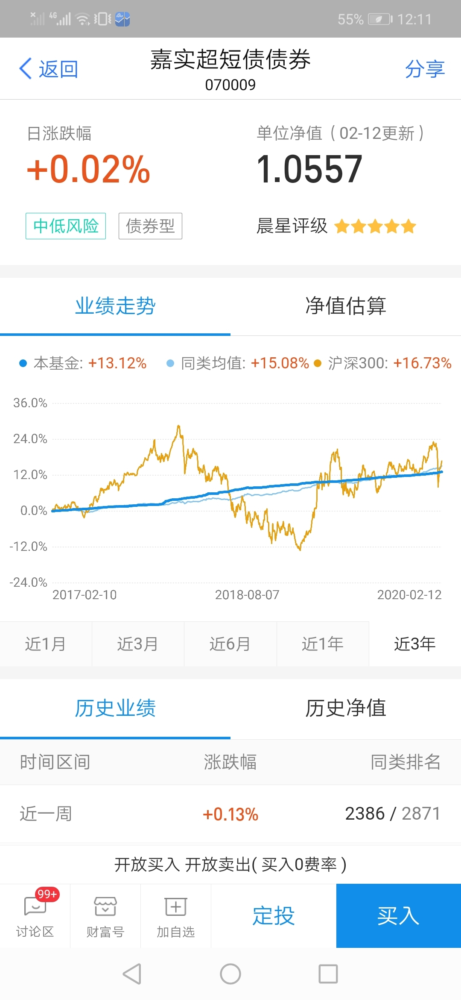

======================================================

_type: talk
@范*[841855284221812]
2020-02-13 14:04:20 Thu  
topic_id: 841885228588142

短期涨幅不小，心里感觉比较异常加危险
我空仓。你们赚钱吧

@🍀 凝🌸 慧🍀 at 2020-02-13 14:04:20 Thu

> 我的建议是：要用合适的投资策略去应对市场的起伏变化，而不是依靠心理感觉。咱们二师父的场外定投和场内鳄鱼计划、网格交易，就是很好的投资策略啊。

----------

@范* at 2020-02-13 14:04:20 Thu

> 顺应内心投资，不和自己做斗争。就像我们投资都顺应趋势一样，为什么不顺应自己。我喜欢，下跌买，上涨卖。

----------

@🍀 凝🌸 慧🍀 at 2020-02-13 14:04:20 Thu

> 咱们互相交流讨论啊，我想大家都喜欢下跌买，上涨卖。可问题是：您现在采取完全空仓策略，你能预测股市什么时候下跌，什么时候算上涨？是凭心里感觉吗？

----------

@范* at 2020-02-13 14:04:20 Thu

> 怎么说呢，我能力圈小，消费  医药  美股   中概互联 银行  美股主  消费医药副  货币基金储蓄   国债牛市买入   银行做网格特别合适   现在除了银行网格货币基金储蓄之外，我没啥可买了，都不符合低估标准，就等。很尴尬的位置，牛不牛熊不熊的。美股要是跌下来了，咱们大盘咋走还不知道，这次疫情肯定影响1季报，到时候也比较危险。我怀疑国内就是来回来割韭菜赚钱。看大盘位置也没啥参加价值。

----------

@杜志彪 at 2020-02-13 14:04:20 Thu

> 不同的经历就会有不同的策略，适合自己就好，我现在的心情：涨也开心，跌也开心，不涨不跌不担心（我满仓）[微笑]

----------

@范* at 2020-02-13 14:04:20 Thu

> 满仓太被动了，不建议满仓呀。满仓情况下，影响理智

----------

@🍀 凝🌸 慧🍀 at 2020-02-13 14:04:20 Thu

> 今天大盘大涨，是政策利好，所以说不用预测股市，不能凭自己心理感觉，用好用对投资策略才是王道，涨跌都有得赚。

----------

阅读[3387]  评论[11]  赞[0] 

======================================================

_type: talk
@二师父[28814221155551]
2020-02-13 16:00:50 Thu  
topic_id: 241885228151411

<e type="hashtag" hid="822115842852" title="#轮动配置#" /> 2010年：上证50涨幅-22%，创业板涨幅：2%，创业板获胜
2011年：上证50涨幅-18%，创业板涨幅：-35%，上证50获胜
2012年：上证50涨幅14%，创业板涨幅：-2%，上证50获胜
2013年：上证50涨幅-15%，创业板涨幅：82%，创业板获胜
2014年：上证50涨幅63%，创业板涨幅：12%，上证50获胜
2015年：上证50涨幅-6%，创业板涨幅84%，创业板获胜
2016年：上证50涨幅-10%，创业板涨幅：-21%，上证50获胜
2017年：上证50涨幅25.08%，创业板涨幅-10.67%，上证50获胜
2018年：上证50涨幅-19.83%，创业板涨幅-28.65%，上证50获胜
2019年，上证50涨幅26.24%，创业板37.4%，创业板获胜。

16字方针里面第一个全面配置，在A股总是风格切换。曾经大蓝筹也有被成为大烂臭的，只有全面配置才可以降低组合波动，因为追着市场走容易被动挨打。

@J at 2020-02-13 16:00:50 Thu

> 师傅，可以也对比一下中证500的涨幅吗

----------

@二师父 at 2020-02-13 16:00:50 Thu

> 可以

----------

@A0洪氏日杂批发 at 2020-02-13 16:00:50 Thu

> 今天看了诺安双利基金的年度涨幅，发现他很不错，跑赢了很多指数基金，包括我们定投的低估值指数基金，二师父怎么看呢

----------

@二师父 at 2020-02-13 16:00:50 Thu

> 这是一只债券基金，配置了少量股票，债券牛市这种配置收益率可以跑赢沪深300，如果股票牛市就不行了

----------

@二师父 at 2020-02-13 16:00:50 Thu

> 配置了

----------

阅读[3939]  评论[6]  赞[0] 

======================================================

_type: q&a
@敏杰 Minjie[241844452525121]
2020-02-13 16:17:41 Thu  
topic_id: 841885228181222

@敏杰 Minjie

>  你好，二师父，我之前都是在场外操作的，想学习一些场内和股票。
>  想寻找一个合适的证券公司，可以把场内基金和股票放在同一账户下管理（方便开通港股通）。
>  想请教一下:
>  1，现在有没有限制说一个人最多开几个证券账户?
>  2，能不能推荐一下开户推荐，要股票和基金交易佣金免5，股票万1.5及以下，基金万一及以下；然后app实用性好，方便管理。谢谢，麻烦您
>  
>  我目前有一个华泰证券账户，去年三月份开户的，自己也不记得费率了，也没用过。。。

@二师父

>  1，一个人可以开3个，深圳股东账户不限制
>  
>  2，在置顶文章有，基金我用的华泰，费率万一，免5，股票我用的广发，基金万0.6，股票资金20万以上也可以免5
>  
>  分开便于分析和管理组合，如果你放一起可以用广发，万0.6那个链接，这里费率基本上已经很低了，而且都是大牌正规券商

阅读[3554]  评论[2]  赞[0] 

======================================================

_type: talk
@二师父[28814221155551]
2020-02-13 16:39:16 Thu  
topic_id: 548112555214544

<e type="hashtag" hid="822115844482" title="#股债轮动#" /> 3年时间，经历了大熊和债灾，债券收益率高于股票收益率。

注重资产配置的平衡，并不是说傻傻地购买指数持有就行，最简单的轮动除了大小盘轮动还有债券和股票的轮动。

通常情况下，利率下行，债券会走高，股市也会，不过股市和债市有跷跷板效应，这和资金涌向有关系。所以债券也是需要配置的，包括可转债基金和纯债基金。

至于混合基金，完全就是股权和债券的集合体，投资者可以利用指数和债券自行配置。如果学会了这种配置方法，遭遇大熊市，回撤可控，当然牛市到来收益率会略有下降，这就看投资者追求的目标收益率了，追求的收益率越高，承受的浮动肯定是越大的

@西锦巴乌 at 2020-02-13 16:39:16 Thu

> 请问师父基于当前的经济状况大概率国家是要降息的，那么目前适合配置债券基金吗？

----------

@二师父 at 2020-02-13 16:39:16 Thu

> 目前债券牛市，利率走低的话会继续涨，不过利率已经比较低位了

----------

@西锦巴乌 at 2020-02-13 16:39:16 Thu

> 噢，明白

----------

@西锦巴乌 at 2020-02-13 16:39:16 Thu

> 师父你有在做港新打新吗？

----------

@二师父 at 2020-02-13 16:39:16 Thu

> 有

----------

@西锦巴乌 at 2020-02-13 16:39:16 Thu

> 那师父在打新时是否能在星球里提醒一下？

----------

@二师父 at 2020-02-13 16:39:16 Thu

> 我可以做个表，不过仅供参考，港股打新破发率还是比较大

----------

@西锦巴乌 at 2020-02-13 16:39:16 Thu

> 好，谢谢

----------

阅读[4177]  评论[10]  赞[0] 

+++++++++++++++++++++++++++++++++++++++++++++++++++++

图片：
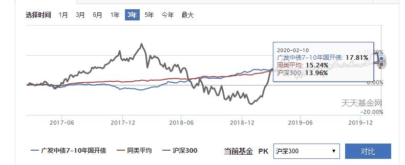

======================================================

_type: talk
@二师父[28814221155551]
2020-02-14 09:45:58 Fri  
topic_id: 118552118124412

<e type="hashtag" hid="822115211182" title="#场外转场内#" /> 转场内的方法，这样就可以通过场内卖出赚溢价了，同时拉低成本

@凯 at 2020-02-14 09:45:58 Fri

> 刚操作完了

----------

@海马 at 2020-02-14 09:45:58 Fri

> 二师父，在广发帐户买的华宝油气显转不了场内，也是这几天买的不多继续持有可以吧

----------

@门萨🐨 at 2020-02-14 09:45:58 Fri

> 必须是同一家券商吧。

----------

@二师父 at 2020-02-14 09:45:58 Fri

> 对的

----------

@Snow at 2020-02-14 09:45:58 Fri

> 在同花顺爱基金里买的华宝油气如何转场内？

----------

@二师父 at 2020-02-14 09:45:58 Fri

> 打开基金，选择场外转场内

----------

@衣袂飘香 at 2020-02-14 09:45:58 Fri

> 场外转场内要择时？比如今天场内价格比较低，我们是否要等到场内价格再升高一点的时候，再从场外转到场内呢？从来没接触过。

----------

@衣袂飘香 at 2020-02-14 09:45:58 Fri

> @二师父

----------

阅读[3082]  评论[10]  赞[0] 

+++++++++++++++++++++++++++++++++++++++++++++++++++++

图片：
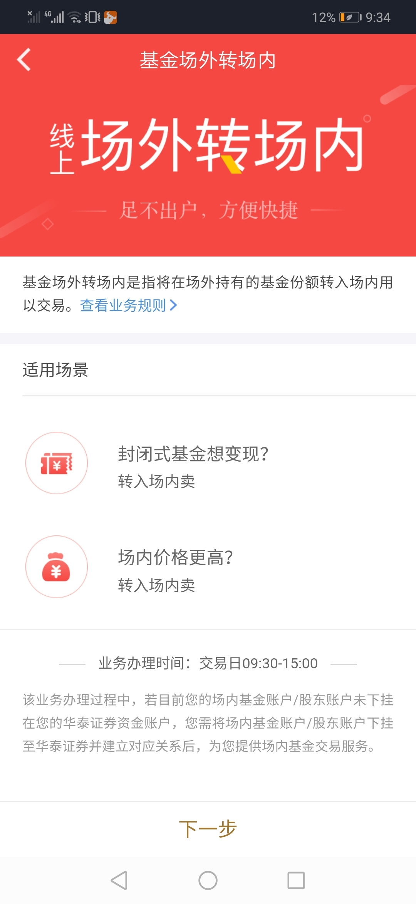
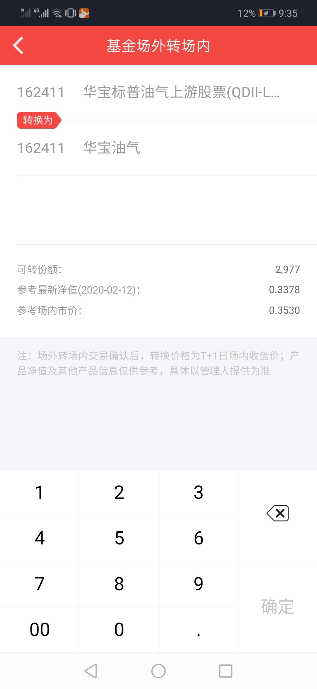
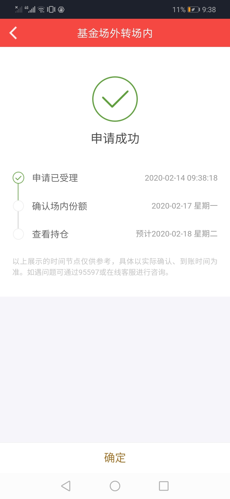

======================================================

_type: q&a
@海马[15158245825242]
2020-02-14 09:57:17 Fri  
topic_id: 118552118155142

@海马

>  二师父，我的显示要去柜台办理

@二师父

>  那就拿着吧，场外申购没有溢价可以的

阅读[3135]  评论[4]  赞[0] 

======================================================

_type: talk
@二师父[28814221155551]
2020-02-14 10:36:15 Fri  
topic_id: 241885441121121

<e type="hashtag" hid="145458855482" title="#周五读书#" /> 学习投资要多读书，这是解读基金第一讲，学会读书，学会读人，知道投资的基本原理，能够理解他人，生活会轻松很多。

今天开始给大家做一个港股打新表，参考着来就行，打新、国债逆回购、套利相当于偶尔的小赌，小赌怡情，投资者有100万资金，重仓80万复利增值，15万网格，5万偶尔打新、国债逆回购，套利会让投资更有乐趣

不要总是单一的做一个模式，投资一方面为了挣钱，同时也为了快乐，当然，你需要识别风险，知道风险是什么，怎么控制，万一控制不住亏了是不是心疼，把握住这个就好啦。

@衣袂飘香 at 2020-02-14 10:36:15 Fri

> 听了，谢谢二师父。

----------

@Claire at 2020-02-14 10:36:15 Fri

> 港股打新，新债申购，华宝油气套利。让投资多姿多彩。😄

----------

@YAO at 2020-02-14 10:36:15 Fri

> 第一讲第二讲有docx版吗？[微笑]

----------

阅读[3267]  评论[3]  赞[0] 

+++++++++++++++++++++++++++++++++++++++++++++++++++++

文件：
2020-02-14 10:31:50 Fri
文件大小：[14067542]
88225882848422-《解读基金》第一讲.m4a

======================================================

_type: talk
@二师父[28814221155551]
2020-02-14 10:41:50 Fri  
topic_id: 421884221125588

<e type="hashtag" hid="822115458252" title="#关于资产配置#" /> 有个核心卫星策略，比如常见的沪深300、中证500、银行、消费、医药、中概互联、深红利、上证50等指数就是重仓的基金，核心。有100万，直接买这些基金80万，剩余15万买点券商、人工智能，还有5万买点黄金、原油。

你要知道，波动有时候真不是风险。二师父做个假设，你主账户80万盈利0.01，相当于盈利8000，卫星账户油气亏了0.2，资金5万，相当于亏了1000，总体还是盈利。

这就是分清核心和卫星的区别。未来上涨概率大的核心，重仓，未来上涨概率不大，趋势比较好，有一定溢价的，买个5%的仓位问题不大，组合可以降低波动。

比如当前人工智能和科技，一直高涨，如果你只有1%仓位，就算回撤也没多大关系。当然需要控制溢价率，纳斯达克的溢价率就20%了，类似这种就别碰

投资有定投，有配置，大家可以体会下。

@衣袂飘香 at 2020-02-14 10:41:50 Fri

> 提问。主仓位的80万难道不用择时，一次性配置吗？我记得您说过，至少用一年的时间投完。

----------

@二师父 at 2020-02-14 10:41:50 Fri

> 那是预期市场下跌的情况下，假设现在市场是最底部就可以配置

----------

@衣袂飘香 at 2020-02-14 10:41:50 Fri

> 另外，再提一个问题。上一次您写到，若只想8%左右的收益，可以用长期不用的钱，一次性配置。我的问题是，所谓长期不用的，长期是多久？

----------

@衣袂飘香 at 2020-02-14 10:41:50 Fri

> 但是现在并不能确定是市场底部，所以要配置好的话，还是要拉长时间吧。

----------

@二师父 at 2020-02-14 10:41:50 Fri

> 其实配置债券风险低，一般2到3年风格就会切换

----------

@二师父 at 2020-02-14 10:41:50 Fri

> 现在不能，19年初是的

----------

@衣袂飘香 at 2020-02-14 10:41:50 Fri

> 好的，深以为然。

----------

@衣袂飘香 at 2020-02-14 10:41:50 Fri

> 目前债券的价格并不便宜，此时买入债券更像做趋势，是否会违背您所说的低估买入呢？

----------

阅读[3338]  评论[14]  赞[0] 

======================================================

_type: talk
@007[51511545424824]
2020-02-14 14:12:25 Fri  
topic_id: 421884218414248

二师傅华宝油气如何套利？？

@陈飞🤗 at 2020-02-14 14:12:25 Fri

> 前面之前讲过了，你看看记录

----------

阅读[3097]  评论[1]  赞[0] 

======================================================

_type: talk
@007[51511545424824]
2020-02-14 14:22:28 Fri  
topic_id: 548112481121514

<e type="hashtag" hid="822115211182" title="#场外转场内#" /> 场外场内买入时如何区别？？没有区分特征？

@007 at 2020-02-14 14:22:28 Fri

> 二师傅怎么不爱回答问题

----------

@二师父 at 2020-02-14 14:22:28 Fri

> 费率，成交时间，有无溢价的区别

----------

阅读[3168]  评论[2]  赞[0] 

======================================================

_type: talk
@敏杰 Minjie[241844452525121]
2020-02-14 14:28:07 Fri  
topic_id: 841885418851812

您好，二师父
当前在关注携程，洋河，泸州老窖，中国平安，腾讯，格力，上海机场，白云机场这些是优质股吗，目前这些是合适入场的时机吗？
然后，像苏宁易购，森马这些公司，公司表现喝发展看似都不错，为什么股价总是半死不活的状态[皱眉]

@二师父 at 2020-02-14 14:28:07 Fri

> 洋河，泸州老窖，平安，腾讯，格力基本面很好，可以帮你分析企业，不做买入卖出建议

企业的价值和价格在短时间不一定能反应出来，比如乐视没价值曾经暴涨，特斯拉也一样

中国平安很有价值，股价也有暴跌和横盘的时候，资金，情绪还有庄家都有影响股价

----------

@杜志彪 at 2020-02-14 14:28:07 Fri

> 二师父一般不推荐股票，你提的这些股短期内都是受疫情影响的，长期持有没问题😊，我也有一些。它们再跌一跌最好，这样白酒和消费就会进入低估，我就差这两个指数了。

----------

阅读[3247]  评论[2]  赞[0] 

======================================================

_type: talk
@凯[244415182418811]
2020-02-14 14:39:01 Fri  
topic_id: 241885418812421

大盘股一涨，中小创酒跌，跷跷板效应

阅读[3405]  评论[0]  赞[0] 

======================================================

_type: q&a
@海盗[48248118584848]
2020-02-14 15:59:12 Fri  
topic_id: 421884218524428

@海盗

>  二师父，A股打新，市值不够，要是买点场内的货币基金，算市值吗？怎么能提高中签率呀？
>  我看了刚上市怎么涨的这么厉害呀，有个比发行价高快5倍了

@二师父

>  要买股票，股票市值越高中签率越大，a股打新必须要市值，中了基本赚
>  
>  如果不投资股票没必要为了打新买股票

阅读[3573]  评论[1]  赞[0] 

======================================================

_type: talk
@庆余年[15584481824122]
2020-02-14 16:48:49 Fri  
topic_id: 241885414111441

       前段时间看到二师父对高估分步卖出的方法，不少读者也提到了一些疑问，虽然二师父回了但是我还是有点不太清楚，借此机会，我整理了两种高估卖出的思路，分别计算了两种方法的收益率以及卖出节点。  ...点击链接查看剩余内容<e type="web" href="https://articles.zsxq.com/id_zzenougw0ftc.html" title="关于高估卖出的理解以及模拟操作" cache="" />

@Pansy at 2020-02-14 16:48:49 Fri

> 太厉害了，但是对我来说，目前的我会选择高估且到了我的止盈点后一次性卖出，因为我算不出来应该按份额卖😂

----------

@庆余年 at 2020-02-14 16:48:49 Fri

> 如果一次性卖出可能刚刚好回撤，并且吃不到全部涨幅了。

----------

@Pansy at 2020-02-14 16:48:49 Fri

> 是的，但是以我现阶段的能力，我觉得我还是算不明白，努力想你们看齐

----------

@庆余年 at 2020-02-14 16:48:49 Fri

> 实盘的话可以看二师父跟他投就可以了，因为每个人进来的时间节点不一样，所以基金配置比例还有数额不尽相同。如果仅仅是单纯做理财，能总结一套卖出方法就好了，买的话还是跟二师父操作。

----------

@老宋 at 2020-02-14 16:48:49 Fri

> 太啰嗦

----------

@庆余年 at 2020-02-14 16:48:49 Fri

> 对聪明的人来说当然不需要这么做了，我们这些普通人肯定得一步步看着做😊 。

----------

@麻烦得很 at 2020-02-14 16:48:49 Fri

> 好厉害

----------

@J at 2020-02-14 16:48:49 Fri

> 对你的态度点赞！但这个方法是不是太复杂了？其实有个思路很简单的，就是进入高估后每次卖出1/5份额不就可以了吗？

----------

阅读[3505]  评论[17]  赞[0] 

======================================================

_type: talk
@二师父[28814221155551]
2020-02-14 20:56:39 Fri  
topic_id: 118552824454552

可转债也是具有投资价值的，如果没有识别可转债的能力，投资可转债基金是一个不错的选择

@wty at 2020-02-14 20:56:39 Fri

> 二师父，当前债市已经转强，现在可以配置可转债，还是再等机会？

----------

@二师父 at 2020-02-14 20:56:39 Fri

> 优选低估指数

----------

@wty at 2020-02-14 20:56:39 Fri

> 领会了，拜谢！

----------

@理财小小白 at 2020-02-14 20:56:39 Fri

> 二师父，可转债基金目前适合投资吗？

----------

@二师父 at 2020-02-14 20:56:39 Fri

> 定投可以

----------

@蓝魔森林 at 2020-02-14 20:56:39 Fri

> 优质可转债基金是不是一般等到低估指数基金减少且市场没有太多配置定投机会的时候进行呢？ 如果投资，是不是也可以遵循配置+定投的方式来？谢谢

----------

@二师父 at 2020-02-14 20:56:39 Fri

> 不是，在配置的时候一般是熊市行情不好配置可转债基金

----------

@蓝魔森林 at 2020-02-14 20:56:39 Fri

> 熊市行情不好的时候，不是应该配置低估基金和定投吗？例如现在

----------

阅读[4151]  评论[10]  赞[0] 

+++++++++++++++++++++++++++++++++++++++++++++++++++++

文件：
2020-02-14 20:56:04 Fri
文件大小：[133424]
88225884145582-可转债投资价值分析.docx

======================================================

_type: talk
@二师父[28814221155551]
2020-02-14 21:11:03 Fri  
topic_id: 841885152248442

重大利空，之前有人我记得重仓这个

@志亮 at 2020-02-14 21:11:03 Fri

> 华泰证券明天可能会跌停，幸好我没买这股[微笑]

----------

@二师父 at 2020-02-14 21:11:03 Fri

> 我预测明天华泰一定不会跌

----------

@志亮 at 2020-02-14 21:11:03 Fri

> 为何，这不是利空吗？[发呆]

----------

@二师父 at 2020-02-14 21:11:03 Fri

> 明天股市关门了

----------

@哈哈 at 2020-02-14 21:11:03 Fri

> 明天星期六老哥

----------

@敏杰 Minjie at 2020-02-14 21:11:03 Fri

> 师父，那券商估计整体都要下跌了吧

----------

@敏杰 Minjie at 2020-02-14 21:11:03 Fri

> 师父，那券商基金估计也要下跌吧～有没有可能导致短期横盘黑天鹅[偷笑]

----------

@二师父 at 2020-02-14 21:11:03 Fri

> 对的，预期下跌

----------

阅读[3662]  评论[17]  赞[0] 

+++++++++++++++++++++++++++++++++++++++++++++++++++++

图片：
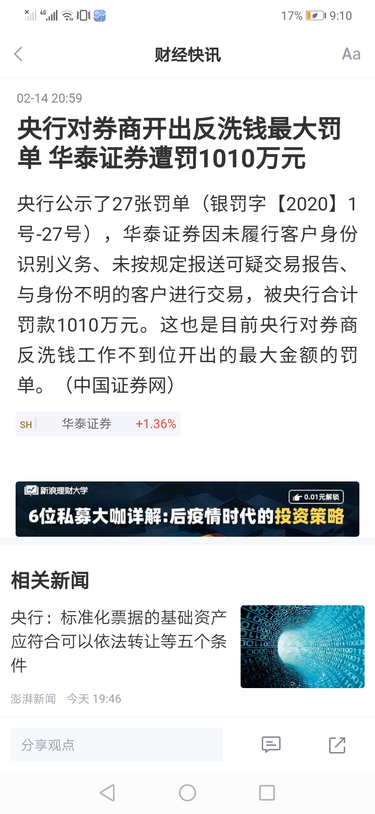

======================================================

_type: talk
@门萨🐨[51411455828824]
2020-02-14 21:56:42 Fri  
topic_id: 548112824218154

阅读[3486]  评论[0]  赞[0] 

+++++++++++++++++++++++++++++++++++++++++++++++++++++

图片：
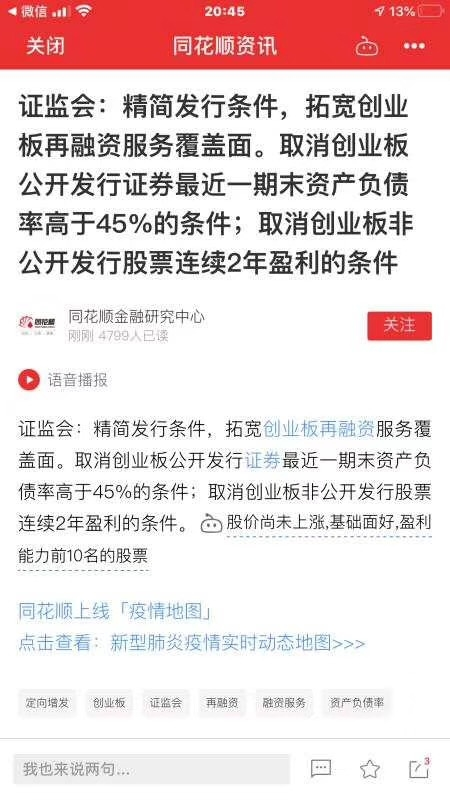

======================================================

_type: talk
@二师父[28814221155551]
2020-02-14 23:39:04 Fri  
topic_id: 548112828251154

你懂的

@青青竹 at 2020-02-14 23:39:04 Fri

> 小白表示不懂[捂脸]

----------

@奔波儿霸🐟🐠🐬🐳🐋💦 at 2020-02-14 23:39:04 Fri

> 同样不懂，看看有没有明白人来给说说。

----------

@二师父 at 2020-02-14 23:39:04 Fri

> 看股价

----------

@陈飞🤗 at 2020-02-14 23:39:04 Fri

> 1314一生一世？？

----------

@云淡风轻 at 2020-02-14 23:39:04 Fri

> [强][强]

----------

阅读[3378]  评论[5]  赞[0] 

+++++++++++++++++++++++++++++++++++++++++++++++++++++

图片：
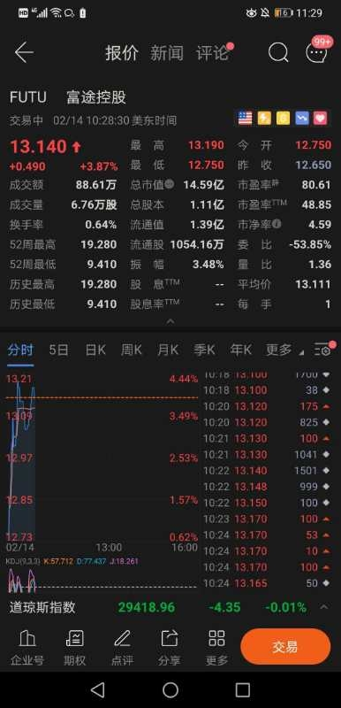

======================================================

_type: q&a
@田维海[422144441542418]
2020-02-15 08:26:38 Sat  
topic_id: 241885188428141

@田维海

>  二师傅，请问，乌龟量化网站指数、股票数据可靠吗？

@二师父

>  可以作为一个参考，choice数据和wind数据最可靠，其次是中证官网，国证官网还有果仁网和理杏仁

阅读[3396]  评论[3]  赞[0] 

======================================================

_type: talk
@树叶[544811512145144]
2020-02-15 10:01:31 Sat  
topic_id: 421884185842558

<e type="hashtag" hid="142825811122" title="#定投周报#" /> 二师父定投周报第46期

阅读[3599]  评论[0]  赞[0] 

+++++++++++++++++++++++++++++++++++++++++++++++++++++

文件：
2020-02-15 10:01:22 Sat
文件大小：[247446]
88225828551882-二师父定投周报2.15（第46期）.docx

======================================================

_type: talk
@二师父[28814221155551]
2020-02-15 10:17:45 Sat  
topic_id: 118552854422152

<e type="hashtag" hid="144885524452" title="#港股打新卖出和科创基金#" /> 港股打新卖出分几种情况，第一种，暗盘破发，没有绿鞋保护机制，这种情况那就是判断错误，直接走人，暗盘就走。

第二种，暗盘破发但是有绿鞋保护机制，这就不用太担心，shanghhi首日执行绿鞋机制的投资银行都会再发行价和发行价之下买入维持股价，对于散户认购不足的的大盘新股，那么绿鞋稳定机制一般尽量不让新股破发。这种可以等待上市首日走掉

第三种，暗盘上涨的新股，就等到第二天上市卖出。打新就是打新，不要变成炒股，港股投资风险比较大，没有两把刷子不要碰确定性不高的新股。

还有关于科创基金，目前芯片、半导体、创业板、科创板都不错，芯片还有增发基金，可能会继续上涨，然而关键问题在于未来的盈利不可预期，而科创板可以适当关注下，博瑞医药、桌易信息、有方科技等科创企业市值很低，但是利润增长快，成长性好，更为重要的是当前科创基金有折价，计划下周建1%——2%的科创基金仓位，封闭二年，后续看情况定投，这个仓位不管上证还是下跌对整体的仓位影响不大。

主力配置还是宽基+消费+医药+金融+中概，这是核心配置。至于人工智能、科创等都属于卫星配置。

@次郎🌻 at 2020-02-15 10:17:45 Sat

> 师傅，目前2920的点位来看，多少仓位比较舒服？我现在只有3-4成仓位，目前股市缓慢爬坡的情况下，我还能加仓吗？

----------

@二师父 at 2020-02-15 10:17:45 Sat

> 可以加啊，舒服舒服自己能感受到，这个每人承受能力和现金流都不同的

----------

@陈飞🤗 at 2020-02-15 10:17:45 Sat

> 封闭两年，看情况定投，是不是两年之内只买不卖

----------

@二师父 at 2020-02-15 10:17:45 Sat

> 封闭期卖不了

----------

@wty at 2020-02-15 10:17:45 Sat

> 二师父，能分享您要建仓的科创基金代码？

----------

@J at 2020-02-15 10:17:45 Sat

> 师傅，白酒算不算消费行业？还是另外看成一个独立的行业基金？

----------

@二师父 at 2020-02-15 10:17:45 Sat

> 501085

----------

@二师父 at 2020-02-15 10:17:45 Sat

> 消费行业

----------

阅读[4130]  评论[29]  赞[0] 

======================================================

_type: talk
@二师父[28814221155551]
2020-02-15 17:23:12 Sat  
topic_id: 421884158482228

<e type="hashtag" hid="144885421482" title="#配置与定投#" /> 配置是底部一次或者分批建立仓位，这是超额收益的源泉，配置是对增量资金而言的，学会做配置收益率高于定投。我对比了下18年底部买入的银行和50AH 分别盈利21%和13%，而对于19年7月定投的50AH和银行，一个盈利3%，一个浮亏2%。这说明什么，存量资金适合底部一次买入，很多人都说，底部买入，还跌怎么办，拿着就行，巴菲特的投资回撤最大53%，拿住了，如果你连波动都经受不住，想在资本市场挣钱，那是不可能的，判断的最大底部重仓，就是相对低位就行，不用试图一买就涨，只看买入之后在1到2年内大涨的概率有95%以上就可以，那你就获胜了。

关于定投，什么适合定投，增量资金适合定投，市场并不是底部的时候怕踏空适合定投，判断是不是底部最好的方法，看全市场指数市盈率，5%——15%就是非常底部。看格雷厄姆指数，盈利收益率/10年期国债收益率，大于2，非常底部。

两个指标够了，然后再关注指数的盈利和估值，不要陷入低估值陷阱，成长和估值需要并重。

这就是定投和配置，资产配置交给存量资金，用这个实现财务自由，通过资产切换轮动，账户金额逐步升高，定投交给增量资金，如果仓位太重，也可以不用减仓，直接增量资金多了仓位就降了，比如资产100万，每月结余1万，投资了指数80万，即使不再进行投资行为，有了结余相当于降低了仓位。

这也是鳄鱼计划和场外定投的区别，一个是存量资金配置，家庭资金主力，一个是增量资金增值，有机会就买，没机会就手持现金等待机会。

学会做配置，也坚持定投，不断学习优化，你的投资水平才会越来越完善。

@大⭐ at 2020-02-15 17:23:12 Sat

> 指数市盈率和格雷厄姆指数两个指标满足一个是不是就可以了

----------

@二师父 at 2020-02-15 17:23:12 Sat

> 对

----------

@敏杰 Minjie at 2020-02-15 17:23:12 Sat

> 二师父，关于场内，场外的资金投入，由于费率的关系，是不是也可以理解为，一次性配置或者逐步建仓，一般建议选择场内，而定投则选择场外

----------

@二师父 at 2020-02-15 17:23:12 Sat

> 你可以放一起，我是在天天刚好给大家一个参考

----------

@敏杰 Minjie at 2020-02-15 17:23:12 Sat

> 我之前一直只买场外，现在对比场内场内觉得场内费率便宜很多，只有一个交易费；所以想是不是尽可能都在场内配置，这样可以更省钱，不知道我这样理解对不对?
你说的放在一起，指的是都放在场内吗?但是场内都要手动操作对吗？

----------

@二师父 at 2020-02-15 17:23:12 Sat

> 场外也是手动操作啊，管理费都有的

----------

@明树 at 2020-02-15 17:23:12 Sat

> 这就是定投和配置，资产配置交给存量资金，用这个实现财务自由，通过资产切换轮动，账户金额逐步升高。
请教二师父，“通过资产切换轮动”是什么意思

----------

@二师父 at 2020-02-15 17:23:12 Sat

> 就是大类资产轮动配置

----------

阅读[4122]  评论[10]  赞[0] 

======================================================

_type: talk
@大⭐[48844441548888]
2020-02-15 17:59:24 Sat  
topic_id: 548112851281414

<e type="hashtag" hid="144885421482" title="#配置与定投#" /> 指数市盈率和格雷厄姆指数两个指标满足一个是不是就可以了

阅读[3292]  评论[0]  赞[0] 

======================================================

_type: q&a
@林玮[844111858288412]
2020-02-15 20:20:28 Sat  
topic_id: 841885128421242

@林玮

>  老师，免5是什么意思啊

@二师父

>  没有最低5元佣金

阅读[3441]  评论[3]  赞[0] 

======================================================

_type: talk
@二师父[28814221155551]
2020-02-15 22:11:57 Sat  
topic_id: 241885122448421

今天电脑坏了，争取在12点前修好电脑[微笑]

@奔波儿霸🐟🐠🐬🐳🐋💦 at 2020-02-15 22:11:57 Sat

> 重启重装[偷笑]

----------

@二师父 at 2020-02-15 22:11:57 Sat

> U盘的大白菜不见了

----------

@奔波儿霸🐟🐠🐬🐳🐋💦 at 2020-02-15 22:11:57 Sat

> 可惜我这企业版需要内网才能激活，盗版的稳定性不咋地。

----------

阅读[3502]  评论[3]  赞[0] 

======================================================

_type: talk
@光少[244124552511141]
2020-02-15 22:24:34 Sat  
topic_id: 548112855855214

二师父在喜马拉雅发表的文章语言播放特别好

<e type="web" href="http://xima.tv/vMC9Zt" title="可转债投资价值分析在线收听_二师父定投微信公众号分享_喜马拉雅FM"/>

@光少 at 2020-02-15 22:24:34 Sat

> 可以下载喜马拉雅APP收听

----------

@衣袂飘香 at 2020-02-15 22:24:34 Sat

> 不错，再听一遍，再学一遍。

----------

阅读[3536]  评论[2]  赞[0] 

======================================================

_type: talk
@二师父[28814221155551]
2020-02-15 22:32:40 Sat  
topic_id: 841885122142212

大家看看微信吧，电脑一直卡了不能动，需要关注的几个行业，半导体，计算机和人工智能，目前估值都不低，等待机会啦

<e type="web" href="https://mp.weixin.qq.com/s/pJJ15zF0DAcyO58qlh8r9g" title="科技信息行业的子行业分析" cache="" />

@海马 at 2020-02-15 22:32:40 Sat

> 二师父，半导体的标的也是人工智能吗？

----------

@志亮 at 2020-02-15 22:32:40 Sat

> 半导体一直等不到机会上车。

----------

@二师父 at 2020-02-15 22:32:40 Sat

> 不是，是单独的一个行业指数

----------

@志亮 at 2020-02-15 22:32:40 Sat

> 二师父，你还漏了新能源车[呲牙]

----------

@海马 at 2020-02-15 22:32:40 Sat

> 就一只007301这只半导体指数2个多亿的规模

----------

@二师父 at 2020-02-15 22:32:40 Sat

> 比亚迪，宁德时代都不错，这不属于科技啊

----------

@Pansy at 2020-02-15 22:32:40 Sat

> 今天刚学到人工智能指数，这篇文章更详细了

----------

阅读[3792]  评论[9]  赞[0] 

======================================================

_type: talk
@海马[15158245825242]
2020-02-15 22:45:28 Sat  
topic_id: 118552844888422

涨幅巨大

阅读[3730]  评论[0]  赞[0] 

+++++++++++++++++++++++++++++++++++++++++++++++++++++

图片：
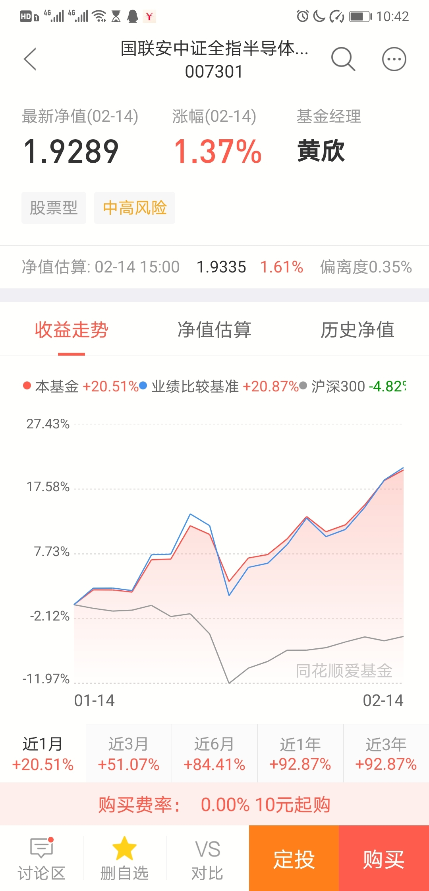

======================================================

_type: talk
@二师父[28814221155551]
2020-02-16 10:10:18 Sun  
topic_id: 241885148544451

<e type="hashtag" hid="144881554822" title="#房地产#" /> 目前关于房地产指数有个中证全指房地产，房地产行业作为周期第二梯队行业，值得关注，场外的南方目前还没有到达一亿元以上，场内的南方已经到了1亿元以上，目前房地产仍旧处于低位，投资者可以关注，之前投资的分级基金，未来可能转型，也可能是清盘，不可知，所以二师父提前卖出盈利的分级基金加仓到其他低估的优质指数

另外，科技和5G已经高估了，不要在入，虽然机构抱团，资金进入进一步推动芯片半导体走高，建小幅观察仓可以，定投的话就违背了基本的定投原则，不管什么指数，切记低估定投，低估定投，低估定投，这是非常重要的

@朝阳模具 at 2020-02-16 10:10:18 Sun

> 师父，有一些盈利能力强的指数很难出现低估机会，是不是可以考虑正常估值时开始定投？进入低估时直接建立低仓[愉快][愉快]

----------

@二师父 at 2020-02-16 10:10:18 Sun

> 可以的，高盈利可以消化估值，只要经受住浮动风险就可控

----------

@朝阳模具 at 2020-02-16 10:10:18 Sun

> 嗯😊

----------

@志亮 at 2020-02-16 10:10:18 Sun

> 因为地产连着几天上涨，我场外的地产基金清一半仓，不知这决定有没有错？[微笑]

----------

@二师父 at 2020-02-16 10:10:18 Sun

> 现金可以换仓到其他指数

----------

@志亮 at 2020-02-16 10:10:18 Sun

> 嗯，也好[微笑]

----------

@雨淡风清 at 2020-02-16 10:10:18 Sun

> 二师父，由于现在这个事情，房价是不是也会降一降？

----------

@二师父 at 2020-02-16 10:10:18 Sun

> 房地产看利率，人口流动和当地政策松紧

----------

阅读[4312]  评论[13]  赞[0] 

======================================================

_type: q&a
@范*[841855284221812]
2020-02-16 14:14:33 Sun  
topic_id: 118552815885422

@范*

>  二师父，由于自己学历有限。不了解半导体行业。请问下您。
>  1.从电脑互联网发展到现在便携移动互联网，5G网络更好了，下一步应该发展到以5G为链接的智能时代。那么半导体是不是会有非常大的前景呢？就像水泥与地产建设，淘金与铲子。卖水泥和卖铲子的发财了。什么和智能设备比喻合适呢？是芯片？半导体？还是别的？
>  2.英特尔微软之类的科技公司都在纳斯达克。纳斯达克是全球科技龙头汇聚地吗？
>  3.未来纳斯达克投资价值和智能时代有关系吗？
>  4.国内科技ETF   半导体ETF  纳斯达克ETF那个更具有投资价值？
>  5.下个时代是否，智能时代？不是智能时代，会是什么时代呢？
>  二师父麻烦您了。我比较啰嗦而且逻辑不清。

@二师父

>  人工智能等产品相当于地产，芯片半导体材料相当于水泥，目前来看没有什么什么指数比纳斯达克更好，业绩稳定估值低，不过也不排除大跌，科技企业挣钱快，亏钱也快，至于a股科技，尤其半导体等，估值太高，容易被机构爆炒
>  
>  我判断未来是人工智能和物联网时代，科技的全面普及让人们的需求得到了最大限度满足，而唯一一点情感需求会比较难，机器人可以解决你的生活需求，无法解决你的情感需求，你可以看看李开复关于人工智能的书

阅读[3683]  评论[4]  赞[0] 

======================================================

_type: talk
@二师父[28814221155551]
2020-02-16 20:31:53 Sun  
topic_id: 841885118584812

坚持低估定投和逆向投资原则，另外做好配置，股票，债券和商品都要配置的。如果主仓位都建好了，再配点人工智能其实对9成仓位没啥影响

@王模堂 at 2020-02-16 20:31:53 Sun

> 去年下半年，机构发现了科技板块的业绩高速增长，白酒被拉到高位的时候，机构资金开始往科技板块流入'。
那么，今年二师傅您说一下机构可能发现那个板块的业绩高速增长，资金会流入？

----------

@二师父 at 2020-02-16 20:31:53 Sun

> 还在流入科技

----------

阅读[3675]  评论[2]  赞[0] 

+++++++++++++++++++++++++++++++++++++++++++++++++++++

文件：
2020-02-16 20:30:43 Sun
文件大小：[16178]
15442512545522-不管市场怎么炒，都不要违背低估和逆向投资原则.docx

======================================================

_type: q&a
@敏杰 Minjie[241844452525121]
2020-02-16 22:04:23 Sun  
topic_id: 548112881214524

@敏杰 Minjie

>  您好，二师父，
>  格力电器公告，公司第一大股东珠海明骏投资合伙企业(有限合伙)及其一致行动人董明珠质押股份共计945,992,382股，占其所持公司股份数量比例达到99.91%。
>  
>  对于这个消息您认为是利好还是利空?长期和短期
>  
>  这应该属于利好吧？

@二师父

>  珠海明骏成立于2017年5月，公司的两大股东分别是深圳高瓴瀚盈投资咨询中心和珠海贤盈股权投资合伙企业，而珠海贤盈后面的资本是高瓴资本，是专注于长期的价值投资机构，投了很多企业的，这个机构看好格力利好。
>  
>  而对于股权质押，这个在股权转让的时候就定下来了，没有特别的意义，高瓴资本投资了很多企业的，都非常好，本身也遵循价值投资理念，作为普通投资者，即使只买10手也需要做终身投资。
>  
>  就目前而言，格力的董姐一直处于任期，公司基本面没有显著恶化，那么格力就是我的非卖品。

阅读[3476]  评论[0]  赞[0] 

======================================================

_type: talk
@二师父[28814221155551]
2020-02-16 22:11:14 Sun  
topic_id: 241885114285221

中概互联我是从19年开始建仓的，当时还做了几次波段，价格在1.1附近，当时有人恐惧美股会不会高位崩盘，现在却想接，不怕纳斯达克崩了吗，逆向思维，逆向思维。

@学以致用 at 2020-02-16 22:11:14 Sun

> 老师，你的意思是：中概互联目前不能买吗？我看了银行螺丝钉在定投，我也刚开始建仓！

----------

@二师父 at 2020-02-16 22:11:14 Sun

> 我不明白为啥之前那么好的机会不买，偏偏涨这么高了买

----------

@雨的依恋 at 2020-02-16 22:11:14 Sun

> 去年二师父一直有说这个中概互联，也说想买的话推荐场内，说场外不活跃，我买的均价是1.183，不过买的不多，中间1.3几的时候还卖了[捂脸]

----------

@范* at 2020-02-16 22:11:14 Sun

> 我知道银行螺丝钉说的，中概互联低估他2月7日开始定投。我看阿里巴巴，和腾讯现在的位置，不是很明智。
银行螺丝比较贼，他的钱都是出版，粉丝赚的，光粉丝一年知识星球就有上千万学费。一年挣的不少，实盘投资的钱只是九牛一毛。而我们基本上用全部身价在投资。他这样做就相当于一资金无限大，同时资金利用率太低。他只是要一个好的成绩给大家看，继续吸粉丝赚钱。

----------

@Pansy at 2020-02-16 22:11:14 Sun

> 幸亏我没有跟投他的实盘，只是还是掌握在自己手中比较明智

----------

阅读[3555]  评论[5]  赞[0] 

======================================================

_type: talk
@二师父[28814221155551]
2020-02-17 07:15:34 Mon  
topic_id: 841885111111242

<e type="hashtag" hid="455112511518" title="#看好的板块正常估值是否能够买入#" /> 存量资金的打理适合配置，否则的话可能出现资金利用率不足，很多一直担心仓位不够的朋友就是没有做配置

消费能不能买，中概互联能不能买，第一看估值，第二看预期，第三看仓位，不是说正常估值就不能买

估值，高估肯定不行，需要避免

预期，预期下行那就不能一次买入，预期上行，那就可以一次买

仓位，预期可能对可能错，在估值角度看上行和下行概率

做好基本配置，比如当前有100万，买30万货币基金，20万500，20万300，10万消费，10万中概，10万债券，这就可以，配置没问题，你单独问，5G能不能买这没法答，谁知道你买多少

这就如同做饭，盐，辣椒，生抽，酱油都得来一点，不是说能不能加，而是说一个合理配比

一味地无脑定投，适合增量资金，存量资金不放股市增值那就是犯罪。

当然股市和债市的风险收益率一定要高于4个百分点，也就是银行理财的收益率，否则还不如存银行的，当前股市收益率是6个百分点，已经很好了，值得配置

当然，如果想要等待更好的位置，比如2月3号到6号，没有建仓后来焦虑的，这就是贪心，企图买在最低点卖到最高点就是贪心

最近集中研究行业指数，配置也增配一些行业指数，后面股市起来了再配点债券基本就好了，我的企业配置逻辑也会和大家分享了，打好基础，先学指数，然后集中到优质企业

一步步循序渐进，一进股市就看K线基本被套，很多入市十几年的老股民是二师父五步定投法最佳践行者，因为他们非常明白，自己瞎鼓捣股票就是个亏，慢慢学习吧

投资学习的道路上永无止境，哪天你认为你学的可以的时候，也许就是亏钱的开端

@二师父 at 2020-02-17 07:15:34 Mon

> 已经8成仓位，买个百分之1做趋势可以，现在买属于投机了，不过目前是利好科技医药券商的

----------

@二师父 at 2020-02-17 07:15:34 Mon

> 不要一次买，高估的指数本来风险溢价就高

----------

@大兵 at 2020-02-17 07:15:34 Mon

> 师父，场外广发医药和医药100各一万左右，目前30%盈利，请问如何操作，持这么少也要进入高估先买20%逐步清仓吗还是再等等？谢谢！

----------

@二师父 at 2020-02-17 07:15:34 Mon

> 可以持有的

----------

@苍天有井明月空🌙 at 2020-02-17 07:15:34 Mon

> 货币基金有推荐的吗

----------

阅读[4289]  评论[12]  赞[0] 

======================================================

_type: talk
@Pansy[48281554424548]
2020-02-17 10:44:42 Mon  
topic_id: 241888552452211

大家能不能推荐我一下比较优质的债券基金啊？

@范* at 2020-02-17 10:44:42 Mon

> 这个要长期拿，不然赎回费率高

----------

@Pansy at 2020-02-17 10:44:42 Mon

> 天天基金上的吗？

----------

@二师父 at 2020-02-17 10:44:42 Mon

> 招商产业债，博时信用债，短债嘉实超短债

----------

@Pansy at 2020-02-17 10:44:42 Mon

> 谢谢师父，我还想问一下，这几个债券基金，我是一次性买入，还是跟基金一起定投比较好？

----------

@二师父 at 2020-02-17 10:44:42 Mon

> 定投，等利率起来了再投，目前还是指数为主

----------

@Pansy at 2020-02-17 10:44:42 Mon

> 好的，谢谢师父

----------

阅读[3273]  评论[6]  赞[0] 

======================================================

_type: q&a
@海马[15158245825242]
2020-02-17 13:24:51 Mon  
topic_id: 841888554814212

@海马

>  师父：我想考基金执业资格证书，指导我一下[呲牙]谢谢

@二师父

>  科目一和科目二必考，三选考
>  
>  买两本书，复习下，科目一记忆的比较多，科目二计算多一点，复习好了模拟考试90分考试就没问题了

阅读[3351]  评论[7]  赞[0] 

======================================================

_type: talk
@Nick.yang[118281888551882]
2020-02-17 14:24:35 Mon  
topic_id: 421888442128128

小白不太懂，自己买了点玩玩，想各位大神给一点意见，手上资金20万左右吧，19年赚了8千多吧，玩了半年，过年第一天让我回到解放前

@那方山的树，佛陀座下* at 2020-02-17 14:24:35 Mon

> 你这买的太多了吧？好多基金重复了

----------

@丸子妈 at 2020-02-17 14:24:35 Mon

> a类c类都有

----------

阅读[3288]  评论[2]  赞[0] 

+++++++++++++++++++++++++++++++++++++++++++++++++++++

图片：
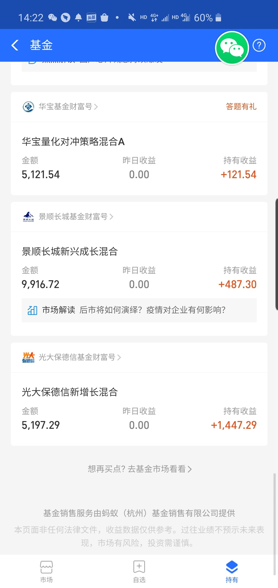
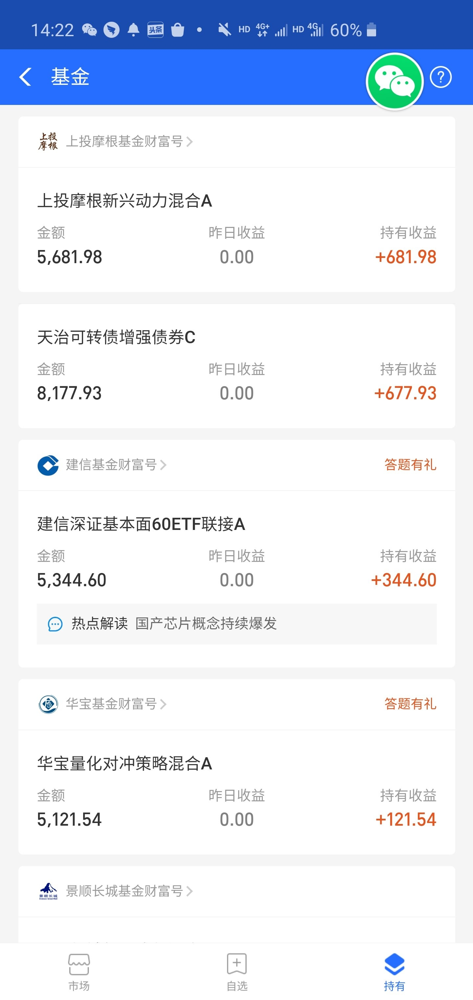
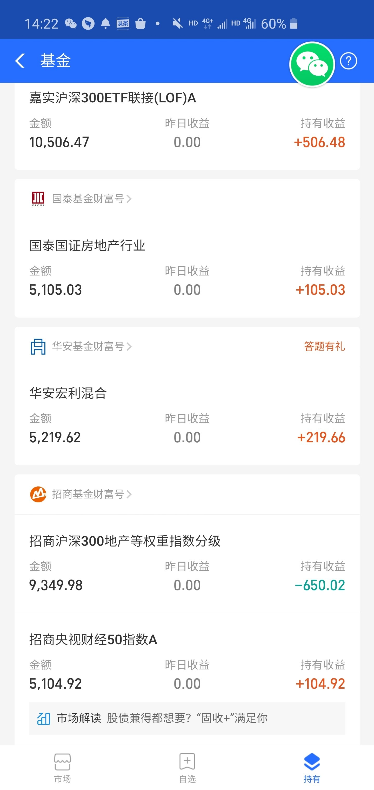
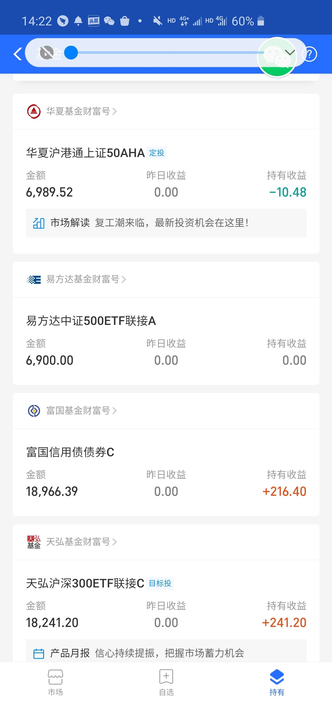
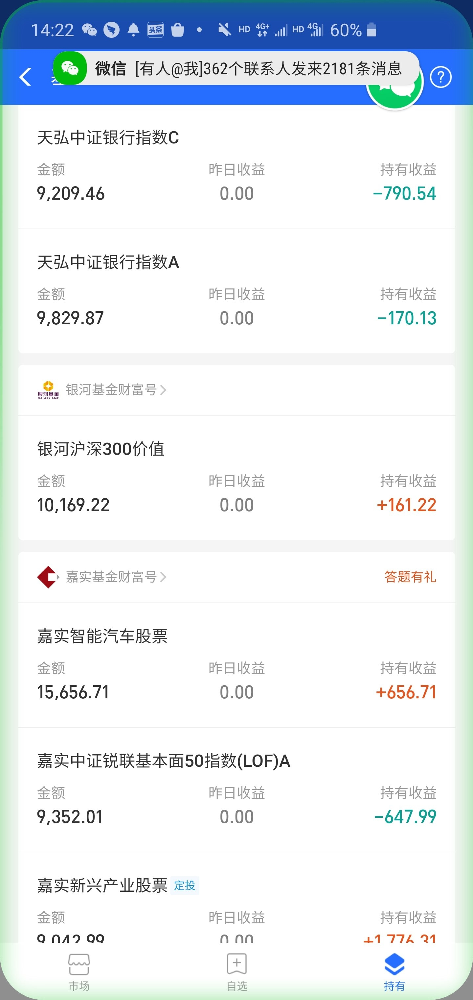

======================================================

_type: q&a
@庆余年[15584481824122]
2020-02-17 14:37:27 Mon  
topic_id: 118555221882882

@庆余年

>  二师父您好，年底有了一批存量资金，我想把它用起来并平衡我现有基金的仓位，请问二师父有没有好的建议？本来整体持仓应该在80%左右的，目前总持仓为66.51%，我想把仓位补到75-85%左右，持仓情况如下：
>  中证100 0.7%
>  50AH优选 9.4%
>  基本面60 5.2%
>  沪深300 6.7%
>  中证500 12.3%
>  中证银行 8.2%
>  医药 7%
>  恒生指数 2%
>  H股指数 4.2%
>  创业板 10.8%

@二师父

>  券商和H股目前都可以，配置好了以后，继续涨了就不动或者网格，继续跌了就加仓，涨跌都很舒服的

阅读[3417]  评论[5]  赞[0] 

======================================================

_type: talk
@凯[244415182418811]
2020-02-17 14:49:09 Mon  
topic_id: 421888441425128

前几天和现在对比

@光少 at 2020-02-17 14:49:09 Mon

> 今天又大涨了

----------

阅读[3609]  评论[1]  赞[0] 

+++++++++++++++++++++++++++++++++++++++++++++++++++++

图片：

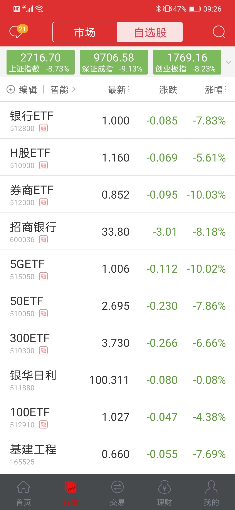

======================================================

_type: talk
@二师父[28814221155551]
2020-02-17 19:31:05 Mon  
topic_id: 241888882245511

券商加科技的结构行情，很多人说券商业绩不行，而我在这只基金赚了很多。券商也一直没涨，可是市值增高了，为什么呢？因为网格，每买入卖出一次市值就增长一次

阅读[3783]  评论[0]  赞[0] 

+++++++++++++++++++++++++++++++++++++++++++++++++++++

文件：
2020-02-17 19:29:39 Mon
文件大小：[15647]
51552145428154-利好之下的结构性行情.docx

======================================================

_type: talk
@二师父[28814221155551]
2020-02-17 20:01:12 Mon  
topic_id: 841888882442842

周一市场分析，目前的市场处于什么情况，大概有个判断，另外判断的格局要大，不能说美股5年不涨未来就不会涨，需要更长的周期来看待投资和股市，以长远的思维看待宏观。

@志亮 at 2020-02-17 20:01:12 Mon

> 大盘按近3000的位置的确最好是不动，而且创业板行情又不知什么时候结束，现在杀进去又很容易当接盘侠，还是要小心一些，像二师父说的控制仓位真的很重要。

----------

@二师父 at 2020-02-17 20:01:12 Mon

> 资产轮动配置比较重要，板块切换，我的平安最近一个月没有500涨的好

----------

阅读[4319]  评论[2]  赞[0] 

+++++++++++++++++++++++++++++++++++++++++++++++++++++

文件：
2020-02-17 20:00:18 Mon
文件大小：[162524]
28225841842441-市场分析2.17.docx

======================================================

_type: talk
@二师父[28814221155551]
2020-02-17 22:41:55 Mon  
topic_id: 548111118241244

有了适当的利润，资本就大胆起来，如果有了10％的利润，它就会到处被使用；有了20％的利润，它就会活跃起来；有了50％的利润，它就会铤而走险；而为了100％的利润，它就敢践踏人间一切法律；为了300％的利润，它就不惜冒犯任何罪行，甚至绞首危险

为什么人会犯罪呢，股市为什么会追高呢，真谛

@Pansy at 2020-02-17 22:41:55 Mon

> 很有道理，越是资本涌入的时候，我们越要有心中的纪律

----------

@J at 2020-02-17 22:41:55 Mon

> 一针见血[微笑]

----------

阅读[3520]  评论[2]  赞[0] 

======================================================

_type: talk
@二师父[28814221155551]
2020-02-17 23:05:07 Mon  
topic_id: 841888881841282

受本次影响，未来生物医药，抗病毒创新药，医疗信息化会加强，重点关注生物医药领域和推动信息化的人工智能领域

投资需要站在现在看未来

@范毅君 at 2020-02-17 23:05:07 Mon

> 但现在都高估，是不是静等低估呢

----------

@敏杰 Minjie at 2020-02-17 23:05:07 Mon

> 想投医疗信息化，求二师父推荐，研究了好久了

----------

@J at 2020-02-17 23:05:07 Mon

> 师傅，生物医药和医药行业具体有什么区别，可以讲解一下吗？有哪些是师傅推荐关注的投资标？

----------

阅读[3576]  评论[3]  赞[0] 

======================================================

_type: q&a
@背心[51441214442224]
2020-02-18 07:12:36 Tue  
topic_id: 241888828118121

@背心

>  师傅，我手里有50万份农商银行员工股，是留着每年分红好还是找人卖了好。感觉这几年银行分红越来越少了，卖了能有点现金。犹豫挺长时间了。望二师傅指教，谢谢

@二师父

>  我查了下有几个农商银行，不知你是哪个，如果有更好的投资可以换了，现金不要长持

阅读[3442]  评论[0]  赞[0] 

======================================================

_type: q&a
@乖子[28441841181151]
2020-02-18 09:26:39 Tue  
topic_id: 118555544412582

@乖子

>  二师父，您好，如果我拿2万出来做网格交易法，请问目前券商我首先买入多少合适？

@二师父

>  买入6000差不多，然后回调慢慢加仓，直到满仓，起来再卖

阅读[3478]  评论[1]  赞[0] 

======================================================

_type: talk
@凯[244415182418811]
2020-02-18 09:27:04 Tue  
topic_id: 241888822242521

第一次套利

@雨的依恋 at 2020-02-18 09:27:04 Tue

> 我没转成功，提示在华泰未建立深市场内应关系[捂脸]

----------

@凯 at 2020-02-18 09:27:04 Tue

> 可以开通

----------

@mumomo at 2020-02-18 09:27:04 Tue

> 得在柜台吗？

----------

@雨的依恋 at 2020-02-18 09:27:04 Tue

> 我网上点哪好像都不行，是不是要去柜台？

----------

@凯 at 2020-02-18 09:27:04 Tue

> 我没去柜台，软件点开通的

----------

@雨的依恋 at 2020-02-18 09:27:04 Tue

> 好的，谢谢[愉快]

----------

@银河系 at 2020-02-18 09:27:04 Tue

> 现在套不了了

----------

@二师父 at 2020-02-18 09:27:04 Tue

> 之前申购的吧，现在申购不了了

----------

阅读[3486]  评论[9]  赞[0] 

+++++++++++++++++++++++++++++++++++++++++++++++++++++

图片：
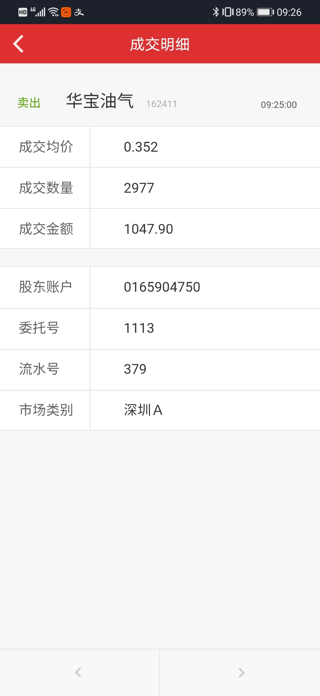

======================================================

_type: talk
@警铃[844184212148512]
2020-02-18 11:56:13 Tue  
topic_id: 118555541122582

二师父您好。我先问一下一般网格中的拐点买入和回落卖出我们需要设置么？

@二师父 at 2020-02-18 11:56:13 Tue

> 我设置好了，可以移动，今天我再讲下

----------

@警铃 at 2020-02-18 11:56:13 Tue

> 谢谢您。主要没有太明白这两个指标设定作用和实操的作用

----------

阅读[3339]  评论[2]  赞[0] 

======================================================

_type: q&a
@雨淡风清[844418818858882]
2020-02-18 12:23:13 Tue  
topic_id: 118555541121842

@雨淡风清

>  二师父，你好。我在你的圈子里发展了，7分钟理财，不知道是不是推送。看过后很是心动，里面说的很诱人，我也明白贪婪是人性的原罪。跟着二师父也小挣了一些，想要博更大的收益就要付出，学习跟不上就是要付费一些向比我强的人质询。这些我也明白，我想问下二师父他们这个平台靠谱么？

@二师父

>  他们的服务比较好，对你的问题会详细解答，理财水平不知道有没有我高
>  
>  平台是靠谱的，不是骗子，不过我觉得你真想取得更高收益，在星球认真学习，把我的三门课程认真听一遍，然后每天看书在星球打卡，你的水平自然上来了
>  
>  需要有个过程，学堂有几个朋友坚持在打卡严格执行的都做的很好，你本来已经入门了，如果贪心不控制好自己，有可能未来连本带利亏出去的，慢慢来，财不入急门

阅读[3515]  评论[12]  赞[0] 

======================================================

_type: talk
@二师父[28814221155551]
2020-02-18 15:01:28 Tue  
topic_id: 841888848851222

基金分析，看看债券的配置

@蓝魔森林 at 2020-02-18 15:01:28 Tue

> 科技基金场外除了515000之外，还有哪些比较优质？

----------

@二师父 at 2020-02-18 15:01:28 Tue

> 别追

----------

@蓝魔森林 at 2020-02-18 15:01:28 Tue

> 我一点科技行业配置都没有

----------

@蓝魔森林 at 2020-02-18 15:01:28 Tue

> 医药 消费行业也都基本0

----------

@蓝魔森林 at 2020-02-18 15:01:28 Tue

> 现在科技配置个仓位0.5%左右的不知道值不值得，看你文章里这样写。

----------

@二师父 at 2020-02-18 15:01:28 Tue

> 你能接受百分之80的单边回撤就可以搞

----------

@蓝魔森林 at 2020-02-18 15:01:28 Tue

> 80%那么夸张[撇嘴]  嗯 我再考虑下

----------

@YAO at 2020-02-18 15:01:28 Tue

> 压力点位3106是怎么算出来的？

----------

阅读[3985]  评论[9]  赞[0] 

+++++++++++++++++++++++++++++++++++++++++++++++++++++

文件：
2020-02-18 15:01:11 Tue
文件大小：[162524]
51552182481244-基金分析2.18.docx

======================================================

_type: talk
@二师父[28814221155551]
2020-02-18 15:48:13 Tue  
topic_id: 548111141555884

<e type="hashtag" hid="222111848821" title="#新股播报#" /> 
富石金融今日公布中签，认购倍数130，一手中签率20%，富途暗盘时间16:15-18:30。

@alicedream* at 2020-02-18 15:48:13 Tue

> 二师父新股中签了吗？

----------

@二师父 at 2020-02-18 15:48:13 Tue

> 没

----------

阅读[3250]  评论[2]  赞[0] 

======================================================

_type: talk
@二师父[28814221155551]
2020-02-18 16:19:15 Tue  
topic_id: 548111141455824

暗盘上涨，首日可卖，打新不用持有

@敏杰 Minjie at 2020-02-18 16:19:15 Tue

> 这咋操作呀

----------

@二师父 at 2020-02-18 16:19:15 Tue

> 这是港股打新

----------

阅读[3304]  评论[2]  赞[0] 

+++++++++++++++++++++++++++++++++++++++++++++++++++++

图片：
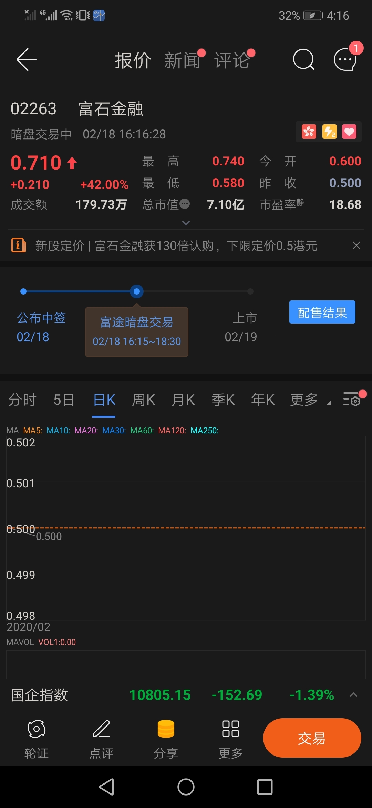

======================================================

_type: talk
@凯[244415182418811]
2020-02-18 19:05:42 Tue  
topic_id: 548111145451424

今年个人增加了混合型基金，配置20%，用于进攻。

@特仑苏 at 2020-02-18 19:05:42 Tue

> 交银新生活力，和兴全精选我也买了。

----------

@特仑苏 at 2020-02-18 19:05:42 Tue

> 2.3到2.7每天定投了一些。现在收益一个8.31%一个9.61%

----------

@凯 at 2020-02-18 19:05:42 Tue

> 时机把握的不错，都是成长类基金

----------

阅读[3175]  评论[3]  赞[0] 

+++++++++++++++++++++++++++++++++++++++++++++++++++++

图片：
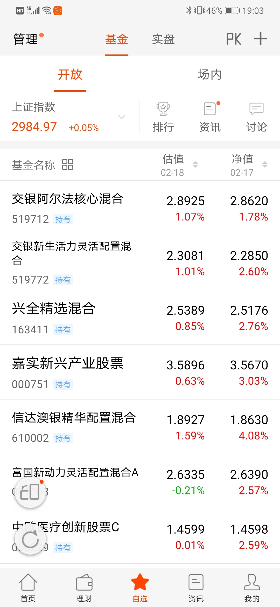

======================================================

_type: talk
@二师父[28814221155551]
2020-02-18 20:52:27 Tue  
topic_id: 241888815585521

网格在手利润我有，时刻保证高仓位的好处就是当热点来了也不会追，因为没钱啊。

做网格别丢了底仓，你永远不知道明天是暴涨还是暴跌

@宋航 at 2020-02-18 20:52:27 Tue

> 基金的底仓价格怎么确定啊？

----------

@二师父 at 2020-02-18 20:52:27 Tue

> 有价格啊

----------

@宋航 at 2020-02-18 20:52:27 Tue

> 我可能没有表达清楚，就是看二师父之前的两次网格交易表中 ，券商的建立底仓价格都不一样，做了调整。那是依据什么做的调整啊？

----------

@二师父 at 2020-02-18 20:52:27 Tue

> 市场变化和估值，这个我在课程里面讲过了

----------

@宋航 at 2020-02-18 20:52:27 Tue

> 明白了。谢谢二师父[呲牙]

----------

@银河系 at 2020-02-18 20:52:27 Tue

> 假设买了1万份券商ETF做底仓，是否表示做网格的时候这1万份不能卖？

----------

@二师父 at 2020-02-18 20:52:27 Tue

> 没有规定，我说你总投资资金

----------

@银河系 at 2020-02-18 20:52:27 Tue

> 水平比较低，没理解，二师父有空麻烦整理个更详细[抱拳]

----------

阅读[3989]  评论[17]  赞[0] 

+++++++++++++++++++++++++++++++++++++++++++++++++++++

文件：
2020-02-18 20:51:35 Tue
文件大小：[370511]
15442585414552-网格交易实用表格和网格需要注意的问题.docx

======================================================

_type: talk
@银河系[111814581215452]
2020-02-18 21:40:49 Tue  
topic_id: 118555582485242

油价再次下调，华宝油气又要开启跌跌不休模式了，兄弟们还拿得住么？

@银河系 at 2020-02-18 21:40:49 Tue

> 高手

----------

@二师父 at 2020-02-18 21:40:49 Tue

> 拿的住，之前套利价格又下降了，不要方

----------

@银河系 at 2020-02-18 21:40:49 Tue

> 最近不是没额度又不能套利了？

----------

@二师父 at 2020-02-18 21:40:49 Tue

> 是的

----------

@Joey  at 2020-02-18 21:40:49 Tue

> 华宝油气 唯一一支亏损的基金，浮亏28%，仓位占1/10， 到底要不要止损啊

----------

@银河系 at 2020-02-18 21:40:49 Tue

> 我的情况差不多，计划分五次加到二层仓，解套就跑了

----------

@杨小峰 at 2020-02-18 21:40:49 Tue

> 一直在场内买这个，补仓后还亏损近8个点

----------

阅读[3325]  评论[9]  赞[0] 

+++++++++++++++++++++++++++++++++++++++++++++++++++++

图片：
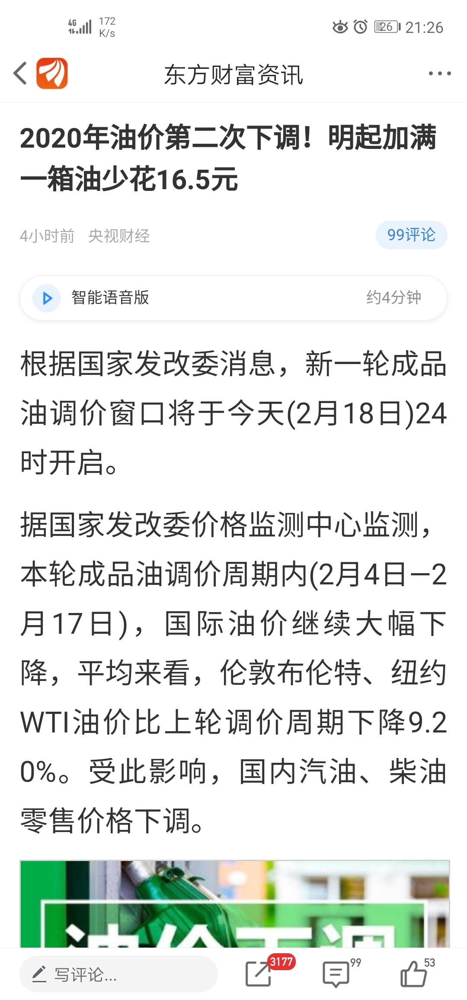

======================================================

_type: talk
@二师父[28814221155551]
2020-02-19 06:01:52 Wed  
topic_id: 548111188252184

如图，稳住，不要方。

@妖孽 at 2020-02-19 06:01:52 Wed

> 这图寓意反正都是死，拼了满仓半导体科技。或许还会有转机

----------

@二师父 at 2020-02-19 06:01:52 Wed

> 赌太大了

----------

@妖孽 at 2020-02-19 06:01:52 Wed

> 低估的指数就像远方的鸟 渐行渐远……

----------

@妖孽 at 2020-02-19 06:01:52 Wed

> 辛辛苦苦涨了一周，一天就跌回几天的涨幅。

这也许还不是最气人的。

关键是，蓝筹崩了，创业板却继续强势。

----------

@Kelven at 2020-02-19 06:01:52 Wed

> 投资股票不能这样的心态，交易心理很重要。也许十次有九次赌对，最后一次也可能血本回归。

----------

阅读[3385]  评论[6]  赞[0] 

+++++++++++++++++++++++++++++++++++++++++++++++++++++

图片：

======================================================

_type: talk
@二师父[28814221155551]
2020-02-19 06:55:33 Wed  
topic_id: 421888811451228

不做的事情更重要。聚焦，才能做长期正确的事情。

人们常说Do right thing, do things right，要做对的事、要把事情作对，道理大家都懂，怎样做到呢？就是不做错的事。多数人不是判断不了对错，而是明知是错的还要去做，因为时常会有短期的诱惑。

想要基业长青，要想让时间产生复利，就需要有长期思维，相信时间的力量。看看 S&P 指数，这些年涨了多少了？这样你才能看清事物的本质，坚持做对的事，才能识别并承受住波动不动摇。

用长期思维看问题，很多事情就都不算什么事，现在中美贸易战，如果你用十年以上的视角去看事物的本质，完全可以把贸易战这样的波动跳过去、忽略掉。

其实我们一直都是在动荡中，有人有危、有人有机，危机对于好公司和投资者都是机会，贸易战是好公司的机会、坏公司的借口。

而有一个Stop Doing List，反过来有利于建立和坚持长期思维。有了列表和意识还不够，行动上要坚持，得跟自己较点劲：如果确认一件事、一个方向是错的，我就立刻停止，而不是非要等着这条路上出现下一个所谓“更好的”。

现在在市场什么也不做就比瞎买的强多了，不做才是智慧

@海马 at 2020-02-19 06:55:33 Wed

> 坚守自己的阵地很重要[强][强][强]

----------

阅读[3608]  评论[1]  赞[0] 

======================================================

_type: talk
@二师父[28814221155551]
2020-02-19 09:47:30 Wed  
topic_id: 421888811181548

<e type="hashtag" hid="455111245158" title="#实盘调仓#" /> 今天定投实盘调仓，卖出中证100，大概盈利2%，换仓到华夏收益债券A，因为无法超级转换，所以先卖出，然后买入同样的金额，代码001061，主要是为了对冲利率下行和汇率风险，如今大盘还是处于白银底区域，如果继续下跌，那么很多主流的指数会继续定投，还是以宽基为主，行业为辅，再加上目前的港股和周期性行业。不管市场上行还是下行都有应对。

至于鳄鱼计划，仍旧持有不动，到了黄金坑的时候再加仓，如果上行突破白银底3100点那么就开始将剩余的份额转移到商品和债券中。总之，一直轮动。做好配置，涨跌无惧。

@杜志彪 at 2020-02-19 09:47:30 Wed

> 您这个是股债轮动吧，场内有一层仓100ETF，您建议是否转成债（目前9层仓位）

----------

@白开水 at 2020-02-19 09:47:30 Wed

> 这个债券是场外吧

----------

@二师父 at 2020-02-19 09:47:30 Wed

> 可以一点点，因为目前你是盈利的，现在是判断趋势利率下行和汇率走高，其实如果利率走高的话纯债一般会跌，那可以转一点也可以不转，等待市场重新回到3200，国债收益率大概率会到3.1左右，国债收益率越高配置债券品种越有利。看你仓位怎么舒服了。

----------

@二师父 at 2020-02-19 09:47:30 Wed

> 是的，天天基金已经操作

----------

@杜志彪 at 2020-02-19 09:47:30 Wed

> 场内配511010可以吧

----------

@二师父 at 2020-02-19 09:47:30 Wed

> 国债ETF最安全，收益率低一点，就比货币基金高一点点，可以关注下城投ETF，还有诺安纯债，昨天讲的，不过诺安纯债规模小，只有1.6亿

大额资金的话还是国债ETF，收益率低但是特别安全，小额资金可以城投ETF或者诺安纯债，现在买的话，债券也会跌，不过波动比股票小，还可以关注下场外的7-10国开债，这个在场内也能申购的

----------

@白开水 at 2020-02-19 09:47:30 Wed

> 👌

----------

@三峡情 at 2020-02-19 09:47:30 Wed

> 改名乌龟计划了哈，看到提示我还愣了一下

----------

阅读[4252]  评论[22]  赞[0] 

======================================================

_type: q&a
@闲云[48522815485458]
2020-02-19 09:48:09 Wed  
topic_id: 548111188815114

@闲云

>  估值表咋没了？

@二师父

>  有的，每周三公布一次

阅读[3805]  评论[0]  赞[0] 

======================================================

_type: talk
@海马[15158245825242]
2020-02-19 14:48:20 Wed  
topic_id: 548111524551524

<e type="hashtag" hid="825112122842" title="#读书#" /> 收益和风险是投资的两个核心，如果把收益比作阳光，那么风险就是影子，阳光的背后必有影子的存在，它们就似双生子，总是形影不离，可是在实际投资中，很多投资者往往只注意到了收益，而忽视了背后的风险，当真正遭受到巨额亏损时，才悔不当初怎么傻傻的相信上天掉馅饼的事情呢？

阅读[3578]  评论[0]  赞[0] 

======================================================

_type: q&a
@素兮[548121415528244]
2020-02-19 17:52:35 Wed  
topic_id: 548111528542484

@素兮

>  二师父，今天实盘为什么换仓华夏收益债券A？我记得您之前文章中分析过，要在美元兑换人民币汇率相对较低的时候，差不多低于6.4的时候，开始配置海外收益债券。现在美元兑人民币汇率6.98多，似乎并不是投资好时机。

@二师父

>  是的，在人民币兑美元汇率低位投，这和低估定投一样，有绝对估值也有预期，如果美元兑人民币汇率一直降那就没有必要配置，反之即使已经走高了只要进一步上升那就有必要配置
>  
>  当前经济下行，美元升值概率比较大，而且利率一直下行，债券本身波动比指数小很多，配置没有问题的

阅读[3891]  评论[0]  赞[0] 

======================================================

_type: talk
@二师父[28814221155551]
2020-02-19 18:33:12 Wed  
topic_id: 118555428184282

<e type="hashtag" hid="222111188151" title="#星球估值表及说明#" /> 增加了几个优秀的行业指数，家用电器、半导体、计算机和新能源汽车，都是未来的方向，半导体和芯片电子严重高估，如果投资的朋友请记得开始卖出。

2019年科技和具体的芯片指数并没有成立很久的基金，所以二师父当时介绍的是和5G相关的人工智能指数基金，现在人工智能指数对应的场内华富人工智能指数基金出来了，投资者后面可以选择之前的定投，也可以选择新出来的。

基金品种都在变化，买了之后也需要关注下基金的变动情况，至少每月复盘一次，管理下自己的账户，评估下账户的优劣。

这些行业指数未来如果低估的话也会逐步定投，二师父的核心理念还是没有变的，只是场外有很多新手朋友参考定投，所以没有加入原油、黄金、白银这些投资品种。

还有一点说下，全指金融可以替代券商，地产和银行，这样也更加精简，场内还是可以分开定投，有一个轮动，券商也适合小仓位波段。

感谢大家的信任，今天有朋友在天天跟二师父说，每天都会看我的文章才能睡着，而且场外买入的金额都和我一模一样，我也会更加认真的研究，发现好的行业机会，按照既定的交易计划执行每一笔交易，同时做好配置，保证账户在回撤可控的基础上实现较大的收益。

@ajingge at 2020-02-19 18:33:12 Wed

> 师傅，新指数可以增加一下估值区间吗，感谢

----------

@二师父 at 2020-02-19 18:33:12 Wed

> 好的

----------

@铁观音 at 2020-02-19 18:33:12 Wed

> 我也是每天必看，使用率除了微信最高的app了，师傅辛苦，酒etf有关注吗？目前估值怎么样？

----------

@二师父 at 2020-02-19 18:33:12 Wed

> 有的，目前正常估值

----------

@ajingge at 2020-02-19 18:33:12 Wed

> [抱拳]

----------

@One at 2020-02-19 18:33:12 Wed

> 二师父，这系统还没来得及激活啊[呲牙]

----------

@范毅君 at 2020-02-19 18:33:12 Wed

> 二师父，今天新加了一些，能不能给一下参考阈值呢[微笑]

----------

@20181108…… at 2020-02-19 18:33:12 Wed

> 半导体场内代码是不是不对

----------

阅读[4470]  评论[21]  赞[0] 

+++++++++++++++++++++++++++++++++++++++++++++++++++++

图片：
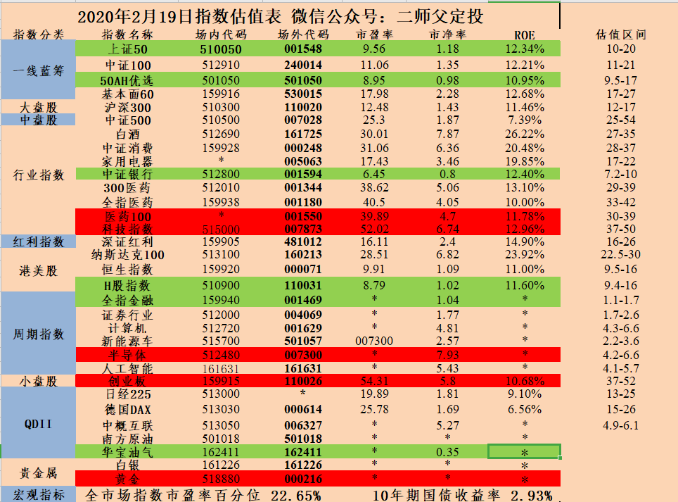

======================================================

_type: talk
@二师父[28814221155551]
2020-02-19 19:37:18 Wed  
topic_id: 421888584454128

本期定投实盘，详细买入金额见天天基金。

@小东 at 2020-02-19 19:37:18 Wed

> 为什么要买联接基金呢

----------

@理财小小白 at 2020-02-19 19:37:18 Wed

> 二师父，中证100为什么要卖呢？

----------

@麻烦得很 at 2020-02-19 19:37:18 Wed

> 请问二师父，去年末的全指是南方004069，这一次开始001469广发金融地产，主要目的是把地产加进去吗？谢谢。

----------

@二师父 at 2020-02-19 19:37:18 Wed

> 对的，这个指数里面有证券也有地产

----------

@毛毛宇 at 2020-02-19 19:37:18 Wed

> 为啥不买场内呢？

----------

@二师父 at 2020-02-19 19:37:18 Wed

> 大家想有个参考，一键买入

----------

阅读[4721]  评论[6]  赞[0] 

+++++++++++++++++++++++++++++++++++++++++++++++++++++

图片：
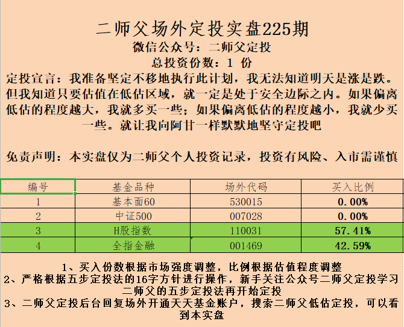

+++++++++++++++++++++++++++++++++++++++++++++++++++++

文件：
2020-02-19 19:36:46 Wed
文件大小：[87147]
51552522125824-二师父225期低估定投实盘.docx

======================================================

_type: talk
@朝阳模具[15528112482582]
2020-02-19 19:39:43 Wed  
topic_id: 118555452244442

师父，主动管理的优秀行业主题基金大概率是会长期跑赢指数型的[呲牙]。

@二师父 at 2020-02-19 19:39:43 Wed

> 从这个收益率看是的。不过有两个原因。第一目前是熊市，基金经理调仓在下跌配置债券就会优于满仓股票的指数基金。

第二就是基金经理除了买一些金融类股票，我看往期持仓也有非金融类股票，如果全市场的股票同时调入到这个主动基金，而另外和金融指数比的话，这样想不赢都难啊。

----------

@朝阳模具 at 2020-02-19 19:39:43 Wed

> 这两个混合型基金按照合同只能持仓金融地产类股票的，包括保险，证券，银行及地产。

----------

@二师父 at 2020-02-19 19:39:43 Wed

> 你看看2015年，我刚看了有非金融类股票的，而且持仓债券比率有变动18年，我买债券的收益率高于任何一个指数

----------

@朝阳模具 at 2020-02-19 19:39:43 Wed

> 但是我相信，未来这两个主动混合型基金（尤其是归模较小的中银金融地产）仍旧将会大幅跑赢指数型[呲牙]

----------

@二师父 at 2020-02-19 19:39:43 Wed

> 不换经理有可能

----------

@特仑苏 at 2020-02-19 19:39:43 Wed

> 其实，你用数据认真去分析，过去到现在得市场，优秀的指数增强的基金打败被动指数增强的太多了。当然结果是包含费用的。

----------

@朝阳模具 at 2020-02-19 19:39:43 Wed

> 515700，新能车ETF

----------

阅读[4097]  评论[16]  赞[0] 

+++++++++++++++++++++++++++++++++++++++++++++++++++++

图片：
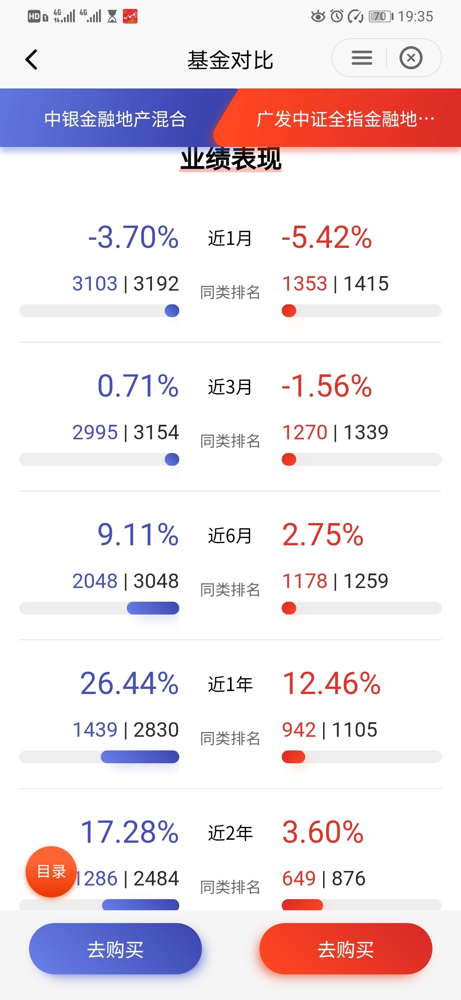
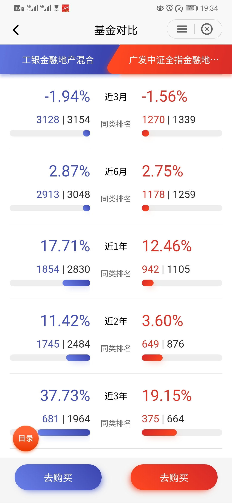

======================================================

_type: talk
@二师父[28814221155551]
2020-02-19 21:50:14 Wed  
topic_id: 841888282122542

<e type="hashtag" hid="222111128241" title="#止盈的方法#" /> 大家看图里面有三条线，5日均线，20日均线，60日均线，一般跌破5日均线短期下跌趋势成立，跌破20日均线，中期下跌趋势成立，跌破60日均线长期下跌趋势成立，可以按照三个位置逐步卖出，这种方法的好处是避免利润回吐，劣势是卖出可能反弹走高，300医药已经在高估附近，也不用太贪婪，结合自己的实际情况，类似高估创业板，科技也可以用这种方法卖出的

@铁观音 at 2020-02-19 21:50:14 Wed

> 跌破是实心的柱子穿透还是那跟线穿破？

----------

@二师父 at 2020-02-19 21:50:14 Wed

> 线

----------

@雨淡风清 at 2020-02-19 21:50:14 Wed

> 二师父，有没有软件能看类似医药100 001550日线图的软件搞了半天没有找到

----------

@二师父 at 2020-02-19 21:50:14 Wed

> 华泰

----------

阅读[4195]  评论[4]  赞[0] 

+++++++++++++++++++++++++++++++++++++++++++++++++++++

图片：
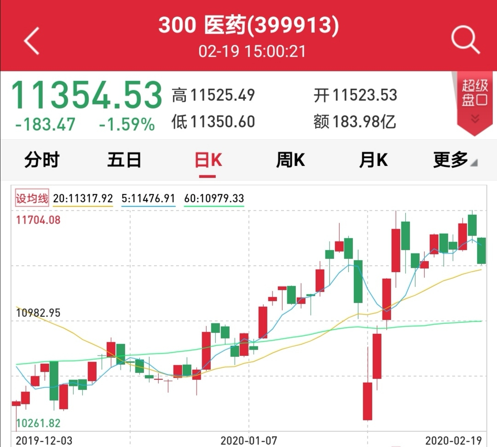

======================================================

_type: talk
@二师父[28814221155551]
2020-02-20 09:39:54 Thu  
topic_id: 548111551845244

半导体下车了，留了底仓，看戏，昨天计算半导体严重高估，永远遵循原则，低估买入，高估卖出，不求在市场赚多少，但求我可以一直能够游下去。

@Pacifica at 2020-02-20 09:39:54 Thu

> 二师父啥时候开始买入半导体指数的？

----------

@妖孽 at 2020-02-20 09:39:54 Thu

> 叮咚！二师父你卖的在我手里[呲牙]，

----------

@二师父 at 2020-02-20 09:39:54 Thu

> 星期一，现在不能买了，可以不卖再等等机构把他拉升，不过现在估值是真高

----------

@奔波儿霸🐟🐠🐬🐳🐋💦 at 2020-02-20 09:39:54 Thu

> 是啊，啥时候上的车？

----------

@二师父 at 2020-02-20 09:39:54 Thu

> 送给你，看情况过段日子再送给你

----------

@凯 at 2020-02-20 09:39:54 Thu

> 师父你偷偷买的

----------

@二师父 at 2020-02-20 09:39:54 Thu

> 风险太大，我自己小仓位玩的

----------

@向前进 at 2020-02-20 09:39:54 Thu

> 看周一的价格没有1.26这么低呀，有啥秘诀吗[呲牙]

----------

阅读[4229]  评论[10]  赞[0] 

+++++++++++++++++++++++++++++++++++++++++++++++++++++

图片：
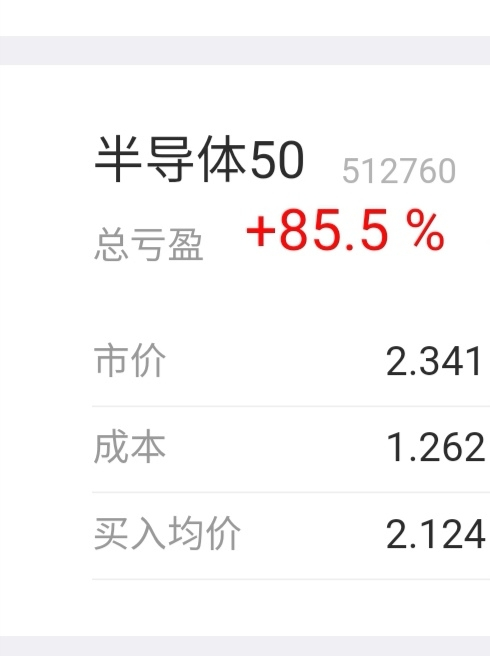

======================================================

_type: talk
@二师父[28814221155551]
2020-02-20 09:54:06 Thu  
topic_id: 548111555255214

带指数代码的估值表，大家的需求我都会尽量满足，不过类似日更估值这种就没有必要，估值表整体的把控和优化才是最重要的，去年年底我一直忙着写书，对行业研究花的时间少了，以致于没有及时把半导体芯片新能车等优质行业纳入估值表，数据很简单，关键是对行业的把控，你虽然看到的就是几个数字，但是背后确实我长时间的调研与挑选。

未来会继续做好研究，在结构性行情中找到确定性比较大的机会，在低估继续布局，目前白马股和蓝筹没怎么涨，不要担心，19年平安涨了60%，现在基本还跌了，不要看一时，要看到10年以后。

关于主动基金和指数基金，谁好谁坏都不知道，因为从过去看现在容易，从现在看未来就非常难，那就这样，二师父和大家以5年为限，看看大家手里的指数收益好，还是主动基金的收益好，理论只有得到了市场验证的才是正确的，二师父以前也投过主动基金，正是因为如此才了解其中的好于坏，你必须完整的经过一个牛熊。有过自己的经验，我现在才如此坚定指数定投。

当然，想要通过定投指数10年10倍也是不可能的，那怎么办呢，要么控制贪欲，要么进行优质股权投资，今天我会分享二师父的选股策略和方法，如果有兴趣可以自己研究，不过投资股权需要花费比指数多得多的精力，有时候还可能遇到黑天鹅，比如人面兽心的管理层，所以啊，二师父只负责分享，如何决定，大家自行决断了。

@Nancy at 2020-02-20 09:54:06 Thu

> 恒生指数目前是正常估值，看昨天的公众号的网格交易1.52时间底仓的价格，现在是1.527，有点糊涂了，正常估值的时候可以建底仓么？还是要等低估了才建仓，请二师父赐教！谢谢~

----------

@门萨🐨 at 2020-02-20 09:54:06 Thu

> 亲身体会指数比主动优秀的地方。当然每个人需要找到适合自己的方式。

----------

@mumomo at 2020-02-20 09:54:06 Thu

> 静等

----------

@二师父 at 2020-02-20 09:54:06 Thu

> 网格测算的是1.521，这是对应之前刚进入低估区域的价格，今天看到的估值是昨天的了，每天低估阈值对应的价格不同，总体误差在2个点以内，不用担心

----------

@光少 at 2020-02-20 09:54:06 Thu

> 现在消费、白酒、新能汽车、电池板块都涨的猛

----------

@杜志彪 at 2020-02-20 09:54:06 Thu

> 估值表里新加的指数是不是代表二师父已经持有的指数，二师父投的半导体50没印象分享过。

----------

@二师父 at 2020-02-20 09:54:06 Thu

> 这个指数估值比较高了，我自己之前建了1个点仓位，风险比较大就没分享，今天出了，已经严重高估，后面会分享这个行业的价值，等待低估再入手，他属于科技指数的一个分支

----------

@样 at 2020-02-20 09:54:06 Thu

> 请问，国泰国证的消费指数160222，进入高估区了吗？谢谢

----------

阅读[4645]  评论[11]  赞[0] 

+++++++++++++++++++++++++++++++++++++++++++++++++++++

图片：
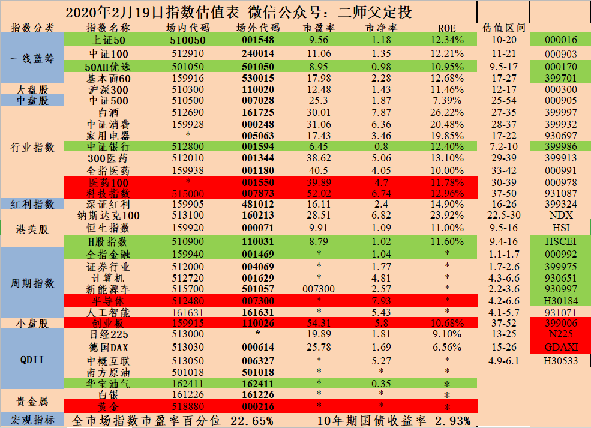

======================================================

_type: talk
@二师父[28814221155551]
2020-02-20 10:37:10 Thu  
topic_id: 421888555812118

现在星球提问有时候收不到，如果提了问题没有答复的，可以微信提问，现在软件使用体验还不是太好，大家的问题我都会回复的，如果没看到的话，目前可以微信提问，等软件好用了再软件提问

@银河系 at 2020-02-20 10:37:10 Thu

> 我也问了好多次都没回复，应该也是这样。是在公众号提问是吗？好像没看到专门的微信号

----------

@二师父 at 2020-02-20 10:37:10 Thu

> 公众号也可以ershifudt

----------

@海马 at 2020-02-20 10:37:10 Thu

> 我也问了有几次[呲牙]

----------

阅读[4550]  评论[3]  赞[0] 

+++++++++++++++++++++++++++++++++++++++++++++++++++++

图片：

======================================================

_type: q&a
@亦青[844412185888452]
2020-02-20 12:42:35 Thu  
topic_id: 841888224511282

@亦青

>  除了天天基金网还有什么定投基金的App啊？

@二师父

>  蛋卷和支付宝，在置顶文章也可以开户

阅读[4589]  评论[0]  赞[0] 

======================================================

_type: talk
@二师父[28814221155551]
2020-02-20 14:01:27 Thu  
topic_id: 548111554458284

大盘即将突破白银底，可以网格卖出，但是底仓要留住，这是下蛋的鸡，杀了就没有鸡蛋吃了

阅读[4807]  评论[0]  赞[0] 

======================================================

_type: talk
@二师父[28814221155551]
2020-02-20 14:05:30 Thu  
topic_id: 241888224445851

虽然这个基金是个投机品，但他真的会挣钱啊，黑猫白猫抓到老鼠才是好猫

只要安全稳定的盈利，就是好品种

@慕然 at 2020-02-20 14:05:30 Thu

> 之前网格卖多了😂

----------

@alicedream* at 2020-02-20 14:05:30 Thu

> 二师父：是用这个做鳄鱼计划的吗？

----------

@范毅君 at 2020-02-20 14:05:30 Thu

> 学的比较晚，一直证券没有碰过，现在是不是比较高了啊，二师父，等后面有机会，轻仓做网格练习吧

----------

@志亮 at 2020-02-20 14:05:30 Thu

> 前几天想入手东方财富做网格，后来犹豫了一下再等等，现在后悔死[发呆]

----------

@二师父 at 2020-02-20 14:05:30 Thu

> 把握好，慢慢就有经验了

----------

@二师父 at 2020-02-20 14:05:30 Thu

> 不是啊，鳄鱼计划全面配置

----------

@二师父 at 2020-02-20 14:05:30 Thu

> 创业板的宁德时代和东方财富都很牛

----------

@二师父 at 2020-02-20 14:05:30 Thu

> 进入正常估值了

----------

阅读[5274]  评论[28]  赞[0] 

+++++++++++++++++++++++++++++++++++++++++++++++++++++

图片：
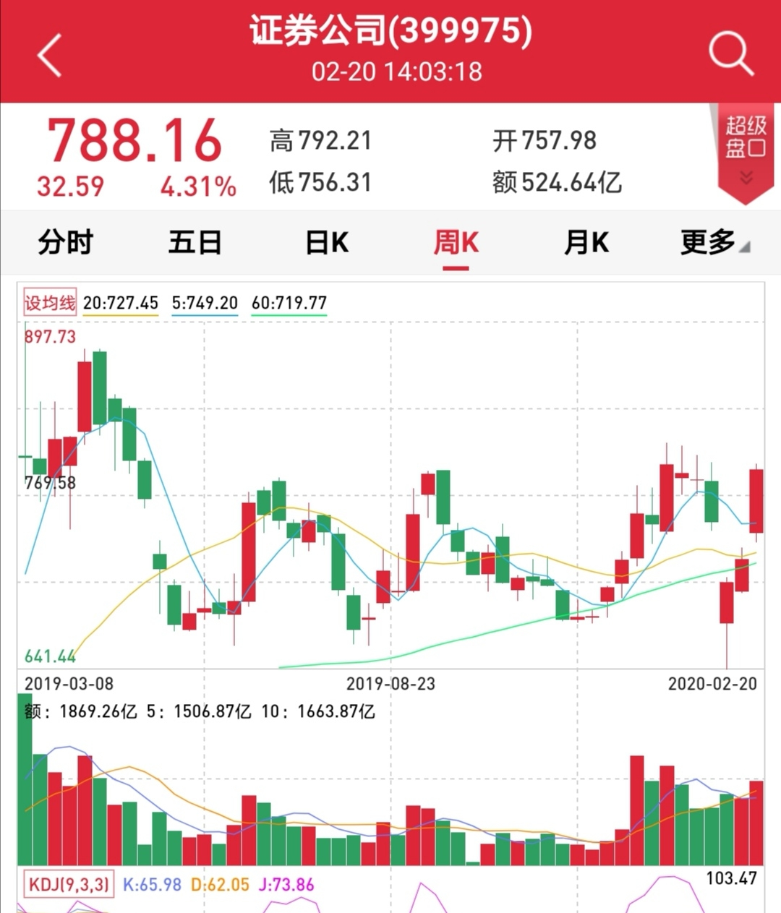

======================================================

_type: talk
@Gingo[544812851155554]
2020-02-20 16:30:09 Thu  
topic_id: 841888248821112

胜利在望了[加油]

@王模堂 at 2020-02-20 16:30:09 Thu

> 二师傅，这个399975是场内还是场外基金，我们买的都是512000。

----------

阅读[5098]  评论[1]  赞[0] 

+++++++++++++++++++++++++++++++++++++++++++++++++++++

图片：
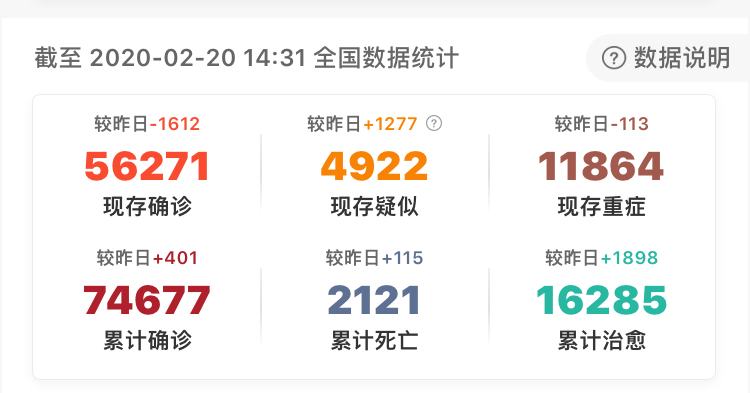
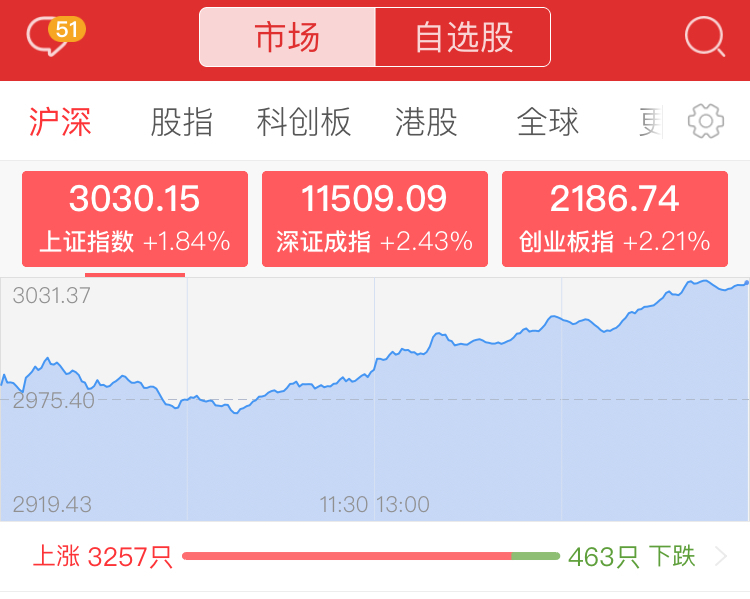

======================================================

_type: talk
@二师父[28814221155551]
2020-02-20 17:42:55 Thu  
topic_id: 841888248411112

<e type="hashtag" hid="481211145528" title="#指数估值#" /> 压箱底的法宝，选股策略，量化分析，对财务报表研究有兴趣的可以听听我的课程，没有时间研究的话指数投资就最佳了，想战胜混合基金收益，学会股权投资就够了。

@慕然 at 2020-02-20 17:42:55 Thu

> 请问二师父是全职研究投资吗，兼职投资者感觉很难有时间达到您的研究细致程度和水平[强][强]

----------

@二师父 at 2020-02-20 17:42:55 Thu

> 认真是一种态度

----------

@Snow at 2020-02-20 17:42:55 Thu

> 大赞

----------

@志亮 at 2020-02-20 17:42:55 Thu

> 感谢二师父，我学习一下，我对股权投资有兴趣。

----------

@明树 at 2020-02-20 17:42:55 Thu

> 受益了，希望二师父有时间能介绍下估值

----------

@明树 at 2020-02-20 17:42:55 Thu

> 排除造假还可以量化下，比如应收和存货比率等造假重灾区

----------

@太阳 at 2020-02-20 17:42:55 Thu

> 受益良多！感谢二师父！

----------

@Tina朱洁琼 at 2020-02-20 17:42:55 Thu

> 师傅，您一般用什么软件选股，今天试了同花顺，果仁都找不到您选股的条件呢

----------

阅读[6209]  评论[8]  赞[1] 

+++++++++++++++++++++++++++++++++++++++++++++++++++++

文件：
2020-02-20 17:41:49 Thu
文件大小：[20266]
28225254412811-压箱底的法宝：二师父的选股策略和方法.docx

======================================================

_type: talk
@妖孽[544888148518184]
2020-02-20 19:30:59 Thu  
topic_id: 841888242814112

哈哈哈哈哈哈哈哈哈.....我要吃肉肉，我要吃肉肉，我还要去会所吃肉肉.....

阅读[5251]  评论[0]  赞[0] 

======================================================

_type: talk
@静[241555148454251]
2020-02-20 21:42:22 Thu  
topic_id: 841888215525552

现在天天基金网站是不是不平稳那

@J at 2020-02-20 21:42:22 Thu

> 更新了app 后恢复正常了

----------

阅读[5170]  评论[1]  赞[0] 

======================================================

_type: talk
@二师父[28814221155551]
2020-02-20 22:36:03 Thu  
topic_id: 548111582488514

解读基金第二讲，学会配置和轮动。

@海马 at 2020-02-20 22:36:03 Thu

> 师父，你说这本书的书名多少？谢谢

----------

@二师父 at 2020-02-20 22:36:03 Thu

> 解读基金，季凯帆

----------

@海马 at 2020-02-20 22:36:03 Thu

> 好的，谢谢师父分享

----------

@alicedream* at 2020-02-20 22:36:03 Thu

> 二师父，听完你的课感觉对于资产的配置又领悟了许多，非常感谢，想问一下你在里面提到的全职金融现在应该处于低谷，可以较大量买入建立底仓吗？

----------

@二师父 at 2020-02-20 22:36:03 Thu

> 大类资产配置你可以听听我的资产配置课程，四大类资产轮动，金融地产有一定的周期性，比例控制在15以内，我的重仓品种也基本不超过25，做好风控

----------

@alicedream* at 2020-02-20 22:36:03 Thu

> 好的，谢谢二师父

----------

@吴涛 at 2020-02-20 22:36:03 Thu

> 二师父，是第一版，还是第二版呀。看来这书火了，出了二版了。

----------

阅读[6239]  评论[7]  赞[0] 

+++++++++++++++++++++++++++++++++++++++++++++++++++++

文件：
2020-02-20 22:35:37 Thu
文件大小：[13716841]
28225251818851-解读基金第二讲.m4a

======================================================

_type: talk
@二师父[28814221155551]
2020-02-21 10:39:47 Fri  
topic_id: 118555822524542

中证500收割利润，券商也可以收割，计划中以后券商只在场内投，场外用金融地产替代，先学会盈利，再达到年化百分之10，然后再提高，慢慢来

@烟九•二手车 at 2020-02-21 10:39:47 Fri

> 17%收益，卖1份，感觉仓位建低了

----------

@明树 at 2020-02-21 10:39:47 Fri

> 场外的用南方中证全指证券联结A不好吗？

----------

@二师父 at 2020-02-21 10:39:47 Fri

> 也可以

----------

@三峡情 at 2020-02-21 10:39:47 Fri

> 我场内只有一份[抓狂]

----------

@银河系 at 2020-02-21 10:39:47 Fri

> 今天看了同花顺，最近几次波段，基本涨幅超过20，券商etf很少超过20，请问可以把券商etf换成同花顺吗？

----------

@二师父 at 2020-02-21 10:39:47 Fri

> 股票不要做，风险大

----------

@mumomo at 2020-02-21 10:39:47 Fri

> 二师父，仓位不足也可以先不收割，高估以后再逐步卖本可以吧？

----------

@杜志彪 at 2020-02-21 10:39:47 Fri

> 5.26卖出网格一份

----------

阅读[5583]  评论[20]  赞[0] 

+++++++++++++++++++++++++++++++++++++++++++++++++++++

图片：
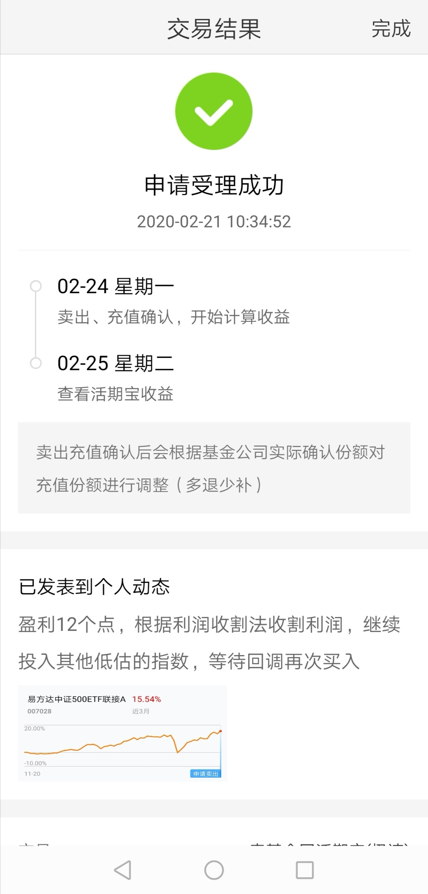

======================================================

_type: talk
@老孙头[422115118524548]
2020-02-21 11:24:37 Fri  
topic_id: 118555822151212

二师父，新上了广发全指001469，原来中证银行001549要卖出吗？

@二师父 at 2020-02-21 11:24:37 Fri

> 不用，拿着等盈利一点一点收割

----------

阅读[5368]  评论[1]  赞[0] 

======================================================

_type: talk
@二师父[28814221155551]
2020-02-21 11:32:45 Fri  
topic_id: 421888144252158

观察的几个指数，真的结构性行情，阿娇都涨

@志亮 at 2020-02-21 11:32:45 Fri

> 不能浪费这个行情，机会难得[呲牙]

----------

@阳光 at 2020-02-21 11:32:45 Fri

> 请问计算机指数今天需要收割吗？虽然在正常估值，年后涨得太猛了[害羞]

----------

@蛋炒饭不加蛋 at 2020-02-21 11:32:45 Fri

> 请问买的哪个基

----------

@阳光 at 2020-02-21 11:32:45 Fri

> 天弘中证计算机指数c

----------

@蛋炒饭不加蛋 at 2020-02-21 11:32:45 Fri

> 好的谢谢

----------

@蛋炒饭不加蛋 at 2020-02-21 11:32:45 Fri

> 谢谢

----------

@Pansy at 2020-02-21 11:32:45 Fri

> 什么叫结构性行情啊？

----------

@二师父 at 2020-02-21 11:32:45 Fri

> 不同板块轮动涨跌

----------

阅读[5652]  评论[8]  赞[0] 

+++++++++++++++++++++++++++++++++++++++++++++++++++++

图片：
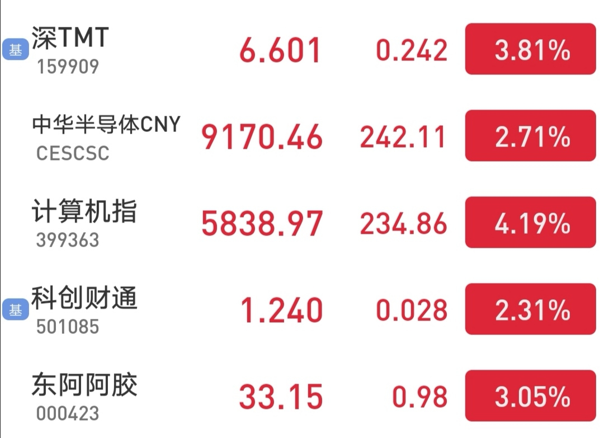

======================================================

_type: talk
@志亮[422125851552828]
2020-02-21 15:25:14 Fri  
topic_id: 548111828215214

疯狂的创业版，疯狂的半导体，今天又很多韭菜冲进半导体了，是牛市来了吗？

@阝東 at 2020-02-21 15:25:14 Fri

> [发呆]追涨杀跌

----------

@Pansy at 2020-02-21 15:25:14 Fri

> 当大家都往一个方向冲的时候，我知道我该退场了……

----------

@志亮 at 2020-02-21 15:25:14 Fri

> 还没到最疯狂的时候，目前韭菜才刚入场，下周会回淍一下,然后上演最后的疯狂[呲牙]

----------

阅读[5154]  评论[3]  赞[0] 

+++++++++++++++++++++++++++++++++++++++++++++++++++++

图片：
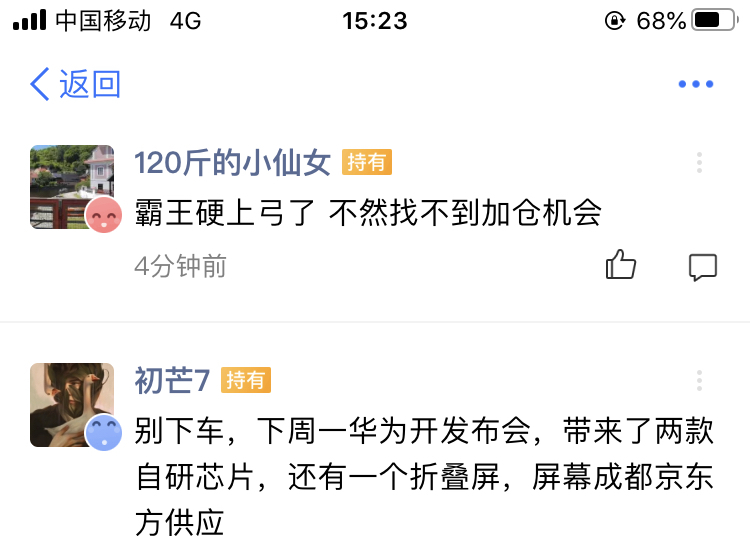

======================================================

_type: talk
@二师父[28814221155551]
2020-02-21 19:41:59 Fri  
topic_id: 241888185481251

<e type="hashtag" hid="452445545188" title="#电子信息行业#" /> 电子信息行业的价值，以及半导体是否还能够入场。记住：低估永不败，高估会拜拜。

@李依祚 at 2020-02-21 19:41:59 Fri

> 半导体包括在TMT当中，这两个指数都不能再买了，是吗？未来哪个科技类指数可以入手呢？指数

----------

@二师父 at 2020-02-21 19:41:59 Fri

> 没发现现在可以的

----------

@jier at 2020-02-21 19:41:59 Fri

> 二师父，您说2020年是电子行业大年，意思是全年都看涨是吗？但现在2020才开始，就已经高估不能买了，那今年还有低估买入的机会吗？万一全年都在不断上涨，那岂不是会错过大年行情？

----------

@二师父 at 2020-02-21 19:41:59 Fri

> 我都9.6成仓位了，在加0.2也可以，不到低估不重仓投，去年写的5g，那时候最低跌幅45个点，还有人工智能，低位都没人关注，都喜欢追涨，没意义

----------

@A0洪氏日杂批发 at 2020-02-21 19:41:59 Fri

> 你的手痒，你就买，二师父说了，你买了，赚钱了是你运气好，亏本的概率大于买的概率，随便你自己把握

----------

@铁观音 at 2020-02-21 19:41:59 Fri

> 芯片和半导体是啥关系？目前芯片推出几个新的基金，可以考虑入手吗？

----------

@老孙头 at 2020-02-21 19:41:59 Fri

> 其实 jier的疑惑无可厚非。既然是“电子行业大年”，当然想参与，何淡“手痒”？至于买什么、何时买，自是听二师父的了！你搞批发，虽是心眼好，但望记住—“和气生财”！

----------

阅读[6064]  评论[7]  赞[0] 

+++++++++++++++++++++++++++++++++++++++++++++++++++++

文件：
2020-02-21 19:41:21 Fri
文件大小：[50928]
48554582555858-TMT电子信息行业的投资价值分析，目前半导体指数是否还能够入手.docx

======================================================

_type: talk
@二师父[28814221155551]
2020-02-21 21:02:38 Fri  
topic_id: 118555854824822

更新的配置组合，新手投资者可以参考，养老计划、新手计划、增量资金打理，存量资金打理

@alicedream* at 2020-02-21 21:02:38 Fri

> 二师父最近很拼啊！为我们准备了这么多干货！[强][强][强]

----------

@二师父 at 2020-02-21 21:02:38 Fri

> 免得都跑去买科技了

----------

@alicedream* at 2020-02-21 21:02:38 Fri

> 谢谢二师父这么费心！

----------

@蓝魔森林 at 2020-02-21 21:02:38 Fri

> 哈哈哈

----------

@苍天有井明月空🌙 at 2020-02-21 21:02:38 Fri

> 海外怎么购买

----------

@速。冻 at 2020-02-21 21:02:38 Fri

> 隔壁老齐的味道

----------

@陈伟 at 2020-02-21 21:02:38 Fri

> 二师父，鳄鱼计划中的债基和商品买什么品种？

----------

@二师父 at 2020-02-21 21:02:38 Fri

> 原油，油气和长债

----------

阅读[5375]  评论[23]  赞[0] 

+++++++++++++++++++++++++++++++++++++++++++++++++++++

图片：

======================================================

_type: q&a
@陈飞🤗[841521421222252]
2020-02-22 07:01:25 Sat  
topic_id: 421888158225428

@陈飞🤗

>  二师父，你好，我有一个提问，一个基金上下波动越大我们定投收益就越大，但是H股成立到现在，它的波动可以忽略不计，那我们定投这个指数的意义和价值在哪里？虽说之前的业绩不代表未来的，但是成立7年多了它的收益确实不高，难道未来就会变高吗？我现在不懂什么估值低或者高，我们普通的投资者只看到7年多它的收益率不高，一个企业7年多前值100，到现在值120，我有点怀疑我们选的这个基金的价值了。如果从7年前定投这个基金到现在估计利润跑不过定期吧，那以后的7年会不会也是这种情况？我觉刚入门不久，所以有些疑问，不要笑话。

@二师父

>  你看的是基金，指数收益比这个好
>  
>  另外选取时间点不同看到结果也不同，你看创业板从15年到现在都是跌的
>  
>  还有很多指数，你从07年看到现在也是跌的，不是因为他没有价值，而是因为那时候太高估了

阅读[5299]  评论[1]  赞[0] 

======================================================

_type: talk
@树叶[544811512145144]
2020-02-22 10:07:30 Sat  
topic_id: 548111855452454

<e type="hashtag" hid="142825811122" title="#定投周报#" /> 二师父定投周报第47期

阅读[5437]  评论[0]  赞[0] 

+++++++++++++++++++++++++++++++++++++++++++++++++++++

文件：
2020-02-22 10:07:26 Sat
文件大小：[262344]
28225228541521-二师父定投周报2.22（第47期）.docx

======================================================

_type: talk
@二师父[28814221155551]
2020-02-22 10:28:04 Sat  
topic_id: 241888122418481

<e type="hashtag" hid="452445282518" title="#关于电子行业的估值#" /> 电子行业我最看好的是半导体和芯片，这个已经加入估值表了，电子指数就不单独纳入，估值表的指数都是我看好的，如果低估我也愿意买入的，不会把一些基本面不好的指数加进去，再怎么低估，碰到了业绩不好的，未来也不行。

另外，大家要分清指数是一时的被挫败还是永远低迷，宽基指数不可能永远低迷，中证500和创业板最近可能都感受到了，所以还是那句话全面配置，你永远不知道什么事时候风起来，就投这些指数够了，不要太贪心。

如果还想进一步就研究优质企业自己做组合，关于股市投资就是这些了，选对方向很重要，二师父未来几天会持续解读几大行业价值。在宽基配置的基础上，实现行业轮动，有利于结构行情获取超额收益，至于500波动、300价值，还不如深红利。

配置300ETF、500ETF只是为了稳健而已，如果你能接受高回撤，完全可以只配置行业指数，就如同选择8只股票轮动一个道理。

阅读[5934]  评论[0]  赞[0] 

======================================================

_type: talk
@二师父[28814221155551]
2020-02-22 13:24:17 Sat  
topic_id: 548111858221544

@雨的依恋 at 2020-02-22 13:24:17 Sat

> 二师父觉得这种是保到80岁，还是说保终身更好？

----------

@二师父 at 2020-02-22 13:24:17 Sat

> 70或者80就行了，没必要终身，保费会增加很多，不划算，购买的话要在周一之前了

----------

@雨的依恋 at 2020-02-22 13:24:17 Sat

> 嗯嗯好的

----------

阅读[5615]  评论[3]  赞[0] 

+++++++++++++++++++++++++++++++++++++++++++++++++++++

文件：
2020-02-22 13:24:16 Sat
文件大小：[75938]
51552551445484-重要通知：优质的重疾险达尔文2号下周下架，现在购买还来的及.docx

======================================================

_type: talk
@二师父[28814221155551]
2020-02-22 15:56:23 Sat  
topic_id: 548111841422454

<e type="hashtag" hid="554225445584" title="#场外实盘说明#" /> 天天实盘19年6月才开，那时候并不适合投资债券，以后会慢慢配置，资产都是轮动的

@姥姥不疼. 爷爷不爱 at 2020-02-22 15:56:23 Sat

> 期待中

----------

@陈伟 at 2020-02-22 15:56:23 Sat

> 必须安装天天基金看吗？星球里会展示实盘吗？

----------

@二师父 at 2020-02-22 15:56:23 Sat

> 每周显示了

----------

@陈伟 at 2020-02-22 15:56:23 Sat

> 好的，谢谢二师父。我就不用再装一个APP了

----------

阅读[5417]  评论[4]  赞[0] 

======================================================

_type: talk
@二师父[28814221155551]
2020-02-22 19:02:24 Sat  
topic_id: 118555814155182

<e type="hashtag" hid="452445212248" title="#新能源汽车#" /> 最近一直在做行业研究，选择优质行业进行轮动是最佳的方式。

有点需要注意，二师父鳄鱼计划会建立在预期差的基础上，小仓位入手，如果建仓的时候基金历史最大下跌幅度超过55%，那么二师父不会公布出来，以免大家误参考入手发生较大回撤心理承受不了。

投资的学习是长期的事情，如果说所有人都看着大盘低买高卖，那么股市赚钱就太容易了，有的时候大盘跌的时候，部分行业会逆大盘上涨，所以二师父要做的就是发现这些行业。

二师父估值表的都是比较优质的指数，未来会继续纳入，一些表现变差的指数会剔除出去。不要总觉得低估定投就一定成功，你看标普红利低估了三年，现在还是低估，就不涨，这就是选择错误导致的投资失败。

@志亮 at 2020-02-22 19:02:24 Sat

> 要憧得跟趋势走，要灵活变通[微笑]

----------

@二师父 at 2020-02-22 19:02:24 Sat

> 去年介绍了5g和人工智能，比科技好的

----------

@二师父 at 2020-02-22 19:02:24 Sat

> 新基金一般不考虑

----------

@二师父 at 2020-02-22 19:02:24 Sat

> 我已经实践过了，逆势投资是最省心的方法，你想做趋势可以根据均线做

----------

@范毅君 at 2020-02-22 19:02:24 Sat

> 为啥新能源属于周期性指数呢[微笑]

----------

阅读[6272]  评论[12]  赞[0] 

+++++++++++++++++++++++++++++++++++++++++++++++++++++

文件：
2020-02-22 18:57:19 Sat
文件大小：[19279]
88225222245842-新能源汽车行业及相关指数投资价值分析.docx

======================================================

_type: talk
@二师父[28814221155551]
2020-02-22 19:53:39 Sat  
topic_id: 548111845885414

<e type="hashtag" hid="554225822114" title="#趋势投资和逆势投资#" /> 这两个并不是水火不容的，不过二师父是严格的逆势投资，这种方法经过多年实践是最省心，敢于重仓，只要选准赛道，并不会出现指数不涨的情况。如果出现了是因为选择错误了。

二师父以前学习过技术，蜡烛读图术，缠论和欧奈尔的被杯状模型等技术类指标，不过始终没有形成完整的体系，更为关键的是，做趋势永远不敢重仓，你有100万，敢重仓80万到优质的指数上，但是不敢重仓80万去做趋势，因为一旦趋势反转，不确定是继续加仓还是止损，这是最大的难点。欧奈尔给出的方法是止损。但是他是机构投资者，止损不心疼，多个股票同时操作，而作为普通投资者，平时上班的话，没有那么多时间盯着。

而做逆势投资就不一样了，不管跌到多狠，我可以长期不看，就让他跌，跌的越多我越开心，不管是华宝油气还是消费指数，这种好处就是节省精力。

有人提出了逆势做趋势，这种思维二师父研究过，有两种思路。

第一种，在低估区域内做趋势，比如现在券商指数的低估区域是1.7倍市净率，券商指数的市净率1.4倍，而这种时候你根据市场判断券商要涨，就建立底仓，这是没有问题的，做趋势。

第二种，在正常估值区域内做趋势，比如券商指数处于正常估值区域，投资者判断牛市到来，那么就建立底仓，当然这种方法需要注意一个问题，这个底仓位置就需要控制，因为不是在低估区域买的，所以回撤大，假设最大跌幅70%，你需要做下压力测试，底仓的钱跌了70%会不会受不了，如果是的，就要降低买入金额。

根据二师父多年的经验，很多人认为市场要涨的时候，市场就要跌了，很多人一建立底仓，市场就跌了，更恐怖的是，很多人做趋势赚了以后容易膨胀，到后期又控制不住自己，高位继续加仓，最后被深套，这种例子在牛市比比皆是。

所以，二师父还是会严格的坚守逆势投资，趋势很难判断的，不控制仓位你对99次不会成为富翁，错了一次又不懂得止损可能就彻底离开市场了。

投资方法多样，大家可以多多分享，这样才能有进步。

@J at 2020-02-22 19:53:39 Sat

> 每天必读师父的分析文章再安然入睡，积硅步，至千里，认真是一种态度[微笑]

----------

@志亮 at 2020-02-22 19:53:39 Sat

> 二师父，按我理解应该是趋势投资就是追热点麻，请问趋势投资是短线还是长线。

----------

@二师父 at 2020-02-22 19:53:39 Sat

> 有长线也有短线，这种很累，可以结合均线，上穿20日均线买做短中线，上穿90日均线买做中长线，关键要做止损，你可以看看欧奈尔，趋势和逆势只能一个，不然会精神分裂

----------

@志亮 at 2020-02-22 19:53:39 Sat

> 难怪我之前做趋势这么累了，当你止损后，主力马上又拉涨，当你买入后又下跌，反反复复，但若不止损嘛，又怕无限下跌，毕竟心里无底呀，人毕竟不是机器，真的太累太影响心情了，还是拥抱基本面好和估值不高的大白马睡得安稳，比如我拿着平安心里就很淡定[微笑]。

----------

@衣袂飘香 at 2020-02-22 19:53:39 Sat

> 认同二师父的投资理念。偶尔在低估区做做趋势，即使下跌也不慌。

----------

@波 at 2020-02-22 19:53:39 Sat

> 逆势投资更适合我们绝大多数普通投资者。

----------

@吴涛 at 2020-02-22 19:53:39 Sat

> 向二师父请教个问题，
我己重仓半导体50，收益还行，己收割了几轮，止盈执行还好办，止损执行二师父看看:
半导体是高弹性，我设定三个10%，
第一个从最高价下跌10%卖30%仓，
第二个从最高价下跌20%卖30%仓，
第三个从最高价下跌30%卖40%仓。
如果涨到我卖出价(前提是趋势稳定)，就同价，同数量补回。
如趋势结束，就亏20%，半导体是热点，谁也不知涨到多少，就只有用有限的亏损和暂时的出局，咬定这班车。
二师父你看这种操作风险在哪里，借用芒格的话，知道了风险在哪，我就不去。

----------

阅读[6093]  评论[8]  赞[0] 

======================================================

_type: talk
@二师父[28814221155551]
2020-02-22 20:20:09 Sat  
topic_id: 241888144511111

做了一个对比，人工智能和科技和中概互联的对比，人工智能优于科技，优于中概互联，去年人工智能，5G和中概互联都介绍过，如果投资了这三个也会不错的，在科技里面最佳的是半导体，不过这是新基金，也不敢重仓，未来科技是一路长牛还是一地鸡毛就时间来说话，根据我的经验，涨久必跌，即使消费医药都这样的，只是优秀行业波动向上

@蛋炒饭不加蛋 at 2020-02-22 20:20:09 Sat

> 这是什么软件？

----------

@华为～ at 2020-02-22 20:20:09 Sat

> 天天

----------

@Gingo at 2020-02-22 20:20:09 Sat

> 二师父 请问人工智能有场内的吗？

----------

@二师父 at 2020-02-22 20:20:09 Sat

> 有啊，这是个lof基金，场内有，最近又新出了几个

----------

@吴涛 at 2020-02-22 20:20:09 Sat

> 场内有两个，中证人工智能ETF515070，平安人工智能ETF512930

----------

@二师父 at 2020-02-22 20:20:09 Sat

> 对，我去年投的是161631，选一个就行

----------

阅读[5569]  评论[6]  赞[0] 

+++++++++++++++++++++++++++++++++++++++++++++++++++++

图片：
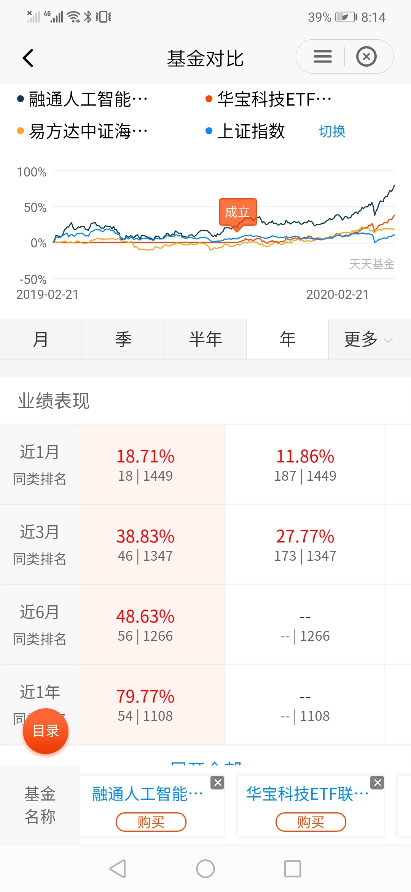

======================================================

_type: talk
@二师父[28814221155551]
2020-02-22 21:51:13 Sat  
topic_id: 241888115218881

酒ETF可以参考鹏华的这个，基本复制指数，有小部分主动选股，差别不大。

需要注意一下，这个基金规模刚过1亿元，投资永远记得风控做好，不亏损才是最重要的，这是第一原则。白酒、食品饮料都非常不错的，但是也得低估区域定投，现在小牛市大家都忘了伤痛了，15年白酒低迷，18年白酒低迷的时候，请不要忘记，未来也会一样的，估值一定会下移，如果担心错过机会可以当低估的时候建底仓，现在不太适合。

阅读[5884]  评论[0]  赞[0] 

+++++++++++++++++++++++++++++++++++++++++++++++++++++

图片：
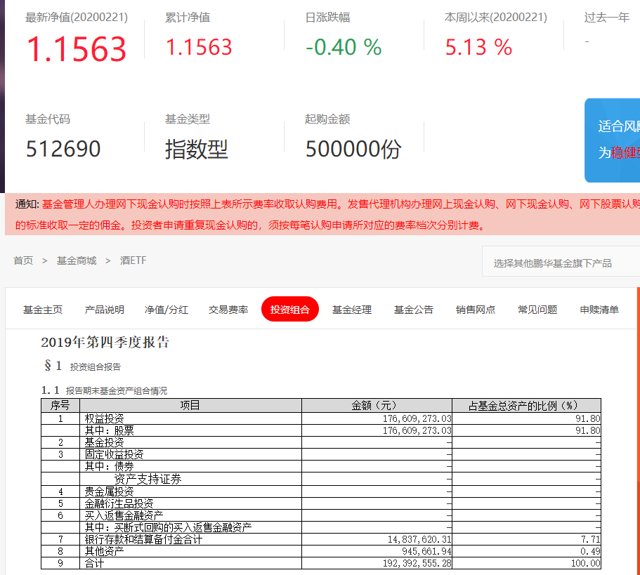

======================================================

_type: talk
@二师父[28814221155551]
2020-02-22 23:15:43 Sat  
topic_id: 421888118818288

<e type="hashtag" hid="141224818242" title="#投机的人都没有好下场#" /> 今天巴菲特和芒格又开会了，这是我最佩服的两个人，因为他们正直，诚实，善良，自制，坚守价值投资理念，慢慢致富。所以他们是这个世界上最富有的人，不仅仅指财富。

而另外一个，利弗莫尔是个投资（投机）鬼才，也曾获得了惊人的财富。他是个天生的赌徒，不管是腰缠万贯还是债台高筑，赌性仍旧不改，总想着再赌把大的，如此往复，输的精光是迟早的事情。除了金钱的损失，这些大起大落的交易还严重地伤害了他的心理健康，为他自杀身亡埋下了伏笔。利弗莫尔的一生跌宕起伏，宛如电影一般，其悲惨的结局除了让世人唏嘘不已之外，亦告诫世人不要投机。

我不会做趋势，更劝你也别做，除非你经历过08年大熊市和15年大熊市，否则你做趋势短期能赚，到了大牛市末端会控制不住自己，你也别劝我做什么趋势。

安全边际，逆向思维，我有我坚不可摧的投资系统，至少经过两轮大熊市检验没有问题，所以我不会折腾，再搞投机的趋势投资。你想玩自己玩吧。

@云云 at 2020-02-22 23:15:43 Sat

> 喜欢二师父的风格，稳中求胜，心态也好些，不会患得患失，跟着师父好好学习💪

----------

@🍀 凝🌸 慧🍀 at 2020-02-22 23:15:43 Sat

> 我也是，很认同二师父的投资理念！继续跟二师父学习提高。[愉快][奋斗][奋斗]

----------

@雨淡风清 at 2020-02-22 23:15:43 Sat

> 平复心态，等待

----------

@玄武 at 2020-02-22 23:15:43 Sat

> 认同二师父的投资理念

----------

@好运玲玲 at 2020-02-22 23:15:43 Sat

> 我认同，心态很重要，跟着二师父理财，放心！

----------

@吴涛 at 2020-02-22 23:15:43 Sat

> 二师父:
你坚持是有坚不可摧的投资系统，加上强大执行力，但每个人投资系统是不一样的，就象这世上没两片一模一样的树叶，每个人世界观，思维模式都不同。
我想请问下，是怎样建立适合自己投资系统，有无步骤和方法。或有没有这类建立投资系统的书，请推荐下。谢谢！

----------

@二师父 at 2020-02-22 23:15:43 Sat

> 你这个问题很好，很久没看到这么好的问题了，我现在正在审视我的投资哲学

建立投资哲学必须依靠自己，没有书籍，不过有方法。最好的方法就是学习市场主流的大师，然后总结出符合自己的。

推荐三本书，巴菲特和索罗斯的投资习惯，投资哲学，保守主义的智慧之灯，聪明的投资者

好好看一边

然后学习巴菲特的操作核心方法和江恩，欧奈尔的方法，你去看看哪种方法你用的舒服，每天在股市非常爽，涨也爽，跌也爽，那就用这种方法

最后选定一种不动，贯彻执行，你先把前面的做好了，选对方向了，接下来再来问我，我告诉你下一步怎么做

----------

@吴涛 at 2020-02-22 23:15:43 Sat

> 江恩原先只是知道，好的，二师父。
看了后再来问您。

----------

阅读[6398]  评论[9]  赞[0] 

======================================================

_type: talk
@二师父[28814221155551]
2020-02-23 09:56:25 Sun  
topic_id: 241888111222141

对比了两个科技指数的重仓股，半导体更加集中，而科技龙头分散到了医药、化工、信息等领域。从基本面看半导体更优。

关于投资再说下风险防控，很多人总是说机会来了，趋势到了，这个趋势都是人的主观判断，胜率架设80%，那么你得考虑赔率，假设看错了，发生了黑天鹅，暴跌怎么办，这种事情太多了，比如15年很多人预测上证综合指数破万点，18年预测牛市来了，19年还是，20年还是，我想每次都会有预测对的。

但大家要搞明白一个问题，万一错了怎么办。你想过没有。这个世界没有不可能发生的，比如今年的这个事，上帝才能预测出来，那么就要做好风控。

记住投资第一要义：永远不要亏损，这是最重要的，在资本市场走着走着你就会发现有些人不见了。

@杜志彪 at 2020-02-23 09:56:25 Sun

> 不追热点，我现在等消费和白酒，19年的小仓位已经出了，看看还这次给机会不，二师父觉得可以了知会一声（盘中有接近低估时），不然只能拿海天和五粮液代替了，这个收割不了利润（太贵了），守股难啊（前一次我守了8个月，盈利40%，实在守不住啊），守十年更难啊[微笑]

----------

@衣袂飘香 at 2020-02-23 09:56:25 Sun

> 先保证不亏损，再谈赚钱。

----------

@二师父 at 2020-02-23 09:56:25 Sun

> 最近几天我一直在研究白酒和芯片和家电三个行业，这是非常好的三个赛道，白酒消费目前可以入，回撤有很大，但是你的定力很好，承受的住的话目前业绩增速能够消化这个估值，可以定投，我有计划目前入手场内白酒ETF，昨天代码已经分享了

----------

@J at 2020-02-23 09:56:25 Sun

> 师傅，请问怎么计算出白酒和消费的盈利增速可以消化目前的估值？可以教我们大概的评估方法吗？

----------

@杜志彪 at 2020-02-23 09:56:25 Sun

> 白酒ETF已经准备好了，给机会就不要错过，家电我有美的，这个板块其实不错，像格力、老板电器，海尔好公司不少，其实我也想转到基金里（比股票好把握一些），再有平安我明天想接回来，上次跌破60天线一直也没买回来，目前看估值不高，在年线附近。

----------

@二师父 at 2020-02-23 09:56:25 Sun

> 可以的，就是平安这个事让我彻底转向了价值投资，58买的平安，也是破60日均线出了一半，再也没接回来58的价格，好行业，好公司，好价格，就没必要太关注趋势，不过股票风险还是大一些，13年时候平安本来已经很便宜了，不过后来还是跌了百分之30多，关键拿的住

----------

@Pansy at 2020-02-23 09:56:25 Sun

> 师父，我也在等待白酒和消费，但是我是个小白，股票是万万不敢买的。我现在能做的仅仅是定投，如果是这种情况，是不是要等到低估的时候才能开始？

----------

@西锦巴乌 at 2020-02-23 09:56:25 Sun

> 师父：你所指的白酒消费目前可以入是指场内吗？

----------

阅读[6066]  评论[21]  赞[0] 

+++++++++++++++++++++++++++++++++++++++++++++++++++++

文件：
2020-02-23 09:49:41 Sun
文件大小：[20992]
51552554558114-两个科技指数的持仓股票对比.xls

======================================================

_type: talk
@二师父[28814221155551]
2020-02-23 17:54:09 Sun  
topic_id: 241882554481141

要有独行天下的胆识和容纳财富的胸怀，以己为敌，不断修行，一步一个脚印，终成大器。

@范毅君 at 2020-02-23 17:54:09 Sun

> 写得好[鼓掌]

----------

阅读[6214]  评论[1]  赞[0] 

+++++++++++++++++++++++++++++++++++++++++++++++++++++

文件：
2020-02-23 17:52:50 Sun
文件大小：[682427]
15442412882112-要有独行天下的胆识和容纳财富的胸怀.docx

======================================================

_type: talk
@二师父[28814221155551]
2020-02-23 18:44:22 Sun  
topic_id: 421885442125258

最近分享有点多，大家可能需要一些时间消化，后面先缓一缓，都消化下，对于白酒这种优质指数，已经建仓了可以等待低估的，没有建仓的可以等待回调然后建仓，之后再定投，还是以风控为主，14年时候白酒也是跌的很惨，发生行业危机风险也是有的

阅读[6214]  评论[0]  赞[0] 

======================================================

_type: talk
@二师父[28814221155551]
2020-02-23 21:23:50 Sun  
topic_id: 421885484442448

投资哲学是什么呢？哲学是基本的世界观和方法论，投资哲学就是投资界基本的世界观和方法论。

世界观决定了方法论。你的投资哲学决定了自己的操作方法。什么意思？二师父解释一下。

比如在定投指数基金的时候，你的观念是基金的价值总是围绕着价格上下波动，那么你的世界观就是价值投资的世界观，你的操作方法就会是以合理的价格买入并持有到指数基金价值回归。

如果你的观念是涨得好的基金更加具有投资价值，那么你的世界观就是趋势投资者的世界观，你的操作方法就会是买入涨幅较好的基金，期待价格进一步上涨。

在投资界，拥有这两种投资哲学的交易者都有做的很好的。比如江恩和欧奈尔。就是趋势投资，而芒格，林奇就是价值投资。

我们无法去辨别哪种投资哲学更好，二师父只想告诉你，根据自己的性格发展自己的投资哲学才是最重要的。必须适合自己，适合自己的才是最好的。

二师父是第一种，价值投资，认为基金价格总是围绕着价值波动，所以自己的操作方法就是在一定的低估区域内分散买入并长期持有知道价值回归甚至因为市场非理性因素导致价格远高于价值，到那个时候才卖出持有的指数基金。

这就是二师父投资哲学中最为核心的东西。我们学习，一定要首先掌握内核，然后由其发散，衍生，建立知识系统。

在实际投资过程中投资哲学有很多，只需要不断地将我们的观念理论化，纳入自己内核的投资哲学里，然后指导我们具体的操作。

只有这样方可在变幻莫测的市场里面生存的久一点。接下来根据这本书具体介绍二师父是如何建立自己的投资哲学的。

这本书总共有11章的内容，各位读者可以自行阅读，二师父在此只介绍投资与人性这一张的内容，以及在具体的实际操作中怎样慢慢形成自己的投资哲学。

人性乃人之本性，对保守主义投资者而言，人在本质上是有限存在的。

这又是什么意思呢？就是说人是有局限的。比如，人虽然有理性能力，但是，人的理性能力有一定局限，遇到市场极度疯狂或者极度萎靡的时候，甚至会导致理性能力丧失。

因此，保守主义的投资哲学往往是极度风险厌恶者，保守主义投资者承认自己能力的有限性，把自己设定在一个极其安全的边际范围内，不到达设定的安全边际绝不投资。

这就是其一哲学，永远要保证本金的安全，比如有的读者问，创业板现在已经跌了这么多为啥还不买入呢？这就是根据投资哲学来的，没有到达保守主义的安全边际，绝不买入，绝不投资。

保守主义的投资哲学不是以投资获取暴利为主，而是以投资安全为首要，他们首先必须保证本金的安全，避免本金的永久损失，然后才是盈利。他们是低风险投资的拥护者。

这就是保守主义投资哲学的内核。我们把这个内核建立，接着就要开始形成自己的投资哲学系统了。

二师父想要告诉大家的是，站在岸上学不会游泳。无论理论说得多么漂亮，都得利用实践进行检验。实践才是检验真理的唯一标准，只有利用自己的投资哲学指导自己在资本市场长期稳定盈利，那么自己的投资哲学才是适合自己的，正确的投资哲学。

这是之前写的一篇文章，最近又在完善投资哲学系统，向内求，而非向外求

@陌路花 at 2020-02-23 21:23:50 Sun

> 二师父，可不可以这样做呢：拿出大部分资金做价值投资，少部分资金做趋势。

----------

@二师父 at 2020-02-23 21:23:50 Sun

> 太累了，要考虑投入产出比，你试试就知道了

----------

@陌路花 at 2020-02-23 21:23:50 Sun

> 贪婪是一种病，创业板科技板涨的真让人眼红啊

----------

@J at 2020-02-23 21:23:50 Sun

> 想知道师傅您是学哪个专业出身的？[呲牙]

----------

@J at 2020-02-23 21:23:50 Sun

> 文科和理科的优势都集中于一身

----------

@二师父 at 2020-02-23 21:23:50 Sun

> 我这水平一看就没上过大学的

----------

@衣袂飘香 at 2020-02-23 21:23:50 Sun

> 哪里可以看到二师父的整本书呀？

----------

@二师父 at 2020-02-23 21:23:50 Sun

> 还没有

----------

阅读[5709]  评论[8]  赞[0] 

======================================================

_type: talk
@二师父[28814221155551]
2020-02-24 07:31:23 Mon  
topic_id: 118554251841852

<e type="hashtag" hid="224554222541" title="#关于半导体#" /> 向二师父请教个问题，
我己重仓半导体50，收益还行，己收割了几轮，止盈执行还好办，止损执行二师父看看:
半导体是高弹性，我设定三个10%，
第一个从最高价下跌10%卖30%仓，
第二个从最高价下跌20%卖30%仓，
第三个从最高价下跌30%卖40%仓。
如果涨到我卖出价(前提是趋势稳定)，就同价，同数量补回。
如趋势结束，就亏20%，半导体是热点，谁也不知涨到多少，就只有用有限的亏损和暂时的出局，咬定这班车。
二师父你看这种操作风险在哪里，借用芒格的话，知道了风险在哪，我就不去。

半导体涨的好主要是因为第三季度业绩增长，所以出现了反转，不知道你重仓的是哪个半导体，现在有几只半导体指数，我比较的是半导体50，里面的前5大持仓股票，兆易创新，汇顶科技、长电科技，韦尔股份，北方华创

很多人都说业绩高速增长，可是同比增长率比不上茅台，更为关键的是长电科技亏了-1140.91%，值得一提的是汇顶科技，2019年随着光学指纹的规模商用，归属母公司股东的净利润同比增长率高达806.05%，所以这个行业存在着巨大的不确定性。

所以目前等待着第四季度的季报，我判断这个高估值已经消耗了第三季度的业绩增长，而且是严重透支，所以如果在季报出现以前，半导体下跌的话，止损采用均线的方法。

第一次，如果下跌突破5或者10日均线卖出一部分
第二次，如果下跌突破60日均线再卖出一部分。
第三次，如果下跌突破120日均线，清仓，不只看价位，这是不太科学的。

如果按照这种方法，就是均线卖出应该也是盈利的。

@alicedream* at 2020-02-24 07:31:23 Mon

> 二师父，这个办法好，既跟了行情，还极大概率的不亏损！[鼓掌][鼓掌][鼓掌]

----------

@alicedream* at 2020-02-24 07:31:23 Mon

> 其他的已经处于高估的是不也可以这样卖出？

----------

@二师父 at 2020-02-24 07:31:23 Mon

> 也可以，不过卖了就别追高了

----------

@杜志彪 at 2020-02-24 07:31:23 Mon

> 好像我的方法也有了，哥几个分批卖的时候知会一声[偷笑]

----------

@alicedream* at 2020-02-24 07:31:23 Mon

> 一定，按照您的投资哲学理论对照了一下，我应该属于极度保守的价值投资者，一般情况下可以管得住自己！

----------

@吴涛 at 2020-02-24 07:31:23 Mon

> 这是我昨天向二师父提的问题，感谢二师父解惑。我的收割法就向二师父学习的，谢谢！

----------

@蓝魔森林 at 2020-02-24 07:31:23 Mon

> 止损卖出策略，mark

----------

阅读[6730]  评论[7]  赞[0] 

======================================================

_type: talk
@二师父[28814221155551]
2020-02-24 10:53:37 Mon  
topic_id: 421885454455228

<e type="hashtag" hid="281854444451" title="#读者提问#" /> 二师父，利弗莫尔亲自写的操盘术你看过没？按照书上的规则是不可能亏光的，他没遵守原则。同时我觉得利弗莫尔人品比巴菲特强。

目前星球提问二师父很多收不到，微信提问要爆炸了，实在回不过来，眼睛看花了，以后大家留言区或者发表的问题，我直接用读者提问这个按钮发表，这样大家都能够看到了。

二师父解答：这是著名的投机大师，我经常看的。你的结论有点偏颇，从短期收益来看，利佛莫尔是比巴菲特强，就像现在去追逐创业板的肯定比价值投资的强，而巴菲特之所以牛不在于他的收益很高，其实他的收益并不特别高，林奇等很多人都比他的高。

巴菲特之所以厉害在于他活得长，现在都90岁了，还在做投资，如果他只活到50岁，根本没啥厉害的，第二他的风控做的好，所以本金安全，这也是二师父提倡的。

从这里就可以得出结论，投资者风控第一，第二要活得久。如果在资本市场活跃10年，那么你是高手，如果能在资本市场活跃20年，那你是财务自由了，如果在资本市场活跃30年，那么你就可以成为大师了。真的，在A股市场活得越久越牛。

然而很多人做价值收益并不能看到10年以后，这怎么办，需要价值和成长股同时进行，这个板块后面再分享，先学习把基础打好，风控做好，先活下去，然后再赚钱。

学堂一直发言的，如果能坚持5年，那么基本投资对你来说就比较容易了，反之长期已经看不到动态的了，要么闷声发大财，要么已经在回撤中被淘汰了。

@范* at 2020-02-24 10:53:37 Mon

> 二师父，这个提问的问题怎么和我的评论一样啊。我没提问，只是评论一下。

----------

@门萨🐨 at 2020-02-24 10:53:37 Mon

> 可以让大家直接点提问按钮，不用你自己提问。

----------

@二师父 at 2020-02-24 10:53:37 Mon

> 喔喔

----------

@范* at 2020-02-24 10:53:37 Mon

> 奶糖

----------

阅读[6425]  评论[4]  赞[0] 

======================================================

_type: q&a
@One[422118584812518]
2020-02-24 11:39:53 Mon  
topic_id: 241882522584281

@One

>  二师父，请问现在您这还有股票能免5、费率低的券商渠道吗？之前的那个广发不行了

@二师父

>  加微信，这个私聊

阅读[5650]  评论[0]  赞[0] 

======================================================

_type: talk
@二师父[28814221155551]
2020-02-24 11:50:23 Mon  
topic_id: 241882522544211

<e type="hashtag" hid="452442521128" title="#乌龟计划券商收割利润#" /> 乌龟计划中券商盈利已经17%了，按照利润收割法则卖出利润，大家自行操作即可，仓位较轻的也可以不收割利润。这个场外实盘计划在天天基金实盘，搜索乌龟计划可以看到的。

@alicedream* at 2020-02-24 11:50:23 Mon

> 二师父：你的乌龟计划可以直接买吗？

----------

@二师父 at 2020-02-24 11:50:23 Mon

> 高估的医药不行

----------

@吃肉肉 at 2020-02-24 11:50:23 Mon

> 在天天基金里面可以看实盘？有链接吗？

----------

@二师父 at 2020-02-24 11:50:23 Mon

> 在置顶第二篇文章有

----------

@吃肉肉 at 2020-02-24 11:50:23 Mon

> 好的

----------

阅读[5915]  评论[5]  赞[0] 

======================================================

_type: q&a
@Della🌻🌴明[422155212484558]
2020-02-24 17:11:49 Mon  
topic_id: 841882521852822

@Della🌻🌴明

>  你好，二师父，请教个问题，关于均线定投策略，如何根据最大回撤去计算最大的负偏离度，知道最大负偏离度后，然后才可以确定每次买入几份，因为偏离度中的90日均线值一直在变化，比如  500etf 这个指数，我计划给30000元，偏离度-1的时候 买多少钱的呢，因为不知道这个指数总的份额，所以不知道一份是多少钱，请二师父指点迷津，谢谢啦

@二师父

>  这个在课程中有规定，偏离度越大购买的份额越多的。你需要自己去分配资金

阅读[5661]  评论[2]  赞[0] 

======================================================

_type: talk
@二师父[28814221155551]
2020-02-24 17:19:25 Mon  
topic_id: 548115141282444

<e type="hashtag" hid="224554442811" title="#关于白酒和消费#" /> 下午又看了看白酒持仓和消费持仓的股票，白酒持仓基本面良好，消费里面部分股票业绩下滑，建模计算之后，显示白酒目前可以入场，尽管我的场外白酒已经盈利70%，然而他依旧可以上车，就选择场内。

至于消费，考虑业绩原因，目前处于高估区域，大家对指数的估值不要后视镜，只看到过去的情况以及市盈率，很简单一个例子，银行很多人用市净率估值，不过这最大的问题就是银行呆账，还有坏账带来的不良资产，所以我没看市净率，也不是说市净率越低就越低估，这一点需要注意。

估值如果简简单单地看市盈率，那傻子都能挣钱，谁还会亏啊，本月已经买了6份，我的存量资金大概还有12份资金，后面满仓之后，逐步调仓银行到部分业绩好且估值相对偏低的指数。

这些都是二师父的个人心得记录，非投资建议和参考，作为一名工科生，对数据有着天然的敏感度，我所有的交易都建立在数据的基础上，数据说可以买，就买，数据说可以卖，就卖。

不掺杂任何感情因素，不掺杂任何主观判断，我会怀疑自己的思想和模型，但是不会怀疑数据。

@志亮 at 2020-02-24 17:19:25 Mon

> 消费的还有的磨，趋势那个势还没到，后面有机会再上。

----------

@rtdmm小米 at 2020-02-24 17:19:25 Mon

> 今天买入部分白酒！

----------

@秦风殇韵（刘豫斌） at 2020-02-24 17:19:25 Mon

> 银行不是一直在低估区间么？现在卖？

----------

@范毅君 at 2020-02-24 17:19:25 Mon

> 现在入手，白酒持仓比例多少合适呢

----------

@二师父 at 2020-02-24 17:19:25 Mon

> 没有卖

----------

@秦风殇韵（刘豫斌） at 2020-02-24 17:19:25 Mon

> OK[微笑]

----------

@志亮 at 2020-02-24 17:19:25 Mon

> 你有时间可以慢慢磨，反正我银行是清了。

----------

@二师父 at 2020-02-24 17:19:25 Mon

> 定投

----------

阅读[6548]  评论[16]  赞[0] 

======================================================

_type: talk
@二师父[28814221155551]
2020-02-24 19:27:31 Mon  
topic_id: 241882848142281

<e type="hashtag" hid="225125481411" title="#利润收割#" />

@三峡情 at 2020-02-24 19:27:31 Mon

> 好的，遵守纪律，虽然只有几百块钱，我也卖了

----------

@银河系 at 2020-02-24 19:27:31 Mon

> 2月4日买的券商指数基金今天全出了，18个点，下次跌下去再入手了

----------

@门萨🐨 at 2020-02-24 19:27:31 Mon

> 仓位不重，留着了。

----------

@二师父 at 2020-02-24 19:27:31 Mon

> 这个还是有点大

----------

@银河系 at 2020-02-24 19:27:31 Mon

> 大是什么意思

----------

@二师父 at 2020-02-24 19:27:31 Mon

> 全部卖出玩的有点大

----------

@银河系 at 2020-02-24 19:27:31 Mon

> 也是想着下次和二师父一起在场内买

----------

@夏日荷花 at 2020-02-24 19:27:31 Mon

> 二师父，在哪里可以看到你为新手开的的场外实盘呢?

----------

阅读[6686]  评论[12]  赞[0] 

+++++++++++++++++++++++++++++++++++++++++++++++++++++

文件：
2020-02-24 19:27:12 Mon
文件大小：[56253]
51554884522554-盈利16%的券商指数为什么选择卖出.docx

======================================================

_type: talk
@二师父[28814221155551]
2020-02-24 20:24:56 Mon  
topic_id: 241882842825221

<e type="hashtag" hid="554224484224" title="#成长股怎么投#" />今天给大家讲讲成长股，大家都知道我最近在研究科技，研究科技里面的电子和半导体芯片，反正这类股票都是称作成长股，我给大家看一个例子哈，汇顶科技。

你看为什么机构如此看好，因为高盈利增长，从第一季度到第三季度直线飙升，所以他的市盈率也是走高的，关于这个要注意不能单看市盈率，本身这个就是错误的，要看PEG，市盈率相对盈利增长比率，这个估值指标我在财务报表的课程分享过了，也有具体案例，既考虑过去的情况，又考虑未来的盈利 ，对于成长指数都要用这种估值方法。

所以严格意义上看市净率给半导体估值其实只能作为参考，并不是绝对的哈。盈利增长也很快，未来科技下不下车主要看两点，第一是第四季度的盈利，第二是机构的资金。

如果盈利下降，机构资金跑了，赶紧撤。反之盈利继续上攻，机构资金继续上，那就拿着。A股就是这么疯狂，我的半导体减仓了，从估值看是不低的，但是还有新基金在发发发，所以我留了一点看戏。接下来看我撸白酒，当然，纯属个人操作，非投资建议和指导，投资有风险，也欢迎大家多分享不一样的思路，分享一些好的标的，也许我没发现，你发现了不确定，我来定量算一下可以评估价值。

@老何 at 2020-02-24 20:24:56 Mon

> 二师傅好：香港银行有一些美元想买美股分红的ETF好还是换成港币买香港上市的分红型etf好，如果认为美国戓香港的分红etf好的话有哪些可以推介，谢谢。

----------

@二师父 at 2020-02-24 20:24:56 Mon

> 没有研究过

----------

@老何 at 2020-02-24 20:24:56 Mon

> 多谢二师父的回复

----------

@雨淡风清 at 2020-02-24 20:24:56 Mon

> 一起撸，二师父打算什么时候建仓？

----------

@二师父 at 2020-02-24 20:24:56 Mon

> 看他怎么跌了

----------

@于磊 at 2020-02-24 20:24:56 Mon

> 估值表里怎么没有5G的呢？有推荐的ETF吗

----------

@二师父 at 2020-02-24 20:24:56 Mon

> 有5Getf

----------

@于磊 at 2020-02-24 20:24:56 Mon

> 估值表里没有5G呢？

----------

阅读[6535]  评论[10]  赞[0] 

+++++++++++++++++++++++++++++++++++++++++++++++++++++

图片：

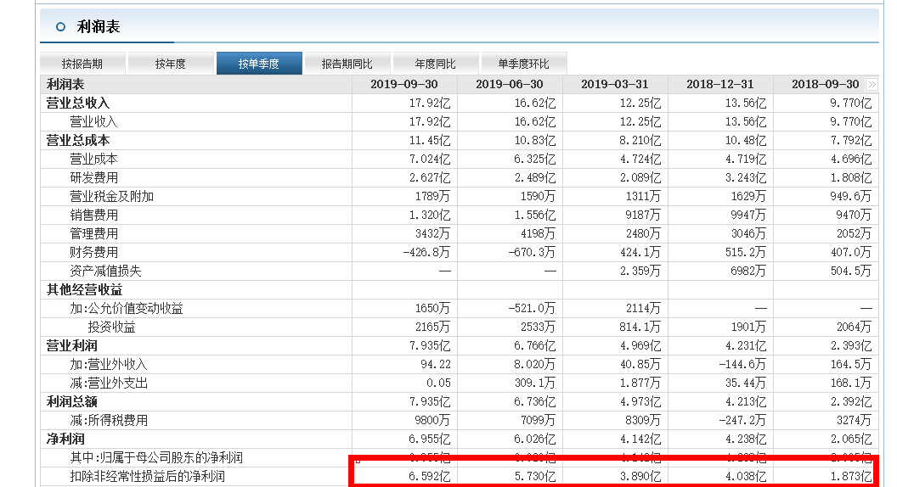

======================================================

_type: talk
@斌斌[841821552258252]
2020-02-24 22:07:21 Mon  
topic_id: 841882844814122

白酒ETF在师父的估值表中在正常区域，现在可以入了吗，如果可以，中概互联和深证红利也可以建仓了吗？

@二师父 at 2020-02-24 22:07:21 Mon

> 不要着急

----------

@斌斌 at 2020-02-24 22:07:21 Mon

> 好的，等着师父招乎

----------

@李依祚 at 2020-02-24 22:07:21 Mon

> 我也等着

----------

阅读[5515]  评论[3]  赞[0] 

======================================================

_type: talk
@二师父[28814221155551]
2020-02-25 08:29:20 Tue  
topic_id: 118554584251182

<e type="hashtag" hid="455282818848" title="#周二讲基金#" /> 今天讲讲银行和50AH，这两个基金最近表现不好，主要是银行业绩的原因，除了招行，其他银行的业绩都很难看，等第四季度的报告出来了可以继续追踪。为了应对那个事，上面说了要提高银行不良贷款容忍度，那么银行的资产质量也会受到影响的。

对于已经定投的银行指数，可以继续拿着，目前不建议继续定投银行了，如果业绩不反转，短期很难起来。已经定投的话，可以耐心持有，等盈利慢慢部分切换。学会不同指数轮动。

50AH可以单独配置，也可以利用贵州茅台、中国平安、招商银行替代的，这三只白马一起比持有50AH是要好的，当然这适合指数投资已经做得非常好的朋友，新手不要搞，指数平均化收益，但是他安全啊。

还有几个事说下，昨天外盘大跌，今天和明天如果创业板还能涨那我就觉得小盘牛市会到来了，检验A股股民素质和A股股票质量的时候到了。还有中概互联，估计还会有一些跌幅，不要着急，市场总会给机会上车的哈，准备好子弹。切记切记：安全第一，否则一次赌错了又不懂得止损，最后挂的可快了。

关于建立自己的投资系统，之前分享了一个方法，还有一个方法就是，如果你认可价值投资和成长投资，那就跟着二师父学，把我的三门课程听一听，然后开始实践，边实践边在星球和大家交流，最后差不多三年能够建立自己的交易系统。

二师父建立整体的投资系统大概花了6年时间，期间是走了不少弯路的，我始终在想，如果10年前我能够遇到现在的我，可能我的人生轨迹会不一样。不过正是因为走过弯路，所以我对自己目前的方法、策略和系统无比的笃定，并不会因为暴跌和暴涨而怀疑，目前我已经悉数按照一个步骤编写成了一套课程，指数基金定投这是入门，建立投资框架。财务报表解读，这是深化，让你进一步能够学会评估已经投资指数的持仓股票，有利于长期持有，知道自己买的是优质品，如果评估之后是垃圾，那么就卖出。第三步资产配置课程，这是建立在家庭资产配置的角度实现资产的轮动和切换。

如果热爱学习，我觉得这是一条很好的路，我走的弯路你可以避免，如果没有时间，那么看看星球就可以了。

二师父会持续分享，做好研究，做到在市场的每一个阶段都去配置当前阶段最优质的指数和股权，不是建议，只是可以给大家一个正确的参考。我知道的都会讲出来。好了，投资可以很简单，但绝对不会很容易，愿后面的日子继续努力，做好风控，在风险可控的条件下实现收益最大化。

往事皆为序章，唯有他人的爱与信任不可辜负，愿我们都可以在纷繁复杂的世界里温情地活着。

@飞向彩云端 at 2020-02-25 08:29:20 Tue

> 我一直在想：如果早几年遇到二师父该有多好！

----------

@样 at 2020-02-25 08:29:20 Tue

> 请问师父，300价值  519671怎么样？我仓位了30%，有些盈利，如果不看好，可以轮动到哪种基金上，这个钱是可以投资3-5年的，请师父指导，谢谢

----------

@二师父 at 2020-02-25 08:29:20 Tue

> 价值基金，属于稳健型的，适合防守

----------

@乖子 at 2020-02-25 08:29:20 Tue

> 谢谢您

----------

@mumomo at 2020-02-25 08:29:20 Tue

> 二师父的文字让人感觉很真诚，很温暖，笃定的跟着您走。

----------

@夏日荷花 at 2020-02-25 08:29:20 Tue

> 我也是之前在投资上吃了很多亏，亏了很多钱。在痛定思痛之后决定开始学习投资。已经开始了三年了，但之前都是懵懵懂懂，最近似乎才懂了一点点。谢谢二师父，谢谢二师父的耐心和真诚指导，希望能坚持在投资的路上不断学习。谢谢了！

----------

@雨淡风清 at 2020-02-25 08:29:20 Tue

> 先看二师父网盘推荐的书，再学习二师父的课程么

----------

阅读[6628]  评论[7]  赞[0] 

======================================================

_type: talk
@二师父[28814221155551]
2020-02-25 09:40:25 Tue  
topic_id: 548115185581444

<e type="hashtag" hid="881251425252" title="#鳄鱼计划#" /> 买入酒ETF一份，溢价0.18%，问题不大，目前在低估区域，控制节奏，不要着急，慢慢买，从左侧建仓，仅为个人投资记录

@一心一意 at 2020-02-25 09:40:25 Tue

> 二师父，酒ETF代码是多少

----------

@rtdmm小米 at 2020-02-25 09:40:25 Tue

> 二师父，酒进入低估区域了？可减银行加酒了？

----------

@二师父 at 2020-02-25 09:40:25 Tue

> 盈利可减

----------

@乖子 at 2020-02-25 09:40:25 Tue

> 没有投过这个，请问可以建立底仓吗？谢谢

----------

@tanxin at 2020-02-25 09:40:25 Tue

> 跟着二师父买入一份[微笑]

----------

@二师父 at 2020-02-25 09:40:25 Tue

> 不适合，场外白酒盈利还有70个点，只适合定投

----------

@rtdmm小米 at 2020-02-25 09:40:25 Tue

> 紧跟二师父节奏，买入一份酒

----------

阅读[7040]  评论[31]  赞[0] 

======================================================

_type: talk
@志亮[422125851552828]
2020-02-25 09:43:38 Tue  
topic_id: 118554584481852

哈哈，我猜得没错，创业板继续牛，趋势不可挡[微笑]

@二师父 at 2020-02-25 09:43:38 Tue

> 给A股股民点个赞

----------

@志亮 at 2020-02-25 09:43:38 Tue

> A股需要这么有激情的股民，要不价值投资那能赚钱？[呲牙]

----------

阅读[5961]  评论[3]  赞[0] 

======================================================

_type: q&a
@云云[118525244841512]
2020-02-25 10:14:48 Tue  
topic_id: 118554584855522

@云云

>  师父，今天的债券可以打吗？072614

@二师父

>  今天可以打的，可转债风险相对低，这个质量还不错

阅读[6089]  评论[1]  赞[0] 

======================================================

_type: talk
@二师父[28814221155551]
2020-02-25 11:08:54 Tue  
topic_id: 118554588815522

看来还是我比较了解a股，半导体废了，创业板也废了，默念三遍，不追涨，追涨吃面。

@志亮 at 2020-02-25 11:08:54 Tue

> 可能是洗盘，下午会拉升一下

----------

@静若繁花 at 2020-02-25 11:08:54 Tue

> 二师父，500，劵商要卖吗

----------

@二师父 at 2020-02-25 11:08:54 Tue

> 按照网格啊，利润收割啊

----------

@海马 at 2020-02-25 11:08:54 Tue

> 今天早上开盘把银行和50转换成恒生指数，坚持不碰科技，创业板

----------

@二师父 at 2020-02-25 11:08:54 Tue

> 来点白酒也不错的

----------

@静若繁花 at 2020-02-25 11:08:54 Tue

> 已收割利润，害怕又跌没了

----------

@志亮 at 2020-02-25 11:08:54 Tue

> 看这个走势我只能说A股真刺激[呲牙]，承受能力差的人不适合做趋势，还是老老实实跟二师父做低估定投吧。

----------

@海马 at 2020-02-25 11:08:54 Tue

> 好的，师父，恒生指数最近两年都没涨什么，觉得机构下半年大抄港股

----------

阅读[6178]  评论[38]  赞[0] 

======================================================

_type: talk
@Pansy[48281554424548]
2020-02-25 14:46:19 Tue  
topic_id: 548115521514484

眼看着5g飞一般的涨，周围的人都劝我要入手，如果是1年前的我，大概会毫不犹豫的入手，但是现在，我犹豫再三，还是放弃了。目前依然没有操控金钱的能力，还是老老实实的去学习，一边学习，一边实践吧。

@🍀 凝🌸 慧🍀 at 2020-02-25 14:46:19 Tue

> 对的，大部分人都有过这样追涨杀跌的经历，我也经历过。吃一堑长一智，不能在同样的地方摔两次。既然之前没投，现在就更不要去做韭菜了，俺也是之前没投，俺觉得自己能力不够，就耐心好好学习，坚持投资纪律，可能会少赚，但不会大亏。

----------

@光少 at 2020-02-25 14:46:19 Tue

> 今年开盘那天入了点，还不错[呲牙]

----------

@Pansy at 2020-02-25 14:46:19 Tue

> 在没有足够的操控金钱的能力时，还是选择踏实的学习吧

----------

@Pansy at 2020-02-25 14:46:19 Tue

> 力所能及范围之内能多赚点是好的

----------

阅读[5308]  评论[4]  赞[0] 

======================================================

_type: talk
@二师父[28814221155551]
2020-02-25 15:22:52 Tue  
topic_id: 421885548228118

也许面对股市和这个社会，我们都是不明真相的群众，以为看到了世界的全貌其实看到的只是皮毛。承认这一点的人，大多是能够正确认识自己而且有自信的

@老司基 at 2020-02-25 15:22:52 Tue

> 二师父，创业牛来了吗

----------

@二师父 at 2020-02-25 15:22:52 Tue

> 我相信国运，更相信我的计算数据和人性的疯狂

----------

@艾琪（王钥） at 2020-02-25 15:22:52 Tue

> 二师父，很多国家也开始发生疫情了，中国却在好转，那世界上的💰会不会全部涌入中国来？毕竟我们国家要有安全感一些

----------

@二师父 at 2020-02-25 15:22:52 Tue

> 据我了解从韩国到青岛的机票翻了5倍

----------

@杜志彪 at 2020-02-25 15:22:52 Tue

> 相对于顶层设计我们好比站在山脚，人家在山顶，信息量和认知都无法与之匹敌，但我们可以学习借鉴历史走过的路，发展规律总是有迹可循的[微笑]，对于投资来讲历史无外乎金融、科技、消费、医药这四个大的方向，对于普通人来讲不买股票（不好把握），买着四类指数就行了。

----------

@志亮 at 2020-02-25 15:22:52 Tue

> 是晩了，也算是小白没经验吧，但我相信有这次经验后，以后就能抢到先机，没什么后悔的[微笑]

----------

阅读[5482]  评论[9]  赞[0] 

======================================================

_type: talk
@范*[841855284221812]
2020-02-25 16:52:32 Tue  
topic_id: 118554421858112

美股继续吧

阅读[5236]  评论[0]  赞[0] 

+++++++++++++++++++++++++++++++++++++++++++++++++++++

图片：

======================================================

_type: talk
@二师父[28814221155551]
2020-02-25 17:43:27 Tue  
topic_id: 548115528118244

关于银行的看法

@范毅君 at 2020-02-25 17:43:27 Tue

> 二师父，哪些指数属于防守型的，哪些指数属于进攻型啊[害羞]

----------

@二师父 at 2020-02-25 17:43:27 Tue

> 稳健的防守，高成长的进攻

----------

@Pansy at 2020-02-25 17:43:27 Tue

> 什么时候我这个小白能练成属于自己的十八般武艺啊

----------

@JOY at 2020-02-25 17:43:27 Tue

> 师父，之前定投的银行是等不赔的时候卖出，还是就这么放着呢？总仓位目前在6成左右，银行（不算50AH的话），占总仓位的14%。

----------

@二师父 at 2020-02-25 17:43:27 Tue

> 拿着呀，他会涨的，做好鲁轮动配置

----------

@JOY at 2020-02-25 17:43:27 Tue

> 好的，谢谢~

----------

阅读[5724]  评论[6]  赞[0] 

+++++++++++++++++++++++++++++++++++++++++++++++++++++

文件：
2020-02-25 17:43:23 Tue
文件大小：[19351]
51558225528454-银行股被重锤，跌跌不休，是否还能定投.docx

======================================================

_type: q&a
@九天[548228524258514]
2020-02-25 17:59:33 Tue  
topic_id: 118554428211252

@九天

>  请问图片中，中证电信的81，70，49都是什么意思？

@二师父

>  这个我也没明白他表示的什么意思，有同学知道的吗

阅读[5436]  评论[3]  赞[0] 

======================================================

_type: talk
@二师父[28814221155551]
2020-02-25 21:24:05 Tue  
topic_id: 421885584182528

<e type="hashtag" hid="554228155184" title="#关于创业板#" /> 创业板我18年就买了，当时30倍市盈率，现在65倍市盈率，已经清仓

如果你已经买了，想拿着就拿着，我也不会奢望不让你追高，你自己怎么操作不要激发别人的情绪，因为有人会控制不住自己，赚多少不重要，活下去才重要

5年前，2015年的时候，我眼见着一个4000点加杠杆买创业板股票的人，当时预测上证综合指数能破一万点，没人相信会跌，你不买创业板会被人称为傻子

可是最后，这个人遇到断崖式下跌爆仓最后跳楼结束了自己的生命，你们应该都经历过2015，消灭了很多中产，我的一些朋友从此卸载账户再也不碰了，这是好点的

不要羡慕什么十年十倍，很多事经历以后你就知道他是十年一梦，属于你的财富会是你的，不属于你的财富顶多是账户的数字罢了。

@斌斌 at 2020-02-25 21:24:05 Tue

> 最近有点大胆和冒进，引以为戒，切忌满仓追高，更不能加杠杆。

----------

@齐俊波 at 2020-02-25 21:24:05 Tue

> 二师父，我看估值表上中证500估值正常，我盈利15%，现在可以收割吧？

----------

@二师父 at 2020-02-25 21:24:05 Tue

> 可以

----------

@cotton at 2020-02-25 21:24:05 Tue

> 现在创业板全部卖掉，就叫清仓。对吗。二师父[呲牙]

----------

@志亮 at 2020-02-25 21:24:05 Tue

> 杠杆绝对不可以碰的，那个风险太大了，二师父这篇文章给我们敲响了警钟。

----------

@二师父 at 2020-02-25 21:24:05 Tue

> 对的，可以拿着观察，一般趋势起来了还会继续涨

----------

@cotton at 2020-02-25 21:24:05 Tue

> 那你为啥要清仓呢。

----------

@二师父 at 2020-02-25 21:24:05 Tue

> 第一高估，不赚取最后一个铜板。第二目前卖出还有其他优质指数可以投资，如果当前没有更好的选择，那么是可以持有，要考虑机会成本

----------

阅读[6324]  评论[9]  赞[0] 

+++++++++++++++++++++++++++++++++++++++++++++++++++++

图片：
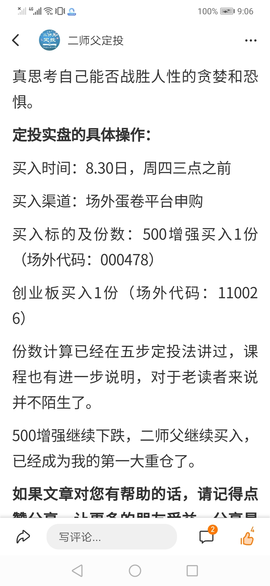
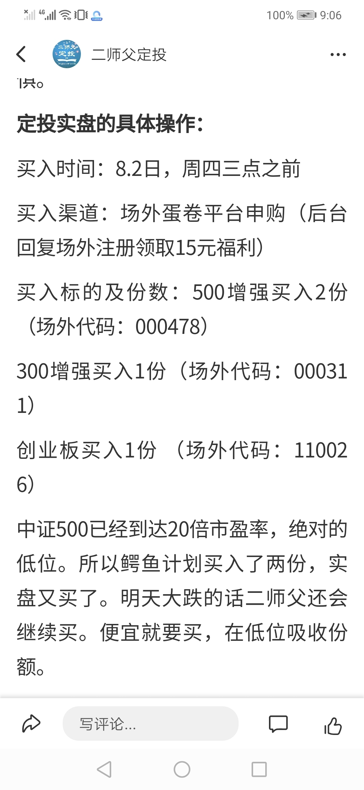

======================================================

_type: talk
@二师父[28814221155551]
2020-02-26 08:53:18 Wed  
topic_id: 241882225842511

外围第二天下跌，准备好子弹，很多投资者心心念念的中概互联也许快要机会来了

@奋斗 at 2020-02-26 08:53:18 Wed

> 纳指ETF今天也是机会吗

----------

@二师父 at 2020-02-26 08:53:18 Wed

> 还早呢，高位

----------

@乖子 at 2020-02-26 08:53:18 Wed

> 子弹准备好了[呲牙][呲牙]

----------

阅读[4251]  评论[3]  赞[0] 

+++++++++++++++++++++++++++++++++++++++++++++++++++++

图片：
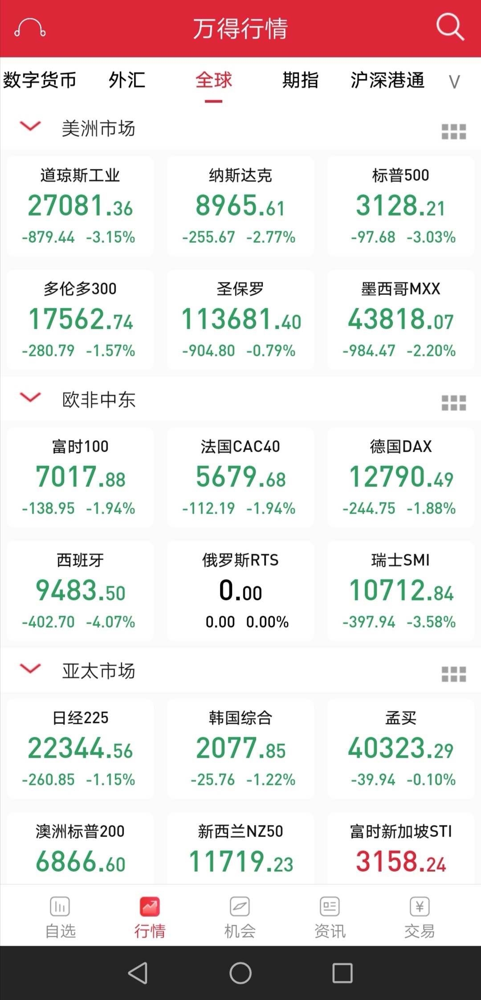

======================================================

_type: talk
@J[28281541518551]
2020-02-26 09:25:35 Wed  
topic_id: 421885555421558

快到期了，学员续费是不是有优惠？

@J at 2020-02-26 09:25:35 Wed

> 我记得以前有学员二维码互扫有优惠的，具体怎么操作？师父和学友们请告知一下，谢谢

----------

@艾琪（王钥） at 2020-02-26 09:25:35 Wed

> 加二师父微信，续费优惠

----------

@二师父 at 2020-02-26 09:25:35 Wed

> 加我微信

----------

@蓝魔森林 at 2020-02-26 09:25:35 Wed

> 师傅微信多少 我还有一个多月到期

----------

@二师父 at 2020-02-26 09:25:35 Wed

> ershifudt

----------

@胡醒醒 at 2020-02-26 09:25:35 Wed

> 可是二师父不回复啊

----------

阅读[4006]  评论[6]  赞[0] 

======================================================

_type: talk
@二师父[28814221155551]
2020-02-26 10:18:21 Wed  
topic_id: 548115555411144

当你想卖出银行的时候，他就非常奇怪的上涨了，这就是股市，绝望的时候再坚持一下下，膨胀的时候需要敲打敲打。

@紫色天使 at 2020-02-26 10:18:21 Wed

> 按照二师父的思路早盘以1.113的价格买入白酒，然后静静等待。

----------

@rtdmm小米 at 2020-02-26 10:18:21 Wed

> 今天又加一份白酒

----------

@海马 at 2020-02-26 10:18:21 Wed

> 对的

----------

@秦风殇韵（刘豫斌） at 2020-02-26 10:18:21 Wed

> 地产最近总是冷不丁轮动一下

----------

@雨淡风清 at 2020-02-26 10:18:21 Wed

> 555白酒上来了，还得等

----------

@陌路花 at 2020-02-26 10:18:21 Wed

> 真看不懂，股市难讲。觉得银行涨也涨不了多少。

----------

@笋子 at 2020-02-26 10:18:21 Wed

> 好像是

----------

@艾琪（王钥） at 2020-02-26 10:18:21 Wed

> 银行一直定投，现在也只是略亏一点

----------

阅读[4009]  评论[8]  赞[0] 

======================================================

_type: talk
@海马[15158245825242]
2020-02-26 10:26:39 Wed  
topic_id: 241882222424421

阅读[3997]  评论[0]  赞[0] 

+++++++++++++++++++++++++++++++++++++++++++++++++++++

图片：
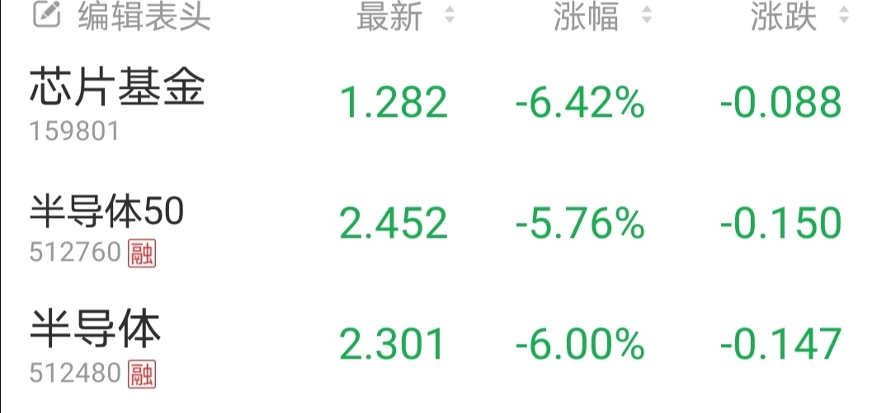

======================================================

_type: talk
@二师父[28814221155551]
2020-02-26 12:24:28 Wed  
topic_id: 841882224445212

<e type="hashtag" hid="824551218542" title="#场外卖出#" /> 券商继续减仓四分之一仓位，后面用全指金融替代，先赚而后求大赚，那些一年赚100%的不可持续，也会让心态浮躁，守护信仰

很多人是19年三月加入的，所以对我卖出嗤之以鼻，但是你翻看往期记录，18年除了券商和年初卖出股票换成基金外，我疯狂买了一年，一年盈利20多个点，还不满足？

你买房子一年挣多少？当我卖出半导体和创业板的时候别骂我傻，至少挣钱了，还有几十个点快翻倍的利润，你想怎样？

不贪婪，人心不足蛇吞象

@银河系 at 2020-02-26 12:24:28 Wed

> 我们以后不买券商了是吗？

----------

@贵玉1* at 2020-02-26 12:24:28 Wed

> 场内券商要减仓吗

----------

@二师父 at 2020-02-26 12:24:28 Wed

> 买，场内买

----------

@二师父 at 2020-02-26 12:24:28 Wed

> 可以根据网格啊

----------

@紫色天使 at 2020-02-26 12:24:28 Wed

> 二师父，之前买了一万块钱的券商，现在盈利二十多个点，今天我收割了利润，本金没有卖掉，是不是以后我们都不买券商，换成全指金融呢？那这样我是不是也要把券商的本金卖掉换成全指金融呢？

----------

@银河系 at 2020-02-26 12:24:28 Wed

> 收到，牛市三宝要翻倍的，还以为怎么不买了

----------

@二师父 at 2020-02-26 12:24:28 Wed

> 不用一次换，后期无法预测是否继续上涨，今年券商大年，不过外围市场影响很大

----------

@二师父 at 2020-02-26 12:24:28 Wed

> 场内一直持有的，最多网格

----------

阅读[4891]  评论[14]  赞[0] 

======================================================

_type: q&a
@美美[48224811151218]
2020-02-26 13:02:50 Wed  
topic_id: 421885552118848

@美美

>  二师父：从下面这个图里怎么看中概互联的机会快要来了？

@二师父

>  外围市场下跌，中概股的机会很大，目前中概股业绩不错，除了百度都挺好

阅读[3989]  评论[15]  赞[0] 

======================================================

_type: talk
@范毅君[118551121224142]
2020-02-26 13:55:36 Wed  
topic_id: 548115558158884

各位，华宝石油，场外为啥不能购买了呢

@Snow at 2020-02-26 13:55:36 Wed

> 外汇管制

----------

@范毅君 at 2020-02-26 13:55:36 Wed

> 啥时间可以开放申购啊[调皮]

----------

@陈伟 at 2020-02-26 13:55:36 Wed

> 场内买能突破1000的限制吗？

----------

@范* at 2020-02-26 13:55:36 Wed

> 基金公司的外汇额度用完了。

----------

阅读[3634]  评论[4]  赞[0] 

======================================================

_type: talk
@范*[841855284221812]
2020-02-26 14:26:08 Wed  
topic_id: 841882221215252

华宝油气低位溢价15%真是奇葩货，强如我也不敢干它。转战南方原油和基建工程

@二师父 at 2020-02-26 14:26:08 Wed

> 如果可以申购我就干

----------

@斌斌 at 2020-02-26 14:26:08 Wed

> 基建后期应该不错，代码哪个？

----------

@默 at 2020-02-26 14:26:08 Wed

> 这是啥意思

----------

@范* at 2020-02-26 14:26:08 Wed

> 俺也一样

----------

@范* at 2020-02-26 14:26:08 Wed

> 165525场内注意看看有没有溢价

----------

@斌斌 at 2020-02-26 14:26:08 Wed

> 好的，谢谢！

----------

阅读[3629]  评论[6]  赞[0] 

======================================================

_type: talk
@二师父[28814221155551]
2020-02-26 14:33:11 Wed  
topic_id: 841882221214522

一个容易冲动、缺乏耐心的人，希望马上看到成果，永远也不会喜欢格雷厄姆式投资策略，因为这种策略要求他等待一只股票在两三年后回归它的内在价值。
类似的，一个喜欢在行动前详细研究并弄清所有细节的人不适合做外汇交易，因为这种交易要求瞬间判断、直觉行事、持续行动，并一刻不停地紧盯市场。
或者，如果一个人只喜欢购买一些他看得见甚至能感觉到价值的有形物品，他永远也不会使用那种投资于科技或生物技术企业的系统。如果企业的产品只是理念，连开发阶段还没到（更别说试验阶段了），那么它只有潜在价值。不存在他感兴趣的那种具体或有形的东西。
从这三个无疑非常极端的例子中很容易看出，如果一个投资者使用了一个与他的个性完全不符的系统，他会遭遇惨败，即使这个系统对其他人来说非常有效。
我是一个比较有耐心的人，而且做很多事情也不特别要求回报，所以群里能够践行这个左侧交易的人并且坚持三年，性格估计也和我差不多，否则大多数人受不了。哪有知道要下跌还去买，要上涨还去卖的

@门萨🐨 at 2020-02-26 14:33:11 Wed

> 我感觉我是第二种[捂脸]

----------

@陈飞🤗 at 2020-02-26 14:33:11 Wed

> 就像做趋势，明知道有危险，但是我们没经历过，所以不懂，什么东西都要亲身经历才会懂，现在以自己能接受的资金去赌博，来吸取教训，以后了才不会大资金亏损。

----------

@杜志彪 at 2020-02-26 14:33:11 Wed

> 30而立，四十不惑，五十知天命，人生确实需要经历才能明白其中的道理，如果不经历到五十也不会不惑，要不说读万卷书不如行万里路，我们都需要践行。

----------

阅读[3999]  评论[3]  赞[0] 

======================================================

_type: q&a
@一心一意[844421848411122]
2020-02-26 16:54:47 Wed  
topic_id: 841882242542452

@一心一意

>  二师父，现在的华宝油气，可以做鳄鱼计划么

@二师父

>  不能做，溢价太高，无法申购套利，所以放弃最为稳妥

阅读[3742]  评论[2]  赞[0] 

======================================================

_type: talk
@二师父[28814221155551]
2020-02-26 17:48:34 Wed  
topic_id: 241882242482511

<e type="hashtag" hid="141228182112" title="#226定投实盘#" /> 今天随着外围的暴跌，A股也是一泻千里。

很正常的，这是A股特性。还是那句话，追涨赚到的钱都是凭运气赚的钱，只有真正通过资产配置在资本市场获胜才是凭借实力赚钱。

不管市场涨跌如何，我们都始终坚持自己的定投原则。

今天券商继续卖出四分之一仓位，盈利20%，已经很不错的成绩了，未来券商逐步转移到场内，场外用全指金融代替银行、地产、保险、券商等金融行业。

今天比较有特色，创业板、科技指数暴跌，银行却一枝独秀，除了夕阳行业指数，每一只指数都会有他的春天，耐心定投等待。

本期实盘加入了易方达安心回报债券，这是一只可转债，目前随着国际股市走低，利率下行，经济处于弱周期，所以后续市场下行概率还是比较大，而当前很多股权资产并没有和2018年那样极度低估，所以选择配置可转债基金，进可攻，退可守，这是非常不错的。

类似兴全转债这样的可转债基金也可以配置，当然购买一些优质的可转债对冲风险也是不错的。

二师父要提示下，创业板、半导体都处于跌破5日线的状态，下跌趋势已经确立，而且已经处于高估区域，有的人还认为创业板将要翻5倍，这个是比较主观的哈，投资一定要做好风控。如果你在28倍市盈率购买的创业板指数没有问题，如果你是近几天追高买的就要注意啦。

还有中概互联，目前还是正常估值，不要定投，机会总是有，而且避免从场内购买，当前溢价很多。至于华宝油气，屡创新低，场内溢价率逐步攀升，可以暂时放弃定投了。

@苍天有井明月空🌙 at 2020-02-26 17:48:34 Wed

> 天天基金跟投没更新啊

----------

@二师父 at 2020-02-26 17:48:34 Wed

> 你看看，系统可能延迟

----------

@庆余年 at 2020-02-26 17:48:34 Wed

> 我目前还没有买过白酒，白酒可以买点麽？

----------

@mumomo at 2020-02-26 17:48:34 Wed

> 二师父，这个安心回报债和之前那个海外收益债分红方式都选红利再投吗？

----------

@二师父 at 2020-02-26 17:48:34 Wed

> 都可以

----------

@二师父 at 2020-02-26 17:48:34 Wed

> 定投可以

----------

@mumomo at 2020-02-26 17:48:34 Wed

> 好的👌

----------

@银河系 at 2020-02-26 17:48:34 Wed

> 今天0.340又加了一部分，成本摊到0.383了

----------

阅读[4959]  评论[11]  赞[0] 

+++++++++++++++++++++++++++++++++++++++++++++++++++++

图片：
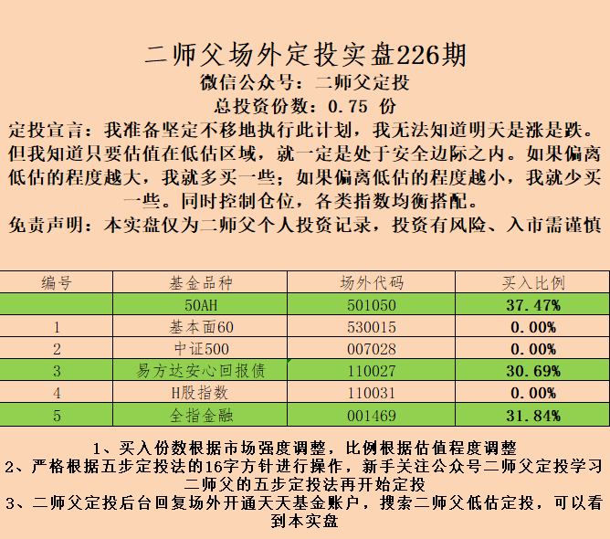

======================================================

_type: talk
@二师父[28814221155551]
2020-02-26 17:50:14 Wed  
topic_id: 841882242482412

<e type="hashtag" hid="481211145528" title="#指数估值#" /> 加了5G指数，目前家用电器的基金规模太低，先等等，今天暴跌，马上由白银底进入黄金坑，某人又被打脸。明天涨还是跌，一般都猜不中，不信来个1毛钱的局。

@Pansy at 2020-02-26 17:50:14 Wed

> 白酒可以入手了

----------

@杜志彪 at 2020-02-26 17:50:14 Wed

> 白酒进入低估真不容易，终于等到了，明天开始定投[微笑]

----------

@杜志彪 at 2020-02-26 17:50:14 Wed

> 家电场内有个ETF159996，但是没开始交易，可以再等等。

----------

@二师父 at 2020-02-26 17:50:14 Wed

> 这个才刚成立，可以观察下

----------

@铁观音 at 2020-02-26 17:50:14 Wed

> 师傅，上次给的估值表白酒是27-35，今天白酒29.3为啥是低估？是哪个数值有问题吗

----------

@二师父 at 2020-02-26 17:50:14 Wed

> 没有问题的，盈利增速的原因

----------

@冉冉 at 2020-02-26 17:50:14 Wed

> 二师傅，估值表能不能加上股息率？加上可以多一个参考值

----------

@二师父 at 2020-02-26 17:50:14 Wed

> 没必要的，所有的指数我都考察过背后盈利增速，这个比市盈率和股息率重要的

----------

阅读[4118]  评论[27]  赞[0] 

+++++++++++++++++++++++++++++++++++++++++++++++++++++

图片：

======================================================

_type: talk
@二师父[28814221155551]
2020-02-26 18:16:38 Wed  
topic_id: 548115545851454

<e type="hashtag" hid="224551418881" title="#关于溢价#" /> 场内基金购买需要注意溢价问题，看价格高于净值就有溢价，需要避免高溢价品种

@雨淡风清 at 2020-02-26 18:16:38 Wed

> 二师父，就是这个-1.12%折价率越高越好是吧，这个在多少范围内是安全的呢

----------

@蔡寅宵 at 2020-02-26 18:16:38 Wed

> 师父，想买的话怎么避免呀？买场外的吗？

----------

@二师父 at 2020-02-26 18:16:38 Wed

> 对的

----------

@二师父 at 2020-02-26 18:16:38 Wed

> 这是溢价，需要避免

----------

@蔡寅宵 at 2020-02-26 18:16:38 Wed

> 刚看了您写的文章，现在不能买

----------

@志亮 at 2020-02-26 18:16:38 Wed

> 明明是溢价，但软件却显示是折价率，很多小白都容易被这里误导。[呲牙]

----------

@铁观音 at 2020-02-26 18:16:38 Wed

> 券商etf等也会有这个问题吗？

----------

@二师父 at 2020-02-26 18:16:38 Wed

> 会的

----------

阅读[3993]  评论[15]  赞[0] 

+++++++++++++++++++++++++++++++++++++++++++++++++++++

图片：
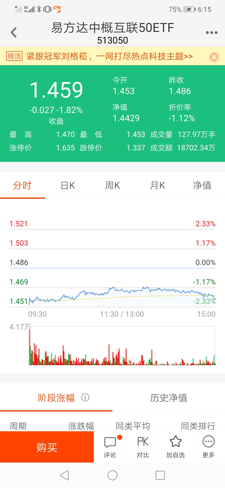

======================================================

_type: talk
@二师父[28814221155551]
2020-02-26 19:39:27 Wed  
topic_id: 241882244245451

<e type="hashtag" hid="455544848428" title="#关于油气#" /> 大家看看这个油气的溢价率12%，非常高，这意味着场内定投价格比实际净值高12%，所以不要场内买入，等场外可以申购了再进行申购套利，这样可以通过一次套利操作赚取12%的收益。

@绿水青山 at 2020-02-26 19:39:27 Wed

> 场外申购如何套利

----------

@二师父 at 2020-02-26 19:39:27 Wed

> 当基金有溢价的时候，在场内申购，然后转托管从场内卖出。

----------

@YtingLi at 2020-02-26 19:39:27 Wed

> 怎么操作托管，不好意思，因为是小白，所以不明白

----------

@二师父 at 2020-02-26 19:39:27 Wed

> 直接点击申购的基金，然后场外转场内

----------

@麻烦得很 at 2020-02-26 19:39:27 Wed

> 会不会等可以申购时候已经没有溢价了

----------

@二师父 at 2020-02-26 19:39:27 Wed

> 这种是变化的

----------

@衣袂飘香 at 2020-02-26 19:39:27 Wed

> 是的，我也发现了，今天想场外买入，结果发现买不了。

----------

@jier at 2020-02-26 19:39:27 Wed

> 二师父，这个场外转场内必须在网页上操作吧？App上好像不行？

----------

阅读[3945]  评论[12]  赞[0] 

+++++++++++++++++++++++++++++++++++++++++++++++++++++

图片：
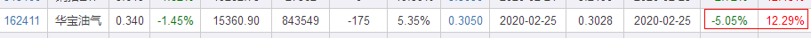

======================================================

_type: talk
@007[51511545424824]
2020-02-26 21:29:34 Wed  
topic_id: 118554485282582

二师傅华宝油气未来还有机会来牛市行情吗？

@陈飞🤗 at 2020-02-26 21:29:34 Wed

> 他心里也是慌的[偷笑][偷笑]

----------

@二师父 at 2020-02-26 21:29:34 Wed

> 不要怕

----------

阅读[3555]  评论[2]  赞[0] 

======================================================

_type: q&a
@小糊涂[51441514412544]
2020-02-26 21:32:54 Wed  
topic_id: 118554485218222

@小糊涂

>  二师傅，天天基金里如何看见您的定投实盘啊，可以自动跟投吗？

@二师父

>  在天天基金实盘，搜索乌龟计划

阅读[3762]  评论[0]  赞[0] 

======================================================

_type: talk
@007[51511545424824]
2020-02-26 21:43:11 Wed  
topic_id: 841882218815822

<e type="hashtag" hid="224551418881" title="#关于溢价#" /> 什么软件？

@二师父 at 2020-02-26 21:43:11 Wed

> 东方财富

----------

阅读[3683]  评论[1]  赞[0] 

======================================================

_type: talk
@二师父[28814221155551]
2020-02-26 22:48:38 Wed  
topic_id: 241882212524521

做好投资，必须读透的一本书之一

@黎雄 at 2020-02-26 22:48:38 Wed

> 师傅为什么呢

----------

@章兵朋 at 2020-02-26 22:48:38 Wed

> 人性和轮回

----------

@奋斗 at 2020-02-26 22:48:38 Wed

> 二师父今天怎么还没发估值表呢

----------

@二师父 at 2020-02-26 22:48:38 Wed

> 在股市历劫，你就成长了

----------

@二师父 at 2020-02-26 22:48:38 Wed

> 发了

----------

@阝東 at 2020-02-26 22:48:38 Wed

> 5小时前就发了，自己往下拉看

----------

@苍天有井明月空🌙 at 2020-02-26 22:48:38 Wed

> 9981难

----------

@孤芳自赏 at 2020-02-26 22:48:38 Wed

> 二师父请问场外基金鳄鱼实盘是长期定投持有呢还是也按收益正常收割利润？

----------

阅读[3681]  评论[9]  赞[0] 

+++++++++++++++++++++++++++++++++++++++++++++++++++++

图片：

======================================================

_type: talk
@二师父[28814221155551]
2020-02-27 10:15:11 Thu  
topic_id: 841882458524442

不要重仓，不要场内买，等可以申购了就套利降低成本，周期指数轻仓投资，切记，每次说单边下跌幅度最大50%是真的，极端情况也会遇到，人生起起落落，股市起起落落，有低谷就会有高潮，只不过有的人一生波动比较小，有的人一生大起大落，伟人都经历过，读读钟南山的人物传记，35岁前还未成事，度过了很长一段时间低谷，去看看勇敢的战士。

真正的收益源自对交易系统的愚忠，我不卖油气就和我现在不会再买创业板一样，凡卖出必盈利，之前油气网格的价格最低设定的0.3，如果不是因为限制申购，还会套利降低成本

@是喵喵吖～ at 2020-02-27 10:15:11 Thu

> 师父为什么说不要场内买

----------

@One at 2020-02-27 10:15:11 Thu

> 场内溢价高，简单说，就是场内比场外贵，昨天是贵12%

----------

@jorfy at 2020-02-27 10:15:11 Thu

> 目前场内买溢价太高

----------

@是喵喵吖～ at 2020-02-27 10:15:11 Thu

> 哦哦好的谢谢

----------

@是喵喵吖～ at 2020-02-27 10:15:11 Thu

> 好的谢谢呀

----------

@What if at 2020-02-27 10:15:11 Thu

> 在天天基金买的，怎么做套利？

----------

@二师父 at 2020-02-27 10:15:11 Thu

> 在东方财富场内申购

----------

@不再YY的猪 at 2020-02-27 10:15:11 Thu

> 谁能简单介绍下套利怎么操作的？

----------

阅读[4307]  评论[15]  赞[0] 

+++++++++++++++++++++++++++++++++++++++++++++++++++++

图片：
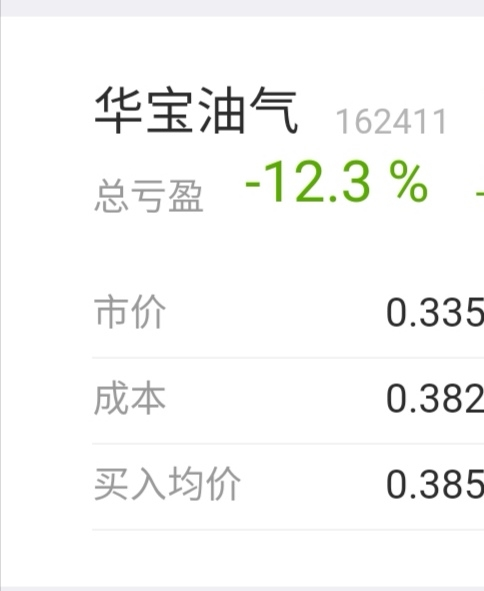

======================================================

_type: talk
@二师父[28814221155551]
2020-02-27 17:02:16 Thu  
topic_id: 421885284228858

<e type="hashtag" hid="825255218512" title="#逆向思维#" /> 选择很难，坚守更难，知道不做什么比做什么更加重要。

阅读[3677]  评论[0]  赞[0] 

+++++++++++++++++++++++++++++++++++++++++++++++++++++

文件：
2020-02-27 17:01:34 Thu
文件大小：[64529]
15448245111442-从2600到3000，投资者必须学会逆向思维.docx

======================================================

_type: talk
@彩虹[544884214814214]
2020-02-27 17:04:35 Thu  
topic_id: 548115412445214

二师父，买港美股用哪个软件？有什么优惠政策吗？

@二师父 at 2020-02-27 17:04:35 Thu

> 用华泰来港股通就可以，你可以加微信ershifudt开富途

----------

阅读[2581]  评论[1]  赞[0] 

======================================================

_type: talk
@liao[48588555425818]
2020-02-27 17:28:36 Thu  
topic_id: 548115412815484

二师傅，为啥白酒29倍市盈率就开始低估的，这个数据哪里可查？

@二师父 at 2020-02-27 17:28:36 Thu

> 计算的

----------

@liao at 2020-02-27 17:28:36 Thu

> 二师傅是否可以告诉是如何计算的，想学习一下

----------

阅读[2590]  评论[2]  赞[0] 

======================================================

_type: talk
@夏萍[28221454818281]
2020-02-27 21:54:52 Thu  
topic_id: 841882181112852

师父您觉得广发中证基建工程和广发中证建筑材料前景怎样？能否帮我看下他们的估值？谢谢

@杜志彪 at 2020-02-27 21:54:52 Thu

> 看来大家买基金和买股票一样，喜欢最热点[微笑]

----------

@二师父 at 2020-02-27 21:54:52 Thu

> 基建工程还不错，正在研究，虽然公司盈利不好，可是有国家背书，估值低位

----------

@夏萍 at 2020-02-27 21:54:52 Thu

> 师父建筑材料估值怎样？

----------

@二师父 at 2020-02-27 21:54:52 Thu

> 我得看看

----------

@夏萍 at 2020-02-27 21:54:52 Thu

> 有政策有发展

----------

@夏萍 at 2020-02-27 21:54:52 Thu

> 好的，等你

----------

@二师父 at 2020-02-27 21:54:52 Thu

> 这两个行业不是好的赛道

----------

@夏萍 at 2020-02-27 21:54:52 Thu

> 好的师父

----------

阅读[2243]  评论[8]  赞[0] 

======================================================

_type: talk
@二师父[28814221155551]
2020-02-27 22:35:44 Thu  
topic_id: 241882125224851

某位基金经理说：“只要您想下车撒泡尿，您就会被历史的车轮无情甩下，因为这是一趟高铁。”于是没下车的就尿在了裤子上，开始有些暖，现在有些凉。

而基金经理仍旧乘着高铁拿着你的高铁车票费，开始有些爽，现在更加爽。

@朝阳模具 at 2020-02-27 22:35:44 Thu

> 投资需要独立思考，牛市往往是最容易被割韭菜的时候[偷笑]

----------

@阝東 at 2020-02-27 22:35:44 Thu

> 每一次升到3000点，人性就会疯狂？

----------

@陌路花 at 2020-02-27 22:35:44 Thu

> [呲牙]好形象

----------

@cotton at 2020-02-27 22:35:44 Thu

> 哈哈哈！！

----------

阅读[2291]  评论[4]  赞[0] 

======================================================

_type: talk
@二师父[28814221155551]
2020-02-28 06:46:15 Fri  
topic_id: 241882124451421

<e type="hashtag" hid="824588115142" title="#关于选股#" /> 最近有同学问到选股的问题，二师父的选股独孤九剑已经分享，如果连基本的财务指标都不会的话，就去买股票那90%的概率是亏的，就算赚了也是一时运气好。

另外股票投资不同于指数，股票投资不管盈亏，只要企业的基本面恶化了，都要及时卖出。2018年我当时也买了民生银行，其实是不符合选股规则的，因为估值低少量参与，结果当时民生银行因为坏账率增高，我和民生银行的工作员工沟通之后就在民生亏了10%以后卖了。

然后就没管他了，一直加仓指数，最近有个同学问我自己买的民生银行怎么样，我大致看了看，当时我清仓的价格在6.8，现在还低于这个价格，我清仓的钱重新投资早已经赚了不少，如果一直在垃圾股票上耗着只会浪费时间和精力。

不要自己瞎折腾，如果你不懂，就别买股票，如果你对股票研究特别有兴趣，就跟着二师父学习以后再购买。

还有一个问题就是股票投资要控制比例，假如你有100万资金，大概拿出10%的资金投资比较好，这样判断错误止损的话心理压力也很小，毕竟有时候股票会暴雷的，另外需要分散，6到10只股票组合是比较好的，即使暴雷，影响也不大。

记住，优质股票在大盘跌的时候跌的少或者也微涨，大盘涨的时候他会大涨。而劣质股票在大盘涨的时候他跌，在大盘跌得时候暴跌，投资者需要做的就是选出优质股票，远离低价的劣质股票。

@背心 at 2020-02-28 06:46:15 Fri

> 今天中概互联网，可以买了吧，师傅[微笑]

----------

@二师父 at 2020-02-28 06:46:15 Fri

> 我计算还是有点贵，如果仓位不足可以先少量参与，基本跌到1.35以内差不多了。

----------

@紫色天使 at 2020-02-28 06:46:15 Fri

> 谢谢二师傅的提醒！

----------

@太阳 at 2020-02-28 06:46:15 Fri

> 二师父能详细讲讲独孤九剑吗？

----------

@二师父 at 2020-02-28 06:46:15 Fri

> 文章写了啊

----------

@太阳 at 2020-02-28 06:46:15 Fri

> 想详细向老师请教！例如第一个原则：毛利率加权平均值大于30%   要用几年的数据？

----------

@二师父 at 2020-02-28 06:46:15 Fri

> 3到5年，关于财报的你可以听听我的课程

----------

@太阳 at 2020-02-28 06:46:15 Fri

> 好的！

----------

阅读[3230]  评论[8]  赞[0] 

+++++++++++++++++++++++++++++++++++++++++++++++++++++

文件：
2020-02-28 06:39:02 Fri
文件大小：[96544]
15448248114552-选股独孤九剑.pdf

======================================================

_type: talk
@二师父[28814221155551]
2020-02-28 07:06:59 Fri  
topic_id: 548115854485254

要想致富，先得学习投资理财的真本事，提升自己对于金融世界以及理财规划的认知，改善财商，从而认知变现。

你今日之勤奋好学必将是明日之所得。
你今日之懒惰逃学必将是明日之所亏。

阅读[3146]  评论[0]  赞[0] 

+++++++++++++++++++++++++++++++++++++++++++++++++++++

文件：
2020-02-28 07:06:59 Fri
文件大小：[250747]
51558258445584-二师父定投学堂使用指南.pdf

======================================================

_type: talk
@二师父[28814221155551]
2020-02-28 07:16:37 Fri  
topic_id: 118554841181542

场外停止申购，场内就别买了

@朝阳模具 at 2020-02-28 07:16:37 Fri

> 我觉得买这个基金都可以归纳为投机[偷笑]

----------

@随便 at 2020-02-28 07:16:37 Fri

> 已经亏损百分之三十了，哎，还不能加仓难受

----------

@雨的依恋 at 2020-02-28 07:16:37 Fri

> 我都快负40了[捂脸]

----------

@陈飞🤗 at 2020-02-28 07:16:37 Fri

> 我加昨天晚上的35

----------

@光少 at 2020-02-28 07:16:37 Fri

> 今天跌幅大，又想买[捂脸]

----------

@竺胜江 at 2020-02-28 07:16:37 Fri

> 二师付，场内小仓亏15个点，本来打算今天暴跌加倍加仓摊点成本等待反弹的，不能加了？

----------

@二师父 at 2020-02-28 07:16:37 Fri

> 场内有溢价

----------

阅读[2085]  评论[7]  赞[0] 

+++++++++++++++++++++++++++++++++++++++++++++++++++++

图片：
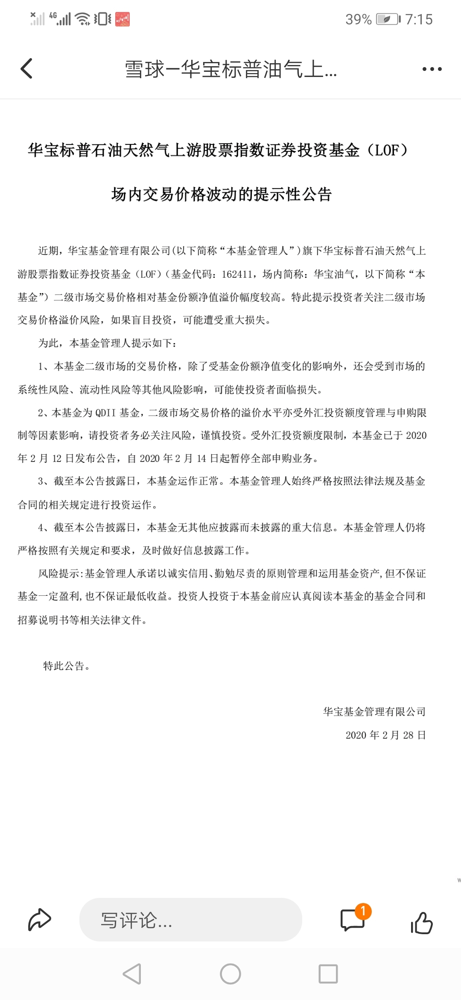

======================================================

_type: talk
@二师父[28814221155551]
2020-02-28 09:56:13 Fri  
topic_id: 421885151255258

大家关注星球消息，酒可以定投，不过要是场内基金，场外分级基金的最好别参与，不要自己瞎折腾，多请教多交流，半导体里面长电科技这么辣鸡的股票都在，还能翻倍，都是要警惕的，包括人工智能，当然后续有可能调仓，这是后面的事情了

@圣诞结® at 2020-02-28 09:56:13 Fri

> 二师父，今天的两个新债都可以申购吗？

----------

@朝阳模具 at 2020-02-28 09:56:13 Fri

> 科技类目前仅持有科技龙头ETF，5G和半导体50之前都已清仓落袋[偷笑][偷笑]

----------

@薇薇 at 2020-02-28 09:56:13 Fri

> 二师父，麻烦问下，场外酒基金非分级的有推荐的吗

----------

@二师父 at 2020-02-28 09:56:13 Fri

> 这才是趋势正道

----------

@二师父 at 2020-02-28 09:56:13 Fri

> 可以

----------

@二师父 at 2020-02-28 09:56:13 Fri

> 这个没有哈

----------

@薇薇 at 2020-02-28 09:56:13 Fri

> 那就只能买场内的了

----------

@样 at 2020-02-28 09:56:13 Fri

> 师父，请问酒etf现在适合建仓吗？

----------

阅读[1802]  评论[29]  赞[0] 

======================================================

_type: talk
@范*[841855284221812]
2020-02-28 10:31:49 Fri  
topic_id: 421885128282458

分别买入，基建工程和南方原油各10%的仓位。不加仓，不减仓。
不用看啦，以后肯定涨。先拿到疫情过去再说

@范* at 2020-02-28 10:31:49 Fri

> 快来人评论评论

----------

@杜志彪 at 2020-02-28 10:31:49 Fri

> 你怎么知道肯定涨，原油适合网格，一点一点买，如果亏了30%你加不加，加仓位就上去了，像华宝再跌20%你加不加，违反了强周期不重仓原则，如果这10层仓都投资原油还可以，目前仓位挺舒服[偷笑]

----------

@范* at 2020-02-28 10:31:49 Fri

> 不加仓，有止损。原油跌破40止损，等跌到支撑位，或突破压力位再买进去，一直和它耗。我看这10%的资金到最后是赚是亏。干不过它，我不信了。主力80%的资金没动，留给能力圈的指数。现在没到动手的时候。

----------

@范* at 2020-02-28 10:31:49 Fri

> 我画个图你就明白了，因为原油周期行业，我规定10%的资金一口气进出。
红是支撑位买进，绿是跌破上个支撑位卖出。以此往复

----------

@范* at 2020-02-28 10:31:49 Fri

> 

----------

@范* at 2020-02-28 10:31:49 Fri

> 还可以反着来。突破上个压力位买，就是图形上的尖峰，跌破上个压力位卖。（也叫支撑位，压力位被突破就变成支撑位了）看图

----------

@范* at 2020-02-28 10:31:49 Fri

> 红买蓝卖，一旦涨想起来，你稳定在车上

----------

@杜志彪 at 2020-02-28 10:31:49 Fri

> 你上回说只有银行网格，这些日子怎么炒作的，学习学习[抱拳]

----------

阅读[1424]  评论[12]  赞[0] 

======================================================

_type: talk
@Sunflower[244185124281811]
2020-02-28 10:43:35 Fri  
topic_id: 421885128224158

当初定投的中证红利终于要分红了，我选择了红利再投资

@杜志彪 at 2020-02-28 10:43:35 Fri

> 我场外也是。

----------

@April _ M. at 2020-02-28 10:43:35 Fri

> 我场外也是这么设置的

----------

@蓝魔森林 at 2020-02-28 10:43:35 Fri

> 中证红利现在应该是正常估值，我直接拿现金了。补充点弹药

----------

阅读[1355]  评论[3]  赞[0] 

+++++++++++++++++++++++++++++++++++++++++++++++++++++

图片：
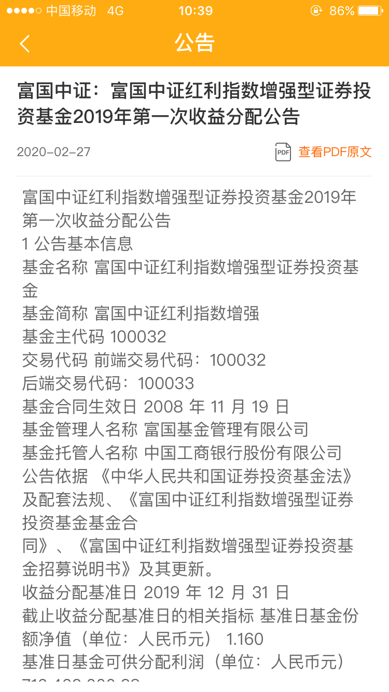

======================================================

_type: talk
@二师父[28814221155551]
2020-02-28 11:28:15 Fri  
topic_id: 841882142585552

<e type="hashtag" hid="281122421221" title="#提问#" /> 请问二师父，今天大跌你的鳄鱼都没出击，你是觉得当前局势还可能恶化

二师父解答：不要有价格锚固效应，你看看券商是2月3号加仓的，现在价格比那时候还贵了10%，不知道你仓位如何，仓位低目前加仓可以的，但切记留有一定的仓位应对风险。

大盘不到2400以下不要满仓，大盘跌破2400的概率不大，所以我们满仓的概率也不大。

仓位足够，网格就行，看看网格价位自己出击就可以，鳄鱼计划不是天天买来买去的，机会足够好才买。

@海马 at 2020-02-28 11:28:15 Fri

> 自己看看账户的实际情况投资[呲牙]

----------

阅读[2017]  评论[1]  赞[0] 

+++++++++++++++++++++++++++++++++++++++++++++++++++++

图片：
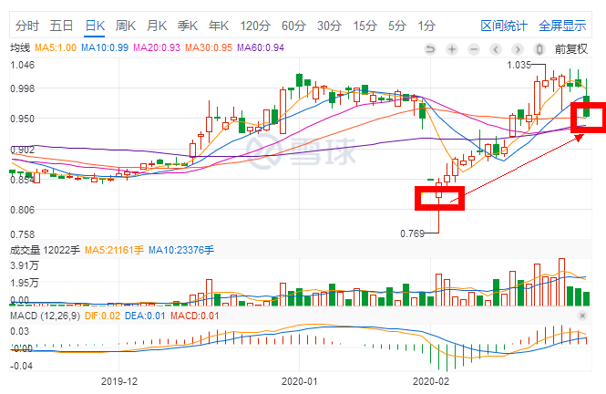

======================================================

_type: talk
@二师父[28814221155551]
2020-02-28 11:29:17 Fri  
topic_id: 548115845212524

<e type="hashtag" hid="281122421221" title="#提问#" /> 二师父，招商中证白酒161725可以定投吗

场外分级基金都要避免，这只基金规模大，作为分级基金清盘风险不大，但是也需要防范，可以选择场内的白酒指数。

@西锦巴乌 at 2020-02-28 11:29:17 Fri

> 师父 161725是分级的吗？

----------

@西锦巴乌 at 2020-02-28 11:29:17 Fri

> 你好！你从哪看出是分级的？谢谢

----------

阅读[2084]  评论[3]  赞[0] 

======================================================

_type: talk
@二师父[28814221155551]
2020-02-28 11:31:23 Fri  
topic_id: 548115845211884

<e type="hashtag" hid="281122421221" title="#提问#" /> 半导体低估了吗？还有5G现在能否轻仓呢？

今天刚刚算了半导体和5G的估值，仍旧处于高估区域，如果轻仓定投，保证回撤70%你不心疼，就可以用这些资金参与定投。

半导体目前还不如人工智能和5G，里面持仓股票不够优质，需要进一步追踪第4季度业绩。

@孟倩 at 2020-02-28 11:31:23 Fri

> 不能冒险，严守安全边际原则。谢谢师父！

----------

@静若繁花 at 2020-02-28 11:31:23 Fri

> 二师父，广发的芯片基金ETF可以买一成吗？手上没有任何科技基金

----------

阅读[2257]  评论[2]  赞[0] 

======================================================

_type: talk
@海马[15158245825242]
2020-02-28 11:32:08 Fri  
topic_id: 841882142582822

<e type="hashtag" hid="281122421221" title="#提问#" /> 师父之前的券商清仓卖完了，现在建底仓问题不大吧？

@二师父 at 2020-02-28 11:32:08 Fri

> 可以稍微建立一点

----------

阅读[1268]  评论[1]  赞[0] 

======================================================

_type: talk
@二师父[28814221155551]
2020-02-28 11:34:35 Fri  
topic_id: 841882142518882

<e type="hashtag" hid="281122421221" title="#提问#" /> 师父，场外基金名称里有“分级”二字的都属于分级基金吗？比如 160222，谢谢

分级基金分为分级AC和分级AB。对于分级AB是要避免的，分级AB的母基金风险低，但是也要注意防范

阅读[1338]  评论[0]  赞[0] 

+++++++++++++++++++++++++++++++++++++++++++++++++++++

图片：
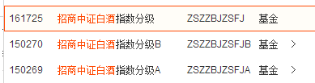

======================================================

_type: talk
@二师父[28814221155551]
2020-02-28 11:35:40 Fri  
topic_id: 548115845281824

<e type="hashtag" hid="281122421221" title="#提问#" /> 招商中证白酒分级，是因为今年要清盘，所以不适合买入是吗

分级基金发了公告的，在2020年底部会处理，有的会清盘，有的会转型，目前不清楚这只基金到底是清盘还是转型成LOF基金，所以需要避免。

@是喵喵吖～ at 2020-02-28 11:35:40 Fri

> 师傅今天大盘2890 是不是算是跌了一些 昨天刚定投了一些 今天还可以加吗

----------

阅读[2383]  评论[1]  赞[0] 

======================================================

_type: talk
@二师父[28814221155551]
2020-02-28 11:36:36 Fri  
topic_id: 241882142512511

<e type="hashtag" hid="281122421221" title="#提问#" /> 师父 161725是分级的吗？

这是分级母基金，也是一只分级基金

阅读[1377]  评论[0]  赞[0] 

======================================================

_type: talk
@二师父[28814221155551]
2020-02-28 11:38:24 Fri  
topic_id: 548115845284424

大家的问题我都以发表的形式公布了，都可以学习下，评论区留言我也以发表的形式回答

@rtdmm小米 at 2020-02-28 11:38:24 Fri

> 这个方式好！

----------

@飞向彩云端 at 2020-02-28 11:38:24 Fri

> 这样就不会漏掉二师父在评论区回复的内容！感谢二师父[玫瑰]

----------

阅读[1431]  评论[3]  赞[0] 

======================================================

_type: talk
@范毅君[118551121224142]
2020-02-28 12:21:09 Fri  
topic_id: 241882142222881

怎么看折价率啊[流泪]小白

@范毅君 at 2020-02-28 12:21:09 Fri

> 场内券商是这个吗，怎么看折价，溢价，求助[大哭]

----------

@样 at 2020-02-28 12:21:09 Fri

> 师父前两天刚发了内容，就在学堂里面搜索“溢价”就可以学习了

----------

@Hi·DD at 2020-02-28 12:21:09 Fri

> 还有恒生也不错呢，可惜我没钱买了

----------

@范毅君 at 2020-02-28 12:21:09 Fri

> 好，谢谢

----------

@范毅君 at 2020-02-28 12:21:09 Fri

> 我也不多了[流泪]

----------

阅读[1190]  评论[5]  赞[0] 

+++++++++++++++++++++++++++++++++++++++++++++++++++++

图片：
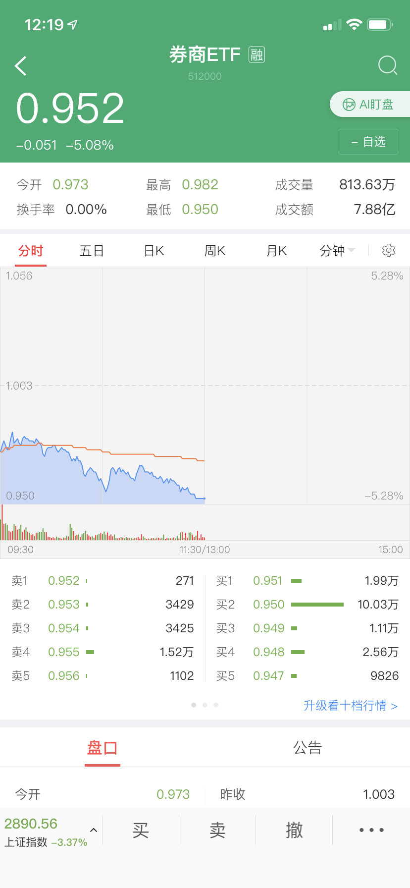

======================================================

_type: talk
@蛋炒饭不加蛋[118281818482542]
2020-02-28 12:33:57 Fri  
topic_id: 421885125514858

二师父，估值表的半导体和新能源车场外代码是一样的吗

@二师父 at 2020-02-28 12:33:57 Fri

> 新能源汽车515700，半导体512480，下次更正过来

----------

阅读[1126]  评论[1]  赞[0] 

======================================================

_type: q&a
@光少[244124552511141]
2020-02-28 13:15:54 Fri  
topic_id: 421885125215248

@光少

>  二师父，新能源车今天低估了吗？

@二师父

>  等收市了算算

阅读[1090]  评论[3]  赞[0] 

======================================================

_type: talk
@范*[841855284221812]
2020-02-28 13:57:20 Fri  
topic_id: 421885122452448

基建工程这个成交量，主力会在这个位置出货吗？大概率是有啥不为人知的消息。看吧，我准备再加10%的仓

阅读[831]  评论[0]  赞[0] 

+++++++++++++++++++++++++++++++++++++++++++++++++++++

图片：
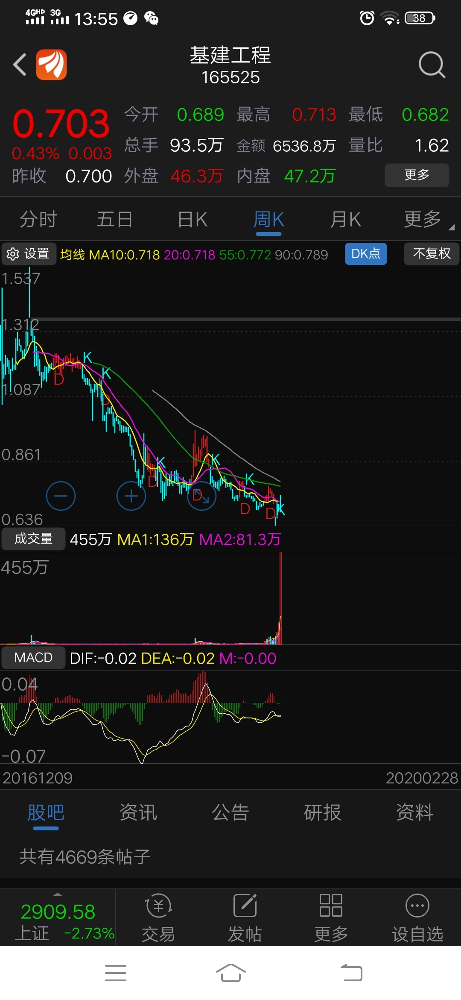

======================================================

_type: talk
@二师父[28814221155551]
2020-02-28 14:56:58 Fri  
topic_id: 241882144212221

<e type="hashtag" hid="281122421221" title="#提问#" /> 二师父，广发的芯片基金ETF可以买一成吗？手上没有任何科技基金、

这个高估中，如果不能承受较大回撤，就不要入手。

阅读[551]  评论[0]  赞[0] 

======================================================

_type: talk
@二师父[28814221155551]
2020-02-28 15:16:02 Fri  
topic_id: 421885122218228

<e type="hashtag" hid="824582518122" title="#逆势还是趋势#" /> 看看自己的底层逻辑，新能源汽车目前还是正常估值，不要有思维锚固效应，要控制节奏哈，如果不是控制好仓位和节奏2013年和2015年就倒下了，你们就遇不到我了，睡好觉第一位，挣钱第二位，当你发现月挣1倍的时候，就是要警惕的时候。如果周一继续下跌，那么开仓干吧，黄金坑妥妥的，记得网格啊，很舒服。

@Della🌻🌴明 at 2020-02-28 15:16:02 Fri

> 看样子还得跌

----------

@范毅君 at 2020-02-28 15:16:02 Fri

> 弹药不多了[流泪]

----------

@苍天有井明月空🌙 at 2020-02-28 15:16:02 Fri

> 希望周一在跌给个机会

----------

@三峡情 at 2020-02-28 15:16:02 Fri

> 二师父至理名言说的太好了。我就是逆势投资，我老公趋势投资，他天天和我比收益[偷笑]

----------

@二师父 at 2020-02-28 15:16:02 Fri

> 且看10年以后

----------

@三峡情 at 2020-02-28 15:16:02 Fri

> 前两天狂死了。现在我说服不了他，就默默跟着您定投，我相信不用10年就能见分晓，让他膜拜一下哈哈

----------

@二师父 at 2020-02-28 15:16:02 Fri

> 刚好实践对比下，结果说明一切

----------

@小丫 at 2020-02-28 15:16:02 Fri

> 今天大跌，二师父会发更新的估值表吗？

----------

阅读[1768]  评论[11]  赞[0] 

+++++++++++++++++++++++++++++++++++++++++++++++++++++

文件：
2020-02-28 15:14:16 Fri
文件大小：[48713]
15448212415422-科技股卖出还是拿着，得看你是做逆势还是做趋势.docx

======================================================

_type: talk
@范毅君[118551121224142]
2020-02-28 15:27:25 Fri  
topic_id: 421885122142818

慌乱的一天，大盘一跌，貌似很慌，跟着二师父之后，大盘涨不慌了，跌了就忙乱，节奏还是控制不好，不是跌了害怕，是忙着看这看那，准备加仓啥，今天加了点仓，弹药不多了，留了一些，债券出了一些，准备粮草，不知道对不对，大家来讨论[呲牙][呲牙]19年6月才开始买基金的，比较晚，后来十一月份跟着二师父混，那时候科技股和券商价格高了，券商没入过，今天买了一点，还有白酒，别的指数看情况，都少量加仓

@二师父 at 2020-02-28 15:27:25 Fri

> 券商3号不贵

----------

@范毅君 at 2020-02-28 15:27:25 Fri

> 券商3号啥意思[调皮]

----------

@范毅君 at 2020-02-28 15:27:25 Fri

> 今天刚刚开通场外，买不了，周一可以了，看看行情，再说，总之弹药不多了，大动作有不了了[可怜]

----------

@范毅君 at 2020-02-28 15:27:25 Fri

> 原油，真是体会了风险的意思，我0.33入的，没想到0.3都跌破了，幸亏跟着二师父走，入的不多，没压力

----------

@铁观音 at 2020-02-28 15:27:25 Fri

> 应该是2月3日那天的意思

----------

@范毅君 at 2020-02-28 15:27:25 Fri

> 估计是，刚刚学习，一开始没敢碰过，现在准备好学费了

----------

阅读[382]  评论[6]  赞[0] 

======================================================

_type: q&a
@乖子[28441841181151]
2020-02-28 16:48:41 Fri  
topic_id: 421885114124218

@乖子

>  网格小白提问:假如按照二师父之前制定的表格进行网格交易，那是否严格按照红色部分卖出，绿色部分买入？如果网格的基金一直在红色部分区域反复上涨下跌，是否需要操作呢？谢谢

@二师父

>  你去听听课程升级的网格交易方法，根据持仓成本的变化来调整底仓位置啊课程详细讲过的

阅读[253]  评论[1]  赞[0] 

======================================================

_type: q&a
@Coding[241512548488421]
2020-02-28 16:49:04 Fri  
topic_id: 841882144588452

@Coding

>  仓位怎么算的？算你预计在这个基金的定投的钱还是占总投资额度的比例？买入基金的份数是包含增量资金的吗？随着增量资金增加仓位是不是也会变化？

@二师父

>  投入基金的金额除以总金额

阅读[241]  评论[0]  赞[0] 

======================================================

_type: q&a
@背心[51441214442224]
2020-02-28 16:50:00 Fri  
topic_id: 548115845811284

@背心

>  前几天买的芯片基金被埋了。以后还得遵守纪律呀😭😭师傅鳄鱼🐊还不开口吗？

@二师父

>  今天没有，目前全球局势不明，按照纪律，我会在财经学院分析全球经济局势

阅读[240]  评论[0]  赞[0] 

======================================================

_type: q&a
@林玮[844111858288412]
2020-02-28 16:50:35 Fri  
topic_id: 548115845444824

@林玮

>  二师父，今天可转债可以申购吗？

@二师父

>  才看到提问，可转债可以无脑打，2A以上开市基本稳定盈利

阅读[231]  评论[0]  赞[0] 

======================================================

_type: q&a
@田维海[422144441542418]
2020-02-28 16:50:53 Fri  
topic_id: 241882121154251

@田维海

>  二师傅，指数高低阀值发一份吧，新手！

@二师父

>  在之前的表里面有的

阅读[229]  评论[0]  赞[0] 

======================================================

_type: q&a
@心荷[241825511182221]
2020-02-28 16:50:59 Fri  
topic_id: 421885151812288

@心荷

>  二师傅，今天的可转债可以申购吗？谢谢

@二师父

>  可以

阅读[231]  评论[0]  赞[0] 

======================================================

_type: q&a
@鸡哥 电脑手机监控*[421142222185518]
2020-02-28 16:51:13 Fri  
topic_id: 241882121818511

@鸡哥 电脑手机监控*

>  你好二师傅您在 增量资金定投课程 提到低估阈值 在哪能查到

@二师父

>  再学堂估值表

阅读[237]  评论[0]  赞[0] 

======================================================

_type: q&a
@范*[841855284221812]
2020-02-28 16:52:05 Fri  
topic_id: 421885154254488

@范*

>  二师父，南方原油，明天分次建仓，跌的越多买的越多，但仓位上限，您觉得应该是多少？现在46元，下跌30%是30元。原油这东西，不可能跌到30元吧？

@二师父

>  历史最低25元，控制风险，要防止他几年不起来，资本市场什么都有可能发生的

阅读[268]  评论[4]  赞[0] 

======================================================

_type: q&a
@老妖[118514521115522]
2020-02-28 16:52:21 Fri  
topic_id: 841882452584552

@老妖

>  师父，3层科技，1成新能源，今天需要减仓吗？减多少合适

@二师父

>  你是做趋势还是逆势

阅读[231]  评论[1]  赞[0] 

======================================================

_type: q&a
@彩虹[544884214814214]
2020-02-28 16:52:36 Fri  
topic_id: 548115421858514

@彩虹

>  二师父，买港美股用哪个软件？

@二师父

>  开通富途，可以加微信入群

阅读[238]  评论[0]  赞[0] 

======================================================

_type: q&a
@凭栏观海[244414845852181]
2020-02-28 16:53:00 Fri  
topic_id: 118554152115422

@凭栏观海

>  我看二师父的定投表格上，白酒目前刚刚进入低估，在目前这个低估区域，现在可以开始定投吗？

@二师父

>  可以定投，控制节奏就好

阅读[237]  评论[0]  赞[0] 

======================================================

_type: q&a
@Amanda[111184528448582]
2020-02-28 16:53:18 Fri  
topic_id: 118554125488252

@Amanda

>  二师父，华宝油气现在溢价那么多，但已经到了以前设定的买入价了，还是不买吗？

@二师父

>  不买，溢价十几个点，别碰了

阅读[245]  评论[1]  赞[0] 

======================================================

_type: q&a
@敏杰 Minjie[241844452525121]
2020-02-28 16:53:26 Fri  
topic_id: 841882215412522

@敏杰 Minjie

>  问:哪些平台是支持场外基金转场内的？

@二师父

>  华泰

阅读[258]  评论[0]  赞[0] 

======================================================

_type: q&a
@波多黎各[28428858544121]
2020-02-28 16:53:35 Fri  
topic_id: 841882458814242

@波多黎各

>  二师傅，想跟投你的乌龟计划，请问在天天基金里面搜索了以后，直接点一键跟投吗？

@二师父

>  可以的

阅读[262]  评论[0]  赞[0] 

======================================================

_type: q&a
@黎雄[841555255485222]
2020-02-28 16:53:55 Fri  
topic_id: 841882244281242

@黎雄

>  师傅场内现在需要买债券嘛，有推荐的没

@二师父

>  诺安纯债

阅读[264]  评论[1]  赞[0] 

======================================================

_type: q&a
@冯林锋[841551141441422]
2020-02-28 16:54:22 Fri  
topic_id: 548115545528214

@冯林锋

>  二师父场外中证海外中囯互联能转场内513050吗

@二师父

>  这个交银的不行

阅读[297]  评论[0]  赞[0] 

======================================================

_type: q&a
@阳光[421884185252128]
2020-02-28 16:56:33 Fri  
topic_id: 548115558158584

@阳光

>  请问师父为什么华夏上证50AH的净值滞后两天？

@二师父

>  港股机制的原因

阅读[252]  评论[0]  赞[0] 

======================================================

_type: q&a
@Pansy[48281554424548]
2020-02-28 16:57:57 Fri  
topic_id: 421885551484528

@Pansy

>  刚学习的债券基金，课程里讲的定投首选纯债基金，判断纯债基金是否低估的时候使用10年期国债收益率。结合师父之前给出的投资组合，养老计划和新手计划中，都含有一部分混合基金。
>  我想问的问题是：1.对于混合型的债券基金，我应该怎样去判断它什么时候低估可以定投？2.不论是债基还是指基，是不是都遵循低估定投的原则？如果是的话，债基的定投方式我是不是可以参考指基的定投方式？

@二师父

>  1，混合债基风险较低，直接配置就行
>  
>  2，都可以做遵循低估定投原则，只不过债券基金风险低，啥时候都可以定投开始

阅读[254]  评论[0]  赞[0] 

======================================================

_type: q&a
@孟倩[118822124154582]
2020-02-28 16:58:30 Fri  
topic_id: 421885552221288

@孟倩

>  小白请教二师父，场内年后刚建仓20%的券商和500ETF，现在已经上涨15%--20%左右，要不要收割利润呢？因为仓位少，所以不知道该不该卖？请指点，多谢啦！

@二师父

>  这个系统原因才看到，仓位少可以不用收割，保持主仓位

阅读[262]  评论[1]  赞[0] 

======================================================

_type: q&a
@杨帆@洋洋-招财猫[844121251545412]
2020-02-28 16:58:40 Fri  
topic_id: 118554444442242

@杨帆@洋洋-招财猫

>  二师傅您好，证券ETF已经15%利润，是否需要全部收割呢，另外如果收割利润，假如利润是2000元，是否就是卖出2000元呢

@二师父

>  是的

阅读[275]  评论[0]  赞[0] 

======================================================

_type: q&a
@薇薇[111185852284182]
2020-02-28 16:58:50 Fri  
topic_id: 118554444455212

@薇薇

>  麻烦问下二师父，中概互联今天可以买了吗

@二师父

>  等待进入低估

阅读[267]  评论[0]  赞[0] 

======================================================

_type: q&a
@素兮[548121415528244]
2020-02-28 16:59:25 Fri  
topic_id: 841882222852552

@素兮

>  二师父，场内中概互联大概跌到哪个价位可以买入？

@二师父

>  定投现在可以开始，最大回撤大概60个百分点，最安全是1.3以下

阅读[288]  评论[0]  赞[0] 

======================================================

_type: q&a
@心荷[241825511182221]
2020-02-28 16:59:56 Fri  
topic_id: 841882281158182

@心荷

>  二师傅，请问中证红利的股息是怎么返还，按什么时间怎么统计，谢谢

@二师父

>  根据他的公告进行分红

阅读[266]  评论[0]  赞[0] 

======================================================

_type: q&a
@敏杰 Minjie[241844452525121]
2020-02-28 17:00:25 Fri  
topic_id: 841882281825212

@敏杰 Minjie

>  二师父，美股经历这次回调，纳指100适合一次性建立底仓吗？

@二师父

>  建议定投，等待低估，而且目前不要场内

阅读[290]  评论[0]  赞[0] 

======================================================

_type: q&a
@yaond[422212852151488]
2020-02-28 17:00:56 Fri  
topic_id: 421885588415458

@yaond

>  二师父，能根据PB和基金净值历史对应趋势估算中证银行未来的收益率吗？

@二师父

>  用市净率有个问题，当银行资产质量下降时候估值失效

阅读[273]  评论[0]  赞[0] 

======================================================

_type: q&a
@陈鹏[48585245218888]
2020-02-28 17:01:07 Fri  
topic_id: 241882818112481

@陈鹏

>  请问现在没有估值表了吗？

@二师父

>  有的，每周三

阅读[273]  评论[0]  赞[0] 

======================================================

_type: q&a
@李依祚[844148481122152]
2020-02-28 17:01:32 Fri  
topic_id: 118554421828442

@李依祚

>  二师父好，我的中概互联和华宝科技收益18%，TMT收益30%，人工智能收益45%，已经收割利润，本金是拿着还是卖出呢？

@二师父

>  高估的需要卖出本金

阅读[289]  评论[0]  赞[0] 

======================================================

_type: q&a
@诸恶莫作[844415418885482]
2020-02-28 17:01:51 Fri  
topic_id: 241882842114281

@诸恶莫作

>  二师父好！广发中证基建005223低估区可以投吗？

@二师父

>  可以定投，不过这是个周期指数，需要控制仓位

阅读[270]  评论[0]  赞[0] 

======================================================

_type: q&a
@helen[544884424181154]
2020-02-28 17:02:18 Fri  
topic_id: 421885455258418

@helen

>  二师父，请问保险的板块一直低估，有什么配置的建议吗？

@二师父

>  直接保险龙头中国平安或者300非银

阅读[270]  评论[0]  赞[0] 

======================================================

_type: q&a
@学以致用[244415184181451]
2020-02-28 17:02:34 Fri  
topic_id: 241882522214441

@学以致用

>  二师傅，有空可以分析一下中证基建工程指数 这支基金中长期的价值吗？目前很低估了

@二师父

>  没啥长期价值，投机可以

阅读[272]  评论[0]  赞[0] 

======================================================

_type: q&a
@alicedream*[88281414821222]
2020-02-28 17:03:02 Fri  
topic_id: 241882522548811

@alicedream*

>  二师父：想问一下，白酒、消费以及家电这几个现在场外建仓和定投可以少量开始吗？

@二师父

>  白酒可以，消费等等，家电基金规模太小，等等

阅读[280]  评论[0]  赞[0] 

======================================================

_type: q&a
@Dave Pan[48544144525548]
2020-02-28 17:03:47 Fri  
topic_id: 118554228281222

@Dave Pan

>  二师父，你好。请问，我在场内3点前买入一支LOF基金，确认日是当天还是第二天？在哪一天通过场内赎回，算是持有满7天了？谢谢！

@二师父

>  按照当天进行确认的，确认之后7天算满7天

阅读[271]  评论[0]  赞[0] 

======================================================

_type: q&a
@学以致用[244415184181451]
2020-02-28 17:04:03 Fri  
topic_id: 241882551585521

@学以致用

>  二师傅，有空可以分析一下中证基建工程指数 这支基金中长期的价值吗？目前很低估了

@二师父

>  不值得长期投资

阅读[274]  评论[0]  赞[0] 

======================================================

_type: q&a
@小牧童[28484254825881]
2020-02-28 17:04:23 Fri  
topic_id: 241882558822211

@小牧童

>  师父，目前南方原油的低估高估值是多少？
>  
>   
>  

@二师父

>  50美元一桶以下低估，目前低估

阅读[316]  评论[0]  赞[0] 

======================================================

_type: q&a
@Karen[244142544228541]
2020-02-28 17:04:55 Fri  
topic_id: 421888184828858

@Karen

>  老师，我请想问一下如果我想长期持有一个股票，中国平安和格力电器值得长期持有吗？现在适合买入吗？谢谢！

@二师父

>  股票不做建议，虽然我买的有这两只，可以听听我的股票课程

阅读[269]  评论[0]  赞[0] 

======================================================

_type: q&a
@梦[51522822251484]
2020-02-28 17:05:15 Fri  
topic_id: 118555852522422

@梦

>  请问二师父，金融地产的002979这支现在开始建仓定投您觉得如何？因为看师父你说场外不打算投证券改投金融地产了，您觉得这只怎么样？

@二师父

>  这只不错，可以替代银行证券

阅读[275]  评论[1]  赞[0] 

======================================================

_type: q&a
@慕然[48282522421118]
2020-02-28 17:06:30 Fri  
topic_id: 548111822281244

@慕然

>  二师父，如果目前仓位还相对较低，还适合加仓吗？之前看到您提到用沪深300和中证500等指数建底仓，如果这些指数目前都已经不在低估区域了，是否还适合建底仓防止踏空？谢谢！

@二师父

>  不会踏空，现在机会来了，上车吧

阅读[260]  评论[0]  赞[0] 

======================================================

_type: q&a
@是喵喵吖～[421441114141158]
2020-02-28 17:06:58 Fri  
topic_id: 421888528485828

@是喵喵吖～

>  二师父您好我是开盘的时候买了两手平安的股票，是准备一直持有下去的，因为看好平安这个公司。现在也在学习过程中，想问问股票的话，是否也是盈利百分之多少后卖出利润的一点呢

@二师父

>  股票不是这个思路，和基金完全不同，可以听听股票课程

阅读[276]  评论[0]  赞[0] 

======================================================

_type: q&a
@🍑L.mo🍑[111885844824822]
2020-02-28 17:07:21 Fri  
topic_id: 118555444881242

@🍑L.mo🍑

>  二师傅，有色金属是不是应该下车了呢，感觉要大幅调整了

@二师父

>  这是个周期指数，不建议参与

阅读[279]  评论[0]  赞[0] 

======================================================

_type: q&a
@好运玲玲[244188585541521]
2020-02-28 17:07:32 Fri  
topic_id: 241888222581811

@好运玲玲

>  二师父您好！现在券商一直在场内定投，之前券商一直场外定投的招商券商分级，目前盈利5个多点，今天能否把场外的券商分级全部卖掉买入同等金额的全指金融？

@二师父

>  可以换了

阅读[276]  评论[0]  赞[0] 

======================================================

_type: q&a
@好运玲玲[244188585541521]
2020-02-28 17:07:41 Fri  
topic_id: 548111551581884

@好运玲玲

>  二师父您好！招商券商分级目前盈利5个多点，今天能否全部卖掉买入同等金额的全指金融？

@二师父

>  可以

阅读[281]  评论[2]  赞[0] 

======================================================

_type: q&a
@闲云[48522815485458]
2020-02-28 17:07:55 Fri  
topic_id: 548111518421224

@闲云

>  不好意思，问个弱智的问题，忘记定投开始时间了，从哪里看啊？天天基金。

@二师父

>  周四投

阅读[259]  评论[0]  赞[0] 

======================================================

_type: q&a
@好运玲玲[244188585541521]
2020-02-28 17:08:02 Fri  
topic_id: 118555454521452

@好运玲玲

>  二师父您好！招商券商分级目前盈利5个多点，明天能否全部卖掉买入同等金额的全指金融？

@二师父

>  可以

阅读[276]  评论[0]  赞[0] 

======================================================

_type: q&a
@张[422128452514248]
2020-02-28 17:08:10 Fri  
topic_id: 841888254588812

@张

>  制订了一个定投策略，请问哪里可以回测过去N年内收益？

@二师父

>  果仁网

阅读[265]  评论[0]  赞[0] 

======================================================

_type: q&a
@阳光[421884185252128]
2020-02-28 17:08:34 Fri  
topic_id: 548111522258424

@阳光

>  师父好：请问场外的中概互联现在估值高吗？可以投吗？谢谢

@二师父

>  正常估值，定投可以，到1.3或者1.35更安全

阅读[262]  评论[0]  赞[0] 

======================================================

_type: q&a
@波多黎各[28428858544121]
2020-02-28 17:08:58 Fri  
topic_id: 241888255552151

@波多黎各

>  二师傅，经历过疫情以后，房地产是否会迎来熊市？我看到恒大。7.5折都没人买

@二师父

>  那是套路，不好的楼层，先涨价再打折

阅读[266]  评论[0]  赞[0] 

======================================================

_type: q&a
@衣袂飘香[118248548242452]
2020-02-28 17:09:27 Fri  
topic_id: 241888255552841

@衣袂飘香

>  请教二师父。上周在华泰账户场外买的华宝油气，现在想从场外转到场内，发现操作不了。请您帮我看看，是真的操作不了吗？那该怎么办呢？

@二师父

>  你联系下客户经理，是不是没有办理转场内业务

阅读[283]  评论[7]  赞[0] 

======================================================

_type: q&a
@雪狼19[841158822152812]
2020-02-28 17:09:47 Fri  
topic_id: 241888815422541

@雪狼19

>  请问债券基金的估值和日终净值相差怎么那么大？比如西部利得汇享债券A(675111)，收盘估值跌0.2%，但实际净值涨0.1%。

@二师父

>  你在哪看的估值

阅读[260]  评论[0]  赞[0] 

======================================================

_type: q&a
@一心一意[844421848411122]
2020-02-28 17:10:11 Fri  
topic_id: 548111155584284

@一心一意

>  哪位大神知道，证券账户，如何将申购的华宝油气转为场内，

@二师父

>  直接从申购的基金，场外转场内

阅读[287]  评论[0]  赞[0] 

======================================================

_type: q&a
@范*[841855284221812]
2020-02-28 17:10:36 Fri  
topic_id: 548111225841184

@范*

>  二师父，新债这种行情是一直这样，还是暂时的。要是一直的话，我就多开些账户搞了。

@二师父

>  最近一年行情好

阅读[328]  评论[2]  赞[0] 

======================================================

_type: q&a
@次郎🌻[48551412448858]
2020-02-28 17:10:53 Fri  
topic_id: 118555228458182

@次郎🌻

>  一直仓位不够，这两天一直在等大盘回调，好加仓，谁知大盘一天比一天猛啊…尴尬

@二师父

>  回调了，抓紧机会了

阅读[256]  评论[0]  赞[0] 

======================================================

_type: q&a
@陈伟[88511115141112]
2020-02-28 17:11:24 Fri  
topic_id: 421888445224548

@陈伟

>  师傅，请教一个问题，如果我拿一部分资金去买组合（比如简七之类的）和主动基金，总数100万资金，这部分占比多少合适？假设我是激进型，谢谢

@二师父

>  不建议组合和主动基金，指数基金做FOF配置很好

阅读[270]  评论[1]  赞[0] 

======================================================

_type: q&a
@J[28281541518551]
2020-02-28 17:11:42 Fri  
topic_id: 421888445254588

@J

>  师傅你好，请帮忙看一下这个属于场内溢价还是折价？

@二师父

>  这个属于溢价

阅读[307]  评论[0]  赞[0] 

======================================================

_type: q&a
@一心一意[844421848411122]
2020-02-28 17:13:04 Fri  
topic_id: 241888555442181

@一心一意

>  师父，如何将申购的基金转成场内，华宝油气我在平安证券申购了。可是怎么转换呢

@二师父

>  点击已经申购的油气基金，转托管

阅读[281]  评论[0]  赞[0] 

======================================================

_type: q&a
@莫莫[421444811458818]
2020-02-28 17:13:16 Fri  
topic_id: 841888555452182

@莫莫

>  二师父，5G通信主题是否有投资价值？可以分析下么

@二师父

>  有投资价值，等低估

阅读[259]  评论[0]  赞[0] 

======================================================

_type: q&a
@丁彩霞，阳光眼镜店，*[544881885221414]
2020-02-28 17:13:36 Fri  
topic_id: 841885118488182

@丁彩霞，阳光眼镜店，*

>  二师父，你怎么看房地产？现在是买入的时机吗？

@二师父

>  你说哪里的房子，看地域的

阅读[270]  评论[0]  赞[0] 

======================================================

_type: q&a
@丁彩霞，阳光眼镜店，*[544881885221414]
2020-02-28 17:14:06 Fri  
topic_id: 241885118454421

@丁彩霞，阳光眼镜店，*

>  二师父，就现在的房地产你怎么看？疫情过后会怎么样？

@二师父

>  一线城市房子一直看多，县城乡镇的看空

阅读[265]  评论[0]  赞[0] 

======================================================

_type: q&a
@奔波儿霸🐟🐠🐬🐳🐋💦[544884444514584]
2020-02-28 17:14:24 Fri  
topic_id: 841885148182822

@奔波儿霸🐟🐠🐬🐳🐋💦

>  请问当前行情下，万科，保利，金地，这三个哪个更具有投资价值？

@二师父

>  股票不推荐，可以听听财报课程

阅读[261]  评论[0]  赞[0] 

======================================================

_type: q&a
@光少[244124552511141]
2020-02-28 17:14:47 Fri  
topic_id: 421884155254818

@光少

>  二师父你好！你认为这几个科创基金怎样？可以分析下吗？谢谢！科技100（515860）中证科技（515580）科技50（515750）半导体（512480）

@二师父

>  都不错的就是估值不低

阅读[293]  评论[0]  赞[0] 

======================================================

_type: q&a
@敏杰 Minjie[241844452525121]
2020-02-28 17:15:14 Fri  
topic_id: 118552821548222

@敏杰 Minjie

>  二师父，我看到很多地方都说今年的行情属于中小企业。
>  目前半导体，计算机，电子类行业大热
>  创业板虽然目前高估，但是创业板依旧利好消息多，政策面，融资以及创业板企业去年表现也都挺好。二师父对于创业板在今年的表现怎么看?未来是要走价值回归吗，还是可以重新审视和思考创业板的价值，条件成熟的创业板会不会如美国的纳斯达克办走向春天
>  
>  😄

@二师父

>  不要追高，追高吃面

阅读[287]  评论[0]  赞[0] 

======================================================

_type: q&a
@苍天有井明月空🌙[28882214181441]
2020-02-28 17:15:21 Fri  
topic_id: 548112484121144

@苍天有井明月空🌙

>  逆回购在哪个平台买？

@二师父

>  华泰

阅读[246]  评论[0]  赞[0] 

======================================================

_type: q&a
@shi[15551458885282]
2020-02-28 17:15:55 Fri  
topic_id: 841885441481442

@shi

>  二师父，咨询关于华宝油气：
>  股票软件价格为:0.353左右（今天同花顺软件显示的），
>  蛋卷那儿是0.335左右（见附图，最近一个定投记录）。
>  差别还是挺大的，有5%了。
>  这是为什么呢？这是所谓的溢价吗？两条路能打通吗？

@二师父

>  是有溢价，可以套利，在华泰申购，转场内卖出就可以了

阅读[279]  评论[2]  赞[0] 

======================================================

_type: q&a
@Lion超超[48418188882428]
2020-02-28 17:16:10 Fri  
topic_id: 241882118541441

@Lion超超

>  二师父，目前定投了新能源和电子信息，现在盈利了40现在这个情况如何操作 仓位60

@二师父

>  可以逐步减仓，

阅读[206]  评论[0]  赞[0] 

======================================================

_type: q&a
@心荷[241825511182221]
2020-02-28 17:16:32 Fri  
topic_id: 421884224242848

@心荷

>  二师傅，新能源ETF码是多少

@二师父

>  新能源汽车已经加入估值表

阅读[248]  评论[0]  赞[0] 

======================================================

_type: q&a
@范毅君[118551121224142]
2020-02-28 17:16:46 Fri  
topic_id: 421885118414118

@范毅君

>  二师父，场内资金券商etf和龙头券商哪个更好啊？

@二师父

>  券商etf

阅读[212]  评论[0]  赞[0] 

======================================================

_type: q&a
@One[422118584812518]
2020-02-28 17:19:39 Fri  
topic_id: 421884251142558

@One

>  二师父，晚上好，请问有什么性价比高的少儿意外险推荐吗？宝宝两岁，重疾已经配置过了，现在想配置个意外险。

@二师父

>  <e type="web" href="https://mp.weixin.qq.com/s/LJ5uwyKE78rH9nHaXzoNiw" title="2020年性价比最高的保险大全" cache="" />，这个里面有非常全面的介绍

阅读[237]  评论[1]  赞[0] 

======================================================

_type: q&a
@美美[48224811151218]
2020-02-28 17:19:59 Fri  
topic_id: 421884541582518

@美美

>  二师父你好！看你的场外定投实盘，基本面60已经进入正常估值了，是否要停止定投呀？我从19年6月份开始周定投，在蛋卷上面的自动扣款，到现在才盈利4.55%，

@二师父

>  是的

阅读[244]  评论[0]  赞[0] 

======================================================

_type: q&a
@白开水[48812258518128]
2020-02-28 17:20:10 Fri  
topic_id: 421884854542818

@白开水

>  二师父，今天新开的515700这个新能源车可以关注吗？

@二师父

>  可以等待低估

阅读[252]  评论[1]  赞[0] 

======================================================

_type: q&a
@范毅君[118551121224142]
2020-02-28 17:20:21 Fri  
topic_id: 421884882858188

@范毅君

>  二师父，场外基金哪个费率最低？

@二师父

>  得具体分析

阅读[258]  评论[0]  赞[0] 

======================================================

_type: q&a
@彩虹[544884214814214]
2020-02-28 17:20:56 Fri  
topic_id: 421848281881148

@彩虹

>  二师父，我想学学看财报，有推荐的课程吗

@二师父

>  星球置顶文章第三篇就有财报课程，可以加我微信ershifudt购买

阅读[231]  评论[0]  赞[0] 

======================================================

_type: q&a
@天高云淡[28448118151241]
2020-02-28 17:21:08 Fri  
topic_id: 118525151421152

@天高云淡

>  网格交易相关文章怎么查阅

@二师父

>  搜索网格交易

阅读[305]  评论[0]  赞[0] 

======================================================

_type: q&a
@范毅君[118551121224142]
2020-02-28 17:21:30 Fri  
topic_id: 241858458521421

@范毅君

>  请问中证红利的阈值是多少，现在值不值得购买

@二师父

>  可以定投，9.5倍市盈率以下

阅读[252]  评论[0]  赞[0] 

======================================================

_type: q&a
@美美[48224811151218]
2020-02-28 17:21:38 Fri  
topic_id: 841858218252442

@美美

>  二师父你好!天弘中证医药100A现在是继续定投还是暂停定投呢？

@二师父

>  暂停

阅读[238]  评论[0]  赞[0] 

======================================================

_type: q&a
@一心一意[844421848411122]
2020-02-28 17:21:46 Fri  
topic_id: 118525412825412

@一心一意

>  天天基金上，没看到这周的实盘定投啊，

@二师父

>  发了

阅读[267]  评论[0]  赞[0] 

======================================================

_type: q&a
@姥姥不疼. 爷爷不爱[48544481458248]
2020-02-28 17:21:58 Fri  
topic_id: 841858284455182

@姥姥不疼. 爷爷不爱

>  二师父，俺上午请教的问题为啥杳无音讯

@二师父

>  乌龟计划

阅读[256]  评论[0]  赞[0] 

======================================================

_type: q&a
@元亨[48551521514458]
2020-02-28 17:22:20 Fri  
topic_id: 421848585854548

@元亨

>  老师你好，目前300价值，中证红利已经进入历史低估，是否买进。本人己持有上证红利，中证500，上证50A会重复吗？

@二师父

>  50和300选择一个就好

阅读[264]  评论[0]  赞[0] 

======================================================

_type: q&a
@姥姥不疼. 爷爷不爱[48544481458248]
2020-02-28 17:22:54 Fri  
topic_id: 421848585882428

@姥姥不疼. 爷爷不爱

>  请教二师父，场内操作鳄鱼计划，若该指数当下折价率为正，可以买么🤝🤝

@二师父

>  若溢价超过1个点，停止

阅读[268]  评论[0]  赞[0] 

======================================================

_type: q&a
@冬夫[15122585122182]
2020-02-28 17:23:27 Fri  
topic_id: 841858282888582

@冬夫

>  请问：投H股买恒生还是H股指数呢？

@二师父

>  同时低估买恒生

阅读[273]  评论[0]  赞[0] 

======================================================

_type: q&a
@老妖[118514521115522]
2020-02-28 17:23:46 Fri  
topic_id: 118525452511482

@老妖

>  师父，从那里可以看北上资金流入和流出的具体情况？

@二师父

>  东方财富

阅读[254]  评论[1]  赞[0] 

======================================================

_type: q&a
@雨淡风清[844418818858882]
2020-02-28 17:24:22 Fri  
topic_id: 841858285512222

@雨淡风清

>  二师父，我感觉涨的好假啊！心里好害怕！是不是有病？

@二师父

>  感觉很对

阅读[270]  评论[2]  赞[0] 

======================================================

_type: q&a
@老司基[111852221242122]
2020-02-28 17:25:05 Fri  
topic_id: 548121528851514

@老司基

>  师父，咨询一下开户事宜。
>  1.直接扫描公众号二维码开户，费率费率自行调整还是需要联系谁？
>  2.第一次开户，开创业板是必须到营业厅？全国哪里的都可以？
>  3.我看你那开户有华泰还有华宝，我只做场内ETF基金，选哪个划算？

@二师父

>  开华泰，然后我这有客户经理专门解答你的开户问题

阅读[256]  评论[0]  赞[0] 

======================================================

_type: q&a
@六尘不改[241555484551821]
2020-02-28 17:25:31 Fri  
topic_id: 548121524542154

@六尘不改

>  二师傅，我在天天基金定投基金，昨天大跌的时候3点前补仓，然而发现今天反弹后的收益并未计算昨天补仓的部分资金，也就是说今天买入的基金不是按今天的净值买入吗？

@二师父

>  是按照昨天计算的

阅读[250]  评论[0]  赞[0] 

======================================================

_type: q&a
@莫莫[421444811458818]
2020-02-28 17:25:55 Fri  
topic_id: 841858254825522

@莫莫

>  二师父，请问为什么不同平台基金规模会不一样，比如，易方达上证50，在天天基金APP是171亿，而好买却是197亿呢？

@二师父

>  统计原因

阅读[257]  评论[0]  赞[0] 

======================================================

_type: q&a
@聪明的笨蛋[544858411212244]
2020-02-28 17:26:06 Fri  
topic_id: 421848844225128

@聪明的笨蛋

>  二师傅听说续费有优惠在哪可以找到？

@二师父

>  加微信

阅读[268]  评论[0]  赞[0] 

======================================================

_type: q&a
@范毅君[118551121224142]
2020-02-28 17:26:15 Fri  
topic_id: 421848412112558

@范毅君

>  是不是白酒机会快来了嘿嘿😁

@二师父

>  来了

阅读[282]  评论[0]  赞[0] 

======================================================

_type: q&a
@冉冉[88445118854412]
2020-02-28 17:26:36 Fri  
topic_id: 548121284442854

@冉冉

>  请问二师傅，目前中证食品饮料估值多少，可以建仓吗？请给予回答，谢谢！

@二师父

>  食品饮料等等，白酒可以

阅读[275]  评论[0]  赞[0] 

======================================================

_type: q&a
@静[241555148454251]
2020-02-28 17:26:48 Fri  
topic_id: 241858518545551

@静

>  二师傅，您好，我一直买的都是场外基金，场内基金也需要买起来吗？在我看来，场内与场外没有多大区别，都是定投得。请二师傅指教

@二师父

>  那也可以

阅读[271]  评论[0]  赞[0] 

======================================================

_type: q&a
@啦啦[421885582482448]
2020-02-28 17:27:04 Fri  
topic_id: 841858518588212

@啦啦

>  二师父，我已有一个股票帐户，现在想在手机上再开一个，可以吗？如何操作？

@二师父

>  可以，置顶文章有优惠开户渠道

阅读[256]  评论[0]  赞[0] 

======================================================

_type: q&a
@林玮[844111858288412]
2020-02-28 17:27:27 Fri  
topic_id: 118525215412252

@林玮

>  二师父，估值区间是正常估值的意思吗？低于下限是低估，高于上限是高估，这么理解对吗？

@二师父

>  对

阅读[268]  评论[0]  赞[0] 

======================================================

_type: q&a
@王斌[48585418541828]
2020-02-28 17:27:37 Fri  
topic_id: 421848428452588

@王斌

>  二师父，券商指数基金512000目前目前低估适合投资吗？

@二师父

>  低估可以

阅读[261]  评论[0]  赞[0] 

======================================================

_type: q&a
@🐰Mandy[244148854285821]
2020-02-28 17:27:52 Fri  
topic_id: 241858524222411

@🐰Mandy

>  二师父，估值表有发吗？没看到

@二师父

>  每周三发布

阅读[260]  评论[0]  赞[0] 

======================================================

_type: q&a
@陈伟[88511115141112]
2020-02-28 17:28:04 Fri  
topic_id: 841858524222512

@陈伟

>  二师父，另外有微信群吗？是不是所有问题都在这里提。我是看了你的公众号加进来的

@二师父

>  就在这提问

阅读[273]  评论[0]  赞[0] 

======================================================

_type: q&a
@素兮[548121415528244]
2020-02-28 17:28:22 Fri  
topic_id: 241858522185121

@素兮

>  二师父，之前定投了50ah和基本面60和银行，今天继续加仓这三个，还是可以换成中证100和银行？或者沪深300可以替换哪一个？

@二师父

>  中证100

阅读[292]  评论[0]  赞[0] 

======================================================

_type: q&a
@海盗[48248118584848]
2020-02-28 17:28:44 Fri  
topic_id: 421848458151428

@海盗

>  二师父，我的华宝油气现在亏27个点了，现在加仓合适不？

@二师父

>  油气放一放

阅读[295]  评论[0]  赞[0] 

======================================================

_type: q&a
@蓝色流星[544481821228184]
2020-02-28 17:28:52 Fri  
topic_id: 421848458282828

@蓝色流星

>  二师父，请问今天这种大跌下，基本面60能恢复定投了吗？

@二师父

>  可以

阅读[266]  评论[0]  赞[0] 

======================================================

_type: q&a
@华为～[48585285458258]
2020-02-28 17:29:08 Fri  
topic_id: 241858588182421

@华为～

>  二师父，明天开市，我持有的有盈利的主动型基金，例如“易方达消费行业”是不是就应该赎回了？对指数基金是不是继续坚持定投了？

@二师父

>  暴跌不用

阅读[278]  评论[0]  赞[0] 

======================================================

_type: q&a
@苍天有井明月空🌙[28882214181441]
2020-02-28 17:29:24 Fri  
topic_id: 548121228554144

@苍天有井明月空🌙

>  救市吗

@二师父

>  适当流动性

阅读[310]  评论[0]  赞[0] 

======================================================

_type: talk
@阳光[421884185252128]
2020-02-28 17:29:30 Fri  
topic_id: 548115881125184

师父好：一直没开场内，场外白酒不能买那买消费或食品饮料行业指数可以吗？

阅读[218]  评论[0]  赞[0] 

======================================================

_type: q&a
@niwota[422255254814458]
2020-02-28 17:29:36 Fri  
topic_id: 841858554555542

@niwota

>  您好，您这里有年报的计划嘛?

@二师父

>  什么年报

阅读[342]  评论[0]  赞[0] 

======================================================

_type: q&a
@学以致用[244415184181451]
2020-02-28 17:30:03 Fri  
topic_id: 548121228145844

@学以致用

>  二师父，目前满仓有盈利，明天可以卖出一些锁定盈利吗？

@二师父

>  正常估值可以收割利润

阅读[282]  评论[0]  赞[0] 

======================================================

_type: q&a
@学以致用[244415184181451]
2020-02-28 17:30:19 Fri  
topic_id: 118522818544522

@学以致用

>  二师父，深证红利什么情况下可以加仓呢

@二师父

>  低估可以的

阅读[302]  评论[0]  赞[0] 

======================================================

_type: q&a
@呼唤旷野[48828482412888]
2020-02-28 17:30:39 Fri  
topic_id: 548122841555144

@呼唤旷野

>  过年前医药100盈利15%，收割了利润，年后感觉还有行情，请问是不是收割的早了

@二师父

>  觉得有行情就拿着

阅读[323]  评论[0]  赞[0] 

======================================================

_type: talk
@奋斗[118281455841442]
2020-02-28 17:30:55 Fri  
topic_id: 241882118852121

二师父今天股票暴跌能否破例出个估值表，或者给大家讲一下仓位轻的，哪些现在可以建立底仓了。

阅读[238]  评论[0]  赞[0] 

======================================================

_type: q&a
@飞的那个飞[48584811554158]
2020-02-28 17:31:03 Fri  
topic_id: 118522844218182

@飞的那个飞

>  师傅这次疫情会对那些行业带来冲击？

@二师父

>  餐饮娱乐影视交通

阅读[306]  评论[0]  赞[0] 

======================================================

_type: q&a
@海马[15158245825242]
2020-02-28 17:31:15 Fri  
topic_id: 241855122851821

@海马

>  二师父，新年好！请问一下所有低估的指数基金都适合做网格交易吗？

@二师父

>  波动大的

阅读[356]  评论[2]  赞[0] 

======================================================

_type: q&a
@范*[841855284221812]
2020-02-28 17:31:25 Fri  
topic_id: 421844245258448

@范*

>  二师父，知识星球你推荐的书，不好找。因为以前推荐的书，我还没加入。可不可整理一份，以往所有荐书的名单呀？

@二师父

>  搜索读书

阅读[384]  评论[0]  赞[0] 

======================================================

_type: q&a
@拥抱太阳的风筝[48812454818528]
2020-02-28 17:31:56 Fri  
topic_id: 118522488445212

@拥抱太阳的风筝

>  二师父，A股有万得全A，港股有恒生综指，那么美股有没有类似的全市场指数，有个全市场ETF，但查不到它跟踪的指数，烦请指教

@二师父

>  可以参考道琼斯

阅读[319]  评论[2]  赞[0] 

======================================================

_type: q&a
@次郎🌻[48551412448858]
2020-02-28 17:32:15 Fri  
topic_id: 241855215454551

@次郎🌻

>  二师傅，请教个问题，五步定投法里提到的全市场指数百分比，怎么计算？这里没看明白，请指教，谢谢！

@二师父

>  根据历史数据用rank函数

阅读[303]  评论[0]  赞[0] 

======================================================

_type: q&a
@小杰杰[241882488554541]
2020-02-28 17:32:28 Fri  
topic_id: 841855222184112

@小杰杰

>  二师父，新年好，麻烦给你书单，哪些定投和投资类的书推荐一下。

@二师父

>  搜索读书

阅读[302]  评论[0]  赞[0] 

======================================================

_type: q&a
@J[28281541518551]
2020-02-28 17:32:59 Fri  
topic_id: 241858522844151

@J

>  师傅，新年好！想查看最近一次估值表，请问在哪里查？

@二师父

>  置顶文章

阅读[323]  评论[0]  赞[0] 

======================================================

_type: q&a
@是喵喵吖～[421441114141158]
2020-02-28 17:36:50 Fri  
topic_id: 241855241445811

@是喵喵吖～

>  二师父之前都是按照二师父说的低估定投买入的基金 请问现在继续定投吗

@二师父

>  低估定投的

阅读[284]  评论[0]  赞[0] 

======================================================

_type: q&a
@jier[118552824811122]
2020-02-28 17:37:01 Fri  
topic_id: 118522421852822

@jier

>  二师父，请问以后能否带着大家做网格跟投实盘？

@二师父

>  有网格表

阅读[297]  评论[0]  赞[0] 

======================================================

_type: q&a
@佘佐武[118241185144242]
2020-02-28 17:37:12 Fri  
topic_id: 421844545112558

@佘佐武

>  在哪里看二师父鳄鱼计划持仓？50etf是上证50吗

@二师父

>  是的

阅读[326]  评论[0]  赞[0] 

======================================================

_type: q&a
@别皱眉头[244148458815141]
2020-02-28 17:37:20 Fri  
topic_id: 241855252485481

@别皱眉头

>  二师父，汽模转债要卖吗？还是可以拿一段时间

@二师父

>  可以

阅读[288]  评论[0]  赞[0] 

======================================================

_type: q&a
@杨帆@洋洋-招财猫[844121251545412]
2020-02-28 17:37:37 Fri  
topic_id: 841855815188852

@杨帆@洋洋-招财猫

>  二师傅您好，请问我过年会有一小笔闲钱，请问可以中证银行和50AH买一些底仓吗，然后定投加一点份额吗

@二师父

>  50和60配置

阅读[311]  评论[0]  赞[0] 

======================================================

_type: q&a
@飞弛[51445458255814]
2020-02-28 17:38:00 Fri  
topic_id: 241855841242481

@飞弛

>  请问二师傅：我定投指数基金，现在已盈利22%，如果收割利润，是不是卖的最先投的份额？最先投的是在最低点，如果卖后持有净值会变大吗？（投资小白请教）

@二师父

>  是的，净值不变

阅读[530]  评论[0]  赞[0] 

======================================================

_type: q&a
@闫军平[422125415521418]
2020-02-28 17:38:16 Fri  
topic_id: 421844424141188

@闫军平

>  老学员续费有优惠吗？

@二师父

>  有的，加微信ershifudt

阅读[315]  评论[0]  赞[0] 

======================================================

_type: q&a
@玉博珠宝[15551254545122]
2020-02-28 17:38:38 Fri  
topic_id: 421844424581228

@玉博珠宝

>  二师父您好！场外定投的国泰地产基金，只盈利不到3%，仓位也不重，今天有必要卖出吗？

@二师父

>  这是分级基金，慢慢出了

阅读[335]  评论[0]  赞[0] 

======================================================

_type: q&a
@飞的那个飞[48584811554158]
2020-02-28 17:39:13 Fri  
topic_id: 841855528885222

@飞的那个飞

>  师父，这两天在看果仁网的量化。他们的策略为什么年化那么高！有好多策略年化跑赢大盘好多！

@二师父

>  量化策略只要执行收益率都好的，资金利用率他们没考虑

阅读[323]  评论[0]  赞[0] 

======================================================

_type: q&a
@阳光[421884185252128]
2020-02-28 17:39:23 Fri  
topic_id: 241855522525881

@阳光

>  师父好：我的中证医药100A盈利25%，是需要收割利润吗？

@二师父

>  需要

阅读[311]  评论[0]  赞[0] 

======================================================

_type: q&a
@凯[244415182418811]
2020-02-28 17:39:39 Fri  
topic_id: 548122252484524

@凯

>  师父，整个2019年中小创都表现强于大盘股，2020年还在延续，是否可以择优配置些

@二师父

>  低估可以配置

阅读[359]  评论[0]  赞[0] 

======================================================

_type: q&a
@老司基[111852221242122]
2020-02-28 17:39:58 Fri  
topic_id: 548122252128224

@老司基

>  师父，可转债开盘就卖，是不是在集合竞价时候挂稍低于预期的价格，使在开盘第一时间卖掉？

@二师父

>  如果涨停是卖不出去的

阅读[329]  评论[0]  赞[0] 

======================================================

_type: talk
@雨淡风清[844418818858882]
2020-02-28 17:50:01 Fri  
topic_id: 421885118544488

二师父今天好忙啊！今天白天没空看盘，上来看到我的基金全绿，我知道黄金坑马上就到了，今天要是在线的话，有空低估的我肯定建一部分仓底了。不要在大跌大涨的时候问，要不要买，要不要卖。看看精华帖，里面有的是答案。

阅读[247]  评论[0]  赞[0] 

======================================================

_type: q&a
@元亨[48551521514458]
2020-02-28 18:00:23 Fri  
topic_id: 548122214122224

@元亨

>  请问老师，540012汇丰晋信恒生龙头指数A跟踪的指数是H股指数还是恒生指数？

@二师父

>  a股龙头

阅读[276]  评论[0]  赞[0] 

======================================================

_type: q&a
@老妖[118514521115522]
2020-02-28 18:00:41 Fri  
topic_id: 118522224814552

@老妖

>  二师父，现在中证基建怎么样？可入收不

@二师父

>  一般般，定投投机可以

阅读[272]  评论[0]  赞[0] 

======================================================

_type: q&a
@青鸟飞鱼、此生不换[844111545424582]
2020-02-28 18:01:18 Fri  
topic_id: 241511144448541

@青鸟飞鱼、此生不换

>  二师父你好，请问查询某基金的最新持仓哪个软件比较好！天天持仓滞后

@二师父

>  可以看指数官网

阅读[268]  评论[0]  赞[0] 

======================================================

_type: q&a
@tanxin[241524428884281]
2020-02-28 18:01:28 Fri  
topic_id: 421844445824848

@tanxin

>  二师父，你好！请问5Getf现在估值在什么区间？

@二师父

>  高估

阅读[278]  评论[0]  赞[0] 

======================================================

_type: q&a
@王模堂[241848855148111]
2020-02-28 18:02:42 Fri  
topic_id: 421411182485148

@王模堂

>  2019年的文章能否保留让我们学习一下，删除太可惜了

@二师父

>  在星球发了

阅读[283]  评论[0]  赞[0] 

======================================================

_type: q&a
@X·斌[244448815284541]
2020-02-28 18:03:09 Fri  
topic_id: 118288811448882

@X·斌

>  老师，我提的问题是您不方便回答还是有别的顾虑，公众号作为您的粉丝已经跟随很久，入了星球也是希望能够继续跟随您学习，我看其他同学问题您都有回答，我的问题一直没有回应不知道是不是您确实不方便

@二师父

>  系统原因

阅读[282]  评论[1]  赞[0] 

======================================================

_type: q&a
@X·斌[244448815284541]
2020-02-28 18:03:28 Fri  
topic_id: 548288852852244

@X·斌

>  师父，年底出来一笔资金可长期不用，想配置新的基金标的，H股etf和增强型300基金是否可以考虑，一次性打足底仓还是分批次建仓？目前重仓持有50etf和债基，中仓500，轻仓证券，地产和银行，50ah指数基金

@二师父

>  建议分批建仓

阅读[296]  评论[0]  赞[0] 

======================================================

_type: q&a
@Priest(T泉V*[88812525585412]
2020-02-28 18:03:44 Fri  
topic_id: 548288824828114

@Priest(T泉V*

>  请问二师父，天弘越南市场股票这只基金现在是否值得投资？

@二师父

>  不懂不投

阅读[282]  评论[0]  赞[0] 

======================================================

_type: q&a
@志亮[422125851552828]
2020-02-28 18:04:19 Fri  
topic_id: 118288824288152

@志亮

>  二师父，我“京沪高铁”中签了，请问什么时候卖出合适？第一次打新中签，没什么经验。

@二师父

>  这个表现很好啊

阅读[273]  评论[0]  赞[0] 

======================================================

_type: q&a
@钱小胖儿[844112855845212]
2020-02-28 18:04:26 Fri  
topic_id: 241511241814581

@钱小胖儿

>  老师，50ah可以开始定投么现在，先不建立底仓

@二师父

>  可以

阅读[275]  评论[0]  赞[0] 

======================================================

_type: q&a
@🐰Mandy[244148854285821]
2020-02-28 18:04:37 Fri  
topic_id: 548288544428284

@🐰Mandy

>  估值表怎麼找不到？

@二师父

>  置顶文章

阅读[278]  评论[0]  赞[0] 

======================================================

_type: q&a
@烟九•二手车[244185818522141]
2020-02-28 18:04:53 Fri  
topic_id: 548288551118444

@烟九•二手车

>  二师傅，这个基金高估了么？

@二师父

>  正常估值

阅读[326]  评论[0]  赞[0] 

======================================================

_type: q&a
@学以致用[244415184181451]
2020-02-28 18:05:09 Fri  
topic_id: 241511241545821

@学以致用

>  你好，二师傅，110021上证中盘ETF链接基金是沪深300类的还是中证500类的基金啊

@二师父

>  价值类

阅读[293]  评论[0]  赞[0] 

======================================================

_type: q&a
@雪孩子[844121215125212]
2020-02-28 18:05:21 Fri  
topic_id: 841511225228552

@雪孩子

>  二师父你好，我的理财今天到期十万，想问问现在该怎么安排比较好呢？

@二师父

>  选择基本配置

阅读[283]  评论[0]  赞[0] 

======================================================

_type: q&a
@wty[548488548545444]
2020-02-28 18:06:08 Fri  
topic_id: 241511258122841

@wty

>  二师父您好，关注二师父半年了，一直潜心学习和实践着。我想问一下，我定投的深证100盈利20%+多了，利润已经收割，想问一下深证100的阈值，可以逐渐卖出本金了吗？

@二师父

>  卖本等高估再卖

阅读[289]  评论[0]  赞[0] 

======================================================

_type: q&a
@老妖[118514521115522]
2020-02-28 18:06:27 Fri  
topic_id: 548288224242454

@老妖

>  二师父，短债有什么好推荐的吗？支付宝里可以买的

@二师父

>  嘉实超短债

阅读[285]  评论[0]  赞[0] 

======================================================

_type: q&a
@美美[48224811151218]
2020-02-28 18:07:11 Fri  
topic_id: 841514141858812

@美美

>  二师父你好！请问“恒生中国企业指数”指的是下面截图里的那一个

@二师父

>  都是的，不同基金公司的品种

阅读[300]  评论[0]  赞[0] 

======================================================

_type: q&a
@特仑苏[241855111824451]
2020-02-28 18:07:53 Fri  
topic_id: 241514144254481

@特仑苏

>  师父请教一下。
>  问题一：就是每个月定投按照你之前的比例逻辑定投，感觉非常合理，但是我算了一下，2019年12月25号，中证银行市盈率6.79你定投了729元，2020年1月1号，中证银行市盈率6.72反而你定投了358元。市盈率下降了，更加低估了，但是我们定投的金钱却变少了。从整体定投实盘来看，问题不大，但是到单一基金的话，感觉有点矛盾，有点困扰。
>  问题二：最近发现了一款基金统计收益率软件，且慢小账本。不知道定投的所有基金一起统计好，还是单一基金统计比较好。如果单一基金统计的话最多只有10个基金可以统计。后期可能不够用。还有二师父怎么评价这个软件，或者是有更好的软件推荐。
>  望师父解答下，感谢。

@二师父

>  第一需要考虑仓位，第二用excel就好

阅读[301]  评论[0]  赞[0] 

======================================================

_type: q&a
@Sunflower[244185124281811]
2020-02-28 18:08:21 Fri  
topic_id: 118281811282252

@Sunflower

>  二师父蛋卷我想换主卡因为卡做了升级，换了卡号，今天想换卡，发现说需要换卡证明，但是当初换完，银行的单子扔了，还能换吗？今天换显示有交易，要等交易完毕，不过如果给我之前的卡号转账还能到我现在的卡里

@二师父

>  可以给客服打个电话

阅读[316]  评论[0]  赞[0] 

======================================================

_type: q&a
@葛亚丽[841858254128252]
2020-02-28 18:08:54 Fri  
topic_id: 421412212418118

@葛亚丽

>  二师父你好，怎么没有发估值表呢？

@二师父

>  每周三

阅读[306]  评论[0]  赞[0] 

======================================================

_type: q&a
@毛毛宇[88281885112212]
2020-02-28 18:09:12 Fri  
topic_id: 548284112412244

@毛毛宇

>  二师夫，请问可转债的提示中，全力申购是什么意思，是指顶格申购？

@二师父

>  是的

阅读[311]  评论[0]  赞[0] 

======================================================

_type: q&a
@小牧童[28484254825881]
2020-02-28 18:10:16 Fri  
topic_id: 548285845854454

@小牧童

>  师父，可否在学堂里增加点港股打新的内容，开通好了，一直没动手呢

@二师父

>  港股打新风险较大，可以加群，有些分析建议，不做具体指导

阅读[318]  评论[3]  赞[0] 

======================================================

_type: q&a
@汪小灰[51184411282824]
2020-02-28 18:10:29 Fri  
topic_id: 548285845525244

@汪小灰

>  二师傅，请问现在沪深300指数可以买吗？

@二师父

>  可以

阅读[327]  评论[0]  赞[0] 

======================================================

_type: q&a
@General[48818151151218]
2020-02-28 18:10:47 Fri  
topic_id: 548285854445854

@General

>  刚加入二师傅星球，看到很多可转债打新，有这方面的介绍吗二师傅

@二师父

>  搜索可转债打新

阅读[322]  评论[0]  赞[0] 

======================================================

_type: q&a
@ajingge[15112442818182]
2020-02-28 18:12:24 Fri  
topic_id: 118284844848522

@ajingge

>  请教一下师傅，之前华宝油气按照师傅很久之前的网格参考在0.5建立的底仓，然后按照跌0.02进行的加仓，0.38也加过仓，成本在0.44；目前油气上涨到之前加过仓的点位（0.38，0.40），需要减仓吗？还是等到成本线以上呢，感谢。（上次有疑问，不知道师傅看到没）

@二师父

>  等待吧，暂时停止，这个基金风险比较大

阅读[330]  评论[0]  赞[0] 

======================================================

_type: q&a
@吾思吾想[118552585284212]
2020-02-28 18:12:43 Fri  
topic_id: 841512122124282

@吾思吾想

>  二师父，中概互联的006327或513050值得长期定投吗？

@二师父

>  不适合长期

阅读[321]  评论[0]  赞[0] 

======================================================

_type: q&a
@tanxin[241524428884281]
2020-02-28 18:12:58 Fri  
topic_id: 421415121422158

@tanxin

>  二师父，你好！请问网格交易在场外交易也能适用对吧！

@二师父

>  不适用

阅读[341]  评论[0]  赞[0] 

======================================================

_type: q&a
@素兮[548121415528244]
2020-02-28 18:13:17 Fri  
topic_id: 548285821158554

@素兮

>  东方财富哪个模块可以看北上资金动向？

@二师父

>  资金动向

阅读[382]  评论[0]  赞[0] 

======================================================

_type: q&a
@陌路花[844114852118822]
2020-02-28 18:14:44 Fri  
topic_id: 118288581881512

@陌路花

>  二师父，这银行指数怎么就一直趴着不动啊？是不是目前还适合大力定投？

@二师父

>  控制仓位

阅读[371]  评论[0]  赞[0] 

======================================================

_type: q&a
@圣诞结®[28448281541121]
2020-02-28 18:14:57 Fri  
topic_id: 841511814285842

@圣诞结®

>  二师父，请教个关于按揭贷款的问题，比如纯按揭贷款100万，25年，对于提前还贷，您觉得合适吗？或者说在什么时间之前，还多少比例是合适的？某个节点以后就不合适了？

@二师父

>  不用提前

阅读[382]  评论[0]  赞[0] 

======================================================

_type: q&a
@堂吉诃德的小助手[15528821588422]
2020-02-28 18:16:00 Fri  
topic_id: 841511588154152

@堂吉诃德的小助手

>  有个问题一直想不通。双汇股份，同花顺显示2019/8/30号市盈率为15.02，当天股价是22.36，今天收盘双汇市盈率20.04，股价为31.44，8月到现在净利润没变，按照公式15.02/22.36=20.04/x.，得出 x=29.8，为何与31.44差距这么大呢？我用2019/10/31号那天市盈率算，也是有差距。这个是什么原因？

@二师父

>  股价是实时变动的

阅读[387]  评论[0]  赞[0] 

======================================================

_type: q&a
@J[28281541518551]
2020-02-28 18:16:10 Fri  
topic_id: 118281881218822

@J

>  师父，你好，请问今天的N永创转债卖不出去，是怎么回事？卖了两遍都显示委托失败，买卖价格那也没有数据

@二师父

>  涨停了

阅读[439]  评论[0]  赞[0] 

======================================================

_type: q&a
@凯[244415182418811]
2020-02-28 18:16:20 Fri  
topic_id: 841514112258882

@凯

>  师父，我想开通创业板权限，周末证券公司能开吗

@二师父

>  工作日

阅读[478]  评论[0]  赞[0] 

======================================================

_type: q&a
@王模堂[241848855148111]
2020-02-28 18:16:30 Fri  
topic_id: 841514118125242

@王模堂

>  二师父，油气还能拿住吗？您的全部出掉了吗？

@二师父

>  出了一部分

阅读[461]  评论[0]  赞[0] 

======================================================

_type: q&a
@姥姥不疼. 爷爷不爱[48544481458248]
2020-02-28 18:16:49 Fri  
topic_id: 841514144518852

@姥姥不疼. 爷爷不爱

>  请教二师父，当下熊🐻市背景下，估值表里创业板已经高估，那么假若牛市来了，创业板该多么高估呀，困惑，搞不懂创业板是怎么玩呀👨‍👨‍👧‍👧👨‍👨‍👧‍👧（注：这是今天上午的问题，您木回复）

@二师父

>  创业板能上天

阅读[468]  评论[0]  赞[0] 

======================================================

_type: q&a
@秦风殇韵（刘豫斌）[241555548554841]
2020-02-28 18:16:59 Fri  
topic_id: 241514112181111

@秦风殇韵（刘豫斌）

>  二师父，中证红利目前估值还是低估么？之前买的，浮盈6个点。

@二师父

>  低估

阅读[490]  评论[0]  赞[0] 

======================================================

_type: q&a
@姥姥不疼. 爷爷不爱[48544481458248]
2020-02-28 18:17:14 Fri  
topic_id: 548284854541514

@姥姥不疼. 爷爷不爱

>  请教二师父，当下熊🐻市背景下，估值表里创业板已经高估，那么假若牛市来了，创业板该多么高估呀，困惑，搞不懂创业板是怎么玩呀👨‍👨‍👧‍👧👨‍👨‍👧‍👧

@二师父

>  他就是被炒作的

阅读[543]  评论[0]  赞[0] 

======================================================

_type: talk
@门萨🐨[51411455828824]
2020-02-28 18:17:21 Fri  
topic_id: 548115881558224

今天怎么了，放出那么多提问[捂脸]，看来大家学习积极性都很高[机智]

阅读[592]  评论[0]  赞[0] 

======================================================

_type: q&a
@蓝魔森林[28888244485121]
2020-02-28 18:17:40 Fri  
topic_id: 421411485425288

@蓝魔森林

>  想问下二师父，现在美股去年到现在 ，持续在涨高，对中概股像阿里巴巴（市盈率才26，比腾讯低个十三左右）这些股票投资，有什么建议或者指导？ 美国这波涨感觉泡沫肯定有，但是未来风险点在哪里呢？黑天鹅的伊朗事件，也没有回撤。

@二师父

>  现在不回撤了吗，债务，国际危机

阅读[661]  评论[1]  赞[0] 

======================================================

_type: q&a
@怡明[828821154142]
2020-02-28 18:17:53 Fri  
topic_id: 421412148111858

@怡明

>  信达新能源，也看中了华安互联网，好像两个基金经理都厉害，现在科技板块估值高，现在上车是不是有点高点了，现在入手，还有机会吗

@二师父

>  不追高

阅读[700]  评论[0]  赞[0] 

======================================================

_type: q&a
@邱金全[15115888858142]
2020-02-28 18:18:11 Fri  
topic_id: 118281454242522

@邱金全

>  您好，如果定投了50AH和银行ETF，还有必要选择100ETF吗

@二师父

>  选一个就行

阅读[707]  评论[0]  赞[0] 

======================================================

_type: q&a
@Archimonde[422118511525128]
2020-02-28 18:18:42 Fri  
topic_id: 241514258211881

@Archimonde

>  请问二师父，什么是可转债的顶格申购，如果我买了2000手都中了没钱支付怎么办。

@二师父

>  会被记录在案，影响后续操作

阅读[721]  评论[1]  赞[0] 

======================================================

_type: q&a
@黎雄[841555255485222]
2020-02-28 18:19:34 Fri  
topic_id: 841514844548882

@黎雄

>  师傅之前我买的 银华日利 511880 都比较稳定，怎么一下亏了也。请师傅帮我分析一下

@二师父

>  这是年底分红除权，后面会给你的

阅读[802]  评论[0]  赞[0] 

======================================================

_type: q&a
@老妖[118514521115522]
2020-02-28 18:20:14 Fri  
topic_id: 421412852548428

@老妖

>  二师父，可以推荐一些比较经典的投资理财的书籍来吗？顺便分别点评一下推荐理由，谢谢

@二师父

>  搜索读书

阅读[787]  评论[0]  赞[0] 

======================================================

_type: q&a
@老司基[111852221242122]
2020-02-28 18:20:24 Fri  
topic_id: 241514841242511

@老司基

>  二师父，一般说的买黄金避险，是指的是买黄金ETF吗？

@二师父

>  是的

阅读[810]  评论[2]  赞[0] 

======================================================

_type: q&a
@华为～[48585285458258]
2020-02-28 18:20:48 Fri  
topic_id: 548284118222554

@华为～

>  二师父，目前定投主动混合基金股票基金受低估适中高估影响吗？现在是否可以继续定投？

@二师父

>  受这个影响的，高估不建议入

阅读[802]  评论[0]  赞[0] 

======================================================

_type: q&a
@曾来[841555815828282]
2020-02-28 18:21:01 Fri  
topic_id: 841514885254522

@曾来

>  师父，华宝油气最近怎么操作？今天突发消息影响大不？

@二师父

>  拿着吧，不买了

阅读[848]  评论[0]  赞[0] 

======================================================

_type: q&a
@特仑苏[241855111824451]
2020-02-28 18:21:16 Fri  
topic_id: 241514828544851

@特仑苏

>  二师父，有没有推荐的五星纯债基金。谢谢🙏

@二师父

>  博时信用债

阅读[878]  评论[0]  赞[0] 

======================================================

_type: q&a
@向前进[118554515482152]
2020-02-28 18:21:25 Fri  
topic_id: 421412845842128

@向前进

>  请教二师父，可转债鹰19停牌中是什么情况，能卖吗

@二师父

>  可以

阅读[949]  评论[0]  赞[0] 

======================================================

_type: q&a
@凭栏观海[244414845852181]
2020-02-28 18:21:50 Fri  
topic_id: 841512112485282

@凭栏观海

>  中证红利目前盈利8%，已经暂停定投，目前是卖出还是继续持有？

@二师父

>  有10个点可以收割

阅读[908]  评论[0]  赞[0] 

======================================================

_type: q&a
@Zyxj[111841455151112]
2020-02-28 18:22:11 Fri  
topic_id: 548285884528114

@Zyxj

>  二师父您好，我刚看到国证地产要分红，是现金分红还是份额啊？

@二师父

>  这个基金分级基金，可以慢慢出了

阅读[922]  评论[0]  赞[0] 

======================================================

_type: q&a
@Steven Zha*[142428111482]
2020-02-28 18:22:45 Fri  
topic_id: 241512112825451

@Steven Zha*

>  二师父您好，我之前一直忙考试，没有关注持仓，基金一直保持定投。昨天考完，想问下您，我的持仓，您有哪些调整建议呢？
>  建信深证基本面60ETF
>  嘉实基本面50
>  南方500
>  华夏上证50AH
>  华夏恒生ETF
>  
>  还想问下，国泰国证新能源汽车160225，这支您的意见如何呢？
>  
>  期待您的回复

@二师父

>  50选一个就好，新能源汽车等待低估

阅读[946]  评论[0]  赞[0] 

======================================================

_type: q&a
@王斌[48585418541828]
2020-02-28 18:22:56 Fri  
topic_id: 548285814411254

@王斌

>  二师父，目前课程重录到哪个章节？准备再听一次哈😊

@二师父

>  全部可以了

阅读[1042]  评论[0]  赞[0] 

======================================================

_type: q&a
@静[241555148454251]
2020-02-28 18:23:14 Fri  
topic_id: 118284148442482

@静

>  全市场指数百分位如何确定？

@二师父

>  根据rank函数计算

阅读[1065]  评论[0]  赞[0] 

======================================================

_type: q&a
@再出发[15452144455582]
2020-02-28 18:24:30 Fri  
topic_id: 241512844251141

@再出发

>  二师父，股票打新的多个账户可以用同一个身份证申请吗

@二师父

>  用不同身份证，但是需要有市值

阅读[1052]  评论[0]  赞[0] 

======================================================

_type: q&a
@俗人[844151888542152]
2020-02-28 18:24:44 Fri  
topic_id: 118284541555582

@俗人

>  刚听到一个名词  “期权”值不值得搞一搞

@二师父

>  不懂不投

阅读[1077]  评论[0]  赞[0] 

======================================================

_type: q&a
@海马[15158245825242]
2020-02-28 18:24:56 Fri  
topic_id: 841512824128452

@海马

>  二师父，股票帐户没市值可以申购新债吗？

@二师父

>  可以

阅读[1197]  评论[3]  赞[0] 

======================================================

_type: q&a
@秦岭云横[88884245415542]
2020-02-28 18:30:29 Fri  
topic_id: 841511214845122

@秦岭云横

>  师傅，519005。现在是高估了吗？

@二师父

>  混合基金，没法用传统指数估值法估值

阅读[1154]  评论[0]  赞[0] 

======================================================

_type: q&a
@李依祚[844148481122152]
2020-02-28 18:32:13 Fri  
topic_id: 841511282422182

@李依祚

>  二师父好，007671中证红利潜力指数对比中证红利指数有何优劣，目前有投资价值吗？

@二师父

>  他更加集中于大盘蓝筹

阅读[1171]  评论[0]  赞[0] 

======================================================

_type: q&a
@秦风殇韵（刘豫斌）[241555548554841]
2020-02-28 18:32:24 Fri  
topic_id: 241511812121481

@秦风殇韵（刘豫斌）

>  二师父，中证红利目前估值是什么情况？之前买的，浮盈6个点。之前提问是不是师傅没看到，重发一下，打扰了。

@二师父

>  低估

阅读[1186]  评论[0]  赞[0] 

======================================================

_type: q&a
@奔波儿霸🐟🐠🐬🐳🐋💦[544884444514584]
2020-02-28 18:32:54 Fri  
topic_id: 241882118488821

@奔波儿霸🐟🐠🐬🐳🐋💦

>  还是网格的问题，之前表很多，我搜了一下，最新发出的表就三个鸡，且不见得有建仓机会，求二师傅给一个最新调整的鸡多的表，这样怎么也能有几个鸡可以走网格，另外还是喜欢以前的表带购买份数和底舱份数的，如果可以，麻烦啦！

@二师父

>  现在跌了，又快有机会了

阅读[1156]  评论[0]  赞[0] 

======================================================

_type: q&a
@东哥[51515245482454]
2020-02-28 18:33:05 Fri  
topic_id: 118288518415282

@东哥

>  想买H股指数，买场内好，还是场外好，谢谢。

@二师父

>  场内

阅读[1206]  评论[3]  赞[0] 

======================================================

_type: q&a
@素兮[548121415528244]
2020-02-28 18:35:49 Fri  
topic_id: 118554885154422

@素兮

>  二师父，白酒今天建立了一小部分仓位，最大下跌幅度是多少？我可以每下跌4%加一次仓么？

@二师父

>  可以，最大跌幅50和点以内，不排除就此上涨

阅读[1198]  评论[0]  赞[0] 

======================================================

_type: q&a
@孤芳自赏[548114442211184]
2020-02-28 18:36:24 Fri  
topic_id: 841511821222512

@孤芳自赏

>  二师父我想给自己买份重疾险请帮我推荐一下有什么合适的产品，超级玛丽和达尔文2号这两款咋样？

@二师父

>  目前超级玛丽

阅读[1251]  评论[0]  赞[0] 

======================================================

_type: q&a
@徐绍飞*[241521411111581]
2020-02-28 18:36:50 Fri  
topic_id: 548288151555244

@徐绍飞*

>  二师傅您好，从05年到20年，56个行业指数涨幅都接近十倍，那为什么沪深300涨幅只有两倍？

@二师父

>  他只取得了平均收益率

阅读[1315]  评论[0]  赞[0] 

======================================================

_type: q&a
@wty[548488548545444]
2020-02-28 18:37:08 Fri  
topic_id: 548288118851854

@wty

>  我2016年开始定投的深证100，目前盈利20%，已经把利润收割了。问一下二师傅，目前深证100的估值的阀值和当前的估值，还要继续持有还是逐步卖出本金了？多谢🙏

@二师父

>  不用，等待高估

阅读[1419]  评论[1]  赞[0] 

======================================================

_type: q&a
@特仑苏[241855111824451]
2020-02-28 18:37:41 Fri  
topic_id: 118281441848112

@特仑苏

>  二师父，请教一个问题，就是每个月定投按照你之前的比例逻辑定投，感觉非常合理，但是我算了一下，2019年12月25号，中证银行市盈率6.79你定投了729元，2020年1月1号，中证银行市盈率6.72反而你定投了358元。市盈率下降了，更加低估了，但是我们定投的金钱却变少了。从整体定投实盘来看，问题不大，但是到单一基金的话，感觉有点矛盾，有点困扰，希望解答一下，感谢。

@二师父

>  根据仓位也要控制

阅读[1552]  评论[0]  赞[0] 

======================================================

_type: talk
@二师父[28814221155551]
2020-02-28 18:40:56 Fri  
topic_id: 421885118254458

2020年以后的问题都回答，之前的问题太久远就不回答了

系统今天升级我才看到这些问题，大家有问必答的，出现这些故障也好，要有容错能力，否则你看谁都不顺眼，用啥软件都吐槽

@海马 at 2020-02-28 18:40:56 Fri

> 辛苦了师父

----------

@秦风殇韵（刘豫斌） at 2020-02-28 18:40:56 Fri

> 辛苦了

----------

@冉冉 at 2020-02-28 18:40:56 Fri

> 师傅，新版的学堂有提问的功能吗？我怎么找不到了？

----------

@二师父 at 2020-02-28 18:40:56 Fri

> 有的啊，在左上角

----------

阅读[1659]  评论[4]  赞[0] 

======================================================

_type: q&a
@阳光[421884185252128]
2020-02-28 19:02:12 Fri  
topic_id: 241882118444841

@阳光

>  师父好：一直没开场内，场外白酒不能买那买消费或食品饮料行业指数可以吗？

@二师父

>  消费和食品饮料还没有进入低估

阅读[1689]  评论[0]  赞[0] 

======================================================

_type: talk
@雨淡风清[844418818858882]
2020-02-28 19:19:04 Fri  
topic_id: 241882118124251

看到今天问题解禁，忍不住也来问二师父两个小问题。1这个图上说基建会成为拉动内需的动力，我也认为他说的没有问题。今年实现全面小康社会也离不开基建。二师父的全指金融是不是包括这些呢？2看到尾盘北上流入口罩系列，当然这个也是在网上看到的，敢问下的二师父有没有关于口罩的基金。我的逻辑是这样的，北上拉的是科技，过完年基本上都是科技系列在拉大盘，看了下其他系列也在涨，有的涨幅都没有跟上大盘，现在大盘跌他们也跟着跌，现在北上进军口罩，我们是不是也要跟上他的脚步找些关于这个低估的基金。还请二师父指教

@二师父 at 2020-02-28 19:19:04 Fri

> 基建和金融不一样，基建主要是中国建筑，中国交建这些企业，口罩属于炒概念，没有价值的企业一般不投

----------

阅读[1703]  评论[1]  赞[0] 

+++++++++++++++++++++++++++++++++++++++++++++++++++++

图片：
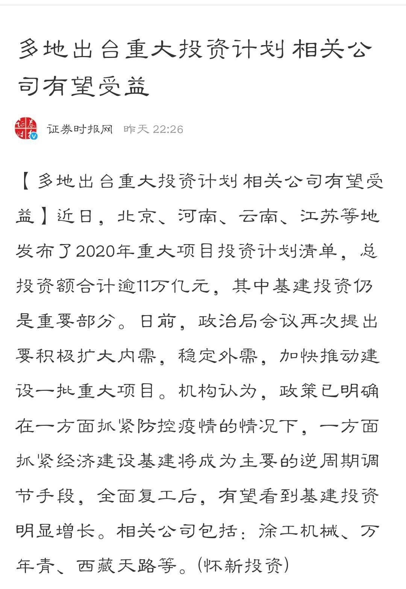

======================================================

_type: talk
@冉冉[88445118854412]
2020-02-28 19:57:57 Fri  
topic_id: 118554884522812

二师傅，近期市场严重变化，今天能不能增发一次估值表？谢谢师傅！

@二师父 at 2020-02-28 19:57:57 Fri

> 好的

----------

@冉冉 at 2020-02-28 19:57:57 Fri

> 谢谢，辛苦师傅啦

----------

阅读[1638]  评论[2]  赞[0] 

======================================================

_type: talk
@二师父[28814221155551]
2020-02-28 19:58:08 Fri  
topic_id: 421885115848148

<e type="hashtag" hid="141254552242" title="#纳斯达克#" /> 场内纳斯达克指数还是规模有限，投资之前尽量多方考证，别买错了标的

@银河系 at 2020-02-28 19:58:08 Fri

> 基金规模这个图是用什么软件或网站看的啊？

----------

@Snow at 2020-02-28 19:58:08 Fri

> 纳斯达克还没到低估呢，耐心等待

----------

@二师父 at 2020-02-28 19:58:08 Fri

> 基金官网

----------

@二师父 at 2020-02-28 19:58:08 Fri

> 等一季度数据吧，可以小额先溢价套利

----------

阅读[1813]  评论[6]  赞[0] 

+++++++++++++++++++++++++++++++++++++++++++++++++++++

图片：
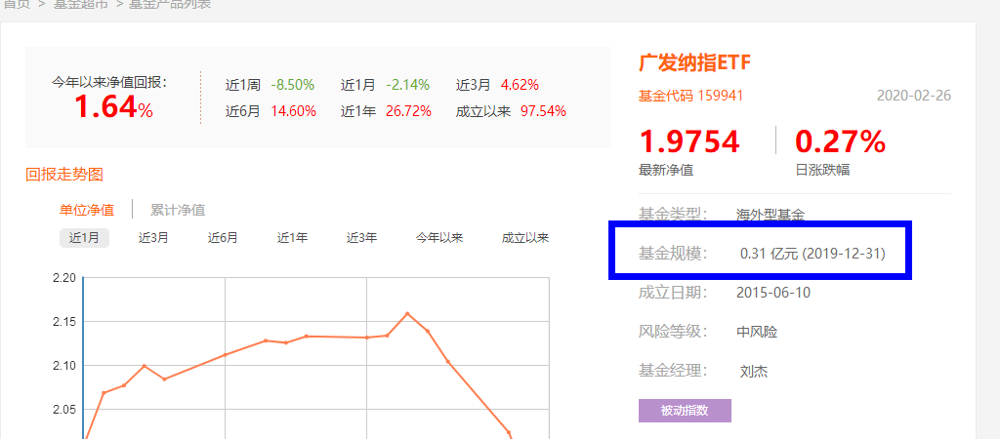

======================================================

_type: talk
@二师父[28814221155551]
2020-02-28 20:04:13 Fri  
topic_id: 421885115888128

今天市场波动较大，今晚再补发一次估值表，一会见

@秦风殇韵（刘豫斌） at 2020-02-28 20:04:13 Fri

> 好大一颗定心丸

----------

@夏萍 at 2020-02-28 20:04:13 Fri

> 就等他[呲牙]

----------

@范毅君 at 2020-02-28 20:04:13 Fri

> 等你[偷笑]

----------

@背心 at 2020-02-28 20:04:13 Fri

> 期待，辛苦了，二师傅

----------

阅读[1898]  评论[4]  赞[0] 

======================================================

_type: q&a
@黎雄[841555255485222]
2020-02-28 20:16:34 Fri  
topic_id: 548115885521184

@黎雄

>  师傅美股跌了这么多，场内有指数基金可以定投了嘛

@二师父

>  但是仍旧估值高位，可以关注纳斯达克，中概互联，标普500，工银中国机会全球

阅读[1905]  评论[1]  赞[0] 

======================================================

_type: talk
@二师父[28814221155551]
2020-02-28 21:06:38 Fri  
topic_id: 421885115148258

<e type="hashtag" hid="481211145528" title="#指数估值#" /> 又有一些指数进入低估区域了，消费再跌跌也会进入低估，场外如果不能投白酒，过段时间选择汇添富消费也是可以的。

@海马 at 2020-02-28 21:06:38 Fri

> 师父，ROE越高投资价值越高

----------

@奋斗 at 2020-02-28 21:06:38 Fri

> 老师你太善解人意了，为你的辛勤付出点赞，今天股市暴跌，引来了好多投资者恐慌的问题，还有给打鸡血的股民们一盆冷水，还有个问题就是现在都说各个周期康波周期，基钦周期，朱格拉周期，都在上升周期，包括周金涛老师预测说现在是黄金时段，如果下半年各个指数都到高估，我们还需要卖本金吗？还有就是我们没有老师的本金多，定投的时间短，本身成本不算太有优势，这样我们应该注意什么问题，还有本金不多的应该投入几个基金，比如5万，10万20万30万，大体投入几个基金，如果投资过于分散，收益也不是太好，老师的投资理念非常认同，看老师的投资理念快一年了，但是看着很明白，有时候行动起来就欠缺很多，望老师多多指点。

----------

@栀子花开 at 2020-02-28 21:06:38 Fri

> 二师傅，易方达消费行业和汇添富消费混合二选一的话，您选哪个？[呲牙]

----------

阅读[1861]  评论[3]  赞[0] 

+++++++++++++++++++++++++++++++++++++++++++++++++++++

图片：

======================================================

_type: talk
@二师父[28814221155551]
2020-02-28 21:43:49 Fri  
topic_id: 841882114881582

<e type="hashtag" hid="281122421221" title="#提问#" /> 老师你太善解人意了，为你的辛勤付出点赞，今天股市暴跌，引来了好多投资者恐慌的问题，还有给打鸡血的股民们一盆冷水，还有个问题就是现在都说各个周期康波周期，基钦周期，朱格拉周期，都在上升周期，包括周金涛老师预测说现在是黄金时段，如果下半年各个指数都到高估，我们还需要卖本金吗？还有就是我们没有老师的本金多，定投的时间短，本身成本不算太有优势，这样我们应该注意什么问题，还有本金不多的应该投入几个基金，比如5万，10万20万30万，大体投入几个基金，如果投资过于分散，收益也不是太好，老师的投资理念非常认同，看老师的投资理念快一年了，但是看着很明白，有时候行动起来就欠缺很多，望老师多多指点。

高估的指数都是需要卖的，美股虽然涨了10年，不过是业绩增长，如果估值过高，都是需要卖出的。

如果资金太少了，可以少投资几只，最基本的中证100+创业板+白酒+医药+金融+债券都是必须配置的，把这几个配置好也能够取得不错的收益率。

关键是克制贪婪，该买入就买入，该卖出过段卖出。

阅读[1795]  评论[0]  赞[0] 

======================================================

_type: talk
@斌斌[841821552258252]
2020-02-28 23:02:41 Fri  
topic_id: 421882444251458

深红利可以投了，请问师父场内场外有无压别？

@斌斌 at 2020-02-28 23:02:41 Fri

> 区别

----------

@二师父 at 2020-02-28 23:02:41 Fri

> 就是费率和成交时间的区别

----------

阅读[1478]  评论[2]  赞[0] 

======================================================

_type: talk
@一筐石头[88281282515822]
2020-02-28 23:54:12 Fri  
topic_id: 118551225511452

515700新能车可以买吗？

@二师父 at 2020-02-28 23:54:12 Fri

> 还没低估，只能小额资金参与

----------

阅读[1407]  评论[1]  赞[0] 

======================================================

_type: talk
@二师父[28814221155551]
2020-02-29 06:17:27 Sat  
topic_id: 118551224222182

美股三大期指全线走低，道指期货跌0.85%，标普500指数期货跌0.98%，纳斯达克100指数期货跌1.11%

@秦岭云横 at 2020-02-29 06:17:27 Sat

> 算止跌了吗？

----------

阅读[1402]  评论[1]  赞[0] 

======================================================

_type: talk
@二师父[28814221155551]
2020-02-29 06:28:51 Sat  
topic_id: 241884552552521

未来汽车产业的核心价值将不再是发动机、车身、底盘，而是电池、芯片、车载系统、数据。做蛋糕可能是传统车企，而吃蛋糕的可能是新势力。全球最大的车企大众宣布，将成为一家软件驱动的公司，并设立了“Digital Car&Service”部门，大力推动数字化转型。丰田公司宣布，丰田将从汽车公司转型为移动出行公司，他们的竞争对手已经不是曾经的奔驰、宝马和大众，而是苹果、谷歌等。谷歌、高通、英伟达、华为、阿里、百度等巨头已通过合作、授权或供应商等身份等嵌入智能驾驶细分环节，未来可能占据行业重要的价值点。部分无法掌握核心技术的车企只能逐渐被边缘化，甚至沦为代工厂。

如果说新能源汽车是产业链终端，那么零器件半导体和人工智能相关的电子器件就是始端，没有这两个新能源汽车没法发展

而目前半导体的问题在于被资金炒的太高，里面还有部分辣鸡公司比如长电科技

阅读[1500]  评论[0]  赞[0] 

======================================================

_type: talk
@007[51511545424824]
2020-02-29 08:33:26 Sat  
topic_id: 548114225521554

华宝油气基本面出没出问题？如果没有继续持有如果变差我就出货，请二师傅解答一下

阅读[1239]  评论[0]  赞[0] 

======================================================

_type: talk
@二师父[28814221155551]
2020-02-29 09:18:52 Sat  
topic_id: 118551224414812

<e type="hashtag" hid="281854444451" title="#读者提问#" /> 华宝油气基本面出没出问题？如果没有继续持有如果变差我就出货，请二师傅解答一下

油气的重仓股票是Whiti、WPX E、阿帕奇石油、EQT C、卡隆石油	、兰奇资源、
西南能源、Parsl、康休	

基本都是石油和天然气公司,基本面恶化比较严重，最近受到美股下跌和原油下跌的双重冲击，跌的比较多。

@ajingge at 2020-02-29 09:18:52 Sat

> 二师父是不是会继续持有？

----------

@二师父 at 2020-02-29 09:18:52 Sat

> 继续持有，价位到0.4逐步卖了，如果指数不调仓，这个指数价值很低了

----------

@ajingge at 2020-02-29 09:18:52 Sat

> OK，感谢二师父

----------

阅读[1347]  评论[3]  赞[0] 

======================================================

_type: talk
@二师父[28814221155551]
2020-02-29 09:23:12 Sat  
topic_id: 548114228124444

<e type="hashtag" hid="145458855482" title="#周五读书#" />

阅读[2542]  评论[0]  赞[0] 

+++++++++++++++++++++++++++++++++++++++++++++++++++++

文件：
2020-02-29 09:23:06 Sat
文件大小：[18190]
88221544455242-解读基金第3讲.docx

2020-02-29 09:23:10 Sat
文件大小：[5542967]
51558244422544-解读基金第三讲.m4a

======================================================

_type: q&a
@姥姥不疼. 爷爷不爱[48544481458248]
2020-02-29 09:33:19 Sat  
topic_id: 241884551854151

@姥姥不疼. 爷爷不爱

>  那华宝油气现在可以少量入手定投或网格么，谢谢您了

@二师父

>  不用碰这个品种了，场外限购，场内有溢价，买入本来就比净值高很多，网格适合波动大的，他下跌比较大，波动不大。

阅读[1343]  评论[0]  赞[0] 

======================================================

_type: q&a
@随便[422182212118548]
2020-02-29 09:36:13 Sat  
topic_id: 841882114842852

@随便

>  二师父，看了今天的华宝油气又跌了百分之6（算上今天我已经亏损百分之40），目前看场外限购或者暂停申购怕是会常态，能否考虑进行场内投资，看过你之前的留言溢价（10%了）太高不建议买。

@二师父

>  溢价高不适合，如果场外放开申购可以套利，10个点利差

阅读[1361]  评论[2]  赞[0] 

======================================================

_type: q&a
@范*[841855284221812]
2020-02-29 09:37:44 Sat  
topic_id: 241882112418141

@范*

>  二师父，第三个ETF是什么？和咱们得基建工程是一个类型吗？

@二师父

>  房地产公司和基建公司有区别
>  
>  房地产公司主要是恒大，万科这些
>  
>  基建工程公司主要是葛洲坝，中国建筑集团这些

阅读[1475]  评论[0]  赞[0] 

======================================================

_type: talk
@树叶[544811512145144]
2020-02-29 10:15:58 Sat  
topic_id: 841884551221582

<e type="hashtag" hid="142825811122" title="#定投周报#" /> 二师父定投周报第48期

阅读[1522]  评论[0]  赞[0] 

+++++++++++++++++++++++++++++++++++++++++++++++++++++

文件：
2020-02-29 10:15:56 Sat
文件大小：[247820]
51558244415144-二师父定投周报2.29（第48期）.docx

======================================================

_type: talk
@二师父[28814221155551]
2020-02-29 10:36:17 Sat  
topic_id: 118551228481882

<e type="hashtag" hid="281854444451" title="#读者提问#" /> 可以分析下半导体和半导体50指数的投资价值吗

半导体追踪的是中证全指半导体，成分股32只，半导体追踪的是中华半导体，成分股50只。

二者成分股差别不大，中证半导体的重仓股票分别是，兆易创新、汇顶科技、北方华创、长电科技、华天科技、纳思达，半导体这个指数的重仓股票是兆易创新、汇顶科技、北方华创、韦尔股份、长电科技、华天科技、中环股份

半导体指数持仓更加集中，表现也更好，今年以来半导体指数涨了42%，而半导体50只涨了25%。

阅读[1313]  评论[0]  赞[0] 

======================================================

_type: talk
@二师父[28814221155551]
2020-02-29 10:39:47 Sat  
topic_id: 841884551455182

因为软件原因有的问题在电脑网页端没有显示，所以我把问题放到网页端回答，大家自行查阅，一般提问在24小时以内都会回答，如果没有回答就是没看到，如果我不会的我也会告诉你一声，不会装作看不到，知道就知道，不知道就不知道，没什么大不了的。

阅读[1336]  评论[0]  赞[0] 

+++++++++++++++++++++++++++++++++++++++++++++++++++++

图片：
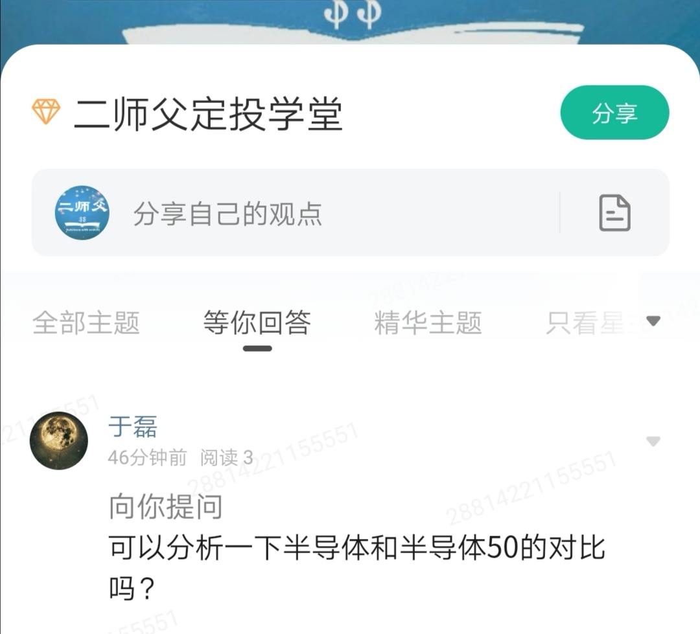

======================================================

_type: talk
@二师父[28814221155551]
2020-02-29 11:09:43 Sat  
topic_id: 421882441141418

<e type="hashtag" hid="281854444451" title="#读者提问#" /> 二师父你好！买场内基金除了看估值和溢价之外还需要注意什么？估值不会看，不知道多少就是低估了；溢价是不是只要低于净值就能买？还有一个问题：估值是每天在变动吗？

买基金根据估值来就好，这个可以参考估值表，估值每天都会变化，如果没有大幅度的上涨或者下跌，一两天时间很难从正常估值到达低估值。

溢价看价格和净值之间的关系，当价格高于净值溢价，如果指数极度低估，有个1%的溢价也能接受，可是类似华宝油气和纳斯达克，溢价10%以上肯定要避免，宁可不买，或者买场外的，也不要场内购买

@美美 at 2020-02-29 11:09:43 Sat

> 谢谢二师父

----------

@姥姥不疼. 爷爷不爱 at 2020-02-29 11:09:43 Sat

> 二师父能具体讲下价格、净值么，价格和净值在场内指数哪里看[微笑][微笑]

----------

@二师父 at 2020-02-29 11:09:43 Sat

> 这个在万得APP，在我的指数基金定投入门与实战课程中有详细的语音和文字讲解，可以看一看

----------

@冯林锋 at 2020-02-29 11:09:43 Sat

> 纳达克斯在哪家券买，可以由场外转到场内交易

----------

@二师父 at 2020-02-29 11:09:43 Sat

> 华泰可以

----------

@冯林锋 at 2020-02-29 11:09:43 Sat

> 是513100吗？刚才.看了场外买不了513100

----------

阅读[2187]  评论[6]  赞[0] 

======================================================

_type: talk
@栀子花开[118248824481842]
2020-02-29 11:37:41 Sat  
topic_id: 421882484484158

二师傅，估值表能否增加香港中小啊?H股的银行地产成分太高了，想换成香港中小。

@二师父 at 2020-02-29 11:37:41 Sat

> 香港中小之前评估是没有恒生价值大，可以选择恒生

----------

阅读[1079]  评论[1]  赞[0] 

======================================================

_type: talk
@最好的时光[241184554128151]
2020-02-29 15:34:57 Sat  
topic_id: 548114211515184

师父，我自己买了点基金，乱七八糟的，也不知道该买什么啦！下个月计划定投4000元，都买什么啊，请老师指点

阅读[869]  评论[0]  赞[0] 

======================================================

_type: talk
@二师父[28814221155551]
2020-02-29 15:35:44 Sat  
topic_id: 421882488585258

<e type="hashtag" hid="281854444451" title="#读者提问#" /> 二师父，问一个关于场外转场内的问题。
如华宝油气，有A和C，其中A的代码和场内一样。是不是说只有买A才可以转场内？
还有广发纳指ETF，场外的基金代码没有一个和场内相同的，是不是买了广发场外纳指，就不可以转场内进行套利？
LOF基金场外都有一样的代码，是不是只有LOF并且一样的代码才可以转场内？ETF不能转场内？

二师父解答，去场内证券账户搜索相关的代码，保证场外和场内代码一样就好

广发的也能够申购的，不过目前还没有开售，代码和场内的广发纳斯达克一样，如下图。

@范* at 2020-02-29 15:35:44 Sat

> 我查到了，华泰有场外的。天天基金没有。我用的是天天基金

----------

@shi at 2020-02-29 15:35:44 Sat

> 蛋卷买的华宝油气，在哪儿能转成场内？

----------

@二师父 at 2020-02-29 15:35:44 Sat

> 这个没法转

----------

阅读[1932]  评论[3]  赞[0] 

+++++++++++++++++++++++++++++++++++++++++++++++++++++

图片：
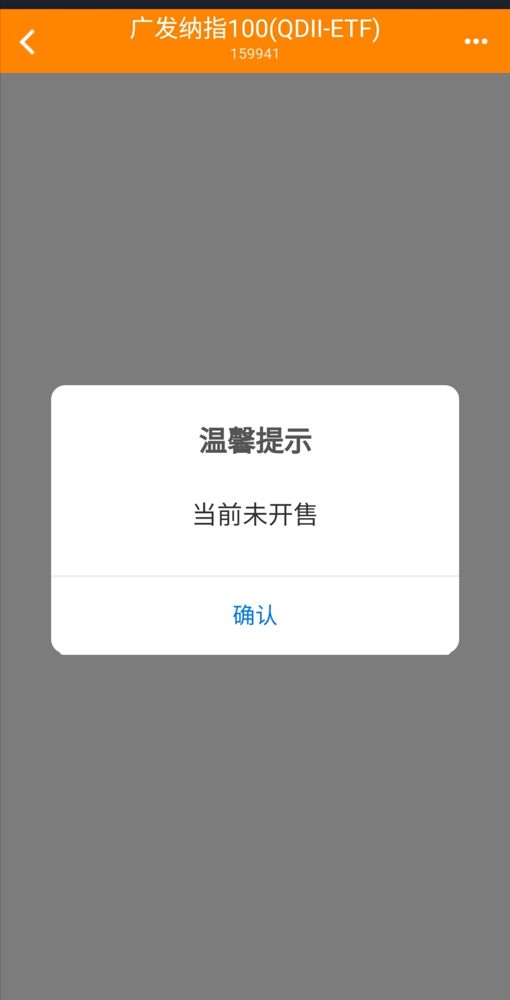

======================================================

_type: talk
@二师父[28814221155551]
2020-02-29 15:38:03 Sat  
topic_id: 548114211518224

<e type="hashtag" hid="281854444451" title="#读者提问#" /> 师父，我自己买了点基金，乱七八糟的，也不知道该买什么啦！下个月计划定投4000元，都买什么啊，请老师指点

二师父定投，新手如果不知道怎么配置可以参考置顶文章的组合，里面有四个组合。

刚开始定投可以选择沪深300+中证500组合。

如果慢慢学习深入就可以选择50AH+深红利+中证500+创业板组合，在配置一些债券，可以是可转债基金，也可以是混合债，也可以是纯债。

最后慢慢投资行业指数，白酒、消费、金融、医药、科技等等。

@最好的时光 at 2020-02-29 15:38:03 Sat

> 好的，谢谢

----------

阅读[1977]  评论[1]  赞[0] 

======================================================

_type: talk
@二师父[28814221155551]
2020-02-29 15:44:37 Sat  
topic_id: 118551255481812

<e type="hashtag" hid="281854444451" title="#读者提问#" /> 老师好！前段时间在蛋卷基金上少量定投了国富中证500指数增强（LOF）两期1200和天弘中证银行指数 A两期600，另外还定投了银行螺丝钉组合7200和钉钉宝365组合10000。前两天买了鹏华产业债债券和招商双债增强债券各10000，昨天进去知识星球学习，感觉自己是胡乱冲进去的。请师傅帮我把关下，那些可以继续投，那些需要快出

二师父回答。增强的基金建议换成纯被动的基金，这两个基金低估定投的，可以拿着盈利慢慢卖就行。如果跟投组合的话就选择一个你信任而且认同其投资理念的人跟投即可

鹏华产业债和招商双债增强债券属于防守的债券基金，适合在利率下行配置的。这些都不用着急取出，等有了持有就好，就是股权品种要记得止盈

@云卷云舒 at 2020-02-29 15:44:37 Sat

> 组合比较省心，当然我信任师父您，您的组合在哪里找，我要调整过来。

----------

阅读[2033]  评论[1]  赞[0] 

======================================================

_type: talk
@二师父[28814221155551]
2020-02-29 15:52:34 Sat  
topic_id: 548114211425484

<e type="hashtag" hid="281854444451" title="#读者提问#" /> 二师父，我刚才试了华泰，在场外买不了513100，是我操作有误吗？

外汇额度不够有时候会限制申购，等放开了就可以

@夏萍 at 2020-02-29 15:52:34 Sat

> 华泰不是场内吗？还有场外的？

----------

阅读[1043]  评论[1]  赞[0] 

======================================================

_type: talk
@二师父[28814221155551]
2020-02-29 17:11:12 Sat  
topic_id: 548114214458884

有网友在雪球给我发来私信：“我看到了十几年的经历，忍不住在这给你个私信，我读了你的文章我很欣赏你，你肯定是一个有原则的人，并且智商也是相当高。我炒股十几年，2006年大学参加工作，我1982年出生的。2008年开始进入股市，只是萌芽，2015年的牛市我亏掉了200万本金，2018年买港股融创融资，结果融创跌到19元爆仓n次，亏掉150万本金，之后回a股到现在亏掉本金36万。这么多年我雄心壮志，断断续续炒股亏掉了我几百万本金。我是学药学的，我毕业之后做了临床代表，医药生意使我变成了富人，但是股票让我变成了一般人，我不是专职，我底下有一家医疗器械公司和一家生产灌溉设备的工厂，我也是总梦想能在股市挣一个小目标，可是真的很难很难办到，我很欣赏你的，觉得你是一个很实在的好人，我想和你交朋友。”

不贪婪就不会出大事，慢慢致富

@秦岭云横 at 2020-02-29 17:11:12 Sat

> 🐮市咋亏？

----------

@二师父 at 2020-02-29 17:11:12 Sat

> 高位接盘

----------

@秦岭云横 at 2020-02-29 17:11:12 Sat

> 噢。

----------

阅读[1076]  评论[3]  赞[0] 

======================================================

_type: talk
@二师父[28814221155551]
2020-02-29 17:36:46 Sat  
topic_id: 421882482145518

<e type="hashtag" hid="141254148122" title="#核心配置#" /> 基金投资过程中的核心配置，把主流配置做好就行

@速。冻 at 2020-02-29 17:36:46 Sat

> 各类基金配备比例有没有个大概？

----------

阅读[2518]  评论[1]  赞[0] 

+++++++++++++++++++++++++++++++++++++++++++++++++++++

文件：
2020-02-29 17:36:21 Sat
文件大小：[18385]
51558282282444-在投资过程中，哪些基金是核心配置.docx

======================================================

_type: talk
@二师父[28814221155551]
2020-02-29 18:05:44 Sat  
topic_id: 118551258228282

<e type="hashtag" hid="281854444451" title="#读者提问#" /> 师父，计算机，人工智能，和5G，哪一个投资价值更高？我看了计算机的持仓和人工智能有不少重复的，只是比例不同

回复：人工智能和计算机的投资价值高一些

他俩的前10大持仓也有5只是重合的，这个在表格中的黄色有显示的，优选人工智能配置，这个是未来科技的大方向，智能汽车、智能驾驶，无人机，机器服务员都涉及人工智能，其次是计算机和5G，5G的话属于基础设施建设，有周期性，未来6G来了5G就不行了，比如15年牛市的时候环保和传媒表现好，现在就不行了，

投资不能只看过去。你看曾经的诺基亚、HTC都慢慢退出了市场。

@老妖 at 2020-02-29 18:05:44 Sat

> 谢谢师父

----------

阅读[2380]  评论[1]  赞[0] 

+++++++++++++++++++++++++++++++++++++++++++++++++++++

图片：
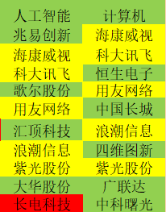

======================================================

_type: talk
@二师父[28814221155551]
2020-02-29 18:08:52 Sat  
topic_id: 548114218212444

<e type="hashtag" hid="281854444451" title="#读者提问#" />二师傅 你好 纯债和超短债基金 有亏损本金的风险吗

债券基金不是保本的，债券基金有利率风险和违约风险，炒短债基金风险低，适合打理短期资金，但是收益率低，纯债基金波动比短债基金高一些，收益率也高一些。

债券基金适合在利率下行的时候配置对冲风险。

阅读[2395]  评论[0]  赞[0] 

======================================================

_type: talk
@二师父[28814221155551]
2020-02-29 18:11:18 Sat  
topic_id: 841884581588282

<e type="hashtag" hid="281854444451" title="#读者提问#" /> 各类基金配备比例有没有个大概？

回答：这个可以参考置顶文章四个组合配置，优质的宽基和行业指数比例要低于20%，波动较大的指数要控制在15%，请周期指数要控制在10%，极端强周期指数商品原油，要控制在5%

阅读[1189]  评论[0]  赞[0] 

======================================================

_type: talk
@二师父[28814221155551]
2020-02-29 18:12:53 Sat  
topic_id: 421882481485558

<e type="hashtag" hid="281854444451" title="#读者提问#" /> 组合比较省心，当然我信任师父您，您的组合在哪里找，我要调整过来。

我的组合可以看置顶文章，也可以在天天基金搜索乌龟计划，有实盘

鳄鱼计划持仓在星球已经公布

可以大致参考，但是目前已经高估的指数是之前配置的，就不要在此刻买入了。

阅读[1213]  评论[0]  赞[0] 

======================================================

_type: talk
@二师父[28814221155551]
2020-02-29 18:15:09 Sat  
topic_id: 841884581584552

<e type="hashtag" hid="281854444451" title="#读者提问#" /> 师傅，你说的那些核心配置的基金哪些适合在场内买那些适合在场外买？我就看了之前说白酒场外只有一支分级的，所以在场内买，其他的呢？

基本能够场内买的，在场外都可以购买。

场内购买需要避免溢价、规模低，流动性差、分级基金。

场外购买需要避免规模低、分级基金

如果避免上述问题，场内或者场外买都没有问题的。

阅读[1238]  评论[0]  赞[0] 

======================================================

_type: q&a
@田维海[422144441542418]
2020-02-29 20:37:32 Sat  
topic_id: 241884581125151

@田维海

>  二师父，基金的持有单价是所有买入金额加总后除以所有买入份额吗？

@二师父

>  是的

阅读[1093]  评论[1]  赞[0] 

======================================================

_type: talk
@秦岭云横[88884245415542]
2020-02-29 20:53:11 Sat  
topic_id: 118551242212822

<e type="hashtag" hid="281854444451" title="#读者提问#" /> 前三个ETF有啥区别，哪个好点

@闪闪的星光 at 2020-02-29 20:53:11 Sat

> 请问，置顶文章是哪一篇里，有四个组合啊，没有找到，不好意思啊。

----------

@秦岭云横 at 2020-02-29 20:53:11 Sat

> 啥意思

----------

@Pansy at 2020-02-29 20:53:11 Sat

> 你问问师父是这4个组合吗？如果是这4个组合，好像公众号里有。

----------

@闪闪的星光 at 2020-02-29 20:53:11 Sat

> 谢谢

----------

@Pansy at 2020-02-29 20:53:11 Sat

> 点开第一个，就是这个组合

----------

@闪闪的星光 at 2020-02-29 20:53:11 Sat

> 好的，谢了

----------

@Pansy at 2020-02-29 20:53:11 Sat

> 这个是你提问的问题，师父还没有回答

----------

阅读[1065]  评论[7]  赞[0] 

+++++++++++++++++++++++++++++++++++++++++++++++++++++

图片：

======================================================

