_type: q&a
@进等花开[118525141245142]
2020-03-01 15:37:09 Sun  
topic_id: 118215182221182

@进等花开

>  二师父，之前买了161720，券商分级指数，这个要尽快卖掉吗？

@二师父

>  盈利可以处理掉

阅读[245]  评论[0]  赞[0] 

======================================================

_type: q&a
@闫军平[422125415521418]
2020-03-01 15:37:25 Sun  
topic_id: 118215411225212

@闫军平

>  请问二师父，为什么把招商全指证券换成南方全指证券？

@二师父

>  换成纯被动的非分级基金

阅读[237]  评论[0]  赞[0] 

======================================================

_type: q&a
@瓦尔登湖畔的老牛[48222221811548]
2020-03-01 15:38:25 Sun  
topic_id: 841548222882142

@瓦尔登湖畔的老牛

>  二师父，请问诺安研究精选股票320022，这支基金目前估值如何？现在能买吗？谢谢🙏🏼

@二师父

>  持仓分散的主动基金没法估值，只能够跟着基金经理混了

阅读[259]  评论[0]  赞[0] 

======================================================

_type: q&a
@瓦尔登湖畔的老牛[48222221811548]
2020-03-01 15:41:53 Sun  
topic_id: 841548222882242

@瓦尔登湖畔的老牛

>  二师父，请问鹏华新兴产业混合206009这支基金目前估值如何？能买吗？谢谢🙏🏼

@二师父

>  持仓分散的主动基金没法用传统的估值方法，只能跟基金经理混

阅读[250]  评论[0]  赞[0] 

======================================================

_type: q&a
@向前进[118554515482152]
2020-03-01 15:42:15 Sun  
topic_id: 421428581424118

@向前进

>  二师父，能帮忙看下510550 方正500，这个指数目前是否高估，谢谢

@二师父

>  没有高估

阅读[254]  评论[0]  赞[0] 

======================================================

_type: q&a
@云云[118525244841512]
2020-03-01 15:42:30 Sun  
topic_id: 841548285245582

@云云

>  二师父，天天基金一键跟投没有了吗？

@二师父

>  有的

阅读[238]  评论[0]  赞[0] 

======================================================

_type: q&a
@速。冻[51415484228284]
2020-03-01 15:42:46 Sun  
topic_id: 421428544444128

@速。冻

>  二师父，5G etf515050可以定投吗？怎么参考估值高低？

@二师父

>  估值表有这个基金的估值，成长类指数估值看PEG

阅读[312]  评论[0]  赞[0] 

======================================================

_type: q&a
@学以致用[244415184181451]
2020-03-01 15:43:04 Sun  
topic_id: 841548845458412

@学以致用

>  二师傅，在如今港股通开通的情况下，50AH这个策略会失效吗？

@二师父

>  如果折溢没有了可能失效

阅读[233]  评论[0]  赞[0] 

======================================================

_type: q&a
@J[28281541518551]
2020-03-01 15:43:25 Sun  
topic_id: 118215541454252

@J

>  接上一条，刚才忘了写中概互联，目前盈利15%，请师父点评

@二师父

>  挺不错的，记得到了止盈点要止盈

阅读[247]  评论[0]  赞[0] 

======================================================

_type: q&a
@程宏峰[841542244241282]
2020-03-01 15:43:42 Sun  
topic_id: 118215544254522

@程宏峰

>  现在根据天天基金上的实盘建底仓合适吗，几成合适？

@二师父

>  如果持仓是高估的不适合，3层到4层没有问题

阅读[252]  评论[0]  赞[0] 

======================================================

_type: q&a
@王斌[48585418541828]
2020-03-01 15:44:45 Sun  
topic_id: 548241115441554

@王斌

>  二师父，听您课程中介绍的90日均线定投策略(在均线下择时购买，如何后每周四定投的区分开好呢？)另外一般您总什么软件工具进行识别均线呢？是不是表内的绿色低估都适用这个策略呢？

@二师父

>  是的，低估的指数都适合这个策略，我用的华泰证券看的

阅读[258]  评论[0]  赞[0] 

======================================================

_type: q&a
@龘何亮龘[28814214225141]
2020-03-01 15:45:36 Sun  
topic_id: 118212454254442

@龘何亮龘

>  二师父，我知道让您推荐股票不太合适，我想买一万元的股票持有20天以上，达到打新股票的资格，但是我对股票一点研究也没有，您能帮忙找个长期持有的股票吗？

@二师父

>  虽然我知道有好股票，但是真的不推，这是我的原则，不荐股，不加杠杆，不代人理财，原则不能违背，我可以帮你分析企业基本面

阅读[228]  评论[1]  赞[0] 

======================================================

_type: q&a
@瓦尔登湖畔的老牛[48222221811548]
2020-03-01 15:46:05 Sun  
topic_id: 421424541414158

@瓦尔登湖畔的老牛

>  二师父，请问易方达沪深300ETF联接A(110020)和富国沪深300指数增强（100038）二只基金目前选择哪只持仓会更好？为什么这样选呢？谢谢🙏🏼

@二师父

>  选择沪深300ETF连接，费率低，追踪效果好。

阅读[280]  评论[0]  赞[0] 

======================================================

_type: q&a
@向前进[118554515482152]
2020-03-01 15:46:43 Sun  
topic_id: 241545814485481

@向前进

>  请教二师父，在招商银行app里发现一个理财产品，周周发二点零理财，年化5.42%，5万起购，90天之内赎回0.1%费率，说明里是R2较低风险，这个是否适合作为防守账户资金，谢谢

@二师父

>  银行的理财产品还是很靠谱的，就是流动性弱一点，如果能接受弱流动性就可以

阅读[265]  评论[0]  赞[0] 

======================================================

_type: q&a
@孤芳自赏[548114442211184]
2020-03-01 15:48:39 Sun  
topic_id: 841521411548142

@孤芳自赏

>  请问理杏仁选股的时候搜索毛利率两个字时会出现两个选项：一个利润表毛利率，一个财务指标毛利率，两者有区别吗？还是同一个数值？

@二师父

>  都是（营业收入——营业成本）/营业收入

阅读[242]  评论[0]  赞[0] 

======================================================

_type: q&a
@Dr. 邓[844185218554482]
2020-03-01 15:48:59 Sun  
topic_id: 841521415888412

@Dr. 邓

>  二师傅，您好，好久不见！今天又拜读了一遍你的五步定投法，我只会买，不想卖，老是坐电梯，我是理想主义者，一直看好中国的发展，认为一万点都不是梦，但事实上A股有些不同步！我也认可你的利润收割法，你是建议低估定投，我想问一下现在沪深300，中正100，深红利等，看长些，现在继续定投也可以吗？谢谢！

@二师父

>  适合的，长期看都是稳步增长的

阅读[240]  评论[0]  赞[0] 

======================================================

_type: q&a
@妖孽[544888148518184]
2020-03-01 15:49:10 Sun  
topic_id: 421451858211288

@妖孽

>  请问二师父，您的投资理念体系，平均年化收益率在多少左右？

@二师父

>  场外10——15，场内20

阅读[246]  评论[0]  赞[0] 

======================================================

_type: q&a
@小杰杰[241882488554541]
2020-03-01 15:49:20 Sun  
topic_id: 841521852248482

@小杰杰

>  请问二师父，低估定投，您的正常估值区间，上下界限分别是取得多少百分位。

@二师父

>  不是根据百分位估值的

阅读[253]  评论[0]  赞[0] 

======================================================

_type: q&a
@潜龙[244145114188851]
2020-03-01 15:49:39 Sun  
topic_id: 841524188244882

@潜龙

>  二师父，如果我想在场内购买可转债要注意些什么，怎么买比较好

@二师父

>  买价格低于100的，溢价率低的

阅读[246]  评论[0]  赞[0] 

======================================================

_type: q&a
@瓦尔登湖畔的老牛[48222221811548]
2020-03-01 15:49:50 Sun  
topic_id: 241521852844511

@瓦尔登湖畔的老牛

>  师父，目前标普价值指数低估，请问有哪些相关基金可进入？谢谢🙏🏼

@二师父

>  这个指数很一般

阅读[272]  评论[0]  赞[0] 

======================================================

_type: q&a
@孤芳自赏[548114442211184]
2020-03-01 15:53:36 Sun  
topic_id: 241524154524851

@孤芳自赏

>  请问兰州黄河最近都近涨少跌多，值不值得继续持有呢？

@二师父

>  基本面严重恶化，遇到了较大经营问题

阅读[245]  评论[0]  赞[0] 

======================================================

_type: q&a
@随缘[421881458454148]
2020-03-01 15:53:42 Sun  
topic_id: 548254244188484

@随缘

>  二师傅您好！我是一个刚刚接触投资理财的小白，请问天弘中证银行指数A现在适合定投吗？

@二师父

>  适合

阅读[257]  评论[0]  赞[0] 

======================================================

_type: q&a
@一二三[88484821115182]
2020-03-01 15:54:07 Sun  
topic_id: 241524581225411

@一二三

>  二师父，我看了下五步定投，想问下那个低估阈值是怎么算出来的？还有低估和高估是只需要市盈率和低估阈值的比较吗？

@二师父

>  市盈率和市净率进行比较，这个模型我是简化了的

阅读[251]  评论[0]  赞[0] 

======================================================

_type: q&a
@tanxin[241524428884281]
2020-03-01 15:54:34 Sun  
topic_id: 241581285448421

@tanxin

>  二师父，请问股票的课程再哪里购买？

@二师父

>  在置顶文章有优惠券，学习财务报表才能够评估企业价值

阅读[253]  评论[0]  赞[0] 

======================================================

_type: q&a
@🍀 凝🌸 慧🍀[841855248254242]
2020-03-01 15:55:00 Sun  
topic_id: 548218158451544

@🍀 凝🌸 慧🍀

>  二师父好，近期文中提到“沪深300医药目前市盈率35倍，历史最高市盈率72倍，历史最低市盈率17倍。当前沪深300医药市盈率历史百分位73%。” 我不明白这个73%的历史百分位是咋算出来的？

@二师父

>  百分位是根据RANK函数计算的

阅读[265]  评论[0]  赞[0] 

======================================================

_type: q&a
@学以致用[244415184181451]
2020-03-01 15:55:30 Sun  
topic_id: 241581825424441

@学以致用

>  二师父，请问一下沪深300非银行金融指数跟沪深300有什么区别？

@二师父

>  非银行金融就是排除银行以后的保险、券商、地产等股票构成的指数

阅读[260]  评论[3]  赞[0] 

======================================================

_type: q&a
@向前进[118554515482152]
2020-03-01 15:55:49 Sun  
topic_id: 118251821281822

@向前进

>  二师父，我10月15号开通了天天和华泰，关于佣金现在还没有客户经理联系我，我要联系他们吗，谢谢

@二师父

>  给他打电话

阅读[288]  评论[0]  赞[0] 

======================================================

_type: q&a
@范*[841855284221812]
2020-03-01 15:56:26 Sun  
topic_id: 421485811144818

@范*

>  二师傅，华宝油气，我定投了总资金的10%了。有没有必要加大仓位，这个基金最好应该占到多少总资金仓位。目前成本0.34元

@二师父

>  这个别重仓，最多3%，不能再多了

阅读[326]  评论[0]  赞[0] 

======================================================

_type: q&a
@黎雄[841555255485222]
2020-03-01 15:56:36 Sun  
topic_id: 421485881124128

@黎雄

>  师傅那几只指数基金涨跌受贸易战影响较大

@二师父

>  影响都挺大的

阅读[263]  评论[0]  赞[0] 

======================================================

_type: q&a
@小糊涂[51441514412544]
2020-03-01 15:56:49 Sun  
topic_id: 421484252824128

@小糊涂

>  ETF比如地产ETF，银行ETF对标股票股息高，但ETF本身 是没有股息的吧！

@二师父

>  股票分红

阅读[272]  评论[0]  赞[0] 

======================================================

_type: q&a
@Candice[28258422885541]
2020-03-01 15:57:09 Sun  
topic_id: 241582885884151

@Candice

>  有很多明星基金经理的基金，比如最近发售的兴全合泰，二师父会认购吗？如果认购会选择A还是C呢？谢谢

@二师父

>  新基金认购费比较高，持仓不透明，我不考虑新基金

阅读[276]  评论[0]  赞[0] 

======================================================

_type: q&a
@速。冻[51415484228284]
2020-03-01 15:57:36 Sun  
topic_id: 241551425421111

@速。冻

>  二师父，有个疑问，翻看了估值表的万得全A百分位目前不到3000点是25%左右，再往前翻看了4月底3200左右的时候万得A也没超过25%啊，为何上证指数高的时候反而低？

@二师父

>  市盈率百分位和指数点位没有绝对的关系

阅读[345]  评论[0]  赞[0] 

======================================================

_type: q&a
@Snow[222145848211]
2020-03-01 15:58:04 Sun  
topic_id: 421441512441258

@Snow

>  看中证银行的加权市盈率当前分位在46.7%，算不上非常低估，请问这个数据是什么含义，有些看不懂。

@二师父

>  代表历史上有46.7%的时候市盈率低于这个值

阅读[301]  评论[0]  赞[0] 

======================================================

_type: q&a
@Snow[222145848211]
2020-03-01 15:59:39 Sun  
topic_id: 841551212211812

@Snow

>  二师父好，果仁网上的调和平均市盈率和加权市盈率分别是怎么计算的？为什么和估值表中的数差别挺大的，比如50ah调和市盈率是11.39，而估值表的是8.47。

@二师父

>  调和平均是总体变量倒数的平均，加权平均是直接加权平均。
>  
>  不同的计算模型数据会有差别，不知道他们怎么那么高

阅读[274]  评论[0]  赞[0] 

======================================================

_type: q&a
@葛亚丽[841858254128252]
2020-03-01 16:00:23 Sun  
topic_id: 841551222558222

@葛亚丽

>  二师父您好：市盈率在9.5--16是正常估值，我买的160119的市盈率是24.33.是不是高估啦，怎么逐步卖出呢？

@二师父

>  不是，中证500在25倍市盈率以下低估

阅读[281]  评论[0]  赞[0] 

======================================================

@二师父[28814221155551]
2020-03-01 16:00:43 Sun  
topic_id: 548222528211854

>  @二师父
>  

阅读[304]  评论[0]  赞[0] 

======================================================

_type: q&a
@徐绍飞*[241521411111581]
2020-03-01 16:01:02 Sun  
topic_id: 841555848112812

@徐绍飞*

>  二师傅您好，你有机会能不能跟我们说一下你的估值合理区间是怎么测算出来的？是用什么方法测算的？

@二师父

>  我建立的估值模型测算的

阅读[295]  评论[0]  赞[0] 

======================================================

_type: q&a
@Bruce[241524241422111]
2020-03-01 16:01:22 Sun  
topic_id: 844111411542552

@Bruce

>  二师父，各个指数的半年报出来后，对应的低估阀值有更新吗？比如之前中证500估值范围是24-37，9月3号的估值是24.38，但是显示仍是低估。

@二师父

>  一般年报、季报和指数调仓以后会有变动

阅读[309]  评论[0]  赞[0] 

======================================================

_type: q&a
@J[28281541518551]
2020-03-01 16:01:28 Sun  
topic_id: 244114444845211

@J

>  师傅你好，请问看一个全市场的指标，是指这个吗？

@二师父

>  是的

阅读[363]  评论[4]  赞[0] 

======================================================

_type: q&a
@仰望[15118155428812]
2020-03-01 16:01:39 Sun  
topic_id: 544884125514284

@仰望

>  阀值区间是如何计算的，能通过估值表来计算一只基金的阀值区间吗？

@二师父

>  用模型计算的

阅读[319]  评论[0]  赞[0] 

======================================================

_type: q&a
@美美[48224811151218]
2020-03-01 16:02:01 Sun  
topic_id: 544885881548854

@美美

>  二师父你好！小白的问题，不好意思。请问天弘中证银行指数A和中证银行是不是同一支基金？

@二师父

>  中证银行是指数，天弘中证银行指数A 是基金

阅读[307]  评论[0]  赞[0] 

======================================================

_type: q&a
@陈飞🤗[841521421222252]
2020-03-01 16:02:08 Sun  
topic_id: 111884151184242

@陈飞🤗

>  二师父你好，现在华宝油气还值得加仓吗？

@二师父

>  不值得

阅读[341]  评论[0]  赞[0] 

======================================================

_type: q&a
@青青竹[244114421452441]
2020-03-01 16:02:27 Sun  
topic_id: 544885411148454

@青青竹

>  师傅，想请教您：今天场内上新的N科技ETF怎么样？值不值得购买？

@二师父

>  科技ETF表现不错，不过新基金一般不参与

阅读[365]  评论[0]  赞[0] 

======================================================

_type: q&a
@心韵[111188428225412]
2020-03-01 16:02:52 Sun  
topic_id: 111884484542552

@心韵

>  二师傅好：您估值表中，中概互联、华宝油气这两只指数基金，显示的市净率。是不是就是实际价格？

@二师父

>  不是，市净率=市值/净资产

阅读[360]  评论[0]  赞[0] 

======================================================

@二师父[28814221155551]
2020-03-01 16:03:11 Sun  
topic_id: 111881248824222

>  @二师父
>  

阅读[399]  评论[0]  赞[0] 

======================================================

_type: q&a
@于磊[48522822121558]
2020-03-01 16:04:07 Sun  
topic_id: 422118515451588

@于磊

>  请问二师傅:同时 重仓50ah，基本面60，H股指数，中证银行这四个合理不？

@二师父

>  配置中盘和小盘，再加两个稳健的行业，这个太偏重金融和蓝筹

阅读[423]  评论[0]  赞[0] 

======================================================

_type: q&a
@居少慧[844121114822212]
2020-03-01 16:06:21 Sun  
topic_id: 244115118112251

@居少慧

>  想请问二师父一下，80后买重疾险，支付宝里的健康富重疾险值得购买吗？

@二师父

>  瑞泰瑞盈比较不错

阅读[398]  评论[3]  赞[0] 

======================================================

_type: q&a
@🎈铮[28284825441841]
2020-03-01 16:06:30 Sun  
topic_id: 544881518218814

@🎈铮

>  为什么有想把周四的定投改为今天的冲动

@二师父

>  不要冲动

阅读[412]  评论[0]  赞[0] 

======================================================

_type: q&a
@tanxin[241524428884281]
2020-03-01 16:06:44 Sun  
topic_id: 111882815844852

@tanxin

>  请问二师父，现在定投中证500是不是利润不大了，不能再重仓了？

@二师父

>  仓位控制在20%以内

阅读[430]  评论[0]  赞[0] 

======================================================

_type: q&a
@无名书苑[51188588215444]
2020-03-01 16:06:53 Sun  
topic_id: 844115142282852

@无名书苑

>  二师父，您好！根据目前国家的法律法规，投资者投资股票或者基金，所获得的收益（扣除交易费，赎回等费用后）是否需要缴纳一定的税收？

@二师父

>  不需要

阅读[439]  评论[0]  赞[0] 

======================================================

_type: q&a
@One[422118584812518]
2020-03-01 16:07:01 Sun  
topic_id: 544882842882814

@One

>  二师父，华宝证券接连调整华宝油气的单日申购限额，是什么情况

@二师父

>  外汇额度限制

阅读[503]  评论[0]  赞[0] 

======================================================

_type: q&a
@忙忙碌碌[88221212185552]
2020-03-01 16:07:14 Sun  
topic_id: 844148154441422

@忙忙碌碌

>  华宝油气基金可以一次性买入吗？他和什么有关系，和通帐有关系吗？

@二师父

>  不可以，和美股和油价有关系

阅读[458]  评论[0]  赞[0] 

======================================================

_type: q&a
@光少[244124552511141]
2020-03-01 16:07:33 Sun  
topic_id: 244148155244511

@光少

>  二师父好！中证500场内怎样定投够买？请讲述下场内基金投资方法，谢谢！

@二师父

>  直接买500ETF，详细方法见课程

阅读[493]  评论[2]  赞[0] 

======================================================

_type: q&a
@是喵喵吖～[421441114141158]
2020-03-01 16:07:53 Sun  
topic_id: 244148211455421

@是喵喵吖～

>  今天共同基金因其风险小而大受欢迎。一般的共同基金投资者因为忙着挣钱去支付税款和住房按揭贷款、为孩子上大学攒钱、偿还信用卡等，根本无暇去研究如何投资，所以他们只能依靠共同基金的财务专家来帮助他们投资。而且，因为共同基金投资多个项目，所以他们觉得自己的钱更安全了，因为风险被“分散”了。这些受过良好教育的中产阶级十分认同基金经理和财务计划提出的“风险分散”的说法，他们想安全运作，规避风险。
>  
>  两端文字因为字数有限所以分开放的。这是最近读的穷爸爸富爸爸 请问二师父是不是 作者的意思并不是说基金不好 而是要我们从根本上改变财务思想 （比如之前分不清资产和负债）

@二师父

>  提升财商思维

阅读[532]  评论[0]  赞[0] 

======================================================

_type: q&a
@衣袂飘香[118248548242452]
2020-03-01 16:08:17 Sun  
topic_id: 244148212884181

@衣袂飘香

>  二师父您好!
>  均线偏离差，怎么换算成均线偏离度？偏离差我已经能够自行算出。是每差4%，算1度吗？

@二师父

>  是的，课程有讲过

阅读[552]  评论[0]  赞[0] 

======================================================

_type: q&a
@冉冉[88445118854412]
2020-03-01 16:08:32 Sun  
topic_id: 111848888184212

@冉冉

>  请问二师傅，为什么目前A股2900多点的市场百分位比今年A股最高点3250点时的市场百分位还高些？难道指数回调市场百分位不跟随下降吗？请师傅解答一下迷惑，谢谢

@二师父

>  市盈率百分位和指数点位并没有绝对关系

阅读[609]  评论[0]  赞[0] 

======================================================

_type: q&a
@背心[51441214442224]
2020-03-01 16:08:46 Sun  
topic_id: 244122188121881

@背心

>  501050 集思录和东方财富都看不到它的溢价，这是什么情况

@二师父

>  去万得看

阅读[624]  评论[0]  赞[0] 

======================================================

_type: q&a
@醉流雨[422151445242248]
2020-03-01 16:12:51 Sun  
topic_id: 244122842222141

@醉流雨

>  二师父能分析下浙江龙盛这只股票么，？

@二师父

>  一般般，业绩不是特别好

阅读[635]  评论[0]  赞[0] 

======================================================

_type: q&a
@乖子[28441841181151]
2020-03-01 16:13:16 Sun  
topic_id: 111851225422482

@乖子

>  不知道谁做了网格交易，可否交流分享下，谢谢

@二师父

>  有表格

阅读[653]  评论[0]  赞[0] 

======================================================

_type: q&a
@Snow[222145848211]
2020-03-01 16:13:29 Sun  
topic_id: 844182518185142

@Snow

>  二师父的估值区间的计算逻辑是什么？

@二师父

>  估值指标和企业的业绩

阅读[709]  评论[0]  赞[0] 

======================================================

_type: q&a
@J[28281541518551]
2020-03-01 16:14:03 Sun  
topic_id: 244188218888411

@J

>  发一网格交易图上来，具体哪些设置应选，怎样设置最好？望师父能出个入门教程更好了！

@二师父

>  入门教程已经在课程讲过了

阅读[787]  评论[2]  赞[0] 

======================================================

_type: q&a
@罗大发[421484455521228]
2020-03-01 16:14:40 Sun  
topic_id: 844188258845842

@罗大发

>  周末好，请问二师父，为什么当天3点前买入某基金，买入价格和当天净值不一样呢？

@二师父

>  你截个图来看看

阅读[774]  评论[0]  赞[0] 

======================================================

_type: q&a
@好运玲玲[244188585541521]
2020-03-01 16:14:49 Sun  
topic_id: 111855228585812

@好运玲玲

>  二师父您好！请问您这个页面是在哪个平台？

@二师父

>  万得APP

阅读[907]  评论[0]  赞[0] 

======================================================

_type: q&a
@冯林锋[841551141441422]
2020-03-01 16:15:03 Sun  
topic_id: 544812151244454

@冯林锋

>  二师父，各个板块的指数，用什么软件能看

@二师父

>  同花顺

阅读[890]  评论[0]  赞[0] 

======================================================

_type: q&a
@醉流雨[422151445242248]
2020-03-01 16:15:11 Sun  
topic_id: 244151852541521

@醉流雨

>  师傅你好，请问华宝油气现在怎么操作，！？他的买卖好像是滞后的是吧，？净值应该怎么算，？

@二师父

>  油气别玩了

阅读[952]  评论[0]  赞[0] 

======================================================

_type: q&a
@黑夜DE彩虹[28281541155841]
2020-03-01 16:15:41 Sun  
topic_id: 422141848282248

@黑夜DE彩虹

>  二师父好，基本面指数，有50、60、120，这三个怎么分析对比下，为什么你选择了60？

@二师父

>  深市成长性更好，蓝筹更稳定，50我也选了

阅读[965]  评论[0]  赞[0] 

======================================================

_type: q&a
@冉冉[88445118854412]
2020-03-01 16:15:58 Sun  
topic_id: 244151852545881

@冉冉

>  请问二师傅，501016（国泰中证申万证券行业指数）可以作为券商指数基金定投吗？现在它是处于低估区域吗？

@二师父

>  选择非分级证券基金

阅读[1007]  评论[0]  赞[0] 

======================================================

_type: q&a
@志亮[422125851552828]
2020-03-01 16:16:29 Sun  
topic_id: 544828121421584

@志亮

>  二师父，为什么华宝油气场内的和场外的涨跌差距这么大？我对比了一下，在场內是涨1个点，场外就下跌一个点，这是怎么回事岈？

@二师父

>  油气别玩了，他已经废了，看他调不调仓吧

阅读[1023]  评论[0]  赞[0] 

======================================================

@二师父[28814221155551]
2020-03-01 16:16:36 Sun  
topic_id: 111828525484452

>  @二师父
>  

阅读[1039]  评论[1]  赞[0] 

======================================================

_type: q&a
@冉冉[88445118854412]
2020-03-01 16:16:48 Sun  
topic_id: 244154145145521

@冉冉

>  请问二师傅，国泰中证申万证券行业指数501016现在可以开始定投吗？

@二师父

>  选择南方证券

阅读[1103]  评论[0]  赞[0] 

======================================================

_type: q&a
@乖子[28441841181151]
2020-03-01 16:17:20 Sun  
topic_id: 111181852845252

@乖子

>  二师父，您好，我想再确定下我的理解是不是对的:
>  我看您的定投实盘里有十几只，每次定投最低估的2支，所以您的每份额计算是按2支进行计算的（如:总金额÷50÷3（或5）÷2），我理解对吗？谢谢

@二师父

>  再结合下市盈率偏离阈值的程度

阅读[1105]  评论[0]  赞[0] 

======================================================

_type: q&a
@披褐怀玉，抱元守一。[15412554441882]
2020-03-01 16:17:51 Sun  
topic_id: 544484584182424

@披褐怀玉，抱元守一。

>  二师傅好！目前招商生物医药161726可以买吗？它的估值可以参照医药100的估值吗？另外一个是场内的中楷互联现在还适合买吗？请指导。

@二师父

>  中概互联可以轻仓定投，生物医药目前有点高了

阅读[1139]  评论[0]  赞[0] 

======================================================

_type: q&a
@梧桐[844118451242512]
2020-03-01 16:25:13 Sun  
topic_id: 844151858211182

@梧桐

>  请教二师父，宽基我准备定投50，60和沪深300，再加上行业指数消费，红利和券商。资金分为8份，其中50和消费各2份，其他各1份，请问这样的组合有无不妥。

@二师父

>  一次投8份可以的，但是要多准备一些资金

阅读[1188]  评论[0]  赞[0] 

======================================================

_type: q&a
@小白老赵[244148555454141]
2020-03-01 16:25:57 Sun  
topic_id: 544828284128424

@小白老赵

>  很喜欢你，最近在跟着师傅努力学习。请教：鳄鱼计划一定要选择场内做吗？因为你推荐的场内的品种，有的我用的华泰平台不销售，我可以用场外的对应品种替代吗？比如503050，可以用006372替代吗？再有，鳄鱼计划的一份如何确定呢？如果昨天推荐的两只建仓，就是根据实力尽可能多买？谢谢师傅！

@二师父

>  可以场外的，我在课程里面讲过，如果一次1份，按照一年50份，定投周期3年差不多150份

阅读[1274]  评论[0]  赞[0] 

======================================================

_type: q&a
@丁彩霞，阳光眼镜店，*[544881885221414]
2020-03-01 16:26:03 Sun  
topic_id: 544484824222584

@丁彩霞，阳光眼镜店，*

>  师父，现在的大盘，适合定投吗？

@二师父

>  适合

阅读[1299]  评论[0]  赞[0] 

======================================================

_type: q&a
@J[28281541518551]
2020-03-01 16:26:27 Sun  
topic_id: 544488251845244

@J

>  师父，再请教两只指数基金：天弘中证电子和天弘中证计算机主题，它们目前估值是怎样？是转手还是持有好？

@二师父

>  目前正常估值。可以收割利润

阅读[1356]  评论[0]  赞[0] 

======================================================

_type: q&a
@一心一意[844421848411122]
2020-03-01 16:26:49 Sun  
topic_id: 844414814225282

@一心一意

>  二师父，估值表里有债券指数基金么？

@二师父

>  看国债收益率，债券可以选择纯债基金

阅读[1453]  评论[0]  赞[0] 

======================================================

_type: q&a
@小炜[28855811418121]
2020-03-01 16:28:01 Sun  
topic_id: 422228544528448

@小炜

>  二师傅 军工指数512660和信息技术159939怎么样 目前处于什么水平的估值呢？

@二师父

>  正常估值

阅读[1489]  评论[0]  赞[0] 

======================================================

_type: q&a
@旺锦古法土制红糖 范*[422152185412288]
2020-03-01 16:28:14 Sun  
topic_id: 544485552188484

@旺锦古法土制红糖 范*

>  还有等到基本面进入正常估值 或是高估值 会有提醒吗 我的意识会在估值表中能看到吗

@二师父

>  可以的

阅读[1581]  评论[0]  赞[0] 

======================================================

_type: q&a
@春风[15458188215422]
2020-03-01 16:28:35 Sun  
topic_id: 111112888245822

@春风

>  二师父你好，关注你八九个月了，非常幸运遇见你，现在大盘涨势汹涌，都没敢进，想问下南方原油现下是下跌行情，不知道可以投资吗，手上有闲钱五万，可否配2万底仓，。

@二师父

>  原油周期性太强，不要逆势投资

阅读[1620]  评论[0]  赞[0] 

======================================================

_type: q&a
@家树[544854851425424]
2020-03-01 16:28:43 Sun  
topic_id: 422224841255158

@家树

>  华宝油气和华安全球石油，哪个更好？

@二师父

>  南方原油

阅读[1674]  评论[0]  赞[0] 

======================================================

_type: q&a
@Pacifica[15548581554152]
2020-03-01 16:29:10 Sun  
topic_id: 88448215484452

@Pacifica

>  师父，还要问一下。比如今天在天天基金网上看到：中概互联今天跌-1.23%, 折价率是+1.66%，华安德国3D今天-1.25%,折价率-2.77%。这个折价率正负说明什么呢？

@二师父

>  负和正没有绝对的意义，需要关注价格和净值之间的关系

阅读[1722]  评论[0]  赞[0] 

======================================================

_type: q&a
@清清[111182128281242]
2020-03-01 16:29:57 Sun  
topic_id: 51452511844154

@清清

>  请问二师父，场内定投的沪深300etf和中证500etf有没有均线偏离度计算方法？

@二师父

>  （价格-均线值）/j均线值

阅读[1760]  评论[0]  赞[0] 

======================================================

_type: q&a
@勤能行之[481211221828]
2020-03-01 16:30:19 Sun  
topic_id: 88452481225422

@勤能行之

>  师傅，医药100和中证医药哪个好啊？

@二师父

>  医药100

阅读[1832]  评论[1]  赞[0] 

======================================================

_type: q&a
@阿@浩[28821841885211]
2020-03-01 16:32:13 Sun  
topic_id: 88242412115422

@阿@浩

>  宽基指数基金，跟普通指数基金有可区别，我们现在在投的是什么指数基金

@二师父

>  宽基指数是很多股票综合在一起的指数，现在定投各类指数都有

阅读[1889]  评论[0]  赞[0] 

======================================================

_type: talk
@二师父[28814221155551]
2020-03-01 16:34:16 Sun  
topic_id: 548114248124224

问题回答完毕，提问从这个按钮这里，用黄色圈标出来了

阅读[1933]  评论[0]  赞[0] 

+++++++++++++++++++++++++++++++++++++++++++++++++++++

图片：

======================================================

_type: q&a
@好运玲玲[244188585541521]
2020-03-01 16:39:20 Sun  
topic_id: 241884541854541

@好运玲玲

>  二师父您好！这是我现在的仓位77%，请您帮我看下哪些需要做调整？

@二师父

>  银行和H股盈利可以降一点加到中概互联、恒生、白酒。
>  
>  油气盈利之后可以清仓，其他问题不大。

阅读[1970]  评论[6]  赞[0] 

======================================================

_type: talk
@二师父[28814221155551]
2020-03-01 16:59:24 Sun  
topic_id: 841884541845442

阅读[2163]  评论[0]  赞[0] 

+++++++++++++++++++++++++++++++++++++++++++++++++++++

文件：
2020-03-01 16:59:23 Sun
文件大小：[242477]
51558288145884-二师父定投学堂使用指南.pdf

======================================================

_type: talk
@二师父[28814221155551]
2020-03-01 17:00:21 Sun  
topic_id: 548114281222444

<e type="hashtag" hid="824584511822" title="#科技指数#" /> 纳斯达克、标普500、中概互联的区别

@向前进 at 2020-03-01 17:00:21 Sun

> 真理[强]：等待是智慧，行动只是本能罢了，投资一定要用智慧控制本能。

----------

@April _ M. at 2020-03-01 17:00:21 Sun

> 耐得住性子去积累，剩下的就是等机会出手了～ 前者是基础！加油！

----------

阅读[3451]  评论[2]  赞[0] 

+++++++++++++++++++++++++++++++++++++++++++++++++++++

文件：
2020-03-01 16:59:59 Sun
文件大小：[18406]
48551411822458-纳斯达克、标普500信息科技和中概互联的区别.docx

======================================================

_type: q&a
@若水三千[48548544448258]
2020-03-01 17:20:11 Sun  
topic_id: 118551285221512

@若水三千

>  二师傅好，您的鰐鱼计划是不是定投？

@二师父

>  配置加定投，配置为主，在底部一次性投资比定投收益率要好

阅读[2009]  评论[0]  赞[0] 

======================================================

_type: talk
@林凤崎[421882481454488]
2020-03-01 17:39:45 Sun  
topic_id: 841884518884412

二师父，你的定投组合在哪儿看

@二师父 at 2020-03-01 17:39:45 Sun

> 天天基金

----------

@林凤崎 at 2020-03-01 17:39:45 Sun

> 天天基金中哪儿找

----------

@二师父 at 2020-03-01 17:39:45 Sun

> 乌龟计划

----------

阅读[1894]  评论[3]  赞[0] 

======================================================

_type: talk
@兜兜有两块糖[841844514554582]
2020-03-01 17:47:31 Sun  
topic_id: 241884518824811

二师傅，我在单位净值1.7的时候入手基金002939，现在要出手吗，全清还是减仓？

阅读[1980]  评论[0]  赞[0] 

======================================================

_type: talk
@二师父[28814221155551]
2020-03-01 17:48:07 Sun  
topic_id: 118551285548422

<e type="hashtag" hid="281854444451" title="#读者提问#" /> 我要咨询您个问题，周五我看半导体跌了几天了，幅度挺大，想着您说别人恐惧，我们就买入，就买了些[捂脸][捂脸][捂脸]，看您昨天的估值表还是高估，我周一该怎么操作？持有还是出掉

仓位轻，可以接受70个点的跌幅那就拿着，仓位重，我也很为难，已经说了不要重仓参与

@速。冻 at 2020-03-01 17:48:07 Sun

> 跌了几天别人也是赚的，哪里恐惧了，你就进去了

----------

@范毅君 at 2020-03-01 17:48:07 Sun

> 咋又爆发了，这是又从小黑屋放出来一批提问吗[偷笑][偷笑]

----------

@志亮 at 2020-03-01 17:48:07 Sun

> 我觉得还是看看明天大盘怎么走吧，若明天大盘不反弹的，我觉得很危险，若你仓位重的，还是割肉卖了吧，现在美股很不稳，A股很有可能再次暴跌直接进入熊市，半导体这种前期炒得最火热的肯定是跌得最猛的，若是反弹的够七天就边涨边卖吧，我认为最后逃跑的机会了，希望有这种机会吧，我没买半导体，但买了创业板和其它科技股，我现在都觉得有点后悔，打乱自己的定投计划是很可怕的事，我现在只想跟二师父说一句：“二师父，我错了，我不该不听你的话”。[捂脸]

----------

@二师父 at 2020-03-01 17:48:07 Sun

> 看美股后续走势，目前主要外围风险太高

----------

@志亮 at 2020-03-01 17:48:07 Sun

> 是呀，我都有点后悔当初没听你的话去追什么热点了，折腾了几天，我发现我不适合做趋势交易[捂脸]，主要是真的太累了，我发现总是反应比别人晚一步，所幸我胆子小，只用三分一仓位去买，明天反弹就清仓了，亏了一点钱就当交学费了。😂

----------

@青青竹 at 2020-03-01 17:48:07 Sun

> 我原来在低位买了点5G涨得不错，看前段时间师傅讲了半导体这个指数，说想买可以小仓位参与一下，我看上周跌了三天了，跌幅挺大的，就买了3万，仓位不大，但是还是觉得自己冲动了，现在浮亏5%，昨天看师傅估值表还是高估，所以心里没底了😂

----------

@二师父 at 2020-03-01 17:48:07 Sun

> 有价值的指数也得在合适价位进入

----------

@rtdmm小米 at 2020-03-01 17:48:07 Sun

> 低估买入！永远都不会错！

----------

阅读[2200]  评论[8]  赞[0] 

======================================================

_type: talk
@平安是福[118222545154542]
2020-03-01 18:34:58 Sun  
topic_id: 118551285124512

师父：能发

阅读[2127]  评论[0]  赞[0] 

======================================================

_type: q&a
@青青竹[244114421452441]
2020-03-01 19:09:30 Sun  
topic_id: 841884518814242

@青青竹

>  师父，我持有的一支股票是上海临港，去年秋天买的，现在浮亏15个点了，您能帮我看下还值得持有吗？

@二师父

>  这是一家房地产企业，存货太多，周转率较差，受制于当前房产下行影响，盈利也一般，不知道你选择这只股票的逻辑是什么

阅读[2267]  评论[1]  赞[0] 

======================================================

_type: q&a
@六尘不改[241555484551821]
2020-03-01 20:55:04 Sun  
topic_id: 241884512452881

@六尘不改

>  二师傅，港股打新是不是无风险套利，利润大吗

@二师父

>  利润很大，不过破发亏损也很大，不是无风险

阅读[2137]  评论[0]  赞[0] 

======================================================

_type: talk
@二师父[28814221155551]
2020-03-01 21:18:41 Sun  
topic_id: 548114285841224

<e type="hashtag" hid="554214115124" title="#读者提问消费是否不重仓#" /> 二师父，你好。不好意思这个时候给你发这篇文章。就我现在的判断力来讲，这篇文章没有啥大问题，这事情个对于消费和电商是有很大的打击，就像文章说的那样这个打击是短期还是长期我们判定不了。这个对于我们得消费基金是不是有些打击，近期是不是需要避免或者到了低估也不建议重仓。

这次的事情对很多行业都有冲击的，这个在pmi指数已经反应了，我在二师父财经这个号已经分析，可是金融，白酒，食品饮料冲击很小

我根据目前的白酒和消费指数业绩计算了估值和盈利之间的差距，白酒并不贵，而且这个行业pmi下降不大，不危险，可以投，保持10到20仓位没问题，但需要定投，市盈率不低

第二是消费，这个和白酒差很多，里面持仓股票也有很大差别，他的业绩就比较差，所以首选白酒，次选消费

股市这么多年，都没变过，每次下跌我让买都说我是托，每次上涨我让卖都说我贪婪而且不是价值投资

控制一个合理仓位买，空仓肯定不行的，即使暴跌也要在场，一个在2900不敢买的，在2500更不敢买，他就没那个胆识

@志亮 at 2020-03-01 21:18:41 Sun

> 今年白酒有低吸机会，不容错过[呲牙]

----------

@雨淡风清 at 2020-03-01 21:18:41 Sun

> 今天以为还会下探一下。结果看看盘中有没有机会吧

----------

阅读[3676]  评论[2]  赞[0] 

======================================================

_type: q&a
@姥姥不疼. 爷爷不爱[48544481458248]
2020-03-01 21:45:16 Sun  
topic_id: 241884514524581

@姥姥不疼. 爷爷不爱

>  看了下酒均线（90日），且酒现低估，且现无溢价，明周一开盘若价位较周五低，可否网格，谢谢您了。

@二师父

>  可以，白酒适合长期，做网格可惜了

阅读[2324]  评论[1]  赞[0] 

======================================================

_type: q&a
@Lion超超[48418188882428]
2020-03-01 21:45:56 Sun  
topic_id: 421882412418218

@Lion超超

>  现在购买黄金基金可以对冲风险嘛

@二师父

>  不一定能对冲，还不如买债券，现在黄金也跟着跌了，利率下行债券是涨的

阅读[2370]  评论[5]  赞[0] 

======================================================

_type: q&a
@衣袂飘香[118248548242452]
2020-03-01 23:07:12 Sun  
topic_id: 548114522458154

@衣袂飘香

>  您好。刚才在看往期做的笔记。其中一段您讲到，当银行的市盈率在6.48以下或者市净率在0.8以下，可以直接重仓。这句话怎么理解？重仓可以直接买到仓位的15%吗？您发布的估值表里，目前中证银行已经低于这两项指标，要怎么操作呢？

@二师父

>  是的，这种时候一次购买比定投要好，10到15之间，目前银行是明显受到了压制

阅读[2307]  评论[1]  赞[0] 

======================================================

_type: q&a
@敏杰 Minjie[241844452525121]
2020-03-01 23:17:02 Sun  
topic_id: 548114522418454

@敏杰 Minjie

>  二师父您能帮忙看看，图中业绩变动原因，第二点，从可供出售金融资产，是转入什么金融资产了？是影响资产负债还是利润？
>  产生的是正面还是负面影响
>  新的规则没有很理解这个意思

@二师父

>  他说的是将可供出售的金融资产介入了公允价值，是增加了利润，不过类似这种增加的公允价值并不是经常性损益，这个我在课程讲过了，在判断归属母公司的利润是，要去看扣非净利润，指标本身无法说明利好还是利空
>  
>  你直接看扣非净利润，我看这个利润率他是增长乏力，无论从年度还是季度的角度看

阅读[2393]  评论[0]  赞[0] 

======================================================

_type: q&a
@志亮[422125851552828]
2020-03-02 05:26:48 Mon  
topic_id: 241884258425521

@志亮

>  二师父，若熊市真的来了是否需要买些债券基金来避险？002146这只基金你觉得怎么样？

@二师父

>  可以，工银瑞信双利债券

阅读[2275]  评论[0]  赞[0] 

======================================================

_type: talk
@二师父[28814221155551]
2020-03-02 09:15:19 Mon  
topic_id: 241884252212221

顶格申购

@三峡情 at 2020-03-02 09:15:19 Mon

> 最近太难中签了

----------

@璐老诗 at 2020-03-02 09:15:19 Mon

> 同感

----------

@毛毛宇 at 2020-03-02 09:15:19 Mon

> 二师夫带领大家港股打新吧！机会大些。

----------

@二师父 at 2020-03-02 09:15:19 Mon

> 这个我也不专业，有兴趣可以加微信ershifudt，加群交流

----------

@圣诞结® at 2020-03-02 09:15:19 Mon

> 感觉有一个世纪没再中过了😂

----------

@范毅君 at 2020-03-02 09:15:19 Mon

> 定格申购，一般中了是不是也就一手啊，顶格200万了，申购中签，钱不够会怎么办

----------

阅读[2251]  评论[6]  赞[0] 

+++++++++++++++++++++++++++++++++++++++++++++++++++++

图片：
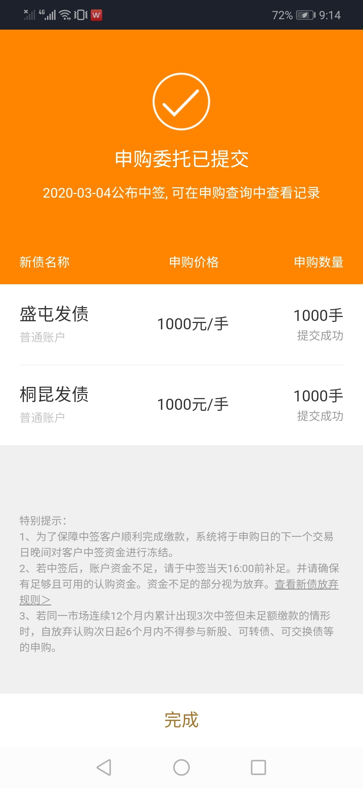

======================================================

_type: talk
@范*[841855284221812]
2020-03-02 09:36:31 Mon  
topic_id: 118551424184442

睡觉💤

阅读[2141]  评论[0]  赞[0] 

======================================================

_type: talk
@波[28855811142441]
2020-03-02 10:15:59 Mon  
topic_id: 241884251481811

所有有疫情的国家中，恐怕中国是最安全的国家。这种统一的执行力和强大的民族凝聚力，不是哪个西方国家能轻易复制。中国的疫情，一定会较快得到控制。在这个基本条件下，那么：
（情况一）：海外花一两个月，或者有了特效药，慢慢控制住了。全世界的资本市场都将企稳。全世界资本市场都会企稳反弹。中国的资本市场更会早于西方国家企稳并反弹。一切回归正常。
（情况二）：大概率：海外一时半会儿搞不定。特效药没有。海外市场继续跌。我们去年开放了外资入市，为了避险和投机，大量海外资金涌入。人民币进一步升值。大A股走出独立行情（大反弹）概率大。
（情况三）海外彻底控制不住，彻底崩盘。海外金融危机再来。当然，这种情况我认为没有可能发生。至少美国以其国力应该是有能力控制住的。那么，谁能控制住率先恢复国内的正常，谁的市场就最有希望。毫无疑问，是大A。人民币暴涨。
 综上，跌后的机会在哪，一目了然。

我对近期操作的一点极不成熟的拙见如下,请大家不喜勿喷,仅供参考,据此入市,风险自担。

我以为,我们现在已经处在牛市之中,本轮牛市从2019年1月的最低点2440.91点出发,中途也有过几次大起大落,波段式的前进,螺旋式的上升,到2020年2月的2880.30点收盘,已经走了一年零一个月的慢牛走势。累计已上升了440点,现在仍然处于牛市之中,仍然是急跌慢涨,继承慢牛走势。

现在是慢牛走势,累似于美国股市,从2019年1月的2440点到2020年2月的2880点,一年零一个月累计上涨了440点。

大盘从2440点的超跌,极其低估到现在的2880点的偏低,比较低估,一直处在估值修复的慢牛走势之中。

在现在的慢牛走势中,每一次大跌急跌,都是我们加仓优质低估的基金和股票的良机。千金难买牛回头,所以,我们要抓住这一波牛市每一次的大跌急跌,大力买入优质有潜力的品种。

等到所有人都说牛市来了的时候,牛市就接近尾声了。

我们要从十年,二十年,甚至更长更久的大视野来看待这次牛市,大视野,大局观,大智慧。

阅读[2200]  评论[0]  赞[0] 

======================================================

_type: talk
@二师父[28814221155551]
2020-03-02 10:16:59 Mon  
topic_id: 421882541281148

A股还是比较稳的，仓位8成以上的，就这样了，8成以下的，港股和A股都是机会。

反正自己舒服位置，看着大家盲目买股票实在挑选的不行，今天分享下跟随机构和成长股的投资策略，不要自己瞎鼓捣，先学习，实在不懂就算了，知道自己不知道是智慧。

@陌路花 at 2020-03-02 10:16:59 Mon

> 我们大A一枝独秀？

----------

@王雷 at 2020-03-02 10:16:59 Mon

> 二师父您好！基建的基金目前可以跟点吗？

----------

@二师父 at 2020-03-02 10:16:59 Mon

> 可以的，轻仓没事，估值很低

----------

@王雷 at 2020-03-02 10:16:59 Mon

> 好的，明白谢谢二师父

----------

阅读[2291]  评论[4]  赞[0] 

+++++++++++++++++++++++++++++++++++++++++++++++++++++

图片：
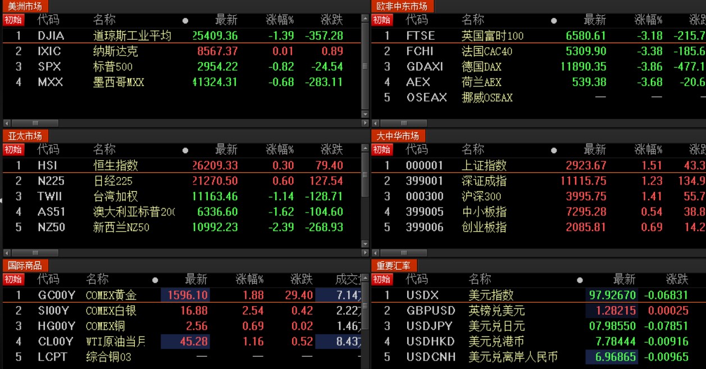

======================================================

_type: talk
@范*[841855284221812]
2020-03-02 10:33:14 Mon  
topic_id: 118551428858242

睡醒了，牛B基建

@A0洪氏日杂批发 at 2020-03-02 10:33:14 Mon

> 早埋伏好了，今天吃肉了

----------

@shee at 2020-03-02 10:33:14 Mon

> 不知道为啥今天基建这么疯，谁能分析分析

----------

@A0洪氏日杂批发 at 2020-03-02 10:33:14 Mon

> 疫情，国家损失惨重，老百姓损失也大，国家维持社会稳定，加大基建投入，让更多老百姓或农民工有事情做，有钱赚，加大就业，维持社会稳定，国家亏本都是要投入的，个人观点，仅供参考

----------

@shee at 2020-03-02 10:33:14 Mon

> 有道理，我买的我们单位葛洲坝的，每年这个时间都涨，但今天涨的我没看明白，有一种有人强行投钱救市的感觉，所以赶紧卖了，仅代表个人看法

----------

@A0洪氏日杂批发 at 2020-03-02 10:33:14 Mon

> 基建指数，极度低估，不知道你看了没有，百分位在历史98%左右，自己买，不违背二师父价值投资低估定投策略

----------

@向前进 at 2020-03-02 10:33:14 Mon

> 是不是场外指数005223

----------

@范* at 2020-03-02 10:33:14 Mon

> 场内对应的是165525

----------

@范* at 2020-03-02 10:33:14 Mon

> 15万手封单，场内买不进，可以场外买。有折价

----------

阅读[2195]  评论[10]  赞[0] 

+++++++++++++++++++++++++++++++++++++++++++++++++++++

图片：
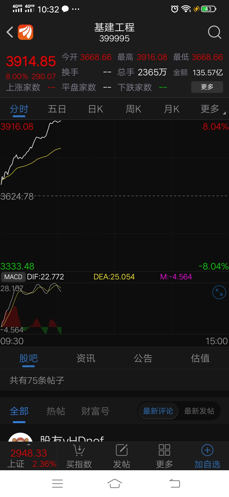

======================================================

_type: talk
@A0洪氏日杂批发[544885222181514]
2020-03-02 10:36:49 Mon  
topic_id: 548114528851544

二师父，您以后能不能把估值表置顶发布，提问题的太多了，翻看上周估值表或以前的估值表，好难找

@二师父 at 2020-03-02 10:36:49 Mon

> 好的

----------

@好运玲玲 at 2020-03-02 10:36:49 Mon

> 赞同

----------

@二师父 at 2020-03-02 10:36:49 Mon

> 置顶有

----------

@二师父 at 2020-03-02 10:36:49 Mon

> 我会加精华

----------

@A0洪氏日杂批发 at 2020-03-02 10:36:49 Mon

> 谢谢

----------

阅读[2115]  评论[5]  赞[0] 

======================================================

_type: q&a
@竹叶[51115585811514]
2020-03-02 10:46:12 Mon  
topic_id: 841884251154442

@竹叶

>  二师父，请问泸州老窖和格力电器这两只股票最近能买么

@二师父

>  基本面都没有问题，格力的业绩增速有所下滑，可以分析基本面，但是不做买卖分析，投资需要自行承担风险

阅读[2257]  评论[0]  赞[0] 

======================================================

_type: q&a
@果果[48225422881518]
2020-03-02 11:00:28 Mon  
topic_id: 548114528881184

@果果

>  师父，第一次买股票，前几天买了603678火炬电子股票，觉得了电容Mlcc大涨，买的时候31.868。现在已经赔了4000多，不知道应该继续拿下去，还是止损，能给点建议吗？

@二师父

>  只做基本面分析不做买卖分析，买卖自行决定，先学习看财务报表吧，至少基本的财务指标你得弄明白

阅读[2250]  评论[0]  赞[0] 

======================================================

_type: talk
@二师父[28814221155551]
2020-03-02 11:03:54 Mon  
topic_id: 548114512241884

A股就是这样，今天炒金融，明天炒半导体，后天炒5G，前几年炒环保，现在炒基建，十几年了都没有变过，所以需要全面配置。基建我没有纳入投资体系，比旧基建，我更看好新基建。就让他炒吧，不要总是追，市场上的钱太多了，赚不完的。

@志亮 at 2020-03-02 11:03:54 Mon

> 追不上的，散户永远慢一步，我现在算是看清了[撇嘴]

----------

@二师父 at 2020-03-02 11:03:54 Mon

> 一般涨起来机构都准备撤了

----------

@艾琪（王钥） at 2020-03-02 11:03:54 Mon

> 现在恐怕有无数把大镰刀在等着追进去的韭菜呢

----------

@shee at 2020-03-02 11:03:54 Mon

> 压手上一年了，这算是这一年里的最高点了，我赶紧给卖了

----------

@志亮 at 2020-03-02 11:03:54 Mon

> 是呀，现在我也算看淸了，最适合我们散户的就是价值投资，若买基金的就是二师父你的逆势投资方法，也只有这两种方法了，其它方法最终都会被埋。

----------

@栀子花开 at 2020-03-02 11:03:54 Mon

> 二师傅，今天指数涨这么多，本来打算给基本面60建个底仓的，这还能建吗[流泪]

----------

@二师父 at 2020-03-02 11:03:54 Mon

> 定投可以，底仓少建点

----------

阅读[2359]  评论[9]  赞[0] 

======================================================

_type: talk
@范*[841855284221812]
2020-03-02 11:23:00 Mon  
topic_id: 241884285844441

今天场外美股161128。买进总资金30%  场内溢价没办法。买进这个基金，场内还有溢价，香！

@范* at 2020-03-02 11:23:00 Mon

> 注意啊，跟投有风险啊。

----------

@范* at 2020-03-02 11:23:00 Mon

> 前两天做梦，梦到小学生开学时间是3月19日。难道我是天选之人[偷笑]不知道准不准

----------

阅读[2377]  评论[2]  赞[0] 

+++++++++++++++++++++++++++++++++++++++++++++++++++++

图片：
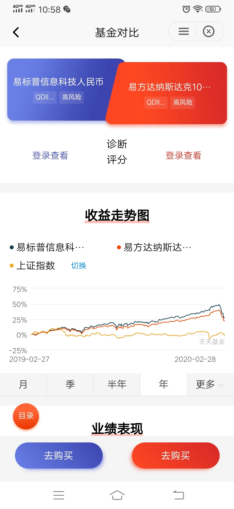

======================================================

_type: talk
@毛毛宇[88281885112212]
2020-03-02 11:37:03 Mon  
topic_id: 548114512528544

二师父，问一个基金赎回收费的问题？  比如我有中证500的底仓1000份，T日买入了300份，T+3日赎回500份，赎回的这500份需要交赎回手续费吗？赎回的起始点怎么计算？ （  华泰证券显示赎回大于7天免收赎回费）

@二师父 at 2020-03-02 11:37:03 Mon

> 场内没有惩罚手续费

----------

@毛毛宇 at 2020-03-02 11:37:03 Mon

> 场外呢？如果有底仓，也收入惩罚手续费吗？

----------

阅读[2285]  评论[2]  赞[0] 

======================================================

_type: q&a
@衣袂飘香[118248548242452]
2020-03-02 12:44:29 Mon  
topic_id: 421882584118848

@衣袂飘香

>  您好！我的房贷是农业银行4.665的利率。应该也是调成LPR浮动比较好吧 ?

@二师父

>  对的，调整到lpr比较好

阅读[2303]  评论[4]  赞[0] 

======================================================

_type: q&a
@翔如飞飞[118511825412552]
2020-03-02 13:26:09 Mon  
topic_id: 548114511118824

@翔如飞飞

>  师父好！初入星球，想跟随师父学习定投。目前基本空仓，应该如何配置？一次性投入低估的基金还是定投？感觉如果按照熊市五年的说法，现在是不是已经在4.5年上啦，底舱没有怕牛市就来啦，求师父支招。

@二师父

>  可以先建立三成底仓再开始定投，以宽基指数为主

阅读[2214]  评论[3]  赞[0] 

======================================================

_type: q&a
@蓝魔森林[28888244485121]
2020-03-02 13:40:24 Mon  
topic_id: 548114511521114

@蓝魔森林

>  白酒etf需要遵循网格交易的策略吗？还是每周低估定投配置就好了？

@二师父

>  低估定投就行了，不用做网格，他不适合网格

阅读[2233]  评论[2]  赞[0] 

======================================================

_type: talk
@林玮[844111858288412]
2020-03-02 14:13:55 Mon  
topic_id: 118551455114582

二师父，可转债的涨跌与其正股之间有没有相关性？

@二师父 at 2020-03-02 14:13:55 Mon

> 有

----------

阅读[1992]  评论[1]  赞[0] 

======================================================

_type: talk
@林玮[844111858288412]
2020-03-02 14:36:49 Mon  
topic_id: 548114511848214

是正相关吗？

阅读[1997]  评论[0]  赞[0] 

======================================================

_type: q&a
@阳光[421884185252128]
2020-03-02 15:44:20 Mon  
topic_id: 548114511414244

@阳光

>  师父好：今天可以再进点中概互联吗？谢谢

@二师父

>  问题太大了，已经投了多少，还有多少资金，增量资金多少，钱多的话进个几千块没问题啊，如果本身仓位很重，又没增量资金就控制下，美股现在不明确，中概也不在低位

阅读[2055]  评论[0]  赞[0] 

======================================================

_type: q&a
@J[28281541518551]
2020-03-02 15:45:01 Mon  
topic_id: 241884288141511

@J

>  师傅，现在美国债收益下跌很多，我之前持有华夏海外债，请问是继续持有或逢低加点仓还是赎回呢？

@二师父

>  这个定投风险不大

阅读[2085]  评论[0]  赞[0] 

======================================================

_type: talk
@冉冉[88445118854412]
2020-03-02 16:54:41 Mon  
topic_id: 118551458414412

二师傅，我银行购买的富国中证红利在2月28日分红方案由现金分红变更为红利再投资了，可是2月28日银行短信提示查收分红现金金额，3月2日银行短信又提示分红变更为红利再投资，让注意查收，我不明白，什么时候现金能到账，什么时候红利再投资能到账，或者这是怎么回事？恳请二师傅解答疑惑，谢谢！

@Sunflower at 2020-03-02 16:54:41 Mon

> 我看说是3.3号到账，份额按2.28日价格算份额

----------

@三峡情 at 2020-03-02 16:54:41 Mon

> 你2月28号提交变更的红利再投没用的，分红是按2月28号那时候你还是现金的，所以说你是这次是现金的。

----------

@冉冉 at 2020-03-02 16:54:41 Mon

> 那就是说，我2月28日变更是无效的，还是现金分红，是吗？

----------

@三峡情 at 2020-03-02 16:54:41 Mon

> 是的呀

----------

阅读[1819]  评论[4]  赞[0] 

======================================================

_type: q&a
@素兮[548121415528244]
2020-03-02 17:23:10 Mon  
topic_id: 241884281244881

@素兮

>  二师父觉得深100ETF（159901）这个指数怎么样？它和现有估值表的哪个指数的持股重合度大？现在的估值是低估还是正常估值？

@二师父

>  可以的，和基本面60类似，低估的

阅读[1943]  评论[0]  赞[0] 

======================================================

_type: talk
@二师父[28814221155551]
2020-03-02 17:24:24 Mon  
topic_id: 241884281482411

<e type="hashtag" hid="281854444451" title="#读者提问#" /> 这个仓位有没有问题

持仓基金没有问题，不过看不到仓位，需要看具体仓位

阅读[2083]  评论[0]  赞[0] 

+++++++++++++++++++++++++++++++++++++++++++++++++++++

图片：
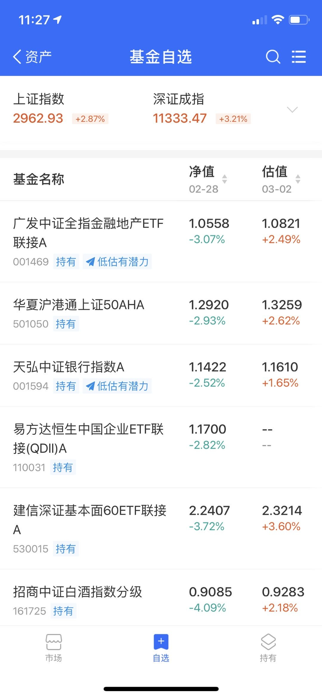

======================================================

_type: talk
@大⭐[48844441548888]
2020-03-02 19:05:48 Mon  
topic_id: 548114552144844

这是啥意思？

阅读[1930]  评论[0]  赞[0] 

+++++++++++++++++++++++++++++++++++++++++++++++++++++

图片：
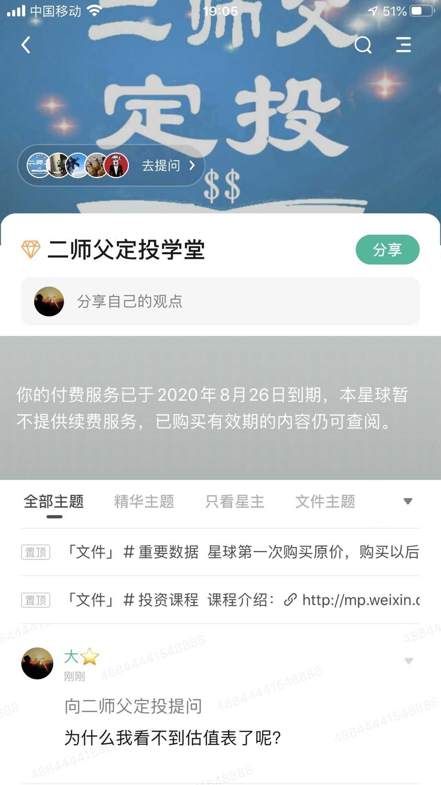

======================================================

_type: q&a
@大⭐[48844441548888]
2020-03-02 19:15:16 Mon  
topic_id: 548114552144414

@大⭐

>  为什么我看不到估值表了呢？

@二师父

>  置顶第二篇文章

阅读[2093]  评论[3]  赞[0] 

======================================================

_type: talk
@二师父[28814221155551]
2020-03-02 19:15:49 Mon  
topic_id: 548114552188214

关于续费问题不用担心，到期了再续就行

阅读[2197]  评论[0]  赞[0] 

======================================================

_type: talk
@二师父[28814221155551]
2020-03-02 19:22:08 Mon  
topic_id: 548114552521444

<e type="hashtag" hid="452482225458" title="#看估值#" /> 介绍了一个估值指标，看整体估值。以后估值数据放在置顶第二篇文章，我发的文章会及时放到第一篇置顶和精华。大家觉得消息多就只看精华和置顶就行，人的精力是有限的。

那些喜欢提问的朋友，一年几百个问题的，建议多看看往期问题回复，多提一个问题并不能多挣100快。

还有新合作的老虎证券现在开户入金可以送3股阿里巴巴，仅限在15号之前。

@梧桐 at 2020-03-02 19:22:08 Mon

> 二师父，香港银行卡如何办理

----------

@二师父 at 2020-03-02 19:22:08 Mon

> 加微信ershifudt

----------

@范* at 2020-03-02 19:22:08 Mon

> 老虎证券入金怎么入啊？没境外银行卡

----------

@二师父 at 2020-03-02 19:22:08 Mon

> 大陆卡，出金用velo，或者办一个

----------

阅读[3912]  评论[4]  赞[0] 

+++++++++++++++++++++++++++++++++++++++++++++++++++++

图片：
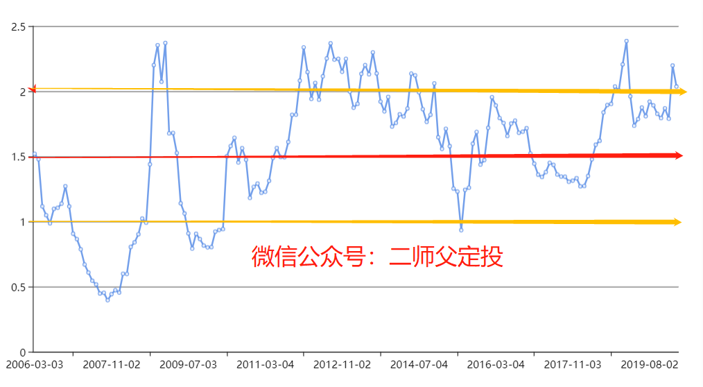

+++++++++++++++++++++++++++++++++++++++++++++++++++++

文件：
2020-03-02 19:18:31 Mon
文件大小：[123150]
28221888245841-虽然A股坐了过山车，但是从估值角度看现在真的非常适合买入.docx

======================================================

_type: q&a
@小丫[828582585412]
2020-03-02 19:51:59 Mon  
topic_id: 548114552425884

@小丫

>  二师父，首先，十分佩服您！看了您在公众号发的文章，想问一下现在配置沪深300、中证500、基本面60、深红利、50AH以及白酒、医疗，总仓位几成，互相之间的比例建议多少？

@二师父

>  4成宽基指数，3成行业指数，1成恒生中概指数，剩下的自己卫星配置就行，宽基和行业里面根据估值高低决定比例多少

阅读[2275]  评论[2]  赞[0] 

======================================================

_type: talk
@二师父[28814221155551]
2020-03-02 20:09:44 Mon  
topic_id: 421882554225448

<e type="hashtag" hid="452482222518" title="#周一市场分析及应对策略#" />

阅读[4408]  评论[0]  赞[0] 

+++++++++++++++++++++++++++++++++++++++++++++++++++++

文件：
2020-03-02 20:09:32 Mon
文件大小：[163144]
48551888251228-市场分析3.2.docx

======================================================

_type: q&a
@特仑苏[241855111824451]
2020-03-02 20:57:15 Mon  
topic_id: 118551445215542

@特仑苏

>  请教二师父，股票市场我怎么一直觉得是虚拟经济，我们买股票的钱，到底是被拿去融资做投资还是只是单纯的买卖交易。还有我一直认为买股票就相当于买一个东西的名字。这个东西好了，为什么价格就会上涨。毕竟我们买的是虚拟的东西，并不是实际的东西，更深层次的理解是怎么样的呀。

@二师父

>  理解有错误，股票价格是公司业绩的反应，短期是投票机，长期是称重机，企业发展越来越好，盈利越来越多，估价也是上涨的，而不是说一个虚拟的东西。
>  
>  基金也是股票集合

阅读[2191]  评论[1]  赞[0] 

======================================================

_type: q&a
@alicedream*[88281414821222]
2020-03-02 20:58:40 Mon  
topic_id: 241884228854151

@alicedream*

>  二师父：你好！你之前分享的19年文章和18年文章汇总链接还在吗？我这边收藏的突然找不到了，麻烦你方便的时候帮我再分享一下。万分感谢🙏

@二师父

>  公众号后台回复目录，可以去喜马拉雅听听音频，我把之前的文章录制了音频，之前有些文章行文过于随意，后面会更加专业一些

阅读[2195]  评论[1]  赞[0] 

======================================================

_type: q&a
@静[241555148454251]
2020-03-02 21:24:02 Mon  
topic_id: 118551444885242

@静

>  二师傅，您好，我之前了解的场外基金3点前定投，不是以当天的净值为准吗，今天收益感觉还是没有定投前的基金来算的

@二师父

>  怎么感觉的，有没有具体数据

阅读[2277]  评论[5]  赞[0] 

======================================================

_type: q&a
@海马[15158245825242]
2020-03-02 21:40:27 Mon  
topic_id: 118551441511422

@海马

>  师父场外除了招商白酒好像没有其它白酒指数替代吧

@二师父

>  没有了

阅读[2411]  评论[0]  赞[0] 

======================================================

_type: talk
@二师父[28814221155551]
2020-03-02 21:44:55 Mon  
topic_id: 841884224224252

<e type="hashtag" hid="281854444451" title="#读者提问#" /> 老师晚上好，我同时场内定投50AH，中证500，沪深300ETF，银行ETF，这四个有重复么？我记得您之前星球和公众号说过，但怎么也搜不到了，谢谢！

50ah和沪深300里面都有一些银行股票，重合度不大，前两个是宽基，后一个是行业，性质不同，和中证500没有重合

阅读[2457]  评论[0]  赞[0] 

======================================================

_type: talk
@吾思吾想[118552585284212]
2020-03-02 21:52:58 Mon  
topic_id: 118551441485552

<e type="hashtag" hid="452482222518" title="#周一市场分析及应对策略#" /> 师父，请教一下1.食品饮料和医药是基本盘，之前没有配置，现在医药又是高估的，那是等它低估再买还是现在开始定投呢？
2.券商和金融地产现在是慢慢定投呢还是一梭哈？

@蛋炒饭不加蛋 at 2020-03-02 21:52:58 Mon

> 同问

----------

阅读[2399]  评论[1]  赞[0] 

======================================================

_type: talk
@二师父[28814221155551]
2020-03-02 22:24:33 Mon  
topic_id: 548114558224484

国家投了很多到基建上面，一个是城市交通，一个是5g，大数据，云计算，今年是基建之年

@蛋炒饭不加蛋 at 2020-03-02 22:24:33 Mon

> 请问二师父，有对标的基金可以入手吗

----------

@二师父 at 2020-03-02 22:24:33 Mon

> 165525

----------

@蛋炒饭不加蛋 at 2020-03-02 22:24:33 Mon

> 场内场外都一样吗？

----------

@二师父 at 2020-03-02 22:24:33 Mon

> lof基金，还有个广发的

----------

@蛋炒饭不加蛋 at 2020-03-02 22:24:33 Mon

> 嗯，我搜到了两个，这两个都可以入吗？

----------

@孤芳自赏 at 2020-03-02 22:24:33 Mon

> 二师父现在投基建是不是追高呢？

----------

@王模堂 at 2020-03-02 22:24:33 Mon

> 二师傅，16525我们现在还能继续投入吗？是一次性投入比较好，还是定投呢？

----------

阅读[2537]  评论[7]  赞[0] 

+++++++++++++++++++++++++++++++++++++++++++++++++++++

图片：
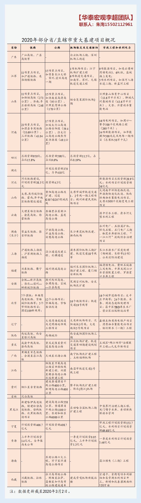

======================================================

_type: talk
@范*[841855284221812]
2020-03-03 06:40:25 Tue  
topic_id: 421882525884248

以后不发买进卖出的操作了。
有些股友们，不要等我的南方原油，基建工程，美股基金，后续的操作了。不发了。因为头上多出了，一根白头发。

@一心一意 at 2020-03-03 06:40:25 Tue

> 该发就发哈，不要太在意皮囊[憨笑]

----------

@二师父 at 2020-03-03 06:40:25 Tue

> 还有这么多头发啊，没事，很多人头发都快没了

----------

@雨的依恋 at 2020-03-03 06:40:25 Tue

> 发了，说不定，心情一好，那根白头发又黑了呢[憨笑]

----------

@范* at 2020-03-03 06:40:25 Tue

> 场内基建工程清仓，场外的话，自己好好考量考量。天机不可泄露啊，泄露会折寿啊。玄学自有它的道理，我信玄学。

----------

@范* at 2020-03-03 06:40:25 Tue

> 聪明绝顶[呲牙]我肯定没有二师父聪明

----------

@范* at 2020-03-03 06:40:25 Tue

> 场内基建工程清仓。

----------

阅读[2061]  评论[6]  赞[0] 

======================================================

_type: q&a
@Sunflower[244185124281811]
2020-03-03 07:04:43 Tue  
topic_id: 548114545281444

@Sunflower

>  二师父您好：看了您讲的债券基金投资的正确姿势，您能不能详细讲讲纯债、可转债、短债都分别对冲哪方面更好？我看您说纯债对冲利率下行和股市下跌更好，能详细讲一下吗？谢谢二师父

@二师父

>  纯债的走势和利率和股市的走势有关系的。
>  
>  一般混合债券里面会配置有股票，这样在股市下跌的时候会比纯债的收益率差一点。
>  
>  短债的话就类似比货币基金收益率好一点的稳健理财，波动比纯债小，可是收益率也低一点，适合短期理财投资，比如嘉实超短债这种
>  
>  可转债基金是投资的可转债，可转债既具有债性，又具有股性，他做对冲不如纯债，不过可转债的优势在于当市场反转的时候，他因为具有股性上涨会多很多。

阅读[3396]  评论[0]  赞[0] 

======================================================

_type: talk
@二师父[28814221155551]
2020-03-03 07:12:24 Tue  
topic_id: 118551414545422

<e type="hashtag" hid="455282818848" title="#周二讲基金#" />  今天讲基建工程，先将结论：我是不会投资的，你要是想短期追一下热点，可以适当投一点，趋势在这里。不过我不投。

然后讲具体分析：学堂估计有葛洲坝、中铁中建这些公司的朋友，尤其是这些公司里面做财务的朋友，可能知道里面水有多深。

这个行业呢，他不是TO c 端的，也就意味着他没法靠卖产品挣钱，他的盈利来源什么呢？来源于zf的托底和付费，政策占据很大因素，所以周期强，如果政策不扶持就容易凉凉，而且更为关键的是回款太难，应收账款一大堆。

其次财务报表不用看，营收和利润都是可以凑的，不能像分析其他行业一样去看什么中铁的财务报表，你看的都是别人想让你看的。

我的投资理念是选择优质企业长期持有复利增值，投机品在我的组合里面会越来越少。当然目前政策推动，想投机的可以少量参与，我是不参与的，还有部分资金我要用到刀刃上。

这个刀刃目前看有纳斯达克、白酒、新基建，生物医疗。都是很好的赛道。

@蛋炒饭不加蛋 at 2020-03-03 07:12:24 Tue

> 新基建是5G吗？

----------

@二师父 at 2020-03-03 07:12:24 Tue

> 5G、云计算和生物医疗

----------

@志亮 at 2020-03-03 07:12:24 Tue

> 新能源算是吗？

----------

@蛋炒饭不加蛋 at 2020-03-03 07:12:24 Tue

> 我看到5G估值高，其他两个也一样吗？

----------

@冯林锋 at 2020-03-03 07:12:24 Tue

> 纳指现在可以参与吗

----------

@二师父 at 2020-03-03 07:12:24 Tue

> 这个不能算新基建

----------

@二师父 at 2020-03-03 07:12:24 Tue

> 当前参与纳指没有中概的机会好

----------

@冯林锋 at 2020-03-03 07:12:24 Tue

> 👌

----------

阅读[3648]  评论[17]  赞[1] 

======================================================

_type: q&a
@是喵喵吖～[421441114141158]
2020-03-03 08:35:46 Tue  
topic_id: 241884242282841

@是喵喵吖～

>  二师父 关于券商想请教一下 一般在低于什么价格时候可以买入，然后等到什么价位可以卖出呢。 是每次只能买入100份吗 可以今天涨今天卖吗

@二师父

>  不要频繁波段，按照网格做就好，波段只是为了应对震荡市场，重点还是长期持有迎接牛市，券商波段实属应对震荡的无奈之举。

阅读[2133]  评论[0]  赞[0] 

======================================================

_type: q&a
@海马[15158245825242]
2020-03-03 08:37:06 Tue  
topic_id: 118551414458252

@海马

>  师父我的持仓合适吗？需要调整吗？

@二师父

>  金融类偏高，可以减持一点H股，转移到恒生和中概好一点，另外白酒必须消费可以配置一些。

阅读[2283]  评论[5]  赞[0] 

======================================================

_type: q&a
@April _ M.[841582144212812]
2020-03-03 08:39:14 Tue  
topic_id: 841884242215552

@April _ M.

>  二师父，如果目前只做场外定投，之前看到二师父说白酒场外不适合；可否有其他适合场外定投的行业指数推荐？ （我目前的配置： 50Ah，基本面60，中证500指数增强，易方达H股，中证银行和恒生；配置比例是这个顺序依次减少）

@二师父

>  这个替代白酒的行业指数我正在寻找，目前还没有合适的，消费里面的几大业绩较差的重仓股票拖累了这个指数，暂时不要入场，看后期指数调仓情况以及股票业绩是否有好转。
>  
>  如果配置了恒生，国企指数可以不用配置，银行的话除了招行和宁波银行，目前业绩都比较差，尤其是民生银行，资产质量糟糕。
>  
>  建议银行少量配置即可，只作为防守，其他的都没啥问题。

阅读[2354]  评论[7]  赞[0] 

======================================================

_type: q&a
@姥姥不疼. 爷爷不爱[48544481458248]
2020-03-03 11:22:53 Tue  
topic_id: 118551411881552

@姥姥不疼. 爷爷不爱

>  到期后如何续费，二师父

@二师父

>  加微信ershifudt，你还没到期

阅读[1909]  评论[1]  赞[0] 

======================================================

_type: talk
@二师父[28814221155551]
2020-03-03 11:45:57 Tue  
topic_id: 548114548142224

券商活动送2股阿里巴巴，有兴趣投资海外的可以了解下，开户入3000美金送2股阿里

阅读[1873]  评论[0]  赞[0] 

+++++++++++++++++++++++++++++++++++++++++++++++++++++

图片：
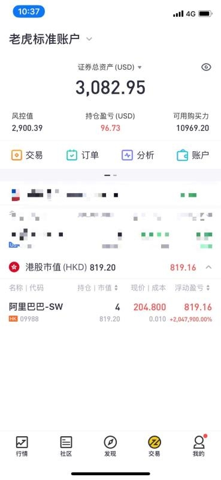

======================================================

_type: q&a
@J[28281541518551]
2020-03-03 11:52:34 Tue  
topic_id: 118551418514852

@J

>  师傅，我的H股和恒生持有比例目前是7:5，港股占总仓位的10%，H股现在浮亏2%，可否把H股减仓30%转到恒生指数上？

@二师父

>  可以的，恒生比国企投资价值更大

阅读[1894]  评论[5]  赞[0] 

======================================================

_type: q&a
@shee[544885258412114]
2020-03-03 11:53:17 Tue  
topic_id: 548114548152844

@shee

>  二师父，我这个啥情况

@二师父

>  没有问题的，仍旧可以使用，到期需要续费的话微信联系

阅读[1971]  评论[0]  赞[0] 

======================================================

_type: talk
@Nick.yang[118281888551882]
2020-03-03 11:54:36 Tue  
topic_id: 548114548148854

南方原油很低，是否可以重仓买入，小白不太懂，自己看了看，感觉还不错，群里也说可以买一点这类的

@范* at 2020-03-03 11:54:36 Tue

> 额，不要重仓。你看看二师父往期的文章。原油属于周期行业，不可重仓。自己得刻苦钻研。

----------

@Nick.yang at 2020-03-03 11:54:36 Tue

> 谢谢哈

----------

阅读[1879]  评论[2]  赞[0] 

======================================================

_type: q&a
@TDG[88855524248842]
2020-03-03 11:54:59 Tue  
topic_id: 118551418544212

@TDG

>  请问二师父，现在沪深300价值和中证红利指数哪个更有投资价值？最近一年这两个指数都大幅跑输沪深300，是什么原因呢？

@二师父

>  中证红利本来分红高，成长性不足，深红利成长性更好，沪深300价值采用的价值因子，如果垃圾股票权重过大就会比纯被动的300差，而且费率高，所以建议纯被动的沪深300最佳

阅读[2061]  评论[0]  赞[0] 

======================================================

_type: talk
@二师父[28814221155551]
2020-03-03 12:03:17 Tue  
topic_id: 241884241811541

<e type="hashtag" hid="281854444451" title="#读者提问#" /> 二师父，我仓位一直不够，2700多的时候建仓了10%。后面大盘一直在上涨，一直没机会入。
直到上周五回调到2900点的时候又想着比2700的时候买的贵，想在再等这周继续回调的时候买，谁知现在又站上3000点了。
请问师父，有关建立底仓，如何把握时机才是最合适的。是否只要指数低估，不管大盘走势如何，都能建立底仓？
请师父指引

这个自己舒服就行，很多人只看到了涨，并没有看到大盘跌到2500的时候给人的恐惧，这样说，如果你的钱是10年不用的。

那么对于消费、医药、沪深300、深红利这类基金，你在刚进入正常估值买也没有问题，只要拿的住，长期肯定会盈利。

举个例子，白酒在2018年年初高估，现在正常偏低估值，但是股价已经超过了2018年的。对于盈利稳定增长的指数，如果仓位不足，只要不是特别贵，随时可以建立底仓的。

但是需要注意这笔钱长期不用，其次浮亏的时候拿的住。

@志亮 at 2020-03-03 12:03:17 Tue

> 这问题问得不错，不过你也太保守了吧，大盘2700才一层仓位，若是我会加到6、7层仓，而且你不是还有增量资金吗？

----------

@次郎🌻 at 2020-03-03 12:03:17 Tue

> 主要是我才刚开始玩，想稳一稳~

----------

@志亮 at 2020-03-03 12:03:17 Tue

> 也对，谨慎一些总没错的，毕竟比起赚钱，不亏钱才是第一位[呲牙]

----------

@April _ M. at 2020-03-03 12:03:17 Tue

> 我是2700点的时候缺资金 哈哈哈哈哈哈！

----------

@Pansy at 2020-03-03 12:03:17 Tue

> 已经不错了，我入场的时候已经2800了……

----------

阅读[3361]  评论[5]  赞[0] 

======================================================

_type: talk
@悬[422224214844118]
2020-03-03 12:43:57 Tue  
topic_id: 421882518825828

二师父，我目前债券基金还是空仓，现在是否是否适合入场？入场的话现在场外推荐哪款？多少仓位？谢谢！

阅读[1889]  评论[0]  赞[0] 

======================================================

_type: q&a
@J[28281541518551]
2020-03-03 12:44:49 Tue  
topic_id: 241884241451151

@J

>  师傅，请问现在场内是溢价还是折价？这是万得数据，现价不是大于净值吗？为什么显示折价率为负呢？

@二师父

>  折价

阅读[2125]  评论[8]  赞[0] 

======================================================

_type: q&a
@悬[422224214844118]
2020-03-03 14:19:37 Tue  
topic_id: 241884218841241

@悬

>  二师父，我刚学习基金定投，目前债券基金还是空仓，现在是否是否适合入场？入场的话现在场外推荐哪款？多少仓位？谢谢！

@二师父

>  现在比较适合指数基金

阅读[1839]  评论[0]  赞[0] 

======================================================

_type: q&a
@铁观音[28444524525851]
2020-03-03 14:42:20 Tue  
topic_id: 548114581428824

@铁观音

>  师傅，可以帮忙分析一下比亚迪的基本面吗？

@二师父

>  周期性企业，盈利不稳定，业绩时好时坏，这是行业特性决定的。
>  
>  不过在 汽车行业里面他是基本面较好的，净利润比较高，横向比较就比较一般了。

阅读[1805]  评论[0]  赞[0] 

======================================================

_type: talk
@范毅君[118551121224142]
2020-03-03 14:47:40 Tue  
topic_id: 118551484524142

二师父，场内基金，除了债券，还有啥比较适合啊

阅读[1747]  评论[0]  赞[0] 

======================================================

_type: q&a
@范毅君[118551121224142]
2020-03-03 15:21:33 Tue  
topic_id: 421882515812128

@范毅君

>  二师父，南方原油净值比较滞后，有没有办法看到比较及时的，大概估值呢

@二师父

>  NYMEX原油，他的实时净值也可以看到的

阅读[1910]  评论[2]  赞[0] 

======================================================

_type: q&a
@老司基[111852221242122]
2020-03-03 15:22:37 Tue  
topic_id: 548114585525124

@老司基

>  场内基建ETF165525今天涨停，场外005224横盘，为何？

@二师父

>  资金炒作导致已经有很高的溢价了

阅读[2017]  评论[3]  赞[0] 

======================================================

_type: talk
@二师父[28814221155551]
2020-03-03 15:51:36 Tue  
topic_id: 118551484144252

<e type="hashtag" hid="824525414882" title="#选赛道#" /> 周期性指数，券商优于基建，投5万券商，投五万基建这个配置不如投10万券商。

@特仑苏 at 2020-03-03 15:51:36 Tue

> 标题是不是错了，基建不如券商才对吧？

----------

@二师父 at 2020-03-03 15:51:36 Tue

> 改过来了

----------

阅读[3469]  评论[2]  赞[0] 

+++++++++++++++++++++++++++++++++++++++++++++++++++++

文件：
2020-03-04 07:07:34 Wed
文件大小：[169537]
28221245825221-价值投机：基建真不如券商.docx

======================================================

_type: talk
@二师父[28814221155551]
2020-03-03 17:12:02 Tue  
topic_id: 241884214851221

<e type="hashtag" hid="281854444451" title="#读者提问#" /> 网格交易的底仓价格是否为市场价格

底仓价格是市场价格，触发表示可以建立底仓。

@孤芳自赏 at 2020-03-03 17:12:02 Tue

> 二师父调仓的时候是按市值算占比还是按成本价？

----------

阅读[1848]  评论[1]  赞[0] 

======================================================

_type: q&a
@闪闪的星光[88285424418582]
2020-03-03 18:15:20 Tue  
topic_id: 841884212124182

@闪闪的星光

>  @二师父定
>  
>  投-北京-金融  
>  
>   二师父好，
>  
>  我想建立一个消费指数组合，准备在这些指数低估的时候，分别开始定投。
>  
>  似有不妥，可是我又不知道错在哪里？
>  该如何改进？
>  
>  请老师指教，谢谢[抱拳]。
>  
>  组合包含了7只基金，其中6只是指数基金、1只是混合基金；
>  
>  华宝中证消费龙头指数LOF（501090）、
>  
>  汇添富中证主要消费ETF链接（000248）、
>  
>  广发中证全指可选消费链接基金（001133）、
>  
>  招商中证白酒指数基金（161725）、
>  
>  天弘中证食品饮料A（001632）、
>  
>  广发中证全指家用电器A（005063）、
>  
>  汇添富消费行业混合（000083）。

@二师父

>  龙头消费可以不用，暂时看不到持仓，家用电器和可选消费选择一个就行。
>  
>  招商白酒和食品饮料选择一个就行。选择了指数基金可以不用汇添富消费行业混合。重复太多了。

阅读[1836]  评论[1]  赞[0] 

======================================================

_type: q&a
@闪闪的星光[88285424418582]
2020-03-03 18:15:36 Tue  
topic_id: 841884214285522

@闪闪的星光

>  二师傅好，请问：用哪几只指数基金组建消费指数基金组合才是好的组合呢？

@二师父

>  两只，可选+必须消费就可以了

阅读[1843]  评论[1]  赞[0] 

======================================================

_type: q&a
@Pansy[48281554424548]
2020-03-03 18:17:27 Tue  
topic_id: 421882512518248

@Pansy

>  请问师父：
>  我刚开始学习不久，重新梳理了一下自己的定投系统。我是工薪阶层，目前我主要还是想侧重低估定投，这样不会占有我太多的精力，主要精力还是放在工作上。我定投的目标年化收益是8%-10%，希望以后随着经验的积累会慢慢提升，指数基金打算长期持有。
>  基于以上的目标，我想烦请师父看一下，我下图这个目标配置是否合理？还有就是1.我看了一下50ah的成分，银行占比挺多的，目前还可以继续定投50ah吗？2.中证100和沪深300的持仓有不少重合的？那么定投中证100合适还是沪深300合适？
>  问题有点多，辛苦师父啦！

@二师父

>  中证100比较合适，一只中证100可以替代50AH和沪深300.
>  
>  如果预期10%，那么大盘2700的时候直接买入中证100+中证500+白酒组合长期持有就可以了，增量资金定投，不用折腾的。

阅读[2094]  评论[1]  赞[0] 

======================================================

_type: talk
@小可木易[111148548851582]
2020-03-03 19:00:52 Tue  
topic_id: 241884455244141

听说茅台又要换掌门人啦？这回换得有点勤啊，准备唱哪一出呢[捂脸][捂脸]

@范* at 2020-03-03 19:00:52 Tue

> 茅台是好股票。有机会就干

----------

阅读[2000]  评论[1]  赞[0] 

======================================================

_type: talk
@海马[15158245825242]
2020-03-03 20:10:58 Tue  
topic_id: 841884458582412

中了一支盛屯发债

@背心 at 2020-03-03 20:10:58 Tue

> 不是3月4号公布中签结果吗？

----------

@海马 at 2020-03-03 20:10:58 Tue

> 刚刚公布了

----------

@背心 at 2020-03-03 20:10:58 Tue

> 你是用哪家证券买的

----------

@海马 at 2020-03-03 20:10:58 Tue

> 华宝证券

----------

@丸子妈 at 2020-03-03 20:10:58 Tue

> 我也中签了

----------

@章兵朋 at 2020-03-03 20:10:58 Tue

> 我也中了一签这个

----------

@What if at 2020-03-03 20:10:58 Tue

> 中了一只铜昆，盛屯还没公布啊？估计是没了

----------

阅读[1966]  评论[7]  赞[0] 

+++++++++++++++++++++++++++++++++++++++++++++++++++++

图片：
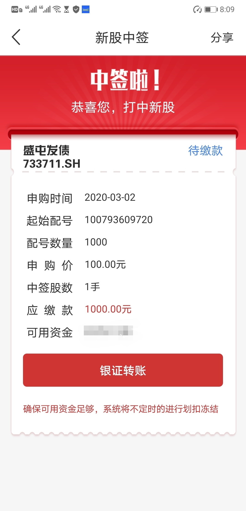

======================================================

_type: talk
@二师父[28814221155551]
2020-03-03 20:49:41 Tue  
topic_id: 118551125582882

<e type="hashtag" hid="554252814514" title="#南方原油套利#" /> 目前南方原油低估，而且溢价百分之8，可以利用溢价套利，如图所示，场内申购，然后转托管到场内就可以盈利8个点，如果场内下跌的话就拿着

适合小额资金参与，目前原油最大下跌幅度40%

@冯林锋 at 2020-03-03 20:49:41 Tue

> 用华泰可以吗

----------

@别皱眉头 at 2020-03-03 20:49:41 Tue

> 老师，场内申购是在哪申购？

----------

@二师父 at 2020-03-03 20:49:41 Tue

> 如图所示

----------

@二师父 at 2020-03-03 20:49:41 Tue

> 可以

----------

@冯林锋 at 2020-03-03 20:49:41 Tue

> 谢谢

----------

@别皱眉头 at 2020-03-03 20:49:41 Tue

> 请问第一张图也是用华泰证券吗？

----------

@孤芳自赏 at 2020-03-03 20:49:41 Tue

> 请问什么叫转托管不是直接赚钱了卖吗？

----------

@冯林锋 at 2020-03-03 20:49:41 Tue

> 应该是

----------

阅读[2181]  评论[22]  赞[0] 

+++++++++++++++++++++++++++++++++++++++++++++++++++++

图片：
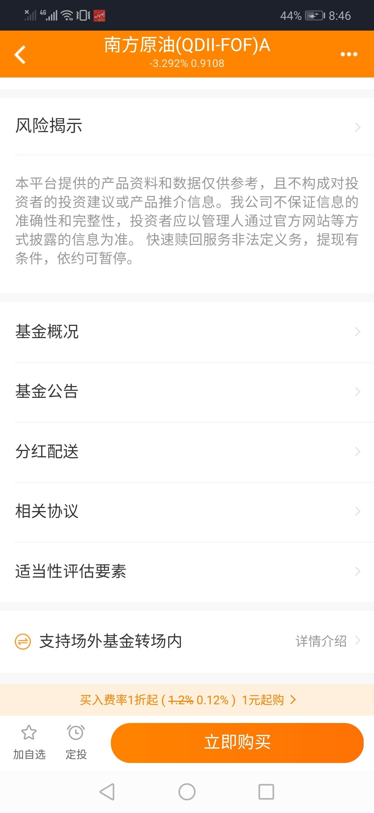
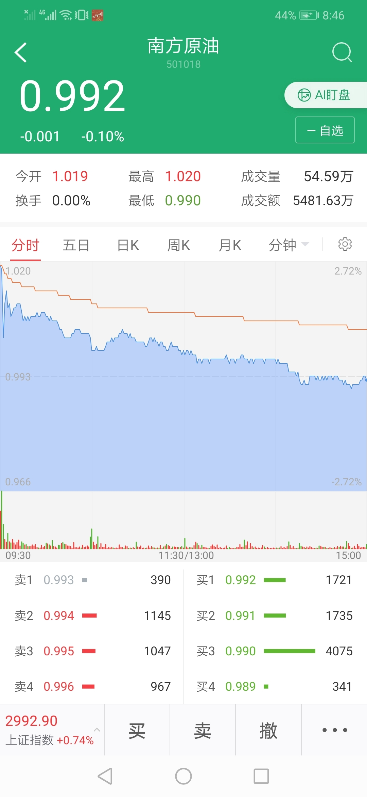
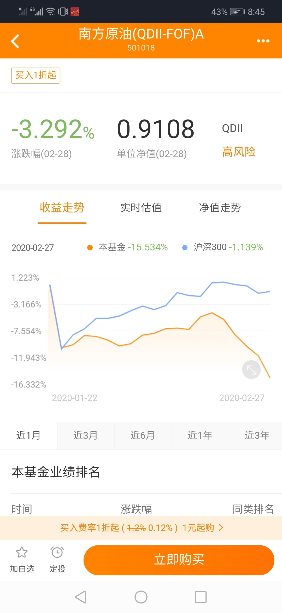

======================================================

_type: talk
@范*[841855284221812]
2020-03-03 23:07:02 Tue  
topic_id: 548114424224514

能走出这样的线，今晚就不用看了，安心睡觉💤

@One at 2020-03-03 23:07:02 Tue

> 降准50个点，直接挂二档起步啊，明天a股要起飞

----------

@陈飞🤗 at 2020-03-03 23:07:02 Tue

> 结果死火了

----------

@范* at 2020-03-03 23:07:02 Tue

> 打脸了。洗盘洗盘不必惊慌

----------

@One at 2020-03-03 23:07:02 Tue

> 

----------

阅读[1738]  评论[4]  赞[0] 

+++++++++++++++++++++++++++++++++++++++++++++++++++++

图片：

======================================================

_type: q&a
@美美[48224811151218]
2020-03-04 07:13:52 Wed  
topic_id: 841884458445442

@美美

>  二师父你好！华夏中证新能源汽车ETF明天上市，你能不能给分析一下这支基金

@二师父

>  这个和我们估值表的新能源汽车产业指数类似，追踪的指数不同。
>  
>  目前新能源汽车相关指数比较多。估值表里面追踪的是新能源汽车产业指数，华夏基金募集的新能源汽车ETF追踪的是新能源汽车指数。
>  
>  两者有点区别，新能源汽车产业指数54只，更加分散，新能源汽车指数持仓股票25只，更加集中。
>  
>  新能源汽车指数主要重仓股票的业务是新能源汽车的上端，比如电子设备、汽车零器件，新能源汽车产业指数更多的是汽车制造。
>  
>  两个都不错，未来如果新能源汽车普及的话，新能源汽车产业指数表现会更好一点，这是一个预期，选择其中一个投资就行。

阅读[1685]  评论[1]  赞[0] 

======================================================

_type: q&a
@蛋炒饭不加蛋[118281818482542]
2020-03-04 07:15:38 Wed  
topic_id: 118551124218222

@蛋炒饭不加蛋

>  请问二师父为何基金涨了，收益是负的

@二师父

>  你看看是不是更新延迟了，有时候业绩更新延迟

阅读[1739]  评论[1]  赞[0] 

======================================================

_type: q&a
@蓝魔森林[28888244485121]
2020-03-04 07:16:04 Wed  
topic_id: 548114412588844

@蓝魔森林

>  想问下，富国中证红利指数增强前三月二日凌晨分红，28日净值大幅下降。分红的股份，每份是以几时的净值为准？ 蚂蚁金服上没有显示。谢谢

@二师父

>  分红除权后会以之后的净值为准

阅读[1798]  评论[1]  赞[0] 

======================================================

_type: q&a
@阝東[844111541211852]
2020-03-04 07:55:24 Wed  
topic_id: 241884488518121

@阝東

>  这是不是直接转资金进去就可以了，要自己解冻吗，第一次

@二师父

>  说话不要说一半额，账户有资金就可以，自动扣款

阅读[1927]  评论[0]  赞[0] 

======================================================

_type: talk
@二师父[28814221155551]
2020-03-04 07:56:39 Wed  
topic_id: 118551155544812

<e type="hashtag" hid="141245241512" title="#场内基金套利详解#" />  后面会在课程中加上套利的详细讲解，提问之前先看看课程和往期文章，很多问题重复回答多次了哈。

@冯林锋 at 2020-03-04 07:56:39 Wed

> 南方原油我在场外购买再转场内也可以吧

----------

@二师父 at 2020-03-04 07:56:39 Wed

> 天天和东财合作可以

----------

@飞向彩云端 at 2020-03-04 07:56:39 Wed

> 二师父：早上好！南方原油的场外净值显示的是2.28号的，场外当天申购是按当天的净值算，请问当天净值在哪里能查到。谢谢！

----------

@二师父 at 2020-03-04 07:56:39 Wed

> 根据最新净值和涨幅估算

----------

@冯林锋 at 2020-03-04 07:56:39 Wed

> 华泰不行对吗

----------

@雨的依恋 at 2020-03-04 07:56:39 Wed

> 华泰可以

----------

@冯林锋 at 2020-03-04 07:56:39 Wed

> 谢谢

----------

@孤芳自赏 at 2020-03-04 07:56:39 Wed

> 那个软件能显示基金溢价

----------

阅读[3390]  评论[15]  赞[0] 

+++++++++++++++++++++++++++++++++++++++++++++++++++++

文件：
2020-03-04 07:55:44 Wed
文件大小：[176126]
15448412548422-场内基金套利详解.pdf

======================================================

_type: talk
@二师父[28814221155551]
2020-03-04 08:07:05 Wed  
topic_id: 118551155514212

关于折溢价，我讲的很清楚了，好好听课，对自己诚实，你可以欺骗别人，也可以欺骗自己，但是无法欺骗市场。

诚实是最好的策略，市场一定会奖励那些认真学习的朋友，市场一定会惩罚那些投机取巧，偷懒耍滑的朋友。出来混，都是要还的。

@敏杰 Minjie at 2020-03-04 08:07:05 Wed

> 二师傅，东方财富显示的是折价率，你说折价率为负，是溢价，就是实际价格高于净值，那样说他们就懂了

----------

@二师父 at 2020-03-04 08:07:05 Wed

> 不同软件的表示不一样，看价格和净值的关系

----------

@孤芳自赏 at 2020-03-04 08:07:05 Wed

> 请问二师父为啥我在东方财富看不到溢价率？

----------

@二师父 at 2020-03-04 08:07:05 Wed

> app

----------

@冯林锋 at 2020-03-04 08:07:05 Wed

> 在东方财富APp哪个界面可以查到溢价

----------

阅读[2021]  评论[5]  赞[0] 

+++++++++++++++++++++++++++++++++++++++++++++++++++++

图片：
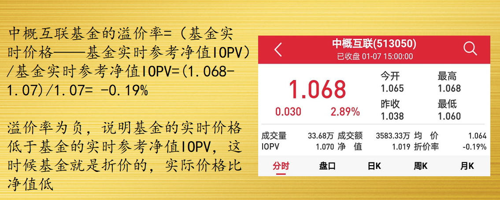

======================================================

_type: talk
@alicedream*[88281414821222]
2020-03-04 09:38:32 Wed  
topic_id: 841884488144512

二师父：我今天又中了一个新债！[得意]

刚不久前的新债一上市卖到了差不多最高价，

赚了330！ 这么短时间又中了，都想不到！[呲牙]

@苍天有井明月空🌙 at 2020-03-04 09:38:32 Wed

> 我连中两个

----------

阅读[1800]  评论[1]  赞[0] 

======================================================

_type: talk
@秦风殇韵（刘豫斌）[241555548554841]
2020-03-04 09:40:20 Wed  
topic_id: 841884488115582

请问今天新债可以申购么？

阅读[1790]  评论[0]  赞[0] 

======================================================

_type: talk
@二师父[28814221155551]
2020-03-04 09:44:46 Wed  
topic_id: 118551154242442

<e type="hashtag" hid="824528545482" title="#鳄鱼计划和乌龟计划的调仓#" /> 乌龟计划，银行全部调出，部分到天弘中证食品饮料指数A，部分到300非银金融。需要避开银行了。银行里面除了招行、平安和宁波银行，其他的业绩都比较糟糕。二师父计算业绩预期增速8%，而白酒的业绩增速是31%，场外没有好的白酒基金，就选择了食品饮料，食品饮料业绩增速26%，从估值角度看银行低估，然而，成长性太差，除非发生反转，经济复苏，戴维斯双击。

看美联储盘中降息趋势，以及当前世界的情况，今年估计很难了，那就盘中基金转换到业绩更优的指数。

鳄鱼计划调仓，卖出3%银行仓位，其中一部分80%加仓白酒，另外一部分20%加仓诺安纯债，既有进攻又有防守，不过于激进，也不过于保守。

这是二师父的个人操作记录，并非投资建议，敬请知悉。

估值表会加入食品饮料，标普信息科技。300非银金融等指数，部分业绩增速差的指数会被替代掉，大家投资不要陷入估值陷阱，需要结合预期、业绩、估值、仓位综合判断。

@速。冻 at 2020-03-04 09:44:46 Wed

> 食品饮料估值如何？调仓过去当建底仓了

----------

@王雷 at 2020-03-04 09:44:46 Wed

> 二师父是今天调吗

----------

@April _ M. at 2020-03-04 09:44:46 Wed

> 二师父，我昨天听课也准备建仓食品饮料和300非银金融，但是不知道这两个是否适合场外定投？ （如果合适的话，同时求问这两支基金的场外代码是多少）感谢～～

----------

@陌路花 at 2020-03-04 09:44:46 Wed

> 银行还在亏损中，是不是止损算了？

----------

@向前进 at 2020-03-04 09:44:46 Wed

> 二师父，鳄鱼计划中银行也是全部出掉吗

----------

@ajingge at 2020-03-04 09:44:46 Wed

> 同问，如果银行还处于亏损，怎么处理呢？

----------

@二师父 at 2020-03-04 09:44:46 Wed

> 是的，已经调了

----------

@二师父 at 2020-03-04 09:44:46 Wed

> 适合，场外搜索300非银和食品饮料，今天会加到估值表

----------

阅读[3563]  评论[35]  赞[0] 

======================================================

_type: talk
@冉冉[88445118854412]
2020-03-04 09:53:34 Wed  
topic_id: 841884482545282

二师傅，请问基金转换对转换购买的基金和直接购买基金有什么区别？小白求教，谢谢！

@麻烦得很 at 2020-03-04 09:53:34 Wed

> 节约交易时间，同时有个别的基金公司可能会有一定的费率优惠。

----------

阅读[1925]  评论[1]  赞[0] 

======================================================

_type: q&a
@是喵喵吖～[421441114141158]
2020-03-04 10:12:00 Wed  
topic_id: 548114411842514

@是喵喵吖～

>  师父 请问天弘中证银行不投了吗 全部转成其他的了吗我之前定投了一些

@二师父

>  场外全部转了，场内转了3%，暂停定投

阅读[1942]  评论[3]  赞[0] 

======================================================

_type: q&a
@wty[548488548545444]
2020-03-04 10:13:27 Wed  
topic_id: 118551155848242

@wty

>  二师父，看您今天把天弘中证银行转换到天弘中证食品饮料了，是全部转换吗？转到天弘食品饮料的逻辑分享一下吧！怎么没有转到汇添富中证主要消费ETF链接呢

@二师父

>  消费里面有几只重仓股票的表现很糟糕，食品饮料和白酒好一点
>  
>  一部分转到了食品饮料，另外一部分转到了300非银金融

阅读[2025]  评论[3]  赞[0] 

======================================================

_type: q&a
@多读书[88482152228812]
2020-03-04 10:30:52 Wed  
topic_id: 548114414848524

@多读书

>  请问二师父，食品饮料可以选择这支：国泰国证食品饮料吗？

@二师父

>  这是一只分级基金，追踪的国泰食品

阅读[2039]  评论[2]  赞[0] 

======================================================

_type: talk
@毛毛宇[88281885112212]
2020-03-04 10:49:41 Wed  
topic_id: 548114418284124

师傅，今天新债：君和发债，申购吗？

@宋晓洋 at 2020-03-04 10:49:41 Wed

> 现在中签率不高，可以盲打，如遇破发，就留着。可以申购。

----------

阅读[1810]  评论[1]  赞[0] 

======================================================

_type: q&a
@CHARLIE[88285482121142]
2020-03-04 10:51:16 Wed  
topic_id: 421882281442858

@CHARLIE

>  请问二师父现在开始定投医药类基金是否合适？

@二师父

>  不太适合，估值比较高

阅读[1948]  评论[0]  赞[0] 

======================================================

_type: talk
@二师父[28814221155551]
2020-03-04 11:13:10 Wed  
topic_id: 241884481822821

<e type="hashtag" hid="281854444451" title="#读者提问#" /> 师父，我在场内申购的南方原油，在哪里查成交信息啊？  

在基金我的基金里面

@薇薇 at 2020-03-04 11:13:10 Wed

> 今天上午十点明明申购了，基金里查不到，是要到下午三点后才有吗

----------

阅读[1895]  评论[1]  赞[0] 

======================================================

_type: talk
@一剪梅[844115184528882]
2020-03-04 11:14:28 Wed  
topic_id: 421882281855228

<e type="hashtag" hid="281854444451" title="#读者提问#" /> 师父，场内申购是场内的价格吗？

阅读[1865]  评论[0]  赞[0] 

======================================================

_type: q&a
@罗大发[421484455521228]
2020-03-04 11:17:17 Wed  
topic_id: 841884481825142

@罗大发

>  请问师父，我银行现在亏5%，可以跟你一样全部调仓吗？

@二师父

>  我场外全部调了，场内调了一部分

阅读[2006]  评论[3]  赞[0] 

======================================================

_type: talk
@二师父[28814221155551]
2020-03-04 11:21:57 Wed  
topic_id: 548114418512444

<e type="hashtag" hid="281854444451" title="#读者提问#" /> 二师父，场内申购显示的是场内的价格

需要在如图所示的地方进行场外申购，然后转托管

@Snow at 2020-03-04 11:21:57 Wed

> 场外3点后无法买吗？购买按钮是灰色的

----------

@二师父 at 2020-03-04 11:21:57 Wed

> 明天再买

----------

阅读[2022]  评论[2]  赞[0] 

+++++++++++++++++++++++++++++++++++++++++++++++++++++

图片：
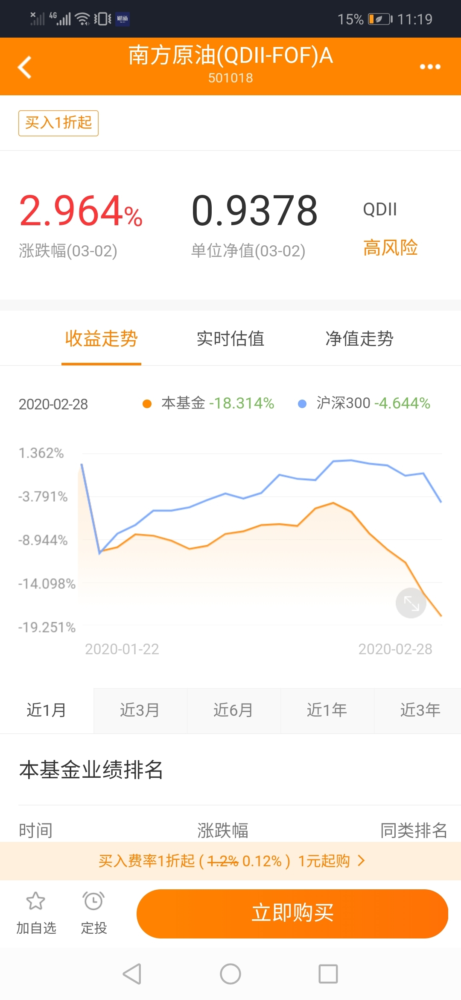

======================================================

_type: q&a
@好运玲玲[244188585541521]
2020-03-04 11:27:51 Wed  
topic_id: 241884481288241

@好运玲玲

>  二师父您好！场内银行etf现在可以调一部分到中概互联和酒etf上吗？

@二师父

>  可以少量调到中概互联，酒可以的

阅读[2066]  评论[1]  赞[0] 

======================================================

_type: q&a
@薇薇[111185852284182]
2020-03-04 11:35:39 Wed  
topic_id: 841884481221842

@薇薇

>  要3月9号才能确认吗

@二师父

>  是的，场外申购不是即时成交

阅读[2094]  评论[1]  赞[0] 

======================================================

_type: q&a
@孟倩[118822124154582]
2020-03-04 11:42:53 Wed  
topic_id: 421882281521228

@孟倩

>  请问师父，今天还会更新估值表吗？300非银开始低估了吗？

@二师父

>  会，今天收盘，这个是低估的

阅读[2066]  评论[1]  赞[0] 

======================================================

_type: talk
@毛毛宇[88281885112212]
2020-03-04 11:58:04 Wed  
topic_id: 841884481442842

师傅，今天新债：君和发债，申购吗？

阅读[2069]  评论[0]  赞[0] 

======================================================

_type: talk
@毛毛宇[88281885112212]
2020-03-04 12:00:32 Wed  
topic_id: 241884481444841

南方原油可否场外申购，然后再转场内卖掉？ 没搞懂场内申购和场外申购有何区别？

阅读[2199]  评论[0]  赞[0] 

======================================================

_type: q&a
@海马[15158245825242]
2020-03-04 12:20:47 Wed  
topic_id: 548114418442144

@海马

>  300非银金融可以用广发全指金融地产代替吧？

@二师父

>  如果你想投银行可以用金融地产替代，如果不想投银行，就选300非银

阅读[2388]  评论[1]  赞[0] 

======================================================

_type: q&a
@素兮[548121415528244]
2020-03-04 12:23:11 Wed  
topic_id: 548114418442584

@素兮

>  二师父，未来如果美联储持续降息，美元大概率走弱。那么之前跟着二师父买的华夏收益债券该如何处理？今天降息50%，可以再定投华夏收益债券，拉低下成本么？

@二师父

>  这只是影响美元的一个因素，海外收益债比较稳，可以定投，美元走强，利率下行，有利于海外收益债

阅读[2455]  评论[0]  赞[0] 

======================================================

_type: q&a
@汉尼拔[552144155244]
2020-03-04 12:23:21 Wed  
topic_id: 118551158822152

@汉尼拔

>  我得中证银行今天需要全部卖出么？还是停止定投等盈利了再卖？目前亏1个点

@二师父

>  都可以

阅读[2513]  评论[2]  赞[0] 

======================================================

_type: talk
@故事[455458815888]
2020-03-04 12:42:54 Wed  
topic_id: 118551142224452

估值表是几天前的呢？不是每天发么？

@铁观音 at 2020-03-04 12:42:54 Wed

> 每周三才发

----------

阅读[2346]  评论[1]  赞[0] 

======================================================

_type: q&a
@闪闪的星光[88285424418582]
2020-03-04 12:56:40 Wed  
topic_id: 841884425555252

@闪闪的星光

>  今天食品饮料指数估值进入低估了吗？
>  食品饮料没有低估，干嘛把银行转换到食品饮料呢？

@二师父

>  需要看业绩增速的，银行指数经营业绩持续下降，就比如民生银行，一直低估，越来越低估，可是他业绩不行，表现也很差，如果经营业绩不改善，会越来越差

阅读[2542]  评论[4]  赞[0] 

======================================================

_type: q&a
@梧桐[844118451242512]
2020-03-04 13:09:08 Wed  
topic_id: 548114452242214

@梧桐

>  二师父，今天地产指数为何上涨，国泰国证地产全部卖出还是分步卖出

@二师父

>  我全部卖了，因为是分级基金，这是为了刺激经济出台的政策利好基建和地产

阅读[2509]  评论[1]  赞[0] 

======================================================

_type: talk
@二师父[28814221155551]
2020-03-04 13:10:11 Wed  
topic_id: 421882254842158

现在大家都很怕，史无前例的黄金牛市，规划家庭资产的周期最好是20年，长视野，大格局

阅读[2751]  评论[0]  赞[0] 

+++++++++++++++++++++++++++++++++++++++++++++++++++++

图片：
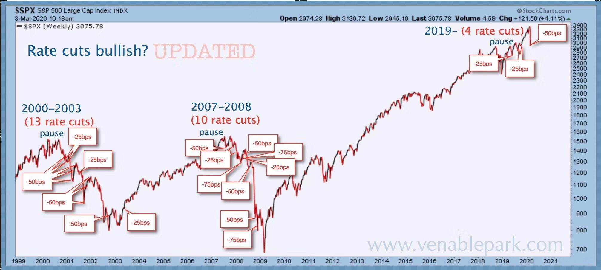

======================================================

_type: q&a
@信阳田平[51448212515184]
2020-03-04 13:58:31 Wed  
topic_id: 118551142518282

@信阳田平

>  二师父您好！我刚加入星球，正从一个小白开始学起。刚刚看到您的鳄鱼计划，在星球上怎么找不到您2019年11月25日以后的鳄鱼计划的买卖记录？

@二师父

>  有的是被星球删除了，基本上都有的

阅读[2605]  评论[0]  赞[0] 

======================================================

_type: q&a
@阳光[421884185252128]
2020-03-04 14:12:42 Wed  
topic_id: 841884425215812

@阳光

>  师父好：我3号将中证银行调到全指金融地产，今天查询显示有一千多块钱冲值到工银货币了，这是什么意思啊？第一次遇到这种情况，谢谢

@二师父

>  百分之90转换的结果

阅读[2808]  评论[1]  赞[0] 

======================================================

_type: talk
@二师父[28814221155551]
2020-03-04 14:25:45 Wed  
topic_id: 841884425418252

<e type="hashtag" hid="281854444451" title="#读者提问#" /> 二师傅，套利那个为啥场内申购，然后场外转场内？不是场内已经买了，然后场内转场外？

用证券账户在场外申购，然后场外转场内，申购相当于是场外，而操作地点是在场内证券账户，所以需要再转一下

@ajingge at 2020-03-04 14:25:45 Wed

> 师傅，场外转场内需要开通什么权限吗？

----------

@二师父 at 2020-03-04 14:25:45 Wed

> 华泰不用，广发需要去柜台，其他看具体券商要求

----------

@ajingge at 2020-03-04 14:25:45 Wed

> 了解，谢谢了

----------

@光少 at 2020-03-04 14:25:45 Wed

> 二师父，场内可不可以直接转换的

----------

@二师父 at 2020-03-04 14:25:45 Wed

> 就是证券账户转换

----------

@光少 at 2020-03-04 14:25:45 Wed

> 场内基金转换其它基金也可以吗

----------

@二师父 at 2020-03-04 14:25:45 Wed

> 这个卖了再买

----------

@光少 at 2020-03-04 14:25:45 Wed

> 明白，谢谢二师父

----------

阅读[2768]  评论[8]  赞[0] 

======================================================

_type: talk
@范毅君[118551121224142]
2020-03-04 16:55:53 Wed  
topic_id: 421882252584558

<e type="hashtag" hid="824528545482" title="#鳄鱼计划和乌龟计划的调仓#" /> 二师父，300非银金融是哪只基金呀，还有食品现在是正常还是高估，现在转过去，不怕追高会大幅度回撤吗

阅读[2429]  评论[0]  赞[0] 

======================================================

_type: talk
@宋航[48548414258158]
2020-03-04 18:14:19 Wed  
topic_id: 421882252118448

二师父，天天基金 166 开头的手机号无法通过你的链接注册

阅读[2426]  评论[0]  赞[0] 

======================================================

_type: talk
@二师父[28814221155551]
2020-03-04 18:28:03 Wed  
topic_id: 841884421552822

<e type="hashtag" hid="554251184114" title="#定投实盘227#" /> 继续定投，食品饮料没有低估，不过轻仓定投没有问题，业绩很好。

@西锦巴乌 at 2020-03-04 18:28:03 Wed

> 师父你买7-10国开债是为了资产配置白需要吗？

----------

@二师父 at 2020-03-04 18:28:03 Wed

> 配置白需要？

----------

@Pansy at 2020-03-04 18:28:03 Wed

> 师父，按照估值表给出的全市场市盈率百分位结合您讲的课程，这次不是应该定投0.75份？师父为什么定投了1份？

----------

@Pansy at 2020-03-04 18:28:03 Wed

> 大概是想表达：资产配置的需要

----------

@mumomo at 2020-03-04 18:28:03 Wed

> 我也发现了，实盘金额是买的0.75

----------

@Pansy at 2020-03-04 18:28:03 Wed

> 那还是应该结合全市场市盈率来[握手][握手]

----------

阅读[3924]  评论[6]  赞[0] 

+++++++++++++++++++++++++++++++++++++++++++++++++++++

图片：
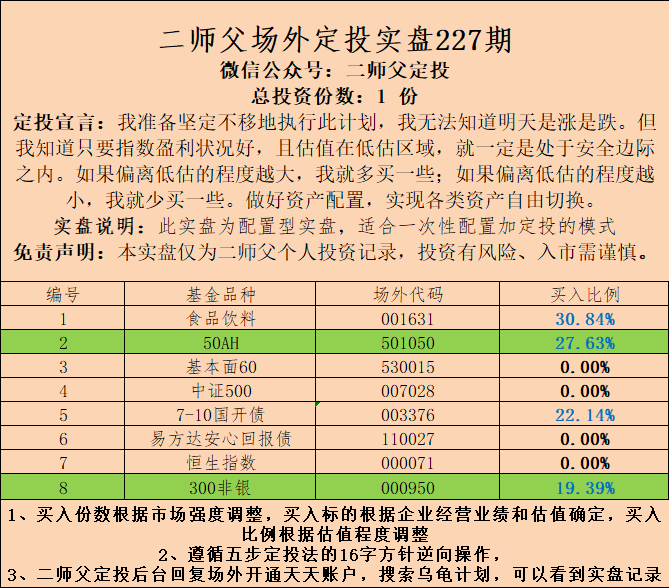

======================================================

_type: talk
@二师父[28814221155551]
2020-03-04 18:32:38 Wed  
topic_id: 841884421551252

<e type="hashtag" hid="224528814811" title="#实盘分析#" />

@秦风殇韵（刘豫斌） at 2020-03-04 18:32:38 Wed

> 300非银适合定投还是网格呢？

----------

@蓝魔森林 at 2020-03-04 18:32:38 Wed

> 这里的710国债，不能用嘉实超短短债券替换吧？

----------

阅读[2986]  评论[2]  赞[0] 

+++++++++++++++++++++++++++++++++++++++++++++++++++++

文件：
2020-03-04 18:32:30 Wed
文件大小：[105678]
48551528181188-二师父227期低估定投实盘.docx

======================================================

_type: talk
@二师父[28814221155551]
2020-03-04 18:35:09 Wed  
topic_id: 841884421588852

<e type="hashtag" hid="825188852442" title="#估值表#" /> 以后每周估值表都会在置顶文章展示的，加入了食品饮料、300非银和新兴科技100，新兴科技100和科技龙头代表不同方向，很优质的科技指数。

@秦风殇韵（刘豫斌） at 2020-03-04 18:35:09 Wed

> 地产没有了？

----------

@二师父 at 2020-03-04 18:35:09 Wed

> 没了

----------

@秦风殇韵（刘豫斌） at 2020-03-04 18:35:09 Wed

> 为什么啊？跟着投了一些，看不到估值表，一下空落落的

----------

@Pansy at 2020-03-04 18:35:09 Wed

> 太好了，这样找起来就方便多啦

----------

@二师父 at 2020-03-04 18:35:09 Wed

> 已经分析过，地产基金是分级基金，已经撤了

----------

@Pansy at 2020-03-04 18:35:09 Wed

> 天天基金给出的估值区间跟师父给出的估值区间有差别，我可以理解为是估值方法以及安全边际设定的不同而得出的结果差异吗？

----------

@二师父 at 2020-03-04 18:35:09 Wed

> 他没有考虑业绩增速，不合理

----------

@Pansy at 2020-03-04 18:35:09 Wed

> 哦，明白了，谢谢师父

----------

阅读[4295]  评论[13]  赞[0] 

+++++++++++++++++++++++++++++++++++++++++++++++++++++

图片：
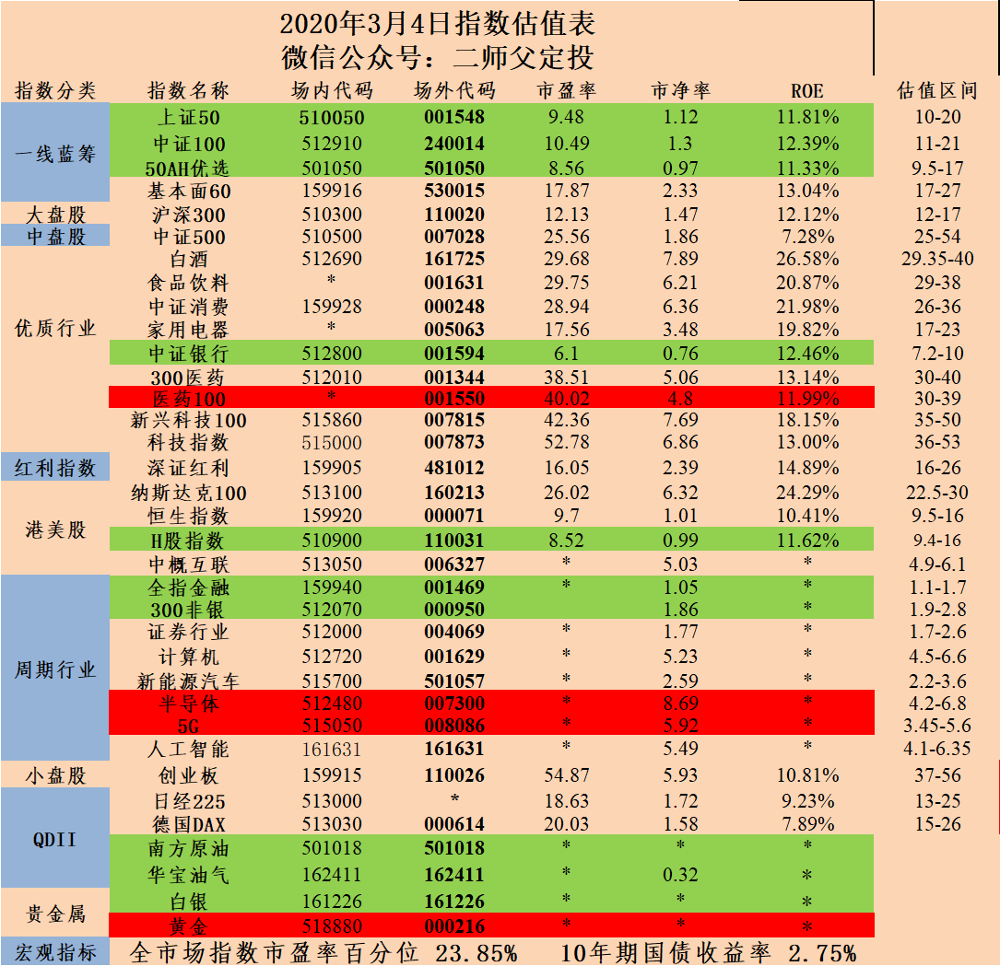

======================================================

_type: q&a
@素兮[548121415528244]
2020-03-04 18:45:50 Wed  
topic_id: 421882252288118

@素兮

>  二师父，天天基金里操作转换基金，选择90%转换还是100%转换好？两者区别在哪？

@二师父

>  转换总金额不同

阅读[2913]  评论[2]  赞[0] 

======================================================

_type: talk
@二师父[28814221155551]
2020-03-04 18:52:56 Wed  
topic_id: 241884421858421

关于套利需要注意的问题，基建工程，今天开盘涨，接着砸盘就是机构套利，机构套利不用场外申购，直接申购卖出就行，这样很容易砸盘，对于普通投资者套利需要把握安全边际，否则申购成交之后没有溢价了，那么套利不成就被套了，这时候安全边际是非常重要的

@范* at 2020-03-04 18:52:56 Wed

> 这次我是栽了，天天基金买的基金转场内需要柜台，方圆几百公里没有营业厅，去城里还得隔离。二师父，我觉得你应该详细的说说这个转场内问题。是不是在华泰App里买的场外基金转场内，不需要去柜台？

----------

@二师父 at 2020-03-04 18:52:56 Wed

> 是的，那你场外卖就行，我是用的华泰，用广发也是需要去柜台

----------

阅读[3091]  评论[2]  赞[0] 

+++++++++++++++++++++++++++++++++++++++++++++++++++++

图片：
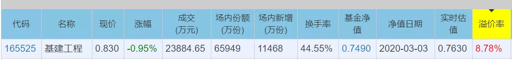

======================================================

_type: q&a
@素兮[548121415528244]
2020-03-04 19:10:44 Wed  
topic_id: 841884421888842

@素兮

>  二师父本周的实盘中，可用易方达安心回报债券A代替7-10国开债么？

@二师父

>  两个不一样，国开债是只有债性，没有看涨期权

阅读[3292]  评论[4]  赞[0] 

======================================================

_type: q&a
@黎雄[841555255485222]
2020-03-04 21:36:00 Wed  
topic_id: 841884445218182

@黎雄

>  师傅场内银行指数怎么操作的呢

@二师父

>  鳄鱼计划调仓讲了，换了百分之3仓位到白酒和诺安纯债

阅读[2998]  评论[0]  赞[0] 

======================================================

_type: talk
@二师父[28814221155551]
2020-03-04 21:40:05 Wed  
topic_id: 841884142222522

我是个极度讨厌赌博的人，哪怕我明天彩票中奖了也不会太开心，因为我知道那只是一时运气好，是不可重复的。从长期看，运气总要向均值回归的，那么我又凭什么去面对未来必然会遭遇的诸多风险呢？肯定不能总凭经验和直觉，那些都不靠谱，唯一可靠的只有合理的容错体系。通过这些年来的经验总结，我逐渐确立了动态再平衡投资体系，这也是我基金名字里“平衡”二字的由来。

所谓动态再平衡，简单说就是通过在大类资产间的分散配置，再根据市场动态进行缓慢的、有计划、有节制、并且是被动的逆向投资。比如当股市大跌时，我会逐渐增加对权益端（主要是股票仓位）的投资比重。反之，当牛市来临股票大涨时，我则会逐渐减少对于权益仓位的比重。不过，对于那些“鲜花类资产”，作为我组合中的压舱石，我更倾向于长期持有穿越牛熊。

动态再平衡是资产配置的核心，配置的初衷是提高组合的容错性，而不是争取实现投资收益最大化。当然，假如股市和债市的波动越大，使用该策略的投资收益率就会越高。不过，相比于利用市场波动提高收益，动态再平衡更大的意义在于提高了投资者遭遇极端风险时的生存几率。

不预测是动态再平衡的前提，永远做好上涨或下跌两手准备（涨了赚钱，跌了赚股），而不是根据自己对市场的预测方向去下注。同时，控制好仓位，保持适度贪婪，决不做冲动性投资（比如上来就满仓）。估值水位决定权益仓位，所以我绝不会冲动性的清仓或满仓，更不会使用杠杆。弱水三千只取一瓢，机会无穷无尽，但命始终只有一条，活着才有资格谈收益。

从我个人这十多年的实证结果看，在确立了动态再平衡体系后，可以看到无论市场涨跌，实证账户均取得了比较满意的回报，不但在半仓的情况下收益率连续多年远超市场同期表现，业绩稳定性也持续提升，回撤幅度相比以前大幅缩小（过往业绩详见我2019的信）。现金部分通过购入货币基金、逆回购、可转债、分级A、打新等套利交易，提升机会成本，权益仓位则严格执行相对缓慢的分档买卖原则，越跌越买，越涨越卖。

我喜欢熊市远胜于牛市，因为前者提升价值，后者消费价值。牛市就像蛋糕上的糖衣，有它也好，没它一样。我认为牛市才是导致股民亏损的主要原因，而熊市则是未来收益的倍增器，投资就要趁熊市，前提是你得懂得去合理的配置资产。熊市不恐惧，牛市不贪婪，这便是动态再平衡的价值所在。

我永远都不会停止假设：如果下一刻遇到最糟糕的情况是否还能承受？风物长宜放眼量，相比于明天或者明年，我更在乎的是10年20年后我是否还能活下来，活出自己的精彩人生。

@志亮 at 2020-03-04 21:40:05 Wed

> 说得好，活着比什么都重要[微笑]

----------

@子辰 at 2020-03-04 21:40:05 Wed

> 十年磨一剑，动态再平衡，我才起步一年而已，看来还得接受几次社会的毒打，才能达到 韭菜恐惧我贪婪，韭菜贪婪我恐惧 的境界。

----------

@April _ M. at 2020-03-04 21:40:05 Wed

> 掌握底层逻辑 + 自律 = 处变不惊 给二师父手动点赞！

----------

@艾琪（王钥） at 2020-03-04 21:40:05 Wed

> 细水长流，这才是理财的真谛[鼓掌]

----------

@J at 2020-03-04 21:40:05 Wed

> 已收藏，“容错率”三字值得反复学习

----------

阅读[3179]  评论[5]  赞[0] 

======================================================

_type: q&a
@美美[48224811151218]
2020-03-04 21:50:14 Wed  
topic_id: 548114845552224

@美美

>  二师父你好：请问投资证券基金和投资债券基金的区别？

@二师父

>  我不懂你要问啥

阅读[3131]  评论[1]  赞[0] 

======================================================

_type: q&a
@雨淡风清[844418818858882]
2020-03-05 04:49:04 Thu  
topic_id: 241884144882251

@雨淡风清

>  二师父，我现在全部现金家当40%在基金.仓位8左右成，白天没空操作都是前一天晚上下单，中间操作失误一次，微弱盈利。下面是具体持仓酒etf…8% /食品饮料…6%/基建…3% /300非银…6%/ 全指金融…7% /可转债…7%/纯债… 3%/医药300…6%/医药100…5%/海外中概互联…1%/恒生国企etf…12%/中证500…10%/50ah… 22%/基本面60…7%您看有需要调整的地方吗？

@二师父

>  基建如果场内买的，可以降低一点，目前溢价率很高，其他的没有什么问题，主流配置好了，如果科技回调，可以加5个点左右的科技
>  
>  主要看买入价格高，这些如果19年初建的仓，盈利肯定很好的

阅读[2856]  评论[1]  赞[0] 

======================================================

_type: q&a
@苍天有井明月空🌙[28882214181441]
2020-03-05 04:49:19 Thu  
topic_id: 241884144414181

@苍天有井明月空🌙

>  二师父我房贷108万，利息5.88，更换LPR吗，三十年贷款。

@二师父

>  需要的，换成lpr

阅读[2914]  评论[3]  赞[0] 

======================================================

_type: talk
@二师父[28814221155551]
2020-03-05 07:35:53 Thu  
topic_id: 841884141151822

<e type="hashtag" hid="281854444451" title="#读者提问#" /> 您好！按照你说的溢价套利是需要场内申购，场外赎回吗？

在证券账户进行场外申购，转托管到场内，然后从场内卖出

@土木工程部 at 2020-03-05 07:35:53 Thu

> 老师用华泰还是华宝套利

----------

@二师父 at 2020-03-05 07:35:53 Thu

> 华泰

----------

@清水倾城 at 2020-03-05 07:35:53 Thu

> 不是场内申购吗[囧]

----------

阅读[2829]  评论[3]  赞[0] 

======================================================

_type: q&a
@背心[51441214442224]
2020-03-05 10:10:39 Thu  
topic_id: 421882121512248

@背心

>  这两天变化真大呀！白天没有时间早起看看。诺安纯债是163210吗？和217022和您推荐的7—10国开债有什么区别，谢谢。还有新加入的场外食品饮料对应参考的指数是哪个？问题有点多，谢谢二师傅了

@二师父

>  一个是场内一个是场外，参考食品饮料指数估值

阅读[2723]  评论[0]  赞[0] 

======================================================

_type: q&a
@田维海[422144441542418]
2020-03-05 10:11:19 Thu  
topic_id: 241884141188511

@田维海

>  师父，300价值和中证红利这两支指数如何，值得投资吗？

@二师父

>  都不错的，就是成长性比较弱，属于防守型的配置，不会赚太多，也不会大幅度回撤

阅读[2792]  评论[1]  赞[0] 

======================================================

_type: q&a
@海马[15158245825242]
2020-03-05 10:37:38 Thu  
topic_id: 421882115512288

@海马

>  师父，在哪里可以查找指数基金的持股明细？

@二师父

>  中证指数官网

阅读[2754]  评论[0]  赞[0] 

======================================================

_type: q&a
@马卿[88458255821442]
2020-03-05 11:00:23 Thu  
topic_id: 241884112152821

@马卿

>  师父好。本来今天512690想加仓，但一直在涨，有点懵，还可以加吗？

@二师父

>  稍微有点贵，定投能接受回撤可以

阅读[2781]  评论[0]  赞[0] 

======================================================

_type: q&a
@榕声竹影[844118218251282]
2020-03-05 11:00:30 Thu  
topic_id: 118551884185552

@榕声竹影

>  师父，请问今天的两只可转债可以申购吗？

@二师父

>  可以

阅读[2854]  评论[0]  赞[0] 

======================================================

_type: q&a
@栀子花开[118248824481842]
2020-03-05 11:00:49 Thu  
topic_id: 421882115225518

@栀子花开

>  二师傅，请问，估值表最后一排估值区间是什么意思？

@二师父

>  估值阈值，作为估值的区间参考

阅读[3000]  评论[1]  赞[0] 

======================================================

_type: talk
@惟子[88481814485542]
2020-03-05 11:48:31 Thu  
topic_id: 841884114844282

<e type="hashtag" hid="281122421221" title="#提问#" /> 二师父，广发7-10国开债与易方达7-10国开债有什么区别么，请问购入易方达国开债可以么？

阅读[2753]  评论[0]  赞[0] 

======================================================

_type: q&a
@梦[51522822251484]
2020-03-05 12:14:47 Thu  
topic_id: 841884114215582

@梦

>  请问二师父，金融地产的002979这支现在开始建仓定投您觉得适合每周定投，还是一次性投进去一笔钱建仓？

@二师父

>  适合定投，这个本来就是周期性指数

阅读[2945]  评论[0]  赞[0] 

======================================================

_type: talk
@老孙头[422115118524548]
2020-03-05 12:29:01 Thu  
topic_id: 241884114452481

300非银000950，场外怎么成了医药商业(重药控股)，同一个代码？后者也可买一点吗？

@门萨🐨 at 2020-03-05 12:29:01 Thu

> 那是股票代码

----------

阅读[2838]  评论[1]  赞[0] 

======================================================

_type: talk
@J[28281541518551]
2020-03-05 12:34:31 Thu  
topic_id: 841884114485582

今天周四是定投日，请问师父的乌龟计划实盘定投有和最新估值表公布吗？我这里没看见

@Gingo at 2020-03-05 12:34:31 Thu

> 估值表看置顶第一个 拉到下面就有更新的

----------

@J at 2020-03-05 12:34:31 Thu

> 好的，谢谢，是不是师父昨天调仓了今天就不发实盘定投计划了？

----------

@鱼饱饱🐷 at 2020-03-05 12:34:31 Thu

> 昨天晚上发的实盘，往前翻翻

----------

@J at 2020-03-05 12:34:31 Thu

> 昨晚没看学堂就错过了。刚爬楼梯看到了，谢谢

----------

阅读[2858]  评论[4]  赞[0] 

======================================================

_type: talk
@A0洪氏日杂批发[544885222181514]
2020-03-05 13:30:53 Thu  
topic_id: 118551888242212

魔咒，银行指数昨天一卖，今天就涨了，好像主力是我肚子里的蛔虫。

@姥姥不疼. 爷爷不爱 at 2020-03-05 13:30:53 Thu

> 俺也是[流泪][流泪]

----------

@汉尼拔 at 2020-03-05 13:30:53 Thu

> 我今天卖

----------

@好运玲玲 at 2020-03-05 13:30:53 Thu

> 昨天银行我也卖了一部分，但我把卖出的等额的钱买了酒，食品饮料，300非银

----------

阅读[2754]  评论[3]  赞[0] 

======================================================

_type: talk
@小东[548111824182184]
2020-03-05 13:33:01 Thu  
topic_id: 421882111454248

基金间转换比卖了再买费用低吗？

@特仑苏 at 2020-03-05 13:33:01 Thu

> 天天里面有说明，可以去认真看看，而且有超级转换和基金转换，超级转换的性质就是卖了再买，但是交易时间都是当天的。基金转换是同一家基金公司里面的才可以。收费看里面详情。

----------

阅读[2787]  评论[1]  赞[0] 

======================================================

_type: talk
@云卷云舒[28288212211221]
2020-03-05 13:44:38 Thu  
topic_id: 548114888245414

师傅好！通过星球开户华泰证券账户，到了拍照身份证正反面怎么点不进去，咋回事啊！

@范毅君 at 2020-03-05 13:44:38 Thu

> 用手机流量试试

----------

@云卷云舒 at 2020-03-05 13:44:38 Thu

> 谢谢

----------

阅读[2967]  评论[2]  赞[0] 

======================================================

_type: q&a
@是喵喵吖～[421441114141158]
2020-03-05 13:57:36 Thu  
topic_id: 118551881821842

@是喵喵吖～

>  师父想请您给分析一下这支基金适合定投吗谢谢！

@二师父

>  类似纳斯达克，美股目前高位，轻仓投资可以，风险较大

阅读[3422]  评论[2]  赞[0] 

======================================================

_type: talk
@二师父[28814221155551]
2020-03-05 14:13:48 Thu  
topic_id: 421881444128148

<e type="hashtag" hid="554251458424" title="#关于调仓#" /> 昨天同时调银行到白酒，食品饮料，还有300非银，一天的涨幅就6个点，我也不知道他会涨，但是从总体仓位，基本面，政策面，情绪面，资金面，技术面来看看当选取当下最有价值的

调仓的时候说我不该追高，调了以后错过机会了又问我可不可以买，今天涨了，过几天跌了估计又说你追高了，如果不懂就多学习，如果觉得我错了，你就指出来，我会虚心学习并感谢你，因为你让我避免了亏损，我会一直感激你，啥也不懂凭感觉赚了钱最后也会拿出来，还会拿的更多

我不和没有信仰的人谈投资，投资有风险，不要总是股票被套了问我怎么办，我也不知道怎么办

@王燕 at 2020-03-05 14:13:48 Thu

> 老师，昨天3点前在天天基金上调仓是按昨天的净值，还是按今天的净值算？

----------

@二师父 at 2020-03-05 14:13:48 Thu

> 昨天

----------

@🍀 凝🌸 慧🍀 at 2020-03-05 14:13:48 Thu

> 之前看了二师父说到的，所以我也低吸了白酒，没想到今天就涨了6%[发呆][发呆]

----------

@以古论今 at 2020-03-05 14:13:48 Thu

> 不要投白酒，是分级基金

----------

@庆余年 at 2020-03-05 14:13:48 Thu

> 我之前买的场外的白酒分级，然后今天趁机会全部卖了。。。

----------

@🍀 凝🌸 慧🍀 at 2020-03-05 14:13:48 Thu

> 之前我错过了科技，但绝不追高当韭菜，坚定坚持二师父的低估定投和正常收割策略，也很不错呢，我手里坚持了好一段时间的各种基金，500、券商、50、60和银行等等，这一段时间都在轮番上涨，

----------

@mumomo at 2020-03-05 14:13:48 Thu

> 跟着二师父调仓了，开心

----------

@🍀 凝🌸 慧🍀 at 2020-03-05 14:13:48 Thu

> 谢谢提醒，我买的是场内的，放心啊

----------

阅读[3614]  评论[14]  赞[0] 

+++++++++++++++++++++++++++++++++++++++++++++++++++++

图片：

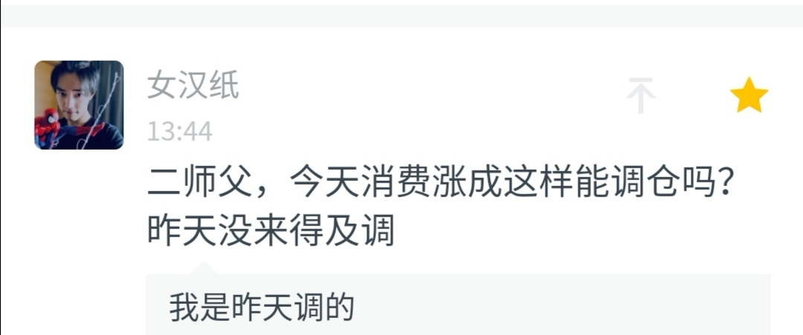

======================================================

_type: q&a
@梦[51522822251484]
2020-03-05 15:35:20 Thu  
topic_id: 421881448554528

@梦

>  请问二师父，目前有关于区块链的好的指数基金推荐吗？二师父是否看好区块链未来的发展？

@二师父

>  看好这个，不过还没发现类似的好基金

阅读[3176]  评论[1]  赞[0] 

======================================================

_type: talk
@kevin[48581111212258]
2020-03-05 15:51:44 Thu  
topic_id: 421881448288218

二师傅请问下场内和场外一样代码的基金，可以根据场外基金净值算场内溢价么，比如161128

阅读[3103]  评论[0]  赞[0] 

======================================================

_type: talk
@Kevin[844421841188512]
2020-03-05 16:14:27 Thu  
topic_id: 241881558444211

请问二师傅地产和基建中线是否看好，能否布局介入，另外保险类基金是否可以介入

阅读[3094]  评论[0]  赞[0] 

======================================================

_type: talk
@老孙头[422115118524548]
2020-03-05 16:16:23 Thu  
topic_id: 118558225118582

老师指数基金交易频率似乎有点高？小白往往反应不过来、跟不上，有点象股票炒波段？

@海马 at 2020-03-05 16:16:23 Thu

> 这是因为，老师每一天都在进步，不断改进投资系统，而我们一直在原地踏步，[呲牙]

----------

@庆余年 at 2020-03-05 16:16:23 Thu

> 正常来讲，一般都是周定投为主。但是有一部分基金操作是消息面影响，比如某些基金要有清掉风险，有些基金基本面太差需要调仓，有些基金在通过一段时间获利后需要收割一部分利益。所以最近看来有点频繁，之前跌的时候，学堂安静很多，哈哈哈。

----------

阅读[3226]  评论[2]  赞[0] 

======================================================

_type: q&a
@范毅君[118551121224142]
2020-03-05 16:37:27 Thu  
topic_id: 241881558242251

@范毅君

>  二师父，请问您认为今天的银行跟着涨幅，内在逻辑可能是什么，有没有可能持续，后续的操作策略是什么

@二师父

>  跟着美股涨啊，牛市鸡犬升天，后续继续持有主仓加网格交易

阅读[3402]  评论[3]  赞[0] 

======================================================

_type: talk
@二师父[28814221155551]
2020-03-05 16:46:34 Thu  
topic_id: 548118221888414

<e type="hashtag" hid="554251814154" title="#美联储降息带来的利好 #" /> 为啥涨，来看看。每日一赞，日赚一万。多分享和点赞啊，这样会得到更多

@范毅君 at 2020-03-05 16:46:34 Thu

> 哈哈，这个口号好

----------

@rtdmm小米 at 2020-03-05 16:46:34 Thu

> 选择比努力重要！

----------

@云卷云舒 at 2020-03-05 16:46:34 Thu

> 师父的文章，可以给我带来心灵的安宁，遗憾的是来的有点晚！努力学习[拳头][拳头][拳头]

----------

@What if at 2020-03-05 16:46:34 Thu

> 降息美股涨了一天，昨晚跌下来了

----------

阅读[4982]  评论[4]  赞[0] 

+++++++++++++++++++++++++++++++++++++++++++++++++++++

文件：
2020-03-05 16:45:57 Thu
文件大小：[17848]
88221215155222-美联储降息利好带动股市上涨.docx

======================================================

_type: q&a
@wty[548488548545444]
2020-03-05 17:01:13 Thu  
topic_id: 548118221842844

@wty

>  二师父好，我持仓银河沪深300价值有10%的仓位，收益不到5%，收益一般，打算全部卖掉或超级转换。超级转换想补充到目前轻仓的天弘食品饮料、或者易方达沪深300非银、或者工银深圳红利。望二师父指导，如何操作。

@二师父

>  这个不知道你的总仓位不好建议。
>  
>  食品饮料目前正常估值，对于这类指数，可以轻仓定投，但是你一下子转移到上面需要有防守的。
>  
>  至于300非银，今天涨的好是因为平安证券等爆发了，有一定的周期性，需要注意的。
>  
>  作为防守，50和深红利、基本面60都比300价值要强的，从选择上来看需要选择他们，而现在一次转换需要承受可能的潜在回撤，这个需要问自己是否能承受。风险比300非银是小一些。

阅读[3780]  评论[1]  赞[0] 

======================================================

_type: talk
@Pansy[48281554424548]
2020-03-05 20:37:47 Thu  
topic_id: 118558252212142

阶段总结：（2020.1.26-2020.3.5）
   疫情期间，听了二师父的课程，思考整理了一下，重新给自己定位，也重新给自己定目标。
   最近行情跌宕起伏，诱惑很多。但是仔细想了一下，鉴于自己是新手，对市场的把控力不足，还是应该定下心来，坚持从基础配置开始。给自己定好纪律，并且坚持执行。在实践中学习摸索。
可能下个周就要上班了，但是庆幸在疫情期间，达到了自己的目标—学习低估定投并且能够形成自己的基础配置。剩下的就是执行、实践、反思、学习！
   我的目标是在为自己的小家做好5年、10年甚至20年的家庭资产配置！加油[微笑]

@Pansy at 2020-03-05 20:37:47 Thu

> 学习了低估定投，接下来的小目标就是研究一下各种债券基金。朋友们如果有比较好的学习债券基金的渠道，希望可以告诉我，谢谢[抱拳]

----------

阅读[3372]  评论[1]  赞[0] 

+++++++++++++++++++++++++++++++++++++++++++++++++++++

图片：
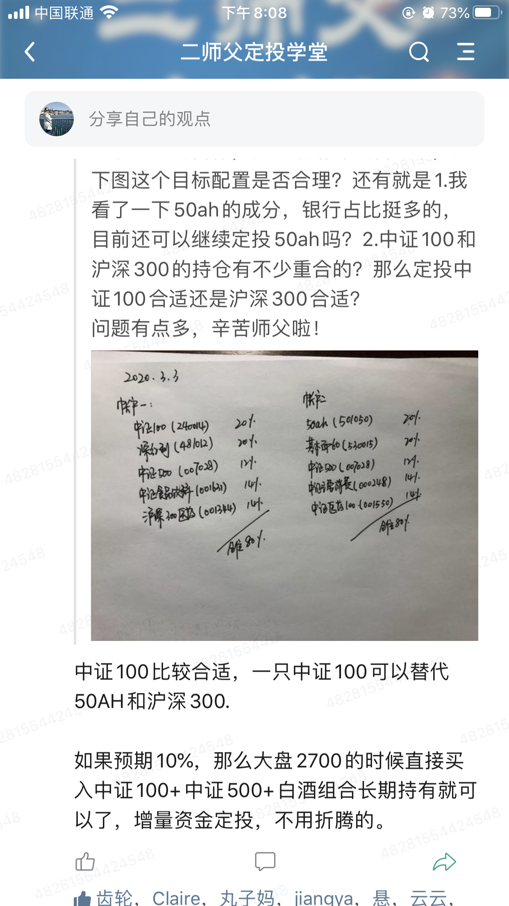
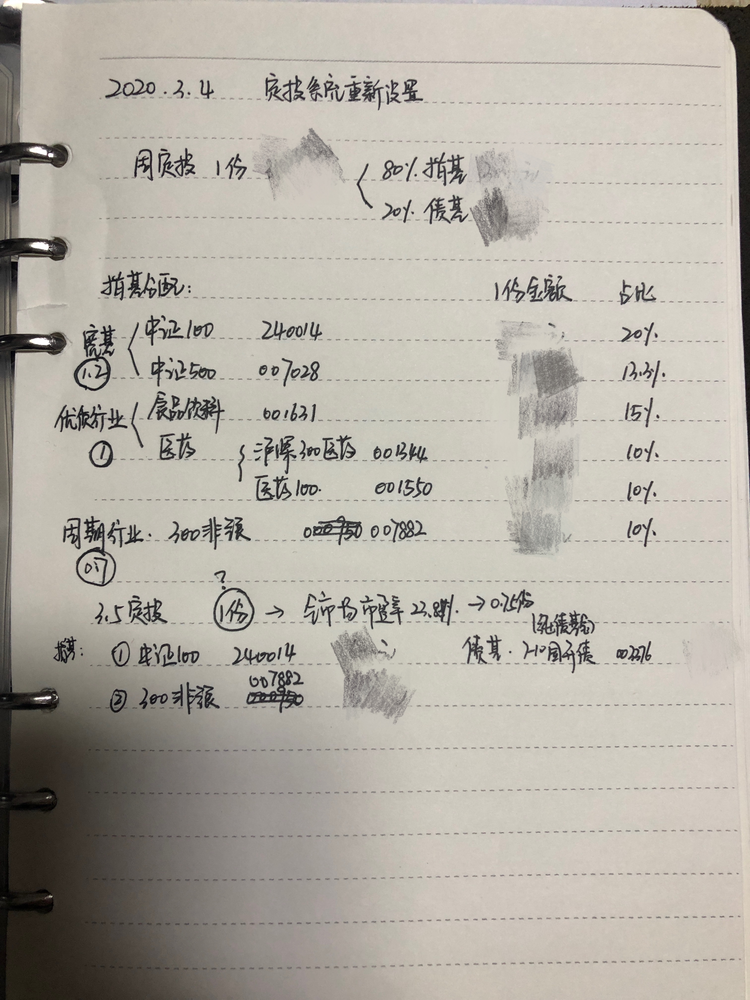

======================================================

_type: talk
@敏杰 Minjie[241844452525121]
2020-03-05 22:20:05 Thu  
topic_id: 118558255422112

二师父，dax30有个问题非常困扰我，百度查了很多资料无法找到答案。

dax场内和场外净值相差很大，并且走势也大有区别，这是场内和场外溢价造成的吗？
场内的价格比场外便宜很多，那是可以场内转场外赚溢价?

@敏杰 Minjie at 2020-03-05 22:20:05 Thu

> 好像纳斯达克100相差更大，[尴尬]是场内场外本来就是不同步的？相互转换的时候份额经过价格换算?

----------

阅读[3365]  评论[1]  赞[0] 

+++++++++++++++++++++++++++++++++++++++++++++++++++++

图片：
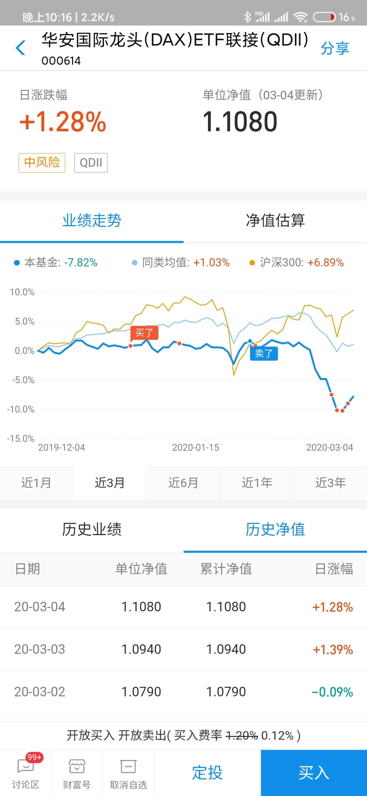
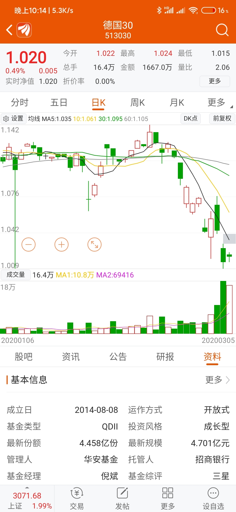

======================================================

_type: talk
@Nick.yang[118281888551882]
2020-03-05 23:23:44 Thu  
topic_id: 841881582515552

今天补了一点中证5g和天弘饮料，不知道二师傅看好这二个股吗，感觉自己投资有点多

阅读[3321]  评论[0]  赞[0] 

+++++++++++++++++++++++++++++++++++++++++++++++++++++

图片：
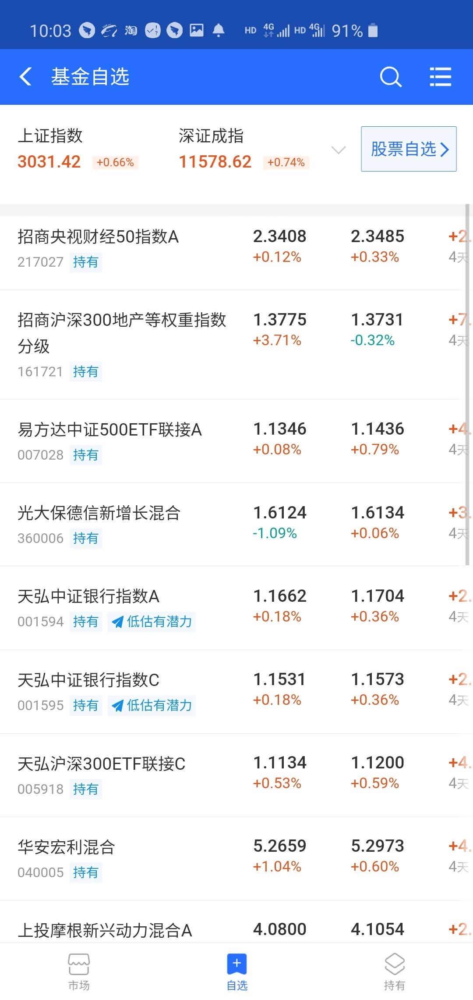

======================================================

_type: q&a
@Kevin[844421841188512]
2020-03-06 06:11:03 Fri  
topic_id: 241881552885521

@Kevin

>  请问二师傅地产和基建中线是否看好，能否布局介入，另外保险类基金是否可以介入

@二师父

>  地产可以，基建一般，保险类可入

阅读[3420]  评论[1]  赞[0] 

======================================================

_type: q&a
@田维海[422144441542418]
2020-03-06 06:13:43 Fri  
topic_id: 421881442885848

@田维海

>  师父，标普科技的历史PE走势在哪里查看？

@二师父

>  乌龟量化

阅读[3584]  评论[2]  赞[0] 

======================================================

_type: q&a
@钱小胖儿[844112855845212]
2020-03-06 06:13:55 Fri  
topic_id: 118558252512812

@钱小胖儿

>  二师傅，请问定投食品饮料和中证消费，是不是重复了

@二师父

>  有部分重复的

阅读[3706]  评论[0]  赞[0] 

======================================================

_type: talk
@二师父[28814221155551]
2020-03-06 09:06:40 Fri  
topic_id: 548118252522214

<e type="hashtag" hid="224522541111" title="#解读基金第四讲 #" />

阅读[5007]  评论[0]  赞[0] 

+++++++++++++++++++++++++++++++++++++++++++++++++++++

文件：
2020-03-06 09:06:23 Fri
文件大小：[20585]
28221214121141-解读基金第4讲.docx

2020-03-06 09:06:28 Fri
文件大小：[11329196]
51558584842214-解读基金第四讲.m4a

======================================================

_type: q&a
@Dolly[244124525445551]
2020-03-06 09:12:20 Fri  
topic_id: 118558242424582

@Dolly

>  二师父，之前开户的广发证券还有优惠吗？我开户后没买过，不知道是否还有费率优惠

@二师父

>  有的，这个你联系客户经理

阅读[3700]  评论[12]  赞[0] 

======================================================

_type: q&a
@平安是福[118222545154542]
2020-03-06 10:15:54 Fri  
topic_id: 548118252845124

@平安是福

>  师父：今天的债可以打吗？

@二师父

>  可以

阅读[3591]  评论[0]  赞[0] 

======================================================

_type: talk
@二师父[28814221155551]
2020-03-06 10:39:53 Fri  
topic_id: 421881458412118

<e type="hashtag" hid="552145455184" title="#可转债#" /> 最近可转债牛市，可以选择可转债盲打，如果破发就拿着

可转债也可以购买，选择价格低的，溢价率低的可转债分散购买，这个投资品种比股票还是小一些。

盈利在10%到50%之间可以卖出，运气好也能够碰到翻倍的可转债，这个完全运气，实现超越指数的收益率还是可以的，作为防守进攻性配置，这是个好品种。

@J at 2020-03-06 10:39:53 Fri

> 师傅可以具体说下操作方法吗？例如价格低的范围是大概多少？溢价率低的范围又是多少？之前都是打新申购，没试过直接购买

----------

阅读[4812]  评论[1]  赞[0] 

======================================================

_type: q&a
@黎雄[841555255485222]
2020-03-06 11:37:15 Fri  
topic_id: 421881458555458

@黎雄

>  师傅163210若安纯债可以分析一下投资价值嘛，适合什么时候买入和卖出

@二师父

>  债券基金防守配置，在利率预期下跌时候配置，或者利率高位时候配置，场外可用博时信用债替代

阅读[3509]  评论[0]  赞[0] 

======================================================

_type: q&a
@光年之外的饭团[118222815212212]
2020-03-06 15:00:11 Fri  
topic_id: 548118258182424

@光年之外的饭团

>  恒生指数现在可以投吗

@二师父

>  可以定投了

阅读[2914]  评论[0]  赞[0] 

======================================================

_type: q&a
@月月半[421185244454128]
2020-03-06 15:00:30 Fri  
topic_id: 118558248415282

@月月半

>  你好，我刚进入星球，我之前在华泰证券上开户过，请问怎么能够看到鳄鱼计划？

@二师父

>  在星球搜索鳄鱼计划

阅读[3070]  评论[0]  赞[0] 

======================================================

_type: talk
@范毅君[118551121224142]
2020-03-06 15:21:14 Fri  
topic_id: 118558248828142

我2.28日买入的基金，今天想卖出，显示没有持有一周，请问大家持有一周是怎么计算的啊？是满七个工作日吗？要知道今天也不满一周，昨天就卖了😂，结果今天更不能卖了

@April _ M. at 2020-03-06 15:21:14 Fri

> 持仓7个工作日哦

----------

@拥抱太阳的风筝 at 2020-03-06 15:21:14 Fri

> 7个自然日，也就是7天，不管是不是工作日

----------

@范毅君 at 2020-03-06 15:21:14 Fri

> 两个答案了，二师父能不能来个权威答案[呲牙]

----------

@范毅君 at 2020-03-06 15:21:14 Fri

> 百度的[呲牙][呲牙]对不对大家看，我正好周五买的，应该下周一可以卖

----------

@陈伟 at 2020-03-06 15:21:14 Fri

> 扣税很厉害哦

----------

阅读[2915]  评论[5]  赞[0] 

======================================================

_type: talk
@二师父[28814221155551]
2020-03-06 16:49:43 Fri  
topic_id: 118558212425112

<e type="hashtag" hid="824522255282" title="#MSCI表示美股进一步下跌 #" />

@烟九•二手车 at 2020-03-06 16:49:43 Fri

> 跌那么多，预计国外资金是否会来国内哈

----------

@范* at 2020-03-06 16:49:43 Fri

> 美股啊，美股。🐴🐴的
兵贵神速。持久战我是不会打的。不能让资金陷入泥潭。跌破支撑位，我就撤退。
就目前来看，没破前期支撑位。
这次干美股，失算在场外购买那天晚上，美股涨的太多了。

----------

阅读[4258]  评论[2]  赞[0] 

+++++++++++++++++++++++++++++++++++++++++++++++++++++

文件：
2020-03-06 16:49:29 Fri
文件大小：[17637]
51558422214214-MSCI表示美股将进一步下跌，而美股对A股的影响越来越小.docx

======================================================

_type: talk
@二师父[28814221155551]
2020-03-06 17:14:32 Fri  
topic_id: 118558212124812

<e type="hashtag" hid="824522252882" title="#关于股票投资 #" /> 为什么我从来不在星球讲股票，也不大推荐，因为每个人水平不一样，股票投资难度，只有你去市场亲自用自己的钱做过才知道，模拟的不算。

同样一只股票，有的人买了就赚，有的人买了就亏，和股票没有任何关系的，更重要的是投资人的财务、金融、哲学、心理等等一系列的因素决定的，只有投资选股，买入，卖出包括心态稳定，每一个环节都不出错，最后才能获胜。

如果你有看好的企业，可以发出来我们一起分析基本面，一起学习进步，但是不做任何买卖建议。

最重要的是，卖出股票一定是卖出基本面不行的，而不是把盈利的卖了，优质的上市企业可以长期终身持有，而劣质的企业，基本面不行，不符合独孤九剑里面很多条规则的，赶紧抛了，越快越好。

@向前进 at 2020-03-06 17:14:32 Fri

> 二师父，您觉得5G龙头股中兴通讯基本面怎么样，谢谢

----------

阅读[3054]  评论[1]  赞[0] 

======================================================

_type: q&a
@梦[51522822251484]
2020-03-06 17:58:09 Fri  
topic_id: 241881545184421

@梦

>  二师父，我看了一个专注于5g的指数基金001617，请问您觉得这个指数基金如何？我看现在好像不是低估状态，是不是不是开始定投的时机呢？

@二师父

>  这个是电子类指数，5g指数估值表有的，目前半导体和5g都比较贵，可以关注下科技类指数

阅读[3064]  评论[0]  赞[0] 

======================================================

_type: q&a
@陈伟[88511115141112]
2020-03-06 19:56:34 Fri  
topic_id: 421881422842188

@陈伟

>  师父，我要跟你做鳄鱼计划？应该怎么操作？是跟着调仓走吗？还是要买入一批？

@二师父

>  鳄鱼计划不建议跟投，只是操作参考，没有系统的风险防控，风险较大，乌龟计划可以直接建仓，然后跟投

阅读[2932]  评论[4]  赞[0] 

======================================================

_type: q&a
@HeLLO[15548451524442]
2020-03-06 21:20:09 Fri  
topic_id: 421881421444428

@HeLLO

>  师父我定投的汇富添医药基金目前盈利53%，而且也高估了，要收割利润还是适合全部买出，跟他一起定投的广发中证环保刚刚才1.3%盈利，师父对广发中证环保如何看？要调仓？

@二师父

>  看你的配置，可以减仓部分，医药适合长期持有
>  
>  环保这个赛道不好，已经分析过，可以调仓

阅读[2869]  评论[3]  赞[0] 

======================================================

_type: q&a
@次郎🌻[48551412448858]
2020-03-06 22:53:31 Fri  
topic_id: 841881541242282

@次郎🌻

>  师父，怎么观察自己打到的可转债什么时候上市？

@二师父

>  上市之前账户会通知，集思录也有数据

阅读[2853]  评论[0]  赞[0] 

======================================================

_type: q&a
@凭栏观海[244414845852181]
2020-03-06 22:54:11 Fri  
topic_id: 241881541212581

@凭栏观海

>  我的医药100目前已经盈利40%，前段达到高估时已经卖了1/3，现在还想再卖剩下的一半，这样操作可以吗？

@二师父

>  如果继续上涨你不追高那这种操作就可以

阅读[2948]  评论[0]  赞[0] 

======================================================

_type: q&a
@陈飞🤗[841521421222252]
2020-03-07 07:11:35 Sat  
topic_id: 118558285881122

@陈飞🤗

>  恒生159920场内可以建立底仓了吗？

@二师父

>  已经投入多少，核心是否配置了，目前恒生距离历史最大下跌幅度45个点，可以接受就可以建底仓

阅读[2813]  评论[0]  赞[0] 

======================================================

_type: talk
@树叶[544811512145144]
2020-03-07 08:42:35 Sat  
topic_id: 421881412584218

<e type="hashtag" hid="142825811122" title="#定投周报#" /> 二师父定投周第49期

阅读[2912]  评论[0]  赞[0] 

+++++++++++++++++++++++++++++++++++++++++++++++++++++

文件：
2020-03-07 08:42:31 Sat
文件大小：[257783]
28221454525251-二师父定投周报3.7（第49期）.docx

======================================================

_type: talk
@Simon[421211484228258]
2020-03-07 09:43:39 Sat  
topic_id: 421881412225288

二师傅，我现在持有6只基金，都是乱买的，怎样精炼啊？该如何重新配置？预计定投资金3万，该如何配置方案？达到攻守平衡[抱拳][抱拳][抱拳]

@二师父 at 2020-03-07 09:43:39 Sat

> 沪深300加中证500，加消费加医药，加债券

----------

@Simon at 2020-03-07 09:43:39 Sat

> 其他基金是否要减少？

----------

@Simon at 2020-03-07 09:43:39 Sat

> 具体加哪些？

----------

@二师父 at 2020-03-07 09:43:39 Sat

> 自己不懂的基金都可以减了

----------

@Simon at 2020-03-07 09:43:39 Sat

> 一般保留几只基金为好？

----------

@二师父 at 2020-03-07 09:43:39 Sat

> 新手6只到8只

----------

@Simon at 2020-03-07 09:43:39 Sat

> 里面有华夏5G，广发科技，华宝科技，3只科技股，是否要精简？

----------

阅读[2693]  评论[7]  赞[0] 

+++++++++++++++++++++++++++++++++++++++++++++++++++++

图片：
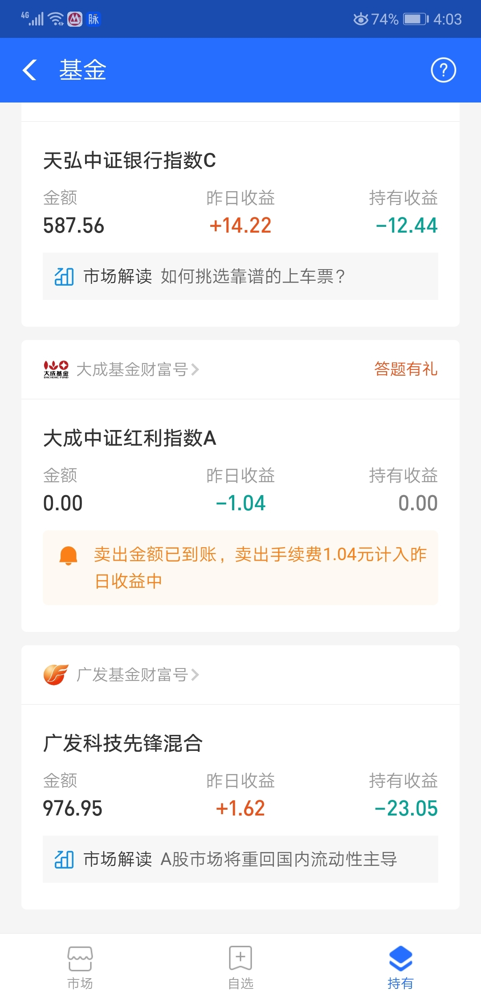
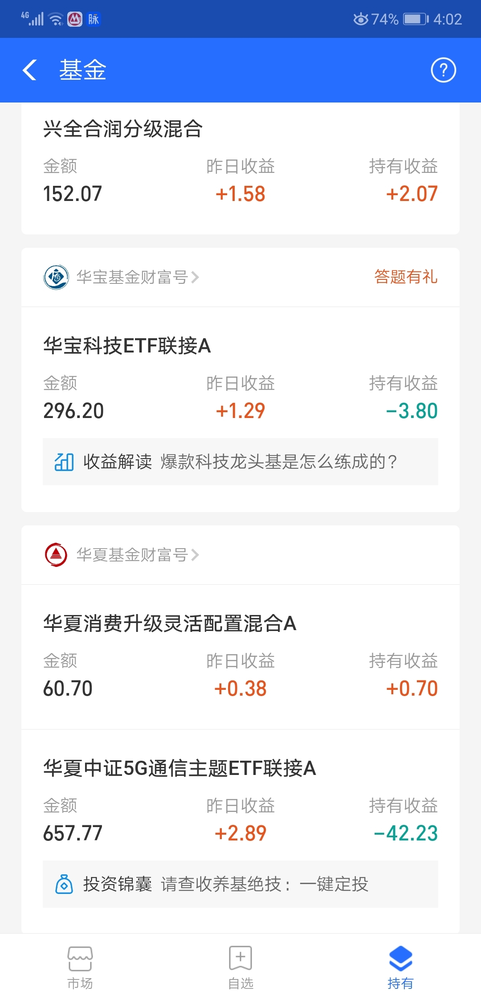

======================================================

_type: q&a
@衣袂飘香[118248548242452]
2020-03-07 10:27:35 Sat  
topic_id: 841881514245112

@衣袂飘香

>  突然想到一个问题，请问二师父，鳄鱼计划与乌龟计划的资金对比，比例是多少？

@二师父

>  乌龟计划是增量资金定投，鳄鱼计划是存量资金定投，没有固定的比例

阅读[2851]  评论[1]  赞[0] 

======================================================

_type: talk
@二师父[28814221155551]
2020-03-07 11:53:03 Sat  
topic_id: 548118121244554

<e type="hashtag" hid="141244182512" title="#估值 #" /> 学会估值，克服投资过程中的恐惧和贪婪。<e type="web" href="https://www.tradingview.com/symbols/TVC-DJI/" title="Dow+Jones+Index+Chart+–+DJI+Quote+—+TradingView" cache="" />，TRADING VIEW可以查阅一些数据，学会利用各个网站多指标估值，二师父的公众号每天新增订阅数以及读者评论情绪也是作为一个估值指标的。

包括生活中，大家谈论股票的热情以及散户开户的热情都可以作为股市估值指标的。从2019年这一年到现在是个结构性牛市，因为部分投资人赚钱了，很多不懂投资的开始入场了。

多个指标结合，经济基本面的，宏观面的，生活情绪面的，都拿来对比分析下，就不会恐惧了

阅读[3077]  评论[0]  赞[0] 

+++++++++++++++++++++++++++++++++++++++++++++++++++++

文件：
2020-03-07 11:50:05 Sat
文件大小：[158437]
88221454458582-学会估值，就可以克服投资过程中的恐惧和焦虑.docx

======================================================

_type: talk
@梅花[841184181541452]
2020-03-07 15:47:35 Sat  
topic_id: 421881845542888

二师傅好！我是今天进的知识星球，对定投没有基础，春节后买了二十个基金，都是自己乱买的，麻烦看一下是否合理？谢谢！

阅读[2630]  评论[0]  赞[0] 

======================================================

_type: talk
@范*[841855284221812]
2020-03-07 15:54:23 Sat  
topic_id: 241881852288451

给大家分享下我的操作方法
不加仓，不减仓。因才施仓。
以最近波动来决定一次性建仓
比如美股我给它30%的最大仓位上限
上次我建仓美股的时候，那几天上下4%的波动。等跌到支撑位就买入。
根据4%的波动，100万资金建仓标准4%的波动＝总资金1%＝1万
1万÷4%＝25万
就是说买进25万后，连续2个交易日下跌8%也不过才损失总资金的2%那么当出现这种情况也就是支撑位破的时候了，我就止损了。亏损了总资金2%
止损后，等美股跌到支撑位的时候，我就会根据波动买进去。要是1%的波动就买进30%的仓位。
这次我买进30%的仓位是因为场外有折价。25%＋折价4%   场外不好操作妈妈的  这次买进位置不理想
对于其他行业，如原油，黄金，周期行业只给10%的仓位上限。连住2个跌停也不过损失总资金2%，一般我买这种都是一次10%，因为机会稍纵即逝，慢慢买进涨起来的话，资金利用率太低了，没啥意义。
不会越跌越补仓，因为如果你碰到08年那种情况绝对不死也得脱层皮。
我只会买在支撑位，卖在跌破支撑位。有时也会买在突破位，卖在压力位。但我更喜欢买在支撑位，因为这符合，我内心高抛低吸的标准。
希望能帮到大家。

@范* at 2020-03-07 15:54:23 Sat

> 还有一点，为什么每个仓位都设上限
第一，因为分散投资
第二，其他行业有好的机会时，可以投资。就像打仗一样，你的兵力都去打一个国家，本国可能遭到别国偷袭。

----------

@范* at 2020-03-07 15:54:23 Sat

> 资本市场就是没有硝烟的战场，最重要的是不要死在战场上。活下来，比什么都重要。

----------

@范* at 2020-03-07 15:54:23 Sat

> 顺便说一下，债劵给仓位是90%到100%

----------

@志亮 at 2020-03-07 15:54:23 Sat

> 这种趋势交易不错，我近来股票也打算这样弄，这样有自己的投资框架才保险。

----------

@二师父 at 2020-03-07 15:54:23 Sat

> 做趋势可以看看缠论

----------

@志亮 at 2020-03-07 15:54:23 Sat

> 谢谢二师父提醒，我去学习一下[微笑]

----------

@范* at 2020-03-07 15:54:23 Sat

> 求书若渴，还有什么书？二师父

----------

@二师父 at 2020-03-07 15:54:23 Sat

> 股票大作手回忆录

----------

阅读[2723]  评论[11]  赞[0] 

======================================================

_type: q&a
@素兮[548121415528244]
2020-03-07 18:20:45 Sat  
topic_id: 548118124121884

@素兮

>  二师父的鳄鱼计划在指数进入正常估值时会收割利润么？

@二师父

>  看仓位和市场预期，做动态平衡，如果仓位很重，9成仓位，单一指数仓位也很重，指数上涨预期乏力，会减仓
>  
>  反之，仓位较低，就不用了

阅读[2831]  评论[0]  赞[0] 

======================================================

_type: talk
@二师父[28814221155551]
2020-03-07 18:27:33 Sat  
topic_id: 548118124184514

<e type="hashtag" hid="281854444451" title="#读者提问#" /> 这个配置有什么需要优化的

这些标的都很好，a股蓝筹和红利作为基本配置，占据核心仓位，一直坚持就好，主要是控制仓位，极度保守目前仓位也要在6成，极度激进，目前仓位也别超过9成

其他没啥问题，定投好了，耐心持有就可以

@是喵喵吖～ at 2020-03-07 18:27:33 Sat

> 二师父，目前仓位还是有点低是吧 尤其是宽基指数这类的。还是应该先定投这些 或者如果有机会像前段时间大盘跌的时候最好再多买入一些 先把底仓位建好 对吗

----------

@二师父 at 2020-03-07 18:27:33 Sat

> 总仓位在7成是比较合适的

----------

阅读[3015]  评论[2]  赞[0] 

+++++++++++++++++++++++++++++++++++++++++++++++++++++

图片：
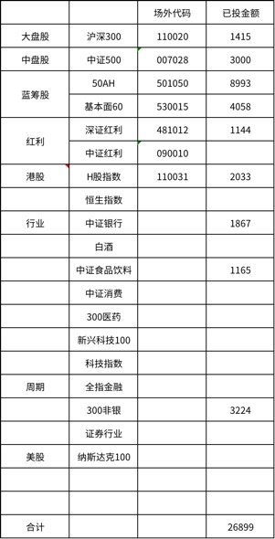

======================================================

_type: talk
@二师父[28814221155551]
2020-03-07 20:56:52 Sat  
topic_id: 841881885184882

<e type="hashtag" hid="824522111842" title="#价值投资原版书籍证券分析 #" /> 这本书值得学习

阅读[4019]  评论[0]  赞[0] 

+++++++++++++++++++++++++++++++++++++++++++++++++++++

文件：
2020-03-07 20:56:44 Sat
文件大小：[28439219]
28221488455441-证券分析（原书第6版 · 珍藏版）.pdf

======================================================

_type: talk
@范*[841855284221812]
2020-03-07 22:04:40 Sat  
topic_id: 548118111545254

二师父
缠论原版在这个微博上吧，好像很牛B啊，百度都能搜到。传说的牛散吗？我有些迫不及待了。

@二师父 at 2020-03-07 22:04:40 Sat

> 不过缠师已经去世了，他的很多理论还没写完

----------

@范* at 2020-03-07 22:04:40 Sat

> 这个好，这个好。我看完后一定分享一下心得。

----------

@范* at 2020-03-07 22:04:40 Sat

> “教你炒股票”这样的题目，全中国不会有第二人比本ID更适合写的。
开头这么牛B   今天不看完不睡觉。

----------

@范* at 2020-03-07 22:04:40 Sat

> 二师父，作者写的故意上人看不懂，只看懂了，第一次转折不是转折，第二次往后才可能是真正的转折，越往后概率越大。以及日线周线等各种均线之间的关系。行情都是由小周期均线推进大周期均线完成的，先能看到小周期行情，后看到后大周期行情。我个人觉得就看日K线就行了。这本书，我觉得讲的是趋势本身上涨下跌横盘，没有什么头肩顶什么的，看的也比较根本，但为何要把简单的东西说这么复杂？
看到网上解释此书的内容，感觉更可怕了，比作者更复杂玄乎了，说的啥我都不知道。有一点我比较赞同，看到当下，买在当下，卖在当下。

----------

@二师父 at 2020-03-07 22:04:40 Sat

> 我不看这个，除了均线，成交量

----------

阅读[2848]  评论[5]  赞[0] 

+++++++++++++++++++++++++++++++++++++++++++++++++++++

图片：
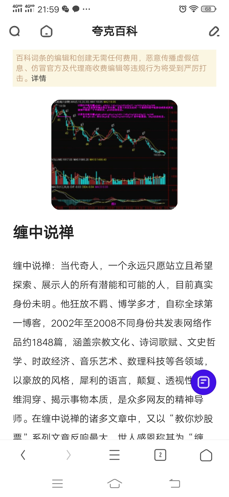

======================================================

_type: talk
@二师父[28814221155551]
2020-03-07 22:26:09 Sat  
topic_id: 841881888484512

<e type="hashtag" hid="141241221252" title="#读者提问 #" /> 师父，你帮我看下我的现在养的基，有点多，之前都是乱看乱买的，刚开始跟着你学习，上面几只是从跟你学习之后开始购入的，这个配置怎么样，下面有一些科技类的基是早先买的，现在要不要出，我也不懂，这水很深啊，我要好好学习，二师父，你给我指点指点，谢谢啦

这个跟我买的没啥问题，长城优选组合这个基金是混合基金，股票的配置比例很高的。调仓很频繁，只能靠相信基金经理，在2019年9月30日的持仓是第一大重仓股汇顶科技，在2019年12月的持仓汇顶科技降了2%，然后新增了欧普照明、光环新网、浪潮信息，很显然这个投资者是趋势投资跟着市场热点走，对于混合基金，在熊市以及无效市场可以超越指数基金，但是在牛市或者有效市场很难超越指数基金。

创新成长混合基金，这个和长城优选混合是一个类型的配置重复了。

华安媒体互联网混合：这个更没法分析，在2019年12月31日调仓新增了顺网科技、工业富联、天赐材料、万达电影等5只重仓股票。基金经理调仓过于频繁，2019年9月也是如此，市场什么热就调仓什么，短期涨的很快的，如果你相信基金经理可以跟着，但是无法评判价值，因为基金经理换了那么不知道下一个基金经理的水平。

@栀子花开 at 2020-03-07 22:26:09 Sat

> 你这个收益还不错啊，我去年11月买了中欧时代先锋和交银新生活力混合，收益也才10个点

----------

阅读[3042]  评论[1]  赞[0] 

+++++++++++++++++++++++++++++++++++++++++++++++++++++

图片：
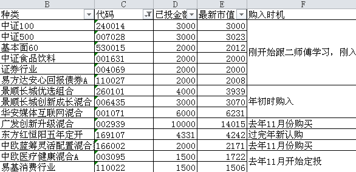

======================================================

_type: talk
@二师父[28814221155551]
2020-03-07 22:34:05 Sat  
topic_id: 841881888158252

<e type="hashtag" hid="824524554822" title="#关于学习方法 #" /> 大家在学堂学习需要注意几点问题。

第一，不要在乎买什么，卖什么，而要学习投资思想，提高认知，从底层逻辑提高。否则，你的认知不到位，熊市容易动摇，牛市容易追涨，反正左右打脸，如果加强学习深化投资思维就好一些。

第二、多交流，独学而无友，则孤陋寡闻，不管对的错的，多分享，多吸收，同时保持谦卑的心态，态度很重要，闻道有先后，术业有专攻，如是而已。

每个人都有每个人擅长的，优秀的人总善于从别人的身上学习，谦虚一点，三人行，必有我师，我也在不断的像大家学习

学习最怕自负，尤其是受过高等教育的，总困在自己既有的认知里面，这样很难进步。

第三，提问三原则。高中时期我对自己数学提出过三不问原则，课本公式没有认真学习推演一遍不问，老师讲解的笔记没有认真推演一遍不问，没有提出自己的见解之前不问。这三点做到之后很多问题自然就明白了。

现在学习基金也一样，没有看过五部定投法的不问，没有学习过课程的不问，没有提出过自己关于基金或者企业分析见解的不问，不然问了也白问，因为基础不牢，我给你讲了可能也非常难理解。

希望大家学会学习，不光是基金投资，人生中很多东西都要学习，知识并不重要，重要的是学习能力，这也就是为什么很多人大学学习好，毕业了表现不好的原因。不会学习，学习是一辈子的事，学习是全方面的事，希望大家学会学习。

@陈伟 at 2020-03-07 22:34:05 Sat

> 先学后问，不学不问

----------

@三峡情 at 2020-03-07 22:34:05 Sat

> 二师父学霸[偷笑]

----------

@王模堂 at 2020-03-07 22:34:05 Sat

> 学问学问，边学边问。

----------

@孟倩 at 2020-03-07 22:34:05 Sat

> 人这一辈子都是学生，想学哪里都能学到东西。

----------

阅读[4420]  评论[4]  赞[0] 

======================================================

_type: q&a
@海马[15158245825242]
2020-03-08 08:50:03 Sun  
topic_id: 841881225545182

@海马

>  师父，你可以教一下我们怎样分析或者跟踪主动管理型基金的方法和策略吗？谢谢。之前还有一部分持有主动股基

@二师父

>  选择主动基金，首先需要考察基金经理，看他的历史业绩
>  
>  第二，要考察基金经理过往基金的投资风格，是价值还是趋势，按照自己想要的风格选取
>  
>  第三，不同市场环境需求不同，熊市的时候侧重防守，可以选择债券偏高的基金，牛市的时候选择股票偏高的基金
>  
>  第四，观察持仓股票，根据我的独孤九剑选股方法对比，考察持仓股票财务状况，如果有垃圾股票很多，而且一直没动，就要警惕
>  
>  第五，追踪基金经理是否更换，如果基金经理更换，股票调仓幅度大，再考察下持仓股票基本面

阅读[3074]  评论[1]  赞[0] 

======================================================

_type: talk
@冉冉[88445118854412]
2020-03-08 09:15:47 Sun  
topic_id: 841881225224512

二师傅，周五恒指买时多按一位数，现在恒指仓位十层，下一步怎么走？恳请指点，谢谢！

@二师父 at 2020-03-08 09:15:47 Sun

> 卖出部分降到合适仓位

----------

阅读[2965]  评论[1]  赞[0] 

======================================================

_type: q&a
@冯林锋[841551141441422]
2020-03-08 10:03:14 Sun  
topic_id: 421881554282148

@冯林锋

>  二师父，能否将华宝油气的份额赎回，转入南方原油，

@二师父

>  可以，油气基本面恶化，赎回以后从场内申购南方原油，按照这个跌幅下周仍旧有溢价

阅读[3193]  评论[2]  赞[0] 

======================================================

_type: talk
@二师父[28814221155551]
2020-03-08 10:08:28 Sun  
topic_id: 241881225124181

<e type="hashtag" hid="224524851141" title="#学堂女神节日快乐#" /> 致学堂女神，节日快乐，天天开心，越来越年轻，长按复制此条消息，去支付宝首页进行搜索uHC3xSH55vm，有惊喜啊，男同志就别搜了，搜了就是惊吓。

@杨荧 at 2020-03-08 10:08:28 Sun

> 谢谢二师父

----------

@雨的依恋 at 2020-03-08 10:08:28 Sun

> 谢谢师父[玫瑰][玫瑰][玫瑰]

----------

@alicedream* at 2020-03-08 10:08:28 Sun

> 谢谢二师父！[胜利]

----------

@是喵喵吖～ at 2020-03-08 10:08:28 Sun

> 谢谢二师父[愉快]

----------

@王雷 at 2020-03-08 10:08:28 Sun

> 谢谢二师父

----------

@王燕 at 2020-03-08 10:08:28 Sun

> 谢谢二师父！

----------

@衣袂飘香 at 2020-03-08 10:08:28 Sun

> 谢谢二师父，节日同乐！

----------

@向前进 at 2020-03-08 10:08:28 Sun

> 谢谢二师父

----------

阅读[4310]  评论[29]  赞[0] 

======================================================

_type: talk
@二师父[28814221155551]
2020-03-08 16:21:06 Sun  
topic_id: 118558448141182

<e type="hashtag" hid="824584511822" title="#科技指数#" /> 核心配置，宽基+消费+医药+金融+科技。这四个是主要需要把握的。

从下周开始，学堂周一、周二、周三、周五都来读书，如果有好的标的，二师父会分析下他们的价值，对于混合基金，虽然我不投资，不过二师父会分析他们的价值，帮助不同的投资者做选择并且理解基金经理的理念。

发觉很多朋友还是局限在买什么基金和品种，真正的投资首先是认知和思维分野，如果投资理念和思维方式不对，那么理财最终也无法帮助你致富。所以不管是财经学院和定投学堂，二师父都将以读书来帮助大家改善思维认知，这是一个长期的过程，然后理论实践结合，一边学习，一边实践，两条腿走路是比较好的。只有一个人的认知思维改变了，格局提升了，不再执著于一个基金的盈利和亏损，那么以后即使你不再依靠我，也能做好投资的。

定投学堂主要是基本面分析，财经学院就是宏观和经济学思维讲解，既能够学会分析基本面，也能够看懂宏观，学会金融思维，这样的话以后不管投资什么都会自己分析决断，而不再局限基金了。

还有关于华宝油气，仓位轻的话可以拿着，仓位重的话减仓一部分到南方原油，最近看趋势原油还会继续大跌，投资者不要盲目抄底，比较危险的，2016年那时候原油暴涨主要是因为减产协议签署了，而现在沙特面临增产降价以及减产协议泡汤的危险，所以还是别接飞刀。

@以古论今 at 2020-03-08 16:21:06 Sun

> 美股科技和医药，可以定投吗?需要配置吗？

----------

@二师父 at 2020-03-08 16:21:06 Sun

> 等标普信息科技或者纳斯达克估值下来了可以配置

----------

@秦风殇韵（刘豫斌） at 2020-03-08 16:21:06 Sun

> 这两个科技股指数适合场内还是场外呢？

----------

@二师父 at 2020-03-08 16:21:06 Sun

> 主要看是否有折溢价

----------

@April _ M. at 2020-03-08 16:21:06 Sun

> 默默等待纳斯达克、医药的估值下来进行配置，要耐得住性子！

----------

@范* at 2020-03-08 16:21:06 Sun

> 南方原油打死也拿着，不盈利不出场。看吧。现在可能就是底部，现在是最需要忍耐的时间。除非原油再来个10%的跌幅，不然，我是不会出场的。跌10%，貌似不可能了。原油低于40元以下的时候，地球就会“冒烟”我决定明天加10%的仓。这是极限了，不能再加了。这个飞刀，我敢接，你们都恐惧了。

----------

@范* at 2020-03-08 16:21:06 Sun

> 你们恐惧的时候，就是买入的最好时刻。

----------

@吴涛 at 2020-03-08 16:21:06 Sun

> 二师父，定投学堂和财经学院是在荔枝微课上的吗？还是在知识星球上？

----------

阅读[4220]  评论[9]  赞[0] 

+++++++++++++++++++++++++++++++++++++++++++++++++++++

文件：
2020-03-08 16:13:25 Sun
文件大小：[20611]
15448142455112-新兴科技100和科技龙头指数投资价值分析.docx

======================================================

_type: talk
@二师父[28814221155551]
2020-03-08 19:16:21 Sun  
topic_id: 118558412812822

<e type="hashtag" hid="224545582521" title="#关于金钱#" /> 千万别借钱，若非借不可，就像银行借，千万别借给别人钱，若一定要借，那就做好他不还的准备

@三峡情 at 2020-03-08 19:16:21 Sun

> 是的，一般人不借，一定推不掉的人少借点，一方面不还损失不大，另一方面人家还起来也不吃力

----------

@志亮 at 2020-03-08 19:16:21 Sun

> 突别是别借给炒股的人[微笑]

----------

@好运玲玲 at 2020-03-08 19:16:21 Sun

> 我老公09年借了30万给朋友，现在朋友躲着不见，也联系不上，吃了大亏[流泪]，现在再也不借钱了

----------

@向前进 at 2020-03-08 19:16:21 Sun

> 去年借出去的钱，说借一个月的，追问多次总是往后推，还经常不接电话，不回微信，感觉换了个人似的，哎，再不还打算起诉了

----------

阅读[2871]  评论[4]  赞[0] 

======================================================

_type: q&a
@老妖[118514521115522]
2020-03-08 20:14:09 Sun  
topic_id: 841881245451582

@老妖

>  目前这轮行情完全是资金推动和政策的窗口指导。简而言之，国家希望社会经济稳定，大家在家里有事情做。所以行情会涨。虽然疫情影响了实体经济；但是股市却涨了。
>  那么随着中国逐渐控制住疫情的局势，经济必然恢复常态，政策不可能永远刺激。所以行情的表现和疫情正相关：疫情严重，行情火爆；疫情平稳下跌，行情逐渐熄火。我想问这种情况是否适合美股？如何标普适合建仓的时候可否学堂重点提示一下

@二师父

>  中国股市和美国股市完全是两种不同的情况，世界经济是最难预测的。
>  
>  对待这次事情采取的措施也不同，学会演绎推理，而不是归纳，中美太多不同。
>  
>  不过有几个指标可以重点关注，原油大跌，美国10年期国债收益率突破历史低位，根据我的估值，美股目前并不便宜，而记住利率和通胀环境都是利好股市的。

阅读[2844]  评论[0]  赞[0] 

======================================================

_type: q&a
@April _ M.[841582144212812]
2020-03-08 20:17:17 Sun  
topic_id: 118558415524882

@April _ M.

>  二师父，我目前50AH，基本面60和中证500增强都盈利在15%左右。看到估值表里50AH目前低估，基本面60估值正常，不太确定是否需要收割一波利润 （目前我依旧在轻仓定投这两支基金）

@二师父

>  这取决于你的总仓位，总仓位过多可以减少的，而最怕的就是，卖出之后碰到市场上涨又去追高。如果不知道怎么操作，就严格按照纪律，不要想太多

阅读[2857]  评论[4]  赞[0] 

======================================================

_type: q&a
@老妖[118514521115522]
2020-03-08 20:46:35 Sun  
topic_id: 118558411221242

@老妖

>  师父，一般常规操作个人的年化收益差不多在是在百分之15左右，而像查理芒格他的操作一般是，耐心等待绝佳的机会，然后狠狠出手，是不是可以理解为:平时保持空仓或者轻仓，然后等待可以抄底的时候，满仓或者重仓，如果有这种耐心，可取不？

@二师父

>  可取，类似他们那样的投资大师很少出手的，例如你在2019年1月一次投入比定投收益好的多，这需要极大的耐心和定力。如果能够做到，是可取的。

阅读[2959]  评论[4]  赞[0] 

======================================================

_type: q&a
@吴涛[48244118421828]
2020-03-09 05:10:46 Mon  
topic_id: 241881215525121

@吴涛

>  二师父，您好，我是吴涛，己关注您有二年了，收获很多，我想建立自己的符合自己长处的投资系统，您推荐的书己看了，并写下自己的认识并发您邮箱了，请您看后给指导下，请回我邮箱，谢谢！

@二师父

>  我没收到，你再发下

阅读[2755]  评论[1]  赞[0] 

======================================================

_type: talk
@竺胜江[841881441421582]
2020-03-09 09:42:09 Mon  
topic_id: 421881512511518

南方原油误操作（原油跌23%）跌停价买进了😥，明天马上又一个跌停是跑不掉了

@HeLLO at 2020-03-09 09:42:09 Mon

> [尴尬]

----------

@杜志彪 at 2020-03-09 09:42:09 Mon

> 买一手不就不心疼了吗[偷笑]

----------

@杜志彪 at 2020-03-09 09:42:09 Mon

> 最低到过9美元

----------

@竺胜江 at 2020-03-09 09:42:09 Mon

> 9美元，不会这么狠吧，已经哭晕在厕所了

----------

@杜志彪 at 2020-03-09 09:42:09 Mon

> 二师父也买了。

----------

@杜志彪 at 2020-03-09 09:42:09 Mon

> 你了解一下原油再贪婪也不迟[偷笑]

----------

@若水三千 at 2020-03-09 09:42:09 Mon

> 我跟你一样，误买了2000

----------

@齐俊波 at 2020-03-09 09:42:09 Mon

> 你是场内还是场外呀？

----------

阅读[2381]  评论[9]  赞[0] 

======================================================

_type: talk
@二师父[28814221155551]
2020-03-09 10:08:26 Mon  
topic_id: 421881512182518

<e type="hashtag" hid="881251425252" title="#鳄鱼计划#" /> 申购南方原油0.5份，这个计划本来不准备公布的，看着大家挺关注，还是公布下

不过郑重提醒，这是个周期指数，不适合重仓，涨起来没有限度，跌下去也没有限度，所以建议新手直接放弃，如果想投也要控制仓位，没必要什么钱都去赚

@ajingge at 2020-03-09 10:08:26 Mon

> 二师父，华宝油气是不是继续拿着不割肉[撇嘴]

----------

@淘淘 at 2020-03-09 10:08:26 Mon

> 二师傅我也有不少油气，成本在0.34，继续持有吗

----------

@二师父 at 2020-03-09 10:08:26 Mon

> 这时候碰到原油和美股大跌退出挺不划算的，如果仓位重就没办法了降低仓位保证心里舒适吧，这个主要看仓位

----------

@二师父 at 2020-03-09 10:08:26 Mon

> 仓位重吗

----------

@三峡情 at 2020-03-09 10:08:26 Mon

> 我也刚买进，跌了嘛就想加点仓

----------

@淘淘 at 2020-03-09 10:08:26 Mon

> 总仓位不到10%

----------

@ajingge at 2020-03-09 10:08:26 Mon

> 仓位还好，百分之五的仓位，亏33%；主要看还有没有希望，如果有希望，拿个五年也无妨～～没有希望可能就要退出了

----------

@二师父 at 2020-03-09 10:08:26 Mon

> 是场内0.34成本吧，等原油上了50美元再看油气状况，目前别动

----------

阅读[3535]  评论[20]  赞[0] 

======================================================

_type: talk
@范*[841855284221812]
2020-03-09 10:21:33 Mon  
topic_id: 118558488252212

原油跌破支撑位清仓，以后也不投资原油了。超出我的理解了。让我损失了总资金3％，货币基金得存1年才能回来。妈妈的，美股期货跌破支撑位，美股也清仓，预计亏损4%的资金，加一起共7%的资金，抓住国债1次上涨才能回本。
美股这次，弄不好50%的跌幅？这场子我总要找回来的。损失惨重7%啊！我今年白忙活了。

@门萨🐨 at 2020-03-09 10:21:33 Mon

> 你的性格不太适合定投。适合做趋势

----------

@范* at 2020-03-09 10:21:33 Mon

> 我一直在做趋势。

----------

阅读[2355]  评论[2]  赞[0] 

+++++++++++++++++++++++++++++++++++++++++++++++++++++

图片：
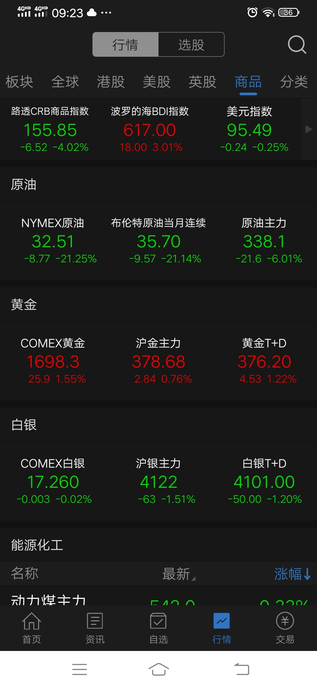

======================================================

_type: q&a
@娃娃after🎈[88818155445112]
2020-03-09 10:22:42 Mon  
topic_id: 421881522424548

@娃娃after🎈

>  麻烦二师父分析一下这两支主动型基金，谢谢。
>  161005 富国天惠成长混合A
>  163402 兴全趋势投资混合（LOF）

@二师父

>  富国天惠成长混合重仓股票大部分是白马股，还是挺不错的，看最近调仓加了大族激光、重庆百货、宁波银行、韦尔股份，也是做趋势的。基金经理挺厉害的，是朱少醒先生，具有20多年的从业经理，如果经理不换的话可以跟着他。
>  
>  兴全趋势投资混合，这个基金的经理换的比较频繁，比上一只差一些。

阅读[2477]  评论[1]  赞[0] 

======================================================

_type: talk
@明树[15422485828252]
2020-03-09 10:23:35 Mon  
topic_id: 118558488255822

中概互联是否已进入低估

@以古论今 at 2020-03-09 10:23:35 Mon

> 应该没有。但是白酒已近人低估，白酒价值比中概大。

----------

@三峡情 at 2020-03-09 10:23:35 Mon

> 场内1.3可以建立仓底了

----------

阅读[2364]  评论[2]  赞[0] 

======================================================

_type: talk
@onepiecewi*[244414114545811]
2020-03-09 10:29:31 Mon  
topic_id: 841881211525122

每天打卡学习
新手一枚
大家多分享

阅读[2653]  评论[0]  赞[0] 

======================================================

_type: talk
@二师父[28814221155551]
2020-03-09 10:31:34 Mon  
topic_id: 841881211522242

<e type="hashtag" hid="141212518282" title="#星球纪律#" /> 星球交流文明用语，不要出现脏话，如果出现脏话，人身攻击，威胁，会给予拉黑处理。

可以辩论，提出不同的意见，但是要注意文明用语，不要抬杠和冲突，类似图中所示，不要再出现。净化星球环境，没有好的修为和素质，在股市投资成功是不可能的。

@Yingshengw* at 2020-03-09 10:31:34 Mon

> 有道理，必须支持，大家都是在熬，别带坏了氛围

----------

@三峡情 at 2020-03-09 10:31:34 Mon

> 多发点建设性意见吧，大家一起赚钱

----------

@海马 at 2020-03-09 10:31:34 Mon

> 良好心态，文明用语

----------

@阝東 at 2020-03-09 10:31:34 Mon

> 二师傅说过的，不要重仓，不要重仓，不要重仓，还是说有人不听

----------

@cotton at 2020-03-09 10:31:34 Mon

> [捂脸][捂脸]

----------

@Claire at 2020-03-09 10:31:34 Mon

> 支持师父

----------

阅读[2902]  评论[6]  赞[0] 

+++++++++++++++++++++++++++++++++++++++++++++++++++++

图片：

======================================================

_type: q&a
@妖孽[544888148518184]
2020-03-09 10:32:15 Mon  
topic_id: 421881515522518

@妖孽

>  32块的原油，是不是该贪婪的时候....

@二师父

>  可以投资，但是要控制仓位

阅读[2991]  评论[0]  赞[0] 

======================================================

_type: talk
@范*[841855284221812]
2020-03-09 11:35:19 Mon  
topic_id: 841881211484552

文明用语
我的心态很好的，没蹦。往往出现脏字的时候表示我很兴奋，因为股市总会涨会来的。
那么下一次出手时间将会是很长一段时间。因为今天晚上不出意外的话美股，跌破年线。就不是日级别的下跌了，最起码是周线级别的。下跌中日线最少还有1次反弹。下次出手的时候，资金将翻倍投进去。

@onepiecewi* at 2020-03-09 11:35:19 Mon

> 加油吧，我围观[偷笑]

----------

@杜志彪 at 2020-03-09 11:35:19 Mon

> 感觉你是老手，说斩就斩，我也围观学习[呲牙]

----------

@范* at 2020-03-09 11:35:19 Mon

> 顺便说一下，目前国内市场还是空仓，美股不好过，国内也一样，毕竟美股引领全球，倾巢之下焉有完卵。

----------

@范* at 2020-03-09 11:35:19 Mon

> 这没什么，止损而已，现在亏钱已经没感觉了，挣钱也没感觉。

----------

阅读[2668]  评论[4]  赞[0] 

+++++++++++++++++++++++++++++++++++++++++++++++++++++

图片：
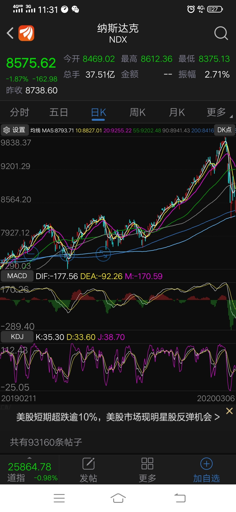

======================================================

_type: talk
@杜志彪[544454124115854]
2020-03-09 11:46:31 Mon  
topic_id: 118558125588182

科技也跌了，快到60天线了，按计划买入一份半导体50。

@Hi·DD at 2020-03-09 11:46:31 Mon

> 估值并不低呀

----------

@杜志彪 at 2020-03-09 11:46:31 Mon

> 目前科技热度降低了，大家都不聊科技了改聊原油了，估值确实不低，买的少向下做定投。

----------

阅读[2691]  评论[2]  赞[0] 

======================================================

_type: talk
@onepiecewi*[244414114545811]
2020-03-09 11:51:37 Mon  
topic_id: 118558125421122

开通美股港股哪种方式最好呢？
师父有渠道推荐吗

@二师父 at 2020-03-09 11:51:37 Mon

> 置顶文章有，现在开可以送阿里

----------

阅读[2721]  评论[1]  赞[0] 

======================================================

_type: q&a
@行云流水[244151415248281]
2020-03-09 12:11:25 Mon  
topic_id: 841881211521152

@行云流水

>  师父，南方原油场外申购比场内划算吧，现在原油跌20%多，场外没有折价溢价，场内跌停才10%。

@二师父

>  是的，在场外申购可以的

阅读[2817]  评论[2]  赞[0] 

======================================================

_type: q&a
@冯林锋[841551141441422]
2020-03-09 12:11:49 Mon  
topic_id: 548118584581814

@冯林锋

>  二师父，南方原油场外这个应该不是今天的实时净值吧？场外如何能查到今天的净值？

@二师父

>  只能大致估算，这个净值公布有延迟

阅读[3013]  评论[0]  赞[0] 

======================================================

_type: q&a
@杨小峰[51514158212424]
2020-03-09 12:12:10 Mon  
topic_id: 118558481551442

@杨小峰

>  二师父，其中一个账户里面买了油气和南方原油，占三分之一，现在这种情况我可不可以把油气全卖了转到南方原油里面，还是卖了油气的钱就不动了，哪种要好一点。油气目前亏12个点

@二师父

>  目前换了有点亏

阅读[3012]  评论[0]  赞[0] 

======================================================

_type: q&a
@清水倾城[48848418144128]
2020-03-09 12:17:37 Mon  
topic_id: 548118585454454

@清水倾城

>  二师父，华宝证券里的理财产品可以放心买吗？新手标6.08%

@二师父

>  这种风险比较小，可以买

阅读[3113]  评论[0]  赞[0] 

======================================================

_type: q&a
@清水倾城[48848418144128]
2020-03-09 12:17:37 Mon  
topic_id: 548118585454454

@清水倾城

>  二师父，华宝证券里的理财产品可以放心买吗？新手标6.08%

@二师父

>  这种风险比较小，可以买

阅读[3113]  评论[0]  赞[0] 

======================================================

======================================================

_type: solution
2020-03-09 13:36:36 Mon  
topic_id: 841881452852822

阅读[2826]  评论[0]  赞[0] 

======================================================

_type: q&a
@东哥[51515245482454]
2020-03-09 14:26:14 Mon  
topic_id: 548118421842454

@东哥

>  今天场外买南方原油，是大概对应原油32的估值吗？，谢谢

@二师父

>  两者有相关，不过有区别，南方原油是FOF，持仓是原油基金

阅读[2768]  评论[0]  赞[0] 

======================================================

_type: q&a
@平安是福[118222545154542]
2020-03-09 14:27:07 Mon  
topic_id: 421881245441448

@平安是福

>  师父：如果美股下跌会对中概互联应响很大吗？

@二师父

>  会有影响的，中概里面是港美股

阅读[2822]  评论[0]  赞[0] 

======================================================

_type: q&a
@汉尼拔[552144155244]
2020-03-09 14:27:57 Mon  
topic_id: 548118425114414

@汉尼拔

>  二师傅现在长期核心配置定投，300非银，红利，中证消费食品，科技100，50aha可以不，是否去掉哪个？

@二师父

>  可以的，科技100波动会大一些，还有300非银

阅读[2957]  评论[0]  赞[0] 

======================================================

_type: q&a
@隔窗遥望[241884481854181]
2020-03-09 14:28:11 Mon  
topic_id: 241881452825841

@隔窗遥望

>  512690可以开始定投了吗？

@二师父

>  白酒可以了，控制节奏

阅读[3082]  评论[0]  赞[0] 

======================================================

_type: talk
@勇气永存[421444144251188]
2020-03-09 16:52:06 Mon  
topic_id: 548118424814124

试试

阅读[2670]  评论[0]  赞[0] 

======================================================

_type: q&a
@于磊[48522822121558]
2020-03-09 17:42:10 Mon  
topic_id: 548118424211144

@于磊

>  对于大部分基金投资者，您是推荐场内还是场外购买基金？场内购买基金，我看一天内的波动还是挺大，如何把握购买的时间点呢？

@二师父

>  对波动承受心理素质好的，可以选择场内
>  
>  承受不了短期几个点的波动，最好场外设置自动定投，我的场外原油就设了自动定投，不用管涨跌，长期看没有多大区别

阅读[2779]  评论[0]  赞[0] 

======================================================

_type: q&a
@Hi·DD[422111285512858]
2020-03-09 17:47:59 Mon  
topic_id: 118558121181812

@Hi·DD

>  二师父，我也跟您减仓了银行，但是这两天想多了有点糊涂。因为我们一直都是看多中国的，对银行没有越跌越买，而是换其他指数，应该只是短期看空是吗？或者是因为仓位比例过重？这个行为应该是指暂时有比银行更好的标的是吗？如果银行不换仓，在保证合理仓位内越跌越买，是可以取得高额收益的吧？

@二师父

>  银行换仓有几个原因
>  
>  1、主要是业绩发生了变化，银行里面的平安、宁波以及招行业绩还不错，而其他的银行表现就差一点，投资需要看业绩，比如环保，比如传媒，如果你在2018年越跌越买，就会发现越买越跌，最后上涨收益也比较差
>  
>  2、仓位原因，50AH里面有部分银行，在发现银行业绩变差之后就可以换个思路，对于指数越跌越买是可以，但是考虑投入产出比，同样的1万块，投资A几年后可以变成2万，但是投资B，几年以后只能变成1.2万，虽然投资B也赚了，但是其实相对投资A是亏的。这是经济学思维
>  
>  3、是否取得高收益，不仅仅看买的是否便宜，这是投资者的误区，指数本质还是股票，如果股票整体基本面不好，越跌越买就陷入估值陷阱，当然如果你可以忍受浮亏，长期持有银行，未来收益率也还是可以的，有个平均收益没问题，市场高额收益那需要找到未来现金流更多的股票

阅读[2989]  评论[0]  赞[0] 

======================================================

_type: solution
2020-03-09 18:26:07 Mon  
topic_id: 241881488851511

@苍天有井明月空🌙 at 2020-03-09 18:26:07 Mon

> 兄弟场外是吗在那买

----------

@齐俊波 at 2020-03-09 18:26:07 Mon

> 支付宝，雪球，都可以呀

----------

阅读[2837]  评论[2]  赞[0] 

======================================================

_type: talk
@二师父[28814221155551]
2020-03-09 19:50:35 Mon  
topic_id: 421881288115188

<e type="hashtag" hid="141212124222" title="#坚守纪律#" /> 最近市场有点意思，大盘到了2900，等我开干，外围市场等等，水很深，没有游泳圈，没有游泳衣，没有好的教练带着，千万别瞎游。

@志亮 at 2020-03-09 19:50:35 Mon

> 我现在就很淡定，因为我空仓[呲牙]

----------

@二师父 at 2020-03-09 19:50:35 Mon

> 赚了空仓也可以

----------

@陈伟 at 2020-03-09 19:50:35 Mon

> 又一次加仓的机会

----------

@孟倩 at 2020-03-09 19:50:35 Mon

> 今天加了点，仓位还空，不敢多加，怕明天又跌😳

----------

@Hi·DD at 2020-03-09 19:50:35 Mon

> 美股崩了！

----------

阅读[4203]  评论[5]  赞[0] 

+++++++++++++++++++++++++++++++++++++++++++++++++++++

文件：
2020-03-09 19:48:35 Mon
文件大小：[550603]
48551224525858-要么拿住，要么离开永远别入场.docx

======================================================

_type: q&a
@梦[51522822251484]
2020-03-09 20:34:21 Mon  
topic_id: 421881284118518

@梦

>  场外001548 上证50这只，是否可以趁现在低估的时候多买一些重仓持有呢？这只比起银行是不是未来上涨的潜力和空间更大呢？我打算把一大部分已经持有的银行转换到上证50来，您觉得这么操作如何？

@二师父

>  这个是增强型的指数基金，并不完全追踪上证50

阅读[3013]  评论[2]  赞[0] 

======================================================

_type: q&a
@姥姥不疼. 爷爷不爱[48544481458248]
2020-03-09 20:54:55 Mon  
topic_id: 241881488442881

@姥姥不疼. 爷爷不爱

>  请教二师父，三个证券512880、512900、512000区别是什么，二师父估值表内为啥选512000，谢谢您了

@二师父

>  基金规模适中，不是很大，也不是很小。
>  
>  既没有清盘风险，同时还兼具一定的打新收益

阅读[2979]  评论[1]  赞[0] 

======================================================

_type: solution
2020-03-09 21:15:51 Mon  
topic_id: 118558154815282

@🍀 凝🌸 慧🍀 at 2020-03-09 21:15:51 Mon

> 我也是

----------

阅读[3044]  评论[1]  赞[0] 

======================================================

_type: talk
@范*[841855284221812]
2020-03-09 21:45:07 Mon  
topic_id: 421881281188218

美股改晚9:30开盘了。惨
得截图保存下来。

@范* at 2020-03-09 21:45:07 Mon

> 熔断了。罕见，涨涨见识也不错

----------

阅读[3204]  评论[1]  赞[0] 

+++++++++++++++++++++++++++++++++++++++++++++++++++++

图片：
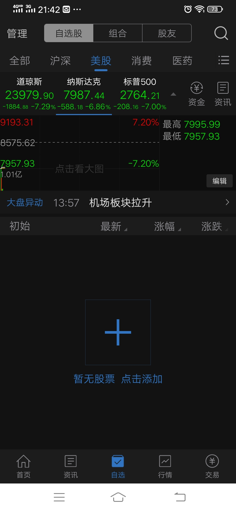

======================================================

_type: talk
@二师父[28814221155551]
2020-03-09 21:53:16 Mon  
topic_id: 118558142228542

<e type="hashtag" hid="224545488541" title="#关于仓位的提示#" /> 目前外围市场情况不明，大家容易疯狂加仓和减仓，切记不要

每个人情况不一样，极端激进投资者的股权资产比例不要超过7.5成仓位，当然可以满仓，7.5的指数，2.5的债券，这个没问题

极端保守的投资者仓位也不能低于4.5成

因为你一会空仓一会满仓，市场会让你心态崩溃的，所以呀，保持一个舒适的仓位，今天晚上你吃饭很香，睡觉也很香，那没问题

如果今天晚上你没有吃好，或者睡不好，没有其他心事的话，家里没发生其他事情的话，那就要调整下仓位。

@以古论今 at 2020-03-09 21:53:16 Mon

> 看跌成那样，每天都想加。以前只是每个星期四加仓，平时不看的，最近天天都想让鳄鱼张口

----------

@衣袂飘香 at 2020-03-09 21:53:16 Mon

> 这是指鳄鱼计划的仓位配置比例还是指乌龟计划，或者是总资金呢？

----------

@二师父 at 2020-03-09 21:53:16 Mon

> 你自己的总仓位

----------

@衣袂飘香 at 2020-03-09 21:53:16 Mon

> 好的

----------

@敏杰 Minjie at 2020-03-09 21:53:16 Mon

> 你好，二师父，我目前有1成仓位纯银行股，还有2成偏金融股（50%），300价值，基本面50这种，想趁现在下行阶段调仓，想请二师父指教一下，怎么调，调整到哪些仓位比较稳妥，又能兼顾成长性。
另外前期定投，积累了近两成仓位的华宝油气[皱眉][皱眉]，目前惨亏。。。看外围预测价格战继续打还有可能继续油价下跌43%，这样就有点慌了，需不需要采取什么措施止损😂

----------

阅读[4376]  评论[5]  赞[0] 

======================================================

_type: q&a
@斌斌[841821552258252]
2020-03-09 22:21:41 Mon  
topic_id: 421881254482818

@斌斌

>  师父，深证红利目前进入低估了吗？以前买了一部分的大成中证红利想换成深证红利，你看现在的行情合适不？

@二师父

>  低估的，可以换。
>  
>  不过目前形势不明，先全部出来，分三次换，这样保险一些，预期A股是要跌的
>  
>  不过市场不好预测，如果没有跌，那也不亏啊，如果跌得大，一次换了最后还是要抗浮亏。
>  
>  从成长性看，深红利是优于中证红利的。

阅读[3329]  评论[0]  赞[0] 

======================================================

_type: talk
@以古论今[28214421582421]
2020-03-09 22:42:23 Mon  
topic_id: 841881425428812

h股指数怎么样，需要用恒生指数替换吗？

@二师父 at 2020-03-09 22:42:23 Mon

> 可以换，但别卖

----------

阅读[3135]  评论[1]  赞[0] 

======================================================

_type: q&a
@TDG[88855524248842]
2020-03-09 22:43:44 Mon  
topic_id: 421881254244188

@TDG

>  请问二师父，目前这种行情下，华夏海外债券（001061）和富国可转债（100051）还适合买入吗？谢谢！

@二师父

>  目前债券避险功能不足，第一美债收益率已经跌破了1%，中国10年期国债收益率到了2.6%，非常低了。
>  
>  可以逐步转移债券到股权资产，或者保留现金，世界变化太快，这是我没有料到的。

阅读[3350]  评论[11]  赞[0] 

======================================================

_type: q&a
@hdmw99[28824141882541]
2020-03-10 07:02:48 Tue  
topic_id: 548118451841444

@hdmw99

>  二师父，华宝油气，近期跌这么多，有多少因素是限制买入造成的？不能买只能卖，供求失衡，价格自然走低。为什么不让买入补仓摊低成本呢？买南方原油不也要占用外汇额度吗？会不会哪天突然也限制买入？

@二师父

>  说了是重仓美股油气公司，基本面恶化，现在沙特和俄罗斯利用油价打击，我就搞不明白为啥非得跟油气较劲呢
>  
>  如果不懂，不要碰油气和原油

阅读[3170]  评论[2]  赞[0] 

======================================================

_type: q&a
@雨淡风清[844418818858882]
2020-03-10 07:03:25 Tue  
topic_id: 118558141882482

@雨淡风清

>  二师父，你好。看到昨天美股熔断，今天早起跌了七点多，不知道又有多少人上了天台。有人说资金会有避难趋势从国外流入大A，我也不知道对不对，但是我知道倾巢之下安有完卵，面对国际形势一塌糊度大A能不能一直一枝独秀

@二师父

>  比美股跌的少可能，涨可能性不大

阅读[3266]  评论[0]  赞[0] 

======================================================

_type: q&a
@背心[51441214442224]
2020-03-10 07:05:27 Tue  
topic_id: 118558141885852

@背心

>  二师傅，沪深300和300医药进入低估没有  像昨天这种情况，我估计今天还得跌，是不是今天晚上能把指数估值提前出来，好有个参考，谢谢。最近操作有点频繁

@二师父

>  今晚收盘可以公布，300低估了，300医药还没有，仓位重的话提前出来一部分，保证舒服的仓位，控制节奏，频繁加减仓不太好

阅读[3460]  评论[1]  赞[0] 

======================================================

_type: talk
@顾屹峰[28242255855121]
2020-03-10 07:44:57 Tue  
topic_id: 421881251884548

南方油气场外有没有涨跌幅限制

阅读[3420]  评论[0]  赞[0] 

======================================================

_type: talk
@敏杰 Minjie[241844452525121]
2020-03-10 08:44:26 Tue  
topic_id: 118558148485582

二师父，都说外围油气价格战还有的打，油气还有的跌，这跌法有点难受
我考虑把油气先全部卖出，过几日再补仓到南方原油，您觉得这个做法可取吗？[抱拳]烦请指点

@TDG at 2020-03-10 08:44:26 Tue

> 亏大了，同问二师父[流泪]

----------

@二师父 at 2020-03-10 08:44:26 Tue

> 不要和他较劲，如果被他伤到了，退出了永远不要再碰，如果还想投资这类品种就拿着，盈亏都认。

----------

@行云流水 at 2020-03-10 08:44:26 Tue

> 买基金，是为了长期持有。还有就是止盈不止损

----------

@杨小峰 at 2020-03-10 08:44:26 Tue

> 我的油气亏30个点，南方原油15个点，继续拿着，虽然很难受

----------

@范* at 2020-03-10 08:44:26 Tue

> 看过一个帖子，说华宝油气为什么一直跌。
说是华宝油气采用均衡仓位策略，这个股涨了，减仓，买入下跌股，因为下跌股仓位少了，上涨股仓位多了。就这样，华宝一直在卖涨买跌。而且很多都是快破产的股。净值一直减少。从华宝净值0.45的时候我就觉得这基有问题，但又说不出来那的问题，就没碰过了。

----------

@会飞的猪 at 2020-03-10 08:44:26 Tue

> 先放着

----------

阅读[3448]  评论[6]  赞[0] 

+++++++++++++++++++++++++++++++++++++++++++++++++++++

图片：
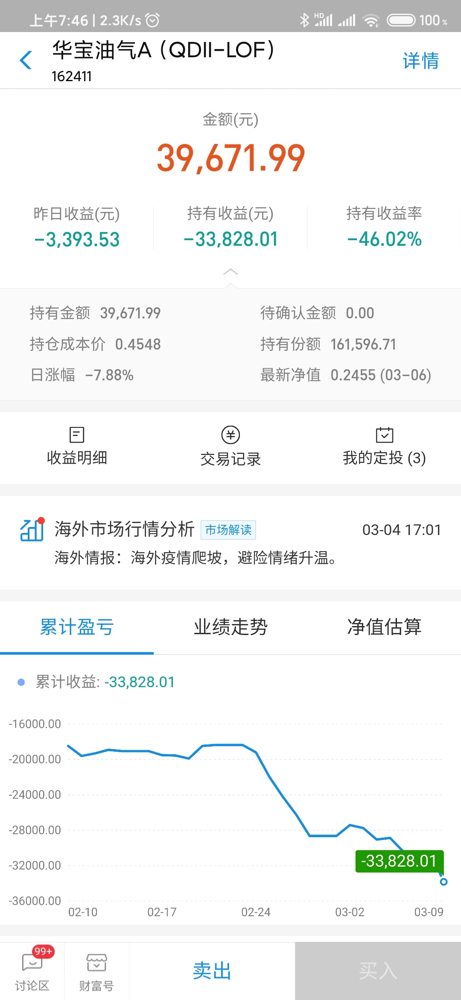

======================================================

_type: q&a
@月月半[421185244454128]
2020-03-10 09:24:41 Tue  
topic_id: 841881421444442

@月月半

>  二师父，请问歌尔股份怎么样？值不值得持有？

@二师父

>  股票不做买卖建议

阅读[3555]  评论[0]  赞[0] 

======================================================

_type: talk
@以古论今[28214421582421]
2020-03-10 09:32:41 Tue  
topic_id: 841881445585442

老师，会不会发生金融危机哟！现在说不定跌的只是毛毛雨

阅读[3515]  评论[0]  赞[0] 

======================================================

_type: talk
@二师父[28814221155551]
2020-03-10 09:43:40 Tue  
topic_id: 421881224424518

<e type="hashtag" hid="881251425252" title="#鳄鱼计划#" /> 券商减仓50%，买入300非银一份，委托价格（2.2），代码512070。

油气继续不动，目前浮亏30%，未来卖出分为两种情况，第一华宝公司公布基金清盘，第二油气起来了，亏损不卖，这是守护投资原则和信仰，有的时候违背一次就会有第二次，对于个股，如果基本面恶化，不管亏多少，赶紧走，如果基本面良好，拿住，如果看不懂基本面，不要投资个股。

仅为个人操作记录，非投资建议和指导。投资有风险，入市需谨慎。

@Nienie💝 at 2020-03-10 09:43:40 Tue

> 300非银不是场外？场内也买了？

----------

@二师父 at 2020-03-10 09:43:40 Tue

> 场内

----------

@光少 at 2020-03-10 09:43:40 Tue

> 二师父券商要减半仓？什么情况？

----------

@三峡情 at 2020-03-10 09:43:40 Tue

> 300非银是投资哪方面的？

----------

@二师父 at 2020-03-10 09:43:40 Tue

> 金融

----------

@Audrey at 2020-03-10 09:43:40 Tue

> 华宝油气目前场外买不了 场内溢价了 可以买吗

----------

阅读[4631]  评论[6]  赞[0] 

======================================================

_type: q&a
@陈Being[28845245224851]
2020-03-10 09:53:35 Tue  
topic_id: 841881445581452

@陈Being

>  二师父，请问新基建对应的是你估值表里的那个基金

@二师父

>  5G

阅读[3530]  评论[2]  赞[0] 

======================================================

_type: q&a
@衣袂飘香[118248548242452]
2020-03-10 09:54:40 Tue  
topic_id: 241881445545441

@衣袂飘香

>  二师父您好。也就是说不一定要保持25%仓位的债券，而是转移到股权或者保有现金，是这样理解吗？股权要占总仓位的多少？对这个问题不大明白。您对这个问题前后两个讲解不大一致，所以再问1次。

@二师父

>  仓位是变动的，如果现在上证综合指数5000点，股权仓位可以1成，如果现在上证综合指数2500，股权仓位可以9成

阅读[3694]  评论[4]  赞[0] 

======================================================

_type: talk
@二师父[28814221155551]
2020-03-10 12:21:57 Tue  
topic_id: 241881444511821

<e type="hashtag" hid="141215224882" title="#关于华宝油气的再次说明#" /> 二师父已经说了，目前别再加仓华宝油气。

但是还有一些朋友在问，我想了想，大概是这个原因。可能是被套住了，心理非常难受，总觉得想拉低成本，然后到成本价格以上卖出，再也不投资了。

这种想法是人之常情，尤其对于重感情的女性来讲，更会这样的。但是投资需要理性，不能感性。

深层次的原因涉及到心理学，二师父简单说下。

第一个从投资上说，现在油气基本面恶化了，这是啥意思呢。油气追踪的是石油天然气指数，这个指数里面买的都是美国石油天然气股票，股票基本面恶化的意思是这只股票背后的企业经营不善，业绩下滑，类似长生生物这种，所以不要逆势再加。

那为什么又不卖出呢？这是因为指数不同于股票，如果你买的的油气股票，那不用说，不管亏了多少，基本面出了问题，直接抛。

现在指数不一样，指数是美国很多油气公司股票的集合，如果集体退市的可能性真的很小，虽然现在俄罗斯和沙特都在针对美国打油价战争，不过美国毕竟美国，你想想如果这些公司同时退市，那么老特是最担心的，他一定会想办法。

所以不用过于担心，不过资本市场什么事情都有可能，不排除最后抛售油气的太多，这个基金会清盘，根据最近的报道，还没有清盘说明，如果要清盘，会提前一个月通知，那时候就没办法了，需要赎回，按照当下净值把钱折算给你。这点比股票好一些。

这是投资必须面对的，希望能够认识到。

第二个从生活层面讲，对于已经投资错误的指数，不要过于去纠结，不要再在上面投入太多精力。这就好比遇到了一个男人，刚开始他比较会伪装，可是婚后原型毕露，这种时候就要及时放下，放下以前付出的时间、精力、感情，不要再想着企图对他好他就能好转过来，这就相当于一个基本面恶化的股票，没救了，所以放下重新开始是最重要的。

今天的油气也是一样，如果还在上面纠结，还企图买入拉低成本，可能会陷入死循环，如果他一直趴着会增加自己的心理压力，这时候就先放一放，然后去投资更加优质的指数，再以后的投资上取得更好的成绩。

这是投资需要注意的，目前已经不是买与卖的问题了，一定要认识自己，做一个高情商的人，既能够认识股市，又能够识别人心，还能够知道自己内心深处的想法，这样在股市会比较轻松，否则的话，在股市会很累，不太适合股市。

@门萨🐨 at 2020-03-10 12:21:57 Tue

> 已经不看油气了。放着吧

----------

@随便 at 2020-03-10 12:21:57 Tue

> 已经亏损百分之41了，哎

----------

@shi at 2020-03-10 12:21:57 Tue

> 那还是按3.6的市值吧~

----------

@梧桐 at 2020-03-10 12:21:57 Tue

> 二师父一直以来都强调油气指数是周期性的，要轻仓，如果严格按照纪律来操作，目前油气虽然亏损比例大，但亏损总额可控，一般在总资金的2%左右。这个指数给我们上了重要的一课。

----------

@玉博珠宝 at 2020-03-10 12:21:57 Tue

> 二师父说的很对，对人对事都该如此。对朋友也也一样，如果经过较长时间，比如十年以上，发现作为朋友的基本面已经恶化，就不要在上面投入时间，精力，感情和金钱了。这应该就是要拿得起放得下吧[偷笑]

----------

@Audrey at 2020-03-10 12:21:57 Tue

> 是清仓投到啊 亏损幅度比较大 这两天就跌了20% 不知道你怎么控制在2%的

----------

@玄武 at 2020-03-10 12:21:57 Tue

> 感觉周期性指数要么不投，要么轻仓

----------

@梧桐 at 2020-03-10 12:21:57 Tue

> 刚才回到往期文章找了一下，二师父在2019年5月27日华宝油气的投资价值及投资方法中，明确油气的投资资金最多占到总投资额的4%。现在如果下跌50%，亏损额占总资金的2%。

----------

阅读[4300]  评论[8]  赞[0] 

======================================================

_type: talk
@范*[841855284221812]
2020-03-10 12:23:36 Tue  
topic_id: 241881444855441

新闻时刻
我也看不懂，干脆大家一起看。特朗普降工资税什么的咱也不知道。

@Hi·DD at 2020-03-10 12:23:36 Tue

> 不知道标普500能不能买

----------

@以古论今 at 2020-03-10 12:23:36 Tue

> 同问，有没有到低估

----------

@范* at 2020-03-10 12:23:36 Tue

> 我还在等。目前还没有出现我要的买点

----------

阅读[3238]  评论[3]  赞[0] 

+++++++++++++++++++++++++++++++++++++++++++++++++++++

图片：

======================================================

_type: talk
@二师父[28814221155551]
2020-03-10 13:13:13 Tue  
topic_id: 421881222522248

今天涨了，不用估值表了吧，如果有需要，点个赞，7点之前超过55个赞今天发一次。

@王燕 at 2020-03-10 13:13:13 Tue

> 师父也这么调皮？

----------

@陈飞🤗 at 2020-03-10 13:13:13 Tue

> 我不是要看估值表，我就是想点赞

----------

@rtdmm小米 at 2020-03-10 13:13:13 Tue

> 看来大家好期待二师父的估值表！

----------

@雨的依恋 at 2020-03-10 13:13:13 Tue

> 我就想点赞，顺便看估值表

----------

@🍀 凝🌸 慧🍀 at 2020-03-10 13:13:13 Tue

> 哈哈，我也是想点赞，顺便看看估值表[偷笑][呲牙]

----------

@杜志彪 at 2020-03-10 13:13:13 Tue

> 我点的时候超过55了，就是必须点[微笑]

----------

@宁静以致远 at 2020-03-10 13:13:13 Tue

> 呼声很高，很快超过55赞。

----------

@庆余年 at 2020-03-10 13:13:13 Tue

> 87赞了，不发不行了[呲牙][呲牙][呲牙]

----------

阅读[3218]  评论[8]  赞[0] 

======================================================

_type: q&a
@tanxin[241524428884281]
2020-03-10 13:13:35 Tue  
topic_id: 241881448518411

@tanxin

>  二师父，请问现在5g和科技的估值什么位置？

@二师父

>  正常估值

阅读[3276]  评论[0]  赞[0] 

======================================================

_type: talk
@章兵朋[118251425848882]
2020-03-10 13:48:19 Tue  
topic_id: 241881444152511

最近有好多新债上市。虽然一直都没中签[捂脸]

@范毅君 at 2020-03-10 13:48:19 Tue

> 完全没中过

----------

@随便 at 2020-03-10 13:48:19 Tue

> 中过一个

----------

@庆余年 at 2020-03-10 13:48:19 Tue

> 我问一下，中签到上市可以卖出一般多久？我3月2号中了俩。

----------

@随便 at 2020-03-10 13:48:19 Tue

> 操作一边就知道了，我是第一次中

----------

@白开水 at 2020-03-10 13:48:19 Tue

> 15天到20天左右，集思录里可以查看

----------

@章兵朋 at 2020-03-10 13:48:19 Tue

> 终于中了

----------

阅读[3194]  评论[6]  赞[0] 

+++++++++++++++++++++++++++++++++++++++++++++++++++++

图片：

======================================================

_type: talk
@蓝魔森林[28888244485121]
2020-03-10 14:05:22 Tue  
topic_id: 841881444111552

新基建将是今年的热词，估计也是投资元年，目前很多内容都开始蹭国家主流政策了。

@蓝魔森林 at 2020-03-10 14:05:22 Tue

> 我就看到分享一下

----------

@蓝魔森林 at 2020-03-10 14:05:22 Tue

> 不是打广告哈[撇嘴]

----------

阅读[3230]  评论[2]  赞[0] 

+++++++++++++++++++++++++++++++++++++++++++++++++++++

图片：

======================================================

_type: q&a
@陈Being[28845245224851]
2020-03-10 14:23:10 Tue  
topic_id: 421881222212488

@陈Being

>  二师父：请问1、标普500指数基金投资价值应该如何分析，估值多少算低估，现在在什么估值水平。谢谢。

@二师父

>  很有价值，场外代码050025，可以开始定投，已经纳入计划，因为场内有溢价，可以场外开始。

阅读[3398]  评论[3]  赞[0] 

======================================================

_type: solution
2020-03-10 14:31:22 Tue  
topic_id: 548118448125124

阅读[3256]  评论[0]  赞[0] 

======================================================

_type: talk
@onepiecewi*[244414114545811]
2020-03-10 14:36:14 Tue  
topic_id: 421881221884488

师父，你觉得平安的股票现在是低估吗？适合买入长期持有吗

@蓝魔森林 at 2020-03-10 14:36:14 Tue

> 二师傅不做股票推荐

----------

@onepiecewi* at 2020-03-10 14:36:14 Tue

> 好的[呲牙]

----------

阅读[3272]  评论[2]  赞[0] 

======================================================

_type: q&a
@背心[51441214442224]
2020-03-10 15:26:09 Tue  
topic_id: 241881441222121

@背心

>  二师傅300非银场外，持仓其他部分高达百分之90多，能知道其他部分，都包括，什么吗？

@二师父

>  主要是保险和证券股票

阅读[3428]  评论[0]  赞[0] 

======================================================

_type: talk
@二师父[28814221155551]
2020-03-10 15:50:35 Tue  
topic_id: 118558118184852

<e type="hashtag" hid="224548581221" title="#3.10估值表#" /> 不用着急，都有机会，关键买了要拿的住。

@🍀 凝🌸 慧🍀 at 2020-03-10 15:50:35 Tue

> 谢谢二师父[爱心][玫瑰][玫瑰][玫瑰]

----------

@rtdmm小米 at 2020-03-10 15:50:35 Tue

> 二师父辛苦了！

----------

@烟九•二手车 at 2020-03-10 15:50:35 Tue

> 白酒低估了

----------

@孤芳自赏 at 2020-03-10 15:50:35 Tue

> 二师父，今天还能买标普500吗，今早报道已经涨了近5个点了？

----------

@波 at 2020-03-10 15:50:35 Tue

> 非常有价值的估值表!

----------

阅读[4677]  评论[5]  赞[0] 

+++++++++++++++++++++++++++++++++++++++++++++++++++++

图片：
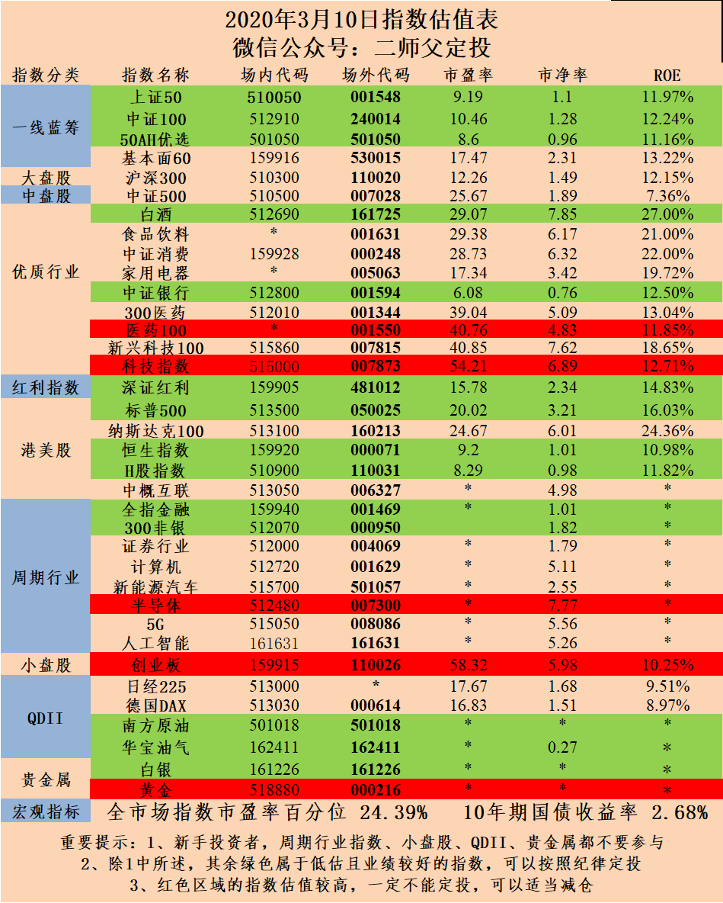

======================================================

_type: q&a
@阳光[421884185252128]
2020-03-10 16:43:35 Tue  
topic_id: 548118448812844

@阳光

>  师父好：我把天弘沪深300指数c调到天弘计算机a，是不是应该没有卖出费用啊？可显示收了40多的费用，请问这是什么原因啊？

@二师父

>  转换有费用

阅读[3686]  评论[3]  赞[0] 

======================================================

_type: q&a
@蛋炒饭不加蛋[118281818482542]
2020-03-10 16:47:51 Tue  
topic_id: 118558182225252

@蛋炒饭不加蛋

>  请问二师父，基金的持有者机构占72%，有什么利弊吗

@二师父

>  持有比例过高，如果资金撤出过快，短期净值会回升，也可能有清盘风险

阅读[3777]  评论[0]  赞[0] 

======================================================

_type: talk
@二师父[28814221155551]
2020-03-10 16:50:31 Tue  
topic_id: 241881415888211

<e type="hashtag" hid="554241251584" title="#A股深V上涨#" /> 独立行情出来了，保证合理仓位就好，估值表看之前点赞挺多，看完了没多少赞了，这个习惯不大好喔

@铁观音 at 2020-03-10 16:50:31 Tue

> 赞起来

----------

@背心 at 2020-03-10 16:50:31 Tue

> 昨天已经杀入美股，今天又买了点，希望今天晚上再跌点[微笑][微笑][微笑]

----------

@栀子花开 at 2020-03-10 16:50:31 Tue

> 估值表到底是哪天更新啊二师傅，不知道你什么时候更新啊[流泪]

----------

@二师父 at 2020-03-10 16:50:31 Tue

> 每周三

----------

@速。冻 at 2020-03-10 16:50:31 Tue

> 今晚肯定反弹

----------

@范毅君 at 2020-03-10 16:50:31 Tue

> 请问美股，可以通过基金参与吗，买什么比较好

----------

@范* at 2020-03-10 16:50:31 Tue

> 可不敢说独立行情，到3千点大顶了。魔咒的3千点。

----------

@杜志彪 at 2020-03-10 16:50:31 Tue

> 我就不参与了，点赞必须的[呲牙]

----------

阅读[4150]  评论[9]  赞[0] 

+++++++++++++++++++++++++++++++++++++++++++++++++++++

文件：
2020-03-10 16:49:29 Tue
文件大小：[183566]
28221441282451-A股深V上涨，走出独立行情.docx

======================================================

   _type: talk
   @海马[15158245825242]
   2020-03-10 19:14:31 Tue  
   topic_id: 118558184854842

   一、我这几天读了但斌写时间的玫瑰的一点感受：价值投资本身就是对人性的考验，比如这段时间创业板和科技指数那么热，你持有的优质大盘股基金就是不涨，甚至还跌就会很难受，所以我说投资是对人性优劣的奖惩，是对人性的考验，在全世界都是一样的，你又想买价值低估的基金，又想赚快钱，这个是挺难的一件事啊，很难高度统一。
二、经过这些年股市涨涨跌跌……二师父讲的很对①买低估优质的基金慢慢等待花开，②最重要的自己持有基金仓位舒服合适让自己

   阅读[3695]  评论[0]  赞[0] 

======================================================

_type: q&a
@恋尘[51558584455824]
2020-03-10 20:04:58 Tue  
topic_id: 548118484248184

@恋尘

>  师傅，白酒在场内多少可以入1.113吗？

@二师父

>  低估的时候就可以的

阅读[3925]  评论[1]  赞[0] 

======================================================

_type: talk
@蓝魔森林[28888244485121]
2020-03-10 21:03:43 Tue  
topic_id: 241881414415551

我今天得到消息，美国纽约那边很多有肺炎感染病例的公司，依然很多在全员上班，美国人对这个病毒依然乐观，估计之后病毒会爆发，劝大家千万别现在去抄底美股了。市场上说美股触底反弹的专家太多，希望我被打脸，也希望美国不要爆发病毒感染。祝福

@范* at 2020-03-10 21:03:43 Tue

> 他们一直这样，该干嘛干嘛。自己扛过去，美民主。封城还不bL啊。殊不知病毒也是会进化的！除了研究疫苗别无它法。疫苗最快也得1年。

----------

@蓝魔森林 at 2020-03-10 21:03:43 Tue

> 是的 再这样下去，到时候纽约人群密集，华尔街一封，估计股市又要挺和跌。

----------

阅读[3740]  评论[2]  赞[0] 

======================================================

_type: talk
@二师父[28814221155551]
2020-03-10 21:17:31 Tue  
topic_id: 548118484882114

<e type="hashtag" hid="224548518541" title="#解读基金——作者的理财观念#" /> 继续读书学习，解读基金第五讲

阅读[5065]  评论[0]  赞[0] 

+++++++++++++++++++++++++++++++++++++++++++++++++++++

文件：
2020-03-10 21:16:47 Tue
文件大小：[18845]
28221415541421-解读基金第5讲.docx

======================================================

_type: q&a
@背心[51441214442224]
2020-03-10 21:18:47 Tue  
topic_id: 241881414481221

@背心

>  二师傅,300医药的场内医药ETF512010今天涨幅1.25%
>  对应的场外001344今天的净收益才涨了0.62%为什么收益差距这么大，是不是说它的收益没有第一个好呀。见笑了师傅，谢谢

@二师父

>  这两个基金持仓是不一样的

阅读[3986]  评论[0]  赞[0] 

======================================================

_type: q&a
@乐山乐水[111852858512242]
2020-03-10 21:19:54 Tue  
topic_id: 548118484488444

@乐山乐水

>  请问师父，我持有的混合基金光大中国制造2025 001740已经收割利润30%，前海开源沪港深创新成长混合，目前浮亏10%多，师父能否帮忙分析这两只基金继续持有还是减仓或清仓换其他指数基金，谢谢您！

@二师父

>  混合基金只能看基金经理，目前的基本面可以分析，不过我不确定基金经理是否更换，即使基金经理不更换，每个季度主动基金都会调仓，所以如果不会判断股票基本面建议不要投资混合基金。

阅读[4123]  评论[0]  赞[0] 

======================================================

_type: talk
@Joey [422115481514888]
2020-03-10 23:00:02 Tue  
topic_id: 421854445482588

师傅 我还能回本吗[大哭]

@随便 at 2020-03-10 23:00:02 Tue

> 亏损比例一样[大哭][大哭][大哭]

----------

@杨小峰 at 2020-03-10 23:00:02 Tue

> 要么回本，要么清盘

----------

@会飞的猪 at 2020-03-10 23:00:02 Tue

> 好兄弟

----------

@呼唤旷野 at 2020-03-10 23:00:02 Tue

> 亏损51%飘过

----------

@敏杰 Minjie at 2020-03-10 23:00:02 Tue

> 几乎一个样

----------

@自由飞翔 at 2020-03-10 23:00:02 Tue

> 亏61%

----------

阅读[3958]  评论[6]  赞[0] 

+++++++++++++++++++++++++++++++++++++++++++++++++++++

图片：
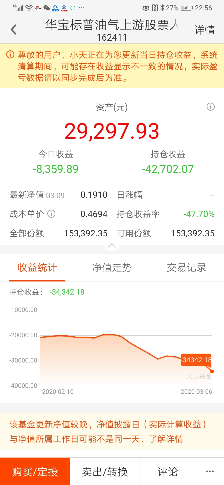

======================================================

_type: q&a
@冯林锋[841551141441422]
2020-03-11 10:01:29 Wed  
topic_id: 841825551542822

@冯林锋

>  161128这只基金和513050这只基金有什么区别，现在能买吗

@二师父

>  标普信息科技是重仓的苹果等美股，中概是重仓的腾讯阿里等互联网公司
>  
>  这类科技互联网公司波动比较大，标普科技目前还没有严重低估，投资需谨慎

阅读[3617]  评论[5]  赞[0] 

======================================================

_type: q&a
@鸡哥 电脑手机监控*[421142222185518]
2020-03-11 11:01:09 Wed  
topic_id: 118542255112852

@鸡哥 电脑手机监控*

>  师父 我是一个刚入门的小白跟着你学习基金定投  昨天南方石油跌那么惨 我有点慌 由于没有完全理解您的投资理念 不知道现在是 按照您说的继续定投呢  还是持有   或者是止损

@二师父

>  新手不要碰油气，原油，白银，黄金，半导体，新能源汽车也别碰

阅读[3573]  评论[1]  赞[0] 

======================================================

_type: q&a
@梦[51522822251484]
2020-03-11 11:02:16 Wed  
topic_id: 118542255412152

@梦

>  请问二师父，场外160723 这只原油相关的可以现在一次性投入一笔钱吗？风险会很大吗？

@二师父

>  原油基金风险大，无法接受长时间超大额浮亏不要碰

阅读[3973]  评论[2]  赞[0] 

======================================================

_type: q&a
@背心[51441214442224]
2020-03-11 13:47:39 Wed  
topic_id: 118542254551112

@背心

>  二师傅001061华夏海外收益债券，受国外股市影响大，有点小亏打算卖了，可以吗？给点建议，谢谢

@二师父

>  看自己的配置需求，权益类投资波动是正常的

阅读[3641]  评论[2]  赞[0] 

======================================================

_type: q&a
@茶馆2020[28221484255281]
2020-03-11 15:07:52 Wed  
topic_id: 421854454414148

@茶馆2020

>  二师父，中概互联513050目前可以进吗，给点建议，谢谢！

@二师父

>  定投可以

阅读[3544]  评论[0]  赞[0] 

======================================================

_type: talk
@onepiecewi*[244414114545811]
2020-03-11 16:28:26 Wed  
topic_id: 241825525181851

每天打卡学习
因为是小白
所以装好子弹
等到真的会了再入场

阅读[3424]  评论[0]  赞[0] 

======================================================

_type: talk
@二师父[28814221155551]
2020-03-11 16:48:13 Wed  
topic_id: 421854454114148

<e type="hashtag" hid="825188852442" title="#估值表#" /> 每周一次的估值表，多点赞啊。没有配置好的根据估值表配置，已经配置好的后面跟着我就行。最近行情不稳，少动，如果有绝佳机会随时发车。

@太阳照常升起 at 2020-03-11 16:48:13 Wed

> 在动荡期，克制内心的贪婪与恐惧。保持定投节奏，潜龙勿用。

----------

@二师父 at 2020-03-11 16:48:13 Wed

> 按兵不动比较合适

----------

@子辰 at 2020-03-11 16:48:13 Wed

> 上证指数收盘2968，怎么估值表绿色的占比好多啊，

----------

@陈飞🤗 at 2020-03-11 16:48:13 Wed

> 白酒低估怎么不买白酒

----------

@Dolly at 2020-03-11 16:48:13 Wed

> 低估多，高估也很多

----------

@shee at 2020-03-11 16:48:13 Wed

> 没看到恒生国企？

----------

@Claire at 2020-03-11 16:48:13 Wed

> 师父辛苦了[咖啡]

----------

@Pansy at 2020-03-11 16:48:13 Wed

> 心中默念三遍：坚持纪律、坚持纪律、坚持纪律。然后去定投。

----------

阅读[3677]  评论[10]  赞[0] 

+++++++++++++++++++++++++++++++++++++++++++++++++++++

图片：
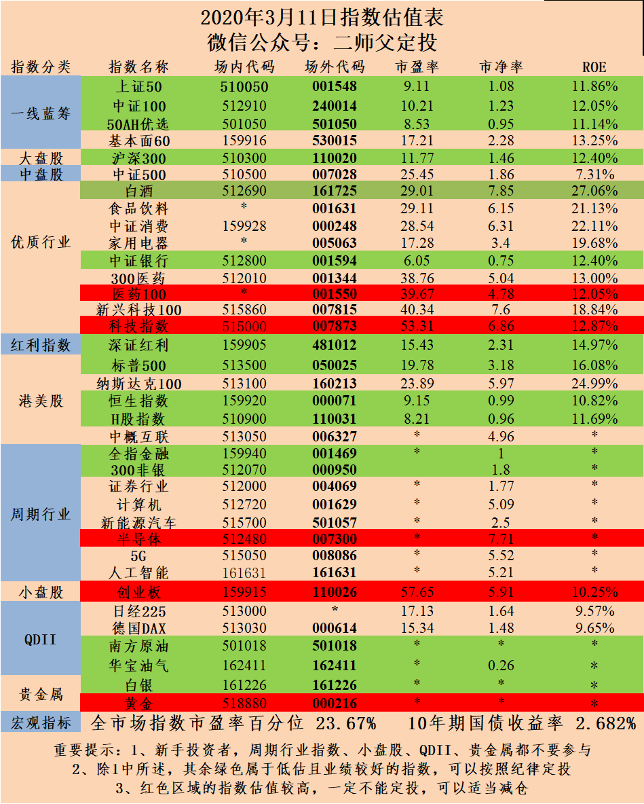

======================================================

_type: talk
@二师父[28814221155551]
2020-03-11 16:54:49 Wed  
topic_id: 118542242888152

<e type="hashtag" hid="141215155242" title="#228期定投实盘#" /> 乌龟计划已经发车，不知道怎么投资的，可以先跟着乌龟计划走，站在岸上学不会游泳。乌龟计划没有投资原油黄金、5G、新能车、人工智能，风险相对较低，值得新手拥有。

不过和置顶文章的小白配置有区别，小白配置穿越牛熊，而这个实盘在熊市可能略有回撤，截止目前，组合净值1.09，并未大幅度回撤，想要看这个实盘或者一键买入的可以点击以下链接，注册，搜索乌龟计划即可。<e type="web" href="https://openmob.1234567.com.cn/hd/index.html?t=qd8008&u=tjr122esf" title="https://openmob.1234567.com.cn/hd/index.html?t=qd8..." />

@🍀 凝🌸 慧🍀 at 2020-03-11 16:54:49 Wed

> 二师父辛苦了[抱拳][抱拳][抱拳]😄

----------

@拥抱太阳的风筝 at 2020-03-11 16:54:49 Wed

> 二师父，标普500的低估阈值?

----------

@二师父 at 2020-03-11 16:54:49 Wed

> 21

----------

@银河系 at 2020-03-11 16:54:49 Wed

> ah溢价超过130，最适合买入50ah是吗？

----------

@Snow at 2020-03-11 16:54:49 Wed

> 标普500三点前场外申购是以昨天美股收盘价确认吗？

----------

阅读[4678]  评论[5]  赞[0] 

+++++++++++++++++++++++++++++++++++++++++++++++++++++

图片：

======================================================

_type: talk
@二师父[28814221155551]
2020-03-11 17:11:06 Wed  
topic_id: 421854458414218

实盘分析

阅读[3991]  评论[0]  赞[0] 

+++++++++++++++++++++++++++++++++++++++++++++++++++++

文件：
2020-03-11 17:11:03 Wed
文件大小：[73068]
15448181188582-二师父228期低估定投实盘.docx

======================================================

_type: talk
@二师父[28814221155551]
2020-03-11 18:10:27 Wed  
topic_id: 421854458524288

提示下，标普500不要场内买，溢价很高

@冯林锋 at 2020-03-11 18:10:27 Wed

> 场外能重仓吧

----------

@J at 2020-03-11 18:10:27 Wed

> 美股的净值有滞后性，在哪里可以看实时的溢价？

----------

@张 at 2020-03-11 18:10:27 Wed

> 可以在英为财情上看

----------

@April _ M. at 2020-03-11 18:10:27 Wed

> 等到低估了，开始建仓。

----------

@J at 2020-03-11 18:10:27 Wed

> 谢谢

----------

@cotton at 2020-03-11 18:10:27 Wed

> 场外搜索标普500，有好几个出来。。

----------

@二师父 at 2020-03-11 18:10:27 Wed

> 实盘有代码

----------

阅读[3744]  评论[7]  赞[0] 

======================================================

_type: q&a
@秦岭云横[88884245415542]
2020-03-11 18:42:03 Wed  
topic_id: 118542242154412

@秦岭云横

>  新汽车ETF（交易代码515030）的成分股看，业绩出色、股价也有较好表现。新汽车ETF全面布局新能源汽车产业链，无论是上游材料、中游电池、下游整车，无论是电池、电机、还是电控，基金全部覆盖，尽享行业发展空间。
>  二师傅，看看这只etf.

@二师父

>  新能源汽车属于周期性行业，可以作为卫星配置，低估的时候可以轻仓投资

阅读[3797]  评论[0]  赞[0] 

======================================================

_type: talk
@二师父[28814221155551]
2020-03-11 21:18:31 Wed  
topic_id: 118542248158582

<e type="hashtag" hid="15281812184852" title="#实盘展示#" />  目前有三个实盘，具体说一说。

乌龟计划：在估值楼层三层以下长期定投，坚持积累优质基金份额，市场高位逐步将股权基金转换为债券基金。

安心组合：长期持有，需要用资金的时候取出。

鳄鱼计划：场内发车，可以点击文末开户进行场内投资，只投资指数，承受一定风险和回撤，长期持有+辅助仓位波段。

底部震荡市场适合网格交易，通过市场波动挣钱，注册华宝证券账户可以实现自动网格交易，佣金万一，节省手续费用。<e type="web" href="https://m.touker.com/trade/activity/common/channelOpen.htm?moduleDataId=275&channel=V2SF" title="手机开户" cache="" />

@范毅君 at 2020-03-11 21:18:31 Wed

> 组合图片看不清楚[流泪]

----------

@陈飞🤗 at 2020-03-11 21:18:31 Wed

> 怎么没有一起发出来其他的网格

----------

@wty at 2020-03-11 21:18:31 Wed

> 二师父，能把H股的网格交易表发出来吗？

----------

@YtingLi at 2020-03-11 21:18:31 Wed

> 二师父，这种估值表的图不是原图，很模糊，几乎看不清，可否师父再更新一下，谢谢

----------

@笔记 at 2020-03-11 21:18:31 Wed

> 华宝手续费买卖基金股票都是万一吗？

----------

@二师父 at 2020-03-11 21:18:31 Wed

> 股票万1.5

----------

@烟九•二手车 at 2020-03-11 21:18:31 Wed

> 现在手续费是万2的了？刚推荐个朋友开通，显示万二了

----------

@二师父 at 2020-03-11 21:18:31 Wed

> 哪个证券账户？

----------

阅读[238774]  评论[10]  赞[0] 

+++++++++++++++++++++++++++++++++++++++++++++++++++++

文件：
2020-03-14 19:16:43 Sat
文件大小：[6542935]
48524455128248-戴维斯王朝》.pdf

2020-03-14 19:17:16 Sat
文件大小：[28688772]
51542255841414-证券分析（原书第6版 · 珍藏版）.pdf

2020-03-14 19:17:27 Sat
文件大小：[30062745]
88245522148442-滚雪球：巴菲特和他的财富人生》.pdf

2020-03-14 19:17:31 Sat
文件大小：[31001813]
51542255841444-投资者的未来》.PDF

2020-03-14 19:17:41 Sat
文件大小：[47242803]
28245522148441-股市真规则》.pdf

======================================================

_type: q&a
@飞的那个飞[48584811554158]
2020-03-12 06:51:35 Thu  
topic_id: 241825544448241

@飞的那个飞

>  今天好多转债可以申请？师父那些可以申请？是AA的吗？

@二师父

>  可以，目前可以盲打，破发了继续持有，新债比股票风险低很多

阅读[3156]  评论[1]  赞[0] 

======================================================

_type: talk
@若水三千[48548544448258]
2020-03-12 07:39:39 Thu  
topic_id: 118542218244222

请问二师父：在华泰帐户，场内申购和场外申购都是按收市净值成交吗？比如南方原油是选择场内申购还是场外？

@华为～ at 2020-03-12 07:39:39 Thu

> 二师父您好！请问场内基金也可以像场外基金一样定投，下跌补仓吗？

----------

阅读[2970]  评论[1]  赞[0] 

======================================================

_type: talk
@二师父[28814221155551]
2020-03-12 09:26:52 Thu  
topic_id: 548152248828224

<e type="hashtag" hid="452428122858" title="#说说转债和原油的托管#" /> 今天的6只可转债全部可以申购，胆子小的，申购搜特和华安。全部定格申购没有问题，目前我持有一些可转债，这些是压舱产品，比股票风险低，未来要么等他们涨到止盈点卖出，要么等待子弹不够卖出加仓。只看这次A股能跌多少了。

第二关于周一申购的原油，如果场内申购，会直接转场内，如果是场外申购，那么记得在基金栏里面找到这个基金，然后点击转场内，那么就从场外转到场内了。周一申购成交净值是0.7162，转到场内可以以0.87的价格卖出，套利大概20%，在油气上失去的血回了一点，不过可以不用卖，这是个配置，持有到原油价格起来的时候再考虑卖出。

油气不要碰了，原油也有限购，目前就是限购导致溢价太多，如果可以承受长时间浮亏的风险可以小额套利原油，如果不能，别碰，别赚这个钱。切记，如果连基本的配置都没做好，就别买原油了。

关于油气，股票基本面全部恶化，等待价格回到0.4全部清仓，别碰了。

@April _ M. at 2020-03-12 09:26:52 Thu

> 二师父，最近恒生处于低估，我计划开始在场内建仓做网格交易；同时在场内买入白酒。

----------

@秦风殇韵（刘豫斌） at 2020-03-12 09:26:52 Thu

> 今天恒生网格补了一份

----------

@铁观音 at 2020-03-12 09:26:52 Thu

> 恒生补了一份

----------

@April _ M. at 2020-03-12 09:26:52 Thu

> 我也进去补了一份，不知道之后会如何，先一点点来

----------

阅读[4047]  评论[4]  赞[0] 

======================================================

_type: q&a
@木易火[844122151125212]
2020-03-12 10:10:45 Thu  
topic_id: 548152282254544

@木易火

>  二师父，恒生指数一直在跌，适合网格吗？

@二师父

>  适合

阅读[2860]  评论[0]  赞[0] 

======================================================

_type: q&a
@栀子花开[118248824481842]
2020-03-12 10:11:29 Thu  
topic_id: 421854414452118

@栀子花开

>  二师傅，请问一下现在白酒和沪深300可以建个底仓吗

@二师父

>  多少底仓，300可以，2成以内底仓

阅读[3096]  评论[3]  赞[0] 

======================================================

_type: q&a
@tanxin[241524428884281]
2020-03-12 10:11:46 Thu  
topic_id: 118542282284422

@tanxin

>  请问二师父，H股ETF这个基金怎样？能重仓吗？

@二师父

>  可以，仓位控制在2成以内

阅读[3149]  评论[1]  赞[0] 

======================================================

_type: q&a
@起今知行[844188255581112]
2020-03-12 10:57:11 Thu  
topic_id: 421854414518858

@起今知行

>  二师父，能不能向华宝智投的经理申请一下，把你的粉丝场内申购折扣降为1折？

@二师父

>  好的，我和他们沟通下

阅读[3005]  评论[0]  赞[0] 

======================================================

_type: q&a
@老妖[118514521115522]
2020-03-12 10:57:35 Thu  
topic_id: 548152282515524

@老妖

>  师父，场外现在是买H股还是恒生好？

@二师父

>  H股比较好

阅读[3230]  评论[3]  赞[0] 

======================================================

_type: q&a
@张忠盛[88455255181882]
2020-03-12 10:58:04 Thu  
topic_id: 118542282548222

@张忠盛

>  请问现在h股etf适合建底仓吗

@二师父

>  能接受可能的百分之40回撤就能建

阅读[3283]  评论[0]  赞[0] 

======================================================

_type: talk
@二师父[28814221155551]
2020-03-12 11:06:59 Thu  
topic_id: 241825515422511

<e type="hashtag" hid="554245218584" title="#关于华宝申购费率#" /> 有的同学想做套利，申请华宝一折账户，跟经理沟通之后，同意10万资金以上的，可以申请一折申购，需要申请的直接联系华宝的经理，星球嘉宾谭其煜。

@谭琪煜 at 2020-03-12 11:06:59 Thu

> 大家好~需要的群里给到我客户号就行

----------

@贵玉1* at 2020-03-12 11:06:59 Thu

> 在这里给你客户号吧

----------

@陈伟 at 2020-03-12 11:06:59 Thu

> 这里的套利是指分级套利吗？

----------

阅读[3416]  评论[3]  赞[0] 

======================================================

_type: q&a
@Sunflower[244185124281811]
2020-03-12 11:33:15 Thu  
topic_id: 421854414151588

@Sunflower

>  二师父您好，为什么广发的今日可转债申购说要开通创业板权限或创业板转签呀？这个开通用去柜台吗？

@二师父

>  创业板权限需要去柜台开

阅读[3444]  评论[2]  赞[0] 

======================================================

_type: talk
@范*[841855284221812]
2020-03-12 11:34:58 Thu  
topic_id: 241825515148151

美股历史十次熊市  1901年~2009年
最低跌幅-40%  
最高跌幅-86%  
最短时间2.5个月
最长时间61个月
十年平均时间24个月
这次的底不好抄。有难度

@杜志彪 at 2020-03-12 11:34:58 Thu

> 简单从今天开始准备60份的资金，一个月买一份，按估值操作就行了，你觉得怎么样[呲牙]

----------

@蓝魔森林 at 2020-03-12 11:34:58 Thu

> 不要定额 看情况变化

----------

@范* at 2020-03-12 11:34:58 Thu

> 我还没出手呢，你跟着我保准有肉吃。我一出手就一击必杀。

----------

@杜志彪 at 2020-03-12 11:34:58 Thu

> 我吃素[偷笑]

----------

阅读[3334]  评论[4]  赞[0] 

======================================================

_type: talk
@onepiecewi*[244414114545811]
2020-03-12 12:24:42 Thu  
topic_id: 421854415121148

小白又来打卡
刚刚读完师父发的乌龟盘
看了看相同基金的场内外价格
为什么场内价格和场外价格区别这么大呢

@陈伟 at 2020-03-12 12:24:42 Thu

> 场内买卖基金的起点费用比较高，上次打听了一下，好像一次买卖基金不能低于2000元，否则就不合算。[微笑]

----------

@onepiecewi* at 2020-03-12 12:24:42 Thu

> 起点是一手好像？一手100股。
但我发现的是单价的区别。
为什么场内会有溢价呢？

----------

@陈伟 at 2020-03-12 12:24:42 Thu

> 一手100股如果不满2000元，手续费比较贵些，和买足2000元以上不一样。具体算法忘了，你可以请教一下师傅，我也能再温习一遍[调皮]

----------

@陈伟 at 2020-03-12 12:24:42 Thu

> 溢价，我理解是有人愿意花高价买，抬高了价格。

----------

@onepiecewi* at 2020-03-12 12:24:42 Thu

> 你这么说我有些理解了~谢谢同学啊

----------

阅读[3217]  评论[5]  赞[0] 

======================================================

_type: talk
@二师父[28814221155551]
2020-03-12 12:25:50 Thu  
topic_id: 241825512115821

经常看到读者说，感觉什么可以卖了，感觉什么可以买了，投资的时候很有感觉，感觉感觉钱包就瘪了。

@罗大发 at 2020-03-12 12:25:50 Thu

> 那该怎么办呢[呲牙]

----------

@Hi·DD at 2020-03-12 12:25:50 Thu

> 被莫名戳哭[委屈]

----------

@二师父 at 2020-03-12 12:25:50 Thu

> 不哭，都会过去

----------

@二师父 at 2020-03-12 12:25:50 Thu

> 靠纪律

----------

@罗大发 at 2020-03-12 12:25:50 Thu

> yes. sir[呲牙]

----------

@Claire at 2020-03-12 12:25:50 Thu

> 感觉感觉自己越来越淡定了，跟师父读了很多书，认知提升了的原因吧。

----------

@二师父 at 2020-03-12 12:25:50 Thu

> [强][强]

----------

阅读[3515]  评论[7]  赞[0] 

======================================================

_type: q&a
@孟倩[118822124154582]
2020-03-12 12:38:02 Thu  
topic_id: 548152285885144

@孟倩

>  师父您好！过年期间学完您的指数基金投资课程，年后场内场外开始实践。附上投资明细表，恳请指点！不足之处请赐教，谢谢您！

@二师父

>  没啥问题，标普500场内溢价很高，要么等等，要么场外申购

阅读[3629]  评论[14]  赞[0] 

======================================================

_type: q&a
@rtdmm小米[422188284881148]
2020-03-12 12:38:53 Thu  
topic_id: 421854412448858

@rtdmm小米

>  请问二师父，就目前来看，酒etf 512690最大回撤幅度是多少呢？

@二师父

>  百分之50

阅读[3686]  评论[1]  赞[0] 

======================================================

_type: talk
@光少[244124552511141]
2020-03-12 13:21:30 Thu  
topic_id: 841825514828852

这是要清盘的节奏吗[惊讶]

@陈伟 at 2020-03-12 13:21:30 Thu

> 几家公司闹矛盾，相互伤害的结果。等他们打累了再次心平气和的谈才有机会活过来[大哭]

----------

阅读[3533]  评论[1]  赞[0] 

+++++++++++++++++++++++++++++++++++++++++++++++++++++

图片：
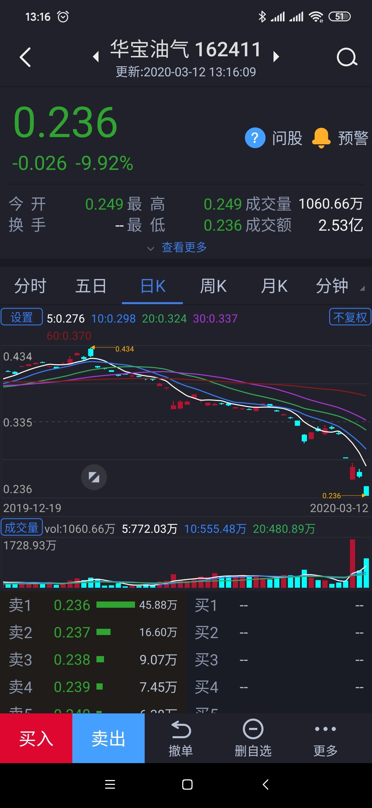

======================================================

_type: talk
@莫莫[421444811458818]
2020-03-12 16:32:05 Thu  
topic_id: 841825511415442

这是啥意思？对持有有影响吗

@陈伟 at 2020-03-12 16:32:05 Thu

> 是不是7天内买卖了？

----------

@莫莫 at 2020-03-12 16:32:05 Thu

> 不是，跟这个没关系，还在持有中，基金公司的公告

----------

@陈伟 at 2020-03-12 16:32:05 Thu

> 那我猜还有一种可能是和你评估的风险等级有关吧。不是有客服电话吗？直接问问估计就明白了。

----------

阅读[3184]  评论[3]  赞[0] 

+++++++++++++++++++++++++++++++++++++++++++++++++++++

图片：
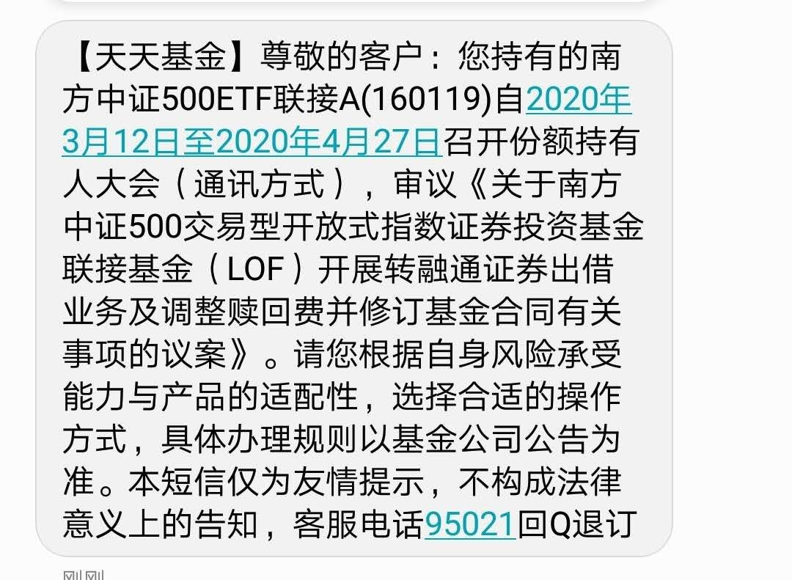

======================================================

_type: talk
@onepiecewi*[244414114545811]
2020-03-12 17:25:08 Thu  
topic_id: 841825855545182

发现身边很多人报名了长投，森淼之类的课程
然后一个个好像投资高手在晒收益
请问师父，这些培训机构真的能教出股神吗？
能不能点评下这些机构适合哪些人？

@Pansy at 2020-03-12 17:25:08 Thu

> 我环保买了2年多，到现在还是浮亏10%[流泪]

----------

@onepiecewi* at 2020-03-12 17:25:08 Thu

> [呲牙]如果坚持价值投资，应该暂时忘记它。
只要你的投资是有价值的，长期乌龟总会跑过兔子🐰

----------

@陈伟 at 2020-03-12 17:25:08 Thu

> 我也是，已做好持有5年的准备。

----------

@Pansy at 2020-03-12 17:25:08 Thu

> 好的，我加油

----------

@Pansy at 2020-03-12 17:25:08 Thu

> 好的，忘记它继续持有[呲牙]

----------

@陈伟 at 2020-03-12 17:25:08 Thu

> 相互鼓励吧！说不准国家这次基建计划里就有环保的利好消息[调皮]

----------

@彩虹 at 2020-03-12 17:25:08 Thu

> 长投和微淼我学了，没那么神

----------

@门萨🐨 at 2020-03-12 17:25:08 Thu

> 这种大概就是收割小白的

----------

阅读[3163]  评论[9]  赞[0] 

+++++++++++++++++++++++++++++++++++++++++++++++++++++

图片：
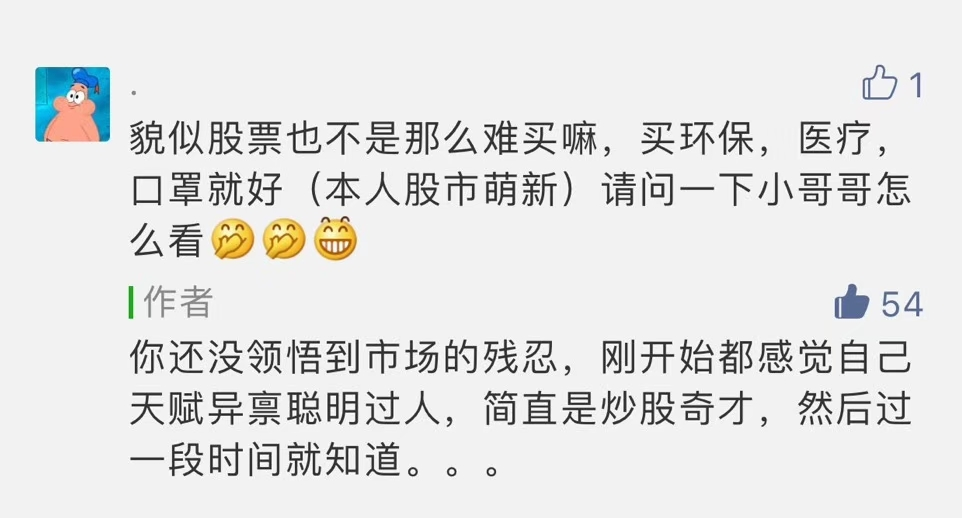

======================================================

_type: q&a
@美美[48224811151218]
2020-03-12 17:38:15 Thu  
topic_id: 421854411241418

@美美

>  二师父：基金定投卖出时的费率有点不明白，下面这个图片里假如我持有30天以上180天以下，费率是0.1%，这个天数是以第一次定投算起呢还是怎么算呢？

@二师父

>  先买的先卖

阅读[3382]  评论[1]  赞[0] 

======================================================

_type: talk
@二师父[28814221155551]
2020-03-12 17:58:56 Thu  
topic_id: 421854848121818

<e type="hashtag" hid="824542858822" title="#美股#" /> 你们想要投资的中概即将低估

@陈伟 at 2020-03-12 17:58:56 Thu

> 跟着师父有肉吃[微笑]

----------

@范毅君 at 2020-03-12 17:58:56 Thu

> 对于资金不多，知识储备不够的新手，是不是还是以a股为主啊，二师父。

----------

@二师父 at 2020-03-12 17:58:56 Thu

> 是的

----------

@范毅君 at 2020-03-12 17:58:56 Thu

> 好，我现在就这个感觉，资金不太多，面太大感觉茫然，哪个都了解不深入，套了一万多原油，中概互联也有一点，感觉学不过来，接下来资金准备主要还是针对A股，先深入学明白，理论结合实际

----------

@以古论今 at 2020-03-12 17:58:56 Thu

> 转投癌股，中概互联你会割肉吗？

----------

@范毅君 at 2020-03-12 17:58:56 Thu

> 不会，那个mei亏多少，原油亏的才多[呲牙][呲牙]都不会卖，只是后面不会主要经历投，特别原油，一点不懂[呲牙]

----------

@三峡情 at 2020-03-12 17:58:56 Thu

> 激动，去年跟着二师父买中概互联，到现在还赢利65％，只不过那时候投的不多，机会来了，慢慢来吧

----------

阅读[4637]  评论[7]  赞[0] 

+++++++++++++++++++++++++++++++++++++++++++++++++++++

文件：
2020-03-12 17:58:41 Thu
文件大小：[647695]
15448821482542-悬在美股头上的达摩克利斯之剑落下了，中概互联也即将进入低估.docx

======================================================

_type: q&a
@样[844124458224442]
2020-03-12 18:36:39 Thu  
topic_id: 118542524285122

@样

>  请问师父，估值表里的中证，场内的512910，规模2000多万，19年5月成立的，可以买吗？业绩看好吗

@二师父

>  6亿多，你在哪看的

阅读[3539]  评论[0]  赞[0] 

======================================================

_type: talk
@励[15441884844582]
2020-03-12 18:52:36 Thu  
topic_id: 548152125114554

提问:请问二师父，场内161125也是标普500，可以替代513500吗？前两天买成161125了[尴尬]（不过买的很少），后面要换成513500吗？

阅读[3381]  评论[0]  赞[0] 

======================================================

_type: talk
@陈Being[28845245224851]
2020-03-12 19:32:13 Thu  
topic_id: 841825852248142

<e type="hashtag" hid="824542858822" title="#美股#" /> 二师师，场外能否用图片中的164906代替中概互联

@陈飞🤗 at 2020-03-12 19:32:13 Thu

> 公共号里有回答

----------

阅读[3665]  评论[1]  赞[0] 

+++++++++++++++++++++++++++++++++++++++++++++++++++++

图片：
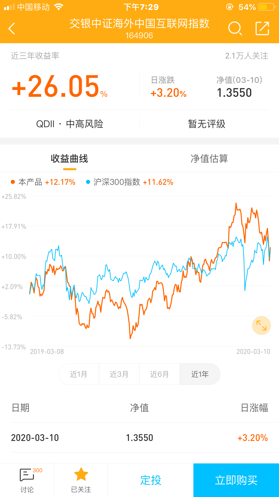

======================================================

_type: talk
@雨淡风清[844418818858882]
2020-03-12 19:56:34 Thu  
topic_id: 241825852444421

跳空低开，明天又是灰色星期五？来开个盘，一毛钱D明天大A又被绿[流泪][抓狂][流泪]价值投资，根据这个测算明天总收入肯定绿，黄金坑会出现，你加仓么？

@雨淡风清 at 2020-03-12 19:56:34 Thu

> 【南方基金】<QDII基金暂停申购通知>因外汇额度限制，南方原油、美国REIT、亚洲美元债、南方全球债券自3月12日15点后暂停申购和定投业务，赎回业务正常办理。敬请投资者注意投资风险，基金投资需谨慎。详见官网公告。
原油也不让买了，应该不会像汽油一样千里吧

----------

@以古论今 at 2020-03-12 19:56:34 Thu

> 加仓吧！

----------

阅读[3780]  评论[2]  赞[0] 

+++++++++++++++++++++++++++++++++++++++++++++++++++++

图片：
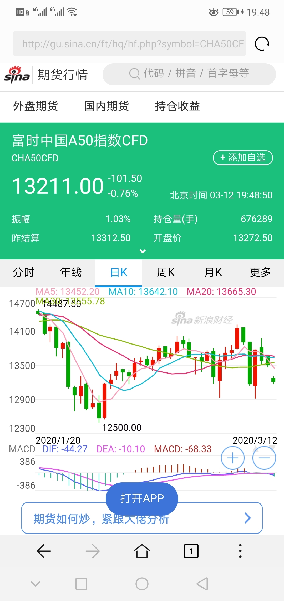

======================================================

_type: q&a
@素兮[548121415528244]
2020-03-12 21:07:39 Thu  
topic_id: 841825854582582

@素兮

>  二师父，我在用华宝智投做网格交易条件单时，有一个报价优化。我的理解是不填也可以，填了的话可以提高撮合成交概率。那么如果填的话，该怎么设置比较好？

@二师父

>  可以不用填

阅读[4089]  评论[0]  赞[0] 

======================================================

_type: talk
@夏萍[28221454818281]
2020-03-12 21:37:13 Thu  
topic_id: 841825854141452

请问谁有华泰经理的电话？怎么改费率？

@丸子妈 at 2020-03-12 21:37:13 Thu

> app里可以看的到你的客服经理联系方式

----------

@夏萍 at 2020-03-12 21:37:13 Thu

> 好的，谢谢

----------

阅读[4052]  评论[2]  赞[0] 

======================================================

_type: talk
@范*[841855284221812]
2020-03-12 22:52:42 Thu  
topic_id: 118542555121882

说真的A股，出乎我的意料。真抗跌
银行已经开始做网格了。

阅读[3895]  评论[0]  赞[0] 

======================================================

_type: talk
@Audrey[15284421255842]
2020-03-12 22:57:40 Thu  
topic_id: 841825888481282

二师傅好 什么时候有空开课教我们分析基本面吧😃  不了解基本面 有时基金大跌 不知道该加仓还是止损 感谢二师傅一直以来对我们的帮助 🧚‍♀️

@二师父 at 2020-03-12 22:57:40 Thu

> 置顶文章第三篇财报课程就是看企业基本面

----------

@Audrey at 2020-03-12 22:57:40 Thu

> 好的 我去荔枝微课学习 感谢二师傅 辛苦🍓

----------

阅读[3930]  评论[2]  赞[0] 

======================================================

_type: talk
@志亮[422125851552828]
2020-03-12 23:27:38 Thu  
topic_id: 841825882524452

才入市一年就能见到美股熔断，外围崩盘，真是大开眼界，不枉此生了。

@志亮 at 2020-03-12 23:27:38 Thu

> 能提前认识到股灾，也算是加速成长了。

----------

@栀子花开 at 2020-03-12 23:27:38 Thu

> 今年虽然亏钱不少，但长见识了。前段时间创业板遇到回撤忍不住买买买，被套住了

----------

@行云流水 at 2020-03-12 23:27:38 Thu

> A股也要熔断了

----------

@志亮 at 2020-03-12 23:27:38 Thu

> 我也被套了，就当交学费吧！

----------

@志亮 at 2020-03-12 23:27:38 Thu

> [捂脸]

----------

@六尘不改 at 2020-03-12 23:27:38 Thu

> 像我这种入市二十年的，觉得比起6400跌到1600的气势，还是差了一点

----------

@蓝魔森林 at 2020-03-12 23:27:38 Thu

> 应该说，就有那么好的投资机会，这才是关键

----------

@蓝魔森林 at 2020-03-12 23:27:38 Thu

> 我之前投资美股两年， 赚了一点，然后清仓了，现在见证了暴跌，只能说我运气也还不错。

----------

阅读[4114]  评论[11]  赞[0] 

======================================================

_type: talk
@夏萍[28221454818281]
2020-03-13 09:39:09 Fri  
topic_id: 841825825128242

师父鳄鱼计划发车吗？

@🍀 凝🌸 慧🍀 at 2020-03-13 09:39:09 Fri

> 同问啊，酒，中概互联……[呲牙][呲牙]

----------

@行云流水 at 2020-03-13 09:39:09 Fri

> 必须发车

----------

@以古论今 at 2020-03-13 09:39:09 Fri

> 中概不是加不了吗

----------

阅读[3752]  评论[3]  赞[0] 

======================================================

_type: talk
@二师父[28814221155551]
2020-03-13 09:46:46 Fri  
topic_id: 421854858488418

<e type="hashtag" hid="881251425252" title="#鳄鱼计划#" /> 卖出诺安纯债一份，买入深红利一份，买入白酒一份，买入300非银一份，买入新兴科技100一份

@雨淡风清 at 2020-03-13 09:46:46 Fri

> 今天在场

----------

@惟子 at 2020-03-13 09:46:46 Fri

> 二师父,这都是场内操作？

----------

@Nienie💝 at 2020-03-13 09:46:46 Fri

> 鳄鱼计划都是场内

----------

@🍀 凝🌸 慧🍀 at 2020-03-13 09:46:46 Fri

> 师父，目前鳄鱼计划，单只基金的总投入份数按照多少计算比较合适？

----------

@是喵喵吖～ at 2020-03-13 09:46:46 Fri

> 一份是2000来哈？

----------

@Nienie💝 at 2020-03-13 09:46:46 Fri

> 二师父的场内金额比场外多，另外，投多少钱时自己仓位情况，二师父从来没有规定过。

----------

@是喵喵吖～ at 2020-03-13 09:46:46 Fri

> 嗯嗯好谢谢[玫瑰]

----------

@JOY at 2020-03-13 09:46:46 Fri

> 师父，能麻烦您给加下科技和300非银那些在鳄鱼计划里的参考值吗？

----------

阅读[4944]  评论[16]  赞[0] 

======================================================

_type: talk
@二师父[28814221155551]
2020-03-13 09:51:41 Fri  
topic_id: 241825828525581

不要重复提问，乌龟计划天天基金，鳄鱼计划在场内华泰

@三峡情 at 2020-03-13 09:51:41 Fri

> 二师父，今天鳄鱼计划不出手吗

----------

@黄巧 at 2020-03-13 09:51:41 Fri

> 不是说已经买了吗[微笑]

----------

@三峡情 at 2020-03-13 09:51:41 Fri

> 看到了[微笑]

----------

阅读[3961]  评论[3]  赞[0] 

======================================================

_type: talk
@Simon[421211484228258]
2020-03-13 10:46:21 Fri  
topic_id: 241825828485221

谁有完善的定投记录表参考范例[抱拳][抱拳][抱拳]

阅读[3509]  评论[0]  赞[0] 

======================================================

_type: q&a
@Dolly[244124525445551]
2020-03-13 10:51:44 Fri  
topic_id: 421854858284528

@Dolly

>  二师父，我的H股股指占了基金仓位的12.5 %，需要卖掉些吗

@二师父

>  不用，可以暂停这个基金的定投

阅读[3985]  评论[5]  赞[0] 

======================================================

_type: q&a
@朝阳模具[15528112482582]
2020-03-13 11:36:13 Fri  
topic_id: 421854855451248

@朝阳模具

>  #​鳄鱼计划​ 卖出诺安纯债一份，买入深红利一份，买入白酒一份，买入300非银一份，买入新兴科技100一份
>  
>  师父，假设我今天才开始鳄鱼计划，计划总本金20W，那么一共分成多少份？

@二师父

>  先买10万，再分30份

阅读[3974]  评论[3]  赞[0] 

======================================================

_type: talk
@六尘不改[241555484551821]
2020-03-13 11:38:26 Fri  
topic_id: 241825822544111

A股难道要后知后觉的跟跌？越跌越买，如果到了2000就是卖房卖肾补仓的机会！！

@陈伟 at 2020-03-13 11:38:26 Fri

> 买完了5年不用的钱就不买了呗😊

----------

阅读[3840]  评论[1]  赞[0] 

======================================================

_type: talk
@明树[15422485828252]
2020-03-13 12:22:27 Fri  
topic_id: 421854855244128

请教天天基金上中概互联的净值计算的是什么时间的净值？

@自由飞翔 at 2020-03-13 12:22:27 Fri

> 前一天的

----------

@拥抱太阳的风筝 at 2020-03-13 12:22:27 Fri

> 看IOPV

----------

@拥抱太阳的风筝 at 2020-03-13 12:22:27 Fri

> 

----------

@明树 at 2020-03-13 12:22:27 Fri

> 这是什么软件？

----------

@拥抱太阳的风筝 at 2020-03-13 12:22:27 Fri

> 万得股票APP

----------

阅读[3703]  评论[5]  赞[0] 

======================================================

_type: talk
@静[241555148454251]
2020-03-13 12:25:05 Fri  
topic_id: 118542544124122

今天又一次跌，我是加仓呢，还是随他去

阅读[3715]  评论[0]  赞[0] 

======================================================

_type: q&a
@六尘不改[241555484551821]
2020-03-13 12:40:46 Fri  
topic_id: 421854855242858

@六尘不改

>  美股场内基金有滞后性，是不是可以理解为如果当天大反弹，第二天场内etf可以无风险套利？

@二师父

>  可以套利，但不是无风险的

阅读[4093]  评论[0]  赞[0] 

======================================================

_type: talk
@Audrey[15284421255842]
2020-03-13 12:51:09 Fri  
topic_id: 241825822441881

恒生指数 中概互联 今天可以投吗

@丸子妈 at 2020-03-13 12:51:09 Fri

> 我补了后者😂

----------

阅读[3969]  评论[1]  赞[0] 

======================================================

_type: talk
@范*[841855284221812]
2020-03-13 13:30:31 Fri  
topic_id: 241825821424421

今日银行ETF0.96买一份，1.14卖一份。

@范* at 2020-03-13 13:30:31 Fri

> 我一份是设置仓的20%
比如银行，就25%总仓位，不加仓不减仓，特殊情况会补仓。一份就是5%银行仓位的20%

----------

@范* at 2020-03-13 13:30:31 Fri

> 目的只有一个，把银行做成负成本。像黑洞一样。年化设置仓位的30~40%盈利目标。到大牛市会一次性清仓。

----------

阅读[3917]  评论[2]  赞[0] 

======================================================

_type: talk
@Simon[421211484228258]
2020-03-13 13:34:15 Fri  
topic_id: 241825821448411

二师傅您好，手里有完善的定投记录表参考范例？

阅读[4058]  评论[0]  赞[0] 

======================================================

_type: q&a
@🍀 凝🌸 慧🍀[841855248254242]
2020-03-13 13:57:01 Fri  
topic_id: 841825821152152

@🍀 凝🌸 慧🍀

>  二师父，上一位朋友提问：假设我今天才开始鳄鱼计划，计划总本金20W，那么一共分成多少份？您的建议是：先买10万，再分30份。
>  
>  我有些笨啊，恳请师父说的再详细点吗：先买10万，是比如今天一次性买入10万，还是其它方式？再分30份后，是什么时机投入？谢谢师父。

@二师父

>  如果空仓，这个位置建5
>  成仓位，然后继续定投，上午买的反弹不少了，5成仓位不重，一直空仓容易焦虑

阅读[4378]  评论[1]  赞[0] 

======================================================

_type: talk
@海马[15158245825242]
2020-03-13 18:18:41 Fri  
topic_id: 241825848184211

阅读[3765]  评论[0]  赞[0] 

+++++++++++++++++++++++++++++++++++++++++++++++++++++

图片：
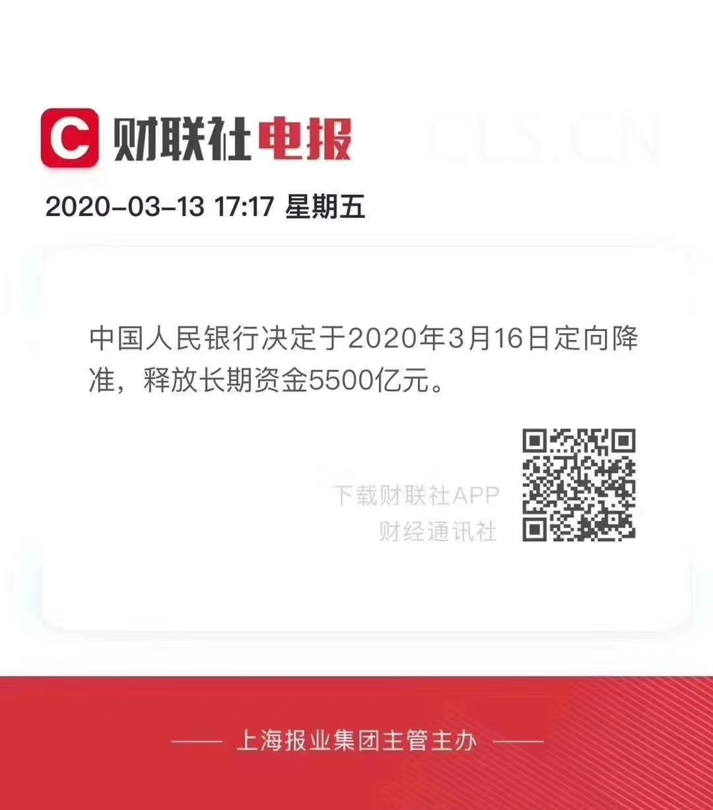

======================================================

_type: talk
@子辰[421444812542128]
2020-03-13 20:21:25 Fri  
topic_id: 548154485252154

鳄鱼计划的代码是多少

@苍天有井明月空🌙 at 2020-03-13 20:21:25 Fri

> 这个提问硬

----------

@子辰 at 2020-03-13 20:21:25 Fri

> 刚进来，啥都不懂，没办法

----------

@雨淡风清 at 2020-03-13 20:21:25 Fri

> 点右上角那个问号？收索  鳄鱼计划

----------

@onepiecewi* at 2020-03-13 20:21:25 Fri

> 搜索鳄鱼计划

----------

阅读[3619]  评论[4]  赞[0] 

======================================================

_type: talk
@二师父[28814221155551]
2020-03-13 21:25:37 Fri  
topic_id: 241824412411121

<e type="hashtag" hid="224541222241" title="#适合买入的基金以及代码#" />

@Simon at 2020-03-13 21:25:37 Fri

> 二师傅，有定投记录表么？

----------

@二师父 at 2020-03-13 21:25:37 Fri

> 没有

----------

@shininggre* at 2020-03-13 21:25:37 Fri

> 二师父您好。请问现在恒生国企和恒生指数都在低估，定投哪一个合适呢？谢谢。

----------

@二师父 at 2020-03-13 21:25:37 Fri

> 国企指数

----------

@三峡情 at 2020-03-13 21:25:37 Fri

> 请问二师父，恒生场内不是159920吗？你发的那个是H股

----------

@shininggre* at 2020-03-13 21:25:37 Fri

> 二师父，我不太懂，能不能说一下原因呢？我听课程里面说如果恒生指数和国企指数都低估，买恒生指数更有价值呢？现在买国企指数是因为它更低估，更有投资价值，而恒生指数刚进入低估，可能还要继续再跌很长一段时间么？

----------

@二师父 at 2020-03-13 21:25:37 Fri

> 这个是有变化的，企业基本面是在变化的

----------

@雨淡风清 at 2020-03-13 21:25:37 Fri

> 大A再坚挺也熬不过人家作弊啊！直接法律规定不能做空！是这么说的的吧，规则和命运掌握在制订者手里

----------

阅读[4279]  评论[11]  赞[0] 

+++++++++++++++++++++++++++++++++++++++++++++++++++++

文件：
2020-03-13 21:25:22 Fri
文件大小：[19836]
28245584451811-美股继续触发熔断，A股扛起大旗，现在哪些基金适合配置.docx

======================================================

_type: talk
@二师父[28814221155551]
2020-03-13 22:11:40 Fri  
topic_id: 421852212814418

<e type="hashtag" hid="452421551588" title="#最近几个问题统一聊聊 #" /> 关于指数仓位，自己舒服就对了，下跌不害怕，上涨不焦虑就是好仓位，不要问别人，也别参考我，每个人都不一样。

关于网格，只适合场内，推荐华宝，置顶有开户渠道，可以手动也可以自动。原油、油气这种强周期不适合网格，不要碰。另外股票卖出有印花税，挺高的，股票不适合网格。

关于鳄鱼计划和乌龟计划，鳄鱼计划都在场内购买，这样便于交易，而且费率低，乌龟计划之所以在场外是给投资者跟投，有的同学毕竟很忙，不会经常关注股市。

关于分析企业基本面，有定性分析和定量分析，定性分析主要是企业的前景、市场占有率，护城河，定量分析是财务报表，这个可以听听我的财报课程，从财务上发现公司的优势和劣势。

关于企业投资，这个需要自己独立判断，因为我推得你不一定拿得住，一般我投资企业都是至少持有一年以上，但是短期波动会达到30%也会很正常，二师父发现过一般一只股票波动35%以上就是普通人的承受极限了，所以在A股投资股票要么极度有定力，学习巴菲特，坚定持有，他的最大回撤是51%。要么学会止损，而很多人一止损股票又涨回来了，又重新买入。这样反复多次，就失去了对股市的信心。

二师父只能这样说，股票的收益率肯定是最好的，不过大多数人并不会，甚至很多机构讲的方法都根本是错的，慢慢学习，慢慢实践，找到适合自己的方法才能够越做越好。

@门萨🐨 at 2020-03-13 22:11:40 Fri

> 之所以很多人说股市是赌场，那是因为没有研究就跟买，想想胆子也是大，稀里糊涂就投入，只问别人要个代码，就大笔投机，不是赌博是什么呢。

----------

@蛋炒饭不加蛋 at 2020-03-13 22:11:40 Fri

> 请问二师父华宝能打可转债吗

----------

@二师父 at 2020-03-13 22:11:40 Fri

> 可以

----------

阅读[5040]  评论[3]  赞[0] 

======================================================

_type: talk
@范*[841855284221812]
2020-03-13 22:17:21 Fri  
topic_id: 548154484522454

美股场内都溢价。哎~真不好下手。虽然现在还没出现我要的买点。要是买点出现了，只要溢价不是太高，也只能硬着头皮进了。

@华为～ at 2020-03-13 22:17:21 Fri

> 二师父您好！请问007873和008086能同时配置吗？

----------

@onepiecewi* at 2020-03-13 22:17:21 Fri

> 你提问要去提问那里~
这个是同学不是二师傅

----------

阅读[3999]  评论[2]  赞[0] 

======================================================

_type: q&a
@学以致用[244415184181451]
2020-03-14 09:15:37 Sat  
topic_id: 241824158154141

@学以致用

>  二师父，开户佣金免5，如何解释？如果大额资金交易怎样开户划算呢？

@二师父

>  没有最低五元收费的

阅读[3928]  评论[5]  赞[0] 

======================================================

_type: talk
@以古论今[28214421582421]
2020-03-14 09:28:37 Sat  
topic_id: 548154825141884

加入现在手上有十六万资金，你建议拿出多少来投基金更好

@样 at 2020-03-14 09:28:37 Sat

> 你这个问题啊，别人没法回答，也不清楚你的具体情况，有没有保险？有没有近期要还的贷款？有没有留应急的费用？平时有没有流动进账？等等……

----------

@April _ M. at 2020-03-14 09:28:37 Sat

> 先做一下自我财务状况分析，然后评估下自己想要的预期收益和风险承受能力之类的；或许会有帮助你思考这个问题～

----------

阅读[3886]  评论[2]  赞[0] 

======================================================

_type: talk
@树叶[544811512145144]
2020-03-14 09:34:11 Sat  
topic_id: 241824152841251

<e type="hashtag" hid="142825811122" title="#定投周报#" /> 二师父定投周报第50期

阅读[4362]  评论[0]  赞[0] 

+++++++++++++++++++++++++++++++++++++++++++++++++++++

文件：
2020-03-14 09:34:01 Sat
文件大小：[235646]
48524454144128-二师父定投周报3.14（第50期）.docx

======================================================

_type: q&a
@光少[244124552511141]
2020-03-14 12:37:49 Sat  
topic_id: 548154812245524

@光少

>  二师父您好！鳄鱼计划和网格交易用华泰还是华宝好，那个佣金低？

@二师父

>  一样的费率，如果用华宝套利申购可以打折，这个低很多，华宝可以自动网格，其他的没啥区别

阅读[4176]  评论[1]  赞[0] 

======================================================

_type: talk
@二师父[28814221155551]
2020-03-14 13:29:22 Sat  
topic_id: 118541852442452

<e type="hashtag" hid="224541412151" title="#避免成为羊群 #" />

@范毅君 at 2020-03-14 13:29:22 Sat

> 周五上午打出价格低买入白酒，结果没成交，周五没买多少，自己毛病就是纠结，不找眼整个宏观，基本面，只看眼前，恐惧站了上风，纪律原则不知不觉没有了，很容易乱节奏，修炼是股市最需要的[可怜][可怜][捂脸]

----------

阅读[5312]  评论[1]  赞[0] 

+++++++++++++++++++++++++++++++++++++++++++++++++++++

文件：
2020-03-14 13:29:11 Sat
文件大小：[19760]
51542251411124-解读基金第7讲.docx

======================================================

_type: talk
@二师父[28814221155551]
2020-03-14 13:53:29 Sat  
topic_id: 118541852151222

标普500很有价值，比较无奈是场内溢价太高，就在场外跟着乌龟计划慢慢投吧

相信暴跌可以把溢价锤下来的，总是不缺机会，而是缺钱

@杜志彪 at 2020-03-14 13:53:29 Sat

> 对缺钱[偷笑]

----------

@rtdmm小米 at 2020-03-14 13:53:29 Sat

> 机会多多，钱赶不上趟！[抓狂][抓狂]

----------

阅读[4336]  评论[2]  赞[0] 

======================================================

_type: q&a
@素兮[548121415528244]
2020-03-14 14:37:41 Sat  
topic_id: 548154812441154

@素兮

>  二师父，场外购买美股的净值是看第二天凌晨美股的收盘价。那么如果在溢价合理的情况下，场内买美股指数，净值是怎么看？是看场内的实时的当时的净值么？另外中概互联什么时候建仓比较合适？

@二师父

>  直接看实时净值，目前都有溢价，中概互联等场内溢价下来了可以开始定投

阅读[4538]  评论[0]  赞[0] 

======================================================

_type: q&a
@小小[422125825151828]
2020-03-14 19:02:59 Sat  
topic_id: 841824181582252

@小小

>  二师父 问下白银基金可否建底仓 最大回撤幅度多少 谢谢

@二师父

>  大宗商品只适合配置，属于无底部投资品，现在距离历史最大回撤百分之43

阅读[4413]  评论[0]  赞[0] 

======================================================

_type: talk
@二师父[28814221155551]
2020-03-14 20:06:08 Sat  
topic_id: 241824181288411

<e type="hashtag" hid="452421118128" title="#国企和50的对比#" /> 恒生国企和50AH没有很多重合，可以同时配置

@朝阳模具 at 2020-03-14 20:06:08 Sat

> 除了腾讯（配置中概互联更好），其实重合度还是挺高的[呲牙]，都是以银行保险石油地产等为权重。50AH里有一半A股，一半H股，茅台伊利恒瑞等核心资产更是H里没有的。师父别砸我[撇嘴]

----------

@朝阳模具 at 2020-03-14 20:06:08 Sat

> 个人认为如果一样的估值，50AH更有配置价值[呲牙]

----------

@二师父 at 2020-03-14 20:06:08 Sat

> H股本来就是用来配置港股的，a股不在里面很正常，你计算二者重合度是多少呢，需要数据的

----------

@朝阳模具 at 2020-03-14 20:06:08 Sat

> 我场内选了恒生指数[微笑][微笑]

----------

阅读[5463]  评论[6]  赞[0] 

+++++++++++++++++++++++++++++++++++++++++++++++++++++

文件：
2020-03-14 20:05:21 Sat
文件大小：[18585]
28245524522841-恒生国企和50AH并没有很多重合.docx

======================================================

_type: talk
@奋斗[118281455841442]
2020-03-14 20:37:17 Sat  
topic_id: 548154818418884

二师傅中概互联场内的溢价这么多是不是场外可以转场内呢

@速。冻 at 2020-03-14 20:37:17 Sat

> 不能转

----------

阅读[4310]  评论[1]  赞[0] 

======================================================

_type: talk
@奋斗[118281455841442]
2020-03-14 20:52:29 Sat  
topic_id: 241824181185851

场内和场外怎么相差这么多，是不是可以买场外转换成场内卖掉啊，赚差价

@Yingshengw* at 2020-03-14 20:52:29 Sat

> 先搞懂了再说

----------

@速。冻 at 2020-03-14 20:52:29 Sat

> 这两个没关系，不是同一时间成立的

----------

阅读[4648]  评论[2]  赞[0] 

+++++++++++++++++++++++++++++++++++++++++++++++++++++

图片：
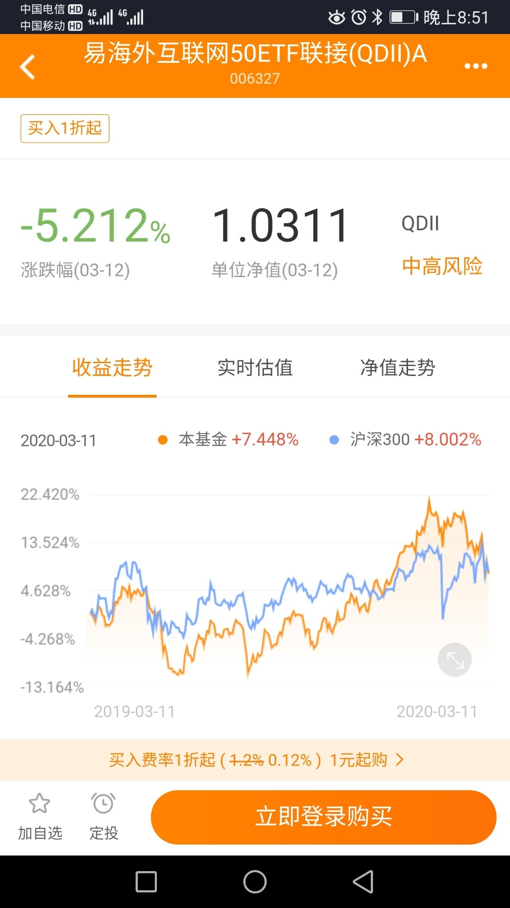
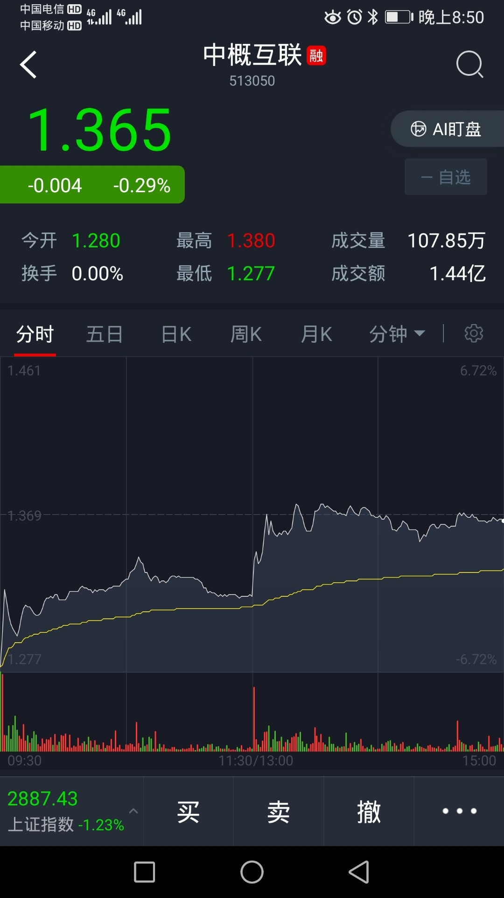

======================================================

_type: talk
@C&S[51442188184824]
2020-03-14 22:29:57 Sat  
topic_id: 548154852415454

请教，广发美国房地产 000179可以定投吗？

@吴涛 at 2020-03-14 22:29:57 Sat

> 这问题我也想知道，因为我配置里也有房产基金。

----------

@C&S at 2020-03-14 22:29:57 Sat

> 以下是师父的回答：这个目前并未到达估值低位，而且美国房地产指数是抵御通胀的，目前通胀没有上升趋势，最大回撤百分之60，可以接受的话能定投，不能接受的话建议等等

----------

阅读[4845]  评论[2]  赞[0] 

======================================================

_type: talk
@雨淡风清[844418818858882]
2020-03-14 22:42:09 Sat  
topic_id: 118541842115482

巴菲特的老师

@吴涛 at 2020-03-14 22:42:09 Sat

> 二师父，我写的投资哲学和投资理念您看了吗？有什么问题不对，您直接回我邮箱。谢谢！
另记住了您说的，咱们投资是为了增长稳定收益的，抄底不在咱能力圈内，只能做自己能力圈内的投资。

----------

@二师父 at 2020-03-14 22:42:09 Sat

> 我发了

----------

阅读[5045]  评论[2]  赞[0] 

+++++++++++++++++++++++++++++++++++++++++++++++++++++

图片：

======================================================

_type: q&a
@C&S[51442188184824]
2020-03-14 23:24:44 Sat  
topic_id: 421852154282458

@C&S

>  请教，广发美国房地产 000179可以定投吗？

@二师父

>  这个目前并未到达估值低位，而且美国房地产指数是抵御通胀的，目前通胀没有上升趋势，最大回撤百分之60，可以接受的话能定投，不能接受的话建议等等

阅读[5303]  评论[1]  赞[0] 

======================================================

_type: talk
@老孙头[422115118524548]
2020-03-15 13:54:03 Sun  
topic_id: 548154845512584

请教二师父：持有两只相对优质的混合型主动基金，上周一只跌幅大(超过大盘跌幅较多)，一只则明显抗跌。准备加仓一只，是选择前者还是后者？逻辑是什么？

@陈飞🤗 at 2020-03-15 13:54:03 Sun

> 问的毫无逻辑

----------

@老孙头 at 2020-03-15 13:54:03 Sun

> 小白一个！资金有限，只想加仓一只。烦指教[咖啡]

----------

@特仑苏 at 2020-03-15 13:54:03 Sun

> 我的观点，会选择跌的多的加仓，理由1，两只都是优秀的混合基金，既然你认为都是优秀，就应该相信基金经理。理由2，加仓主动基金，跌的多才加仓呀，如果没有跌的多，那加仓的意义又是什么呢。以上纯属个人观点。

----------

阅读[4939]  评论[3]  赞[0] 

======================================================

_type: talk
@二师父[28814221155551]
2020-03-15 17:46:50 Sun  
topic_id: 841824144151282

<e type="hashtag" hid="554282144484" title="#港股指数的对比#" /> 巴菲特出手了，如果不是标普500有溢价，明天场内可以来点，等着周四定投吧，真是好机会。

@雨淡风清 at 2020-03-15 17:46:50 Sun

> 在不出手，老特估计
得请他喝咖啡了

----------

@J at 2020-03-15 17:46:50 Sun

> 请问历史市盈率、PEG估值和绝对估值，这三者的在估值中的相互关系是什么？

----------

@二师父 at 2020-03-15 17:46:50 Sun

> 这个没啥关系

----------

@J at 2020-03-15 17:46:50 Sun

> 一般情况下参照哪个？还是三个都要参照？

----------

@二师父 at 2020-03-15 17:46:50 Sun

> 我主要看绝对估值

----------

@三峡情 at 2020-03-15 17:46:50 Sun

> 感谢二师父的说明，终于搞清楚了，网格交易买的恒生指数，定投实盘买的恒生国企，我看了一下，我目前持仓金额二个差不多。接下来还是偏向定投多一点好，估计港股还要下跌，如果场内恒生继续下跌，再适当补一点您觉得可以吗？

----------

@二师父 at 2020-03-15 17:46:50 Sun

> 可以的，控制仓位就行

----------

阅读[6259]  评论[7]  赞[0] 

+++++++++++++++++++++++++++++++++++++++++++++++++++++

文件：
2020-03-15 17:46:08 Sun
文件大小：[19969]
88245548814482-恒生指数和恒生国企指数投资价值对比分析.docx

======================================================

_type: talk
@Pansy[48281554424548]
2020-03-15 23:26:24 Sun  
topic_id: 841824114282122

请教大家：这种卖空的操作是怎样获利的？是一出一进，获差价吗？

@雨淡风清 at 2020-03-15 23:26:24 Sun

> 这个有门槛，要大手笔的

----------

@Pansy at 2020-03-15 23:26:24 Sun

> 好的，谢谢

----------

阅读[4984]  评论[2]  赞[0] 

+++++++++++++++++++++++++++++++++++++++++++++++++++++

图片：
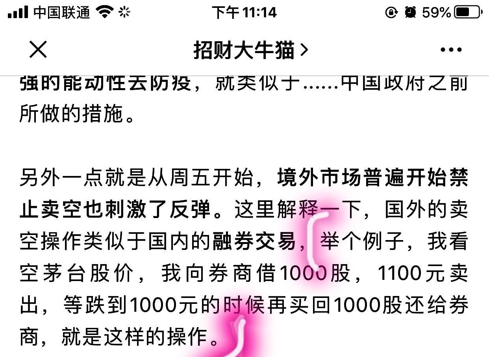

======================================================

_type: talk
@范毅君[118551121224142]
2020-03-16 08:58:25 Mon  
topic_id: 241821558421221

第一次中[呲牙]

@onepiecewi* at 2020-03-16 08:58:25 Mon

> 没中过

----------

@章兵朋 at 2020-03-16 08:58:25 Mon

> 上周五6支都没中

----------

@孟倩 at 2020-03-16 08:58:25 Mon

> 我也中了

----------

@清水倾城 at 2020-03-16 08:58:25 Mon

> 据说这是一只可能破发的转债，我也中了[尴尬]

----------

@小可木易 at 2020-03-16 08:58:25 Mon

> 可能破发的是“搜特”，但是今天正股“搜于特”竟然涨停了[捂脸]

----------

@随便 at 2020-03-16 08:58:25 Mon

> 我也中了！！[撇嘴]

----------

@秦风殇韵（刘豫斌） at 2020-03-16 08:58:25 Mon

> 中了俩

----------

@范毅君 at 2020-03-16 08:58:25 Mon

> 哈哈[呲牙]爱咋咋

----------

阅读[5073]  评论[15]  赞[0] 

+++++++++++++++++++++++++++++++++++++++++++++++++++++

图片：
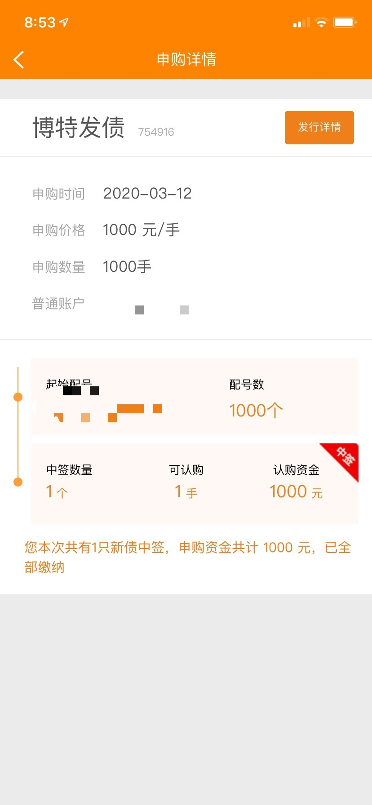

======================================================

_type: q&a
@JOY[111881481812422]
2020-03-16 08:59:59 Mon  
topic_id: 421851448558888

@JOY

>  请问，置顶链接说明里面的华宝开户万一，是股票和基金都是万一吗？能免五吗？

@二师父

>  可以，股票是万1.5

阅读[5276]  评论[1]  赞[0] 

======================================================

_type: talk
@onepiecewi*[244414114545811]
2020-03-16 09:05:41 Mon  
topic_id: 548158221448144

打卡学习来啦[咖啡]

阅读[5162]  评论[0]  赞[0] 

======================================================

_type: talk
@二师父[28814221155551]
2020-03-16 11:52:26 Mon  
topic_id: 118548221512112

最近跌幅有点大，一定要拿住，可以不买，但是别乱卖，基本面恶化的股票止损除外。

机会总是有的，耐心点

@云云 at 2020-03-16 11:52:26 Mon

> 坚守💪

----------

@会飞的猪 at 2020-03-16 11:52:26 Mon

> 忍耐

----------

@秦风殇韵（刘豫斌） at 2020-03-16 11:52:26 Mon

> 还在正常定投[微笑]

----------

@What if at 2020-03-16 11:52:26 Mon

> 有点管不住手，想往里面扔[发呆]

----------

@Claire at 2020-03-16 11:52:26 Mon

> 一起坚守

----------

@样 at 2020-03-16 11:52:26 Mon

> 补了一点白酒

----------

@顾。 at 2020-03-16 11:52:26 Mon

> 二师父 白酒最高回撤多少呀？

----------

阅读[4976]  评论[7]  赞[0] 

======================================================

_type: q&a
@helen[544884424181154]
2020-03-16 12:56:46 Mon  
topic_id: 241821585824121

@helen

>  请问二师父，场内基金的折溢价是白天的市场价与昨天的净值比还是与当天收盘后的净值比？

@二师父

>  与实时净值iopv对比

阅读[5035]  评论[1]  赞[0] 

======================================================

_type: q&a
@栀子花开[118248824481842]
2020-03-16 13:49:51 Mon  
topic_id: 241821585252811

@栀子花开

>  二师傅，请问一下，因为资金不够，我想把沪深300价值卖了换成H 股和港股中小，可行吗？目前300价值亏损4个点，感觉它涨起来跟不上，跌起来却不含糊😂

@二师父

>  不要频繁换仓，可以盈利之后再换，而且港股下跌也很猛，注意控制仓位

阅读[5139]  评论[1]  赞[0] 

======================================================

_type: talk
@Jessie在水一方[111851554242252]
2020-03-16 13:58:20 Mon  
topic_id: 241821585184241

老师现在可以加仓中概互联ETF吗？

@铁观音 at 2020-03-16 13:58:20 Mon

> 同问？现在好像是折价了？

----------

@onepiecewi* at 2020-03-16 13:58:20 Mon

> 提问要去上面提问输入问题，在这里提问可能师父看不到

----------

@Jessie在水一方 at 2020-03-16 13:58:20 Mon

> 啊？哪里提问呀？我说老师怎么不回应呢？

----------

@onepiecewi* at 2020-03-16 13:58:20 Mon

> 拉到最上面

----------

阅读[5114]  评论[4]  赞[0] 

======================================================

_type: q&a
@🍀 凝🌸 慧🍀[841855248254242]
2020-03-16 14:05:45 Mon  
topic_id: 118548252854842

@🍀 凝🌸 慧🍀

>  二师父，我目前7成仓位，今天可以加些吗？

@二师父

>  问题太泛了，第一每月结余多少，结余相当于投入资金多少
>  
>  第二加仓什么？
>  
>  如果下跌抗的住，加仓回撤可控的指数可以

阅读[5338]  评论[1]  赞[0] 

======================================================

_type: q&a
@一无所有[244112224815551]
2020-03-16 15:01:02 Mon  
topic_id: 548158211145414

@一无所有

>  二师父，今天场内白酒和新兴科技100可以加仓吗？我的才两成仓位。谢谢！

@二师父

>  能接受回撤就可以

阅读[5068]  评论[1]  赞[0] 

======================================================

_type: q&a
@自由·风[844445155244142]
2020-03-16 17:18:40 Mon  
topic_id: 548158215555154

@自由·风

>  本人新人，请教二师父，“黄金坑、钻石坑”，一般分别指沪指多少点至多少点？谢谢！

@二师父

>  大致区分下
>  
>  2500到2700钻石底
>  
>  2700到2900黄金坑
>  
>  现在可以捡黄金，不过离捡钻石还有点距离

阅读[4748]  评论[1]  赞[0] 

======================================================

_type: talk
@杜志彪[544454124115854]
2020-03-16 17:52:18 Mon  
topic_id: 841821581842422

二师父今天可以再发一下估值表吗？比较看看明天加仓哪个品种好[抱拳]

阅读[4748]  评论[0]  赞[0] 

======================================================

_type: talk
@六尘不改[241555484551821]
2020-03-16 18:03:51 Mon  
topic_id: 421851481555248

今天加仓15万

@苍天有井明月空🌙 at 2020-03-16 18:03:51 Mon

> 硬

----------

@范毅君 at 2020-03-16 18:03:51 Mon

> 钢

----------

阅读[4837]  评论[2]  赞[0] 

======================================================

_type: talk
@二师父[28814221155551]
2020-03-16 18:07:55 Mon  
topic_id: 241821581221181

<e type="hashtag" hid="554282818544" title="#稳定心态#" /> 稳定心态，慢慢定投，机会总是会有的

@庆余年 at 2020-03-16 18:07:55 Mon

> 投资之前做心理测评挺重要的。

----------

@背心 at 2020-03-16 18:07:55 Mon

> 能让散户挣得钱吗？都在抄底。

----------

@蓝魔森林 at 2020-03-16 18:07:55 Mon

> 有的是在定投吧[呲牙]

----------

@志亮 at 2020-03-16 18:07:55 Mon

> 是的，心态很重要，一定要淡定。

----------

@范毅君 at 2020-03-16 18:07:55 Mon

> 修炼[呲牙][呲牙]

----------

@雨淡风清 at 2020-03-16 18:07:55 Mon

> 别急着加仓，想想自己的心态能不能承受的了，别被震荡出去，记住二师父的话亏损不要卖出，不要频繁调仓。今天盈利就开始为负了[抓狂]沉住气酒下8个点加酒本仓位的一成。300非银下跌8个点加本仓位0.8，这是极端情况。预计明天回反弹下，心里承受能力差的，不亏就跑吧！本人观点，大家看看就行了[衰]

----------

阅读[6066]  评论[6]  赞[0] 

+++++++++++++++++++++++++++++++++++++++++++++++++++++

文件：
2020-03-16 18:07:15 Mon
文件大小：[68292]
88245518828452-股市下行，稳定心态，别盲目抄底.docx

======================================================

_type: talk
@二师父[28814221155551]
2020-03-16 20:08:16 Mon  
topic_id: 421851454828158

目前比较有投资价值的指数，300非银、恒生，如果不懂，选择沪深300即可，这个就很好了。

对于中概互联，可以定投，不是很便宜，不过也不贵。对于标普500，目前溢价1%以内，可以接受的话，场内定投可以。

记住是定投不是抄底。个人投资记录，非投资建议。

仓位最极端不要超过92%，最低不要低于55%。

@冯林锋 at 2020-03-16 20:08:16 Mon

> 恒生是恒生指数还是恒生国企

----------

@二师父 at 2020-03-16 20:08:16 Mon

> 这个说的场内的恒生指数

----------

@范毅君 at 2020-03-16 20:08:16 Mon

> 现在横生和h股哪个好一些呀[呲牙]

----------

@二师父 at 2020-03-16 20:08:16 Mon

> 选择一个就行，差不太多

----------

@随便 at 2020-03-16 20:08:16 Mon

> 仓位已经百分之95了加不动了[撇嘴]

----------

@二师父 at 2020-03-16 20:08:16 Mon

> 那就停一停

----------

@随便 at 2020-03-16 20:08:16 Mon

> 好的😄

----------

@范毅君 at 2020-03-16 20:08:16 Mon

> 好的

----------

阅读[5150]  评论[10]  赞[0] 

======================================================

_type: talk
@二师父[28814221155551]
2020-03-16 21:43:36 Mon  
topic_id: 118548245424122

<e type="hashtag" hid="141285224882" title="#关于计划#" /> 外盘继续下跌，如果明天继续下跌，鳄鱼计划发车一次，标的从酒ETF、中证医疗，300非银，标普500中选择，标普500在等待溢价消失，其中中证医疗场内代码512170。

大家可以自行选择，当然控制节奏，目前比较情况比较危险，我的计划是不到2500绝不满仓，安全第一。鳄鱼计划我用的场内账户，如果你不想要场内，就用支付宝，或者从我这开通天天基金也一样，对投资收益影响不是决定性的。

目前子弹就打完就长持，如果打不到预期位置，我也不打了，安全第一，赚钱第二，并不想把市场的钱都赚了，不要忘记了当初进入市场是为了什么，就是为了获取年化10%到20%的收益率，但是很多人走着走着就忘记了当初为什么出发，开始追涨企图一年一倍，开始买看都看不懂的股票，开始崇拜所谓的股神，结果被教育了，太多的例子，所幸目前是熊市，如果牛市追涨就不是打脸而是毁灭了。

这个市场不缺明星，只缺寿星，安全比什么都重要。那也就意味着，如果明天没有大跌，继续不动，耐心等待，

耐心就是账户有闲钱，但是没有到买入点，坚决不出手。

@陌路花 at 2020-03-16 21:43:36 Mon

> 二师父真淡定

----------

@rtdmm小米 at 2020-03-16 21:43:36 Mon

> 二师父的鳄鱼又准备出击了？市场真的不缺机会而是缺钱！

----------

@以古论今 at 2020-03-16 21:43:36 Mon

> 医疗还没到低估啊

----------

@紫色天使 at 2020-03-16 21:43:36 Mon

> 每当恐慌想割肉止损的时候看到二师父的文章就醍醐灌顶！！！经历这次大跌我也是有经验的人了！终于明白了一句话：对股市永远存敬畏之心！！！终于深切体会到为什么不能抄底了，因为真的没有人知道底在哪里，没有经历总是不能深切体会这句话的意思，现在明白了！感谢二师父！[玫瑰][玫瑰][玫瑰]

----------

@蓝魔森林 at 2020-03-16 21:43:36 Mon

> 我现在六成左右，定投都不敢多投。感觉无底洞

----------

@onepiecewi* at 2020-03-16 21:43:36 Mon

> 一直按听师父之前的话，备好子弹，等待师傅的号角

----------

@苍天有井明月空🌙 at 2020-03-16 21:43:36 Mon

> 我现在四层很舒服。

----------

@Hi·DD at 2020-03-16 21:43:36 Mon

> 二师父，请问5Getf能入了吗

----------

阅读[5919]  评论[19]  赞[0] 

======================================================

_type: talk
@冬夫[15122585122182]
2020-03-16 23:00:26 Mon  
topic_id: 841821821858552

请问二师傅：如现在买标普500场外，会以第二天收盘价成交？

阅读[4988]  评论[0]  赞[0] 

======================================================

_type: talk
@蛋炒饭不加蛋[118281818482542]
2020-03-17 08:28:19 Tue  
topic_id: 118548515255412

场外的中概互联不能买了吗？

阅读[4777]  评论[0]  赞[0] 

======================================================

_type: q&a
@是喵喵吖～[421441114141158]
2020-03-17 09:08:24 Tue  
topic_id: 421851824122458

@是喵喵吖～

>  二师父 想请教您两个问题：1、易方达沪深300ETF这只基金和银河沪深300价值哪个更值得定投呢2、如果不跟鳄鱼计划，在大盘下跌的情况下，也可以继续在场外按之前买的标的定投是吧 （比如沪深300 中证500这些 趁机会买入一些，做定投的仓位）谢谢🌹🌹

@二师父

>  沪深300更值得定投，有机会可以在场外单独加仓，需要控制节奏

阅读[4985]  评论[0]  赞[0] 

======================================================

_type: q&a
@玉博珠宝[15551254545122]
2020-03-17 09:09:40 Tue  
topic_id: 841821848582252

@玉博珠宝

>  师父您好！近期会有一笔钱到账，大概100万左右，可持有一年到一年半左右，在这个时间段里，当前买哪些基金比较稳妥？怎么操作比较好？目前总仓位2成，A50+深基本面60+沪深300占40%，中证500占20%,H股占13%，中正银行占17%，其它的证券，医药，酒，消费，深红利加起来占10%

@二师父

>  这个期限配对比较短，建议买货币或者短债，投资只能用多年不用的闲钱

阅读[5039]  评论[1]  赞[0] 

======================================================

_type: q&a
@老司基[111852221242122]
2020-03-17 09:10:18 Tue  
topic_id: 548158145854544

@老司基

>  师父，直接投资美股特斯拉的有相关基金吗

@二师父

>  目前只能开通美股账户，重仓这类股票的基金还没发现

阅读[5168]  评论[0]  赞[0] 

======================================================

_type: talk
@二师父[28814221155551]
2020-03-17 10:24:16 Tue  
topic_id: 548158144825484

<e type="hashtag" hid="881251425252" title="#鳄鱼计划#" /> 买入酒ETF，非银ETF，500ETF，各一份，场外对应的基金也可以，在华宝证券搜索场内代码，在天天搜索场外代码，不要着急，慢慢买。

控制仓位，控制节奏。

@范毅君 at 2020-03-17 10:24:16 Tue

> 请问非银代码

----------

@🍀 凝🌸 慧🍀 at 2020-03-17 10:24:16 Tue

> 收到

----------

@苍天有井明月空🌙 at 2020-03-17 10:24:16 Tue

> 500etf代码多少

----------

@苍天有井明月空🌙 at 2020-03-17 10:24:16 Tue

> 是普标500吗

----------

@二师父 at 2020-03-17 10:24:16 Tue

> 中证500

----------

@庆余年 at 2020-03-17 10:24:16 Tue

> 是不是说反了，华宝证券搜场内，天天搜场外？

----------

@二师父 at 2020-03-17 10:24:16 Tue

> 估值表

----------

@二师父 at 2020-03-17 10:24:16 Tue

> 对

----------

阅读[5573]  评论[15]  赞[0] 

======================================================

_type: q&a
@乖子[28441841181151]
2020-03-17 10:25:00 Tue  
topic_id: 421851822281248

@乖子

>  请问二师父今天发车了吗？没看到您正式的发车通知，没有安全感。

@二师父

>  刚买，不要着急

阅读[4802]  评论[1]  赞[0] 

======================================================

_type: talk
@onepiecewi*[244414114545811]
2020-03-17 11:00:44 Tue  
topic_id: 241821841548121

打卡学习

阅读[4461]  评论[0]  赞[0] 

======================================================

_type: talk
@二师父[28814221155551]
2020-03-17 11:06:17 Tue  
topic_id: 118548518285582

<e type="hashtag" hid="452418854458" title="#最新的网格交易表#" /> 最新的网格交易表，基本上都可以开始建立底仓了。

这次重点说说中概互联，很多投资者一直在问这只基金，很有价值，不过也得等到他跌下来再买。之前18年他也到过高位大概是到了1.7的价格，最后19年跌到了一元。

真的不用着急，市场总有机会，现在可以买了，场内定投或者网格交易都是可以的。

底仓建立价格建立底仓，然后每次到达买入价格加仓一次。

@波波 at 2020-03-17 11:06:17 Tue

> 一定要场内吗？

----------

@二师父 at 2020-03-17 11:06:17 Tue

> 网格交易最好开通场内华宝，因为场外你在7天内卖出会有百分之1.5的手续费

----------

@波波 at 2020-03-17 11:06:17 Tue

> 懂了

----------

@波波 at 2020-03-17 11:06:17 Tue

> 场内用用华宝，如何实现自动交易或智能交易？

----------

@二师父 at 2020-03-17 11:06:17 Tue

> 可以直接在软件里面设置

----------

@小鱼 at 2020-03-17 11:06:17 Tue

> 之前买的恒生，还是继续买吗

----------

@April _ M. at 2020-03-17 11:06:17 Tue

> 二师父 我场内用的华泰 也可以的吧？

----------

@二师父 at 2020-03-17 11:06:17 Tue

> 可以的

----------

阅读[5668]  评论[41]  赞[0] 

+++++++++++++++++++++++++++++++++++++++++++++++++++++

图片：
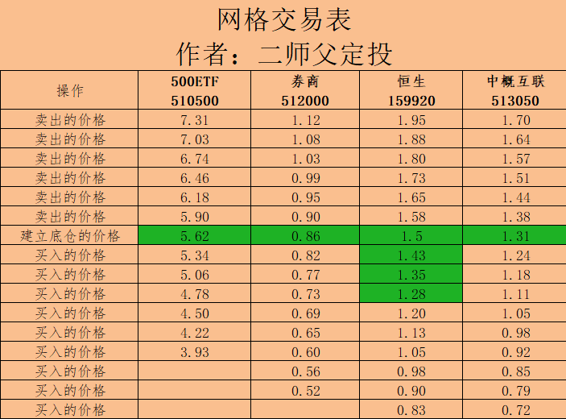

======================================================

_type: q&a
@tanxin[241524428884281]
2020-03-17 12:38:11 Tue  
topic_id: 241821841255581

@tanxin

>  请问二师父，场外的食品饮料能定投了吗？

@二师父

>  定投可以的

阅读[4627]  评论[1]  赞[0] 

======================================================

_type: q&a
@自由·风[844445155244142]
2020-03-17 15:59:46 Tue  
topic_id: 841821812125142

@自由·风

>  新手提问：请问二师父，投资资金总体配置上，场内和场外分配方面有何建议？谢谢！

@二师父

>  没有具体的，如果适合场外，可全部场外定投，场内用网格。
>  
>  如果适合场内，可全部场内

阅读[4172]  评论[3]  赞[0] 

======================================================

_type: talk
@二师父[28814221155551]
2020-03-17 17:35:17 Tue  
topic_id: 841821814155112

<e type="hashtag" hid="224518255511" title="#黄金坑的机会#" /> 黄金坑坚持定投，那么只要上证综合指数站上3000点就盈利了，理性分析，不要恐慌。

@范毅君 at 2020-03-17 17:35:17 Tue

> 看完要点赞[呲牙]

----------

阅读[5211]  评论[1]  赞[0] 

+++++++++++++++++++++++++++++++++++++++++++++++++++++

文件：
2020-03-17 17:34:27 Tue
文件大小：[20391]
51542122448814-A股坐稳了黄金坑，说说现在的机会.docx

======================================================

_type: q&a
@梦[51522822251484]
2020-03-17 19:10:09 Tue  
topic_id: 241821814184481

@梦

>  请问二师父，在收割利润之后，赎回来的钱要怎么处置呢？是现金形式存起来？还是再投入到新的低估指数基金等之后再收割利润？这个我一直没想明白，请指教。

@二师父

>  这个拿着等待有机会再投出去

阅读[4134]  评论[1]  赞[0] 

======================================================

_type: q&a
@小眼静🎀[844121141821482]
2020-03-17 19:11:27 Tue  
topic_id: 841821811514852

@小眼静🎀

>  二师父，我目前需不需要把银行转白酒，把h股转恒生，再加300非银？银行和H股都是低估区域坚持定投的，仓位不重因为还有其他股票型基金和债券型基金，望指点！

@二师父

>  目前没必要转，已经浮亏如果准备调仓等盈利，恒生和国企差不多，如果想换等盈利之后，现在直接启动白酒和恒生的定投

阅读[4298]  评论[7]  赞[0] 

======================================================

_type: q&a
@李垚垚[548145221582444]
2020-03-17 20:52:53 Tue  
topic_id: 548158521845554

@李垚垚

>  510880场内基金属于低估吗?可以加仓不!您实盘的中证500可以加仓不?跌了好多

@二师父

>  红利类基金属于价值类，比较稳健，定投可以的
>  
>  中证500属于中盘股指数的代表，目前适合定投的

阅读[4258]  评论[0]  赞[0] 

======================================================

_type: q&a
@背心[51441214442224]
2020-03-17 21:26:01 Tue  
topic_id: 841821252822842

@背心

>  二师傅，想入手医药，有低估的吗？你鳄鱼计划关注的中证医疗512170，怎么样，能入手吗？300医药低估没有，二选一哪个更好，谢谢

@二师父

>  低估还没有啊，医疗的前景好一些，属于基建的一个范畴，不过目前估值高一点
>  
>  300医药估值低一点，目前二者估值都正常偏高，可以等等，定投的话只能小仓位参与，等到了低估再加大力度

阅读[4301]  评论[2]  赞[0] 

======================================================

_type: talk
@冬夫[15122585122182]
2020-03-17 22:01:37 Tue  
topic_id: 118548424188812

请问二师父：如晚上9点左右买入标普500指数基金，是以当天收盘价成交吗？

@二师父 at 2020-03-17 22:01:37 Tue

> 这个不是的哈，如果在场外买，以第二天的美股收盘价成交的。

----------

阅读[4192]  评论[1]  赞[0] 

======================================================

_type: talk
@二师父[28814221155551]
2020-03-17 22:03:59 Tue  
topic_id: 841821252152542

<e type="hashtag" hid="141285485212" title="#解读基金第8讲#" /> 解读基金第8讲，继续看一些关于定投和配置的核心理念。

下一次读书《<e type="web" href="https://wx.zsxq.com/mweb/views/weread/search.html?keyword=漫步华尔街" title="漫步华尔街" style="book" />》，好好学习，掌握一点投资的真本事，提升自己的认知，这样财富才会越来越多。

@Claire at 2020-03-17 22:03:59 Tue

> 《<e type="web" href="https://wx.zsxq.com/mweb/views/weread/search.html?keyword=漫步华尔街" title="漫步华尔街" style="book" />》已经加入书架。

----------

@二师父 at 2020-03-17 22:03:59 Tue

> [强]

----------

@银河系 at 2020-03-17 22:03:59 Tue

> 二师父最近比较忙了吧，都没录音频了[呲牙]

----------

@二师父 at 2020-03-17 22:03:59 Tue

> 我在练习普通话，等稍微标准了一点再录哈

----------

@YAO at 2020-03-17 22:03:59 Tue

> 是不是漏了第6讲？[疑问]

----------

@二师父 at 2020-03-17 22:03:59 Tue

> 我看看

----------

阅读[5487]  评论[6]  赞[0] 

+++++++++++++++++++++++++++++++++++++++++++++++++++++

文件：
2020-03-17 22:03:02 Tue
文件大小：[20824]
88245854541812-解读基金第8讲.docx

======================================================

_type: talk
@二师父[28814221155551]
2020-03-17 22:06:12 Tue  
topic_id: 241821252151811

美股现在不熔断都有点不习惯了

@April _ M. at 2020-03-17 22:06:12 Tue

> 已经波澜不惊了都 （捂脸）

----------

@烟九•二手车 at 2020-03-17 22:06:12 Tue

> 再断就崩了

----------

@雨淡风清 at 2020-03-17 22:06:12 Tue

> 适当的反弹有助于更好的熔断😷

----------

@胡醒醒 at 2020-03-17 22:06:12 Tue

> 哈哈哈哈

----------

@章兵朋 at 2020-03-17 22:06:12 Tue

> 估计今晚美股又要熔断了

----------

@陈飞🤗 at 2020-03-17 22:06:12 Tue

> 美股还是挺关心你的，怕你不习惯

----------

@二师父 at 2020-03-17 22:06:12 Tue

> 现在习惯了

----------

@章兵朋 at 2020-03-17 22:06:12 Tue

> 果然今天美股又熔断了。上周两次。本周两次[困]

----------

阅读[4827]  评论[8]  赞[0] 

======================================================

_type: talk
@蔡寅宵[118554814444112]
2020-03-18 08:17:54 Wed  
topic_id: 548158511854884

二师父，在涨乐財富通怎么找到您的鳄鱼计划？

@背心 at 2020-03-18 08:17:54 Wed

> 鳄鱼计划只在星球可以看到，天天基金，可以看到 二师傅的乌龟定投

----------

阅读[4390]  评论[1]  赞[0] 

======================================================

_type: q&a
@茶馆2020[28221484255281]
2020-03-18 09:14:06 Wed  
topic_id: 421851584814488

@茶馆2020

>  二师父。中概互联在场内买，还是在场外买合适，是否有溢价的说法。谢谢！

@二师父

>  场外现在买不了， 只能在场内购买，溢价是实时变化的，昨天没有溢价

阅读[4647]  评论[0]  赞[0] 

======================================================

_type: q&a
@闫军平[422125415521418]
2020-03-18 10:49:37 Wed  
topic_id: 241821281218241

@闫军平

>  二师父你好，今天奥佳转债上市发行，可以卖出吗？

@二师父

>  盈利百分之25，可以卖的

阅读[4414]  评论[3]  赞[0] 

======================================================

_type: talk
@海岸线一圈[454582124218]
2020-03-18 11:18:14 Wed  
topic_id: 241821225582151

#提问 请问二师傅，富时中国A50指数适合现在定投吗？它和上证50哪个更适合长期定投？

@二师父 at 2020-03-18 11:18:14 Wed

> 从历史收益看不如50AH

----------

阅读[4293]  评论[1]  赞[0] 

======================================================

_type: talk
@onepiecewi*[244414114545811]
2020-03-18 12:24:52 Wed  
topic_id: 841821225214412

师父今天没有发内容，有点不习惯
打卡

@J at 2020-03-18 12:24:52 Wed

> +1

----------

阅读[4259]  评论[1]  赞[0] 

======================================================

_type: talk
@Gingo[544812851155554]
2020-03-18 14:35:42 Wed  
topic_id: 548158551554224

买入酒ETF一份，非银ETF一份，中概互联一份

@以古论今 at 2020-03-18 14:35:42 Wed

> 估值表什么时候出

----------

@Gingo at 2020-03-18 14:35:42 Wed

> 二师父应该今晚之内会发估值表的了 因为明天是周四 场外低估定投日

----------

阅读[4004]  评论[2]  赞[0] 

======================================================

_type: q&a
@背心[51441214442224]
2020-03-18 15:30:02 Wed  
topic_id: 421851558128858

@背心

>  全球疫情突破20万，情况不容乐观，控制好节奏，我最近定投有点多，该冷静冷静，毕竟没有这么多现金。多看少动。

@二师父

>  不是提问直接发表就行

阅读[4043]  评论[0]  赞[0] 

======================================================

_type: talk
@二师父[28814221155551]
2020-03-18 16:54:39 Wed  
topic_id: 548158558115424

<e type="hashtag" hid="824514224452" title="#指数估值表#" /> 经过最近的下跌，很多指数进入低估区域，机会总会有，当机会来的时候你是否在场，还敢不敢按照节奏加仓，这是最重要的区别。

@子辰 at 2020-03-18 16:54:39 Wed

> 加仓定投

----------

@背心 at 2020-03-18 16:54:39 Wed

> 二师傅，食品饮料和科技100 还没有，低估，怎么就开始定投了

----------

@二师父 at 2020-03-18 16:54:39 Wed

> 接近低估了

----------

@门萨🐨 at 2020-03-18 16:54:39 Wed

> 全绿了，哈哈

----------

@圣诞结® at 2020-03-18 16:54:39 Wed

> 二师父 目前75成仓 已投指数和占比如下：中证500 31.78%，中证银行22.11%，50ah20.52%，基本面60 15.01%，恒生国企5.83%，证券2.58%，非银300 2.17%  大部分指数是从去年10月陆续开始定投，非银300是本月才开始定投，目前除了中证500和证券，其他都浮亏中，最大亏损恒生国企15%，心态平静，准备继续加仓，想请教您目前情况，我对哪几个加仓比较适合？谢谢

----------

@二师父 at 2020-03-18 16:54:39 Wed

> 已经投的可以暂停，慢慢定投食品饮料和300非银，差不多了，其他的拿着就好

----------

@J at 2020-03-18 16:54:39 Wed

> 师傅，深红利和基本面60，定投哪个更好？现在两个都持有[捂脸]

----------

@二师父 at 2020-03-18 16:54:39 Wed

> 深红利

----------

阅读[4685]  评论[11]  赞[0] 

+++++++++++++++++++++++++++++++++++++++++++++++++++++

图片：
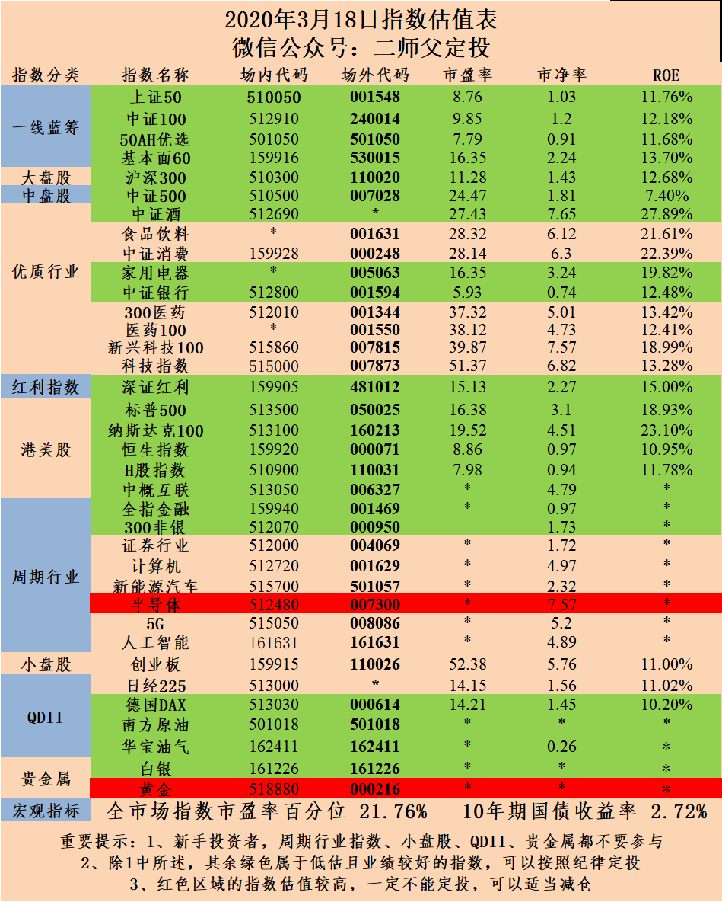

======================================================

_type: talk
@二师父[28814221155551]
2020-03-18 17:20:22 Wed  
topic_id: 118548448588252

<e type="hashtag" hid="881422852442" title="#定投实盘#" /> 买入1.25份，耐心坚持，不要盲目抄底，也别一会满仓一会空仓，容易心态不稳。

@笔记 at 2020-03-18 17:20:22 Wed

> 二师父，现在有很多低估的指数可以买，那3000点左右买的很多当时低估的如中证银行，全指金融，50AH，中证红利等怎么办，是持续全面定投还是优先配置优秀低估指数以前投的不管了等其慢慢回正，亦或是把一些不看好的指数换仓到现在优异指数，面铺的太大有些迷茫，望指点迷津。

----------

@二师父 at 2020-03-18 17:20:22 Wed

> 以业绩增速好的低估指数为主

----------

@笔记 at 2020-03-18 17:20:22 Wed

> 谢谢，所幸之前定投比较谨慎只有4成仓不到，还可以补一些。

----------

@步步惊心 at 2020-03-18 17:20:22 Wed

> 这些都有底仓吗？

----------

@二师父 at 2020-03-18 17:20:22 Wed

> 科技没有

----------

@onepiecewi* at 2020-03-18 17:20:22 Wed

> 刚好又错过了收盘时间……
那以周五收盘价格结算，也可以入吗

----------

@二师父 at 2020-03-18 17:20:22 Wed

> 这是可以的，短期美股不会进入高估，涨停买也没事，而且目前一直在跌

----------

@onepiecewi* at 2020-03-18 17:20:22 Wed

> 谢谢师父

----------

阅读[4960]  评论[13]  赞[0] 

+++++++++++++++++++++++++++++++++++++++++++++++++++++

图片：
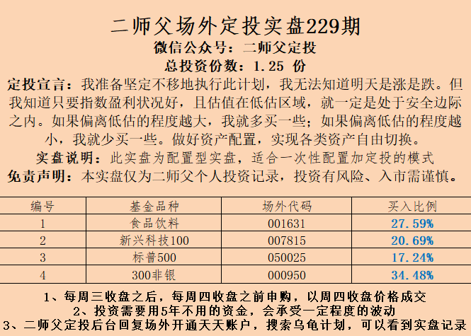

+++++++++++++++++++++++++++++++++++++++++++++++++++++

文件：
2020-03-18 17:19:36 Wed
文件大小：[78301]
51542115225114-机会很好，不过需要防范风险，二师父229期低估定投实盘.docx

======================================================

_type: talk
@雨淡风清[844418818858882]
2020-03-18 19:36:45 Wed  
topic_id: 241821245251511

二师父怎么看房价的问题？

@二师父 at 2020-03-18 19:36:45 Wed

> 短期下跌，长期一线跑赢通胀，三四线不涨或者下跌

----------

@雨淡风清 at 2020-03-18 19:36:45 Wed

> 为了教育赔钱也得上，正在物色房子，买房是一个艰巨长期的任务

----------

阅读[3698]  评论[2]  赞[0] 

+++++++++++++++++++++++++++++++++++++++++++++++++++++

图片：
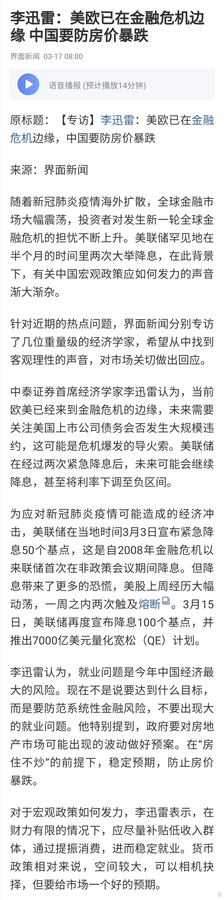

======================================================

_type: q&a
@六尘不改[241555484551821]
2020-03-18 20:02:24 Wed  
topic_id: 548158542582144

@六尘不改

>  标普500场外基金，半夜9.30-4.00之间买入，是当时的净值吗

@二师父

>  不是的，按照第二天美股收盘净值计算的

阅读[3905]  评论[1]  赞[0] 

======================================================

_type: talk
@门萨🐨[51411455828824]
2020-03-18 21:15:15 Wed  
topic_id: 118548414885842

这……八卦一下[发呆]

@雨淡风清 at 2020-03-18 21:15:15 Wed

> 看昨天我说的没错，昨天回回血更利于今天的熔断

----------

@onepiecewi* at 2020-03-18 21:15:15 Wed

> 被你说中了

----------

@栀子花开 at 2020-03-18 21:15:15 Wed

> 他这简直是胡说八道，毫无逻辑。他适合写无厘头小说[憨笑]

----------

阅读[3790]  评论[3]  赞[0] 

+++++++++++++++++++++++++++++++++++++++++++++++++++++

图片：
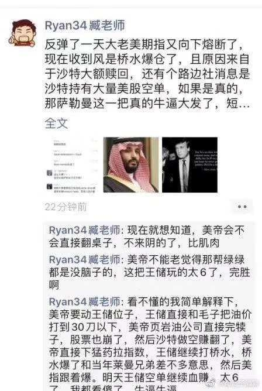

======================================================

_type: talk
@老孙头[422115118524548]
2020-03-18 21:27:18 Wed  
topic_id: 118548411258822

一，报道内外资持续流入香港市场，为何H股指数及中小指数却连跌、且幅度较大？二，二师父在新浪撰文，下面港股(可能)还有30%以内的跌幅，却又暂停了定投，那怎么去实现(风险)“仍旧可控”？

@陈飞🤗 at 2020-03-18 21:27:18 Wed

> 暂停定投是控制仓位

----------

@二师父 at 2020-03-18 21:27:18 Wed

> 控制总体仓位，指数不会消亡，个股会退市，只要没有本金永久损失是可控的。

港股市场受到外围资本影响较大。

----------

@老孙头 at 2020-03-18 21:27:18 Wed

> 海外股票讨论区有说，大量的港股投资者爆仓。之前港股融资利率低，只有一两个点。很多人就会借钱投资。这种做法，过去几年获利也非常丰厚。

但到了今年，因为短期快速下跌，很多人触及到清盘线。被迫平仓，股票被迫卖出，是不计成本的执行。导致股票进一步下跌，更多人达到平仓线。
最近港股经常有股票突然盘中暴跌，就是有些人爆仓了—不知真相？

----------

阅读[3693]  评论[3]  赞[0] 

======================================================

_type: talk
@以古论今[28214421582421]
2020-03-18 21:44:56 Wed  
topic_id: 241821244845541

现在大家都亏了几个点?晒晒

@雨淡风清 at 2020-03-18 21:44:56 Wed

> 回撤10%以内，吃饭睡觉不耽误。仓位8.5。永远不会满仓

----------

@蓝魔森林 at 2020-03-18 21:44:56 Wed

> 从定投开始到现在，一年半多，截止今天4%左右持有收益率..折腾老折腾去，不如货币基金了

----------

阅读[3789]  评论[2]  赞[0] 

======================================================

_type: talk
@二师父[28814221155551]
2020-03-18 22:09:11 Wed  
topic_id: 841821244455882

<e type="hashtag" hid="452412254418" title="#漫步华尔街第一讲#" /> 少看账户，多读书，计划股票再加仓一次，鳄鱼计划再加仓三次，关闭账户了。

市场噪音太多，2700点买入的低估指数只需要反弹到3000点盈利可观，关键问题是，闪电下来你是否在场，第二黎明到来你是否没有倒下。

挺住就对了。好好学习，看看历史上的泡沫，下一次市场炒作什么泡沫概念记得要警醒。

@罗大发 at 2020-03-18 22:09:11 Wed

> 师父，请问目前控制到几成仓合适？因为年前加的比较多，现在感觉子弹太少，即使面对这么好的机会，我还是应该按兵不动对吗？

----------

@二师父 at 2020-03-18 22:09:11 Wed

> 晚上睡觉很香的话继续定投，反之就暂停了

----------

@罗大发 at 2020-03-18 22:09:11 Wed

> 了解[呲牙]

----------

阅读[4888]  评论[3]  赞[0] 

+++++++++++++++++++++++++++++++++++++++++++++++++++++

文件：
2020-03-18 22:06:59 Wed
文件大小：[20851]
48524882455518-漫步华尔街第1讲.docx

======================================================

_type: q&a
@素兮[548121415528244]
2020-03-18 22:21:05 Wed  
topic_id: 421851522225158

@素兮

>  现在恒生和H股，为控制仓位，不再定投。等大盘回到3000，大跌之前的净值会涨回来么？

@二师父

>  可以涨回来啊，控制单一市场风险，比如之前全部重仓美股的现在很危险，仓位控制是防范风险的第一关

阅读[3903]  评论[0]  赞[0] 

======================================================

_type: talk
@二师父[28814221155551]
2020-03-18 23:00:16 Wed  
topic_id: 841821241825452

这是个谣言，可以去读一读桥水的文章，很有智慧，要警惕别有用心的人

@麻烦得很 at 2020-03-18 23:00:16 Wed

> 这篇微博是谣言，还是那个事是谣言[捂脸][捂脸]

----------

@二师父 at 2020-03-18 23:00:16 Wed

> 桥水没有出现说的那个问题

----------

@麻烦得很 at 2020-03-18 23:00:16 Wed

> 谢谢

----------

阅读[3873]  评论[3]  赞[0] 

+++++++++++++++++++++++++++++++++++++++++++++++++++++

图片：
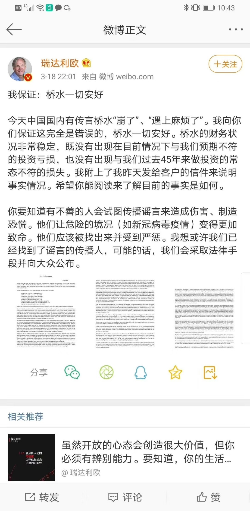

======================================================

_type: talk
@onepiecewi*[244414114545811]
2020-03-19 01:12:55 Thu  
topic_id: 118548482545282

又断了

阅读[3666]  评论[0]  赞[0] 

======================================================

_type: q&a
@吴涛[48244118421828]
2020-03-19 08:39:01 Thu  
topic_id: 841821215515412

@吴涛

>  二师父，回信己收到，谢谢！
>  己知自己是趋势投资型的，有没有ETF指数基金结合趋势投资的书，求推荐。感谢！

@二师父

>  这种好像没有见到，只有做趋势股票的书

阅读[3695]  评论[0]  赞[0] 

======================================================

_type: talk
@姣🍎[422212545212488]
2020-03-19 10:10:27 Thu  
topic_id: 421851512518158

钻石底

@一心一意 at 2020-03-19 10:10:27 Thu

> 所谓的钻石，黄金，是不是都是主观臆断[偷笑]

----------

@栀子花开 at 2020-03-19 10:10:27 Thu

> 感觉这一波没有底，阴跌2年，指数破2000[流泪]

----------

@Yingshengw* at 2020-03-19 10:10:27 Thu

> 那你得好好留着子弹呢！

----------

@栀子花开 at 2020-03-19 10:10:27 Thu

> 我已经买的子弹所剩不多了，继续跌我就只能等着每月的工资来加仓了

----------

阅读[3450]  评论[4]  赞[0] 

+++++++++++++++++++++++++++++++++++++++++++++++++++++

图片：
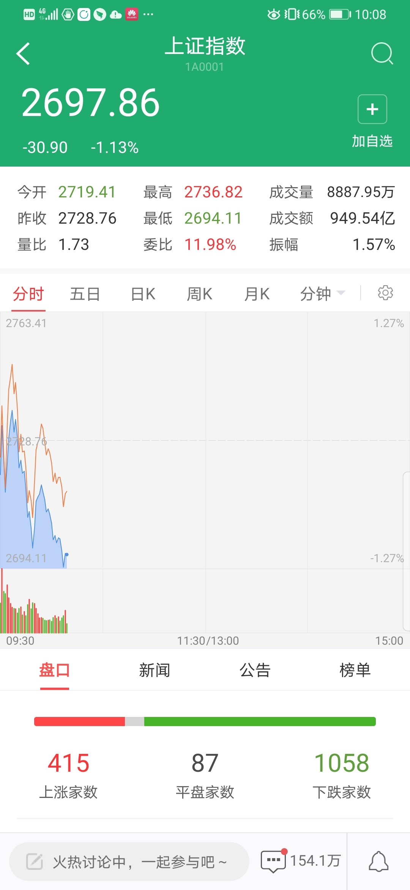

======================================================

_type: q&a
@范毅君[118551121224142]
2020-03-19 10:49:13 Thu  
topic_id: 421851511448458

@范毅君

>  二师父，现在都在喊基建，165525现在低谷吗，可以入吗
>  还有这两天证券比较抗跌，现在补仓，回撤还会很大吗

@二师父

>  证券按照我的估值还没到低位，今天一跌可以入了，这个品种下跌起来也非常厉害，控制仓位，基建已经分析过，不是很看好，还得看业绩
>  
>  如果不懂目前定投沪深300就非常不错

阅读[3535]  评论[1]  赞[0] 

======================================================

_type: q&a
@龙宾[844118285441882]
2020-03-19 11:00:21 Thu  
topic_id: 241821211551521

@龙宾

>  二师父您好，我目前8成仓 ，已投指数和占比如下：
>  50ah——24.9%，
>  中证500 ——24.6%，
>  食品饮料——14.9%
>  基本面60——12.9%，
>  300非银—— 9.7%  
>  H股指数——8.6%
>  全指金融——3.2%
>  中证银行——1.3%，
>  
>  大部分指数是从去年8月陆续开始定投+灵活补仓，非银300、食品饮料是本月才开始投，目前除了中证500，其他都浮亏中，最大亏损食品饮料12%非银11%，心态平静，准备继续加仓，想请教您目前情况，我对哪几个加仓比较适合？谢谢

@二师父

>  挺好的，食品饮料可以继续定投，上限百分之20，H股指数可以继续，上限百分之10，全指金融可以继续加，上限百分之9，等到新兴科技100进入35倍市盈率可以开启定投，你这个组合未来盈利很不错

阅读[3721]  评论[6]  赞[0] 

======================================================

_type: talk
@二师父[28814221155551]
2020-03-19 11:06:22 Thu  
topic_id: 841821211885412

<e type="hashtag" hid="881251425252" title="#鳄鱼计划#" /> 买入300ETF两份，酒ETF一份，300非银一份，新兴科技100买入0.5份。

仅为个人投资记录，非投资建议和参考，投资有风险，入市需谨慎，控制仓位，永不满仓，留足3年生活费，用5年不用的闲钱投资

计划跌倒2550加仓一次，跌倒2450加仓一次，跌倒2350加仓一次，如果不到就不动了，如果到了加仓完毕卸载账户等待几年以后收获，该买的时候买，该卖的时候卖，知行合一。

@苍天有井明月空🌙 at 2020-03-19 11:06:22 Thu

> 300etf是？

----------

@二师父 at 2020-03-19 11:06:22 Thu

> 沪深300，510300

----------

@陌路花 at 2020-03-19 11:06:22 Thu

> 留足3年生活费，二师父，太保守了吧[呲牙]

----------

@二师父 at 2020-03-19 11:06:22 Thu

> 我只想睡个好觉，毕竟一家老小都指着我呢

----------

@海马 at 2020-03-19 11:06:22 Thu

> 师父，现在可以锁仓了吧[呲牙]

----------

@二师父 at 2020-03-19 11:06:22 Thu

> 你满仓了就可以，等到3000点以上来决定是否卖出

----------

@海马 at 2020-03-19 11:06:22 Thu

> 满了，今天刚好满仓

----------

@章兵朋 at 2020-03-19 11:06:22 Thu

> 510300

----------

阅读[4681]  评论[28]  赞[0] 

======================================================

_type: talk
@一心一意[844421848411122]
2020-03-19 12:02:53 Thu  
topic_id: 421851248548228

基金必须是3年以上不用的闲钱[微笑]

阅读[3355]  评论[0]  赞[0] 

+++++++++++++++++++++++++++++++++++++++++++++++++++++

图片：
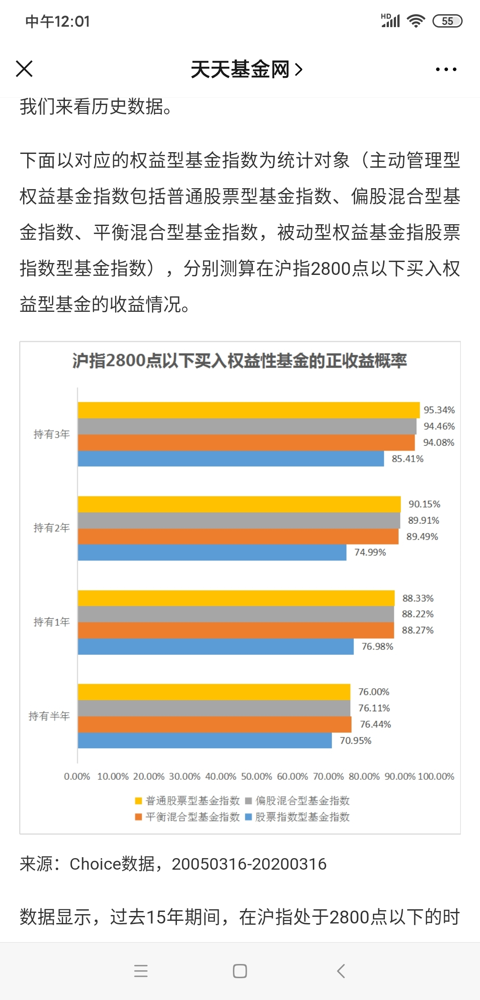

======================================================

_type: talk
@范毅君[118551121224142]
2020-03-19 12:09:19 Thu  
topic_id: 548158421512814

单边下跌，每个人都会恐慌吧！现在大家都是什么心态啊，希望大家留言，相互鼓励，写出自己经验教训[呲牙][呲牙] 我现在心态是，一跌就想买，计划不明确，买什么，节奏是啥，都没有。都是乱的。对回撤，心态还好，不紧张。纪律很重要，学习还不透彻，一没学好，二执行力不够。

@呵呵→_→ at 2020-03-19 12:09:19 Thu

> 一天34千，压力山大啊

----------

@海马 at 2020-03-19 12:09:19 Thu

> 下跌的时不管定投或者分批买都会套住，很正常，前几天巴菲特也套住了

----------

@范毅君 at 2020-03-19 12:09:19 Thu

> 说的好，咱需要正能量

----------

@范毅君 at 2020-03-19 12:09:19 Thu

> 今天我买的比较多，我感觉到不了2500，我的子弹就没了

----------

@海马 at 2020-03-19 12:09:19 Thu

> 现在是人都会恐惧，亏损了只要不卖就是数字。成熟的投资者需要乐观和信心，

----------

@范毅君 at 2020-03-19 12:09:19 Thu

> 嗯嗯，小白升级打怪中，谢谢[呲牙][呲牙]

----------

@铁观音 at 2020-03-19 12:09:19 Thu

> 这个描述和我一样呀，每天都能买在最低点，然没用，单周来看都挺高，子弹以打光，只能这样了

----------

阅读[3505]  评论[33]  赞[0] 

======================================================

_type: q&a
@Lion超超[48418188882428]
2020-03-19 13:04:27 Thu  
topic_id: 421851248281218

@Lion超超

>  二师父你好，现在白酒可以建立底仓吗？如果可以建仓几成？

@二师父

>  百分之10以内，然后定投，总仓位不超过百分之20

阅读[3523]  评论[0]  赞[0] 

======================================================

_type: q&a
@mumomo[111812248825412]
2020-03-19 13:17:30 Thu  
topic_id: 241821458142551

@mumomo

>  二师父，中概互联和深红利前期买入较少，今天场内可以加点吗？

@二师父

>  中概互联场内看了下有近4个点的溢价，这个如果能接受的话可以，不能接受就等等
>  
>  深红利低估，目前折价可以加

阅读[3407]  评论[1]  赞[0] 

======================================================

_type: q&a
@陌路花[844114852118822]
2020-03-19 13:19:08 Thu  
topic_id: 118548125145852

@陌路花

>  二师父，有没可能发生经济危机。如果发生了，我们该如何应对呢。真要留这三年生活费吗？

@二师父

>  有可能，目前美国股市熔断是多年上涨的透支原因，自身债务也比较多，保守主义投资者夜夜安枕，投资不是生活全部，耐心投资，快乐生活比较重要的

阅读[3594]  评论[3]  赞[0] 

======================================================

_type: q&a
@东哥[51515245482454]
2020-03-19 13:19:51 Thu  
topic_id: 241821458424281

@东哥

>  图中其他指持有什么？

@二师父

>  这是ETF链接基金，本质就是重仓基本面60etf的基金

阅读[3830]  评论[0]  赞[0] 

======================================================

_type: q&a
@陈[844415515418422]
2020-03-19 13:20:28 Thu  
topic_id: 241821458141211

@陈

>  二师父，您好！现在哪个能多加仓呢？

@二师父

>  沪深300，中证白酒，300非银可以的

阅读[3948]  评论[0]  赞[0] 

======================================================

_type: talk
@二师父[28814221155551]
2020-03-19 14:58:34 Thu  
topic_id: 421851245218188

中概互联的溢价已经6个点了，也就是现在买入比实际净值高百分之6，这个溢价太高，建议等待，目前很多基金比这个有价值，没必要非要去买一个溢价品种

@孤芳自赏 at 2020-03-19 14:58:34 Thu

> 二师父今天医药和消费进入低估了吗

----------

@二师父 at 2020-03-19 14:58:34 Thu

> 消费可以了，医药再等等

----------

@特仑苏 at 2020-03-19 14:58:34 Thu

> 有溢价的话，买中概互联的指数基金。还有受到溢价的影响吗？

----------

@陈飞🤗 at 2020-03-19 14:58:34 Thu

> 现在低估的多了，结果钱没了

----------

阅读[3697]  评论[4]  赞[0] 

======================================================

_type: q&a
@onepiecewi*[244414114545811]
2020-03-19 16:36:30 Thu  
topic_id: 421851242585458

@onepiecewi*

>  师父
>  50etf和500etf有什么区别呢？
>  有些人朋友坚持定投50etf

@二师父

>  50etf是蓝筹股集合，500etf是中盘股集合，会有一定的轮动，最近白马被杀，500涨的不错

阅读[3853]  评论[0]  赞[0] 

======================================================

_type: talk
@二师父[28814221155551]
2020-03-19 16:48:48 Thu  
topic_id: 241821454484181

<e type="hashtag" hid="452411422218" title="#未来的优先布局的基金#" /> 目前有些朋友已经满仓了，二师父的股票满仓了，今天卸载了账户，牛市不来不会再装上，等大盘跌到2400左右的话我就满仓场内基金，继续卸载账户，来陪大家。如果跌不到，不动。今天加仓是在2650的位置，加了点尾盘拉升了。未来还准备鳄鱼计划加仓三次，第一次2550，第二次，2450，第三次，2350，当前总仓位大概9.3成。如果市场上涨反手做网格卖出，整体思路就是这样子的，不用担心。今年预计还是个震荡市场，这次情况不容乐观，所以风险账户的备用金要多准备一点，国企的话稍微好一点，死赖着反正不会开除你。

已经满仓的朋友，就好好读书学习吧，可以休息了，等到大妈再次谈论股市再决定可以收割利润了，还没有定投好的的继续耐心定投。

@范毅君 at 2020-03-19 16:48:48 Thu

> 沙发

----------

@范毅君 at 2020-03-19 16:48:48 Thu

> 二师父稳定局面，大家就安心多了[呲牙]

----------

@April _ M. at 2020-03-19 16:48:48 Thu

> 二师父，已经布局沪深300的话，是否需要再配置中证100？

----------

@二师父 at 2020-03-19 16:48:48 Thu

> 不用

----------

@rtdmm小米 at 2020-03-19 16:48:48 Thu

> 有二师父稳定信心，不会恐惧割肉了！

----------

@衣袂飘香 at 2020-03-19 16:48:48 Thu

> 二师父您好。你是说目前在低估的指数里，优先配置这4种，是这个意思吗？
   目前我的鳄鱼计划里有券商，深圳红利，恒生，银行，酒，500 ，h股，50 ah， 300，中概互联，非银，50，100，科技100，标普500。仓位由前至后逐步降低。
除了中概互联偏少，其余持仓比例和你相差不大。
如果还出现钻石底，仍然是优先配置你所说的那4种吗？

----------

@次郎🌻 at 2020-03-19 16:48:48 Thu

> 除了文章提到的四种以外，中概互联适合建仓➕定投吗？

----------

@二师父 at 2020-03-19 16:48:48 Thu

> 是的，还有科技到了35倍市盈率以下机会也很好

----------

阅读[4220]  评论[10]  赞[0] 

+++++++++++++++++++++++++++++++++++++++++++++++++++++

文件：
2020-03-19 16:41:41 Thu
文件大小：[20301]
15412544458212-A股下探钻石底，目前定投哪些基金优先布局.docx

======================================================

_type: q&a
@故事[455458815888]
2020-03-19 17:01:25 Thu  
topic_id: 241821454424211

@故事

>  请具体分析一下场外的招商白酒分级有什么风险？谢谢。

@二师父

>  分级基金已经讲了很多次了，今年年底会面临清盘或者转型。
>  
>  目前不确定这只基金是转型成LOF基金，还是被清盘，所以有不确定性风险。这只基金很不错的。

阅读[3953]  评论[4]  赞[0] 

======================================================

_type: q&a
@凭栏观海[244414845852181]
2020-03-19 17:22:39 Thu  
topic_id: 841821454158552

@凭栏观海

>  易方达消费110022，现在低估吗？是否可以定投？

@二师父

>  主动基金没办法常规估值，跟着基金经理走，这是萧楠募集的基金，里面有可选必须消费医药最近东阿阿胶也纳入了，目前定投没问题，如果更换了基金经理就需要注意

阅读[4095]  评论[1]  赞[0] 

======================================================

_type: q&a
@小眼静🎀[844121141821482]
2020-03-19 18:41:19 Thu  
topic_id: 241821188511181

@小眼静🎀

>  二师父能否帮我看一下这只股票现在能否进场

@二师父

>  这只股票基本面很差，盈利不及预期，中期业绩增速下滑，周转率也不好
>  
>  个股只分析基本面，不做买入卖出建议

阅读[4012]  评论[3]  赞[0] 

======================================================

_type: q&a
@恋尘[51558584455824]
2020-03-19 18:43:26 Thu  
topic_id: 841821188884842

@恋尘

>  师傅，我这就2万不用的钱最多想买两只鸡，你说那个更低估一点我看300指数和18年3200点还有差距啊，不知道现在和18年比怎么样求解析下

@二师父

>  18年那是5年一遇的底部，现在估值还是高于那个时候，但是谁也不能保证还能跌回去，现在买入沪深300肯定比拿着现金未来收益率高的多，至少是银行存款的5倍收益率

阅读[4052]  评论[2]  赞[0] 

======================================================

_type: q&a
@达达[841885282125142]
2020-03-19 20:51:47 Thu  
topic_id: 241821182588211

@达达

>  本来以为这大白马没问题，为什么招商，格力，平安这么没完没了的跌，极限价格大约到多少？

@二师父

>  股票下跌没有底部，在中国如果不能经受百分之50的波动，长期持有价值投资根本不可能，最近碰到北上资金抛售和外围压力，又没有护盘，下跌很正常
>  
>  格力的业绩有点问题，招行和平安没有问题，不过平安业绩增速有所下滑
>  
>  股票难度很大，要么设定止损位做趋势，要么经受高波动做中期价值投资，要么永远别碰了。三选一吧。

阅读[3910]  评论[5]  赞[0] 

======================================================

_type: talk
@二师父[28814221155551]
2020-03-19 21:34:48 Thu  
topic_id: 421851185155558

<e type="hashtag" hid="554288111154" title="#漫步华尔街第二讲#" /> 技术分析与基本分析的结合

@onepiecewi* at 2020-03-19 21:34:48 Thu

> 拜读完毕。
大学时想学习股票，就有同学介绍了什么蜡烛这本书。
完全看不懂，直接被劝退了。
现在跟了师父，才能真的看得懂理解得了地学习

----------

阅读[4677]  评论[1]  赞[0] 

+++++++++++++++++++++++++++++++++++++++++++++++++++++

文件：
2020-03-19 21:30:10 Thu
文件大小：[19220]
88245845522212-漫步华尔街第2讲.docx

======================================================

_type: talk
@二师父[28814221155551]
2020-03-19 23:09:10 Thu  
topic_id: 841821125414112

我明白了周天王说的意思了，改变命运的机会在2020年，这是所有弱周期共振，他的预测早了一年

不过差别不大，今年债券，原油，股票均下跌，很少见，这是85后改变命运的第一次机会，95后资金量太小，起不了作用

人生致富靠康波，简单点说就是时代和命运，不是你有多牛，而是你生在了好时代同时赶上了机会，知天命，尽人事，仅此而已。

因上努力，果上随缘，一切自有安排。

@淘淘 at 2020-03-19 23:09:10 Thu

> 二师傅，展开讲讲哈，因为大跌所以有大机会吗？

----------

@🎈铮 at 2020-03-19 23:09:10 Thu

> 那老师，一共准备了20万，跟老师投了一年，现在仓位3成，是不是可以先一次补到5成或者几成，谢谢

----------

@二师父 at 2020-03-19 23:09:10 Thu

> 是啊

----------

@二师父 at 2020-03-19 23:09:10 Thu

> 5成可以，但必须是优质指数

----------

@雨淡风清 at 2020-03-19 23:09:10 Thu

> 周天王是谁？

----------

@胡醒醒 at 2020-03-19 23:09:10 Thu

> 周金涛

----------

@志亮 at 2020-03-19 23:09:10 Thu

> 周杰伦[呲牙]

----------

@onepiecewi* at 2020-03-19 23:09:10 Thu

> 周天王听说过这个人，但是他的理论貌似未完却没有续集了

----------

阅读[3731]  评论[13]  赞[0] 

======================================================

_type: talk
@Nick.yang[118281888551882]
2020-03-20 00:10:42 Fri  
topic_id: 118548845454812

应该算小白 去年16万赚了差不多15,000 今年差不多投了18万，现在亏了23,000 现在收手感觉有点心疼 是不是能扛住，资金没有什么急用，可以放个3年，手头上还有个小10万可以投资，不知道现在是不是好时机，还是再等降一降 请各位大神也帮忙看一下有哪些基金不太好，我可以先放了

@二师父 at 2020-03-20 00:10:42 Fri

> 要卖也等3000点

----------

@秦风殇韵（刘豫斌） at 2020-03-20 00:10:42 Fri

> 重回3000点，你就不亏了

----------

@志亮 at 2020-03-20 00:10:42 Fri

> 就喜欢蚂蚁财富的收益功能，所以我才选择它而放弃天天基金。

----------

@蓝魔森林 at 2020-03-20 00:10:42 Fri

> 还好我累计收益是正向的

----------

阅读[3529]  评论[4]  赞[0] 

+++++++++++++++++++++++++++++++++++++++++++++++++++++

图片：
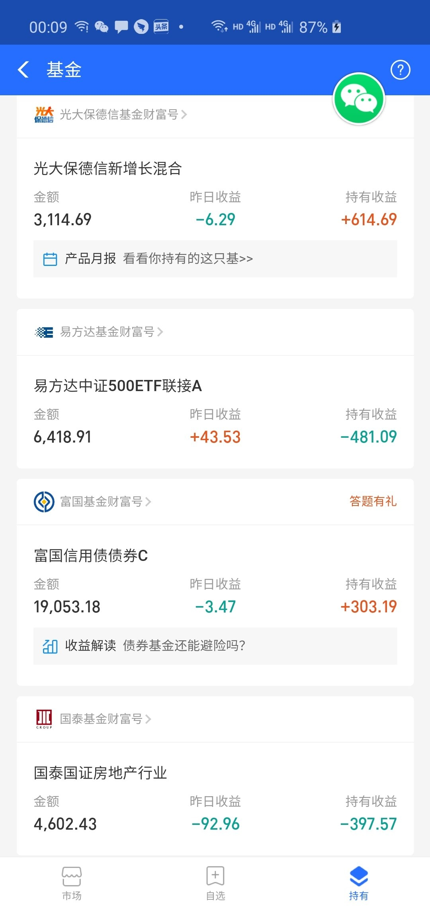
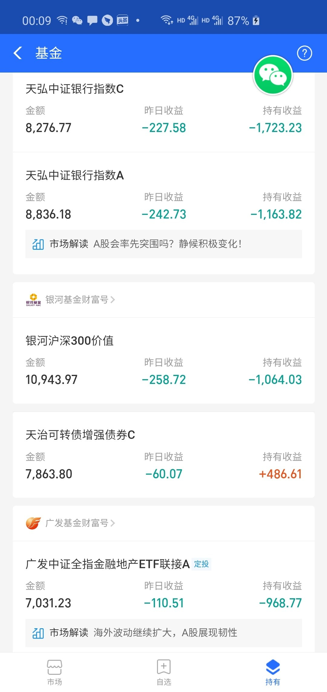
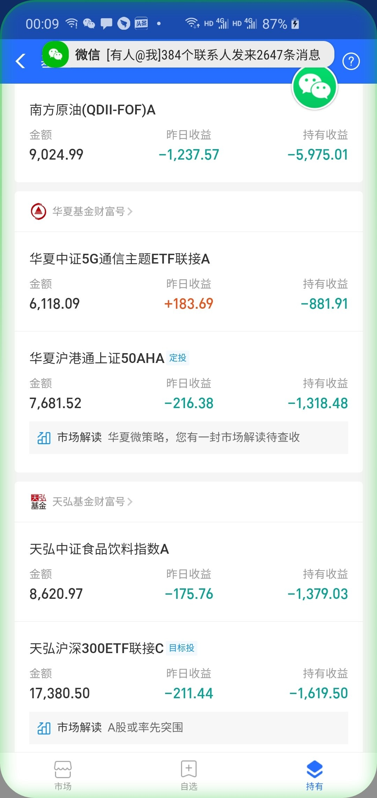
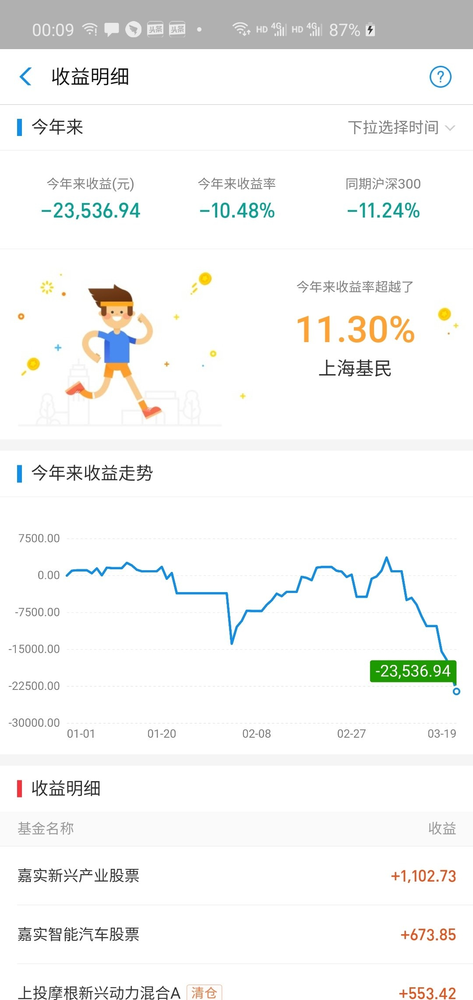
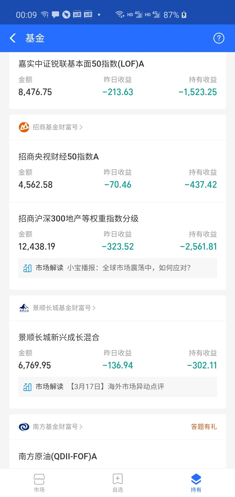

======================================================

_type: q&a
@水冰月槑槑🌙[51142428222184]
2020-03-20 09:32:11 Fri  
topic_id: 421851155818188

@水冰月槑槑🌙

>  小白一只，目前本金不多，持有的零零散散好几只基金，全部都跌，目前在犹豫继续持有还是转换一下

@二师父

>  如果是估值表的指数基金，继续持有

阅读[3299]  评论[0]  赞[0] 

======================================================

_type: q&a
@陈飞🤗[841521421222252]
2020-03-20 09:32:41 Fri  
topic_id: 421851158588228

@陈飞🤗

>  二师父，现在证券离最大跌幅还有百分之多少？

@二师父

>  百分之45

阅读[3457]  评论[0]  赞[0] 

======================================================

_type: q&a
@小丫[828582585412]
2020-03-20 09:39:49 Fri  
topic_id: 118548848142152

@小丫

>  二师父，我现在仓位三成，计划持续定投，资金配置方案如下：
>  沪深300 10%
>  中证100 10%
>  深红利 8%
>  基本面60 8%
>  非银300 8%
>  恒生 6%
>  食品饮料 10%
>  科技100 40%
>  配置方面是否需要调整，请指导🙏

@二师父

>  沪深300和中证100选择一个，深红利和基本面60选择一个，其他没啥问题

阅读[3479]  评论[2]  赞[0] 

======================================================

_type: q&a
@庆余年[15584481824122]
2020-03-20 09:40:22 Fri  
topic_id: 841821121422242

@庆余年

>  请问下二师父，可转债上市在盈利情况下，卖出不用考虑盈利多少麽？第一次操作不是很懂，谢谢！

@二师父

>  也可以持有的，目前可转债牛市

阅读[3528]  评论[0]  赞[0] 

======================================================

_type: q&a
@牛牛[548141224521114]
2020-03-20 09:59:45 Fri  
topic_id: 118548848815522

@牛牛

>  二师父，我买了场外的50AH和沪深300etf、中证500、基本面60、深证红利，有重合的吗，需要调吗

@二师父

>  基本面60和深红利重合了

阅读[3480]  评论[2]  赞[0] 

======================================================

_type: q&a
@闲云[48522815485458]
2020-03-20 10:00:31 Fri  
topic_id: 421851151158188

@闲云

>  二师父，场外定投和场内定投哪个更好？

@二师父

>  各有利弊，新手建议场外可以参考乌龟计划

阅读[3606]  评论[0]  赞[0] 

======================================================

_type: q&a
@C&S[51442188184824]
2020-03-20 10:01:58 Fri  
topic_id: 241821121442841

@C&S

>  请教，中欧医疗健康混合 003095，现在适合入手吗？等待，定投或者是配置？

@二师父

>  都是优质股票，目前估值较高，适合右侧趋势，不适合定投

阅读[3707]  评论[1]  赞[0] 

======================================================

_type: talk
@二师父[28814221155551]
2020-03-20 10:06:25 Fri  
topic_id: 421851151115248

<e type="hashtag" hid="281854444451" title="#读者提问#" /> 二师父，请问博特发债是属于基金吗？

这个不属于基金，我看名字叫做博特转债，是可转换债券

@范毅君 at 2020-03-20 10:06:25 Fri

> 一般中签后多长时间可以卖呀

----------

@二师父 at 2020-03-20 10:06:25 Fri

> 通知了就可以

----------

@范毅君 at 2020-03-20 10:06:25 Fri

> OK[呲牙][呲牙]

----------

阅读[3844]  评论[3]  赞[0] 

======================================================

_type: q&a
@敏杰 Minjie[241844452525121]
2020-03-20 10:19:07 Fri  
topic_id: 241821121121441

@敏杰 Minjie

>  二师父，关于白银基金，里面大量持仓国开行和农发行债券，同时和沪银的走势差距比较大，很多人质疑瑞银的管理能力?请问这个指数的质量靠谱吗，不会又是一只跟踪很飘忽的指数吧

@二师父

>  他不完全跟踪白银期货优势，债券占比过多，只是一个平衡配置品种，目前不管是a股还是港股都比他的投资价值高

阅读[3996]  评论[0]  赞[0] 

======================================================

_type: talk
@子辰[421444812542128]
2020-03-20 10:29:55 Fri  
topic_id: 421851124848448

为什么主机机构，超净值户，巨型韭菜都在向外流出资金；只有大韭菜，小韭菜在往股市输入资金，且资金输出量大于资金输入量，大盘股今天却上涨？

有点想小加仓，却又不敢动。

@以古论今 at 2020-03-20 10:29:55 Fri

> 诱惑的陷阱

----------

@特仑苏 at 2020-03-20 10:29:55 Fri

> 请问下，东方财富的这张图在哪里可以看。我怎么找不到

----------

阅读[3954]  评论[2]  赞[0] 

+++++++++++++++++++++++++++++++++++++++++++++++++++++

图片：
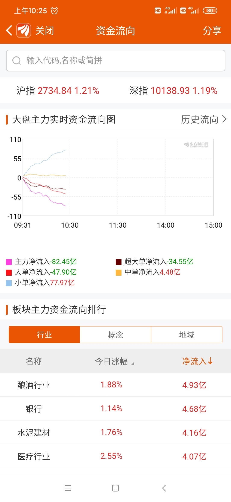

======================================================

_type: talk
@雨淡风清[844418818858882]
2020-03-20 10:45:22 Fri  
topic_id: 241821145811541

这难道是空头有一次成功的诱多？来发表一下你的看法吧！今天有空，多观察少行动！赚钱不在乎多早一天晚一天。听二师父的价值投资。

@特仑苏 at 2020-03-20 10:45:22 Fri

> 请问下，你这个图片是哪个软件

----------

阅读[3984]  评论[1]  赞[0] 

+++++++++++++++++++++++++++++++++++++++++++++++++++++

图片：
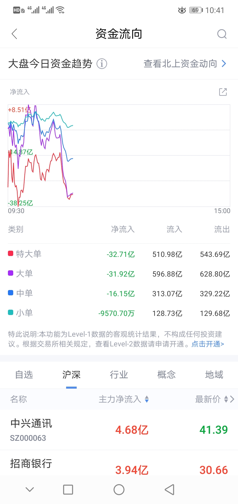

======================================================

_type: talk
@志亮[422125851552828]
2020-03-20 12:59:58 Fri  
topic_id: 118548815442182

蚂蚁财富VS天天基金，帮助新人做选择！

先说蚂蚁财富
优点1:界面简洁清新，操作速度快，用天天基金偶然我会觉得卡。
优点2:取款也方便，1万元是秒到账，1万以上一般2天内也到账。
优点3:我最喜欢的一点，能收益明细对比，能看出自己的水平，软件能帮你自动记录收益率和沪深300对比等，天天基金好像没这个功能。
缺点1:支付宝是能支付和转账的，理论上有一定风险，不过可以买账户保险，问题应该不大。
缺点2:蚂蚁财富上很多大V都是忽悠的，新人看多了会受影响，这一点很不好。

再说天天基金
优点1:
查基金资料比蚂蚁财富齐全。
优点2: 
这点和蚂蚁财富一样，取款方便，1万元是秒到账，1万以上应该2、3天内到账。
优点3:
活期宝收益率比蚂蚁财富高一点。
优点4:
能跟投二师父的乌龟计划，这个应该也算是优点吧[微笑]。
缺点1:没账号分析收益对比，我觉得这一点很不好，我就是这个原因放弃天天基金的，我觉得沒这个功能很不方便。
缺点2:软件有点卡，行情好的时候尾盘买时软件会崩溃。

综合以上两软件各有千秋，但是我个人喜欢蚂蚁财富，大家能否说说场外交易你们是用什么软件的？[呲牙]

@二师父 at 2020-03-20 12:59:58 Fri

> 支付宝我是自动扣款，3000以上停止

----------

@陈伟 at 2020-03-20 12:59:58 Fri

> 支付宝现在支持部分基金低估值定投，300和500，还有银行都有。其他没有发现。

----------

@陈伟 at 2020-03-20 12:59:58 Fri

> 师傅，3000点以上停止，是手动吗？

----------

@陈伟 at 2020-03-20 12:59:58 Fri

> 我还在用蛋卷，支持价值平均策略

----------

@志亮 at 2020-03-20 12:59:58 Fri

> 用蛋卷还不如天天天基金吧

----------

@波 at 2020-03-20 12:59:58 Fri

> 我70%时间是用蛋卷,30%时间是用天天基金,没用过蚂蚁财富。

----------

@丸子妈 at 2020-03-20 12:59:58 Fri

> 蚂蚁

----------

阅读[3960]  评论[7]  赞[0] 

======================================================

_type: talk
@六尘不改[241555484551821]
2020-03-20 13:14:55 Fri  
topic_id: 548158841548514

现在共计持有15只基金，仓位25%，合计180万。
我的补仓计划：
2600点补仓30万，
2500补仓60万，
2400补仓90万，
2000点补仓350万，
满仓休息，再跌只能卖房子了

@六尘不改 at 2020-03-20 13:14:55 Fri

> 我从去年关了公司，现在没有收入，只能靠基金定投搏一把了

----------

@onepiecewi* at 2020-03-20 13:14:55 Fri

> 师父说了，高风险投资是要用3－5年不用的钱，不影响生活的情况下。
你非专业人士，全部投入，只靠这个，风险一来，吃不消。
建议理性，3000点也不知道什么时候来。

----------

@六尘不改 at 2020-03-20 13:14:55 Fri

> 还能有多大的风险？两千点往下还有空间吗

----------

@onepiecewi* at 2020-03-20 13:14:55 Fri

> 谁知道呢，要用3－5年不用的钱。

----------

@宋航 at 2020-03-20 13:14:55 Fri

> 估计你的350w 是用不到了[憨笑]

----------

阅读[4017]  评论[5]  赞[0] 

======================================================

_type: q&a
@Lion超超[48418188882428]
2020-03-20 13:24:24 Fri  
topic_id: 241821148221441

@Lion超超

>  二师父你好！
>  网格交易，我现在有1w，底仓建5k，然后分5份每次下跌到点位+1份，上涨也分5份，然后分批卖出对吗

@二师父

>  激进点分5份，保守点分10份，置顶有表格买入价

阅读[4232]  评论[1]  赞[0] 

======================================================

_type: talk
@二师父[28814221155551]
2020-03-20 13:25:24 Fri  
topic_id: 841821144881542

券商快到网格底仓价格了，之前卖出的可以接手做网格了

@范毅君 at 2020-03-20 13:25:24 Fri

> 请问低估临界价格是多少呀

----------

@二师父 at 2020-03-20 13:25:24 Fri

> 1.7倍市净率

----------

@范毅君 at 2020-03-20 13:25:24 Fri

> 好滴

----------

@onepiecewi* at 2020-03-20 13:25:24 Fri

> 在哪里看市净率呢

----------

@shee at 2020-03-20 13:25:24 Fri

> 我上次0.844买的

----------

阅读[4304]  评论[5]  赞[0] 

+++++++++++++++++++++++++++++++++++++++++++++++++++++

图片：

======================================================

_type: talk
@以古论今[28214421582421]
2020-03-20 13:35:26 Fri  
topic_id: 118548811541182

标普科技，中概互联，广发医药，三个美股投资价值如何？想保留中概互联，其他的全部卖掉买a股

@清水倾城 at 2020-03-20 13:35:26 Fri

> 广发医药是美股？[惊讶]

----------

@以古论今 at 2020-03-20 13:35:26 Fri

> 广发全球医药保健

----------

阅读[4118]  评论[2]  赞[0] 

======================================================

_type: talk
@二师父[28814221155551]
2020-03-20 13:39:39 Fri  
topic_id: 241821144845481

今年以来股权，商品均大跌，国债和可转债是表现稍微好点，适当轮动配置是必要的

@onepiecewi* at 2020-03-20 13:39:39 Fri

> 打不到[流泪]

----------

@陈飞🤗 at 2020-03-20 13:39:39 Fri

> 中的签如果是不着急用钱按照现在看是不是拿着更有价值？

----------

@二师父 at 2020-03-20 13:39:39 Fri

> 可以拿，可转债我也有买

----------

@光少 at 2020-03-20 13:39:39 Fri

> 二师父，可转债也可以当基金持有吗

----------

@二师父 at 2020-03-20 13:39:39 Fri

> 可以买转债基金，也可以多只可转债组合持有，到达高位出手

----------

阅读[4452]  评论[5]  赞[0] 

+++++++++++++++++++++++++++++++++++++++++++++++++++++

图片：

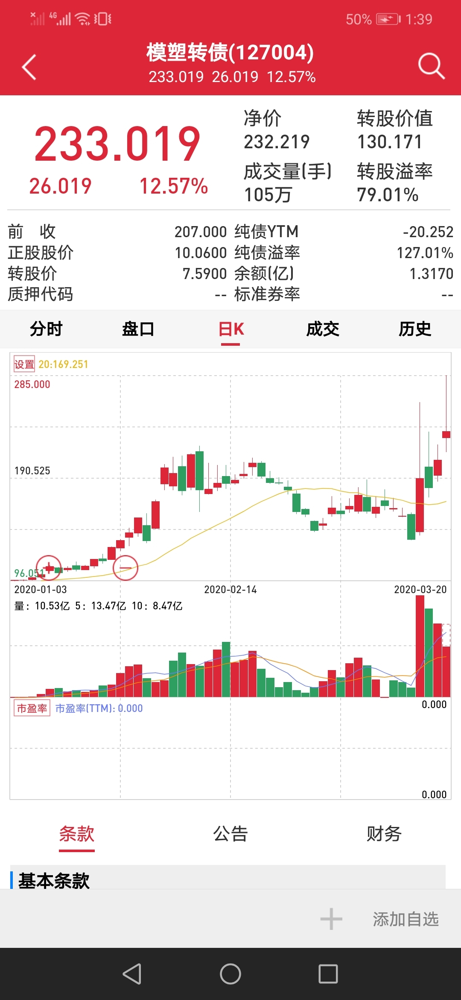

======================================================

_type: talk
@二师父[28814221155551]
2020-03-20 16:14:20 Fri  
topic_id: 421851121588848

有所买，有所不买，就比如场内溢价的标普500，就是不买，要赚就赚最高的。

@艾琪（王钥） at 2020-03-20 16:14:20 Fri

> 华宝油气这个大坑啊……

----------

@一心一意 at 2020-03-20 16:14:20 Fri

> 师父。华宝油气类基金是坑，那么我们定投或者鳄鱼之前没细分析么，而是要都套牢了，才有的这样的文章么

----------

@一心一意 at 2020-03-20 16:14:20 Fri

> 还是我们定投时公司的基本面还是好的

----------

@A0洪氏日杂批发 at 2020-03-20 16:14:20 Fri

> 二师父提示过大家，可以割肉，也可以网格，很多人都亏10个点左右，选择割肉了，包括我，不要什么钱都赚

----------

@二师父 at 2020-03-20 16:14:20 Fri

> 分析过，之前没出现问题，之后才恶化的，而且提示过仓位，坐等原油价格和美股起来了再卖

----------

@志亮 at 2020-03-20 16:14:20 Fri

> 华油我重仓受仓，亏了18个点2万多就割肉。

----------

@艾琪（王钥） at 2020-03-20 16:14:20 Fri

> 我仓位不重，就卧倒吧

----------

阅读[5243]  评论[7]  赞[0] 

+++++++++++++++++++++++++++++++++++++++++++++++++++++

文件：
2020-03-20 16:13:46 Fri
文件大小：[20407]
28245848155521-这些基金是大坑，不要碰.docx

======================================================

_type: q&a
@不忘初心[48512884144218]
2020-03-20 21:16:13 Fri  
topic_id: 548158884254424

@不忘初心

>  老师您好！我想让您看一下我的基金定投组合是否合理。资金60w，建底仓多少成合适？（设置成每周定投，自动扣款，主要是平时工作太忙）。组合如下：
>  1.易方达消费行业
>  2.南方全指证券联接A
>  3.兴全可转债
>  4.易方达H股ETF联接人民币
>  5.景顺中证500低波动
>  6.工银深证红利ETF联接A
>  7.嘉实基本面50
>  8.富国中证红利指数增强
>  如果需要调整该怎么调？

@二师父

>  不用调，等到3200点以上基本都盈利
>  
>  就是易方达消费，可以用汇添富消费或者食品饮料替代，这个是主动基金

阅读[4078]  评论[3]  赞[0] 

======================================================

_type: q&a
@隔窗遥望[241884481854181]
2020-03-20 22:03:44 Fri  
topic_id: 241821114818421

@隔窗遥望

>  标普500现在场外可以定投吗？

@二师父

>  你这问题问的很奇怪，我每期都投了

阅读[3977]  评论[1]  赞[0] 

======================================================

_type: talk
@二师父[28814221155551]
2020-03-20 22:07:56 Fri  
topic_id: 118548881854442

<e type="hashtag" hid="452411145228" title="#耐心#" /> 不要着急，既然人生的终点都一样，为何还要如此急不可耐。手抄耐心十条，送给大家！

@蓝魔森林 at 2020-03-20 22:07:56 Fri

> 放任四海皆准的28原则[色]

----------

@苍天有井明月空🌙 at 2020-03-20 22:07:56 Fri

> 字不错

----------

@自由飞翔 at 2020-03-20 22:07:56 Fri

> 哈哈，好像女生的字体

----------

@衣袂飘香 at 2020-03-20 22:07:56 Fri

> 看二师父的字，觉得他小时候应该是一个很乖的孩子[调皮]

----------

阅读[4865]  评论[4]  赞[0] 

+++++++++++++++++++++++++++++++++++++++++++++++++++++

图片：
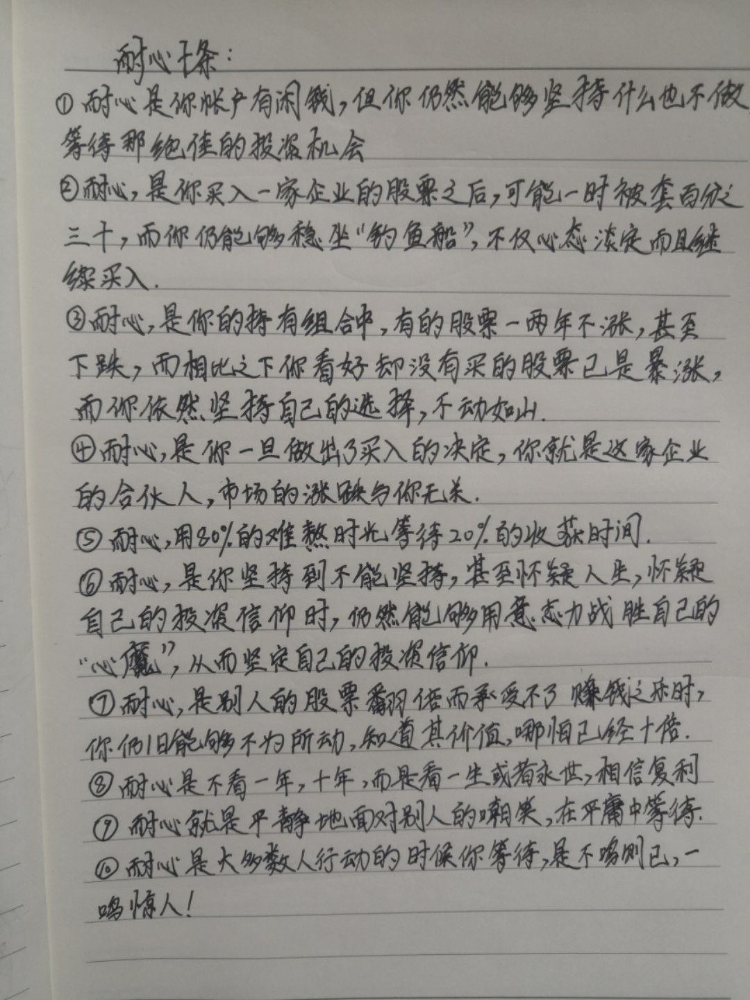

======================================================

_type: q&a
@素兮[548121415528244]
2020-03-20 23:56:28 Fri  
topic_id: 241821111481411

@素兮

>  二师父，海外收益债会不会有爆仓的风险？美元汇率的快速上升非常容易拉爆这些高收益债的泡沫。再加上汇率波动，很容易造成违约。也就是说这些高收益债，一开始是因为美元汇率大涨而下跌，之后即便美元不涨了，他们也会因为违约而暴跌。之前投的华夏收益债券还可以继续持有么？还是趁早出，以免造成进一步更大的亏损？这个华夏收益债持有的是哪些公司的债呢？这些公司质量如何？有暴雷风险么？

@二师父

>  基金没有爆仓风险，只有上杠杆的股票有
>  
>  债券只有违约风险，里面债券评级都是a和b类，基金里面所有债券集体违约风险还是较低，这是5大重仓债券

阅读[4130]  评论[0]  赞[0] 

======================================================

_type: talk
@树叶[544811512145144]
2020-03-21 08:10:25 Sat  
topic_id: 548142225451424

<e type="hashtag" hid="142825811122" title="#定投周报#" /> 二师父定投周报第51期

阅读[4054]  评论[0]  赞[0] 

+++++++++++++++++++++++++++++++++++++++++++++++++++++

文件：
2020-03-21 08:10:20 Sat
文件大小：[264740]
51542148414424-二师父定投周报3.21（第51期）.docx

======================================================

_type: talk
@雨淡风清[844418818858882]
2020-03-21 11:10:56 Sat  
topic_id: 118512221854442

富时A50大跌4.5.美股下跌，有闲心的同学分析下，下周我们的大A怎么走？

@速。冻 at 2020-03-21 11:10:56 Sat

> 一切皆有可能

----------

@以古论今 at 2020-03-21 11:10:56 Sat

> 跌的可能性更大

----------

@Yingshengw* at 2020-03-21 11:10:56 Sat

> 那就卖了吧

----------

@栀子花开 at 2020-03-21 11:10:56 Sat

> 继续跌，我要留够子弹今年指数打到2400不是没可能

----------

@章兵朋 at 2020-03-21 11:10:56 Sat

> 下周可能低开。会不会反弹不好说

----------

阅读[3802]  评论[5]  赞[0] 

+++++++++++++++++++++++++++++++++++++++++++++++++++++

图片：
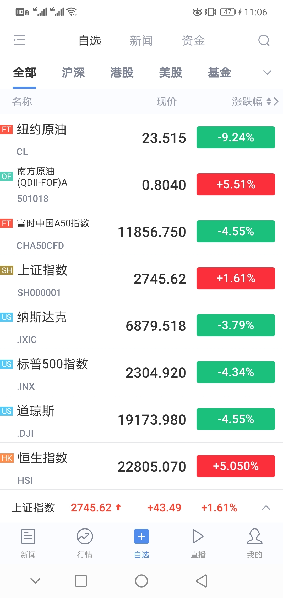

======================================================

_type: talk
@二师父[28814221155551]
2020-03-21 12:51:58 Sat  
topic_id: 421824488424818

<e type="hashtag" hid="281854444451" title="#读者提问#" /> 二师父，我有个问题想咨询一下，比如说国债都是从中国人民银行买的，超过了50万，假如中国人民银行破产，那么这50多万的国债到期后要打到哪里呢？如果是中国银行的卡上，会不会只给50万，多了的不赔付呢？

国债是依托国家信用发行的，还款由财政部拨款还，就算银行倒闭了也会给你，国家托底

你说的50万银行兜底是定期存款，如果存款低于50万，银行破产，低于50万会给你，你得相信中国人民银行，不会出现你说的情况

@麻烦得很 at 2020-03-21 12:51:58 Sat

> 呃……，这位同学是不是哪里搞错了，中国人民银行，其实不是银行…………

----------

@衣袂飘香 at 2020-03-21 12:51:58 Sat

> 二师父，地方性的银行确实是有破产的。那低于50万的定期存款，人民银行也会兜底吗？纯属好奇。

----------

@二师父 at 2020-03-21 12:51:58 Sat

> 存款50万以内是有赔付的，这个不是人民银行兜底，好像有家海南银行破产过，四大行问题不大

----------

阅读[3841]  评论[3]  赞[0] 

======================================================

_type: q&a
@云卷云舒[28288212211221]
2020-03-21 12:52:48 Sat  
topic_id: 241845552112511

@云卷云舒

>  师父您好！我是新手，边学习边操作，启动了乌龟计划和鳄鱼计划。乌龟计划开始是跟着师父的一键购买的，后期加仓的低估指数也都是点击购买，加在了里面，这样不定时不定额的加仓也算定投吗！

@二师父

>  定投有四种方式，不定时不定额加仓属于定投的一种，不过需要控制买入比例和节奏

阅读[3904]  评论[1]  赞[0] 

======================================================

_type: talk
@onepiecewi*[244414114545811]
2020-03-21 13:02:18 Sat  
topic_id: 118512255218522

打卡学习[咖啡]

阅读[3898]  评论[0]  赞[0] 

======================================================

_type: talk
@二师父[28814221155551]
2020-03-21 13:41:47 Sat  
topic_id: 241845588814551

<e type="hashtag" hid="141522245542" title="#重要提示#" /> 场内酒ETF的规模由三亿元下降到1.8亿，一般低于1亿以下的有清盘风险，场内投资的需要警惕，如果规模继续下滑可以用同类基金消费ETF替代

@秦风殇韵（刘豫斌） at 2020-03-21 13:41:47 Sat

> 收到，时刻警惕

----------

@陈飞🤗 at 2020-03-21 13:41:47 Sat

> 那钱哪去了，是亏了还是被别人取出来了

----------

@二师父 at 2020-03-21 13:41:47 Sat

> 都有

----------

@恋尘 at 2020-03-21 13:41:47 Sat

> 师父那他降到1亿一下的话，我是清啊还是不动啊

----------

@二师父 at 2020-03-21 13:41:47 Sat

> 换成消费etf

----------

@蓝魔森林 at 2020-03-21 13:41:47 Sat

> 这是35亿跌到1.8亿呢

----------

@April _ M. at 2020-03-21 13:41:47 Sat

> 收到～ 时刻准备调整

----------

@衣袂飘香 at 2020-03-21 13:41:47 Sat

> 到时候是把酒etf卖出，再用卖出的钱，等额买入消费etf吗？

----------

阅读[4934]  评论[12]  赞[0] 

+++++++++++++++++++++++++++++++++++++++++++++++++++++

图片：
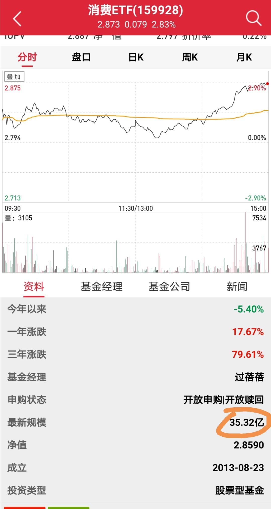
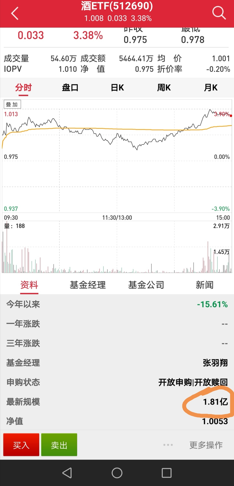

======================================================

_type: talk
@二师父[28814221155551]
2020-03-21 15:50:55 Sat  
topic_id: 421824485422148

<e type="hashtag" hid="224855852481" title="#确定自己做趋势还是逆势#" /> 二师父是逆势投资者，在低位买入，一个有价值的指数，当然是在便宜的时候买，长期持有，复利增值，收割利润只是为了应对震荡市场

阅读[4247]  评论[0]  赞[0] 

+++++++++++++++++++++++++++++++++++++++++++++++++++++

文件：
2020-03-21 15:49:43 Sat
文件大小：[74808]
15412582155552-如果买的基金被套了，该怎么办.docx

======================================================

_type: q&a
@陈飞🤗[841521421222252]
2020-03-21 16:01:10 Sat  
topic_id: 421824488225258

@陈飞🤗

>  二师父，你知识渊博，怎么看原油收益率相差那么多？

@二师父

>  各个基金持仓都是不同的，涨跌幅会不一致，大方向基本一致的。

阅读[4185]  评论[0]  赞[0] 

======================================================

_type: q&a
@故事[455458815888]
2020-03-21 16:57:50 Sat  
topic_id: 241845582858241

@故事

>  可转债基金什么时候可以投，怎么了解是否低估？

@二师父

>  看可转债价格，大部分低于100元以下比较便宜一些，低估的概念是对于指数和股票的

阅读[4483]  评论[1]  赞[0] 

======================================================

_type: talk
@二师父[28814221155551]
2020-03-21 17:55:38 Sat  
topic_id: 841845582141222

<e type="hashtag" hid="452844888128" title="#关于美元债的重要提示#" /> 大家看两张图，一张是美元债的走势图，最近一周处于跌势。

而美国的利率是下降的，美元指数是上涨的，如果从推升美元债的利率汇率因素看，美元债要涨，而问题在于，美元债跌了，这意味着目前可能发生流动性危机，各国资产遭到抛售，美元上涨，所以就出现了各大类资产下跌的情况。

上周五美元虽然短期回落，黄金止跌，但是并无能就此说明流动性危机解除，2008年美国是设立了一系列便利机制给美国注入流动性，大概两个多月才化解。

这次有可能也发生之前的情况，对于美元债短期可以撤出来，目前看货币基金流动性好，而且投资A股指数确定性高，未来大盘上了3000点，对于常见指数涨个15%没有问题，而对于美元债就算美元继续上涨，他也未必能够涨起来。那最好是暂时退出来，切换到流动性好的货币基金，要么是换成确定性强的A股指数。不要死抗了。

对于中国的纯债基金，目前利率在2.7%左右，进一步下降空间有限，也可以逐步退出了。未来一年纯债的收益率不一定有3%，而货币或者指数盈利3%会比较轻松，可以选择确定性大的了。

还有可转债可以继续持有，牛市到来了他会继续涨，如果转债下跌大部分转债在100元以下可以定投。

@jier at 2020-03-21 17:55:38 Sat

> 请问华夏收益债券亏损了，也要退出么？

----------

@二师父 at 2020-03-21 17:55:38 Sat

> 可以离开了，美元涨跌他都跌，已经出现了流动性问题，同样的资金投入到当前的沪深300确定性都更高

----------

@云卷云舒 at 2020-03-21 17:55:38 Sat

> 师父好！目前我持有的招商双债增强债券和鹏华产业债债券，也需要退出吗？

----------

@二师父 at 2020-03-21 17:55:38 Sat

> 这两个都是纯债，可以逐步退出转移到股权资产，看10年期国债利率，利率降一般债券是涨的，现在整体利率都是比较低的位置了

----------

@云卷云舒 at 2020-03-21 17:55:38 Sat

> 好的

----------

@衣袂飘香 at 2020-03-21 17:55:38 Sat

> 二师父您好！我在天天基金里，持有工银瑞信双利债券a，目前收益率百分之3点多。易方达增强回报债券a，收益率将近4%。还有嘉实超短债。都属于您说的需要卖出的范围吗？

----------

@二师父 at 2020-03-21 17:55:38 Sat

> 不用，这属于二级债基，有部分股票，股市上涨他也会涨，就是收益率低一点，短债比货币基金风险高一点，风险比长债小，持有，需要额外补仓可以卖出买指数基金

----------

@衣袂飘香 at 2020-03-21 17:55:38 Sat

> 好的，谢谢你！

----------

阅读[5451]  评论[8]  赞[0] 

+++++++++++++++++++++++++++++++++++++++++++++++++++++

图片：
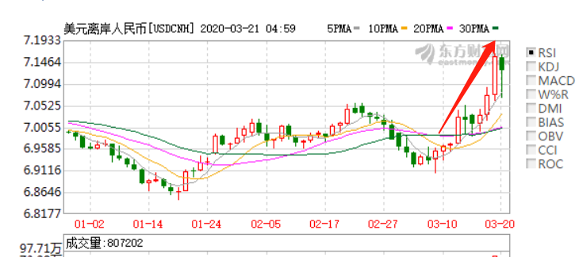
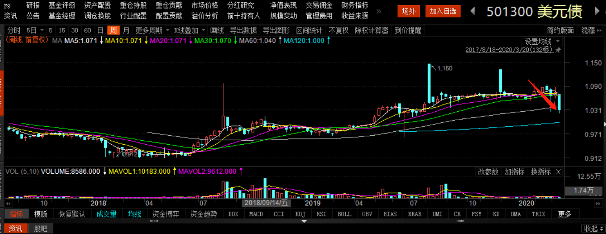

======================================================

_type: q&a
@次郎🌻[48551412448858]
2020-03-21 18:08:50 Sat  
topic_id: 118512254884882

@次郎🌻

>  请教师父，中概互联本周我建仓了10%，如果下周继续上涨到1.38，是否需要做网格？还是继续按兵不动全部持有？

@二师父

>  如果这笔资金是长期持有的资金就不做，如果这笔资金是按照网格来做的，那就严格按照纪律做。不要贪

阅读[4728]  评论[0]  赞[0] 

======================================================

_type: q&a
@榕声竹影[844118218251282]
2020-03-21 19:03:03 Sat  
topic_id: 841845584851842

@榕声竹影

>  二师父您好，我从去年3月下旬开始定投，目前仓位已经八成，这期间跟着您的节奏，把银行基金换成了食品饮料和300非银，把分级证券换成了全指证券，这段时间由于暴跌，定投的基金已经全部亏损。想麻烦二师父帮我看看目前我持仓的基金有没有仓位不合适需要调整的，要如何调整？接下来有限的资金是继续加仓到哪几只基金上比较合适。

@二师父

>  未来资金量不多的情况下以消费、食品饮料和300非银为主，其他的配置没有问题，市场回暖就会盈利，目前国际股市暴跌，A股短期回撤，拿住就行了。
>  
>  汇丰晋信龙头指数A不是港股指数，港股是恒生指数和国企指数，你投的这个里面重仓是贵州茅台，中国平安、格力电器、美的集团、五粮液等龙头股，可以继续持有，就是分类上需要明确下。
>  
>  持仓都比较优质，确定性好，调整不需要，心理压力不大继续定投，如果仓位感觉过重了持有就好。

阅读[4811]  评论[4]  赞[0] 

======================================================

_type: talk
@二师父[28814221155551]
2020-03-21 19:26:24 Sat  
topic_id: 421824454441558

<e type="hashtag" hid="224855881181" title="#实盘分析和应对#" /> 重新给大家分析下乌龟计划，目前这个实盘开始浮亏了，净值0.9862，大概浮亏1.4%。每次在下跌的时候是不会卖出的，尤其市场不管怎么跌都不会空仓等待，这样容易心态不稳，长期持有股权一定是优于持有现金的，除了股市和债市极端高估。所以即使知道明天下跌，也不会清仓，这点希望大家明白。

未来重点配置的对象中证500，食品饮料和300非银、科技100，标普500，其中科技100是没有进入低估，所以配置速度会慢一点。至于创业板，如果这轮把他打到33倍市盈率以下可以配置，否则不懂，医药也是，非常想配置也必须等医药到达35倍市盈率以下，这是估值中枢的位置。

未来逐步卖出的三个品种，海外收益债和国开债，计划周一清仓，其他的股权品种未来确定性更大，而总体利率已经到了低位，现在持有债券的机会成本很高，海外收益债刚刚说了，因为流动性危机，撤了，坚守定投是在确定性大的品种上，比如食品饮料，标普500未来不管怎么跌坚定定投加仓。恒生国企不投了不是因为没有价值，而是仓位的原因，这个品种的极端仓位就是20%。

目前的思路就是这样，不要着急，现在可以投资的很多，优先配置最优指数。食品饮料，300非银和标普500。

@庆余年 at 2020-03-21 19:26:24 Sat

> 海外收益债投了一次，金额不多，但是浮亏18个点，买完就是几个熔断[捂脸][捂脸][捂脸]

----------

@二师父 at 2020-03-21 19:26:24 Sat

> 这个黑天鹅是实锤了

----------

@J at 2020-03-21 19:26:24 Sat

> 海外收益债已经扭盈为亏-16%[流泪] 师傅你好，几天前我问过你意见，你当时还说作为配置可以，最大跌幅再下跌16%，为什么今天改口风了，感觉这样有点无所适从

----------

@二师父 at 2020-03-21 19:26:24 Sat

> 因为周五美元跌美元债也没怎么涨

----------

@陈飞🤗 at 2020-03-21 19:26:24 Sat

> 为什么我每期跟投，从去年6月开始定投的，现在亏了百分之十。。。

----------

@二师父 at 2020-03-21 19:26:24 Sat

> 你是从第一期跟的吗，这个需要看成立来收益率，还有就是每次收割利润是否一起收割了。

----------

@雨的依恋 at 2020-03-21 19:26:24 Sat

> 同负18的路过

----------

@陈飞🤗 at 2020-03-21 19:26:24 Sat

> 我是场外定投的，没有收割利润

----------

阅读[5750]  评论[24]  赞[0] 

+++++++++++++++++++++++++++++++++++++++++++++++++++++

图片：
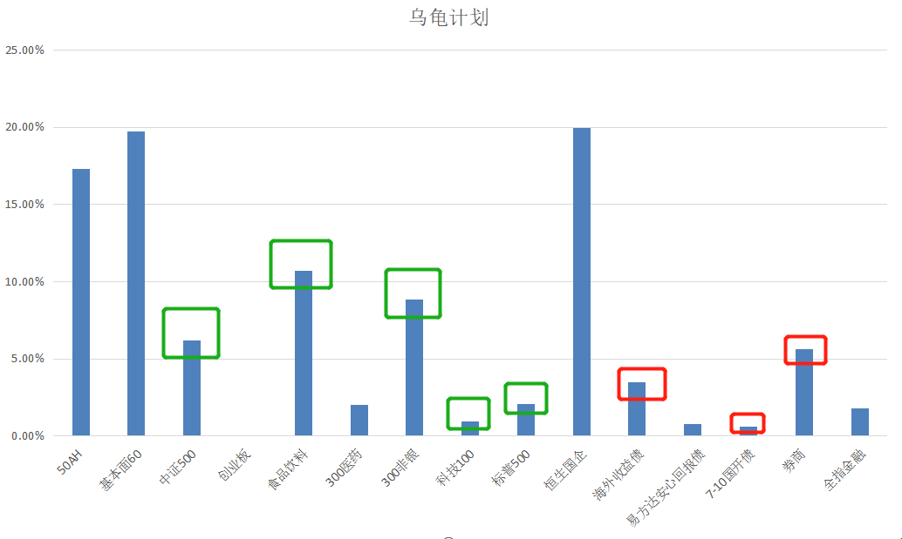

======================================================

_type: q&a
@范毅君[118551121224142]
2020-03-21 19:27:54 Sat  
topic_id: 421824482822428

@范毅君

>  二师父，我银行现在亏10个点，现在是继续持有还是转到沪深300或别的好啊
>  恼火的是买的华宝，竟然不能转换，😅

@二师父

>  没事的，银行的确定性也比较大，经济基本面转暖他就盈利了，目前浮亏10个点还好，可以暂停定投，等银行盈利逐步收割，这时候就不用转了。

阅读[4978]  评论[1]  赞[0] 

======================================================

_type: talk
@朝阳模具[15528112482582]
2020-03-21 21:03:25 Sat  
topic_id: 841845525485812

因为海外疫情的原因，及时撤出了恒生国企，躲过了23%的下跌幅度，祝继续定投的朋友们好运！

阅读[4821]  评论[0]  赞[0] 

+++++++++++++++++++++++++++++++++++++++++++++++++++++

图片：
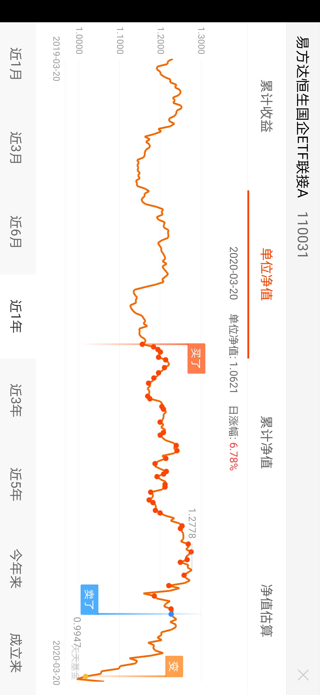

======================================================

_type: talk
@二师父[28814221155551]
2020-03-21 21:51:26 Sat  
topic_id: 548142251255824

我每次都是和市场操作相反，市场大跌，支付宝的剩余资金也利用起来了，一直定投，直到恒生国企指数重回1万点，不是特立独行，而是多年实践本能告诉我，低位按照节奏加仓

如果你总是和市场大多数人做一样的事，那么必然亏钱，股市用资金那么多，机构赚了，你也想赚，必然有人是亏的，只希望这个人不是你。

一切都会慢慢过去的，如果过不去，那这钱就是彻底的身外之物。

@呵呵→_→ at 2020-03-21 21:51:26 Sat

> 很有道理。每次看到师傅的文章总是能坚定信心

----------

@陈飞🤗 at 2020-03-21 21:51:26 Sat

> 为什么你买的和我们买的不一样

----------

@二师父 at 2020-03-21 21:51:26 Sat

> 一样，都是恒生国企，这是在支付宝买的

----------

@onepiecewi* at 2020-03-21 21:51:26 Sat

> 坚持到黎明
大家子弹要守得住

----------

@会飞的猪 at 2020-03-21 21:51:26 Sat

> 说的对加油

----------

阅读[5281]  评论[5]  赞[0] 

+++++++++++++++++++++++++++++++++++++++++++++++++++++

图片：
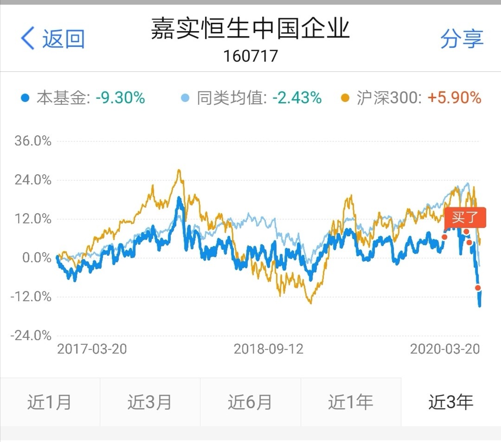

======================================================

_type: talk
@onepiecewi*[244414114545811]
2020-03-22 02:27:46 Sun  
topic_id: 841845521828242

@秦岭云横 at 2020-03-22 02:27:46 Sun

> 这货

----------

阅读[4946]  评论[1]  赞[0] 

+++++++++++++++++++++++++++++++++++++++++++++++++++++

图片：
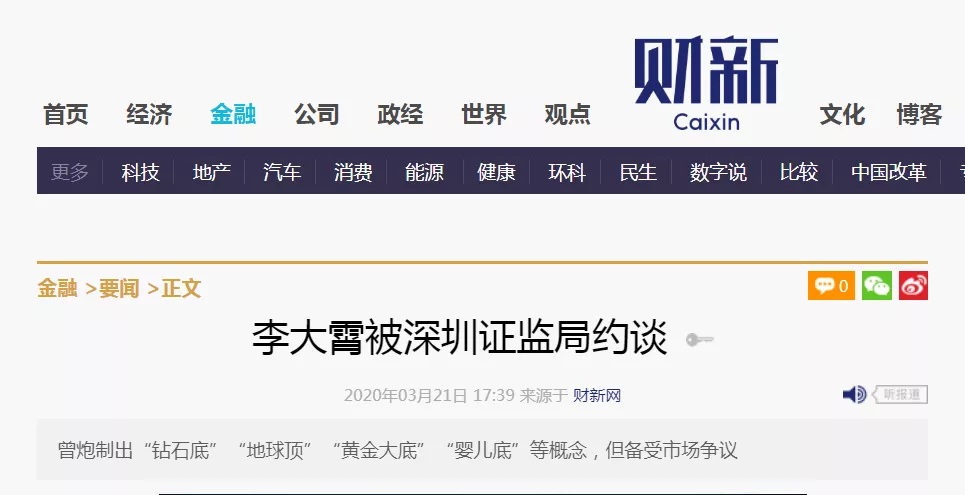

======================================================

_type: talk
@三峡情[422144414421548]
2020-03-22 08:14:07 Sun  
topic_id: 421824451144188

续费第一天，打个卡

@胡醒醒 at 2020-03-22 08:14:07 Sun

> 怎么续费？微信找二师父吗

----------

@onepiecewi* at 2020-03-22 08:14:07 Sun

> 到期你就知道了

----------

@三峡情 at 2020-03-22 08:14:07 Sun

> 是的！

----------

阅读[4940]  评论[3]  赞[0] 

======================================================

_type: q&a
@光少[244124552511141]
2020-03-22 17:05:55 Sun  
topic_id: 548142248151584

@光少

>  二师父你好！为什么比亚迪价格和港股相差那么多？

@二师父

>  这是因为A股相对港股有溢价，港股现在极度便宜，所以同样的买了港股相当于是买了折价的股票

阅读[5108]  评论[2]  赞[0] 

======================================================

_type: q&a
@素兮[548121415528244]
2020-03-22 17:08:26 Sun  
topic_id: 548142241285144

@素兮

>  二师父说未来重点配置的对象中证500，食品饮料和300非银、科技100，标普500。那这几个的持仓比例最大分别是多少？

@二师父

>  中证500和食品饮料，300非银可以逐步定投重仓，最多不超过百分之20，科技100和标普500目前还不是极度便宜可以轻仓定投，单只仓位也要控制在百分之15以内
>  
>  其他的也是需要配置的，不过之前已经有了仓位，所以不是重点，要结合自己账户的实际情况

阅读[5247]  评论[0]  赞[0] 

======================================================

_type: q&a
@素兮[548121415528244]
2020-03-22 17:39:58 Sun  
topic_id: 241845541111821

@素兮

>  中证500，沪深300，基本面60可以同时配置么？有无重复？再铺以几个行业指数，这样的组合配置如何？

@二师父

>  基本面60和沪深300有重复

阅读[5307]  评论[0]  赞[0] 

======================================================

_type: q&a
@徐美芳[51112822252224]
2020-03-22 21:27:05 Sun  
topic_id: 118512282188442

@徐美芳

>  二师傅，请帮忙看一下我场外和场内的定投基金，是否需要调整？目前场外和场内共占仓位48%，其中场外占了70%，场内占30%。

@二师父

>  没啥大问题，海外收益债可以处理了，白酒场内注意下规模，如果低于一亿了，可以用消费替代

阅读[5276]  评论[7]  赞[0] 

======================================================

_type: q&a
@李垚垚[548145221582444]
2020-03-22 22:05:54 Sun  
topic_id: 241845812122141

@李垚垚

>  二师父全球疫情这么严重A股会有冲机吗?

@二师父

>  短期对A股会有冲击，长期看A股会向好，如果资金是3年不用的就拿着，最近可以把账户关掉

阅读[5211]  评论[7]  赞[0] 

======================================================

_type: talk
@二师父[28814221155551]
2020-03-22 22:06:35 Sun  
topic_id: 841845814181482

<e type="hashtag" hid="554122818144" title="#不需要提前卖出#" /> 应对危机不用提前卖出，但是三个基础账户要准备好

@志亮 at 2020-03-22 22:06:35 Sun

> 二师父，增强指数和指数略有不同，请问增强指数基金会有可能出现老鼠仓吗？

----------

@二师父 at 2020-03-22 22:06:35 Sun

> 概率很低

----------

@志亮 at 2020-03-22 22:06:35 Sun

> 👌

----------

@Hi·DD at 2020-03-22 22:06:35 Sun

> 二师父，我之前在场外定投了基建和煤炭，眼下是否换成300非银更有价值？

----------

@二师父 at 2020-03-22 22:06:35 Sun

> 可以换，300非银确定性更大，过往收益也更好

----------

@Hi·DD at 2020-03-22 22:06:35 Sun

> 👌谢谢二师父

----------

@水墨青花 at 2020-03-22 22:06:35 Sun

> 师父，深红利场外定投可以吗，是481012吧，跟场内定投159905相当吗

----------

@二师父 at 2020-03-22 22:06:35 Sun

> 可以定投了

----------

阅读[6216]  评论[11]  赞[0] 

+++++++++++++++++++++++++++++++++++++++++++++++++++++

文件：
2020-03-22 22:06:10 Sun
文件大小：[20661]
88245455458122-如果危机发生，需要提前卖出吗.docx

======================================================

_type: q&a
@呵呵→_→[15414558111442]
2020-03-23 08:02:52 Mon  
topic_id: 241845811284451

@呵呵→_→

>  003376广发中债7-10国开行债权，
>  师傅这个持有问题不大吧，我有40%这个，

@二师父

>  可以的，利率上行这个会下跌

阅读[5117]  评论[0]  赞[0] 

======================================================

_type: q&a
@云云[118525244841512]
2020-03-23 10:34:09 Mon  
topic_id: 841845251858252

@云云

>  二师父，如果酒的规模以后小于1亿，要转换成消费，请问在场内如何转换，是卖出在买入还是怎么操作？

@二师父

>  先卖出，后买入

阅读[4898]  评论[22]  赞[0] 

======================================================

_type: q&a
@姣🍎[422212545212488]
2020-03-23 10:35:11 Mon  
topic_id: 241845254815411

@姣🍎

>  二师父，我华夏海外债券这个基金买的早，去年买了三万块钱的，觉得债券挺稳，现在都亏损三千多了。我该怎么办😱？还能涨回来吗？卖出觉得亏损太多了，不卖怕它一直喋喋不休三万变两万可怎么办？

@二师父

>  这个可以卖出了，现在美元涨跌都跌，大概率是流动性危机这类债券资产遭遇抛售

阅读[4967]  评论[0]  赞[0] 

======================================================

_type: q&a
@阳光[421884185252128]
2020-03-23 11:36:09 Mon  
topic_id: 548142511514414

@阳光

>  师父好：中了一个可转债，上周五上市没看到，今天从130跌到114，是卖了还是再拿着等等好呢？

@二师父

>  钱不着急补仓可以拿着到130，但是要接受回撤可能，熊市可转债表现弱一些

阅读[4818]  评论[6]  赞[0] 

======================================================

_type: q&a
@好运玲玲[244188585541521]
2020-03-23 15:28:17 Mon  
topic_id: 118512451254252

@好运玲玲

>  二师父您好！场内酒etf现在亏-12.71%，现在可以全部转换成消费etf吗？还是再等等？

@二师父

>  可以转换，我已经换了，同市值换，未来消费起来浮亏抹平了，下跌可以按照节奏定投

阅读[4310]  评论[15]  赞[0] 

======================================================

_type: talk
@二师父[28814221155551]
2020-03-23 15:54:46 Mon  
topic_id: 548142514425154

<e type="hashtag" hid="224254551241" title="#统一说几个事#" /> 第一，前期2688点位今天跌破了，这就要警惕了，不要抄底，虽然今天不是放量跌，但是前期低位没有守住，所以后来的定投一定要按照节奏。第一时间节奏，每周一次比较好，第二金额节奏，按照一份两份的来问题不会很大，只要底仓在，就放弃抄底思维，很容易到半山腰。

第二，不用恐慌，目前投资的标普500、恒生或者国企，以及A股除了半导体创业板等指数，都是非常安全，不管发生了什么，上证综合指数重回3000没有问题，只需要等等就可以了。还是坚持每周一次的频率定投不停止，这样总能买到相对低点。

第三，底仓有了可以适当网格交易，心理素质不好的，可以用两个账户，主账户不看，网格交易单独资金做，如果实在心理难受的，可以关闭账户，每周四打开一次加仓一次就够了。

第四、挺住，要卖也得等到3000点以上，现在不是卖出的时候，3000点以下不可能永远持续下去的。

@样 at 2020-03-23 15:54:46 Mon

> 真是贴心的小棉袄啊，明智的引路人[强][强][强]

----------

@onepiecewi* at 2020-03-23 15:54:46 Mon

> 已经不怎么看了[呲牙]

----------

@What if at 2020-03-23 15:54:46 Mon

> 今天定投了，50A，500，还有300非银行各投两份，标普500投一份。总仓位60%。另外之前投医药混合（006113）现在浮亏8%，是继续持有还是转其他的呢？

----------

@清水倾城 at 2020-03-23 15:54:46 Mon

> 拒绝看亏损，只想着怎么按节奏加仓呢

----------

@二师父 at 2020-03-23 15:54:46 Mon

> 不建议投混合基金

----------

@What if at 2020-03-23 15:54:46 Mon

> 占的资金比例不大，等回3000再扔了

----------

@衣袂飘香 at 2020-03-23 15:54:46 Mon

> 这是针对场外的乌龟计划还是针对场内的鳄鱼计划呢？

----------

@二师父 at 2020-03-23 15:54:46 Mon

> 都是的

----------

阅读[5136]  评论[8]  赞[0] 

======================================================

_type: talk
@雨淡风清[844418818858882]
2020-03-23 16:09:23 Mon  
topic_id: 421824582254548

大好的三月阳春蕴含着这个雾霾的天气。这次别再说大A比美股跌的少了，也别说比美股抗跌了……

@默 at 2020-03-23 16:09:23 Mon

> 你这是什么软件

----------

@特仑苏 at 2020-03-23 16:09:23 Mon

> 这不是比美股跌的少吗

----------

@雨淡风清 at 2020-03-23 16:09:23 Mon

> 新浪财经

----------

@六尘不改 at 2020-03-23 16:09:23 Mon

> 美股和A股有法比吗，一个在天上一个在地上，天上的往下掉，地上的往地狱里掉

----------

@雨淡风清 at 2020-03-23 16:09:23 Mon

> 还有10%左右，到最近的大坑。同志们坚持住吧！别想着高抛低吸了，指不定就吸在高位了，坚持定投吧！现在亏损10个点以内，目前还能睡的下吃的饱。加油(ง •̀_•́)ง

----------

@特仑苏 at 2020-03-23 16:09:23 Mon

> 能不能比是一回事，不过事实确实是A股确实比美股跌的少。当然为什么跌的少一部分原因也是因为美股在天上，A股在地下室。

----------

@六尘不改 at 2020-03-23 16:09:23 Mon

> 我可以投到两千点

----------

@六尘不改 at 2020-03-23 16:09:23 Mon

> 跌不了多少了，两三百点到头

----------

阅读[4185]  评论[10]  赞[0] 

+++++++++++++++++++++++++++++++++++++++++++++++++++++

图片：
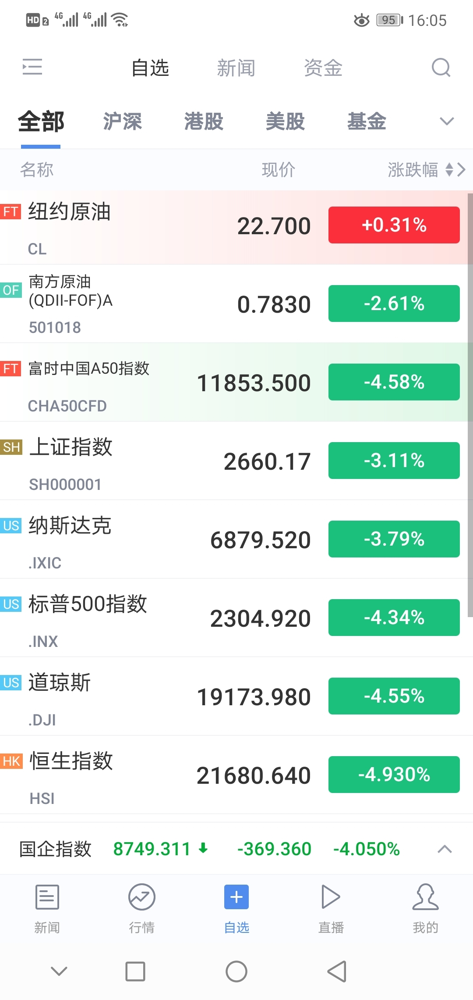

======================================================

_type: q&a
@隔窗遥望[241884481854181]
2020-03-23 19:02:22 Mon  
topic_id: 841845228422582

@隔窗遥望

>  512690场内酒ETF，仓位6%，目前浮亏9%，等值转换成159928，然后接着定投可以吗

@二师父

>  可以的，保持节奏

阅读[4138]  评论[9]  赞[0] 

======================================================

_type: q&a
@李垚垚[548145221582444]
2020-03-23 19:03:04 Mon  
topic_id: 841845228248282

@李垚垚

>  二师父仓位重的需要减仓吗?还是继续拿住低位定投!

@二师父

>  仓位过重可以暂停，优质的指数卖出没有必要，耐心持有这些未来都可以给你带来利润

阅读[4156]  评论[0]  赞[0] 

======================================================

_type: q&a
@学以致用[244415184181451]
2020-03-23 19:03:47 Mon  
topic_id: 841845228554542

@学以致用

>  二师傅，如果单独定投1到3支基金的话，应该投那些呢？目前子弹不多了……

@二师父

>  沪深300，中证500，食品饮料或者消费，选一只就沪深300

阅读[4327]  评论[2]  赞[0] 

======================================================

_type: q&a
@六尘不改[241555484551821]
2020-03-23 19:08:49 Mon  
topic_id: 548142552848114

@六尘不改

>  师傅，标普500现在每天只能买一百块，怎么办呢

@二师父

>  只能等场内溢价降下来了，在场内购买，或者用纳斯达克替代，不过标普500更优

阅读[4536]  评论[1]  赞[0] 

======================================================

_type: q&a
@Lion超超[48418188882428]
2020-03-23 19:23:21 Mon  
topic_id: 548142552452114

@Lion超超

>  二师父您好。
>  1、我现在持有50、500、白酒（近期开始建仓）、传媒军工环保（每次都是赚10个点卖10个点）还有新能源、芯片、半导体（都是混合基金）
>  2、从17年底开始定投，一直看二师父的文章，18年2500点的位置还在定投，到今年2月份用2w已经盈利4k了（学生党）
>  3、我现在有2个新能源和软件混合基金，在高位加仓了，但是目前还处在盈利状态，但是不知道现在是逢高卖出还是地位继续补仓呢？（在图中）

@二师父

>  逢高卖出，半导体等电子类产业指数目前还高估，这些本来就是炒到高位了

阅读[4840]  评论[0]  赞[0] 

======================================================

_type: q&a
@李垚垚[548145221582444]
2020-03-23 19:54:38 Mon  
topic_id: 241845222551821

@李垚垚

>  二师父我现在持仓深红利、中证红利、上证50、中证500、恒生国企您帮我看看需要更换不，如果不需要我就拿住等待回涨!

@二师父

>  不用，都可以持有的，耐心等待就好，需要时间

阅读[4764]  评论[0]  赞[0] 

======================================================

_type: talk
@liao[48588555425818]
2020-03-23 20:11:39 Mon  
topic_id: 241845222852221

二师傅，我现在持仓2成消费ETF，2成酒ETF，2成券商ETF，1成5GETF，1成中概互联，1成医药ETF，1成医疗ETF，都是慢慢加仓上来的，目前组合-11%，这个组合可以继续持有吗，还是要调仓？

@二师父 at 2020-03-23 20:11:39 Mon

> 已经满仓了就别折腾了，想卖也等到3000点以上，酒ETF注意下他的规模

----------

@liao at 2020-03-23 20:11:39 Mon

> 不是一次性投入的，是按照这个比例定投上来的，目前还有25%的资金可以加入

----------

阅读[4651]  评论[2]  赞[0] 

======================================================

_type: talk
@二师父[28814221155551]
2020-03-23 20:46:38 Mon  
topic_id: 241845222242151

<e type="hashtag" hid="824254521412" title="#市场位置#" /> 虽然跌到了2660，但是比上周四盘中2650还是高一点，所以节奏很重要，单独加仓每破100点来一次，不破就老老实实定投，抄底容易到半山腰。

@志亮 at 2020-03-23 20:46:38 Mon

> 这的确是个好方法[微笑]

----------

@朝阳模具 at 2020-03-23 20:46:38 Mon

> 沪指已经失真，建议参考沪深300（沪深300还在半山腰）

----------

@秦风殇韵（刘豫斌） at 2020-03-23 20:46:38 Mon

> 今天忍住了，周二定投日

----------

@二师父 at 2020-03-23 20:46:38 Mon

> 我看的万得全A啊，你看看文章吧

----------

@朝阳模具 at 2020-03-23 20:46:38 Mon

> 好的

----------

阅读[5913]  评论[5]  赞[0] 

+++++++++++++++++++++++++++++++++++++++++++++++++++++

文件：
2020-03-23 20:18:37 Mon
文件大小：[163886]
88245451248182-2月3日低点破位，现在市场处于哪个位置.docx

======================================================

_type: q&a
@呵呵→_→[15414558111442]
2020-03-23 21:16:46 Mon  
topic_id: 118512444821222

@呵呵→_→

>  师傅帮我也分析一下看看，是不是明天就把酒换成消费，
>  别的要动么？
>  还有3万现金，然后还买了5万块钱的7-10国开债
>  谢谢啦，

@二师父

>  明天可以换，就1万元资金不多，也可以观望后面酒etf的规模，除非极端情况一般没有那么倒霉清盘的，如果担心换成消费etf，这个规模30多亿，最保险，别的不用动，耐心拿着就好，

阅读[5192]  评论[2]  赞[0] 

======================================================

_type: q&a
@林凤崎[421882481454488]
2020-03-23 21:28:40 Mon  
topic_id: 548142558584854

@林凤崎

>  二师父，161207基金是什么情况

@二师父

>  这只基金从今天开始暂停申购了，分级基金都别碰了，今年年底会逐步给转型或者清盘处理

阅读[5063]  评论[0]  赞[0] 

======================================================

_type: talk
@二师父[28814221155551]
2020-03-23 22:11:04 Mon  
topic_id: 421824524841828

<e type="hashtag" hid="452542888428" title="#关于标普500定投说明#" /> 标普500可以选择博时，也可以选择易方达，博时的规模大概在10亿，易方达规模大概在2亿多，还是博时保险点

博时限购每天100，易方达每天限购500，场外二师父继续博时定投，准备周定投改为日定投，加仓到百分之10的仓位停止，然后等待场内标普500没有溢价就用场内的，耐心等待，等到有机会就出手，没机会就拿着现金

@蓝魔森林 at 2020-03-23 22:11:04 Mon

> 好主意

----------

@苍天有井明月空🌙 at 2020-03-23 22:11:04 Mon

> 代码多少。

----------

@二师父 at 2020-03-23 22:11:04 Mon

> 估值表

----------

@苍天有井明月空🌙 at 2020-03-23 22:11:04 Mon

> 谢谢

----------

阅读[5017]  评论[4]  赞[0] 

======================================================

_type: q&a
@不知道不明了[15584248411812]
2020-03-23 23:04:30 Mon  
topic_id: 548142542415284

@不知道不明了

>  二师傅，沪深300价值和沪深300比收益更好么，和同样都是100个样本的中证100相比呢？

@二师父

>  不见得，有时候价值策略会跑输纯被动策略，但是他们的费率比纯被动策略指数高

阅读[5019]  评论[0]  赞[0] 

======================================================

_type: q&a
@璐老诗[88818121525822]
2020-03-24 08:18:26 Tue  
topic_id: 841845241521282

@璐老诗

>  二师父，之前一直跟着您有节奏的买低谷指数基金没碰过股票，前段时间看到中国平安跌了，74多点买了点中国平安股票，目前亏近10个点。目前有三个方案：一个是拿着不动等涨回，一个以定投的思路再买入，还有一个思路卖出换低估基金，想听您的建议😄

@二师父

>  股票投资难度比较大，如果自己不懂就不要碰，换成低估指数比较稳妥，我怕你拿不住，有的人是下跌拿不住，有的人是上涨拿不住

阅读[4864]  评论[6]  赞[0] 

======================================================

_type: talk
@雨淡风清[844418818858882]
2020-03-24 09:46:42 Tue  
topic_id: 841845215511882

昨天劝别人别做高抛低吸，今天就啪啪的打脸了，那就是简易的网格。祝大家日日长红

@J at 2020-03-24 09:46:42 Tue

> 昨天买今天卖的话，盈利2%左右吧，这样的操作频率有点高

----------

@雨淡风清 at 2020-03-24 09:46:42 Tue

> 2个点也是肉

----------

@J at 2020-03-24 09:46:42 Tue

> 是的，如果本金大一天赚2%也不错的，现在的形势不明朗不敢下重注去玩网格

----------

@雨淡风清 at 2020-03-24 09:46:42 Tue

> 嗯，好好努力

----------

阅读[4682]  评论[4]  赞[0] 

======================================================

_type: talk
@zxc[51145258542214]
2020-03-24 09:57:21 Tue  
topic_id: 118512482582512

今天还适合场内把酒ETF卖了买成消费ETF吗

@二师父 at 2020-03-24 09:57:21 Tue

> 可以

----------

@苍天有井明月空🌙 at 2020-03-24 09:57:21 Tue

> 001631吗

----------

@rtdmm小米 at 2020-03-24 09:57:21 Tue

> 请问二师父，消费进入低估了？

----------

阅读[4958]  评论[3]  赞[0] 

======================================================

_type: talk
@Simon[421211484228258]
2020-03-24 10:24:57 Tue  
topic_id: 118512482128442

二师傅您好，现在如果买场内基金，开通哪个渠道比较优惠？求推荐

@二师父 at 2020-03-24 10:24:57 Tue

> 华宝华泰都可以

----------

@Simon at 2020-03-24 10:24:57 Tue

> 二者基金佣金分别多少？

----------

@二师父 at 2020-03-24 10:24:57 Tue

> 都万1

----------

@水墨青花 at 2020-03-24 10:24:57 Tue

> 师父，华宝华泰基金佣金都万1，最低是多少？

----------

@六尘不改 at 2020-03-24 10:24:57 Tue

> 最低就是万一

----------

@水墨青花 at 2020-03-24 10:24:57 Tue

> 我的意思是有没有最低几元的规则，不好意思，我没说明白😊

----------

阅读[4985]  评论[6]  赞[0] 

======================================================

_type: q&a
@林凤崎[421882481454488]
2020-03-24 10:59:43 Tue  
topic_id: 421824514244218

@林凤崎

>  009059如何

@二师父

>  直接沪深300纯被动

阅读[5136]  评论[1]  赞[0] 

======================================================

_type: q&a
@田维海[422144441542418]
2020-03-24 11:00:44 Tue  
topic_id: 421824514245228

@田维海

>  二师付，纳斯达克100指数历史pE图为什么有的地方垂直下掉一块，指数成份股调整也不会影响这么大吧？

@二师父

>  有的历史数据缺失，指数不要紧，这个指数成立初期的一些公司已经破产退市，不过新的公司会被纳入

阅读[5406]  评论[1]  赞[0] 

======================================================

_type: q&a
@rtdmm小米[422188284881148]
2020-03-24 14:52:40 Tue  
topic_id: 118512484882482

@rtdmm小米

>  请问二师父，酒etf 的规模是上升的（2019年二季度1.35亿，三季度1.38亿，四季度1.81亿)，暂时不换成消费没问题吧？

@二师父

>  也可以的，只是提醒注意下意外发生，规模一亿以上基本不会出这种问题

阅读[5120]  评论[4]  赞[0] 

======================================================

_type: talk
@蔡寅宵[118554814444112]
2020-03-24 15:06:43 Tue  
topic_id: 841845211242822

二师父，跟您定投的科创财通浮亏10个点，等待还是加仓？

阅读[4942]  评论[0]  赞[0] 

======================================================

_type: talk
@蔡寅宵[118554814444112]
2020-03-24 15:06:44 Tue  
topic_id: 548142588545154

二师父，跟您定投的科创财通浮亏10个点，等待还是加仓？

@二师父 at 2020-03-24 15:06:44 Tue

> 我没投这个啊

----------

@A0洪氏日杂批发 at 2020-03-24 15:06:44 Tue

> 跟错大神了吧[偷笑][偷笑][偷笑]

----------

@wty at 2020-03-24 15:06:44 Tue

> 我也入手了，但跟二师父一样只占总仓位0.1%，浮亏4%，等待盈利！看来二师父没有建仓，就我两建仓了！

----------

阅读[5363]  评论[3]  赞[0] 

======================================================

_type: q&a
@雨淡风清[844418818858882]
2020-03-24 15:14:17 Tue  
topic_id: 421824511821148

@雨淡风清

>  二师父是什么让今天的A股爆发？触底反弹，还是有其他消息面的信息？

@二师父

>  周末副行长喊话，政策底部目前确认

阅读[5691]  评论[5]  赞[0] 

======================================================

_type: talk
@二师父[28814221155551]
2020-03-24 16:28:07 Tue  
topic_id: 421824244458258

<e type="hashtag" hid="224254458511" title="#不要在意短期涨跌#" /> 市场任何一个因素都会带来短期涨跌，短期涨涨跌跌，不过长期看股市都是上涨的，不可能GDP一直增长，股票总市值却连连下降。

@夏萍 at 2020-03-24 16:28:07 Tue

> 听师父一席话，定心了

----------

@志亮 at 2020-03-24 16:28:07 Tue

> 我也认为反弹而已，后面跌破2550是大概率的事，当然我也是预测[呲牙]

----------

@苍天有井明月空🌙 at 2020-03-24 16:28:07 Tue

> 2550子弹打完也得上

----------

@JOY at 2020-03-24 16:28:07 Tue

> 一直都在等～得坚持住，不能躁动～

----------

@April _ M. at 2020-03-24 16:28:07 Tue

> 真的是要控制住自己的手，按照纪律执行 （捂脸）

----------

@J at 2020-03-24 16:28:07 Tue

> 师傅，这轮反弹，科技etf如果盈利了是否应该逐步清仓？科技目前到达高估区域。

----------

@二师父 at 2020-03-24 16:28:07 Tue

> 可以按照纪律走

----------

@J at 2020-03-24 16:28:07 Tue

> 嗯，按纪律走真的很重要。卖出后适合开始定投新兴科技100吗？

----------

阅读[6560]  评论[10]  赞[0] 

+++++++++++++++++++++++++++++++++++++++++++++++++++++

文件：
2020-03-24 16:26:39 Tue
文件大小：[21257]
88245484255212-市场涨了，别高兴太早.docx

======================================================

_type: talk
@老丁[15541182455482]
2020-03-24 20:59:19 Tue  
topic_id: 548142424828154

你好，二师父，请教一下现在标普500的PE 处于一个什么位置（百分位），到大底大概还有多少的跌幅？谢谢

阅读[5158]  评论[0]  赞[0] 

======================================================

_type: q&a
@云云[118525244841512]
2020-03-25 10:38:53 Wed  
topic_id: 548142411444124

@云云

>  二师父，标普500你是今天就开始由周定投改为日定投吗？

@二师父

>  这个可以等放开限购了再买，或者等场内没有溢价了，我还没有投

阅读[4770]  评论[1]  赞[0] 

======================================================

_type: q&a
@葛亚丽[841858254128252]
2020-03-25 10:40:23 Wed  
topic_id: 548142411514884

@葛亚丽

>  二师父你好，场内为什么要把酒换成消费呢？

@二师父

>  只是提醒，低于1亿规模的话需要注意，基金规模太低有清盘风险，不过也不用太担心，即使基金清盘也会提前通知的

阅读[4912]  评论[0]  赞[0] 

======================================================

_type: q&a
@一剪梅[15455552282512]
2020-03-25 10:41:07 Wed  
topic_id: 841845454412122

@一剪梅

>  师傅，我目前有100万资金，5年不用，目前我手上的基金有：沪深300，10%；中证500，15%；深红利8%；标普500，2%；恒生国企1%。我计划留50万现金，余下50万用于加仓，拟加仓的指数有：沪深300、300非银、白酒指数，指数组合可以吗？底部配置+定投加仓还是仅定投？

@二师父

>  配置加定投比较好，指数组合没有问题

阅读[5049]  评论[0]  赞[0] 

======================================================

_type: talk
@以古论今[28214421582421]
2020-03-25 11:49:53 Wed  
topic_id: 548142455511414

连续增长两天了，要不要减仓，等跌下来在加

@以古论今 at 2020-03-25 11:49:53 Wed

> 做点小波段

----------

@Chu at 2020-03-25 11:49:53 Wed

> 现在还是低位吧，不着急，怎么想卖也到3000点再说

----------

@二师父 at 2020-03-25 11:49:53 Wed

> 按照网格，主仓位别动

----------

阅读[4955]  评论[3]  赞[0] 

======================================================

_type: q&a
@Zyxj[111841455151112]
2020-03-25 14:38:06 Wed  
topic_id: 118512812541222

@Zyxj

>  你好，二师父，请教一下现在标普500的PE 处于一个什么位置（百分位），到大底大概还有多少的跌幅？谢谢

@二师父

>  历史百分位33.42，大概最大历史跌幅百分之45，排除了1929年那次，美股底部真的在哪不好预测，目前定投标普500挺好，2500点以下定投标普500是适合的，目前场外限购，可以日定投，2500以上取消

阅读[4927]  评论[3]  赞[0] 

======================================================

_type: talk
@范毅君[118551121224142]
2020-03-25 15:04:01 Wed  
topic_id: 118512812144512

这两天指数涨，却不见主力资金进入，我个人感觉后面还会震荡，昨天卖了一点白酒做网格，但是今天不敢动了，其实我还想买断，可是手上白酒筹码也不多[偷笑]，请问您怎么看最近指数变化，求指教，求最近的操作思路

@范毅君 at 2020-03-25 15:04:01 Wed

> 其实我还想卖点，感觉后面还会跌，但今天没敢动。上面打错字了

----------

阅读[5076]  评论[1]  赞[0] 

======================================================

_type: q&a
@rtdmm小米[422188284881148]
2020-03-25 15:30:13 Wed  
topic_id: 118512812411852

@rtdmm小米

>  请问二师父，消费到低估区域了没？pe 是多少呢

@二师父

>  低估还没有，也不会差很多了，可以轻仓定投

阅读[5272]  评论[1]  赞[0] 

======================================================

_type: q&a
@学以致用[244415184181451]
2020-03-25 15:58:57 Wed  
topic_id: 841845148555422

@学以致用

>  二师傅，中概互联的交易价格也是北京时间下午3点的收盘价格吗？

@二师父

>  这是按照当日联交所和纳斯达克，纽约交易所的价格算的

阅读[5291]  评论[6]  赞[0] 

======================================================

_type: q&a
@范毅君[118551121224142]
2020-03-25 16:01:52 Wed  
topic_id: 118512812885512

@范毅君

>  这两天指数涨，却不见主力资金进入，我个人感觉后面还会震荡，昨天卖了一点白酒做网格，但是今天不敢动了，其实我还想卖一点，因为感觉后面会震荡，可是手上白酒筹码也不多，请问您怎么看最近指数变化，求指教，求最近的操作思路

@二师父

>  主仓是否建立好，震荡是正常的，要么按照纪律做网格，要么别折腾，和市场对打百分之百输

阅读[5522]  评论[5]  赞[0] 

======================================================

_type: q&a
@🍀 凝🌸 慧🍀[841855248254242]
2020-03-25 17:19:04 Wed  
topic_id: 421824128858418

@🍀 凝🌸 慧🍀

>  二师父，假如有几年都不用的50万闲钱，如果现在是空仓的话，建仓投资比例您认为应如何安排比较合理？鳄鱼计划和乌龟计划，都要参与吗？谢谢！

@二师父

>  鳄鱼计划，存量资金定投，乌龟计划是增量资金定投，增量资金就是每月收入扣除支出以及储蓄之后，可以用来投资的结余资金。

阅读[5409]  评论[3]  赞[0] 

======================================================

_type: talk
@二师父[28814221155551]
2020-03-25 17:21:59 Wed  
topic_id: 421824128221288

<e type="hashtag" hid="452541421528" title="#3.25估值表暨乌龟计划#" /> 定投食品饮料，中证500，300非银。<e type="web" href="https://openmob.1234567.com.cn/hd/index.html?t=qd8008&u=tjr122esf" title="https://openmob.1234567.com.cn/hd/index.html?t=qd8..." />，点击这个链接搜索乌龟计划可以看到往期实盘记录。

@🍀 凝🌸 慧🍀 at 2020-03-25 17:21:59 Wed

> 正在翘首企盼，辛苦师父啦，谢谢！

----------

@蛋炒饭不加蛋 at 2020-03-25 17:21:59 Wed

> 请问二师父估值表有上下阈值吗？

----------

@圣诞结® at 2020-03-25 17:21:59 Wed

> 二师父 食品饮料还没到低估 现在投还是等进入低估投？现在我已经75成仓了

----------

@二师父 at 2020-03-25 17:21:59 Wed

> 可以等等

----------

@范毅君 at 2020-03-25 17:21:59 Wed

> 白酒这就没了啊[流泪][流泪]

----------

@范毅君 at 2020-03-25 17:21:59 Wed

> 看见了，以为没了呢[呲牙]

----------

@志亮 at 2020-03-25 17:21:59 Wed

> 白酒对你就这么重要？不要和基金（股票）谈感情呀。[呲牙]

----------

@范毅君 at 2020-03-25 17:21:59 Wed

> 特别重要，好喝

----------

阅读[6680]  评论[15]  赞[0] 

+++++++++++++++++++++++++++++++++++++++++++++++++++++

图片：
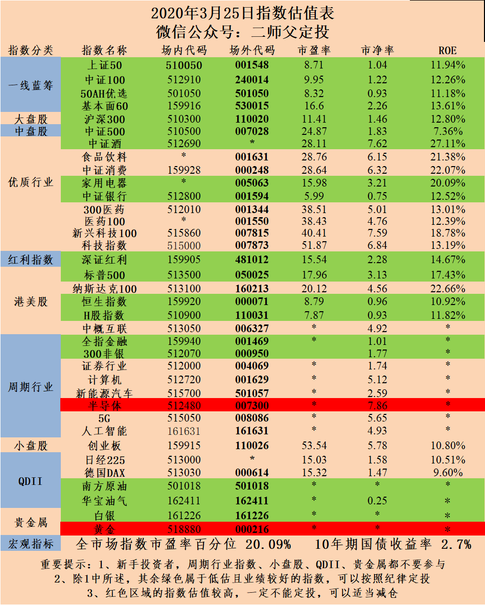
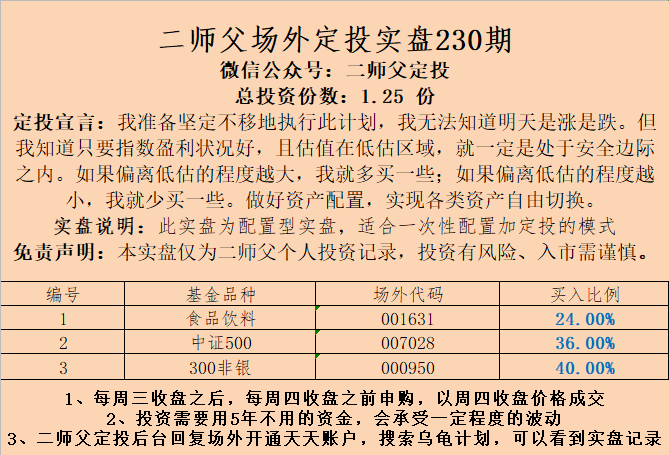

+++++++++++++++++++++++++++++++++++++++++++++++++++++

文件：
2020-03-25 17:20:03 Wed
文件大小：[73850]
51542454241414-二师父230期低估定投实盘.docx

======================================================

_type: talk
@二师父[28814221155551]
2020-03-25 21:13:53 Wed  
topic_id: 841845115541222

<e type="hashtag" hid="452541851428" title="#仓位没有合适的#" /> 仓位合不合适，永远看一个人的心理状态。

而作为普通人，心魔——贪心和害怕总会时而出现，投资就是一个心灵升华的过程，是一场同自己的内外互博，是不断克服人性弱点从而超越自我的过程。

对于既贪婪又胆小的人，无论什么仓位都不合适，都会有情绪，只有真正克服了自己人性的弱点，才能做到涨跌无惧。

他涨任他涨，清风拂山岗，他跌任他跌，明月照大江。涨涨跌跌由他去，我自守心不动如山。这是我理解的投资最高境界。

阅读[5459]  评论[0]  赞[0] 

======================================================

_type: talk
@二师父[28814221155551]
2020-03-25 21:40:49 Wed  
topic_id: 841845115281152

<e type="hashtag" hid="554528158844" title="#漫步华尔街第3讲#" /> 行为金融学，多了解自己的心理状态，其实正确的认识自己，正确的认识他人，是高情商的表现，在股市投资不见得你懂得了指数的涨跌原理就真的能从容不迫，而关键的是你是否正确的认识自己，认识市场，理解其他投资者的行为。

常怀敬畏之心，在市场面前我们都是小学生。

@秦风殇韵（刘豫斌） at 2020-03-25 21:40:49 Wed

> 微信读书上也在读，这书的翻译真棒，比其他翻译书强的不是一点半点！

----------

阅读[6312]  评论[1]  赞[0] 

+++++++++++++++++++++++++++++++++++++++++++++++++++++

文件：
2020-03-25 21:38:55 Wed
文件大小：[18784]
28245424454541-漫步华尔街第3讲.docx

======================================================

_type: talk
@一心一意[844421848411122]
2020-03-26 10:10:09 Thu  
topic_id: 841848552242522

师父，这只基金怎么样006321

@一心一意 at 2020-03-26 10:10:09 Thu

> 可能是新手，问的问题是不是不愿意回复啊

----------

@Siller at 2020-03-26 10:10:09 Thu

> 点右上角的三个点，向师父提问。发状态师父有时候看不到

----------

阅读[4957]  评论[2]  赞[0] 

======================================================

_type: talk
@April _ M.[841582144212812]
2020-03-26 12:47:42 Thu  
topic_id: 241848554188841

每天都点进来看看，已经成为了一种习惯～～～

@onepiecewi* at 2020-03-26 12:47:42 Thu

> 我也是[握手]

----------

@April _ M. at 2020-03-26 12:47:42 Thu

> 🤝🤝🤝

----------

阅读[4724]  评论[2]  赞[0] 

======================================================

_type: q&a
@佳[844145484515482]
2020-03-26 14:40:31 Thu  
topic_id: 241848554544481

@佳

>  二师父，标普500现在你有没有继续购买呢？还是等到以后再买？

@二师父

>  我在等场内溢价降下来买，溢价8个点，有点高

阅读[4969]  评论[5]  赞[0] 

======================================================

_type: q&a
@姣🍎[422212545212488]
2020-03-26 15:23:58 Thu  
topic_id: 118515228112552

@姣🍎

>  请问最近中了几个可转债，一般t+15个工作日就上市，可是最近可转债都没有公布上市日期，比如盛屯转债，二师父知道为啥吗？

@二师父

>  上市之前都会公布的

阅读[4926]  评论[4]  赞[0] 

======================================================

_type: talk
@二师父[28814221155551]
2020-03-26 17:44:05 Thu  
topic_id: 118515254111442

<e type="hashtag" hid="224251154221" title="#300价值#" /> 不知有没有人投资300价值，这是个巨坑。19年年初不管是买沪深300，中证500，还是创业板，到现在盈利20%没问题，而唯独这个价值基金，如果当时买了，现在也就保个本。

@朝阳模具 at 2020-03-26 17:44:05 Thu

> 前年买过，后来与中证红利一起清仓了，原因也简单，300价值基本就是金额行业，里面没有消费医药科技等更优秀成长性更高的企业。

----------

@蓝魔森林 at 2020-03-26 17:44:05 Thu

> 学习了

----------

@乖子 at 2020-03-26 17:44:05 Thu

> 我以前投了一点，一直没动，要不要卖掉？

----------

@二师父 at 2020-03-26 17:44:05 Thu

> 可以转换，价值类基金不是追求收益的，他们比较稳健

----------

@斌斌 at 2020-03-26 17:44:05 Thu

> 师父说的非常对，定投一年多目前仍亏损，目前换啥比较好呢？沪深300？

----------

@二师父 at 2020-03-26 17:44:05 Thu

> 可以的，300作为价值类基金是不错的

----------

@J at 2020-03-26 17:44:05 Thu

> 很认同师傅的分析。而且，在策略失效的年份里，还亏了时间成本[微笑]

----------

@乖子 at 2020-03-26 17:44:05 Thu

> 好的好的谢谢

----------

阅读[5687]  评论[8]  赞[0] 

+++++++++++++++++++++++++++++++++++++++++++++++++++++

文件：
2020-03-26 17:42:49 Thu
文件大小：[20147]
88245441121152-策略指数300价值与沪深300相比有何优劣.docx

======================================================

_type: q&a
@背心[51441214442224]
2020-03-26 22:50:47 Thu  
topic_id: 241848525184881

@背心

>  师傅，黄金ETF是不是，跟踪comex黄金的，什么价位可以入手。需要注意些什么，谢谢

@二师父

>  两者有相关，但不是追踪COMEX的，黄金ETF是投资黄金贵金属，COMEX是黄金期货的价格。
>  
>  买入看是做趋势和做逆势，目前如果采用定投的方法不行，金价处于高位，避险做趋势在上穿5日线可以，需要做好止损。

阅读[4637]  评论[0]  赞[0] 

======================================================

_type: talk
@二师父[28814221155551]
2020-03-26 22:57:11 Thu  
topic_id: 841848522288252

德国溢价率下去了，可以考虑，美股溢价率不下去，再等等，反正该出手就出手，一个品种买入时候没有百分之99.99的把握盈利，最好别碰

@宁静以致远 at 2020-03-26 22:57:11 Thu

> 二师父，您发的德国30看得到溢价率折价率，我用招商证券看不到啊！这是证券公司的差别吗？还是您在别处查看的？

----------

@二师父 at 2020-03-26 22:57:11 Thu

> 有的是没有的

----------

阅读[4810]  评论[2]  赞[0] 

+++++++++++++++++++++++++++++++++++++++++++++++++++++

图片：
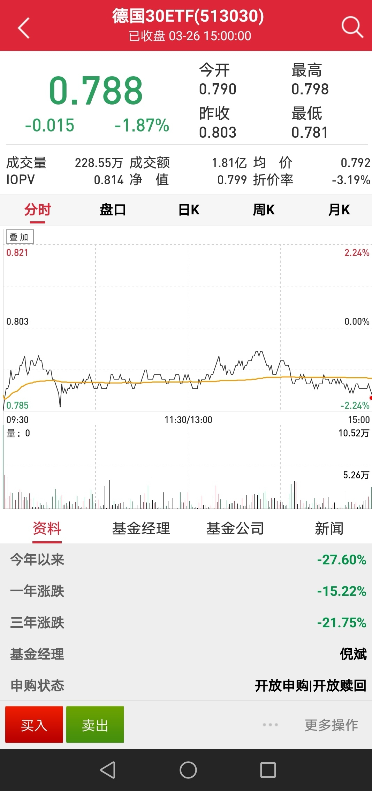

======================================================

_type: q&a
@YAO[28848244851581]
2020-03-27 10:29:36 Fri  
topic_id: 241848548852151

@YAO

>  二师父，今年一季度绝大部分上市公司盈利是同比严重下降的，等到四月份一公布一季度利润数据，大部分指数的动态市盈率就要上调，也就意味着很多目前低估的立马变成正常估值，正常估值的立马变成高估了，对吗？

@二师父

>  低估变成正常估值也得看是否穿越了低估阈值的，盈利下滑分为短暂冲击盈利下滑和企业基本面恶化盈利下滑，这两者有本质区别的
>  
>  利用市盈率和低估阈值进行对比只是简易估值，最为关键需要判断企业未来盈利及产生现金的能力

阅读[4547]  评论[0]  赞[0] 

======================================================

_type: talk
@今明山水[28514441144811]
2020-03-27 11:30:25 Fri  
topic_id: 841848542244422

我用的海通app买ETF, 看不到溢价率.

请教二师父, 用哪些app能看到呢?

同花顺, 东方财富,或者其它的呢?

@二师父 at 2020-03-27 11:30:25 Fri

> 东方财富，万得

----------

@今明山水 at 2020-03-27 11:30:25 Fri

> 感谢二师父.

----------

@JOY at 2020-03-27 11:30:25 Fri

> 麻烦您，请问海通证券的APP好用么？之前有听说交易量大的时候会卡顿，登录交易不了，有这种情况吗？

----------

@今明山水 at 2020-03-27 11:30:25 Fri

> 你说的情况我没遇到。
但我也只是近期下跌多时买了三只股票。
pc和手机都用过。成交挺快的。

我微信跟开户营业部的人说买ETF没有溢价率，她很快向总部反应。
然后将她们总部的回复截图发给我，说是已列入修改计划。

----------

@JOY at 2020-03-27 11:30:25 Fri

> 谢谢你

----------

阅读[4382]  评论[5]  赞[0] 

======================================================

_type: q&a
@tanxin[241524428884281]
2020-03-27 14:49:54 Fri  
topic_id: 421828425528258

@tanxin

>  二师父，请问定投宽基指数，50ah+基本面60和定投沪深300比较哪个更好些？还是需要都配置上？

@二师父

>  配置一个就好，50ah和基本面60可以利用沪市与深市的轮动进行组合配置，这样更好一点

阅读[4372]  评论[3]  赞[0] 

======================================================

_type: talk
@Nancy[28245584485581]
2020-03-27 15:02:40 Fri  
topic_id: 421828414141258

二师父，麻烦看下目前我持仓的指数，指教一下是否需要调整？非常感谢！

@二师父 at 2020-03-27 15:02:40 Fri

> 红利基金，是追踪的标普红利那个是比较差的

----------

@Nancy at 2020-03-27 15:02:40 Fri

> 那就先持有等待时机网格卖出吧？其他的都还可以按这个比例定投么？谢谢！

----------

@二师父 at 2020-03-27 15:02:40 Fri

> 你的蓝筹基金太多了，适当配置点行业指数和中盘指数

----------

@Nancy at 2020-03-27 15:02:40 Fri

> 多谢，那我研究一下再调整一下！

----------

@朝阳模具 at 2020-03-27 15:02:40 Fri

> 50AH+F60即可，另外几个大概率跑不赢50AH+F60

----------

@Nancy at 2020-03-27 15:02:40 Fri

> 多谢回复！

----------

阅读[4335]  评论[6]  赞[0] 

+++++++++++++++++++++++++++++++++++++++++++++++++++++

图片：
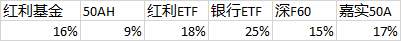

======================================================

_type: q&a
@不知道不明了[15584248411812]
2020-03-27 17:32:00 Fri  
topic_id: 118515285582412

@不知道不明了

>  二师父，请问鳄鱼计划和网格交易的一份是多少钱呢，怎么根据自己的仓位和资金来进行调整？

@二师父

>  这个根据自己总资金来分配，鳄鱼计划的总份数多一些，可以分成150到250份不等，如果空仓的话在底部可以一次配置5到7成仓位
>  
>  网格交易只是总资金的一小部分应对震荡，建立底仓后，然后剩余资金分成5到10份慢慢根据价格买入

阅读[4411]  评论[0]  赞[0] 

======================================================

_type: talk
@二师父[28814221155551]
2020-03-27 20:02:35 Fri  
topic_id: 841848511224142

<e type="hashtag" hid="224282555811" title="#市场情绪#" /> 一般市场从高位回落，赚钱效应刚刚散去的时候，投资者情绪最高，等待投资者情绪低迷的时候，就是最好的机会，大概哪些点位定投，哪些点位直接一次买入，都有数据。

按照规矩走，是最稳妥的。

@范毅君 at 2020-03-27 20:02:35 Fri

> 二师父，万得全市场指数，只能下载wind的app才能看吗

----------

@二师父 at 2020-03-27 20:02:35 Fri

> 是的

----------

@范毅君 at 2020-03-27 20:02:35 Fri

> 这是得下载多少app啊😂😂

----------

@特仑苏 at 2020-03-27 20:02:35 Fri

> 请问二师父市场成交额从哪里可以看到数据。比如万得全软件，从哪里可以看到？

----------

@二师父 at 2020-03-27 20:02:35 Fri

> 中证官网，同花顺

----------

@特仑苏 at 2020-03-27 20:02:35 Fri

> 比如同花顺打开，然后在点哪里可以看，真的不知道那里看，希望二师父详解，感谢

----------

@二师父 at 2020-03-27 20:02:35 Fri

> 打开指数界面，成交额

----------

@特仑苏 at 2020-03-27 20:02:35 Fri

> 我找到了，是不是上证指数2536亿深证成指3803亿加起来两个加起来6000多亿？

----------

阅读[4509]  评论[10]  赞[0] 

+++++++++++++++++++++++++++++++++++++++++++++++++++++

文件：
2020-03-27 20:01:19 Fri
文件大小：[20005]
48524144885518-市场情绪下来了，定投的机会来了.docx

======================================================

_type: q&a
@姣🍎[422212545212488]
2020-03-27 20:04:58 Fri  
topic_id: 421828412188528

@姣🍎

>  请问华宝油气现在这么便宜，我之前没买过，现在买点行吗？

@二师父

>  亏了钱不心疼就可以，亏钱心疼这个就别碰了。

阅读[4461]  评论[2]  赞[0] 

======================================================

_type: talk
@二师父[28814221155551]
2020-03-27 20:07:23 Fri  
topic_id: 241848511248821

油气我刚看了下，溢价率32%，已经说过不要碰，没啥价值。去年12月涨到0.43只卖了一份，没有清仓就是一次错误操作，等待机会清仓中，没投的不要碰了

@光少 at 2020-03-27 20:07:23 Fri

> 我也想换了，好彩仓位不重，浮亏40%

----------

@Sunflower at 2020-03-27 20:07:23 Fri

> 同样等涨回来就赶紧清仓了

----------

阅读[4558]  评论[2]  赞[0] 

======================================================

_type: q&a
@J[28281541518551]
2020-03-27 20:08:57 Fri  
topic_id: 118515288248112

@J

>  师父，你好，可以点评分析一下G20峰会和5万亿美元救市计划对后市的影响吗？

@二师父

>  短期利好，股市受到消息面和政策面的影响，而实体经济今年是比较差的了，这个趋势比较难逆转

阅读[4671]  评论[1]  赞[0] 

======================================================

_type: talk
@二师父[28814221155551]
2020-03-27 23:48:45 Fri  
topic_id: 421828842851888

任何一种特定的赚钱模式，如果高于市场平均的投资回报率，那就说明市场存在某种无效性。此时，该模型的参与者会不断将赚到的钱再投资，资金越滚越大，而且这种赚钱模式也必然会被更多聪明投资者发现。那么，当一个赚钱模型承载太多的资金时，市场将从无效的状态恢复到有效的状态，最终导致这种赚钱模式失效。所以，在证券市场上永远不存在赚钱的“永动机”。
一个优秀的低风险投资者，当自己的赚钱模型开始退化后，需要去寻找新的赚钱模型。

阅读[4589]  评论[0]  赞[0] 

======================================================

_type: talk
@树叶[544811512145144]
2020-03-28 11:39:01 Sat  
topic_id: 548141515521144

<e type="hashtag" hid="142825811122" title="#定投周报#" /> 二师父定投周报第52期

阅读[4577]  评论[0]  赞[0] 

+++++++++++++++++++++++++++++++++++++++++++++++++++++

文件：
2020-03-28 11:39:01 Sat
文件大小：[235707]
48524148881228-1_二师父定投周报3.28（第52期）.docx

======================================================

_type: talk
@二师父[28814221155551]
2020-03-28 19:06:30 Sat  
topic_id: 841848228218142

<e type="hashtag" hid="554515554124" title="#3月投资总结#" /> 其实真没跌多少，如果是2018年建的仓位，当前300、500、消费、医药还是盈利的。今年刚入场的话，这时候是个机会，不能总看着过去做投资。

@老司基 at 2020-03-28 19:06:30 Sat

> 希望以后原油套利这种参座提醒一下大家。我都是后来才知道。

----------

@二师父 at 2020-03-28 19:06:30 Sat

> 我星球发了，你可以看看

----------

@是喵喵吖～ at 2020-03-28 19:06:30 Sat

> 嗯嗯二师父之前很早发了 而且一再强调新手不要碰😂😂

----------

阅读[5259]  评论[3]  赞[0] 

+++++++++++++++++++++++++++++++++++++++++++++++++++++

文件：
2020-03-28 19:04:56 Sat
文件大小：[18439]
28245154151821-二师父3月投资总结.docx

======================================================

_type: talk
@二师父[28814221155551]
2020-03-28 19:57:55 Sat  
topic_id: 841848228184552

我的操作除了股票和网格没有每次公布，其他都公布了，还有风险提示，仅供参考，不做马后炮，大家自己看消息哈，严格根据估值操作，问题不大

阅读[4445]  评论[0]  赞[0] 

+++++++++++++++++++++++++++++++++++++++++++++++++++++

图片：
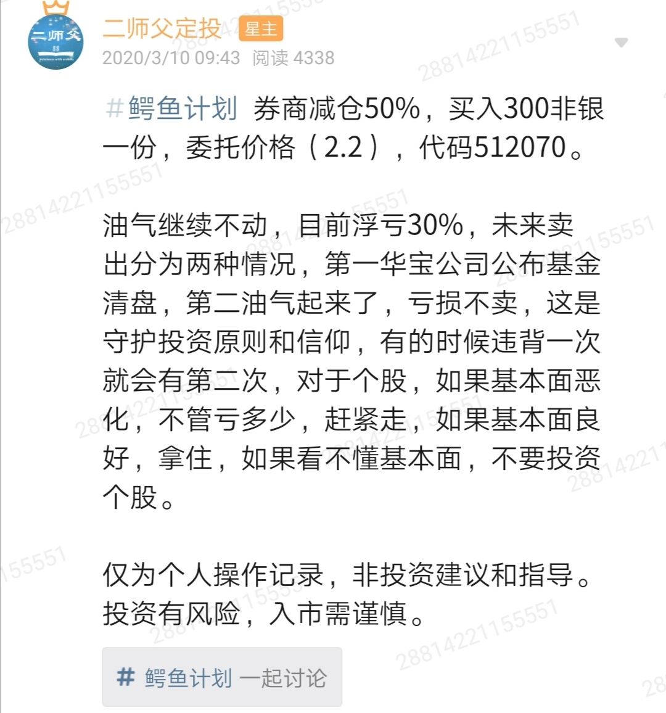
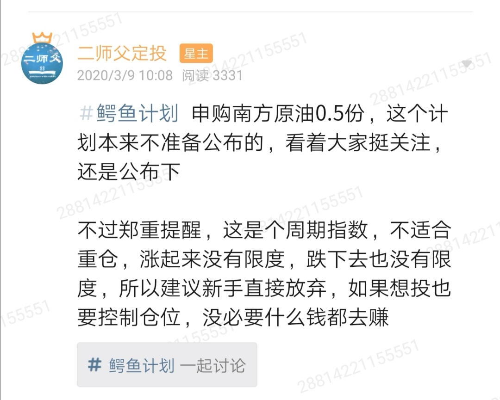

======================================================

_type: talk
@二师父[28814221155551]
2020-03-28 20:06:42 Sat  
topic_id: 841848228111482

<e type="hashtag" hid="554515554884" title="#买入成本#" /> 大家都看到了华泰证券或者广发证券里面成本是变化的，这个变化是因为计算的时候加入了卖出的份额，所以会有变动。

而实际情况是卖出对买入净值并无影响。那么怎么解决，华泰可以直接看买入均价，这就是实际成本价格。

如果看不到这个数据，可以自己记录，每次买入的价格，数量，然后用总买入金额/总买入数量得到买入的实际成本。用当前价格和买入实际成本对比才能够看出真实的盈亏。

计算盈亏有两种方法，第一种就是上面讲的净值法。

第二种是市值法，比如你拿100万买基金，账户的总市值和100万对比表示你的盈利 

这两种方法是比较好的，对于定投来讲，因为有收割利润和卖出本金，监督每个基金的净值比较麻烦，那么就可以用总市值对比总成本。

@🍀 凝🌸 慧🍀 at 2020-03-28 20:06:42 Sat

> 哈哈，二师父，我就是用总市值和总成本对比，这样比较简单，一目了然。

----------

@二师父 at 2020-03-28 20:06:42 Sat

> 这种简单，一轮牛熊下来就知道整体盈利

----------

@特仑苏 at 2020-03-28 20:06:42 Sat

> 问题是如果赎回了盈利，那赎回的钱是扣在本金里面还是市值里面呢？

----------

@孤芳自赏 at 2020-03-28 20:06:42 Sat

> 那这样是不是每笔加仓的钱都要做笔记吗否则那记得住呢？

----------

@二师父 at 2020-03-28 20:06:42 Sat

> 总市值不用

----------

@二师父 at 2020-03-28 20:06:42 Sat

> 不是一样的吗

----------

@不知道不明了 at 2020-03-28 20:06:42 Sat

> 二师父，市值法如果基金卖出了一部分，总成本里也要减卖出的成本才能和卖出后的市值对应，那卖出的成本不也需要按买入均价计算么？

----------

@二师父 at 2020-03-28 20:06:42 Sat

> 你的总投入不变

----------

阅读[4651]  评论[8]  赞[0] 

======================================================

_type: q&a
@汉尼拔[552144155244]
2020-03-28 22:04:46 Sat  
topic_id: 241848222822821

@汉尼拔

>  二师父打扰下，想问你一个问题，就是买房贷款30年的优势都有啥，能具体说说嘛？

@二师父

>  北京目前是25年了，时间越长，越有利，你的资金可以用来投资，相当于把通胀风险转移到给了银行，其他贷款利率不会比房贷低

阅读[4599]  评论[4]  赞[0] 

======================================================

_type: talk
@二师父[28814221155551]
2020-03-28 22:33:27 Sat  
topic_id: 421828552858248

天下武林，林林总总。名门正宗如少林武当，诚然名扬天下，而武林之大，但凡修得暗镖神剑者，亦可独步江湖。所以门派无尊贵，只有适合不适合。即使最成功的投资人，也要心胸坦荡，认识到自我局限，不可以名门正宗自居，须认识到获得真理是一个学无止境、永远追求的过程。

高瓴资本张磊

阅读[4613]  评论[0]  赞[0] 

======================================================

_type: q&a
@特仑苏[241855111824451]
2020-03-29 10:41:52 Sun  
topic_id: 841848224818252

@特仑苏

>  二师父，请分析一下特朗普签署2万亿美元经济刺激法案对股市有什么影响？

@二师父

>  短期是利好美股股市的

阅读[4504]  评论[0]  赞[0] 

======================================================

_type: q&a
@Zyxj[111841455151112]
2020-03-29 10:42:53 Sun  
topic_id: 421828524211148

@Zyxj

>  师父您好！南方原油为什么在场内申购而不是场内直接交易，两者有什么区别？

@二师父

>  因为有溢价，申购可以是以净值成交，然后场内卖出，可以套利

阅读[4651]  评论[3]  赞[0] 

======================================================

_type: q&a
@不知道不明了[15584248411812]
2020-03-29 10:43:12 Sun  
topic_id: 118515415855422

@不知道不明了

>  二师父，标普500的折价率1.32%，是说目前指数买入价格更低，溢价率没有了么

@二师父

>  这个仍旧是有溢价的

阅读[4907]  评论[0]  赞[0] 

======================================================

_type: talk
@二师父[28814221155551]
2020-03-29 19:36:21 Sun  
topic_id: 841848214148252

<e type="hashtag" hid="554514228244" title="#指数投资中的陷阱#" /> 价值和增长陷阱

@栀子花开 at 2020-03-29 19:36:21 Sun

> 老师，现在港股占比20%合适吗

----------

阅读[5483]  评论[1]  赞[0] 

+++++++++++++++++++++++++++++++++++++++++++++++++++++

文件：
2020-03-29 19:35:59 Sun
文件大小：[19962]
48524185141418-指数投资过程中的价值和增长陷阱.docx

======================================================

_type: q&a
@达达[841885282125142]
2020-03-30 10:09:20 Mon  
topic_id: 118515122158152

@达达

>  港股指数这么低，现在买哪个港股指数建仓呢？

@二师父

>  恒生国企或者恒生

阅读[4270]  评论[1]  赞[0] 

======================================================

_type: q&a
@不知道不明了[15584248411812]
2020-03-30 10:10:43 Mon  
topic_id: 548141428455244

@不知道不明了

>  二师父，目前沪深3个账户都已经满了，想用其他券商来进行交易。销户的话是只注销证券账户还是注销全部资金基金证券账户，还有换券商的话，中登账户应该不用同步注销把？

@二师父

>  开了基金账户需要销的，深市不限制，沪市账户是一定要销的

阅读[4493]  评论[2]  赞[0] 

======================================================

_type: talk
@二师父[28814221155551]
2020-03-30 10:38:18 Mon  
topic_id: 118515152581522

<e type="hashtag" hid="881251425252" title="#鳄鱼计划#" /> 买入500etf一份，代码，510500，交易渠道场内华宝或者华泰均可，场外易方达或者天弘都可以。左侧交易需要忍受浮亏，这是需要接受的，仅是个人操作记录，非投资建议

@cotton at 2020-03-30 10:38:18 Mon

> 场内广发可以吗

----------

@二师父 at 2020-03-30 10:38:18 Mon

> 可以的

----------

@衣袂飘香 at 2020-03-30 10:38:18 Mon

> 二师父今天买入的500，你也是做网格吗？

----------

@二师父 at 2020-03-30 10:38:18 Mon

> 鳄鱼计划看仓位，估值还有预期，网格我也今天也加了

----------

@衣袂飘香 at 2020-03-30 10:38:18 Mon

> 好的，明白了。

----------

阅读[5326]  评论[5]  赞[0] 

======================================================

_type: talk
@二师父[28814221155551]
2020-03-30 12:56:25 Mon  
topic_id: 548141414152414

某君在肯德基上网看股票，遇乞丐乞讨。他扔出一块钱继续看K线，乞丐拿钱后没走也在旁看着。过了一会，乞丐悄悄说：“这股过布林中轨了”。某君惊诧问：“这个你也懂?”乞丐说：“就是因为懂这个，所以我才有了今天！”

@陈飞🤗 at 2020-03-30 12:56:25 Mon

> 还好我不懂

----------

@cotton at 2020-03-30 12:56:25 Mon

> [偷笑][偷笑][偷笑][偷笑]

----------

阅读[4480]  评论[2]  赞[0] 

======================================================

_type: q&a
@onepiecewi*[244414114545811]
2020-03-30 13:36:44 Mon  
topic_id: 118515151441142

@onepiecewi*

>  有人给我发这个
>  如果你也认为中证500指数三个月后会上涨1.0%，但买股票波动太多，那这个可以给8.0%！！[玫瑰]如果在三月后的 7月1日，8月3日，9月2日，9月9日，11月2日，11月27日这其中的任意一天，中证500指数对比4月1日上涨1.0%，即可获得8.0%
>  [玫瑰]没有上述情况就是0.5%
>  师父，这是什么？指数基金？

@二师父

>  不是指数基金，是一款非保本理财产品

阅读[4527]  评论[0]  赞[0] 

======================================================

_type: q&a
@故事[455458815888]
2020-03-30 13:38:10 Mon  
topic_id: 421828282581158

@故事

>  黄金怎么估值？现在有投资机会么？现在可以投不？

@二师父

>  可以参考comex期货的价格，目前没啥好机会，最多趋势做黄金，定投肯定是不合适的

阅读[4609]  评论[0]  赞[0] 

======================================================

_type: talk
@二师父[28814221155551]
2020-03-30 13:55:53 Mon  
topic_id: 118515151114852

<e type="hashtag" hid="452582815458" title="#网格#" /> 目前这个行情拿500做网格是不错的，在5.4到5.6的价格建立底仓，然后网格点2到5都是比较合适的

今天上午建仓，下午已经盈利1.5个点，控制好节奏，单独拿出百分之10资金做网格，比去投机瞎买好的多。

判断后市继续震荡，要么不动坚持一周投一次，要么网格，最好的两种方法了，海通兴业等证券股票也可以网格，就是会有千一的印花税，这个不是很划算。

股票的话避免垃圾股，也避免把短线股票做成了长线，如果看不懂一家企业未来5年的发展，那是不值得长期持有的

@🍀 凝🌸 慧🍀 at 2020-03-30 13:55:53 Mon

> 是的，二师父，很认同！
我是2月3号大跌那天买进500ETF，是5.31的成本，然后不断网格卖出，最高卖到6.39，呵呵。现在重新再买入，继续网格，哈哈，谢谢师父指导！如果不及时采取网格策略进行利润收割，这利润真的就又吐回去了。[呲牙]

----------

@是喵喵吖～ at 2020-03-30 13:55:53 Mon

> 请问6.多的时候都卖出吗 然后重新低价的时候再买入

----------

@🍀 凝🌸 慧🍀 at 2020-03-30 13:55:53 Mon

> 你好，我是按照每上涨5%的利润，就卖出利润部分，后来6元多了，就分次减仓了，不是全部卖在最高点啊，已经很满足了。

----------

@衣袂飘香 at 2020-03-30 13:55:53 Mon

> 我今天500也做网格了。

----------

@是喵喵吖～ at 2020-03-30 13:55:53 Mon

> 嗯嗯好滴谢谢呀

----------

阅读[4820]  评论[5]  赞[0] 

======================================================

_type: q&a
@斌斌[841821552258252]
2020-03-30 16:53:33 Mon  
topic_id: 421828282512288

@斌斌

>  师父，定投的部分300价值卖出，换510300还是510310？哪个更好点？

@二师父

>  510300

阅读[4585]  评论[6]  赞[0] 

======================================================

_type: talk
@二师父[28814221155551]
2020-03-30 17:17:02 Mon  
topic_id: 841848428418112

<e type="hashtag" hid="141451418582" title="#看看全市场指数#" /> 希望这波下跌能把消费、医药的估值拉下来，这次不一样，2018年消费医药非常低估，现在医药还是接近高估，消费正常偏低，不过整体低位，可以开始了。

@西锦巴乌 at 2020-03-30 17:17:02 Mon

> 请问师父扣除金融石油等的走势图哪儿能查到？谢了！

----------

@二师父 at 2020-03-30 17:17:02 Mon

> choice数据网站，这个一年费用大概6000

----------

@陈飞🤗 at 2020-03-30 17:17:02 Mon

> 二师父，你是不是写错了，你标题说向下的概率是20%,但是你是文章是说最大跌幅是20%

----------

@二师父 at 2020-03-30 17:17:02 Mon

> 向下的赔率

----------

@HeLLO at 2020-03-30 17:17:02 Mon

> 现在医药高估，可以这样理解，手里目前盈利的要卖出了呢？等低估在重新买入？

----------

@二师父 at 2020-03-30 17:17:02 Mon

> 是的，可以出一点

----------

阅读[4890]  评论[6]  赞[0] 

+++++++++++++++++++++++++++++++++++++++++++++++++++++

文件：
2020-03-30 17:15:20 Mon
文件大小：[158218]
48524155582458-向下的概率只有20%，全力开干.docx

======================================================

_type: talk
@子辰[421444812542128]
2020-03-30 17:53:10 Mon  
topic_id: 548141455282524

<e type="hashtag" hid="141451418582" title="#看看全市场指数#" /> 这个全指数对应估值表里面的哪个代码？是300非银吗

阅读[4626]  评论[0]  赞[0] 

======================================================

_type: q&a
@wty[548488548545444]
2020-03-30 20:07:08 Mon  
topic_id: 118515144545482

@wty

>  二师父，我去年有老虎账户，最近想建仓SP500 ETF，有三个ETF：IVV、VOO和SPY，想听听二师父分析一下三个ETF的收益率和投资价值，是投资一个还是可以投资其中两个ETF指数呢？我这个老虎账户的资金只投资美股ETF，不碰个股。

@二师父

>  投资SPY就足够了

阅读[4669]  评论[1]  赞[0] 

======================================================

_type: talk
@二师父[28814221155551]
2020-03-30 21:42:13 Mon  
topic_id: 548141442451554

投资最大的优点之一是，只有真正做出失败的投资时才会遭受损失。不做失败的投资就没有损失，只有回报。即使会有错失制胜机会的不良后果，也是可以容忍的。

这个是启示投资者，当没有绝佳机会的时候就耐心等待，钱不投出去，放在手里永远是你的钱，即使错过了机会也可以容忍，可是一旦投资失误，钱就不是你的了。

二师父经常说，宁可错过，也别过错，赚钱之前先想想风险，在熊市的时候还有人听的进，一般市场疯狂的时候就很难理性思考了。

阅读[4740]  评论[0]  赞[0] 

======================================================

_type: talk
@会飞的猪[88441125125222]
2020-03-30 23:11:04 Mon  
topic_id: 841848448144212

<e type="hashtag" hid="452582815458" title="#网格#" /> 在哪能看到网格怎么做

@April _ M. at 2020-03-30 23:11:04 Mon

> 置顶文件里有哦

----------

阅读[4484]  评论[1]  赞[0] 

======================================================

_type: q&a
@tanxin[241524428884281]
2020-03-31 10:24:44 Tue  
topic_id: 548141482422144

@tanxin

>  二师父请问中证消费现在在什么估值区间？

@二师父

>  正常估值

阅读[4423]  评论[0]  赞[0] 

======================================================

_type: q&a
@恋尘[51558584455824]
2020-03-31 10:25:28 Tue  
topic_id: 421828225884488

@恋尘

>  师父我现在有10万不用的钱想重仓2个指数当作是鳄鱼计划一样你看现在最有价值的是那些。我一直再跟你定投只不过这次的钱是单独的账户想看看到时候收益率咋样

@二师父

>  沪深300加中证500

阅读[4555]  评论[0]  赞[0] 

======================================================

_type: talk
@二师父[28814221155551]
2020-03-31 10:52:42 Tue  
topic_id: 548141481441544

<e type="hashtag" hid="824284124812" title="#网格交易第二讲#" /> 以中证500为例子，假设昨天建立底仓，那么底仓价格大概是5.407，所以按照4%的网格点进行交易，等到价格到达5.78可以卖出一份，这个份额资金可以自己安排，如果你有4万做网格，一份资金可以4000，底仓价格2万，保证下跌能够加仓即可，很多时候二是是在底部区域建仓，不一定触发最低点买入价格，当然不排除意外发生超跌，所以只能控制好安全边际

那么基金价格到达了5.2可以加仓一份。按照今天没有涨太多就不用操作。休息即可。这是震荡市场应对的好方法，主仓位不动，拿出小部分资金网格，只要震荡就可以盈利，12，13年就是这样的行情，A股牛市很短，所以大部分时间是震荡，震荡期间要么空仓休息，要么满仓休息，要么主仓休息，小仓位网格。

@wty at 2020-03-31 10:52:42 Tue

> 昨天刚刚建仓1层啊

----------

@🍀 凝🌸 慧🍀 at 2020-03-31 10:52:42 Tue

> 继续学习实践

----------

阅读[4894]  评论[2]  赞[0] 

======================================================

_type: talk
@二师父[28814221155551]
2020-03-31 15:53:00 Tue  
topic_id: 241842555118421

<e type="hashtag" hid="141458244882" title="#中证消费#" /> 之前白酒转消费了，等金额转移，现在盈利已经差不多和白酒之前的浮亏一样了，拿着白酒也还可以，定投还是需要实践才能做的越来越好的

消费可以在估值中枢以下定投，并不一定非要低估，但是需要注意：控制仓位。’

@衣袂飘香 at 2020-03-31 15:53:00 Tue

> 二师父，你之前是把白酒转到消费，不是消费转到白酒啊。

----------

@杜志彪 at 2020-03-31 15:53:00 Tue

> 白酒场内交易量太少，我也是平移过去的。

----------

@二师父 at 2020-03-31 15:53:00 Tue

> 白酒转消费啊

----------

@衣袂飘香 at 2020-03-31 15:53:00 Tue

> 你文章里面写，消费装白酒。

----------

@二师父 at 2020-03-31 15:53:00 Tue

> 改过来了

----------

@蒲公英 at 2020-03-31 15:53:00 Tue

> 请问消费的代码是多少，找不到了[流泪]

----------

@二师父 at 2020-03-31 15:53:00 Tue

> 159928

----------

阅读[4415]  评论[7]  赞[0] 

+++++++++++++++++++++++++++++++++++++++++++++++++++++

文件：
2020-03-31 15:50:55 Tue
文件大小：[21275]
88248515181212-消费大涨，还可以买入吗.docx

======================================================

_type: q&a
@田维海[422144441542418]
2020-03-31 18:45:40 Tue  
topic_id: 548145221551254

@田维海

>  二师傅，消费50和消费龙头感觉是重复的指数，区别大吗？

@二师父

>  消费指数和消费龙头还是有区别的，中证消费龙头选择的是沪深市场可选消费以及主要消费里面规模较大的50只股票。消费50里面有 可选消费和主要消费股票。
>  
>  从历史收益率看，必须消费是优于可选消费的，两条都是好赛道，有限选择必须消费。

阅读[4141]  评论[0]  赞[0] 

======================================================

_type: q&a
@恋尘[51558584455824]
2020-03-31 21:08:54 Tue  
topic_id: 548145228852224

@恋尘

>  师父重仓指数沪深300和H股这两个哪个更有价值

@二师父

>  都很有价值啊，不同的配置作用，港股和A股会有轮动，不是非此即彼，不是同涨同跌

阅读[4113]  评论[2]  赞[0] 

======================================================

_type: q&a
@🍀 凝🌸 慧🍀[841855248254242]
2020-03-31 21:10:58 Tue  
topic_id: 548145212225844

@🍀 凝🌸 慧🍀

>  二师父好！如果今年剩下来的时间里，预计震荡行情居多的话，那用于网格交易的仓位需要提高吗？多少比较合适呢？

@二师父

>  首先震荡行情只是预测，按照经验，今年会是震荡行情，不会爆发超级大牛市，不过市场不可预测。
>  
>  网格交易只适合小仓位参与，大额资金还是需要放在主仓位里面，投机赚小钱，投资才能赚大钱。

阅读[4228]  评论[1]  赞[0] 

======================================================

_type: talk
@二师父[28814221155551]
2020-03-31 21:34:50 Tue  
topic_id: 241842585281121

<e type="hashtag" hid="224281824121" title="#做一个长期主义者#" /> 投资股票的本质是购买优质企业，享受企业成长带来的红利。这是投资的本质，指数作为一篮子股票，其实投资指数也是这个道理。

而A股市场参与者情绪过于疯狂，有时候机构资金会推动股市向着极端方向发展，所以大家看到的就是牛市往往暴涨，一个月暴涨50%不是新鲜事。所以这个市场充满了投机，大家回过历史去看美国100年前的股票市场，其实也一样。

所以在A股很难有终身持有，至少目前阶段是不太合适的，所以二师父的投资体系会有利润收割，会有高估减仓，不会终身持有，以前做股票也是趋势，这是市场所决定的，如果你盲目学习巴菲特，最终要么抓住了茅台这类股票，赚的比较爽，要么抓住垃圾股最后套的不想再看账户。

虽然巴菲特的方法对于A股散户来说太难学习，但是我们可以学习他的思想，中长期持有，不要丢掉优质资产去投机，或者丢掉优质资产持有现金。长期看，股票的收益率都是高于货币基金和债券基金的，不要因为一时的浮亏就怀疑长期投资的价值。

主仓位长期持有，如果觉得A股波动大，正常估值收割利润，底部买来的筹码是为了复利增值，不是炒作的。总会有一天，当投资者忍受不住波动和震荡把所有的筹码丢了以后，牛市就来了。

网格要么不做，要做只能够小仓位资金做，不然牛市来了，自己又会后悔卖多了，平衡就好，如果做网格的资金，全部当现金持有，牛市来了仍旧不后悔，那就可以，否则还是需要长期持有的。耐心很重要。

阅读[4440]  评论[0]  赞[0] 

======================================================

_type: talk
@那方山的树，佛陀座下*[244412158214221]
2020-03-31 22:21:03 Tue  
topic_id: 241842582415841

二师傅，蚂蚁金服和先锋领航四月开始搞合作投顾了，不知道二师傅怎么看待这个问题?

@二师父 at 2020-03-31 22:21:03 Tue

> 先锋领航公司是全世界最大的只能投顾公司，这将会对国内的卖方投顾有一定的冲击，同时会促进低费率的指数基金的发展

以前卖基金主要赚费率，所以卖方不顾投资人的利益，可是如果投顾以买方利益为主，那就不会过度营销涨幅好的主动基金，这对于指数基金的发展有利，对去散户化的进程也有一定的推动作用。

----------

阅读[4156]  评论[1]  赞[0] 

======================================================

_type: q&a
@不知道不明了[15584248411812]
2020-03-31 23:55:10 Tue  
topic_id: 118514251421122

@不知道不明了

>  二师父，目前从估值和成长性看，h股要比恒生指数更适合买入吗，您觉得港股在总投资中占多少仓位比较合适呢

@二师父

>  是的，10到20之间比较合适，主要是港股股灾会跌的比较惨，他的成长性还是不错的

阅读[4218]  评论[1]  赞[0] 

======================================================

