_type: q&a
@闲云[48522815485458]
2020-05-01 07:38:29 Fri  
topic_id: 241158154544281

@闲云

>  估值表砸
>  咋没了？

@二师父

>  有的，在精华主题

阅读[4621]  评论[0]  赞[0] 

======================================================

_type: talk
@阿宝[422212151424158]
2020-05-01 09:13:39 Fri  
topic_id: 118825828458412

价值投资进阶篇。五一快乐🙂

@阿宝 at 2020-05-01 09:13:39 Fri

> 解释一下文中的文中的盈利就是净利润，市值＝市盈率乘以净利润。每年的分红除以股价等于股息率，分红和净利润之间是有一个比率关系。参考银行5年定期存款利率。

----------

阅读[4663]  评论[1]  赞[0] 

+++++++++++++++++++++++++++++++++++++++++++++++++++++

文件：
2020-05-01 09:13:39 Fri
文件大小：[14285]
51545884255584-5.1   价值投资进阶篇.docx

======================================================

_type: talk
@二师父[28814221155551]
2020-05-01 12:02:06 Fri  
topic_id: 421148188141848

牌友只会催你打牌，酒友只会催你干杯，而靠谱的人，却会感染你如何取得进步。人最大的幸运，不是捡钱，也不是中奖。而是有正确的圈子，可以鼓励你、指引你、帮助你，带你一步一步地在正确的投资道路上前进。

@🍀 凝🌸 慧🍀 at 2020-05-01 12:02:06 Fri

> 同感[玫瑰][玫瑰][玫瑰]

----------

@HeLLO at 2020-05-01 12:02:06 Fri

> 幸运的是今年进入师父圈内[鼓掌][鼓掌][鼓掌]

----------

阅读[4684]  评论[2]  赞[0] 

======================================================

_type: talk
@阿宝[422212151424158]
2020-05-01 18:31:58 Fri  
topic_id: 118825851284212

最近学习汇总，希望得到大家指点。

@🍀 凝🌸 慧🍀 at 2020-05-01 18:31:58 Fri

> [强][强][强]

----------

@衣袂飘香 at 2020-05-01 18:31:58 Fri

> 非常好的学习笔记。

----------

@HeLLO at 2020-05-01 18:31:58 Fri

> 向阿宝学习，我们也要好好学习，多领悟多感悟自已的学习心得，愿大家都能分享价值互相学习，大家在投资路上结伴而行[微笑]

----------

阅读[4677]  评论[3]  赞[0] 

+++++++++++++++++++++++++++++++++++++++++++++++++++++

文件：
2020-05-01 18:31:58 Fri
文件大小：[636973]
15414881145882-5.1  最近学习汇总.docx

======================================================

_type: talk
@二师父[28814221155551]
2020-05-01 19:59:21 Fri  
topic_id: 118825851484852

<e type="hashtag" hid="554418151454" title="#获取超额收益的因素#" /> 一个是选择，一个是耐心。

选择很重要，选择错了时间成本很高，投资就是一个选择接着一个选择，选择标的，工作，城市，都一样。

@阿宝 at 2020-05-01 19:59:21 Fri

> 谢谢！师傅

----------

@🍀 凝🌸 慧🍀 at 2020-05-01 19:59:21 Fri

> 每天能看到师父文章，特充实！[玫瑰][玫瑰][玫瑰][爱心]

----------

@🍀 凝🌸 慧🍀 at 2020-05-01 19:59:21 Fri

> 痛定思痛，师父，我就是你文章最后说的缺乏耐心，为什么握不住好基金，其实本质上就是认知有限。

----------

@蓝魔森林 at 2020-05-01 19:59:21 Fri

> 耐心加选择

----------

阅读[5445]  评论[4]  赞[0] 

+++++++++++++++++++++++++++++++++++++++++++++++++++++

文件：
2020-05-01 19:58:24 Fri
文件大小：[62353]
88242114188122-获取超额收益的最重要两个因素.docx

======================================================

_type: q&a
@李垚垚[548145221582444]
2020-05-02 05:32:07 Sat  
topic_id: 841158128245582

@李垚垚

>  节日快乐二师父！
>  请教5月哪只基金值得拥有🙏

@二师父

>  深红利，电器，科技，消费等都还可以

阅读[4623]  评论[4]  赞[0] 

======================================================

_type: talk
@树叶[544811512145144]
2020-05-02 08:02:56 Sat  
topic_id: 548821855522124

<e type="hashtag" hid="142825811122" title="#定投周报#" /> 二师父定投周报第57期

阅读[4695]  评论[0]  赞[0] 

+++++++++++++++++++++++++++++++++++++++++++++++++++++

文件：
2020-05-02 08:02:21 Sat
文件大小：[234830]
28244555148221-二师父定投周报5.2（第57期）.docx

======================================================

_type: talk
@二师父[28814221155551]
2020-05-02 21:22:15 Sat  
topic_id: 548825245524824

<e type="hashtag" hid="554418548854" title="#巴菲特指标#" /> 学会一个新的全市场估值指标，以后每周三分享一次全市场估值情况，从整体来把握目前的估值程度，从而控制自己的仓位。

@范毅君 at 2020-05-02 21:22:15 Sat

> 学习了，跟着二师父修心，学技术[偷笑][偷笑]

----------

@呵呵→_→ at 2020-05-02 21:22:15 Sat

> 师傅，这些数据都在那能查到呢

----------

@蓝魔森林 at 2020-05-02 21:22:15 Sat

> 多指标多维度检验

----------

@二师父 at 2020-05-02 21:22:15 Sat

> GNP在国家统计局，市值在wind查

----------

@阿宝 at 2020-05-02 21:22:15 Sat

> 老师用证券化率指标＝沪深市值总和/GDP来估算市场整体估值。（范围在50％——110％）越接近50％越便宜，越接近110%越贵。这个是否可行？

----------

@二师父 at 2020-05-02 21:22:15 Sat

> 最好是加上在香港和美国中资股市值，还有采用国民生产总值，范围大致可以的

----------

@阿宝 at 2020-05-02 21:22:15 Sat

> 谢谢！老师

----------

@mumomo at 2020-05-02 21:22:15 Sat

> 二师父，什么是市场强度指标？

----------

阅读[5199]  评论[15]  赞[0] 

+++++++++++++++++++++++++++++++++++++++++++++++++++++

文件：
2020-05-02 21:20:56 Sat
文件大小：[18412]
48522445441518-学会这个指标，你就知道什么时候该买，什么时候该卖.docx

======================================================

_type: q&a
@吴涛[48244118421828]
2020-05-02 22:39:31 Sat  
topic_id: 241152542158241

@吴涛

>  二师父，你好！我看近期价值股不错，想问下有哪些价值类的ETF基金，还问下现阶段有哪些低估的价值类ETF基金。谢谢！

@二师父

>  smart价值型策略，有300价值，全指价值，500价值，不过之前表现都很一般。

阅读[4598]  评论[2]  赞[0] 

======================================================

_type: talk
@二师父[28814221155551]
2020-05-03 10:30:22 Sun  
topic_id: 118824285588852

<e type="hashtag" hid="141145545842" title="#笑傲股市第二讲#" /> 多读书形成自己的交易体系，听别人的买股票赚一时钱，可能亏一世钱，这也是我从来不推荐股票的原因。

一定要有自己的投资方法和策略，亏了赚经验，盈利转利润。没有方法和策略，稀里糊涂的，赚了会吐出来，亏了会深陷其中。

@杜志彪 at 2020-05-03 10:30:22 Sun

> 股票投资确实和指数投资不太一样，这一年多一直在学习指数投资觉方法得挺好，一直想着看能不能把估值法网格法融入股票投资中，实践结果不太乐观，总结以后又回到了原点，年线以下不能买入，虽然估值够低了，但真的还有更低，付出的是时间成本，结论是年线以上保留底仓，另一半资金做趋势，以年线为周期轮回操作。

----------

@二师父 at 2020-05-03 10:30:22 Sun

> 线上作业，线下休息

----------

阅读[5179]  评论[2]  赞[0] 

+++++++++++++++++++++++++++++++++++++++++++++++++++++

文件：
2020-05-03 10:28:37 Sun
文件大小：[18721]
48522445218158-笑傲股市第二讲.docx

======================================================

_type: talk
@二师父[28814221155551]
2020-05-03 17:06:00 Sun  
topic_id: 241152511225881

<e type="hashtag" hid="141145511442" title="#红利指数#" /> 两个红利指数对比，选择很重要的。

@阿宝 at 2020-05-03 17:06:00 Sun

> 谢谢分析！

----------

@J at 2020-05-03 17:06:00 Sun

> 师父，五一节日快乐🎈 能分析一下中证红利的分红规则吗？它除了高股息，是铁定每年都分红还是有一定限制条件下才能触发分红？

----------

阅读[5376]  评论[2]  赞[0] 

+++++++++++++++++++++++++++++++++++++++++++++++++++++

文件：
2020-05-03 17:04:59 Sun
文件大小：[113795]
48522441154418-中证红利和深证红利该怎么选.docx

======================================================

_type: talk
@杜志彪[544454124115854]
2020-05-04 09:01:17 Mon  
topic_id: 241152851858511

铭记巴菲特老先生的话：
经济长期向好，指数长期上涨。
抓住每一次危机带给我们低估买入的机会。
不融资、不做空。
普通人就不要碰强周期性行业了，没必要没有困难创造困难也要上。
指数基金是适合普通投资者的工具。

阅读[4451]  评论[0]  赞[0] 

======================================================

_type: talk
@二师父[28814221155551]
2020-05-04 18:14:16 Mon  
topic_id: 118824551214122

<e type="hashtag" hid="141145124812" title="#A50股指期货#" />

@陈Being at 2020-05-04 18:14:16 Mon

> 幸亏我听二师父的话，上周已基本全清仓掉医药和食品，只剩下几百元，盈利35％。我很知足了。[微笑]

----------

@🍀 凝🌸 慧🍀 at 2020-05-04 18:14:16 Mon

> 谢谢师父及时分析，这两天做好应对准备，大跌大买。节前，我已经陆续把所有食品饮料和白酒、医药都清仓了，另外也把网格交易的一个月的利润8000元全部收割，并适当调减了仓位。

----------

@JOY at 2020-05-04 18:14:16 Mon

> 师傅，请问消费EFT需要清仓吗？

----------

@是喵喵吖～ at 2020-05-04 18:14:16 Mon

> 请问网格你都会买哪些 我之前就只买了500ETF[捂脸][捂脸]

----------

@🍀 凝🌸 慧🍀 at 2020-05-04 18:14:16 Mon

> 你好，网格操作，我就只买了500ETF和券商ETF[呲牙]

----------

@二师父 at 2020-05-04 18:14:16 Mon

> 这种问题没法答哈

----------

@JOY at 2020-05-04 18:14:16 Mon

> 哦，谢谢～

----------

@杜志彪 at 2020-05-04 18:14:16 Mon

> 高估不买是原则，低估不卖是定力。

----------

阅读[5271]  评论[11]  赞[0] 

+++++++++++++++++++++++++++++++++++++++++++++++++++++

文件：
2020-05-04 18:14:04 Mon
文件大小：[19468]
51544211451124-港股狂跌1000点，对A股有何影响.docx

======================================================

_type: talk
@二师父[28814221155551]
2020-05-04 19:53:56 Mon  
topic_id: 241152884222481

<e type="hashtag" hid="141145128842" title="#投资中的四种情绪#" /> 
希望：希望买了立刻上涨
恐惧：赔不起了，我要躲开
贪心：我赚翻了，要加大头寸
绝望：这个交易策略不行，一直赔钱。

如果有上述四种情绪中的一种，都可能带来亏损。唯有全部克服，才能够稳定盈利。

所以，最终还是战胜心魔。这是一直要修行的。

@J at 2020-05-04 19:53:56 Mon

> 谢谢师父天天来点智慧的总结，在投资的路上一颗不安分的小心脏看着看着就越发沉稳了[呲牙]

----------

阅读[5082]  评论[1]  赞[0] 

======================================================

_type: q&a
@Zero Fei[51422225155524]
2020-05-05 06:37:22 Tue  
topic_id: 421145881515148

@Zero Fei

>  二师父，发现我们的实盘记录中只写完了记录了买入操作，没有卖出记录是么

@二师父

>  卖出也会在星球发布的

阅读[4384]  评论[2]  赞[0] 

======================================================

_type: q&a
@不知道不明了[15584248411812]
2020-05-05 10:11:15 Tue  
topic_id: 241152822448841

@不知道不明了

>  二师父，白酒etf周三开盘需要调仓么，调到什么基金比较好？消费么

@二师父

>  如果看好后市就调仓，不看好后市就卖出
>  
>  消费和白酒是同类型基金，从3月来已经涨了百分之30，这种调整意义不大

阅读[4540]  评论[1]  赞[0] 

======================================================

_type: talk
@老丁[15541182455482]
2020-05-05 10:51:28 Tue  
topic_id: 548825154248484

请教二师父，场内ETF的每天成交额要达到多少才算流动性可以呢？有没有什么可以参考的数值？谢谢

@二师父 at 2020-05-05 10:51:28 Tue

> 成交额稳定在你交易资金的10倍以上问题不大

----------

@老丁 at 2020-05-05 10:51:28 Tue

> 没太明白，感觉这个和个人交易资金的关系不大？比如深证F60，我看了下它的一天成交额66W，这个肯定是大于很多散户的10倍，100倍，但是网上很多人都说这个ETF的流动性很差，所以我再想这个是不是应该查考基金规模和日成交的关系？或者是有一个什么固定的数据，比如日成交额大于多少W这样的数值？谢谢

----------

@二师父 at 2020-05-05 10:51:28 Tue

> 如果100万资金交易就不适合了

----------

阅读[4404]  评论[3]  赞[0] 

======================================================

_type: q&a
@恋尘[51558584455824]
2020-05-05 16:27:42 Tue  
topic_id: 841152824221842

@恋尘

>  师父，明天开市大跌的话，我买深红利场内好还是场外好

@二师父

>  一样，没啥本质区别的

阅读[4655]  评论[2]  赞[0] 

======================================================

_type: talk
@Pansy[48281554424548]
2020-05-05 16:53:11 Tue  
topic_id: 118824515551852

想请教一下大家：
有没有对标美股纳指比较好的基金？

@二师父 at 2020-05-05 16:53:11 Tue

> 场外大成，场内广发、国泰

----------

@Pansy at 2020-05-05 16:53:11 Tue

> 好的，谢谢师父

----------

阅读[4463]  评论[2]  赞[0] 

======================================================

_type: talk
@二师父[28814221155551]
2020-05-05 20:55:39 Tue  
topic_id: 118824514422212

<e type="hashtag" hid="554451842584" title="#消费50#" /> 当前电器场外没有好的标的，可以关注下消费50，既有主要消费，也有可选消费

@栀子花开 at 2020-05-05 20:55:39 Tue

> 二师傅，节前把食品饮料指数卖光了，明天如果跌了的话能买不？

----------

@二师父 at 2020-05-05 20:55:39 Tue

> 没必要追高

----------

@蛋炒饭不加蛋 at 2020-05-05 20:55:39 Tue

> 估值表中场外的广发电器指数不好吗？

----------

@二师父 at 2020-05-05 20:55:39 Tue

> 规模有点低

----------

@蛋炒饭不加蛋 at 2020-05-05 20:55:39 Tue

> 好的二师父，纳指现在还能定投吗，还是等回调再投

----------

@rtdmm小米 at 2020-05-05 20:55:39 Tue

> 请问二师父，消费50场内代码是？

----------

@素兮 at 2020-05-05 20:55:39 Tue

> 消费50场外规模也低。

----------

@二师父 at 2020-05-05 20:55:39 Tue

> 深证消费50还没有，只有中证消费50的

----------

阅读[4775]  评论[12]  赞[0] 

+++++++++++++++++++++++++++++++++++++++++++++++++++++

文件：
2020-05-05 20:55:11 Tue
文件大小：[202828]
28244881414251-想布局消费板块，这个指数必须了解.docx

======================================================

_type: talk
@二师父[28814221155551]
2020-05-06 07:56:43 Wed  
topic_id: 841152818818812

<e type="hashtag" hid="554455255154" title="#关于基金买卖的硬性标准 #" /> 估值表绿色的指数，除了做网格，不要卖。估值表红色的指数，除了做趋势，不要买。遵守这个规则，不会让账户起伏较大，你也可以设定自己的标准，然后执行。

@🍀 凝🌸 慧🍀 at 2020-05-06 07:56:43 Wed

> 收到[胜利][胜利][胜利]😄

----------

阅读[5018]  评论[1]  赞[0] 

======================================================

_type: q&a
@陈飞🤗[841521421222252]
2020-05-06 09:37:18 Wed  
topic_id: 241152812588811

@陈飞🤗

>  二师父，我4月14号去开通的创业板，，这是没开通成功吗？

@二师父

>  对，线上再开一下，华泰可以线上开了

阅读[4472]  评论[5]  赞[0] 

======================================================

_type: q&a
@衣袂飘香[118248548242452]
2020-05-06 09:58:56 Wed  
topic_id: 421145815421848

@衣袂飘香

>  您好二师父。您的乌龟计划里，天弘中证食品饮料指数卖出了80%左右份额。是吗？

@二师父

>  已经清仓了，天天显示的和我的操作都是同步的

阅读[4551]  评论[7]  赞[0] 

======================================================

_type: q&a
@20181108……[51511128814554]
2020-05-06 10:40:55 Wed  
topic_id: 841152811544222

@20181108……

>  二师父怎么下载不了

@二师父

>  有什么问题，先下载应用宝，再下载华宝

阅读[4503]  评论[6]  赞[0] 

======================================================

_type: talk
@二师父[28814221155551]
2020-05-06 11:43:36 Wed  
topic_id: 241152811248541

耐心很重要，今天500到位了，5.84出一网，就这样，没有暴涨，波动也能挣钱，切记主仓位别丢。

@🍀 凝🌸 慧🍀 at 2020-05-06 11:43:36 Wed

> 好的，跟着师父再出一网[呲牙]

----------

@杜志彪 at 2020-05-06 11:43:36 Wed

> 我是5.9元等着呢[微笑]

----------

@rtdmm小米 at 2020-05-06 11:43:36 Wed

> 请问二师父，主仓位一般几层合适？

----------

@杜志彪 at 2020-05-06 11:43:36 Wed

> 一般是不超过2层

----------

@rtdmm小米 at 2020-05-06 11:43:36 Wed

> 谢谢杜师！

----------

@杜志彪 at 2020-05-06 11:43:36 Wed

> 没客气啊，我的网格也成交了[微笑]

----------

@onepiecewi* at 2020-05-06 11:43:36 Wed

> 一层是多少呀？

----------

阅读[4509]  评论[7]  赞[0] 

======================================================

_type: talk
@蛋炒饭不加蛋[118281818482542]
2020-05-06 13:40:11 Wed  
topic_id: 548825522112444

请问大家，华宝自动网格怎么设置，有教程吗

@蛋炒饭不加蛋 at 2020-05-06 13:40:11 Wed

> 各位触发基准价是用的表格中的买入价吗？还有限价委托和市价委托选哪个

----------

阅读[4143]  评论[1]  赞[0] 

======================================================

_type: talk
@阿宝[422212151424158]
2020-05-06 15:01:07 Wed  
topic_id: 548825522481184

好好学习天天向上！请珍惜机会。

阅读[4148]  评论[0]  赞[0] 

+++++++++++++++++++++++++++++++++++++++++++++++++++++

文件：
2020-05-06 15:01:07 Wed
文件大小：[19968]
51544151182154-5.6  从历史的角度看待现在的投资).doc

======================================================

_type: q&a
@倪[841184825858112]
2020-05-06 15:56:30 Wed  
topic_id: 118824422544542

@倪

>  二师父对车险有没有了解？想问一下私家车怎么买车险合适一些？

@二师父

>  咨询下中国人保的

阅读[4188]  评论[2]  赞[0] 

======================================================

_type: q&a
@宁静以致远[841158451581452]
2020-05-06 15:58:08 Wed  
topic_id: 421145544444558

@宁静以致远

>  请问二师父，酒ETF高估了吗？我目前盈利16个点，之前10个点收割过一次利润。

@二师父

>  还没有，再涨15个点左右就高估了

阅读[4384]  评论[0]  赞[0] 

======================================================

_type: talk
@二师父[28814221155551]
2020-05-06 17:41:30 Wed  
topic_id: 841152254812122

<e type="hashtag" hid="141144524422" title="#实盘236#" />

@蛋炒饭不加蛋 at 2020-05-06 17:41:30 Wed

> 请问二师父买入价是基准价吗

----------

@铁观音 at 2020-05-06 17:41:30 Wed

> 师傅，卖出食品饮料的资金暂时先不动？还是直接全部买入本期的深红利？

----------

@雨的依恋 at 2020-05-06 17:41:30 Wed

> 起步转债什么时候上市啊

----------

@二师父 at 2020-05-06 17:41:30 Wed

> 下次买入价

----------

@二师父 at 2020-05-06 17:41:30 Wed

> 明天

----------

@雨的依恋 at 2020-05-06 17:41:30 Wed

> 嗯嗯好哒，上市就卖[愉快]

----------

@蓝魔森林 at 2020-05-06 17:41:30 Wed

> 为什么要开始投深红利呀，因为背后企业运营利好吗？

----------

@蓝魔森林 at 2020-05-06 17:41:30 Wed

> 还是因为300正常估值不投了。转而投低估的红利

----------

阅读[4911]  评论[15]  赞[0] 

+++++++++++++++++++++++++++++++++++++++++++++++++++++

图片：
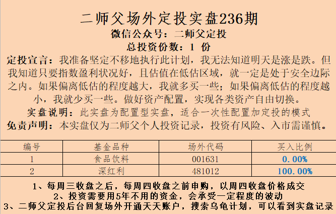
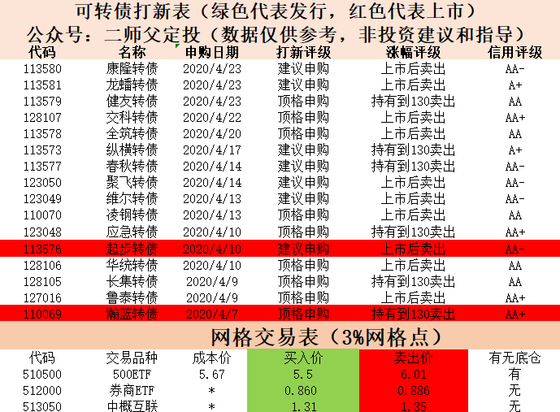

======================================================

_type: talk
@二师父[28814221155551]
2020-05-06 17:42:50 Wed  
topic_id: 118824421588252

<e type="hashtag" hid="825188852442" title="#估值表#" /> 300和500进入正常估值了

@铁观音 at 2020-05-06 17:42:50 Wed

> 师傅，鳄鱼计划的住仓位的300etf要收割利润吗？还是不动？

----------

@二师父 at 2020-05-06 17:42:50 Wed

> 根据自己仓位操作，我收割了没有转

----------

@蓝魔森林 at 2020-05-06 17:42:50 Wed

> 想问下二师傅，这里沪深300基金的估值法是博格公式法加安全边界来评估的吗？

----------

@二师父 at 2020-05-06 17:42:50 Wed

> peg和未来市值估算

----------

@What if at 2020-05-06 17:42:50 Wed

> 鳄鱼计划里的酒ETF现在留个底仓还是什么？

----------

@二师父 at 2020-05-06 17:42:50 Wed

> 之前换成消费了，留的还有

----------

@helen at 2020-05-06 17:42:50 Wed

> 二师父，麻烦阀值可以一起发一下吗？

----------

@二师父 at 2020-05-06 17:42:50 Wed

> 好的

----------

阅读[4946]  评论[8]  赞[0] 

+++++++++++++++++++++++++++++++++++++++++++++++++++++

图片：
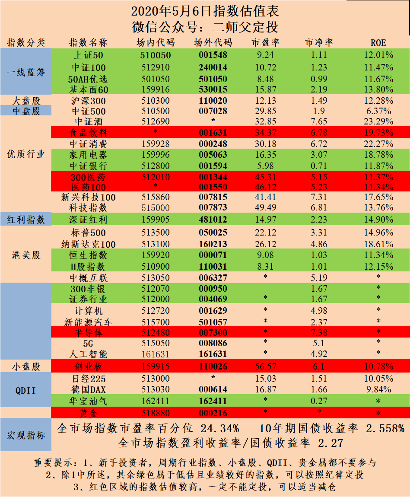

======================================================

_type: talk
@二师父[28814221155551]
2020-05-06 21:59:03 Wed  
topic_id: 841152251118212

<e type="hashtag" hid="224422812851" title="#为什么最近定投一直变#" /> 主要是最近市场变化太快了，如果不适应，3000点以下每周定投沪深300，3000点以上停止并收割利润

这是最简单的策略，越简单越有效。反之，如果想要自己领略定投的魅力，实现不同资产之间的切换，就要跟着市场变化，这个变化不是追热点，而是底部伏击，今年没有牛市，但有结构行情，在每个板块弱或者回调的时候出击，板块拉升的时候就是盈利的时候

大金融最近很弱，而消费，医药，计算机，人工智能，半导体都比较强势，过一段时间牛市来了，第一拉升的就是金融，不必看着一天两天的涨跌，多看看一二年后，你最终的盈利都是来源你前期的积累。

@Jo at 2020-05-06 21:59:03 Wed

> 二师父好 现在开始每周布局人工智能和5G定投是否可以？

----------

@二师父 at 2020-05-06 21:59:03 Wed

> 人工智能轻仓投还可以，5G不太适合，先把基本的指数配置好

----------

@onepiecewi* at 2020-05-06 21:59:03 Wed

> 最近不是没上过3000点，都在2850左右[撇嘴]

----------

阅读[4715]  评论[3]  赞[0] 

======================================================

_type: talk
@二师父[28814221155551]
2020-05-07 09:32:55 Thu  
topic_id: 241152481242481

<e type="hashtag" hid="452255588118" title="#可转债的风险#" /> 泰晶科技提前赎回，泰晶转债跌30个百分点，可转债投资风险高，有提前赎回风险，避免高转股溢价率的可转债，不懂的可以投资可转债基金，任何一笔投资之前先了解风险

阅读[3753]  评论[0]  赞[0] 

======================================================

_type: talk
@onepiecewi*[244414114545811]
2020-05-07 10:07:44 Thu  
topic_id: 841152481151582

上证50为什么至今没涨过？

@二师父 at 2020-05-07 10:07:44 Thu

> 金融板块的股票太多

----------

@onepiecewi* at 2020-05-07 10:07:44 Thu

> 原来如此

----------

阅读[3794]  评论[2]  赞[0] 

======================================================

_type: talk
@二师父[28814221155551]
2020-05-07 11:24:18 Thu  
topic_id: 841152428111452

<e type="hashtag" hid="281854444451" title="#读者提问#" /> 师傅上午好！
目前银行估值很低，我想建立个底仓，主要是手里有长期不用的闲钱，等待市场轮动反转，这个思维正确吗？
目前选择银行指数基金怎么样？

银行指数表现较差，作为防守配置可以，成长性不足，而银行指数里面有很多资产质量差的银行，不如招商银行，宁波银行以及平安银行

@速。冻 at 2020-05-07 11:24:18 Thu

> 我觉得可以

----------

阅读[3895]  评论[1]  赞[0] 

======================================================

_type: q&a
@奋斗[118281455841442]
2020-05-07 11:30:18 Thu  
topic_id: 548825451888414

@奋斗

>  二师傅场内的深 F60为什么现在成交量这么低，需要卖出来吗，我买场内

@二师父

>  金额大需要，成交额太低流动性比较差

阅读[3983]  评论[0]  赞[0] 

======================================================

_type: q&a
@激流勇进[241141245525821]
2020-05-07 11:31:52 Thu  
topic_id: 118824145888482

@激流勇进

>  师父上午好！
>  目前银行估值很低，我想建立个底仓，主要是手里有长期不用的闲钱，等待市场轮动反转，这个思维正确吗？
>  目前选择银行指数基金怎么样？
>  请指教[抱拳]

@二师父

>  你拿沪深300建底仓确定性大一些，实体经济不行，银行起不来，就生活中很多厂子关闭，有的早餐店大面积转租，实体经济好，银行才会好

阅读[4284]  评论[3]  赞[0] 

======================================================

_type: q&a
@陈洲[88245122222212]
2020-05-07 13:31:20 Thu  
topic_id: 548825455555814

@陈洲

>  目前定投：50AH优选+基本面60，中证500，昨天开始定投了中证银行，中证银行低估，下面说实体不行银行起不来，中证银行是不是不要投

@二师父

>  是的，我已经暂停了，场外之前也调仓了，等待盈利再收割，之前预期是实体经济20年向好，不过现在这个事对实体经济影响很大，银行业的表现是能反应经济总体情况的

阅读[4208]  评论[2]  赞[0] 

======================================================

_type: talk
@Philip🎭 Y[28518855518151]
2020-05-07 16:23:36 Thu  
topic_id: 118824141185522

二师父好，我来星球跟大家一起学习一年多了。收获了很多。可能我是整个群里吸收最慢的，很多文字上的我可能有点理解不到位，关于收个利润的事情我想自己举一个例子，结合例子想问一些问题；
假如我一直定投估值表上某低估指数基金，每月1000，目前已经投入一万元了。
然后根据市场波动，出现以下情况（假设），
1.估值表由绿转一般（低估改成一般）。按照文章讲解，开始收割利润。
1-1假如目前市值12,000元（超过10%），我于定投日，每周赎回等值2000元的份额（我的利润），直到赎回结束（全部赎回，或是估值改变）
1-2假如目前市值12,000元（超过10%），我于定投日，赎回一次等值2000元的份额（我的利润），等待再次低估定投或高估
1-3假如目前市值12,000元（超过10%），我于定投日，赎回一次等值2000元的份额（我的利润），于下一周，再次收割当时的利润，每周往复，直到赎回结束（全部赎回，或是估值改变）

不知道收个利润，是怎么个收法？上述的哪一种，还是我全部理解错误。

2.估值表由绿或一般转红（高估）。按照文章讲解，开始收割利润+成本。
2-1假如目前市值12,000元（超过10%），我于定投日，一口气赎回全部等值份额（12,000全部赎回）

这是我看完文章后的理解，我自己有点绕晕了。希望二师父而已帮我解答。
潜水了好久，看了好多大家的文章，感觉大家都好厉害，我也继续跟大家一起学习，不知道有没有新手跟我碰到一样的状况。
就像二师父说过，会买的是徒弟，会卖才是师傅。
谢谢！
大家一起加油！

@二师父 at 2020-05-07 16:23:36 Thu

> 进入正常估值，本金1万，每次1.1万的本利和，卖出1000元利润，保证本金保留，进入高估值，本利和10万，每次涨10个点，分别卖出剩余8万，6万，4万

----------

@二师父 at 2020-05-07 16:23:36 Thu

> 进入正常估值，投入本金是1万，本金加利润是1.1万，卖出1.1万，每次卖出利润，保留本金1万

进入高估值时候，本利和是10万，卖出2万剩余8万，再涨10个点，卖出一部分剩余6万，再涨10个点，卖出一部分剩余4万

----------

阅读[3966]  评论[2]  赞[0] 

======================================================

_type: q&a
@好运玲玲[244188585541521]
2020-05-07 16:40:25 Thu  
topic_id: 118824141525882

@好运玲玲

>  二师父您好！50ah占总仓位14%，现在盈利差不多一个点，深红利占总仓位1.6%，50ah可否调仓一部分到深红利？

@二师父

>  可以调整的，深红利也很有价值，深市股票成长性也更好

阅读[4197]  评论[2]  赞[0] 

======================================================

_type: q&a
@范毅君[118551121224142]
2020-05-07 16:43:24 Thu  
topic_id: 118824144118152

@范毅君

>  二师父，现在沪深300和中证500都比较高了，现阶段定投什么比较合适，坐网格最近什么比较合适呀

@二师父

>  沪深300估值不高，只是正常估值，对于大盘股指数，全市场指数市盈率百分位30以下仍旧可以投，目前深红利，基本面60，50ah可以，行业指数电器，300非银可以，人工智能低估后轻仓定投也可以
>  
>  网格还是以券商和500为主

阅读[4309]  评论[0]  赞[0] 

======================================================

_type: talk
@二师父[28814221155551]
2020-05-07 17:31:11 Thu  
topic_id: 241152445158211

<e type="hashtag" hid="824422485212" title="#CS消费50指数#" /> CS消费50指数，这个是投资于沪深两市的可选和必须消费股票指数，后面会把这个加入估值表。消费行业具有天然的护城河，值得重点投资。

@王模堂 at 2020-05-07 17:31:11 Thu

> cs消费50指数有对应的可买入的基金代码吗？。

----------

@二师父 at 2020-05-07 17:31:11 Thu

> 008975

----------

@王模堂 at 2020-05-07 17:31:11 Thu

> 是消费50 ETF515650吗？

----------

@二师父 at 2020-05-07 17:31:11 Thu

> 对

----------

阅读[5155]  评论[4]  赞[0] 

+++++++++++++++++++++++++++++++++++++++++++++++++++++

文件：
2020-05-07 17:30:02 Thu
文件大小：[107374]
15411514885842-CS消费50，投资沪深两市的消费股票.docx

======================================================

_type: talk
@二师父[28814221155551]
2020-05-07 17:41:21 Thu  
topic_id: 241152445188551

<e type="hashtag" hid="554455411544" title="#5.6日估值表#" /> 后面的阈值大致可以作为参考，对于优质的行业指数，比如消费、科技，当指数的估值指标接近低估阈值也是可以开始定投的。

比如最近3月份食品饮料和消费没有进入低估就是回调指数正常偏低开始定投，有的时候优质指数因为市场预期高，所以进入低估的时间少。

但是需要注意一个问题，当指数在高估区域的时候定投就不适合，这种时候，指数上涨的空间有限，下跌的空间很大，万一发生行业危机也会有很大的回撤。

总之，相对便宜，并且控制一定的仓位，这样来配置是最好的。

最近又重新读了巴菲特和索罗斯的投资习惯，里面第一个习惯就是不要亏损，不要亏损，因为一只股票亏了50%，后面需要另外一只股票涨100%才能够翻本。

风险控制第一位，然后才是考虑盈利的，只要一直在市场，就不会少机会，而一次股票腰斩，可转债暴雷，指数暴跌割肉，就会让投资者元气大伤。安全第一。

@王模堂 at 2020-05-07 17:41:21 Thu

> 安全边际最重要。

----------

@二师父 at 2020-05-07 17:41:21 Thu

> 对，安全第一

----------

@老丁 at 2020-05-07 17:41:21 Thu

> 二师父你有没有什么课程是讲高估低估阈值是怎么算出来的呀？一直纳闷这些数据是怎么得来的，想学习下

----------

@二师父 at 2020-05-07 17:41:21 Thu

> 暂时没有这个课程哈

----------

@孤芳自赏 at 2020-05-07 17:41:21 Thu

> 二师父算一支基金的定投权重时候低估阈值是按低的那个值还是按高的值算，还是按取范围内的中间值？

----------

@二师父 at 2020-05-07 17:41:21 Thu

> 看低估阈值和当前估值市盈率的相对大小

----------

@孤芳自赏 at 2020-05-07 17:41:21 Thu

> 但低估阈值不是一个确切数值比如上证50阈值10—20怎么取上线还是下线呢？

----------

@二师父 at 2020-05-07 17:41:21 Thu

> 下限是10啊

----------

阅读[5140]  评论[8]  赞[0] 

+++++++++++++++++++++++++++++++++++++++++++++++++++++

图片：
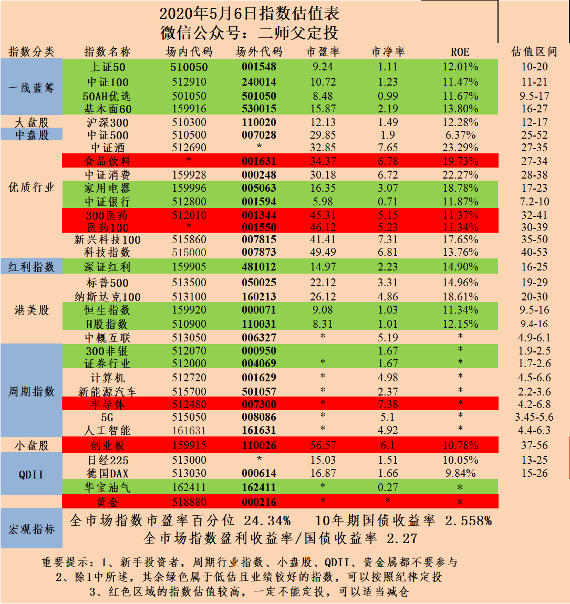

======================================================

_type: q&a
@子辰[421444812542128]
2020-05-07 20:07:09 Thu  
topic_id: 118824115511552

@子辰

>  委托价格与成交价格差异这么大也能成交？是不是意味着半导体又要往下跌了

@二师父

>  你这个价格设置高了，如果你的委托价格高于市场价格，就会以市场价格成交
>  
>  半导体定投不适合，可以看均线做趋势，如果盈利就一直拿着，设定10个点止损位置，涨跌不好说，第一季度业绩还是不错的，今年预测盈利也很好，peg在1.6，定投他不如人工智能

阅读[4504]  评论[1]  赞[0] 

======================================================

_type: talk
@二师父[28814221155551]
2020-05-07 20:11:20 Thu  
topic_id: 421145228244488

<e type="hashtag" hid="142812422222" title="#中概互联#" /> 中概互联规模起来了，之前18年因为没有场外基金，所以我们只在场内鳄鱼计划买了中概互联

现在场外也有比较好的中概互联品种了，目前限购每天500元，在中概场内价格1.35到1.4以下可以开始逐步定投了

@王雷 at 2020-05-07 20:11:20 Thu

> 二师父说006327吗

----------

@王雷 at 2020-05-07 20:11:20 Thu

> 二师父是006327吗

----------

@二师父 at 2020-05-07 20:11:20 Thu

> 是的

----------

@二师父 at 2020-05-07 20:11:20 Thu

> 对的

----------

@王雷 at 2020-05-07 20:11:20 Thu

> 好的，谢谢

----------

@李垚垚 at 2020-05-07 20:11:20 Thu

> 为啥看不见持仓情况~谢谢二师父

----------

@二师父 at 2020-05-07 20:11:20 Thu

> 他直接投的中概互联基金

----------

@丸子妈 at 2020-05-07 20:11:20 Thu

> 场内买也是一样的吧？

----------

阅读[4711]  评论[13]  赞[0] 

+++++++++++++++++++++++++++++++++++++++++++++++++++++

图片：
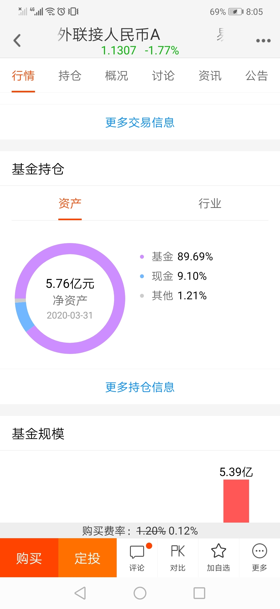

======================================================

_type: q&a
@阳光[421884185252128]
2020-05-07 20:24:55 Thu  
topic_id: 241152448452481

@阳光

>  师父好：请问天天基金里面的累计收益是指什么啊？是持有基金的累计收益？还是所有交易的累计收益呢？谢谢

@二师父

>  所有交易的累计收益，包括之前卖出的部分

阅读[4764]  评论[0]  赞[0] 

======================================================

_type: talk
@二师父[28814221155551]
2020-05-07 22:02:28 Thu  
topic_id: 841152442281282

<e type="hashtag" hid="141144141552" title="#讲一个估值指标#" /> 我们传统的估值参考市盈率、市净率都是相对估值，绝对估值可以计算企业未来市值以及利用PEG来计算。

大家可以看到这是半导体WIND数据对他2020年的盈利预测，利润增长率125%，现在的PE是96，计算PEG是0.768，如果按照这个指标看，这是低估的

但问题在于利润增长率是否能够实现，从第一季度来看是大部分达到的，如果今年一年都能达到125%的增长速度，那么半导体绝对值得配置，但问题在于，这个高增长一旦达不到，比如只有25%的增长率，那么就是高成长陷阱，这个指数严重高估。

在公开实盘，很多人跟着二师父投资，所以只能够讲最有把握的品种，风控第一，如果大家投资这类指数，只能够轻仓，作为卫星配置，另外最好做趋势不要逆势投资。

属于娱乐品种，因为即使以后这个半导体翻了2倍，因为是轻仓，其实也解决不了问题。

估值的难点不在于获取数据，而在于对企业护城河以及护城河趋势的判断。一个人本来月薪10万，现在给他5万就是低估了，一个人本来月薪2万，现在给他5万，就是高估了，关键看人，投资关键看企业到底值多少钱，这才是估值的核心。

阅读[5278]  评论[0]  赞[0] 

+++++++++++++++++++++++++++++++++++++++++++++++++++++

图片：
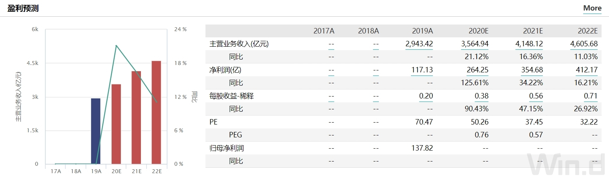

======================================================

_type: q&a
@圣诞结®[28448281541121]
2020-05-07 22:35:02 Thu  
topic_id: 841152442424882

@圣诞结®

>  二师父，之前定投的天弘中证银行占比较大，后期银行涨势不好，想换一部分沪深300或者300非银可以吗？（之前一直没投沪深300）

@二师父

>  可以的，大概多少仓位，银行是在经济低迷期表现不好，等经济复苏也会起来的，不用太担心，换的话深红利和300非银更好一些

阅读[4712]  评论[3]  赞[0] 

======================================================

_type: q&a
@四海为家[241585882858251]
2020-05-08 08:55:30 Fri  
topic_id: 548825481154414

@四海为家

>  二师傅，看你最近一直在说深红利，我想问下，难道深60不行了吗？我一直在坚持深60低估投入，这种策略需要改变了吗？

@二师父

>  可以的，两者持仓差别不大，50ah比较弱，含有银行股太多，深红利和基本面60都很不错的，主要是对比之后深红利持仓股票的盈利增速和未来增长预期更高
>  
>  整体看的话两个持仓股相同，选择一个就行，没有本质区别，基本面60可以持有也可以继续定投，如果二选一，更倾向于深红利

阅读[4641]  评论[0]  赞[0] 

======================================================

_type: talk
@二师父[28814221155551]
2020-05-08 09:12:08 Fri  
topic_id: 421145218588818

<e type="hashtag" hid="824422184212" title="#深红利和基本面60#" /> 这两个指数都不错，重仓股票中有7个是重合的，可以二选一，已经投入的放心持有。

选择宽基以深市宽基为主，沪市宽基包括300可以淡化，从历史来看深证市场的蓝筹是涨幅更好的，国证100，基本面60，深红利选择一个配置就行，关键收益在两个方面，第一是本金够多，第二来一波大牛市，如果市场一直这样波动的话，赚个小钱，彻底改变财务状况还是需要足够多的本金和疯牛。

不用纠结宽基选择什么，300+500，或者50AH+基本面60,或者深红利。如果能接受回撤，就选择深红利或者基本面60定投是最好的。至于金融银行，定投招商银行也比中证银行好的。不过有一点要注意，招商历史上也有横盘两年多的情况，然后牛市来了大爆发，如果发生了这样的情况是否能接受。

宽基指数我推几个组合自己搭配就行：50AH+基本面60+中证500+创业板
基本面60+中证500+创业板；沪深300+中证500+创业板；中证100+中证500+创业板；深红利+中证500+创业板。

保守的投资者宽基指数多配点，激进的投资者宽基指数少配点，更多的配置行业指数：消费、消费50、医药、电器、300非银，龙头科技、人工智能、中概互联。后面实盘会逐步集中，以行业为主。只要控制好安全边际，越跌越买不恐惧，以3年为周期，收获都不错的。

阅读[4835]  评论[0]  赞[0] 

+++++++++++++++++++++++++++++++++++++++++++++++++++++

图片：
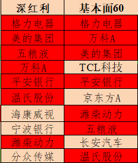

======================================================

_type: talk
@二师父[28814221155551]
2020-05-08 09:38:05 Fri  
topic_id: 841152418425412

#鳄鱼计划 医药etf卖出两份，医药可以慢慢清仓了，别贪，不是全卖，就算继续涨也不会错过。

阅读[5245]  评论[0]  赞[0] 

======================================================

_type: talk
@蓝魔森林[28888244485121]
2020-05-08 10:57:44 Fri  
topic_id: 118824184581442

<e type="hashtag" hid="824422128812" title="#每月晒收益#" /> 我上个月收益3%，这都能击败97%的投资者吗？ 这是蚂蚁财富app渠道，看了下其中明细占比，有不少是跟着二师傅投的基金。 大家的如何呢？

@庆余年 at 2020-05-08 10:57:44 Fri

> 这说明了两点，蚂蚁财富中有一大部分人只会用余额宝当零钱袋用的，还有就是一部分人追涨杀跌亏惨了的。

----------

@蓝魔森林 at 2020-05-08 10:57:44 Fri

> 哈哈哈 余额宝现在年化收益简直惨不忍睹。不如直接买别的货币基金了

----------

阅读[4493]  评论[2]  赞[0] 

+++++++++++++++++++++++++++++++++++++++++++++++++++++

图片：
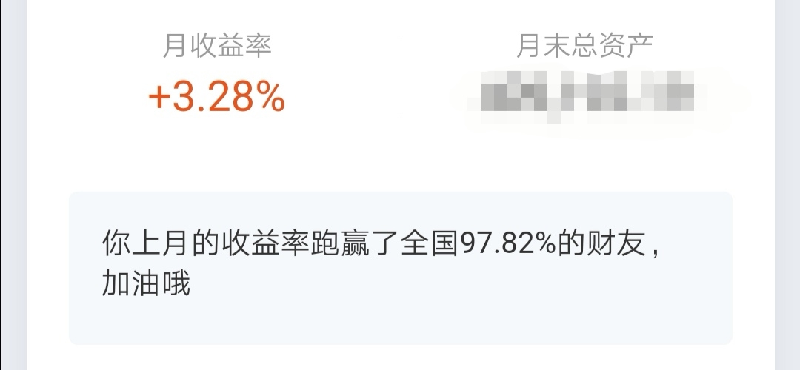

======================================================

_type: q&a
@光少[244124552511141]
2020-05-08 10:58:11 Fri  
topic_id: 118824184584812

@光少

>  二师父您好！白酒ETF涨的好猛，需要减仓卖出吗？

@二师父

>  收割利润就可以

阅读[4832]  评论[10]  赞[0] 

======================================================

_type: talk
@二师父[28814221155551]
2020-05-08 11:54:42 Fri  
topic_id: 421145211851528

<e type="hashtag" hid="141144848452" title="#券商开始动了#" /> 一直等着券商拉升，今天看到了，这个时候就要拿住了，医药高估可以逐步卖出，但是刚刚启动的科技和金融板块要拿住，别刚一回本就卖了，人工智能，科技100，龙头科技，券商都得拿住

学会持盈，投资不是为了保本。

@是喵喵吖～ at 2020-05-08 11:54:42 Fri

> 师父，想请教一下，为什么说 券商也要拿住呢 我有点不明白呢。 像科技 人工智能我的理解它们比较容易走高。但是券商有点不明白呢。

----------

@蛋炒饭不加蛋 at 2020-05-08 11:54:42 Fri

> 科技到高估也卖吗，我看阈值已经在正常偏高的位置了

----------

@二师父 at 2020-05-08 11:54:42 Fri

> 还没高估

----------

@二师父 at 2020-05-08 11:54:42 Fri

> 可以出，就是需要分批，别刚回本一次全卖了，券商指数就是投机赚波段

----------

@🍀 凝🌸 慧🍀 at 2020-05-08 11:54:42 Fri

> 师父，我也是一直等着券商起来呢，前一段时间真是考验人的耐性，看着别的飙涨，心里蠢蠢欲动。但最终还是记着师父多次强调的原则，就握住了。

----------

@🍀 凝🌸 慧🍀 at 2020-05-08 11:54:42 Fri

> 另外，认真看了师父之前分析的家电指数的文章，我就开始定投这个指数，也是好一段时间没咋涨，就握着。今天飙乎了，3.66%[发呆]

----------

阅读[4821]  评论[6]  赞[0] 

======================================================

_type: talk
@二师父[28814221155551]
2020-05-08 17:09:08 Fri  
topic_id: 841152158821842

<e type="hashtag" hid="554455885854" title="#新规定#" /> 逆势投资只需要忍受浮亏，控制安全边际，坚持住基本最后都能够收获。

大家自己把握仓位，下跌了压力不大，上涨了不焦虑投资过少，就没有问题。这个是最重要的，仓位合不合适，自己的心理状态说了算。

阅读[4663]  评论[0]  赞[0] 

+++++++++++++++++++++++++++++++++++++++++++++++++++++

文件：
2020-05-08 17:05:49 Fri
文件大小：[19584]
15411584258482-取消外资机构境内证券投资额度管理要求，A股开始发力.docx

======================================================

_type: talk
@林玮[844111858288412]
2020-05-08 19:18:56 Fri  
topic_id: 548825824412524

二师父，现在为什么不适合配债券基金？

@二师父 at 2020-05-08 19:18:56 Fri

> 利率低位，相当于长久期债券高估，债券涨幅有限了

----------

@林玮 at 2020-05-08 19:18:56 Fri

> 谢谢师父

----------

@蓝魔森林 at 2020-05-08 19:18:56 Fri

> 投短期的债券可以考虑

----------

阅读[4412]  评论[3]  赞[0] 

======================================================

_type: talk
@二师父[28814221155551]
2020-05-08 19:36:34 Fri  
topic_id: 118824821145852

<e type="hashtag" hid="452252444228" title="#如何去衡量盈利#" /> 衡量盈利的金标准是账户市值增大。所谓的年化收益率都是悖论。每个月，每年你看账户市值是否增大，增大了那就是好的投资，没有增大，但是跑赢了沪深300的同期，那么不算差。

计算方法（账户末期总市值-账户初期总市值）/账户初期总市值=你的实际收益率，不要相信软件计算的，只有账户的钱变多了才是王道。

很多人账户的钱越来越少都不知道，还感觉自己挣了。每个月监控下自己的账户，不管是股票还是基金。如果初期投入50万，慢慢账户在增多就是良性的，如果50万慢慢变成了45万，那就出问题了，要知道到底是因为买入了垃圾股票，还是买入优质股票的正常回撤。如果是买的优质基金，比如深红利、沪深300，那跌了没事，这是短期的，就可以继续加仓。

反之，如果买了比较差的基金，比如原油，加仓未来能够涨回来的时间不确定，那就撤退，总之，一切衡量标准以账户市值增长为依据。不要在乎某只基金的盈亏，从整体角度来分析。

二师父目前是三个账户，场外定投的，大家能够看到，鳄鱼计划大家能看到，然后一个网格波段，偶尔机会好的时候买点股票。不在乎什么卖出亏损，或者卖出盈利了怎么办。只要账户市值在增大，那就是对的，账户市值没有增大，基金没有问题，就补仓。

以前设定的机械标准也是对的，因为新手投资者没法去判断一只基金不涨到底是因为暂时受困还是长期不行了，那么就设定止盈不止损的标准，只有这样子，才不会追涨杀跌。当你慢慢形成了自己的体系之后，你就按照整体投资哲学追求一个目标，我本月账户市值有没有升高，这才是最重要的。

不要追求所谓的收益率多了多少，那都是浮云，唯有账户市值增高并且追中兑现为现金并且改变了你的生活，你的投资才是有意义的。否则知识一个陷入股市迷宫的人。

@蓝魔森林 at 2020-05-08 19:36:34 Fri

> 对 隔一段时间要看下总金额是否比投入资金更多了 多了多少，这样就可以算年复合收益率了，如果中间把资金提出来干别的事了，就要另外计算了。

----------

阅读[5238]  评论[1]  赞[0] 

======================================================

_type: talk
@二师父[28814221155551]
2020-05-08 20:15:38 Fri  
topic_id: 421145142151458

<e type="hashtag" hid="554454258244" title="#笑傲股市第三讲#" /> 笑傲股市第三讲，书里面的成长股思想值得学习，下次讲解投资中最重要的事，这是巴菲特推荐的，很多经典的原则要时常温习，形成潜意识，这样的话就有了无意识能力，看到市场指数的变化情况就大致知道该买入还是持有还是清仓。

@HeLLO at 2020-05-08 20:15:38 Fri

> 师父，红利ETF.510880跟深红利159905哪个成长性好些呢

----------

@二师父 at 2020-05-08 20:15:38 Fri

> 深红利更好一些

----------

阅读[4958]  评论[2]  赞[0] 

+++++++++++++++++++++++++++++++++++++++++++++++++++++

文件：
2020-05-08 20:12:47 Fri
文件大小：[17892]
88244812255852-笑傲股市第三讲.docx

2020-05-08 20:13:15 Fri
文件大小：[9612319]
88244812255812-投资最重要的事》.pdf

======================================================

_type: talk
@二师父[28814221155551]
2020-05-08 22:35:42 Fri  
topic_id: 841152185552142

债券都受到利率，到期收益率的影响，现在利率升，股市涨，投资者对债券预期较低，就会导致债券跌

一般10年期国债利率低于3以下投资债券的性价比就很低了，读者提问，从提问按钮发不出来。从这里发

@素兮 at 2020-05-08 22:35:42 Fri

> 二十父，纳斯达克指数和标普500指数的持仓股有重合么？

----------

@二师父 at 2020-05-08 22:35:42 Fri

> 有部分重合，在电脑里面有对比数据，明天发到星球

----------

@素兮 at 2020-05-08 22:35:42 Fri

> [抱拳][抱拳]

----------

阅读[4923]  评论[3]  赞[0] 

======================================================

_type: q&a
@Zero Fei[51422225155524]
2020-05-08 22:57:52 Fri  
topic_id: 841152185585512

@Zero Fei

>  二师父，最近这两天无论是券商理财（短债部分）还是债券基金都在跌，是什么内在原因呢，本来想少量配置作为风险抵抗的，这段时间股市比较好，是不是全配置股权就好，但什么时候又配置回债基，看国债收益率就可以，担心把握不好切换时机

@二师父

>  长期看股票收益率高于债券，等没有好的指数基金可以投资，而且债券收益率高于银行理财收益率的时候就能投资债券了

阅读[5028]  评论[1]  赞[0] 

======================================================

_type: talk
@树叶[544811512145144]
2020-05-09 09:36:54 Sat  
topic_id: 118824851112522

<e type="hashtag" hid="142825811122" title="#定投周报#" /> 二师父定投周报第58期

阅读[5135]  评论[0]  赞[0] 

+++++++++++++++++++++++++++++++++++++++++++++++++++++

文件：
2020-05-09 09:36:54 Sat
文件大小：[230211]
15411581858142-1_二师父定投周报5.9（第58期）.docx

======================================================

_type: talk
@二师父[28814221155551]
2020-05-09 10:46:41 Sat  
topic_id: 841152181851282

<e type="hashtag" hid="224424858841" title="#纳斯达克100和标普500对比图#" /> 两个重合度还是比较高，10只重仓股有6只重合。目前场外标普500限购100，大成纳斯达克100每日限购1000元，可以等待回调定投。

市场特性很难一下子改变，美股还是牛长熊短，A股熊长牛短。所以在投资的时候策略也要灵活一点。

阅读[5836]  评论[0]  赞[0] 

+++++++++++++++++++++++++++++++++++++++++++++++++++++

图片：
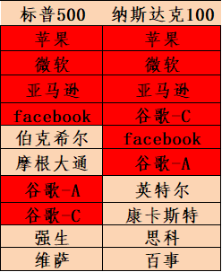

======================================================

_type: q&a
@Zero Fei[51422225155524]
2020-05-09 12:20:33 Sat  
topic_id: 241152181445451

@Zero Fei

>  二师父，定投乌龟计划，后期资金增加或减少了，如何操作比较好，直接按最新的投就可以么

@二师父

>  是的，按照最新的定投

阅读[5327]  评论[2]  赞[0] 

======================================================

_type: q&a
@J[28281541518551]
2020-05-09 16:22:06 Sat  
topic_id: 118824844282442

@J

>  师父，请问现在还有每周更新估值表吗？没找到在哪里呢。家电指数现在估值是多少呢？

@二师父

>  有的，就发到星球了，精华内容，家电目前是低估的，详细数据可以看估值表

阅读[5243]  评论[3]  赞[0] 

======================================================

_type: talk
@二师父[28814221155551]
2020-05-09 18:11:16 Sat  
topic_id: 118824841288452

到账了，月底之前还可以申请，意外之财

@Gingo at 2020-05-09 18:11:16 Sat

> 二师父这是申请什么？

----------

@二师父 at 2020-05-09 18:11:16 Sat

> 退税，在退税app上可以申请

----------

@J at 2020-05-09 18:11:16 Sat

> 师父，这是什么？

----------

@二师父 at 2020-05-09 18:11:16 Sat

> 退税

----------

@J at 2020-05-09 18:11:16 Sat

> 太棒了，我也想申请，请问是以个人还是公司名义来申请退税的？

----------

@二师父 at 2020-05-09 18:11:16 Sat

> 公司

----------

@J at 2020-05-09 18:11:16 Sat

> 好的。商业房产租金的个人所得税可以退吗？

----------

@粥小宇 at 2020-05-09 18:11:16 Sat

> 已到账，1300

----------

阅读[5427]  评论[8]  赞[0] 

+++++++++++++++++++++++++++++++++++++++++++++++++++++

图片：

======================================================

_type: talk
@二师父[28814221155551]
2020-05-09 19:50:31 Sat  
topic_id: 841152124488182

<e type="hashtag" hid="454221284528" title="#估值指标#" /> 全市场估值，从三个维度来判断市场位置高低。

如果同时满足，就可以抄底或者离场了。

@wty at 2020-05-09 19:50:31 Sat

> 慢慢消化、还需要经历和实践，当信号出现的时候就靠二师父提醒了！！

----------

@二师父 at 2020-05-09 19:50:31 Sat

> 每周周报里面有指标，基本吻合就到了

----------

@wty at 2020-05-09 19:50:31 Sat

> 好👌

----------

@阿宝 at 2020-05-09 19:50:31 Sat

> 谢谢老师，我看懂了。但是不知道这些数据都在哪查询？具体如何查询？我想自己去查一遍。万得全a指数市盈率百分位怎么查询？sy和by都分别在哪查询？sy—by的百分位数据在哪查？可以详细点说吗？没学之前，我是用1，证券化率（50％——110％），数值越大越高估，越小越低估2.股市开户数和周围人的情绪3.指数基金是否翻倍，翻倍基本离高估不远了。

----------

@二师父 at 2020-05-09 19:50:31 Sat

> 百分位和格雷厄姆指数学堂会发布的，自己也可以计算，国债收益率学堂每周发布，英为财情有

----------

@HeLLO at 2020-05-09 19:50:31 Sat

> 师父，万得全A指数市盈率百分位怎么算？SY/BY百分位怎么算或如何查？

----------

@二师父 at 2020-05-09 19:50:31 Sat

> 利用rank函数，以后我发到星球

----------

阅读[6148]  评论[7]  赞[0] 

+++++++++++++++++++++++++++++++++++++++++++++++++++++

文件：
2020-05-09 19:49:29 Sat
文件大小：[23662]
15411424214412-利用这三个估值指标，帮助你顺利逃顶和抄底.docx

======================================================

_type: talk
@二师父[28814221155551]
2020-05-09 21:52:58 Sat  
topic_id: 841152121825222

全A市盈率在金融终端或者万得app都可以查的，国债收益率在英为财情有，这些每周都会公布。同花顺也有全市场指数市盈率指标

@阿宝 at 2020-05-09 21:52:58 Sat

> 谢谢

----------

@阿宝 at 2020-05-09 21:52:58 Sat

> 我都找到了。谢谢你。

----------

@厚基薄发 at 2020-05-09 21:52:58 Sat

> 主要就是估值的分位不好找？

----------

@二师父 at 2020-05-09 21:52:58 Sat

> 这个每周都会发

----------

@厚基薄发 at 2020-05-09 21:52:58 Sat

> 好的，太好了

----------

@西锦巴乌 at 2020-05-09 21:52:58 Sat

> 师父：盈利收益率百分位和10年期国债收益率在哪里能查到？谢谢了

----------

@二师父 at 2020-05-09 21:52:58 Sat

> 盈利收益率是1除以市盈率，国债收益率在应为财情可以查

----------

@西锦巴乌 at 2020-05-09 21:52:58 Sat

> 盈利收益率和市盈率的关系我懂，但不知盈利收益率的百分位在哪里能直接查到？

----------

阅读[5616]  评论[12]  赞[0] 

+++++++++++++++++++++++++++++++++++++++++++++++++++++

图片：
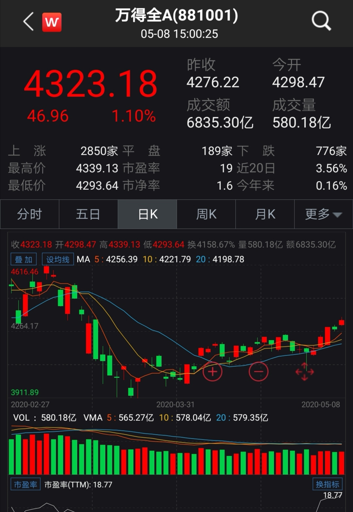

======================================================

_type: talk
@二师父[28814221155551]
2020-05-09 22:14:05 Sat  
topic_id: 841152148582212

5月9日晚间，据媒体报道，中国电商巨头京东将在香港进行二次上市，计划于5月底开始新股申购。此前有媒体报道称，京东最早可能于今年6月在港上市，筹资至多30亿美元，将成香港今年最大IPO。对于IPO及开启申购的时间，京东不予置评。

以后中概股都回到香港上市，就可以不用投资恒生了，直接投资中概互联就非常不错。

@蛋炒饭不加蛋 at 2020-05-09 22:14:05 Sat

> 中概股不在美股了吗

----------

@二师父 at 2020-05-09 22:14:05 Sat

> 在啊

----------

@蛋炒饭不加蛋 at 2020-05-09 22:14:05 Sat

> 看错了，是以后会到香港上市

----------

@西锦巴乌 at 2020-05-09 22:14:05 Sat

> 师父好！都回到香港上市了应买恒生指数吧？

----------

@二师父 at 2020-05-09 22:14:05 Sat

> 那需要恒生有这些持仓

----------

阅读[5759]  评论[5]  赞[0] 

======================================================

_type: talk
@二师父[28814221155551]
2020-05-10 21:04:01 Sun  
topic_id: 841152112454122

<e type="hashtag" hid="454218222518" title="#债券基金#" /> 最近债券下跌的原因，二师父之前已经说过了，当前阶段是不适合配置债券的，放手配置银行理财货币基金都可以的。

@J at 2020-05-10 21:04:01 Sun

> 师父，中短债上周也有一些回撤，现在需要先赎回吗

----------

@二师父 at 2020-05-10 21:04:01 Sun

> 这种问题我不好回答，没投这个

----------

@蓝魔森林 at 2020-05-10 21:04:01 Sun

> 银行活期理财比货币基金要还不少。

----------

@二师父 at 2020-05-10 21:04:01 Sun

> 还什么，风险高一点，大额资金还是货币

----------

@蓝魔森林 at 2020-05-10 21:04:01 Sun

> 银行活期理财不是没有风险吗？ 我看招商app下的渠道理财，七日年化达3.x

----------

@蓝魔森林 at 2020-05-10 21:04:01 Sun

> 风险等级是极低，r1级别。

----------

@二师父 at 2020-05-10 21:04:01 Sun

> 有风险，r2

----------

@蓝魔森林 at 2020-05-10 21:04:01 Sun

> 我那个是r1的，背后投资的产品也看了下，确实风险不大。

----------

阅读[6000]  评论[13]  赞[0] 

+++++++++++++++++++++++++++++++++++++++++++++++++++++

文件：
2020-05-10 21:03:11 Sun
文件大小：[21831]
15411452484142-债券基金为什么也会下跌.docx

======================================================

_type: talk
@二师父[28814221155551]
2020-05-10 22:17:57 Sun  
topic_id: 241154855585581

<e type="hashtag" hid="141141112452" title="#每日网格数据#" />

@秦风殇韵（刘豫斌） at 2020-05-10 22:17:57 Sun

> 中概互联有点高高在上了，500etf倒是快收割了

----------

@陈 at 2020-05-10 22:17:57 Sun

> 二师父，可转债打新没操作过，可以学习您的那篇文章学习下呢？[呲牙]

----------

@二师父 at 2020-05-10 22:17:57 Sun

> <e type="web" href="https://mp.weixin.qq.com/s/VGXq4Piww2MWtFqDvfA1UQ" title="今天这只可转债开盘涨停，你中签了吗" cache="" />

----------

@🍀 凝🌸 慧🍀 at 2020-05-10 22:17:57 Sun

> 500ETF出了一网[OK]

----------

@onepiecewi* at 2020-05-10 22:17:57 Sun

> 券商是要都卖了吗？

----------

@二师父 at 2020-05-10 22:17:57 Sun

> 网格就行

----------

@J at 2020-05-10 22:17:57 Sun

> 师父，中概互联目前已到1.5以上了，远远超出1.35，那是怎么操作好呢？

----------

@二师父 at 2020-05-10 22:17:57 Sun

> 主仓可拿，网格可卖

----------

阅读[5969]  评论[8]  赞[0] 

+++++++++++++++++++++++++++++++++++++++++++++++++++++

图片：
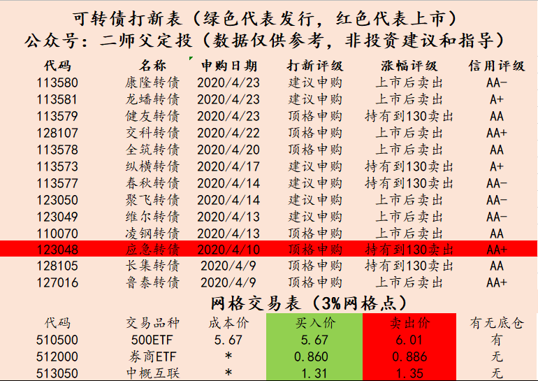

======================================================

_type: talk
@二师父[28814221155551]
2020-05-11 11:04:03 Mon  
topic_id: 421142841248218

<e type="hashtag" hid="554442551244" title="#关于风险#" /> 开车的时候没人不系上安全带吧，这是考虑发生车祸的时候，有个安全保障

生活和投资风险无处不在，关键在于防范以及风险发生了怎么办。

开车系上安全带属于防范，投资也需要防范，比如高估的基金下跌空间大，那么就不要碰，比如做趋势如果反转的话容易掉坑，就需要止损

问题是，每个人买基金都想着赚钱，从来没考虑意外发生怎么办

每个品种买入考虑最坏情况，比如银行，他一般不会大跌，但是容易横盘，就是招行也有过几年横盘的历史，那么你买银行的时候问问自己，假如3年不涨，受不受的了，万一受不了，就别碰

很多人总有侥幸心理，我不可能那么倒霉，最坏的情况让我碰上了，万一不买他飙涨岂不是失去了机会

就是这个心理让投资者不怎么防范风险，之前债券利率低位已经提示最好别投，万一投你就问问自己，股市涨了，利率起来了，你投资的股票涨了，债券跌了，受不受的了，如果受不了就别投

总之，投资之前问问自己最坏情况，发生了受得了那么买基金和债券没问题，如果受不了，还不如买银行理财，投资非赌博，没有百分之80以上的胜率，真不用去投资

阅读[5768]  评论[0]  赞[0] 

======================================================

_type: talk
@二师父[28814221155551]
2020-05-11 18:41:44 Mon  
topic_id: 841154881551282

<e type="hashtag" hid="141112485842" title="#要拿的住#" />

阅读[5665]  评论[0]  赞[0] 

+++++++++++++++++++++++++++++++++++++++++++++++++++++

文件：
2020-05-11 18:41:22 Mon
文件大小：[22380]
51544518418254-牛市上涨通道中，回调都是机会.docx

======================================================

_type: talk
@二师父[28814221155551]
2020-05-11 18:45:34 Mon  
topic_id: 548824118211554

<e type="hashtag" hid="224445218111" title="#全市场估值数据#" /> 全市场PE百分位28.61%，PB百分位11.37%。

SY-BY模型历史百分位26.96%，SY/BY模型历史百分位9.64%。

处于底部区域，以买入和持有为主。

@西锦巴乌 at 2020-05-11 18:45:34 Mon

> 师父好！你这几个数据的百分位是相对全A4300点左右的是吗？如果指数涨到5000点的话是否可以按此数据为基础推数百分位？谢了

----------

@二师父 at 2020-05-11 18:45:34 Mon

> 不能这样推算，利率和市盈率跟指数点位没有完全一致的正相关关系

----------

@西锦巴乌 at 2020-05-11 18:45:34 Mon

> 明白了

----------

阅读[5632]  评论[3]  赞[0] 

======================================================

_type: talk
@二师父[28814221155551]
2020-05-11 19:47:50 Mon  
topic_id: 421142881824448

<e type="hashtag" hid="458588251558" title="#周一市场分析#" /> 现在这个市场我就分析股市和债市。

股市目前比较看好的板块是科技和基建，估值比较低的板块是电器、300非银。估值比较高的板块是医药和医疗。

债券市场处于高估区域，长债短债配置价值都不高的。避险的话银行理财或者货币基金可以有稳定收益。是好一些的。

很多市场解读都把债券市场解读复杂化了，其实没有必要，大家记得，如果你投资债券收益率连银行理财都达不到，那就别玩了，因为要额外承担风险。

这个点位不适合单独加仓，保持定投节奏，有额外大跌的机会再单独加仓。

@HeLLO at 2020-05-11 19:47:50 Mon

> 基建有好的场内基金？

----------

@范毅君 at 2020-05-11 19:47:50 Mon

> 基建现在可以定投了吗

----------

@二师父 at 2020-05-11 19:47:50 Mon

> 主要新基建，5g可以关注下

----------

@二师父 at 2020-05-11 19:47:50 Mon

> 新基建，老基建中铁这种就别搞了

----------

@范毅君 at 2020-05-11 19:47:50 Mon

> 场内哪个可以搞啊

----------

@二师父 at 2020-05-11 19:47:50 Mon

> 先配置基础版，新基建属于卫星配置

----------

@范毅君 at 2020-05-11 19:47:50 Mon

> 165525场内是这个可以开始定投吗

----------

@范毅君 at 2020-05-11 19:47:50 Mon

> 还是说的是股票啊

----------

阅读[5756]  评论[14]  赞[0] 

======================================================

_type: talk
@二师父[28814221155551]
2020-05-11 21:31:09 Mon  
topic_id: 841154825551182

<e type="hashtag" hid="224445455441" title="#日常修心#" />

@以古论今 at 2020-05-11 21:31:09 Mon

> 二师傅你写的字

----------

@衣袂飘香 at 2020-05-11 21:31:09 Mon

> 二师父的字好秀气。在学生时代，你一定是个乖乖的好孩子。

----------

@二师父 at 2020-05-11 21:31:09 Mon

> 中学时代是

----------

阅读[5104]  评论[3]  赞[0] 

+++++++++++++++++++++++++++++++++++++++++++++++++++++

图片：
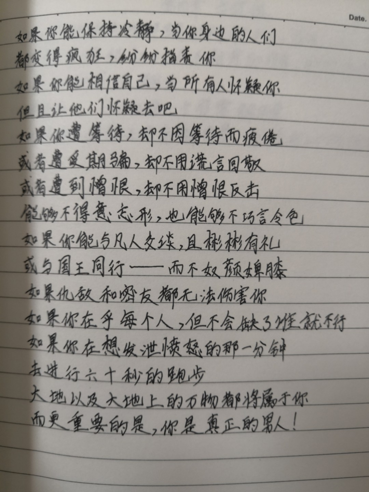

======================================================

_type: talk
@范毅君[118551121224142]
2020-05-12 08:40:06 Tue  
topic_id: 118821548222822

证券要启动了吗[呲牙]

阅读[4807]  评论[0]  赞[0] 

======================================================

_type: q&a
@不知道不明了[15584248411812]
2020-05-12 08:46:08 Tue  
topic_id: 841154824112142

@不知道不明了

>  二师父你好，乌龟计划周三收盘后发布，按周四价格成交，如果周四大涨，成本不就高了么，为什么不考虑在周三的盘中进行操作呢

@二师父

>  那周三涨了怎么办？定期定投不择时，鳄鱼计划择时

阅读[5047]  评论[1]  赞[0] 

======================================================

_type: talk
@光少[244124552511141]
2020-05-12 14:51:55 Tue  
topic_id: 118821511215852

白酒继续上涨

@蓝魔森林 at 2020-05-12 14:51:55 Tue

> 今天可以卖一部分了 感觉 52周新高

----------

阅读[4618]  评论[1]  赞[0] 

+++++++++++++++++++++++++++++++++++++++++++++++++++++

图片：
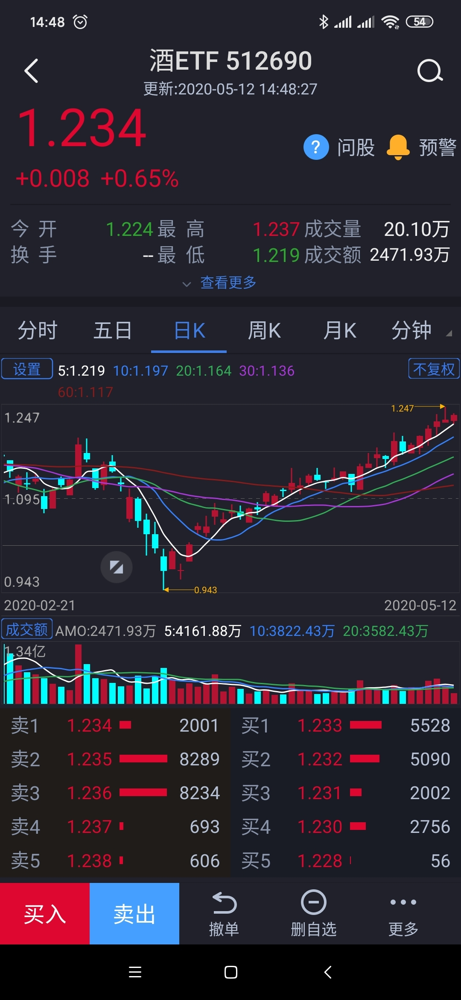

======================================================

_type: talk
@夏萍[28221454818281]
2020-05-12 14:59:46 Tue  
topic_id: 118821511282812

有谁知道南方原油是不是不能转托管了？

@蔡寅宵 at 2020-05-12 14:59:46 Tue

> 我节前办的转托管，节后办的转场内，今天场内卖出了

----------

阅读[4648]  评论[1]  赞[0] 

======================================================

_type: q&a
@是喵喵吖～[421441114141158]
2020-05-12 17:11:48 Tue  
topic_id: 548824144551154

@是喵喵吖～

>  二师父，想请教一下，看节目说是前几天中国放开外资准入限制，就是说外股可以不用通过港股或者B股来投资A股了，所以B股港股就一直在跌，那现在恒生ETF还适合场内网格策略吗？谢谢🌹🌹

@二师父

>  最适合网格的是证券和500，对于单边涨和跌的品种都不是很适合，可以直接做证券和500

阅读[4816]  评论[0]  赞[0] 

======================================================

_type: q&a
@陈洲[88245122222212]
2020-05-12 18:46:24 Tue  
topic_id: 421142814144848

@陈洲

>  债券市场高估，债券基金不适合买入了吧？我前几天买了债券基金，准备抛掉

@二师父

>  是的，不适合现在买债券

阅读[4830]  评论[0]  赞[0] 

======================================================

_type: q&a
@陈Being[28845245224851]
2020-05-12 22:37:31 Tue  
topic_id: 118821584425222

@陈Being

>  二师父：请教一下我在万得APP上搜510900这个代码时，出现两个基金，为什么一个是涨1.19一个是跌-1.3的？这两有什么区别，我们场内定投应该如何选择。谢谢

@二师父

>  场内买H股ETF，场外买易方达恒生H股ETF，一个是场内基金，一个是场外基金

阅读[4708]  评论[0]  赞[0] 

======================================================

_type: talk
@二师父[28814221155551]
2020-05-12 22:40:28 Tue  
topic_id: 841154812452222

<e type="hashtag" hid="824448582112" title="#结构性行情#" /> 结构牛板块很重要，还是大消费、医药、科技。高估的继续高，低估的继续低，市场总是过度反应。剩余医药不多了，也不卖了，我要看看他能否上天。

@栀子花开 at 2020-05-12 22:40:28 Tue

> 上天的意思是什么？估值超越以前所有时间吗？

----------

@二师父 at 2020-05-12 22:40:28 Tue

> 就是涨的非常高

----------

@J at 2020-05-12 22:40:28 Tue

> 哈哈哈

----------

阅读[5385]  评论[3]  赞[0] 

+++++++++++++++++++++++++++++++++++++++++++++++++++++

文件：
2020-05-12 22:39:02 Tue
文件大小：[20026]
88244221581422-结构性行情凸显.docx

======================================================

_type: talk
@二师父[28814221155551]
2020-05-12 22:59:35 Tue  
topic_id: 548824185445184

<e type="hashtag" hid="224445218111" title="#全市场估值数据#" /> 全市场市盈率百分位29.2%，市净率百分位9.35%，SY-BY百分位27.18%，SY/BY百分位9.61%。

@丸子妈 at 2020-05-12 22:59:35 Tue

> 是不是全市场市盈率百分位30%以下都可以买？

----------

@二师父 at 2020-05-12 22:59:35 Tue

> 高估的指数不行

----------

@丸子妈 at 2020-05-12 22:59:35 Tue

> 嗯，目前手里高估就创业板，还留了一点底仓。

----------

@二师父 at 2020-05-12 22:59:35 Tue

> 可以拿小仓位，还在走牛

----------

阅读[5457]  评论[4]  赞[0] 

======================================================

_type: q&a
@小鱼[241182222251181]
2020-05-13 09:49:18 Wed  
topic_id: 241154258258581

@小鱼

>  恒生Etf，最近可以补仓吗

@二师父

>  可以的，需要控制下仓位，港股发生股灾跌幅会很大

阅读[4707]  评论[0]  赞[0] 

======================================================

_type: q&a
@光少[244124552511141]
2020-05-13 10:12:22 Wed  
topic_id: 548824521428854

@光少

>  二师父你好！酒ETF到高估了吗

@二师父

>  在高估和正常之间了，趋势向上，还可以拿着，不放心的话先卖百分之20就行，一般基金涨跌都会过度

阅读[4912]  评论[1]  赞[0] 

======================================================

_type: q&a
@丸子妈[28512522184441]
2020-05-13 10:25:36 Wed  
topic_id: 241154258412281

@丸子妈

>  二师父，港股打新的相关知识，星球里怎么找？有没有链接

@二师父

>  <e type="web" href="https://mp.weixin.qq.com/s/zLK-5_9_A3vd43JOCyAh6A" title="二师父为投资者制定的港股五步打新策略" cache="" />，看这个，集思录有打新建议

阅读[5131]  评论[3]  赞[0] 

======================================================

_type: talk
@二师父[28814221155551]
2020-05-13 11:15:23 Wed  
topic_id: 421142542154518

这只基金可以纳入基金池，等待回调的机会，从行业壁垒看，创新药，医疗赛道优于普通制药。

投资要从现在看到未来，光盯着过去不够。

@wty at 2020-05-13 11:15:23 Wed

> 上次少买了些，已经涨了很多，我卖后留了1成底仓，等待下次低估

----------

@浪淘沙 at 2020-05-13 11:15:23 Wed

> 二师父，场外关注哪个医疗基金好？求代码

----------

@二师父 at 2020-05-13 11:15:23 Wed

> 场外没有好的，有个华宝是分级基金

----------

@二师父 at 2020-05-13 11:15:23 Wed

> 等待医药熄火

----------

@wty at 2020-05-13 11:15:23 Wed

> 好的，等待机会！

----------

@样 at 2020-05-13 11:15:23 Wed

> 等着，师父买的时候吼一声[呲牙]

----------

@二师父 at 2020-05-13 11:15:23 Wed

> 好的，我给加到估值表

----------

@蓝魔森林 at 2020-05-13 11:15:23 Wed

> 白酒是不是可以卖仓位的50%了？

----------

阅读[5132]  评论[14]  赞[0] 

+++++++++++++++++++++++++++++++++++++++++++++++++++++

图片：
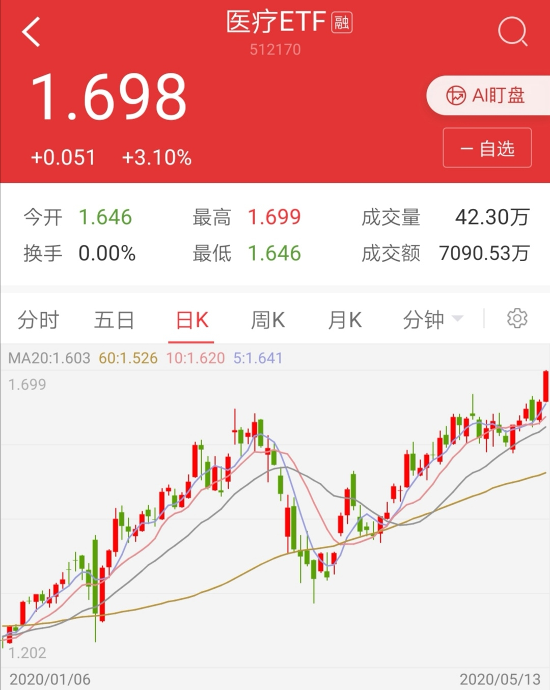

======================================================

_type: q&a
@宁静以致远[841158451581452]
2020-05-13 12:23:02 Wed  
topic_id: 841154251852452

@宁静以致远

>  二师父，家电指数新上后已经涨了一些，我刚开始只买了很少一点，现在还适合加仓吗？总体百分位已经高于25%，是不是指数都要等待回调机会了？

@二师父

>  定投是可以的，这个指数并未向医药那样高估

阅读[5083]  评论[0]  赞[0] 

======================================================

_type: talk
@那方山的树，佛陀座下*[244412158214221]
2020-05-13 14:41:54 Wed  
topic_id: 841154285582582

二师傅，你好，请问我的新能源汽车和计算机已经十几个点的利润了需要卖出吗？

@二师父 at 2020-05-13 14:41:54 Wed

> 可以收割利润，不用清仓

----------

阅读[4914]  评论[1]  赞[0] 

======================================================

_type: talk
@二师父[28814221155551]
2020-05-13 16:12:10 Wed  
topic_id: 841154285421522

#酒# 实盘明天上午发，即时定投。现在保持固定节奏投就行了。卖出的话除了医药和准备调仓的基金，都不用全部卖出了，上涨一般趋势会持续一段时间。

@清水倾城 at 2020-05-13 16:12:10 Wed

> 二师傅，调仓的基金是卖了就买其他的鸡吗？我经常一换就开始跌，导致新买入的站在山岗上[皱眉]

----------

@二师父 at 2020-05-13 16:12:10 Wed

> 可以卖出先放到货币基金里面

----------

@🍀 凝🌸 慧🍀 at 2020-05-13 16:12:10 Wed

> 师父好，每周估值表今天会发吗？

----------

@🍀 凝🌸 慧🍀 at 2020-05-13 16:12:10 Wed

> 刚看到啦，已经发出，谢谢师父

----------

阅读[5096]  评论[4]  赞[0] 

+++++++++++++++++++++++++++++++++++++++++++++++++++++

文件：
2020-05-13 16:11:01 Wed
文件大小：[20226]
15411412448812-白酒领涨，解读中证酒和中证白酒哪个更有投资价值.docx

======================================================

_type: talk
@二师父[28814221155551]
2020-05-13 16:16:59 Wed  
topic_id: 548824512441524

<e type="hashtag" hid="554441158524" title="#打新和网格数据#" /> 网格似乎用不到了，一直涨，不过A股从来不按套路出牌，一般你以为不会跌的时候，他就大跌了

@衣袂飘香 at 2020-05-13 16:16:59 Wed

> 是的，不猜涨跌，涨了收些利润，跌了收获筹码。

----------

阅读[5232]  评论[1]  赞[0] 

+++++++++++++++++++++++++++++++++++++++++++++++++++++

图片：
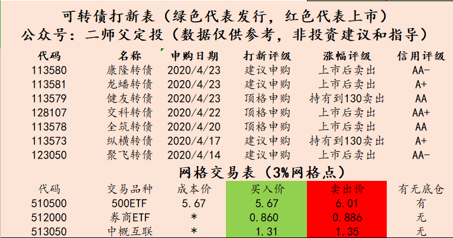

======================================================

_type: talk
@二师父[28814221155551]
2020-05-13 17:20:26 Wed  
topic_id: 548824511218414

<e type="hashtag" hid="825188852442" title="#估值表#" /> 医疗医药仍旧高估，整体市场估值较高，风险溢价率百分位也偏高，格雷厄姆指数百分位是偏低的。综合看目前已经不适合建立大头寸了。

已经投资的可以耐心持有，还没有投资的就需要耐心等待机会了。明天定投继续

@🍀 凝🌸 慧🍀 at 2020-05-13 17:20:26 Wed

> 师父，按照全A市盈率百分位的数据（昨天是29%），明天定投的份数，是不是只能0.5份了？

----------

@二师父 at 2020-05-13 17:20:26 Wed

> 是的，也结合自己仓位

----------

@🍀 凝🌸 慧🍀 at 2020-05-13 17:20:26 Wed

> 明白，如果自己仓位已经较高，就以持有为主。如仓位较低，就可以继续按照0.5份定投。是这样理解吗

----------

@二师父 at 2020-05-13 17:20:26 Wed

> 仓位高，0.5份定投，仓位低仍旧可以1份

----------

@🍀 凝🌸 慧🍀 at 2020-05-13 17:20:26 Wed

> 收到，谢谢师父[玫瑰][玫瑰][玫瑰]

----------

@庆余年 at 2020-05-13 17:20:26 Wed

> 二师父，全指金融剔除了，是因为银行的缘故麽？目前还亏7个点，需要回本清掉麽？

----------

@二师父 at 2020-05-13 17:20:26 Wed

> 可以持有，也可以回本调仓到300非银，马上加杠杆，金融业会逐步起来的。

----------

@庆余年 at 2020-05-13 17:20:26 Wed

> 还问一下，最近有一笔存量资金，总仓位已经平到五层以下了。目前只是按计划做了场外定投，请问多的钱放哪里合适？场内还没开始做计划，之前是放在债券市场的，现在债券走熊了。

----------

阅读[5954]  评论[12]  赞[0] 

+++++++++++++++++++++++++++++++++++++++++++++++++++++

图片：
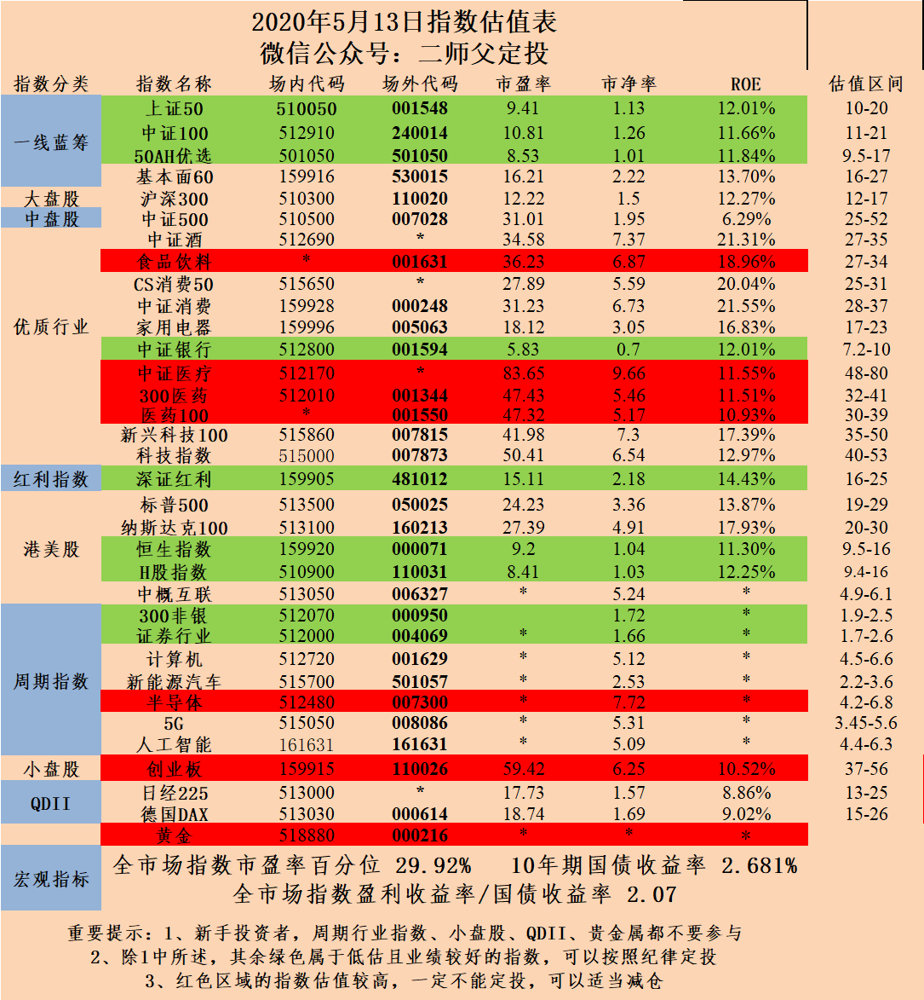

======================================================

_type: q&a
@次郎🌻[48551412448858]
2020-05-14 07:29:04 Thu  
topic_id: 118821458581842

@次郎🌻

>  最近买了五万债基，但是遇到国债利率下调，二师父怎么看未来发展。
>  我应该抛还是拿着？

@二师父

>  长期看债券基金有利息收益是不断上涨的，短期受到利率上行以及流动性的增加股市回暖的影响，会有向下的波动。

阅读[5041]  评论[1]  赞[0] 

======================================================

_type: q&a
@HeLLO[15548451524442]
2020-05-14 09:13:46 Thu  
topic_id: 841154224855512

@HeLLO

>  师父:
>  1.我场内有基本配置300.500ETF，证券ETF，恒生指数这些额度已经配够，后期有增量资金想在定投300非银，上证50 .深红利，5G，人工智能，家电指数，新能源车这样配置是否合理？请师父指点下，谢谢。
>  
>  2.场外以前有购买汇富添移动互联000697
>  目前亏损中，是否需换掉？
>  
>  3.场外定投了四年的环保，每月定投2000.目前累计本金比较多，但环保目前也低估需一次换掉吗？换什么合适？目前亏8%.

@二师父

>  5G不如半导体，有了300非银，上证50也可以不买。
>  
>  移动互联持有的是科技股票，基本面没有问题，主要是买贵了
>  
>  环保很差，换成深红利，300，或者消费，电器定投都可以

阅读[5053]  评论[5]  赞[0] 

======================================================

_type: talk
@二师父[28814221155551]
2020-05-14 09:48:50 Thu  
topic_id: 841154224122142

<e type="hashtag" hid="141115418182" title="#238期定投实盘#" /> 继续买入深红利和人工智能，消费和医疗我相信后面有机会，这个走势实在太像18年了，当然18年是处于去杠杆的阶段，如今是加杠杆，宏观面发生了改变，不确定的是国际关系，总之只要买入的指数在安全边际范围内，不用担心，拿住就可以了。

@J at 2020-05-14 09:48:50 Thu

> 师父，人工智能现在是不是在低估了？买场外还是场内好？

----------

@HeLLO at 2020-05-14 09:48:50 Thu

> 消费，医疗高估了，定投可行？

----------

@rtdmm小米 at 2020-05-14 09:48:50 Thu

> 二师父，场内人工智能成交量有点小哒

----------

@二师父 at 2020-05-14 09:48:50 Thu

> 担心流动性就场外

----------

@二师父 at 2020-05-14 09:48:50 Thu

> 高估就别投了

----------

@二师父 at 2020-05-14 09:48:50 Thu

> 一样的

----------

@rtdmm小米 at 2020-05-14 09:48:50 Thu

> 请问二师父，场内人工智能可以人工智能Ai ETF 515070代替吗？

----------

@二师父 at 2020-05-14 09:48:50 Thu

> 可以的

----------

阅读[5864]  评论[27]  赞[0] 

+++++++++++++++++++++++++++++++++++++++++++++++++++++

文件：
2020-05-14 09:47:02 Thu
文件大小：[122595]
48522522128228-二师父238期定投实盘记录.docx

======================================================

_type: q&a
@Zero Fei[51422225155524]
2020-05-14 15:02:53 Thu  
topic_id: 841154442855812

@Zero Fei

>  二师父，新股申请是不是基本没有风险

@二师父

>  投资都有风险，只是说新股中了大概率是盈利的

阅读[4750]  评论[0]  赞[0] 

======================================================

_type: talk
@二师父[28814221155551]
2020-05-14 15:33:27 Thu  
topic_id: 241154444558851

<e type="hashtag" hid="452228241118" title="#说几只看好的基金#" /> 医疗etf，纳斯达克etf，人工智能etf，创业板etf

后面有机会鳄鱼计划发车，需要注意一点，二师父说的看好，不意味着明天就买，更不意味着明天就涨，而是这些指数基金是优质指数基金，选择合适时机买入，未来盈利可观

理解上不能有偏差，否则就会出现失误操作，当然半导体也看好，只不过这只基金不符合价值投资原则，不会在鳄鱼计划购买，就在自己股票账户自行操作，属于四个账户进攻账户，后面我的鳄鱼计划和乌龟计划都用低风险品种，稳健增值，毕竟大多数投资者还是处于入门阶段，对风控没有太上心。

投资过程中耐心很重要，比选对股票还重要，有的人选中了牛股，可是一般赚20个点就走了，变得耐心，最好的办法，写毛笔字，学习逐字阅读。

不要总觉得我没传授你信息和知识，这些在我看来没那么重要，重要的是思维和理念，知识百度都可以查到，但关于投资的思想自己理念却是百度不到的，而这也是区分人与人层次的分水岭

学习最重要的是思考，而不是今天学了个什么知识点，这些可以查的，而顶级的思考力，对他人的理解力，对人生和社会的感知力需要靠领悟，而不是单一知识的积累

为什么那么多大学生跳楼，他们只背诵了书本，却没有经过思考理解社会，理解人生，理解父母，那么知识越多负累越多

投资也一样，懂得太多知识反而让投资者变得愚蠢。只有思维和认知才是最重要的。

@衣袂飘香 at 2020-05-14 15:33:27 Thu

> 是的，克服冲动式一把梭哈购买，管住手，继续修炼。

----------

@Mr-K at 2020-05-14 15:33:27 Thu

> 改变认知

----------

阅读[5491]  评论[2]  赞[0] 

======================================================

_type: talk
@二师父[28814221155551]
2020-05-14 16:57:44 Thu  
topic_id: 548824444541554

<e type="hashtag" hid="552114551414" title="#估值数据#" /> 全市场指数市盈率百分位29.68%，市净率百分位9.35%

SY-BY模型百分位28.15%，SY/BY模型百分位11.94%。

全市场指数市盈率是上升的，主要是一季度大部分企业盈利下降，如果二季度反转情况会好点。

现在除了金融板块，医疗、消费其实并不低。这两个板块别追。

阅读[5569]  评论[0]  赞[0] 

======================================================

_type: talk
@二师父[28814221155551]
2020-05-14 21:27:46 Thu  
topic_id: 118821185142212

2020年5月14日，深交所决定乐视网股票终止上市。

启示，不要买垃圾讲故事的企业，不小心买了这类股票，在亏之前或者小亏的时候，要跑的比兔子还快

@黎雄 at 2020-05-14 21:27:46 Thu

> 师傅那之前买了乐视的股票，现在就亏完了嘛。还是能收回一点

----------

@二师父 at 2020-05-14 21:27:46 Thu

> 赶紧卖了

----------

@JOY at 2020-05-14 21:27:46 Thu

> 问个小白的问题，这种时候还能卖得掉吗？还会有愿意买入的吗？

----------

@二师父 at 2020-05-14 21:27:46 Thu

> 如果刚ST的话，还有人博傻去买，侥幸心理，不过封死跌停的话就卖不出去了

----------

@JOY at 2020-05-14 21:27:46 Thu

> 谢谢

----------

阅读[4823]  评论[5]  赞[0] 

======================================================

_type: q&a
@是喵喵吖～[421441114141158]
2020-05-14 22:04:12 Thu  
topic_id: 548824481814544

@是喵喵吖～

>  二师父想请教现在这个行情适合收割部分利润吗？像之前定投的博时标普500有的达到15%了 需要收割吗。有点迷茫。我知道要坚持持有到牛市，但是会让利润回撤吗？因为我年前的定投的利润就都回撤进去了。谢谢！

@二师父

>  可以收割的，投资需要灵活，收割利润的前提是建立在市场预期下跌的基础上，如果市场是一个波动性大的，有可能回调到前期低点的情况，就适合收割，而且只是卖了一部分，就算市场没有跌，也不会踏空。

阅读[4984]  评论[0]  赞[0] 

======================================================

_type: q&a
@蓝魔森林[28888244485121]
2020-05-15 16:25:24 Fri  
topic_id: 841154414821412

@蓝魔森林

>  二师傅怎么看吉利汽车的股票。我觉得ceo还是很有眼光的。这个企业未来会更好。二师傅怎么看汽车行业

@二师父

>  汽车属于可选消费行业，可以关注新能源汽车赛道，特斯拉，埃隆马斯克的战略格局挺高的。
>  
>  汽车行业受到宏观经济的影响，政策有一部分影响，比如减税降费会促进汽车销量和营业收入。吉利汽车不了解，从财务报表看19年营收是下滑的，20年影响很大，营收大概率下滑，市场对汽车行业预期并不高。
>  
>  汽车行业可以关注特斯拉和宁德时代。

阅读[4521]  评论[1]  赞[0] 

======================================================

_type: talk
@二师父[28814221155551]
2020-05-15 16:37:56 Fri  
topic_id: 841154185485812

很明显的结构行情，也就场内自有资金转来转去，散户资金根本没进来，进攻账户大部分科技，现在医药的估值是高于科技的，医疗肯定会跌，至于什么时候就不清楚了

可以均衡配置，消费，医药，科技，人工智能，非银金融，然后卧倒不动，市场一定会震荡让大部分人交出筹码，这是必然的，大多数人受不了长期的上上下下，一定逆向思维，哪个涨的好买哪个，隔天就给套住了

@Mr-K at 2020-05-15 16:37:56 Fri

> 很清楚，昨天医药消费涨今天就跌，然后科技领涨今天，震荡

----------

@J at 2020-05-15 16:37:56 Fri

> 师父用的这个是哪个券商app？字好大看着舒服啊

----------

@二师父 at 2020-05-15 16:37:56 Fri

> 华泰啊

----------

@J at 2020-05-15 16:37:56 Fri

> 华宝智投的字体太小了，用华泰怎么把原来的账户里的基金转换过来？

----------

@二师父 at 2020-05-15 16:37:56 Fri

> 看你自己怎么舒服怎么来

----------

阅读[4669]  评论[5]  赞[0] 

+++++++++++++++++++++++++++++++++++++++++++++++++++++

图片：
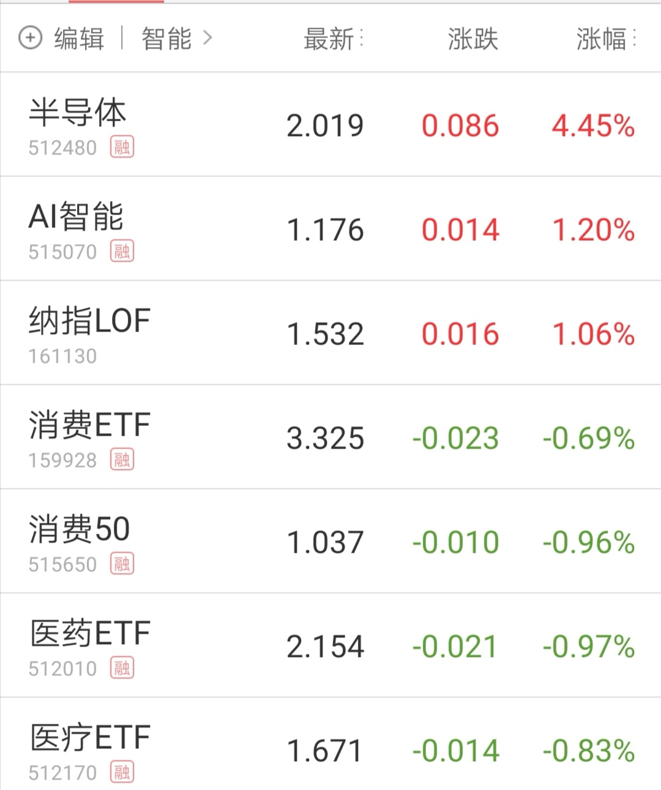

======================================================

_type: talk
@二师父[28814221155551]
2020-05-15 18:49:02 Fri  
topic_id: 841154188258842

<e type="hashtag" hid="824442528152" title="#科技基金#" /> 投资美国的三只科技基金，优选纳斯达克100.场外限购，场内纳指LOF套利比较好，当前没有溢价。需要注意的是这只基金成交量并不多。

@蛋炒饭不加蛋 at 2020-05-15 18:49:02 Fri

> 请问二师父五档买入法是什么

----------

@二师父 at 2020-05-15 18:49:02 Fri

> 把资金分5分，按照下跌空间直接买5次结束

----------

@蛋炒饭不加蛋 at 2020-05-15 18:49:02 Fri

> 低估以后每下跌5%买一次吗

----------

@二师父 at 2020-05-15 18:49:02 Fri

> 也不一定是5%，得看市场趋势和下跌空间

----------

@蛋炒饭不加蛋 at 2020-05-15 18:49:02 Fri

> 好的

----------

@Zyxj at 2020-05-15 18:49:02 Fri

> 有代码吗？

----------

@二师父 at 2020-05-15 18:49:02 Fri

> 161130

----------

@Zyxj at 2020-05-15 18:49:02 Fri

> 我查了场内的规模1.77亿，是不是太少了！

----------

阅读[5276]  评论[15]  赞[0] 

+++++++++++++++++++++++++++++++++++++++++++++++++++++

文件：
2020-05-15 18:48:15 Fri
文件大小：[19731]
15411825485522-投资美国科技股有哪些好基金.docx

======================================================

_type: talk
@二师父[28814221155551]
2020-05-15 22:02:30 Fri  
topic_id: 841154181525582

<e type="hashtag" hid="554445254814" title="#投资中最重要的事#" />

阅读[5342]  评论[0]  赞[0] 

+++++++++++++++++++++++++++++++++++++++++++++++++++++

文件：
2020-05-15 22:02:16 Fri
文件大小：[17512]
15411825844452-投资中最重要的事第一讲.docx

======================================================

_type: q&a
@心荷[241825511182221]
2020-05-16 08:56:49 Sat  
topic_id: 118821842855212

@心荷

>  师傅你好，请问中证消费和cs消费50有什么区别？谢谢指教

@二师父

>  中证消费是必须消费行业股票集合，消费50是必须消费加可选消费

阅读[4679]  评论[0]  赞[0] 

======================================================

_type: q&a
@HeLLO[15548451524442]
2020-05-16 10:41:53 Sat  
topic_id: 548824818481524

@HeLLO

>  师父，请教一下83.47元怎么理解？

@二师父

>  在哪看的，宁波转债好像已经退市了

阅读[4853]  评论[0]  赞[0] 

======================================================

_type: talk
@树叶[544811512145144]
2020-05-16 11:38:47 Sat  
topic_id: 241154124221241

<e type="hashtag" hid="142825811122" title="#定投周报#" />

阅读[4908]  评论[0]  赞[0] 

+++++++++++++++++++++++++++++++++++++++++++++++++++++

文件：
2020-05-16 11:38:46 Sat
文件大小：[229601]
15411824845452-二师父定投周报5.16（第59期）.docx

======================================================

_type: talk
@二师父[28814221155551]
2020-05-16 15:41:03 Sat  
topic_id: 241154121212811

<e type="hashtag" hid="824442841842" title="#两只债券基金及债券的配置#" /> 很多读者要是不说的话，我还真不知道还有那么高比例配置债券的，其实债券的收益在熊市比较好，可是一般牛市来了的话他基本上是处于负收益状态。看两只比较好的债券基金，10年期国债基金和广发中债基金。

即使很好的债券基金，在过去的平均年化收益率也小于5%。那对于在下行空间较大的情况下配置债券是不划算的，首先要承担跑输通货膨胀的风险，其次你的投资资金被占用，想让于让渡了一部分的股权收益。

债券的防守可以，而对于未来收益率不能超过4%，就没有必要去配置了。

阅读[5549]  评论[0]  赞[0] 

+++++++++++++++++++++++++++++++++++++++++++++++++++++

图片：
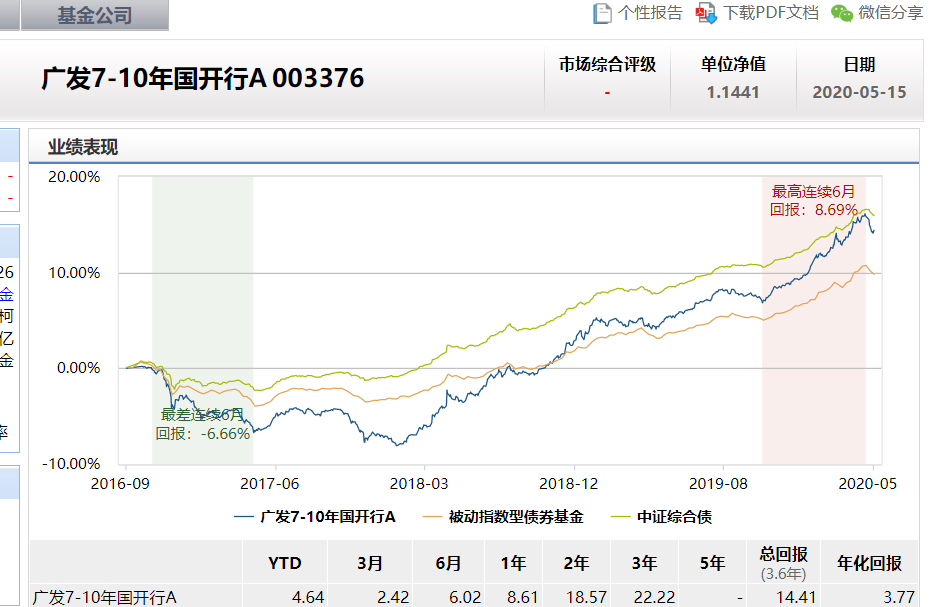
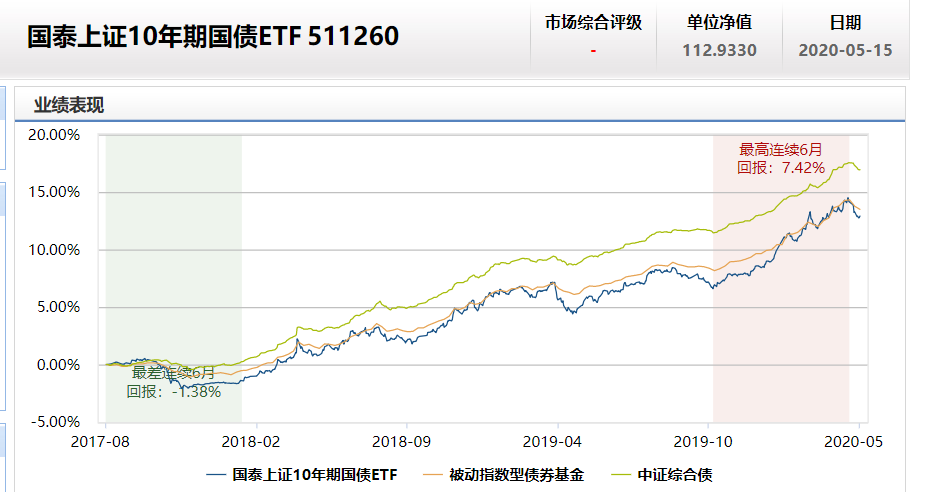

======================================================

_type: talk
@阿宝[422212151424158]
2020-05-16 16:50:08 Sat  
topic_id: 241154145554811

自己的思考，不构成意见建议！

@志亮 at 2020-05-16 16:50:08 Sat

> 嗯，投资真的是一件有趣的事[微笑]

----------

@厚基薄发 at 2020-05-16 16:50:08 Sat

> 投资要买的便宜，这句话内容很丰富，看似理解了，过了一段时间又有新的理解[微笑]

----------

阅读[5090]  评论[2]  赞[0] 

+++++++++++++++++++++++++++++++++++++++++++++++++++++

文件：
2020-05-16 16:50:08 Sat
文件大小：[15360]
51544824111514-5.16   投资简单一点就好.doc

======================================================

_type: q&a
@厚基薄发[15522588545552]
2020-05-16 18:53:28 Sat  
topic_id: 548824841844184

@厚基薄发

>  请推荐几只可以长期投资的医药类主动基金，可以作为观察仓先关注一下。非常感谢！

@二师父

>  中欧医疗创新股票A

阅读[5319]  评论[0]  赞[0] 

======================================================

_type: talk
@二师父[28814221155551]
2020-05-16 19:42:56 Sat  
topic_id: 841154142841512

<e type="hashtag" hid="824442528152" title="#科技基金#" /> 关于科技基金，到底是泡沫还是预期较高。

@厚基薄发 at 2020-05-16 19:42:56 Sat

> 请问二师傅，如果要选择美股科技基金，标普科技和纳指100，选哪个比较好呢？谢谢指点[握手][抱拳]

----------

@二师父 at 2020-05-16 19:42:56 Sat

> 选择纳斯达克100好一点，具有高成长性

----------

@厚基薄发 at 2020-05-16 19:42:56 Sat

> 谢谢

----------

阅读[6326]  评论[3]  赞[0] 

+++++++++++++++++++++++++++++++++++++++++++++++++++++

文件：
2020-05-16 19:17:13 Sat
文件大小：[120846]
88244154221252-科技ETF密集发行，是否可以定投.docx

======================================================

_type: talk
@二师父[28814221155551]
2020-05-17 16:55:08 Sun  
topic_id: 841151555848422

<e type="hashtag" hid="224442488181" title="#仓位的核心#" /> 仓位管理要做好分仓管理。这个在五步定投法里面详细讲过了。不用的账户对应不同的功能。然后稳健账户分了两个，天天基金的乌龟计划和我自己的鳄鱼计划。我说的满仓，9成仓位就是指鳄鱼计划的仓位。

这种分仓管理会让投资者内心非常平静。如果你有保守账户做后盾，不管发生什么事情，即使满仓遇到下跌心态也会很稳定。

这才是投资里面非常重要的一个环节，另外进攻账户可配可不配，从最近一年多的行情看，买股票的收益率确实比基金高，无论是五粮液、迈瑞医疗，还是一些科技类股票。

总之根据实际情况来，一步步走，在能力圈内走，一项投资既能稳定增值，又能保证内心的恬淡与平静，那么就是比较好的，否则可能账户管理以及仓位管理出了问题。

如果两会期间下跌，继续加仓至满仓，否则不动，不买也不卖，放弃小波段，坚定持有。

@朝阳模具 at 2020-05-17 16:55:08 Sun

> 谈谈我目前的仓位布置
场内ETF基金仓位20%，
场外偏股型基金仓位40%，
场外偏债型基金仓位40%。

----------

@二师父 at 2020-05-17 16:55:08 Sun

> 很稳健的配置

----------

@海马 at 2020-05-17 16:55:08 Sun

> [强][强][强][强]

----------

@杜志彪 at 2020-05-17 16:55:08 Sun

> 我应该和二师父类似，场内根据估值在下跌中分批买入持有，在上涨中收割利润，高估卖本走人，也就是常说的微笑曲线，场外只是用每月的增量资金去定投，定投品种和场内基本一致。

----------

@二师父 at 2020-05-17 16:55:08 Sun

> 差不多的

----------

@衣袂飘香 at 2020-05-17 16:55:08 Sun

> 我也类似。

----------

@Hi·DD at 2020-05-17 16:55:08 Sun

> 已经满仓不动了，500做点小波段[调皮]

----------

@二师父 at 2020-05-17 16:55:08 Sun

> 优质基金拿住没问题

----------

阅读[5285]  评论[8]  赞[0] 

======================================================

_type: talk
@二师父[28814221155551]
2020-05-17 19:14:39 Sun  
topic_id: 241151558525211

<e type="hashtag" hid="141114158212" title="#东方红#" /> 这只基金的经理换了，星球的朋友没有购买吧，我就购买指数和股票，虽然主动基金去年医疗确实比指数基金收益率好，但是我更喜欢确定性，各有所爱吧。

另外网格不做了，后面做一个华宝的自动策略，大家设置自动下单，自动赚就好，主要是盯盘的话影响时间和心态，更多的时间用于学习和工作吧。

明天如果大跌的话，计划鳄鱼计划发车一次，最近有二次下跌的话，鳄鱼计划满仓，全力做多，我的宗旨就是低估区域小跌小买，大跌大买，买完等待。我从来不会因为下跌而担心，只会因为上涨而谨慎。

当然仅限于指数基金，股票的话不是所有的都适用。

@朝阳模具 at 2020-05-17 19:14:39 Sun

> 一直用华宝智能网格功能，自动买卖，不用耗费精力看盘，省心。

----------

@二师父 at 2020-05-17 19:14:39 Sun

> 是的，浪费精力不划算

----------

@蛋炒饭不加蛋 at 2020-05-17 19:14:39 Sun

> 华宝有时候挂后台会关闭，要重新开一次

----------

@衣袂飘香 at 2020-05-17 19:14:39 Sun

> 没用华宝的怎么办呢？二师父以后的网格还是发布下吧，供我们参考。

----------

@二师父 at 2020-05-17 19:14:39 Sun

> 很简单啊，就是表格的价格，设定的百分之3网格

----------

@衣袂飘香 at 2020-05-17 19:14:39 Sun

> 可是表格的价格过一段时间会变动的。

----------

@二师父 at 2020-05-17 19:14:39 Sun

> 变了就发出来

----------

阅读[6234]  评论[7]  赞[0] 

+++++++++++++++++++++++++++++++++++++++++++++++++++++

文件：
2020-05-17 19:09:18 Sun
文件大小：[57680]
48522185584128-东方红恒元五年定开混合基金经理林鹏离职，投资者该怎么办.docx

======================================================

_type: talk
@二师父[28814221155551]
2020-05-18 09:56:35 Mon  
topic_id: 548828211141184

<e type="hashtag" hid="881251425252" title="#鳄鱼计划#" /> 家用电器，AI智能，科技100各买入一份，后两个属于高风险品种，需谨慎

代码，159996，515860，515070。今天又轮到消费了，哪个板块跌了就加点，不管做价值还是趋势，永不追涨

最后大概还有16份场内子弹，买完就满仓等待，场外后续每周四定投加2800点以下额外发车，知行合一，坚定做价值投资

@是喵喵吖～ at 2020-05-18 09:56:35 Mon

> 二师父请问场内鳄鱼的一份你是多少呀 场外一份是2000来是吧我记得

----------

@逍遥生 at 2020-05-18 09:56:35 Mon

> 159996 家用电器
515070 AI智能
515860 科技100

----------

@二师父 at 2020-05-18 09:56:35 Mon

> 4000左右

----------

@J at 2020-05-18 09:56:35 Mon

> 师父，515860和515000有何区别？

----------

@二师父 at 2020-05-18 09:56:35 Mon

> 不同基金公司的品种

----------

@杜志彪 at 2020-05-18 09:56:35 Mon

> 我选人工智能和家用电器一份

----------

@rtdmm小米 at 2020-05-18 09:56:35 Mon

> 家用电器加一份

----------

@呵呵→_→ at 2020-05-18 09:56:35 Mon

> 师傅，Ai智能，跟人工智能一样的吧，早上买的人工智能

----------

阅读[6084]  评论[22]  赞[0] 

======================================================

_type: talk
@二师父[28814221155551]
2020-05-18 10:22:48 Mon  
topic_id: 548828211585214

进攻账户主打基金，强者恒强，放弃追涨，习惯持盈

@水墨青花 at 2020-05-18 10:22:48 Mon

> 师父，512170还正常估值吗？场内有溢价吧

----------

@二师父 at 2020-05-18 10:22:48 Mon

> 高估了，不能买，等回调

----------

@水墨青花 at 2020-05-18 10:22:48 Mon

> 好的，谢谢。

----------

阅读[5376]  评论[3]  赞[0] 

+++++++++++++++++++++++++++++++++++++++++++++++++++++

图片：
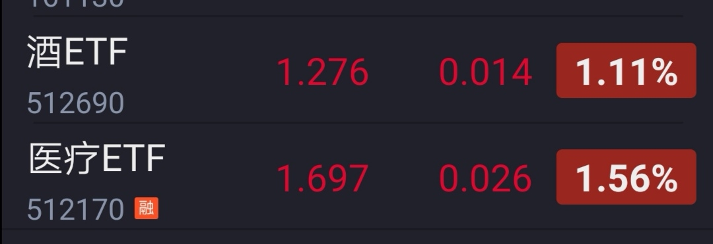

======================================================

_type: q&a
@不知道不明了[15584248411812]
2020-05-18 11:35:20 Mon  
topic_id: 118854445444842

@不知道不明了

>  二师父，请问今天将50ah调仓的话，适合调什么基金呢，比例怎么分配比较好，现在有3.3万的50ah

@二师父

>  深红利，家用电器，3比2，然后继续定投

阅读[5456]  评论[2]  赞[0] 

======================================================

_type: talk
@二师父[28814221155551]
2020-05-18 16:15:00 Mon  
topic_id: 841182224882552

<e type="hashtag" hid="458588251558" title="#周一市场分析#" /> 市场一直轮动，但是不管怎么轮动，消费和医药都在急速上涨，之前谈白酒的时候，有人说市场变了，有新版块布局，我问他是哪些板块也没讲。

也不知道他做的怎么样了，对于食品饮料板块一直都是优质板块。过去的银行、有色以及钢铁在15年前还可以，慢慢弱了。

未来随着科学技术的进步，科技板块值得重视，而现在关键问题在于科技之战中国的5G公司是否能够做到国产替代，可以对高通、思科、苹果、英特尔说：我不需要依赖你。

如果能做到，A股科技未来非常好，如果不能，不确定性就大了。投资是追求确定性，科技板块经常在变，之前的诺基亚，HTC，联想，老大地位早就易主了。

以确定性强的板块为主要投资方向，投资非赌博，胜率和确定性最重要。

@🍀 凝🌸 慧🍀 at 2020-05-18 16:15:00 Mon

> 师父，您怎么看待消费和医药一直在快速上涨？

----------

@二师父 at 2020-05-18 16:15:00 Mon

> 中国股市变化莫测，保持敬畏，无法评判，15年医药100市盈率高达百倍，没有逻辑，人有多大胆，价有多高，拿住就行，偶尔收收利润，到达目标了清仓

----------

@🍀 凝🌸 慧🍀 at 2020-05-18 16:15:00 Mon

> 好的，保持敬畏，坚守投资纪律，谢谢师父。[抱拳][抱拳][抱拳]

----------

@杜志彪 at 2020-05-18 16:15:00 Mon

> 确定性强的还是医药和消费

----------

@二师父 at 2020-05-18 16:15:00 Mon

> 比较好的赛道

----------

阅读[5128]  评论[5]  赞[0] 

======================================================

_type: talk
@二师父[28814221155551]
2020-05-18 22:10:35 Mon  
topic_id: 118854415888112

<e type="hashtag" hid="48418442242558" title="#科技#" /> 有人问5G能不能投，如果3000元，娱乐娱乐可以，重仓的话就不知道了，这个不确定性就比较大。

阅读[5105]  评论[0]  赞[0] 

+++++++++++++++++++++++++++++++++++++++++++++++++++++

文件：
2020-05-18 22:09:43 Mon
文件大小：[21624]
28244128125121-美国又对华为出手了，实际上是科技竞争.docx

======================================================

_type: talk
@二师父[28814221155551]
2020-05-19 06:26:35 Tue  
topic_id: 421185514452848

@罗大发 at 2020-05-19 06:26:35 Tue

> 师父，请问你的食品饮料卖完了吗？

----------

@二师父 at 2020-05-19 06:26:35 Tue

> 场外都卖了，鳄鱼计划消费还持有的

----------

@门萨🐨 at 2020-05-19 06:26:35 Tue

> 酒清了吗？

----------

@二师父 at 2020-05-19 06:26:35 Tue

> 之前统一换成消费的，他和消费类似

----------

@门萨🐨 at 2020-05-19 06:26:35 Tue

> 我消费好像也快清完了😂

----------

@云淡风轻 at 2020-05-19 06:26:35 Tue

> 二师父为什么发个2月份的节气？

----------

@二师父 at 2020-05-19 06:26:35 Tue

> 就是一个图，看到了下面这句话，节气没重点关注

----------

@二师父 at 2020-05-19 06:26:35 Tue

> 可以慢点来

----------

阅读[4862]  评论[11]  赞[0] 

+++++++++++++++++++++++++++++++++++++++++++++++++++++

图片：

======================================================

_type: talk
@二师父[28814221155551]
2020-05-19 14:03:22 Tue  
topic_id: 241182211221841

<e type="hashtag" hid="454852525548" title="#荐书#" />

阅读[5429]  评论[0]  赞[0] 

+++++++++++++++++++++++++++++++++++++++++++++++++++++

文件：
2020-05-19 14:01:30 Tue
文件大小：[83209651]
48522151255128-《文明、现代化、价值投资与中国》.pdf

======================================================

_type: talk
@紫色天使[844124551411152]
2020-05-19 14:41:10 Tue  
topic_id: 118854488185822

二师父，华宝油气可以从支付宝转华泰吗？

@二师父 at 2020-05-19 14:41:10 Tue

> 可以转，但是没有必要转换。

因为现在华宝油气是折价的了，相当于场外的净值比场内的价格高，如果转到场内的话，反而基金的价格变低了，收益减少了。

只有当场内价格高于场外净值，溢价的时候才适合转换的。

----------

@紫色天使 at 2020-05-19 14:41:10 Tue

> 好的，谢谢二师傅

----------

阅读[4756]  评论[2]  赞[0] 

======================================================

_type: talk
@孟倩[118822124154582]
2020-05-19 16:14:27 Tue  
topic_id: 421185244815128

请问二师父，场内的酒盈利破20%了，可以逐步卖出吗？还是持续持有？

@二师父 at 2020-05-19 16:14:27 Tue

> 这个今天文章我写了，加入投了10万，盈利20%，可以卖出2万，后面继续持有，有可能还会新高，刚刚在正常和高估值的阈值之间

----------

@孟倩 at 2020-05-19 16:14:27 Tue

> 好的，谢谢

----------

@J at 2020-05-19 16:14:27 Tue

> 师父，昨天加了白酒10万吗？这是属于趋势交易吗？

----------

@What if at 2020-05-19 16:14:27 Tue

> 假如，不是加入[偷笑]

----------

@J at 2020-05-19 16:14:27 Tue

> 哈哈 秒懂了[调皮]

----------

阅读[4725]  评论[5]  赞[0] 

======================================================

_type: talk
@二师父[28814221155551]
2020-05-19 16:32:15 Tue  
topic_id: 421185244521458

<e type="hashtag" hid="15285221845522" title="#白酒要不要卖#" /> 今天详细解答了，白酒要不要卖，看趋势还是上涨的，可以收割利润，分步止盈，那么基本上不卖到顶点也是在顶部区域了

@黎雄 at 2020-05-19 16:32:15 Tue

> 师傅那油气有好的投资标底没有

----------

@二师父 at 2020-05-19 16:32:15 Tue

> 没发现有好的标的

----------

阅读[5788]  评论[2]  赞[0] 

+++++++++++++++++++++++++++++++++++++++++++++++++++++

文件：
2020-05-19 16:31:31 Tue
文件大小：[20391]
48522124488858-聊一聊大家关心的华宝油气和白酒.docx

======================================================

_type: talk
@二师父[28814221155551]
2020-05-19 23:12:22 Tue  
topic_id: 421185241218588

<e type="hashtag" hid="144254515412" title="#全市场估值#" /> 截止5.19日收盘，10年期国债收益率2.728，处于上升趋势，所以债券最近受到压制了。之前已经说过这时候不适合搞债券，防风险货币基金就可以了。银行理财的收益都比债券好。

全市场指数市盈率百分位30.34%，市净率百分位10.34%，市盈率百分位高市净率百分位低。这说明利润偏低，估值还是低位。

风险溢价率SY-BY百分位28.85%，SY/BY百分位13.58%。已经从底部回升了。目前资金不足的可以暂停定投，每月稳定结余的可以还是周定投，缩减金额。

需要注意，定投归定投，仓位不足，底部注意分批次把仓位补上来，不然上涨容易追。现在拿住就可以了，医药有点高，可以逐步清掉。还是需要有容纳财富的胸怀，如果仅仅是为了赚点小钱，盈利了利润收割就行，如果资金量大想实现更多的利润，底仓一定拿住了。拿个三年，你会豁然开朗。

@衣袂飘香 at 2020-05-19 23:12:22 Tue

> SY—BY以及SY/BY百分位，多少以下算低估，多少以上算高估？

----------

@二师父 at 2020-05-19 23:12:22 Tue

> 百分之10以下极度低估

----------

@衣袂飘香 at 2020-05-19 23:12:22 Tue

> 好的，谢谢。

----------

阅读[5582]  评论[3]  赞[0] 

======================================================

_type: talk
@二师父[28814221155551]
2020-05-20 09:49:40 Wed  
topic_id: 841182484251512

<e type="hashtag" hid="881251425252" title="#鳄鱼计划#" /> 卖出中概互联一份，19年买入的标的，盈利可观，不要贪婪，可以卖出一份或者自行收割利润

@shee at 2020-05-20 09:49:40 Wed

> 已买[呲牙]

----------

@二师父 at 2020-05-20 09:49:40 Wed

> 卖出，不是买入

----------

@shee at 2020-05-20 09:49:40 Wed

> 字打错了，已卖

----------

@wty at 2020-05-20 09:49:40 Wed

> 我也卖了，本来也没有多少

----------

@西锦巴乌 at 2020-05-20 09:49:40 Wed

> 师父请问现有什么货币基金可买？

----------

@二师父 at 2020-05-20 09:49:40 Wed

> 银华日利

----------

阅读[4697]  评论[6]  赞[0] 

======================================================

_type: talk
@二师父[28814221155551]
2020-05-20 16:44:58 Wed  
topic_id: 421185255224418

<e type="hashtag" hid="28518551514141" title="#5.20估值表#" /> 今天是个好日子，看看可以定投的指数不多，消费医药太猛了，注意后面两会下跌，如果有机会的话，跌破2800点会加大定投力度，机会总是不缺的，就是看有没有子弹。

@门萨🐨 at 2020-05-20 16:44:58 Wed

> 确实猛[捂脸]

----------

@门萨🐨 at 2020-05-20 16:44:58 Wed

> 医药翻倍了。虽然我记不清什么时候买的了[尴尬]

----------

@二师父 at 2020-05-20 16:44:58 Wed

> 18年，当时说不买犯罪

----------

@门萨🐨 at 2020-05-20 16:44:58 Wed

> 还是你帮我记得清[偷笑]

----------

阅读[5347]  评论[4]  赞[0] 

+++++++++++++++++++++++++++++++++++++++++++++++++++++

图片：
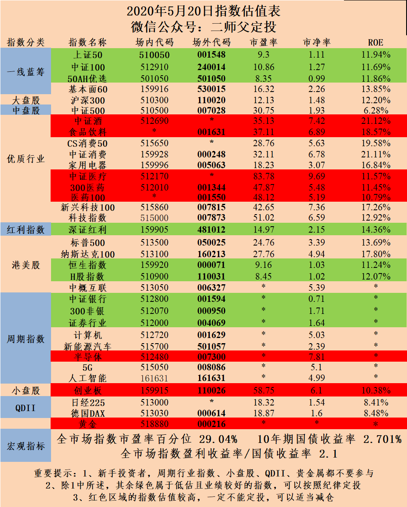

======================================================

_type: talk
@二师父[28814221155551]
2020-05-20 17:10:59 Wed  
topic_id: 548815455858184

<e type="hashtag" hid="881422852442" title="#定投实盘#" /> 买入深红利一份。

@样 at 2020-05-20 17:10:59 Wed

> 请问中证100怎么样？今天定投的中证100和深红利

----------

@二师父 at 2020-05-20 17:10:59 Wed

> 可以的，他是沪深大蓝筹

----------

@不知道不明了 at 2020-05-20 17:10:59 Wed

> 二师父，之前听你说过一份是4000元左右，今天怎么1份变成2000啦

----------

@二师父 at 2020-05-20 17:10:59 Wed

> 这是场外的乌龟计划

----------

@wty at 2020-05-20 17:10:59 Wed

> 二师父，南方中证证券ETF联接还处在低估，还可以定投吗？

----------

@二师父 at 2020-05-20 17:10:59 Wed

> 可以定投，周期性指数，控制仓位即可

----------

@wty at 2020-05-20 17:10:59 Wed

> OK，谢谢

----------

阅读[4523]  评论[7]  赞[0] 

+++++++++++++++++++++++++++++++++++++++++++++++++++++

图片：

======================================================

_type: q&a
@🍀 凝🌸 慧🍀[841855248254242]
2020-05-20 17:26:55 Wed  
topic_id: 421185255258248

@🍀 凝🌸 慧🍀

>  师父好！可否给分析一下您对5月份刚出炉的中证线上消费主题指数的看法？谢谢您！

@二师父

>  这个基金挺好的，选择了主要的几大行业的优质股票作为持仓，你可以把它看做一个优化的宽基指数，有可选、主要、信息、工业、医药等五大优质行业的股票组成，比沪深300好很多。

阅读[4503]  评论[3]  赞[0] 

======================================================

_type: q&a
@Zero Fei[51422225155524]
2020-05-20 18:23:07 Wed  
topic_id: 118854141281882

@Zero Fei

>  二师父，关注的一个v一直在强调接下来会有比较大的回调。关于这个您怎么看呢

@二师父

>  我观察也会有回调，不过他说的太复杂了，我没法判断调整到哪里，反正破了2450就满仓，破了2000我就卖一套房，你不用管他们的分析，之前有大V判断经济危机来了，减仓，然后涨起来又加仓，这就是两头摇摆，一半感觉，一半忽悠。
>  
>  底部不要卖，上涨不要追。

阅读[4657]  评论[8]  赞[0] 

======================================================

_type: q&a
@吴涛[421181451425128]
2020-05-20 22:10:55 Wed  
topic_id: 841182448522882

@吴涛

>  师父好，最近可转债都跌了很多，请师傅讲解一下，同时现在是否入场买一些质地好一些的转债

@二师父

>  可转债投资风险很高，可以分散选择转股溢价率低于百分之20，面值在110元以下，公司基本面较好的可转债分散持有

阅读[4567]  评论[1]  赞[0] 

======================================================

_type: q&a
@老妖[118514521115522]
2020-05-21 10:05:21 Thu  
topic_id: 841182415228812

@老妖

>  师父，很长一段时间主力资金都是净流出，你怎么看？

@二师父

>  主力拉高出货

阅读[4352]  评论[0]  赞[0] 

======================================================

_type: talk
@二师父[28814221155551]
2020-05-21 10:59:35 Thu  
topic_id: 548815481212824

<e type="hashtag" hid="28518551255851" title="#可转债投资#" /> 可转债投资大方向可以看转债指数，一般转债指数在310以下可以投资转债布局，选择低转股溢价率，低面值的可转债分散投资。避免风险。

简单的方法就是选择可转债指数基金进行投资。最近可转债面值下降不是好信号，一般可转债面值越高，股市走牛趋势越强。判断股市走向就是多方信号综合的，就如同你看到了闪电后面会有大雨一样，但不是一定的，有的是光打雷不下雨，那不是说打雷信号不行了，只是说这是个概率事件，大部分人的思维都太绝对了。

转债投资慎重，这个比股票和基金的风险都大，基础一般的就做做指数，基础好的就做做基金和股票，转债做的话要保证暴雷了自己的钱不心疼，在这个基础上去做。

@J at 2020-05-21 10:59:35 Thu

> 师父，可以说说走势图里如何通过看成交量和MACD判断趋势吗？

----------

@二师父 at 2020-05-21 10:59:35 Thu

> 不讲技术

----------

阅读[4347]  评论[2]  赞[0] 

+++++++++++++++++++++++++++++++++++++++++++++++++++++

图片：
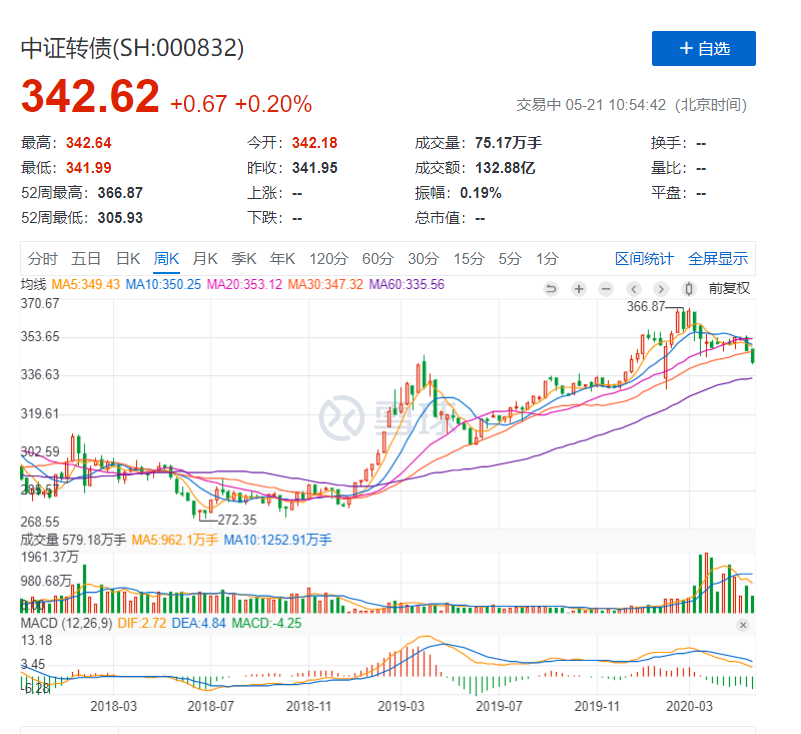

======================================================

_type: talk
@jier[118552824811122]
2020-05-21 11:59:55 Thu  
topic_id: 548815481558424

收割了白酒40%和中概互联20%的利润，希望有再次回调买入的机会。其实有点纠结白马股是长期持有还是收割利润的问题😂

@rtdmm小米 at 2020-05-21 11:59:55 Thu

> 厉害

----------

@二师父 at 2020-05-21 11:59:55 Thu

> 能经受极端情况百分之50到60的回撤就长期持有。

----------

@光少 at 2020-05-21 11:59:55 Thu

> 我也收割了利润，高估也卖出本金20%，按照二师父利高估收割法，不贪慢慢持有[微笑]

----------

阅读[4283]  评论[3]  赞[0] 

======================================================

_type: q&a
@是喵喵吖～[421441114141158]
2020-05-21 12:37:01 Thu  
topic_id: 241182418242811

@是喵喵吖～

>  师父我看最近猪肉股在跌 猪肉是不是也属于周期性的 可以在跌的时候买一点儿吗 我买了一点益生股份 您能给分析一下这个吗。😊

@二师父

>  你这个逻辑没有问题，猪肉供应下降，澳洲限制牛肉进口，以后猪肉需求会持续上升，没钱了大家可以不买房子，但是不吃猪肉是不可能的。
>  
>  你买的益生股份，属于种鸡，种猪等的供应企业，不过这个企业主要是以鸡产品为主，他的销售收入鸡的占比大概是80%，猪肉的占比是10%，如果看好猪肉板块的话，不应该选择这个。
>  
>  从实际来看，市场对猪肉的需求是高一些的，而且销量上也是如此。
>  
>  益生股份没有特别的亮点，我买的是牧原股份，他属于猪肉养殖的龙头，而且逻辑、业绩、估值都比较符合。
>  
>  分析企业的话从生活中发现，更为关键的是要找到相关产品和服务是否真的有需求，不然就是概念和臆想了。

阅读[4503]  评论[2]  赞[0] 

======================================================

_type: talk
@二师父[28814221155551]
2020-05-21 12:45:02 Thu  
topic_id: 548815481485254

<e type="hashtag" hid="88518551252422" title="#不要买垃圾股票#" /> 以后注册制落实以后，那些3元以下的股票退市越来越多。

还有人在做ST，说白了他们就是赌博，不是投资，这种管不了，市场会教育他的。

我记得去年有人问10万元不知道投什么，好像有个读者说买个一手茅台，比瞎折腾强。当时茅台是1000.

优质的企业会越来越贵，就如同公司优秀的人的工资待遇会越来越高一样，而不好好学习进步的慢慢就会被公司开除。

买好企业，不要捡垃圾。每个人毕业的时候都一样，月薪是5万到20万不等，但是10年以后就是10倍或者20倍甚至倍的差距。

二师父说不预测，是说我不知道明天的股价的涨跌，但是我能看到10年以后的情况。优秀的人才在一个长期的过程中也会有困顿时期，优秀的企业在一个长期的过程中也有横盘时期，比如曾经的茅台，招商银行，不能因为一时就否定他一生。这是短视的做法。

学会用更长期的思维去看待投资和自己人生的成长，5到10年为周期规划就很牛了，如果你能以一生的框架去规划人生和投资，那绝对是新一代投资大师。大部分人的规划周期就是5到10个月。

@杜志彪 at 2020-05-21 12:45:02 Thu

> 就是不知道最后他那10万最后买什么了[呲牙]

----------

@二师父 at 2020-05-21 12:45:02 Thu

> 买了也不一定拿的住

----------

阅读[5648]  评论[2]  赞[0] 

======================================================

_type: q&a
@罗大发[421484455521228]
2020-05-21 13:14:12 Thu  
topic_id: 241182418188841

@罗大发

>  请问师父我这个可以直接清仓了吧？

@二师父

>  这个是可以的。不过还有一种更好的操作方法
>  
>  你盈利接近100%，相当于翻倍了，那么卖出1260，把持仓成本收回，相当于你用零成本投资了这个基金，然后后面这个基金继续涨，那么就是复利继续增值。
>  
>  如果继续跌，对你没有影响，因为持仓成本是零，毫无心理压力。这样子做久了就能够学会长期持有。

阅读[4813]  评论[1]  赞[0] 

======================================================

_type: q&a
@jier[118552824811122]
2020-05-21 13:57:39 Thu  
topic_id: 841182412525522

@jier

>  二师父，能否推荐一下场内货币基金？另外想问一下场内货基有没有风险？谢谢！

@二师父

>  银华日利挺好的，我买的这个，货币基金现在不保本了，不过他比银行理财的风险低，银行3%的理财产品的风险是R2，货币基金的风险是R1，基本上可以看成一个固定收益品种的。

阅读[4781]  评论[1]  赞[0] 

======================================================

_type: q&a
@蛋炒饭不加蛋[118281818482542]
2020-05-21 14:01:31 Thu  
topic_id: 841182412528582

@蛋炒饭不加蛋

>  师傅，请问为何同样是家电股格力和海尔智家年初至今是下跌的，美的却是上涨的？

@二师父

>  美的也跌了啊，3月份跌到了46,最近都有回升的。格力电器除了品牌和渠道规模优势，其他的护城河趋势变窄了。

阅读[4854]  评论[3]  赞[0] 

======================================================

_type: talk
@二师父[28814221155551]
2020-05-21 14:08:29 Thu  
topic_id: 421185215421888

北上资金继续流入

@🍀 凝🌸 慧🍀 at 2020-05-21 14:08:29 Thu

> 师父，昨天一位球友在问近期主力资金拉高出货，现在又有北向资金净买入，我都看不明白了？请师父给解释解释，谢谢！

----------

@二师父 at 2020-05-21 14:08:29 Thu

> 机构的速度是很快的，模型测试有利就出手，市场情绪在变，所以前两天还做多的，过两天因为市场变化原因就做多了，真没必要关注这个，就是巴菲特也不可能搞懂机构将来的动向

----------

@🍀 凝🌸 慧🍀 at 2020-05-21 14:08:29 Thu

> 哦，原来是这样啊，谢谢师父指点[愉快][玫瑰][玫瑰][玫瑰]

----------

@🍀 凝🌸 慧🍀 at 2020-05-21 14:08:29 Thu

> 不好意思，我好像删除自己的回复，弄错了，把师父的回复给弄丢了[捂脸]

----------

@杜志彪 at 2020-05-21 14:08:29 Thu

> 看来你资金差不多都打完了吧[偷笑]

----------

@🍀 凝🌸 慧🍀 at 2020-05-21 14:08:29 Thu

> 我还有一半资金哦[呲牙]

----------

@杜志彪 at 2020-05-21 14:08:29 Thu

> 那你就是怕涨，不怕跌喽[呲牙]

----------

@🍀 凝🌸 慧🍀 at 2020-05-21 14:08:29 Thu

> 哈哈，目前这个仓位对我而言比较合适，涨跌均可。主要是我持仓成本不是很低估的哪个区域，所以还是按定投计划执行，如有大的回调就继续加仓。如上涨，就收割利润好了。

----------

阅读[5089]  评论[10]  赞[0] 

+++++++++++++++++++++++++++++++++++++++++++++++++++++

图片：
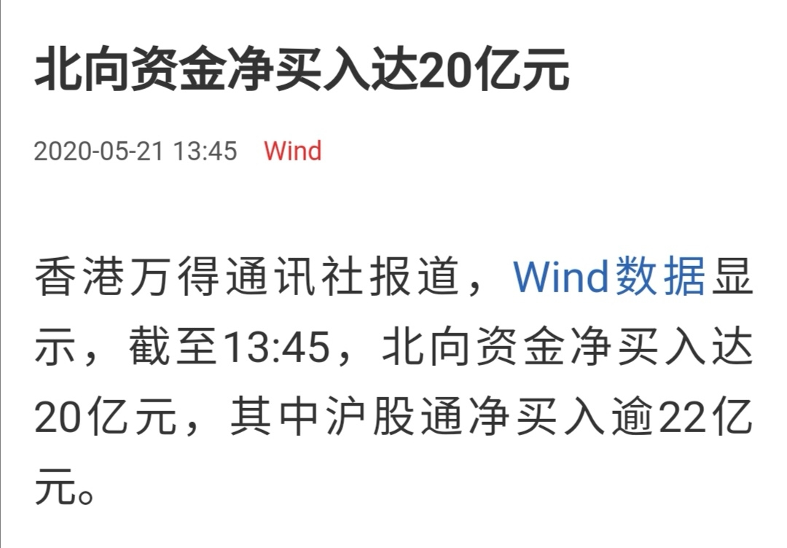

======================================================

_type: talk
@顾屹峰[28242255855121]
2020-05-21 15:32:19 Thu  
topic_id: 421185211881418

华宝油气实时的净值在哪里可以看到

@二师父 at 2020-05-21 15:32:19 Thu

> 这个只有估算

----------

@顾屹峰 at 2020-05-21 15:32:19 Thu

> 怎么算？

----------

@二师父 at 2020-05-21 15:32:19 Thu

> 根据前日的净值和当天涨跌幅估算

----------

@顾屹峰 at 2020-05-21 15:32:19 Thu

> 好的

----------

阅读[4925]  评论[4]  赞[0] 

======================================================

_type: talk
@二师父[28814221155551]
2020-05-21 18:31:01 Thu  
topic_id: 118854822545482

<e type="hashtag" hid="824584511822" title="#科技指数#" /> 现在科技指数的估值比医药低了，可以关注。18年我说过不买医药就是犯罪，现在买了医药就是犯罪，可以拿着，市场很疯狂的，15年医药100市盈率高达百倍，不经历永远无法体会有多疯狂。当然不排除明天就下跌，A股市场专治各种不服。

@老宋 at 2020-05-21 18:31:01 Thu

> 请问有场外对应的吗？

----------

@二师父 at 2020-05-21 18:31:01 Thu

> 科技50目前还没有，科技龙头有

----------

@范毅君 at 2020-05-21 18:31:01 Thu

> 请问场内对应基金是什么

----------

@二师父 at 2020-05-21 18:31:01 Thu

> 易方达科技etf

----------

@范毅君 at 2020-05-21 18:31:01 Thu

> 好的，谢谢

----------

@范毅君 at 2020-05-21 18:31:01 Thu

> 是515000吗？场内没找到[偷笑]

----------

@二师父 at 2020-05-21 18:31:01 Thu

> 159807

----------

@范毅君 at 2020-05-21 18:31:01 Thu

> 好哈

----------

阅读[5222]  评论[15]  赞[0] 

+++++++++++++++++++++++++++++++++++++++++++++++++++++

文件：
2020-05-21 18:29:37 Thu
文件大小：[49455]
28244114212151-科技50和龙头科技指数基金哪个更值得定投.docx

======================================================

_type: q&a
@是喵喵吖～[421441114141158]
2020-05-21 19:18:12 Thu  
topic_id: 841182155288852

@是喵喵吖～

>  二师父我有个问题想请教您，这两个都是追踪的纳斯达克100，为什么今天一个涨0.9一个跌了呢🧐

@二师父

>  这个是折价和溢价的原因，现在纳斯达克涨得高了，国泰的那只有7个点的溢价，所以大家抢着套利卖出。然后广发的目前是折价，所以会有人买入
>  
>  溢价的品种容易遭到抛售下跌，折价的品种容易遭到买入上涨。

阅读[5102]  评论[1]  赞[0] 

======================================================

_type: q&a
@素兮[548121415528244]
2020-05-21 21:43:49 Thu  
topic_id: 841182158524542

@素兮

>  现在科技类的指数种类有很多，二十父推荐的指数就有科技100，科技50，人工智能，半导体。他们的侧重点在哪？是不是互有重合？只买其中一个可以么？买一个的话，推荐买什么？

@二师父

>  我不是推荐只是分析，从来不推荐任何股票或者基金。
>  
>  新兴科技100侧重创新性科技企业，科技50侧重传统研发能力强的科技企业，人工智能主要是侧重AI技术型科技企业，半导体是涉及到半导体材料、芯片，组装、下游封测等和半导体制作相关的科技企业。
>  
>  基本没有重合的，性质不同，同为科技企业但不代表相同，就如同中国有很多超市，而超市的类别不同。如果买一个新兴科技100是比较好。其他的自由配置，半导体风险很大，容易陷入成长陷阱，一旦后续利润跟不上，而且遭到持续打击的话，这个风险是很高的。
>  
>  当然科技指数整体高成长高波动，如果能够经手的住，心理素质好，波动并不是风险。
>  
>  任何观点仅为分析参考，非投资建议和指导，投资有风险，入市需谨慎。

阅读[5065]  评论[0]  赞[0] 

======================================================

_type: q&a
@范毅君[118551121224142]
2020-05-21 22:02:09 Thu  
topic_id: 241182158221181

@范毅君

>  二师父，两个科技etf，一个有融字，一个没有，他们有啥区别

@二师父

>  一个是科技50，一个是龙头科技

阅读[5157]  评论[0]  赞[0] 

======================================================

_type: q&a
@smile[111888142241442]
2020-05-22 11:16:14 Fri  
topic_id: 241184584888441

@smile

>  二师父您好：今天港股下跌那么多，可以买入一些吗？50ah和香港中小买哪个更合适呢？另外深红利今天可以买不呢？（本周定投已买，遇到今天这种下跌应该遵守纪律还是临时加仓？）谢谢！

@二师父

>  看仓位，如果仓位轻可以额外补仓，深红利，恒生，恒生国企都可以，50ah里面银行地产较多，表现相对偏弱，投资灵活应对，目前不贵适合配置，医疗，白酒这些先等等

阅读[4827]  评论[4]  赞[0] 

======================================================

_type: q&a
@范毅君[118551121224142]
2020-05-22 12:03:28 Fri  
topic_id: 841184584455522

@范毅君

>  二师父，今天少量入了一点科技etf，现在是不是定投的话有点早，需要在看一看啊？看到天天上说科技股资金撤离，跌了可以理解，证券说资金进入证券，可证券也跌。科技和证券您认为最近怎么操作比较合理啊

@二师父

>  你看的太单一了，在暴跌的时候所有的利好就被解读为利空，如果不知道怎么操作，每周四按时定投，盈利了按时收割，就这一个方法，战胜市场9成投资者，你动的越多，错的越多

阅读[4957]  评论[1]  赞[0] 

======================================================

_type: q&a
@庆余年[15584481824122]
2020-05-22 12:21:56 Fri  
topic_id: 241184584414221

@庆余年

>  二师父您好，最近在学习网格交易。我听了您的课程，课程里面底层20%，上涨或下跌共加十次。现在有两个问题:第一个，3月31号您在星球里面讲的底仓是50%，上涨或下跌加五次，这个跟课程里面有区别;第二个问题，您之前发的网格交易表500ETF 和券商买入价格的次数比恒生，中概互联要少。是不是意味着500ETF 和券商买入次数是六次，加仓就用(总额-底仓)÷6，而中概互联就用(总额-底仓)÷9这样子分配金额？还是说只是单纯的没写出来？

@二师父

>  1，采用不同的网格点加仓次数不同，比如百分之10的网格点和百分之5的网格点有区别
>  
>  2，不是所有的品种都一刀切，按照预计下跌的最低价格来进行分配，而不是没写

阅读[5023]  评论[3]  赞[0] 

======================================================

_type: q&a
@不知道不明了[15584248411812]
2020-05-22 12:22:51 Fri  
topic_id: 841184584155142

@不知道不明了

>  二师父，今天加仓一份，买的品种和比例您有建议的么，然后想问一下现在家电基金跌回到低估值了么？

@二师父

>  一份就买沪深300或者深红利。家电在正常和低估的边界了，定投是没问题的

阅读[5328]  评论[3]  赞[0] 

======================================================

_type: q&a
@陈Being[28845245224851]
2020-05-22 13:49:19 Fri  
topic_id: 548814218155114

@陈Being

>  二师父，请问场内购买基金要求多少才不存在流动性问题。

@二师父

>  这个没有固定的，投资者一次买入在50万内还是很少出现这个问题的，要是保证安全性可以在1000万以上成交额

阅读[5080]  评论[0]  赞[0] 

======================================================

_type: q&a
@🍀 凝🌸 慧🍀[841855248254242]
2020-05-22 13:49:48 Fri  
topic_id: 841184581822212

@🍀 凝🌸 慧🍀

>  师父，今天发车吗？

@二师父

>  没发，仓位不足可以补点

阅读[5247]  评论[6]  赞[0] 

======================================================

_type: q&a
@背心[51441214442224]
2020-05-22 13:50:28 Fri  
topic_id: 241184581822121

@背心

>  我看你的乌龟计划，买入汇添富消费了，星期里面怎么没有通知，消费不是高估吗？

@二师父

>  那个实盘你关注了就能看到，消费没高估啊，你在哪看的

阅读[5414]  评论[3]  赞[0] 

======================================================

_type: talk
@二师父[28814221155551]
2020-05-22 15:15:00 Fri  
topic_id: 241184581125181

<e type="hashtag" hid="88518551415252" title="#这些基金可以重点关注下#" /> 大跌可以额外补仓，视自己情况而定，每个人收入以及对风险的承受能力不同，所以适合自己的就是最好的。

今天额外发一起估值表，其实真的不用天天关注，股市不会一周跌到底，更不会一周涨到头。耐心很重要的。

@🍀 凝🌸 慧🍀 at 2020-05-22 15:15:00 Fri

> 这么准点的下跌规律，哈哈，也真没谁了。谢谢师父提醒：耐心很重要。

----------

@素兮 at 2020-05-22 15:15:00 Fri

> 酒etf跌破120日线的时候大概是在什么价格？

----------

@二师父 at 2020-05-22 15:15:00 Fri

> 大概1.14左右

----------

@向前进 at 2020-05-22 15:15:00 Fri

> 为啥这个时候容易下跌呢，不是应该充满希望，节节高升吗

----------

阅读[6199]  评论[4]  赞[0] 

+++++++++++++++++++++++++++++++++++++++++++++++++++++

文件：
2020-05-22 15:13:35 Fri
文件大小：[20511]
51548221821814-开会的时候容易下跌，也是定投的好时候.docx

======================================================

_type: q&a
@Jarvis Liu[111141548852852]
2020-05-22 16:17:12 Fri  
topic_id: 841184581144552

@Jarvis Liu

>  1：万得全A指数市盈率百分位，这里的万得我百度后，应该是一家做投资咨询的公司，开发出来的软件，用于专业人士做股市分析的，需要付费后才能使用，不知道二师父能否有其他的渠道可以查询全A指数市盈率百分位？
>  
>  2：SY/BY，这个指标我能理解；SY-BY这个百分比，不晓得怎么计算了？您能不能举个例子。
>  
>  3：均线定投策略中，您采用的是日K90天作为判断依据，为什么用这个指标呢，而不是周K、月K呢，这里有什么讲究吗？

@二师父

>  1、这个数据每天都会在星球公布的
>  
>  2、SY-BY，就是盈利收益率-中国10年期国债收益率。全市场指数的盈利收益率值，减去当天10年期国债收益率的值，然后计算历史百分位，不是百分比。
>  
>  3、这个90日均线介于季线和半年线之间，作为一个中长期均线突破点，适合长期投资参考。用周K也行，那就是更长期的投资均线参考了。
>  
>  主要看自己的做长线还是短线，如果短线，也可以用20日均线，月线，这个就相当于是月线。也可以用10日均线。
>  
>  投资周期越长，使用的K线周期越长，反之就越短。

阅读[5213]  评论[0]  赞[0] 

======================================================

_type: talk
@二师父[28814221155551]
2020-05-22 16:40:02 Fri  
topic_id: 548814251884184

<e type="hashtag" hid="224445218111" title="#全市场估值数据#" /> 全市场指数市盈率百分位，27.6%，全市场指数市净率百分位6.82%，SY-BY百分位25.29%，SY/BY百分位6.75%。

这个数据怎么用，如果四个指标百分位都大于25——30%以上，基本上定投就可以停止了。如果四个指标的百分位都低于10%，那么A股市场就属于极度便宜的阶段，可以满仓抄底，然后每月结余只要3年不用有多少买多少。

大家多看看数据和指标，这样心态淡定，你发现没，不管指数点位怎么跌，这个百分位数据还是很稳定的，因为整体估值的下移和上移都需要时间。

学会看估值，忘记市场涨跌，当历史百分位越低，仓位就要越重，反之仓位越轻。

利润收割对于高手而言其实是很菜的操作方法，因为选中一只穿越牛熊的股票才是投资的最高境界，而对于入门级别的选手而言，又是非常高端的手法，因为A股总是暴涨暴跌，如果想终身持有，不卖出，那意味着极端情况下要经受60%的波动，还是学会接受自己是普通人的事实。我们不是巴菲特，不要盲目学习。

而且巴菲特也是人，他每次清仓的时候也在亏损50%左右，我就理解为那是他的极限位置，风控的极端点。

@老丁 at 2020-05-22 16:40:02 Fri

> 你好，二师父，SY/BY 越高说明股市投资价值越高，但你又说四个指标都低于10%，A股极度低估，这个好像有些矛盾？希望解答一下。谢谢

----------

@二师父 at 2020-05-22 16:40:02 Fri

> 这个问题很好，SY/BY越高，代表盈利收益率高，国债收益率低，资本的逐利性，股市更有吸引力，股票更有价值

在计算的时候我多加了一个公式，比如5月22，大家看到的SY/BY百分位显示数据6.75%，这个数据我处理了，用的1减去93.25%，这里93.25%就是代表SY/BY百分位

我想着一会低百分位更有投资价值，一会高百分位更有价值，会让入门投资者迷惑，所以就做了处理，你们看到的SY/BY百分位实际上是1减去SY/BY百分位

这样子数据显示的就是越低越有投资价值了，记住我的数据就行，其实我这里严谨讲应该是1-SY/BY百分位，另外的sy-by也做了处理

理解没问题，我把中间处理过程省略了

----------

@老丁 at 2020-05-22 16:40:02 Fri

> 了解了，谢谢二师父！

----------

阅读[6198]  评论[3]  赞[0] 

======================================================

_type: talk
@二师父[28814221155551]
2020-05-22 17:02:41 Fri  
topic_id: 841184522518452

<e type="hashtag" hid="824514224452" title="#指数估值表#" /> 估值表变化不大，沪深300进入低估了，消费和食品饮料的估值是不同的，食品是高估的，消费正常估值，里面持仓股票就不一样的。就如同今天大盘跌，指数都跌，而我有的股票是涨得，不同的持仓股票里面估值自然不同的。

后面估计还会跌，希望大家有个好心态，既然指数不会跌没，只要到达合适的价格，买就是了。长期看都会涨起来的，如果跌破2800我会加速发车，如果跌破2500，就动用防守账户的资金抄底，不用怕，让股市跌得再猛烈一点吧，这样未来盈利才会更好。

需要注意的是，在上涨趋势的时候不要做空，在下跌趋势的时候不要做多。要等他稳定之后做。指数无所谓，无脑买，我说的是股票，逆势加仓会加到你怀疑人生。

@王模堂 at 2020-05-22 17:02:41 Fri

> 感谢二始福，今天加发了一次估值表。

----------

阅读[5519]  评论[1]  赞[0] 

+++++++++++++++++++++++++++++++++++++++++++++++++++++

图片：
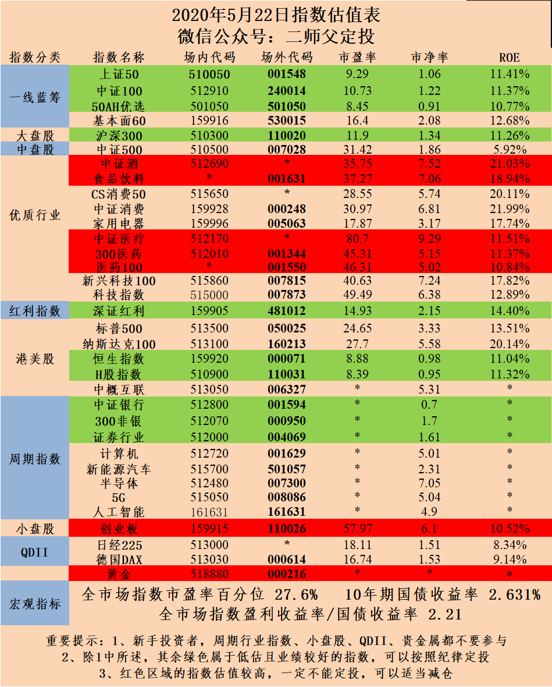

======================================================

_type: talk
@树叶[544811512145144]
2020-05-23 09:26:55 Sat  
topic_id: 421182425881128

<e type="hashtag" hid="142825811122" title="#定投周报#" /> 二师父定投周报第60期

阅读[5248]  评论[0]  赞[0] 

+++++++++++++++++++++++++++++++++++++++++++++++++++++

文件：
2020-05-23 09:26:53 Sat
文件大小：[234524]
88241554581152-二师父定投周报5.23（第60期）.docx

======================================================

_type: talk
@二师父[28814221155551]
2020-05-23 19:12:29 Sat  
topic_id: 241184518422841

#中国互联网，最近中国互联网企业可能会出现一波投资机会，可以关注相关基金

@衣袂飘香 at 2020-05-23 19:12:29 Sat

> 二师父，你的中概互联现在还持有吗？我的买入均价1.175，还有6800股。已经收割了好几次利润。现在，要先卖出，保留胜利果实，等到他跌到低估的时候，再买回来吗？

----------

@二师父 at 2020-05-23 19:12:29 Sat

> 收割了一点，还持有的

----------

@衣袂飘香 at 2020-05-23 19:12:29 Sat

> 哦，好的。

----------

阅读[5178]  评论[3]  赞[0] 

+++++++++++++++++++++++++++++++++++++++++++++++++++++

文件：
2020-05-23 19:11:55 Sat
文件大小：[20062]
48521484221128-中概互联限购了，想投资科技基金怎么办.docx

======================================================

_type: talk
@二师父[28814221155551]
2020-05-24 19:42:06 Sun  
topic_id: 241184885244241

每次下跌都是机会啊，重点板块是电器、深红利，券商，券商周期指数，刚入市的可以不用配置。其次消费、纳斯达克以及恒生，恒生跌幅会较大，控制仓位。消费和纳斯达克还没低估，可以轻仓，凡是有个度，就没事。严格按照安全边际的话，就等，总会等到的。

白酒和医疗两个板块的话暂时别入，回调稳定之后再做打算。

@smile at 2020-05-24 19:42:06 Sun

> 二师父，持有的港股目前刚好保本，请问应该卖掉还是继续持有等待上涨呢？大概2成仓位的港股

----------

@二师父 at 2020-05-24 19:42:06 Sun

> 港股股票还是指数，指数可以拿着的，港股目前被杀的挺厉害

----------

@smile at 2020-05-24 19:42:06 Sun

> 指数基金哈，就是50ah，真担心涨不起来了[傲慢]

----------

@二师父 at 2020-05-24 19:42:06 Sun

> 起得来，今年价值基金表现较差，18，
19表现都不错的

----------

@smile at 2020-05-24 19:42:06 Sun

> 多谢二师父

----------

阅读[5751]  评论[5]  赞[0] 

+++++++++++++++++++++++++++++++++++++++++++++++++++++

文件：
2020-05-24 19:39:58 Sun
文件大小：[20789]
48521481188188-每一次大跌都会让我们变得更富有.docx

======================================================

_type: talk
@二师父[28814221155551]
2020-05-24 20:56:45 Sun  
topic_id: 548814112851824

之前分析过基建，不看好，龙头都很一般，重资产，国家托底，就算连连亏损也照样经营，但是产生的现金流就一般了，不要去赌，特别看好的话，问问自己在相关公司工作的朋友，然后再做决定。投资一定要有逻辑。

阅读[4839]  评论[0]  赞[0] 

======================================================

_type: talk
@二师父[28814221155551]
2020-05-24 21:52:28 Sun  
topic_id: 841184882145482

赛道太重要了，男人要选对行业，女人要选对老公，投资要选对板块，选对了，生活越来越幸福，选错了，越努力越失败。

做人得有眼光，找到潜力股，死死抱住

@西锦巴乌 at 2020-05-24 21:52:28 Sun

> 师父：道理我都懂就是选不对赛道[流泪]

----------

@老孙头 at 2020-05-24 21:52:28 Sun

> 原先跟二师父定投的银行指数一直套着，是否继续持有？

----------

@Hi·DD at 2020-05-24 21:52:28 Sun

> 说的对，现在连投资也讲究门当户对。哎。能力对眼光啊

----------

@二师父 at 2020-05-24 21:52:28 Sun

> 场外的已经换了，场内的换了一部分，剩余一部分持有的，之前在星球公布过

----------

@二师父 at 2020-05-24 21:52:28 Sun

> 这个确实有难度，当年小马哥可都准备卖腾讯的

----------

@老孙头 at 2020-05-24 21:52:28 Sun

> 我是持有场㚈的。目前看，转換哪个品种较妥？谢谢🙏

----------

@二师父 at 2020-05-24 21:52:28 Sun

> 仓位不重的话不用转换，经济好转了银行会起来的，稳妥而言沪深300，深红利最稳妥

----------

阅读[4906]  评论[7]  赞[0] 

======================================================

_type: talk
@林玮[844111858288412]
2020-05-25 10:27:54 Mon  
topic_id: 548814155428284

二师父，场内的中概互联可以定投吗？

@二师父 at 2020-05-25 10:27:54 Mon

> 等一等

----------

@二师父 at 2020-05-25 10:27:54 Mon

> 轻仓可以开始

----------

阅读[4699]  评论[2]  赞[0] 

======================================================

_type: q&a
@jier[118552824811122]
2020-05-25 11:09:35 Mon  
topic_id: 421182855152458

@jier

>  二师父，请问中了新股一般什么时候卖？开板就卖吗？

@二师父

>  对，a股中签开板基本盈利，可以卖掉

阅读[4837]  评论[0]  赞[0] 

======================================================

_type: talk
@二师父[28814221155551]
2020-05-25 11:21:01 Mon  
topic_id: 841184822111522

<e type="hashtag" hid="881251425252" title="#鳄鱼计划#" /> 买入券商一份，0.859价格，这是一个投机品种，就是波段，每次小行情来了券商会起来，不具备投资价值。

还剩16份，慢慢来，计划2700左右全部买入，不到的话就拿着现金。

@庆余年 at 2020-05-25 11:21:01 Mon

> 网格交易和鳄鱼计划是不冲突的对吧，上周五我网格买入了底仓。

----------

@杜志彪 at 2020-05-25 11:21:01 Mon

> 我上一次0.85买了10份，网格卖了4份，今天开盘0.859买回4份，券商网格又开始了新的一轮交易[微笑]，这个策略非常适合券商指数，二师父人才啊[强]

----------

@二师父 at 2020-05-25 11:21:01 Mon

> 不冲突

----------

@二师父 at 2020-05-25 11:21:01 Mon

> 中国市场特性决定的，熊市底部可以一直做到牛市来

----------

阅读[5900]  评论[4]  赞[0] 

======================================================

_type: talk
@老丁[15541182455482]
2020-05-25 11:33:08 Mon  
topic_id: 421182852422518

你好，二师父，请教一个问题，根据 PE和股息率相关的公式。 PE*股息率=分红率，而分红率通常是固定的。所以  PE 和 股息率 应该是线性负相关的。我就在想，是不是可以利用这一个关系，来作为判断PE是不是失效的一个标准。这样问题就来了，存在以下的两种情况

1、如果两者严格的线性负相关，那么PE失效以后，股息率也应该是失效的，就是说当PE出现失效以后，估值指标中股息率也就不可靠了。

2、还一种情况，由于两者存在计算数据采样的差距，当PE短时间失效的时候，股息率并改变，也就是在短时间内出现了 PE 和 股息率非线下负相关，那么就可以倒推出 PE 是出现了问题了。

请问，这样的思考角度是否正确，另外如果这个角度是可以运用的话，1，2两种情况哪种是真是可能出现的？谢谢

@二师父 at 2020-05-25 11:33:08 Mon

> 这个分析逻辑有问题，为什么市盈率失效，主要是盈利不稳定，盈利不稳定不代表企业股息没有参考价值。

这就类比兄弟俩，他们某些方面很像，但不能说一个学习差，另外一个学习就差，大前提不同

----------

@老丁 at 2020-05-25 11:33:08 Mon

> 可能我没说清楚，我是想通过这两者之间的关系，来倒推市盈率是不是失效。比如，PE很高的时候，可能是估值真的高了，也有可能是E减少到底的PE失效。那么需要有一个指数来判断是哪种，就想到用股息来判断。但这里面有一个问题，就是股息会不会也出现失效的时候？

----------

@二师父 at 2020-05-25 11:33:08 Mon

> 这两个不是完全的反比例关系，如果你能说，pe乘以股息率等于常数就成立，大前提有问题

而且pe升高不一定盈利降低，pe升高还有可能是预期增高导致的

----------

阅读[5121]  评论[3]  赞[0] 

======================================================

_type: q&a
@云云[118525244841512]
2020-05-25 14:45:16 Mon  
topic_id: 548814158124814

@云云

>  二师父，今天乌龟计划为什么买入深红利？不周四定投呢？

@二师父

>  周四会投的，后面有好的机会不是周四也会投，仅供参考，非投资建议

阅读[5043]  评论[8]  赞[0] 

======================================================

_type: talk
@二师父[28814221155551]
2020-05-25 20:23:45 Mon  
topic_id: 841184842188112

<e type="hashtag" hid="88518585214522" title="#消费50和白酒#" />

@🍀 凝🌸 慧🍀 at 2020-05-25 20:23:45 Mon

> 每日大餐，谢谢师父！[咖啡][咖啡]

----------

阅读[5103]  评论[1]  赞[0] 

+++++++++++++++++++++++++++++++++++++++++++++++++++++

文件：
2020-05-25 20:23:33 Mon
文件大小：[20961]
88241521821512-消费50现在比白酒更有投资价值吗.docx

======================================================

_type: talk
@二师父[28814221155551]
2020-05-25 20:35:26 Mon  
topic_id: 841184842124842

<e type="hashtag" hid="281158284851" title="#市场分析#" /> 目前是处于5穷6绝行情里面，会不会来不确定，而从指数成交量看，今天是缩量收十字星，有点跌不动了，这种情况就是阶段底部。技术分析听听就行了，对于没有价值投资基础的人学这个容易走上错误的道路。

不管缩量放量，投资的本质是以便宜的价格买企业，就这么简单。

另外国债收益率上行，不要配置债券，收益率2.6%，比货币基金高0.6%，我觉得不划算。连银行理财都不如。当然银行理财本金没了银行是不管的。

还有支付宝的定期存款也有4%的收益啊，何必在这个位置配置债券呢。

香港市场被杀的有点猛，今天算是止跌了。恒生国企最大下跌幅度在25%以内了，后面仓位控制在15%以内投资，场内选择中概，场外的话中概限购，恒生国企凑合吧。

海外指数最好的还是纳斯达克，其余的都被A股甩几条街。

关于后面的市场没法预测了，我知道对策，计划在2700左右场内满仓，然后在2500点跌破了我的防守账户资金拿出来第一次抄底，如果大盘跌破2000点了，卖房抄底，当然，不会跌破2000点的，跌破了我给你发红包。

没多大的事情，很多人太沉迷于算命了。

@罗大发 at 2020-05-25 20:35:26 Mon

> 那么请问师父，我二月份买的嘉实超短债债券可以卖了吗？

----------

@二师父 at 2020-05-25 20:35:26 Mon

> 如果定投资金不够可以卖了

----------

@smile at 2020-05-25 20:35:26 Mon

> 二师父说的债券是包括所有类型的债券吗？

----------

@二师父 at 2020-05-25 20:35:26 Mon

> 收益率都一般

----------

阅读[5042]  评论[4]  赞[0] 

======================================================

_type: q&a
@Zero Fei[51422225155524]
2020-05-25 21:11:50 Mon  
topic_id: 241184844544511

@Zero Fei

>  二师父，这是否最新的网格表，目前是只有3只可以操作呢

@二师父

>  <e type="web" href="https://mp.weixin.qq.com/s/iktPZH_VOslkBfTjXGYqtw" title="自动网格交易策略" cache="" />，可以看看这个，表格里面的安全边际很高，可以直接按照价格操作
>  
>  其他高波动的指数也可以网格

阅读[5290]  评论[4]  赞[0] 

======================================================

_type: q&a
@🙄[548888844588424]
2020-05-26 09:54:39 Tue  
topic_id: 841184212414822

@🙄

>  二师傅，置顶的那几条看不懂怎么办

@二师父

>  哪些地方不懂，可以提出来，一起讨论学习

阅读[5058]  评论[4]  赞[0] 

======================================================

_type: q&a
@mumomo[111812248825412]
2020-05-26 11:14:03 Tue  
topic_id: 241184214525451

@mumomo

>  二师父，我看实盘是把金融地产全部转换成了主要消费，前两天没跟上，今天还适合转换吗

@二师父

>  今天不适合了，以后调仓我在星球说下

阅读[5141]  评论[7]  赞[0] 

======================================================

_type: talk
@二师父[28814221155551]
2020-05-26 17:03:04 Tue  
topic_id: 841184451584212

<e type="hashtag" hid="48418484188118" title="#没有业绩支撑的公司都很难#" />

@是喵喵吖～ at 2020-05-26 17:03:04 Tue

> 师父要是查出来有什么内幕交易会怎么处置呢？他前妻已经套现得利了是不是也不会让她把钱交出来😂

----------

@二师父 at 2020-05-26 17:03:04 Tue

> 这是违法的，会判刑

----------

阅读[5899]  评论[2]  赞[0] 

+++++++++++++++++++++++++++++++++++++++++++++++++++++

文件：
2020-05-26 17:02:51 Tue
文件大小：[21169]
88241548242152-靠网红薇娅带货800万，如今梦洁股份却连连下跌.docx

======================================================

_type: talk
@二师父[28814221155551]
2020-05-26 20:47:22 Tue  
topic_id: 118851152518122

<e type="hashtag" hid="224445218111" title="#全市场估值数据#" /> 万得全市场指数市盈率百分位27.06%，市净率百分位7.66%，SY-BY百分位25.81%，SY/BY百分位8.62%

目前流动性好，很难跌破2500的，如果再次跌破2500，这几个指标大概可以全部跌破10%，可以抄底，不建议看空，保持一定仓位，避免上涨追高

@JOY at 2020-05-26 20:47:22 Tue

> 感觉昨天是硬拉上去的，我还在等着继续跌好加仓，结果就这么上去了[捂脸]

----------

@二师父 at 2020-05-26 20:47:22 Tue

> 反身性，你想跌的时候就涨

----------

@J at 2020-05-26 20:47:22 Tue

> 师父，请问科技515000今天开始定投可以吗？

----------

@二师父 at 2020-05-26 20:47:22 Tue

> 轻仓可以

----------

@飞的那个飞 at 2020-05-26 20:47:22 Tue

> 跌破2500的，这几个指标大概可以全部跌破10%万得全市场指数市盈率百分位是不是也会跌到10%

----------

@二师父 at 2020-05-26 20:47:22 Tue

> 百分之10以下，上证综合指数要调整了

----------

阅读[4869]  评论[6]  赞[0] 

======================================================

_type: talk
@二师父[28814221155551]
2020-05-27 10:12:01 Wed  
topic_id: 421182254814448

<e type="hashtag" hid="48418488481448" title="#打新转债#" />

@JOY at 2020-05-27 10:12:01 Wed

> 师父，请问下，之前中的滨化转债，上市后没出手，现在就剩50左右的利润了，还值得持有等等的么？

----------

@🍀 凝🌸 慧🍀 at 2020-05-27 10:12:01 Wed

> 师父，这是可转债打新是吗，我没操作过，但是已经认真阅读了您写的过往文章，中签的话，顶多需要交几千元是吗？

----------

@🍀 凝🌸 慧🍀 at 2020-05-27 10:12:01 Wed

> 最多申购1万股？

----------

@二师父 at 2020-05-27 10:12:01 Wed

> 最多中三签

----------

@二师父 at 2020-05-27 10:12:01 Wed

> 104一个卖出价位，别拿到亏本了，上限125左右卖出

----------

@🍀 凝🌸 慧🍀 at 2020-05-27 10:12:01 Wed

> 收到，谢谢师父，已经申购妥[愉快]

----------

阅读[4745]  评论[6]  赞[0] 

+++++++++++++++++++++++++++++++++++++++++++++++++++++

图片：
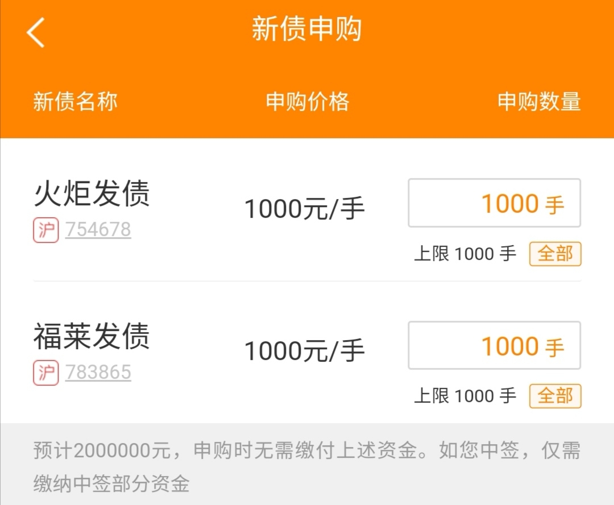

======================================================

_type: q&a
@shininggre*[15551242111522]
2020-05-27 13:24:39 Wed  
topic_id: 421182252412548

@shininggre*

>  二师父您好。我现在持有的全指金融地产和300非银的场外基金大概占一成。收益率是-6左右。我想问下有必要继续定投么？还是转换成其他基金呢？谢谢。

@二师父

>  控制这个仓位可以了，300非银可以继续投，金融行业地产，保险，银行都有杠杆，在低迷期表现很弱，在景气周期表现好。
>  
>  银行主要看招商银行，平安银行和宁波银行，中证银行指数出现了比较严重的分化，全指金融里面有一些银行，可以停一停

阅读[4622]  评论[0]  赞[0] 

======================================================

_type: q&a
@冯林锋[841551141441422]
2020-05-27 15:02:53 Wed  
topic_id: 421182252258228

@冯林锋

>  二师父，科技100能做网络吗

@二师父

>  适合买入中长期持有，网格都是波动大的品种

阅读[4526]  评论[3]  赞[0] 

======================================================

_type: q&a
@闪闪的星光[88285424418582]
2020-05-27 16:01:30 Wed  
topic_id: 118851148251842

@闪闪的星光

>  二师父你好，我想用华宝科技ETF链接A（007873）、嘉实新兴科技100ETF链接A（007815）、国泰深证TMT50指数基金（160224）和天弘中证电子ETF链接A（001617），这四只场外基金组成科技指数基金组合，当市盈率低估时长期进行定投，是不是可行呢？
>  谢谢

@二师父

>  你是要用多大的仓位来投呢，如果100万，用20万或者30万投这个组合没问题，如果满仓投遇到科技股暴跌一般人是承受不住的

阅读[4736]  评论[11]  赞[0] 

======================================================

_type: talk
@二师父[28814221155551]
2020-05-27 16:44:51 Wed  
topic_id: 548814458182444

<e type="hashtag" hid="28518582158281" title="#估值表和定投实盘#" /> 继续买深红利，这个指数里面有部分和家用电器重合，场外没有好的家用电器指数，红利指数可以替代部分，而且有一些优质成长股，值得中长期配置。

港股的话，目前就看好港交所和在香港上市的美团、腾讯、阿里、京东、字节跳动。京东预计快要回来了，字节跳动上市了值得搞。投资港美股可以用港股通，也可以开通港股账户的。

用中概互联即可，其他的香港股票都一般般了，主要是风向变了，投资是对未来的预期，这个未来大陆的发展肯定是比香港好的。

@黎雄 at 2020-05-27 16:44:51 Wed

> 师傅场内恒生指数用不换仓呢

----------

@二师父 at 2020-05-27 16:44:51 Wed

> 不用的，有消息称恒指要调仓

----------

@JOY at 2020-05-27 16:44:51 Wed

> 师父，请问，要是在场内定投，也是买深红利吗？

----------

@二师父 at 2020-05-27 16:44:51 Wed

> 家用电器和深红利都行，场外和场内区别不大，买的时候没有溢价就行

----------

@JOY at 2020-05-27 16:44:51 Wed

> 谢谢您的解答～

----------

阅读[4880]  评论[5]  赞[0] 

+++++++++++++++++++++++++++++++++++++++++++++++++++++

图片：
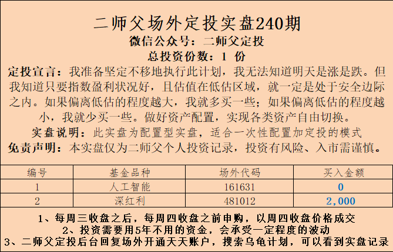
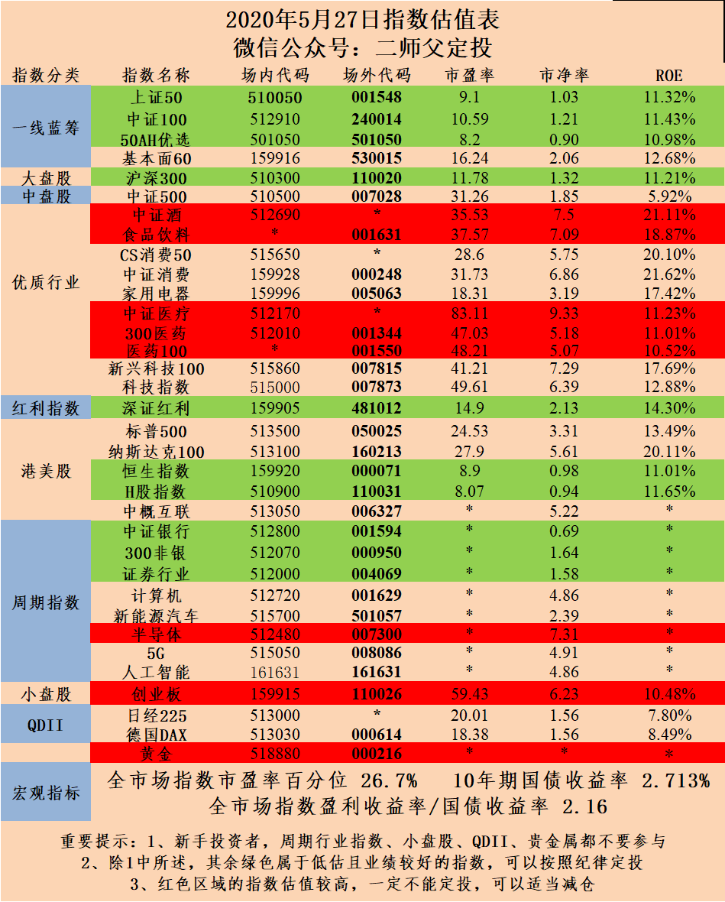

======================================================

_type: q&a
@素兮[548121415528244]
2020-05-27 21:53:58 Wed  
topic_id: 421182225885418

@素兮

>  深红利和基本面60，他们的持仓股中哪个含有的家用电器成分多？

@二师父

>  深红利

阅读[4659]  评论[0]  赞[0] 

======================================================

_type: q&a
@夏萍[28221454818281]
2020-05-27 21:57:08 Wed  
topic_id: 841184442815222

@夏萍

>  师父，银行亏10个点，目前怎么处理比较好？

@二师父

>  仓位不重的话拿着，银行市净率回到1就是妥妥盈利，银行不用担心，就是时间问题。
>  
>  仓位重的话，每次银行有反弹机会的话调仓

阅读[4866]  评论[1]  赞[0] 

======================================================

_type: talk
@那方山的树，佛陀座下*[244412158214221]
2020-05-28 07:07:06 Thu  
topic_id: 118851185214482

二师傅，听说国内股市有可能会对指数做出调整改革，认为前面30年的指数设计不科学，如果真改革调整对我们投资指数基金是否有影响？

@二师父 at 2020-05-28 07:07:06 Thu

> 调整上证综合指数的股票持仓，他有可能上3500了，银行石油比重太大，严重失真

----------

@以古论今 at 2020-05-28 07:07:06 Thu

> 那不是可以抓紧时间投上证50

----------

阅读[4707]  评论[2]  赞[0] 

======================================================

_type: talk
@二师父[28814221155551]
2020-05-28 14:34:15 Thu  
topic_id: 118851822488212

<e type="hashtag" hid="825412412212" title="#可转债打新#" /> 今天有一只新债，满格申购，最多中一签或者三签

阅读[4444]  评论[0]  赞[0] 

+++++++++++++++++++++++++++++++++++++++++++++++++++++

图片：

======================================================

_type: talk
@二师父[28814221155551]
2020-05-28 14:38:02 Thu  
topic_id: 548814822422854

<e type="hashtag" hid="552145855254" title="#国债逆回购#" /> 账户里面小额资金可以进行国债逆回购，买一天，计算三天利息，非常划算。

@罗大发 at 2020-05-28 14:38:02 Thu

> 所以师父的专属购买渠道在哪里呢？

----------

@二师父 at 2020-05-28 14:38:02 Thu

> 这个在证券账户买就行啊，在我这开户的都可以

----------

@梧桐 at 2020-05-28 14:38:02 Thu

> 买了，谢谢二师父的无私分享，感恩

----------

@罗大发 at 2020-05-28 14:38:02 Thu

> 感谢

----------

阅读[4490]  评论[4]  赞[0] 

+++++++++++++++++++++++++++++++++++++++++++++++++++++

图片：
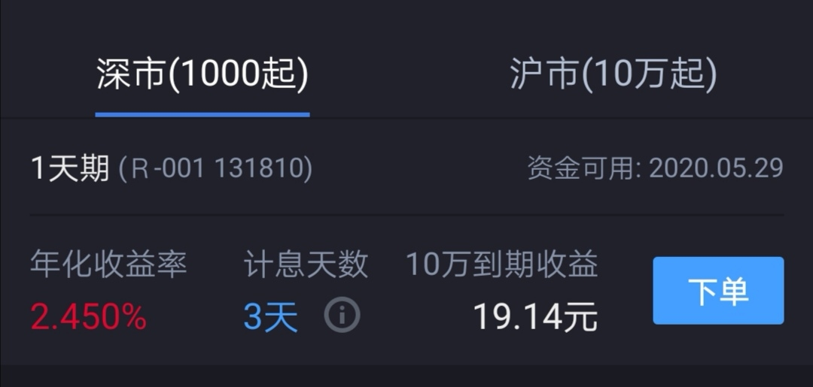

======================================================

_type: q&a
@激流勇进[241141245525821]
2020-05-28 17:21:53 Thu  
topic_id: 421182148518188

@激流勇进

>  师父您好！您怎么看当前银行指数，现在开始配置银行指数时机怎么样？

@二师父

>  银行指数一般，配置银行的话目前招行，平安，宁波银行好一些

阅读[4441]  评论[0]  赞[0] 

======================================================

_type: talk
@二师父[28814221155551]
2020-05-28 21:00:21 Thu  
topic_id: 841184151282112

<e type="hashtag" hid="28518584542151" title="#每日数据#" /> 万得指数市盈率百分位26.84%，市净率百分位8.61%，SY/BY百分位8.24%，SY-BY百分位25.46%。市场主要两个板块比较高，一个是医疗，另外一个白酒，把这两个板块拉下来，百分位到10%都没有问题。

@wty at 2020-05-28 21:00:21 Thu

> 创新药指数可以轻仓定投了吗？

----------

@二师父 at 2020-05-28 21:00:21 Thu

> 目前还不便宜

----------

@wty at 2020-05-28 21:00:21 Thu

> 好的，等您提示！我已经把医疗清仓了，上次买的很少，继续等待医药和医疗的机会。谢谢🙏

----------

@杜志彪 at 2020-05-28 21:00:21 Thu

> 师父如果能分析一下医疗ETF和医药ETF吗？

----------

@二师父 at 2020-05-28 21:00:21 Thu

> 好的

----------

@杜志彪 at 2020-05-28 21:00:21 Thu

> 查了一下10大重仓股，有3只重合，医药的恒瑞占比高达27%，医疗更加平均一些，将来回归或接近低估是如何选择（2只都投，还是选择一只即可）

----------

@清水倾城 at 2020-05-28 21:00:21 Thu

> 我忘了二师父分析过地产没，现在买点南方房地产etf怎么样？性价比高吗？

----------

@二师父 at 2020-05-28 21:00:21 Thu

> 规模只有1亿啊，我直接买的万科

----------

阅读[5383]  评论[11]  赞[0] 

+++++++++++++++++++++++++++++++++++++++++++++++++++++

文件：
2020-05-28 20:58:22 Thu
文件大小：[21891]
48515284454848-浙江省医用耗材带量采购逐步落地，对医药股投资有何影响.docx

======================================================

_type: talk
@二师父[28814221155551]
2020-05-28 22:25:43 Thu  
topic_id: 421182184455188

未来的竞争只会越来越大

@庆余年 at 2020-05-28 22:25:43 Thu

> 给普通人一条活路吧[捂脸][捂脸][捂脸]

----------

@雨淡风清 at 2020-05-28 22:25:43 Thu

> 这样的人不多，硕士能有多少

----------

@清水倾城 at 2020-05-28 22:25:43 Thu

> 硕士多，英法语都好，能做好早教的少

----------

阅读[4502]  评论[3]  赞[0] 

+++++++++++++++++++++++++++++++++++++++++++++++++++++

图片：
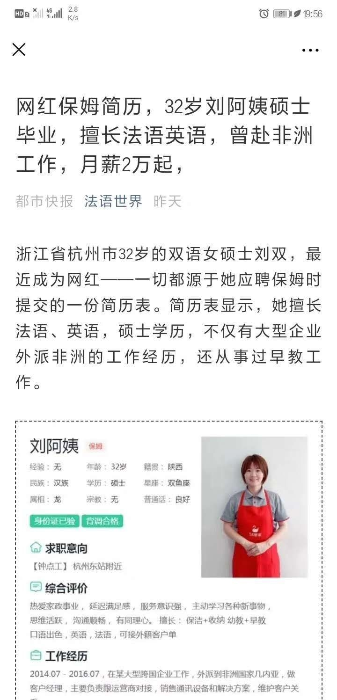

======================================================

_type: talk
@二师父[28814221155551]
2020-05-29 16:36:18 Fri  
topic_id: 421181452218588

<e type="hashtag" hid="15285251422242" title="#核心赛道#" /> 介绍了几个核心赛道，在这几方面加力，这是核心配置，明天介绍几个卫星配置。医药主要太贵了，没放在里面，等有个15%以上的回调可以入的。定投非建底仓，这是有区别。

@范毅君 at 2020-05-29 16:36:18 Fri

> 二师父，食品饮料和白酒回调多少建仓比较合适

----------

@二师父 at 2020-05-29 16:36:18 Fri

> 深度回调15个点就可以定投

----------

@J at 2020-05-29 16:36:18 Fri

> 师父，科技100和科技龙头什么时候适合开始定投？

----------

@二师父 at 2020-05-29 16:36:18 Fri

> 看你多少仓位，重仓的话到35倍市盈率以下，轻仓现在就可以，我指的重仓是总资金的百分之10到30，轻仓就是百分之5以内

----------

@J at 2020-05-29 16:36:18 Fri

> 好的，这两个指数要是只选一个的话，师父更建议投哪一个？

----------

@二师父 at 2020-05-29 16:36:18 Fri

> 新兴科技100

----------

@素兮 at 2020-05-29 16:36:18 Fri

> 消费ETF和汇添富消费ETF联接基金，这两个对应的场外代码是什么？二师父说这两个基金主要是大类消费企业的集合，那么什么是大类消费呢？主要指什么？

----------

@二师父 at 2020-05-29 16:36:18 Fri

> 在估值表里面有代码的，消费细分赛道是食品，饮料，牛奶，白酒，超市，猪肉企业等等

----------

阅读[5069]  评论[8]  赞[0] 

+++++++++++++++++++++++++++++++++++++++++++++++++++++

文件：
2020-05-29 16:35:05 Fri
文件大小：[23694]
88212484121212-震荡市场，这些赛道和基金值得重点关注.docx

======================================================

_type: q&a
@蓝魔森林[28888244485121]
2020-05-29 16:45:33 Fri  
topic_id: 241181524412451

@蓝魔森林

>  为何东方财富证券app上，买不了平安的股票呢（提示可购为0，我现金余额有几千块呢）？ 招商银行股票是可以操作的。谢谢

@二师父

>  现在已经闭市了，下周一早上9点半可以开始买

阅读[4255]  评论[9]  赞[0] 

======================================================

_type: talk
@二师父[28814221155551]
2020-05-29 17:12:46 Fri  
topic_id: 118858241848412

<e type="hashtag" hid="454852525548" title="#荐书#" /> 《<e type="web" href="https://wx.zsxq.com/mweb/views/weread/search.html?keyword=奥马哈之雾" title="奥马哈之雾" style="book" />》，这本书是任俊杰对巴菲特思想的解读，从这本书里面大家可以找到以前对巴菲特的误读，比如巴菲特说不想持有10年不要持有一分钟，不是说，买股票要持有10年，而是说要看到企业未来10年的发展，能够永续经营并产生持续不断的现金流，这样的话才可以购买。

投资是认知的变现，认知对了，行做好了才可以。很多人不是行不到位，而是认知就是错的，这样投资肯定不行。这本书可以帮助大家纠正一部分错误认知。

@J at 2020-05-29 17:12:46 Fri

> 师父的荐书都是精品

----------

阅读[5240]  评论[1]  赞[0] 

======================================================

_type: talk
@树叶[544811512145144]
2020-05-30 07:22:57 Sat  
topic_id: 421181422211188

<e type="hashtag" hid="142825811122" title="#定投周报#" /> 二师父定投周报第61期

阅读[4377]  评论[0]  赞[0] 

+++++++++++++++++++++++++++++++++++++++++++++++++++++

文件：
2020-05-30 07:22:34 Sat
文件大小：[228899]
88212481421482-二师父定投周报5.30（第61期）.docx

======================================================

_type: q&a
@不知道不明了[15584248411812]
2020-05-30 17:55:18 Sat  
topic_id: 548818284251224

@不知道不明了

>  二师父，白酒已经收割过20%的利润了，目前刚刚过高估，请问按照五步法，以步入高估时的价格为基础，上涨10%卖掉总仓位的20%这样后续操作可以吗，或者还有更好的选择

@二师父

>  可以的，分步止盈，如果能接受回撤，中长期持有也可以

阅读[4369]  评论[0]  赞[0] 

======================================================

_type: talk
@二师父[28814221155551]
2020-05-30 19:08:47 Sat  
topic_id: 548818122155514

专注，修行，成长，是一辈子的事

阅读[4372]  评论[0]  赞[0] 

+++++++++++++++++++++++++++++++++++++++++++++++++++++

图片：

======================================================

_type: talk
@二师父[28814221155551]
2020-05-30 19:55:29 Sat  
topic_id: 841181855254412

<e type="hashtag" hid="48418482281848" title="#怎么卖出#" /> 每个人情况不同，结合实际来就好，多经历几次不同的市场情况，卖出操作就会越来越好，有的好基金是适合长期持有的。

@Chu at 2020-05-30 19:55:29 Sat

> 补充一下我的白酒指数是场内你估值表的，0.98不确定是否属于低估的价钱，所以特别问问是否需要卖出本金

----------

@二师父 at 2020-05-30 19:55:29 Sat

> 是低估的价钱

----------

@Chu at 2020-05-30 19:55:29 Sat

> 谢谢二师父，那我就耐心持有了

----------

@Chu at 2020-05-30 19:55:29 Sat

> 二师傅。我的白酒指数本金是0.98的本金，持有1成仓左右，钱不急着用，可以三到五年没问题。那还需要卖出本金吗。我的利润已经在每上涨百分之五收割了

----------

@二师父 at 2020-05-30 19:55:29 Sat

> 能经受浮动就可以

----------

@姣🍎 at 2020-05-30 19:55:29 Sat

> 感谢二师父，这次酒etf跟着二师父买的，目前收益百分之83了～谢谢二师父，已经开始逐步卖出一些。

----------

@二师父 at 2020-05-30 19:55:29 Sat

> 希望你多赚点

----------

阅读[4594]  评论[7]  赞[0] 

+++++++++++++++++++++++++++++++++++++++++++++++++++++

文件：
2020-05-30 19:54:44 Sat
文件大小：[19205]
48515255184188-白酒进入高估了，怎么卖出比较好.docx

======================================================

_type: q&a
@信阳田平[51448212515184]
2020-05-30 22:18:15 Sat  
topic_id: 841181858841582

@信阳田平

>  二师父，现在券商基金一直处于低估状态。现在普遍的说法是券商先于牛市启动，并且涨幅也比较大。如果现在有不用的资金，一次性或分几次低吸买入券商基金，并一直持有至牛市（未来3—5年）。是否可行？

@二师父

>  不要听大多数人的，如果大多数人都在做一件事，那么这项投资要么赚不到钱，要么亏钱。
>  
>  券商不会先于牛市启动，而是和牛市同步，现在券商主要还是开户佣金，牛市来了，交易量大开户量大，利好券商，容易拉升。
>  
>  你这个方法可行，但是长期投资不要去赌券商，这个周期指数，成长性一般，配置上我觉得10%就是上限仓位，你要考虑风险，这轮熊市白酒医药科技都涨了很多，而券商一直波动波动，牛市来了他也是冲上下然后下来波动，你要考虑牛市不来怎么赚钱。
>  
>  如果等牛市，我从17年都听牛市来，按照这个思路去做就亏得很惨
>  
>  牛市来了什么都会涨，银行涨得比券商还多，有色、传媒、环保这些垃圾都会涨，要从企业经营的角度投资，而不要寄托于大家疯狂的推高估值，这种思维还是投机思维，主要投资赚的企业成长的钱。
>  
>  所以建议券商10%以内仓位，低吸，现在投都没问题。然后网格，不要一直持有不动

阅读[4535]  评论[2]  赞[0] 

======================================================

_type: talk
@Philosophe*[544882828818444]
2020-05-31 12:45:56 Sun  
topic_id: 841181885185882

最近美国这样，适合加仓标普500么

@二师父 at 2020-05-31 12:45:56 Sun

> 如果跌下来了可以的

----------

阅读[4200]  评论[1]  赞[0] 

======================================================

_type: q&a
@陈伟[88511115141112]
2020-05-31 22:30:00 Sun  
topic_id: 841181881242252

@陈伟

>  二师父，场外的006327和164906还可以继续定投吗？

@二师父

>  目前这个位置轻仓定投可以的，最好的安全边际是等到低估，中概互联价格到1.4元以下比较安全，定投目前是可以的，建立底仓就不合适。

阅读[4288]  评论[3]  赞[0] 

======================================================

_type: q&a
@C&S[51442188184824]
2020-05-31 22:42:57 Sun  
topic_id: 241181888281281

@C&S

>  请教，968010 摩根太平洋证券人民币累计，这类香港互认基金，投资收益前景如何？有什么风险？与中美股市相关性大不大？如果想配置印度，越南，日本韩国等国家的指数基金，此基金能否取代？谢谢

@二师父

>  这个基金还不错，目前持仓分别是腾讯，台湾半导体公司、阿里巴巴、香港的友邦、日本的凯恩斯公司、印度的银行。印度7%，日本33%，韩国6%。
>  
>  收益可以有个平均收益，各国股票一起投资的话，可以避免非系统风险，净值会稳步增长，而对于日本这种国家，经济一直较差，股市增幅低容易拉低整体收益。
>  
>  与中国股市有较大关系，里面有很多中国企业，这个基金适合想配置印度、韩国股票的，不过无法替代，因为持仓比较少。
>  
>  日本有个基金，日经225可以关注下。
>  
>  这个基金的风险在于主动基金会自行调仓，不确定未来会怎么调整。如果一直按照这种策略，是可以稳步增长的。

阅读[4404]  评论[1]  赞[0] 

======================================================

