_type: q&a
@不再YY的猪[422118542885848]
2020-06-01 09:18:52 Mon  
topic_id: 241181824481821

@不再YY的猪

>  请问二师兄怎么看待沪深300指数调仓？

@二师父

>  指数每年都会有一次或者二次的调仓，会将不符合选股规则的股票调出去，然后纳入新的股票
>  
>  一般调仓对指数的盈利和估值有一定影响，对投资没有太大影响
>  
>  可以关注下上证指数的调仓，这个不是每年都有的，如果调整后上证指数走高，会提振市场信心

阅读[4406]  评论[2]  赞[0] 

======================================================

_type: q&a
@🍀 凝🌸 慧🍀[841855248254242]
2020-06-01 09:47:22 Mon  
topic_id: 241181821228181

@🍀 凝🌸 慧🍀

>  师父好，今天有一只可转债，可以申购吗？

@二师父

>  可以的，可转债申购了基本都可以盈利，有市值股票打新也可以做

阅读[4715]  评论[4]  赞[0] 

======================================================

_type: talk
@smile[111888142241442]
2020-06-01 11:43:54 Mon  
topic_id: 118858514258552

二师父，请问这个阶段有没有必要把300价值卖了转成深红利呢？今天涨了不少，300价值难道要翻身了哇

@二师父 at 2020-06-01 11:43:54 Mon

> 深红利是平衡型指数，300价值是价值类指数，牛市来了都会涨

----------

阅读[4434]  评论[1]  赞[0] 

======================================================

_type: q&a
@🍀 凝🌸 慧🍀[841855248254242]
2020-06-01 14:56:48 Mon  
topic_id: 548818145422884

@🍀 凝🌸 慧🍀

>  师父，前几天券商ETF0.859的成本，买了几万，今天需要卖出吗？今天为啥突然就祖国山河一片红啊，还没时间弄明白。

@二师父

>  股市的波动是正常的，卖与不卖看个人资金情况，以及目前仓位

阅读[4375]  评论[1]  赞[0] 

======================================================

_type: solution
2020-06-01 16:07:34 Mon  
topic_id: 548818144411524

@二师父 at 2020-06-01 16:07:34 Mon

> 你是怎么玩的

----------

@庆余年 at 2020-06-01 16:07:34 Mon

> 原油跌到27%的时候买了2000块钱的，然后无脑跌到了58%，没慌但是感觉很无语，后来转了场内回了本，感觉不懂还是不要碰为好。还好我买的不多，不然上天台的心都有了😂 😂 😂

----------

@范毅君 at 2020-06-01 16:07:34 Mon

> 我买的c类，都转不了场内

----------

@庆余年 at 2020-06-01 16:07:34 Mon

> 没事，会涨回来的

----------

@范毅君 at 2020-06-01 16:07:34 Mon

> [捂脸]

----------

阅读[4197]  评论[5]  赞[0] 

======================================================

_type: talk
@二师父[28814221155551]
2020-06-01 16:23:49 Mon  
topic_id: 421181822251228

<e type="hashtag" hid="15285258285112" title="#茅台新高#" /> 很多人问有什么利好，最主要的是T+0加上外资的大力加仓。

利空出尽也是利好，特朗普发了推特：China，说明什么，没有实质的手段，就如同我我看不惯你又干不掉你的样子。

每一次利空比之前更甚，影响更大才是利空，反之没有更坏的消息就转向了。

但投资者不用管这个，企业还是那个企业，只要基本面没有变化，那就勇敢买入价格低的优质企业为我们打工。

阅读[5324]  评论[0]  赞[0] 

+++++++++++++++++++++++++++++++++++++++++++++++++++++

文件：
2020-06-01 16:20:57 Mon
文件大小：[31306]
48515222181228-茅台又新高了，给投资者有何启示.docx

======================================================

_type: talk
@二师父[28814221155551]
2020-06-01 16:47:58 Mon  
topic_id: 421181822124258

公式是这个，求和公式

阅读[4536]  评论[0]  赞[0] 

+++++++++++++++++++++++++++++++++++++++++++++++++++++

图片：
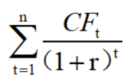

======================================================

_type: talk
@二师父[28814221155551]
2020-06-01 22:12:36 Mon  
topic_id: 118858584451882

<e type="hashtag" hid="15285258524852" title="#周一市场分析及全市场数据#" /> 全市场指数市盈率百分位28.48%，市净率百分位10.5%，SY/BY百分位11.09%，SY-BY百分位27.53%。

风险溢价率适中，格雷厄姆指数SY/BY偏低，大家看只要所有数据都在10%左右百分位，就是绝佳的抄底机会，遇到了不要错过。

当前位置正常偏低，未来全市场指数市盈率百分位到了60%以上就可以考虑逐步卖出或者清仓了。

A股一般熊市比较长，所以大多数时候看到全市场指数市盈率百分位在50%以下，可这不是市场的全貌。耐心持有，享受复利增值，这次上涨如果能够突破3050点就有希望，那里是套牢密集区，如果不能突破大概率还是震荡，做好持久战的准备。

@杜志彪 at 2020-06-01 22:12:36 Mon

> 做好持久战准备，先收割消费10%利润，一点点来，慢就是快[微笑]

----------

@蓝魔森林 at 2020-06-01 22:12:36 Mon

> 问下师傅，目前还有持有中国平安股票吗？

----------

@二师父 at 2020-06-01 22:12:36 Mon

> 已经没有平安了

----------

@蓝魔森林 at 2020-06-01 22:12:36 Mon

> 好的👌

----------

@蓝魔森林 at 2020-06-01 22:12:36 Mon

> 师傅是不看好平安未来吗

----------

@二师父 at 2020-06-01 22:12:36 Mon

> 这个主要是行业竞争格局的问题，现在平安的优势是规模优势，和格力类似，不过我和这些公司的员工聊过，线下保险和线下经销格力的天花板到了

目前平安最大的竞争在于随着互联网保险的普及，很多小型保险公司逐步起来了，而且随着80，90后保险知识的拓展，他们对保险认知会更深，只要是受保监会监督的保险公司，理赔都是一样的，相当于是受到保监会管理

那平安除了品牌和渠道优势，以及过往客源，其他的优势就被削弱了，所以我没投了

投平安，招行取得一个平均收益率没问题，不过投资股票额外承担一定的风险肯定需要更高的风险补偿

----------

@蓝魔森林 at 2020-06-01 22:12:36 Mon

> OK 明白了。 谢谢二师傅分析。

----------

@杜志彪 at 2020-06-01 22:12:36 Mon

> 这类股票不要想着短时间内盈利多少，长期拿着年线以下就是给你机会，好好把握[呲牙]

----------

阅读[5269]  评论[8]  赞[0] 

======================================================

_type: talk
@小鱼[241182222251181]
2020-06-02 09:42:58 Tue  
topic_id: 118858425151442

家电是不是还可以定投买呀，是不是还在底位呀。

@二师父 at 2020-06-02 09:42:58 Tue

> 已经不再低位了，定投能接受回撤可以

----------

阅读[4184]  评论[1]  赞[0] 

======================================================

_type: talk
@二师父[28814221155551]
2020-06-02 10:29:00 Tue  
topic_id: 841181252524482

<e type="hashtag" hid="28518581255221" title="#中证100调仓#" /> 投资中证100指数的朋友注意下，左边是调出股票右边是调入股票，用好的把坏的换了，看了看，汇顶科技，京沪高铁，中公还可以，这是指数的优势

调仓关注下即可，一般都是好的给调进来，如果出了幺蛾子把坏的股票调进来了就要警惕

@Chu at 2020-06-02 10:29:00 Tue

> 请问有中证500的吗？

----------

@二师父 at 2020-06-02 10:29:00 Tue

> 有的

----------

阅读[4365]  评论[2]  赞[0] 

+++++++++++++++++++++++++++++++++++++++++++++++++++++

图片：
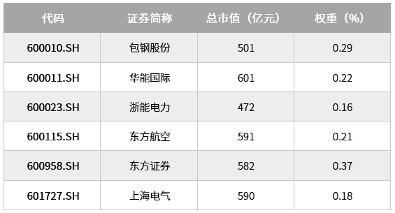
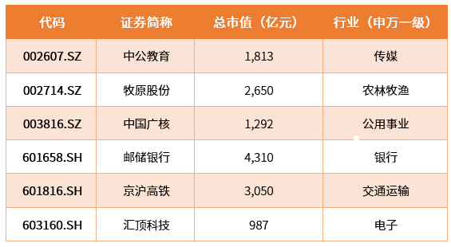

======================================================

_type: q&a
@老妖[118514521115522]
2020-06-02 10:53:51 Tue  
topic_id: 548818525158524

@老妖

>  师父，消费和医疗是不是高估了？

@二师父

>  消费还没有高估，医疗是高估了，一般投资情绪如钟摆容易过度摆动，现在医疗就是摆动过度，如果行业没有到达衰退期，其实每隔几年就会均值回归。

阅读[4404]  评论[2]  赞[0] 

======================================================

_type: talk
@二师父[28814221155551]
2020-06-02 17:10:46 Tue  
topic_id: 548818411188454

<e type="hashtag" hid="228588452811" title="#指数调仓#" /> 看了看指数调仓信息，目前我们持有的基金持仓基本面都没有问题，除了油气比较糟糕，这个等待反弹直接清掉的，因为慢慢的跟着投的朋友比较多，所以后面强周期品种我不会发布，要投资的话我就自己单独账户做。

虽然不是很建议大家跟投，不过还是有朋友参考，毕竟不是每个朋友都和我一样喜欢研究投资，所以以后不管是乌龟计划还是鳄鱼计划，都采用高确定性的宽基和行业指数，仅供参考，想跟的话也不保证收益率，不过从18年到现在读者反馈跟着投是挣了钱的，最怕的是，我涨得好的基金你没跟着投，而我投的涨得差的基金你却重仓了。所以投资是一个综合系统的工程，一个环节不对就要出大问题，细心点总是好的。希望我们共同学习，一起进步。

很多时候认知是慢慢提升起来的，只有不断地否定自己，突破既有认知才能够进步。大部分人到了一个阶段之后就固化了，一旦不吸收新思想，很快就被年轻人淘汰了，投资也一样。

@秦风殇韵（刘豫斌） at 2020-06-02 17:10:46 Tue

> 500etf已经10%收益，需要收割利润吗？

----------

@二师父 at 2020-06-02 17:10:46 Tue

> 总体仓位如何，总体仓位8成以上可以收一收

----------

@秦风殇韵（刘豫斌） at 2020-06-02 17:10:46 Tue

> 总体仓位五成左右，500etf约占总投资3%，不算多，当初做网格，买了就忘了，放到现在

----------

@二师父 at 2020-06-02 17:10:46 Tue

> 可以用华宝自动网格，到了自动卖，不用操心

----------

@秦风殇韵（刘豫斌） at 2020-06-02 17:10:46 Tue

> 场内也能用么？

----------

@二师父 at 2020-06-02 17:10:46 Tue

> 可以

----------

@西锦巴乌 at 2020-06-02 17:10:46 Tue

> 请问师父自动网格的话行情上涨底仓也卖完了后要重新建立底仓重新开始呢还是让系统自动延继？谢了

----------

@二师父 at 2020-06-02 17:10:46 Tue

> 到价格系统会自动买，自己可以手动加一部分

----------

阅读[5291]  评论[10]  赞[0] 

+++++++++++++++++++++++++++++++++++++++++++++++++++++

文件：
2020-06-02 17:01:21 Tue
文件大小：[637669]
15484181524552-中证系列指数样本股大调整，定投需要调仓吗.docx

======================================================

_type: talk
@二师父[28814221155551]
2020-06-02 18:28:24 Tue  
topic_id: 118858155184582

看看过往历史

@雨淡风清 at 2020-06-02 18:28:24 Tue

> 越乱越涨啊

----------

@Hi·DD at 2020-06-02 18:28:24 Tue

> 这总结够强[悠闲]

----------

@秦风殇韵（刘豫斌） at 2020-06-02 18:28:24 Tue

> 极端救市

----------

@二师父 at 2020-06-02 18:28:24 Tue

> 放水

----------

@毛太史 at 2020-06-02 18:28:24 Tue

> 暴乱之后的走势呢？

----------

阅读[4373]  评论[5]  赞[0] 

+++++++++++++++++++++++++++++++++++++++++++++++++++++

图片：
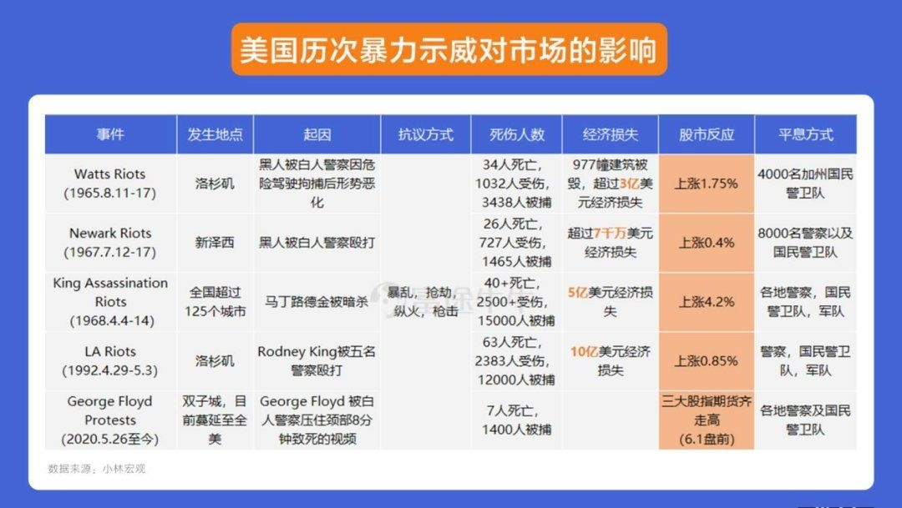

======================================================

_type: talk
@二师父[28814221155551]
2020-06-02 21:50:45 Tue  
topic_id: 841181481458552

<e type="hashtag" hid="88518581221222" title="#每日市场数据#" /> 万得全A指数市盈率百分位28.86%，市净率百分位12.4%。SY-BY百分位28.56%，SY/BY百分位14.23%。

市场估值整体上移，大家可以参考SY-BY百分位制定仓位，百分位越低，仓位越高。

仓位的控制与买入资产的价格有关系，比如你同样满仓白酒，在1元满仓和1.3元满仓不一样。心态差别大。每一次下跌都记得，如果在安全边际范围内，就不要恐慌。

现在注意两个问题：第一白酒医疗已经涨很高了，未来一定回调，就看什么时候，追入散户越多的时候，越容易回来

中证医疗历史最高市盈率最高135，目前90，你不能说未来医疗继续涨就得出结论：高估的医疗可以投。反正A股涨得越猛，回调越快，如果大牛市来临之前不回调那就等下一次熊市，宁可错过，也别过错。

手里的300医药也是这个道理，可以不卖，继续享受估值泡沫，但是目前这个位置不能再买了，尤其重仓，要是几千块玩玩当没说。

阅读[5147]  评论[0]  赞[0] 

======================================================

_type: talk
@二师父[28814221155551]
2020-06-02 22:01:34 Tue  
topic_id: 421181281285148

大大主持专家学者座谈会强调，人民安全是国家安全的基石，要强化底线思维，增强忧患意识，时刻防范卫生健康领域重大风险。只有构建起强大的公共卫生体系，健全预警响应机制，全面提升防控和救治能力，织密防护网、筑牢筑实隔离墙，才能切实为维护人民健康提供有力保障。要加大卫生健康领域科技投入，集中力量开展核心技术攻关。要加强古典医籍精华的梳理和挖掘，建设一批科研支撑平台，改革完善中药审评审批机制，促进中药新药研发和产业发展。

@wty at 2020-06-02 22:01:34 Tue

> 创新药依旧是未来的方向-读后感

----------

阅读[4395]  评论[1]  赞[0] 

======================================================

_type: talk
@二师父[28814221155551]
2020-06-02 22:05:21 Tue  
topic_id: 841181481481152

美股继续涨，像美股就不适合定投，适合一次购买，定投是针对a股超长期熊市的，如果a股不是熊市长，他也就不适合定投了

@蛋炒饭不加蛋 at 2020-06-02 22:05:21 Tue

> 暴乱也不跌[流汗]

----------

@蓝魔森林 at 2020-06-02 22:05:21 Tue

> 涨出风险  ， 趋势不太符合常识了

----------

阅读[4512]  评论[2]  赞[0] 

+++++++++++++++++++++++++++++++++++++++++++++++++++++

图片：
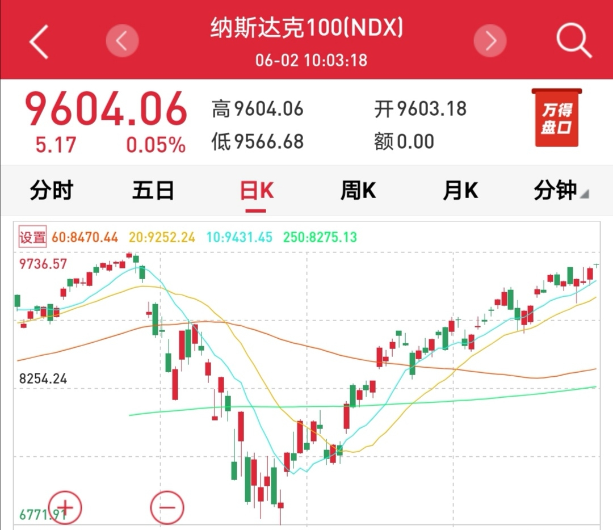

======================================================

_type: q&a
@jier[118552824811122]
2020-06-03 06:44:44 Wed  
topic_id: 421181258885158

@jier

>  二师父，请问开通科创板，如果有几个证券账户的话，是不是累计金额达到50万就可以？账户里的金额可以是股票，也可以是基金或现金形式持有都算？您觉得开通科创板有风险吗？谢谢

@二师父

>  不能累计，账户50万资产，现金或者股票，满二年
>  
>  开通科创板没有风险，购买科创板股票风险还是很大的

阅读[4442]  评论[7]  赞[0] 

======================================================

_type: talk
@小鱼[241182222251181]
2020-06-03 09:53:33 Wed  
topic_id: 118858148244252

恒生在发力了，已经回本，要不要卖出，还是继续持有，或者在买点进去呀？[微笑]

@二师父 at 2020-06-03 09:53:33 Wed

> 你这个逻辑很混乱啊

----------

@小鱼 at 2020-06-03 09:53:33 Wed

> 我的意思，恒生最近终于涨了，已经到买入价格了。可以持续持有吗，或者说，可以再买点进去。

----------

@二师父 at 2020-06-03 09:53:33 Wed

> 持有是没问题的

----------

@六尘不改 at 2020-06-03 09:53:33 Wed

> 太混乱了，是买入还是卖出，俩极端

----------

@小鱼 at 2020-06-03 09:53:33 Wed

> 我又想再买，又想卖，想法太多

----------

@杜志彪 at 2020-06-03 09:53:33 Wed

> 你想好了，你买入的逻辑是什么，或者说依据是什么。这个恒生指数我认为低估定投，等待正常以后收割挺好的，趋势的话必须舍得止损，其实没必要都要赚，要不逆势，要不趋势，选一个就好了。

----------

阅读[4253]  评论[6]  赞[0] 

======================================================

_type: talk
@二师父[28814221155551]
2020-06-03 09:56:47 Wed  
topic_id: 421181251451458

继续申购，除了油气和50，现在所有的基金都大幅盈利了，记住来市场是为了挣钱的，不是为了保本的，卖出要么看错了退场，要么盈利达到预期，别回本卖了涨上去又追

@Hi·DD at 2020-06-03 09:56:47 Wed

> 我目前是银行和油气[调皮]

----------

@🍀 凝🌸 慧🍀 at 2020-06-03 09:56:47 Wed

> 师父，前天的可转债，我中签啦，1手，刚开始练习，就中签了，很高兴啊。谢谢师父！[玫瑰][玫瑰][愉快]

----------

@二师父 at 2020-06-03 09:56:47 Wed

> 恭喜

----------

@雨淡风清 at 2020-06-03 09:56:47 Wed

> 二师父，我的恒生国企，300非银，金融地产都在负盈利，都是在大盘下行的时候没有子弹补仓。现在其他的有部分盈利可不可以卖出，再补点

----------

@二师父 at 2020-06-03 09:56:47 Wed

> 不要拔了鲜花浇灌野草

----------

@雨淡风清 at 2020-06-03 09:56:47 Wed

> 收到，受教了

----------

@是喵喵吖～ at 2020-06-03 09:56:47 Wed

> 哇塞 恭喜 哈哈哈

----------

@🍀 凝🌸 慧🍀 at 2020-06-03 09:56:47 Wed

> 谢谢师父，继续努力！😄

----------

阅读[4454]  评论[12]  赞[0] 

+++++++++++++++++++++++++++++++++++++++++++++++++++++

图片：

======================================================

_type: q&a
@六尘不改[241555484551821]
2020-06-03 10:16:27 Wed  
topic_id: 548818458241814

@六尘不改

>  这几天券商启动，是不是要来行情了？

@二师父

>  目前已经切换到金融蓝筹股了，如果这些集体拉升大牛就会来，看市场反应，目前信用宽松，流动性充裕，股市不涨不是正常现象，唯一的不确定性因素在美国

阅读[4653]  评论[2]  赞[0] 

======================================================

_type: q&a
@HeLLO[15548451524442]
2020-06-03 10:34:41 Wed  
topic_id: 118858148584412

@HeLLO

>  二师父，中证500高估了吗？

@二师父

>  还没有高估，这才刚起来

阅读[4664]  评论[4]  赞[0] 

======================================================

_type: talk
@二师父[28814221155551]
2020-06-03 13:16:03 Wed  
topic_id: 118858112122112

<e type="hashtag" hid="881251425252" title="#鳄鱼计划#" /> 卖出医药etf一份，医药差不多了，18年买的时候多少人怀疑他的盈利，现在涨的让很多人怀疑人生，适可而止

之前一直追捧的债券也降温了，有些东西是不会变的，就如同曾经一个人咨询我投资建议，我告诉他那是投资骗局，结果他还是买了，大部分人想的还是别人如何教他快速致富，即使他知道那是假的。

酒etf也可以逐步卖了，之前我是转到消费了，后面再入，消费还可以继续持有，当然我无法判断他能不能继续涨，只是从数概率统计上现在持有赢面大

@J at 2020-06-03 13:16:03 Wed

> 师父，现在适合把酒转到消费吗

----------

@二师父 at 2020-06-03 13:16:03 Wed

> 不适合

----------

@J at 2020-06-03 13:16:03 Wed

> 哦，那酒是否可以现在准备逐步卖出了？

----------

@二师父 at 2020-06-03 13:16:03 Wed

> 可以

----------

@以古论今 at 2020-06-03 13:16:03 Wed

> 医药和酒都卖了，有没有好的基金适合接收。

----------

阅读[4720]  评论[5]  赞[0] 

======================================================

_type: q&a
@果实妈咪[182225518588452]
2020-06-03 15:07:15 Wed  
topic_id: 241181442445551

@果实妈咪

>  华泰证券的可以用网格交易吗？二师父，在哪里可以操作，谢谢指导

@二师父

>  可以的，你直接按照网格交易表的价格下单就行，置顶有网格交易表

阅读[4666]  评论[4]  赞[0] 

======================================================

_type: talk
@二师父[28814221155551]
2020-06-03 16:04:43 Wed  
topic_id: 241181444854451

<e type="hashtag" hid="15285258118452" title="#每周估值表#" />

@宁静以致远 at 2020-06-03 16:04:43 Wed

> 谢谢二师父每周更新估值表！可不可以每次都把后面的正常估值范围带上？

----------

@二师父 at 2020-06-03 16:04:43 Wed

> 好的

----------

@果实妈咪 at 2020-06-03 16:04:43 Wed

> 券商场内代码多少

----------

阅读[4707]  评论[3]  赞[0] 

+++++++++++++++++++++++++++++++++++++++++++++++++++++

图片：
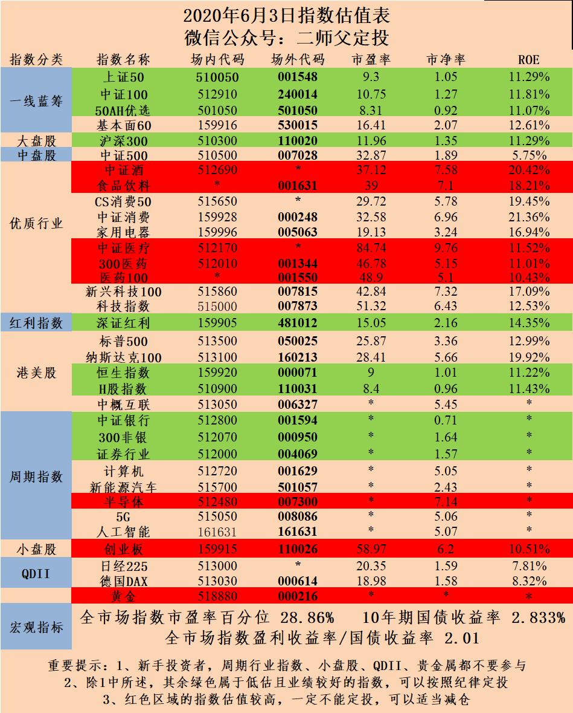

======================================================

_type: talk
@二师父[28814221155551]
2020-06-03 16:08:52 Wed  
topic_id: 841181444885142

<e type="hashtag" hid="51281218448554" title="#定投实盘241#" /> 买入0.75份，逐步减少定投份额，如果继续上涨，会逐步减少定投直到停止，下跌的话就多买一点。这个实盘主要是每月收入结余投资，如果想要取得更好的收益率，可以参考鳄鱼计划，底部多买一点，2019年初买的任何一只基金到现在收益率更好，但你未来的收入不可能都集中到2019年初，要考虑额外的月结余的打理。

@果实妈咪 at 2020-06-03 16:08:52 Wed

> 二师父，你不是每个周四定投吗？为何周三了改为，还是场外三点以后买入的按照周四算的对吗？

----------

@二师父 at 2020-06-03 16:08:52 Wed

> 对，三点以后买是按照周四收盘价格来的

----------

阅读[4962]  评论[2]  赞[0] 

+++++++++++++++++++++++++++++++++++++++++++++++++++++

图片：
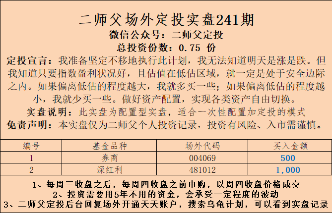

+++++++++++++++++++++++++++++++++++++++++++++++++++++

文件：
2020-06-03 16:05:10 Wed
文件大小：[71902]
51585825211514-二师父241期定投实盘记录.docx

======================================================

_type: talk
@二师父[28814221155551]
2020-06-03 16:16:24 Wed  
topic_id: 548818444118414

<e type="hashtag" hid="825188852442" title="#估值表#" />

阅读[5805]  评论[0]  赞[0] 

+++++++++++++++++++++++++++++++++++++++++++++++++++++

图片：
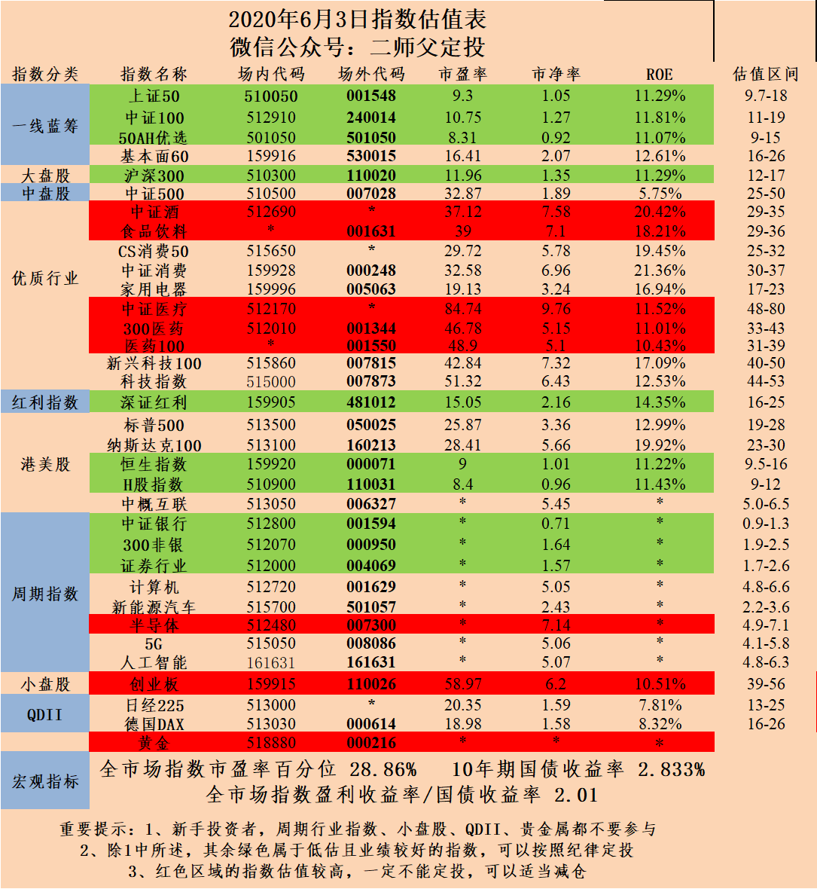

======================================================

_type: q&a
@孟倩[118822124154582]
2020-06-03 16:59:38 Wed  
topic_id: 841181445482282

@孟倩

>  二师父，请问有针对十几岁青少年的保险吗？意外重疾之类的，有好的推荐吗？
>  谢谢！

@二师父

>  重疾险——妈咪保贝，意外险——平安少儿综合意外险。重疾+意外足够了。意外险不仅保意外医疗，还可以保意外身残等，其他的基本上可以不用。

阅读[4901]  评论[2]  赞[0] 

======================================================

_type: q&a
@黎雄[841555255485222]
2020-06-03 22:13:43 Wed  
topic_id: 421181215448818

@黎雄

>  师傅消费龙头指数931068.这个指数包含了必须消费和可选消费可以配置不，现在估值如何？

@二师父

>  目前正常估值，消费涨的都相对偏高

阅读[4727]  评论[1]  赞[0] 

======================================================

_type: talk
@门萨🐨[51411455828824]
2020-06-04 04:35:17 Thu  
topic_id: 241181414288411

五菱神车😂

@雨淡风清 at 2020-06-04 04:35:17 Thu

> 都说了此五菱非彼五菱。根本不是一回事

----------

阅读[4670]  评论[1]  赞[0] 

+++++++++++++++++++++++++++++++++++++++++++++++++++++

图片：
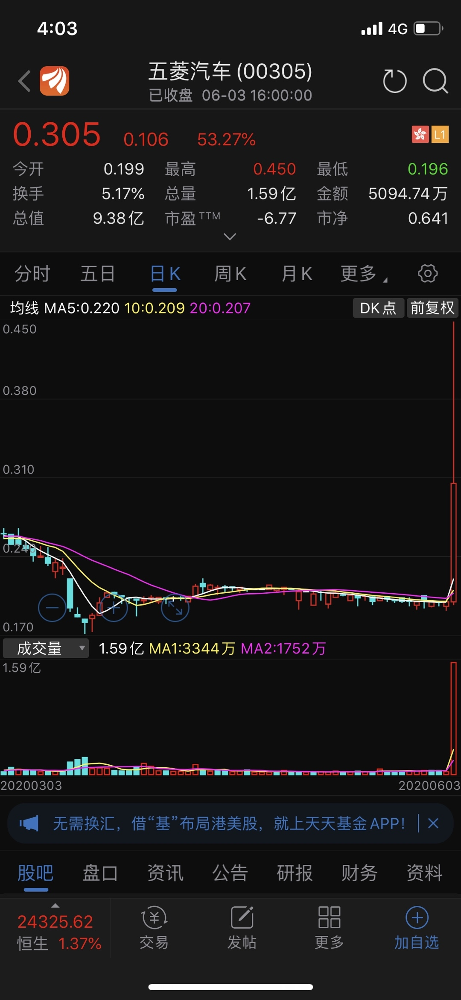

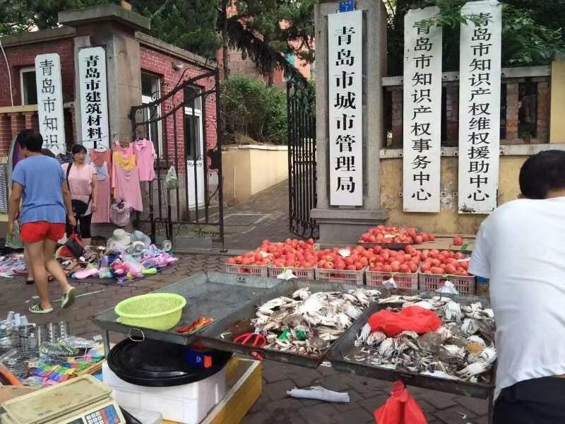

======================================================

_type: q&a
@JOY[111881481812422]
2020-06-04 11:51:53 Thu  
topic_id: 548818825281524

@JOY

>  师父，请问今天的两只发债可以申购吗？今天发债看评级只有A+。

@二师父

>  可以申购，我都申购了

阅读[4516]  评论[6]  赞[0] 

======================================================

_type: q&a
@是喵喵吖～[421441114141158]
2020-06-04 11:54:59 Thu  
topic_id: 241181158111551

@是喵喵吖～

>  二师父您好，我昨天刚申请了华宝智投 想以后在这上边买卖券商这些网格交易，我试着操作了一下。我扫描您发的券商的二维码 然后它自动会有这些价格啊 金额啥的。以券商为例，这个0.9的价格我不太明白呢 ，他代表着什么来着 。我是不是不用动 。然后金额的话 我可以根据自己的情况是吧 最小底仓可以是10000吗 然后每笔委托4000的话，意思就是：每次下跌3%就买入4000块钱对吗。谢谢！！

@二师父

>  是的，0.9是底仓买入价格，触发这个价格可以买入，底仓根据资金量来，准备6，7份4000元就行，如果加完了还没到底锁仓可以的
>  
>  网格少部分资金参与就行，行情震荡要么一直持有，要么小资金网格

阅读[4760]  评论[3]  赞[0] 

======================================================

_type: q&a
@不知道不明了[15584248411812]
2020-06-04 17:37:57 Thu  
topic_id: 241181185484251

@不知道不明了

>  二师父，请问现在人工智能和科技100还适合定投么，上次鳄鱼计划后又加仓了两份

@二师父

>  目前多少仓位，等回调入好一些，人工智能价格1.3以下，科技100再回调5个点左右
>  
>  当然，我不确定是否一定回调，从安全角度考虑，科技类指数波动大，要保证回撤小

阅读[4452]  评论[2]  赞[0] 

======================================================

_type: talk
@二师父[28814221155551]
2020-06-04 20:05:31 Thu  
topic_id: 421181188514588

<e type="hashtag" hid="51281252122254" title="#白酒的风险以及美股上涨的原因#" />

@wty at 2020-06-04 20:05:31 Thu

> 今天场外白酒收割利润、场内白酒早清仓了。

----------

@What if at 2020-06-04 20:05:31 Thu

> 刚刚清完，不贪[呲牙]

----------

阅读[4581]  评论[2]  赞[0] 

+++++++++++++++++++++++++++++++++++++++++++++++++++++

文件：
2020-06-04 20:05:07 Thu
文件大小：[24351]
15484855545212-白酒猛涨，注意风险.docx

======================================================

_type: talk
@二师父[28814221155551]
2020-06-04 22:39:00 Thu  
topic_id: 241181181851221

<e type="hashtag" hid="88518581221222" title="#每日市场数据#" /> 市盈率百分位29.06%，市净率百分位13.06%，SY-BY百分位29.68%，SY/BY百分位16.61%。

最有价值的投资时刻过去了，每一次大跌二师父都在喊抄底，等待下一次，一年等不到，等3年，总之，不要追涨，现在有的股票已经到了风险位置，不要忘记2018年伊利、茅台、五粮液都是跌停过的。

北向资金继续流入，以沪股通为主，手持上证50的沪市蓝筹涨幅偏大，之前50AH可以收利润，也可以继续持有，A股以风格轮动为主。

阅读[4446]  评论[0]  赞[0] 

======================================================

_type: talk
@二师父[28814221155551]
2020-06-05 00:00:05 Fri  
topic_id: 421181181185848

债券跌爽了，预计再跌6到8个点上车，投资就是这么简单，大家都在抢的时候离开就行了，组合里面是没有债的，3月大跌全部换成了指数，保证有资金，永远不缺机会

@再见 . 青春 at 2020-06-05 00:00:05 Fri

> 二师父，不明白债券最近为什么一直跌呢

----------

@二师父 at 2020-06-05 00:00:05 Fri

> 货币收紧了，之前本来就是量化宽松带来的上涨，不可持续

----------

阅读[4532]  评论[2]  赞[0] 

+++++++++++++++++++++++++++++++++++++++++++++++++++++

图片：
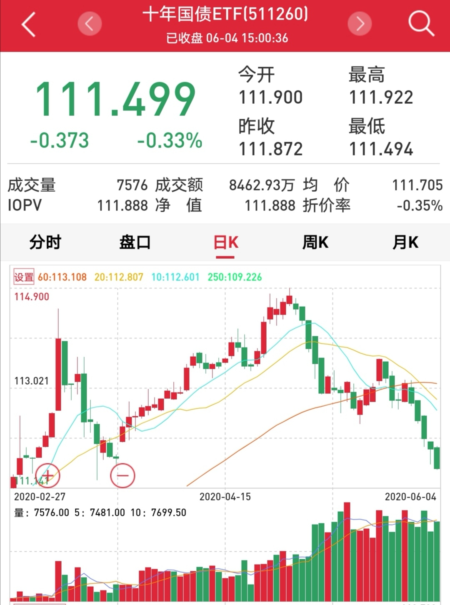

======================================================

_type: talk
@二师父[28814221155551]
2020-06-05 06:53:02 Fri  
topic_id: 241181125222451

大跌的时候，开启场外自动定投，利用一切资金，已经盈利，虽然港股最近表现比白酒，美股差，但是大家永远记得，底部区域暴跌不是风险，都会起来的

如果你总和我反着来，大概率赚不到。

@朝阳模具 at 2020-06-05 06:53:02 Fri

> 我抄了个纯港股主动型混基，目前收益率18%。

----------

@二师父 at 2020-06-05 06:53:02 Fri

> 请下次抄的时候发出来，我记得我发这个操作记录，你专门发了一个清仓记录表

----------

@wty at 2020-06-05 06:53:02 Fri

> 场内做网格部分已经盈利很多，但是场外主仓位接近盈利了！继续持有等待！

----------

@朝阳模具 at 2020-06-05 06:53:02 Fri

> 恒生国企我提前跑了，后面抄了我喜欢的港股混基，收益18%，上图，抄杀指数！

----------

@Gingo at 2020-06-05 06:53:02 Fri

> 二师父这是在支付宝买的 不属于你的场外乌龟计划吗？

----------

@二师父 at 2020-06-05 06:53:02 Fri

> 不属于，乌龟计划都在天天显示

----------

@二师父 at 2020-06-05 06:53:02 Fri

> 比比同期标普、白酒、医疗，中概怎么杀

----------

@朝阳模具 at 2020-06-05 06:53:02 Fri

> 哈😄 ，场内一直持有券商ETF，消费50ETF，中概互联ETF，纳斯达克ETF，科技龙头ETF，深红利等等11支ETF

----------

阅读[4591]  评论[8]  赞[0] 

+++++++++++++++++++++++++++++++++++++++++++++++++++++

图片：
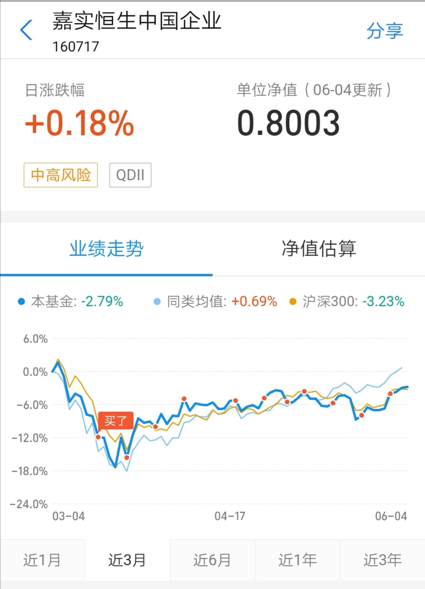

======================================================

_type: talk
@二师父[28814221155551]
2020-06-05 09:41:47 Fri  
topic_id: 118858845425422

三只新债可以申购，打新债风险可控，如果跌破面值持有，上市大概率都是上涨的

阅读[4492]  评论[0]  赞[0] 

+++++++++++++++++++++++++++++++++++++++++++++++++++++

图片：
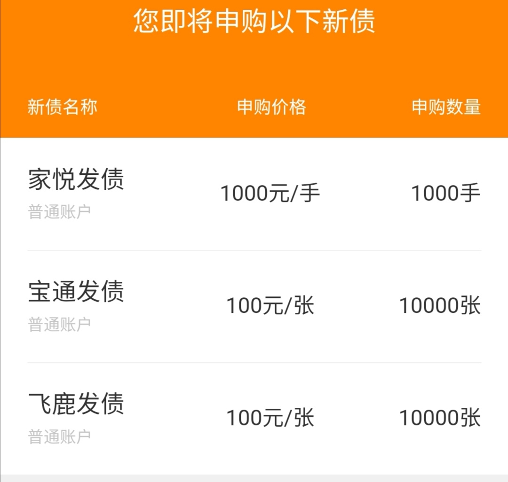

======================================================

_type: talk
@二师父[28814221155551]
2020-06-05 10:51:25 Fri  
topic_id: 421181152285458

<e type="hashtag" hid="51281252155814" title="#交易提醒#" /> 沪深300清仓，以后我的场外乌龟计划也在星球发下。其实我是不太喜欢场外操作的，交易成交延迟，而且手续费高

标普500计划盈利30个点清仓，还是没看到回头趋势，美股牛长熊短，适合长持。

保证一定的仓位，涨跌无法预测，只有仓位合理，下跌不会恐惧，上涨不会追

@Zero Fei at 2020-06-05 10:51:25 Fri

> 二师父，如果我们的乌龟计划（增量资金）换场内可行嘛，好像一般看到的定投都在场外的

----------

@alicedream* at 2020-06-05 10:51:25 Fri

> 二师父，沪深300为什么清仓？已经达到了你的清仓阈值还是情况不好了？

----------

@蛋炒饭不加蛋 at 2020-06-05 10:51:25 Fri

> 二师父为什么清沪深300啊

----------

@顾小胖 at 2020-06-05 10:51:25 Fri

> 同问乌龟计划可不可以转场内

----------

@是喵喵吖～ at 2020-06-05 10:51:25 Fri

> 师父 标普500到了30个点 全部清仓吗。然后等跌了在再买对吗。能一直一直持有吗😂

----------

@二师父 at 2020-06-05 10:51:25 Fri

> 也可以的，鳄鱼计划很少出手，出手就是最佳机会，场外就是给投资者一个学习参考

----------

@王雷 at 2020-06-05 10:51:25 Fri

> 二师父清仓进那支基金。还是拿着现金

----------

@衣袂飘香 at 2020-06-05 10:51:25 Fri

> 同问。

----------

阅读[4576]  评论[22]  赞[0] 

======================================================

_type: talk
@denise[28212444521841]
2020-06-05 11:05:31 Fri  
topic_id: 421181152224848

二师父，是否可以在圈子发布下场内和场外的实时实盘。有操作时发出。

@二师父 at 2020-06-05 11:05:31 Fri

> 都有发的，场外实盘叫乌龟计划，场内实盘叫鳄鱼计划

----------

@denise at 2020-06-05 11:05:31 Fri

> 鳄鱼计划在圈中有实盘吗，在哪可查

----------

@denise at 2020-06-05 11:05:31 Fri

> 这种持仓表，我搜索最近也是19年12月份的，不知最近有吗

----------

@二师父 at 2020-06-05 11:05:31 Fri

> 后面发一下

----------

@denise at 2020-06-05 11:05:31 Fri

> ok谢谢

----------

阅读[4322]  评论[5]  赞[0] 

======================================================

_type: talk
@二师父[28814221155551]
2020-06-05 12:38:54 Fri  
topic_id: 548818858114414

<e type="hashtag" hid="28518522555541" title="#为什么卖沪深300#" /> 最重要的原因是赚钱了，有赚就卖啊，场内场外如果大家都有跟的话都是盈利的，赚了卖出没啥问题。而且组合里面有深红利，有银行，有50AH，这些里面很多都有沪深300持仓股票的，300涨了，这些也会涨得。预期后面仍旧有回撤，卖出了继续加仓，如果没有回撤，现在都高仓位，牛市来了也很高兴啊，仓位管理，动态平衡。

没有全部清仓，就卖了一点点而已。

300是好指数，长期定投可以的，但有条件，如果你投资水平高，年化可以达到25%，那么300对你就鸡肋，如果你投资水平一般，炒股一直亏，那么300就是你的救星，对你好的对别人不一定好。

之前一直下跌的时候买入，很多人说你这么高仓位，激进，是在赌博，现在上涨了提示风险，卖出一点，很多人又说他是价值投资，要长期持有。

什么是价值投资，我可以明确的说亏钱不是价值投资，你没亏，而且长期赚了的操作方法就是对的，不要总想着牛市10年10倍，慢慢来吧，一点点积累，账户市值是稳步增长的。其实我在18年底都接近9成仓位了，这一年多也就是波段卖出的再接入。当然长期看目前是处于熊末牛初，所以仍旧高仓位，主仓根本没动，即使面临回撤也不动，不知道这样说是否能理解。

我的实盘只是一个参考，不保证一定赚钱，没有太多为什么，投资本来就是很个性化的东西，二师父说过不要加杠杆，但是有个朋友一直都是保持100%——200%的仓位，穿越两轮牛熊了，总之适合自己的就是好的，如果卖出让你很不舒服，那就可以持有的，沪深300基本面没有问题，也值得长期定投，只要不再高位接盘就行。

@lily at 2020-06-05 12:38:54 Fri

> 师父我也准备做个网格，我看现在券商etf是0.881元，可以直接建底仓哇？是512000哇？

----------

@二师父 at 2020-06-05 12:38:54 Fri

> 对，建仓后按照价格加

----------

@lily at 2020-06-05 12:38:54 Fri

> 好的 谢谢师父

----------

@lily at 2020-06-05 12:38:54 Fri

> 那最低价和最高价怎么设置？

----------

@二师父 at 2020-06-05 12:38:54 Fri

> 这个不用设置，下跌一直买，你可以直接在华宝跟投

----------

阅读[4677]  评论[5]  赞[0] 

======================================================

_type: q&a
@Jarvis Liu[111141548852852]
2020-06-05 14:43:04 Fri  
topic_id: 841181121418222

@Jarvis Liu

>  二师父，有个问题咨询下您，在学习基金投资课程的时候，我一般看恒生指数市盈率的变动，来判断恒生ETF（159920）的变化情况，如果是观察酒ETF（512690）和证券ETF（512000），我应该观察哪个指数的变化情况呢？

@二师父

>  恒生指数属于价值类基金，市盈率和市净率都是可以参考的估值指标。酒ETF既可以看市盈率和市净率。
>  
>  证券ETF是因为盈利变动很大，市盈率失效，只能看市净率。

阅读[4506]  评论[2]  赞[0] 

======================================================

_type: talk
@二师父[28814221155551]
2020-06-05 16:26:59 Fri  
topic_id: 421181124248518

这个主动基金是最牛的，秒杀很多基金和股票。老朱我也很佩服。但关键问题是，很少有基金经理干14年，只要在底部买入牛人基金经理的产品，基本不会差。

可是基金经理更换以后大部分业绩看不下去了，投资主动基金可以，但想好一个问题，如果主动基金仍旧浮亏15个点，基金经理离职了，该怎么办，能回答这个问题主动基金一次投资是可以的

@再见 . 青春 at 2020-06-05 16:26:59 Fri

> 朱少醒，董承非，这两位都是没换过东家的牛人，也是十几年来复合年化超过10的绝对稳健型牛基，能和他们掰掰手腕的也就陈光明 傅鹏博 林鹏 ，年轻一辈还有张坤 谢志宇和王崇，不过正如二师父所言，公募基金不怕跌，就怕中途换人，比如远的如陈光明成立私募，近的林鹏也刚刚离职了

----------

@清水倾城 at 2020-06-05 16:26:59 Fri

> 观察新经理，业绩不错就继续持有，持续观察，不行就换到别的主动鸡[坏笑]

----------

@朝阳模具 at 2020-06-05 16:26:59 Fri

> 喜欢被动型基金和喜欢主动型基金，实际上没有对和错，只是每个人的投资爱好不一样而已，被动型基金与主动型基金各有各的优点与缺点，只要完全撑握她们的优点与缺点都可以投啊。我个人主动型+被动型双管齐下，场外干主动型，场内干被动型ETF。

----------

@二师父 at 2020-06-05 16:26:59 Fri

> 是啊，这是不确定性，如果能一直运营当然好的

----------

@二师父 at 2020-06-05 16:26:59 Fri

> 我只是提示风险，没有不让投

----------

@朝阳模具 at 2020-06-05 16:26:59 Fri

> 实际上现在很多大Ⅴ也是主动+被动一起研究了。比如银行镙丝钉，之前几年从未研究主动型基金，一味的推荐他的指数基金，但是今年我偶然发现他也开始转变观念了，也搞起了主动型组合[偷笑]

----------

@海马 at 2020-06-05 16:26:59 Fri

> 主动基金和被动基金都有各自生存的空间[呲牙]

----------

@J at 2020-06-05 16:26:59 Fri

> 指数基金和主动基金各有生存空间，建议师父有空写一篇文章专门分析一下它们各自的优劣和如何选择，两者比例如何配置等等

----------

阅读[4572]  评论[9]  赞[0] 

+++++++++++++++++++++++++++++++++++++++++++++++++++++

图片：
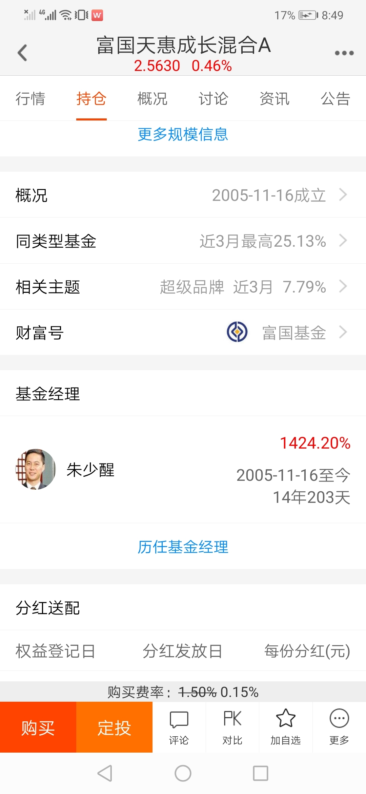

======================================================

_type: talk
@Fire[421142182555188]
2020-06-05 19:19:13 Fri  
topic_id: 118858811284412

师父，目前我大概有30万的股票，20万指数基金，30万的主动基金，40万的二级债基，其他还有100多万R2的银行3%收益的货币基金，后面应该如何理财比较好？

@二师父 at 2020-06-05 19:19:13 Fri

> 你好，不太清楚家庭的财务状况，如果有稳定收入，每月有结余的话，可以继续投资货币基金，你这个应该是银行理财，货币基金是2%，R1风险，银行理财虽然以前从来没有亏过，但是合同写的是不保本，R2风险，比R1风险的货币基金高一点。

保守点，后面可以继续加仓龙头股票和优质指数，控制在股权比例50%左右，如果压力不大，下跌越多慢慢加。然后保证一定比例的股权仓位，二级债基是股票和债券的混合，容易出现垃圾债，直接在利率低位，货币逐渐宽松的时候投资债券基金是好一些的，配置上没有大问题，很稳健的组合，即使发生股灾这种组合也安全。

----------

@Fire at 2020-06-05 19:19:13 Fri

> 谢谢。家庭收入稳定，也没负债了。银行理财就是平安银行天天成长C之类的，我也是分了几家放的。龙头股票我计划加仓中国平安，招商银行和伊利股份，搞了二个账户打新股和新债使用。后续按照二师父的意见逐步把二级债基改一些过来。

----------

@二师父 at 2020-06-05 19:19:13 Fri

> 龙头低吸没问题，而且仓位很轻，风险可控

----------

阅读[4401]  评论[3]  赞[0] 

======================================================

_type: talk
@二师父[28814221155551]
2020-06-05 19:52:59 Fri  
topic_id: 841181144812842

<e type="hashtag" hid="51281255242254" title="#一切如常#" /> 每一次困难都是为了让我们变得更强，每一次大跌都是为了让我们变得更富。一切都会慢慢过去的，过不去的就到达终点,该领盒饭了。

阅读[4729]  评论[0]  赞[0] 

+++++++++++++++++++++++++++++++++++++++++++++++++++++

文件：
2020-06-05 19:51:27 Fri
文件大小：[24106]
15484842522142-一切都恢复正常了.docx

======================================================

_type: talk
@二师父[28814221155551]
2020-06-05 20:30:22 Fri  
topic_id: 118858811444282

<e type="hashtag" hid="51281255242184" title="#估值全景图#" /> 最近SY-BY指标和SY/BY指标有所回落，一般股市涨，这两个指标会下降，全市场指数市盈率会上升。

这个位置就处于不上不下的位置，拿住就好，后面有好的机会再出手。

阅读[4714]  评论[0]  赞[0] 

+++++++++++++++++++++++++++++++++++++++++++++++++++++

图片：
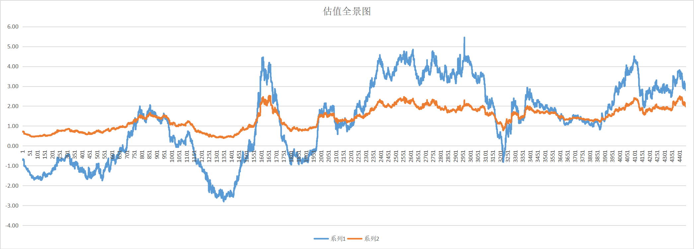

======================================================

_type: talk
@二师父[28814221155551]
2020-06-05 20:55:20 Fri  
topic_id: 421181122254228

<e type="hashtag" hid="48418455428528" title="#周五荐书#" /> 富兰克林自传。这本书记录了富兰克林从一位贫困家庭的孩子在经历种种磨难后成为一个令人难以置信的通才的成长经历。很真实，不仅呈现了自强奋进的富兰克林形象，而且他的错误也在里面显示了，人无完人，每个人都是有缺点，也会犯错误，而不同的是，有的人犯错误改正了，有的人不知悔改。知错能改，善莫大焉。

可以关注下富兰克林时间表，13个美德，以及富兰克林人脉效应。

看伟大人物的传记，虚心学习，优秀的品质就是这样炼成的，勤奋、自律、谦逊、好学。如果一个人能这样正面努力的话，人生轨迹是比较多姿多彩的。

以后每周五推荐一本书，书犹药，善读可医愚。大家有读的好书也可以多多分享。

阅读[5619]  评论[0]  赞[0] 

======================================================

_type: talk
@二师父[28814221155551]
2020-06-06 06:32:36 Sat  
topic_id: 841125512824422

<e type="hashtag" hid="48418455854858" title="#领个红包吧#" /> 两年前的这时候，a股也是医药，消费领涨，大盘萎靡，最后领涨的也跳水了，当时很多人恐慌，而且国际不太稳定，很多人害怕股市从此一蹶不振，为了给读者信心，二师父把每年6月6日定为读者节日，相约10年一起相伴成长，10年后再来看伟大祖国的繁荣富强，见证中国股市的一路长虹。

两年时间，经历了大熊市和结构性牛市，很多读者朋友已经不再恐慌了，而且是真正的赚到钱了。这是读者朋友给我反馈的。

股市涨涨跌跌如同人生起起伏伏，很正常，顺风不浪，逆风不怂，从容而优雅的度过一生。

支付宝输入口令领红包吧，愿每一位读者朋友都能更加富有，生活更加美好。

@屿 at 2020-06-06 06:32:36 Sat

> 感谢二师父！

----------

@向前进 at 2020-06-06 06:32:36 Sat

> 一起成长，谢谢二师父[玫瑰]

----------

@云云 at 2020-06-06 06:32:36 Sat

> 谢谢二师父[玫瑰]

----------

@好运玲玲 at 2020-06-06 06:32:36 Sat

> 谢谢二师父！

----------

@20181108…… at 2020-06-06 06:32:36 Sat

> 谢谢二师父！

----------

@王雷 at 2020-06-06 06:32:36 Sat

> 谢谢二师父

----------

@Sunflower at 2020-06-06 06:32:36 Sat

> 一起成长，谢谢二师父

----------

@云卷云舒 at 2020-06-06 06:32:36 Sat

> 谢谢二师父[玫瑰][玫瑰][玫瑰]

----------

阅读[5615]  评论[22]  赞[0] 

+++++++++++++++++++++++++++++++++++++++++++++++++++++

图片：

======================================================

_type: talk
@林玮[844111858288412]
2020-06-06 06:37:49 Sat  
topic_id: 548852285158254

谢谢师父

阅读[4606]  评论[0]  赞[0] 

======================================================

_type: talk
@二师父[28814221155551]
2020-06-06 07:32:24 Sat  
topic_id: 421154415552418

<e type="hashtag" hid="88518522825212" title="#一切都好起来了#" /> 文章录音，语音讲解思维发散一些，虽然不是老师，但是讨厌照本宣科，星球和喜马拉雅同步发送。

阅读[5025]  评论[0]  赞[0] 

+++++++++++++++++++++++++++++++++++++++++++++++++++++

文件：
2020-06-06 07:32:23 Sat
文件大小：[6885611]
28212125112211-20200516_220155.m4a

======================================================

_type: talk
@树叶[544811512145144]
2020-06-06 12:18:37 Sat  
topic_id: 421154412151218

<e type="hashtag" hid="142825811122" title="#定投周报#" /> 二师父定投周报第62期

阅读[4887]  评论[0]  赞[0] 

+++++++++++++++++++++++++++++++++++++++++++++++++++++

文件：
2020-06-06 12:18:32 Sat
文件大小：[232314]
15481241458252-二师父定投周报6.6（第62期）.docx

======================================================

_type: talk
@二师父[28814221155551]
2020-06-06 18:13:25 Sat  
topic_id: 241125852588521

<e type="hashtag" hid="51281255185124" title="#好赛道——人工智能#" /> 赛道一直变，跟踪时代趋势，发现优质赛道。

学堂人数还是挺多的，不过大多数朋友是闷声发大财，很少发言，每次红包领取速度能够感受到。

@栀子花开 at 2020-06-06 18:13:25 Sat

> 有红包领啊？[惊讶]

----------

@清水倾城 at 2020-06-06 18:13:25 Sat

> [偷笑]

----------

@黄巧 at 2020-06-06 18:13:25 Sat

> [偷笑][偷笑]

----------

@杜志彪 at 2020-06-06 18:13:25 Sat

> 没领到[呲牙]

----------

@范毅君 at 2020-06-06 18:13:25 Sat

> 没领到的都是活跃的[呲牙]

----------

@一心一意 at 2020-06-06 18:13:25 Sat

> 嗯嗯，他们也不讲究，等俺打开支付宝，一个都没了哈😊

----------

阅读[5736]  评论[6]  赞[0] 

+++++++++++++++++++++++++++++++++++++++++++++++++++++

文件：
2020-06-06 18:12:25 Sat
文件大小：[25111]
28214521552121-人工智能——第四次工业革命的重要技术组成部分.docx

======================================================

_type: talk
@二师父[28814221155551]
2020-06-07 16:40:34 Sun  
topic_id: 118842542282522

<e type="hashtag" hid="228288421221" title="#仓位管理#" /> 投资股票和基金的仓位问题，可以分仓管理，也可以一个账户管理，关键是投资资金占总资金的比例。

@J at 2020-06-07 16:40:34 Sun

> 师父，我忘了SY和BY各代表什么了，请问在哪里可以找到，想重新学习一遍

----------

@二师父 at 2020-06-07 16:40:34 Sun

> 学堂有

----------

阅读[5703]  评论[2]  赞[0] 

+++++++++++++++++++++++++++++++++++++++++++++++++++++

文件：
2020-06-07 16:39:58 Sun
文件大小：[25993]
88214545542882-当前投资股票和基金的最佳仓位是多少.docx

======================================================

_type: q&a
@闪闪的星光[88285424418582]
2020-06-07 22:09:07 Sun  
topic_id: 118842545248212

@闪闪的星光

>  师傅好，我读了好赛道———人工智能这篇文章，写的真好。
>  
>  那么我直接用科技龙头指数基金（007873）和融通人工智能指数基金（LOF）建立科技指数基金组合，长期低估定投，
>  
>  是不是比用007873和天弘中证电子ETF链接A（001617）建立科技组合，更合适一些呢？
>  科技指数基金组合占总仓位的百分之二十。
>  
>  中证人工智能指数的估值主要是参考市盈率指标吗？
>  
>  或者说，师傅你觉得用哪几只基金组建科技组合是最好的呢？
>  
>  谢谢

@二师父

>  科技指数估值看市销率和PEG。
>  
>  最好是龙头科技、科技100、人工智能、纳斯达克100、标普500信息科技，全指信息，挑选三四个吧。

阅读[4624]  评论[3]  赞[0] 

======================================================

_type: q&a
@Fire[421142182555188]
2020-06-08 11:33:49 Mon  
topic_id: 118842511448442

@Fire

>  二师父，港股京东值得打新吗？如何操作？我有个渣打银行的账户，不过里面没钱

@二师父

>  京东可以的，开户，港卡入金，或者大陆卡入金后，开通华美账户出金。
>  
>  渣打银行香港账户先购汇港币再入金。

阅读[4365]  评论[2]  赞[0] 

======================================================

_type: solution
2020-06-08 12:14:31 Mon  
topic_id: 241125844158581

@rtdmm小米 at 2020-06-08 12:14:31 Mon

> [尴尬][尴尬]

----------

@J at 2020-06-08 12:14:31 Mon

> 高估啊

----------

@杜志彪 at 2020-06-08 12:14:31 Mon

> 没事，下一次操作7月8号，主要是先拥有着[呲牙]怕忘了。

----------

@西锦巴乌 at 2020-06-08 12:14:31 Mon

> 你的想法与我一样[偷笑]怕忘了就买点放着

----------

阅读[4348]  评论[4]  赞[0] 

======================================================

_type: talk
@激流勇进[241141245525821]
2020-06-08 16:25:43 Mon  
topic_id: 241125815825451

@以古论今 at 2020-06-08 16:25:43 Mon

> 现在是牛市?

----------

@杜志彪 at 2020-06-08 16:25:43 Mon

> 今天人工智能、医药、计算机、500、券商跌的，300、新能源车，消费、家电、恒生、深红利涨的，接近一半对一半，账户波动与300持平，有时候我就在想，我费那么大劲配置的，还不如单只配300ETF[白眼]

----------

@rtdmm小米 at 2020-06-08 16:25:43 Mon

> 对啊

----------

阅读[4395]  评论[3]  赞[0] 

+++++++++++++++++++++++++++++++++++++++++++++++++++++

文件：
2020-06-08 16:25:43 Mon
文件大小：[19470]
51584244884544-债券基金的冬天到了，股市的春天来了.docx

======================================================

_type: talk
@二师父[28814221155551]
2020-06-08 18:36:04 Mon  
topic_id: 118842584154522

<e type="hashtag" hid="458588251558" title="#周一市场分析#" />

@云云 at 2020-06-08 18:36:04 Mon

> 二师父的普通话提高了[强]

----------

@二师父 at 2020-06-08 18:36:04 Mon

> 真的假的，我怎么感觉越练越差

----------

@素兮 at 2020-06-08 18:36:04 Mon

> 二师父讲的很好

----------

@李垚垚 at 2020-06-08 18:36:04 Mon

> 很棒！二师父[爱心]

----------

阅读[5259]  评论[4]  赞[0] 

+++++++++++++++++++++++++++++++++++++++++++++++++++++

文件：
2020-06-08 18:35:59 Mon
文件大小：[3110082]
15481218528142-20200608_181315.m4a

======================================================

_type: q&a
@onepiecewi*[244414114545811]
2020-06-08 18:42:11 Mon  
topic_id: 421154821824848

@onepiecewi*

>  师父，作业是什么啊？
>  怎么看到好多作业的？
>  家电有10%以上的收益了要收割了吗？

@二师父

>  没啥作业啊，想做作业吗，要不以后每天布置一道题。
>  
>  总仓位多少？7成以上仓位都可以收割的。

阅读[4374]  评论[5]  赞[0] 

======================================================

_type: talk
@二师父[28814221155551]
2020-06-08 21:00:00 Mon  
topic_id: 841125814285542

<e type="hashtag" hid="48418455125248" title="#四商定投#" /> 别做手里拿锤子的人。

@🍀 凝🌸 慧🍀 at 2020-06-08 21:00:00 Mon

> 师父说的太好了！[玫瑰][玫瑰][玫瑰][爱心]

----------

@王模堂 at 2020-06-08 21:00:00 Mon

> 二师傅，最近上证50中证100成份股进行调整后，深红利丶上证50沪深300明显强于中证500及创业板，是否可以调仓或重点配置上证50丶中证100丶沪深300？

----------

@王模堂 at 2020-06-08 21:00:00 Mon

> 或将中证500调配到上证50和中证100沪深300？

----------

@二师父 at 2020-06-08 21:00:00 Mon

> 这是风格轮动，不用频繁调仓的

----------

@二师父 at 2020-06-08 21:00:00 Mon

> 没必要频繁调仓

----------

阅读[5440]  评论[5]  赞[0] 

+++++++++++++++++++++++++++++++++++++++++++++++++++++

文件：
2020-06-08 20:59:36 Mon
文件大小：[26449]
48512421551828-你的定投还只局限于指数基金吗.docx

======================================================

_type: q&a
@ajingge[15112442818182]
2020-06-09 06:06:53 Tue  
topic_id: 421154548541128

@ajingge

>  二师父您好，请教一下最近华宝油气回血一部分，请问最近是否有减仓的打算呢，还是拿到成本价，谢谢

@二师父

>  现在各地复工复产，产油国开始减产提价，利好原油板块，美股也是上升趋势，油气里面是美国油气公司，可以不用着急

阅读[4436]  评论[7]  赞[0] 

======================================================

_type: solution
2020-06-09 10:40:08 Tue  
topic_id: 118842421142842

@J at 2020-06-09 10:40:08 Tue

> 医疗在高估区域，还入不是违反价值投资原则了吗

----------

@二师父 at 2020-06-09 10:40:08 Tue

> 你拿100元去赌场看看问题也不大

----------

@J at 2020-06-09 10:40:08 Tue

> [呲牙]好吧师父

----------

@王模堂 at 2020-06-09 10:40:08 Tue

> 是投中证医疗吗

----------

@杜志彪 at 2020-06-09 10:40:08 Tue

> 是，只能场内购买，场外没有，目前确实处于高估，请谨慎购买，二师父原则是高估不买，我是没有又看好它，为了心情先买100股，怕忘了[偷笑]希望它跌下来[微笑]等待确实考验人性[呲牙]

----------

@蓝魔森林 at 2020-06-09 10:40:08 Tue

> 狭义人工智能现在还不明朗，除了视觉领域四小龙，其他大多数ai公司不赚钱，还在市场开拓时期。广义人工智能包括一些新基建，如用友的云平台paas iaas这些，这些还是有很不错的发展空间。值得密切关注。

----------

阅读[4274]  评论[6]  赞[0] 

======================================================

_type: q&a
@Della🌻🌴明[422155212484558]
2020-06-09 19:48:27 Tue  
topic_id: 421154581211288

@Della🌻🌴明

>  二师父好，请问一下，雪盈证券入金成功后，港股打新京东，提示认购方式为融资认购，应该怎么现金申购？

@二师父

>  可以现金认购的，你问问你开通账户的客服，是不是开通方式的问题

阅读[4114]  评论[5]  赞[0] 

======================================================

_type: talk
@二师父[28814221155551]
2020-06-09 19:57:42 Tue  
topic_id: 841125225525812

<e type="hashtag" hid="28518524848841" title="#固定收入品种#" />

@激流勇进 at 2020-06-09 19:57:42 Tue

> 二师父您好！请问货币基金在哪里购买？

----------

@二师父 at 2020-06-09 19:57:42 Tue

> 支付宝

----------

阅读[5173]  评论[2]  赞[0] 

+++++++++++++++++++++++++++++++++++++++++++++++++++++

文件：
2020-06-09 19:57:28 Tue
文件大小：[26639]
88214514811212-这三种固收品种，安全有保障.docx

======================================================

_type: talk
@阿宝[422212151424158]
2020-06-09 20:05:04 Tue  
topic_id: 421154554844158

自己投资感悟

@激流勇进 at 2020-06-09 20:05:04 Tue

> 您好！养老板块有没有场外的指数基金？

----------

@阿宝 at 2020-06-09 20:05:04 Tue

> 养老基金

----------

@激流勇进 at 2020-06-09 20:05:04 Tue

> 我没有找到场外养老基金
麻烦发一下场外养老基金代码

----------

阅读[4293]  评论[3]  赞[0] 

+++++++++++++++++++++++++++++++++++++++++++++++++++++

文件：
2020-06-09 20:05:04 Tue
文件大小：[16384]
15481281422222-6.9 静心方能稳住，学习方能成长，知道才能赚钱.doc

======================================================

_type: talk
@二师父[28814221155551]
2020-06-09 20:10:56 Tue  
topic_id: 118842442521152

全市场估值数据。市场情绪比之前弱了。市盈率百分位30.18%，市净率百分位13.56%，SY-BY百分位30.86%，SY/BY百分位17.86%。百分位越低，代表市场估值越低。

现在市场位置不低了哈，还说目前是熊市有点讲不过去了，主要金融板块比较熊。

留点现金，虽然市场一直突突突，不过都是避险板块资金堆起来的，庆幸的是，散户变得理智了，这次不再追高。

@清水倾城 at 2020-06-09 20:10:56 Tue

> 理智了还普遍追高，怎么解呢

----------

@以古论今 at 2020-06-09 20:10:56 Tue

> 300非银都不敢投了

----------

@激流勇进 at 2020-06-09 20:10:56 Tue

> 二师父您好！全市场估值数据上升了，市场情绪比之前弱了，怎么理解？

----------

@二师父 at 2020-06-09 20:10:56 Tue

> 他有一个临界点，股市上升途中大家很兴奋不断买推高，不过市场有利空因素，投资者预期低，情绪会减弱

----------

@是喵喵吖～ at 2020-06-09 20:10:56 Tue

> 二师父 您说的 留点现金 我理解是：目前算是个小牛市 不一定哪一天可能就跌了 到时候好继续买。这样理解对吗。  不明白：散户变得理智了 普遍追高。 追高还是理智吗😂我理解力有点差 望二师父给解读一下🙏谢谢😊

----------

@二师父 at 2020-06-09 20:10:56 Tue

> 没有追高，改了下，没有普遍追高，手里有资金不慌，一方面是某些板块大涨，已经远超业绩增长，另外一方面今年体制内好点，稳定收入，或者部分方向方向创业人有了很大收入，普遍不太景气，如果你每月能保证稳定的大量结余，现金不用太多

----------

@是喵喵吖～ at 2020-06-09 20:10:56 Tue

> 嗯呢理解啦，谢谢二师父耐心解答！

----------

阅读[5404]  评论[7]  赞[0] 

======================================================

_type: q&a
@是喵喵吖～[421441114141158]
2020-06-10 09:01:59 Wed  
topic_id: 241125421148481

@是喵喵吖～

>  二师父想请教您 我记得您之前说 达到30%利润的时候清仓来着。我这种需要都卖出吗还是可以继续拿着😂有点不知道咋操作 我之前一段时间卖出掉一点点份额

@二师父

>  今天计划卖出三分之一了，可以分步止盈，美股逐步进入高估

阅读[4228]  评论[3]  赞[0] 

======================================================

_type: talk
@杜志彪[544454124115854]
2020-06-10 09:20:38 Wed  
topic_id: 841125445851212

<e type="hashtag" hid="281158522841" title="#每日打卡#" /> 2020年6月10日打卡第二次，昨日没操作，指数好像大姑娘有点害羞，不过300指数不知不觉也回到4000点上方了，昨晚健身1小时，身体也需要定投，坚持有规律的生活，早睡早起[微笑]

阅读[4275]  评论[0]  赞[0] 

======================================================

_type: talk
@二师父[28814221155551]
2020-06-10 09:42:54 Wed  
topic_id: 421154224584858

<e type="hashtag" hid="142448285212" title="#卖出提示#" /> 标普500卖了三分之一，乌龟计划里面的，仅为个人操作，非投资建议和指导。

这个增值速度还是可以的，3个月获得了30个点收益，不比股票差，别做短线博弈。

今天转债可以打，a股打新盈利也是大概率。胜率大，赔率可控才是投资。

@丸子妈 at 2020-06-10 09:42:54 Wed

> 二师父，酒etf涨了45个点，可以卖出了吗？

----------

@二师父 at 2020-06-10 09:42:54 Wed

> 高估可以分批卖了

----------

阅读[5374]  评论[2]  赞[0] 

======================================================

_type: q&a
@阳光[421884185252128]
2020-06-10 14:04:34 Wed  
topic_id: 548852444588854

@阳光

>  师父好：我手里还有全指金融地产，占仓位的5%左右，亏5%。现在转到300非银可以吗？还是有更好的建议，谢谢

@二师父

>  耐心拿着，不乱动最好了，今年是金融板块小年，不会一直这样

阅读[4162]  评论[1]  赞[0] 

======================================================

_type: talk
@二师父[28814221155551]
2020-06-10 16:00:53 Wed  
topic_id: 841125441818282

<e type="hashtag" hid="881422852442" title="#定投实盘#" /> 本周定投0.25份，不想麻烦的朋友可以停止了，耐心持有，享受上涨，看着目前的情绪真不高，主力上涨板块完全是资金堆起来的，不过不管怎样，上证综合指数突突突吧，争取今年改规则落地，突破3500，冲吧。三个压力位，上证指数该扛起A股大旗了，不然即将被所有人唾弃。

@Zero Fei at 2020-06-10 16:00:53 Wed

> 二师父，为什么本周没有买入1份呢，增量资金已准备好1份的计划了

----------

@再见 . 青春 at 2020-06-10 16:00:53 Wed

> 二师父对深红利真是情有独钟啊

----------

@二师父 at 2020-06-10 16:00:53 Wed

> 市场估值不低了哈

----------

@二师父 at 2020-06-10 16:00:53 Wed

> 对比下，确实目前这个价值高，等哪天标普500在跌30个点我也每周投

----------

@Zero Fei at 2020-06-10 16:00:53 Wed

> 哦哦，那余出来的资金就等机会对吧

----------

@二师父 at 2020-06-10 16:00:53 Wed

> 是啊

----------

@水墨青花 at 2020-06-10 16:00:53 Wed

> 师父，新能源车515700估值怎么样

----------

@二师父 at 2020-06-10 16:00:53 Wed

> 正常估值

----------

阅读[5195]  评论[19]  赞[0] 

+++++++++++++++++++++++++++++++++++++++++++++++++++++

图片：
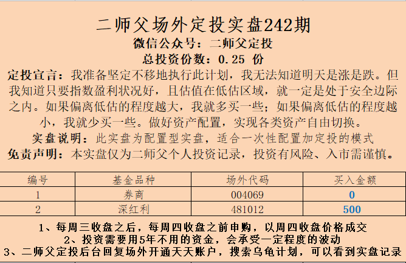
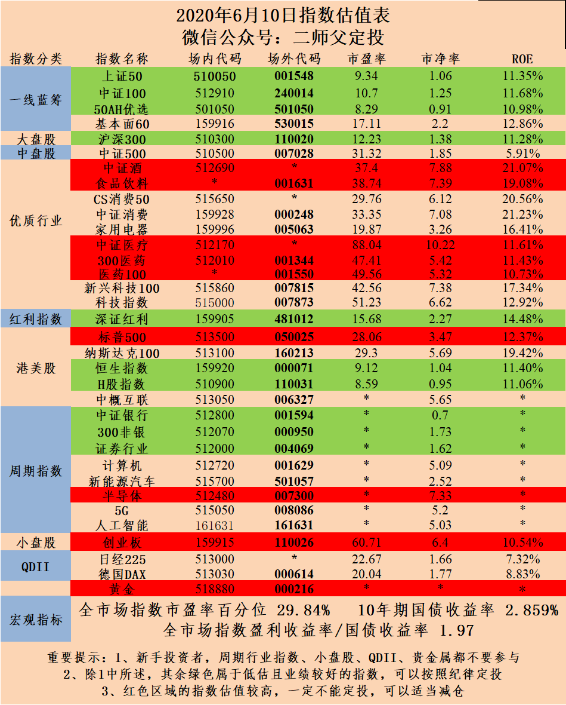

======================================================

_type: q&a
@是喵喵吖～[421441114141158]
2020-06-10 19:41:22 Wed  
topic_id: 548852482425144

@是喵喵吖～

>  二师父请问下 这个华宝智投这个准吗。就是根据你的目标收益率 给你推送的基金 然后自己设置好定投金额啥的。  另外为啥我的手续费还这么高呢 这个我是随便点了个 华宝中证全指证券ETF联接A。 试了一下。我是从你发的链接点的

@二师父

>  这个没用过，你按照我设置的价格进行网格操作没问题。
>  
>  这是在场外申购基金，费率是不变的，证券账户既可以申购场外基金，也可以购买etf基金。你购买etf是比较低的，佣金万1。这两个不一样。

阅读[4096]  评论[2]  赞[0] 

======================================================

_type: q&a
@老司基[111852221242122]
2020-06-11 08:54:07 Thu  
topic_id: 421154148225888

@老司基

>  二师父，这两天新三板基金你怎么看，是否建议申购？

@二师父

>  按照我的投资风格是不会申购的，如果对成长性小企业非常看好，而且可以接受新三板基金的流动性，那么投资者才可以轻仓申购

阅读[3870]  评论[0]  赞[0] 

======================================================

_type: talk
@杜志彪[544454124115854]
2020-06-11 10:52:58 Thu  
topic_id: 421154142445418

<e type="hashtag" hid="281158522841" title="#每日打卡#" /> 6月11日第三次打卡，昨日无操作，场外高估定投100元医药，居然收益6.96%场内买的100股医疗也有3.57%收益，怎么不跌呢[呲牙]

@J at 2020-06-11 10:52:58 Thu

> [偷笑]

----------

阅读[3646]  评论[1]  赞[0] 

======================================================

_type: q&a
@葛亚丽[841858254128252]
2020-06-11 11:19:12 Thu  
topic_id: 548852825451144

@葛亚丽

>  二师父你好，今天这个能申购吗？

@二师父

>  这个是可以申购的

阅读[3875]  评论[0]  赞[0] 

======================================================

_type: talk
@二师父[28814221155551]
2020-06-11 17:48:25 Thu  
topic_id: 421154185842818

<e type="hashtag" hid="48418482281848" title="#怎么卖出#" /> 三种卖出策略，自行选用，一般高位回撤过大，可以移动止盈，比如回踩20日均线，有的人看各种技术指标就行，这个二师父不讲了，在股票软件里面这些指标都能看到，偶尔看看就行，别陷入其中，值得关注的还是行业的竞争格局，企业的盈利以及估值等基本面指标。

@阿宝 at 2020-06-11 17:48:25 Thu

> 谢谢！学习了

----------

@蓝魔森林 at 2020-06-11 17:48:25 Thu

> 二师傅 听说最近银行的不保本的理财产品频频爆雷，是真的吗？ 有消息吗

----------

@蓝魔森林 at 2020-06-11 17:48:25 Thu

> 银行理财的r1风险产品，值得投资吧？ 和货币基金一样吧

----------

@二师父 at 2020-06-11 17:48:25 Thu

> 哪款r1风险产品

----------

@蓝魔森林 at 2020-06-11 17:48:25 Thu

> 招商的  代销招盈开心宝

----------

@二师父 at 2020-06-11 17:48:25 Thu

> 货币基金风险低一点，原油宝当时说的是r3风险，不能完全依赖这个

----------

@蓝魔森林 at 2020-06-11 17:48:25 Thu

> 嗯嗯

----------

阅读[3709]  评论[7]  赞[0] 

+++++++++++++++++++++++++++++++++++++++++++++++++++++

文件：
2020-06-11 17:46:39 Thu
文件大小：[25452]
51584112481884-止盈的三种最佳策略.docx

======================================================

_type: talk
@阿宝[422212151424158]
2020-06-11 21:55:25 Thu  
topic_id: 841125125845112

请教一个问题：京沪高铁销售商品和提供劳务收到的现金288亿小于营业收入329亿。329-288的差额41亿，其中各种应收款15.14亿，收到的其他与经营活动有关的现金4.28亿，其他业务收入2.78亿，还差18亿知道在哪找到吗？（销售商品和提供劳务收到的现金与营收之间有何区别）

@二师父 at 2020-06-11 21:55:25 Thu

> 你是不是看错数字了。

主营业务收入——应收账款——其他应收账款=329.4-13.11-22.39=293.9

----------

@阿宝 at 2020-06-11 21:55:25 Thu

> 没有看错啊

----------

@HeLLO at 2020-06-11 21:55:25 Thu

> 现金流量表的“销售商品及提供劳务收到的现金”=利润表的“营业收入”*（1+增值税税率）+资产负债表的“应收账款、应收票据”（期初-期末）+资产负债表的“预收账款”（期末-期初），按照你提供数据，销售商品提供劳务与营业收入比率小于100%.而营业收入增长率小于10%.说明京沪高铁的行业地位不高，竞争力不强。

----------

@阿宝 at 2020-06-11 21:55:25 Thu

> 我觉得是：金流量表的“销售商品及提供劳务收到的现金”=利润表的“营业收入”减去应收账款-应收票据-预付款*（1+增值税税率

----------

@HeLLO at 2020-06-11 21:55:25 Thu

> 两个科目实行会计准则不一样，销售商品提供劳务收到现金用收付实现制原则，还包括前一年未收到款，而营业收入用权责发生制，两个科目数据根本不可能相等，除非公司没有任何欠款，完全收现金情况，这种情况对企业来说很少，除非所处行业竞争力超强，有话语权的。

----------

@阿宝 at 2020-06-11 21:55:25 Thu

> 谢谢，你说的我知道。我想找到那18亿的去处？

----------

阅读[3618]  评论[6]  赞[0] 

+++++++++++++++++++++++++++++++++++++++++++++++++++++

文件：
2020-06-11 21:55:24 Thu
文件大小：[200192]
88214888545112-京沪高铁2019年财报解读.doc

======================================================

_type: talk
@蓝魔森林[28888244485121]
2020-06-11 22:58:56 Thu  
topic_id: 548852852841884

#细分行内消息# 已经有投资大V建议大家回避海康和大华的股票了，理由就是华为要切入安防。人工智能赛道的投资者，可以注意一下。

@衣袂飘香 at 2020-06-11 22:58:56 Thu

> 能说的明白一点吗？人工智能的投资者要注意一下，注意什么呢？

----------

@蓝魔森林 at 2020-06-11 22:58:56 Thu

> 这还写的不够清楚吗[微笑]  就是海康威视和大华的股票，最近不要随便买了，可能未来会被华为吃市场份额，股票下滑

----------

阅读[3472]  评论[2]  赞[0] 

======================================================

_type: q&a
@老妖[118514521115522]
2020-06-11 23:01:20 Thu  
topic_id: 421154154414518

@老妖

>  师父，今天大跌是放量，是考虑下跌的开始还是回调？

@二师父

>  我判断是回调。至少调整到4200，万得全A指数，最多不会跌破3200.
>  
>  你的提问意思是如果明天涨了就是回调，明天跌了就是下跌。我看的回调，只要不是牛市上升结束，都是回调。从2019年1月以来的几次大跌都是回调，趋势没变的。
>  
>  大跌是2015年，2018年那种，除非再来极端事件，不然是很难破3200。

阅读[3623]  评论[2]  赞[0] 

======================================================

_type: q&a
@蛋炒饭不加蛋[118281818482542]
2020-06-11 23:02:49 Thu  
topic_id: 548852852581524

@蛋炒饭不加蛋

>  请问二师父场内的医疗etf还有医疗A,医疗B三支基金有什么不同

@二师父

>  医疗ETF就是ETF指数基金。
>  
>  医疗A和B是中证医疗指数基金拆分的子基金。B基金相当于上杠杆，以前投资者投资基金会利用B类基金加杠杆，比如白酒B这些。

阅读[3640]  评论[0]  赞[0] 

======================================================

_type: talk
@杜志彪[544454124115854]
2020-06-12 09:28:22 Fri  
topic_id: 118842848111182

<e type="hashtag" hid="281158522841" title="#每日打卡#" /> 2020年6月12日第四次打卡，昨日无操作，好的指数和公司年线以下都是机会，只要你还有钱[呲牙]

@rtdmm小米 at 2020-06-12 09:28:22 Fri

> 消费可进否？

----------

@J at 2020-06-12 09:28:22 Fri

> 再赌下去，小心被逐出师门😂

----------

@杜志彪 at 2020-06-12 09:28:22 Fri

> 我消费目前处于正常收割阶段，持有中，没有的话目前不适合，等接近低估线时可以考虑，我医疗就是采取这个策略，等待中[微笑]

----------

@rtdmm小米 at 2020-06-12 09:28:22 Fri

> [呲牙][呲牙]耐心等待！

----------

阅读[3500]  评论[4]  赞[0] 

======================================================

_type: q&a
@是喵喵吖～[421441114141158]
2020-06-12 09:57:59 Fri  
topic_id: 118842848122482

@是喵喵吖～

>  二师父看着美股跌了请问有合适的基金可以买吗 标普500那个只能买100元每天。

@二师父

>  场内是不限购的，可以回调低位场内买入

阅读[3674]  评论[1]  赞[0] 

======================================================

_type: talk
@二师父[28814221155551]
2020-06-12 10:43:31 Fri  
topic_id: 548852842558444

<e type="hashtag" hid="881251425252" title="#鳄鱼计划#" /> 清仓医药etf，本轮医药牛市已经涨了不少了，适可而止。买入的话没有极佳合适机会，是不会动的。

@蛋炒饭不加蛋 at 2020-06-12 10:43:31 Fri

> 医疗清吗

----------

@二师父 at 2020-06-12 10:43:31 Fri

> 目前高估区，可以结合昨天讲的三种方法操作

----------

@蛋炒饭不加蛋 at 2020-06-12 10:43:31 Fri

> 好的

----------

阅读[3617]  评论[3]  赞[0] 

======================================================

_type: q&a
@激流勇进[241141245525821]
2020-06-12 11:49:11 Fri  
topic_id: 421154124155128

@激流勇进

>  师父您好！目前港股处于低估区域，这两天港股又持续下跌，000071和110031两只基金，加仓力度如何把握。请指教！

@二师父

>  正常定投就好，港股和美股指数不到历史大底部，不要轻易抄底

阅读[3654]  评论[5]  赞[0] 

======================================================

_type: q&a
@蛋炒饭不加蛋[118281818482542]
2020-06-12 14:29:54 Fri  
topic_id: 421154128252458

@蛋炒饭不加蛋

>  请问二师父之前我持有歌尔股份，今天发现持仓里多了歌尔配债是什么

@二师父

>  你是这家公司的股东，今天发行歌尔转债，所以具有优先配售权

阅读[3545]  评论[3]  赞[0] 

======================================================

_type: talk
@二师父[28814221155551]
2020-06-12 19:09:07 Fri  
topic_id: 118842818888282

<e type="hashtag" hid="15285248524152" title="#美股回调#" /> 这次美股涨就两个因素，与基本面无关，如果买在低位可以随时下车，不用慌，追高的要警惕了，买入成本决定了持仓压力。

阅读[3644]  评论[0]  赞[0] 

+++++++++++++++++++++++++++++++++++++++++++++++++++++

文件：
2020-06-12 19:08:05 Fri
文件大小：[105703]
28214881148851-美股回调有利于中国债券市场.docx

======================================================

_type: talk
@二师父[28814221155551]
2020-06-12 19:18:16 Fri  
topic_id: 841125115558422

<e type="hashtag" hid="88518521854242" title="#法国CAC40#" /> 今天接受一个指数法国CAC40,持仓股票有奢侈品公司LVMH集团、爱马仕国际、开云集团。还有欧莱雅等化妆品公司。当然也有施耐德电气、空中客车、标志、雷诺、米其林等工业企业。

法国是世界第六大经济体，股票市场投资价值比中国、德国弱一些，但是当市场低位的时候还是可以通过格雷厄姆捡烟蒂的思想进行投资，二师父的目标就是在全世界范围内搜寻便宜货。

法国ETF513080,有兴趣的投资者可以关注。

@再见 . 青春 at 2020-06-12 19:18:16 Fri

> 请教二师父，德国是欧洲经济的引擎，513030德国30指数有投资价值吗？

----------

@二师父 at 2020-06-12 19:18:16 Fri

> 德国股灾的时候捡便宜做差价可以，不适合长期持有

----------

阅读[4516]  评论[2]  赞[0] 

======================================================

_type: talk
@二师父[28814221155551]
2020-06-12 19:39:31 Fri  
topic_id: 421154114485148

<e type="hashtag" hid="224445218111" title="#全市场估值数据#" /> 全市场指数市盈率百分位29.68%，市净率百分位10.46%，SY-BY百分位29.28%，SY/BY百分位15.22%。

全市场估值中等偏低的位置，想买的自己买，不过这个位置我是不会额外加仓的，已经从底部真的涨了很多的了，我永远不知道大跌的时候什么时候到来，但得保证每一次大跌还在场。

医疗最近比较猛，算是一枝独秀，市盈率92倍，历史总是惊人的相似，市梦率每隔几年在A股市场都会上演一次，我无法把当前市场定义为熊市了。

@雨淡风清 at 2020-06-12 19:39:31 Fri

> 二师父，上次是什么时候来着。好了伤疤忘了疼

----------

@二师父 at 2020-06-12 19:39:31 Fri

> 15年和18年，底部跌不怕

----------

阅读[3709]  评论[2]  赞[0] 

======================================================

_type: talk
@二师父[28814221155551]
2020-06-12 21:20:12 Fri  
topic_id: 421154114521548

<e type="hashtag" hid="48418455428528" title="#周五荐书#" /> 《<e type="web" href="https://wx.zsxq.com/mweb/views/weread/search.html?keyword=怎样选择成长股" title="怎样选择成长股" style="book" />》，作者：菲利普费舍尔。成长股投资更加注重企业的护城河和未来增长潜力，看看菲利普的投资逻辑，你会发现企业成长的秘密。

阅读[4655]  评论[0]  赞[0] 

======================================================

_type: q&a
@黎雄[841555255485222]
2020-06-12 23:13:29 Fri  
topic_id: 841125112445412

@黎雄

>  师傅印度基金164824可以捡烟头嘛?

@二师父

>  可以的，要真的是烟头，而且他的基金规模是一直降的，这个每季度要注意看看

阅读[3803]  评论[5]  赞[0] 

======================================================

_type: talk
@树叶[544811512145144]
2020-06-13 10:14:54 Sat  
topic_id: 118842888414242

<e type="hashtag" hid="142825811122" title="#定投周报#" /> 二师父定投周报第63期

阅读[3909]  评论[0]  赞[0] 

+++++++++++++++++++++++++++++++++++++++++++++++++++++

文件：
2020-06-13 10:14:39 Sat
文件大小：[246142]
28214825455581-二师父定投周报6.13（第63期）.docx

======================================================

_type: talk
@二师父[28814221155551]
2020-06-13 21:21:16 Sat  
topic_id: 118845221885282

<e type="hashtag" hid="28518521225551" title="#大健康的两只基金#" /> 这是个好赛道

@蓝魔森林 at 2020-06-13 21:21:16 Sat

> 问下二师傅，国内开通美股场内外交易账号，需要预存一定金额吗？哪个渠道比较合适，或者费率低，谢谢

----------

@二师父 at 2020-06-13 21:21:16 Sat

> 直接开老虎或者富途

----------

@wty at 2020-06-13 21:21:16 Sat

> 二师父，创新药和医药ETF的区别是什么？能分析一下吗？

----------

@二师父 at 2020-06-13 21:21:16 Sat

> 医药etf是市值较大的药企集合，创新药指数更集中在创新药研发的企业

----------

@wty at 2020-06-13 21:21:16 Sat

> 明白，多谢！创新药指数能增加到估值表里吗？

----------

@二师父 at 2020-06-13 21:21:16 Sat

> 估值表指数投资已经够了，可以参考医药etf估值

----------

@wty at 2020-06-13 21:21:16 Sat

> OK，多谢🙏

----------

阅读[4807]  评论[7]  赞[0] 

+++++++++++++++++++++++++++++++++++++++++++++++++++++

文件：
2020-06-13 21:20:31 Sat
文件大小：[101053]
15481541514182-布局大健康方向，这两只基金是首选.docx

======================================================

_type: q&a
@C&S[51442188184824]
2020-06-13 21:37:22 Sat  
topic_id: 118845221555252

@C&S

>  请教，519062 海富通阿尔法对冲混合A，什么时候适合投资？什么时候会产生最大回撤？是否适合在股市高位购买此基金，持有到股市大幅回调时卖出，转成进攻性品种或者优秀基金？在持有期间，与二级债基相比，收益风险比如何？

@二师父

>  这个基金回撤比一般股票基金少，因为持有30%的现金，当然这个会随着市场变化调整，股市高位肯定不适合买这个基金，回撤时候这个基金肯定也亏。
>  
>  股市高位买二级债基会更好一些的，说个极端例子，从2018年买二级债基收益率会比买这个好。
>  
>  最大回撤高于二级债基，低于股票基金。

阅读[3772]  评论[3]  赞[0] 

======================================================

_type: q&a
@素兮[548121415528244]
2020-06-13 23:09:52 Sat  
topic_id: 841128888285412

@素兮

>  二师父，全市场指数的点位在哪里可以看到？

@二师父

>  万得app，万得指数，或者同花顺，中证全指

阅读[3780]  评论[2]  赞[0] 

======================================================

_type: q&a
@onepiecewi*[244414114545811]
2020-06-14 16:59:50 Sun  
topic_id: 841128828544282

@onepiecewi*

>  师父，工行的贵金属投资，黄金的，说以后涨了可以卖，跌了可以兑换黄金，这种可以投资吗？有什么风险呢？

@二师父

>  风险，跌了你亏钱，而且换成了增值属性很弱的黄金，这是工作人员跟你说的吗

阅读[3611]  评论[3]  赞[0] 

======================================================

_type: talk
@二师父[28814221155551]
2020-06-14 21:33:59 Sun  
topic_id: 118845544441812

<e type="hashtag" hid="15285215551212" title="#继续分析医疗的两个基金#" /> 对比医疗基金，搞清楚投资到底投的是什么，这样底部才拿得住，就在来年前，很多人追着问广发医药跌破1元了，药企是不是不行了，要不要卖出，我相信，未来还会有这样的情况出现的，历史虽然不会重复，但总是踏着相同的韵脚。

阅读[4745]  评论[0]  赞[0] 

+++++++++++++++++++++++++++++++++++++++++++++++++++++

文件：
2020-06-14 21:32:08 Sun
文件大小：[41369]
28214821421251-医药健康行业，中欧医疗和中证医疗哪个更值得投资.docx

======================================================

_type: solution
2020-06-15 08:03:36 Mon  
topic_id: 241128848548481

阅读[3492]  评论[0]  赞[0] 

======================================================

_type: talk
@二师父[28814221155551]
2020-06-15 09:36:16 Mon  
topic_id: 841128848445422

<e type="hashtag" hid="825412412212" title="#可转债打新#" /> 今日两只新债均可申购，a股打新也属于低风险投资，门票股可选择招行，平安银行，万科。

@🍀 凝🌸 慧🍀 at 2020-06-15 09:36:16 Mon

> 谢谢师父[玫瑰][玫瑰][玫瑰][爱心]

----------

@Philip🎭 Y at 2020-06-15 09:36:16 Mon

> 门票股是什么意思

----------

@二师父 at 2020-06-15 09:36:16 Mon

> 打新需要一定市值

----------

阅读[3604]  评论[3]  赞[0] 

======================================================

_type: talk
@杜志彪[544454124115854]
2020-06-15 11:30:38 Mon  
topic_id: 548851148244484

<e type="hashtag" hid="281158522841" title="#每日打卡#" /> 2020年6月15日第五次打卡，星期五清仓医药（等待下次机会），之前加仓了券商和新能源车，目前还保持9层仓。

阅读[3486]  评论[0]  赞[0] 

======================================================

_type: talk
@二师父[28814221155551]
2020-06-15 12:01:48 Mon  
topic_id: 421158821818148

这个有没有中签的

@蛋炒饭不加蛋 at 2020-06-15 12:01:48 Mon

> 今天上市的？

----------

@光少 at 2020-06-15 12:01:48 Mon

> 中签就发了[呲牙]

----------

@杜志彪 at 2020-06-15 12:01:48 Mon

> 这是月线[白眼]

----------

阅读[3707]  评论[3]  赞[0] 

+++++++++++++++++++++++++++++++++++++++++++++++++++++

图片：
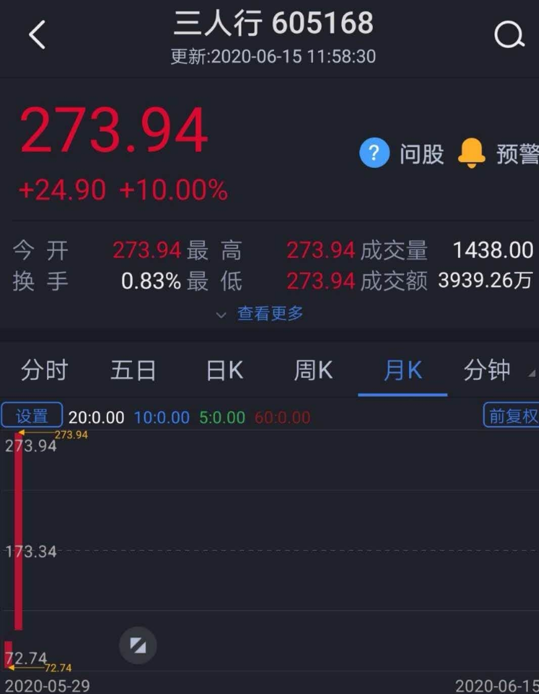

======================================================

_type: talk
@二师父[28814221155551]
2020-06-15 21:10:38 Mon  
topic_id: 421158811442148

<e type="hashtag" hid="48418428525888" title="#应对波动的方法#" /> 看看今晚美股，大概率是跌的，还有小马哥自己减持了很多腾讯股票，需要注意。

@蓝魔森林 at 2020-06-15 21:10:38 Mon

> 我觉得用 套现 两个字更好，更能传达信息

----------

@二师父 at 2020-06-15 21:10:38 Mon

> 也是

----------

@蓝魔森林 at 2020-06-15 21:10:38 Mon

> 科大讯飞董事长之前也有很多套现

----------

@章兵朋 at 2020-06-15 21:10:38 Mon

> 小马哥减持，他的票也不会便宜

----------

阅读[3467]  评论[4]  赞[0] 

+++++++++++++++++++++++++++++++++++++++++++++++++++++

文件：
2020-06-15 21:09:54 Mon
文件大小：[175818]
48512822421558-绿色环保的日子又要开始了.docx

======================================================

_type: talk
@二师父[28814221155551]
2020-06-15 21:24:17 Mon  
topic_id: 118845588244212

<e type="hashtag" hid="51281241545524" title="#打卡数据6.15#" /> 全市场指数市盈率百分位29.16%，全市场指数市净率百分位9.45%，SY-BY百分位28.54%，SY/BY百分位13.83%。

历史百分位越低，估值越低，投资机会越好。

@J at 2020-06-15 21:24:17 Mon

> 师父，SY-BY和SY/BY是什么意思？

----------

@二师父 at 2020-06-15 21:24:17 Mon

> Sy是盈利收益率简称，By是10年期国债收益率简称

----------

@J at 2020-06-15 21:24:17 Mon

> 明白，谢谢师父！这两个数值分别在多少以下是最有价值的投资机会（可以达到9成仓）？

----------

@二师父 at 2020-06-15 21:24:17 Mon

> 百分之10以下

----------

@J at 2020-06-15 21:24:17 Mon

> [OK]

----------

阅读[3315]  评论[5]  赞[0] 

======================================================

_type: talk
@二师父[28814221155551]
2020-06-15 21:46:16 Mon  
topic_id: 241128811824851

美股还是跌了，不过没熔断，不过瘾

@老宋 at 2020-06-15 21:46:16 Mon

> 这是典型的看热闹不嫌事大[得意]

----------

@二师父 at 2020-06-15 21:46:16 Mon

> 事越大机会越好

----------

阅读[4483]  评论[2]  赞[0] 

+++++++++++++++++++++++++++++++++++++++++++++++++++++

文件：
2020-06-15 21:45:39 Mon
文件大小：[199976]
88214844511842-市场分析6.15.docx

======================================================

_type: q&a
@样[844124458224442]
2020-06-15 23:07:42 Mon  
topic_id: 548851188428144

@样

>  请问，酒etf基金盈利23个点（1.1的成本价），需要清了避险吗？酒是你买的那天抄的作业，比较看好，所以后来没有跟着调仓，

@二师父

>  可以先卖出三分之一，目前是高位了

阅读[3381]  评论[1]  赞[0] 

======================================================

_type: q&a
@李垚垚[548145221582444]
2020-06-15 23:08:03 Mon  
topic_id: 841128811451452

@李垚垚

>  二师父何时收割中证500！谢谢！

@二师父

>  现在是可以收割的

阅读[3468]  评论[0]  赞[0] 

======================================================

_type: talk
@杜志彪[544454124115854]
2020-06-16 10:03:59 Tue  
topic_id: 841128254421252

<e type="hashtag" hid="281158522841" title="#每日打卡#" /> 2020年6月16日第六次打卡，昨日无操作，本来预测昨天老美跌的，今天如果低开就加点仓，结果打脸了，早晨一看人家反红了，A股高开那就不买了，继续卧倒。

@烟九•二手车 at 2020-06-16 10:03:59 Tue

> 回光返照？

----------

阅读[3345]  评论[1]  赞[0] 

======================================================

_type: talk
@雨淡风清[844418818858882]
2020-06-16 11:02:58 Tue  
topic_id: 118845428552522

二师父，今天什么风把绿帽子吹成红帽子了。股市真想天气，明明有天气预报，还是经常淋雨

@六尘不改 at 2020-06-16 11:02:58 Tue

> 因为洋老爷的股市涨了，小弟弟当然要跟上

----------

@二师父 at 2020-06-16 11:02:58 Tue

> 多空博弈不是简单的上涨和下跌

----------

阅读[3318]  评论[2]  赞[0] 

======================================================

_type: q&a
@Fire[421142182555188]
2020-06-16 11:49:52 Tue  
topic_id: 241128251221521

@Fire

>  师父，我有一些资金追求稳健，不想放在货币基金里面了，海富通阿尔法对冲混合和这种支付宝里面的“建信养老飞越366”？哪种更好

@二师父

>  这两个产品都不是保本的，建信养老飞跃666风险低一些

阅读[3563]  评论[0]  赞[0] 

======================================================

_type: q&a
@闪闪的星光[88285424418582]
2020-06-16 13:54:48 Tue  
topic_id: 241128288185251

@闪闪的星光

>  师傅好，请问追踪沪深300医药指数000913的基金中，哪一只比较好，适合定投呢？
>  
>  谢谢

@二师父

>  目前就是易方达沪深300医药指数
>  a和易方达沪深300医药指数c

阅读[3497]  评论[0]  赞[0] 

======================================================

_type: talk
@二师父[28814221155551]
2020-06-16 19:28:23 Tue  
topic_id: 241128284422221

<e type="hashtag" hid="48418428144848" title="#外围市场涨了#" /> 全A球股市变化挺大的，一会大跌，也会大涨。A股倒是不错，股市起来，债券就不行了。分化挺明显。

@🍀 凝🌸 慧🍀 at 2020-06-16 19:28:23 Tue

> 再次重温师父讲过的定投思维，反思最近的操作心态。

----------

阅读[3438]  评论[1]  赞[0] 

+++++++++++++++++++++++++++++++++++++++++++++++++++++

文件：
2020-06-16 19:27:12 Tue
文件大小：[54574]
28214841111211-绿了一天，外围市场就领涨了.docx

======================================================

_type: talk
@二师父[28814221155551]
2020-06-16 19:39:08 Tue  
topic_id: 421158582228248

<e type="hashtag" hid="224445218111" title="#全市场估值数据#" /> 市盈率百分位29.52%，市净率百分位11.62%，SY-BY百分位30.48%，SY/BY百分位17.96%。

阅读[4347]  评论[0]  赞[0] 

======================================================

_type: talk
@二师父[28814221155551]
2020-06-16 19:50:23 Tue  
topic_id: 841128284412812

<e type="hashtag" hid="455282818848" title="#周二讲基金#" /> 今天讲汇添富消费行业混合，类似这种混合基金都是股票和债券的集合。有时候基金经理会根据市场情况持有一定比例的现金。

投资的话主要看重仓股票，比如这只基金重仓的就是贵州茅台、五粮液、长春高新、顺鑫农业、招商积余、美的集团、格力电器、绝味食品、南极电商、立讯精密。

这些占比大概是44%，那么涨跌和重仓股票关系很大，基本上可以看到行业集中在消费、医药、物业、科技、家电等等，对于这种基金投资，主要看过往基金业绩，因为调仓会很频繁，大家看到的2020年的持仓和2019年的持仓就变化很大。

这时候就没必要太关注股票持仓，看看大致的市场位置不高，基金持仓股票当前处于低位，然后基金经理比较靠谱，那就可以把命运交给基金经理了。

阅读[3569]  评论[0]  赞[0] 

======================================================

_type: talk
@二师父[28814221155551]
2020-06-17 09:23:14 Wed  
topic_id: 118845412551222

<e type="hashtag" hid="222484545521" title="#打新提示#" /> 今日三只新股，三只新债均可打新，看运气了，这属于弯腰捡钱，谁运气好就赚

@衣袂飘香 at 2020-06-17 09:23:14 Wed

> 昨天中了一只新债。

----------

@蛋炒饭不加蛋 at 2020-06-17 09:23:14 Wed

> 都不能申购，没创业板权限[流汗]

----------

@🍀 凝🌸 慧🍀 at 2020-06-17 09:23:14 Wed

> 师父，我连续中了两只[呲牙]

----------

@二师父 at 2020-06-17 09:23:14 Wed

> 我这个月就中了一只

----------

@王雷 at 2020-06-17 09:23:14 Wed

> 两个月了一只没中

----------

@J at 2020-06-17 09:23:14 Wed

> 本月中了一只

----------

@Chu at 2020-06-17 09:23:14 Wed

> 我想问下新股和新债是不是可以盲打呀？

----------

@二师父 at 2020-06-17 09:23:14 Wed

> 基本上可以，上市或者开板记得卖就行

----------

阅读[3229]  评论[8]  赞[0] 

======================================================

_type: talk
@杜志彪[544454124115854]
2020-06-17 09:45:05 Wed  
topic_id: 241128245815481

<e type="hashtag" hid="281158522841" title="#每日打卡#" /> 2020年6月17日第七次打卡，昨日无操作，目前是成长，价值也不会缺席，我要做的就是配个基础300+500，进攻选择行业，首选消费医药，还配了点科人工，券商，电器另外配了点恒生，这已经是我最大认知范围了，别的就不参与了，刚刚开盘卖出500网格一份。

@二师父 at 2020-06-17 09:45:05 Wed

> 配点创业板

----------

@范毅君 at 2020-06-17 09:45:05 Wed

> 二师父指基金还是股票

----------

@二师父 at 2020-06-17 09:45:05 Wed

> 基金啊

----------

@王模堂 at 2020-06-17 09:45:05 Wed

> 二师傅，创业板不是高估吗？现在配它的逻辑是什么？配多少？

----------

@二师父 at 2020-06-17 09:45:05 Wed

> 我让配，不是让现在配，现在做趋势也不大适合搞创业板了

----------

@rtdmm小米 at 2020-06-17 09:45:05 Wed

> 二师父，创业板现在高估区域？

----------

@二师父 at 2020-06-17 09:45:05 Wed

> 对

----------

阅读[3218]  评论[7]  赞[0] 

======================================================

_type: q&a
@🍀 凝🌸 慧🍀[841855248254242]
2020-06-17 10:41:03 Wed  
topic_id: 841128245412882

@🍀 凝🌸 慧🍀

>  师父好，10年期国债利率，可以从哪些地方能看到？

@二师父

>  英为财情，华尔街见闻，见闻封了，vip好像可以

阅读[3326]  评论[1]  赞[0] 

======================================================

_type: talk
@二师父[28814221155551]
2020-06-17 17:53:15 Wed  
topic_id: 118845418811452

<e type="hashtag" hid="48418425482148" title="#每周定投#" /> 高估的一直高估，对于成长性好的指数可以多持有一段时间，享受高估的泡沫，指数和股票的波动就如同钟摆的两端，通常容易低估到极端，高估到极端。不要忘了2018年医药也是被人抛弃的。

@J at 2020-06-17 17:53:15 Wed

> 师父，为什么创业板从未被低估，在高估区域从未被超越？[捂脸]

----------

@二师父 at 2020-06-17 17:53:15 Wed

> 18年跌的惨不忍睹

----------

@门萨🐨 at 2020-06-17 17:53:15 Wed

> 18年被抛弃，到现在美滋滋

----------

阅读[3918]  评论[3]  赞[0] 

+++++++++++++++++++++++++++++++++++++++++++++++++++++

图片：
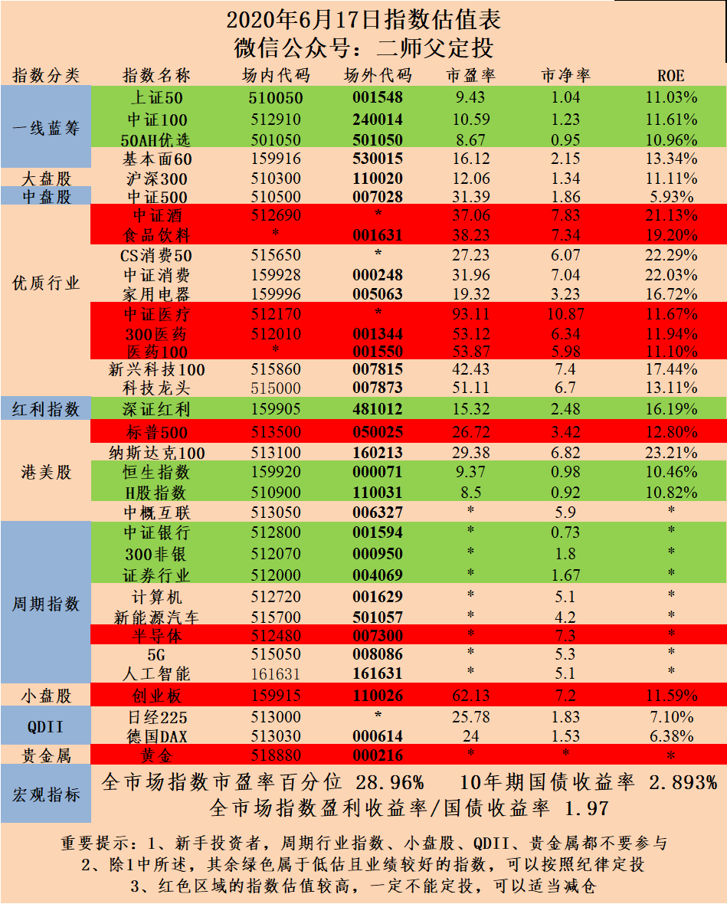

======================================================

_type: talk
@二师父[28814221155551]
2020-06-17 17:53:54 Wed  
topic_id: 118845418811152

<e type="hashtag" hid="48418425482148" title="#每周定投#" /> 定投走起来，人工智能+深红利，定投不怕下跌，就怕横盘。

@不知道不明了 at 2020-06-17 17:53:54 Wed

> 二师父，之前你不是说，人工智能回撤到1.3以内入手比较稳么

----------

@二师父 at 2020-06-17 17:53:54 Wed

> 目前轻仓定投，也是可以的，这个定投金额很低，而且净值是不断向上的

----------

@不知道不明了 at 2020-06-17 17:53:54 Wed

> 哦哦好的

----------

阅读[3999]  评论[3]  赞[0] 

+++++++++++++++++++++++++++++++++++++++++++++++++++++

图片：

======================================================

_type: talk
@光少[244124552511141]
2020-06-17 17:53:56 Wed  
topic_id: 841128241144422

生物科技🐮逼

@样 at 2020-06-17 17:53:56 Wed

> 强悍[强]

----------

阅读[3188]  评论[1]  赞[0] 

+++++++++++++++++++++++++++++++++++++++++++++++++++++

图片：
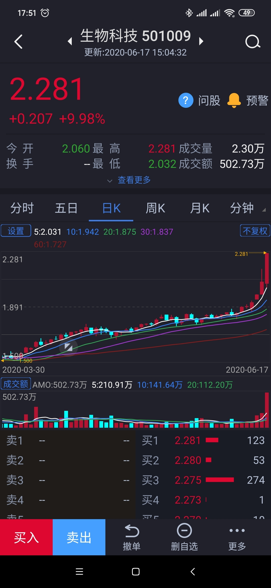

======================================================

_type: talk
@Philip🎭 Y[28518855518151]
2020-06-17 17:59:07 Wed  
topic_id: 548851548881524

各位星球还能续费吗…

@二师父 at 2020-06-17 17:59:07 Wed

> 可以，你是苹果用户吧

----------

@Philip🎭 Y at 2020-06-17 17:59:07 Wed

> 那怎么办…

----------

@Philip🎭 Y at 2020-06-17 17:59:07 Wed

> 知道了！谢谢！

----------

阅读[3232]  评论[3]  赞[0] 

======================================================

_type: talk
@二师父[28814221155551]
2020-06-17 18:57:17 Wed  
topic_id: 118845482555552

这个基金也比较猛，场外有对应的，改天分析下，今年是典型的消费，医疗，科技牛，除了金融都挺给力

@rtdmm小米 at 2020-06-17 18:57:17 Wed

> 二师父，这个有场内基金没？

----------

@二师父 at 2020-06-17 18:57:17 Wed

> 有，场内可以参考医疗Etf

----------

@rtdmm小米 at 2020-06-17 18:57:17 Wed

> 谢谢二师父！

----------

@信阳田平 at 2020-06-17 18:57:17 Wed

> 也就是百分之二十多，和食品饮料、酒、纳指差不多[微笑]

----------

阅读[3383]  评论[4]  赞[0] 

+++++++++++++++++++++++++++++++++++++++++++++++++++++

图片：
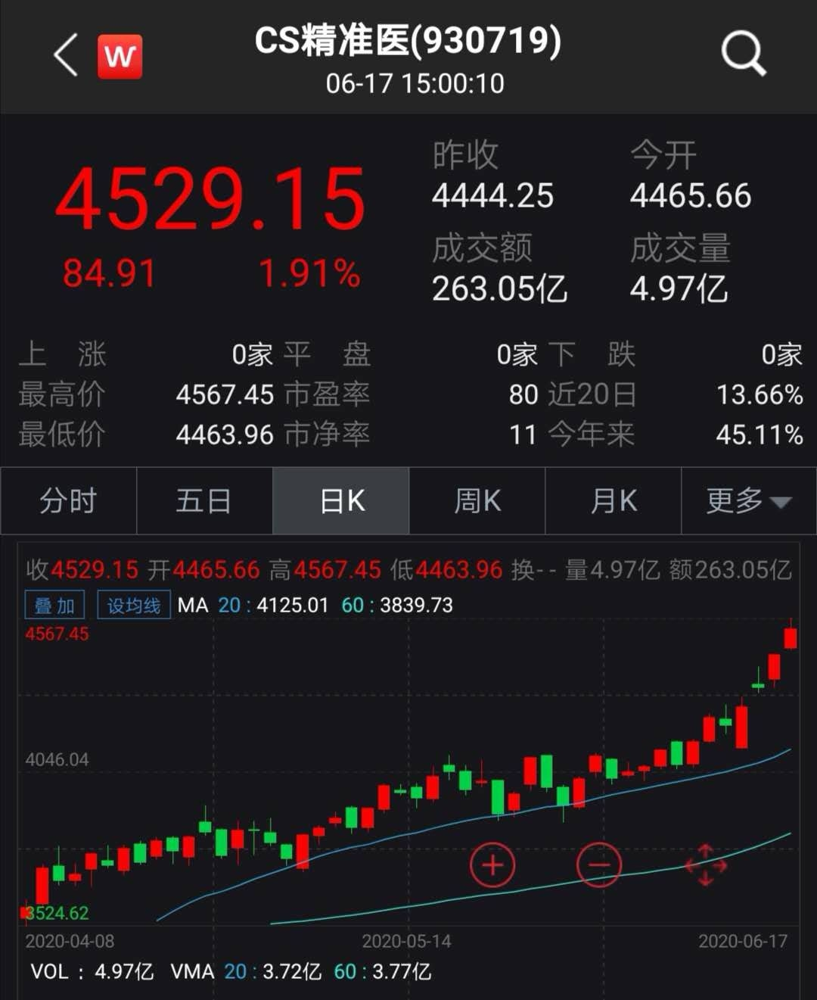

======================================================

_type: q&a
@老司基[111852221242122]
2020-06-17 21:33:17 Wed  
topic_id: 118845482824452

@老司基

>  二师父，人工智能和计算机您能从持仓分析下不同和区别吗？

@二师父

>  人工智能偏重智能电子产品，半导体产业链，计算机偏重计算机应用软件

阅读[3326]  评论[0]  赞[0] 

======================================================

_type: talk
@二师父[28814221155551]
2020-06-18 05:12:36 Thu  
topic_id: 421158211584818

林园语录

1.追求复合增长，要100%正确，靠时间去累积，一直往前走，慢慢走，哪怕停几年，也不要后退；

2.管理好自己，这点很重要，能管理好自己的人，一定会是有钱人；

3.任何时候，首先要考虑的是风险；

4.财富是行业给的，个股都是运气；

5.行业市场空间无限大；

6.投资的本质，就是投资赚钱机器，投入一定，产出无限大的赚钱机器；

7.重点投资国家名片；

8.投资秘诀就是垄断，加上反复消费，具有成瘾性；

9.选择与嘴巴相关的刚需；

10.企业业务简单，核心产品单一；

11.毛利率的变化要稳定或趋升；

12.买危机，危机爆发后买入一定是对的；

13.要不平等竞争，弯腰捡钱，不战而屈人之兵；

14.任何投机市场都是95%的时间不涨或下跌，只有5%的时间是上涨的；

15.赚钱靠持有，不是靠交易；

16.赚钱靠泡沫，有泡沫才是赚钱最好时机，惧怕泡沫的人是苦命人；

17.对于优质稀缺资源，能拥有就是幸福；

18.什么是风险，该赚的钱没赚到就是最大的风险；

19坚定信念，有爱心的，善良的人，一定能赚钱。

20.中国市场以国企为主，十分谨慎的选择民营企业；

@蛋炒饭不加蛋 at 2020-06-18 05:12:36 Thu

> 第十六条的泡沫指的是高估品种吗

----------

@二师父 at 2020-06-18 05:12:36 Thu

> 是的

----------

@蛋炒饭不加蛋 at 2020-06-18 05:12:36 Thu

> 意思是有本事的可以追涨吗？

----------

@小牧童 at 2020-06-18 05:12:36 Thu

> 持有

----------

阅读[3280]  评论[4]  赞[0] 

======================================================

_type: q&a
@章兵朋[118251425848882]
2020-06-18 06:21:03 Thu  
topic_id: 548851488188424

@章兵朋

>  二师父，无意中看到一种基金类型叫“打新基金”，这种基金是不是比较容易不亏损呀！

@二师父

>  这些基金以打新股为主，不过也会在二级市场投资债券和股票，是有亏损可能的

阅读[3423]  评论[1]  赞[0] 

======================================================

_type: talk
@二师父[28814221155551]
2020-06-18 08:39:49 Thu  
topic_id: 241128155548141

<e type="hashtag" hid="222484545521" title="#打新提示#" /> 6月18日新股新债提醒[太阳]

新股申购：
首都在线，申购代码300846，申购价格3.37元，上限1.50万股

新股上市：
帝科股份（300842）
聚合顺（605166）

可转债申购：无

可转债上市：无

@wty at 2020-06-18 08:39:49 Thu

> 是要顶格申购吗？

----------

@二师父 at 2020-06-18 08:39:49 Thu

> 新股是有配售额度的

----------

@wty at 2020-06-18 08:39:49 Thu

> 上线1.5万股，是要申购1.5万吗？

----------

@二师父 at 2020-06-18 08:39:49 Thu

> 不是啊，你去看看就知道了

----------

@wty at 2020-06-18 08:39:49 Thu

> OK，明白了

----------

阅读[3416]  评论[5]  赞[0] 

======================================================

_type: q&a
@娃娃after🎈[88818155445112]
2020-06-18 08:53:07 Thu  
topic_id: 241128155544241

@娃娃after🎈

>  基金波动率怎么看，汇添富中证主要消费和中概互联波动率高吗？是否适合定投？

@二师父

>  标准差是衡量数据稳定性的，这个在晨星基金官网可以查到，他们属于高波动基金，适合定投的

阅读[3431]  评论[0]  赞[0] 

======================================================

_type: talk
@二师父[28814221155551]
2020-06-18 09:13:36 Thu  
topic_id: 118845822588142

不要误读别人的话，投资者的领悟水平是不同的，就像我说的基金可以买，但不等同于现在买，这是有区别的。

林园说了享受泡沫，并没有让你追高啊，二师父反复强调，不要追高不要追高，没水平的才会追高，不管是索罗斯还是巴菲特都不会去追高的。

这个享受泡沫和吹泡泡是两回事。

我拿房子举例子吧，15年前买，大概是5000元一平米，那么涨到现在大概是15万一平米，房价是从17年开始下滑的，不管那时候有没有泡沫，投资者5000元买得都可以拿着享受泡沫，因为泡沫就算破了也不至于跌到5万一平米，还有就算破了也来的及卖出，赚，如果泡沫更大，赚的更多。

反之，如果是吹泡泡，比如17年买房的，高位接盘侠，亏个30%很正常，享受泡沫和追高吹泡泡是两回事。

你在低位买的创业板，可以享受他的泡沫上涨，但是你不能在高位去追，因为你不知道啥时候跌下来，那为啥低位买入的可以享受呢？因为低位买入盈利都在50%以上，就算泡沫破了想啥时候卖啥时候卖，赚的盆满钵满，这说清楚了吧。

@蛋炒饭不加蛋 at 2020-06-18 09:13:36 Thu

> 懂

----------

阅读[3497]  评论[1]  赞[0] 

======================================================

_type: talk
@杜志彪[544454124115854]
2020-06-18 09:50:03 Thu  
topic_id: 841128155422182

<e type="hashtag" hid="281158522841" title="#每日打卡#" /> 2020年6月18日第八次打卡，昨日卖出500网格一份，基础配置确实应该创业板，以前配过2次，配的不多，都是在高估以后清掉了，随着创业板开启注册制，那么定投创业板50是不是更好。

@rtdmm小米 at 2020-06-18 09:50:03 Thu

> 等二师父的鳄鱼计划

----------

@二师父 at 2020-06-18 09:50:03 Thu

> 我对比了目前是创业板好点

----------

@杜志彪 at 2020-06-18 09:50:03 Thu

> 一个100只一个50只，创业板规模要大很多，相当于纳斯达克100[微笑]

----------

阅读[3556]  评论[3]  赞[0] 

======================================================

_type: talk
@梅花[841184181541452]
2020-06-18 19:31:23 Thu  
topic_id: 241128182222211

二师傅好！工作太忙，又不懂，可以代操作吗？给手续费也可以！

@雨淡风清 at 2020-06-18 19:31:23 Thu

> 替二师父说了。。不可以
唉你就不会私聊么

----------

@cotton at 2020-06-18 19:31:23 Thu

> 二师父不缺手续费吧。。

----------

阅读[3200]  评论[2]  赞[0] 

======================================================

_type: q&a
@不知道不明了[15584248411812]
2020-06-18 22:34:08 Thu  
topic_id: 241128184818241

@不知道不明了

>  二师父，兴业银行和招行，平安，宁波银行比怎么样呢，它也算龙头把

@二师父

>  比这三个差，兴业银行算是第二梯队的

阅读[3253]  评论[5]  赞[0] 

======================================================

_type: talk
@二师父[28814221155551]
2020-06-18 22:35:21 Thu  
topic_id: 421158182214418

<e type="hashtag" hid="881288554512" title="#基金分析#" />

阅读[4326]  评论[0]  赞[0] 

+++++++++++++++++++++++++++++++++++++++++++++++++++++

文件：
2020-06-18 22:34:58 Thu
文件大小：[20688]
48512545218518-市场两极分化，还有什么基金值得投资.docx

======================================================

_type: talk
@二师父[28814221155551]
2020-06-19 00:37:46 Fri  
topic_id: 421158158844818

<e type="hashtag" hid="224445218111" title="#全市场估值数据#" /> 今天有点事情耽误了，市盈率百分位29.18%，市净率百分位9.47%，SY-BY百分位30.66%。几乎没啥变动，目前适合持有，收割利润的话大家看着来吧。

阅读[4194]  评论[0]  赞[0] 

======================================================

_type: talk
@二师父[28814221155551]
2020-06-19 08:35:43 Fri  
topic_id: 241128122554441

<e type="hashtag" hid="222484545521" title="#打新提示#" /> 6月19日新股新债提醒

新股申购：
胜蓝股份，申购代码300843，申购价格10.01元，上限1.45万股；
皖仪科技，申购代码787600，申购价格15.50，上限0.95万股。

新股上市：
北鼎股份（300824）
复旦张江（688505）

可转债申购：无

可转债上市：
蓝帆转债（128108）

阅读[4321]  评论[0]  赞[0] 

======================================================

_type: talk
@杜志彪[544454124115854]
2020-06-19 09:19:03 Fri  
topic_id: 118845844428122

<e type="hashtag" hid="281158522841" title="#每日打卡#" /> 2020年6月19日第九次打卡，昨日买入一份人工智能，这几天运气不错，中了3个可转债[微笑]

阅读[3299]  评论[0]  赞[0] 

======================================================

_type: talk
@二师父[28814221155551]
2020-06-19 09:28:16 Fri  
topic_id: 841128122225812

<e type="hashtag" hid="48418425551488" title="#证券从业资格考试教材#" /> 这是证从考试的教材，适合金融专业大学生考取，社会人士用处不大。CPA含金量高一点，但是考取难度大，有需要资料的可以联系我。

@学以致用 at 2020-06-19 09:28:16 Fri

> 老师，这资料怎么联系你领取呢

----------

@二师父 at 2020-06-19 09:28:16 Fri

> ershifudt

----------

阅读[3687]  评论[2]  赞[0] 

+++++++++++++++++++++++++++++++++++++++++++++++++++++

文件：
2020-06-19 09:26:20 Fri
文件大小：[46130700]
15481421212242-证券法律法规.pdf

2020-06-19 09:26:27 Fri
文件大小：[47226991]
48512542424458-金融基础知识.pdf

======================================================

_type: talk
@二师父[28814221155551]
2020-06-19 09:37:22 Fri  
topic_id: 241128122248421

坚持下还是有收获，够我买6本书了

@陈飞🤗 at 2020-06-19 09:37:22 Fri

> 卖还是拿着

----------

@二师父 at 2020-06-19 09:37:22 Fri

> 准备卖了

----------

@陈飞🤗 at 2020-06-19 09:37:22 Fri

> 我也中了这支，什么时候能卖

----------

@蓝魔森林 at 2020-06-19 09:37:22 Fri

> 可转债怎么操作买卖呀，之前应该有发过文章，能指引了解一下吗？谢谢

----------

@二师父 at 2020-06-19 09:37:22 Fri

> 跟卖股票一样，输入卖出啊

----------

@庆余年 at 2020-06-19 09:37:22 Fri

> 我之前中的两只，一只挣了80，一只挣了132，差别怎么这么大😳😳😳

----------

@呵呵→_→ at 2020-06-19 09:37:22 Fri

> 怎么卖不出去呢，是停牌了么

----------

@二师父 at 2020-06-19 09:37:22 Fri

> 160可以了

----------

阅读[3695]  评论[12]  赞[0] 

+++++++++++++++++++++++++++++++++++++++++++++++++++++

图片：
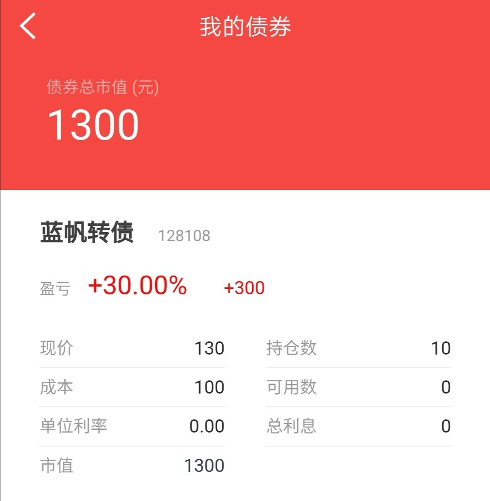

======================================================

_type: talk
@二师父[28814221155551]
2020-06-19 10:03:44 Fri  
topic_id: 841128122418112

蓝帆转债到160了

@Della🌻🌴明 at 2020-06-19 10:03:44 Fri

> 这会下来了一些

----------

@闫军平 at 2020-06-19 10:03:44 Fri

> 我卖143

----------

@Della🌻🌴明 at 2020-06-19 10:03:44 Fri

> 今儿有鸡腿吃咯

----------

@Nienie💝 at 2020-06-19 10:03:44 Fri

> 虽然140多卖的，但是中了两个账户的，是我可转债最高的收入。

----------

@丸子妈 at 2020-06-19 10:03:44 Fri

> 我和你一样

----------

阅读[3722]  评论[5]  赞[0] 

======================================================

_type: talk
@二师父[28814221155551]
2020-06-19 17:45:27 Fri  
topic_id: 421158125585218

<e type="hashtag" hid="48418425511548" title="#基金涨得慢怎么办#" /> 买的基金有的涨得快，有的涨得慢，那么涨得慢怎么办呢

阅读[4477]  评论[0]  赞[0] 

+++++++++++++++++++++++++++++++++++++++++++++++++++++

文件：
2020-06-19 17:44:55 Fri
文件大小：[21176]
15481155242152-买的基金涨的慢怎么办.docx

======================================================

_type: q&a
@wty[548488548545444]
2020-06-19 17:47:26 Fri  
topic_id: 118845814221222

@wty

>  看到网易和京东都先后要纳入恒生综指，是不是随着中概股的回归，也可以直接持有恒生指数的追踪基金替代中概互联指数基金呢？

@二师父

>  这个还得观察下，毕竟恒生是一个宽基指数，不会像中概互联持仓那样集中。
>  
>  如果后面调仓二者股票仓位重合在80%以上，那么基本可以用恒生替代中概了。

阅读[3374]  评论[1]  赞[0] 

======================================================

_type: q&a
@🍀 凝🌸 慧🍀[841855248254242]
2020-06-19 17:50:17 Fri  
topic_id: 548851841884454

@🍀 凝🌸 慧🍀

>  师父好，怎么看待今天的缩量上涨？特别是北向资金净流入突然增大至210亿，其中流入证券板块近80亿，这是要发生什么事情了吗？

@二师父

>  昨天易总讲话啊。关注上面政策，一般讲话以后短期内会上涨。
>  
>  今天没有缩量啊，市场情绪高，放量涨，这是多头开始发力了。
>  
>  后面主要关注大选、北京和南边这三块可能的利空，从市场看是利好的。

阅读[3570]  评论[1]  赞[0] 

======================================================

_type: q&a
@是喵喵吖～[421441114141158]
2020-06-19 17:54:23 Fri  
topic_id: 118845814458122

@是喵喵吖～

>  二师父，关于卖的这个我挺糊涂的，想请教您：比方说我想把利润（318.44）收割了，正常就是都卖出去 算是盈利这三百多块钱哈，但是我不想卖掉它，只是想把这三百多对应的份额卖掉 ，我应该卖多少呢，是不是用318.44/1.4661（最新净值）=赚的利润对应的份额 不知道这样对吗 应该卖217份对吗

@二师父

>  对的，收割利润，就是用实际利润除以当前净值，得到应该卖出的份额

阅读[3699]  评论[1]  赞[0] 

======================================================

_type: talk
@小鱼[241182222251181]
2020-06-19 21:54:10 Fri  
topic_id: 548851882152514

二师父，对最近的新三板如何看，散户能投资吗

@章兵朋 at 2020-06-19 21:54:10 Fri

> 100w才能开通权限吧

----------

@小鱼 at 2020-06-19 21:54:10 Fri

> 对呀

----------

@Hi·DD at 2020-06-19 21:54:10 Fri

> [偷笑]挺多人说刚开始的时候能挣钱

----------

@二师父 at 2020-06-19 21:54:10 Fri

> 够门槛的可以，还有科创板指数也可以关注

----------

阅读[3473]  评论[4]  赞[0] 

======================================================

_type: talk
@树叶[544811512145144]
2020-06-20 07:38:32 Sat  
topic_id: 241128114228511

<e type="hashtag" hid="142825811122" title="#定投周报#" /> 二师父定投周报第64期

阅读[3596]  评论[0]  赞[0] 

+++++++++++++++++++++++++++++++++++++++++++++++++++++

文件：
2020-06-20 07:38:28 Sat
文件大小：[230482]
48512288125818-二师父定投周报6.20（第64期）.docx

======================================================

_type: q&a
@Siller[244184228451851]
2020-06-20 12:16:02 Sat  
topic_id: 841128111155182

@Siller

>  二师父，最近估值表好久没发啦。

@二师父

>  周三发过一次的，你可以看看哈

阅读[3534]  评论[3]  赞[0] 

======================================================

_type: talk
@二师父[28814221155551]
2020-06-20 22:45:33 Sat  
topic_id: 421155441842418

<e type="hashtag" hid="48418425154228" title="#位置高的指数还可以投吗#" /> 看看如何投资处于高位的行业指数

@范毅君 at 2020-06-20 22:45:33 Sat

> 淡定，不追高，不杀跌，坐等下一次机会

----------

@柔软时光 at 2020-06-20 22:45:33 Sat

> 好的，我等回调再投

----------

@是喵喵吖～ at 2020-06-20 22:45:33 Sat

> 二师父 请问 这是说：能承受回撤，随时满仓上车 吗。这样理解对吗

----------

@二师父 at 2020-06-20 22:45:33 Sat

> 没听明白你的问题

----------

阅读[4496]  评论[4]  赞[0] 

+++++++++++++++++++++++++++++++++++++++++++++++++++++

文件：
2020-06-20 22:45:09 Sat
文件大小：[92712]
15481158822412-位置高的行业指数，还可以继续投资吗.docx

======================================================

_type: talk
@二师父[28814221155551]
2020-06-20 23:03:33 Sat  
topic_id: 241122551824881

<e type="hashtag" hid="552114551414" title="#估值数据#" /> 市盈率百分位30.95%，市净率百分位11.66%，SY-BY百分位32.88%，SY/BY百分位20.83%。最近很忙，但数据都是实时追踪的，投资不是盲目做，目前位置不低了，定投深红利每周500直到牛市到来。

如果不跌下去是不会再加资金的了。

@onepiecewi* at 2020-06-20 23:03:33 Sat

> 场外投还是场内投呢？

----------

阅读[3404]  评论[1]  赞[0] 

======================================================

_type: q&a
@飞的那个飞[48584811554158]
2020-06-21 11:41:32 Sun  
topic_id: 841122582254542

@飞的那个飞

>  这个基金我已经盈利25%！应该卖出还是收割利润！

@二师父

>  收割利润或者持有就行了

阅读[3437]  评论[0]  赞[0] 

======================================================

_type: q&a
@六尘不改[241555484551821]
2020-06-21 21:55:48 Sun  
topic_id: 118844244584252

@六尘不改

>  师傅，下周修正A股指数，是利好还是利空？

@二师父

>  下月修正，这个是利好的，我今天文章也提到了
>  
>  我的运气不错，今年上证综合指数3500又有希望了。

阅读[3248]  评论[2]  赞[0] 

======================================================

_type: talk
@二师父[28814221155551]
2020-06-21 21:56:42 Sun  
topic_id: 241122522814141

今天的文章也提到了上证综合指数规则改变的问题。

阅读[3505]  评论[0]  赞[0] 

+++++++++++++++++++++++++++++++++++++++++++++++++++++

文件：
2020-06-21 21:56:12 Sun
文件大小：[13844]
51584451458824-牛市来了.docx

======================================================

_type: talk
@二师父[28814221155551]
2020-06-22 07:02:14 Mon  
topic_id: 841122845414882

华宝中证电子50ETF、易方达中证人工智能ETF同日于6月8日获批。

@栀子花开 at 2020-06-22 07:02:14 Mon

> 那是不是说科技又有一波行情了？

----------

@二师父 at 2020-06-22 07:02:14 Mon

> 从逻辑上讲是这样

----------

@J at 2020-06-22 07:02:14 Mon

> 师父，请教新基金的问题，场内ETF获批是不是代表新基金成立？场内的新基金能考虑买吗？还是也需要等待基金规模达到1亿以上才合适买？

----------

阅读[3331]  评论[3]  赞[0] 

======================================================

_type: talk
@Chu[88888125211582]
2020-06-22 10:15:13 Mon  
topic_id: 241122842582281

今天劵商集体涨飞，牛市要来了么？我之前0.87入的劵商EFE要收割利润了

阅读[3150]  评论[0]  赞[0] 

======================================================

_type: q&a
@光少[244124552511141]
2020-06-22 10:33:51 Mon  
topic_id: 118844515818852

@光少

>  老师，券商单边上涨幅度较大，还需要按网格规定卖出吗

@二师父

>  如果是做网格的小资金就出，如果不是就不出

阅读[3353]  评论[4]  赞[0] 

======================================================

_type: q&a
@mumomo[111812248825412]
2020-06-22 11:07:58 Mon  
topic_id: 241122842222851

@mumomo

>  二师父，中概现在适合收割利润吗？收割的话是(1.772-1.217)*1600/1.772份吗

@二师父

>  不知道你的总资金多少，如果持有比例低于百分之一就拿着吧

阅读[3378]  评论[11]  赞[0] 

======================================================

_type: q&a
@🍀 凝🌸 慧🍀[841855248254242]
2020-06-22 11:39:29 Mon  
topic_id: 841122842448842

@🍀 凝🌸 慧🍀

>  师父好，这可转债为啥停牌啊？

@二师父

>  涨停了，就会自动停牌，后面可以交易的

阅读[3347]  评论[3]  赞[0] 

======================================================

_type: talk
@杜志彪[544454124115854]
2020-06-22 11:46:48 Mon  
topic_id: 241122842411241

<e type="hashtag" hid="281158522841" title="#每日打卡#" /> 2020年6月22第十次打卡，星期五卖出网格一份，国家要改指数规则，说明想让指数涨，那投资指数基金就对了，依然9层仓附近，今年虽然跑赢300不多但还是跑赢了，今年目标跑赢300指数10%[微笑]

@杜志彪 at 2020-06-22 11:46:48 Mon

> 是券商网格[呲牙]

----------

阅读[3271]  评论[1]  赞[0] 

======================================================

_type: q&a
@陈洲[88245122222212]
2020-06-22 13:19:13 Mon  
topic_id: 841122841125882

@陈洲

>  看到上周二讲的汇添富消费行业基金，是可以买的吧？

@二师父

>  现在比较贵了，目前是不可以，回调可以买

阅读[3309]  评论[2]  赞[0] 

======================================================

_type: solution
2020-06-22 14:08:59 Mon  
topic_id: 241122815518151

@杜志彪 at 2020-06-22 14:08:59 Mon

> 有点轻

----------

@二师父 at 2020-06-22 14:08:59 Mon

> 心态不错啊

----------

@Sunflower at 2020-06-22 14:08:59 Mon

> 现在估值高了，先把手头富裕资金定投了，然后基金轮换，等估值够低再调整，而且现在毕竟是学习的过程，很多也是了解尝试的阶段

----------

@杜志彪 at 2020-06-22 14:08:59 Mon

> 是啊有的人恨不得一次交易把一辈子的钱都挣了，总觉得这次买不到这辈子都没机会了[微笑]

----------

@Sunflower at 2020-06-22 14:08:59 Mon

> 你定投多久了，我定投一年目前比沪深300低一些

----------

@杜志彪 at 2020-06-22 14:08:59 Mon

> 我19年开始定投，当年也是跑输300指数，因为仓位是一点一点加上去的，2020年把基金投资转到场内，以网格配合估值买入，总的原则其实就是十六字方针，场内2020年收益截止今天收盘5%。

----------

阅读[3192]  评论[6]  赞[0] 

======================================================

_type: talk
@六尘不改[241555484551821]
2020-06-22 16:59:57 Mon  
topic_id: 118844585552212

今天市场反应不行啊，修改指数刺激不大

@聪明的笨蛋 at 2020-06-22 16:59:57 Mon

> 己经很可以了！

----------

@二师父 at 2020-06-22 16:59:57 Mon

> 看看7月22号的

----------

@J at 2020-06-22 16:59:57 Mon

> 师父，7.22是什么日子？

----------

阅读[3139]  评论[3]  赞[0] 

======================================================

_type: talk
@二师父[28814221155551]
2020-06-22 20:58:55 Mon  
topic_id: 841122811542882

<e type="hashtag" hid="88518544258812" title="#你上车了吗#" /> 不要随便下车，可能下了 就忘了上车

@娃娃after🎈 at 2020-06-22 20:58:55 Mon

> 请问二师父，现在才开始建仓，准备定投，资金每月2w左右，怎么操作比较好？

----------

@再见 . 青春 at 2020-06-22 20:58:55 Mon

> 可以先小额定投，指数回调到合适位置再加大定投金额，再跌再加，防止全仓踏空，又能防范回调风险。个人愚见[微笑]

----------

@娃娃after🎈 at 2020-06-22 20:58:55 Mon

> 谢谢

----------

@HeLLO at 2020-06-22 20:58:55 Mon

> 二师父，高估指数继续高估拿着，下跌20日线卖出全部还是利润？为什么下跌到20日线卖出？

----------

@二师父 at 2020-06-22 20:58:55 Mon

> 这是中期下跌信号

----------

阅读[3394]  评论[5]  赞[0] 

+++++++++++++++++++++++++++++++++++++++++++++++++++++

文件：
2020-06-22 20:58:41 Mon
文件大小：[13258]
48512224144828-创业板七连涨，你上车了吗.docx

======================================================

_type: talk
@二师父[28814221155551]
2020-06-22 21:04:45 Mon  
topic_id: 421155811414288

<e type="hashtag" hid="552114551414" title="#估值数据#" /> 全市场指数市盈率31.83%，全市场指数市净率19.73%，SY-BY百分位33.99%，SY/BY百分位23.83%。

估值越来越高，定投就适合大量减额并停止。等待以后的机会。

@是喵喵吖～ at 2020-06-22 21:04:45 Mon

> 二师父 以前您发过这个SY-BY SY/BY 代表啥来着吗 我忘了是不是我给漏掉看了 要是发过 我去搜一下。 我对您发的这个看不大懂呢就是不知道它代表着啥。我记得您说过 反正这四个数如果在10%及以下就是非常好的机会了 可以抄底的那种来着对吗

----------

@二师父 at 2020-06-22 21:04:45 Mon

> 对

----------

阅读[4306]  评论[2]  赞[0] 

======================================================

_type: q&a
@衣袂飘香[118248548242452]
2020-06-22 22:24:15 Mon  
topic_id: 421155811184888

@衣袂飘香

>  二师父你好！加入星球快一年了，我想续费。最近星球会直接跳出提醒去续费。我刚才试着点击了一下，今年的学费比去年高了，是吧？

@二师父

>  你可以过一段时间再续，等我做了企业认证

阅读[3288]  评论[11]  赞[0] 

======================================================

_type: solution
2020-06-23 05:12:16 Tue  
topic_id: 118844425285522

阅读[3194]  评论[0]  赞[0] 

======================================================

_type: q&a
@黎雄[841555255485222]
2020-06-23 05:49:40 Tue  
topic_id: 548855522245154

@黎雄

>  师傅封闭科创板主题基金可以买不，现在折价率高。这七只选那只更好呢！

@二师父

>  选择科创财通，方向很好，而且折价率高，流动性不足，适合长期拿着，目前没有科创板指数基金，这类可以作为替代

阅读[3366]  评论[6]  赞[0] 

======================================================

_type: talk
@二师父[28814221155551]
2020-06-23 05:51:35 Tue  
topic_id: 548855521284514

最近备考计划有所调整，暂停cpa备考，资料还是新的，12本书包含cpa全科，有意向最近两年备考cpa的可以联系我，我把资料转让给你

@🍀 凝🌸 慧🍀 at 2020-06-23 05:51:35 Tue

> 这大部头的书，师父厉害，咋不考了？

----------

@二师父 at 2020-06-23 05:51:35 Tue

> 考别的，先来

----------

@🍀 凝🌸 慧🍀 at 2020-06-23 05:51:35 Tue

> 哈哈，明白了，只是顺序调整一下😀

----------

@HeLLO at 2020-06-23 05:51:35 Tue

> 师父，对于我们做投资的，学习或考哪方面的比较有用，注册会计师很有含金量的吆[强][强]

----------

@二师父 at 2020-06-23 05:51:35 Tue

> 投资实践比较重要，从事金融行业，afp，cfp，frm，这些有用

----------

@门萨🐨 at 2020-06-23 05:51:35 Tue

> 准备考什么？

----------

@二师父 at 2020-06-23 05:51:35 Tue

> frm

----------

阅读[3521]  评论[7]  赞[0] 

+++++++++++++++++++++++++++++++++++++++++++++++++++++

图片：
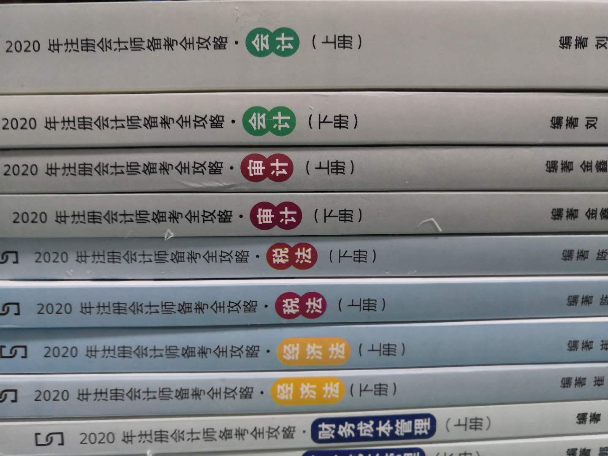
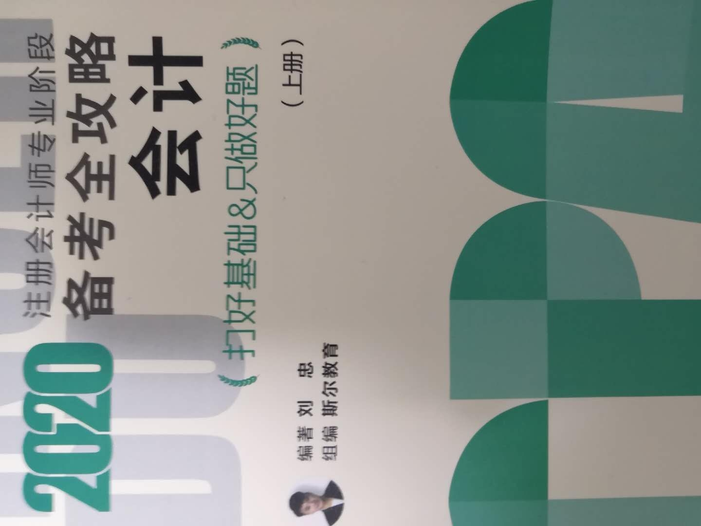

======================================================

_type: solution
2020-06-23 07:17:34 Tue  
topic_id: 421155545112228

@wty at 2020-06-23 07:17:34 Tue

> 准备停止定投了！

----------

阅读[3550]  评论[1]  赞[0] 

======================================================

_type: talk
@杜志彪[544454124115854]
2020-06-23 09:15:56 Tue  
topic_id: 421155542242548

<e type="hashtag" hid="281158522841" title="#每日打卡#" />2020年 6月23日第11次打卡，昨日卖出券商网格一份，科创板还是等ETF出来再投，最多给一层仓份额。

@杜志彪 at 2020-06-23 09:15:56 Tue

> 哦忘写了，场外也收割了消费利润[微笑]

----------

阅读[3646]  评论[1]  赞[0] 

======================================================

_type: q&a
@阳光[421884185252128]
2020-06-23 10:50:15 Tue  
topic_id: 241122254212581

@阳光

>  师父：我持有的恒生国企占总持仓的10%左右，目前仍亏3%左右，想转到消费电子或其他指数，可以吗？

@二师父

>  国企有调仓消息，等等看调仓美团，阿里能否进来

阅读[3666]  评论[1]  赞[0] 

======================================================

_type: q&a
@TDG[88855524248842]
2020-06-23 11:30:58 Tue  
topic_id: 118844428484452

@TDG

>  二师父，请问深南电路发布了深南转债开始转股的公告，转股价105.79低于目前股价159.21，是不是转股能够套利呢？谢谢！

@二师父

>  没套过，下休转股价只是为了促进转股

阅读[3639]  评论[0]  赞[0] 

======================================================

_type: q&a
@阳光[421884185252128]
2020-06-23 15:15:55 Tue  
topic_id: 241122282221551

@阳光

>  师父：华夏上证50AH指数为什么现在不能赎回呢？谢谢

@二师父

>  港股通暂停了

阅读[3473]  评论[2]  赞[0] 

======================================================

_type: talk
@二师父[28814221155551]
2020-06-23 22:04:51 Tue  
topic_id: 118844445844882

<e type="hashtag" hid="51281244451454" title="#看看走势和情绪#" />

@衣袂飘香 at 2020-06-23 22:04:51 Tue

> 二师父，手边突然多了6万块钱，要投到哪里去呀？背影已经渐行渐远了，不敢追，还有什么好的标的可以投吗？

----------

@二师父 at 2020-06-23 22:04:51 Tue

> 货币基金

----------

@衣袂飘香 at 2020-06-23 22:04:51 Tue

> 嗯嗯

----------

阅读[3602]  评论[3]  赞[0] 

+++++++++++++++++++++++++++++++++++++++++++++++++++++

文件：
2020-06-23 22:04:35 Tue
文件大小：[23628]
88214441155882-市场进一步上涨，情绪渐渐下降.docx

======================================================

_type: talk
@二师父[28814221155551]
2020-06-23 22:17:02 Tue  
topic_id: 841122228112852

<e type="hashtag" hid="51281244455444" title="#全市场指数估值#" /> 市盈率百分位32.19%，市净率百分位20.83%，SY-BY百分位34.94%，SY/BY百分位26.18%。

阅读[4417]  评论[0]  赞[0] 

======================================================

_type: q&a
@黎雄[841555255485222]
2020-06-24 01:23:54 Wed  
topic_id: 841122222281252

@黎雄

>  师傅，房贷要选择浮动利率，那利率调整周期怎么选择呢！是选1月.3月.6月.1年等有讲究没的

@二师父

>  按月浮动就行的

阅读[3424]  评论[1]  赞[0] 

======================================================

_type: talk
@杜志彪[544454124115854]
2020-06-24 08:58:36 Wed  
topic_id: 421155524244188

<e type="hashtag" hid="281158522841" title="#每日打卡#" /> 2020年6月24日第12次打卡，昨日买入200股恒生，能买的不多了，意思一下[微笑]

@rtdmm小米 at 2020-06-24 08:58:36 Wed

> 买那么少摊高了成本[偷笑][偷笑]

----------

@杜志彪 at 2020-06-24 08:58:36 Wed

> 留着子弹买医疗[呲牙]

----------

@JOY at 2020-06-24 08:58:36 Wed

> 医疗还能买？还是打算等回调呢？

----------

@杜志彪 at 2020-06-24 08:58:36 Wed

> 等啊，现在买傻啊，至少回调到60天线或者20%[微笑]。

----------

@杜志彪 at 2020-06-24 08:58:36 Wed

> 别人卖时，咱再买[偷笑]

----------

@范毅君 at 2020-06-24 08:58:36 Wed

> 你的100股不是挣到了吗[偷笑]

----------

@杜志彪 at 2020-06-24 08:58:36 Wed

> 你别说刚看了一眼都盈利12.45%了，这才几天时间，估计差不多了，什么时候亏10%就可以考虑建仓了[微笑]

----------

阅读[3284]  评论[7]  赞[1] 

======================================================

_type: q&a
@闪闪的星光[88285424418582]
2020-06-24 09:53:32 Wed  
topic_id: 421155524122458

@闪闪的星光

>  师傅好，在星球里搜每周三的估值表，很难搜到最近的？
>  能不能想办法改进一下呢？
>  
>  消费龙头指数的估值现在是高估呢？还是处于适中位置呢？

@二师父

>  看精华内容，这是从上到下的
>  
>  消费龙头是高估的，等回调，做趋势投资的随意了

阅读[3529]  评论[1]  赞[0] 

======================================================

_type: talk
@helen[544884424181154]
2020-06-24 11:15:47 Wed  
topic_id: 118844415148852

二师父，星球提醒续费，是不是你那里要设置一下的？我操作不了

@二师父 at 2020-06-24 11:15:47 Wed

> 你是付过了，还是没付

----------

阅读[3457]  评论[1]  赞[0] 

======================================================

_type: q&a
@范毅君[118551121224142]
2020-06-24 13:50:34 Wed  
topic_id: 548855545181554

@范毅君

>  二师父，这份公告对歌尔股份和歌尔发债会有影响吗？

@二师父

>  我没有看到公告，你把他附上哈

阅读[3423]  评论[2]  赞[0] 

======================================================

_type: talk
@二师父[28814221155551]
2020-06-24 13:51:15 Wed  
topic_id: 548855545412884

国债逆回购，在3点半之前还可以购买的，收益还行，以后节假日都记得买。

@🍀 凝🌸 慧🍀 at 2020-06-24 13:51:15 Wed

> 师父好，这个收益大概有多少？

----------

@二师父 at 2020-06-24 13:51:15 Wed

> 收益率3个点左右

----------

@JOY at 2020-06-24 13:51:15 Wed

> 师父，比如今天买，周一开市资金就能出来的，该买几天期的合适呢，1天的？

----------

@二师父 at 2020-06-24 13:51:15 Wed

> 你具体对比下，他有资金到期日的

----------

@JOY at 2020-06-24 13:51:15 Wed

> 好的，谢谢

----------

@🍀 凝🌸 慧🍀 at 2020-06-24 13:51:15 Wed

> 谢谢师父，这收益跟银行活期理财好像差不多哦。

----------

阅读[3716]  评论[6]  赞[0] 

+++++++++++++++++++++++++++++++++++++++++++++++++++++

文件：
2020-06-24 13:50:52 Wed
文件大小：[23589]
28214412251851-假期临近，这个固定收益品种绝对值得拥有.docx

======================================================

_type: talk
@二师父[28814221155551]
2020-06-24 13:53:48 Wed  
topic_id: 841122242488422

有同学说估值表不好找，后面二师父把每周的估值表放到第三个学员必读里面，然后精华里面看也是最近比较新的。

阅读[3567]  评论[0]  赞[0] 

======================================================

_type: q&a
@陈洲[88245122222212]
2020-06-24 14:17:58 Wed  
topic_id: 118844414144212

@陈洲

>  今天周三会发估值表吧？天天基金平台，手续费0.15%算高吗？

@二师父

>  会的，场外基本这个费率

阅读[3641]  评论[0]  赞[0] 

======================================================

_type: q&a
@烟九•二手车[244185818522141]
2020-06-24 16:21:06 Wed  
topic_id: 421155528124228

@烟九•二手车

>  二师傅，您好！
>  有空帮忙研究一下008888，这个目前刚发售不久，值得入手么？

@二师父

>  半导体挺好的方向，属于新基建范畴，就是目前太贵了。

阅读[3639]  评论[0]  赞[0] 

======================================================

_type: talk
@钱小胖儿[844112855845212]
2020-06-24 21:59:51 Wed  
topic_id: 421155518255488

师傅，招商中证白酒现在开始定投可以么

@二师父 at 2020-06-24 21:59:51 Wed

> 现在不合适了

----------

@蓝魔森林 at 2020-06-24 21:59:51 Wed

> 涨怎么厉害了还定投呢[发呆]

----------

阅读[3395]  评论[2]  赞[0] 

======================================================

_type: talk
@二师父[28814221155551]
2020-06-24 22:30:15 Wed  
topic_id: 841122218142222

<e type="hashtag" hid="88518581221222" title="#每日市场数据#" /> 全市场指数市盈率百分位32.51%，全市场指数市净率百分位22.06%，SY-BY百分位34.81%，SY/BY百分位24.86%。

@梧桐 at 2020-06-24 22:30:15 Wed

> 二师父，7月1日的新三板打新，咱们要参与吗。

----------

@二师父 at 2020-06-24 22:30:15 Wed

> 够门槛可以参与

----------

阅读[3552]  评论[2]  赞[0] 

======================================================

_type: talk
@二师父[28814221155551]
2020-06-24 22:47:13 Wed  
topic_id: 841122212545512

<e type="hashtag" hid="15285258118452" title="#每周估值表#" /> 高估得指数越来越多了，中概互联也即将进入高估。

牛市真的来了，熊市那所有人都赚不到钱。后面估值表每周会放在置顶文章第三篇里面。

@二师父 at 2020-06-24 22:47:13 Wed

> 精华里面也可以看到得

----------

@smile at 2020-06-24 22:47:13 Wed

> 牛市已经来了吗？那不是要考虑逐步卖出了呢？

----------

@蓝魔森林 at 2020-06-24 22:47:13 Wed

> 深证红利还是低估呢，值得继续定投吗

----------

@二师父 at 2020-06-24 22:47:13 Wed

> 没有低估了，轻仓投可以

----------

@子辰 at 2020-06-24 22:47:13 Wed

> 科技龙头高估了？好快啊

----------

@老孙头 at 2020-06-24 22:47:13 Wed

> ，

----------

@老孙头 at 2020-06-24 22:47:13 Wed

> 少丨一，

----------

@老孙头 at 2020-06-24 22:47:13 Wed

> 11

----------

阅读[4617]  评论[10]  赞[0] 

+++++++++++++++++++++++++++++++++++++++++++++++++++++

图片：
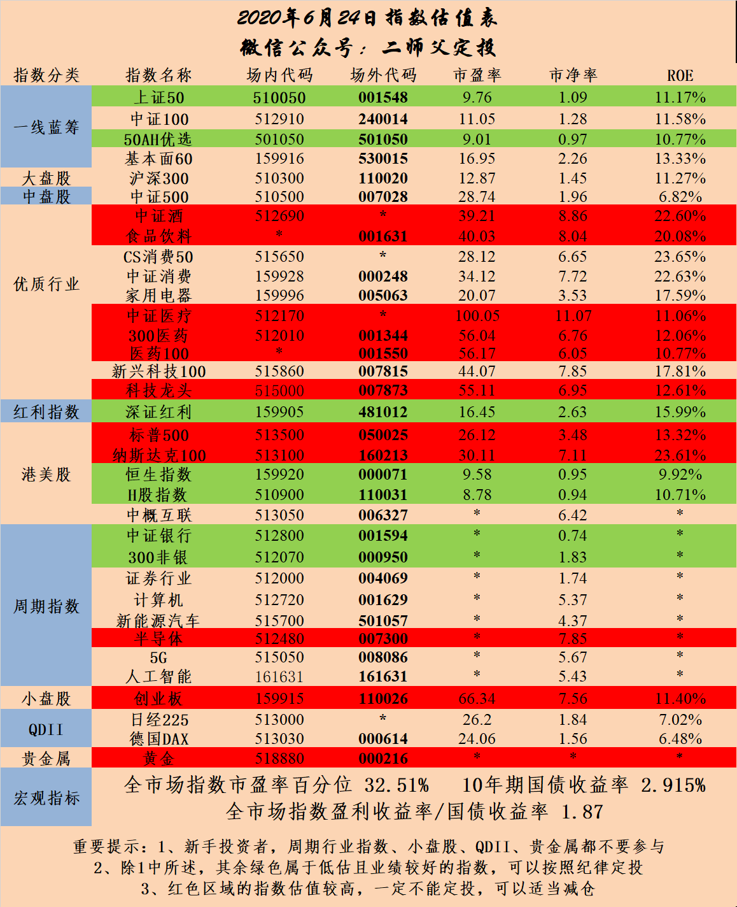

======================================================

_type: talk
@二师父[28814221155551]
2020-06-25 21:34:27 Thu  
topic_id: 241122451251841

<e type="hashtag" hid="51281282481514" title="#常见的投资心理误区#" />

@阝東 at 2020-06-25 21:34:27 Thu

> 二师傅，估值表的都是优质的股票基金，比如现在银行基金持有1成仓位，是要捂着等反转还是出掉一些

----------

@二师父 at 2020-06-25 21:34:27 Thu

> 盈利可以出点

----------

阅读[4505]  评论[2]  赞[0] 

+++++++++++++++++++++++++++++++++++++++++++++++++++++

文件：
2020-06-25 21:34:20 Thu
文件大小：[23053]
15481824254542-这几个常见的投资心理误区，你是否已经陷入了.docx

======================================================

_type: q&a
@闪闪的星光[88285424418582]
2020-06-26 08:13:53 Fri  
topic_id: 118815242424212

@闪闪的星光

>  请问师傅：
>  在网页版的二师父定投学堂里面，哪里可以向你提问呢？
>  我没有找到提问的入口

@二师父

>  网页版好像没有

阅读[3524]  评论[1]  赞[0] 

======================================================

_type: q&a
@闪闪的星光[88285424418582]
2020-06-26 08:26:15 Fri  
topic_id: 421128454548118

@闪闪的星光

>  师傅好！
>  
>  中金MSCI质量A(006341)这只基金追踪的是MSCI中国A股国际质量指数，
>  
>  请问：
>  
>  1、这个指数的代码是多少啊？
>  
>  2、这个指数的编制规则是什么呢？
>  在哪里可以查看到这只指数的编制规则呢？
>  
>  3、像我们这样的非专业人士，在哪里能看到这只指数的每日估值呢？
>  
>  4、这只指数基金值得关注吗？
>  
>  谢谢师傅！

@二师父

>  1、指数的代码是716567，MSCI中国A股国际通指数。
>  
>  2、这个查阅就只有在WIND终端上查阅了，目前我还没看到一些普通机构公布这些数据。
>  
>  3、值得关注的，MSCI指数代表外资投研看好的股票集合，者个A股国际通相当于是投了这这个指数里面的A股，是比较有价值的，可以跟踪一下。

阅读[4615]  评论[8]  赞[0] 

======================================================

_type: q&a
@拥抱太阳的风筝[48812454818528]
2020-06-26 10:05:25 Fri  
topic_id: 118815242118522

@拥抱太阳的风筝

>  二师父，家用电器的低估阈值是多少

@二师父

>  目前是17倍。这个跟踪指数在下面有的，我又看了一遍，而且误差是百分之0.77，你是查的哪里的资料？

阅读[3635]  评论[1]  赞[0] 

======================================================

_type: talk
@二师父[28814221155551]
2020-06-26 10:30:22 Fri  
topic_id: 841148525115452

<e type="hashtag" hid="28518515145541" title="#中金MSCI中国A股#" /> 中金MSCI中国A股质量指数A追踪的是MSCI中国A股国际质量指数，这个更正下，投资数据查阅需要从源头来，信息传递有减损，偷懒可能查到非原始的正确信息。如果我有回答不当之处，欢迎大家批评指正。

@wty at 2020-06-26 10:30:22 Fri

> 二师父，这个基金成立不到两年，规模低于1亿，目前的策略是跟踪和观察对吗？这是指数基金吗？还是主动基金？管理费也不低的

----------

@二师父 at 2020-06-26 10:30:22 Fri

> 这是指数基金，是的，我是说可以观察，没说现在可以投资的。

----------

@wty at 2020-06-26 10:30:22 Fri

> 明白，多谢🙏

----------

@闪闪的星光 at 2020-06-26 10:30:22 Fri

> 请问师傅，这个指数目前的估值是高估还是适中、低估呢？

----------

@二师父 at 2020-06-26 10:30:22 Fri

> 等他规模起来

----------

阅读[3648]  评论[5]  赞[0] 

+++++++++++++++++++++++++++++++++++++++++++++++++++++

图片：
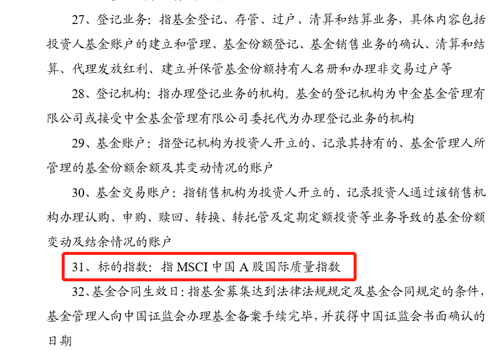

======================================================

_type: talk
@Zero Fei[51422225155524]
2020-06-26 19:36:08 Fri  
topic_id: 841148521454852

二师父，本周乌龟计划有定投安排么

@衣袂飘香 at 2020-06-26 19:36:08 Fri

> 二师父说这次不投了。

----------

@Zero Fei at 2020-06-26 19:36:08 Fri

> 哦哦

----------

阅读[3404]  评论[2]  赞[0] 

======================================================

_type: talk
@二师父[28814221155551]
2020-06-26 22:52:51 Fri  
topic_id: 421128424241258

<e type="hashtag" hid="51281281221814" title="#两个估值指标#" />

阅读[4693]  评论[0]  赞[0] 

+++++++++++++++++++++++++++++++++++++++++++++++++++++

文件：
2020-06-26 22:52:41 Fri
文件大小：[26262]
51584824248444-普通投资者怎么看指数的估值进行定投.docx

======================================================

_type: q&a
@陈洲[88245122222212]
2020-06-26 22:55:01 Fri  
topic_id: 241148522245141

@陈洲

>  二师父，今天买了002707，001210科技和互联网的基金，这2个怎么样

@二师父

>  都侧重计算机电子半导体，基金还行。第一个规模太低了，混合基金注意基金经理调仓风格变化以及基金经理的更换。跟着基金经理走就行。

阅读[3584]  评论[0]  赞[0] 

======================================================

_type: talk
@二师父[28814221155551]
2020-06-27 07:12:37 Sat  
topic_id: 548841241544884

<e type="hashtag" hid="48418455428528" title="#周五荐书#" /> 本周推荐一本书；异类，看看一万小时定律，投资是认知的变现，认知提升需要读书，去各地领略风土和人情，与人沟通交流，认真领悟，这样提升了对世界的理解自然投资才会更好。

@蓝魔森林 at 2020-06-27 07:12:37 Sat

> 我推荐张宏杰的历史读物，都比较有深度，有利于提升大局观和加深现象本质思考

----------

阅读[3525]  评论[1]  赞[0] 

======================================================

_type: talk
@二师父[28814221155551]
2020-06-27 21:26:10 Sat  
topic_id: 241148514888441

<e type="hashtag" hid="51281281124414" title="#有价值的三只基金#" /> 最有价值的三只基金，大家都配置了。

最近有个领悟，找人帮忙不要找那些你帮助过的人，你要找那些帮助过你的人

帮助过你的人会继续帮你，你帮助过的人可能转身就把你删除了。

@冯林锋 at 2020-06-27 21:26:10 Sat

> 二师父海吉亚医疗能长期持有吗？打新有中签

----------

@二师父 at 2020-06-27 21:26:10 Sat

> 港股波动大，坐过山车无感可以

----------

@钱小胖儿 at 2020-06-27 21:26:10 Sat

> 师傅，中欧医疗健康C可以定投么

----------

@二师父 at 2020-06-27 21:26:10 Sat

> 目前最好别入了，医疗挺贵的

----------

@罗大发 at 2020-06-27 21:26:10 Sat

> 说得好师父

----------

@Hi·DD at 2020-06-27 21:26:10 Sat

> 二师父可能被伤害了[偷笑]

----------

@二师父 at 2020-06-27 21:26:10 Sat

> 我陈述事实

----------

@钱小胖儿 at 2020-06-27 21:26:10 Sat

> 谢谢

----------

阅读[4798]  评论[9]  赞[0] 

+++++++++++++++++++++++++++++++++++++++++++++++++++++

文件：
2020-06-27 21:25:49 Sat
文件大小：[24313]
88214188825422-三只最有价值的基金，直接上代码.docx

======================================================

_type: talk
@二师父[28814221155551]
2020-06-27 21:49:35 Sat  
topic_id: 118815281518412

有的银行现在可以做券商业务了，跌跌不休的，银行又重新有了希望

阅读[3593]  评论[0]  赞[0] 

======================================================

_type: q&a
@素兮[548121415528244]
2020-06-28 11:32:55 Sun  
topic_id: 548841125585484

@素兮

>  二十父，医疗ETF(512170)和中证医疗（399989）他们有什么区别？如果只选其一，哪一个更好？

@二师父

>  一个是指数，一个是基金，选择指数基金医疗etf投资就行

阅读[3535]  评论[0]  赞[0] 

======================================================

_type: q&a
@章兵朋[118251425848882]
2020-06-28 17:29:30 Sun  
topic_id: 241148851528851

@章兵朋

>  二师父，明天的本钢转债会破发吗？看评级是AAA，头一次看到AAA级

@二师父

>  评级越高的，破发概率越低，大概率是盈利的

阅读[3386]  评论[1]  赞[0] 

======================================================

_type: talk
@二师父[28814221155551]
2020-06-28 22:25:45 Sun  
topic_id: 118815554181882

关于银行持有券商牌照的分析。

@是喵喵吖～ at 2020-06-28 22:25:45 Sun

> 【从长远投资来看，银行是不如券商，只是券商在牛市容易暴涨所以给人的感觉是涨得好的品种。】 师父这句话是不是打错了：从长远投资来看 券商是不如银行的

----------

@JOY at 2020-06-28 22:25:45 Sun

> “从长远投资来看，银行是不如券商，只是券商在牛市容易暴涨所以给人的感觉是涨得好的品种。”
师父，是否该是券商不如银行哈？

----------

阅读[3610]  评论[2]  赞[0] 

+++++++++++++++++++++++++++++++++++++++++++++++++++++

文件：
2020-06-28 22:25:27 Sun
文件大小：[32900]
28214125514841-银行将持有券商牌照，券商凉凉，银行要起飞了？.docx

======================================================

_type: q&a
@陈伟[88511115141112]
2020-06-28 22:26:39 Sun  
topic_id: 421128888112188

@陈伟

>  二师父，6月初006327和164906已卖出利润部分，目前这两个基金需要全部卖出止盈吗？

@二师父

>  这个不用，目前就是美股风险，比如拼多多这种。如果赚够了目标止盈。
>  
>  对于这种高成长指数，是可以中长期持有的

阅读[3472]  评论[1]  赞[0] 

======================================================

_type: q&a
@Candice[28258422885541]
2020-06-28 22:31:17 Sun  
topic_id: 841148882851482

@Candice

>  二师父，三十岁重疾险已经配置了百万级，现在准备配置些养老险，请问有什么推荐的产品吗？谢谢

@二师父

>  <e type="web" href="https://cps.qixin18.com/m/lhz1029368/product/detail-104074-128565.html" title="https://cps.qixin18.com/m/lhz1029368/product/detail-104074-128565.html" />，养老类型的就是年金险，这款可以了解下，中韩悦未来养老年金保险 。

阅读[3518]  评论[1]  赞[0] 

======================================================

_type: talk
@二师父[28814221155551]
2020-06-29 10:15:41 Mon  
topic_id: 241148828145441

今日可转债打新

@雨的依恋 at 2020-06-29 10:15:41 Mon

> 我把第一个略过了

----------

@What if at 2020-06-29 10:15:41 Mon

> 雪球上看到说本钢的中签率很高，但破发率也很大啊？

----------

@二师父 at 2020-06-29 10:15:41 Mon

> 可转债没事的，破发了可以持有

----------

阅读[3436]  评论[3]  赞[0] 

+++++++++++++++++++++++++++++++++++++++++++++++++++++

图片：
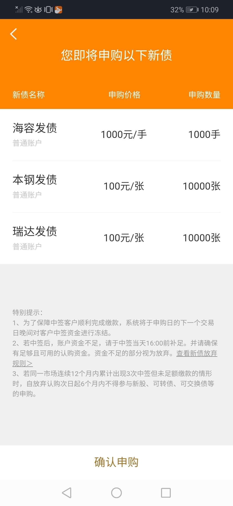

======================================================

_type: talk
@二师父[28814221155551]
2020-06-29 10:16:31 Mon  
topic_id: 421128858128128

今日可转债打新

阅读[3507]  评论[0]  赞[0] 

+++++++++++++++++++++++++++++++++++++++++++++++++++++

图片：

======================================================

_type: talk
@zxc[51145258542214]
2020-06-29 10:30:05 Mon  
topic_id: 421128855445488

二师父，现在还是没办法续费，马上要到到期了

@二师父 at 2020-06-29 10:30:05 Mon

> 你是苹果手机吧，到期了，给ershifudt发个消息

----------

阅读[3513]  评论[1]  赞[0] 

======================================================

_type: talk
@二师父[28814221155551]
2020-06-29 11:19:30 Mon  
topic_id: 241148822284851

<e type="hashtag" hid="88518518218552" title="#关于打新#" /> 打新有a股打新，可转债打新，港股打新，对于a股和可转债破发概率很小，a股破发只能说运气太差，卖了就行，可转债破发可以当债券持有

港股打新破发率挺高，所以得挑着上涨概率大的打，盈利和亏了都得跑快点。

打新属于弯腰捡钱的投资，没太多技术含量，也不用过于担心。

@陈飞🤗 at 2020-06-29 11:19:30 Mon

> 如果打新债中签了盈利的钱是谁输的

----------

@二师父 at 2020-06-29 11:19:30 Mon

> 韭菜

----------

@陈飞🤗 at 2020-06-29 11:19:30 Mon

> 刚上市怎么会有人输

----------

@二师父 at 2020-06-29 11:19:30 Mon

> 你买房刚买也可能跌，资产价格本身波动，你别把他想成麻将馆了

----------

阅读[4626]  评论[4]  赞[0] 

======================================================

_type: q&a
@李震笛[422112248211828]
2020-06-29 15:09:02 Mon  
topic_id: 118815512248412

@李震笛

>  二师傅，券商的etf现在进可行吗

@二师父

>  0.9以下是比较合适的

阅读[3564]  评论[0]  赞[0] 

======================================================

_type: talk
@二师父[28814221155551]
2020-06-29 20:13:24 Mon  
topic_id: 421128828111288

刚刚文章发错了，重新发一下。这是今天的分析文章。

@是喵喵吖～ at 2020-06-29 20:13:24 Mon

> 师父我看场内标普500跌了我就买了一点 可以在他跌的时候买一点吗

----------

@二师父 at 2020-06-29 20:13:24 Mon

> 暂时等等

----------

@是喵喵吖～ at 2020-06-29 20:13:24 Mon

> 嗯嗯好的

----------

阅读[3548]  评论[3]  赞[0] 

+++++++++++++++++++++++++++++++++++++++++++++++++++++

文件：
2020-06-29 20:12:33 Mon
文件大小：[26172]
88214124141542-没有大利空，不用担心.docx

======================================================

_type: talk
@二师父[28814221155551]
2020-06-29 20:14:25 Mon  
topic_id: 118815515888842

投资港股可以开通港股账户，也可以开通港股通的

@李震笛 at 2020-06-29 20:14:25 Mon

> 二师傅，那个券商手续费打折吗

----------

@二师父 at 2020-06-29 20:14:25 Mon

> 港股没有

----------

@梧桐 at 2020-06-29 20:14:25 Mon

> 二师父，港股打新是不是需要有香港银行账户

----------

@二师父 at 2020-06-29 20:14:25 Mon

> 是的，开一个好，手续费低，出金方便

----------

@素兮 at 2020-06-29 20:14:25 Mon

> 开通港股和开通港股通，哪一个方便点？

----------

@二师父 at 2020-06-29 20:14:25 Mon

> 都挺方便，不过港股通门槛高一点，需要50万资产

----------

阅读[3444]  评论[6]  赞[0] 

======================================================

_type: talk
@二师父[28814221155551]
2020-06-29 23:37:55 Mon  
topic_id: 421128814824248

<e type="hashtag" hid="15285285184142" title="#全市场指数百分位#" /> 市盈率百分位31.69%，市净率百分位20.35%，SY-BY百分位33.73%，SY/BY百分位22.28%。

数据显示当前的3000点是比18年的3000点要贵的，正常定投即可。现在最大的不确定是疫情的影响，看着国内是稳定，而国外每天一个国家出几百的太多了。

从估值和预期两者分析都不值得重仓买入。

阅读[4450]  评论[0]  赞[0] 

======================================================

_type: talk
@二师父[28814221155551]
2020-06-30 05:09:19 Tue  
topic_id: 548841182814454

夏天到了，改变作息，早上5
点左右起床，晚上11点之前休息，保证高效率。

良好的身体源于规律的作息。

@志亮 at 2020-06-30 05:09:19 Tue

> 我晩上1点后再睡，这坏习惯要改呀！

----------

@二师父 at 2020-06-30 05:09:19 Tue

> 一直以为你在国外

----------

@cotton at 2020-06-30 05:09:19 Tue

> 笑死我了。。

----------

@杜志彪 at 2020-06-30 05:09:19 Tue

> 这是我睡眠时间，但是就是5点起不来[偷笑]

----------

@衣袂飘香 at 2020-06-30 05:09:19 Tue

> 你们都是牛人呀，起这么早。

----------

@April _ M. at 2020-06-30 05:09:19 Tue

> 惭愧啊 我这十一点半睡，七点半才起来

----------

@二师父 at 2020-06-30 05:09:19 Tue

> 8个小时刚刚好，我中午睡得多

----------

@白山羊 at 2020-06-30 05:09:19 Tue

> 晚上睡这么少，中午睡多久？还是你本身就精力充沛啊[发呆]

----------

阅读[3452]  评论[9]  赞[0] 

======================================================

_type: talk
@二师父[28814221155551]
2020-06-30 08:17:51 Tue  
topic_id: 548841185845224

【上海崇明特殊人才落户公示，李佳琦在列】6月23日，上海市崇明区发布2020年第一批特殊人才引进落户公示名单，李佳琦在列，申报单位为上海琦圣管理咨询有限公司。天眼查信息显示，李佳琦为该公司大股东，持股比例99%。此前，杭州市余杭区也曾发布“直播电商政策”，明确对有行业引领力、影响力的直播电商人才可通过联席认定，按最高B类人才（国家级领军人才）享受相关政策。

阅读[3409]  评论[0]  赞[0] 

======================================================

_type: q&a
@April _ M.[841582144212812]
2020-06-30 12:19:35 Tue  
topic_id: 118815581521552

@April _ M.

>  二师父，我第一次中可转债，这个上面显示“资金已全部缴纳”，但我没看到哪里有扣款显示呢，我的交易账户里的资金是够的，绑定的银行卡并没有放流动资金 。求指引，谢谢！

@二师父

>  这是认购，你把账户留1000元会自动扣款的

阅读[3333]  评论[1]  赞[0] 

======================================================

_type: q&a
@莫莫[421444811458818]
2020-06-30 13:10:49 Tue  
topic_id: 241148811112451

@莫莫

>  二师父，有个困惑我好几天问题，麻烦帮忙分析下
>  
>  #CS互医疗#估值为啥变化这么大？一周时间直接从较低估值变成高估，但是净值确没有那么大的提高？

@二师父

>  你认识是对的，医疗最近一段时间都处于高估区域，天天基金有的数据是错的，参考下就行，不要迷信

阅读[3372]  评论[0]  赞[0] 

======================================================

_type: q&a
@不知道不明了[15584248411812]
2020-06-30 16:08:07 Tue  
topic_id: 118815124515282

@不知道不明了

>  二师傅好，之前买了比较多的银行，你觉得三年内银行有机会么

@二师父

>  三年内会有机会的，这个主要和实体经济挂钩，今年疫情影响很大，等待这个过去了，预计明年经济会逐步复苏

阅读[3235]  评论[0]  赞[0] 

======================================================

_type: talk
@杜志彪[544454124115854]
2020-06-30 17:00:11 Tue  
topic_id: 841148454828422

<e type="hashtag" hid="281158522841" title="#每日打卡#" /> 2020年6月30日第13次打卡，图省事要求不高的话一个300，一个创业板足矣，哪边有风都可以😊可以跑赢大多数投资者，我半年只跑赢300指数4个点，6支股票半年没收益，需要总结。

@二师父 at 2020-06-30 17:00:11 Tue

> 今年选对了消费和医疗就对了。

----------

@🍀 凝🌸 慧🍀 at 2020-06-30 17:00:11 Tue

> 如果要求不高的话，我也发现沪深300真是省心啊，也就这几个月吧，就快10%了[呲牙]。医疗没有抓住，半途下车了。

----------

@栀子花开 at 2020-06-30 17:00:11 Tue

> 我也是，之前买的中欧医疗健康赚了40%没拿住卖了之后继续涨了32%[流泪]

----------

阅读[3161]  评论[3]  赞[0] 

======================================================

_type: talk
@二师父[28814221155551]
2020-06-30 21:48:38 Tue  
topic_id: 421128288555248

A股火热啊，其实投指数最简单的是三个，沪深300+创业板+国债。在低位买，又拿的住，不想飙涨的股票容易半途脱手。

当然，投资是兴趣，自己做组合剔除宽基里面的较差的行业，这样会好一点，前提是水平到位，否则选了错误的行业错误的股票，还不如最基本组合。

@smile at 2020-06-30 21:48:38 Tue

> 请教二师父，虽然创业板现在不是低估，如果从长期看，现在定投会不会总体趋势是好的呢

----------

@二师父 at 2020-06-30 21:48:38 Tue

> 创业板是向上的趋势

----------

阅读[3362]  评论[2]  赞[0] 

+++++++++++++++++++++++++++++++++++++++++++++++++++++

文件：
2020-06-30 21:46:32 Tue
文件大小：[17719]
28214144451211-A股和目前的天气一样火热.docx

======================================================

_type: talk
@二师父[28814221155551]
2020-06-30 22:05:07 Tue  
topic_id: 241148488214851

<e type="hashtag" hid="15285285184142" title="#全市场指数百分位#" /> PE百分位32.69%，PB百分位21.41%，SY-BY百分位34.74%，SY/BY百分位24.09%。

整体估值进一步提升，明天大概率还是定投意思意思。总之定投就两招：1、选准指数，未来预期好的，2、等待价格，现在便宜的。价格低于价值的。

阅读[3271]  评论[0]  赞[0] 

======================================================

_type: q&a
@不知道不明了[15584248411812]
2020-06-30 22:30:15 Tue  
topic_id: 421128288222218

@不知道不明了

>  二师父，之前你说过，银行股里面招行，平安，宁波银行是第一梯队，兴业等属于第二梯队。那银行股之间的比较您主要依据什么呢，如果看市净率兴业最低，但之前好像说过现在经济不景气银行坏账较多，净资产无法反应银行的价值，还有别的合理指标么？

@二师父

>  看企业不能光看一个指标，你得考护城河还有趋势，银行的每年营收，是否有坏账和呆账，未来会不会持续，银行服务是否胖客户满意，有没有经营壁垒，不是几个指标就能投的，如果简单看几个指标那投资叶太容易了

阅读[3364]  评论[0]  赞[0] 

======================================================

_type: q&a
@子辰[421444812542128]
2020-06-30 22:30:45 Tue  
topic_id: 548841411544524

@子辰

>  终于中一次，太难得了。
>  是不是东方财富app的账户里面有1000元，就不用往里面打钱了吧？

@二师父

>  是的，会自己扣款的，账户放1000就行

阅读[3472]  评论[2]  赞[0] 

======================================================

