_type: talk
@树叶[544811512145144]
2020-10-01 19:12:26 Thu  
topic_id: 215528558215141

<e type="hashtag" hid="142825811122" title="#定投周报#" /> 二师父定投周报第75期

阅读[3899]  评论[0]  赞[0] 

+++++++++++++++++++++++++++++++++++++++++++++++++++++

文件：
2020-10-01 19:12:07 Thu
文件大小：[246760]
28488251244811-二师父定投周报10.1（第75期）.docx

======================================================

_type: q&a
@六尘不改[241555484551821]
2020-10-02 21:44:26 Fri  
topic_id: 582251228215454

@六尘不改

>  川普中了新冠，对A股是利好利空啊？

@二师父

>  如果治不好，就是利空

阅读[3697]  评论[1]  赞[0] 

======================================================

_type: q&a
@范毅君[118551121224142]
2020-10-02 21:44:48 Fri  
topic_id: 582251211222154

@范毅君

>  二师父，川普确诊，会不会对节后股市造成比较大的冲击呀

@二师父

>  会有较大冲击

阅读[3839]  评论[5]  赞[0] 

======================================================

_type: q&a
@孤芳自赏[548114442211184]
2020-10-02 21:45:47 Fri  
topic_id: 582251215252524

@孤芳自赏

>  二师父请问特不靠谱检测出新冠肺炎阳性会不会影响我们大A股？

@二师父

>  会的，有可能情绪一下子反应到位

阅读[4041]  评论[1]  赞[0] 

======================================================

_type: talk
@二师父[28814221155551]
2020-10-06 21:57:07 Tue  
topic_id: 582251552184514

<e type="hashtag" hid="88518188814122" title="#世界上最大的演员#" />

@范毅君 at 2020-10-06 21:57:07 Tue

> 我来了我来了，二师父说的太好了[呲牙][呲牙]

----------

阅读[4254]  评论[1]  赞[0] 

+++++++++++++++++++++++++++++++++++++++++++++++++++++

文件：
2020-10-06 21:56:52 Tue
文件大小：[30996]
48288252458258-吃了不靠谱一个大瓜，需要理性分析未来的变化.docx

======================================================

_type: talk
@二师父[28814221155551]
2020-10-06 22:03:16 Tue  
topic_id: 215528225255151

<e type="hashtag" hid="88518188811582" title="#关于北京学区房#" /> 之前有个读者问我关于北京学区房，私信问的，具体不记得哪位朋友了，最近实地踩盘，朝阳区找了一个比较好的学区房——太阳宫元北区。就是上车费用比较贵，大概一居室需要900左右，这个保值没问题，对应的小学是人大附小，这是目前在朝阳看的最好的学区了。第二档次，比如呼家楼中心小学和对外经济贸易附属小学，相对上车也容易一点，学区老破小还是可以拥有的，居住舒适度会降低，不过最好也是90年代以后的房子，这样流动性好一些。

@Sunflower at 2020-10-06 22:03:16 Tue

> 对于学区房我有不一样的想法，如果是为了上学，我觉得还是要看看学校的孩子都是什么样的家庭，如果费劲花900买了学区房供孩子上那所学校可能综合来看也不是很好，孩子心里会有比较和落差，不过跟其他区来比较我也更看好朝阳

----------

阅读[3757]  评论[1]  赞[0] 

======================================================

_type: talk
@二师父[28814221155551]
2020-10-07 22:28:30 Wed  
topic_id: 182245415582242

国庆7天过的真快，越是不在意时间，时间溜得越快。 马上要上班了，该收心干活了，除了工作生活规划，给自己的投资也做个大致的规划。 凡事预则立，不预则废。有了好的规划，然后按照计划行事，就不会偏离路径太远...点击链接查看剩余内容<e type="web" href="https://articles.zsxq.com/id_41md94zloz3g.html" title="国庆收假了，给自己的投资做个大致规划" cache="" />

阅读[3643]  评论[0]  赞[0] 

======================================================

_type: talk
@二师父[28814221155551]
2020-10-08 21:42:16 Thu  
topic_id: 582251588221854

国庆期间，海外市场依然开盘，而且涨幅还不错。 美股、港股、都涨幅在3%左右。 德国DAX、法国、英国股指涨幅1%以上。 亚洲的指数日经、韩国涨幅在2%左右。 当前A股和美股的涨跌关联度越来越大，从全球...点击链接查看剩余内容<e type="web" href="https://articles.zsxq.com/id_bgvw7tp5g64g.html" title="明天，稳了" cache="" />

阅读[3632]  评论[0]  赞[0] 

======================================================

_type: q&a
@呵呵→_→[15414558111442]
2020-10-08 23:59:49 Thu  
topic_id: 582251588825114

@呵呵→_→

>  师傅，香港银行卡有没有什么开户渠道啊，怎么开户的请教一下

@二师父

>  民生银行，香港账户，你在公众号后台有预约渠道，和客户经理沟通，或者直接去香港办理，这个最快

阅读[3646]  评论[0]  赞[0] 

======================================================

_type: talk
@二师父[28814221155551]
2020-10-09 11:28:02 Fri  
topic_id: 182245121158512

节后第一个交易日，a股微涨，比亚迪，美团，新能车，互联网领涨，a股和成熟市场的关联度越来越大。今日四只新股和一只可转债，均可打。

@芙瑞雅阳阳潘 at 2020-10-09 11:28:02 Fri

> 打了

----------

阅读[3724]  评论[1]  赞[0] 

======================================================

_type: talk
@二师父[28814221155551]
2020-10-09 20:46:40 Fri  
topic_id: 582251414252114

<e type="hashtag" hid="48418182154128" title="#选择基金低估和成长#" /> 以合理公道的价格买入优质企业

@吃肉肉 at 2020-10-09 20:46:40 Fri

> 新能车的赛道可以定投多久？

----------

@二师父 at 2020-10-09 20:46:40 Fri

> 在新能车普及之前，他便宜的时候都可以

----------

@付云 at 2020-10-09 20:46:40 Fri

> 现在可以开始定投么

----------

阅读[4224]  评论[3]  赞[0] 

+++++++++++++++++++++++++++++++++++++++++++++++++++++

文件：
2020-10-09 20:46:09 Fri
文件大小：[32474]
51411482141844-萎靡的恒生和高亢的新能车，你选谁.docx

======================================================

_type: talk
@二师父[28814221155551]
2020-10-09 21:03:31 Fri  
topic_id: 215528484544511

<e type="hashtag" hid="28518858514151" title="#每日估值数据#" /> 市盈率百分位50.41%，市净率百分位34.73%，SY-BY百分位56.45%，SY/BY百分位54.49%。

当前国债收益率一直上行，这对债券市场会有压制效应，一直涨一直投，当国债收益率高位，差不多就是债券的低位了。有人说债券不用定投，这个看你择时能力，能够底部一次重仓也可以，显然现在不是底部，定投最稳当。

指数和优质股票可以持有，可以减仓，千万别大额度追了，有的人喜欢做趋势，可是又不会止损，追了以后下跌就被动长持，很容易长期挨揍。

@吃肉肉 at 2020-10-09 21:03:31 Fri

> 师傅认为的优质股票是啥？

----------

@二师父 at 2020-10-09 21:03:31 Fri

> 茅台，五粮液，腾讯，美团，字节跳动，泰格医药

----------

@吃肉肉 at 2020-10-09 21:03:31 Fri

> 好的，谢谢师父。

----------

@吃肉肉 at 2020-10-09 21:03:31 Fri

> 不知道怎么买港股😩

----------

@二师父 at 2020-10-09 21:03:31 Fri

> 港股通

----------

@吃肉肉 at 2020-10-09 21:03:31 Fri

> 好的

----------

@sunny在路上 at 2020-10-09 21:03:31 Fri

> 估值数据一般从哪里看？

----------

@二师父 at 2020-10-09 21:03:31 Fri

> 万得，中证指数官网

----------

阅读[3581]  评论[11]  赞[0] 

======================================================

_type: talk
@二师父[28814221155551]
2020-10-10 17:11:27 Sat  
topic_id: 414458228448828

<e type="hashtag" hid="48418181885128" title="#常见的查阅数据和资料的网站#" /> 

1、估值数据，果仁网，理杏仁，且慢，WIND，中证指数官网，英为财情

2、财经大事件：每日财经、凤凰网、人民网、新华社、环球网

3、财报数据：东方财富、财报说、公司官网

4、研报数据：萝卜投研、慧博终端

有免费的也有付费的，觉得有价值可以付费查阅，信息都是有价值的，只要最终能带来良好的投资回报即可。当然，对于海量信息，投资人的整合和分析能力尤为重要。

@吃肉肉 at 2020-10-10 17:11:27 Sat

> [强]

----------

@sunny在路上 at 2020-10-10 17:11:27 Sat

> 感谢分享

----------

阅读[3970]  评论[2]  赞[0] 

======================================================

_type: q&a
@天马行空[548818851412444]
2020-10-12 11:29:56 Mon  
topic_id: 582255211421184

@天马行空

>  二师傅，原想美股近期暴跌时重仓低估值指数，谁知市场一路疯涨，何时上车。是否还有机会上车

@二师父

>  一直有机会，要么定投，要么就等待预期的大跌机会

阅读[3166]  评论[0]  赞[0] 

======================================================

_type: q&a
@北暮无泪[422124242522428]
2020-10-12 11:30:35 Mon  
topic_id: 815522588185522

@北暮无泪

>  师傅最近人工智能基金怎么样？可以怎么操作呢？

@二师父

>  不错的赛道，可以逢高减仓人工智能

阅读[3280]  评论[0]  赞[0] 

======================================================

_type: talk
@sunny在路上[841885811111842]
2020-10-12 15:53:06 Mon  
topic_id: 414455481484528

大家ETF投资吗？

@吃肉肉 at 2020-10-12 15:53:06 Mon

> 投了

----------

@吃肉肉 at 2020-10-12 15:53:06 Mon

> 定投

----------

@子辰 at 2020-10-12 15:53:06 Mon

> 国庆前投了一些，今天卧倒不动

----------

阅读[3016]  评论[3]  赞[0] 

======================================================

_type: talk
@二师父[28814221155551]
2020-10-12 19:50:16 Mon  
topic_id: 215522522525551

<e type="hashtag" hid="48418154485288" title="#上涨了该干啥#" /> 大家告诉我，上涨了该干啥。详细答案也可以。主要看大的方向和投资逻辑，这样才不会瞎操作。

@付云 at 2020-10-12 19:50:16 Mon

> 太及时了[微笑]

----------

@吃肉肉 at 2020-10-12 19:50:16 Mon

> 太及时了，飞起来吧，卧倒不动。

----------

@smile at 2020-10-12 19:50:16 Mon

> 二师父，恒生如果还是亏着的，应该继续持有吗

----------

@百变 at 2020-10-12 19:50:16 Mon

> 债基在跌，该买债基了吧

----------

@栀子花开 at 2020-10-12 19:50:16 Mon

> 二师傅我是不知道该怎么卖，打算不管涨跌，只买不卖，跌到3200就买，到明年春季行情结束再卖。

----------

@二师父 at 2020-10-12 19:50:16 Mon

> 持有的

----------

阅读[3860]  评论[6]  赞[0] 

+++++++++++++++++++++++++++++++++++++++++++++++++++++

文件：
2020-10-12 19:48:04 Mon
文件大小：[19564]
48288184854148-A股起飞了，接下来该干啥.docx

======================================================

_type: talk
@二师父[28814221155551]
2020-10-12 20:05:23 Mon  
topic_id: 815522522545252

<e type="hashtag" hid="144254515412" title="#全市场估值#" /> 市盈率百百分位55.54%，市净率百分位37.01%，SY-BY百分位63.01%,SY/BY百分位60.1%。

如果继续上涨，本周定投也停止了，A股继续嗨吧，没有大跌本轮定投差不多就到这了。按照技术分析周五上涨有个缺口，所以后面一定会跌破今天的位置，大家可以验证下这个方法是不是有效，我验证过大多数时候都是有效的，这种分析只有经验证明，没法演绎或者推理。

@幽兰 at 2020-10-12 20:05:23 Mon

> 那哪些值得赎回操作的？

----------

@付云 at 2020-10-12 20:05:23 Mon

> 周五上涨有个缺口，是多少呢，今天说，市场需要补9月4号那个缺口。

----------

@百变 at 2020-10-12 20:05:23 Mon

> 二师父从哪里能看到星期五上涨有一个缺口？

----------

@样 at 2020-10-12 20:05:23 Mon

> 星期五和今天都有高开的缺口呀

----------

@二师父 at 2020-10-12 20:05:23 Mon

> 图形里面的

----------

@onepiecewi* at 2020-10-12 20:05:23 Mon

> 那要收割部分利润，等周五再买入吗？

----------

阅读[3185]  评论[6]  赞[0] 

======================================================

_type: q&a
@阳光[421884185252128]
2020-10-12 21:59:21 Mon  
topic_id: 182244244282522

@阳光

>  师父：恒生国企指数还亏5个点，是可以卖了换其他指数吗？换什么指数好呢？

@二师父

>  目前卖了先买货币基金，宽基指数选择沪深300或者深红利

阅读[3214]  评论[5]  赞[0] 

======================================================

_type: q&a
@Chu[88888125211582]
2020-10-13 15:11:57 Tue  
topic_id: 582255282544554

@Chu

>  二师父，16国债19进一步下跌，是否可以入一手呀，看着价钱比较便宜很诱人

@二师父

>  可以的，国债跌幅相对较小，分批加仓是安全的

阅读[2904]  评论[4]  赞[0] 

======================================================

_type: q&a
@凭栏观海[244414845852181]
2020-10-13 15:31:00 Tue  
topic_id: 182244282852212

@凭栏观海

>  000147易方达高等级债券A，目前值得购买吗？

@二师父

>  这个也是可以的，债券主要避险，同时跑赢货币基金，信用债这个可以

阅读[2888]  评论[0]  赞[0] 

======================================================

_type: talk
@钱小胖儿[844112855845212]
2020-10-13 18:57:13 Tue  
topic_id: 414455412555158

师傅，之前定投沪深300，高估后停止定投，但没卖出，请问现在可以再继续嘛

@二师父 at 2020-10-13 18:57:13 Tue

> 如果仓位低的话仍旧可以继续定投，目前沪深300还没高估，仓位超过5成的话目前可以持有，不投了

----------

@钱小胖儿 at 2020-10-13 18:57:13 Tue

> 好的，谢谢师傅

----------

阅读[2761]  评论[2]  赞[0] 

======================================================

_type: talk
@二师父[28814221155551]
2020-10-13 20:36:26 Tue  
topic_id: 414455411414258

<e type="hashtag" hid="88518125251412" title="#持有、买入、卖出是分开的#" /> 市场震荡，一直未作选择，大家可以根据市场波动逐步调整仓位，优化持仓结构。投资是动态管理，买入就不管了是大忌讳。

@Vivian at 2020-10-13 20:36:26 Tue

> 请教老师，目前保持多少仓位是合理的，我现在百分五十指数基金。如果市场继续上涨就再收割利润，保持仓位可以吗？市场一直震荡，要一直持有也是要很大毅力[捂脸]

----------

@二师父 at 2020-10-13 20:36:26 Tue

> 这个仓位我觉得就挺好，承受波动是必然的

----------

阅读[3033]  评论[2]  赞[0] 

+++++++++++++++++++++++++++++++++++++++++++++++++++++

文件：
2020-10-13 20:35:21 Tue
文件大小：[19413]
88488181842112-长期持有VS择时卖出.docx

======================================================

_type: q&a
@美美[48224811151218]
2020-10-13 23:15:03 Tue  
topic_id: 215522511854551

@美美

>  二师父：广发中债还要继续定投吗？我的收益还是负数

@二师父

>  多少仓位，仓位低继续定投，熊市或者利率低位债券表现会好

阅读[2818]  评论[1]  赞[0] 

======================================================

_type: q&a
@防汛抗旱[111848815428452]
2020-10-14 13:32:58 Wed  
topic_id: 182244524855442

@防汛抗旱

>  师父，现在鸡鸡的仓位五成，这两个月一直没有好的低估机会，还有一半在货基里，有建议吗？

@二师父

>  可以调入一部分到二级债基，或者偏债混合，其他的就可以不动了

阅读[2682]  评论[0]  赞[0] 

======================================================

_type: q&a
@不知道不明了[15584248411812]
2020-10-14 13:33:52 Wed  
topic_id: 414455842251428

@不知道不明了

>  师父兴业全卖了以后现在沪市没有打新资格了，可以入手保利1万市值来保有资格么？现在地产应该也是低估的把

@二师父

>  可以，地产不能叫低估，而是低迷，打新的不要全丢了，可以波段保持一万以上市值

阅读[2782]  评论[4]  赞[0] 

======================================================

_type: talk
@二师父[28814221155551]
2020-10-14 23:24:56 Wed  
topic_id: 215522822882411

<e type="hashtag" hid="88518125144112" title="#好企业#" />

阅读[2654]  评论[0]  赞[0] 

+++++++++++++++++++++++++++++++++++++++++++++++++++++

文件：
2020-10-14 23:24:47 Wed
文件大小：[20063]
48288151485158-腾讯又新高了.docx

======================================================

_type: talk
@二师父[28814221155551]
2020-10-14 23:46:13 Wed  
topic_id: 215522822818121

<e type="hashtag" hid="28518125115541" title="#指数估值数据#" /> 医疗和消费50重回高估了。高估的品种就不要投资了，看了看低吸的医疗已经盈利一些，可以逐步考虑卖出，严格根据估值走，一定盈利，不要盲目加减仓。

@光少 at 2020-10-14 23:46:13 Wed

> 医疗卖了，低吸赚了8个多点，0.5仓位也不错了

----------

@二师父 at 2020-10-14 23:46:13 Wed

> 可以，我也卖了，剩了一点仓位

----------

阅读[3106]  评论[2]  赞[0] 

+++++++++++++++++++++++++++++++++++++++++++++++++++++

图片：
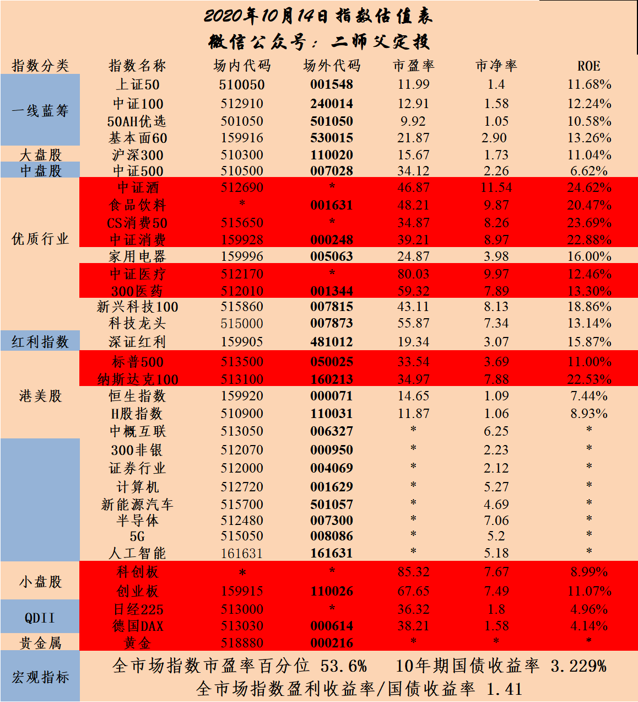

======================================================

_type: talk
@二师父[28814221155551]
2020-10-15 10:13:30 Thu  
topic_id: 582255142488484

<e type="hashtag" hid="822588518512" title="#打新#" /> 虽然投资暂停，不过打新继续的，坚持总会有收获，两只新债三只新股都可以打

一个工作人员一直给我推消费新基金，还是封闭的，我给说了现在不适合买，他说自己也买了，还一直推，没办法把自己一只基金收益截图给他，然后让对比我俩收益如果他比我好，我以后就买，结果他说，后面可能用钱就赎回了

整个对话充满逻辑错误，不要试图说服想要卖给产品给你的人，在他们眼里能使他销售业绩增长的都是对的

阅读[2515]  评论[0]  赞[0] 

+++++++++++++++++++++++++++++++++++++++++++++++++++++

图片：
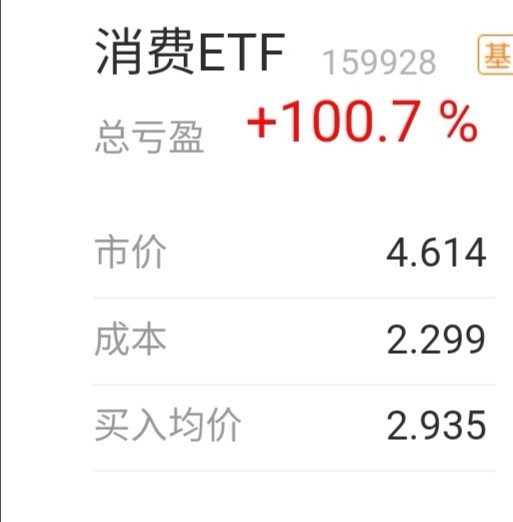

======================================================

_type: q&a
@范毅君[118551121224142]
2020-10-15 10:14:12 Thu  
topic_id: 182244512525512

@范毅君

>  二师父，请问前面是否有全面介绍全市场估值指标的文章呀，在哪里找，如果没有，方便的时候能不能发个小文介绍一下，谢谢🙏

@二师父

>  我以前文章讲过，您可以直接星球搜索估值，书里面也有介绍

阅读[2604]  评论[1]  赞[0] 

======================================================

_type: q&a
@范毅君[118551121224142]
2020-10-15 10:16:01 Thu  
topic_id: 414455824412158

@范毅君

>  二师父，现在基金四成多仓位，主要是场外沪深300中证500，还有场内零星科技人工智能5G等板块，股票大概1.5成仓位，总持仓六成，请问现阶段操作策略是什么，基金有没有必要减仓，剩余仓位有没有必要阶段买入部分债券。

@二师父

>  持有就是最好的策略，减仓与否看自己能否经受回撤，如果可以的，好赛道的基金可以一直拿着
>  
>  注意比较差的煤炭，环保，这些基金可以趁着反弹优先减仓

阅读[2676]  评论[1]  赞[0] 

======================================================

_type: talk
@mommybug[244115184545221]
2020-10-15 12:14:47 Thu  
topic_id: 582255141448124

老师，华宝油气以后还有翻身的机会吗？虽然卡在这个基金的资金可以很久都不用，但是还是想知道这个基金还有继续留着的必要吗？

@二师父 at 2020-10-15 12:14:47 Thu

> 没啥机会了，有反弹的机会可以走了

----------

阅读[2528]  评论[1]  赞[0] 

======================================================

_type: talk
@幽兰[815554522442422]
2020-10-15 12:18:46 Thu  
topic_id: 582255141481154

二师父今天打算发车么？

@Vivian at 2020-10-15 12:18:46 Thu

> 同问，今天买啥

----------

@波多黎各 at 2020-10-15 12:18:46 Thu

> 同问

----------

阅读[2616]  评论[2]  赞[0] 

======================================================

_type: q&a
@水冰月槑槑🌙[51142428222184]
2020-10-15 14:15:28 Thu  
topic_id: 815522848828242

@水冰月槑槑🌙

>  二师父你说的沪深300是哪一只基金

@二师父

>  沪深300，目前市场很多基金公司都有，你可以选择自己信赖的基金公司，目前易方达沪深300和天弘沪深300都是不错的选择

阅读[2700]  评论[0]  赞[0] 

======================================================

_type: q&a
@圣诞结®[28448281541121]
2020-10-15 14:50:53 Thu  
topic_id: 815522842818412

@圣诞结®

>  师父，我的易方达蓝筹005827持有一年了，盈利50%了，中间陆续收割过利润，是现在卖出还是再持有一段时间好？

@二师父

>  持有好，这只基金持仓股挺好的，如果重仓不变，可以中期持有，低位再定投

阅读[2726]  评论[1]  赞[0] 

======================================================

_type: q&a
@天马行空[548818851412444]
2020-10-15 14:56:52 Thu  
topic_id: 815522842214582

@天马行空

>  二师傅，恩华药业17.28追进去了。这只股票老师怎么看。我追高了吗，被套了，咋办。谢谢

@二师父

>  这不叫被套，正常波动，继续拿着，如果亏8个点止损，医药麻醉制药和西药企业同类型的恒瑞较好。买股票不懂的话8个点止损不会出大问题

阅读[2822]  评论[1]  赞[0] 

======================================================

_type: talk
@幽兰[815554522442422]
2020-10-15 15:11:41 Thu  
topic_id: 582255548542154

师父今天怎么没发车哈？

@雨淡风清 at 2020-10-15 15:11:41 Thu

> 涨的有点高，观望下

----------

@幽兰 at 2020-10-15 15:11:41 Thu

> 广发中债也不见投了

----------

阅读[2834]  评论[2]  赞[0] 

======================================================

_type: talk
@二师父[28814221155551]
2020-10-15 22:05:24 Thu  
topic_id: 182244485115252

<e type="hashtag" hid="51285254245554" title="#还有哪些可以投#" /> 目前机会不是很好，大家自己配置，三类品种可以。定投先暂停一段时间，没有发现特别好的机会。后面会以卖出为主。

@Vivian at 2020-10-15 22:05:24 Thu

> 老师，您为何把国开债定投也停了呢

----------

@二师父 at 2020-10-15 22:05:24 Thu

> 利率上行趋势，可以等更好的机会

----------

@百变 at 2020-10-15 22:05:24 Thu

> 老师：为什么成本比买入均价低？

----------

@二师父 at 2020-10-15 22:05:24 Thu

> 这是软件的计算问题

----------

阅读[3523]  评论[4]  赞[0] 

+++++++++++++++++++++++++++++++++++++++++++++++++++++

文件：
2020-10-15 22:04:28 Thu
文件大小：[59403]
51411844121284-暂停定投是不是都不能投了.docx

======================================================

_type: talk
@二师父[28814221155551]
2020-10-15 22:35:23 Thu  
topic_id: 815522218115222

<e type="hashtag" hid="28518125115541" title="#指数估值数据#" /> 市盈率百分位51.81%，市净率百分位34.75%，SY-BY百分位59.14%，SY/BY百分位57.94%。

定投停止主要是现在市场高位震荡，机会不是很好，网格做做，其他的等好机会再入手吧，坚持定投的，现在仓位估计不低了，拿着就好。

@六尘不改 at 2020-10-15 22:35:23 Thu

> 怎么跌了市盈率还高了

----------

@二师父 at 2020-10-15 22:35:23 Thu

> 市盈率没高啊

----------

阅读[3525]  评论[2]  赞[0] 

======================================================

_type: talk
@二师父[28814221155551]
2020-10-16 10:51:55 Fri  
topic_id: 582255425854244

<e type="hashtag" hid="48415452821858" title="#当前的最佳操作策略#" /> 当前最佳是持有+调仓，调仓主要以调弱为主，目前相对好赛道都比较贵。

调出主要是银行、基建、恒生、环保、煤炭这几个板块。可以逢上涨减仓。其他的继续持有。第二调出是医疗、白酒、科技。整体方向这样。

银行不要投资指数，招行和平银是相对更好的选择。至于后续能不能突破3500，肯定是可以的，只是需要时间，毕竟今年疫情的冲击很大，对大部分企业都产生了影响，尤其是基建、银行、煤炭。

继续保持既有仓位，目前鳄鱼计划整体持仓相对弱的板块有小部分银行和恒生，等上涨继续调出，消费、白酒、电器、互联网、非银、科技、人工智能仍旧可以持有。除非是趋势交易，否则不要再牛顶到来之前空仓。

空仓的标准给一个具体的，SY-BY百分位接近100%，股权仓位基本可以接近零，全进全出适合小额资金，大额资金长期持有有利于心态稳定。

@衣袂飘香 at 2020-10-16 10:51:55 Fri

> 非常及时，我刚才还在盯着银行，看是否要减仓。目前银行盈利6个点。但是恒生亏了9个点。恒生国企亏了8个点。

----------

@幽兰 at 2020-10-16 10:51:55 Fri

> 恒生这两个，表现好差，还一直亏着，难得等到调仓机会

----------

@J at 2020-10-16 10:51:55 Fri

> 我的恒生指数也是一直亏损中，目前还亏8.8%，就是它反弹了好几次但都没涨到买入价。师父，请问是继续持有吗？

----------

@二师父 at 2020-10-16 10:51:55 Fri

> 7月份反弹也没到？目前可以继续持有的

----------

@J at 2020-10-16 10:51:55 Fri

> 没呢，反弹最高的时候也亏个4%[捂脸][捂脸]

----------

@J at 2020-10-16 10:51:55 Fri

> 没想到香港现在辣么差[衰]

----------

@二师父 at 2020-10-16 10:51:55 Fri

> 海南自贸区以后，信号就很明显了

----------

@J at 2020-10-16 10:51:55 Fri

> 哎，早知道不加仓了，之前还加了几次。那现在只能像师傅说的继续持有了[睡]

----------

阅读[3610]  评论[8]  赞[0] 

======================================================

_type: talk
@Chu[88888125211582]
2020-10-16 11:20:21 Fri  
topic_id: 414455242422448

想当年为了打新买了三只股，平安银行买的最少，结果最好的竟然是平安银行

@一心一意 at 2020-10-16 11:20:21 Fri

> 那你打新中了没

----------

@Chu at 2020-10-16 11:20:21 Fri

> 中了一只三峰环境，开板就卖了。

----------

@二师父 at 2020-10-16 11:20:21 Fri

> 我的五粮液最好，万科最差，房地产一直被按在地上，

----------

阅读[2913]  评论[3]  赞[0] 

+++++++++++++++++++++++++++++++++++++++++++++++++++++

图片：
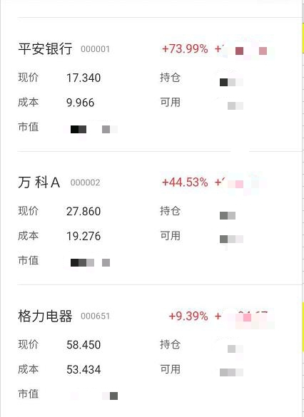

======================================================

_type: q&a
@天马行空[548818851412444]
2020-10-16 12:26:31 Fri  
topic_id: 182244121451422

@天马行空

>  师傅，我有些疑问。虽然目前估值都较高，但是如果大盘以后突破3500甚至4千或者5千，那么回头看现在的估值又相对低位了，现在停止了定投，是否会错失筹码。谢谢师傅的答疑解惑。

@二师父

>  不会，第一每次底部区域都大力加仓，目前仓位不轻就不会错过，第二，现在利率上行，估值中等偏高，定投也不能全仓加，还不如耐心等待，第三，高估的一些板块上涨空间有限，就算牛市继续高涨，未来上涨空间低于下跌空间，第四，上证已经失真，他不能反映a股全貌，你去看个股和创业板综合指数，万得a已经阶段新高，如果目前投就是赌未来涨，小资金可以玩，大额就没必要了

阅读[3066]  评论[5]  赞[0] 

======================================================

_type: q&a
@样[844124458224442]
2020-10-16 15:05:39 Fri  
topic_id: 414455241445258

@样

>  二师父，请问芯片etf（512760），这个位置可以买吗？

@二师父

>  不大适合，目前没发现特别好的机会

阅读[2919]  评论[0]  赞[0] 

======================================================

_type: talk
@二师父[28814221155551]
2020-10-16 17:29:19 Fri  
topic_id: 215522485851281

<e type="hashtag" hid="48415452588188" title="#机会并不多#" /> 每次机会来了能抓住的人不多，提前做好准备，等待下一次机会。

@天马行空 at 2020-10-16 17:29:19 Fri

> 下次机会在哪里 师傅是否能指点迷津

----------

@二师父 at 2020-10-16 17:29:19 Fri

> 行业危机或者企业暂时困境，大机会就是全面杀跌

----------

@天马行空 at 2020-10-16 17:29:19 Fri

> 拭目以待

----------

阅读[3655]  评论[3]  赞[0] 

+++++++++++++++++++++++++++++++++++++++++++++++++++++

文件：
2020-10-16 17:27:55 Fri
文件大小：[19079]
88488118812522-机会只有一次.docx

======================================================

_type: q&a
@吴涛[48244118421828]
2020-10-16 22:36:38 Fri  
topic_id: 815522484851222

@吴涛

>  二师父，
>  第一次中签，还是第一次中转债，打新3次就中了，蛮幸运的。
>  请问下每张是100元吗？还是1000元。
>  上市后是马上卖，还是过段时间再卖。

@二师父

>  1000元，上市盈利了就可以卖出的

阅读[2985]  评论[2]  赞[0] 

======================================================

_type: q&a
@是喵喵吖～[421441114141158]
2020-10-16 22:40:09 Fri  
topic_id: 215522482514541

@是喵喵吖～

>  师傅，我也是之前听您说招行和平安比较靠谱，跌的时候买了一些，平安银行让我卖的还有2手😂，我想问问这种后续怎么操作比较好呢？因为成本比较低了是不是相对比较安全，可以遇到大跌的机会加仓。我原本这个账户是想做波段的，但是也是买了总没舍不得卖。谢谢师傅！

@二师父

>  可以做波段，银行呢有点周期性，不适合长期持有，可以拿平银和招行波段，目前继续涨的话慢慢出，跌到一定安全边际慢慢加。
>  
>  这两只银行股算是最稳妥的股票了，而且也是银行里面的茅台，虽然涨幅不大，但是跑赢通胀没问题，配置一点打新，然后适当波段，不需要常持，a股目前我判断值得长持的就是消费股，医疗股，互联网股和教育股，值得终身持有的没有

阅读[3091]  评论[1]  赞[0] 

======================================================

_type: talk
@树叶[544811512145144]
2020-10-17 20:37:07 Sat  
topic_id: 215522445445251

<e type="hashtag" hid="142825811122" title="#定投周报#" /> 二师父定投周报第76期

阅读[2911]  评论[0]  赞[0] 

+++++++++++++++++++++++++++++++++++++++++++++++++++++

文件：
2020-10-17 20:37:07 Sat
文件大小：[227466]
15155888814412-1_二师父定投周报10.17（第76期）.docx

======================================================

_type: q&a
@三丰[582281128215414]
2020-10-18 00:31:53 Sun  
topic_id: 182244115855282

@三丰

>  市盈率 市净率 RoE值 各自在哪个数值单位算是高、低

@二师父

>  市盈率是市值和盈利的比值，同一类型指数市盈率越低表示其估值越低，具体参考阈值区间，净资产收益率没有固定界限，15到30之间为佳

阅读[2883]  评论[1]  赞[0] 

======================================================

_type: talk
@二师父[28814221155551]
2020-10-19 19:54:57 Mon  
topic_id: 582255814254244

<e type="hashtag" hid="88512521244152" title="#关于量子科技#" /> 周末开会学习的量子科技以及即将退市的分级基金

阅读[3158]  评论[0]  赞[0] 

+++++++++++++++++++++++++++++++++++++++++++++++++++++

文件：
2020-10-19 19:54:21 Mon
文件大小：[29188]
51415112428144-量子科技值得投资吗.docx

======================================================

_type: q&a
@拥抱太阳的风筝[48812454818528]
2020-10-19 20:04:33 Mon  
topic_id: 182244112185212

@拥抱太阳的风筝

>  二师父，债券基金也有主动基金和被动基金之分，在纯债基金这一类中，晨星中国官网显示，易方达中债新综合债券指数A（161119），晨星三年评级和五年评级都是四星级，在随后的债券熊市中，投资该基金怎么样，现在的主流言论说，投资债券主动基金比债券指数基金好

@二师父

>  可以投资的，债券主动基金比指数好，是有条件的，就是他投资的债券不雷，基金经理不挂羊头卖狗肉，之前诺安有个基金就雷了，反正投资主动基金自己及时查看基金持仓，保证持仓不会发生较大的风格漂移。

阅读[2580]  评论[0]  赞[0] 

======================================================

_type: q&a
@JOY[111881481812422]
2020-10-19 20:05:41 Mon  
topic_id: 182244822148182

@JOY

>  师父，新规不准银行从事证券业务感觉会对银行产生大的影响，恒生是否会大跌，现阶段亏损将近9个点，是否止损比较合适?

@二师父

>  恒生是收到了香港的影响，不用止损，如果觉得方向不好就调仓。

阅读[2633]  评论[1]  赞[0] 

======================================================

_type: q&a
@nana[48222415211188]
2020-10-19 20:06:32 Mon  
topic_id: 215522154154821

@nana

>  提问：师傅，50AH目前盈利12个点，是逐渐卖出换其他指数基金吗？

@二师父

>  可以的，50AH 的话持仓和国企类似，属于价值类基金，防守配置

阅读[2740]  评论[0]  赞[0] 

======================================================

_type: q&a
@涓涓[111815125145522]
2020-10-19 20:07:00 Mon  
topic_id: 815522185288112

@涓涓

>  二师父：我中了一只新股（欣贺股份），请问是上市当天卖岀吗？

@二师父

>  对，可以开板卖出，不要持有，A股上市初期基本会大涨

阅读[2819]  评论[0]  赞[0] 

======================================================

_type: talk
@二师父[28814221155551]
2020-10-19 20:31:02 Mon  
topic_id: 582255814158124

<e type="hashtag" hid="552114551414" title="#估值数据#" /> 市盈率百分位51.28%，市净率百分位32.49%，SY/BY百分位56.57%，SY-BY百分位58.05%。

市场估值又逐步开始下滑，如果债涨股跌，这样的话当SY-BY百分位到达估值中枢以下，可以开启小额定投。不要预测市场，关于预测市场犯错最经典的一次是2018年年初，当年的位置不知道杀跌了多少人，虽然很多股票现在看比2018年年初都创新高了，可关键回撤50%又没有定投，当时很多人没有撑住。

阅读[3451]  评论[0]  赞[0] 

======================================================

_type: q&a
@范毅君[118551121224142]
2020-10-20 11:31:55 Tue  
topic_id: 182241241458882

@范毅君

>  二师父，为啥最近中签的债券都挣不到钱呀，是不是最近得分别对待，打新啊。交建这个昨天前天没咋涨，一放也绿了

@二师父

>  这个和企业和资金有关，目前打新人多，所以容易中签的企业质量偏低，首日有赚就走了，没赚可以当债券持有

阅读[2673]  评论[2]  赞[0] 

======================================================

_type: q&a
@TDG[88855524248842]
2020-10-20 11:32:23 Tue  
topic_id: 582254254158544

@TDG

>  二师父，请问港股合景悠活和世茂服务建议申购吗？

@二师父

>  港股打新可以看看集思录的评级

阅读[2746]  评论[0]  赞[0] 

======================================================

_type: q&a
@Rachel[51558542555524]
2020-10-20 11:34:02 Tue  
topic_id: 182241241551152

@Rachel

>  请问现在买富国兴利增强债券基金好吗？ 005121
>  偏债型基金好还是纯债基金好 ？

@二师父

>  这个都差不多，投资主动性债券基金自己跟踪下持仓，防止挂羊头卖狗肉
>  
>  历史平均收益看，好的偏债混合会比纯债基金收益好一点

阅读[2772]  评论[0]  赞[0] 

======================================================

_type: talk
@ym[815518814882442]
2020-10-20 14:10:59 Tue  
topic_id: 215524548512241

师傅，这里面有啥知识点吗，我刚进来的，还不知道怎么学习

@二师父 at 2020-10-20 14:10:59 Tue

> 刚进群，先把置顶的三篇文章学习一下

----------

阅读[2716]  评论[1]  赞[0] 

======================================================

_type: q&a
@付云[844148188522822]
2020-10-20 14:54:58 Tue  
topic_id: 815524521558512

@付云

>  二师傅，现在想买点新能源汽车ETF515700'可以不？

@二师父

>  分批低吸可以，这是个好方向，基金也不错

阅读[2917]  评论[0]  赞[0] 

======================================================

_type: q&a
@天马行空[548818851412444]
2020-10-20 14:55:57 Tue  
topic_id: 582254242845414

@天马行空

>  二师父，川普如果落选是否会创造又一次投资的好机会。

@二师父

>  这看继任者是否会像川普这样给美联储施压，你是从哪得到消息他要落选了

阅读[2973]  评论[3]  赞[0] 

======================================================

_type: talk
@二师父[28814221155551]
2020-10-20 20:05:47 Tue  
topic_id: 582254244282814

<e type="hashtag" hid="824254521412" title="#市场位置#" /> 当前市场位置，大致看看目前处在哪个位置，然后再行动。我有个观察指标，一般上午星球问题多了的时候，我知道今天肯定涨了，一个阶段投资者后台问题多的话，阶段行情好，基本就准备出一点。然后估值处于安全边际内，而且市场成交惨淡，读者也没啥问题的时候，我就计划着出手了，这种定性分析不用耗费太多精力，屡试不爽啊。

@衣袂飘香 at 2020-10-20 20:05:47 Tue

> 巧妙的偷懒😏

----------

@J at 2020-10-20 20:05:47 Tue

> 定性分析比定量更简单直接[呲牙]

----------

阅读[3086]  评论[2]  赞[0] 

+++++++++++++++++++++++++++++++++++++++++++++++++++++

文件：
2020-10-20 20:03:43 Tue
文件大小：[596300]
28482822288541-当前市场到达什么位置了.docx

======================================================

_type: talk
@二师父[28814221155551]
2020-10-20 20:46:21 Tue  
topic_id: 215524541114551

<e type="hashtag" hid="51281244455444" title="#全市场指数估值#" /> 全市场指数市盈率百分位51.34%，市净率百分位32.49%，SY/BY百分位56.32%，SY-BY百分位58.02%。震荡市场，估值也没有太大变化。

阅读[3492]  评论[0]  赞[0] 

======================================================

_type: talk
@二师父[28814221155551]
2020-10-20 21:25:17 Tue  
topic_id: 815524515548422

<e type="hashtag" hid="48415424448148" title="#凡事要趁早#" /> 说几个数据对比，去年港股银行开户大概是5万门槛，今年涨到了30万，去年一些学校MBA学费大概是15到40，今年平均涨了5万；10年前结婚彩礼大概是5万，目前很多都是20到40万。

一方面是通货膨胀，另外一方面是时机，早起的鸟儿有虫吃，星球进来早的朋友都赚了，晚进来的朋友目前还在等机会，要做事情一定趁早，越早得到的机会越好，即使没有机会，没做成一件事，至少也积累了经验，对以后的成长非常有利。

想做的事情，想投资的基金，要趁早，趁早准备资金，趁早了解基金的价值，合适的买入价位，准备越多，能抓住的机会越多。

@J at 2020-10-20 21:25:17 Tue

> 想问一下师父意见，我家小舅已经是专业类的硕士，还有必要再拿个MBA吗

----------

@二师父 at 2020-10-20 21:25:17 Tue

> 看个人具体情况啊，如果是创业的话可以读个中欧或者长江的，如果企业管理者可以读一个985高校的，这个完全取决于个人

----------

阅读[3007]  评论[2]  赞[0] 

======================================================

_type: talk
@xu[2441485251]
2020-10-20 22:43:27 Tue  
topic_id: 215524515414521

请问二师傅 公牛数字货币是什么啊 有同事推荐投资 不懂想请教一下

阅读[2873]  评论[0]  赞[0] 

======================================================

_type: q&a
@付云[844148188522822]
2020-10-21 11:18:48 Wed  
topic_id: 582254281852424

@付云

>  二师傅，新能源汽车ETF515700多少价位比较合适？

@二师父

>  如果定投重仓的话严格根据估值表的安全边际，轻仓投资没有高估回撤到支撑位可以

阅读[2924]  评论[4]  赞[0] 

======================================================

_type: q&a
@范毅君[118551121224142]
2020-10-21 12:07:33 Wed  
topic_id: 414452844455858

@范毅君

>  二师父，新能源车及相关电池，什么个股值得关注？不知道能不能说😅

@二师父

>  隆基股份，比亚迪，宁德时代

阅读[2973]  评论[1]  赞[0] 

======================================================

_type: talk
@二师父[28814221155551]
2020-10-21 17:01:26 Wed  
topic_id: 215524854484581

<e type="hashtag" hid="15284214244222" title="#把握投资的方向#" />

@庆余年 at 2020-10-21 17:01:26 Wed

> 大实话

----------

@吃肉肉 at 2020-10-21 17:01:26 Wed

> 大实话，可惜[呲牙]没有买在低位。

----------

@HeLLO at 2020-10-21 17:01:26 Wed

> 说的有道理

----------

@范毅君 at 2020-10-21 17:01:26 Wed

> 拼多多我一直定义为乡村产品市场，老年人乐园。但前些天有一个我的学生说拼多多很好，我发现不只拼多多受众越来越年轻化，我爸这样的老年人也会淘宝拼多多比价格，但是拼多多据说一直都是烧钱拉客户，如果逐渐优惠力度下去了，产品质量还上不去，会不会有比较大的风险呢。不会分享财务报表，不会分析个股，以上都是主观判断😂

----------

@衣袂飘香 at 2020-10-21 17:01:26 Wed

> 二师父，您的鳄鱼计划里面，银行也还有部分没出吧？啥时候出呢？在星球里说一声啊。

----------

@二师父 at 2020-10-21 17:01:26 Wed

> 慢慢卖，不着急，如果明天涨了，就出一份，明天不涨，就继续持有。静观明天表现。

----------

阅读[3669]  评论[6]  赞[0] 

+++++++++++++++++++++++++++++++++++++++++++++++++++++

文件：
2020-10-21 17:01:15 Wed
文件大小：[19617]
88482821182582-变天了.docx

======================================================

_type: talk
@二师父[28814221155551]
2020-10-22 00:14:44 Thu  
topic_id: 582254115818484

<e type="hashtag" hid="825188852442" title="#估值表#" /> 目前高估的越来越多，注意严格按照纪律，低估投资，高估干啥，不用多说了哈。如果手里钱多，可以学着长期持股，股权收益率长期看永远高于债券和现金的。

@nana at 2020-10-22 00:14:44 Thu

> 师傅，你好！基本面60高估了，我还持有一些，是一次性卖出好？还是分次收割利润好？请指教。

----------

@二师父 at 2020-10-22 00:14:44 Thu

> 分批卖出

----------

@nana at 2020-10-22 00:14:44 Thu

> 谢谢师傅！

----------

阅读[2786]  评论[3]  赞[0] 

+++++++++++++++++++++++++++++++++++++++++++++++++++++

图片：
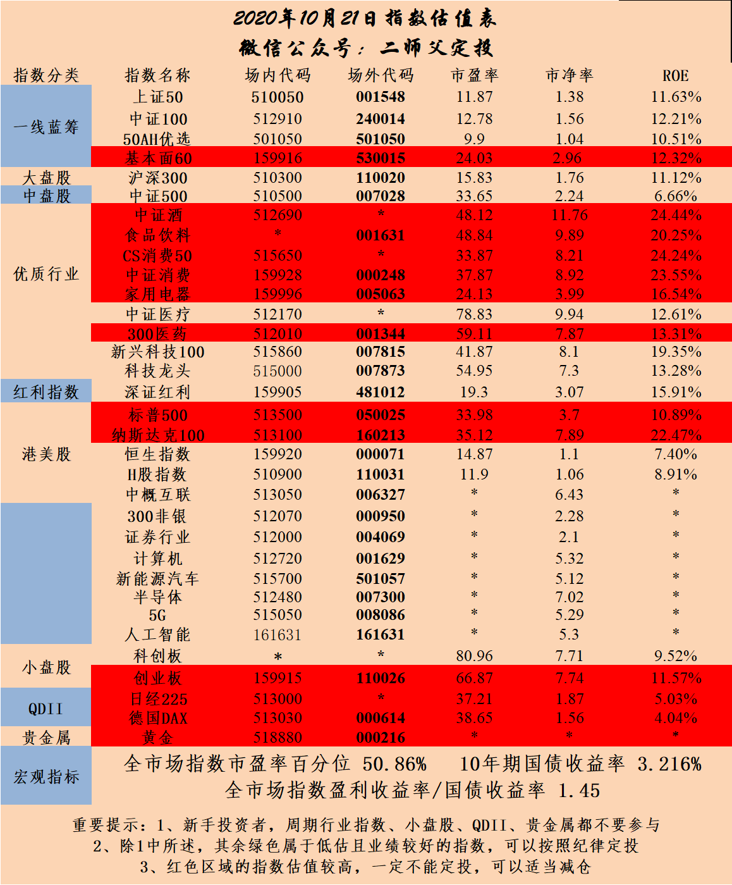

======================================================

_type: talk
@波多黎各[28428858544121]
2020-10-22 06:38:12 Thu  
topic_id: 582254114181254

师父，如果做海外资产配置，有什么好的建议或者学习方法吗？

@二师父 at 2020-10-22 06:38:12 Thu

> 房产还是股票，股票多关注美股

----------

@波多黎各 at 2020-10-22 06:38:12 Thu

> 美股是不是太高估了

----------

@二师父 at 2020-10-22 06:38:12 Thu

> 是的

----------

阅读[2655]  评论[3]  赞[0] 

======================================================

_type: talk
@二师父[28814221155551]
2020-10-22 09:37:20 Thu  
topic_id: 582254118128824

<e type="hashtag" hid="881251425252" title="#鳄鱼计划#" /> 卖出银行etf一份，时隔三月，鳄鱼再次卖出，基本锁仓状态，多持有股权，不管大节小节，都是持股过的。

@幽兰 at 2020-10-22 09:37:20 Thu

> 今天乌龟计划不调整是吧

----------

@二师父 at 2020-10-22 09:37:20 Thu

> 不用的

----------

阅读[2743]  评论[2]  赞[0] 

======================================================

_type: talk
@二师父[28814221155551]
2020-10-22 09:47:05 Thu  
topic_id: 815524881825482

今日两只可转债都可以打，新能车目前已经形成死叉点，估值也不低，暂时别入，未来肯定有更好机会

阅读[2732]  评论[0]  赞[0] 

======================================================

_type: talk
@二师父[28814221155551]
2020-10-22 09:52:42 Thu  
topic_id: 414452881544148

银行报的1.134限价委托，报了就跌，没成交，就挂着，能成则成，到了设定的价格才出。不着急，慢慢卖，招行出成功了，目前震荡波段也不错，不过切记这不是投资的主流，很多人无法平衡，总是走极端，要么经常买卖，要么死了都不卖，都不可取

@佳 at 2020-10-22 09:52:42 Thu

> 招行您出多少价格

----------

@二师父 at 2020-10-22 09:52:42 Thu

> 41.28

----------

@nana at 2020-10-22 09:52:42 Thu

> 师傅，您招行做波段在什么价格买入？什么价格卖出？

----------

@二师父 at 2020-10-22 09:52:42 Thu

> 这个不固定，结合基本面，情绪，估值和支撑位，你可以拿券商指数来做，只看价格就行

----------

@nana at 2020-10-22 09:52:42 Thu

> 谢谢！券商指数网络已经在做了

----------

@杜志彪 at 2020-10-22 09:52:42 Thu

> 昨天减了宁波，留了点打新用（不准备卖了），后边准备看机会加到科技医疗里。

----------

@志亮 at 2020-10-22 09:52:42 Thu

> 长春高新受重创目前加仓坚持，中国人寿涨得不错还继续拿着。

----------

阅读[2803]  评论[7]  赞[0] 

======================================================

_type: q&a
@天马行空[548818851412444]
2020-10-22 10:25:27 Thu  
topic_id: 414452881282518

@天马行空

>  二师父，平安和招银的代码多少，怕买错了谢谢。这两只股票网格具体咋做。

@二师父

>  券商做网格吧，银行网格风险较大，券商网格还是好一点，1.12可以开始建仓

阅读[2787]  评论[1]  赞[0] 

======================================================

_type: talk
@百变[15285855281882]
2020-10-22 14:10:47 Thu  
topic_id: 215524822458281

老师：今天不发车吗

@二师父 at 2020-10-22 14:10:47 Thu

> 没有发，持有就好

----------

阅读[2565]  评论[1]  赞[0] 

======================================================

_type: q&a
@李垚垚[548145221582444]
2020-10-22 14:19:56 Thu  
topic_id: 182241545821282

@李垚垚

>  二师父好:手里有钱想入只股票现在看哪只可以入手，听老师推见！

@二师父

>  不荐股

阅读[2746]  评论[0]  赞[0] 

======================================================

_type: talk
@二师父[28814221155551]
2020-10-22 22:18:23 Thu  
topic_id: 582254145252824

投资分为价值类投资和成长类投资，格雷厄姆属于价值股投资，费雪属于成长股投资。最近国家大力倡导的新能源从投资范畴分类属于成长板块，今天分析下新能源的投资价值。 新能源车是以各种新型无污染能源为动力的新型...点击链接查看剩余内容<e type="web" href="https://articles.zsxq.com/id_6lcuwv5ldwe0.html" title="新能源投资价值分析" cache="" />

@JOY at 2020-10-22 22:18:23 Thu

> 师父，请问您文中提到的是004812吗？

----------

@孟倩 at 2020-10-22 22:18:23 Thu

> 师傅，这支基金里只能通过中欧买吗？华泰里面好像没有

----------

@二师父 at 2020-10-22 22:18:23 Thu

> 场外基，等三季度再看看规模

----------

@孟倩 at 2020-10-22 22:18:23 Thu

> 好嘞

----------

阅读[2618]  评论[4]  赞[0] 

======================================================

_type: talk
@二师父[28814221155551]
2020-10-22 22:28:54 Thu  
topic_id: 414452825425588

<e type="hashtag" hid="28512542452551" title="#每日指数估值#" /> 市盈率百分位50.69%，市净率百分位31.47%，SY-BY百分位56.24%，SY/BY百分位54.06%。

如果市场继续这样震荡向下一周，定投预计可以开始了，波动有波动的做法。不该出手拿着现金也不错的，在市场上盈利的一定是少动多看的朋友。这也是鳄鱼的含义，不出则以，一出必赚。

阅读[2665]  评论[0]  赞[0] 

======================================================

_type: q&a
@孤芳自赏[548114442211184]
2020-10-22 23:42:06 Thu  
topic_id: 582254141145124

@孤芳自赏

>  二师父即将上市的159822这支基金咋样值得买吗？

@二师父

>  暂时看不到持仓

阅读[2775]  评论[0]  赞[0] 

======================================================

_type: talk
@许田野[28282822115481]
2020-10-23 07:26:19 Fri  
topic_id: 414452814422288

打卡第一天～
第190次跑步，坚持成为习惯就是自律。

@Jarvis Liu at 2020-10-23 07:26:19 Fri

> 每天5公里，我没跑那么远，但是我已经坚持6年了[呲牙][呲牙]

----------

@许田野 at 2020-10-23 07:26:19 Fri

> 我才跑了两年多，你比我厉害😄

----------

@HeLLO at 2020-10-23 07:26:19 Fri

> 哇哇，你们都好棒[强][强]

----------

阅读[2723]  评论[3]  赞[0] 

+++++++++++++++++++++++++++++++++++++++++++++++++++++

图片：
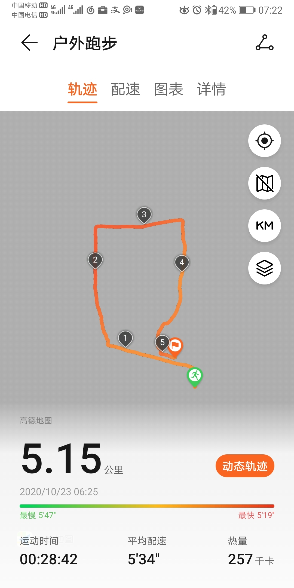

======================================================

_type: talk
@二师父[28814221155551]
2020-10-23 10:22:52 Fri  
topic_id: 182241585552882

<e type="hashtag" hid="881251425252" title="#鳄鱼计划#" /> 银行etf卖出一份，今天成交了，买卖都不着急，银行大概还有6份，慢慢卖出，平安大涨，整体看沪市招行，深市平安，银行指数偏弱。卖出后持有货基或者国债逆回购，等待下一次机会，别频繁进出

最近可转债行情不错，大家应该赚了，喜欢交易的可以做可转债日内，当天不管盈亏不要持有过夜，适合心理素质好的

阅读[2841]  评论[0]  赞[0] 

======================================================

_type: q&a
@是喵喵吖～[421441114141158]
2020-10-23 10:33:18 Fri  
topic_id: 414452818882428

@是喵喵吖～

>  二师父我的平安银行成本是-12了，还有一手😂 这一手我是留着 等以后用来加仓平摊成本风险 还是卖掉 以后可以再买 想听下您的建议 谢谢！ 其实我卖不卖都行，不卖如果跌了我也不会后悔。就是想听听您的思路和想法。

@二师父

>  再涨涨也可以出了，关键你留着没多大意义，也不能够打新的门槛，股票风险千万不要用加仓平摊成本，典型例子是民生，要选对方向，分散，等待好的价格，这和定投不一样，定投选几个好指数无脑扣款就能盈利

阅读[2865]  评论[0]  赞[0] 

======================================================

_type: q&a
@范毅君[118551121224142]
2020-10-23 10:51:27 Fri  
topic_id: 414452841114418

@范毅君

>  二师父，是不是阶段性行情还是不太确定，我看最近主力自己一直流出状态，但量都不算大

@二师父

>  目前资金炒可转债去了，前期涨了很多，也得休息休息，不能直线上啊

阅读[2895]  评论[0]  赞[0] 

======================================================

_type: q&a
@天马行空[548818851412444]
2020-10-23 12:13:07 Fri  
topic_id: 182241584222582

@天马行空

>  二师父，恩华药业已跌破百分之八，17.25入的，仓位不多，不想割肉，长期拿着等反弹可以吗。谢谢。

@二师父

>  最好别这样，死握住一只下行股，运气好可以起来，万一起不来那就是很大的损失，设定的标准一定要严格遵守，尤其是随着资金量的增大。
>  
>  做投资不能想赢又怕输，除了指数投资和保本型产品，没有一定是盈利的，赢得概率大就行，17年的时候我也买过民生，当时是便宜，不过买了之后效果不好，到达8个点就出了，如果拿到现在还是亏的，而我卖出的资金转而投资其他品种早就盈利n倍了。

阅读[2934]  评论[1]  赞[0] 

======================================================

_type: talk
@孟倩[118822124154582]
2020-10-23 12:23:54 Fri  
topic_id: 215524812525281

师父,蚂蚁集团值得入手吗？想听听您的看法

@二师父 at 2020-10-23 12:23:54 Fri

> 炒作比较厉害，我准备正常打看看情况，不会购买，阿里就挺好

----------

@孟倩 at 2020-10-23 12:23:54 Fri

> 那得先要开通美股😄  谢谢回复🍺

----------

阅读[2902]  评论[2]  赞[0] 

======================================================

_type: q&a
@天马行空[548818851412444]
2020-10-23 13:31:42 Fri  
topic_id: 215524812844821

@天马行空

>  再请教二师父，为何止损定位在亏损百分之8，而不是百分之十或者十五。有何意义吗。谢谢。

@二师父

>  基本一只股票买了正常浮动就会波动上涨，如果一只股票买了立刻跌十几个点要么是踩雷了，要么价格不合适，早点离开会避免更多的损失，投资10万，一次15个点止损，你一下子就少了1.5，8到10是比较合适的
>  
>  具体情况具体对待，好质量的可以拿着不做止损，关键看买入价和基本面

阅读[3053]  评论[1]  赞[0] 

======================================================

_type: q&a
@sunny在路上[841885811111842]
2020-10-23 15:32:34 Fri  
topic_id: 182241588142812

@sunny在路上

>  最近这个震荡行情还会持续多久？4季度还有好的行情吗？

@二师父

>  这得看美国大选结果和国际局势，注意防范风险

阅读[3007]  评论[0]  赞[0] 

======================================================

_type: q&a
@雨淡风清[844418818858882]
2020-10-23 16:01:12 Fri  
topic_id: 182241588851112

@雨淡风清

>  今天结束后，我看大A的日线图和A50日线图相差甚远。这代表什么，中小市值不给力吗？

@二师父

>  你是怎么得出结论的？

阅读[3208]  评论[0]  赞[0] 

======================================================

_type: talk
@二师父[28814221155551]
2020-10-23 20:51:25 Fri  
topic_id: 815524258824152

<e type="hashtag" hid="88512542148252" title="#看看如何应对#" /> 股市震荡其实不可怕，波段也能挣钱，大家通过网格就体会到了，招行这个今年给我带来不少利润，上涨和波动都能挣钱，类似15年和18年那样的雪崩，就比较熬人了。

阅读[3289]  评论[0]  赞[0] 

+++++++++++++++++++++++++++++++++++++++++++++++++++++

文件：
2020-10-23 20:49:55 Fri
文件大小：[21148]
88482255588222-消费茅跳水了.docx

======================================================

_type: talk
@二师父[28814221155551]
2020-10-23 21:19:16 Fri  
topic_id: 815524258228452

<e type="hashtag" hid="28512542452551" title="#每日指数估值#" /> 市盈率百分位50.14%，市净率百分位30.91%，SY-BY百分位55.94%。市盈率百分位下降了，而SY-BY风险溢价率并未下降很多，主要是国债收益率逐步上升了，如果继续下跌，下周的定投可以开启了，静观市场变化。

阅读[3685]  评论[0]  赞[0] 

======================================================

_type: q&a
@范毅君[118551121224142]
2020-10-24 09:24:14 Sat  
topic_id: 215548182411141

@范毅君

>  二师父，我持有一支主营生猪和全价饲料的个股，市盈率只有8点多，最近限售股解禁，亏损6个多点，有人分析现在肉价回落，利润下降，我个人认为还是主要因为限售股解禁，股东因盈利较大，套现，请问这种经营没啥大问题的个股是否也应严格遵守规则，十个点必须割肉，还是需要别的什么操作比较合理

@二师父

>  个股不给买卖建议，这是不合规的
>  
>  没有一概而论，关键看企业质量和所能经受的回撤，企业质量好，最终都能起来，利润倒是其次，另外个人能经受的回撤，再好的企业也会波动，回撤超过心里承受能力容易自动清仓
>  
>  所以关键是这两点，而不是操作。企业投资无非两个操作，买和卖

阅读[3248]  评论[5]  赞[0] 

======================================================

_type: talk
@树叶[544811512145144]
2020-10-24 12:37:34 Sat  
topic_id: 815548184445552

<e type="hashtag" hid="142825811122" title="#定投周报#" /> 二师父定投周报第77期

阅读[3243]  评论[0]  赞[0] 

+++++++++++++++++++++++++++++++++++++++++++++++++++++

文件：
2020-10-24 12:37:28 Sat
文件大小：[229451]
51415521244224-二师父定投周报10.24（第77期）.docx

======================================================

_type: q&a
@姣🍎[422212545212488]
2020-10-25 13:57:25 Sun  
topic_id: 215548148485441

@姣🍎

>  师父我想参与a股打新，目前还是推荐买平银和招银做底仓吗？

@二师父

>  不荐股，这两个比较稳，但不是任何时候都适合入

阅读[3134]  评论[0]  赞[0] 

======================================================

_type: talk
@二师父[28814221155551]
2020-10-26 09:38:43 Mon  
topic_id: 414428111415188

今日一只转债，券商网格可以开始了，该出手时就出手

@范毅君 at 2020-10-26 09:38:43 Mon

> 收到，发车。这波节奏没掌握好。继续修炼

----------

@杜志彪 at 2020-10-26 09:38:43 Mon

> 慢慢来半份券商半份消费[微笑]

----------

@杜志彪 at 2020-10-26 09:38:43 Mon

> 缺口补上了

----------

@是喵喵吖～ at 2020-10-26 09:38:43 Mon

> 师傅现在1.132是不是就不适合了 严格按照1.12来

----------

@二师父 at 2020-10-26 09:38:43 Mon

> 也还可以

----------

@样 at 2020-10-26 09:38:43 Mon

> 1.125建了底仓

----------

阅读[3092]  评论[6]  赞[0] 

======================================================

_type: q&a
@是喵喵吖～[421441114141158]
2020-10-26 10:22:20 Mon  
topic_id: 215548111224121

@是喵喵吖～

>  二师父 请问您还有华宝智投的券商网格那个二维码吗我找不到了 ິ ꒦ິ^꒦ິ

@二师父

>  公众号后台回复网格可以看到

阅读[3061]  评论[1]  赞[0] 

======================================================

_type: talk
@幽兰[815554522442422]
2020-10-26 11:45:56 Mon  
topic_id: 215542555885151

二师父，券商这个价适合建底仓吗？

阅读[3047]  评论[0]  赞[0] 

+++++++++++++++++++++++++++++++++++++++++++++++++++++

图片：
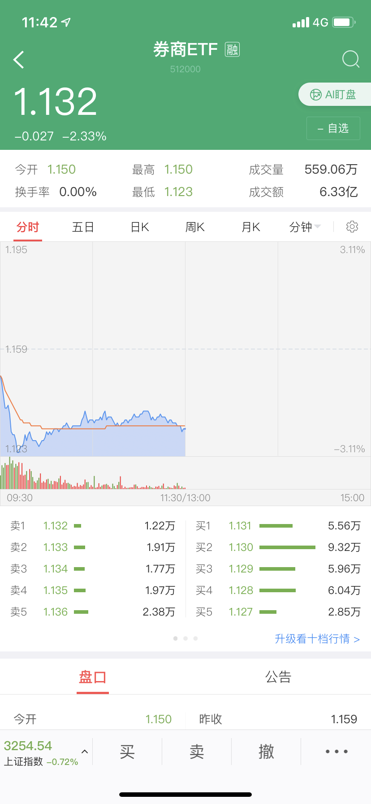

======================================================

_type: q&a
@衣袂飘香[118248548242452]
2020-10-26 13:53:39 Mon  
topic_id: 182214222125422

@衣袂飘香

>  二师父您好！您曾说过，本钢转债跌破95元的时候卖出，现在已经跌破了，要卖出吗？

@二师父

>  可以卖

阅读[3201]  评论[3]  赞[0] 

======================================================

_type: talk
@二师父[28814221155551]
2020-10-26 21:20:52 Mon  
topic_id: 215542588214481

<e type="hashtag" hid="51285248221184" title="#关于新基金#" /> 新基金是否需要购买，有闲钱看好的基金经理可以跟踪下，但是别追着市场热点基金走。

@Jarvis Liu at 2020-10-26 21:20:52 Mon

> 二师父，怎么看大盘缺口被补上了，我一直看不懂，咋个看的？

----------

@二师父 at 2020-10-26 21:20:52 Mon

> 就看下跌补上前期跳空好开的缺口部分

----------

阅读[3602]  评论[2]  赞[0] 

+++++++++++++++++++++++++++++++++++++++++++++++++++++

文件：
2020-10-26 21:18:34 Mon
文件大小：[30235]
28482281114411-新基金能购买吗.docx

======================================================

_type: talk
@二师父[28814221155551]
2020-10-26 23:49:59 Mon  
topic_id: 182214254112482

<e type="hashtag" hid="28512542452551" title="#每日指数估值#" /> 市盈率百分位49.8%，市净率百分位30.74%，SY-BY百分位55.91%。

市场下跌了，机会一般，慢慢入手吧，如果仓位够的拿着就好，逆势投资第一课是学会经受回撤并控制回撤。买债并不能带来太多收益，但是市场下跌的时候可以减小账户波动，有利于持仓稳定。快进快出看起来容易，实则容易心态不稳。

继续持有+网格，你会发现波动也可以带来利润，真正需要做的就是管住手，不盲目加仓减仓。

@丸子妈 at 2020-10-26 23:49:59 Mon

> 门票股有没有推荐的？

----------

@二师父 at 2020-10-26 23:49:59 Mon

> 就两大银行

----------

阅读[3452]  评论[2]  赞[0] 

======================================================

_type: talk
@许田野[28282822115481]
2020-10-27 07:19:18 Tue  
topic_id: 182214251455112

打卡2
打卡3
起起伏伏是常态，不断调整状态

阅读[2906]  评论[0]  赞[0] 

+++++++++++++++++++++++++++++++++++++++++++++++++++++

图片：

======================================================

_type: talk
@二师父[28814221155551]
2020-10-27 22:11:01 Tue  
topic_id: 815542542884112

<e type="hashtag" hid="88512541284152" title="#可转债投资如何避坑#" /> 要投可转债就买可转债基金，日内可转债交易太考验心理素质，不适合上班族。

阅读[3382]  评论[0]  赞[0] 

+++++++++++++++++++++++++++++++++++++++++++++++++++++

文件：
2020-10-27 22:10:10 Tue
文件大小：[156899]
28482221284481-可转债行情火爆，如何避坑并投资.docx

======================================================

_type: q&a
@老妖[118514521115522]
2020-10-27 22:31:18 Tue  
topic_id: 582245245182824

@老妖

>  师傅，问一下开通创业板的条件？

@二师父

>  账户资金10万20日，两年投资经验，具体你问问客户经理，这个门槛不高

阅读[2789]  评论[0]  赞[0] 

======================================================

_type: talk
@二师父[28814221155551]
2020-10-28 00:41:52 Wed  
topic_id: 182214218841412

<e type="hashtag" hid="28512542452551" title="#每日指数估值#" /> 市盈率百分位49.96%，市净率百分位30.99%，SY-BY百分位55.41%，SY/BY百分位53.17%。

等待市场选择，如果一直震荡的话持有就好，长期看，投资永远不缺机会，主仓+网格，永远可以立于市场不败之地。

@付云 at 2020-10-28 00:41:52 Wed

> 二师傅，500ETF多少钱做网格合适

----------

@二师父 at 2020-10-28 00:41:52 Wed

> 总资金的1到2成

----------

@付云 at 2020-10-28 00:41:52 Wed

> 我说是价格[微笑]

----------

@付云 at 2020-10-28 00:41:52 Wed

> 建仓底的价格[微笑]

----------

@二师父 at 2020-10-28 00:41:52 Wed

> 6.5到6.7之间，也看市场趋势

----------

阅读[3292]  评论[5]  赞[0] 

======================================================

_type: talk
@许田野[28282822115481]
2020-10-28 07:25:02 Wed  
topic_id: 215542515824511

打卡4
时间过得很快，尽可能每天抽出固定时间进行系统性学习。

阅读[2712]  评论[0]  赞[0] 

+++++++++++++++++++++++++++++++++++++++++++++++++++++

图片：

======================================================

_type: q&a
@范毅君[118551121224142]
2020-10-28 09:40:06 Wed  
topic_id: 815542515154212

@范毅君

>  二师父，这是不是代表指数还会再飞一段，能不能拿历史情况给我们上上课😀入场人数开始增多，操作上需要注意什么吗

@二师父

>  这代表行情好，今年比去年赚钱效应高，新增投资者数量是增加的，你纵向对比下，新增投资者环比下降，说明9月投资者情绪减弱，新增开户数是市场情绪强弱的一个指标

阅读[2893]  评论[3]  赞[0] 

======================================================

_type: q&a
@天马行空[548818851412444]
2020-10-28 14:18:40 Wed  
topic_id: 182214422251822

@天马行空

>  二师父，按照你的指导，100万资金入市，应该有10万至20万做券商网格，对吧。这么大的资金量网格是否可以小些。另外基金有安全边际，股票有吗。各个基金的建底仓标准在哪里查的到。谢谢。

@二师父

>  1到2成可以，资金越多，可以选择越少的比例网格，更多的是长期持有复利增值，网格只是应对波段
>  
>  股票和基金都有安全边际的，资金越大，要保证越大的安全边际，如果刚开始投资不建议底仓，分批定投加仓，积累一定得投资经验后再学着重仓买

阅读[2768]  评论[1]  赞[0] 

======================================================

_type: talk
@二师父[28814221155551]
2020-10-28 16:44:11 Wed  
topic_id: 582245522882524

<e type="hashtag" hid="15284285514242" title="#关于卖出和仓位的分析#" /> 除非股市从06，15这种高位大幅暴跌，否则尽量不要空仓，踏空也是一种风险，有的人可以忍住不追，而大部分人都是忍不住的。

阅读[3435]  评论[0]  赞[0] 

+++++++++++++++++++++++++++++++++++++++++++++++++++++

文件：
2020-10-28 16:42:58 Wed
文件大小：[18523]
28482244521481-强者恒强，再次新高的白酒还能继续拿着吗.docx

======================================================

_type: talk
@二师父[28814221155551]
2020-10-28 17:38:59 Wed  
topic_id: 215542252142281

<e type="hashtag" hid="281151555481" title="#估值分析#" /> 今日市盈率百分位51.1%，市净率百分位31.53%，sy-by百分位56.88%，SY/by百分位54.77%。

就这样震荡，看起来平淡无奇，而投资者的心态发生了巨大变化。

@栀子花开 at 2020-10-28 17:38:59 Wed

> 发生了什么巨大变化？

----------

@二师父 at 2020-10-28 17:38:59 Wed

> 主要是由亢奋变为怀疑

----------

阅读[2675]  评论[2]  赞[0] 

======================================================

_type: talk
@二师父[28814221155551]
2020-10-28 17:58:51 Wed  
topic_id: 815542254555412

<e type="hashtag" hid="481211145528" title="#指数估值#" /> 本周指数估值来啦，大家对照表格优化下持仓，目前最保守仓位不要低于3成，最激进仓位不要高于8成。然后根据市场适当配置。切记要和市场反过来，而不要跟随市场。一旦跟随市场就容易被市场牵着追涨杀跌。

@shininggre* at 2020-10-28 17:58:51 Wed

> 要和市场反着来，好难🤯

----------

@雪莲 at 2020-10-28 17:58:51 Wed

> 二师父我的仓位大约九层，除了恒生指数和恒生国企负了几个点之外，其它都有盈利，如果我要减仓的话，应该怎么操作？

----------

@二师父 at 2020-10-28 17:58:51 Wed

> 具体有哪些，如果有反弹优先减仓恒生和国企，其他的直接收割利润

----------

@雪莲 at 2020-10-28 17:58:51 Wed

> 我跟投您的场外组合乌龟计划和场鄂鱼计划，我明白了，先收利润，等恒生指数和国企上涨盈利卖出，对吗？谢谢二师父！

----------

@二师父 at 2020-10-28 17:58:51 Wed

> 是的，最好的收割时间是7和9月，目前适合持有，控制下仓位

----------

@雪莲 at 2020-10-28 17:58:51 Wed

> 明白了，谢谢二师父！

----------

@六尘不改 at 2020-10-28 17:58:51 Wed

> 跌了就买，涨了就卖，难吗

----------

@杜志彪 at 2020-10-28 17:58:51 Wed

> 消费医疗科技看看估值表，虽然不高估看看价格居然还是挺贵，看看今天跟着老美下跌多少，应该继续休息。

----------

阅读[3423]  评论[8]  赞[0] 

+++++++++++++++++++++++++++++++++++++++++++++++++++++

图片：
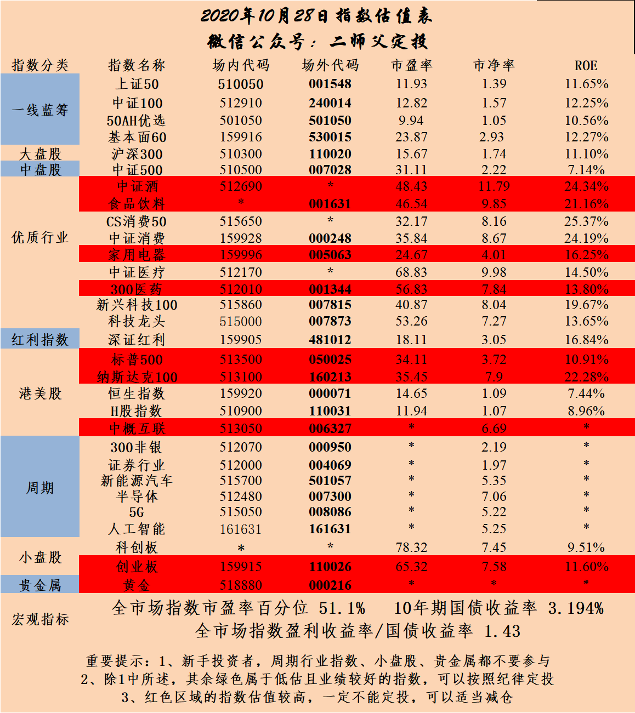

======================================================

_type: talk
@二师父[28814221155551]
2020-10-28 20:52:19 Wed  
topic_id: 215542254118251

胸卡加步卡，运动使我快乐

阅读[2764]  评论[0]  赞[0] 

+++++++++++++++++++++++++++++++++++++++++++++++++++++

图片：

======================================================

_type: talk
@许田野[28282822115481]
2020-10-29 07:22:44 Thu  
topic_id: 182214454142882

打卡5
今天配速循序渐进～

阅读[2582]  评论[0]  赞[0] 

+++++++++++++++++++++++++++++++++++++++++++++++++++++

图片：
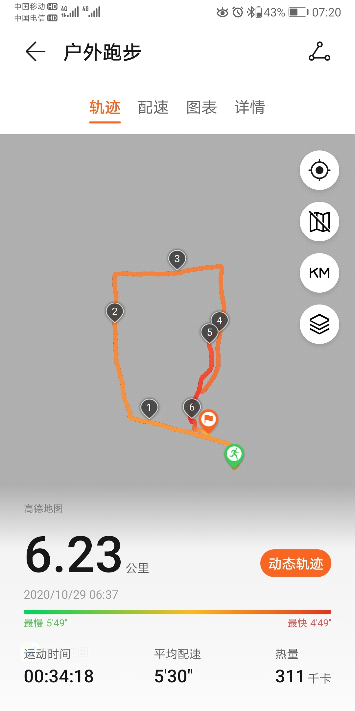
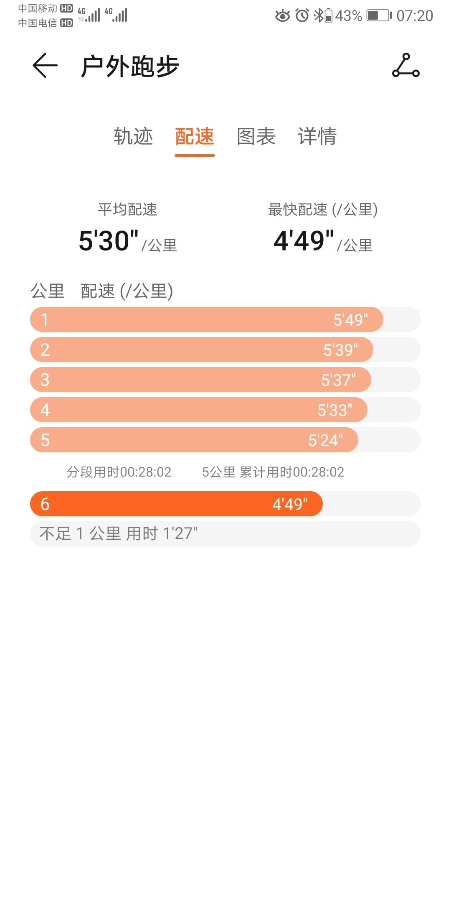

======================================================

_type: q&a
@隔窗遥望[241884481854181]
2020-10-29 08:35:41 Thu  
topic_id: 182214454881182

@隔窗遥望

>  师父，港股打新要什么条件，有开户渠道吗？

@二师父

>  有的，港户在置顶文章有开户链接，打新前先开一个香港银行账户，在大陆办理的话非互联网企业员工，需30万资金定期存3个月。

阅读[2810]  评论[0]  赞[0] 

======================================================

_type: talk
@二师父[28814221155551]
2020-10-29 11:25:17 Thu  
topic_id: 414425558482188

<e type="hashtag" hid="88512518451552" title="#卖出的优先顺序#" /> 卖出是以板块和估值为顺序的，先卖出表现差的板块，再卖出板块极端高估的，一直到达仓位平衡，切记不要拔掉鲜花浇灌野草

什么是平衡状态，就是目前仓位涨跌心态都比较平和，只有这样才能长期持有，在不断得优化调整保证持仓都是优质板块和企业

好企业会波动上升，劣质企业却只有波动或者波动下行。目前继续持有中，家电，白酒，消费，中概，深红利，非银，科技都是不错的板块，其他的恒生，银行优先卖出。

最好别赌方向，四大行业方向分散配置，妥妥的跑赢大盘，继续持有，昨天有个朋友说出了逆向的本质，跌了买，涨了卖，就如此简单

如果再加两个条件就更好了，选择龙头企业，优质行业基金，低估区域跌了买，高估区域涨了卖，谁能做到，谁就是市场大神

关键是道理都懂，而仍旧过不好一生，这是执行力的问题

@志亮 at 2020-10-29 11:25:17 Thu

> 二师父，我很郁闷😒，之前持有老窖时就涨不过五粮液，现在持有五粮液又跑不过老窖，以后还是不动好了。

----------

@云云 at 2020-10-29 11:25:17 Thu

> 师父，今天乌龟计划定投吗？

----------

@二师父 at 2020-10-29 11:25:17 Thu

> 对的，没有一直涨的，记得你疫情期间是抗过去的

----------

@二师父 at 2020-10-29 11:25:17 Thu

> 不投了，sy-by百分位不下50不用了

----------

@云云 at 2020-10-29 11:25:17 Thu

> 好的，谢谢

----------

@cotton at 2020-10-29 11:25:17 Thu

> 恒生在亏，可以卖了吗

----------

@波多黎各 at 2020-10-29 11:25:17 Thu

> 师父，那四大行业？

----------

@二师父 at 2020-10-29 11:25:17 Thu

> 消费，医药，互联网，家电，其他的可以少量配置

----------

阅读[2703]  评论[13]  赞[0] 

======================================================

_type: talk
@百变[15285855281882]
2020-10-29 14:23:52 Thu  
topic_id: 215542222521841

老师：深红利涨比原来的最高点还高了，能不能买出了，过了11月3日后稳定了再买回来

@二师父 at 2020-10-29 14:23:52 Thu

> 买出是啥意思

----------

@百变 at 2020-10-29 14:23:52 Thu

> 局势不稳定，好不容易又涨回来了

----------

@二师父 at 2020-10-29 14:23:52 Thu

> 我还是拿着，你仓位重可以出的，首先保证出劣质板块，深红利属于优势板块，第二考虑出

----------

@百变 at 2020-10-29 14:23:52 Thu

> 哦！👌

----------

阅读[2491]  评论[4]  赞[0] 

======================================================

_type: q&a
@xu[2441485251]
2020-10-29 14:49:49 Thu  
topic_id: 215542228258851

@xu

>  请问二师傅新能源基金（005939）目前盈利18%需要止盈一部分吗

@二师父

>  可以卖出2成仓位

阅读[2664]  评论[0]  赞[0] 

======================================================

_type: q&a
@李震笛[422112248211828]
2020-10-29 15:37:01 Thu  
topic_id: 182214444421842

@李震笛

>  师傅，想问问，刚刚把沪深300出了，可以用上证50替代吗

@二师父

>  这个不太好，用易方达上证50或者上证50纯被动加深红利可以替代
>  
>  沪深300是沪深宽基，上证50是沪市宽基，深市宽基表现会更好

阅读[2689]  评论[0]  赞[0] 

======================================================

_type: talk
@二师父[28814221155551]
2020-10-29 18:53:13 Thu  
topic_id: 414425524881848

<e type="hashtag" hid="48415418142458" title="#需要稳住#" /> 今天剧情大反转，V了一下，给大家发个红包，希望大家也多赚一点。口令如下。

@是喵喵吖～ at 2020-10-29 18:53:13 Thu

> 啊不是好友😂

----------

@黄巧 at 2020-10-29 18:53:13 Thu

> 抢不了呀[流泪]

----------

@雪莲 at 2020-10-29 18:53:13 Thu

> 领不了，没加好友

----------

@庆余年 at 2020-10-29 18:53:13 Thu

> 不是好友领不了

----------

@黄巧 at 2020-10-29 18:53:13 Thu

> 那师傅得先让我们加个好友再发红包(≧∇≦*)

----------

@二师父 at 2020-10-29 18:53:13 Thu

> 又发了一个的

----------

阅读[3498]  评论[6]  赞[0] 

+++++++++++++++++++++++++++++++++++++++++++++++++++++

图片：

+++++++++++++++++++++++++++++++++++++++++++++++++++++

文件：
2020-10-29 18:51:55 Thu
文件大小：[17846]
51415484242224-逆势大涨，稳住.docx

======================================================

_type: talk
@二师父[28814221155551]
2020-10-29 19:00:46 Thu  
topic_id: 215542245828451

<e type="hashtag" hid="48415418142848" title="#口令#" /> 设置错了，用这个

@雪莲 at 2020-10-29 19:00:46 Thu

> 谢谢二师父！

----------

@谢谢 at 2020-10-29 19:00:46 Thu

> 谢谢师父

----------

@样 at 2020-10-29 19:00:46 Thu

> 谢谢😜

----------

@🍀 凝🌸 慧🍀 at 2020-10-29 19:00:46 Thu

> 谢谢师父，收到啦[鼓掌][鼓掌][鼓掌]

----------

@小鱼 at 2020-10-29 19:00:46 Thu

> 来晚了

----------

@衣袂飘香 at 2020-10-29 19:00:46 Thu

> 虽然没领到，但是谢谢。

----------

@是喵喵吖～ at 2020-10-29 19:00:46 Thu

> 虽然没领到哈哈哈但是还是很感恩二师父！！ 比心心 ( ´͈ ᵕ `͈ )◞♡。跟着您真的学习了很多自己不会接触到的知识！

----------

阅读[2691]  评论[7]  赞[0] 

+++++++++++++++++++++++++++++++++++++++++++++++++++++

图片：

======================================================

_type: talk
@二师父[28814221155551]
2020-10-29 21:38:18 Thu  
topic_id: 815542248544242

<e type="hashtag" hid="225824552481" title="#打卡#" /> 今日腿卡加步卡，做了4组，去一次健身房一晚上就没了，改成家里深蹲

阅读[2581]  评论[0]  赞[0] 

+++++++++++++++++++++++++++++++++++++++++++++++++++++

图片：

======================================================

_type: talk
@百变[15285855281882]
2020-10-30 09:04:42 Fri  
topic_id: 582245582252114

老师：国家发改委《新能源汽车产业发展规划》下周公布，我的新能车ETF10%的利润，今天卖还是留。

@二师父 at 2020-10-30 09:04:42 Fri

> 利润可以卖的，这只基金波动大，卖了也能接回来

----------

@百变 at 2020-10-30 09:04:42 Fri

> 好的！谢谢

----------

阅读[2419]  评论[2]  赞[0] 

======================================================

_type: talk
@二师父[28814221155551]
2020-10-30 09:39:07 Fri  
topic_id: 582245582181254

<e type="hashtag" hid="552114551414" title="#估值数据#" /> 当前全市场市盈率百分位51.38%，全市场市净率百分位32.33%，SY-BY百分位57.69%，SY/BY百分位55.86%。

关于数据计算方法已经在文章和书籍中分享过了，昨晚再次复盘数据，当前估值确实高于2018年初，大家看虽然上证综合指数仍旧在3200点徘徊，但是这个指数严重失真，看看万得全A或者同花顺中证全指，已经在这一轮牛市新高了，每一轮定投计划得周期在5年左右，从2016年到如今也将近5年，今年本来是应该有大行情的，然而一切被突如其来的疫情给打乱了。

这就是投资中的意外情况，不过只要严格遵守纪律，当前仍旧盈利可观。不做短期投机，只做长期致胜的投资人，我们看到的不是两天，两个月后，而是更长的周期。只有这样，当下一次历史底部到来的时候才不会恐惧和怀疑。机会都是留给有准备的人，多学习，多准备，机会来了才抓得住。

以天为单位看待收益的人相信的是奇迹和运气，以年为单位看待收益的人相信的是水平和能力；以十年为周期看待财富的人，相信的是常识和复利，以更长周期看待收益的人相信的是时代和命运。

@百变 at 2020-10-30 09:39:07 Fri

> 老师说的太对了！我想问一下您出版的书上有数据来源的查询平台和查询步骤吗？

----------

@二师父 at 2020-10-30 09:39:07 Fri

> 这是我自己算的，市盈率百分位可以去果仁网查

----------

@丁一 at 2020-10-30 09:39:07 Fri

> 逃课了.....请教二师父SY-BY是啥意思？

----------

@二师父 at 2020-10-30 09:39:07 Fri

> 相当于盈利收益率减去10年期国债收益率

----------

@丁一 at 2020-10-30 09:39:07 Fri

> 哦，SY-BY百分位57.69%，SY/BY百分位55.86%。 这两个数值是您自己算的是吧

----------

@二师父 at 2020-10-30 09:39:07 Fri

> 对的

----------

@丁一 at 2020-10-30 09:39:07 Fri

> 了解，谢谢

----------

阅读[3243]  评论[7]  赞[0] 

======================================================

_type: q&a
@隔窗遥望[241884481854181]
2020-10-30 13:30:04 Fri  
topic_id: 182214485848252

@隔窗遥望

>  师父，我在华泰开户佣金都是万3，能不能调

@二师父

>  是在我这开的吗，如果是联系客户经理就行的

阅读[2431]  评论[8]  赞[0] 

======================================================

_type: talk
@二师父[28814221155551]
2020-10-30 13:32:29 Fri  
topic_id: 215542214484251

<e type="hashtag" hid="881251425252" title="#鳄鱼计划#" /> 卖出家用电器一份，深红利一份，慢慢卖出，下跌赚股，上涨赚钱。

@mumomo at 2020-10-30 13:32:29 Fri

> 二师父，深红利高估了吗？为什么要出

----------

@二师父 at 2020-10-30 13:32:29 Fri

> 收割利润，还没有高估，里面部分持仓股票高估了

----------

@九妹Amy'' at 2020-10-30 13:32:29 Fri

> 师傅，鳄鱼计划是在那个软件购买

----------

@二师父 at 2020-10-30 13:32:29 Fri

> 券商软件，置顶有开户

----------

阅读[2486]  评论[4]  赞[0] 

======================================================

_type: talk
@二师父[28814221155551]
2020-10-30 14:09:03 Fri  
topic_id: 414425512155248

a股还是那个a股，没有一丝丝改变，当你在市场越久，对他越了解

@百变 at 2020-10-30 14:09:03 Fri

> [捂脸][捂脸][捂脸]

----------

@样 at 2020-10-30 14:09:03 Fri

> [捂脸][捂脸][捂脸]不争气那怂样，看着来气的

----------

@黄巧 at 2020-10-30 14:09:03 Fri

> 哈哈(ಡωಡ)hiahiahia

----------

@庆余年 at 2020-10-30 14:09:03 Fri

> 十月份多多少少还是涨了一点多的，可以了可以了。

----------

@雨淡风清 at 2020-10-30 14:09:03 Fri

> 一阴吃三阳，大A就这尿性

----------

阅读[2471]  评论[5]  赞[0] 

+++++++++++++++++++++++++++++++++++++++++++++++++++++

图片：
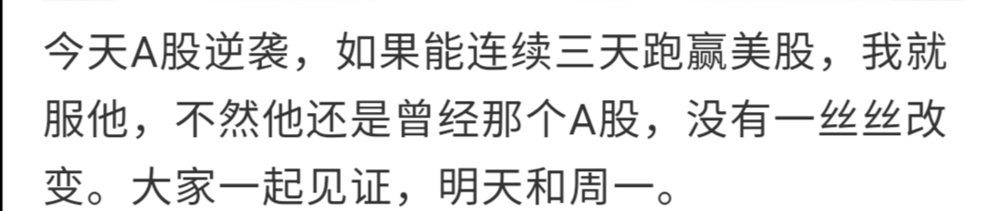

======================================================

_type: q&a
@刘佳柒[815555885511852]
2020-10-30 14:34:01 Fri  
topic_id: 815542214115822

@刘佳柒

>  二师傅，新能源汽车盈利18个点，今天卖不卖

@二师父

>  可以卖的，卖了不追高就行

阅读[2485]  评论[2]  赞[0] 

======================================================

_type: q&a
@天马行空[548818851412444]
2020-10-30 16:17:54 Fri  
topic_id: 414425511222848

@天马行空

>  二师父，尾盘1.1元入手512000共两万元，操作没毛病吧。师傅首肯了心里才踏实。网格设置百分之五，对吧。谢谢。

@二师父

>  主仓位在50左右没问题，按照百分之5下跌加，上涨卖，只要下跌扛得住，上涨不会追，一定赚

阅读[2462]  评论[7]  赞[0] 

======================================================

_type: q&a
@香香[118822418121212]
2020-10-30 17:32:57 Fri  
topic_id: 215542211152551

@香香

>  二师父你好！我跟投的是乌龟计划组合，逢大跌一键买入此组合，是否可行？

@二师父

>  可以的，买入后再根据市场定投调仓，这个组合整体属于稳健长期持有复利增值的

阅读[2505]  评论[0]  赞[0] 

======================================================

_type: q&a
@天马行空[548818851412444]
2020-10-30 20:37:01 Fri  
topic_id: 582245422444854

@天马行空

>  二师傅，翻看前面关于券商的提问，说趋势破了就卖。不太理解趋势破了啥意思。我理解是不是市场突破震荡格局下行，不能再做网格了。麻烦师傅指点。谢谢。

@二师父

>  这是做趋势的方法，网格是严格逆势投资，不存在止损一说。
>  
>  一般高位下跌，比如7月份这种位置就不适合网格，而低位下跌是可以的，最终可以网到最低点，耐心等待行情起来，券商也会反转。
>  
>  目前这个位置可以做的，需要注意两点：一是仓位，而是加仓的频率，只要严格按照纪律做，不在行情起来之前清仓是没问题的。

阅读[2485]  评论[1]  赞[0] 

======================================================

_type: talk
@二师父[28814221155551]
2020-10-30 20:40:29 Fri  
topic_id: 414425248484548

<e type="hashtag" hid="28512512824551" title="#后续的市场#" /> 目前市场继续观望，今晚看看估值数据，如果市场流动性宽裕，而且股市继续下挫，下周可以重启乌龟计划了。空仓的朋友如果减仓可以一键购买乌龟计划组合，后续再跟着调仓搭配，一定要在学习了一定理论知识以后，自己亲身到市场投资，学习总结，只有这样才能慢慢提高。

@Vivian at 2020-10-30 20:40:29 Fri

> 谢谢二师父打气，长期坚定看好中国股市

----------

阅读[2724]  评论[1]  赞[0] 

+++++++++++++++++++++++++++++++++++++++++++++++++++++

文件：
2020-10-30 20:38:18 Fri
文件大小：[106785]
28482151488151-A股果然跌了，不过这次不是他的锅.docx

======================================================

_type: talk
@二师父[28814221155551]
2020-10-30 22:11:54 Fri  
topic_id: 815542454512552

<e type="hashtag" hid="225824552481" title="#打卡#" /> 尝试了下户外的，体验不错，就是有点冻。

@Yingshengw* at 2020-10-30 22:11:54 Fri

> 我们还在穿短袖

----------

@二师父 at 2020-10-30 22:11:54 Fri

> 深圳气候好，我们快穿棉袄了

----------

阅读[2526]  评论[2]  赞[0] 

+++++++++++++++++++++++++++++++++++++++++++++++++++++

图片：
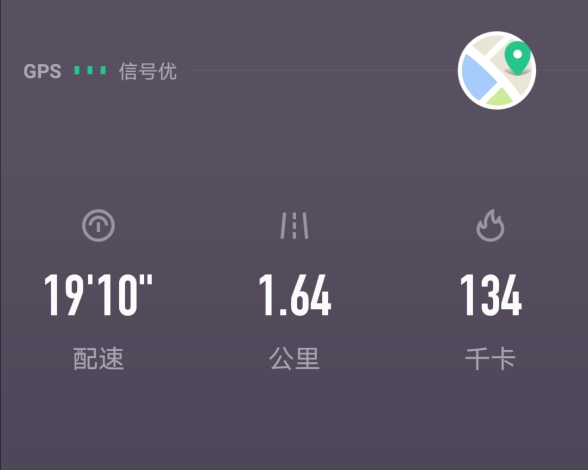

======================================================

_type: talk
@家飞猫[51558124841414]
2020-10-30 22:14:38 Fri  
topic_id: 182214121281182

动感单车30分钟

阅读[2524]  评论[0]  赞[0] 

+++++++++++++++++++++++++++++++++++++++++++++++++++++

图片：

======================================================

_type: talk
@二师父[28814221155551]
2020-10-30 22:35:58 Fri  
topic_id: 582245424185814

<e type="hashtag" hid="552114551414" title="#估值数据#" /> 今日收盘，全市场指数市盈率百分位50.41%，市净率百分位30.99%，SY/BY百分位54.62%，SY-BY百分位56.55%。

每天这个数字都是有变化的，最近是一直在波动，所以变化不明想。对于这些数据的计算原理之前已经经过，可能对金融敏感度高一些的朋友都理解了。

如果不理解的话就记住数学公式：当SY-BY百分位10%以下，可以抄底了。当SY-BY百分位10%——20%之间，大力定投，当SY-BY百分位在20%——50%之间正常定投或者收割利润，当SY-BY百分位在50%——80%的时候，收割利润或者逐步减仓，当SY-BY百分位在80%到90%，大力卖出，当SY-BY百分位在90%——100%之间，可以逃顶空仓了。

总之，如果做长线严格这样来，再结合二师父估值表几大优质板块来加仓，一定可以实现复利增值的。如果能理解就理解，不能理解就像记英语单词一样给背住，死记硬背下来，到市场实践，这是最根本的，不要违背了。投资也是有方法的，二师父这个方法就是经过市场检验的，完全可复制的方法，其他的方法我都用过，不像这个方法一样稳稳盈利。

@小鱼 at 2020-10-30 22:35:58 Fri

> 收到

----------

@海马 at 2020-10-30 22:35:58 Fri

> 师父的看家本领[呲牙]

----------

@海马 at 2020-10-30 22:35:58 Fri

> 师父投资主动型基金也可以通过这个方法来控制仓位吗？[呲牙]

----------

@二师父 at 2020-10-30 22:35:58 Fri

> 可以用这个控制总仓位

----------

@海马 at 2020-10-30 22:35:58 Fri

> 谢谢，每天都在学习师父的投资理论，每天坚持阅读，每天都坚持写投资笔记

----------

@勇气永存 at 2020-10-30 22:35:58 Fri

> 金玉良言，收藏

----------

阅读[2658]  评论[6]  赞[0] 

======================================================

_type: talk
@许田野[28282822115481]
2020-10-31 07:42:38 Sat  
topic_id: 215542451244541

晨跑打卡
许多事情我们都有选择，头脑发热的时候冷静一下。

阅读[2525]  评论[0]  赞[0] 

+++++++++++++++++++++++++++++++++++++++++++++++++++++

图片：
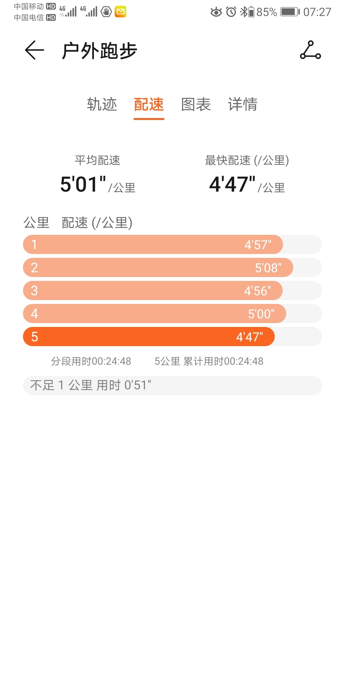
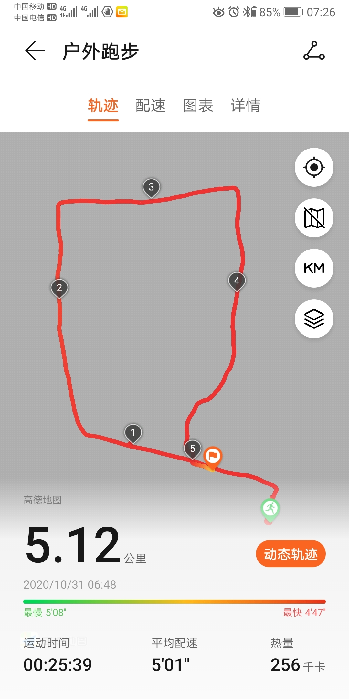

======================================================

_type: talk
@树叶[544811512145144]
2020-10-31 09:30:48 Sat  
topic_id: 582245428882184

<e type="hashtag" hid="142825811122" title="#定投周报#" /> 二师父定投周报第78期

阅读[2742]  评论[0]  赞[0] 

+++++++++++++++++++++++++++++++++++++++++++++++++++++

文件：
2020-10-31 09:30:35 Sat
文件大小：[229058]
48285184411858-二师父定投周报10.31（第78期）.docx

======================================================

_type: q&a
@shininggre*[15551242111522]
2020-10-31 20:33:00 Sat  
topic_id: 182214151451442

@shininggre*

>  二师父，您好。手头有一笔钱，半年内买房可能用到，请问您有没有银行活期理财推荐呢？或者有没有其他的理财方式呢？谢谢。

@二师父

>  理财产品并不保险，货币基金或者国债逆回购即可，目前国债逆回购收益率不错，买房的资金求稳，保证本金流动性即可

阅读[2705]  评论[0]  赞[0] 

======================================================

_type: q&a
@六尘不改[241555484551821]
2020-10-31 22:16:01 Sat  
topic_id: 182214158421882

@六尘不改

>  这是要起飞啊？

@二师父

>  建立常态化退市机制，垃圾企业的末日到了，不会出现2015年那样的情况

阅读[2929]  评论[0]  赞[0] 

======================================================

