_type: talk
@庆余年[15584481824122]
2021-05-01 21:14:40 Sat  
topic_id: 215124854281121

五月份基金排行

阅读[1]  评论[0]  赞[0] 

+++++++++++++++++++++++++++++++++++++++++++++++++++++

文件：
2021-05-01 21:14:38 Sat
文件大小：[241611]
244424488455811-基金排行-2105.docx

======================================================

_type: talk
@二师父[28814221155551]
2021-05-01 21:41:46 Sat  
topic_id: 215124854212581

什么时候进行利润收割

最近大家的军工被套了，有读者问我该怎么办。
 
我觉得找个机会走人比较好，军工整体盈利能力不算好，大涨都是消息面利好，不是业绩推动。
 
属于强周期指数中的一个，不建议参与。
 
细心的读者都会发现，估值表里面二师父对周期指数进行估值，而没有军工的，在行业分析层面已经排除了这个行业。
 
选择行业和基金是第一位，估值是第二位，当一个指数不太好的时候，没必要给他估值。
 
而且周...

@J at 2021-05-01 21:41:46 Sat

> 师傅早上好，你说的重仓基金和轻仓基金为什么卖出方式不一样的呢？

----------

@二师父 at 2021-05-01 21:41:46 Sat

> 长期持有是主流

----------

阅读[1]  评论[2]  赞[0] 

======================================================

_type: talk
@二师父[28814221155551]
2021-05-02 21:05:16 Sun  
topic_id: 582854551445814

投资盈利的医药类基金还继续定投吗

这两年，医药板块受益于疫情，不断高涨。
 
有很多读者投资的医药类基金都盈利了，那么盈利的医药类基金还需要继续定投吗？
 
需要具体基金具体分析。
 
我们投资的医药类基金主要是医疗ETF，追踪的中证医疗指数；沪深300医药基金，追踪的沪深300医药指数；中欧医疗创新股票，一只主动医疗类基金。
 
为什么要分情况讨论呢？
 
因为不同的医药类基金估值不同。
 
4月...

@蛋炒饭不加蛋 at 2021-05-02 21:05:16 Sun

> 二师父，葛兰的呢，也是低估定投吗

----------

@二师父 at 2021-05-02 21:05:16 Sun

> 可以参考均线

----------

@蛋炒饭不加蛋 at 2021-05-02 21:05:16 Sun

> 看中证医疗的60日线吗

----------

@二师父 at 2021-05-02 21:05:16 Sun

> 对

----------

@蛋炒饭不加蛋 at 2021-05-02 21:05:16 Sun

> 谢谢老师，那现在还不是时候

----------

阅读[1]  评论[5]  赞[0] 

======================================================

_type: talk
@二师父[28814221155551]
2021-05-02 21:22:24 Sun  
topic_id: 215124228411841

主动基金均线，看基准指数，非高估可以用均线定投

@勇往直前 at 2021-05-02 21:22:24 Sun

> 请问这是什么软件看

----------

@二师父 at 2021-05-02 21:22:24 Sun

> 万得A

----------

@J at 2021-05-02 21:22:24 Sun

> 师傅、是看60日均线吗

----------

阅读[1]  评论[3]  赞[0] 

+++++++++++++++++++++++++++++++++++++++++++++++++++++

图片：
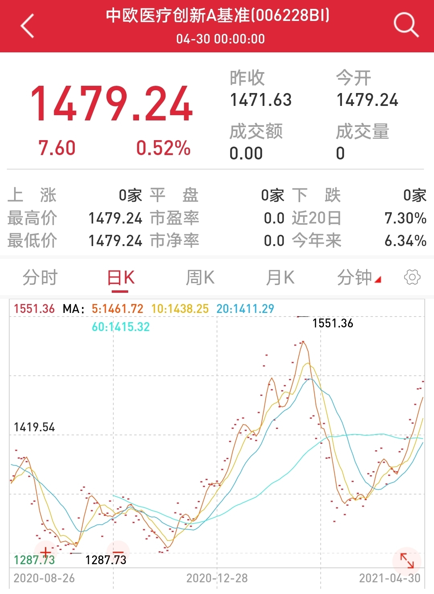

======================================================

_type: talk
@二师父[28814221155551]
2021-05-03 21:20:31 Mon  
topic_id: 182841418811552

<e type="hashtag" hid="51284485848184" title="#价值投资#" /> 看看高寿的两位价值投资者，价值投资不仅稳定盈利，而且容易长寿。

阅读[1]  评论[0]  赞[0] 

+++++++++++++++++++++++++++++++++++++++++++++++++++++

文件：
2021-05-03 21:20:00 Mon
文件大小：[27251]
111141145252882-价值投资，稳定盈利又长寿.docx

======================================================

_type: q&a
@新~~~[548111115214414]
2021-05-04 14:49:38 Tue  
topic_id: 414152244414858

@新~~~

>  二师付你好！我是新来的。找了好久怎不不到你们的组合。请告诉我好吗？

@二师父

>  乌龟计划在置顶链接可以看到，目前是月定投，可以看到买入和卖出记录，鳄鱼计划会不定期发车的

阅读[1]  评论[3]  赞[0] 

======================================================

_type: talk
@二师父[28814221155551]
2021-05-04 22:09:16 Tue  
topic_id: 182841128258442

<e type="hashtag" hid="28514414811441" title="#最有价值的五只基金#" /> 新手版，这五只基金是最有价值的宽基指数，可以跑赢沪深300.

@新~~~ at 2021-05-04 22:09:16 Tue

> 二师父，这几只有分红的吗？

----------

@二师父 at 2021-05-04 22:09:16 Tue

> 在天天基金可以查他们的分红记录

----------

@新~~~ at 2021-05-04 22:09:16 Tue

> 谢谢二师父！

----------

阅读[1]  评论[3]  赞[0] 

+++++++++++++++++++++++++++++++++++++++++++++++++++++

文件：
2021-05-04 22:08:31 Tue
文件大小：[30939]
422252251541118-最有价值的五只指数基金（新手版）.docx

======================================================

_type: talk
@二师父[28814221155551]
2021-05-05 17:49:20 Wed  
topic_id: 582854451518824

<e type="hashtag" hid="28514414425841" title="#最佳家庭理财组合#" /> 家庭理财组合，选择适合自己需求的组合。

阅读[1]  评论[0]  赞[0] 

+++++++++++++++++++++++++++++++++++++++++++++++++++++

文件：
2021-05-05 17:48:55 Wed
文件大小：[32252]
244424445418521-最佳家庭理财组合.docx

======================================================

_type: q&a
@新~~~[548111115214414]
2021-05-06 14:40:15 Thu  
topic_id: 182841114454452

@新~~~

>  二师父，请问我做场内要怎样看代码呢？

@二师父

>  估值表里面有标注场内代码

阅读[1]  评论[1]  赞[0] 

======================================================

_type: q&a
@🎈铮[28284825441841]
2021-05-06 14:43:30 Thu  
topic_id: 182841185522252

@🎈铮

>  二师父，我港股里有一点钱，不知道买啥，现在华夏恒生科技还能买吗？

@二师父

>  这个波动大，可以按照均线策略定投，然后盈利后逐步减仓

阅读[1]  评论[4]  赞[0] 

======================================================

_type: talk
@二师父[28814221155551]
2021-05-06 23:08:54 Thu  
topic_id: 815121554512282

<e type="hashtag" hid="48412211845128" title="#真的五穷了#" /> 如何应对才是王道

@范毅君 at 2021-05-06 23:08:54 Thu

> 鳄鱼计划没动作吧，没看见[呲牙]

----------

@二师父 at 2021-05-06 23:08:54 Thu

> 暂时没有

----------

@范毅君 at 2021-05-06 23:08:54 Thu

> 好[呲牙]

----------

阅读[1]  评论[3]  赞[0] 

+++++++++++++++++++++++++++++++++++++++++++++++++++++

文件：
2021-05-06 23:08:29 Thu
文件大小：[27466]
844424411581842-真的五穷了.docx

======================================================

_type: talk
@二师父[28814221155551]
2021-05-06 23:14:55 Thu  
topic_id: 582858224142114

<e type="hashtag" hid="552114551414" title="#估值数据#" /> 市盈率百分位41.95%，SY-BY百分位46.2%，SY/BY百分位44.27%，估值一直下移，定投保持节奏是可以的，左侧交易要严格控制补仓节奏，有底仓的情况下周或者月定投均可。

阅读[1]  评论[0]  赞[0] 

======================================================

_type: talk
@林玮[844111858288412]
2021-05-07 14:28:43 Fri  
topic_id: 815121581228882

师父，之前一直没有机会买中欧医疗健康（003095），现在可以买吗？

@二师父 at 2021-05-07 14:28:43 Fri

> 目前可以轻仓定投

----------

阅读[1]  评论[1]  赞[0] 

======================================================

_type: q&a
@Chu[88888125211582]
2021-05-07 16:00:31 Fri  
topic_id: 215121528244841

@Chu

>  二师父，我想问问现在没有特别的想投资，但增量资金不知道往哪里放，可以买微众银行的活期+或者网商银行的活期+吗？我是看中他们一个是腾讯一个是支付宝，但不知道安全不？我看到收益年化也有3.1左右。

@二师父

>  是安全的，可以少量买，大额最好货币基金

阅读[1]  评论[1]  赞[0] 

======================================================

_type: talk
@二师父[28814221155551]
2021-05-07 20:26:54 Fri  
topic_id: 215121524455551

<e type="hashtag" hid="51284488451844" title="#震荡市场定投节奏#" /> 目前月定投，网格的话确定最大下跌幅度，支撑位买入反弹卖出

阅读[1]  评论[0]  赞[0] 

+++++++++++++++++++++++++++++++++++++++++++++++++++++

文件：
2021-05-07 20:26:25 Fri
文件大小：[30363]
244424154844421-震荡市场聊聊定投的节奏.docx

======================================================

_type: talk
@二师父[28814221155551]
2021-05-07 21:28:00 Fri  
topic_id: 182848212155222

<e type="hashtag" hid="552114551414" title="#估值数据#" /> 市盈率百分位39.69%，SY-BY百分位44.62%，SY/BY百分位42.91%。

市场位置没咋变化，估值越来越低了，轻仓的朋友可以投起来。左侧开始，注意要挺住下跌。另外网格还是和之前一样，每次跌到支撑位开始网，万一被套，继续加网。

@欣 at 2021-05-07 21:28:00 Fri

> 二师父能否推荐一个新能源车的基金？

----------

@二师父 at 2021-05-07 21:28:00 Fri

> 新能车etf

----------

阅读[1]  评论[2]  赞[0] 

======================================================

_type: talk
@二师父[28814221155551]
2021-05-08 17:28:26 Sat  
topic_id: 582858288881584

<e type="hashtag" hid="28514155588811" title="#估值情况#" /> 市场变化莫测，估值是可以量化的，多专注估值和市场支撑位

阅读[1]  评论[0]  赞[0] 

+++++++++++++++++++++++++++++++++++++++++++++++++++++

文件：
2021-05-08 17:27:49 Sat
文件大小：[52718]
544454852211424-当前全市场估值和5月开门绿分析.docx

======================================================

_type: q&a
@清茶半盏[182245485228522]
2021-05-08 20:50:25 Sat  
topic_id: 815121858858512

@清茶半盏

>  二师傅好，农业股前景怎样？有推荐的ETF吗？

@二师父

>  富国中证农业主题etf

阅读[1]  评论[0]  赞[0] 

======================================================

_type: q&a
@Dolly[244124525445551]
2021-05-09 14:36:30 Sun  
topic_id: 182848551445542

@Dolly

>  二师父，早上接到平安的电话，客服说是回馈老客户，有个年金保单，一年交3万，10年交30万，从第五年开始返钱，11年共返27.6万，等身故后返30万给后人，27.6万等于送的（一年交的钱看自己情况定，每年交的钱是相等的）。还开通万能账户，可以把资金存在里面，现在的年利率说是有4.9个点。
>  平安的经营状态怎样，这样的方式等于就是存钱在平安，给他们先用着，您觉得可以买这个吗？

@二师父

>  你的描述不清楚，第五年返还，返还金额高于你交的三万还是低于呢，如果低于，相当于还是在收你的钱，另外27.6并不是送的，而是你的资金的时间价值，算算你的年龄，30万按照30年时间增值，年化百分之8的收益率，你就知道自己是否划算了，如果这个收益率得到的资金高于27.6，那是没有太大价值的

阅读[1]  评论[7]  赞[0] 

======================================================

_type: talk
@二师父[28814221155551]
2021-05-09 18:49:01 Sun  
topic_id: 815121828448542

<e type="hashtag" hid="51284825218284" title="#说说对白酒的分析#" /> 今天在咖啡厅写文章，听邻卓的聊天，一个C9的博士担心自己留不下北京，准备去川大、浙江传媒这种大学，竞争确实很大，未来可能会越来越卷，大家都降低预期吧，把小生活过好，一个小目标一个小目标的实现。

@苍天有井明月空🌙 at 2021-05-09 18:49:01 Sun

> 咋可能

----------

@西锦巴乌 at 2021-05-09 18:49:01 Sun

> 师父好！请问现手头有一笔准备投资基金的钱就目前的行情来看先买货币基金还是买债券（债券已占30%基金）或者……谢谢

----------

@二师父 at 2021-05-09 18:49:01 Sun

> 长期5年不用买债券基金，短期可能用就货币基金

----------

@西锦巴乌 at 2021-05-09 18:49:01 Sun

> 明白，谢了

----------

阅读[1]  评论[4]  赞[0] 

+++++++++++++++++++++++++++++++++++++++++++++++++++++

文件：
2021-05-09 18:44:23 Sun
文件大小：[107771]
111141848122522-昨天我被吓尿了.docx

======================================================

_type: q&a
@🍀 凝🌸 慧🍀[841855248254242]
2021-05-10 15:33:19 Mon  
topic_id: 215121211812281

@🍀 凝🌸 慧🍀

>  师父好！近期，中概股跌幅较大，跌破60日均线，师父是如何考虑，给分析一下好吗？谢谢！

@二师父

>  今天就准备分析的，这基金波动大，本月开始定投，最大下跌幅度可控，仓位控制在百分之15以内

阅读[1]  评论[1]  赞[0] 

======================================================

_type: talk
@二师父[28814221155551]
2021-05-10 17:43:30 Mon  
topic_id: 215121455888181

<e type="hashtag" hid="15281824415282" title="#关于中概的分析#" /> 从价值、仓位和投资方法分析中概互联。

@庆余年 at 2021-05-10 17:43:30 Mon

> 二师父，置顶里面的中概互联网格表有变动麽？

----------

@二师父 at 2021-05-10 17:43:30 Mon

> 支撑位跌破了，加仓可以先等等

----------

@阿宝 at 2021-05-10 17:43:30 Mon

> 老师中概互联的最大下跌幅度数据和市销率百分位数据在哪可以免费查到？

----------

@二师父 at 2021-05-10 17:43:30 Mon

> 市销率在wind可以查，最大下跌幅度是估算的

----------

@阿宝 at 2021-05-10 17:43:30 Mon

> 怎么估算？请教

----------

@二师父 at 2021-05-10 17:43:30 Mon

> 根据历史业绩还有未来预期

----------

阅读[1]  评论[6]  赞[0] 

+++++++++++++++++++++++++++++++++++++++++++++++++++++

文件：
2021-05-10 17:43:04 Mon
文件大小：[36944]
244421514822481-可以开始了吗.docx

======================================================

_type: talk
@二师父[28814221155551]
2021-05-10 17:54:09 Mon  
topic_id: 414151244855158

<e type="hashtag" hid="552114551414" title="#估值数据#" /> 市盈率百分位38.07%，SY-BY百分位43.31%，SY/BY百分位41.49%，估值仍旧是第三楼层，继续月定投，估值楼层降到二层以后开始周定投。

@光少 at 2021-05-10 17:54:09 Mon

> 今天券商ETF买入一份

----------

阅读[1]  评论[1]  赞[0] 

======================================================

_type: talk
@二师父[28814221155551]
2021-05-11 20:59:47 Tue  
topic_id: 815121444582482

<e type="hashtag" hid="15281821251842" title="#看看第七次人口普查数据#" />

阅读[1]  评论[0]  赞[0] 

+++++++++++++++++++++++++++++++++++++++++++++++++++++

文件：
2021-05-11 20:59:34 Tue
文件大小：[28099]
544458111821254-第7次全国人口普查数据来了.docx

======================================================

_type: q&a
@永刚[15581448518112]
2021-05-11 22:31:09 Tue  
topic_id: 414151214245228

@永刚

>  二师父：象300价值，50AH这类指数基金现在估值较低，如果定投，收益怎么样？

@二师父

>  从过往数据看定投收益率略低于沪深300

阅读[1]  评论[0]  赞[0] 

======================================================

_type: talk
@二师父[28814221155551]
2021-05-11 22:36:54 Tue  
topic_id: 582858482455844

<e type="hashtag" hid="552114551414" title="#估值数据#" /> 市盈率百分位38.14%，SY-BY百分位42.88%，SY/BY百分位41.7%。

本月定投这周开始，预计估值楼层2层以下开始周定投，3月份防守，6月份以后大概率转守为攻，做好准备即可，关键要有耐心，不要盲目抄底。

@吃肉肉 at 2021-05-11 22:36:54 Tue

> 坐等师傅吹号

----------

@云云 at 2021-05-11 22:36:54 Tue

> 师父，中概互联可以网格了还是等等，这个我还没仓位的

----------

@二师父 at 2021-05-11 22:36:54 Tue

> 能接受45%左右浮亏是可以开始网格的。本周开启中概互联的定投。

----------

@云云 at 2021-05-11 22:36:54 Tue

> 好的，还是跟着师父走[微笑]

----------

阅读[1]  评论[4]  赞[0] 

======================================================

_type: q&a
@冯林锋[841551141441422]
2021-05-12 09:56:11 Wed  
topic_id: 815121155842882

@冯林锋

>  二师父，怎么看新发行的恒生科技指数，和中概互联重合吗

@二师父

>  二者持仓股重合度挺大，选择一个即可，如果定投中概限购，可以用恒生科技代替

阅读[1]  评论[0]  赞[0] 

======================================================

_type: q&a
@海马[15158245825242]
2021-05-12 15:07:32 Wed  
topic_id: 414151145445118

@海马

>  师父，估值市盈率百分位多少到为估值2层楼？

@二师父

>  大致是百分之30左右，这个也结合巴菲特指数以及宏观流动性

阅读[1]  评论[0]  赞[0] 

======================================================

_type: talk
@二师父[28814221155551]
2021-05-12 20:14:58 Wed  
topic_id: 182848851445582

<e type="hashtag" hid="825188852442" title="#估值表#" /> 今天的估值表，每次更新后都会发到置顶第三篇文章。很多基金进入低估值状态，依然月定投，仓位不够的可以周定投。我们继续等待，估值楼层2以下开始周定投。防守与进攻相结合。

@范毅君 at 2021-05-12 20:14:58 Wed

> 二师傅，现在场内月定投的话，怎么组合比较合理

----------

@二师父 at 2021-05-12 20:14:58 Wed

> 参考乌龟计划仓位

----------

@范毅君 at 2021-05-12 20:14:58 Wed

> 好的[呲牙]

----------

@永刚 at 2021-05-12 20:14:58 Wed

> 中证500和中证医疗可以开始周定投了吗？

----------

@二师父 at 2021-05-12 20:14:58 Wed

> 医疗上个月已经开始了啊

----------

@永刚 at 2021-05-12 20:14:58 Wed

> 您4月12号鳄鱼计划公布以后，到现在还没有再发布持仓情况。

----------

@二师父 at 2021-05-12 20:14:58 Wed

> 卧倒了，没有操作，今天再发一次

----------

@庆余年 at 2021-05-12 20:14:58 Wed

> 这个应该是更新季报后的第一次估值表，能发一下估值区间麽？

----------

阅读[1]  评论[9]  赞[0] 

+++++++++++++++++++++++++++++++++++++++++++++++++++++

图片：
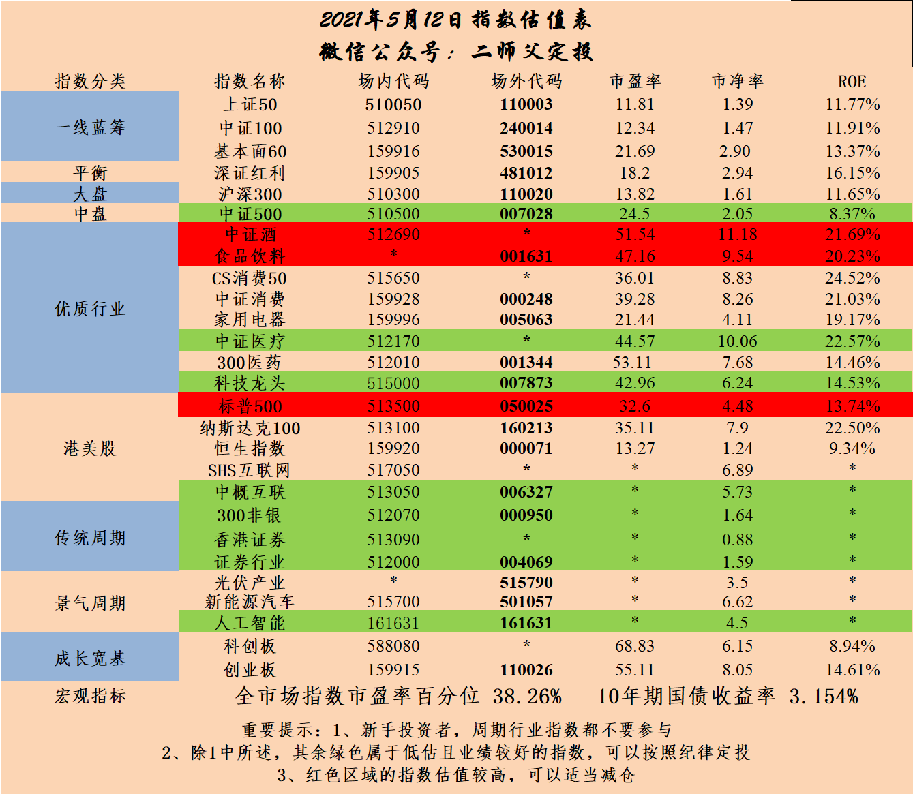

======================================================

_type: talk
@二师父[28814221155551]
2021-05-12 21:19:49 Wed  
topic_id: 215121181554181

<e type="hashtag" hid="28514154212151" title="#实盘277#" /> 每月定投，医疗+中概+易方达上证50.前两个是低估定投，后面50是均线定投。读者大概率会问为什么不投中证500，这只基金偏中盘股，成长好市值大都进入到沪深300里面了，小盘股投创业板指数就好。

@永刚 at 2021-05-12 21:19:49 Wed

> 问题是上证50还没有到低估区呀？

----------

@二师父 at 2021-05-12 21:19:49 Wed

> 均线60日以下，正常估值也可以的

----------

@果实妈咪 at 2021-05-12 21:19:49 Wed

> 二师父，你这个买入金额一份是按多少定投的，谢谢

----------

@二师父 at 2021-05-12 21:19:49 Wed

> 目前一份按1000来的

----------

@果实妈咪 at 2021-05-12 21:19:49 Wed

> 这个定投的份额也是规矩市场随时变动吗？还是根据自己资金量，谢谢！有点迷惑

----------

@二师父 at 2021-05-12 21:19:49 Wed

> 根据资金量先确定一份金额，然后市场越低可以增加份数

----------

@果实妈咪 at 2021-05-12 21:19:49 Wed

> 如果打算一个月定投3000，就是你发的金额乘以3定投即可对不？

----------

@二师父 at 2021-05-12 21:19:49 Wed

> 不是，你把3000按照比例分配就行

----------

阅读[1]  评论[18]  赞[0] 

+++++++++++++++++++++++++++++++++++++++++++++++++++++

图片：
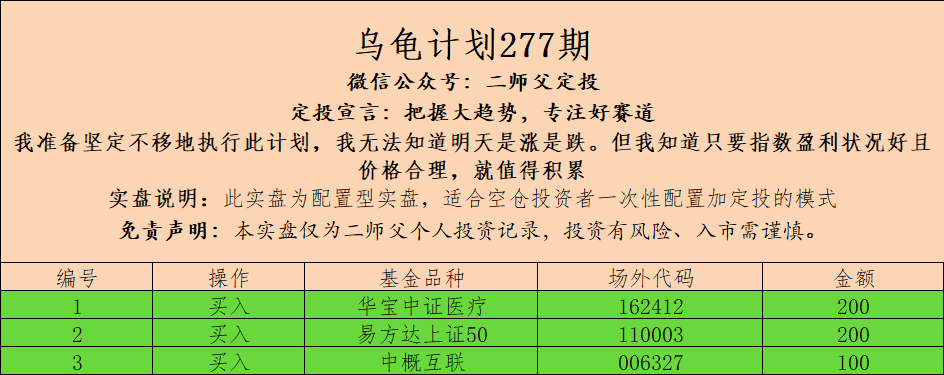

======================================================

_type: talk
@二师父[28814221155551]
2021-05-13 13:51:36 Thu  
topic_id: 815145544254452

<e type="hashtag" hid="881251425252" title="#鳄鱼计划#" /> 买入互联网50一份，代码517050，估值处于中枢以下，开始定投，前期减仓防守，现在逐步转为进攻，慢慢加仓，不预测市场，保证买入未来一定盈利，但是过程可能会长期浮亏或者遭遇爆揍。

持仓稍后发布，没有公布就一直卧倒不动。

@范毅君 at 2021-05-13 13:51:36 Thu

> 二师傅，鳄鱼计划，总资金分了多少份定投呀[调皮]

----------

@二师父 at 2021-05-13 13:51:36 Thu

> 总共250份，目前大约剩余130份可投

----------

@庆余年 at 2021-05-13 13:51:36 Thu

> 我半个小时前自己加了场内的互联网50[憨笑][憨笑]

----------

@庆余年 at 2021-05-13 13:51:36 Thu

> 互联网没有合适的场外基金麽？

----------

@二师父 at 2021-05-13 13:51:36 Thu

> 目前恒生科技出来了，互联网还没有

----------

@范毅君 at 2021-05-13 13:51:36 Thu

> 谢谢二师傅，我也计划一下[呲牙][呲牙]

----------

@永刚 at 2021-05-13 13:51:36 Thu

> 请问一下师傅，鳄鱼计划目前的仓位是多少？

----------

@二师父 at 2021-05-13 13:51:36 Thu

> 今天发一下

----------

阅读[1]  评论[11]  赞[0] 

======================================================

_type: talk
@二师父[28814221155551]
2021-05-13 14:05:23 Thu  
topic_id: 582842244584814

<e type="hashtag" hid="825188852442" title="#估值表#" /> 加上了阈值，开启新一轮定投吧，定投不怕跌，控制节奏就好，即使最大的危机到来了，也终有一天会终结。而最大的危险就是所有人都以为股市只涨不跌，所以我们永远在别人狂热的时候离开，再所有人情绪低迷的时候开始，在所有人绝望的时候加速定投。

大家投资以宽基为主，沪深300+易方达上证50+深红利，然后行业指数做辅助，周期指数可以放弃。对于已经经历过一轮牛熊的朋友可以根据实际情况配置周期指数。

鳄鱼计划全部是指数，乌龟计划大部分指数+少部分主动，未来如果大家有需求可以出一个纯指数组合+纯主动基金组合。

@J at 2021-05-13 14:05:23 Thu

> 师父，万得app上显示折价率为负值，请问是不是指该基金场内有溢价？

----------

@二师父 at 2021-05-13 14:05:23 Thu

> 这是有折价的

----------

@J at 2021-05-13 14:05:23 Thu

> 明白了[抱拳]

----------

@永刚 at 2021-05-13 14:05:23 Thu

> 师傅，请教一下，周期性指数放弃，您是指传统性周期性指数放弃，景气性指周期性指数，还可以投吗？

----------

@二师父 at 2021-05-13 14:05:23 Thu

> 如果你拿不准都不投

----------

@西锦巴乌 at 2021-05-13 14:05:23 Thu

> 师父：建议弄一个纯主动的基金组合

----------

@二师父 at 2021-05-13 14:05:23 Thu

> 好的

----------

@CY at 2021-05-13 14:05:23 Thu

> 师父，以前那个新能车产业930997到哪儿去了？跟图中这个有啥差别？

----------

阅读[1]  评论[10]  赞[0] 

+++++++++++++++++++++++++++++++++++++++++++++++++++++

图片：
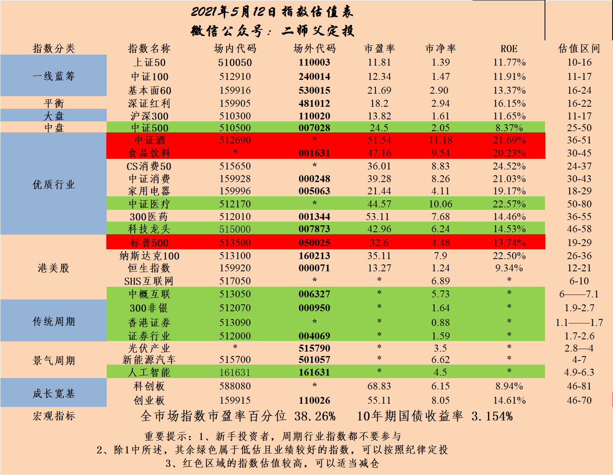

======================================================

_type: talk
@二师父[28814221155551]
2021-05-13 21:09:31 Thu  
topic_id: 182812281214142

<e type="hashtag" hid="48412142121548" title="#周期性指数#" /> 投资分清重点和非重点，优先抓住主要矛盾。

@永刚 at 2021-05-13 21:09:31 Thu

> 师傅，300非银和香港证券可以定投吗？

----------

@二师父 at 2021-05-13 21:09:31 Thu

> 轻仓，仓位控制百分之5以内

----------

阅读[1]  评论[2]  赞[0] 

+++++++++++++++++++++++++++++++++++++++++++++++++++++

文件：
2021-05-13 21:08:51 Thu
文件大小：[22080]
111148518258812-关于周期性指数的投资说明.docx

======================================================

_type: talk
@阿宝[422212151424158]
2021-05-13 23:55:19 Thu  
topic_id: 182812525118222

强烈推荐，《<e type="web" href="https://wx.zsxq.com/mweb/views/weread/search.html?keyword=传世投资" title="传世投资" style="book" />》这本书，简单的东西最美！

@西锦巴乌 at 2021-05-13 23:55:19 Thu

> 阿宝老师请问你文章中提到的PE是参照哪个软件的？谢谢

----------

@阿宝 at 2021-05-13 23:55:19 Thu

> 估值是会变化的，只是目前的一个参考。你可以用理杏仁，也可以参考天天基金网的指数宝估值，还可以到中证指数官网查询

----------

@衣袂飘香 at 2021-05-13 23:55:19 Thu

> 阿宝很用心，也写得很好。复杂的事情简单做，简单的事情重复做，重复的事情用心做。我还有个小小的心得，探索涨涨跌跌后面的奥秘和真相，感到非常有趣，直白的说，就是觉得很好玩，这是能够天天坚持下去的最大动力。然后，然后，顺带赚了钱……

----------

@阿宝 at 2021-05-13 23:55:19 Thu

> 谢谢

----------

阅读[1]  评论[4]  赞[0] 

+++++++++++++++++++++++++++++++++++++++++++++++++++++

文件：
2021-05-13 23:55:19 Thu
文件大小：[204282]
244421841152821-5.13  读《传世投资》有感.pdf

======================================================

_type: talk
@幽兰[815554522442422]
2021-05-14 12:53:55 Fri  
topic_id: 414124882284188

你们的券商打算卖吗？

@光少 at 2021-05-14 12:53:55 Fri

> 刚卖了一份

----------

阅读[1]  评论[1]  赞[0] 

======================================================

_type: talk
@光少[244124552511141]
2021-05-14 13:06:40 Fri  
topic_id: 215145884155481

券商出一网，有小肉吃[呲牙]

@wty at 2021-05-14 13:06:40 Fri

> 我也出一网[偷笑]

----------

@衣袂飘香 at 2021-05-14 13:06:40 Fri

> 我也出了一网

----------

@范毅君 at 2021-05-14 13:06:40 Fri

> 我没有出，刚刚到成本以上[偷笑]

----------

阅读[1]  评论[3]  赞[0] 

+++++++++++++++++++++++++++++++++++++++++++++++++++++

图片：
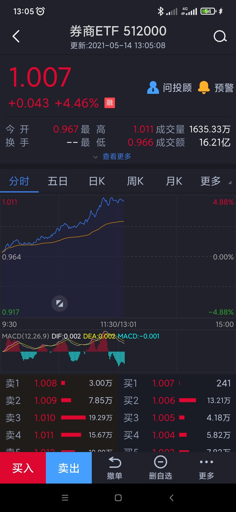

======================================================

_type: q&a
@JOY[111881481812422]
2021-05-14 16:10:34 Fri  
topic_id: 582842118424284

@JOY

>  师父，请问今天是什么情况，为什么券商和非银涨成这样呢？

@二师父

>  两个方面原因，第一是券商重组消息利好，第二是资金从大宗商品流出，券商大涨好信号

阅读[1]  评论[1]  赞[0] 

======================================================

_type: q&a
@张发荣[582145828584414]
2021-05-14 17:54:21 Fri  
topic_id: 815145825855452

@张发荣

>  二师父，基金在场内还是场外买比较好？我只是觉得场内买像买股票一样，切换更方便，利于对趋势把握换仓？

@二师父

>  场内更方便，资金到账快，操作上更便利

阅读[1]  评论[0]  赞[0] 

======================================================

_type: talk
@二师父[28814221155551]
2021-05-14 20:58:39 Fri  
topic_id: 582842154548444

<e type="hashtag" hid="15281855224182" title="#一点点转机#" />

阅读[1]  评论[0]  赞[0] 

+++++++++++++++++++++++++++++++++++++++++++++++++++++

文件：
2021-05-14 20:58:37 Fri
文件大小：[39514]
544458188421484-忽如一夜春风来，千树万树梨花开.docx

======================================================

_type: q&a
@张发荣[582145828584414]
2021-05-15 12:20:03 Sat  
topic_id: 215145841544441

@张发荣

>  叶飞事件很火，基金接下来的风险防范是否请二师父点评一下？

@二师父

>  叶飞这个事已经得到了证监会的重视，后面会严查操纵市场和内幕交易的行为。
>  
>  对于投资的基金，风险不在于某只基金是否出了问题，而在于投资人自己。
>  
>  风控是所有投资最重要的环节，首先，我们是全面配置基金，不可能所有的指数和混合基金全部挂了，并没有本金永久损失风险，其次，短期利空只是价格的变化，本质对上市企业没有影响，继续买
>  
>  风险在于内部，而非外部，自己的现金流是否充裕，杠杆是否合理，房贷方向的，投资是否分散，有无对冲，自己这几方面做好了，完全不怕非系统性风险。

阅读[1]  评论[0]  赞[0] 

======================================================

_type: talk
@那方山的树，佛陀座下*[244412158214221]
2021-05-15 15:17:20 Sat  
topic_id: 182812585141122

二师父，他们都说要经济危机了，我们定投还要继续吗？不是说经济危机不能投资吗？

@二师父 at 2021-05-15 15:17:20 Sat

> 如果经济危机真的来了，那么持有债券和现金是比持有资产强的，所以要做好对冲。

但是这个事没法预料，就去年3月份，很多人也预料经济危机来了，如果放弃投资，自己的钱会贬值很多。

所以要在防范风险的同时投资，这样子才能让财富增值，每一轮危机都会不断放水，你不参与，你的钱依然是贬值严重的。

----------

阅读[1]  评论[1]  赞[0] 

======================================================

_type: talk
@二师父[28814221155551]
2021-05-15 16:25:27 Sat  
topic_id: 182812584221882

<e type="hashtag" hid="28514188824141" title="#警惕投资中的三高#" />

@阿宝 at 2021-05-15 16:25:27 Sat

> 永不杠杆

----------

阅读[1]  评论[1]  赞[0] 

+++++++++++++++++++++++++++++++++++++++++++++++++++++

文件：
2021-05-15 16:25:13 Sat
文件大小：[22213]
544458524511124-警惕三高.docx

======================================================

_type: q&a
@永刚[15581448518112]
2021-05-16 15:01:40 Sun  
topic_id: 215145485881281

@永刚

>  请叫二师父，目前债券占总资金量20%，现金占40%，为了提高资金利用率，现在可以加大债券的比例吗？

@二师父

>  可以，收益率能接受就行，招商产业，大摩多元收益债这些

阅读[1]  评论[5]  赞[0] 

======================================================

_type: talk
@二师父[28814221155551]
2021-05-16 17:05:11 Sun  
topic_id: 582842414428824

<e type="hashtag" hid="15281855114242" title="#关于互联网企业的看法#" />

@衣袂飘香 at 2021-05-16 17:05:11 Sun

> 我用人工智能Ai做网格，目前还趴在那呢，但是互联网毕竟是席卷世界不可逆的方向，看了二师父的文章还是有信心的。

----------

@wty at 2021-05-16 17:05:11 Sun

> 注意到场内的SHS互联网成交金额很低，没有清盘风险吧？？

----------

@wty at 2021-05-16 17:05:11 Sun

> 

----------

@二师父 at 2021-05-16 17:05:11 Sun

> 没有的，成交额是显示流动性，不会清盘

----------

@🍀 凝🌸 慧🍀 at 2021-05-16 17:05:11 Sun

> 太及时了，正想问师父互联网企业这方面的情况，谢谢师父！[玫瑰][玫瑰][玫瑰][愉快]

----------

@wty at 2021-05-16 17:05:11 Sun

> 谢谢🙏

----------

阅读[1]  评论[6]  赞[0] 

+++++++++++++++++++++++++++++++++++++++++++++++++++++

文件：
2021-05-16 17:05:10 Sun
文件大小：[21067]
244421282281411-互联网企业还行不行.docx

======================================================

_type: talk
@杜志彪[544454124115854]
2021-05-17 14:50:52 Mon  
topic_id: 182812118452122

师父有个事请教一下，我在华泰证券做的光伏网格，设置的是以1元为基数上下浮动5%触发一份，前一次1.1触发一次，前两天1.05触发买入一份，今天1.1又自动卖出一份，这个和咱们以前自己手动的网格不一样，1.1卖出后。应该0.95元才触发买入（我是以一元为基数的），您的自动网格是怎样的

@二师父 at 2021-05-17 14:50:52 Mon

> 我是触发基准价1再开始买入的，这样更安全。

----------

@果实妈咪 at 2021-05-17 14:50:52 Mon

> 华泰的我也设置不好[流泪]

----------

阅读[1]  评论[2]  赞[0] 

======================================================

_type: q&a
@顾屹峰[28242255855121]
2021-05-17 15:00:47 Mon  
topic_id: 215145444212141

@顾屹峰

>  我在华宝开户，找谁改佣金

@二师父

>  不用改，开户直接就是万一免5

阅读[1]  评论[0]  赞[0] 

======================================================

_type: talk
@二师父[28814221155551]
2021-05-17 18:02:22 Mon  
topic_id: 582842485518814

<e type="hashtag" hid="51284815254244" title="#医疗基金的优质标的#" /> 好基金好价格。医疗是长线板块

阅读[1]  评论[0]  赞[0] 

+++++++++++++++++++++++++++++++++++++++++++++++++++++

文件：
2021-05-17 18:01:10 Mon
文件大小：[28048]
111148144852142-场外投资医疗基金的优质标的.docx

======================================================

_type: talk
@二师父[28814221155551]
2021-05-17 18:20:40 Mon  
topic_id: 815145412215852

<e type="hashtag" hid="88514182521852" title="#知识星球#" /> 市盈率百分位39.2%，SY-BY百分位43.71%，SY/BY百分位41.68%。

股灾牛市又开始重演，大家多注重优质指数的配置，这是长期战略底仓，消费+医疗+优质混合基金+优质宽基可以作为长期战略底仓。

其他的辅助配置就行。

阅读[1]  评论[0]  赞[0] 

======================================================

_type: talk
@林玮[844111858288412]
2021-05-18 06:25:13 Tue  
topic_id: 215145151455281

师父，006327确认的时间为什么比其他基金晚一天？

@二师父 at 2021-05-18 06:25:13 Tue

> QDII基金是T+2的

----------

阅读[1]  评论[1]  赞[0] 

+++++++++++++++++++++++++++++++++++++++++++++++++++++

图片：
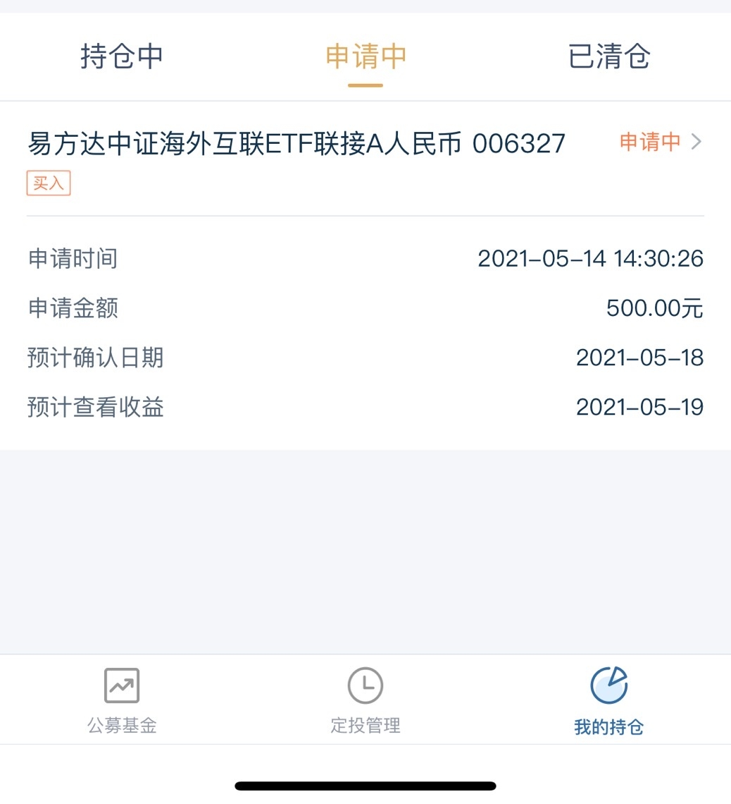

======================================================

_type: q&a
@我本善良[414818545812118]
2021-05-18 08:58:56 Tue  
topic_id: 582842822515544

@我本善良

>  二师傅我这个新债怎么卖不出去

@二师父

>  你什么时候委托的？

阅读[1]  评论[3]  赞[0] 

======================================================

_type: talk
@二师父[28814221155551]
2021-05-18 19:05:44 Tue  
topic_id: 815145124241282

<e type="hashtag" hid="48412185518518" title="#市场规律#" /> 市场短期不可预知并具有反身性。

阅读[1]  评论[0]  赞[0] 

+++++++++++++++++++++++++++++++++++++++++++++++++++++

文件：
2021-05-18 19:04:13 Tue
文件大小：[28882]
244421415282151-市场的规律.docx

======================================================

_type: talk
@二师父[28814221155551]
2021-05-18 19:08:04 Tue  
topic_id: 815145124218882

<e type="hashtag" hid="15285258118452" title="#每周估值表#" /> 消费50重新进入高估，医疗正常估值。

@J at 2021-05-18 19:08:04 Tue

> 师傅，最近估值表更新是固定在每周的哪一天？请告知一下，方便定期来看哈

----------

@二师父 at 2021-05-18 19:08:04 Tue

> 基本上是每周三

----------

@J at 2021-05-18 19:08:04 Tue

> 好的

----------

@shi at 2021-05-18 19:08:04 Tue

> 二师父你好。对比了我的定投和你的清单。
看到清单里没有了德国30，中证银行，中证红利，中证医药。
这几个剔除了？已经清仓或者替换吗？

----------

@二师父 at 2021-05-18 19:08:04 Tue

> 清仓了

----------

@shi at 2021-05-18 19:08:04 Tue

> 二师父，对于这几只指数基金，我虽然一直在收割利润，但目前占我仓位还是不少。
对于您清仓的原因，什么时候能说说吗？

希望知道个所以然，并希望知道怎么能查到它们高估低估的阈值范围及目前水平。
谢谢。

----------

@二师父 at 2021-05-18 19:08:04 Tue

> 德国30和中证医药是之前因为估值卖的，中证银行去年调仓，中证红利也是调仓到深红利，去年3月疫情，银行让利实体经济，不看好银行指数，调仓了，而且银行三剑客招行等优于很多银行，现在投的易方达金融股票，你大概很久没看星球了

----------

@shi at 2021-05-18 19:08:04 Tue

> 二师父起来好早呀，谢谢秒回。
的确是好久没来了，看来得认真补补课了。

对于这些基金，前面好不容易积累了这么些好基金 ，没舍得清仓。
都是卖了一部分，继续定投。
这一年来，德国30、中证红利、中证银行稳步增长，中证医药也走了一个u型笑脸。
这些目前是否可以留些仓位？还是全部进行调整比较好？

----------

阅读[1]  评论[8]  赞[0] 

+++++++++++++++++++++++++++++++++++++++++++++++++++++

图片：
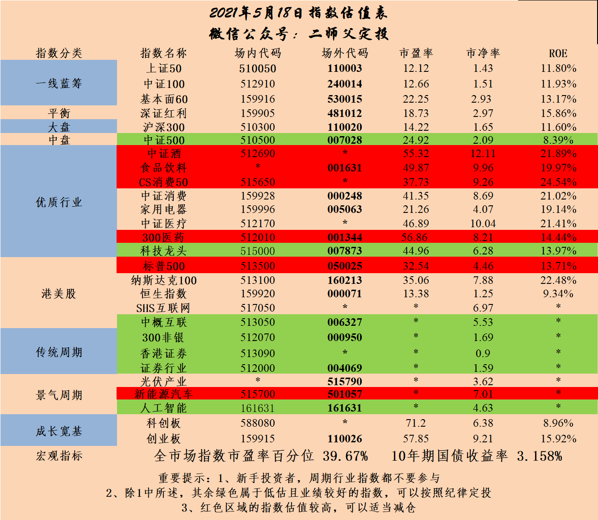

======================================================

_type: q&a
@为何[244111458152581]
2021-05-18 19:17:05 Tue  
topic_id: 414124225528558

@为何

>  中概股ETF有推荐的吗？

@二师父

>  513050，中概etf

阅读[1]  评论[0]  赞[0] 

======================================================

_type: talk
@天玺哥[421828421128848]
2021-05-18 19:59:15 Tue  
topic_id: 582842854814184

二师父，中证500指数基金推荐一支场外的可以吗？

@二师父 at 2021-05-18 19:59:15 Tue

> 天弘中证500，000962

----------

@天玺哥 at 2021-05-18 19:59:15 Tue

> 谢谢师父

----------

阅读[1]  评论[2]  赞[0] 

======================================================

_type: talk
@二师父[28814221155551]
2021-05-19 17:10:35 Wed  
topic_id: 582841121485114

<e type="hashtag" hid="28514184554111" title="#叶飞爆料新进展#" /> 从操纵股市里面得到的启示

阅读[1]  评论[0]  赞[0] 

+++++++++++++++++++++++++++++++++++++++++++++++++++++

文件：
2021-05-19 17:10:10 Wed
文件大小：[29388]
422251144842288-黑吃黑的结果.docx

======================================================

_type: talk
@二师父[28814221155551]
2021-05-20 19:47:06 Thu  
topic_id: 182815511554142

<e type="hashtag" hid="51284814524184" title="#投资互联网的正确姿势#" />

阅读[1]  评论[0]  赞[0] 

+++++++++++++++++++++++++++++++++++++++++++++++++++++

文件：
2021-05-20 19:46:55 Thu
文件大小：[22387]
422251182884448-投资互联网指数的正确姿势.docx

======================================================

_type: talk
@二师父[28814221155551]
2021-05-20 19:59:16 Thu  
topic_id: 182815511512412

<e type="hashtag" hid="552114551414" title="#估值数据#" /> 市盈率百分位39.85%，SY-BY百分位43.39%，SY/BY百分位41.05%。

估值一直下行，胜率慢慢凸显，底仓+网格策略就是长线底仓，这种底仓建立有两种模式，第一这种估值状态下定投，第二我喊加大投资力度可以接近满仓的时候，那种时候一般3到5年出现一次，其余时间定投就最佳。

网格就以券商、中概等波动大的基金为主，一旦被套，在安全边际以内持续定投到设定的最大仓位

@吃肉肉 at 2021-05-20 19:59:16 Thu

> 师父，什么时候喊加大投资力度？[呲牙]

----------

@二师父 at 2021-05-20 19:59:16 Thu

> 有机会的时候啊，这种是市场说了算的

----------

@吃肉肉 at 2021-05-20 19:59:16 Thu

> 好的，坐等师父喊🤑。

----------

@马明谦 at 2021-05-20 19:59:16 Thu

> 跟着师傅吃肉喝酒[呲牙]

----------

@葛亚丽 at 2021-05-20 19:59:16 Thu

> 二师父，现在可以网格中概互联吗？

----------

@二师父 at 2021-05-20 19:59:16 Thu

> 可以

----------

阅读[1]  评论[6]  赞[0] 

======================================================

_type: talk
@慕容[548814822814844]
2021-05-21 06:26:41 Fri  
topic_id: 182815581225282

二师傅，昨天一个朋友说新债打新，基本可以无脑操作，是这样吗？如果破发最大赔率会是多少呢？

@二师父 at 2021-05-21 06:26:41 Fri

> 首次破发的话一般在10%以内，首日卖出能控制，无脑打新债整体也是盈利的，可以挑选AA以上的打，胜率更大，就是中签率目前下降了

----------

阅读[1]  评论[1]  赞[0] 

======================================================

_type: q&a
@wty[548488548545444]
2021-05-21 12:16:03 Fri  
topic_id: 414128548285258

@wty

>  二师父16国债19的收益率最近持续上升（持仓收益5%），帮忙分析一下什么原因导致了最近的上升？未来趋势怎样？

@二师父

>  这个很正常的，持续放水，资产价格上升，另外股市表现不佳，国债的吸引力更佳，这也是咱们在股市牛市的时候配置的原因，二者有个跷跷板效应

阅读[1]  评论[0]  赞[0] 

======================================================

_type: talk
@二师父[28814221155551]
2021-05-21 21:29:09 Fri  
topic_id: 815148282254842

<e type="hashtag" hid="88514182521852" title="#知识星球#" /> 优质的互联网主动基金，介绍的是易方达亚洲精选股票，我们目前实盘来的是中概互联和互联网50ETF.都比较优质，会在下跌过程中持续加投，把仓位打上去。

@李震笛 at 2021-05-21 21:29:09 Fri

> 师傅，这个已经从最高点下来40%了吧？另外想问问，中概互联具体是哪一只？

----------

@二师父 at 2021-05-21 21:29:09 Fri

> 就是场内中概互联etf，你从哪看的下跌了百分之40

----------

@shi at 2021-05-21 21:29:09 Fri

> 可以在蛋卷定投易方达中概互联50吗？006327

----------

@二师父 at 2021-05-21 21:29:09 Fri

> 可以

----------

阅读[1]  评论[4]  赞[0] 

+++++++++++++++++++++++++++++++++++++++++++++++++++++

文件：
2021-05-21 21:27:43 Fri
文件大小：[86416]
111148844188812-优质的主动型互联网基金.docx

======================================================

_type: talk
@二师父[28814221155551]
2021-05-21 23:34:52 Fri  
topic_id: 815148225521112

<e type="hashtag" hid="552114551414" title="#估值数据#" /> 市盈率百分位38.98%，SY-BY百分位41.91%，SY/BY百分位39.98%。

估值持续下移，仓位低于4层的朋友可以持续定投了，预计大盘再跌5%到10%估值楼层进入2层。

阅读[1]  评论[0]  赞[0] 

======================================================

_type: q&a
@永刚[15581448518112]
2021-05-22 09:09:07 Sat  
topic_id: 414128558585528

@永刚

>  二师父：依据目前的市场情况，债券配置多少仓位？现金预留多少仓位？才能使资金利用率最好呢。

@二师父

>  目前5成左右仓位，债券可以全仓配置，也可以配置百分之20，如果想要资金利用率最高，5年不用的资金全部配置基金

阅读[1]  评论[0]  赞[0] 

======================================================

_type: talk
@防汛抗旱[111848815428452]
2021-05-22 10:09:24 Sat  
topic_id: 182818815582542

师父，中证500估值绿的，可以加仓？

@二师父 at 2021-05-22 10:09:24 Sat

> 可以定投

----------

阅读[1]  评论[1]  赞[0] 

======================================================

_type: talk
@二师父[28814221155551]
2021-05-22 17:34:15 Sat  
topic_id: 182818811128282

<e type="hashtag" hid="28514125441841" title="#比特币要遭遇打击了#" /> 币圈如果5年前没有参与，目前就别参与了，肯定是持续打击。

阅读[1]  评论[0]  赞[0] 

+++++++++++++++++++++++++++++++++++++++++++++++++++++

文件：
2021-05-22 17:33:46 Sat
文件大小：[18741]
544458842854244-国务院金融委定调比特币.docx

2021-05-22 17:33:50 Sat
文件大小：[3512817]
111148812841522-国务院金融委定调比特币.m4a

======================================================

_type: talk
@二师父[28814221155551]
2021-05-22 22:45:57 Sat  
topic_id: 582848881811144

<e type="hashtag" hid="458188281228" title="#鳄鱼计划持仓#" /> 关于仓位的配置，最佳的是指数+债券仓位打满，如果资金5年不用，这就是最好的仓位管理，投资者只需要动态管理指数和债券仓位。那么这种方式也有弊端，就是当股债双杀的时候，跌的会很严重，而长期看都是向上的，如果投资者已经有了一定的投资经验，就没必要持有现金，永远只买股权+债券。当然前提是钱是长期不用的，注意资产永远是跑赢通胀的，现金是永远跑输通胀的。

图中黄色是未来重点配置对象，国开债基本是在今年年初配置的，当时很多读者不理解，为什么要买跑不赢股市的国开债，不是浪费钱吗？现在再来看看是不是能够理解一些了。每一个品种都有其价值，在不同的阶段有不同的机会。

@wty at 2021-05-22 22:45:57 Sat

> 二师父，招商产业债券场内的代码是什么？我按场外的代码在场内沒找到呢？还是只能买场外的？

----------

@永刚 at 2021-05-22 22:45:57 Sat

> 师父：债券现在是上升周期吗？中长期怎么看？

----------

@二师父 at 2021-05-22 22:45:57 Sat

> 是上升周期

----------

阅读[1]  评论[3]  赞[0] 

+++++++++++++++++++++++++++++++++++++++++++++++++++++

图片：
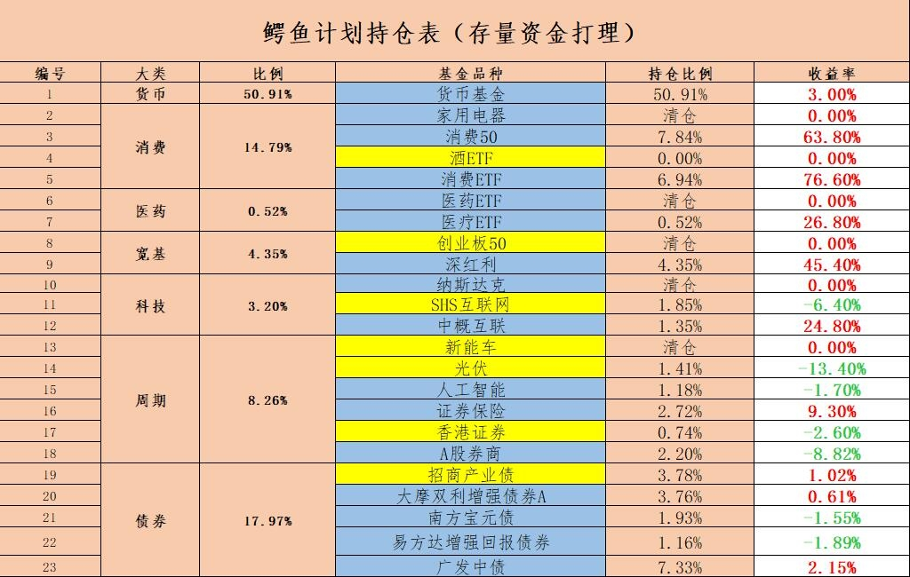

======================================================

_type: talk
@二师父[28814221155551]
2021-05-23 17:39:35 Sun  
topic_id: 582882228284524

<e type="hashtag" hid="15281845251142" title="#看看代客理财的坑#" /> 大家不要把自己的账户交给别人，自己的钱自己负责。

最近好像不大太平，甘肃一马拉松比赛因天气原因导致21人死亡，第一次听说体育赛事导致如此大的人员伤亡。

好好照顾自己，注意安全，活着就是幸福。马上六月了，之前说过，回调到6月6开始投资，基本上3个月不破新低危险信号解除。

阅读[1]  评论[0]  赞[0] 

+++++++++++++++++++++++++++++++++++++++++++++++++++++

文件：
2021-05-23 17:37:11 Sun
文件大小：[21531]
544458848155824-代客炒股是大坑.docx

======================================================

_type: q&a
@🍀 凝🌸 慧🍀[841855248254242]
2021-05-23 18:43:51 Sun  
topic_id: 582882221585814

@🍀 凝🌸 慧🍀

>  师父好，近期召开了有关房地产税改革试点工作座谈会，又引发热议。房产投资，请您给分析分析吧，谢谢！

@二师父

>  房产税一直在提，未来一定会落实的
>  
>  现在购买房产投资，除非投资水平较低，钱较多可以全款，准备买入长期收租金，否则投资性价比不高。
>  
>  第一不知道房产税征收方式，第二多套房产如果贷款买入的利率较高，如果准备后期卖出的话，等额本息会不划算。
>  
>  第二，房产流动性会差一些，急用钱的时候回款慢
>  
>  如果不缺钱，对于一线二线以及部分产业发达城市的品质社区，10年后的板楼社区可以投资，或者限购但是规划能够落地的准现房，期房精装容易出幺蛾子
>  
>  其他的城市和郊区不值得，买入就是大概率亏，房产的平均增值速度大概和gdp增速，货币贬值速度以及城市化率匹配，投资性房产第一考虑地段，第二考虑社区品质和流动性，第三考虑租售比。

阅读[1]  评论[6]  赞[0] 

======================================================

_type: talk
@二师父[28814221155551]
2021-05-24 16:57:00 Mon  
topic_id: 182882214458252

<e type="hashtag" hid="15281845412212" title="#绝对收益率#" /> 跑赢沪深300是一方面，更为关键的是绝对盈利，账户增值速度赶上货币贬值速度。

阅读[1]  评论[0]  赞[0] 

+++++++++++++++++++++++++++++++++++++++++++++++++++++

文件：
2021-05-24 16:56:21 Mon
文件大小：[117877]
111148888511552-注重绝对收益率.docx

======================================================

_type: talk
@二师父[28814221155551]
2021-05-24 17:26:18 Mon  
topic_id: 182882214481552

<e type="hashtag" hid="552114551414" title="#估值数据#" /> 市盈率百分位39.12%，SY-BY百分位41.97%，SY/BY百分位40.02%。

A股指数领涨，港股指数微跌，流动性比较宽裕，对各类资产都是利好。

债券基金目前虽然是高位，但是如果长期持有3年，现在仍旧可以入的。债券牛市长，熊市短，更加适合一次或者分批买入。

@六尘不改 at 2021-05-24 17:26:18 Mon

> 市盈率越来越低了

----------

@J at 2021-05-24 17:26:18 Mon

> 师傅，请问如何判断现在是债市高位呢？高位是不是代表着债券牛市？

----------

@二师父 at 2021-05-24 17:26:18 Mon

> 一直上涨啊

----------

@J at 2021-05-24 17:26:18 Mon

> 请教师父，我不是很懂[捂脸]应该看哪个指标吗？十年期国债收益率吗？

----------

@二师父 at 2021-05-24 17:26:18 Mon

> 这是一个参考指标，你直接看国债价格就知道

----------

@潘力新 at 2021-05-24 17:26:18 Mon

> 二师父好，您说的流动性宽裕是什么意思？在哪里可以看到？

----------

@二师父 at 2021-05-24 17:26:18 Mon

> 就是货币宽松

----------

阅读[1]  评论[7]  赞[0] 

======================================================

_type: talk
@二师父[28814221155551]
2021-05-25 09:35:48 Tue  
topic_id: 414114848842818

<e type="hashtag" hid="222815251121" title="#新债申购#" /> 今日三角转债，顶格申购。

阅读[1]  评论[0]  赞[0] 

======================================================

_type: talk
@二师父[28814221155551]
2021-05-25 11:28:04 Tue  
topic_id: 815115852824842

券商可以收一网了

@范毅君 at 2021-05-25 11:28:04 Tue

> 准备收[呲牙][呲牙]

----------

@衣袂飘香 at 2021-05-25 11:28:04 Tue

> 已经收了[微笑]

----------

@杜志彪 at 2021-05-25 11:28:04 Tue

> 我是自动网格1.47就收了，再涨就第二网了[得意]

----------

@老孙头 at 2021-05-25 11:28:04 Tue

> 板块好像刚刚起动？师父意思是先收一部分？

----------

@光少 at 2021-05-25 11:28:04 Tue

> 已收一网，慢慢吃肉[呲牙]

----------

@二师父 at 2021-05-25 11:28:04 Tue

> 是的，就小部分

----------

@马明谦 at 2021-05-25 11:28:04 Tue

> 师傅：券商512000不是1.12元建仓的，1.16才出一格吗？

----------

@二师父 at 2021-05-25 11:28:04 Tue

> 不是的，我们发的是1元建仓，目前1.07，你看的估计是另外一个代码

----------

阅读[1]  评论[14]  赞[0] 

======================================================

_type: talk
@苍天有井明月空🌙[28882214181441]
2021-05-25 14:07:25 Tue  
topic_id: 215115851142811

二师傅reit审批通过后会进行投资吗

@二师父 at 2021-05-25 14:07:25 Tue

> 这个我看看，有好机会也会投资的

----------

阅读[1]  评论[1]  赞[0] 

======================================================

_type: q&a
@素素[215818215412841]
2021-05-25 15:06:05 Tue  
topic_id: 582882112145214

@素素

>  师傅，你的网格投资表在哪看

@二师父

>  没放表格，目前券商网格基准价是1元

阅读[1]  评论[3]  赞[0] 

======================================================

_type: q&a
@JOY[111881481812422]
2021-05-25 16:50:25 Tue  
topic_id: 414114884241518

@JOY

>  师父，请问您怎么看后面？再涨起来是收割利润、减仓，还是继续持仓或者是加仓？

@二师父

>  这看你是多少仓位啊，可以减仓也可以卧倒，除非空仓，否则不要追加

阅读[1]  评论[11]  赞[0] 

======================================================

_type: talk
@二师父[28814221155551]
2021-05-25 20:42:37 Tue  
topic_id: 582882518554224

<e type="hashtag" hid="88514122551212" title="#茅台发力，助力A股破万亿#" /> 北上资金狂买200亿是好事，一般外资实力看多就要涨起来。

阅读[1]  评论[0]  赞[0] 

+++++++++++++++++++++++++++++++++++++++++++++++++++++

文件：
2021-05-25 20:41:05 Tue
文件大小：[30518]
422224884488528-茅台发力，助力A股破万亿.docx

======================================================

_type: q&a
@永刚[15581448518112]
2021-05-25 22:45:43 Tue  
topic_id: 215115225448521

@永刚

>  二师父：请教一下什么情况下会出现股债双杀？

@二师父

>  通常情况下，通胀严重，利率高位，市场资金匮乏，经济严重下滑的时候会出现股债双杀

阅读[1]  评论[0]  赞[0] 

======================================================

_type: talk
@二师父[28814221155551]
2021-05-25 22:51:52 Tue  
topic_id: 582882552488854

<e type="hashtag" hid="552114551414" title="#估值数据#" /> 市盈率百分位40.08%，SY-BY百分位42.66%，SY/BY百分位40.35%。

关于市场放量上涨，如何操作，肯定买入是不需要了，除非你一点仓位也没有才需要建一点，永远不能够让自己置于踏空的风险中，即使经济危机来了，也不要空仓，谁都无法预料后续的走势。

倘若没有空仓，那就别追，收割利润或者持有都是可以的，二选一，先小赚一点再大赚。只要是稳健盈利的，看似慢，实则快。

@JOY at 2021-05-25 22:51:52 Tue

> 谢谢您～

----------

@J at 2021-05-25 22:51:52 Tue

> 师傅，今天中概互联场内溢价4%，请教你套利的方法。如果场内卖出5000份，那应该场外买入多少

----------

@二师父 at 2021-05-25 22:51:52 Tue

> 同比例的

----------

@J at 2021-05-25 22:51:52 Tue

> 师傅意思是场内卖出多少股，场外就买回相同数量的股，对吗？

----------

@二师父 at 2021-05-25 22:51:52 Tue

> 是的，我是用的折价套利，场内买入转场外卖出，溢价是场内卖出

----------

@J at 2021-05-25 22:51:52 Tue

> 好的，谢谢师傅

----------

@门萨🐨 at 2021-05-25 22:51:52 Tue

> 昨天是什么风[撇嘴]

----------

阅读[1]  评论[7]  赞[0] 

======================================================

_type: talk
@二师父[28814221155551]
2021-05-26 08:23:16 Wed  
topic_id: 582882558414224

<e type="hashtag" hid="28512814884111" title="#转债打新#" /> 濮耐转债，继续顶格申购，如果今天继续放量涨，一波行情就要到来。

流动性宽裕，最近股债双牛，股市和债市表现都非常好。

阅读[1]  评论[0]  赞[0] 

======================================================

_type: talk
@慕容[548814822814844]
2021-05-26 08:26:38 Wed  
topic_id: 414114551281128

<e type="hashtag" hid="28512814884111" title="#转债打新#" /> 谢谢二师父，希望师父带着我们多多转钱[呲牙]忠诚跟随，愿意承担投资风险，期待师父带我们早日财富自由[呲牙]

阅读[1]  评论[0]  赞[0] 

======================================================

_type: q&a
@付云[844148188522822]
2021-05-26 10:01:03 Wed  
topic_id: 582882558451554

@付云

>  二师傅，想问问对地产的看法

@二师父

>  地产板块整体都表现一般，不如沪深300，未来房产更多是存量交易，贝壳会比万科更有优势

阅读[1]  评论[5]  赞[0] 

======================================================

_type: talk
@二师父[28814221155551]
2021-05-26 18:59:55 Wed  
topic_id: 582882585424214

<e type="hashtag" hid="824514224452" title="#指数估值表#" /> 券商、中证500、龙头科技进入正常估值。

这次下跌我建了观察仓，医疗、白酒、景顺鼎益、兴全合润，目前仍旧是白酒、医疗领涨。

@J at 2021-05-26 18:59:55 Wed

> 师傅，没想到人工智能还在低估啊[捂脸]

----------

@二师父 at 2021-05-26 18:59:55 Wed

> 马上正常估值了

----------

@衣袂飘香 at 2021-05-26 18:59:55 Wed

> 记得您说过，景顺鼎益在震荡市可以做网格，当时我买了，目前收益百分之4左右，接下来是全出呢？还是继续网格？

----------

@二师父 at 2021-05-26 18:59:55 Wed

> 网格可以的，不过他比白酒差一点，从近5年和近二月都是的

----------

@衣袂飘香 at 2021-05-26 18:59:55 Wed

> 好的，谢谢您，白酒高估，按照咱们的低估定投，应该是不适合买入。

----------

阅读[1]  评论[5]  赞[0] 

+++++++++++++++++++++++++++++++++++++++++++++++++++++

图片：
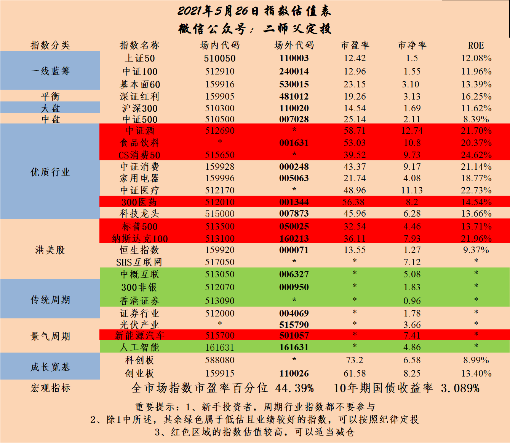

======================================================

_type: q&a
@🍀 凝🌸 慧🍀[841855248254242]
2021-05-26 19:19:46 Wed  
topic_id: 215115212825521

@🍀 凝🌸 慧🍀

>  师父好，在万得APP上，显示中概互联的折价率4%，是指溢价吧？有点搞不懂，请您指点。谢谢😊

@二师父

>  是的，这个是溢价，暂时不要场内买入，可以场外申购

阅读[1]  评论[1]  赞[0] 

======================================================

_type: q&a
@海马[15158245825242]
2021-05-26 19:20:25 Wed  
topic_id: 582882585485844

@海马

>  师父，今天都没涨什么万得全A的市盈率百分位一下子升到了44％？

@二师父

>  是的，这是市盈率百分位，不是指数百分位数据

阅读[1]  评论[0]  赞[0] 

======================================================

_type: talk
@二师父[28814221155551]
2021-05-26 19:46:43 Wed  
topic_id: 582882585852814

<e type="hashtag" hid="28514122228511" title="#实盘278#" /> 发车买入债券和中概互联，当前市场过热，而债券牛市，仍旧以债券配置为主，辅助少量低估的中概互联。

@晴 at 2021-05-26 19:46:43 Wed

> 二师父，为什么现在要买招商产业债呢

----------

@二师父 at 2021-05-26 19:46:43 Wed

> 市场并不便宜，多防守

----------

@惟子 at 2021-05-26 19:46:43 Wed

> 二师傅，请问招商产业债和广发中债有什么区别呢

----------

@二师父 at 2021-05-26 19:46:43 Wed

> 一个是国开债，广发中债，另外招商产业债是基金经理自己调仓的

----------

@潘力新 at 2021-05-26 19:46:43 Wed

> 二师父，请问为什么要在市场过热的时候定投中概互联呢？

----------

@二师父 at 2021-05-26 19:46:43 Wed

> 市场很热，中概并不热，他跌了很多

----------

阅读[1]  评论[6]  赞[0] 

+++++++++++++++++++++++++++++++++++++++++++++++++++++

图片：
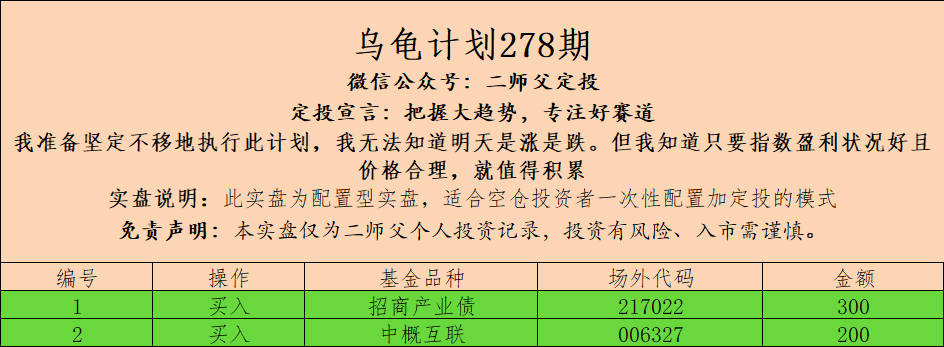

======================================================

_type: q&a
@无意心外[215544415215811]
2021-05-26 22:07:11 Wed  
topic_id: 414114512451888

@无意心外

>  二师父，中概互联的净值为什么和场外的006327不一样，一个是1.8957,一个是1.4692

@二师父

>  场内和场外不是一回事，别混淆了

阅读[1]  评论[0]  赞[0] 

======================================================

_type: q&a
@王春媚[244424882221141]
2021-05-27 10:06:06 Thu  
topic_id: 815115485444122

@王春媚

>  师父，我现在有三个账户，现在想在你这再开个户可以吗？听说个人只能有三个户，是这样吗？

@二师父

>  是的，上海的股东账户有限制，基金和深市股东账户没有限制

阅读[1]  评论[1]  赞[0] 

======================================================

_type: talk
@涓涓[111815125145522]
2021-05-27 14:37:42 Thu  
topic_id: 182882158122112

请问二师父：之前一直打新都没问题，现在打不了了，是怎么回事啊？

@二师父 at 2021-05-27 14:37:42 Thu

> 创业板开通没

----------

@涓涓 at 2021-05-27 14:37:42 Thu

> 这是创业板啊？不是写的是深A吗？

----------

@二师父 at 2021-05-27 14:37:42 Thu

> 是在创业板上市的

----------

阅读[1]  评论[3]  赞[0] 

+++++++++++++++++++++++++++++++++++++++++++++++++++++

图片：
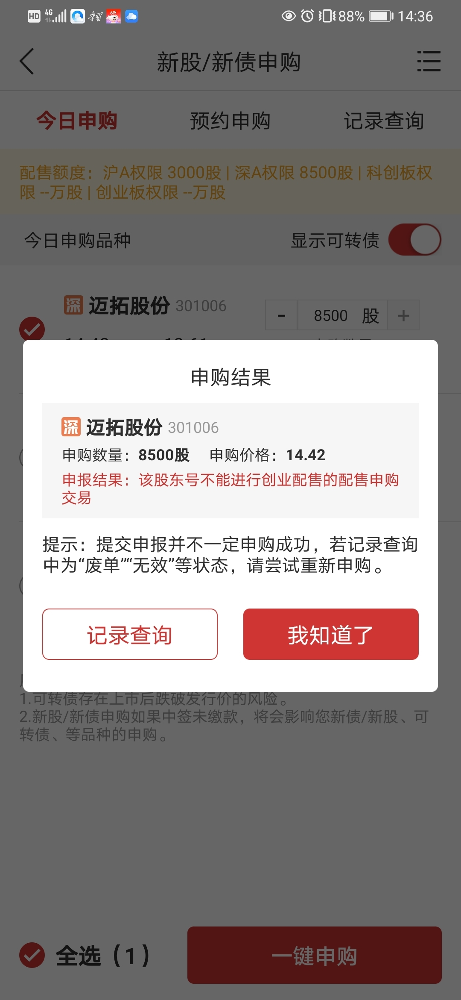

======================================================

_type: talk
@晴[15422515228522]
2021-05-27 15:31:56 Thu  
topic_id: 582882418885524

二师父，中了好几手京东物流，暗盘要赶紧跑嘛

@二师父 at 2021-05-27 15:31:56 Thu

> 刚才看到，京东物流还是不错的，我自己也有买京东

----------

@晴 at 2021-05-27 15:31:56 Thu

> 我拿着了，没卖

----------

阅读[1]  评论[2]  赞[0] 

======================================================

_type: talk
@二师父[28814221155551]
2021-05-27 19:42:46 Thu  
topic_id: 182882141542882

<e type="hashtag" hid="28514121254841" title="#北向资金买爆A股#" /> 最近北向资金持续买入A股，坐等抬轿子。

@付云 at 2021-05-27 19:42:46 Thu

> 二师傅，中概互联现在可以开始周定投了么?

----------

@二师父 at 2021-05-27 19:42:46 Thu

> 场内净值2元以下可以的，控制总仓位在百分之10以内

----------

@付云 at 2021-05-27 19:42:46 Thu

> 现在已经1.96了[撇嘴][撇嘴][撇嘴]

----------

@付云 at 2021-05-27 19:42:46 Thu

> 可以买点放着！2元就停手

----------

阅读[1]  评论[4]  赞[0] 

+++++++++++++++++++++++++++++++++++++++++++++++++++++

文件：
2021-05-27 19:42:09 Thu
文件大小：[29955]
422224828251818-北向资金又净买入146亿所释放的信号.docx

======================================================

_type: talk
@二师父[28814221155551]
2021-05-27 21:54:08 Thu  
topic_id: 215115421512141

<e type="hashtag" hid="552114551414" title="#估值数据#" /> 市盈率百分位44.69%，SY-BY百分位45.96%，SY/BY百分位42.88%。

目前的估值还是偏低的，比今年一月份的70%低了不少，而整体市场热度较高，如果投资以二级债基、中概互联、债券基金等为主要标的。

人民币持续升值，已经逼近17年的高位了。当时17年时蓝筹牛，人民币升值铁定是利好A股的，可以先拿一拿，券商有下行趋势。

注意券商要么不投资，要么轻仓+网格，重仓券商只有牛市初期比较好，后面牛市末期券商会越来越弱。相反，白酒医疗家电食品都是属于穿越牛熊的品种。

@苍天有井明月空🌙 at 2021-05-27 21:54:08 Thu

> 你好，当时按表格1.12开始做的网格，现在盈利一个点，要改变吗。

----------

@二师父 at 2021-05-27 21:54:08 Thu

> 网格价位可以移动，目前以你的持仓成本价格为锚固点，盈利百分之5开始卖出收网

----------

@苍天有井明月空🌙 at 2021-05-27 21:54:08 Thu

> 成本1.067，需要自己在网格设置成1.067吗。

----------

@二师父 at 2021-05-27 21:54:08 Thu

> 你是手动的话，这个成本价格就是移动的，这次如果上涨就以这个价格为锚固点，如果下跌继续加成本价也下降了

----------

@永刚 at 2021-05-27 21:54:08 Thu

> 请教，一只指数基金进入低估区，启动底仓+定投模式，请问定投周期按多少个月预算比较合适？

----------

@二师父 at 2021-05-27 21:54:08 Thu

> 看情况，牛市的时候6个月，熊市的时候3年，如果a股变成美股的模式了，每次大跌到底分3个月买入锁仓是最好的

----------

@苍天有井明月空🌙 at 2021-05-27 21:54:08 Thu

> 当时扫的您得二维码。，扫二维码的是不是手动改不成。

----------

@慕容 at 2021-05-27 21:54:08 Thu

> 二师父你的网格定投二维码在哪呢？现在开始按照网格定投券商可以吗

----------

阅读[1]  评论[11]  赞[0] 

======================================================

_type: talk
@二师父[28814221155551]
2021-05-28 09:47:56 Fri  
topic_id: 182882118584882

<e type="hashtag" hid="48412151282518" title="#乌龟计划临时发车#" /> 卖出易方达国开债1400份，买入中概互联3000元，相当于建个底仓，后面持续定投中概，股债继续轮动，大盘很热，而中概股持续低迷，可以先部分底仓，未来持续定投仓位预计百分之10左右。

关注天天基金发车可以看到。

@Candice at 2021-05-28 09:47:56 Fri

> 二师父 为啥只卖易方达国债 广发的不操作？谢谢

----------

@二师父 at 2021-05-28 09:47:56 Fri

> 只卖了部分，还没轮到广发，这俩品种本质一样的

----------

@防汛抗旱 at 2021-05-28 09:47:56 Fri

> 还是006327？ 天天基金里不叫中概互联，叫海外人民币联接

----------

@二师父 at 2021-05-28 09:47:56 Fri

> 就是这个

----------

@西锦巴乌 at 2021-05-28 09:47:56 Fri

> 师父请问为什么卖债券而不是直接用现金或货币基金买中概互联？谢谢

----------

@二师父 at 2021-05-28 09:47:56 Fri

> 卖了部分，又加了一部分现金买的，当前债券阶段高位，可以慢慢收割利润。

----------

@罗大发 at 2021-05-28 09:47:56 Fri

> 请问师傅国开债一份是多少？

----------

@罗大发 at 2021-05-28 09:47:56 Fri

> 请问师父国开债一份是多少？

----------

阅读[1]  评论[10]  赞[0] 

======================================================

_type: q&a
@范毅君[118551121224142]
2021-05-28 09:50:31 Fri  
topic_id: 182882118581552

@范毅君

>  二师傅，怎么今天🐢计划又发车了啊？

@二师父

>  发了，中概目前好机会，场内溢价百分之5，场外相当于捡便宜，支撑位先上部分仓位

阅读[1]  评论[6]  赞[0] 

======================================================

_type: talk
@二师父[28814221155551]
2021-05-28 10:06:47 Fri  
topic_id: 182882185284852

这个代码，场外

@步步惊心 at 2021-05-28 10:06:47 Fri

> 二师父你好 在人民币升值的情况下，买QDLL 基金收益更好吗？谢谢！

----------

@二师父 at 2021-05-28 10:06:47 Fri

> 人民币升值利好a股

----------

@步步惊心 at 2021-05-28 10:06:47 Fri

> 谢谢！

----------

阅读[1]  评论[3]  赞[0] 

+++++++++++++++++++++++++++++++++++++++++++++++++++++

图片：
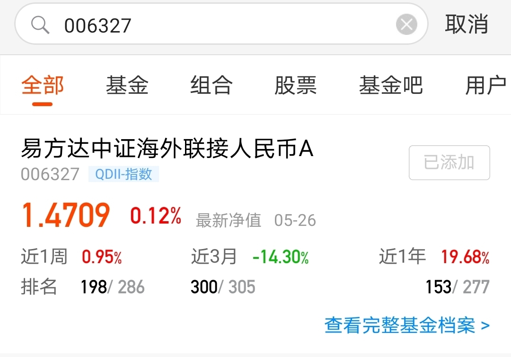

======================================================

_type: talk
@平安是福[118222545154542]
2021-05-28 10:44:57 Fri  
topic_id: 215115418224141

师父绿茵转债今天怎么操作

@二师父 at 2021-05-28 10:44:57 Fri

> 吃肉可以走了

----------

@平安是福 at 2021-05-28 10:44:57 Fri

> 好的👌🏻

----------

阅读[1]  评论[2]  赞[0] 

======================================================

_type: q&a
@果实妈咪[182225518588452]
2021-05-28 10:55:54 Fri  
topic_id: 182882185412442

@果实妈咪

>  是这个吗？二师父，怎么名字不一样？

@二师父

>  对，就是这个，易方达中概海外联接人民币a

阅读[1]  评论[0]  赞[0] 

======================================================

_type: q&a
@sky[841855245244852]
2021-05-28 10:56:21 Fri  
topic_id: 582882481541184

@sky

>  师父，现在中概互联场内有5%溢价，场内有份额的话可以用场内申购来套利吗？

@二师父

>  你试试，在场内申购，然后场内卖出

阅读[1]  评论[8]  赞[0] 

======================================================

_type: q&a
@为何[244111458152581]
2021-05-28 18:17:54 Fri  
topic_id: 414118448548588

@为何

>  请问科创板最近是否值得买入？

@二师父

>  你是准备做趋势交易还是准备持续定投？

阅读[1]  评论[5]  赞[0] 

======================================================

_type: talk
@二师父[28814221155551]
2021-05-28 18:29:27 Fri  
topic_id: 182885225482212

<e type="hashtag" hid="51284858852524" title="#关于午后跳水#" /> 压力位博弈开始了，压力位的意思是卖出力量强大，向上有压力，所以称为压力位，突破之后就是新一轮新高。

阅读[1]  评论[0]  赞[0] 

+++++++++++++++++++++++++++++++++++++++++++++++++++++

文件：
2021-05-28 18:28:35 Fri
文件大小：[29445]
544442181552224-突然跳水，稳住.docx

======================================================

_type: q&a
@林玮[844111858288412]
2021-05-28 19:20:52 Fri  
topic_id: 182885225152552

@林玮

>  师父，万德app标的折价率正数代表溢价，负数代表折价是吗

@二师父

>  对的

阅读[1]  评论[0]  赞[0] 

======================================================

_type: talk
@二师父[28814221155551]
2021-05-28 23:20:40 Fri  
topic_id: 414118484848258

<e type="hashtag" hid="552114551414" title="#估值数据#" /> 市盈率百分位44.18%，SY/BY百分位42.92%，SY-BY百分位45.88%。

估值楼层依然位于第三层，目前白酒、新能源等处于高位，暂时不再考虑投资范围内，今年更多的是互联网和医疗的投资机会，净值是不断新高，估值位于低估都是可以不断积累。

关于主动和被动的收益率之争，目前基本上有了初步判断，主动基金和指数基金里面都有优质品种，对于细分行业指数，主动基金完全跑不赢，比如高ROE的白酒指数，最近5年吊打所有产品。

而对于宽基指数，部分优质主动基金又能够跑赢。

对于配置上，如果承受行业波动风险偏低，那么以稳健地宽基为主，低风险中收益，其次就是优质混合基金，最后才是优质行业基金。

这就像走路一样一步一个台阶，慢慢上来。

@光少 at 2021-05-28 23:20:40 Fri

> 今天券商1.1出了一网，又有点肉吃，安全

----------

@永刚 at 2021-05-28 23:20:40 Fri

> 麻烦师交介绍几个优质的主动基金，

----------

@二师父 at 2021-05-28 23:20:40 Fri

> 兴全合润，景顺鼎益，银华富裕，稍后出一个主动基金实盘

----------

阅读[1]  评论[3]  赞[0] 

======================================================

_type: talk
@二师父[28814221155551]
2021-05-29 11:07:19 Sat  
topic_id: 815118581518412

<e type="hashtag" hid="51284842244144" title="#18罗汉指数#" /> 指数调仓，A股十八罗汉指数也进行调仓，每年6月和12月更新一次，精选优质行业龙头企业。

@范毅君 at 2021-05-29 11:07:19 Sat

> 二师傅，现在这个点位，18罗汉有没有适合入一点的[呲牙]

----------

@二师父 at 2021-05-29 11:07:19 Sat

> 市值突破万亿，不要买入

----------

@范毅君 at 2021-05-29 11:07:19 Sat

> 明白了，谢谢二师傅

----------

阅读[1]  评论[3]  赞[0] 

+++++++++++++++++++++++++++++++++++++++++++++++++++++

图片：
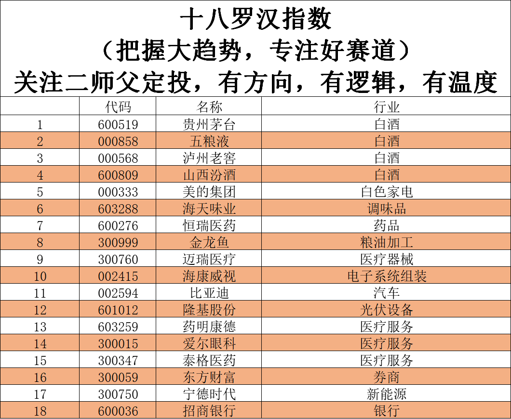

======================================================

_type: talk
@二师父[28814221155551]
2021-05-29 11:29:59 Sat  
topic_id: 182885258554552

<e type="hashtag" hid="88514145544442" title="#沪深300调仓#" />优选沪深300，中证500低估投资也能赚钱，不过大概率跑不赢沪深300

阅读[1]  评论[0]  赞[0] 

+++++++++++++++++++++++++++++++++++++++++++++++++++++

文件：
2021-05-29 11:29:21 Sat
文件大小：[113896]
244445811424111-沪深300调仓，优秀股票集中营.docx

======================================================

_type: talk
@二师父[28814221155551]
2021-05-29 13:21:44 Sat  
topic_id: 182885258188152

<e type="hashtag" hid="48412124415418" title="#鳄鱼计划持仓表#" /> 依然手握现金，等待回调机会，钱在手里总会有机会的，历次经验证明：追高基本都是吃面，低吸基本都是赚钱。

@张发荣 at 2021-05-29 13:21:44 Sat

> 二师父，创业板为何清仓？

----------

@二师父 at 2021-05-29 13:21:44 Sat

> 创50还没投，创业板之前清仓是因为估值

----------

阅读[1]  评论[2]  赞[0] 

+++++++++++++++++++++++++++++++++++++++++++++++++++++

图片：
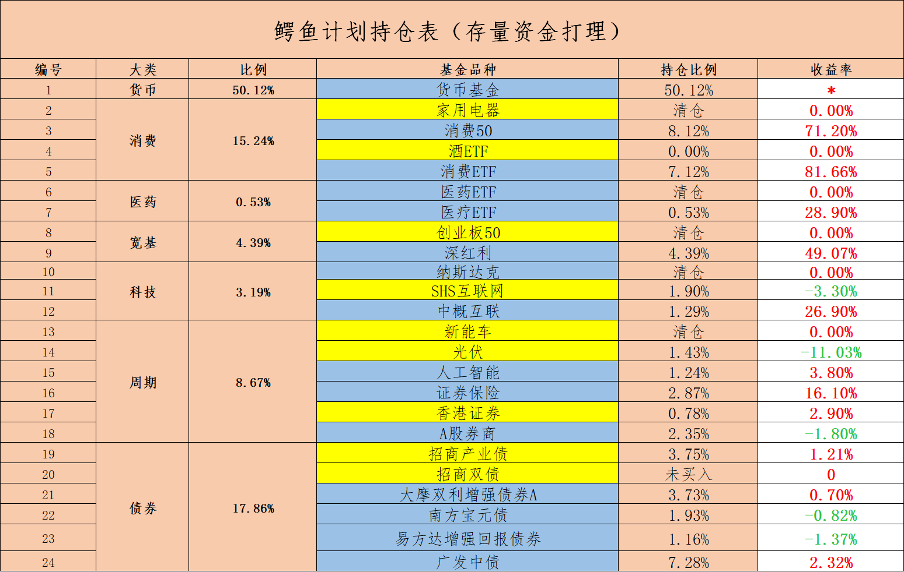

======================================================

_type: q&a
@风动幡动心不动[844418442154182]
2021-05-29 13:32:01 Sat  
topic_id: 582881218482814

@风动幡动心不动

>  二师傅好！当前通胀来势汹汹，该如何进行资产配置呢？

@二师父

>  一二线房子，基金，我认为是最好的抵御通胀的方式，长期看都可以保值，基金能实现增值。
>  
>  然后留点现金，以防去年那种意外，多学习提升自己，自己也是资产，投资自己脖子以上的部分，比房子，基金都要重要
>  
>  如果认知不够，空有房子，股权守不住，反之如果什么都没有，只要有知识，智慧，一样可以从头开始，再次拥有一切
>  
>  核心是配置自己，提升自己的认知和智慧，另外保持身体健康，身心愉悦，足以抵御一切通胀

阅读[1]  评论[4]  赞[0] 

======================================================

_type: talk
@天玺哥[421828421128848]
2021-05-29 14:01:22 Sat  
topic_id: 582881252221554

师父：明天REITs发行，能聊聊这种基金产品值得投资吗？

@二师父 at 2021-05-29 14:01:22 Sat

> 一会发到星球

----------

阅读[1]  评论[1]  赞[0] 

======================================================

_type: talk
@二师父[28814221155551]
2021-05-29 16:26:34 Sat  
topic_id: 215118525444111

<e type="hashtag" hid="48412124848418" title="#讲基金——REITs基金介绍#" />

@梧桐 at 2021-05-29 16:26:34 Sat

> 请教各位今9点二师父分析的链接找不到了呢

----------

@梧桐 at 2021-05-29 16:26:34 Sat

> 今晚九点

----------

@二师父 at 2021-05-29 16:26:34 Sat

> 刚直播完，下次有机会再一起聊一聊

----------

@永刚 at 2021-05-29 16:26:34 Sat

> 从哪里提前知道师父的寅讲？

----------

@二师父 at 2021-05-29 16:26:34 Sat

> 后面有的话我发到星球哈

----------

@范毅君 at 2021-05-29 16:26:34 Sat

> 就是，偷偷直播，也不知会一下星球的家人[呲牙][呲牙][呲牙]

----------

@二师父 at 2021-05-29 16:26:34 Sat

> 哈哈，还有机会的

----------

@天玺哥 at 2021-05-29 16:26:34 Sat

> 师傅在哪平台直播？

----------

阅读[1]  评论[11]  赞[0] 

+++++++++++++++++++++++++++++++++++++++++++++++++++++

文件：
2021-05-29 16:26:23 Sat
文件大小：[17435]
844445255814552-什么是reits基金，以及他的投资价值.docx

2021-05-29 16:26:33 Sat
文件大小：[2908863]
422224544812428-reits基金介绍.m4a

======================================================

_type: q&a
@波多黎各[28428858544121]
2021-05-30 09:10:55 Sun  
topic_id: 215118542158111

@波多黎各

>  二师父，今天发现好像所有的主动基金历年都跑输招商中证白酒指数，这基金好猛啊！

@二师父

>  是的，最近5年是这样子，不过历史上也有白酒表现不大好的时候

阅读[1]  评论[0]  赞[0] 

======================================================

_type: talk
@二师父[28814221155551]
2021-05-30 10:26:46 Sun  
topic_id: 215118544451811

目前的组合计划，安心组合一次购买，乌龟计划跟车，鳄鱼计划跟车，后面有机会的话会在天天建两个激进组合，一个纯主动基金，一个纯指数基金，这样方便粉丝朋友看到往期变动情况。大家根据需求自取，喜欢指数的投指数，喜欢主动的投主动，主动里面有牛基，混合里面也有牛基。

@果实妈咪 at 2021-05-30 10:26:46 Sun

> 安心组合在哪里可以看到二师父

----------

@二师父 at 2021-05-30 10:26:46 Sun

> 也是天天基金，后面发组合都会发到天天基金的

----------

阅读[1]  评论[2]  赞[1] 

+++++++++++++++++++++++++++++++++++++++++++++++++++++

图片：

======================================================

_type: talk
@二师父[28814221155551]
2021-05-30 12:39:51 Sun  
topic_id: 815118541255122

<e type="hashtag" hid="88514145222482" title="#人民币升值，是否要加仓#" /> 人民币升值要加仓吗，仓位3到7层的话，可以不用，低于3层的，或者空仓的，可以来一点。

@wty at 2021-05-30 12:39:51 Sun

> 二师父，我有些美元在老虎基金，怎么在美股场内买中概指数呢？代码是多少呢？

----------

@二师父 at 2021-05-30 12:39:51 Sun

> 我直接买的股票，你可以看看纳斯达克指数

----------

@wty at 2021-05-30 12:39:51 Sun

> 好的，谢谢🙏

----------

阅读[1]  评论[3]  赞[0] 

+++++++++++++++++++++++++++++++++++++++++++++++++++++

文件：
2021-05-30 12:38:58 Sun
文件大小：[57241]
844445254122412-人民币升值，当前需要加仓吗.docx

======================================================

_type: talk
@芙瑞雅阳阳潘[421181844812818]
2021-05-30 14:50:52 Sun  
topic_id: 215118518222841

师父，我想知道千岁国际是不是骗人的？

@二师父 at 2021-05-30 14:50:52 Sun

> 是的

----------

@芙瑞雅阳阳潘 at 2021-05-30 14:50:52 Sun

> 好的，明白了

----------

阅读[1]  评论[2]  赞[0] 

======================================================

_type: talk
@二师父[28814221155551]
2021-05-30 16:59:47 Sun  
topic_id: 182885284251882

<e type="hashtag" hid="28514145451411" title="#基金投资代码#" /> 这是相关代码，保存下就不需要每次问代码了，基本上投资都覆盖这些基金，有新加入的会更新的。

@阿宝 at 2021-05-30 16:59:47 Sun

> 谢谢老师

----------

阅读[1]  评论[1]  赞[0] 

+++++++++++++++++++++++++++++++++++++++++++++++++++++

图片：
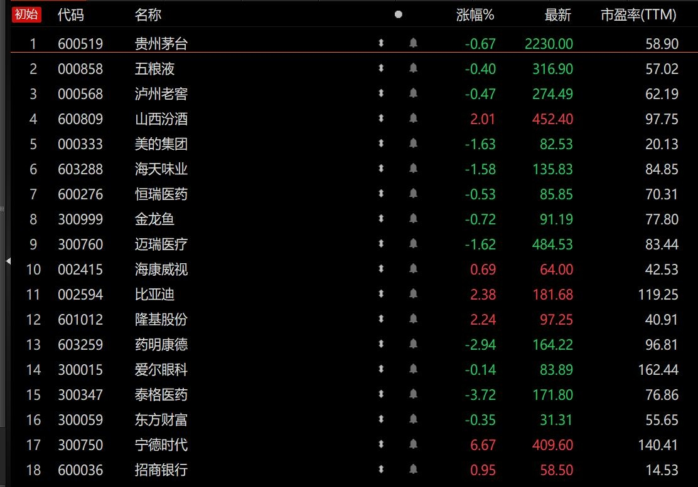
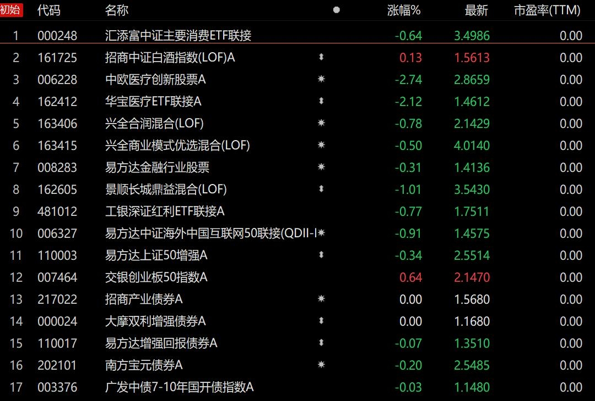

======================================================

_type: talk
@二师父[28814221155551]
2021-05-30 21:16:42 Sun  
topic_id: 215118514252221

<e type="hashtag" hid="28514145425411" title="#中概股基金#" /> 这是目前可以在美股账户投资的中概股基金，美元目前别结汇，做点投资，等加息周期以后，美元升值了再考虑结汇。

这只重仓的网易，阿里，拼多多，京东，淘宝，b占，目前也是不错的

关于中概要提醒下风险，疫情是利好他的发展，而整个行业竞争大，有利润缩小的趋势，所以也得定投，目前虽然低估，但是离底部有一定的距离。

阅读[1]  评论[0]  赞[0] 

+++++++++++++++++++++++++++++++++++++++++++++++++++++

图片：
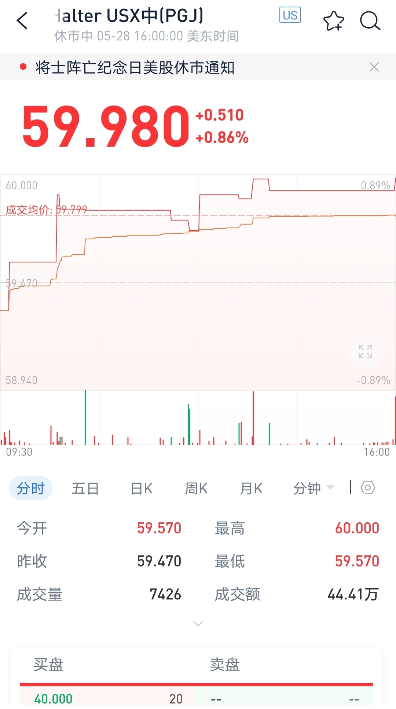

======================================================

_type: talk
@百变[15285855281882]
2021-05-31 06:28:05 Mon  
topic_id: 182885524525842

二师父：我看到的中概互联怎么是折价啊？

@二师父 at 2021-05-31 06:28:05 Mon

> 这里折价率为正，就是溢价

----------

@J at 2021-05-31 06:28:05 Mon

> 折价率为正就代表有场内溢价

----------

@J at 2021-05-31 06:28:05 Mon

> 师父，请教一下，图中的iopv和净值两个数据为何不一样的呢？

----------

@二师父 at 2021-05-31 06:28:05 Mon

> 一个实时的，每15分钟报价一次，一个是收盘后的

----------

@J at 2021-05-31 06:28:05 Mon

> 谢谢师父

----------

阅读[1]  评论[5]  赞[0] 

+++++++++++++++++++++++++++++++++++++++++++++++++++++

图片：
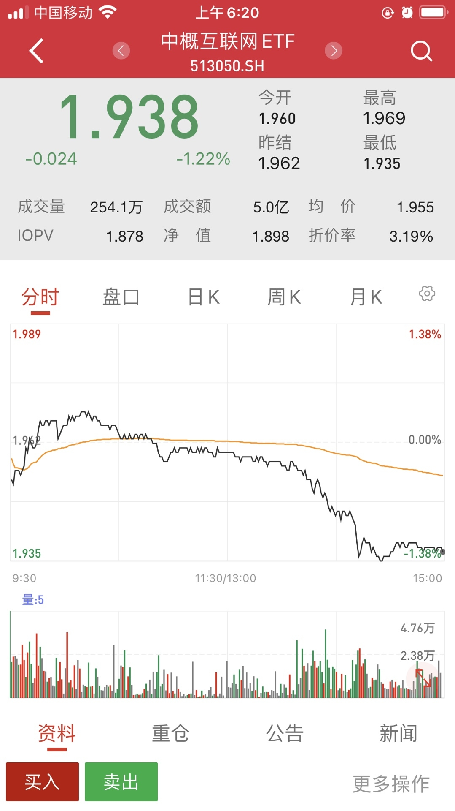

======================================================

_type: q&a
@蛋炒饭不加蛋[118281818482542]
2021-05-31 07:59:23 Mon  
topic_id: 182885218451882

@蛋炒饭不加蛋

>  请问二师父对000294华安生态优先混合基金持仓以及基金经理怎么看

@二师父

>  这只基金还是挺好的，重仓消费类，最近遇到困境的猪茅也加进来了

阅读[1]  评论[0]  赞[0] 

======================================================

_type: talk
@二师父[28814221155551]
2021-05-31 08:29:55 Mon  
topic_id: 182885524822842

<e type="hashtag" hid="28514145412241" title="#介绍一只有价值的指数#" /> 	中证细分农业产业主题指数反映沪深两市细分农业产业公司股票的整体走势，该指数从农林牧渔等细分产业中挑选规模较大、流动性较好的公司股票组成样本股。

持仓大部分是主要消费品种，最近收到非洲猪瘟影响，牧原等企业遭遇强烈错杀，对于价值投资者而言就是机会。

从ROE来看，细分农业指数ROE高于15%，对于猪瘟，一定会慢慢过去，所以在猪肉企业见底之前配置是比较好的选择。

关注下细分农业指数，属于周期性指数，适合在周期底部配置，顶部走人。

@onepiecewi* at 2021-05-31 08:29:55 Mon

> 师父代码是多少

----------

@冯林锋 at 2021-05-31 08:29:55 Mon

> 指数编号是多少，二师父

----------

@二师父 at 2021-05-31 08:29:55 Mon

> 000809

----------

@二师父 at 2021-05-31 08:29:55 Mon

> 000809

----------

@冯林锋 at 2021-05-31 08:29:55 Mon

> 谢谢

----------

@wty at 2021-05-31 08:29:55 Mon

> 怎么在华宝证劵里搜索000809是“铁岭新城”呢？

----------

@不再YY的猪 at 2021-05-31 08:29:55 Mon

> 有没有跟踪这个指数的基金？

----------

@二师父 at 2021-05-31 08:29:55 Mon

> 这是指数代码哈

----------

阅读[1]  评论[15]  赞[0] 

======================================================

_type: talk
@二师父[28814221155551]
2021-05-31 09:34:43 Mon  
topic_id: 414118841128258

<e type="hashtag" hid="88514145414212" title="#鳄鱼计划5月第二次#" /> 买入招商双债（161716）10份，买入转债etf（511380）2份。今年以防守为主，支撑位可以适当加仓等待反弹，大举进攻的时候并未到来。每个人性格特点不同，如果你有自己的想法而且也能做到稳定年化15个点以上收益率，可以不用完全跟车。

另外集合竞价买入了在财经号讲的转债，这个大家可以看看我的操作，学习一下，转债也是个好品种，只不过先学习，学会了再操作，盲目入市很危险，后面实盘当日发车会置顶，大家记得从置顶里面找重要信息。

爱慕停牌，等开板再卖出。

@是喵喵吖～ at 2021-05-31 09:34:43 Mon

> 师父有点不太明白为什么现在这个时间段买入呢

----------

@二师父 at 2021-05-31 09:34:43 Mon

> 优质债券都是牛长熊短，长期向上，所以一次买入较大头寸，回撤最大10个点，买入是没问题的哈

----------

@是喵喵吖～ at 2021-05-31 09:34:43 Mon

> 好滴谢谢师父

----------

@衣袂飘香 at 2021-05-31 09:34:43 Mon

> 转债看不大懂，您这是8只转债都买了吗？

----------

@二师父 at 2021-05-31 09:34:43 Mon

> 对，都买了，双低策略摊大饼，你可以先追踪下我的收益率，搞明白了再考虑要不要投

----------

@付云 at 2021-05-31 09:34:43 Mon

> 我最近也在研究可转债，很有意思的东西

----------

@二师父 at 2021-05-31 09:34:43 Mon

> 公众号二师父财经会分享转债知识

----------

@九妹Amy'' at 2021-05-31 09:34:43 Mon

> 一份是多少钱

----------

阅读[1]  评论[15]  赞[0] 

+++++++++++++++++++++++++++++++++++++++++++++++++++++

图片：

======================================================

_type: q&a
@果实妈咪[182225518588452]
2021-05-31 11:09:09 Mon  
topic_id: 582881112481824

@果实妈咪

>  二师父您好，鳄鱼计划161716是场内的吧，我看场外也有，谢谢

@二师父

>  对，是场内买的，这种资金到账快，其他的场内债基规模都太低，招商双债规模相对较大

阅读[1]  评论[1]  赞[0] 

======================================================

_type: q&a
@果实妈咪[182225518588452]
2021-05-31 11:13:55 Mon  
topic_id: 582881112851184

@果实妈咪

>  二师父，招商双债今天的鳄鱼计划应该是这个吗？

@二师父

>  对的，就是这个，场内和场外没有本质区别的，就是费率和回款速度的区别

阅读[1]  评论[2]  赞[0] 

======================================================

_type: q&a
@宋航[48548414258158]
2021-05-31 11:26:57 Mon  
topic_id: 815118885118222

@宋航

>  二师父，我记得不太清晰，您之前有发过一个有关个人的资产负债表？能否再发下啊？

@二师父

>  这个表，评估下家庭财务状况，经济不好杠杆别加大了

阅读[1]  评论[1]  赞[0] 

======================================================

_type: talk
@林玮[844111858288412]
2021-05-31 11:36:37 Mon  
topic_id: 182885555211812

006327暂停交易

@云云 at 2021-05-31 11:36:37 Mon

> 对呐，我上周末没关注二师父的动态，今天想跟上，居然买不了，不知道为什么

----------

@二师父 at 2021-05-31 11:36:37 Mon

> 可以买，今天美股休市

----------

@云云 at 2021-05-31 11:36:37 Mon

> 那明天买[微笑]

----------

阅读[1]  评论[3]  赞[0] 

======================================================

_type: q&a
@娃娃after🎈[88818155445112]
2021-05-31 13:35:48 Mon  
topic_id: 815118888888452

@娃娃after🎈

>  二师父，请问003117 光大吉鑫混合A 这个基金怎么样？

@二师父

>  属于价值类防守基金，整体配置偏价值股和债权，适合预期收益不高，只想稳健增值的朋友

阅读[1]  评论[0]  赞[0] 

======================================================

_type: talk
@二师父[28814221155551]
2021-05-31 13:37:14 Mon  
topic_id: 182885555818422

现在发车信息和每天讲课内容都会放到置顶和精华里面，大家记得首先看看置顶内容哈

@兴乐之家 at 2021-05-31 13:37:14 Mon

> 明白了，二师傅

----------

阅读[1]  评论[1]  赞[0] 

======================================================

_type: talk
@二师父[28814221155551]
2021-05-31 19:41:21 Mon  
topic_id: 815118828885142

<e type="hashtag" hid="88514148541112" title="#三孩政策#" /> 三孩政策放开，利好的板块，大家看看，抓住政策下的机会。

@梧桐 at 2021-05-31 19:41:21 Mon

> 二师父，今天的鳄鱼计划是在财经公众号看到的，到现在星球也还没有。

----------

@二师父 at 2021-05-31 19:41:21 Mon

> 有，置顶第一篇文章，我上午都发了

----------

@梧桐 at 2021-05-31 19:41:21 Mon

> 看到了，谢谢二师父

----------

阅读[1]  评论[3]  赞[0] 

+++++++++++++++++++++++++++++++++++++++++++++++++++++

文件：
2021-05-31 19:40:24 Mon
文件大小：[42617]
544442551285124-三孩政策来了，你生不生？.docx

======================================================

_type: talk
@二师父[28814221155551]
2021-05-31 21:05:15 Mon  
topic_id: 182885541414822

<e type="hashtag" hid="458588251558" title="#周一市场分析#" /> 一周讲5节课，重要的内容我会发布之后直接置顶，大家多关注信息。另外去年考的MBA通过了，后面我在学校系统学习到的金融和商业知识也会分享给大家，学习短期是一件痛苦的事情，长期是一件幸福的事情，做一个有智慧的人，千万别跟风反智。

躺平说说就可以了，也许别人让你躺平的时候自己拼命加班学习充电，你不学习就被淘汰了，人生充满了竞争，不要被反智主义洗脑。

你看新生儿第一声的声音是啼哭就知道，人生生来是在奋斗，而不是享受，当付出与收获不对等，也许不是付出少了，而是自己的价值不够，关键在于提升。

也许努力之后依然达不到一个高层次的水平，依然买不起房，依然生不起三孩，但是努力奋斗之后，今天比昨天好一点，明天比今天好一点，那么时间长了你的人生也会比当初更加明朗，也就不需要抱怨社会，怨天尤人。

所以，多努力，积极的人生源于进取的心态。

@庆余年 at 2021-05-31 21:05:15 Mon

> 二师父，考MBA的目的是为了啥，开公司？积累人脉？

----------

@二师父 at 2021-05-31 21:05:15 Mon

> 学习并开拓自己的视野，让自己的知识结构更加完备。你说的这两个不考mba也能做到

----------

@庆余年 at 2021-05-31 21:05:15 Mon

> 现在的教育还是以功利性居多的，二师父很赞，站得高才看得远。

----------

@二师父 at 2021-05-31 21:05:15 Mon

> 教育产业化的结果

----------

阅读[1]  评论[4]  赞[0] 

+++++++++++++++++++++++++++++++++++++++++++++++++++++

文件：
2021-05-31 20:59:23 Mon
文件大小：[29849]
544442551511854-周一市场分析.docx

======================================================

_type: talk
@二师父[28814221155551]
2021-05-31 21:23:35 Mon  
topic_id: 182885541111142

<e type="hashtag" hid="552114551414" title="#估值数据#" /> 市盈率百分位45.29%，SY-BY百分位46.88%，SY/BY百分位43.85%，整体估值仍旧偏低的，当前市场主要是资金抱团几大板块，地产、券商、大金融等基本趴着。

找结构性机会去投资，不要盲目捡便宜。

阅读[1]  评论[0]  赞[0] 

======================================================

_type: talk
@庆余年[15584481824122]
2021-05-31 22:23:23 Mon  
topic_id: 815118821821522

基金排行，这次挑的是兼顾收益和低回撤的基金。

@永刚 at 2021-05-31 22:23:23 Mon

> 期待您的基金池

----------

@庆余年 at 2021-05-31 22:23:23 Mon

> 主动基，二师父之前说了会出一个的😄 😄

----------

@永刚 at 2021-05-31 22:23:23 Mon

> 但是以前推荐的兴全合润，景顺鼎益都不在这个基金表里

----------

@二师父 at 2021-05-31 22:23:23 Mon

> 我是看的10年牛基，最近合润表现也一般

----------

@庆余年 at 2021-05-31 22:23:23 Mon

> 我说一下，这个表受近期表现的影响会比较大，但是我每个月都会发，你们可以找一些每个月都出现并且出现的频率比较高的基金，景顺的本来已经入选了，但是他近一年回撤有30%以上，同期沪深300只有22.9%，所以我把它干掉了。

----------

阅读[1]  评论[5]  赞[0] 

+++++++++++++++++++++++++++++++++++++++++++++++++++++

文件：
2021-05-31 22:23:23 Mon
文件大小：[267880]
422224558154518-基金排行-2106.docx

======================================================

