_type: q&a
@小鱼[241182222251181]
2021-06-01 10:03:48 Tue  
topic_id: 182885418545282

@小鱼

>  中概互联，场外基金星期五没跟上，今天投可以吗

@二师父

>  可以的

阅读[1]  评论[4]  赞[0] 

======================================================

_type: talk
@二师父[28814221155551]
2021-06-01 10:16:50 Tue  
topic_id: 414118521555288

<e type="hashtag" hid="222484545521" title="#打新提示#" />  今天三花转债，选择申购，上市是否卖出主要看是否盈利以及是否满足双低标准，低价格，低转股溢价率是最低要求。

博力威：主营业务为锂离子电池研发，制造销售。所属行业为电气机械制造业。选择申购。

爱慕股份可以继续持有，博云，超捷两块大肉又来了。

开户渠道如下， <e type="web" href="https://m.touker.com/trade/activity/common/channelOpen.htm?moduleDataId=275&channel=V2SF" title="华宝证券手机开户" cache="" />

阅读[1]  评论[0]  赞[0] 

======================================================

_type: talk
@芙瑞雅阳阳潘[421181844812818]
2021-06-01 10:38:08 Tue  
topic_id: 582881548441824

师父，517200赚4.47%，是出还是拿着？

@二师父 at 2021-06-01 10:38:08 Tue

> 多少仓位

----------

@芙瑞雅阳阳潘 at 2021-06-01 10:38:08 Tue

> 1成

----------

@二师父 at 2021-06-01 10:38:08 Tue

> 总仓位5以上，可以分成10份，然后卖出一份，大概率还是震荡，后面还会买入的

----------

@芙瑞雅阳阳潘 at 2021-06-01 10:38:08 Tue

> 好

----------

阅读[1]  评论[4]  赞[0] 

======================================================

_type: talk
@二师父[28814221155551]
2021-06-01 11:29:36 Tue  
topic_id: 582881581484124

<e type="hashtag" hid="15281815455852" title="#周二：热点分析#" />

@天玺哥 at 2021-06-01 11:29:36 Tue

> 师傅场外怎么转场内？我在支付宝买的

----------

@二师父 at 2021-06-01 11:29:36 Tue

> 我油气和纳斯达克转过，在场内账户申购，然后转场内

----------

@Chu at 2021-06-01 11:29:36 Tue

> 师父，我目前持有场内中概盈利6个点，是全部卖出还是说收割利润本金继续持有

----------

@二师父 at 2021-06-01 11:29:36 Tue

> 收割利润或者持有

----------

阅读[1]  评论[4]  赞[0] 

+++++++++++++++++++++++++++++++++++++++++++++++++++++

文件：
2021-06-01 11:29:26 Tue
文件大小：[40105]
844445224824442-周二：热点分析.docx

======================================================

_type: talk
@晴[15422515228522]
2021-06-01 11:34:26 Tue  
topic_id: 414118518145488

二师父，招商双债在华宝暂不售卖？

@付云 at 2021-06-01 11:34:26 Tue

> 昨天能买啊，我用也是这个软件

----------

@晴 at 2021-06-01 11:34:26 Tue

> 我刚刚看暂不售卖[发呆]

----------

@付云 at 2021-06-01 11:34:26 Tue

> 可以买，我刚刚买了一手[得意]

----------

@晴 at 2021-06-01 11:34:26 Tue

> 为啥………

----------

@付云 at 2021-06-01 11:34:26 Tue

> 我没有C的字样

----------

@二师父 at 2021-06-01 11:34:26 Tue

> 在场内买，不走申购

----------

阅读[1]  评论[6]  赞[0] 

======================================================

_type: q&a
@🍀 凝🌸 慧🍀[841855248254242]
2021-06-01 13:40:00 Tue  
topic_id: 815118212452822

@🍀 凝🌸 慧🍀

>  师父好，在场内卖出1万股中概互联后，如果场内申购买不了，能在场外买1万股易方达中证海外连接人民币这个吗？

@二师父

>  场内能申购的，我上午刚申购

阅读[1]  评论[8]  赞[0] 

======================================================

_type: talk
@云卷云舒[28288212211221]
2021-06-01 14:31:32 Tue  
topic_id: 582881585848814

师父好！您这介绍的中概互联是场内溢价套利操作吗！是否一定要在收盘之前操作？

@二师父 at 2021-06-01 14:31:32 Tue

> 没法套利，这是连接基金

----------

@云卷云舒 at 2021-06-01 14:31:32 Tue

> 知道了，谢谢师傅！

----------

阅读[1]  评论[2]  赞[0] 

======================================================

_type: talk
@二师父[28814221155551]
2021-06-01 18:44:19 Tue  
topic_id: 182885125542582

关于套利，如果是连接基金是没法转场内的，所以场内申购中概互联和场外申购中概互联是没有区别，纳斯达克和华宝油气是可以套利操作，理财产品场外申购，转托管到场内溢价卖出。

@小牧童 at 2021-06-01 18:44:19 Tue

> 师父，中概互联ETF也不能转场外吧？您说的理财产品指的是哪些？

----------

@二师父 at 2021-06-01 18:44:19 Tue

> 转不了，这里说的理财的意思是在场内证券账户理财栏，选择场外基金代码，可以申购

----------

阅读[1]  评论[2]  赞[0] 

======================================================

_type: talk
@二师父[28814221155551]
2021-06-01 19:59:45 Tue  
topic_id: 582881421412884

<e type="hashtag" hid="15281815418842" title="#如何操作#" />

@宋航 at 2021-06-01 19:59:45 Tue

> 我跟随发车互联网50的鳄鱼计划亏损4%，有和我一样情况的群友吗？😂

----------

@长安流歌 at 2021-06-01 19:59:45 Tue

> 我跟投发车的互联网50也是负4%

----------

@顾小胖 at 2021-06-01 19:59:45 Tue

> 我也是亏4%呀

----------

@门萨🐨 at 2021-06-01 19:59:45 Tue

> 同亏[流泪]

----------

阅读[1]  评论[4]  赞[0] 

+++++++++++++++++++++++++++++++++++++++++++++++++++++

文件：
2021-06-01 19:59:32 Tue
文件大小：[31661]
422224528541858-发车的互联网50盈利9.9%，是否继续买.docx

======================================================

_type: q&a
@永刚[15581448518112]
2021-06-01 21:04:28 Tue  
topic_id: 182885125558442

@永刚

>  请教师父：513010恒生科技30ETF和513330恒生互联网ETF现在可以投吗？哪个更有价值？

@二师父

>  两只基金都很有价值，选择第二个更有价值。
>  
>  目前正常估值，参考均线，按照均线60日以下定投是没有问题的。

阅读[1]  评论[3]  赞[0] 

======================================================

_type: talk
@二师父[28814221155551]
2021-06-01 22:32:40 Tue  
topic_id: 582881424281524

<e type="hashtag" hid="552114551414" title="#估值数据#" /> 市盈率百分位46.51%，SY/BY百分位44.58%，SY-BY百分位47.76%。

估值楼层即将进入第四层，市场反弹很快，成交额连续三个交易日万亿以上，不要过度兴奋。

对于逆向和趋势投资者是两种不同策略，坚持用一种就行，逆向就是底买，高卖。趋势是高买更高卖。

无论哪种投资，都保证卖出大于买入这个结果，才可挣钱。

关于转债ETF和债券的投资，这个轮动是相对的，股债双牛，那么债券也跑不赢股票的，未来半年如果真的是牛市，我们会把所有的仓位分批上到纯债、二级债基、以及转债上面，目前我自己也开始做可转债了。现在可能你发现不了好处，如同我2018年开始重仓股市一样，面临很大回撤，可是你过两道三年以后再看，不及早买入，越跌越不敢上车，同样地未来也会发现，不及早准备收手，中途被狂热情绪带动收不了手。

阅读[1]  评论[0]  赞[0] 

======================================================

_type: q&a
@新~~~[548111115214414]
2021-06-02 07:08:10 Wed  
topic_id: 815118488821122

@新~~~

>  请问二师父投资组合在哪里可以看啊？

@二师父

>  置顶第二篇文章实盘展示，点击链接即可

阅读[1]  评论[0]  赞[0] 

======================================================

_type: q&a
@鳗鱼[182242255828582]
2021-06-02 09:53:49 Wed  
topic_id: 215118481285141

@鳗鱼

>  二师父，中了只新股欢乐家，什么时候卖出比较好？

@二师父

>  恭喜啊，这种没定论，如果不贪的话现在就可以走，很大的利润了啊，而且公司目前多面出击，业务受阻，毛利率也不高，现在走挺好的
>  
>  如果还想博取高收益，先拿一拿，博一博，那么锁定回撤，高点回撤百分之10到15立马走人

阅读[1]  评论[4]  赞[0] 

======================================================

_type: talk
@百变[15285855281882]
2021-06-02 10:05:45 Wed  
topic_id: 815118481482212

二师父：我半导体做网格低吸了10分之一的仓位，现在半导体涨起来了是继续做网格还是取消网格涨到高估一次性卖出？

@二师父 at 2021-06-02 10:05:45 Wed

> 网格

----------

@百变 at 2021-06-02 10:05:45 Wed

> 谢谢[玫瑰]

----------

阅读[1]  评论[2]  赞[0] 

======================================================

_type: talk
@二师父[28814221155551]
2021-06-02 11:21:40 Wed  
topic_id: 182885142421422

本周轮动情况，对转债投资有兴趣的可以关注，目前还没找到一种和基金一样，凡卖出必盈利的方法，不过按照双低策略操作，总体盈利可观，后面每周出一个符合双低买入的，一周实现百分之1的收益，一年就是百分之48，这是非常可观的，适合喜欢管不住手的朋友操作

@Hi·DD at 2021-06-02 11:21:40 Wed

> 还有这种操作[偷笑]二师父要来拯救银河系了吗

----------

@J at 2021-06-02 11:21:40 Wed

> 超赞啊

----------

@二师父 at 2021-06-02 11:21:40 Wed

> 可转债拯救银河系

----------

@🍀 凝🌸 慧🍀 at 2021-06-02 11:21:40 Wed

> 第一次接触，跟师父学习学习～

----------

@姥姥不疼. 爷爷不爱 at 2021-06-02 11:21:40 Wed

> 1支转债是买20个么，今天全部卖出是么

----------

@二师父 at 2021-06-02 11:21:40 Wed

> 达到百分之5收益率的卖出了

----------

@陈飞🤗 at 2021-06-02 11:21:40 Wed

> 二师父，本钢转债可以买吗

----------

@二师父 at 2021-06-02 11:21:40 Wed

> 如果你有耐心持有到5年后到期可以

----------

阅读[1]  评论[17]  赞[0] 

+++++++++++++++++++++++++++++++++++++++++++++++++++++

图片：
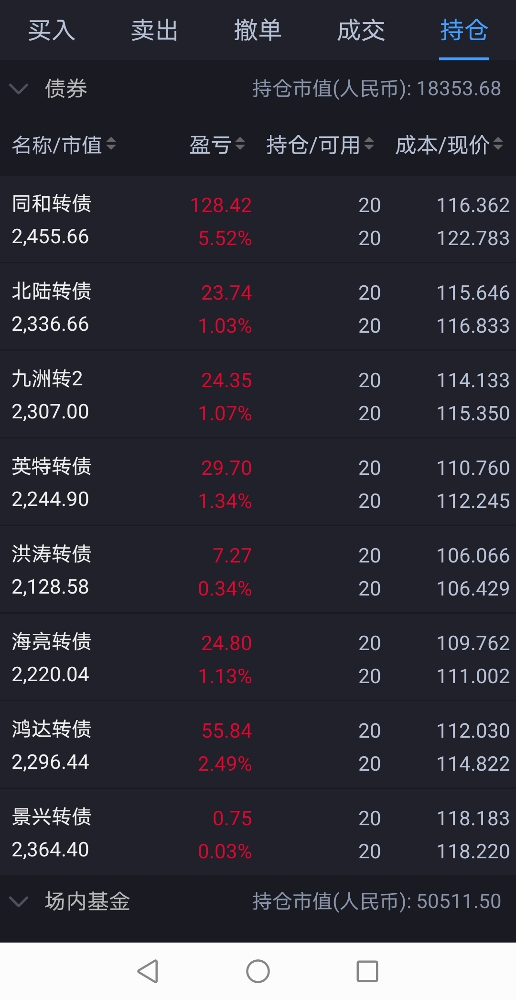

======================================================

_type: q&a
@姥姥不疼. 爷爷不爱[48544481458248]
2021-06-02 12:34:47 Wed  
topic_id: 182885142814112

@姥姥不疼. 爷爷不爱

>  您买的可转债1支是买20个么，另外，今天8支全部卖出了，是么

@二师父

>  2手，还没卖，需要看转债数据以及盈利情况，预设目标百分之8绝对止盈位置

阅读[1]  评论[7]  赞[0] 

======================================================

_type: talk
@林玮[844111858288412]
2021-06-02 14:03:40 Wed  
topic_id: 182885145412422

师父今天有动作吗？

@二师父 at 2021-06-02 14:03:40 Wed

> 卖了同和转债，今晚乌龟计划发车，还是以周四收盘价格成交。

----------

阅读[1]  评论[1]  赞[0] 

======================================================

_type: talk
@二师父[28814221155551]
2021-06-02 15:38:58 Wed  
topic_id: 215118424424811

<e type="hashtag" hid="51284844545114" title="#关于转债投资#" /> 如果不想操心的话就投资转债ETF，目前投的转债ETF是折价，不是溢价。场内买入没毛病。

第二以后我会出一个8张转债表，都代表可以申购的，盈利2%到8%后卖出。如果亏了有两种情况，第一跌到100元再补，持有到期也能盈利。这种适合溢价率低，正股质量好，到期赎回价格高。

第二跌了走人，这种适合整股质量差，然后溢价率高，到期赎回价格低，到期时间很长的。

开始投资的时候看不懂很正常，如果没兴趣不必要学习了，看个人，多个投资渠道，按照双低策略买转债比瞎买股票风险低很多，而且牛市的时候很多转债涨幅和正股接近，只要不买价格超过130以上的转债，和游资一起瞎炒作，风险就被极大地控制了。

@样 at 2021-06-02 15:38:58 Wed

> 可转债是t+0吧？

----------

@二师父 at 2021-06-02 15:38:58 Wed

> 是的

----------

@衣袂飘香 at 2021-06-02 15:38:58 Wed

> 跟着学。

----------

阅读[1]  评论[3]  赞[0] 

======================================================

_type: talk
@二师父[28814221155551]
2021-06-02 17:05:51 Wed  
topic_id: 182885148421222

<e type="hashtag" hid="481211145528" title="#指数估值#" /> 人工智能进入正常估值了，中概互联仍旧低估，继续定投。稍后发车，以周四收盘净值成交。

阅读[1]  评论[0]  赞[0] 

+++++++++++++++++++++++++++++++++++++++++++++++++++++

图片：

======================================================

_type: talk
@二师父[28814221155551]
2021-06-02 17:07:18 Wed  
topic_id: 414118251542558

<e type="hashtag" hid="224445218111" title="#全市场估值数据#" /> 市盈率百分位47.7%，SY-BY百分位48.3%，SY/BY百分位44.98%。

阅读[1]  评论[0]  赞[0] 

======================================================

_type: q&a
@学习者[145418411842]
2021-06-02 18:29:31 Wed  
topic_id: 815118421148842

@学习者

>  师父好，最近想买点股票，不知道从哪下手，期待师傅点拨

@二师父

>  从我发的表，18个里面选，都是优质企业，你买对价格就行了，建议等待每一次回调下跌企稳后买入，每一次上涨到阶段高位不适合

阅读[1]  评论[1]  赞[0] 

======================================================

_type: talk
@二师父[28814221155551]
2021-06-02 18:57:16 Wed  
topic_id: 414118224415428

<e type="hashtag" hid="15281811488112" title="#乌龟计划发车了#" /> 乌龟计划发车，跟投连接如下<e type="web" href="https://h5.1234567.com.cn/app/combo-show-list-share/pages/index/index?passportid=7674055272779748" title="天天基金" cache="" />，可以一键调仓。

开车了，别掉队了。注意有一个转换操作。

@果实妈咪 at 2021-06-02 18:57:16 Wed

> 易方达国开债代码多少，师父，怕转换错了😭

----------

@二师父 at 2021-06-02 18:57:16 Wed

> 003358

----------

@果实妈咪 at 2021-06-02 18:57:16 Wed

> 转出1200份就是现在净值乘以份数的那样多钱吧，二师父

----------

@吃肉肉 at 2021-06-02 18:57:16 Wed

> 师父是今天什么时候买的？现在发出来是现在也可以买吗？

----------

@二师父 at 2021-06-02 18:57:16 Wed

> 对的，相当于直接转到中概互联

----------

@二师父 at 2021-06-02 18:57:16 Wed

> 就是刚刚买的，不是今天三点以前

----------

@吃肉肉 at 2021-06-02 18:57:16 Wed

> 好的，跟上。

----------

@小鱼 at 2021-06-02 18:57:16 Wed

> 我国债不动，再买中概这样操作行吗。仓位有些地

----------

阅读[1]  评论[26]  赞[0] 

+++++++++++++++++++++++++++++++++++++++++++++++++++++

图片：
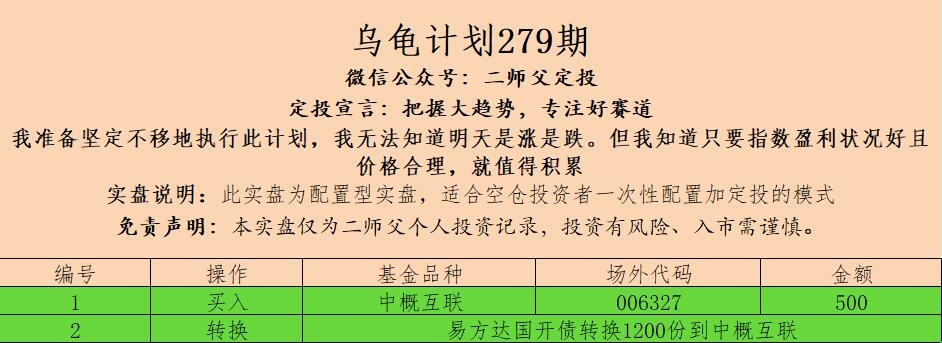

======================================================

_type: talk
@二师父[28814221155551]
2021-06-02 19:02:44 Wed  
topic_id: 414118224411218

互联网50我整体也是亏的，目前是负2.4个点，每周的实盘分析盈亏都有记录，我是说那一车盈利，有读者是一次跟车了大仓位，一车盈利和整体盈利两回事。

@雾海 at 2021-06-02 19:02:44 Wed

> 二十五中概互联买513050可以吗？

----------

@二师父 at 2021-06-02 19:02:44 Wed

> 没理解

----------

@哼哼 at 2021-06-02 19:02:44 Wed

> 二师傅他打成二十五了

----------

@Chu at 2021-06-02 19:02:44 Wed

> 师父，我看到乌龟计划发车中概互联，我不想投场外，可以投等额的互联网50代替吗

----------

@二师父 at 2021-06-02 19:02:44 Wed

> 一半金额，互联网50目前价格相对贵一点

----------

@Chu at 2021-06-02 19:02:44 Wed

> 好谢谢师父

----------

阅读[1]  评论[6]  赞[0] 

======================================================

_type: q&a
@付云[844148188522822]
2021-06-03 07:40:09 Thu  
topic_id: 182885184242282

@付云

>  二师傅，沪深300现在可以定投了么，周定投？！！！最终仓位想占比一层！

@二师父

>  回撤百分之5到10再定投，目前可以等等的

阅读[1]  评论[0]  赞[0] 

======================================================

_type: q&a
@付云[844148188522822]
2021-06-03 08:17:03 Thu  
topic_id: 815118412828422

@付云

>  二师傅，我中了三花发债，这个债还不错，能多留一段时间么

@二师父

>  可以持有到130元以上卖出

阅读[1]  评论[4]  赞[0] 

======================================================

_type: talk
@二师父[28814221155551]
2021-06-03 09:01:37 Thu  
topic_id: 215118412414841

据券商中国记者统计，今年1-5月份，市场合计成立600只基金，这一数值去年同期为616只，同比略减。其中，1月份成立164只基金，发行份额达5665.8亿份，此后随着抱团股瓦解，投资热情冷却，基金发行数量与认购份额数均呈现波动下行态势。2月份至4月份，市场成立基金数量分别为122、158、101只，5月份成立55只，环比4月份接近腰斩；基金发行份额仅有559.91亿份，为1月份的9.9%，不足十分之一。

值得注意的是，上一次基金发行如此清淡，还要追溯到32个月前，即2018年9月份，当月市场共成立49只基金，基金发行份额322.15亿份，月末沪指收于2821.35点，而后一个月下跌7.75%。此外，2018年的多个月份基金发行情况均不甚乐观，A股也处于一轮长达11个月的连续下跌行情中。不难发现，基金发行与市场行情呈正相关，行情越好，基金发行愈热，不过基金行业素来有“好发不好做，好做不好发”的传统，在市场低点发行基金并引导投资者长期持有，往往持有人体验会更好，而市场高点时期发行，号召力是最强的，但也容易导致基民“高位站岗”，比如今年年初的一波新基发行。

基金发行冷淡期，大力开搞，基金发行热门期，提款！

@阿宝 at 2021-06-03 09:01:37 Thu

> 反着来就对了。[呲牙]

----------

阅读[1]  评论[1]  赞[0] 

======================================================

_type: talk
@二师父[28814221155551]
2021-06-03 10:41:45 Thu  
topic_id: 582881484488844

<e type="hashtag" hid="28514144182281" title="#周四组合分析#" /> 每周四分析场外实盘组合，未来新建组合都会放到天天上，这样子大家关注发车就会有短信通知，有自己投资逻辑的可以参考我的实盘，自己发车，对于投资品种看不懂的跟车是可以的。

目前乌龟计划仓位大约50%，持仓品种以成长指数为主，300非银、中证红利、地产这些价值类指数并没有，成长指数波动大，熊市跌的多，牛市涨的多，盈亏同源，回撤的时候蹲点成长指数，一波下来盈利50%到150%没有问题。

当前持仓比较弱的是兴全趋势，今年董做的确实不大好，不过他判断未来有股灾，所有仓位也只有6成，短期看不出优劣，确实比大多数宽基都弱，但是不得不承认董的基金防守做得好，未来发生大股灾回撤能控制住。

安心组合持有的也有董的基金，连南方宝元债都没跑赢，拉低了整体收益。

未来计划，安心组合只投债基，乌龟计划80%指数基金，20%主动基金。注意分散配置，张坤，董承非这些顶级基金经理都有过踩雷记录，单调一只基金或者一只股票难度太大，建议基金投资10只左右分散比较合适。

阅读[1]  评论[0]  赞[0] 

======================================================

_type: talk
@二师父[28814221155551]
2021-06-03 10:53:08 Thu  
topic_id: 582881484814244

<e type="hashtag" hid="48412122185228" title="#可转债投资小知识#" /> 大家看转债双低值，就是转债价格+溢价率得到的数据，这是个参考指标，双低策略就是根据转债价格+溢价率得到的双低值来的。

每次精选转债参考双低值+正股质量+转债评级+到期时间等多个因素来确定是否购买。对于双低值高于140的转债就要避免购买，一定不能购买双低值超过140的。

昨天有读者提到英科医疗的转债，双低值达到1300多，就相当于极度高估的企业，炒作起来资金很容易给推到极端价格，然而跌起来也非常凶猛。

要想保证安全，就要选择双低值小的，比如今天游族转债因为股权转让利好遭遇炒作，但是双低值已经超过140，就别凑热闹了。

目前持仓海波和景兴略微浮亏，九洲盈利7.8%走人了。转债轮动，不贪心，守纪律，大概率是取胜的。亚药转债这种属于极个别情况，遇到了及时撤退或者有耐心长期持有到期都行。

@wty at 2021-06-03 10:53:08 Thu

> 学习中...

----------

@云卷云舒 at 2021-06-03 10:53:08 Thu

> 学习学习[呲牙]

----------

@宋航 at 2021-06-03 10:53:08 Thu

> 二师父，后面会说怎么买吗？还有就是可以跟车？

----------

@二师父 at 2021-06-03 10:53:08 Thu

> 一直在讲啊，每次精选几只我都有发的，一周发一次，还有买入卖出逻辑和方法也讲了，这个大家自行决定是否投资，比基金灵活一点

----------

@宋航 at 2021-06-03 10:53:08 Thu

> 嗯嗯，明白了二师父

----------

@衣袂飘香 at 2021-06-03 10:53:08 Thu

> 这样很好，边学边买。

----------

@门萨🐨 at 2021-06-03 10:53:08 Thu

> 属于短线还是长线操作？

----------

@二师父 at 2021-06-03 10:53:08 Thu

> 这个比较灵活

----------

阅读[1]  评论[15]  赞[0] 

+++++++++++++++++++++++++++++++++++++++++++++++++++++

图片：
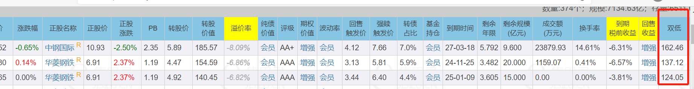

======================================================

_type: talk
@雪莲[421485848588118]
2021-06-03 13:13:00 Thu  
topic_id: 215118158284151

<e type="hashtag" hid="48412122185228" title="#可转债投资小知识#" /> 二师父，正股质量怎么看？

@二师父 at 2021-06-03 13:13:00 Thu

> 看转债对应的企业

----------

@雪莲 at 2021-06-03 13:13:00 Thu

> 好的，谢谢！

----------

阅读[1]  评论[2]  赞[0] 

======================================================

_type: talk
@平安是福[118222545154542]
2021-06-03 14:29:54 Thu  
topic_id: 582881821884884

师父：中概互联场内溢价率是多少

@🍀 凝🌸 慧🍀 at 2021-06-03 14:29:54 Thu

> 目前溢价率0.66%

----------

@平安是福 at 2021-06-03 14:29:54 Thu

> 谢谢

----------

@🍀 凝🌸 慧🍀 at 2021-06-03 14:29:54 Thu

> 不客气，举手之劳，师父有时候忙，不一定能及时看到。[偷笑]

----------

@JOY at 2021-06-03 14:29:54 Thu

> 想看溢价可以下个万得股票，看折价率，正数是溢价，负数是折价

----------

阅读[1]  评论[4]  赞[0] 

======================================================

_type: talk
@二师父[28814221155551]
2021-06-03 14:58:25 Thu  
topic_id: 215118152858851

两天中概互联的溢价都快跌没了，溢价品种不追就对了，热门不追就对了，说的就是白酒。

@果实妈咪 at 2021-06-03 14:58:25 Thu

> 还真是，两天跌的差不多了[微笑]

----------

阅读[1]  评论[1]  赞[0] 

======================================================

_type: talk
@二师父[28814221155551]
2021-06-03 19:36:43 Thu  
topic_id: 215118185288441

<e type="hashtag" hid="28514141585811" title="#高光白酒#" /> 永远不做空美股和白酒

阅读[1]  评论[0]  赞[0] 

+++++++++++++++++++++++++++++++++++++++++++++++++++++

文件：
2021-06-03 19:36:16 Thu
文件大小：[121714]
244445151528241-白酒可以撤退了.docx

======================================================

_type: talk
@二师父[28814221155551]
2021-06-03 21:36:01 Thu  
topic_id: 815118188254112

<e type="hashtag" hid="552114551414" title="#估值数据#" /> 市盈率百分位45.61%，SY-BY百分位47.33%，SY/BY百分位44.44%。

整体估值仍旧是正常偏低，市场严重两极分化，利率开始上行，价值板块中证红利、上证红利不断上涨，牛市末期的味道。

阅读[1]  评论[0]  赞[0] 

======================================================

_type: q&a
@马明谦[241845211824851]
2021-06-03 23:06:42 Thu  
topic_id: 582881815125414

@马明谦

>  师傅：新股无锡振华（605319）6月7日上市，是当天达到目标就止盈，还是留着等等看呢拿不定主意，我也没有具体的止盈止损目标。师傅有什么建议呢？

@二师父

>  高开低走，或者高位回落都可以卖出，一般新股都有资金炒作，会一直向上，扭头向下大概率资金流出，可以撤了

阅读[1]  评论[1]  赞[0] 

======================================================

_type: solution
2021-06-04 06:22:34 Fri  
topic_id: 815112525848412

@天玺哥 at 2021-06-04 06:22:34 Fri

> 是006327吗？

----------

阅读[1]  评论[1]  赞[0] 

======================================================

_type: talk
@丸子妈[28512522184441]
2021-06-04 07:40:10 Fri  
topic_id: 414115454241548

5月做了一波可转债短期交易，轮动操作，盈利还不错

@二师父 at 2021-06-04 07:40:10 Fri

> 用的低价格策略？

----------

@丸子妈 at 2021-06-04 07:40:10 Fri

> 嗯，基本在110附近买入，涨了达到目标收益就卖了

----------

@九妹Amy'' at 2021-06-04 07:40:10 Fri

> 用哪个软件投资可转债？

----------

@丸子妈 at 2021-06-04 07:40:10 Fri

> 华泰

----------

@九妹Amy'' at 2021-06-04 07:40:10 Fri

> 好的，多谢

----------

@百变 at 2021-06-04 07:40:10 Fri

> 目标收益是怎么算出来的？

----------

@丸子妈 at 2021-06-04 07:40:10 Fri

> 自己设置的，比如5%，3%收益

----------

@百变 at 2021-06-04 07:40:10 Fri

> 哦！谢谢

----------

阅读[1]  评论[8]  赞[0] 

+++++++++++++++++++++++++++++++++++++++++++++++++++++

图片：
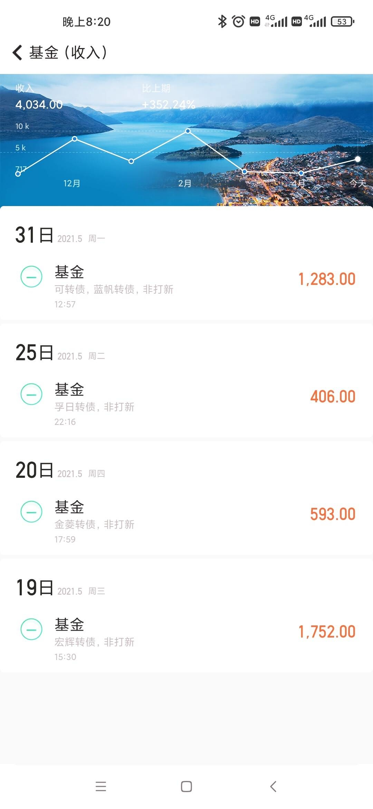

======================================================

_type: talk
@薇薇[111185852284182]
2021-06-04 09:39:11 Fri  
topic_id: 182884245122242

二师父，最近到期一笔银行理财，不想继续买理财了，直接入手安心组合可以吗，安心组合回撤大约多少，预期年化收益有多少

@二师父 at 2021-06-04 09:39:11 Fri

> 可以的，目前最大回撤百分之0.1，预期年化收益率百分之5到百分之8，资金长期不用，可以承受百分之5左右的波动，安心组合更好。

----------

@薇薇 at 2021-06-04 09:39:11 Fri

> 好的，谢谢师父

----------

阅读[1]  评论[2]  赞[0] 

======================================================

_type: talk
@二师父[28814221155551]
2021-06-04 10:44:48 Fri  
topic_id: 182884244218112

献礼行情

阅读[1]  评论[0]  赞[0] 

+++++++++++++++++++++++++++++++++++++++++++++++++++++

图片：
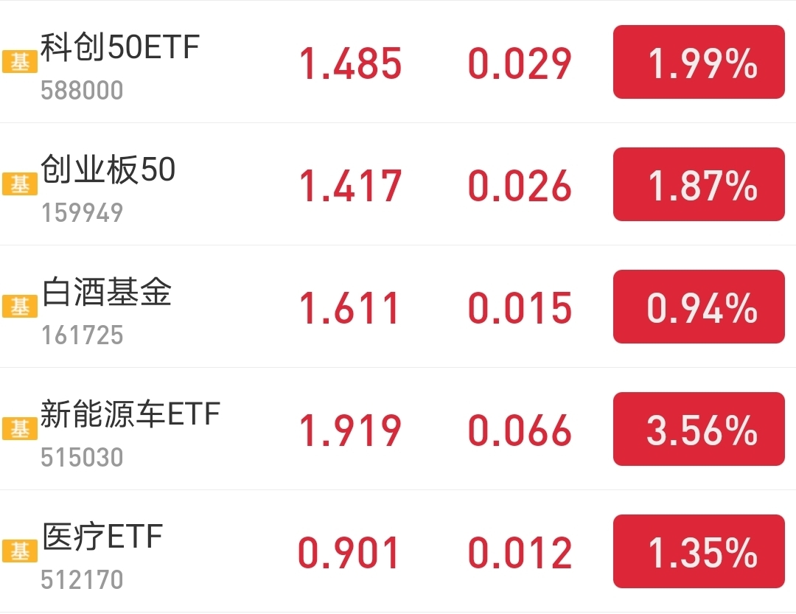

======================================================

_type: talk
@幽兰[815554522442422]
2021-06-04 10:50:34 Fri  
topic_id: 215112522514111

二师父，今天场内中概513050可以加吗？

@二师父 at 2021-06-04 10:50:34 Fri

> 如果周四定投了，仓位5%左右就不用加了，仓位5%以下可以加

----------

@幽兰 at 2021-06-04 10:50:34 Fri

> 好的

----------

@小东 at 2021-06-04 10:50:34 Fri

> 那今天应该买场内还是场外呢？

----------

@永刚 at 2021-06-04 10:50:34 Fri

> 师父，仓位5%是指中概占总资金的比重吗？

----------

@二师父 at 2021-06-04 10:50:34 Fri

> 是的

----------

@二师父 at 2021-06-04 10:50:34 Fri

> 都可以了，0.3%的溢价，不算高

----------

阅读[1]  评论[6]  赞[0] 

+++++++++++++++++++++++++++++++++++++++++++++++++++++

图片：
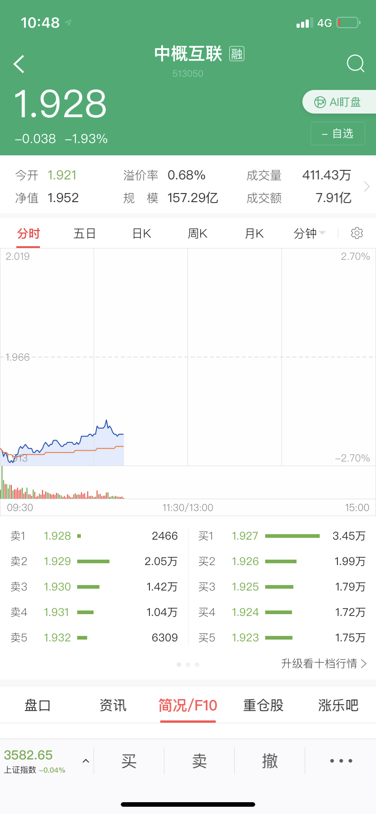

======================================================

_type: talk
@二师父[28814221155551]
2021-06-04 11:18:01 Fri  
topic_id: 582885258225544

<e type="hashtag" hid="88514141542152" title="#主动基金估值表#" /> 主动基金估值出来了，以后每周二公布一次，依然可以低估买入，正常持有，高估卖出。任何策略都有它的优势和劣势，低估买入，可能买了还亏，但是最后长期看肯定盈利，高估卖出，可能卖了还涨，但是长期看一定会有回撤。

选定一个方法，这个方法是完备的可以保证稳定盈利。坚定执行，不左右摇摆，那么账户就可以实现稳定增值。

三大定投策略完全够用了，乌龟计划：严格低估策略（主动基金+指数基金）；鳄鱼计划（纯ETF基金）：低估策略+均线策略。转债投资可能还会出幺蛾子，但是基金投资，只要基金不发生清盘风险，严格策略投资最终一定盈利的。

@吃肉肉 at 2021-06-04 11:18:01 Fri

> 师父，张坤的放开限购了，是不是可以周定投了？

----------

@二师父 at 2021-06-04 11:18:01 Fri

> 等低估以后

----------

@云云 at 2021-06-04 11:18:01 Fri

> 二师父，主动基金也实盘吗？

----------

@二师父 at 2021-06-04 11:18:01 Fri

> 后面会有，目前没找到好的建仓时机

----------

@云云 at 2021-06-04 11:18:01 Fri

> 好的

----------

@吃肉肉 at 2021-06-04 11:18:01 Fri

> 好的

----------

@J at 2021-06-04 11:18:01 Fri

> 师傅，没看懂哪里有估值数据？[捂脸]

----------

@二师父 at 2021-06-04 11:18:01 Fri

> 颜色

----------

阅读[1]  评论[16]  赞[0] 

+++++++++++++++++++++++++++++++++++++++++++++++++++++

图片：
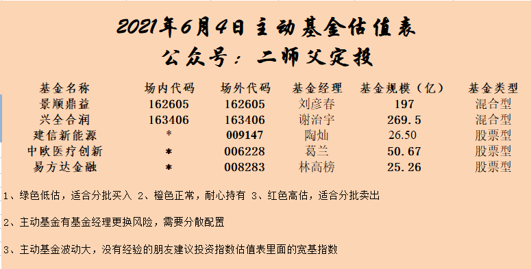

======================================================

_type: talk
@林玮[844111858288412]
2021-06-04 14:01:58 Fri  
topic_id: 582885242214444

师父，昨天发布的三只双低可转债的代码是多少？我找的貌似跟你的不一样，怕搞错了

@二师父 at 2021-06-04 14:01:58 Fri

> 今天我发下下周的，具体代码和名称公布出来。

----------

阅读[1]  评论[1]  赞[0] 

======================================================

_type: talk
@二师父[28814221155551]
2021-06-04 17:17:06 Fri  
topic_id: 215112548844181

<e type="hashtag" hid="51284848288424" title="#学习价值和成长风格轮动#" />

阅读[1]  评论[0]  赞[0] 

+++++++++++++++++++++++++++++++++++++++++++++++++++++

文件：
2021-06-04 17:17:05 Fri
文件大小：[119049]
544442814421584-成长股行情又来了.docx

======================================================

_type: talk
@二师父[28814221155551]
2021-06-04 20:49:32 Fri  
topic_id: 815112544112422

<e type="hashtag" hid="51284848158844" title="#上周可转债投资总结#" /> 第一期计划盈利不错，止盈了4只转债，然后3只目前浮亏，继续耐心持有。

注意每周只有中证转债站上了5日线才开始投资。否则不发车。

对于工作繁忙的朋友，可以选择鳄鱼计划中的转债ETF或者兴全转债进行定投，这也是参与可转转投资比较不错的方式。

阅读[1]  评论[0]  赞[0] 

+++++++++++++++++++++++++++++++++++++++++++++++++++++

文件：
2021-06-04 20:48:02 Fri
文件大小：[173385]
244445181524811-可转债拯救银河系计划第一期总结.docx

======================================================

_type: talk
@二师父[28814221155551]
2021-06-04 22:18:52 Fri  
topic_id: 215112541242421

<e type="hashtag" hid="552114551414" title="#估值数据#" /> 市盈率百分位44.98%，市净率百分位35.25%，SY-BY百分位47.29%，SY/BY百分位44.62%。

估值楼层第三层，仓位7层以上的都可以逐步停止投资，等待市场突破或者回撤。长期保证仓位合理，在一个相对合适的仓位进行定时轮动，长期看就是胜率很大的投资。

目前这种位置，转债ETF、纯债基金都是值得考虑的标的，不是说轮动就一定张，而是相对的，将产品轮动到相对涨幅慢的，实现自由切换。

阅读[1]  评论[0]  赞[0] 

======================================================

_type: talk
@二师父[28814221155551]
2021-06-05 08:12:27 Sat  
topic_id: 815112514584512

<e type="hashtag" hid="28514141841481" title="#定投和配置的区别#" /> 大家可以说说自己的答案，当下行情，有10万你会如何投资。

@永刚 at 2021-06-05 08:12:27 Sat

> 4万主动基金6万债券基金

----------

@庆余年 at 2021-06-05 08:12:27 Sat

> 如果不考虑日常生活用的钱，1万做现金，6万偏债混合，2万纯债(C类)，1万买入低估指数(比如中概)或者长牛基金做底仓。每周定投的钱从现金或者纯债里拿，市场意外下跌补仓的钱从现金里拿。2000一份，根据市场点位判断每周定投的份额百分比。卖出采用高位回撤卖出。

----------

@杜志彪 at 2021-06-05 08:12:27 Sat

> 按照SY-BY百分位47%，建仓天弘300指数增强53%仓位，47%货币基金，按月调整一次，省心省力。

----------

@宋航 at 2021-06-05 08:12:27 Sat

> 如果是闲钱，我会大概有个半年时间去配置5成的指数基金，3成的主动基金，2成债券。期间有轮动，大概最低5年时间，不动它

----------

@衣袂飘香 at 2021-06-05 08:12:27 Sat

> 小伙伴们，昨天的文章和今天的文章我都打不开，大家知道是怎么回事吗？前天以前的都可以。

----------

@二师父 at 2021-06-05 08:12:27 Sat

> 是不是星球要更新了？

----------

@衣袂飘香 at 2021-06-05 08:12:27 Sat

> 有可能有可能，我试试。

----------

@衣袂飘香 at 2021-06-05 08:12:27 Sat

> 哎呀呀，还是不行。

----------

阅读[1]  评论[15]  赞[0] 

+++++++++++++++++++++++++++++++++++++++++++++++++++++

文件：
2021-06-05 08:11:46 Sat
文件大小：[43823]
422224158541458-定投和配置的区别.docx

======================================================

_type: q&a
@郑义泽（庭武）[582152242542254]
2021-06-05 10:57:43 Sat  
topic_id: 215112514515181

@郑义泽（庭武）

>  二师父，我看了你的可转债双低值策略，价格高于130元就不好买入，但是对于溢价率高于多少为高？即不可买入！望回复，谢谢！

@二师父

>  这个看价格，如果低价格转债，可以稍微承担一些高溢价率，百分之40到50也能接受，我选择双低，一般溢价率严格控制在10到15以内，其实价格高于125的转债风险就很高了，100到115之间的空间大一些

阅读[1]  评论[1]  赞[0] 

======================================================

_type: q&a
@郑义泽（庭武）[582152242542254]
2021-06-05 21:13:54 Sat  
topic_id: 815112514148282

@郑义泽（庭武）

>  二师父，请允许我再问问图中的转债的情况，债价132，溢价率十几，它的空间还有多大？风险多大？

@二师父

>  最大的风险就是买入这个，持有到期后按照赎回价格赎回的亏损，如果不设定止损位，不要碰价格130以上的可转债

阅读[1]  评论[1]  赞[0] 

======================================================

_type: q&a
@衣袂飘香[118248548242452]
2021-06-05 22:06:42 Sat  
topic_id: 582885284845184

@衣袂飘香

>  二师父好！最近一直在思考，想给家人和自己加强保障，希望得到您的指点。
>第一，父亲母亲。分别是78岁和75岁。前几天刚做了比较全面的体检，没有大的问题。父亲有糖尿病和高血压，母亲也有高血压，他们都常年吃药，定期上医院，身体总体还不错。父亲从企业退休，母亲教师退休。如果要给他们加强保险的话，需要买什么险种，到哪里买，性价比最高？我看了文章似乎是医疗险，意外险。
>  
> 第二，先生和我。都在体制内上班，身体健康。目前没有特别的负担。如果我们两个也买保险的话，需要买什么险种？到哪里买？我学习了您的文章，似乎应该买医疗险，重疾险和意外险。
>  
> 望指点，谢谢。

@二师父

>  你好，父母年纪大了，很多保险都不在承保范围之内
>  
>  就买点意外险吧，百万医疗基本承保在70岁以内，大多数买不了了。
>  
>  您和先生可以配置医疗险、重疾险和意外险。
>  
>  重疾险推荐：<e type="web" href="https://cps.qixin18.com/m/apps/cps/lhz1029368/product/detail?prodId=104244&planId=128890" title="健康保普惠多倍版重大疾病保险计划" cache="" />
>  
>  医疗险推荐：
>  <e type="web" href="https://cps.qixin18.com/apps/cps/lhz1029368/product/detail?prodId=103933&planId=128302" title="京彩一生百万医疗险" cache="" />
>  
>  意外险<e type="web" href="https://cps.qixin18.com/m/apps/cps/lhz1029368/product/detail?prodId=104158&planId=128720" title="勇者无惧-5-6类个人意外险" cache="" />

阅读[1]  评论[1]  赞[0] 

======================================================

_type: talk
@二师父[28814221155551]
2021-06-06 05:23:13 Sun  
topic_id: 815112888824822

<e type="hashtag" hid="15281818482482" title="#如果当下有10万，如何配置#" /> 来看看我的答案，每个人的风险承受能力不同，选择适合自己的，不要追高的方式是配置，手里没有过多的现金是不会追高的。

@阿宝 at 2021-06-06 05:23:13 Sun

> 10万资金有点少，我个人尽可能去集中配置。

----------

@杜志彪 at 2021-06-06 05:23:13 Sun

> 就一只而言：300增强+货币基金是10万的最佳组合。

----------

@Chu at 2021-06-06 05:23:13 Sun

> 师父，其实可不可以出一期专门讲财务自由的文章

----------

@二师父 at 2021-06-06 05:23:13 Sun

> 本金先达到1000万，你想听啥类的

----------

阅读[1]  评论[4]  赞[0] 

+++++++++++++++++++++++++++++++++++++++++++++++++++++

文件：
2021-06-06 05:22:11 Sun
文件大小：[43876]
544442854211424-我的答案来了.docx

======================================================

_type: talk
@二师父[28814221155551]
2021-06-06 21:22:35 Sun  
topic_id: 414115855858428

今天走了快三万步，刚刚才回来，还是记得给大家发红包的，三周年快乐。

支付宝红包口令，我和二师父一起成长

@防汛抗旱 at 2021-06-06 21:22:35 Sun

> 谢谢师父

----------

@夏萍 at 2021-06-06 21:22:35 Sun

> 三周年快乐！
就这样一起走下去，
看看未见过的股市风景[咖啡]……

----------

@sky at 2021-06-06 21:22:35 Sun

> 谢谢二师父

----------

@一无所有 at 2021-06-06 21:22:35 Sun

> 谢谢二师父!

----------

@手牵手看夕阳 at 2021-06-06 21:22:35 Sun

> 三周年快乐

----------

@西锦巴乌 at 2021-06-06 21:22:35 Sun

> 时间真快，不知不觉跟着师父已3年了，在这3年里学到了很多知识，也见证了师父的成长，希望余生一直跟着师父在股市里“浪”[呲牙][呲牙][呲牙]

----------

@北极 at 2021-06-06 21:22:35 Sun

> 三周年加油

----------

@J at 2021-06-06 21:22:35 Sun

> 没抢到[捂脸]师傅还有第二波红包吗[害羞]

----------

阅读[1]  评论[11]  赞[0] 

======================================================

_type: talk
@二师父[28814221155551]
2021-06-08 09:54:59 Tue  
topic_id: 815112484254822

<e type="hashtag" hid="88514115851482" title="#可转债大新#" /> 申购代码：370623，配售代码：380623，正股代码：300623，正股简称：捷捷微电。目前转股价值107.69，规模11.95亿元，信用级别：AA-。

票面利率:第一年0.4%,第二年0.6%,第三年1%,第四年1.5%,第五年2%,第六年3%。赎回价113。

转股价：29.00 回售触发价：20.30  强赎触发价：37.70
转股开始日：2021-12-15
到期时间：2027-6-8

申购评级：顶格申购

@J at 2021-06-08 09:54:59 Tue

> 师傅，这个操作指令我们怎么使用？可以发个详细的教程吗？还没玩过可转债[捂脸]

----------

@二师父 at 2021-06-08 09:54:59 Tue

> 直接在新债申购那里顶格申购

----------

@🍀 凝🌸 慧🍀 at 2021-06-08 09:54:59 Tue

> 师父好，为啥评级AA—也要定格申购呢，请您给说说吧[愉快]

----------

@J at 2021-06-08 09:54:59 Tue

> 好，我看看。请问什么时候卖出呢？

----------

@J at 2021-06-08 09:54:59 Tue

> 有点不明白了师傅，这个不就是打新债吗？

----------

@二师父 at 2021-06-08 09:54:59 Tue

> 申购都是顶格，或者不看好不申购

----------

@二师父 at 2021-06-08 09:54:59 Tue

> 对的

----------

阅读[1]  评论[7]  赞[0] 

======================================================

_type: talk
@二师父[28814221155551]
2021-06-08 14:43:46 Tue  
topic_id: 815112422842412

<e type="hashtag" hid="88514141542152" title="#主动基金估值表#" /> 本周主动基金估值表，仍旧是正常估值，白酒大跌，之前已经讲过了哈，热门资金抢跑，流动性弱，很容易跌停。

@J at 2021-06-08 14:43:46 Tue

> 师傅易方达金融还亏着4%，今天合适加点仓吗

----------

@二师父 at 2021-06-08 14:43:46 Tue

> 你多少仓位，仓位低的话可以加，仓位合适的话等低估。

----------

@J at 2021-06-08 14:43:46 Tue

> 仓位有6成多了，指所有的股票基金仓位。就这单只而言倒是仓位很小，不到1%

----------

@二师父 at 2021-06-08 14:43:46 Tue

> 那可以定投的，要严格遵守规则就等低估

----------

@J at 2021-06-08 14:43:46 Tue

> 好的

----------

阅读[1]  评论[5]  赞[0] 

+++++++++++++++++++++++++++++++++++++++++++++++++++++

图片：
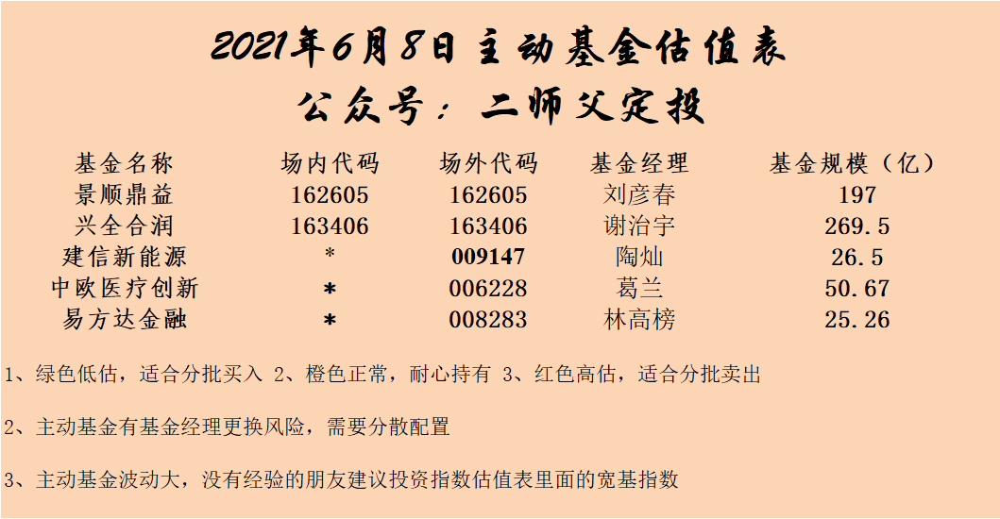

======================================================

_type: talk
@阿宝[422212151424158]
2021-06-08 17:09:37 Tue  
topic_id: 582885458885424

今日跑步5公里，用时19′39″，第一名🥇，虽然距离自己最好成绩还差很多，以锻炼身体的态度好好跑步，健康生活。[呲牙]

@二师父 at 2021-06-08 17:09:37 Tue

> 你这配速牛啊，我配速到6了

----------

@阿宝 at 2021-06-08 17:09:37 Tue

> 这是我们消防队的日常训练，这成绩和以前部队比已经差很多了。不能这样比的和自己比就好。

----------

@二师父 at 2021-06-08 17:09:37 Tue

> 向你学习跑步

----------

@阿宝 at 2021-06-08 17:09:37 Tue

> 向老师学习投资。跑步没什么诀窍，傻傻的坚持到底，步子迈大，当你累了，不想跑的时候，再坚持坚持就到终点了。重要的是让自己喜欢上跑步，对跑完之后畅快淋漓的感觉上瘾。投资和跑步有很多相似之处，坚持到底！

----------

@二师父 at 2021-06-08 17:09:37 Tue

> 好的，一起加油

----------

@西锦巴乌 at 2021-06-08 17:09:37 Tue

> 第一次打卡步行4公里完成

----------

@西锦巴乌 at 2021-06-08 17:09:37 Tue

> 今天步行4公里完成

----------

@西锦巴乌 at 2021-06-08 17:09:37 Tue

> 今天步行5公里完成

----------

阅读[1]  评论[8]  赞[0] 

======================================================

_type: talk
@二师父[28814221155551]
2021-06-08 18:36:40 Tue  
topic_id: 582885442555124

<e type="hashtag" hid="88514115288882" title="#关于白酒下跌的看法#" /> 之前提示过白酒的风险，今天大跌，再来看看

阅读[1]  评论[0]  赞[0] 

+++++++++++++++++++++++++++++++++++++++++++++++++++++

文件：
2021-06-08 18:36:15 Tue
文件大小：[108952]
844448555122852-二线白酒全线下跌，讲三点.docx

======================================================

_type: talk
@付云[844148188522822]
2021-06-08 22:44:04 Tue  
topic_id: 815112441545842

还有这支

@二师父 at 2021-06-08 22:44:04 Tue

> 双低值最好低于125

----------

阅读[1]  评论[1]  赞[0] 

+++++++++++++++++++++++++++++++++++++++++++++++++++++

图片：
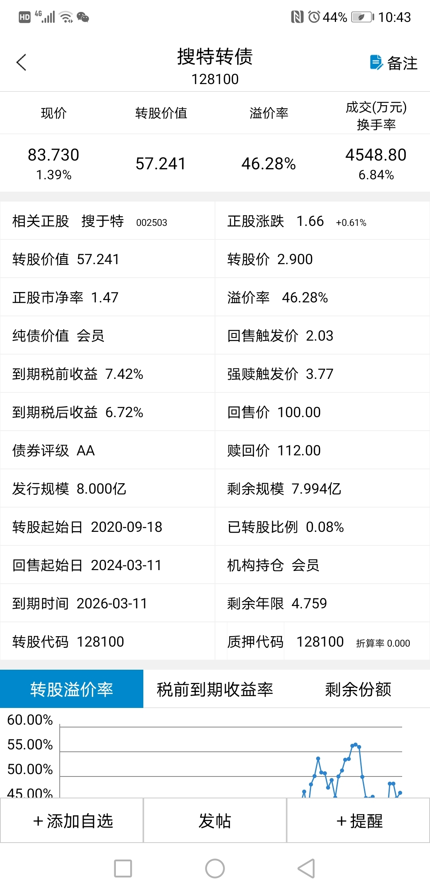

======================================================

_type: q&a
@付云[844148188522822]
2021-06-08 22:47:13 Tue  
topic_id: 815112444111552

@付云

>  这支可转债如何

@二师父

>  正股都ST了，远离吧

阅读[1]  评论[0]  赞[0] 

======================================================

_type: talk
@二师父[28814221155551]
2021-06-09 07:24:17 Wed  
topic_id: 414115214122488

今年小目标争取20，配速6。

@赵晓勇 at 2021-06-09 07:24:17 Wed

> 速度很快，目标可以放到25啦[微笑]

----------

@二师父 at 2021-06-09 07:24:17 Wed

> 慢慢来吧

----------

@赵晓勇 at 2021-06-09 07:24:17 Wed

> 有目标，有方法[强]我已经180减少到165了

----------

@二师父 at 2021-06-09 07:24:17 Wed

> 我是说跑20公里

----------

@赵晓勇 at 2021-06-09 07:24:17 Wed

> 我知道跑步啊🏃‍♀️，大健康

----------

@衣袂飘香 at 2021-06-09 07:24:17 Wed

> 我好奇呀，二师父，你瘦了几斤啦？我一个朋友，女生啊，跑了两个多月瘦了20斤。

----------

@二师父 at 2021-06-09 07:24:17 Wed

> 没称了，我体重还好

----------

@衣袂飘香 at 2021-06-09 07:24:17 Wed

> 我认识的那些跑步朋友，跑着跑着都变得瘦瘦的，为了不太瘦，特意补充蛋白质啥的[微笑]

----------

阅读[1]  评论[16]  赞[0] 

+++++++++++++++++++++++++++++++++++++++++++++++++++++

图片：
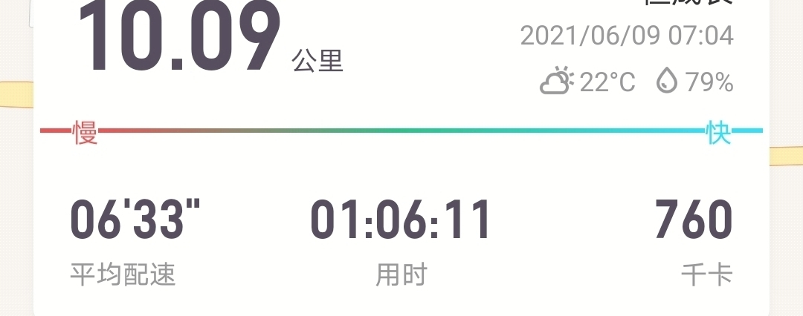

======================================================

_type: talk
@二师父[28814221155551]
2021-06-09 19:54:12 Wed  
topic_id: 815112188515542

<e type="hashtag" hid="825188852442" title="#估值表#" /> 本周估值表来了，低估值的都可以投资，周期性指数仓位控制在5%——10%，非周期性指数仓位控制在15%——25%。

@晴 at 2021-06-09 19:54:12 Wed

> 二师父，中概互联现在买，是分批定投还是先建底仓？

----------

@二师父 at 2021-06-09 19:54:12 Wed

> 定投，可以先打个底仓百分之3

----------

@香香 at 2021-06-09 19:54:12 Wed

> 估值只作参考，长期优质赛道是否更重要？

----------

@二师父 at 2021-06-09 19:54:12 Wed

> 是的，优选赛道，然后再结合低估值

----------

阅读[1]  评论[4]  赞[0] 

+++++++++++++++++++++++++++++++++++++++++++++++++++++

图片：
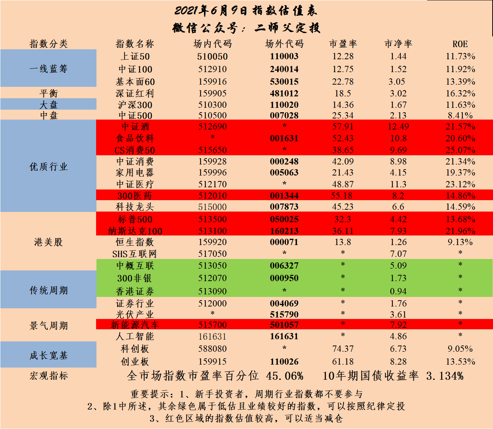

======================================================

_type: talk
@二师父[28814221155551]
2021-06-09 19:56:08 Wed  
topic_id: 182884855282142

<e type="hashtag" hid="51284882858254" title="#实盘记录280#" /> 买入招商产业债300，中概互联200，<e type="web" href="https://h5.1234567.com.cn/app/combo-show-list-share/pages/index/index?passportid=7674055272779748" title="天天基金" cache="" />，实盘链接如下。

@雾海 at 2021-06-09 19:56:08 Wed

> 二师傅，如果在财付通的平台上面买，什么时候买比较合适？

----------

@cotton at 2021-06-09 19:56:08 Wed

> 师傅，我没有天天，看不到

----------

@二师父 at 2021-06-09 19:56:08 Wed

> 点击链接，或者直接看我发的记录

----------

@二师父 at 2021-06-09 19:56:08 Wed

> 微信的吗？

----------

@水墨青花 at 2021-06-09 19:56:08 Wed

> 老师，海波转债浮亏不到1个点，继续持有还是怎样？

----------

@二师父 at 2021-06-09 19:56:08 Wed

> 我是继续持有的

----------

@水墨青花 at 2021-06-09 19:56:08 Wed

> 好的

----------

阅读[1]  评论[7]  赞[0] 

======================================================

_type: solution
2021-06-10 12:03:39 Thu  
topic_id: 815112145548552

阅读[1]  评论[0]  赞[0] 

======================================================

_type: q&a
@🍀 凝🌸 慧🍀[841855248254242]
2021-06-10 16:17:07 Thu  
topic_id: 414115151145548

@🍀 凝🌸 慧🍀

>  师父好，今天两个可转债打新是不是都可以操作一下？😀

@二师父

>  抱歉，刚才看到。可以的，新债都可以盲打，如果破发了要么走人，要么持有到期也会盈利的，很少有涨不到115的情况

阅读[1]  评论[1]  赞[0] 

======================================================

_type: q&a
@潘力新[15111555855482]
2021-06-10 16:18:33 Thu  
topic_id: 215112128511811

@潘力新

>  请问二师父：最近16国债19持续下跌的原因是什么？

@二师父

>  流动性有所收紧，而且国债收益率上升，未来持续上升的话16国债19也会承压

阅读[1]  评论[1]  赞[0] 

======================================================

_type: solution
2021-06-10 16:44:03 Thu  
topic_id: 215114544121581

阅读[1]  评论[0]  赞[0] 

======================================================

_type: q&a
@手牵手看夕阳[244112548184141]
2021-06-10 19:06:54 Thu  
topic_id: 414115124825818

@手牵手看夕阳

>  二师父，我持有的大参林603233今个变成DR开头的了，股价也降低了，现在显示亏了好多，这是咋回事呀？

@二师父

>  这属于除权除息

阅读[1]  评论[1]  赞[0] 

======================================================

_type: q&a
@长安流歌[118228425411222]
2021-06-10 19:07:18 Thu  
topic_id: 414115124155288

@长安流歌

>  老师，目前科技龙头ETF可以开始定投吗

@二师父

>  可以了的，科技类加中概互联一起控制百分之15仓位

阅读[1]  评论[1]  赞[0] 

======================================================

_type: q&a
@学习者[145418411842]
2021-06-10 19:11:55 Thu  
topic_id: 182884815184842

@学习者

>  师父你好，刚刚操作乌龟计划，还是小白，见谅，有几个问题实在想不明白，望老师解惑：
>  1、比第一次建底仓，什么时机最合适，理论上低位入场最好，怎么判断是否低位，比如我想今天建立底仓，是否合适，还是等一等？
>  2、建立底仓后，每周四跟着周三师父发的提示进行操作，比如本周是买入中概互联  200元，也跟着买了，这个操作与每周的定投是否是一个概念，还是不同的操作，我理解定投是每周固定投入一定金额，比如2000元，每周该投还是投，有点糊涂了
>  3、另外，本周提示操作买入中概互联200元，可以在乌龟计划里多买点吗，还是严格按照这个数量进行操作，不理解的是有的人底仓大，有的人底仓小，为啥买入金额一样？

@二师父

>  低位可以看每天发布的百分位数据，比如百分之50以上，越高就代表整体市场估值越贵，百分之50以下，越低就代表市场估值越便宜
>  
>  每周固定定投是没问题，不过也要考虑自己的资金量以及当前位置，一般市场越低投入的金额越大，反之会投的比较少或者直接停止了
>  
>  不一定按照这个金额，可以按照比例搭配，比如不同的金额，我们投入相同的比例，最终就带来了不同的投入金额，根据实际情况来就行的
>  
>  底仓可以选择当前或者地量或者市场低位时候买入

阅读[1]  评论[2]  赞[0] 

======================================================

_type: talk
@二师父[28814221155551]
2021-06-10 21:52:58 Thu  
topic_id: 582884281251424

<e type="hashtag" hid="28514112111821" title="#分化的市场#" /> 当前市场分化严重，值得投资的互联网板块，另外已经投资的卧倒。

@样 at 2021-06-10 21:52:58 Thu

> 二师父的股票基金仓位现在大概多少？不算债基

----------

@二师父 at 2021-06-10 21:52:58 Thu

> 40%多

----------

@JOY at 2021-06-10 21:52:58 Thu

> 师父，那现在这种时候，需要卖出国债，等回调的时候再入么？

----------

@二师父 at 2021-06-10 21:52:58 Thu

> 可以适当减仓的

----------

@JOY at 2021-06-10 21:52:58 Thu

> 谢谢

----------

阅读[1]  评论[5]  赞[0] 

+++++++++++++++++++++++++++++++++++++++++++++++++++++

文件：
2021-06-10 21:52:18 Thu
文件大小：[42149]
244448824482441-外资爆买下的两极分化.docx

======================================================

_type: talk
@二师父[28814221155551]
2021-06-10 22:41:04 Thu  
topic_id: 215114514858281

<e type="hashtag" hid="552114551414" title="#估值数据#" /> 当前PE百分位45.1%，PB百分位34.21%，SY-BY百分位47.25%，SY/BY百分位44.53%。

全市场估值参考估值分位即可，估值分位越低，代表市场越低估，今年1月最高估值分位达到了70%多，也是相对市场高位，如果估值分位低于20%以下，那么是全市场非常低的位置。

阅读[1]  评论[0]  赞[0] 

======================================================

_type: talk
@慕容[548814822814844]
2021-06-11 11:35:34 Fri  
topic_id: 414112842125158

师父互联网50能买吗？定投半年大概1000元，现在亏损97元[呲牙]

@二师父 at 2021-06-11 11:35:34 Fri

> 定投问题不大

----------

阅读[1]  评论[1]  赞[0] 

======================================================

_type: q&a
@陈汉群[182848485228812]
2021-06-11 16:59:52 Fri  
topic_id: 182881555841242

@陈汉群

>  请问如何查看上证A股和深证A股的市盈率？

@二师父

>  万得app或者同花顺找上证综合指数和深证综合指数

阅读[1]  评论[0]  赞[0] 

======================================================

_type: talk
@芙瑞雅阳阳潘[421181844812818]
2021-06-11 20:30:00 Fri  
topic_id: 414112882112448

师父，600967咋样？

@二师父 at 2021-06-11 20:30:00 Fri

> 股票还是基金

----------

@芙瑞雅阳阳潘 at 2021-06-11 20:30:00 Fri

> 股票，内蒙一机

----------

@二师父 at 2021-06-11 20:30:00 Fri

> 很一般

----------

@芙瑞雅阳阳潘 at 2021-06-11 20:30:00 Fri

> 那风险大吗？11块买的，买不少，还能赚点出来不？

----------

阅读[1]  评论[4]  赞[0] 

======================================================

_type: talk
@二师父[28814221155551]
2021-06-12 11:29:39 Sat  
topic_id: 215114845141881

<e type="hashtag" hid="88514114242512" title="#关于6周年的一些感悟#" /> 上证综合指数从高点跌到现在，也有基金翻倍了，给投资者的启示。

阅读[1]  评论[0]  赞[0] 

+++++++++++++++++++++++++++++++++++++++++++++++++++++

文件：
2021-06-12 11:29:00 Sat
文件大小：[41714]
544441182442544-6周年，当年的你是否还在场.docx

======================================================

_type: talk
@二师父[28814221155551]
2021-06-12 11:45:57 Sat  
topic_id: 182881515224212

<e type="hashtag" hid="552114551414" title="#估值数据#" /> 截至到2021年6月12日，全市场指数市盈率百分位45.92%，市净率百分位36.24%，SY-BY百分位48.7%，SY/BY百分位45.87%。

关于国债收益率为什么和国债负相关，国债收益率=收益/债券价格，当国债价格下跌的时候，收益率就起来了，不是说国债收益率越高，国债收益就越好。

在投资的时候，国债收益率相对低位，可以考虑减仓国债，最近国债受到了国债收益率的负向影响，开始下跌了。

@付云 at 2021-06-12 11:45:57 Sat

> 那是不是应该拿出来，占比多少合适，我发现是开始下跌了！

----------

@二师父 at 2021-06-12 11:45:57 Sat

> 可以出一部分，长期看都是向上的，债券基金波动稍微小一点

----------

@衣袂飘香 at 2021-06-12 11:45:57 Sat

> 债券的收益率和债券的价格是负相关的，这个问题弄明白了。
  最后的一句是说，最近债券的收益率上升了，所以债券的价格下跌，是这个意思吗？

----------

@二师父 at 2021-06-12 11:45:57 Sat

> 国债收益率上升，债券价格下跌

----------

@衣袂飘香 at 2021-06-12 11:45:57 Sat

> 好的，明白了。

----------

阅读[1]  评论[5]  赞[0] 

======================================================

_type: talk
@百变[15285855281882]
2021-06-13 13:27:45 Sun  
topic_id: 414112544414588

二师父：这种产品敢买吗？安全有保障不？温馨提示，以上产品截图是公司正在热卖的一款三十万起投的半年期标准化城投债理财产品中科沃土沃富5号，预期年化收益6.6%，中基协备案，管理人是公募基金公司，托管人是光大银行，产品期限灵活，流动性好，风险可控，安全性高，有意向投资这款产品的客户提前把资金准备好，私信我，提前预约，产品有贴息！

@百变 at 2021-06-13 13:27:45 Sun

> 

----------

@二师父 at 2021-06-13 13:27:45 Sun

> 流动性并不好

----------

阅读[1]  评论[2]  赞[0] 

======================================================

_type: talk
@二师父[28814221155551]
2021-06-13 18:54:30 Sun  
topic_id: 582884524242524

<e type="hashtag" hid="48412111445248" title="#新型诈骗招式#" /> 注意各种骗局，有钱不要瞎投，基金最安全，不知道买啥，先货币基金，学习明白了再开始各类基金投资，完全够用。

阅读[1]  评论[0]  赞[0] 

+++++++++++++++++++++++++++++++++++++++++++++++++++++

文件：
2021-06-13 18:53:36 Sun
文件大小：[42674]
544441188445224-新型诈骗招式.docx

======================================================

_type: talk
@林玮[844111858288412]
2021-06-14 15:03:35 Mon  
topic_id: 582884451145154

师父，债券价格涨跌和国债涨跌同步吗？

@二师父 at 2021-06-14 15:03:35 Mon

> 不同步的，除了利率因素，还有债券本身质量和久期的影响。

----------

@林玮 at 2021-06-14 15:03:35 Mon

> 这里的债券指的是国债是吗？

----------

@林玮 at 2021-06-14 15:03:35 Mon

> 

----------

@二师父 at 2021-06-14 15:03:35 Mon

> 不是国债，也有企业债，利率债是受到利率因素影响的

----------

阅读[1]  评论[4]  赞[0] 

======================================================

_type: talk
@二师父[28814221155551]
2021-06-14 15:41:56 Mon  
topic_id: 182881145482142

<e type="hashtag" hid="88514111828552" title="#吃大肉#" /> 明天有一块大肉可以吃哈，不要忘记了。

@梧桐 at 2021-06-14 15:41:56 Mon

> 二师父，这个中签率高吗

----------

@二师父 at 2021-06-14 15:41:56 Mon

> 中签率不高

----------

阅读[1]  评论[2]  赞[0] 

+++++++++++++++++++++++++++++++++++++++++++++++++++++

文件：
2021-06-14 15:41:21 Mon
文件大小：[41752]
544441521121814-一块大肉.docx

======================================================

_type: talk
@二师父[28814221155551]
2021-06-14 22:45:45 Mon  
topic_id: 815114445158812

<e type="hashtag" hid="28514111814421" title="#可转债拯救银河系第二期#" />

@梧桐 at 2021-06-14 22:45:45 Mon

> 景兴已经卖了吗？

----------

@二师父 at 2021-06-14 22:45:45 Mon

> 持有中，负0.25

----------

@勇往直前 at 2021-06-14 22:45:45 Mon

> 这个怎么看？买入这些?

----------

@二师父 at 2021-06-14 22:45:45 Mon

> 符合双低值的买入

----------

@mumomo at 2021-06-14 22:45:45 Mon

> 二师父，上回买的几只亏损中，继续持有吗

----------

@二师父 at 2021-06-14 22:45:45 Mon

> 正股没有问题继续持有的

----------

@mumomo at 2021-06-14 22:45:45 Mon

> 买的上回你表中的几只，还是按2%以上赢利轮动吗

----------

@二师父 at 2021-06-14 22:45:45 Mon

> 是的，如果符合双低值，跌下去了可以补仓

----------

阅读[1]  评论[22]  赞[0] 

+++++++++++++++++++++++++++++++++++++++++++++++++++++

图片：
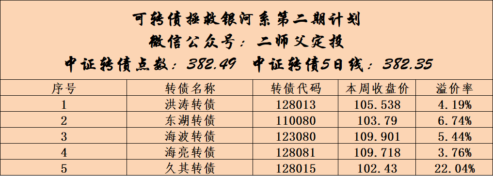

======================================================

_type: talk
@二师父[28814221155551]
2021-06-15 11:12:55 Tue  
topic_id: 215114418584251

<e type="hashtag" hid="881251425252" title="#鳄鱼计划#" /> 买入转债etf2份，买入中概互联1份。慢慢发车，中概已经是第三波发车了，很多人对低买高卖嗤之以鼻，而实际上挣钱就是如此，可以终身持有加低买高卖结合，一买一卖保证必定盈利。

场内发车采用证券账户，星球置顶可以开户，任意大型券商均可。

@冯林锋 at 2021-06-15 11:12:55 Tue

> 二师父，中概互联一份多少钱，前几次都会有跟着买

----------

@二师父 at 2021-06-15 11:12:55 Tue

> 都是用当前总资金除以250，自己算算得到了，每个人的情况不同

----------

@苍天有井明月空🌙 at 2021-06-15 11:12:55 Tue

> 中概买场内还是场外

----------

@二师父 at 2021-06-15 11:12:55 Tue

> 鳄鱼计划都是场内，乌龟计划是场外

----------

@雾海 at 2021-06-15 11:12:55 Tue

> 转债ETF代码多少？二师傅

----------

@二师父 at 2021-06-15 11:12:55 Tue

> 511380

----------

@范毅君 at 2021-06-15 11:12:55 Tue

> 今天没跟上，明天跟[呲牙]

----------

阅读[1]  评论[7]  赞[0] 

======================================================

_type: talk
@二师父[28814221155551]
2021-06-15 11:24:31 Tue  
topic_id: 414112218428518

鳄鱼计划和乌龟计划，安心组合的区别。目前公布的实盘是这三个，来说说区别吧。

鳄鱼计划在场内买入，总资金不增加，将总资金分成250份，买完就满仓，一般极端历史低位会满仓，考虑到风险，暂时不加杠杆，目前有些etf是可以加杠杆的，保持原则，依然不用。

每次买入金额如何计算，比如你有250元，那么你每次买入一份金额是1元，比如你有25万，那么一份金额就是1000，随着账户的增值或者资金的提取，每一份金额也会逐步变化

关于乌龟计划，就是有余钱每周买一点，一点点积累，除非极端高位或者危机到来，一般都是长期持有复利增值，这个一份金额根据每月结余来，假设每月结余8000，一份可以2000，而实际过程中这个2000不是全部拿来买，机会不是最佳的时候这2000就回减少购买量，然后剩余资金纳入安心组合或者货币基金

等有更好机会时候一次买入可能又多于每月结余的四分之一

@🎉Wei Jie🎏 at 2021-06-15 11:24:31 Tue

> 请问：现在加入鳄鱼计划怎么操作呢？

----------

@二师父 at 2021-06-15 11:24:31 Tue

> 根据资金量，分成120份，然后跟上就行

----------

@🎉Wei Jie🎏 at 2021-06-15 11:24:31 Tue

> 谢谢，我试试～

----------

@果实妈咪 at 2021-06-15 11:24:31 Tue

> 师父，鳄鱼计划现在还有120份左右对吗？大概投资多少份啦？

----------

@二师父 at 2021-06-15 11:24:31 Tue

> 还有100份，大概投资了150份，之前卖的比较多

----------

@敏 at 2021-06-15 11:24:31 Tue

> 如何操作

----------

阅读[1]  评论[6]  赞[0] 

======================================================

_type: talk
@二师父[28814221155551]
2021-06-15 21:27:12 Tue  
topic_id: 815114154288142

<e type="hashtag" hid="88514111154842" title="#新规对投资的影响#" /> 看看银行理财产品新规对投资有何影响，把握大方向。

阅读[1]  评论[0]  赞[0] 

+++++++++++++++++++++++++++++++++++++++++++++++++++++

文件：
2021-06-15 21:26:08 Tue
文件大小：[44013]
844448284128842-银行理财产品新规对投资的影响.docx

======================================================

_type: talk
@二师父[28814221155551]
2021-06-15 22:02:02 Tue  
topic_id: 215114154184851

<e type="hashtag" hid="15281888821882" title="#周二主动基金分析#" /> 本周分享一只优质的混合基金：交银新成长混合（519736）。

根据数据对比，从成立以来，近1月、近3月、近6月、近1年、近2年、近3年交银新成长混合都相对沪深300有超额收益。

再看年度回报，2016年、2017年、2018年、2019年、2020年、2021年交银沪深300相对于沪深300也有超额收益。尤其是2018年，沪深300回撤25.31%，交银新成长混合回撤15.99%。

这意味着，过往业绩考量，无论是哪个阶段，交银新成长混合涨的比沪深300多，跌的比沪深300少，对于这类任何阶段都超越沪深300的基金，成立5到10年以上就是比较优质的。

大家可以在估值楼层二、三层以下，开始定投，在市场底部区域百分位20%左右直接重仓卧倒。

阅读[1]  评论[0]  赞[0] 

======================================================

_type: talk
@二师父[28814221155551]
2021-06-15 23:20:23 Tue  
topic_id: 815114151415812

<e type="hashtag" hid="825188852442" title="#估值表#" /> 每周二主动基金估值表，市场一直震荡，涨也不涨，跌也不大跌，估值变化不大，继续耐心持有。以后每周三乌龟计划严格遵循低估定投策略，标的就是估值表里面的指数基金和主动型股票基金。

@庆余年 at 2021-06-15 23:20:23 Tue

> 新能源我倒是比较看好农银新能源主题混合

----------

@二师父 at 2021-06-15 23:20:23 Tue

> 我再对比一下，建信的过往都不错。

----------

@庆余年 at 2021-06-15 23:20:23 Tue

> 新能源从一月份我观察了两只基金，农银新能源主题混合还有嘉实新能源新材料，农银二月份回撤后修复的速度要明显高于嘉实，所以目前我就一直持有农银的新能源主题混合。

----------

@二师父 at 2021-06-15 23:20:23 Tue

> 我来看看，这个赛道整体是非常好的

----------

@二师父 at 2021-06-15 23:20:23 Tue

> 最近6个月收益对比农银是优于建信的，建信自己调仓比较多。

----------

阅读[1]  评论[5]  赞[0] 

+++++++++++++++++++++++++++++++++++++++++++++++++++++

图片：
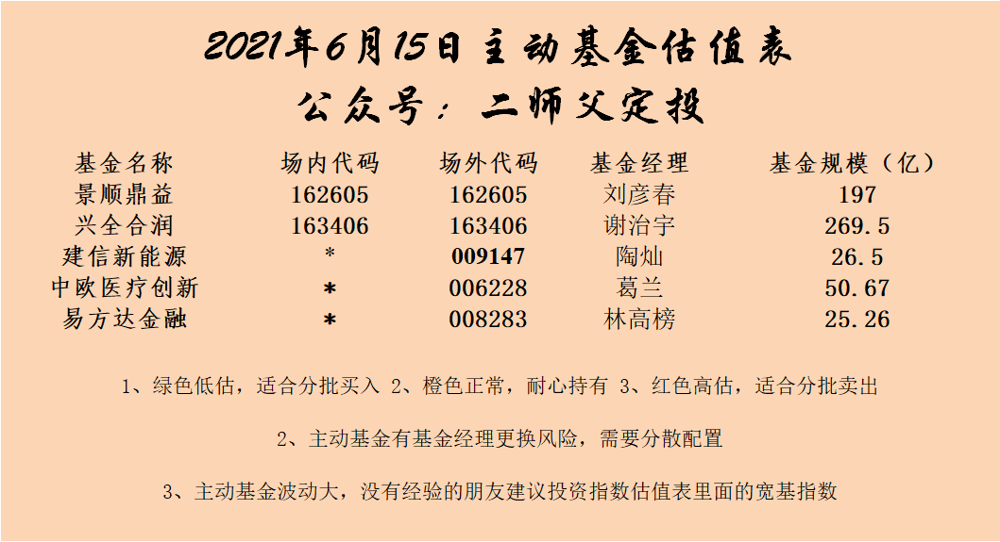

======================================================

_type: q&a
@果实妈咪[182225518588452]
2021-06-16 00:14:32 Wed  
topic_id: 215114154112211

@果实妈咪

>  师父，可以自动操作你那个网格的券商是哪个？我想在你这里开个户

@二师父

>  华宝证券，在星球置顶有开户链接

阅读[1]  评论[0]  赞[0] 

======================================================

_type: talk
@二师父[28814221155551]
2021-06-16 17:57:00 Wed  
topic_id: 182881812185442

<e type="hashtag" hid="825188852442" title="#估值表#" /> 每周结合估值表发车，新能源农银新能源混合稍微比建信优质，稍后替代。

注意，每周三晚上发车的是乌龟计划，在天天基金可以看到，鳄鱼计划是不定期发车，一月1到4次或者没有。大家仅供参考。

白酒确实到了压力位，不过回撤30%以上依然很有配置价值，主要五条赛道：第一白酒；第二CRO,第三互联网，第四新能源，第五光伏。

大家重仓把握这五个方向再加上沪深300+创业板50+科创板50就行了。其他的类似半导体、基建、地产我不看好的，你配置的话也只能少量，不要重仓。

@J at 2021-06-16 17:57:00 Wed

> 师傅，CRO是啥呢？

----------

@蛋炒饭不加蛋 at 2021-06-16 17:57:00 Wed

> 医药外包研发

----------

@J at 2021-06-16 17:57:00 Wed

> 谢谢哈[握手]

----------

@蛋炒饭不加蛋 at 2021-06-16 17:57:00 Wed

> 客气，应该解释的没错哈

----------

@蛋炒饭不加蛋 at 2021-06-16 17:57:00 Wed

> 师父，光伏只有指数基金吗

----------

@永刚 at 2021-06-16 17:57:00 Wed

> 农银新能源代码？

----------

@HeLLO at 2021-06-16 17:57:00 Wed

> 师父，CRO指数有代码？新能源高了，还有前途？

----------

@二师父 at 2021-06-16 17:57:00 Wed

> 泰格医药，新能源有前途

----------

阅读[1]  评论[10]  赞[0] 

+++++++++++++++++++++++++++++++++++++++++++++++++++++

图片：
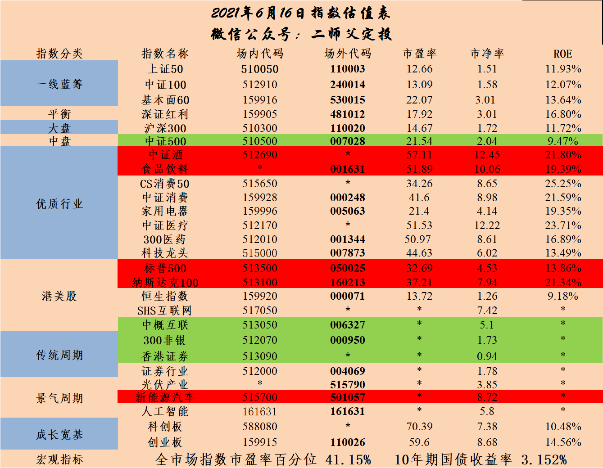

======================================================

_type: talk
@二师父[28814221155551]
2021-06-16 20:06:38 Wed  
topic_id: 582884841544484

<e type="hashtag" hid="28518855451481" title="#乌龟计划#" /> <e type="web" href="https://h5.1234567.com.cn/app/combo-show-list-share/pages/index/index?passportid=7674055272779748" title="天天基金" cache="" />，乌龟计划已经发车，大家点击链接可以跟投，买入了中概互联和兴全合润，开启左侧交易，慢慢积累。

<e type="web" href="https://h5.1234567.com.cn/app/combo-show-list-share/pages/index/index?passportid=7674055272779748" title="天天基金" cache="" />

@天玺哥 at 2021-06-16 20:06:38 Wed

> 交易确实是反人性[捂脸]，跟着二师父越跌越买，慢慢积累。

----------

@二师父 at 2021-06-16 20:06:38 Wed

> 002190

----------

阅读[1]  评论[2]  赞[0] 

======================================================

_type: q&a
@林凤崎[421882481454488]
2021-06-17 08:56:33 Thu  
topic_id: 582884845225554

@林凤崎

>  二师父，我7月初用钱，现在是不是要出来，怕变盘严重？

@二师父

>  如果急用的钱不要买股权类品种

阅读[1]  评论[1]  赞[0] 

======================================================

_type: talk
@二师父[28814221155551]
2021-06-17 09:03:13 Thu  
topic_id: 815114114188152

<e type="hashtag" hid="88511552555452" title="#不要一条道走到黑#" /> 唐尚珺的名字最近火了，主要是复读12年准备考名校。

讲真以这种精神进入到一所普通高校，然后努力学习，读个博士，或者考个公务员，都能在30多岁过上体面的生活。

然而他就不，多次放弃名校的录取机会，非得上中科大，也不见得中科大就比重庆大学好，为何如此呢？

关键在于执念，一条路走到黑

投资也一样，发现不对了要及时撤退，不要一条道走到黑，比如中国平安，比如st股票，比如明显处于低预期的基金

这不是放弃原则，这不是逃兵，而是换个方向战斗，把更好的资源集中到更有产出的地方。

投资需要坚持，但最怕固执，尤其是在明知道错误以后还坚守的，为了心中执念亏钱不值得

@wty at 2021-06-17 09:03:13 Thu

> 平安最近为何一直跌呢？基本面有问题吗？麻烦二师傅分析一下！

----------

@二师父 at 2021-06-17 09:03:13 Thu

> 很多方面原因，第一是本身保险行业同质化严重，竞争大，其次互联网保险线上代理性价比高，平安的业绩遭遇冲击，去年他投资华夏幸福踩雷，损失惨重，平安整体预期很低，业绩差，没必要投资

----------

@wty at 2021-06-17 09:03:13 Thu

> 好的👌，谢谢二师父的及时回复！

----------

@shi at 2021-06-17 09:03:13 Thu

> 平安需要放弃了吗？

----------

@二师父 at 2021-06-17 09:03:13 Thu

> 可以放弃

----------

阅读[1]  评论[5]  赞[0] 

======================================================

_type: q&a
@果实妈咪[182225518588452]
2021-06-17 09:04:28 Thu  
topic_id: 815114114152512

@果实妈咪

>  006327在华宝上竟然没有，买不到，二师父！还有可以把网格华宝网格发出来学习一下嘛？谢谢二师父

@二师父

>  在理财产品上有，你可以搜索中概互联的场内代码，证券账户都是买场内产品的，视频我发到你微信了，星球发不了视频

阅读[1]  评论[1]  赞[0] 

======================================================

_type: talk
@二师父[28814221155551]
2021-06-17 09:14:41 Thu  
topic_id: 215114111551181

不知道星球有没有投资平安的，投资平安不如东方财富，对于企业每个人理解不同，核心在于企业未来预期，就是你不管他现在如何低迷如何昂贵，关键未来是否还能一直处于高增速或者是否能逆风翻盘，这是最重要的，其他的贵与便宜都是障眼法，他的成长空间决定了当下是否贵，价格没有太大意义

@勇往直前 at 2021-06-17 09:14:41 Thu

> 现在的价格?东方财富

----------

@Hi·DD at 2021-06-17 09:14:41 Thu

> 有点仓位

----------

@二师父 at 2021-06-17 09:14:41 Thu

> 只是他基本面更好

----------

@二师父 at 2021-06-17 09:14:41 Thu

> 有点[微笑]

----------

@Hi·DD at 2021-06-17 09:14:41 Thu

> [捂脸][捂脸]

----------

@黎雄 at 2021-06-17 09:14:41 Thu

> 我也有3%的平安

----------

@lily at 2021-06-17 09:14:41 Thu

> 我也有平安[大哭]

----------

阅读[1]  评论[7]  赞[0] 

======================================================

_type: talk
@范毅君[118551121224142]
2021-06-17 10:12:57 Thu  
topic_id: 582884888421524

最近新债特别好中签吗，只要申，必中[呲牙]

阅读[1]  评论[0]  赞[0] 

======================================================

_type: q&a
@黎雄[841555255485222]
2021-06-17 11:04:20 Thu  
topic_id: 815111555525412

@黎雄

>  师傅万科有投资价值嘛

@二师父

>  目前地产都不好，没啥价值

阅读[1]  评论[0]  赞[0] 

======================================================

_type: talk
@吃肉肉[118228144221282]
2021-06-17 15:04:23 Thu  
topic_id: 182888521142112

师父，只买了基金，场内基金和场外基金加起来的总市值是否是计算申购新股的数量？也就是不买股票也可以申购新股和新债吗？

@二师父 at 2021-06-17 15:04:23 Thu

> 新债可以，申购新股需要购买股票

----------

@吃肉肉 at 2021-06-17 15:04:23 Thu

> 好的，谢谢！

----------

阅读[1]  评论[2]  赞[0] 

======================================================

_type: talk
@二师父[28814221155551]
2021-06-17 20:38:14 Thu  
topic_id: 582888115422514

<e type="hashtag" hid="28511552884221" title="#继续聊平安#" /> 一起再来看看平安，注意说看好新能源是看好这个行业的未来空间，一般优质行业回撤30%左右都可以开始投资了，看好非追涨。

另外高不是看空的理由，深圳房价除了08年金融危机就没有低过，低不是上涨的理由，高不是下跌的理由。

阅读[1]  评论[0]  赞[0] 

+++++++++++++++++++++++++++++++++++++++++++++++++++++

文件：
2021-06-17 20:36:32 Thu
文件大小：[42130]
244448215118221-聊一聊大家最关心的一个标的.docx

======================================================

_type: talk
@二师父[28814221155551]
2021-06-17 21:35:37 Thu  
topic_id: 182888551241152

发个红包，支付宝口令：我们一起发发发。今天没时间跑步了，明天继续。

阅读[1]  评论[0]  赞[0] 

======================================================

_type: talk
@西锦巴乌[88448285428482]
2021-06-17 22:12:59 Thu  
topic_id: 815111884282552

5公里步行完成

阅读[1]  评论[0]  赞[0] 

======================================================

_type: talk
@二师父[28814221155551]
2021-06-17 22:24:37 Thu  
topic_id: 182888551152222

<e type="hashtag" hid="552114551414" title="#估值数据#" /> 市盈率百分位40.76%，SY-BY百分位45.07%，SY/BY百分位43.12%。

当下估值已经下来了，逐步开启左侧，至于左侧开启后不要着急反弹，而要耐心积累一定仓位。中概股的话最近被锤的很惨，尤其是好未来，我之前是非常赞同好未来企业文化的，而且这块蛋糕很大，然而最近北京严打补课，降低教育成本，促进生育率，就连学校上课多上了一会就有家长举报到教委了。现在真的管的很严格，如果教育成本不控制住，普通工薪家庭谁愿意多生三胎呢？岂不是找罪受。

那么好未来未来究竟如何，目前我没法判断，也不敢逆势加仓，毕竟在中国永远要跟D走，ZF禁止做的坚决不做。

至于我说的五大赛道，都是优质赛道，从这五大赛道里面选龙头茅台、五粮液、迈瑞医疗，泰格医药、隆基股份、比亚迪等等，回调买入，时间会给你解套并带来丰厚利润。当然，政策风险不可预知，所以重仓在基金，基金是最安全的。

连张坤都踩雷美年健康，普通投资者不踩雷是不可能的了。

阅读[1]  评论[0]  赞[0] 

======================================================

_type: talk
@天玺哥[421828421128848]
2021-06-17 22:37:11 Thu  
topic_id: 414111882222128

师父想听你说说美联储加息的事情[微笑]

阅读[1]  评论[0]  赞[0] 

======================================================

_type: talk
@二师父[28814221155551]
2021-06-17 23:52:09 Thu  
topic_id: 582888118485524

<e type="hashtag" hid="88511552821242" title="#美联储加息#" /> 美联储今天公布了加息会议的方案。

宣布维持联邦基金利率目标区间在零至0.25%之间，符合市场预期。同时，美联储大幅上调美国2021年PCE通胀预期至3.4%，但没有表示何时开始削减债券购买计划。

不过，会后公布的加息路径点阵图意外释放鹰派信号，预测美联储2023年底前或将加息两次。

加息节奏加快，同时对于通胀预期有所提升。如果市场进入加息周期，会有以下几个影响。

第一，美元升值预期高，这时候多配置美元资产，可以购汇一些美元，配置一些美股。

第二、加息利率提升，利好金融行业，比如今天讲的平安，加息周期，利率上行，息差增加，无论是银行还是保险都是利好。可以配置一些金融行业股票，招商银行、中国平安、东方财富都是利好。

讲到这里，大家可能会疑惑，今天已经说了平安看好，为什么这里又提到平安，这就涉及到投资的复杂性，推升股价的因素很多，多方考虑平安是不值得入的，而控制变量分析，一个因素利率上行是利好保险行业的。

为什么实际过程投资难，就是因为实际过程影响股价的因素太多。

第三，如果加息周期进入，那么市场经济向好，以前流动性泛滥推升的一些资产价格会重新定价，这时候投资成长企业需要慎重，流动性不同，估值定价也会不同的。

整体这三点，关于国开债要不要卖，我觉得3.15的国债收益率算是相对低位，可以适当卖出一些，要么持有货币基金，要么补仓一些相对便宜的金融板块。

@杜志彪 at 2021-06-17 23:52:09 Thu

> 平安60以下可以考虑来它100股，上个周期57买的90卖的[微笑]

----------

阅读[1]  评论[1]  赞[0] 

======================================================

_type: talk
@二师父[28814221155551]
2021-06-18 06:28:21 Fri  
topic_id: 815111822541812

<e type="hashtag" hid="28518855451481" title="#乌龟计划#" /> 乌龟计划的一次调仓，昨晚中概股有回暖迹象，关于中概教育股，仍旧需要慎重，我无法判断好未来是否还能撑住，所以放弃抄底，而阿里，京东，贝壳，理想是有底部的，好未来这类遭遇政策风险的企业最好回避

@林玮 at 2021-06-18 06:28:21 Fri

> 师父不看好国债吗？

----------

@雾海 at 2021-06-18 06:28:21 Fri

> 易方达金融行业股票的代码多少？

----------

@二师父 at 2021-06-18 06:28:21 Fri

> 008283

----------

@二师父 at 2021-06-18 06:28:21 Fri

> 短期承压，利率走高债券也会跌

----------

@果实妈咪 at 2021-06-18 06:28:21 Fri

> 二师父，这个是不是现价乘以份额就是转入到易方达金融的钱数，三个想加就是买入易方达金融的总钱数

----------

@二师父 at 2021-06-18 06:28:21 Fri

> 对，你看看你的比例

----------

@果实妈咪 at 2021-06-18 06:28:21 Fri

> 是按照钱数然后持仓比例去看看买入易方达金融多少钱对吗？二师父

----------

@二师父 at 2021-06-18 06:28:21 Fri

> 对，大致就行

----------

阅读[1]  评论[15]  赞[0] 

+++++++++++++++++++++++++++++++++++++++++++++++++++++

图片：
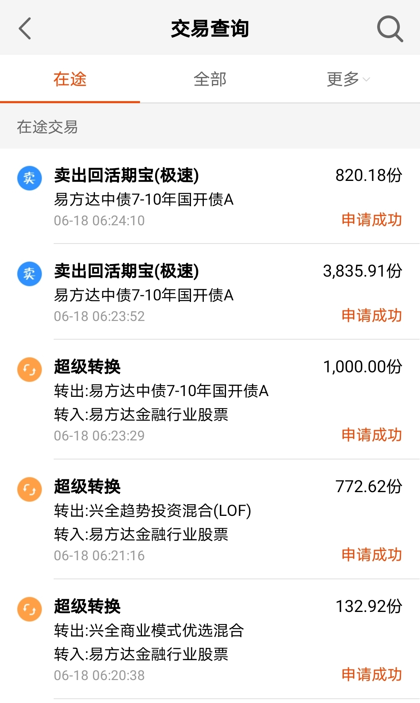

======================================================

_type: talk
@二师父[28814221155551]
2021-06-18 09:39:53 Fri  
topic_id: 414111852558848

<e type="hashtag" hid="881251425252" title="#鳄鱼计划#" /> 清仓证券保险etf，买入券商etf两份，保险的历史任务完成，是时候再见了。集中资金重仓这几个方向，创业板50，科创板50，医疗，白酒，新能源，光伏，互联网。

@天玺哥 at 2021-06-18 09:39:53 Fri

> 师父你这成本是怎么做到这么低的[强]

----------

@二师父 at 2021-06-18 09:39:53 Fri

> 成本不低，2.083是买入均价，华泰卖出以后因为计算原因自动降低了，之前收割过利润，所以成本降了，和实际买入均价两回事

----------

@天玺哥 at 2021-06-18 09:39:53 Fri

> 师父券商ETF代码是哪个

----------

@二师父 at 2021-06-18 09:39:53 Fri

> 512000

----------

@天玺哥 at 2021-06-18 09:39:53 Fri

> 谢谢师父

----------

@王春媚 at 2021-06-18 09:39:53 Fri

> 师父，白酒场内买哪个？

----------

@二师父 at 2021-06-18 09:39:53 Fri

> 161725，等回调吧，目前还是不便宜

----------

@王春媚 at 2021-06-18 09:39:53 Fri

> 收到，谢谢师父

----------

阅读[1]  评论[14]  赞[0] 

+++++++++++++++++++++++++++++++++++++++++++++++++++++

图片：
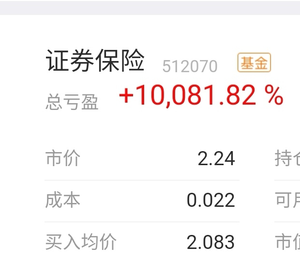

======================================================

_type: talk
@二师父[28814221155551]
2021-06-18 20:30:49 Fri  
topic_id: 414111818518458

<e type="hashtag" hid="88511552444452" title="#整体市场分析#" /> 整体市场分析，抓住大的方向很重要。

@天玺哥 at 2021-06-18 20:30:49 Fri

> 师父白酒回调到位的时候说声[呲牙]，跟师父吃肉[鼓掌]

----------

@二师父 at 2021-06-18 20:30:49 Fri

> 我会买的

----------

@永刚 at 2021-06-18 20:30:49 Fri

> 师父：债券仓位占20%，最近需要卖出吗？

----------

@二师父 at 2021-06-18 20:30:49 Fri

> 不用

----------

阅读[1]  评论[4]  赞[0] 

+++++++++++++++++++++++++++++++++++++++++++++++++++++

文件：
2021-06-18 20:51:36 Fri
文件大小：[42273]
544441421124244-享受政策红利.docx

======================================================

_type: talk
@西锦巴乌[88448285428482]
2021-06-18 21:23:31 Fri  
topic_id: 215111812555881

步行5.53公里

阅读[1]  评论[0]  赞[0] 

======================================================

_type: q&a
@隔窗遥望[241884481854181]
2021-06-18 23:33:40 Fri  
topic_id: 815111811424212

@隔窗遥望

>  最近要出双创50ETF，和分别投资创业板50，科创板50比哪种更好

@二师父

>  一样的，没有太多差别，投资双创50管理方便一些

阅读[1]  评论[0]  赞[0] 

======================================================

_type: talk
@二师父[28814221155551]
2021-06-18 23:45:49 Fri  
topic_id: 182888588885282

<e type="hashtag" hid="552114551414" title="#估值数据#" /> 市盈率百分位42.34%，市净率百分位33.23%，SY-BY百分位45.75%，SY/BY百分位43.64%。

如今的行情比较有意思，全市场估值变化不大，而细分板块变化较大，基本上地产和保险属于被重锤的，然后资金在白酒、医疗、互联网、新能源、煤炭、钢铁等板块流动，注意低吸回撤的板块，然后等待资金流入。

如果对于行业指数无法精准把握，推荐中证100ETF+沪深300ETF+深红利ETF+创业板50ETF+科创板50ETF，主投这5只就够了。

新手宽基为主，老手行业ETF为主，自行选择匹配。

@范毅君 at 2021-06-18 23:45:49 Fri

> 这几个好像暂时都没有低估[呲牙]

----------

@二师父 at 2021-06-18 23:45:49 Fri

> 等低估有点难，等回调均线以下支撑位的时候先走起来

----------

@范毅君 at 2021-06-18 23:45:49 Fri

> 好的[呲牙][呲牙]

----------

阅读[1]  评论[3]  赞[0] 

======================================================

_type: talk
@二师父[28814221155551]
2021-06-19 12:42:03 Sat  
topic_id: 182888428248112

<e type="hashtag" hid="458188281228" title="#鳄鱼计划持仓#" /> 表中都是好基金，找到好价格出手就行。好基金+好价格+好仓位。收益率不是最重要的，因为投资本金数量很重要，本金1万，翻倍也就收益1万，本金10万，收益率百分之50依然有5万。不要执着于收益率的高低，双高才是王道。

阅读[1]  评论[0]  赞[0] 

+++++++++++++++++++++++++++++++++++++++++++++++++++++

图片：
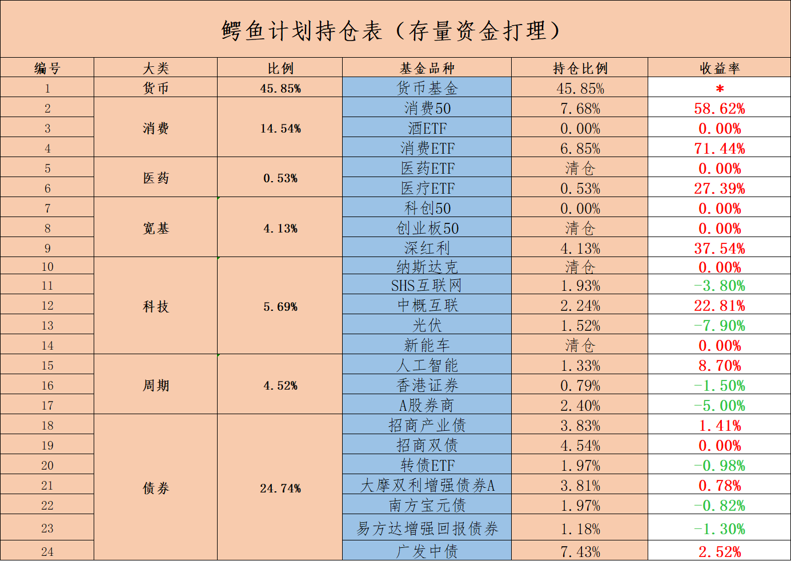

======================================================

_type: talk
@西锦巴乌[88448285428482]
2021-06-19 20:59:19 Sat  
topic_id: 815111284521552

步行5公里完成

阅读[1]  评论[0]  赞[0] 

======================================================

_type: talk
@二师父[28814221155551]
2021-06-19 22:31:02 Sat  
topic_id: 582888514812214

<e type="hashtag" hid="48411442458858" title="#机构跑路#" />看看机构用脚投票好未来，新东方，有粉丝朋友想抄底好未来，这个看抄底的资金了，不确定性太大，做好最坏的打算。

@J at 2021-06-19 22:31:02 Sat

> 师傅，这个新政策会否影响中概互联持续低迷？

----------

@二师父 at 2021-06-19 22:31:02 Sat

> 中概股不只有教育，看反垄断的影响，持续低迷也有可能

----------

阅读[1]  评论[2]  赞[0] 

+++++++++++++++++++++++++++++++++++++++++++++++++++++

文件：
2021-06-19 22:30:08 Sat
文件大小：[42957]
244415582141111-机构跑路了.docx

======================================================

_type: q&a
@蛋炒饭不加蛋[118281818482542]
2021-06-19 22:42:47 Sat  
topic_id: 182888428218242

@蛋炒饭不加蛋

>  请问二师父，宁德时代解禁对新能源板块影响大吗

@二师父

>  主要对自己的股价会有影响，宁德时代是锂电池供应企业，他的解禁没法对这个行业产生太大影响

阅读[1]  评论[6]  赞[0] 

======================================================

_type: talk
@次郎🌻[48551412448858]
2021-06-20 09:04:48 Sun  
topic_id: 815111222845182

师父，我爸妈有一笔钱想投资，只接受低风险0风险，是否现在银行已经没有保本保息的理财产品了？没有的话，您有什么可以推荐的超低风险理财产品。谢谢。

@二师父 at 2021-06-20 09:04:48 Sun

> 开通一个网络银行，国有四大行任选一个，我是中国银行，目前买了中国银行的货币基金南方收益宝和银行理财乐享天天。虽然说是不保本保息，但是目前我买的两个产品还没有遇到过亏损的情况。他说的意思不保本保息是指每天的净值会有波动，长期看都是向上的，这倒不必担心。

可以大头放在货币基金里面，小头放在银行理财里面，100万一个月差不多能够有2500元左右的固定收益。

----------

@蛋炒饭不加蛋 at 2021-06-20 09:04:48 Sun

> 四大行股票吃分红？

----------

@二师父 at 2021-06-20 09:04:48 Sun

> 用银行app买理财

----------

阅读[1]  评论[3]  赞[0] 

======================================================

_type: talk
@二师父[28814221155551]
2021-06-20 16:52:01 Sun  
topic_id: 215111248252881

<e type="hashtag" hid="48411442814228" title="#做了一个定投收益回测#" /> 定投不怕跌，怕涨，跌了是好事情。如果真有大跌，多加头寸，可是未来市场如何走很难预测，严格遵守纪律是最稳妥的做法。

阅读[1]  评论[0]  赞[0] 

+++++++++++++++++++++++++++++++++++++++++++++++++++++

文件：
2021-06-20 16:51:00 Sun
文件大小：[133949]
244415528241811-金融危机来了定投的收益率会如何.docx

======================================================

_type: talk
@苍天有井明月空🌙[28882214181441]
2021-06-20 18:21:16 Sun  
topic_id: 815111248144412

人工智能华宝做网格已经有十个点了，需要收割利润，还是走人。

@二师父 at 2021-06-20 18:21:16 Sun

> 按照网格做

----------

阅读[1]  评论[1]  赞[0] 

======================================================

_type: q&a
@王春媚[244424882221141]
2021-06-21 07:18:05 Mon  
topic_id: 815111412288142

@王春媚

>  师父：明天首批上市的科创创业50ETF们能不能买，您看好哪只？

@二师父

>  能买，创业板市场过热，等回调吧

阅读[1]  评论[1]  赞[0] 

======================================================

_type: q&a
@冉冉[88445118854412]
2021-06-21 10:55:20 Mon  
topic_id: 215111155841581

@冉冉

>  二师傅，请问工银科创50链接A与招商中证科创创业50ETF有什么区别？

@二师父

>  工银科创50链接a里面只有科创板里面的企业，招商科创创业里面的企业更多侧重创业板股票，少部分有科创企业

阅读[1]  评论[1]  赞[0] 

======================================================

_type: talk
@二师父[28814221155551]
2021-06-21 11:28:05 Mon  
topic_id: 182888825215822

继续结构性行情，目前市场上最佳的6只etf普通投资者就这5只构建一个激进组合，长期按照三大投资策略投资收益率也会很不错，目前都没有低估，只有上证50偏离均线以下，所以该买的是上证50而不是创业板50

@是喵喵吖～ at 2021-06-21 11:28:05 Mon

> 师父，互联网50（517050）目前亏损8个点 可以一直先拿着吗？

----------

@二师父 at 2021-06-21 11:28:05 Mon

> 可以的，后面还会买的

----------

@是喵喵吖～ at 2021-06-21 11:28:05 Mon

> 嗯嗯好的 谢谢师父！

----------

@柔软时光 at 2021-06-21 11:28:05 Mon

> 深红利都不在列呀？

----------

@样 at 2021-06-21 11:28:05 Mon

> 各买100观察如何[呲牙][呲牙][呲牙]

----------

@二师父 at 2021-06-21 11:28:05 Mon

> 深红利平衡型基金，上证50价值，创业50成长

----------

@二师父 at 2021-06-21 11:28:05 Mon

> 观察可以的

----------

@永刚 at 2021-06-21 11:28:05 Mon

> 师父，均线策略估值水平不需要是低估吗？如果一直下跌就一直定投吗？

----------

阅读[1]  评论[9]  赞[0] 

+++++++++++++++++++++++++++++++++++++++++++++++++++++

图片：
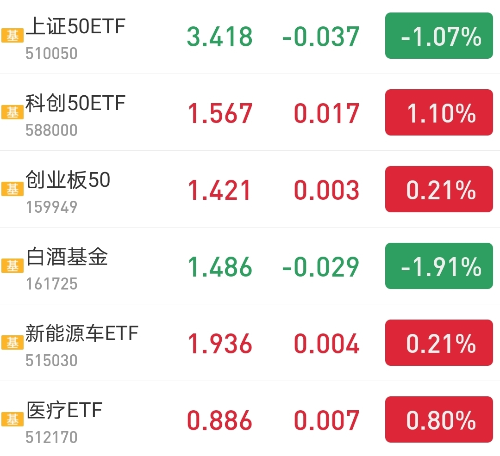

======================================================

_type: q&a
@隔窗遥望[241884481854181]
2021-06-21 13:01:04 Mon  
topic_id: 414111148142288

@隔窗遥望

>  招商双创50今天开始认购，588303，现在认购一些还是看看再说

@二师父

>  都可以，定投目前是不适合的

阅读[1]  评论[0]  赞[0] 

======================================================

_type: talk
@Philosophe*[544882828818444]
2021-06-21 14:28:16 Mon  
topic_id: 582888824884414

我的妈诶，求大佬帮调整。因为太忙一直没咋看自己基金，有空就跟着二师父投一下，今天一点开忽然发现十多个。求支招，哪些改卖和该换

易方达中证50ETF 006327
易方达国开债 003358
易方达汇报债 110017
易方达金融行业股票 008283
易方达沪深300非银 000950
易方达沪深300ETF 110020
景顺长城 162605
中证医疗 501005
汇添富全球消费 006308
中证消费 000248
深红利ETF 481012
南方宝元债券 202101
广发全球 270023
广发中债 003376
中欧医疗 006228
交银施罗德 007464
招商中证 161720

阅读[1]  评论[0]  赞[0] 

======================================================

_type: talk
@芙瑞雅阳阳潘[421181844812818]
2021-06-21 17:37:15 Mon  
topic_id: 582888812144284

师父，现在光伏可以做网络吗？

@二师父 at 2021-06-21 17:37:15 Mon

> 可以，按照均线走，正常估值60日均线以下买入，盈利10个点慢慢卖出。光伏可以长线的

----------

@芙瑞雅阳阳潘 at 2021-06-21 17:37:15 Mon

> 好

----------

阅读[1]  评论[2]  赞[0] 

======================================================

_type: talk
@二师父[28814221155551]
2021-06-22 00:24:20 Tue  
topic_id: 215111122825811

<e type="hashtag" hid="51288228225484" title="#估值数据和几个重点问题说明#" /> 市盈率百分位44.2%，SY/BY百分位43.44%，SY-BY百分位46.24%。

现在的问题在于到底是选择三傻还是三高。根据我的判断，地产和保险行业可以放弃，银行不是很好，但没有到放弃的地步，毕竟银行是国家支柱。

那我看好的几大行业，白酒、新能源车、光伏、医疗，互联网这五个方向，我觉得除了高估的不要买，其他的跌到正常估值然后60日均线以下都可以先积累一部分仓位，假如真的经济危机来了，底部再重仓。大家目前比较担心的可能是互联网，这个不用过度担心。

老读者可能有映像，中概互联一直加仓从1.4加到1元横盘了一年，最终爆发，现在也一样，他敢跌，我们就敢买，预计支撑位再1.6元左右，极端低点在0.9元，所以完全不必担心的，我会一直买下去。至少这个赛道还有5年的红利。

那对于赛道不好的，300非银，已经出来了，不会在一个没有前景的行业死扛，比如死扛格力，民生银行的。

方向先搞对了。另外对于波动承受不了的，选择四个宽基，易方达上证50，深红利，创业板50、科创板50，也是一样，只要跌，硬性加仓。

创业板50可能短期到达一波压力位，周三看情况可能先止盈一波。深红利之前已经止盈了，而且都有仓位，不管怎么跌不会再卖出，只要到达加仓位置，宽基是必须加仓的，不用担心。跟上节奏就行，大方向对了，价格适中，只管定投，价格低的令人发指，记得重仓。

@衣袂飘香 at 2021-06-22 00:24:20 Tue

> 弱弱的问一句，跟着二师父的乌龟和鳄鱼的节奏走，不想自己开黑车，我的持仓比例和二师父差不多。这样可行不？

----------

@二师父 at 2021-06-22 00:24:20 Tue

> 可以

----------

阅读[1]  评论[2]  赞[0] 

======================================================

_type: talk
@二师父[28814221155551]
2021-06-22 00:27:16 Tue  
topic_id: 582888855151484

另外关于均线定投策略，我的书里面写的是低估区域用，因为给看的人多，为了保证安全，写的很保守，实际上，高估也能用，正常估值也能用，只看个人能接受的长期浮亏时间和点位。

对于承受能力还可以的，正常估值采用均线定投策略也没啥问题，这个和个人承受能力有关，定投只要是不死的基金，那么无论何时入场最终坚持到底都可以盈利的。这是定投的魔力。

而实际上人的心里承受能力有限，所以再投资的时候需要控制跌幅。

@永刚 at 2021-06-22 00:27:16 Tue

> 正常估值时采用均线策略和低估时采用均线策略，最大的区别就是回撤的幅度不一样，对吗？

----------

@二师父 at 2021-06-22 00:27:16 Tue

> 回撤不同，还有一直低估投会错过一些机会

----------

阅读[1]  评论[2]  赞[0] 

======================================================

_type: q&a
@永刚[15581448518112]
2021-06-22 14:15:14 Tue  
topic_id: 815111142188582

@永刚

>  请教一下二师父，中证500净值现在高，但是却进入了低估区域，以前净值比现在还低，却是正常估值区域，这是为什么呢？如果现在开始定投比以前定投是不是能筹集更多的筹码呢？

@二师父

>  这是因为企业盈利增长的原因，当企业盈利增长，公司估值不变，市值越来越高
>  
>  所以你看到很多优质基金再次进入低估净值都比前期的要高

阅读[1]  评论[3]  赞[0] 

======================================================

_type: talk
@二师父[28814221155551]
2021-06-22 19:13:50 Tue  
topic_id: 215111118421121

<e type="hashtag" hid="15288228584482" title="#关于投资的几个基金的说明#" /> 大家目前关心定投的中概互联和易方达上证50的情况，有了详细了解加仓就不怕。

行情好的时候，都能够坚持，如果真的再次进入低迷期，也要敢于买入。

市场分化严重，虽然成交额万亿，不过涨的是固定的几个赛道，三傻继续傻。

阅读[1]  评论[0]  赞[0] 

+++++++++++++++++++++++++++++++++++++++++++++++++++++

文件：
2021-06-22 19:12:01 Tue
文件大小：[42570]
422214412158148-聊几个大家关心的基金.docx

======================================================

_type: talk
@西锦巴乌[88448285428482]
2021-06-22 20:24:33 Tue  
topic_id: 815111112521822

5.8公里完成

阅读[1]  评论[0]  赞[0] 

======================================================

_type: talk
@二师父[28814221155551]
2021-06-22 22:31:50 Tue  
topic_id: 582888888885224

<e type="hashtag" hid="552114551414" title="#估值数据#" /> 市盈率百分位44.2%，SY-BY百分位46.14%，SY/BY百分位43.45%。

估值数据一直比较稳定，而市场分化较为严重，把握几大优质赛道，回调的时候补仓，优选选择赛道，其次在优质赛道进行估值，没有前景的行业全部放弃。

阅读[1]  评论[0]  赞[0] 

======================================================

_type: talk
@二师父[28814221155551]
2021-06-22 22:57:58 Tue  
topic_id: 418444444812888

<e type="hashtag" hid="48411888882518" title="#讲几只重点投资的基金#" /> 对于能够承受一定风险的朋友，推荐几只重点投资的基金，高位回撤30%可以开始定投，进入低估区域可以加大定投力度。极端低位值得梭哈。

第一支：医疗ETF:512170
第二支：白酒ETF:161725
第三支：汽车ETF：515030
第四支：创业板50：159949
第五支：科创50：588000

这分别形成了5大赛道，投资的企业也从这些赛道选择，保险、地产可以放弃了。

当然，前期涨的最好的白酒现在跌的最惨，从6月4号让大家撤退，现在避免了损失，我不知道白酒还会不会短期继续反弹，但是我知道目前这个位置入白酒不值得。

总之，找准好的价格买入这五个方向，收益率一定不错的。

这五只基金算是风险偏高的ETF，适合已经经历过一轮牛熊，承受波动在40%左右的朋友。

@陈飞🤗 at 2021-06-22 22:57:58 Tue

> 二师父，现在沪深300最大回撤是多少

----------

@二师父 at 2021-06-22 22:57:58 Tue

> 百分之60以内

----------

@永刚 at 2021-06-22 22:57:58 Tue

> 50AH适合定投，这个赛道怎么样？

----------

@二师父 at 2021-06-22 22:57:58 Tue

> 宽基指数随意，可以选择沪深300增强

----------

@王模堂 at 2021-06-22 22:57:58 Tue

> 二师傅，你发的这五个车道，算是实话，但在今天发就是后知后觉了

----------

@二师父 at 2021-06-22 22:57:58 Tue

> 消费医疗新能源光伏创业板，科创板我之前都讲过，重提一遍不行？

----------

@sunny在路上 at 2021-06-22 22:57:58 Tue

> 思路一样，5月开始就入手了，略有盈利，我还是非常喜欢这几个ETF，弹性高，大跌大买，小跌小买，并长期看好

----------

@样 at 2021-06-22 22:57:58 Tue

> 各买100打个底仓[偷笑][偷笑]

----------

阅读[1]  评论[14]  赞[0] 

======================================================

_type: talk
@二师父[28814221155551]
2021-06-23 07:05:39 Wed  
topic_id: 218555552552481

天天出了和华泰一样的功能，平均买入均价计算成本，这样大家在收割利润的时候就知道目前真实收益率了，经过此次下跌，大家应该更能理解为何收割利润，没有收割的回撤百分之20很正常，当然，如果能经受百分之40左右回撤，长期握住没有问题

目前市场已经轮动了，主要是上证50大蓝筹和创业板，目前上证50跌，创业板涨，后面会继续定投上证50，然后创业板50收割利润

投资并不难，关键在于执行，左侧交易标的没有问题，就一路买到他的最低点，等待下一波反转，不要怀疑，价格低于价值的时候就是出手机会，思路决定了方向

左侧目前就买上证50，右侧就买创业板50，仔细体会，他俩都没错，思路不同，价值观不同罢了

阅读[1]  评论[0]  赞[0] 

+++++++++++++++++++++++++++++++++++++++++++++++++++++

图片：
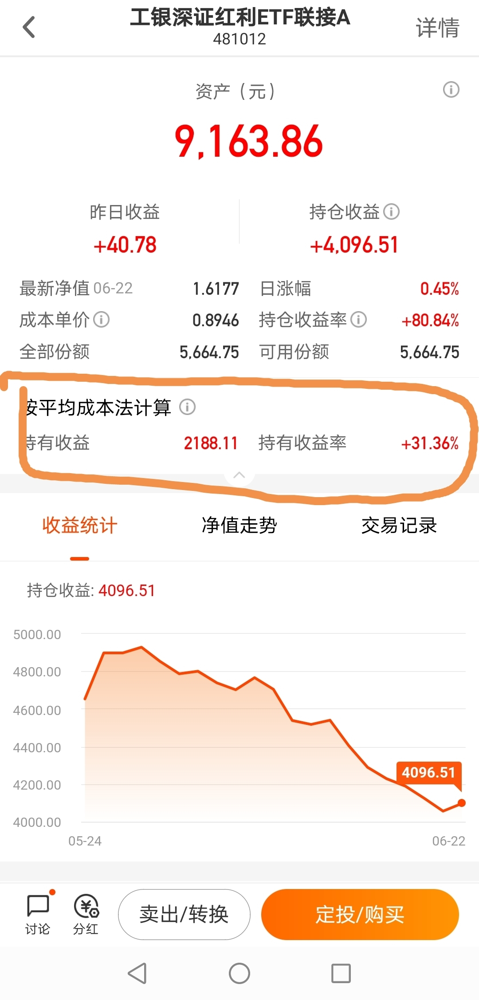

======================================================

_type: q&a
@永刚[15581448518112]
2021-06-23 10:42:40 Wed  
topic_id: 818555585815222

@永刚

>  二师父：深红利还可以做为优选宽基指数吗？可以按均线定投策略吗？占仓位多大比例合适？

@二师父

>  可以的，百分之20以内可以，这只基金很好，今年是小盘股行情，大盘股杀跌，是逐步布局的时候，有耐心就等低估，不想等了均线定投没问题

阅读[1]  评论[0]  赞[0] 

======================================================

_type: q&a
@西锦巴乌[88448285428482]
2021-06-23 11:24:25 Wed  
topic_id: 185222252115412

@西锦巴乌

>  师父好：请问招商成长精选一年定开混合A  （009695）该基是否值得继续持有？谢谢

@二师父

>  这只基金持仓还不错，如果钱长期不用的话可以继续持有

阅读[1]  评论[5]  赞[0] 

======================================================

_type: talk
@二师父[28814221155551]
2021-06-23 21:47:40 Wed  
topic_id: 185221415584882

<e type="hashtag" hid="825188852442" title="#估值表#" /> 星球估值表，昨天提的五个方向，大家看看估值表里面是不是都有，如果是新加入的朋友说我后知后觉，我还能理解，每一次加入估值表的时候，指数的投资价值都分析过，包括剔除地产指数、银行指数原因也说过啦，估值表里面的指数除了中证500不会考虑投资，其他的都是在投资范围内的，如果因为政策变化导致某些行业发生了本质变化，我们也会将指数剔除估值表。

左侧交易只有选对方向才有意义，不然在一个没有预期的方向坚守，真的是二愣子，投资是投未来的预期，将当前的和未来进行比较，未来现金流折现。

多次提及几大赛道并不是为了让投资者追高，而是说资金都在板块游走。

比如6月初提及白酒要撤退，当时资金就是进入了芯片板块，也侧面反映目前没有超级牛市，那么大蓝筹拉不起来，上证50低迷正常。逻辑要理顺了，实在不懂，慢慢学，学也不太懂，只能跟车了。

阅读[1]  评论[0]  赞[0] 

+++++++++++++++++++++++++++++++++++++++++++++++++++++

图片：
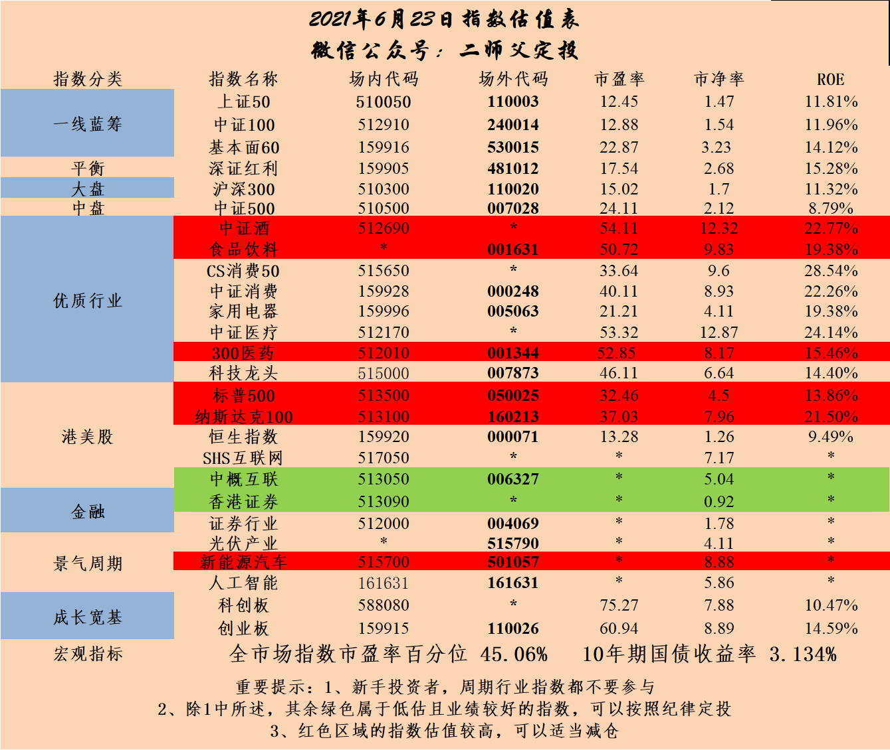

======================================================

_type: q&a
@晴[15422515228522]
2021-06-23 22:45:50 Wed  
topic_id: 581224541884244

@晴

>  二师父，易方达亚洲精选股票QDII值得定投吗

@二师父

>  值得定投，张坤的水平还可以，不过他也踩坑过美年健康，好未来，新东方。
>  
>  如果你特别信任他，就定投他的，如果不是的话，下跌可能拿不住，中概互联更加好，还有鳄鱼计划的shs互联网
>  
>  让我来选，首先是创业板50加科创板50，其次中概，最后是张坤的这个。

阅读[1]  评论[1]  赞[0] 

======================================================

_type: talk
@二师父[28814221155551]
2021-06-23 22:59:01 Wed  
topic_id: 418442525841458

<e type="hashtag" hid="28518855451481" title="#乌龟计划#" /> 今日发车，买入易方达上证50，仓位控制在百分之10以内问题不大，

如果新手我建议就四只基金易方达上证50，深红利，科创板50，创业板50。基本上大小盘轮动，有的年份上证50好，有的年份是科创板50和创业板50好。

再进一步是几个行业etf，把行业etf玩转了就可以进入18罗汉指数，挑选几个企业来投一下

一步步来，今天我建仓了牧原股份，我对猪肉的逻辑没变，目前只是市场价格带来影响，只要牧原不退市，这个位置再向下最多跌百分之55，每个人的思路不同，我选择做索罗斯的趋势反转，看错了就要接受长期被套的结果，对于牧原，比双汇确定性要高

不过股市风险在于政策，以及可能跌到价值毁灭，龙头战法分散配置才适合逆向

@🍀 凝🌸 慧🍀 at 2021-06-23 22:59:01 Wed

> 收到，谢谢师父[愉快][爱心][玫瑰]

----------

@吃肉肉 at 2021-06-23 22:59:01 Wed

> 师父说的十八罗汉指数是您发的指数估值表里的指数吗。

----------

@二师父 at 2021-06-23 22:59:01 Wed

> 是之前发的比较好的18家企业

----------

@吃肉肉 at 2021-06-23 22:59:01 Wed

> 好的，谢谢！

----------

@sky at 2021-06-23 22:59:01 Wed

> 师父，猪肉应该是开始有人杀母猪了才是底部吧😄

----------

@二师父 at 2021-06-23 22:59:01 Wed

> 是的，目前还没企稳，不过新希望都跌成新绝望了，猪肉价格不会几年都是这个水平，最大跌幅在百分之50以内，我能接受的波动

----------

@JOY at 2021-06-23 22:59:01 Wed

> 师父，那您创业板50还有多少呢？是全转了，还是留了些？

----------

@二师父 at 2021-06-23 22:59:01 Wed

> 转了大概百分之20

----------

阅读[1]  评论[9]  赞[0] 

+++++++++++++++++++++++++++++++++++++++++++++++++++++

图片：
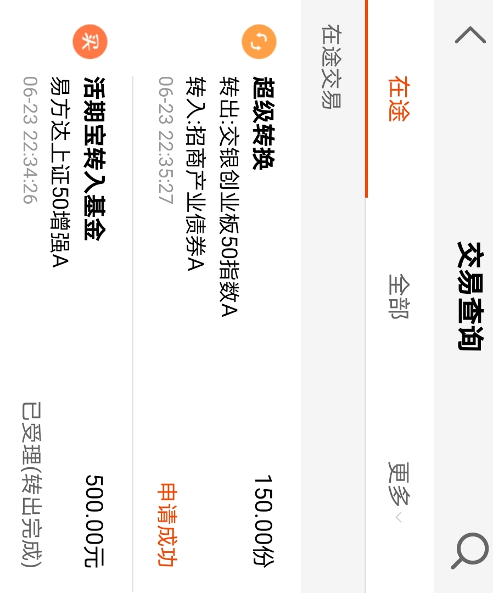

======================================================

_type: talk
@二师父[28814221155551]
2021-06-24 09:26:41 Thu  
topic_id: 185221485485252

<e type="hashtag" hid="15288555845412" title="#制定了一个两年计划#" /> 最近发现目标很重要，我之前计划是今年一年时间完成半马，结果半年时间就做到了，主要是目标、计划和榜样的力量。

结合昨天和华泰证券经理的聊天，我越发觉得计划的重要性，大致计划下未来两年的投资计划，总体战略部署，个人A股账户、美股账户、基金账户（目前发布的鳄鱼计划）不再新增资金投入，天天基金的两个组合持续投入，后面如果市场有好机会的时候，再建两个激进的组合（一个纯指数、一个纯主动），这样读者朋友选择基金直接从实盘里面挑选即可。计划在两年以后2023年6月6日，天天基金所有组合的金融资产达到100万以上，而且非极端意外情况，组合只做买入和调仓，不会将已买入的资产转化为现金。投资标的已经分享，以指数基金、成立10年以上的主动基金，债券基金为主。

投资实现财富最重要的是本金+收益率，一定要在最好的位置不断地积累到充沛的本金，我看好未来的资本市场，只要市场不是特别贵，持续投入将家庭财富锚固到基金上，未来10年，一定是房产投资逐步退场，股权投资逐步登场的10年。

这个计划大家关注天天基金，看我的组合，调仓每次都有短信通知，完全公开透明。如果做的好的地方大家借鉴，做的不好的地方大家也多批评指正，共同进步，实现生活自由。

@杜志彪 at 2021-06-24 09:26:41 Thu

> 今天场内调出部分创业板50换入场外易方达上证50增强A，刚刚光伏1.26元卖出最后一份网格（1元买了5份），仓位继续回到5层仓，下一步耐心等待机会加仓[微笑]

----------

@二师父 at 2021-06-24 09:26:41 Thu

> 知行合一

----------

@杜志彪 at 2021-06-24 09:26:41 Thu

> 猪肉的周期性很明显，去年有点贵一直关注没买，刚刚先买100股看看[微笑]

----------

@样 at 2021-06-24 09:26:41 Thu

> 师父准备主动基金组合什么时候出来呀？

----------

@二师父 at 2021-06-24 09:26:41 Thu

> 基金已经选好了，就等市场回调啦

----------

@样 at 2021-06-24 09:26:41 Thu

> 那就坐好板凳，等等等了[呲牙][呲牙]

----------

@赵晓勇 at 2021-06-24 09:26:41 Thu

> 等着师傅带我们大家一起去股权投资 梭哈一把，最近有朋友告诉我科创板就是近期的牛，师傅怎么看这头牛能跑起来吗？

----------

@二师父 at 2021-06-24 09:26:41 Thu

> 最近的牛是光伏，科创板资金已经逐步流出了

----------

阅读[1]  评论[10]  赞[0] 

======================================================

_type: q&a
@20181108……[51511128814554]
2021-06-24 09:54:42 Thu  
topic_id: 581224581425154

@20181108……

>  二师父，515030和515700都是新能车ETF怎么持仓区别还是有点大？

@二师父

>  这是不同的哈，平安是追踪中证新能源汽车产业指数，新能源车的投资范畴，华夏是中证新能源指数，各类新能源企业都有的，二者有一些区别

阅读[1]  评论[1]  赞[0] 

======================================================

_type: talk
@二师父[28814221155551]
2021-06-24 20:50:59 Thu  
topic_id: 581224428484224

<e type="hashtag" hid="28511882515421" title="#光伏#" /> 今日资金由芯片板块流入到光伏板块。光伏迎来利好，对于普通投资者，在前期低位布局，利好来临先持有，资金炒作结束收割利润，极端高估再考虑是否卖出。

关于长期与非长期没有绝对定论，取得一个平衡就好，这个平衡就是每一次回撤高仓位都不会后悔没有卖出，而是坚定的加仓。

@样 at 2021-06-24 20:50:59 Thu

> 最近光伏确实很火，请教一下，这个赛道是题材炒作呢，还是跟消费，医疗一样，属于长期优质赛道？求解惑

----------

@二师父 at 2021-06-24 20:50:59 Thu

> 长期优质赛道，白酒也有被炒作的时候

----------

@样 at 2021-06-24 20:50:59 Thu

> 好的，谢谢，那就放到基金池里[呲牙][呲牙]

----------

阅读[1]  评论[3]  赞[0] 

+++++++++++++++++++++++++++++++++++++++++++++++++++++

文件：
2021-06-24 20:48:55 Thu
文件大小：[42474]
544482151548484-光伏迎来利好.docx

======================================================

_type: talk
@二师父[28814221155551]
2021-06-24 21:29:36 Thu  
topic_id: 581224412255214

<e type="hashtag" hid="552114551414" title="#估值数据#" /> 市盈率百分位45.77%，SY-BY百分位47.55%，SY/BY百分位44.74%。

有读者朋友问何时可以梭哈，如果估值百分位10%以下基本可以了。目前还是结构性行情，震荡为主，存量资金博弈，一直各个板块游走。

作为逆向投资者，选好赛道，当板块低迷的时候入场，等待风起就行了。趋势投资者，当然是每次追着热点走，这种也可以，就是投资会非常累，选择一种方法就行了。

@清茶半盏 at 2021-06-24 21:29:36 Thu

> 师父：大北农和牧原股份性价比哪个好？

----------

@二师父 at 2021-06-24 21:29:36 Thu

> 牧原股份

----------

阅读[1]  评论[2]  赞[0] 

======================================================

_type: q&a
@手牵手看夕阳[244112548184141]
2021-06-25 10:41:10 Fri  
topic_id: 818554422212212

@手牵手看夕阳

>  深红利现在可以建仓吗？

@二师父

>  轻仓可以

阅读[1]  评论[0]  赞[0] 

======================================================

_type: talk
@二师父[28814221155551]
2021-06-25 13:45:55 Fri  
topic_id: 418442224528828

抬轿子的又来了，东方财富破新高，先坐稳了，买入和持有分开，压力位是区分点

@光少 at 2021-06-25 13:45:55 Fri

> 我持有[色]

----------

@wty at 2021-06-25 13:45:55 Fri

> 还有半年才能开通创业板，先网格券商ETF[偷笑][偷笑]

----------

阅读[1]  评论[2]  赞[0] 

======================================================

_type: talk
@二师父[28814221155551]
2021-06-25 21:52:08 Fri  
topic_id: 418442214548548

<e type="hashtag" hid="144245544512" title="#深红利#" /> 详细解答和分析，大家主要看看投资逻辑。

阅读[1]  评论[0]  赞[0] 

+++++++++++++++++++++++++++++++++++++++++++++++++++++

文件：
2021-06-25 21:50:12 Fri
文件大小：[42700]
111182515428582-深红利现在能不能上车.docx

======================================================

_type: talk
@二师父[28814221155551]
2021-06-26 16:49:57 Sat  
topic_id: 818554154814142

<e type="hashtag" hid="28511882142141" title="#推荐的一些基金和代码#" /> 都是乌龟计划的标的，可以收藏一下。

@wty at 2021-06-26 16:49:57 Sat

> 优质鸡必须坚持养...[偷笑]

----------

阅读[1]  评论[1]  赞[0] 

+++++++++++++++++++++++++++++++++++++++++++++++++++++

文件：
2021-06-26 16:48:50 Sat
文件大小：[42579]
111182518848542-值得收藏的一些基金代码.docx

======================================================

_type: talk
@二师父[28814221155551]
2021-06-27 06:37:52 Sun  
topic_id: 418441482528248

<e type="hashtag" hid="824551122182" title="#鳄鱼计划总结#" /> 大方向就是这些基金，关于芯片投资的话需要注意技术攻关面临较大困难，所以风险偏大，科创50里面有很多芯片企业，加宽基指数投资芯片企业，越跌越买会更加安心一点。、

未来就是这些基金，越跌越买，当前市场成交额万亿以上，不要买了。休息，等待下一次回调。

@王春媚 at 2021-06-27 06:37:52 Sun

> 师父好，新能车咋清仓了？

----------

@永刚 at 2021-06-27 06:37:52 Sun

> 中概互联还可以买吗？

----------

@二师父 at 2021-06-27 06:37:52 Sun

> 高估的时候就卖了

----------

@二师父 at 2021-06-27 06:37:52 Sun

> 可以买

----------

阅读[1]  评论[4]  赞[0] 

+++++++++++++++++++++++++++++++++++++++++++++++++++++

图片：
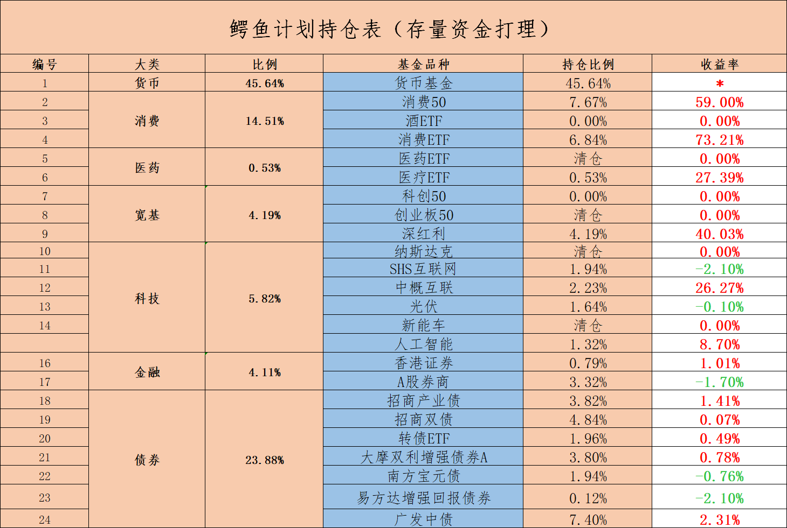

======================================================

_type: talk
@庆余年[15584481824122]
2021-06-27 21:43:28 Sun  
topic_id: 581228241851284

7月份主动基金排行

@二师父 at 2021-06-27 21:43:28 Sun

> 这是6月还是7月的

----------

@庆余年 at 2021-06-27 21:43:28 Sun

> 6月份的，用作7月份投资的参照。

----------

@二师父 at 2021-06-27 21:43:28 Sun

> [强][强]

----------

阅读[1]  评论[3]  赞[0] 

+++++++++++++++++++++++++++++++++++++++++++++++++++++

文件：
2021-06-27 21:43:28 Sun
文件大小：[729073]
111182488158882-基金排行-2107.pdf

======================================================

_type: talk
@苍天有井明月空🌙[28882214181441]
2021-06-27 22:25:10 Sun  
topic_id: 581228245181424

你好，我问下我现在所以资金只有四层买了基金股票，其他六层能全部进安心组合吗。

@二师父 at 2021-06-27 22:25:10 Sun

> 可以的

----------

阅读[1]  评论[1]  赞[0] 

======================================================

_type: q&a
@晴[15422515228522]
2021-06-28 09:51:48 Mon  
topic_id: 185228285812252

@晴

>  二师父，新增10W家庭备用资金，以备不时之需，这个钱要怎么处理比较好？有推荐的吗

@二师父

>  5万买安心组合，3万买货币基金，2万买银行t+0理财。

阅读[1]  评论[2]  赞[0] 

======================================================

_type: talk
@二师父[28814221155551]
2021-06-28 09:54:17 Mon  
topic_id: 418441415424858

<e type="hashtag" hid="28511884482141" title="#详细谈谈组合和计划#" /> 关于计划和组合，组合如何投资，以天天基金为主，后期持续投入。
 
1、做投资和工作、学习都需要有计划，然后拆解目标，比如实现家庭金融资产200万的小目标，每年存30万，按照15%的年化收益率增值大致是30+30X1.15+30X1.15*2+30X1.15*3+30X1.15*4=202。
 
然后拆解的化就需要两个层面，一年需要30万的净结余，然后达到年化15%的收益率。注意这个计算忽略了月复利，实际上需要的资金比30万少。
 
那么要达到这个目标就继续拆解，达到15%的年化收益率，持续学习，跟投总结，提高投资水平稳定在10%——15%学习3年左右并不太难。第二拆解一年存30，一个月存2.5，如果这个目标有点难，那么需要调整，第一如何提升收入，第二如何降低开支，第三延长达到目标的时间，一个月存不到2.5，就存1.那么随着完成目标的时间就会推迟，不过总会达到目标。
 
按照这种拆解不会有不切实际的幻想，比如3年1000万，这种容易在投资上走弯路，在工作上走歧路，走火入魔，相反，慢慢积累，反而会很快达到目标。2016、2017、2018我的资产增速都非常慢，而到了2020年就来了一个飞跃，因为市场的变化非线性的，我们没法左右市场和环境，但是可以按照原定计划去行动。
 
最后即使目标达不到，即使没有过上想要的生活，那么也会比躺平、抱怨过的生活好很多。
 
第二关于组合，目前我的几大组合大家都清楚，未来会把重心放在天天基金上，持续投入积累，以指数基金为主，辅助混合基金、股票基金、债券基金。
 
计划天天出4个组合：
 
1、乌龟计划（稳健组合）：每周雷打不动定投，按照西格尔的理论，股票的长期年化收益率8%，长期纯债的年化收益率5%，那么长期积累一定可以跑赢货币基金收益率的两倍，一直买是值得的，在金融资产8位数之前持续积累，达到小目标后基本上可以过上自己热爱的生活。适合每周跟着走，如果你有自己的计划，可以按照自己的计划走，用买资产的思维改变自己的现状。
 
2、安心组合：全部是债券组合，适合3到5年不用的资金一次买入，如果能能接受5%——10%的亏损，短期要用的资金可以一次买，注意前提哈。
 
3、纯指数组合，不控回撤，长期跑赢大盘。

4、纯主动基金组合，不控回撤，长期跑赢大盘。
 
 
 

阅读[1]  评论[0]  赞[0] 

======================================================

_type: talk
@二师父[28814221155551]
2021-06-28 09:58:05 Mon  
topic_id: 818551512544112

建仓牧原不到一个星期，涨了12%，不过跳空高开有缺口，大概率会补上的，也就是回落，四个账户：防守账户、日用账户买入保守的固守品种，稳健账户买入有波动的权益品种，不死的品种，进攻账户，根据自己的投资水平来选择激进程度，注意先后顺序，先防守，再稳健，再进攻。

@Chu at 2021-06-28 09:58:05 Mon

> 师父，但你的十八罗汉没有牧原，会不会加上

----------

@二师父 at 2021-06-28 09:58:05 Mon

> 估计不会加，这是一只周期股，你看他从顶部下来短短时间也跌的很恐怖。我的18罗汉都是从消费、医药、科技这些板块选择的，集中这几块，消费主要白酒、医药主要医疗服务、医美、CRO、CXO,科技主要锂电池、新能源、光伏、新能源汽车整车。如果买猪肉板块的话，牧原比新绝望要好。

----------

@Chu at 2021-06-28 09:58:05 Mon

> 嗯嗯，最近我看下十八罗汉，恒瑞比较回撤大，如果能接受百分之三十的跌幅，现在可以建仓么？

----------

@二师父 at 2021-06-28 09:58:05 Mon

> 那不行

----------

@光少 at 2021-06-28 09:58:05 Mon

> 今天牧原出了，等回补跌下来再上车[调皮]

----------

阅读[1]  评论[5]  赞[0] 

======================================================

_type: talk
@二师父[28814221155551]
2021-06-28 10:05:19 Mon  
topic_id: 581228285122244

最喜欢的6只etf，跌下去了就定投，跌到底部了就梭哈。

@天玺哥 at 2021-06-28 10:05:19 Mon

> 跟上二师父吃肉[鼓掌][鼓掌][鼓掌]

----------

@丸子妈 at 2021-06-28 10:05:19 Mon

> 怎么叫跌到底了

----------

@二师父 at 2021-06-28 10:05:19 Mon

> 等我说抄底的时候就跌到底部了

----------

阅读[1]  评论[3]  赞[0] 

+++++++++++++++++++++++++++++++++++++++++++++++++++++

图片：
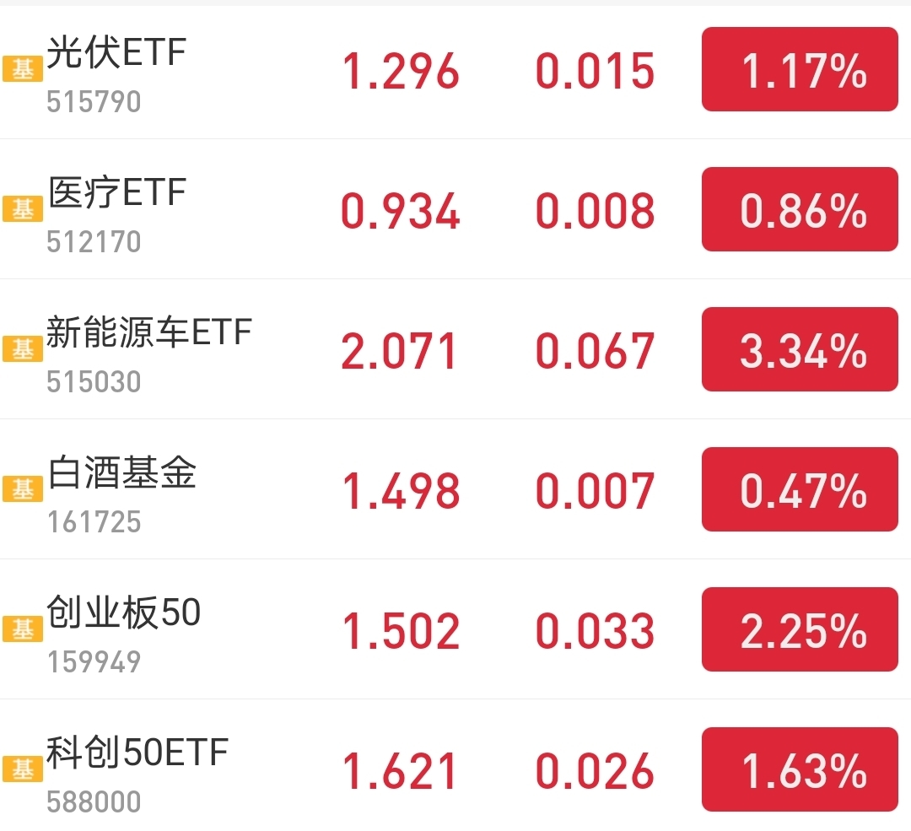

======================================================

_type: q&a
@手牵手看夕阳[244112548184141]
2021-06-28 12:13:12 Mon  
topic_id: 818551511414212

@手牵手看夕阳

>  光伏ETF现在是高估吗？

@二师父

>  目前还是正常估值

阅读[1]  评论[7]  赞[0] 

======================================================

_type: talk
@二师父[28814221155551]
2021-06-28 17:34:57 Mon  
topic_id: 418441842154248

<e type="hashtag" hid="51288152515184" title="#分化后方向选择#" /> 优选景气方向，对于普通投资者三个最佳方向沪深300+深红利+创业板50+可创板50.低估定投或者正常估值60日均线以下定投。

阅读[1]  评论[0]  赞[0] 

+++++++++++++++++++++++++++++++++++++++++++++++++++++

文件：
2021-06-28 17:33:17 Mon
文件大小：[42346]
422214242114418-又是吃肉的一天，方向别做错了.docx

======================================================

_type: talk
@二师父[28814221155551]
2021-06-28 23:24:23 Mon  
topic_id: 581228114518484

<e type="hashtag" hid="552114551414" title="#估值数据#" /> 当前市盈率百分位47.93%，SY-BY百分位49.45%。

说下平安，某基金经理李驰放弃平安。可以说明问题了，十八罗汉指数里面没有平安是有道理的，再次告诫我们不要押宝一只股票，分仓配置，如果想要投资就从18罗汉指数里面选择，胜率比你自己挑选高太多了。

逻辑+业绩+预期是最重要的三要素。目前大家问要不要追，我总是不鼓励，低吸+高抛，低吸+持有才能稳健获利。

阅读[1]  评论[0]  赞[0] 

======================================================

_type: talk
@泓.[414858828855888]
2021-06-29 10:02:51 Tue  
topic_id: 818551822152522

5g 和半导体 现在还能买吗？

@二师父 at 2021-06-29 10:02:51 Tue

> 等回调定投

----------

阅读[1]  评论[1]  赞[0] 

======================================================

_type: talk
@芙瑞雅阳阳潘[421181844812818]
2021-06-29 10:27:53 Tue  
topic_id: 218551824528211

师父,半导体、芯片的基金推荐下可好？

@二师父 at 2021-06-29 10:27:53 Tue

> 半导体etf，芯片etf

----------

阅读[1]  评论[1]  赞[0] 

======================================================

_type: talk
@芙瑞雅阳阳潘[421181844812818]
2021-06-29 10:36:29 Tue  
topic_id: 418441852422428

师父，怎么续费？

@二师父 at 2021-06-29 10:36:29 Tue

> 置顶第二篇文章有二维码

----------

@衣袂飘香 at 2021-06-29 10:36:29 Tue

> 加入星球快两周年了，准备第3次续费。

----------

阅读[1]  评论[2]  赞[0] 

======================================================

_type: talk
@二师父[28814221155551]
2021-06-29 20:40:16 Tue  
topic_id: 185228582142282

<e type="hashtag" hid="15288542881252" title="#看看科技基金#" /> 投资选板块，如果有相应看好的优质板块，直接选择行业ETF即可。目前我最看好的四大板块白酒、医疗，光伏、新能源。具体细化就是高端，此稿端白酒、CRO、CXO、医美，锂电、新能源汽车整车、光伏发电等。方向选对了，传统企业的话预期较低。

当前市场又到了阶段高位，光伏开始盈利，投资首选偏债混合以及平衡型混合基金。永远在大家悲观的时候买入，在大家乐观的时候卖出。这样子做到了基本上不会出大问题。

@吃肉肉 at 2021-06-29 20:40:16 Tue

> 师父有没有推荐的科创创业50代码？

----------

@二师父 at 2021-06-29 20:40:16 Tue

> 588300

----------

@吃肉肉 at 2021-06-29 20:40:16 Tue

> 好的，谢谢！

----------

@老孙头 at 2021-06-29 20:40:16 Tue

> 有代码吗—“科技板块最好的一只基金.docx”？

----------

@二师父 at 2021-06-29 20:40:16 Tue

> 588300

----------

阅读[1]  评论[5]  赞[0] 

+++++++++++++++++++++++++++++++++++++++++++++++++++++

文件：
2021-06-29 20:37:21 Tue
文件大小：[42093]
422214258228128-投资科技板块最好的一只基金.docx

======================================================

_type: talk
@二师父[28814221155551]
2021-06-29 22:00:51 Tue  
topic_id: 818551818285422

<e type="hashtag" hid="88514141542152" title="#主动基金估值表#" /> 新能源高估，两只混合基金和股票基金正常估值。

目前这种市场位置，优先定投混合基金。

@杜志彪 at 2021-06-29 22:00:51 Tue

> 场内卖出中途加仓的光伏，目前与师父保持一致占比1.7%。

----------

@样 at 2021-06-29 22:00:51 Tue

> 请问鼎益和合润还可以定投吗？

----------

@二师父 at 2021-06-29 22:00:51 Tue

> 可以，今天继续

----------

@韩韩 at 2021-06-29 22:00:51 Tue

> 兴全和润混合，这个适合长期定投吗？

----------

@二师父 at 2021-06-29 22:00:51 Tue

> 低估以后适合定投

----------

阅读[1]  评论[5]  赞[0] 

+++++++++++++++++++++++++++++++++++++++++++++++++++++

图片：
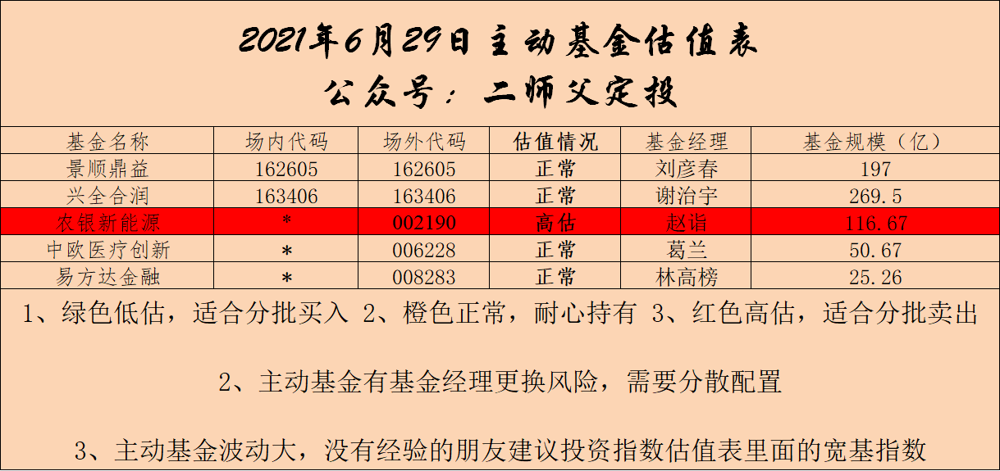

======================================================

_type: q&a
@小鱼[241182222251181]
2021-06-30 14:14:32 Wed  
topic_id: 185228128542522

@小鱼

>  三花转债，继续拿着吗，还是卖掉？

@二师父

>  130以上可以卖了

阅读[1]  评论[0]  赞[0] 

======================================================

_type: q&a
@xu[2441485251]
2021-06-30 15:03:04 Wed  
topic_id: 185228152152182

@xu

>  二师傅您好！芯片ETF（512760）盈利18个点，8层仓，要不要止盈一部分，谢谢！

@二师父

>  可以降低一层仓位到7，资金持续流入，芯片供应短缺，还有上涨预期

阅读[1]  评论[0]  赞[0] 

======================================================

_type: q&a
@波多黎各[28428858544121]
2021-06-30 16:52:08 Wed  
topic_id: 185228151225812

@波多黎各

>  师父，请问a股打新需要持有25日，是不是要买1万股票持有25日才可以打新，另外，如果持有的话有什么票建议吗？

@二师父

>  目前没啥建议，从我挑选的18家企业里面选成功率高一些。打新需要市值，至少沪深各一万

阅读[1]  评论[2]  赞[0] 

======================================================

_type: q&a
@永刚[15581448518112]
2021-06-30 16:53:19 Wed  
topic_id: 581228414128154

@永刚

>  科创板50现在需要逐步止盈吗？

@二师父

>  收割利润就行了，看看能不能突破1750，如果突破了继续握住

阅读[1]  评论[0]  赞[0] 

======================================================

_type: talk
@二师父[28814221155551]
2021-06-30 18:14:32 Wed  
topic_id: 218551484155181

<e type="hashtag" hid="824514224452" title="#指数估值表#" /> 中证500进入低估了，这只基金可定投，不过收益率不如创业板50。

市场持续上行，坚持定投，保持半仓运行。

阅读[1]  评论[0]  赞[0] 

+++++++++++++++++++++++++++++++++++++++++++++++++++++

图片：
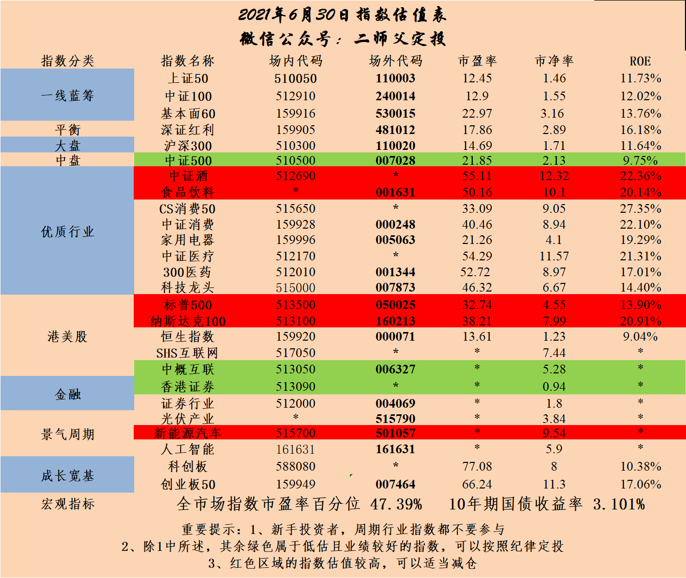

======================================================

_type: talk
@二师父[28814221155551]
2021-06-30 20:04:58 Wed  
topic_id: 185228158448512

<e type="hashtag" hid="15288545582422" title="#乌龟计划283#" /> 买入景顺鼎益混合（162605） 300元
买入兴全合润混合（163406） 200元
买入招商产业债 （217022） 300元
买入大摩双利增强债券A  (000024)  200元，天天基金直接跟投。保持半仓运行，在狂热中谨慎。

@王春媚 at 2021-06-30 20:04:58 Wed

> 师父，为什么中概互联暂停定投？

----------

@二师父 at 2021-06-30 20:04:58 Wed

> 中概这个仓位合适

----------

@王春媚 at 2021-06-30 20:04:58 Wed

> 收到，谢谢师父！

----------

阅读[1]  评论[3]  赞[0] 

======================================================

_type: talk
@二师父[28814221155551]
2021-06-30 23:25:22 Wed  
topic_id: 581228454244814

<e type="hashtag" hid="48411858811588" title="#未来投资的大战略方向#" /> 随着楼市的火热，很多投机者继续炒房，大家都在赌房地产夜壶会在需要的时候被拿出来。然而四年过去了，从317提房住不炒之后，调控越来越严格。最近部分城市二手房限制房贷，如果这是一个开始的话，那么房地产的辉煌20年终结了。从97年房改到17年317政策，中国房地产最辉煌的20年结束了。

对于过去通过房子躺赢躺赚的一波人，如果不及时转换思维，仍旧贷款高杠杆买房，大概率房子会成为最大的负债。

所以，站在当下看未来，我认为非必要不买房。只有三大刚需需要买。

第一、不买房没法结婚，第一刚需。第二、不买房孩子没法上学，第二刚需。第三、不买房住的不舒服，第三刚需。除此以外，没有必要再买房子。

大家认真学习投资知识，利用股票、债券、基金实现年化8%——15%的收益率并不是难事，跑赢通胀也是大概率事件。

从大的战略层面，我决定三线作战。

第一：美股投资在美国上市的优质企业。

第二、A股投资在大陆上市的优质企业。

第三、基金5个实盘。

一个保守的安心组合。

两个稳健的乌龟计划和鳄鱼计划

两个激进的纯指数组合和纯主动组合。

风险控制方法：第一、努力挣钱被动降低仓位。第二、根据市场位置主动管理仓位。第三、防守账户和日用账户资金备足。第四、除了买房，坚持零杠杆前行，降低负债和杠杆。

关于何时金融资产达到1000万的小目标，认真拆解一下，每年净存40万，年化收益率18%，大约10年后2031年可以达到金融资产1000万的目标。

按照这个目标拆解，大家大致可以知道自己如何实现小目标了。当然我自有资金还会继续增值，而且收入相信随着认知的提升会不断提高，那么这个目标有望提前到来，享受这个过程，而不关注结果。

即使最终目标没有达成，在一路学习的过程中我们也成长了，这才是人生的意义，至于纸面上的财富，百年以后都不重要了。

@J at 2021-06-30 23:25:22 Wed

> 随着科技发展，也许人的寿命在将来会超越百年

----------

阅读[1]  评论[1]  赞[1] 

======================================================

