_type: q&a
@宋航[48548414258158]
2021-07-01 09:18:19 Thu  
topic_id: 185228115415842

@宋航

>  二师父，昨天的估值数据是多少啊？

@二师父

>  市盈率百分位47.39%，SY-BY百分位48.51%，SY/BY百分位45.36%。
>  
>  估值楼层第三层，如果市场在涨涨大概率就要进入第四层了。

阅读[1]  评论[1]  赞[0] 

======================================================

_type: talk
@门萨🐨[51411455828824]
2021-07-01 09:44:14 Thu  
topic_id: 581228445212444

加鸡腿🍗

@庆余年 at 2021-07-01 09:44:14 Thu

> 昨天三花也是一个涨停，今天131卖了

----------

@付云 at 2021-07-01 09:44:14 Thu

> 现在132，我再坚持一下

----------

阅读[1]  评论[2]  赞[0] 

+++++++++++++++++++++++++++++++++++++++++++++++++++++

图片：
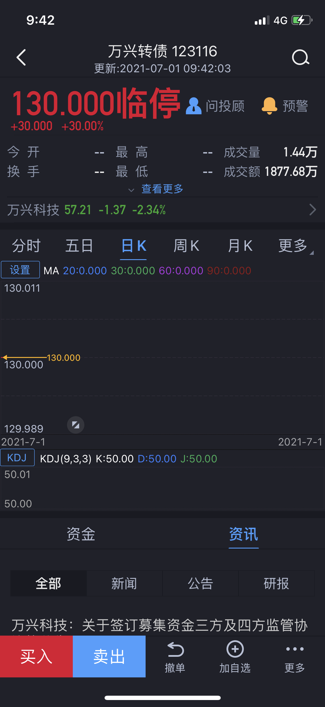

======================================================

_type: talk
@二师父[28814221155551]
2021-07-01 09:46:15 Thu  
topic_id: 581228445215454

<e type="hashtag" hid="881251425252" title="#鳄鱼计划#" /> 清仓人工智能，买入招商双债两份，转债ETF两份。目前我的持仓非常保守，如果今年继续牛市，继续提款，我和朋友交流，意见出现了分歧，他认为未来10年长牛，未来可期，我认为即使10年长牛也会有不低于百分之30的回调和波动，而且金融风险这只达摩克利之剑一直悬挂头上。

我坚持自己的判断，市场这个位置了，未来三年必有一跌，现在很多人已经不相信a股会跌了，这和18年的时候很多人不相信a股会涨了一样，提前做好准备吧。我无法判断未来会涨多高，我只知道当别人过于乐观的时候需要谨慎。

今年如果继续走牛，那么降低仓位到2至3成，继续配置债券，熊市和危机的时候货币基金和债券基金会拯救你的，2到3成仓位是底线，金融危机来了也不会空仓。仅为个人投资记录，每个人的承受能力不同，不用盲目模仿。基金代码大家保存下，基本上就是这些，代表着中国经济发展方向，都值得长期投资，等待好价格就行了。

@杜志彪 at 2021-07-01 09:46:15 Thu

> 别人乐观时我谨慎，刚刚也是收割了科创板和医疗的利润，转入深红利和消费了，目前还是半层仓位。

----------

@门萨🐨 at 2021-07-01 09:46:15 Thu

> 保持谨慎才能永远在场[微笑]

----------

@果实妈咪 at 2021-07-01 09:46:15 Thu

> 深红利现在还可以入场吗？我消费还是亏的

----------

@杜志彪 at 2021-07-01 09:46:15 Thu

> 按照均线法小额定投是可以的，我也是加了一份而已。

----------

@牛牛 at 2021-07-01 09:46:15 Thu

> 二师父招商双债和转债ETF代码是多少

----------

@二师父 at 2021-07-01 09:46:15 Thu

> 图片里面有

----------

@果实妈咪 at 2021-07-01 09:46:15 Thu

> 谢谢

----------

@苍天有井明月空🌙 at 2021-07-01 09:46:15 Thu

> 网格的人工智能用全清了吗

----------

阅读[1]  评论[27]  赞[0] 

+++++++++++++++++++++++++++++++++++++++++++++++++++++

图片：
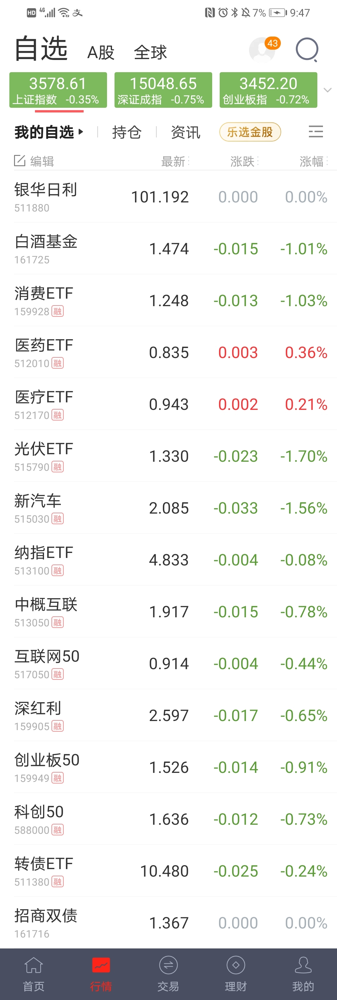

======================================================

_type: talk
@次郎🌻[48551412448858]
2021-07-01 11:34:07 Thu  
topic_id: 418441225115288

师父，前阵子可转债打新破发，后面就好久没关注可转债打新了，最近可转债可以盲打吗？

@二师父 at 2021-07-01 11:34:07 Thu

> 可以，破发的可以持有

----------

阅读[1]  评论[1]  赞[0] 

======================================================

_type: talk
@二师父[28814221155551]
2021-07-01 20:57:15 Thu  
topic_id: 581228488845884

<e type="hashtag" hid="28511828454811" title="#聊一聊为什么买鼎益混合#" />

@吃肉肉 at 2021-07-01 20:57:15 Thu

> 师父说的“投资三只指数基金+三只混合基金+一只股票基金”是哪个？

----------

@二师父 at 2021-07-01 20:57:15 Thu

> 中证白酒，创业板50，科创板50，鼎益混合，兴全合润混合，农银新能源主题混合，中欧医疗股票

----------

@吃肉肉 at 2021-07-01 20:57:15 Thu

> 好的，谢谢！

----------

@冉冉 at 2021-07-01 20:57:15 Thu

> 师傅，那中概互联算吗？是您说的好赛道吗？

----------

@二师父 at 2021-07-01 20:57:15 Thu

> 算，场内买etf

----------

@HeLLO at 2021-07-01 20:57:15 Thu

> 三个ETF，三个混基，一个股票基金现在适合买？定投还是怎么买

----------

@二师父 at 2021-07-01 20:57:15 Thu

> 定投

----------

阅读[1]  评论[7]  赞[0] 

+++++++++++++++++++++++++++++++++++++++++++++++++++++

文件：
2021-07-01 20:57:02 Thu
文件大小：[42704]
111182188214422-买他最硬的逻辑.docx

======================================================

_type: talk
@芙瑞雅阳阳潘[421181844812818]
2021-07-01 21:40:32 Thu  
topic_id: 218551155828251

续费成功[强]

阅读[1]  评论[0]  赞[0] 

+++++++++++++++++++++++++++++++++++++++++++++++++++++

图片：

======================================================

_type: talk
@二师父[28814221155551]
2021-07-01 22:08:38 Thu  
topic_id: 581228822451824

<e type="hashtag" hid="88511828451142" title="#估值数据百分位#" /> 市盈率百分位47.09%，SY-BY百分位48.65%，SY/BY百分位45.7%。

当前依然是结构震荡中，两大主线走高，CRO和锂电，都是高景气方向。

说一说投资方向，要选对。传统企业的发展已经触碰到了天花板，未来的机会首先是医疗类企业，其次是新能源产业链上端和汽车整车，尤其是能源方向，世界上已经有70%的国家响应碳中和、碳达峰的目标，实现这个目标必须依托于能源转型，第三次能源革命很可能发生。

现在我的股票投资基本上在医疗+能源里面选择，这两大赛道的企业可以说是婴儿阶段，白酒已经成熟，实现一个跑赢大盘的收益率问题不大，而未来真正的10年10倍企业一定是出现在医疗和能源企业，这一点要把握对了。

对于鳄鱼计划，未来也会更加集中到新兴企业赛道，医疗ETF+能源ETF，这是重仓方向，然后辅助创业板50+科创板50。注意，企业的盈利增速比估值更加重要，而且真正的好企业，永远是穿越牛熊的，不随大盘，基本面比买入的时点更加重要。

@永刚 at 2021-07-01 22:08:38 Thu

> 新能源ETF现在可以建仓吗？

----------

@二师父 at 2021-07-01 22:08:38 Thu

> 能建仓我会建仓的

----------

@晴 at 2021-07-01 22:08:38 Thu

> 二师父，能源的股票可以重点关注哪几只[呲牙]

----------

@二师父 at 2021-07-01 22:08:38 Thu

> 我公布的18家企业里面就有的

----------

阅读[1]  评论[4]  赞[0] 

======================================================

_type: q&a
@果实妈咪[182225518588452]
2021-07-02 09:58:05 Fri  
topic_id: 218551185252281

@果实妈咪

>  券商网格条件可以重新发一下吗？谢谢二师父

@二师父

>  你是说建仓价格还是二维码

阅读[1]  评论[2]  赞[0] 

======================================================

_type: q&a
@王春媚[244424882221141]
2021-07-02 10:54:21 Fri  
topic_id: 218551188525111

@王春媚

>  师父，刚才的帖子被删了，还没来得及看呢😂

@二师父

>  在置顶第一篇了

阅读[1]  评论[1]  赞[0] 

======================================================

_type: talk
@二师父[28814221155551]
2021-07-02 10:57:34 Fri  
topic_id: 418441185212188

<e type="hashtag" hid="15288545825422" title="#关于券商网格#" /> 券商网格保守点按照0.88的价格建仓，激进点按照1的价格建仓，然后根据网格点加仓即可，可以设置自动网格。

对于风险偏好高的，可以选择东方财富，这家企业无论网格还是中长期投资都还不错，股票需要承担的波动较大，而收益率会更好一些，盈亏同源，看自己的心理承受能力。

@wty at 2021-07-02 10:57:34 Fri

> 还无法开通创业板，再等半年才可以买东方财富，耐心等待中。

----------

@秦风殇韵（刘豫斌） at 2021-07-02 10:57:34 Fri

> 券商按价格今天补了一手

----------

@二师父 at 2021-07-02 10:57:34 Fri

> 问题不大

----------

@九妹Amy'' at 2021-07-02 10:57:34 Fri

> 师傅，设置网格交易选择市价委托还是限价委托

----------

@二师父 at 2021-07-02 10:57:34 Fri

> 如果你想今天买就市价委托，如果你想以1元价格成交就限价委托

----------

阅读[1]  评论[5]  赞[0] 

======================================================

_type: talk
@二师父[28814221155551]
2021-07-02 14:15:15 Fri  
topic_id: 185228858281222

大庆行情结束，一般回调到情绪低位就可以继续加仓，而每一次市场高亢，我发现朋友圈在晒收益的时候就是阶段高位，当别人恐惧的时候淡定，当别人乐观的时候谨慎，当别人狂热的时候退场！

@门萨🐨 at 2021-07-02 14:15:15 Fri

> 昨天憋着没敢跌，今天加把劲跌[色]

----------

阅读[1]  评论[1]  赞[0] 

======================================================

_type: talk
@雪莲[421485848588118]
2021-07-02 15:49:03 Fri  
topic_id: 581228818841854

<e type="hashtag" hid="28511828155221" title="#配置组合#" /> 二师父，今天不小心把稳健组合给配置了，除了两个易方达回报债配置了3分之一，其他三个都一次到位了，后面该怎么操作？

@二师父 at 2021-07-02 15:49:03 Fri

> 哪个稳健组合，配置型配置好了就不动了

----------

@雪莲 at 2021-07-02 15:49:03 Fri

> 是今天您置顶的那4个组合中的第三个，稳健组合

----------

@雪莲 at 2021-07-02 15:49:03 Fri

> 快配置完才发现是分三次配置还是择时配置的。

----------

@二师父 at 2021-07-02 15:49:03 Fri

> 三次配置，剩余两次你在地量的时候配置就行了，目前整体也就配置了三分之一吧

----------

@雪莲 at 2021-07-02 15:49:03 Fri

> 地量从哪看

----------

@二师父 at 2021-07-02 15:49:03 Fri

> 地量到了我会说的，成交额收缩的时候

----------

@雪莲 at 2021-07-02 15:49:03 Fri

> 好的，谢谢二师父！

----------

阅读[1]  评论[7]  赞[0] 

======================================================

_type: talk
@二师父[28814221155551]
2021-07-02 20:11:41 Fri  
topic_id: 418441152454148

<e type="hashtag" hid="48411858152258" title="#关于当下市场的分析#" /> 下跌不要卖，要挺住，关于何时加仓，机会到了自然就开始了，定投是一直走下去的。

@永刚 at 2021-07-02 20:11:41 Fri

> 己经赢利的下跌也不要卖吗？比如科创板50已赢利15%现在该出一少部分吗？

----------

@二师父 at 2021-07-02 20:11:41 Fri

> 可以收割利润啊，卖出百分之20

----------

@手牵手看夕阳 at 2021-07-02 20:11:41 Fri

> 前两天刚把光伏收割了

----------

@六尘不改 at 2021-07-02 20:11:41 Fri

> 二师傅永远是指路明灯！

----------

@HeLLO at 2021-07-02 20:11:41 Fri

> 师父请教下，基金低估买，高估卖？一个指数低高在什么网址可以看？压力位，均线位怎么看？

----------

阅读[1]  评论[5]  赞[0] 

+++++++++++++++++++++++++++++++++++++++++++++++++++++

文件：
2021-07-02 20:10:54 Fri
文件大小：[140950]
111182828281822-今天跌出内伤了.docx

======================================================

_type: talk
@二师父[28814221155551]
2021-07-02 23:48:40 Fri  
topic_id: 218585548445541

<e type="hashtag" hid="552114551414" title="#估值数据#" /> 当前市盈率百分位44.2%，SY-BY百分位45.67%，SY/BY百分位42.87%。

估值继续下移，空仓的在回调时候可以分批建立底仓，已经有了仓位的每周四定投即可。

目前市场分歧在于有的朋友想要加仓保险、银行、地产，而我侧重于加医疗、新能源和白酒，这就是认知不同带来选择不同，地产已经没有预期了，真的建议放弃，医疗的成长空间巨大，不能单纯的认为涨多了就要跌，类比于房产，从97年房改到17年317，人口流入地方的房子任何时候买都合适。

趋势很重要，短期的涨跌并不重要，跟上别掉队，你无法理解的要多去理解，逆势是逆价格走势，而不是逆整体的经济和行业形势。

阅读[1]  评论[0]  赞[0] 

======================================================

_type: talk
@二师父[28814221155551]
2021-07-02 23:52:50 Fri  
topic_id: 818585548444552

<e type="hashtag" hid="48411855488448" title="#关于地量和卖出#" /> 卖出不是说绝对的不能卖，比如你现在9层仓位，我觉得就可以减仓一些，如果你现在1成仓位，我就觉得没必要卖了，找个机会继续卖。

卖与不卖，第一看仓位，第二看估值，第三看基金质量，如果你买了平安，从过往来看，是不是任何时候卖出都是对的？当企业或者基金质量出了问题，毫不犹豫走人，如果投资企业，就从我选的18家企业里面选，有人自己选择券商股来投，肯定不如东财。基本面比价格重要，一定是要注重基本面，基本面优质的企业不存在被套，时间会让他创越牛熊。

第二地量是成交额极度收缩的时候，如何判断就看市场成交额和情绪，这个没法量化，你就看市场成交额极度萎缩可以了，至于何时到达是一个区间，结合成交额和当下投资者情绪。

很明显，当前市场情绪仍旧很高，成交额继续放大，就非地量。

@吃肉肉 at 2021-07-02 23:52:50 Fri

> 师父，你说的是配置后都不卖出的组合包括鳄鱼计划吗？

----------

@二师父 at 2021-07-02 23:52:50 Fri

> 不包括，鳄鱼计划是需要卖的

----------

@吃肉肉 at 2021-07-02 23:52:50 Fri

> 那目前只有极端保守和保守组合是吗？安心组合也是吗？

----------

@二师父 at 2021-07-02 23:52:50 Fri

> 对的

----------

@吃肉肉 at 2021-07-02 23:52:50 Fri

> 好的，谢谢！

----------

@芙瑞雅阳阳潘 at 2021-07-02 23:52:50 Fri

> 师父，18家企业在哪！

----------

@二师父 at 2021-07-02 23:52:50 Fri

> 置顶第三篇文章

----------

@芙瑞雅阳阳潘 at 2021-07-02 23:52:50 Fri

> 好哒

----------

阅读[1]  评论[8]  赞[0] 

======================================================

_type: talk
@二师父[28814221155551]
2021-07-03 14:43:55 Sat  
topic_id: 418484418428418

<e type="hashtag" hid="28511822521211" title="#聊一聊估值#" /> 有不明白的再相互交流，注意行业空间是最重要的

@西锦巴乌 at 2021-07-03 14:43:55 Sat

> 师父你举得万得全A百分位的例子看不懂[流泪]前10天的市盈率分别为1.2.3----8.9.10而不是市盈率百分位分别为1.2.3----8.9.10吧，是否写错了

----------

@二师父 at 2021-07-03 14:43:55 Sat

> 对，是市盈率，不是市盈率百分位，根据市盈率排列再计算百分位

----------

阅读[1]  评论[2]  赞[0] 

+++++++++++++++++++++++++++++++++++++++++++++++++++++

文件：
2021-07-03 14:43:31 Sat
文件大小：[44248]
244415182155221-投资怎么去估值.docx

======================================================

_type: talk
@二师父[28814221155551]
2021-07-04 18:17:25 Sun  
topic_id: 418484888825228

<e type="hashtag" hid="48411855811448" title="#关于新能源电池投资的分析#" /> 这个基金后面如果规模起来了会加入估值表。大家看我们都是追踪政策扶持有行业空间的方向，类似新能源车2020年3月介绍过，光伏2021年1月份介绍过，只要有增长，就不怕股价不涨，而平安这种就远离吧。

阅读[1]  评论[0]  赞[0] 

+++++++++++++++++++++++++++++++++++++++++++++++++++++

文件：
2021-07-04 18:16:13 Sun
文件大小：[43032]
544482851848414-能源电池指数投资价值分析.docx

======================================================

_type: q&a
@林玮[844111858288412]
2021-07-05 10:35:14 Mon  
topic_id: 218585824114411

@林玮

>  师父，双创50上市，可以买吗，哪只比较好

@二师父

>  可以买一点，招商的不错，不过这个位置买要做好被套的准备，基本面没问题，长期投资一定赚

阅读[1]  评论[7]  赞[0] 

======================================================

_type: talk
@二师父[28814221155551]
2021-07-05 11:28:56 Mon  
topic_id: 185252515484182

还是指数稳，个股分化严重，价值坚守有的时候可能成为价值毁灭，一定要注重政策，行业景气度以及企业盈利

@柔软时光 at 2021-07-05 11:28:56 Mon

> 想请教深红利一直跌的逻辑是什么呢？我记得年初时二师父还是很推荐这个指数的，我也分仓了部分资金，现在是坚持还是换仓？

----------

@二师父 at 2021-07-05 11:28:56 Mon

> 里面白马股很多，最近跌的多，收割利润后我准备长期持有了，波动很正常，目前资金都在炒新能源和半导体

----------

@柔软时光 at 2021-07-05 11:28:56 Mon

> 我也准备继续持有

----------

阅读[1]  评论[3]  赞[0] 

+++++++++++++++++++++++++++++++++++++++++++++++++++++

图片：
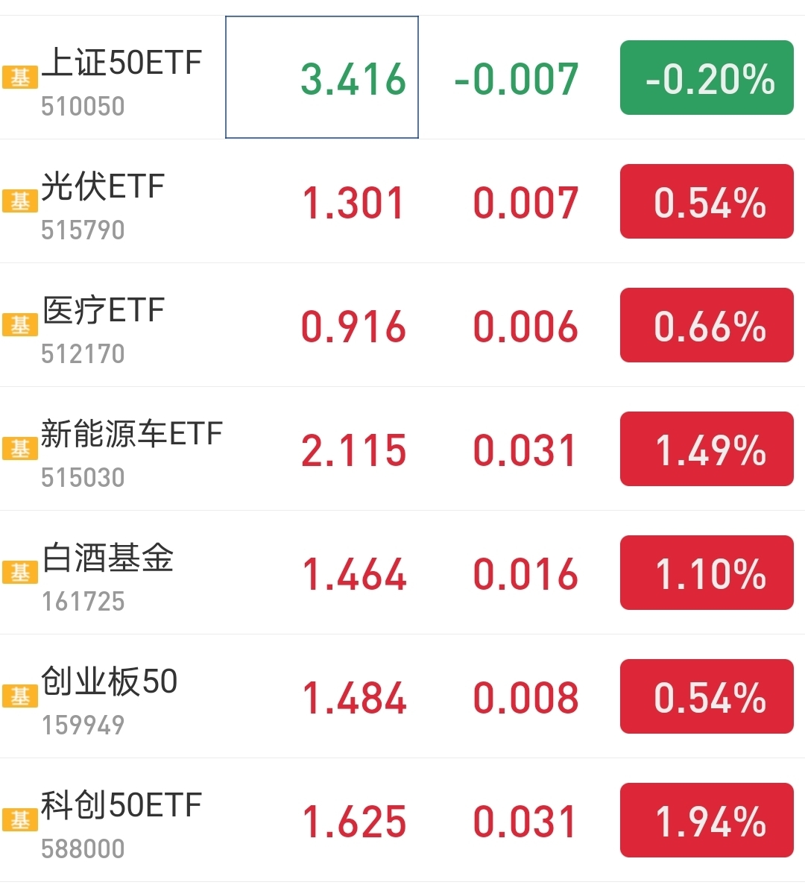

======================================================

_type: talk
@二师父[28814221155551]
2021-07-05 21:32:16 Mon  
topic_id: 818585812811812

<e type="hashtag" hid="88511822422122" title="#找到投资方向#" /> 接下来的方向非常重要，没有业绩支撑的板块不要加仓，等高业绩增速的板块回调后开始买入，对于白马股下跌非常正常，兴全合润、深红利、上证50都是这个原因，下跌不是坏事，真的跌到底部区域了，再次买入未来一定挣。

但关键问题是，这些基金和企业从18年到现在已经3到10倍涨幅，一时半会可能跌不到位，咱们也别着急，慢慢跌，再慢慢买。

@苍天有井明月空🌙 at 2021-07-05 21:32:16 Mon

> 等新能源入手

----------

@庆余年 at 2021-07-05 21:32:16 Mon

> 之前的大盘基金，上证50，深红利，还有沪深300利润都回了好多，卖了又不知道买啥。。。

----------

@二师父 at 2021-07-05 21:32:16 Mon

> 卖了买债券或者业绩大增的方向

----------

@庆余年 at 2021-07-05 21:32:16 Mon

> 业绩大增的，就是新能源，芯片半导体，电子；还有周期的钢铁，化工类。这进去不是追高接盘了麽😷😷😷。十年期国债收益率目前是3.1%，也不是进场的好时机吧。

----------

@二师父 at 2021-07-05 21:32:16 Mon

> 那就货币基金，并不需要时刻出手

----------

@蛋炒饭不加蛋 at 2021-07-05 21:32:16 Mon

> 周期不算高吧

----------

@庆余年 at 2021-07-05 21:32:16 Mon

> 主要还是不太懂吧，原油5毛抄底，7毛5卖了，现在也是挺后悔的😂 😂 😂

----------

@蛋炒饭不加蛋 at 2021-07-05 21:32:16 Mon

> 华宝油气吗，个人觉得有色煤炭钢铁中报行情可以蹭下

----------

阅读[1]  评论[10]  赞[0] 

+++++++++++++++++++++++++++++++++++++++++++++++++++++

文件：
2021-07-05 21:29:16 Mon
文件大小：[42659]
422218425112588-接下来的方向.docx

======================================================

_type: talk
@二师父[28814221155551]
2021-07-05 22:47:23 Mon  
topic_id: 218585811122881

<e type="hashtag" hid="458188281228" title="#鳄鱼计划持仓#" /> 当前鳄鱼计划持仓，未来终点加仓方向科技+医疗。芯片板块对于芯片ETF没有加入，选择科创50替代，这里面都是硬核科技企业，而且涵盖了很多芯片企业，值得投资。

这两个方向回调就是机会，家电、保险没有预期，统统放弃了。注意消费得收益率是系统算得，市价调整以后，均价也变了，算不出实际得，大家知道就行了。

@范毅君 at 2021-07-05 22:47:23 Mon

> 听召唤

----------

@吃肉肉 at 2021-07-05 22:47:23 Mon

> 师父，医药和创业板啥时候清仓的？

----------

@二师父 at 2021-07-05 22:47:23 Mon

> 去年的时候，很早了

----------

@吃肉肉 at 2021-07-05 22:47:23 Mon

> 哦，我的光伏和医疗ETF盈利10个点了，是否需要收割部分利润？

----------

阅读[1]  评论[4]  赞[0] 

+++++++++++++++++++++++++++++++++++++++++++++++++++++

图片：
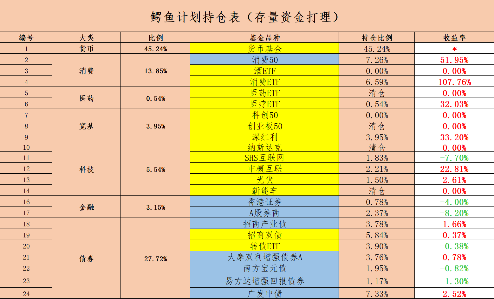

======================================================

_type: talk
@二师父[28814221155551]
2021-07-06 00:03:18 Tue  
topic_id: 818585255441882

<e type="hashtag" hid="552114551414" title="#估值数据#" /> 市盈率百分位44.2%，SY-BY百分位45.58%，SY/BY百分位42.63%。

现在市场估值低，而估值低没有预期，定投还是以平衡性混合基金为主。

@庆余年 at 2021-07-06 00:03:18 Tue

> 中概呢？应该也是可以继续投的吧

----------

@二师父 at 2021-07-06 00:03:18 Tue

> 可以的

----------

阅读[1]  评论[2]  赞[0] 

======================================================

_type: talk
@芙瑞雅阳阳潘[421181844812818]
2021-07-06 10:14:17 Tue  
topic_id: 218585251281541

师父，等新汽车、新能源回调再入吗？还是现在入

@二师父 at 2021-07-06 10:14:17 Tue

> 回调入，现在入必须设定止损，否则很危险，一定涨的大部分人追高再杀跌

----------

@芙瑞雅阳阳潘 at 2021-07-06 10:14:17 Tue

> 好的

----------

阅读[1]  评论[2]  赞[0] 

======================================================

_type: talk
@二师父[28814221155551]
2021-07-06 10:18:29 Tue  
topic_id: 185252428122212

现在的新能源和一月份的白酒没有啥区别，都是资金助推的，只看谁去接最后一棒，买与不买看策略，如果定投，肯定就不要买，如果买预期，设定百分之10止损位，亏了能接受，任何时候都可以买，关键看你怎么做。每一波牛市都有爆炒的品种，很显然这一次是新能源。

@杜志彪 at 2021-07-06 10:18:29 Tue

> 师父医疗距离低估还有多少，差不多了吧。

----------

@二师父 at 2021-07-06 10:18:29 Tue

> 再跌百分之5就低估了

----------

@杜志彪 at 2021-07-06 10:18:29 Tue

> 上次0.7买的，看看这次0.8就可以买了。

----------

阅读[1]  评论[3]  赞[0] 

======================================================

_type: q&a
@小鱼[241182222251181]
2021-07-06 11:00:43 Tue  
topic_id: 185252428848522

@小鱼

>  场内医疗今天跌的有些多，能不能加点仓。

@二师父

>  定投可以的，梭哈不行

阅读[1]  评论[1]  赞[0] 

======================================================

_type: talk
@二师父[28814221155551]
2021-07-06 11:03:42 Tue  
topic_id: 581212512242524

医疗跌到均线以下了，开始定投没问题，鳄鱼计划再等等，我的药明康德跌了10个点，杀跌太厉害，尽量不要接飞刀。

@西锦巴乌 at 2021-07-06 11:03:42 Tue

> 师父请问你场内申购基金是用哪个交易软件的？

----------

@二师父 at 2021-07-06 11:03:42 Tue

> 我华泰和广发都用

----------

@西锦巴乌 at 2021-07-06 11:03:42 Tue

> 嗯

----------

@西锦巴乌 at 2021-07-06 11:03:42 Tue

> 两个都能支持基金场内申购然后像股票一样直接通过交易软件卖掉？

----------

@二师父 at 2021-07-06 11:03:42 Tue

> 是的，我基本华泰，费率低一些，很多账户都能接受场内申购场外申购然后场内卖出的

----------

@梧桐 at 2021-07-06 11:03:42 Tue

> 二师父，最近港股和美股发行新股较多，我都没打，因为不懂某只新股该不该打，您能否指导一下。

----------

@二师父 at 2021-07-06 11:03:42 Tue

> 我也没打了，现在就打a股

----------

@梧桐 at 2021-07-06 11:03:42 Tue

> 谢谢

----------

阅读[1]  评论[10]  赞[0] 

+++++++++++++++++++++++++++++++++++++++++++++++++++++

图片：
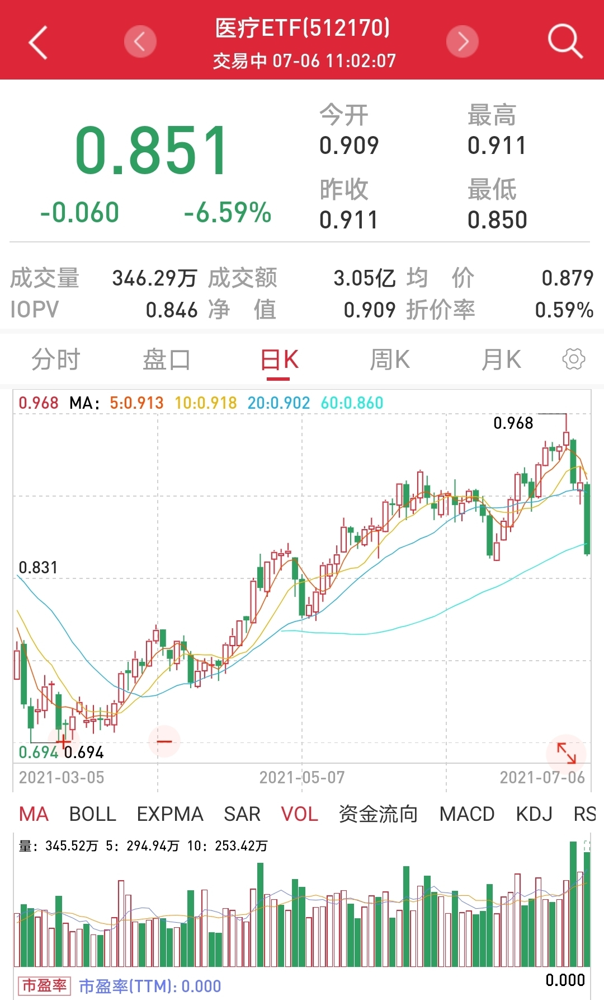

======================================================

_type: talk
@二师父[28814221155551]
2021-07-06 19:29:49 Tue  
topic_id: 818585425248452

<e type="hashtag" hid="88511821482882" title="#说说基金经理更换对投资的影响#" />

阅读[1]  评论[0]  赞[0] 

+++++++++++++++++++++++++++++++++++++++++++++++++++++

文件：
2021-07-06 19:27:31 Tue
文件大小：[42739]
844418512255152-北大毕业的基金经理跑路了.docx

======================================================

_type: talk
@二师父[28814221155551]
2021-07-06 19:33:29 Tue  
topic_id: 581212452544544

<e type="hashtag" hid="28511821482881" title="#聊一聊打新#" /> A股打新：配置15万沪市股票+5万市股票，一年大致可以赚个几万块，股票收益是额外的。

港美股打新，目前内卷严重，而且破发严重，圈内容易出割韭菜事件，暂时没打了，偶尔买买美股，大家可以看看其他的讯息，对港股大新研究渐渐减少。如果未来港股大新行情回来后，我还是会回来的。

可转债打新，基本盲打，首日盈利后卖掉，首日破发后一直持有到盈利或者强赎。

基本上方法就是这些了，赚钱的时候要抓紧上，如果发现都很难赚了，退出休息下。

@蛋炒饭不加蛋 at 2021-07-06 19:33:29 Tue

> 15万沪市加5万深市吗？

----------

@二师父 at 2021-07-06 19:33:29 Tue

> 对，科创企业利润大一些

----------

@蛋炒饭不加蛋 at 2021-07-06 19:33:29 Tue

> 可是科创要50万才能开啊

----------

@二师父 at 2021-07-06 19:33:29 Tue

> 50万不用全部买股票，你用50买货币基金放一个月就行的

----------

@蛋炒饭不加蛋 at 2021-07-06 19:33:29 Tue

> 哦哦，这样啊

----------

@永刚 at 2021-07-06 19:33:29 Tue

> 能推荐一下打新用的股票吗？

----------

@二师父 at 2021-07-06 19:33:29 Tue

> 不推荐股票，我买的药明康德，隆基股份，东方财富，不一定适合你

----------

@马明谦 at 2021-07-06 19:33:29 Tue

> 师傅：恒瑞医药长期值得持有吗？

----------

阅读[1]  评论[12]  赞[0] 

======================================================

_type: talk
@二师父[28814221155551]
2021-07-06 19:46:18 Tue  
topic_id: 581212452422214

<e type="hashtag" hid="88514182521852" title="#知识星球#" /> 市盈率百分位45.56%，SY-BY百分位46.91%，SY/BY百分位44.04%。

估值楼层仍旧处于第三层，定投即可。依然半仓运行。

阅读[1]  评论[0]  赞[0] 

======================================================

_type: talk
@二师父[28814221155551]
2021-07-07 00:13:38 Wed  
topic_id: 818585421154522

<e type="hashtag" hid="825188852442" title="#估值表#" /> 按照计划目前只能投混合基金，其他的板块都不太好做，如果资金多，现在可以定投沪深300了，坚持每周投一点，确定性最高的一只基金。

行业基金有政策风险，滴滴被村长给治了，中概股普遍下行，可以等等再入。

阅读[1]  评论[0]  赞[0] 

+++++++++++++++++++++++++++++++++++++++++++++++++++++

图片：
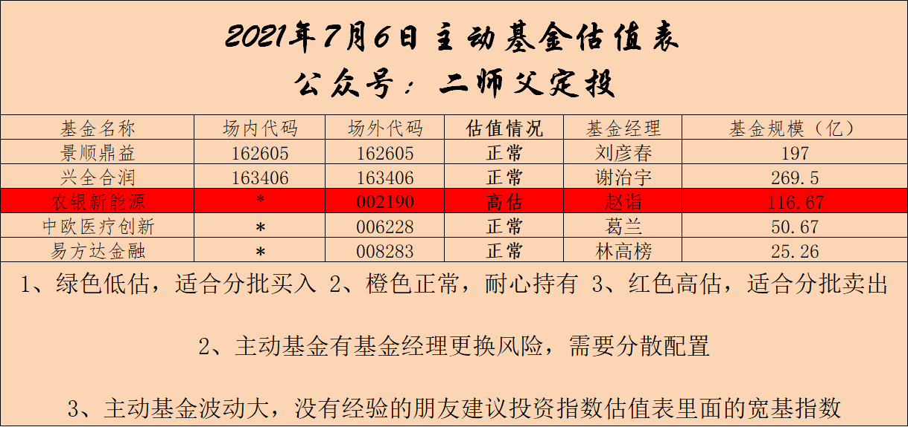

======================================================

_type: talk
@二师父[28814221155551]
2021-07-07 10:38:22 Wed  
topic_id: 418484222214888

<e type="hashtag" hid="825412412212" title="#可转债打新#" /> 今天两只可转债可以打，吃块肉吧。

阅读[1]  评论[0]  赞[0] 

======================================================

_type: talk
@二师父[28814221155551]
2021-07-07 13:51:58 Wed  
topic_id: 581212481451824

今天真猛

@梧桐 at 2021-07-07 13:51:58 Wed

> 光伏新高，谢谢二师父提醒，不然早抛了

----------

@王春媚 at 2021-07-07 13:51:58 Wed

> 👍👍👍👍👍

----------

@光少 at 2021-07-07 13:51:58 Wed

> 光伏半仓出货了，昨天隆基回调加仓今天吃🥩了

----------

阅读[1]  评论[3]  赞[0] 

+++++++++++++++++++++++++++++++++++++++++++++++++++++

图片：
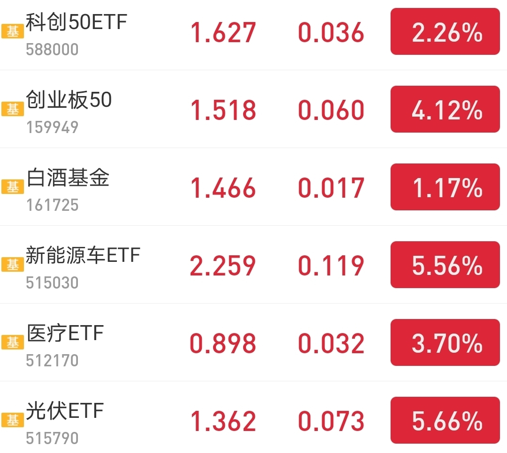

======================================================

_type: talk
@二师父[28814221155551]
2021-07-07 14:36:07 Wed  
topic_id: 218585412521421

<e type="hashtag" hid="825188852442" title="#估值表#" /> 今日估值表，所有的优质赛道基金都在估值表里面了，中证500稍弱，虽然低估，不打算投资，还是选择投资科创50+创业板50，无论市场怎么上涨，相信我，一定会有深度回调和下跌，这是市场规律，如果不在车上，忍不住要追高，可以先配置10%指数+40%纯债，剩余资金再定投。

@梧桐 at 2021-07-07 14:36:07 Wed

> 二师父辛苦

----------

@杜志彪 at 2021-07-07 14:36:07 Wed

> 光伏高估了

----------

@永刚 at 2021-07-07 14:36:07 Wed

> 恒生科技30ETF和恒生互联网ETF怎么样？能纳入您估值表吗？

----------

@二师父 at 2021-07-07 14:36:07 Wed

> 我看看

----------

阅读[1]  评论[4]  赞[0] 

+++++++++++++++++++++++++++++++++++++++++++++++++++++

图片：
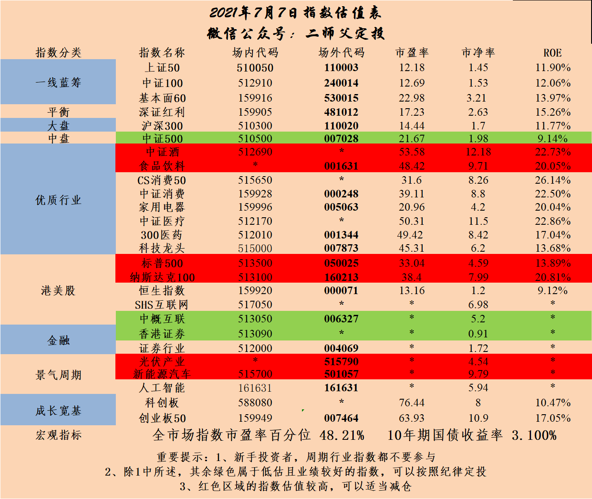

======================================================

_type: q&a
@隔窗遥望[241884481854181]
2021-07-07 17:22:34 Wed  
topic_id: 418484212542548

@隔窗遥望

>  现在有3W存量资金，准备跟投乌龟计划，以后每月2Q定投。现在直接3W跟投行不行？

@二师父

>  可以啊，我每周三发车，跟上就可以

阅读[1]  评论[1]  赞[0] 

======================================================

_type: talk
@二师父[28814221155551]
2021-07-07 17:58:26 Wed  
topic_id: 185252822551142

<e type="hashtag" hid="28518855451481" title="#乌龟计划#" /> 
买入景顺鼎益混合（162605） 300元
买入兴全合润混合（163406） 200元
买入招商产业债 （217022） 300元
买入大摩双利增强债券A  (000024)  200元，在天天基金可以一键跟投。

阅读[1]  评论[0]  赞[0] 

======================================================

_type: talk
@二师父[28814221155551]
2021-07-07 18:08:55 Wed  
topic_id: 581212822158224

发车计划被删除了，大家去天天基金看吧，有详细记录

@雾海 at 2021-07-07 18:08:55 Wed

> 就看了一个大魔双利A加定投200对吗？其他的我都没看到。

----------

阅读[1]  评论[1]  赞[0] 

======================================================

_type: q&a
@🍀 凝🌸 慧🍀[841855248254242]
2021-07-07 23:32:05 Wed  
topic_id: 185252825822242

@🍀 凝🌸 慧🍀

>  这利好，期待明天～😀😀

@二师父

>  这个消息好

阅读[1]  评论[0]  赞[0] 

======================================================

_type: q&a
@wty[548488548545444]
2021-07-08 09:35:17 Thu  
topic_id: 581212811814414

@wty

>  二师父，16国债19一直持有，收益6%了，可以清仓吗？还是继续持有，占总仓位15%。

@二师父

>  如果清仓不追高可以的

阅读[1]  评论[6]  赞[0] 

======================================================

_type: talk
@姥姥不疼. 爷爷不爱[48544481458248]
2021-07-08 09:46:13 Thu  
topic_id: 218585184422441

吃肉

@二师父 at 2021-07-08 09:46:13 Thu

> 恭喜恭喜

----------

@庆余年 at 2021-07-08 09:46:13 Thu

> 我也中了，开盘150啊，牛逼，，，，

----------

阅读[1]  评论[2]  赞[0] 

+++++++++++++++++++++++++++++++++++++++++++++++++++++

图片：
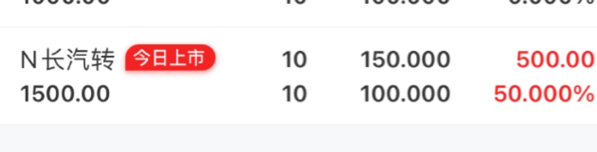

======================================================

_type: talk
@二师父[28814221155551]
2021-07-08 09:56:20 Thu  
topic_id: 418484182181158

这是昨天的定投，我说景气方向是可以持有，不是买入，这一点要区分，目前市场这个位置配置混合基金然后叠加一部分债基对冲，上涨也不会错过，永不追高是铁律

但要切记，高是相对的，比如从从最底部涨百分之20买入不是追高，而从最顶部跌百分之20依然追高，与涨跌无关的

阅读[1]  评论[0]  赞[0] 

+++++++++++++++++++++++++++++++++++++++++++++++++++++

图片：
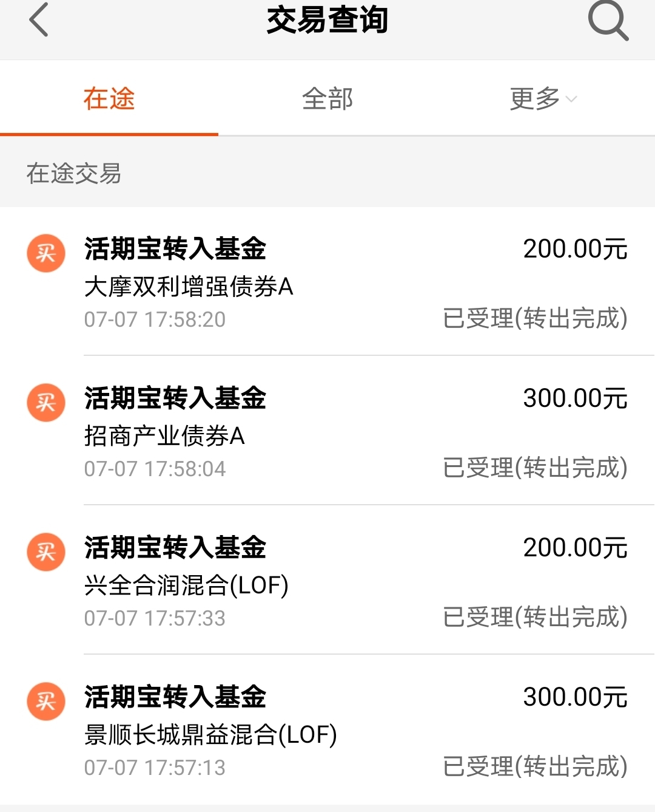

======================================================

_type: talk
@二师父[28814221155551]
2021-07-08 09:59:53 Thu  
topic_id: 581212814855454

<e type="hashtag" hid="881251425252" title="#鳄鱼计划#" /> 512010，医药etf买入两份，这个方向持续投资预计仓位也是百分之10，目前正常估值，均线以下，开启左侧

中概互联持续利空消息，暂停定投，短期看空，长期看好，到第二支撑位继续加仓，最大跌幅在百分之35以内，不用担心，目前三大利空加上监管，所以有了仓位后可以先等等

@小牧童 at 2021-07-08 09:59:53 Thu

> 师父，医药中等偏高现在买安全吗？最大回撤是不是50%左右?为啥不买医疗？

----------

@二师父 at 2021-07-08 09:59:53 Thu

> 买的比较少，医疗的最大跌幅也不小，我主要看发布公告对创新药利空更大一些，开始了医药的投资，这两家标的属于同赛道的，选择医疗也可以，不过都不低，好赛道的基金定投只需要时间，最后表现都会不错的

----------

@庆余年 at 2021-07-08 09:59:53 Thu

> 二师父，我今天看到一篇文章分析化学制药和中药行业不管是竞争还是行业内认可度都不高，投资医药需不需要避开这两个行业？

----------

@林荫 at 2021-07-08 09:59:53 Thu

> 中概互联还要等多久吗？跌的好猛

----------

@二师父 at 2021-07-08 09:59:53 Thu

> 中药还是很好的

----------

@二师父 at 2021-07-08 09:59:53 Thu

> 等监管放松

----------

@林荫 at 2021-07-08 09:59:53 Thu

> 我空仓中[发呆]

----------

@是喵喵吖～ at 2021-07-08 09:59:53 Thu

> 师父您说的第二支撑位指的是？有点没明白！谢谢！

----------

阅读[1]  评论[9]  赞[0] 

======================================================

_type: q&a
@晴[15422515228522]
2021-07-08 13:56:15 Thu  
topic_id: 418484154145818

@晴

>  二师父，中欧阿尔法混合一直陆陆续续有定投，目前盈利20%，有点拿不准该继续还是等一等，求指点

@二师父

>  这只基金不错，如果仓位在百分之50以下可以继续定投

阅读[1]  评论[0]  赞[0] 

======================================================

_type: q&a
@冉冉[88445118854412]
2021-07-08 14:06:36 Thu  
topic_id: 581212852828524

@冉冉

>  请问二师傅，今天是什么情况导致市场下跌？请师傅解惑

@二师父

>  今天下跌主要是白酒，医疗和银行，前两个很好理解，白酒从6月获利资金出逃就一直表现不佳，而且估值过高，短期没有资金进入，一直在下行，医药还是因为之前的意见公告，本质利空没有创新能力的创新药企业，昨天只是反弹了一下，银行未来进一步降准利好小微企业，但是让利对银行是利空。

阅读[1]  评论[1]  赞[0] 

======================================================

_type: talk
@二师父[28814221155551]
2021-07-08 20:17:06 Thu  
topic_id: 218585145851811

<e type="hashtag" hid="28511845885281" title="#分析一下市场#" />

@永刚 at 2021-07-08 20:17:06 Thu

> 师父：上证50和深红利现在可以均线策略定投吗？

----------

@二师父 at 2021-07-08 20:17:06 Thu

> 可以的

----------

@水墨青花 at 2021-07-08 20:17:06 Thu

> 师父，请问均线策论定投怎么操作

----------

阅读[1]  评论[3]  赞[0] 

+++++++++++++++++++++++++++++++++++++++++++++++++++++

文件：
2021-07-08 20:16:58 Thu
文件大小：[173131]
111185558142412-成交额持续扩大，其实已经快到地量了.docx

======================================================

_type: talk
@二师父[28814221155551]
2021-07-08 20:34:08 Thu  
topic_id: 185252815881152

<e type="hashtag" hid="552114551414" title="#估值数据#" /> 市盈率百分位47.47%，SY-BY百分位45.89%，SY/BY百分位41.93%。

市场两级分化，结构行情，继续坚守自己的投资策略，长期稳赢系统即可。

@杜志彪 at 2021-07-08 20:34:08 Thu

> 银轮转债不等了，开盘卖出。

----------

阅读[1]  评论[1]  赞[0] 

======================================================

_type: talk
@西锦巴乌[88448285428482]
2021-07-09 11:04:59 Fri  
topic_id: 418484112284288

<e type="hashtag" hid="28511845885281" title="#分析一下市场#" /> 师父请问你文中提到的芯片光伏等板块的成交额数据是从哪查到的？谢谢

@二师父 at 2021-07-09 11:04:59 Fri

> 同花顺

----------

阅读[1]  评论[1]  赞[0] 

======================================================

_type: q&a
@曾来[841555815828282]
2021-07-09 13:51:06 Fri  
topic_id: 418488848588548

@曾来

>  这是什么意思？

@二师父

>  直接场内买入，这不是申购代码

阅读[1]  评论[3]  赞[0] 

======================================================

_type: talk
@二师父[28814221155551]
2021-07-09 19:40:52 Fri  
topic_id: 418488884242228

<e type="hashtag" hid="51288142542454" title="#聊一聊中丐互联和降准#" />

@wty at 2021-07-09 19:40:52 Fri

> 谢谢及时分享！

----------

@杜志彪 at 2021-07-09 19:40:52 Fri

> 还需要提高警惕，大家想着降准释放流动性利好股市，但也要想想因为什么所以降准[微笑]

----------

@二师父 at 2021-07-09 19:40:52 Fri

> 是的，目前这个位置一定要做好防守了

----------

阅读[1]  评论[3]  赞[0] 

+++++++++++++++++++++++++++++++++++++++++++++++++++++

文件：
2021-07-09 19:40:38 Fri
文件大小：[43210]
422218828845518-丐帮弟子真给力.docx

======================================================

_type: talk
@二师父[28814221155551]
2021-07-09 22:32:25 Fri  
topic_id: 418488888122118

<e type="hashtag" hid="552114551414" title="#估值数据#" /> 市盈率百分位46.28%，SY-BY百分位45.01%，SY/BY百分位41.4%。

现在市场依然两级分化，比较难做，对于优质赛道，后期适当提高风险容忍度，正常估值，偏离60日均线开始定投，以合理公道的价格买入优质企业，比以低廉的价格捡烟头要重要。

阅读[1]  评论[0]  赞[0] 

======================================================

_type: q&a
@姥姥不疼. 爷爷不爱[48544481458248]
2021-07-09 23:02:24 Fri  
topic_id: 218588855481841

@姥姥不疼. 爷爷不爱

>  二师父，这个ETF是否值得放入您的估值表内

@二师父

>  这个基金也很有价值，不过他是周期性指数，对于周期性指数，做趋势反转会更好，在安全边际内，如果判断趋势上行，一次买入比定投好。
>  
>  一方面下跌无下限定投容易崩溃，另外一方面上涨也会持续，不大适合定投。

阅读[1]  评论[0]  赞[0] 

======================================================

_type: talk
@二师父[28814221155551]
2021-07-10 21:58:38 Sat  
topic_id: 185255514145552

<e type="hashtag" hid="51288142448814" title="#具有稳定护城河的成熟企业的估值#" />

@清茶半盏 at 2021-07-10 21:58:38 Sat

> 有车就跟

----------

@梧桐 at 2021-07-10 21:58:38 Sat

> 二师父，腾讯通过什么渠道买

----------

@二师父 at 2021-07-10 21:58:38 Sat

> 港股通

----------

@梧桐 at 2021-07-10 21:58:38 Sat

> 谢谢

----------

@晴 at 2021-07-10 21:58:38 Sat

> 二师父，请问文章里“腾讯25倍合理市盈率”，这个25倍是如何定的？即如何评估市盈率的合理性[抱拳][抱拳]

----------

@二师父 at 2021-07-10 21:58:38 Sat

> 盈利稳定的成熟企业都是用无风险利率的倒数，0.04，高成长企业不适用

----------

@晴 at 2021-07-10 21:58:38 Sat

> 二师父，这个结论是基于历史统计总结出的规律吗？

----------

@二师父 at 2021-07-10 21:58:38 Sat

> 把企业的投资收益率对标于无风险利率，相当于是比较投资国债和股票的性价比，市盈率越高，性价比越低

----------

阅读[1]  评论[8]  赞[0] 

+++++++++++++++++++++++++++++++++++++++++++++++++++++

文件：
2021-07-10 21:58:12 Sat
文件大小：[43362]
244418812584541-以终为始.docx

======================================================

_type: talk
@二师父[28814221155551]
2021-07-11 15:24:32 Sun  
topic_id: 581211184122584

<e type="hashtag" hid="28511845151111" title="#私募大佬开始道歉#" /> 某私募大佬重仓了互联网企业，基金面临巨大回撤，现在开始道歉，对于政策风险的企业，控制好仓位持续投资就行，不用担心。

还记得18年带量采购的医疗事件吗？当时也是很多投资者找各种利空消息，而最终证明，越是别人恐惧的时候，越要冷静，然而难点在于，看着不断高涨的新能源，以及不断新低的中概股，如何能克制住呢？这才是投资里面最难的事情

阅读[1]  评论[0]  赞[0] 

+++++++++++++++++++++++++++++++++++++++++++++++++++++

文件：
2021-07-11 15:22:06 Sun
文件大小：[44328]
244418811125481-私募大佬开始道歉了.docx

======================================================

_type: talk
@二师父[28814221155551]
2021-07-11 15:47:09 Sun  
topic_id: 218588814258141

<e type="hashtag" hid="458188281228" title="#鳄鱼计划持仓#" />

阅读[1]  评论[0]  赞[0] 

+++++++++++++++++++++++++++++++++++++++++++++++++++++

图片：
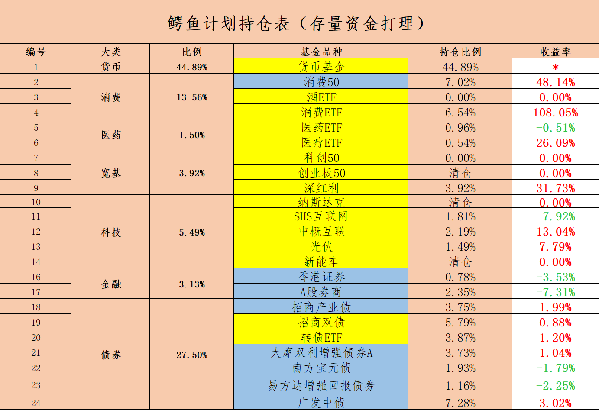

======================================================

_type: talk
@林玮[844111858288412]
2021-07-12 09:31:18 Mon  
topic_id: 185255454222582

师父，健帆转债需要卖出吗？

@二师父 at 2021-07-12 09:31:18 Mon

> 可以卖

----------

@林玮 at 2021-07-12 09:31:18 Mon

> 谢谢

----------

阅读[1]  评论[2]  赞[0] 

======================================================

_type: q&a
@光少[244124552511141]
2021-07-12 13:41:00 Mon  
topic_id: 185255442452452

@光少

>  二师父，创业板指数会超越上指数吗？

@二师父

>  有可能，每次创业板要超越上证综合指数的时候就要出事

阅读[1]  评论[1]  赞[0] 

======================================================

_type: q&a
@坚持学习[421148841558188]
2021-07-12 14:58:52 Mon  
topic_id: 818588228525842

@坚持学习

>  二师父，你好，刚来你的星球。A股打新，还需要继续配市值。目前平安59，海螺水泥40，PE已经在5-8了，适合入吗，安全边际如何？之前看你公众号的文章，不看好平安，格力。如果要配置市值，选什么合适呢？

@二师父

>  安全是安全，不过万年不涨，我用的药明康德，隆基股份，东方财富这些，波动很大，看个人承受能力

阅读[1]  评论[0]  赞[0] 

======================================================

_type: talk
@二师父[28814221155551]
2021-07-12 19:14:38 Mon  
topic_id: 581211558512524

<e type="hashtag" hid="51288141114144" title="#中小创继续爆发#" /> 今天算是普涨了，流动性很宽裕，未来投资的方向，医药+互联网，还是这两个板块便宜一点，新能源已经涨到天际了。

阅读[1]  评论[0]  赞[0] 

+++++++++++++++++++++++++++++++++++++++++++++++++++++

文件：
2021-07-12 19:12:40 Mon
文件大小：[43395]
111185452245542-中小创继续爆发.docx

======================================================

_type: talk
@二师父[28814221155551]
2021-07-12 19:42:04 Mon  
topic_id: 218588221451181

<e type="hashtag" hid="552114551414" title="#估值数据#" /> 市盈率百分位47.55%，SY-BY百分位44.21%，SY/BY百分位40.11%。

因为流动性持续宽裕，国债收益率下降，所以SY-BY百分位也是维持下行的，如果这种时候市场有回调，就得抓住机会了。

千万别补一直不涨的，而要不价格相对便宜有预期的板块，比如互联网和医疗两个，上周加仓的医药ETF短期已经盈利，这不重要，仓位和收益率二者合一才最重要的。

阅读[1]  评论[0]  赞[0] 

======================================================

_type: q&a
@吾思吾想[118552585284212]
2021-07-12 21:49:14 Mon  
topic_id: 418488524551488

@吾思吾想

>  师父，手上有一笔100万的资金，计划三年左右买房用的，怎么安排好呢？又不想让它躺在银行贬值，给点建议吧！谢谢！

@二师父

>  买入50安心组合，然后如果有回撤分批定投易方达裕丰，南方宝元，易方达增强，这种配置会有一定风险，不是稳定收益的

阅读[1]  评论[0]  赞[0] 

======================================================

_type: talk
@二师父[28814221155551]
2021-07-13 21:20:52 Tue  
topic_id: 218588185154151

<e type="hashtag" hid="51288141421254" title="#小市值企业方向的好基金#" /> 小市值企业，介绍了一个场外基金，一个场内基金。

好赛道加上宽基，就比较完美。消费+医疗+科技+半导体+互联网，未来还是这些赛道更好，如果不怕波动，就选择行业ETF下跌不断加仓。

@苍天有井明月空🌙 at 2021-07-13 21:20:52 Tue

> 保险平安我觉得真的凉了

----------

@苍天有井明月空🌙 at 2021-07-13 21:20:52 Tue

> 五十万买货币基金等着来创业板打新，请问买什么货币基金合适

----------

@二师父 at 2021-07-13 21:20:52 Tue

> 银华日利，你是开通科创板吧

----------

@王模堂 at 2021-07-13 21:20:52 Tue

> 二师傅，天弘双创50c可以申购吗〈012895）？他和鵬掦双创50c有什么区别〈012908〉？

----------

@二师父 at 2021-07-13 21:20:52 Tue

> 不同基金公司的产品，如果不惧回撤可以申购，目前位置不低

----------

@苍天有井明月空🌙 at 2021-07-13 21:20:52 Tue

> 你好，银华日利etf吗511880？还是511881

----------

@二师父 at 2021-07-13 21:20:52 Tue

> 511880

----------

@苍天有井明月空🌙 at 2021-07-13 21:20:52 Tue

> 谢谢

----------

阅读[1]  评论[11]  赞[0] 

+++++++++++++++++++++++++++++++++++++++++++++++++++++

文件：
2021-07-13 21:19:20 Tue
文件大小：[42611]
544481455181124-关注这个方向.docx

======================================================

_type: talk
@平安是福[118222545154542]
2021-07-14 10:13:25 Wed  
topic_id: 218588128248541

师父：恒瑞医药跌跌不休，啥原因？还能持有吗？

@二师父 at 2021-07-14 10:13:25 Wed

> 目前创新药出海遇到困境，整体创新药都不行，第一季度业绩增速只有10%，观察第二季度，如果持续业绩增速低于30%，估计还会下行

----------

阅读[1]  评论[1]  赞[0] 

======================================================

_type: talk
@二师父[28814221155551]
2021-07-14 10:56:06 Wed  
topic_id: 581211851851224

<e type="hashtag" hid="88511848414812" title="#配置的思路#" /> 在利率下行区间，多持有股权和债券资产，如何配置，讲整体配置思路。可以选用行业ETF，也可以选用宽基ETF。星球有朋友的水平已经很高了，可以采用行业ETF，那么对于刚做配置，对于波动承受力不足的朋友，我帮助大家选择三只较好的ETF。

1、招商双债161716，2、沪深300，510300，3、双创50（159783）

说说如何配置，星球每天会公布数据：市场百分位数据，这个数据是非常重要的，详细原理我已经介绍过，大家就记住，估值数据越低，投资沪深300和双创50的比例越高。估值数据越高，投资债券的比例越高。

如何确定比例，在初次投资的时候，假设百分位数据40%，那么投资的仓位应该在1-0.4*2=0.2，假设百分位数据30%，投资的仓位应该在1-0.3*2=0.4，依次类推，百分位数据10%的时候，仓位应该是1-0.1*2=0.8.

按照当前的百分位数据计算仓位应该是1-0.43*2=0.14，这时候你就可以建仓7%的沪深300+7%的双创50，剩余资金建仓招商双债。

为什么这样投资，因为按照凯利公式，当百分位50%以上的时候，胜率就低于赔率，所以只有在估值百分位50%以下的时候开始投资，严格按照量化比较死板，大家在投资的时候可以灵活运用。

核心思路就是这样建立，然后每个季度变化之后再进行平衡。尽量少持有现金，虽然这种组合会有波动，而长期看跑赢通胀并小幅度盈利是没有问题的。

随着房产投资被抑制，未来更多的资金一定会流入资本市场，提前学会利用金融投资标的布局金融市场，然后每月结余持续定投，这是最好的增值方式。

@杜志彪 at 2021-07-14 10:56:06 Wed

> 这个有点保守了吧

----------

@二师父 at 2021-07-14 10:56:06 Wed

> 是的，结合个人风险偏好调整股权和债券之间的比例

----------

@林玮 at 2021-07-14 10:56:06 Wed

> 师父是SY-BY吗？

----------

@二师父 at 2021-07-14 10:56:06 Wed

> 对

----------

@吃肉肉 at 2021-07-14 10:56:06 Wed

> 师父，为什么上面算了的“7%的沪深300和7%的双创50”，7%是如何定出这个数的？求解

----------

@二师父 at 2021-07-14 10:56:06 Wed

> 百分之14除以2

----------

@吃肉肉 at 2021-07-14 10:56:06 Wed

> 好的，谢谢！

----------

阅读[1]  评论[7]  赞[0] 

======================================================

_type: q&a
@铥@铥~~[582228558115884]
2021-07-14 13:42:48 Wed  
topic_id: 818588121241122

@铥@铥~~

>  据说软件服务目前位置比较合适，可以作为中期赛道考虑，请问有没有合适的基金推荐呢

@二师父

>  互联网50这个里面就有很多saas企业

阅读[1]  评论[2]  赞[0] 

======================================================

_type: q&a
@好运玲玲[244188585541521]
2021-07-14 14:19:01 Wed  
topic_id: 218588121411851

@好运玲玲

>  二师父你好！我的易方达上证50一直拿着，利润已经回撤差不多一半了，还有没有必要继续拿着？

@二师父

>  如果准备持有5年以上，可以继续，长期新高是必然，短期的话可以不用拿了，目前大部分上证50里面的企业业绩增速在下滑

阅读[1]  评论[1]  赞[0] 

======================================================

_type: talk
@二师父[28814221155551]
2021-07-14 19:57:18 Wed  
topic_id: 418488122155118

<e type="hashtag" hid="28518855451481" title="#乌龟计划#" /> 定投发车，继续半仓运行

阅读[1]  评论[0]  赞[0] 

+++++++++++++++++++++++++++++++++++++++++++++++++++++

图片：
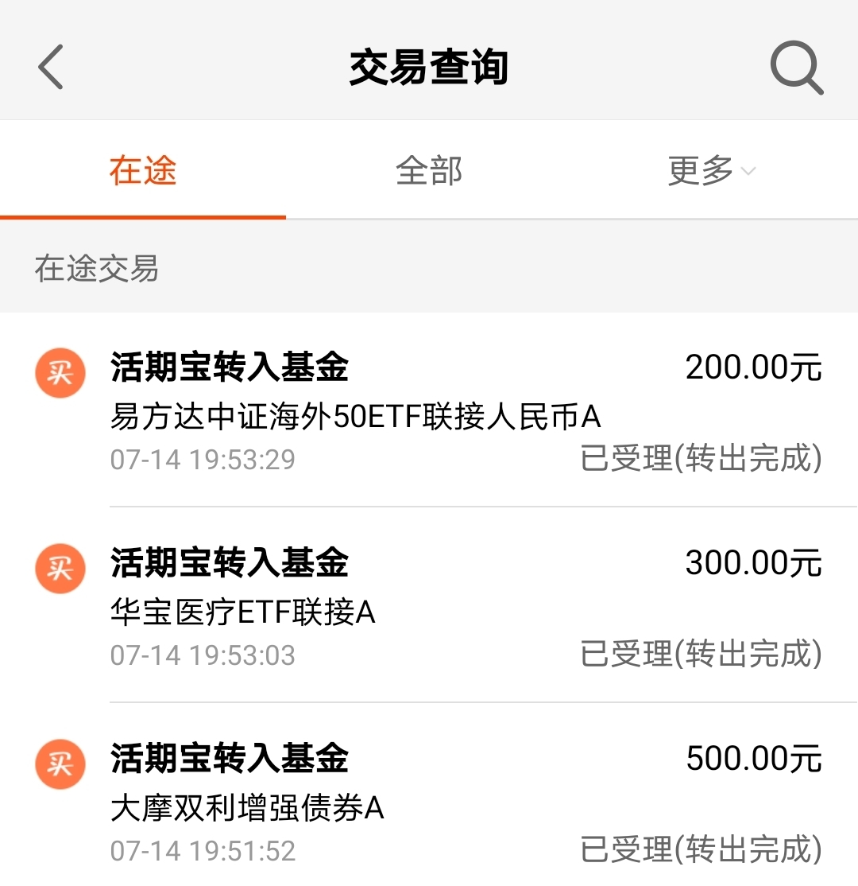

======================================================

_type: talk
@二师父[28814221155551]
2021-07-14 22:29:46 Wed  
topic_id: 218588115855541

<e type="hashtag" hid="825188852442" title="#估值表#" /> 目前又把估值表精简了，大家可以看到，凡是纳入的都是高景气行业，地产、银行去年不进行估值，300非银今年不进行估值，在一个下行周期的行业真的没有必要，而无论是去年纳入的新能源还是今年纳入的光伏，都是景气周期，宽基指数持续投资没有问题，而行业指数必须选好赛道。

消费50去年是重仓投资的，今年3月大幅度减仓后不再准备进入，主要是市场估值高，而且更为重要的是可选消费里面家电的行业增长空间有限，而主流的医疗和新能源、光伏未来至少5年的景气周期，先把十四五给玩赚了，不一定能财务自由，早日躺平没问题。

要紧跟政策趋势，优选赛道，在正确的赛道上奔跑才是王道，不能一直往过去看，而要看未来，比如人口老龄化带来的投资机会，三胎带来的投资机会，3060带来的投资机会。如果不能够随时变化，可能曾经赚钱的逻辑会成为亏钱的逻辑。

@吃肉肉 at 2021-07-14 22:29:46 Wed

> 师父讲的3060机会主要是啥？

----------

@二师父 at 2021-07-14 22:29:46 Wed

> 2030实现碳达峰，2060实现碳达峰

----------

@吃肉肉 at 2021-07-14 22:29:46 Wed

> 好的，谢谢！

----------

@王模堂 at 2021-07-14 22:29:46 Wed

> 这段话二师傅讲的很有道理，要紧跟政策，着眼未来，不要拘泥于过去。

----------

@王模堂 at 2021-07-14 22:29:46 Wed

> 芯片丶半导体丶5G丶通信丶锂电池ETF，不纳入优质赛道吗？

----------

@王模堂 at 2021-07-14 22:29:46 Wed

> 二师傅，目前有碳达峰碳排放的ETF吗？号码是多少？

----------

@二师父 at 2021-07-14 22:29:46 Wed

> 芯片半导体在科创50里面有很多，投资科创50就挺好，5G和通信不是特别好，锂电后期考虑加入

----------

@二师父 at 2021-07-14 22:29:46 Wed

> 光伏etg

----------

阅读[1]  评论[12]  赞[0] 

+++++++++++++++++++++++++++++++++++++++++++++++++++++

图片：

======================================================

_type: q&a
@好运玲玲[244188585541521]
2021-07-15 08:36:25 Thu  
topic_id: 218588114818111

@好运玲玲

>  二师父您好！麻烦看一下中医药501011能不能定投？

@二师父

>  这只基金不错的，价格合适的话可以定投

阅读[1]  评论[1]  赞[0] 

======================================================

_type: talk
@二师父[28814221155551]
2021-07-15 08:50:47 Thu  
topic_id: 581211888121214

<e type="hashtag" hid="222484545521" title="#打新提示#" /> 今天一只科创板和两只新债都可以申购，对于股票投资，大家多配置沪市股票，比如沪市股票配12万，深配3万，科创板好开通，账户50万资金不用买股票，存20天货币基金就行，基本上都有。

沪市，隆基，药明，片仔癀，汾酒都是不错标的，深市比亚迪，东方财富，宁德时代，五粮液是不错标的。

目前都不是特别便宜，如果不会择时，看情绪低位，一个板块成交额缩减到前期高位三分之二进去伏击，然后涨了一直拿住即可。

阅读[1]  评论[0]  赞[0] 

======================================================

_type: talk
@二师父[28814221155551]
2021-07-15 09:04:33 Thu  
topic_id: 185255888581142

<e type="hashtag" hid="51288145211484" title="#北向资金流出解读#" /> 北向资金近10个月没有净流出100亿元，昨天流出100亿元以上，按照过往规律，北向资金净流出超过100亿元，未来大概率一周会跌，咱们经历过多次，每一次大跌企稳就是入场机会。

尤其注意北向资金减仓了银行，汽车，券商，机械，家电。加仓软件，输电，塑料，物流。随着核心资产下跌，后市还是注意降低风险偏好，对于回调的话光伏，互联网，医疗等板块注意上车，一定等跌到位了，如果定投在60日均线以下不用担心，就是两个字，坚持，宽基和优质行业最后都会盈利。

阅读[1]  评论[0]  赞[0] 

+++++++++++++++++++++++++++++++++++++++++++++++++++++

图片：
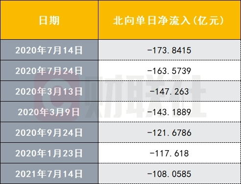

======================================================

_type: talk
@二师父[28814221155551]
2021-07-15 10:19:48 Thu  
topic_id: 581215221448554

<e type="hashtag" hid="881251425252" title="#鳄鱼计划#" /> 买入双创基金4份，代码159783，注意中小盘的投资机会，份数计算，总资金除以250得到一份金额，然后乘以4得到4份金额。

@六尘不改 at 2021-07-15 10:19:48 Thu

> 师傅，中证500现在低估吗，长期看现在还能大笔买入吗

----------

@二师父 at 2021-07-15 10:19:48 Thu

> 目前大笔买入只有易方达裕丰，易方达增强回报这些，或者安心组合，其他的都不适合大笔买入，他虽然低估，但是企业质量一般，长期看不如创业板，双创，企业的经营业绩才是第一位的，低估不是最重要的

----------

@六尘不改 at 2021-07-15 10:19:48 Thu

> 好的师傅

----------

@六尘不改 at 2021-07-15 10:19:48 Thu

> 双创现在不是都在高位吗，现在投资是不是风险太大

----------

@J at 2021-07-15 10:19:48 Thu

> 师傅，请问现在买入双创的充分理由是什么？不是高估了吗

----------

@黎雄 at 2021-07-15 10:19:48 Thu

> 师傅双创基金它的选股是怎样的

----------

@二师父 at 2021-07-15 10:19:48 Thu

> 计划初次四份，0.95，0.9，0.85，0.8加仓一份，0.75，0.7，0.65，0.6加仓2份， 0.5以下择机抄底，空间和仓位很重要，定投和一次抄底不同，好基金可以以时间换空间

----------

@二师父 at 2021-07-15 10:19:48 Thu

> 

----------

阅读[1]  评论[13]  赞[0] 

======================================================

_type: talk
@二师父[28814221155551]
2021-07-15 13:44:44 Thu  
topic_id: 418485442824558

被北向资金给耍了，今天净流入100亿，市场瞬息万变，数据只能参考，投资决策不能依赖对市场的判断来做，要基于企业经营业绩和行业成长空间。

@吃肉肉 at 2021-07-15 13:44:44 Thu

> 北向资金神出鬼没，到底是内资还是外资。

----------

@二师父 at 2021-07-15 13:44:44 Thu

> 外资

----------

@苍天有井明月空🌙 at 2021-07-15 13:44:44 Thu

> 都有

----------

@Chu at 2021-07-15 13:44:44 Thu

> 师父，今天外资流向哪个板块。？

----------

@Hi·DD at 2021-07-15 13:44:44 Thu

> 请问星球续费直接在首页吗？

----------

@二师父 at 2021-07-15 13:44:44 Thu

> 对

----------

@二师父 at 2021-07-15 13:44:44 Thu

> 银行、保险和光伏

----------

@cotton at 2021-07-15 13:44:44 Thu

> 意思不该买这期的鳄鱼计划吗

----------

阅读[1]  评论[11]  赞[0] 

======================================================

_type: q&a
@蛋炒饭不加蛋[118281818482542]
2021-07-15 15:03:08 Thu  
topic_id: 218582585284281

@蛋炒饭不加蛋

>  请问二师傅，除了天天基金还有哪个比较好的基金app吗，蛋卷基金不能超级转换，有点难受

@二师父

>  我就用过天天基金，还有证券账户，且慢好像也不错，不过没用过

阅读[1]  评论[1]  赞[0] 

======================================================

_type: talk
@防汛抗旱[111848815428452]
2021-07-15 16:12:44 Thu  
topic_id: 185254252882852

师父，之前您推荐买的金融行业股票还拿着吗？亏了7个点了

@二师父 at 2021-07-15 16:12:44 Thu

> 哪个？

----------

@J at 2021-07-15 16:12:44 Thu

> 易方达金融，我也亏着6%+

----------

@二师父 at 2021-07-15 16:12:44 Thu

> 拿着，等加息周期到来

----------

@J at 2021-07-15 16:12:44 Thu

> 好的

----------

@J at 2021-07-15 16:12:44 Thu

> 啥时候来？

----------

@二师父 at 2021-07-15 16:12:44 Thu

> 不知道

----------

@吃肉肉 at 2021-07-15 16:12:44 Thu

> 谁会知道[呲牙]

----------

阅读[1]  评论[7]  赞[0] 

======================================================

_type: talk
@二师父[28814221155551]
2021-07-15 21:52:33 Thu  
topic_id: 218582825521511

<e type="hashtag" hid="51288144814584" title="#科创板改革进一步落地#" /> 注意科创板的投资机会，注意我们加仓的节奏，不是定投，而是按照买入价格分别在0.95，0.9，0.85，0.8加仓，这样就不会在高位重仓。市场高位其实很难挣钱的，因为没法去重仓，回调和趋势反转随时会发生，控制总体仓位情况下回调伏击是没问题的。

@向前进 at 2021-07-15 21:52:33 Thu

> 师父觉得浦东房价会涨还是会跌

----------

@二师父 at 2021-07-15 21:52:33 Thu

> 还会涨，近几个月比较猛

----------

@向前进 at 2021-07-15 21:52:33 Thu

> 谢谢师父，在弱化学区房的背景下，纠结要不要把学区房置换成非学区房保值

----------

@二师父 at 2021-07-15 21:52:33 Thu

> 学位房这个事情无解，因为资源是有限的，现在只是跌了之前的溢价

----------

@向前进 at 2021-07-15 21:52:33 Thu

> 谢谢师父的指点[玫瑰]

----------

阅读[1]  评论[5]  赞[0] 

+++++++++++++++++++++++++++++++++++++++++++++++++++++

文件：
2021-07-15 21:50:12 Thu
文件大小：[42927]
422218215125418-科创板引入了做市商制度.docx

======================================================

_type: talk
@二师父[28814221155551]
2021-07-15 22:05:34 Thu  
topic_id: 818582825828812

<e type="hashtag" hid="552114551414" title="#估值数据#" /> 市盈率百分位47.2%，SY-BY百分位43.39%，SY/BY百分位45.3%。

看不懂市场就看数据，严格量化更加稳妥，谁都无法精准预测未来的涨跌。

阅读[1]  评论[0]  赞[0] 

======================================================

_type: talk
@二师父[28814221155551]
2021-07-16 09:14:45 Fri  
topic_id: 581215158824844

<e type="hashtag" hid="222484545521" title="#打新提示#" /> 今天三只新股，记得打新，a股打新开板卖出即可。

阅读[1]  评论[0]  赞[0] 

======================================================

_type: q&a
@庆余年[15584481824122]
2021-07-16 11:50:08 Fri  
topic_id: 418485828825848

@庆余年

>  请问一下二师父，今天碳交易启动，我有个疑问，就是目前政府向电力企业免费发放碳排放配额，如果企业碳排放配额没用完是可以上市卖出去的。按照这个逻辑，对于能够免费获取配额的光伏企业，他发电不需要排碳，那这个岂不是无本买卖？发多少挣多少，不需要成本。

@二师父

>  他这个额度不是均分的会考虑到排放量再来分配

阅读[1]  评论[0]  赞[0] 

======================================================

_type: talk
@二师父[28814221155551]
2021-07-16 20:31:24 Fri  
topic_id: 218582814852281

<e type="hashtag" hid="51288148258584" title="#医疗基金什么时候可以开始定投 #" />

阅读[1]  评论[0]  赞[0] 

+++++++++++++++++++++++++++++++++++++++++++++++++++++

文件：
2021-07-16 20:31:04 Fri
文件大小：[41935]
111185828888122-医疗基金什么时候可以开始定投.docx

======================================================

_type: talk
@二师父[28814221155551]
2021-07-17 00:05:16 Sat  
topic_id: 185254425152142

<e type="hashtag" hid="552114551414" title="#估值数据#" /> 市盈率百分位46.65%，SY-BY百分位43.38%，SY/BY百分位39.53%。

估值楼层仍旧第三层。富国新能源汽车连续两个跌停，高估的指数不要碰。

注意投资分为逆向定投和右侧买入。如果市场有预期，在高估买入的指数，发生回撤在跌破买入价格之前可以出掉，不要让自己在曾经赚钱的基金或者股票上大赔。

一定要有自己的逻辑判断，何时开仓，何时平仓。

定投是在相对低位买入，持续积累，如果已经高位追加了，就不要再逆向投资，这个是区别的。定投是逆向，重仓，右侧追加是轻仓、顺势，持盈，止损。

我公布的实盘都是左侧交易的，所以要限定在低估或者正常估值买入。

反之，如果特别看好某个板块，可以轻仓买入，持盈趋势反转后卖出。

@六尘不改 at 2021-07-17 00:05:16 Sat

> 我都是左侧买入

----------

@二师父 at 2021-07-17 00:05:16 Sat

> 有自己的方法就行

----------

@六尘不改 at 2021-07-17 00:05:16 Sat

> 今天买了科创50和证券保险，买了易方达裕丰

----------

阅读[1]  评论[3]  赞[0] 

======================================================

_type: q&a
@潘力新[15111555855482]
2021-07-17 13:37:20 Sat  
topic_id: 218582254444151

@潘力新

>  请问二师父：招商双债和16国债19哪个好？为什么招商双债几乎没有下跌过？

@二师父

>  都不错的，16国债19是久期很长的国债，随着利率波动大，而招商双债相当于一个债券组合，很稳健

阅读[1]  评论[0]  赞[0] 

======================================================

_type: talk
@二师父[28814221155551]
2021-07-17 14:13:43 Sat  
topic_id: 581215512825814

<e type="hashtag" hid="28511841858841" title="#跌停板的基金#" /> 新能源有只基金吃了两个跌停，投资要避免高估和溢价。

阅读[1]  评论[0]  赞[0] 

+++++++++++++++++++++++++++++++++++++++++++++++++++++

文件：
2021-07-17 14:13:04 Sat
文件大小：[139030]
244418184581451-一只基金吃了两个跌停板.docx

======================================================

_type: talk
@二师父[28814221155551]
2021-07-17 18:34:12 Sat  
topic_id: 818582282528212

<e type="hashtag" hid="15288518552482" title="#鳄鱼计划持仓总结#" /> 这是场内投资实盘，总体收益今年跑赢了沪深300，如果今年下半年沪深300继续下行，实盘会远远跑赢沪深300，如果沪深300大幅度上涨，那么今年就跑不赢。这问题不大，投资首先是绝对赚钱，其次才是追求跑赢沪深300。

最新开仓了医药ETF和双创50，都是好赛道的基金，唯一的弊端是价格相对较高。这种时候就可以采用分批买入的方法，比如1元的时候买入双创50，0.95的时候再次买入，然后不动，0.9的时候再次买入，不会说再一个震荡高位把仓位加重，然后假设市场给到极端机会，医药和双创50进入到低估区域，再次大幅度加仓，这种方式是最好的，因为谁也不知道未来市场还能走多高，先一点仓位打底，避免追高。

当然300非银和券商全部准备放弃了，因为这里面券商股较多，现在据我了解，券商的日子不大好过，比银行稍微好一点，盈利也相对弱一些，这时候放弃是没有问题的，所以未来如果券商反弹会卖出。

投资要注重企业盈利，大家观察，所有涨的好的企业的最终支撑在于企业盈利，同等盈利一定会变成同等市值，比如15年的银之杰和东方财富，都发生了大跌，而东方财富起来了，而银之杰永远没落了，因为业绩不同。

选择赛道也一样，消费、医疗、科技包括宽基三大赛道都可以保持10%——20%以上的盈利增速，高业绩增速才是我们赚钱的最终原因，和牛熊无关，如果市场熊市，而企业盈利增速高，也会让我们赚的多，抛弃牛熊观点，多注重企业基本面。

@光少 at 2021-07-17 18:34:12 Sat

> 我也考虑准备放弃券商了

----------

@阿宝 at 2021-07-17 18:34:12 Sat

> 盈利能力才是根本，很赞同！

----------

@杜志彪 at 2021-07-17 18:34:12 Sat

> 确实从收益率来讲远远落后消费和医疗，即使网格也收获不大，我也准备放弃清仓，周期类品种确实不好把握。

----------

阅读[1]  评论[3]  赞[0] 

+++++++++++++++++++++++++++++++++++++++++++++++++++++

图片：
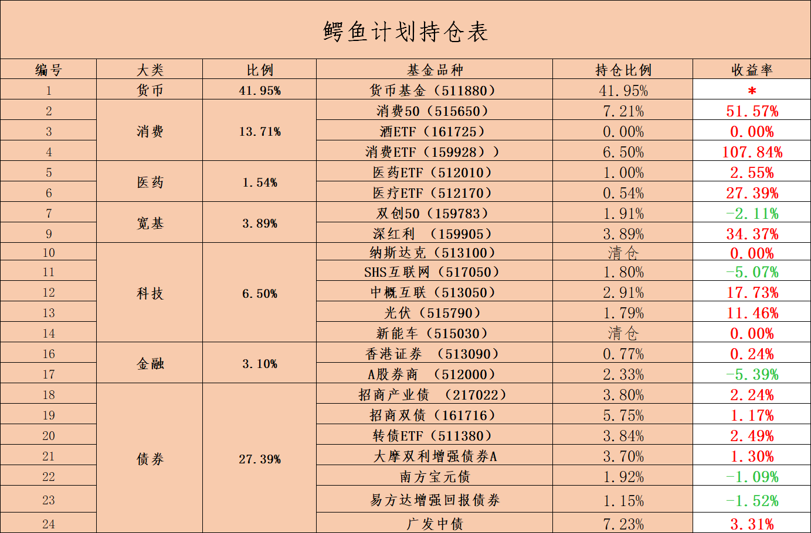

======================================================

_type: talk
@二师父[28814221155551]
2021-07-18 21:20:37 Sun  
topic_id: 818582244451582

<e type="hashtag" hid="51288148518444" title="#关于大白马和相关基金的分析#" /> 注意，高估和低估是一个区间，指数上涨有上行区间也有下行区间，投资指数比较机会买早了和卖早了，上行趋势的时候要拿的住，下行趋势的时候要等得起。

阅读[1]  评论[0]  赞[0] 

+++++++++++++++++++++++++++++++++++++++++++++++++++++

文件：
2021-07-18 21:19:09 Sun
文件大小：[42293]
544481855852514-大白马还有没有救.docx

======================================================

_type: talk
@二师父[28814221155551]
2021-07-18 23:02:06 Sun  
topic_id: 418485521224228

给大家推荐一个终端，慧博投研终端，看研报，多发掘赚钱机会，不要总盯着低估值的三傻，这块研报都没多少人写了

阅读[1]  评论[0]  赞[0] 

+++++++++++++++++++++++++++++++++++++++++++++++++++++

图片：
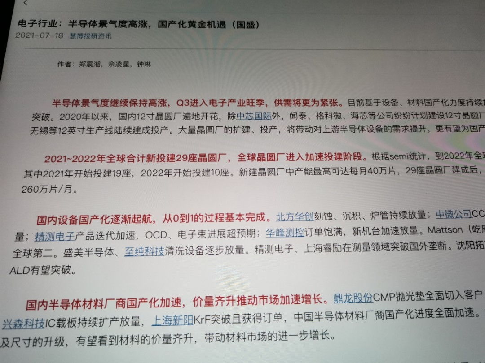

======================================================

_type: talk
@二师父[28814221155551]
2021-07-19 09:02:32 Mon  
topic_id: 185254481584882

<e type="hashtag" hid="51288148541214" title="#市场的两个顶部和底部#" /> 关于买入点和卖出点，要看行业指数的两个顶部和底部。

首先股票不适用于底部和顶部法则，企业股价的终点是盈利的终点和商业模式的终点，如果企业持续盈利，而且增速很高，是没有卖出的说法的，无关牛熊。

而行业总有周期，这个底部和顶部在于估值底部和情绪底部，估值顶部和情绪顶部。

估值底部是极端低位，可以抄底的位置，估值顶部是极端高位，可以逃顶的位置。当然是阶段性的，当前的很多基金估值低于15年的位置，然而指数点位一直上升，这是因为企业盈利一直增长。

那么这种极端位置可能很多年才碰到一次，对于这种机会就是改变财富巨大的机会。真正有耐心的朋友就完全可以采用低估买入，正常估值持有或者收割利润，高估值卖出本金。这是最好的方式，所以当有读者问需不需要卖出的话，就看看估值表，绿色的就买入，红色的就卖出。

当然也有读者发现，白酒红色高估卖出以后他又继续涨，一方面是因为企业持续盈利较高，另外一方面白酒的估值翻了2.5倍，这种估值高位一定不会持续的，所以高位仍旧遵循卖出法则，高估卖本，拉长时间看，做的是对的。

那么对于阶段性的机会如何把握呢？比如医疗从正常估值下跌，没有进入低估又涨起来了，这种阶段性机会看成交额，比如新能源板块，阶段性放量之后进入天量成交额不继续新高，往往是阶段顶部，而阶段性缩量之后指数不再新低，就是阶段性底部。这两个点是可以把握的。

@杜志彪 at 2021-07-19 09:02:32 Mon

> 说干就干，清仓券商ETF，目前4.4%仓位收益率22.6%，仓位回到5层以下了。

----------

@永刚 at 2021-07-19 09:02:32 Mon

> 医疗目前的成交额支持定投吗？

----------

@二师父 at 2021-07-19 09:02:32 Mon

> 短期情绪过热，医疗是长线板块，可以持续定投

----------

@永刚 at 2021-07-19 09:02:32 Mon

> 谢谢师父，现在是正常估值所以定投的金额要少一些，将来上涨收割利润，下跌加大金额，我的理解对吗？

----------

@二师父 at 2021-07-19 09:02:32 Mon

> 对的

----------

阅读[1]  评论[5]  赞[0] 

======================================================

_type: q&a
@枫叶[88444421411582]
2021-07-19 10:13:26 Mon  
topic_id: 418485511454218

@枫叶

>  老师你好，牧原股份成本58.5，现在是割肉还是拿着好

@二师父

>  钱不用就拿着，至少要等猪肉价格起来再卖，急用钱就别买周期股

阅读[1]  评论[0]  赞[0] 

======================================================

_type: talk
@二师父[28814221155551]
2021-07-19 21:13:07 Mon  
topic_id: 818582182282422

<e type="hashtag" hid="15288518114512" title="#食品饮料指数投资价值分析#" />

@六尘不改 at 2021-07-19 21:13:07 Mon

> 师傅，基金啥时候更新二季度持仓

----------

@二师父 at 2021-07-19 21:13:07 Mon

> 已经更新了，研报有的发出来了

----------

@六尘不改 at 2021-07-19 21:13:07 Mon

> 同类型基金，同一个基金经理，是不是规模越小越好

----------

@二师父 at 2021-07-19 21:13:07 Mon

> 理论上是这样的

----------

阅读[1]  评论[4]  赞[0] 

+++++++++++++++++++++++++++++++++++++++++++++++++++++

文件：
2021-07-19 21:12:55 Mon
文件大小：[41774]
111185811411512-食品饮料指数投资价值分析.docx

======================================================

_type: talk
@二师父[28814221155551]
2021-07-20 00:15:44 Tue  
topic_id: 185254845541812

<e type="hashtag" hid="552114551414" title="#估值数据#" /> 市盈率百分位46.57%，市净率百分位38.51%，SY-BY百分位43.25%，SY/BY百分位39.31%，当前投资价值主要集中在医疗和科技板块，医疗重点关注医疗器械和医美，科技板块关注芯片、光伏和新能源。

接下来我们重点投资中欧医疗股票、易方达中概互联、科创50.

场内重点投资双创50，医药ETF和SHS互联网。

其余方向慢慢放弃，目前大部分读者已经知道了，对于没有业绩支撑和发展前景的企业以及基金，及早放弃，可以止损，也可以停止加仓，在错误的方向加仓，只会让本金越来越少。

@HeLLO at 2021-07-20 00:15:44 Tue

> sHs互联网代码多少？

----------

@二师父 at 2021-07-20 00:15:44 Tue

> 517050

----------

@铥@铥~~ at 2021-07-20 00:15:44 Tue

> 中欧医疗股票是006228吗

----------

@二师父 at 2021-07-20 00:15:44 Tue

> 对

----------

@铥@铥~~ at 2021-07-20 00:15:44 Tue

> 我看场内场外方向都差不多，是不是不需要场内外都投呢？

----------

@二师父 at 2021-07-20 00:15:44 Tue

> 看你用哪个习惯，场内etf，场外指数和股票基金都有

----------

阅读[1]  评论[6]  赞[0] 

======================================================

_type: talk
@二师父[28814221155551]
2021-07-20 08:12:28 Tue  
topic_id: 581215855288544

萧楠管理的易方达科顺二季度在A股市场及港股市场分别保持68.64%及22.50%的配置比例，与一季度相比仓位变化不大。

在白酒等消费板块继续保持较高配置同时，萧楠二季度大幅增持了银行板块，他称自己重点配置具有稳健负债业务、同时也是国内财富管理行业优秀代表的相关标的。

从二季报数据上看，A股中的金融行业板块二季度配置了6.63%的比重，相比一季度大幅提升了5.61个百分点，招商银行新进前十大重仓股，也是易方达科顺基金自2018年10月成立以来，前十大重仓股中首次出现银行股的“面孔”。

此外，萧楠继续加大了对养殖板块的投资，农、林、牧、渔业行业板块配置占基金资产净值比例达到1.88%，而一季度该行业配置比重为零。不过猪价在二季度持续下跌，以猪肉养殖业龙头温氏股份为例，该股在二季度大跌15.07%，萧楠也坦言，此次调仓从效果看并不理想，不过自己并不担心。“猪价的下跌超出我们之前的预期，但我们并不担心相关标的的长期空间，相反，每一次行业低谷，都是优质企业扩张、竞争对手停滞倒退的弯道。”

萧楠还称，去年布局的一些低估值标的业绩表现一般，其中的原因除了市场风格，更多的是公司本身摆脱现有困境的努力还没有出现预期效果。好在在这类标的的仓位并不多。他总结道，过多的左侧投资的确会严重降低投资效率，因此二季度适当做出了调整，将这类公司替换成估值同样便宜但更具备新增长动力的公司。

@西锦巴乌 at 2021-07-20 08:12:28 Tue

> 师父：招商产业债为什么限购了？

----------

@二师父 at 2021-07-20 08:12:28 Tue

> c限购，a没有

----------

阅读[1]  评论[2]  赞[0] 

======================================================

_type: talk
@xu[2441485251]
2021-07-20 13:19:13 Tue  
topic_id: 218582148285841

二师傅请问SHS互联网现在可以建个底仓吗？谢谢！

@二师父 at 2021-07-20 13:19:13 Tue

> 你是准备左侧还是右侧？

----------

@xu at 2021-07-20 13:19:13 Tue

> 左侧

----------

@二师父 at 2021-07-20 13:19:13 Tue

> 建个百分之5可以，然后分批买入，持有即可

----------

@xu at 2021-07-20 13:19:13 Tue

> 收到，谢谢！

----------

阅读[1]  评论[4]  赞[0] 

======================================================

_type: talk
@二师父[28814221155551]
2021-07-20 20:24:12 Tue  
topic_id: 185254882851512

<e type="hashtag" hid="552114551414" title="#估值数据#" /> 市盈率百分位46.59%，SY-BY百分位43.05%，SY/BY百分位39.02%。

估值数据近一步下降，主要是因为国债收益率下行，随着估值数据的降低，未来投资的比例会加大。

没有底仓的建仓分为两种，第一种预期上涨，追加，第二种，没有底仓害怕涨，建立底仓，总之一次建立底仓的意图只有一种，预期市场上涨，如果没有这个预期，就不需要建立，定投就行了。

19年底的时候，我依然看好白酒，截至到目前，白酒已经不是作为第一首选的基金了，下半年乃至未来2年，科技是主线，小盘成长股的投资要多于大盘蓝筹，方向得弄对了。可以先开通科创板或者创业板，对于精选层，有兴趣得也可以了解下。

投资得方向要从上证50转向科创50，这里面企业大多市值1000亿左右，空间大，而成长性优于中证500。

@永刚 at 2021-07-20 20:24:12 Tue

> 师父：请教一下，左侧交易，目前仓位五成，如何提高资金利用率？

----------

@二师父 at 2021-07-20 20:24:12 Tue

> 剩余5层仓位可以买入安心组合，有机会的时候转换

----------

@王燕 at 2021-07-20 20:24:12 Tue

> 师父，开通科创板和创业板都得两年证券交易经验，开不了咋办？郁闷！

----------

@二师父 at 2021-07-20 20:24:12 Tue

> 等等两年就好了

----------

阅读[1]  评论[4]  赞[0] 

======================================================

_type: q&a
@铥@铥~~[582228558115884]
2021-07-20 21:34:54 Tue  
topic_id: 418485114155828

@铥@铥~~

>  稀土的基金是516780还是516150呢

@二师父

>  他俩是不同公司的产品，选择华泰更好

阅读[1]  评论[0]  赞[0] 

======================================================

_type: talk
@二师父[28814221155551]
2021-07-20 23:15:14 Tue  
topic_id: 581215888111184

<e type="hashtag" hid="88514141542152" title="#主动基金估值表#" /> 目前易方达金融股票进入低估了，定投的朋友可以开始，当然对于大金融类，预期较低，配置最多不超过10%仓位。这种主题行业基金比纯保险指数和纯银行指数要好。

兴全合润进来表现不好，主要重仓了三一重工和保险这类企业。平安我已经分析过，不看好，三一重工很容易理解，他是卖机械的，现在国家在收缩基建，卖机械的自然也不大行，基建整体都收缩了，还要那么多挖机干啥。

主动基金有主动基金的优势，也有劣势，运用其优势就好。另外接下来重点投资医疗、互联网，科创、创业50，未来的方向就在这里，投资股票也不要脱离这些。未来半年仍旧是以小盘成长或者大盘成长为主，价值股少买。

咱们是定投，定投是怕涨，不怕跌，只要有预期会上涨，跌的越多，未来收益会越好的。找到有预期的板块和基金，回调或者大跌的时候，减持定投买入就是非常好的，然后极端低位就可以建立底仓或者梭哈卧倒了。

@庆余年 at 2021-07-20 23:15:14 Tue

> 推荐一只金融混基，金融类股票持仓占比在20%以内。工银瑞信新金融股票（001054)，回撤控制的很好，短期和长期收益也不错。

----------

@二师父 at 2021-07-20 23:15:14 Tue

> 还不错，股票基金，控制的好，也可以自己控制金融股票基金10到20仓位以内

----------

@Philip🎭 Y at 2021-07-20 23:15:14 Tue

> 手上的兴全怎么处理比较好？卖出吗

----------

@二师父 at 2021-07-20 23:15:14 Tue

> 长期资金可以持有，短期要用的钱就可以走了

----------

阅读[1]  评论[4]  赞[0] 

+++++++++++++++++++++++++++++++++++++++++++++++++++++

图片：
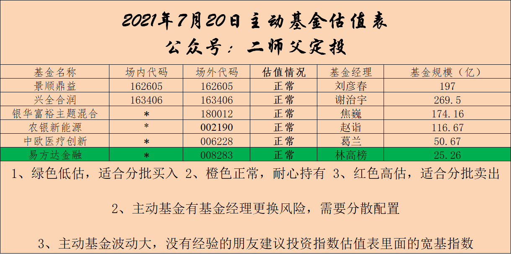

======================================================

_type: q&a
@好运玲玲[244188585541521]
2021-07-20 23:26:47 Tue  
topic_id: 818582114515512

@好运玲玲

>  二师父您好！麻烦推荐一个消费电子的基金，好吗？

@二师父

>  还没有这么细分的，可以看看嘉实智能汽车股票

阅读[1]  评论[0]  赞[0] 

======================================================

_type: talk
@二师父[28814221155551]
2021-07-21 08:41:11 Wed  
topic_id: 185251224455442

<e type="hashtag" hid="28511815588251" title="#有效学习和无效学习#" /> 有效学习，就是当你听到跟自己不同的观点，你通过思考找到新论据接受或者反驳了这个不同的观点，或者你遇到一个新的问题不知所措，你通过刻意练习掌握了一门新的技能、方法解决了这个新的问题。

所谓的无效学习，就是你一直用你现有的认知观念解释新出现的事物和现象，或者用你已有的经验和方法不加更新地重复性地解决新的问题。

当问题出现的时候，先不是拿已有的认知来分析，而是逻辑推理去证明和或者证伪。

即使错了，依然认知提升，反之，一直用过去思维，经验重复，永远得不到提高，就比如看k线，其实是无效学习

@王模堂 at 2021-07-21 08:41:11 Wed

> 二师傅，您好！科创50埸外基金代码是多少？

----------

@二师父 at 2021-07-21 08:41:11 Wed

> 011609

----------

@王模堂 at 2021-07-21 08:41:11 Wed

> 谢谢二师傅。

----------

阅读[1]  评论[3]  赞[0] 

======================================================

_type: talk
@二师父[28814221155551]
2021-07-21 20:03:36 Wed  
topic_id: 818584528555152

<e type="hashtag" hid="28518855451481" title="#乌龟计划#" /> 买入中欧医疗（006228） 300元
买入中丐互联（006327） 100元
买入科创50 (011609) 600元

已经在天天基金公布，每周坚持买一点点，如果牛市爆发到泡沫，那么继续止盈，如果继续下跌的话那么会加大定投比例。开始买入科创50，场内是定投的双创50ETF，已经盈利1.1%，还是按照既定的计划，上涨持有，下跌了逐步定投。

未来无法预测，坚定地积累股权资产，同时控制好仓位，可以用债券对冲，也可以配置货币基金，保证自己有比较充足的流动性，下跌也不至于过度恐慌。

@姥姥不疼. 爷爷不爱 at 2021-07-21 20:03:36 Wed

> 为啥买011609，c类？

----------

@二师父 at 2021-07-21 20:03:36 Wed

> 卖出费率低

----------

@姥姥不疼. 爷爷不爱 at 2021-07-21 20:03:36 Wed

> c类不适合长期持有么

----------

@惟子 at 2021-07-21 20:03:36 Wed

> 嗯，同问二师父

----------

@二师父 at 2021-07-21 20:03:36 Wed

> 可以的

----------

@范毅君 at 2021-07-21 20:03:36 Wed

> 中丐[苦涩][苦涩]

----------

@丸子妈 at 2021-07-21 20:03:36 Wed

> 应该A类适合长期持有，C类适合短期吧？

----------

@二师父 at 2021-07-21 20:03:36 Wed

> 3年以上a更好

----------

阅读[1]  评论[9]  赞[0] 

======================================================

_type: talk
@二师父[28814221155551]
2021-07-21 20:18:17 Wed  
topic_id: 218584528584451

<e type="hashtag" hid="552114551414" title="#估值数据#" /> 市盈率百分位46.82%，SY-BY百分位42.83%，SY/BY百分位38.52%，创业板换手率4.28%，热度很高，谨慎投资。

@杜志彪 at 2021-07-21 20:18:17 Wed

> 超过上证指数指日可待了。

----------

阅读[1]  评论[1]  赞[0] 

======================================================

_type: q&a
@铥@铥~~[582228558115884]
2021-07-22 08:52:37 Thu  
topic_id: 418482482511428

@铥@铥~~

>  歌尔尾盘咋了，刚进，还能持有吗？

@二师父

>  中报业绩低于预期，河南暴雨影响富士康产能，消费电子供应链有影响

阅读[1]  评论[0]  赞[0] 

======================================================

_type: talk
@二师父[28814221155551]
2021-07-22 08:57:06 Thu  
topic_id: 418482428582148

<e type="hashtag" hid="825188852442" title="#估值表#" /> 目前中概互联低估，定投的时候，如果指数估值处于正常估值区域，牛市上行区间，行业景气度高，也会部分定投，高估的全部避免了。光伏、新能源可以不卖，但是不考虑再入手。

阅读[1]  评论[0]  赞[0] 

+++++++++++++++++++++++++++++++++++++++++++++++++++++

图片：
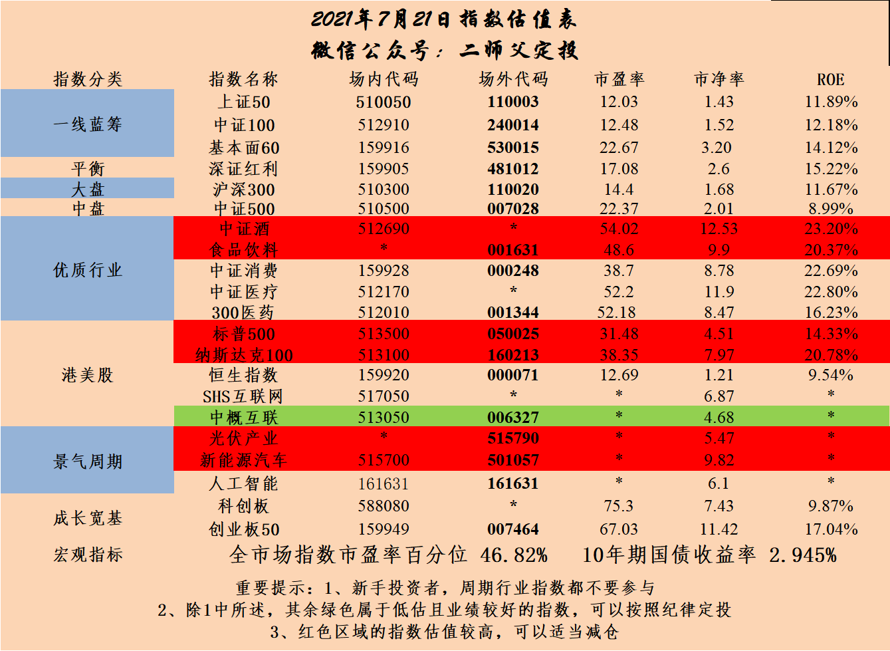

======================================================

_type: talk
@二师父[28814221155551]
2021-07-22 09:48:36 Thu  
topic_id: 818584542555842

<e type="hashtag" hid="881251425252" title="#鳄鱼计划#" /> 清仓消费50etf，前期收割利润，目前止盈清仓。未来投资方向很重要，不能一直看过去。

@好运玲玲 at 2021-07-22 09:48:36 Thu

> 方向真的很重要，前期投资的没舍得卖，利润回撤了不少

----------

@向前进 at 2021-07-22 09:48:36 Thu

> 师父，消费etf 159928可以一样操作吗

----------

@二师父 at 2021-07-22 09:48:36 Thu

> 可以的

----------

@向前进 at 2021-07-22 09:48:36 Thu

> [OK]谢谢

----------

@丸子妈 at 2021-07-22 09:48:36 Thu

> 消费etf还亏8个点，资金不多，是补仓还是不动？

----------

@二师父 at 2021-07-22 09:48:36 Thu

> 目前要么清仓，要么不动，补仓是不合适的

----------

@丸子妈 at 2021-07-22 09:48:36 Thu

> 那我不动，反正资金也不需要取

----------

阅读[1]  评论[7]  赞[0] 

+++++++++++++++++++++++++++++++++++++++++++++++++++++

图片：
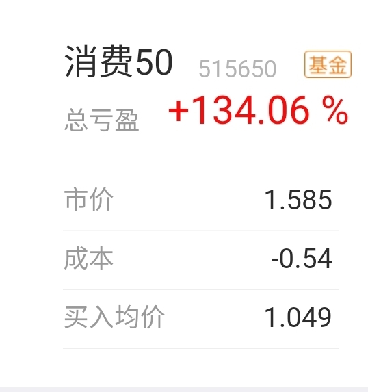

======================================================

_type: q&a
@范毅君[118551121224142]
2021-07-22 10:39:19 Thu  
topic_id: 185251518225582

@范毅君

>  二师傅，牧原经常看见有人嚷嚷他数据造假，现在河南又遇到水灾，如果现阶段，想介入一些生猪类股票，牧原相对来讲是不是还是安全系数最高的呀，有没有更好选择

@二师父

>  我觉得没有预期的股票不要做，你真想做，不要搞股票，农业etf好一点，我是不打算入这块的，没啥前景

阅读[1]  评论[1]  赞[0] 

======================================================

_type: q&a
@坚持学习[421148841558188]
2021-07-22 19:09:50 Thu  
topic_id: 581214181255584

@坚持学习

>  二师傅您好，我几年前按月定投过建信中证500（000478)，后来一直持有没有卖出，把握不好，不知道怎么卖。看您的估值表，并没有这一只的估值，不知这一只是否是处于高估，是否需要卖出呢？
>  这一只占仓位的三分一，是否结构上比重太大呢？何时卖出比较合适，策略应该如何把握呢？

@二师父

>  趁这次行情好的时候可以卖出本金，然后定投科创和创业板，中证500是正常偏低估值，与估值相比，更需要看企业质量

阅读[1]  评论[1]  赞[0] 

======================================================

_type: talk
@二师父[28814221155551]
2021-07-22 21:39:35 Thu  
topic_id: 818584255255582

<e type="hashtag" hid="88511815215522" title="#卧倒#" /> 目前市场风格两级分化，看好的都不便宜，不看好的一直跌。

如果想要参与以科创50+创业板50为主，辅助沪深300，今年小盘行情，沪深300也表现一般。

@芙瑞雅阳阳潘 at 2021-07-22 21:39:35 Thu

> 不买光伏吗？还会回调下来吗？

----------

@二师父 at 2021-07-22 21:39:35 Thu

> 这个位置买光伏没有太大的胜率了，就是赌上涨

----------

@果实妈咪 at 2021-07-22 21:39:35 Thu

> 感觉光伏涨的厉害，不容易下跌

----------

@二师父 at 2021-07-22 21:39:35 Thu

> 趋势上行反转比较难，但会有回调

----------

@芙瑞雅阳阳潘 at 2021-07-22 21:39:35 Thu

> 回调了买一些

----------

阅读[1]  评论[5]  赞[0] 

+++++++++++++++++++++++++++++++++++++++++++++++++++++

文件：
2021-07-22 21:38:21 Thu
文件大小：[44008]
544485155822144-卧倒.docx

======================================================

_type: q&a
@JOY[111881481812422]
2021-07-23 10:49:34 Fri  
topic_id: 581214515482114

@JOY

>  师父，请教下债基的问题～以招商转债为例，大概算了下年化收益，从15年发行到现在，平均年化大概5点多的收益率。从20年7月到现在，平均也是大概5点多的收益（麻烦您给看下，算得对不对？）。那么实际上如果不是极端情况的话，这个比一般银行理财产品收益率是要高的，比货币基金也高很多。因为之前一直不太明白，所以没敢多买，想请问下，如果打算长持，也不惧波动。现在这个位置适合买吗？买的话多少仓位合适？

@二师父

>  如果不惧怕波动可以买个百分之80，剩余资金定投指数，长期看优质债券基金可以实现年化百分之5的收益率，股票基金可以实现百分之8左右的收益率，不怕波动的话尽量多配置股权和债券，是可以跑赢通胀的，而且流动性好，万一发生意外，可以随时变现，而房子想卖一时半会卖不出去
>  
>  注意的风险就是流动性收紧，债券可能会面临下跌，而债券基金本身会控制，分散配置一些债券组合就行，可以参考安心组合，可以一次购买，年化百分之5到10，极端回撤百分之10以内，目前回撤在百分之2以内

阅读[1]  评论[1]  赞[0] 

======================================================

_type: q&a
@梧桐[844118451242512]
2021-07-23 11:10:38 Fri  
topic_id: 185251451214282

@梧桐

>  二师父，券商卖吗

@二师父

>  券商可以再等等，一波行情来了之后，券商会飞起来，等涨不动了可以卖的

阅读[1]  评论[1]  赞[0] 

======================================================

_type: talk
@二师父[28814221155551]
2021-07-23 21:06:03 Fri  
topic_id: 418482524884148

<e type="hashtag" hid="88511815152152" title="#聊一个行业#" /> 很多时候，政策和形势很重要，个人努力微乎其微，可以不敬畏市场，但是要敬畏村长。

@老孙头 at 2021-07-23 21:06:03 Fri

> 垄断性互联网行业的政策取向似乎也不妙？对整个“中概”影响如何？当下对下跌较多的“中概”，越跌越买合适吗？

----------

@二师父 at 2021-07-23 21:06:03 Fri

> 可以等等的

----------

阅读[1]  评论[2]  赞[0] 

+++++++++++++++++++++++++++++++++++++++++++++++++++++

文件：
2021-07-23 21:05:14 Fri
文件大小：[42189]
844412844842252-一日腰斩.docx

======================================================

_type: talk
@二师父[28814221155551]
2021-07-24 17:15:30 Sat  
topic_id: 418482512544118

<e type="hashtag" hid="48411818444448" title="#关于投资宽基指数的姿势#" /> 昨天发了两只代码，正确的投资姿势很重要，有耐心就等低估，如果对于市场热度高的时候还想参与可以定投，然后到高估卖出，到低估加倍定投。

@老孙头 at 2021-07-24 17:15:30 Sat

> “两只代码”有场外的吗？就这两只宽基而言，场内场外主要差别或各自优劣？一般以多大比例为宜？[害羞]

----------

@二师父 at 2021-07-24 17:15:30 Sat

> 目前双创还没放开申购，就是交易手续费的区别

----------

阅读[1]  评论[2]  赞[0] 

+++++++++++++++++++++++++++++++++++++++++++++++++++++

文件：
2021-07-24 17:13:34 Sat
文件大小：[42376]
844412818155812-买他.docx

======================================================

_type: talk
@二师父[28814221155551]
2021-07-24 22:45:14 Sat  
topic_id: 818584455885242

<e type="hashtag" hid="552114551414" title="#估值数据#" /> 市盈率百分位45.77%，SY-BY百分位41.61%，SY/BY百分位37.51%。

目前市场极端分化，结构性行情明显，大家一定要避开政策打压的行业，要做就在政策支持的行业做，否则只会越买越跌。

政策支持的碳中和方向，相关板块光伏，芯片方向，半导体国产替代，医疗养老，清洁能源。行业指数风险高，配置比例最高建议不要超过20%，以防行业暴雷。

如果行业看不明白，优选宽基指数更为稳妥。

总结最近半年的投资，我深刻意识到，在中国投资一定要跟D走，指哪打哪。不能和村长的意志违背。

阅读[1]  评论[0]  赞[0] 

======================================================

_type: talk
@二师父[28814221155551]
2021-07-25 21:33:24 Sun  
topic_id: 581214418245524

<e type="hashtag" hid="15288585554522" title="#对于危机的一些看法#" /> 目前的一些信号确实显示危机已经在显露了，而且新能源涨的过于离谱，股息率低于0.5%，继续半仓运行，防止后续的风险。

@样 at 2021-07-25 21:33:24 Sun

> 看来我要慢慢减仓了，或者不再往里面投了

----------

@小牧童 at 2021-07-25 21:33:24 Sun

> 师父，为啥很多有名的基金经理目前仓位配置的还蛮高？

----------

@二师父 at 2021-07-25 21:33:24 Sun

> 第一是基金的规定问题，股票基金仓位是不能低于百分之80，第二是基金经理风格问题，他们持续高仓位运行穿越牛熊，而巴菲特去年仓位大致百分之40，这个还是注意下，毕竟人家经历了6次危机

----------

@小牧童 at 2021-07-25 21:33:24 Sun

> 好的，谢谢！

----------

@六尘不改 at 2021-07-25 21:33:24 Sun

> 最近回来几百万资金，是否可以重仓易方达裕丰和丰和？

----------

@二师父 at 2021-07-25 21:33:24 Sun

> 你看看回撤，能接受的话可以直接半仓，大额资金防守为主

----------

@六尘不改 at 2021-07-25 21:33:24 Sun

> 混合债感觉比较稳当吧

----------

@二师父 at 2021-07-25 21:33:24 Sun

> 可以，安心组合更稳健一些

----------

阅读[1]  评论[12]  赞[0] 

+++++++++++++++++++++++++++++++++++++++++++++++++++++

文件：
2021-07-25 21:31:49 Sun
文件大小：[44913]
844412258821282-三个信号要注意.docx

======================================================

_type: q&a
@晴[15422515228522]
2021-07-26 10:00:39 Mon  
topic_id: 418455422224158

@晴

>  二师父，近期持有一些腾讯，成本略高，是拿着还是割肉抛掉？虽然看好腾讯，但近期政策频出，有点担心

@二师父

>  腾讯的业绩和基本面没有问题，但是随着政策打压和恐惧情绪加剧，可能会拿不住，这是投资的风险之一

阅读[1]  评论[0]  赞[0] 

======================================================

_type: q&a
@永刚[15581448518112]
2021-07-26 10:47:02 Mon  
topic_id: 818522541825812

@永刚

>  请教师父：医疗今天大跌，到低估区了吗？可否临时加一次仓？

@二师父

>  如果仓位低于百分之15可以的，注意控制总仓位

阅读[1]  评论[0]  赞[0] 

======================================================

_type: q&a
@王春媚[244424882221141]
2021-07-26 12:05:33 Mon  
topic_id: 185244282242242

@王春媚

>  师父，白酒ETF现在可以买了吗？

@二师父

>  不太看好白酒了，这个位置不便宜，要么不买，要买也是短线

阅读[1]  评论[4]  赞[0] 

======================================================

_type: talk
@丸子妈[28512522184441]
2021-07-26 13:55:23 Mon  
topic_id: 185244284145582

中概互联今天还能再买一点吗？目前小亏

@二师父 at 2021-07-26 13:55:23 Mon

> 可以买，控制总仓位10%以内，防止行业风险

----------

阅读[1]  评论[1]  赞[0] 

======================================================

_type: q&a
@果实妈咪[182225518588452]
2021-07-26 15:33:52 Mon  
topic_id: 818522541454482

@果实妈咪

>  二师父，今天加仓双创基金不。看你上次发的加仓计划，已经跌到第一位置了

@二师父

>  可以买入一份，按照0.95，0.9，0.85的价格买，方向没问题，起来就是时间了

阅读[1]  评论[3]  赞[0] 

======================================================

_type: talk
@二师父[28814221155551]
2021-07-26 20:59:31 Mon  
topic_id: 218522852442241

<e type="hashtag" hid="28511814528841" title="#未来投资的方向#" /> 目前底层逻辑变了，凡是不利于三胎政策推进的都会被抑制，三座大山首当其冲，和政策跟着走就行了。

@宋航 at 2021-07-26 20:59:31 Mon

> 二师父，看分析下来，我的大致理解，以中概为首互联网行业是要逐步放弃买入，更换成硬科技行业。我的理解有偏差吗？

----------

@二师父 at 2021-07-26 20:59:31 Mon

> 是这样的，双创50和科创50开启定投就是初步布局，他们定位是硬科技

----------

@范毅君 at 2021-07-26 20:59:31 Mon

> 二师傅，手上的中概亏损一些，是继续拿着比较好，还是走

----------

@西锦巴乌 at 2021-07-26 20:59:31 Mon

> 投资高端制造业基金

----------

阅读[1]  评论[4]  赞[0] 

+++++++++++++++++++++++++++++++++++++++++++++++++++++

文件：
2021-07-26 20:58:36 Mon
文件大小：[43760]
422215588854558-方向.docx

======================================================

_type: q&a
@铥@铥~~[582228558115884]
2021-07-26 23:34:37 Mon  
topic_id: 818522852851512

@铥@铥~~

>  5G方向，515050,159811和159994哪个更好一些呢，这个方向中期如何？谢谢

@二师父

>  最后一个好一点，5g中期一般，你投科创50就行

阅读[1]  评论[0]  赞[0] 

======================================================

_type: talk
@二师父[28814221155551]
2021-07-27 00:32:22 Tue  
topic_id: 185244555482182

<e type="hashtag" hid="552114551414" title="#估值数据#" /> 市盈率百分位42.57%，SY-BY百分位38.81%，SY/BY百分位34.97%。

估值楼层快下降了，这种时候就是机会来临的时候，不要害怕，机会来了该抓住就抓，目前还是正常定投即可，真的可以抄底梭哈的时候，我会提示的。

当然尽量避免梭哈，定投更加稳健，以防止金融危机。

说说行业方向，白酒我是看好的，只是目前估值真的很贵，别看五粮液跌了30%，但是18年他的市盈率最低15倍，14年的时候更低，所以不能用锚固思维来看价格。

第二关于科技类基金，我计划未来主要投资新能源、光伏、科创50、创业板50，还有一些机会正在挖掘，新能源、光伏、创业板50目前估值都太高，先等等，优先上车科创50，定投起来，虽然我也知道中国科技和美国差了50年，但是政策扶持的方向才是投资的方向，D指哪打哪，在中国投资要有ZZ觉悟。

@六尘不改 at 2021-07-27 00:32:22 Tue

> 8腾讯和美团怎么了？还有救吗

----------

@二师父 at 2021-07-27 00:32:22 Tue

> 看政策走向了

----------

@枫叶 at 2021-07-27 00:32:22 Tue

> 中概互联又大跌

----------

@柔软时光 at 2021-07-27 00:32:22 Tue

> 中概互联是要放弃了吗？

----------

阅读[1]  评论[4]  赞[0] 

======================================================

_type: talk
@20181108……[51511128814554]
2021-07-27 08:42:11 Tue  
topic_id: 581255115421884

二师父，有没有关于可转债的书推荐？谢谢！

@刘享英 at 2021-07-27 08:42:11 Tue

> 买过《<e type="web" href="https://wx.zsxq.com/mweb/views/weread/search.html?keyword=攻守" title="攻守" style="book" />》，个人觉得还可以

----------

@20181108…… at 2021-07-27 08:42:11 Tue

> 谢谢！

----------

@二师父 at 2021-07-27 08:42:11 Tue

> 可转债投资魔法书

----------

@20181108…… at 2021-07-27 08:42:11 Tue

> 谢谢二师父！

----------

阅读[1]  评论[4]  赞[0] 

======================================================

_type: talk
@二师父[28814221155551]
2021-07-27 14:46:50 Tue  
topic_id: 418455851418418

<e type="hashtag" hid="881251425252" title="#鳄鱼计划#" /> 卖出光伏etf一份，之前买入了三份，现在卖出一份，这个位置不低。

阅读[1]  评论[0]  赞[0] 

======================================================

_type: talk
@以古论今[28214421582421]
2021-07-27 18:41:51 Tue  
topic_id: 218522848824551

@以古论今 at 2021-07-27 18:41:51 Tue

> 这几个还有希望创造新高吗？

----------

@二师父 at 2021-07-27 18:41:51 Tue

> 时间足够长，后三个有希望，政策不按死互联网，第一个有希望。

----------

阅读[1]  评论[2]  赞[0] 

+++++++++++++++++++++++++++++++++++++++++++++++++++++

图片：
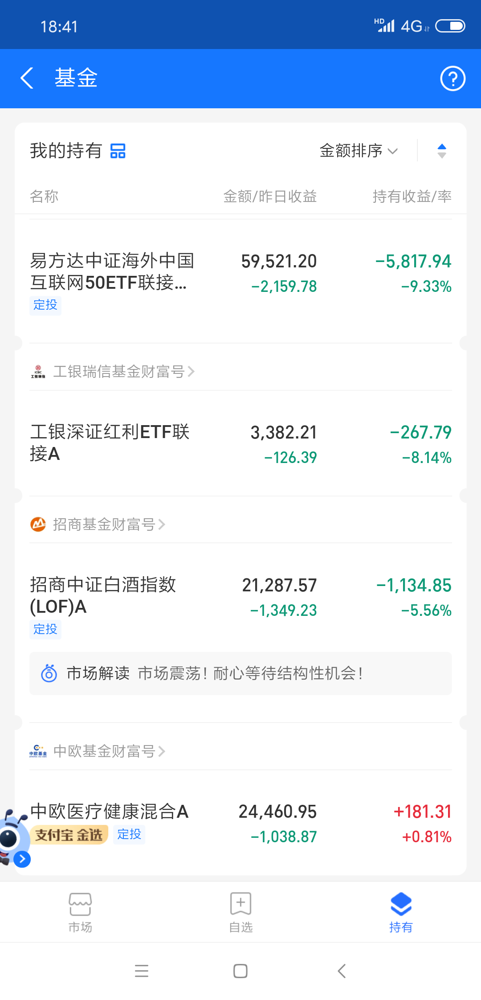

======================================================

_type: talk
@二师父[28814221155551]
2021-07-27 19:46:33 Tue  
topic_id: 581255144182144

<e type="hashtag" hid="15288581585422" title="#这次下跌的原因#" /> 分析为什么下跌，然后有的放矢

@宋航 at 2021-07-27 19:46:33 Tue

> 二师父能帮忙推测一下，这些大资金流出，多数情况下会流到什么地方啊？

----------

@老孙头 at 2021-07-27 19:46:33 Tue

> 高屋建瓴，阐述透彻，切实可行[强][咖啡]

----------

@二师父 at 2021-07-27 19:46:33 Tue

> 我看都流向了现金，国债期货也是跌的，商品也是跌，没有几个涨的

----------

阅读[1]  评论[3]  赞[0] 

+++++++++++++++++++++++++++++++++++++++++++++++++++++

文件：
2021-07-27 19:46:04 Tue
文件大小：[44094]
422215554112218-又是很刺激的一天.docx

======================================================

_type: q&a
@海马[15158245825242]
2021-07-28 00:19:10 Wed  
topic_id: 818522815588412

@海马

>  师父，今天万得全A的市盈率百分位多少？谢谢

@二师父

>  今天加班，数据刚出来了。市盈率百分位37.45%，SY-BY百分位36.47%，SY/BY百分位33.12%，在这样跌1到二天，估值楼层就第二层了。

阅读[1]  评论[0]  赞[0] 

======================================================

_type: q&a
@是喵喵吖～[421441114141158]
2021-07-28 00:23:41 Wed  
topic_id: 581255148111114

@是喵喵吖～

>  二师父，有个私人的事想听听您的意见。
>  是这样的，我们现在住的这个房子有十年了，中户，老破小 非学区房，附近有小学和初中。户型不好客厅很小没有采光。当时年龄小也没有钱所以就买的这个。   
>  我对象公积金贷款，每个月房贷1500。贷了30年。 目前还剩26W贷款（我们没有提前还款）目前的房子可以卖73万左右。因为楼下和我们一样户型的卖了这个钱。
>  
>  最近想换房子，仅仅是因为想更换一下居住环境和心情。非投资。因为客厅比较鸡肋，所以只能吃饭用。日常活动区域只能在主次卧室。  说实话感觉时间久了也挺不开心的。  孩子也慢慢大了，希望给她也好一点居住环境。
>  
>  所以想换房子，也在附近，178万（只是看了还没有谈什么的） 这样就是如果卖掉现在的房子还完银行能剩40多万，自己添点钱再可以凑50多万首付，月供的话大概六七千（我和对象一个月一共2万左右工资，他有2000公积金，这样实际我们每个月掏四千块钱还贷款）
>  
>  
>  目前我们有20万在基金股票里，20万在手头。  想问问您，觉得这个情况建议换吗。还是建议攒钱过几年再换。 
>  
>  谢谢二师父！

@二师父

>  如果你俩工作稳定，没有失业风险，而且房子自己又特别喜欢，爱人也同意，月供是每月结余一半的话，是可以置换的

阅读[1]  评论[1]  赞[0] 

======================================================

_type: talk
@二师父[28814221155551]
2021-07-28 02:33:12 Wed  
topic_id: 581255184258584

<e type="hashtag" hid="88514141542152" title="#主动基金估值表#" /> 目前唯一绿色的易方达金融，也是风险较大的行业基金，建议优先选择风险偏低的宽基指数。

@六尘不改 at 2021-07-28 02:33:12 Wed

> 为何有些主动基金场内和场外的净值有偏差呢

----------

@二师父 at 2021-07-28 02:33:12 Wed

> 这是因为折溢价，你看的是价格和净值，lof基金净值是一致的

----------

@六尘不改 at 2021-07-28 02:33:12 Wed

> 可是场内是按实时价格交易啊，是不是比场外有优势，手续费也是按股票型的收取

----------

阅读[1]  评论[3]  赞[0] 

+++++++++++++++++++++++++++++++++++++++++++++++++++++

图片：

======================================================

_type: talk
@芙瑞雅阳阳潘[421181844812818]
2021-07-28 09:59:20 Wed  
topic_id: 818522811158852

师父，光伏再等等买吗？

@二师父 at 2021-07-28 09:59:20 Wed

> 昨天刚卖，暂时不会买入

----------

@芙瑞雅阳阳潘 at 2021-07-28 09:59:20 Wed

> 好

----------

@付云 at 2021-07-28 09:59:20 Wed

> 明天不发车了？！！

----------

@二师父 at 2021-07-28 09:59:20 Wed

> 轻仓定投

----------

阅读[1]  评论[4]  赞[0] 

======================================================

_type: talk
@二师父[28814221155551]
2021-07-28 22:35:32 Wed  
topic_id: 581255452858124

<e type="hashtag" hid="552114551414" title="#估值数据#" /> 估值表还没剔除的意味着还有价值，然而现实情况在变化，关于互联网行业的命运还有待观察，理性分析整体互联网行业不会夭折，但是也会如同煤炭、钢铁、地产行业这样有周期的，行业不死，投资需要的是大幅度成长空间，低估买入可以保证安全和盈利，大幅度盈利还需要建立在盈利、预期和景气度上，这就是为什么需要控制单一行业指数的仓位，但斌今年同样手法操作美股和A股，得到了不同结果，我们国家确实有特色。

@庆余年 at 2021-07-28 22:35:32 Wed

> 额，我的互联网仓位17%了。

----------

@二师父 at 2021-07-28 22:35:32 Wed

> 没事，下午方星海开会说不会波及到其他行业

----------

@庆余年 at 2021-07-28 22:35:32 Wed

> 谢谢二师父[西瓜][西瓜][西瓜]

----------

@样 at 2021-07-28 22:35:32 Wed

> 二师父，请问你的主动基金组合，激进型的那个，什么时候开始建仓？

----------

@二师父 at 2021-07-28 22:35:32 Wed

> 时机到了的时候

----------

@小牧童 at 2021-07-28 22:35:32 Wed

> 师父，可以加个估值区间吗

----------

@杜志彪 at 2021-07-28 22:35:32 Wed

> 中午收盘创业板指数超过上证指数[悠闲]

----------

@二师父 at 2021-07-28 22:35:32 Wed

> 好

----------

阅读[1]  评论[8]  赞[0] 

+++++++++++++++++++++++++++++++++++++++++++++++++++++

图片：
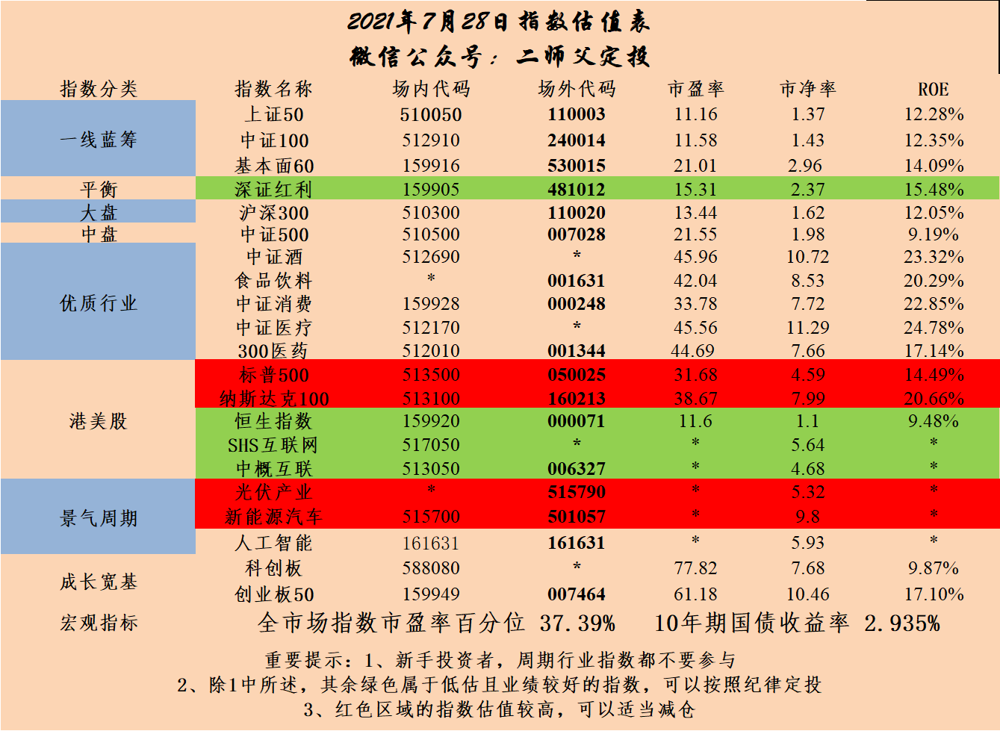

======================================================

_type: talk
@天马行空[548818851412444]
2021-07-29 13:15:02 Thu  
topic_id: 185244111148582

请问师傅，跟踪创业板指最好的指数基金代码多少。谢谢

@二师父 at 2021-07-29 13:15:02 Thu

> 007464

----------

阅读[1]  评论[1]  赞[0] 

======================================================

_type: q&a
@隔窗遥望[241884481854181]
2021-07-29 14:00:41 Thu  
topic_id: 418455221444188

@隔窗遥望

>  SHS互联网和中概互联有什么区别？

@二师父

>  SHS互联网是从沪港深3地选取的互联网企业，中概互联是从境外市场选取的互联网企业。

阅读[1]  评论[0]  赞[0] 

======================================================

_type: talk
@helen[544884424181154]
2021-07-29 14:40:36 Thu  
topic_id: 185244118512412

二师父，麻烦问一下昨天的乌龟计划在天天基金里面为什么没看到发车啊？

阅读[1]  评论[0]  赞[0] 

======================================================

_type: talk
@二师父[28814221155551]
2021-07-29 14:43:58 Thu  
topic_id: 418455221825518

目前场内的环保etf已经换成碳中和etf了，比光伏弱一点，还是在景气周期。

@果实妈咪 at 2021-07-29 14:43:58 Thu

> 啥时候换的，二师父

----------

@二师父 at 2021-07-29 14:43:58 Thu

> 是名字换了，好像今天

----------

阅读[1]  评论[2]  赞[0] 

+++++++++++++++++++++++++++++++++++++++++++++++++++++

图片：
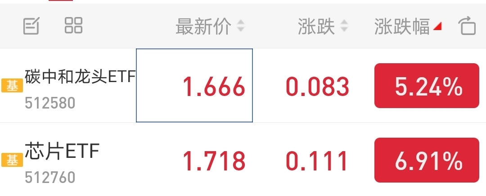

======================================================

_type: talk
@二师父[28814221155551]
2021-07-29 17:12:03 Thu  
topic_id: 818522415241522

<e type="hashtag" hid="51288184852284" title="#今天大涨的原因#" /> 股市涨跌无法预测，按照既定策略投资即可，低吸高抛，比追涨杀跌要强。

阅读[1]  评论[0]  赞[0] 

+++++++++++++++++++++++++++++++++++++++++++++++++++++

文件：
2021-07-29 17:11:16 Thu
文件大小：[44419]
111184181114282-开会释放信号.docx

======================================================

_type: talk
@芙瑞雅阳阳潘[421181844812818]
2021-07-29 17:16:47 Thu  
topic_id: 185244182484422

师父，今天光伏差一点涨停

@二师父 at 2021-07-29 17:16:47 Thu

> 对，这个位置要进也是短线碰运气，长线仓位不适合了

----------

@防汛抗旱 at 2021-07-29 17:16:47 Thu

> 卖早了，这两天少了10几个点

----------

阅读[1]  评论[2]  赞[0] 

======================================================

_type: q&a
@wty[548488548545444]
2021-07-29 17:31:51 Thu  
topic_id: 218522415211281

@wty

>  二师父，16国债19盈利9%+了，15%总仓位，持有14个月，要继续持有吗？还是可以逐步卖出了？

@二师父

>  按照目前经济情况，可以继续持有，如果盈利回落可以转移到货币基金，或者股市大跌的时候转过去

阅读[1]  评论[1]  赞[0] 

======================================================

_type: talk
@xu[2441485251]
2021-07-29 21:23:32 Thu  
topic_id: 185244181885112

二师傅您好！请问碳中和ETF现在可以建个2层底仓吗（左侧交易）？谢谢！

@二师父 at 2021-07-29 21:23:32 Thu

> 不适合，这个位置很高了

----------

阅读[1]  评论[1]  赞[0] 

======================================================

_type: q&a
@庆余年[15584481824122]
2021-07-30 00:01:43 Fri  
topic_id: 818522414222442

@庆余年

>  二师父，我是武汉的，在光谷附近工作。本来是打算今年买房的（刚需)，在东湖高新区，但是一直没选到合适的。最近两天看了这个“房票”的消息，这种政策出来是不是可以缓缓买房动作？我同时也有一个疑问，房票的出现会不会产生“物以稀为贵”的逆行上涨动作（特别是武汉的热门区域）?

@二师父

>  你是买二手房还是期房，房票难求，对于房价是抑制作用，比如我想买，但是拿不到房票，就被抑制了。
>  
>  如果不是很着急，就慢慢挑，挑选到了喜欢的再上车，不用着急，政策是为了抑制炒房

阅读[1]  评论[3]  赞[0] 

======================================================

_type: talk
@二师父[28814221155551]
2021-07-30 21:23:06 Fri  
topic_id: 185244844141512

<e type="hashtag" hid="15288588282412" title="#聊聊白酒#" /> 白酒大跌，目前还是正常估值，而且业绩增速持续下滑，目前光伏就是之前的白酒，未来肯定会有一波下杀，至于什么时候不清楚，所以当前投资很难做，除非右侧买入，其他没有多少可以左侧买的品种。

右侧买入有预期的品种，然后涨到高位直接走人，左侧交易要保证有预期、有业绩，而且下跌抗的住。如果继续横盘，只有医疗和科创50两个稍微好点的左侧交易品种，其他的一般，深红利也持有很多白酒企业，如果是去年跟投的，也可以考虑退出了。虽然低估，但是完全没有上涨预期，而且未来的风向变了，主要是硬核科技+医疗的投资逻辑。

@衣袂飘香 at 2021-07-30 21:23:06 Fri

> 您好，我看你的鳄鱼和乌龟计划里，深圳红利还没有卖，我是不是也可以跟着继续你的节奏呢？目前按平均成本计算，持有收益率15.4%。

----------

@二师父 at 2021-07-30 21:23:06 Fri

> 你跟的是最精确的，三月份卖过两次，计划下周一清仓了。

----------

@衣袂飘香 at 2021-07-30 21:23:06 Fri

> 好的，跟上您的节奏。
另外，我还有中证100和F60，还可以继续持有吗？

----------

@二师父 at 2021-07-30 21:23:06 Fri

> 看仓位，目前都是下行趋势，今年防守为主

----------

@衣袂飘香 at 2021-07-30 21:23:06 Fri

> 仓位基本和您一样。

----------

阅读[1]  评论[5]  赞[0] 

+++++++++++++++++++++++++++++++++++++++++++++++++++++

文件：
2021-07-30 21:18:52 Fri
文件大小：[43921]
844412188841422-聊聊yyds.docx

======================================================

_type: talk
@二师父[28814221155551]
2021-07-30 21:42:32 Fri  
topic_id: 818522121288112

<e type="hashtag" hid="552111245254" title="#估值区间#" /> 这是估值区间，估值数据没更新，还是周三的数据，选择行业和赛道比估值更重要，如果不知道怎么选择，沪深300+创业50+科创50组合就行了。

中概互联可以看市销率，现在市净率和市销率都是历史低位，但是没有止跌的趋势，未来如果场内中概被抢购，溢价率8%以上，我觉得可以走人了。君子不立危墙之下，如果仓位10%以下，抗的住的，可以继续扛，但是不建议继续补仓。

要知道村长打压互联网早就说了，目的就是为了科技的星辰大海。

@🍀 凝🌸 慧🍀 at 2021-07-30 21:42:32 Fri

> 师父，有个问题不太理解：不看好中概互联了吗？
之前说场外会重点投资中欧医疗股票、易方达中概互联、科创50，中概互联它敢跌咱就敢买，会一直买下去。

----------

@二师父 at 2021-07-30 21:42:32 Fri

> 等等看后面政策和腾讯，阿里的第二季度财报，按照目前的政策是打压互联网引导资金到中国科技企业，如果对互联网企业的财务数据没有影响的话，会继续投，如果互联网企业大面积亏损，就可以停了

----------

@🍀 凝🌸 慧🍀 at 2021-07-30 21:42:32 Fri

> 哦，明白了，谢谢师父指点！[愉快]

----------

阅读[1]  评论[3]  赞[0] 

+++++++++++++++++++++++++++++++++++++++++++++++++++++

图片：
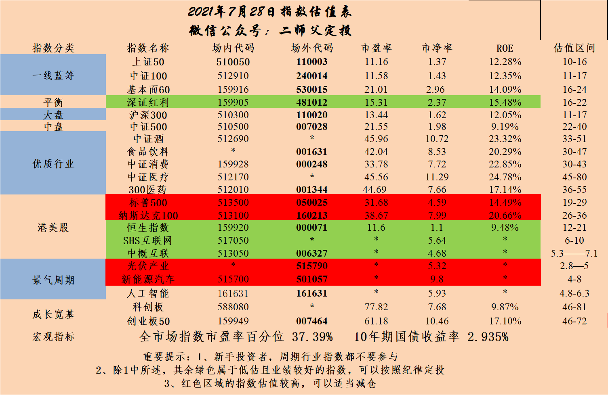

======================================================

_type: talk
@二师父[28814221155551]
2021-07-30 22:02:45 Fri  
topic_id: 185244848418412

<e type="hashtag" hid="552114551414" title="#估值数据#" /> 市盈率百分位39.75%，SY-BY百分位36.68%，SY/BY百分位32.8%。

估值数据继续下行，按照纪律定投，同时做好风控。目前大金融板块持续下跌，加息预期不高，易方达金融反弹以后可以出了。主要定投的方向就是医疗和科创50。

@样 at 2021-07-30 22:02:45 Fri

> 消费呢？二师父，放弃消费了吗？

----------

@二师父 at 2021-07-30 22:02:45 Fri

> 消费也不行了，等跌到低估再考虑定投

----------

阅读[1]  评论[2]  赞[0] 

======================================================

_type: talk
@二师父[28814221155551]
2021-07-31 10:54:36 Sat  
topic_id: 418455121424858

<e type="hashtag" hid="15288588524822" title="#芯片的估值#" /> 芯片指数关注H30007,对应基金汇添富芯片ETF和天弘芯片指数。

当前芯片指数市盈率109，市盈率分位点97.54%，市净率10.54，市净率百分位100%，股息率0.16，分位点0.7%。支撑芯片上涨的唯一动力就是高业绩增长和机构资金腾挪，对于这种估值，是上天了。

机构预测芯片2021年利润66.91%，22年利润32.79%，没法支撑目前这种高估值，如果参与的话就是右侧买入，回落止损，上涨后择机卖出。

左侧交易就不需要参与了，当前投资机会很少，光伏、新能源、芯片可能是这轮牛市最大的泡沫，我选择避开，轻仓定投医疗，确定性高，估值相对其他板块低，受益于疫情上涨可以收割利润，回调继续定投，重仓机会目前没有。

@马明谦 at 2021-07-31 10:54:36 Sat

> 跟着师傅有肉吃！

----------

阅读[1]  评论[1]  赞[0] 

======================================================

_type: talk
@庆余年[15584481824122]
2021-07-31 17:17:30 Sat  
topic_id: 218522118554851

主动基金排行榜单

阅读[1]  评论[0]  赞[0] 

+++++++++++++++++++++++++++++++++++++++++++++++++++++

文件：
2021-07-31 17:17:08 Sat
文件大小：[228876]
111184858884282-基金排行-第八期.docx

======================================================

