_type: talk
@二师父[28814221155551]
2021-12-01 15:35:18 Wed  
topic_id: 185514888442112

微商大佬翻车，大变革时代，一定要低调。

贵而不显，华而不炫，不咄咄逼人，不居高临下，是一种低调和善良。

@阝東 at 2021-12-01 15:35:18 Wed

> 要税收了，那要是人家大笔钱转来转去，那不是亏大了

----------

@JOY at 2021-12-01 15:35:18 Wed

> 历史总是惊人的相似～

----------

阅读[1]  评论[2]  赞[0] 

+++++++++++++++++++++++++++++++++++++++++++++++++++++

图片：
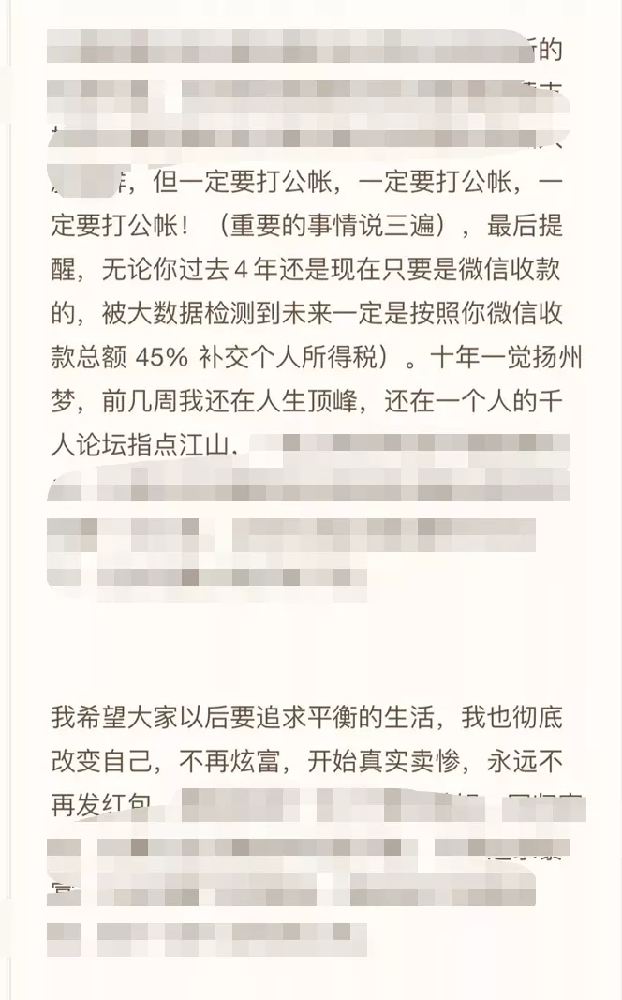
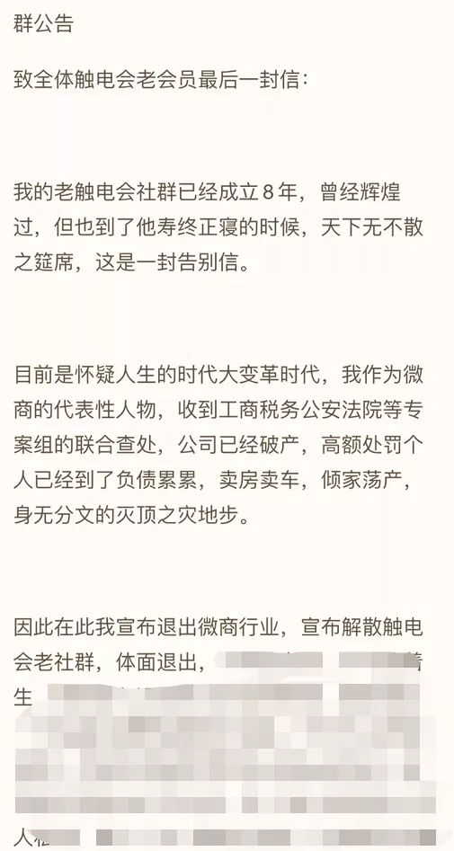

======================================================

_type: talk
@二师父[28814221155551]
2021-12-01 20:49:43 Wed  
topic_id: 581144224582144

<e type="hashtag" hid="28855555482511" title="#关于港股的分析#" /> 港股有机会吗

@坚持学习 at 2021-12-01 20:49:43 Wed

> 二师父，我持有恒生互联513330，目前亏33%，这个咋搞呢[流泪][流泪][流泪]

----------

@二师父 at 2021-12-01 20:49:43 Wed

> 仓位在百分之20以内拿着，仓位太多了减仓

----------

@坚持学习 at 2021-12-01 20:49:43 Wed

> 好的，谢谢二师父，没到20%。

----------

@cotton at 2021-12-01 20:49:43 Wed

> 今天发车吗

----------

@二师父 at 2021-12-01 20:49:43 Wed

> 发车的

----------

@cotton at 2021-12-01 20:49:43 Wed

> 没看你发呀。二师傅

----------

@二师父 at 2021-12-01 20:49:43 Wed

> 发了，你看看之前消息

----------

@cotton at 2021-12-01 20:49:43 Wed

> 那我明天买咯？

----------

阅读[1]  评论[13]  赞[0] 

+++++++++++++++++++++++++++++++++++++++++++++++++++++

文件：
2021-12-01 20:49:27 Wed
文件大小：[46342]
844121252512282-港股是机会还是坑.docx

======================================================

_type: talk
@七[28885284245881]
2021-12-01 20:54:44 Wed  
topic_id: 418822442512458

请问现在哪里可以看到实盘？

@二师父 at 2021-12-01 20:54:44 Wed

> 天天基金和星球

----------

阅读[1]  评论[1]  赞[0] 

======================================================

_type: talk
@二师父[28814221155551]
2021-12-01 20:57:19 Wed  
topic_id: 218844554211111

<e type="hashtag" hid="552114551414" title="#估值数据#" /> 市盈率百分位37.44%，市净率百分位32.7%，SY-BY百分位36.24%。

明天继续定投，红利+基建+1000是主要方向，1000已经盈利，就剩红利和基建了，场内是电器，明年就靠这几只基金啦，持续积累，坐等跨年行情。

@吃肉肉 at 2021-12-01 20:57:19 Wed

> 电器的逻辑可以讲下吗？

----------

@二师父 at 2021-12-01 20:57:19 Wed

> 属于超跌板块，如果新能源崩盘，会有资金承接，家电会得到资金青睐

----------

@吃肉肉 at 2021-12-01 20:57:19 Wed

> 好的，谢谢。

----------

@小牧童 at 2021-12-01 20:57:19 Wed

> 师父为啥一定会到家电呢？

----------

@二师父 at 2021-12-01 20:57:19 Wed

> 资金都是很聪明的，哪些板块有超额收益就会流动，无论是基建还是地产，对家电都有需求，而且他已经超跌百分之30，可以逐步定投了

----------

@小牧童 at 2021-12-01 20:57:19 Wed

> 👌谢谢

----------

阅读[1]  评论[6]  赞[0] 

======================================================

_type: talk
@小鱼[241182222251181]
2021-12-02 09:47:46 Thu  
topic_id: 581181558218214

今天不投吗

@二师父 at 2021-12-02 09:47:46 Thu

> 投

----------

阅读[1]  评论[1]  赞[0] 

======================================================

_type: talk
@二师父[28814221155551]
2021-12-02 09:49:55 Thu  
topic_id: 418818551458458

<e type="hashtag" hid="51288882114544" title="#周四发车#" /> 乌龟计划和海外打猎，天天基金已经发车，鳄鱼计划买入基建两份，家电两份，代码置顶五步定投法里面有。

@DY🍉 at 2021-12-02 09:49:55 Thu

> 不买红利吗？鳄鱼计划

----------

@二师父 at 2021-12-02 09:49:55 Thu

> 不买

----------

@蓝精灵 at 2021-12-02 09:49:55 Thu

> 师父，在场内买基建工程LOT，提示风险协议未签署成功，是不能买嘛！谢谢

----------

@二师父 at 2021-12-02 09:49:55 Thu

> 可以买，签署下风险协议

----------

@蓝精灵 at 2021-12-02 09:49:55 Thu

> 谢谢师父

----------

@西锦巴乌 at 2021-12-02 09:49:55 Thu

> 师父：海外打猎在天天基金中查找组合的具体名称是什么？谢谢了

----------

@二师父 at 2021-12-02 09:49:55 Thu

> 

----------

@cotton at 2021-12-02 09:49:55 Thu

> 好的

----------

阅读[1]  评论[8]  赞[0] 

======================================================

_type: talk
@二师父[28814221155551]
2021-12-02 10:09:04 Thu  
topic_id: 185585448515412

中证1000，基建，红利分着来，底仓已经建立，定投到百分之10到20仓位停止，或者不再低估，盈利后停止定投

方向很对，明年新能源大概率不会再涨了，转向价值板块，慢慢布局。

@坚持学习 at 2021-12-02 10:09:04 Thu

> 二师父，证券指数040069，这个拿着吗，还是什么时候卖呢？
中国互联，场内1.37，要加吗？

----------

@二师父 at 2021-12-02 10:09:04 Thu

> 等市场阶段狂热的时候

----------

@J at 2021-12-02 10:09:04 Thu

> 师父，消费医疗属于价值板块吗

----------

@二师父 at 2021-12-02 10:09:04 Thu

> 属于成长板块，成长组合配置的都是成长板块

----------

@Philip🎭 Y at 2021-12-02 10:09:04 Thu

> 这是乌龟的吗？

----------

@二师父 at 2021-12-02 10:09:04 Thu

> 前面有发的

----------

@What if at 2021-12-02 10:09:04 Thu

> 错过上车，现在中证1000和红利现在还能建底仓嘛

----------

阅读[1]  评论[7]  赞[0] 

======================================================

_type: q&a
@小鱼[241182222251181]
2021-12-02 10:14:53 Thu  
topic_id: 818818221844442

@小鱼

>  今天不发车了吗，还是不能公布啦

@二师父

>  发了，天天基金可以看到场外的，场内的直接在星球看

阅读[1]  评论[8]  赞[0] 

======================================================

_type: talk
@从A到Z[414841151821548]
2021-12-02 11:15:30 Thu  
topic_id: 581181542255284

师傅，今天发车吗

阅读[1]  评论[0]  赞[0] 

======================================================

_type: talk
@二师父[28814221155551]
2021-12-02 11:26:34 Thu  
topic_id: 218818245882111

发车了，大家关注天天基金，会有通知的

@Philip🎭 Y at 2021-12-02 11:26:34 Thu

> 乌龟？ 我上不去天天…境外证件不让注册

----------

@衣袂飘香 at 2021-12-02 11:26:34 Thu

> 看到了，跟了。

----------

@DY🍉 at 2021-12-02 11:26:34 Thu

> 师父，如果跟乌龟计划是不是最好全部跟？鳄鱼计划也要全部跟？

----------

@二师父 at 2021-12-02 11:26:34 Thu

> 资金充足可以

----------

阅读[1]  评论[4]  赞[0] 

+++++++++++++++++++++++++++++++++++++++++++++++++++++

图片：
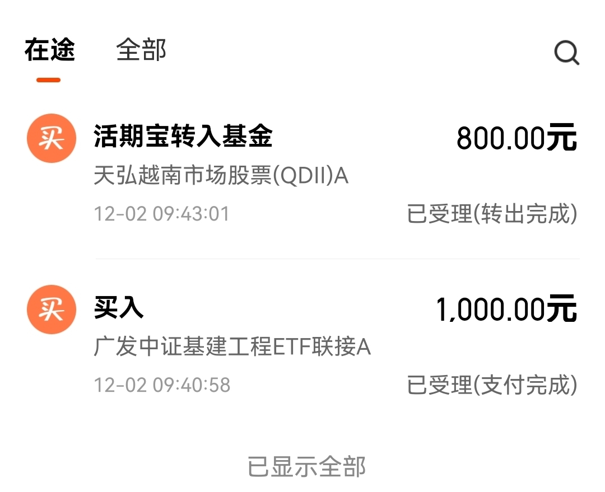

======================================================

_type: q&a
@Zyxj[111841455151112]
2021-12-02 11:29:47 Thu  
topic_id: 581181542115854

@Zyxj

>  今天天天基金的投资记录查不到，不能再星球上公布吗？

@二师父

>  发了的

阅读[1]  评论[0]  赞[0] 

======================================================

_type: talk
@那方山的树，佛陀座下*[244412158214221]
2021-12-02 17:20:20 Thu  
topic_id: 185585418454252

二师傅，场内某股票已经翻倍，明天打算清仓卖出，但是短期没有可替换的个股，资金暂时一部分想买债券，一部分用作基金定投……麻烦推荐一下那种不会亏损的场内购买的债券，谢谢了！

@二师父 at 2021-12-02 17:20:20 Thu

> 国债逆回购，我设定的自动购买，收益率还可以

----------

@小东 at 2021-12-02 17:20:20 Thu

> 我想设置自动购买，但每次都是显示人员已满，是怎么回事呢

----------

@二师父 at 2021-12-02 17:20:20 Thu

> 换个券商，华泰我也设定不了

----------

@小东 at 2021-12-02 17:20:20 Thu

> 好的，谢谢

----------

@那方山的树，佛陀座下* at 2021-12-02 17:20:20 Thu

> 谢谢二师傅

----------

@勇气永存 at 2021-12-02 17:20:20 Thu

> 求教二师父，国债逆回购收益率一般百分之几比较划算？

----------

@二师父 at 2021-12-02 17:20:20 Thu

> 选最高的2.3以上

----------

阅读[1]  评论[7]  赞[0] 

======================================================

_type: talk
@二师父[28814221155551]
2021-12-02 17:47:10 Thu  
topic_id: 185585418485422

天天基金关注二师父定投，关注组合，发车可以看到，后面发车微博和天天和星球都会发的。星球到期不再续费，以后有问题天天或者微博提问就行啦，谢谢大家支持，持续陪伴，一起共同富裕。

@一叶秋末ヾ at 2021-12-02 17:47:10 Thu

> 星球到期不再续费，什么意思啊。以后就不管理星球了吗？

----------

@二师父 at 2021-12-02 17:47:10 Thu

> 管理，到今年最后一个成员到期就停止了

----------

@二师父 at 2021-12-02 17:47:10 Thu

> 明年2022年

----------

@一叶秋末ヾ at 2021-12-02 17:47:10 Thu

> 哦，那等2022年星球停止管理了，鳄鱼计划发车在微博能看到吗。

----------

@二师父 at 2021-12-02 17:47:10 Thu

> 能的

----------

@一叶秋末ヾ at 2021-12-02 17:47:10 Thu

> 好的，谢谢。

----------

@衣袂飘香 at 2021-12-02 17:47:10 Thu

> 哎呀，很意外，那以后鳄鱼计划发车，到哪里去找是二师父呢？

----------

@二师父 at 2021-12-02 17:47:10 Thu

> 天天基金

----------

阅读[1]  评论[15]  赞[0] 

+++++++++++++++++++++++++++++++++++++++++++++++++++++

图片：

======================================================

_type: talk
@二师父[28814221155551]
2021-12-02 20:59:30 Thu  
topic_id: 818818212428242

中信证券报告可以反着看，白酒的投资机会可能要来了。

星球还会持续运行一年，不过关闭续费了，大家别担心，我没有打算退出，只是现在监管严格，根据我对政策的理解，对理财教育的监管还会持续，所以星球大概是以后重点监管对象，不太喜欢打擦边球，所以提早体面退出。

那么对于做投资者教育这件事情，一直是理想，很显然现在创业这个方向是非常不好的，我判断还是正确，没有入场这个赛道，以后投资理财分享更多会在星球、公众号、网上一些平台。

除非监管发文明确表示，禁止谈论一切投资教育言论，否则我会一直做下去的，也会一直陪伴。

我看问题一般会比较远，俞敏洪张邦鑫都这样了，你说还有什么不可能，和投资一样，做最坏的打算，做最好的准备。无论怎样，都要开心地度过每一天。然后持续成长，坚持为他人贡献价值，帮助别人本身是一件开心的事，日行一善，会更开心。

至于财富，不强求，每个人的命格不同，财富容纳度不同，如果只有1000万的命格，给一个亿的财富，可能就得出事，随缘就好。

@苍天有井明月空🌙 at 2021-12-02 20:59:30 Thu

> 七八万的白酒看完瑟瑟发抖

----------

@二师父 at 2021-12-02 20:59:30 Thu

> 中信证券确实反指，不过白酒属于长牛板块，长期不用资金倒还好。

----------

@苍天有井明月空🌙 at 2021-12-02 20:59:30 Thu

> [强][强][强]

----------

@苍天有井明月空🌙 at 2021-12-02 20:59:30 Thu

> 鳄鱼发车以后怎么办啊

----------

@二师父 at 2021-12-02 20:59:30 Thu

> 天天基金和微博发车

----------

@二师父 at 2021-12-02 20:59:30 Thu

> 星球发到明年底

----------

@雪莲 at 2021-12-02 20:59:30 Thu

> 二师父您好，微博上怎样才能找到您呢？

----------

@二师父 at 2021-12-02 20:59:30 Thu

> 二师父定投

----------

阅读[1]  评论[18]  赞[0] 

+++++++++++++++++++++++++++++++++++++++++++++++++++++

文件：
2021-12-02 20:52:43 Thu
文件大小：[47423]
844121225524812-一个反向指标给出的机会.docx

======================================================

_type: talk
@二师父[28814221155551]
2021-12-02 21:20:57 Thu  
topic_id: 218818212148521

<e type="hashtag" hid="552114551414" title="#估值数据#" /> 市盈率百分位38.04%，SY-BY百分位37.4%，SY/BY百分位33.89%。

以后再加一个可转债估值数据，可转债中位数百分位99.79%，这个是评估可转债昂贵程度的指标。也是越低可转债越便宜，转债ETF目前盈利大概11%，因为现金还没有全部投资出去，现在利率低位，持有太多现金贬值很快，所以暂时不卖出，等现金全部买完之后再考虑卖出可转债ETF。

可转债也可以投资，思路就是100元以下和到期收益率3%以上，或者双低转债，当前太过于火热，对于高价转债适当可以卖出不用参与了。

@样 at 2021-12-02 21:20:57 Thu

> 二师父能具体讲讲成长组合选基逻辑，加仓和再平衡原则吗？

----------

@二师父 at 2021-12-02 21:20:57 Thu

> 选择优质赛道，行业没有到头的，不会平衡，长期持有到泡沫卖出

----------

@cotton at 2021-12-02 21:20:57 Thu

> 二师父，我看到天天基金乌龟组合您有19只基金，每周四，这19只您都买吗？

----------

@二师父 at 2021-12-02 21:20:57 Thu

> 不是啊，每次只买一到二只

----------

@cotton at 2021-12-02 21:20:57 Thu

> 自己决定买哪一两只吗

----------

@二师父 at 2021-12-02 21:20:57 Thu

> 我会发车的

----------

阅读[1]  评论[6]  赞[0] 

======================================================

_type: talk
@二师父[28814221155551]
2021-12-03 11:36:40 Fri  
topic_id: 418818288824458

经过今天上涨，场外基建，1000全部盈利，场内1000盈利，接下来继续场外红利，场内基建红利定投，底仓加定投方向对了，盈利就是时间问题

基建跌了5年，涨了一个月，这不叫追涨，这是低吸。涨起来盈利也不吸了，千万不能我发车的时候观望，涨起来我准备卖的时候你再来问能不能建底仓。

白酒预计下周出货，盈利百分之20，如果有耐心，不贪心，大致都会盈利的

@DY🍉 at 2021-12-03 11:36:40 Fri

> 师父，既然场内场外都在买红利，基建和1000，为什么要分开？不是直接选择在场内或者场外买

----------

@二师父 at 2021-12-03 11:36:40 Fri

> 因为我比较喜欢场内投资，而之前只有场外做实盘，所以场外开了一个，你也可以只场内买，一样的，费率还低

----------

@DY🍉 at 2021-12-03 11:36:40 Fri

> 好的，就是看的有点蒙，谢谢师父

----------

@林玮 at 2021-12-03 11:36:40 Fri

> 师父，场内有个最低5元的费用，买不多成本就高了

----------

阅读[1]  评论[4]  赞[0] 

======================================================

_type: talk
@二师父[28814221155551]
2021-12-03 11:54:49 Fri  
topic_id: 218818488245541

乌龟计划里面不是每个都买，比如中概，计划跌到1.2再买，跌不到就停止了。我8月的视频也讲过，到不到不知道，到了的话即使阿里退市也会买中概，指数不死，这才是守护信仰，而不是傻傻地把每月工资扔进去连水花都没有。

@苍天有井明月空🌙 at 2021-12-03 11:54:49 Fri

> 1.3建个底

----------

@以古论今 at 2021-12-03 11:54:49 Fri

> 1.3是什么

----------

阅读[1]  评论[2]  赞[0] 

======================================================

_type: talk
@二师父[28814221155551]
2021-12-03 21:14:31 Fri  
topic_id: 818818424225512

<e type="hashtag" hid="28855552418241" title="#价值指数#" /> 市盈率低的就是价值指数，不确定是反弹还是上行，总之涨起来就停止，如果回调再买，永远低吸不追涨。

@蓝精灵 at 2021-12-03 21:14:31 Fri

> 师父，那红利、基建、1000还能继续定投嘛？谢谢

----------

@二师父 at 2021-12-03 21:14:31 Fri

> 基建红利可以

----------

阅读[1]  评论[2]  赞[0] 

+++++++++++++++++++++++++++++++++++++++++++++++++++++

文件：
2021-12-03 21:13:39 Fri
文件大小：[47221]
422151528412518-价值指数开涨.docx

======================================================

_type: talk
@二师父[28814221155551]
2021-12-04 07:45:43 Sat  
topic_id: 818818442185822

中概股大跌，需要注意风险，很快就到1.2的补仓价格了。市场总会奖励有耐心的人。

@DY🍉 at 2021-12-04 07:45:43 Sat

> [撇嘴][撇嘴]师父，我1.45买的，是定投拉低成本，还是卧倒不动。

----------

@二师父 at 2021-12-04 07:45:43 Sat

> 计划1.2买，你刚入市最好不买行业

----------

@DY🍉 at 2021-12-04 07:45:43 Sat

> 加入星球前买的～已经套住了

----------

@清风流云 at 2021-12-04 07:45:43 Sat

> 二师父你好，这里的1.2是指什么？

----------

@二师父 at 2021-12-04 07:45:43 Sat

> 净值

----------

@一心一意 at 2021-12-04 07:45:43 Sat

> 溢价率这么高，可不可以把场内的卖出，同一天在场外买入呢

----------

@柔软时光 at 2021-12-04 07:45:43 Sat

> 我记得前不久二师父定投中还有中概呀？

----------

@二师父 at 2021-12-04 07:45:43 Sat

> 有啊

----------

阅读[1]  评论[8]  赞[0] 

+++++++++++++++++++++++++++++++++++++++++++++++++++++

文件：
2021-12-04 07:45:03 Sat
文件大小：[48908]
422151522121248-血流成河.docx

======================================================

_type: talk
@二师父[28814221155551]
2021-12-04 10:29:46 Sat  
topic_id: 581181444412414

中概这个净值到1.2，建议大家别买了，下方无支撑，利空不断，a股几千只基金没必要和这个硬杠，每个人心理承受能力不同

@云云 at 2021-12-04 10:29:46 Sat

> 场内都清仓吗？还是先放着

----------

@二师父 at 2021-12-04 10:29:46 Sat

> 仓位不重拿着就行

----------

@范毅君 at 2021-12-04 10:29:46 Sat

> 二师父，那手上的中概后面是持有，还是清仓

----------

@二师父 at 2021-12-04 10:29:46 Sat

> 仓位不重持有

----------

@范毅君 at 2021-12-04 10:29:46 Sat

> 好的，凑合，不太多[捂脸]

----------

@云云 at 2021-12-04 10:29:46 Sat

> 好的，不重

----------

@苍天有井明月空🌙 at 2021-12-04 10:29:46 Sat

> 破1考虑吗，哈哈

----------

@二师父 at 2021-12-04 10:29:46 Sat

> 1.2我就会买了

----------

阅读[1]  评论[16]  赞[0] 

+++++++++++++++++++++++++++++++++++++++++++++++++++++

图片：
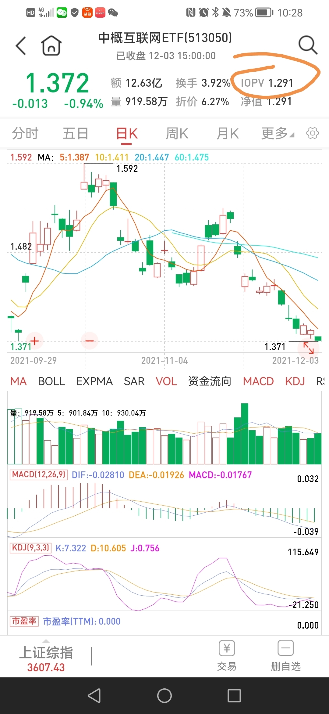

======================================================

_type: q&a
@静[244148554842811]
2021-12-04 14:31:25 Sat  
topic_id: 218818441445581

@静

>  二师父如果可以接受回撤，可以长期定投纳斯达克100和标普500吗？如果定投哪个更优？

@二师父

>  纳斯达克，看你能经受多大级别回撤，纳斯达克历史最大跌幅是百分之78，能接受的话就能长期定投

阅读[1]  评论[1]  赞[0] 

======================================================

_type: talk
@二师父[28814221155551]
2021-12-04 14:37:51 Sat  
topic_id: 818818418241252

大家好，我是说在美股上市的中概股股票需要卖出，也就是你在美股账户买的需要卖，中概基金如果仓位百分之10以内是长期不用的钱是可以不卖的，跌下来会继续买入

阅读[1]  评论[0]  赞[0] 

======================================================

_type: talk
@二师父[28814221155551]
2021-12-04 21:03:03 Sat  
topic_id: 218818414211251

鳄鱼计划目前仓位58%，接下来现金补仓，前期已经做了防守，现金不足的，可以卖出债券补仓了。很多人不理解为什么要买一堆债券，现在大家明白了吧，今年很多股票是大跌的，而债券还能够实现5%以上的收益率，可转债基金实现了10%以上的收益率，很不错了。

关于中概，首先如果严格复制我的仓位，目前场外乌龟计划仓位只有4.4%，场内鳄鱼计划仓位只有4%，都是轻仓，接下来就是继续投了，我只能说我的操作，大家根据实际情况来，每个人的承受能力是不同的哈。

那么接下来怎么投，预计周一如果大跌，互联网50ETF到了0.7开始买入一份，然后网格加仓，跌到0.65买入一份，跌到0.6买入一份，从这个位置还能跌40%的话就一次大批量买入。中概因为有溢价所以先放着，不再买入。

一个很差的品种也会买，就是格雷厄姆捡垃圾思维，控制仓位10%以内，网格加仓，就不用怕。

最糟糕的是，今年年初没有止盈互联网的，当时我们是场内卖出一半，中概跌到1.65双减政策到来溢价超高的时候全部清仓，现在看是正确的，永远不要让自己在曾经赚钱的基金上亏钱。

贪婪是个很危险的东西，抄底也是贪婪，钱是赚不完的，好好活着才重要，希望未来无论发生什么危机，你都在场。

重温16字方针：全面配置，低估定投，正常收割，高估卖本。如果做了全面配置，现在跌了也不怕，我美股是满仓的，但是相对于总仓位可控，就算再来一次金融危机，也扛得住，这就是全面配置的优势。

侠之大者，为国护盘，网格买入，涨跌随缘。我们只能够做我们能做的，其他的交给时间和命运。

@DY🍉 at 2021-12-04 21:03:03 Sat

> 师父：债卷的买卖也是按照16字方针吗？还是其他方法

----------

@二师父 at 2021-12-04 21:03:03 Sat

> 利率和通胀下行的时候配置

----------

@DY🍉 at 2021-12-04 21:03:03 Sat

> 不是说利率和债卷成反比吗？为啥是利率下行时候配置？

----------

@二师父 at 2021-12-04 21:03:03 Sat

> 利率下行时候债券是涨的，上行跌，当然下行前配置好

----------

@DY🍉 at 2021-12-04 21:03:03 Sat

> 哦我反应过来了，利率下行是利率从高降到低的过程～所以其实还是应该在利率高的时候买是吗？

----------

@二师父 at 2021-12-04 21:03:03 Sat

> 是的

----------

@DY🍉 at 2021-12-04 21:03:03 Sat

> 好的，谢谢师父，还有能不能发一个华泰的开户链接，我找到之前的链接不知道是过期了还是怎么，点进去显示不行

----------

@衣袂飘香 at 2021-12-04 21:03:03 Sat

> 二师父好！我记得你说过，是把5年的资金，分成250份，投资鳄鱼，并且暂时不增加资金，是这样分配的吗？

----------

阅读[1]  评论[15]  赞[0] 

+++++++++++++++++++++++++++++++++++++++++++++++++++++

图片：
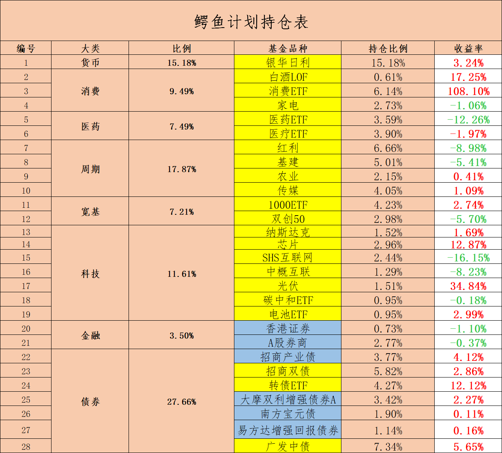

======================================================

_type: talk
@二师父[28814221155551]
2021-12-05 11:38:07 Sun  
topic_id: 418815484414448

<e type="hashtag" hid="28855554584151" title="#经济周期分析#" /> 为什么衰退期还适合投资，15年经济也是下行，不过宏观杠杆率提高，流动性宽裕，推动了牛市。股市的走势不仅仅取决基本面，资金和供需也会有影响。

阅读[1]  评论[0]  赞[0] 

+++++++++++++++++++++++++++++++++++++++++++++++++++++

文件：
2021-12-05 11:37:07 Sun
文件大小：[49148]
422151511522458-来了一个更重磅的.docx

======================================================

_type: talk
@二师父[28814221155551]
2021-12-05 16:40:42 Sun  
topic_id: 581185211454214

投资中什么是最重要的事情，我觉得是不贪心，赚了就知足，已经盈利一倍的品种，再反手补仓越跌越买给做亏了，不是基金不行，哪怕一次只有10%的利润，积少也能成多。

阅读[1]  评论[0]  赞[0] 

======================================================

_type: talk
@DY🍉[241551422851141]
2021-12-05 16:59:43 Sun  
topic_id: 418815488155428

请为各位：场内开户链接在哪里啊？基金是怎么收费的？

@二师父 at 2021-12-05 16:59:43 Sun

> 去券商开就行

----------

@DY🍉 at 2021-12-05 16:59:43 Sun

> 不是说有链接可以有优惠吗？

----------

@二师父 at 2021-12-05 16:59:43 Sun

> 现在不让合作了，我可以推客户经理给你

----------

@DY🍉 at 2021-12-05 16:59:43 Sun

> 好的，麻烦师父推一个

----------

@二师父 at 2021-12-05 16:59:43 Sun

> 你加微信ershifudt

----------

阅读[1]  评论[5]  赞[0] 

======================================================

_type: talk
@二师父[28814221155551]
2021-12-05 22:14:32 Sun  
topic_id: 818812525182122

说说这次阿里投资的体会，这次投资阿里是捡垃圾思维，我判断阿里在这个位置非常安全了，所以买入了阿里，并且马云即使离开了，阿里也不错。

不过上周五发生的事情还是给自己上了一课，中概股集体退市，因为我在美股账户买的美股阿里，所以退市风险还是很大。这种时候只能选择卖出，本来已经卸载账户长期持有，然而发生了这件事还是打开账户准备应对。如果我是港股通买的阿里，这个位置肯定不卖，只是美股买的，就警惕了，也许卖出后又涨了回来，不过这不再止损范围考虑内，我也没办法与大家说自己投资的股票是否止损，总之，买股票设定止损位是必要的，尤其是有退市风险的股票。

目前其他美股都还好，就是阿里血亏18%，明天计划跑路。

投资的风险无时不在，风控第一位，保证自己亏损后不影响生活就行。

至于中概基金，目前仓位还不重，继续持有，而且我算了算，等中概在这个位置涨45%我就盈利了。既然如此，耐心拿着就行。

但是切记不要抄底，08年最惨的不是山顶站岗的，而是下跌途中抄底的，基本上抄到最后很多人认为A股要推到重来了，才到达底部。所以敬畏市场。

还是组合好，四个组合建仓以来均为正收益，安心稳健增值，博弈资金一定要是能够承受亏损的，而大额资金需要做好配置，慢慢增值。

@杜志彪 at 2021-12-05 22:14:32 Sun

> 做对的操作，控制风险第一位。

----------

@cotton at 2021-12-05 22:14:32 Sun

> 中概的全部卖了吗

----------

@cotton at 2021-12-05 22:14:32 Sun

> 可以拿着是吗。。

----------

@二师父 at 2021-12-05 22:14:32 Sun

> 卖阿里，基金还没有

----------

@二师父 at 2021-12-05 22:14:32 Sun

> 基金可以，美股中概股别拿了

----------

@cotton at 2021-12-05 22:14:32 Sun

> 我没有股票。。

----------

阅读[1]  评论[6]  赞[0] 

======================================================

_type: q&a
@阿宝[422212151424158]
2021-12-05 23:07:02 Sun  
topic_id: 418815458855218

@阿宝

>  老师你好，请教你两个问题。我觉得未来可选消费、医疗、科技是大的方向，对应可选消费、医疗、科技的指数基金有哪些？对应的优质主动管理基金又有哪些？我的答案如下：一、对应的指数基金：广发中证全指可选消费（001133）阀值18～26；华宝中证医疗（162412）阀值55～75；易方达科创50（011608）阀值50～80
>  二、对应的主动基金。易方达消费精选（009265）工银前沿医疗股票A（001717）；广发创新升级混合（002939），不足之处，希望得到老师的指导。谢谢！

@二师父

>  农银新能源，医疗低估阈值42，没有那么高，过去是因为预期推升了市盈率。
>  
>  高端制造方向也可以关注下，还有光伏。

阅读[1]  评论[1]  赞[0] 

======================================================

_type: talk
@二师父[28814221155551]
2021-12-06 09:08:01 Mon  
topic_id: 218812545528121

中概一直有买哈，左边是网格的，之前买了2万走了，右边是鳄鱼计划，中长线，a股投资很灵活，来投资的目的是赚钱的，不是搞理论教条的。

很多人抨击中概，殊不知我们已经赚了一波高点走人开始第二波了，别搞终身持有，就是巴菲特最近也在大甩卖，能接受亏损就买，不能接受就买沪深300即可，没有那么复杂。

关键是沪深300长期年化只有百分之8，大部分人忍不住不买高风险的，既然要高收益，必然承受风险，不可能高收益低风险。关键在于如何识别风险，然后应对。

投资以我鳄鱼计划，乌龟计划发车为准，我说了买不一定买，正如你媳妇答应你求婚了，没领证他也不算你结婚了，只有领证了才算，只有我说买入下单，那就是买了。计划是可能变得。

比如我一直计划靠右行驶，现在对方来了一辆大卡车，然后你还会说我按照计划行驶吗，肯定不会了。

@雾海 at 2021-12-06 09:08:01 Mon

> 中橄一直跌不停。负28％了[流泪]

----------

@柔软时光 at 2021-12-06 09:08:01 Mon

> 传媒ETF也跌跌不休，该如何处理？

----------

@二师父 at 2021-12-06 09:08:01 Mon

> 拿着，反弹收割利润

----------

@柔软时光 at 2021-12-06 09:08:01 Mon

> 好

----------

@坚持学习 at 2021-12-06 09:08:01 Mon

> 二师父，我的中概是负的，负责20%多，还能做网格吗？还是一直拿着呢，等回本卖出呢？

----------

@二师父 at 2021-12-06 09:08:01 Mon

> 拿着等盈利百分之10再收割利润，我计划分批补仓，风险很大，仅供参考

----------

阅读[1]  评论[6]  赞[0] 

+++++++++++++++++++++++++++++++++++++++++++++++++++++

图片：
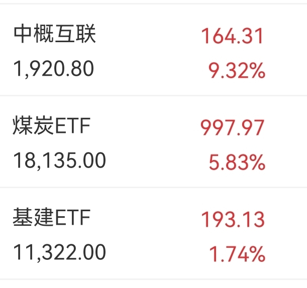
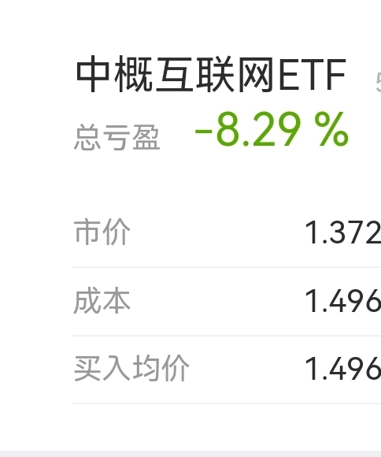

======================================================

_type: talk
@二师父[28814221155551]
2021-12-06 09:39:02 Mon  
topic_id: 818812545248512

乌龟计划，买入招商中证银行（161723）5000元，鳄鱼计划，买入银行etf（512800）10份

@DY🍉 at 2021-12-06 09:39:02 Mon

> 今天买吗？不是周四？

----------

@范毅君 at 2021-12-06 09:39:02 Mon

> 银行现在由转优质转银行etf的原因，是这个风险小，还是两个都可以参与

----------

@二师父 at 2021-12-06 09:39:02 Mon

> 都买了，股票我买的招行

----------

@二师父 at 2021-12-06 09:39:02 Mon

> 我买了

----------

@阿宝 at 2021-12-06 09:39:02 Mon

> 我也在买银行。[呲牙]

----------

@阿宝 at 2021-12-06 09:39:02 Mon

> 我觉得投资一定不能死板。降准，加上银行利润增长都不错，性价比都非常好

----------

@范毅君 at 2021-12-06 09:39:02 Mon

> 好的，谢谢二师父

----------

@蓝精灵 at 2021-12-06 09:39:02 Mon

> 银行etf买入

----------

阅读[1]  评论[10]  赞[0] 

======================================================

_type: talk
@二师父[28814221155551]
2021-12-06 10:34:43 Mon  
topic_id: 218812542444821

注意我说的是卖出美股中概股，不是基金，股票和基金是两回事，基金有底，股票没有。以后不聊股票了，投资模式是不一样的

@小鱼 at 2021-12-06 10:34:43 Mon

> 明年到期了，不能续费了，咋们不能拉个群。再继续吗，感觉还没学到什么，微博里的很多信息跟不上，比如鳄鱼计划的就要错过。

----------

@二师父 at 2021-12-06 10:34:43 Mon

> 没法建群了哈，说不定哪天被人举报了，不划算

----------

@小鱼 at 2021-12-06 10:34:43 Mon

> 嗯嗯，那就微博见[微笑]

----------

@坚持学习 at 2021-12-06 10:34:43 Mon

> 明年不能续费了吗，二师父？

----------

阅读[1]  评论[4]  赞[0] 

======================================================

_type: talk
@二师父[28814221155551]
2021-12-06 22:15:42 Mon  
topic_id: 185584525844112

简单聊聊，没啥大不了的，仓位决定了心态，心态决定了最后是否胜利。

防守了一年，如果真的跌下来，可以慢慢定投了哈，主要方向，低估值的，高股息的。银行从2020年开始放弃，转向消费和医疗，现在看是正确的，而当前阶段，其他板块估值均比较高，而且走主浪跌的趋势，只有高股息板块可能抓到牛市最后一波，抓完了，突破了这轮牛市也就彻底终结了，7年一周期，控制仓位，把握机会。

A股从来没有连续涨3年的，如果发生了连续涨2年的板块，就要小心了。

@DY🍉 at 2021-12-06 22:15:42 Mon

> 师父，我才进入的时候问你准备多少份合适。你说的是50份，因为大盘处于主升浪……和这里说的主浪跌（或者应该是主跌浪）矛盾吗？

----------

@二师父 at 2021-12-06 22:15:42 Mon

> 沪深300是主浪跌，而中证500中证1000，基建中证红利还是主升浪，如果不跌破年线，预计还会升，这也是不建议目前入场300的原因，300一直在年线以下，如果不起来很难有行情的，不同板块不一样的

----------

@DY🍉 at 2021-12-06 22:15:42 Mon

> 好的，谢谢师父

----------

@老孙头 at 2021-12-06 22:15:42 Mon

> 八月视频哪里看？

----------

@二师父 at 2021-12-06 22:15:42 Mon

> 视频号里面

----------

@坚持学习 at 2021-12-06 22:15:42 Mon

> 二师父，沪深300主浪跌，需要停止月定投吗？

----------

@二师父 at 2021-12-06 22:15:42 Mon

> 不需要，他现在跌，你是定投，投完他就起来了

----------

@坚持学习 at 2021-12-06 22:15:42 Mon

> 收到，谢谢二师父

----------

阅读[1]  评论[8]  赞[0] 

+++++++++++++++++++++++++++++++++++++++++++++++++++++

文件：
2021-12-06 22:09:11 Mon
文件大小：[29706]
244121428488541-没什么大不了的事情.docx

======================================================

_type: talk
@二师父[28814221155551]
2021-12-06 23:16:16 Mon  
topic_id: 218812852481121

<e type="hashtag" hid="552114551414" title="#估值数据#" /> 市盈率百分位38.95%，SY-BY百分位36.31%，SY/BY百分位31.59%。估值略有下降。

目前集体回调，仓位低于50%的可以慢慢等回调到位低吸，已经调整一年了，可以开始逐步加码了。年初卸货慢慢加上来。

可转债中位数价格百分位99.26%，可转债高位，回调也考虑逐步止盈，盈利11%还是很可观的。

阅读[1]  评论[0]  赞[0] 

======================================================

_type: talk
@二师父[28814221155551]
2021-12-07 10:24:30 Tue  
topic_id: 818812882822542

<e type="hashtag" hid="881251425252" title="#鳄鱼计划#" /> 清仓白酒，卖出可转债etf两份，均盈利百分之10以上，等待机会再次入场

保证乌龟计划和鳄鱼计划每一只基金卖出都是盈利的。

@Chu at 2021-12-07 10:24:30 Tue

> 停牌了白酒没得卖呀

----------

@Zyxj at 2021-12-07 10:24:30 Tue

> 白酒临时停牌

----------

@二师父 at 2021-12-07 10:24:30 Tue

> 没卖掉，等复牌

----------

@二师父 at 2021-12-07 10:24:30 Tue

> 等复牌

----------

@Chu at 2021-12-07 10:24:30 Tue

> 卖掉了，不知道为啥 1.4元卖了

----------

阅读[1]  评论[5]  赞[0] 

======================================================

_type: talk
@梦的旋律[215252554588481]
2021-12-07 10:26:11 Tue  
topic_id: 581185115154484

白酒基金为什么今天停牌呀？😷😷😷

阅读[1]  评论[0]  赞[0] 

======================================================

_type: talk
@二师父[28814221155551]
2021-12-07 10:29:32 Tue  
topic_id: 581185115145524

白酒停牌了，没注意，等复牌再卖出

@梦的旋律 at 2021-12-07 10:29:32 Tue

> 今天白酒股票涨了好多，那之前买的白酒基金今天停牌了，会跟着股票一起涨嘛[嘿哈]

----------

阅读[1]  评论[1]  赞[0] 

+++++++++++++++++++++++++++++++++++++++++++++++++++++

图片：
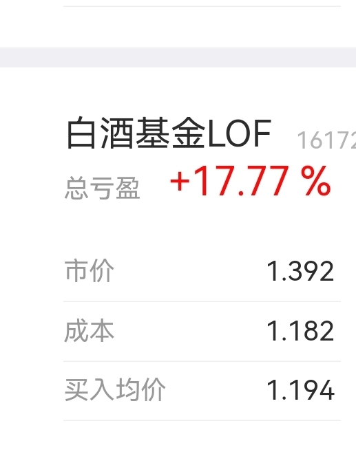

======================================================

_type: talk
@一心一意[844421848411122]
2021-12-07 10:30:41 Tue  
topic_id: 818812882844512

碳中和可以补点么

@二师父 at 2021-12-07 10:30:41 Tue

> 不能，该补的时候我会来的，两份是观察仓，如果不确定不要开黑车哈，碳中和估值很高

----------

阅读[1]  评论[1]  赞[0] 

======================================================

_type: talk
@二师父[28814221155551]
2021-12-07 10:46:10 Tue  
topic_id: 581185115548824

知道我准备卖出，白酒又开始复牌了，已经卖出

@苍天有井明月空🌙 at 2021-12-07 10:46:10 Tue

> 我买的招商白酒也跟着卖吗

----------

@二师父 at 2021-12-07 10:46:10 Tue

> 你有自己的计划就不用

----------

@cotton at 2021-12-07 10:46:10 Tue

> 按兵不动可以吗，所有的基金

----------

@二师父 at 2021-12-07 10:46:10 Tue

> 可以

----------

阅读[1]  评论[4]  赞[0] 

======================================================

_type: q&a
@四海为家[241585882858251]
2021-12-07 20:25:24 Tue  
topic_id: 185584548884822

@四海为家

>  二师傅，早些年大盘股流行的时候，有不少的言语说500或1000都是些经营困难的企业集合体，没有什么投资价值。甚至有某个大咖说，内地的500或1000不值得投资，真的要投资中小盘，投资香港的华宝什么大小。我想问的是，内地的500或1000到底值不值得投资，如果可以投资，500或1000相对来说哪个比较有价值！

@二师父

>  这个主要看资金面和基本面，500和1000里面股票在19年确实经营不善，而500里面股票在21年利润受益于原材料上涨，利润不错，而今年1000是因为踏了中小企业发展风口，关键在于逻辑是否成立，没有绝对的投与不投，300的价值很高，但是没有资金助推，依然不会大涨
>  
>  价值是变化的，10年前房子有价值，现在价值就没那么高，需要把握背后的本质，而不能一根筋认为有价值或者没价值

阅读[1]  评论[0]  赞[0] 

======================================================

_type: q&a
@隔窗遥望[241884481854181]
2021-12-07 22:16:25 Tue  
topic_id: 581185545881484

@隔窗遥望

>  海外打猎组合现在可以定投吗？

@二师父

>  持续定投，净值为正停止

阅读[1]  评论[2]  赞[0] 

======================================================

_type: talk
@二师父[28814221155551]
2021-12-08 06:37:39 Wed  
topic_id: 218812241485151

估值数据，市盈率百分位37.18%，SY-BY百分位35.06%，SY/BY百分位30.111%

美股走势还是不错，阿里我闪人了，主要是有退市风险，这个以后和大家详聊，其他美股继续持有，海外组合是否可以买，净值低于1可以轻仓定投，无论是美股还是越南指数都在高位，而未来是前景广阔的，那就可以逐步轻仓定投积累，当然回撤会大，只要将资金分散，别抄底就行。

阅读[1]  评论[0]  赞[0] 

======================================================

_type: talk
@一心一意[844421848411122]
2021-12-08 07:26:27 Wed  
topic_id: 218812241185221

成长组合，在天天基金里搜哪个名字，怎么一直找不到啊？乌龟计划不是成长组合吧

@二师父 at 2021-12-08 07:26:27 Wed

> 搜索二师父定投，然后点组合

----------

@一心一意 at 2021-12-08 07:26:27 Wed

> 

----------

@一心一意 at 2021-12-08 07:26:27 Wed

> 没有啊

----------

@二师父 at 2021-12-08 07:26:27 Wed

> 再搜就有了

----------

阅读[1]  评论[4]  赞[0] 

======================================================

_type: talk
@小不点儿点😘[244188242844481]
2021-12-08 09:52:29 Wed  
topic_id: 818812212145482

二师父，今天新债可打吗？[呲牙]

@二师父 at 2021-12-08 09:52:29 Wed

> 可转债都可以盲打，全部顶格申购

----------

阅读[1]  评论[1]  赞[0] 

======================================================

_type: talk
@JOY[111881481812422]
2021-12-08 13:16:11 Wed  
topic_id: 218812458848481

师父，请问按目前的情况，放水后又减息，会利空银行么？

@二师父 at 2021-12-08 13:16:11 Wed

> 流动性宽裕，跨周期调节，不用太悲观

----------

@JOY at 2021-12-08 13:16:11 Wed

> 谢谢～

----------

阅读[1]  评论[2]  赞[0] 

======================================================

_type: q&a
@蒋[15528828284222]
2021-12-08 13:40:06 Wed  
topic_id: 581185585511244

@蒋

>  二师傅请问512100场外基金代码吗？我怎么查找不到

@二师父

>  这是场内基金

阅读[1]  评论[0]  赞[0] 

======================================================

_type: talk
@七[28885284245881]
2021-12-08 19:57:26 Wed  
topic_id: 218812485414141

1000etf还能少买点吗

@二师父 at 2021-12-08 19:57:26 Wed

> 建议低吸

----------

阅读[1]  评论[1]  赞[0] 

======================================================

_type: talk
@二师父[28814221155551]
2021-12-08 21:05:36 Wed  
topic_id: 418815288548418

关于降息的解读

阅读[1]  评论[0]  赞[0] 

+++++++++++++++++++++++++++++++++++++++++++++++++++++

文件：
2021-12-08 21:05:29 Wed
文件大小：[46245]
422124445258548-如何看待降息.docx

======================================================

_type: talk
@二师父[28814221155551]
2021-12-08 21:08:16 Wed  
topic_id: 418815288542558

<e type="hashtag" hid="825188852442" title="#估值表#" /> 宽基指数定投，行业指数定投结合景气周期，白酒反弹了，我也并不总能卖到最高点，前提是，盈利就好，保证每次卖出都是盈利5%以上，先解决亏钱的问题，再解决赚的少的问题。

我们不需要追求跑赢谁，我们保证投资绝对赚钱就行。每一次卖出高于买入，你就赚了。长期坚持，复利效应就很快。反之，大起大落，巨亏一次可能再也起不来了。

@阿宝 at 2021-12-08 21:08:16 Wed

> 谢谢

----------

@DY🍉 at 2021-12-08 21:08:16 Wed

> 又是木有低估的一天

----------

@二师父 at 2021-12-08 21:08:16 Wed

> 涨的太多了

----------

@水墨青花 at 2021-12-08 21:08:16 Wed

> 师父，深红利低估吗

----------

阅读[1]  评论[4]  赞[0] 

+++++++++++++++++++++++++++++++++++++++++++++++++++++

图片：
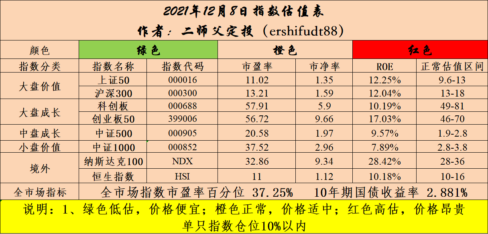

======================================================

_type: q&a
@坚持学习[421148841558188]
2021-12-08 21:57:27 Wed  
topic_id: 218812214251811

@坚持学习

>  请教二师父，看到可转债有下跌，那这个兴全可转债混合，需要卖出吗？如果继续持有，什么时机适合卖出呢？

@二师父

>  这个基金如果你不怕波动的话最好长期持有，如果害怕波动的话，年后就可以下车一部分了

阅读[1]  评论[1]  赞[0] 

======================================================

_type: q&a
@冉冉[88445118854412]
2021-12-08 22:01:11 Wed  
topic_id: 218812212855841

@冉冉

>  请问二师傅，中小100指数与中证1000指数有什么区别和联系？

@二师父

>  中小100指数是从中小企业板里面选择的100只有代表性的股票，而中证1000是从剔除中证800成分股后选择的，两个不同的上市地点，差别很大

阅读[1]  评论[0]  赞[0] 

======================================================

_type: talk
@二师父[28814221155551]
2021-12-08 22:03:20 Wed  
topic_id: 218812482522881

猜一猜明天会发什么车[呲牙]

@九妹Amy'' at 2021-12-08 22:03:20 Wed

> 基建ʘ‿ʘ

----------

@果实妈咪 at 2021-12-08 22:03:20 Wed

> 红利

----------

@阿宝 at 2021-12-08 22:03:20 Wed

> 医疗ETF、银行ETF、中概互联、基建

----------

@阿宝 at 2021-12-08 22:03:20 Wed

> 有没有奖品？送本书啥的。哈哈

----------

@宋航 at 2021-12-08 22:03:20 Wed

> 既然让猜，就是不一样的逻辑[奸笑]

----------

@苍天有井明月空🌙 at 2021-12-08 22:03:20 Wed

> 第一第二正解

----------

@菖朴健康 at 2021-12-08 22:03:20 Wed

> 高铁[呲牙][呲牙]

----------

@阝東 at 2021-12-08 22:03:20 Wed

> 都正常了还买这些？买点债券，出海打猎组合

----------

阅读[1]  评论[10]  赞[0] 

======================================================

_type: q&a
@维真[818585418182212]
2021-12-09 09:20:32 Thu  
topic_id: 581185451428454

@维真

>  二师父您好，今天周四，乌龟计划今天发车吗？

@二师父

>  发车的，不要着急

阅读[1]  评论[0]  赞[0] 

======================================================

_type: q&a
@王春媚[244424882221141]
2021-12-09 09:21:40 Thu  
topic_id: 418815258545118

@王春媚

>  师父，现在买家电ETF算不算追高？

@二师父

>  看你的投资策略，如果你设置止损点，目前大笔买入是可以的，如果你大笔买入，遇到回调再加仓就属于追高
>  
>  家电目前还不贵

阅读[1]  评论[1]  赞[0] 

======================================================

_type: talk
@二师父[28814221155551]
2021-12-09 09:45:25 Thu  
topic_id: 218812428144111

发车了，乌龟计划，中证红利买入1000元，出海打猎买入500元，鳄鱼计划，清仓香港证券，南方宝元债，易方达增强回报债，买入红利etf两份。

鳄鱼卖出债券后面再定投，还是说的方向，买到盈利或者百分之10左右仓位停止。

@小鱼 at 2021-12-09 09:45:25 Thu

> 510880吗，红利代码

----------

@北极 at 2021-12-09 09:45:25 Thu

> 请问出海计划是按创建计划时候的各基金最初的比例还是按照后面个别基金加仓后现在的比例

----------

@二师父 at 2021-12-09 09:45:25 Thu

> 按照现在的比例，变动后的

----------

@DY🍉 at 2021-12-09 09:45:25 Thu

> 卖出债卷的原因是利率上涨了吗？只需要卖纯债卷？混合债卷需要卖吗

----------

@北极 at 2021-12-09 09:45:25 Thu

> 好的

----------

@西锦巴乌 at 2021-12-09 09:45:25 Thu

> 请问变动后的比较各多少？

----------

@二师父 at 2021-12-09 09:45:25 Thu

> 目前利率低位，卖出债券为了接下来补仓指数，如果资金多可以不用卖

----------

@二师父 at 2021-12-09 09:45:25 Thu

> 天天上可以看到哈

----------

阅读[1]  评论[18]  赞[0] 

======================================================

_type: talk
@一心一意[844421848411122]
2021-12-09 11:24:12 Thu  
topic_id: 581185458442244

现在的中概互联可以做网格了么

@二师父 at 2021-12-09 11:24:12 Thu

> 没有溢价可以

----------

@从A到Z at 2021-12-09 11:24:12 Thu

> 按照前期的网格吗？

----------

阅读[1]  评论[2]  赞[0] 

======================================================

_type: talk
@二师父[28814221155551]
2021-12-09 19:24:58 Thu  
topic_id: 185584182225812

坐好车，仓位别低于40%，买点王者组合或者白银组合也可以，避免追高，胆子大的可以适当放开干，利好真的挺多，有耐心等待的，等明年美联储加息，预计海外打猎组合会跟跌，到时候就是很好的建仓机会。同时A股跌了咱们也可以建仓。

先把春节行情这一波给吃到。明年的事明年再说。

@王春媚 at 2021-12-09 19:24:58 Thu

> 师父，科创50盈利8%，用不用调仓？

----------

@二师父 at 2021-12-09 19:24:58 Thu

> 多少仓位

----------

@王春媚 at 2021-12-09 19:24:58 Thu

> 50%

----------

@二师父 at 2021-12-09 19:24:58 Thu

> 适当减仓，单一配比不要超过百分之30

----------

@王春媚 at 2021-12-09 19:24:58 Thu

> 收到，谢谢师父！

----------

@柔软时光 at 2021-12-09 19:24:58 Thu

> 传媒涨上来了，卖了吗？还是换家电？

----------

@二师父 at 2021-12-09 19:24:58 Thu

> 看你自己，我还继续持有了

----------

@柔软时光 at 2021-12-09 19:24:58 Thu

> 👌

----------

阅读[1]  评论[8]  赞[0] 

+++++++++++++++++++++++++++++++++++++++++++++++++++++

文件：
2021-12-09 19:23:00 Thu
文件大小：[47889]
422124454245818-利好频频，坐好车.docx

======================================================

_type: q&a
@永刚[15581448518112]
2021-12-09 19:48:22 Thu  
topic_id: 818812441148582

@永刚

>  师父：目前股权仓位多少合适？

@二师父

>  6到8

阅读[1]  评论[0]  赞[0] 

======================================================

_type: talk
@二师父[28814221155551]
2021-12-09 22:18:18 Thu  
topic_id: 218812414258111

<e type="hashtag" hid="552114551414" title="#估值数据#" /> 市盈率百分位39.98%，SY-BY百分位37.89%，SY/BY百分位33.5%。

目前估值逐步上移。市场切换到了消费医疗，这两块咱们有布局。

医疗正处于支撑位反弹中，可以适当布局。而新能源估值较高，适合下车并将资金转移到基建、红利这类低估值指数上。

晚上央行发布消息，上调金融机构外汇存款准备金率，这对于银行是个利空，不过银行估值低，可以拿着，长期是可以跑赢债券基金的。

阅读[1]  评论[0]  赞[0] 

======================================================

_type: talk
@二师父[28814221155551]
2021-12-10 00:04:56 Fri  
topic_id: 581185488455124

消息面上，12月8日，国新办举行国务院政策例行吹风会，国家发改委农村经济司司长吴晓表示，推动农村居民消费梯次升级。鼓励有条件的地区开展农村家电更新行动，实施家具家装下乡补贴和新一轮汽车下乡。促进农村居民耐用消费品更新换代。此外，来自地产板块的回暖预期也助力家装板块。

如果家电回调，可以考虑继续买入

阅读[1]  评论[0]  赞[0] 

======================================================

_type: talk
@二师父[28814221155551]
2021-12-10 09:07:41 Fri  
topic_id: 818812152158112

成长组合，清仓农银新能源，盈利百分之10，买入工银前沿医疗股票a700元，超配医疗，如果遇到回撤继续买组合，最好的加仓窗口明年美联储加息

@阿宝 at 2021-12-10 09:07:41 Fri

> 这个操作，我也在做。

----------

阅读[1]  评论[1]  赞[0] 

======================================================

_type: q&a
@永刚[15581448518112]
2021-12-10 16:51:46 Fri  
topic_id: 818814525542442

@永刚

>  麻烦师父推荐一本经典的可转债书箱，谢谢您了！

@二师父

>  攻守，可转债投资魔法书

阅读[1]  评论[0]  赞[0] 

======================================================

_type: talk
@二师父[28814221155551]
2021-12-10 19:53:58 Fri  
topic_id: 418812458544448

<e type="hashtag" hid="552114551414" title="#估值数据#" /> 市盈率百分位41.73%，sy-by百分位38.52%，SY/BY百分位34.17%。

估值数据提升，如果下周继续上攻定投就可以停止了，春节行情还是值得期待的，总仓位6成以上，不要追涨

阅读[1]  评论[0]  赞[0] 

======================================================

_type: talk
@二师父助理[48585522811518]
2021-12-12 11:58:38 Sun  
topic_id: 418812842812148

<e type="hashtag" hid="48412124415418" title="#鳄鱼计划持仓表#" /> 可以继续买的基金：家电、基建、红利、锂电池能不能买，看自己能否坚持到下一轮爆发期。

如果对行业把握不准的，就定投沪深300，投资行业的目的是跑赢沪深300，如果连沪深300都跑不过，那就选择一只基金定投——沪深300.

@西锦巴乌 at 2021-12-12 11:58:38 Sun

> 医药ETF呢？

----------

@丸子妈 at 2021-12-12 11:58:38 Sun

> 消费你没卖过吗？

----------

@DY🍉 at 2021-12-12 11:58:38 Sun

> 可是沪深300现在不适合定投啊，又不低估，又不在60日均下

----------

@杜志彪 at 2021-12-12 11:58:38 Sun

> 300今年调整差不多了，看月线已经差不多到位了，仓位够就不用买，仓位不够又怕套的配点300挺好[微笑]，其它的有点高，我明天打算配点。

----------

@二师父助理 at 2021-12-12 11:58:38 Sun

> 在里面啊

----------

@二师父助理 at 2021-12-12 11:58:38 Sun

> 看情况，怕踏空可以先建底仓，不怕踏空就等着

----------

@二师父 at 2021-12-12 11:58:38 Sun

> 今年3月卖过的，剩下的长期持有了

----------

@丸子妈 at 2021-12-12 11:58:38 Sun

> 月初消费etf我清仓了，等明年再入了

----------

阅读[1]  评论[10]  赞[0] 

+++++++++++++++++++++++++++++++++++++++++++++++++++++

图片：
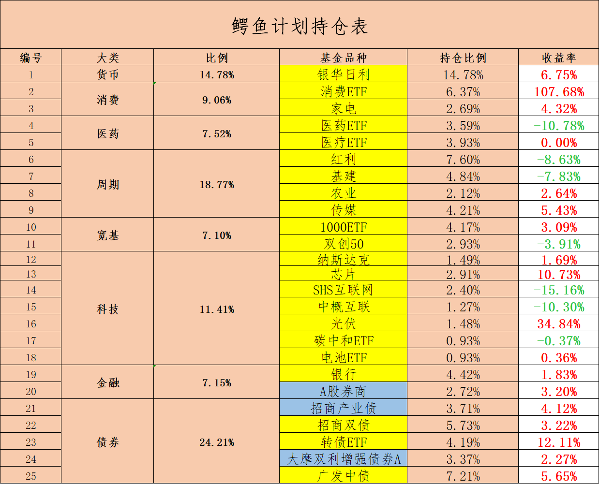

======================================================

_type: talk
@二师父[28814221155551]
2021-12-12 18:45:59 Sun  
topic_id: 218814882528451

支撑位买入，压力位卖出，也不错的，投资方法非常多，关键在于考虑万一风险来了你到底是抗住还是逃跑。

这是最关键的，最近两年市场太友好，大家要注意未来3到5年可能出现的危机，在这到来之前先把钱赚够了，然后捂紧钱袋子。

@DY🍉 at 2021-12-12 18:45:59 Sun

> 师父：假如我一开始配置5只基金，一只10万。一个季度之后，有的大于十万有的小于十万。那么我做再平衡是卖出大于十万的然后把卖得的钱投到小于十万的吗？可是如果大于十万的基金处于正常估值并且没有达到设置的卖出标准怎么办？还有就是债卷基金混合基金需要再平衡吗？

----------

@二师父 at 2021-12-12 18:45:59 Sun

> 保持每只基金的比例一致。

----------

阅读[1]  评论[2]  赞[0] 

+++++++++++++++++++++++++++++++++++++++++++++++++++++

文件：
2021-12-12 18:44:28 Sun
文件大小：[251273]
111812528428542-分享一个高风险的盈利方法.docx

======================================================

_type: talk
@二师父[28814221155551]
2021-12-13 20:07:53 Mon  
topic_id: 818814814455882

<e type="hashtag" hid="88855582552852" title="#关于市场的解读#" /> 接下来涨起来了就可以卧倒了，或者轻仓定投，倒金字塔加仓法，仓位重的，市场发红包偶尔减仓，没有绝对的不卖出，你可以分批卸货，总能卖到最高点，这和底部定投一样，总能卖到最低点。

@梧桐 at 2021-12-13 20:07:53 Mon

> 二师父，白银和黄金组合卖出时执行什么策略，还是常持？

----------

@二师父 at 2021-12-13 20:07:53 Mon

> 长期持有或者定期再平衡都可以的

----------

@梧桐 at 2021-12-13 20:07:53 Mon

> 明白，谢谢二师父

----------

@Vivian at 2021-12-13 20:07:53 Mon

> 老师，传媒今天大涨，继续持有还是分批收割利润？

----------

@二师父 at 2021-12-13 20:07:53 Mon

> 收割利润

----------

阅读[1]  评论[5]  赞[0] 

+++++++++++++++++++++++++++++++++++++++++++++++++++++

文件：
2021-12-13 20:06:40 Mon
文件大小：[29561]
844145245848552-起飞.docx

======================================================

_type: talk
@二师父[28814221155551]
2021-12-13 21:17:51 Mon  
topic_id: 818814811885242

<e type="hashtag" hid="552114551414" title="#估值数据#" /> 市盈率百分位41.73%，市净率百分位37.94%，SY-BY百分位38.76%。

今天万得全A指数上涨跳空有个缺口，肯定会回补得，如果仓位不足别急着追，等跌下来再买。估计大家仓位都是很充足得了，那么慢慢定投就行。

关于配置组合，买入卧倒就行，如果有精力得买入后可以每个季度再平衡，对于王者组合，如果买入发生大跌，那么三只宽基继续无脑定投，不同得组合不同策略。

整体而言，组合是一次建仓或者分批建仓形成基本盘。我今年把房子卖了，现在做了组合配置，保证年化10%，就跑赢房子了。其实不用追求太高收益率，稳健得10%就非常不错，在守正得基础上进行出奇，追求20%的年化收益率。

@苍天有井明月空🌙 at 2021-12-13 21:17:51 Mon

> 我见了好几个财经博主把房子卖了。

----------

@苍天有井明月空🌙 at 2021-12-13 21:17:51 Mon

> 二师父卖完房子的大资金进哪里

----------

@二师父 at 2021-12-13 21:17:51 Mon

> 我讲的四个组合啊，很稳的，从15年高位回测，王者组合的最大跌幅才百分之27，你想想那时候股灾多惨烈，安全性有保证是投资第一要义

----------

@阿宝 at 2021-12-13 21:17:51 Mon

> “今天万得全A指数上涨跳空有个缺口，肯定会回补得”这是什么意思，技术层面我不懂

----------

@二师父 at 2021-12-13 21:17:51 Mon

> 就是跳空高开的缺口

----------

@阿宝 at 2021-12-13 21:17:51 Mon

> 老师，就是圈出来那个？这有什么具体含义吗？高开跳空，必会回补吗？

----------

@二师父 at 2021-12-13 21:17:51 Mon

> 对

----------

@DY🍉 at 2021-12-13 21:17:51 Mon

> 仓位多少合适呢，我自从配置了之后，就一直没有定投的机会[偷笑]

----------

阅读[1]  评论[10]  赞[0] 

======================================================

_type: talk
@付云[844148188522822]
2021-12-14 11:59:57 Tue  
topic_id: 418812285122128

二师傅，对光伏ETF怎么看，还能加仓么

@二师父 at 2021-12-14 11:59:57 Tue

> 长期看好，等回调百分之30再加仓，这个位置只能轻仓定投，不便宜

----------

阅读[1]  评论[1]  赞[0] 

======================================================

_type: q&a
@徐美芳[51112822252224]
2021-12-14 19:44:56 Tue  
topic_id: 418812252448228

@徐美芳

>  二师傅，现在手上有些钱，目前这个时间适合买四个组合吗？还是年后买合适呢？

@二师父

>  每个人情况不同，你得把自己的家庭财务状况告诉我，然后预期收益率自己投资期限还有能经受的波动告诉我，才能给出答案

阅读[1]  评论[0]  赞[0] 

======================================================

_type: q&a
@🍀 凝🌸 慧🍀[841855248254242]
2021-12-14 19:45:31 Tue  
topic_id: 581184452814224

@🍀 凝🌸 慧🍀

>  师父，我股票中签亨迪药业，这只股票咋样啊，请师父帮忙把把😅

@二师父

>  新股都没研究了

阅读[1]  评论[3]  赞[0] 

======================================================

_type: talk
@二师父[28814221155551]
2021-12-14 21:14:10 Tue  
topic_id: 418812224812858

市场轮动时候如何操作

阅读[1]  评论[0]  赞[0] 

+++++++++++++++++++++++++++++++++++++++++++++++++++++

文件：
2021-12-14 21:14:01 Tue
文件大小：[48176]
422124511481218-我发现了一个秘密.docx

======================================================

_type: talk
@二师父[28814221155551]
2021-12-14 21:25:55 Tue  
topic_id: 581184442582514

<e type="hashtag" hid="552114551414" title="#估值数据#" /> 市盈率百分位42.8%，SY-BY百分位39.43%，SY/BY百分位35.53%。

今天缺口就回补了，跳空高开都是散户拉动的，必然会被机构拉回补上缺口的。技术分析看看就可以。真正决定投资的还是企业盈利，这是本质。

@cotton at 2021-12-14 21:25:55 Tue

> 今天鳄鱼计划吗

----------

@二师父 at 2021-12-14 21:25:55 Tue

> 周四了

----------

阅读[1]  评论[2]  赞[0] 

======================================================

_type: talk
@二师父[28814221155551]
2021-12-15 19:47:33 Wed  
topic_id: 185581821881142

说说医疗和组合。

@DY🍉 at 2021-12-15 19:47:33 Wed

> 师父，防守账户的钱我想买成青铜组合，但是我看比如招商产业债持有12个月以下卖出手续费是1.5%，18个月以下是1%，24个月以下是0.5%～感觉这类债劵对持有期限要求挺高。但是防守账户的钱可能会在18个月要用一些，这种应该怎么办？我感觉如果持有时间不够，卖出成本好高

----------

@二师父 at 2021-12-15 19:47:33 Wed

> 换个别的纯债也行的

----------

@老孙头 at 2021-12-15 19:47:33 Wed

> “时间和空间，两者选择一个”，没弄明白，麻烦老师具体指教？

----------

@二师父 at 2021-12-15 19:47:33 Wed

> 要么时间上隔出来有节奏，要么空间上跌的多

----------

阅读[1]  评论[4]  赞[0] 

+++++++++++++++++++++++++++++++++++++++++++++++++++++

文件：
2021-12-15 19:47:22 Wed
文件大小：[47557]
844145451411252-医疗大跌，如何应对.docx

======================================================

_type: talk
@二师父[28814221155551]
2021-12-15 19:55:12 Wed  
topic_id: 218814151551551

<e type="hashtag" hid="552114551414" title="#估值数据#" /> 市盈率百分位42.01%，SY-BY百分位38.63%，SY/BY百分位34.48%。

回补之后继续下跌，重点投资方向，基建、中证红利、中证1000、家电，明天继续定投红利，预计10%到15%仓位。高股息、第市盈率是现在得主要配置方向，一旦美联储加息，成长股大概率是要跟着下来。

阅读[1]  评论[0]  赞[0] 

======================================================

_type: talk
@二师父[28814221155551]
2021-12-15 20:06:32 Wed  
topic_id: 185581828288542

目前没有低估得宽基指数，如果死守低估策略，同时控制10%仓位，一定不会亏，所以先做好组合配置，然后再定投比较合理。

@DY🍉 at 2021-12-15 20:06:32 Wed

> 自从配置好组合后～一直没有下手的计划😂

----------

@二师父 at 2021-12-15 20:06:32 Wed

> 是的，投资没那么难，等待就好

----------

@枫叶 at 2021-12-15 20:06:32 Wed

> 老师债基要不要卖了

----------

@隔窗遥望 at 2021-12-15 20:06:32 Wed

> 现在估值表怎么没有其他行业指数了

----------

@二师父 at 2021-12-15 20:06:32 Wed

> 没卖，找不到更好的标的就先持有

----------

@二师父 at 2021-12-15 20:06:32 Wed

> 宽基风险更低

----------

阅读[1]  评论[6]  赞[0] 

+++++++++++++++++++++++++++++++++++++++++++++++++++++

图片：
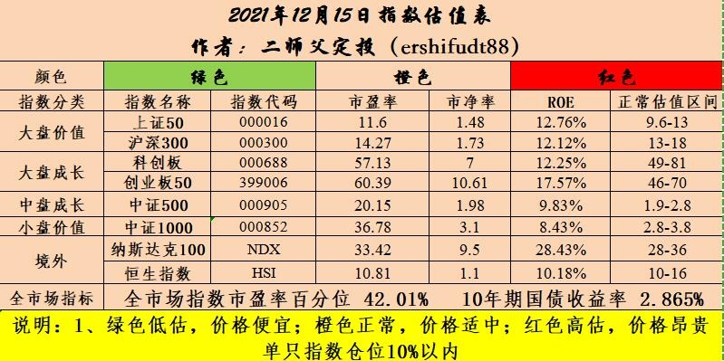

======================================================

_type: talk
@二师父[28814221155551]
2021-12-16 09:57:54 Thu  
topic_id: 818814128122212

发车，乌龟计划，买入中证红利500，鳄鱼计划，买入红利etf一份，海外组合买入200元，海外组合设定定投，每周定投200，等净值重回1停止。

我说的组合配置就是置顶的，有读者执行力快已经配好了卧倒就行，在配置的时候我稳健组合稍微改了下，增加了一个兴全可转债混合，不同阶段的投资策略也是不同，永远只知道硬着头皮买，遇到08年这种行情可能亏的底掉。

先配好组合，再定投，很稳健，中概是很惨，如果你只有百分之5仓位，就不怕，全面配置，这很早就说过了，单调碰到牛市很爽，遇到危机可能就回到解放前了

@水冰月槑槑🌙 at 2021-12-16 09:57:54 Thu

> 二师父你说的乌龟计划和防守账户是一回事吗？
还没有配置防守和稳健账户的话，现在还能配置吗？

----------

@二师父 at 2021-12-16 09:57:54 Thu

> 如果能经受住我说的回撤是可以的，不是一回事，防守账户波动不超过百分之5

----------

@DY🍉 at 2021-12-16 09:57:54 Thu

> 红利是510880吧师父

----------

@二师父 at 2021-12-16 09:57:54 Thu

> 是的

----------

@永刚 at 2021-12-16 09:57:54 Thu

> 兴全可转绩是340001吗？

----------

@水冰月槑槑🌙 at 2021-12-16 09:57:54 Thu

> 乌龟计划有一段时间没有跟车了，现在是全部调仓跟你一样吗

----------

@二师父 at 2021-12-16 09:57:54 Thu

> 对

----------

@二师父 at 2021-12-16 09:57:54 Thu

> 就跟当前的吧

----------

阅读[1]  评论[8]  赞[0] 

======================================================

_type: talk
@林玮[844111858288412]
2021-12-16 15:25:38 Thu  
topic_id: 581184841145424

师父，知道今天128127为啥停牌？

@二师父 at 2021-12-16 15:25:38 Thu

> 因为公司要引入特定股东

----------

@林玮 at 2021-12-16 15:25:38 Thu

> 是利好吗？

----------

@二师父 at 2021-12-16 15:25:38 Thu

> 是的

----------

@林玮 at 2021-12-16 15:25:38 Thu

> 谢谢师父

----------

阅读[1]  评论[4]  赞[0] 

======================================================

_type: talk
@二师父[28814221155551]
2021-12-16 21:53:49 Thu  
topic_id: 218811518844211

<e type="hashtag" hid="88855582111122" title="#继续布局#" /> 积极布局，优选低市盈率、高股息价值股，明年大概率是价值行情。

基建、中证红利、中证1000这三大方向，中证红利里面有一些煤炭股，能承受高波动，煤炭回调至60日均线以下也可以配置。场内除了三大方向，加上农业、家电。整体这些方向就足够了。

@DY🍉 at 2021-12-16 21:53:49 Thu

> 师父，定投是低估定投，那配置呢？有没有什么时候的讲究？

----------

@枫叶 at 2021-12-16 21:53:49 Thu

> 老师，对于钢铁板块现在怎么看，能不能买

----------

@二师父 at 2021-12-16 21:53:49 Thu

> 可以买，不过这种强周期如果买入遇到大跌要严格执行止损，不能越跌越买

----------

@二师父 at 2021-12-16 21:53:49 Thu

> 流动性宽裕的时候

----------

@嘉宾 at 2021-12-16 21:53:49 Thu

> 请问组合配置是场外吗？

----------

@二师父 at 2021-12-16 21:53:49 Thu

> 场内场外都可以

----------

阅读[1]  评论[6]  赞[0] 

+++++++++++++++++++++++++++++++++++++++++++++++++++++

文件：
2021-12-16 21:52:01 Thu
文件大小：[314449]
544842442822284-继续布局.docx

======================================================

_type: talk
@二师父[28814221155551]
2021-12-16 22:02:57 Thu  
topic_id: 581188281525284

<e type="hashtag" hid="552114551414" title="#估值数据#" /> 市盈率百分位42.01%，SY-BY百分位38.63%，SY/BY百分位34.48%

@lily at 2021-12-16 22:02:57 Thu

> 师父，海外组合的比例是个啥样的？我在置顶文章里没找到呢？

----------

@二师父 at 2021-12-16 22:02:57 Thu

> 天天基金有

----------

阅读[1]  评论[2]  赞[0] 

======================================================

_type: talk
@雪莲[421485848588118]
2021-12-17 11:44:33 Fri  
topic_id: 818811851225452

二师父您好，我在蛋卷上有一个组合已持有3个多月了，易方达裕丰回报.易方达增强回报债A，招商产业债券，兴全合润混合，南方宝元债，各持仓20%。现除了兴全合润浮亏2%，其它几个均有盈利，目前组合收益为正，您看我需要把兴全合润混合跟招商产业债调换成兴全可转债混合跟易方达稳健收益债吗？

@二师父 at 2021-12-17 11:44:33 Fri

> 不用，耐心持有就可以，需要用钱再卖出

----------

@雪莲 at 2021-12-17 11:44:33 Fri

> 好的，谢谢二师父！

----------

@小牧童 at 2021-12-17 11:44:33 Fri

> 师父：现在且慢上的组合不能买入了么？

----------

@二师父 at 2021-12-17 11:44:33 Fri

> 买不了了

----------

@小牧童 at 2021-12-17 11:44:33 Fri

> 在且慢自己建吗

----------

@二师父 at 2021-12-17 11:44:33 Fri

> 自己选一个账户就可以

----------

@小牧童 at 2021-12-17 11:44:33 Fri

> 👌

----------

阅读[1]  评论[7]  赞[0] 

======================================================

_type: talk
@宁静致远[111815225552422]
2021-12-17 14:27:07 Fri  
topic_id: 218811882854221

老师，word打不开，用什么软件能打开呢

@二师父 at 2021-12-17 14:27:07 Fri

> 全部打不开吗，用wps试试

----------

@宁静致远 at 2021-12-17 14:27:07 Fri

> 是的

----------

阅读[1]  评论[2]  赞[0] 

======================================================

_type: q&a
@闫军平[422125415521418]
2021-12-17 16:23:42 Fri  
topic_id: 218811854212551

@闫军平

>  二师父，想问一下中概互联仓位轻，目前咋操作？

@二师父

>  方法1，跌到1.2买一次，跌到1.1买一次
>  
>  方法2，不操作

阅读[1]  评论[0]  赞[0] 

======================================================

_type: talk
@二师父[28814221155551]
2021-12-17 19:24:35 Fri  
topic_id: 818811881842182

这次大跌，风格继续切换，坚守小盘价值和大盘价值。成长组合如果跌破净值1也会轻仓投，加息成长组合肯定会跌的，不过定投不要紧，只要指数重新涨回到原点就能大赚。

@DY🍉 at 2021-12-17 19:24:35 Fri

> 师父，我看得似懂非懂，但是想要完全懂，我需要怎么学习？

----------

@二师父 at 2021-12-17 19:24:35 Fri

> 需要时间

----------

@风彩 at 2021-12-17 19:24:35 Fri

> 请问中证红利质量931468，跟综这个指数的基金159758属价值风格吗？

----------

@二师父 at 2021-12-17 19:24:35 Fri

> 成长类股票也有，风格比较均衡

----------

@风彩 at 2021-12-17 19:24:35 Fri

> 谢谢，您说明年的行情是价值风格，那这个红利质量159758明年有行情吗？

----------

@风彩 at 2021-12-17 19:24:35 Fri

> 请问159758是不是价值类股票偏多些？

----------

@二师父 at 2021-12-17 19:24:35 Fri

> 有纯价值的中证红利啊

----------

阅读[1]  评论[7]  赞[0] 

+++++++++++++++++++++++++++++++++++++++++++++++++++++

文件：
2021-12-17 19:22:31 Fri
文件大小：[47943]
422124218185218-跟踪这些标的.docx

======================================================

_type: talk
@二师父[28814221155551]
2021-12-17 19:59:51 Fri  
topic_id: 818811828548282

<e type="hashtag" hid="552114551414" title="#估值数据#" /> 市盈率百分位42.72%，SY-BY百分位39.12%，SY/BY百分位34.97%。

阅读[1]  评论[0]  赞[0] 

======================================================

_type: talk
@林玮[844111858288412]
2021-12-17 20:41:06 Fri  
topic_id: 818811828811282

师父，这个表里面，中证1000高估这么多为什么还投呢？

@二师父 at 2021-12-17 20:41:06 Fri

> 哪里高估了？

----------

@林玮 at 2021-12-17 20:41:06 Fri

> 正常估值是2.8～3.8？

----------

@二师父 at 2021-12-17 20:41:06 Fri

> 是的，看后面的阈值

----------

阅读[1]  评论[3]  赞[0] 

======================================================

_type: talk
@林玮[844111858288412]
2021-12-17 20:41:32 Fri  
topic_id: 418811858811258

阅读[1]  评论[0]  赞[0] 

+++++++++++++++++++++++++++++++++++++++++++++++++++++

图片：
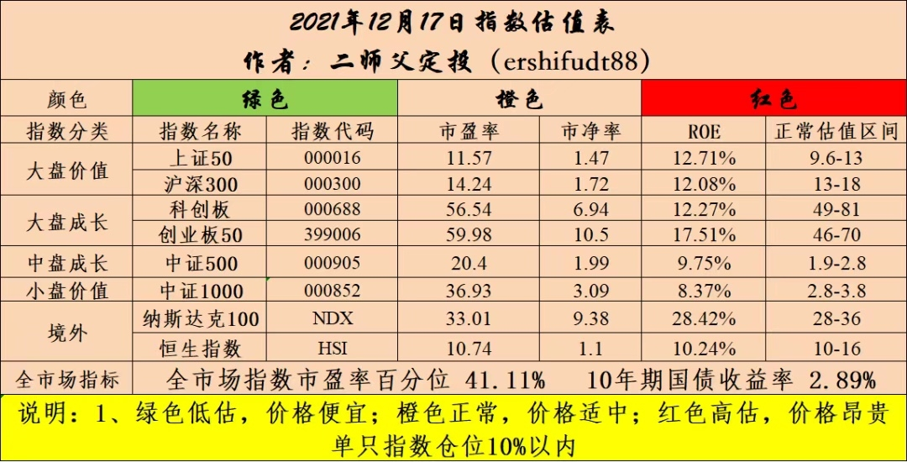

======================================================

_type: talk
@心斋[544845214152284]
2021-12-18 19:59:23 Sat  
topic_id: 581188182154224

二师父，请问增额终身寿险怎么样？有没有必要买？

@二师父 at 2021-12-18 19:59:23 Sat

> 看你的预期，如果图安全，对预期年化3.49%的复利收益率满意，追求绝对安全，是有必要的，可以看看这个产品<e type="web" href="https://cps.qixin18.com/m/apps/cps/lhz1029368/product/detail?prodId=104313&planId=129024" title="金满意足臻享版终身寿险" cache="" />。反之就不必了。

----------

@心斋 at 2021-12-18 19:59:23 Sat

> 明白了，谢谢二师父!

----------

阅读[1]  评论[2]  赞[0] 

======================================================

_type: talk
@二师父[28814221155551]
2021-12-18 20:11:46 Sat  
topic_id: 218811815842821

假的北水被打击，对投资有何影响。

@cotton at 2021-12-18 20:11:46 Sat

> 没看到今天的啊

----------

@cotton at 2021-12-18 20:11:46 Sat

> 发车的

----------

@cotton at 2021-12-18 20:11:46 Sat

> 昨天我以为是周四[发呆]

----------

阅读[1]  评论[3]  赞[0] 

+++++++++++++++++++++++++++++++++++++++++++++++++++++

文件：
2021-12-18 20:11:28 Sat
文件大小：[48432]
844148551581842-假北水被打击了.docx

======================================================

_type: talk
@老孙头[422115118524548]
2021-12-18 21:57:29 Sat  
topic_id: 418811818485448

二师父高见？场外“中概”还能持有吗？
(洪榕12.17)——这一次美股调整，纳斯达克跌幅远超标普500，中概股互联网企业继续大跌，中概股互联网股票今年从高点下跌超过三分之二，堪称股灾，不得不让人想起世纪初互联网泡沫破裂的情形，那时网易等股票跌到只有几毛钱。
上一次互联网泡沫破裂后，互联网企业高歌猛进发展了近二十年，如果这一次还的是这二十年暴涨的债？……真不敢想。—(洪榕12.17)回复@石叁万:说的是现在的互联网企业，元宇宙的路还很长，也不是所有的互联网企业都可以在元宇宙时代转型成功。//@石叁万:校长不是说互联网企业的出路在元宇宙吗，怎么突然一下这么悲观？

	(著名投资人盛希泰	的“焦虑”)——美股是过去二十年中国新兴经济，也就是互联网行业最主要的承载者，在这种情况下，大家也说，全部放在香港，香港能不能接得住，A股能不能接得住，这是很大的一个压力。
	香港尽管它的市场投资人跟美国是一体化的，但是它的市场容量还是比美国小很多，因为同样一支股票，既在美国上市，也在香港上市，在香港的交易量可能一半都不到。

@二师父 at 2021-12-18 21:57:29 Sat

> 看你仓位，满仓持有就在赌博，保持合理仓位无惧波动是可以的

----------

阅读[1]  评论[1]  赞[0] 

======================================================

_type: talk
@样[844124458224442]
2021-12-20 12:20:46 Mon  
topic_id: 818811424851522

二师父，成长组合破1了，请问今天有操作吗

@二师父 at 2021-12-20 12:20:46 Mon

> 周四定投啊，不要着急

----------

阅读[1]  评论[1]  赞[0] 

======================================================

_type: talk
@二师父[28814221155551]
2021-12-20 18:46:07 Mon  
topic_id: 185588111228222

<e type="hashtag" hid="825188852442" title="#估值表#" /> 很快沪深300和恒生指数就低估了，如果啥也不懂，看估值表，绿色定投，橙色偏离均线以下也定投。

对于投资需要结合宏观经济周期，估值还有利润，多方考虑。不简单就是绿了就买，而对于不太懂金融，坚持就行。

大家学会了逆向思维是对的，成长组合和海外组合净值跌破1每周四持续定投，注意是定投，他们还在高位，什么时候大跌不知道，不过跌破净值1是大概率，保持定投节奏就行了。

目前重仓方向在四个组合和基建、红利、煤炭、中证1000、家电、建材这些方向。做错了，可能亏得很惨。

也有人说为什么去年一直讲消费、医疗、互联网，今年才过了一年就变了吗？确实变了，消费医疗互联网我是从18年就开始说的，连续涨了2年，风格切换以后就不同了。

你愿意坚守，消费医疗肯定值得长期坚守5年，还会起来，互联网不一定，但是要想不错过明年行情，就得做我说的方向。

@丸子妈 at 2021-12-20 18:46:07 Mon

> 估值表里看不出来颜色啊

----------

@Dolly at 2021-12-20 18:46:07 Mon

> 全部是橙色的

----------

@老孙头 at 2021-12-20 18:46:07 Mon

> 互联网5年都“不一定”起来，为何（仓位不很重）还可继续持有？

----------

@二师父 at 2021-12-20 18:46:07 Mon

> 拿的住就拿着，需要懂zz，老大让他起来就能起来，让他起不来他就起不来

----------

@丸子妈 at 2021-12-20 18:46:07 Mon

> 噢，谢谢

----------

阅读[1]  评论[5]  赞[0] 

+++++++++++++++++++++++++++++++++++++++++++++++++++++

图片：
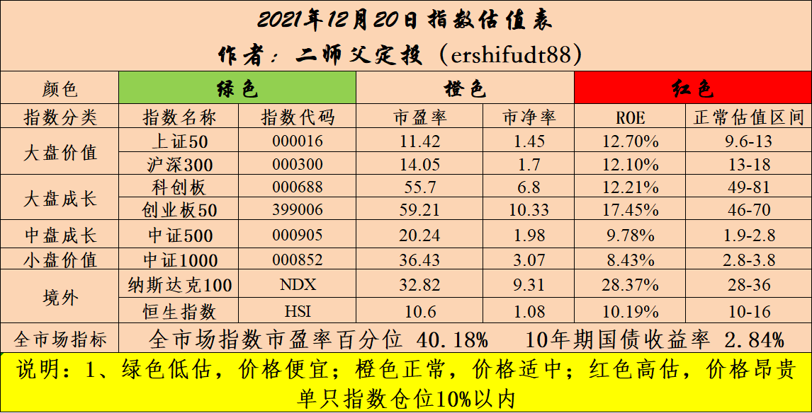

======================================================

_type: talk
@二师父[28814221155551]
2021-12-21 23:45:32 Tue  
topic_id: 185588841442512

红利基金投资价值，继续布局，目前仓位基本上起来了，如果涨起来就拿住，跌下来继续定投，最高仓位不超过15%，学会控制仓位，当黑天鹅发生的时候你会发现比较安全，尤其是大资金。

第二，中概已经到了1.16的价格，非常便宜，我选择等待，传媒从最高点下跌到底部跌了78%，假设中概跌78%，那么，价格在0.6.我不确定中概未来会不会和传媒一样，总之放弃了。乌龟计划目前4.35%仓位，耐心持有，不再补仓，更多资金投资我分析的方向，先保证活下来，找到确定性的方向重仓。

@Vivian at 2021-12-21 23:45:32 Tue

> 老师易方达中证红利代码是多少

----------

@老孙头 at 2021-12-21 23:45:32 Tue

> 下决心“放弃”场外中丐，找准“确定性”方向！准备置换中证红利，老师说的“重仓”是个什么比例？

----------

@二师父 at 2021-12-21 23:45:32 Tue

> 百分之10到百分之20，配置组合是王道

----------

@二师父 at 2021-12-21 23:45:32 Tue

> 515180

----------

阅读[1]  评论[4]  赞[0] 

+++++++++++++++++++++++++++++++++++++++++++++++++++++

文件：
2021-12-21 23:38:35 Tue
文件大小：[49001]
244148854155521-红利基金投资价值分析.docx

======================================================

_type: talk
@一心一意[844421848411122]
2021-12-22 10:49:18 Wed  
topic_id: 581188882122244

双创etf可以补点仓，摊成本么

@二师父 at 2021-12-22 10:49:18 Wed

> 自己开车系好安全带

----------

阅读[1]  评论[1]  赞[0] 

======================================================

_type: q&a
@坚持学习[421148841558188]
2021-12-22 11:16:06 Wed  
topic_id: 818811144545542

@坚持学习

>  二师父，场外基金传媒的ETF是全部卖出吗？还有两个证券的股票，我目前的资金情况是这样，要如何把握呢？

@二师父

>  可以等一等

阅读[1]  评论[0]  赞[0] 

======================================================

_type: q&a
@阿宝[422212151424158]
2021-12-22 11:18:46 Wed  
topic_id: 418811155251858

@阿宝

>  老师，我如何培养自己敏锐的商业判断力呢？这方面我很欠缺，对于企业基本面和发展前景如何能做到深刻认识、准确把握。希望老师推荐几本书学习学习。

@二师父

>  多看公司发展战略布局，是否有前景，这个本来就很难，上市公司CEO都无法精准确定企业未来向何处走，比如新东方如果能判断，他们肯定很早就转型了

阅读[1]  评论[3]  赞[0] 

======================================================

_type: talk
@林玮[844111858288412]
2021-12-22 14:03:51 Wed  
topic_id: 581188881481814

师父，移动值得申购吗？

@二师父 at 2021-12-22 14:03:51 Wed

> 可以

----------

阅读[1]  评论[1]  赞[0] 

======================================================

_type: talk
@二师父[28814221155551]
2021-12-22 22:24:11 Wed  
topic_id: 418544841881488

目前投资的方向重点放在过去没怎么涨的A股基金上。

对于成长股，一般跌下来趋势形成就很危险，可以复盘15到18年的医疗和创业板。为什么18年我敢让大家抄底干，现在不敢，不是恐惧，而是对于市场的判断。

18年成长股已经连续跌了3年，跌无可跌，现在成长股才跌了一年，不排除马上涨，然而不能把自己置身于巨大的不确定性中。只有确定性才能重仓。

目前可以重仓的是我给的组合，回撤可控，另外就是几个价值方向，鳄鱼计划继续买入红利、基建、农业、银行等等。乌龟计划相对保守红利、基建、中证1000、银行。

@cotton at 2021-12-22 22:24:11 Wed

> 今天发车吗二师父

----------

@二师父 at 2021-12-22 22:24:11 Wed

> 发了啊

----------

@老孙头 at 2021-12-22 22:24:11 Wed

> 老师说，医疗反弹后“止盈”；如反弹后仍亏损，是否也应“走人”？

----------

@二师父 at 2021-12-22 22:24:11 Wed

> 看你是短线还是长线，长线仓位没必要，短线仓位就得撤

----------

阅读[1]  评论[4]  赞[0] 

+++++++++++++++++++++++++++++++++++++++++++++++++++++

文件：
2021-12-22 22:18:49 Wed
文件大小：[47684]
544841155144824-三件小事.docx

======================================================

_type: talk
@二师父[28814221155551]
2021-12-22 23:47:36 Wed  
topic_id: 185422552288282

<e type="hashtag" hid="552114551414" title="#估值数据#" /> 市盈率百分位39.98%，市净率百分位35.41%，SY-BY百分位36.98%.

市场窄幅震荡，而部分板块已经跌出股灾了，寻找三年内超跌板块，同时有预期的方向，资金都是聪明的，新能源如果开始回调，那么流出的资金会继续往债券和前期超跌价值板块流出。

如果成长组合和海外打猎一直跌，就设定定投，注意持续定投是不怕下跌的，注意分散配置，成长组合配置了医疗、白酒、芯片、锂电、光伏等五大优质板块，不管是主跌浪还是持续性下跌，最终一定会创新高，对于中国经济要有信心。也要提醒大家，需要有充足资金补仓，只能轻仓定投，考虑极端情况纳斯达克最大跌幅是2002年的78%，医疗最大跌幅是08年的57%。

如果最极端情况来了，你依然扛得住，就别管市场噪音，定投就行了。

医疗支撑位很好判断，今年3次下跌的低点就是支撑位，同时反弹一浪低过一浪，明显的主跌浪，暂时避开，等未来跌到位了再继续投。

如果中证红利没有大涨，明天继续发车，先把他买成第一重仓15到20%，目前中债7-10年国开债是第一重仓，也完成了防守的任务，如果缺钱的话可以卖出补仓，如果不缺钱的话先持有，这只基金防守很好，只要利率不上行，降息周期和金融危机时候他都会涨。

所有的投资都在掌握之中，不用太担心，目前乌龟计划中医疗仓位大致6%，中概仓位已经跌到了4%，比较合理的仓位，未来涨了咱们也能喝点汤，起不来的话不至于伤筋动骨。

总之一句话，别贪婪，赌场为什么每年那么多人挂掉，说白了就是贪心，不断砸钱，差不多就行了哈，知足不辱，知止不殆。

@阿宝 at 2021-12-22 23:47:36 Wed

> 看懂主浪跌了。

----------

@二师父 at 2021-12-22 23:47:36 Wed

> 有兴趣看看荀玉根的书和艾略特波浪理论

----------

@DY🍉 at 2021-12-22 23:47:36 Wed

> 师父，我看你说，你防守，稳健，进攻三个组合都配置了，你是按照发的那个表格严格配置的吗？我看有一些债基三个组合都有，都是占百分之二十。这样是不是重复买了三次？

----------

@二师父 at 2021-12-22 23:47:36 Wed

> 是的

----------

@阿宝 at 2021-12-22 23:47:36 Wed

> 是这本书吗？看了序言写的挺好

----------

@阿宝 at 2021-12-22 23:47:36 Wed

> 我找了书了，看完和你交流。谢谢

----------

阅读[1]  评论[6]  赞[0] 

======================================================

_type: q&a
@J[28281541518551]
2021-12-23 08:58:19 Thu  
topic_id: 185422552155552

@J

>  师父，请问以前的主动基金估值现在还每周更新吗？易方达金融行业一直亏损着，也不知道是否合适定投还是继续持有？

@二师父

>  可以持有，暂时没看到金融危机信号，央行跨周期调节是利好金融板块的，不过他的持仓风格有点漂移，跟不上金融板块的上涨

阅读[1]  评论[0]  赞[0] 

======================================================

_type: talk
@二师父[28814221155551]
2021-12-23 09:34:31 Thu  
topic_id: 218255881524181

文科转债涨停了，意外之财，记得卖出

@林玮 at 2021-12-23 09:34:31 Thu

> 谢谢提醒，今天要卖出吗

----------

@二师父 at 2021-12-23 09:34:31 Thu

> 开板了卖一半或者全部卖了

----------

@林玮 at 2021-12-23 09:34:31 Thu

> 好的，谢谢

----------

@林玮 at 2021-12-23 09:34:31 Thu

> 为什么都没有买卖信息？

----------

@二师父 at 2021-12-23 09:34:31 Thu

> 停牌了

----------

阅读[1]  评论[5]  赞[0] 

======================================================

_type: talk
@范毅君[118551121224142]
2021-12-23 09:58:52 Thu  
topic_id: 581522118181254

二师父，今天发车不

@二师父 at 2021-12-23 09:58:52 Thu

> 发

----------

阅读[1]  评论[1]  赞[0] 

======================================================

_type: talk
@二师父[28814221155551]
2021-12-23 10:15:31 Thu  
topic_id: 218255881215411

发车，乌龟计划大成红利买入500元，他和基建如果跌下来定投到一二重仓，目前还是国开债防守，看看西安能不能把股市打下来。鳄鱼计划红利etf买入一份。

成长组合买入100元，海外打猎组合买入500元，如果净值1以下会一直买，不买代表没钱了。

@衣袂飘香 at 2021-12-23 10:15:31 Thu

> 成长组合买入100元，是按原来持仓的比例分配吗？现在看不到明细了。

----------

@二师父 at 2021-12-23 10:15:31 Thu

> 

----------

@衣袂飘香 at 2021-12-23 10:15:31 Thu

> 哦，看来，应该不是只加仓医疗，是按比例加的吧。

----------

@二师父 at 2021-12-23 10:15:31 Thu

> 是的，之前止盈了农银，加了一些医疗，这次直接买组合

----------

@DY🍉 at 2021-12-23 10:15:31 Thu

> 成长组合又是什么呢？和你说的四个组合配置有啥联系不

----------

@二师父 at 2021-12-23 10:15:31 Thu

> 配置的优质行业组合，四个组合都是稳健型的

----------

@DY🍉 at 2021-12-23 10:15:31 Thu

> 成长组合不止赢吗？我看白酒，新能源这些也还在持有

----------

@样 at 2021-12-23 10:15:31 Thu

> 二师父这是成长组合还不适合买吗？加100意思一下[偷笑]

----------

阅读[1]  评论[12]  赞[0] 

+++++++++++++++++++++++++++++++++++++++++++++++++++++

图片：
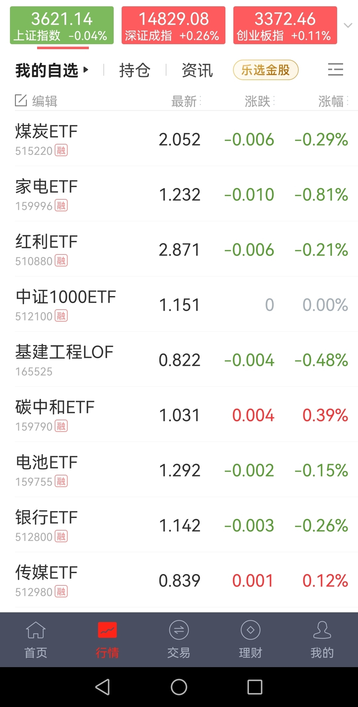
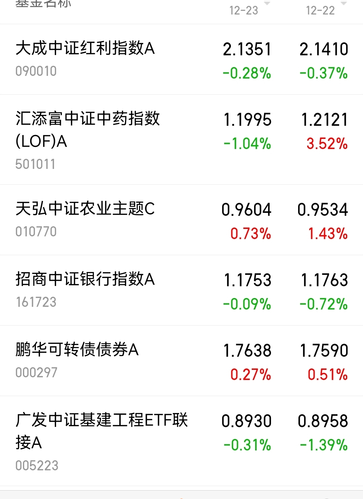

======================================================

_type: talk
@二师父[28814221155551]
2021-12-23 19:57:55 Thu  
topic_id: 185422514588122

猪肉板块开始上涨，农业ETF对标，暂时持有，遇到回调可以继续定投。

@杜志彪 at 2021-12-23 19:57:55 Thu

> 猪我有点贪定价45，没等到，没关系下回吧[呲牙]

----------

阅读[1]  评论[1]  赞[0] 

+++++++++++++++++++++++++++++++++++++++++++++++++++++

文件：
2021-12-23 19:57:16 Thu
文件大小：[30448]
422128514251888-二师兄发飙了.docx

======================================================

_type: talk
@二师父[28814221155551]
2021-12-24 09:57:04 Fri  
topic_id: 418544544242428

继续发车，乌龟计划，清仓创业板，鳄鱼计划，清仓光伏，芯片。凡卖出，必盈利。

@JOY at 2021-12-24 09:57:04 Fri

> 师父，碳中和和电池还持有吗？

----------

@二师父 at 2021-12-24 09:57:04 Fri

> 如果是跟车2份继续持有，如果仓位重就要酌情考虑

----------

@JOY at 2021-12-24 09:57:04 Fri

> 好的，谢谢

----------

@柔软时光 at 2021-12-24 09:57:04 Fri

> 我想问一下清仓创业板的逻辑，是有往下的趋势还是有其他更好的指数要买？比如300？

----------

@二师父 at 2021-12-24 09:57:04 Fri

> 重仓医疗和新能源，都是下行趋势

----------

@柔软时光 at 2021-12-24 09:57:04 Fri

> 那医疗该卖出吗？我是亏损的

----------

@二师父 at 2021-12-24 09:57:04 Fri

> 看仓位的

----------

@杜志彪 at 2021-12-24 09:57:04 Fri

> 这些都是周线趋势向下了，我还有点新能源车，都是有点底仓，也随师父清了等待下一次周期开启[微笑]

----------

阅读[1]  评论[12]  赞[0] 

======================================================

_type: talk
@一心一意[844421848411122]
2021-12-24 13:55:43 Fri  
topic_id: 581522528151814

光伏为啥清仓啊

@杜志彪 at 2021-12-24 13:55:43 Fri

> 大概率会向下调整，小概率盘整向上，供你参考，基本面没问题包括风电水电。

----------

@一心一意 at 2021-12-24 13:55:43 Fri

> 按形态说话，上下都可能，。如果基本面没变化，只能猜测是获利了结吧

----------

阅读[1]  评论[2]  赞[0] 

======================================================

_type: talk
@二师父[28814221155551]
2021-12-24 22:45:56 Fri  
topic_id: 818255281284412

平安夜快乐，卖出只有一个原因，预期会跌，当然也有可能判断错误，市场不好预测，但我们凡是卖出都必定盈利，一买一卖之间就获利了。锂电和碳中和各有2份，如果继续急跌企稳而不是长跌阴跌还会继续上车，短期下行，碳中和以及锂电是长期投资方向，只是短期太贵了

阅读[1]  评论[0]  赞[0] 

+++++++++++++++++++++++++++++++++++++++++++++++++++++

文件：
2021-12-24 22:43:14 Fri
文件大小：[47467]
244148451411181-平安夜快乐.docx

======================================================

_type: talk
@二师父[28814221155551]
2021-12-25 22:40:54 Sat  
topic_id: 818255244484452

关注四个价值板块，2022年注重价值，同时定投盈利后记得收割利润，收割利润适合波动市场，如果预期长期向上，不需要收割利润

@老孙头 at 2021-12-25 22:40:54 Sat

> 老师有建材基金标的？

----------

@二师父 at 2021-12-25 22:40:54 Sat

> 

----------

阅读[1]  评论[2]  赞[0] 

+++++++++++++++++++++++++++++++++++++++++++++++++++++

文件：
2021-12-25 22:40:08 Sat
文件大小：[47202]
544841455242584-价值板块有哪些.docx

======================================================

_type: talk
@二师父[28814221155551]
2021-12-26 11:12:41 Sun  
topic_id: 418544215281128

<e type="hashtag" hid="48412124415418" title="#鳄鱼计划持仓表#" /> 今年收益率最好的是国开债、光伏和转债ETF。整体A股市场不弱，白酒波段有3波机会，医疗也有两波，关键不能贪婪，盈利后及时止盈。明年继续努力，保持既有仓位，低吸价值类基金。

@胡醒醒 at 2021-12-26 11:12:41 Sun

> 转债etf一直拿着吗

----------

@二师父 at 2021-12-26 11:12:41 Sun

> 可以继续持有，遇到好的投资机会卖出转债etf买入

----------

阅读[1]  评论[2]  赞[0] 

+++++++++++++++++++++++++++++++++++++++++++++++++++++

图片：
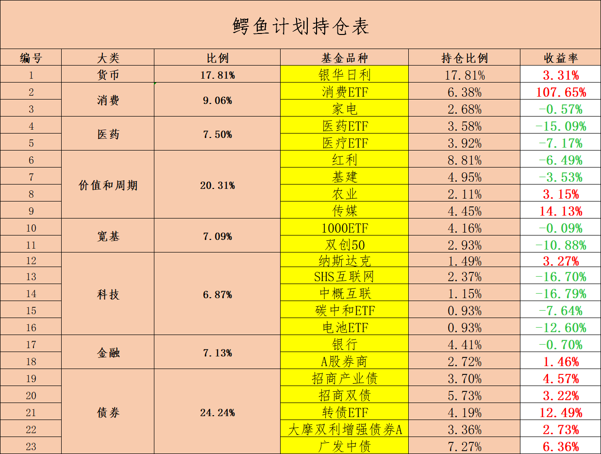

======================================================

_type: talk
@阿宝[422212151424158]
2021-12-26 16:07:45 Sun  
topic_id: 581522822421544

投资是个少数人获胜的游戏，我们要和大部分人不一样。

@杜志彪 at 2021-12-26 16:07:45 Sun

> 投资很重要的就是遇到对的人，一个好的引路人使你会少走很多弯路，我也是在18年年底遇到二师父，然后开始学习相关投资知识，学习很重要，心性的修炼也很重要，感觉每年都有进步，近几天也在总结这一年的得失，希望通过你的感悟能够引导更多的人走向投资的正确道路上，感谢那些引导和帮助过我们的人[微笑]

----------

@西锦巴乌 at 2021-12-26 16:07:45 Sun

> 好好生活，努力学习，做好投资，幸福快乐！共勉[握手][握手][握手]

----------

阅读[1]  评论[2]  赞[0] 

+++++++++++++++++++++++++++++++++++++++++++++++++++++

文件：
2021-12-26 16:07:45 Sun
文件大小：[203294]
244148421852451-12.4   投资读书感悟.pdf

======================================================

_type: talk
@阿宝[422212151424158]
2021-12-26 16:15:10 Sun  
topic_id: 418544144241428

年轻人，要慢慢攒钱，慢慢变富，淡化财富，修行内功，做时间的朋友，用简单的招式，便也可以在投资的江湖悠然自得，闲庭信步。

阅读[1]  评论[0]  赞[0] 

+++++++++++++++++++++++++++++++++++++++++++++++++++++

文件：
2021-12-26 16:15:10 Sun
文件大小：[202449]
422128251842858-随笔闲聊12.26.pdf

======================================================

_type: talk
@二师父[28814221155551]
2021-12-26 20:02:47 Sun  
topic_id: 581522821885244

今年最火的消息，被爆出来的是少数，大部分人炒股最终的命运就是亏损，买基金组合配置相对是大胜率的事情。

@阿宝 at 2021-12-26 20:02:47 Sun

> 已学习

----------

阅读[1]  评论[1]  赞[0] 

+++++++++++++++++++++++++++++++++++++++++++++++++++++

文件：
2021-12-26 20:02:08 Sun
文件大小：[47465]
244148448288551-血亏37万，散户的出路在哪里.docx

======================================================

_type: talk
@二师父[28814221155551]
2021-12-27 19:29:10 Mon  
topic_id: 218255142512451

成交额破万亿，缩量是个好信号，如果保守的投资者可以配置我出的稳健组合，激进的投资者就在稳健组合基础上配置一些看好的指数基金和股票，守正出奇，6%——8%的年化收益率是需要保底的。

阅读[1]  评论[0]  赞[0] 

+++++++++++++++++++++++++++++++++++++++++++++++++++++

文件：
2021-12-27 19:27:55 Mon
文件大小：[30011]
111815184148222-终于破万亿了.docx

======================================================

_type: talk
@二师父[28814221155551]
2021-12-27 20:04:05 Mon  
topic_id: 418544125582188

<e type="hashtag" hid="15522244428212" title="#估值数据和估值表#" />

阅读[1]  评论[0]  赞[0] 

+++++++++++++++++++++++++++++++++++++++++++++++++++++

图片：
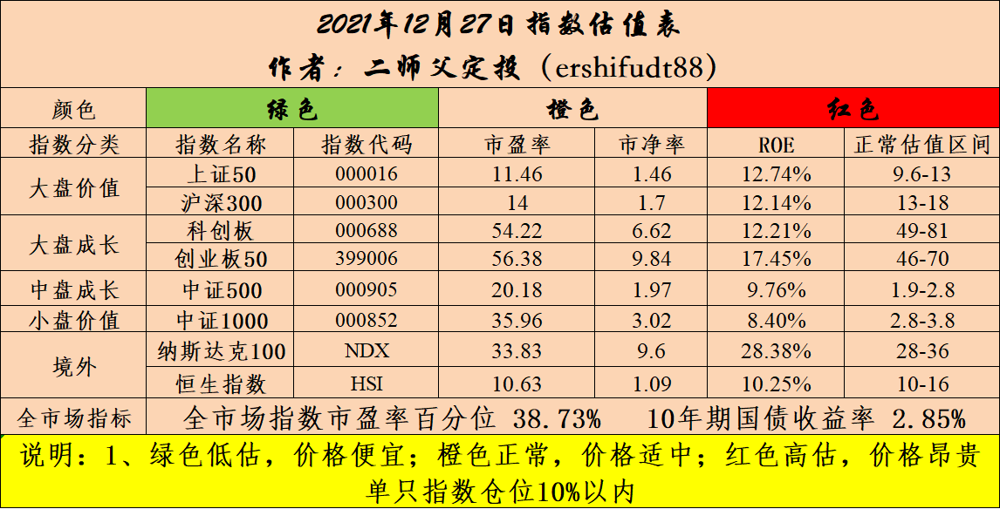

======================================================

_type: talk
@二师父[28814221155551]
2021-12-27 20:06:02 Mon  
topic_id: 185422814458482

<e type="hashtag" hid="88855522251542" title="#每日大盘估值数据#" /> 市盈率百分位38.73%，市净率32.75%，SY-BY百分位36.18%，SY/BY班费为31.55%。

整体估值下移，仓位控制在5到7成，光伏遭遇大利空，咱们上周已经清仓。传媒短期回调，可以适当收割利润。

阅读[1]  评论[0]  赞[0] 

======================================================

_type: q&a
@汉尼拔[552144155244]
2021-12-28 12:35:06 Tue  
topic_id: 818258558542222

@汉尼拔

>  二师傅，我想问下买房贷款25年，提前还一部分合适么？提前还的话，是还本金还是减少年限合适。能帮科普一下吗

@二师父

>  这得看你是等额本金还是等额本息，你还了多久，如果是等额本金的话提前还本就可以，如果是等额本息，刚开始还没多久可以提前还，如果已经还了有8，9年了再提前还就不划算，因为等额本息前期基本还的是利息。

阅读[1]  评论[4]  赞[0] 

======================================================

_type: talk
@手牵手看夕阳[244112548184141]
2021-12-28 12:47:14 Tue  
topic_id: 185425225188442

电池ETF和新能源车ETF这个位置可以买入吗？

@二师父 at 2021-12-28 12:47:14 Tue

> 看仓位，1%和100%是两个不同的概念

----------

阅读[1]  评论[1]  赞[0] 

======================================================

_type: talk
@二师父[28814221155551]
2021-12-28 20:15:59 Tue  
topic_id: 418548482548218

市场的表现还不错，小红下跌，10%仓位以内继续定投。医疗如果反弹盈利5%以上可以逐步卖出，医疗的趋势没有变化。

@嘉宾 at 2021-12-28 20:15:59 Tue

> 稳健组合场内配置需要开通基金账户，有其他选择[撇嘴]

----------

@枫叶 at 2021-12-28 20:15:59 Tue

> 老师您好，我有一点基本面60，现在盈利要不要卖了

----------

@二师父 at 2021-12-28 20:15:59 Tue

> 可以的

----------

@二师父 at 2021-12-28 20:15:59 Tue

> 场内直接买ETF

----------

阅读[1]  评论[4]  赞[0] 

+++++++++++++++++++++++++++++++++++++++++++++++++++++

文件：
2021-12-28 20:15:08 Tue
文件大小：[29618]
244142584884811-跨年，稳住.docx

======================================================

_type: talk
@二师父[28814221155551]
2021-12-29 22:01:20 Wed  
topic_id: 218258255151581

稳定5%收益率的品种，明天可以考虑考虑。

市场反复震荡，意思不大，等一波下行以后，买入看好的品种，反弹20%左右走人，这么赚还是不错的。A股本来大部分就是波动的市场，无脑硬怼一个板块容易翻车，中概1.2明天发车哈，场外发车，总共买5次结束，网格加仓策略很重要，如果到了最低的位置还跌，那就卧倒了。

@梧桐 at 2021-12-29 22:01:20 Wed

> 小红是谁，大基又是谁。

----------

@二师父 at 2021-12-29 22:01:20 Wed

> 红利，基建

----------

@梧桐 at 2021-12-29 22:01:20 Wed

> 明白了，谢过

----------

@阿宝 at 2021-12-29 22:01:20 Wed

> 老师，“国债逆回购收益率5%，说明股市赚钱效益低”这句话怎么理解？国债逆回购高，说明过节期间资金紧张，利率上升了，这样理解对吗？

----------

@二师父 at 2021-12-29 22:01:20 Wed

> 是的，另外获利资金也需要有去处

----------

@苍天有井明月空🌙 at 2021-12-29 22:01:20 Wed

> 百分之五是不是不如有钱把房贷还了

----------

@二师父 at 2021-12-29 22:01:20 Wed

> 如果投资水平一般可以提前还了

----------

@坚持学习 at 2021-12-29 22:01:20 Wed

> 二师父，没看到中概发车呀，买的多少呢？仓位已经有20％的，是不是不要参与为宜？

----------

阅读[1]  评论[9]  赞[0] 

+++++++++++++++++++++++++++++++++++++++++++++++++++++

文件：
2021-12-29 21:58:31 Wed
文件大小：[95002]
844142542241552-稳定5%收益率的品种.docx

======================================================

_type: talk
@二师父[28814221155551]
2021-12-29 23:25:01 Wed  
topic_id: 418548548124218

<e type="hashtag" hid="552114551414" title="#估值数据#" /> 市盈率百分位38.95%，市净率百分位32.75%，SY-BY百分位36.4%，SY/BY百分位31.65%。

阅读[1]  评论[0]  赞[0] 

======================================================

_type: q&a
@阿宝[422212151424158]
2021-12-30 08:44:04 Thu  
topic_id: 418548584458428

@阿宝

>  老师，人工智能方面有哪些好的主动基金，可以作为参考？有哪些基金经理能力圈可能会在人工智能方面？如何筛选出重仓人工智能的基金？人工智能指数基金的估值阀值是多少？

@二师父

>  没发现好的，很多人工智能基金开始买新能源了，基本会风格漂移

阅读[1]  评论[9]  赞[0] 

======================================================

_type: talk
@二师父[28814221155551]
2021-12-30 09:44:37 Thu  
topic_id: 218258288514421

<e type="hashtag" hid="88511114155212" title="#发车#" /> 乌龟计划买入中概500元，按照价格，下一次买入1.1以下，网格买入。没有绝对不买的品种，波动很大，仅供参考。

@顾小胖 at 2021-12-30 09:44:37 Thu

> 师傅请问出海打猎组合继续定投吗？

----------

@Philip🎭 Y at 2021-12-30 09:44:37 Thu

> 51305？

----------

@阿宝 at 2021-12-30 09:44:37 Thu

> 昨天我下手了。

----------

@二师父 at 2021-12-30 09:44:37 Thu

> 反弹了可以等等或者收割利润，美联储加息以后预计还会跌

----------

@顾小胖 at 2021-12-30 09:44:37 Thu

> 好的谢谢师傅

----------

@二师父 at 2021-12-30 09:44:37 Thu

> 场外的

----------

@DY🍉 at 2021-12-30 09:44:37 Thu

> 师父，今天只有这个发车吗

----------

@二师父 at 2021-12-30 09:44:37 Thu

> 对

----------

阅读[1]  评论[15]  赞[0] 

======================================================

_type: talk
@二师父[28814221155551]
2021-12-30 22:06:54 Thu  
topic_id: 818258245581552

传媒大家看情况来，今天买了中概，场内因为有溢价就暂时不发车了。

2022年估计还是比较稳，今天易总定调了，那么股市波动不会发生巨幅波动，咱们配置依然优先组合，然后做确定性的方向。长期持有还是我给的四个组合好，稳健复利，未来肯定是可以跑赢房产增值的。

@苍天有井明月空🌙 at 2021-12-30 22:06:54 Thu

> 今年人工智能和券商做网格，反而收益最高。[呲牙][呲牙]

----------

@二师父 at 2021-12-30 22:06:54 Thu

> 波动就网格收益好，我做的东财，搞长线反而没啥收益

----------

阅读[1]  评论[2]  赞[0] 

+++++++++++++++++++++++++++++++++++++++++++++++++++++

文件：
2021-12-30 22:05:07 Thu
文件大小：[29468]
544845121218254-提款过年.docx

======================================================

_type: talk
@二师父[28814221155551]
2021-12-30 22:31:20 Thu  
topic_id: 185425412511242

<e type="hashtag" hid="552114551414" title="#估值数据#" /> 市盈率百分位38.73%，市净率百分位32.75%，SY-BY百分位36.18%。市场窄幅震荡，估值数据没有太大变化。

阅读[1]  评论[0]  赞[0] 

======================================================

_type: q&a
@好运玲玲[244188585541521]
2021-12-31 09:41:16 Fri  
topic_id: 418548518184458

@好运玲玲

>  二师父您好！急死我了，场内前两天买了酒etf，昨天看只亏了几个点，亏了几百元，今天一看亏了好几千，没有这么大的跌幅啊，求指点！

@二师父

>  年底分红除权，稍后分红之后就正常了，不用担心

阅读[1]  评论[1]  赞[0] 

======================================================

_type: q&a
@老孙头[422115118524548]
2021-12-31 11:33:51 Fri  
topic_id: 581521585582214

@老孙头

>  老师有点神，场内中概一买就大涨！场外不是假日休市，什么逻辑？

@二师父

>  是因为限购，极速反弹不是好事，赚了慢慢出吧

阅读[1]  评论[1]  赞[0] 

======================================================

_type: talk
@二师父[28814221155551]
2021-12-31 11:42:27 Fri  
topic_id: 218258214541181

成长组合，清仓创业板，凡是公开组合，卖出必盈利

@坚持学习 at 2021-12-31 11:42:27 Fri

> 易方达科创板50ETF  011609，目前还是跌的，负10％。这个继续持有对吗，二师父

----------

@衣袂飘香 at 2021-12-31 11:42:27 Fri

> 跟了

----------

@二师父 at 2021-12-31 11:42:27 Fri

> 持有

----------

阅读[1]  评论[3]  赞[0] 

======================================================

_type: talk
@二师父[28814221155551]
2021-12-31 22:27:17 Fri  
topic_id: 581512214488244

<e type="hashtag" hid="88855524241552" title="#告别2021，喜迎2022#" />

@阿宝 at 2021-12-31 22:27:17 Fri

> 谢谢

----------

阅读[1]  评论[1]  赞[0] 

+++++++++++++++++++++++++++++++++++++++++++++++++++++

文件：
2021-12-31 22:27:15 Fri
文件大小：[30175]
844142825822482-圆满收官，喜迎2022.docx

======================================================

_type: talk
@二师父[28814221155551]
2021-12-31 23:18:45 Fri  
topic_id: 418584481854258

<e type="hashtag" hid="28518858514151" title="#每日估值数据#" /> 市盈率百分位40.87%，SY-BY百分位35.73%，SY/BY百分位29.84%。

无风险利率继续下行，对股市和债券市场都是利好，如果按照固定数据，10年期国债收益率低于3%卖出债券，这种会错过利息收益和价差收益，因为利率还会继续下行，如果没有确定的判断利率反转上行，长期持有更加适合。

阅读[1]  评论[0]  赞[0] 

======================================================

