_type: talk
@二师父[28814221155551]
2022-01-01 13:46:54 Sat  
topic_id: 218285545145851

<e type="hashtag" hid="28855524452251" title="#2021年总结#" /> 总结2021，2022继续干活，今天跑了5公里，争取今年1000公里跑量。

阅读[1]  评论[0]  赞[0] 

+++++++++++++++++++++++++++++++++++++++++++++++++++++

文件：
2022-01-01 13:46:14 Sat
文件大小：[33819]
422125852112518-全面复盘2021年投资情况.docx

======================================================

_type: talk
@二师父[28814221155551]
2022-01-02 20:59:47 Sun  
topic_id: 418584842218548

预测市场的研报被处罚了，投资还是依靠预期下的概率选择。

阅读[1]  评论[0]  赞[0] 

+++++++++++++++++++++++++++++++++++++++++++++++++++++

文件：
2022-01-02 20:57:39 Sun
文件大小：[30876]
111814582825412-装神弄鬼被治了.docx

======================================================

_type: talk
@二师父[28814221155551]
2022-01-03 15:32:04 Mon  
topic_id: 581512151814254

介绍一只比较好的互联网基金，后面场内和场外都用这个来进行网格。

注意是移动价格网格，大家可以学习下思路和投资逻辑。

阅读[1]  评论[0]  赞[0] 

+++++++++++++++++++++++++++++++++++++++++++++++++++++

文件：
2022-01-03 15:30:21 Mon
文件大小：[31172]
544882825821154-超跌的互联网，正确的投资姿势和相关基金.docx

======================================================

_type: talk
@二师父[28814221155551]
2022-01-03 15:50:52 Mon  
topic_id: 818285828148482

<e type="hashtag" hid="552114551414" title="#估值数据#" /> 目前还是全部正常估值，如果按照估值定投就耐心等待绝佳击球区。

如果自己按照组合配置就可以不用定投。目前星球的内容会同步到微博，到期之后服务完最后一位同学，星球就作为自己的投资记录，现在公开分享风险是很大的，虽然我也有从业资格证，但是面对大环境还是注意一下。

我一直在体制内工作，对于风控和合规永远是第一位，不管环境如何变化，尽量在合规的角度一直分享，这样才能一直玩下去。

@苍天有井明月空🌙 at 2022-01-03 15:50:52 Mon

> 我去关注

----------

@蛋炒饭不加蛋 at 2022-01-03 15:50:52 Mon

> 二师父wb叫啥

----------

@二师父 at 2022-01-03 15:50:52 Mon

> 一样的

----------

@光少 at 2022-01-03 15:50:52 Mon

> 二师父，微博号叫舍？

----------

@二师父 at 2022-01-03 15:50:52 Mon

> 二师父定投

----------

@Hi·DD at 2022-01-03 15:50:52 Mon

> 到期以后就没有星球了吗？不再带我们了吗？

----------

@二师父 at 2022-01-03 15:50:52 Mon

> 星球到期不续费了哈，公众号还会持续分享的

----------

@Hi·DD at 2022-01-03 15:50:52 Mon

> [撇嘴]哪里还能看到鳄鱼计划

----------

阅读[1]  评论[18]  赞[0] 

+++++++++++++++++++++++++++++++++++++++++++++++++++++

图片：
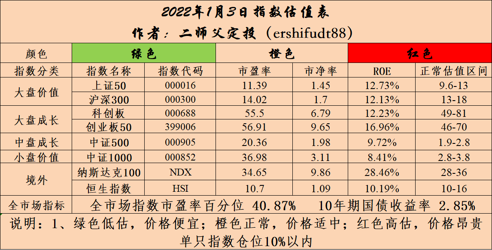

======================================================

_type: talk
@二师父[28814221155551]
2022-01-03 15:52:18 Mon  
topic_id: 185452545814882

<e type="hashtag" hid="881125525822" title="#估值#" />

@Vivian at 2022-01-03 15:52:18 Mon

> 老师是医疗一直跌可以买了吗

----------

@cotton at 2022-01-03 15:52:18 Mon

> 今天不动吗，二师父

----------

@二师父 at 2022-01-03 15:52:18 Mon

> 没买

----------

@二师父 at 2022-01-03 15:52:18 Mon

> 没动啊，你是不是仓位轻了

----------

@cotton at 2022-01-03 15:52:18 Mon

> [呲牙]

----------

@步步惊心 at 2022-01-03 15:52:18 Mon

> 003376现在赢利8%要买出吗？谢谢

----------

@二师父 at 2022-01-03 15:52:18 Mon

> 有好的买入标的再考虑卖出

----------

阅读[1]  评论[7]  赞[0] 

+++++++++++++++++++++++++++++++++++++++++++++++++++++

图片：

======================================================

_type: talk
@二师父[28814221155551]
2022-01-04 10:48:15 Tue  
topic_id: 418584815248258

成长股继续大跌，还是价值相对有优势，基本切换已经形成了，主价值，辅助成长，建了一个微信群，星球的朋友有兴趣可以联系微信ershifudt加入。

@helen at 2022-01-04 10:48:15 Tue

> 如何加群？

----------

@Mo.DC at 2022-01-04 10:48:15 Tue

> 医药趋势怎么看，现在估值低吗

----------

@二师父 at 2022-01-04 10:48:15 Tue

> 看跌，不能只看估值，中概估值也低

----------

@冉冉 at 2022-01-04 10:48:15 Tue

> 二师傅，之前己进二师傅定投，还要进入二师傅定投微信群吗？

----------

@老孙头 at 2022-01-04 10:48:15 Tue

> 场内有中药基金吗？政策面强劲，也许可喝点汤？

----------

@云卷云舒 at 2022-01-04 10:48:15 Tue

> 怎么加入啊，师父！

----------

@水墨青花 at 2022-01-04 10:48:15 Tue

> 师父，传媒和农业目前啥估值

----------

@二师父 at 2022-01-04 10:48:15 Tue

> 传媒低估，农业正常

----------

阅读[1]  评论[12]  赞[0] 

======================================================

_type: q&a
@是喵喵吖～[421441114141158]
2022-01-04 20:30:57 Tue  
topic_id: 185452128851482

@是喵喵吖～

>  师父攒了5万块钱暂时用不到，想请教下您除了货币基金一次性买点什么什么存起来好呢。

@二师父

>  暂时是多久呢，如果一年以上用不到可以买防守组合

阅读[1]  评论[3]  赞[0] 

======================================================

_type: talk
@二师父[28814221155551]
2022-01-04 22:01:19 Tue  
topic_id: 581512418212844

说下为什么不做星球了，大家都知道现在管的严，不是不想和大家分享，而是我预判监管会持续动刀，我喜欢提前应对，而不是被治了。

关于几个投资计划，我会公开微博分享，因为微博粉丝少，号被封了我也不心疼，但是能做多久我也不清楚。很多大V转到了和机构合作，当然我也想合作，只不过机构明确表示，他们会干预我的投资，如果那样的话，最终我没法保证我做投资的出发点是兴趣，是为了投资者的利益。

宋江被招了以后，让他干啥他就得干啥，既然如此，何不洒脱一点呢？人活着最重要的是开心，本来我最热爱的事情最终成了被人驾驭的工具，那么我还属于没活明白。

不知道大家能不能听的懂，很多事情在公开场合也没法说的太明白，只是人生终究是有缘分的，如果命运注定我们就能携手这一程，希望以后你的生命中不管是否有我，都可以开心快乐。

还记得我经常和大家分享的一句话吗？有度量接纳自己不能够改变的事情，有勇气改变能够改变的事情，有智慧区别能够改变与不能够改变的事情。如果真的明白了这句话，人生少很多烦恼。

成长股继续跌，咱们之前就已经应对了，芯片、光伏轻仓、锂电、碳中和、医疗、中概有仓位，但是加起来不超过15%，大部分仓位给了债基和红利、基建、传媒、中证1000，所以今天还实现了盈利，接下来继续布局价值板块，如果继续涨的话，卧倒或者收割利润就行了。这个计划的操作都是及时分享的。

@Mo.DC at 2022-01-04 22:01:19 Tue

> 与其说跟二爷学投资，不如说跟二爷学做人[强]支持洒脱

----------

@阿宝 at 2022-01-04 22:01:19 Tue

> 谢谢老师

----------

@J at 2022-01-04 22:01:19 Tue

> 二师父，跟着你的星球好像有两年多了，基本每天都会来看看，是忠粉了。日后假如星球被封，能否考虑在朋友圈更新和分享呢？

----------

@二师父 at 2022-01-04 22:01:19 Tue

> 放心，我已经提前应对，封不了

----------

@JOY at 2022-01-04 22:01:19 Tue

> 不随波，不逐流，您是明白人～[强]

----------

阅读[1]  评论[5]  赞[0] 

+++++++++++++++++++++++++++++++++++++++++++++++++++++

文件：
2022-01-04 21:47:28 Tue
文件大小：[32017]
544882854542584-开门大吉.docx

======================================================

_type: talk
@二师父[28814221155551]
2022-01-04 22:56:10 Tue  
topic_id: 581512418418244

<e type="hashtag" hid="552114551414" title="#估值数据#" /> 市盈率百分位41.84%，SY-BY百分位37.05%，SY/BY百分位31.47%。

估值楼层3层，医疗投资可以等一等，具体到位了我会说的，中概不出意外本周开始继续，还是美股涨，中概跌，目前没有利好的情况下，做中概就只有买入反弹网格，同时做好被套的准备，如果害怕被套，那么别买中概，还是按照我说的方向做。

阅读[1]  评论[0]  赞[0] 

======================================================

_type: talk
@平安是福[118222545154542]
2022-01-05 09:46:54 Wed  
topic_id: 218285421814851

师父早上好！我场内有白酒ETF，浮赢20多个点，怎么现在变成了亏8个点，还是分红影响的吗？

@二师父 at 2022-01-05 09:46:54 Wed

> 是的，市场没有那么多跌幅

----------

阅读[1]  评论[1]  赞[0] 

======================================================

_type: talk
@林凤崎[421882481454488]
2022-01-05 12:49:24 Wed  
topic_id: 418584222448558

二师父，感觉现在行情不好，是不是先不投了，赚了的先出来，等下跌到一定时候再进呀？

@二师父 at 2022-01-05 12:49:24 Wed

> 上涨不追就可以

----------

@林凤崎 at 2022-01-05 12:49:24 Wed

> 觉得明年会出现很不好的情况，算了继续定投

----------

阅读[1]  评论[2]  赞[0] 

======================================================

_type: talk
@二师父[28814221155551]
2022-01-05 21:04:56 Wed  
topic_id: 818285155842822

<e type="hashtag" hid="15522515828222" title="#关于市场#" /> 今天创业板大跌，已经捅破年线了，年前清仓了创业板，目前没有持仓，医疗业不看好，但是目前浮亏较多，也准备躺平了。

今年投资很难做，要么价值方向，要么二级债基，最好不要自己开黑车，很有可能是运气好赚的钱。

@好运玲玲 at 2022-01-05 21:04:56 Wed

> 二师父您好！请问生物科技和医疗是一样的趋势吗？

----------

@二师父 at 2022-01-05 21:04:56 Wed

> 生物科技基金是近似的

----------

@一心一意 at 2022-01-05 21:04:56 Wed

> 医疗也准备躺平，是准备清仓么

----------

@二师父 at 2022-01-05 21:04:56 Wed

> 躺平是不动

----------

阅读[1]  评论[4]  赞[0] 

+++++++++++++++++++++++++++++++++++++++++++++++++++++

文件：
2022-01-05 21:03:11 Wed
文件大小：[31029]
422114111485218-震荡有望被打破.docx

======================================================

_type: talk
@一心一意[844421848411122]
2022-01-05 21:12:07 Wed  
topic_id: 581512822185454

师父的鳄鱼表里面创业板也清仓了么？

@二师父 at 2022-01-05 21:12:07 Wed

> 鳄鱼计划没有创业板，只有双创，因为是浮亏还没有清仓，所有公开组合都是保证盈利后卖出。

----------

@一心一意 at 2022-01-05 21:12:07 Wed

> 还有光伏的估值现在是多少啊，我还有部分仓位

----------

@二师父 at 2022-01-05 21:12:07 Wed

> 估值不重要，如果他正常估值，但是是从高向下的正常比从高估到更高估的位置更危险

----------

@好运玲玲 at 2022-01-05 21:12:07 Wed

> 二师父您好！现在适合买转债基金吗？

----------

阅读[1]  评论[4]  赞[0] 

======================================================

_type: talk
@二师父[28814221155551]
2022-01-06 10:00:26 Thu  
topic_id: 818285184851212

<e type="hashtag" hid="881251425252" title="#鳄鱼计划#" /> 买入互联网（164906）4份，卖出可转债etf两份，乌龟计划买入互联网（164906）1500元，去年四季度已经把红利，基建仓位买起来了，大盘跌破3400再考虑加仓。窄幅震荡卧倒

@小鱼 at 2022-01-06 10:00:26 Thu

> 场内和场外都买吗

----------

@二师父 at 2022-01-06 10:00:26 Thu

> 都买

----------

@云云 at 2022-01-06 10:00:26 Thu

> 师父，场内的代码不对吧？是517050对吗？

----------

@二师父 at 2022-01-06 10:00:26 Thu

> 对的

----------

@果实妈咪 at 2022-01-06 10:00:26 Thu

> 场内是对的吧，lof对吧二师父

----------

@二师父 at 2022-01-06 10:00:26 Thu

> 对的

----------

@蓝精灵 at 2022-01-06 10:00:26 Thu

> 师父这是场内的代码嘛

----------

@二师父 at 2022-01-06 10:00:26 Thu

> 是的

----------

阅读[1]  评论[12]  赞[0] 

======================================================

_type: talk
@二师父[28814221155551]
2022-01-06 22:18:37 Thu  
topic_id: 185455218251422

关于中概的逻辑和方法都说了很多次了，不能接受浮亏的不要参与。

推荐二级债基，很多二级债基长期略跑输沪深300，为什么现在不定投，因为震荡，沪深300根本没咋跌，而18年复盘沪深300持续下行，这种才能真正做到摊低成本。

@老孙头 at 2022-01-06 22:18:37 Thu

> 跟老师参与“网格”，应不属于“丐帮游戏”吧？

----------

@二师父 at 2022-01-06 22:18:37 Thu

> 网格不怕跌就可以

----------

@shi at 2022-01-06 22:18:37 Thu

> 目前丐帮2%仓位。
已经从每周一份增加到每天一份，子弹是5个月。完成后仓位将到7%。

----------

阅读[1]  评论[3]  赞[0] 

+++++++++++++++++++++++++++++++++++++++++++++++++++++

文件：
2022-01-06 22:10:37 Thu
文件大小：[31742]
244118584422521-丐帮的兄弟，来集合一下.docx

======================================================

_type: talk
@二师父[28814221155551]
2022-01-06 22:55:42 Thu  
topic_id: 581511281282454

<e type="hashtag" hid="552114551414" title="#估值数据#" /> 市盈率百分位38.78%，SY-BY百分位35.96%，SY/BY百分位31.06%。

整体估值下移，如果没有突破的话，选择网格更加明智，波动的券商东财，中概，基建这些都比较适合网格。

长线仓位主仓不动，短线5%或者10%的网格都是可以的。

@顾小胖 at 2022-01-06 22:55:42 Thu

> 师父请问这里的中概指的是513050还是164906啊？

----------

@二师父 at 2022-01-06 22:55:42 Thu

> 164906

----------

@顾小胖 at 2022-01-06 22:55:42 Thu

> 谢谢师傅

----------

阅读[1]  评论[3]  赞[0] 

======================================================

_type: talk
@以古论今[28214421582421]
2022-01-07 16:06:11 Fri  
topic_id: 218288888528811

中概互联和医药低估时入场，现在浮亏30%，仓位重，继续持有，还是清仓，亏怕了

@二师父 at 2022-01-07 16:06:11 Fri

> 如果仓位超过百分之50就要减仓，行业基金单只不能超过百分之20

----------

阅读[1]  评论[1]  赞[0] 

======================================================

_type: q&a
@阿宝[422212151424158]
2022-01-07 19:45:53 Fri  
topic_id: 418588845528518

@阿宝

>  老师，请教几个问题。一、今年策略如下今年大概率利率下行，利于债券，配置的话1、（场内国债511010，公司债511030，城投债511220）；2、中小盘整体估值比较低，且有盈利提升预期，配置上场内中证500增强（161017），中证1000（512100），3、还有就是老师的组合配置中的固守➕类（易方达裕丰000171、易方达稳健收益110007、易方达增强回报债110017）二、易方达中债7-10国开债跟踪指数有对应的场内基金代码？在什么软件上找对应指数的场内基金比较全？三、有觉得在配置中小盘方面比较看好的主动管理基金经理和基金吗？

@二师父

>  场内没有，不过也可以在场内购买国开债基金，中庚小盘价值可以关注下

阅读[1]  评论[1]  赞[0] 

======================================================

_type: talk
@二师父[28814221155551]
2022-01-07 21:52:13 Fri  
topic_id: 218288825821221

现在市场还是价值为主，看看会不会杀跌，如果有杀跌的话继续补仓价值，中概和医疗都不要重仓，目前医疗暂停，中概继续网格，我会带大家走完这轮牛市的，成长股已经开始了熊市周期，做好准备吧，等我信号，想自己发车的就是我说的价值方向+二级债基+海外基金。

@蓝精灵 at 2022-01-07 21:52:13 Fri

> 师父，二级债基的场内代码在哪查找呀！

----------

@二师父 at 2022-01-07 21:52:13 Fri

> 只有场外的

----------

@衣袂飘香 at 2022-01-07 21:52:13 Fri

> 二师父的言下之意，这轮牛市以后，要自己独行了？

----------

@二师父 at 2022-01-07 21:52:13 Fri

> 没有，因为说基金操作未来可能定性为不合法，这和股票一样，最开始说股票是没事的，后面新出了法规，如果不能说基金操作，讲板块没问题，我有从业资格证，如果愿意也能入职，这倒没啥事

----------

@衣袂飘香 at 2022-01-07 21:52:13 Fri

> 嗯，希望二师父能多带我们走几年。

----------

阅读[1]  评论[5]  赞[0] 

+++++++++++++++++++++++++++++++++++++++++++++++++++++

文件：
2022-01-07 21:50:19 Fri
文件大小：[29547]
844118542812222-真刺激.docx

======================================================

_type: talk
@二师父[28814221155551]
2022-01-07 22:13:25 Fri  
topic_id: 818288825218152

<e type="hashtag" hid="552114551414" title="#估值数据#" /> 市盈率百分位40.99%，SY-BY百分位37.42%，SY/BY百分位32.58%。

看起来市场大跌，实则市场没有跌多少，估值数据变化并不大，如果真的跌到3300以下会是很好的入场机会。

阅读[1]  评论[0]  赞[0] 

======================================================

_type: talk
@二师父[28814221155551]
2022-01-08 11:34:04 Sat  
topic_id: 218288842285221

搞基值得，中概第一网已经盈利2%，盈利10%开始收网，主跌的基金不断网格，严格遵守纪律。

@一心一意 at 2022-01-08 11:34:04 Sat

> 师父，鳄鱼里的中概现在是按网格思路么，到10%盈利就出了么

----------

@二师父 at 2022-01-08 11:34:04 Sat

> 网格

----------

阅读[1]  评论[2]  赞[0] 

+++++++++++++++++++++++++++++++++++++++++++++++++++++

文件：
2022-01-08 11:32:51 Sat
文件大小：[31087]
544881181228244-加入搞基大军.docx

======================================================

_type: talk
@二师父[28814221155551]
2022-01-09 15:49:27 Sun  
topic_id: 218288288525121

<e type="hashtag" hid="881251425252" title="#鳄鱼计划#" /> 目前鳄鱼计划表。

说说我的计划，防守组合建仓后卧倒，今年如果走熊市，那么预期收益率2%，今年如果走牛市那么预期收益率8%，还不错。

而走熊之后就给建仓机会，等砸出坑来了入场，为什么卧倒休息，不是不看好今年行情，而是为了在更好的位置买入，窄幅震荡如果一直高位不断买买买，成本就提高了，加息之后再跌个大坑，进本就掉进去了。

耐心分为两个方面：第一是耐心持有，第二是耐心等待看好的品种跌到合适的价格区间。芒格都是分批买入的，咱们更应该分批建仓。

场内中概5%盈利收网，场外中概盈利10%收网，上周四建仓，已经反弹，没有太大难度，继续网格，即使市场一直震荡，我也会手把手教大家如何在网格上获利。

@DY🍉 at 2022-01-09 15:49:27 Sun

> 现在可以配稳健账户吗

----------

@二师父 at 2022-01-09 15:49:27 Sun

> 能接受百分之15回撤可以的

----------

@范毅君 at 2022-01-09 15:49:27 Sun

> 今年看预测外部经济环境继续恶化，二师父，22年师父对宏观经济形势的看法是什么

----------

@二师父 at 2022-01-09 15:49:27 Sun

> 全球通胀和失业持续上升，美联储加息促使美元回流，防范风险，中国会进行逆周期调节，相对压力较小

----------

@衣袂飘香 at 2022-01-09 15:49:27 Sun

> 感谢二师父手把手的教我们。

----------

@范毅君 at 2022-01-09 15:49:27 Sun

> 好的，二师父，谢谢

----------

@shi at 2022-01-09 15:49:27 Sun

> 二师父，科技中怎么收了三个丐帮弟子？

----------

@二师父 at 2022-01-09 15:49:27 Sun

> 两个长期，一个波段

----------

阅读[1]  评论[9]  赞[0] 

+++++++++++++++++++++++++++++++++++++++++++++++++++++

图片：
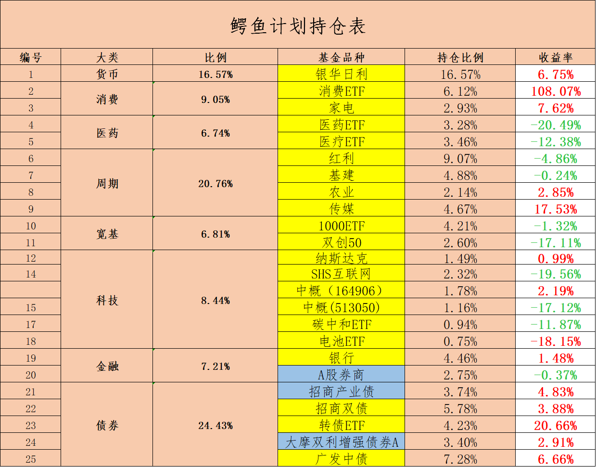

======================================================

_type: talk
@二师父[28814221155551]
2022-01-09 17:35:46 Sun  
topic_id: 418588588155888

关于组合的投资，目前青铜组合和白银组合是可以的，风险都很低，之前建仓的组合目前也是正收益。

如果在大盘3400到3800之间还准备投的可以考虑二级债基，也就是白银组合。美联储大概率3月加息，我们就蹲点两会期间。

阅读[1]  评论[0]  赞[0] 

======================================================

_type: talk
@二师父[28814221155551]
2022-01-10 09:51:49 Mon  
topic_id: 418588222845428

<e type="hashtag" hid="88511114155212" title="#发车#" /> 开始提款，场内鳄鱼计划卖出3份，场外乌龟计划减仓一半，两个月赚百分之15，还行吧。

@罗大发 at 2022-01-10 09:51:49 Mon

> 师父传媒清仓了吗

----------

@二师父 at 2022-01-10 09:51:49 Mon

> 卖了一部分，没清仓

----------

@罗大发 at 2022-01-10 09:51:49 Mon

> 收到

----------

阅读[1]  评论[3]  赞[0] 

+++++++++++++++++++++++++++++++++++++++++++++++++++++

图片：
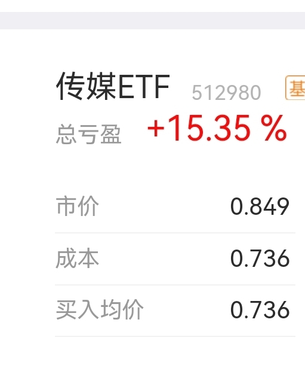

======================================================

_type: q&a
@范毅君[118551121224142]
2022-01-10 09:54:23 Mon  
topic_id: 218288444551521

@范毅君

>  二师父，现在中证1000底仓很低，适合建立底仓吗，场内

@二师父

>  等待，到机会了我也会继续的，后面可能有更好的机会，暂时不着急，如果怕踏空，可以极度少量

阅读[1]  评论[1]  赞[0] 

======================================================

_type: talk
@二师父[28814221155551]
2022-01-10 10:45:19 Mon  
topic_id: 185455111185182

明天丐帮提款，网格是不是很爽，即使丐帮一直讨饭，咱们也能获利

@庆余年 at 2022-01-10 10:45:19 Mon

> 这个是设的自动网格还是手动操作的？

----------

@二师父 at 2022-01-10 10:45:19 Mon

> 都可以

----------

@从A到Z at 2022-01-10 10:45:19 Mon

> 还是按照前面的网格图操作吗

----------

@二师父 at 2022-01-10 10:45:19 Mon

> 不是，我会发车了

----------

阅读[1]  评论[4]  赞[0] 

+++++++++++++++++++++++++++++++++++++++++++++++++++++

图片：
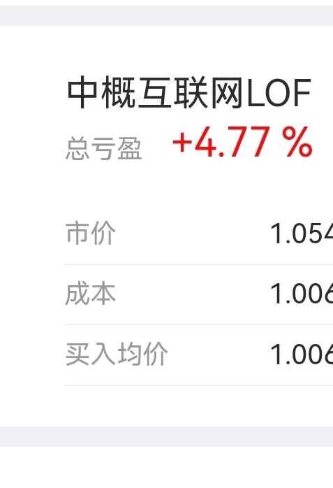

======================================================

_type: talk
@JOY[111881481812422]
2022-01-10 11:15:46 Mon  
topic_id: 818288441584512

师父，想请教下您中概投资品种更换的原因。是因为164906的持仓比513050更均衡、没有溢价，可场内外互转吗？还有别的原因吗？
那之前买入的513050计划怎么操作呢？

@二师父 at 2022-01-10 11:15:46 Mon

> 主要是因为溢价，其次164906不限购，最后是164906持仓更加分散。

之前买入长期持有就行了

----------

@JOY at 2022-01-10 11:15:46 Mon

> 好的，谢谢您～

----------

阅读[1]  评论[2]  赞[0] 

======================================================

_type: talk
@二师父[28814221155551]
2022-01-10 19:01:35 Mon  
topic_id: 218288158544411

关于网格和长期投资不矛盾，中概、基建、传媒都可以网格，也可以一部分长期持有。

比如中概之前买的被套住了，就拿着，长期时间会带来基金净值增长，而短期可能持续震荡，所以一部分长期，震荡时候反复网格，只要有波动就能挣钱。

有了主仓，也不怕卖飞了，即使未来中概一直不涨，只要他波动，咱们就会慢慢网格获利。

阅读[1]  评论[0]  赞[0] 

======================================================

_type: talk
@二师父[28814221155551]
2022-01-10 20:20:30 Mon  
topic_id: 581511821855514

<e type="hashtag" hid="552114551414" title="#估值数据#" /> 市盈率百分位37.64%，SY-BY百分位34.64%，SY/BY百分位29.23%。

估值也一直在持续震荡，关于是否加仓，回调如果没有破位是可以的，关注基建、红利、保险、银行、港股这些持续低估板块。

而高估值的要避免，尤其是新能源，另外纳斯达克开启网格，境外账户时10%的网点，鳄鱼计划账户是5%网点，海外打猎是长线定投。

短与长结合，只要不管未来何种走势，长期都可以盈利。

@梧桐 at 2022-01-10 20:20:30 Mon

> 二师父，H股etf低估吗。

----------

@二师父 at 2022-01-10 20:20:30 Mon

> 这个基金编制不大好，选择恒生更好的

----------

@梧桐 at 2022-01-10 20:20:30 Mon

> 好

----------

@云卷云舒 at 2022-01-10 20:20:30 Mon

> 师父，场内纳指513100也可以网格？

----------

@二师父 at 2022-01-10 20:20:30 Mon

> 可以

----------

阅读[1]  评论[5]  赞[0] 

======================================================

_type: talk
@二师父[28814221155551]
2022-01-10 20:26:54 Mon  
topic_id: 581511821845124

这是10个点网格，每跌10买一次，每涨10卖一次

@匿名的码农 at 2022-01-10 20:26:54 Mon

> 二师父，纳指现在能定投？我都等了好久了，在等大跌

----------

@二师父 at 2022-01-10 20:26:54 Mon

> 网格

----------

阅读[1]  评论[2]  赞[0] 

+++++++++++++++++++++++++++++++++++++++++++++++++++++

图片：
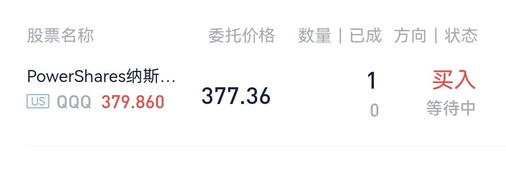

======================================================

_type: talk
@林玮[844111858288412]
2022-01-10 22:48:55 Mon  
topic_id: 818288185252242

网格怎么不见了？

@二师父 at 2022-01-10 22:48:55 Mon

> 放估值了

----------

阅读[1]  评论[1]  赞[0] 

======================================================

_type: talk
@二师父[28814221155551]
2022-01-10 23:27:06 Mon  
topic_id: 218288185144151

估值表，沪深300和恒生快低估了。耐心等等，美联储加息缩表影响很大的，定投的话先轻仓，避开连续两年大涨的板块

阅读[1]  评论[0]  赞[0] 

+++++++++++++++++++++++++++++++++++++++++++++++++++++

图片：
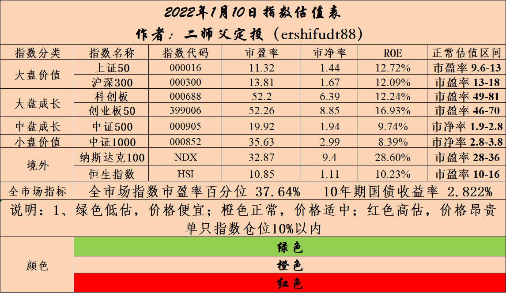

======================================================

_type: talk
@二师父[28814221155551]
2022-01-11 07:02:46 Tue  
topic_id: 185455858254242

关于下跌之后如何操作的问题，下跌后是否加仓还得看实际企业的变化情况。

比如医疗和基建下跌就完全不一样。

不管今年怎么变，首先握住基本盘，然后网格，这是基本策略，如果遇到大机会再上仓位，2020年3月我是满仓的，现在仓位很轻，我不确定未来怎么走，很可能我说的几个板块继续走牛，不过不愿意赌，毕竟现在比两年前涨了很多了。所以先保住既有利润，根据市场情况不断来调整。

@蛋炒饭不加蛋 at 2022-01-11 07:02:46 Tue

> 这么说杀估值的话应该是最快起来的？

----------

@二师父 at 2022-01-11 07:02:46 Tue

> 对

----------

@蛋炒饭不加蛋 at 2022-01-11 07:02:46 Tue

> 收到

----------

@小袁 at 2022-01-11 07:02:46 Tue

> 这篇文章写得太好了，让我一下就明白了各种下跌的不同，不是要看下跌的结果觉得就是低估了，而是看背后下跌的原因来确定

----------

阅读[1]  评论[4]  赞[0] 

+++++++++++++++++++++++++++++++++++++++++++++++++++++

文件：
2022-01-11 07:00:13 Tue
文件大小：[31735]
544881581251544-大跌的时候到底该加仓还是跑路.docx

======================================================

_type: talk
@二师父[28814221155551]
2022-01-11 07:08:28 Tue  
topic_id: 418588181485128

<e type="hashtag" hid="88855815555142" title="#关于纳斯达克的操作方法#" /> 设置3个网格点，鳄鱼计划里面的纳斯达克是5%网格点，我自己美股账户里面是10%网格点，海外打猎组合是20%网格点。

不管未来纳斯达克如何走，咱们都可以稳健获利，是不是很容易，关键在于执行。

考虑最坏的情况，纳斯达克的最大跌幅是08年时候57%，而且美国金融厉害，不大可能让美股长期趴着，最坏的情况就是发生了29年的事情，那么咱们长期持有，相信未来世界经济越来越好，股市也一定创新高。

关键是纳斯达克市盈率32倍，新能源市盈率132倍，你觉得英伟达、阿斯麦不如宁德时代吗

@xu at 2022-01-11 07:08:28 Tue

> 二师傅，场内纳斯达克代码是什么，谢谢

----------

@二师父 at 2022-01-11 07:08:28 Tue

> 详见置顶第三篇文章

----------

阅读[1]  评论[2]  赞[0] 

======================================================

_type: talk
@小袁[841582442185482]
2022-01-11 09:17:15 Tue  
topic_id: 185455842544112

老师，一直关注你的文章，受益颇多。能帮我分析一下现在中证红利现在适合买入吗？
 我看到中证红利成分股行业都是原材料及能源类的，现在pe处于低位，有可能是盈利到顶了，可是pb又非常低。不知道现在还能不能买入？
  另外我自有资金比较多，持仓只有不到一成的医疗，其它的都在活期宝中，现在看股债可能面临双杀。是慢慢分批进二级债基，还是做纳指的网格好呢？个人追求稳定。谢谢了。

@二师父 at 2022-01-11 09:17:15 Tue

> 分批买入白银组合，定投中证红利，网格中概，纳斯达克，同时进行

----------

@小袁 at 2022-01-11 09:17:15 Tue

> 谢谢您了！

----------

阅读[1]  评论[2]  赞[0] 

======================================================

_type: talk
@二师父[28814221155551]
2022-01-11 10:16:21 Tue  
topic_id: 185455842841412

丐帮，提款一份，一周不到5个点，满意吗

@蓝精灵 at 2022-01-11 10:16:21 Tue

> 师父，是把上周买的都卖了嘛

----------

@二师父 at 2022-01-11 10:16:21 Tue

> 上周买了4份，卖了一份

----------

@蓝精灵 at 2022-01-11 10:16:21 Tue

> 谢谢

----------

@一心一意 at 2022-01-11 10:16:21 Tue

> 一份如果太少，除了手续费，没多少了

----------

@水墨青花 at 2022-01-11 10:16:21 Tue

> 师父，亚药转债和搜特转债盈利多少出合适

----------

@二师父 at 2022-01-11 10:16:21 Tue

> 盈利就行，我也没法卖到最高点

----------

@水墨青花 at 2022-01-11 10:16:21 Tue

> 好的

----------

阅读[1]  评论[7]  赞[0] 

+++++++++++++++++++++++++++++++++++++++++++++++++++++

图片：
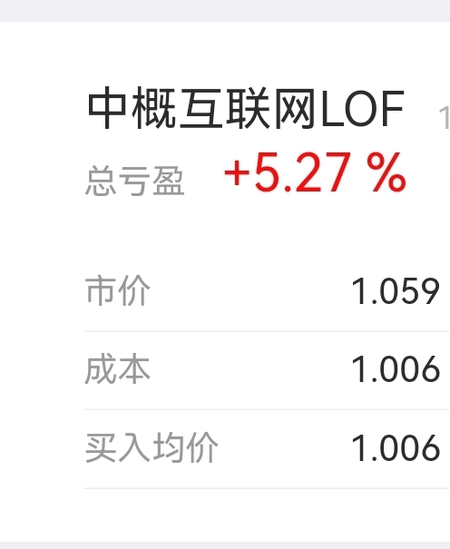

======================================================

_type: talk
@二师父[28814221155551]
2022-01-11 19:10:22 Tue  
topic_id: 581511844515584

市场不断下行，一定要守住啊，别玩大了，谨慎投资。

@蛋炒饭不加蛋 at 2022-01-11 19:10:22 Tue

> 传媒这两天也挺惨的

----------

@衣袂飘香 at 2022-01-11 19:10:22 Tue

> 二师父好。有空能分析中欧超级股票全明星、工银股混指数及其跟踪的基金，他们的优劣吗？

----------

@二师父 at 2022-01-11 19:10:22 Tue

> 好的

----------

阅读[1]  评论[3]  赞[0] 

+++++++++++++++++++++++++++++++++++++++++++++++++++++

文件：
2022-01-11 19:09:57 Tue
文件大小：[46846]
422118244185548-丐帮弟子，来提款了.docx

======================================================

_type: talk
@二师父[28814221155551]
2022-01-11 22:58:09 Tue  
topic_id: 418588115285518

<e type="hashtag" hid="552114551414" title="#估值数据#" /> 投资一定要靠专业性吃饭，研究多于操作，经常性地去理解行业、企业和市场，关于中概再说下，被套住的可能和医疗一样，短期没法解套了，真正走主跌以后是不会给机会回本走人的。

这种时候就要忘记之前高位买入的，等跌透了再次开始，同时拉开加仓的区间。

中概网格，场内是5%的加仓区间，场外是10%的加仓区间，不把步子迈大了，不管芒格如何抄底阿里，芒格是芒格，我们要有自己的判断，如果阿里真的那么好，为什么天猫电商被下架了，为什么马到了美国。

很多事情不是表面那么简单的，你看到的都仅仅是表象。

@shi at 2022-01-11 22:58:09 Tue

> 天猫下架了？

----------

@二师父 at 2022-01-11 22:58:09 Tue

> 线上商品

----------

阅读[1]  评论[2]  赞[0] 

======================================================

_type: talk
@二师父[28814221155551]
2022-01-11 23:00:23 Tue  
topic_id: 185455884158882

市盈率百分位38.5%，SY-BY百分位35.05%，SY/BY百分位29.64%，现在估值没太大变化，老读者都记得上一次咱们满仓的时候，估值分位大致5%，那时候才是极端便宜，我不清楚今年会不会到来这个极端估值，但是我能够确定的是，未来一定某一个时间点会到来，当你没有确定把握一定能够胜利的时候，不要满仓，除非满仓债基或者二级债，因为他们下行有限，不会让你遭遇腰斩幅度的亏损。

阅读[1]  评论[0]  赞[0] 

======================================================

_type: talk
@二师父[28814221155551]
2022-01-12 13:05:17 Wed  
topic_id: 418585888548418

中概互联收第二网，场外就不卖了，因为没有过7天手续费高，持续提款，大家跟上，买了四份，提款二份，还有二份。

@老孙头 at 2022-01-12 13:05:17 Wed

> “7天手续费高”应是指日历7天？而非指交易日？

----------

@二师父 at 2022-01-12 13:05:17 Wed

> 对

----------

@菖朴健康 at 2022-01-12 13:05:17 Wed

> 师傅好，为什么我们买中概这种类型的基金，为什么不直接买ETF呢？而选择买基金呢？

----------

@二师父 at 2022-01-12 13:05:17 Wed

> etf就是基金啊

----------

@菖朴健康 at 2022-01-12 13:05:17 Wed

> 今天买了一手（100股）的ETF，价格直接就是浮亏5%

----------

@二师父 at 2022-01-12 13:05:17 Wed

> 啥情况

----------

@菖朴健康 at 2022-01-12 13:05:17 Wed

> 不知道呢，所以才向您请教[流泪]

----------

@菖朴健康 at 2022-01-12 13:05:17 Wed

> 您看这个，买的时候假设是1元，还涨了2分钱，结果确是浮亏[捂脸][捂脸][捂脸]

----------

阅读[1]  评论[11]  赞[0] 

+++++++++++++++++++++++++++++++++++++++++++++++++++++

图片：
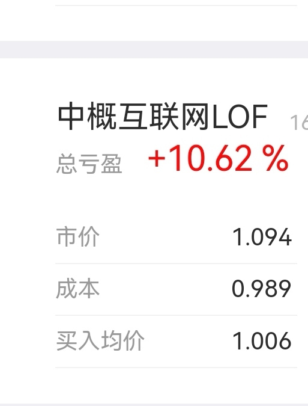

======================================================

_type: talk
@二师父[28814221155551]
2022-01-12 19:02:09 Wed  
topic_id: 218282825111441

市场今天反弹，成长组合发力，价值股开始下跌，波动比较大，如果没有判断市场的能力，最好配置组合卧倒，取得平均收益率就好，如果会判断市场，当前行情还是适合做中线突击的。

@衣袂飘香 at 2022-01-12 19:02:09 Wed

> 能讲讲啥是中线突击吗？中线大致是多久？

----------

@二师父 at 2022-01-12 19:02:09 Wed

> 就是中期调整到位了，一次买入，涨不动了卖出，具体看市场情况

----------

阅读[1]  评论[2]  赞[0] 

+++++++++++++++++++++++++++++++++++++++++++++++++++++

文件：
2022-01-12 19:01:13 Wed
文件大小：[31487]
422118281114518-你割了吗.docx

======================================================

_type: talk
@二师父[28814221155551]
2022-01-13 08:20:51 Thu  
topic_id: 418585821555418

<e type="hashtag" hid="51122182814214" title="#债券基金卖出#" /> 债券基金基本是长期持有，货币收紧的时候卖出，如果没有好的投资标的，更建议长期持有，长期看股票优于债券优于货币。

即使危机来了，国开债也有可能涨，所以没必要换货币，目前国开债是最重的仓位，应对美联储加息带来的大跌，等市场有所反应了再动

@七 at 2022-01-13 08:20:51 Thu

> 国开债还可以补吗

----------

@二师父 at 2022-01-13 08:20:51 Thu

> 看你的投资周期，如果持有10年肯定会新高，短期性价比很低了

----------

@西锦巴乌 at 2022-01-13 08:20:51 Thu

> 师父：货币收紧的时候卖出国债的原因是：购买股票（因为股市下跌）还是…

----------

@二师父 at 2022-01-13 08:20:51 Thu

> 流动性收紧，资产价格都承压

----------

@冉冉 at 2022-01-13 08:20:51 Thu

> 师父，现在购买债券优于购买货币基金吗？

----------

@二师父 at 2022-01-13 08:20:51 Thu

> 优于

----------

阅读[1]  评论[6]  赞[0] 

======================================================

_type: talk
@二师父[28814221155551]
2022-01-13 09:49:15 Thu  
topic_id: 818282812518282

发车，安心组合，这四只基金各买入8000，大家根据实际资金安排即可，债基相对稳健，适合躺平。保留一部分现金，应对美联储加息

@mumomo at 2022-01-13 09:49:15 Thu

> 乌龟计划还发车吗

----------

@二师父 at 2022-01-13 09:49:15 Thu

> 发车，今天没有，震荡市场先暂停了

----------

@防汛抗旱 at 2022-01-13 09:49:15 Thu

> 招商产业债好像也不错，为啥不买呢

----------

@二师父 at 2022-01-13 09:49:15 Thu

> 进攻型不足

----------

@冉冉 at 2022-01-13 09:49:15 Thu

> 师父，易方达安心回报债券（110027）、易方达中债7—10年期国开行债券指数A（003358）风险如何，可以购买吗？

----------

@二师父 at 2022-01-13 09:49:15 Thu

> 你跟车就行，我不清楚你的风险承受能力，目前国开债阶段高位了

----------

@DY🍉 at 2022-01-13 09:49:15 Thu

> 师父，我目前持有招商产业债和易方达稳健债，是把资金投入持有的两个？还是跟车？

----------

@二师父 at 2022-01-13 09:49:15 Thu

> 看你自己的资金安排

----------

阅读[1]  评论[8]  赞[0] 

+++++++++++++++++++++++++++++++++++++++++++++++++++++

图片：
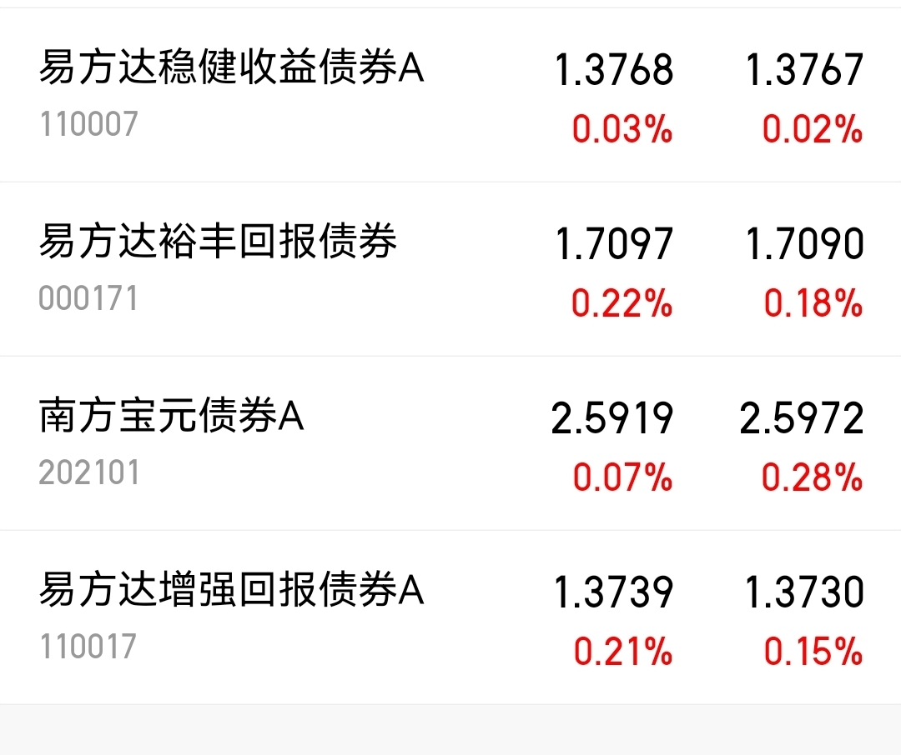

======================================================

_type: talk
@二师父[28814221155551]
2022-01-13 21:22:56 Thu  
topic_id: 818282288811542

金域医学持续遭遇暴击，最近又出了一个新闻，集团表示问题不大，大家还是慎重投资，今年价值方向表现还可以，基建今年涨了2%，比起宁德时代算是好些了。

@老孙头 at 2022-01-13 21:22:56 Thu

> [玫瑰]老师思路清晰，指导具体，亦步亦趋为要！

----------

阅读[1]  评论[1]  赞[0] 

+++++++++++++++++++++++++++++++++++++++++++++++++++++

文件：
2022-01-13 21:21:45 Thu
文件大小：[32079]
244118112221141-这家龙头药企的负责人被抓了.docx

======================================================

_type: talk
@二师父[28814221155551]
2022-01-13 22:12:51 Thu  
topic_id: 418585585414288

<e type="hashtag" hid="552114551414" title="#估值数据#" /> 市盈率百分位38.34%，SY-BY百分位34.83%，SY/BY百分位29.19%

估值变化不大，万得第一支撑位5500，到了第一支撑位可以开始建仓。

目前得情绪太高涨，大家都盼着跌，这不大正常，等真的跌到底部了，大家都没声音了。晚上看看估值再决定后面得投资。

保证有胜率再出手。

@苍天有井明月空🌙 at 2022-01-13 22:12:51 Thu

> 稳

----------

@姥姥不疼. 爷爷不爱 at 2022-01-13 22:12:51 Thu

> 5500是什么意思

----------

@二师父 at 2022-01-13 22:12:51 Thu

> 万得A5500点

----------

阅读[1]  评论[3]  赞[0] 

======================================================

_type: talk
@二师父[28814221155551]
2022-01-13 22:33:53 Thu  
topic_id: 818282282458422

估值还是全部正常，看起来跌了那是心理效应，严格遵守纪律。

目前白银组合和青铜组合11月建立得，大约1%盈利，比较稳，如果大跌得话保证自己有资金补仓，我不怕跌，就比较不喜欢横盘，容易持续买到高点，震荡市场网格非常不错。

券商、丐帮，传媒都可以得，注意传媒从买入涨了20%，不要回调5%又入场，那么当回调20%相当于又买贵了，要有极致耐心。

钱存入货币基金就是稳定2.5%，出手就意味着有风险，必须又很确定得收益率，才出手，不然得话持有货币基金或者买入白银组合是更好得选择。

阅读[1]  评论[0]  赞[0] 

+++++++++++++++++++++++++++++++++++++++++++++++++++++

图片：
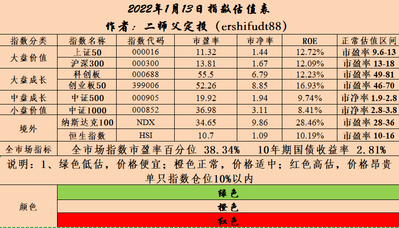

======================================================

_type: q&a
@J[28281541518551]
2022-01-14 09:43:26 Fri  
topic_id: 218282221245121

@J

>  师父，兴业转债今天上市了，最近价值股涨得好，这个转债要当天卖出吗？

@二师父

>  还不错，我没中签109还买了点，你觉得赚够了可以卖掉的

阅读[1]  评论[8]  赞[0] 

======================================================

_type: talk
@二师父[28814221155551]
2022-01-14 09:47:45 Fri  
topic_id: 581515558581584

<e type="hashtag" hid="88511114155212" title="#发车#" /> 场外乌龟计划清仓164906，场内卖出一份。盈利大致百分之7，还不错哈，下次继续网格。

震荡市场网格合适。

@顾小胖 at 2022-01-14 09:47:45 Fri

> 师傅我要卖出显示持有不到七天收费1.5%，是否需要下周一再卖出呢，之前是1月6日买入1月10日确认份额的

----------

@二师父 at 2022-01-14 09:47:45 Fri

> 那可以等下周

----------

@顾小胖 at 2022-01-14 09:47:45 Fri

> 好的谢谢师傅

----------

@老孙头 at 2022-01-14 09:47:45 Fri

> 164906卖出，是按昨夜收盘价？否则就不止7个点了？

----------

@二师父 at 2022-01-14 09:47:45 Fri

> 按照今天收盘价的

----------

阅读[1]  评论[5]  赞[0] 

======================================================

_type: q&a
@坚持学习[421148841558188]
2022-01-14 10:09:58 Fri  
topic_id: 581515558822484

@坚持学习

>  二师父，目前券商的股票、ETF、还有开放式基金都有少量盈利，目前这个要如何处理呢？是可以继续持有到过年后吗？

@二师父

>  仓位百分之60以内就拿着吧，仓位超过百分之80把涨幅猛的减仓，到百分之80以下，美联储加息可能会有暴击，到时候再入场

阅读[1]  评论[3]  赞[0] 

======================================================

_type: talk
@二师父[28814221155551]
2022-01-14 10:47:59 Fri  
topic_id: 218282245881441

和工作人员又确认了，今天卖出是按照大于7天来收取手续费的。如果不能接受场外费率，就选择场内，波动大的市场，即使一直不涨，网格也能稳步获利，关键不要贪

阅读[1]  评论[0]  赞[0] 

======================================================

_type: talk
@云云[118525244841512]
2022-01-14 10:57:13 Fri  
topic_id: 818282245842852

师父，纳指etf变成1元是怎么回事呢？

@二师父 at 2022-01-14 10:57:13 Fri

> 基金折算除权导致净值下降

----------

@云云 at 2022-01-14 10:57:13 Fri

> 👌

----------

阅读[1]  评论[2]  赞[0] 

======================================================

_type: talk
@二师父[28814221155551]
2022-01-15 15:53:30 Sat  
topic_id: 185454854411442

关于今年行情的判断，不会发生危机，注意二季度可能会大跌形成一个黄金坑，那个时候机会很好，星球还有朋友仓位1层，目前不用等了，慢慢定投吧

@光少 at 2022-01-15 15:53:30 Sat

> 二师父，半仓位？要定投？

----------

@二师父 at 2022-01-15 15:53:30 Sat

> 可以等等

----------

@老孙头 at 2022-01-15 15:53:30 Sat

> 希望此文发微信交流群！

----------

@二师父 at 2022-01-15 15:53:30 Sat

> 公众号可以看

----------

@DY🍉 at 2022-01-15 15:53:30 Sat

> 师父，你说的仓位只是股票基金仓位？
还是债卷加股票一共的？

----------

@二师父 at 2022-01-15 15:53:30 Sat

> 总共的

----------

@DY🍉 at 2022-01-15 15:53:30 Sat

> 那我现在总仓位在百分之25，就再等等哇？

----------

@二师父 at 2022-01-15 15:53:30 Sat

> 这很轻的仓位，可以定投

----------

阅读[1]  评论[8]  赞[0] 

+++++++++++++++++++++++++++++++++++++++++++++++++++++

文件：
2022-01-15 15:52:40 Sat
文件大小：[33983]
111884248222282-今年会发生金融危机吗.docx

======================================================

_type: talk
@二师父[28814221155551]
2022-01-16 10:22:55 Sun  
topic_id: 818282144281442

货币基金收益率降低，与之相比，低风险组合的性价比提升了。

@苍天有井明月空🌙 at 2022-01-16 10:22:55 Sun

> 请问余利宝有影响吗，我看余利宝是信托

----------

@二师父 at 2022-01-16 10:22:55 Sun

> 有影响

----------

阅读[1]  评论[2]  赞[0] 

+++++++++++++++++++++++++++++++++++++++++++++++++++++

文件：
2022-01-16 10:22:10 Sun
文件大小：[31510]
422115418188888-余额宝危险了.docx

======================================================

_type: talk
@二师父[28814221155551]
2022-01-16 12:02:59 Sun  
topic_id: 218282141588581

鳄鱼计划持仓表，目前这个仓位，跌了可以继续。在震荡的时候拿住或者网格就行了，波动是常态。

阅读[1]  评论[0]  赞[0] 

+++++++++++++++++++++++++++++++++++++++++++++++++++++

图片：
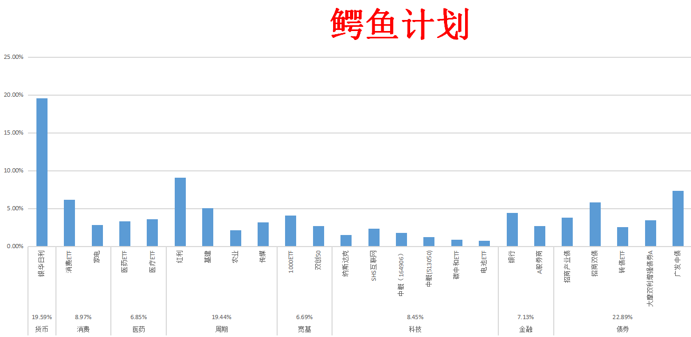

======================================================

_type: talk
@二师父[28814221155551]
2022-01-16 18:49:08 Sun  
topic_id: 581515885885284

<e type="hashtag" hid="88855812542482" title="#接下来的投资攻略#" /> 周末复盘总结，明确了接下来的方向，整体基调不变，加仓方式从持续定投改成网格加仓，因为当前一直在震荡，如果持续定投，比如沪深300一直买在一个价格区间，并没有起到摊低成本的作用。

乌龟计划网格加仓方向：（加仓小网格，5%的网格点加仓，卖出大网格，10%的网格点收割利润）

方向1、基建工程，广发中证基金工程ETF联接A.(005223)

方向2、招商中证银行指数A.(161723)

方向3、大成中证红利指数A(090010)

方向3、富国中证1000指数增强（161039）

成长组合网格加仓方向：

方向1、招商中证白酒指数C(012414)

方向2、天弘恒生科技指数（012349）

方向3、国泰中证煤炭ETF联接C（008280）

方向4、天弘中证农业主题C（010770）

方向5、汇添富中证中药指数C（501012）

方向6、鹏华可转债债券C(010964)

除了天弘恒生科技和煤炭鳄鱼计划不会投资，其余标的鳄鱼计划场内也有对标标的开始。

大家根据自己的仓位来，最保守目前仓位不能低于20%，最激进目前仓位不能超过80%，低于20%的下跌赶紧加仓位。

@老孙头 at 2022-01-16 18:49:08 Sun

> 据说，周末消息面利于中概及港股的反弹？

----------

@老孙头 at 2022-01-16 18:49:08 Sun

> 据说，周末消息面利好中概？

----------

@防汛抗旱 at 2022-01-16 18:49:08 Sun

> 天天里面怎么网格啊

----------

@二师父 at 2022-01-16 18:49:08 Sun

> 用c类基金，7天以后卖出

----------

@二师父 at 2022-01-16 18:49:08 Sun

> 反弹可以撤了

----------

阅读[1]  评论[5]  赞[0] 

======================================================

_type: talk
@二师父[28814221155551]
2022-01-17 10:48:11 Mon  
topic_id: 818284582114442

<e type="hashtag" hid="88511114155212" title="#发车#" /> 成长组合，农业买入2000，煤炭买入2000，都是高风险基金，仅供参考

@芳瑛榕子 at 2022-01-17 10:48:11 Mon

> 二师父，这也是做网格吗？

----------

@二师父 at 2022-01-17 10:48:11 Mon

> 看情况，网格肯定没问题

----------

@芳瑛榕子 at 2022-01-17 10:48:11 Mon

> 紧跟二师父的步伐😁

----------

@范毅君 at 2022-01-17 10:48:11 Mon

> 场内对应什么，二师父

----------

@二师父 at 2022-01-17 10:48:11 Mon

> 农业etf和煤炭etf

----------

@范毅君 at 2022-01-17 10:48:11 Mon

> 好的，置顶有代码对吧

----------

@二师父 at 2022-01-17 10:48:11 Mon

> 你看看，煤炭好像没有，找对应的etf就行

----------

阅读[1]  评论[7]  赞[0] 

+++++++++++++++++++++++++++++++++++++++++++++++++++++

图片：
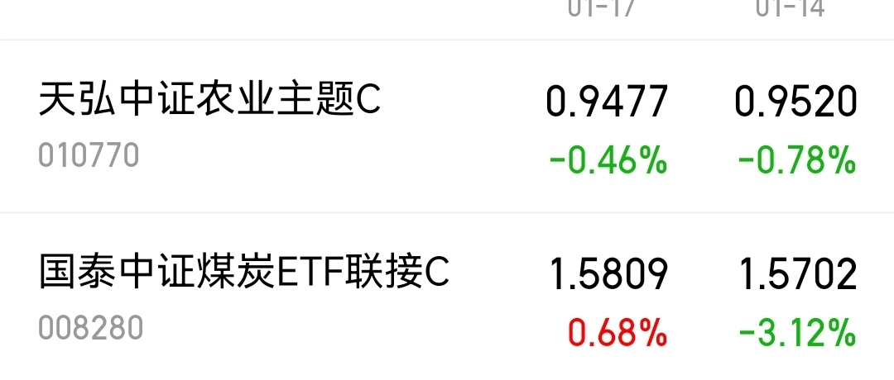

======================================================

_type: talk
@二师父[28814221155551]
2022-01-17 21:02:59 Mon  
topic_id: 581514141281144

今天市场反弹，预计还会继续上行，关注数字经济，相关板块：云计算、大数据，软件，这个板块很可能是去年的光伏，去年没有重仓光伏，今年不会错过，如果给机会回调的话上20%仓位。

@枫叶 at 2022-01-17 21:02:59 Mon

> 这些现在可以买吗

----------

@二师父 at 2022-01-17 21:02:59 Mon

> 买卖自己决定哈，或者跟车

----------

@枫叶 at 2022-01-17 21:02:59 Mon

> 好的

----------

@太阳照常升起 at 2022-01-17 21:02:59 Mon

> 二师父，春节前如果卸货的话，乌龟计划和成长组合里面优先选择哪些基金？

----------

@二师父 at 2022-01-17 21:02:59 Mon

> 优选成长基金

----------

阅读[1]  评论[5]  赞[0] 

+++++++++++++++++++++++++++++++++++++++++++++++++++++

文件：
2022-01-17 20:59:33 Mon
文件大小：[31421]
544885552525124-利好，超预期.docx

======================================================

_type: talk
@二师父[28814221155551]
2022-01-18 08:35:50 Tue  
topic_id: 818284814188212

<e type="hashtag" hid="552114551414" title="#估值数据#" /> 市盈率百分位36.97%，SY-BY百分位33.91%，SY/BY百分位27.71%。

估值在向下移动，大家的仓位不能太轻，极端保守仓位也不能只有1成仓位。

市场短期反弹，中期还是下行趋势，如果回调到位布局，今年行情会很不错的。

宽基优选中证1000，行业关注中药、数字经济、猪周期反转、煤炭、基建、氢能源。

@芳瑛榕子 at 2022-01-18 08:35:50 Tue

> 二师父。数学经济、氢能源有相应的场内基金吗？

----------

@二师父 at 2022-01-18 08:35:50 Tue

> 软件etf，人工智能etf，大数据etf，氢能源目前还没有

----------

@芳瑛榕子 at 2022-01-18 08:35:50 Tue

> 谢谢，我找一找

----------

@防汛抗旱 at 2022-01-18 08:35:50 Tue

> 计算仓位包括货币基金和债基吗？

----------

@二师父 at 2022-01-18 08:35:50 Tue

> 不包括的

----------

阅读[1]  评论[5]  赞[0] 

======================================================

_type: q&a
@芳瑛榕子[88442458811882]
2022-01-18 10:27:31 Tue  
topic_id: 581514522285244

@芳瑛榕子

>  二师父，求是杂志上的这篇文章对中概互联的影响大吗？是不是中概互联差不多企稳了？
>  <e type="web" href="https://mp.weixin.qq.com/s/CnHu3GDpyKB5D9VrRsB7lg" title="习近平：不断做强做优做大我国数字经济" cache="" />

@二师父

>  对数字经济影响很大，做我说的数字经济方向
>  
>  中概互联是消费互联网，影响不大，美团，腾讯，字节属于消费互联，金蝶，金山这些属于产业互联网，会有一定机会，如果产业互联网起来了会对消费互联网产生一定带动

阅读[1]  评论[2]  赞[0] 

======================================================

_type: talk
@二师父[28814221155551]
2022-01-18 10:44:44 Tue  
topic_id: 818284258111212

<e type="hashtag" hid="15522588524122" title="#实盘发车#" /> 这些是高成长板块，整体估值不高，不过加息会有利空，仅供参考，每个朋友的承受能力不同，不要盲目跟车。

今年大方向还是券商，基建，红利，中证1000，互联网

@老孙头 at 2022-01-18 10:44:44 Tue

> 有代码则甚好！

----------

@二师父 at 2022-01-18 10:44:44 Tue

> 名字一模一样

----------

@芳瑛榕子 at 2022-01-18 10:44:44 Tue

> 二师父，这是中长期持有还是网格呢？

----------

@二师父 at 2022-01-18 10:44:44 Tue

> 如果老大一直支持，我就中长期，如果就是一阵风，那就网格，灵活一点

----------

@芳瑛榕子 at 2022-01-18 10:44:44 Tue

> 这个策略好👍

----------

@芳瑛榕子 at 2022-01-18 10:44:44 Tue

> 中证软件服务ETF没有场内的基金

----------

@cotton at 2022-01-18 10:44:44 Tue

> 第一个是506002吗

----------

@二师父 at 2022-01-18 10:44:44 Tue

> 011609

----------

阅读[1]  评论[8]  赞[0] 

+++++++++++++++++++++++++++++++++++++++++++++++++++++

图片：
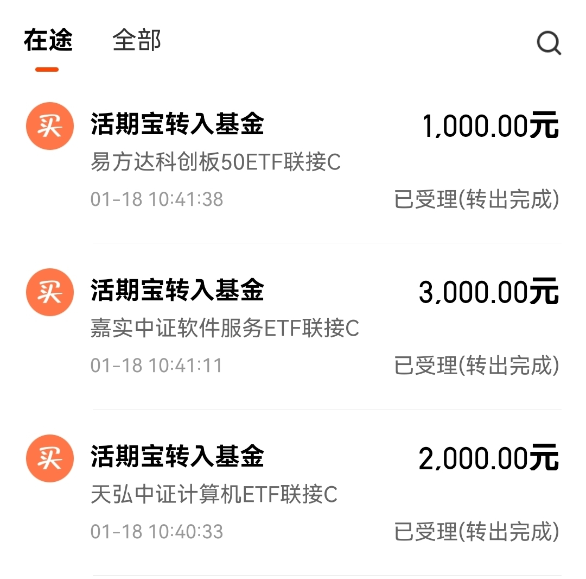

======================================================

_type: talk
@二师父[28814221155551]
2022-01-18 22:35:17 Tue  
topic_id: 185451445852152

丐帮又跌了，距离下一次开网又近了一点。164906，1块钱的时候把卖出去的3份买回来，跌不到就不动了。

场外用天弘恒生科技C替代。网格很简单，严格遵循纪律就行了。关键是不贪婪。

阅读[1]  评论[0]  赞[0] 

+++++++++++++++++++++++++++++++++++++++++++++++++++++

文件：
2022-01-18 22:33:08 Tue
文件大小：[31417]
111884484182482-冷静.docx

======================================================

_type: talk
@二师父[28814221155551]
2022-01-19 08:51:58 Wed  
topic_id: 581514541581244

1、央行副行长刘国强1月18日在国新办新闻发布会上表示，存款准备金率进一步调整空间变小了，但还有一定的空间；此外，宏观杠杆率连续五个季度下降，为未来货币政策创造了空间。（财联社）

2、央行副行长刘国强1月18日在国新办新闻发布会上表示，在经济下行压力根本缓解之前，进要服务于稳，不利于稳的政策不出台，有利于稳的政策多出台，做到以进促稳。简单说，当前重点的目标是稳，政策的要求是发力。一是充足发力，把货币政策工具箱开得再大一些，保持总量稳定，避免信贷塌方；二是精准发力，要致广大而尽精微，金融部门不但要迎客上门，还要主动出击，按照新发展理念的要求，主动找好项目，做有效的加法，优化经济结构；三是靠前发力，前瞻操作，走在市场曲线的前面，及时回应市场的普遍关切，不能拖，拖久了，市场关切落空了，落空了就不关切了，不关切就“哀莫大于心死”，后面的事就难办了。（证券时报）

美股昨晚大跌，加息科技股利空，央行开启了逆周期调节，把握机会，今年多空博弈很激烈，一定不要频繁操作，坚守一个原则，卖出必盈利，没有把握的股票不买，美股暂时停止投资，有朋友已经开始阶段做空纳斯达克了。

咱们这边科技方向是数字经济相关，剩下方向是价值板块，我判断股市前低后高，债券前高后低，如果后面没资金补仓，可以卖出盈利的国开债买入基金

注意，如果我们继续降息，短期国开债还会继续上涨。

@芳瑛榕子 at 2022-01-19 08:51:58 Wed

> 二师父，我的大基和小红建仓没多久，略盈利，接下来是每周定投好呢，还是等跌10%左右投好呢？

----------

@二师父 at 2022-01-19 08:51:58 Wed

> 仓位百分之20内可以每周，我判断会有机会的

----------

@芳瑛榕子 at 2022-01-19 08:51:58 Wed

> 二师父，你说中证医疗现在处于下跌趋势，要等跌到10000点时开启买入吗？我的中证医疗和生物科技目前差不多4~5层仓，那是不是先卧倒，等你发车时再跟车呢？

----------

@二师父 at 2022-01-19 08:51:58 Wed

> 你这仓位太重了，反弹可以减仓，别加了

----------

@芳瑛榕子 at 2022-01-19 08:51:58 Wed

> 今天又跌了很多啊😭

----------

@二师父 at 2022-01-19 08:51:58 Wed

> 别加了

----------

@芳瑛榕子 at 2022-01-19 08:51:58 Wed

> 不加了，割肉不舍的😂那就等跌到10000点时再开始，是吗？

----------

@二师父 at 2022-01-19 08:51:58 Wed

> 你这个仓位如果是你全部投资资金得50%，跌到1000也最好别加了。单一行业基金不要超过30%，容易翻车

----------

阅读[1]  评论[13]  赞[0] 

======================================================

_type: talk
@二师父[28814221155551]
2022-01-19 21:34:14 Wed  
topic_id: 818284154814112

医疗走主跌，有可能成为下一个中概，加仓节奏很重要。仓位也很重要。

价值基金是接下来得方向，未来牛市三阶段，价值基金冲高以后，市场会进入一轮熊市。完整得牛熊周期我们就见到了。市场不会一直牛下去得。

18年我说牛市将要到来，没人相信，我现在说3年以后熊市要来，估计也没太多人相信，然而市场自有其规律，只能按照规律办事，这才是天道。

@七 at 2022-01-19 21:34:14 Wed

> 去年没来得及卖 仓位重的要缓慢割还是一直躺平呢

----------

@二师父 at 2022-01-19 21:34:14 Wed

> 如果你能长期持有10年，我觉得躺平比较好，肯定会起来，如果做不到的话就要考虑实际情况了

----------

@芳瑛榕子 at 2022-01-19 21:34:14 Wed

> 二师父，你的意思是现在是价值股的牛市，等这个牛市结束就是熊市了吗？难道不是成长股的牛市？

----------

@二师父 at 2022-01-19 21:34:14 Wed

> 成长股已经走牛三年了

----------

@芳瑛榕子 at 2022-01-19 21:34:14 Wed

> 难道不是价值、成长轮动吗😂

----------

@衣袂飘香 at 2022-01-19 21:34:14 Wed

> 为什么是三年以后熊市才来？这个三年是怎么得出来的？

----------

@二师父 at 2022-01-19 21:34:14 Wed

> 蒙猜大法[呲牙]

----------

@芳瑛榕子 at 2022-01-19 21:34:14 Wed

> 二师父，我在你的视频号里看到你说中概定投有两种方法，一个就是月线收阳时开始，那医疗是否可以釆用这种方法呢？

----------

阅读[1]  评论[18]  赞[0] 

+++++++++++++++++++++++++++++++++++++++++++++++++++++

文件：
2022-01-19 21:32:19 Wed
文件大小：[29023]
844112488445152-价值的春天.docx

======================================================

_type: talk
@二师父[28814221155551]
2022-01-19 23:03:17 Wed  
topic_id: 581514828412584

<e type="hashtag" hid="552114551414" title="#估值数据#" /> 市盈率百分位36.86%，SY-BY百分位32.83%，SY/BY百分位23.57%。

@芳瑛榕子 at 2022-01-19 23:03:17 Wed

> 二师父，是不是现在估值表里没有行业指数估值了呢？

----------

@二师父 at 2022-01-19 23:03:17 Wed

> 没有了，如果只看估值容易陷入中概的估值陷阱，多方因素结合，政策，业绩，逻辑

----------

阅读[1]  评论[2]  赞[0] 

======================================================

_type: talk
@二师父[28814221155551]
2022-01-19 23:32:09 Wed  
topic_id: 418582188282158

估值表，还没有进入低估的，主要是市场震荡，大家仔细看市场连去年7月的底部都没跌破。

@坚持学习 at 2022-01-19 23:32:09 Wed

> 二师父，今天没有实盘计划吗？

----------

@二师父 at 2022-01-19 23:32:09 Wed

> 可能没有，如果农业跌了再买

----------

@坚持学习 at 2022-01-19 23:32:09 Wed

> 上次你发车农业没有买，现在合适吗？

----------

@二师父 at 2022-01-19 23:32:09 Wed

> 你看情况来，目前也不贵

----------

@坚持学习 at 2022-01-19 23:32:09 Wed

> 二师父，目前我的大成中证红利仓位是5%，基建是1%，富国中证1000是2%。每周想选一只定投，您的文章分析说这几个会是方向。刚刚把沪深300的月定投暂停了，那我是可以选这里面的来定投吗？

----------

@二师父 at 2022-01-19 23:32:09 Wed

> 可以

----------

阅读[1]  评论[6]  赞[0] 

+++++++++++++++++++++++++++++++++++++++++++++++++++++

图片：
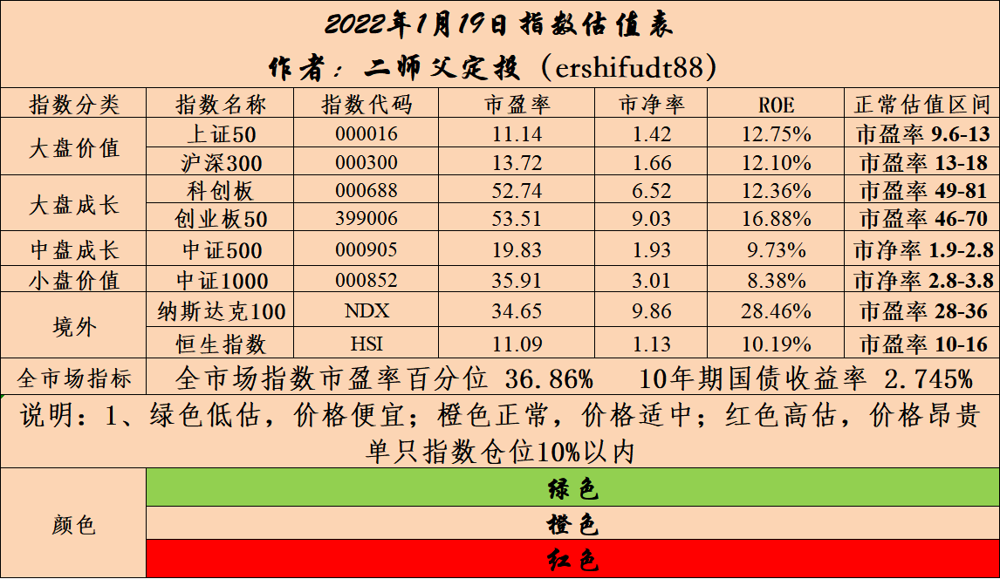

======================================================

_type: talk
@二师父[28814221155551]
2022-01-20 21:32:53 Thu  
topic_id: 185451882488182

<e type="hashtag" hid="51122522212184" title="#关于医疗的分析#" /> 今年做多价值板块，等成长跌下来再考虑加仓，调整一般3个月起步。

阅读[1]  评论[0]  赞[0] 

+++++++++++++++++++++++++++++++++++++++++++++++++++++

文件：
2022-01-20 21:32:21 Thu
文件大小：[31721]
244112442445221-连斩.docx

======================================================

_type: talk
@光少[244124552511141]
2022-01-20 22:22:52 Thu  
topic_id: 185451885511112

二师父您好！年终有笔资金存入是用来每月缴房贷的，有什么方法可以活用这笔资金而且又不担误每月缴房贷，谢谢！

@二师父 at 2022-01-20 22:22:52 Thu

> 短期要用的钱最好货币基金，如果一年不用可以买入青铜组合，持有一年基本都是正收益。

或者考虑一下广发中债1-3年国开债，这个波动小一些，收益率也偏低。

----------

@光少 at 2022-01-20 22:22:52 Thu

> 收到，谢谢您[玫瑰]

----------

@shi at 2022-01-20 22:22:52 Thu

> 如果目前资金可以，为什么不选提前还款呢？
选还款期不变，降低每月月供。

----------

阅读[1]  评论[3]  赞[0] 

======================================================

_type: talk
@二师父[28814221155551]
2022-01-20 23:37:27 Thu  
topic_id: 218284114154411

<e type="hashtag" hid="552114551414" title="#估值数据#" /> 市盈率百分位34.6%，SY-BY百分位32.37%，SY/BY百分位21.14%。

估值楼层进入到了第二层，到第二层就是相对便宜，优选赛道。

今年主流赛道是周期偏价值，比如农业——猪周期，基建，煤炭，成长组合里面开始了农业、煤炭、还有接下来可能会加入的天弘恒生科。另外注意数字经济方向，这是老大点过的，也是成长板块唯一值得做多的方向。

依然在成长组合里面——软件+计算机。

最后就是乌龟计划和鳄鱼计划。以基建+银行+红利为主，去年基本上把仓位打上来了，如果遇到回调可以继续买入。

需要注意的是医疗，他和中概一样的走势，就没必要持续买入，等待市场持续跌到底部企稳以后再次投资，或者拉大空间，换成月定投，这样也是可以的。

@永刚 at 2022-01-20 23:37:27 Thu

> 数字科技相关的ETF哪一个最接近？

----------

@二师父 at 2022-01-20 23:37:27 Thu

> 大数据

----------

@以古论今 at 2022-01-20 23:37:27 Thu

> 已投的医药要清空吗？或者减仓

----------

@二师父 at 2022-01-20 23:37:27 Thu

> 如果百分之20以内仓位就不用

----------

@shi at 2022-01-20 23:37:27 Thu

> 终于看到第二层楼了！祝贺一个🎉

----------

阅读[1]  评论[5]  赞[0] 

======================================================

_type: talk
@二师父[28814221155551]
2022-01-21 20:57:02 Fri  
topic_id: 418581458254118

<e type="hashtag" hid="15522422515582" title="#好消息#" /> 估值楼层进入第二层了，接下来慢慢开启左侧买入，不要着急，总会有机会。

成长方向：大数据、软件、计算机。都是和数字经济相关的。

价值方向：农业、基建、煤炭、银行、红利等等。

避开了前期涨的高的品种。

关于医疗要不要割肉，这个看仓位，如果50%以上仓位反弹避开一下，如果严格按照乌龟计划和鳄鱼计划仓位走的，就不用的，跌下去了把剩余的仓位加上去。

仓位管理非常重要，无论多看好一个板块，最多不要超过30%仓位，关键时刻可以保命。

阅读[1]  评论[0]  赞[0] 

+++++++++++++++++++++++++++++++++++++++++++++++++++++

文件：
2022-01-21 20:54:07 Fri
文件大小：[31760]
544884221288814-来了一个好消息.docx

======================================================

_type: q&a
@匿名的码农[28288455512251]
2022-01-22 10:44:27 Sat  
topic_id: 418581424842418

@匿名的码农

>  二师父，纳指100，能开始定投的时候说一下呗，谢谢

@二师父

>  先等一等，已经跌破年线了，等加息落地之后再行动

阅读[1]  评论[0]  赞[0] 

======================================================

_type: talk
@二师父[28814221155551]
2022-01-22 14:34:21 Sat  
topic_id: 418581814444488

<e type="hashtag" hid="15522422448512" title="#代码#" /> 分享了二级债基代码，适合保守型的投资者，明天分享激进型的。

@永刚 at 2022-01-22 14:34:21 Sat

> 二师父：麻烦推荐几个场内债券[抱拳]

----------

@二师父 at 2022-01-22 14:34:21 Sat

> 招商双债

----------

@芳瑛榕子 at 2022-01-22 14:34:21 Sat

> 二师父，我抄的别人的作业，买了这几个债，能帮我看一下吗[愉快]

----------

@二师父 at 2022-01-22 14:34:21 Sat

> 东方红和银华的规模太小了，其他没啥问题

----------

@芳瑛榕子 at 2022-01-22 14:34:21 Sat

> 债基对规模要求是不是比较高，多少规模是最低标准呢？我没仔细看我持仓债基的股票，不知道是价值股多还是成长股多。现在是不是应该多配有价值股的债基呢？

----------

@二师父 at 2022-01-22 14:34:21 Sat

> 这个不用管，基金经理会考虑，我分享的几个你可以参考下

----------

@芳瑛榕子 at 2022-01-22 14:34:21 Sat

> 那我是不是应该均衡配置一下保守型的和激进型的呢？

----------

@二师父 at 2022-01-22 14:34:21 Sat

> 是的，看自己的承受能力综合选择

----------

阅读[1]  评论[12]  赞[0] 

+++++++++++++++++++++++++++++++++++++++++++++++++++++

文件：
2022-01-22 14:32:38 Sat
文件大小：[84405]
422112484544528-代码（保守型）.docx

======================================================

_type: talk
@二师父[28814221155551]
2022-01-23 16:06:42 Sun  
topic_id: 818281285545512

<e type="hashtag" hid="48844544215548" title="#关于方向#" />今年看好的成长方向是数字经济，布局相关方向。

估值楼层二楼，每周坚持定投1000元A股基金，方向集中在传媒、农业、煤炭、软件、计算机、天弘恒生科技、中药等，如果估值楼层重回三层，可以暂停或者减小定投金额。

不怕市场下跌，震荡比较麻烦，结合网格，考虑下15%的大网格。

美股风险较大，纳斯达克跌破年线，可以先等等，纳斯达克25到28倍市盈率以下开始定投，切记下行趋势的时候不要抄底，很容易抄到半山腰。

@永刚 at 2022-01-23 16:06:42 Sun

> 二师父：麻烦推荐几个科技赛道的主动基金？

----------

@二师父 at 2022-01-23 16:06:42 Sun

> 主动基金基金经理变动风险难掌控，这个只能押注基金公司

----------

@永刚 at 2022-01-23 16:06:42 Sun

> 科技赛道主动基金收益应该比指数基金收益好吧？

----------

@二师父 at 2022-01-23 16:06:42 Sun

> 不一定，科技细分领域很多，赛道很重要

----------

@永刚 at 2022-01-23 16:06:42 Sun

> 知道了，謝謝

----------

@芳瑛榕子 at 2022-01-23 16:06:42 Sun

> 二师父，为什么选天弘恒生科技而不是中概互联呢？

----------

@二师父 at 2022-01-23 16:06:42 Sun

> C类7天卖出没有手续费，场内我买的164906，差不太多

----------

@芳瑛榕子 at 2022-01-23 16:06:42 Sun

> 我场内买的是513050。这个现在也可以少量定投了吗？我目前亏损14%。我以前是先建底仓，然后跌10%左右加仓，不是每周定投。不知道哪种策略更好些？

----------

阅读[1]  评论[17]  赞[0] 

+++++++++++++++++++++++++++++++++++++++++++++++++++++

文件：
2022-01-23 16:01:00 Sun
文件大小：[32639]
544884252444254-最重要的是方向.docx

======================================================

_type: talk
@大震[815114151548542]
2022-01-24 13:43:11 Mon  
topic_id: 218281241184221

二师父，您说的网格操作都是手动操作吗？还是通过软件买入卖出呢？  比如买了三份中概，跌5%加一份，涨5%卖一份。如果一直跌，有没有最大份额限制啊？比如最多持有到10份。

@大震 at 2022-01-24 13:43:11 Mon

> 二师父，您这里说的网格操作和低估的时候进行网格加仓，不是一个概念吧？

----------

@杜志彪 at 2022-01-24 13:43:11 Mon

> 看看极端情况下回撤是多少，份额得多少还要靠仓位控制，比如就加到总仓位10%

----------

@大震 at 2022-01-24 13:43:11 Mon

> 一种网格是二师父讲过的低估后网格加仓。一种是华宝智投那种网格，应对震荡市场的那种。  我理解的中概网格是华宝智投的那种网格(二师父可能是用手动操作代替自动网格)。  不知道我理解的对不对。

----------

阅读[1]  评论[3]  赞[0] 

======================================================

_type: talk
@隔窗遥望[241884481854181]
2022-01-24 13:48:36 Mon  
topic_id: 218281241128111

<e type="hashtag" hid="48844544215548" title="#关于方向#" /> 数字经济相关的场内基金有吗？

@杜志彪 at 2022-01-24 13:48:36 Mon

> 参考场内软件ETF,大数据ETF,计算机ETF。

----------

阅读[1]  评论[1]  赞[0] 

======================================================

_type: q&a
@大震[815114151548542]
2022-01-24 19:31:26 Mon  
topic_id: 418581511441848

@大震

>  二师父，本来打算医疗低估后开启定投，比较长期的那种，两到三年。但看到大家聊的观点，目前是主跌浪。于是懵逼了。那要不要定投呢？  应该采取什么策略呢？  低估定期定额定投，还是底仓外加网格加仓，还是月线收阳后分批买入呢？困惑

@二师父

>  如果你准备定投三年，目前可以开始的，定投和一次买入不同

阅读[1]  评论[2]  赞[0] 

======================================================

_type: q&a
@大震[815114151548542]
2022-01-24 19:32:10 Mon  
topic_id: 185458488254212

@大震

>  二师父，您说的中概网格操作都是手动操作吗？还是通过软件智能买入卖出呢？  比如买了三份中概，跌5%加一份，涨5%卖一份。如果一直跌，有没有最大份额限制啊？比如最多持有到10份。
>  
>  一种网格是二师父讲过的低估后网格加仓。一种是华宝智投那种网格，应对震荡市场的那种。  我理解的中概网格是华宝智投的那种网格(二师父可能是用手动操作代替自动网格)。  不知道我理解的对不对。

@二师父

>  网格可以手动操作，也可以自动操作，关键是控制安全边际，不在乎手动还是自动

阅读[1]  评论[1]  赞[0] 

======================================================

_type: talk
@二师父[28814221155551]
2022-01-24 21:51:36 Mon  
topic_id: 218281455221421

估值表和中药基金的分析，中药是比较好的方向，这次回调倒车接人。

波段是无奈之举，尽量长期持有，少量波段。

@老孙头 at 2022-01-24 21:51:36 Mon

> 中证500可加仓？

----------

@二师父 at 2022-01-24 21:51:36 Mon

> 定投可以

----------

@范毅君 at 2022-01-24 21:51:36 Mon

> 二师父，中药是不是还需要等待

----------

@二师父 at 2022-01-24 21:51:36 Mon

> 可以等等

----------

@范毅君 at 2022-01-24 21:51:36 Mon

> 好的

----------

阅读[1]  评论[5]  赞[0] 

+++++++++++++++++++++++++++++++++++++++++++++++++++++

图片：
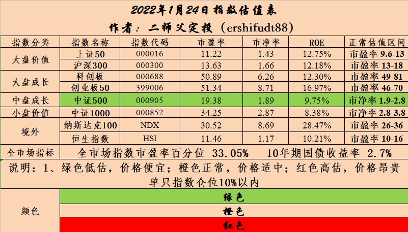

+++++++++++++++++++++++++++++++++++++++++++++++++++++

文件：
2022-01-24 21:49:49 Mon
文件大小：[47878]
422112415542288-低估永不败.docx

======================================================

_type: talk
@二师父[28814221155551]
2022-01-24 22:07:07 Mon  
topic_id: 418581244242128

<e type="hashtag" hid="552114551414" title="#估值数据#" /> 市盈率百分位33.05%，SY-BY百分位31.42%，SY/BY百分位17.8%。估值进一步下移，慢慢左侧定投，优质的A股基金。

关于定投，有两种方式，第一种持续定投，适合没有底仓，而且极端便宜。

第二种，网格定投，适合有底仓，而且还有可能继续下跌的情况。

阅读[1]  评论[0]  赞[0] 

======================================================

_type: q&a
@🎈铮[28284825441841]
2022-01-24 23:54:38 Mon  
topic_id: 185458122822222

@🎈铮

>  二师父，电池现在适合加点？

@二师父

>  目前成长类基金只能年线以上轻仓

阅读[1]  评论[0]  赞[0] 

======================================================

_type: talk
@二师父[28814221155551]
2022-01-25 17:52:30 Tue  
topic_id: 581518854155424

市场下跌，左侧定投，保存代码，低买高卖。持仓周期一年左右，所以全部选择C，长短结合。

@芳瑛榕子 at 2022-01-25 17:52:30 Tue

> 二师父，持仓周期一年左右，那是不是把定投的某只基金份额分成50份，每周定投一次？

----------

@芳瑛榕子 at 2022-01-25 17:52:30 Tue

> 我手里目前有白酒和中证医疗底仓，其中白酒大约一层仓位，中证医疗大约三层仓位，是不是应该在一年之内把仓位打满呢？

----------

@二师父 at 2022-01-25 17:52:30 Tue

> 可以的，这种有踏空风险，你不怕踏空可以的，适合熊市时候

----------

@二师父 at 2022-01-25 17:52:30 Tue

> 这两个方向别做了，做宽基或者我说的价值方向

----------

@芳瑛榕子 at 2022-01-25 17:52:30 Tue

> 踏空的风险是什么？是我子弹打太快了，到后面没子弹吗？

----------

@二师父 at 2022-01-25 17:52:30 Tue

> 仓位不足

----------

@芳瑛榕子 at 2022-01-25 17:52:30 Tue

> 二师父，你的意思是白酒和中证医疗目前还不适合定投吗？

----------

@二师父 at 2022-01-25 17:52:30 Tue

> 你有仓位拿着就行了

----------

阅读[1]  评论[12]  赞[0] 

+++++++++++++++++++++++++++++++++++++++++++++++++++++

图片：
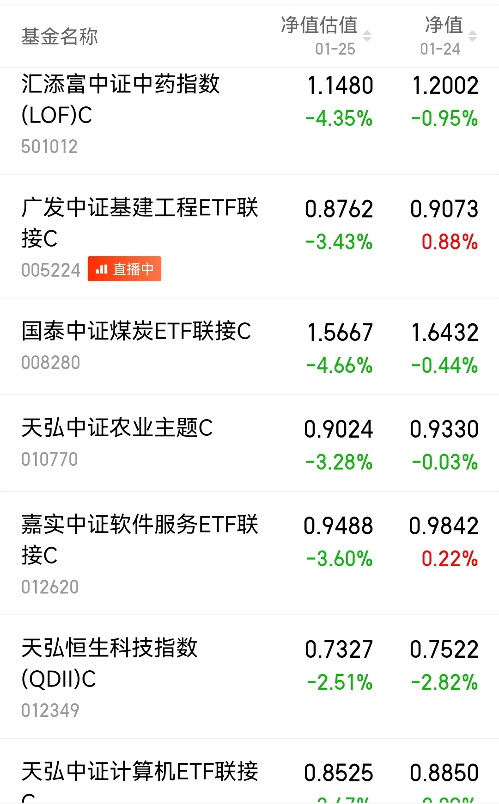
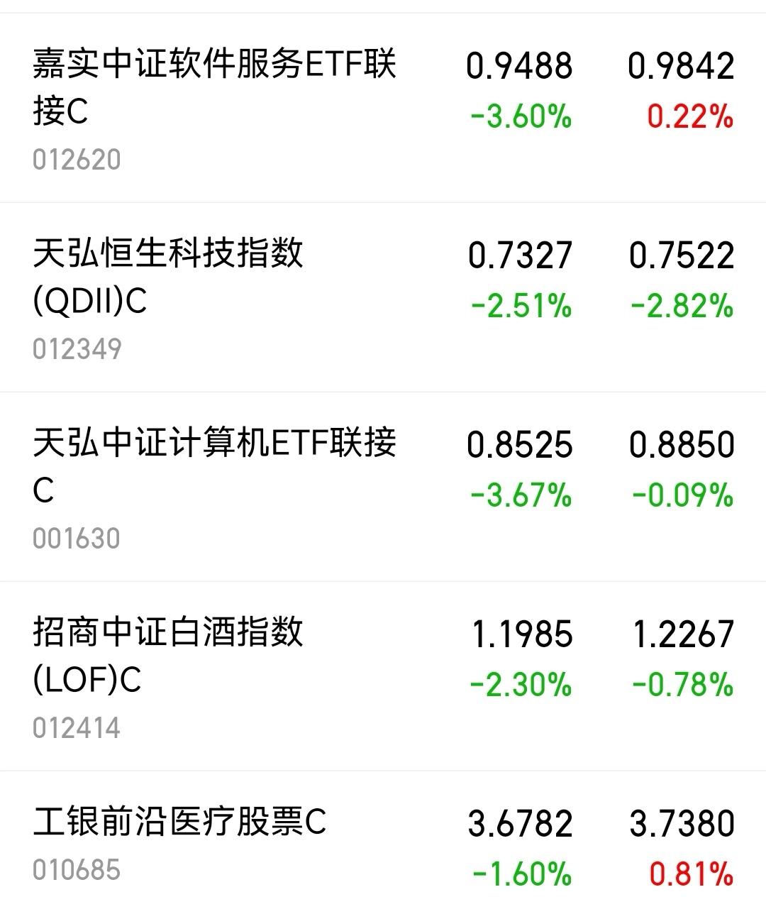

======================================================

_type: talk
@二师父[28814221155551]
2022-01-25 21:44:59 Tue  
topic_id: 185458815444122

如果继续下跌，本周就开始持续定投，不怕跌，就怕震荡。中药、基建、恒生科技这四个目前成长组合没有，本周开始计划建仓这四个，然后开网，15%以上大网，30%以上收益率考虑出本金。

鳄鱼计划底仓不破3400暂时不考虑加仓了，未来不可预知，我们能做到的就是，保证每一次卖出都盈利，这种系统是最适合普通投资者的。只要卖出必盈利，长期就是正循环。

@大震 at 2022-01-25 21:44:59 Tue

> 师父，开网是什么意思啊？是建底仓然后网格加仓吗？每下跌15%，加一次仓？

----------

@二师父 at 2022-01-25 21:44:59 Tue

> 就是买入

----------

@大震 at 2022-01-25 21:44:59 Tue

> 师父，15%大网，意思是每下跌15%，加一次仓吗？

----------

@二师父 at 2022-01-25 21:44:59 Tue

> 对的

----------

阅读[1]  评论[4]  赞[0] 

+++++++++++++++++++++++++++++++++++++++++++++++++++++

文件：
2022-01-25 21:40:56 Tue
文件大小：[47329]
544884125481814-真刺激.docx

======================================================

_type: talk
@二师父[28814221155551]
2022-01-25 21:49:26 Tue  
topic_id: 218281148248511

市盈率百分位32.83%，SY-BY百分位31.11%，SY/BY百分位16.98%。估值进一步下移。机会越来越多，有仓位的缓慢开仓。没有仓位的可以打个底仓。10%就够了

@shi at 2022-01-25 21:49:26 Tue

> 终于见到绿了。

----------

@DY🍉 at 2022-01-25 21:49:26 Tue

> 师父，宽基除了中证1000还有推荐的吗？

----------

@二师父 at 2022-01-25 21:49:26 Tue

> 沪深300

----------

阅读[1]  评论[3]  赞[0] 

+++++++++++++++++++++++++++++++++++++++++++++++++++++

图片：
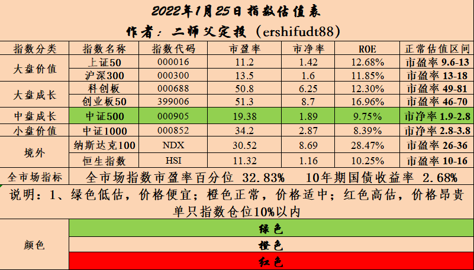

======================================================

_type: talk
@二师父[28814221155551]
2022-01-26 10:40:48 Wed  
topic_id: 418581115444558

发车

@范毅君 at 2022-01-26 10:40:48 Wed

> 跟了

----------

@果实妈咪 at 2022-01-26 10:40:48 Wed

> 501012吗

----------

@二师父 at 2022-01-26 10:40:48 Wed

> 对的

----------

@mumomo at 2022-01-26 10:40:48 Wed

> 二师父。这是乌龟计划还是哪个组合

----------

@二师父 at 2022-01-26 10:40:48 Wed

> 成长组合

----------

@徐美芳 at 2022-01-26 10:40:48 Wed

> 二师父，刚开始跟投成长组合，2000的话组合内占比多少？谢谢！

----------

@二师父 at 2022-01-26 10:40:48 Wed

> 100分之一，要有底仓

----------

@mumomo at 2022-01-26 10:40:48 Wed

> 那乌龟计划后期还会加仓吗

----------

阅读[1]  评论[18]  赞[0] 

+++++++++++++++++++++++++++++++++++++++++++++++++++++

图片：
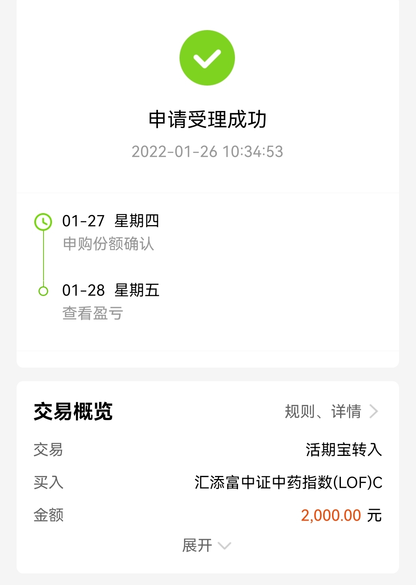

======================================================

_type: q&a
@范毅君[118551121224142]
2022-01-26 14:34:38 Wed  
topic_id: 818225555818112

@范毅君

>  二师父，传媒最近跌幅也比较大，是否可以加仓

@二师父

>  轻仓网格可以

阅读[1]  评论[1]  赞[0] 

======================================================

_type: talk
@二师父[28814221155551]
2022-01-26 22:28:33 Wed  
topic_id: 185442252454412

<e type="hashtag" hid="552114551414" title="#估值数据#" /> 市盈率百分位31.34%，SY-BY百分位29.93%，SY/BY百分位16.08%，估值进一步下移。

这时候机会就来了，适合开始做多，因为情绪的恐慌在蔓延，不用担心今年没有机会，美联储加息一定会有大跌的，握好子弹，随时准备买入。

优选价值方向，也就是保证安全边际，成长方向回调30%也能轻仓介入，因为风险较大，所以只能轻仓。

重仓方向要保证有预期，同时估值很低，否则大跌拿不住。

@匿名的码农 at 2022-01-26 22:28:33 Wed

> 二师父，sure-by和sy/by是什么意思？搜了下没搜到[捂脸]

----------

@二师父 at 2022-01-26 22:28:33 Wed

> sy是盈利收益率，by是10年期国债收益率

----------

@DY🍉 at 2022-01-26 22:28:33 Wed

> 美联储加息会有大跌～那为什么现在做多呢？不是等到加息的时候再进呢？

----------

@二师父 at 2022-01-26 22:28:33 Wed

> 已经加息开会了

----------

阅读[1]  评论[4]  赞[0] 

======================================================

_type: talk
@二师父[28814221155551]
2022-01-26 23:18:57 Wed  
topic_id: 218225582444821

白酒迎来利好

@芳瑛榕子 at 2022-01-26 23:18:57 Wed

> 二师父，这个利好对中证白酒影响大吗？

----------

@二师父 at 2022-01-26 23:18:57 Wed

> 短期是利好

----------

阅读[1]  评论[2]  赞[0] 

+++++++++++++++++++++++++++++++++++++++++++++++++++++

图片：
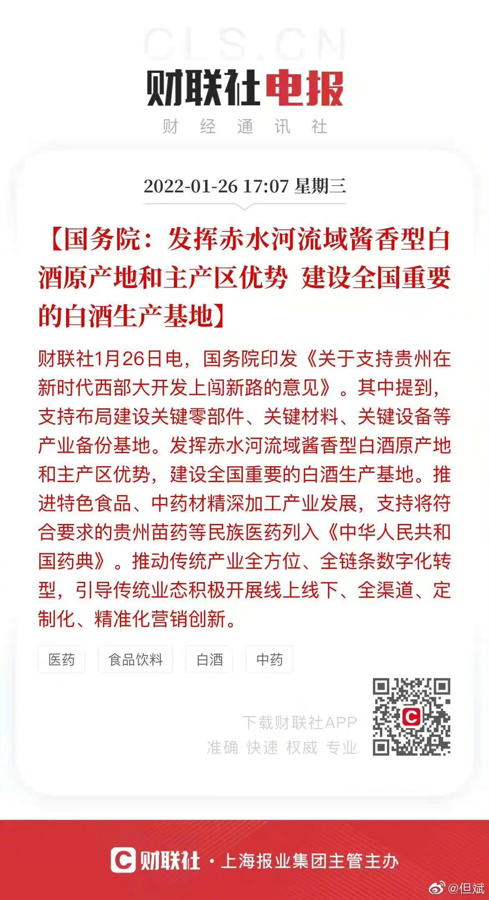

======================================================

_type: talk
@二师父[28814221155551]
2022-01-27 09:51:08 Thu  
topic_id: 581552251441844

<e type="hashtag" hid="88511114155212" title="#发车#" /> 乌龟计划，广发中债7-10年国开债卖出一半，逐步止盈，买入7000元广发中债1-3年国开债C，买入中证红利1000元

安心组合，易方达裕祥回报债券买入1000元，广发中债1-3年国开债C买入1000元。

@吃肉肉 at 2022-01-27 09:51:08 Thu

> 师父，小白不懂，国债和逆回购有关联吗？

----------

@二师父 at 2022-01-27 09:51:08 Thu

> 没有的

----------

@吃肉肉 at 2022-01-27 09:51:08 Thu

> 好的，谢谢。

----------

@衣袂飘香 at 2022-01-27 09:51:08 Thu

> 止盈我能理解，但是为什么还是买入广发中债呢？两个中债的区别和买卖的逻辑是什么？

----------

@二师父 at 2022-01-27 09:51:08 Thu

> 止盈长债，买入短债，也可以货币基金

----------

@西锦巴乌 at 2022-01-27 09:51:08 Thu

> 师父请问卖出7一10年国开债买入1一3年国开债的用意？

----------

@二师父 at 2022-01-27 09:51:08 Thu

> 长债随利率波动大，短债波动小，如果不想买短债，可以持有货币基金

----------

@小鱼 at 2022-01-27 09:51:08 Thu

> 富国中证红利A吗

----------

阅读[1]  评论[12]  赞[0] 

======================================================

_type: talk
@二师父[28814221155551]
2022-01-27 12:22:30 Thu  
topic_id: 818225524518882

丐帮好像又可以开始了，网格，网到机构缴械投降，不抄底，不满仓，继续，164906价格1看看能不能到。

没有卖飞一说，卖了盈利百分之10以上就是高手，长线仓位一直有，不可能飞。

@范毅君 at 2022-01-27 12:22:30 Thu

> 上次没赶上，坐等这次机会

----------

@二师父 at 2022-01-27 12:22:30 Thu

> 可能这次上了一个跳楼机，市场就是变化多端

----------

@范毅君 at 2022-01-27 12:22:30 Thu

> 没事，一点点，开心就好[呲牙][呲牙]

----------

@小鱼 at 2022-01-27 12:22:30 Thu

> 场外吗

----------

@二师父 at 2022-01-27 12:22:30 Thu

> 场内

----------

@芳瑛榕子 at 2022-01-27 12:22:30 Thu

> 二师父，你操作164906的时候，我可以用513050代替跟车吗？

----------

@二师父 at 2022-01-27 12:22:30 Thu

> 可以

----------

阅读[1]  评论[7]  赞[0] 

======================================================

_type: talk
@践行[111844185154442]
2022-01-27 18:25:49 Thu  
topic_id: 185442214281122

二师父你好，我看到有的文章说，债券的价格几乎是紧盯国债收益率的。国债收益率下降，你可以理解为货币宽松了、放水了，市面上钱很多。国债收益率下降得越厉害，债券价格上升得越快。
为什么近期各种债基收益极好，净值飙涨？
很简单，就是因为经济不咋的，央妈放水了，货币宽松了，国债收益率下降了。近3个月，中国的国债收益率从3.1%一路下降到2.6%。
但问题是，今年3月份左右，老美要加息了，要收紧货币了。全球央行都要收紧货币，防止被老美割了羊毛，咱们的央妈也概莫能外。
你说接下来会发生什么？极大概率是国债收益率上升，债券价格大跌，债基大跌。
​
​这个对咱们的防守账户和稳健账户有影响吗，现在还可以加仓吗

@二师父 at 2022-01-27 18:25:49 Thu

> 有影响的，咱们已经卖出一半长债券基金了，买入了短债基金，没啥影响，防守账户最大回撤是百分之5，稳健账户最大回撤百分之15，扛得住下跌就慢慢加仓

----------

@践行 at 2022-01-27 18:25:49 Thu

> 咱们的防守账户和稳健账户里都是短债基金对吧

----------

@二师父 at 2022-01-27 18:25:49 Thu

> 长债和二级债

----------

@践行 at 2022-01-27 18:25:49 Thu

> 意思是如果能接受回撤，防守账户和稳健账户就可以不用动，下跌后慢慢补仓；如果接受不了回撤，可以先卖出一部分仓位对吧

----------

@二师父 at 2022-01-27 18:25:49 Thu

> 对啊，连百分之5波动都收不了就最好别做指数了

----------

@践行 at 2022-01-27 18:25:49 Thu

> 好的，谢谢二师父，本来计划一次性加仓的，现在就等下跌分批加了

----------

阅读[1]  评论[6]  赞[0] 

======================================================

_type: q&a
@隔窗遥望[241884481854181]
2022-01-28 11:26:30 Fri  
topic_id: 581552122424124

@隔窗遥望

>  512690酒ETF，什么时候能进

@二师父

>  不进或者0.7左右

阅读[1]  评论[2]  赞[0] 

======================================================

_type: talk
@二师父[28814221155551]
2022-01-28 13:39:42 Fri  
topic_id: 218225858254181

<e type="hashtag" hid="881251425252" title="#鳄鱼计划#" /> 鳄鱼计划中概互联164906买入三份，之前卖出三份赚了一波，重启左侧买入，10个点大网格，慢慢来，一网到底。

成本大致1元，大家知道该怎么网了吧，没有卖飞一说，赚了就胜利了。

@老孙头 at 2022-01-28 13:39:42 Fri

> 场外中概尚有小部分仓位，很不踏实，想一刀了结，分别转入恒生科技和“大网格”？老师指教！

----------

@二师父 at 2022-01-28 13:39:42 Fri

> 没必要，你卖飞了更不踏实，除非重仓受不了，睡不着，否则没必要减

----------

阅读[1]  评论[2]  赞[0] 

======================================================

_type: talk
@二师父[28814221155551]
2022-01-28 13:54:53 Fri  
topic_id: 581552121585244

关于被套的要不要卖出，看仓位，我也有基金被套，这是好事情，防止卖飞，长期看，任何基金持有5年以上都是可以盈利的，除了高位站岗或者传媒这种。

只要严格控制仓位，不高位梭哈，基金下来了就耐心拿着，散户保护自己的方法就是，每一次卖出都保证盈利，这样子才不会追涨杀跌，谁也不能保证卖出后大涨不再追高，所以适当套一套也是好事

@老孙头 at 2022-01-28 13:54:53 Fri

> 完全正确！但关键是美股处于“还债”阶段以及“加息、缩表”的冲击，场外中概命运难卜，故心里很不踏实。其实老师早早地就提醒过“清理”（当时还是小套），却犹豫不决，后悔莫及！

----------

@老孙头 at 2022-01-28 13:54:53 Fri

> 当时，可以说老师是“孤掌”而鸣，当然印象中还有个洪榕先生。

----------

@芳瑛榕子 at 2022-01-28 13:54:53 Fri

> 手上好多股票、基金被套[抓狂]不过这样也使我可以有所进步：一是要低估买入，二是要高估卖出，三是要控制仓位，四是要控制投资节奏。其实这些都是成功的投资人老生常谈的内容，可不撞南墙怎么知道痛呢，不撞南墙怎么记得住呢[捂脸]所以啊，快长点记性吧[嘿哈]

----------

阅读[1]  评论[3]  赞[0] 

======================================================

_type: q&a
@芳瑛榕子[88442458811882]
2022-01-28 22:13:26 Fri  
topic_id: 581554414241444

@芳瑛榕子

>  二师父，你的书里关于电子元件和器件有一句话是“元件公司创造自由现金流的能力优于器件公司，这会导致元件公司的估值比器件公司的估值低一些”，我怎么觉得应该是元件公司的估值高于器件公司呢？

@二师父

>  你的理解有偏差

阅读[1]  评论[0]  赞[0] 

======================================================

_type: talk
@二师父[28814221155551]
2022-01-28 22:15:29 Fri  
topic_id: 818224425811842

市场大跌，今天还好，没有昨天惨烈，观察能否守住3300，守不住也是好事，可以开始好好干活了。

不怕大跌，也不怕大涨，希望2022有所突破。

@DY🍉 at 2022-01-28 22:15:29 Fri

> 如果破了3300意味着什么呢？

----------

@苍天有井明月空🌙 at 2022-01-28 22:15:29 Fri

> [强]

----------

@二师父 at 2022-01-28 22:15:29 Fri

> 可能还会有大跌

----------

@老孙头 at 2022-01-28 22:15:29 Fri

> 警钟长鸣！

----------

@衣袂飘香 at 2022-01-28 22:15:29 Fri

> 跟着二师父，虽然鳄鱼计划和乌龟计划都是绿油油的，但至少内心是平静和平和，而不是恐慌和恐惧。周围很多买股票的小伙伴们，很多都落荒而逃了。

----------

@二师父 at 2022-01-28 22:15:29 Fri

> 控制仓位，投资最好的状态就是内心平静

----------

@衣袂飘香 at 2022-01-28 22:15:29 Fri

> 是的，我是看了二师父在星球上1000多篇文章以后才跟着投的，后来又买了您写的书，做了笔记。既然认同您的理念，就踏实跟随。一开始便把资金按5年分成了250份，不贪心不着急。

----------

@二师父 at 2022-01-28 22:15:29 Fri

> 学习认真，点赞

----------

阅读[1]  评论[8]  赞[0] 

+++++++++++++++++++++++++++++++++++++++++++++++++++++

文件：
2022-01-28 22:14:01 Fri
文件大小：[31176]
844114218422252-冷静应对.docx

======================================================

_type: talk
@二师父[28814221155551]
2022-01-29 17:48:15 Sat  
topic_id: 218224448554151

买股票被骗，大家可以自己搞，别相信推荐

@嘉宾 at 2022-01-29 17:48:15 Sat

> 二师父，请问如何判断板块低估？
另可以讲讲场内如何配置组合吗？

----------

@二师父 at 2022-01-29 17:48:15 Sat

> 板块是否低估主要看行业前景以及牛熊趋势，场内配置组合也是以宽基加债基为主

----------

阅读[1]  评论[2]  赞[0] 

+++++++++++++++++++++++++++++++++++++++++++++++++++++

文件：
2022-01-29 17:40:30 Sat
文件大小：[32742]
244114214884811-被骗了.docx

======================================================

_type: q&a
@李金泉[581122114118554]
2022-01-29 23:10:07 Sat  
topic_id: 581554448182514

@李金泉

>  二师傅，请问如果跌破3300了，被低估的指数基金适合2倍甚至3倍定投吗？另外主动管理型基金如果跌破10%有必要止损吗？

@二师父

>  看情况估值楼层到达1层，适合3倍定投，主动基金也看类型的，高位杀跌重仓需要止损，其他情况等到低迷时期也值得投资的

阅读[1]  评论[0]  赞[0] 

======================================================

