_type: q&a
@坚持学习[421148841558188]
2022-03-01 14:45:26 Tue  
topic_id: 581544455548514

@坚持学习

>  请教二师父，针对券商ETF还适合网格吗？
>  如果适合的话，那目前我的网格策略，需要调整吗？

@二师父

>  适合，1元为中枢，低于1元逐步买入，高于1元卖出，建筑材料，养殖etf也适合网格

阅读[1]  评论[3]  赞[0] 

======================================================

_type: talk
@二师父[28814221155551]
2022-03-01 21:28:05 Tue  
topic_id: 218244414415251

发钱了，记得提取哈。

@梧桐 at 2022-03-01 21:28:05 Tue

> 二师父，咱们的黄金组合和白银组合要换成短债吗。

----------

@二师父 at 2022-03-01 21:28:05 Tue

> 不需要，这组合已经很保守了，拿住就行，如果未来指数大涨，可以置换，白银组合可以一直拿着，需要用钱再卖。长期二级债基和债基波动较小，是稳步向上的

----------

@芳瑛榕子 at 2022-03-01 21:28:05 Tue

> 二师父，现在二级债基是不是行情也不好呢？我去年12月买的，到现在还亏钱的呢[流泪]

----------

@二师父 at 2022-03-01 21:28:05 Tue

> 比股市好一点，去年12月正好是阶段高点

----------

@梧桐 at 2022-03-01 21:28:05 Tue

> 谢谢二师父

----------

阅读[1]  评论[5]  赞[0] 

+++++++++++++++++++++++++++++++++++++++++++++++++++++

文件：
2022-03-01 21:26:37 Tue
文件大小：[29707]
421444218218288-发钱了.docx

======================================================

_type: talk
@二师父[28814221155551]
2022-03-02 21:20:38 Wed  
topic_id: 581884851188244

夜空中最亮的星，原油，曾经有多低迷，如今就有多辉煌。

@JOY at 2022-03-02 21:20:38 Wed

> 时间是最好的朋友～

----------

阅读[1]  评论[1]  赞[0] 

+++++++++++++++++++++++++++++++++++++++++++++++++++++

文件：
2022-03-02 21:19:03 Wed
文件大小：[47252]
548222812245854-夜空中最亮的星.docx

======================================================

_type: talk
@二师父[28814221155551]
2022-03-03 08:10:50 Thu  
topic_id: 581884841182184

<e type="hashtag" hid="552114551414" title="#估值数据#" /> 市盈率百分位32.42%，SY-BY百分位32.53%，SY/BY百分位23.18%。

估值楼层第二层，目前中概传媒都是网格，这俩品种都没有很高的预期，不建议重仓，网格即可。

重仓可以考虑中药、基建、红利。方向很重要，只有确定性+高预期+极度便宜才值得重仓

@李金泉 at 2022-03-03 08:10:50 Thu

> 二师傅，重仓的话，多少仓位比较合适呢？

----------

@二师父 at 2022-03-03 08:10:50 Thu

> 一般单只基金重仓控制在百分之10到20以内

----------

@李金泉 at 2022-03-03 08:10:50 Thu

> 好的，谢谢

----------

阅读[1]  评论[3]  赞[0] 

======================================================

_type: talk
@二师父[28814221155551]
2022-03-03 09:39:56 Thu  
topic_id: 818114141511512

成长组合，519671，银河沪深300价值买入1000元。

鳄鱼计划，传媒etf买入一份。网格传媒，和中概一个思路。

@从A到Z at 2022-03-03 09:39:56 Thu

> 传媒如果前期没有建仓，您建议底仓建多少？

----------

@二师父 at 2022-03-03 09:39:56 Thu

> 百分之2

----------

@从A到Z at 2022-03-03 09:39:56 Thu

> 收到，另电池和碳中和两个etf如何操作

----------

@二师父 at 2022-03-03 09:39:56 Thu

> 上周买入了啊，跌下来继续买，震荡就不动了

----------

@从A到Z at 2022-03-03 09:39:56 Thu

> 上周没跟上，这周还跟吗

----------

@二师父 at 2022-03-03 09:39:56 Thu

> 要跟必须严格价格和仓位，等到了我的买入价就可以

----------

@从A到Z at 2022-03-03 09:39:56 Thu

> 好的

----------

@以古论今 at 2022-03-03 09:39:56 Thu

> 传媒 ETF代码是什么，有两个代码

----------

阅读[1]  评论[8]  赞[0] 

======================================================

_type: talk
@隔窗遥望[241884481854181]
2022-03-03 10:13:52 Thu  
topic_id: 218114141481551

估值表什么时候发

@二师父 at 2022-03-03 10:13:52 Thu

> 周末

----------

阅读[1]  评论[1]  赞[0] 

======================================================

_type: talk
@IT[582851511244154]
2022-03-03 15:09:30 Thu  
topic_id: 218114111552521

老师，指数的低估阈值是什么，在哪里查询？

@二师父 at 2022-03-03 15:09:30 Thu

> 就是低估值和正常的边界值

----------

阅读[1]  评论[1]  赞[0] 

======================================================

_type: talk
@以古论今[28214421582421]
2022-03-04 11:34:53 Fri  
topic_id: 218111845582881

中概互联今天0.95了

@从A到Z at 2022-03-04 11:34:53 Fri

> 你说的哪个代码？

----------

@二师父 at 2022-03-04 11:34:53 Fri

> 164906

----------

@从A到Z at 2022-03-04 11:34:53 Fri

> 按照前期的安排，0.95需要按照网格加仓吗

----------

@二师父 at 2022-03-04 11:34:53 Fri

> 可以

----------

@从A到Z at 2022-03-04 11:34:53 Fri

> 前面因为仓位大一直没有换仓，还是513050，如何操作呢？直接买164906？

----------

@二师父 at 2022-03-04 11:34:53 Fri

> 164906

----------

@从A到Z at 2022-03-04 11:34:53 Fri

> 直接买164906？那个先不管？

----------

阅读[1]  评论[7]  赞[0] 

======================================================

_type: talk
@二师父[28814221155551]
2022-03-04 22:42:14 Fri  
topic_id: 218111814158121

加仓

目前估值楼层：第二层，相对便宜，优选赛道。

两会行情重现，创业板连续四连阴，继续给本来就不太火热的行情浇了一盆凉水。
 
大家说规律是不是很好使，过去两会期间跌，今年也一样，明年会不会重现，不能百分之百确定，不过大概率是的。这就是规律。
 
说下最近观察到的一个信号，公募基金发行和销售到达了一个冰点。
 
对比去年1月火热的行情，当时明星公募基金遭遇疯抢，以致于各大明星基金经理都拥有强大的...

阅读[1]  评论[0]  赞[0] 

======================================================

_type: talk
@二师父[28814221155551]
2022-03-04 22:45:24 Fri  
topic_id: 818111814148182

最近市场波动大，咱们还是坚持每周四投，管住手。

除非当日下跌达到网格价位，目前我在网格的基金，传媒、建材、中概，上证。

保证主仓，其他的网格。

@清朗轩 at 2022-03-04 22:45:24 Fri

> 老师在哪里能看到您买的基金呢？

----------

@二师父 at 2022-03-04 22:45:24 Fri

> 目前天天基金可以，不过6月以后估计也看不到了

----------

@清朗轩 at 2022-03-04 22:45:24 Fri

> 老师我天天基金关注您了，咋莫名其妙没有了？

----------

@IT at 2022-03-04 22:45:24 Fri

> 师父，怎么最近不发布估值表了？

----------

@二师父 at 2022-03-04 22:45:24 Fri

> 有的

----------

@清朗轩 at 2022-03-04 22:45:24 Fri

> 老师场内的基金在哪里看呀！

----------

@二师父 at 2022-03-04 22:45:24 Fri

> 证券账户

----------

@二师父 at 2022-03-04 22:45:24 Fri

> 最近变化不大

----------

阅读[1]  评论[8]  赞[0] 

======================================================

_type: talk
@IT[582851511244154]
2022-03-05 11:13:53 Sat  
topic_id: 818111254155242

师父，您推荐的王者组合里面的五只基金是分别配置20%吗？

@二师父 at 2022-03-05 11:13:53 Sat

> 是的

----------

@IT at 2022-03-05 11:13:53 Sat

> 好的

----------

阅读[1]  评论[2]  赞[0] 

======================================================

_type: talk
@二师父[28814221155551]
2022-03-05 21:22:32 Sat  
topic_id: 818111225248412

全面实行

2022年的报告中明确指出：“完善民营企业债券融资支持机制，全面实行股票发行注册制，促进资本市场平稳健康发展。”
 
这次报告给注册制的定调是：全面实行。
 
短短的四个字，寓意很深。
 
早在8年前的2014年，就提出了要推行股票发行注册制，那是首次提出实行注册制。
 
然而2015年中国股市波动太大，全面推行注册制被迫搁浅。从2015年到2018年，A股市场在成长股不断走低的过程中消化...

阅读[1]  评论[0]  赞[0] 

======================================================

_type: talk
@二师父[28814221155551]
2022-03-05 22:27:53 Sat  
topic_id: 185888445241812

目前估值变动不大，如果仓位轻的话可以逐步在两会加仓了，这个位置不能恐惧，定投沪深300价值是最好的选择，红利已经开始盈利，如果有回调也是不错的选择。

目前市场赚钱难度大，但是只要坚持正确的方向，跑赢通胀是没有问题的。

阅读[1]  评论[0]  赞[0] 

======================================================

_type: q&a
@李金泉[581122114118554]
2022-03-05 22:51:27 Sat  
topic_id: 218111282458141

@李金泉

>  二师傅，基建已经完成了一个V字了，该怎么定投呢？是要再等它跌一会吗？还是可以定投入场了，因为我担心现在会是高位吗？

@二师父

>  定投即可，这个位置不怕他跌

阅读[1]  评论[5]  赞[0] 

======================================================

_type: q&a
@林凤崎[421882481454488]
2022-03-05 22:51:39 Sat  
topic_id: 818111228814522

@林凤崎

>  二师父，现在如何投资俄罗斯的公司

@二师父

>  不建议投资俄罗斯的公司

阅读[1]  评论[0]  赞[0] 

======================================================

_type: talk
@蛋炒饭不加蛋[118281818482542]
2022-03-05 23:53:52 Sat  
topic_id: 218111222545121

二师父请问崔宸龙的基金能投吗？前十大重仓电力企业好多港股电力企业

@二师父 at 2022-03-05 23:53:52 Sat

> 不懂不投

----------

阅读[1]  评论[1]  赞[0] 

======================================================

_type: talk
@二师父[28814221155551]
2022-03-06 15:54:33 Sun  
topic_id: 418111521422218

1200万人关注的机会

继港股打新以后，可转债打新也开始火热。
 
港股打新因为受到近年来港股持续破发的影响，目前基本上没有热度了。
 
那么可转债打新仍旧是一个比较值得关注的市场。从最初的33万户到达如今的1200万户，增长了近5倍，不少投资者也在这个市场分了一杯羹。
 
成都银行最新公告显示，80亿元成银转债发行异常火爆，参与者高达1200万户，不过中签率下降了，7个账户大概可以中一签。
 
未...

@李金泉 at 2022-03-06 15:54:33 Sun

> 二师傅，能问下A股向下有底的逻辑是什么呀，为什么不会跌破2500点呢？

----------

@二师父 at 2022-03-06 15:54:33 Sun

> a股的底部是缓慢抬升的

----------

阅读[1]  评论[2]  赞[0] 

======================================================

_type: talk
@二师父[28814221155551]
2022-03-07 09:36:17 Mon  
topic_id: 418111241821148

<e type="hashtag" hid="881251425252" title="#鳄鱼计划#" /> 买入164906一份，继续网格，不要抄底

阅读[1]  评论[0]  赞[0] 

======================================================

_type: q&a
@在路上[548228451482224]
2022-03-07 09:36:47 Mon  
topic_id: 218111452222111

@在路上

>  二师父，现在券商怎么看，后续还有行情吗

@二师父

>  有的，不过不是重点，重点我已经讲了哈

阅读[1]  评论[3]  赞[0] 

======================================================

_type: talk
@隔窗遥望[241884481854181]
2022-03-07 09:41:08 Mon  
topic_id: 185888128422142

沪深300价值有场内基金吗？上周没发估值表，可以发一下吗？

@二师父 at 2022-03-07 09:41:08 Mon

> 只有场外的，明天发一下

----------

阅读[1]  评论[1]  赞[0] 

======================================================

_type: talk
@林凤崎[421882481454488]
2022-03-07 09:51:02 Mon  
topic_id: 418111241558288

港科和中概跌成狗了

@wty at 2022-03-07 09:51:02 Mon

> 跌的没有底了

----------

@林凤崎 at 2022-03-07 09:51:02 Mon

> 我在不断补仓中

----------

阅读[1]  评论[2]  赞[0] 

======================================================

_type: talk
@小东[548111824182184]
2022-03-07 10:17:43 Mon  
topic_id: 418111188252428

师父，传媒ETF代码是哪个

@二师父 at 2022-03-07 10:17:43 Mon

> 512980

----------

阅读[1]  评论[1]  赞[0] 

======================================================

_type: talk
@二师父[28814221155551]
2022-03-07 21:03:49 Mon  
topic_id: 218111148581521

机构散户都在跑路，还有人爆仓。

咱们继续网格加仓，关注下上证指数ETF510210，这个网格比较不错的。

阅读[1]  评论[0]  赞[0] 

+++++++++++++++++++++++++++++++++++++++++++++++++++++

文件：
2022-03-07 21:02:36 Mon
文件大小：[31118]
421441521428558-提桶跑路.docx

======================================================

_type: talk
@二师父[28814221155551]
2022-03-07 21:28:18 Mon  
topic_id: 818111148818512

<e type="hashtag" hid="552114551414" title="#估值数据#" />市盈率百分位31.35%，市净率百分位23.91%，SY-BY百分位31.6%，SY/BY百分位21.53%。

今天波动比较大，出一期估值表，按照估值表定投或者网格低估值指数，最终肯定会获胜的。

阅读[1]  评论[0]  赞[0] 

======================================================

_type: talk
@二师父[28814221155551]
2022-03-07 21:50:18 Mon  
topic_id: 581888841424444

低估的品种越来越多了，首推沪深300价值。恒生最近计划定投建仓，按照纪律，慢慢来。

@陈昭晶 at 2022-03-07 21:50:18 Mon

> 二师父，沪深300价值和沪深300比，为什么更推荐沪深300价值呢

----------

@二师父 at 2022-03-07 21:50:18 Mon

> 价值行情在熊市变现会更好一些

----------

@枫叶 at 2022-03-07 21:50:18 Mon

> 二师傅，家电一直跌，被套16个点，能不能加仓

----------

@二师父 at 2022-03-07 21:50:18 Mon

> 可以

----------

阅读[1]  评论[4]  赞[0] 

+++++++++++++++++++++++++++++++++++++++++++++++++++++

图片：
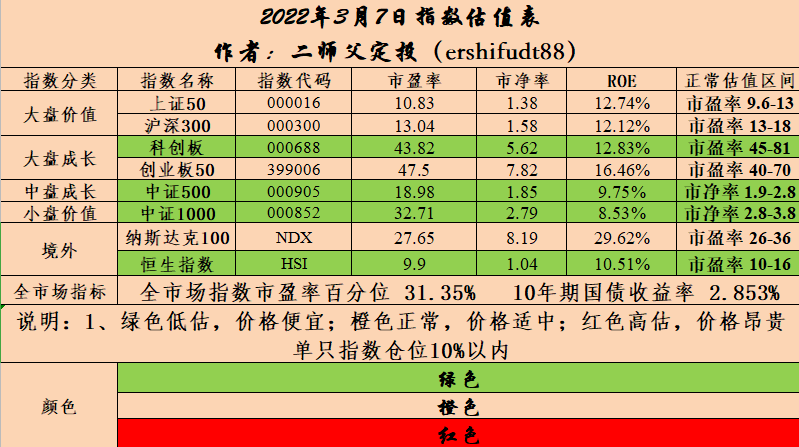

======================================================

_type: talk
@不再YY的猪[422118542885848]
2022-03-08 11:15:38 Tue  
topic_id: 812555555221852

老读者了，一直在跟投，持仓基金平均亏损20个点了，哭[撇嘴]

@芳瑛榕子 at 2022-03-08 11:15:38 Tue

> 大环境就是跌、跌、跌[难过][难过][难过]

----------

阅读[1]  评论[1]  赞[0] 

======================================================

_type: talk
@晴[15422515228522]
2022-03-08 13:37:16 Tue  
topic_id: 812555554252552

二师父，为什么首推沪深300，而不是其他指数呢？

@二师父 at 2022-03-08 13:37:16 Tue

> 市值大，企业比较稳定

----------

阅读[1]  评论[1]  赞[0] 

======================================================

_type: talk
@二师父[28814221155551]
2022-03-08 13:41:43 Tue  
topic_id: 212555554288581

<e type="hashtag" hid="881251425252" title="#鳄鱼计划#" /> 上证指数etf买入一份，中药etf买入一份，仅个人投资记录，大家慎重，市场波动大，不一定拿的住。

@小鱼 at 2022-03-08 13:41:43 Tue

> 501011

----------

阅读[1]  评论[1]  赞[0] 

======================================================

_type: talk
@二师父[28814221155551]
2022-03-08 13:43:34 Tue  
topic_id: 212555554282181

市场逐步开始恐惧情绪蔓延了，不是所有人都适合高风险市场，如果不能接受波动，建议定投白银组合或者二级债基，每个人的风险承受能力不同，得做好压力测试

阅读[1]  评论[0]  赞[0] 

======================================================

_type: talk
@二师父[28814221155551]
2022-03-08 13:53:35 Tue  
topic_id: 184222221448422

<e type="hashtag" hid="15288821141452" title="#成长组合#" /> 中药买入2000元，300价值买入2000元，农业买入2000元，风险并未解除，3300以上继续做多。大家根据自己的现金流和实际承受能力来。

阅读[1]  评论[0]  赞[0] 

======================================================

_type: talk
@二师父[28814221155551]
2022-03-08 17:42:38 Tue  
topic_id: 415444485415888

直接跌破防了，说说应对策略吧

@蛋炒饭不加蛋 at 2022-03-08 17:42:38 Tue

> 如果没钱定投了，是不是要割出来再定投？

----------

@二师父 at 2022-03-08 17:42:38 Tue

> 直接不用投了，攒钱

----------

@蛋炒饭不加蛋 at 2022-03-08 17:42:38 Tue

> 好

----------

@梧桐 at 2022-03-08 17:42:38 Tue

> 二师父，对于一级债基和二级债基不清楚，像白银组合是二级债，招商产业债是一级债？

----------

@二师父 at 2022-03-08 17:42:38 Tue

> 对的

----------

@DY🍉 at 2022-03-08 17:42:38 Tue

> 定投的话准备多少份合适？

----------

@苍天有井明月空🌙 at 2022-03-08 17:42:38 Tue

> 养殖etf怎么看，二师父

----------

@二师父 at 2022-03-08 17:42:38 Tue

> 100份

----------

阅读[1]  评论[16]  赞[0] 

+++++++++++++++++++++++++++++++++++++++++++++++++++++

文件：
2022-03-08 17:42:23 Tue
文件大小：[31942]
841551211815212-破防了.docx

======================================================

_type: talk
@二师父[28814221155551]
2022-03-08 22:02:20 Tue  
topic_id: 812555528224822

明天继续跌，我继续加仓，去年大约这个时间段卸了很多货，没有大举加仓的机会，今年可能有，上车，加仓代码大约如下，子弹很充足，加油！

@苍天有井明月空🌙 at 2022-03-08 22:02:20 Tue

> 养殖etf怎么样

----------

@二师父 at 2022-03-08 22:02:20 Tue

> 挺好，我买了的

----------

@梧桐 at 2022-03-08 22:02:20 Tue

> 这个加仓是定投吗？

----------

@二师父 at 2022-03-08 22:02:20 Tue

> 是的

----------

@梧桐 at 2022-03-08 22:02:20 Tue

> 100份？

----------

@二师父 at 2022-03-08 22:02:20 Tue

> 根据自己情况来吧，差不多100份控制下仓位不错的

----------

@梧桐 at 2022-03-08 22:02:20 Tue

> 谢谢二师父

----------

@衣袂飘香 at 2022-03-08 22:02:20 Tue

> 今天跟着二师父加仓了。

----------

阅读[1]  评论[8]  赞[0] 

+++++++++++++++++++++++++++++++++++++++++++++++++++++

图片：
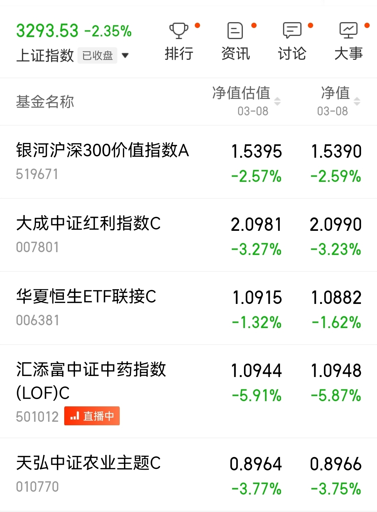

======================================================

_type: talk
@二师父[28814221155551]
2022-03-08 22:08:33 Tue  
topic_id: 812555528241852

场内加仓代码大约如下，3300以下持续定投，涨到3300以上停止，或者现金没有停止，逆向投资。

注意一个风险，可能持续底部横盘，所以要有短线网格仓位，让自己不至于所有资金长期被套。

多策略应对。

@Mo.DC at 2022-03-08 22:08:33 Tue

> 好的，这轮底部会跌破3000吗

----------

@李金泉 at 2022-03-08 22:08:33 Tue

> 二师傅，请问那现在定投和网格式加仓哪个合适呢

----------

@二师父 at 2022-03-08 22:08:33 Tue

> 网格就是定投的一种方式

----------

@李金泉 at 2022-03-08 22:08:33 Tue

> 嗯，谢谢

----------

@嘉宾 at 2022-03-08 22:08:33 Tue

> 请问501012与501011区别是什么？能用501012代替吗？

----------

@二师父 at 2022-03-08 22:08:33 Tue

> 可以

----------

阅读[1]  评论[6]  赞[0] 

+++++++++++++++++++++++++++++++++++++++++++++++++++++

图片：
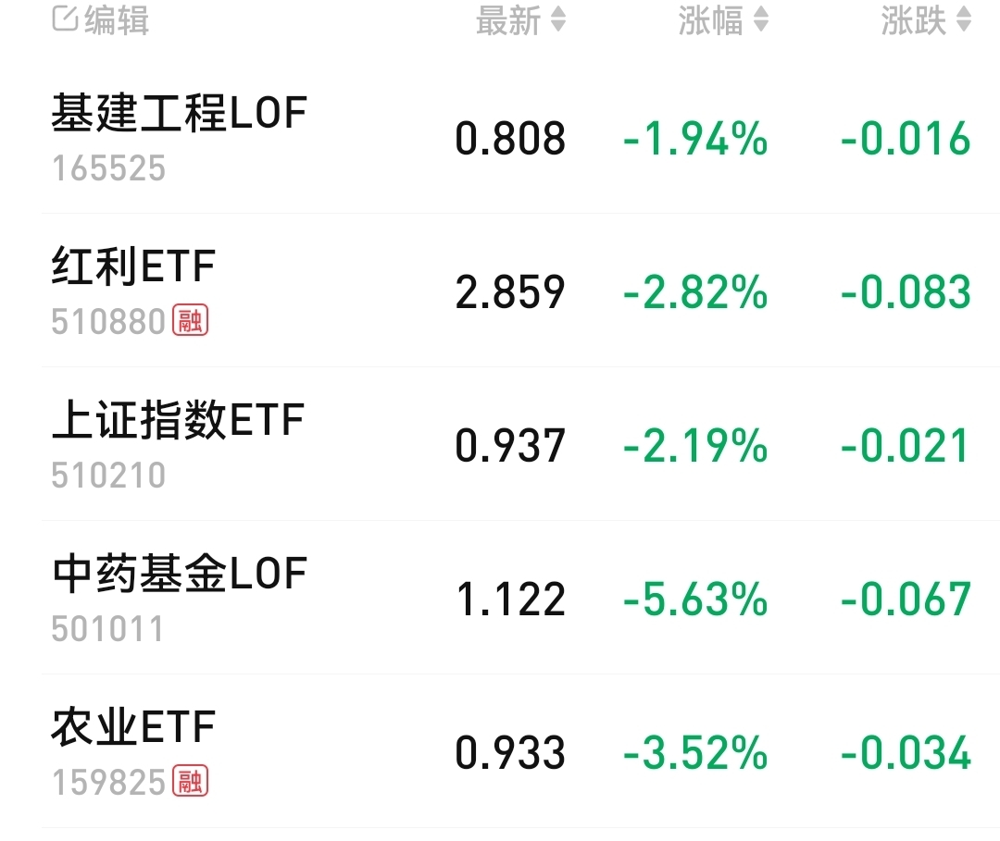

======================================================

_type: talk
@二师父[28814221155551]
2022-03-09 10:01:19 Wed  
topic_id: 812555542814282

<e type="hashtag" hid="28518855451481" title="#乌龟计划#" /> 买入广发中债1-3年国开债2000元，债券安全，定投防守，发生危机了可以转化成指数，年化也有百分之5左右

@践行 at 2022-03-09 10:01:19 Wed

> 师父，这个代码是多少，场外可以买吗

----------

@二师父 at 2022-03-09 10:01:19 Wed

> 可以

----------

@衣袂飘香 at 2022-03-09 10:01:19 Wed

> 上证跌破3300，创业板跌破去年3月的位置了，熊市是不是真的要来了？

----------

@陈昭晶 at 2022-03-09 10:01:19 Wed

> 二师父，债券发生危机了可以转换成指数是什么意思

----------

@二师父 at 2022-03-09 10:01:19 Wed

> 比如发生金融危机，债券会有一定收益，可以逐步卖出债券买指数

----------

阅读[1]  评论[5]  赞[0] 

======================================================

_type: talk
@二师父[28814221155551]
2022-03-09 16:06:09 Wed  
topic_id: 184222422221112

今年一直波动很大，会是主旋律。

接下来按照纪律操作就行。网格+定投，定投的仓位长期持有等待下一次突破3700再考虑卖出。

网格的仓位有盈利随时卖出。如果不分仓的话，很少有人能够抵得住几次狂跌。

定投+网格买入指数，未来大概率盈利。

品种以A股价值股为主。

阅读[1]  评论[0]  赞[0] 

======================================================

_type: talk
@二师父[28814221155551]
2022-03-09 20:51:43 Wed  
topic_id: 184222428221422

其实如果定投的话熊市更加适合，暴涨暴跌反而不适合定投。

这个位置出现了下影线，不必悲观了，继续加仓A股价值指数。

@蓝精灵 at 2022-03-09 20:51:43 Wed

> 师父，沪深300价值是场外基金嘛！

----------

@二师父 at 2022-03-09 20:51:43 Wed

> 是的

----------

@蓝精灵 at 2022-03-09 20:51:43 Wed

> 谢谢师父

----------

阅读[1]  评论[3]  赞[0] 

+++++++++++++++++++++++++++++++++++++++++++++++++++++

文件：
2022-03-09 20:48:51 Wed
文件大小：[29248]
118228154148812-最关键的时刻到了.docx

======================================================

_type: talk
@二师父[28814221155551]
2022-03-09 21:51:45 Wed  
topic_id: 415444541145118

明天买白酒，我又一次精准卖到了顶部，收割利润不香吗？如果明天不大涨，可能会大幅度加仓了，该发车的时候毫不犹豫，不该发的时候发了也是亏钱

@隔窗遥望 at 2022-03-09 21:51:45 Wed

> 酒ETF也快到0.7了，买白酒还是买酒ETF好，等了好久了，师父厉害

----------

@二师父 at 2022-03-09 21:51:45 Wed

> 都可以，酒etf里面有啤酒

----------

@隔窗遥望 at 2022-03-09 21:51:45 Wed

> 建仓后开始定投吗，可以打到多少仓位

----------

@芳瑛榕子 at 2022-03-09 21:51:45 Wed

> 二师父，白酒目前的估值如何？刚刚低估吗？

----------

@二师父 at 2022-03-09 21:51:45 Wed

> 正常估值

----------

@芳瑛榕子 at 2022-03-09 21:51:45 Wed

> 二师父，白酒ETF的加仓节奏是怎样的？想参考一下[偷笑]

----------

@二师父 at 2022-03-09 21:51:45 Wed

> 今天下午发

----------

@芳瑛榕子 at 2022-03-09 21:51:45 Wed

> 期待😚

----------

阅读[1]  评论[8]  赞[0] 

+++++++++++++++++++++++++++++++++++++++++++++++++++++

图片：
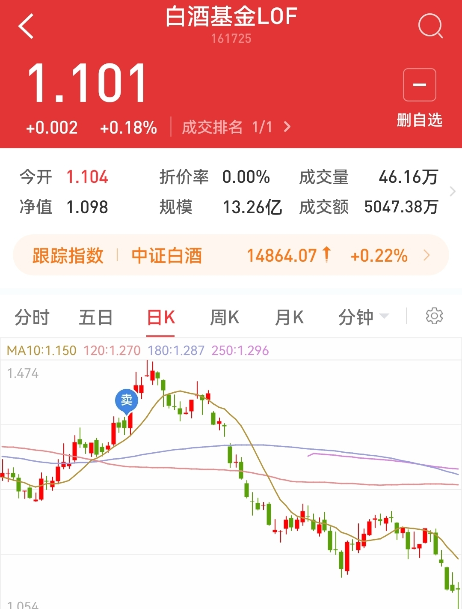

======================================================

_type: talk
@和平[818855882144242]
2022-03-09 21:59:02 Wed  
topic_id: 415444541158418

中证白酒现在是高估，为啥还买

@二师父 at 2022-03-09 21:59:02 Wed

> 你开玩笑呢吧

----------

@和平 at 2022-03-09 21:59:02 Wed

> 天天基金中看的

----------

@和平 at 2022-03-09 21:59:02 Wed

> 我买的是161725，请二师父指教

----------

阅读[1]  评论[3]  赞[0] 

======================================================

_type: talk
@和平[818855882144242]
2022-03-09 22:02:10 Wed  
topic_id: 212555285552811

二师父，场内还是场外

阅读[1]  评论[0]  赞[0] 

======================================================

_type: talk
@二师父[28814221155551]
2022-03-09 22:09:22 Wed  
topic_id: 585222512218424

<e type="hashtag" hid="552114551414" title="#估值数据#" /> 市盈率百分位27.35%，SY-BY百分位27.15%，SY/BY百分位16.06%。

如果大盘再跌15%，估值楼层就顺利进入第一层，那时候大家可以随便买了，遍地黄金。

@芳瑛榕子 at 2022-03-09 22:09:22 Wed

> 二师父，你以前遇到过这种遍地是黄金的时候吗，比如……

----------

@梧桐 at 2022-03-09 22:09:22 Wed

> 2018年9月

----------

阅读[1]  评论[2]  赞[0] 

======================================================

_type: talk
@Philip🎭 Y[28518855518151]
2022-03-10 09:49:52 Thu  
topic_id: 212555222441141

看来今天要发车[发呆]

阅读[1]  评论[0]  赞[0] 

======================================================

_type: talk
@二师父[28814221155551]
2022-03-10 09:53:38 Thu  
topic_id: 812555222128222

<e type="hashtag" hid="15288821141452" title="#成长组合#" /> 5只基金各买6000元，加油，开始干活

@Glühwein at 2022-03-10 09:53:38 Thu

> 白酒现在建仓是不是刚好[呲牙][呲牙]

----------

@菖朴健康 at 2022-03-10 09:53:38 Thu

> 二师父你这边买基金为什么会优先选择场外基金而不选择场内ETF呢

----------

@二师父 at 2022-03-10 09:53:38 Thu

> 场内也有

----------

@菖朴健康 at 2022-03-10 09:53:38 Thu

> 是因为基金组合问题吗？

----------

@菖朴健康 at 2022-03-10 09:53:38 Thu

> 正常来说，场内无手续费，赎回买卖更方便些呀

----------

@二师父 at 2022-03-10 09:53:38 Thu

> 对的，我更喜欢场内

----------

@菖朴健康 at 2022-03-10 09:53:38 Thu

> 但是上面这些基金应该是场外偏多吧[呲牙]

----------

@二师父 at 2022-03-10 09:53:38 Thu

> 除了300价值，都有的

----------

阅读[1]  评论[35]  赞[0] 

+++++++++++++++++++++++++++++++++++++++++++++++++++++

图片：
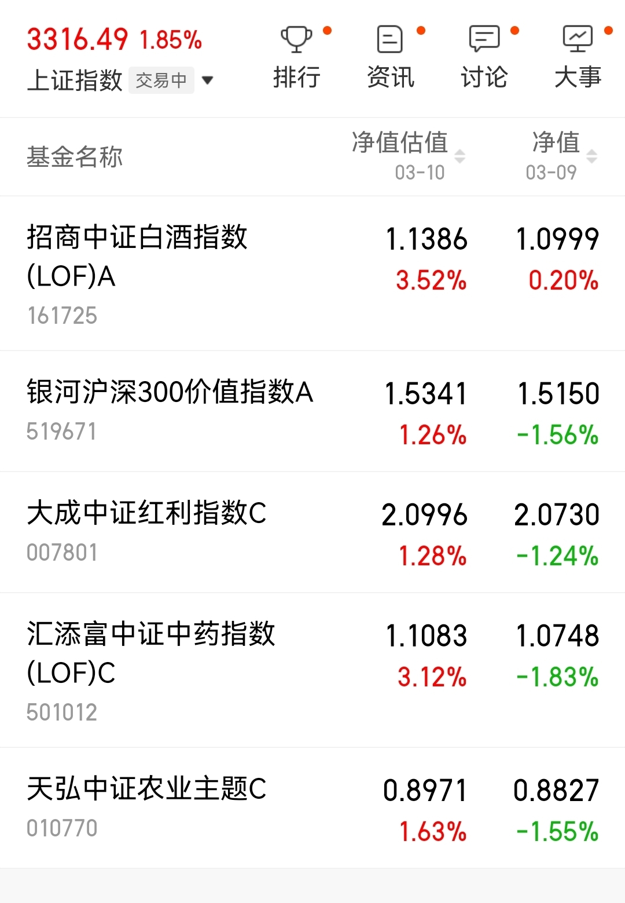

======================================================

_type: q&a
@维真[818585418182212]
2022-03-10 13:42:16 Thu  
topic_id: 812555248582122

@维真

>  二师父你好，目前我投资的乌龟计划，现有仓位是两层仓位，在当下市场行情下，该如何投资乌龟计划？请二师父指点一下，谢谢师父。

@二师父

>  基建，红利浮亏以后继续定投

阅读[1]  评论[0]  赞[0] 

======================================================

_type: talk
@二师父[28814221155551]
2022-03-10 13:43:12 Thu  
topic_id: 585222541452814

<e type="hashtag" hid="881251425252" title="#鳄鱼计划#" /> 白酒买入5份，其余五只各买入一份。

@芳瑛榕子 at 2022-03-10 13:43:12 Thu

> 二师父，白酒每周定投吗？白酒的最大跌幅是多少呢？

----------

@二师父 at 2022-03-10 13:43:12 Thu

> 不是定投

----------

@芳瑛榕子 at 2022-03-10 13:43:12 Thu

> 网格？还是每跌10%加仓之类的？我手里也有一些白酒ETF，现在亏损6个点😂

----------

@二师父 at 2022-03-10 13:43:12 Thu

> 看市场情况哈，可能反弹就收割利润了

----------

@芳瑛榕子 at 2022-03-10 13:43:12 Thu

> 我买了白酒后盈利20个点没卖，结果成亏损了。现在要紧跟二师父脚步😁

----------

@芳瑛榕子 at 2022-03-10 13:43:12 Thu

> 二师父，你的视频号啥时候继续更新呢[愉快]

----------

@二师父 at 2022-03-10 13:43:12 Thu

> 月底吧

----------

@芳瑛榕子 at 2022-03-10 13:43:12 Thu

> 期待😚干货满满🤔

----------

阅读[1]  评论[14]  赞[0] 

+++++++++++++++++++++++++++++++++++++++++++++++++++++

图片：
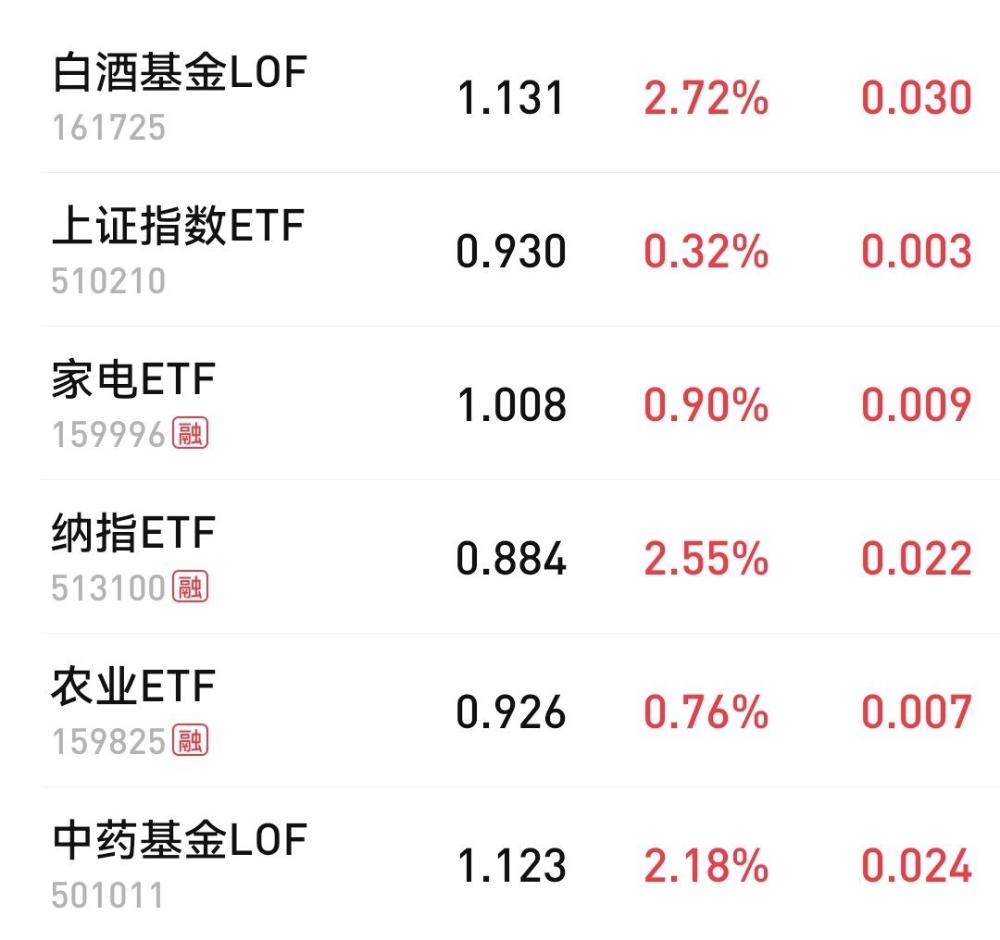

======================================================

_type: talk
@奉壹[218521884455481]
2022-03-10 14:01:10 Thu  
topic_id: 184222415844582

二师父，之前您提及的中证1000和银行要怎么处理，持仓不动还是？保持定投？现在仓位都是10%-20%之间

@二师父 at 2022-03-10 14:01:10 Thu

> 不动，该动得时候我会发车

----------

@奉壹 at 2022-03-10 14:01:10 Thu

> 好的，静候佳音

----------

阅读[1]  评论[2]  赞[0] 

======================================================

_type: talk
@二师父[28814221155551]
2022-03-10 16:32:39 Thu  
topic_id: 212555241115211

目前策略很简单，3400以下正常定投，3400以上收割利润。

从3300开始，每下跌100点手动买入一次。

制订了计划，坚持进行就可以啦，纳斯达克网格也重新开始了。加仓节奏和仓位都需要控制好，这次下跌大家可能就对自己承受能力有了了解，即使买对了，遭遇暴跌也未必能拿住，这是由心态仓位认知共同决定的。

@芳瑛榕子 at 2022-03-10 16:32:39 Thu

> 二师父，这个策略适合目前投资的所有品种吗？

----------

@二师父 at 2022-03-10 16:32:39 Thu

> 有的不适合，a股价值板块可以

----------

阅读[1]  评论[2]  赞[0] 

======================================================

_type: talk
@二师父[28814221155551]
2022-03-10 20:34:25 Thu  
topic_id: 585222585258244

今天回血了，看看未来还会不会跌，鳄鱼计划资金不多了，如果大盘还能跌到3200以下，计划从防守账户调动100份资金分批加入，控制节奏和加仓位置，就不要紧。

要防止一种情况，大盘反弹就别加了，否则在3500以上建立太多仓位，遇到大跌很容易遭不住。

永远只买低不买高。如果对板块没有研究，就买上证指数，这个是最安全的ETF，不过他也有一个弊端，就是成长性较弱。预期不高。

阅读[1]  评论[0]  赞[0] 

+++++++++++++++++++++++++++++++++++++++++++++++++++++

文件：
2022-03-10 20:31:58 Thu
文件大小：[30882]
421441224512848-回血.docx

======================================================

_type: talk
@老孙头[422115118524548]
2022-03-10 21:44:18 Thu  
topic_id: 585222588551284

请教一FOF基金和一般平台投顾组合基金，除操作层面的主动和灵活性之外，还有些什么区别或利弊？一能否介绍一个较优秀的FOF?

@二师父 at 2022-03-10 21:44:18 Thu

> FOF更依赖于投资人，投顾组合基金更加灵活一些。

投顾组合可以自己按照自己的操作来进行调仓，而FOF基本不行。

就是费用上比自己投资贵一点，如果自己投资水平一般可以参考，如果自己投资水平高，很多投顾组合水平也不一定好，还是自己多学习提高认知。

----------

阅读[1]  评论[1]  赞[0] 

======================================================

_type: talk
@二师父[28814221155551]
2022-03-10 21:53:59 Thu  
topic_id: 585222588414244

<e type="hashtag" hid="552114551414" title="#估值数据#" /> 市盈率百分位26.41%，SY-BY百分位26.36%，SY/BY百分位14.99%。

估值进一步下移，美国通胀数据公布，逼近了8%，接近1982年以来的高位。

接下来正常定投即可，A股价值基金+上证指数ETF最为稳妥，万一发生极端情况，要保证自己拿的住。

阅读[1]  评论[0]  赞[0] 

======================================================

_type: talk
@二师父[28814221155551]
2022-03-10 22:14:13 Thu  
topic_id: 415444511121258

<e type="hashtag" hid="825188852442" title="#估值表#" /> 机会来了，不知道怎么投就买绿色的，单只仓位控制在10%，问题不大。

阅读[1]  评论[0]  赞[0] 

+++++++++++++++++++++++++++++++++++++++++++++++++++++

图片：
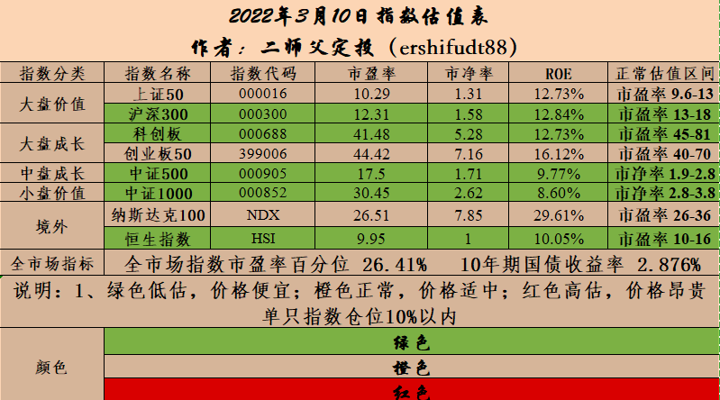

======================================================

_type: talk
@小袁[841582442185482]
2022-03-11 08:26:31 Fri  
topic_id: 415444241251428

老师好，一直空仓，3月8号大跌开始买入1成仓位（深红利  央视50  中证医疗 A股龙头等共7个组合，每个组合配二级债基不算在仓位内），再跌时想直接加到3成仓位，如果再到2800点左右满仓卧倒，资金量大几年不用，20%波动能承受，您看现在的思路可以吗？

@二师父 at 2022-03-11 08:26:31 Fri

> 可以，注意加仓方向就可以，a股价值

----------

@小袁 at 2022-03-11 08:26:31 Fri

> 好的谢谢了

----------

阅读[1]  评论[2]  赞[0] 

======================================================

_type: talk
@二师父[28814221155551]
2022-03-11 08:29:35 Fri  
topic_id: 212555451448241

场外账户锁仓，每月定投7200，防止加仓管不住手。3400以上停止。

鳄鱼计划开始手动加仓，美股账户手动加仓，开始干活。

开始行动。

@奉壹 at 2022-03-11 08:29:35 Fri

> 没有在场外建底仓，可以直接跟二师父一起定投买入吗

----------

@二师父 at 2022-03-11 08:29:35 Fri

> 定投可以的

----------

@奉壹 at 2022-03-11 08:29:35 Fri

> 好的，非常感谢[OK]

----------

@cotton at 2022-03-11 08:29:35 Fri

> 美股账户是啥呀二师父

----------

@二师父 at 2022-03-11 08:29:35 Fri

> 华泰国际，a股也可以买纳指etf

----------

@梧桐 at 2022-03-11 08:29:35 Fri

> 中药上去了，二师父威武

----------

阅读[1]  评论[6]  赞[0] 

+++++++++++++++++++++++++++++++++++++++++++++++++++++

图片：
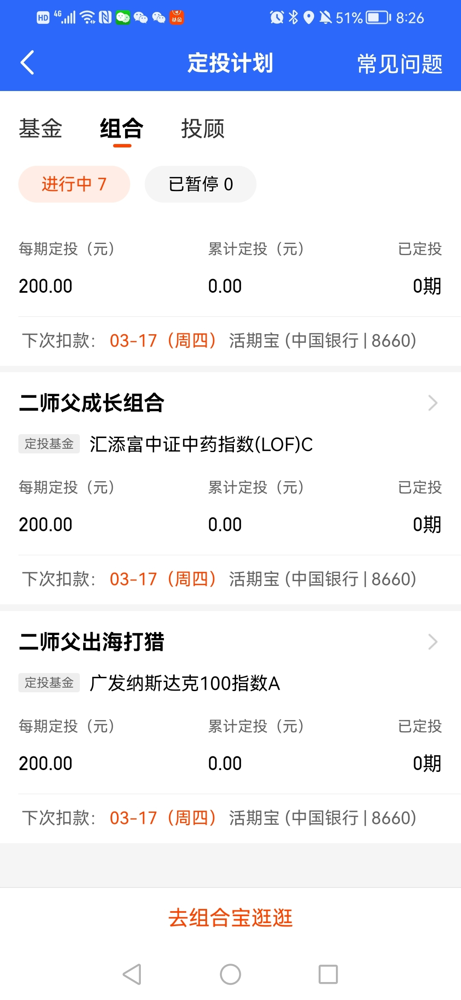
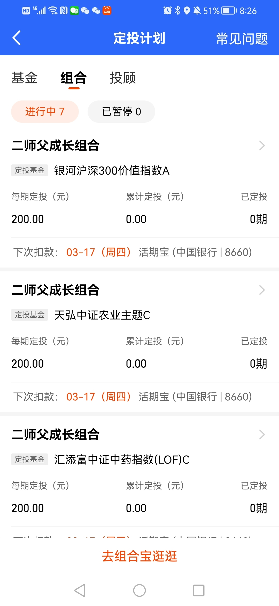
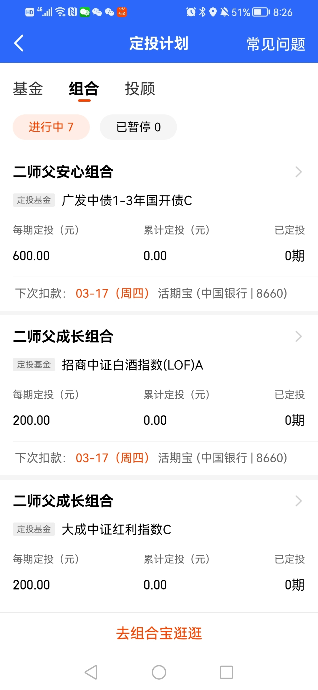

======================================================

_type: talk
@一心一意[844421848411122]
2022-03-11 09:25:44 Fri  
topic_id: 585222412585584

中概美国退市，我们怎么办呢

@二师父 at 2022-03-11 09:25:44 Fri

> 躺平反弹卖出

----------

@枫叶 at 2022-03-11 09:25:44 Fri

> 是不是美国退市到香港上市

----------

@芳瑛榕子 at 2022-03-11 09:25:44 Fri

> 二师父，中概现在还网格吗？

----------

@二师父 at 2022-03-11 09:25:44 Fri

> 不加了，反弹卖出

----------

@芳瑛榕子 at 2022-03-11 09:25:44 Fri

> 是不是现在中概的风险太大了，大大的超过了收益，风险收益比相当不匹配？

----------

@二师父 at 2022-03-11 09:25:44 Fri

> 是的，不划算

----------

@芳瑛榕子 at 2022-03-11 09:25:44 Fri

> 我的仓位较多，亏损不到30%，怎么办呢？

----------

@二师父 at 2022-03-11 09:25:44 Fri

> 多少仓位

----------

阅读[1]  评论[11]  赞[0] 

======================================================

_type: talk
@JOY[111881481812422]
2022-03-11 09:25:58 Fri  
topic_id: 415444284515188

师父，中药采集对中药会有大影响吗？

@二师父 at 2022-03-11 09:25:58 Fri

> 会有影响的，医药行业政策风险比消费行业大

----------

@JOY at 2022-03-11 09:25:58 Fri

> 谢谢，那请问是不是也可能会发生之前医药医疗那样的情况？

----------

@二师父 at 2022-03-11 09:25:58 Fri

> 有可能，不过腰斩概率不大，中药板块本身估值没有那么高，而且受集采影响小一些

----------

阅读[1]  评论[3]  赞[0] 

======================================================

_type: talk
@春晓[48418482258118]
2022-03-11 09:45:58 Fri  
topic_id: 585222415582184

二师父，大成中证红利A和C一样么

@二师父 at 2022-03-11 09:45:58 Fri

> 一样的

----------

阅读[1]  评论[1]  赞[0] 

======================================================

_type: talk
@波波[51541154455544]
2022-03-11 10:35:08 Fri  
topic_id: 212555484514581

师傅，成长组合为什么天天基金定投上是暗的？

@二师父 at 2022-03-11 10:35:08 Fri

> 现在都没法跟投了，自己设置定投就行

----------

阅读[1]  评论[1]  赞[0] 

+++++++++++++++++++++++++++++++++++++++++++++++++++++

图片：
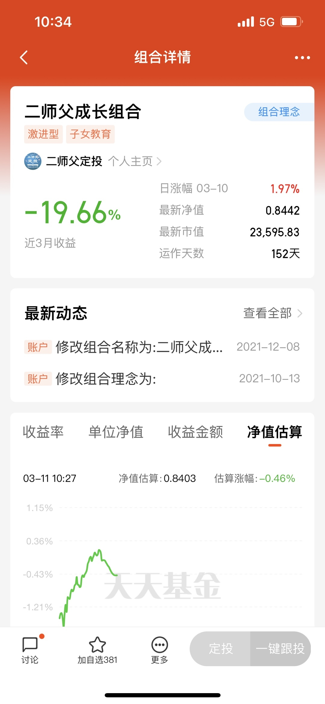

======================================================

_type: talk
@二师父[28814221155551]
2022-03-11 10:42:01 Fri  
topic_id: 415444282825858

中概别补仓了，卧倒，反弹盈利卖出，如果他好，不摊低成本也能盈利，如果他不好，补仓也没用，很显然，中概跌破支撑位有一次不行了，考虑到恒生指数即使最大跌幅，中概要么控制百分之10仓位，要么放弃，投资上证指数也更加确定。我的加仓方向都确定了，3300以下就是定投坚持了，熊市积累，牛市收货。

@奉壹 at 2022-03-11 10:42:01 Fri

> 164906网格也不网了吗，我底价设在0.8，还没破网，是先停止吗？

----------

@二师父 at 2022-03-11 10:42:01 Fri

> 轻仓浮亏百分之50不心疼可以

----------

@奉壹 at 2022-03-11 10:42:01 Fri

> 谈笑间才发现已经0.808了，网格小仓位，躺平算了[呲牙][呲牙]

----------

@枫叶 at 2022-03-11 10:42:01 Fri

> 老师你好，中概9%仓位，套45%割肉还是卧倒

----------

@二师父 at 2022-03-11 10:42:01 Fri

> 卧倒就可以了，没必要在现在割肉

----------

@Hi·DD at 2022-03-11 10:42:01 Fri

> 医药现在换中药来得及不

----------

@二师父 at 2022-03-11 10:42:01 Fri

> 如果医药仓位不多，直接投中药就行

----------

@默 at 2022-03-11 10:42:01 Fri

> 股市这是要疯啊

----------

阅读[1]  评论[13]  赞[0] 

======================================================

_type: talk
@二师父[28814221155551]
2022-03-11 13:59:41 Fri  
topic_id: 415444258185248

<e type="hashtag" hid="881251425252" title="#鳄鱼计划#" /> 上证指数买入4份，继续买入，该发车毫不犹豫。

@梧桐 at 2022-03-11 13:59:41 Fri

> 跟了

----------

@林凤崎 at 2022-03-11 13:59:41 Fri

> 跟

----------

@付云 at 2022-03-11 13:59:41 Fri

> 是上证50么

----------

阅读[1]  评论[3]  赞[0] 

======================================================

_type: talk
@二师父[28814221155551]
2022-03-11 14:24:01 Fri  
topic_id: 212555422545811

也是神了，刚买入就大涨，两会开完了，危险解除

@小袁 at 2022-03-11 14:24:01 Fri

> [呲牙]

----------

@菖朴健康 at 2022-03-11 14:24:01 Fri

> 二师父，好像证劵板块是头部拉起的呢

----------

@蛋炒饭不加蛋 at 2022-03-11 14:24:01 Fri

> 国家队出手了，指数回来，钱没回来。。。

----------

@付云 at 2022-03-11 14:24:01 Fri

> 上证50么

----------

阅读[1]  评论[4]  赞[0] 

======================================================

_type: q&a
@好运玲玲[244188585541521]
2022-03-11 17:25:56 Fri  
topic_id: 184222141852422

@好运玲玲

>  二师父您好！好久不发鳄鱼持仓了，可以发一下吗？有些没跟上，我想根据您的持仓比例把仓位调整一下

@二师父

>  好的，周末发一下

阅读[1]  评论[1]  赞[0] 

======================================================

_type: talk
@二师父[28814221155551]
2022-03-12 14:28:49 Sat  
topic_id: 415448444288818

很多问题统一解答，如果仓位重买入可以拉大网格，卖出缩小网格。

总之做A股价值方向，安全边际更加深，未来很关键的就是看3145能否跌破，这个位置跌破了就比较危险了，我判断这是个底部，不会跌破，但是凡是有意外，如果发生了更大的危机，就难说了。

所以一定不要梭哈抄底。

@芳瑛榕子 at 2022-03-12 14:28:49 Sat

> 二师父，上证已破3145[流泪]

----------

@二师父 at 2022-03-12 14:28:49 Sat

> 情况不太好

----------

阅读[1]  评论[2]  赞[0] 

+++++++++++++++++++++++++++++++++++++++++++++++++++++

文件：
2022-03-12 14:26:05 Sat
文件大小：[39542]
118252224845142-聊聊大家关心的问题.docx

======================================================

_type: talk
@二师父[28814221155551]
2022-03-12 16:13:52 Sat  
topic_id: 585221221148484

<e type="hashtag" hid="881251425252" title="#鳄鱼计划#" /> 按照计划补仓，绿的很多，还有补仓机会，不到估值楼层一层，不会满仓的。

很多品种是之前盈利清仓，然后补仓，所以收益率是负的，实际上很多盈利的品种赚了已经走了，比如家电、消费50、深红利、券商、中概。

这也再次告诉大家，不让相信每次牛市别人鼓吹的十年牛市，也不要贪婪，该卖就卖，赚了一倍还不卖，继续加仓，就是贪婪。

持仓的医药和医疗加中概大致8%仓位，不再追加，耐心等待他们上涨就可以了，盲目摊低成本只会越套越多。

接下来重点投资，上证指数，白酒、中药、基建、红利、农业。

子弹有限，加仓最看好的。

有读者问基建行不行，当然行，昨天我又补仓了中建，反弹盈利5%到10%就卖出获利。熊市只有这种方法能赚钱，不同的宏观环境对应不同的策略。

关键是不贪婪，仅此而已。大牛市都能赚钱，如果在震荡市场或者熊市还能挣钱，那是高手。

@李金泉 at 2022-03-12 16:13:52 Sat

> 二师傅，请问碳中和etf是哪个啊，现在估值如何呢？

----------

@二师父 at 2022-03-12 16:13:52 Sat

> 159790，目前正常估值

----------

@李金泉 at 2022-03-12 16:13:52 Sat

> 嗯，谢谢！

----------

@光少 at 2022-03-12 16:13:52 Sat

> 哈哈，中建我也加仓了，跟上了二师父思路[呲牙]

----------

@Glühwein at 2022-03-12 16:13:52 Sat

> 沪深300可以建仓了嘛？

----------

@二师父 at 2022-03-12 16:13:52 Sat

> 只能定投

----------

@大兵 at 2022-03-12 16:13:52 Sat

> 二师父 中药还可以建底仓么

----------

阅读[1]  评论[7]  赞[0] 

+++++++++++++++++++++++++++++++++++++++++++++++++++++

图片：
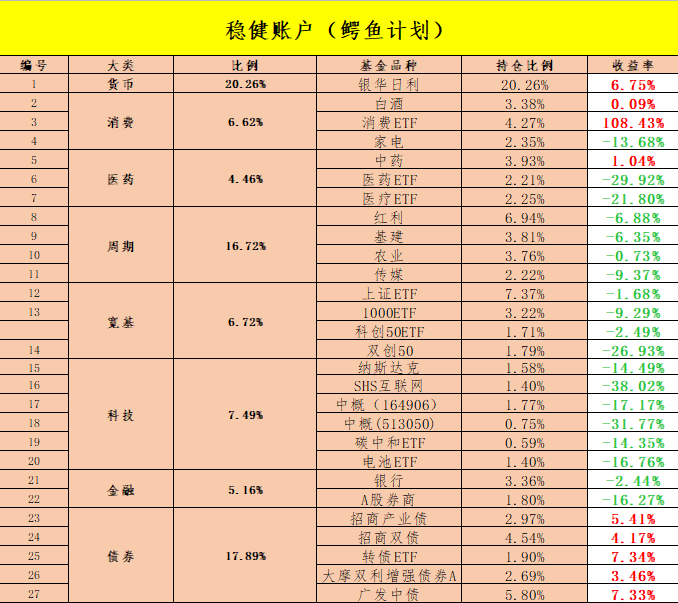

======================================================

_type: talk
@二师父[28814221155551]
2022-03-13 11:53:33 Sun  
topic_id: 184225244248882

我选择了5只基金定投，已经分享了，自动定投，不再发车。如果收益率有10%，不管大盘点位，停止扣款，收割利润。

这个位置就不用恐惧了，定投是非常不错的。

海外的选择纳斯达克，钱不多的话，就做A股的5只即可，太多分散每必要，200万的话，每只40万，未来一定盈利可观。

@小东 at 2022-03-13 11:53:33 Sun

> 5只定投的基金分享在哪里，天天基金吗

----------

@从A到Z at 2022-03-13 11:53:33 Sun

> 哪五只呢？代码在哪里？

----------

@二师父 at 2022-03-13 11:53:33 Sun

> 你看看之前的文章

----------

阅读[1]  评论[3]  赞[0] 

+++++++++++++++++++++++++++++++++++++++++++++++++++++

文件：
2022-03-13 11:50:29 Sun
文件大小：[39452]
841585582215882-我看好的行业.docx

======================================================

_type: talk
@二师父[28814221155551]
2022-03-13 12:10:20 Sun  
topic_id: 212558522514451

估值表，新手就定投宽基，每只配置10%仓位，最多不超过80%，永远留现金，现金可以买债券替代。然后上涨收割利润，铁定盈利的。

这种投资方式最低保守收益率也有8%，遇到大机会还会更多，说实话，没必要折腾股票，除非你是对股票特别有兴趣。

阅读[1]  评论[0]  赞[0] 

+++++++++++++++++++++++++++++++++++++++++++++++++++++

图片：
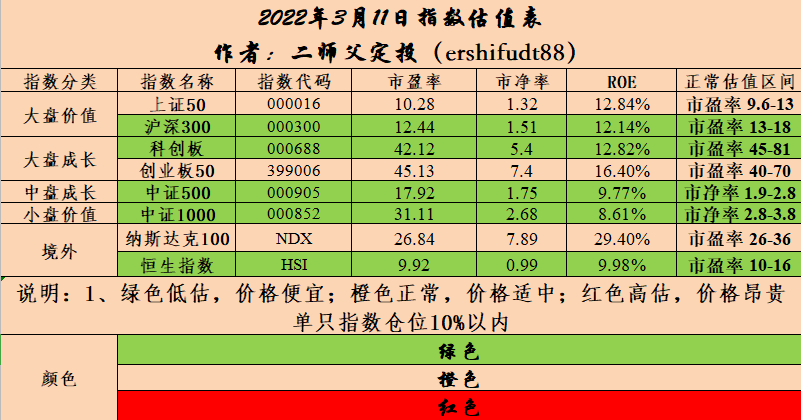

======================================================

_type: talk
@二师父[28814221155551]
2022-03-14 10:32:17 Mon  
topic_id: 184225525525182

这三个品种可以作为货币基金替代品，年化收益率百分之4，回撤也在百分之4左右，大家可以根据情况配置。

左侧定投开始，每周四，五只基金，场内上证指数etf作为沪深300价值替代品，他只要在3300以下持续震荡，就一直定投，注意是定投，不是抄底。

纳斯达克也可以开始了，可以轻仓双周定投，10个点收割利润。

@奉壹 at 2022-03-14 10:32:17 Mon

> 沪深300价值建底仓之后先停了？

----------

@二师父 at 2022-03-14 10:32:17 Mon

> 为什么？每周四定投啊

----------

@奉壹 at 2022-03-14 10:32:17 Mon

> 可能我理解错这句话了：
“场内上证指数etf作为沪深300价值替代品”，他只要在3300以下持续震荡，就一直定投，注意是定投，不是抄底。

----------

@二师父 at 2022-03-14 10:32:17 Mon

> 场外买300价值，场内买上证指数，同步进行

----------

@奉壹 at 2022-03-14 10:32:17 Mon

> 明白

----------

@口口 at 2022-03-14 10:32:17 Mon

> 老师，能不能具体说一下您的组合有哪些，怎么跟投，刚进来摸不着[捂脸]

----------

@二师父 at 2022-03-14 10:32:17 Mon

> 刚进来建议定投易方达稳健收益，易方达增强回报

----------

@口口 at 2022-03-14 10:32:17 Mon

> 那我要怎么看到您整个的组合呢？能置顶吗？

----------

阅读[1]  评论[19]  赞[0] 

+++++++++++++++++++++++++++++++++++++++++++++++++++++

图片：
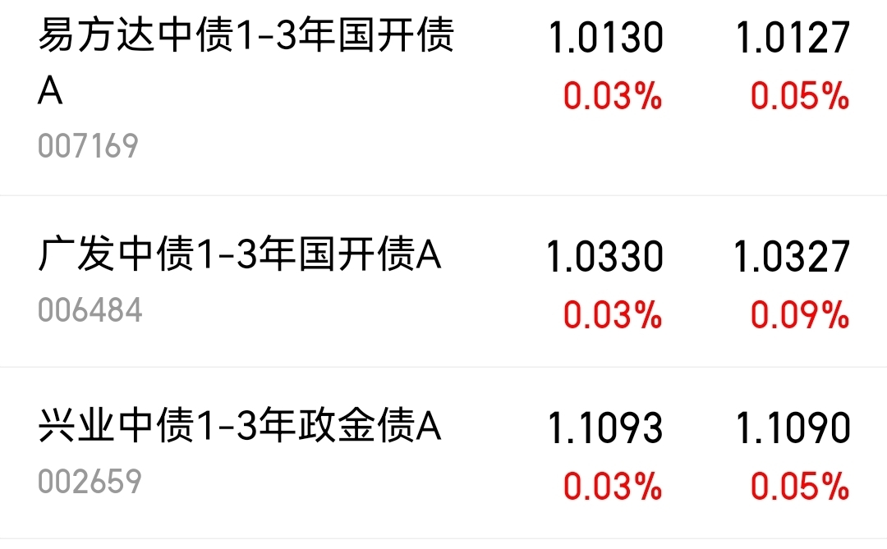

======================================================

_type: talk
@JOY[111881481812422]
2022-03-14 12:53:17 Mon  
topic_id: 812558851544812

师父，请问白酒目前的估值处于什么位置？

@芳瑛榕子 at 2022-03-14 12:53:17 Mon

> 二师父说过，正常估值

----------

@JOY at 2022-03-14 12:53:17 Mon

> 谢谢～

----------

阅读[1]  评论[2]  赞[0] 

======================================================

_type: talk
@二师父[28814221155551]
2022-03-14 15:45:01 Mon  
topic_id: 415448884145228

目前定投这5只，前四只周定投，最后一只月定投，3300以下一直买入，3300以上持有或者收割利润，熊市定投，牛市收获，只要坚持一定盈利。

同时避开港股，尤其是刚入市的朋友，别去凑热闹。

最后上证etf我会实际网格，方法也简单，只要有波动就有盈利，适合刚学习投资的朋友，恒生马上就要碰到16年的底部了，我暂时不考虑，美联储加息缩表完全落地以后再考虑港股。

现在大家都明白了为什么利润收割了吧，终身持有，不是谁都拿的住。

@云云 at 2022-03-14 15:45:01 Mon

> 二师父，上周五你设置的定投撤销了吗？

----------

@二师父 at 2022-03-14 15:45:01 Mon

> 没有撤销，3300以上可能暂停

----------

@云云 at 2022-03-14 15:45:01 Mon

> 好

----------

@蓝精灵 at 2022-03-14 15:45:01 Mon

> 师父，场内基金也按您说的这样定投嘛！

----------

@二师父 at 2022-03-14 15:45:01 Mon

> 可以，反弹注意止盈

----------

@蓝精灵 at 2022-03-14 15:45:01 Mon

> 谢谢！

----------

阅读[1]  评论[6]  赞[0] 

+++++++++++++++++++++++++++++++++++++++++++++++++++++

图片：
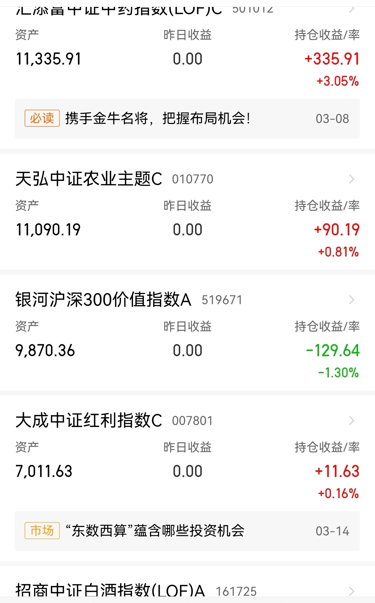

======================================================

_type: talk
@隔窗遥望[241884481854181]
2022-03-14 16:08:00 Mon  
topic_id: 212558888584511

科创板场外基金有吗？

@二师父 at 2022-03-14 16:08:00 Mon

> 有

----------

@隔窗遥望 at 2022-03-14 16:08:00 Mon

> 可以推荐一下吗？

----------

@二师父 at 2022-03-14 16:08:00 Mon

> 易方达科创50

----------

@隔窗遥望 at 2022-03-14 16:08:00 Mon

> 好的谢谢

----------

阅读[1]  评论[4]  赞[0] 

======================================================

_type: talk
@二师父[28814221155551]
2022-03-14 21:31:49 Mon  
topic_id: 585221555514444

开始干活了，我设置的自动定投。

标的本别是沪深300价值、中证农业、中证中药、中证白酒、中证红利。

如果资金不足，选择一只沪深300价值就行了。

海外打猎定投的纳斯达克指数，坚持定投，反转以后就能盈利。

如果有境外账户，可以撸一下空头，适当对冲。注意境外资产不要太多，如果中美继续杠，很有可能境外账户被冻结，这个风险需要理解。

@罗大发 at 2022-03-14 21:31:49 Mon

> 师父 是银河沪深300价值c吗?

----------

@罗大发 at 2022-03-14 21:31:49 Mon

> 优于000311的300增强吗

----------

@二师父 at 2022-03-14 21:31:49 Mon

> 目前是价值类基金更优

----------

@坚持学习 at 2022-03-14 21:31:49 Mon

> 请教二师父，我是一个不太成熟的投资者，资金量也有限。
我以前会定投沪深300+中证500，去年卖出了一部分，停投了。这两只目前的仓位也是较大的，仓位分别有20%左右。
现在看估值表已经是低估，我可以沪深300价值+中证500，进行周定投吗？还是沪深300价值+你之前推荐的大成中证红利呢？还是沪深300价值+债券基金定投？

----------

@二师父 at 2022-03-14 21:31:49 Mon

> 沪深300价值加中证500

----------

@坚持学习 at 2022-03-14 21:31:49 Mon

> 谢谢二师父

----------

阅读[1]  评论[6]  赞[0] 

+++++++++++++++++++++++++++++++++++++++++++++++++++++

文件：
2022-03-14 21:24:08 Mon
文件大小：[30674]
548212248418884-摔杯为号.docx

======================================================

_type: talk
@二师父[28814221155551]
2022-03-15 08:27:44 Tue  
topic_id: 585221545455114

给大家发个红包，今天准备清仓中概了，转入短债和二级债，给大家说过，如果亏损卖出，给大家发红包，君子不立危墙之下，虽然只有百分之4的仓位，但是有机会成本。

@小明 at 2022-03-15 08:27:44 Tue

> 老师，恒生互联需要卖出吗？

----------

@菖朴健康 at 2022-03-15 08:27:44 Tue

> 二师父今年能喝茅台的[呲牙][呲牙][呲牙]

----------

@二师父 at 2022-03-15 08:27:44 Tue

> 这个危险小一些，就看中美最后交恶程度

----------

@二师父 at 2022-03-15 08:27:44 Tue

> 买两瓶备着

----------

@奉壹 at 2022-03-15 08:27:44 Tue

> 中概真的是害我不浅[偷笑]每一次针对中概的投资都是亏损，起码亏了总资金的10%了，现在也还有接近10仓位[呲牙][呲牙]

----------

@是喵喵吖～ at 2022-03-15 08:27:44 Tue

> 师傅所有的中概都清仓吗 仓位很重的话呢

----------

@二师父 at 2022-03-15 08:27:44 Tue

> 那就根据实际来了，我除了港股空头头寸，不准备持有任何港股了

----------

@是喵喵吖～ at 2022-03-15 08:27:44 Tue

> 好的 要是美国要求中概股全部退市，中概基金会怎么样呢师父

----------

阅读[1]  评论[14]  赞[0] 

+++++++++++++++++++++++++++++++++++++++++++++++++++++

图片：

======================================================

_type: talk
@二师父[28814221155551]
2022-03-15 08:43:19 Tue  
topic_id: 812558242145182

网格策略无论多牛，都无法在错误的赛道取胜，选择赛道最重要

@wty at 2022-03-15 08:43:19 Tue

> 挥泪....

----------

@Hi·DD at 2022-03-15 08:43:19 Tue

> 血亏[流泪]

----------

阅读[1]  评论[2]  赞[0] 

+++++++++++++++++++++++++++++++++++++++++++++++++++++

图片：
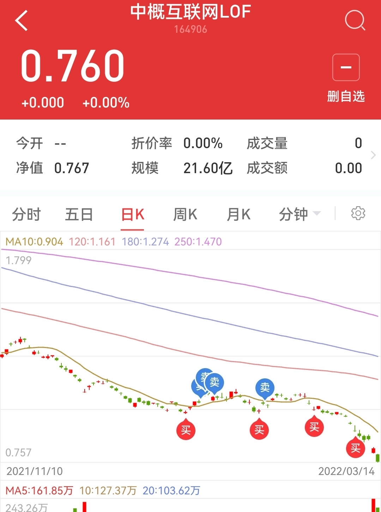

======================================================

_type: talk
@二师父[28814221155551]
2022-03-15 09:36:33 Tue  
topic_id: 585221544448814

<e type="hashtag" hid="881251425252" title="#鳄鱼计划#" /> 清仓全部中概基金，仓位控制太重要，虽然也亏了，但是不至于伤筋动骨。

乌龟计划，中概转换到易方达增强回报债，这是一笔失败的投资，卖出不够果断，10年这只债基一倍，也能弥补亏损。

@一心一意 at 2022-03-15 09:36:33 Tue

> 清仓了啊

----------

@小袁 at 2022-03-15 09:36:33 Tue

> 谁也预测不到会跌这么多，中概亏损20万时我就清仓了，没再碰，现在看看，真是惊险，行业基金波动太大了

----------

@果实妈咪 at 2022-03-15 09:36:33 Tue

> 互联网50那些也全部清仓吗？

----------

@二师父 at 2022-03-15 09:36:33 Tue

> 是的

----------

@cotton at 2022-03-15 09:36:33 Tue

> 可以不清。不动吗

----------

@二师父 at 2022-03-15 09:36:33 Tue

> 波动能承受。能拿住5，6年可以

----------

@范毅君 at 2022-03-15 09:36:33 Tue

> 我选择卧倒，但是仓位轻[呲牙]

----------

@衣袂飘香 at 2022-03-15 09:36:33 Tue

> 我鳄鱼计划里的中概，也全部清仓了，跟着二师父没错的，谁也无法预料这些意外事件。

----------

阅读[1]  评论[13]  赞[0] 

======================================================

_type: talk
@二师父[28814221155551]
2022-03-15 09:44:08 Tue  
topic_id: 212558215224181

<e type="hashtag" hid="881251425252" title="#鳄鱼计划#" /> 上证指数etf买入两份，这个下跌有限，网格加仓，下一次买入点，0.85，无论发生什么危机，上证重回3500都只是时间问题。

@呵呵→_→ at 2022-03-15 09:44:08 Tue

> 二师父是510210综指ETF这只么

----------

@二师父 at 2022-03-15 09:44:08 Tue

> 对

----------

@cotton at 2022-03-15 09:44:08 Tue

> 不是510760吗

----------

@二师父 at 2022-03-15 09:44:08 Tue

> 两个都可以

----------

@陈昭晶 at 2022-03-15 09:44:08 Tue

> 二师父，场内的013286上证综指ETF连接可以吗，与沪深300价值比哪个好

----------

@二师父 at 2022-03-15 09:44:08 Tue

> 沪深300价值好

----------

阅读[1]  评论[6]  赞[0] 

======================================================

_type: talk
@隔窗遥望[241884481854181]
2022-03-15 10:56:07 Tue  
topic_id: 812558218211522

中概今天清仓了，转换成酒可以吗？

@二师父 at 2022-03-15 10:56:07 Tue

> 二级债

----------

@shi at 2022-03-15 10:56:07 Tue

> 清仓那就是真亏了

----------

@留影 at 2022-03-15 10:56:07 Tue

> 你清了吗？

----------

阅读[1]  评论[3]  赞[0] 

======================================================

_type: talk
@口口[422128484581488]
2022-03-15 12:24:43 Tue  
topic_id: 184225484451822

老师，医疗，医药，消费指数现在低估吗？可以买吗？

@二师父 at 2022-03-15 12:24:43 Tue

> 我定投的基金分享了哈

----------

@口口 at 2022-03-15 12:24:43 Tue

> 长期看这些赛道不错，所以想问问，能不能定投

----------

@蛋炒饭不加蛋 at 2022-03-15 12:24:43 Tue

> 基建还投吗

----------

@二师父 at 2022-03-15 12:24:43 Tue

> 投，我今天又买中国建筑了

----------

@蛋炒饭不加蛋 at 2022-03-15 12:24:43 Tue

> 大盘真是一言难尽

----------

@小鱼 at 2022-03-15 12:24:43 Tue

> 东财怎么办，还能买吗

----------

阅读[1]  评论[6]  赞[0] 

======================================================

_type: talk
@DY🍉[241551422851141]
2022-03-15 14:14:20 Tue  
topic_id: 212558455545881

师父，已经刷新新低了3099。请问意味着什么

@北极 at 2022-03-15 14:14:20 Tue

> 瑟瑟发抖，先卸为敬

----------

@以古论今 at 2022-03-15 14:14:20 Tue

> 金融危机

----------

@默 at 2022-03-15 14:14:20 Tue

> 股市这是疯了

----------

阅读[1]  评论[3]  赞[0] 

======================================================

_type: talk
@二师父[28814221155551]
2022-03-15 17:30:02 Tue  
topic_id: 415448241445848

危机来了，3145跌破了，目前躺平定投。

计划有变，每周定投1600，严格按照我的代码，手动加仓除了上证etf网格其余全部停止，留得青山在，不怕没柴烧。尤其是有房贷的朋友，资金流充足的没事。

@奉壹 at 2022-03-15 17:30:02 Tue

> 上周制定的定投计划先停下来？

----------

@芳瑛榕子 at 2022-03-15 17:30:02 Tue

> 已躺平[流泪]

----------

@二师父 at 2022-03-15 17:30:02 Tue

> 对的，熊市来了，做好防守

----------

@奉壹 at 2022-03-15 17:30:02 Tue

> 好的，收到！[抱拳]

----------

@奉壹 at 2022-03-15 17:30:02 Tue

> 多嘴问多一句，场内综指保持定投吗

----------

@二师父 at 2022-03-15 17:30:02 Tue

> 网格加仓

----------

@涓涓 at 2022-03-15 17:30:02 Tue

> 请问二师父，券商网格也停吗？

----------

@二师父 at 2022-03-15 17:30:02 Tue

> 可以做，上证波动更小一点

----------

阅读[1]  评论[11]  赞[0] 

+++++++++++++++++++++++++++++++++++++++++++++++++++++

图片：
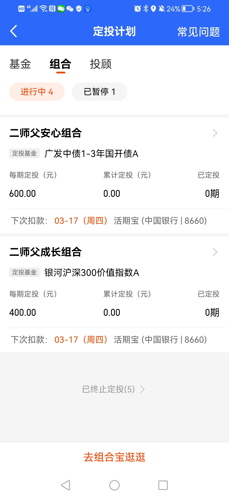
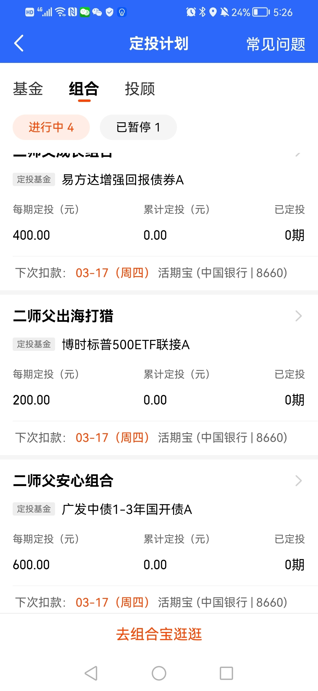

======================================================

_type: q&a
@奉壹[218521884455481]
2022-03-16 10:11:06 Wed  
topic_id: 184225148188182

@奉壹

>  二师父，思来想去还是想请教一个问题
>  在资金允许的情况下，我能不能同时执行您之前提及两个定投计划？
>  我的思路是保持定投布局您之前提及的正确方向。低于3000点就停止原本的定投计划，将资金划分到您昨天提到的定投计划。
>  这样的思路是否可行？

@二师父

>  资金不足，就定投二级债基，易方达增强回报债，标普500。

阅读[1]  评论[2]  赞[0] 

======================================================

_type: talk
@二师父[28814221155551]
2022-03-16 13:16:42 Wed  
topic_id: 184225111458282

基建我一直有买，如果跌到4.6会继续加仓，跌了买，涨了卖，这就是a股策略，没啥价值投资，美股才有价值投资

@柔软时光 at 2022-03-16 13:16:42 Wed

> 如果只是零和游戏，又何苦耗时耗力耗钱入市干这没有价值的事？不过是聪明且运气好的抢别人的钱罢了。

----------

@二师父 at 2022-03-16 13:16:42 Wed

> 那可以不玩，或者只买美股

----------

@柔软时光 at 2022-03-16 13:16:42 Wed

> 我只接受价值投资，如果确认没有一定不玩。

----------

@二师父 at 2022-03-16 13:16:42 Wed

> 那最好别玩a股，你再做5年确认下

----------

@柔软时光 at 2022-03-16 13:16:42 Wed

> 👌

----------

@留影 at 2022-03-16 13:16:42 Wed

> 师父在这里净说实话，会不会被关小黑屋，哈哈

----------

阅读[1]  评论[6]  赞[0] 

+++++++++++++++++++++++++++++++++++++++++++++++++++++

图片：
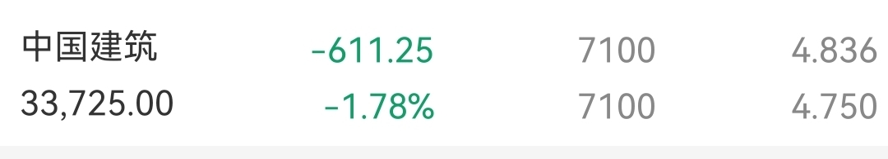

======================================================

_type: talk
@二师父[28814221155551]
2022-03-16 20:53:41 Wed  
topic_id: 415445448245488

救市了，政策底之后大概率就是市场底，未来2个月有望看到市场底部。

明天大概率要继续上仓位了，当然不是A股，A股咱们仓位差不多了。A股二次探底后可以加仓，如果仓位不重，卧倒，仓位重反弹盈利可以稍微走一点。

@范毅君 at 2022-03-16 20:53:41 Wed

> 我认为后面还会有拉锯战，我现在一直卧倒，因为跌了不敢买，涨了不敢卖😂

----------

@二师父 at 2022-03-16 20:53:41 Wed

> 涨了为什么不敢卖

----------

@范毅君 at 2022-03-16 20:53:41 Wed

> 因为套着，根本没有盈利😥前期补仓的都套着，没有盈利的，就一直没抓住机会，现在又套装，卖没啥意义[流泪]

----------

@样 at 2022-03-16 20:53:41 Wed

> 市场底出现有什么特点么？到时候星球会说吗？

----------

@二师父 at 2022-03-16 20:53:41 Wed

> 这个位置就很便宜了，别贪心

----------

@匿名的码农 at 2022-03-16 20:53:41 Wed

> 二师父，明天上仓位，是上美股？纳指？

----------

阅读[1]  评论[6]  赞[0] 

+++++++++++++++++++++++++++++++++++++++++++++++++++++

文件：
2022-03-16 20:51:53 Wed
文件大小：[205739]
241585222548151-救市了.docx

======================================================

_type: talk
@二师父[28814221155551]
2022-03-17 08:39:49 Thu  
topic_id: 812552581882412

<e type="hashtag" hid="15522588524122" title="#实盘发车#" /> 恒生买入10000元，标普500买入2000元，买入后耐心定投，静待花开，鳄鱼计划盘中发车，今年机会多，车也会比较多，大家结合自己的资金来。

@奉壹 at 2022-03-17 08:39:49 Thu

> 这个跟了之后，原定今天的定投计划照常执行吗

----------

@二师父 at 2022-03-17 08:39:49 Thu

> 自动扣款，正常执行的，下期扣款会调整下

----------

@奉壹 at 2022-03-17 08:39:49 Thu

> 好，静候[OK]

----------

@吃肉肉 at 2022-03-17 08:39:49 Thu

> 10000元大手笔

----------

@云云 at 2022-03-17 08:39:49 Thu

> 二师父，标普不是主动定投了吗？再追加2000对吗？

----------

@二师父 at 2022-03-17 08:39:49 Thu

> 是的

----------

@云云 at 2022-03-17 08:39:49 Thu

> 好

----------

@wty at 2022-03-17 08:39:49 Thu

> 标普代码是多少？鳄鱼计划是吗？

----------

阅读[1]  评论[15]  赞[0] 

+++++++++++++++++++++++++++++++++++++++++++++++++++++

图片：
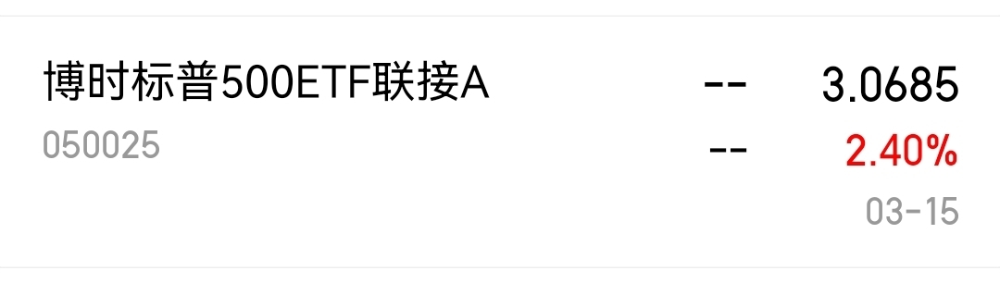
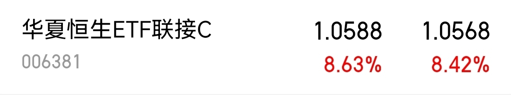

======================================================

_type: talk
@林玮[844111858288412]
2022-03-17 09:20:23 Thu  
topic_id: 184224258845252

<e type="hashtag" hid="15522588524122" title="#实盘发车#" /> 师父，恒生买的是哪个？

阅读[1]  评论[0]  赞[0] 

======================================================

_type: talk
@二师父[28814221155551]
2022-03-17 09:42:13 Thu  
topic_id: 812552525845142

<e type="hashtag" hid="881251425252" title="#鳄鱼计划#" /> 恒生买入5份，标普500买入2份，基建，双创一份。

@样 at 2022-03-17 09:42:13 Thu

> 请问二师父现在仓位是多少？场内和场外

----------

@二师父 at 2022-03-17 09:42:13 Thu

> 我仓位很轻

----------

@cotton at 2022-03-17 09:42:13 Thu

> 二师父我觉得你的现金太多了。。

----------

@一心一意 at 2022-03-17 09:42:13 Thu

> 师父，这个标普500和恒生Etf是可以当天买卖的呐

----------

@二师父 at 2022-03-17 09:42:13 Thu

> 感觉你比我多

----------

@二师父 at 2022-03-17 09:42:13 Thu

> 对头

----------

@cotton at 2022-03-17 09:42:13 Thu

> 我都不够跟你

----------

@二师父 at 2022-03-17 09:42:13 Thu

> 选择性买入即可，我主要一年没咋买

----------

阅读[1]  评论[9]  赞[0] 

+++++++++++++++++++++++++++++++++++++++++++++++++++++

图片：
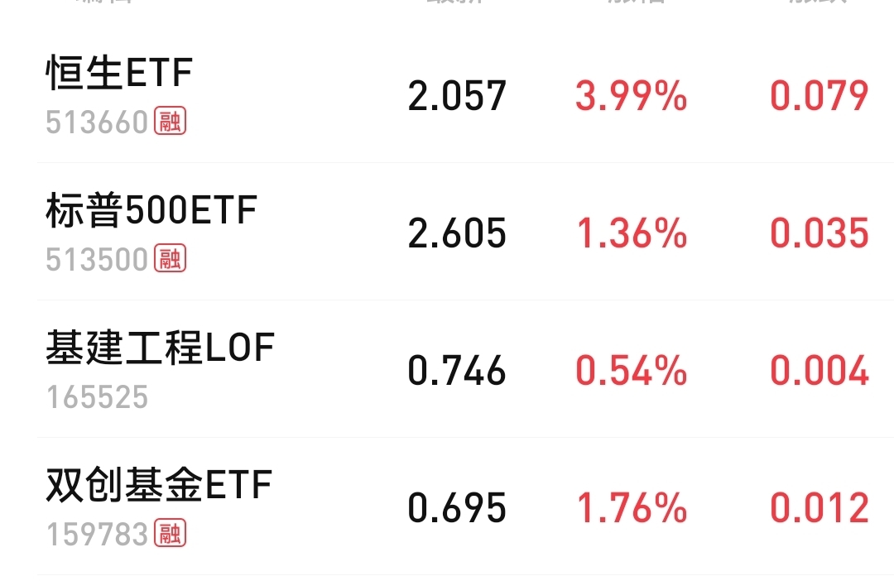

======================================================

_type: talk
@云卷云舒[28288212211221]
2022-03-17 15:30:50 Thu  
topic_id: 212552542258251

师父好！
   目前鳄鱼计划仓位68%。货基32%；消费占8.11%（白酒  家电）；周期占22.46%（红利 基建 农业 传媒）；宽基占19.24%（上证etf 1000etf 双创etf）；港美股占7.57%（恒生etf 纳指  标普500）；金融占12.2%（银行 券商）。想麻烦师父看看，这个比例需要调整吗？

@Mo.DC at 2022-03-17 15:30:50 Thu

> 这个问题太长，一般给选择题

----------

@二师父 at 2022-03-17 15:30:50 Thu

> 不用调整，拿住，a股反弹可以收割利润

----------

@云卷云舒 at 2022-03-17 15:30:50 Thu

> 好的，谢谢师父！

----------

阅读[1]  评论[3]  赞[0] 

======================================================

_type: talk
@二师父[28814221155551]
2022-03-17 21:55:56 Thu  
topic_id: 184224284818822

最近一直在密集型补仓，大家结合自己实际来，鳄鱼计划我大概还有60多份资金，只要a股回调还会继续上，我自己股票账户也补，只是参考哈。

另外可以简单一点，场外自动定投，只要低位一直投，涨起来收割利润。

明天如果高开可以适当卖出一点，后面可能二次探底，不想折腾的朋友直接卧倒就行了。

阅读[1]  评论[0]  赞[0] 

+++++++++++++++++++++++++++++++++++++++++++++++++++++

图片：
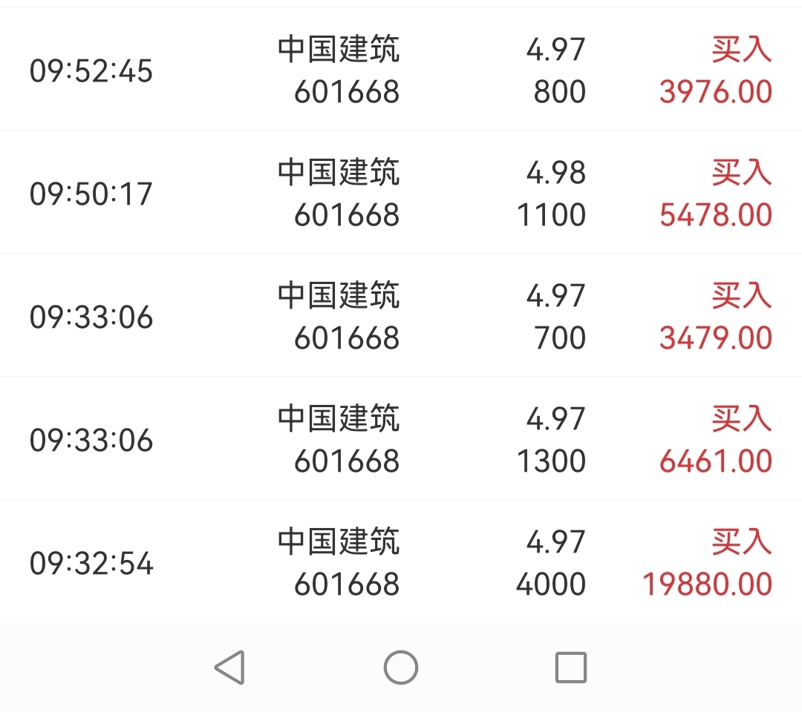
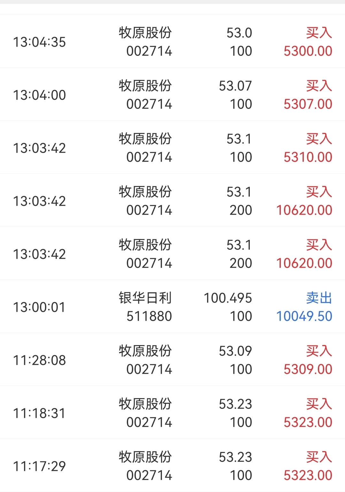

======================================================

_type: talk
@二师父[28814221155551]
2022-03-17 22:01:09 Thu  
topic_id: 415445412444448

这是目前我的自动挡，低估值一直不停买买买。偶尔绝佳机会手动挡开车，自动档停止就是不便宜的时候，定投就适合熊市，大牛市直接梭哈，定投太浪费了。

@云云 at 2022-03-17 22:01:09 Thu

> 这周的自动定投下周改这三只自动定投对吗？

----------

@奉壹 at 2022-03-17 22:01:09 Thu

> 二师父我又来了😂那之前的定投计划？😳要不我全部都定投吧[捂脸]

----------

@二师父 at 2022-03-17 22:01:09 Thu

> 对

----------

@二师父 at 2022-03-17 22:01:09 Thu

> 可以的，都是好品种，债基适合风险偏好低的

----------

@奉壹 at 2022-03-17 22:01:09 Thu

> 那一开始那个有农业，中药，红利的那个定投计划，我3150-3350范围内保持定投可以吗

----------

@二师父 at 2022-03-17 22:01:09 Thu

> 行业指数网格加仓

----------

@奉壹 at 2022-03-17 22:01:09 Thu

> 好的，收到！感谢解惑[抱拳]

----------

阅读[1]  评论[7]  赞[0] 

+++++++++++++++++++++++++++++++++++++++++++++++++++++

图片：
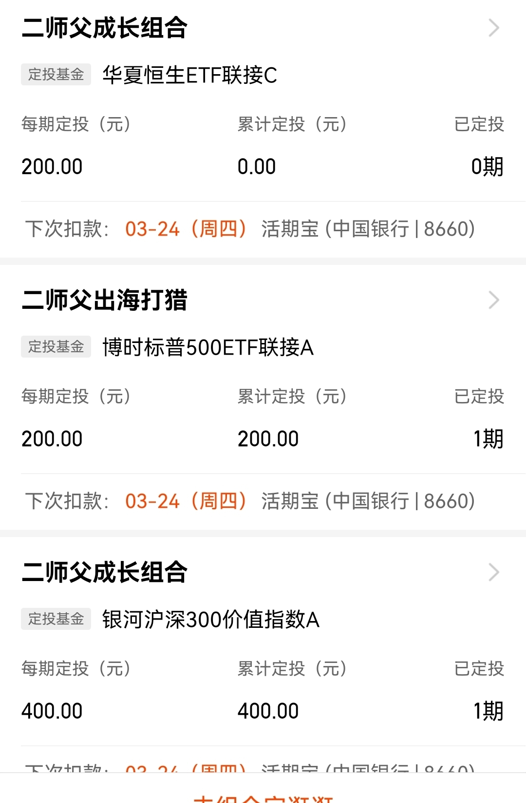

======================================================

_type: talk
@二师父[28814221155551]
2022-03-18 07:30:37 Fri  
topic_id: 415445845415428

今年定投以价值基金为主，基建，上证跌幅有限可以不断加，创业板，双创这种走主跌浪，不要一直加，要么等待他们进入低估，要么按照0.6，0.5，0.4这种大网格

注意还有仓位需要控制，大家看，我在创业板下跌时候建仓做了一次反弹卖出，降低成本，后面就耐心持有，回落止盈，如果走高的话就一直持有

短线和长线相互结合

咱们双创是被套住了，可能又得好几年才起来，不过不要紧，长线仓位网格加仓，未来肯定盈利，而短线仓位就是下跌到情绪恐慌位置开始加仓，反弹逐步止盈

当然这种投资需要止损保护，看错了底部及时走人，最怕短线做成了长线

总结，熊市适合定投，适合做反弹

当然对于工薪阶层，大家都比较忙

无脑定投，推荐二级债基，易方达增强回报债，易方达稳健收益债，长期年化百分之6，这种可以无脑定投，无论混合基金，还是指数基金，都需要策略，都需要结合宏观，微观，大盘走势

未来不确定，现在a股唯二可以搞价值投资的品种，二级债基，消费etf，其他的都不太好使。

@菖朴健康 at 2022-03-18 07:30:37 Fri

> 二师父，之前记得你提过说开通美股办理香港还是境外银行卡的方法，但是找不到之前看的资料呢

----------

@二师父 at 2022-03-18 07:30:37 Fri

> 去美国或者大陆民生银行，现在管的严格了

----------

@菖朴健康 at 2022-03-18 07:30:37 Fri

> 好呢，谢谢

----------

@菖朴健康 at 2022-03-18 07:30:37 Fri

> 香港还可以吗

----------

@二师父 at 2022-03-18 07:30:37 Fri

> 香港现在谁敢去？

----------

@菖朴健康 at 2022-03-18 07:30:37 Fri

> [捂脸][捂脸][捂脸]好了再去嘛

----------

阅读[1]  评论[6]  赞[0] 

+++++++++++++++++++++++++++++++++++++++++++++++++++++

图片：
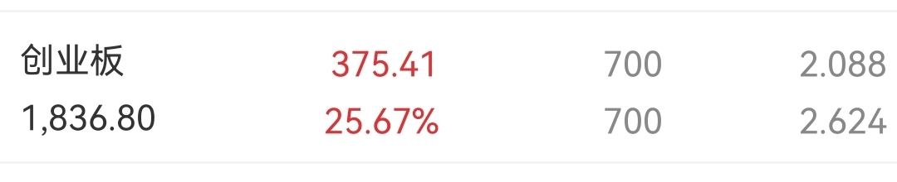

======================================================

_type: talk
@林玮[844111858288412]
2022-03-18 09:35:43 Fri  
topic_id: 812552885854582

师父，通威可转债涨停是否要卖出

@二师父 at 2022-03-18 09:35:43 Fri

> 需要

----------

@林玮 at 2022-03-18 09:35:43 Fri

> 谢谢

----------

阅读[1]  评论[2]  赞[0] 

======================================================

_type: talk
@二师父[28814221155551]
2022-03-18 09:38:03 Fri  
topic_id: 184224552555512

<e type="hashtag" hid="15288821141452" title="#成长组合#" /> 之前大家催车，一直没发，现在来了，成长组合天弘恒生科技C买入2000元。该发车不手软

@李金泉 at 2022-03-18 09:38:03 Fri

> 跟

----------

@留影 at 2022-03-18 09:38:03 Fri

> 我有一阵子没进星球了，正在爬楼学习。想问一下师父，2000元在组合里大概是个什么比例，占总资金的多少，以便参考，毕竟每个人的资金情况不同。或者在今后发车时是否可以按持仓比例来说发车金额，这样大家方便安排自己的仓位。

----------

@二师父 at 2022-03-18 09:38:03 Fri

> 没有具体比例，我五个账户，你可以参考鳄鱼计划的比例

----------

阅读[1]  评论[3]  赞[0] 

+++++++++++++++++++++++++++++++++++++++++++++++++++++

图片：
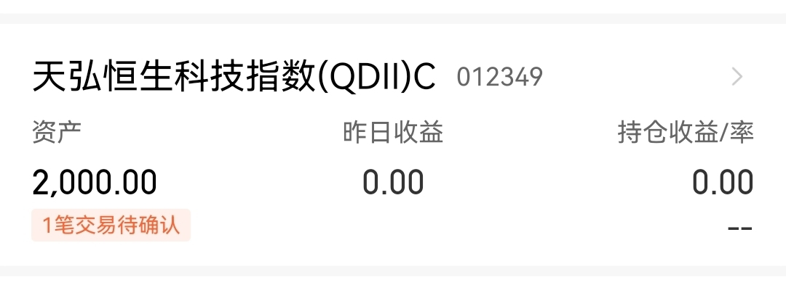

======================================================

_type: talk
@二师父[28814221155551]
2022-03-18 12:35:58 Fri  
topic_id: 812552881555222

<e type="hashtag" hid="141128442252" title="#乌龟计划调仓#" /> 大摩双利增强债券a转移百分之10到易方达沪深300etf联接a，剩余百分之90转移到易方达增强回报债，7-10年国开债转移百分之50到南方宝元债。

后面乌龟计划定投沪深300etf联接a，网格加仓，大家以现在的价格为参照点，每下跌百分之3可以喊我加仓一次，非持续定投，这是策略，一定记住。

接下来逐步进攻，有资金的用资金加仓，没资金的卖出债券买权益类品种。

@范毅君 at 2022-03-18 12:35:58 Fri

> 300跟了

----------

@小鱼 at 2022-03-18 12:35:58 Fri

> 国开债3.15不是刚买1万吗，我就不动了

----------

@太阳照常升起 at 2022-03-18 12:35:58 Fri

> 二师父，为什么清空大摩双利，是不是这个基有风险？

----------

@二师父 at 2022-03-18 12:35:58 Fri

> 他是防守品种，转的品种预期收益率更好

----------

阅读[1]  评论[4]  赞[0] 

======================================================

_type: talk
@二师父[28814221155551]
2022-03-18 13:36:05 Fri  
topic_id: 212552881482841

请注意大家仔细阅读，我之前买入的是1-3年国开债，卖出的是7-10年国开债，别看错了，一定要认真仔细，差之毫厘失之千里，要细致！

@小鱼 at 2022-03-18 13:36:05 Fri

> 错了，那就放着吧[撇嘴]

----------

阅读[1]  评论[1]  赞[0] 

======================================================

_type: talk
@二师父[28814221155551]
2022-03-18 19:42:53 Fri  
topic_id: 415445851542218

这周密集型发车，大家都说跟不上了，可能下周还会继续发车。

其实投资不需要太多的动作，找准方向，遇到机会，进去就行了，关键是要找对方向，你找不准的话就选择估值表里面的低估宽基，只要低估，未来一定可以涨起来，行业指数就不一定了。

接下来估值表会扩容一只标普500指数，主要是加息的时候利空纳斯达克，纳斯达克也会投，只不过不是无脑定投，会有一定策略，他下去了慢慢接，今年会有很好的机会，关键是大家恐慌的时候你敢不敢上仓位，上了拿不拿得住。

注意，我讲的方向没有问题，我没有重仓的方向或者根本不提的方向就是投也最好轻仓。

@范毅君 at 2022-03-18 19:42:53 Fri

> 打架具体只什么，什么不能碰，没看懂[流泪]

----------

@二师父 at 2022-03-18 19:42:53 Fri

> 就是中美博弈的范畴，暴涨暴跌的品种不能重仓

----------

@范毅君 at 2022-03-18 19:42:53 Fri

> 二师父，除了石油还有什么

----------

@二师父 at 2022-03-18 19:42:53 Fri

> 中概，宁可恒生科技

----------

@范毅君 at 2022-03-18 19:42:53 Fri

> 谢谢二师父

----------

阅读[1]  评论[5]  赞[0] 

+++++++++++++++++++++++++++++++++++++++++++++++++++++

文件：
2022-03-18 19:39:37 Fri
文件大小：[31596]
548212424584284-惊心动魄的一周.docx

======================================================

_type: talk
@二师父[28814221155551]
2022-03-18 19:47:45 Fri  
topic_id: 184224548455522

关于本次下跌，我有很多话要说的，这次和18年不一样，18年那时候是慢跌，大家都有心理准备，仓位不足，而这次是急跌，而且高位横盘震荡，很多人把仓位拉起来了，所以会很恐惧。

当然，这次也是国家出手，打退了国际上的空军，再次说明，咱们要和国家站在一起，只有国家强大了，咱们才有希望。

@范毅君 at 2022-03-18 19:47:45 Fri

> 我没有选择，我必须和我的国站在一起[奋斗]

----------

@苍天有井明月空🌙 at 2022-03-18 19:47:45 Fri

> [强][强][强]

----------

阅读[1]  评论[2]  赞[0] 

======================================================

_type: talk
@二师父[28814221155551]
2022-03-18 21:59:06 Fri  
topic_id: 212552242285221

市盈率百分位25.85%，SY-BY百分位25.05%，SY/BY百分位12.92%。

估值还是很低的，这个位置熬一熬，未来都会有不错的收益。

估值楼层二层会坚持定投，如果重回三层，就暂停了。

阅读[1]  评论[0]  赞[0] 

======================================================

_type: talk
@二师父[28814221155551]
2022-03-19 10:37:28 Sat  
topic_id: 585225585512414

看懂宏观，博弈依然很大，估值表里面低估的宽基指数都可以定投了。

@范毅君 at 2022-03-19 10:37:28 Sat

> 大盘貌似长回来不少，但是钱貌似没回来[流泪]

----------

@二师父 at 2022-03-19 10:37:28 Sat

> 确实是，分板块涨

----------

@范毅君 at 2022-03-19 10:37:28 Sat

> 继续跟着二师父定投，股票太难操作[大哭]

----------

阅读[1]  评论[3]  赞[0] 

+++++++++++++++++++++++++++++++++++++++++++++++++++++

文件：
2022-03-19 10:36:33 Sat
文件大小：[180300]
241585482845851-看懂宏观.docx

======================================================

_type: talk
@春晓[48418482258118]
2022-03-19 13:24:09 Sat  
topic_id: 184224481445242

二师父，请问红利，基建可以一直拿着么，不做网格

@二师父 at 2022-03-19 13:24:09 Sat

> 可以，长期持有，设置现金分红。被动止盈。

----------

阅读[1]  评论[1]  赞[0] 

======================================================

_type: talk
@在下，小老弟[118551811828112]
2022-03-19 13:29:00 Sat  
topic_id: 184224481441212

<e type="hashtag" hid="15288821141452" title="#成长组合#" /> 二师傅  现在适合建仓吗

@水墨青花 at 2022-03-19 13:29:00 Sat

> 师父，深红利属大盘价值类吗

----------

@二师父 at 2022-03-19 13:29:00 Sat

> 它属于平衡型风格基金

----------

@二师父 at 2022-03-19 13:29:00 Sat

> 我一直加仓啊，你跟上就行。里面的新能源不适合，中药、农业、白酒、沪深300价值都还可以。

----------

@水墨青花 at 2022-03-19 13:29:00 Sat

> 嗯，也不属于红利类吧

----------

@二师父 at 2022-03-19 13:29:00 Sat

> 属于，不过他的分红相对上证红利更低

----------

@水墨青花 at 2022-03-19 13:29:00 Sat

> 好的，谢谢

----------

阅读[1]  评论[6]  赞[0] 

======================================================

_type: talk
@二师父[28814221155551]
2022-03-19 15:05:25 Sat  
topic_id: 585225422411454

估值数据，恒生、标普500正常估值了，可以暂停定投。

沪深300依然低估，本周看情况，如果继续低估，仍然定投沪深300价值，否则暂停。大家也看自己的仓位，如果没有仓位，可以一次建立30%底仓，问题不大的。空仓实在没有必要。

乌龟计划卖出债券并不是因为债券质量不好，而是卖出债券换到指数和二级债，收益率会更好，如果未来继续跌，反而会逆向加仓沪深300，基建，等基金。

另外医疗表现一直不好，趋势形成后短期很难改变，不建议补仓，中药可以考虑，目前中药已经盈利4%，行业的趋势、前景比估值重要，医疗低估，可能长期一直底部趴着，未来会有反转，那也会是很多年以后的事情了，参考传媒。

医疗这轮走势和15年很像，从高位下来连续跌了4年，目前医疗跌了1年，如果3年以后医疗还没起来的话，我考虑追加仓位，已经投入的部分拿住就好。

A股投资真的和美股不同，大家看纳斯达克一直新高，很少有连续跌4年的情况。价值投资是老巴提出来的，美国很多价值投资者，那么日本有价值投资者吗？

南苏丹这种国家股市都没有，更别说价值投资了。

如果一味地迷信价值投资，而不考虑中国实际，是不现实的。

包括马克思思想都需要中国化，价值投资也需要中国化的，这个中国化就是严格估值根据宽基低估买入，高估卖出。

卖出以后就休息，等待下一轮的到来。

这一轮我也犯了错误，医疗支撑位加了头寸，而不是一份一份的网格向下，总结反思，继续上路。我会随时纠错，发现不对了，转向中药，犯错不可怕，可怕的是在错误的路上一条道走到黑，那就完蛋了。

估值表里面的宽基成长板块不建议定投，其他的价值板块建议定投，严格按照仓位管理原则，将资金分成100份，去分批加仓低估指数，未来大概率会盈利，每只基金分配10份，缺点就是资金利用率不足，可能没有投完市场就起来了，所以部分资金也可以一次买入白银组合，未来年化收益率大约8%，比你瞎折腾股票或者自己搞会强很多。

阅读[1]  评论[0]  赞[0] 

+++++++++++++++++++++++++++++++++++++++++++++++++++++

图片：
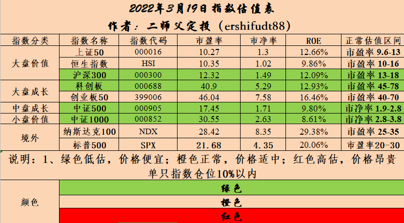

======================================================

_type: talk
@庆余年[15584481824122]
2022-03-19 15:53:52 Sat  
topic_id: 184224122811452

月月投策略优化

之前的月月投的筛选都是自己在写代码，写逻辑，但是实际上有一些我想要筛选的点但是没有足够的数据支撑，都是手动填入的，感觉不方便，现在用了一个叫“韭圈儿”的APP，里面能实现我想要的大部分功能和数据。在这里简单介绍一下。
月月投买入指标：恐惧贪婪指数，当指标达到30以下时买入，截止3月18号恐贪指数为3，所以为买入指标
月月投卖出指标：恐惧贪婪指数，当指标达到70以上时卖出，或者达到止...

@二师父 at 2022-03-19 15:53:52 Sat

> 这个不错，币圈也有恐慌指数，结合情绪和估值楼层，然后恐慌指数低的时候建仓

----------

@庆余年 at 2022-03-19 15:53:52 Sat

> 这个思考框架我实际操作了一年多了，分享出来大家一起提提优化意见[呲牙][呲牙][呲牙]

----------

@二师父 at 2022-03-19 15:53:52 Sat

> 不过我看他的数值一直很低

----------

@庆余年 at 2022-03-19 15:53:52 Sat

> 它这里有个很奇怪的地方，按照最近近3天的涨幅，恐贪指数应该会略有回升的，但是它还是下跌趋势，所以我用了另外一个有知有行的温度计指标做辅助。

----------

@匿名的码农 at 2022-03-19 15:53:52 Sat

> 二师父，币圈恐贪指数哪里看？纳指有恐贪指数吗？谢谢

----------

@二师父 at 2022-03-19 15:53:52 Sat

> vix

----------

@范毅君 at 2022-03-19 15:53:52 Sat

> 厉害👍，关键得看看他的指数逻辑是否合理[呲牙]

----------

@庆余年 at 2022-03-19 15:53:52 Sat

> 说实话，我只看到了一些趋势性的东西，那个算法我研究了一下，没看懂[憨笑][憨笑]

----------

阅读[1]  评论[9]  赞[0] 

======================================================

_type: talk
@二师父[28814221155551]
2022-03-20 09:45:03 Sun  
topic_id: 585225452224254

讲一下我的几个组合。

按照风险偏好分成了4个。

低风险的：安心组合，以后就只投二级债，保证收益率和通胀持平。

乌龟计划，保证稍微跑赢沪深300，投资周期3年左右，以宽基沪深300为主。

当前看了下沪深300，4200点，18年最低是3000点，下跌幅度有限了，可以按照网格加仓的思路，左侧加仓，别赚快钱，现在积累，未来沪深300年化收益率10%没有问题，投资的收益率不是线性的，当基金经理收益率都开始下滑，那么就是布局的机会。

成长组合，鳄鱼计划：争取获得超额收益，不拘泥投资品种，原油、黄金这种强周期不碰，投资周期3年，每年找未来预期最有价值的板块，结合网格，保证卖出一网收益率15%以上。

海外组合：投资标普500和纳斯达克。

基本上是这些组合，未来也没有新开组合的意思，最近鳄鱼计划发车有点频繁，大家跟不上，稍后我会改变一下，我自己投资就用另外一个账户，这就不公布了，我的投资还是挺灵活的，当你严格把我的策略执行一个牛熊周期以后，也可以灵活一点。

给大家公开的四个组合，发车时间永远固定在周四，这样子有利于大家参考，每周四可以来看看，有消息就是发车了，没消息就是没有车。

现在情绪到达了底部，这种时候我是坚定买入的，虽然我师父对今年也偏悲观，不过我只看估值和情绪，买在估值和情绪低位，卖在估值和情绪高位，怎么看都是没问题的，唯一需要经受的就是波动，只要买的基金预期好，未来能起来，波动不是坏事的。

@范毅君 at 2022-03-20 09:45:03 Sun

> 二师父，白酒现在没有低估吧，适合建立底仓吗

----------

@二师父 at 2022-03-20 09:45:03 Sun

> 我有15份资金，买了5份，百分之30，问题不大，最好买一份，因为白酒高位，他也有可能走医疗那样的走势，到低估了也未必不会跌

----------

@范毅君 at 2022-03-20 09:45:03 Sun

> 好的，明白了[呲牙]谢谢二师父

----------

@helen at 2022-03-20 09:45:03 Sun

> 希望二师父继续公布，跟得上的人还是可以借鉴和学习的

----------

阅读[1]  评论[4]  赞[0] 

======================================================

_type: talk
@二师父[28814221155551]
2022-03-20 10:01:40 Sun  
topic_id: 184224142245122

买入的姿势，很重要，方向也很重要。今年就是价值，中药比较看好，如果回调还会继续买入，农业和基建是波段，我用了猪肉和建筑龙头，波段比ETF好一些，不过用ETF就行了，过去一年波段吃了四波，一波15%其实也有60%了。关键高位要减仓，不能追加。低位不能恐惧，要买。

另外16国债19可以退出了，清仓以后换成货币基金，广发中债7-10年国开债我们也在逐步清仓，换成短债或者货币基金。短债就是货币基金替代品，如果将来大盘跌破3000点，卖出短债抄底。

广发中债1-3年国开债就是短债。

@阝東 at 2022-03-20 10:01:40 Sun

> 我还有中证500，盈利30多准备清仓了

----------

@以古论今 at 2022-03-20 10:01:40 Sun

> 短债一个月都没涨了

----------

阅读[1]  评论[2]  赞[0] 

+++++++++++++++++++++++++++++++++++++++++++++++++++++

文件：
2022-03-20 09:57:55 Sun
文件大小：[1020032]
241585422851881-买入的姿势.docx

======================================================

_type: talk
@二师父[28814221155551]
2022-03-21 20:35:59 Mon  
topic_id: 812554528488182

广西飞机失事，人生无常，其实能够过上自己喜欢的生活已经很幸福。多珍惜眼前人吧。

中药和农业涨的不错，起来了就躺平或者收割利润，等下去了再投。

现在行情波动很大，不做网格不好盈利就做我说的方向，如果你有更好的方向可以做，控制仓位和节奏就行

板块比较一致，而个股分化严重，不太建议做个股，不好把握。

3020和3300无脑定投宽基，以后每周四发车我提前周三告知大家，仅供参考，都是我和很多比较厉害的投资朋友交流总结出来的方向，纳斯达克这一波可能会有反弹，对于30被市盈率的他，比中概优秀，值得长期投资

巴菲特之所以厉害，是因为他在美国，我们学习理论要实事求是。

@光少 at 2022-03-21 20:35:59 Mon

> 明天航空股要跌了

----------

阅读[1]  评论[1]  赞[0] 

======================================================

_type: talk
@二师父[28814221155551]
2022-03-21 20:42:10 Mon  
topic_id: 212554528421511

当前值得关注的基金，白酒，纳斯达克，农业，基建，恒生，1000etf，如果本周1000跌破1元，计划加仓。

另外乌龟计划增加一只稳健基金，兴全可转债混合，定投加长期持有，不止盈

二级债基和部分混合基金是具有长期投资价值，值得长期持有，兴全可转债混合类似二级债基，也值得长期持有，而收益率高于二级债。

注意股票基金全部都需要止盈。而想成为非交易选手，值得长期持有的偏债混合和二级债

@庆余年 at 2022-03-21 20:42:10 Mon

> 华泰柏瑞鼎利004010，近五年最大回撤3.61%，收益和兴全可转债差不多，但是波动很小，划线基金。

----------

@二师父 at 2022-03-21 20:42:10 Mon

> 这只基金不错

----------

@庆余年 at 2022-03-21 20:42:10 Mon

> [呲牙][呲牙][呲牙]

----------

@二师父 at 2022-03-21 20:42:10 Mon

> 感谢分享

----------

@以古论今 at 2022-03-21 20:42:10 Mon

> 这只基金适合定投还是一次性买入

----------

@庆余年 at 2022-03-21 20:42:10 Mon

> 保守点可以分批买，实际上这个回撤看你平时是怎么操作债基的就怎么操作它了。

----------

阅读[1]  评论[6]  赞[0] 

======================================================

_type: talk
@二师父[28814221155551]
2022-03-21 22:37:31 Mon  
topic_id: 184221248844222

加仓节奏和方向，每一次大跌都是为了将来更加富有，看谁能坚持下去，未来一定会有再次满仓的机会，不加仓的方向，反弹有10个点以上利润逐步卖出，消费etf长期持有，穿越牛熊，真正做长期持有才会发现这件事比996还难。

仅供参考，也许牛市马上就来了，但是当前的情况完全不同于2018，我宁可少赚点，也绝不让自己倒在危机中。

以后每发车一次我做个标记

@菖朴健康 at 2022-03-21 22:37:31 Mon

> 茅台准备好[呲牙][呲牙]

----------

@二师父 at 2022-03-21 22:37:31 Mon

> 买两瓶，5000点开一瓶，10000点开一瓶！

----------

@菖朴健康 at 2022-03-21 22:37:31 Mon

> [捂脸][捂脸][捂脸]那一瓶就够了，10000估计没戏😄😄

----------

@二师父 at 2022-03-21 22:37:31 Mon

> 哈哈哈哈

----------

@芳瑛榕子 at 2022-03-21 22:37:31 Mon

> 二师父，医疗ETF现在怎么投？我看上个月的月线已经收阳了，不过这个月又跌了[尴尬]

----------

阅读[1]  评论[5]  赞[0] 

+++++++++++++++++++++++++++++++++++++++++++++++++++++

图片：
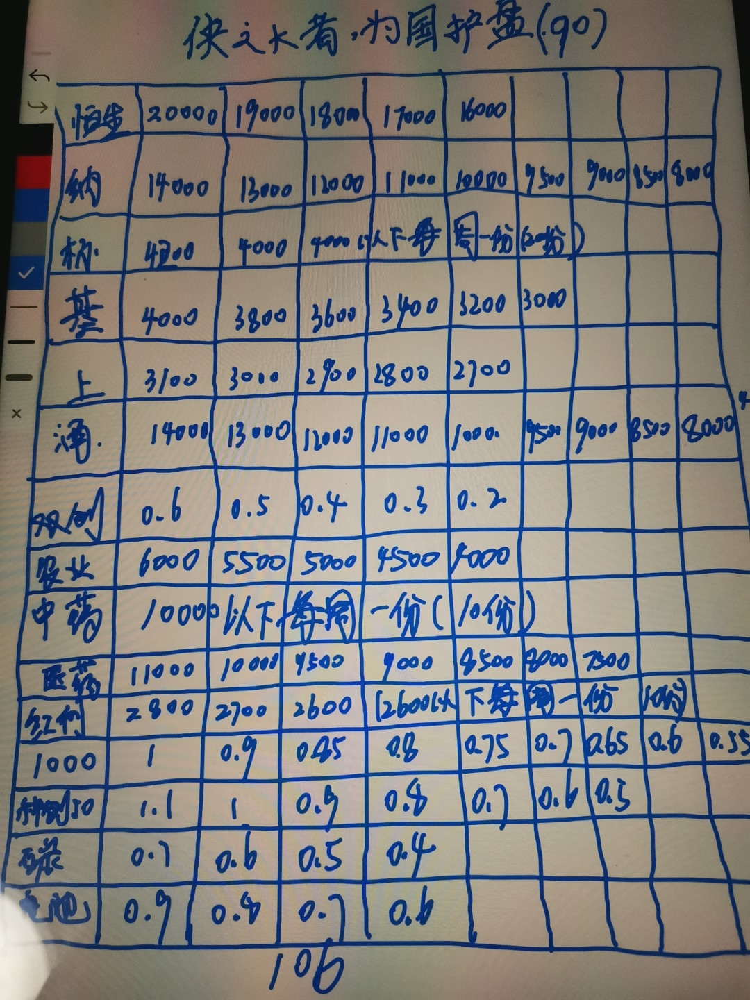

======================================================

_type: talk
@二师父[28814221155551]
2022-03-22 07:09:07 Tue  
topic_id: 585224244541184

这几只基金不错，本周开始定投兴全可转债和基建，策略简单，兴全可转债利用均线策略，长期持有，基建网格，每10个点卖出1000元。华泰柏瑞是读者朋友推荐，目前限购10000，可以每天购买，也是长期持有。

尽量成为投资选手，而非交易选手，长期持有优质基金和企业，对于指数定投，稍后给出9个宽基代码，大家自行选择，按照我的策略，一个宽基对应10份资金，100份资金，低估定投完毕卧倒，估值楼层重回四层必定大幅度盈利，这是散户盈利的最佳方式，如果觉得资金利用率不足可以配置白银组合，等需要资金的时候再切换过来

我目前手上有很多二级债，虽然危机也会跌，不过相对于指数跌幅比较小，假设未来估值进入一层，没有现金了，可以卧倒，也可以把二级债切换到优质便宜的基金上面。

@梧桐 at 2022-03-22 07:09:07 Tue

> 勤劳的二师父，致敬

----------

@梧桐 at 2022-03-22 07:09:07 Tue

> 二师父，之前定投的银河沪深300价值，还继续吗

----------

@二师父 at 2022-03-22 07:09:07 Tue

> 继续，300价值，恒生，标普500自动定投，盈利后暂停

----------

@梧桐 at 2022-03-22 07:09:07 Tue

> 好的

----------

@云卷云舒 at 2022-03-22 07:09:07 Tue

> 等师父您发消息买还是自己把握[微笑]

----------

@二师父 at 2022-03-22 07:09:07 Tue

> 都可以，目前这个位置能做

----------

@云卷云舒 at 2022-03-22 07:09:07 Tue

> 好的，谢谢师父！

----------

阅读[1]  评论[7]  赞[0] 

+++++++++++++++++++++++++++++++++++++++++++++++++++++

图片：
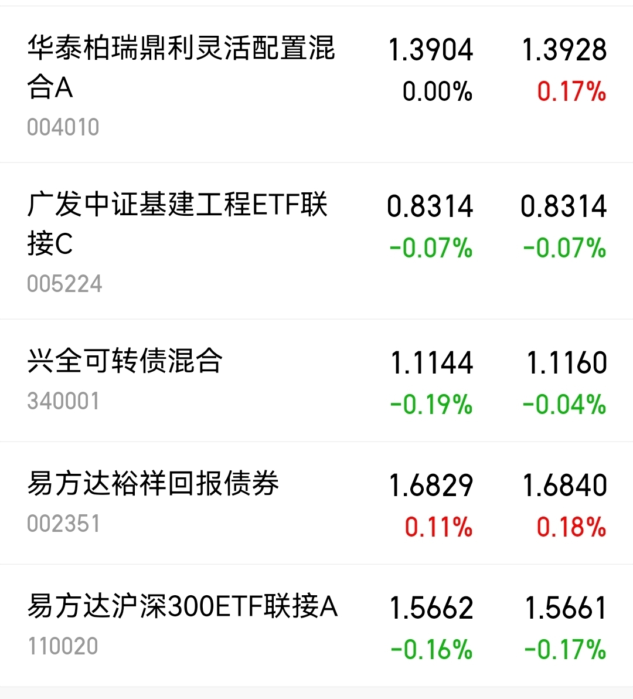

======================================================

_type: talk
@三峡情[422144414421548]
2022-03-22 08:37:29 Tue  
topic_id: 415442421881848

感谢学堂，纪念一下跟随二师父走过的日子，希望球友们都能坚持到牛市吃肉！

阅读[1]  评论[0]  赞[0] 

+++++++++++++++++++++++++++++++++++++++++++++++++++++

图片：

======================================================

_type: talk
@二师父[28814221155551]
2022-03-22 18:07:51 Tue  
topic_id: 184221552511182

最新三只基金网格，可以参考下，属于政策扶持方向，医药和医疗建议暂时等等，可以躺平，按照网格方式逐步加仓，反弹加仓并没有降低成本，我计划长期持有，2024年再来补仓医疗。养殖比农业更好，更加集中，我选择的猪肉龙头，地产已经走了3个波段。

现在很显然市场不是全面牛市，咱们的思维就要转移到熊市打打法，波段地产，基建，中药，猪肉板块。

@梧桐 at 2022-03-22 18:07:51 Tue

> 二师父，坐等您的指数基金定投名单。

----------

@JOY at 2022-03-22 18:07:51 Tue

> 师父基建波段的话
大概多少的时候买入、卖出？

----------

@二师父 at 2022-03-22 18:07:51 Tue

> 你说的哪只基金

----------

@JOY at 2022-03-22 18:07:51 Tue

> 165525

----------

@二师父 at 2022-03-22 18:07:51 Tue

> 0.75以下买入，0.85以上卖出，可以灵活点

----------

@JOY at 2022-03-22 18:07:51 Tue

> 谢谢

----------

阅读[1]  评论[6]  赞[0] 

+++++++++++++++++++++++++++++++++++++++++++++++++++++

图片：
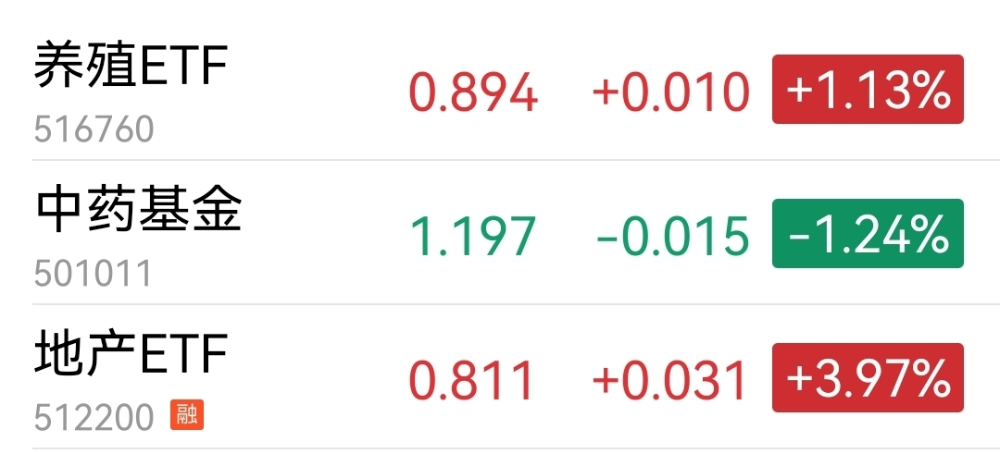

======================================================

_type: talk
@从A到Z[414841151821548]
2022-03-22 18:46:39 Tue  
topic_id: 585224112424184

乌龟计划和鳄鱼计划在哪里可以看到和跟投？

@二师父 at 2022-03-22 18:46:39 Tue

> 知识星球，天天基金可以看到乌龟计划

----------

@从A到Z at 2022-03-22 18:46:39 Tue

> 鳄鱼计划呢

----------

@二师父 at 2022-03-22 18:46:39 Tue

> 星球，鳄鱼计划外部看不到

----------

@从A到Z at 2022-03-22 18:46:39 Tue

> 星球是随时发车，没有系统的发布渠道吗

----------

@二师父 at 2022-03-22 18:46:39 Tue

> 没有，我本来就是自己在场内账户买的

----------

@从A到Z at 2022-03-22 18:46:39 Tue

> 好的，只有跟着买

----------

阅读[1]  评论[6]  赞[0] 

======================================================

_type: talk
@二师父[28814221155551]
2022-03-22 20:43:58 Tue  
topic_id: 585224111415144

9只指数，对应估值表里面的9只基金，如果刚开始定投，选择这9只基金比较好，缺点是资金利用率可能不足，同时市场大跌的时候很难赚钱只能依靠牛市。

所以低估定投加组合配置加网格结合，没必要局限。

@老孙头 at 2022-03-22 20:43:58 Tue

> 怎么只有6只？—煤碳，老师为何早早地抛了？眼下还可跟进吗？

----------

@二师父 at 2022-03-22 20:43:58 Tue

> 赚了就卖出啊，买基金就是为了挣钱，之前涨价受到打压，九只你好好看看

----------

@二师父 at 2022-03-22 20:43:58 Tue

> 煤炭买的话回调到1.95左右

----------

@老孙头 at 2022-03-22 20:43:58 Tue

> ok

----------

@蓝精灵 at 2022-03-22 20:43:58 Tue

> 师父，有场内的嘛

----------

@二师父 at 2022-03-22 20:43:58 Tue

> 有的

----------

阅读[1]  评论[6]  赞[0] 

+++++++++++++++++++++++++++++++++++++++++++++++++++++

图片：
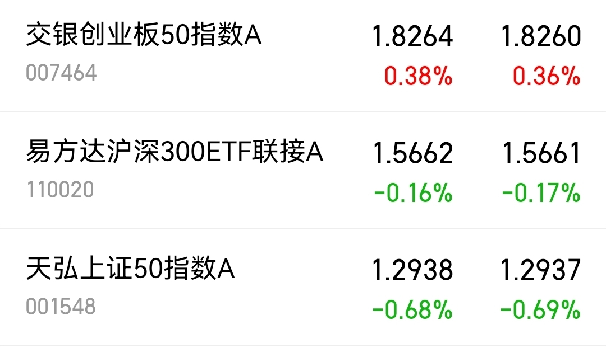
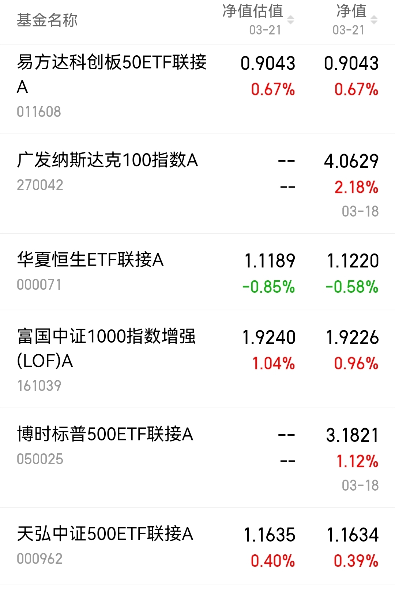

======================================================

_type: talk
@二师父[28814221155551]
2022-03-22 21:06:04 Tue  
topic_id: 415442888128148

估值数据，市盈率百分位27.06%，市净率百分位19.67%，SY-BY百分位26.4%。

整体估值不高，自动定投本期继续，谁也无法预测短期走势。

阅读[1]  评论[0]  赞[0] 

======================================================

_type: talk
@二师父[28814221155551]
2022-03-22 21:10:17 Tue  
topic_id: 212554882584511

基金赚了就卖，除了二级债基和混合基金，我的持有周期都不会超过7年，赚了就卖，没毛病，高位不止盈的，沪深300都被挂在山顶上，更别说传媒和其他的

阅读[1]  评论[0]  赞[0] 

======================================================

_type: talk
@二师父[28814221155551]
2022-03-22 21:29:25 Tue  
topic_id: 585224115288524

<e type="hashtag" hid="141128442252" title="#乌龟计划调仓#" /> 买入南方地产3000元，买入基建1000元，买入兴全转债1000元。广发1-3年国开债C、7-10年国开债转换到华泰柏瑞鼎利灵活配置混合。

招商产业债也计划转换，不过招商产业债持有不到1年手续费高，所以他和另外一只债基稍后转换。

后面地产和基建波段，兴全转债网格加仓，长期持有，消费低估后定投消费，沪深300网格加仓，等待下一次估值楼层以后再卖出获利。

长线与波段结合，还是不错的。

华泰柏瑞、南方宝元、易方达裕祥这类基金才值得长期持有。每次高位都将高估的基金转换过来，低位继续定投。代码如图所示。

自动定投沪深300价值、恒生指数、标普500继续，并未取消，如果取消了会告诉大家的。

@是喵喵吖～ at 2022-03-22 21:29:25 Tue

> 师傅我没设置自动定投 请问要怎么跟着买沪深300和标普呀 是每周四固定买吗

----------

@二师父 at 2022-03-22 21:29:25 Tue

> 固定买一点，沪深300价值，3300以上停止

----------

@是喵喵吖～ at 2022-03-22 21:29:25 Tue

> 好来[玫瑰][玫瑰]

----------

@奉壹 at 2022-03-22 21:29:25 Tue

> 中证红利本周四需要定投吗😳

----------

@二师父 at 2022-03-22 21:29:25 Tue

> 定投这个基金随意

----------

@mumomo at 2022-03-22 21:29:25 Tue

> 广发1-3、7-10年国开债是全部转换了吗

----------

@二师父 at 2022-03-22 21:29:25 Tue

> 全部换了，a类1-3一个月以后换，这样没手续费

----------

阅读[1]  评论[7]  赞[0] 

+++++++++++++++++++++++++++++++++++++++++++++++++++++

图片：
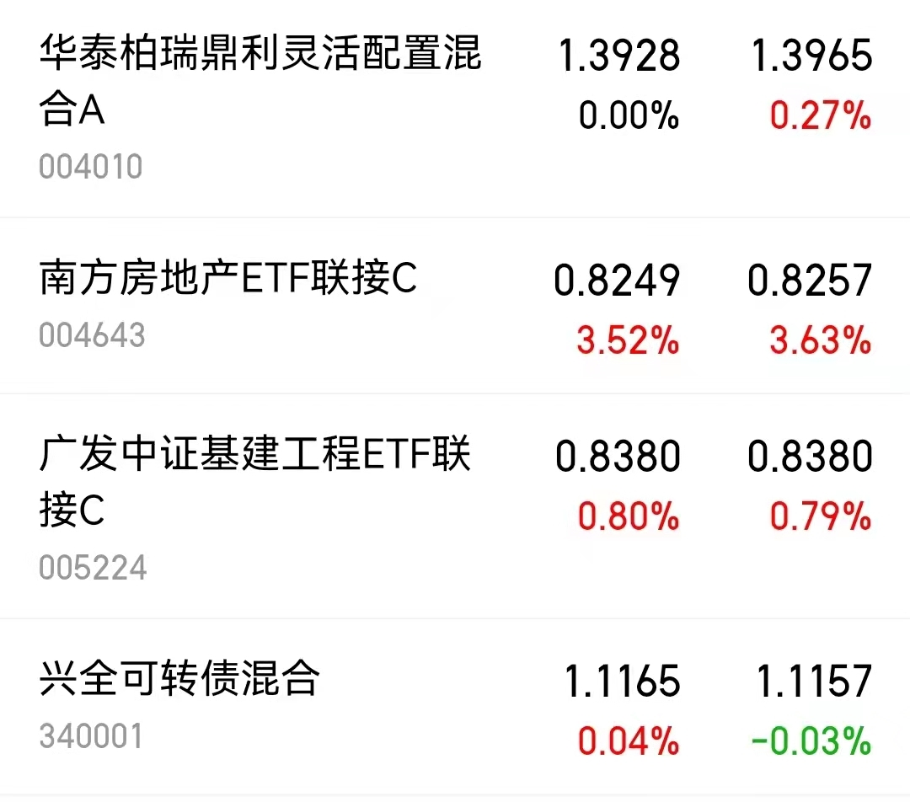

======================================================

_type: talk
@二师父[28814221155551]
2022-03-23 10:02:56 Wed  
topic_id: 184221512554522

纳斯达克真的猛，值得长期定投，a股长期向上的指数大家能找到吗，分享一下。

@匿名的码农 at 2022-03-23 10:02:56 Wed

> 后面加息、缩表，纳指应该还会跌吧？只在低点加仓了一次[捂脸]

----------

@庆余年 at 2022-03-23 10:02:56 Wed

> 不超预期不会大跌

----------

@杜志彪 at 2022-03-23 10:02:56 Wed

> 美国佬说的和做的不一样，这是它们一贯伎俩，先放风感觉要加50个基点，结果加25个，这叫超预期，股市不跌反涨[白眼]，

----------

阅读[1]  评论[3]  赞[0] 

======================================================

_type: talk
@Nick.yang[118281888551882]
2022-03-23 13:01:03 Wed  
topic_id: 812554844182282

以前随便看了看二师傅的文章，小白买了一点，运气好，2020疫情，2800大盘进去的，差不多3500基本上全部抛了，因为要买房，后来遇到问题，没买成，可能今一年没有打算用资金，想问问二师傅100万左右，怎么理财，保险这种已经配置好了，纯理财

@二师父 at 2022-03-23 13:01:03 Wed

> 看你的预期收益率，稳健的话以二级债为主

----------

@匿名的码农 at 2022-03-23 13:01:03 Wed

> 100万，[色][色]，收小弟不[捂脸]

----------

阅读[1]  评论[2]  赞[0] 

+++++++++++++++++++++++++++++++++++++++++++++++++++++

图片：
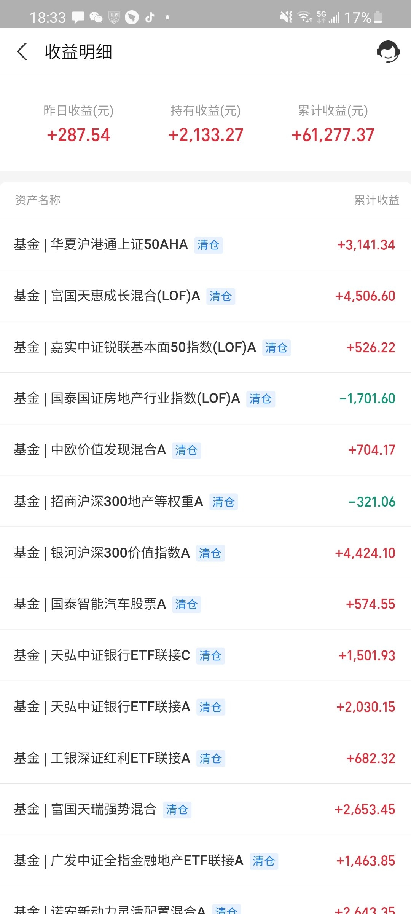
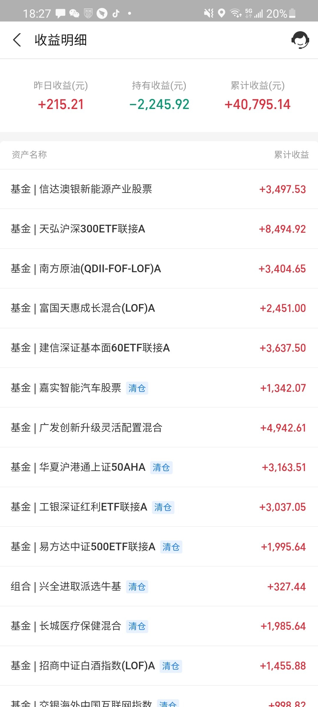

======================================================

_type: talk
@二师父[28814221155551]
2022-03-23 13:44:29 Wed  
topic_id: 812554841858882

我自己账户买的，上午买下午三个点，有时候再想鳄鱼计划是不是没必要固定周四，行情变化，机会稍纵即逝，不过以我对a股的了解，上去了依然能下来。

@阿宝 at 2022-03-23 13:44:29 Wed

> 有些事情又怎么都能把握住

----------

@二师父 at 2022-03-23 13:44:29 Wed

> 有道理

----------

@梧桐 at 2022-03-23 13:44:29 Wed

> 拉长时间，均价差不多。

----------

@小鱼 at 2022-03-23 13:44:29 Wed

> 我们跟得上节奏

----------

@李金泉 at 2022-03-23 13:44:29 Wed

> 嗯，赞同，除了固定每周四，平时有机会发车没关系，应该能跟上。

----------

阅读[1]  评论[5]  赞[0] 

+++++++++++++++++++++++++++++++++++++++++++++++++++++

图片：
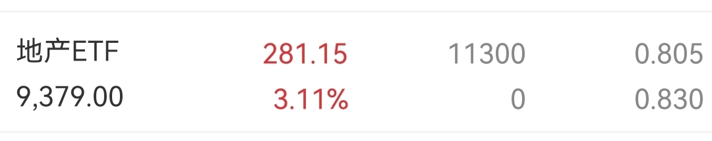

======================================================

_type: talk
@奉壹[218521884455481]
2022-03-23 21:23:11 Wed  
topic_id: 812554458145542

二师父今晚会发明天的定投计划吗[得意]等发车呢

@二师父 at 2022-03-23 21:23:11 Wed

> 设置的自动啊，软件自动操作就行了，再涨我就得取消了

----------

@从A到Z at 2022-03-23 21:23:11 Wed

> 在哪个软件设置自动定投

----------

@二师父 at 2022-03-23 21:23:11 Wed

> 任何一个场外软件都可以

----------

阅读[1]  评论[3]  赞[0] 

======================================================

_type: talk
@二师父[28814221155551]
2022-03-23 21:25:21 Wed  
topic_id: 212554458142251

最近涨的不错，之前跟车的朋友肯定都是盈利的，现在不建议追涨，很多基金上涨都有缺口。

大概率还会回调，上涨记得逐步止盈，不会卖，傻傻地持有是不对的。我自己是分成了五个账户，三个长线账户，两个短线账户，所以即使短线账户全部卖完了，也不会踏空。

大家在卖出的时候记得分步卖出，比如买了2万，一次卖出2000到3000，不会踏空的，当趋势反转可以轻仓，这种往往在暴涨以后。

投资要学习的是非常多，不能永远局限一点，我记得有个读者，我介绍消费医疗的时候，他坚持三傻，现在消费医疗不是重点，我开始买中药、猪肉，三傻的时候，他又开始搞消费医药。

其实A股是最难把握的，从过去的市场走势看，我判断都是对的，但并不排除未来发生错误。所以我决定按照均线策略定投纳斯达克，20%-30%止盈。每天看看均线，季度均线以下，积累一点点，遇到大得危机，将仓位上上去。

市场机会并不缺，关键在于把握，今年依然看好基建、猪肉、中药、地产。四个方向都有布局。另外恒生指数和恒生科技也关注下，已经布局，21年全面清仓恒生，没想到一年就下来了，未来恒生重新回到3万不是问题。

所以接下来我会放弃上证指数，开干这些方向，这一次买沪深300是失误，同期有的品种涨了20%到30%，而上证只涨了2%，不过对于新手比较好，他很安全的。

@韩韩 at 2022-03-23 21:25:21 Wed

> 长线账户，短线账户分开，这个好[强]

----------

阅读[1]  评论[1]  赞[0] 

+++++++++++++++++++++++++++++++++++++++++++++++++++++

文件：
2022-03-23 21:16:33 Wed
文件大小：[30565]
548211248421144-给点耐心.docx

======================================================

_type: talk
@二师父[28814221155551]
2022-03-23 21:39:05 Wed  
topic_id: 184221124285522

均线策略定投纳斯达克，设置纳斯达克日定投，如果低于均线以下每日自动扣款，如果上涨到均线以上，暂停，盈利百分之20到30逐步止盈，也可以长期持有，美股一直都是新高的。

@Philip🎭 Y at 2022-03-23 21:39:05 Wed

> 这个需要每天看还是能设置智能呢？按照您说的60日

----------

@二师父 at 2022-03-23 21:39:05 Wed

> 设置成智能，如果盈利或者60日线以上就暂停了

----------

阅读[1]  评论[2]  赞[0] 

+++++++++++++++++++++++++++++++++++++++++++++++++++++

图片：
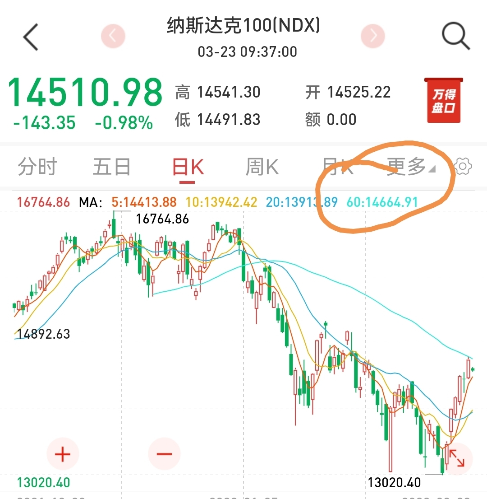

======================================================

_type: talk
@小糊涂[51441514412544]
2022-03-23 21:58:07 Wed  
topic_id: 184221124451522

二师傅您好，我请问二级债长持款，纯粹的国债，选什么呢？

@二师父 at 2022-03-23 21:58:07 Wed

> 我的白银组合，置顶看一下

----------

阅读[1]  评论[1]  赞[0] 

======================================================

_type: talk
@二师父[28814221155551]
2022-03-24 09:00:24 Thu  
topic_id: 184221154448242

成长组合5只定投的基金已经有三只盈利，沪深300价值继续持续定投，盈利暂停，恒生暂停，进入浮亏以后再定投。

大家结合自己的子弹情况，子弹多的中证红利还可以定投。

计划场内恒生今天卖出，阶段获利，恒生科技可以卖，不过目前恒生科技持仓较少，暂时不卖

熊市的时候就适合网格，如果行情回归到12到14年，要么非常有耐心4年不挣钱，要么网格，这是中国特色，长期向上的基金可以考虑纳斯达克，我觉得巴菲特如果只能买a股，他也会做波段，毕竟a股那么多企业他只买了比亚迪。

@云云 at 2022-03-24 09:00:24 Thu

> 标普也暂停吗？

----------

@二师父 at 2022-03-24 09:00:24 Thu

> 可以，盈利持有，浮亏再定投

----------

@云云 at 2022-03-24 09:00:24 Thu

> 好

----------

@水墨青花 at 2022-03-24 09:00:24 Thu

> 师父，纳斯达克均线定投哪一个

----------

@二师父 at 2022-03-24 09:00:24 Thu

> 广发纳斯达克c

----------

@水墨青花 at 2022-03-24 09:00:24 Thu

> 👌

----------

阅读[1]  评论[6]  赞[0] 

+++++++++++++++++++++++++++++++++++++++++++++++++++++

图片：
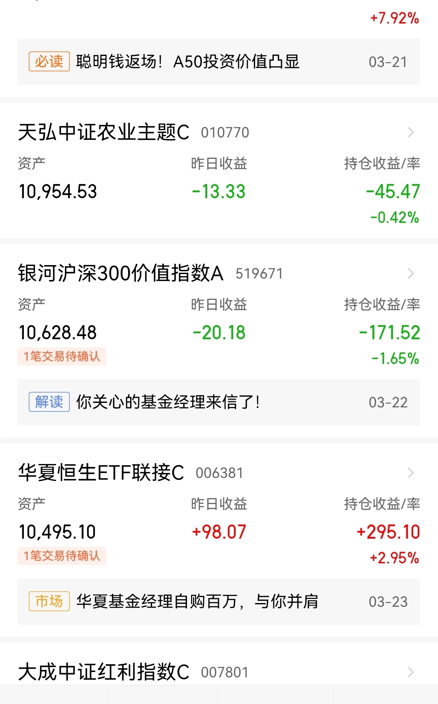

======================================================

_type: talk
@二师父[28814221155551]
2022-03-24 09:39:14 Thu  
topic_id: 184221151258552

<e type="hashtag" hid="881251425252" title="#鳄鱼计划#" /> 恒生指数卖出3份，买了10份，慢慢卖出，下方有缺口，大概率会回调。

@cotton at 2022-03-24 09:39:14 Thu

> 什么叫卖了3份。买了十分呢

----------

@二师父 at 2022-03-24 09:39:14 Thu

> 之前发车买了10份，这次卖出3份，相当于卖出买入的百分之30

----------

@防汛抗旱 at 2022-03-24 09:39:14 Thu

> 场外呢

----------

@二师父 at 2022-03-24 09:39:14 Thu

> 持有

----------

@李金泉 at 2022-03-24 09:39:14 Thu

> 二师傅，请问怎么理解下方有缺口呢？怎么查的呢？

----------

@二师父 at 2022-03-24 09:39:14 Thu

> 就是看k线的缺口

----------

阅读[1]  评论[6]  赞[0] 

+++++++++++++++++++++++++++++++++++++++++++++++++++++

图片：
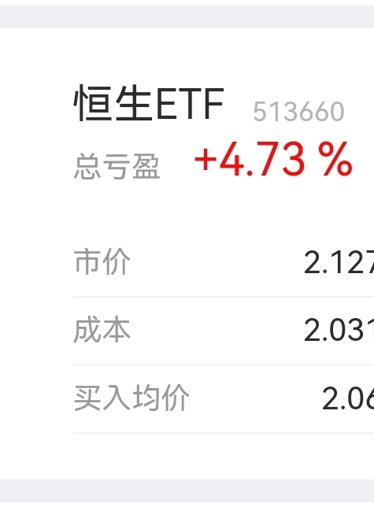

======================================================

_type: talk
@二师父[28814221155551]
2022-03-24 17:37:16 Thu  
topic_id: 212554448512281

说说投资思路，短线与长线结合，长期挣大钱需要将基金持有到估值楼层5楼，6楼，本轮牛市，2021年估值是到了5楼的，沪深300也新高，现在估值2楼，沪深300跌了一年多

我们高位卖出的沪深300又开始逐步买入，未来5楼6楼再次卸货，不能做反了，如果每次都是高位接盘，低位割肉，那么就容易亏钱

目前基建，地产，养殖，恒生都遵循低买高卖，中药中长期持有，1000etf1元以下，成长组合定投，上涨可以收割利润，也可以持有到未来估值楼层4层，当前这个位置不用恐惧，回调就买入，上涨就卖出或者持有

长线方向不多，中药算其中一个，但是也不能死板终身持有，a股唯一值得终身持有的消费，我目前回撤也百分之30了，不能盲目迷信终身持有，低估买入，高估卖出最佳

阅读[1]  评论[0]  赞[0] 

======================================================

_type: talk
@二师父[28814221155551]
2022-03-24 20:53:49 Thu  
topic_id: 184221118454552

沪深300价值和纳斯达克100都在自动定投，每天检查下纳斯达克100，60日均线以下每天定投100元，底仓已经建立了，然后就是持续定投，未来收益率30%以上考虑逐步卖出。

定投需要策略，低估或者均线。沪深300价值目前低估，最大下跌幅度有限，预期坚持定投未来收益率在20%到60%之间。

最新网格表稍后分享。

@CY at 2022-03-24 20:53:49 Thu

> 纳斯达克100场内如何购买？代码是多少呀

----------

@二师父 at 2022-03-24 20:53:49 Thu

> 广发纳斯达克100C

----------

阅读[1]  评论[2]  赞[0] 

+++++++++++++++++++++++++++++++++++++++++++++++++++++

文件：
2022-03-24 20:51:55 Thu
文件大小：[31401]
241588854842821-分享一只我在自动定投的基金.docx

======================================================

_type: talk
@二师父[28814221155551]
2022-03-24 21:11:20 Thu  
topic_id: 184221118122812

这是接下来的投资标的，上证换成地产了，基建，地产，1000马上触发加仓价格，触发了大家就提示下，总体仓位控制在4到7比较合理，低于4的可以不卖，高于7的可以不买，具体根据实际来。

只要触发价格，就买入，不管市场和什么情况，唯一可能不买，比如我们和wanwan干起来了，就可以停一停了

如果买入，我就会画个叉，表示已经买入，涨到重回这个价格，就去掉叉，开始收割利润，严格执行，还能亏钱，那就绝了

@大兵 at 2022-03-24 21:11:20 Thu

> 地产0.8啥意思哈 二师父

----------

@二师父 at 2022-03-24 21:11:20 Thu

> 地产etf价格到0.8

----------

@光少 at 2022-03-24 21:11:20 Thu

> 二师父你发的图没看懂[捂脸]

----------

@大兵 at 2022-03-24 21:11:20 Thu

> 好滴 那中药对标那个指数

----------

@二师父 at 2022-03-24 21:11:20 Thu

> 哪里不懂

----------

@二师父 at 2022-03-24 21:11:20 Thu

> 中证中药

----------

@光少 at 2022-03-24 21:11:20 Thu

> 基4000和中药10000不明，请解[抱拳]

----------

@二师父 at 2022-03-24 21:11:20 Thu

> 基建指数和中证中药指数

----------

阅读[1]  评论[15]  赞[0] 

+++++++++++++++++++++++++++++++++++++++++++++++++++++

图片：
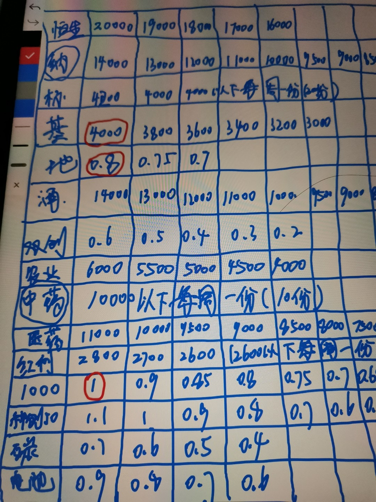

======================================================

_type: talk
@二师父[28814221155551]
2022-03-24 21:39:59 Thu  
topic_id: 184221182252512

原则上，买入必须触发，也就是低于临界点随时了买，卖出需要到临界，也可以不到，盈利卖出即可。

基本上严格按照网格，不会有问题，注意加仓节奏就行

@蛋炒饭不加蛋 at 2022-03-24 21:39:59 Thu

> 请问二师父基建etf和基建50etf哪个比较好

----------

@二师父 at 2022-03-24 21:39:59 Thu

> 基建etf

----------

@蛋炒饭不加蛋 at 2022-03-24 21:39:59 Thu

> 能说下有什么区别吗

----------

@二师父 at 2022-03-24 21:39:59 Thu

> 标的容量不同，基建etf是全部基建企业，50是其中50家

----------

@蛋炒饭不加蛋 at 2022-03-24 21:39:59 Thu

> 50类似基建增强？

----------

@二师父 at 2022-03-24 21:39:59 Thu

> 持仓更集中

----------

@蛋炒饭不加蛋 at 2022-03-24 21:39:59 Thu

> 看了下基建50重仓股里没有工程机械，三一和中联重科都没有

----------

@二师父 at 2022-03-24 21:39:59 Thu

> 全部是国企

----------

阅读[1]  评论[11]  赞[0] 

+++++++++++++++++++++++++++++++++++++++++++++++++++++

图片：

======================================================

_type: talk
@二师父[28814221155551]
2022-03-24 21:55:01 Thu  
topic_id: 585224482115214

这俩基金确实比较强，大家可以考虑下，作为防守账户的品种之一，基金规模是业绩的天敌，有时候需要选择规模不那么大的品种，同期建仓c类表现更加。

@JOY at 2022-03-24 21:55:01 Thu

> 师父，请教下，那为什么您乌龟计划选择买入的是A类的呢？

----------

@二师父 at 2022-03-24 21:55:01 Thu

> 长期持有a类更好

----------

@JOY at 2022-03-24 21:55:01 Thu

> 谢谢

----------

@庆余年 at 2022-03-24 21:55:01 Thu

> 混基里面能达到这种兼顾收益和长期低回撤水平的目前只发现了这一只，但是这只基金机构占比很高，不晓得会不会有风险。

----------

@二师父 at 2022-03-24 21:55:01 Thu

> 大规模赎回会有，考虑下安信稳健增值混合

----------

@庆余年 at 2022-03-24 21:55:01 Thu

> [呲牙][呲牙]好，也没有完美的基金，看自己的情况来就行。

----------

阅读[1]  评论[6]  赞[0] 

+++++++++++++++++++++++++++++++++++++++++++++++++++++

图片：
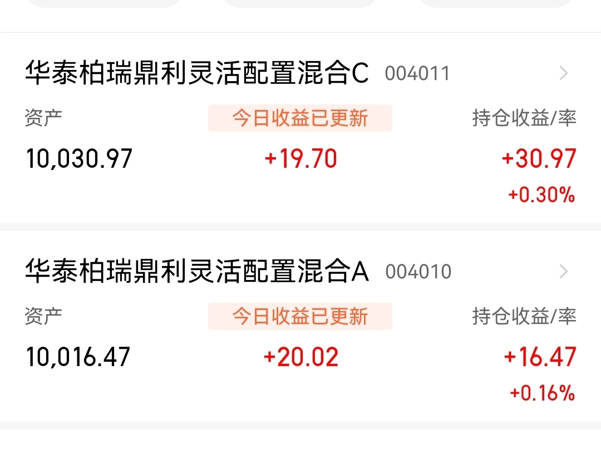

======================================================

_type: talk
@二师父[28814221155551]
2022-03-24 23:33:00 Thu  
topic_id: 184221181528852

纳斯达克真的yyds，突破60日线，就暂停，底仓有了，有了20个点利润再来卖出，等到跌破60日线继续定投，这个策略适合yyds，a股不是我不太想评价他，沪深300跌了一年2个月，大家看看纳斯达克最多跌几个月

@如约而至 at 2022-03-24 23:33:00 Thu

> 纳斯达克和标普加起来仓位在多少合适？

----------

@二师父 at 2022-03-24 23:33:00 Thu

> 这个位置已经不大适合底仓了，他们在底部来个百分之40没问题

----------

@如约而至 at 2022-03-24 23:33:00 Thu

> 好的，那我等二次探底吧

----------

阅读[1]  评论[3]  赞[0] 

+++++++++++++++++++++++++++++++++++++++++++++++++++++

图片：
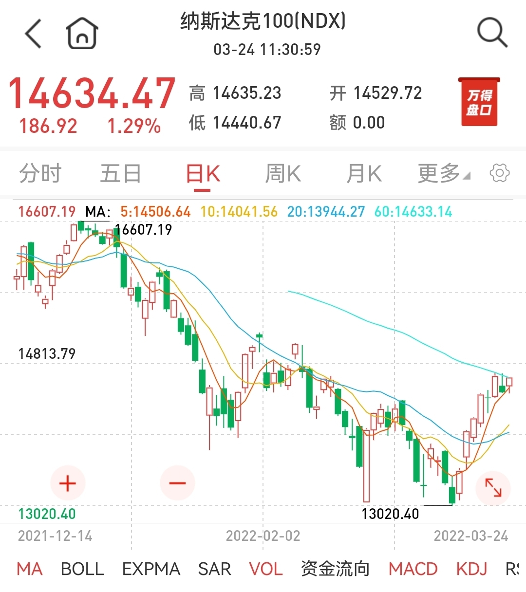

======================================================

_type: talk
@二师父[28814221155551]
2022-03-25 09:52:26 Fri  
topic_id: 184221824154412

<e type="hashtag" hid="881251425252" title="#鳄鱼计划#" /> 地惨etf买入一份，按照计划，如果跌到下一个加仓区间，就买多份，按照走势，地惨还得继续跌，有耐心的可以等，一般升势确立以后才多买

@波波 at 2022-03-25 09:52:26 Fri

> 地产不是在涨吗？麻烦解释一下

----------

@二师父 at 2022-03-25 09:52:26 Fri

> 我0.8买入的，现在已经盈利百分之2了，跟车要及时

----------

@杜志彪 at 2022-03-25 09:52:26 Fri

> 哈哈😄没子弹了，刷刷手机看看书，看你们赚钱也不错[偷笑]

----------

阅读[1]  评论[3]  赞[0] 

+++++++++++++++++++++++++++++++++++++++++++++++++++++

图片：
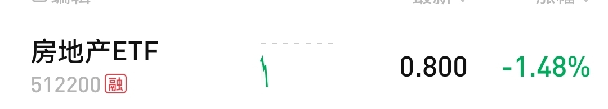

======================================================

_type: talk
@二师父[28814221155551]
2022-03-25 10:25:03 Fri  
topic_id: 585224824242114

地产刚发车，就涨了百分之2，这种短期我也没法预测，我只是按照纪律，在我分享的表里面到了价格就买，趋势是向下的，但是股市的走势不会线性。

@庆余年 at 2022-03-25 10:25:03 Fri

> 低估买入，高估不追，遵守纪律，铁定赚钱[呲牙]

----------

@二师父 at 2022-03-25 10:25:03 Fri

> 对的，严格执行

----------

阅读[1]  评论[2]  赞[0] 

+++++++++++++++++++++++++++++++++++++++++++++++++++++

图片：
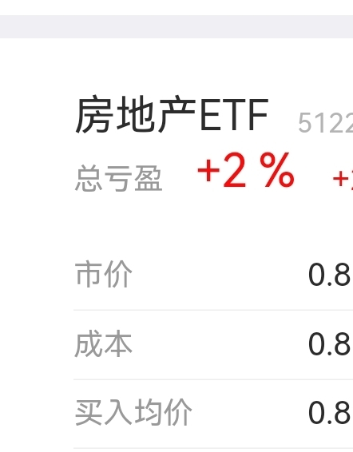

======================================================

_type: talk
@二师父[28814221155551]
2022-03-25 11:39:21 Fri  
topic_id: 212554151555241

这是基金代码，因为平时工作忙，北京通勤也占据了大部分时间，所以这些都是挤时间做的，大家可以保存下。

并不一定跟着我来，只投沪深300价值加一个偏债混合加一个标普500就好了，取得市场平均收益率。

@老孙头 at 2022-03-25 11:39:21 Fri

> 列表中并没有300价值？

----------

@二师父 at 2022-03-25 11:39:21 Fri

> 300价值是场外的

----------

阅读[1]  评论[2]  赞[0] 

+++++++++++++++++++++++++++++++++++++++++++++++++++++

图片：
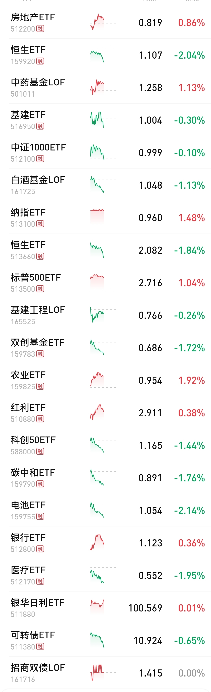

======================================================

_type: talk
@以古论今[28214421582421]
2022-03-25 14:19:33 Fri  
topic_id: 812554182548442

白酒跌的太猛

@二师父 at 2022-03-25 14:19:33 Fri

> 比医药差点

----------

@一心一意 at 2022-03-25 14:19:33 Fri

> 倾巢之下，焉有完卵

----------

阅读[1]  评论[2]  赞[0] 

======================================================

_type: talk
@🎈铮[28284825441841]
2022-03-25 14:51:55 Fri  
topic_id: 184221854452482

二师父，场内沪深300投哪只呀

@二师父 at 2022-03-25 14:51:55 Fri

> 沪深300etf，不过看这个走势不大好，可以网格加仓

----------

阅读[1]  评论[1]  赞[0] 

======================================================

_type: talk
@留影[88844882545182]
2022-03-26 12:27:13 Sat  
topic_id: 212582812418541

昨晚发布的内外互联互通问题大家怎么看？会不会指数一路向下

阅读[1]  评论[0]  赞[0] 

======================================================

_type: talk
@二师父[28814221155551]
2022-03-26 21:05:07 Sat  
topic_id: 184254424442512

分享一些稳健的基金，这些基金长期可以跑赢沪深300，所以大资金可以分散配置，市场高位，没有啥基金好买的时候，买这些品种长期持有，这些品种何时卖出呢

第一，基金出问题了，第二，需要用钱了

否则终身持有，根据我的经验，在中国只有债基，偏债混合值得终身持有，指数就是消费和医药值得终身持有，其他的都不值得，即使消费医药，最大跌幅也有百分之50多，所以我觉得没必要傻傻持有，做个波段有何不可。

阅读[1]  评论[0]  赞[0] 

+++++++++++++++++++++++++++++++++++++++++++++++++++++

图片：
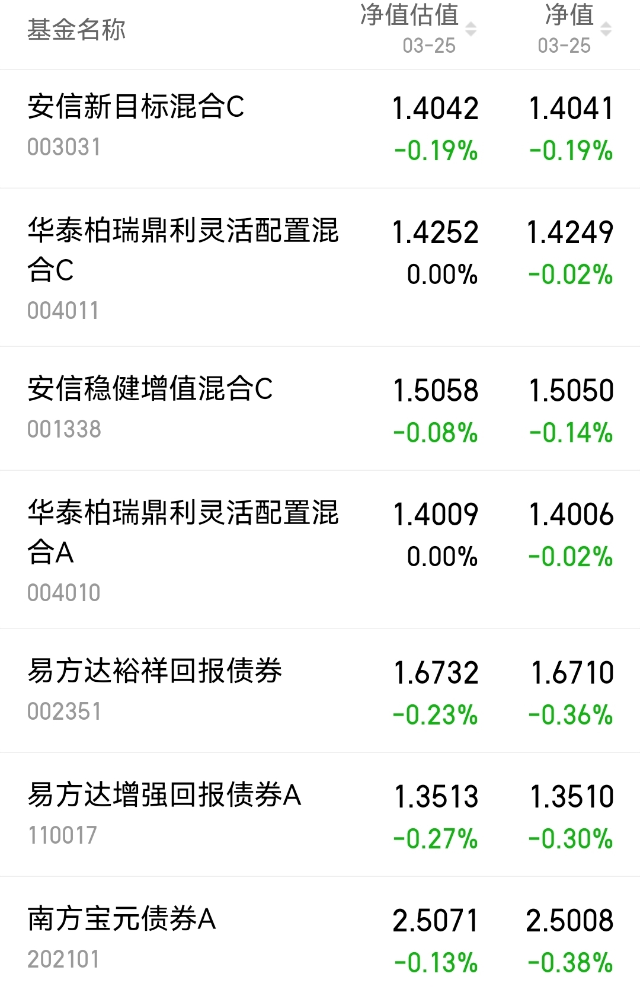

======================================================

_type: talk
@二师父[28814221155551]
2022-03-26 21:13:42 Sat  
topic_id: 212582252245841

海外组合的投资标的，大家保存下，发车都会从这里面选择

@留影 at 2022-03-26 21:13:42 Sat

> 感谢分享，请问越南最近建议投吗？比例控制在多少？

----------

@二师父 at 2022-03-26 21:13:42 Sat

> 目前不建议

----------

@清朗轩 at 2022-03-26 21:13:42 Sat

> 谢谢老师！

----------

阅读[1]  评论[3]  赞[0] 

+++++++++++++++++++++++++++++++++++++++++++++++++++++

图片：

======================================================

_type: talk
@二师父[28814221155551]
2022-03-26 21:15:32 Sat  
topic_id: 415485545528228

成长组合定投标的

阅读[1]  评论[0]  赞[0] 

+++++++++++++++++++++++++++++++++++++++++++++++++++++

图片：
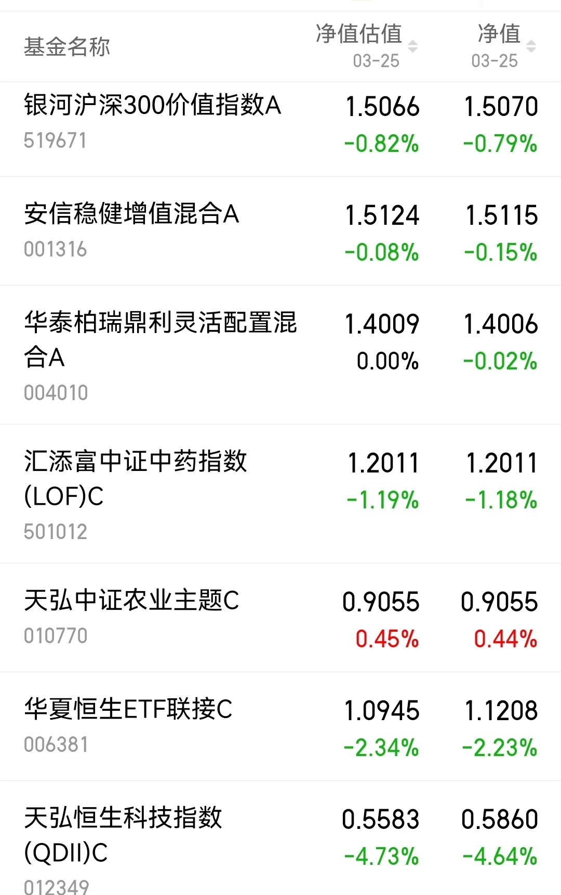
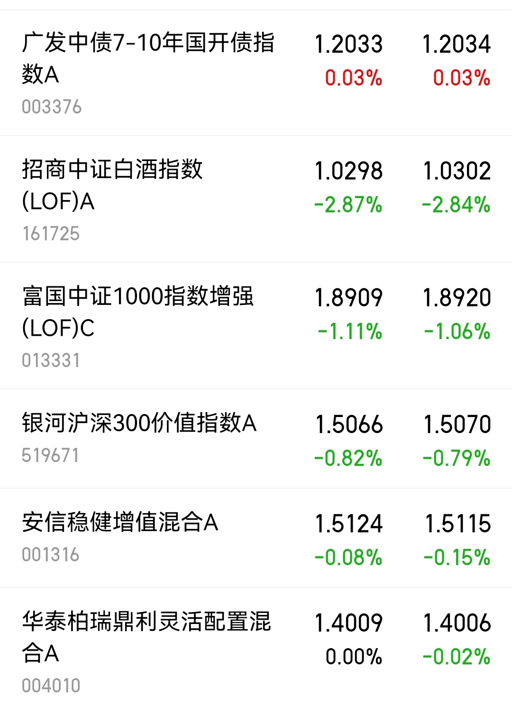

======================================================

_type: talk
@二师父[28814221155551]
2022-03-26 21:21:38 Sat  
topic_id: 585215525582844

乌龟计划定投标的

阅读[1]  评论[0]  赞[0] 

+++++++++++++++++++++++++++++++++++++++++++++++++++++

图片：
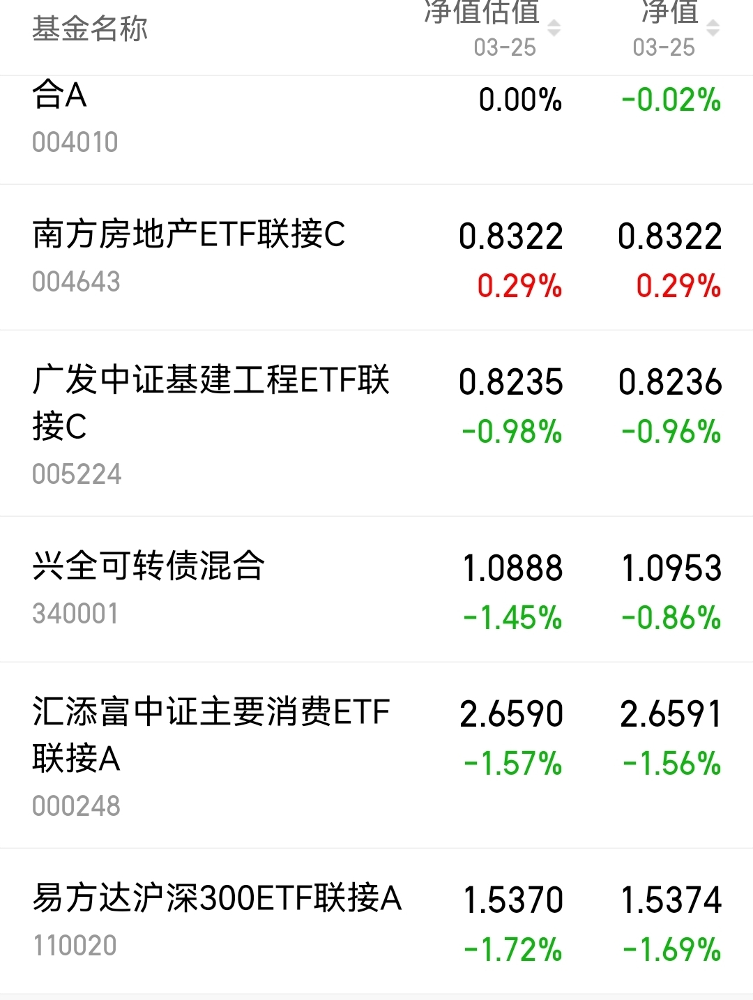
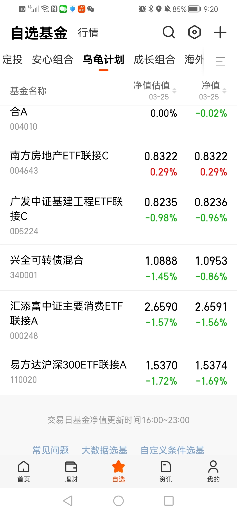

======================================================

_type: talk
@二师父[28814221155551]
2022-03-26 21:22:25 Sat  
topic_id: 415485545518888

安心组合标的

@留影 at 2022-03-26 21:22:25 Sat

> 老师，是否方便透露每个计划的满仓金额，主要是想方便知道每个计划的当前仓位。

----------

@二师父 at 2022-03-26 21:22:25 Sat

> 这些都是我每个月收入投的，理论上不出意外会一直加，目前就留了几十块生活费，其他的全部买了指数和二级债，债基，偏债混合

----------

@留影 at 2022-03-26 21:22:25 Sat

> 嗯嗯，明白了，谢谢，也就是说这是个持续计划，债和基之间会做轮动，赞。

----------

@二师父 at 2022-03-26 21:22:25 Sat

> 对的，基本上到达最底部才会把债券全部加到指数上

----------

阅读[1]  评论[4]  赞[0] 

+++++++++++++++++++++++++++++++++++++++++++++++++++++

图片：
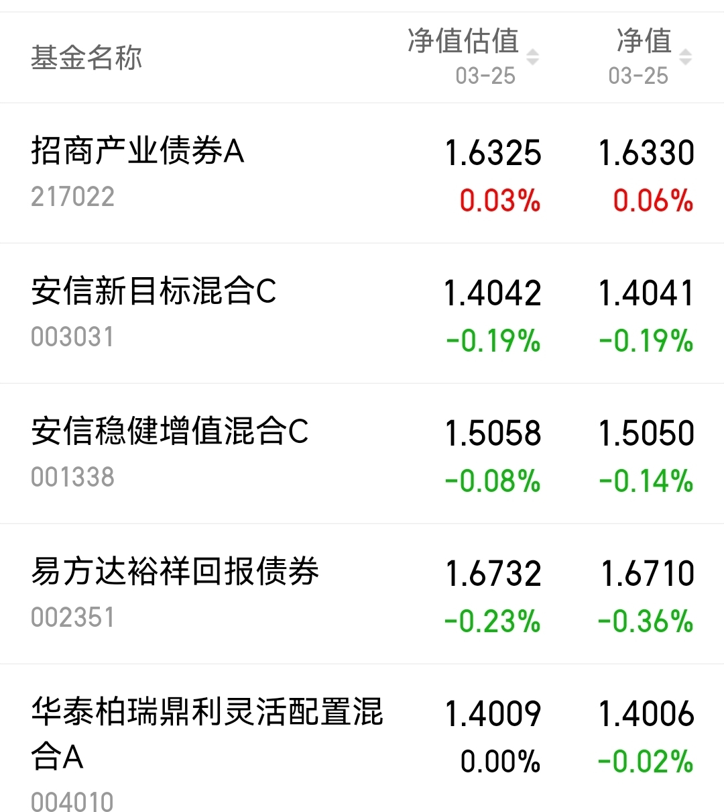

======================================================

_type: talk
@二师父[28814221155551]
2022-03-26 21:25:13 Sat  
topic_id: 415485545254828

低估的9大宽基，截止目前我所有计划投资的标的都分享了，就是按照计划加仓，左侧交易，控制节奏和仓位，如果经历过15年和18年，这轮下跌不用怕，如果没经历，刚好下跌做下压力测试，看看自己的承受能力，以后就可以很好地管理仓位了

@坚持学习 at 2022-03-26 21:25:13 Sat

> 二师父，您推荐的沪深300，中证500都是ETF联结，为什么？如果我选择的是沪深300增强000311，中证500指数000478，这两个进行定投，是可以的话，还是换成您推荐的更佳呢？

----------

@二师父 at 2022-03-26 21:25:13 Sat

> 只追求市场平均收益，主动增强未必能增强

----------

@陈昭晶 at 2022-03-26 21:25:13 Sat

> 二师父，没有看到中证红利呢，不定投了吗

----------

@二师父 at 2022-03-26 21:25:13 Sat

> 投啊

----------

阅读[1]  评论[4]  赞[0] 

+++++++++++++++++++++++++++++++++++++++++++++++++++++

图片：
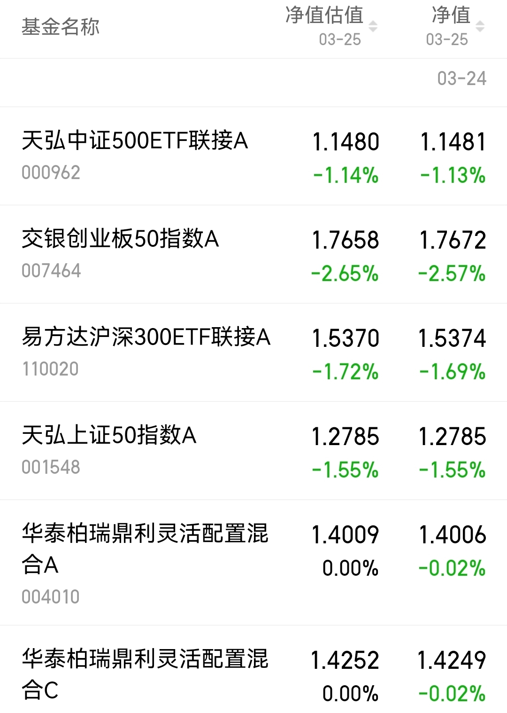
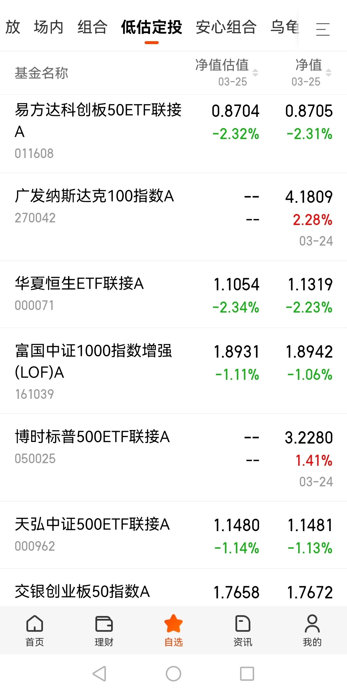

======================================================

_type: talk
@二师父[28814221155551]
2022-03-27 17:25:26 Sun  
topic_id: 212582224284881

关于市场的判断，目前仓位4到7成是比较合适的。

如果空仓的话，现在机会很好，上证指数回踩缺口继续下探可以加仓我说的方向，高估值，市盈率30倍以上的，可以先缓缓，或者轻仓买。

有限买入市盈率20倍以下的价值类指数。

缺口很好看，就是连续两根K线之间的空隙，就是缺口。

@留影 at 2022-03-27 17:25:26 Sun

> 赞这个仓位建议，这个时候太有用了。目前8成仓，价值类和宽基是主导仓位，有一成仓位是传媒和信息技术，大概浮亏15%左右，现在卖掉，留着本来大跌后加仓优质资源，可以吗？

----------

阅读[1]  评论[1]  赞[0] 

+++++++++++++++++++++++++++++++++++++++++++++++++++++

文件：
2022-03-27 17:23:44 Sun
文件大小：[32225]
241588211122441-全球新兴市场基金出手，你还准备跑路吗.docx

======================================================

_type: talk
@从A到Z[414841151821548]
2022-03-28 09:46:02 Mon  
topic_id: 184254481521242

电池、碳中和和传媒etf如何操作呢，前期购买的目前都有20个点的亏损

@二师父 at 2022-03-28 09:46:02 Mon

> 持有，反弹收割利润，到达设定价格买入

----------

@从A到Z at 2022-03-28 09:46:02 Mon

> 在哪里看设定的价格

----------

@二师父 at 2022-03-28 09:46:02 Mon

> 星球

----------

@从A到Z at 2022-03-28 09:46:02 Mon

> 星球都是随时发布，没有系统发布的地方吗

----------

@二师父 at 2022-03-28 09:46:02 Mon

> 什么样的系统发布？

----------

@从A到Z at 2022-03-28 09:46:02 Mon

> 我的意思是系统性，持续性，可跟踪性的平台，当然星球也不错，但是想对有点碎片化

----------

@二师父 at 2022-03-28 09:46:02 Mon

> 那就只有公众号了

----------

@留影 at 2022-03-28 09:46:02 Mon

> 去天天基金可以看到各个计划的持仓和加仓情况。

----------

阅读[1]  评论[9]  赞[0] 

======================================================

_type: talk
@二师父[28814221155551]
2022-03-28 10:39:41 Mon  
topic_id: 812582455222142

被套住的基金耐心持有，等跌到一定空间继续加仓，基金除了部分行业基金，大部分宽基指数和混合基金都能起来

对于不确定的行业，防止出现传媒这样的意外，一定要控制仓位。

阅读[1]  评论[0]  赞[0] 

======================================================

_type: talk
@二师父[28814221155551]
2022-03-28 10:42:49 Mon  
topic_id: 212582455245151

<e type="hashtag" hid="15288821141452" title="#成长组合#" /> 300价值买入2000元，这只基金设定的自动定投，偶尔手动加仓，4600以下定投不停，有15个点利润，或者涨到了5200逐步收割利润。

策略很简单，坚持做肯定能挣钱，加息周期，钱不好赚，适当降低预期吧，2020年那种一年两倍的机会可遇不可求的。

@庆余年 at 2022-03-28 10:42:49 Mon

> 4600是什么的点位，大盘？

----------

@二师父 at 2022-03-28 10:42:49 Mon

> 沪深300价值指数点位

----------

@庆余年 at 2022-03-28 10:42:49 Mon

> 开会开的人傻了，问些苕问题[晕][晕][晕]。

----------

@范毅君 at 2022-03-28 10:42:49 Mon

> 哈哈，我也很惊诧你问这个[偷笑]

----------

@二师父 at 2022-03-28 10:42:49 Mon

> 上证到了4600不投了，开香槟庆祝

----------

@庆余年 at 2022-03-28 10:42:49 Mon

> 我错了，[捂脸][捂脸][捂脸]，我也期待喝香槟的那一刻

----------

@孟倩 at 2022-03-28 10:42:49 Mon

> 师父，定投易方达的沪深300ETF联接A(110020）可以吗？

----------

@二师父 at 2022-03-28 10:42:49 Mon

> 可以

----------

阅读[1]  评论[9]  赞[0] 

+++++++++++++++++++++++++++++++++++++++++++++++++++++

图片：
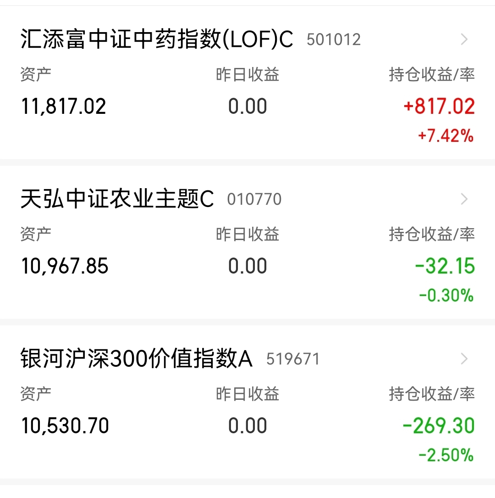

======================================================

_type: talk
@二师父[28814221155551]
2022-03-28 10:50:22 Mon  
topic_id: 585215422584824

这是300价值的指数代码，4600是300价值指数的点位，按照这个策略定投加收割利润，你坚持下来亏了，可以不用跟我学习了，也就是说这么多投，亏钱是不可能事件

@蓝精灵 at 2022-03-28 10:50:22 Mon

> 师父，300价值没有场内基金嘛！

----------

@二师父 at 2022-03-28 10:50:22 Mon

> 咩有

----------

@坚持学习 at 2022-03-28 10:50:22 Mon

> 二师父，之前银河沪深300 ，519671，也是一样的吧？

----------

@木公先生 at 2022-03-28 10:50:22 Mon

> 师父，300价值在哪个平台买啊，我在天天基金和华宝都买不了，求指导[抱拳]

----------

@二师父 at 2022-03-28 10:50:22 Mon

> 天天基金可以呀

----------

@木公先生 at 2022-03-28 10:50:22 Mon

> 按000919搜到的买不了，但我买了519671，是一样的吗？

----------

阅读[1]  评论[6]  赞[0] 

+++++++++++++++++++++++++++++++++++++++++++++++++++++

图片：
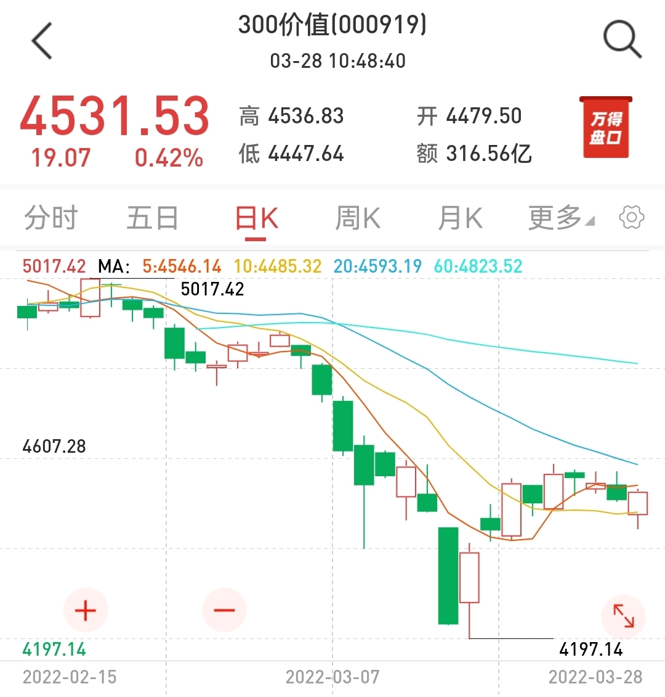

======================================================

_type: q&a
@Joey [422115481514888]
2022-03-28 12:07:36 Mon  
topic_id: 212582458811221

@Joey 

>  师傅 你好 我之前买了一些保险主题股票和基金 买早了 现在浮亏20% 现在这个点位 您觉得是继续加仓保险摊低成本好呢 还是拿着钱去投沪深300价值或者其它的确定性更高呢 
>  谢谢

@二师父

>  你拿住就好，不要来回割肉

阅读[1]  评论[2]  赞[0] 

======================================================

_type: talk
@小草罗仕英，电话，*[118851525454512]
2022-03-28 13:11:51 Mon  
topic_id: 812582458148422

老师我沪深300，110020.现在负12个点，也可以加撒

@二师父 at 2022-03-28 13:11:51 Mon

> 沪深300我是按照网格加仓的，每下跌5%，买一次

----------

阅读[1]  评论[1]  赞[0] 

======================================================

_type: talk
@二师父[28814221155551]
2022-03-28 14:13:53 Mon  
topic_id: 585215425515414

今天手动加仓了沪深300价值，这个和沪深300还是有区别的。

沪深300价值下跌幅度会比沪深300小，这也是我目前敢于逐步加到重仓的原因，未来我不是很乐观，所以投资也相比较保守，完全避开了创业板这种大波动的板块。

更多买入低估值的板块。

沪深300价值和沪深300跌幅不同，所以策略也不同。

沪深300价值采用的是定投，每周固定定投，沪深300价值指数4600以下开始持续定投，盈利15%以后开始收割利润。

而沪深300因为跌幅可能会比较大，所以每下跌5%买一次，等到估值一楼再持续定投，这样更加安全。另外沪深300医药超跌了，这个基金在乌龟计划的基金池里面，后面也会网格加仓，医药基金没问题，长期看大消费、大医药定投相对于大盘是有超额收益的。

@样 at 2022-03-28 14:13:53 Mon

> 今天加中药吗？

----------

@二师父 at 2022-03-28 14:13:53 Mon

> 没加，短期涨了百分之15，不追

----------

@芳瑛榕子 at 2022-03-28 14:13:53 Mon

> 二师父，怎么看白酒ETF今天跌了很多？

----------

@二师父 at 2022-03-28 14:13:53 Mon

> 主要是茅台降价和估值过高，前期涨了很多，小心白酒和医药一样走主跌，别重仓他，多选宽基和低估值板块

----------

@芳瑛榕子 at 2022-03-28 14:13:53 Mon

> 重仓倒是没有。宽基只买了一个中证红利，也不多，但是一直涨，没办法再投了。低估值板块不买了，钱都套在个股上了，不知道什么时候可以解套，这样我好一门心思地买基金，个股真不是小散玩得了的😂

----------

@二师父 at 2022-03-28 14:13:53 Mon

> 基本上被套了就很少放你出来

----------

@芳瑛榕子 at 2022-03-28 14:13:53 Mon

> 哇哇大哭😭我该怎么办？

----------

阅读[1]  评论[7]  赞[0] 

+++++++++++++++++++++++++++++++++++++++++++++++++++++

文件：
2022-03-28 14:10:27 Mon
文件大小：[30622]
118255152158442-定投为什么不怕下跌.docx

======================================================

_type: talk
@清朗轩[88481541445512]
2022-03-28 14:25:00 Mon  
topic_id: 212582452451881

您好老师，请问您加仓了哪些呢？

@二师父 at 2022-03-28 14:25:00 Mon

> 300价值，基建

----------

@清朗轩 at 2022-03-28 14:25:00 Mon

> 谢谢老师！

----------

阅读[1]  评论[2]  赞[0] 

======================================================

_type: talk
@二师父[28814221155551]
2022-03-29 12:14:48 Tue  
topic_id: 415485121522248

<e type="hashtag" hid="28855182115521" title="#关于网格加仓和行业方向#" /> 网格加仓是按照一定下跌空间来加仓的，比如现在中证1000ETF价格是1元，我按照1、0.9的价格加就是网格加仓，我每周固定买入就是定投。网格加仓是为了防止基金单边走主跌浪，导致在一个价位买入过多，从而带来重度亏损。

对于恒生科技，沪深300、1000ETF等基金目前都可以网格加仓。

只要能起来，就可以。

而行业需要避开高估值的方向，很多人对估值有误区，总觉得跌了多少就低估了，实际上不是，白酒已经连续涨了3年，我们从18年就开始投资了，按照目前白酒的跌幅，好像并没有到底。

18年最低位五粮液是15倍市盈率，未来再次重仓白酒，也一定大致到达这个市盈率的位置，或者更低。

那么现在买白酒的逻辑是什么？就是赌一个中期反弹，即使走主跌浪，也会有反弹，正因为如此，就需要轻仓。

当然，你也可以不赚反弹的钱，直接找有潜力的方向。

这些方向其实去年我就讲了，宽基中证红利、上证红利、沪深300价值。行业基建、地产、中药、农业、猪肉等。

这些方向就是值得重仓的方向，另外我的重仓方向大约也就10%的总资金，作为一个投资者最重要的是风控，即使未来踩了坑，也能活下来。投资先活下来再寻求增值。

另外石油板块关注下，巴菲特买了西方石油，油价上涨是预期之中。这种方向不会定投，因为一旦未来油价走下跌模式，再次跌到40以下也很容易了。

@摆渡人 at 2022-03-29 12:14:48 Tue

> 那我目前浮亏的新能源半导体软件军工是否要割肉转换到价值类方向

----------

@一心一意 at 2022-03-29 12:14:48 Tue

> 如果仓位轻，可以一直持有，仓位重，就需要转换一些为上策

----------

阅读[1]  评论[2]  赞[0] 

======================================================

_type: talk
@二师父[28814221155551]
2022-03-29 17:23:50 Tue  
topic_id: 812582111552112

观察市场走势表现，加息周期A股表现差一点，如果仓位超过7成，继续跌，可以网格加仓，这样更加保险，如果仓位低于5成，可以持续定投。

@摆渡人 at 2022-03-29 17:23:50 Tue

> 标普500和纳斯达克算美国大盘吗

----------

@样 at 2022-03-29 17:23:50 Tue

> 纳指适合给多少仓位？

----------

阅读[1]  评论[2]  赞[0] 

+++++++++++++++++++++++++++++++++++++++++++++++++++++

文件：
2022-03-29 17:13:11 Tue
文件大小：[30794]
241588444555111-复盘历次加息周期中各类资产表现.docx

======================================================

_type: talk
@大震[815114151548542]
2022-03-30 19:08:00 Wed  
topic_id: 184251218455812

二师父，利率上行了，现在适合买入纯债基金吗？有合适的推荐一下吧。

@二师父 at 2022-03-30 19:08:00 Wed

> 招商产业债，富国天利增长债券

----------

阅读[1]  评论[1]  赞[0] 

======================================================

_type: talk
@二师父[28814221155551]
2022-03-30 21:41:03 Wed  
topic_id: 415482415588228

今日大涨，回血不少，仓位轻得回调记得补仓。

咱们还是按照既定得价格操作。有回调就买，继续涨就拿住或者收割利润。

@坚持学习 at 2022-03-30 21:41:03 Wed

> 二师父，这个时候中概是不是可以割点肉减仓，之前的仓位20％多

----------

@西锦巴乌 at 2022-03-30 21:41:03 Wed

> 请问沪深300价值目前4600多点在哪里看到的？谢了

----------

@二师父 at 2022-03-30 21:41:03 Wed

> 雪球或者万得都可以，指数

----------

@二师父 at 2022-03-30 21:41:03 Wed

> 反弹可以降低一点

----------

@西锦巴乌 at 2022-03-30 21:41:03 Wed

> 我看到的都是沪深300   4200多点，找不到沪深300价值指数[流泪]

----------

@二师父 at 2022-03-30 21:41:03 Wed

> 直接搜索300价值

----------

阅读[1]  评论[6]  赞[0] 

+++++++++++++++++++++++++++++++++++++++++++++++++++++

文件：
2022-03-30 21:39:32 Wed
文件大小：[31436]
241588185285841-大涨，空头被爆.docx

======================================================

_type: talk
@二师父[28814221155551]
2022-03-31 10:29:25 Thu  
topic_id: 184251455284822

<e type="hashtag" hid="28518855451481" title="#乌龟计划#" /> 买入沪深300医药500元。

目前3月建仓的基金都盈利了，包括300价值，300价值仍旧自动扣款定投，下周看情况是否取消，其他手动加仓，300医药属于成长基金，左侧交易，每下跌百分之5买入一次，基建地产建仓也开始盈利，有10个点以后分别卖出，当前消费医药可以逐步左侧建仓，不过不是重点，重点是基建，中药，农业，地产，红利，300价值，纳斯达克，全部盈利就等回调加仓，方向对了就不断加码

知识不重要，重要的是两知识转化成财富。

@蓝精灵 at 2022-03-31 10:29:25 Thu

> 二师父，300医药场内是512010对嘛

----------

@二师父 at 2022-03-31 10:29:25 Thu

> 对的

----------

阅读[1]  评论[2]  赞[0] 

+++++++++++++++++++++++++++++++++++++++++++++++++++++

图片：
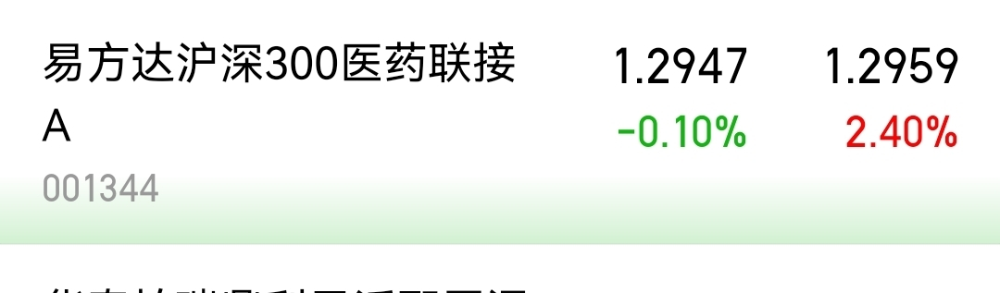

======================================================

_type: talk
@二师父[28814221155551]
2022-03-31 10:38:29 Thu  
topic_id: 212584288851481

这是300价值的代码，已经突破4600了，有可能下周自动定投就停止，3月密集发车，跟上的都吃肉了，目前局势不太好说，涨了就暂停或者收割利润，接下来有机会再发车，投资以保住本金为主，在这个基础上遇到大机会再开始行动

@水墨青花 at 2022-03-31 10:38:29 Thu

> 师父，恒生和标普还自动扣款吗

----------

@二师父 at 2022-03-31 10:38:29 Thu

> 停了

----------

@水墨青花 at 2022-03-31 10:38:29 Thu

> 👌

----------

阅读[1]  评论[3]  赞[0] 

+++++++++++++++++++++++++++++++++++++++++++++++++++++

图片：
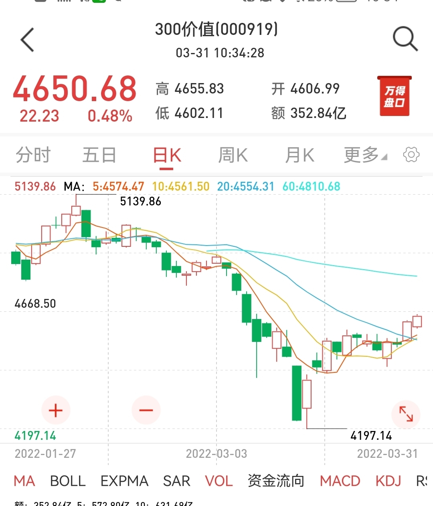

======================================================

_type: q&a
@李金泉[581122114118554]
2022-03-31 13:48:46 Thu  
topic_id: 585214515815284

@李金泉

>  二师傅，想问下，现在投资白酒和家用电器，二选一，哪个更合适呢？用定投还是网格加仓？谢谢！

@二师父

>  轻仓家电，网格

阅读[1]  评论[2]  赞[0] 

======================================================

_type: talk
@二师父[28814221155551]
2022-03-31 13:53:38 Thu  
topic_id: 212584281452181

<e type="hashtag" hid="881251425252" title="#鳄鱼计划#" /> 卖出地产etf，买的不多，盈利后可持有，可卖出，我公开实盘全部都盈利卖出，若发生亏损卖出的情况，一定发红包，无论什么原因。

阅读[1]  评论[0]  赞[0] 

+++++++++++++++++++++++++++++++++++++++++++++++++++++

图片：
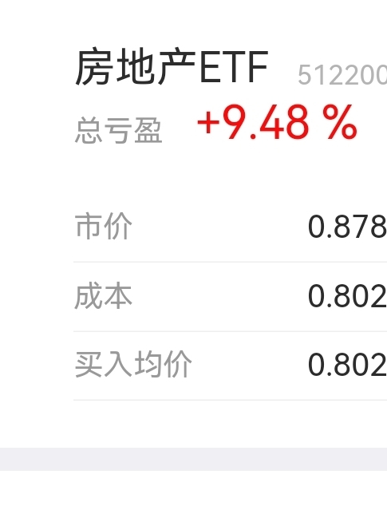

======================================================

_type: talk
@二师父[28814221155551]
2022-03-31 16:48:29 Thu  
topic_id: 585214551285184

中药和地产都炸板了，止盈的话可以考虑。

刚刚又刷到一条消息，美国借口所谓人权问题对中国官员实施签证限制，中方将采取对等反制。这会不会带来新一轮的对抗呢？

今年估计不会很太平，不过正是这种日子才会给布局的机会。大家控制好仓位就行。

@范毅君 at 2022-03-31 16:48:29 Thu

> 中m对抗不可改变，过于紧张后会有缓解，缓解后，m政客要做给选民看，又会紧张，感觉拉锯会是主旋律，做波段会不会好一些。我现在赢利就卖出一部分，跌了再买回来，如果一直涨，就接着卖，直到波段筹码折腾光就卧倒等机会[呲牙]个人想法

----------

@衣袂飘香 at 2022-03-31 16:48:29 Thu

> 二师父，记得你前两天还说中药准备长期持有，现在您的意思是需要止盈吗？有10个点了。

----------

@二师父 at 2022-03-31 16:48:29 Thu

> 可以考虑止盈，我自己是准备持有的，回调了继续买入

----------

阅读[1]  评论[3]  赞[0] 

+++++++++++++++++++++++++++++++++++++++++++++++++++++

文件：
2022-03-31 16:43:31 Thu
文件大小：[54004]
548215255842214-高盛首席分析师最新研判，A股真的见底了吗.docx

======================================================

_type: talk
@二师父[28814221155551]
2022-03-31 23:27:46 Thu  
topic_id: 184251411458422

<e type="hashtag" hid="552114551414" title="#估值数据#" /> 市盈率百分位27.17%，SY-BY百分位26.73%，SY/BY百分位15.03%。

估值楼层还是第二层，沪深300价值今天继续涨了，按照纪律，超过4600就暂停定投，后面继续上涨可以收割利润，也可以躺平，等回调再开启。A股投资永远不缺机会，无论涨多高都会回来接你的。

关于中药，这个板块我是长期看好，今天大部分开板，短期肯定是会回调的，可以选择收割利润，也可以持有，看个人选择，我计划是持有到盈利70%到100%以后卖出本金，然后剩余的长期持有。并未考虑坐波段，如果有机会回调还会再次加仓的。

波段的我会选择地产、基建、农业，中药暂时未考虑波段。

@匿名的码农 at 2022-03-31 23:27:46 Thu

> 回调就跟着二师父加仓

----------

@样 at 2022-03-31 23:27:46 Thu

> 今天中药果然回调[强][强]

----------

@李金泉 at 2022-03-31 23:27:46 Thu

> 二师傅，有就会能介绍一下中药指数吗？是中证中药吗？因为从市盈率等指标上来看近2年都未低估，所以不太明白为什么很看好呢？

----------

@二师父 at 2022-03-31 23:27:46 Thu

> 市盈率低不代表好，你看中概市盈率从去年一直低，一直表现不佳

----------

阅读[1]  评论[4]  赞[0] 

======================================================

