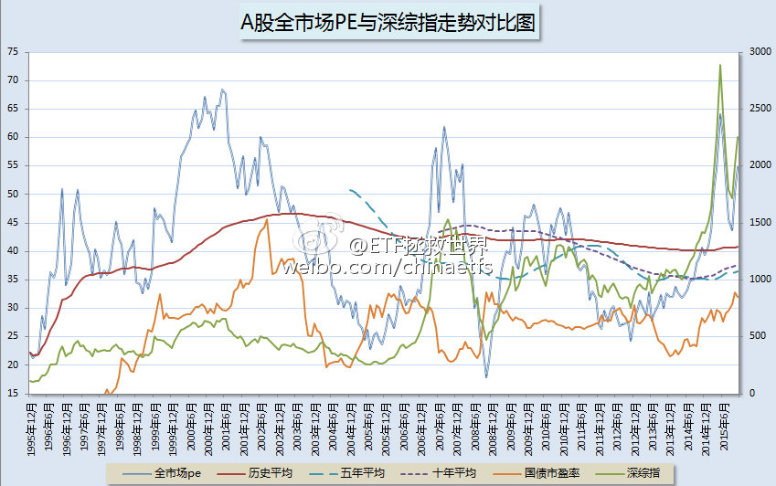
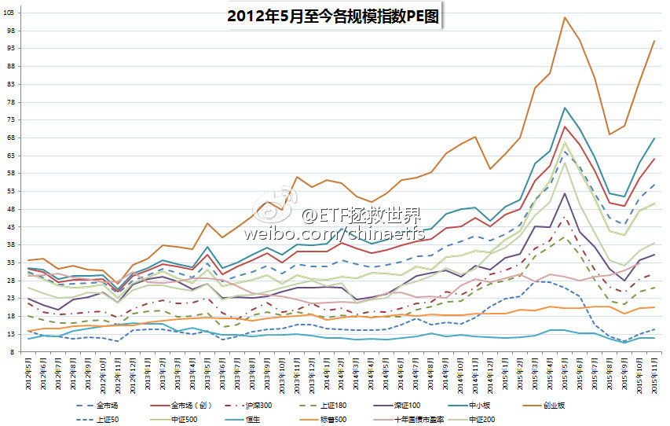

ETF拯救世界 (5687069307) @
2015-11-01 10:20:30 Sun  
url: https://weibo.com/5687069307/D1OdRDVWS

2015年11月ETF计划 http://t.cn/RUIhTX4 ​​​

转发[28]  评论[46]  赞[83] 

======================================================

ETF拯救世界 (5687069307) @
2015-11-07 10:40:23 Sat  
url: https://weibo.com/5687069307/D2IUViDq2

@ETF拯救世界:一晚上过去，大家情绪都平复点了吧。咱们一起推演一下IPO新政实施后会发生的事情： 1、打新者会不会大量配置股票充当打新门票 之前每次IPO，都会冻结上万亿的资金。即使在情绪高涨的5000点，场外也有这么多资金虎视眈眈... 分享自@雪球 http://t.cn/RUKipwr ​​​

转发[24]  评论[31]  赞[54] 

======================================================

ETF拯救世界 (5687069307) @
2015-11-13 09:37:20 Fri  
url: https://weibo.com/5687069307/D3D4j2lzg

我知道，在微博这种地方提示风险不会讨好，但我还是想贴张图。中小、创业，逆天了。 ​​​

转发[18]  评论[58]  赞[80] 

+++++++++++++++++++++++++++++++++++++++++++++++++++++

图片：

======================================================

ETF拯救世界 (5687069307) @
2015-11-18 05:06:02 Wed  
url: https://weibo.com/5687069307/D4mqFkI3n

几年前1860清仓持有7年的黄金后，这货居然跌了快一半了。现在么，依然不出手。

------------------------------------------------------
转推：
>  @ ()
>  2015-11-18 01:24:03 Wed  
>  url: 

>  抱歉，作者已设置仅展示半年内微博，此微博已不可见。 ​​​

转发[24]  评论[29]  赞[41] 

======================================================

ETF拯救世界 (5687069307) @
2015-11-18 13:27:54 Wed  
url: https://weibo.com/5687069307/D4pInxST8

回复@辟话: 2011年8月21，清仓黄金，价格1875。11个交易日后，黄金见到1921历史高点，暴跌至今。全过程请见：http://t.cn/RUnAdRp //@辟话:老大，当时你是根据什么依据买的黄金，说出来，第一是学习，第二是借鉴。

------------------------------------------------------
转推：
>  @ ()
>  2015-11-18 01:24:03 Wed  
>  url: 

>  抱歉，作者已设置仅展示半年内微博，此微博已不可见。 ​​​

转发[12]  评论[30]  赞[33] 

======================================================

ETF拯救世界 (5687069307) @
2015-11-19 00:13:00 Thu  
url: https://weibo.com/5687069307/D4tWet24O

我不信大霄不知道现在股市的真实估值水平。有些话如果不能说，可以选择不说话。很多人很相信你，未来，他们会怎样？

------------------------------------------------------
转推：
>  @ ()
>  2015-11-18 23:13:45 Wed  
>  url: 

>  抱歉，作者已设置仅展示半年内微博，此微博已不可见。 ​​​

转发[2]  评论[28]  赞[40] 

======================================================

ETF拯救世界 (5687069307) @
2015-11-19 00:15:30 Thu  
url: https://weibo.com/5687069307/D4tXf6xSJ

分指数。上证 300等几乎不可能。中小创业500之类有机会

------------------------------------------------------
转推：
>  @ ()
>  2015-11-18 22:50:44 Wed  
>  url: 

>  该账号因被投诉违反《微博社区公约》的相关规定，现已无法查看。查看帮助 https://kefu.weibo.com/faqdetail?id=13216

转发[1]  评论[11]  赞[33] 

======================================================

ETF拯救世界 (5687069307) @
2015-11-19 10:53:07 Thu  
url: https://weibo.com/5687069307/D4y82CANO

“多空机制不均衡”——这么说现在与股在前比，是均衡了还是更加不均衡了呢

------------------------------------------------------
转推：
>  @ ()
>  2015-11-19 10:45:55 Thu  
>  url: 

>  抱歉，此微博已被作者删除。查看帮助：http://t.cn/Rfd3rQV

转发[3]  评论[11]  赞[25] 

======================================================

ETF拯救世界 (5687069307) @
2015-11-19 11:08:30 Thu  
url: https://weibo.com/5687069307/D4yei0tsO

有个睿智的老人说，如果你加入一个牌局，十分钟后还不知道哪个对手是傻瓜，那么，你就是那个傻瓜——谁能想到，A股很多人连对手是谁都没看清就out了。 A股这个赌局中，你知道谁是傻瓜，你要赚谁的钱吗？ ​​​

转发[18]  评论[35]  赞[66] 

======================================================

ETF拯救世界 (5687069307) @
2015-11-20 09:12:49 Fri  
url: https://weibo.com/5687069307/D4GTPmaHz

选取了历史上几个国家估值特别高，第一波股灾后的图形，找找哪个是A股？ 并没有那么容易看出来吧。昨天有朋友在文章后面评论，总感觉有股力量在下面托着，好像总也跌不下去。是的，除了伟大zj的力量，更伟大... http://t.cn/RUm005D ​​​

转发[57]  评论[40]  赞[78] 

======================================================

ETF拯救世界 (5687069307) @
2015-11-27 17:33:58 Fri  
url: https://weibo.com/5687069307/D5OaID9PR

该提示的风险最近这段时间天天说说了有几十篇，现在说也没有任何意义了。看到的朋友算是有缘吧。考虑了一下下一步的重点布局。首先，A类看来价格依然坚挺，现在的价位，有肉，但塞牙缝都不够。有些高估指数... http://t.cn/RUdGo7Y ​​​

转发[18]  评论[43]  赞[70] 

======================================================

ETF拯救世界 (5687069307) @
2015-11-30 09:25:26 Mon  
url: https://weibo.com/5687069307/D6dfUDlsc

还是那句话，大宵这个位置强力唱多，未来英名不保是其次，会让很多粉丝赔了大钱才是最大的问题。大宵，珍重。

------------------------------------------------------
转推：
>  @ ()
>  2015-11-30 09:17:35 Mon  
>  url: 

>  抱歉，作者已设置仅展示半年内微博，此微博已不可见。 ​​​

转发[8]  评论[32]  赞[38] 

======================================================

ETF拯救世界 (5687069307) @
2015-11-30 10:20:44 Mon  
url: https://weibo.com/5687069307/D6dCmqiIp

个人非常不认可有些人所谓的“股灾3.0”的说法。主要原因在于一些权重股或者二线蓝筹的估值情况与5、6月份非常不同。想让他们再连续跌停难度很大。也就是说，指数方面不会连续出现暴跌。大多数股票应该是以... http://t.cn/RUePnlS ​​​

转发[34]  评论[28]  赞[78] 

======================================================

ETF拯救世界 (5687069307) @
2015-11-30 17:05:56 Mon  
url: https://weibo.com/5687069307/D6ggPybmC

本月ETF计划买入一份 http://t.cn/RUeoofB ​​​

转发[20]  评论[51]  赞[59] 

======================================================

