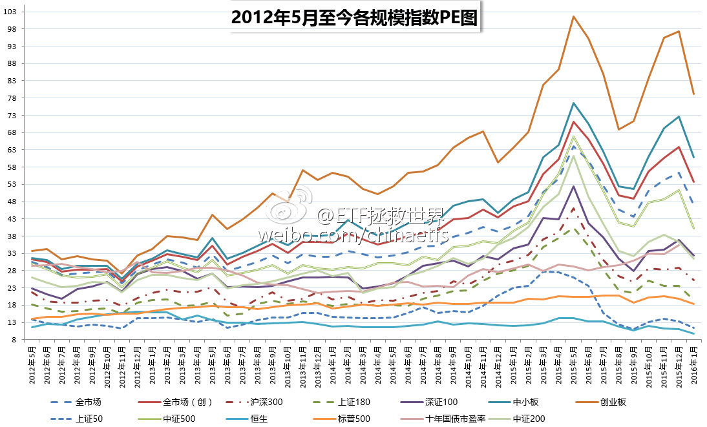

ETF拯救世界 (5687069307) @
2016-01-04 11:28:21 Mon  
url: https://weibo.com/5687069307/Dby1bvHiE

现在最头疼的，应该是保监会的BOSS们 ​​​

转发[1]  评论[15]  赞[27] 

======================================================

ETF拯救世界 (5687069307) @
2016-01-04 11:48:26 Mon  
url: https://weibo.com/5687069307/Dby9l6Bvj

这是一盘大棋，很少有人能看懂：熔断机制会大大提高本国居民的劳动生产率——几千万股民看盘的时间竟然会减少几个小时。终于，本国人均劳动生产率由美国的1/12，上升到1/11。利国利民。 ​​​

转发[4]  评论[23]  赞[41] 

======================================================

ETF拯救世界 (5687069307) @
2016-01-04 13:42:17 Mon  
url: https://weibo.com/5687069307/DbyTychWV

大宵，我开微博以来只发了40多篇。其中三篇是转发你的。我再说第三次，你这样搞下去，会有很多小散赔的非常惨，你的书也卖不好的！

------------------------------------------------------
转推：
>  @ ()
>  2016-01-04 13:25:23 Mon  
>  url: 

>  抱歉，作者已设置仅展示半年内微博，此微博已不可见。 ​​​

转发[6]  评论[28]  赞[60] 

======================================================

ETF拯救世界 (5687069307) @
2016-01-05 08:49:29 Tue  
url: https://weibo.com/5687069307/DbGpcpaC8

装睡的人你永远叫不醒

------------------------------------------------------
转推：
>  @闲趣至简 (1356373560)
>  2016-01-04 21:28:21 Mon  
>  url: https:/weibo.com/1356373560/DbBWJsZGA/

>  市场的大神们巳经提示了风险，自己还是要去涉险，罪过呀！@ETF拯救世界 ​​​

转发[6]  评论[22]  赞[32] 

======================================================

ETF拯救世界 (5687069307) @
2016-01-05 16:56:09 Tue  
url: https://weibo.com/5687069307/DbJAJDHdT

今日下跌后，过去十年估值最高的10%区域指数没有任何变化。但有一只指数进入过去十年估值最低的10%区域：上证50。过去十年该指数进入最低区域的月份为（时间顺序）：1111、1112、1207、1208、1209、1210、1211、1306、1307、1508、1509、1601。值得注意的是，该指数包含的周期类较多。同时，低不代表涨

------------------------------------------------------
转推：
>  @ETF拯救世界 (5687069307)
>  2015-12-23 11:40:37 Wed  
>  url: https:/weibo.com/5687069307/D9IYdhoNg/

>  12月22日收盘进入过去十年估值最高10%区域的指数是全市场PE、中小板PE、创业板PE、全指医药PE、全指信息PE。一个指数的估值是否进入过去十年最高10%区域，具有非常非常重要的意义。通常情况下，某个指数进入... http://t.cn/R4Gh10J ​​​

转发[18]  评论[33]  赞[36] 

======================================================

ETF拯救世界 (5687069307) @
2016-01-07 10:14:52 Thu  
url: https://weibo.com/5687069307/DbZORaE6Y

其实最具摧毁力的，是有话语权的人不负责任。 //@ETF拯救世界:大宵，我开微博以来只发了40多篇。其中三篇是转发你的。我再说第三次，你这样搞下去，会有很多小散赔的非常惨，你的书也卖不好的！

------------------------------------------------------
转推：
>  @ ()
>  2016-01-04 13:25:23 Mon  
>  url: 

>  抱歉，作者已设置仅展示半年内微博，此微博已不可见。 ​​​

转发[1]  评论[22]  赞[41] 

======================================================

ETF拯救世界 (5687069307) @
2016-01-07 16:01:44 Thu  
url: https://weibo.com/5687069307/Dc25EjHl5

今日重要数据更新：今日大跌后，进入过去十年估值最高10%区域的指数减少为只剩两只：中小板PE、全指信息PE。也就是说，创业板ETF清仓的最佳时机已过！无数的机会摆在那里，不知大家是否珍惜了。

------------------------------------------------------
转推：
>  @ETF拯救世界 (5687069307)
>  2015-12-23 11:40:37 Wed  
>  url: https:/weibo.com/5687069307/D9IYdhoNg/

>  12月22日收盘进入过去十年估值最高10%区域的指数是全市场PE、中小板PE、创业板PE、全指医药PE、全指信息PE。一个指数的估值是否进入过去十年最高10%区域，具有非常非常重要的意义。通常情况下，某个指数进入... http://t.cn/R4Gh10J ​​​

转发[30]  评论[27]  赞[40] 

======================================================

ETF拯救世界 (5687069307) @
2016-01-07 20:42:58 Thu  
url: https://weibo.com/5687069307/Dc3VNDFwl

说实话，深交所的能力和水平非常非常不错。这次，再给深交所点个赞。不过，然并卵。

------------------------------------------------------
转推：
>  @ ()
>  2016-01-07 18:25:48 Thu  
>  url: 

>  该账号因被投诉违反《微博社区公约》的相关规定，现已无法查看。查看帮助 https://kefu.weibo.com/faqdetail?id=13216

转发[40]  评论[9]  赞[37] 

======================================================

ETF拯救世界 (5687069307) @
2016-01-07 21:18:59 Thu  
url: https://weibo.com/5687069307/Dc4aqdwPr

一个月后，噩梦模式开启。

------------------------------------------------------
转推：
>  @ETF拯救世界 (5687069307)
>  2015-12-08 14:56:17 Tue  
>  url: https:/weibo.com/5687069307/D7sQbdHmU/

>  每天看着A股的起起伏伏，总能感觉到一丝秋意。 说真的，现在这个时点，几千万人的痛苦并未真正开始，然而，他们还活在梦中。 ​​​

转发[5]  评论[34]  赞[32] 

======================================================

ETF拯救世界 (5687069307) @
2016-01-11 13:23:40 Mon  
url: https://weibo.com/5687069307/DcCLtwuO1

时至今日，说什么都晚了。大宵，珍重。

------------------------------------------------------
转推：
>  @ ()
>  2016-01-11 10:10:53 Mon  
>  url: 

>  抱歉，作者已设置仅展示半年内微博，此微博已不可见。 ​​​

转发[3]  评论[14]  赞[36] 

======================================================

ETF拯救世界 (5687069307) @
2016-01-11 13:55:40 Mon  
url: https://weibo.com/5687069307/DcCYsoKTR

突然发现这么大的新闻居然是老朋友发的。转发支持一个。

------------------------------------------------------
转推：
>  @ ()
>  2016-01-09 11:58:21 Sat  
>  url: 

>  抱歉，作者已设置仅展示半年内微博，此微博已不可见。 ​​​

转发[5]  评论[8]  赞[16] 

======================================================

ETF拯救世界 (5687069307) @
2016-01-11 15:04:19 Mon  
url: https://weibo.com/5687069307/DcDqkr8UA

意思是不是之前90%的人反对计划生育呢……

------------------------------------------------------
转推：
>  @新京报 (1644114654)
>  2016-01-11 13:07:18 Mon  
>  url: https:/weibo.com/1644114654/DcCEPjTEk/

>  【国家卫计委：中国#超8成人想生二孩#[晕]】全面二孩已开始实行。今日，国家卫生计生委相关负责人表示，根据生育意愿调查，80%以上的群众都是希望生育两个孩子，90%以上都非常支持赞同我们国家的全面两孩政策，全面两孩政策已经基本实现了群众生育意愿和国家生育政策的统一。http://t.cn/R4N2sAE ​​​

转发[7]  评论[12]  赞[39] 

======================================================

ETF拯救世界 (5687069307) @
2016-01-12 17:44:06 Tue  
url: https://weibo.com/5687069307/DcNTG6O2v

手机7寸的吧？这个好，显脸小。

------------------------------------------------------
转推：
>  @叶檀 (1233227211)
>  2016-01-12 17:40:02 Tue  
>  url: https:/weibo.com/1233227211/DcNS1xFwW/

>  今天的锵锵造型。。。 ​​​

转发[1]  评论[16]  赞[25] 

======================================================

ETF拯救世界 (5687069307) @
2016-01-13 08:28:09 Wed  
url: https://weibo.com/5687069307/DcTGvFsup

昨天收盘，我们自建估值模型计算的恒生指数估值已经跌入个位数，过去十年比现在低的月份只剩0810到0902的五个月。客观陈述，没有任何投资建议。今天天气不错。 ​​​

转发[15]  评论[60]  赞[64] 

======================================================

ETF拯救世界 (5687069307) @
2016-01-13 15:22:34 Wed  
url: https://weibo.com/5687069307/DcWoJ4NBj

有没有感觉越来越像了

------------------------------------------------------
转推：
>  @ETF拯救世界 (5687069307)
>  2015-11-20 09:12:49 Fri  
>  url: https:/weibo.com/5687069307/D4GTPmaHz/

>  选取了历史上几个国家估值特别高，第一波股灾后的图形，找找哪个是A股？ 并没有那么容易看出来吧。昨天有朋友在文章后面评论，总感觉有股力量在下面托着，好像总也跌不下去。是的，除了伟大zj的力量，更伟大... http://t.cn/RUm005D ​​​

转发[11]  评论[23]  赞[33] 

======================================================

ETF拯救世界 (5687069307) @
2016-01-13 15:51:56 Wed  
url: https://weibo.com/5687069307/DcWAEm2Dj

今日下跌后，进入过去十年估值最高10%区域的指数减少为一只！也就是只剩全指信息一只。也就是说，在2016年1月13日，中小板指数的最佳卖出时机已经过去。一切都晚了。

------------------------------------------------------
转推：
>  @ETF拯救世界 (5687069307)
>  2015-12-23 11:40:37 Wed  
>  url: https:/weibo.com/5687069307/D9IYdhoNg/

>  12月22日收盘进入过去十年估值最高10%区域的指数是全市场PE、中小板PE、创业板PE、全指医药PE、全指信息PE。一个指数的估值是否进入过去十年最高10%区域，具有非常非常重要的意义。通常情况下，某个指数进入... http://t.cn/R4Gh10J ​​​

转发[18]  评论[28]  赞[39] 

======================================================

ETF拯救世界 (5687069307) @
2016-01-15 12:55:13 Fri  
url: https://weibo.com/5687069307/DdehUmof2

回复@沉默的70后:你这么机智你们老师知道吗[doge]//@沉默的70后:买啥原油啊，直接进口美国据说不到2块一升的成品油啊。 还节省了炼油污染排放。

------------------------------------------------------
转推：
>  @ ()
>  2016-01-15 12:10:14 Fri  
>  url: 

>  抱歉，此微博已被作者删除。查看帮助：http://t.cn/Rfd3rQV

转发[5]  评论[13]  赞[27] 

======================================================

ETF拯救世界 (5687069307) @
2016-01-15 13:41:36 Fri  
url: https://weibo.com/5687069307/DdeAJyfGM

很多朋友现在非常迷茫。能做的不多，贴两张图，供您做个参考。  虽然整体不便宜，大部分股票还是贵，但有些股票真的就别割了，都焦了……毕竟确实不贵。短期情绪扛一扛，未来会很美好。当然，前提是你能分清手里的股票是不是真的好股票。 ​​​

转发[14]  评论[38]  赞[53] 

+++++++++++++++++++++++++++++++++++++++++++++++++++++

图片：

======================================================

ETF拯救世界 (5687069307) @
2016-01-18 17:06:35 Mon  
url: https://weibo.com/5687069307/DdIdqw5oI

截止今日收盘，两市2809家公司自由流通市值合计17.13万亿。 //@Newsfeed:没人知道最新的“自由流通市值”吗？注意不是流通市值！

------------------------------------------------------
转推：
>  @ ()
>  2016-01-18 16:32:55 Mon  
>  url: 

>  抱歉，此微博已被作者删除。查看帮助：http://t.cn/Rfd3rQV

转发[2]  评论[13]  赞[26] 

======================================================

ETF拯救世界 (5687069307) @
2016-01-19 13:11:27 Tue  
url: https://weibo.com/5687069307/DdQ6u81NJ

（文末增加ETF计划的未来）投资这件事，很多人希望找到一个股神，幻想只要跟着他投资，就能无往不利，从此日进斗金资产顺利嘉玲。我想说的是，他们想多了。这个世界，哪里得来的股神？ http://t.cn/R4HBbfy ​​​

转发[69]  评论[45]  赞[102] 

======================================================

ETF拯救世界 (5687069307) @
2016-01-20 10:56:14 Wed  
url: https://weibo.com/5687069307/DdYE651lo

那是不可能的。中国实际居民人均储蓄非常少，应该只有一万多块人民币。同时，30%的财富集中在1%的人手中。根本没有那么多人有30万去换外储。从股市上讲，80%的帐户里都不到10万块钱。

------------------------------------------------------
转推：
>  @ ()
>  2016-01-20 10:48:40 Wed  
>  url: 

>  该账号因被投诉违反《微博社区公约》的相关规定，现已无法查看。查看帮助 https://kefu.weibo.com/faqdetail?id=13216

转发[6]  评论[13]  赞[33] 

======================================================

ETF拯救世界 (5687069307) @
2016-01-21 11:29:02 Thu  
url: https://weibo.com/5687069307/De8hUeITq

“请赞赏我”

------------------------------------------------------
转推：
>  @创业家传媒 (1642482194)
>  2016-01-21 11:23:41 Thu  
>  url: https:/weibo.com/1642482194/De8fJrOJm/

>  【证监会副主席方星海：熔断不适合A股】今日，证监会副主席方星海在冬季达沃斯活动上接受采访时，承认熔断不适合中国市场。他表示“这不是一个适合中国市场的决策，监管者承认这一点。我们应该为监管者承认错误给予赞赏。”（新浪）http://t.cn/R48Eysy ​​​

转发[2]  评论[14]  赞[44] 

======================================================

ETF拯救世界 (5687069307) @
2016-01-21 15:13:44 Thu  
url: https://weibo.com/5687069307/De9L76nnm

对投资来说，最大的利好就是便宜，最大的利空就是贵。 http://t.cn/R48kfAo ​​​

转发[73]  评论[67]  赞[113] 

======================================================

ETF拯救世界 (5687069307) @
2016-01-22 12:05:27 Fri  
url: https://weibo.com/5687069307/DehXbpxmO

小方说的话句句在理，哪里有问题？希望能早日顺利上位。

------------------------------------------------------
转推：
>  @ ()
>  2016-01-22 11:36:57 Fri  
>  url: 

>  抱歉，作者已设置仅展示半年内微博，此微博已不可见。 ​​​

转发[3]  评论[13]  赞[18] 

======================================================

ETF拯救世界 (5687069307) @
2016-01-25 12:59:13 Mon  
url: https://weibo.com/5687069307/DeKAv1WdM

有没有详细数据放出来？

------------------------------------------------------
转推：
>  @ ()
>  2016-01-25 11:59:10 Mon  
>  url: 

>  抱歉，作者已设置仅展示半年内微博，此微博已不可见。 ​​​

转发[2]  评论[9]  赞[16] 

======================================================

ETF拯救世界 (5687069307) @
2016-01-25 18:11:59 Mon  
url: https://weibo.com/5687069307/DeMDsksHo

补完二级补一级。所以在我们这里，在哪里赌都是有人兜底的。不得不点赞。[doge]

------------------------------------------------------
转推：
>  @36氪 (1750070171)
>  2016-01-22 23:45:03 Fri  
>  url: https:/weibo.com/1750070171/Demx9nRkI/

>  快讯 | 【上海印发《天使投资风险补偿管理暂行办法》】1月21日下午消息，上海市科学技术委员会、上海市财政局和上海市发展和改革委员会印发了《上海市天使投资风险补偿管理暂行办法》。文件对种子期企业和初创型企业给予规定，详情：http://t.cn/RbQ8EXq ​​​

转发[5]  评论[15]  赞[23] 

======================================================

ETF拯救世界 (5687069307) @
2016-01-26 18:10:59 Tue  
url: https://weibo.com/5687069307/DeW3xrYIK

呵呵。信不信

------------------------------------------------------
转推：
>  @ETF拯救世界 (5687069307)
>  2015-11-20 09:12:49 Fri  
>  url: https:/weibo.com/5687069307/D4GTPmaHz/

>  选取了历史上几个国家估值特别高，第一波股灾后的图形，找找哪个是A股？ 并没有那么容易看出来吧。昨天有朋友在文章后面评论，总感觉有股力量在下面托着，好像总也跌不下去。是的，除了伟大zj的力量，更伟大... http://t.cn/RUm005D ​​​

转发[7]  评论[16]  赞[24] 

======================================================

ETF拯救世界 (5687069307) @
2016-01-26 20:36:35 Tue  
url: https://weibo.com/5687069307/DeX0DxNce

本月买3补1。文章很重要。 http://t.cn/RbmGdeW ​​​

转发[60]  评论[75]  赞[103] 

======================================================

ETF拯救世界 (5687069307) @
2016-01-27 09:22:46 Wed  
url: https://weibo.com/5687069307/Df21DjHzS

我突然有个想法，某天大宵说点位，如果连续几条骂他的评论少于500，那么大底可能就要到了。如果大宵连续五天不说点位，那么大底肯定就到了。 //@ETF拯救世界:大宵，你再这样以后会有人跳楼的。

------------------------------------------------------
转推：
>  @ ()
>  2015-12-24 10:18:40 Thu  
>  url: 

>  抱歉，此微博已被作者删除。查看帮助：http://t.cn/Rfd3rQV

转发[0]  评论[13]  赞[36] 

======================================================

ETF拯救世界 (5687069307) @
2016-01-27 12:51:10 Wed  
url: https://weibo.com/5687069307/Df3oehu4k

非常同意。市场的交给市场//@王福重:这次大跌后，证监会没出声，我要给它点赞👍。望再接再厉。

------------------------------------------------------
转推：
>  @ ()
>  2016-01-22 11:58:15 Fri  
>  url: 

>  抱歉，此微博已被作者删除。查看帮助：http://t.cn/Rfd3rQV

转发[2]  评论[10]  赞[34] 

======================================================

ETF拯救世界 (5687069307) @
2016-01-28 17:29:16 Thu  
url: https://weibo.com/5687069307/DfeDBhTY4

我们的ETF计划150份中，7个月过去只买了14份。我们像最出色的猎手一样在等。等什么？等这个充满疯子、傻子、骗子的地方冷却下来，让我们看清猎物，扣动扳机。现在，猎物渐渐地出来了。 http://t.cn/Rb3JN4J ​​​

转发[26]  评论[43]  赞[110] 

======================================================

ETF拯救世界 (5687069307) @
2016-01-29 05:05:30 Fri  
url: https://weibo.com/5687069307/DfjcctnzN

净瞎说大实话

------------------------------------------------------
转推：
>  @ ()
>  2016-01-29 00:07:26 Fri  
>  url: 

>  该账号因被投诉违反《微博社区公约》的相关规定，现已无法查看。查看帮助 https://kefu.weibo.com/faqdetail?id=13216

转发[4]  评论[13]  赞[18] 

======================================================

