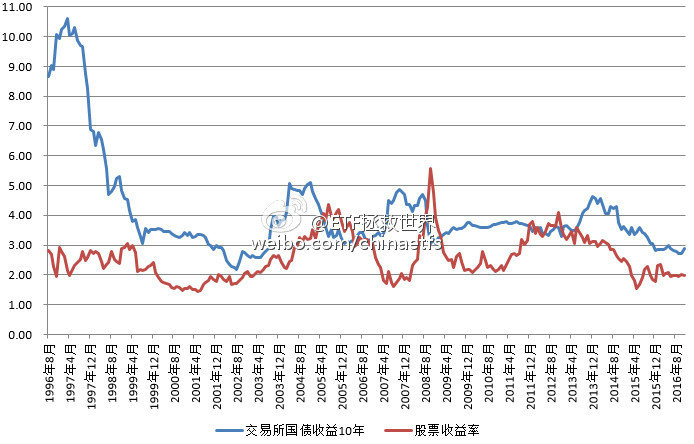
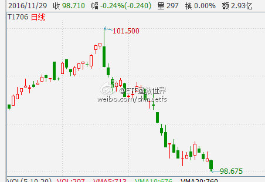
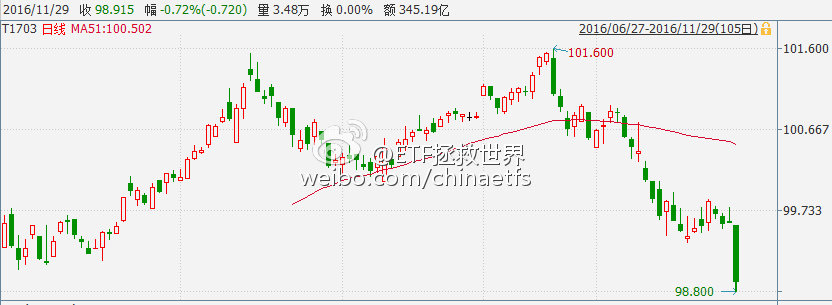
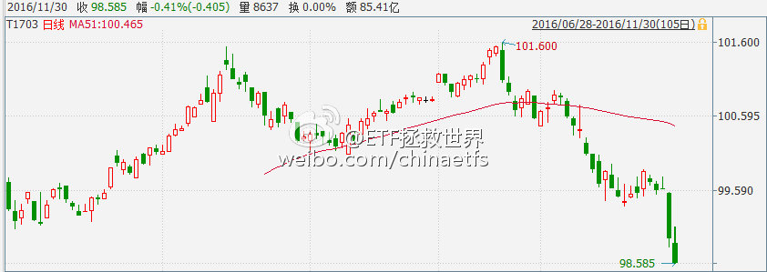
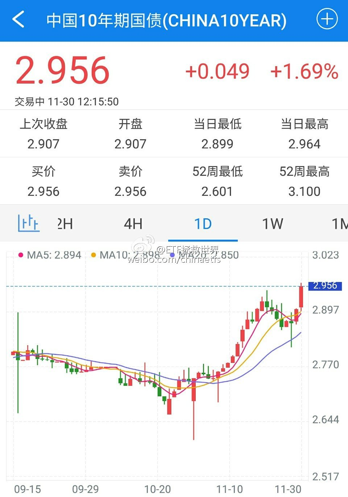

ETF拯救世界 (5687069307) @
2016-11-01 13:13:22 Tue  
url: https://weibo.com/5687069307/EfwjsoWcg

2016年11月，买入一份

http://t.cn/RVBa6kJ ​​​

转发[28]  评论[27]  赞[39] 

======================================================

ETF拯救世界 (5687069307) @
2016-11-02 09:08:14 Wed  
url: https://weibo.com/5687069307/EfE8sdQpO

回复@上头云:首先三季报不错，导致整体估值降低一些。其次，计划的买卖要考虑的因素非常多。这是一个资产配置的问题，展开讲要说非常多。简单的说，这个位置，在不断新高，安全垫越来越厚的计划中，买0.6%仓位，是没问题的。

------------------------------------------------------
转推：
>  @ETF拯救世界 (5687069307)
>  2016-11-01 13:13:22 Tue  
>  url: https:/weibo.com/5687069307/EfwjsoWcg/

>  2016年11月，买入一份
>  
>  http://t.cn/RVBa6kJ ​​​

转发[7]  评论[20]  赞[26] 

======================================================

ETF拯救世界 (5687069307) @
2016-11-15 17:23:11 Tue  
url: https://weibo.com/5687069307/EhFVO0dKG

大家晚上好。又到了月中，因为近期市场没有特殊的买卖机会出现，所以这周没有操作。目前计划整体收益率继续新高，达到6.69%，领先同期沪深300和中证500超过25%，所有持仓品种都是盈利状态。 祝各位资产继续不断增长，今天下班不堵车，月底见。[喵喵]（公众号误发了……） ​​​

转发[2]  评论[66]  赞[79] 

======================================================

ETF拯救世界 (5687069307) @
2016-11-18 10:47:55 Fri  
url: https://weibo.com/5687069307/Ei5CR7leD

仔细看这张图，有几点需要注意。

在资金极度泛滥的时候，会出现股债双牛。比如2002年之前，比如这两年；

在资金比较匮乏的时候，会出现股债双杀。比如2005，比如2011。

一般情况下，则会股债跷跷板。历史上三次股票收益率大于债券收益率的时候是2005、2008年底和2012年底。这就是三次A股大底，是财 ​​​

转发[90]  评论[70]  赞[74] 

+++++++++++++++++++++++++++++++++++++++++++++++++++++

图片：

======================================================

ETF拯救世界 (5687069307) @
2016-11-23 10:04:19 Wed  
url: https://weibo.com/5687069307/EiQtDzMGH

永远无法猜中人类的底线……

------------------------------------------------------
转推：
>  @人民网 (2286908003)
>  2016-11-23 09:41:54 Wed  
>  url: https:/weibo.com/2286908003/EiQkx9QsC/

>  【北京遭虎袭女游客：母亲下车救我属见义勇为】赵女士昨天起诉八达岭野生动物园，并向其索赔155.7万余元。她指出，在八达岭野生动物园未有效救助的情况下，没有法定救助义务的母亲下车施救，其性质应属于“见义勇为”，八达岭野生动物园应全部承担母亲的死亡赔偿。（京华时报）http://t.cn/RfoxITI ​​​

转发[31]  评论[23]  赞[29] 

======================================================

ETF拯救世界 (5687069307) @
2016-11-27 20:53:36 Sun  
url: https://weibo.com/5687069307/Ejwrb5tHC

http://t.cn/RflU9U7

转发[44]  评论[27]  赞[61] 

======================================================

ETF拯救世界 (5687069307) @
2016-11-28 18:22:03 Mon  
url: https://weibo.com/5687069307/EjES9srzY

以后会在这里多说一些投资的事情，还请各位关注的朋友不要觉得呱噪[doge]  ​​​

转发[8]  评论[277]  赞[218] 

======================================================

ETF拯救世界 (5687069307) @
2016-11-29 09:20:28 Tue  
url: https://weibo.com/5687069307/EjKKP2fCZ

发布了头条文章：《心平气和的说几句》 http://t.cn/RfTdq39 ​​​

转发[39]  评论[199]  赞[278] 

======================================================

ETF拯救世界 (5687069307) @
2016-11-29 09:48:44 Tue  
url: https://weibo.com/5687069307/EjKWigkTb

本月至今，两市重要股东净减持已经超过340亿（除万科中建）。390家，416亿。

两融方面，融资额增加560亿。杠杆赌徒继续接盘中。 ​​​

转发[4]  评论[40]  赞[45] 

======================================================

ETF拯救世界 (5687069307) @
2016-11-29 09:52:34 Tue  
url: https://weibo.com/5687069307/EjKXQCx8r

国债期货。不要持有高杠杆债基，切切。 ​​​

转发[7]  评论[53]  赞[67] 

+++++++++++++++++++++++++++++++++++++++++++++++++++++

图片：

======================================================

ETF拯救世界 (5687069307) @
2016-11-29 10:42:13 Tue  
url: https://weibo.com/5687069307/EjLi0etzj

今天，ETF计划中买的最多的A股ETF： 50在除权后依然上涨1%（过几天分红可以到账）。与此同时，继续有1700只股票下跌。

重仓持有下跌股票，和轻仓持有上涨的ETF，哪个好一点呢……

记住这样的时刻。下一轮牛市，绝对不要允许自己“赚了指数不赚钱”。非常重要。 ​​​

转发[14]  评论[100]  赞[105] 

======================================================

ETF拯救世界 (5687069307) @
2016-11-29 14:32:04 Tue  
url: https://weibo.com/5687069307/EjMNiwMwG

微博的朋友们，再说一次，微博有很多骗子会将我的昵称“ETF拯救世界”稍作修改，然后主动私信大家进行行骗。比如“ETT拯救世界”、“-ETF拯救世界”之类的。99.99%的情况我不会主动私信大家，如果大家收到了，可以点一下对方的头像看看粉丝数什么的对不对。

请大家一旦发现骗子马上举报不要犹豫！ ​​​

转发[3]  评论[34]  赞[57] 

======================================================

ETF拯救世界 (5687069307) @
2016-11-29 14:40:38 Tue  
url: https://weibo.com/5687069307/EjMQMdmN4

今天只有不到10%的股票跑赢50。

不解释 ​​​

转发[2]  评论[39]  赞[46] 

======================================================

ETF拯救世界 (5687069307) @
2016-11-29 15:02:22 Tue  
url: https://weibo.com/5687069307/EjMZBaJvi

债券是崩了。注意一个月前我发这篇东西的时候，债券的点位。

呵呵……

http://t.cn/RVKId1Z ​​​

转发[22]  评论[118]  赞[65] 

+++++++++++++++++++++++++++++++++++++++++++++++++++++

图片：

======================================================

ETF拯救世界 (5687069307) @
2016-11-30 09:42:14 Wed  
url: https://weibo.com/5687069307/EjUk9p9F5

国债期货不解释…… ​​​

转发[7]  评论[78]  赞[37] 

+++++++++++++++++++++++++++++++++++++++++++++++++++++

图片：

======================================================

ETF拯救世界 (5687069307) @
2016-11-30 12:21:53 Wed  
url: https://weibo.com/5687069307/EjVmXcsQ0

给力 ​​​

转发[6]  评论[37]  赞[34] 

+++++++++++++++++++++++++++++++++++++++++++++++++++++

图片：

======================================================

ETF拯救世界 (5687069307) @
2016-11-30 14:50:32 Wed  
url: https://weibo.com/5687069307/EjWliaqis

开车了啊 ​​​

转发[6]  评论[123]  赞[74] 

======================================================

