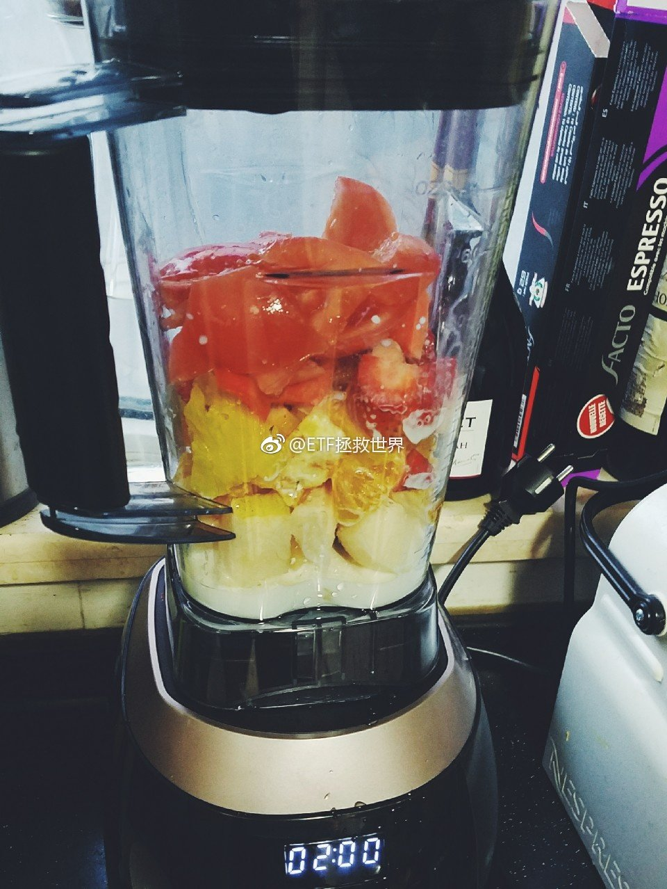
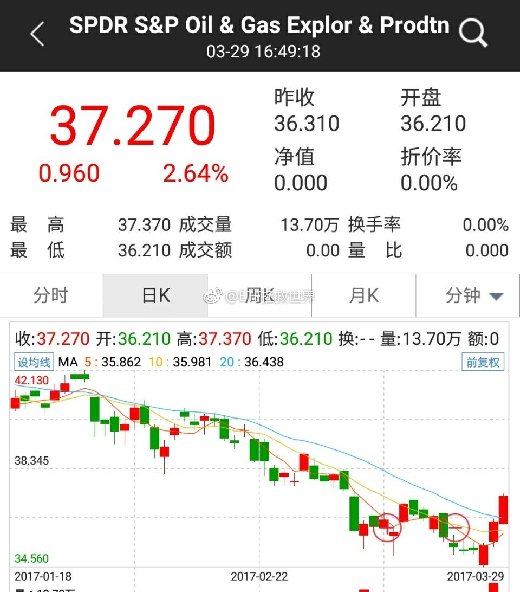
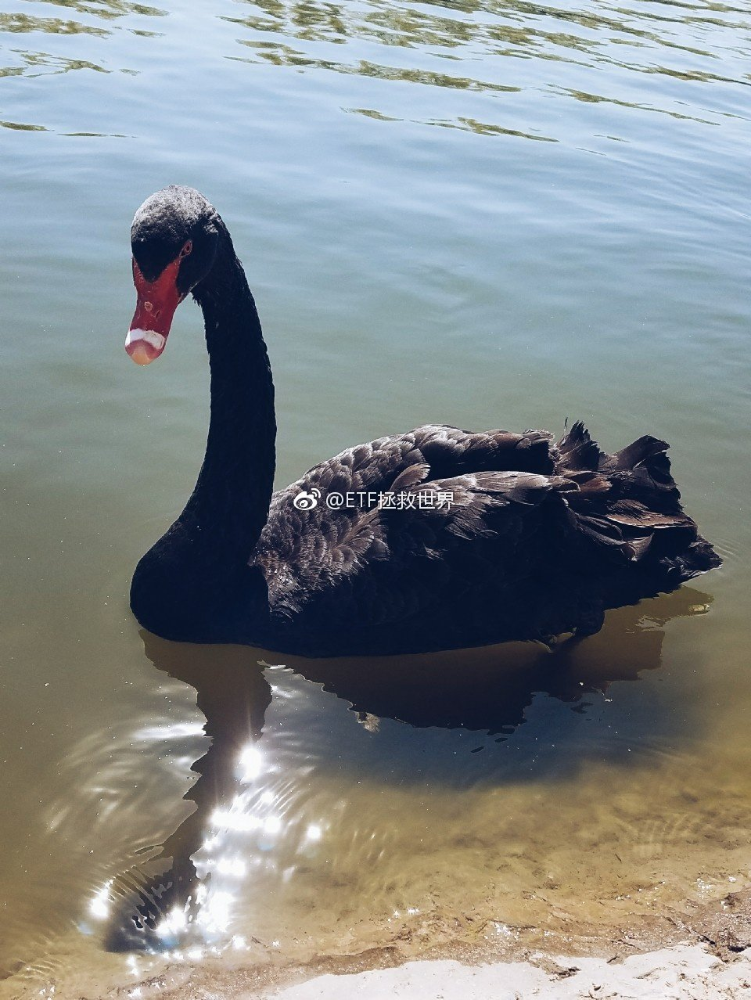

ETF拯救世界 (5687069307) @
2017-03-01 10:36:44 Wed  
url: https://weibo.com/5687069307/ExKzst2sy

休息一次，不开车。

http://t.cn/RiVuKUg ​​​

转发[20]  评论[57]  赞[60] 

======================================================

ETF拯救世界 (5687069307) @
2017-03-01 14:35:02 Wed  
url: https://weibo.com/5687069307/ExM8bubEK

今天在雪球上看见有个问题：“你认为，最适合中国股市的投资方法是什么？”

有人说，“指数定投。”被提问人打赏了。

对不起，我要说个事实恐怕会打击这样想的人：

2007年3月至今，如果你定投沪深300，那么十年总收益率只有27%。知道年化多少吗？

不到3%。

比不上货币基金。

当然，有可能未来沪 ​​​

转发[88]  评论[104]  赞[135] 

======================================================

ETF拯救世界 (5687069307) @
2017-03-01 14:50:14 Wed  
url: https://weibo.com/5687069307/ExMem9Qjv

这还不完全是因为沪深300弱的原因。我又计算了创业板开板以来定投的收益率，7年65%，年化9%左右。是不是觉得挺不错了？sorry，现在创业板估值70多倍。可以预见的未来是，就这么定投下去，未来年化收益率会越来越低，开始十年甚至十五年后年化收益率不超过5%很正常。 还是那句话，不要买贵的东西！

------------------------------------------------------
转推：
>  @ETF拯救世界 (5687069307)
>  2017-03-01 14:35:02 Wed  
>  url: https:/weibo.com/5687069307/ExM8bubEK/

>  今天在雪球上看见有个问题：“你认为，最适合中国股市的投资方法是什么？”
>  
>  有人说，“指数定投。”被提问人打赏了。
>  
>  对不起，我要说个事实恐怕会打击这样想的人：
>  
>  2007年3月至今，如果你定投沪深300，那么十年总收益率只有27%。知道年化多少吗？
>  
>  不到3%。
>  
>  比不上货币基金。
>  
>  当然，有可能未来沪 ​​​

转发[17]  评论[40]  赞[67] 

======================================================

ETF拯救世界 (5687069307) @
2017-03-02 08:42:22 Thu  
url: https://weibo.com/5687069307/ExTfxfpI8

后台有26个问答问题，只能选一个，有几个问题真的都不错，选哪个好纠结！[生病] ​​​

转发[0]  评论[30]  赞[28] 

======================================================

ETF拯救世界 (5687069307) @
2017-03-02 09:42:39 Thu  
url: https://weibo.com/5687069307/ExTE0ih2z

我回答了@Ellison_du 的问题，问题价值￥49.00。全文共1945字。哥们，希望你能把提问的钱赚回来，如果能跟上一个哥们一样赚200多就更好了！上帝保佑你！ http://t.cn/RitzT1o ​​​

转发[559]  评论[216]  赞[561] 

======================================================

ETF拯救世界 (5687069307) @
2017-03-02 09:46:29 Thu  
url: https://weibo.com/5687069307/ExTFyCz8V

$159920 恒生ETF
$513030 德国DAX

又快新高了。资产配置，朋友们，敲黑板。 ​​​

转发[2]  评论[42]  赞[56] 

======================================================

ETF拯救世界 (5687069307) @
2017-03-02 10:23:20 Thu  
url: https://weibo.com/5687069307/ExTUwdCy4

好了，回答了两个问题，新鲜劲过去了。

以后除非有特别好的问题，不回答了。

继续加善缘。 ​​​

转发[0]  评论[16]  赞[56] 

+++++++++++++++++++++++++++++++++++++++++++++++++++++

图片：

======================================================

ETF拯救世界 (5687069307) @
2017-03-02 10:38:14 Thu  
url: https://weibo.com/5687069307/ExU0ztiqB

回复@手机用户2503440233:分成两部分。一个分成150份，一个按照每个月投入。把自己想象成两个人就行了。

------------------------------------------------------
转推：
>  @ETF拯救世界 (5687069307)
>  2017-03-02 09:42:39 Thu  
>  url: https:/weibo.com/5687069307/ExTE0ih2z/

>  我回答了@Ellison_du 的问题，问题价值￥49.00。全文共1945字。哥们，希望你能把提问的钱赚回来，如果能跟上一个哥们一样赚200多就更好了！上帝保佑你！ http://t.cn/RitzT1o ​​​

转发[6]  评论[12]  赞[26] 

======================================================

ETF拯救世界 (5687069307) @
2017-03-02 12:50:02 Thu  
url: https://weibo.com/5687069307/ExUS47jjg

午饭吃什么？ ​​​

转发[1]  评论[56]  赞[40] 

+++++++++++++++++++++++++++++++++++++++++++++++++++++

图片：

======================================================

ETF拯救世界 (5687069307) @
2017-03-02 14:32:25 Thu  
url: https://weibo.com/5687069307/ExVxCs4IX

“不买就跌”的魔咒又要应验了吗……

不过这次应该不会跌。毕竟要开会…… ​​​

转发[15]  评论[37]  赞[42] 

+++++++++++++++++++++++++++++++++++++++++++++++++++++

图片：

======================================================

ETF拯救世界 (5687069307) @
2017-03-02 14:46:43 Thu  
url: https://weibo.com/5687069307/ExVDqmO8i

之前在雪球看到某位私募大师说，特别喜欢Sun hb，Jia yt这样的人。敢闯，敢干。有梦想，胆子大。

但是不知道为什么，我就特别害怕这种人。起风的时候玩命加杠杆融资干“大事”，然后就出问题。然后再来一轮……类似的还有Heng d，Yao zh……

我特别喜欢扎克伯格、巴菲特、比尔盖茨这种企业家，还有类 ​​​

转发[19]  评论[57]  赞[77] 

+++++++++++++++++++++++++++++++++++++++++++++++++++++

图片：

======================================================

ETF拯救世界 (5687069307) @
2017-03-02 15:27:41 Thu  
url: https://weibo.com/5687069307/ExVU3kOLI

历史上A股整体收益率徘徊在2附近或以下的时间，最长的是2000年3月-2002年10月。也就2年半。之后就是茫茫阴跌到2005，1000点，股票收益率变得极高。

这一次从2015年4月到现在，也快两年了。这么高估值，维持这么长时间，在A股历史上极为罕见，有希望突破之前的记录。

现在债券收益率已经向正常回归， ​​​

转发[40]  评论[73]  赞[78] 

+++++++++++++++++++++++++++++++++++++++++++++++++++++

图片：

======================================================

ETF拯救世界 (5687069307) @
2017-03-02 16:00:29 Thu  
url: https://weibo.com/5687069307/ExW7mEAsW

数据出来了。只要这两个礼拜某指数不涨，月中开车。确认了。 ​​​

转发[6]  评论[73]  赞[92] 

======================================================

ETF拯救世界 (5687069307) @
2017-03-03 09:31:52 Fri  
url: https://weibo.com/5687069307/Ey307CBgU

计划不开车就是这个结果。我也很无奈呀。

------------------------------------------------------
转推：
>  @ETF拯救世界 (5687069307)
>  2017-03-02 14:32:25 Thu  
>  url: https:/weibo.com/5687069307/ExVxCs4IX/

>  “不买就跌”的魔咒又要应验了吗……
>  
>  不过这次应该不会跌。毕竟要开会…… ​​​

转发[6]  评论[21]  赞[22] 

======================================================

ETF拯救世界 (5687069307) @
2017-03-03 09:32:32 Fri  
url: https://weibo.com/5687069307/Ey30opMOJ

毛估估薯片中午要停牌 ​​​

转发[2]  评论[32]  赞[37] 

======================================================

ETF拯救世界 (5687069307) @
2017-03-03 09:41:58 Fri  
url: https://weibo.com/5687069307/Ey34ejgQs

我自己都害怕了！不能每次都这么灵啊。好吧，这样，如果跌得够猛，下周加车…… //@ETF拯救世界:计划不开车就是这个结果。我也很无奈呀。

------------------------------------------------------
转推：
>  @ETF拯救世界 (5687069307)
>  2017-03-02 14:32:25 Thu  
>  url: https:/weibo.com/5687069307/ExVxCs4IX/

>  “不买就跌”的魔咒又要应验了吗……
>  
>  不过这次应该不会跌。毕竟要开会…… ​​​

转发[5]  评论[31]  赞[29] 

======================================================

ETF拯救世界 (5687069307) @
2017-03-03 09:51:59 Fri  
url: https://weibo.com/5687069307/Ey38imEcD

回复@小狗上马路:不是。是择估值。举个例子吧。你太太想买个爱马仕的包，到商场一看，不打折，转身走了。第二天听说打折了，你贤惠的太太说，嗯，那就等折扣再高一点就去买一个。——你太太并没有在择时，而是择价值而已。 //@小狗上马路:E哥，这算择时么？虽然开车很高兴

------------------------------------------------------
转推：
>  @ETF拯救世界 (5687069307)
>  2017-03-02 14:32:25 Thu  
>  url: https:/weibo.com/5687069307/ExVxCs4IX/

>  “不买就跌”的魔咒又要应验了吗……
>  
>  不过这次应该不会跌。毕竟要开会…… ​​​

转发[1]  评论[16]  赞[29] 

======================================================

ETF拯救世界 (5687069307) @
2017-03-03 10:56:07 Fri  
url: https://weibo.com/5687069307/Ey3yk3dG6

不让买我们就不买了。[拜拜] //@ETF拯救世界:我自己都害怕了！不能每次都这么灵啊。好吧，这样，如果跌得够猛，下周加车…… //@ETF拯救世界:计划不开车就是这个结果。我也很无奈呀。

------------------------------------------------------
转推：
>  @ETF拯救世界 (5687069307)
>  2017-03-02 14:32:25 Thu  
>  url: https:/weibo.com/5687069307/ExVxCs4IX/

>  “不买就跌”的魔咒又要应验了吗……
>  
>  不过这次应该不会跌。毕竟要开会…… ​​​

转发[2]  评论[25]  赞[33] 

======================================================

ETF拯救世界 (5687069307) @
2017-03-03 13:30:47 Fri  
url: https://weibo.com/5687069307/Ey4z6h5To

@GEM鄧紫棋《泡沫》 http://t.cn/Rt8oa0g  

好听。 ​​​

转发[4]  评论[40]  赞[29] 

======================================================

ETF拯救世界 (5687069307) @
2017-03-03 19:41:43 Fri  
url: https://weibo.com/5687069307/Ey6ZF8Evg

现在德国车是不是还暂时安全，懂的说说。[哼] ​​​

转发[2]  评论[144]  赞[53] 

======================================================

ETF拯救世界 (5687069307) @
2017-03-08 17:19:39 Wed  
url: https://weibo.com/5687069307/EyRctF60E

工作不是很开心，但是待遇很不错。你会怎么办？

几天没说话，让很多朋友担心了。我没事，就是累。 ​​​

转发[13]  评论[269]  赞[118] 

======================================================

ETF拯救世界 (5687069307) @
2017-03-09 05:54:03 Thu  
url: https://weibo.com/5687069307/EyW8GoTgX

[亲亲] ​​​

转发[8]  评论[108]  赞[71] 

+++++++++++++++++++++++++++++++++++++++++++++++++++++

图片：

======================================================

ETF拯救世界 (5687069307) @
2017-03-09 10:55:50 Thu  
url: https://weibo.com/5687069307/EyY7bsN5T

维稳，不允许正常波动，市场长时间处于高估状态，后果就是市场不具备正常的抗风险能力，有可能在某天轰然倒塌。

反脆弱。 ​​​

转发[19]  评论[50]  赞[77] 

======================================================

ETF拯救世界 (5687069307) @
2017-03-09 12:45:33 Thu  
url: https://weibo.com/5687069307/EyYPIxmxO

特别喜欢这首歌。不知道还能喜欢多久  ​​​

转发[2]  评论[79]  赞[67] 

+++++++++++++++++++++++++++++++++++++++++++++++++++++

图片：

======================================================

ETF拯救世界 (5687069307) @
2017-03-09 16:12:10 Thu  
url: https://weibo.com/5687069307/Ez0bAib9T

给力。什么时候过3.5！群众都在盼望着！ ​​​

转发[8]  评论[54]  赞[55] 

+++++++++++++++++++++++++++++++++++++++++++++++++++++

图片：

======================================================

ETF拯救世界 (5687069307) @
2017-03-10 08:29:50 Fri  
url: https://weibo.com/5687069307/Ez6Aqabq8

共享单车的目标客户群体腿长是多少？

怎么我觉得骑这个比跑步还累213.64%。 ​​​

转发[2]  评论[61]  赞[45] 

======================================================

ETF拯救世界 (5687069307) @
2017-03-10 08:51:44 Fri  
url: https://weibo.com/5687069307/Ez6JjiB2d

美十年期国债收益率升破2.6就一片哀嚎……

实际上过去二十年美十年期国债收益率走势是这样的……

嘿嘿…… ​​​

转发[7]  评论[52]  赞[43] 

+++++++++++++++++++++++++++++++++++++++++++++++++++++

图片：

======================================================

ETF拯救世界 (5687069307) @
2017-03-10 11:54:07 Fri  
url: https://weibo.com/5687069307/Ez7VlaAUJ

历史一次次的告诉我们，不管你有多么位高权重，管好自己的孩子是非常重要的一件事！

------------------------------------------------------
转推：
>  @澎湃新闻 (5044281310)
>  2017-03-10 11:24:04 Fri  
>  url: https:/weibo.com/5044281310/Ez7J8l3bi/

>  【解读｜朴槿惠成韩国首位被弹劾下台的总统，或难免牢狱之灾】今天上午，韩国宪法法院8名法官全票通过对朴槿惠弹劾案做出“通过弹劾”的最终决定。即刻起，朴槿惠被立刻免去总统职务。截至发稿，朴槿惠和执政党自由韩国党皆未发表任何声明。“在民意几乎一边倒、社会动荡的情况下，通过弹劾案对民众有 ​​​ http://mapi/005vnhZYgy1fdhkxvgcgij30go0b4jv8

转发[3]  评论[11]  赞[29] 

======================================================

ETF拯救世界 (5687069307) @
2017-03-10 14:37:53 Fri  
url: https://weibo.com/5687069307/Ez8ZOnLqj

很多金融市场的存在，客观讲，会有两个作用。一个是加杠杆，一个是加大贫富差距。

如果你投身到某个市场，希望在里面赚钱，能否越来越富先不要想，你要做的第一件事是绝对不要让别人把钱从你身上赚走，完成他的财富大爆炸。

有些财富转移是一对一式的。比如有人加杠杆贷款，几十万一平米从别人手上买 ​​​

转发[45]  评论[85]  赞[138] 

======================================================

ETF拯救世界 (5687069307) @
2017-03-10 19:21:27 Fri  
url: https://weibo.com/5687069307/EzaQUtVA9

谢谢各位！听了大家的，试了可以调节座位的那种！厉害了，骑上去感觉自己是阿姆斯特朗在骑环法！这么有用的信息，无以为报了各位，只好以身相许了！

------------------------------------------------------
转推：
>  @ETF拯救世界 (5687069307)
>  2017-03-10 08:29:50 Fri  
>  url: https:/weibo.com/5687069307/Ez6Aqabq8/

>  共享单车的目标客户群体腿长是多少？
>  
>  怎么我觉得骑这个比跑步还累213.64%。 ​​​

转发[0]  评论[47]  赞[57] 

======================================================

ETF拯救世界 (5687069307) @
2017-03-13 09:41:42 Mon  
url: https://weibo.com/5687069307/Ezzl5oMSN

月初没开车，再次躲过了半个月的下跌。那么问题来了，又到月中，开不开车？

------------------------------------------------------
转推：
>  @ETF拯救世界 (5687069307)
>  2017-03-01 10:36:44 Wed  
>  url: https:/weibo.com/5687069307/ExKzst2sy/

>  休息一次，不开车。
>  
>  http://t.cn/RiVuKUg ​​​

转发[9]  评论[124]  赞[66] 

======================================================

ETF拯救世界 (5687069307) @
2017-03-14 15:32:31 Tue  
url: https://weibo.com/5687069307/EzL3Z2eWg

回复@牛人我是熊大006:太忙了最近。准备这两周就来一发试试。关键是第一次说什么很重要啊。//@牛人我是熊大006:回复@ETF拯救世界:这个节目准备的怎样了？如果太忙，需要处理音频，我可以最近重新捡起来练练。期待

------------------------------------------------------
转推：
>  @ETF拯救世界 (5687069307)
>  2017-02-27 10:05:41 Mon  
>  url: https:/weibo.com/5687069307/ExrvRv8sK/

>  如果是投资类的音频栏目，各位最想听的是哪方面的内容？ ​​​

转发[2]  评论[67]  赞[36] 

======================================================

ETF拯救世界 (5687069307) @
2017-03-14 21:13:54 Tue  
url: https://weibo.com/5687069307/EzNixuNzh

北京的房子可能真的是疯了。继去年同事900多万买了一套学区房后，这周又知道有四位同事都买了学区房，单价10万+。

非常有意思，能经历这样一个时代，见证奇迹，深感荣幸。 ​​​

转发[13]  评论[91]  赞[81] 

======================================================

ETF拯救世界 (5687069307) @
2017-03-15 09:36:26 Wed  
url: https://weibo.com/5687069307/EzS9W9I9Z

散会了是不是还要撑啊。

哦，下半年还有一个会…… ​​​

转发[3]  评论[38]  赞[39] 

======================================================

ETF拯救世界 (5687069307) @
2017-03-15 10:45:06 Wed  
url: https://weibo.com/5687069307/EzSBObB1T

回复@勤奋的兔子ETF:不是。我这个图和崩盘的关系，其实是出太阳和公鸡司晨的关系。不是因为公鸡打鸣太阳升起，而是因为太阳要升起公鸡才打鸣。所以崩盘前我才会顺势发个图加个小砝码祝它一臂之力……不能什么时候都发…… //@勤奋的兔子ETF:E大发个估值图，管它是国家队还是两会，都得趴下[挖鼻]

------------------------------------------------------
转推：
>  @ETF拯救世界 (5687069307)
>  2017-03-15 09:36:26 Wed  
>  url: https:/weibo.com/5687069307/EzS9W9I9Z/

>  散会了是不是还要撑啊。
>  
>  哦，下半年还有一个会…… ​​​

转发[0]  评论[20]  赞[23] 

======================================================

ETF拯救世界 (5687069307) @
2017-03-15 11:54:44 Wed  
url: https://weibo.com/5687069307/EzT44qsOK

关于增强指基，分析一些数据，得出一些结论。我回答了@穿越30年 的问题，问题价值￥79.00，大家快来花1元围观~ http://t.cn/Rirp0tE ​​​

转发[263]  评论[130]  赞[221] 

======================================================

ETF拯救世界 (5687069307) @
2017-03-15 13:50:00 Wed  
url: https://weibo.com/5687069307/EzTORi6X5

很多人都觉得自己很重要，很多人关注自己。其实可能是想多了，也许根本没几个人在意你生活的是好是坏。

毕竟，大家都挺忙的。 ​​​

转发[9]  评论[78]  赞[73] 

======================================================

ETF拯救世界 (5687069307) @
2017-03-15 13:51:36 Wed  
url: https://weibo.com/5687069307/EzTPw6Xh6

如果有一年时间可以不用工作。你最想干的事情是什么？

说出你的想法。 ​​​

转发[16]  评论[263]  赞[51] 

======================================================

ETF拯救世界 (5687069307) @
2017-03-15 14:52:15 Wed  
url: https://weibo.com/5687069307/EzUe7FwcW

不知不觉昨天又新高了 ​​​

转发[1]  评论[56]  赞[68] 

+++++++++++++++++++++++++++++++++++++++++++++++++++++

图片：

======================================================

ETF拯救世界 (5687069307) @
2017-03-16 06:14:44 Thu  
url: https://weibo.com/5687069307/EA0gyp6ea

[赞]这个问题回答的值了。也有围观问题的各位朋友一份，转发。

------------------------------------------------------
转推：
>  @穿越30年 (3078782871)
>  2017-03-16 03:45:56 Thu  
>  url: https:/weibo.com/3078782871/EzZiahpR2/

>  @ETF拯救世界 兑现承诺绵薄之力，皆大欢喜。 ​​​

转发[0]  评论[22]  赞[60] 

======================================================

ETF拯救世界 (5687069307) @
2017-03-16 09:31:43 Thu  
url: https://weibo.com/5687069307/EA1ywbYmv

$159920 恒生ETF

任何低成本买入的好东西都要坚定持有不轻易卖出。重要的事情不停的说。

等好价格买入，这个很难做到，很多人等不了。

等好价格卖出，这个更难。看见盈利就想卖出，什么时候克服这个心态，才有赚大钱的希望。 ​​​

转发[29]  评论[65]  赞[77] 

======================================================

ETF拯救世界 (5687069307) @
2017-03-16 09:54:56 Thu  
url: https://weibo.com/5687069307/EA1HWqE9M

央行上调MLF和逆回购操作利率10个基点 ​​​

转发[4]  评论[39]  赞[37] 

======================================================

ETF拯救世界 (5687069307) @
2017-03-16 13:55:02 Thu  
url: https://weibo.com/5687069307/EA3hoBFi7

无论买多少品种，怎么买都不亏损是特别痛苦的事情。

2015年7月4300到现在： ​​​

转发[11]  评论[69]  赞[74] 

+++++++++++++++++++++++++++++++++++++++++++++++++++++

图片：

======================================================

ETF拯救世界 (5687069307) @
2017-03-16 14:20:09 Thu  
url: https://weibo.com/5687069307/EA3rB1hx5

乡亲们，逆回购，注意了。

如果是我，我会买7天的。 ​​​

转发[6]  评论[65]  赞[46] 

======================================================

ETF拯救世界 (5687069307) @
2017-03-17 08:30:27 Fri  
url: https://weibo.com/5687069307/EAaA9b9R2

早上吃什么？

我的 ​​​

转发[0]  评论[65]  赞[47] 

+++++++++++++++++++++++++++++++++++++++++++++++++++++

图片：

======================================================

ETF拯救世界 (5687069307) @
2017-03-17 09:54:23 Fri  
url: https://weibo.com/5687069307/EAb8do0RO

投资最怕的就是把近期发生的事情认为是永恒。

比如从2015年3月到现在，全市场估值始终维持在高位。两年过去了，很多人就会想，这是不是就是常态了？以后一定都会这样了？

这样的想法，和之前港股始终不涨，估值特别低，很多人说港股边缘化，犯的错误都是一样的。

你看的有多远，取决于站的有多高。 ​​​

转发[88]  评论[96]  赞[169] 

======================================================

ETF拯救世界 (5687069307) @
2017-03-17 10:32:36 Fri  
url: https://weibo.com/5687069307/EAbnJcvbR

就一个希望，拘留几天，然后记入诚信档案，不能贷款，求学求职的时候用人单位都能知道。既然约束不了自己，就让社会帮你约束。

------------------------------------------------------
转推：
>  @ ()
>  2017-03-17 10:25:06 Fri  
>  url: 

>  抱歉，作者已设置仅展示半年内微博，此微博已不可见。 ​​​

转发[5]  评论[17]  赞[48] 

======================================================

ETF拯救世界 (5687069307) @
2017-03-17 11:18:28 Fri  
url: https://weibo.com/5687069307/EAbGloijG

尽量让你的组合，投资账户，拥有反脆弱性。

也就是说，下跌、大跌、暴跌，你的账户也会受伤，但是就像打不死的小强一样，从下跌中居然能够获得成长，力量能够增强，当市场回到下跌前位置的时候，你的帐户奇迹般的比当初多了很多钱和很多筹码。

每一次下跌都是如此。受伤——成长——更加强大。

不要 ​​​

转发[60]  评论[61]  赞[112] 

======================================================

ETF拯救世界 (5687069307) @
2017-03-17 11:33:50 Fri  
url: https://weibo.com/5687069307/EAbMAe8ri

今天逆回购14天、28天已经到了4以上，还是不错的。 ​​​

转发[4]  评论[27]  赞[22] 

======================================================

ETF拯救世界 (5687069307) @
2017-03-17 13:42:32 Fri  
url: https://weibo.com/5687069307/EAcCP71jv

回复@江南锄大地咯:7、14天过5了。朋友们。 //@江南锄大地咯:卖早了😂😂😂现在继续飙升[挖鼻][挖鼻][污][污]

------------------------------------------------------
转推：
>  @ETF拯救世界 (5687069307)
>  2017-03-17 11:33:50 Fri  
>  url: https:/weibo.com/5687069307/EAbMAe8ri/

>  今天逆回购14天、28天已经到了4以上，还是不错的。 ​​​

转发[1]  评论[30]  赞[12] 

======================================================

ETF拯救世界 (5687069307) @
2017-03-17 14:15:34 Fri  
url: https://weibo.com/5687069307/EAcQehJeF

回复@小狗上马路:图还没上，急什么…… //@小狗上马路:E哥发了个帖子让均值回归，立马跌了...............

------------------------------------------------------
转推：
>  @ETF拯救世界 (5687069307)
>  2017-03-17 11:18:28 Fri  
>  url: https:/weibo.com/5687069307/EAbGloijG/

>  尽量让你的组合，投资账户，拥有反脆弱性。
>  
>  也就是说，下跌、大跌、暴跌，你的账户也会受伤，但是就像打不死的小强一样，从下跌中居然能够获得成长，力量能够增强，当市场回到下跌前位置的时候，你的帐户奇迹般的比当初多了很多钱和很多筹码。
>  
>  每一次下跌都是如此。受伤——成长——更加强大。
>  
>  不要 ​​​

转发[5]  评论[11]  赞[26] 

======================================================

ETF拯救世界 (5687069307) @
2017-03-17 14:18:06 Fri  
url: https://weibo.com/5687069307/EAcRg8fPb

一定要重视利率水平对各个投资品种的重要性。这个重要性怎么强调都不为过。

资金是聪明的，一定会从低收益率流向高收益率。

当然，这也是个累积的过程。不能说一两次实质性加息就会马上影响什么。但这就像吃包子，前六个吃完没感觉，第七个吃完撑了。你不能说前六个没用。

量变到质变。 ​​​

转发[37]  评论[39]  赞[94] 

======================================================

ETF拯救世界 (5687069307) @
2017-03-17 14:50:27 Fri  
url: https://weibo.com/5687069307/EAd4obBBO

震惊，GJD竟然没有出手。 ​​​

转发[4]  评论[59]  赞[50] 

======================================================

ETF拯救世界 (5687069307) @
2017-03-18 10:44:54 Sat  
url: https://weibo.com/5687069307/EAkTdpICm

妻子:感谢ZF

------------------------------------------------------
转推：
>  @ ()
>  2017-03-18 10:35:03 Sat  
>  url: 

>  抱歉，作者已设置仅展示半年内微博，此微博已不可见。 ​​​

转发[6]  评论[24]  赞[26] 

======================================================

ETF拯救世界 (5687069307) @
2017-03-18 13:10:15 Sat  
url: https://weibo.com/5687069307/EAlQcFJWB

……“在一旁大哭的女孩拿起 女司机 的手机，给妈妈打电话，电话里女孩妈妈听说女儿剐蹭的是奔驰车后，一直不愿露面，直到交警过来与她通话，她才同意赶来处理。”

------------------------------------------------------
转推：
>  @ ()
>  2017-03-18 12:39:33 Sat  
>  url: 

>  抱歉，作者已设置仅展示半年内微博，此微博已不可见。 ​​​

转发[1]  评论[35]  赞[17] 

======================================================

ETF拯救世界 (5687069307) @
2017-03-19 22:12:20 Sun  
url: https://weibo.com/5687069307/EAyOKaFsC

交易中如何才能不再患得患失？能力、自信和舒服。我回答了 @辣根王子 的问题，问题价值￥79.00，大家快来花1元围观~ http://t.cn/R6Z9UOo ​​​

转发[278]  评论[135]  赞[238] 

======================================================

ETF拯救世界 (5687069307) @
2017-03-20 10:24:47 Mon  
url: https://weibo.com/5687069307/EADC2BIRx

$159920 恒生ETF

继续新高。

估值依然处在模糊区域。所以坚定持有。 ​​​

转发[5]  评论[27]  赞[54] 

======================================================

ETF拯救世界 (5687069307) @
2017-03-20 11:15:07 Mon  
url: https://weibo.com/5687069307/EADWtp8uB

$513030 德国DAX

新高。模糊区域，继续持有。 ​​​

转发[4]  评论[27]  赞[56] 

======================================================

ETF拯救世界 (5687069307) @
2017-03-20 13:36:33 Mon  
url: https://weibo.com/5687069307/EAERSCSuv

判断题：今天GJD会不会出手。（20分） ​​​

转发[2]  评论[59]  赞[36] 

======================================================

ETF拯救世界 (5687069307) @
2017-03-20 17:48:19 Mon  
url: https://weibo.com/5687069307/EAGw58tEs

恒生第一大权重股。讲真，买恒生很大原因就是有腾讯这样的企业在里面。

------------------------------------------------------
转推：
>  @巨潮资讯网 (2239792910)
>  2017-03-20 17:41:06 Mon  
>  url: https:/weibo.com/2239792910/EAGt99czB/

>  6年涨了多少？你们自己看[哆啦A梦吃惊]【腾讯控股：涨逾2%再创新高】腾讯控股今日开盘走高后窄幅震荡，截至收盘，腾讯控股报228.20港元/股，涨2.790%，再创历史新高。腾讯去年第四季收入增长46%至445.88亿元人民币。 ​​​

转发[7]  评论[27]  赞[37] 

======================================================

ETF拯救世界 (5687069307) @
2017-03-20 19:43:27 Mon  
url: https://weibo.com/5687069307/EAHgO7EBd

[污]

------------------------------------------------------
转推：
>  @ ()
>  2017-03-20 19:22:23 Mon  
>  url: 

>  抱歉，作者已设置仅展示半年内微博，此微博已不可见。 ​​​

转发[9]  评论[20]  赞[23] 

======================================================

ETF拯救世界 (5687069307) @
2017-03-21 07:43:58 Tue  
url: https://weibo.com/5687069307/EALZgq5o1

继续新高。

不跌我就每天不停新高。跌了我们就买，下次涨得更高。

说白了就是这么回事。

已买入部分年化19%。 ​​​

转发[8]  评论[69]  赞[70] 

+++++++++++++++++++++++++++++++++++++++++++++++++++++

图片：

======================================================

ETF拯救世界 (5687069307) @
2017-03-21 08:02:41 Tue  
url: https://weibo.com/5687069307/EAM6RuliY

回复@奥斯特洛夫大柴夫斯基:当然是没错，但是2015年6月这么想的话现在还在坑里。仓位是概率判断的反映。获胜概率大的时候仓位会迅速增加的，时候未到而已。投资这件事我从来不急，买卖都是如此，所以赚了点钱。你急不急？//@奥斯特洛夫大柴夫斯基:赚钱还是要靠重仓呀[抱抱][抱抱][抱抱]

------------------------------------------------------
转推：
>  @ETF拯救世界 (5687069307)
>  2017-03-21 07:43:58 Tue  
>  url: https:/weibo.com/5687069307/EALZgq5o1/

>  继续新高。
>  
>  不跌我就每天不停新高。跌了我们就买，下次涨得更高。
>  
>  说白了就是这么回事。
>  
>  已买入部分年化19%。 ​​​

转发[5]  评论[24]  赞[27] 

======================================================

ETF拯救世界 (5687069307) @
2017-03-21 09:31:52 Tue  
url: https://weibo.com/5687069307/EAMH42PwI

今天只要央行不出手，逆回购或者其它现金管理工具都有的搞。

朋友们，撸起来了。 ​​​

转发[1]  评论[41]  赞[38] 

======================================================

ETF拯救世界 (5687069307) @
2017-03-21 13:29:07 Tue  
url: https://weibo.com/5687069307/EAOfmraH6

我在思考一个问题：

到底每次群众是如何在各个市场被忽悠瘸了套在山顶或者半山腰站岗的？

我想，可能是群众普遍有一种，“如果现在不买，也许一辈子也没希望在这里发财了”，或者“别人都赚了很多钱，我再不买就来不及了”，这种思维吧。

羊群、旅鼠、从众。也许都是深深的焦虑感所造成的。

焦虑， ​​​

转发[37]  评论[80]  赞[62] 

======================================================

ETF拯救世界 (5687069307) @
2017-03-21 14:07:43 Tue  
url: https://weibo.com/5687069307/EAOv23kYa

因为这个地带是我所谓的“模糊地带”，也就是没有到一眼看胖瘦的地方，所以涨跌都真的非常非常非常正常。

不用天天涨了就怕踏空跌了就怕套牢。不是这个路子。

这样，出道题问问自己：涨300点，到3600点会不会难受。难受？加仓到不难受。跌300点，到3000点会不会难受。还难受？减仓到不难受。

就这么 ​​​

转发[18]  评论[53]  赞[58] 

======================================================

ETF拯救世界 (5687069307) @
2017-03-21 14:12:00 Tue  
url: https://weibo.com/5687069307/EAOwLAOiL

回复@2011DALIN:有。相当焦虑。两个层次，一个是不知道怎么炒的时候。买了跌，卖了涨。觉得自己的帐户被庄家监控了，很焦虑。第二个是大概知道怎么做了，但钱比较少的时候。震荡市，没机会。或者始终比较贵。觉得日子一天天过去，在股市赚大钱的梦越来越远。焦虑。  回头看，都是笑谈了。

------------------------------------------------------
转推：
>  @ETF拯救世界 (5687069307)
>  2017-03-21 13:29:07 Tue  
>  url: https:/weibo.com/5687069307/EAOfmraH6/

>  我在思考一个问题：
>  
>  到底每次群众是如何在各个市场被忽悠瘸了套在山顶或者半山腰站岗的？
>  
>  我想，可能是群众普遍有一种，“如果现在不买，也许一辈子也没希望在这里发财了”，或者“别人都赚了很多钱，我再不买就来不及了”，这种思维吧。
>  
>  羊群、旅鼠、从众。也许都是深深的焦虑感所造成的。
>  
>  焦虑， ​​​

转发[10]  评论[22]  赞[38] 

======================================================

ETF拯救世界 (5687069307) @
2017-03-21 14:52:27 Tue  
url: https://weibo.com/5687069307/EAONbvV5r

周线收盘价来看，$159920 恒生ETF历史新高了。 ​​​

转发[1]  评论[19]  赞[47] 

======================================================

ETF拯救世界 (5687069307) @
2017-03-21 15:54:32 Tue  
url: https://weibo.com/5687069307/EAPco7pao

热腾腾的加权估值新鲜出炉。

今天收盘后的数据，是2015年12月第三轮熔断前以来，按月计算加权估值最高的时候。

大概是36.x。我个人不太相信会升到40以上，那将是另一次灾难的开始。不过，怎么说呢，金融市场的事谁说的准。真到了40以上，等着看热闹就对了。 ​​​

转发[79]  评论[154]  赞[120] 

+++++++++++++++++++++++++++++++++++++++++++++++++++++

图片：

======================================================

ETF拯救世界 (5687069307) @
2017-03-22 01:00:15 Wed  
url: https://weibo.com/5687069307/EASLTEZDo

影响力已经这么大了？[doge] http://t.cn/R6bqcTX

------------------------------------------------------
转推：
>  @ETF拯救世界 (5687069307)
>  2017-03-21 15:54:32 Tue  
>  url: https:/weibo.com/5687069307/EAPco7pao/

>  热腾腾的加权估值新鲜出炉。
>  
>  今天收盘后的数据，是2015年12月第三轮熔断前以来，按月计算加权估值最高的时候。
>  
>  大概是36.x。我个人不太相信会升到40以上，那将是另一次灾难的开始。不过，怎么说呢，金融市场的事谁说的准。真到了40以上，等着看热闹就对了。 ​​​

转发[4]  评论[29]  赞[39] 

======================================================

ETF拯救世界 (5687069307) @
2017-03-22 01:16:00 Wed  
url: https://weibo.com/5687069307/EASShBj7K

准备加一点 ​​​

转发[6]  评论[51]  赞[38] 

+++++++++++++++++++++++++++++++++++++++++++++++++++++

图片：

======================================================

ETF拯救世界 (5687069307) @
2017-03-22 09:32:25 Wed  
url: https://weibo.com/5687069307/EAW7M8cqS

近期不少人从股灾的坑里爬出来或者爬出来半个身子，突然觉得自己能力是有的，之前资产大幅缩水是偶然的，以前的路子要坚持。

其实，如果没有一万多亿在里面每天帮忙护盘，没有某妈面多了加水水多了还加水帮大家灌水，很多人早就爆仓二十次了。

不过该发生的迟早会发生。

人各有命。 ​​​

转发[9]  评论[31]  赞[58] 

======================================================

ETF拯救世界 (5687069307) @
2017-03-22 09:56:18 Wed  
url: https://weibo.com/5687069307/EAWht9x7R

$全指医药 sh000991$ 

 ​​​​ 
关键是不要去追热门，尤其是已经涨了很多，别人赚了很多的热门。而是要买别人不注意的，有利空的东西。然后踏踏实实拿着，等着它变成热门，让别人来追。 ​​​

转发[18]  评论[31]  赞[57] 

======================================================

ETF拯救世界 (5687069307) @
2017-03-22 10:02:13 Wed  
url: https://weibo.com/5687069307/EAWjSo1zd

一鱼四吃。最近四年在恒生ETF的操作。

其中B是买点，S是卖点。有计划，有网格，有波段，还有长线持仓。每次B S金额都不同。

但基本上买卖点就是这样了。一个品种，吃了四波。赚了不少。 ​​​

转发[37]  评论[57]  赞[90] 

+++++++++++++++++++++++++++++++++++++++++++++++++++++

图片：

======================================================

ETF拯救世界 (5687069307) @
2017-03-22 10:27:43 Wed  
url: https://weibo.com/5687069307/EAWued2ts

今天是GJD和估值图的对决吧……

------------------------------------------------------
转推：
>  @ETF拯救世界 (5687069307)
>  2017-03-21 15:54:32 Tue  
>  url: https:/weibo.com/5687069307/EAPco7pao/

>  热腾腾的加权估值新鲜出炉。
>  
>  今天收盘后的数据，是2015年12月第三轮熔断前以来，按月计算加权估值最高的时候。
>  
>  大概是36.x。我个人不太相信会升到40以上，那将是另一次灾难的开始。不过，怎么说呢，金融市场的事谁说的准。真到了40以上，等着看热闹就对了。 ​​​

转发[16]  评论[31]  赞[30] 

======================================================

ETF拯救世界 (5687069307) @
2017-03-22 11:07:48 Wed  
url: https://weibo.com/5687069307/EAWKv0Z8C

昨天觉得自己持仓太少，今天觉得自己持仓太多的朋友，举起你的手，让我看到你！ ​​​

转发[6]  评论[126]  赞[111] 

======================================================

ETF拯救世界 (5687069307) @
2017-03-22 14:20:54 Wed  
url: https://weibo.com/5687069307/EAY0SlWQr

其实我更好奇的是，某队到底在市场中在干什么。当初是说为了防止出现危机，一万多亿砸下去。到现在两年过去，依然不断翻云覆雨。从昨天的图上可以看出，这样长期持续的高估状态几乎从未出现过。未来绝大多数投资者面对的必然是长期收益率很低。简单，粗暴，用钱把任何波动抹平，真心佩服。

------------------------------------------------------
转推：
>  @ ()
>  2017-03-22 13:50:29 Wed  
>  url: 

>  抱歉，此微博已被作者删除。查看帮助：http://t.cn/Rfd3rQV

转发[5]  评论[54]  赞[32] 

======================================================

ETF拯救世界 (5687069307) @
2017-03-22 16:01:16 Wed  
url: https://weibo.com/5687069307/EAYFCfy4U

我们已经到了要逐渐缩减资产负债表的时期。

------------------------------------------------------
转推：
>  @ ()
>  2017-03-22 15:54:47 Wed  
>  url: 

>  抱歉，作者已设置仅展示半年内微博，此微博已不可见。 ​​​

转发[7]  评论[39]  赞[36] 

======================================================

ETF拯救世界 (5687069307) @
2017-03-23 09:48:45 Thu  
url: https://weibo.com/5687069307/EB5EUkwZ3

$全指医药 sh000991$  再回一万点。

2005年1000点起步，05-15年十年最高涨幅高达20倍。中间如果做一些高抛低吸大区间波段则收益更高。指数投资赚的少？如果你永远盯着上证指数，那是没错的。但我们不买上证，只买这样不输给任何明星股的好指数。

现在买的不多，不用着急。再好的指数买高了也不会赚大 ​​​

转发[25]  评论[109]  赞[90] 

======================================================

ETF拯救世界 (5687069307) @
2017-03-23 12:09:10 Thu  
url: https://weibo.com/5687069307/EB6zU93kl

NO。都应该投入到加杠杆中去。 //@五花王:结余储蓄和结余现金流每一分都是罪恶的，都应该投入建设事业中去

------------------------------------------------------
转推：
>  @ ()
>  2017-03-22 22:26:32 Wed  
>  url: 

>  抱歉，此微博已被作者删除。查看帮助：http://t.cn/Rfd3rQV

转发[11]  评论[21]  赞[26] 

======================================================

ETF拯救世界 (5687069307) @
2017-03-23 13:15:16 Thu  
url: https://weibo.com/5687069307/EB70K3nH2

$Ｂ股指数 sh000003$嗯哼。 ​​​

转发[1]  评论[21]  赞[28] 

======================================================

ETF拯救世界 (5687069307) @
2017-03-23 13:24:39 Thu  
url: https://weibo.com/5687069307/EB74xwASw

其实很多人没有意识到，一些市场是处在极其脆弱的、微妙的平衡中。

我们每天接触到的信息很多。大部分，甚至绝大部分是垃圾信息。

筛选有用信息，然后透过它们思考背后的真相，是每个人想要赚钱的投资者需要具备的能力。 ​​​

转发[11]  评论[33]  赞[60] 

======================================================

ETF拯救世界 (5687069307) @
2017-03-23 13:39:17 Thu  
url: https://weibo.com/5687069307/EB7au2ksu

今天要第二次对决了。 //@ETF拯救世界:今天是GJD和估值图的对决吧……

------------------------------------------------------
转推：
>  @ETF拯救世界 (5687069307)
>  2017-03-21 15:54:32 Tue  
>  url: https:/weibo.com/5687069307/EAPco7pao/

>  热腾腾的加权估值新鲜出炉。
>  
>  今天收盘后的数据，是2015年12月第三轮熔断前以来，按月计算加权估值最高的时候。
>  
>  大概是36.x。我个人不太相信会升到40以上，那将是另一次灾难的开始。不过，怎么说呢，金融市场的事谁说的准。真到了40以上，等着看热闹就对了。 ​​​

转发[13]  评论[42]  赞[20] 

======================================================

ETF拯救世界 (5687069307) @
2017-03-23 14:34:35 Thu  
url: https://weibo.com/5687069307/EB7wVsUVZ

有钱的是大爷，确认了！[坏笑] //@ETF拯救世界:今天要第二次对决了。 //@ETF拯救世界:今天是GJD和估值图的对决吧……

------------------------------------------------------
转推：
>  @ETF拯救世界 (5687069307)
>  2017-03-21 15:54:32 Tue  
>  url: https:/weibo.com/5687069307/EAPco7pao/

>  热腾腾的加权估值新鲜出炉。
>  
>  今天收盘后的数据，是2015年12月第三轮熔断前以来，按月计算加权估值最高的时候。
>  
>  大概是36.x。我个人不太相信会升到40以上，那将是另一次灾难的开始。不过，怎么说呢，金融市场的事谁说的准。真到了40以上，等着看热闹就对了。 ​​​

转发[8]  评论[61]  赞[31] 

======================================================

ETF拯救世界 (5687069307) @
2017-03-24 07:33:08 Fri  
url: https://weibo.com/5687069307/EBecmhfnO

洪sir:上游大宗商品库存周期是绝对的领先指标

------------------------------------------------------
转推：
>  @ ()
>  2017-03-24 06:37:44 Fri  
>  url: 

>  该账号因被投诉违反法律法规和《微博社区公约》的相关规定，现已无法查看。查看帮助 https://kefu.weibo.com/faqdetail?id=13216

转发[10]  评论[38]  赞[35] 

======================================================

ETF拯救世界 (5687069307) @
2017-03-24 09:09:32 Fri  
url: https://weibo.com/5687069307/EBePug0hQ

有没有人想起2015年6月初现场督察券商查配资去杠杆 //@蓝鲸财经记者工作平台:【鲸滚动】央行称，离婚一年以内房贷申请人，商贷和公积金贷款均按二套房信贷政策执行；商业银行应加强消费贷及其他无抵押信用贷款管理，严禁以消费贷、个人经营性贷款等名义贷出资金用于支付购房首付。

------------------------------------------------------
转推：
>  @蓝鲸财经记者工作平台 (1885454921)
>  2017-03-24 08:54:24 Fri  
>  url: https:/weibo.com/1885454921/EBeJlkIDO/

>  【鲸要闻】24日，央行出台关于加强北京地区住房信贷业务风险管理通知，对离婚一年内的贷款人实施差别化住房信贷政策，从严防控信贷风险。 ​​​

转发[6]  评论[32]  赞[45] 

======================================================

ETF拯救世界 (5687069307) @
2017-03-24 10:39:58 Fri  
url: https://weibo.com/5687069307/EBfqc7Fmr

$中证红利 sz399922$   新高。 

$510050 就比较低迷。

前几个月50换红利是正确的选择。 ​​​

转发[5]  评论[19]  赞[35] 

======================================================

ETF拯救世界 (5687069307) @
2017-03-24 11:09:41 Fri  
url: https://weibo.com/5687069307/EBfCg1fLX

讲真，我自己感觉这回答值1块钱。我回答了 @晴儿小小 的问题，问题价值￥79.00，大家快来花1元围观~ http://t.cn/R6GYZGs ​​​

转发[1048]  评论[348]  赞[862] 

======================================================

ETF拯救世界 (5687069307) @
2017-03-24 11:23:32 Fri  
url: https://weibo.com/5687069307/EBfHT0zop

继续捐，都是各位的福报。[亲亲] ​​​

转发[1]  评论[12]  赞[102] 

+++++++++++++++++++++++++++++++++++++++++++++++++++++

图片：

======================================================

ETF拯救世界 (5687069307) @
2017-03-24 11:36:31 Fri  
url: https://weibo.com/5687069307/EBfN9brDG

说几个弹性大的品种，未来熊到姥姥家的时候我们会买，现在NO

1、券商

2、医疗

3、军工

[挤眼] ​​​

转发[54]  评论[101]  赞[109] 

======================================================

ETF拯救世界 (5687069307) @
2017-03-24 14:57:07 Fri  
url: https://weibo.com/5687069307/EBh6zmQQo

怎么回事，难道债券也买在最低了 ​​​

转发[7]  评论[38]  赞[47] 

+++++++++++++++++++++++++++++++++++++++++++++++++++++

图片：

======================================================

ETF拯救世界 (5687069307) @
2017-03-24 15:34:11 Fri  
url: https://weibo.com/5687069307/EBhlChwAx

月末打算买个估计要赔钱的大杀器。买什么什么涨随时受不了。 ​​​

转发[8]  评论[166]  赞[80] 

+++++++++++++++++++++++++++++++++++++++++++++++++++++

图片：

======================================================

ETF拯救世界 (5687069307) @
2017-03-26 09:14:10 Sun  
url: https://weibo.com/5687069307/EBxImoIb0

有意思的问题，我的一些观点。我回答了 @manmanzhu2003 的问题，问题价值￥79.00，大家快来花1元围观~ http://t.cn/R6VI6K3 ​​​

转发[396]  评论[180]  赞[313] 

======================================================

ETF拯救世界 (5687069307) @
2017-03-26 09:49:42 Sun  
url: https://weibo.com/5687069307/EBxWMwGEK

注意，这就是利率上升货币紧缩的无数信号之一。当然，说的和做的不一定一样……

------------------------------------------------------
转推：
>  @财联社APP (2868676035)
>  2017-03-26 09:45:49 Sun  
>  url: https:/weibo.com/2868676035/EBxVd01Ns/

>  【周小川：货币政策宽松已到周期尾部】在博鳌亚洲论坛2017年年会“货币政策的‘度’”分论坛上，中国人民银行行长周小川表示，全球经济复苏进程曲折，不能过分依赖货币政策，应该对再通胀保持充分警惕，全球已经存在太充足的流动性，货币政策已到周期尾部。 ​​​

转发[11]  评论[21]  赞[39] 

======================================================

ETF拯救世界 (5687069307) @
2017-03-26 11:15:31 Sun  
url: https://weibo.com/5687069307/EByvCiueM

回复@星渚:去年七月zzj会议首提“稳健中性”，以前是“稳健”[doge]//@星渚:不是2010年就开始实行谨慎的货币政策么 我7年来看到的降准降息 都是假消息么[生病]//@ETF拯救世界:注意，这就是利率上升货币紧缩的无数信号之一。当然，说的和做的不一定一样……

------------------------------------------------------
转推：
>  @财联社APP (2868676035)
>  2017-03-26 09:45:49 Sun  
>  url: https:/weibo.com/2868676035/EBxVd01Ns/

>  【周小川：货币政策宽松已到周期尾部】在博鳌亚洲论坛2017年年会“货币政策的‘度’”分论坛上，中国人民银行行长周小川表示，全球经济复苏进程曲折，不能过分依赖货币政策，应该对再通胀保持充分警惕，全球已经存在太充足的流动性，货币政策已到周期尾部。 ​​​

转发[4]  评论[19]  赞[27] 

======================================================

ETF拯救世界 (5687069307) @
2017-03-27 09:56:09 Mon  
url: https://weibo.com/5687069307/EBHpTyFq9

随便买几只打新股票走成这样是闹哪样。

如果不是自己的规矩是不讨论个股，倒是可以和大家聊聊门票的选择…… ​​​

转发[8]  评论[63]  赞[58] 

+++++++++++++++++++++++++++++++++++++++++++++++++++++

图片：

======================================================

ETF拯救世界 (5687069307) @
2017-03-27 10:53:23 Mon  
url: https://weibo.com/5687069307/EBHN8aj7O

雪球上那个不择时季调组合，今天买的标普500并非新买入，而是之前溢价过高卖出后重新配置。

这个组合通常情况下是三个季度调整一次，但是个别时候个别品种溢价折价过高会做个波段。比如这次，有十几个点获利空间，为何不做呢。做完了继续踏踏实实持有。

害怕有人认为是新开仓跟着买，特此告知。 ​​​

转发[2]  评论[33]  赞[34] 

+++++++++++++++++++++++++++++++++++++++++++++++++++++

图片：

======================================================

ETF拯救世界 (5687069307) @
2017-03-27 13:48:59 Mon  
url: https://weibo.com/5687069307/EBIWpbImw

债券继续涨。 ​​​

转发[3]  评论[20]  赞[23] 

+++++++++++++++++++++++++++++++++++++++++++++++++++++

图片：

======================================================

ETF拯救世界 (5687069307) @
2017-03-27 14:21:17 Mon  
url: https://weibo.com/5687069307/EBJ9w5pha

讲真，我已经有点不相信市场这只无形的手了。

原来有形的手可以做到这样。

但要我放弃原则和信仰，

sorry，

那恐怕是不可能的事。

我又不是咸鱼。 ​​​

转发[10]  评论[46]  赞[63] 

======================================================

ETF拯救世界 (5687069307) @
2017-03-27 14:46:14 Mon  
url: https://weibo.com/5687069307/EBJjE0Z4H

截至今天，有762家公司披露2016年年报。

汇金公司是其中259家公司的十大股东之一；证金是其中92家公司的十大股东之一。

这还不包括各种资管计划持股。

这件事，弄到最后，不管是什么结局，出现什么问题，是不会有责任人的。 ​​​

转发[9]  评论[32]  赞[48] 

======================================================

ETF拯救世界 (5687069307) @
2017-03-27 15:04:13 Mon  
url: https://weibo.com/5687069307/EBJqWqWsT

如果某天涨跌幅比较大，可能是伙食不太好。闹情绪了。

------------------------------------------------------
转推：
>  @ ()
>  2017-03-27 14:51:49 Mon  
>  url: 

>  抱歉，作者已设置仅展示半年内微博，此微博已不可见。 ​​​

转发[1]  评论[15]  赞[39] 

======================================================

ETF拯救世界 (5687069307) @
2017-03-28 10:10:31 Tue  
url: https://weibo.com/5687069307/EBQWdu2S6

7天逆回购过五。包含假期了。不错。 ​​​

转发[5]  评论[56]  赞[58] 

======================================================

ETF拯救世界 (5687069307) @
2017-03-29 06:24:46 Wed  
url: https://weibo.com/5687069307/EBYT5eesc

神奇了。这几天想买什么什么涨。

就剩两天了给个面子好吗。 ​​​

转发[4]  评论[63]  赞[51] 

======================================================

ETF拯救世界 (5687069307) @
2017-03-29 09:46:54 Wed  
url: https://weibo.com/5687069307/EC0d873rG

[哈欠] ​​​

转发[4]  评论[30]  赞[29] 

+++++++++++++++++++++++++++++++++++++++++++++++++++++

图片：

======================================================

ETF拯救世界 (5687069307) @
2017-03-29 10:00:13 Wed  
url: https://weibo.com/5687069307/EC0ixwNpt

回复@龙虎半天云:人生啊是否幸福，很大程度是你自己主观决定。  一份也好，两份也好，有没有赚钱？赚钱是不是好事？没有买它的资金，在其他地方有没有赚钱？  另一个，回到过去再来一次，以你当时的能力，你会不会做的更好？不管做了什么决定，自己当时就那个能力，要接受自己。如果有进步空间，好好努力，下次更好。

------------------------------------------------------
转推：
>  @ETF拯救世界 (5687069307)
>  2017-03-29 09:46:54 Wed  
>  url: https:/weibo.com/5687069307/EC0d873rG/

>  [哈欠] ​​​

转发[3]  评论[14]  赞[49] 

======================================================

ETF拯救世界 (5687069307) @
2017-03-29 10:24:38 Wed  
url: https://weibo.com/5687069307/EC0ss7oVP

人生在世，短短几十年。到底什么是幸福？

总是有一种感觉，就是很多人好像总是非常焦虑，永远对生活不够满意。

高中生也许觉得，上了大学人生就会幸福；大学生觉得，考上研究生会很幸福；研究生会觉得，找个好工作会幸福；找到好工作的人，会觉得找到喜欢的另一半才是幸福；有了满意的bf/gf，会想， ​​​

转发[138]  评论[141]  赞[242] 

======================================================

ETF拯救世界 (5687069307) @
2017-03-29 10:35:29 Wed  
url: https://weibo.com/5687069307/EC0wRbOGh

这个月1-3份。视这几天的情况而定。 ​​​

转发[16]  评论[79]  赞[60] 

======================================================

ETF拯救世界 (5687069307) @
2017-03-29 10:45:29 Wed  
url: https://weibo.com/5687069307/EC0AUjSWM

鸡汤喝完了是不是该起床了 [doge] ​​​

转发[0]  评论[55]  赞[46] 

+++++++++++++++++++++++++++++++++++++++++++++++++++++

图片：

======================================================

ETF拯救世界 (5687069307) @
2017-03-30 05:12:29 Thu  
url: https://weibo.com/5687069307/EC7Qfk1U0

无话可说，就差两天。 ​​​

转发[6]  评论[73]  赞[38] 

+++++++++++++++++++++++++++++++++++++++++++++++++++++

图片：

======================================================

ETF拯救世界 (5687069307) @
2017-03-30 07:20:58 Thu  
url: https://weibo.com/5687069307/EC8GoALP4

防不胜防。安全第一。多买三者。//@佐罗_厚恩投资:触目惊心，一定要注意啊！[哼][哼]

------------------------------------------------------
转推：
>  @每日经济新闻 (1649173367)
>  2017-03-29 22:18:14 Wed  
>  url: https:/weibo.com/1649173367/EC586nkJt/

>  一段视频告诉你，在中国开车有多难。 http://t.cn/R6KB5Wv ​​​

转发[41]  评论[27]  赞[23] 

======================================================

ETF拯救世界 (5687069307) @
2017-03-30 09:42:19 Thu  
url: https://weibo.com/5687069307/EC9BM27Yz

现在这种情况，个人认为，对各位来说，最重要的，是不要有过多家庭负债。

一个想法，不一样对。 ​​​

转发[7]  评论[93]  赞[63] 

======================================================

ETF拯救世界 (5687069307) @
2017-03-30 10:12:34 Thu  
url: https://weibo.com/5687069307/EC9O3f4Ym

23的逆回购服不服。谁说现金是垃圾。 ​​​

转发[0]  评论[50]  赞[53] 

======================================================

ETF拯救世界 (5687069307) @
2017-03-30 10:22:07 Thu  
url: https://weibo.com/5687069307/EC9RV8QCH

今晚开车，求放一马，今天别动手好吗！ ​​​

转发[2]  评论[69]  赞[58] 

======================================================

ETF拯救世界 (5687069307) @
2017-03-30 11:22:59 Thu  
url: https://weibo.com/5687069307/ECagCFpRU

做人有信仰总归是好事

------------------------------------------------------
转推：
>  @ETF拯救世界 (5687069307)
>  2017-03-27 14:21:17 Mon  
>  url: https:/weibo.com/5687069307/EBJ9w5pha/

>  讲真，我已经有点不相信市场这只无形的手了。
>  
>  原来有形的手可以做到这样。
>  
>  但要我放弃原则和信仰，
>  
>  sorry，
>  
>  那恐怕是不可能的事。
>  
>  我又不是咸鱼。 ​​​

转发[1]  评论[27]  赞[45] 

======================================================

ETF拯救世界 (5687069307) @
2017-03-30 13:11:24 Thu  
url: https://weibo.com/5687069307/ECaYDzHUu

这么搞，这是要逼队里的同志发大招啊。 ​​​

转发[4]  评论[54]  赞[32] 

======================================================

ETF拯救世界 (5687069307) @
2017-03-30 14:09:41 Thu  
url: https://weibo.com/5687069307/ECbmiox0j

GC002 ，4月5日可用，目前年化6.15啊。 ​​​

转发[6]  评论[35]  赞[22] 

======================================================

ETF拯救世界 (5687069307) @
2017-03-30 14:18:46 Thu  
url: https://weibo.com/5687069307/ECbpZpxhN

回复@mcz3ynf:你算算到期日，再算算资金能用的时候收益率是多少。假期到期，你的资金用不了，所以不能用现在的价格说话。各位理解没有？所有品种的真实收益率，都要折算到资金可以用的那天。 //@mcz3ynf:回复@ETF拯救世界:明明是9以上好吧

------------------------------------------------------
转推：
>  @ETF拯救世界 (5687069307)
>  2017-03-30 14:09:41 Thu  
>  url: https:/weibo.com/5687069307/ECbmiox0j/

>  GC002 ，4月5日可用，目前年化6.15啊。 ​​​

转发[0]  评论[11]  赞[23] 

======================================================

ETF拯救世界 (5687069307) @
2017-03-30 14:24:00 Thu  
url: https://weibo.com/5687069307/ECbs6zFjj

注意这个时点：2002年。这个年份已经多次出现在我们总结的历史数据中了。那一年和现在相似之处越来越多。

信用债发行低位徘徊，偿债高峰却以悄然来临。Wind资讯统计数据显示，截至目前，今年以来信用债发行规模1.25万亿元，与去年一季度相比，大跌53.7%。受发行规模骤降拖累，今年以来信用债净融资为- ​​​

转发[21]  评论[38]  赞[45] 

======================================================

ETF拯救世界 (5687069307) @
2017-03-30 14:44:41 Thu  
url: https://weibo.com/5687069307/ECbAvf7fN

自己看看这轮最高点。主席能做的只有这么多了。

------------------------------------------------------
转推：
>  @ ()
>  2017-02-10 11:50:04 Fri  
>  url: 

>  抱歉，此微博已被作者删除。查看帮助：http://t.cn/Rfd3rQV

转发[1]  评论[22]  赞[25] 

======================================================

ETF拯救世界 (5687069307) @
2017-03-30 15:05:01 Thu  
url: https://weibo.com/5687069307/ECbIL2Jac

确认了。[doge]

------------------------------------------------------
转推：
>  @ETF拯救世界 (5687069307)
>  2017-03-29 10:35:29 Wed  
>  url: https:/weibo.com/5687069307/EC0wRbOGh/

>  这个月1-3份。视这几天的情况而定。 ​​​

转发[11]  评论[156]  赞[76] 

======================================================

ETF拯救世界 (5687069307) @
2017-03-31 13:40:26 Fri  
url: https://weibo.com/5687069307/ECkAVc2PI

回复@侯小猪_Miss差不多:这个可以有。[doge]//@侯小猪_Miss差不多:昨天梦见e神了，和粉丝们一起生活，给我们做饭。其中一个粉丝感动的把自己媳妇都送给您了。//@ETF拯救世界:确认了。[doge]

------------------------------------------------------
转推：
>  @ETF拯救世界 (5687069307)
>  2017-03-29 10:35:29 Wed  
>  url: https:/weibo.com/5687069307/EC0wRbOGh/

>  这个月1-3份。视这几天的情况而定。 ​​​

转发[0]  评论[33]  赞[26] 

======================================================

ETF拯救世界 (5687069307) @
2017-03-31 14:11:05 Fri  
url: https://weibo.com/5687069307/ECkNmqHOY

哈哈，超萌的神兽和黑天鹅。

啊，生活！ ​​​

转发[3]  评论[22]  赞[33] 

+++++++++++++++++++++++++++++++++++++++++++++++++++++

图片：

======================================================

ETF拯救世界 (5687069307) @
2017-03-31 15:43:59 Fri  
url: https://weibo.com/5687069307/EClp4lv6u

打新门票彻底疯了 ​​​

转发[6]  评论[44]  赞[38] 

+++++++++++++++++++++++++++++++++++++++++++++++++++++

图片：

======================================================

ETF拯救世界 (5687069307) @
2017-03-31 16:11:02 Fri  
url: https://weibo.com/5687069307/EClA39mz5

根据去年三季报选出的打新门票是这些。等权买入。

今年根据一季报的门票持股调整会在四月底准时进行。希望不管中不中新股，门票能继续挣钱。

现在别追这些了啊…… ​​​

转发[21]  评论[71]  赞[70] 

+++++++++++++++++++++++++++++++++++++++++++++++++++++

图片：

======================================================

ETF拯救世界 (5687069307) @
2017-03-31 16:46:32 Fri  
url: https://weibo.com/5687069307/EClOsoFhX

醉了。三根鹤立鸡群的成交量都是计划发布第二天干出来的。

幸亏一部分朋友是去场外申购，否则不堪设想。

肩上的担子很重呀。 ​​​

转发[7]  评论[128]  赞[80] 

+++++++++++++++++++++++++++++++++++++++++++++++++++++

图片：

======================================================

