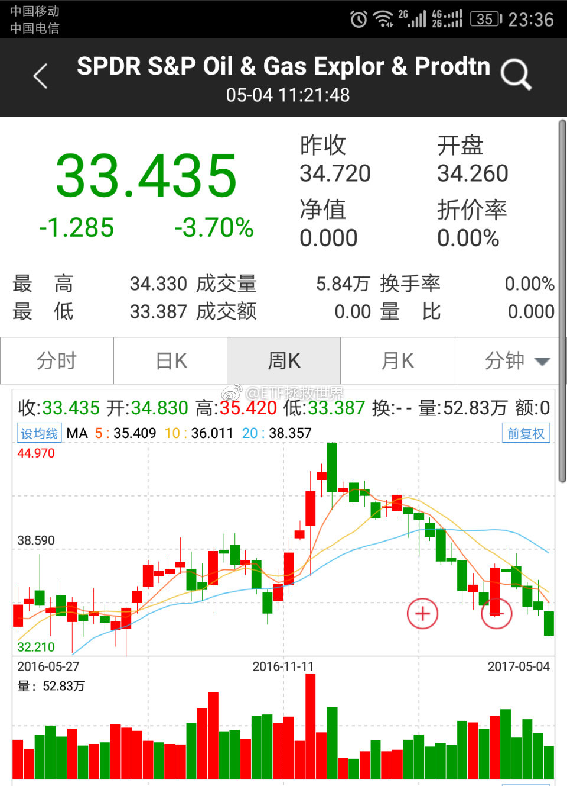
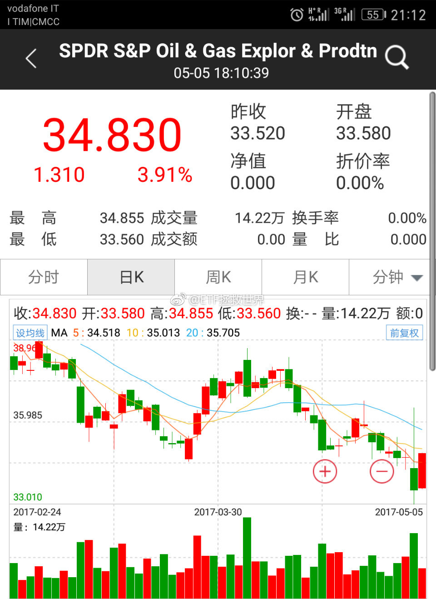
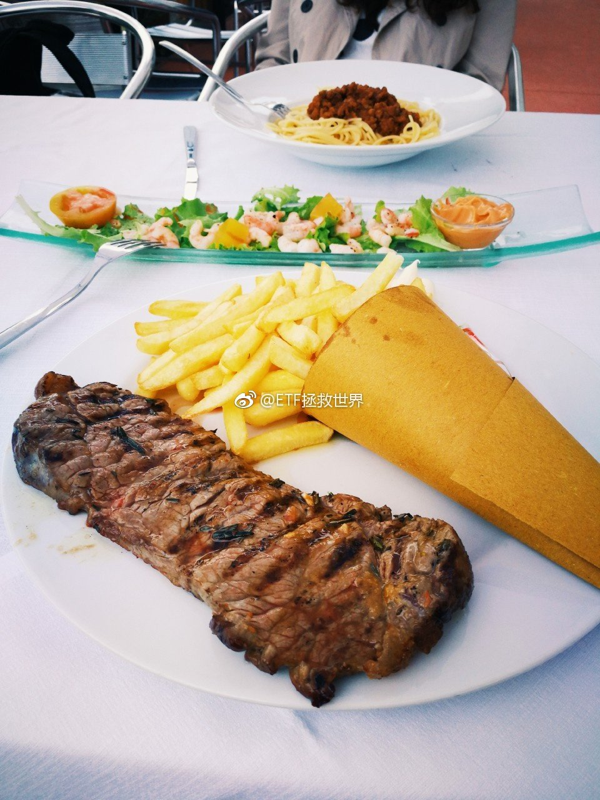
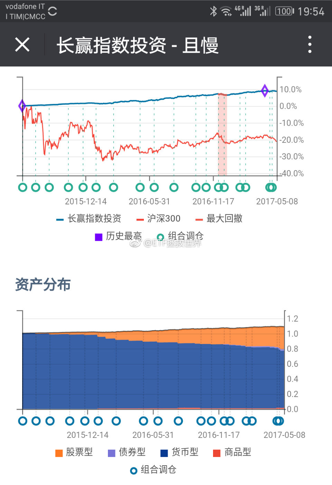
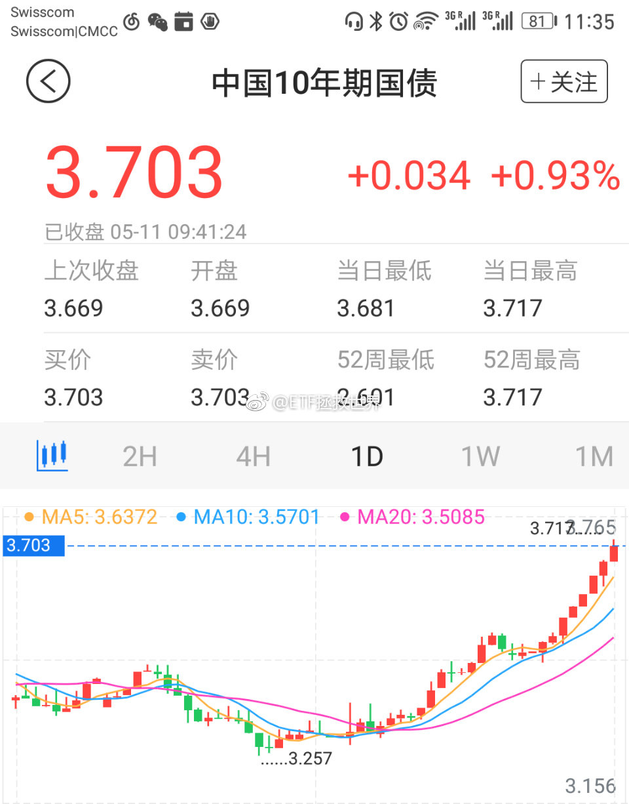
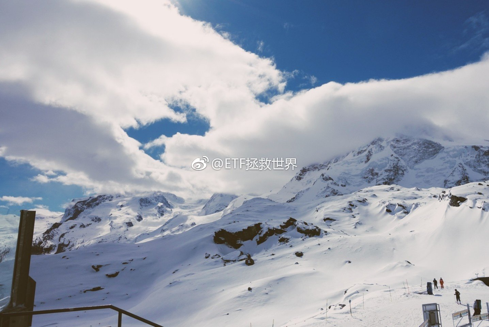
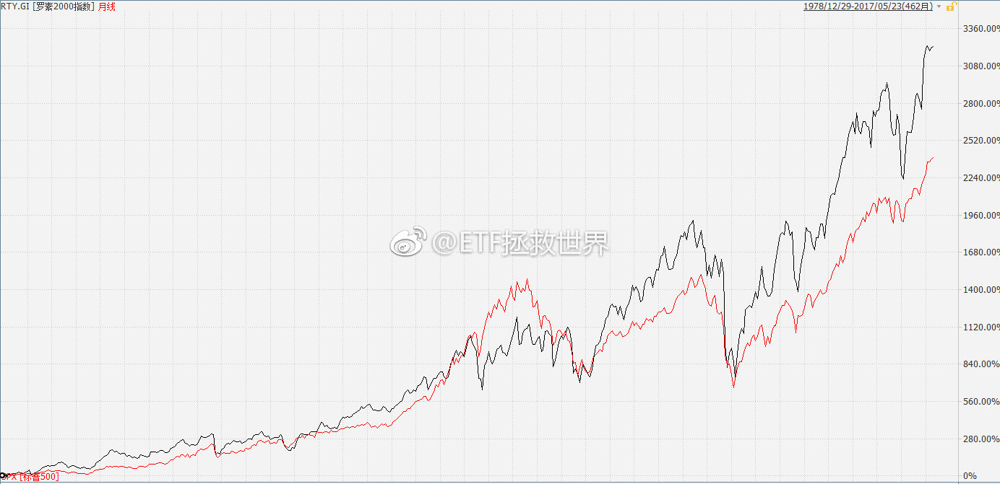
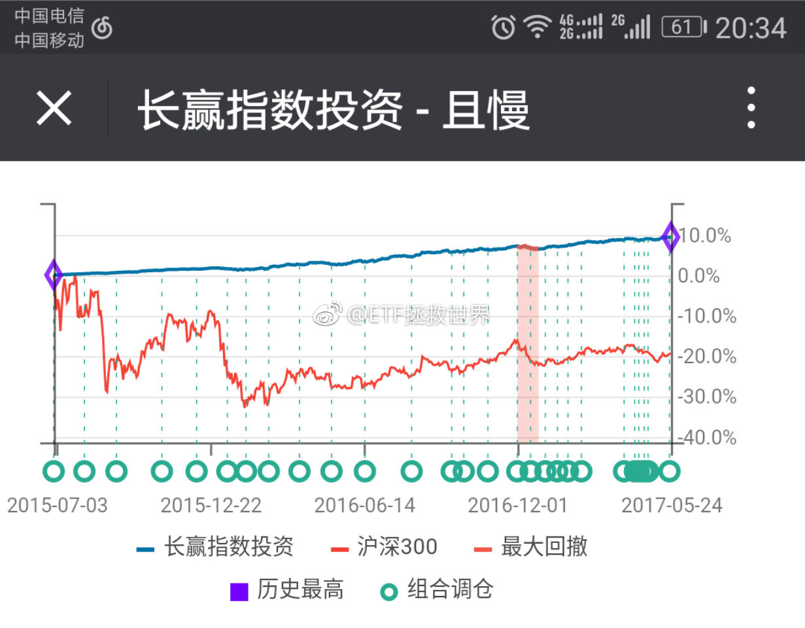

ETF拯救世界 (5687069307) @
2017-05-02 10:25:27 Tue  
url: https://weibo.com/5687069307/F1dxlltuK

买早了、买晚了，怎么办……我回答了 @一壶漂泊饮天涯 的问题，问题价值￥88.00，大家快来花1元围观~ http://t.cn/RXsTDOI ​​​

转发[315]  评论[160]  赞[305] 

======================================================

ETF拯救世界 (5687069307) @
2017-05-02 11:39:38 Tue  
url: https://weibo.com/5687069307/F1e1sjrqb

走势非常不乐观。虽然趋势系统对于我来说只是个辅助工具而已，但大牛大熊的时候还是比较有用的。在这里谈趋势，不是为了指导交易。而是请朋友们做好心理准备——无论你的持仓是多少，都要做好市值减少的准备。很多事情之所以恐怖，是因为你不知道它要发生。如果你知道并做好准备，也就一点不恐怖了。

------------------------------------------------------
转推：
>  @ETF拯救世界 (5687069307)
>  2017-04-26 11:24:30 Wed  
>  url: https:/weibo.com/5687069307/F0jmkzvCh/

>  根据我的几个中期趋势技术判断模型，几个小指数于上周，几个稍大的指数于本周相继进入下跌趋势。
>  
>  当然，技术始终只是一种辅助手段。投资不能靠k线和技术图形指标。辅助一下而已。
>  
>  技术破位的意思，也只是说下跌的概率会比较大，而已。 ​​​

转发[7]  评论[104]  赞[102] 

======================================================

ETF拯救世界 (5687069307) @
2017-05-03 09:20:27 Wed  
url: https://weibo.com/5687069307/F1mxsoLzd

不知道是不是年纪大了，越来越对“极简”感兴趣。

少、空、素……美啊。

无论是物质、身体还是精神。

当然，除了帐户市值…… ​​​

转发[11]  评论[89]  赞[88] 

======================================================

ETF拯救世界 (5687069307) @
2017-05-03 09:59:26 Wed  
url: https://weibo.com/5687069307/F1mNhpNR0

回复@闲梦:那是补之前的啊。对比一下比例就知道了。那个组合不要看，发不发车看公众号最准确。//@闲梦:请问雪球调仓是发车吗？

------------------------------------------------------
转推：
>  @ETF拯救世界 (5687069307)
>  2017-05-03 09:20:27 Wed  
>  url: https:/weibo.com/5687069307/F1mxsoLzd/

>  不知道是不是年纪大了，越来越对“极简”感兴趣。
>  
>  少、空、素……美啊。
>  
>  无论是物质、身体还是精神。
>  
>  当然，除了帐户市值…… ​​​

转发[1]  评论[33]  赞[24] 

======================================================

ETF拯救世界 (5687069307) @
2017-05-03 10:26:38 Wed  
url: https://weibo.com/5687069307/F1mYk3EwY

终于出现三个浮亏的品种了！意不意外，开不开心？

大笔买入的好日子真的不远了。 ​​​

转发[73]  评论[97]  赞[87] 

+++++++++++++++++++++++++++++++++++++++++++++++++++++

图片：

======================================================

ETF拯救世界 (5687069307) @
2017-05-03 10:57:31 Wed  
url: https://weibo.com/5687069307/F1naRwSGi

未来的几点规划：第一个是建仓完毕后，每个品种浮亏最大不超过15%。最好都在10%以内。当然，有些品种到大底也不会亏。组合亏损不超过15%，最好10%。这是价格。第二个是建仓成本控制在历史最低估值30%以下区间。这是价值。第三是若干年后的牛市来临一周到两周之内计划实现总体盈利，开始骑牛之旅。

------------------------------------------------------
转推：
>  @ETF拯救世界 (5687069307)
>  2017-05-03 10:26:38 Wed  
>  url: https:/weibo.com/5687069307/F1mYk3EwY/

>  终于出现三个浮亏的品种了！意不意外，开不开心？
>  
>  大笔买入的好日子真的不远了。 ​​​

转发[44]  评论[65]  赞[74] 

======================================================

ETF拯救世界 (5687069307) @
2017-05-03 11:17:57 Wed  
url: https://weibo.com/5687069307/F1nj9nR7U

回复@ch506:我亏10%的时候，满仓深成B没毛病。[doge]//@ch506:回复@西风将起:有可能也会错过熊市反弹，反正我先跟着，等E大浮亏10%就可以把老婆本户口本都砸进去了[微笑]

------------------------------------------------------
转推：
>  @ETF拯救世界 (5687069307)
>  2017-05-03 10:26:38 Wed  
>  url: https:/weibo.com/5687069307/F1mYk3EwY/

>  终于出现三个浮亏的品种了！意不意外，开不开心？
>  
>  大笔买入的好日子真的不远了。 ​​​

转发[8]  评论[45]  赞[35] 

======================================================

ETF拯救世界 (5687069307) @
2017-05-03 13:18:24 Wed  
url: https://weibo.com/5687069307/F1o62uqmJ

GJD走没走？

一季度汇金投资进入十大股东的公司有1006家。去年底是998家。

同期证金的数字是386家，持平。

不仅没走，买进卖出玩的很开心呢…… ​​​

转发[5]  评论[35]  赞[48] 

======================================================

ETF拯救世界 (5687069307) @
2017-05-03 13:56:37 Wed  
url: https://weibo.com/5687069307/F1olymw3l

今年47%的股票下跌超过10%；21%的股票下跌超过20%。

很多人的帐户可能已经不忍心打开了。 ​​​

转发[30]  评论[41]  赞[52] 

======================================================

ETF拯救世界 (5687069307) @
2017-05-03 14:09:54 Wed  
url: https://weibo.com/5687069307/F1oqWybCA

很多朋友并没有见过真正的寒冬，也远远低估了寒冬的冷。股灾那种不叫寒冬，几次海啸而已。

------------------------------------------------------
转推：
>  @ETF拯救世界 (5687069307)
>  2017-05-03 13:56:37 Wed  
>  url: https:/weibo.com/5687069307/F1olymw3l/

>  今年47%的股票下跌超过10%；21%的股票下跌超过20%。
>  
>  很多人的帐户可能已经不忍心打开了。 ​​​

转发[24]  评论[69]  赞[42] 

======================================================

ETF拯救世界 (5687069307) @
2017-05-03 14:19:37 Wed  
url: https://weibo.com/5687069307/F1ouTcqtu

回复@zoey__小白:我比现在年轻十四岁的时候，获得了一个进入资本市场的机会。那一年的夏天，我独自去国泰君安皇城根营业部开了户。整个夏天，我如同一只乱飞的麻雀，游荡在庄家和大鳄充斥的A股黑暗森林。我要讲的故事，也正是从那时候开始……（想看后续的可以开始预订了。订购量超过50万本开始连载）

------------------------------------------------------
转推：
>  @ETF拯救世界 (5687069307)
>  2017-05-03 13:56:37 Wed  
>  url: https:/weibo.com/5687069307/F1olymw3l/

>  今年47%的股票下跌超过10%；21%的股票下跌超过20%。
>  
>  很多人的帐户可能已经不忍心打开了。 ​​​

转发[10]  评论[227]  赞[174] 

======================================================

ETF拯救世界 (5687069307) @
2017-05-03 15:47:04 Wed  
url: https://weibo.com/5687069307/F1p4o1kRd

国债收益率破3.5了 ​​​

转发[9]  评论[62]  赞[45] 

+++++++++++++++++++++++++++++++++++++++++++++++++++++

图片：

======================================================

ETF拯救世界 (5687069307) @
2017-05-03 17:20:18 Wed  
url: https://weibo.com/5687069307/F1pGeenV1

$513030  再这样下去，告别的时候就不会太远了 ​​​

转发[5]  评论[67]  赞[62] 

======================================================

ETF拯救世界 (5687069307) @
2017-05-04 09:30:07 Thu  
url: https://weibo.com/5687069307/F1w1Sqtzq

韩国股市也历史新高了。

美国、德国都在不断新高。

对了，补充一句，韩国整体估值大概在15倍左右。美国几乎是最近十年最高：22倍左右。德国21倍左右。

A股，跌到现在，40多。[doge] ​​​

转发[55]  评论[57]  赞[66] 

======================================================

ETF拯救世界 (5687069307) @
2017-05-04 09:33:58 Thu  
url: https://weibo.com/5687069307/F1w3rmptQ

回复@火眼金睛_qq:不是。根本原因是狼多肉少。也就是资金多，股票少。所以说句很多人不爱听的，我支持目前的准注册制。既然有人买，就多多的发。发到没人买，市场就正常了。真正的十年长牛才有希望。//@火眼金睛_qq:金融腐败是否是a股高估值的主要因素？

------------------------------------------------------
转推：
>  @ETF拯救世界 (5687069307)
>  2017-05-04 09:30:07 Thu  
>  url: https:/weibo.com/5687069307/F1w1Sqtzq/

>  韩国股市也历史新高了。
>  
>  美国、德国都在不断新高。
>  
>  对了，补充一句，韩国整体估值大概在15倍左右。美国几乎是最近十年最高：22倍左右。德国21倍左右。
>  
>  A股，跌到现在，40多。[doge] ​​​

转发[12]  评论[24]  赞[48] 

======================================================

ETF拯救世界 (5687069307) @
2017-05-04 09:41:10 Thu  
url: https://weibo.com/5687069307/F1w6mv9bv

回复@BB198:其实这个问题我也一直没想明白。如果GJD拿的都是低估大蓝筹就算了。问题是他们手里有上千只小股票，未来这些股票一定会价值回归，跌的亲妈都不认识。一边是监管层发新股客观一定会导致小股票跌，一方面GJD拿着那么多小股票不卖。未来GJD会产生的浮亏简直不敢想象。我想内部有分歧和利益冲突

------------------------------------------------------
转推：
>  @ETF拯救世界 (5687069307)
>  2017-05-04 09:30:07 Thu  
>  url: https:/weibo.com/5687069307/F1w1Sqtzq/

>  韩国股市也历史新高了。
>  
>  美国、德国都在不断新高。
>  
>  对了，补充一句，韩国整体估值大概在15倍左右。美国几乎是最近十年最高：22倍左右。德国21倍左右。
>  
>  A股，跌到现在，40多。[doge] ​​​

转发[2]  评论[18]  赞[32] 

======================================================

ETF拯救世界 (5687069307) @
2017-05-04 09:47:33 Thu  
url: https://weibo.com/5687069307/F1w8XfEAL

回复@蛋卷基金:老板今天还买不买……不过讲真，红利目前是不贵的。不过每天买这种买法个人不敢苟同啊。//@蛋卷基金:替我们老板路过[微笑][二哈][二哈][二哈]

------------------------------------------------------
转推：
>  @ETF拯救世界 (5687069307)
>  2017-04-27 09:57:09 Thu  
>  url: https:/weibo.com/5687069307/F0sdnfZ3M/

>  潜水雪球，看到方老板每天买10万指数基金。各位可以用这个实例观摩一下熊市中过于频繁买入的后果。
>  
>  慢慢体会一下“定期”交易的奥妙所在。 ​​​

转发[1]  评论[33]  赞[26] 

======================================================

ETF拯救世界 (5687069307) @
2017-05-04 10:07:03 Thu  
url: https://weibo.com/5687069307/F1wgSlJMq

注意A股和国外股市的不同。A股牛市的特点是急、快。如果把时间拉长，拉到10年，A股涨幅不一定比美股差。不同是A股用一两年涨几倍，然后用7、8年跌一半。美股是7、8年涨1倍，然后2、3年跌20%。这样大多数人的感官就是A股垃圾，赚不到钱。其实能赚，你得赶上牛市那两年。这里面有深层次的原因，有空说。

------------------------------------------------------
转推：
>  @ETF拯救世界 (5687069307)
>  2017-05-04 09:30:07 Thu  
>  url: https:/weibo.com/5687069307/F1w1Sqtzq/

>  韩国股市也历史新高了。
>  
>  美国、德国都在不断新高。
>  
>  对了，补充一句，韩国整体估值大概在15倍左右。美国几乎是最近十年最高：22倍左右。德国21倍左右。
>  
>  A股，跌到现在，40多。[doge] ​​​

转发[10]  评论[47]  赞[58] 

======================================================

ETF拯救世界 (5687069307) @
2017-05-04 10:21:10 Thu  
url: https://weibo.com/5687069307/F1wmBdKyJ

回复@峥嵘83岁月:数学和模型当然是我们投资的基础。如果没有数据和计算，我会马上退出A股不再玩。但是，数学、量化只是基础而已。否则，所有学数学的人都应该在资本市场赚大钱了，显然并不是这样。投资，是以科学为基础的艺术。没有科学，不行。但，它始终是门艺术。

------------------------------------------------------
转推：
>  @ETF拯救世界 (5687069307)
>  2017-05-03 10:26:38 Wed  
>  url: https:/weibo.com/5687069307/F1mYk3EwY/

>  终于出现三个浮亏的品种了！意不意外，开不开心？
>  
>  大笔买入的好日子真的不远了。 ​​​

转发[9]  评论[29]  赞[49] 

======================================================

ETF拯救世界 (5687069307) @
2017-05-04 11:38:54 Thu  
url: https://weibo.com/5687069307/F1wS9nRTa

投资的时候，提醒自己始终要牢记“概率”。

随着时间空间的变化，下跌的概率越来越小。不跌甚至上涨的概率逐渐加大。天平已经慢慢的向平衡靠拢。当然，从我的模型来看，现在依然是下跌概率略大。

与之对应的，我们的仓位在逐渐加大。这就是应对概率变化的做法。盲目所谓的“看多”、“看空”，并不是 ​​​

转发[67]  评论[103]  赞[161] 

======================================================

ETF拯救世界 (5687069307) @
2017-05-04 11:51:46 Thu  
url: https://weibo.com/5687069307/F1wXneuhq

接上条。守正出奇。其实大道相通。

在我心目中，《人民的名义》里面，最牛逼的是谁？当然不是侯亮平，不是李达康，更不是易学习沙瑞金，而是——季昌明。

这样一个没后台不站队的人，在汉东这么复杂的zz环境下居然恪守正道，然后竟然一直安然无恙还能做到这样的位置，这份功力简直可以说是绝顶高手了 ​​​

转发[50]  评论[0]  赞[273] 

======================================================

ETF拯救世界 (5687069307) @
2017-05-04 13:57:52 Thu  
url: https://weibo.com/5687069307/F1xMywDp1

熊了30年的台湾股市也快新高了。我坚信，并希望各位也能坚信一件事：只要不出现大的毁灭性的灾难，一个国家的股市指数一定会不断新高。我们要做的就是不要买的太贵，导致长期收益率很低。在比较便宜的地方买入，极大概率不会赔钱，并且会赚不少。从道理上讲，A股这么多人赔钱是很奇怪的一件事。

------------------------------------------------------
转推：
>  @ETF拯救世界 (5687069307)
>  2017-05-04 09:30:07 Thu  
>  url: https:/weibo.com/5687069307/F1w1Sqtzq/

>  韩国股市也历史新高了。
>  
>  美国、德国都在不断新高。
>  
>  对了，补充一句，韩国整体估值大概在15倍左右。美国几乎是最近十年最高：22倍左右。德国21倍左右。
>  
>  A股，跌到现在，40多。[doge] ​​​

转发[14]  评论[75]  赞[63] 

======================================================

ETF拯救世界 (5687069307) @
2017-05-04 14:34:48 Thu  
url: https://weibo.com/5687069307/F1y1yazVx

早上吓得卖掉下午又追进去的，是不是可以告别股市了。 ​​​

转发[2]  评论[44]  赞[54] 

======================================================

ETF拯救世界 (5687069307) @
2017-05-04 14:52:04 Thu  
url: https://weibo.com/5687069307/F1y8yxg31

[doge]

------------------------------------------------------
转推：
>  @ ()
>  2017-05-04 14:44:33 Thu  
>  url: 

>  抱歉，此微博已被作者删除。查看帮助：http://t.cn/Rfd3rQV

转发[4]  评论[21]  赞[22] 

======================================================

ETF拯救世界 (5687069307) @
2017-05-04 14:58:43 Thu  
url: https://weibo.com/5687069307/F1ybg2GMS

[doge] 这就有趣了。 ​​​

转发[9]  评论[93]  赞[64] 

+++++++++++++++++++++++++++++++++++++++++++++++++++++

图片：

======================================================

ETF拯救世界 (5687069307) @
2017-05-04 23:37:45 Thu  
url: https://weibo.com/5687069307/F1BzVD3xU

难道要重演去年的一幕，再赚一轮？ ​​​

转发[7]  评论[58]  赞[56] 

+++++++++++++++++++++++++++++++++++++++++++++++++++++

图片：

======================================================

ETF拯救世界 (5687069307) @
2017-05-05 05:47:36 Fri  
url: https://weibo.com/5687069307/F1E03oaC9

计划的这0.6%油气，应该能让很多朋友更加了解自己。在面对暴跌的时候，是高兴还是害怕。答案很可能与你自己当初的想象不同。这非常好，用这么点仓位就弄清楚，总比以后仓位大了再害怕强。这次应该会洗掉不少叶公了。[亲亲]

------------------------------------------------------
转推：
>  @ETF拯救世界 (5687069307)
>  2017-05-04 23:37:45 Thu  
>  url: https:/weibo.com/5687069307/F1BzVD3xU/

>  难道要重演去年的一幕，再赚一轮？ ​​​

转发[5]  评论[93]  赞[68] 

======================================================

ETF拯救世界 (5687069307) @
2017-05-05 09:34:43 Fri  
url: https://weibo.com/5687069307/F1Fuf6HDt

无论是阴跌，暴跌，只要记住手里的东西是指数，只要我们买的不高，一定会涨回去挣钱，就踏踏实实的。买的低点高点，无非是多赚点少赚点的区别。股票就不同了。有些股票可能这辈子都涨不回高点了。不是鬼故事。

------------------------------------------------------
转推：
>  @ETF拯救世界 (5687069307)
>  2017-04-28 10:43:51 Fri  
>  url: https:/weibo.com/5687069307/F0BWPCvPZ/

>  继续打预防针：
>  
>  随着仓位逐渐加大，未来如果出现各种预料之中，预料之外的下跌，市值会减少。只要记住两件事。
>  
>  你手里的东西，是指数。公司可能由好变坏，由坏退市，指数不会。中国最好的几百家公司都在你的手中，无论怎么跌，不用怕。
>  
>  第二是，我们的投资方式，会把成本控制在非常低的水平。一定不 ​​​

转发[50]  评论[55]  赞[72] 

======================================================

ETF拯救世界 (5687069307) @
2017-05-05 10:01:50 Fri  
url: https://weibo.com/5687069307/F1FFfoxpp

因为证券指数PE/PB低而买入的朋友已经跌蒙了。

不是这么玩的。

看一眼估值然后买卖就能把钱赚了，这就有点过于简化了。 ​​​

转发[15]  评论[54]  赞[68] 

======================================================

ETF拯救世界 (5687069307) @
2017-05-05 10:07:54 Fri  
url: https://weibo.com/5687069307/F1FHIt7vg

回复@幸福微笑的小卤蛋:不想浪费时间在跟人争论上面。毫无意义的浪费时间。8月再回去。//@幸福微笑的小卤蛋:E大怎么不回我球了啊？

------------------------------------------------------
转推：
>  @ ()
>  2017-05-05 09:47:48 Fri  
>  url: 

>  抱歉，此微博已被作者删除。查看帮助：http://t.cn/Rfd3rQV

转发[1]  评论[25]  赞[28] 

======================================================

ETF拯救世界 (5687069307) @
2017-05-05 10:12:28 Fri  
url: https://weibo.com/5687069307/F1FJzpOY1

回复@塞外大诗人:第一呢，上证的6000是中石油的6000。之所以回不去就是我说的买的太贵。同理可见80年代末的日本和90年代初的台湾。还有2000年开始跌跌倒2015才回去的纳斯达克。第二呢，你完全不知道我们在做什么。我们做的事情和网格一毛毛毛钱关系都没有。无限放大更是不知从何说起。散了吧。see you

------------------------------------------------------
转推：
>  @ETF拯救世界 (5687069307)
>  2017-04-28 10:43:51 Fri  
>  url: https:/weibo.com/5687069307/F0BWPCvPZ/

>  继续打预防针：
>  
>  随着仓位逐渐加大，未来如果出现各种预料之中，预料之外的下跌，市值会减少。只要记住两件事。
>  
>  你手里的东西，是指数。公司可能由好变坏，由坏退市，指数不会。中国最好的几百家公司都在你的手中，无论怎么跌，不用怕。
>  
>  第二是，我们的投资方式，会把成本控制在非常低的水平。一定不 ​​​

转发[1]  评论[21]  赞[36] 

======================================================

ETF拯救世界 (5687069307) @
2017-05-05 10:15:41 Fri  
url: https://weibo.com/5687069307/F1FKSm2NH

你知道我最讨厌什么人吗。我最讨厌的是，根本不知道，似乎也不想知道，当然，也完全没机会知道我们到底在做什么，就叉着腰上来指指点点。

资本市场中，没人会是完美的，也没有策略会是完美的。所以通过不同声音引起反思，取得进步是我特别高兴的事情。但我希望的是，在批判别人之前，先弄清楚别人到底 ​​​

转发[7]  评论[84]  赞[113] 

======================================================

ETF拯救世界 (5687069307) @
2017-05-05 10:48:26 Fri  
url: https://weibo.com/5687069307/F1FYacuwc

3100保不保？能不能让我开开心心的出发？北京沙尘暴何时消失？娜扎和热巴谁更美？请看今日的《法治进行时》 ​​​

转发[5]  评论[116]  赞[59] 

======================================================

ETF拯救世界 (5687069307) @
2017-05-05 11:13:42 Fri  
url: https://weibo.com/5687069307/F1G8q6GZf

回复@hcy天云:我这儿的朋友都病得不轻。//@hcy天云:已经跌破3100了，为什么看到跌我就默默的高兴，难道我有病？[doge]

------------------------------------------------------
转推：
>  @ETF拯救世界 (5687069307)
>  2017-05-05 10:48:26 Fri  
>  url: https:/weibo.com/5687069307/F1FYacuwc/

>  3100保不保？能不能让我开开心心的出发？北京沙尘暴何时消失？娜扎和热巴谁更美？请看今日的《法治进行时》 ​​​

转发[2]  评论[51]  赞[41] 

======================================================

ETF拯救世界 (5687069307) @
2017-05-05 13:29:29 Fri  
url: https://weibo.com/5687069307/F1H1xaulA

没有下跌就没有超额利润。没有大跌就赚不到大钱。没有暴跌就没有巨额财富。证券市场的波动非常正常，我们要做的就是所有人悲观恐慌的时候伸出兰花指拿起鼠标点一下买入。当然，到时候恐慌的人群众很可能也有你。两年了，等待不会白费。

------------------------------------------------------
转推：
>  @ETF拯救世界 (5687069307)
>  2017-04-28 10:43:51 Fri  
>  url: https:/weibo.com/5687069307/F0BWPCvPZ/

>  继续打预防针：
>  
>  随着仓位逐渐加大，未来如果出现各种预料之中，预料之外的下跌，市值会减少。只要记住两件事。
>  
>  你手里的东西，是指数。公司可能由好变坏，由坏退市，指数不会。中国最好的几百家公司都在你的手中，无论怎么跌，不用怕。
>  
>  第二是，我们的投资方式，会把成本控制在非常低的水平。一定不 ​​​

转发[24]  评论[57]  赞[75] 

======================================================

ETF拯救世界 (5687069307) @
2017-05-05 13:43:12 Fri  
url: https://weibo.com/5687069307/F1H76gL1L

还有一个要注意的，是，我现在虽然不知道是什么，但如果真的出现特大机会，那一定是有了什么现在意想不到的坏消息。

这个坏消息特别坏，坏到让大多数人完全丧失了信心。所以不要用现在的思维去衡量那时候，那个坏消息出来的时候，已经完全跟现在不同了。

当然了，那个所谓的特大机会也许不会出现，因 ​​​

转发[20]  评论[84]  赞[79] 

======================================================

ETF拯救世界 (5687069307) @
2017-05-05 14:00:23 Fri  
url: https://weibo.com/5687069307/F1He4AhQh

回复@石头里的虫子:这个没事。我能把外星人忽悠的买20份中证500ETF。66的[doge]//@石头里的虫子:特大坏消息有可能是外星人进攻地球，人类文明要消失。

------------------------------------------------------
转推：
>  @ETF拯救世界 (5687069307)
>  2017-05-05 13:43:12 Fri  
>  url: https:/weibo.com/5687069307/F1H76gL1L/

>  还有一个要注意的，是，我现在虽然不知道是什么，但如果真的出现特大机会，那一定是有了什么现在意想不到的坏消息。
>  
>  这个坏消息特别坏，坏到让大多数人完全丧失了信心。所以不要用现在的思维去衡量那时候，那个坏消息出来的时候，已经完全跟现在不同了。
>  
>  当然了，那个所谓的特大机会也许不会出现，因 ​​​

转发[1]  评论[36]  赞[51] 

======================================================

ETF拯救世界 (5687069307) @
2017-05-05 14:59:52 Fri  
url: https://weibo.com/5687069307/F1HCdAlgM

好了，这几天刷的比较频繁，因为接下来十几天不会刷关于股市的了。

从今天起，跟GJD、大鳄、害人精以及自己战斗的任务，就需要各位独立完成了……

买不买？卖不卖？买卖多少？

……

拜拜了您呐……[舔屏] ​​​

转发[7]  评论[269]  赞[130] 

======================================================

ETF拯救世界 (5687069307) @
2017-05-07 03:19:09 Sun  
url: https://weibo.com/5687069307/F1VSNa8p8

可以，比较刺激  ​​​

转发[1]  评论[89]  赞[82] 

+++++++++++++++++++++++++++++++++++++++++++++++++++++

图片：

======================================================

ETF拯救世界 (5687069307) @
2017-05-08 11:46:40 Mon  
url: https://weibo.com/5687069307/F28Di4OKn

准备起床，r u ok?

[doge]  ​​​

转发[51]  评论[260]  赞[376] 

+++++++++++++++++++++++++++++++++++++++++++++++++++++

图片：

======================================================

ETF拯救世界 (5687069307) @
2017-05-08 13:31:36 Mon  
url: https://weibo.com/5687069307/F29jSCyKs

看着这里欢乐祥和的各位，谁能想到a股跌成狗了。你们配得上股民这个光荣的称号吗！[哼]

------------------------------------------------------
转推：
>  @ETF拯救世界 (5687069307)
>  2017-05-08 11:46:40 Mon  
>  url: https:/weibo.com/5687069307/F28Di4OKn/

>  准备起床，r u ok?
>  
>  [doge] http://t.cn/z8fYx9X ​​​

转发[4]  评论[54]  赞[66] 

======================================================

ETF拯救世界 (5687069307) @
2017-05-08 13:46:02 Mon  
url: https://weibo.com/5687069307/F29pK4uBV

德国，恒生，深圳a的养老全是红的。资产大类配置和大类内部的小类配置重要性再次发挥作用。无论如何，今天各位的资产都不会下降多少，即使仓位已经在三成左右。 ​​​

转发[15]  评论[98]  赞[89] 

======================================================

ETF拯救世界 (5687069307) @
2017-05-08 15:11:49 Mon  
url: https://weibo.com/5687069307/F29YyBJni

这么搞半个月回去后是不是可以直接满仓了……九点了，踏踏实实玩去了[doge]

------------------------------------------------------
转推：
>  @ETF拯救世界 (5687069307)
>  2017-05-08 13:46:02 Mon  
>  url: https:/weibo.com/5687069307/F29pK4uBV/

>  德国，恒生，深圳a的养老全是红的。资产大类配置和大类内部的小类配置重要性再次发挥作用。无论如何，今天各位的资产都不会下降多少，即使仓位已经在三成左右。 ​​​

转发[8]  评论[82]  赞[83] 

======================================================

ETF拯救世界 (5687069307) @
2017-05-09 02:28:25 Tue  
url: https://weibo.com/5687069307/F2epc5Cx3

谁还没睡[doge] ​​​

转发[0]  评论[50]  赞[61] 

======================================================

ETF拯救世界 (5687069307) @
2017-05-09 03:18:18 Tue  
url: https://weibo.com/5687069307/F2eJrhGB9

我有个总结:比较温和的投资者，不那么极端的投资者，活下去的机会大一点。一个想法，不一定对。//@ETF拯救世界:……从2007年的沙黾农开始，我就有一个坚定的信念：在金融市场上，杀伤力最大的是大v。一次次验证。

------------------------------------------------------
转推：
>  @ETF拯救世界 (5687069307)
>  2017-04-24 11:37:27 Mon  
>  url: https:/weibo.com/5687069307/F00AB7129/

>  深成B会不会跌到1毛。一个问题。 ​​​

转发[9]  评论[81]  赞[77] 

======================================================

ETF拯救世界 (5687069307) @
2017-05-09 12:51:38 Tue  
url: https://weibo.com/5687069307/F2iu9AUUN

途经意大利小镇，街边吃顿晚餐。

八点多太阳才下山。 ​​​

转发[8]  评论[115]  赞[129] 

+++++++++++++++++++++++++++++++++++++++++++++++++++++

图片：

======================================================

ETF拯救世界 (5687069307) @
2017-05-09 14:02:07 Tue  
url: https://weibo.com/5687069307/F2iWLpisu

回复@topxiaoke:大家八喜临门啊。持仓的大涨，想买的大跌。运气还是实力？[doge]//@topxiaoke:恒生新高了~！

------------------------------------------------------
转推：
>  @ETF拯救世界 (5687069307)
>  2017-05-09 12:51:38 Tue  
>  url: https:/weibo.com/5687069307/F2iu9AUUN/

>  途经意大利小镇，街边吃顿晚餐。
>  
>  八点多太阳才下山。 ​​​

转发[1]  评论[28]  赞[43] 

======================================================

ETF拯救世界 (5687069307) @
2017-05-09 14:04:20 Tue  
url: https://weibo.com/5687069307/F2iXFiaP0

回复@缘如此来:说实话，我感觉大部分人没有北上广深的人有钱。市政设施也比较破旧。不过我看他们过得都挺高兴。//@缘如此来:e大，意大利人民过得是否比我天朝人民幸福

------------------------------------------------------
转推：
>  @ETF拯救世界 (5687069307)
>  2017-05-09 12:51:38 Tue  
>  url: https:/weibo.com/5687069307/F2iu9AUUN/

>  途经意大利小镇，街边吃顿晚餐。
>  
>  八点多太阳才下山。 ​​​

转发[4]  评论[55]  赞[48] 

======================================================

ETF拯救世界 (5687069307) @
2017-05-10 02:00:29 Wed  
url: https://weibo.com/5687069307/F2nElCRSm

无论大盘怎么熊，计划就是不跌也是醉了，归功于海外资产的配置。

另外我们的权益仓位开始快速增加。未来只要a股反弹，我们的市值会更快冲向更高。  ​​​

转发[21]  评论[93]  赞[112] 

+++++++++++++++++++++++++++++++++++++++++++++++++++++

图片：

======================================================

ETF拯救世界 (5687069307) @
2017-05-10 11:24:04 Wed  
url: https://weibo.com/5687069307/F2rl6EOXR

回复@顺风耳:这其实是计划的另一个意义。很多朋友买过牛股，踏踏实实拿一年赚30% 40%一直没卖的有几个人？估计涨10%就害怕的卖掉了。我们几千位朋友这次一起做到了。这应该是很多朋友拿的涨幅最大的品种。//@顺风耳:恒生赚42%，不是E大，我的恒生ETF不知道卖多久了，感谢。[红包飞]

------------------------------------------------------
转推：
>  @ETF拯救世界 (5687069307)
>  2017-05-10 02:00:29 Wed  
>  url: https:/weibo.com/5687069307/F2nElCRSm/

>  无论大盘怎么熊，计划就是不跌也是醉了，归功于海外资产的配置。
>  
>  另外我们的权益仓位开始快速增加。未来只要a股反弹，我们的市值会更快冲向更高。 http://t.cn/RGoCG7U ​​​

转发[4]  评论[44]  赞[59] 

======================================================

ETF拯救世界 (5687069307) @
2017-05-10 11:52:25 Wed  
url: https://weibo.com/5687069307/F2rwCgisg

威尼斯，一座非常特别的城市。

很美。

很多朋友提到的墨鱼面。我吃着有点心理障碍…… ​​​

转发[1]  评论[81]  赞[135] 

+++++++++++++++++++++++++++++++++++++++++++++++++++++

图片：

======================================================

ETF拯救世界 (5687069307) @
2017-05-10 13:34:02 Wed  
url: https://weibo.com/5687069307/F2sbRt5lw

熊市就是把妄想抄底的每一波人都埋进去，牛市就是把妄想逃顶的每一波人狠狠地甩下财富列车。 ​​​

转发[49]  评论[103]  赞[178] 

======================================================

ETF拯救世界 (5687069307) @
2017-05-10 14:50:03 Wed  
url: https://weibo.com/5687069307/F2sGIsyWb

我现在最想做的是算算估值 [哼] ​​​

转发[6]  评论[114]  赞[78] 

======================================================

ETF拯救世界 (5687069307) @
2017-05-10 14:53:10 Wed  
url: https://weibo.com/5687069307/F2sHZ7nCG

计划前两大持仓品种恒生和50今天还在涨……

------------------------------------------------------
转推：
>  @ETF拯救世界 (5687069307)
>  2017-05-10 02:00:29 Wed  
>  url: https:/weibo.com/5687069307/F2nElCRSm/

>  无论大盘怎么熊，计划就是不跌也是醉了，归功于海外资产的配置。
>  
>  另外我们的权益仓位开始快速增加。未来只要a股反弹，我们的市值会更快冲向更高。 http://t.cn/RGoCG7U ​​​

转发[4]  评论[43]  赞[48] 

======================================================

ETF拯救世界 (5687069307) @
2017-05-10 15:30:31 Wed  
url: https://weibo.com/5687069307/F2sX95obC

除非你有方老板那样的无限子弹，否则不要在熊市中过于频繁的补仓。十几年的经验之谈，相信我没错的。我的很多发言，会帮你节省十几年积累经验的时间，还得是悟性高的那种。

------------------------------------------------------
转推：
>  @ETF拯救世界 (5687069307)
>  2017-04-27 09:57:09 Thu  
>  url: https:/weibo.com/5687069307/F0sdnfZ3M/

>  潜水雪球，看到方老板每天买10万指数基金。各位可以用这个实例观摩一下熊市中过于频繁买入的后果。
>  
>  慢慢体会一下“定期”交易的奥妙所在。 ​​​

转发[38]  评论[130]  赞[168] 

======================================================

ETF拯救世界 (5687069307) @
2017-05-11 12:03:25 Thu  
url: https://weibo.com/5687069307/F2B1A02V3

睁开眼睛躺床上看看窗外的阿尔卑斯山，再看看大盘，感觉……

r u ok?

[doge] ​​​

转发[2]  评论[142]  赞[93] 

+++++++++++++++++++++++++++++++++++++++++++++++++++++

图片：

======================================================

ETF拯救世界 (5687069307) @
2017-05-11 13:19:36 Thu  
url: https://weibo.com/5687069307/F2Bwv9oK0

吃完饭一看，人间炼狱一刚

------------------------------------------------------
转推：
>  @ETF拯救世界 (5687069307)
>  2017-05-11 12:03:25 Thu  
>  url: https:/weibo.com/5687069307/F2B1A02V3/

>  睁开眼睛躺床上看看窗外的阿尔卑斯山，再看看大盘，感觉……
>  
>  r u ok?
>  
>  [doge] ​​​

转发[0]  评论[54]  赞[44] 

======================================================

ETF拯救世界 (5687069307) @
2017-05-11 13:26:03 Thu  
url: https://weibo.com/5687069307/F2Bz7pswy

三年内我们的资产可以大飞跃。再次钦定了。

------------------------------------------------------
转推：
>  @ETF拯救世界 (5687069307)
>  2017-04-27 09:26:53 Thu  
>  url: https:/weibo.com/5687069307/F0s15tj5x/

>  一年内底部可见。钦定了。 ​​​

转发[31]  评论[206]  赞[201] 

======================================================

ETF拯救世界 (5687069307) @
2017-05-11 15:33:45 Thu  
url: https://weibo.com/5687069307/F2CoX8xHs

3000点的国家队羊毛薅了吗

------------------------------------------------------
转推：
>  @ETF拯救世界 (5687069307)
>  2017-04-07 10:09:34 Fri  
>  url: https:/weibo.com/5687069307/EDncO76hf/

>  3000（或者3100）到3300之间用ETF做网格应该是很靠谱的。
>  
>  GJD信誉保证。跟着GJD有肉吃。 ​​​

转发[4]  评论[92]  赞[61] 

======================================================

ETF拯救世界 (5687069307) @
2017-05-11 17:38:03 Thu  
url: https://weibo.com/5687069307/F2DdpeUon

amazing ​​​

转发[6]  评论[141]  赞[81] 

+++++++++++++++++++++++++++++++++++++++++++++++++++++

图片：

======================================================

ETF拯救世界 (5687069307) @
2017-05-12 18:01:41 Fri  
url: https://weibo.com/5687069307/F2MNvf1fh

滑雪。没空发微博遥控大盘了一刚！ ​​​

转发[2]  评论[141]  赞[192] 

+++++++++++++++++++++++++++++++++++++++++++++++++++++

图片：

======================================================

ETF拯救世界 (5687069307) @
2017-05-15 14:41:07 Mon  
url: https://weibo.com/5687069307/F3dLzzkNM

今天计划可能又要新高了。

乡亲们，我快回来了！ ​​​

转发[3]  评论[212]  赞[191] 

======================================================

ETF拯救世界 (5687069307) @
2017-05-15 19:54:52 Mon  
url: https://weibo.com/5687069307/F3fOVqdjq

回复@梦境57154:我做的是一个组合，没法保证每个品种每天都新高。只能尽量做到整个组合持续上涨。//@梦境57154:怎么又新高，后面跟的医药，环保，养老国债，中证500都亏啊

------------------------------------------------------
转推：
>  @ETF拯救世界 (5687069307)
>  2017-05-15 14:41:07 Mon  
>  url: https:/weibo.com/5687069307/F3dLzzkNM/

>  今天计划可能又要新高了。
>  
>  乡亲们，我快回来了！ ​​​

转发[1]  评论[40]  赞[60] 

======================================================

ETF拯救世界 (5687069307) @
2017-05-15 21:21:29 Mon  
url: https://weibo.com/5687069307/F3go5fwdx

积跬步至千里，闲庭信步。

又新高了，赔钱好难。[哼] ​​​

转发[4]  评论[95]  赞[106] 

+++++++++++++++++++++++++++++++++++++++++++++++++++++

图片：

======================================================

ETF拯救世界 (5687069307) @
2017-05-16 10:44:05 Tue  
url: https://weibo.com/5687069307/F3lDRiVRd

你们都不觉得冷，怎么可能是深冬。 ​​​

转发[8]  评论[138]  赞[108] 

======================================================

ETF拯救世界 (5687069307) @
2017-05-16 15:06:26 Tue  
url: https://weibo.com/5687069307/F3nmlvHy5

这样的话就不用着急加车了。

当然还要回去算算才能最终确定。  ​​​

转发[1]  评论[55]  赞[67] 

======================================================

ETF拯救世界 (5687069307) @
2017-05-16 15:17:26 Tue  
url: https://weibo.com/5687069307/F3nqP0Xws

看到面对上涨，评论里一片失望的声音。我再说一次，如果上涨你不高兴，那么你的仓位太低，请尽快加到涨跌都没有感觉的仓位。

出来之前我建议的a股仓位由保守到激进是19-39。之前a股跌幅较大，就可以在这个基础上适当增加。

无论如何，被大盘涨跌影响心态的，仓位都不对。请尽快根据自己的情况调整到 ​​​

转发[15]  评论[139]  赞[119] 

======================================================

ETF拯救世界 (5687069307) @
2017-05-17 22:38:07 Wed  
url: https://weibo.com/5687069307/F3zKbiaqY

反向收益率曲线（inverted yield curve）的出现非常值得警惕。一般来说，出现这种现象代表要有大事发生了。这是一个早期预警信号。

------------------------------------------------------
转推：
>  @ ()
>  2017-05-12 10:14:11 Fri  
>  url: 

>  该账号因被投诉违反《微博社区公约》的相关规定，现已无法查看。查看帮助 https://kefu.weibo.com/faqdetail?id=13216

转发[47]  评论[95]  赞[95] 

======================================================

ETF拯救世界 (5687069307) @
2017-05-18 09:25:28 Thu  
url: https://weibo.com/5687069307/F3DYWptah

如果有5%的退市率，我估计敢炒个股的人会少一半。大量垃圾股从现价开始还要跌一半。

------------------------------------------------------
转推：
>  @财联社APP (2868676035)
>  2017-05-18 09:11:34 Thu  
>  url: https:/weibo.com/2868676035/F3DTixI1p/

>  新华社：不少业界人士认为，我国资本市场的退市制度仍待不断完善。回顾A股的退市历史，自2001年退市制度建立起，两市总计退市公司仅有90余家，年均退市率约0.35%，而成熟资本市场年退市率一般在6%以上。 ​​​

转发[3]  评论[43]  赞[50] 

======================================================

ETF拯救世界 (5687069307) @
2017-05-18 10:33:08 Thu  
url: https://weibo.com/5687069307/F3Eqpj27w

一般来说，反弹才是熊市中的大杀器。

大多数人不会在一路暴跌的时候买。这样就需要很多反弹。有短期有中期。大多数人会在反弹中买进去，然后辛辛苦苦涨一个月，一天下跌就可以把利润干没了。

被套了就不会卖了。然后就继续跌，继续反弹，继续换一批人套。 ​​​

转发[48]  评论[71]  赞[130] 

======================================================

ETF拯救世界 (5687069307) @
2017-05-18 13:26:35 Thu  
url: https://weibo.com/5687069307/F3FyOn9hC

关于在A股赚钱，有一个大的原则提请注意。

那就是，由于A股是牛熊分明，短期涨跌幅都很大的市场。所以尽量做到的是，在熊市中尽量不要亏损，或者不要大幅亏损。因为亏30%就要涨50%回本，亏50%就要涨100%回本。

做到了这一点，基本上就可以确保你不是那70%的赔钱货了。

但是想做10%赚钱的人，还不够 ​​​

转发[116]  评论[139]  赞[212] 

======================================================

ETF拯救世界 (5687069307) @
2017-05-18 13:38:06 Thu  
url: https://weibo.com/5687069307/F3FDudX9H

回复@预言大王:上次的50万册预订没成功啊。什么时候成了就写。//@预言大王:写个书吧，E大[馋嘴]

------------------------------------------------------
转推：
>  @ETF拯救世界 (5687069307)
>  2017-05-18 13:26:35 Thu  
>  url: https:/weibo.com/5687069307/F3FyOn9hC/

>  关于在A股赚钱，有一个大的原则提请注意。
>  
>  那就是，由于A股是牛熊分明，短期涨跌幅都很大的市场。所以尽量做到的是，在熊市中尽量不要亏损，或者不要大幅亏损。因为亏30%就要涨50%回本，亏50%就要涨100%回本。
>  
>  做到了这一点，基本上就可以确保你不是那70%的赔钱货了。
>  
>  但是想做10%赚钱的人，还不够 ​​​

转发[3]  评论[61]  赞[57] 

======================================================

ETF拯救世界 (5687069307) @
2017-05-18 15:58:19 Thu  
url: https://weibo.com/5687069307/F3Gyp1kl4

回复@内核晚风:有这个可能。未来我们的计划即使完全布局完成，最多也就持有1000-1800家公司。宽基的话300+500+1000也就1800只。行业指数成分股也大多在这个里面。所以还有至少一半我们不会买。我相信未来的牛市中，有些股票根本就不会涨甚至跌。这样的股票有多少说不好，但是一定有。

------------------------------------------------------
转推：
>  @ETF拯救世界 (5687069307)
>  2017-05-18 13:26:35 Thu  
>  url: https:/weibo.com/5687069307/F3FyOn9hC/

>  关于在A股赚钱，有一个大的原则提请注意。
>  
>  那就是，由于A股是牛熊分明，短期涨跌幅都很大的市场。所以尽量做到的是，在熊市中尽量不要亏损，或者不要大幅亏损。因为亏30%就要涨50%回本，亏50%就要涨100%回本。
>  
>  做到了这一点，基本上就可以确保你不是那70%的赔钱货了。
>  
>  但是想做10%赚钱的人，还不够 ​​​

转发[5]  评论[17]  赞[47] 

======================================================

ETF拯救世界 (5687069307) @
2017-05-18 16:15:39 Thu  
url: https://weibo.com/5687069307/F3GFraE7k

如果目前这个状态保持一周，月底至少6份起。

如果有下跌，会买更多。

已经进入敏感区域，最重要是掌控节奏。 ​​​

转发[35]  评论[197]  赞[196] 

======================================================

ETF拯救世界 (5687069307) @
2017-05-19 13:25:24 Fri  
url: https://weibo.com/5687069307/F3OYPlxBC

目前的战况是：

我军大部队在山岗上列队密切注视山脚下的战况；

一部分先锋部队已经入场厮杀，有一点损失，但也抢了不少粮食和补给；

最英勇的猛将是$159920 多次单骑救主；

当年凶猛残暴、人数众多的敌军经过一年多的消耗战，气势已经越来越弱，人数也越打越少。反观我军人数越来越多，胜算越来越 ​​​

转发[14]  评论[96]  赞[132] 

======================================================

ETF拯救世界 (5687069307) @
2017-05-19 13:48:11 Fri  
url: https://weibo.com/5687069307/F3P84yCAt

4不4逼我提前发车……

------------------------------------------------------
转推：
>  @ETF拯救世界 (5687069307)
>  2017-05-18 16:15:39 Thu  
>  url: https:/weibo.com/5687069307/F3GFraE7k/

>  如果目前这个状态保持一周，月底至少6份起。
>  
>  如果有下跌，会买更多。
>  
>  已经进入敏感区域，最重要是掌控节奏。 ​​​

转发[6]  评论[84]  赞[71] 

======================================================

ETF拯救世界 (5687069307) @
2017-05-19 16:16:41 Fri  
url: https://weibo.com/5687069307/F3Q6m0VYk

这个规律还有人没发现吗。[doge] 准确率90%+//@被e拯救:e大你真神人也，你这发微博的时间13:47，是日内的最低点，你一发言，gjd虎躯一震，就开始上班了……//@ETF拯救世界:4不4逼我提前发车……

------------------------------------------------------
转推：
>  @ETF拯救世界 (5687069307)
>  2017-05-18 16:15:39 Thu  
>  url: https:/weibo.com/5687069307/F3GFraE7k/

>  如果目前这个状态保持一周，月底至少6份起。
>  
>  如果有下跌，会买更多。
>  
>  已经进入敏感区域，最重要是掌控节奏。 ​​​

转发[2]  评论[49]  赞[63] 

======================================================

ETF拯救世界 (5687069307) @
2017-05-19 21:46:07 Fri  
url: https://weibo.com/5687069307/F3Sg4fYpy

大规模加仓的日子应该不太远了。如果维持目前的态势，可能会快速加仓到25%-30%。

熊市中领先指数太多了，领先500居然有40%以上。根据我的经验，未来最大的风险不是亏损，而是仓位不够。

兵无常势，水无常形。最近看到几个公众号，对我的抄袭已经令人发指。可惜，抄到的永远是形，不可能抄到魂。

最 ​​​

转发[21]  评论[175]  赞[231] 

======================================================

ETF拯救世界 (5687069307) @
2017-05-22 09:35:35 Mon  
url: https://weibo.com/5687069307/F4fL2gnO7

还有4个交易日……（已经不敢得瑟了。队里的兄弟们辛苦了！） ​​​

转发[1]  评论[40]  赞[83] 

======================================================

ETF拯救世界 (5687069307) @
2017-05-22 09:40:11 Mon  
url: https://weibo.com/5687069307/F4fMU4yFi

再说一次，朋友们。现在的每一点下跌，都会提高你未来的年化收益率。面对下跌，别人眼中是痛苦和危机，我们眼中是机会和财富。

前提是，我们能够在低位买进去。 ​​​

转发[5]  评论[32]  赞[95] 

======================================================

ETF拯救世界 (5687069307) @
2017-05-22 09:56:37 Mon  
url: https://weibo.com/5687069307/F4fTztFgj

$159920  恒生ETF继续新高。

继续持有。这可能是很多朋友持有最久，收益率最大的品种。

低买，然后持有的艺术和魅力。

什么时候体会高卖的乐趣？

[微笑]

投资就是这么有趣。 ​​​

转发[8]  评论[62]  赞[79] 

======================================================

ETF拯救世界 (5687069307) @
2017-05-22 10:13:04 Mon  
url: https://weibo.com/5687069307/F4g0frz2F

$养老产业 sz399812$   真的是跌不动了。

毕竟太便宜了。 ​​​

转发[5]  评论[56]  赞[51] 

======================================================

ETF拯救世界 (5687069307) @
2017-05-22 10:29:25 Mon  
url: https://weibo.com/5687069307/F4g6T3O6o

回复@adores2017:没事。再过一小时他还不说清楚，我就把他拉黑啦。哈哈。。就是这么任性一刚。//@adores2017:回复@阮二公子:说的什么话？说清楚啊

------------------------------------------------------
转推：
>  @ETF拯救世界 (5687069307)
>  2017-05-22 09:56:37 Mon  
>  url: https:/weibo.com/5687069307/F4fTztFgj/

>  $159920  恒生ETF继续新高。
>  
>  继续持有。这可能是很多朋友持有最久，收益率最大的品种。
>  
>  低买，然后持有的艺术和魅力。
>  
>  什么时候体会高卖的乐趣？
>  
>  [微笑]
>  
>  投资就是这么有趣。 ​​​

转发[0]  评论[21]  赞[35] 

======================================================

ETF拯救世界 (5687069307) @
2017-05-22 10:33:13 Mon  
url: https://weibo.com/5687069307/F4g8qwpvY

能抱团的绩优股都起来了。茅台家电平安。

接下来抱团什么品种阻止价值回归？还是说在全市场等权PE40多的时候再来一轮牛市？

一个问题。 ​​​

转发[10]  评论[34]  赞[69] 

======================================================

ETF拯救世界 (5687069307) @
2017-05-22 10:40:13 Mon  
url: https://weibo.com/5687069307/F4gbgB7mO

$*ST吉恩 sh600432$  退市的话，第六大流通股东怎么办……

真不能放开退市啊。GJD是一千多家上市公司的十大股东，真要退的多了就全完了……

个股的风险真是不可测。所以很多交易策略只能在永远不会消失的指数上面玩，不能在个股玩。所谓越跌越买长期持有这种在指数投资上包赚不赔的策略，以及吃波段 ​​​

转发[17]  评论[40]  赞[79] 

======================================================

ETF拯救世界 (5687069307) @
2017-05-22 12:01:22 Mon  
url: https://weibo.com/5687069307/F4gId6oh1

我关注的很多自选股都跌到了13年的价格。

凄凄惨惨戚戚。 ​​​

转发[2]  评论[32]  赞[71] 

======================================================

ETF拯救世界 (5687069307) @
2017-05-22 13:25:56 Mon  
url: https://weibo.com/5687069307/F4hgxavwZ

投资的时候一定要注意的是均值回归。

也就是跌太多的东西涨的概率大，涨很多的东西跌的概率大。

时间维度不同。有些是涨一年就很危险，有些是涨十年。

比如历史数据最多的美股。如果某个十年表现很好，接下来的十年可能吃瘪的可能性大。再下一个十年，又是NB闪闪。

大类资产也是如此。股票、黄金、 ​​​

转发[69]  评论[82]  赞[106] 

======================================================

ETF拯救世界 (5687069307) @
2017-05-22 14:03:16 Mon  
url: https://weibo.com/5687069307/F4hvGwhXo

回复@啊彬啊彬:这几天我不会说这个的。[doge]//@啊彬啊彬:e大不提前开车吗[doge]

------------------------------------------------------
转推：
>  @ETF拯救世界 (5687069307)
>  2017-05-22 13:25:56 Mon  
>  url: https:/weibo.com/5687069307/F4hgxavwZ/

>  投资的时候一定要注意的是均值回归。
>  
>  也就是跌太多的东西涨的概率大，涨很多的东西跌的概率大。
>  
>  时间维度不同。有些是涨一年就很危险，有些是涨十年。
>  
>  比如历史数据最多的美股。如果某个十年表现很好，接下来的十年可能吃瘪的可能性大。再下一个十年，又是NB闪闪。
>  
>  大类资产也是如此。股票、黄金、 ​​​

转发[3]  评论[31]  赞[35] 

======================================================

ETF拯救世界 (5687069307) @
2017-05-22 14:32:10 Mon  
url: https://weibo.com/5687069307/F4hHq2KlD

要不然说一句？//@ETF拯救世界:回复@啊彬啊彬:这几天我不会说这个的。[doge]//@啊彬啊彬:e大不提前开车吗[doge]

------------------------------------------------------
转推：
>  @ETF拯救世界 (5687069307)
>  2017-05-22 13:25:56 Mon  
>  url: https:/weibo.com/5687069307/F4hgxavwZ/

>  投资的时候一定要注意的是均值回归。
>  
>  也就是跌太多的东西涨的概率大，涨很多的东西跌的概率大。
>  
>  时间维度不同。有些是涨一年就很危险，有些是涨十年。
>  
>  比如历史数据最多的美股。如果某个十年表现很好，接下来的十年可能吃瘪的可能性大。再下一个十年，又是NB闪闪。
>  
>  大类资产也是如此。股票、黄金、 ​​​

转发[1]  评论[51]  赞[45] 

======================================================

ETF拯救世界 (5687069307) @
2017-05-22 15:02:29 Mon  
url: https://weibo.com/5687069307/F4hTJ4fOz

安全了。今晚有可能开。不确定。算好估值才知道。

总之资金准备好是没错的。 ​​​

转发[1]  评论[51]  赞[67] 

======================================================

ETF拯救世界 (5687069307) @
2017-05-22 15:15:30 Mon  
url: https://weibo.com/5687069307/F4hZ0or2K

今天两市一共400多只股票上涨，2600多只下跌。

计划第一重仓恒生涨，第二重仓50涨。德国、300、油气涨。养老、医药微跌。

也就是说，今天计划很可能又新高了…… ​​​

转发[15]  评论[29]  赞[67] 

======================================================

ETF拯救世界 (5687069307) @
2017-05-22 15:22:16 Mon  
url: https://weibo.com/5687069307/F4i1KCFfK

回复@青葱霉骚黏蜀黍:8月大底，回雪球再发一次2012年11月抄大底的帖子。钦定了。//@青葱霉骚黏蜀黍:5.6月出大底，e大认同吗，7.8月走稳回雪球[doge]

------------------------------------------------------
转推：
>  @ETF拯救世界 (5687069307)
>  2017-05-22 15:15:30 Mon  
>  url: https:/weibo.com/5687069307/F4hZ0or2K/

>  今天两市一共400多只股票上涨，2600多只下跌。
>  
>  计划第一重仓恒生涨，第二重仓50涨。德国、300、油气涨。养老、医药微跌。
>  
>  也就是说，今天计划很可能又新高了…… ​​​

转发[10]  评论[45]  赞[50] 

======================================================

ETF拯救世界 (5687069307) @
2017-05-22 15:27:40 Mon  
url: https://weibo.com/5687069307/F4i3WzmH5

重磅：A股全市场等权PE已经回到历史均值！

（图略）

今天是这一轮历史性的一天。当然，前几天可能也到了，但我没机会算…… ​​​

转发[59]  评论[99]  赞[117] 

======================================================

ETF拯救世界 (5687069307) @
2017-05-22 15:35:30 Mon  
url: https://weibo.com/5687069307/F4i77DpCo

我突然想到一个问题。估值刚刚回到历史平均——甚至高于五年十年平均的地方，很多股民都已经亏了那么多。如果，只是说如果，真的能够再回到低估区域，这些朋友的账户要变成什么样子？

------------------------------------------------------
转推：
>  @ETF拯救世界 (5687069307)
>  2017-05-22 15:27:40 Mon  
>  url: https:/weibo.com/5687069307/F4i3WzmH5/

>  重磅：A股全市场等权PE已经回到历史均值！
>  
>  （图略）
>  
>  今天是这一轮历史性的一天。当然，前几天可能也到了，但我没机会算…… ​​​

转发[20]  评论[113]  赞[86] 

======================================================

ETF拯救世界 (5687069307) @
2017-05-23 09:26:15 Tue  
url: https://weibo.com/5687069307/F4p7KaLy1

我推荐所有人看看这个：http://t.cn/RwlLutG 我打5分的一部电影。//@八大山债人://@水獭otter:危险驾驶罪一点问题也没有，看能不能定成危害公共安全罪。要严判。//@何兵: 抓人！//@我是风啊1888_80g:这个人应该判刑

------------------------------------------------------
转推：
>  @时间视频 (6250824982)
>  2017-05-22 23:22:49 Mon  
>  url: https:/weibo.com/6250824982/F4laOwCdc/

>  【插队未遂后报复？司机高速疯狂别车175秒】因在高速路口处插队未遂，皇冠车主在长达175秒的时间里，至少5次疑似报复性别车。沃尔沃车内6岁孩子刚说完“打110”，便头朝下摔倒，当场受伤大哭。事后，皇冠车主欲私了，沃尔沃车主：我不要钱，我要警方公正处理。http://t.cn/RagDGly ​​​

转发[28]  评论[31]  赞[33] 

======================================================

ETF拯救世界 (5687069307) @
2017-05-23 09:32:04 Tue  
url: https://weibo.com/5687069307/F4pa6qF5E

今天再不反弹就要崩盘了 ​​​

转发[5]  评论[56]  赞[67] 

======================================================

ETF拯救世界 (5687069307) @
2017-05-23 09:42:50 Tue  
url: https://weibo.com/5687069307/F4petpdOF

昨天计划差0.0002%没有新高。

对不起大家了！[污] ​​​

转发[1]  评论[51]  赞[62] 

======================================================

ETF拯救世界 (5687069307) @
2017-05-23 09:47:59 Tue  
url: https://weibo.com/5687069307/F4pgz7C44

谁能想到，$159920 一年涨了40%。 ​​​

转发[20]  评论[51]  赞[69] 

======================================================

ETF拯救世界 (5687069307) @
2017-05-23 09:54:05 Tue  
url: https://weibo.com/5687069307/F4pj2r9V2

一个小经验：如果你听到很多人说某个市场某个大类已经“边缘化”，没有希望了。那么那个时候也许可以多买点。

------------------------------------------------------
转推：
>  @ETF拯救世界 (5687069307)
>  2017-05-23 09:47:59 Tue  
>  url: https:/weibo.com/5687069307/F4pgz7C44/

>  谁能想到，$159920 一年涨了40%。 ​​​

转发[17]  评论[44]  赞[86] 

======================================================

ETF拯救世界 (5687069307) @
2017-05-23 10:43:16 Tue  
url: https://weibo.com/5687069307/F4pD0juvY

人无百日好，花无百日红。

得意的时候多想想困难，失意的时候多想想希望就在不远处。

股票何尝不是如此。比如中国平安，最近涨了一点。持有的人当然高兴，所谓“价值投资”的光芒再次燃烧了起来。

要我说，不过是三十年河东三十年河西而已。现在人人都要踩上一脚的创业板在2012-2014从500多点涨到13 ​​​

转发[47]  评论[85]  赞[166] 

======================================================

ETF拯救世界 (5687069307) @
2017-05-23 11:53:03 Tue  
url: https://weibo.com/5687069307/F4q5kqJKs

等会注意看手机 ​​​

转发[5]  评论[219]  赞[145] 

======================================================

ETF拯救世界 (5687069307) @
2017-05-23 13:30:59 Tue  
url: https://weibo.com/5687069307/F4qJ56I2C

这是最坏的时代，也是最好的时代。

前锋部队又有六只小分队进入战场了。

战局悄悄在改变。 ​​​

转发[11]  评论[119]  赞[104] 

======================================================

ETF拯救世界 (5687069307) @
2017-05-23 13:44:09 Tue  
url: https://weibo.com/5687069307/F4qOqnCsf

$中证1000 sh000852$  新低了。不用拉数据就知道小盘股已经惨到什么地步了。

然而，我们还是不出手。[doge] 

节奏。 ​​​

转发[4]  评论[57]  赞[75] 

======================================================

ETF拯救世界 (5687069307) @
2017-05-23 14:20:00 Tue  
url: https://weibo.com/5687069307/F4r2Yu1ee

2015年6月以来，除了那几十只超级大白马的股东，其他所有持有股票的人都伤痕累累。

在这个时候买入，你应该知道，在未来的某个时间点回头看，你很大概率不会赔钱。

至于能赚多少，真的不好说。因为不知道未来会有多么疯狂。但你只要知道，这里买，买那些永远不会死的东西，长期看真的很难赔钱。

所 ​​​

转发[110]  评论[103]  赞[145] 

======================================================

ETF拯救世界 (5687069307) @
2017-05-23 14:48:44 Tue  
url: https://weibo.com/5687069307/F4reDw4RI

中证1000跌了3%，你养老只跌0.3%。几个意思？等着以后补跌呢。辣鸡……

[哼] ​​​

转发[6]  评论[71]  赞[68] 

======================================================

ETF拯救世界 (5687069307) @
2017-05-23 15:32:41 Tue  
url: https://weibo.com/5687069307/F4rwtyNIv

说出来你不信，继昨天跌破历史平均后，今天又跌破了五年+十年平均。

hello ，下半场。我们来了。 ​​​

转发[34]  评论[150]  赞[137] 

======================================================

ETF拯救世界 (5687069307) @
2017-05-23 16:30:54 Tue  
url: https://weibo.com/5687069307/F4rU6E4PI

回复@手机用户3315329237:嗯。2017过了一半，年初的这个预测算是有一点眉目了。今年会发生一些事，改变很多人的财富命运。有的变好，有的变差。更多人会在今年种下一些资产飞跃的种子。拭目以待吧。

------------------------------------------------------
转推：
>  @ETF拯救世界 (5687069307)
>  2017-05-23 15:32:41 Tue  
>  url: https:/weibo.com/5687069307/F4rwtyNIv/

>  说出来你不信，继昨天跌破历史平均后，今天又跌破了五年+十年平均。
>  
>  hello ，下半场。我们来了。 ​​​

转发[8]  评论[44]  赞[64] 

======================================================

ETF拯救世界 (5687069307) @
2017-05-23 17:02:02 Tue  
url: https://weibo.com/5687069307/F4s6KjaJG

回复@夏创杰:从去年开始，我就说这轮熊市与02年开始的那次太像了。包括外部金融环境，货币环境等。股市走势也特别特别像，甚至包括现在抱团大白马。如果之后还能复制那次的情况，那么中小股票将有一个超级大底出现，然后就是4-5倍以上的财富超级大飞跃。

------------------------------------------------------
转推：
>  @ETF拯救世界 (5687069307)
>  2017-05-23 14:20:00 Tue  
>  url: https:/weibo.com/5687069307/F4r2Yu1ee/

>  2015年6月以来，除了那几十只超级大白马的股东，其他所有持有股票的人都伤痕累累。
>  
>  在这个时候买入，你应该知道，在未来的某个时间点回头看，你很大概率不会赔钱。
>  
>  至于能赚多少，真的不好说。因为不知道未来会有多么疯狂。但你只要知道，这里买，买那些永远不会死的东西，长期看真的很难赔钱。
>  
>  所 ​​​

转发[75]  评论[76]  赞[73] 

======================================================

ETF拯救世界 (5687069307) @
2017-05-23 17:19:26 Tue  
url: https://weibo.com/5687069307/F4sdOurp6

回复@杰克WAS-TAKEN:股市收益率与GDP基本没什么关系。取决于：1，你买入的估值、价格。2，牛市中的货币供应，资金量，以及群众的情绪。三者相加，决定你能在股市赚多少。中国GDP稳定在10%以上的时候，依然是70%的人不赚钱。//@杰克WAS-TAKEN:新常态GDP增速降到6.5了

------------------------------------------------------
转推：
>  @ETF拯救世界 (5687069307)
>  2017-05-23 14:20:00 Tue  
>  url: https:/weibo.com/5687069307/F4r2Yu1ee/

>  2015年6月以来，除了那几十只超级大白马的股东，其他所有持有股票的人都伤痕累累。
>  
>  在这个时候买入，你应该知道，在未来的某个时间点回头看，你很大概率不会赔钱。
>  
>  至于能赚多少，真的不好说。因为不知道未来会有多么疯狂。但你只要知道，这里买，买那些永远不会死的东西，长期看真的很难赔钱。
>  
>  所 ​​​

转发[22]  评论[21]  赞[47] 

======================================================

ETF拯救世界 (5687069307) @
2017-05-23 17:29:55 Tue  
url: https://weibo.com/5687069307/F4si45y1f

我看大家都很激动。高兴高兴也好。不过我想说的，是大多数人，也包括在座的很多朋友，根本无缘抓住这次财富暴发。至于为什么，几年后回来看的时候你就懂了。有时候我们习惯于把自己想得太过强大了。

------------------------------------------------------
转推：
>  @ETF拯救世界 (5687069307)
>  2017-05-23 14:20:00 Tue  
>  url: https:/weibo.com/5687069307/F4r2Yu1ee/

>  2015年6月以来，除了那几十只超级大白马的股东，其他所有持有股票的人都伤痕累累。
>  
>  在这个时候买入，你应该知道，在未来的某个时间点回头看，你很大概率不会赔钱。
>  
>  至于能赚多少，真的不好说。因为不知道未来会有多么疯狂。但你只要知道，这里买，买那些永远不会死的东西，长期看真的很难赔钱。
>  
>  所 ​​​

转发[18]  评论[93]  赞[78] 

======================================================

ETF拯救世界 (5687069307) @
2017-05-23 17:42:07 Tue  
url: https://weibo.com/5687069307/F4sn17c2D

回复@叶子黄了又绿:我不在江湖，江湖依然有……//@叶子黄了又绿:E大，你的号召力惊人啊。看到雪球今天10大净买入，500etf排名第五，广发医药排名第八，红利基金排名第九[思考]

------------------------------------------------------
转推：
>  @ETF拯救世界 (5687069307)
>  2017-05-23 14:20:00 Tue  
>  url: https:/weibo.com/5687069307/F4r2Yu1ee/

>  2015年6月以来，除了那几十只超级大白马的股东，其他所有持有股票的人都伤痕累累。
>  
>  在这个时候买入，你应该知道，在未来的某个时间点回头看，你很大概率不会赔钱。
>  
>  至于能赚多少，真的不好说。因为不知道未来会有多么疯狂。但你只要知道，这里买，买那些永远不会死的东西，长期看真的很难赔钱。
>  
>  所 ​​​

转发[2]  评论[33]  赞[50] 

======================================================

ETF拯救世界 (5687069307) @
2017-05-23 18:21:40 Tue  
url: https://weibo.com/5687069307/F4sD4hvA0

回复@携风牧云:我没给建议啊。只是把自己的计划公布出来。//@携风牧云:回复@做只有翅膀的猪:管一次你就知道给别人建议是多可怕的一件事了，另外也就理解现在e大给这成千上万的人建议是一件风险多大的事了（同时也是特别了不起的一件事）

------------------------------------------------------
转推：
>  @ETF拯救世界 (5687069307)
>  2017-05-23 15:32:41 Tue  
>  url: https:/weibo.com/5687069307/F4rwtyNIv/

>  说出来你不信，继昨天跌破历史平均后，今天又跌破了五年+十年平均。
>  
>  hello ，下半场。我们来了。 ​​​

转发[0]  评论[53]  赞[54] 

======================================================

ETF拯救世界 (5687069307) @
2017-05-24 09:03:51 Wed  
url: https://weibo.com/5687069307/F4yp9biVE

现在鼓吹大白马好好好，呼吁大家买买买的人，我不敢说全部，70%的不是傻就是坏。

涨了再涨一直涨的股票肯定有，比如腾讯。什么时候上车看起来都对。但是你没看到的是千百倍于它的，那些涨起来被各路神仙忽悠然后被接盘然后死了的股票。

低位买了涨了很多的牛股的人，踏踏实实拿着赚自己的钱，或者时 ​​​

转发[31]  评论[81]  赞[102] 

======================================================

ETF拯救世界 (5687069307) @
2017-05-24 09:26:47 Wed  
url: https://weibo.com/5687069307/F4yysldy7

讲真，几乎所有人都认为我是左侧的价投。其实很少人知道我对右侧也有研究，也会根据右侧买卖。

问题在于，在我的投资策略中，右侧买入只有两次机会。一次是底部反转的时候，一次是底部反转之后回踩的时候。就这两次，也就是说，我在右侧买的一定是跌了很久或者盘整很久后在趋势反转的那个底部区域。

 ​​​

转发[52]  评论[66]  赞[115] 

======================================================

ETF拯救世界 (5687069307) @
2017-05-24 09:38:08 Wed  
url: https://weibo.com/5687069307/F4yD4lMEL

回复@Shaw-Chan:正确。根据我每个季度的跟踪，目前A股小盘股就是比大盘股业绩增速快（剔除外延）。而且快的不是一点。小盘股的问题是贵，未来跌到不贵甚至便宜，才是真正的大机会。大盘股不是说不好，问题在于A股的大盘股很大一部分来源于垄断而非市场竞争。天生没有成长性，个股看PE投资就过于简单了

------------------------------------------------------
转推：
>  @ETF拯救世界 (5687069307)
>  2017-05-24 09:03:51 Wed  
>  url: https:/weibo.com/5687069307/F4yp9biVE/

>  现在鼓吹大白马好好好，呼吁大家买买买的人，我不敢说全部，70%的不是傻就是坏。
>  
>  涨了再涨一直涨的股票肯定有，比如腾讯。什么时候上车看起来都对。但是你没看到的是千百倍于它的，那些涨起来被各路神仙忽悠然后被接盘然后死了的股票。
>  
>  低位买了涨了很多的牛股的人，踏踏实实拿着赚自己的钱，或者时 ​​​

转发[11]  评论[14]  赞[56] 

======================================================

ETF拯救世界 (5687069307) @
2017-05-24 09:40:13 Wed  
url: https://weibo.com/5687069307/F4yDUnjap

救救股市！它还是个孩子！[doge]

------------------------------------------------------
转推：
>  @ETF拯救世界 (5687069307)
>  2017-05-23 09:32:04 Tue  
>  url: https:/weibo.com/5687069307/F4pa6qF5E/

>  今天再不反弹就要崩盘了 ​​​

转发[3]  评论[43]  赞[53] 

======================================================

ETF拯救世界 (5687069307) @
2017-05-24 09:44:59 Wed  
url: https://weibo.com/5687069307/F4yFQkS9u

那什么，如果这几天连续暴跌，估值再下一个台阶的话，会加车。

几份不好说。

盛宴是不是要开始了。 ​​​

转发[4]  评论[56]  赞[100] 

======================================================

ETF拯救世界 (5687069307) @
2017-05-24 09:51:37 Wed  
url: https://weibo.com/5687069307/F4yIxjaPa

这两年，很多人说我保守。

不好意思，我不是保守，只是看到了一些绝大多数人没看到的东西。未来几年A股的惨状2015年就在我眼前浮现，我没法不保守。

未来也许有机会见到我疯狂的一面。讲真，有时候我疯起来连自己都害怕哩。[doge] ​​​

转发[6]  评论[100]  赞[140] 

======================================================

ETF拯救世界 (5687069307) @
2017-05-24 09:53:10 Wed  
url: https://weibo.com/5687069307/F4yJaAwD2

3000点，一次能守住，两次能守住，第三次就未必了。

一鼓作气再而衰三而竭。

看看队里的队里还有多少散碎银子护盘。 ​​​

转发[7]  评论[59]  赞[76] 

======================================================

ETF拯救世界 (5687069307) @
2017-05-24 10:12:18 Wed  
url: https://weibo.com/5687069307/F4yQVAESU

只要天朝不乱，以中国人的勤奋程度，一定会发展的越来越好。股市啊，指数啊，都没问题。

股票就不同了。现在看不出来，未来到了大熊底，很多股票持有者会很疑惑，我的股票还能不能涨了？

你别说，即使下次牛市指数涨几倍，好多股票也真有可能就不涨，或者几年就涨20%、30%，算算收益率还不如债券。更 ​​​

转发[11]  评论[74]  赞[103] 

======================================================

ETF拯救世界 (5687069307) @
2017-05-24 10:58:00 Wed  
url: https://weibo.com/5687069307/F4z9u1pgH

有些人说指数投资赚的少，我也是醉了。

2005年中证1000是660点，2015年是15000点，这是多少倍？22。

同期中证500是17倍，全指医药是20倍。

同期买股票赚20倍的有多少人？赚10倍的呢？

当然有，我问的是多少人。你从几千只股票里面选个大牛股持有10年赚20倍容易，还是买个指数赚20倍容易？

光看上 ​​​

转发[41]  评论[105]  赞[134] 

======================================================

ETF拯救世界 (5687069307) @
2017-05-24 13:26:21 Wed  
url: https://weibo.com/5687069307/F4A7HcWJd

有人说，注册制了，以后中小股票不行了。只有大蓝筹，白马会涨了。

以后看见谁这样YY，可以自动取关。

美国是注册制，纽交所和纳斯达克股票加起来超过6000只。下图是大盘股为主的标普500和中小股票组成的罗素2000走势。黑罗素，红标普。

长期看，依然是中小指数涨的好。

各位，中小股票跌的时候就 ​​​

转发[114]  评论[113]  赞[156] 

+++++++++++++++++++++++++++++++++++++++++++++++++++++

图片：

======================================================

ETF拯救世界 (5687069307) @
2017-05-24 13:50:26 Wed  
url: https://weibo.com/5687069307/F4AhtgZ1h

我再说一个不知道会不会发生的。

未来A股的超级大底，恐怕就是最后漂亮50补跌砸出来的。 ​​​

转发[36]  评论[71]  赞[94] 

======================================================

ETF拯救世界 (5687069307) @
2017-05-24 13:54:55 Wed  
url: https://weibo.com/5687069307/F4Ajialaq

shit，做为一个A股最大仓位配置在50ETF上的人，天天这么黑50真的好吗。

------------------------------------------------------
转推：
>  @ETF拯救世界 (5687069307)
>  2017-05-24 13:50:26 Wed  
>  url: https:/weibo.com/5687069307/F4AhtgZ1h/

>  我再说一个不知道会不会发生的。
>  
>  未来A股的超级大底，恐怕就是最后漂亮50补跌砸出来的。 ​​​

转发[12]  评论[63]  赞[69] 

======================================================

ETF拯救世界 (5687069307) @
2017-05-24 14:55:22 Wed  
url: https://weibo.com/5687069307/F4AHPnEjO

昨天开车现在看是没错的。 ​​​

转发[3]  评论[121]  赞[128] 

======================================================

ETF拯救世界 (5687069307) @
2017-05-24 20:23:02 Wed  
url: https://weibo.com/5687069307/F4CQPkCi9

昨天买的所有品种今天净值都涨了[doge] ​​​

转发[9]  评论[80]  赞[106] 

======================================================

ETF拯救世界 (5687069307) @
2017-05-24 20:35:59 Wed  
url: https://weibo.com/5687069307/F4CW5fOzB

新高了，醉了。 ​​​

转发[19]  评论[105]  赞[108] 

+++++++++++++++++++++++++++++++++++++++++++++++++++++

图片：

======================================================

ETF拯救世界 (5687069307) @
2017-05-25 08:33:43 Thu  
url: https://weibo.com/5687069307/F4HDpwk5X

回复@白马拯救世界:有奖竞猜:十年国债到4%，我们的计划会一次收几份债。第一个猜中的获奖。奖品:单价50元以内自己随便选一本书。//@白马拯救世界:报告E大，十年期国债收益率3.7了

------------------------------------------------------
转推：
>  @ETF拯救世界 (5687069307)
>  2017-05-24 20:35:59 Wed  
>  url: https:/weibo.com/5687069307/F4CW5fOzB/

>  新高了，醉了。 ​​​

转发[8]  评论[312]  赞[34] 

======================================================

ETF拯救世界 (5687069307) @
2017-05-25 09:50:29 Thu  
url: https://weibo.com/5687069307/F4I8zrQWm

$159920  四个字形容你的感受：

我先来：

全靠你了 ​​​

转发[9]  评论[89]  赞[45] 

======================================================

ETF拯救世界 (5687069307) @
2017-05-25 09:54:01 Thu  
url: https://weibo.com/5687069307/F4Ia0nrhJ

回复@弦动我心50455:这是一次下轮牛市的预演。几年后我们手里的每个品种都会像恒生一样，甚至比恒生更快更猛的上涨。先预习一下如何坚定持有吧。坚定持有，并不容易，需要不断的正反馈练习才能做得好一点。//@弦动我心50455:不是e大，我肯定拿不住了

------------------------------------------------------
转推：
>  @ETF拯救世界 (5687069307)
>  2017-05-25 09:50:29 Thu  
>  url: https:/weibo.com/5687069307/F4I8zrQWm/

>  $159920  四个字形容你的感受：
>  
>  我先来：
>  
>  全靠你了 ​​​

转发[4]  评论[21]  赞[49] 

======================================================

ETF拯救世界 (5687069307) @
2017-05-25 09:56:09 Thu  
url: https://weibo.com/5687069307/F4IaSbOHs

回复@愚渔渔鱼nyefy:8月是开个玩笑……[doge]//@愚渔渔鱼nyefy:请教E大，如果8月份大底，是否在此前需把资金全部准备到位[微笑]

------------------------------------------------------
转推：
>  @ETF拯救世界 (5687069307)
>  2017-05-25 09:50:29 Thu  
>  url: https:/weibo.com/5687069307/F4I8zrQWm/

>  $159920  四个字形容你的感受：
>  
>  我先来：
>  
>  全靠你了 ​​​

转发[1]  评论[25]  赞[28] 

======================================================

ETF拯救世界 (5687069307) @
2017-05-25 10:05:19 Thu  
url: https://weibo.com/5687069307/F4IeADRid

$510050  50是个好同志。 ​​​

转发[1]  评论[15]  赞[45] 

======================================================

ETF拯救世界 (5687069307) @
2017-05-25 10:06:54 Thu  
url: https://weibo.com/5687069307/F4IfezGlT

只有800只股票上涨

结果。。。恒生、50、180、300、医药、养老、红利

全都……

4不4又要新高了！[哼] ​​​

转发[2]  评论[49]  赞[63] 

======================================================

ETF拯救世界 (5687069307) @
2017-05-25 10:15:07 Thu  
url: https://weibo.com/5687069307/F4IizmOOL

再来一道问答题吧。你觉得恒生涨到多少我们会第一次减仓？ ​​​

转发[3]  评论[126]  赞[53] 

======================================================

ETF拯救世界 (5687069307) @
2017-05-25 10:24:08 Thu  
url: https://weibo.com/5687069307/F4ImemTET

不知道有没有朋友注意过。

50和恒生都是我们一年前布局完成的。目前开始高潮。

推想一下。现在布局的品种，尤其是开始大量布局的，至少一年后才会开始高潮，也有可能几年。

中间有时间差。也就是说，我们提前进入至少一年以后才会成为市场关注点的品种。当别人开始疯狂杀入的时候，我们在考虑何时开 ​​​

转发[51]  评论[86]  赞[145] 

======================================================

ETF拯救世界 (5687069307) @
2017-05-25 10:40:58 Thu  
url: https://weibo.com/5687069307/F4It45xkT

表个态：

坚定支持刘主席以及zy挤泡沫的决心和行动。

也真心跟有些朋友说一句，泡沫不挤，你我会很久很久很久不可能从A股赚钱。只会让大鳄以及重要股东高位套现，把你的血汗钱拿走。

市场的归市场，让A股正本清源，估值回到正常位置，大家一起共同迎接真正的长牛大牛，一起发财。 ​​​

转发[7]  评论[77]  赞[143] 

======================================================

ETF拯救世界 (5687069307) @
2017-05-25 11:01:21 Thu  
url: https://weibo.com/5687069307/F4IBl3ezk

谁能想到，做多A股的股民们也亏损了。做多做空都亏损，问你怕不怕？

------------------------------------------------------
转推：
>  @ ()
>  2017-05-25 10:11:04 Thu  
>  url: 

>  抱歉，作者已设置仅展示半年内微博，此微博已不可见。 ​​​

转发[5]  评论[38]  赞[44] 

======================================================

ETF拯救世界 (5687069307) @
2017-05-25 13:01:15 Thu  
url: https://weibo.com/5687069307/F4Jo0jjNQ

不要脸。每次发车只有100人打赏你还来分成[doge]

------------------------------------------------------
转推：
>  @网易财经 (1974561081)
>  2017-05-25 12:10:03 Thu  
>  url: https:/weibo.com/1974561081/F4J3dFSdh/

>  #网易新闻#  【媒体：苹果向打赏要30%提成 和收保护费有啥区别】最近，苹果更新规则，在苹果终端应用给作者和主播打赏，不能再使用第三方支付，而必须通过苹果应用商店购买，相应平台要提三成。新规影响颇广，微信公众号、今日头条、知乎、映客都在近期调整了打赏设定。http://t.cn/RSvpn7r ​​​

转发[5]  评论[44]  赞[42] 

======================================================

ETF拯救世界 (5687069307) @
2017-05-25 13:13:22 Thu  
url: https://weibo.com/5687069307/F4JsVfbCC

继续黑:加速赶顶 [doge]//@ETF拯救世界:shit，做为一个A股最大仓位配置在50ETF上的人，天天这么黑50真的好吗。

------------------------------------------------------
转推：
>  @ETF拯救世界 (5687069307)
>  2017-05-24 13:50:26 Wed  
>  url: https:/weibo.com/5687069307/F4AhtgZ1h/

>  我再说一个不知道会不会发生的。
>  
>  未来A股的超级大底，恐怕就是最后漂亮50补跌砸出来的。 ​​​

转发[2]  评论[17]  赞[45] 

======================================================

ETF拯救世界 (5687069307) @
2017-05-25 13:22:12 Thu  
url: https://weibo.com/5687069307/F4Jwvrnbw

谁能想到，有将近70%的股票在下跌。

$510050  $159920 ​​​

转发[5]  评论[18]  赞[43] 

======================================================

ETF拯救世界 (5687069307) @
2017-05-25 13:24:37 Thu  
url: https://weibo.com/5687069307/F4JxulI32

回复@坦白痞子520:有。很多人追涨追进去了！够不够大的利好。//@坦白痞子520:会不会有什么特别的利好？

------------------------------------------------------
转推：
>  @ETF拯救世界 (5687069307)
>  2017-05-25 13:22:12 Thu  
>  url: https:/weibo.com/5687069307/F4Jwvrnbw/

>  谁能想到，有将近70%的股票在下跌。
>  
>  $510050  $159920 ​​​

转发[2]  评论[18]  赞[32] 

======================================================

ETF拯救世界 (5687069307) @
2017-05-25 13:36:09 Thu  
url: https://weibo.com/5687069307/F4JCawh5l

怎么评价前天中午的发车。不过大家应该都习惯了。

------------------------------------------------------
转推：
>  @ETF拯救世界 (5687069307)
>  2017-05-24 20:23:02 Wed  
>  url: https:/weibo.com/5687069307/F4CQPkCi9/

>  昨天买的所有品种今天净值都涨了[doge] ​​​

转发[5]  评论[72]  赞[73] 

======================================================

ETF拯救世界 (5687069307) @
2017-05-25 13:44:31 Thu  
url: https://weibo.com/5687069307/F4JFzf7bL

没人讨论一下为什么是前天中午开车吗。明明离月底还有4个交易日。//@ETF拯救世界:怎么评价前天中午的发车。不过大家应该都习惯了。

------------------------------------------------------
转推：
>  @ETF拯救世界 (5687069307)
>  2017-05-24 20:23:02 Wed  
>  url: https:/weibo.com/5687069307/F4CQPkCi9/

>  昨天买的所有品种今天净值都涨了[doge] ​​​

转发[3]  评论[154]  赞[80] 

======================================================

ETF拯救世界 (5687069307) @
2017-05-25 14:09:37 Thu  
url: https://weibo.com/5687069307/F4JPKDnYa

各位注意体会一下仓位“舒服”的感觉。

如果今天的上涨在买入之前，必然大多数朋友不“舒服”。现在加了几个点的仓后再涨，恐怕大部分朋友感觉相当惬意。

咱们来资本市场除了赚钱，还有个心情愉快的问题。吃着火锅唱着歌，把钱赚了，才是最高境界。每天担惊受怕，一会担心被套了，一会担心踏空了，慌 ​​​

转发[22]  评论[92]  赞[136] 

======================================================

ETF拯救世界 (5687069307) @
2017-05-25 14:51:29 Thu  
url: https://weibo.com/5687069307/F4K6Knhmt

没有意外，连续第三天新高。熊市不可怕。只要做正确的事情，你就可以做到大盘指数在某个地方即使十年不动，你也可以在每次回到原点的时候比上次有更多市值。市场的波动是我们的机会。收集财富的机会。

------------------------------------------------------
转推：
>  @ETF拯救世界 (5687069307)
>  2017-05-24 20:35:59 Wed  
>  url: https:/weibo.com/5687069307/F4CW5fOzB/

>  新高了，醉了。 ​​​

转发[4]  评论[83]  赞[124] 

======================================================

ETF拯救世界 (5687069307) @
2017-05-25 22:24:52 Thu  
url: https://weibo.com/5687069307/F4N4LAjm8

我准备以后写本家训传给后人，第一条就是：

永远不要做空美股。 ​​​

转发[51]  评论[149]  赞[175] 

======================================================

ETF拯救世界 (5687069307) @
2017-05-26 09:53:34 Fri  
url: https://weibo.com/5687069307/F4RAk1jde

回复@freeman91酷酷的:可能在你的认知世界中，所有经验都应该来自于自身的错误经历。非常可惜，我对于证券投资的80%以上的，关于“失败”的经验，都来自于他人。所以在金融投资方面，基本上没有走过大的弯路。原因无他，观察，学习，总结，然后趋利避害。

------------------------------------------------------
转推：
>  @ETF拯救世界 (5687069307)
>  2017-05-25 22:24:52 Thu  
>  url: https:/weibo.com/5687069307/F4N4LAjm8/

>  我准备以后写本家训传给后人，第一条就是：
>  
>  永远不要做空美股。 ​​​

转发[12]  评论[37]  赞[100] 

======================================================

ETF拯救世界 (5687069307) @
2017-05-26 10:04:44 Fri  
url: https://weibo.com/5687069307/F4RER4rRs

三根阳线改三观，还差一根呢…… ​​​

转发[18]  评论[30]  赞[64] 

======================================================

ETF拯救世界 (5687069307) @
2017-05-26 10:09:19 Fri  
url: https://weibo.com/5687069307/F4RGIhepQ

你还是不了解我的体系吗，这么久了。我绝大多数时间不会“看多”“看空”。我只会考虑在这个阶段上涨或者下跌的概率分别有多大。然后根据概率布局。预测未来走势这种事，交给股神去干吧。//@止和观:E大依然看空，慢慢的坐等

------------------------------------------------------
转推：
>  @ETF拯救世界 (5687069307)
>  2017-05-26 10:04:44 Fri  
>  url: https:/weibo.com/5687069307/F4RER4rRs/

>  三根阳线改三观，还差一根呢…… ​​​

转发[10]  评论[44]  赞[77] 

======================================================

ETF拯救世界 (5687069307) @
2017-05-26 11:02:54 Fri  
url: https://weibo.com/5687069307/F4S2sBdbj

回复@用户5850653787:语录背的还可以啊。跌多了反弹一下，换一批人接盘接着套。每个人都赔一点，不要让一个人从头赔到尾，世界多美好。

------------------------------------------------------
转推：
>  @ETF拯救世界 (5687069307)
>  2017-05-26 10:04:44 Fri  
>  url: https:/weibo.com/5687069307/F4RER4rRs/

>  三根阳线改三观，还差一根呢…… ​​​

转发[2]  评论[30]  赞[61] 

======================================================

ETF拯救世界 (5687069307) @
2017-05-26 14:56:49 Fri  
url: https://weibo.com/5687069307/F4Tzpo8FQ

端午节有什么计划？ ​​​

转发[5]  评论[167]  赞[54] 

======================================================

ETF拯救世界 (5687069307) @
2017-05-26 15:50:55 Fri  
url: https://weibo.com/5687069307/F4TVn0IFf

回复@知公分子:公众号读书栏目//@知公分子:回复@alayamj:E大推荐的什么书？求个链接

------------------------------------------------------
转推：
>  @ETF拯救世界 (5687069307)
>  2017-05-26 14:56:49 Fri  
>  url: https:/weibo.com/5687069307/F4Tzpo8FQ/

>  端午节有什么计划？ ​​​

转发[2]  评论[22]  赞[38] 

======================================================

ETF拯救世界 (5687069307) @
2017-05-26 16:51:54 Fri  
url: https://weibo.com/5687069307/F4Uk7xzyw

也许有一波可以让计划减仓的行情。然后？呵呵。

------------------------------------------------------
转推：
>  @ ()
>  2017-05-26 16:41:19 Fri  
>  url: 

>  抱歉，作者已设置仅展示半年内微博，此微博已不可见。 ​​​

转发[27]  评论[45]  赞[38] 

======================================================

ETF拯救世界 (5687069307) @
2017-05-26 17:16:50 Fri  
url: https://weibo.com/5687069307/F4UufaZ9N

回复@没有钻石的老伍:据我监测了几年的增减持数据，近期减持量越来越少，以至于我都懒得更新减持与净减持家数与金额数据了。突然来这么一出，确实有点让人不理解。

------------------------------------------------------
转推：
>  @ ()
>  2017-05-26 16:41:19 Fri  
>  url: 

>  抱歉，作者已设置仅展示半年内微博，此微博已不可见。 ​​​

转发[21]  评论[32]  赞[31] 

======================================================

ETF拯救世界 (5687069307) @
2017-05-26 17:24:45 Fri  
url: https://weibo.com/5687069307/F4Uxskf5o

回复@J_R_Dong:想长牛就尽快让市场回到应该在的位置。人为的拉高估值，只会引发之后更加剧烈的波动。2005年之前，非流动股根本不能减持。结果如何，还不是跌破1000点。正是股权分置改革，全流通，引爆了一轮大牛市。2015、2016连续推出限制重要股东减持的政策，结果如何，股民赔的更多了。

------------------------------------------------------
转推：
>  @ ()
>  2017-05-26 16:41:19 Fri  
>  url: 

>  抱歉，作者已设置仅展示半年内微博，此微博已不可见。 ​​​

转发[15]  评论[34]  赞[71] 

======================================================

ETF拯救世界 (5687069307) @
2017-05-26 21:56:25 Fri  
url: https://weibo.com/5687069307/F4WjJ4z7t

新朋友别再问我以前的能不能补了。且慢关注长赢组合，价格低于往期发车价格就会提示。对于补之前的份额问题，我想不到更方便的方法了。

------------------------------------------------------
转推：
>  @且慢管家 (6186312580)
>  2017-05-26 21:53:57 Fri  
>  url: https:/weibo.com/6186312580/F4WiJ3ReY/

>  #理财#  @ETF拯救世界 还在为错过某次发车而烦恼么？还在为没有早早上车而遗憾么？且慢“补仓助手”可以解决您的问题。“补仓助手”通过科学计算E大发车净值，智能关注市场行情变化，帮助您以不高于E大发车的成本，补足此前没有持有的计划份数。详情请戳：http://t.cn/RSZ2ugU ​​​

转发[40]  评论[70]  赞[86] 

======================================================

ETF拯救世界 (5687069307) @
2017-05-26 22:26:03 Fri  
url: https://weibo.com/5687069307/F4WvKiB2z

提款机有没有。建行的30天贵金属挂单太省心了！ ​​​

转发[17]  评论[129]  赞[78] 

+++++++++++++++++++++++++++++++++++++++++++++++++++++

图片：

======================================================

ETF拯救世界 (5687069307) @
2017-05-27 10:22:36 Sat  
url: https://weibo.com/5687069307/F51cBj6fP

回复@马丁路德2008:2015年股灾时候是禁止半年内减持。2016年1月到期后，叠加熔断政策造成股灾3.0。马上又出政策，规定减持的时间以及数量。但留了一个大宗交易的口子。我预测，这次恐怕要把大宗的口子堵上了。//@马丁路德2008:不是15年股灾的时候就规定减持的方案了？

------------------------------------------------------
转推：
>  @蓝鲸财经记者工作平台 (1885454921)
>  2017-05-26 23:13:52 Fri  
>  url: https:/weibo.com/1885454921/F4WPa9qp0/

>  【鲸快讯】深交所：坚决落实证监会减持监管要求，维护市场长远健康稳定发展。 ​​​

转发[14]  评论[45]  赞[41] 

======================================================

ETF拯救世界 (5687069307) @
2017-05-27 12:55:51 Sat  
url: https://weibo.com/5687069307/F52cO4cKY

吃午饭的时候，去最近大火的某“知名经济学家”微博评论下面看了看，发现现在的股民与十年前几乎没有任何不同。

2007年该经济学家说“5000点比1000点更安全”的时候，博客评论里面也是这样的。

所以，你应该知道，未来我们会面临的情况，能赚到的收益，不会比上轮，上上轮差。

为什么？那些最可爱的 ​​​

转发[20]  评论[101]  赞[108] 

+++++++++++++++++++++++++++++++++++++++++++++++++++++

图片：

======================================================

ETF拯救世界 (5687069307) @
2017-05-27 13:13:58 Sat  
url: https://weibo.com/5687069307/F52ka3pbO

我去研究数据了。

除了食色，可以说研究数据是最其乐无穷的事。 ​​​

转发[4]  评论[108]  赞[144] 

======================================================

ETF拯救世界 (5687069307) @
2017-05-27 16:27:36 Sat  
url: https://weibo.com/5687069307/F53AKFPvh

今天不是生日，谢谢各位了！ ​​​

转发[1]  评论[62]  赞[91] 

======================================================

ETF拯救世界 (5687069307) @
2017-05-27 17:26:12 Sat  
url: https://weibo.com/5687069307/F53Yxwz4J

今天在集思录看到一篇文章，说的是作者入市8年辛苦钻研刻苦研究各种投资方法，结果依然赔了很多的帖子：

http://t.cn/RSw4Uom

看完之后颇为感慨。

作者在描述自己的8年投资生涯以及失败的经历后，得出的结论：以后要指数基金定投+动态平衡。

这个结论，更让我特别特别感慨。

在你我这一生中，有多 ​​​

转发[185]  评论[204]  赞[288] 

======================================================

ETF拯救世界 (5687069307) @
2017-05-27 18:00:12 Sat  
url: https://weibo.com/5687069307/F54clh9LO

回复@楚宫紫梅:第一，我不敢指导任何人。只是分享自己的经验。第二，我觉得自己应该是帮了不少朋友的。应该有不少朋友了解我的理念后投资的路走的更好了。第三，一再强调的是大多数人。肯定有少数人用别的投资方法更合适，但对大多数朋友来说，我认为指数投资是最优选择。

------------------------------------------------------
转推：
>  @ETF拯救世界 (5687069307)
>  2017-05-27 17:26:12 Sat  
>  url: https:/weibo.com/5687069307/F53Yxwz4J/

>  今天在集思录看到一篇文章，说的是作者入市8年辛苦钻研刻苦研究各种投资方法，结果依然赔了很多的帖子：
>  
>  http://t.cn/RSw4Uom
>  
>  看完之后颇为感慨。
>  
>  作者在描述自己的8年投资生涯以及失败的经历后，得出的结论：以后要指数基金定投+动态平衡。
>  
>  这个结论，更让我特别特别感慨。
>  
>  在你我这一生中，有多 ​​​

转发[14]  评论[33]  赞[74] 

======================================================

ETF拯救世界 (5687069307) @
2017-05-27 18:54:14 Sat  
url: https://weibo.com/5687069307/F54yh6mYw

果然是堵大宗的口子了。非常有意思。接下来会发生非常有趣的事了//@ETF拯救世界:回复@马丁路德2008:2015年股灾时候是禁止半年内减持。2016年1月到期后，叠加熔断政策造成股灾3.0。马上又出政策，规定减持的时间以及数量。但留了一个大宗交易的口子。我预测，这次恐怕要把大宗的口子堵上了。

------------------------------------------------------
转推：
>  @蓝鲸财经记者工作平台 (1885454921)
>  2017-05-26 23:13:52 Fri  
>  url: https:/weibo.com/1885454921/F4WPa9qp0/

>  【鲸快讯】深交所：坚决落实证监会减持监管要求，维护市场长远健康稳定发展。 ​​​

转发[7]  评论[79]  赞[79] 

======================================================

ETF拯救世界 (5687069307) @
2017-05-31 09:47:37 Wed  
url: https://weibo.com/5687069307/F5CGoaHf3

又要新高了，好无聊。

30%权益仓位很舒服，你舒服不？ ​​​

转发[2]  评论[65]  赞[87] 

======================================================

ETF拯救世界 (5687069307) @
2017-05-31 09:54:41 Wed  
url: https://weibo.com/5687069307/F5CJg2yIQ

投资就是要做好事。不仅是在没人要的时候为他们接盘，也要在别人抢的时候做好事把东西给他们。

比如50，他们这么抢，找个机会就给他们吧。多做善事才能多结善果。

不急，月中看。 ​​​

转发[24]  评论[52]  赞[111] 

======================================================

ETF拯救世界 (5687069307) @
2017-05-31 10:14:27 Wed  
url: https://weibo.com/5687069307/F5CRhkKuo

有些问题我没法回答，也请朋友们不要问了。

比如：“xx还能拿吗”，比如“xx可以买了吗”

很多年前开始，我就知道在网上说什么品种，绝不能只说一个代码。要说就把自己的买卖时间，买卖价格全部说清楚，从头到尾一条龙。因为再牛的品种，也会有人赔钱。说起来很神奇，事实就是如此。

所以对于计划来 ​​​

转发[13]  评论[46]  赞[121] 

======================================================

ETF拯救世界 (5687069307) @
2017-05-31 10:29:24 Wed  
url: https://weibo.com/5687069307/F5CXlw9K2

一口毒奶喝下去立时见效。

------------------------------------------------------
转推：
>  @ETF拯救世界 (5687069307)
>  2017-05-31 09:54:41 Wed  
>  url: https:/weibo.com/5687069307/F5CJg2yIQ/

>  投资就是要做好事。不仅是在没人要的时候为他们接盘，也要在别人抢的时候做好事把东西给他们。
>  
>  比如50，他们这么抢，找个机会就给他们吧。多做善事才能多结善果。
>  
>  不急，月中看。 ​​​

转发[3]  评论[24]  赞[56] 

======================================================

ETF拯救世界 (5687069307) @
2017-05-31 10:40:41 Wed  
url: https://weibo.com/5687069307/F5D1VvMCB

这个新政策讲真，真是醉了。刚统计了一下，前五个月重要股东减持只有600多亿，增持有450亿。基本是平衡了。

去年下半年减持1800亿。

2015年前五个月减持3800亿。

所以现在出这个政策真的非常神奇。当然，上万亿的定增才是今后几年的下山猛虎。

总而言之，禁止卖出这一点，恐怕不会带来很多人期盼的 ​​​

转发[21]  评论[45]  赞[96] 

======================================================

ETF拯救世界 (5687069307) @
2017-05-31 13:00:20 Wed  
url: https://weibo.com/5687069307/F5DWC6ptx

在微博看多了，有时候会感到特别悲哀。

某些方面讲，群众其实是特别可怕和无知的。

把未来带向地狱的人万众拥护，讲出真话的人被无情唾骂和嘲笑。

有些牺牲是毫无意义的。

特别可怕。

太有独立思维的人，太讲良知的人，不要有太大名气。因为你想帮助的人恰恰可能是把你送上断头台的人。

低调才是 ​​​

转发[28]  评论[178]  赞[210] 

======================================================

ETF拯救世界 (5687069307) @
2017-05-31 15:41:21 Wed  
url: https://weibo.com/5687069307/F5EZYtRb2

最近两年来A股出现的各种乱象，主要是那些非市场的干扰因素越来越多，导致熊市的时间会越来越长。

长到看不到尽头的感觉。

当然，你要说那几十只股票涨的好，现在不是熊市，那就当我没说吧。

很多人恐怕会在接下来的时间里不断体会希望——失望——希望——绝望……

对于我们来说呢，ok啦。基本上 ​​​

转发[14]  评论[110]  赞[138] 

======================================================

