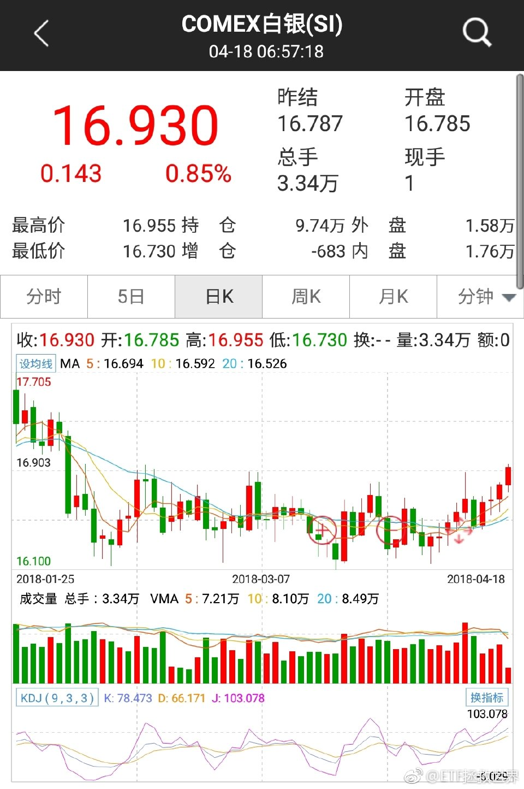

ETF拯救世界 (5687069307) @
2018-04-02 09:31:02 Mon  
url: https://weibo.com/5687069307/GabTi0GpZ

除了你遵守自己的策略。主动操作来讲，新高不要卖。//@ETF拯救世界:服不服。新高。一句投资金句告诉你：新高不卖。//@ETF拯救世界:讲真是不是又要新高了。计划第二大持仓，a股第一大

------------------------------------------------------
转推：
>  @ETF拯救世界 (5687069307)
>  2018-03-16 10:34:07 Fri  
>  url: https:/weibo.com/5687069307/G7C2rwoAZ/

>  我预感$全指医药 sh000991$  这一把新高应该是稳的。之后就不知道了。 ​​​

转发[14]  评论[12]  赞[91] 

======================================================

ETF拯救世界 (5687069307) @
2018-04-02 09:41:54 Mon  
url: https://weibo.com/5687069307/GabXH0drn

回复@Cubic_N:在上涨趋势中，只有一天你会卖在最高点。你猜，最高点是今天的概率有多大？//@Cubic_N:E大能不能讲讲为什么呀//@ETF拯救世界:除了你遵守自己的策略。主动操作来讲，新高不要卖。//@ETF拯救世界:服不服。新高。一句投资金句告诉你：新高不卖。

------------------------------------------------------
转推：
>  @ETF拯救世界 (5687069307)
>  2018-03-16 10:34:07 Fri  
>  url: https:/weibo.com/5687069307/G7C2rwoAZ/

>  我预感$全指医药 sh000991$  这一把新高应该是稳的。之后就不知道了。 ​​​

转发[8]  评论[19]  赞[72] 

======================================================

ETF拯救世界 (5687069307) @
2018-04-02 09:43:35 Mon  
url: https://weibo.com/5687069307/GabYni60n

$证券公司 sz399975$  FXXX! ​​​

转发[1]  评论[113]  赞[89] 

======================================================

ETF拯救世界 (5687069307) @
2018-04-02 10:05:25 Mon  
url: https://weibo.com/5687069307/Gac7ehzKJ

如果今天   $证券公司(SZ399975)$​   涨幅过大，我会发信息建议场外部分取消申购。如果取消，大概1-2点吧。 ​​​

转发[26]  评论[103]  赞[171] 

======================================================

ETF拯救世界 (5687069307) @
2018-04-02 11:17:05 Mon  
url: https://weibo.com/5687069307/GacAkikEA

一分钟都不差的最高点发出警告后，一路下跌。警报暂时解除，马照跑，舞照跳。

------------------------------------------------------
转推：
>  @ETF拯救世界 (5687069307)
>  2018-04-02 10:05:25 Mon  
>  url: https:/weibo.com/5687069307/Gac7ehzKJ/

>  如果今天   $证券公司(SZ399975)$​   涨幅过大，我会发信息建议场外部分取消申购。如果取消，大概1-2点吧。 ​​​

转发[1]  评论[92]  赞[167] 

======================================================

ETF拯救世界 (5687069307) @
2018-04-02 14:08:32 Mon  
url: https://weibo.com/5687069307/GadHV28J2

回复@D8奇迹:现价1.009，你的成本价是0.9971，你的累计收益怎么会是-1.45%。我倒是要请你解释解释。//@D8奇迹:回复@路漫漫其修远兮______:楼下回复场内场外的就是瞎扯蛋。 我就是场内跟车，成本价跟益达一模一样：0.9971。我的累计收益是-1.45个点。谁给解释解释！

------------------------------------------------------
转推：
>  @ETF拯救世界 (5687069307)
>  2018-04-02 10:05:25 Mon  
>  url: https:/weibo.com/5687069307/Gac7ehzKJ/

>  如果今天   $证券公司(SZ399975)$​   涨幅过大，我会发信息建议场外部分取消申购。如果取消，大概1-2点吧。 ​​​

转发[20]  评论[47]  赞[59] 

======================================================

ETF拯救世界 (5687069307) @
2018-04-02 14:19:34 Mon  
url: https://weibo.com/5687069307/GadMouLhD

不过话说回来，最近传媒场外连接表现确实有问题。也难怪有朋友郁闷。希望未来有好转吧。//@ETF拯救世界:回复@D8奇迹:现价1.009，你的成本价是0.9971，你的累计收益怎么会是-1.45%。我倒是要请你解释解释。

------------------------------------------------------
转推：
>  @ETF拯救世界 (5687069307)
>  2018-04-02 10:05:25 Mon  
>  url: https:/weibo.com/5687069307/Gac7ehzKJ/

>  如果今天   $证券公司(SZ399975)$​   涨幅过大，我会发信息建议场外部分取消申购。如果取消，大概1-2点吧。 ​​​

转发[1]  评论[11]  赞[55] 

======================================================

ETF拯救世界 (5687069307) @
2018-04-02 14:26:48 Mon  
url: https://weibo.com/5687069307/GadPkzKl4

回复@路漫漫其修远兮______:已经说过了。我是第二天场内买入ETF。你是场外买链接基金。由于各种原因，场外链接基金最近表现差一些。就是因为这个。我不可能每个人的小问题都一一作答。要知道每天后台有几百个各种问题在问我。这样的问题自己完全可以解决。

------------------------------------------------------
转推：
>  @ETF拯救世界 (5687069307)
>  2018-04-02 10:05:25 Mon  
>  url: https:/weibo.com/5687069307/Gac7ehzKJ/

>  如果今天   $证券公司(SZ399975)$​   涨幅过大，我会发信息建议场外部分取消申购。如果取消，大概1-2点吧。 ​​​

转发[17]  评论[40]  赞[85] 

======================================================

ETF拯救世界 (5687069307) @
2018-04-02 14:34:46 Mon  
url: https://weibo.com/5687069307/GadSzsk1q

回复@路漫漫其修远兮______:我最后再回一次。每次发车我都会提供场内场外两个代码，因为有人买场内，有人买场外，各位可以按需选择。且慢只能买场外，所以成本当然是场外。我本人有些品种场内，有些品种场外。有时候还会场内外转换套利。我不知道该怎么做才能达到你的预期。

------------------------------------------------------
转推：
>  @ETF拯救世界 (5687069307)
>  2018-04-02 10:05:25 Mon  
>  url: https:/weibo.com/5687069307/Gac7ehzKJ/

>  如果今天   $证券公司(SZ399975)$​   涨幅过大，我会发信息建议场外部分取消申购。如果取消，大概1-2点吧。 ​​​

转发[14]  评论[41]  赞[95] 

======================================================

ETF拯救世界 (5687069307) @
2018-04-02 14:43:14 Mon  
url: https://weibo.com/5687069307/GadW0dXrY

场内好还是场外好？没什么大区别。

今天券商收盘+1.2%，场外也应该是+1.2%。如果开盘就买场内的，当然是成本少1.2%。如果高点追场内的呢？半天过去已经浮亏1.8%了，还不如场外买。

我自己当然也是。有心的朋友可以看看我自己公众号的每个品种收益率和且慢的收益率。大部分品种都有一点点不一样。我自 ​​​

转发[29]  评论[122]  赞[265] 

======================================================

ETF拯救世界 (5687069307) @
2018-04-02 15:42:14 Mon  
url: https://weibo.com/5687069307/GaejX3tLL

回复@你说吧___:这是很大的问题。我不知道大家还记不记得2016年的xx原油。那时候刚几个人跟？我们可以把成交量拉到前一天的十倍。现在呢？如果不是很多朋友场外分流，你信不信80%的ETF根本无法承受我们的冲击。场内的朋友，还要做好未来卖的时候卖不出去的危险……

------------------------------------------------------
转推：
>  @ETF拯救世界 (5687069307)
>  2018-04-02 10:05:25 Mon  
>  url: https:/weibo.com/5687069307/Gac7ehzKJ/

>  如果今天   $证券公司(SZ399975)$​   涨幅过大，我会发信息建议场外部分取消申购。如果取消，大概1-2点吧。 ​​​

转发[7]  评论[105]  赞[125] 

======================================================

ETF拯救世界 (5687069307) @
2018-04-02 21:19:41 Mon  
url: https://weibo.com/5687069307/GagwVdnrL

每日打卡（170）

这几天坚持的不好，要努力了 ​​​

转发[0]  评论[21]  赞[132] 

+++++++++++++++++++++++++++++++++++++++++++++++++++++

图片：

======================================================

ETF拯救世界 (5687069307) @
2018-04-03 00:10:39 Tue  
url: https://weibo.com/5687069307/GahEjy5fw

买美股的日子还会远吗 ​​​

转发[11]  评论[84]  赞[205] 

+++++++++++++++++++++++++++++++++++++++++++++++++++++

图片：

======================================================

ETF拯救世界 (5687069307) @
2018-04-03 08:43:55 Tue  
url: https://weibo.com/5687069307/Gal0E7Q0z

准备抢个mix 2s玩玩。有没有用mix 2的朋友说说好不好玩。 ​​​

转发[8]  评论[106]  赞[95] 

======================================================

ETF拯救世界 (5687069307) @
2018-04-03 09:31:54 Tue  
url: https://weibo.com/5687069307/Galk7uoJQ

6-9个月之内搞定你是不是有点相信了。 ​​​

转发[4]  评论[109]  赞[203] 

======================================================

ETF拯救世界 (5687069307) @
2018-04-03 09:56:09 Tue  
url: https://weibo.com/5687069307/GaltYiXmI

我要去抢了，等我好消息。 ​​​

转发[1]  评论[47]  赞[119] 

======================================================

ETF拯救世界 (5687069307) @
2018-04-03 10:01:26 Tue  
url: https://weibo.com/5687069307/Galw7iptZ

没抢到。[拜拜][鄙视]

------------------------------------------------------
转推：
>  @ETF拯救世界 (5687069307)
>  2018-04-03 09:56:09 Tue  
>  url: https:/weibo.com/5687069307/GaltYiXmI/

>  我要去抢了，等我好消息。 ​​​

转发[0]  评论[42]  赞[89] 

======================================================

ETF拯救世界 (5687069307) @
2018-04-03 10:05:11 Tue  
url: https://weibo.com/5687069307/GalxE9o03

超过30%了。

------------------------------------------------------
转推：
>  @ETF拯救世界 (5687069307)
>  2018-01-04 14:12:41 Thu  
>  url: https:/weibo.com/5687069307/FCNAebMp1/

>  没想到浓眉大眼的保险股也跌了20%…… ​​​

转发[9]  评论[39]  赞[116] 

======================================================

ETF拯救世界 (5687069307) @
2018-04-03 10:54:56 Tue  
url: https://weibo.com/5687069307/GalRPxt5Q

$证券公司 sz399975$   哪尼？ ​​​

转发[3]  评论[28]  赞[96] 

======================================================

ETF拯救世界 (5687069307) @
2018-04-03 11:14:16 Tue  
url: https://weibo.com/5687069307/GalZGfLCr

几天前浮亏超过12个点的券商，现在浮亏只有3个多。

这是一个连跌4年的指数，刚刚见到4年新低。1800跌到650。

亏损真的很难。感受一下。 ​​​

转发[25]  评论[68]  赞[181] 

======================================================

ETF拯救世界 (5687069307) @
2018-04-03 11:17:49 Tue  
url: https://weibo.com/5687069307/Gam184sNJ

回复@小号1234567小童鞋:好的。从现在开始不要再给他看了。一个建议。[doge]//@小号1234567小童鞋:e大，老豆看了我医药的收益之后，打算等他的定期理财到期后交给我[太开心]

------------------------------------------------------
转推：
>  @ETF拯救世界 (5687069307)
>  2018-04-03 11:14:16 Tue  
>  url: https:/weibo.com/5687069307/GalZGfLCr/

>  几天前浮亏超过12个点的券商，现在浮亏只有3个多。
>  
>  这是一个连跌4年的指数，刚刚见到4年新低。1800跌到650。
>  
>  亏损真的很难。感受一下。 ​​​

转发[5]  评论[32]  赞[149] 

======================================================

ETF拯救世界 (5687069307) @
2018-04-03 14:07:06 Tue  
url: https://weibo.com/5687069307/Gan7PwWGA

一个不会死的品种，除非它是真正的超级成长品种，会不停的涨以外。

想要获得高收益，有两点。

一个是横盘时间够久。越久，未来涨的越高。

一个是跌的够深。跌的越深，爆发力越强。

所以每一个点的下跌，都代表了未来一个多点的收益。正常成长收益+回归收益就是你的真实收益。

所以，除非你是真的 ​​​

转发[92]  评论[149]  赞[355] 

======================================================

ETF拯救世界 (5687069307) @
2018-04-04 08:00:26 Wed  
url: https://weibo.com/5687069307/Gau9v8e9q

[允悲] ​​​

转发[1]  评论[73]  赞[169] 

+++++++++++++++++++++++++++++++++++++++++++++++++++++

图片：

======================================================

ETF拯救世界 (5687069307) @
2018-04-04 09:27:05 Wed  
url: https://weibo.com/5687069307/GauIFy9Hu

现在再回头看我以前写的，是不是更明白是什么意思了？不要卖。过山车，会有，但下去了你买更多，回来就赚更多！而且新高！不断新高！//@ETF拯救世界:不要卖。//@ETF拯救世界:继续说。不要卖。

------------------------------------------------------
转推：
>  @ETF拯救世界 (5687069307)
>  2017-10-18 11:27:47 Wed  
>  url: https:/weibo.com/5687069307/FqVaz4iTP/

>  $全指医药 sh000991$ $养老产业 sz399812$ 
>  
>  事情还没有结束。 ​​​

转发[14]  评论[71]  赞[181] 

======================================================

ETF拯救世界 (5687069307) @
2018-04-04 09:49:46 Wed  
url: https://weibo.com/5687069307/GauRSqngc

这不是化妆，这是易容术。

------------------------------------------------------
转推：
>  @ ()
>  2018-04-03 22:02:42 Tue  
>  url: 

>  抱歉，作者已设置仅展示半年内微博，此微博已不可见。 ​​​

转发[8]  评论[24]  赞[80] 

======================================================

ETF拯救世界 (5687069307) @
2018-04-04 12:23:11 Wed  
url: https://weibo.com/5687069307/GavS9lQC4

我高中时候约会就去美术馆了……//@夏阿:我约会也喜欢去美术馆，没约成而已，主要是美术馆不行。

------------------------------------------------------
转推：
>  @新浪艺术 (1880233081)
>  2018-04-04 11:55:10 Wed  
>  url: https:/weibo.com/1880233081/GavGMf9sF/

>  【日本年轻男女为什么都喜欢跑到美术馆去约会】日本的年轻男女为什么都喜欢跑到美术馆去约会？高档餐厅、电影院、咖啡厅……你是否已经发现，平日里休闲娱乐、约会的场所好像都已经被玩腻了，毫无新意？于是，在日本城市美术馆所举办的热门展览上，放眼看去都是男女情侣。http://t.cn/Rm7H27V ​​​

转发[7]  评论[75]  赞[90] 

======================================================

ETF拯救世界 (5687069307) @
2018-04-04 16:19:31 Wed  
url: https://weibo.com/5687069307/Gaxq4Do03

黄金开始表演了。白银网格可以稍微放大一点。 ​​​

转发[13]  评论[37]  赞[139] 

======================================================

ETF拯救世界 (5687069307) @
2018-04-04 16:27:57 Wed  
url: https://weibo.com/5687069307/GaxtvqDac

回复@沙恩霍斯特号:德国下一步补仓位置我给到10000点左右吧。//@沙恩霍斯特号:全球暴跌啊

------------------------------------------------------
转推：
>  @ETF拯救世界 (5687069307)
>  2018-04-04 16:19:31 Wed  
>  url: https:/weibo.com/5687069307/Gaxq4Do03/

>  黄金开始表演了。白银网格可以稍微放大一点。 ​​​

转发[6]  评论[28]  赞[110] 

======================================================

ETF拯救世界 (5687069307) @
2018-04-04 19:14:13 Wed  
url: https://weibo.com/5687069307/GayyZh9xN

现在外面雨夹雪。好像很冷，不想出门，但是要回家，还是得走啊。

等了一个冬天的雪，4月份下了。魔幻现实主义。 ​​​

转发[2]  评论[76]  赞[200] 

======================================================

ETF拯救世界 (5687069307) @
2018-04-04 20:05:29 Wed  
url: https://weibo.com/5687069307/GayTNqwXC

有位朋友把文章里出现过的歌做了个歌单。

非常感谢这位朋友，需要的可以收藏……

分享歌单http://t.cn/RmZMq8v（@网易云音乐） ​​​

转发[57]  评论[61]  赞[267] 

======================================================

ETF拯救世界 (5687069307) @
2018-04-05 02:43:54 Thu  
url: https://weibo.com/5687069307/GaBvw3AhE

美国人根本没在怕的 ​​​

转发[8]  评论[104]  赞[145] 

+++++++++++++++++++++++++++++++++++++++++++++++++++++

图片：

======================================================

ETF拯救世界 (5687069307) @
2018-04-06 06:57:50 Fri  
url: https://weibo.com/5687069307/GaMB5wv3l

波动越大赚钱越快，你感受一下

------------------------------------------------------
转推：
>  @老马自奋蹄 (1807436544)
>  2018-04-06 00:08:50 Fri  
>  url: https:/weibo.com/1807436544/GaJV4BWRp/

>  实验证明：道路越是坎坷，前进的速度越快！人生就要浪起来～（http://t.cn/RmwRS7z） ​​​

转发[67]  评论[55]  赞[225] 

======================================================

ETF拯救世界 (5687069307) @
2018-04-06 07:52:27 Fri  
url: https://weibo.com/5687069307/GaMXg9XIi

你们就趁着我们放假折腾吧。

------------------------------------------------------
转推：
>  @ ()
>  2018-04-06 07:27:40 Fri  
>  url: 

>  抱歉，此微博已被作者删除。查看帮助：http://t.cn/Rfd3rQV

转发[4]  评论[51]  赞[110] 

======================================================

ETF拯救世界 (5687069307) @
2018-04-07 13:39:37 Sat  
url: https://weibo.com/5687069307/GaYEFfOfl

我感觉，天天为了年薪不到100万，学区房等等焦虑的人是因为生活过得太安稳了。

哪天生活给你来一记重锤，你才知道以前的“焦虑”多么SB. ​​​

转发[30]  评论[93]  赞[328] 

======================================================

ETF拯救世界 (5687069307) @
2018-04-07 15:11:05 Sat  
url: https://weibo.com/5687069307/GaZfN7vct

不焦虑真的很难。元首也焦虑。 ​​​

转发[4]  评论[53]  赞[139] 

+++++++++++++++++++++++++++++++++++++++++++++++++++++

图片：

======================================================

ETF拯救世界 (5687069307) @
2018-04-08 09:28:41 Sun  
url: https://weibo.com/5687069307/Gb6rj7J1s

这样的天气不去北海划船可能已经触犯刑法了。 ​​​

转发[0]  评论[32]  赞[130] 

======================================================

ETF拯救世界 (5687069307) @
2018-04-08 09:40:30 Sun  
url: https://weibo.com/5687069307/Gb6w6p5Mb

我预计平盘报收。比美股上蹿下跳不知道高到哪里去了。

------------------------------------------------------
转推：
>  @亟兮般若 (1769469393)
>  2018-04-08 09:38:55 Sun  
>  url: https:/weibo.com/1769469393/Gb6vstH7Z/

>  今天看来走势很平稳，贸易战对A股影响不大嘛[允悲][允悲][允悲][允悲] ​​​

转发[5]  评论[45]  赞[107] 

======================================================

ETF拯救世界 (5687069307) @
2018-04-08 11:21:46 Sun  
url: https://weibo.com/5687069307/Gb7bcm0ZD

男孩女孩都要教育。

------------------------------------------------------
转推：
>  @王大伟 (1227198941)
>  2018-04-07 07:11:44 Sat  
>  url: https:/weibo.com/1227198941/GaW7egaKq/

>  告诉女孩，身边也有大灰狼
>  
>  当了一辈子警察，有两件事情，不忍去看。不忍去听，一个是拐卖孩子，再有一个就是欺负小女孩。
>  何为菩萨？天使？理想？归宿？桑枣中学的叶校长苦口婆心教孩子演习，汶川地震时孩子无一死伤，被家长称为菩萨。有人吃斋、有人念佛。也许，我们每一个凡人，护士、教师，忽然顿 ​​​

转发[42]  评论[14]  赞[103] 

======================================================

ETF拯救世界 (5687069307) @
2018-04-08 11:41:17 Sun  
url: https://weibo.com/5687069307/Gb7j87dvF

最近看了几个新闻，有些想法，不一定成熟，说出来讨论。

是关于几个自杀大学生的新闻。

我在这里不想说涉事教师的问题，自会有公断，我想讨论的，是孩子走到自杀这一步，父母有没有问题。

我想每个人的人生，或多或少都会遇到很多挫折。但想到去自杀的人不会是大多数，真的去做的更少。我没想过自杀 ​​​

转发[65]  评论[121]  赞[378] 

======================================================

ETF拯救世界 (5687069307) @
2018-04-08 14:29:58 Sun  
url: https://weibo.com/5687069307/Gb8pB8Ujt

我想了想，父母做什么事会导致孩子不愿意跟父母沟通了呢。

第一是欺骗。比如承诺的事不做。
第二是嘲笑。比如孩子觉得很自豪的事情被父母无情嘲笑。
第三是不重视或者不支持。比如孩子的想法不当回事，把自己的意愿强加给孩子，孩子说什么都没用，只是父母的傀儡。

总而言之就是不把孩子当成平等的人 ​​​

转发[103]  评论[76]  赞[222] 

======================================================

ETF拯救世界 (5687069307) @
2018-04-08 14:49:23 Sun  
url: https://weibo.com/5687069307/Gb8xtxONU

回复@2006好好2018:我还是之前的那个观点，这个社会的苦，足够孩子吃了。你不给他主动设置障碍，这一辈子他都有无数的苦要吃。一个人的极限承受能力应该不是吃苦越来越多承受能力越来越强，而是心中的信念或者爱足够支撑自己走下去。

------------------------------------------------------
转推：
>  @ETF拯救世界 (5687069307)
>  2018-04-08 14:29:58 Sun  
>  url: https:/weibo.com/5687069307/Gb8pB8Ujt/

>  我想了想，父母做什么事会导致孩子不愿意跟父母沟通了呢。
>  
>  第一是欺骗。比如承诺的事不做。
>  第二是嘲笑。比如孩子觉得很自豪的事情被父母无情嘲笑。
>  第三是不重视或者不支持。比如孩子的想法不当回事，把自己的意愿强加给孩子，孩子说什么都没用，只是父母的傀儡。
>  
>  总而言之就是不把孩子当成平等的人 ​​​

转发[45]  评论[50]  赞[248] 

======================================================

ETF拯救世界 (5687069307) @
2018-04-08 15:02:37 Sun  
url: https://weibo.com/5687069307/Gb8CQAgKU

就比如说吧，你拿着指数基金上上下下左左右右BABA波动很多次还在浮亏，那让你继续拿下去的动力是未来会赚钱的希望还是波动多了赔得多了习惯了……[doge]

------------------------------------------------------
转推：
>  @ETF拯救世界 (5687069307)
>  2018-04-08 14:29:58 Sun  
>  url: https:/weibo.com/5687069307/Gb8pB8Ujt/

>  我想了想，父母做什么事会导致孩子不愿意跟父母沟通了呢。
>  
>  第一是欺骗。比如承诺的事不做。
>  第二是嘲笑。比如孩子觉得很自豪的事情被父母无情嘲笑。
>  第三是不重视或者不支持。比如孩子的想法不当回事，把自己的意愿强加给孩子，孩子说什么都没用，只是父母的傀儡。
>  
>  总而言之就是不把孩子当成平等的人 ​​​

转发[8]  评论[47]  赞[140] 

======================================================

ETF拯救世界 (5687069307) @
2018-04-09 09:39:05 Mon  
url: https://weibo.com/5687069307/GbfW1tWgz

今天不能跌，GJD加油。仗还没打，气势不能输。 ​​​

转发[10]  评论[47]  赞[195] 

======================================================

ETF拯救世界 (5687069307) @
2018-04-09 09:59:46 Mon  
url: https://weibo.com/5687069307/Gbg4q6GfK

做大判断要了解LD的意图。第一是稳定，第二是面子。有稳定给面子，一切都好说。

------------------------------------------------------
转推：
>  @ETF拯救世界 (5687069307)
>  2018-04-09 09:39:05 Mon  
>  url: https:/weibo.com/5687069307/GbfW1tWgz/

>  今天不能跌，GJD加油。仗还没打，气势不能输。 ​​​

转发[4]  评论[39]  赞[148] 

======================================================

ETF拯救世界 (5687069307) @
2018-04-09 14:46:14 Mon  
url: https://weibo.com/5687069307/GbhWHdqPp

2分，50元。感觉是在鼓励。

------------------------------------------------------
转推：
>  @澎湃新闻 (5044281310)
>  2018-04-09 14:44:03 Mon  
>  url: https:/weibo.com/5044281310/GbhVOhLu3/

>  【开车录唱歌视频、双手脱靶“比心”，浙江一抖音女主播被罚】 http://t.cn/RmVk1uf 澎湃新闻4月9日从台州市公安局网络警察支队获悉，支队接网民举报后联合交警查实，违法嫌疑人林某5日驾驶奔驰越野车时，把手机放在副驾前中控台的手机架上，用手机前置摄像头拍了一段15秒的视频。视频中，林某未系安全 ​​​

转发[1]  评论[35]  赞[71] 

======================================================

ETF拯救世界 (5687069307) @
2018-04-09 15:02:09 Mon  
url: https://weibo.com/5687069307/Gbi39DXHm

沪深300收盘-0.03%。任务完成的不完美。好在上证挺住了。明天继续加油。气势不能输！

------------------------------------------------------
转推：
>  @ETF拯救世界 (5687069307)
>  2018-04-09 09:39:05 Mon  
>  url: https:/weibo.com/5687069307/GbfW1tWgz/

>  今天不能跌，GJD加油。仗还没打，气势不能输。 ​​​

转发[0]  评论[34]  赞[140] 

======================================================

ETF拯救世界 (5687069307) @
2018-04-09 16:10:11 Mon  
url: https://weibo.com/5687069307/GbiuM178i

问问有经验的，带4、5岁的孩子出去玩的话，什么地方比较好。

邮轮。或者国内比较休闲的地方，杭州之类的。还有没有更好的主意。从没带孩子出远门，我觉得可以开始了。 ​​​

转发[48]  评论[433]  赞[168] 

======================================================

ETF拯救世界 (5687069307) @
2018-04-10 09:47:57 Tue  
url: https://weibo.com/5687069307/Gbpq762Hg

$证券公司 sz399975$  能跳多高 ​​​

转发[3]  评论[33]  赞[101] 

======================================================

ETF拯救世界 (5687069307) @
2018-04-10 10:39:30 Tue  
url: https://weibo.com/5687069307/GbpL2ElqE

鸡肋时间。

特别鸡肋。干点别的去吧。 ​​​

转发[0]  评论[26]  赞[141] 

======================================================

ETF拯救世界 (5687069307) @
2018-04-10 11:24:29 Tue  
url: https://weibo.com/5687069307/Gbq3iDrtp

不放点诱饵你怎么上钩。太坏了。 ​​​

转发[5]  评论[55]  赞[162] 

======================================================

ETF拯救世界 (5687069307) @
2018-04-10 14:01:59 Tue  
url: https://weibo.com/5687069307/Gbr5entJ0

回复@落叶女青年7998:目前看可能性不太大。在目前这个区域，该买的都已经买的差不多了。仓位也挺合适。随缘吧。//@落叶女青年7998:老大，四月中旬发车不？

------------------------------------------------------
转推：
>  @ETF拯救世界 (5687069307)
>  2018-04-10 11:24:29 Tue  
>  url: https:/weibo.com/5687069307/Gbq3iDrtp/

>  不放点诱饵你怎么上钩。太坏了。 ​​​

转发[2]  评论[34]  赞[94] 

======================================================

ETF拯救世界 (5687069307) @
2018-04-10 15:05:16 Tue  
url: https://weibo.com/5687069307/GbruV6ECn

再创收盘新高。不要卖。

------------------------------------------------------
转推：
>  @ETF拯救世界 (5687069307)
>  2017-10-18 11:27:47 Wed  
>  url: https:/weibo.com/5687069307/FqVaz4iTP/

>  $全指医药 sh000991$ $养老产业 sz399812$ 
>  
>  事情还没有结束。 ​​​

转发[4]  评论[92]  赞[150] 

======================================================

ETF拯救世界 (5687069307) @
2018-04-10 23:07:15 Tue  
url: https://weibo.com/5687069307/GbuEyqIpX

三个月了，总算有点波动了 ​​​

转发[1]  评论[41]  赞[139] 

+++++++++++++++++++++++++++++++++++++++++++++++++++++

图片：

======================================================

ETF拯救世界 (5687069307) @
2018-04-10 23:41:52 Tue  
url: https://weibo.com/5687069307/GbuSByQoM

每日打卡（171）

19000步 ​​​

转发[0]  评论[16]  赞[125] 

+++++++++++++++++++++++++++++++++++++++++++++++++++++

图片：

======================================================

ETF拯救世界 (5687069307) @
2018-04-11 09:35:12 Wed  
url: https://weibo.com/5687069307/GbyLrmfoZ

舒服。 ​​​

转发[0]  评论[56]  赞[139] 

======================================================

ETF拯救世界 (5687069307) @
2018-04-11 11:26:17 Wed  
url: https://weibo.com/5687069307/GbzuxhvGI

开不开沪伦通无所谓，能不能先把英国ETF发了？现在估值16倍多，是个不错的买入时机啊。英镑又在相对低位，赶紧的。

------------------------------------------------------
转推：
>  @ ()
>  2018-04-11 11:17:22 Wed  
>  url: 

>  抱歉，作者已设置仅展示半年内微博，此微博已不可见。 ​​​

转发[19]  评论[61]  赞[166] 

======================================================

ETF拯救世界 (5687069307) @
2018-04-11 15:09:57 Wed  
url: https://weibo.com/5687069307/GbAXjxTWy

回复@山水6666:非常操心。认真带一个孩子，才知道带孩子有多累，要操多少心。如果只是回家和孩子做做游戏，玩玩，两个三个都无所谓。当然越多越好……这世界上的累是公平的。你觉得不累，就是有人替你累了。

------------------------------------------------------
转推：
>  @ETF拯救世界 (5687069307)
>  2018-04-09 16:10:11 Mon  
>  url: https:/weibo.com/5687069307/GbiuM178i/

>  问问有经验的，带4、5岁的孩子出去玩的话，什么地方比较好。
>  
>  邮轮。或者国内比较休闲的地方，杭州之类的。还有没有更好的主意。从没带孩子出远门，我觉得可以开始了。 ​​​

转发[9]  评论[78]  赞[205] 

======================================================

ETF拯救世界 (5687069307) @
2018-04-12 09:22:33 Thu  
url: https://weibo.com/5687069307/GbI6NE7wv

祸从口出。沉默是金。

------------------------------------------------------
转推：
>  @新京报我们视频 (6124642021)
>  2018-04-11 22:14:35 Wed  
>  url: https:/weibo.com/6124642021/GbDJG2X3x/

>  【在逃嫌疑人正跟妹子吹牛 没想到周围有11名便衣民警也在宵夜】4月10日，浙江乐清一家夜宵店内，有桌人聊得火热，一男子大声吹嘘自己，引起旁边民警的注意。民警陈建锋说，自己一抬头刚好和男子对视了一下，短短几秒钟他迅速想起男子是名在逃嫌疑人。“我们拍着他的肩膀叫他名字，他当时就愣住了”。 ​​​

转发[3]  评论[26]  赞[64] 

======================================================

ETF拯救世界 (5687069307) @
2018-04-12 11:14:37 Thu  
url: https://weibo.com/5687069307/GbIQhdUab

$全指医药 sh000991$   不要卖 ​​​

转发[125]  评论[58]  赞[134] 

======================================================

ETF拯救世界 (5687069307) @
2018-04-12 11:28:14 Thu  
url: https://weibo.com/5687069307/GbIVOAhWT

回复@902yuyu:你种了100亩地，种的是玉米。会不会在春天刚刚发芽的时候把所有青苗拔掉。很多人会。我不会。我要的是秋天的玉米，不是春天的苗。所以很多人每年都在忙碌，什么也没收获过。//@902yuyu:其实你要不说，我真是想卖掉了

------------------------------------------------------
转推：
>  @ETF拯救世界 (5687069307)
>  2018-04-12 11:14:37 Thu  
>  url: https:/weibo.com/5687069307/GbIQhdUab/

>  $全指医药 sh000991$   不要卖 ​​​

转发[17]  评论[30]  赞[122] 

======================================================

ETF拯救世界 (5687069307) @
2018-04-12 11:40:50 Thu  
url: https://weibo.com/5687069307/GbJ0W0Pz5

所有指数类产品，过去十年，我没有亏损卖出过任何一个品种。亏是不可能亏的，一辈子都不会亏。要么是想方设法把成本降下来，要么是死死拿住等风来。

所以，只要你不亏损卖出，就会翻盘。

某个时期，如果你害怕的一定要亏损卖出，谁都救不了你。 ​​​

转发[72]  评论[93]  赞[222] 

======================================================

ETF拯救世界 (5687069307) @
2018-04-12 11:48:30 Thu  
url: https://weibo.com/5687069307/GbJ42iU2R

回复@八月未央歌Ed:不懂为什么不安。中国最好的几百家医药公司的股权在你手上，你的成本比最高点低了40%多，如果能回去，你就翻番了。 买的也不多，再跌大把钱摊低成本。怕什么，怕的点在哪里？//@八月未央歌Ed:现在又觉得买少了，忘了当初拿着时是怎样的惴惴不安

------------------------------------------------------
转推：
>  @ETF拯救世界 (5687069307)
>  2018-04-12 11:14:37 Thu  
>  url: https:/weibo.com/5687069307/GbIQhdUab/

>  $全指医药 sh000991$   不要卖 ​​​

转发[13]  评论[32]  赞[116] 

======================================================

ETF拯救世界 (5687069307) @
2018-04-12 12:25:58 Thu  
url: https://weibo.com/5687069307/GbJjfxEzr

回复@江湖人称再议哥:你太有天分了。趋势投资的部分，这两句都是金句。股票涨起来没有天花板，跌起来地下室下面还有18层地狱……但是只对趋势有效，价值投资当然是够便宜就买了。左侧右侧不同逻辑。//@江湖人称再议哥:新高不卖是不是对应新低不买？

------------------------------------------------------
转推：
>  @ETF拯救世界 (5687069307)
>  2018-04-12 11:14:37 Thu  
>  url: https:/weibo.com/5687069307/GbIQhdUab/

>  $全指医药 sh000991$   不要卖 ​​​

转发[82]  评论[38]  赞[110] 

======================================================

ETF拯救世界 (5687069307) @
2018-04-12 12:34:56 Thu  
url: https://weibo.com/5687069307/GbJmTjMHZ

回复@nasaznk:主动基金的最大问题在于“不可测”。你不知道它会干什么。比如会不会底部减仓，高位加仓，会不会熊市一路重仓，牛市一路轻仓。所以不好说。//@nasaznk:是不是买普通基金也要按这个思路？

------------------------------------------------------
转推：
>  @ETF拯救世界 (5687069307)
>  2018-04-12 11:40:50 Thu  
>  url: https:/weibo.com/5687069307/GbJ0W0Pz5/

>  所有指数类产品，过去十年，我没有亏损卖出过任何一个品种。亏是不可能亏的，一辈子都不会亏。要么是想方设法把成本降下来，要么是死死拿住等风来。
>  
>  所以，只要你不亏损卖出，就会翻盘。
>  
>  某个时期，如果你害怕的一定要亏损卖出，谁都救不了你。 ​​​

转发[15]  评论[17]  赞[107] 

======================================================

ETF拯救世界 (5687069307) @
2018-04-12 13:42:14 Thu  
url: https://weibo.com/5687069307/GbJOdmJlj

回复@一起去海淘:你也算有天分。这正是趋势交易的一个精髓。但注意，不是随便一个新高都可以加买。长阳放量突破长期横盘区域最高点连线的新高最值得入手。横盘时间越长，之后的走势越值得期待。这都是所谓右侧交易的东西了。//@一起去海淘:SO，新高要加买？

------------------------------------------------------
转推：
>  @ETF拯救世界 (5687069307)
>  2018-04-12 11:14:37 Thu  
>  url: https:/weibo.com/5687069307/GbIQhdUab/

>  $全指医药 sh000991$   不要卖 ​​​

转发[52]  评论[52]  赞[124] 

======================================================

ETF拯救世界 (5687069307) @
2018-04-12 13:49:28 Thu  
url: https://weibo.com/5687069307/GbJR962xb

回复@小狗上马路:谁也没说过吧！当年雪球短线实盘大赛了解一下……//@小狗上马路:谁说我们E哥不懂技术

------------------------------------------------------
转推：
>  @ETF拯救世界 (5687069307)
>  2018-04-12 11:14:37 Thu  
>  url: https:/weibo.com/5687069307/GbIQhdUab/

>  $全指医药 sh000991$   不要卖 ​​​

转发[2]  评论[18]  赞[81] 

======================================================

ETF拯救世界 (5687069307) @
2018-04-12 14:04:22 Thu  
url: https://weibo.com/5687069307/GbJXc4Zd3

投资这件事吧，都说是科学和艺术，这个我做个比喻你就懂了。

没错，投资是艺术，但它首先是科学，怎么理解。

咱们大家来投资，就是开始做一件工作。刚开始嘛，大家肯定要学习怎么干。干的效果也不一样。

都是一般工人，但有的就能勉强糊口，有的做一个坏一个，很明显就不是吃这碗饭的。

能糊口的人 ​​​

转发[95]  评论[131]  赞[281] 

======================================================

ETF拯救世界 (5687069307) @
2018-04-12 14:28:59 Thu  
url: https://weibo.com/5687069307/GbK7bqcC8

关于内涵段子，我居然都没下载过，也没用过，可能真是老了。

不过有一个特别不明白，北京马路上好多车后面都贴着“内涵段子”的车贴。这是什么情况，自发做广告吗。真爱用户？ ​​​

转发[2]  评论[108]  赞[118] 

======================================================

ETF拯救世界 (5687069307) @
2018-04-13 07:22:23 Fri  
url: https://weibo.com/5687069307/GbQKx4SvH

今天退博八小时 ​​​

转发[0]  评论[120]  赞[170] 

======================================================

ETF拯救世界 (5687069307) @
2018-04-13 16:30:30 Fri  
url: https://weibo.com/5687069307/GbUl0ja05

回来了！我去探索地球了。

月中发车不发车是个问题，周日看吧。 ​​​

转发[6]  评论[110]  赞[235] 

+++++++++++++++++++++++++++++++++++++++++++++++++++++

图片：

======================================================

ETF拯救世界 (5687069307) @
2018-04-14 22:34:24 Sat  
url: https://weibo.com/5687069307/Gc69d3KxG

每日打卡（172）

要增加频率了。 ​​​

转发[0]  评论[30]  赞[126] 

+++++++++++++++++++++++++++++++++++++++++++++++++++++

图片：

======================================================

ETF拯救世界 (5687069307) @
2018-04-15 21:13:32 Sun  
url: https://weibo.com/5687069307/Gcf2Sw2cI

每日打卡（173）

坚持 ​​​

转发[0]  评论[21]  赞[108] 

+++++++++++++++++++++++++++++++++++++++++++++++++++++

图片：

======================================================

ETF拯救世界 (5687069307) @
2018-04-16 09:44:33 Mon  
url: https://weibo.com/5687069307/GcjXIuU8r

这样来几天的话，弄不好月中的车会补上。不一定，看情况吧。世事难料。 ​​​

转发[2]  评论[39]  赞[188] 

======================================================

ETF拯救世界 (5687069307) @
2018-04-16 10:22:15 Mon  
url: https://weibo.com/5687069307/Gckd121nH

趋势一旦形成，就很难改变。无论上升还是下降。

而且会有惯性。便宜了会更便宜，贵了会更贵。

所以趋势转折的时候不要着急接飞刀，小心手。 ​​​

转发[48]  评论[77]  赞[250] 

======================================================

ETF拯救世界 (5687069307) @
2018-04-16 11:05:44 Mon  
url: https://weibo.com/5687069307/GckuFwmFe

哪能港，月中不发车威力已经这么大了？ ​​​

转发[2]  评论[40]  赞[146] 

======================================================

ETF拯救世界 (5687069307) @
2018-04-16 11:08:08 Mon  
url: https://weibo.com/5687069307/GckvEs9hE

看了看上个月中不发车后的走势，神了嘿。

------------------------------------------------------
转推：
>  @ETF拯救世界 (5687069307)
>  2018-04-16 11:05:44 Mon  
>  url: https:/weibo.com/5687069307/GckuFwmFe/

>  哪能港，月中不发车威力已经这么大了？ ​​​

转发[0]  评论[13]  赞[113] 

======================================================

ETF拯救世界 (5687069307) @
2018-04-16 11:12:38 Mon  
url: https://weibo.com/5687069307/GckxsFwuI

回复@胡桃子他爸:主要靠蒙。//@胡桃子他爸:回复@ETF拯救世界:关键是如何定义高与低呢？

------------------------------------------------------
转推：
>  @ETF拯救世界 (5687069307)
>  2018-04-16 11:05:44 Mon  
>  url: https:/weibo.com/5687069307/GckuFwmFe/

>  哪能港，月中不发车威力已经这么大了？ ​​​

转发[0]  评论[25]  赞[122] 

======================================================

ETF拯救世界 (5687069307) @
2018-04-16 13:24:44 Mon  
url: https://weibo.com/5687069307/Gclp5zNmf

周末去摸了摸真机，还是感觉厚了。摸惯s8的手有点不适应。所以还是先不买了。给家里人买了个苹果x。太难用了！面容解锁难用，指纹解锁没了，大多数时间都得输密码。然后用起来没有实体键感觉各种不方便。。以前快捷方式是上划，现在变成什么了？我想锁定竖屏找了半天没有气坏了。

------------------------------------------------------
转推：
>  @ETF拯救世界 (5687069307)
>  2018-04-03 08:43:55 Tue  
>  url: https:/weibo.com/5687069307/Gal0E7Q0z/

>  准备抢个mix 2s玩玩。有没有用mix 2的朋友说说好不好玩。 ​​​

转发[7]  评论[57]  赞[73] 

======================================================

ETF拯救世界 (5687069307) @
2018-04-16 13:31:55 Mon  
url: https://weibo.com/5687069307/Gcls0t9Vd

回复@卡农inD:比如说吧，带个口罩或者太阳镜，解不了吧。再比如想看个时间，结果啪解锁了。s8也有面容解锁虹膜解锁，但是因为有指纹所以可以关掉那些。x关掉面容只能输密码了。还有以前打开手电计算器那些快捷方式的主页上划现在变成什么了……//@卡农inD:我用的挺好啊

------------------------------------------------------
转推：
>  @ETF拯救世界 (5687069307)
>  2018-04-03 08:43:55 Tue  
>  url: https:/weibo.com/5687069307/Gal0E7Q0z/

>  准备抢个mix 2s玩玩。有没有用mix 2的朋友说说好不好玩。 ​​​

转发[0]  评论[14]  赞[46] 

======================================================

ETF拯救世界 (5687069307) @
2018-04-16 13:42:22 Mon  
url: https://weibo.com/5687069307/GclwfpqXH

1月25日。值得纪念。

------------------------------------------------------
转推：
>  @ETF拯救世界 (5687069307)
>  2018-01-25 11:18:26 Thu  
>  url: https:/weibo.com/5687069307/G00XC3BZQ/

>  不少人会在“价值投资元年”之后，在一些“蓝筹股”上套3-5年 ​​​

转发[47]  评论[21]  赞[132] 

======================================================

ETF拯救世界 (5687069307) @
2018-04-16 14:02:03 Mon  
url: https://weibo.com/5687069307/GclEffgzd

回复@金顶佛光:不好意思做不到所有品种都买在最低。我只能说14 pe 1.5 pb 每年三个多点股息买不了吃亏买不了上当。//@金顶佛光:中证红利岂不是买得有点高//@ETF拯救世界:1月25日。值得纪念。

------------------------------------------------------
转推：
>  @ETF拯救世界 (5687069307)
>  2018-01-25 11:18:26 Thu  
>  url: https:/weibo.com/5687069307/G00XC3BZQ/

>  不少人会在“价值投资元年”之后，在一些“蓝筹股”上套3-5年 ​​​

转发[43]  评论[36]  赞[128] 

======================================================

ETF拯救世界 (5687069307) @
2018-04-16 14:33:09 Mon  
url: https://weibo.com/5687069307/GclQRoKeQ

回复@慢慢落:墨菲定律了解一下//@慢慢落:回复@ETF拯救世界:我老婆的 iPhone X 摔了一下，外表无伤，但是前置摄像头就坏了，face ID 也就不能工作了；之前买的国行iPhone 6和iPhone 7 plus，百摔无事，这次自信的买了一个日版iPhone X就这样了，真是[太阳][doge]

------------------------------------------------------
转推：
>  @ETF拯救世界 (5687069307)
>  2018-04-03 08:43:55 Tue  
>  url: https:/weibo.com/5687069307/Gal0E7Q0z/

>  准备抢个mix 2s玩玩。有没有用mix 2的朋友说说好不好玩。 ​​​

转发[0]  评论[11]  赞[59] 

======================================================

ETF拯救世界 (5687069307) @
2018-04-16 14:33:57 Mon  
url: https://weibo.com/5687069307/GclRbuX38

回复@南直隶吏部尚书:这又不同了。个股以及板块，与相对宽基的指数还是有区别。比如，如果银行业突然面临某些整体问题呢。//@南直隶吏部尚书:那我买了几个银行，pe<10，破净，如何？

------------------------------------------------------
转推：
>  @ETF拯救世界 (5687069307)
>  2018-01-25 11:18:26 Thu  
>  url: https:/weibo.com/5687069307/G00XC3BZQ/

>  不少人会在“价值投资元年”之后，在一些“蓝筹股”上套3-5年 ​​​

转发[30]  评论[21]  赞[85] 

======================================================

ETF拯救世界 (5687069307) @
2018-04-16 16:04:33 Mon  
url: https://weibo.com/5687069307/GcmrXv2Jl

回复@Sunrise光光光:最不喜欢没有数据全凭感觉的。最关键一点，我的红利只有14倍，你的300是24 http://t.cn/RmH392P //@Sunrise光光光:回复@Sunrise光光光:走势雷同 指标雷同  性质也雷同  涨幅看510300比中证红利还高些

------------------------------------------------------
转推：
>  @ETF拯救世界 (5687069307)
>  2018-01-25 11:18:26 Thu  
>  url: https:/weibo.com/5687069307/G00XC3BZQ/

>  不少人会在“价值投资元年”之后，在一些“蓝筹股”上套3-5年 ​​​

转发[24]  评论[14]  赞[72] 

======================================================

ETF拯救世界 (5687069307) @
2018-04-16 16:13:19 Mon  
url: https://weibo.com/5687069307/GcmvwflSl

对了，还有，富国红利这三年还跑赢全收益指数6%，等于跑赢300etf大概36%以上了。//@ETF拯救世界:回复@Sunrise光光光:最不喜欢没有数据全凭感觉的。最关键一点，我的红利只有14倍，你的300是24 http://t.cn/RmH392P 

------------------------------------------------------
转推：
>  @ETF拯救世界 (5687069307)
>  2018-01-25 11:18:26 Thu  
>  url: https:/weibo.com/5687069307/G00XC3BZQ/

>  不少人会在“价值投资元年”之后，在一些“蓝筹股”上套3-5年 ​​​

转发[20]  评论[12]  赞[82] 

======================================================

ETF拯救世界 (5687069307) @
2018-04-16 16:24:10 Mon  
url: https://weibo.com/5687069307/GcmzVh4Fp

回复@浅九深:我从来不看官方或者软件上的数据。我不会把积累了十几年的资金放到一个不知道正确与否的数据上。所以从十年前我就开始自己计算记录数据了。如果我相信这个数据，恐怕2015年已经死了。//@浅九深:请问下你说的是市盈率吗？ http://t.cn/RmHr1Jy 

------------------------------------------------------
转推：
>  @ETF拯救世界 (5687069307)
>  2018-01-25 11:18:26 Thu  
>  url: https:/weibo.com/5687069307/G00XC3BZQ/

>  不少人会在“价值投资元年”之后，在一些“蓝筹股”上套3-5年 ​​​

转发[12]  评论[52]  赞[116] 

======================================================

ETF拯救世界 (5687069307) @
2018-04-16 18:00:14 Mon  
url: https://weibo.com/5687069307/GcncV2455

从今天起商界奇才我只服YT Jia

------------------------------------------------------
转推：
>  @财联社APP (2868676035)
>  2018-04-16 17:57:23 Mon  
>  url: https:/weibo.com/2868676035/GcnbLbSTk/

>  【恒大3亿美元入股FF 当时FF估值仅15亿美元】财联社4月16日讯，贾跃亭的美国新创造车公司Faraday Future（FF）的神秘投资人浮出水面。4月16日，从不同信源处获悉，房地产商恒大集团参与了FF的新一轮投资。一位接近交易的知情人士称，恒大集团位于香港的基金在2017年年底，投资了FF注册于开曼的离岸公司 ​​​

转发[2]  评论[30]  赞[105] 

======================================================

ETF拯救世界 (5687069307) @
2018-04-16 22:43:38 Mon  
url: https://weibo.com/5687069307/Gcp3X1m4e

每日打卡（174）

今天来点新鲜的 ​​​

转发[0]  评论[7]  赞[69] 

+++++++++++++++++++++++++++++++++++++++++++++++++++++

图片：

======================================================

ETF拯救世界 (5687069307) @
2018-04-16 22:47:03 Mon  
url: https://weibo.com/5687069307/Gcp5l1Q2R

今天被建信500坑了。以后不能配太多增强指基 ​​​

转发[5]  评论[75]  赞[147] 

======================================================

ETF拯救世界 (5687069307) @
2018-04-17 09:36:13 Tue  
url: https://weibo.com/5687069307/GctkPeJnM

$128034  这就是转债。转债的机会要好好把握。 ​​​

转发[9]  评论[54]  赞[107] 

======================================================

ETF拯救世界 (5687069307) @
2018-04-17 09:45:29 Tue  
url: https://weibo.com/5687069307/GctoB07zt

一大波GJD即将来临 ​​​

转发[3]  评论[32]  赞[117] 

======================================================

ETF拯救世界 (5687069307) @
2018-04-17 10:15:34 Tue  
url: https://weibo.com/5687069307/GctAO55Rd

这种时候，问问你自己的内心。如果发生连续暴跌，或者市场趋势反转牛市开始。自己的仓位舒服不舒服。

调整到舒服。 ​​​

转发[16]  评论[91]  赞[174] 

======================================================

ETF拯救世界 (5687069307) @
2018-04-17 11:27:21 Tue  
url: https://weibo.com/5687069307/Gcu3Wrbs9

回复@ETF信徒者:这一波不算完美，毕竟仓位大了，净值肯定要损失。不过当然依然很安全。再说一次，即使所有人都要死，我们也要做最后倒下的一批。//@ETF信徒者:又一次完美的避过了下跌，E大你的体系是不是有点牛的一塌糊涂，[good][good][good]

------------------------------------------------------
转推：
>  @ETF拯救世界 (5687069307)
>  2018-04-17 10:15:34 Tue  
>  url: https:/weibo.com/5687069307/GctAO55Rd/

>  这种时候，问问你自己的内心。如果发生连续暴跌，或者市场趋势反转牛市开始。自己的仓位舒服不舒服。
>  
>  调整到舒服。 ​​​

转发[3]  评论[39]  赞[150] 

======================================================

ETF拯救世界 (5687069307) @
2018-04-17 13:34:44 Tue  
url: https://weibo.com/5687069307/GcuTDzmXK

是不是逼我发车？呵呵，就不发。有本事跌更多。[doge]

------------------------------------------------------
转推：
>  @ETF拯救世界 (5687069307)
>  2018-04-16 09:44:33 Mon  
>  url: https:/weibo.com/5687069307/GcjXIuU8r/

>  这样来几天的话，弄不好月中的车会补上。不一定，看情况吧。世事难料。 ​​​

转发[0]  评论[45]  赞[137] 

======================================================

ETF拯救世界 (5687069307) @
2018-04-17 13:40:01 Tue  
url: https://weibo.com/5687069307/GcuVN9unk

我有个观察，你们注意一下。

很多特别乐观的人，包括散户和私募等等，投资的时间都很短。

没有经历过11、12，更别说08。

A股的风险，他们并不真的了解。自己的资金还好说，杠杆，或者是客户的资金，就未必能那么踏实的扛过真正的熊市。 ​​​

转发[13]  评论[81]  赞[182] 

======================================================

ETF拯救世界 (5687069307) @
2018-04-17 14:17:45 Tue  
url: https://weibo.com/5687069307/Gcvb6zR9i

只希望GJD不要动手，好好让市场回归。我们会来护盘的。 ​​​

转发[16]  评论[51]  赞[180] 

======================================================

ETF拯救世界 (5687069307) @
2018-04-17 14:36:41 Tue  
url: https://weibo.com/5687069307/GcviNfemg

回复@贰零壹柒无所谓:讲真，从我的趋势系统看，明显走弱已经很久了，怎么会毫无征兆呢。当然很多人不信这个罢了。//@贰零壹柒无所谓:毫无征兆下跌，这是为什么呢[允悲]

------------------------------------------------------
转推：
>  @ETF拯救世界 (5687069307)
>  2018-04-17 14:17:45 Tue  
>  url: https:/weibo.com/5687069307/Gcvb6zR9i/

>  只希望GJD不要动手，好好让市场回归。我们会来护盘的。 ​​​

转发[4]  评论[22]  赞[116] 

======================================================

ETF拯救世界 (5687069307) @
2018-04-17 14:47:37 Tue  
url: https://weibo.com/5687069307/GcvnejM8B

谢谢！不过今天不买，不好意思！

------------------------------------------------------
转推：
>  @ETF拯救世界 (5687069307)
>  2018-04-17 14:17:45 Tue  
>  url: https:/weibo.com/5687069307/Gcvb6zR9i/

>  只希望GJD不要动手，好好让市场回归。我们会来护盘的。 ​​​

转发[7]  评论[57]  赞[125] 

======================================================

ETF拯救世界 (5687069307) @
2018-04-17 15:14:48 Tue  
url: https://weibo.com/5687069307/GcvygmLdv

回复@iuanqiang:谢谢这位朋友！昨天s8升级后，基本不卡了。支持双开了。比较完美，感觉还能玩半年。//@iuanqiang:s8升级8.0后感觉速度暴增啊 电量控制也好了一些 ，老大赶紧也试试

------------------------------------------------------
转推：
>  @ETF拯救世界 (5687069307)
>  2018-04-03 08:43:55 Tue  
>  url: https:/weibo.com/5687069307/Gal0E7Q0z/

>  准备抢个mix 2s玩玩。有没有用mix 2的朋友说说好不好玩。 ​​​

转发[4]  评论[31]  赞[78] 

======================================================

ETF拯救世界 (5687069307) @
2018-04-17 19:32:28 Tue  
url: https://weibo.com/5687069307/GcxeQFsMv

我错了，以后不再开GJD的玩笑了！//@ETF拯救世界:谢谢！不过今天不买，不好意思！

------------------------------------------------------
转推：
>  @ETF拯救世界 (5687069307)
>  2018-04-17 14:17:45 Tue  
>  url: https:/weibo.com/5687069307/Gcvb6zR9i/

>  只希望GJD不要动手，好好让市场回归。我们会来护盘的。 ​​​

转发[3]  评论[94]  赞[137] 

======================================================

ETF拯救世界 (5687069307) @
2018-04-18 09:21:47 Wed  
url: https://weibo.com/5687069307/GcCFsCGT2

被央妈搞得心浮气躁，喝了一杯星冰乐凉快多了。

坐看今天群魔乱舞。 ​​​

转发[13]  评论[134]  赞[178] 

======================================================

ETF拯救世界 (5687069307) @
2018-04-18 10:26:18 Wed  
url: https://weibo.com/5687069307/GcD5Fibor

回复@关耳人圭:如果那样，准备迎接飞跃吧。//@关耳人圭:e大，这次贸易战会不会像金融危机一样是个机会，中兴被禁，科技股是不是会遭殃

------------------------------------------------------
转推：
>  @ETF拯救世界 (5687069307)
>  2018-04-18 09:21:47 Wed  
>  url: https:/weibo.com/5687069307/GcCFsCGT2/

>  被央妈搞得心浮气躁，喝了一杯星冰乐凉快多了。
>  
>  坐看今天群魔乱舞。 ​​​

转发[2]  评论[23]  赞[101] 

======================================================

ETF拯救世界 (5687069307) @
2018-04-18 10:39:20 Wed  
url: https://weibo.com/5687069307/GcDaWEXR4

回复@88免费收录网址导航:你不开我不开，谁来保卫祖国保卫家！//@88免费收录网址导航:今天这车要不要继续开啊？

------------------------------------------------------
转推：
>  @ETF拯救世界 (5687069307)
>  2018-04-18 09:21:47 Wed  
>  url: https:/weibo.com/5687069307/GcCFsCGT2/

>  被央妈搞得心浮气躁，喝了一杯星冰乐凉快多了。
>  
>  坐看今天群魔乱舞。 ​​​

转发[5]  评论[20]  赞[113] 

======================================================

ETF拯救世界 (5687069307) @
2018-04-18 10:41:26 Wed  
url: https://weibo.com/5687069307/GcDbNAxak

回复@恶人假mm:因为要保命。都死光了怎么护盘。//@恶人假mm:会不会开的太少了点[允悲][允悲]//@ETF拯救世界:回复@88免费收录网址导航:你不开我不开，谁来保卫祖国保卫家！//@88免费收录网址导航:今天这车要不要继续开啊？

------------------------------------------------------
转推：
>  @ETF拯救世界 (5687069307)
>  2018-04-18 09:21:47 Wed  
>  url: https:/weibo.com/5687069307/GcCFsCGT2/

>  被央妈搞得心浮气躁，喝了一杯星冰乐凉快多了。
>  
>  坐看今天群魔乱舞。 ​​​

转发[2]  评论[11]  赞[99] 

======================================================

ETF拯救世界 (5687069307) @
2018-04-18 10:44:23 Wed  
url: https://weibo.com/5687069307/GcDd05ITn

喷了，万万没想到。

下午会怎样？3000守不守，学习好的说说。 ​​​

转发[10]  评论[151]  赞[183] 

======================================================

ETF拯救世界 (5687069307) @
2018-04-18 13:38:35 Wed  
url: https://weibo.com/5687069307/GcElIg8Xa

回复@天啊我是笨蛋还不行:每次都这样说明____//@天啊我是笨蛋还不行:你自己说你是不是毒奶。。。10：44全天最低点

------------------------------------------------------
转推：
>  @ETF拯救世界 (5687069307)
>  2018-04-18 10:44:23 Wed  
>  url: https:/weibo.com/5687069307/GcDd05ITn/

>  喷了，万万没想到。
>  
>  下午会怎样？3000守不守，学习好的说说。 ​​​

转发[2]  评论[53]  赞[86] 

======================================================

ETF拯救世界 (5687069307) @
2018-04-18 14:16:03 Wed  
url: https://weibo.com/5687069307/GcEAUxDTH

回复@可爱多兄弟:没明白为什么不发。因为涨了0.2%？//@可爱多兄弟:红利还发车吗 同学们

------------------------------------------------------
转推：
>  @ETF拯救世界 (5687069307)
>  2018-04-18 10:44:23 Wed  
>  url: https:/weibo.com/5687069307/GcDd05ITn/

>  喷了，万万没想到。
>  
>  下午会怎样？3000守不守，学习好的说说。 ​​​

转发[2]  评论[74]  赞[111] 

======================================================

ETF拯救世界 (5687069307) @
2018-04-18 17:32:24 Wed  
url: https://weibo.com/5687069307/GcFSC4W1c

2015年80倍的一个指数目前只有26倍了。天了噜。群众的情绪太可怕了。 ​​​

转发[18]  评论[82]  赞[190] 

======================================================

ETF拯救世界 (5687069307) @
2018-04-18 19:12:58 Wed  
url: https://weibo.com/5687069307/GcGxr0c36

三个月了……敢不敢波动一下 ​​​

转发[2]  评论[49]  赞[78] 

+++++++++++++++++++++++++++++++++++++++++++++++++++++

图片：

======================================================

ETF拯救世界 (5687069307) @
2018-04-18 19:55:16 Wed  
url: https://weibo.com/5687069307/GcGOBmYf1

//@医生妈妈欧茜:谭秦东多次提到我的名字，说是看了我的文章后写出了导致他被“跨省”的文章。他指的应该是这篇：http://t.cn/Rm3y3Dc

------------------------------------------------------
转推：
>  @ ()
>  2018-04-18 09:22:44 Wed  
>  url: 

>  抱歉，由于作者设置，你暂时没有这条微博的查看权限哦。查看帮助：http://t.cn/RfdBWwP ​​​

转发[23]  评论[19]  赞[63] 

======================================================

ETF拯救世界 (5687069307) @
2018-04-18 21:17:43 Wed  
url: https://weibo.com/5687069307/GcHm4kCB3

今天债基飞了 ​​​

转发[1]  评论[28]  赞[152] 

======================================================

ETF拯救世界 (5687069307) @
2018-04-18 21:31:12 Wed  
url: https://weibo.com/5687069307/GcHrxw7Tv

之前很多朋友说，债券没有搞头，我就不跟了。

我一般不会反驳或者解释。没用，只有你自己经历过才会懂。

我的每一笔操作，都是用时间累积出来的。

慢慢看吧。 ​​​

转发[17]  评论[89]  赞[267] 

+++++++++++++++++++++++++++++++++++++++++++++++++++++

图片：

======================================================

ETF拯救世界 (5687069307) @
2018-04-18 21:51:19 Wed  
url: https://weibo.com/5687069307/GcHzHmPrg

没有不好的品种，只有不好的价格 ​​​

转发[8]  评论[36]  赞[149] 

+++++++++++++++++++++++++++++++++++++++++++++++++++++

图片：

======================================================

ETF拯救世界 (5687069307) @
2018-04-19 06:24:51 Thu  
url: https://weibo.com/5687069307/GcKW91HDO

三年多新高了。油气能跟上吗 ​​​

转发[4]  评论[42]  赞[113] 

+++++++++++++++++++++++++++++++++++++++++++++++++++++

图片：

======================================================

ETF拯救世界 (5687069307) @
2018-04-19 07:50:48 Thu  
url: https://weibo.com/5687069307/GcLv2kFRq

废话，彩票中大奖的人更少，买的人更多。要是开放合法赌场，玩的人也不会少。每个人都觉得自己能从别人兜里把钱挣出来。 http://t.cn/R8BGMEU ​​​

转发[18]  评论[15]  赞[108] 

======================================================

ETF拯救世界 (5687069307) @
2018-04-19 08:03:08 Thu  
url: https://weibo.com/5687069307/GcLA2Ai68

中兴这么大公司，怎么感觉说破产就能破产。

个股风险太大。 ​​​

转发[11]  评论[68]  赞[177] 

======================================================

ETF拯救世界 (5687069307) @
2018-04-19 08:06:16 Thu  
url: https://weibo.com/5687069307/GcLBjuD7W

回复@阿呆呆君:一辈子不卖？只要你卖，就是赚了别人的钱。不好意思，我第一希望赚经济增长的钱，第二希望赚别人的钱。毕竟在股市，赚别人的钱比别人赚自己的钱开心多了。//@阿呆呆君:我希望让优质企业帮我赚钱，而不是赚别人口袋里的钱。

------------------------------------------------------
转推：
>  @ETF拯救世界 (5687069307)
>  2018-04-19 07:50:48 Thu  
>  url: https:/weibo.com/5687069307/GcLv2kFRq/

>  废话，彩票中大奖的人更少，买的人更多。要是开放合法赌场，玩的人也不会少。每个人都觉得自己能从别人兜里把钱挣出来。 http://t.cn/R8BGMEU ​​​

转发[7]  评论[33]  赞[123] 

======================================================

ETF拯救世界 (5687069307) @
2018-04-19 11:34:10 Thu  
url: https://weibo.com/5687069307/GcMXHvA5T

昨天有没有人因为涨了0.4%没买的。

哭晕在厕所了吧。 ​​​

转发[25]  评论[115]  赞[187] 

======================================================

ETF拯救世界 (5687069307) @
2018-04-19 12:01:43 Thu  
url: https://weibo.com/5687069307/GcN8T0RrM

转发微博

------------------------------------------------------
转推：
>  @数知实验室 (5676384100)
>  2018-04-19 11:01:03 Thu  
>  url: https:/weibo.com/5676384100/GcMKgbUpy/

>  麦肯锡发布的中美科技差距雷达图[并不简单] ​​​

转发[53]  评论[41]  赞[92] 

======================================================

ETF拯救世界 (5687069307) @
2018-04-19 14:59:03 Thu  
url: https://weibo.com/5687069307/GcOiRu6lR

今天心情不好。跟投资无关。 ​​​

转发[2]  评论[190]  赞[158] 

======================================================

ETF拯救世界 (5687069307) @
2018-04-19 15:32:51 Thu  
url: https://weibo.com/5687069307/GcOwAdU1G

今天涨了，然后……估值还在下降……

------------------------------------------------------
转推：
>  @ETF拯救世界 (5687069307)
>  2018-04-18 17:32:24 Wed  
>  url: https:/weibo.com/5687069307/GcFSC4W1c/

>  2015年80倍的一个指数目前只有26倍了。天了噜。群众的情绪太可怕了。 ​​​

转发[6]  评论[97]  赞[175] 

======================================================

ETF拯救世界 (5687069307) @
2018-04-19 21:31:21 Thu  
url: https://weibo.com/5687069307/GcQS6eN7W

每日打卡（175）

从今天开始，连续打卡40天。除非生病。欢迎监督。 ​​​

转发[1]  评论[52]  赞[245] 

+++++++++++++++++++++++++++++++++++++++++++++++++++++

图片：

======================================================

ETF拯救世界 (5687069307) @
2018-04-20 10:57:50 Fri  
url: https://weibo.com/5687069307/GcW9sni3f

超过35%了。个股风险太大//@ETF拯救世界:超过30%了。

------------------------------------------------------
转推：
>  @ETF拯救世界 (5687069307)
>  2018-01-04 14:12:41 Thu  
>  url: https:/weibo.com/5687069307/FCNAebMp1/

>  没想到浓眉大眼的保险股也跌了20%…… ​​​

转发[7]  评论[25]  赞[110] 

======================================================

ETF拯救世界 (5687069307) @
2018-04-20 11:04:11 Fri  
url: https://weibo.com/5687069307/GcWc1jsAn

又醒了！

------------------------------------------------------
转推：
>  @ETF拯救世界 (5687069307)
>  2018-04-19 11:34:10 Thu  
>  url: https:/weibo.com/5687069307/GcMXHvA5T/

>  昨天有没有人因为涨了0.4%没买的。
>  
>  哭晕在厕所了吧。 ​​​

转发[21]  评论[46]  赞[98] 

======================================================

ETF拯救世界 (5687069307) @
2018-04-20 11:10:28 Fri  
url: https://weibo.com/5687069307/GcWeA2yjs

回复@润泽20170101:这个时间段我几年前就提出来了啊。可以看看我15年aeb的时间路线图。当然，当时没想到有gjd，延长了熊市时间。当时我预测2-3年建仓完毕，现在快三年了//@润泽20170101:市场都传言2018会有一个很低的买点，我们要不要信//@ETF拯救世界:又醒了！

------------------------------------------------------
转推：
>  @ETF拯救世界 (5687069307)
>  2018-04-19 11:34:10 Thu  
>  url: https:/weibo.com/5687069307/GcMXHvA5T/

>  昨天有没有人因为涨了0.4%没买的。
>  
>  哭晕在厕所了吧。 ​​​

转发[20]  评论[59]  赞[117] 

======================================================

ETF拯救世界 (5687069307) @
2018-04-20 13:01:21 Fri  
url: https://weibo.com/5687069307/GcWXAmGUi

这个周末降什么。 ​​​

转发[1]  评论[79]  赞[132] 

======================================================

ETF拯救世界 (5687069307) @
2018-04-20 13:05:17 Fri  
url: https://weibo.com/5687069307/GcWZbm9lh

中午吃的韭菜饺子…… ​​​

转发[2]  评论[54]  赞[119] 

+++++++++++++++++++++++++++++++++++++++++++++++++++++

图片：

======================================================

ETF拯救世界 (5687069307) @
2018-04-20 13:10:09 Fri  
url: https://weibo.com/5687069307/GcX1aj7c4

回复@Mr-Artificial:俗。我只喝92年的芬达//@Mr-Artificial:配的是82拉菲....

------------------------------------------------------
转推：
>  @ETF拯救世界 (5687069307)
>  2018-04-20 13:05:17 Fri  
>  url: https:/weibo.com/5687069307/GcWZbm9lh/

>  中午吃的韭菜饺子…… ​​​

转发[0]  评论[27]  赞[92] 

======================================================

ETF拯救世界 (5687069307) @
2018-04-20 13:50:10 Fri  
url: https://weibo.com/5687069307/GcXhpiBTH

回复@蝙蝠侠tt:已经达成一半了。超预期的是当时分级A赚了50%//@蝙蝠侠tt:15年aeb的时间路线图：2015年6月建立组合。未来2、3年的总路线是，先吃分级A，预期收益在35%以上；二吃ETF；如果有估值大底出现，三吃分级B。最终实现200%（净值到3）以上的收益。

------------------------------------------------------
转推：
>  @ETF拯救世界 (5687069307)
>  2018-04-19 11:34:10 Thu  
>  url: https:/weibo.com/5687069307/GcMXHvA5T/

>  昨天有没有人因为涨了0.4%没买的。
>  
>  哭晕在厕所了吧。 ​​​

转发[13]  评论[61]  赞[123] 

======================================================

ETF拯救世界 (5687069307) @
2018-04-20 15:00:38 Fri  
url: https://weibo.com/5687069307/GcXK0fghE

今天计划继续回撤0.5%。 ​​​

转发[1]  评论[47]  赞[134] 

======================================================

ETF拯救世界 (5687069307) @
2018-04-20 15:06:35 Fri  
url: https://weibo.com/5687069307/GcXMq41tp

我感觉今天数据会非常好。 ​​​

转发[18]  评论[93]  赞[193] 

======================================================

ETF拯救世界 (5687069307) @
2018-04-20 15:08:18 Fri  
url: https://weibo.com/5687069307/GcXN7fF7P

回复@吉利可爱:你什么仓位。//@吉利可爱:E大，贸易战让我觉得好害怕哦，求安慰。

------------------------------------------------------
转推：
>  @ETF拯救世界 (5687069307)
>  2018-04-20 15:06:35 Fri  
>  url: https:/weibo.com/5687069307/GcXMq41tp/

>  我感觉今天数据会非常好。 ​​​

转发[11]  评论[118]  赞[103] 

======================================================

ETF拯救世界 (5687069307) @
2018-04-20 23:41:36 Fri  
url: https://weibo.com/5687069307/Gd19sE1Od

每日打卡（176）

坚持 ​​​

转发[0]  评论[29]  赞[140] 

+++++++++++++++++++++++++++++++++++++++++++++++++++++

图片：

======================================================

ETF拯救世界 (5687069307) @
2018-04-21 21:49:00 Sat  
url: https://weibo.com/5687069307/Gd9Qgk6hi

哎。本来可以避免的悲剧

------------------------------------------------------
转推：
>  @澎湃新闻 (5044281310)
>  2018-04-21 17:44:36 Sat  
>  url: https:/weibo.com/5044281310/Gd8f3Eocy/

>  【悲剧：幼童忽然窜出，遭汽车碾压身亡】http://t.cn/RuhkNl4 4月17日，山西临汾。某小区出入口处，一名幼童突然冲出，恰巧一辆轿车刚好经过，撞倒幼童并将其碾压致死。目前，交警正在对此起事故进行调查。http://t.cn/RuhkNlb ​​​

转发[54]  评论[43]  赞[37] 

======================================================

ETF拯救世界 (5687069307) @
2018-04-21 23:50:51 Sat  
url: https://weibo.com/5687069307/GdaDIlxUF

每日打卡（177）

睡觉！ ​​​

转发[0]  评论[13]  赞[82] 

+++++++++++++++++++++++++++++++++++++++++++++++++++++

图片：

======================================================

ETF拯救世界 (5687069307) @
2018-04-22 01:34:47 Sun  
url: https://weibo.com/5687069307/GdbjU2fkV

并没有睡…… ​​​

转发[3]  评论[116]  赞[123] 

======================================================

ETF拯救世界 (5687069307) @
2018-04-22 16:21:08 Sun  
url: https://weibo.com/5687069307/Gdh7FyDKt

回复@司空假面:我转发这个不是猎奇，更不是为了让大家难受。而是希望大家能吸取教训。无论是带孩子还是开车。我还给我儿子看了，跟他说如果过马路再不看车就会这样被撞。我希望从错误中增加经验，如果不是自己犯错又能学到东西更好。当然最好谁也不犯错//@司空假面:不要发这张种视频了

------------------------------------------------------
转推：
>  @澎湃新闻 (5044281310)
>  2018-04-21 17:44:36 Sat  
>  url: https:/weibo.com/5044281310/Gd8f3Eocy/

>  【悲剧：幼童忽然窜出，遭汽车碾压身亡】http://t.cn/RuhkNl4 4月17日，山西临汾。某小区出入口处，一名幼童突然冲出，恰巧一辆轿车刚好经过，撞倒幼童并将其碾压致死。目前，交警正在对此起事故进行调查。http://t.cn/RuhkNlb ​​​

转发[39]  评论[50]  赞[145] 

======================================================

ETF拯救世界 (5687069307) @
2018-04-22 22:29:13 Sun  
url: https://weibo.com/5687069307/Gdjx4DRG8

每日打卡（178）

加油 ​​​

转发[0]  评论[22]  赞[128] 

+++++++++++++++++++++++++++++++++++++++++++++++++++++

图片：

======================================================

ETF拯救世界 (5687069307) @
2018-04-23 09:42:15 Mon  
url: https://weibo.com/5687069307/GdnWgg8hr

看来3000点是LD的底线 ​​​

转发[11]  评论[66]  赞[139] 

======================================================

ETF拯救世界 (5687069307) @
2018-04-23 09:54:13 Mon  
url: https://weibo.com/5687069307/Gdo17ES1l

回复@葫芦岛心灵的旅途:咱们自己研究的时候不看。研究对手，或者说，其它人看重的东西当然有必要。//@葫芦岛心灵的旅途:你说不看上证了[二哈][二哈][二哈][二哈]

------------------------------------------------------
转推：
>  @ETF拯救世界 (5687069307)
>  2018-04-23 09:42:15 Mon  
>  url: https:/weibo.com/5687069307/GdnWgg8hr/

>  看来3000点是LD的底线 ​​​

转发[6]  评论[26]  赞[123] 

======================================================

ETF拯救世界 (5687069307) @
2018-04-23 12:34:03 Mon  
url: https://weibo.com/5687069307/Gdp40d5Wt

这件事，如果你是孩子的家长，会怎么处理。大家都展开讲讲我听听……

------------------------------------------------------
转推：
>  @央视新闻 (2656274875)
>  2018-04-23 12:31:11 Mon  
>  url: https:/weibo.com/2656274875/Gdp2Q6U5G/

>  【孕妇故意绊倒男童：孕妇道歉 双方已和解】19日，陕西宝鸡某餐厅，一男童掀门帘时，不小心碰到坐在店门口的孕妇，随后，该孕妇故意伸腿将男童绊倒。目前男童还在医院观察，结果显示并无大碍。事发第二天，孕妇和男孩父母在派出所进行调解，该孕妇当面向男孩父母道歉并表示愿意承担医药费。男孩父母则 ​​​

转发[7]  评论[96]  赞[42] 

======================================================

ETF拯救世界 (5687069307) @
2018-04-23 12:51:45 Mon  
url: https://weibo.com/5687069307/GdpbbfBZN

朋友们，逆回购准备走一波了 ​​​

转发[1]  评论[54]  赞[131] 

======================================================

ETF拯救世界 (5687069307) @
2018-04-23 13:08:45 Mon  
url: https://weibo.com/5687069307/Gdpi53PgT

回复@何托尼:这个孩子的父亲非常……我不知道怎么说。之前媒体采访他，他说，“对方已经来协商了，这件事就这样了，告一段落了”。好像是非常不喜欢媒体跟进。这什么情况，拿了点钱就这样了？//@何托尼:很难想象自己是当时人，而且对孩子父母的处理方法表示钦佩

------------------------------------------------------
转推：
>  @央视新闻 (2656274875)
>  2018-04-23 12:31:11 Mon  
>  url: https:/weibo.com/2656274875/Gdp2Q6U5G/

>  【孕妇故意绊倒男童：孕妇道歉 双方已和解】19日，陕西宝鸡某餐厅，一男童掀门帘时，不小心碰到坐在店门口的孕妇，随后，该孕妇故意伸腿将男童绊倒。目前男童还在医院观察，结果显示并无大碍。事发第二天，孕妇和男孩父母在派出所进行调解，该孕妇当面向男孩父母道歉并表示愿意承担医药费。男孩父母则 ​​​

转发[3]  评论[21]  赞[30] 

======================================================

ETF拯救世界 (5687069307) @
2018-04-23 13:28:43 Mon  
url: https://weibo.com/5687069307/Gdpqc18bB

毒奶来了：

本月准备4-6份。 ​​​

转发[26]  评论[159]  赞[310] 

======================================================

ETF拯救世界 (5687069307) @
2018-04-23 14:00:17 Mon  
url: https://weibo.com/5687069307/GdpD0gy0e

毒奶都没用了你就知道市场有多弱了。

------------------------------------------------------
转推：
>  @ETF拯救世界 (5687069307)
>  2018-04-23 13:28:43 Mon  
>  url: https:/weibo.com/5687069307/Gdpqc18bB/

>  毒奶来了：
>  
>  本月准备4-6份。 ​​​

转发[2]  评论[78]  赞[167] 

======================================================

ETF拯救世界 (5687069307) @
2018-04-23 14:29:33 Mon  
url: https://weibo.com/5687069307/GdpOSlZSI

打开账户一看赔成渣了。求安慰。[可怜] ​​​

转发[4]  评论[168]  赞[268] 

======================================================

ETF拯救世界 (5687069307) @
2018-04-23 16:43:47 Mon  
url: https://weibo.com/5687069307/GdqHn472j

也许周二也说不定！//@且慢管家:各位长赢粉丝，E大在微博提示：月底发车预计将在本周三或本周四，发车份数为4-6份。因此，小慢建议您做好资金安排，提前充值盈米宝[心]

------------------------------------------------------
转推：
>  @ETF拯救世界 (5687069307)
>  2018-04-23 13:28:43 Mon  
>  url: https:/weibo.com/5687069307/Gdpqc18bB/

>  毒奶来了：
>  
>  本月准备4-6份。 ​​​

转发[3]  评论[60]  赞[136] 

======================================================

ETF拯救世界 (5687069307) @
2018-04-23 16:47:41 Mon  
url: https://weibo.com/5687069307/GdqIWuEwi

满足各位的要求。 ​​​

转发[6]  评论[242]  赞[316] 

======================================================

ETF拯救世界 (5687069307) @
2018-04-23 23:08:47 Mon  
url: https://weibo.com/5687069307/GdtdDjN5R

每日打卡（179）

加油 ​​​

转发[0]  评论[26]  赞[114] 

+++++++++++++++++++++++++++++++++++++++++++++++++++++

图片：

======================================================

ETF拯救世界 (5687069307) @
2018-04-24 06:12:22 Tue  
url: https://weibo.com/5687069307/GdvZzbUnb

哈哈哈哈债王来了。//@见闻实时新闻:“新债王”Gundlach：做空Facebook，多做在美上市油气开采ETF-SPDR。#Facebook# #新债王Gundlach# #Gundlach#

------------------------------------------------------
转推：
>  @ ()
>  2018-04-24 04:28:52 Tue  
>  url: 

>  抱歉，作者已设置仅展示半年内微博，此微博已不可见。 ​​​

转发[0]  评论[64]  赞[73] 

======================================================

ETF拯救世界 (5687069307) @
2018-04-24 10:15:58 Tue  
url: https://weibo.com/5687069307/GdxArtq0q

散了散了啊。

------------------------------------------------------
转推：
>  @ETF拯救世界 (5687069307)
>  2018-04-23 13:28:43 Mon  
>  url: https:/weibo.com/5687069307/Gdpqc18bB/

>  毒奶来了：
>  
>  本月准备4-6份。 ​​​

转发[7]  评论[184]  赞[173] 

======================================================

ETF拯救世界 (5687069307) @
2018-04-24 10:43:24 Tue  
url: https://weibo.com/5687069307/GdxLA3Rmy

18号加车的红利赚钱了你们不高兴吗！做人最重要是开心。

[并不简单] ​​​

转发[4]  评论[162]  赞[266] 

======================================================

ETF拯救世界 (5687069307) @
2018-04-24 11:24:34 Tue  
url: https://weibo.com/5687069307/Gdy2i2Q8k

$128012 辉丰转债 这年头连可转债都信不过了。 ​​​

转发[2]  评论[36]  赞[113] 

======================================================

ETF拯救世界 (5687069307) @
2018-04-24 13:22:57 Tue  
url: https://weibo.com/5687069307/GdyOlrWjH

开始造势？

------------------------------------------------------
转推：
>  @ ()
>  2018-04-24 13:12:14 Tue  
>  url: 

>  该账号因被投诉违反《微博社区公约》的相关规定，现已无法查看。查看帮助 https://kefu.weibo.com/faqdetail?id=13216

转发[0]  评论[16]  赞[76] 

======================================================

ETF拯救世界 (5687069307) @
2018-04-24 13:28:12 Tue  
url: https://weibo.com/5687069307/GdyQthaZ2

有没有让你特别烦的事，特别麻烦，需要解决但你又特别不想干。

只有一个办法，缓解焦虑，彻底解决：

开始干。就这么简单。不要逃避，别绕着走。

Just do IT。dodododododododo. ​​​

转发[73]  评论[95]  赞[300] 

======================================================

ETF拯救世界 (5687069307) @
2018-04-24 14:14:54 Tue  
url: https://weibo.com/5687069307/Gdz9qqfVo

传媒真的犀利，3%。

未来的牛市中，不可限量。 ​​​

转发[8]  评论[77]  赞[201] 

======================================================

ETF拯救世界 (5687069307) @
2018-04-24 14:23:48 Tue  
url: https://weibo.com/5687069307/Gdzd2qGaw

今晚北京有63万儿子和闺女突然变得孝顺了。

------------------------------------------------------
转推：
>  @网易财经 (1974561081)
>  2018-04-24 10:23:03 Tue  
>  url: https:/weibo.com/1974561081/GdxDjCCkH/

>  #网易财经# 【老人花30元中了9921万！他对孩子保守了秘密｜亲爹的用心】2018年4月16日晚开奖的体彩大乐透第18043期，一位北京的退休大爷花了30元独中12注（其中6注追加）一等奖，奖金总额高达9921万元。
>  老人说：“怎么使用奖金还没想好，但是我们不能因为中奖打扰了平静的生活。”
>  他接着说，“现在我 ​​​

转发[12]  评论[51]  赞[141] 

======================================================

ETF拯救世界 (5687069307) @
2018-04-25 08:47:14 Wed  
url: https://weibo.com/5687069307/GdGqVilWO

今天早餐吃这个 ​​​

转发[3]  评论[103]  赞[151] 

+++++++++++++++++++++++++++++++++++++++++++++++++++++

图片：

======================================================

ETF拯救世界 (5687069307) @
2018-04-25 14:18:54 Wed  
url: https://weibo.com/5687069307/GdIBy2VoH

哎

------------------------------------------------------
转推：
>  @ETF拯救世界 (5687069307)
>  2018-03-22 09:34:01 Thu  
>  url: https:/weibo.com/5687069307/G8wd21cxW/

>  腾讯，60倍PE。未来五年看，真的能有特别好的收益率吗。
>  
>  学习了。 ​​​

转发[11]  评论[14]  赞[92] 

======================================================

ETF拯救世界 (5687069307) @
2018-04-25 14:22:50 Wed  
url: https://weibo.com/5687069307/GdID91m6N

$全指医药 sh000991$  这是要新高还是做双头 ​​​

转发[4]  评论[56]  赞[98] 

======================================================

ETF拯救世界 (5687069307) @
2018-04-25 14:39:26 Wed  
url: https://weibo.com/5687069307/GdIJSz89V

回复@大土狗40贱-玩物长志:我这是疑问，疑问有什么早不早的？不好意思，我就喜欢唱反调。//@大土狗40贱-玩物长志:讲真，现在你说这话还太早

------------------------------------------------------
转推：
>  @ETF拯救世界 (5687069307)
>  2018-03-22 09:34:01 Thu  
>  url: https:/weibo.com/5687069307/G8wd21cxW/

>  腾讯，60倍PE。未来五年看，真的能有特别好的收益率吗。
>  
>  学习了。 ​​​

转发[6]  评论[16]  赞[84] 

======================================================

ETF拯救世界 (5687069307) @
2018-04-25 15:00:44 Wed  
url: https://weibo.com/5687069307/GdISwAjqM

回复@adores2017:这个市场上，涨时看涨人很多。所以你能看到很多股票涨了很多之后有越来越多的人看好。不好意思，我不会干这种事。//@adores2017:就喜欢听你唱反调//@ETF拯救世界:回复@大土狗40贱-玩物长志:我这是疑问，疑问有什么早不早的？不好意思，我就喜欢唱反调。

------------------------------------------------------
转推：
>  @ETF拯救世界 (5687069307)
>  2018-03-22 09:34:01 Thu  
>  url: https:/weibo.com/5687069307/G8wd21cxW/

>  腾讯，60倍PE。未来五年看，真的能有特别好的收益率吗。
>  
>  学习了。 ​​​

转发[5]  评论[15]  赞[82] 

======================================================

ETF拯救世界 (5687069307) @
2018-04-25 15:03:48 Wed  
url: https://weibo.com/5687069307/GdITM3O5f

回复@G老思随笔:个股真的不能死看PE。不是说低于多少就能买，高于多少就不行。个股和指数投资完全不是一个思路。腾讯的话，我个人觉得一个要参照一下FANG的估值，一个是考虑一下增速。如果我买，我还会大概看看技术走势。//@G老思随笔:e大觉得腾讯这类股票多少pe合适？

------------------------------------------------------
转推：
>  @ETF拯救世界 (5687069307)
>  2018-03-22 09:34:01 Thu  
>  url: https:/weibo.com/5687069307/G8wd21cxW/

>  腾讯，60倍PE。未来五年看，真的能有特别好的收益率吗。
>  
>  学习了。 ​​​

转发[9]  评论[38]  赞[82] 

======================================================

ETF拯救世界 (5687069307) @
2018-04-25 15:08:39 Wed  
url: https://weibo.com/5687069307/GdIVK2oHZ

回复@E大E粉:节哀。这个也不是不太平，就是随机事件，赶上了。对于个人来讲，就是命运。很多时候，不好的事情发生在自己身上，我们都会问“老天爷为什么这么不公平”……其实就是随机。

------------------------------------------------------
转推：
>  @ETF拯救世界 (5687069307)
>  2018-03-22 09:34:01 Thu  
>  url: https:/weibo.com/5687069307/G8wd21cxW/

>  腾讯，60倍PE。未来五年看，真的能有特别好的收益率吗。
>  
>  学习了。 ​​​

转发[1]  评论[18]  赞[81] 

======================================================

ETF拯救世界 (5687069307) @
2018-04-25 17:41:42 Wed  
url: https://weibo.com/5687069307/GdJVS6nWe

回复@追求确定性2:我又要走了。5月！//@追求确定性2:搞了半天，深成指还在一般点以上。我记得去年E大出口，旅游的时候就，在那个地方。

------------------------------------------------------
转推：
>  @ETF拯救世界 (5687069307)
>  2018-04-25 14:22:50 Wed  
>  url: https:/weibo.com/5687069307/GdID91m6N/

>  $全指医药 sh000991$  这是要新高还是做双头 ​​​

转发[1]  评论[48]  赞[111] 

======================================================

ETF拯救世界 (5687069307) @
2018-04-25 23:23:16 Wed  
url: https://weibo.com/5687069307/GdMavk7Nr

每日打卡（180）

昨天有事没有练，今天补上，谢谢监督！ ​​​

转发[0]  评论[10]  赞[148] 

+++++++++++++++++++++++++++++++++++++++++++++++++++++

图片：

======================================================

ETF拯救世界 (5687069307) @
2018-04-26 08:45:18 Thu  
url: https://weibo.com/5687069307/GdPQDDFGL

环保也是独角兽选项。讲真，目前环保指数的增速和估值让我有点迷惑啊。还能怎么办，继续干啊

------------------------------------------------------
转推：
>  @ ()
>  2018-04-26 08:23:14 Thu  
>  url: 

>  抱歉，作者已设置仅展示半年内微博，此微博已不可见。 ​​​

转发[9]  评论[80]  赞[137] 

======================================================

ETF拯救世界 (5687069307) @
2018-04-26 11:57:14 Thu  
url: https://weibo.com/5687069307/GdR6xsPxn

再过半小时，有骨气，不见不散 ​​​

转发[1]  评论[105]  赞[226] 

======================================================

ETF拯救世界 (5687069307) @
2018-04-26 12:35:56 Thu  
url: https://weibo.com/5687069307/GdRmfpfRt

下一站，天后。

滴滴。 ​​​

转发[2]  评论[180]  赞[248] 

======================================================

ETF拯救世界 (5687069307) @
2018-04-26 14:01:28 Thu  
url: https://weibo.com/5687069307/GdRUYoLSs

不会成真吧！

------------------------------------------------------
转推：
>  @ETF拯救世界 (5687069307)
>  2018-01-25 11:18:26 Thu  
>  url: https:/weibo.com/5687069307/G00XC3BZQ/

>  不少人会在“价值投资元年”之后，在一些“蓝筹股”上套3-5年 ​​​

转发[2]  评论[71]  赞[154] 

======================================================

ETF拯救世界 (5687069307) @
2018-04-26 17:12:35 Thu  
url: https://weibo.com/5687069307/GdTaxxNzf

还是微博好啊。回家了，出去玩回来之前不去球球了。请监督我。 ​​​

转发[3]  评论[168]  赞[391] 

======================================================

ETF拯救世界 (5687069307) @
2018-04-26 23:37:25 Thu  
url: https://weibo.com/5687069307/GdVGKftOI

每日打卡（181）

晚安！ ​​​

转发[1]  评论[27]  赞[131] 

+++++++++++++++++++++++++++++++++++++++++++++++++++++

图片：

======================================================

ETF拯救世界 (5687069307) @
2018-04-27 09:02:08 Fri  
url: https://weibo.com/5687069307/GdZnY10WC

为什么感觉鑫鑫笑得好无邪……

------------------------------------------------------
转推：
>  @ ()
>  2018-04-27 09:00:05 Fri  
>  url: 

>  抱歉，作者已设置仅展示半年内微博，此微博已不可见。 ​​​

转发[7]  评论[36]  赞[69] 

======================================================

ETF拯救世界 (5687069307) @
2018-04-27 09:22:36 Fri  
url: https://weibo.com/5687069307/GdZwh3mu1

格力这个事情，我谈两点，小王你记一下，会后给班子成员传达一下。

第一个是红利基金恐怕要卖格力了。尤其是深红利，重仓格力。

第二个是强势的女人好可怕！ ​​​

转发[46]  评论[107]  赞[261] 

======================================================

ETF拯救世界 (5687069307) @
2018-04-27 09:52:55 Fri  
url: https://weibo.com/5687069307/GdZIzDFFh

伊利怎么也崩了。短短三个月时间，小甜甜就变成牛夫人了？

其实，企业，都是好企业。只是，忽悠的太可怕了。价值投资元年。独立思考，真的非常重要。不要听忽悠，当所有人都开始忽悠的时候，你就得想想了。 ​​​

转发[81]  评论[35]  赞[166] 

======================================================

ETF拯救世界 (5687069307) @
2018-04-27 09:56:08 Fri  
url: https://weibo.com/5687069307/GdZJSiSnr

不过我想说的是，消费快进入射程了。这是最后几个我们还没有收入囊中的好品种之一。 ​​​

转发[13]  评论[67]  赞[217] 

======================================================

ETF拯救世界 (5687069307) @
2018-04-27 10:00:24 Fri  
url: https://weibo.com/5687069307/GdZLBycyV

回复@杨舟老师讲物理耶90208:大家再回想一下，平安年报公布的当晚，是如何群情激昂的。再回头看第二天的股价。//@杨舟老师讲物理耶90208:老大，中国平安崩了！

------------------------------------------------------
转推：
>  @ETF拯救世界 (5687069307)
>  2018-04-27 09:52:55 Fri  
>  url: https:/weibo.com/5687069307/GdZIzDFFh/

>  伊利怎么也崩了。短短三个月时间，小甜甜就变成牛夫人了？
>  
>  其实，企业，都是好企业。只是，忽悠的太可怕了。价值投资元年。独立思考，真的非常重要。不要听忽悠，当所有人都开始忽悠的时候，你就得想想了。 ​​​

转发[63]  评论[26]  赞[94] 

======================================================

ETF拯救世界 (5687069307) @
2018-04-27 10:22:15 Fri  
url: https://weibo.com/5687069307/GdZUu6EPh

昨天发车是正确的。 ​​​

转发[0]  评论[64]  赞[264] 

======================================================

ETF拯救世界 (5687069307) @
2018-04-27 10:33:55 Fri  
url: https://weibo.com/5687069307/GdZZduRiP

可能很少有朋友真的理解我有多喜欢医药。

特别喜欢。最喜欢，没有之一。

计划目前配了不少了，最终应该至少配15%以上。 ​​​

转发[34]  评论[105]  赞[227] 

======================================================

ETF拯救世界 (5687069307) @
2018-04-27 10:56:43 Fri  
url: https://weibo.com/5687069307/Ge08tmRIz

各位做投资，一定一定要注意的就是均值回归。没有什么品种能长期保持持续高增长。

大周期，十年为单位。一个品种十年很好，下一个十年极大概率会非常不好。反之亦然。

小周期，甚至一年就可以。一年表现太好，下一年就就会比较一般。

当然，都是有前提的，不是简单的买差卖好就可以。要结合很多东西 ​​​

转发[199]  评论[123]  赞[259] 

======================================================

ETF拯救世界 (5687069307) @
2018-04-27 11:06:09 Fri  
url: https://weibo.com/5687069307/Ge0ciEPBu

回复@One_95:我说的下一个十年会比较一般，时间起点是上一个十年特别好结束的时候。下一个十年中挖坑的时候买入，收益率依然会好。但是一直持有的这十年就会很一般。//@One_95:医药、消费还有信息行业过去十年收益很不错，下一个十年应该也能高于市场平均水平吧。

------------------------------------------------------
转推：
>  @ETF拯救世界 (5687069307)
>  2018-04-27 10:56:43 Fri  
>  url: https:/weibo.com/5687069307/Ge08tmRIz/

>  各位做投资，一定一定要注意的就是均值回归。没有什么品种能长期保持持续高增长。
>  
>  大周期，十年为单位。一个品种十年很好，下一个十年极大概率会非常不好。反之亦然。
>  
>  小周期，甚至一年就可以。一年表现太好，下一年就就会比较一般。
>  
>  当然，都是有前提的，不是简单的买差卖好就可以。要结合很多东西 ​​​

转发[103]  评论[16]  赞[109] 

======================================================

ETF拯救世界 (5687069307) @
2018-04-27 11:07:16 Fri  
url: https://weibo.com/5687069307/Ge0cL0ICv

福耀玻璃也叛变了。

价值元年要坑死多少人。 ​​​

转发[13]  评论[77]  赞[157] 

======================================================

ETF拯救世界 (5687069307) @
2018-04-27 11:37:10 Fri  
url: https://weibo.com/5687069307/Ge0oTmDWH

之前是小股票投资者崩溃了，现在很多蓝筹投资者也崩溃了。

朋友们，等了3年的那个时刻越来越近了。

什么时候你感觉自己快崩溃了，基本上就是那个时间点了。

我的心情，你是体会不到的。

感谢资本市场。 ​​​

转发[63]  评论[133]  赞[341] 

======================================================

ETF拯救世界 (5687069307) @
2018-04-27 11:50:08 Fri  
url: https://weibo.com/5687069307/Ge0ua9tY8

刚才有个喷子，在评论里说，股票跌，指数投资也会死。

是的，指数是股票组成的，所以股票都跌，指数也会跌。但是，注意审题：

指数不会死。股票不同，股票、公司会死。也就是说，再也上不来了。而且，正因为如此，你不知道它是否还能回来，心里在最黑暗的时候就会很不踏实，越不踏实越拿不住，再好的 ​​​

转发[91]  评论[131]  赞[330] 

======================================================

ETF拯救世界 (5687069307) @
2018-04-27 12:03:31 Fri  
url: https://weibo.com/5687069307/Ge0zAp6im

回复@可可bixinhaner:红利13倍估值，进入历史最低区域。市净率接近1.3。长期看这样的品种必然能收益不错。当然，趋势很差，所以昨天没有买入。拉开距离，继续买。如果PE能到10，PB能到1.1以下，可以上杠杆了。

------------------------------------------------------
转推：
>  @ETF拯救世界 (5687069307)
>  2018-04-27 09:52:55 Fri  
>  url: https:/weibo.com/5687069307/GdZIzDFFh/

>  伊利怎么也崩了。短短三个月时间，小甜甜就变成牛夫人了？
>  
>  其实，企业，都是好企业。只是，忽悠的太可怕了。价值投资元年。独立思考，真的非常重要。不要听忽悠，当所有人都开始忽悠的时候，你就得想想了。 ​​​

转发[58]  评论[73]  赞[197] 

======================================================

ETF拯救世界 (5687069307) @
2018-04-27 12:12:18 Fri  
url: https://weibo.com/5687069307/Ge0D9sqyG

回复@Psyche-healer:一个牛市，错过涨幅最大的10个交易日，将错过70%的涨幅。//@Psyche-healer:50%的涨幅是在5%的时间内实现的。//@ETF拯救世界: 我说的下一个十年会比较一般，时间起点是上一个十年特别好结束的时候。下一个十年中挖坑的时候买入，收益率依然会好。但是一直持有的这十年就会很一般。

------------------------------------------------------
转推：
>  @ETF拯救世界 (5687069307)
>  2018-04-27 10:56:43 Fri  
>  url: https:/weibo.com/5687069307/Ge08tmRIz/

>  各位做投资，一定一定要注意的就是均值回归。没有什么品种能长期保持持续高增长。
>  
>  大周期，十年为单位。一个品种十年很好，下一个十年极大概率会非常不好。反之亦然。
>  
>  小周期，甚至一年就可以。一年表现太好，下一年就就会比较一般。
>  
>  当然，都是有前提的，不是简单的买差卖好就可以。要结合很多东西 ​​​

转发[88]  评论[35]  赞[135] 

======================================================

ETF拯救世界 (5687069307) @
2018-04-27 12:18:47 Fri  
url: https://weibo.com/5687069307/Ge0FMAi9C

回复@很多话不想说:所以，很多人在牛市里也赚不到钱。因为他们不断逃顶，不断切换，错过大涨。牛市中，坚定持有到高估是唯一选择。//@很多话不想说:太让我意外了//@ETF拯救世界:回复@Psyche-healer:一个牛市，错过涨幅最大的10个交易日，将错过70%的涨幅。

------------------------------------------------------
转推：
>  @ETF拯救世界 (5687069307)
>  2018-04-27 10:56:43 Fri  
>  url: https:/weibo.com/5687069307/Ge08tmRIz/

>  各位做投资，一定一定要注意的就是均值回归。没有什么品种能长期保持持续高增长。
>  
>  大周期，十年为单位。一个品种十年很好，下一个十年极大概率会非常不好。反之亦然。
>  
>  小周期，甚至一年就可以。一年表现太好，下一年就就会比较一般。
>  
>  当然，都是有前提的，不是简单的买差卖好就可以。要结合很多东西 ​​​

转发[39]  评论[26]  赞[147] 

======================================================

ETF拯救世界 (5687069307) @
2018-04-27 12:22:54 Fri  
url: https://weibo.com/5687069307/Ge0HrDr34

回复@kaka-98:卖出要比买入难10倍。也许是20倍。//@kaka-98:这样对逃顶会不会要求很高，对于像我们吃中段的，也会导致很多吃不到？//@ETF拯救世界:回复@Psyche-healer:一个牛市，错过涨幅最大的10个交易日，将错过70%的涨幅。//@Psyche-healer:50%的涨幅是在5%的时间内实现的。

------------------------------------------------------
转推：
>  @ETF拯救世界 (5687069307)
>  2018-04-27 10:56:43 Fri  
>  url: https:/weibo.com/5687069307/Ge08tmRIz/

>  各位做投资，一定一定要注意的就是均值回归。没有什么品种能长期保持持续高增长。
>  
>  大周期，十年为单位。一个品种十年很好，下一个十年极大概率会非常不好。反之亦然。
>  
>  小周期，甚至一年就可以。一年表现太好，下一年就就会比较一般。
>  
>  当然，都是有前提的，不是简单的买差卖好就可以。要结合很多东西 ​​​

转发[30]  评论[66]  赞[158] 

======================================================

ETF拯救世界 (5687069307) @
2018-04-27 17:23:36 Fri  
url: https://weibo.com/5687069307/Ge2Fw7JlC

韩国股市估值会不会大幅提升？要不要买点韩国ETF ​​​

转发[9]  评论[59]  赞[187] 

======================================================

ETF拯救世界 (5687069307) @
2018-04-27 18:12:22 Fri  
url: https://weibo.com/5687069307/Ge2Zj38ds

即将进入随时加车区域。但我尽量控制一个月不超过4次。

越来越值得期待了。 ​​​

转发[135]  评论[241]  赞[467] 

======================================================

ETF拯救世界 (5687069307) @
2018-04-27 19:26:16 Fri  
url: https://weibo.com/5687069307/Ge3tjbEAA

担心买太快的朋友不用太担心，节奏我当然会控制。2015年至今已经3年了，如果你了解过去，会发现一点都不用担心节奏会太快。3年我都能等，怎么会乱开枪。所有能看到的利空我都已经放入体系，所有看不到不知道的我也会有所准备。现在还远没到show hand的时候，不过随着时间和空间的变化我们的节奏会加快

------------------------------------------------------
转推：
>  @ETF拯救世界 (5687069307)
>  2018-04-27 18:12:22 Fri  
>  url: https:/weibo.com/5687069307/Ge2Zj38ds/

>  即将进入随时加车区域。但我尽量控制一个月不超过4次。
>  
>  越来越值得期待了。 ​​​

转发[16]  评论[79]  赞[255] 

======================================================

ETF拯救世界 (5687069307) @
2018-04-27 20:04:15 Fri  
url: https://weibo.com/5687069307/Ge3IJ3unq

回复@崂山太和观:我们在持续买美元债，没发现吗。//@崂山太和观:e大，有人判断最近贸易战可能导致人民币会贬值，可以考虑配置境外市场。现在我国贸易是双逆差了。

------------------------------------------------------
转推：
>  @ETF拯救世界 (5687069307)
>  2018-04-27 18:12:22 Fri  
>  url: https:/weibo.com/5687069307/Ge2Zj38ds/

>  即将进入随时加车区域。但我尽量控制一个月不超过4次。
>  
>  越来越值得期待了。 ​​​

转发[7]  评论[57]  赞[130] 

======================================================

ETF拯救世界 (5687069307) @
2018-04-27 22:30:09 Fri  
url: https://weibo.com/5687069307/Ge4FWy4r7

每日打卡（182）

搞定 ​​​

转发[1]  评论[25]  赞[177] 

+++++++++++++++++++++++++++++++++++++++++++++++++++++

图片：

======================================================

ETF拯救世界 (5687069307) @
2018-04-28 09:03:21 Sat  
url: https://weibo.com/5687069307/Ge8OXeoGt

今年沪深300下跌6.8%，中证500下跌6.24%。

权益类仓位已经达到50%的计划净值下跌0.48%。不到指数跌幅的10%。

熊市不赔钱，牛市跟上指数。这就是原则。 ​​​

转发[27]  评论[106]  赞[368] 

======================================================

ETF拯救世界 (5687069307) @
2018-04-28 09:42:45 Sat  
url: https://weibo.com/5687069307/Ge94WDGC4

看了公交车上打孩子那个视频，和米脂杀中学生的那个新闻，我对无脑喷子就感觉可以理解了。

有人是真的傻的，有人是真的坏的，有人是真的又傻又坏。

杜绝不了。 ​​​

转发[16]  评论[57]  赞[164] 

======================================================

ETF拯救世界 (5687069307) @
2018-04-28 09:48:36 Sat  
url: https://weibo.com/5687069307/Ge97km437

回复@xlzy24:兄弟，听我一句过来人的。你能看到的风险，全都不是风险。而是帮你挖黄金坑的铲子。当所有人瑟瑟发抖的时候，你笑着买就对了。不要说十年后，你就是五年、三年后回头看你说的这些，什么都不是。投资的时候问两个问题：1，会不会死。2：够不够便宜。然后根据概率做好资产配置。齐活。

------------------------------------------------------
转推：
>  @ETF拯救世界 (5687069307)
>  2018-04-27 18:12:22 Fri  
>  url: https:/weibo.com/5687069307/Ge2Zj38ds/

>  即将进入随时加车区域。但我尽量控制一个月不超过4次。
>  
>  越来越值得期待了。 ​​​

转发[88]  评论[58]  赞[210] 

======================================================

ETF拯救世界 (5687069307) @
2018-04-28 09:57:42 Sat  
url: https://weibo.com/5687069307/Ge9b1m9G5

回复@Yanb丶:公交车我坐啊。不过孩子不坐，上周五岁的孩子第一次坐公交。我儿子首先不可能这样去踢别人，任何时候都99%不可能。2，我在外面视线几乎不会离开儿子身上。如果他这样踢，我会马上让他跟别人道歉。3，如果我没看见，他踢了，这样被打了。我会马上叫司机停车关门，叫120报警然后干这个畜生

------------------------------------------------------
转推：
>  @ETF拯救世界 (5687069307)
>  2018-04-28 09:42:45 Sat  
>  url: https:/weibo.com/5687069307/Ge94WDGC4/

>  看了公交车上打孩子那个视频，和米脂杀中学生的那个新闻，我对无脑喷子就感觉可以理解了。
>  
>  有人是真的傻的，有人是真的坏的，有人是真的又傻又坏。
>  
>  杜绝不了。 ​​​

转发[12]  评论[48]  赞[136] 

======================================================

ETF拯救世界 (5687069307) @
2018-04-28 10:42:39 Sat  
url: https://weibo.com/5687069307/Ge9tge3yn

[doge]

------------------------------------------------------
转推：
>  @股海十一少 (2120098567)
>  2018-04-28 10:36:10 Sat  
>  url: https:/weibo.com/2120098567/Ge9qCtMQM/

>  这个图牛 ​​​

转发[32]  评论[30]  赞[127] 

======================================================

ETF拯救世界 (5687069307) @
2018-04-28 10:49:12 Sat  
url: https://weibo.com/5687069307/Ge9vV8pAZ

回复@ETF改变生活:是的。教育他不能打人。不过我一定还会同时教育他，不要被人打。有人打你，对方也是一个人就打回去。对方人多就跑，回来告诉爸爸。。//@ETF改变生活:回复@漫天污云:还有一个就是教育的问题，不能随便踢人，我小孩能听懂话的时候，打爷爷奶奶，打她妈妈，我都会严厉喝止，有时会打手

------------------------------------------------------
转推：
>  @ETF拯救世界 (5687069307)
>  2018-04-28 09:42:45 Sat  
>  url: https:/weibo.com/5687069307/Ge94WDGC4/

>  看了公交车上打孩子那个视频，和米脂杀中学生的那个新闻，我对无脑喷子就感觉可以理解了。
>  
>  有人是真的傻的，有人是真的坏的，有人是真的又傻又坏。
>  
>  杜绝不了。 ​​​

转发[6]  评论[20]  赞[122] 

======================================================

ETF拯救世界 (5687069307) @
2018-04-28 10:54:11 Sat  
url: https://weibo.com/5687069307/Ge9xW4JWJ

回复@梓溪20180316:高位悲观可以让你不赔钱，低位乐观才能让你赚大钱。绝大多数人都是反过来的，所以赔钱。一小部分人是一直悲观的，不会赔，但挣不到大钱。极少数人才能做到。反人性真的特别难。解决方法是建立一套机械化的体系，抛弃自我，让体系做决定，自己执行就可以了。

------------------------------------------------------
转推：
>  @ETF拯救世界 (5687069307)
>  2018-04-27 18:12:22 Fri  
>  url: https:/weibo.com/5687069307/Ge2Zj38ds/

>  即将进入随时加车区域。但我尽量控制一个月不超过4次。
>  
>  越来越值得期待了。 ​​​

转发[51]  评论[41]  赞[196] 

======================================================

ETF拯救世界 (5687069307) @
2018-04-28 11:16:26 Sat  
url: https://weibo.com/5687069307/Ge9GY1M00

刚才有朋友说，老手容易抄在半山腰。

是的，很多老手会。但你好好观察一下，什么样的人容易抄在半山腰。

“这里就是铁底了，确定了”。“沪深300绝对不会再跌了”。“这只股票现在就是未来十年大底，满仓干了。”

一般是这种。

股票便宜还是贵，都是一个区间。有三个区间。贵、正常、便宜。如果你 ​​​

转发[88]  评论[159]  赞[310] 

======================================================

ETF拯救世界 (5687069307) @
2018-04-28 13:46:20 Sat  
url: https://weibo.com/5687069307/GeaFOhv6x

国内有没有学冲浪的地方。最好在北方。 ​​​

转发[0]  评论[65]  赞[103] 

======================================================

ETF拯救世界 (5687069307) @
2018-04-28 14:59:18 Sat  
url: https://weibo.com/5687069307/Geb9r6Yts

500的一季报统计了一下，情况有点不好。

去年年报500总体增长有20多个点，一季报只有十几个点了。当然，十几个点一定是常态，怎么可能宽基指数一直保持20多个点的增速。

除了500，各指数增速都在降。包括2017年NB闪闪的环保。也是降到了十几个点。

只有一个指数的增速上升了，从十几个点到二十几个 ​​​

转发[62]  评论[150]  赞[260] 

======================================================

ETF拯救世界 (5687069307) @
2018-04-28 15:51:02 Sat  
url: https://weibo.com/5687069307/Gebur2qCO

回复@nasaznk:我说该出手时就出手。也就是计划出手的时候！怎么理解的！//@nasaznk:回复@ETF拯救世界:意思是医药现在这个价位也可以入？

------------------------------------------------------
转推：
>  @ETF拯救世界 (5687069307)
>  2018-04-28 14:59:18 Sat  
>  url: https:/weibo.com/5687069307/Geb9r6Yts/

>  500的一季报统计了一下，情况有点不好。
>  
>  去年年报500总体增长有20多个点，一季报只有十几个点了。当然，十几个点一定是常态，怎么可能宽基指数一直保持20多个点的增速。
>  
>  除了500，各指数增速都在降。包括2017年NB闪闪的环保。也是降到了十几个点。
>  
>  只有一个指数的增速上升了，从十几个点到二十几个 ​​​

转发[3]  评论[29]  赞[94] 

======================================================

ETF拯救世界 (5687069307) @
2018-04-28 17:23:27 Sat  
url: https://weibo.com/5687069307/Gec5WxKrt

回复@z独角兽z:错。你去看看创业板+1000等指数是哪天起步牛市的。是2012年11月底。为什么我记得这么清楚，请移步雪球看我的第一篇帖子。你会震惊。//@z独角兽z:上一轮熊市从09年跌了3年见底，然后底部横盘2年，到14年下半年启动牛市，时间漫长啊

------------------------------------------------------
转推：
>  @ETF拯救世界 (5687069307)
>  2018-04-27 11:37:10 Fri  
>  url: https:/weibo.com/5687069307/Ge0oTmDWH/

>  之前是小股票投资者崩溃了，现在很多蓝筹投资者也崩溃了。
>  
>  朋友们，等了3年的那个时刻越来越近了。
>  
>  什么时候你感觉自己快崩溃了，基本上就是那个时间点了。
>  
>  我的心情，你是体会不到的。
>  
>  感谢资本市场。 ​​​

转发[11]  评论[48]  赞[154] 

======================================================

ETF拯救世界 (5687069307) @
2018-04-28 17:49:55 Sat  
url: https://weibo.com/5687069307/GecgGC4L9

公众号每个月3、4篇文章确实太少了。大家有没有什么想看的主题，我可以写写。

什么都可以。评论里可以提议一下，觉得别人的提议好的也可以点赞，点赞多的或者评论提及多的我会优先考虑。

但是有些东西不会写。比如我的投资策略的具体细节，估值方法公式之类的……这个海涵吧。 ​​​

转发[17]  评论[479]  赞[343] 

======================================================

ETF拯救世界 (5687069307) @
2018-04-29 21:34:25 Sun  
url: https://weibo.com/5687069307/Genaje8hq

每日打卡（183）

昨天有活动，没时间锻炼…… ​​​

转发[0]  评论[23]  赞[153] 

+++++++++++++++++++++++++++++++++++++++++++++++++++++

图片：

======================================================

ETF拯救世界 (5687069307) @
2018-04-30 09:16:12 Mon  
url: https://weibo.com/5687069307/GerLavj5K

看看30年前漫画家的想象。 http://t.cn/RuNRlEm

------------------------------------------------------
转推：
>  @科技工程与生活 (5999218410)
>  2018-04-28 20:25:09 Sat  
>  url: https:/weibo.com/5999218410/GedhHj13l/

>  【史上最安全摩托车！】 撞不倒的最安全摩托车  苹果公司都想收购的公司，Lit Motors利用5000~12000转/s的陀螺仪保持车身平衡。采用特斯拉电池，满电可行驶320公里，最高时速160km/h，还有智能语音控制功能。就想问啥时候卖，我要做风一样的男子[偷笑][偷笑]  #科技#  #摩托车#   #道路交通安全#  ​​​

转发[12]  评论[56]  赞[112] 

======================================================

