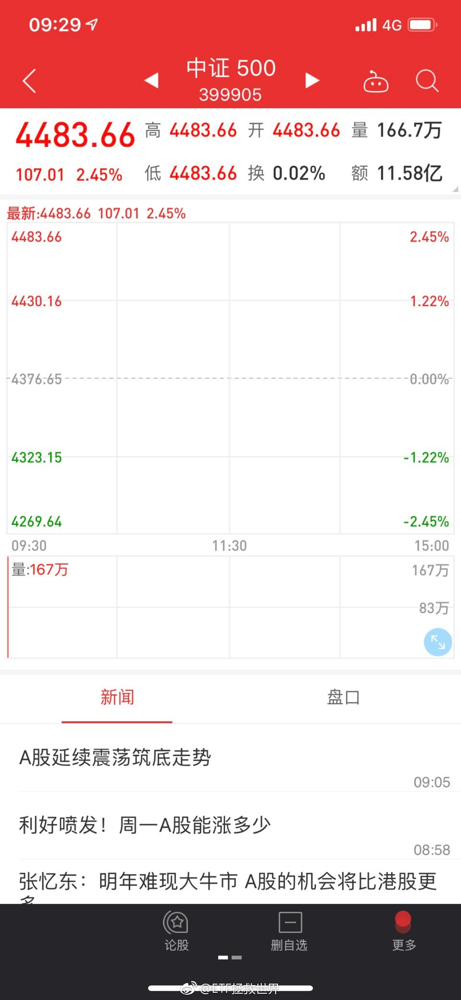
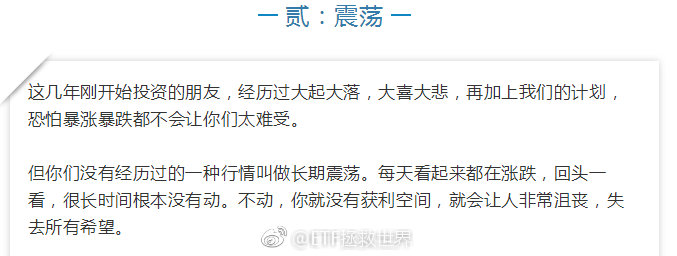
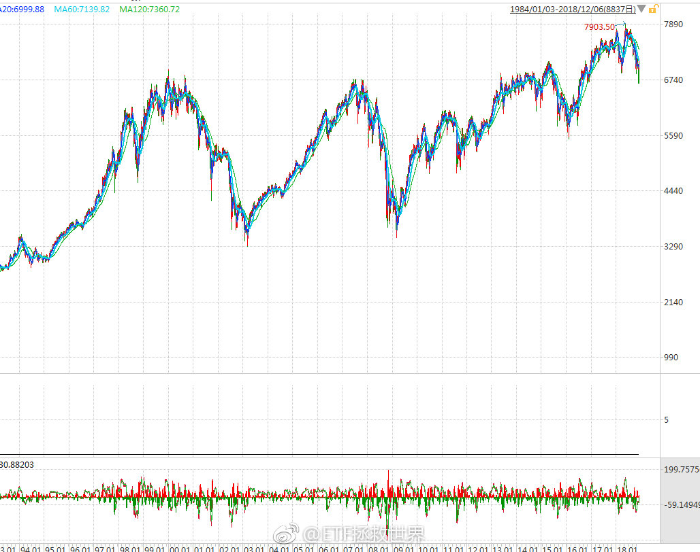
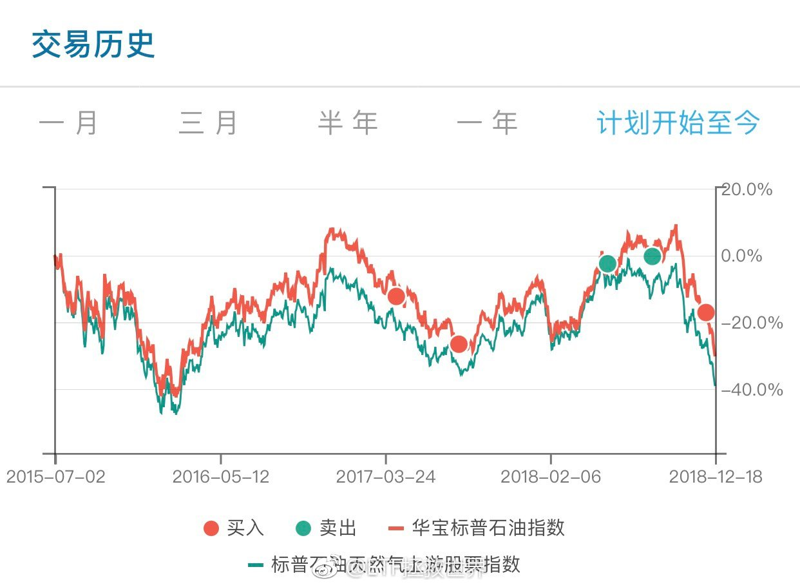
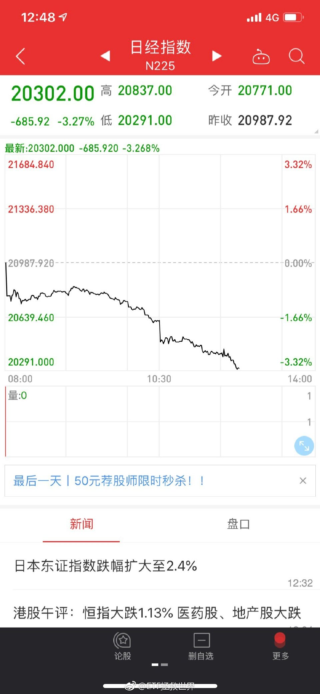
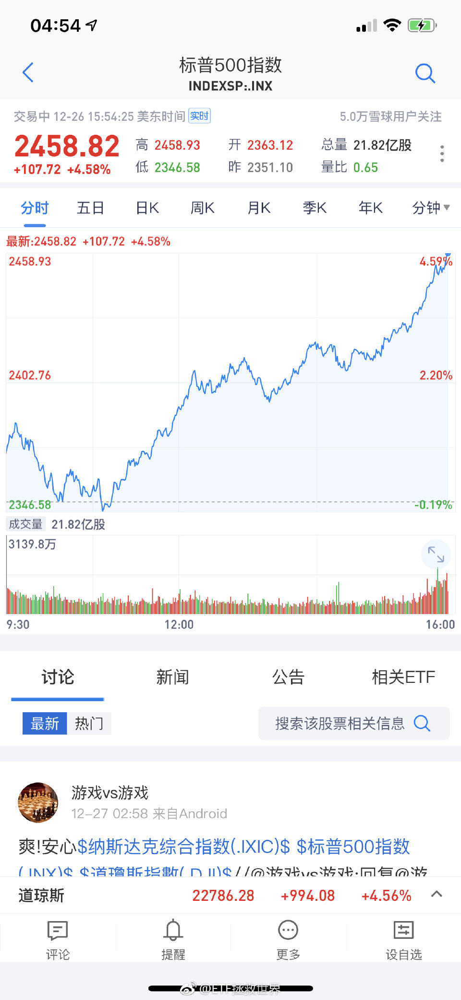

ETF拯救世界 (5687069307) @
2018-12-01 23:24:24 Sat  
url: https://weibo.com/5687069307/H5gJTkbCc

不是我不明白，这世界变化快。连”男子汉“都z z不正确了。男女生而平等，但天生有别谁能否认？为什么泰坦尼克号下沉的时候要让女人和孩子先上救生艇？没有男子汉的担当，喊着男女平等一起往救生艇上挤吗。我个人认为，教育男孩多承担一些责任没有任何问题。

------------------------------------------------------
转推：
>  @新浪视频 (1640601392)
>  2018-12-01 21:42:18 Sat  
>  url: https:/weibo.com/1640601392/H5g4s1yGp/

>  【天津普及性别平等教育：小男子汉小女生是刻板印象】12月1日，天津市《关于在我市中小学开展性别平等教育的通知》提及，将在全市中小学校实施性别平等教育工作。性别平等专家提醒称，“小男子汉”“小女生”是刻板印象。天津市妇儿工委回应，此举是为了推动平等意识，“男生能做的女生也能做”。 ​​​

转发[25]  评论[230]  赞[454] 

======================================================

ETF拯救世界 (5687069307) @
2018-12-02 11:52:52 Sun  
url: https://weibo.com/5687069307/H5lDGBryj

我看有人说我性别歧视，我反思了一下。聊两句这方面的个人看法，如果你认为这是歧视，那就是歧视吧。

我确实经常有照顾女性的思想和行为。比如有一次和朋友一家出去，老公背着相机什么也没拿在前面走，太太在后面背个又大又重的包——这在他们家习以为常，我就非常不能接受。我认为这种事就是应该男人 ​​​

转发[71]  评论[527]  赞[1174] 

======================================================

ETF拯救世界 (5687069307) @
2018-12-03 06:47:40 Mon  
url: https://weibo.com/5687069307/H5t4j48Bm

这么说，一吨500面值的欧元钞票最值钱。进一步推理，你应该知道关键时刻身上应该带着哪种钞票了

------------------------------------------------------
转推：
>  @蓝鲸财经记者工作平台 (1885454921)
>  2018-12-02 22:45:47 Sun  
>  url: https:/weibo.com/1885454921/H5pUI3kej/

>  【读图】1吨百元大钞、1吨黄金和1亿元 到底哪个更值钱？（腾讯财经） ​​​

转发[11]  评论[95]  赞[240] 

======================================================

ETF拯救世界 (5687069307) @
2018-12-03 09:26:16 Mon  
url: https://weibo.com/5687069307/H5u6FAvuT

上周的五车几个品种买的还开心吗 ​​​

转发[9]  评论[366]  赞[847] 

======================================================

ETF拯救世界 (5687069307) @
2018-12-03 09:30:47 Mon  
url: https://weibo.com/5687069307/H5u8w1S0s

就看下午德国表现如何了 ​​​

转发[21]  评论[125]  赞[383] 

+++++++++++++++++++++++++++++++++++++++++++++++++++++

图片：

======================================================

ETF拯救世界 (5687069307) @
2018-12-03 10:41:19 Mon  
url: https://weibo.com/5687069307/H5uB9165n

这样涨真的好吗 ​​​

转发[4]  评论[139]  赞[305] 

+++++++++++++++++++++++++++++++++++++++++++++++++++++

图片：

======================================================

ETF拯救世界 (5687069307) @
2018-12-03 11:37:06 Mon  
url: https://weibo.com/5687069307/H5uXMATDd

多少钱

------------------------------------------------------
转推：
>  @北京人不知道的北京事儿 (1662214194)
>  2018-12-03 11:35:06 Mon  
>  url: https:/weibo.com/1662214194/H5uWYp9sc/

>  北京某公司做的全自动变形金刚擎天柱，感受一下。。。[心]http://t.cn/EyP7Z1E ​​​

转发[38]  评论[82]  赞[213] 

======================================================

ETF拯救世界 (5687069307) @
2018-12-03 12:42:23 Mon  
url: https://weibo.com/5687069307/H5vohwO91

一个数据：

目前录取比例是1 ：500 ​​​

转发[7]  评论[234]  赞[437] 

======================================================

ETF拯救世界 (5687069307) @
2018-12-03 14:13:52 Mon  
url: https://weibo.com/5687069307/H5vZpFt5v

现在不会有人觉得仓位不够了吧。

现金只剩不到15%了。再次在熊市中顺利建好仓位。历史不断循环。

踏踏实实的，多大点事。 ​​​

转发[19]  评论[238]  赞[588] 

======================================================

ETF拯救世界 (5687069307) @
2018-12-03 15:27:41 Mon  
url: https://weibo.com/5687069307/H5wto3Ddg

1：700。 有什么让大家误解的地方了吗。是不是都以为每天工作一小时月收入过万了……

------------------------------------------------------
转推：
>  @ETF拯救世界 (5687069307)
>  2018-12-03 12:42:23 Mon  
>  url: https:/weibo.com/5687069307/H5vohwO91/

>  一个数据：
>  
>  目前录取比例是1 ：500 ​​​

转发[5]  评论[204]  赞[298] 

======================================================

ETF拯救世界 (5687069307) @
2018-12-03 15:48:38 Mon  
url: https://weibo.com/5687069307/H5wBSC3Zr

怎么感觉有加速的迹象…… ​​​

转发[1]  评论[108]  赞[238] 

+++++++++++++++++++++++++++++++++++++++++++++++++++++

图片：

======================================================

ETF拯救世界 (5687069307) @
2018-12-03 16:30:49 Mon  
url: https://weibo.com/5687069307/H5wT0DHD6

德国 http://t.cn/EyAjxKL

------------------------------------------------------
转推：
>  @ETF拯救世界 (5687069307)
>  2018-12-03 09:30:47 Mon  
>  url: https:/weibo.com/5687069307/H5u8w1S0s/

>  就看下午德国表现如何了 ​​​

转发[15]  评论[75]  赞[322] 

======================================================

ETF拯救世界 (5687069307) @
2018-12-03 17:57:07 Mon  
url: https://weibo.com/5687069307/H5xs2c5xm

长赢已经受邀加入。

------------------------------------------------------
转推：
>  @蓝鲸TMT网 (3866012793)
>  2018-12-03 17:45:41 Mon  
>  url: https:/weibo.com/3866012793/H5xnp0Nfj/

>  【微信整治“洗稿”行为，公众号内测“洗稿投诉合议小组”】据新榜报道称，微信公众号内测“洗稿投诉合议小组”，该小组将协助平台对有争议的“洗稿”内容进行合议。
>  
>  据新榜称，如用户接受邀请，将会不定期收到“洗稿”合议邀请，经合议若存在“洗稿”，相关账号会收到相应处罚。目前，“格十三”、“ ​​​

转发[3]  评论[56]  赞[440] 

======================================================

ETF拯救世界 (5687069307) @
2018-12-04 09:29:03 Tue  
url: https://weibo.com/5687069307/H5Dyj6g7J

早上好。昨晚睡得怎么样。

我没睡好，看了400多封邮件。

还有700封。[拜拜] ​​​

转发[8]  评论[251]  赞[546] 

======================================================

ETF拯救世界 (5687069307) @
2018-12-04 10:18:28 Tue  
url: https://weibo.com/5687069307/H5DSmxvgW

回复@龙水六队:给发达国家留了15%的仓位，目前才2%。越跌越舒服啊。//@龙水六队:今天还舒服吗？//@ETF拯救世界:德国 http://t.cn/EyAjxKL

------------------------------------------------------
转推：
>  @ETF拯救世界 (5687069307)
>  2018-12-03 09:30:47 Mon  
>  url: https:/weibo.com/5687069307/H5u8w1S0s/

>  就看下午德国表现如何了 ​​​

转发[10]  评论[81]  赞[264] 

======================================================

ETF拯救世界 (5687069307) @
2018-12-04 11:46:02 Tue  
url: https://weibo.com/5687069307/H5ErUlR8v

看了几百封，说说感受。

第一，很有趣。

跟以前单位招聘收到的简历不同。以前收到的简历，教育背景，职业背景都差得不是很多。这次真是五花八门干什么的都有，有些朋友职业生涯变化之大让人目瞪口呆。特别有意思。感觉经历了很多不同的人生，有趣。

第二，各位大学生们写简历要走心。

我不是说每个 ​​​

转发[16]  评论[299]  赞[439] 

======================================================

ETF拯救世界 (5687069307) @
2018-12-04 12:56:47 Tue  
url: https://weibo.com/5687069307/H5EUDgxiW

回复@包子小婉:我看了的都不会发回执。周知。//@包子小婉:回复@策略晓浪:你是几点发的呀，我第一天晚上十一点发的一直没收到回执，好慌呀[笑cry][笑cry]

------------------------------------------------------
转推：
>  @ETF拯救世界 (5687069307)
>  2018-12-04 09:29:03 Tue  
>  url: https:/weibo.com/5687069307/H5Dyj6g7J/

>  早上好。昨晚睡得怎么样。
>  
>  我没睡好，看了400多封邮件。
>  
>  还有700封。[拜拜] ​​​

转发[1]  评论[53]  赞[183] 

======================================================

ETF拯救世界 (5687069307) @
2018-12-04 13:26:38 Tue  
url: https://weibo.com/5687069307/H5F6K7G2h

赶紧出个ETF行吗多简单的事儿

------------------------------------------------------
转推：
>  @财联社APP (2868676035)
>  2018-12-04 12:32:00 Tue  
>  url: https:/weibo.com/2868676035/H5EKz9HqM/

>  【知情人士：沪伦通计划于12月14日启动】财联社12月4日讯， 据知情人士透露，上海-伦敦股票互联互通机制计划于12月14日启动。其中一位人士称，启动日期仍有可能随形势的变化而调整。（彭博） ​​​

转发[4]  评论[64]  赞[300] 

======================================================

ETF拯救世界 (5687069307) @
2018-12-04 15:09:43 Tue  
url: https://weibo.com/5687069307/H5FMAfgbb

医药总仓位13%够不够呢

$全指医药 sh000991$ $养老产业 sz399812$ ​​​

转发[36]  评论[190]  赞[335] 

======================================================

ETF拯救世界 (5687069307) @
2018-12-04 17:38:46 Tue  
url: https://weibo.com/5687069307/H5GL5ulXU

回复@formulin-huang:有这么完美吗。[doge] 看了一眼，按照当天盘中算，真是30%。你问我为什么这么准——蒙的。//@formulin-huang:2016年1月11日，益达在球球说：养老指数极限跌幅也就是30%了。单从点位来说，当时大概8000点，2018年10月19日5831点[并不简单]

------------------------------------------------------
转推：
>  @ETF拯救世界 (5687069307)
>  2018-12-04 15:09:43 Tue  
>  url: https:/weibo.com/5687069307/H5FMAfgbb/

>  医药总仓位13%够不够呢
>  
>  $全指医药 sh000991$ $养老产业 sz399812$ ​​​

转发[10]  评论[46]  赞[264] 

======================================================

ETF拯救世界 (5687069307) @
2018-12-04 17:39:27 Tue  
url: https://weibo.com/5687069307/H5GLmBtlb

万万没想到，红利真的把格力踢出去了。

------------------------------------------------------
转推：
>  @ETF拯救世界 (5687069307)
>  2018-04-27 09:22:36 Fri  
>  url: https:/weibo.com/5687069307/GdZwh3mu1/

>  格力这个事情，我谈两点，小王你记一下，会后给班子成员传达一下。
>  
>  第一个是红利基金恐怕要卖格力了。尤其是深红利，重仓格力。
>  
>  第二个是强势的女人好可怕！ ​​​

转发[25]  评论[86]  赞[361] 

======================================================

ETF拯救世界 (5687069307) @
2018-12-04 18:24:21 Tue  
url: https://weibo.com/5687069307/H5H3AiUel

有人说，养老最后一次买你不说最大跌幅20%吗。

很多细节如果你不用心去体会，你根本理解不了。

你以为大家都对下跌毫无畏惧甚至满心期待的原因是什么？一点一滴的结果。

我用心做这件事，你用心体会才能懂。 ​​​

转发[17]  评论[160]  赞[542] 

======================================================

ETF拯救世界 (5687069307) @
2018-12-05 07:10:38 Wed  
url: https://weibo.com/5687069307/H5M4CplAb

又是暴跌。美股什么时候才能进射程啊。

------------------------------------------------------
转推：
>  @ETF拯救世界 (5687069307)
>  2018-10-25 06:48:55 Thu  
>  url: https:/weibo.com/5687069307/GFuRLAjIm/

>  美股不断新高的时候我不怕打脸 ​​​

转发[10]  评论[108]  赞[359] 

======================================================

ETF拯救世界 (5687069307) @
2018-12-05 09:48:30 Wed  
url: https://weibo.com/5687069307/H5N6HhWJz

十年期国债收益率跌向3了。想想几个月前还到过4，冰火两重天。

3以下买，又是一个万人坑。 ​​​

转发[54]  评论[120]  赞[368] 

======================================================

ETF拯救世界 (5687069307) @
2018-12-05 10:35:28 Wed  
url: https://weibo.com/5687069307/H5NpLdUkg

医药没券商那么猛。但是一步一步稳稳的往上走，喜欢。

------------------------------------------------------
转推：
>  @ETF拯救世界 (5687069307)
>  2018-12-04 15:09:43 Tue  
>  url: https:/weibo.com/5687069307/H5FMAfgbb/

>  医药总仓位13%够不够呢
>  
>  $全指医药 sh000991$ $养老产业 sz399812$ ​​​

转发[11]  评论[86]  赞[281] 

======================================================

ETF拯救世界 (5687069307) @
2018-12-05 11:19:08 Wed  
url: https://weibo.com/5687069307/H5NHucQBb

我理想中美股应该是8%-15%。欧洲应该是5%-10%。

目前标普500、纳斯达克、dax30都有产品。别管跟的怎么样，好歹是有的。

富时100还没有，目前英国德国都不贵。赶上脱欧又是乱哄哄的，正好可以买。希望赶紧出产品。 ​​​

转发[81]  评论[156]  赞[392] 

======================================================

ETF拯救世界 (5687069307) @
2018-12-05 11:26:45 Wed  
url: https://weibo.com/5687069307/H5NKAi5vs

毒奶失效了。惆怅。//@ETF拯救世界:医药没券商那么猛。但是一步一步稳稳的往上走，喜欢。

------------------------------------------------------
转推：
>  @ETF拯救世界 (5687069307)
>  2018-12-04 15:09:43 Tue  
>  url: https:/weibo.com/5687069307/H5FMAfgbb/

>  医药总仓位13%够不够呢
>  
>  $全指医药 sh000991$ $养老产业 sz399812$ ​​​

转发[4]  评论[101]  赞[266] 

======================================================

ETF拯救世界 (5687069307) @
2018-12-05 12:35:00 Wed  
url: https://weibo.com/5687069307/H5Ochmpvm

不说司机的问题。这个领孩子的家长问题也很大。这样都敢往车前面挤。在咱们这，不是该默认车不会让人吗

------------------------------------------------------
转推：
>  @ ()
>  2018-12-05 12:18:35 Wed  
>  url: 

>  抱歉，作者已设置仅展示半年内微博，此微博已不可见。 ​​​

转发[22]  评论[181]  赞[162] 

======================================================

ETF拯救世界 (5687069307) @
2018-12-05 22:28:34 Wed  
url: https://weibo.com/5687069307/H5S5d7pi0

今天就到这儿吧。还有500多了。

看完了就归到不同的文件夹。不知道你是在哪个文件夹里……

睡觉去了…… ​​​

转发[2]  评论[118]  赞[312] 

+++++++++++++++++++++++++++++++++++++++++++++++++++++

图片：

======================================================

ETF拯救世界 (5687069307) @
2018-12-06 08:26:22 Thu  
url: https://weibo.com/5687069307/H5VZR9PrV

押金没戏了吧

------------------------------------------------------
转推：
>  @ ()
>  2018-12-05 17:15:19 Wed  
>  url: 

>  抱歉，作者已设置仅展示半年内微博，此微博已不可见。 ​​​

转发[7]  评论[63]  赞[117] 

======================================================

ETF拯救世界 (5687069307) @
2018-12-06 08:29:26 Thu  
url: https://weibo.com/5687069307/H5W16jnLf

大事

------------------------------------------------------
转推：
>  @ ()
>  2018-12-06 08:21:36 Thu  
>  url: 

>  抱歉，作者已设置仅展示半年内微博，此微博已不可见。 ​​​

转发[19]  评论[82]  赞[189] 

======================================================

ETF拯救世界 (5687069307) @
2018-12-06 09:12:27 Thu  
url: https://weibo.com/5687069307/H5Wiz2pHA

估计今天反应不会小。至少信息要跪吧 ​​​

转发[17]  评论[60]  赞[259] 

======================================================

ETF拯救世界 (5687069307) @
2018-12-06 09:37:06 Thu  
url: https://weibo.com/5687069307/H5WszwY5s

回复@远方诗集:一个炒作板块还不还和我有什么关系//@远方诗集:益达，军工会不会又还阳啊

------------------------------------------------------
转推：
>  @ETF拯救世界 (5687069307)
>  2018-12-06 09:12:27 Thu  
>  url: https:/weibo.com/5687069307/H5Wiz2pHA/

>  估计今天反应不会小。至少信息要跪吧 ​​​

转发[8]  评论[30]  赞[158] 

======================================================

ETF拯救世界 (5687069307) @
2018-12-06 10:01:41 Thu  
url: https://weibo.com/5687069307/H5WCxEgO7

回复@龙水六队:如果我们被埋会让你开心，或者能让你兜里多几块钱…好吧，就当我们被埋了吧，你开心就好啊ᕕ(ᐛ)ᕗ//@龙水六队:上次发车的全埋了吧？//@ETF拯救世界:回复@远方诗集:一个炒作板块还不还和我有什么关系//@远方诗集:益达，军工会不会又还阳啊

------------------------------------------------------
转推：
>  @ETF拯救世界 (5687069307)
>  2018-12-06 09:12:27 Thu  
>  url: https:/weibo.com/5687069307/H5Wiz2pHA/

>  估计今天反应不会小。至少信息要跪吧 ​​​

转发[7]  评论[68]  赞[183] 

======================================================

ETF拯救世界 (5687069307) @
2018-12-06 10:04:54 Thu  
url: https://weibo.com/5687069307/H5WDRdGHR

回复@梁书豪·:讨厌我的人多了，他算老几。[doge]//@梁书豪·:不认同别人理念不来看就好了啊，还搁这幸灾乐祸//@ETF拯救世界:回复@龙水六队:如果我们被埋会让你开心，或者能让你兜里多几块钱…好吧，就当我们被埋了吧，你开心就好啊ᕕ(ᐛ)ᕗ//@龙水六队:上次发车的全埋了吧？

------------------------------------------------------
转推：
>  @ETF拯救世界 (5687069307)
>  2018-12-06 09:12:27 Thu  
>  url: https:/weibo.com/5687069307/H5Wiz2pHA/

>  估计今天反应不会小。至少信息要跪吧 ​​​

转发[5]  评论[80]  赞[243] 

======================================================

ETF拯救世界 (5687069307) @
2018-12-06 10:29:13 Thu  
url: https://weibo.com/5687069307/H5WNIAVsP

这次12月调整指数成分股，别的指数我没有细看，从中证500的情况来看，调出的大部分都是亏损股，还有中弘退这种。调入的大部分都是估值较低的股票。不好的就是钢铁多了点，不是大问题。

所以只要宏观不出大问题，指数一定是长期向上的，毕竟汰弱留强。

我们要做的，就是吃到基础的指数向上收益的同时 ​​​

转发[78]  评论[157]  赞[444] 

======================================================

ETF拯救世界 (5687069307) @
2018-12-06 10:48:09 Thu  
url: https://weibo.com/5687069307/H5WVphwui

不知道有没有人跟我一样，今天早上看到这个新闻后，居然想以后买手机优先考虑华为了……

如果华为能把屏幕和工业设计做好的话…… ​​​

转发[19]  评论[370]  赞[559] 

======================================================

ETF拯救世界 (5687069307) @
2018-12-06 10:58:56 Thu  
url: https://weibo.com/5687069307/H5WZMuyGs

很多朋友的邮件中都表达了同样的学习路径：

某网站的“基金课”（这是什么……）——大V——长赢。

直接看到长赢的不多。

哪能港，是不是因为太低调没有宣传都看不到…… ​​​

转发[22]  评论[494]  赞[310] 

======================================================

ETF拯救世界 (5687069307) @
2018-12-06 12:10:14 Thu  
url: https://weibo.com/5687069307/H5XsJ4qX9

回复@shimeihaojie:你是认真的吗兄弟。那种网站我从没去过所以不知道。。。//@shimeihaojie:在草榴技术讨论区知道后，果断百度。

------------------------------------------------------
转推：
>  @ETF拯救世界 (5687069307)
>  2018-12-06 10:58:56 Thu  
>  url: https:/weibo.com/5687069307/H5WZMuyGs/

>  很多朋友的邮件中都表达了同样的学习路径：
>  
>  某网站的“基金课”（这是什么……）——大V——长赢。
>  
>  直接看到长赢的不多。
>  
>  哪能港，是不是因为太低调没有宣传都看不到…… ​​​

转发[7]  评论[195]  赞[214] 

======================================================

ETF拯救世界 (5687069307) @
2018-12-06 13:04:56 Thu  
url: https://weibo.com/5687069307/H5XOVqDBb

$全指医药 sh000991$   看来还能继续买啊。 ​​​

转发[199]  评论[100]  赞[329] 

======================================================

ETF拯救世界 (5687069307) @
2018-12-06 13:34:55 Thu  
url: https://weibo.com/5687069307/H5Y168HYz

下次买入应该在7900左右。

------------------------------------------------------
转推：
>  @ETF拯救世界 (5687069307)
>  2018-12-06 13:04:56 Thu  
>  url: https:/weibo.com/5687069307/H5XOVqDBb/

>  $全指医药 sh000991$   看来还能继续买啊。 ​​​

转发[192]  评论[69]  赞[278] 

======================================================

ETF拯救世界 (5687069307) @
2018-12-06 13:41:36 Thu  
url: https://weibo.com/5687069307/H5Y3OfWXX

8月划定7700点，当时9200。最终这波大跌只有10月底两个交易日收于76xx，再未破过。这次再次划定7900。不解释。

------------------------------------------------------
转推：
>  @ETF拯救世界 (5687069307)
>  2018-08-17 09:58:23 Fri  
>  url: https:/weibo.com/5687069307/Gv1CpsZ4E/

>  如果可以7700点附近买入医药，那未来5-10年关上账户等着数钱就对了。 ​​​

转发[61]  评论[147]  赞[412] 

======================================================

ETF拯救世界 (5687069307) @
2018-12-06 13:55:41 Thu  
url: https://weibo.com/5687069307/H5Y9wz5zv

就这么点事儿。没什么大不了。 ​​​

转发[40]  评论[96]  赞[424] 

+++++++++++++++++++++++++++++++++++++++++++++++++++++

图片：

======================================================

ETF拯救世界 (5687069307) @
2018-12-06 16:09:03 Thu  
url: https://weibo.com/5687069307/H5Z1F5CUo

回复@早起拜瓶迁晚睡读益达:安排的明明白白的。[偷笑]

------------------------------------------------------
转推：
>  @ETF拯救世界 (5687069307)
>  2018-12-06 13:55:41 Thu  
>  url: https:/weibo.com/5687069307/H5Y9wz5zv/

>  就这么点事儿。没什么大不了。 ​​​

转发[8]  评论[31]  赞[225] 

======================================================

ETF拯救世界 (5687069307) @
2018-12-06 16:51:04 Thu  
url: https://weibo.com/5687069307/H5ZiIk8bY

英德已经开始挑战欧债危机时候的估值了。如果到那个历史大底区域，大概要跌25%-30%（英国只有不到20%）。

真到了，一次配满。十年不用惦记了。 ​​​

转发[127]  评论[155]  赞[481] 

======================================================

ETF拯救世界 (5687069307) @
2018-12-06 16:57:26 Thu  
url: https://weibo.com/5687069307/H5Zlirahd

回复@GodLoveLBJ的战斧劈扣:当时英德在11-12之间。目前德国16，英国15左右。//@GodLoveLBJ的战斧劈扣:请问E大，欧债时期的估值是怎样的了？不太了解

------------------------------------------------------
转推：
>  @ETF拯救世界 (5687069307)
>  2018-12-06 16:51:04 Thu  
>  url: https:/weibo.com/5687069307/H5ZiIk8bY/

>  英德已经开始挑战欧债危机时候的估值了。如果到那个历史大底区域，大概要跌25%-30%（英国只有不到20%）。
>  
>  真到了，一次配满。十年不用惦记了。 ​​​

转发[61]  评论[103]  赞[278] 

======================================================

ETF拯救世界 (5687069307) @
2018-12-07 10:25:17 Fri  
url: https://weibo.com/5687069307/H66cCrPWX

dax场内溢价接近5%，建议慎重购买 ​​​

转发[30]  评论[136]  赞[267] 

======================================================

ETF拯救世界 (5687069307) @
2018-12-07 10:55:01 Fri  
url: https://weibo.com/5687069307/H66oGkGnb

英国富时100，目前低于2000年点位。当然，这是不计股息的。计股息没那么惨。

指数这么惨，你都不知道有多少成分股更惨。20年估计还有不少下跌的。这还是大英帝国最好的一批公司。

但实际上，这二十年的低点算上来，涨了也有一倍。而且还是两次大波动。

我要说的，是，所谓股票投资超长期坚定持有， ​​​

转发[144]  评论[137]  赞[332] 

+++++++++++++++++++++++++++++++++++++++++++++++++++++

图片：

======================================================

ETF拯救世界 (5687069307) @
2018-12-07 10:56:48 Fri  
url: https://weibo.com/5687069307/H66ppfk8D

为什么我笑了。

------------------------------------------------------
转推：
>  @新京报我们视频 (6124642021)
>  2018-12-07 10:33:31 Fri  
>  url: https:/weibo.com/6124642021/H66fXyXFt/

>  【#镜头前流鼻血解说员回应#：平生第一次 没有被公司强制加班[doge]】韩国一名NBA解说员赛后突然流鼻血，搭档一脸惊慌本人淡定擦掉。该视频在网上引发讨论，网友担心该解说员的健康。对此他回应称，像这样流鼻血是平生第一次，没有健康问题，也没有被公司强制加班，谢谢大家关心。http://t.cn/Ey0mAPl  ​​​

转发[7]  评论[24]  赞[112] 

======================================================

ETF拯救世界 (5687069307) @
2018-12-07 11:01:10 Fri  
url: https://weibo.com/5687069307/H66rc5KYs

回复@豪斯伪大叔:我个人认为英镑是在底部大区域了。 http://t.cn/EyO76rd //@豪斯伪大叔:但考虑到英镑汇率，用人民币看亏的不行吧

------------------------------------------------------
转推：
>  @ETF拯救世界 (5687069307)
>  2018-12-07 10:55:01 Fri  
>  url: https:/weibo.com/5687069307/H66oGkGnb/

>  英国富时100，目前低于2000年点位。当然，这是不计股息的。计股息没那么惨。
>  
>  指数这么惨，你都不知道有多少成分股更惨。20年估计还有不少下跌的。这还是大英帝国最好的一批公司。
>  
>  但实际上，这二十年的低点算上来，涨了也有一倍。而且还是两次大波动。
>  
>  我要说的，是，所谓股票投资超长期坚定持有， ​​​

转发[17]  评论[30]  赞[154] 

======================================================

ETF拯救世界 (5687069307) @
2018-12-07 11:03:14 Fri  
url: https://weibo.com/5687069307/H66s1vn7o

回复@BreezeVivian:这不算黑天鹅。如果巨变，未来你会赚得更多。//@BreezeVivian:益达兄，类似集采政策这种医药行业的黑天鹅，会不会导致医药行业指数历史估值体系巨变？

------------------------------------------------------
转推：
>  @ETF拯救世界 (5687069307)
>  2018-12-07 10:55:01 Fri  
>  url: https:/weibo.com/5687069307/H66oGkGnb/

>  英国富时100，目前低于2000年点位。当然，这是不计股息的。计股息没那么惨。
>  
>  指数这么惨，你都不知道有多少成分股更惨。20年估计还有不少下跌的。这还是大英帝国最好的一批公司。
>  
>  但实际上，这二十年的低点算上来，涨了也有一倍。而且还是两次大波动。
>  
>  我要说的，是，所谓股票投资超长期坚定持有， ​​​

转发[14]  评论[30]  赞[203] 

======================================================

ETF拯救世界 (5687069307) @
2018-12-07 11:07:55 Fri  
url: https://weibo.com/5687069307/H66tVoKDZ

黑天鹅这个词我说各位是不是用的太滥了。。一致性，4+7……这都什么黑天鹅，都不是。一个行业发展过程中很正常的政策变动。

黑天鹅是那种你根本意想不到，认为不可能发生的事情。这种政策变化可不是什么不可能的事，都在考虑范围内。

我们组合中医药+养老有13%。养老成分中有40%是医药，加起来医药一 ​​​

转发[82]  评论[145]  赞[469] 

======================================================

ETF拯救世界 (5687069307) @
2018-12-07 11:25:28 Fri  
url: https://weibo.com/5687069307/H66B3cATB

做投资，有两点很关键：

第一，大多数人都是错的。你看太多声调一致的东西，相信了，就会出错。这个世界人云亦云的人非常非常多。跟大多数人站在一起，赚不到钱。

第二，最重要的是价格。一个利空或者利好都没那么重要。因为价格可能已经反映了这个利空或者利好。你赚钱还是赔钱，决定性因素是你买这 ​​​

转发[201]  评论[220]  赞[546] 

======================================================

ETF拯救世界 (5687069307) @
2018-12-07 11:29:07 Fri  
url: https://weibo.com/5687069307/H66Cx6f9B

回复@求财不劫色:ETF不是LOF。ETF和场外连接基金是两个基金，净值当然不同了。//@求财不劫色:回复@哈哈大大地:咱们说的都是华安德国30，你说的是场外的，场外的一般跟的比较准，一个一个净值，我说的是场内的。代码是513030。为什么跟踪同一个指数，数值却不同，我也不清楚[二哈]

------------------------------------------------------
转推：
>  @ETF拯救世界 (5687069307)
>  2018-12-07 10:25:17 Fri  
>  url: https:/weibo.com/5687069307/H66cCrPWX/

>  dax场内溢价接近5%，建议慎重购买 ​​​

转发[17]  评论[45]  赞[198] 

======================================================

ETF拯救世界 (5687069307) @
2018-12-07 12:47:03 Fri  
url: https://weibo.com/5687069307/H678agVc3

回复@老高GG:我现在用oasis2，东西还不错，性价比一般。买个带背光的基础款足够了。我喜欢用kindle看书，一个是轻，一个是标注做记号方便。除了很经典的书，我一般不买纸质了。最主要占地方。毕竟我是豆瓣断舍离小组的。[doge]

------------------------------------------------------
转推：
>  @ETF拯救世界 (5687069307)
>  2018-12-07 10:25:17 Fri  
>  url: https:/weibo.com/5687069307/H66cCrPWX/

>  dax场内溢价接近5%，建议慎重购买 ​​​

转发[8]  评论[91]  赞[296] 

======================================================

ETF拯救世界 (5687069307) @
2018-12-07 13:32:38 Fri  
url: https://weibo.com/5687069307/H67qFkGsO

今天冷的有点犯规了。 ​​​

转发[22]  评论[96]  赞[286] 

======================================================

ETF拯救世界 (5687069307) @
2018-12-07 13:42:54 Fri  
url: https://weibo.com/5687069307/H67uQaU0c

回复@MK_dwarf:你这辈子都不会见到我在金融市场上慌。//@MK_dwarf:别慌 医药会跌到7000以下让你一次加满

------------------------------------------------------
转推：
>  @ETF拯救世界 (5687069307)
>  2018-12-07 13:32:38 Fri  
>  url: https:/weibo.com/5687069307/H67qFkGsO/

>  今天冷的有点犯规了。 ​​​

转发[19]  评论[77]  赞[310] 

======================================================

ETF拯救世界 (5687069307) @
2018-12-07 14:06:57 Fri  
url: https://weibo.com/5687069307/H67EB318L

回复@策略晓浪:2015年7月开始第三轮计划，一年半以后才买了第一份医药。2018年全年只买了三份。三年半才买了十份。赶紧跌，不跌还没法买呢。

------------------------------------------------------
转推：
>  @ETF拯救世界 (5687069307)
>  2018-12-07 13:32:38 Fri  
>  url: https:/weibo.com/5687069307/H67qFkGsO/

>  今天冷的有点犯规了。 ​​​

转发[11]  评论[75]  赞[331] 

======================================================

ETF拯救世界 (5687069307) @
2018-12-07 14:44:44 Fri  
url: https://weibo.com/5687069307/H67TVEwKW

今天靠传媒环保红利撑场子了…… ​​​

转发[2]  评论[44]  赞[327] 

======================================================

ETF拯救世界 (5687069307) @
2018-12-07 14:55:31 Fri  
url: https://weibo.com/5687069307/H67YjtWOA

回复@rapuzal2016:这么坚定啊。那这些看空的，还有你的房子卖了没？还是说一直看空根本就没买过？//@rapuzal2016:那现在步调一致地唱空房地产尤其是三四五六七八线地产的呢？我个人觉得挺对，呵呵

------------------------------------------------------
转推：
>  @ETF拯救世界 (5687069307)
>  2018-12-07 11:25:28 Fri  
>  url: https:/weibo.com/5687069307/H66B3cATB/

>  做投资，有两点很关键：
>  
>  第一，大多数人都是错的。你看太多声调一致的东西，相信了，就会出错。这个世界人云亦云的人非常非常多。跟大多数人站在一起，赚不到钱。
>  
>  第二，最重要的是价格。一个利空或者利好都没那么重要。因为价格可能已经反映了这个利空或者利好。你赚钱还是赔钱，决定性因素是你买这 ​​​

转发[11]  评论[29]  赞[221] 

======================================================

ETF拯救世界 (5687069307) @
2018-12-07 14:59:27 Fri  
url: https://weibo.com/5687069307/H67ZUfQBK

真看空一个东西，你就要大幅减仓。甚至加点有看空属性的品种。比如2015年上半年我看空，就把A股卖的7788再满仓分级A。3年多后的现在，终于在这几个月大买特买把A股买到了65%。这意思是没那么看空了。

你不能嘴上说看空博眼球，你自己的根本不卖。这叫什么看空，这叫嘴炮。

看空人民币的，你有没有把 ​​​

转发[53]  评论[158]  赞[577] 

======================================================

ETF拯救世界 (5687069307) @
2018-12-07 15:45:31 Fri  
url: https://weibo.com/5687069307/H68iBpVxE

本周份微博聊完了！

欢乐的时光总是过的特别快！看看时间差不多又要说白白！

咱们下周接着聊不见不散！ ​​​

转发[3]  评论[151]  赞[645] 

+++++++++++++++++++++++++++++++++++++++++++++++++++++

图片：

======================================================

ETF拯救世界 (5687069307) @
2018-12-08 17:46:35 Sat  
url: https://weibo.com/5687069307/H6iwf67sK

打脸了，今天看了好几个北大的……我是从后往前看，原来北大的发邮件都比较早……

谁说北大不行的！[doge]

当然，毕业院校的因素基本没有任何权重…… ​​​

转发[6]  评论[191]  赞[456] 

======================================================

ETF拯救世界 (5687069307) @
2018-12-10 10:12:20 Mon  
url: https://weibo.com/5687069307/H6yoR6ceQ

不要急，控制节奏。 ​​​

转发[21]  评论[248]  赞[627] 

======================================================

ETF拯救世界 (5687069307) @
2018-12-10 14:12:19 Mon  
url: https://weibo.com/5687069307/H6zYgjLa7

回复@画了朵花花:忙呢。再坚持几个月，明年开启全陪模式//@画了朵花花:刷新了一上午，是我心态不好了吗，冷宫的感觉了。

------------------------------------------------------
转推：
>  @ETF拯救世界 (5687069307)
>  2018-12-10 10:12:20 Mon  
>  url: https:/weibo.com/5687069307/H6yoR6ceQ/

>  不要急，控制节奏。 ​​​

转发[5]  评论[242]  赞[533] 

======================================================

ETF拯救世界 (5687069307) @
2018-12-11 16:11:47 Tue  
url: https://weibo.com/5687069307/H6KbfzrAs

对于同样一个职位薪酬，四个人中最多和最少的就有十倍的预期差…… ​​​

转发[5]  评论[265]  赞[407] 

======================================================

ETF拯救世界 (5687069307) @
2018-12-12 08:55:33 Wed  
url: https://weibo.com/5687069307/H6QKGhzse

富婆这几天是不是又开始给我买粉丝了。

有钱也不能这么糟蹋啊。

直接打我支付宝多好。 ​​​

转发[8]  评论[211]  赞[514] 

======================================================

ETF拯救世界 (5687069307) @
2018-12-12 15:42:00 Wed  
url: https://weibo.com/5687069307/H6TpF1JW0

回复@litterwitch:我微信好友有47个关注我公众号的，我都不知道其中32个是谁！//@litterwitch:我看了一下你公众号的页面，我的朋友圈里面一共有8个人在同时关注你，然而我并不知道他们是谁？

------------------------------------------------------
转推：
>  @ETF拯救世界 (5687069307)
>  2018-12-12 08:55:33 Wed  
>  url: https:/weibo.com/5687069307/H6QKGhzse/

>  富婆这几天是不是又开始给我买粉丝了。
>  
>  有钱也不能这么糟蹋啊。
>  
>  直接打我支付宝多好。 ​​​

转发[1]  评论[166]  赞[227] 

======================================================

ETF拯救世界 (5687069307) @
2018-12-12 17:27:24 Wed  
url: https://weibo.com/5687069307/H6U6rmNrK

几乎每一个已经回复第二轮答题邮件的朋友都提到了一件事，即在整理资料过程中自己的进步。

要知道，第二轮的题目只是整理三个月的文字资料及2个月的发车数据。

可想而知，整理完过去十三年的文字及十年计划数据后会有多大的新感受。以及，各位未来看文章的时候也会有很多感悟。

确实是一件很有意义 ​​​

转发[17]  评论[186]  赞[555] 

======================================================

ETF拯救世界 (5687069307) @
2018-12-12 20:21:52 Wed  
url: https://weibo.com/5687069307/H6Vfg7mq3

扔掉家里100件东西。你会发现不会造成任何不便。

区别是瞬间神清气爽了。 ​​​

转发[19]  评论[214]  赞[636] 

======================================================

ETF拯救世界 (5687069307) @
2018-12-13 10:51:22 Thu  
url: https://weibo.com/5687069307/H70Wbed1X

回复@乘凉的蜥蜴:chinaetfs//@乘凉的蜥蜴:请教大家一个问题 最近关注的Ｅ大 请问Ｅ大主要在哪里发文章呢 公众号我搜过etf拯救世界感觉不太对呢

------------------------------------------------------
转推：
>  @ETF拯救世界 (5687069307)
>  2018-12-12 17:27:24 Wed  
>  url: https:/weibo.com/5687069307/H6U6rmNrK/

>  几乎每一个已经回复第二轮答题邮件的朋友都提到了一件事，即在整理资料过程中自己的进步。
>  
>  要知道，第二轮的题目只是整理三个月的文字资料及2个月的发车数据。
>  
>  可想而知，整理完过去十三年的文字及十年计划数据后会有多大的新感受。以及，各位未来看文章的时候也会有很多感悟。
>  
>  确实是一件很有意义 ​​​

转发[4]  评论[33]  赞[169] 

======================================================

ETF拯救世界 (5687069307) @
2018-12-13 11:12:36 Thu  
url: https://weibo.com/5687069307/H714O9NsL

以后发车前涨不涨真的无所谓了。A股部分已经买的差不多，如果有深跌还能大幅加仓，没有基本就这样了。

踏踏实实的看戏。 ​​​

转发[110]  评论[134]  赞[445] 

======================================================

ETF拯救世界 (5687069307) @
2018-12-13 11:30:19 Thu  
url: https://weibo.com/5687069307/H71c0i3xV

回复@小狗上马路:还有S计划啊//@小狗上马路:请教一下E哥，如果不发车，维持目前仓位，那么，每月积存的现金是否一直留着？

------------------------------------------------------
转推：
>  @ETF拯救世界 (5687069307)
>  2018-12-13 11:12:36 Thu  
>  url: https:/weibo.com/5687069307/H714O9NsL/

>  以后发车前涨不涨真的无所谓了。A股部分已经买的差不多，如果有深跌还能大幅加仓，没有基本就这样了。
>  
>  踏踏实实的看戏。 ​​​

转发[83]  评论[41]  赞[236] 

======================================================

ETF拯救世界 (5687069307) @
2018-12-13 12:58:40 Thu  
url: https://weibo.com/5687069307/H71LRkDfv

回复@淡如蓝2002:第一，股市并不是经济增长快就涨的快，增长慢就下跌。第二，股市是先行指标。等一切都变好，股市的牛市行情已经走了70%//@淡如蓝2002:请问一下，都说2019年甚至接下来二三年经济都不行，那么股市也一样没行情吧？那底部可能更长了吧//@ETF拯救世界:回复@小狗上马路:还有S计划啊

------------------------------------------------------
转推：
>  @ETF拯救世界 (5687069307)
>  2018-12-13 11:12:36 Thu  
>  url: https:/weibo.com/5687069307/H714O9NsL/

>  以后发车前涨不涨真的无所谓了。A股部分已经买的差不多，如果有深跌还能大幅加仓，没有基本就这样了。
>  
>  踏踏实实的看戏。 ​​​

转发[78]  评论[88]  赞[312] 

======================================================

ETF拯救世界 (5687069307) @
2018-12-13 13:14:10 Thu  
url: https://weibo.com/5687069307/H71S90XB8

回复@Compass_J:不贵的时候买，等着涨，是我能想到最靠谱的投资方式。总是想精准买在起涨点，不是说不行，风险很大//@Compass_J:先行指标也得讲点逻辑吧，，再不济也得讲点情绪不是，，不讲情绪也得讲钱啊，，，对不？

------------------------------------------------------
转推：
>  @ETF拯救世界 (5687069307)
>  2018-12-13 11:12:36 Thu  
>  url: https:/weibo.com/5687069307/H714O9NsL/

>  以后发车前涨不涨真的无所谓了。A股部分已经买的差不多，如果有深跌还能大幅加仓，没有基本就这样了。
>  
>  踏踏实实的看戏。 ​​​

转发[31]  评论[113]  赞[326] 

======================================================

ETF拯救世界 (5687069307) @
2018-12-13 15:48:03 Thu  
url: https://weibo.com/5687069307/H72SC21PL

99%的答题者计算收益率的时候都犯了一个大错。

所以我说细心、认真是最重要的。

路还很长啊。 ​​​

转发[5]  评论[217]  赞[372] 

======================================================

ETF拯救世界 (5687069307) @
2018-12-13 17:34:16 Thu  
url: https://weibo.com/5687069307/H73zJnUje

聪明钱都在加仓指数基金。

------------------------------------------------------
转推：
>  @网易财经 (1974561081)
>  2018-12-13 17:31:07 Thu  
>  url: https:/weibo.com/1974561081/H73yrBYCL/

>  【视频|突破200亿元！上证50ETF份额逼近15年牛市顶点】中国最早也是最大的股票ETF——华夏上证50ETF最近又创下多年新高了，上交所公布的最新数据显示份额突破了200亿份！那为何在股市行情不是很好的情况下，etf的规模却在大幅增加？http://t.cn/EU6LehE http://t.cn/EU6yVI6 ​​​

转发[57]  评论[132]  赞[341] 

======================================================

ETF拯救世界 (5687069307) @
2018-12-14 07:35:09 Fri  
url: https://weibo.com/5687069307/H79534waV

欢乐祥和的各位，看看今年发生了什么。你们这么开心是闹哪样

------------------------------------------------------
转推：
>  @财联社APP (2868676035)
>  2018-12-14 00:01:31 Fri  
>  url: https:/weibo.com/2868676035/H766Uo8EX/

>  [允悲] http://t.cn/EUaDYDY ​​​

转发[64]  评论[286]  赞[377] 

======================================================

ETF拯救世界 (5687069307) @
2018-12-14 13:59:08 Fri  
url: https://weibo.com/5687069307/H7bATCR7z

不发车影响这么大吗 [doge]

国家就差我这几百块吗。。 ​​​

转发[33]  评论[206]  赞[432] 

======================================================

ETF拯救世界 (5687069307) @
2018-12-14 14:19:33 Fri  
url: https://weibo.com/5687069307/H7bJbweZu

回复@美味的葱油饼:看我说什么，同时也要看我做什么。看看下次计划加医药是何时。//@美味的葱油饼:医药的带量采购让医药行业估值重新洗牌，也就是以前的估值现在可能不适用了，7900可能打不住。

------------------------------------------------------
转推：
>  @ETF拯救世界 (5687069307)
>  2018-12-14 13:59:08 Fri  
>  url: https:/weibo.com/5687069307/H7bATCR7z/

>  不发车影响这么大吗 [doge]
>  
>  国家就差我这几百块吗。。 ​​​

转发[9]  评论[61]  赞[237] 

======================================================

ETF拯救世界 (5687069307) @
2018-12-14 14:35:40 Fri  
url: https://weibo.com/5687069307/H7bPJfa6S

国债连续两天大跌。是调整还是转折？不重要。重要的是最近成立了那么多债券基金，又一批人被忽悠进去了。

------------------------------------------------------
转推：
>  @ETF拯救世界 (5687069307)
>  2018-11-26 15:58:26 Mon  
>  url: https:/weibo.com/5687069307/H4sGo0nfN/

>  目前这个阶段，我个人认为，除了股市，恐怕没有什么更好的投资领域了。
>  
>  债券？你别看我们的债券今年涨了10%，我可以几乎肯定地说，中期回头看，债券的收益率一定比不上现在的股市。理由？看附图。
>  
>  房地产？我不懂。你懂你买。不过REITS也可以当做资产配置的一部分放入组合是真的。
>  
>  比特币，黄金，还 ​​​

转发[75]  评论[76]  赞[251] 

======================================================

ETF拯救世界 (5687069307) @
2018-12-14 14:55:16 Fri  
url: https://weibo.com/5687069307/H7bXGEEqM

就问你一句准不准。每天热热闹闹涨了跌了，回头一看原地没动。踏踏实实的，做好心理准备，做好吃波段的策略。多大点事儿。一切尽在掌握。

------------------------------------------------------
转推：
>  @ETF拯救世界 (5687069307)
>  2018-12-06 13:55:41 Thu  
>  url: https:/weibo.com/5687069307/H5Y9wz5zv/

>  就这么点事儿。没什么大不了。 ​​​

转发[12]  评论[63]  赞[291] 

======================================================

ETF拯救世界 (5687069307) @
2018-12-14 15:03:40 Fri  
url: https://weibo.com/5687069307/H7c16g0vp

回复@宸瑞Jerry:什么品种是高风险，什么是低风险？国债一年可以跌25%，是高风险还是低风险？一个传统金融品种风险高低，不在于它叫什么名字，而在于它价格够不够低。另外，以后谁再说我是定投就拉黑。十年前就不干了，不能这么侮辱人。[doge]

------------------------------------------------------
转推：
>  @ETF拯救世界 (5687069307)
>  2018-11-26 15:58:26 Mon  
>  url: https:/weibo.com/5687069307/H4sGo0nfN/

>  目前这个阶段，我个人认为，除了股市，恐怕没有什么更好的投资领域了。
>  
>  债券？你别看我们的债券今年涨了10%，我可以几乎肯定地说，中期回头看，债券的收益率一定比不上现在的股市。理由？看附图。
>  
>  房地产？我不懂。你懂你买。不过REITS也可以当做资产配置的一部分放入组合是真的。
>  
>  比特币，黄金，还 ​​​

转发[50]  评论[101]  赞[291] 

======================================================

ETF拯救世界 (5687069307) @
2018-12-14 15:08:47 Fri  
url: https://weibo.com/5687069307/H7c3atGa2

最近承蒙新浪畀面，推荐了不少新朋友关注我。

如果您是刚关注我，欢迎。不过我建议你多看几天再评论。我的过去，以及我现在在做什么，弄清楚再说话。否则别怪我直接删评论&拉黑，弄得您三天不能全站评论您说多尴尬。

弄清楚是怎么回事再张嘴，是现代社会最基本的做人准则之一。

同意不？

不同意拉 ​​​

转发[5]  评论[104]  赞[369] 

======================================================

ETF拯救世界 (5687069307) @
2018-12-14 15:16:55 Fri  
url: https://weibo.com/5687069307/H7c6tgBY2

有没有一起的，明天见。

或者。

新闻里见。 ​​​

转发[2]  评论[131]  赞[306] 

+++++++++++++++++++++++++++++++++++++++++++++++++++++

图片：

======================================================

ETF拯救世界 (5687069307) @
2018-12-14 15:26:02 Fri  
url: https://weibo.com/5687069307/H7caaxTKY

回复@十里菡萏lotus:目前真的是进攻型。但2015.7-2017是防守型。想要赢得一场战争，当然是不能一味攻也不能一味守。审时度势，攻守切换自如。//@十里菡萏lotus:忘了在哪里看到别人留言问关于E大的配置，作者回复那个人说E大的配置是进攻型[doge]

------------------------------------------------------
转推：
>  @ETF拯救世界 (5687069307)
>  2018-11-26 15:58:26 Mon  
>  url: https:/weibo.com/5687069307/H4sGo0nfN/

>  目前这个阶段，我个人认为，除了股市，恐怕没有什么更好的投资领域了。
>  
>  债券？你别看我们的债券今年涨了10%，我可以几乎肯定地说，中期回头看，债券的收益率一定比不上现在的股市。理由？看附图。
>  
>  房地产？我不懂。你懂你买。不过REITS也可以当做资产配置的一部分放入组合是真的。
>  
>  比特币，黄金，还 ​​​

转发[20]  评论[32]  赞[219] 

======================================================

ETF拯救世界 (5687069307) @
2018-12-14 15:26:54 Fri  
url: https://weibo.com/5687069307/H7cawt4yc

回复@海文a:哪能港，要让大家都感受到温暖一刚。//@海文a:粤语说得好正宗，是因为广东人粉丝最多的原因吗？[嘻嘻]

------------------------------------------------------
转推：
>  @ETF拯救世界 (5687069307)
>  2018-12-14 15:08:47 Fri  
>  url: https:/weibo.com/5687069307/H7c3atGa2/

>  最近承蒙新浪畀面，推荐了不少新朋友关注我。
>  
>  如果您是刚关注我，欢迎。不过我建议你多看几天再评论。我的过去，以及我现在在做什么，弄清楚再说话。否则别怪我直接删评论&拉黑，弄得您三天不能全站评论您说多尴尬。
>  
>  弄清楚是怎么回事再张嘴，是现代社会最基本的做人准则之一。
>  
>  同意不？
>  
>  不同意拉 ​​​

转发[2]  评论[29]  赞[184] 

======================================================

ETF拯救世界 (5687069307) @
2018-12-14 15:50:22 Fri  
url: https://weibo.com/5687069307/H7ck37GWM

所谓定投，也就是定期定额投资。

我不是说好不好，而是十年前我就发现它的弊端。也在2008年写过一篇“定投未必如你想得好”这样的文章，现在还可以查到。

别急，明年这些东西都会重新发布，并加上最新点评。一切疑惑都会烟消云散。 ​​​

转发[84]  评论[116]  赞[464] 

======================================================

ETF拯救世界 (5687069307) @
2018-12-14 15:58:57 Fri  
url: https://weibo.com/5687069307/H7cnxo1lO

回复@黑暗时代来了:“定期”是非常好的因素，这个不能变。因为定期才能保证牛市吃饱，熊市不死。至于定期的操作，则是从资产配置的角度出发。如果让我说，是一套3.0的系统了。//@黑暗时代来了:你这个也算定投的一种，可以叫:智能定投。

------------------------------------------------------
转推：
>  @ETF拯救世界 (5687069307)
>  2018-12-14 15:50:22 Fri  
>  url: https:/weibo.com/5687069307/H7ck37GWM/

>  所谓定投，也就是定期定额投资。
>  
>  我不是说好不好，而是十年前我就发现它的弊端。也在2008年写过一篇“定投未必如你想得好”这样的文章，现在还可以查到。
>  
>  别急，明年这些东西都会重新发布，并加上最新点评。一切疑惑都会烟消云散。 ​​​

转发[29]  评论[52]  赞[269] 

======================================================

ETF拯救世界 (5687069307) @
2018-12-14 16:08:41 Fri  
url: https://weibo.com/5687069307/H7cru6GsH

回复@诸葛不亮_若如初见:下降不下降不重要。重要的是，如果真的下降了，是不是有预案？未来充满无限可能，是不是做好各种准备才是关键。否则，只是讨论术，而非真正的道。//@诸葛不亮_若如初见:又是估值中枢下降说，别说医药了，A股固执中枢都“被下降”无数次了

------------------------------------------------------
转推：
>  @ETF拯救世界 (5687069307)
>  2018-12-14 13:59:08 Fri  
>  url: https:/weibo.com/5687069307/H7bATCR7z/

>  不发车影响这么大吗 [doge]
>  
>  国家就差我这几百块吗。。 ​​​

转发[20]  评论[50]  赞[281] 

======================================================

ETF拯救世界 (5687069307) @
2018-12-14 17:56:29 Fri  
url: https://weibo.com/5687069307/H7d9eFJR8

投资最怕什么，最怕看得太近。

因为某个品种最近表现好就强力看好，最近表现差就踩在脚下。我不能接受这样的投资世界观。

有人说油气和油价没有相关性。

我把数据调出来后，迷惑了。

没有相关性吗？

无非是波动性不同，70%的相关性多明显啊。

为什么原油我们选择了油气。

第一，70%相关性足够了 ​​​

转发[188]  评论[262]  赞[540] 

+++++++++++++++++++++++++++++++++++++++++++++++++++++

图片：

======================================================

ETF拯救世界 (5687069307) @
2018-12-14 18:33:39 Fri  
url: https://weibo.com/5687069307/H7dokdOwi

生活小贴士：

你有没有发现，有时候你因为一点小钱犹犹豫豫，最终都会花更多的，甚至几倍的钱去达到同样的效果。

总结：

不要因小失大。该出手就出手。 ​​​

转发[46]  评论[153]  赞[474] 

======================================================

ETF拯救世界 (5687069307) @
2018-12-14 18:56:55 Fri  
url: https://weibo.com/5687069307/H7dxLASI6

回复@看我看我252:我觉得可以啊，我还可以现场讲解。有没有想看的。想看的人多就在微博上开一个。当然只能直播几分钟，注意素质。//@看我看我252:益达，明天去看演唱会，会给我们直播吗，想看[可爱]。

------------------------------------------------------
转推：
>  @ETF拯救世界 (5687069307)
>  2018-12-14 18:33:39 Fri  
>  url: https:/weibo.com/5687069307/H7dokdOwi/

>  生活小贴士：
>  
>  你有没有发现，有时候你因为一点小钱犹犹豫豫，最终都会花更多的，甚至几倍的钱去达到同样的效果。
>  
>  总结：
>  
>  不要因小失大。该出手就出手。 ​​​

转发[7]  评论[128]  赞[523] 

======================================================

ETF拯救世界 (5687069307) @
2018-12-15 17:25:27 Sat  
url: https://weibo.com/5687069307/H7mn8zEMu

震惊！直播计划取消！

要追究法律责任的！ ​​​

转发[3]  评论[100]  赞[340] 

======================================================

ETF拯救世界 (5687069307) @
2018-12-15 19:16:24 Sat  
url: https://weibo.com/5687069307/H7n6aD8sh

分享我的故事 http://t.cn/EUYE2xy ​​​

转发[6]  评论[153]  赞[793] 

======================================================

ETF拯救世界 (5687069307) @
2018-12-15 22:36:42 Sat  
url: https://weibo.com/5687069307/H7opu30tW

我其实不是很迷学友哥。

是送给太太的礼物。她是真爱粉。

有一半歌没听过的我，看着每首都能跟唱的她，气氛一度相当尴尬。 ​​​

转发[7]  评论[171]  赞[616] 

======================================================

ETF拯救世界 (5687069307) @
2018-12-16 23:18:41 Sun  
url: https://weibo.com/5687069307/H7y711OEP

你为什么还不睡。

老实交代看这条微博前你在干嘛！ ​​​

转发[5]  评论[306]  赞[318] 

======================================================

ETF拯救世界 (5687069307) @
2018-12-17 07:35:49 Mon  
url: https://weibo.com/5687069307/H7BmNvHKd

所以要审时度势。熊市亏的少，仓位越来越重，牛市吃得好才是人生赢家

------------------------------------------------------
转推：
>  @新财富杂志 (1708922835)
>  2018-12-16 23:32:32 Sun  
>  url: https:/weibo.com/1708922835/H7ycD3wuA/

>  【在有一种熊市里亏钱太少，不一定是好事】陈嘉禾：不止2018年，历史上有一些A股的熊市年份，也有同样的“亏得少不一定是好事”的情况。比如，在2004到2005年，市场一些公司已经开始有价值（估值比较便宜，基本面稳健），但是A股的整体价格仍然下挫。如果投资者完美的回避掉了2004和2005年的A股市场， ​​​

转发[29]  评论[76]  赞[293] 

======================================================

ETF拯救世界 (5687069307) @
2018-12-17 09:44:45 Mon  
url: https://weibo.com/5687069307/H7Cd817SA

家里没矿的注意节奏。 ​​​

转发[6]  评论[152]  赞[418] 

======================================================

ETF拯救世界 (5687069307) @
2018-12-17 10:11:59 Mon  
url: https://weibo.com/5687069307/H7CobBT5D

评论里没完没了问医药的那些人我跟你说几点，你能理解就理解，不能理解赶紧取关走人。

第一，医药是我最看好的行业。

第二，目前计划内医药仓位9个多点（医药6%+养老3%），目标仓位最大给15%-20%。不跌我们永远没机会配满。

第三，目前医药估值过去十三年新低。

第四，目前医药跌至十三年大趋势下 ​​​

转发[494]  评论[443]  赞[1039] 

======================================================

ETF拯救世界 (5687069307) @
2018-12-17 10:21:52 Mon  
url: https://weibo.com/5687069307/H7Csc4C2w

赚了钱不卖就是过山车。乱卖又赚不到大钱。

事后看明明白白，当时看一片迷茫。 ​​​

转发[79]  评论[60]  赞[334] 

+++++++++++++++++++++++++++++++++++++++++++++++++++++

图片：

======================================================

ETF拯救世界 (5687069307) @
2018-12-17 10:24:40 Mon  
url: https://weibo.com/5687069307/H7Ctl3kfx

回复@pby_1988:可以。只要你能保证你的股票不爆雷，而且一定能涨过指数。//@pby_1988:E大，请教个问题，既然医药是您最看好的行业，是不是可以去买全指医药里的股票

------------------------------------------------------
转推：
>  @ETF拯救世界 (5687069307)
>  2018-12-17 10:11:59 Mon  
>  url: https:/weibo.com/5687069307/H7CobBT5D/

>  评论里没完没了问医药的那些人我跟你说几点，你能理解就理解，不能理解赶紧取关走人。
>  
>  第一，医药是我最看好的行业。
>  
>  第二，目前计划内医药仓位9个多点（医药6%+养老3%），目标仓位最大给15%-20%。不跌我们永远没机会配满。
>  
>  第三，目前医药估值过去十三年新低。
>  
>  第四，目前医药跌至十三年大趋势下 ​​​

转发[42]  评论[33]  赞[227] 

======================================================

ETF拯救世界 (5687069307) @
2018-12-17 10:26:49 Mon  
url: https://weibo.com/5687069307/H7CucrVvo

回复@cosmicmagic:有人觉得波动大是风险。我倒认为波动大是非常好的机会——除非你做反了。//@cosmicmagic:油气波动真大

------------------------------------------------------
转推：
>  @ETF拯救世界 (5687069307)
>  2018-12-17 10:21:52 Mon  
>  url: https:/weibo.com/5687069307/H7Csc4C2w/

>  赚了钱不卖就是过山车。乱卖又赚不到大钱。
>  
>  事后看明明白白，当时看一片迷茫。 ​​​

转发[39]  评论[48]  赞[243] 

======================================================

ETF拯救世界 (5687069307) @
2018-12-17 10:30:41 Mon  
url: https://weibo.com/5687069307/H7CvMl9OF

当你有钱想买一个东西的时候，难道不是希望它雷越多越好，跌的越猛越好吗。

你以为超额收益是怎么来的？太平盛世你开开心心的赚的比别人多？

你什么时候对自己的运气有这么大误解的。 ​​​

转发[71]  评论[148]  赞[565] 

======================================================

ETF拯救世界 (5687069307) @
2018-12-17 10:44:56 Mon  
url: https://weibo.com/5687069307/H7CBz1ovZ

回复@胡鹏171:从那时候开始现在已经是第八轮了。一个品种历史最低位附近，却还能赚很多，说明一个好的策略是投资中最重要的。//@胡鹏171:E大，猜你又开了油气网格了吧？看你12年到13年的操作记录，真是太精彩了。

------------------------------------------------------
转推：
>  @ETF拯救世界 (5687069307)
>  2018-12-17 10:21:52 Mon  
>  url: https:/weibo.com/5687069307/H7Csc4C2w/

>  赚了钱不卖就是过山车。乱卖又赚不到大钱。
>  
>  事后看明明白白，当时看一片迷茫。 ​​​

转发[25]  评论[41]  赞[273] 

======================================================

ETF拯救世界 (5687069307) @
2018-12-17 10:47:56 Mon  
url: https://weibo.com/5687069307/H7CCMmYY3

回复@小明修炼中:这有什么不懂的。你能找到5只牛股就去买5只牛股。找错了的代价就是收益率远低于指数。很多人永远无法理解的是，并非甲能做好的事乙就能做好。所以鼓吹重仓2、3只甚至全仓一只的人，是对他人极度不负责。

------------------------------------------------------
转推：
>  @ETF拯救世界 (5687069307)
>  2018-12-17 10:11:59 Mon  
>  url: https:/weibo.com/5687069307/H7CobBT5D/

>  评论里没完没了问医药的那些人我跟你说几点，你能理解就理解，不能理解赶紧取关走人。
>  
>  第一，医药是我最看好的行业。
>  
>  第二，目前计划内医药仓位9个多点（医药6%+养老3%），目标仓位最大给15%-20%。不跌我们永远没机会配满。
>  
>  第三，目前医药估值过去十三年新低。
>  
>  第四，目前医药跌至十三年大趋势下 ​​​

转发[29]  评论[67]  赞[351] 

======================================================

ETF拯救世界 (5687069307) @
2018-12-17 13:47:01 Mon  
url: https://weibo.com/5687069307/H7DNtdBno

[doge]

------------------------------------------------------
转推：
>  @央视新闻 (2656274875)
>  2018-12-17 13:40:00 Mon  
>  url: https:/weibo.com/2656274875/H7DKCylaE/

>  【北京明年取消特长生招生】据北京市教委，今年北京市100%的公办小学和初中划片就近入学，小学和初中就近入学比例分别保持在99%和96%以上。同时，今年北京市各区招收特长生比例为本区初中招生计划的4%以内，明年将取消特长生招生。城六区逐步降低公办学校寄宿招生数量和比例，到2020年寄宿招生将实行登 ​​​

转发[5]  评论[50]  赞[128] 

======================================================

ETF拯救世界 (5687069307) @
2018-12-17 14:51:43 Mon  
url: https://weibo.com/5687069307/H7EdJE8qz

回复@啊Allen个兄弟:吃饱了撑的吧。我买不买满，他到别的网站别人帖子底下回帖嘲讽？辣鸡。我不买满，能让几万人不死。他除了嘴炮还有什么功能。//@啊Allen个兄弟:回复@ETF拯救世界:图片评论 http://t.cn/EUrzHbA //@ETF拯救世界:[doge]

------------------------------------------------------
转推：
>  @央视新闻 (2656274875)
>  2018-12-17 13:40:00 Mon  
>  url: https:/weibo.com/2656274875/H7DKCylaE/

>  【北京明年取消特长生招生】据北京市教委，今年北京市100%的公办小学和初中划片就近入学，小学和初中就近入学比例分别保持在99%和96%以上。同时，今年北京市各区招收特长生比例为本区初中招生计划的4%以内，明年将取消特长生招生。城六区逐步降低公办学校寄宿招生数量和比例，到2020年寄宿招生将实行登 ​​​

转发[2]  评论[50]  赞[171] 

======================================================

ETF拯救世界 (5687069307) @
2018-12-17 15:00:09 Mon  
url: https://weibo.com/5687069307/H7Eh9x2zK

有了新的情况，你坚持大方向，有人说，逻辑变了，你这样坚持既定方针不会好。

有了新的情况，你技术性的微调，给出更大的安全空间，有人说，你当初怎么说的为什么不做。

你永远也没法让所有人满意。即使你闭嘴一个字不说也不行。 ​​​

转发[24]  评论[176]  赞[438] 

======================================================

ETF拯救世界 (5687069307) @
2018-12-17 15:36:48 Mon  
url: https://weibo.com/5687069307/H7Ew26pLd

我说怎么今天估值变化不小呢，以为是wind数据又有问题了。

突然想起来今天调整指数成分股…… ​​​

转发[10]  评论[74]  赞[354] 

======================================================

ETF拯救世界 (5687069307) @
2018-12-17 16:15:15 Mon  
url: https://weibo.com/5687069307/H7ELDvpY5

第一，该买的家电买起来。洗碗机扫地机器人什么的减少摩擦的机会。第二，小时工该请就请。第三，谁有时间谁就做，都有时间就一起做。第四，不管是谁放着一堆家务不干孩子不陪，去玩游戏或者刷剧都该骂。

------------------------------------------------------
转推：
>  @ ()
>  2018-12-17 16:11:44 Mon  
>  url: 

>  抱歉，作者已设置仅展示半年内微博，此微博已不可见。 ​​​

转发[38]  评论[116]  赞[424] 

======================================================

ETF拯救世界 (5687069307) @
2018-12-17 17:10:06 Mon  
url: https://weibo.com/5687069307/H7F7U2y90

雪球确实不能去。

去了情绪受影响。

喷子极多。走了也没完。而且我跟你说，还真有那么一批人关注你。每篇东西他都看，然后喷你。

对于这些喷子到底是什么人，为什么喷，我一直相当疑惑：难道就没点正事干吗。

上次微博的一件事让我有了点认识。

记不记得上次有人在微博评论骂我家人。我急了，准备 ​​​

转发[22]  评论[167]  赞[528] 

======================================================

ETF拯救世界 (5687069307) @
2018-12-17 17:28:08 Mon  
url: https://weibo.com/5687069307/H7FfdBk9o

不过想了想，也是有点矫情。

上下五千年，古今中外，有没有一个人不被喷的。

我想了半天，没有。

包括特蕾莎。

所以就这样吧…… ​​​

转发[5]  评论[93]  赞[354] 

======================================================

ETF拯救世界 (5687069307) @
2018-12-17 17:34:54 Mon  
url: https://weibo.com/5687069307/H7FhXvaPi

不过就像这次有一道题是算收益率。很多朋友发回来的邮件上都写，自己算了才知道有多麻烦，需要多么认真，要耗费多少精力。

是啊，很多朋友认为是被喷是小事不应该理会。其实你自己经历才知道是什么感觉……

越来越爱看马克吐温的东西了！ ​​​

转发[10]  评论[121]  赞[391] 

======================================================

ETF拯救世界 (5687069307) @
2018-12-18 07:44:07 Tue  
url: https://weibo.com/5687069307/H7KQFzX4j

美股如果能从最高点回撤30%-50%买入，则5-10年收益率又可以保证

------------------------------------------------------
转推：
>  @ETF拯救世界 (5687069307)
>  2018-10-25 06:48:55 Thu  
>  url: https:/weibo.com/5687069307/GFuRLAjIm/

>  美股不断新高的时候我不怕打脸 ​​​

转发[60]  评论[106]  赞[343] 

======================================================

ETF拯救世界 (5687069307) @
2018-12-18 08:14:40 Tue  
url: https://weibo.com/5687069307/H7L349BXd

为什么扣不回去了

------------------------------------------------------
转推：
>  @跑步指南 (2687299131)
>  2018-12-18 08:06:43 Tue  
>  url: https:/weibo.com/2687299131/H7KZQ8Wde/

>  [疑问] ​​​

转发[29]  评论[132]  赞[231] 

======================================================

ETF拯救世界 (5687069307) @
2018-12-18 09:04:19 Tue  
url: https://weibo.com/5687069307/H7Lndc5Ya

最后的零点几真难超越啊。 ​​​

转发[23]  评论[86]  赞[371] 

+++++++++++++++++++++++++++++++++++++++++++++++++++++

图片：

======================================================

ETF拯救世界 (5687069307) @
2018-12-18 09:10:32 Tue  
url: https://weibo.com/5687069307/H7LpK7i6m

回复@Nimo_oo:油气这次下去绝不仅只买一次。会买的比上次多。踏踏实实的//@Nimo_oo:华宝油气还会补一手么…大大

------------------------------------------------------
转推：
>  @ETF拯救世界 (5687069307)
>  2018-12-18 09:04:19 Tue  
>  url: https:/weibo.com/5687069307/H7Lndc5Ya/

>  最后的零点几真难超越啊。 ​​​

转发[19]  评论[37]  赞[295] 

======================================================

ETF拯救世界 (5687069307) @
2018-12-18 09:12:48 Tue  
url: https://weibo.com/5687069307/H7LqF9W2k

回复@葫芦冲有倔酱:本人投资家训第一条，知道的朋友回答一下：//@葫芦冲有倔酱:问个小白问题，既然如此不看好美股，为何不做空美股//@ETF拯救世界:美股如果能从最高点回撤30%-50%买入，则5-10年收益率又可以保证

------------------------------------------------------
转推：
>  @ETF拯救世界 (5687069307)
>  2018-10-25 06:48:55 Thu  
>  url: https:/weibo.com/5687069307/GFuRLAjIm/

>  美股不断新高的时候我不怕打脸 ​​​

转发[20]  评论[103]  赞[207] 

======================================================

ETF拯救世界 (5687069307) @
2018-12-18 09:24:32 Tue  
url: https://weibo.com/5687069307/H7LvqjdaC

主要是他们小时候物质太匮乏了。已经深深的写入基因，屯东西，抢东西，不排队都是表现。现在的年轻人不愁吃穿，以后就不会这样了

------------------------------------------------------
转推：
>  @新浪视频 (1640601392)
>  2018-12-18 09:19:28 Tue  
>  url: https:/weibo.com/1640601392/H7Ltmn1wS/

>  【中国大爷大妈在澳洲超市趴地哄抢奶粉 外国小哥看呆了[黑线]】昨晚，一段在墨尔本华人区Box Hill Woolworths超市冰柜区域旁拍的9秒视频在朋友圈被疯狂转发，一群大爷大妈在超市里哄抢奶粉，旁边的外国小哥都看呆了[汗] http://t.cn/EUDEaMZ ​​​

转发[19]  评论[66]  赞[226] 

======================================================

ETF拯救世界 (5687069307) @
2018-12-18 09:27:09 Tue  
url: https://weibo.com/5687069307/H7Lwuw9sH

回复@韭菜st:预告一下，下次发车会继续买。目前阶段，是攻守相宜的品种 http://t.cn/EUk5ZwA //@韭菜st:益达，社保在大手笔买转债，是什么因素？//@ETF拯救世界:回复@葫芦冲有倔酱:本人投资家训第一条，知道的朋友回答一下：//@葫芦冲有倔酱:问个小白问题，既然如此不看好美股，为何不做空美股

------------------------------------------------------
转推：
>  @ETF拯救世界 (5687069307)
>  2018-10-25 06:48:55 Thu  
>  url: https:/weibo.com/5687069307/GFuRLAjIm/

>  美股不断新高的时候我不怕打脸 ​​​

转发[9]  评论[45]  赞[220] 

======================================================

ETF拯救世界 (5687069307) @
2018-12-18 09:36:03 Tue  
url: https://weibo.com/5687069307/H7LA6h96l

做空有一个关键点：时间

你预测对了走势，但是时间不给你面子，你也会输的很惨。

还有一点：你永远无法理解群众的疯狂程度。

这两者叠加，让做空风险非常大。

做空不是不能做，要有技巧的做。保证不死，还能吃到收益。

我喜欢可以计算胜率的品种。有些做空品种就可以精确计算，非常好。 ​​​

转发[72]  评论[138]  赞[410] 

======================================================

ETF拯救世界 (5687069307) @
2018-12-18 09:51:05 Tue  
url: https://weibo.com/5687069307/H7LGd5xqP

回复@菡园12580:所以我们高位清仓了，带着利润把筹码交给别人潇洒离开。现在是准备跌下去买回来。一个品种交易价值和长期价值是两回事。何况，未来未必如大多数人所预料//@菡园12580:2018年底 美国在75年来首次成为原油净出口国 实现能源自给

------------------------------------------------------
转推：
>  @ETF拯救世界 (5687069307)
>  2018-12-18 09:04:19 Tue  
>  url: https:/weibo.com/5687069307/H7Lndc5Ya/

>  最后的零点几真难超越啊。 ​​​

转发[8]  评论[37]  赞[305] 

======================================================

ETF拯救世界 (5687069307) @
2018-12-18 09:58:40 Tue  
url: https://weibo.com/5687069307/H7LJhFeY9

没事少说别人坏话。也许当时人家没理你，但是会记住。关键时候背后阴你一把你可能就倒霉了。不一定对

------------------------------------------------------
转推：
>  @摩尔金融 (5242156161)
>  2018-12-18 09:55:29 Tue  
>  url: https:/weibo.com/5242156161/H7LHZhzph/

>  原来刘强东和史玉柱早就有点个人小恩怨啊[笑而不语] ​​​

转发[24]  评论[103]  赞[395] 

======================================================

ETF拯救世界 (5687069307) @
2018-12-18 13:39:05 Tue  
url: https://weibo.com/5687069307/H7NaKk5N2

上周为什么不开车。

大概是蒙的。 ​​​

转发[12]  评论[153]  赞[516] 

======================================================

ETF拯救世界 (5687069307) @
2018-12-18 14:27:24 Tue  
url: https://weibo.com/5687069307/H7NumheSL

功力不减

------------------------------------------------------
转推：
>  @ETF拯救世界 (5687069307)
>  2018-12-18 13:39:05 Tue  
>  url: https:/weibo.com/5687069307/H7NaKk5N2/

>  上周为什么不开车。
>  
>  大概是蒙的。 ​​​

转发[8]  评论[94]  赞[398] 

======================================================

ETF拯救世界 (5687069307) @
2018-12-18 15:21:06 Tue  
url: https://weibo.com/5687069307/H7NQ9zmtC

现金分红的八万亿里面分给重要股东的有6万亿。

------------------------------------------------------
转推：
>  @蓝鲸财经记者工作平台 (1885454921)
>  2018-12-18 15:12:59 Tue  
>  url: https:/weibo.com/1885454921/H7NMRpTYm/

>  读图看懂A股28年：现金分红近8万亿，股权融资12万亿。(数据宝) ​​​

转发[42]  评论[79]  赞[244] 

======================================================

ETF拯救世界 (5687069307) @
2018-12-19 09:48:37 Wed  
url: https://weibo.com/5687069307/H7V5GCrjL

回复@满仓割肉:把握好，波动就是机会，不是风险。没有波动的品种，怎么赚钱？//@满仓割肉:石油最近跌的可真厉害//@ETF拯救世界:现金分红的八万亿里面分给重要股东的有6万亿。

------------------------------------------------------
转推：
>  @蓝鲸财经记者工作平台 (1885454921)
>  2018-12-18 15:12:59 Tue  
>  url: https:/weibo.com/1885454921/H7NMRpTYm/

>  读图看懂A股28年：现金分红近8万亿，股权融资12万亿。(数据宝) ​​​

转发[8]  评论[45]  赞[222] 

======================================================

ETF拯救世界 (5687069307) @
2018-12-19 10:03:11 Wed  
url: https://weibo.com/5687069307/H7VbC0yTv

500亿不大。spy单只基金规模就2000多亿美元，折合人民币一万多亿。A股的指数基金远未够班。加油吧。

------------------------------------------------------
转推：
>  @张道达 (2032628220)
>  2018-12-19 10:00:03 Wed  
>  url: https:/weibo.com/2032628220/H7Val7fux/

>  【12月以来百亿资金流入六大ETF 头部吸金效果显著】12月以来，交易型开放式指数基金（ETF）再次受到资金青睐，出现百亿级别的资金流入。龙头产品上证50ETF规模突破500亿元大关。http://t.cn/E4zARvM ​​​

转发[14]  评论[45]  赞[232] 

======================================================

ETF拯救世界 (5687069307) @
2018-12-19 10:27:44 Wed  
url: https://weibo.com/5687069307/H7VlzwJ1I

上周五闻不到危险气味的都不是合格的猎人。 ​​​

转发[50]  评论[207]  赞[425] 

======================================================

ETF拯救世界 (5687069307) @
2018-12-19 10:38:44 Wed  
url: https://weibo.com/5687069307/H7Vq25Vhj

回复@陈叔爱吃五花肉:价值趋势划不出来了。未来加仓医药逻辑将是另一套系统了。//@陈叔爱吃五花肉:医药要新低了，E大不再划一下[doge]

------------------------------------------------------
转推：
>  @ETF拯救世界 (5687069307)
>  2018-12-19 10:27:44 Wed  
>  url: https:/weibo.com/5687069307/H7VlzwJ1I/

>  上周五闻不到危险气味的都不是合格的猎人。 ​​​

转发[34]  评论[52]  赞[234] 

======================================================

ETF拯救世界 (5687069307) @
2018-12-19 10:43:29 Wed  
url: https://weibo.com/5687069307/H7VrY7CMT

很多策略回测看起来很美，但即使它未来还是会很美，也依然有可能不适合你。

比如，对于指数基金，越低买得越多。到最后甚至每次比一开始买的多4、5倍。

这不废话吗，肯定未来收益率好啊。

但是，你要知道，回归到现实，你能否这样做？你有没有资金实力在熊市中实现几倍于一开始的买入？

如果没有， ​​​

转发[187]  评论[319]  赞[609] 

======================================================

ETF拯救世界 (5687069307) @
2018-12-19 11:04:54 Wed  
url: https://weibo.com/5687069307/H7VAFoDpq

回复@丿小年青:我不是说判断逻辑变。是之前的左侧买入已经到了极限，接下来会用其它逻辑继续买。谁跟你说判断逻辑变了？//@丿小年青:E大说的我好方,上周五到现在我陆陆续续开了医药和养老十几车,心想着反正便宜,但是今天听了医药判断逻辑将会变,真的好恐慌,哎

------------------------------------------------------
转推：
>  @ETF拯救世界 (5687069307)
>  2018-12-19 10:27:44 Wed  
>  url: https:/weibo.com/5687069307/H7VlzwJ1I/

>  上周五闻不到危险气味的都不是合格的猎人。 ​​​

转发[17]  评论[73]  赞[253] 

======================================================

ETF拯救世界 (5687069307) @
2018-12-19 11:12:37 Wed  
url: https://weibo.com/5687069307/H7VDNdzM7

50和红利现在估值都在十倍左右。50在我的模型中首次跌破10倍估值。

当然，它们利润增长不高，但真的是便宜。

50 大概每年能分2%左右。红利成分股股息率更是有4%以上。

这两个品种，毛估估5-10年年化没有10%我会比较惊讶。

讲真，除非出什么大问题，目前这个阶段我是想不出还有什么比A股更值的投资 ​​​

转发[156]  评论[223]  赞[503] 

======================================================

ETF拯救世界 (5687069307) @
2018-12-19 11:24:43 Wed  
url: https://weibo.com/5687069307/H7VIIck33

回复@请叫我毛毛哥:玩《这是我的战争》，学习生存技巧，锻炼身体，囤点黄金。这才是大问题。不出现指数基金就不会死。//@请叫我毛毛哥:如果真就出了什么大问题怎么办？[doge]

------------------------------------------------------
转推：
>  @ETF拯救世界 (5687069307)
>  2018-12-19 11:12:37 Wed  
>  url: https:/weibo.com/5687069307/H7VDNdzM7/

>  50和红利现在估值都在十倍左右。50在我的模型中首次跌破10倍估值。
>  
>  当然，它们利润增长不高，但真的是便宜。
>  
>  50 大概每年能分2%左右。红利成分股股息率更是有4%以上。
>  
>  这两个品种，毛估估5-10年年化没有10%我会比较惊讶。
>  
>  讲真，除非出什么大问题，目前这个阶段我是想不出还有什么比A股更值的投资 ​​​

转发[17]  评论[71]  赞[233] 

======================================================

ETF拯救世界 (5687069307) @
2018-12-19 11:33:42 Wed  
url: https://weibo.com/5687069307/H7VMmbQdJ

回复@刘伶闯天台:从15年开始每次发车都把时间写清楚“3-4年”，空间写清楚，资产配置做好。没真正做过几轮，不会理解这些的意义。

------------------------------------------------------
转推：
>  @ETF拯救世界 (5687069307)
>  2018-12-19 10:43:29 Wed  
>  url: https:/weibo.com/5687069307/H7VrY7CMT/

>  很多策略回测看起来很美，但即使它未来还是会很美，也依然有可能不适合你。
>  
>  比如，对于指数基金，越低买得越多。到最后甚至每次比一开始买的多4、5倍。
>  
>  这不废话吗，肯定未来收益率好啊。
>  
>  但是，你要知道，回归到现实，你能否这样做？你有没有资金实力在熊市中实现几倍于一开始的买入？
>  
>  如果没有， ​​​

转发[23]  评论[116]  赞[345] 

======================================================

ETF拯救世界 (5687069307) @
2018-12-19 14:24:28 Wed  
url: https://weibo.com/5687069307/H7WTFgL44

喝了黑咖啡容易饿。

一个人生体会。 ​​​

转发[3]  评论[133]  赞[295] 

======================================================

ETF拯救世界 (5687069307) @
2018-12-19 14:43:08 Wed  
url: https://weibo.com/5687069307/H7X1f5sKz

还有15分钟，坚决不奶。 ​​​

转发[5]  评论[195]  赞[374] 

======================================================

ETF拯救世界 (5687069307) @
2018-12-19 17:47:38 Wed  
url: https://weibo.com/5687069307/H7Ye89oBQ

高手，套现走了

------------------------------------------------------
转推：
>  @蓝鲸财经记者工作平台 (1885454921)
>  2018-12-19 15:53:40 Wed  
>  url: https:/weibo.com/1885454921/H7XtSqQRX/

>  【鲸视频：胡玮炜称共享经济才刚开始】  2015年1月，胡玮炜团队成立了摩拜。近日，她在接受记者专访时表示：“共享经济仅仅是一个开始，现在大环境和大时代都非常鼓励创新创业。摩拜能够一步一步非常踏实地走到今天，很重要的一点就是摩拜的愿景跟整个国家发展的方向、城市发展的方向是非常一致的。”( ​​​

转发[12]  评论[39]  赞[168] 

======================================================

ETF拯救世界 (5687069307) @
2018-12-19 17:57:07 Wed  
url: https://weibo.com/5687069307/H7YhZdpcC

所以《小鬼当家》那么多孩子丢一个在家里也是有相当可信度的。

------------------------------------------------------
转推：
>  @新浪视频 (1640601392)
>  2018-12-19 17:03:19 Wed  
>  url: https:/weibo.com/1640601392/H7XW8D2u4/

>  【带3个孙子逛超市 走时爷爷#把一个孙子忘记在购物车里了#[允悲]】18日上午，萧山闻堰一家物美超市门口，一名两三岁的男孩坐在超市门口的一辆购物车里哭泣，民警和热心市民则围在边上。原来当天，爷爷奶奶带着3个孙子来逛超市，2岁的孙子坐在爷爷的购物车里，另两个坐在奶奶的购物车里。买完东西后，两 ​​​

转发[12]  评论[12]  赞[115] 

======================================================

ETF拯救世界 (5687069307) @
2018-12-19 18:56:27 Wed  
url: https://weibo.com/5687069307/H7YG41PRf

回复@CaHsuuu:我每年圣诞看《真爱至上》（(Love Actually）。非常喜欢导演理查德柯蒂斯编剧导演的几部电影。//@CaHsuuu:每年圣诞都看的电影//@ETF拯救世界:所以《小鬼当家》那么多孩子丢一个在家里也是有相当可信度的。

------------------------------------------------------
转推：
>  @新浪视频 (1640601392)
>  2018-12-19 17:03:19 Wed  
>  url: https:/weibo.com/1640601392/H7XW8D2u4/

>  【带3个孙子逛超市 走时爷爷#把一个孙子忘记在购物车里了#[允悲]】18日上午，萧山闻堰一家物美超市门口，一名两三岁的男孩坐在超市门口的一辆购物车里哭泣，民警和热心市民则围在边上。原来当天，爷爷奶奶带着3个孙子来逛超市，2岁的孙子坐在爷爷的购物车里，另两个坐在奶奶的购物车里。买完东西后，两 ​​​

转发[11]  评论[40]  赞[122] 

======================================================

ETF拯救世界 (5687069307) @
2018-12-19 19:00:33 Wed  
url: https://weibo.com/5687069307/H7YHJ84j3

这智商还是诈骗犯，到底谁被他骗了？

------------------------------------------------------
转推：
>  @央视新闻 (2656274875)
>  2018-12-19 18:05:24 Wed  
>  url: https:/weibo.com/2656274875/H7Ylle6PL/

>  【你的“逍遥法外”到此为止了！[doge]】17日，浙江义乌铁路民警在义乌火车站巡逻时，发现一年轻男子身穿一件黑色卫衣，胸前印着“逍遥法外”四个大字。民警遂上前要求他出示有效身份证件，经比对核查，民警发现该男子涉嫌诈骗，系网上在逃人员。男子称，穿这件衣服是因为感觉有个性，没想到被逮住了。 ​​​

转发[11]  评论[37]  赞[170] 

======================================================

ETF拯救世界 (5687069307) @
2018-12-20 09:43:48 Thu  
url: https://weibo.com/5687069307/H84ueEhRr

控制节奏。一切尽在掌握。 ​​​

转发[61]  评论[100]  赞[358] 

======================================================

ETF拯救世界 (5687069307) @
2018-12-20 09:47:56 Thu  
url: https://weibo.com/5687069307/H84vUCJYn

回复@我说椰子啊椰子:这周大概率不发，踏踏实实去考试。祝考研的各位都顺利。//@我说椰子啊椰子:周六要考研，周五赶路一天，好怕错过。。

------------------------------------------------------
转推：
>  @ETF拯救世界 (5687069307)
>  2018-12-20 09:43:48 Thu  
>  url: https:/weibo.com/5687069307/H84ueEhRr/

>  控制节奏。一切尽在掌握。 ​​​

转发[2]  评论[41]  赞[247] 

======================================================

ETF拯救世界 (5687069307) @
2018-12-20 09:48:46 Thu  
url: https://weibo.com/5687069307/H84wgfimO

回复@E粉pl:你不崩溃不是因为我的按摩，而是你的账户让你舒服。否则你亏得七荤八素我再按摩有什么用？//@E粉pl:感恩益达，按摩来的总是这么及时，不是你，我早崩溃了

------------------------------------------------------
转推：
>  @ETF拯救世界 (5687069307)
>  2018-12-20 09:43:48 Thu  
>  url: https:/weibo.com/5687069307/H84ueEhRr/

>  控制节奏。一切尽在掌握。 ​​​

转发[5]  评论[32]  赞[243] 

======================================================

ETF拯救世界 (5687069307) @
2018-12-20 09:52:25 Thu  
url: https://weibo.com/5687069307/H84xJe6Eq

回复@美味o果冻o:巴菲特所有重仓股票买入后平均下跌都超过20%-30%。不影响最后他赚很多钱。9%仓位，浮亏10%，总浮亏0.9%。哭个屁……//@美味o果冻o:[允悲]医药已经套了10%多了

------------------------------------------------------
转推：
>  @ETF拯救世界 (5687069307)
>  2018-12-20 09:43:48 Thu  
>  url: https:/weibo.com/5687069307/H84ueEhRr/

>  控制节奏。一切尽在掌握。 ​​​

转发[44]  评论[76]  赞[314] 

======================================================

ETF拯救世界 (5687069307) @
2018-12-20 09:57:22 Thu  
url: https://weibo.com/5687069307/H84zKhLRE

什么时候买回来。

这也跌的太惨了。

投资不就是惨的时候就去帮帮它，荣华富贵了就离开它吗。 ​​​

转发[42]  评论[115]  赞[407] 

+++++++++++++++++++++++++++++++++++++++++++++++++++++

图片：

======================================================

ETF拯救世界 (5687069307) @
2018-12-20 10:01:00 Thu  
url: https://weibo.com/5687069307/H84BdyxT6

前几天在球球喷我底部不敢发车的人不知道会不会跟我道个歉。

当然不会了。

你做的事他不理解，他就会喷你。

绝不会想想你为什么这么做。

下跌害怕？

呵呵。 ​​​

转发[6]  评论[83]  赞[348] 

======================================================

ETF拯救世界 (5687069307) @
2018-12-20 10:13:54 Thu  
url: https://weibo.com/5687069307/H84Gsh9ZK

其实资产配置到最后是数学问题。

如果你把所有大类品种弄懂，概率弄清，风险平价搞清楚。

最后就剩下数学了。而且是比较简单的数学题。

还记不记得之前我提的那几个数学问题。其实那个就是最后的关键。

比如去年底的这道题：

“再来做一道数学题。

800点买入证券指数，跌一半，400点再买入同样的 ​​​

转发[218]  评论[260]  赞[529] 

======================================================

ETF拯救世界 (5687069307) @
2018-12-20 10:19:11 Thu  
url: https://weibo.com/5687069307/H84IBx0ip

回复@Talpiot_Huo:哪有的事儿呢。[doge]//@Talpiot_Huo:我在基金公司做自营交易员，我们有各种博士，各种数学算法，上亿的资金，见过无数各色的投资人。  还是得说，E大作为独立的投资者，堪称专业的典范。足以吊打各类选手。

------------------------------------------------------
转推：
>  @ETF拯救世界 (5687069307)
>  2018-12-20 10:13:54 Thu  
>  url: https:/weibo.com/5687069307/H84Gsh9ZK/

>  其实资产配置到最后是数学问题。
>  
>  如果你把所有大类品种弄懂，概率弄清，风险平价搞清楚。
>  
>  最后就剩下数学了。而且是比较简单的数学题。
>  
>  还记不记得之前我提的那几个数学问题。其实那个就是最后的关键。
>  
>  比如去年底的这道题：
>  
>  “再来做一道数学题。
>  
>  800点买入证券指数，跌一半，400点再买入同样的 ​​​

转发[6]  评论[34]  赞[246] 

======================================================

ETF拯救世界 (5687069307) @
2018-12-20 10:20:21 Thu  
url: https://weibo.com/5687069307/H84J4v8by

回复@litterwitch:第二轮答题还在看的过程中。我以为一大半人不会回邮件，结果绝大多数都回了。一封封看工作量很大，正在积极推进。//@litterwitch:E大这两天微博发的多，是不是助理已经找好了？[偷笑]

------------------------------------------------------
转推：
>  @ETF拯救世界 (5687069307)
>  2018-12-20 09:43:48 Thu  
>  url: https:/weibo.com/5687069307/H84ueEhRr/

>  控制节奏。一切尽在掌握。 ​​​

转发[0]  评论[68]  赞[226] 

======================================================

ETF拯救世界 (5687069307) @
2018-12-20 10:29:21 Thu  
url: https://weibo.com/5687069307/H84MJclbA

看新闻说最近裁员厉害。真的假的。

你身边有没有裁的比往年厉害，给大家展开讲讲。

得是真人真事，别道听途说信谣传谣的。 ​​​

转发[53]  评论[591]  赞[373] 

======================================================

ETF拯救世界 (5687069307) @
2018-12-20 12:36:46 Thu  
url: https://weibo.com/5687069307/H85CrxC8r

回复@o0乖乖O0o:喜欢什么类型。毕竟我也是阅片无数有点发言权//@o0乖乖O0o:E大能再推荐些电影不？//@ETF拯救世界:回复@CaHsuuu:我每年圣诞看《真爱至上》（(Love Actually）。非常喜欢导演理查德柯蒂斯编剧导演的几部电影。//@CaHsuuu:每年圣诞都看的电影

------------------------------------------------------
转推：
>  @新浪视频 (1640601392)
>  2018-12-19 17:03:19 Wed  
>  url: https:/weibo.com/1640601392/H7XW8D2u4/

>  【带3个孙子逛超市 走时爷爷#把一个孙子忘记在购物车里了#[允悲]】18日上午，萧山闻堰一家物美超市门口，一名两三岁的男孩坐在超市门口的一辆购物车里哭泣，民警和热心市民则围在边上。原来当天，爷爷奶奶带着3个孙子来逛超市，2岁的孙子坐在爷爷的购物车里，另两个坐在奶奶的购物车里。买完东西后，两 ​​​

转发[2]  评论[93]  赞[120] 

======================================================

ETF拯救世界 (5687069307) @
2018-12-20 12:48:44 Thu  
url: https://weibo.com/5687069307/H85HiESqv

日经接力。

下午估计我A要跪一波。 ​​​

转发[8]  评论[65]  赞[231] 

+++++++++++++++++++++++++++++++++++++++++++++++++++++

图片：

======================================================

ETF拯救世界 (5687069307) @
2018-12-20 12:50:57 Thu  
url: https://weibo.com/5687069307/H85Id5bud

回复@minEntropy_HoMe:现金流真的很重要。个人也好，公司也好，都是如此。一定要保证收入大于支出，包括日常支出和资本支出//@minEntropy_HoMe:互联网是裁的比较狠。。。这几年拉投资加杠杆的裁的多，bat这种一直有钱的影响不大

------------------------------------------------------
转推：
>  @ETF拯救世界 (5687069307)
>  2018-12-20 10:29:21 Thu  
>  url: https:/weibo.com/5687069307/H84MJclbA/

>  看新闻说最近裁员厉害。真的假的。
>  
>  你身边有没有裁的比往年厉害，给大家展开讲讲。
>  
>  得是真人真事，别道听途说信谣传谣的。 ​​​

转发[14]  评论[30]  赞[210] 

======================================================

ETF拯救世界 (5687069307) @
2018-12-20 13:10:13 Thu  
url: https://weibo.com/5687069307/H85Q1p9xX

我跟你说，熊市是这样的。

熊市开始的时候，你认为自己能扛住。毕竟是价投，毕竟了解自己买的股票，毕竟隔壁老王和大v都鼓励你熊市无所谓，拿着就肯定能赚钱，穿越牛熊。

熊市最黑暗的时候，你觉得自己扛不住了。毕竟各种坏消息，账户缩水，但如果现在卖还能剩点。

然后你会发现，熊市也就这样过去 ​​​

转发[198]  评论[256]  赞[613] 

======================================================

ETF拯救世界 (5687069307) @
2018-12-20 13:23:13 Thu  
url: https://weibo.com/5687069307/H85ViuuUy

很多不设清盘线的私募有机会见0.5了…… ​​​

转发[9]  评论[51]  赞[287] 

======================================================

ETF拯救世界 (5687069307) @
2018-12-20 13:27:11 Thu  
url: https://weibo.com/5687069307/H85WV14bp

回复@求财不劫色:这是人类的特质。时间必然会冲淡痛苦，否则整天生活在过去的痛苦中，物种都很难延续了。痛苦可以记不住，但成功的经验和失败的教训一定要总结。//@求财不劫色:这就是传说中的好了伤疤忘了疼？[二哈]

------------------------------------------------------
转推：
>  @ETF拯救世界 (5687069307)
>  2018-12-20 13:10:13 Thu  
>  url: https:/weibo.com/5687069307/H85Q1p9xX/

>  我跟你说，熊市是这样的。
>  
>  熊市开始的时候，你认为自己能扛住。毕竟是价投，毕竟了解自己买的股票，毕竟隔壁老王和大v都鼓励你熊市无所谓，拿着就肯定能赚钱，穿越牛熊。
>  
>  熊市最黑暗的时候，你觉得自己扛不住了。毕竟各种坏消息，账户缩水，但如果现在卖还能剩点。
>  
>  然后你会发现，熊市也就这样过去 ​​​

转发[23]  评论[36]  赞[247] 

======================================================

ETF拯救世界 (5687069307) @
2018-12-20 13:40:34 Thu  
url: https://weibo.com/5687069307/H862kCG0O

之前的低点附近一定有一番恶战。守军一定不会轻易放弃。

挺关键，看戏。 ​​​

转发[21]  评论[166]  赞[449] 

======================================================

ETF拯救世界 (5687069307) @
2018-12-20 17:07:22 Thu  
url: https://weibo.com/5687069307/H87ohu6vz

80%定律再次发挥作用了……可惜国内没有正规交易所。//@亚东:信仰够不够？赶紧充值。。

------------------------------------------------------
转推：
>  @ ()
>  2018-12-20 16:21:32 Thu  
>  url: 

>  抱歉，此微博已被作者删除。查看帮助：http://t.cn/Rfd3rQV

转发[81]  评论[43]  赞[176] 

======================================================

ETF拯救世界 (5687069307) @
2018-12-20 17:11:04 Thu  
url: https://weibo.com/5687069307/H87pMz3dD

回复@ciahubin:不会死的品种从最高点下跌80%，通常就是大底了。//@ciahubin:80%规律：高点下来80%就是好机会？//@ETF拯救世界:80%定律再次发挥作用了……可惜国内没有正规交易所。//@亚东:信仰够不够？赶紧充值。。

------------------------------------------------------
转推：
>  @ ()
>  2018-12-20 16:21:32 Thu  
>  url: 

>  抱歉，此微博已被作者删除。查看帮助：http://t.cn/Rfd3rQV

转发[62]  评论[70]  赞[192] 

======================================================

ETF拯救世界 (5687069307) @
2018-12-20 17:59:51 Thu  
url: https://weibo.com/5687069307/H87JABxCG

回复@慢等于快:理解能力。我什么时候说所有下跌必然到80%了。//@慢等于快:你就说证券还要跌到362呗//@ETF拯救世界:回复@ciahubin:不会死的品种从最高点下跌80%，通常就是大底了。//@ciahubin:80%规律：高点下来80%就是好机会？//@ETF拯救世界:80%定律再次发挥作用了……可惜国内没有正规交易所。

------------------------------------------------------
转推：
>  @ ()
>  2018-12-20 16:21:32 Thu  
>  url: 

>  抱歉，此微博已被作者删除。查看帮助：http://t.cn/Rfd3rQV

转发[11]  评论[43]  赞[191] 

======================================================

ETF拯救世界 (5687069307) @
2018-12-20 19:33:40 Thu  
url: https://weibo.com/5687069307/H88lFk6PC

疯狂的互联网资本

------------------------------------------------------
转推：
>  @界面新闻 (5182171545)
>  2018-12-20 16:29:24 Thu  
>  url: https:/weibo.com/5182171545/H878S7YeP/

>  【弃子戴威：100亿的青春和1000万追债人】“一个含着金钥匙出生，一个是小镇青年凤凰男；一个没上过一天班，一个干了八年的阿里中供铁军，他们哪里一样了？他们哪里都不一样”，一位在ofo早期团队的高层如此评价，“戴威把程维看作兄弟，程维只把和戴威的关系看作父子。”http://t.cn/E4qXbQB ​​​

转发[18]  评论[12]  赞[168] 

======================================================

ETF拯救世界 (5687069307) @
2018-12-20 19:36:43 Thu  
url: https://weibo.com/5687069307/H88mUpCuE

我从未见过如此不走心的打码

------------------------------------------------------
转推：
>  @财联社APP (2868676035)
>  2018-12-20 18:06:09 Thu  
>  url: https:/weibo.com/2868676035/H87M90nlT/

>  马化腾评ofo溃败原因：veto right（否决权）是关键。 ​​​

转发[2]  评论[35]  赞[184] 

======================================================

ETF拯救世界 (5687069307) @
2018-12-20 21:47:11 Thu  
url: https://weibo.com/5687069307/H89dRj837

意不意外，开不开心？ ​​​

转发[2]  评论[127]  赞[366] 

======================================================

ETF拯救世界 (5687069307) @
2018-12-20 21:48:02 Thu  
url: https://weibo.com/5687069307/H89eczTzK

#ETF拯救世界的红包#感谢大家对我的爱与支持！我往红包里塞了现金，特来为大家送上好运，领到红包旺上加旺！http://t.cn/E4t1a7j ​​​

转发[4]  评论[248]  赞[385] 

======================================================

ETF拯救世界 (5687069307) @
2018-12-21 07:57:23 Fri  
url: https://weibo.com/5687069307/H8ddx8gOE

美股公司回购的太厉害了。一个季度几千亿。

没跌多少，估值已经回到2014年了… ​​​

转发[24]  评论[102]  赞[393] 

======================================================

ETF拯救世界 (5687069307) @
2018-12-21 09:20:14 Fri  
url: https://weibo.com/5687069307/H8dLb4Ooz

回复@我还就不信起不到名字:这种广告跟我没关系。是微博自动加的//@我还就不信起不到名字:看到了左下角的免佣开户[二哈]

------------------------------------------------------
转推：
>  @ETF拯救世界 (5687069307)
>  2018-12-21 07:57:23 Fri  
>  url: https:/weibo.com/5687069307/H8ddx8gOE/

>  美股公司回购的太厉害了。一个季度几千亿。
>  
>  没跌多少，估值已经回到2014年了… ​​​

转发[2]  评论[38]  赞[163] 

======================================================

ETF拯救世界 (5687069307) @
2018-12-21 09:44:19 Fri  
url: https://weibo.com/5687069307/H8dUWb3OR

控制节奏。

即使所有人都要死，你也要最后一个倒下。 ​​​

转发[146]  评论[189]  赞[481] 

======================================================

ETF拯救世界 (5687069307) @
2018-12-21 09:50:37 Fri  
url: https://weibo.com/5687069307/H8dXvt32y

回复@泛舟当歌CountingStars:“空仓”。只能说，要么是钱太少，要么是投资的门都没入。话有点失礼，但99.9%没说错。//@泛舟当歌CountingStars:好的。昨天朋友晒2018，基本都空仓，都很开心，就我都不好意思说自己。没事，有2019，有你，踏实！

------------------------------------------------------
转推：
>  @ETF拯救世界 (5687069307)
>  2018-12-21 09:44:19 Fri  
>  url: https:/weibo.com/5687069307/H8dUWb3OR/

>  控制节奏。
>  
>  即使所有人都要死，你也要最后一个倒下。 ​​​

转发[17]  评论[65]  赞[281] 

======================================================

ETF拯救世界 (5687069307) @
2018-12-21 09:53:32 Fri  
url: https://weibo.com/5687069307/H8dYGtbTR

现在难受的，好好想想之前自己到底有没有做到我说的跌30%，涨50%都舒服。

如果当时觉得没问题，现在又有问题，好好想想问题出在哪里。

想想你到底是不是了解自己。

如果不了解，相信我，我比你更了解你。

所以建议，认真看我说的。 ​​​

转发[91]  评论[164]  赞[430] 

======================================================

ETF拯救世界 (5687069307) @
2018-12-21 09:55:32 Fri  
url: https://weibo.com/5687069307/H8dZv3gzK

我现在不会做任何心理按摩。

预防针是发病前打的。那时候打了针，产生抗体，真的病毒来了你就不怕了。

你都发病了还打什么预防针。

赶紧找个老中医看看吧。实在不行就放弃治疗算了。 ​​​

转发[11]  评论[127]  赞[394] 

======================================================

ETF拯救世界 (5687069307) @
2018-12-21 10:01:02 Fri  
url: https://weibo.com/5687069307/H8e1Jz86P

回复@静静地顿河流:军工呢，还在40倍以上//@静静地顿河流:我觉得排雷基本上成功。银行下杀这一波，基本完成了全市场覆盖了。谁也都不高估了，图形都好看了。都是打折后再打到你骨折。市场上唯一的一个沙漠之花就是长电了，看看啥时候能落了。

------------------------------------------------------
转推：
>  @ETF拯救世界 (5687069307)
>  2018-12-21 09:53:32 Fri  
>  url: https:/weibo.com/5687069307/H8dYGtbTR/

>  现在难受的，好好想想之前自己到底有没有做到我说的跌30%，涨50%都舒服。
>  
>  如果当时觉得没问题，现在又有问题，好好想想问题出在哪里。
>  
>  想想你到底是不是了解自己。
>  
>  如果不了解，相信我，我比你更了解你。
>  
>  所以建议，认真看我说的。 ​​​

转发[8]  评论[56]  赞[199] 

======================================================

ETF拯救世界 (5687069307) @
2018-12-21 10:16:30 Fri  
url: https://weibo.com/5687069307/H8e812fWc

回复@没有资本也要长期投资:我给你个数。全市场极限应该在1.5倍左右。昨天收盘1.88。你先算算最大可能会跌多少，再多给10%空间，然后想想自己加不加杠杆。

------------------------------------------------------
转推：
>  @ETF拯救世界 (5687069307)
>  2018-12-21 09:44:19 Fri  
>  url: https:/weibo.com/5687069307/H8dUWb3OR/

>  控制节奏。
>  
>  即使所有人都要死，你也要最后一个倒下。 ​​​

转发[102]  评论[151]  赞[313] 

======================================================

ETF拯救世界 (5687069307) @
2018-12-21 10:25:46 Fri  
url: https://weibo.com/5687069307/H8ebLzOiu

回复@醉空7:过于乐观的人早死了。过于悲观的人一辈子也就那样了。只有心里希望不灭，脑子里时刻谨记风险才能安全的赚到大钱。//@醉空7:老大真的好稳啊[鲜花][鲜花][鲜花]

------------------------------------------------------
转推：
>  @ETF拯救世界 (5687069307)
>  2018-12-21 09:44:19 Fri  
>  url: https:/weibo.com/5687069307/H8dUWb3OR/

>  控制节奏。
>  
>  即使所有人都要死，你也要最后一个倒下。 ​​​

转发[41]  评论[58]  赞[353] 

======================================================

ETF拯救世界 (5687069307) @
2018-12-21 10:33:02 Fri  
url: https://weibo.com/5687069307/H8eeIuuJ9

回复@HUNTER22210:所以要预先想象。你有10万块，全买进去赔3万，当然不舒服。你就调整到只买5万，赔1万5，还不舒服。就买1万，赔3000行不行了？行了？那就买1万。怎么会不舒服呢。//@HUNTER22210:益达，正常人跌30%都不会舒服的.....

------------------------------------------------------
转推：
>  @ETF拯救世界 (5687069307)
>  2018-12-21 09:53:32 Fri  
>  url: https:/weibo.com/5687069307/H8dYGtbTR/

>  现在难受的，好好想想之前自己到底有没有做到我说的跌30%，涨50%都舒服。
>  
>  如果当时觉得没问题，现在又有问题，好好想想问题出在哪里。
>  
>  想想你到底是不是了解自己。
>  
>  如果不了解，相信我，我比你更了解你。
>  
>  所以建议，认真看我说的。 ​​​

转发[44]  评论[72]  赞[255] 

======================================================

ETF拯救世界 (5687069307) @
2018-12-21 10:42:03 Fri  
url: https://weibo.com/5687069307/H8einsjvB

鹅厂还不带恒生走一波？传媒：我先走一波。

------------------------------------------------------
转推：
>  @财联社APP (2868676035)
>  2018-12-21 10:34:16 Fri  
>  url: https:/weibo.com/2868676035/H8efdwHS9/

>  中宣部版权局副局长冯士新在2018中国游戏产业年会上表示，首批部分游戏已经完成审核，正在抓紧核发版号。（界面） ​​​

转发[8]  评论[0]  赞[275] 

======================================================

ETF拯救世界 (5687069307) @
2018-12-21 10:53:09 Fri  
url: https://weibo.com/5687069307/H8emT1xqa

某只莫名其妙崩盘的股票看图真危险啊。

不知道发生什么了。 ​​​

转发[13]  评论[92]  赞[305] 

======================================================

ETF拯救世界 (5687069307) @
2018-12-21 10:56:14 Fri  
url: https://weibo.com/5687069307/H8eo8q1Oe

回复@guru8:所以要找到一个平衡点。只投入一万，涨50%，只赚5000，不舒服。那就投1万5，3万。这个点没人能帮你找，只能自己找到。//@guru8:这样的话赚的时候也不爽。。。。。。

------------------------------------------------------
转推：
>  @ETF拯救世界 (5687069307)
>  2018-12-21 09:53:32 Fri  
>  url: https:/weibo.com/5687069307/H8dYGtbTR/

>  现在难受的，好好想想之前自己到底有没有做到我说的跌30%，涨50%都舒服。
>  
>  如果当时觉得没问题，现在又有问题，好好想想问题出在哪里。
>  
>  想想你到底是不是了解自己。
>  
>  如果不了解，相信我，我比你更了解你。
>  
>  所以建议，认真看我说的。 ​​​

转发[20]  评论[115]  赞[286] 

======================================================

ETF拯救世界 (5687069307) @
2018-12-21 14:33:17 Fri  
url: https://weibo.com/5687069307/H8fOezplC

回复@A46a7E8e60693438:大家的语文阅读能力真的是神鬼莫测啊//@A46a7E8e60693438:回复@想变成苹果的orange:E大说医药的投资逻辑有变，先别投了吧//@ETF拯救世界:回复@guru8:所以要找到一个平衡点。只投入一万，涨50%，只赚5000，不舒服。那就投1万5，3万。这个点没人能帮你找，只能自己找到。

------------------------------------------------------
转推：
>  @ETF拯救世界 (5687069307)
>  2018-12-21 09:53:32 Fri  
>  url: https:/weibo.com/5687069307/H8dYGtbTR/

>  现在难受的，好好想想之前自己到底有没有做到我说的跌30%，涨50%都舒服。
>  
>  如果当时觉得没问题，现在又有问题，好好想想问题出在哪里。
>  
>  想想你到底是不是了解自己。
>  
>  如果不了解，相信我，我比你更了解你。
>  
>  所以建议，认真看我说的。 ​​​

转发[4]  评论[87]  赞[211] 

======================================================

ETF拯救世界 (5687069307) @
2018-12-21 14:40:45 Fri  
url: https://weibo.com/5687069307/H8fRgsKI2

现在你有没有稍微有点理解“定期”的意义。

熊市中的定期，可以让你管住自己不安分的手，别瞎动别乱摸。不至于早早套死。

同样，牛市中的定期意义更大。到时候你才懂。

说再多，你不经历一次，体会不到精华所在。

说起精华，我就想起了吸取日月精华的那只石猴。明年年初，中美合拍的西游记即将开机 ​​​

转发[181]  评论[322]  赞[557] 

======================================================

ETF拯救世界 (5687069307) @
2018-12-21 14:58:12 Fri  
url: https://weibo.com/5687069307/H8fYlBjxM

回复@aszjx:美国、德国、英国的500、300、100指数最低10左右。目前50、300、500分别是9、15、18左右。自己算吧。目前英德和300差不多，美国500和500差不多。//@aszjx:e大，我想求教个问题，如果按照美股历史的底部估值测算，a股的极值在什么位置？

------------------------------------------------------
转推：
>  @ETF拯救世界 (5687069307)
>  2018-12-21 14:40:45 Fri  
>  url: https:/weibo.com/5687069307/H8fRgsKI2/

>  现在你有没有稍微有点理解“定期”的意义。
>  
>  熊市中的定期，可以让你管住自己不安分的手，别瞎动别乱摸。不至于早早套死。
>  
>  同样，牛市中的定期意义更大。到时候你才懂。
>  
>  说再多，你不经历一次，体会不到精华所在。
>  
>  说起精华，我就想起了吸取日月精华的那只石猴。明年年初，中美合拍的西游记即将开机 ​​​

转发[72]  评论[153]  赞[298] 

======================================================

ETF拯救世界 (5687069307) @
2018-12-22 11:10:29 Sat  
url: https://weibo.com/5687069307/H8nUqiqXX

回复@观音山上拜观音:人心难测，引以为戒。//@观音山上拜观音:@ETF拯救世界 东哥无罪释放，e大怎么看？//@ETF拯救世界:回复@aszjx:美国、德国、英国的500、300、100指数最低10左右。目前50、300、500分别是9、15、18左右。自己算吧。目前英德和300差不多，美国500和500差不多。

------------------------------------------------------
转推：
>  @ETF拯救世界 (5687069307)
>  2018-12-21 14:40:45 Fri  
>  url: https:/weibo.com/5687069307/H8fRgsKI2/

>  现在你有没有稍微有点理解“定期”的意义。
>  
>  熊市中的定期，可以让你管住自己不安分的手，别瞎动别乱摸。不至于早早套死。
>  
>  同样，牛市中的定期意义更大。到时候你才懂。
>  
>  说再多，你不经历一次，体会不到精华所在。
>  
>  说起精华，我就想起了吸取日月精华的那只石猴。明年年初，中美合拍的西游记即将开机 ​​​

转发[7]  评论[62]  赞[222] 

======================================================

ETF拯救世界 (5687069307) @
2018-12-22 16:01:27 Sat  
url: https://weibo.com/5687069307/H8pOwezMv

转发微博

------------------------------------------------------
转推：
>  @财联社APP (2868676035)
>  2018-12-21 21:12:40 Fri  
>  url: https:/weibo.com/2868676035/H8iqlq0HN/

>  ​【葛卫东旗下混沌投资5只产品净值跌破清盘线】财联社12月21日讯，据好买基金公布的数据显示，混沌投资公布净值的8只股票策略产品以及2只多策略产品中，除了1只产品累计单位净值在1元以上外，其余9只全都累计亏损，甚至有5只产品净值跌破了清盘线，净值在0.6元以下。（每日经济新闻） ​​​

转发[9]  评论[57]  赞[205] 

======================================================

ETF拯救世界 (5687069307) @
2018-12-22 21:16:45 Sat  
url: https://weibo.com/5687069307/H8rSv6Z1G

任何事情尽量不要轻易被带节奏。

真相很难获得，不因为自己的好恶或者舆论导向或者别人怎么说轻易下结论。

理性。 ​​​

转发[70]  评论[154]  赞[564] 

======================================================

ETF拯救世界 (5687069307) @
2018-12-23 15:21:42 Sun  
url: https://weibo.com/5687069307/H8yYSBcdI

回复@福喜加在线商城:我初恋是初二…情感博主表示，缘分不到不必强求，好的在后面。自己变得更好最重要。//@福喜加在线商城:今天被拒了，郁闷了一天，想知道益达是多大结的婚？是和初恋吗？没人告诉我，下个微博我还来留言，直至被拉黑[泪]

------------------------------------------------------
转推：
>  @ETF拯救世界 (5687069307)
>  2018-12-22 21:16:45 Sat  
>  url: https:/weibo.com/5687069307/H8rSv6Z1G/

>  任何事情尽量不要轻易被带节奏。
>  
>  真相很难获得，不因为自己的好恶或者舆论导向或者别人怎么说轻易下结论。
>  
>  理性。 ​​​

转发[19]  评论[84]  赞[316] 

======================================================

ETF拯救世界 (5687069307) @
2018-12-23 20:15:05 Sun  
url: https://weibo.com/5687069307/H8ATY4Nuu

我还有一点幻想是演的，谁能想到是真的。不知道该说什么，无论如何处理，孩子的人生大概率是灰暗了。

------------------------------------------------------
转推：
>  @澎湃新闻 (5044281310)
>  2018-12-23 14:11:05 Sun  
>  url: https:/weibo.com/5044281310/H8ywe52Fv/

>  【#前外卖骑手涉嫌虐娃#，深圳警方介入、美团声明将帮扶小女孩】http://t.cn/E4WxCPo 今天，一段深圳父母涉嫌虐童的视频引发关注。视频显示，今年10月期间，一女孩在家中写作业和吃饭过程中被连续殴打，除了掌掴、揪住头发打，孩子母亲还用扫把、塑料椅子等物品殴打孩子。当身穿美团外卖骑手工作服的爸 ​​​

转发[16]  评论[99]  赞[145] 

======================================================

ETF拯救世界 (5687069307) @
2018-12-24 10:35:02 Mon  
url: https://weibo.com/5687069307/H8Gx1idvF

今天心情怎么样。 ​​​

转发[22]  评论[218]  赞[303] 

======================================================

ETF拯救世界 (5687069307) @
2018-12-24 10:44:49 Mon  
url: https://weibo.com/5687069307/H8GAZqdbz

回复@携风牧云:后来她做了电视台主持人。[doge]//@携风牧云:初恋不知道自己错过了什么[吃瓜]//@ETF拯救世界:回复@福喜加在线商城:我初恋是初二…情感博主表示，缘分不到不必强求，好的在后面。自己变得更好最重要。

------------------------------------------------------
转推：
>  @ETF拯救世界 (5687069307)
>  2018-12-22 21:16:45 Sat  
>  url: https:/weibo.com/5687069307/H8rSv6Z1G/

>  任何事情尽量不要轻易被带节奏。
>  
>  真相很难获得，不因为自己的好恶或者舆论导向或者别人怎么说轻易下结论。
>  
>  理性。 ​​​

转发[3]  评论[85]  赞[203] 

======================================================

ETF拯救世界 (5687069307) @
2018-12-24 11:00:06 Mon  
url: https://weibo.com/5687069307/H8GHd6p2r

回复@钱无殇:这有什么不好。你自己看看全球所有市场，有没有机会。除非你不玩。这样的市场，少赔当赚。亏损幅度在个位数就及格了。 http://t.cn/E4HQjcV //@钱无殇:不好啊，今年铁定负收益了[黑线]

------------------------------------------------------
转推：
>  @ETF拯救世界 (5687069307)
>  2018-12-24 10:35:02 Mon  
>  url: https:/weibo.com/5687069307/H8Gx1idvF/

>  今天心情怎么样。 ​​​

转发[16]  评论[91]  赞[260] 

======================================================

ETF拯救世界 (5687069307) @
2018-12-24 11:06:27 Mon  
url: https://weibo.com/5687069307/H8GJM3h3p

回复@吃亏是福396:吃亏是福。踏踏实实的……涨150%就回到年初了……//@吃亏是福396:今年八九月份关注的，股票套牢中没跟E大，今年赔了60%，，你们看看我，心情是不好多了

------------------------------------------------------
转推：
>  @ETF拯救世界 (5687069307)
>  2018-12-24 10:35:02 Mon  
>  url: https:/weibo.com/5687069307/H8Gx1idvF/

>  今天心情怎么样。 ​​​

转发[5]  评论[86]  赞[287] 

======================================================

ETF拯救世界 (5687069307) @
2018-12-24 15:07:11 Mon  
url: https://weibo.com/5687069307/H8IjucqvE

今天晚上怎么过，展开讲讲。 ​​​

转发[0]  评论[255]  赞[265] 

======================================================

ETF拯救世界 (5687069307) @
2018-12-24 16:17:58 Mon  
url: https://weibo.com/5687069307/H8IMdqEdt

谁能想到油气姐是个男人。喷了。

再也不相信网络了。 ​​​

转发[15]  评论[122]  赞[341] 

======================================================

ETF拯救世界 (5687069307) @
2018-12-24 16:46:16 Mon  
url: https://weibo.com/5687069307/H8IXHALMY

不管什么节，礼物的话，送男人3C产品，送女人化妆品包包永远不会错吧。

注意，送女人的口红不要死亡芭比粉。 ​​​

转发[10]  评论[107]  赞[316] 

======================================================

ETF拯救世界 (5687069307) @
2018-12-24 17:12:41 Mon  
url: https://weibo.com/5687069307/H8J8qqrSX

我去过节了。我是想帮大家让油气姐爆个照验明正身。人家爆不爆我就管不了了……大家开开心心的啊。

------------------------------------------------------
转推：
>  @ETF拯救世界 (5687069307)
>  2018-12-24 16:17:58 Mon  
>  url: https:/weibo.com/5687069307/H8IMdqEdt/

>  谁能想到油气姐是个男人。喷了。
>  
>  再也不相信网络了。 ​​​

转发[6]  评论[78]  赞[256] 

======================================================

ETF拯救世界 (5687069307) @
2018-12-24 20:38:09 Mon  
url: https://weibo.com/5687069307/H8KtPdq84

#ETF拯救世界的红包#感谢大家对我的爱与支持！我往红包里塞了现金，特来为大家送上好运，领到红包旺上加旺！http://t.cn/E4n6OLa ​​​

转发[7]  评论[106]  赞[234] 

======================================================

ETF拯救世界 (5687069307) @
2018-12-24 20:39:52 Mon  
url: https://weibo.com/5687069307/H8KuwlCyH

刚才说喜欢现金的来领钱了

------------------------------------------------------
转推：
>  @ETF拯救世界 (5687069307)
>  2018-12-24 20:38:09 Mon  
>  url: https:/weibo.com/5687069307/H8KtPdq84/

>  #ETF拯救世界的红包#感谢大家对我的爱与支持！我往红包里塞了现金，特来为大家送上好运，领到红包旺上加旺！http://t.cn/E4n6OLa ​​​

转发[2]  评论[121]  赞[276] 

======================================================

ETF拯救世界 (5687069307) @
2018-12-25 06:54:52 Tue  
url: https://weibo.com/5687069307/H8Ow93hG6

昨天油气套利的抄到一笔大的 ​​​

转发[9]  评论[166]  赞[375] 

======================================================

ETF拯救世界 (5687069307) @
2018-12-25 09:16:07 Tue  
url: https://weibo.com/5687069307/H8Pru6WDC

日经简直舔狗，跟着美帝毫无个性，今天又是4%…[圣诞老人][圣诞老人][圣诞老人]

------------------------------------------------------
转推：
>  @ETF拯救世界 (5687069307)
>  2017-11-01 13:04:16 Wed  
>  url: https:/weibo.com/5687069307/Ft3MGa7wa/

>  1992年买日经指数的，终于解套了。。。
>  
>  如果当时是30岁，现在已经55岁。
>  
>  刚才算了一下，如果每年年底定投，25年过去，收益率有63%，年化3.多，不到4%。是不是很渣。
>  
>  是的。但你不知道的是，2011年，总收益-35%。买了将近20年还亏35%你造那种感觉吗。
>  
>  所以，最重要的，千万不能买贵。如果贵的时候不 ​​​

转发[16]  评论[28]  赞[240] 

======================================================

ETF拯救世界 (5687069307) @
2018-12-26 10:35:03 Wed  
url: https://weibo.com/5687069307/H8Zo1jSF6

回复@leegstar:如果跌到周四，周五涨，能不能吹一波。[doge][圣诞老人]//@leegstar:e大一句话，今天就开始跌，估计真会等到周四[嘻嘻]

------------------------------------------------------
转推：
>  @ETF拯救世界 (5687069307)
>  2018-12-25 14:04:07 Tue  
>  url: https:/weibo.com/5687069307/H8RkofGU5/

>  [怒] 等到周四不行吗辣鸡 ​​​

转发[11]  评论[55]  赞[251] 

======================================================

ETF拯救世界 (5687069307) @
2018-12-26 10:42:14 Wed  
url: https://weibo.com/5687069307/H8ZqVu7zG

这个位置，你可以不买，但千万别卖。现在卖极大概率是个错。

即使你卖了又跌了，你也很难更低买回来。 ​​​

转发[71]  评论[113]  赞[508] 

======================================================

ETF拯救世界 (5687069307) @
2018-12-26 10:51:10 Wed  
url: https://weibo.com/5687069307/H8Zuz0p5Y

回复@佛系老股民:2008年10月更低。更何况，历史最低未必可靠。50都比08年10月便宜38%了。//@佛系老股民:中证500估值历史最低了，不知道我这边数据跟E大的数据有没有差别？

------------------------------------------------------
转推：
>  @ETF拯救世界 (5687069307)
>  2018-12-26 10:42:14 Wed  
>  url: https:/weibo.com/5687069307/H8ZqVu7zG/

>  这个位置，你可以不买，但千万别卖。现在卖极大概率是个错。
>  
>  即使你卖了又跌了，你也很难更低买回来。 ​​​

转发[26]  评论[56]  赞[241] 

======================================================

ETF拯救世界 (5687069307) @
2018-12-26 11:03:49 Wed  
url: https://weibo.com/5687069307/H8ZzHe5XE

坚持就是胜利。

我的一个股票经过我长期不懈坚定持有+3 6补仓，涨了50%。

终于回本了。 ​​​

转发[63]  评论[141]  赞[390] 

======================================================

ETF拯救世界 (5687069307) @
2018-12-26 11:11:50 Wed  
url: https://weibo.com/5687069307/H8ZCX3HPa

回复@随记心路:谁按摩了。我在分享股票回本的喜讯。//@随记心路:E大我正式求您别按摩了。你都开始喊“坚持就是胜利”了，我差点以为跌破2000了[二哈][二哈][二哈]

------------------------------------------------------
转推：
>  @ETF拯救世界 (5687069307)
>  2018-12-26 11:03:49 Wed  
>  url: https:/weibo.com/5687069307/H8ZzHe5XE/

>  坚持就是胜利。
>  
>  我的一个股票经过我长期不懈坚定持有+3 6补仓，涨了50%。
>  
>  终于回本了。 ​​​

转发[1]  评论[7]  赞[190] 

======================================================

ETF拯救世界 (5687069307) @
2018-12-26 11:13:10 Wed  
url: https://weibo.com/5687069307/H8ZDv2hkT

回复@用户bx24k4hvu3:分情况。如果你重仓一两只，向下补真的要小心，因为股票可能跌没。我的情况不同，我是为了打新拿10%金融资产买股票，分散在几十只上面。某只退市了也没多大影响。

------------------------------------------------------
转推：
>  @ETF拯救世界 (5687069307)
>  2018-12-26 11:03:49 Wed  
>  url: https:/weibo.com/5687069307/H8ZzHe5XE/

>  坚持就是胜利。
>  
>  我的一个股票经过我长期不懈坚定持有+3 6补仓，涨了50%。
>  
>  终于回本了。 ​​​

转发[29]  评论[43]  赞[239] 

======================================================

ETF拯救世界 (5687069307) @
2018-12-26 11:37:13 Wed  
url: https://weibo.com/5687069307/H8ZNfAwu6

知道今年为什么感觉很难赚钱吗。

从A股来说：

今年是：

50、180、300、500、1000、深成、红利、医药、养老、信息

过去十二年中跌幅第三大的年份。而且跌幅与第二大几乎一致。

是100、中小、800、1000、上证、消费、创业

过去十二年中跌幅第二大的年份。

各指数跌幅最大的当然都是08年。

为什么 ​​​

转发[295]  评论[241]  赞[581] 

======================================================

ETF拯救世界 (5687069307) @
2018-12-26 11:43:31 Wed  
url: https://weibo.com/5687069307/H8ZPOgPE0

回复@愿赌服输K:情况差别非常大。有比08年低30%多的50，也有比08年高84%的信息和高100%以上的军工。目前的A股是极其复杂的。不过至少前1000家公司跟08年底差不多了。//@愿赌服输K:就估值来说好多指数是历史最低吗

------------------------------------------------------
转推：
>  @ETF拯救世界 (5687069307)
>  2018-12-26 11:37:13 Wed  
>  url: https:/weibo.com/5687069307/H8ZNfAwu6/

>  知道今年为什么感觉很难赚钱吗。
>  
>  从A股来说：
>  
>  今年是：
>  
>  50、180、300、500、1000、深成、红利、医药、养老、信息
>  
>  过去十二年中跌幅第三大的年份。而且跌幅与第二大几乎一致。
>  
>  是100、中小、800、1000、上证、消费、创业
>  
>  过去十二年中跌幅第二大的年份。
>  
>  各指数跌幅最大的当然都是08年。
>  
>  为什么 ​​​

转发[72]  评论[58]  赞[206] 

======================================================

ETF拯救世界 (5687069307) @
2018-12-26 11:45:24 Wed  
url: https://weibo.com/5687069307/H8ZQzztNX

回复@Gary_Jo:圣光术了解一下。//@Gary_Jo:益达的治疗天赋点满了吧，一口奶满血[doge]

------------------------------------------------------
转推：
>  @ETF拯救世界 (5687069307)
>  2018-12-26 11:37:13 Wed  
>  url: https:/weibo.com/5687069307/H8ZNfAwu6/

>  知道今年为什么感觉很难赚钱吗。
>  
>  从A股来说：
>  
>  今年是：
>  
>  50、180、300、500、1000、深成、红利、医药、养老、信息
>  
>  过去十二年中跌幅第三大的年份。而且跌幅与第二大几乎一致。
>  
>  是100、中小、800、1000、上证、消费、创业
>  
>  过去十二年中跌幅第二大的年份。
>  
>  各指数跌幅最大的当然都是08年。
>  
>  为什么 ​​​

转发[1]  评论[30]  赞[189] 

======================================================

ETF拯救世界 (5687069307) @
2018-12-26 11:54:05 Wed  
url: https://weibo.com/5687069307/H8ZU6xBQF

回复@asekiyoshi:首先，从这两个行业利润增速看丝毫看不出除了炒作有什么可以支撑这样的估值。其次，一个行业发展的好不好，和投资者能不能挣钱是两回事。其中的关键就在于____（2分）//@asekiyoshi:不建议刻舟求剑，现在哪个国家不用我们的通信技术，不买我们军事武器，这是十年前你能想象的吗？

------------------------------------------------------
转推：
>  @ETF拯救世界 (5687069307)
>  2018-12-26 11:37:13 Wed  
>  url: https:/weibo.com/5687069307/H8ZNfAwu6/

>  知道今年为什么感觉很难赚钱吗。
>  
>  从A股来说：
>  
>  今年是：
>  
>  50、180、300、500、1000、深成、红利、医药、养老、信息
>  
>  过去十二年中跌幅第三大的年份。而且跌幅与第二大几乎一致。
>  
>  是100、中小、800、1000、上证、消费、创业
>  
>  过去十二年中跌幅第二大的年份。
>  
>  各指数跌幅最大的当然都是08年。
>  
>  为什么 ​​​

转发[24]  评论[154]  赞[241] 

======================================================

ETF拯救世界 (5687069307) @
2018-12-26 11:57:33 Wed  
url: https://weibo.com/5687069307/H8ZVv5HVo

刚才这道题换个说法就更容易理解：

2007年10月，如果你喊着“我们是全世界GDP增长最快的国家，我们的产品全世界都要买”，然后买入上证指数。

你现在亏损59%。

虽然11年后回头看你说的都没错。 ​​​

转发[32]  评论[102]  赞[374] 

======================================================

ETF拯救世界 (5687069307) @
2018-12-26 13:10:23 Wed  
url: https://weibo.com/5687069307/H90p4nXYm

今天累了，不想说话了……各回各家吧……

明儿见。 ​​​

转发[3]  评论[187]  赞[439] 

======================================================

ETF拯救世界 (5687069307) @
2018-12-27 04:55:28 Thu  
url: https://weibo.com/5687069307/H96AGd6Ax

[拜拜] ​​​

转发[55]  评论[225]  赞[311] 

+++++++++++++++++++++++++++++++++++++++++++++++++++++

图片：

======================================================

ETF拯救世界 (5687069307) @
2018-12-27 07:51:26 Thu  
url: https://weibo.com/5687069307/H97K71XTW

油气跟油价有没有相关性？昨天美油布油涨8个点，油气反弹十个点。这一波下跌油气和油价都是跌三十多个点。你要每天严丝合缝跟当然跟不上，但你得想想你到底要用油气干什么。很多人投资总是陷入细枝末节看不到大的战略层面

------------------------------------------------------
转推：
>  @ETF拯救世界 (5687069307)
>  2018-12-14 17:56:29 Fri  
>  url: https:/weibo.com/5687069307/H7d9eFJR8/

>  投资最怕什么，最怕看得太近。
>  
>  因为某个品种最近表现好就强力看好，最近表现差就踩在脚下。我不能接受这样的投资世界观。
>  
>  有人说油气和油价没有相关性。
>  
>  我把数据调出来后，迷惑了。
>  
>  没有相关性吗？
>  
>  无非是波动性不同，70%的相关性多明显啊。
>  
>  为什么原油我们选择了油气。
>  
>  第一，70%相关性足够了 ​​​

转发[37]  评论[80]  赞[275] 

======================================================

ETF拯救世界 (5687069307) @
2018-12-27 08:08:57 Thu  
url: https://weibo.com/5687069307/H97RdlsLv

说油气套利亏的。

我不断强调的溢价6%套利还亏了的历史教训不是白说的。 ​​​

转发[21]  评论[122]  赞[307] 

======================================================

ETF拯救世界 (5687069307) @
2018-12-27 08:24:34 Thu  
url: https://weibo.com/5687069307/H97XyELsv

回复@ETF信徒者:还没找好。这是在跟回来帮忙的初代助理说话。//@ETF信徒者:我就想知道那个助理是谁了

------------------------------------------------------
转推：
>  @ETF拯救世界 (5687069307)
>  2018-12-27 04:55:28 Thu  
>  url: https:/weibo.com/5687069307/H96AGd6Ax/

>  [拜拜] ​​​

转发[19]  评论[39]  赞[155] 

======================================================

ETF拯救世界 (5687069307) @
2018-12-27 08:29:28 Thu  
url: https://weibo.com/5687069307/H97ZxxS8s

回复@熊猫哥屌丝刘:大概率会跟着凑凑热闹。不过我希望大A有自己的风骨，不要做舔狗。随便意思意思就继续跌吧。//@熊猫哥屌丝刘:E大，A股今天会跟吗？//@ETF拯救世界:回复@ETF信徒者:还没找好。这是在跟回来帮忙的初代助理说话。//@ETF信徒者:我就想知道那个助理是谁了

------------------------------------------------------
转推：
>  @ETF拯救世界 (5687069307)
>  2018-12-27 04:55:28 Thu  
>  url: https:/weibo.com/5687069307/H96AGd6Ax/

>  [拜拜] ​​​

转发[16]  评论[115]  赞[261] 

======================================================

ETF拯救世界 (5687069307) @
2018-12-27 08:47:48 Thu  
url: https://weibo.com/5687069307/H986Z9uz9

教训1：不要攀比。教训2：小心骗子。但是对于拉别人进群就要被杀这个我不知道能想到什么教训了。只能说远离垃圾人比较安全吧。

------------------------------------------------------
转推：
>  @ ()
>  2018-12-27 08:40:36 Thu  
>  url: 

>  抱歉，作者已设置仅展示半年内微博，此微博已不可见。 ​​​

转发[14]  评论[111]  赞[206] 

======================================================

ETF拯救世界 (5687069307) @
2018-12-27 14:52:50 Thu  
url: https://weibo.com/5687069307/H9av9lHlT

笑死。剧本写好跟着演就行了。从未让我失望过……//@ETF拯救世界:回复@熊猫哥屌丝刘:大概率会跟着凑凑热闹。不过我希望大A有自己的风骨，不要做舔狗。随便意思意思就继续跌吧。//@熊猫哥屌丝刘:E大，A股今天会跟吗？//@ETF拯救世界:回复@ETF信徒者:还没找好。这是在跟回来帮忙的初代助理说话。

------------------------------------------------------
转推：
>  @ETF拯救世界 (5687069307)
>  2018-12-27 04:55:28 Thu  
>  url: https:/weibo.com/5687069307/H96AGd6Ax/

>  [拜拜] ​​​

转发[4]  评论[207]  赞[408] 

======================================================

ETF拯救世界 (5687069307) @
2018-12-27 16:35:37 Thu  
url: https://weibo.com/5687069307/H9baS4IYc

终于有时间开始看留言。为什么我这么忙，为什么。 ​​​

转发[2]  评论[207]  赞[450] 

======================================================

ETF拯救世界 (5687069307) @
2018-12-28 15:08:30 Fri  
url: https://weibo.com/5687069307/H9k20mHW1

十二月买了一次，是当月最低的一天。蒙的，不过是不是可以吹一波了…//@ETF拯救世界:回复@leegstar:如果跌到周四，周五涨，能不能吹一波。[doge][圣诞老人]//@leegstar:e大一句话，今天就开始跌，估计真会等到周四[嘻嘻]

------------------------------------------------------
转推：
>  @ETF拯救世界 (5687069307)
>  2018-12-25 14:04:07 Tue  
>  url: https:/weibo.com/5687069307/H8RkofGU5/

>  [怒] 等到周四不行吗辣鸡 ​​​

转发[7]  评论[224]  赞[533] 

======================================================

ETF拯救世界 (5687069307) @
2018-12-29 11:02:42 Sat  
url: https://weibo.com/5687069307/H9rQJosvp

刚才一手拿着速效救心丸，一手点了理财软件的数据更新。

一个月没更新，更新完一看，又少了一辆____。

踏实了。

明后天开始把所有账户一个个弄清楚。

起点这么低，明年要发啊。 ​​​

转发[37]  评论[258]  赞[461] 

======================================================

ETF拯救世界 (5687069307) @
2018-12-29 11:59:42 Sat  
url: https://weibo.com/5687069307/H9sdS4b2a

回复@大都小都:当然不仅是股票账户。一堆银行账户，各行的活期，理财，各个币种的外币，银行贵金属。三个信用卡账户。一堆基金账户。两个普通股票账户，一个两融账户。期货账户。支付宝微信账户。保险账户。所有账户的收支情况，投资情况。

------------------------------------------------------
转推：
>  @ETF拯救世界 (5687069307)
>  2018-12-29 11:02:42 Sat  
>  url: https:/weibo.com/5687069307/H9rQJosvp/

>  刚才一手拿着速效救心丸，一手点了理财软件的数据更新。
>  
>  一个月没更新，更新完一看，又少了一辆____。
>  
>  踏实了。
>  
>  明后天开始把所有账户一个个弄清楚。
>  
>  起点这么低，明年要发啊。 ​​​

转发[20]  评论[77]  赞[301] 

======================================================

ETF拯救世界 (5687069307) @
2018-12-29 12:04:10 Sat  
url: https://weibo.com/5687069307/H9sfGmLfj

怎样才能帮到这样的人。他们不应该是这样的结局。

------------------------------------------------------
转推：
>  @相生栗子 (5790531279)
>  2018-12-28 17:16:34 Fri  
>  url: https:/weibo.com/5790531279/H9kRZiPnJ/

>  无题。
>   
>  #崩坏的世界线[超话]# ​​​

转发[126]  评论[173]  赞[390] 

======================================================

ETF拯救世界 (5687069307) @
2018-12-29 12:10:45 Sat  
url: https://weibo.com/5687069307/H9sim645h

我还是相信善恶有报。 ​​​

转发[11]  评论[90]  赞[410] 

+++++++++++++++++++++++++++++++++++++++++++++++++++++

图片：

======================================================

ETF拯救世界 (5687069307) @
2018-12-29 12:17:32 Sat  
url: https://weibo.com/5687069307/H9sl6xNMZ

回复@XXXXXX434232:管不过来。但能帮一个是一个。你的眼中她可能是几亿分之一，但对她来说就是100%的人生。如果你有能力，你可以选择把下水道的一个叶子拿起来洗干净。

------------------------------------------------------
转推：
>  @相生栗子 (5790531279)
>  2018-12-28 17:16:34 Fri  
>  url: https:/weibo.com/5790531279/H9kRZiPnJ/

>  无题。
>   
>  #崩坏的世界线[超话]# ​​​

转发[53]  评论[58]  赞[426] 

======================================================

ETF拯救世界 (5687069307) @
2018-12-29 12:31:31 Sat  
url: https://weibo.com/5687069307/H9sqN6nly

这个世界不公平。

但是你有力量的时候，尽量做一些让它变得更公平的事，总不会错。 ​​​

转发[40]  评论[135]  赞[1022] 

======================================================

ETF拯救世界 (5687069307) @
2018-12-31 11:45:20 Mon  
url: https://weibo.com/5687069307/H9KZ26D2Q

第二轮邮件终于在2018年看完了。

三百多封邮件，每份邮件好几个附件，大部分邮件正文还有几百上千的文字表达，每个认真看完，确实耗费心血。

还剩75位。会从中再选10-15位作为正式候选。一到两周内会联系，没有联系的就遗憾了，只能下次有缘再说…

顺便在这里祝大家新年快乐！无论2018过的怎么样， ​​​

转发[4]  评论[182]  赞[605] 

======================================================

ETF拯救世界 (5687069307) @
2018-12-31 18:45:55 Mon  
url: https://weibo.com/5687069307/H9NJKivRQ

喷了，怎么微博红包这功能找不到了。

本来想跨年发一个啊。 ​​​

转发[0]  评论[63]  赞[330] 

+++++++++++++++++++++++++++++++++++++++++++++++++++++

图片：

======================================================

ETF拯救世界 (5687069307) @
2018-12-31 18:58:02 Mon  
url: https://weibo.com/5687069307/H9NOFeCYZ

#ETF拯救世界的红包#感谢大家对我的爱与支持！我往红包里塞了现金，特来为大家送上好运，领到红包旺上加旺！http://t.cn/EbHgyw3 ​​​

转发[15]  评论[98]  赞[286] 

======================================================

ETF拯救世界 (5687069307) @
2018-12-31 18:58:36 Mon  
url: https://weibo.com/5687069307/H9NOU0msr

新年快乐⸂⸂⸜(രᴗര๑)⸝⸃⸃

------------------------------------------------------
转推：
>  @ETF拯救世界 (5687069307)
>  2018-12-31 18:58:02 Mon  
>  url: https:/weibo.com/5687069307/H9NOFeCYZ/

>  #ETF拯救世界的红包#感谢大家对我的爱与支持！我往红包里塞了现金，特来为大家送上好运，领到红包旺上加旺！http://t.cn/EbHgyw3 ​​​

转发[10]  评论[195]  赞[389] 

======================================================

ETF拯救世界 (5687069307) @
2018-12-31 19:12:43 Mon  
url: https://weibo.com/5687069307/H9NUDe97N

回复@本宫就是爱菲:关注超过一年，又不取关，又常来看看的，都是真爱。谁爱我我也爱谁。今年过年的超大红包我决定改在微博发了。//@本宫就是爱菲:啊！为什么都是给老粉的呢？还是，新年快乐！//@ETF拯救世界:新年快乐⸂⸂⸜(രᴗര๑)⸝⸃⸃

------------------------------------------------------
转推：
>  @ETF拯救世界 (5687069307)
>  2018-12-31 18:58:02 Mon  
>  url: https:/weibo.com/5687069307/H9NOFeCYZ/

>  #ETF拯救世界的红包#感谢大家对我的爱与支持！我往红包里塞了现金，特来为大家送上好运，领到红包旺上加旺！http://t.cn/EbHgyw3 ​​​

转发[7]  评论[320]  赞[576] 

======================================================

