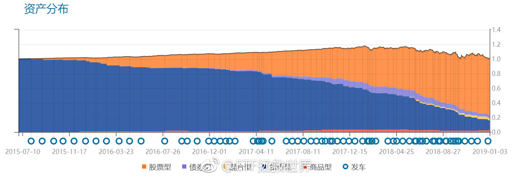
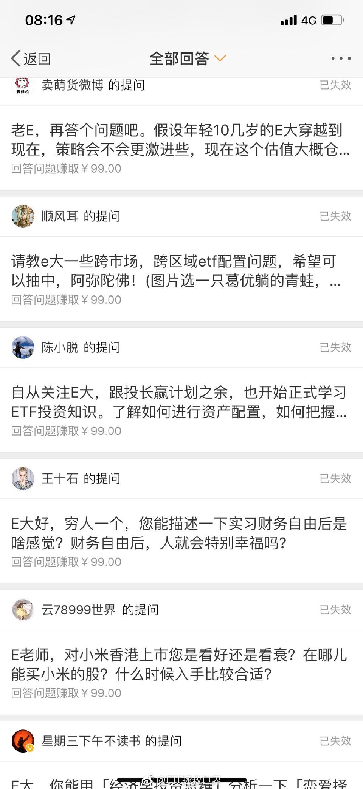

ETF拯救世界 (5687069307) @
2019-01-02 08:41:51 Wed  
url: https://weibo.com/5687069307/Ha2Dy66VC

徐总，如果这是你们公司投研部的文章，我建议可以全部开掉了。这是我见过抄袭最无耻的一次，全部格式文字原封不动的抄。

------------------------------------------------------
转推：
>  @ ()
>  2019-01-01 21:25:54 Tue  
>  url: 

>  抱歉，此微博已被作者删除。查看帮助：http://t.cn/Rfd3rQV

转发[34]  评论[156]  赞[408] 

======================================================

ETF拯救世界 (5687069307) @
2019-01-02 09:00:08 Wed  
url: https://weibo.com/5687069307/Ha2KYapba

遗产税我个人支持。问题在于怎么才能让这个从富人那里拿到的税真正用在穷人身上。

------------------------------------------------------
转推：
>  @挖龙脉的超级鹿鼎公 (3962719063)
>  2019-01-02 08:58:01 Wed  
>  url: https:/weibo.com/3962719063/Ha2K7hRQL/

>  当年美帝要取消遗产税，结果一堆富豪反对，包括巴菲特，摩根家族，比尔盖茨等，但是再看看他们的财产安排，全是不用缴纳遗产税的家族式基金，所以真的要看做什么，而不是说什么。
>  全球富豪中，缴纳大笔遗产税的大概也就是家族内斗激烈的韩国三星和台湾王永庆家族 ​​​

转发[3]  评论[22]  赞[216] 

======================================================

ETF拯救世界 (5687069307) @
2019-01-02 09:09:06 Wed  
url: https://weibo.com/5687069307/Ha2OBBnau

回复@业余金融学者:[偷笑] 没事。就让贫富差距继续扩大吧。穷人越来越穷，毫无上升的机会，最终来一次gm，均贫卡一出谁与争锋，那样就都开心了。

------------------------------------------------------
转推：
>  @挖龙脉的超级鹿鼎公 (3962719063)
>  2019-01-02 08:58:01 Wed  
>  url: https:/weibo.com/3962719063/Ha2K7hRQL/

>  当年美帝要取消遗产税，结果一堆富豪反对，包括巴菲特，摩根家族，比尔盖茨等，但是再看看他们的财产安排，全是不用缴纳遗产税的家族式基金，所以真的要看做什么，而不是说什么。
>  全球富豪中，缴纳大笔遗产税的大概也就是家族内斗激烈的韩国三星和台湾王永庆家族 ​​​

转发[6]  评论[32]  赞[226] 

======================================================

ETF拯救世界 (5687069307) @
2019-01-02 09:31:55 Wed  
url: https://weibo.com/5687069307/Ha2XS4jRb

我立个flag。

2019年A股极大极大概率收红。不投机取巧，我说的是绝大多数指数。

甚至，有可能涨幅不会太小。

当然不排除中间继续挖坑，但年底看，形势一片大好。不是小好，是大好。 ​​​

转发[214]  评论[332]  赞[975] 

======================================================

ETF拯救世界 (5687069307) @
2019-01-02 09:51:33 Wed  
url: https://weibo.com/5687069307/Ha35PuOMU

你可能不知道，去年我们第一重仓基金中证红利是所有我监测的十几只指数中涨幅第一的。

年涨幅是

-16%…… ​​​

转发[14]  评论[97]  赞[458] 

======================================================

ETF拯救世界 (5687069307) @
2019-01-02 10:21:00 Wed  
url: https://weibo.com/5687069307/Ha3hNuPYL

这股票前期低点撑不住的话就麻烦。权重又大，大指数又是一波。

------------------------------------------------------
转推：
>  @ETF拯救世界 (5687069307)
>  2018-12-21 10:53:09 Fri  
>  url: https:/weibo.com/5687069307/H8emT1xqa/

>  某只莫名其妙崩盘的股票看图真危险啊。
>  
>  不知道发生什么了。 ​​​

转发[8]  评论[142]  赞[282] 

======================================================

ETF拯救世界 (5687069307) @
2019-01-02 12:20:40 Wed  
url: https://weibo.com/5687069307/Ha44mBl4G

珍惜眼前人。

------------------------------------------------------
转推：
>  @ ()
>  2019-01-01 17:27:35 Tue  
>  url: 

>  抱歉，作者已设置仅展示半年内微博，此微博已不可见。 ​​​

转发[72]  评论[72]  赞[307] 

======================================================

ETF拯救世界 (5687069307) @
2019-01-02 13:33:38 Wed  
url: https://weibo.com/5687069307/Ha4xZmCVb

回复@佳期如梦梦梦:这么明显的下跌趋势，当然是给空间了。2018年我们分别在2、8、10月买了三份。不能把建仓筹码聚集在一个区域，否则毫无意义。//@佳期如梦梦梦:很想知道E大啥时候买医药//@ETF拯救世界:下次买入应该在7900左右。

------------------------------------------------------
转推：
>  @ETF拯救世界 (5687069307)
>  2018-12-06 13:04:56 Thu  
>  url: https:/weibo.com/5687069307/H5XOVqDBb/

>  $全指医药 sh000991$   看来还能继续买啊。 ​​​

转发[162]  评论[100]  赞[320] 

======================================================

ETF拯救世界 (5687069307) @
2019-01-02 13:39:09 Wed  
url: https://weibo.com/5687069307/Ha4AefMjI

回复@牙神111:我投资一个指数不会连基本面都不看。我对医药的策略中，已经考虑过去三十年日本医药行业变化的样本，考虑目前各国医药行业估值，考虑政策面影响。我不说，不代表我不知道。只看估值更是对我的极大误解。//@牙神111:E大，医药的估值基础已发生重大变化

------------------------------------------------------
转推：
>  @ETF拯救世界 (5687069307)
>  2018-12-06 13:04:56 Thu  
>  url: https:/weibo.com/5687069307/H5XOVqDBb/

>  $全指医药 sh000991$   看来还能继续买啊。 ​​​

转发[96]  评论[92]  赞[408] 

======================================================

ETF拯救世界 (5687069307) @
2019-01-02 13:45:22 Wed  
url: https://weibo.com/5687069307/Ha4CKh2kq

回复@目标300m:张嘴就来。医药从15500跌下来，我们的成本在这里，从未追高，太高之说从何而来？服了，扯淡之前先看看数据。拉黑为敬。 http://t.cn/EbelEFX //@目标300m:6000以下再买吧。你之前买得太高了。

------------------------------------------------------
转推：
>  @ETF拯救世界 (5687069307)
>  2018-12-06 13:04:56 Thu  
>  url: https:/weibo.com/5687069307/H5XOVqDBb/

>  $全指医药 sh000991$   看来还能继续买啊。 ​​​

转发[11]  评论[78]  赞[310] 

======================================================

ETF拯救世界 (5687069307) @
2019-01-02 14:07:07 Wed  
url: https://weibo.com/5687069307/Ha4LzvQjy

“这次不一样”。

这句在资本市场上经常会出现的话，有可能是对的。

但大多数时间，根本不会有什么不一样。

只要那些涨起来就找各种理由三万点五万点，跌下去找各种理由不行了完蛋了的人存在，就不会不一样。

我不需要那些在股市上根本没赚过钱的人来指导我，谢谢。我要听了你们的，一分钱都挣不着 ​​​

转发[84]  评论[167]  赞[741] 

======================================================

ETF拯救世界 (5687069307) @
2019-01-02 14:13:28 Wed  
url: https://weibo.com/5687069307/Ha4O9q68G

因为各种原因，资本市场正常情况下一定是以一定斜率向上升。哪怕日本台湾，排除掉疯狂高估的那几年，到现在也是一路上升。

所以一般人，在比较便宜的地方买入，拿着就行。不用看也不用管。

对于能够独立思考，在极端时候与群众保持距离的人来说，高位卖掉，低位买回来效果会更好。

但那些跌了50%、6 ​​​

转发[96]  评论[168]  赞[588] 

======================================================

ETF拯救世界 (5687069307) @
2019-01-02 14:48:05 Wed  
url: https://weibo.com/5687069307/Ha52cv8ml

今天不出意外会跌破10月底的全市场估值。

距离2008年最低点还有11%，距离2005年最低点还有17%。

2008年之后是一年翻番。2005年之后是两年六倍。

2019年之后会怎样，咱们拭目以待。 ​​​

转发[239]  评论[273]  赞[662] 

======================================================

ETF拯救世界 (5687069307) @
2019-01-02 14:57:24 Wed  
url: https://weibo.com/5687069307/Ha55Z7OTg

回复@追求确定性2:快吗？从2001年跌到2005整整4年。从2007到2012年底又是4年半。一轮牛市顶部到熊市大底都是4年起。你回头看觉得很快，当你置身其中，比如现在这轮才三年多，就感受完全不同了。//@追求确定性2:哦，我竟然不知道05年低于08年，那时一轮好快，节约时间。

------------------------------------------------------
转推：
>  @ETF拯救世界 (5687069307)
>  2019-01-02 14:48:05 Wed  
>  url: https:/weibo.com/5687069307/Ha52cv8ml/

>  今天不出意外会跌破10月底的全市场估值。
>  
>  距离2008年最低点还有11%，距离2005年最低点还有17%。
>  
>  2008年之后是一年翻番。2005年之后是两年六倍。
>  
>  2019年之后会怎样，咱们拭目以待。 ​​​

转发[71]  评论[95]  赞[363] 

======================================================

ETF拯救世界 (5687069307) @
2019-01-02 15:12:17 Wed  
url: https://weibo.com/5687069307/Ha5c1tARX

2001-2005，上证指数从2245跌到998，跌幅56%.

2007-2012，不用上证了，因为被大股票绑架。用深综指，从1500跌到770，跌幅50%。（08年底跌幅70%）

这一轮深综指已经杀了60%。如果到05年底估值，等于是从最高点杀67%。

你可以有一万种理由说这次不一样，你看我搭理不搭理你。 ​​​

转发[172]  评论[331]  赞[728] 

======================================================

ETF拯救世界 (5687069307) @
2019-01-02 19:41:18 Wed  
url: https://weibo.com/5687069307/Ha6Xdu5Zi

没为母校做什么，很惭愧[摊手]

------------------------------------------------------
转推：
>  @老马自奋蹄 (1807436544)
>  2019-01-02 19:18:03 Wed  
>  url: https:/weibo.com/1807436544/Ha6NM7AR4/

>  校友会100强排行榜 ​​​

转发[21]  评论[153]  赞[288] 

======================================================

ETF拯救世界 (5687069307) @
2019-01-03 05:50:58 Thu  
url: https://weibo.com/5687069307/HaaWGClWK

平均跌幅超过40%，扛不住即将破功 [doge] ​​​

转发[52]  评论[108]  赞[415] 

+++++++++++++++++++++++++++++++++++++++++++++++++++++

图片：

======================================================

ETF拯救世界 (5687069307) @
2019-01-03 06:17:37 Thu  
url: https://weibo.com/5687069307/Hab7v9Wt8

敢不敢涨上去再让我们卖一次。 ​​​

转发[6]  评论[94]  赞[419] 

+++++++++++++++++++++++++++++++++++++++++++++++++++++

图片：

======================================================

ETF拯救世界 (5687069307) @
2019-01-03 09:40:14 Thu  
url: https://weibo.com/5687069307/HacrKs9qx

回复@股票不赚钱:均值回归。不要抄近期表现好的作业，不要买近期表现好的产品//@股票不赚钱:不怪你，俺抄大V作业，抄一个废一个，紫薇侍郎、飘仙啥的……。抄你作业半年了……

------------------------------------------------------
转推：
>  @ETF拯救世界 (5687069307)
>  2019-01-03 05:50:58 Thu  
>  url: https:/weibo.com/5687069307/HaaWGClWK/

>  平均跌幅超过40%，扛不住即将破功 [doge] ​​​

转发[31]  评论[58]  赞[312] 

======================================================

ETF拯救世界 (5687069307) @
2019-01-03 10:22:47 Thu  
url: https://weibo.com/5687069307/HacJ10a0U

只要涨1%，30%昨天看空的人就觉得牛市来了。

涨10%，80%空头转多。

剩下的20%牛市快结束的时候去买单。 ​​​

转发[147]  评论[187]  赞[688] 

======================================================

ETF拯救世界 (5687069307) @
2019-01-03 14:25:10 Thu  
url: https://weibo.com/5687069307/HaejowEF7

看着账户里100多万医药指数瑟瑟发抖中。[doge] ​​​

转发[41]  评论[318]  赞[728] 

======================================================

ETF拯救世界 (5687069307) @
2019-01-03 18:38:24 Thu  
url: https://weibo.com/5687069307/HafYc0HaN

[爱你]

------------------------------------------------------
转推：
>  @ ()
>  2019-01-03 16:50:06 Thu  
>  url: 

>  抱歉，作者已设置仅展示半年内微博，此微博已不可见。 ​​​

转发[27]  评论[61]  赞[186] 

======================================================

ETF拯救世界 (5687069307) @
2019-01-03 22:17:15 Thu  
url: https://weibo.com/5687069307/Hahp18clk

有没有了解人体工学椅的朋友，有什么好推荐吗。 ​​​

转发[52]  评论[116]  赞[232] 

======================================================

ETF拯救世界 (5687069307) @
2019-01-04 00:50:10 Fri  
url: https://weibo.com/5687069307/Haip5yy5K

买了，谢谢各位！

------------------------------------------------------
转推：
>  @ETF拯救世界 (5687069307)
>  2019-01-03 22:17:15 Thu  
>  url: https:/weibo.com/5687069307/Hahp18clk/

>  有没有了解人体工学椅的朋友，有什么好推荐吗。 ​​​

转发[3]  评论[56]  赞[207] 

======================================================

ETF拯救世界 (5687069307) @
2019-01-04 10:47:21 Fri  
url: https://weibo.com/5687069307/Hamju3sby

不做舔狗的股市，才是有希望的股市。

——赵四 ​​​

转发[75]  评论[94]  赞[437] 

======================================================

ETF拯救世界 (5687069307) @
2019-01-04 11:06:56 Fri  
url: https://weibo.com/5687069307/Hamrqgnkx

回复@小牛乐乐吧:记住一个规则：只要有人喊“大奇迹日”。那就大概率还要跌。E首发。//@小牛乐乐吧:回复@小牛乐乐吧:一个好现象：球球的V们今天没有叫嚷着大底，反倒偏谨慎了！

------------------------------------------------------
转推：
>  @ETF拯救世界 (5687069307)
>  2019-01-04 10:47:21 Fri  
>  url: https:/weibo.com/5687069307/Hamju3sby/

>  不做舔狗的股市，才是有希望的股市。
>  
>  ——赵四 ​​​

转发[65]  评论[99]  赞[335] 

======================================================

ETF拯救世界 (5687069307) @
2019-01-04 11:32:35 Fri  
url: https://weibo.com/5687069307/HamBQi0tl

大奇迹日！ ​​​

转发[11]  评论[224]  赞[505] 

======================================================

ETF拯救世界 (5687069307) @
2019-01-04 11:34:52 Fri  
url: https://weibo.com/5687069307/HamCMdx1f

各位好好在各个网站观察，看看对不对。

------------------------------------------------------
转推：
>  @ETF拯救世界 (5687069307)
>  2019-01-03 10:22:47 Thu  
>  url: https:/weibo.com/5687069307/HacJ10a0U/

>  只要涨1%，30%昨天看空的人就觉得牛市来了。
>  
>  涨10%，80%空头转多。
>  
>  剩下的20%牛市快结束的时候去买单。 ​​​

转发[20]  评论[78]  赞[336] 

======================================================

ETF拯救世界 (5687069307) @
2019-01-04 11:45:31 Fri  
url: https://weibo.com/5687069307/HamH5xk2a

如果今天涨5%以上，我将停止抖动。

------------------------------------------------------
转推：
>  @ETF拯救世界 (5687069307)
>  2019-01-03 14:25:10 Thu  
>  url: https:/weibo.com/5687069307/HaejowEF7/

>  看着账户里100多万医药指数瑟瑟发抖中。[doge] ​​​

转发[6]  评论[156]  赞[442] 

======================================================

ETF拯救世界 (5687069307) @
2019-01-04 16:02:10 Fri  
url: https://weibo.com/5687069307/Haonh4Ii7

回复@开心娅宁:我这里怎么都是变态//@开心娅宁:我为什么有点伤心呢，自从上了车就喜欢使劲跌//@ETF拯救世界:如果今天涨5%以上，我将停止抖动。

------------------------------------------------------
转推：
>  @ETF拯救世界 (5687069307)
>  2019-01-03 14:25:10 Thu  
>  url: https:/weibo.com/5687069307/HaejowEF7/

>  看着账户里100多万医药指数瑟瑟发抖中。[doge] ​​​

转发[2]  评论[75]  赞[244] 

======================================================

ETF拯救世界 (5687069307) @
2019-01-04 16:12:18 Fri  
url: https://weibo.com/5687069307/Haornqp7G

回复@freeman7998:投资就这点事。情绪是其一。周而复始，什么也不会变//@freeman7998:刚刚雪球收评，大奇迹日。[允悲]//@ETF拯救世界:回复@小牛乐乐吧:记住一个规则：只要有人喊“大奇迹日”。那就大概率还要跌。E首发。

------------------------------------------------------
转推：
>  @ETF拯救世界 (5687069307)
>  2019-01-04 10:47:21 Fri  
>  url: https:/weibo.com/5687069307/Hamju3sby/

>  不做舔狗的股市，才是有希望的股市。
>  
>  ——赵四 ​​​

转发[28]  评论[62]  赞[266] 

======================================================

ETF拯救世界 (5687069307) @
2019-01-04 17:58:02 Fri  
url: https://weibo.com/5687069307/Hap8inxsa

新的一年了。

距离探索这个星球1%的目标依然非常遥远… ​​​

转发[20]  评论[67]  赞[267] 

+++++++++++++++++++++++++++++++++++++++++++++++++++++

图片：

======================================================

ETF拯救世界 (5687069307) @
2019-01-04 18:06:53 Fri  
url: https://weibo.com/5687069307/HapbTu7i6

回复@投资跑道上的一只小蜗牛:人类特别渺小，在地球上就是渣渣。地球在宇宙里面连渣渣都不是。你我又在整个人类中是渣渣。所以自己的那点不开心什么都不是，开心每一天最重要//@投资跑道上的一只小蜗牛:人类太渺小了

------------------------------------------------------
转推：
>  @ETF拯救世界 (5687069307)
>  2019-01-04 17:58:02 Fri  
>  url: https:/weibo.com/5687069307/Hap8inxsa/

>  新的一年了。
>  
>  距离探索这个星球1%的目标依然非常遥远… ​​​

转发[13]  评论[57]  赞[253] 

======================================================

ETF拯救世界 (5687069307) @
2019-01-04 18:49:59 Fri  
url: https://weibo.com/5687069307/HaptnDyBV

回复@乐活广场com:秋天收获以后，春天播种，经过夏天，又到秋天才能收获。那么，能不能因为冬天春天夏天的时间成本不种地了呢。//@乐活广场com:跟计划三年多了，计划本身足够优秀，但我觉得一个不足之处是 它只能通过一个牛市来兑现〔可观〕的利润。 这其中的时间成本是需要考虑的

------------------------------------------------------
转推：
>  @ETF拯救世界 (5687069307)
>  2019-01-04 10:47:21 Fri  
>  url: https:/weibo.com/5687069307/Hamju3sby/

>  不做舔狗的股市，才是有希望的股市。
>  
>  ——赵四 ​​​

转发[15]  评论[74]  赞[248] 

======================================================

ETF拯救世界 (5687069307) @
2019-01-04 18:56:59 Fri  
url: https://weibo.com/5687069307/Hapwen35I

回复@不让改名字呢:那你们等着牛市来临前一天买入就完了呗。//@不让改名字呢:冬天本来就不用种地啊，前位说的是对的//@ETF拯救世界:回复@乐活广场com:秋天收获以后，春天播种，经过夏天，又到秋天才能收获。那么，能不能因为冬天春天夏天的时间成本不种地了呢。

------------------------------------------------------
转推：
>  @ETF拯救世界 (5687069307)
>  2019-01-04 10:47:21 Fri  
>  url: https:/weibo.com/5687069307/Hamju3sby/

>  不做舔狗的股市，才是有希望的股市。
>  
>  ——赵四 ​​​

转发[4]  评论[54]  赞[234] 

======================================================

ETF拯救世界 (5687069307) @
2019-01-04 19:12:38 Fri  
url: https://weibo.com/5687069307/HapCzBBme

说起时间成本，好好看这张图。

在上一轮把几乎所有持仓卖出，高位持有现金（深蓝色）后，我们用了多长时间才把这些现金换成资产。

第三轮开始两年半后，还有超过一半现金。你有没有见过这样的组合？我已经把时间成本考虑的比99%的人都足够了。也就是说，这两年半你的大部分资金根本不会被占用。

去 ​​​

转发[111]  评论[269]  赞[703] 

+++++++++++++++++++++++++++++++++++++++++++++++++++++

图片：

======================================================

ETF拯救世界 (5687069307) @
2019-01-04 21:51:19 Fri  
url: https://weibo.com/5687069307/HaqEZe73e

何德何能 ​​​

转发[5]  评论[70]  赞[349] 

+++++++++++++++++++++++++++++++++++++++++++++++++++++

图片：

======================================================

ETF拯救世界 (5687069307) @
2019-01-04 22:37:15 Fri  
url: https://weibo.com/5687069307/HaqXDagmN

明早看不要让我们失望 ​​​

转发[4]  评论[75]  赞[290] 

+++++++++++++++++++++++++++++++++++++++++++++++++++++

图片：

======================================================

ETF拯救世界 (5687069307) @
2019-01-05 08:02:53 Sat  
url: https://weibo.com/5687069307/HauFdCv6n

都是轮回。跌了买，涨了卖。简简单单的。多大点事。 ​​​

转发[29]  评论[62]  赞[389] 

+++++++++++++++++++++++++++++++++++++++++++++++++++++

图片：

======================================================

ETF拯救世界 (5687069307) @
2019-01-05 08:17:58 Sat  
url: https://weibo.com/5687069307/HauLlAdQg

昨天纽约油2个点，油气5个点。记得前一段有人说油气跟油价无关吗。再说一次，中长期70%跟上就行，不用每天严丝合缝。因为没意义。波动更大我更喜欢。

------------------------------------------------------
转推：
>  @ETF拯救世界 (5687069307)
>  2019-01-05 08:02:53 Sat  
>  url: https:/weibo.com/5687069307/HauFdCv6n/

>  都是轮回。跌了买，涨了卖。简简单单的。多大点事。 ​​​

转发[19]  评论[61]  赞[321] 

======================================================

ETF拯救世界 (5687069307) @
2019-01-05 08:24:57 Sat  
url: https://weibo.com/5687069307/HauOb9BK9

证券市场的涨跌，波动，是你我都没法改变的。

除非你不玩了，否则你就必须找到适应甚至利用涨跌波动的方法，而不是怨天尤人。

有人认为波动是风险，我认为波动是机会。波动越大机会越大，没有波动就没有机会。

A股这样的波动，几乎每年都不是涨幅第一就是跌幅第一，简直是天堂了。 

只要你能记住那 ​​​

转发[96]  评论[162]  赞[528] 

======================================================

ETF拯救世界 (5687069307) @
2019-01-05 08:31:38 Sat  
url: https://weibo.com/5687069307/HauQTeVwg

非常有意义。今天辉煌十年后未必，即使你根本看不出这家公司有任何可能滑落。十年后，现在的科技巨头还剩一半就不错。

------------------------------------------------------
转推：
>  @数据化管理 (1424710994)
>  2019-01-04 22:07:50 Fri  
>  url: https:/weibo.com/1424710994/HaqLGBP9J/

>  2008vs2018年全球市值最高的10个公司对比：
>  1、只有微软还在榜单中，并且18年末市值超越苹果成老大了；
>  2、10年前只有微软1家新科技公司，10年后有7家是新科技公司；
>  3、10年前中国有3家公司“被”上榜，10年后有2家是中国新科技公司；
>  4、10年前宝洁还在榜单，10年后仍然有家快消+医药的美国强生在榜 ​​​

转发[124]  评论[89]  赞[349] 

======================================================

ETF拯救世界 (5687069307) @
2019-01-05 16:29:29 Sat  
url: https://weibo.com/5687069307/HaxYQzuJ8

将近一个月过去，小助理第三轮笔试五分钟前已经有了结果。

这次是从进入第二轮的346位中选择10-15位，最终结果是选了16位作为备选人员。之后我会给这些朋友回信。

这一轮选择时间比较长，是因为每份答题中有好几个文件，绝大部分邮件还会写不少感受，一封封看非常耗费时间。毕竟每一位的答题都不能马 ​​​

转发[9]  评论[230]  赞[791] 

======================================================

ETF拯救世界 (5687069307) @
2019-01-06 21:05:30 Sun  
url: https://weibo.com/5687069307/HaJdockZB

有点精彩。想看聊天记录……

------------------------------------------------------
转推：
>  @新浪娱乐 (1642591402)
>  2019-01-06 17:38:28 Sun  
>  url: https:/weibo.com/1642591402/HaHRltilE/

>  #袁巴元爆料张雨绮与男子开房# 6日，袁巴元在朋友圈发文承认与张雨绮离婚后的确又在一起生活，但女方5日晚与刚认识两天的男子开房，直指“这是她的一贯风格，离婚前也一样，只要自己爽从不顾及别人的感受，特别是不顾小孩”，表示这也是两人之前离婚的原因，强调称彼此之间没有任何感情上的关系。 ​​​

转发[7]  评论[127]  赞[197] 

======================================================

ETF拯救世界 (5687069307) @
2019-01-07 13:17:29 Mon  
url: https://weibo.com/5687069307/HaPzUqV39

现在舒服不舒服。

------------------------------------------------------
转推：
>  @ETF拯救世界 (5687069307)
>  2019-01-03 10:22:47 Thu  
>  url: https:/weibo.com/5687069307/HacJ10a0U/

>  只要涨1%，30%昨天看空的人就觉得牛市来了。
>  
>  涨10%，80%空头转多。
>  
>  剩下的20%牛市快结束的时候去买单。 ​​​

转发[55]  评论[237]  赞[392] 

======================================================

ETF拯救世界 (5687069307) @
2019-01-07 15:26:33 Mon  
url: https://weibo.com/5687069307/HaQqj4d0G

回复@追求确定性2:大网利润43%。每年可以吃两次。//@追求确定性2:我现在在yy油气出一大网。虽然还早。//@ETF拯救世界:现在舒服不舒服。

------------------------------------------------------
转推：
>  @ETF拯救世界 (5687069307)
>  2019-01-03 10:22:47 Thu  
>  url: https:/weibo.com/5687069307/HacJ10a0U/

>  只要涨1%，30%昨天看空的人就觉得牛市来了。
>  
>  涨10%，80%空头转多。
>  
>  剩下的20%牛市快结束的时候去买单。 ​​​

转发[47]  评论[130]  赞[296] 

======================================================

ETF拯救世界 (5687069307) @
2019-01-07 22:17:53 Mon  
url: https://weibo.com/5687069307/HaT7gteHK

回复@卡萨布兰卡de忧伤:它就是最近几年表现好。2003-2013它是最著名的毫无波动僵尸股，更别提怎么从2000暴跌下去。投资个股是真的难。//@卡萨布兰卡de忧伤:微软十年涨3倍这还是分红后 手机没搞成的情况下

------------------------------------------------------
转推：
>  @数据化管理 (1424710994)
>  2019-01-04 22:07:50 Fri  
>  url: https:/weibo.com/1424710994/HaqLGBP9J/

>  2008vs2018年全球市值最高的10个公司对比：
>  1、只有微软还在榜单中，并且18年末市值超越苹果成老大了；
>  2、10年前只有微软1家新科技公司，10年后有7家是新科技公司；
>  3、10年前中国有3家公司“被”上榜，10年后有2家是中国新科技公司；
>  4、10年前宝洁还在榜单，10年后仍然有家快消+医药的美国强生在榜 ​​​

转发[13]  评论[28]  赞[166] 

======================================================

ETF拯救世界 (5687069307) @
2019-01-07 23:18:13 Mon  
url: https://weibo.com/5687069307/HaTvKqLE1

去睡了，不要掉链子 ​​​

转发[19]  评论[66]  赞[277] 

+++++++++++++++++++++++++++++++++++++++++++++++++++++

图片：

======================================================

ETF拯救世界 (5687069307) @
2019-01-08 06:05:44 Tue  
url: https://weibo.com/5687069307/HaWba5J9b

提款机 http://t.cn/EGHZ44V

------------------------------------------------------
转推：
>  @ETF拯救世界 (5687069307)
>  2019-01-07 23:18:13 Mon  
>  url: https:/weibo.com/5687069307/HaTvKqLE1/

>  去睡了，不要掉链子 ​​​

转发[12]  评论[103]  赞[319] 

======================================================

ETF拯救世界 (5687069307) @
2019-01-08 09:26:46 Tue  
url: https://weibo.com/5687069307/HaXuL9mUn

每一种交易策略都有适合它的市场环境和市场周期，世界上从没有，也永远不会有一种能够适应全天候市场状况的完美交易策略。

任何交易策略都有它的关键点和需要注意的问题。这些都不是一两句能说清的。

有天分的人，在某个交易策略上经历过一个周期，就会明白这个策略的关键以及致命伤。才有可能继续不 ​​​

转发[157]  评论[175]  赞[472] 

======================================================

ETF拯救世界 (5687069307) @
2019-01-08 10:07:12 Tue  
url: https://weibo.com/5687069307/HaXLb7c5x

回复@嘿嘿zzzz:全天候是一个体系，不是一个交易策略。这个体系中包含了各种交易策略。就像一个军队中，要有陆海空，要有导弹部队。各个军种搭配才行。我说的是交易策略。两回事。

------------------------------------------------------
转推：
>  @ETF拯救世界 (5687069307)
>  2019-01-08 09:26:46 Tue  
>  url: https:/weibo.com/5687069307/HaXuL9mUn/

>  每一种交易策略都有适合它的市场环境和市场周期，世界上从没有，也永远不会有一种能够适应全天候市场状况的完美交易策略。
>  
>  任何交易策略都有它的关键点和需要注意的问题。这些都不是一两句能说清的。
>  
>  有天分的人，在某个交易策略上经历过一个周期，就会明白这个策略的关键以及致命伤。才有可能继续不 ​​​

转发[53]  评论[35]  赞[230] 

======================================================

ETF拯救世界 (5687069307) @
2019-01-08 10:54:52 Tue  
url: https://weibo.com/5687069307/HaY4vAS2z

回复@ETF信徒者:她不懂我。我不是多头，我只是把油气当做一个难得的弱相关交易工具。//@ETF信徒者:请问E大如何看待油气姐说你是油气多头，在这件事情事情之前发的靓照[doge]

------------------------------------------------------
转推：
>  @ETF拯救世界 (5687069307)
>  2019-01-08 09:26:46 Tue  
>  url: https:/weibo.com/5687069307/HaXuL9mUn/

>  每一种交易策略都有适合它的市场环境和市场周期，世界上从没有，也永远不会有一种能够适应全天候市场状况的完美交易策略。
>  
>  任何交易策略都有它的关键点和需要注意的问题。这些都不是一两句能说清的。
>  
>  有天分的人，在某个交易策略上经历过一个周期，就会明白这个策略的关键以及致命伤。才有可能继续不 ​​​

转发[29]  评论[68]  赞[246] 

======================================================

ETF拯救世界 (5687069307) @
2019-01-08 12:06:31 Tue  
url: https://weibo.com/5687069307/HaYxBiIqY

回复@梦之彼方2082:讲真，腰斩之后的熊市中指数基金这样热，这是A股有史以来第一次。非常有历史意义。//@梦之彼方2082:联想到07-08年排队买基金的新闻了[吃瓜]//@ETF拯救世界:回复@ETF信徒者:她不懂我。我不是多头，我只是把油气当做一个难得的弱相关交易工具。

------------------------------------------------------
转推：
>  @ETF拯救世界 (5687069307)
>  2019-01-08 09:26:46 Tue  
>  url: https:/weibo.com/5687069307/HaXuL9mUn/

>  每一种交易策略都有适合它的市场环境和市场周期，世界上从没有，也永远不会有一种能够适应全天候市场状况的完美交易策略。
>  
>  任何交易策略都有它的关键点和需要注意的问题。这些都不是一两句能说清的。
>  
>  有天分的人，在某个交易策略上经历过一个周期，就会明白这个策略的关键以及致命伤。才有可能继续不 ​​​

转发[18]  评论[57]  赞[225] 

======================================================

ETF拯救世界 (5687069307) @
2019-01-08 12:12:14 Tue  
url: https://weibo.com/5687069307/HaYzVxxWg

资金宽松+避险思维=高等级债牛市。下一个阶段，没有意外就会进入股市与垃圾债的春天。只是具体时间不知道……

------------------------------------------------------
转推：
>  @ ()
>  2019-01-08 12:08:58 Tue  
>  url: 

>  抱歉，此微博已被作者删除。查看帮助：http://t.cn/Rfd3rQV

转发[82]  评论[111]  赞[300] 

======================================================

ETF拯救世界 (5687069307) @
2019-01-08 13:25:09 Tue  
url: https://weibo.com/5687069307/HaZ3wdypf

[doge] 新低了。//@ETF拯救世界:小米，年轻人第一支被套的股票……

------------------------------------------------------
转推：
>  @小米公司陈曦 (2651381433)
>  2018-06-22 10:54:12 Fri  
>  url: https:/weibo.com/2651381433/Gmw3gaYeG/

>  联交所第一支同股不同权的股票[鼓掌][鼓掌][鼓掌]
>  股票代码：1810（18年上市，10年创立）
>  年轻人的第一支股票，亲爱的米粉们，账户开好了吗[偷笑][偷笑] ​​​

转发[24]  评论[75]  赞[197] 

======================================================

ETF拯救世界 (5687069307) @
2019-01-08 14:11:33 Tue  
url: https://weibo.com/5687069307/HaZmm0DR9

刚才你们说的两位V争论我去看了。技术方面没什么好说的，每个人都有自己的观点。

不过我其实想知道的是，否定别人的东西后，有没有提出更好的东西呢。

比如投资指数基金。我可以说长期定投会比牛市最热的时候一笔砸进去强。

那根据估值，低位布局，又比无脑定投强。

那接下来，更进一步，要考虑组 ​​​

转发[168]  评论[268]  赞[521] 

======================================================

ETF拯救世界 (5687069307) @
2019-01-08 14:28:51 Tue  
url: https://weibo.com/5687069307/HaZtnh3V0

另外，咱们排除利益因素，就考虑讨论的技术因素。

太多人根本就没想明白自己到论坛干嘛去了。

人这一辈子，就这么几十年。找个有兴趣的事儿钻研一下，吃喝玩乐，泡妞亲子，你干嘛不行，实在不行你去赚点钱，非得上论坛跟人互喷吗……

首先人都要脸。你指着人家说你那套东西是辣鸡，还没完没了的说， ​​​

转发[47]  评论[117]  赞[434] 

======================================================

ETF拯救世界 (5687069307) @
2019-01-08 14:33:39 Tue  
url: https://weibo.com/5687069307/HaZvkqC8U

回复@早起拜瓶迁晚睡读益达:投资这件事根本就没有唯一的正确。太多人认为只有自己这样做正确。每个路子都适合不同的人，百花齐放才是王道。

------------------------------------------------------
转推：
>  @ETF拯救世界 (5687069307)
>  2019-01-08 14:28:51 Tue  
>  url: https:/weibo.com/5687069307/HaZtnh3V0/

>  另外，咱们排除利益因素，就考虑讨论的技术因素。
>  
>  太多人根本就没想明白自己到论坛干嘛去了。
>  
>  人这一辈子，就这么几十年。找个有兴趣的事儿钻研一下，吃喝玩乐，泡妞亲子，你干嘛不行，实在不行你去赚点钱，非得上论坛跟人互喷吗……
>  
>  首先人都要脸。你指着人家说你那套东西是辣鸡，还没完没了的说， ​​​

转发[16]  评论[33]  赞[283] 

======================================================

ETF拯救世界 (5687069307) @
2019-01-08 14:49:57 Tue  
url: https://weibo.com/5687069307/HaZBWgSjd

辣鸡

------------------------------------------------------
转推：
>  @央视新闻 (2656274875)
>  2019-01-08 14:48:18 Tue  
>  url: https:/weibo.com/2656274875/HaZBgAonZ/

>  【北京宣师一附小校内一男子伤害孩子 20个孩子受伤】今日上午11点17分左右，北京宣师一附小校内发生一男子伤害孩子事件。初步了解，共有20个孩子受伤，均已送到医院救治，其中3人伤势较重，目前生命体征平稳，无生命危险。嫌疑人已被当场控制。市、区公安、卫生、教育、应急等相关单位正在全力开展救治 ​​​

转发[12]  评论[51]  赞[126] 

======================================================

ETF拯救世界 (5687069307) @
2019-01-08 16:50:18 Tue  
url: https://weibo.com/5687069307/Hb0oN3yvj

对孩子下手就是人渣中的战斗机，卢瑟中的极品。写到史书上传到任何年代都是万人唾骂。

一个是学校幼儿园肯定要加大保安力度。

另一个是咱们回家都要好好教育孩子怎么应对这种突发情况。 ​​​

转发[19]  评论[63]  赞[312] 

======================================================

ETF拯救世界 (5687069307) @
2019-01-08 16:54:01 Tue  
url: https://weibo.com/5687069307/Hb0qj2jnv

回复@橙子西瓜各有所爱:学校幼儿园没法少去啊。该教育就得教育。得多带孩子看看动物世界。看看里面的小瞪羚是怎么逃脱狮子毒手的……//@橙子西瓜各有所爱:以后这种恐怕会越来越多，唉，尽量少去人多的地方吧

------------------------------------------------------
转推：
>  @ETF拯救世界 (5687069307)
>  2019-01-08 16:50:18 Tue  
>  url: https:/weibo.com/5687069307/Hb0oN3yvj/

>  对孩子下手就是人渣中的战斗机，卢瑟中的极品。写到史书上传到任何年代都是万人唾骂。
>  
>  一个是学校幼儿园肯定要加大保安力度。
>  
>  另一个是咱们回家都要好好教育孩子怎么应对这种突发情况。 ​​​

转发[6]  评论[31]  赞[208] 

======================================================

ETF拯救世界 (5687069307) @
2019-01-09 09:01:06 Wed  
url: https://weibo.com/5687069307/Hb6KQ7bFd

“今年最令人感慨的股票型基金当属东方红资管旗下的东方睿系列基金。2017年，该系列基金因集中重仓绩优蓝筹股而力压群芳，整体收益均位于股票类基金的前列，并遥遥领先同类基金的业绩。这一团队效应，导致他们之后发行的新基金一日就销售过百亿，创造了基金逆势旺销的奇迹，但是今年睿系列基金集体回落 ​​​

转发[118]  评论[157]  赞[437] 

======================================================

ETF拯救世界 (5687069307) @
2019-01-09 09:15:06 Wed  
url: https://weibo.com/5687069307/Hb6QwhThf

回复@微胖界的詹姆士叔叔:清盘不错勒，有的私募没有清盘线都0.2了//@微胖界的詹姆士叔叔:回复@爱爬楼的超音鼠:0.84不错勒。我16年投了一个私募已经清盘了。。。

------------------------------------------------------
转推：
>  @ETF拯救世界 (5687069307)
>  2019-01-09 09:01:06 Wed  
>  url: https:/weibo.com/5687069307/Hb6KQ7bFd/

>  “今年最令人感慨的股票型基金当属东方红资管旗下的东方睿系列基金。2017年，该系列基金因集中重仓绩优蓝筹股而力压群芳，整体收益均位于股票类基金的前列，并遥遥领先同类基金的业绩。这一团队效应，导致他们之后发行的新基金一日就销售过百亿，创造了基金逆势旺销的奇迹，但是今年睿系列基金集体回落 ​​​

转发[7]  评论[9]  赞[178] 

======================================================

ETF拯救世界 (5687069307) @
2019-01-09 09:24:26 Wed  
url: https://weibo.com/5687069307/Hb6Ujbu8x

这一波油价反弹又有20个点了。你再回头看看一个月前那些在最低点疯狂看空石油的论调。

如果你被他们吓破了胆，就有可能卖在最低位。

我不是说油价未来的涨跌，我是说怎么看网上这些每天扑面而来的文字。

你要知道一件事，每天在网上慷慨激昂，指点江山的人，其实有一半以上可能未必有你懂得多。能写 ​​​

转发[76]  评论[172]  赞[507] 

======================================================

ETF拯救世界 (5687069307) @
2019-01-09 09:29:15 Wed  
url: https://weibo.com/5687069307/Hb6WgmLki

好像今天解禁了。//@ETF拯救世界:[doge] 新低了。//@ETF拯救世界:小米，年轻人第一支被套的股票……

------------------------------------------------------
转推：
>  @小米公司陈曦 (2651381433)
>  2018-06-22 10:54:12 Fri  
>  url: https:/weibo.com/2651381433/Gmw3gaYeG/

>  联交所第一支同股不同权的股票[鼓掌][鼓掌][鼓掌]
>  股票代码：1810（18年上市，10年创立）
>  年轻人的第一支股票，亲爱的米粉们，账户开好了吗[偷笑][偷笑] ​​​

转发[12]  评论[20]  赞[165] 

======================================================

ETF拯救世界 (5687069307) @
2019-01-09 09:33:15 Wed  
url: https://weibo.com/5687069307/Hb6XTrLo0

今天先不聊了。事情太多了。拜拜。 ​​​

转发[0]  评论[83]  赞[313] 

======================================================

ETF拯救世界 (5687069307) @
2019-01-09 13:31:46 Wed  
url: https://weibo.com/5687069307/Hb8wHpXAz

怕什么，这不12月份的跌幅就快涨回去了吗。踏踏实实的，做个金融投资就这么点事儿，低买高卖而已。 ​​​

转发[17]  评论[121]  赞[457] 

======================================================

ETF拯救世界 (5687069307) @
2019-01-09 14:38:57 Wed  
url: https://weibo.com/5687069307/Hb8XYiBCU

八成功力还在。放心了。

------------------------------------------------------
转推：
>  @ETF拯救世界 (5687069307)
>  2019-01-09 13:31:46 Wed  
>  url: https:/weibo.com/5687069307/Hb8wHpXAz/

>  怕什么，这不12月份的跌幅就快涨回去了吗。踏踏实实的，做个金融投资就这么点事儿，低买高卖而已。 ​​​

转发[8]  评论[61]  赞[282] 

======================================================

ETF拯救世界 (5687069307) @
2019-01-09 14:49:01 Wed  
url: https://weibo.com/5687069307/Hb923spHW

回复@nfbbc:辟谣了。有空接着聊了。[doge]//@nfbbc:接近央行的人士[doge]//@ETF拯救世界:八成功力还在。放心了。

------------------------------------------------------
转推：
>  @ETF拯救世界 (5687069307)
>  2019-01-09 13:31:46 Wed  
>  url: https:/weibo.com/5687069307/Hb8wHpXAz/

>  怕什么，这不12月份的跌幅就快涨回去了吗。踏踏实实的，做个金融投资就这么点事儿，低买高卖而已。 ​​​

转发[2]  评论[47]  赞[229] 

======================================================

ETF拯救世界 (5687069307) @
2019-01-09 21:49:12 Wed  
url: https://weibo.com/5687069307/HbbMBDOu5

没完没了了嘿 ​​​

转发[5]  评论[88]  赞[353] 

+++++++++++++++++++++++++++++++++++++++++++++++++++++

图片：

======================================================

ETF拯救世界 (5687069307) @
2019-01-10 06:03:31 Thu  
url: https://weibo.com/5687069307/Hbf1fApav

别人都看衰的时候你肯帮一把，才有资格享受收益。 ​​​

转发[30]  评论[104]  赞[460] 

+++++++++++++++++++++++++++++++++++++++++++++++++++++

图片：

======================================================

ETF拯救世界 (5687069307) @
2019-01-10 08:43:36 Thu  
url: https://weibo.com/5687069307/Hbg4ekUAj

回复@丫丫小屋06:压力不远了//@丫丫小屋06:竟然一直涨，会不会该休息一下喘口气？

------------------------------------------------------
转推：
>  @ETF拯救世界 (5687069307)
>  2019-01-10 06:03:31 Thu  
>  url: https:/weibo.com/5687069307/Hbf1fApav/

>  别人都看衰的时候你肯帮一把，才有资格享受收益。 ​​​

转发[3]  评论[46]  赞[184] 

======================================================

ETF拯救世界 (5687069307) @
2019-01-10 08:48:42 Thu  
url: https://weibo.com/5687069307/Hbg6jarJR

好

------------------------------------------------------
转推：
>  @ ()
>  2019-01-09 22:51:36 Wed  
>  url: 

>  抱歉，作者已设置仅展示半年内微博，此微博已不可见。 ​​​

转发[14]  评论[0]  赞[209] 

======================================================

ETF拯救世界 (5687069307) @
2019-01-10 08:54:57 Thu  
url: https://weibo.com/5687069307/Hbg8QoMYP

有没有感觉长得有点像向华强

------------------------------------------------------
转推：
>  @蓝鲸TMT网 (3866012793)
>  2019-01-10 08:53:01 Thu  
>  url: https:/weibo.com/3866012793/Hbg83BaC5/

>  在张小龙看来，微信的原动力不过是坚持做一个与时俱进的工具，让创造体现价值。透过张小龙长达4个小时的演讲可以窥探出，微信产品背后的逻辑是始终遵循做产品的底线。 http://t.cn/EGsfLTF ​​​

转发[12]  评论[46]  赞[189] 

======================================================

ETF拯救世界 (5687069307) @
2019-01-10 09:40:10 Thu  
url: https://weibo.com/5687069307/Hbgrc1sSR

怎么我微博点过的股票就没一个让人省心的…不过长阴跌破平台的力量知道了吧…//@ETF拯救世界:好像今天解禁了。//@ETF拯救世界:[doge] 新低了。//@ETF拯救世界:小米，年轻人第一支被套的股票……

------------------------------------------------------
转推：
>  @小米公司陈曦 (2651381433)
>  2018-06-22 10:54:12 Fri  
>  url: https:/weibo.com/2651381433/Gmw3gaYeG/

>  联交所第一支同股不同权的股票[鼓掌][鼓掌][鼓掌]
>  股票代码：1810（18年上市，10年创立）
>  年轻人的第一支股票，亲爱的米粉们，账户开好了吗[偷笑][偷笑] ​​​

转发[6]  评论[59]  赞[221] 

======================================================

ETF拯救世界 (5687069307) @
2019-01-10 10:01:16 Thu  
url: https://weibo.com/5687069307/HbgzKnnUH

$中证环保 sh000827$ 和$中证传媒 sz399971$ 良心发现了吗 ​​​

转发[7]  评论[103]  赞[319] 

======================================================

ETF拯救世界 (5687069307) @
2019-01-10 18:24:48 Thu  
url: https://weibo.com/5687069307/HbjS8CgJM

踏空你的钱还在，资本市场之后所有的机会你都能参与。套牢倒也不可怕，可怕的是永久性的资本损失。那样，你就毫无机会了。这个问题其实是：失去一次机会可怕，还是永远失去机会可怕？

------------------------------------------------------
转推：
>  @ ()
>  2019-01-10 18:13:44 Thu  
>  url: 

>  抱歉，作者已设置仅展示半年内微博，此微博已不可见。 ​​​

转发[32]  评论[67]  赞[341] 

======================================================

ETF拯救世界 (5687069307) @
2019-01-10 18:35:27 Thu  
url: https://weibo.com/5687069307/HbjWsDEr6

回复@荣我陵南:是个有趣的人。有趣是很难得的品质啊。//@荣我陵南:想知道E大如何看大校？

------------------------------------------------------
转推：
>  @ ()
>  2019-01-10 18:13:44 Thu  
>  url: 

>  抱歉，作者已设置仅展示半年内微博，此微博已不可见。 ​​​

转发[7]  评论[87]  赞[236] 

======================================================

ETF拯救世界 (5687069307) @
2019-01-10 22:33:17 Thu  
url: https://weibo.com/5687069307/Hblv06laE

开除列车员

------------------------------------------------------
转推：
>  @北京人不知道的北京事儿 (1662214194)
>  2019-01-10 11:43:35 Thu  
>  url: https:/weibo.com/1662214194/HbhfhCp1p/

>  【女孩被中年男子霸座，列车员“圆场”：妹妹，这不是什么大事…】1月9日下午，K586次列车上，女孩小王的靠窗座位被一中年男子强行霸占，多次讨要无果，向列车员求助。列车员称：“不是什么大事”，让坐到别的车厢。小王却很委屈称自己愿意让座给需要的人，只是不想被强行霸座。。。这列车员的“圆场” ​​​

转发[16]  评论[48]  赞[234] 

======================================================

ETF拯救世界 (5687069307) @
2019-01-11 06:58:40 Fri  
url: https://weibo.com/5687069307/HboO8nhU0

关于那个“指数基金牛市中能否战胜大盘”的问题，我准备写个长点的东西说说。

欢迎有识之士微博问答提问。我会回答第一个提问的。要把那位朋友的原问题完全复制过去。

不知道谁的手快，反正你至少能挣超过1000块过年红包了。 ​​​

转发[36]  评论[66]  赞[350] 

======================================================

ETF拯救世界 (5687069307) @
2019-01-11 07:12:53 Fri  
url: https://weibo.com/5687069307/HboTUdKCi

好了，已经有人问对了，其它朋友不必再问。9点多发布答案。因为要写很长

------------------------------------------------------
转推：
>  @ETF拯救世界 (5687069307)
>  2019-01-11 06:58:40 Fri  
>  url: https:/weibo.com/5687069307/HboO8nhU0/

>  关于那个“指数基金牛市中能否战胜大盘”的问题，我准备写个长点的东西说说。
>  
>  欢迎有识之士微博问答提问。我会回答第一个提问的。要把那位朋友的原问题完全复制过去。
>  
>  不知道谁的手快，反正你至少能挣超过1000块过年红包了。 ​​​

转发[5]  评论[48]  赞[228] 

======================================================

ETF拯救世界 (5687069307) @
2019-01-11 08:14:49 Fri  
url: https://weibo.com/5687069307/Hbpj2CVr7

回复@In兴No1:我问答后台有几百个问题，敞开了回答我一年能挣二十万以上。你看看我一共回答了几个，再看看我去年给大家发了多少钱红包。说话要过脑子啊//@In兴No1:E大这是开始流量变现吗？好伤心[米奇大哭]//@ETF拯救世界:好了，已经有人问对了，其它朋友不必再问。9点多发布答案。因为要写很长

------------------------------------------------------
转推：
>  @ETF拯救世界 (5687069307)
>  2019-01-11 06:58:40 Fri  
>  url: https:/weibo.com/5687069307/HboO8nhU0/

>  关于那个“指数基金牛市中能否战胜大盘”的问题，我准备写个长点的东西说说。
>  
>  欢迎有识之士微博问答提问。我会回答第一个提问的。要把那位朋友的原问题完全复制过去。
>  
>  不知道谁的手快，反正你至少能挣超过1000块过年红包了。 ​​​

转发[2]  评论[134]  赞[288] 

======================================================

ETF拯救世界 (5687069307) @
2019-01-11 08:18:15 Fri  
url: https://weibo.com/5687069307/HbpkrcrjU

变现？呵呵 ​​​

转发[7]  评论[118]  赞[330] 

+++++++++++++++++++++++++++++++++++++++++++++++++++++

图片：

======================================================

ETF拯救世界 (5687069307) @
2019-01-11 09:23:22 Fri  
url: https://weibo.com/5687069307/HbpKS0RNj

写完了忍不住拍案而起，1块钱太值了！这应该是你最近半年花的最值的1块钱。[doge]为了说清楚这个问题，谈到了周期，谈到了品种配置，谈到了弹性……我回答了 @mccoymir 的问题，问题价值￥99.00，大家快来花1元围观~ http://t.cn/EqAI9TW ​​​

转发[566]  评论[575]  赞[958] 

======================================================

ETF拯救世界 (5687069307) @
2019-01-11 09:34:15 Fri  
url: https://weibo.com/5687069307/HbpPhBvGc

十分钟，提问人投资收益率已经翻番。应该会很开心吧哈哈。

------------------------------------------------------
转推：
>  @ETF拯救世界 (5687069307)
>  2019-01-11 09:23:22 Fri  
>  url: https:/weibo.com/5687069307/HbpKS0RNj/

>  写完了忍不住拍案而起，1块钱太值了！这应该是你最近半年花的最值的1块钱。[doge]为了说清楚这个问题，谈到了周期，谈到了品种配置，谈到了弹性……我回答了 @mccoymir 的问题，问题价值￥99.00，大家快来花1元围观~ http://t.cn/EqAI9TW ​​​

转发[6]  评论[37]  赞[185] 

======================================================

ETF拯救世界 (5687069307) @
2019-01-11 09:37:04 Fri  
url: https://weibo.com/5687069307/HbpQqdR5b

漏了一句，收益率统计那里，500指数是5.18倍。在信息和红利之间。

------------------------------------------------------
转推：
>  @ETF拯救世界 (5687069307)
>  2019-01-11 09:23:22 Fri  
>  url: https:/weibo.com/5687069307/HbpKS0RNj/

>  写完了忍不住拍案而起，1块钱太值了！这应该是你最近半年花的最值的1块钱。[doge]为了说清楚这个问题，谈到了周期，谈到了品种配置，谈到了弹性……我回答了 @mccoymir 的问题，问题价值￥99.00，大家快来花1元围观~ http://t.cn/EqAI9TW ​​​

转发[31]  评论[54]  赞[217] 

======================================================

ETF拯救世界 (5687069307) @
2019-01-11 09:56:48 Fri  
url: https://weibo.com/5687069307/HbpYriDJa

另外在这里跟各位说一下，知道各位的好意，但咱们尽量不要评论别人。

每个人都有自己的优点。咱们做好自己的事请，不在背后议论其它人比较好。

谢谢各位 ​​​

转发[6]  评论[105]  赞[505] 

======================================================

ETF拯救世界 (5687069307) @
2019-01-11 11:15:11 Fri  
url: https://weibo.com/5687069307/HbqufEA5L

不浪费。

------------------------------------------------------
转推：
>  @北京人不知道的北京事儿 (1662214194)
>  2019-01-11 11:10:42 Fri  
>  url: https:/weibo.com/1662214194/Hbqsqt9l3/

>  午饭时间快到了，来看看螳螂是怎么吃掉一整只大蝗虫的，真的吃得连渣儿都不剩。。。[衰]http://t.cn/EqvvWML ​​​

转发[50]  评论[91]  赞[168] 

======================================================

ETF拯救世界 (5687069307) @
2019-01-11 13:30:27 Fri  
url: https://weibo.com/5687069307/Hbrnao9Gr

回复@这是我最后的波纹_JOJO:我从没这么说过。我对未来收益也没有预期。因为我根本不知道未来市场会怎么走。过去的数据能说明很多问题，但绝不代表未来也能这样。也许更好，也许更差。//@这是我最后的波纹_JOJO:如果能跟上e大的话，1万能变10万？

------------------------------------------------------
转推：
>  @ETF拯救世界 (5687069307)
>  2019-01-11 09:23:22 Fri  
>  url: https:/weibo.com/5687069307/HbpKS0RNj/

>  写完了忍不住拍案而起，1块钱太值了！这应该是你最近半年花的最值的1块钱。[doge]为了说清楚这个问题，谈到了周期，谈到了品种配置，谈到了弹性……我回答了 @mccoymir 的问题，问题价值￥99.00，大家快来花1元围观~ http://t.cn/EqAI9TW ​​​

转发[6]  评论[42]  赞[195] 

======================================================

ETF拯救世界 (5687069307) @
2019-01-11 13:34:16 Fri  
url: https://weibo.com/5687069307/HbroHskFJ

很多事，你没有机会的时候不去做，没什么了不起。

你有了机会还不去做，那才让人敬佩。

世界上诱惑很多，财 色 权。

怎么面对这些，就得看，在你心里，最重要的东西是什么。 ​​​

转发[92]  评论[128]  赞[448] 

======================================================

ETF拯救世界 (5687069307) @
2019-01-11 13:46:26 Fri  
url: https://weibo.com/5687069307/HbrtDzSDZ

回复@驯马师Samson:先把自己照顾好。然后是家人，然后是朋友，然后是陌生人。如果你能为别人创造价值，真的服务好别人，这辈子不会过得很差。

------------------------------------------------------
转推：
>  @ETF拯救世界 (5687069307)
>  2019-01-11 13:34:16 Fri  
>  url: https:/weibo.com/5687069307/HbroHskFJ/

>  很多事，你没有机会的时候不去做，没什么了不起。
>  
>  你有了机会还不去做，那才让人敬佩。
>  
>  世界上诱惑很多，财 色 权。
>  
>  怎么面对这些，就得看，在你心里，最重要的东西是什么。 ​​​

转发[39]  评论[41]  赞[343] 

======================================================

ETF拯救世界 (5687069307) @
2019-01-11 14:13:44 Fri  
url: https://weibo.com/5687069307/HbrEJcKgD

去年11月月中一车没有加仓黄金是个错误。 ​​​

转发[17]  评论[111]  赞[294] 

======================================================

ETF拯救世界 (5687069307) @
2019-01-11 14:19:37 Fri  
url: https://weibo.com/5687069307/HbrH7fRyw

回复@张涛涛王子:汇率。//@张涛涛王子:哪位课代表回答下，问下今天为啥上海金价下跌，国际金价却上涨[疑问][疑问]，两者最后价格会收敛一致吗？

------------------------------------------------------
转推：
>  @ETF拯救世界 (5687069307)
>  2019-01-11 14:13:44 Fri  
>  url: https:/weibo.com/5687069307/HbrEJcKgD/

>  去年11月月中一车没有加仓黄金是个错误。 ​​​

转发[5]  评论[53]  赞[204] 

======================================================

ETF拯救世界 (5687069307) @
2019-01-11 16:55:02 Fri  
url: https://weibo.com/5687069307/HbsIcpgsj

春天

想重新与世界打个招呼

一路向西

去草原，去五台山，去黄土高坡，去沙漠

如果成了

会给你们拍9宫格的 ​​​

转发[7]  评论[240]  赞[572] 

======================================================

ETF拯救世界 (5687069307) @
2019-01-11 18:53:07 Fri  
url: https://weibo.com/5687069307/Hbtu8v98m

回复@微博客服:各位有出问题的就问客服吧。如果实在找不回来我自己掏钱退给你们。//@微博客服:回复@ETF拯救世界:您好，如果您发现您的粉丝付费问答无法正常使用，可以让您的粉丝通过自己的账号来咨询微博客服，我们需要核实购买问答的账号是否出现支付问题，感谢您对微博的支持。

------------------------------------------------------
转推：
>  @ETF拯救世界 (5687069307)
>  2019-01-11 09:23:22 Fri  
>  url: https:/weibo.com/5687069307/HbpKS0RNj/

>  写完了忍不住拍案而起，1块钱太值了！这应该是你最近半年花的最值的1块钱。[doge]为了说清楚这个问题，谈到了周期，谈到了品种配置，谈到了弹性……我回答了 @mccoymir 的问题，问题价值￥99.00，大家快来花1元围观~ http://t.cn/EqAI9TW ​​​

转发[4]  评论[88]  赞[167] 

======================================================

ETF拯救世界 (5687069307) @
2019-01-12 09:55:54 Sat  
url: https://weibo.com/5687069307/HbzoznYCn

我的一点体会。

为什么有人家里东西看着特别多，但是不感觉乱。

为什么有人家里东西稍微多点就特别乱。

原因在于

东西多不显乱，是因为那个东西本来就设计放在那里。不是乱放的，是归位的。井井有条。

显得乱，是因为用完了随手一扔，东西不归位。 ​​​

转发[43]  评论[141]  赞[371] 

======================================================

ETF拯救世界 (5687069307) @
2019-01-12 11:20:24 Sat  
url: https://weibo.com/5687069307/HbzWSmbQA

回复@熙惯有伱:公众号chinaetfs。真爱都知道。//@熙惯有伱:e大，你现在除了在微博发布东西外，还在其他平台上发布吗

------------------------------------------------------
转推：
>  @ETF拯救世界 (5687069307)
>  2019-01-12 09:55:54 Sat  
>  url: https:/weibo.com/5687069307/HbzoznYCn/

>  我的一点体会。
>  
>  为什么有人家里东西看着特别多，但是不感觉乱。
>  
>  为什么有人家里东西稍微多点就特别乱。
>  
>  原因在于
>  
>  东西多不显乱，是因为那个东西本来就设计放在那里。不是乱放的，是归位的。井井有条。
>  
>  显得乱，是因为用完了随手一扔，东西不归位。 ​​​

转发[13]  评论[59]  赞[213] 

======================================================

ETF拯救世界 (5687069307) @
2019-01-13 08:14:10 Sun  
url: https://weibo.com/5687069307/HbI9M5yYs

始终不理解世界上为什么有“私房钱”的存在。两个人在一起生活连这点生活费都要互相瞒着吗

------------------------------------------------------
转推：
>  @人民网 (2286908003)
>  2019-01-12 19:40:37 Sat  
>  url: https:/weibo.com/2286908003/HbDdUiSfv/

>  【藏了1.6万私房钱的鞋被偷 男子报警：不要告诉老婆】安徽胡先生报警称放在楼道里的鞋子被偷，鞋里藏了1.6万私房钱，叮嘱民警千万不要通知他老婆。@铜陵公安在线  民警找到4名偷鞋的少年，发现鞋里并没钱，原来胡先生老婆早就发现钱收了起来，等着他主动交代。@新京报我们视频 http://t.cn/EqUmUUf ​​​

转发[20]  评论[77]  赞[174] 

======================================================

ETF拯救世界 (5687069307) @
2019-01-13 08:20:15 Sun  
url: https://weibo.com/5687069307/HbIcf8dGm

回复@梁小雨:哪里有公开实时的历史交易记录吗。有的话我去学习。没有的话怎么学呢。//@梁小雨:E大，雪球看到一篇帖子说某人（帖子回复有说是“张尧”）99年到现在已经超过2190倍收益，主要是重仓持有12只股票，我有些不能理解…以您这些年对股市和个股的了解，这个收益率是否能够实现呢？

------------------------------------------------------
转推：
>  @ETF拯救世界 (5687069307)
>  2019-01-12 09:55:54 Sat  
>  url: https:/weibo.com/5687069307/HbzoznYCn/

>  我的一点体会。
>  
>  为什么有人家里东西看着特别多，但是不感觉乱。
>  
>  为什么有人家里东西稍微多点就特别乱。
>  
>  原因在于
>  
>  东西多不显乱，是因为那个东西本来就设计放在那里。不是乱放的，是归位的。井井有条。
>  
>  显得乱，是因为用完了随手一扔，东西不归位。 ​​​

转发[9]  评论[51]  赞[172] 

======================================================

ETF拯救世界 (5687069307) @
2019-01-13 08:32:03 Sun  
url: https://weibo.com/5687069307/HbIh29Q65

回复@ETF改变生活:+1。绝大部分钱我打理。家里支出我负责，她的收入她自己零花。自己要买什么互相不干涉，没工夫为了这个勾心斗角…//@ETF改变生活:我家里都是我管钱，我媳妇不操心，主动报账人家都懒得听

------------------------------------------------------
转推：
>  @人民网 (2286908003)
>  2019-01-12 19:40:37 Sat  
>  url: https:/weibo.com/2286908003/HbDdUiSfv/

>  【藏了1.6万私房钱的鞋被偷 男子报警：不要告诉老婆】安徽胡先生报警称放在楼道里的鞋子被偷，鞋里藏了1.6万私房钱，叮嘱民警千万不要通知他老婆。@铜陵公安在线  民警找到4名偷鞋的少年，发现鞋里并没钱，原来胡先生老婆早就发现钱收了起来，等着他主动交代。@新京报我们视频 http://t.cn/EqUmUUf ​​​

转发[12]  评论[62]  赞[212] 

======================================================

ETF拯救世界 (5687069307) @
2019-01-13 08:48:21 Sun  
url: https://weibo.com/5687069307/HbInEgB9p

不过每个家庭情况不一样。

我父亲就是花钱很随意，从年轻开始先后入坑摄影器材，发烧音响，计算机。每一个都是极度烧钱的，因为他不是买了就算，是不停的高买低卖换新的。

没有我母亲把控一下，很多钱就没了。两个人时不时为了这个闹矛盾。

所有找另一半，三观契合很重要。日常生活中会少很多麻烦事 ​​​

转发[25]  评论[137]  赞[339] 

======================================================

ETF拯救世界 (5687069307) @
2019-01-13 09:07:38 Sun  
url: https://weibo.com/5687069307/HbIvttygx

很多人只知道摄影音响烧钱，可能不知道从苹果II开始  386 486 586 奔腾一路烧过来要多少钱，那时候中国人收入多少… ​​​

------------------------------------------------------
转推：
>  @ETF拯救世界 (5687069307)
>  2019-01-13 08:48:21 Sun  
>  url: https:/weibo.com/5687069307/HbInEgB9p/

>  不过每个家庭情况不一样。
>  
>  我父亲就是花钱很随意，从年轻开始先后入坑摄影器材，发烧音响，计算机。每一个都是极度烧钱的，因为他不是买了就算，是不停的高买低卖换新的。
>  
>  没有我母亲把控一下，很多钱就没了。两个人时不时为了这个闹矛盾。
>  
>  所有找另一半，三观契合很重要。日常生活中会少很多麻烦事 ​​​

转发[7]  评论[79]  赞[239] 

======================================================

ETF拯救世界 (5687069307) @
2019-01-13 13:23:43 Sun  
url: https://weibo.com/5687069307/HbKbq7Mjc

对投资有兴趣的朋友，我特别鼓励刚开始的时候尝试各种投资方法投资模式。谁知道你是不是在某些方面特别有天赋或者有运气呢。

这个我一直在说。别限制自己的可能性。

但是对投资没那么大兴趣，没法舍弃其它爱好一门心思钻进去的普通人，或者虽然有兴趣但是经过很久承认自己确实没有天赋的，还是找一些 ​​​

转发[53]  评论[152]  赞[499] 

======================================================

ETF拯救世界 (5687069307) @
2019-01-13 16:19:41 Sun  
url: https://weibo.com/5687069307/HbLkQpraT

今年股市跌这么多，整体环境又不怎么好，过年红包要比往年大一点，大家都沾点喜气。

[圣诞老人][圣诞老人][圣诞老人] ​​​

转发[20]  评论[288]  赞[1065] 

======================================================

ETF拯救世界 (5687069307) @
2019-01-14 06:37:18 Mon  
url: https://weibo.com/5687069307/HbQWX6HVK

回复@猴子小星:加油，你是最好的！现在到2200有14%的空间，加油！//@猴子小星:今日已全部清仓，留了一点环保明天清。2200点以下再见面[拜拜]保重各位！

------------------------------------------------------
转推：
>  @ETF拯救世界 (5687069307)
>  2019-01-13 16:19:41 Sun  
>  url: https:/weibo.com/5687069307/HbLkQpraT/

>  今年股市跌这么多，整体环境又不怎么好，过年红包要比往年大一点，大家都沾点喜气。
>  
>  [圣诞老人][圣诞老人][圣诞老人] ​​​

转发[10]  评论[113]  赞[304] 

======================================================

ETF拯救世界 (5687069307) @
2019-01-14 07:22:00 Mon  
url: https://weibo.com/5687069307/HbRf66kLz

不是说一定跌不到2200。不是这个思维模式。

而是说，你为了躲避14%的跌幅，放弃的是什么。

就像你找终身伴侣。你的满分是十分。这时候出现了一个9分的人。要么你选这个九分的，但是明天可能出现一个十分的；要么你继续等那个十分的出现，但是有可能一辈子也不会出现，你最终要么一直一个人，要么最后 ​​​

转发[279]  评论[308]  赞[647] 

======================================================

ETF拯救世界 (5687069307) @
2019-01-14 08:30:24 Mon  
url: https://weibo.com/5687069307/HbRGRi0uu

刚才看了看，上一个问题，提问人已经赚了三千多了。

以后要么不再回答问题，要么大幅提高提问价格。多出来的差价再发红包给各位。

要不然这也太暴利了！[doge] ​​​

转发[3]  评论[91]  赞[481] 

======================================================

ETF拯救世界 (5687069307) @
2019-01-14 09:13:46 Mon  
url: https://weibo.com/5687069307/HbRYszavn

回复@e急事缓办:因为出现过9分，你不会那么容易认错选87654。直到你意识到再不选就没了，才会随便选一个3分。就像你2400点不买，等2200。结果发现越来越高。你在2600 2900 3000都不会买。最后发现再不买就踏空了，3500买入。Duang，归你了！//@e急事缓办:为什么是三分的，不是87654分的

------------------------------------------------------
转推：
>  @ETF拯救世界 (5687069307)
>  2019-01-14 07:22:00 Mon  
>  url: https:/weibo.com/5687069307/HbRf66kLz/

>  不是说一定跌不到2200。不是这个思维模式。
>  
>  而是说，你为了躲避14%的跌幅，放弃的是什么。
>  
>  就像你找终身伴侣。你的满分是十分。这时候出现了一个9分的人。要么你选这个九分的，但是明天可能出现一个十分的；要么你继续等那个十分的出现，但是有可能一辈子也不会出现，你最终要么一直一个人，要么最后 ​​​

转发[104]  评论[93]  赞[323] 

======================================================

ETF拯救世界 (5687069307) @
2019-01-14 09:23:15 Mon  
url: https://weibo.com/5687069307/HbS2jzIG2

回复@股为生:在这个指数跌了一半，一多半股票跌幅已经70%的情况下，无论如何看空，我至少都会留30%的仓位。30%仓位即使跌20%也才暂时损失6%而已。只能说清仓的人完全不理性，很难在市场上生存。

------------------------------------------------------
转推：
>  @ETF拯救世界 (5687069307)
>  2019-01-14 07:22:00 Mon  
>  url: https:/weibo.com/5687069307/HbRf66kLz/

>  不是说一定跌不到2200。不是这个思维模式。
>  
>  而是说，你为了躲避14%的跌幅，放弃的是什么。
>  
>  就像你找终身伴侣。你的满分是十分。这时候出现了一个9分的人。要么你选这个九分的，但是明天可能出现一个十分的；要么你继续等那个十分的出现，但是有可能一辈子也不会出现，你最终要么一直一个人，要么最后 ​​​

转发[38]  评论[57]  赞[280] 

======================================================

ETF拯救世界 (5687069307) @
2019-01-14 09:26:51 Mon  
url: https://weibo.com/5687069307/HbS3M58Zp

回复@快乐行者9:不怪你。因为跌破1000点的时候，中金公司出了看到700点的报告。这个市场大多数人，哪怕是所谓的很多大行机构，都无非是追涨杀跌而已。//@快乐行者9:可说对了，05年1000多点，眼看着长上天，越看越不敢下手，最后也没下手。

------------------------------------------------------
转推：
>  @ETF拯救世界 (5687069307)
>  2019-01-14 07:22:00 Mon  
>  url: https:/weibo.com/5687069307/HbRf66kLz/

>  不是说一定跌不到2200。不是这个思维模式。
>  
>  而是说，你为了躲避14%的跌幅，放弃的是什么。
>  
>  就像你找终身伴侣。你的满分是十分。这时候出现了一个9分的人。要么你选这个九分的，但是明天可能出现一个十分的；要么你继续等那个十分的出现，但是有可能一辈子也不会出现，你最终要么一直一个人，要么最后 ​​​

转发[28]  评论[26]  赞[257] 

======================================================

ETF拯救世界 (5687069307) @
2019-01-14 09:40:31 Mon  
url: https://weibo.com/5687069307/HbS9jEywR

回复@该晓得该明白:1-2车吧。明天。不出意外的话。//@该晓得该明白:E大，月中发车吗？//@ETF拯救世界:回复@快乐行者9:不怪你。因为跌破1000点的时候，中金公司出了看到700点的报告。这个市场大多数人，哪怕是所谓的很多大行机构，都无非是追涨杀跌而已。

------------------------------------------------------
转推：
>  @ETF拯救世界 (5687069307)
>  2019-01-14 07:22:00 Mon  
>  url: https:/weibo.com/5687069307/HbRf66kLz/

>  不是说一定跌不到2200。不是这个思维模式。
>  
>  而是说，你为了躲避14%的跌幅，放弃的是什么。
>  
>  就像你找终身伴侣。你的满分是十分。这时候出现了一个9分的人。要么你选这个九分的，但是明天可能出现一个十分的；要么你继续等那个十分的出现，但是有可能一辈子也不会出现，你最终要么一直一个人，要么最后 ​​​

转发[9]  评论[54]  赞[283] 

======================================================

ETF拯救世界 (5687069307) @
2019-01-14 10:04:35 Mon  
url: https://weibo.com/5687069307/HbSj5tVaE

这个世界上什么事情都可能发生。

无非是看你自己选择赌还是不赌。

成功了会得到什么，失败了会失去什么。

人生，也就是在这样一次次选择中走向了不同的终点。 ​​​

转发[60]  评论[114]  赞[586] 

======================================================

ETF拯救世界 (5687069307) @
2019-01-14 11:42:09 Mon  
url: https://weibo.com/5687069307/HbSWH144t

回复@Joovei:债券已经飞了半年了。//@Joovei:回复@ETF拯救世界:一年半后翻看，E大还是很有预见性的[good]，这不能说是纯猜的，谦虚了，还是有均值回归的理论依据的。请问E大一个问题，如果债券先于股票见底，那么会先于股票起飞吗？

------------------------------------------------------
转推：
>  @ETF拯救世界 (5687069307)
>  2017-08-08 10:55:07 Tue  
>  url: https:/weibo.com/5687069307/Fg7C3aFzd/

>  重申一下关于未来的几个小观点：
>  
>  第一，对于大多数股票来说，下跌只是走了一半而已。也可能是60%。总之还有至少一小半没跌完，要继续跌。
>  
>  第二，债券会先于股票见底。目测债券也还有一定的跌幅。如果十年国债能到4，会大量买入。几个月后会换入股票。
>  
>  未来会有人特别痛苦，套的痛不欲生。更远的未来 ​​​

转发[65]  评论[60]  赞[233] 

======================================================

ETF拯救世界 (5687069307) @
2019-01-14 11:47:37 Mon  
url: https://weibo.com/5687069307/HbSYUEUzX

“失落的30年？？？”每年一个诺贝尔奖，国民过得其乐融融。

------------------------------------------------------
转推：
>  @日经中文网 (2478163131)
>  2019-01-14 11:46:23 Mon  
>  url: https:/weibo.com/2478163131/HbSYpmXRe/

>  【日本富裕阶层家庭数创出2000年后最多】净金融资产超1亿日元的家庭数量2017年达到126.7万，超5亿日元的超富裕阶层为8.4万个……
>  
>   http://t.cn/EqKnuNI ​​​

转发[31]  评论[48]  赞[228] 

======================================================

ETF拯救世界 (5687069307) @
2019-01-14 12:11:32 Mon  
url: https://weibo.com/5687069307/HbT8CCFlX

回复@求财不劫色:目前处在钱很多，但风险偏好低，只敢买高等级债券的阶段。风险偏好上升后，股市和低等级债就要飞。//@求财不劫色:那么，问题来了，股票作为一种特殊的债券，什么时候起飞？//@ETF拯救世界:回复@Joovei:债券已经飞了半年了。

------------------------------------------------------
转推：
>  @ETF拯救世界 (5687069307)
>  2017-08-08 10:55:07 Tue  
>  url: https:/weibo.com/5687069307/Fg7C3aFzd/

>  重申一下关于未来的几个小观点：
>  
>  第一，对于大多数股票来说，下跌只是走了一半而已。也可能是60%。总之还有至少一小半没跌完，要继续跌。
>  
>  第二，债券会先于股票见底。目测债券也还有一定的跌幅。如果十年国债能到4，会大量买入。几个月后会换入股票。
>  
>  未来会有人特别痛苦，套的痛不欲生。更远的未来 ​​​

转发[46]  评论[112]  赞[348] 

======================================================

ETF拯救世界 (5687069307) @
2019-01-14 15:19:25 Mon  
url: https://weibo.com/5687069307/HbUmT3Usl

这种时候，别看盘了。自己找点乐子去吧…… ​​​

转发[9]  评论[246]  赞[450] 

======================================================

ETF拯救世界 (5687069307) @
2019-01-15 11:33:36 Tue  
url: https://weibo.com/5687069307/Hc2jJ1BMv

写完东西一看，什么鬼。

成心吧恒生。 ​​​

转发[12]  评论[176]  赞[347] 

======================================================

ETF拯救世界 (5687069307) @
2019-01-15 13:49:53 Tue  
url: https://weibo.com/5687069307/Hc3d2t1JB

希望昨天清仓的哥们先别慌。

有可能只是反弹一天。你是最好的。。

我去看留言了。又是快500条了。

很奇怪，公众号留言绝大多数都放不出来，可每次都是600以上留言。微博每条都能显示，每次都这么少。。 ​​​

转发[48]  评论[223]  赞[431] 

======================================================

ETF拯救世界 (5687069307) @
2019-01-15 14:42:00 Tue  
url: https://weibo.com/5687069307/Hc3ycck9f

回复@未闻花名------:图片评论  拉黑。狗头也没用了。 http://t.cn/EqYohrH //@未闻花名------:你就吹吧，其实公众号留言每次你都一条不少的放出来了。加油，你是最好的十八岁少年投资者[二哈][二哈][二哈]

------------------------------------------------------
转推：
>  @ETF拯救世界 (5687069307)
>  2019-01-15 13:49:53 Tue  
>  url: https:/weibo.com/5687069307/Hc3d2t1JB/

>  希望昨天清仓的哥们先别慌。
>  
>  有可能只是反弹一天。你是最好的。。
>  
>  
>  
>  我去看留言了。又是快500条了。
>  
>  很奇怪，公众号留言绝大多数都放不出来，可每次都是600以上留言。微博每条都能显示，每次都这么少。。 ​​​

转发[2]  评论[85]  赞[222] 

======================================================

ETF拯救世界 (5687069307) @
2019-01-15 14:55:29 Tue  
url: https://weibo.com/5687069307/Hc3DF8fu5

回复@777正义777:不懂了吧。为什么散户大量在熊市最低点，或者牛市刚来的时候清仓？因为短期记忆熊市太难受了。赔了好多好多，好不容易少赔点，当然马上卖出——等回调再买回来降低成本。谁能想到，终有一次买不回来了。//@777正义777:扛了一年，为什么要清仓？傻啊？

------------------------------------------------------
转推：
>  @ETF拯救世界 (5687069307)
>  2019-01-15 13:49:53 Tue  
>  url: https:/weibo.com/5687069307/Hc3d2t1JB/

>  希望昨天清仓的哥们先别慌。
>  
>  有可能只是反弹一天。你是最好的。。
>  
>  
>  
>  我去看留言了。又是快500条了。
>  
>  很奇怪，公众号留言绝大多数都放不出来，可每次都是600以上留言。微博每条都能显示，每次都这么少。。 ​​​

转发[39]  评论[58]  赞[308] 

======================================================

ETF拯救世界 (5687069307) @
2019-01-15 14:58:30 Tue  
url: https://weibo.com/5687069307/Hc3ET3U3B

一个战斗力非常强的大巨兽，最怕什么？怕的不是那些过来咬一口就跑的小鬣狗，而是一群一拥而上咬住就死死不松嘴的恶狼。

我看准你的弱点，大家一起上拼命咬住，无论你怎么震荡我都不出去。牛市不来，不赚大钱我就不走。这才是那些巨兽害怕的。

大钱，没有一次不是靠死死拿住赚到的。有点风吹草动就上 ​​​

转发[112]  评论[194]  赞[581] 

======================================================

ETF拯救世界 (5687069307) @
2019-01-15 15:29:54 Tue  
url: https://weibo.com/5687069307/Hc3RDtIJa

回复@行高于人众必毁之:按理说不会。只是不要想还有过去一年这样的涨幅了。//@行高于人众必毁之:债市会转熊吗？我还有一些短债基金

------------------------------------------------------
转推：
>  @ETF拯救世界 (5687069307)
>  2019-01-15 11:33:36 Tue  
>  url: https:/weibo.com/5687069307/Hc2jJ1BMv/

>  写完东西一看，什么鬼。
>  
>  成心吧恒生。 ​​​

转发[5]  评论[13]  赞[226] 

======================================================

ETF拯救世界 (5687069307) @
2019-01-15 16:03:39 Tue  
url: https://weibo.com/5687069307/Hc45koXTK

从2015年开始，每次开车前面都有这句话，不知道各位是否注意。

现在3.5年已经过去了。如果真的是4年熊市结束。

那说明4年前的预判精准命中。

拭目以待。 ​​​

转发[51]  评论[331]  赞[620] 

+++++++++++++++++++++++++++++++++++++++++++++++++++++

图片：

======================================================

ETF拯救世界 (5687069307) @
2019-01-16 08:16:45 Wed  
url: https://weibo.com/5687069307/HcasjjVgv

回复@硕仔满:2017年有100只股票涨，3000多只跌，跌幅中位数20多个点。如果你把这样抱团取暖的上涨叫牛市，那它就是牛市//@硕仔满:难道去年白马股那一波不算牛市吗我以为要剔除掉这段时间的基础上再算呢……

------------------------------------------------------
转推：
>  @ETF拯救世界 (5687069307)
>  2019-01-15 16:03:39 Tue  
>  url: https:/weibo.com/5687069307/Hc45koXTK/

>  从2015年开始，每次开车前面都有这句话，不知道各位是否注意。
>  
>  现在3.5年已经过去了。如果真的是4年熊市结束。
>  
>  那说明4年前的预判精准命中。
>  
>  拭目以待。 ​​​

转发[11]  评论[62]  赞[274] 

======================================================

ETF拯救世界 (5687069307) @
2019-01-16 09:01:36 Wed  
url: https://weibo.com/5687069307/HcaKw9XBJ

我研究过过去100年各国的股市，几乎从未见过有所谓的只有1%“大白马”上涨，其它股票暴跌的牛市。

有过吗，有过。70年代美国漂亮50。最终结果如何？崩的买这些“蓝筹”股票的投资者多少年缓不过来。

所谓的牛市，就是要大多数股票都要涨。这才叫牛市。甚至在成熟市场，大部分时候，小盘股涨幅也大于 ​​​

转发[99]  评论[178]  赞[531] 

======================================================

ETF拯救世界 (5687069307) @
2019-01-16 09:15:49 Wed  
url: https://weibo.com/5687069307/HcaQhERRL

“白马”“蓝筹”，大概率不是坏股票。长期看也能有不错的收益。但你不能吹世上只有白马好。什么是白马？每个企业，每个行业都有周期，生老病死。今天的白马明天未必是，过去的白马将来未必是。

如果投资就是不论价格不论成长不论未来买入几个耳熟能详的“白马”就能赚大钱，你不觉得哪里不对吗。

A ​​​

转发[72]  评论[127]  赞[460] 

======================================================

ETF拯救世界 (5687069307) @
2019-01-16 09:52:01 Wed  
url: https://weibo.com/5687069307/Hcb4YkFkw

前几天清仓的人呢，不是说一定不对。也许还会跌，当然有可能。

问题在于，这样的连续上涨，他的内心会非常煎熬。低位卖出，涨两天，追也不是，不追也不是。

这就把自己置于一个非常不利的局面。

做投资，最好不要让自己处在这样的局面里。不仅账面损失，情绪受打击，自信心也会被摧残。做投资自信很 ​​​

转发[165]  评论[299]  赞[653] 

======================================================

ETF拯救世界 (5687069307) @
2019-01-16 13:31:38 Wed  
url: https://weibo.com/5687069307/Hccw7A8Vk

红利在挑战去年9月以来新高。 ​​​

转发[9]  评论[51]  赞[287] 

======================================================

ETF拯救世界 (5687069307) @
2019-01-16 13:42:00 Wed  
url: https://weibo.com/5687069307/HccAl4WHM

英国富时100目前股息率大致是4%。咱们的300大概是一个多点，50大概是2%，红利大概是4%。

换个思路。你买点这些有分红能力的品种，等于买了一个余额宝+未来牛市的上涨期权。只要你的钱不急用，看不出有任何必要担心。

指数基金分红并非简单意义上的“左手倒右手”。这点需要认识清楚。 ​​​

转发[95]  评论[164]  赞[421] 

======================================================

ETF拯救世界 (5687069307) @
2019-01-16 13:48:53 Wed  
url: https://weibo.com/5687069307/HccD7C6Ai

再给个数据，上次中证红利全收益在目前的估值是2008年11月，点位是1997。目前是5885点，十年涨了195%，复合大致是11%。

11%说多不多，说少不少。但你要注意，这里是纯内生增长，不含估值波动。红利的估值波动大致在100%-170%之间。就是低估买入到最高估的涨幅会有这么多。加上内生增长，非常可观。 ​​​

转发[170]  评论[171]  赞[411] 

======================================================

ETF拯救世界 (5687069307) @
2019-01-16 13:55:57 Wed  
url: https://weibo.com/5687069307/HccFZuNU8

回复@mussu:可以，但没必要。//@mussu:可以去看E大前些年写的文字，真的是大智慧。E大如果不做投资，做一个自媒体写手赚钱也完全没问题的。

------------------------------------------------------
转推：
>  @ETF拯救世界 (5687069307)
>  2019-01-16 09:52:01 Wed  
>  url: https:/weibo.com/5687069307/Hcb4YkFkw/

>  前几天清仓的人呢，不是说一定不对。也许还会跌，当然有可能。
>  
>  问题在于，这样的连续上涨，他的内心会非常煎熬。低位卖出，涨两天，追也不是，不追也不是。
>  
>  这就把自己置于一个非常不利的局面。
>  
>  做投资，最好不要让自己处在这样的局面里。不仅账面损失，情绪受打击，自信心也会被摧残。做投资自信很 ​​​

转发[0]  评论[29]  赞[209] 

======================================================

ETF拯救世界 (5687069307) @
2019-01-16 14:14:11 Wed  
url: https://weibo.com/5687069307/HccNp1TEA

回复@潮起潮落已万年:本币来说能赚钱，但用美元衡量无意义。 http://t.cn/EquPuWL 

------------------------------------------------------
转推：
>  @ETF拯救世界 (5687069307)
>  2019-01-16 09:01:36 Wed  
>  url: https:/weibo.com/5687069307/HcaKw9XBJ/

>  我研究过过去100年各国的股市，几乎从未见过有所谓的只有1%“大白马”上涨，其它股票暴跌的牛市。
>  
>  有过吗，有过。70年代美国漂亮50。最终结果如何？崩的买这些“蓝筹”股票的投资者多少年缓不过来。
>  
>  所谓的牛市，就是要大多数股票都要涨。这才叫牛市。甚至在成熟市场，大部分时候，小盘股涨幅也大于 ​​​

转发[4]  评论[9]  赞[162] 

======================================================

ETF拯救世界 (5687069307) @
2019-01-16 14:20:13 Wed  
url: https://weibo.com/5687069307/HccPQkjly

昨天S买医药的不禁露出了满意的微笑。 ​​​

转发[2]  评论[110]  赞[343] 

======================================================

ETF拯救世界 (5687069307) @
2019-01-16 15:07:28 Wed  
url: https://weibo.com/5687069307/Hcd91DGW8

回复@老浩老浩:上次说了。强于红利的还有医药和消费。500因为这两年太弱被红利干掉了，之前是强于红利。//@老浩老浩:建议楼主过一下其他指数的历史数据，我猜在相同的估值水平下，A股没有任何一个别的指数（全收益版本）能创造这样的回报率。

------------------------------------------------------
转推：
>  @ETF拯救世界 (5687069307)
>  2019-01-16 13:48:53 Wed  
>  url: https:/weibo.com/5687069307/HccD7C6Ai/

>  再给个数据，上次中证红利全收益在目前的估值是2008年11月，点位是1997。目前是5885点，十年涨了195%，复合大致是11%。
>  
>  11%说多不多，说少不少。但你要注意，这里是纯内生增长，不含估值波动。红利的估值波动大致在100%-170%之间。就是低估买入到最高估的涨幅会有这么多。加上内生增长，非常可观。 ​​​

转发[55]  评论[56]  赞[238] 

======================================================

ETF拯救世界 (5687069307) @
2019-01-16 16:12:23 Wed  
url: https://weibo.com/5687069307/Hcdzn8aQu

回复@酣学者:你的意思是跌不到80%就不可能是大底，是这意思吗。还是说你理解这是我的意思？//@酣学者:不是下跌80%才是终极大底的吗?

------------------------------------------------------
转推：
>  @ ()
>  2018-02-26 08:50:42 Mon  
>  url: 

>  抱歉，作者已设置仅展示半年内微博，此微博已不可见。 ​​​

转发[5]  评论[33]  赞[161] 

======================================================

ETF拯救世界 (5687069307) @
2019-01-16 16:13:31 Wed  
url: https://weibo.com/5687069307/HcdzQ55Z9

回复@悠哉主人76:这个估值，这个点位，你是从十年前开始跟踪的吗。我所有的数据都是一天一天积累下来的，回测的数据我不看。

------------------------------------------------------
转推：
>  @ETF拯救世界 (5687069307)
>  2019-01-16 13:48:53 Wed  
>  url: https:/weibo.com/5687069307/HccD7C6Ai/

>  再给个数据，上次中证红利全收益在目前的估值是2008年11月，点位是1997。目前是5885点，十年涨了195%，复合大致是11%。
>  
>  11%说多不多，说少不少。但你要注意，这里是纯内生增长，不含估值波动。红利的估值波动大致在100%-170%之间。就是低估买入到最高估的涨幅会有这么多。加上内生增长，非常可观。 ​​​

转发[10]  评论[50]  赞[263] 

======================================================

ETF拯救世界 (5687069307) @
2019-01-17 10:09:32 Thu  
url: https://weibo.com/5687069307/HckCAq6jR

医药要不要奶一口还在犹豫中。 ​​​

转发[4]  评论[148]  赞[378] 

======================================================

ETF拯救世界 (5687069307) @
2019-01-17 11:23:16 Thu  
url: https://weibo.com/5687069307/Hcl6w7nSV

牛市是否就此开始，咱们并不关心。买够了，踏踏实实等着就行了。吃嘛嘛香。

但有些人就特别关心。不仅关心，还有点提心吊胆。

比如2500点清仓的人…… ​​​

转发[25]  评论[164]  赞[469] 

======================================================

ETF拯救世界 (5687069307) @
2019-01-17 11:32:48 Thu  
url: https://weibo.com/5687069307/Hclao1jFm

想要在资本市场赚钱，两个方面，第一个策略，第二个心理。

如果你的心理很脆弱，患得患失，就用强力的策略去弥补。把自己当作机器，完全执行策略。无论自己如何畏惧，贪婪，都坚定执行。干就是了。

反过来，很多时候，一个很好的策略也需要良好的心理状态去支撑。否则给你一把98k你也未必能打死人。
 ​​​

转发[122]  评论[180]  赞[498] 

======================================================

ETF拯救世界 (5687069307) @
2019-01-17 11:35:29 Thu  
url: https://weibo.com/5687069307/Hclbtn3Sl

回复@In兴No1:当然是我们。手里还有债和钱，到2000买买买开心的不得了。涨跌都开心，怎么，不服吗。//@In兴No1:呵呵.2000点时大家看谁笑得开心

------------------------------------------------------
转推：
>  @ETF拯救世界 (5687069307)
>  2019-01-17 11:23:16 Thu  
>  url: https:/weibo.com/5687069307/Hcl6w7nSV/

>  牛市是否就此开始，咱们并不关心。买够了，踏踏实实等着就行了。吃嘛嘛香。
>  
>  但有些人就特别关心。不仅关心，还有点提心吊胆。
>  
>  比如2500点清仓的人…… ​​​

转发[6]  评论[85]  赞[370] 

======================================================

ETF拯救世界 (5687069307) @
2019-01-17 11:38:41 Thu  
url: https://weibo.com/5687069307/HclcM3Otz

2012年底看多，在某论坛被骂成狗。

2015年看空，在球球被骂成狗。

2019年看多，哪儿也不敢去了…… ​​​

转发[32]  评论[352]  赞[845] 

======================================================

ETF拯救世界 (5687069307) @
2019-01-17 18:03:56 Thu  
url: https://weibo.com/5687069307/HcnJ985lV

我再次请大家都长点心眼，这可能是我吗？

其它的我也不想多说了。 

我告诉你们这些骗子，你们冒充我我没精力跟你们干，劝你们冒充且慢工作人员招摇撞骗小心点，他们公司的法务人员正好派上用场了。

少干点坏事，踏踏实实过点好日子。 ​​​

转发[5]  评论[102]  赞[277] 

+++++++++++++++++++++++++++++++++++++++++++++++++++++

图片：

======================================================

ETF拯救世界 (5687069307) @
2019-01-17 20:50:26 Thu  
url: https://weibo.com/5687069307/HcoOJgi7P

好心人很多，但是这种事我不需要关心。也别在一个指数暴跌后来救我，都管好自己。 ​​​

转发[113]  评论[122]  赞[374] 

+++++++++++++++++++++++++++++++++++++++++++++++++++++

图片：

======================================================

ETF拯救世界 (5687069307) @
2019-01-17 20:54:57 Thu  
url: https://weibo.com/5687069307/HcoQz0poE

全指医药最高到现在跌了54%。刚跌了一半怎么理解，是说一共要跌100%还是说还要跌54%？

再跌54%是3000多点，估值大概十倍。美国医药股估值25。

等着看看能不能到。 ​​​

转发[58]  评论[89]  赞[372] 

======================================================

ETF拯救世界 (5687069307) @
2019-01-17 21:09:24 Thu  
url: https://weibo.com/5687069307/HcoWqtefM

回复@多多100001:没事。去年全年我们买了三份，加仓不到2%。再跌50%，我再加5%。钱还有，就等跌了。//@多多100001:应该能到吧，医药那块又出政策了，估计还得跌跌。

------------------------------------------------------
转推：
>  @ETF拯救世界 (5687069307)
>  2019-01-17 20:54:57 Thu  
>  url: https:/weibo.com/5687069307/HcoQz0poE/

>  全指医药最高到现在跌了54%。刚跌了一半怎么理解，是说一共要跌100%还是说还要跌54%？
>  
>  再跌54%是3000多点，估值大概十倍。美国医药股估值25。
>  
>  等着看看能不能到。 ​​​

转发[29]  评论[24]  赞[243] 

======================================================

ETF拯救世界 (5687069307) @
2019-01-17 21:13:35 Thu  
url: https://weibo.com/5687069307/HcoY808ZF

当时还在一万多点。所以之后我们只买了两份。趋势很差，一眼就能看出来，现在也没走好。所以我们依然不加仓。几个点的仓位怕什么，跌呗

------------------------------------------------------
转推：
>  @ETF拯救世界 (5687069307)
>  2018-07-23 13:48:03 Mon  
>  url: https:/weibo.com/5687069307/Grfrdse8E/

>  医药趋势已坏，不要频繁抄底，注意节奏 ​​​

转发[21]  评论[60]  赞[312] 

======================================================

ETF拯救世界 (5687069307) @
2019-01-17 21:21:16 Thu  
url: https://weibo.com/5687069307/Hcp1fuOUD

回复@慎独慎入慎犬儒:我倒觉得不是不可能。在我的字典里资本市场没有不可能，所以到了我也不意外。但是，即使到了我也不会死。这个可能会让很多人失望了。//@慎独慎入慎犬儒:我才不信，3000得多惨。。

------------------------------------------------------
转推：
>  @ETF拯救世界 (5687069307)
>  2019-01-17 20:54:57 Thu  
>  url: https:/weibo.com/5687069307/HcoQz0poE/

>  全指医药最高到现在跌了54%。刚跌了一半怎么理解，是说一共要跌100%还是说还要跌54%？
>  
>  再跌54%是3000多点，估值大概十倍。美国医药股估值25。
>  
>  等着看看能不能到。 ​​​

转发[20]  评论[63]  赞[300] 

======================================================

ETF拯救世界 (5687069307) @
2019-01-18 08:19:43 Fri  
url: https://weibo.com/5687069307/HctkvsBJw

现在看空真不是什么珍贵稀缺的品质。

目前市场上钱很多，十年国债即将进入2时代。但是没人买股票，否则也不会跌成这样。

去年底私募整体仓位50多个点，比年初没跌的时候少了30多个点。

所以，你看空，当然不是说你肯定错，但是绝大多数人都跟你一样，所以你也不用到处蹦跶着告诉别人你看空——因为 ​​​

转发[40]  评论[113]  赞[433] 

======================================================

ETF拯救世界 (5687069307) @
2019-01-18 08:54:51 Fri  
url: https://weibo.com/5687069307/HctyLA8Pf

其实一直对某家公司老板印象不错。但是从公司股票上市之前开始，感觉像换了人。

各位高管轮番上阵吹，然后是所谓的要让首日买入的投资者翻番，到股票大跌后开始感觉不淡定，到回购。

都让人感觉，特别害怕股价跌，特别希望股票涨。

是不是有什么对赌协议之类的东西。 ​​​

转发[8]  评论[173]  赞[313] 

======================================================

ETF拯救世界 (5687069307) @
2019-01-18 09:41:43 Fri  
url: https://weibo.com/5687069307/HctRNgOL0

种种迹象表明关键点不会太远。

因为很多人的心态都已经崩了。又或者，是看空的人开始嘚瑟以及要开始救我一命了。 ​​​

转发[114]  评论[182]  赞[506] 

======================================================

ETF拯救世界 (5687069307) @
2019-01-18 09:57:13 Fri  
url: https://weibo.com/5687069307/HctY4DFqR

回复@风湿膏_:你见过券商看空吗。两融余额现在是7500亿，是2014年以来最低。前几天第一次有人在我评论里说清仓不玩了。私募仓位50多一点，比一年前大降30%。

------------------------------------------------------
转推：
>  @ETF拯救世界 (5687069307)
>  2019-01-18 09:41:43 Fri  
>  url: https:/weibo.com/5687069307/HctRNgOL0/

>  种种迹象表明关键点不会太远。
>  
>  因为很多人的心态都已经崩了。又或者，是看空的人开始嘚瑟以及要开始救我一命了。 ​​​

转发[18]  评论[26]  赞[242] 

======================================================

ETF拯救世界 (5687069307) @
2019-01-18 09:58:14 Fri  
url: https://weibo.com/5687069307/HctYulqvw

$全指医药 sh000991$  未免有点不给面子。还干起了领涨的活？

当然，趋势还没变好，别嘚瑟。奶一口先。 ​​​

转发[3]  评论[75]  赞[300] 

======================================================

ETF拯救世界 (5687069307) @
2019-01-18 10:03:44 Fri  
url: https://weibo.com/5687069307/Hcu0ID4JZ

回复@江湖人称再议哥:你没煎熬，是因为你一直在这里。2015下半年，股票中位数下跌31%；2016年下跌15%；2017年下跌20%；2018年下跌34%。对于大多数股票来说，这三年半就是炼狱//@江湖人称再议哥:这底部这么快就来了？感觉没怎么煎熬[吃瓜]

------------------------------------------------------
转推：
>  @ETF拯救世界 (5687069307)
>  2019-01-18 09:41:43 Fri  
>  url: https:/weibo.com/5687069307/HctRNgOL0/

>  种种迹象表明关键点不会太远。
>  
>  因为很多人的心态都已经崩了。又或者，是看空的人开始嘚瑟以及要开始救我一命了。 ​​​

转发[32]  评论[73]  赞[277] 

======================================================

ETF拯救世界 (5687069307) @
2019-01-18 10:06:49 Fri  
url: https://weibo.com/5687069307/Hcu1ZgvpQ

回复@高人藤:我真的不明白你们这些跟那些一点都不懂的人聊什么投资呢。我自己大家庭聚会从来不说投资。//@高人藤:这个微博我一定要转到我的朋友圈，妈呀太符合我的处境了，亲戚们都劝我，要救我一命

------------------------------------------------------
转推：
>  @ETF拯救世界 (5687069307)
>  2019-01-18 09:41:43 Fri  
>  url: https:/weibo.com/5687069307/HctRNgOL0/

>  种种迹象表明关键点不会太远。
>  
>  因为很多人的心态都已经崩了。又或者，是看空的人开始嘚瑟以及要开始救我一命了。 ​​​

转发[11]  评论[88]  赞[330] 

======================================================

ETF拯救世界 (5687069307) @
2019-01-18 10:19:37 Fri  
url: https://weibo.com/5687069307/Hcu7ar1zl

很多专业的东西根本没必要和普通人聊。比如你是研究化学的，不可能春节饭桌上和大家聊分子式。研究物理的，不可能跟七大姑八大姨聊量子物理。

金融投资看似门槛很低，开个户就行。但实际上是很专业的事情。你怎么和这帮人聊体系，聊周期，聊估值，聊情绪，聊量化，聊货币环境，聊旅鼠和羊群呢？他们就 ​​​

转发[157]  评论[217]  赞[728] 

======================================================

ETF拯救世界 (5687069307) @
2019-01-18 10:33:08 Fri  
url: https://weibo.com/5687069307/HcucFdF82

回复@爱发少年狂:看我博客的朋友都知道，十年前帮几个亲友打理过。最多的时候9个吧，加起来5kw左右。上轮结束后来就没弄过了，麻烦。他们都改成直接跟车了。//@爱发少年狂:好奇，E大有代亲友理财吗？还是说有智慧的亲友都直接跟从ETF计划了~

------------------------------------------------------
转推：
>  @ETF拯救世界 (5687069307)
>  2019-01-18 10:19:37 Fri  
>  url: https:/weibo.com/5687069307/Hcu7ar1zl/

>  很多专业的东西根本没必要和普通人聊。比如你是研究化学的，不可能春节饭桌上和大家聊分子式。研究物理的，不可能跟七大姑八大姨聊量子物理。
>  
>  金融投资看似门槛很低，开个户就行。但实际上是很专业的事情。你怎么和这帮人聊体系，聊周期，聊估值，聊情绪，聊量化，聊货币环境，聊旅鼠和羊群呢？他们就 ​​​

转发[15]  评论[80]  赞[328] 

======================================================

ETF拯救世界 (5687069307) @
2019-01-18 10:41:37 Fri  
url: https://weibo.com/5687069307/Hcug6uNua

自己的事情，还没干成的时候，不用满世界去嚷嚷，更不要跟人说你多么辛苦。

有百害无一利。

体会一下。 ​​​

转发[93]  评论[128]  赞[784] 

======================================================

ETF拯救世界 (5687069307) @
2019-01-18 11:10:42 Fri  
url: https://weibo.com/5687069307/HcurUqJjM

好了今天微博额度聊完了。干点正事儿去了…… ​​​

转发[4]  评论[81]  赞[367] 

======================================================

ETF拯救世界 (5687069307) @
2019-01-18 14:26:49 Fri  
url: https://weibo.com/5687069307/HcvJwmBhF

一曲肝肠断，天涯何处觅知音。无论未来你赚不赚钱，赚多少钱，至少有一个错误你不会再犯：底部区域清仓。甚至，你还在不停的买。很难想象你会不赚钱，至于赚多少，要看天意。

------------------------------------------------------
转推：
>  @ETF拯救世界 (5687069307)
>  2019-01-16 09:52:01 Wed  
>  url: https:/weibo.com/5687069307/Hcb4YkFkw/

>  前几天清仓的人呢，不是说一定不对。也许还会跌，当然有可能。
>  
>  问题在于，这样的连续上涨，他的内心会非常煎熬。低位卖出，涨两天，追也不是，不追也不是。
>  
>  这就把自己置于一个非常不利的局面。
>  
>  做投资，最好不要让自己处在这样的局面里。不仅账面损失，情绪受打击，自信心也会被摧残。做投资自信很 ​​​

转发[31]  评论[91]  赞[379] 

======================================================

ETF拯救世界 (5687069307) @
2019-01-18 14:34:43 Fri  
url: https://weibo.com/5687069307/HcvMJdjIn

有一个致命的心魔。这个心魔解开了，很多事情就顺了。

关键在于，你要知道，你来股市到底是干嘛的。

是赚那三瓜两枣的吗。

当然不是。花费了那么多时间精力，经过那么多痛苦煎熬，赚几个点就算了？

你要做的是大周期。大周期买入，大周期持有，大周期卖出。你跌，我源源不断绵延不绝的资金跟你耗。 ​​​

转发[225]  评论[308]  赞[805] 

======================================================

ETF拯救世界 (5687069307) @
2019-01-18 14:54:49 Fri  
url: https://weibo.com/5687069307/HcvUSvThh

本周收盘，几个大指数已经站上趋势转折点，表现最好的是红利，已经连续第二周站稳。

大部分中小指数和行业指数还在弱势中。

股市难道不是最有意思的大型网游吗。 ​​​

转发[58]  评论[149]  赞[584] 

======================================================

ETF拯救世界 (5687069307) @
2019-01-18 15:09:41 Fri  
url: https://weibo.com/5687069307/Hcw0UCjjT

这次是真的。别想我。[爱你]

------------------------------------------------------
转推：
>  @ETF拯救世界 (5687069307)
>  2019-01-18 11:10:42 Fri  
>  url: https:/weibo.com/5687069307/HcurUqJjM/

>  好了今天微博额度聊完了。干点正事儿去了…… ​​​

转发[2]  评论[111]  赞[425] 

======================================================

ETF拯救世界 (5687069307) @
2019-01-19 06:56:41 Sat  
url: https://weibo.com/5687069307/HcCdiC6KR

提款机名不虚传 ​​​

转发[14]  评论[163]  赞[568] 

+++++++++++++++++++++++++++++++++++++++++++++++++++++

图片：

======================================================

ETF拯救世界 (5687069307) @
2019-01-19 21:27:26 Sat  
url: https://weibo.com/5687069307/HcHUK3MrW

稳定低收益。这就是大家对指数基金的认识吗。

不好意思，指数基金既不稳定也不是低收益。 ​​​

转发[24]  评论[136]  赞[450] 

+++++++++++++++++++++++++++++++++++++++++++++++++++++

图片：

======================================================

ETF拯救世界 (5687069307) @
2019-01-20 06:30:27 Sun  
url: https://weibo.com/5687069307/HcLt92862

跌58%。同期的计划还在盈利。

------------------------------------------------------
转推：
>  @网易财经 (1974561081)
>  2019-01-19 22:24:58 Sat  
>  url: https:/weibo.com/1974561081/HcIi5DN42/

>  【公募盲目扩张之殇：巨无霸基金频现巨亏】
>  富国改革动力基金成立于2015年5月，初期规模130亿元。成立三年半时间以来，该基金频频跑输基准，在所有股票类基金中，一直比较靠后。根据富国基金官网公布的数据，2018年年底，该基金资产规模仅剩21亿元，发行总份额也跌至51.49亿份。截至1月17日，该基金净 ​​​

转发[72]  评论[56]  赞[242] 

======================================================

ETF拯救世界 (5687069307) @
2019-01-20 07:20:59 Sun  
url: https://weibo.com/5687069307/HcLNF8F5a

回复@蜀中弟子:一个品种下跌70%买入，回到跌幅一半的位置，赚117%//@蜀中弟子:昨天看到一个有意思的东西，球球上有人分享了一只个股，前一天跌七成，第二天涨七成，结果你猜回本了么，就联想到咱们得一些指数，已经跌了七成的样子，未来即使回不到15年高点，哪怕只有一半，咱们也能赚不少，开心

------------------------------------------------------
转推：
>  @网易财经 (1974561081)
>  2019-01-19 22:24:58 Sat  
>  url: https:/weibo.com/1974561081/HcIi5DN42/

>  【公募盲目扩张之殇：巨无霸基金频现巨亏】
>  富国改革动力基金成立于2015年5月，初期规模130亿元。成立三年半时间以来，该基金频频跑输基准，在所有股票类基金中，一直比较靠后。根据富国基金官网公布的数据，2018年年底，该基金资产规模仅剩21亿元，发行总份额也跌至51.49亿份。截至1月17日，该基金净 ​​​

转发[65]  评论[47]  赞[211] 

======================================================

ETF拯救世界 (5687069307) @
2019-01-20 07:27:46 Sun  
url: https://weibo.com/5687069307/HcLQqe5UV

回复@请叫我幸福鬼:跌70%买入，回到高点赚233%。如果十年内回去，就比巴菲特林奇索罗斯🐂//@请叫我幸福鬼:亏了70%，回到不亏，可不是涨70%的事情了。何时买入和卖出很关键。//@ETF拯救世界:回复@蜀中弟子:一个品种下跌70%买入，回到跌幅一半的位置，赚117%

------------------------------------------------------
转推：
>  @网易财经 (1974561081)
>  2019-01-19 22:24:58 Sat  
>  url: https:/weibo.com/1974561081/HcIi5DN42/

>  【公募盲目扩张之殇：巨无霸基金频现巨亏】
>  富国改革动力基金成立于2015年5月，初期规模130亿元。成立三年半时间以来，该基金频频跑输基准，在所有股票类基金中，一直比较靠后。根据富国基金官网公布的数据，2018年年底，该基金资产规模仅剩21亿元，发行总份额也跌至51.49亿份。截至1月17日，该基金净 ​​​

转发[48]  评论[58]  赞[221] 

======================================================

ETF拯救世界 (5687069307) @
2019-01-20 09:45:57 Sun  
url: https://weibo.com/5687069307/HcMKvi2vV

回复@Alex森岚:你是只知其一不知其二。2007年的高点，中证500在2010年就回去了，2015年已经比2007年最高点涨了一倍。沪深300在2015年也几乎回去了。//@Alex森岚:6124现在都回不去，不止10年了吧？

------------------------------------------------------
转推：
>  @网易财经 (1974561081)
>  2019-01-19 22:24:58 Sat  
>  url: https:/weibo.com/1974561081/HcIi5DN42/

>  【公募盲目扩张之殇：巨无霸基金频现巨亏】
>  富国改革动力基金成立于2015年5月，初期规模130亿元。成立三年半时间以来，该基金频频跑输基准，在所有股票类基金中，一直比较靠后。根据富国基金官网公布的数据，2018年年底，该基金资产规模仅剩21亿元，发行总份额也跌至51.49亿份。截至1月17日，该基金净 ​​​

转发[14]  评论[33]  赞[188] 

======================================================

ETF拯救世界 (5687069307) @
2019-01-20 09:57:08 Sun  
url: https://weibo.com/5687069307/HcMP2zBT3

回复@Alex森岚:我都不知道你在讨论什么。跟成分股有一毛钱关系吗？连日本这样的奇葩都回到1993年了。不解释了，拉黑。//@Alex森岚:回复@ETF拯救世界:07年的中证500，跟现在的中证500，有多少成分股是一样的？看看这次科创板出来后中证500要多少年回去咯。

------------------------------------------------------
转推：
>  @网易财经 (1974561081)
>  2019-01-19 22:24:58 Sat  
>  url: https:/weibo.com/1974561081/HcIi5DN42/

>  【公募盲目扩张之殇：巨无霸基金频现巨亏】
>  富国改革动力基金成立于2015年5月，初期规模130亿元。成立三年半时间以来，该基金频频跑输基准，在所有股票类基金中，一直比较靠后。根据富国基金官网公布的数据，2018年年底，该基金资产规模仅剩21亿元，发行总份额也跌至51.49亿份。截至1月17日，该基金净 ​​​

转发[2]  评论[59]  赞[191] 

======================================================

ETF拯救世界 (5687069307) @
2019-01-20 10:24:06 Sun  
url: https://weibo.com/5687069307/HcMZZkvO9

刚看下面有人说，随便拉黑和我“营造的形象”不符。

呵呵，我营造什么形象了？

我就是一个在股市上赚了点小钱的普通人。人类男性共有的缺点我都有，不比谁有什么高级的。跟大家一样，喜欢钱，喜欢看美女帅哥，有时候懒。

在微博上80%的时候怎么想怎么说，剩下的20%怎么想不能说，或者不合适说就不说 ​​​

转发[17]  评论[174]  赞[628] 

======================================================

ETF拯救世界 (5687069307) @
2019-01-20 14:20:32 Sun  
url: https://weibo.com/5687069307/HcOxXnDr9

好不容易熬到大叔的年龄谁能想到大叔代言人崩了大叔不吃香了[doge] ​​​

转发[20]  评论[140]  赞[455] 

======================================================

ETF拯救世界 (5687069307) @
2019-01-20 18:06:06 Sun  
url: https://weibo.com/5687069307/HcQ1woDrJ

说几条关于这种事情的三观。

第一，女朋友多几个少几个不是什么问题。最关键是要一个一个来，同时几个就不好了。不好是不好，谈恋爱的时候难免也有旧的没断新的就好上了，这个也不能完全避免，尽量吧。

但是注意，这条适用于单身。结婚是个分界线。

第二，婚后，没有极其特殊的情况，还是要专一。尽 ​​​

转发[43]  评论[224]  赞[528] 

======================================================

ETF拯救世界 (5687069307) @
2019-01-21 09:22:04 Mon  
url: https://weibo.com/5687069307/HcW1j8Oo6

___场又要开门了。

真好。 ​​​

转发[1]  评论[88]  赞[359] 

======================================================

ETF拯救世界 (5687069307) @
2019-01-21 09:34:03 Mon  
url: https://weibo.com/5687069307/HcW6avtje

别涨了，再涨空头过不好年了。奶一口，大家都开开心心的。 ​​​

转发[3]  评论[57]  赞[375] 

======================================================

ETF拯救世界 (5687069307) @
2019-01-21 09:37:55 Mon  
url: https://weibo.com/5687069307/HcW7K1K0G

回复@老虎爱喝下午茶:只要你能想清楚，是要人、要财，还是要命就行。人这一辈子要面对的诱惑很多，能走多远要就看你能顶住多少了。//@若水涵泳:e大，话说18、9的小姑娘飞蛾赴火往你怀里钻你能顶住不[阴险]

------------------------------------------------------
转推：
>  @ETF拯救世界 (5687069307)
>  2019-01-20 14:20:32 Sun  
>  url: https:/weibo.com/5687069307/HcOxXnDr9/

>  好不容易熬到大叔的年龄谁能想到大叔代言人崩了大叔不吃香了[doge] ​​​

转发[10]  评论[42]  赞[286] 

======================================================

ETF拯救世界 (5687069307) @
2019-01-21 09:43:31 Mon  
url: https://weibo.com/5687069307/HcWa0EVNL

看看灵不灵。//@ETF拯救世界:各位好好在各个网站观察，看看对不对。

------------------------------------------------------
转推：
>  @ETF拯救世界 (5687069307)
>  2019-01-03 10:22:47 Thu  
>  url: https:/weibo.com/5687069307/HacJ10a0U/

>  只要涨1%，30%昨天看空的人就觉得牛市来了。
>  
>  涨10%，80%空头转多。
>  
>  剩下的20%牛市快结束的时候去买单。 ​​​

转发[7]  评论[20]  赞[218] 

======================================================

ETF拯救世界 (5687069307) @
2019-01-21 09:49:17 Mon  
url: https://weibo.com/5687069307/HcWcmmsEy

回复@C--1:希望他来又不希望他乱来。//@C--1:希望他涨又不希望他涨。横个三五年，让我这种迷你散多攒一点筹码。//@ETF拯救世界:看看灵不灵。//@ETF拯救世界:各位好好在各个网站观察，看看对不对。

------------------------------------------------------
转推：
>  @ETF拯救世界 (5687069307)
>  2019-01-03 10:22:47 Thu  
>  url: https:/weibo.com/5687069307/HacJ10a0U/

>  只要涨1%，30%昨天看空的人就觉得牛市来了。
>  
>  涨10%，80%空头转多。
>  
>  剩下的20%牛市快结束的时候去买单。 ​​​

转发[3]  评论[46]  赞[246] 

======================================================

ETF拯救世界 (5687069307) @
2019-01-21 09:57:43 Mon  
url: https://weibo.com/5687069307/HcWfMd6AE

便宜的时候，给你很多很多时间和机会让你慢慢布局，你因为各种利空不敢买，又或者是特别贪，希望跌到2200,2000,1500。

涨起来了，贵了，你很着急。希望有个大回调自己好杀进去。

不好意思，真正的牛市没有回调。即使有你也进不去。最后你进去了，恐怕涨不了多少就要是大顶了。

这话还早，不过几年后 ​​​

转发[776]  评论[481]  赞[1058] 

======================================================

ETF拯救世界 (5687069307) @
2019-01-21 10:44:59 Mon  
url: https://weibo.com/5687069307/HcWyXzCrn

大跌的时候跌幅只有1/3，上涨的时候大致跟上。大熊市不赔钱。

投资目标这一轮再次全部做到了。 ​​​

转发[39]  评论[154]  赞[743] 

+++++++++++++++++++++++++++++++++++++++++++++++++++++

图片：

======================================================

ETF拯救世界 (5687069307) @
2019-01-21 11:12:54 Mon  
url: https://weibo.com/5687069307/HcWKihXIc

今天还有700多只股票是下跌的。

未来的牛市中，很多股民会眼睁睁的看着指数涨上去不赚钱。 ​​​

转发[24]  评论[119]  赞[435] 

======================================================

ETF拯救世界 (5687069307) @
2019-01-21 13:09:13 Mon  
url: https://weibo.com/5687069307/HcXvvp90r

回复@花间且问道:加油。你一定能买到属于你的2个月翻倍股。你不适合我这里，拉黑。//@花间且问道:有不少个股跟10月份的底部相比股价都翻倍了

------------------------------------------------------
转推：
>  @ETF拯救世界 (5687069307)
>  2019-01-21 11:12:54 Mon  
>  url: https:/weibo.com/5687069307/HcWKihXIc/

>  今天还有700多只股票是下跌的。
>  
>  未来的牛市中，很多股民会眼睁睁的看着指数涨上去不赚钱。 ​​​

转发[4]  评论[35]  赞[226] 

======================================================

ETF拯救世界 (5687069307) @
2019-01-21 13:11:59 Mon  
url: https://weibo.com/5687069307/HcXwDrBjz

不报警不行了。这么造多少钱都得造干净了。//@八大山债人:学习了。。。

------------------------------------------------------
转推：
>  @ ()
>  2019-01-21 08:04:18 Mon  
>  url: 

>  抱歉，作者已设置仅展示半年内微博，此微博已不可见。 ​​​

转发[6]  评论[29]  赞[168] 

======================================================

ETF拯救世界 (5687069307) @
2019-01-21 13:35:45 Mon  
url: https://weibo.com/5687069307/HcXGhdrkl

10月底上来一共11只个股翻番。祝这位朋友买到。同期有951只股票下跌，这951只股票有5400万股东。我说很多股民眼睁睁看着指数涨不赚钱错了吗。//@ETF拯救世界:回复@花间且问道:加油。你一定能买到属于你的2个月翻倍股。你不适合我这里，拉黑。//@花间且问道:有不少个股跟10月份的底部相比股价都翻倍了

------------------------------------------------------
转推：
>  @ETF拯救世界 (5687069307)
>  2019-01-21 11:12:54 Mon  
>  url: https:/weibo.com/5687069307/HcWKihXIc/

>  今天还有700多只股票是下跌的。
>  
>  未来的牛市中，很多股民会眼睁睁的看着指数涨上去不赚钱。 ​​​

转发[2]  评论[29]  赞[244] 

======================================================

ETF拯救世界 (5687069307) @
2019-01-21 13:39:30 Mon  
url: https://weibo.com/5687069307/HcXHNsVYc

“指数涨，很多股民也赚不到钱。”（事实是这一轮反弹确实有5400万股民持有的591只股票在下跌。）

“还有11只翻番呢。”

[疑问][疑问][疑问]  这是什么逻辑链条？我确实特别害怕跟这样逻辑思维能力的人沟通。趁早一刀两断最好。 ​​​

转发[19]  评论[75]  赞[373] 

======================================================

ETF拯救世界 (5687069307) @
2019-01-21 13:51:44 Mon  
url: https://weibo.com/5687069307/HcXMLmU59

追求个股的超高收益没有问题。非常合理。

不过我的建议，是每个人的组合里至少给指数一点仓位。这样，如果你的个股在牛市表现不好，至少有指数仓位保底，不会颗粒无收。

个股表现好，指数也不会太差。

同时，你也能发现自己到底是不是炒股的料。多好。 ​​​

转发[38]  评论[136]  赞[471] 

======================================================

ETF拯救世界 (5687069307) @
2019-01-21 14:01:12 Mon  
url: https://weibo.com/5687069307/HcXQC6Prm

回复@草稿师:请经常发言谢谢。//@草稿师:回复@_藍莓蛋撻:说的是我吗？刚才满仓干进去了。

------------------------------------------------------
转推：
>  @ETF拯救世界 (5687069307)
>  2019-01-21 09:57:43 Mon  
>  url: https:/weibo.com/5687069307/HcWfMd6AE/

>  便宜的时候，给你很多很多时间和机会让你慢慢布局，你因为各种利空不敢买，又或者是特别贪，希望跌到2200,2000,1500。
>  
>  涨起来了，贵了，你很着急。希望有个大回调自己好杀进去。
>  
>  不好意思，真正的牛市没有回调。即使有你也进不去。最后你进去了，恐怕涨不了多少就要是大顶了。
>  
>  这话还早，不过几年后 ​​​

转发[2]  评论[94]  赞[251] 

======================================================

ETF拯救世界 (5687069307) @
2019-01-21 14:48:15 Mon  
url: https://weibo.com/5687069307/HcY9HzPrU

有没有手里资金还比较少的朋友想过一件事：

等手里有100万的时候，从银行取回家数数。

这样想过的举个手。 ​​​

转发[69]  评论[488]  赞[630] 

======================================================

ETF拯救世界 (5687069307) @
2019-01-21 14:53:08 Mon  
url: https://weibo.com/5687069307/HcYbH9mab

回复@超级宝宝0928:说多不多，说少不少。目前我国人均年收入不到3万，人均存款不到10万。//@超级宝宝0928:一百万算多吗[喵喵]

------------------------------------------------------
转推：
>  @ETF拯救世界 (5687069307)
>  2019-01-21 14:48:15 Mon  
>  url: https:/weibo.com/5687069307/HcY9HzPrU/

>  有没有手里资金还比较少的朋友想过一件事：
>  
>  等手里有100万的时候，从银行取回家数数。
>  
>  这样想过的举个手。 ​​​

转发[5]  评论[128]  赞[253] 

======================================================

ETF拯救世界 (5687069307) @
2019-01-21 16:28:59 Mon  
url: https://weibo.com/5687069307/HcYOADVdq

回复@龙虎半天云:下决心不还了？//@龙虎半天云:去年开始有了百万以上的股票市值，不过有一半是借来的钱，今年终于变成自己的了。

------------------------------------------------------
转推：
>  @ETF拯救世界 (5687069307)
>  2019-01-21 14:48:15 Mon  
>  url: https:/weibo.com/5687069307/HcY9HzPrU/

>  有没有手里资金还比较少的朋友想过一件事：
>  
>  等手里有100万的时候，从银行取回家数数。
>  
>  这样想过的举个手。 ​​​

转发[3]  评论[87]  赞[318] 

======================================================

ETF拯救世界 (5687069307) @
2019-01-21 17:16:01 Mon  
url: https://weibo.com/5687069307/HcZ7GDzVD

回复@俞小坏--亚克西:幸福来自超越昨天的自己，不幸来自于与他人比较。——某极有思想的投资者。//@俞小坏--亚克西:[汗]说实话就高兴了一两天。。然后看到别人千万，就觉得一百万算个啥。。。

------------------------------------------------------
转推：
>  @ETF拯救世界 (5687069307)
>  2019-01-21 14:48:15 Mon  
>  url: https:/weibo.com/5687069307/HcY9HzPrU/

>  有没有手里资金还比较少的朋友想过一件事：
>  
>  等手里有100万的时候，从银行取回家数数。
>  
>  这样想过的举个手。 ​​​

转发[38]  评论[159]  赞[522] 

======================================================

ETF拯救世界 (5687069307) @
2019-01-21 21:49:39 Mon  
url: https://weibo.com/5687069307/Hd0UL5MIe

救急不救穷。这是救急还是救穷。另外，养老金全国统筹不是新闻了

------------------------------------------------------
转推：
>  @财联社APP (2868676035)
>  2019-01-21 20:57:11 Mon  
>  url: https:/weibo.com/2868676035/Hd0zsdeym/

>  【养老金收不抵支？专家建议：将南方滚存结余调到东北救急[思考]】第十届中国经济前瞻论坛上，前财政部财政科学研究所所长贾康谈及减税降费，建议尽快提升养老金统筹机制，用南方的滚存结余调到东北救急。随着人口流出，东北养老金缺口将不断扩大。有人认为此举“有违社会公平”，你怎么看？ ​​​

转发[19]  评论[195]  赞[234] 

======================================================

ETF拯救世界 (5687069307) @
2019-01-22 17:09:07 Tue  
url: https://weibo.com/5687069307/Hd8vntw5v

今天过得怎么样？

忙了一天，现在才有空上来给各位请个安。 ​​​

转发[6]  评论[494]  赞[774] 

======================================================

ETF拯救世界 (5687069307) @
2019-01-23 21:17:57 Wed  
url: https://weibo.com/5687069307/HdjySozLn

对流浪地球有点期待啊。

三体是不是五年内拍不出来了… ​​​

转发[10]  评论[222]  赞[394] 

======================================================

ETF拯救世界 (5687069307) @
2019-01-24 10:01:40 Thu  
url: https://weibo.com/5687069307/HdoyS5l8U

下降趋势被趋势线死死压住，想要趋势扭转谈何容易。踏踏实实的该干嘛干嘛去吧。

我也准备转型情感博主了。 ​​​

转发[18]  评论[151]  赞[480] 

======================================================

ETF拯救世界 (5687069307) @
2019-01-24 10:41:38 Thu  
url: https://weibo.com/5687069307/HdoP6e6v8

喷了，正向奶反向奶无一落空。。

------------------------------------------------------
转推：
>  @ETF拯救世界 (5687069307)
>  2019-01-24 10:01:40 Thu  
>  url: https:/weibo.com/5687069307/HdoyS5l8U/

>  下降趋势被趋势线死死压住，想要趋势扭转谈何容易。踏踏实实的该干嘛干嘛去吧。
>  
>  我也准备转型情感博主了。 ​​​

转发[4]  评论[58]  赞[238] 

======================================================

ETF拯救世界 (5687069307) @
2019-01-24 10:49:18 Thu  
url: https://weibo.com/5687069307/HdoScC6AG

说起情感，其实我有个情感方面的问题，问问各位。

我看很多人对“相亲”特别抵触。长辈什么安排的都不愿意去。

相亲有什么不好的地方吗，吃顿饭聊聊天嘛。好就接触不好就不再联系呗。多认识点人也没什么坏处。

万一相到了吴彦祖或者高圆圆你说你不是赚了吗。 ​​​

转发[21]  评论[311]  赞[317] 

======================================================

ETF拯救世界 (5687069307) @
2019-01-24 11:07:11 Thu  
url: https://weibo.com/5687069307/HdoZszC2c

回复@freeman7998:不是看微博跟车。好好体会一下区别。//@freeman7998:妥妥的反向指标，还有这么多人跟车，包括我自己[允悲]//@ETF拯救世界:喷了，正向奶反向奶无一落空。。

------------------------------------------------------
转推：
>  @ETF拯救世界 (5687069307)
>  2019-01-24 10:01:40 Thu  
>  url: https:/weibo.com/5687069307/HdoyS5l8U/

>  下降趋势被趋势线死死压住，想要趋势扭转谈何容易。踏踏实实的该干嘛干嘛去吧。
>  
>  我也准备转型情感博主了。 ​​​

转发[1]  评论[55]  赞[181] 

======================================================

ETF拯救世界 (5687069307) @
2019-01-24 11:22:19 Thu  
url: https://weibo.com/5687069307/Hdp5Bva1v

回复@NFHSong:不是。这个几乎是没有成本的。成本就是一顿饭时间，真的忙到一顿饭时间都没有吗。见完了不行就跟介绍人说感觉不太合适就完事了。收益却有可能是无限的。理性的看，这个风险收益比太棒了。//@NFHSong:E大你这想法遇到吴彦祖，和买到100倍股有啥区别。。。

------------------------------------------------------
转推：
>  @ETF拯救世界 (5687069307)
>  2019-01-24 10:49:18 Thu  
>  url: https:/weibo.com/5687069307/HdoScC6AG/

>  说起情感，其实我有个情感方面的问题，问问各位。
>  
>  我看很多人对“相亲”特别抵触。长辈什么安排的都不愿意去。
>  
>  相亲有什么不好的地方吗，吃顿饭聊聊天嘛。好就接触不好就不再联系呗。多认识点人也没什么坏处。
>  
>  万一相到了吴彦祖或者高圆圆你说你不是赚了吗。 ​​​

转发[9]  评论[64]  赞[194] 

======================================================

ETF拯救世界 (5687069307) @
2019-01-24 11:29:47 Thu  
url: https://weibo.com/5687069307/Hdp8DpOXY

回复@Turanium中玉:违规T+0回转。跟咱们没关系。//@Turanium中玉:E大能不能说说这是怎么回事啊？4宗操纵ETF交易案披露 福建道冲等交易亏逾50亿被罚

------------------------------------------------------
转推：
>  @ETF拯救世界 (5687069307)
>  2019-01-24 10:49:18 Thu  
>  url: https:/weibo.com/5687069307/HdoScC6AG/

>  说起情感，其实我有个情感方面的问题，问问各位。
>  
>  我看很多人对“相亲”特别抵触。长辈什么安排的都不愿意去。
>  
>  相亲有什么不好的地方吗，吃顿饭聊聊天嘛。好就接触不好就不再联系呗。多认识点人也没什么坏处。
>  
>  万一相到了吴彦祖或者高圆圆你说你不是赚了吗。 ​​​

转发[2]  评论[18]  赞[156] 

======================================================

ETF拯救世界 (5687069307) @
2019-01-24 11:39:29 Thu  
url: https://weibo.com/5687069307/Hdpczwiyr

回复@寒山明月:是不是每次要完你电话都在夜深人静的时候打来深情的问：“你，知道安利吗。”//@寒山明月:真的被介绍去相的，有几个是条顺颜高的，遇到这样的概率是零。别说女的，男的有点型的都容易被搭讪，以前出去时被女的要过好几次电话。

------------------------------------------------------
转推：
>  @ETF拯救世界 (5687069307)
>  2019-01-24 10:49:18 Thu  
>  url: https:/weibo.com/5687069307/HdoScC6AG/

>  说起情感，其实我有个情感方面的问题，问问各位。
>  
>  我看很多人对“相亲”特别抵触。长辈什么安排的都不愿意去。
>  
>  相亲有什么不好的地方吗，吃顿饭聊聊天嘛。好就接触不好就不再联系呗。多认识点人也没什么坏处。
>  
>  万一相到了吴彦祖或者高圆圆你说你不是赚了吗。 ​​​

转发[1]  评论[44]  赞[202] 

======================================================

ETF拯救世界 (5687069307) @
2019-01-24 11:54:22 Thu  
url: https://weibo.com/5687069307/HdpiCdVdm

这种事情，我是这个意见。 ​​​

转发[18]  评论[101]  赞[234] 

+++++++++++++++++++++++++++++++++++++++++++++++++++++

图片：

======================================================

ETF拯救世界 (5687069307) @
2019-01-24 11:59:28 Thu  
url: https://weibo.com/5687069307/HdpkGritV

回复@遥远的梦2018416:制止了，这个事情不发生，你不会觉得他好。而且如果没事，你还会埋怨挡了他财路。其实类似的事情每天都在发生，各位可以想想是不是。//@遥远的梦2018416:我老公就是这样对我的，我不听，吃亏了他也只是简单的讽刺我一下，我还埋怨他当时不严厉制止。

------------------------------------------------------
转推：
>  @ETF拯救世界 (5687069307)
>  2019-01-24 11:54:22 Thu  
>  url: https:/weibo.com/5687069307/HdpiCdVdm/

>  这种事情，我是这个意见。 ​​​

转发[7]  评论[53]  赞[236] 

======================================================

ETF拯救世界 (5687069307) @
2019-01-24 12:14:46 Thu  
url: https://weibo.com/5687069307/HdpqTv4La

其实金融投资，想要不被骗有几个关键原则稍微把握一下。包括，但不限于：

第一，正规。一定要正规，法律允许的，zf保护的。比如沪深交易所，各大期交所的产品。我有朋友玩现货，被卷款跑路。

第二，你要知道整个产品的原理。如何募资，资金投向，资金监管。比如指数基金最简单了，得到监管层批准的公 ​​​

转发[150]  评论[175]  赞[456] 

======================================================

ETF拯救世界 (5687069307) @
2019-01-24 12:30:04 Thu  
url: https://weibo.com/5687069307/Hdpx77BSK

回复@大号被狗曰的新蒗封了:为什么还有1%不赞同。拉黑。//@大号被狗曰的新蒗封了:回复@ETF拯救世界:E，我还算是比较喜欢独立思考的人，别人的话我都不会无脑信，但我发现你的话，99%我都认同[允悲]

------------------------------------------------------
转推：
>  @ETF拯救世界 (5687069307)
>  2019-01-24 11:54:22 Thu  
>  url: https:/weibo.com/5687069307/HdpiCdVdm/

>  这种事情，我是这个意见。 ​​​

转发[1]  评论[93]  赞[243] 

======================================================

ETF拯救世界 (5687069307) @
2019-01-24 13:35:45 Thu  
url: https://weibo.com/5687069307/HdpXLvsoK

没有发生过连续两任监管任期内都没有牛市的。

这次应该也不会例外。 ​​​

转发[121]  评论[109]  赞[414] 

======================================================

ETF拯救世界 (5687069307) @
2019-01-24 13:54:12 Thu  
url: https://weibo.com/5687069307/Hdq5fFs3n

不知道有没有受到帮助的学生去看过他。

------------------------------------------------------
转推：
>  @ ()
>  2019-01-24 13:43:21 Thu  
>  url: 

>  抱歉，作者已设置仅展示半年内微博，此微博已不可见。 ​​​

转发[8]  评论[26]  赞[260] 

======================================================

ETF拯救世界 (5687069307) @
2019-01-24 14:09:49 Thu  
url: https://weibo.com/5687069307/HdqbAE1eS

回复@葱葱AQQ:最长的尚是9年，其他最多没超过4年应该。//@葱葱AQQ:主要是看时间跨度。两任的任期是多少年？

------------------------------------------------------
转推：
>  @ETF拯救世界 (5687069307)
>  2019-01-24 13:35:45 Thu  
>  url: https:/weibo.com/5687069307/HdpXLvsoK/

>  没有发生过连续两任监管任期内都没有牛市的。
>  
>  这次应该也不会例外。 ​​​

转发[3]  评论[16]  赞[171] 

======================================================

ETF拯救世界 (5687069307) @
2019-01-24 14:21:01 Thu  
url: https://weibo.com/5687069307/Hdqg99yri

回复@乱喝茶:闲着没事儿看新闻瞎聊天。这样的话就没什么好说的了。我去分析100年的大数据了。有结果回来跟大家分享。//@乱喝茶:E大，一共就8个人就归纳出来规矩了？这样本空间有点低[二哈]

------------------------------------------------------
转推：
>  @ETF拯救世界 (5687069307)
>  2019-01-24 13:35:45 Thu  
>  url: https:/weibo.com/5687069307/HdpXLvsoK/

>  没有发生过连续两任监管任期内都没有牛市的。
>  
>  这次应该也不会例外。 ​​​

转发[1]  评论[59]  赞[273] 

======================================================

ETF拯救世界 (5687069307) @
2019-01-24 15:58:38 Thu  
url: https://weibo.com/5687069307/HdqTLiAE8

已经有不止一个人问过我这个了。

这个不是我，有空的朋友请帮我举报这个公 众 号。 ​​​

转发[2]  评论[98]  赞[256] 

+++++++++++++++++++++++++++++++++++++++++++++++++++++

图片：

======================================================

ETF拯救世界 (5687069307) @
2019-01-25 07:10:21 Fri  
url: https://weibo.com/5687069307/HdwRPmvJE

以目前的国土面积，有6-8亿人是最合适的。提高人口素质，提高劳动生产率，提高科技化水平。每个人空间大一点，挺好。当然，一代人的痛苦不可避免了

------------------------------------------------------
转推：
>  @ ()
>  2019-01-24 20:59:10 Thu  
>  url: 

>  根据相关法律法规和政策，该微博已被删除。查看帮助：http://t.cn/Rfd1A92

转发[18]  评论[110]  赞[212] 

======================================================

ETF拯救世界 (5687069307) @
2019-01-25 07:27:20 Fri  
url: https://weibo.com/5687069307/HdwYIEenx

对于普通人，操心那些有的没的毫无用处，不必天天自寻烦恼。两点原则：

第一，事物的发展不是线性的。四十年前，二十年前，现在，你看到的人口问题都不一样。整个世界更是天翻地覆。不要用现在的情况线性推一两百年后。这个世界有它解决问题的方式。

第二，大致了解目前的情况和趋势，推演自己有生之 ​​​

转发[68]  评论[129]  赞[478] 

======================================================

ETF拯救世界 (5687069307) @
2019-01-25 07:32:09 Fri  
url: https://weibo.com/5687069307/Hdx0G83D2

回复@NFHSong:是吗。昨天十几亿基数的球队又被受到发达国家制裁的小国干了3：0。很多东西不是基数大就行//@NFHSong:回复@慎独慎入慎犬儒:不尽然，人多。。。按照比例来说，出人才就多

------------------------------------------------------
转推：
>  @ ()
>  2019-01-24 20:59:10 Thu  
>  url: 

>  根据相关法律法规和政策，该微博已被删除。查看帮助：http://t.cn/Rfd1A92

转发[9]  评论[84]  赞[183] 

======================================================

ETF拯救世界 (5687069307) @
2019-01-25 08:50:00 Fri  
url: https://weibo.com/5687069307/HdxwhwjLo

据说菲佣素质很高。大部分大学毕业，全程英语。专业水平也很不错。价格又特别便宜……

------------------------------------------------------
转推：
>  @蓝鲸财经记者工作平台 (1885454921)
>  2019-01-24 19:50:00 Thu  
>  url: https:/weibo.com/1885454921/HdspFEqwD/

>  外交部：“中国将接纳30万名菲律宾人来华就业”不实。（人民日报） ​​​

转发[6]  评论[138]  赞[213] 

======================================================

ETF拯救世界 (5687069307) @
2019-01-25 10:43:35 Fri  
url: https://weibo.com/5687069307/HdygnvB6d

继续新高

------------------------------------------------------
转推：
>  @ETF拯救世界 (5687069307)
>  2019-01-16 13:31:38 Wed  
>  url: https:/weibo.com/5687069307/Hccw7A8Vk/

>  红利在挑战去年9月以来新高。 ​​​

转发[1]  评论[85]  赞[312] 

======================================================

ETF拯救世界 (5687069307) @
2019-01-25 13:26:42 Fri  
url: https://weibo.com/5687069307/HdzkAb4p8

多大点事，踏踏实实的。 ​​​

转发[32]  评论[103]  赞[320] 

======================================================

ETF拯救世界 (5687069307) @
2019-01-25 13:52:32 Fri  
url: https://weibo.com/5687069307/Hdzv4A4zY

回复@xixcgw6143100976:有。  低位买够，涨跌都舒服。说一万次了。//@xixcgw6143100976:老大，怎么克服想追高的心理，有什么经验么？虽然150份一直在跟车，然而还是贪心想再加点再多赚点，应该有不少人会有这种心理。

------------------------------------------------------
转推：
>  @ETF拯救世界 (5687069307)
>  2019-01-25 13:26:42 Fri  
>  url: https:/weibo.com/5687069307/HdzkAb4p8/

>  多大点事，踏踏实实的。 ​​​

转发[30]  评论[24]  赞[239] 

======================================================

ETF拯救世界 (5687069307) @
2019-01-25 13:56:11 Fri  
url: https://weibo.com/5687069307/Hdzwyvnap

昨天长信转债比几大宽基指数涨的都多。

为什么，因为它带杠杆。

别以为“债就一定干不过指数”。

很多事经历一次才懂我在干什么。 ​​​

转发[61]  评论[87]  赞[438] 

======================================================

ETF拯救世界 (5687069307) @
2019-01-25 14:03:50 Fri  
url: https://weibo.com/5687069307/HdzzF8m2n

回复@就爱喝X:军工不  ，不来//@就爱喝X:关注的ETF中，只有一个军工是绿的，其它都是涨，全市场股票一半涨一半跌//@ETF拯救世界:回复@xixcgw6143100976:有。  低位买够，涨跌都舒服。说一万次了。

------------------------------------------------------
转推：
>  @ETF拯救世界 (5687069307)
>  2019-01-25 13:26:42 Fri  
>  url: https:/weibo.com/5687069307/HdzkAb4p8/

>  多大点事，踏踏实实的。 ​​​

转发[11]  评论[25]  赞[208] 

======================================================

ETF拯救世界 (5687069307) @
2019-01-25 14:09:10 Fri  
url: https://weibo.com/5687069307/HdzBPiABA

回复@南海恶神的师傅:赚了指数不赚钱不是开玩笑的//@南海恶神的师傅:今天竟然还有一多半股票是跌的，指数大法好//@ETF拯救世界:回复@就爱喝X:军工不  ，不来//@就爱喝X:关注的ETF中，只有一个军工是绿的，其它都是涨，全市场股票一半涨一半跌

------------------------------------------------------
转推：
>  @ETF拯救世界 (5687069307)
>  2019-01-25 13:26:42 Fri  
>  url: https:/weibo.com/5687069307/HdzkAb4p8/

>  多大点事，踏踏实实的。 ​​​

转发[6]  评论[23]  赞[228] 

======================================================

ETF拯救世界 (5687069307) @
2019-01-25 14:23:59 Fri  
url: https://weibo.com/5687069307/HdzHQdobs

今天连1000都没涨，可想而知后面的2400只… ​​​

转发[8]  评论[88]  赞[342] 

======================================================

ETF拯救世界 (5687069307) @
2019-01-25 18:12:14 Fri  
url: https://weibo.com/5687069307/HdBcuyPOw

今年的货币环境是“松紧适度”

------------------------------------------------------
转推：
>  @AndrewXAndrew (1701816363)
>  2019-01-25 17:33:18 Fri  
>  url: https:/weibo.com/1701816363/HdAWGqi5q/

>  一天一小好，几天一大好，好消息不断！1月25日，PBoC对达标金融机构定向降准0.5% or 1.5%，理由“普惠金融”，净放水约CNY 2500亿； ​​​

转发[43]  评论[74]  赞[236] 

======================================================

ETF拯救世界 (5687069307) @
2019-01-26 18:08:06 Sat  
url: https://weibo.com/5687069307/HdKBj5jEz

很多人根本没搞清楚CDR/科创板是谁要上。

真心跟L没关系。

本条关闭评论。

另外，刚才拉黑了12个人，别感到奇怪。以后点赞要看清了再点。 ​​​

转发[10]  评论[0]  赞[468] 

======================================================

ETF拯救世界 (5687069307) @
2019-01-26 20:52:09 Sat  
url: https://weibo.com/5687069307/HdLFTpwKS

我个人认为，就我所经历的几位，尚、郭、肖、刘，都挺好。

肯定是有不足，但关键是，很多事情真不是他们能决定的。这个位置真的很难。几位还都是做了事情的。

个人感觉，这个位置比足协主席难太多了。足协主席很多事情干不好那真是该骂…… ​​​

转发[50]  评论[164]  赞[465] 

======================================================

ETF拯救世界 (5687069307) @
2019-01-28 08:55:13 Mon  
url: https://weibo.com/5687069307/HdZPThxoC

回复@骑烤猪的星星:想多了。很明显领导对上一任直接融资这一块很不满意。CDR搁浅，科创迟迟没有进展。可以预见，未来直接融资规模将快速扩大，各项工作推进速度也将加快。//@骑烤猪的星星:E大 是不是现在大A的抽血太大了～IPO要是停一下会不会好些呢？加上四月科创一上…希望新主席能把IPO停下来[嘻嘻]

------------------------------------------------------
转推：
>  @ETF拯救世界 (5687069307)
>  2019-01-26 20:52:09 Sat  
>  url: https:/weibo.com/5687069307/HdLFTpwKS/

>  我个人认为，就我所经历的几位，尚、郭、肖、刘，都挺好。
>  
>  肯定是有不足，但关键是，很多事情真不是他们能决定的。这个位置真的很难。几位还都是做了事情的。
>  
>  个人感觉，这个位置比足协主席难太多了。足协主席很多事情干不好那真是该骂…… ​​​

转发[32]  评论[78]  赞[253] 

======================================================

ETF拯救世界 (5687069307) @
2019-01-28 11:13:53 Mon  
url: https://weibo.com/5687069307/He0Kar0hc

沪深300十个月来第一次冲击半年线。

有些朋友现在会不会很慌。 ​​​

转发[17]  评论[110]  赞[343] 

======================================================

ETF拯救世界 (5687069307) @
2019-01-28 11:15:35 Mon  
url: https://weibo.com/5687069307/He0KRhse5

回复@英德美加:去年间接融资十几万亿。需要钱的企业非常多。//@英德美加:好企业基本都上市了，剩下的没几个好企业了，谁还需要这么多融资呢

------------------------------------------------------
转推：
>  @ETF拯救世界 (5687069307)
>  2019-01-26 20:52:09 Sat  
>  url: https:/weibo.com/5687069307/HdLFTpwKS/

>  我个人认为，就我所经历的几位，尚、郭、肖、刘，都挺好。
>  
>  肯定是有不足，但关键是，很多事情真不是他们能决定的。这个位置真的很难。几位还都是做了事情的。
>  
>  个人感觉，这个位置比足协主席难太多了。足协主席很多事情干不好那真是该骂…… ​​​

转发[10]  评论[19]  赞[164] 

======================================================

ETF拯救世界 (5687069307) @
2019-01-28 11:37:42 Mon  
url: https://weibo.com/5687069307/He0TQgUtt

等后续。直觉告诉我背后有故事…

------------------------------------------------------
转推：
>  @北京人不知道的北京事儿 (1662214194)
>  2019-01-28 09:31:08 Mon  
>  url: https:/weibo.com/1662214194/He04sAhSG/

>  【北京北冰洋发博举报天津一传媒公司员工发裸露视频骚扰其部门主管…[衰]】1月27日，北冰洋官微发了一条微博，称天津畅达传媒公司派工作人员郑某来北京对接高铁广告服务，为达目的，向其公司市场部负责人发裸露视频，骚扰市场部负责领导。希望津畅达传媒公司给予合理解释。。。 ​​​

转发[3]  评论[41]  赞[127] 

======================================================

ETF拯救世界 (5687069307) @
2019-01-28 12:36:42 Mon  
url: https://weibo.com/5687069307/He1hMxS0W

回复@用户y49f7o7jj4:有一部分股票永远也不可能涨起来了。//@用户y49f7o7jj4:再融资的结果是股市永远不涨？//@ETF拯救世界:回复@英德美加:去年间接融资十几万亿。需要钱的企业非常多。//@英德美加:好企业基本都上市了，剩下的没几个好企业了，谁还需要这么多融资呢

------------------------------------------------------
转推：
>  @ETF拯救世界 (5687069307)
>  2019-01-26 20:52:09 Sat  
>  url: https:/weibo.com/5687069307/HdLFTpwKS/

>  我个人认为，就我所经历的几位，尚、郭、肖、刘，都挺好。
>  
>  肯定是有不足，但关键是，很多事情真不是他们能决定的。这个位置真的很难。几位还都是做了事情的。
>  
>  个人感觉，这个位置比足协主席难太多了。足协主席很多事情干不好那真是该骂…… ​​​

转发[6]  评论[23]  赞[208] 

======================================================

ETF拯救世界 (5687069307) @
2019-01-28 12:54:09 Mon  
url: https://weibo.com/5687069307/He1oRFDKw

怎么感觉最近互动变少了。

同志们的工作积极性不高嘛。是不是都去准备过年了。

过年是好事，革命工作也不能放松。对，别看别人，就是说你呢！ ​​​

转发[9]  评论[585]  赞[926] 

======================================================

ETF拯救世界 (5687069307) @
2019-01-28 15:17:42 Mon  
url: https://weibo.com/5687069307/He2l8lV08

感动，笔芯！人间自有真情在，股市跌了，心里还是暖暖的！[给你小心心]忙了一天还在准备春节要发的东西，冲鸭~

------------------------------------------------------
转推：
>  @ETF拯救世界 (5687069307)
>  2019-01-28 12:54:09 Mon  
>  url: https:/weibo.com/5687069307/He1oRFDKw/

>  怎么感觉最近互动变少了。
>  
>  同志们的工作积极性不高嘛。是不是都去准备过年了。
>  
>  过年是好事，革命工作也不能放松。对，别看别人，就是说你呢！ ​​​

转发[1]  评论[135]  赞[515] 

======================================================

ETF拯救世界 (5687069307) @
2019-01-28 15:28:30 Mon  
url: https://weibo.com/5687069307/He2pwssbH

看PE或者PB投资券商的都是远未够班。要知道券商的资产可是没那么靠谱。

------------------------------------------------------
转推：
>  @张道达 (2032628220)
>  2019-01-28 15:20:42 Mon  
>  url: https:/weibo.com/2032628220/He2mlFNzr/

>  【“伤心太平洋” ！太平洋证券2018年业绩或亏损15亿元，大概率成券商“亏损王”】1月25日，太平洋（601099，SH）发布业绩预亏公告。太平洋证券称，预计2018年度实现净利润-12亿元到-14亿元，与上年同期(法定披露数据)相比，将减少13.16亿元到15.16亿元。火山君注意到，按此来看，太平洋证券2018年大概 ​​​

转发[44]  评论[65]  赞[250] 

======================================================

ETF拯救世界 (5687069307) @
2019-01-28 18:04:45 Mon  
url: https://weibo.com/5687069307/He3qWimdY

“与此同时，“融资底”将现，直接融资发力将部分替代影子银行。"[微笑]

------------------------------------------------------
转推：
>  @张道达 (2032628220)
>  2019-01-28 15:20:05 Mon  
>  url: https:/weibo.com/2032628220/He2m6kjCb/

>  【海通证券姜超：A股“市场底”或已现】鉴于政策面与货币融资的变化，2019年以来的股市反弹或意味着本轮“市场底”已出现。中国过去曾多次出现“市场底”领先于“经济底”的情况，其背后的两大重要原因在于：政策和货币融资变化均领先于经济变化。从政策层面来看，2018年积极的财政政策已经开始发力， ​​​

转发[17]  评论[67]  赞[212] 

======================================================

ETF拯救世界 (5687069307) @
2019-01-28 19:37:42 Mon  
url: https://weibo.com/5687069307/He42Fo1Fj

看了一眼6.74了。[摊手]//@ETF拯救世界:回复@98号元素:这里会有一场争夺战//@98号元素:E大，扔个骰子，觉得汇率会破7吗？[doge]//@ETF拯救世界:6.9附近开始出货说到做到

------------------------------------------------------
转推：
>  @ ()
>  2018-08-15 17:33:50 Wed  
>  url: 

>  该账号因被投诉违反《微博社区公约》的相关规定，现已无法查看。查看帮助 https://kefu.weibo.com/faqdetail?id=13216

转发[8]  评论[67]  赞[184] 

======================================================

ETF拯救世界 (5687069307) @
2019-01-29 11:24:27 Tue  
url: https://weibo.com/5687069307/HeaeXdVS7

真正的熊市会把绝大多数人的耐心和信心都消磨干净。

所以这种时候，该买的买好，再留点钱应对继续下跌。然后该干嘛干嘛去，别看了。找点有意思的事情做。 ​​​

转发[77]  评论[183]  赞[657] 

======================================================

ETF拯救世界 (5687069307) @
2019-01-29 12:38:21 Tue  
url: https://weibo.com/5687069307/HeaIXnMxa

这就是我说的，踏踏实实的，多大点事儿啊……

------------------------------------------------------
转推：
>  @瑞达利欧 (6529122212)
>  2019-01-29 08:00:03 Tue  
>  url: https:/weibo.com/6529122212/He8TZk58d/

>  在生活的所有方面，正在发生的事情都似乎很大，回头来看则不然。所以你应该跳出去以看到全局，有时候可以过一段时间再做决定。 ​​​

转发[68]  评论[70]  赞[364] 

======================================================

ETF拯救世界 (5687069307) @
2019-01-29 13:38:20 Tue  
url: https://weibo.com/5687069307/Heb7j2Lfp

好好地咋红了呢，这不扯犊子嘛。这还咋玩，要脸，退博，匿了

------------------------------------------------------
转推：
>  @ETF拯救世界 (5687069307)
>  2019-01-29 11:24:27 Tue  
>  url: https:/weibo.com/5687069307/HeaeXdVS7/

>  真正的熊市会把绝大多数人的耐心和信心都消磨干净。
>  
>  所以这种时候，该买的买好，再留点钱应对继续下跌。然后该干嘛干嘛去，别看了。找点有意思的事情做。 ​​​

转发[19]  评论[170]  赞[368] 

======================================================

ETF拯救世界 (5687069307) @
2019-01-30 07:37:00 Wed  
url: https://weibo.com/5687069307/Heib870Ha

我没有集过五福。玩过的朋友说说，费半天劲能分多少红包。 ​​​

转发[4]  评论[150]  赞[187] 

======================================================

ETF拯救世界 (5687069307) @
2019-01-30 07:43:09 Wed  
url: https://weibo.com/5687069307/HeidDefp8

回复@小号1234567小童鞋:他一个人抢了十几块。大家快过来打他//@小号1234567小童鞋:还不如努点力抢E大的新年红包，我去年一下子抢了十几块，集福才抢2块

------------------------------------------------------
转推：
>  @ETF拯救世界 (5687069307)
>  2019-01-30 07:37:00 Wed  
>  url: https:/weibo.com/5687069307/Heib870Ha/

>  我没有集过五福。玩过的朋友说说，费半天劲能分多少红包。 ​​​

转发[0]  评论[36]  赞[188] 

======================================================

ETF拯救世界 (5687069307) @
2019-01-30 07:46:32 Wed  
url: https://weibo.com/5687069307/Heif0kpj9

回复@归去来兮5100:情有独钟从何而来？50 300 红利仓位已经20%了，远超500。下结论之前先看看事实。另外，你看最近的表现评价一个品种好不好吗？可以取关了

------------------------------------------------------
转推：
>  @ETF拯救世界 (5687069307)
>  2019-01-29 11:24:27 Tue  
>  url: https:/weibo.com/5687069307/HeaeXdVS7/

>  真正的熊市会把绝大多数人的耐心和信心都消磨干净。
>  
>  所以这种时候，该买的买好，再留点钱应对继续下跌。然后该干嘛干嘛去，别看了。找点有意思的事情做。 ​​​

转发[10]  评论[24]  赞[192] 

======================================================

ETF拯救世界 (5687069307) @
2019-01-30 07:52:52 Wed  
url: https://weibo.com/5687069307/HeihziSBm

买东西看最近表现是极其短视的。

2014年7月，创业板比2012年底翻了两倍，50还跌了。那时候你会不会说50是辣鸡？

我特别讨厌谁好就追谁，谁倒霉了就假装不认识。

我就喜欢你落难我来帮你，你富贵我转身离开。做投资，做人，都是如此。

你感受一下。 

道不同不相为谋，以后理念不同的直接拉黑，各生 ​​​

转发[124]  评论[139]  赞[539] 

======================================================

ETF拯救世界 (5687069307) @
2019-01-30 08:17:25 Wed  
url: https://weibo.com/5687069307/HeirxbNhW

回复@guoqiao:刚才在外面没法查凭印象说，现在告诉你2012-2014.7创业板涨了155%。烦死了get不到重点。//@guoqiao:翻了两倍，指的是变成了原来的三倍，还是四倍？不是抬杠，只是人们的表述往往模糊。

------------------------------------------------------
转推：
>  @ETF拯救世界 (5687069307)
>  2019-01-30 07:52:52 Wed  
>  url: https:/weibo.com/5687069307/HeihziSBm/

>  买东西看最近表现是极其短视的。
>  
>  2014年7月，创业板比2012年底翻了两倍，50还跌了。那时候你会不会说50是辣鸡？
>  
>  我特别讨厌谁好就追谁，谁倒霉了就假装不认识。
>  
>  我就喜欢你落难我来帮你，你富贵我转身离开。做投资，做人，都是如此。
>  
>  你感受一下。 
>  
>  道不同不相为谋，以后理念不同的直接拉黑，各生 ​​​

转发[6]  评论[20]  赞[171] 

======================================================

ETF拯救世界 (5687069307) @
2019-01-30 08:21:30 Wed  
url: https://weibo.com/5687069307/Heitc4VnJ

知道拉黑有什么好处吗。好处之一就是抢红包的时候坏人不会占名额了。就会多一位真正的朋友抢到…… ​​​

转发[3]  评论[104]  赞[704] 

======================================================

ETF拯救世界 (5687069307) @
2019-01-30 08:23:34 Wed  
url: https://weibo.com/5687069307/Heiu21UFb

十一年的老炮都要走了。这说明_____。（2分）

------------------------------------------------------
转推：
>  @集思录 (2775449205)
>  2019-01-29 21:42:47 Tue  
>  url: https:/weibo.com/2775449205/HeehWt6cx/

>  11年了，想给投资生涯画个句号了！http://t.cn/E5FwZLC ​​​

转发[21]  评论[123]  赞[211] 

======================================================

ETF拯救世界 (5687069307) @
2019-01-30 08:28:19 Wed  
url: https://weibo.com/5687069307/HeivXquXh

看看后续有没有反转和隐情。如果没有，这群里的家长就是我最恨的那种辣鸡人。不光自己辣鸡，更没有想过自己的孩子让这样的老师带会有什么后果。

------------------------------------------------------
转推：
>  @ ()
>  2019-01-29 17:19:54 Tue  
>  url: 

>  抱歉，此微博已被作者删除。查看帮助：http://t.cn/Rfd3rQV

转发[13]  评论[71]  赞[169] 

======================================================

ETF拯救世界 (5687069307) @
2019-01-30 08:45:19 Wed  
url: https://weibo.com/5687069307/HeiCRhE9I

关于这个问题，我这样回答。 ​​​

转发[22]  评论[113]  赞[353] 

+++++++++++++++++++++++++++++++++++++++++++++++++++++

图片：

======================================================

ETF拯救世界 (5687069307) @
2019-01-30 08:49:31 Wed  
url: https://weibo.com/5687069307/HeiEz34bC

回复@MaLX74624:十倍等于2的10次方等于1024？？？你们对于“十倍股”是不是有什么误会？？？//@MaLX74624:回复@guoqiao:翻n倍等于原值乘以2的N次方

------------------------------------------------------
转推：
>  @ETF拯救世界 (5687069307)
>  2019-01-30 07:52:52 Wed  
>  url: https:/weibo.com/5687069307/HeihziSBm/

>  买东西看最近表现是极其短视的。
>  
>  2014年7月，创业板比2012年底翻了两倍，50还跌了。那时候你会不会说50是辣鸡？
>  
>  我特别讨厌谁好就追谁，谁倒霉了就假装不认识。
>  
>  我就喜欢你落难我来帮你，你富贵我转身离开。做投资，做人，都是如此。
>  
>  你感受一下。 
>  
>  道不同不相为谋，以后理念不同的直接拉黑，各生 ​​​

转发[6]  评论[70]  赞[152] 

======================================================

ETF拯救世界 (5687069307) @
2019-01-30 09:34:42 Wed  
url: https://weibo.com/5687069307/HeiWUaGvB

正常的市场本来就应该有几百块的股票，也应该有大量几毛钱甚至几分钱的股票。

频繁爆雷，频繁跌停都是正常现象。 ​​​

转发[59]  评论[60]  赞[288] 

======================================================

ETF拯救世界 (5687069307) @
2019-01-30 09:42:00 Wed  
url: https://weibo.com/5687069307/HeiZRBjG5

回复@小狗上马路:别嘴炮。让看空的把做空IC的图贴上来。//@小狗上马路:昨天雪球好多人担心中证500大跌，怎么今天没反应[汗]就等今明两天了，加油

------------------------------------------------------
转推：
>  @ETF拯救世界 (5687069307)
>  2019-01-30 09:34:42 Wed  
>  url: https:/weibo.com/5687069307/HeiWUaGvB/

>  正常的市场本来就应该有几百块的股票，也应该有大量几毛钱甚至几分钱的股票。
>  
>  频繁爆雷，频繁跌停都是正常现象。 ​​​

转发[38]  评论[27]  赞[153] 

======================================================

ETF拯救世界 (5687069307) @
2019-01-30 09:50:09 Wed  
url: https://weibo.com/5687069307/Hej3bhmsM

回复@某同学321:1-2，明天中午吧。明天大概率拉升，不过一两车问题不大。//@某同学321:E大，这次发几车呀//@ETF拯救世界:回复@小狗上马路:别嘴炮。让看空的把做空IC的图贴上来。//@小狗上马路:昨天雪球好多人担心中证500大跌，怎么今天没反应[汗]就等今明两天了，加油

------------------------------------------------------
转推：
>  @ETF拯救世界 (5687069307)
>  2019-01-30 09:34:42 Wed  
>  url: https:/weibo.com/5687069307/HeiWUaGvB/

>  正常的市场本来就应该有几百块的股票，也应该有大量几毛钱甚至几分钱的股票。
>  
>  频繁爆雷，频繁跌停都是正常现象。 ​​​

转发[33]  评论[51]  赞[182] 

======================================================

ETF拯救世界 (5687069307) @
2019-01-30 09:51:36 Wed  
url: https://weibo.com/5687069307/Hej3LlK9v

回复@愿赌服输K:在美国，在欧洲，长期看都是小盘股跑赢大盘股。凭什么未来A股小盘股无法重现辉煌呢？现在只是不够便宜而已。人云亦云真的非常可怕，我建议大家一定要有独立思考的精神。

------------------------------------------------------
转推：
>  @ETF拯救世界 (5687069307)
>  2019-01-30 07:52:52 Wed  
>  url: https:/weibo.com/5687069307/HeihziSBm/

>  买东西看最近表现是极其短视的。
>  
>  2014年7月，创业板比2012年底翻了两倍，50还跌了。那时候你会不会说50是辣鸡？
>  
>  我特别讨厌谁好就追谁，谁倒霉了就假装不认识。
>  
>  我就喜欢你落难我来帮你，你富贵我转身离开。做投资，做人，都是如此。
>  
>  你感受一下。 
>  
>  道不同不相为谋，以后理念不同的直接拉黑，各生 ​​​

转发[41]  评论[49]  赞[285] 

======================================================

ETF拯救世界 (5687069307) @
2019-01-30 09:54:38 Wed  
url: https://weibo.com/5687069307/Hej50a9ob

如果你看了3-5年财经论坛，微博之类的，还没发现一半（至少）财经类的v都是水货（包括我），那你就是水货。

水货说的很多东西能信吗你自己说说。

独   立   思   考   ！ ​​​

转发[30]  评论[218]  赞[354] 

======================================================

ETF拯救世界 (5687069307) @
2019-01-30 10:21:36 Wed  
url: https://weibo.com/5687069307/HejfWzXU5

钓鱼成功。说我不行的都拉黑了。[拜拜]

------------------------------------------------------
转推：
>  @ETF拯救世界 (5687069307)
>  2019-01-30 09:54:38 Wed  
>  url: https:/weibo.com/5687069307/Hej50a9ob/

>  如果你看了3-5年财经论坛，微博之类的，还没发现一半（至少）财经类的v都是水货（包括我），那你就是水货。
>  
>  水货说的很多东西能信吗你自己说说。
>  
>  独   立   思   考   ！ ​​​

转发[2]  评论[157]  赞[347] 

======================================================

ETF拯救世界 (5687069307) @
2019-01-30 11:10:04 Wed  
url: https://weibo.com/5687069307/HejzC6JPF

好好的一个熊市，看评论被你们一个个整的跟个牛市似的。

喷了。

还有没有一点熊市样子了，一点尊严都没有了。 ​​​

转发[9]  评论[165]  赞[479] 

======================================================

ETF拯救世界 (5687069307) @
2019-01-30 11:56:06 Wed  
url: https://weibo.com/5687069307/HejSiqCY9

回复@一溜烟儿_:因为我是投资博主。感情的事儿问咪蒙和陆琪去了。//@一溜烟儿_:回复@Insulation_NS:不懂为什么相亲只谈钱？

------------------------------------------------------
转推：
>  @ETF拯救世界 (5687069307)
>  2019-01-30 08:45:19 Wed  
>  url: https:/weibo.com/5687069307/HeiCRhE9I/

>  关于这个问题，我这样回答。 ​​​

转发[3]  评论[80]  赞[169] 

======================================================

ETF拯救世界 (5687069307) @
2019-01-30 12:59:17 Wed  
url: https://weibo.com/5687069307/HekhWsmfZ

有没有复旦和浙大的录取比例。哪个学校不是本地生源多。

------------------------------------------------------
转推：
>  @闻风教育直播 (1826854303)
>  2019-01-30 10:38:46 Wed  
>  url: https:/weibo.com/1826854303/HejmUjIEK/

>  【考上清华大学到底有多难】以2017年数据为准，录取率最高的地区是北京，每1000名考生，约有5名可考入清华，录取率约0.5%。北京、上海、天津位列全国前三。贵州省考进清华最难，每1万名考生仅有1.5名能进入清华，录取率仅0.015%。以下是全国清华大学录取率排序。 ​​​

转发[25]  评论[67]  赞[120] 

======================================================

ETF拯救世界 (5687069307) @
2019-01-30 13:33:27 Wed  
url: https://weibo.com/5687069307/HekvOkR74

回复@难道我是啊qiu:2018年，学校计划招生6410人，其中浙江省内计划招生3100人，招生规模与2017年持平。//@难道我是啊qiu:浙大对浙江人貌似一视同仁（一个杭州人的道听途说）//@ETF拯救世界:有没有复旦和浙大的录取比例。哪个学校不是本地生源多。

------------------------------------------------------
转推：
>  @闻风教育直播 (1826854303)
>  2019-01-30 10:38:46 Wed  
>  url: https:/weibo.com/1826854303/HejmUjIEK/

>  【考上清华大学到底有多难】以2017年数据为准，录取率最高的地区是北京，每1000名考生，约有5名可考入清华，录取率约0.5%。北京、上海、天津位列全国前三。贵州省考进清华最难，每1万名考生仅有1.5名能进入清华，录取率仅0.015%。以下是全国清华大学录取率排序。 ​​​

转发[18]  评论[53]  赞[94] 

======================================================

ETF拯救世界 (5687069307) @
2019-01-30 13:40:23 Wed  
url: https://weibo.com/5687069307/HekyDk3uR

回复@bear_宋:隔壁陕西还有8所呢。另一边隔壁河北是不是一所都没有，忘了……河北考生才是惨。//@bear_宋:所有学校都会对本地生源有倾斜，问题在于北京有26所211，而人口大省河南只有一所211。

------------------------------------------------------
转推：
>  @闻风教育直播 (1826854303)
>  2019-01-30 10:38:46 Wed  
>  url: https:/weibo.com/1826854303/HejmUjIEK/

>  【考上清华大学到底有多难】以2017年数据为准，录取率最高的地区是北京，每1000名考生，约有5名可考入清华，录取率约0.5%。北京、上海、天津位列全国前三。贵州省考进清华最难，每1万名考生仅有1.5名能进入清华，录取率仅0.015%。以下是全国清华大学录取率排序。 ​​​

转发[13]  评论[120]  赞[139] 

======================================================

ETF拯救世界 (5687069307) @
2019-01-30 21:23:08 Wed  
url: https://weibo.com/5687069307/HenAsl3zu

刚才又看到有人说，最近这么爆雷，500的数据会很难看。

把我吓得赶紧滚去算数据：

截至今日，中证500有287家公司公布业绩预告。

按照预告净利润增长下限计算，有134家业绩下降，有146家利润上升，其余不变。

按照净利润增长上限计算，有101家业绩下降，有186家业绩上升，

怎么看都是利润增长的公 ​​​

转发[65]  评论[111]  赞[412] 

======================================================

ETF拯救世界 (5687069307) @
2019-01-30 21:32:35 Wed  
url: https://weibo.com/5687069307/HenEicoFN

11月5日：[微笑] ​​​

转发[21]  评论[75]  赞[393] 

+++++++++++++++++++++++++++++++++++++++++++++++++++++

图片：

======================================================

ETF拯救世界 (5687069307) @
2019-01-30 21:55:17 Wed  
url: https://weibo.com/5687069307/HenNvnQ8m

现在还10送10的绩差股我真不知道是怎么想的。这种我觉得就是希望自己早日退市。 ​​​

转发[4]  评论[17]  赞[257] 

======================================================

ETF拯救世界 (5687069307) @
2019-01-30 21:59:47 Wed  
url: https://weibo.com/5687069307/HenPkyjUx

标普500pb大概是3倍多一点。纳斯达克100大概是5倍多一点。英国100两倍多。印度3倍。

中证500即将跌破1.5倍（历史最低1.3x）。连传媒都1.8了。我其实很好奇，这么洗传媒年报出来会怎样…… ​​​

转发[92]  评论[89]  赞[346] 

======================================================

ETF拯救世界 (5687069307) @
2019-01-30 22:46:24 Wed  
url: https://weibo.com/5687069307/Heo8fCA6S

回复@化工_达人:500最高市值502亿，最低31亿。中位数115亿。500并不是单纯以市值为标准的。//@化工_达人:今天好奇中证500成份股的市值，印象中平均在百亿以上，刚随便看了几十只股票，发现很多都是60亿左右，最低的有看到40多亿的，是不是跌太惨了，按理说50亿很难进入指数了吧……

------------------------------------------------------
转推：
>  @ETF拯救世界 (5687069307)
>  2019-01-30 21:59:47 Wed  
>  url: https:/weibo.com/5687069307/HenPkyjUx/

>  标普500pb大概是3倍多一点。纳斯达克100大概是5倍多一点。英国100两倍多。印度3倍。
>  
>  中证500即将跌破1.5倍（历史最低1.3x）。连传媒都1.8了。我其实很好奇，这么洗传媒年报出来会怎样…… ​​​

转发[17]  评论[49]  赞[181] 

======================================================

ETF拯救世界 (5687069307) @
2019-01-30 23:15:06 Wed  
url: https://weibo.com/5687069307/HeojUaedf

回复@ETF拯救世界:资本市场就这么点事，只要知道对方想干什么就能猜出下一步出什么招数了。//@ETF拯救世界:另外，认为科创板会大幅拉低主板市场估值的，我觉得可能想多了。科创板一半以上上市公司我估计是亏损的，市盈率是负的。你想让他们拉低谁的估值？

------------------------------------------------------
转推：
>  @ETF拯救世界 (5687069307)
>  2018-11-05 15:20:20 Mon  
>  url: https:/weibo.com/5687069307/H1gsuuRDH/

>  科创板，我预计投资者门槛在30-50万之间。大概率是50万。 ​​​

转发[19]  评论[43]  赞[250] 

======================================================

ETF拯救世界 (5687069307) @
2019-01-31 07:19:53 Thu  
url: https://weibo.com/5687069307/HeruG8GLu

有没有加快。不出什么问题的话后续工作还会更快//@ETF拯救世界:回复@骑烤猪的星星:想多了。很明显领导对上一任直接融资这一块很不满意。CDR搁浅，科创迟迟没有进展。可以预见，未来直接融资规模将快速扩大，各项工作推进速度也将加快。

------------------------------------------------------
转推：
>  @ETF拯救世界 (5687069307)
>  2019-01-26 20:52:09 Sat  
>  url: https:/weibo.com/5687069307/HdLFTpwKS/

>  我个人认为，就我所经历的几位，尚、郭、肖、刘，都挺好。
>  
>  肯定是有不足，但关键是，很多事情真不是他们能决定的。这个位置真的很难。几位还都是做了事情的。
>  
>  个人感觉，这个位置比足协主席难太多了。足协主席很多事情干不好那真是该骂…… ​​​

转发[6]  评论[45]  赞[189] 

======================================================

ETF拯救世界 (5687069307) @
2019-01-31 08:57:36 Thu  
url: https://weibo.com/5687069307/Hes8kAeze

回复@w__rain:十几个点的仓位还用不着这么打气。踏实点。//@w__rain:如今商誉减值，中证500的pb一下子应该高出一大截吧，所谓跌着跌着，估值就高了。看来中证500还没走到下跌的尽头，还有很大的下跌空间，我们不要悲观啊。

------------------------------------------------------
转推：
>  @ETF拯救世界 (5687069307)
>  2019-01-30 21:59:47 Wed  
>  url: https:/weibo.com/5687069307/HenPkyjUx/

>  标普500pb大概是3倍多一点。纳斯达克100大概是5倍多一点。英国100两倍多。印度3倍。
>  
>  中证500即将跌破1.5倍（历史最低1.3x）。连传媒都1.8了。我其实很好奇，这么洗传媒年报出来会怎样…… ​​​

转发[3]  评论[35]  赞[184] 

======================================================

ETF拯救世界 (5687069307) @
2019-01-31 09:38:17 Thu  
url: https://weibo.com/5687069307/HesoRmEZ9

新闻和传媒，只会报道那些“不寻常”的事。有人为了抓眼球，有人为了其他的目的。

洗澡的，爆雷的有没有。有。

有多少，现在还不知道。有没有全部上市公司的10%？很难。

现在两市3600家公司，有没有360家爆雷？

冷静点。理智点。独立思考。 ​​​

转发[45]  评论[74]  赞[299] 

======================================================

ETF拯救世界 (5687069307) @
2019-01-31 09:39:22 Thu  
url: https://weibo.com/5687069307/HespihomZ

人生的无奈就是知道的太多。心累。//@ETF拯救世界:回复@某同学321:1-2，明天中午吧。明天大概率拉升，不过一两车问题不大。//@某同学321:E大，这次发几车呀//@ETF拯救世界:回复@小狗上马路:别嘴炮。让看空的把做空IC的图贴上来。

------------------------------------------------------
转推：
>  @ETF拯救世界 (5687069307)
>  2019-01-30 09:34:42 Wed  
>  url: https:/weibo.com/5687069307/HeiWUaGvB/

>  正常的市场本来就应该有几百块的股票，也应该有大量几毛钱甚至几分钱的股票。
>  
>  频繁爆雷，频繁跌停都是正常现象。 ​​​

转发[26]  评论[95]  赞[229] 

======================================================

ETF拯救世界 (5687069307) @
2019-01-31 10:13:01 Thu  
url: https://weibo.com/5687069307/HesCX93o8

任何一个市场都有辣鸡。你知不知道美股很多年份退市的公司比上市的多。

港股就不用说了，辣鸡遍地。

影响这些市场一路走高吗。

不影响。

有几个辣鸡有什么奇怪的？多大点事儿啊。

只是，那些重仓辣鸡的股民牺牲了。 ​​​

转发[48]  评论[84]  赞[366] 

======================================================

ETF拯救世界 (5687069307) @
2019-01-31 10:30:33 Thu  
url: https://weibo.com/5687069307/HesK4kIyG

回复@愿赌服输K:因为我遵守规则。这也是我开开心心在市场里活着的原因。//@愿赌服输K:不是抬杠啊…既然知道今天拉伸的概率大，为啥没有昨天发车呢…是因为今天要买的品种昨天买不确定性很大吗？//@ETF拯救世界:人生的无奈就是知道的太多。心累。

------------------------------------------------------
转推：
>  @ETF拯救世界 (5687069307)
>  2019-01-30 09:34:42 Wed  
>  url: https:/weibo.com/5687069307/HeiWUaGvB/

>  正常的市场本来就应该有几百块的股票，也应该有大量几毛钱甚至几分钱的股票。
>  
>  频繁爆雷，频繁跌停都是正常现象。 ​​​

转发[24]  评论[62]  赞[311] 

======================================================

ETF拯救世界 (5687069307) @
2019-01-31 10:43:30 Thu  
url: https://weibo.com/5687069307/HesPkiis1

有没有人告诉我为什么现在的人喜欢看这些东西。

------------------------------------------------------
转推：
>  @stage1st宅社区 (5955106173)
>  2019-01-31 10:29:35 Thu  
>  url: https:/weibo.com/5955106173/HesJG6a6h/

>  咪蒙真是肥宅的快乐杯。[二哈]我，38岁，不想活，不敢死。我每天加班到死，存款还是0。今晚，我杀死了我妈妈唯一的孩子。我曾经想过让我父母去死。我以为我会死在日本。结果因为胖，我捅死我自己。名校毕业，年薪30万，猝死。那个孝顺的学霸，从22楼跳下去了！ ​​​

转发[16]  评论[182]  赞[143] 

======================================================

ETF拯救世界 (5687069307) @
2019-01-31 10:54:30 Thu  
url: https://weibo.com/5687069307/HesTN7Vrs

想到不要脸，没想到这么不要脸。

NB你就拉5%。

[打脸] ​​​

转发[2]  评论[165]  赞[325] 

======================================================

ETF拯救世界 (5687069307) @
2019-01-31 13:50:45 Thu  
url: https://weibo.com/5687069307/Heu3ksGoj

中证1000目前估值25，历史最低2008年是19倍。所以目前只是小盘股正常挤泡沫而已。

没什么好吃惊的。甚至连2008年都没跌破。 ​​​

转发[41]  评论[122]  赞[352] 

======================================================

ETF拯救世界 (5687069307) @
2019-01-31 15:03:30 Thu  
url: https://weibo.com/5687069307/HeuwRnLDn

有件事忘了说。

爱你们。

[爱你] ​​​

转发[9]  评论[474]  赞[1253] 

======================================================

ETF拯救世界 (5687069307) @
2019-01-31 16:36:22 Thu  
url: https://weibo.com/5687069307/Hev8yolPI

转发微博

------------------------------------------------------
转推：
>  @张道达 (2032628220)
>  2019-01-31 16:20:04 Thu  
>  url: https:/weibo.com/2032628220/Hev1Wi5Jk/

>  【年报业绩预告即将收官 沪市公司逾九成盈利】1月31日是年报业绩预告截止日，截至此时，沪市有近550家公司披露了2018年度业绩预告，其中预增、预盈公司约310家，预减公司约130家，预亏公司约110家。扣除本次预亏的公司，沪市仍有约1350家左右实现盈利，占比90%以上。总体看，2018年上市公司受整体经济 ​​​

转发[21]  评论[44]  赞[199] 

======================================================

ETF拯救世界 (5687069307) @
2019-01-31 18:51:59 Thu  
url: https://weibo.com/5687069307/Hew1BkJLy

回复@陈中围脖:大家是谁？你要在股市和大家都想法一样了，那你得多平庸啊//@陈中围脖:看球球上，大家把500说的一文不值....//@ETF拯救世界:转发微博

------------------------------------------------------
转推：
>  @张道达 (2032628220)
>  2019-01-31 16:20:04 Thu  
>  url: https:/weibo.com/2032628220/Hev1Wi5Jk/

>  【年报业绩预告即将收官 沪市公司逾九成盈利】1月31日是年报业绩预告截止日，截至此时，沪市有近550家公司披露了2018年度业绩预告，其中预增、预盈公司约310家，预减公司约130家，预亏公司约110家。扣除本次预亏的公司，沪市仍有约1350家左右实现盈利，占比90%以上。总体看，2018年上市公司受整体经济 ​​​

转发[7]  评论[37]  赞[197] 

======================================================

ETF拯救世界 (5687069307) @
2019-01-31 18:58:46 Thu  
url: https://weibo.com/5687069307/Hew4m8oCM

从现在开始，谁再没完没了的问500直接拉黑。

担心你就卖掉，不担心就拿着这不到15%的仓位等风来。

什么都不懂就去研究，看谁说不好就找谁报团儿去。

跟这么一帮人做队友一起打仗真是见鬼了。 ​​​

转发[52]  评论[233]  赞[498] 

======================================================

ETF拯救世界 (5687069307) @
2019-01-31 19:45:15 Thu  
url: https://weibo.com/5687069307/HewndEEw0

截至今日，有295家中证500成分股公布业绩预报。

以上限计算，有181家业绩预增，增幅中位数50%。

有114家预减，预减幅度中位数83%。主要原因为有50家公司预减100%以上。

500是一个分布极其平均的指数，占比最大的成分股占指数配比为0.6%。第十位只有0.4%，大部分公司占比不到0.3%。

目前PE18倍，PB1 ​​​

转发[217]  评论[193]  赞[477] 

======================================================

ETF拯救世界 (5687069307) @
2019-01-31 19:50:45 Thu  
url: https://weibo.com/5687069307/HewpsgMc6

回复@资本暴利狂徒:控制好仓位。目前计划里面的500仓位很合适。一个组合里面，大中小指数配置都不能太多，合适就是最好的。//@资本暴利狂徒:E大别理那些傻子，大过年的，讲点开心的，我明天就买三车500[doge]

------------------------------------------------------
转推：
>  @ETF拯救世界 (5687069307)
>  2019-01-31 18:58:46 Thu  
>  url: https:/weibo.com/5687069307/Hew4m8oCM/

>  从现在开始，谁再没完没了的问500直接拉黑。
>  
>  担心你就卖掉，不担心就拿着这不到15%的仓位等风来。
>  
>  什么都不懂就去研究，看谁说不好就找谁报团儿去。
>  
>  跟这么一帮人做队友一起打仗真是见鬼了。 ​​​

转发[19]  评论[63]  赞[291] 

======================================================

