ETF拯救世界 (5687069307) @
2019-04-01 07:21:03 Mon  
url: https://weibo.com/5687069307/Hnz8WcCSv

这么看同事孩子考上康奈尔真是很出色。

------------------------------------------------------
转推：
>  @闻风教育直播 (1826854303)
>  2019-03-31 09:28:19 Sun  
>  url: https:/weibo.com/1826854303/Hnqy6uzO8/

>  3月28日，被世界公认的美国最顶尖也最难上的8所“常青藤盟校”——哈佛大学、耶鲁大学、普林斯顿大学、哥伦比亚大学、宾夕法尼亚大学、达特茅斯学院、布朗大学、康奈尔大学发布2019年录取结果。北京的学生有70人中选，创全国之最。录进哈佛大学的中国有4人，其中北京占3个、上海占1个。最突出的是北京 ​​​

转发[33]  评论[94]  赞[375] 

======================================================

ETF拯救世界 (5687069307) @
2019-04-01 08:28:24 Mon  
url: https://weibo.com/5687069307/HnzAhrN1d

回复@aaronnju:股票市场绝大多数时间是先行指标。对于经济最敏感的是债市，其次就是股市。//@aaronnju:话说我们现在经济貌似也没好转呀，还在不断地裁员。难道是说，股市都提前预报市场么？

------------------------------------------------------
转推：
>  @ETF拯救世界 (5687069307)
>  2019-03-31 21:23:40 Sun  
>  url: https:/weibo.com/5687069307/Hnvet48eg/

>  那些等着经济走好再投资的人，终于等到数据走好了，股市却已经涨了三五十。
>  
>  这话去年底我说，你可能不信。现在有没有一点理解了？
>  
>  事情都变好再投资，凭什么你赚钱？凭什么啊。 ​​​

转发[108]  评论[94]  赞[435] 

======================================================

ETF拯救世界 (5687069307) @
2019-04-01 08:49:41 Mon  
url: https://weibo.com/5687069307/HnzIVf2s3

最新150配置图。成熟市场和商品开始增加。买的还远远不够。

A股部分除非再次出现钻石买点，否则不会再加。但是有可能会进行调仓和平衡。 ​​​

转发[234]  评论[209]  赞[761] 

+++++++++++++++++++++++++++++++++++++++++++++++++++++

图片：

======================================================

ETF拯救世界 (5687069307) @
2019-04-01 09:18:04 Mon  
url: https://weibo.com/5687069307/HnzUrnqxV

回复@sven119:本质上没有区别。只要是投资，本质上就是赌博。但我们之所以投资指数基金而不去澳门的原因，是因为指数投资可以计算概率，绝大多数赌博不能。所以我们在胜率大的时候买指数基金，很难不赚钱。//@sven119:媳妇问我 指数基金和赌博有什么区别，一时间竟然不知道该怎么回答

------------------------------------------------------
转推：
>  @ETF拯救世界 (5687069307)
>  2019-04-01 08:49:41 Mon  
>  url: https:/weibo.com/5687069307/HnzIVf2s3/

>  最新150配置图。成熟市场和商品开始增加。买的还远远不够。
>  
>  A股部分除非再次出现钻石买点，否则不会再加。但是有可能会进行调仓和平衡。 ​​​

转发[67]  评论[83]  赞[418] 

======================================================

ETF拯救世界 (5687069307) @
2019-04-01 09:34:41 Mon  
url: https://weibo.com/5687069307/HnA1bchev

什么事情不是赌博呢，几乎你只要做任何事情都是赌博。

小到出门还是在家更加安全，大到你做什么职业，与哪个人结婚，你的钱是存在银行、买债券、买股票、买期货还是买p 2 p。

都是在赌博。

有的人之所以人生比较顺，很大原因是在每个十字路口愿意理性思考哪个选择获胜的概率大一点。然后，根据规则 ​​​

转发[309]  评论[232]  赞[862] 

======================================================

ETF拯救世界 (5687069307) @
2019-04-01 09:36:00 Mon  
url: https://weibo.com/5687069307/HnA1IE1MT

继续新高，即将回到10000点。

------------------------------------------------------
转推：
>  @ETF拯救世界 (5687069307)
>  2019-03-22 14:12:58 Fri  
>  url: https:/weibo.com/5687069307/Hm5zb3wTV/

>  对每天新高的指数毫无抵抗力。
>  
>  $全指医药 sh000991$ ​​​

转发[6]  评论[70]  赞[477] 

======================================================

ETF拯救世界 (5687069307) @
2019-04-01 09:45:09 Mon  
url: https://weibo.com/5687069307/HnA5rowRD

回头看，几乎每个品种跌到大底的时候，都会有非常非常多的噪音出现。有时候我会拉黑一些人，我不是说你没有提出反对意见的权利，而是对我来说，你是噪音。除了耽误我的时间没有任何意义。最重要的，你的存在会让很多本来可以赚钱的朋友在底部被你吓得卖掉便宜筹码。我不能不拉黑，也请这些朋友理解。

------------------------------------------------------
转推：
>  @ETF拯救世界 (5687069307)
>  2018-12-17 10:11:59 Mon  
>  url: https:/weibo.com/5687069307/H7CobBT5D/

>  评论里没完没了问医药的那些人我跟你说几点，你能理解就理解，不能理解赶紧取关走人。
>  
>  第一，医药是我最看好的行业。
>  
>  第二，目前计划内医药仓位9个多点（医药6%+养老3%），目标仓位最大给15%-20%。不跌我们永远没机会配满。
>  
>  第三，目前医药估值过去十三年新低。
>  
>  第四，目前医药跌至十三年大趋势下 ​​​

转发[79]  评论[82]  赞[612] 

======================================================

ETF拯救世界 (5687069307) @
2019-04-01 09:57:55 Mon  
url: https://weibo.com/5687069307/HnAaBERuw

回复@深白浅黑NestoR:一个人被拉黑，就很容易“恨”你。如果有人恨你，你就要小心，不知道会在哪里给你扎刀子，射冷箭。而且，恨的时效性比爱要久。我们很难爱一个人一辈子，但很容易恨一个人到有一个人先走那一天。我不希望有很多人恨我，所以希望他们理解。

------------------------------------------------------
转推：
>  @ETF拯救世界 (5687069307)
>  2018-12-17 10:11:59 Mon  
>  url: https:/weibo.com/5687069307/H7CobBT5D/

>  评论里没完没了问医药的那些人我跟你说几点，你能理解就理解，不能理解赶紧取关走人。
>  
>  第一，医药是我最看好的行业。
>  
>  第二，目前计划内医药仓位9个多点（医药6%+养老3%），目标仓位最大给15%-20%。不跌我们永远没机会配满。
>  
>  第三，目前医药估值过去十三年新低。
>  
>  第四，目前医药跌至十三年大趋势下 ​​​

转发[15]  评论[39]  赞[422] 

======================================================

ETF拯救世界 (5687069307) @
2019-04-01 10:00:35 Mon  
url: https://weibo.com/5687069307/HnAbHF8Ns

回复@吃肉不吃蒜2019:“指数太慢”。喷了。毕竟每个人都是牛市翻十倍的股神。//@吃肉不吃蒜2019:E大，既然指数基金是最适合普通人的，为什么大部分人还是投资个股呢

------------------------------------------------------
转推：
>  @ETF拯救世界 (5687069307)
>  2019-04-01 09:34:41 Mon  
>  url: https:/weibo.com/5687069307/HnA1bchev/

>  什么事情不是赌博呢，几乎你只要做任何事情都是赌博。
>  
>  小到出门还是在家更加安全，大到你做什么职业，与哪个人结婚，你的钱是存在银行、买债券、买股票、买期货还是买p 2 p。
>  
>  都是在赌博。
>  
>  有的人之所以人生比较顺，很大原因是在每个十字路口愿意理性思考哪个选择获胜的概率大一点。然后，根据规则 ​​​

转发[16]  评论[62]  赞[388] 

======================================================

ETF拯救世界 (5687069307) @
2019-04-01 10:05:38 Mon  
url: https://weibo.com/5687069307/HnAdKsOk9

回复@可能是个最差的程序员了:“创造价值”，包括通胀，也都是指数投资增加胜率的因子。你还没有思考到本质，还在比较浅的地方。继续往下想。//@可能是个最差的程序员了:赌博和投资有本质区别，赌博只是资产转移，投资可以创造价值

------------------------------------------------------
转推：
>  @ETF拯救世界 (5687069307)
>  2019-04-01 08:49:41 Mon  
>  url: https:/weibo.com/5687069307/HnzIVf2s3/

>  最新150配置图。成熟市场和商品开始增加。买的还远远不够。
>  
>  A股部分除非再次出现钻石买点，否则不会再加。但是有可能会进行调仓和平衡。 ​​​

转发[25]  评论[66]  赞[331] 

======================================================

ETF拯救世界 (5687069307) @
2019-04-01 10:09:43 Mon  
url: https://weibo.com/5687069307/HnAfpgBqR

今天又是72%的股票跑输500。

不知道大多数认为自己选股能力强的朋友自信来自于哪里。 ​​​

转发[72]  评论[132]  赞[638] 

======================================================

ETF拯救世界 (5687069307) @
2019-04-01 10:11:27 Mon  
url: https://weibo.com/5687069307/HnAg7jZgm

回复@萩落依零:不知道借了多少。不过我认为你不应该那么轻易帮着把钱还了，想办法让你弟弟知道问题的严重性再帮他。希望你不要成为樊胜美。

------------------------------------------------------
转推：
>  @ETF拯救世界 (5687069307)
>  2019-03-30 11:52:15 Sat  
>  url: https:/weibo.com/5687069307/Hni4279Tr/

>  我其实不了解P平台，原来这是一个大平台，原来这么多V推荐过。
>  
>  赚钱没错，但是要讲良心。 ​​​

转发[6]  评论[64]  赞[337] 

======================================================

ETF拯救世界 (5687069307) @
2019-04-01 10:29:17 Mon  
url: https://weibo.com/5687069307/HnAnlz9O9

建议不要看账户了。

没意义。

反正每天多那么多钱，大家都麻木了。

想想怎么花吧…… ​​​

转发[32]  评论[396]  赞[959] 

======================================================

ETF拯救世界 (5687069307) @
2019-04-01 10:30:44 Mon  
url: https://weibo.com/5687069307/HnAnWdXvf

回复@贸易小哥:雪球很有价值。但噪音的数量是有价值声音的10倍。评论里噪音更多，是100倍。//@贸易小哥:那段时间确实很黑暗，雪球上也是一堆不看好医药行业的，还好有E大[并不简单]

------------------------------------------------------
转推：
>  @ETF拯救世界 (5687069307)
>  2018-12-17 10:11:59 Mon  
>  url: https:/weibo.com/5687069307/H7CobBT5D/

>  评论里没完没了问医药的那些人我跟你说几点，你能理解就理解，不能理解赶紧取关走人。
>  
>  第一，医药是我最看好的行业。
>  
>  第二，目前计划内医药仓位9个多点（医药6%+养老3%），目标仓位最大给15%-20%。不跌我们永远没机会配满。
>  
>  第三，目前医药估值过去十三年新低。
>  
>  第四，目前医药跌至十三年大趋势下 ​​​

转发[29]  评论[71]  赞[470] 

======================================================

ETF拯救世界 (5687069307) @
2019-04-01 10:50:11 Mon  
url: https://weibo.com/5687069307/HnAvPw8Ya

很多人认为在牛市里赚大钱是必然发生的。

sorry，真不是。记不记得前几天我统计，三个月换手150%？

进进出出，错过了几个大涨的日子，很多人这一波根本没赚几个大子。信不信由你。 ​​​

转发[92]  评论[297]  赞[1013] 

======================================================

ETF拯救世界 (5687069307) @
2019-04-01 14:22:22 Mon  
url: https://weibo.com/5687069307/HnBTXkVnd

这种事情少干 ​​​

转发[11]  评论[111]  赞[499] 

+++++++++++++++++++++++++++++++++++++++++++++++++++++

图片：

======================================================

ETF拯救世界 (5687069307) @
2019-04-01 14:31:08 Mon  
url: https://weibo.com/5687069307/HnBXw7KDW

回复@谁喷益达我抽谁:付费提问才是发财机会吧。如果我回答谁的问题谁至少赚3000，可惜，我一年只回答两个。[爱你]//@谁喷益达我抽谁:中奖了 啊  免费提问被EDA回复  正常100多块钱吧

------------------------------------------------------
转推：
>  @ETF拯救世界 (5687069307)
>  2019-04-01 14:22:22 Mon  
>  url: https:/weibo.com/5687069307/HnBTXkVnd/

>  这种事情少干 ​​​

转发[3]  评论[48]  赞[403] 

======================================================

ETF拯救世界 (5687069307) @
2019-04-01 14:38:26 Mon  
url: https://weibo.com/5687069307/HnC0tBHNV

我总是忘不了这些底部清仓的朋友。

真的很可惜。

我尽力了。

http://t.cn/EiVbgfT ​​​

转发[74]  评论[394]  赞[1121] 

======================================================

ETF拯救世界 (5687069307) @
2019-04-01 16:30:00 Mon  
url: https://weibo.com/5687069307/HnCJLo8Ql

账户多50万不如多一块腹肌 ​​​

转发[10]  评论[285]  赞[797] 

+++++++++++++++++++++++++++++++++++++++++++++++++++++

图片：

======================================================

ETF拯救世界 (5687069307) @
2019-04-01 16:38:07 Mon  
url: https://weibo.com/5687069307/HnCN3wnne

好讨厌，买了就涨嘤嘤嘤 ​​​

转发[23]  评论[211]  赞[660] 

+++++++++++++++++++++++++++++++++++++++++++++++++++++

图片：
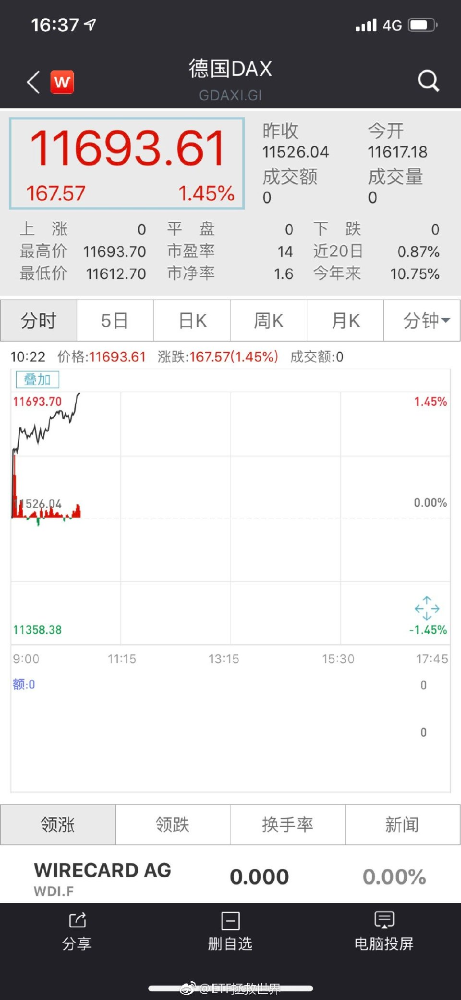

======================================================

ETF拯救世界 (5687069307) @
2019-04-01 16:44:12 Mon  
url: https://weibo.com/5687069307/HnCPwCKYV

回复@吴荻_上海:最好言，不言我catch不到呢//@吴荻_上海:我靠，我看了今天你的更文实在忍不住留言了。。。。你忒搞笑了吧。顺便告诉你，你真的改变了我的人生。毫不夸张。大恩不言谢。

------------------------------------------------------
转推：
>  @ETF拯救世界 (5687069307)
>  2019-04-01 16:38:07 Mon  
>  url: https:/weibo.com/5687069307/HnCN3wnne/

>  好讨厌，买了就涨嘤嘤嘤 ​​​

转发[13]  评论[163]  赞[519] 

======================================================

ETF拯救世界 (5687069307) @
2019-04-01 17:24:26 Mon  
url: https://weibo.com/5687069307/HnD5RwQwL

回复@一只爱笑的考拉:上次不开心是有人组织一帮喷子喷我，再上次是儿子病的比较严重，其它的这些年真的没什么不开心的事。跟周围的人关系都很好，家庭事业都很好，投资不用说了。

------------------------------------------------------
转推：
>  @ETF拯救世界 (5687069307)
>  2019-04-01 16:38:07 Mon  
>  url: https:/weibo.com/5687069307/HnCN3wnne/

>  好讨厌，买了就涨嘤嘤嘤 ​​​

转发[8]  评论[179]  赞[652] 

======================================================

ETF拯救世界 (5687069307) @
2019-04-01 18:48:52 Mon  
url: https://weibo.com/5687069307/HnDE8tl8G

太酷了。//@数知实验室:#数知生活# 亚马逊放大招啦！//@李昂达: 这是神族母舰啊！#星际争霸#

------------------------------------------------------
转推：
>  @ ()
>  2019-04-01 13:47:58 Mon  
>  url: 

>  该账号因被投诉违反法律法规和《微博社区公约》的相关规定，现已无法查看。查看帮助 https://kefu.weibo.com/faqdetail?id=13216

转发[175]  评论[121]  赞[452] 

======================================================

ETF拯救世界 (5687069307) @
2019-04-01 20:17:40 Mon  
url: https://weibo.com/5687069307/HnEeaC5Zu

有一件事我不能再隐瞒了。

必须坦白了。 ​​​

转发[4]  评论[582]  赞[843] 

======================================================

ETF拯救世界 (5687069307) @
2019-04-01 20:34:35 Mon  
url: https://weibo.com/5687069307/HnEl34rkO

回复@地球流浪找太阳:想卖就卖，不要憋着。//@地球流浪找太阳:E大，从微信追到微博，想问下去年跟你买的有些基金已经盈利超过20%了，可以卖掉了吗？我在且慢跟着买的，大部分时候是提示买入，卖出的少，卖出是基于什么原则啊

------------------------------------------------------
转推：
>  @ETF拯救世界 (5687069307)
>  2019-03-28 10:49:13 Thu  
>  url: https:/weibo.com/5687069307/HmYNsbtXI/

>  忙了一上午。中午发车啊老铁们。 ​​​

转发[8]  评论[189]  赞[542] 

======================================================

ETF拯救世界 (5687069307) @
2019-04-02 10:57:31 Tue  
url: https://weibo.com/5687069307/HnJZj3d7w

今天有朋友发给我一张图片，上面是某指数投资星球号，用了我的LOGO，请各位朋友擦亮你的卡姿兰大眼睛，不要认错人。

我过去没有，现在没有，未来也没有计划开星球。 ​​​

转发[8]  评论[271]  赞[997] 

======================================================

ETF拯救世界 (5687069307) @
2019-04-02 11:41:56 Tue  
url: https://weibo.com/5687069307/HnKhkAp21

4300点开始第三轮计划，目前3100点，跌幅28%。

第三轮已投入资金年化收益率昨天超过+10%，迈向+15%。看看能否到+20%。

如果能长期保持年化收益率20%，你就是这条gai上最靓的仔。

我不行，长期15%+我就很开心了。 ​​​

转发[63]  评论[557]  赞[1283] 

+++++++++++++++++++++++++++++++++++++++++++++++++++++

图片：

======================================================

ETF拯救世界 (5687069307) @
2019-04-02 17:49:06 Tue  
url: https://weibo.com/5687069307/HnMGmEwSL

去年四季度整个A股利润都在下降，医药真牛，截止目前披露的公司还是10%+……

当然不知道未来会怎样。但是消费和医药是A股有史以来最牛的两个板块是有道理的。 ​​​

转发[84]  评论[143]  赞[926] 

======================================================

ETF拯救世界 (5687069307) @
2019-04-02 18:17:26 Tue  
url: https://weibo.com/5687069307/HnMRRDGnm

晚上油气不表现一下对不起我 ​​​

转发[7]  评论[78]  赞[627] 

+++++++++++++++++++++++++++++++++++++++++++++++++++++

图片：
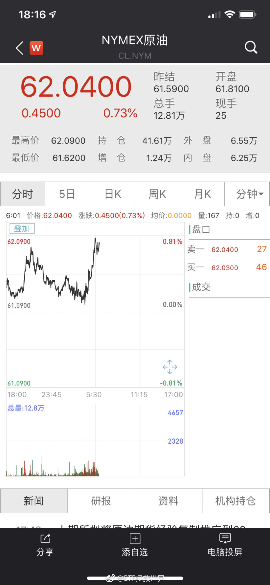

======================================================

ETF拯救世界 (5687069307) @
2019-04-02 18:24:03 Tue  
url: https://weibo.com/5687069307/HnMUykL64

今天听人说阅读量不如长赢的一个理财公众号一年广告费有700、800万。

我承认，我[酸]了……

鬼知道这些年我放弃了什么…… ​​​

转发[19]  评论[618]  赞[1292] 

======================================================

ETF拯救世界 (5687069307) @
2019-04-03 05:43:29 Wed  
url: https://weibo.com/5687069307/HnRml0j43

据我对油气的了解，一段时间跟的差就会有一段时间超预期。不用急，等等看 ​​​

转发[94]  评论[243]  赞[732] 

+++++++++++++++++++++++++++++++++++++++++++++++++++++

图片：

======================================================

ETF拯救世界 (5687069307) @
2019-04-03 06:02:57 Wed  
url: https://weibo.com/5687069307/HnRufemGx

这个邻居真的有很多值得我们学习的地方

------------------------------------------------------
转推：
>  @ ()
>  2019-04-02 21:25:04 Tue  
>  url: 

>  抱歉，此微博已被作者删除。查看帮助：http://t.cn/Rfd3rQV

转发[79]  评论[177]  赞[526] 

======================================================

ETF拯救世界 (5687069307) @
2019-04-03 15:36:17 Wed  
url: https://weibo.com/5687069307/HnVeXsHqa

大概你稍微能体会到“不要卖”三个字的重量了。 ​​​

转发[34]  评论[303]  赞[1112] 

======================================================

ETF拯救世界 (5687069307) @
2019-04-03 15:37:57 Wed  
url: https://weibo.com/5687069307/HnVfD8uvP

我等的是欧元和德国的双击。 ​​​

转发[47]  评论[232]  赞[797] 

+++++++++++++++++++++++++++++++++++++++++++++++++++++

图片：

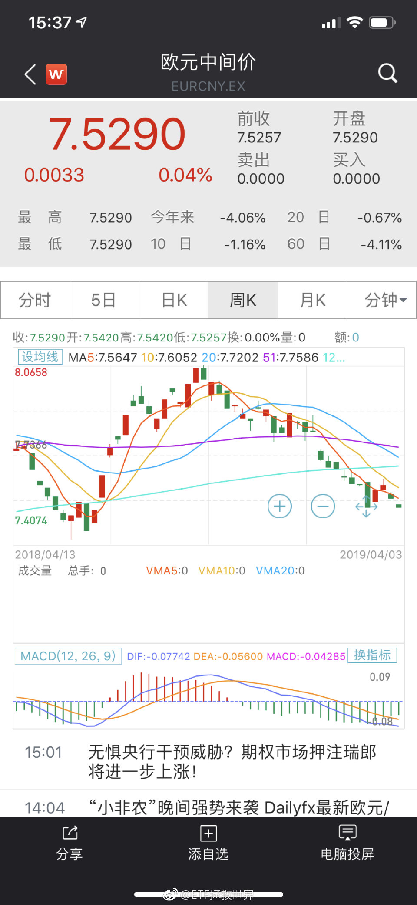

======================================================

ETF拯救世界 (5687069307) @
2019-04-03 16:46:33 Wed  
url: https://weibo.com/5687069307/HnVHtobws

你学习好帮我分析一下，是不是我愚人节那天那条微博让这位朋友误会了。 

声明一下，我认为妹子们是这个世界上最可爱的生物！ ​​​

转发[4]  评论[238]  赞[579] 

+++++++++++++++++++++++++++++++++++++++++++++++++++++

图片：
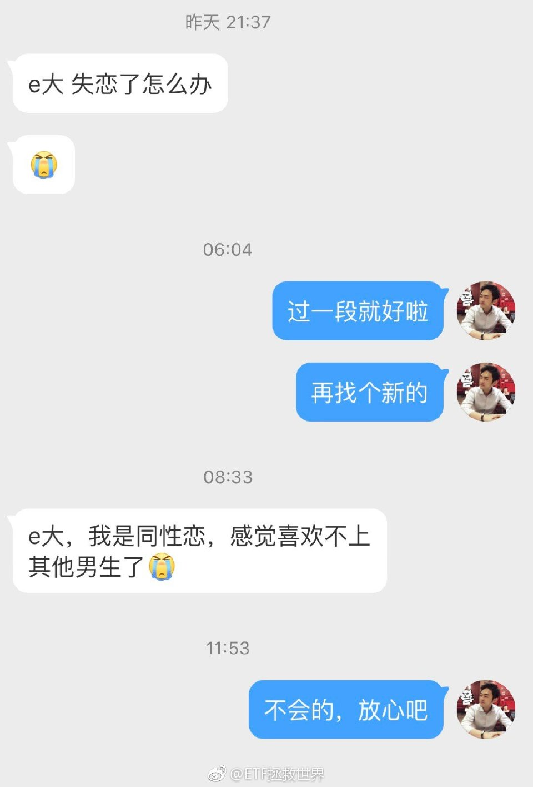

======================================================

ETF拯救世界 (5687069307) @
2019-04-03 17:17:46 Wed  
url: https://weibo.com/5687069307/HnVU96oIf

很多人跌下去难受，涨上来更难受。

赔钱心慌，赚钱心更慌。

你说逗不逗，他来股市就是为了难受吗。

踏踏实实的，涨跌都舒服。 ​​​

转发[130]  评论[208]  赞[927] 

======================================================

ETF拯救世界 (5687069307) @
2019-04-03 17:24:42 Wed  
url: https://weibo.com/5687069307/HnVWXq6WG

回复@投资跑道上的一只小蜗牛:你下次亏大钱的种子已经埋下了//@投资跑道上的一只小蜗牛:我自己也挺恨自己超级低位为什么不果断上杠杆，不过下次有经验了。资本市场机会不会少的吧[悲伤]

------------------------------------------------------
转推：
>  @ETF拯救世界 (5687069307)
>  2019-04-03 17:17:46 Wed  
>  url: https:/weibo.com/5687069307/HnVU96oIf/

>  很多人跌下去难受，涨上来更难受。
>  
>  赔钱心慌，赚钱心更慌。
>  
>  你说逗不逗，他来股市就是为了难受吗。
>  
>  踏踏实实的，涨跌都舒服。 ​​​

转发[32]  评论[89]  赞[625] 

======================================================

ETF拯救世界 (5687069307) @
2019-04-03 17:31:52 Wed  
url: https://weibo.com/5687069307/HnVZS40Hx

记住，投资这件事千万不要用上次的经验推导下次。

比如上次顶部没跑，就觉得要随时跑锁定利润。

比如上次随时跑没赚钱，下次打死也不卖。

比如上次胆子小买的少，下次疯狂加杠杆。

如果这样做，你会非常惨。

这条微博值500万，不信你十年后回来看。

当然，你永远不知道那个没看过这条微博的你是 ​​​

转发[529]  评论[431]  赞[1467] 

======================================================

ETF拯救世界 (5687069307) @
2019-04-03 18:02:21 Wed  
url: https://weibo.com/5687069307/HnWcfpSTX

回复@尿意盎然:你知道吗，去年最低点附近，有朋友私信我，说家里有人病了急用钱要赎回。与他比一下，你还难受吗？接受不能改变的事，努力去改变可以改变的。难受有什么用，这个情绪最没用。//@尿意盎然:我是真难受，因为一笔计划外的急用钱，今天赎回了一部分

------------------------------------------------------
转推：
>  @ETF拯救世界 (5687069307)
>  2019-04-03 17:17:46 Wed  
>  url: https:/weibo.com/5687069307/HnVU96oIf/

>  很多人跌下去难受，涨上来更难受。
>  
>  赔钱心慌，赚钱心更慌。
>  
>  你说逗不逗，他来股市就是为了难受吗。
>  
>  踏踏实实的，涨跌都舒服。 ​​​

转发[29]  评论[148]  赞[642] 

======================================================

ETF拯救世界 (5687069307) @
2019-04-03 18:13:44 Wed  
url: https://weibo.com/5687069307/HnWgRrep9

各位用过去这几年的时间，能完整体会一次顶部坚决卖，下跌过程不着急买，底部区域坚定多买，上涨趋势不着急卖，这样一个完整赚大钱的过程。

相信对一辈子的投资之路都会有益。毛估估，可以节省3-4轮超过十年的试错成本——对于有天赋的朋友来说。没有天赋的，要试一辈子。 ​​​

转发[527]  评论[742]  赞[2017] 

======================================================

ETF拯救世界 (5687069307) @
2019-04-04 06:23:21 Thu  
url: https://weibo.com/5687069307/Ho1311gHM

涨幅1.7，叠加欧元上涨0.4，按理说昨天德国净值应该涨2%，今天晚上看。

油气跌了，但是只持有1.6，希望暴跌多买点。 ​​​

转发[35]  评论[274]  赞[895] 

+++++++++++++++++++++++++++++++++++++++++++++++++++++

图片：

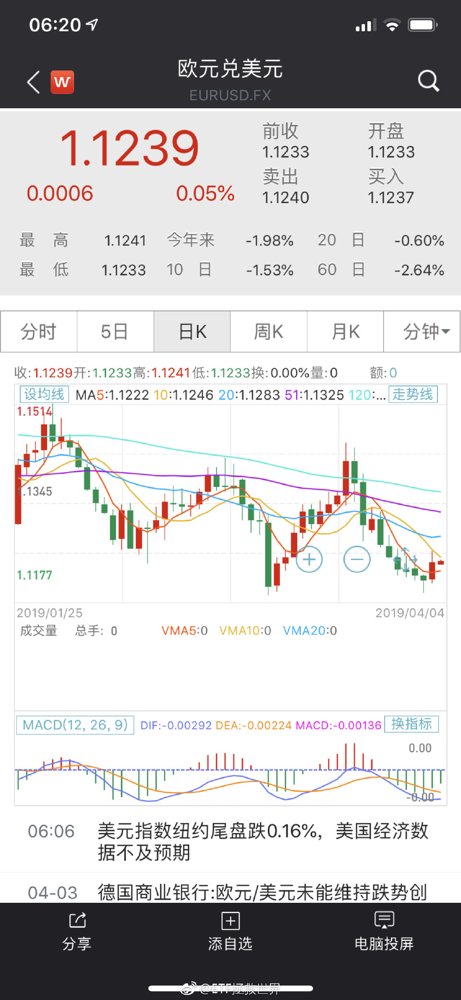

======================================================

ETF拯救世界 (5687069307) @
2019-04-04 11:00:16 Thu  
url: https://weibo.com/5687069307/Ho2RpBKiq

今年有不少地方做的不足，整体也一般，总之是对自己并不满意。

之后这段时间尽量减少发微博次数，认真反思总结，努力提高。

在市场面前，永远是个学生。 ​​​

转发[31]  评论[562]  赞[1425] 

======================================================

ETF拯救世界 (5687069307) @
2019-04-04 15:06:43 Thu  
url: https://weibo.com/5687069307/Ho4trFEyD

回复@广Ling儿:请把持仓和历史交易记录贴上来。//@广Ling儿:回复@广Ling儿:收益率只跑赢45% 的用户

------------------------------------------------------
转推：
>  @ETF拯救世界 (5687069307)
>  2019-04-04 11:00:16 Thu  
>  url: https:/weibo.com/5687069307/Ho2RpBKiq/

>  今年有不少地方做的不足，整体也一般，总之是对自己并不满意。
>  
>  之后这段时间尽量减少发微博次数，认真反思总结，努力提高。
>  
>  在市场面前，永远是个学生。 ​​​

转发[3]  评论[162]  赞[412] 

======================================================

ETF拯救世界 (5687069307) @
2019-04-04 15:10:14 Thu  
url: https://weibo.com/5687069307/Ho4uSksD0

这是s和150的一年收益率，跑不赢沪深300，只跑赢40%用户这种事情怎么发生的 ​​​

转发[16]  评论[279]  赞[717] 

+++++++++++++++++++++++++++++++++++++++++++++++++++++

图片：

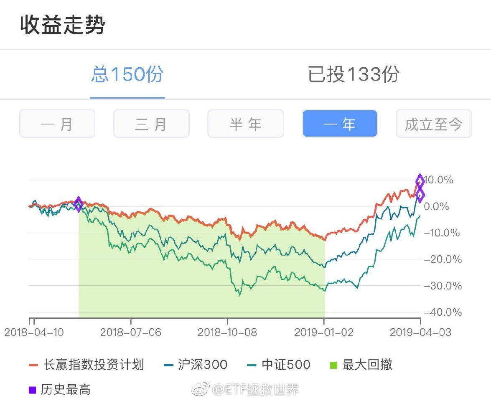

======================================================

ETF拯救世界 (5687069307) @
2019-04-04 17:36:14 Thu  
url: https://weibo.com/5687069307/Ho5s96lFE

向不满意的朋友说声对不起。

虽然第三轮计划跑赢300一直在35%以上，虽然去年大熊市跌幅只有300的不到1/3，虽然在300远没回到去年高点的时候你的账户每天都在新高。

但是，对不起，这两个月跑输300了。我们这样的资产配置模式，必然无法在每个时间段跑赢每个品种。让你失望了，对不起。

我请你立即把 ​​​

转发[45]  评论[1381]  赞[1306] 

======================================================

ETF拯救世界 (5687069307) @
2019-04-04 22:27:33 Thu  
url: https://weibo.com/5687069307/Ho7mnDL2u

各位放心，我们的7-11国开债指数已经卖的剩一份了[微笑]。希望有机会跌下去再买一次

------------------------------------------------------
转推：
>  @网易财经 (1974561081)
>  2019-04-04 22:09:53 Thu  
>  url: https:/weibo.com/1974561081/Ho7fdwF3j/

>  【债市跌穿牛熊线！跷跷板效应或助阵资金流入股市】经济数据回暖正在侵蚀“债牛”的根基。本周，国债期货持续走弱，并在最后两个交易日以连续盘中跳水的方式，终结了四月的首周表现。从技术上看，十年期国债期货主力合约已经跌穿了120天的牛熊分界线。国债现货市场也呈现出了收益率上行格局。业内人士 ​​​

转发[45]  评论[351]  赞[891] 

======================================================

ETF拯救世界 (5687069307) @
2019-04-07 15:01:31 Sun  
url: https://weibo.com/5687069307/HowIPFkwO

[微笑] ​​​

转发[10]  评论[308]  赞[948] 

+++++++++++++++++++++++++++++++++++++++++++++++++++++

图片：
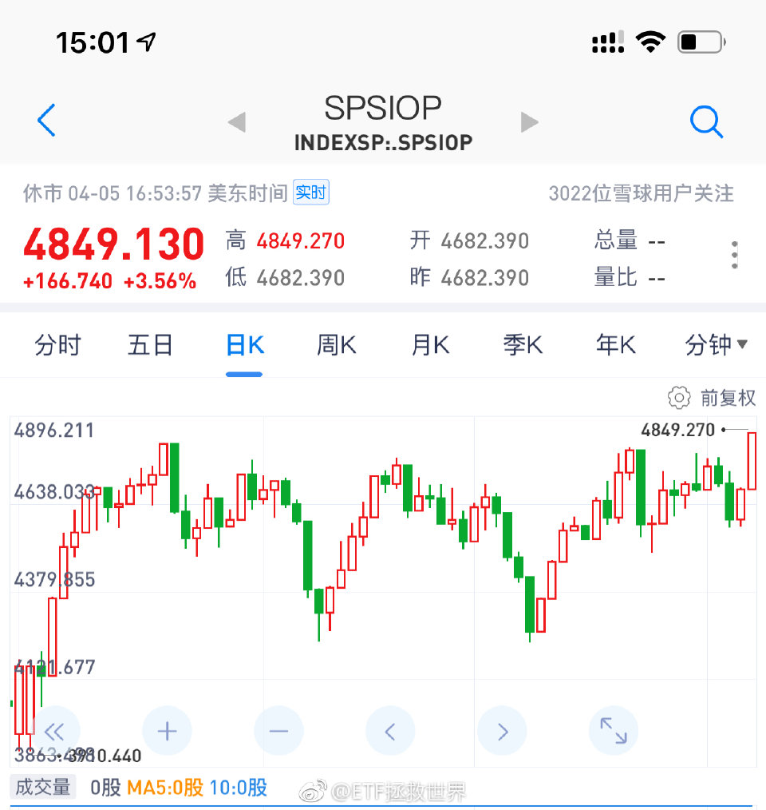

======================================================

ETF拯救世界 (5687069307) @
2019-04-08 06:59:56 Mon  
url: https://weibo.com/5687069307/HoCZQz1Fp

意念盘化工涨停利好中证500。[doge] ​​​

转发[7]  评论[169]  赞[779] 

======================================================

ETF拯救世界 (5687069307) @
2019-04-08 07:36:14 Mon  
url: https://weibo.com/5687069307/HoDeAgteY

昨天跑步脚受伤了，所有健身和出游计划要搁置一个月。

健康比什么都重要。 ​​​

转发[8]  评论[732]  赞[871] 

======================================================

ETF拯救世界 (5687069307) @
2019-04-08 09:46:03 Mon  
url: https://weibo.com/5687069307/HoE5hwSjn

已经回到10000+

------------------------------------------------------
转推：
>  @ETF拯救世界 (5687069307)
>  2018-10-10 11:29:31 Wed  
>  url: https:/weibo.com/5687069307/GDfidmtMh/

>  7800的医药指数，可能是你人生中第一个10倍指数。 ​​​

转发[184]  评论[82]  赞[641] 

======================================================

ETF拯救世界 (5687069307) @
2019-04-08 09:56:09 Mon  
url: https://weibo.com/5687069307/HoE9nkvUi

国债趋势改变了。最好不要拿太多。 ​​​

转发[45]  评论[110]  赞[697] 

======================================================

ETF拯救世界 (5687069307) @
2019-04-08 10:03:02 Mon  
url: https://weibo.com/5687069307/HoEcawiod

从极度低估回到目前价位，大致已经到了合理，同时叠加大压力。最好的情况是沿压力线持续小幅上涨。极度高估点位在15000左右。//@ETF拯救世界:已经回到10000+

------------------------------------------------------
转推：
>  @ETF拯救世界 (5687069307)
>  2018-10-10 11:29:31 Wed  
>  url: https:/weibo.com/5687069307/GDfidmtMh/

>  7800的医药指数，可能是你人生中第一个10倍指数。 ​​​

转发[116]  评论[105]  赞[683] 

======================================================

ETF拯救世界 (5687069307) @
2019-04-08 10:07:48 Mon  
url: https://weibo.com/5687069307/HoEe6rfXi

最近两个月指数涨幅太过凌厉，导致我们持仓的不少指数基金都跑输指数5%左右。

计划收益率也一定程度被拖累。

长期看绝大多数指数基金不会有问题，毕竟这样的暴涨不可能长期持续。 ​​​

转发[34]  评论[313]  赞[1034] 

======================================================

ETF拯救世界 (5687069307) @
2019-04-08 21:35:16 Mon  
url: https://weibo.com/5687069307/HoIJ9cvz0

突破了就别掉链子，继续。 ​​​

转发[12]  评论[177]  赞[689] 

+++++++++++++++++++++++++++++++++++++++++++++++++++++

图片：

======================================================

ETF拯救世界 (5687069307) @
2019-04-09 07:20:20 Tue  
url: https://weibo.com/5687069307/HoMyDizkp

不跌不买，逢高减磅，不赚不出…有没有发现你已经跟社保基金一个水平了

------------------------------------------------------
转推：
>  @ ()
>  2019-04-09 03:13:15 Tue  
>  url: 

>  抱歉，作者已设置仅展示半年内微博，此微博已不可见。 ​​​

转发[88]  评论[194]  赞[743] 

======================================================

ETF拯救世界 (5687069307) @
2019-04-09 10:41:21 Tue  
url: https://weibo.com/5687069307/HoNSdxZLl

球球已经快一年没发言了，微博每天发言。

一个悬念，谁先突破20万关注…… ​​​

转发[5]  评论[251]  赞[942] 

======================================================

ETF拯救世界 (5687069307) @
2019-04-09 10:56:48 Tue  
url: https://weibo.com/5687069307/HoNYu4YmV

不知道你们喜不喜欢收集什么东西。

其实买指数基金也有收集东西的快感。

就是你知道它未来一定能给你带来很不错的收益，然后低位不停的买。就会有你在抄底你喜欢收集的东西时候那种快感。

然后你就看着账户里的它们，怎么看怎么喜欢。想起来心里就踏实——真好啊，特别好那种感觉。

不想卖，怎么也 ​​​

转发[140]  评论[467]  赞[1197] 

======================================================

ETF拯救世界 (5687069307) @
2019-04-09 13:14:26 Tue  
url: https://weibo.com/5687069307/HoOSmrIG2

每天涨一点新高引发舒适。//@ETF拯救世界:已经回到10000+

------------------------------------------------------
转推：
>  @ETF拯救世界 (5687069307)
>  2018-10-10 11:29:31 Wed  
>  url: https:/weibo.com/5687069307/GDfidmtMh/

>  7800的医药指数，可能是你人生中第一个10倍指数。 ​​​

转发[39]  评论[115]  赞[571] 

======================================================

ETF拯救世界 (5687069307) @
2019-04-09 15:09:55 Tue  
url: https://weibo.com/5687069307/HoPDeiFQW

第三轮计划中第一个60%的品种应该是它。

但是只买了一份找谁说理去… ​​​

转发[30]  评论[293]  赞[635] 

+++++++++++++++++++++++++++++++++++++++++++++++++++++

图片：

======================================================

ETF拯救世界 (5687069307) @
2019-04-09 15:25:23 Tue  
url: https://weibo.com/5687069307/HoPJw5Bmq

不对，记错了，去年恒生到过60%…看看第一个70%是谁 http://t.cn/E6o6k2w

------------------------------------------------------
转推：
>  @ETF拯救世界 (5687069307)
>  2019-04-09 15:09:55 Tue  
>  url: https:/weibo.com/5687069307/HoPDeiFQW/

>  第三轮计划中第一个60%的品种应该是它。
>  
>  但是只买了一份找谁说理去… ​​​

转发[16]  评论[94]  赞[460] 

======================================================

ETF拯救世界 (5687069307) @
2019-04-09 17:48:40 Tue  
url: https://weibo.com/5687069307/HoQFFklHS

看了眼账户，成功停止抖动。发帖日是最低点。[偷笑]

------------------------------------------------------
转推：
>  @ETF拯救世界 (5687069307)
>  2019-01-03 14:25:10 Thu  
>  url: https:/weibo.com/5687069307/HaejowEF7/

>  看着账户里100多万医药指数瑟瑟发抖中。[doge] ​​​

转发[11]  评论[194]  赞[691] 

======================================================

ETF拯救世界 (5687069307) @
2019-04-09 21:39:22 Tue  
url: https://weibo.com/5687069307/HoSbjdlh5

全指医药上一波在10000点是2015年3月，那时候估值62倍。四年过去，指数没变，估值降至36。

而十三年前的2006年6月估值也是36倍，当时点位是1407点，十三年上涨620%，年化接近17%。

这就是长期指数投资能够赚钱的秘密。 ​​​

转发[245]  评论[185]  赞[846] 

======================================================

ETF拯救世界 (5687069307) @
2019-04-09 21:47:04 Tue  
url: https://weibo.com/5687069307/HoSerkXGP

回复@莲花卷子:2005-2015十年涨了20倍。当然未来这样的情况几乎不可能发生了。//@莲花卷子:果然是十倍指数

------------------------------------------------------
转推：
>  @ETF拯救世界 (5687069307)
>  2019-04-09 21:39:22 Tue  
>  url: https:/weibo.com/5687069307/HoSbjdlh5/

>  全指医药上一波在10000点是2015年3月，那时候估值62倍。四年过去，指数没变，估值降至36。
>  
>  而十三年前的2006年6月估值也是36倍，当时点位是1407点，十三年上涨620%，年化接近17%。
>  
>  这就是长期指数投资能够赚钱的秘密。 ​​​

转发[39]  评论[49]  赞[427] 

======================================================

ETF拯救世界 (5687069307) @
2019-04-09 21:50:13 Tue  
url: https://weibo.com/5687069307/HoSfIg8pb

真.疯王啊……搞完我A搞德国……NB你就把德国干到10倍我梭哈…… ​​​

转发[75]  评论[226]  赞[710] 

======================================================

ETF拯救世界 (5687069307) @
2019-04-10 06:57:39 Wed  
url: https://weibo.com/5687069307/HoVPUC2rs

这个有懂的吗 ​​​

转发[3]  评论[227]  赞[357] 

+++++++++++++++++++++++++++++++++++++++++++++++++++++

图片：

======================================================

ETF拯救世界 (5687069307) @
2019-04-10 07:41:01 Wed  
url: https://weibo.com/5687069307/HoW7wxuKR

回复@峰沐:十年一倍年化是7.x%。如果安全性和流动性与货基一样，那就是稀世奇宝，绝对可以买。但如果是必须十年后才能拿回本金，那就没那么好了。//@峰沐:E大，10年翻一倍的投资，可以投吗？安全性如果余额宝

------------------------------------------------------
转推：
>  @ETF拯救世界 (5687069307)
>  2019-04-09 21:50:13 Tue  
>  url: https:/weibo.com/5687069307/HoSfIg8pb/

>  真.疯王啊……搞完我A搞德国……NB你就把德国干到10倍我梭哈…… ​​​

转发[43]  评论[55]  赞[328] 

======================================================

ETF拯救世界 (5687069307) @
2019-04-10 07:44:33 Wed  
url: https://weibo.com/5687069307/HoW8X7mcy

“有钱了找小奶狗”对于女性来说也并不是什么好事。只能说明除了有钱自身毫无吸引力……//@挖龙脉的超级鹿鼎公:哈哈哈，真相了

------------------------------------------------------
转推：
>  @ ()
>  2019-04-10 07:34:30 Wed  
>  url: 

>  抱歉，作者已设置仅展示半年内微博，此微博已不可见。 ​​​

转发[13]  评论[66]  赞[278] 

======================================================

ETF拯救世界 (5687069307) @
2019-04-10 07:46:13 Wed  
url: https://weibo.com/5687069307/HoW9DnHdw

现在这个世界这么专一的人不多了。

------------------------------------------------------
转推：
>  @新京报我们视频 (6124642021)
>  2019-04-09 20:54:50 Tue  
>  url: https:/weibo.com/6124642021/HoRTensbp/

>  【女子#每天准时到同一超市偷肉# 还总在一个货架上偷[摊手]】4月6日，安徽亳州一超市工作人员报警称，有一位女子多次在超市内偷东西。民警调取监控后发现，该女子将店内的牛肉、驴肉、火腿肠等藏在自己衣服中或挎包中。民警称，该女子每天早上9点都会到这个超市，并且每次都偷肉。http://t.cn/E6CX5Yd  ​​​

转发[4]  评论[47]  赞[244] 

======================================================

ETF拯救世界 (5687069307) @
2019-04-10 07:49:04 Wed  
url: https://weibo.com/5687069307/HoWaNdp1s

回复@岚之一夕:长期年化10%你可以进入华尔街大师系列。//@岚之一夕:感觉十年年化10%左右是普通人的水平，再往上就看老天爷和自己的努力了//@ETF拯救世界:回复@峰沐:十年一倍年化是7.x%。如果安全性和流动性与货基一样，那就是稀世奇宝，绝对可以买。但如果是必须十年后才能拿回本金，那就没那么好了。

------------------------------------------------------
转推：
>  @ETF拯救世界 (5687069307)
>  2019-04-09 21:50:13 Tue  
>  url: https:/weibo.com/5687069307/HoSfIg8pb/

>  真.疯王啊……搞完我A搞德国……NB你就把德国干到10倍我梭哈…… ​​​

转发[25]  评论[72]  赞[382] 

======================================================

ETF拯救世界 (5687069307) @
2019-04-10 08:01:48 Wed  
url: https://weibo.com/5687069307/HoWfXdsom

这么说吧。NB闪闪的桥水和耶鲁基金30年年化收益也就12%。

如果你能做到11%-12%，你就可以管理上千亿的资产了。

他们NB在几乎不回撤。

你说为什么这几年有那么多牛人投资A股收益率很高？

第一，真的假的？

第二，时间不够长。

小心收益率太高的，均值回归起来吓死你。

据我所知，私募收益率最高 ​​​

转发[145]  评论[156]  赞[623] 

======================================================

ETF拯救世界 (5687069307) @
2019-04-10 08:09:15 Wed  
url: https://weibo.com/5687069307/HoWiYyFUh

回复@又见Zane:有高的，但不能用最好的作为目标。我没事也跑十公里，但不会用奥运会一万米金牌成绩要求自己，会出事//@又见Zane:但文艺复兴高得有点

------------------------------------------------------
转推：
>  @ETF拯救世界 (5687069307)
>  2019-04-10 08:01:48 Wed  
>  url: https:/weibo.com/5687069307/HoWfXdsom/

>  这么说吧。NB闪闪的桥水和耶鲁基金30年年化收益也就12%。
>  
>  如果你能做到11%-12%，你就可以管理上千亿的资产了。
>  
>  他们NB在几乎不回撤。
>  
>  你说为什么这几年有那么多牛人投资A股收益率很高？
>  
>  第一，真的假的？
>  
>  第二，时间不够长。
>  
>  小心收益率太高的，均值回归起来吓死你。
>  
>  据我所知，私募收益率最高 ​​​

转发[13]  评论[27]  赞[367] 

======================================================

ETF拯救世界 (5687069307) @
2019-04-10 08:15:47 Wed  
url: https://weibo.com/5687069307/HoWlDaQ53

客观预估自己的投资收益率有意义吗？

非常有意义。

最大的意义在于，可以让你从投资目标反推需要投入多少本金，有助于你达成目标。

无论是未来的教育费用、养老费用或者是实现其他的目标，你都可以叠加时间+收益率来反推需要投入多少本金。

在此基础上，你可以设定乐观、中性、悲观三个条件。比如 ​​​

转发[269]  评论[218]  赞[723] 

======================================================

ETF拯救世界 (5687069307) @
2019-04-10 08:30:21 Wed  
url: https://weibo.com/5687069307/HoWrxz1tW

我知道很多朋友很焦虑，特别希望我说年化20%很简单，又希望我赶紧说说第一个一百万怎么赚的。

我当然可以打开word洋洋洒洒说一大篇，但我不能。

我可以跟你说20%很简单，二十年后你发现没赚到又不会来找我。一时说一时爽嘛，一直爽一直说。但sorry，我不能这么做。

我也可以跟你说100万很容易啊。我 ​​​

转发[92]  评论[268]  赞[1099] 

======================================================

ETF拯救世界 (5687069307) @
2019-04-10 08:41:37 Wed  
url: https://weibo.com/5687069307/HoWw7vJn8

去年的事情好像对东哥影响很大啊……

------------------------------------------------------
转推：
>  @网易财经 (1974561081)
>  2019-04-10 08:25:03 Wed  
>  url: https:/weibo.com/1974561081/HoWpoimrj/

>  【外媒：京东正在新一轮大规模裁员，最多裁员逾1.2万人】据The Information，京东正在进行一轮大规模裁员，一些团队的员工数量可能会减少一半。据悉，京东可能裁员至多8%，相当于京东裁员逾1.2万人。http://t.cn/E6NFIDT ​​​

转发[9]  评论[108]  赞[283] 

======================================================

ETF拯救世界 (5687069307) @
2019-04-10 08:46:41 Wed  
url: https://weibo.com/5687069307/HoWyaClsb

回复@资本暴利狂徒:答案：只要不上杠杆，永远亏不完。//@资本暴利狂徒:问题来了，每年亏10，几年亏完？

------------------------------------------------------
转推：
>  @ETF拯救世界 (5687069307)
>  2019-04-10 08:15:47 Wed  
>  url: https:/weibo.com/5687069307/HoWlDaQ53/

>  客观预估自己的投资收益率有意义吗？
>  
>  非常有意义。
>  
>  最大的意义在于，可以让你从投资目标反推需要投入多少本金，有助于你达成目标。
>  
>  无论是未来的教育费用、养老费用或者是实现其他的目标，你都可以叠加时间+收益率来反推需要投入多少本金。
>  
>  在此基础上，你可以设定乐观、中性、悲观三个条件。比如 ​​​

转发[64]  评论[54]  赞[366] 

======================================================

ETF拯救世界 (5687069307) @
2019-04-10 08:55:52 Wed  
url: https://weibo.com/5687069307/HoWBUiJ0R

近期有公司增持，也有减持。本来所有股票一起上涨和下跌就完全不合理。那些不值钱的公司最好全部减持跌到仙股才好。

------------------------------------------------------
转推：
>  @ ()
>  2019-04-09 20:41:04 Tue  
>  url: 

>  抱歉，作者已设置仅展示半年内微博，此微博已不可见。 ​​​

转发[18]  评论[31]  赞[363] 

======================================================

ETF拯救世界 (5687069307) @
2019-04-10 09:24:15 Wed  
url: https://weibo.com/5687069307/HoWNpxohY

回复@hei-jude:心算一下，10年后200万，年化9%，本金需要84万。另外，也可以是每年投入12万。//@hei-jude:10年后娃读书需要200万，用7-9%的收益率，需要投多少本金呀？//@ETF拯救世界:回复@资本暴利狂徒:答案：只要不上杠杆，永远亏不完。

------------------------------------------------------
转推：
>  @ETF拯救世界 (5687069307)
>  2019-04-10 08:15:47 Wed  
>  url: https:/weibo.com/5687069307/HoWlDaQ53/

>  客观预估自己的投资收益率有意义吗？
>  
>  非常有意义。
>  
>  最大的意义在于，可以让你从投资目标反推需要投入多少本金，有助于你达成目标。
>  
>  无论是未来的教育费用、养老费用或者是实现其他的目标，你都可以叠加时间+收益率来反推需要投入多少本金。
>  
>  在此基础上，你可以设定乐观、中性、悲观三个条件。比如 ​​​

转发[49]  评论[106]  赞[436] 

======================================================

ETF拯救世界 (5687069307) @
2019-04-10 09:40:12 Wed  
url: https://weibo.com/5687069307/HoWTTrFxy

越说越来劲。//@ETF拯救世界:每天涨一点新高引发舒适。//@ETF拯救世界:已经回到10000+

------------------------------------------------------
转推：
>  @ETF拯救世界 (5687069307)
>  2018-10-10 11:29:31 Wed  
>  url: https:/weibo.com/5687069307/GDfidmtMh/

>  7800的医药指数，可能是你人生中第一个10倍指数。 ​​​

转发[8]  评论[41]  赞[409] 

======================================================

ETF拯救世界 (5687069307) @
2019-04-10 09:47:59 Wed  
url: https://weibo.com/5687069307/HoWX3oXh9

在这个时候我又想起去年底那些唱衰医药的人，又想起那个说医药刚跌了一半，要救我一命的人。

我想起他们，不是要嘲笑他们。而是特别感动。

感动于各位的信任，感动于出现噪音的时候各位与我站在一起。绝大多数朋友是第一次和我一起经历那样的至暗时刻，但你们都选择了信任。

信任是最难得的。所以我 ​​​

转发[53]  评论[322]  赞[1185] 

======================================================

ETF拯救世界 (5687069307) @
2019-04-10 10:12:37 Wed  
url: https://weibo.com/5687069307/HoX72F0xO

跌一点就吓得到处问反弹是不是结束的朋友。

恕我直言，你还没做好到股市投资的准备。 ​​​

转发[36]  评论[152]  赞[745] 

======================================================

ETF拯救世界 (5687069307) @
2019-04-10 10:19:21 Wed  
url: https://weibo.com/5687069307/HoX9MC6xM

今天涨5%才算你狠。//@ETF拯救世界:每天涨一点新高引发舒适。//@ETF拯救世界:已经回到10000+

------------------------------------------------------
转推：
>  @ETF拯救世界 (5687069307)
>  2018-10-10 11:29:31 Wed  
>  url: https:/weibo.com/5687069307/GDfidmtMh/

>  7800的医药指数，可能是你人生中第一个10倍指数。 ​​​

转发[19]  评论[68]  赞[467] 

======================================================

ETF拯救世界 (5687069307) @
2019-04-10 11:20:29 Wed  
url: https://weibo.com/5687069307/HoXyBwquF

回复@唐山黄金名表名包回收典当:不懂你为什么克制。难道你真的没钱连一点股票都买不了了吗。听我的，想做就做，不要让青春留白。//@唐山黄金名表名包回收典当:看着股票如此疯狂 好想操作一把  克制克制[允悲]//@ETF拯救世界:今天涨5%才算你狠。//@ETF拯救世界:每天涨一点新高引发舒适。

------------------------------------------------------
转推：
>  @ETF拯救世界 (5687069307)
>  2018-10-10 11:29:31 Wed  
>  url: https:/weibo.com/5687069307/GDfidmtMh/

>  7800的医药指数，可能是你人生中第一个10倍指数。 ​​​

转发[11]  评论[149]  赞[436] 

======================================================

ETF拯救世界 (5687069307) @
2019-04-10 14:22:17 Wed  
url: https://weibo.com/5687069307/HoYKoBRU1

希望各位通过这半年经历体会两件事

第一，否极泰来

第二，投资不是投票，大多数人说什么，大V说什么根本不重要，绝大部分你听到的都是噪音。坚持做正确的事。 ​​​

转发[136]  评论[289]  赞[1147] 

======================================================

ETF拯救世界 (5687069307) @
2019-04-10 14:36:42 Wed  
url: https://weibo.com/5687069307/HoYQfw87B

对不起我笑了

------------------------------------------------------
转推：
>  @北京人不知道的北京事儿 (1662214194)
>  2019-04-10 12:53:33 Wed  
>  url: https:/weibo.com/1662214194/HoYanja89/

>  有网友用AI把《都挺好》里的苏大强换脸成吴彦祖，你们感受一下。。。[允悲][允悲]（by慢三与偏见）http://t.cn/E6CrvaK ​​​

转发[253]  评论[117]  赞[297] 

======================================================

ETF拯救世界 (5687069307) @
2019-04-10 16:11:42 Wed  
url: https://weibo.com/5687069307/HoZsO3QYK

竞猜：

今天还能继续新高吗？ ​​​

转发[37]  评论[226]  赞[518] 

======================================================

ETF拯救世界 (5687069307) @
2019-04-10 16:14:48 Wed  
url: https://weibo.com/5687069307/HoZu447YI

青岛好玩吗。是不是可以去看看。

------------------------------------------------------
转推：
>  @新京报我们视频 (6124642021)
>  2019-04-10 15:55:32 Wed  
>  url: https:/weibo.com/6124642021/HoZmfso0B/

>  【#全国铁路实施新运行图#：北京至青岛只需3小时】4月10日，全国铁路实施新的列车运行图，北京至青岛首次实现3小时内到达。京鲁两地间的铁路距离较调图前压缩49分钟。首次开行兰州至成都间动车组列车较既有列车运行时间压缩约5小时。本次调图服务雄安新区建设，河北白洋淀站新增10列停靠列车。 ​​​

转发[9]  评论[196]  赞[289] 

======================================================

ETF拯救世界 (5687069307) @
2019-04-10 16:27:12 Wed  
url: https://weibo.com/5687069307/HoZz6mINS

回复@静待晚秋:跟车就像闹GM，太早风险大，太晚没肉吃。只有最合适的时候进来肉才最多。什么时候是最合适？得看命……谁去年钻石坑进就是命好……//@静待晚秋:回复@温柔的臭臭:感觉后来跟车的同志们没什么机会了[允悲]

------------------------------------------------------
转推：
>  @ETF拯救世界 (5687069307)
>  2019-04-10 16:11:42 Wed  
>  url: https:/weibo.com/5687069307/HoZsO3QYK/

>  竞猜：
>  
>  今天还能继续新高吗？ ​​​

转发[31]  评论[368]  赞[622] 

======================================================

ETF拯救世界 (5687069307) @
2019-04-11 08:47:52 Thu  
url: https://weibo.com/5687069307/Hp5Z9h5Qg

自己多攒点是王道。

------------------------------------------------------
转推：
>  @ ()
>  2019-04-11 08:41:02 Thu  
>  url: 

>  抱歉，作者已设置仅展示半年内微博，此微博已不可见。 ​​​

转发[54]  评论[132]  赞[514] 

======================================================

ETF拯救世界 (5687069307) @
2019-04-11 09:02:38 Thu  
url: https://weibo.com/5687069307/Hp659mFah

回复@无比的谋略:喷了，哪个APP？//@无比的谋略:这是什么鬼？@ETF拯救世界 http://t.cn/E6RQ1m8 //@ETF拯救世界:回复@静待晚秋:跟车就像闹GM，太早风险大，太晚没肉吃。只有最合适的时候进来肉才最多。什么时候是最合适？得看命……谁去年钻石坑进就是命好……

------------------------------------------------------
转推：
>  @ETF拯救世界 (5687069307)
>  2019-04-10 16:11:42 Wed  
>  url: https:/weibo.com/5687069307/HoZsO3QYK/

>  竞猜：
>  
>  今天还能继续新高吗？ ​​​

转发[4]  评论[236]  赞[397] 

======================================================

ETF拯救世界 (5687069307) @
2019-04-11 09:39:45 Thu  
url: https://weibo.com/5687069307/Hp6kdmsN4

我不信你一点都不想卖出一部分锁定利润。

想卖一点的举手我看看。 ​​​

转发[89]  评论[1175]  赞[1176] 

======================================================

ETF拯救世界 (5687069307) @
2019-04-11 11:23:18 Thu  
url: https://weibo.com/5687069307/Hp70fi9vB

既然这么多人不想卖，市场就会教育大家。你卖了继续涨，不卖就调整。反复摩擦，反复蹂躏。

------------------------------------------------------
转推：
>  @ETF拯救世界 (5687069307)
>  2019-04-11 09:39:45 Thu  
>  url: https:/weibo.com/5687069307/Hp6kdmsN4/

>  我不信你一点都不想卖出一部分锁定利润。
>  
>  想卖一点的举手我看看。 ​​​

转发[65]  评论[524]  赞[932] 

======================================================

ETF拯救世界 (5687069307) @
2019-04-11 16:21:39 Thu  
url: https://weibo.com/5687069307/Hp8XlaqrL

被各路神仙吹的也想去买个P30 Pro玩玩了。

唯一的问题是我对屏幕要求特别高，不知道华为的屏幕能达到苹果和三星的水平吗。反正前两年玩过一台那屏幕拖影完全受不了… ​​​

转发[16]  评论[342]  赞[458] 

======================================================

ETF拯救世界 (5687069307) @
2019-04-11 20:31:59 Thu  
url: https://weibo.com/5687069307/HpaAX4E2k

内事不决问群众 ​​​

转发[9]  评论[212]  赞[381] 

+++++++++++++++++++++++++++++++++++++++++++++++++++++

图片：
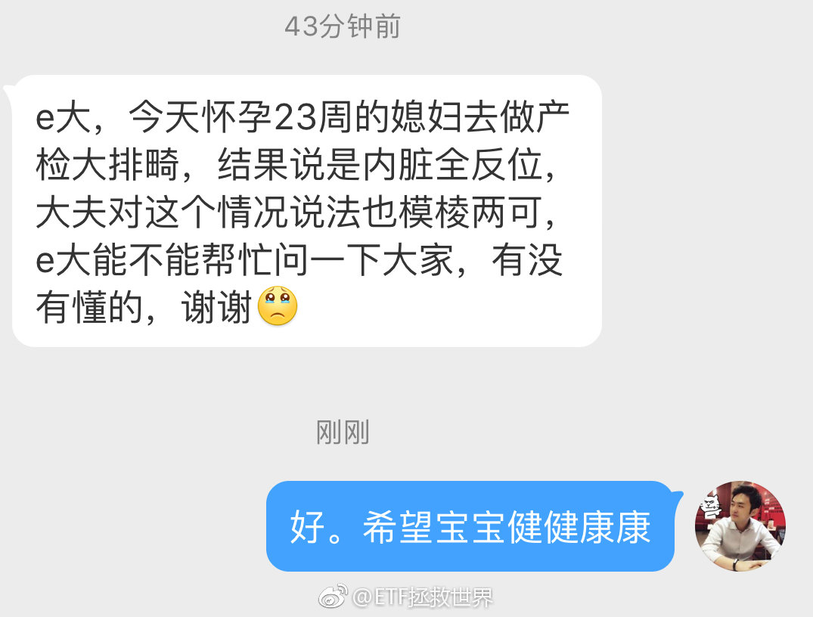

======================================================

ETF拯救世界 (5687069307) @
2019-04-12 08:20:15 Fri  
url: https://weibo.com/5687069307/Hpfer7rbS

回复@耿浩Gorf:我们已经两个月没买了。//@耿浩Gorf:怎么办，三天前最高点买的指数基金，10万跌了2000多

------------------------------------------------------
转推：
>  @ETF拯救世界 (5687069307)
>  2019-04-11 20:31:59 Thu  
>  url: https:/weibo.com/5687069307/HpaAX4E2k/

>  内事不决问群众 ​​​

转发[5]  评论[125]  赞[365] 

======================================================

ETF拯救世界 (5687069307) @
2019-04-12 08:36:39 Fri  
url: https://weibo.com/5687069307/Hpfl5DJrB

早上想明白一件事：如果为了拍照（视频素质还不行）买一个六千多的手机，为什么不去买个黑卡或者微单呢。踏实了。

------------------------------------------------------
转推：
>  @ETF拯救世界 (5687069307)
>  2019-04-11 16:21:39 Thu  
>  url: https:/weibo.com/5687069307/Hp8XlaqrL/

>  被各路神仙吹的也想去买个P30 Pro玩玩了。
>  
>  唯一的问题是我对屏幕要求特别高，不知道华为的屏幕能达到苹果和三星的水平吗。反正前两年玩过一台那屏幕拖影完全受不了… ​​​

转发[7]  评论[308]  赞[576] 

======================================================

ETF拯救世界 (5687069307) @
2019-04-12 10:22:04 Fri  
url: https://weibo.com/5687069307/Hpg1SyMlo

之前有人在评论里说Dax基金每年跑输基准6%，我不知道这又是从哪个大V那看到的数据。

华安dax确实表现一般，年年跑输dax。之前每年跑输2个多点。不过每年跑输程度越来越少，去年只有1%了。

很多原因。管理费等等。还有Dax本身就是包含分红的全收益指数，跟上确实也很难。

虽然是稍微差点，但有什么办 ​​​

转发[60]  评论[123]  赞[607] 

======================================================

ETF拯救世界 (5687069307) @
2019-04-12 10:54:48 Fri  
url: https://weibo.com/5687069307/Hpgfapm8x

不追涨是美德。

涨两个月，很多人就忘记了现金的可贵。手里有点钱都觉得烧手，要投出去。

跌了又后悔。

心魔。 ​​​

转发[88]  评论[295]  赞[1030] 

======================================================

ETF拯救世界 (5687069307) @
2019-04-12 15:26:38 Fri  
url: https://weibo.com/5687069307/Hpi1vBO0R

犯错之后，痛苦和后悔毫无用处。最重要是学到东西，取得进步。

------------------------------------------------------
转推：
>  @瑞达利欧 (6529122212)
>  2019-04-11 14:15:35 Thu  
>  url: https:/weibo.com/6529122212/Hp88auBae/

>  每个人都会犯错。主要的区别在于，成功的人会从错误中吸取教训，而不成功的人则不会。要营造一种环境，让人们敢于犯错，以便从错误中学习，这样就会快速进步，也不会再犯大错。在强调创意和独立思考的机构里尤为如此，因为接受失败必然是成功之路的一部分。正如托马斯·爱迪生所言：“我没有失败，我只 ​​​

转发[74]  评论[90]  赞[489] 

======================================================

ETF拯救世界 (5687069307) @
2019-04-12 17:02:16 Fri  
url: https://weibo.com/5687069307/HpiEkpZFq

回复@法国梧桐树NJ:过去十年不好才是我买他的理由。你体会一下。

------------------------------------------------------
转推：
>  @ETF拯救世界 (5687069307)
>  2019-04-12 10:22:04 Fri  
>  url: https:/weibo.com/5687069307/Hpg1SyMlo/

>  之前有人在评论里说Dax基金每年跑输基准6%，我不知道这又是从哪个大V那看到的数据。
>  
>  华安dax确实表现一般，年年跑输dax。之前每年跑输2个多点。不过每年跑输程度越来越少，去年只有1%了。
>  
>  很多原因。管理费等等。还有Dax本身就是包含分红的全收益指数，跟上确实也很难。
>  
>  虽然是稍微差点，但有什么办 ​​​

转发[19]  评论[51]  赞[382] 

======================================================

ETF拯救世界 (5687069307) @
2019-04-12 17:14:12 Fri  
url: https://weibo.com/5687069307/HpiJanrjQ

不对，说错了。DAX过去十年不能说不好。2009.4-2019.4涨了192%，年化收益率接近12%。

最有意思的，是2009.4和现在的估值几乎一样。

DAX不好的是过去19年。2000年就已经7600了，现在才12000，19年涨了58%。年化不到3%，这是加上股息的。如果不算股息，估计1%都不到。

这才是我看好它未来的原因。

你 ​​​

转发[445]  评论[281]  赞[735] 

======================================================

ETF拯救世界 (5687069307) @
2019-04-12 17:17:53 Fri  
url: https://weibo.com/5687069307/HpiKF8c5K

另外，当然也有我个人的喜好在里面。从小就对有组织有纪律严谨的人有好感，德国人无疑是这样的民族。更别提30里面的企业了。西门子，宝马，奔驰，阿迪达斯……目前这么便宜买这些企业，我心里踏实。

------------------------------------------------------
转推：
>  @ETF拯救世界 (5687069307)
>  2019-04-12 17:14:12 Fri  
>  url: https:/weibo.com/5687069307/HpiJanrjQ/

>  不对，说错了。DAX过去十年不能说不好。2009.4-2019.4涨了192%，年化收益率接近12%。
>  
>  最有意思的，是2009.4和现在的估值几乎一样。
>  
>  DAX不好的是过去19年。2000年就已经7600了，现在才12000，19年涨了58%。年化不到3%，这是加上股息的。如果不算股息，估计1%都不到。
>  
>  这才是我看好它未来的原因。
>  
>  你 ​​​

转发[46]  评论[64]  赞[463] 

======================================================

ETF拯救世界 (5687069307) @
2019-04-12 17:23:06 Fri  
url: https://weibo.com/5687069307/HpiMMC1zo

回复@海底两万八千里:我觉得未必是自己受伤后才能学到东西。看别人的经历也一样能学到。最重要的是把自己代入对方，想象对方的感受。感受到他人资产大幅下跌的绝望，加上基础的数学知识，就知道拒绝大幅亏损的重要性了。何必要自己经历过呢。

------------------------------------------------------
转推：
>  @ETF拯救世界 (5687069307)
>  2019-04-12 17:14:12 Fri  
>  url: https:/weibo.com/5687069307/HpiJanrjQ/

>  不对，说错了。DAX过去十年不能说不好。2009.4-2019.4涨了192%，年化收益率接近12%。
>  
>  最有意思的，是2009.4和现在的估值几乎一样。
>  
>  DAX不好的是过去19年。2000年就已经7600了，现在才12000，19年涨了58%。年化不到3%，这是加上股息的。如果不算股息，估计1%都不到。
>  
>  这才是我看好它未来的原因。
>  
>  你 ​​​

转发[101]  评论[46]  赞[412] 

======================================================

ETF拯救世界 (5687069307) @
2019-04-12 17:31:25 Fri  
url: https://weibo.com/5687069307/HpiQ9y1OC

回复@耐心是投资第一要素:等你听到知更鸟叫时，春天已经快过过去了。股市是先行指标，等宏观经济数据走好再买股票的人远未够班……//@耐心是投资第一要素:看了3月经济数据，下周估计要继续涨[嘻嘻]

------------------------------------------------------
转推：
>  @ETF拯救世界 (5687069307)
>  2019-04-12 17:14:12 Fri  
>  url: https:/weibo.com/5687069307/HpiJanrjQ/

>  不对，说错了。DAX过去十年不能说不好。2009.4-2019.4涨了192%，年化收益率接近12%。
>  
>  最有意思的，是2009.4和现在的估值几乎一样。
>  
>  DAX不好的是过去19年。2000年就已经7600了，现在才12000，19年涨了58%。年化不到3%，这是加上股息的。如果不算股息，估计1%都不到。
>  
>  这才是我看好它未来的原因。
>  
>  你 ​​​

转发[51]  评论[52]  赞[461] 

======================================================

ETF拯救世界 (5687069307) @
2019-04-12 17:36:23 Fri  
url: https://weibo.com/5687069307/HpiSawuo2

回复@乄Chaos:我自己除了怎么也无法代入喷子，无法体会喷子们到底是什么感受外，大家的感受都能代入……//@乄Chaos:所以同理心真的挺重要的。

------------------------------------------------------
转推：
>  @ETF拯救世界 (5687069307)
>  2019-04-12 17:14:12 Fri  
>  url: https:/weibo.com/5687069307/HpiJanrjQ/

>  不对，说错了。DAX过去十年不能说不好。2009.4-2019.4涨了192%，年化收益率接近12%。
>  
>  最有意思的，是2009.4和现在的估值几乎一样。
>  
>  DAX不好的是过去19年。2000年就已经7600了，现在才12000，19年涨了58%。年化不到3%，这是加上股息的。如果不算股息，估计1%都不到。
>  
>  这才是我看好它未来的原因。
>  
>  你 ​​​

转发[7]  评论[58]  赞[421] 

======================================================

ETF拯救世界 (5687069307) @
2019-04-12 17:50:33 Fri  
url: https://weibo.com/5687069307/HpiXVaKz9

万万没想到， 我那个一个月更新2次的公众号，被腾讯认定是“优质公众号”，让我去开座谈会…… ​​​

转发[10]  评论[454]  赞[1639] 

======================================================

ETF拯救世界 (5687069307) @
2019-04-12 21:59:07 Fri  
url: https://weibo.com/5687069307/HpkAOs5eh

一买就涨好烦 

[doge] ​​​

转发[7]  评论[187]  赞[643] 

+++++++++++++++++++++++++++++++++++++++++++++++++++++

图片：

======================================================

ETF拯救世界 (5687069307) @
2019-04-13 07:46:04 Sat  
url: https://weibo.com/5687069307/Hpor46A3f

我是不敢用智能音箱的

------------------------------------------------------
转推：
>  @财联社APP (2868676035)
>  2019-04-12 22:39:32 Fri  
>  url: https:/weibo.com/2868676035/HpkRdya5s/

>  【#亚马逊身陷窃听丑闻#：专#雇千人听取智能音箱录音#】4月11日，据媒体报道，亚马逊雇佣数千员工听取智能音箱Alexa与顾客的对话内容。有顾客反映Alexa偷偷录音，并把录音传给了她的同事。亚马逊承认为改善系统，并称始终会保护顾客隐私，员工只会听取极小比例的录音内容。http://t.cn/EXvgY5B ​​​

转发[23]  评论[118]  赞[285] 

======================================================

ETF拯救世界 (5687069307) @
2019-04-13 09:25:56 Sat  
url: https://weibo.com/5687069307/Hpp5AEXhp

昨天暴涨，再看看这条微博，说的对不对。这个世界太多人短视，用一段时间的表现定义一个人或者一个东西。其实，花开有时，春兰夏荷秋菊冬梅，很多时候只是时间没到而已。路遥才能知马力，日久才见人心。

------------------------------------------------------
转推：
>  @ETF拯救世界 (5687069307)
>  2019-04-03 05:43:29 Wed  
>  url: https:/weibo.com/5687069307/HnRml0j43/

>  据我对油气的了解，一段时间跟的差就会有一段时间超预期。不用急，等等看 ​​​

转发[46]  评论[110]  赞[578] 

======================================================

ETF拯救世界 (5687069307) @
2019-04-13 09:30:53 Sat  
url: https://weibo.com/5687069307/Hpp7BqoOc

回复@lei_xu:把股市收益率与GDP挂钩，只能说远未够班。我A过去二十三十年GDP增长如何，投资人整体收益如何？以后这种问题我不会解释

------------------------------------------------------
转推：
>  @ETF拯救世界 (5687069307)
>  2019-04-12 17:14:12 Fri  
>  url: https:/weibo.com/5687069307/HpiJanrjQ/

>  不对，说错了。DAX过去十年不能说不好。2009.4-2019.4涨了192%，年化收益率接近12%。
>  
>  最有意思的，是2009.4和现在的估值几乎一样。
>  
>  DAX不好的是过去19年。2000年就已经7600了，现在才12000，19年涨了58%。年化不到3%，这是加上股息的。如果不算股息，估计1%都不到。
>  
>  这才是我看好它未来的原因。
>  
>  你 ​​​

转发[25]  评论[53]  赞[399] 

======================================================

ETF拯救世界 (5687069307) @
2019-04-13 09:39:11 Sat  
url: https://weibo.com/5687069307/HppaYioJC

听说球球七天无法发言。

虽然球球对我一般，但我真心希望球球能顺顺利利，并且越来越好。

@雪球 ​​​

转发[18]  评论[113]  赞[538] 

======================================================

ETF拯救世界 (5687069307) @
2019-04-13 09:47:11 Sat  
url: https://weibo.com/5687069307/HppedtAAy

再有人教育我什么该买什么不该买直接拉黑。 ​​​

转发[3]  评论[124]  赞[752] 

======================================================

ETF拯救世界 (5687069307) @
2019-04-13 09:54:28 Sat  
url: https://weibo.com/5687069307/Hpphbli2u

回复@风云又起17725:我每天都在拉黑，但我不可能保证没有漏网之鱼。我有自己的生活自己的家庭自己的事情要做。我没钱请助理帮我打理微博//@风云又起17725:益达为什么不把那些说 财经界只认您和某某某的人拉黑？

------------------------------------------------------
转推：
>  @ETF拯救世界 (5687069307)
>  2019-04-13 09:39:11 Sat  
>  url: https:/weibo.com/5687069307/HppaYioJC/

>  听说球球七天无法发言。
>  
>  虽然球球对我一般，但我真心希望球球能顺顺利利，并且越来越好。
>  
>  @雪球 ​​​

转发[3]  评论[46]  赞[365] 

======================================================

ETF拯救世界 (5687069307) @
2019-04-13 09:56:51 Sat  
url: https://weibo.com/5687069307/Hppi8nBNM

回复@桃李麻辣烫:它不鸟我是它的事，我希望它好是我的事。有什么问题？//@桃李麻辣烫:但是球球并不鸟你。。。。。。

------------------------------------------------------
转推：
>  @ETF拯救世界 (5687069307)
>  2019-04-13 09:39:11 Sat  
>  url: https:/weibo.com/5687069307/HppaYioJC/

>  听说球球七天无法发言。
>  
>  虽然球球对我一般，但我真心希望球球能顺顺利利，并且越来越好。
>  
>  @雪球 ​​​

转发[6]  评论[57]  赞[465] 

======================================================

ETF拯救世界 (5687069307) @
2019-04-13 10:11:46 Sat  
url: https://weibo.com/5687069307/HppocjcLd

很多人总觉得别人做的有一点不好就是对不起自己，心生怨念。

我不是。我经常想别人对我好的地方，经常心怀感激。

别人对我有帮助，有机会就会报答，即使别人并不是有意识的对我好。

很多人把很多事视为理所应当，其实，未必。 ​​​

转发[91]  评论[163]  赞[1017] 

======================================================

ETF拯救世界 (5687069307) @
2019-04-13 10:20:21 Sat  
url: https://weibo.com/5687069307/HpprGzbLt

所以前几天有个大机构跟我说，把我的话选了52条，做了个精美的周历想印1000册送给大家，我没答应…因为不知道怎么报答人家…

------------------------------------------------------
转推：
>  @ETF拯救世界 (5687069307)
>  2019-04-13 10:11:46 Sat  
>  url: https:/weibo.com/5687069307/HppocjcLd/

>  很多人总觉得别人做的有一点不好就是对不起自己，心生怨念。
>  
>  我不是。我经常想别人对我好的地方，经常心怀感激。
>  
>  别人对我有帮助，有机会就会报答，即使别人并不是有意识的对我好。
>  
>  很多人把很多事视为理所应当，其实，未必。 ​​​

转发[9]  评论[182]  赞[687] 

======================================================

ETF拯救世界 (5687069307) @
2019-04-13 16:00:51 Sat  
url: https://weibo.com/5687069307/HprFTwwXc

回复@雪糕w:为什么每集吃这么多还这么瘦//@雪糕w:这是哪儿的方言，笑死我了。我有微博啦，不是假的！

------------------------------------------------------
转推：
>  @松重丰mattige3 (7074841243)
>  2019-04-13 14:38:00 Sat  
>  url: https:/weibo.com/7074841243/Hpr8gxSRK/

>  皆様、どうも、本物です。
>  今後ともよろしくお願いします。 http://t.cn/EXZFtVo ​​​

转发[8]  评论[40]  赞[230] 

======================================================

ETF拯救世界 (5687069307) @
2019-04-13 16:10:32 Sat  
url: https://weibo.com/5687069307/HprJP3BRm

回复@打浦桥麦当劳:日本的数据特别难拿。德国的通过彭博和wind还能拿到，日本真是找不到。因为我要自己计算，所以都是历史基础数据，很难找//@打浦桥麦当劳:回复@ETF拯救世界:日本也是这样的民族，买日经ETF?

------------------------------------------------------
转推：
>  @ETF拯救世界 (5687069307)
>  2019-04-12 17:14:12 Fri  
>  url: https:/weibo.com/5687069307/HpiJanrjQ/

>  不对，说错了。DAX过去十年不能说不好。2009.4-2019.4涨了192%，年化收益率接近12%。
>  
>  最有意思的，是2009.4和现在的估值几乎一样。
>  
>  DAX不好的是过去19年。2000年就已经7600了，现在才12000，19年涨了58%。年化不到3%，这是加上股息的。如果不算股息，估计1%都不到。
>  
>  这才是我看好它未来的原因。
>  
>  你 ​​​

转发[21]  评论[78]  赞[400] 

======================================================

ETF拯救世界 (5687069307) @
2019-04-13 16:40:50 Sat  
url: https://weibo.com/5687069307/HprW7FRxL

每天都有很多重复的问题，我统一回答一下，然后会置顶：

第一：谨防骗子。

我只有这一个微博账号。绝对不会主动私信你，更不会要带你操作股票。我没有任何股票或者投资群，绝对不会要求加你微信或者QQ。

如果有类似情况，马上拉黑对方。

分辨真假最简单的方式是把鼠标挪到头像上，看看对方有多少人 ​​​

转发[297]  评论[1772]  赞[12332] 

======================================================

ETF拯救世界 (5687069307) @
2019-04-14 19:53:28 Sun  
url: https://weibo.com/5687069307/HpCCO7RYx

有个问题，问问关注我的，工作也是996的朋友：

你们，或者说你的家人996，年收入到底是多少。 ​​​

转发[57]  评论[1050]  赞[567] 

======================================================

ETF拯救世界 (5687069307) @
2019-04-15 08:14:48 Mon  
url: https://weibo.com/5687069307/HpHtIjP0U

今天上京东，发现前几天买的一个小东西降价了。随手点了保价，二十秒后处理完成。现在等退款。

这种体验非常好。总让我想起当年在中关村买电脑的痛苦经历。

以后我的快递都会尽量交给京东发。 ​​​

转发[18]  评论[157]  赞[469] 

+++++++++++++++++++++++++++++++++++++++++++++++++++++

图片：

======================================================

ETF拯救世界 (5687069307) @
2019-04-15 08:27:11 Mon  
url: https://weibo.com/5687069307/HpHyKn1Tp

回复@小倪3070:关注我的人里面，所在地依次是北京 广东 上海 浙江 江苏…一线二线应该占了70%以上。关注这个领域的人，都是有点家底有点闲钱的。手头太紧也没功夫想理财的事//@小倪3070:基本上还是一些经济发达城市的发言，二线以下基本没什么声音

------------------------------------------------------
转推：
>  @ETF拯救世界 (5687069307)
>  2019-04-14 19:53:28 Sun  
>  url: https:/weibo.com/5687069307/HpCCO7RYx/

>  有个问题，问问关注我的，工作也是996的朋友：
>  
>  你们，或者说你的家人996，年收入到底是多少。 ​​​

转发[14]  评论[158]  赞[349] 

======================================================

ETF拯救世界 (5687069307) @
2019-04-15 08:37:25 Mon  
url: https://weibo.com/5687069307/HpHCToLZj

回复@阿笨的微博:事实证明多刷我的微博有好报…//@阿笨的微博:感谢E大，刚去看了最近买的东西，一共3件退回240，可以带女儿去吃顿牛排了[good][good][good]

------------------------------------------------------
转推：
>  @ETF拯救世界 (5687069307)
>  2019-04-15 08:14:48 Mon  
>  url: https:/weibo.com/5687069307/HpHtIjP0U/

>  今天上京东，发现前几天买的一个小东西降价了。随手点了保价，二十秒后处理完成。现在等退款。
>  
>  这种体验非常好。总让我想起当年在中关村买电脑的痛苦经历。
>  
>  以后我的快递都会尽量交给京东发。 ​​​

转发[3]  评论[44]  赞[376] 

======================================================

ETF拯救世界 (5687069307) @
2019-04-15 08:38:04 Mon  
url: https://weibo.com/5687069307/HpHDa0orC

回复@我又又又又改网名了:想发，但今天有可能大涨，我择一下时//@我又又又又改网名了:15号了，今天有车么//@ETF拯救世界:回复@小倪3070:关注我的人里面，所在地依次是北京 广东 上海 浙江 江苏…一线二线应该占了70%以上。关注这个领域的人，都是有点家底有点闲钱的。手头太紧也没功夫想理财的事

------------------------------------------------------
转推：
>  @ETF拯救世界 (5687069307)
>  2019-04-14 19:53:28 Sun  
>  url: https:/weibo.com/5687069307/HpCCO7RYx/

>  有个问题，问问关注我的，工作也是996的朋友：
>  
>  你们，或者说你的家人996，年收入到底是多少。 ​​​

转发[7]  评论[118]  赞[439] 

======================================================

ETF拯救世界 (5687069307) @
2019-04-15 08:49:05 Mon  
url: https://weibo.com/5687069307/HpHHD7zMH

到了 http://t.cn/EXVIQRj

------------------------------------------------------
转推：
>  @ETF拯救世界 (5687069307)
>  2019-04-15 08:14:48 Mon  
>  url: https:/weibo.com/5687069307/HpHtIjP0U/

>  今天上京东，发现前几天买的一个小东西降价了。随手点了保价，二十秒后处理完成。现在等退款。
>  
>  这种体验非常好。总让我想起当年在中关村买电脑的痛苦经历。
>  
>  以后我的快递都会尽量交给京东发。 ​​​

转发[1]  评论[120]  赞[366] 

======================================================

ETF拯救世界 (5687069307) @
2019-04-15 11:30:46 Mon  
url: https://weibo.com/5687069307/HpILg2Ovh

千万别以为债券的波动小 ​​​

转发[35]  评论[91]  赞[463] 

+++++++++++++++++++++++++++++++++++++++++++++++++++++

图片：
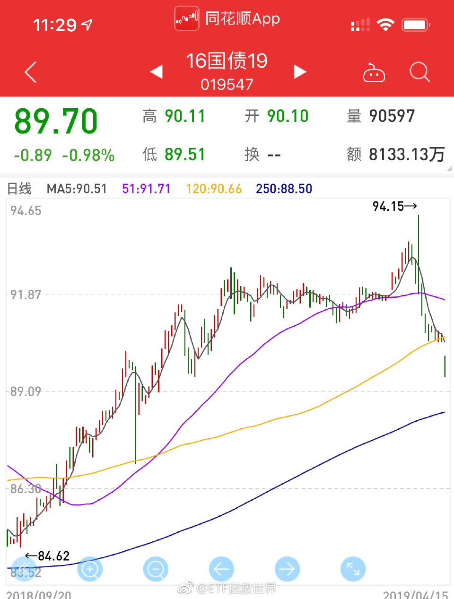

======================================================

ETF拯救世界 (5687069307) @
2019-04-15 11:33:55 Mon  
url: https://weibo.com/5687069307/HpIMxwaA9

老歌好听是因为80 90年代大部分是翻唱日本流行音乐。日本人的旋律非常在线。//@八大山债人:我娃和我一起听周华健。。。//@乐音悦酒: 回复@期货实盘志:你儿子00后？//@期货实盘志:文艺这几年衰败的很厉害，国内几乎没有创作歌手了，我儿子00后都觉得80-90年代那些老歌好听。

------------------------------------------------------
转推：
>  @虎嗅APP (2357213493)
>  2019-04-15 09:52:30 Mon  
>  url: https:/weibo.com/2357213493/HpI7n4bsm/

>  【中年人没有#996#】
>  
>  林琴所在的公司，不单单是管理岗，公司早就停掉了35岁以上候选人的招聘。确切地说，她们的候选人都在32岁以下，因为目前劳动合同通常一次性签三年，32岁的人再干3年正好满35岁，合同到期后企业可以选择解约。但目前35岁的候选人如果签3年合同，到期时候选人就已经38岁了，严重超 ​​​

转发[13]  评论[79]  赞[303] 

======================================================

ETF拯救世界 (5687069307) @
2019-04-15 11:46:05 Mon  
url: https://weibo.com/5687069307/HpIRtnklI

不知道你有没有感受，我们好像非常缺乏对“美”的认知。

无论是建筑，城市规划和景观设计，各种产品的工业设计，甚至各地新修建寺庙里面的雕像，再到大街上店家的招牌，人们的穿着，超市门口摇摇车的造型…

到处都体现一种迷样的审美。 ​​​

转发[45]  评论[285]  赞[621] 

======================================================

ETF拯救世界 (5687069307) @
2019-04-15 12:04:13 Mon  
url: https://weibo.com/5687069307/HpIYQflZz

回复@一个风向:我第一套房子上过装修杂志。现在没心气儿也没精力拍了//@一个风向:不用说那些大的，就看看家里的装修就知道大概了[允悲]，E打装修完了晒图吗

------------------------------------------------------
转推：
>  @ETF拯救世界 (5687069307)
>  2019-04-15 11:46:05 Mon  
>  url: https:/weibo.com/5687069307/HpIRtnklI/

>  不知道你有没有感受，我们好像非常缺乏对“美”的认知。
>  
>  无论是建筑，城市规划和景观设计，各种产品的工业设计，甚至各地新修建寺庙里面的雕像，再到大街上店家的招牌，人们的穿着，超市门口摇摇车的造型…
>  
>  到处都体现一种迷样的审美。 ​​​

转发[6]  评论[137]  赞[453] 

======================================================

ETF拯救世界 (5687069307) @
2019-04-15 15:13:19 Mon  
url: https://weibo.com/5687069307/HpKdB9Ipz

回复@硕仔满:巴洛克也好，歌特又或者维多利亚也好，都挺美。中国的传统风格也非常美。美不仅是流行，更是经典。

------------------------------------------------------
转推：
>  @ETF拯救世界 (5687069307)
>  2019-04-15 11:46:05 Mon  
>  url: https:/weibo.com/5687069307/HpIRtnklI/

>  不知道你有没有感受，我们好像非常缺乏对“美”的认知。
>  
>  无论是建筑，城市规划和景观设计，各种产品的工业设计，甚至各地新修建寺庙里面的雕像，再到大街上店家的招牌，人们的穿着，超市门口摇摇车的造型…
>  
>  到处都体现一种迷样的审美。 ​​​

转发[5]  评论[30]  赞[357] 

======================================================

ETF拯救世界 (5687069307) @
2019-04-15 15:18:27 Mon  
url: https://weibo.com/5687069307/HpKfFAUi0

本来以为是一周行情，谁知道是周一上午行情。

下半月随时发车。不会多，一两车。 ​​​

转发[25]  评论[364]  赞[944] 

======================================================

ETF拯救世界 (5687069307) @
2019-04-15 16:22:45 Mon  
url: https://weibo.com/5687069307/HpKFM4oMC

欧元继续 ​​​

转发[13]  评论[82]  赞[392] 

+++++++++++++++++++++++++++++++++++++++++++++++++++++

图片：
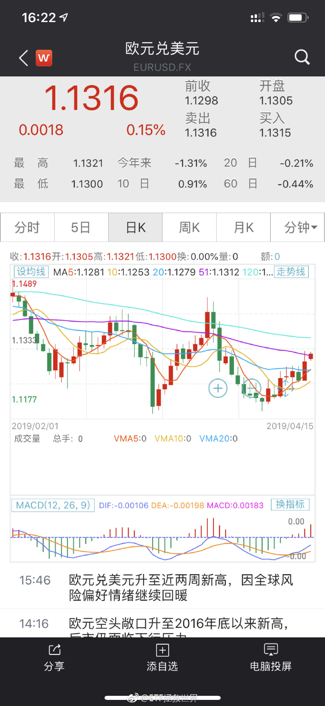

======================================================

ETF拯救世界 (5687069307) @
2019-04-15 18:40:14 Mon  
url: https://weibo.com/5687069307/HpLzzFs4K

回复@琴宣月柳:不是。我是说我们的Dax会不错，没说换欧元//@琴宣月柳:换了点欧元，不知道是不是合格的学生

------------------------------------------------------
转推：
>  @ETF拯救世界 (5687069307)
>  2019-04-15 16:22:45 Mon  
>  url: https:/weibo.com/5687069307/HpKFM4oMC/

>  欧元继续 ​​​

转发[7]  评论[78]  赞[349] 

======================================================

ETF拯救世界 (5687069307) @
2019-04-16 07:08:19 Tue  
url: https://weibo.com/5687069307/HpQte4DxV

有美感的城市规划

------------------------------------------------------
转推：
>  @全景志 (5930221915)
>  2019-04-05 14:49:03 Fri  
>  url: https:/weibo.com/5930221915/HodMM97dO/

>  用上帝视角看巴塞罗那 ​​​

转发[122]  评论[155]  赞[536] 

======================================================

ETF拯救世界 (5687069307) @
2019-04-16 07:34:44 Tue  
url: https://weibo.com/5687069307/HpQDXfy30

回复@秋声如许:昨天刚看到一篇新闻说卢浮宫要和故宫加强古迹修复方面的合作，晚上就…//@秋声如许:昨天E大刚聊到建筑美，聊到法国小镇，今天巴黎圣母院就烧了。好伤心，还没进去看呢。

------------------------------------------------------
转推：
>  @ETF拯救世界 (5687069307)
>  2019-04-15 11:46:05 Mon  
>  url: https:/weibo.com/5687069307/HpIRtnklI/

>  不知道你有没有感受，我们好像非常缺乏对“美”的认知。
>  
>  无论是建筑，城市规划和景观设计，各种产品的工业设计，甚至各地新修建寺庙里面的雕像，再到大街上店家的招牌，人们的穿着，超市门口摇摇车的造型…
>  
>  到处都体现一种迷样的审美。 ​​​

转发[2]  评论[42]  赞[306] 

======================================================

ETF拯救世界 (5687069307) @
2019-04-16 07:41:24 Tue  
url: https://weibo.com/5687069307/HpQGEtbF4

其实万事万物诞生之日起就已经注定要消失。

所以哪天你心爱的东西不小心坏了丢了，如果实在无法挽回，就随它去吧。

都是必然发生的。 ​​​

转发[76]  评论[250]  赞[1107] 

======================================================

ETF拯救世界 (5687069307) @
2019-04-16 12:21:37 Tue  
url: https://weibo.com/5687069307/HpSwomo9q

踏踏实实的。也许有调整，但是无论从估值 趋势 还是先行指标看，没有道理在这里下车。

有调整就继续买点，没有就继续等新高。

卖，当然以后要卖，但总要有个理由吧，不能看心情卖你说是不是。 ​​​

转发[119]  评论[409]  赞[1284] 

======================================================

ETF拯救世界 (5687069307) @
2019-04-16 14:24:58 Tue  
url: https://weibo.com/5687069307/HpTkswi7o

来了老弟？但是不出意外这个基本不会买多少。有交易价值，没有太多长期持有价值

------------------------------------------------------
转推：
>  @日经中文网 (2478163131)
>  2019-04-16 09:35:32 Tue  
>  url: https:/weibo.com/2478163131/HpRqYCZAa/

>  【中日开放式指数基金将相互上市】与日经平均指数和东证股价指数（TOPIX）联动的ETF将在上海证券交易所上市。这是日本股市的ETF首次在中国上市。 中国个人金融资产持有额到2023年达到82万亿元。日本期待中国资金通过ETF流入日本股市…… http://t.cn/EXaX6lh ​​​

转发[22]  评论[97]  赞[452] 

======================================================

ETF拯救世界 (5687069307) @
2019-04-16 16:39:20 Tue  
url: https://weibo.com/5687069307/HpUd094es

中欧两开花 ​​​

转发[5]  评论[79]  赞[431] 

+++++++++++++++++++++++++++++++++++++++++++++++++++++

图片：
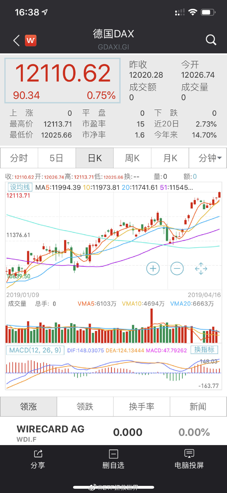

======================================================

ETF拯救世界 (5687069307) @
2019-04-16 16:47:18 Tue  
url: https://weibo.com/5687069307/HpUgesGF1

最近出轨的瓜有点多啊，吃不过来了。

大家还是要管住自己啊，不展开说了。 ​​​

转发[37]  评论[94]  赞[465] 

======================================================

ETF拯救世界 (5687069307) @
2019-04-16 16:54:04 Tue  
url: https://weibo.com/5687069307/HpUiYD9Te

我能看出，很多朋友投资经常陷入的一个误区就是：

这个东西没有长期投资价值，或者长期投资价值很低，为什么要买它？我就不买。

投资品种有两类，一个叫做有长期投资价值，一个叫做有中短期交易价值。

很多“价投”只买前者，很多短线客只做后者。

我不这么做。小孩子才选择，成年人都要。

很多品 ​​​

转发[224]  评论[288]  赞[969] 

======================================================

ETF拯救世界 (5687069307) @
2019-04-16 17:06:33 Tue  
url: https://weibo.com/5687069307/HpUo37wnz

回复@别拿你屁股对着我:十年后如果中证500低于10000点我会非常非常非常惊讶。//@别拿你屁股对着我:万一这是近十年的山顶呢

------------------------------------------------------
转推：
>  @ETF拯救世界 (5687069307)
>  2019-04-16 12:21:37 Tue  
>  url: https:/weibo.com/5687069307/HpSwomo9q/

>  踏踏实实的。也许有调整，但是无论从估值 趋势 还是先行指标看，没有道理在这里下车。
>  
>  有调整就继续买点，没有就继续等新高。
>  
>  卖，当然以后要卖，但总要有个理由吧，不能看心情卖你说是不是。 ​​​

转发[42]  评论[123]  赞[414] 

======================================================

ETF拯救世界 (5687069307) @
2019-04-16 18:12:15 Tue  
url: https://weibo.com/5687069307/HpUOIDNkA

看评论可以了解我们的语文教育多么失败。真的。//@ETF拯救世界:回复@别拿你屁股对着我:十年后如果中证500低于10000点我会非常非常非常惊讶。//@别拿你屁股对着我:万一这是近十年的山顶呢

------------------------------------------------------
转推：
>  @ETF拯救世界 (5687069307)
>  2019-04-16 12:21:37 Tue  
>  url: https:/weibo.com/5687069307/HpSwomo9q/

>  踏踏实实的。也许有调整，但是无论从估值 趋势 还是先行指标看，没有道理在这里下车。
>  
>  有调整就继续买点，没有就继续等新高。
>  
>  卖，当然以后要卖，但总要有个理由吧，不能看心情卖你说是不是。 ​​​

转发[9]  评论[140]  赞[395] 

======================================================

ETF拯救世界 (5687069307) @
2019-04-17 10:23:20 Wed  
url: https://weibo.com/5687069307/Hq1aT22AC

回复@么么在浆糊:谈自己的爱情故事就像在社交平台晒娃，自己津津有味，旁人只觉得平平无奇。//@么么在浆糊:想听E大的爱情故事[憧憬][憧憬][憧憬]

------------------------------------------------------
转推：
>  @ETF拯救世界 (5687069307)
>  2019-04-16 16:47:18 Tue  
>  url: https:/weibo.com/5687069307/HpUgesGF1/

>  最近出轨的瓜有点多啊，吃不过来了。
>  
>  大家还是要管住自己啊，不展开说了。 ​​​

转发[32]  评论[92]  赞[413] 

======================================================

ETF拯救世界 (5687069307) @
2019-04-17 10:28:05 Wed  
url: https://weibo.com/5687069307/Hq1cO84E6

回复@湛江街拍:我推荐经常坐飞机地铁或者公交的朋友试试降噪耳机。我这两年买的比较满意的产品。//@湛江街拍:想听e大推荐好用东西，大家才有动力赚钱买货//@ETF拯救世界:回复@么么在浆糊:谈自己的爱情故事就像在社交平台晒娃，自己津津有味，旁人只觉得平平无奇。

------------------------------------------------------
转推：
>  @ETF拯救世界 (5687069307)
>  2019-04-16 16:47:18 Tue  
>  url: https:/weibo.com/5687069307/HpUgesGF1/

>  最近出轨的瓜有点多啊，吃不过来了。
>  
>  大家还是要管住自己啊，不展开说了。 ​​​

转发[22]  评论[183]  赞[379] 

======================================================

ETF拯救世界 (5687069307) @
2019-04-17 12:03:35 Wed  
url: https://weibo.com/5687069307/Hq1Pzl3iB

不懂就不要乱投资。

买个债券都可能赔钱你能想到。 ​​​

转发[54]  评论[189]  赞[553] 

+++++++++++++++++++++++++++++++++++++++++++++++++++++

图片：

======================================================

ETF拯救世界 (5687069307) @
2019-04-17 12:45:59 Wed  
url: https://weibo.com/5687069307/Hq26MoOqa

回复@发生这种事我要粉碎你:震惊。[doge]//@发生这种事我要粉碎你:历史还真是简单的重复 这次也一样

------------------------------------------------------
转推：
>  @ETF拯救世界 (5687069307)
>  2018-10-11 15:43:18 Thu  
>  url: https:/weibo.com/5687069307/GDqnIDSfZ/

>  今天=
>  
>  2005年3月
>  
>  3个月后，998。 ​​​

转发[37]  评论[185]  赞[492] 

======================================================

ETF拯救世界 (5687069307) @
2019-04-17 16:06:16 Wed  
url: https://weibo.com/5687069307/Hq3q4zdQu

回复@Fund_Study:真的吗。那要去哪里交流//@Fund_Study:听说微博要下架1个月？没有e大我们怎么办//@ETF拯救世界:回复@发生这种事我要粉碎你:震惊。[doge]//@发生这种事我要粉碎你:历史还真是简单的重复 这次也一样

------------------------------------------------------
转推：
>  @ETF拯救世界 (5687069307)
>  2018-10-11 15:43:18 Thu  
>  url: https:/weibo.com/5687069307/GDqnIDSfZ/

>  今天=
>  
>  2005年3月
>  
>  3个月后，998。 ​​​

转发[4]  评论[106]  赞[290] 

======================================================

ETF拯救世界 (5687069307) @
2019-04-17 16:38:57 Wed  
url: https://weibo.com/5687069307/Hq3DlehS8

我看很多朋友分不清债市走势和转债的关系。极简说几句。

其实各位每次打的转债，不应该算是债券范畴，它的走势跟股市关系更大。目前的情况不用犹豫，每只都打就对了。

很难破发，即使破了也问题不大，因为你不会中太多。另外你持有很多只，资金分散，也不是大问题。

我不想说转债没有风险，毕竟之前 ​​​

转发[352]  评论[360]  赞[779] 

======================================================

ETF拯救世界 (5687069307) @
2019-04-17 16:48:22 Wed  
url: https://weibo.com/5687069307/Hq3HacGUZ

目前A股收益率再次低于十年国债收益率。

本次股票收益率高于国债收益率周期为7个月，与2005、2008、2012三次大底持续的时间基本相同。 ​​​

转发[337]  评论[291]  赞[740] 

======================================================

ETF拯救世界 (5687069307) @
2019-04-17 17:21:38 Wed  
url: https://weibo.com/5687069307/Hq3UFDF36

回复@吧嗒木:A股历史上还没有过出了钻石坑再回去的情况。有几次在黄金坑里面调整。如果这次出现了，那又是一个新纪录。//@吧嗒木:说不定又掉回坑里

------------------------------------------------------
转推：
>  @ETF拯救世界 (5687069307)
>  2019-04-17 16:48:22 Wed  
>  url: https:/weibo.com/5687069307/Hq3HacGUZ/

>  目前A股收益率再次低于十年国债收益率。
>  
>  本次股票收益率高于国债收益率周期为7个月，与2005、2008、2012三次大底持续的时间基本相同。 ​​​

转发[65]  评论[71]  赞[444] 

======================================================

ETF拯救世界 (5687069307) @
2019-04-17 18:07:21 Wed  
url: https://weibo.com/5687069307/Hq4ddFXhm

最近文章写得少，BGM攒了一大堆了！ ​​​

转发[6]  评论[172]  赞[610] 

======================================================

ETF拯救世界 (5687069307) @
2019-04-17 19:07:38 Wed  
url: https://weibo.com/5687069307/Hq4BH4FzS

每天涨得是不多，架不住天天涨啊。

以为梅赛德斯的事能压一波呢。 ​​​

转发[7]  评论[77]  赞[443] 

+++++++++++++++++++++++++++++++++++++++++++++++++++++

图片：
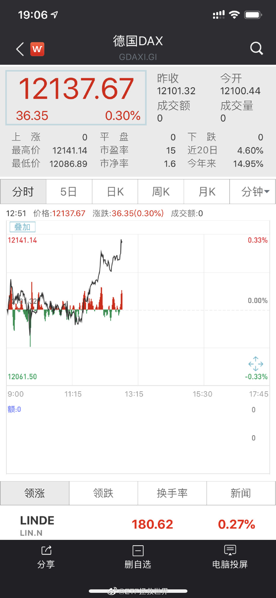

======================================================

ETF拯救世界 (5687069307) @
2019-04-17 19:09:19 Wed  
url: https://weibo.com/5687069307/Hq4CnALia

一天到晚没完没了的折腾。没事，还有12年…

------------------------------------------------------
转推：
>  @央视新闻 (2656274875)
>  2019-04-17 18:40:44 Wed  
>  url: https:/weibo.com/2656274875/Hq4qM4dVu/

>  【#北京今年高考一二本合并#】今天，北京市招生考试委员会审议通过了相关文件。今年：①北京高考共有5.9万人报名；②将本科一批、二批合并为本科普通批，设置16所平行志愿高校，每个志愿高校设置6个志愿专业；③艺术类招生实行分段录取；美术类院校（专业）使用美术统考成绩作为专业成绩录取的，实施平 ​​​

转发[3]  评论[136]  赞[311] 

======================================================

ETF拯救世界 (5687069307) @
2019-04-17 22:19:41 Wed  
url: https://weibo.com/5687069307/Hq5RE8xPJ

回复@天生不是情人mallee:别教育我用什么方式给A股估值好吗？服了

------------------------------------------------------
转推：
>  @ETF拯救世界 (5687069307)
>  2019-04-17 16:48:22 Wed  
>  url: https:/weibo.com/5687069307/Hq3HacGUZ/

>  目前A股收益率再次低于十年国债收益率。
>  
>  本次股票收益率高于国债收益率周期为7个月，与2005、2008、2012三次大底持续的时间基本相同。 ​​​

转发[10]  评论[32]  赞[345] 

======================================================

ETF拯救世界 (5687069307) @
2019-04-17 22:25:24 Wed  
url: https://weibo.com/5687069307/Hq5TY4hCz

我计算A股估值的模型，是我自己开发的，已经用了十年，并不断进化。

精确判断2007 2010 2015大顶，以及2008 2012 2018大底。

2015年开始为大家所知的时候，无数人和大V嘲笑我的系统，后来事实一次次把他们的脸都打肿了，教育我怎么估值的人越来越少了。

我只希望，你教育我之前，先了解一下我和我的 ​​​

转发[89]  评论[214]  赞[859] 

======================================================

ETF拯救世界 (5687069307) @
2019-04-17 22:28:17 Wed  
url: https://weibo.com/5687069307/Hq5V8oCJL

回复@特色小挣:去公众号看首页菜单春节特辑//@特色小挣:精确判断，精确到什么级别啊？

------------------------------------------------------
转推：
>  @ETF拯救世界 (5687069307)
>  2019-04-17 22:25:24 Wed  
>  url: https:/weibo.com/5687069307/Hq5TY4hCz/

>  我计算A股估值的模型，是我自己开发的，已经用了十年，并不断进化。
>  
>  精确判断2007 2010 2015大顶，以及2008 2012 2018大底。
>  
>  2015年开始为大家所知的时候，无数人和大V嘲笑我的系统，后来事实一次次把他们的脸都打肿了，教育我怎么估值的人越来越少了。
>  
>  我只希望，你教育我之前，先了解一下我和我的 ​​​

转发[12]  评论[31]  赞[327] 

======================================================

ETF拯救世界 (5687069307) @
2019-04-17 22:33:48 Wed  
url: https://weibo.com/5687069307/Hq5Xnjnc6

目前A股市盈率18倍。你信吗？

马云马化腾和98个贫困山区的人站在一起，100个人平均都是亿万富翁？得出的结论是大家都很有钱？ ​​​

转发[107]  评论[159]  赞[561] 

======================================================

ETF拯救世界 (5687069307) @
2019-04-17 22:39:54 Wed  
url: https://weibo.com/5687069307/Hq5ZQE2Ql

回复@索菲小娅:实际上去掉几个富豪，小部分人只是中产阶级，大部分人都是贫困人口。这就是A股估值现状//@索菲小娅:意思是说，实际上远不到18，整体还比较便宜吗？

------------------------------------------------------
转推：
>  @ETF拯救世界 (5687069307)
>  2019-04-17 22:33:48 Wed  
>  url: https:/weibo.com/5687069307/Hq5Xnjnc6/

>  目前A股市盈率18倍。你信吗？
>  
>  马云马化腾和98个贫困山区的人站在一起，100个人平均都是亿万富翁？得出的结论是大家都很有钱？ ​​​

转发[51]  评论[43]  赞[357] 

======================================================

ETF拯救世界 (5687069307) @
2019-04-17 22:49:34 Wed  
url: https://weibo.com/5687069307/Hq63MaLvy

回复@蓝色彼得潘的小窝:为什么我算的是26，你能把纳斯达克100去掉巨头市盈率90倍的计算过程贴一下吗//@蓝色彼得潘的小窝:纳斯达克去掉六大巨头剩下市盈率90几倍//@ETF拯救世界:回复@索菲小娅:实际上去掉几个富豪，小部分人只是中产阶级，大部分人都是贫困人口。这就是A股估值现状

------------------------------------------------------
转推：
>  @ETF拯救世界 (5687069307)
>  2019-04-17 22:33:48 Wed  
>  url: https:/weibo.com/5687069307/Hq5Xnjnc6/

>  目前A股市盈率18倍。你信吗？
>  
>  马云马化腾和98个贫困山区的人站在一起，100个人平均都是亿万富翁？得出的结论是大家都很有钱？ ​​​

转发[22]  评论[57]  赞[352] 

======================================================

ETF拯救世界 (5687069307) @
2019-04-17 22:57:25 Wed  
url: https://weibo.com/5687069307/Hq66Y7TVa

还不赶紧去领？

------------------------------------------------------
转推：
>  @育碧中国工作室 (2525430612)
>  2019-04-17 22:15:03 Wed  
>  url: https:/weibo.com/2525430612/Hq5PLq4VX/

>  本周一发生的#巴黎圣母院大火# 令全世界为之哭泣，育碧将捐献50万欧元用于圣母院的修复工作。
>  此外，从即刻起的一周内，玩家可以免费在Uplay领取《刺客信条：大革命》PC版。 ​​​

转发[32]  评论[95]  赞[355] 

======================================================

ETF拯救世界 (5687069307) @
2019-04-18 08:01:44 Thu  
url: https://weibo.com/5687069307/Hq9FTDYy6

希望桥水是对的。美股如果能用一两年跌40%，我们成本控制在30%的地方，再用3-5年涨回来，收益率翻番问题不大。问题是能跌40%吗…

------------------------------------------------------
转推：
>  @ ()
>  2019-04-18 06:02:56 Thu  
>  url: 

>  抱歉，作者已设置仅展示半年内微博，此微博已不可见。 ​​​

转发[64]  评论[231]  赞[580] 

======================================================

ETF拯救世界 (5687069307) @
2019-04-18 16:04:50 Thu  
url: https://weibo.com/5687069307/HqcPZEyXq

这位母亲把车停在路中间，跟孩子说了什么，刺激到孩子毅然跳桥，我自己脑补了一下。然后告诉自己，以后无论如何都不能对孩子说这样的话。

------------------------------------------------------
转推：
>  @新浪视频 (1640601392)
>  2019-04-18 14:07:51 Thu  
>  url: https:/weibo.com/1640601392/Hqc4vp8Au/

>  【悲剧！上海17岁男孩因琐事与母争吵 跳高架桥当场死亡[伤心]】4月17日晚10时左右，上海卢浦大桥发生一起跳桥事故。据调查，跳桥者为17岁在校高二男生，经120确认当场死亡。其母讲述，当她驾驶到卢浦大桥时，与儿子因在校同学矛盾发生口角，其子突然跑出车门跳下大桥，女子追逐不及，悲剧发生。 ​​​

转发[295]  评论[312]  赞[283] 

======================================================

ETF拯救世界 (5687069307) @
2019-04-18 16:22:11 Thu  
url: https://weibo.com/5687069307/HqcX25Ol6

这样的好天气我竟然在家养伤。 ​​​

转发[3]  评论[332]  赞[419] 

======================================================

ETF拯救世界 (5687069307) @
2019-04-18 16:56:38 Thu  
url: https://weibo.com/5687069307/Hqdb154Bg

回复@潮水18:所以家长才需要给孩子一个底线——无论外面的世界如何黑暗，家里永远会让你感受到温暖。有这最后的温暖孩子就有希望。

------------------------------------------------------
转推：
>  @新浪视频 (1640601392)
>  2019-04-18 14:07:51 Thu  
>  url: https:/weibo.com/1640601392/Hqc4vp8Au/

>  【悲剧！上海17岁男孩因琐事与母争吵 跳高架桥当场死亡[伤心]】4月17日晚10时左右，上海卢浦大桥发生一起跳桥事故。据调查，跳桥者为17岁在校高二男生，经120确认当场死亡。其母讲述，当她驾驶到卢浦大桥时，与儿子因在校同学矛盾发生口角，其子突然跑出车门跳下大桥，女子追逐不及，悲剧发生。 ​​​

转发[152]  评论[59]  赞[364] 

======================================================

ETF拯救世界 (5687069307) @
2019-04-18 16:58:54 Thu  
url: https://weibo.com/5687069307/HqdbWaVbq

这也是我每次都能迅速从各种明枪暗箭又或者是喷子的吐沫中迅速走出来的原因，因为能感受到更多的爱啊……//@ETF拯救世界:回复@潮水18:所以家长才需要给孩子一个底线——无论外面的世界如何黑暗，家里永远会让你感受到温暖。有这最后的温暖孩子就有希望。

------------------------------------------------------
转推：
>  @新浪视频 (1640601392)
>  2019-04-18 14:07:51 Thu  
>  url: https:/weibo.com/1640601392/Hqc4vp8Au/

>  【悲剧！上海17岁男孩因琐事与母争吵 跳高架桥当场死亡[伤心]】4月17日晚10时左右，上海卢浦大桥发生一起跳桥事故。据调查，跳桥者为17岁在校高二男生，经120确认当场死亡。其母讲述，当她驾驶到卢浦大桥时，与儿子因在校同学矛盾发生口角，其子突然跑出车门跳下大桥，女子追逐不及，悲剧发生。 ​​​

转发[50]  评论[106]  赞[452] 

======================================================

ETF拯救世界 (5687069307) @
2019-04-18 17:26:26 Thu  
url: https://weibo.com/5687069307/Hqdn73ZzG

目前已经有一半500成分股公布年报，从四季度单季看，整体利润依然在增长。

远远好于全市场，甚至好于300。

1月份说500越跌越贵的人太坏了。 ​​​

转发[178]  评论[146]  赞[818] 

======================================================

ETF拯救世界 (5687069307) @
2019-04-18 17:30:25 Thu  
url: https://weibo.com/5687069307/HqdoJeyr2

更要注意的是，我预计2季度，最迟3季度，500将恢复高增长。

------------------------------------------------------
转推：
>  @ETF拯救世界 (5687069307)
>  2019-04-18 17:26:26 Thu  
>  url: https:/weibo.com/5687069307/Hqdn73ZzG/

>  目前已经有一半500成分股公布年报，从四季度单季看，整体利润依然在增长。
>  
>  远远好于全市场，甚至好于300。
>  
>  1月份说500越跌越贵的人太坏了。 ​​​

转发[104]  评论[203]  赞[697] 

======================================================

ETF拯救世界 (5687069307) @
2019-04-18 18:13:11 Thu  
url: https://weibo.com/5687069307/HqdG5p2oL

小样儿 ​​​

转发[10]  评论[99]  赞[451] 

+++++++++++++++++++++++++++++++++++++++++++++++++++++

图片：

======================================================

ETF拯救世界 (5687069307) @
2019-04-18 18:37:42 Thu  
url: https://weibo.com/5687069307/HqdQ30XgB

回复@1818就是我:涨了不开心，难道跌了开心吗？启动前又买了，不应该开心吗？建议你有机会就让自己多开心一点，人也会比较健康//@1818就是我:为什么每天涨这么一点就这么开心。。

------------------------------------------------------
转推：
>  @ETF拯救世界 (5687069307)
>  2019-04-18 18:13:11 Thu  
>  url: https:/weibo.com/5687069307/HqdG5p2oL/

>  小样儿 ​​​

转发[6]  评论[70]  赞[452] 

======================================================

ETF拯救世界 (5687069307) @
2019-04-18 18:46:22 Thu  
url: https://weibo.com/5687069307/HqdTytikX

给各位一个数值：

5%。

如果一个品种在你的配置中超过5%，就可以影响你的组合净值了。不到5%很难影响。

记住这个数字，并应用它。 ​​​

转发[428]  评论[497]  赞[1178] 

======================================================

ETF拯救世界 (5687069307) @
2019-04-19 16:59:28 Fri  
url: https://weibo.com/5687069307/HqmCFaLDd

A股历史上除了2008年底开始的上涨，从未出现过类似这波行情的毫无回调的情况。

果然历史没有简单重复的啊。 ​​​

转发[351]  评论[324]  赞[874] 

======================================================

ETF拯救世界 (5687069307) @
2019-04-19 17:21:56 Fri  
url: https://weibo.com/5687069307/HqmLMsb9l

各位还是要在每个阶段清楚自己在赚什么钱。

从底部到顶部，三部分的钱。

第一，估值修复的钱。

第二，正常增长的钱。

第三，疯狂泡沫的钱。

目前依然在第一阶段。 ​​​

转发[463]  评论[430]  赞[1134] 

======================================================

ETF拯救世界 (5687069307) @
2019-04-19 17:59:18 Fri  
url: https://weibo.com/5687069307/Hqn0WDLxv

这才是蝴蝶效应。我的一点想法：第一，欠钱和维权是两回事，要分开说。维权的事情100%支持，也非常敬佩。第二，欠钱的事也建议双方追到底，如果是造谣，把造谣的人和幕后黑手全部绳之以法。如果是真的，该还钱还钱。这个世界上，没有圣人，别觉得做了好事的人就一点错不可能犯。你认识圣人吗？我不认识

------------------------------------------------------
转推：
>  @新浪财经 (1638782947)
>  2019-04-19 13:38:35 Fri  
>  url: https:/weibo.com/1638782947/Hqlj7yGf4/

>  【奔驰女车主被指涉千万债务纠纷 网友：一码归一码】早在女子维权期间，她略带南方口音提出对奔驰4s点收取一万五的金融服务费的质疑：“ 一万五让我们做生意的得卖1000多碗面！”让众多网友私下猜疑该女子从事餐饮行业。而据微博网友@向奔驰女车主讨债的人 爆料，奔驰维权女车主名叫薛春艳，毕业于上海 ​​​

转发[22]  评论[89]  赞[1058] 

======================================================

ETF拯救世界 (5687069307) @
2019-04-19 18:05:40 Fri  
url: https://weibo.com/5687069307/Hqn3x9khB

回复@谁喷益达我抽谁:你的想法和我的观察不谋而合。继续观察吧。我不信长牛会这样一路下去。所以，要么是我错了，不是长牛。要么就不会这样涨下去。//@谁喷益达我抽谁:我在想，如果像09年那样没有夯实底部就急涨的话，那么涨幅肯定不会像07年和15年涨幅那么大了

------------------------------------------------------
转推：
>  @ETF拯救世界 (5687069307)
>  2019-04-19 16:59:28 Fri  
>  url: https:/weibo.com/5687069307/HqmCFaLDd/

>  A股历史上除了2008年底开始的上涨，从未出现过类似这波行情的毫无回调的情况。
>  
>  果然历史没有简单重复的啊。 ​​​

转发[122]  评论[134]  赞[544] 

======================================================

ETF拯救世界 (5687069307) @
2019-04-19 18:26:08 Fri  
url: https://weibo.com/5687069307/HqnbQ9Cqj

回复@l水平不行l:把所有可能性列出来，然后分析发生概率，然后制定对策。这样的逻辑思维体系你能理解吗。理解不了就继续去感觉怪怪的吧。//@l水平不行l:要么这，要么那，好像很有道理的样子。怎么感觉哪里怪怪的？

------------------------------------------------------
转推：
>  @ETF拯救世界 (5687069307)
>  2019-04-19 16:59:28 Fri  
>  url: https:/weibo.com/5687069307/HqmCFaLDd/

>  A股历史上除了2008年底开始的上涨，从未出现过类似这波行情的毫无回调的情况。
>  
>  果然历史没有简单重复的啊。 ​​​

转发[47]  评论[116]  赞[534] 

======================================================

ETF拯救世界 (5687069307) @
2019-04-20 10:04:15 Sat  
url: https://weibo.com/5687069307/HqtkD7Tmd

回复@WatererX:太对了。最关键要在别人的基础上再思考，再提高。这是最最关键的。我不反对别人参考我的东西，但一定要有创新和提高，我本身也能反过来学到东西。

------------------------------------------------------
转推：
>  @ETF拯救世界 (5687069307)
>  2019-04-19 17:21:56 Fri  
>  url: https:/weibo.com/5687069307/HqmLMsb9l/

>  各位还是要在每个阶段清楚自己在赚什么钱。
>  
>  从底部到顶部，三部分的钱。
>  
>  第一，估值修复的钱。
>  
>  第二，正常增长的钱。
>  
>  第三，疯狂泡沫的钱。
>  
>  目前依然在第一阶段。 ​​​

转发[37]  评论[44]  赞[469] 

======================================================

ETF拯救世界 (5687069307) @
2019-04-20 10:06:28 Sat  
url: https://weibo.com/5687069307/Hqtlwn9QM

懂法律的说说。 ​​​

转发[12]  评论[153]  赞[302] 

+++++++++++++++++++++++++++++++++++++++++++++++++++++

图片：

======================================================

ETF拯救世界 (5687069307) @
2019-04-20 10:36:06 Sat  
url: https://weibo.com/5687069307/HqtxybM3P

关于本人的投资理念和计划，会发布在微博和公众号。

更进一步的数据，体系和策略，每天会有个投资日记，也会发给一部分朋友。

如果有一天我把这百万字的更靠近核心的东西公开，你就会发现有多少已经被各路人马拿走公开发布。毕竟，那“一部分朋友”里面也有坏人啊。

再说一次我的想法：投资这件事互 ​​​

转发[77]  评论[832]  赞[1869] 

======================================================

ETF拯救世界 (5687069307) @
2019-04-20 15:17:15 Sat  
url: https://weibo.com/5687069307/HqvnFrRHE

[微笑] 今天起，开始着手整理本人几大交易策略中的“网格”策略，将在公众号连续更新。

内容包括从2011年开始的1.0-3.0版所有细节，并将贴出过去写的原始文字记录。 ​​​

转发[71]  评论[979]  赞[3166] 

======================================================

ETF拯救世界 (5687069307) @
2019-04-20 19:44:41 Sat  
url: https://weibo.com/5687069307/Hqx8dBYsq

对不起，收回去年微博上发的“支持东哥”那四个字。

网站好用，不代表我能认同这么下流的行为。如果起诉书都是真的，我只能说感到恶心。

万万没想到啊。 ​​​

转发[19]  评论[427]  赞[912] 

======================================================

ETF拯救世界 (5687069307) @
2019-04-21 11:07:48 Sun  
url: https://weibo.com/5687069307/HqDaUzuYo

昨天那个帖子大家也别吵了。其实很多事情我们永远也不会知道真相。翻开历史书，上面有多少真相？

咱们大家看这种远隔千山万水的事，其实都是带着自己的主观判断个人喜好个人立场的。也不是说不能表达自己的观点，我是觉得为了这个看不到真相的事情，带着自己的情绪争论，意义不大。

我本人从这样的事 ​​​

转发[13]  评论[199]  赞[561] 

======================================================

ETF拯救世界 (5687069307) @
2019-04-22 09:31:38 Mon  
url: https://weibo.com/5687069307/HqLYnjbXs

好消息是脚伤应该快好了，可以出去浪了 ​​​

转发[17]  评论[130]  赞[510] 

+++++++++++++++++++++++++++++++++++++++++++++++++++++

图片：

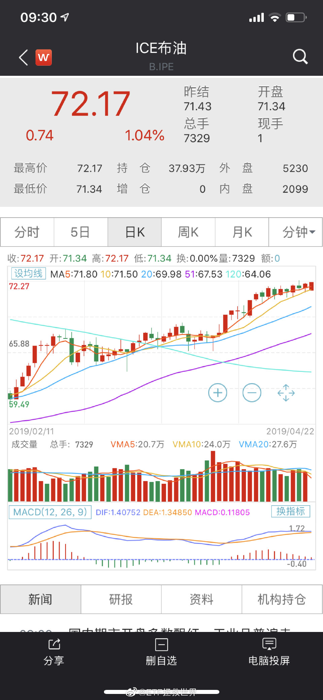

======================================================

ETF拯救世界 (5687069307) @
2019-04-22 09:34:11 Mon  
url: https://weibo.com/5687069307/HqLZq3319

旁边奥迪招谁惹谁了

------------------------------------------------------
转推：
>  @北京人不知道的北京事儿 (1662214194)
>  2019-04-22 09:11:26 Mon  
>  url: https:/weibo.com/1662214194/HqLQb7ev7/

>  网友投稿：昨晚发生的事儿，特斯拉自燃后爆了。。。[衰][衰]http://t.cn/Eat3evl ​ ​​​

转发[12]  评论[69]  赞[193] 

======================================================

ETF拯救世界 (5687069307) @
2019-04-22 09:36:10 Mon  
url: https://weibo.com/5687069307/HqM0doHzz

需要注意的是，政策面有微妙变化。 ​​​

转发[48]  评论[126]  赞[544] 

======================================================

ETF拯救世界 (5687069307) @
2019-04-22 10:11:46 Mon  
url: https://weibo.com/5687069307/HqMeFkmQX

回复@未尽的梦2510426195:你们高兴早了吧。伤好了要马上恢复训练，买的课再不上就要罚款了。然后9月前也有事不能走太远，只能短途出行。一个月的世界之旅要过几个月了……//@未尽的梦2510426195:总算盼到你出去了

------------------------------------------------------
转推：
>  @ETF拯救世界 (5687069307)
>  2019-04-22 09:31:38 Mon  
>  url: https:/weibo.com/5687069307/HqLYnjbXs/

>  好消息是脚伤应该快好了，可以出去浪了 ​​​

转发[1]  评论[50]  赞[295] 

======================================================

ETF拯救世界 (5687069307) @
2019-04-22 10:23:01 Mon  
url: https://weibo.com/5687069307/HqMjer4kP

油开始浪了。正好本周且慢问答回答了一个关于NOPEC、油价和油气的问题。周三可以观摩一下。

------------------------------------------------------
转推：
>  @ETF拯救世界 (5687069307)
>  2019-04-22 09:31:38 Mon  
>  url: https:/weibo.com/5687069307/HqLYnjbXs/

>  好消息是脚伤应该快好了，可以出去浪了 ​​​

转发[7]  评论[74]  赞[410] 

======================================================

ETF拯救世界 (5687069307) @
2019-04-22 10:48:28 Mon  
url: https://weibo.com/5687069307/HqMtz3oqy

分享图片 ​​​

转发[4]  评论[50]  赞[331] 

+++++++++++++++++++++++++++++++++++++++++++++++++++++

图片：
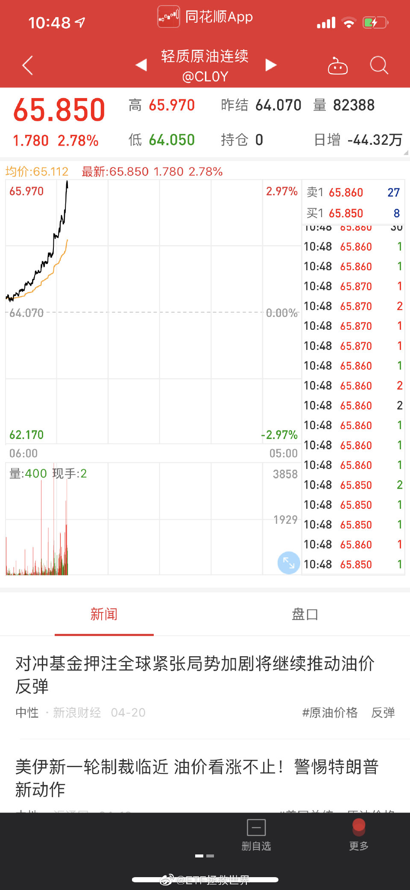

======================================================

ETF拯救世界 (5687069307) @
2019-04-22 11:03:05 Mon  
url: https://weibo.com/5687069307/HqMzuEfWL

之前有机构的朋友问为什么发车油气。我给出了标准答案： ​​​

转发[14]  评论[126]  赞[480] 

+++++++++++++++++++++++++++++++++++++++++++++++++++++

图片：

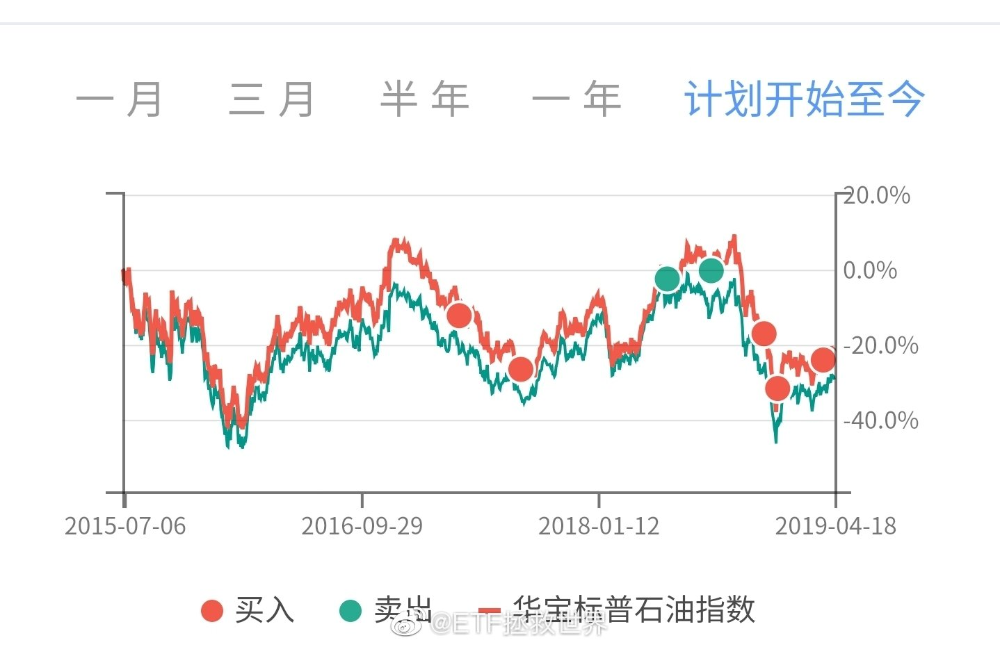

======================================================

ETF拯救世界 (5687069307) @
2019-04-22 11:15:41 Mon  
url: https://weibo.com/5687069307/HqMEC0LdS

注意，场内油气已经溢价接近3%，情况不明了，谁爱追谁追，反正我不追 ​​​

转发[11]  评论[76]  赞[442] 

======================================================

ETF拯救世界 (5687069307) @
2019-04-22 11:17:54 Mon  
url: https://weibo.com/5687069307/HqMFwatB7

感觉这样的人多了的话，以后女性找工作难度会上升

------------------------------------------------------
转推：
>  @北京人不知道的北京事儿 (1662214194)
>  2019-04-22 10:47:53 Mon  
>  url: https:/weibo.com/1662214194/HqMtkhNFT/

>  【女员工试用期怀孕 告知公司后遭辞退】王女士今年28岁，入职了一家公司，被告知公司的试用期为1个月至3个月。4月13日，王女士发现自己怀孕了，怀的是第一胎。她主动向领导如实报告。领导得知她怀孕后，表示要辞退她，并且多给她开了2天的工资作为补偿。王女士难过地表示，她本想真诚沟通，没想到会换 ​​​

转发[14]  评论[133]  赞[280] 

======================================================

ETF拯救世界 (5687069307) @
2019-04-22 11:39:27 Mon  
url: https://weibo.com/5687069307/HqMOg3OiW

感谢大家信任，但是鉴于问题类型已经从投资扩展到健康、亲情、爱情、司法、社会、娱乐、婚恋、职业生涯、亲子、游戏、报考学校及专业等问题，实在能力有限，很多问题都解答不了，就没有回复，见谅了各位… ​​​

转发[11]  评论[325]  赞[447] 

+++++++++++++++++++++++++++++++++++++++++++++++++++++

图片：

======================================================

ETF拯救世界 (5687069307) @
2019-04-22 13:18:55 Mon  
url: https://weibo.com/5687069307/HqNsCyyNG

我部门手下的女性员工，有怀孕的，我都会主动通知她们每天可以提前下班半个小时。早上晚点来也可以，避开交通高峰期。有身体不好需要休息的也直接休息，请几天假不会记请假。

产假期间，本来规定有些福利不能享受了，我还是会向人力部门争取，尽量都给她们保持。

产假之后开始上班也是，需要的方便都 ​​​

转发[30]  评论[241]  赞[881] 

======================================================

ETF拯救世界 (5687069307) @
2019-04-22 13:42:31 Mon  
url: https://weibo.com/5687069307/HqNCdspIx

市场还是很敏感的。先考验支撑位吧。这一路上来一次支撑都不碰也太说不过去了

------------------------------------------------------
转推：
>  @ETF拯救世界 (5687069307)
>  2019-04-22 09:36:10 Mon  
>  url: https:/weibo.com/5687069307/HqM0doHzz/

>  需要注意的是，政策面有微妙变化。 ​​​

转发[22]  评论[178]  赞[531] 

======================================================

ETF拯救世界 (5687069307) @
2019-04-22 16:42:42 Mon  
url: https://weibo.com/5687069307/HqONm3e2l

[泪]

------------------------------------------------------
转推：
>  @ ()
>  2019-04-22 13:56:46 Mon  
>  url: 

>  抱歉，作者已设置仅展示半年内微博，此微博已不可见。 ​​​

转发[77]  评论[58]  赞[301] 

======================================================

ETF拯救世界 (5687069307) @
2019-04-22 16:50:20 Mon  
url: https://weibo.com/5687069307/HqOQrwFis

无话可说。如果视频是真的，这女的以及幕后团队到底是怎样的决心要搞死京东才会那样写起诉书。继续吃瓜，先确认视频是不是真的再接着吃。

------------------------------------------------------
转推：
>  @新浪科技 (1642634100)
>  2019-04-22 15:50:57 Mon  
>  url: https:/weibo.com/1642634100/HqOslbQy1/

>  【疑似#刘强东案视频曝光# 仙人跳实锤？】据微博网友@明州事记 爆料，刘强东明州案晚宴视频曝光，女方邀请刘强东进入酒店。http://t.cn/Eaf3hhU ​​​

转发[103]  评论[97]  赞[239] 

======================================================

ETF拯救世界 (5687069307) @
2019-04-22 17:02:47 Mon  
url: https://weibo.com/5687069307/HqOVvjibU

回复@love明媚冬日:起诉书里说，晚宴9：11分结束。视频里的时间是9：50左右。如果视频时间没有作假，就是晚宴结束后。//@love明媚冬日:这是不是晚宴前的视频？

------------------------------------------------------
转推：
>  @新浪科技 (1642634100)
>  2019-04-22 15:50:57 Mon  
>  url: https:/weibo.com/1642634100/HqOslbQy1/

>  【疑似#刘强东案视频曝光# 仙人跳实锤？】据微博网友@明州事记 爆料，刘强东明州案晚宴视频曝光，女方邀请刘强东进入酒店。http://t.cn/Eaf3hhU ​​​

转发[71]  评论[100]  赞[172] 

======================================================

ETF拯救世界 (5687069307) @
2019-04-22 17:17:26 Mon  
url: https://weibo.com/5687069307/HqP1rxNuV

酒是穿肠毒药，色是刮骨钢刀。之前我说黄赌毒别碰，很多朋友评论说，黄没事啊。

很多时候真有事啊。

当然，只要你做好了承担一切后果的准备，碰也没事。就怕这个后果远超你的想象…… ​​​

转发[42]  评论[102]  赞[440] 

======================================================

ETF拯救世界 (5687069307) @
2019-04-22 17:24:46 Mon  
url: https://weibo.com/5687069307/HqP4qbTw1

回复@Compass_J:强奸总要一些证据，比如身体上的损伤，比如房间内物品的损坏，双方搏斗的痕迹等等。进房间前你主动邀请我去你家，过来勾我的胳膊，房间里一切完好，你一点伤没有，最后告我强奸稍微有点说不过去啊。

------------------------------------------------------
转推：
>  @新浪科技 (1642634100)
>  2019-04-22 15:50:57 Mon  
>  url: https:/weibo.com/1642634100/HqOslbQy1/

>  【疑似#刘强东案视频曝光# 仙人跳实锤？】据微博网友@明州事记 爆料，刘强东明州案晚宴视频曝光，女方邀请刘强东进入酒店。http://t.cn/Eaf3hhU ​​​

转发[48]  评论[114]  赞[233] 

======================================================

ETF拯救世界 (5687069307) @
2019-04-22 17:42:19 Mon  
url: https://weibo.com/5687069307/HqPbyiPJw

回复@潜水隐身不要注意我:我现在已经不站队了。我站中间踏踏实实吃瓜……昨天就说了，离得千山万水，这事不是咱们能看清的。认真吃瓜保平安。东是否被人陷害都好，要怪自己意志不坚定，也算是应有的惩罚。我只是不希望为了利益扭曲事实造假的人笑到最后。无论是哪一方。

------------------------------------------------------
转推：
>  @新浪科技 (1642634100)
>  2019-04-22 15:50:57 Mon  
>  url: https:/weibo.com/1642634100/HqOslbQy1/

>  【疑似#刘强东案视频曝光# 仙人跳实锤？】据微博网友@明州事记 爆料，刘强东明州案晚宴视频曝光，女方邀请刘强东进入酒店。http://t.cn/Eaf3hhU ​​​

转发[12]  评论[49]  赞[263] 

======================================================

ETF拯救世界 (5687069307) @
2019-04-22 17:49:07 Mon  
url: https://weibo.com/5687069307/HqPej34A1

回复@轻升语:我平常不喝酒，更讨厌谈点什么事情都要喝的你死我活的规则，比如昨天那个地铁喝的躺地下回不去让他媳妇来接的业务员。酒应该是亲人朋友聚会的时候让大家放松开心起来的东西。//@轻升语:不知道E大对酒，对中国饮酒文化是什么态度，希望不吝赐教。

------------------------------------------------------
转推：
>  @ETF拯救世界 (5687069307)
>  2019-04-22 17:17:26 Mon  
>  url: https:/weibo.com/5687069307/HqP1rxNuV/

>  酒是穿肠毒药，色是刮骨钢刀。之前我说黄赌毒别碰，很多朋友评论说，黄没事啊。
>  
>  很多时候真有事啊。
>  
>  当然，只要你做好了承担一切后果的准备，碰也没事。就怕这个后果远超你的想象…… ​​​

转发[18]  评论[68]  赞[360] 

======================================================

ETF拯救世界 (5687069307) @
2019-04-22 17:52:59 Mon  
url: https://weibo.com/5687069307/HqPfSxeV2

回复@Blackoba:打仗不能一波把火力都打出去。一波波的打你，越到后面武器威力越大，最后打得你怀疑人生，不知道我手里还有多少王牌才是王道啊。//@Blackoba:为啥视频不早点出来[摊手]

------------------------------------------------------
转推：
>  @新浪科技 (1642634100)
>  2019-04-22 15:50:57 Mon  
>  url: https:/weibo.com/1642634100/HqOslbQy1/

>  【疑似#刘强东案视频曝光# 仙人跳实锤？】据微博网友@明州事记 爆料，刘强东明州案晚宴视频曝光，女方邀请刘强东进入酒店。http://t.cn/Eaf3hhU ​​​

转发[27]  评论[125]  赞[306] 

======================================================

ETF拯救世界 (5687069307) @
2019-04-22 21:36:26 Mon  
url: https://weibo.com/5687069307/HqQIA7tyU

又仔细看了看一分钟开始的后半部分。两个人的肢体语言真的让人一言难尽。认真感受一下。

------------------------------------------------------
转推：
>  @新浪科技 (1642634100)
>  2019-04-22 15:50:57 Mon  
>  url: https:/weibo.com/1642634100/HqOslbQy1/

>  【疑似#刘强东案视频曝光# 仙人跳实锤？】据微博网友@明州事记 爆料，刘强东明州案晚宴视频曝光，女方邀请刘强东进入酒店。http://t.cn/Eaf3hhU ​​​

转发[13]  评论[206]  赞[216] 

======================================================

ETF拯救世界 (5687069307) @
2019-04-22 21:49:25 Mon  
url: https://weibo.com/5687069307/HqQNQyOLA

回复@猫猫的未知旅程:呵呵，不爱看就取关。我关注什么不需要你同意。//@猫猫的未知旅程:益达，你过于关注这件事了//@ETF拯救世界:又仔细看了看一分钟开始的后半部分。两个人的肢体语言真的让人一言难尽。认真感受一下。

------------------------------------------------------
转推：
>  @新浪科技 (1642634100)
>  2019-04-22 15:50:57 Mon  
>  url: https:/weibo.com/1642634100/HqOslbQy1/

>  【疑似#刘强东案视频曝光# 仙人跳实锤？】据微博网友@明州事记 爆料，刘强东明州案晚宴视频曝光，女方邀请刘强东进入酒店。http://t.cn/Eaf3hhU ​​​

转发[4]  评论[106]  赞[279] 

======================================================

ETF拯救世界 (5687069307) @
2019-04-22 22:09:34 Mon  
url: https://weibo.com/5687069307/HqQW1liRU

我说一下，请各位也了解一下。

我就是个普通人，我有自己的喜怒哀乐，有自己的优点，缺点更多。

我从来不为自己设计什么人设，在微博上怎么想就怎么说。也许我不会把所有想法说出来，但我说的都是真就这么想的。

有朋友关注我，我非常开心。多一点朋友关注当然更好，但少几个也无所谓。球球二十万人 ​​​

转发[28]  评论[306]  赞[1059] 

======================================================

ETF拯救世界 (5687069307) @
2019-04-22 22:24:14 Mon  
url: https://weibo.com/5687069307/HqR1YsKvd

我对你都好失望嘅… ​​​

转发[15]  评论[93]  赞[324] 

+++++++++++++++++++++++++++++++++++++++++++++++++++++

图片：

======================================================

ETF拯救世界 (5687069307) @
2019-04-22 23:47:49 Mon  
url: https://weibo.com/5687069307/HqRzU0Vcq

不骂不行 http://t.cn/Eaib9YS

------------------------------------------------------
转推：
>  @ETF拯救世界 (5687069307)
>  2019-04-22 22:24:14 Mon  
>  url: https:/weibo.com/5687069307/HqR1YsKvd/

>  我对你都好失望嘅… ​​​

转发[11]  评论[47]  赞[265] 

======================================================

ETF拯救世界 (5687069307) @
2019-04-23 00:12:09 Tue  
url: https://weibo.com/5687069307/HqRJMjJmS

你这么涨我可不睡了啊  http://t.cn/EaiMGCF //@ETF拯救世界:不骂不行 http://t.cn/Eaib9YS

------------------------------------------------------
转推：
>  @ETF拯救世界 (5687069307)
>  2019-04-22 22:24:14 Mon  
>  url: https:/weibo.com/5687069307/HqR1YsKvd/

>  我对你都好失望嘅… ​​​

转发[8]  评论[125]  赞[356] 

======================================================

ETF拯救世界 (5687069307) @
2019-04-23 08:06:23 Tue  
url: https://weibo.com/5687069307/HqUQgiuEh

场内今天也涨不了多少。昨天溢价，今天折价，最多也就一个多点。 ​​​

转发[3]  评论[71]  赞[361] 

======================================================

ETF拯救世界 (5687069307) @
2019-04-23 08:44:08 Tue  
url: https://weibo.com/5687069307/HqV5ABBFE

回复@江西各噢殷山宁:我说我不喜欢这种谈生意的方式，没说看不上那个人，有什么肉糜不肉糜？这都什么理解能力？//@江西各噢殷山宁:说这话有点像古代那个啥说“何不食糜”

------------------------------------------------------
转推：
>  @ETF拯救世界 (5687069307)
>  2019-04-22 17:17:26 Mon  
>  url: https:/weibo.com/5687069307/HqP1rxNuV/

>  酒是穿肠毒药，色是刮骨钢刀。之前我说黄赌毒别碰，很多朋友评论说，黄没事啊。
>  
>  很多时候真有事啊。
>  
>  当然，只要你做好了承担一切后果的准备，碰也没事。就怕这个后果远超你的想象…… ​​​

转发[4]  评论[52]  赞[272] 

======================================================

ETF拯救世界 (5687069307) @
2019-04-23 09:04:00 Tue  
url: https://weibo.com/5687069307/HqVdFfc2G

我再说几句可能有很多朋友，尤其是女性朋友不爱听的吧。也有可能有人骂我直男癌之类的，whatever。

昨天有评论说，挽着胳膊请你一个人陪我回公寓也不代表要跟你xx啊。

我只能说，妹子们，有时候男女对待这件事的看法真的不同。尤其是一部分男性，别说你第一次见面就邀请他大晚上回闺房，走着走着还主 ​​​

转发[96]  评论[730]  赞[1079] 

======================================================

ETF拯救世界 (5687069307) @
2019-04-23 09:35:11 Tue  
url: https://weibo.com/5687069307/HqVqj6Ee5

不许你再涨了，不然又要打脸… ​​​

转发[8]  评论[77]  赞[385] 

+++++++++++++++++++++++++++++++++++++++++++++++++++++

图片：

======================================================

ETF拯救世界 (5687069307) @
2019-04-23 10:18:16 Tue  
url: https://weibo.com/5687069307/HqVHNzWk8

就像咱们过马路，咱们遵守交通规则，绿灯过马路。你就可以不两边看看了吗？

真有司机闯红灯，冲过来把人撞死了，这时候去追究司机责任，哪怕枪毙他，哪怕赔1000万，有用吗？没用了啊。人没了啊。

你说，我又没错！我绿灯过马路，你干嘛教育我要两边看？你为什么不去教育司机？我就不看，我愿意这么走 ​​​

转发[63]  评论[264]  赞[751] 

======================================================

ETF拯救世界 (5687069307) @
2019-04-23 10:52:14 Tue  
url: https://weibo.com/5687069307/HqVVAtySK

涨的时候很多人觉得自己买少了，赶紧取出存款买买买。

结果一个小调整居然账户又开始亏损了！

WTF，宝宝心里苦啊。 ​​​

转发[22]  评论[166]  赞[648] 

======================================================

ETF拯救世界 (5687069307) @
2019-04-23 11:00:04 Tue  
url: https://weibo.com/5687069307/HqVYLdSTi

继续有效。

------------------------------------------------------
转推：
>  @ETF拯救世界 (5687069307)
>  2019-04-15 15:18:27 Mon  
>  url: https:/weibo.com/5687069307/HpKfFAUi0/

>  本来以为是一周行情，谁知道是周一上午行情。
>  
>  下半月随时发车。不会多，一两车。 ​​​

转发[6]  评论[185]  赞[576] 

======================================================

ETF拯救世界 (5687069307) @
2019-04-23 13:49:29 Tue  
url: https://weibo.com/5687069307/HqX5xcdTp

回本就跑。什么时候追回来

------------------------------------------------------
转推：
>  @张道达 (2032628220)
>  2019-04-23 11:00:03 Tue  
>  url: https:/weibo.com/2032628220/HqVYLesdH/

>  【股市上涨资金流出 偏股基金遭1300亿份净赎回】一季度，基金取得不俗收益，但基金份额并未出现明显增长。根据天相投顾的统计，截至一季度末，各类型基金总份额为12.93万亿份，较去年底增加800.17亿份。净申购较多的仍是货币基金和债券基金，而A股的强劲反弹，却刺激了投资者从股票和混合基金中赎回。 ​​​

转发[26]  评论[108]  赞[403] 

======================================================

ETF拯救世界 (5687069307) @
2019-04-23 13:57:10 Tue  
url: https://weibo.com/5687069307/HqX8F1Fnj

什么叫屁股决定脑袋。

就是你加油的时候心里骂，怎么又快涨到70了。

当你买了点油气，看着行情想：

怎么还没到100？ ​​​

转发[25]  评论[197]  赞[687] 

+++++++++++++++++++++++++++++++++++++++++++++++++++++

图片：
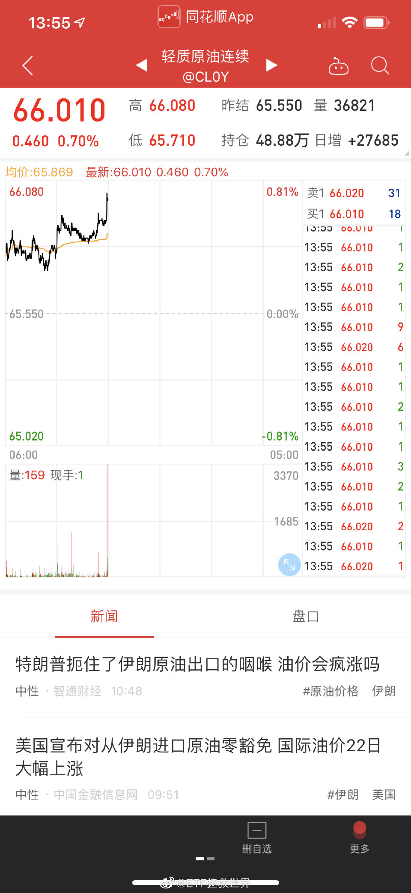

======================================================

ETF拯救世界 (5687069307) @
2019-04-24 09:19:48 Wed  
url: https://weibo.com/5687069307/Hr4KzekER

不出事，你永远也看不清一个人的真面目。

出了事，你会发现有人客观追求真相，有人基于自己的立场抛弃客观，有人跟着蹭热度…

不能说这些人谁对谁错，只是经过这样的事情，就会更加明白这世界的复杂性。

客观真的不容易，我也要反省。无论是投资还是生活，永远都要客观，才不会离正确越来越远。 ​​​

转发[53]  评论[184]  赞[802] 

======================================================

ETF拯救世界 (5687069307) @
2019-04-24 10:26:40 Wed  
url: https://weibo.com/5687069307/Hr5bIjLzy

有调整，太正常了。没有调整才不正常。甚至这样的调整幅度太小。历史上没有一两次月线级别的调整都不敢说自己是牛市。

------------------------------------------------------
转推：
>  @ETF拯救世界 (5687069307)
>  2019-04-19 16:59:28 Fri  
>  url: https:/weibo.com/5687069307/HqmCFaLDd/

>  A股历史上除了2008年底开始的上涨，从未出现过类似这波行情的毫无回调的情况。
>  
>  果然历史没有简单重复的啊。 ​​​

转发[75]  评论[348]  赞[819] 

======================================================

ETF拯救世界 (5687069307) @
2019-04-24 15:18:26 Wed  
url: https://weibo.com/5687069307/Hr768pjRP

无论什么品种，趋势都很重要 ​​​

转发[218]  评论[105]  赞[484] 

+++++++++++++++++++++++++++++++++++++++++++++++++++++

图片：
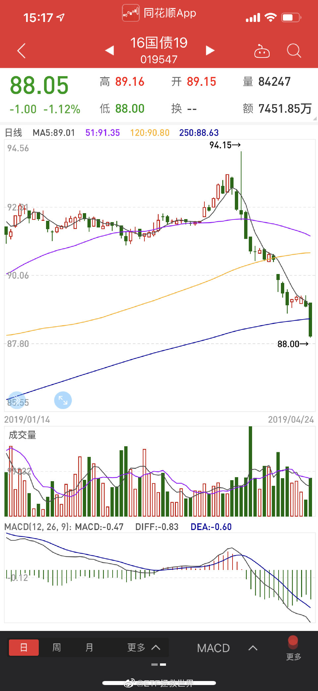

======================================================

ETF拯救世界 (5687069307) @
2019-04-24 15:24:00 Wed  
url: https://weibo.com/5687069307/Hr78os3Sa

回复@留下唇印:当然会开。咱们之前卖掉的都会买回来，还会买更多。//@留下唇印:向他开炮？

------------------------------------------------------
转推：
>  @ETF拯救世界 (5687069307)
>  2019-04-24 15:18:26 Wed  
>  url: https:/weibo.com/5687069307/Hr768pjRP/

>  无论什么品种，趋势都很重要 ​​​

转发[154]  评论[53]  赞[362] 

======================================================

ETF拯救世界 (5687069307) @
2019-04-24 15:27:10 Wed  
url: https://weibo.com/5687069307/Hr79Gf7Vg

又想起年初评论里有人教育我仓位里面债券配的太少……

------------------------------------------------------
转推：
>  @ETF拯救世界 (5687069307)
>  2019-04-24 15:18:26 Wed  
>  url: https:/weibo.com/5687069307/Hr768pjRP/

>  无论什么品种，趋势都很重要 ​​​

转发[6]  评论[48]  赞[388] 

======================================================

ETF拯救世界 (5687069307) @
2019-04-24 15:36:11 Wed  
url: https://weibo.com/5687069307/Hr7dlc6Rf

回复@树苗儿想要喝水:债券走势第一取决于货币政策。//@树苗儿想要喝水:是不是市场认为未来的投资收益率应该会更高，所以之前国债逼近3%的收益率太低（国债价格太高），所以现在都在抛债买别的。//@ETF拯救世界:回复@留下唇印:当然会开。咱们之前卖掉的都会买回来，还会买更多。

------------------------------------------------------
转推：
>  @ETF拯救世界 (5687069307)
>  2019-04-24 15:18:26 Wed  
>  url: https:/weibo.com/5687069307/Hr768pjRP/

>  无论什么品种，趋势都很重要 ​​​

转发[136]  评论[92]  赞[364] 

======================================================

ETF拯救世界 (5687069307) @
2019-04-24 15:59:20 Wed  
url: https://weibo.com/5687069307/Hr7mJAgQk

上午有朋友问，为什么你认为要调整不减仓。

有两个原因：

第一，历史上熊转牛初期，出现大幅调整的几率大。但并不代表必然出现，比如08-09那一波。不是100%的事情，你就要权衡一下利弊得失。如果调整，你会得到什么。如果不呢，你会失去什么。

第二，有些品种是所谓的投资品种。即，可以超长期持有 ​​​

转发[313]  评论[288]  赞[937] 

======================================================

ETF拯救世界 (5687069307) @
2019-04-24 16:17:30 Wed  
url: https://weibo.com/5687069307/Hr7u71ZUV

回复@胡鹏171:第一，A股是全市场收益率低于债券，但很多股票和板块预期收益率高于债券。第二，长期称重，短期投票。如果投资只看预期收益率就可以来回切换那就太简单了。//@胡鹏171:既然有货币收紧的预期，为什么投资者更多的抛售收益率高于股票的国债？目前国债有3.4，股票才3.0几吧

------------------------------------------------------
转推：
>  @ETF拯救世界 (5687069307)
>  2019-04-24 15:18:26 Wed  
>  url: https:/weibo.com/5687069307/Hr768pjRP/

>  无论什么品种，趋势都很重要 ​​​

转发[77]  评论[116]  赞[441] 

======================================================

ETF拯救世界 (5687069307) @
2019-04-24 16:25:50 Wed  
url: https://weibo.com/5687069307/Hr7xuz5Dl

回复@叛逆的阿波罗:新浪问答的人找我说，你问答效果这么好，财经领域只有极少人有这么好的效果，但你为什么每年只回答两次，我：[doge]//@叛逆的阿波罗:良心大V，回答的这么清楚，还免费。

------------------------------------------------------
转推：
>  @ETF拯救世界 (5687069307)
>  2019-04-24 15:18:26 Wed  
>  url: https:/weibo.com/5687069307/Hr768pjRP/

>  无论什么品种，趋势都很重要 ​​​

转发[9]  评论[141]  赞[530] 

======================================================

ETF拯救世界 (5687069307) @
2019-04-25 07:48:41 Thu  
url: https://weibo.com/5687069307/HrdA51Dan

其实有时候说“我不懂”或者“我不知道”真的没什么丢人的。

想帮别人没错，但也要考虑自己的情况和历史进程。

少做那些对了没好处，错了挨骂的事。 ​​​

转发[48]  评论[204]  赞[699] 

+++++++++++++++++++++++++++++++++++++++++++++++++++++

图片：
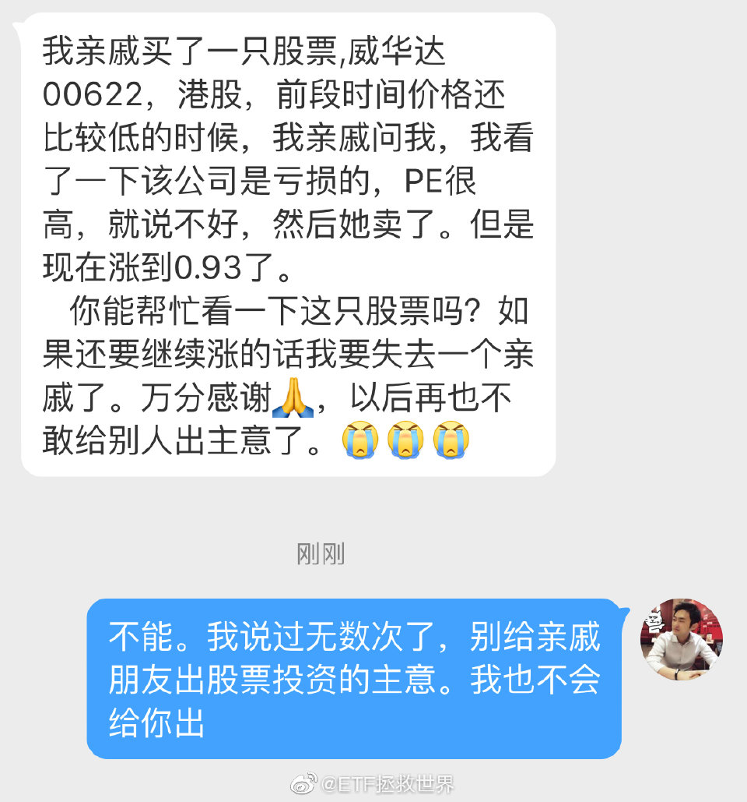

======================================================

ETF拯救世界 (5687069307) @
2019-04-25 14:26:02 Thu  
url: https://weibo.com/5687069307/HrgbmtlGb

现在你有点明白为什么这两个月不买了吧。

急什么？钱烧手吗。 ​​​

转发[30]  评论[295]  赞[923] 

======================================================

ETF拯救世界 (5687069307) @
2019-04-25 14:38:07 Thu  
url: https://weibo.com/5687069307/HrgggxMcV

最低2400，最高3288。

很多今年入场的人吃惊的发现，自己居然在3100又开始亏钱了！ ​​​

转发[53]  评论[240]  赞[722] 

======================================================

ETF拯救世界 (5687069307) @
2019-04-25 15:04:55 Thu  
url: https://weibo.com/5687069307/Hrgr9qNQa

回复@打火机儿:喷了。平行宇宙的自己并不给力呢……//@打火机儿:2600进的，基金赚的钱目前有一半亏在个股了

------------------------------------------------------
转推：
>  @ETF拯救世界 (5687069307)
>  2019-04-25 14:38:07 Thu  
>  url: https:/weibo.com/5687069307/HrgggxMcV/

>  最低2400，最高3288。
>  
>  很多今年入场的人吃惊的发现，自己居然在3100又开始亏钱了！ ​​​

转发[16]  评论[46]  赞[361] 

======================================================

ETF拯救世界 (5687069307) @
2019-04-25 15:06:45 Thu  
url: https://weibo.com/5687069307/HrgrTfwuE

回复@解毒汪:你想想，为什么会有不败之地的感觉。如果你能永远不败，你是不是这条gai最靓的仔？//@解毒汪:这两个月涨跌你都有道理嘛，立于不败之地。

------------------------------------------------------
转推：
>  @ETF拯救世界 (5687069307)
>  2019-04-25 14:26:02 Thu  
>  url: https:/weibo.com/5687069307/HrgbmtlGb/

>  现在你有点明白为什么这两个月不买了吧。
>  
>  急什么？钱烧手吗。 ​​​

转发[6]  评论[76]  赞[434] 

======================================================

ETF拯救世界 (5687069307) @
2019-04-25 15:14:55 Thu  
url: https://weibo.com/5687069307/HrgvdcQFl

回复@大象下象棋:今年上证25%。500是31%。你是不是一定要所有时间段最牛逼才能夸一下？不会的，你永远只能看到不好的地方。赶紧买上证去吧。//@大象下象棋:五百是真的弱，五十三百不说了，上证缺口都没补呢，五百已经到了，上证都跑不过，重仓五百的真是哭晕在厕所了。

------------------------------------------------------
转推：
>  @ETF拯救世界 (5687069307)
>  2019-04-25 14:38:07 Thu  
>  url: https:/weibo.com/5687069307/HrgggxMcV/

>  最低2400，最高3288。
>  
>  很多今年入场的人吃惊的发现，自己居然在3100又开始亏钱了！ ​​​

转发[8]  评论[88]  赞[436] 

======================================================

ETF拯救世界 (5687069307) @
2019-04-25 15:18:17 Thu  
url: https://weibo.com/5687069307/HrgwzooLs

喷了。

他可能不知道一个问答就能收入5000，如果开个V+，一年…

这种人怎么出来做生意的。 ​​​

转发[7]  评论[203]  赞[571] 

+++++++++++++++++++++++++++++++++++++++++++++++++++++

图片：

======================================================

ETF拯救世界 (5687069307) @
2019-04-25 15:21:21 Thu  
url: https://weibo.com/5687069307/HrgxOvpXP

明天或者下周一开车。不会多，意思意思。 ​​​

转发[7]  评论[306]  赞[975] 

======================================================

ETF拯救世界 (5687069307) @
2019-04-25 15:52:45 Thu  
url: https://weibo.com/5687069307/HrgKyFWaG

发车的时候上证如果能调整到3050左右就非常完美了。 ​​​

转发[23]  评论[437]  赞[1060] 

======================================================

ETF拯救世界 (5687069307) @
2019-04-26 12:11:27 Fri  
url: https://weibo.com/5687069307/HroJeoTAS

为什么皱纹和表情都没了。amazing！

------------------------------------------------------
转推：
>  @蓝鲸财经记者工作平台 (1885454921)
>  2019-04-26 11:56:39 Fri  
>  url: https:/weibo.com/1885454921/HroDe5xlj/

>  【鲸视频：王石称年轻人即使有钱买房子也别急着买，买不起可以先租】4月26日，万科集团创始人王石被问及年轻人在一二线城市工资买不起房时表示，买不起房可以先租，回老家其实也是很好的选择。我建议年轻人即使买得起房也不要先买，首先来想有住的地方，先租。因为得有人先买它再租给你吧，所以我不担 ​​​

转发[29]  评论[244]  赞[289] 

======================================================

ETF拯救世界 (5687069307) @
2019-04-26 13:22:04 Fri  
url: https://weibo.com/5687069307/HrpbTtY52

[怒] ​​​

转发[10]  评论[356]  赞[499] 

======================================================

ETF拯救世界 (5687069307) @
2019-04-26 13:57:47 Fri  
url: https://weibo.com/5687069307/HrpqoEfWC

[爱你]

------------------------------------------------------
转推：
>  @ETF拯救世界 (5687069307)
>  2019-04-26 13:22:04 Fri  
>  url: https:/weibo.com/5687069307/HrpbTtY52/

>  [怒] ​​​

转发[3]  评论[393]  赞[575] 

======================================================

ETF拯救世界 (5687069307) @
2019-04-26 18:01:23 Fri  
url: https://weibo.com/5687069307/Hrr1gFcWU

四分之一炷香时间到了 ​​​

转发[4]  评论[198]  赞[550] 

+++++++++++++++++++++++++++++++++++++++++++++++++++++

图片：

======================================================

ETF拯救世界 (5687069307) @
2019-04-26 21:37:42 Fri  
url: https://weibo.com/5687069307/Hrsr55ppR

TAO同学是整个事件逆转的关键。

------------------------------------------------------
转推：
>  @新浪科技 (1642634100)
>  2019-04-26 20:02:35 Fri  
>  url: https:/weibo.com/1642634100/HrrOsFPuM/

>  #刘强东案出警记录曝光#【明州案当日警方出警记录曝光！女事主称“双方自愿”】@独家互联网 曝出8月30号刘强东案发当晚美警方出警报告。报告描述，Liu女子说她“自发地与刘强东先生发生了性关系……并否认自己说过要报复（警）。她还说打电话报警的Tao先生可能是因为担心她。”http://t.cn/EaeAsXu ​​​

转发[20]  评论[81]  赞[232] 

======================================================

ETF拯救世界 (5687069307) @
2019-04-26 21:47:54 Fri  
url: https://weibo.com/5687069307/Hrsvdiba9

回复@褶子动:其实整件事已经非常明白了。很多人只是不愿意相信真相，只愿意相信自己希望的事实而已。不过，无论结果如何偏离真相都好，强子无论受到怎样的惩罚，都源于他自己的不忠，咎由自取。

------------------------------------------------------
转推：
>  @新浪科技 (1642634100)
>  2019-04-26 20:02:35 Fri  
>  url: https:/weibo.com/1642634100/HrrOsFPuM/

>  #刘强东案出警记录曝光#【明州案当日警方出警记录曝光！女事主称“双方自愿”】@独家互联网 曝出8月30号刘强东案发当晚美警方出警报告。报告描述，Liu女子说她“自发地与刘强东先生发生了性关系……并否认自己说过要报复（警）。她还说打电话报警的Tao先生可能是因为担心她。”http://t.cn/EaeAsXu ​​​

转发[10]  评论[173]  赞[283] 

======================================================

ETF拯救世界 (5687069307) @
2019-04-26 22:08:29 Fri  
url: https://weibo.com/5687069307/HrsDzAyh4

一个普通留学生的爱情有可能改变整个中国互联网电商格局，这可能是我亲见普通人瞬间改变世界之第一次。

上次是塞尔维亚青年和斐迪南大公… ​​​

转发[32]  评论[297]  赞[545] 

======================================================

ETF拯救世界 (5687069307) @
2019-04-27 07:07:09 Sat  
url: https://weibo.com/5687069307/Hrwadg8ab

回复@钱添昱:呵呵。我会让你看到什么叫做真正的诚意。//@钱添昱:随意说说，不必当真

------------------------------------------------------
转推：
>  @ETF拯救世界 (5687069307)
>  2019-04-26 22:08:29 Fri  
>  url: https:/weibo.com/5687069307/HrsDzAyh4/

>  一个普通留学生的爱情有可能改变整个中国互联网电商格局，这可能是我亲见普通人瞬间改变世界之第一次。
>  
>  上次是塞尔维亚青年和斐迪南大公… ​​​

转发[0]  评论[73]  赞[315] 

======================================================

ETF拯救世界 (5687069307) @
2019-04-27 13:37:36 Sat  
url: https://weibo.com/5687069307/HryIHhDyp

最后一次说这件事，以后也不说了。省得有人说我带节奏（奇怪了自己的微博谈谈自己的想法带什么节奏……）

第一，坚决反对婚内出轨。

我不是说婚内出轨的都是人渣，因为出轨有可能很多原因，一个家庭的情况外人咱们也弄不清楚。但是只要出轨，同时对另一半造成伤害的，都是不道德的。受到再大的精神以 ​​​

转发[35]  评论[240]  赞[720] 

======================================================

ETF拯救世界 (5687069307) @
2019-04-27 13:48:41 Sat  
url: https://weibo.com/5687069307/HryNcv8nw

回复@无名浩然:不是。套用到我们的系统上，就是要想清楚，”被人发现了“和”没被人发现“是不是都能舒服。如果都能，就去做。但这里有个黑天鹅——"被人告强奸了”还能不能舒服……//@无名浩然:一直在说舒服很重要，看来这种事不能图一时的舒服了

------------------------------------------------------
转推：
>  @ETF拯救世界 (5687069307)
>  2019-04-27 13:37:36 Sat  
>  url: https:/weibo.com/5687069307/HryIHhDyp/

>  最后一次说这件事，以后也不说了。省得有人说我带节奏（奇怪了自己的微博谈谈自己的想法带什么节奏……）
>  
>  第一，坚决反对婚内出轨。
>  
>  我不是说婚内出轨的都是人渣，因为出轨有可能很多原因，一个家庭的情况外人咱们也弄不清楚。但是只要出轨，同时对另一半造成伤害的，都是不道德的。受到再大的精神以 ​​​

转发[12]  评论[79]  赞[334] 

======================================================

ETF拯救世界 (5687069307) @
2019-04-27 22:22:43 Sat  
url: https://weibo.com/5687069307/HrC9QgnTr

回复@小静姐carol:很多历史文章不能看了，不知道为什么。//@小静姐carol:益大在球球上干货合集第二篇看不了了吗？a股是个聚宝盆那篇，有朋友知道吗

------------------------------------------------------
转推：
>  @ETF拯救世界 (5687069307)
>  2019-04-27 13:37:36 Sat  
>  url: https:/weibo.com/5687069307/HryIHhDyp/

>  最后一次说这件事，以后也不说了。省得有人说我带节奏（奇怪了自己的微博谈谈自己的想法带什么节奏……）
>  
>  第一，坚决反对婚内出轨。
>  
>  我不是说婚内出轨的都是人渣，因为出轨有可能很多原因，一个家庭的情况外人咱们也弄不清楚。但是只要出轨，同时对另一半造成伤害的，都是不道德的。受到再大的精神以 ​​​

转发[5]  评论[203]  赞[268] 

======================================================

ETF拯救世界 (5687069307) @
2019-04-28 08:50:46 Sun  
url: https://weibo.com/5687069307/HrGgLwnKP

工作日又没法看盘亏钱的各位是不是无聊透了。 ​​​

转发[14]  评论[325]  赞[891] 

======================================================

ETF拯救世界 (5687069307) @
2019-04-28 10:30:37 Sun  
url: https://weibo.com/5687069307/HrGViooG0

大家这么无聊，我写了点新的赔钱技能给大家解闷，希望你喜欢。

------------------------------------------------------
转推：
>  @ETF拯救世界 (5687069307)
>  2019-04-28 08:50:46 Sun  
>  url: https:/weibo.com/5687069307/HrGgLwnKP/

>  工作日又没法看盘亏钱的各位是不是无聊透了。 ​​​

转发[8]  评论[390]  赞[1142] 

======================================================

ETF拯救世界 (5687069307) @
2019-04-28 11:42:45 Sun  
url: https://weibo.com/5687069307/HrHozBMr2

我不太敢开玩笑的原因… ​​​

转发[15]  评论[316]  赞[516] 

+++++++++++++++++++++++++++++++++++++++++++++++++++++

图片：

======================================================

ETF拯救世界 (5687069307) @
2019-04-28 13:55:13 Sun  
url: https://weibo.com/5687069307/HrIglkNf9

照着这个名单等权买，十年收益率就会很差。不信，你买了试试就知道了。

------------------------------------------------------
转推：
>  @摩尔金融 (5242156161)
>  2019-04-28 13:32:11 Sun  
>  url: https:/weibo.com/5242156161/HrI6ZzwKy/

>  全球市值前十大公司变迁，如今前十只有中美两家了 ​​​

转发[68]  评论[109]  赞[416] 

======================================================

ETF拯救世界 (5687069307) @
2019-04-28 14:51:06 Sun  
url: https://weibo.com/5687069307/HrID1Avvr

有在日本工作的朋友吗。敢问一件事：

现在日本公司里的氛围真的是新剧《我，准时下班》（わたし、定時で帰ります）里面那样吗。 ​​​

转发[12]  评论[186]  赞[388] 

======================================================

ETF拯救世界 (5687069307) @
2019-04-29 10:45:50 Mon  
url: https://weibo.com/5687069307/HrQrYcvzs

这两个月觉得仓位不够的终于可以继续加了。

没白等吧？

但是要注意节奏，注意，保持舒服的状态。 ​​​

转发[30]  评论[396]  赞[989] 

======================================================

ETF拯救世界 (5687069307) @
2019-04-29 11:14:54 Mon  
url: https://weibo.com/5687069307/HrQDMbOOd

看情况，也许明天还有车，也许没有。

目前的位置是最敏感的位置，不好确定。

薛定谔的发车。 ​​​

转发[17]  评论[397]  赞[1024] 

======================================================

ETF拯救世界 (5687069307) @
2019-04-29 15:07:14 Mon  
url: https://weibo.com/5687069307/HrSa52qxL

再回头看看，是不是有了更深的感悟。

------------------------------------------------------
转推：
>  @ETF拯救世界 (5687069307)
>  2019-03-25 09:27:30 Mon  
>  url: https:/weibo.com/5687069307/HmvYNmvZC/

>  不追涨是一种美德。
>  
>  有钱还怕没有好的投资机会？
>  
>  金融市场最不缺的就是机会。机会来了，最缺的是钱。
>  
>  谁有钱谁才是话事人。 ​​​

转发[42]  评论[206]  赞[771] 

======================================================

ETF拯救世界 (5687069307) @
2019-04-29 15:34:07 Mon  
url: https://weibo.com/5687069307/HrSkZ9PaQ

上次卖出500C效果还可以。接下来考虑看看是不是加更多波段策略仓位到计划里。 ​​​

转发[40]  评论[248]  赞[915] 

======================================================

ETF拯救世界 (5687069307) @
2019-04-29 16:02:53 Mon  
url: https://weibo.com/5687069307/HrSwF8EpW

回复@会走路的鲨鱼儿:如果是这样，为什么险资/社保/超级大机构还要做资产配置，要做波段，不断买入卖出？满仓应该是最好的选择啊。这个问题你要好好想想，不要被忽悠。//@会走路的鲨鱼儿:E大，长期看波段策略收益是不如低估买入拿住不放，高估卖出吧？为什么加波段，是考虑给车人的心态吗？

------------------------------------------------------
转推：
>  @ETF拯救世界 (5687069307)
>  2019-04-29 15:34:07 Mon  
>  url: https:/weibo.com/5687069307/HrSkZ9PaQ/

>  上次卖出500C效果还可以。接下来考虑看看是不是加更多波段策略仓位到计划里。 ​​​

转发[25]  评论[79]  赞[424] 

======================================================

ETF拯救世界 (5687069307) @
2019-04-29 16:22:14 Mon  
url: https://weibo.com/5687069307/HrSEw6Ese

我想了想，刚才这么说也未必合适。

这么说吧。

世界上没有最好的策略。是长期持有结合波段好，还是满仓长期持有好，谁也不能说谁更好。

就好像你不能说哪个妹子是世界上最漂亮的。

关键是适合不适合你。

适合你，哪怕是第二或者第三漂亮，也行啊。别老想追求最漂亮的，你们未必能幸福一辈子啊。

 ​​​

转发[93]  评论[181]  赞[755] 

======================================================

ETF拯救世界 (5687069307) @
2019-04-29 16:37:33 Mon  
url: https://weibo.com/5687069307/HrSKJleJS

回复@木草非人的世界:不会。多出的利润平摊到接下来要投入的份数里面。//@木草非人的世界:波段赚了的钱会不会认为是多一出份？以后这份资金继续用来做波段？原先只有150份的长赢，会不会慢慢变成155,160,170？

------------------------------------------------------
转推：
>  @ETF拯救世界 (5687069307)
>  2019-04-29 16:22:14 Mon  
>  url: https:/weibo.com/5687069307/HrSEw6Ese/

>  我想了想，刚才这么说也未必合适。
>  
>  这么说吧。
>  
>  世界上没有最好的策略。是长期持有结合波段好，还是满仓长期持有好，谁也不能说谁更好。
>  
>  就好像你不能说哪个妹子是世界上最漂亮的。
>  
>  关键是适合不适合你。
>  
>  适合你，哪怕是第二或者第三漂亮，也行啊。别老想追求最漂亮的，你们未必能幸福一辈子啊。
>  
>   ​​​

转发[15]  评论[59]  赞[379] 

======================================================

ETF拯救世界 (5687069307) @
2019-04-29 16:51:15 Mon  
url: https://weibo.com/5687069307/HrSQieTme

汇报一下最新数据：

去年四季度除创业板外，全市场利润增长同比几乎没变。

今年一季度，全市场利润开始恢复正增长。增幅个位数。

还有一天，等一千多家公布季报后就清楚了。 ​​​

转发[42]  评论[260]  赞[762] 

======================================================

ETF拯救世界 (5687069307) @
2019-04-29 17:59:17 Mon  
url: https://weibo.com/5687069307/HrThUj9H5

还是头条的运营识货啊…

之前都不知道有这么一个奖… ​​​

转发[2]  评论[509]  赞[1116] 

+++++++++++++++++++++++++++++++++++++++++++++++++++++

图片：

======================================================

