ETF拯救世界 (5687069307) @
2020-02-01 09:03:29 Sat  
url: https://weibo.com/5687069307/Is989dtEZ

我只是想知道，抑制病毒是什么意思。

是说可以抑制病毒在体内复制的意思吗。

至于什么药有效还是无效，我不懂，不乱说。 ​​​

转发[15]  评论[206]  赞[789] 

======================================================

ETF拯救世界 (5687069307) @
2020-02-01 09:19:29 Sat  
url: https://weibo.com/5687069307/Is9eDF5Eo

我想了想，所谓抑制，可能说是通过药物抑制病毒复制，使病毒量没这么大，免疫系统不再猛烈攻击造成器官损伤。剩下的就靠免疫系统慢慢清理吧。不懂医学，瞎想。

------------------------------------------------------
转推：
>  @ETF拯救世界 (5687069307)
>  2020-02-01 09:03:29 Sat  
>  url: https:/weibo.com/5687069307/Is989dtEZ/

>  我只是想知道，抑制病毒是什么意思。
>  
>  是说可以抑制病毒在体内复制的意思吗。
>  
>  至于什么药有效还是无效，我不懂，不乱说。 ​​​

转发[6]  评论[132]  赞[580] 

======================================================

ETF拯救世界 (5687069307) @
2020-02-01 09:41:33 Sat  
url: https://weibo.com/5687069307/Is9nB9fGm

去年底买了个品种，一个月涨了将近40%。

你猜是什么。

健身环。 ​​​

转发[60]  评论[273]  赞[949] 

======================================================

ETF拯救世界 (5687069307) @
2020-02-01 10:08:01 Sat  
url: https://weibo.com/5687069307/Is9yldJS9

回复@ETF创造奇迹:那时候估值比现在低20%。//@ETF创造奇迹:如果周一大盘大跌百分6（和港股同步），那么，有可能一步到位，跌出一个低点。这个估值，就和18年的2500点一样了！恐慌的尽头，是光明！ ​​​ E大，刚才看到的，是这样吗？

------------------------------------------------------
转推：
>  @ETF拯救世界 (5687069307)
>  2020-02-01 09:41:33 Sat  
>  url: https:/weibo.com/5687069307/Is9nB9fGm/

>  去年底买了个品种，一个月涨了将近40%。
>  
>  你猜是什么。
>  
>  健身环。 ​​​

转发[28]  评论[157]  赞[640] 

======================================================

ETF拯救世界 (5687069307) @
2020-02-01 10:44:16 Sat  
url: https://weibo.com/5687069307/Is9N3oTy6

一个新的体会。

比赛也好，考试也好，做其它竞争性的事情也好。做的时候专心致志尽最大所能，但是对结果看的淡一些。

这样，最后会比特别重视结果可能要好很多。心态完全变了，做起事来效果更好。太重视结果，有可能导致过分紧张，反而无法发挥水平。

另外，即使输了，也不会太沮丧。

这个道理以前 ​​​

转发[136]  评论[223]  赞[1363] 

======================================================

ETF拯救世界 (5687069307) @
2020-02-01 22:11:18 Sat  
url: https://weibo.com/5687069307/IsehVckTe

删了几条微博。

就这样吧。 ​​​

转发[13]  评论[376]  赞[1318] 

======================================================

ETF拯救世界 (5687069307) @
2020-02-02 21:42:47 Sun  
url: https://weibo.com/5687069307/IsnwQiMcZ

明天应该在5%左右吧。毛估估。 ​​​

转发[34]  评论[288]  赞[1080] 

======================================================

ETF拯救世界 (5687069307) @
2020-02-02 21:56:05 Sun  
url: https://weibo.com/5687069307/IsnCf9G0f

左右的意思是上下浮动5%

------------------------------------------------------
转推：
>  @ETF拯救世界 (5687069307)
>  2020-02-02 21:42:47 Sun  
>  url: https:/weibo.com/5687069307/IsnwQiMcZ/

>  明天应该在5%左右吧。毛估估。 ​​​

转发[18]  评论[180]  赞[818] 

======================================================

ETF拯救世界 (5687069307) @
2020-02-02 23:05:05 Sun  
url: https://weibo.com/5687069307/Iso4fpFv4

觉得跌了就难受的朋友，可能你还没理解，股市是一个会巨幅波动的市场。

这就决定了你的资产就是会波动，这个没有任何办法解决。

你要理解这一点，不要再因为波动激动或者难受。否则，你就不应该再玩下去。

从两方面做到这个。

第一，保证自己持仓成本低。或者持仓成本不低，但是有很多资金可以等跌 ​​​

转发[187]  评论[522]  赞[1722] 

======================================================

ETF拯救世界 (5687069307) @
2020-02-03 09:08:02 Mon  
url: https://weibo.com/5687069307/Iss0Zfsxm

准备开工 ​​​

转发[13]  评论[431]  赞[1188] 

======================================================

ETF拯救世界 (5687069307) @
2020-02-03 09:27:26 Mon  
url: https://weibo.com/5687069307/Iss8S1OH4

刺激不刺激。 ​​​

转发[35]  评论[1277]  赞[2966] 

======================================================

ETF拯救世界 (5687069307) @
2020-02-03 10:54:29 Mon  
url: https://weibo.com/5687069307/IssIcsJgQ

已更新 ​​​

转发[19]  评论[1238]  赞[1896] 

======================================================

ETF拯救世界 (5687069307) @
2020-02-03 11:40:48 Mon  
url: https://weibo.com/5687069307/Ist0ZyoUr

喷了，这波最高5597。压力位就是压力位，不服不行。

------------------------------------------------------
转推：
>  @ETF拯救世界 (5687069307)
>  2020-01-06 10:30:30 Mon  
>  url: https:/weibo.com/5687069307/IocAys8lC/

>  500上面第一个压力5650 ​​​

转发[14]  评论[510]  赞[1104] 

======================================================

ETF拯救世界 (5687069307) @
2020-02-03 13:36:27 Mon  
url: https://weibo.com/5687069307/IstLWdH9I

消费买回来的日子不远了吧 ​​​

转发[18]  评论[572]  赞[1286] 

======================================================

ETF拯救世界 (5687069307) @
2020-02-03 14:29:14 Mon  
url: https://weibo.com/5687069307/Isu7moIVl

今天买就买了，跟为国接盘什么的毫无关系。

国不缺咱们这点钱。

是为了自己挣钱才买。 ​​​

转发[27]  评论[366]  赞[1571] 

======================================================

ETF拯救世界 (5687069307) @
2020-02-03 14:57:46 Mon  
url: https://weibo.com/5687069307/IsuiWrWL5

三千只跌停的话，明天还是继续暴啊。 ​​​

转发[39]  评论[494]  赞[1452] 

======================================================

ETF拯救世界 (5687069307) @
2020-02-03 15:21:07 Mon  
url: https://weibo.com/5687069307/IsusqdSW4

回复@不断奮鬥的丨眀丨天:目前的机制是，到达触发价即委托，但未成交则条件单失效。我个人认为这样不合理，按理说只要不成交条件单就不应该失效。未来这个问题会改进，已在日程表中。

------------------------------------------------------
转推：
>  @ETF拯救世界 (5687069307)
>  2020-02-03 14:57:46 Mon  
>  url: https:/weibo.com/5687069307/IsuiWrWL5/

>  三千只跌停的话，明天还是继续暴啊。 ​​​

转发[0]  评论[0]  赞[246] 

======================================================

ETF拯救世界 (5687069307) @
2020-02-03 16:42:39 Mon  
url: https://weibo.com/5687069307/IsuZw7x7L

千万别救市。再救又是要好几年慢慢消化。

空间不够就要时间补。 ​​​

转发[33]  评论[394]  赞[1862] 

======================================================

ETF拯救世界 (5687069307) @
2020-02-03 22:59:16 Mon  
url: https://weibo.com/5687069307/Isxso1MOP

今天大概率主要是散户在卖。

连天天都能卖崩了。

不知道我这个判断对不对。 ​​​

转发[47]  评论[575]  赞[1456] 

======================================================

ETF拯救世界 (5687069307) @
2020-02-03 23:27:40 Mon  
url: https://weibo.com/5687069307/IsxDUwnck

今天3000多跌停+散户大量赎回基金，明天不乐观。所以——明天开个S车。

------------------------------------------------------
转推：
>  @ETF拯救世界 (5687069307)
>  2020-02-03 22:59:16 Mon  
>  url: https:/weibo.com/5687069307/Isxso1MOP/

>  今天大概率主要是散户在卖。
>  
>  连天天都能卖崩了。
>  
>  不知道我这个判断对不对。 ​​​

转发[29]  评论[450]  赞[1416] 

======================================================

ETF拯救世界 (5687069307) @
2020-02-04 08:39:54 Tue  
url: https://weibo.com/5687069307/IsBg4md9w

昨天卖出以及今天想继续无论什么价格都要继续卖的朋友，我问你们几个问题。

第一，你是否能保证昨天开始A股一定一路下跌。

第二，即使大盘一路下跌，你是否能保证你的股票一定也继续跌。

第三，A股和你的股票都继续大跌，你是否能保证自己一定能在更低的地方接回来。注意，这个问题很关键。

第四， ​​​

转发[451]  评论[530]  赞[2076] 

======================================================

ETF拯救世界 (5687069307) @
2020-02-04 08:48:04 Tue  
url: https://weibo.com/5687069307/IsBjo27AN

回复@梅川绔子:说实话，2月3日成交8000亿，你只是跑掉的几千亿里面的几万块而已。你对了，并不能说明什么。你错了，嘲笑你的人也不会超过10个。真的不用给自己加戏……

------------------------------------------------------
转推：
>  @ETF拯救世界 (5687069307)
>  2020-02-04 08:39:54 Tue  
>  url: https:/weibo.com/5687069307/IsBg4md9w/

>  昨天卖出以及今天想继续无论什么价格都要继续卖的朋友，我问你们几个问题。
>  
>  第一，你是否能保证昨天开始A股一定一路下跌。
>  
>  第二，即使大盘一路下跌，你是否能保证你的股票一定也继续跌。
>  
>  第三，A股和你的股票都继续大跌，你是否能保证自己一定能在更低的地方接回来。注意，这个问题很关键。
>  
>  第四， ​​​

转发[30]  评论[60]  赞[639] 

======================================================

ETF拯救世界 (5687069307) @
2020-02-04 09:02:03 Tue  
url: https://weibo.com/5687069307/IsBp40zsA

经常性的一键满仓，一键清仓，只能说明两件事：

第一：钱很少。

第二：不懂投资。

老实人的真话，像饭里的砂砾或者出骨鱼片里未净的刺，会给人一种不期待的伤痛。

不好意思，但这就是真相。 ​​​

转发[115]  评论[320]  赞[1277] 

======================================================

ETF拯救世界 (5687069307) @
2020-02-04 09:23:34 Tue  
url: https://weibo.com/5687069307/IsBxN3JRx

你说我能不喜欢波动吗 ​​​

转发[0]  评论[0]  赞[127] 

+++++++++++++++++++++++++++++++++++++++++++++++++++++

图片：
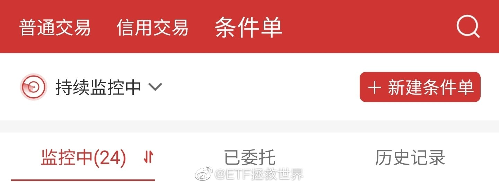

======================================================

ETF拯救世界 (5687069307) @
2020-02-04 09:30:05 Tue  
url: https://weibo.com/5687069307/IsBAr3duc

今天很多ETF很奇怪，有资金溢价很多的买。 ​​​

转发[16]  评论[306]  赞[970] 

======================================================

ETF拯救世界 (5687069307) @
2020-02-04 09:50:18 Tue  
url: https://weibo.com/5687069307/IsBIDzYVO

anyway，昨天买的两个网都在赚钱状态。至少现在看，这是个好的开始。

所以市场波动不是风险，别人的恐慌可能恰好是你的利润。

资本市场最有意思的地方根本不是赚钱，而是观察人性、战胜人性的乐趣。 ​​​

转发[63]  评论[407]  赞[1218] 

======================================================

ETF拯救世界 (5687069307) @
2020-02-04 09:52:58 Tue  
url: https://weibo.com/5687069307/IsBJJf0HR

回复@满眼星河GZ:我不明白什么意思。你不买，他也会卖。甚至，你不买，他就要更低的价格卖掉。难道你不是做好事？你有没有做任何不道德的事情？你是为资本市场的平稳做贡献，你做的是好事。希望你真的明白。//@满眼星河GZ:带血的筹码一点也不好，尤其现在

------------------------------------------------------
转推：
>  @ETF拯救世界 (5687069307)
>  2020-02-04 09:50:18 Tue  
>  url: https:/weibo.com/5687069307/IsBIDzYVO/

>  anyway，昨天买的两个网都在赚钱状态。至少现在看，这是个好的开始。
>  
>  所以市场波动不是风险，别人的恐慌可能恰好是你的利润。
>  
>  资本市场最有意思的地方根本不是赚钱，而是观察人性、战胜人性的乐趣。 ​​​

转发[16]  评论[184]  赞[944] 

======================================================

ETF拯救世界 (5687069307) @
2020-02-04 10:31:56 Tue  
url: https://weibo.com/5687069307/IsBZxox92

几乎所有指数都在上涨。

而股票的涨跌家数对比是1400：2400…… ​​​

转发[45]  评论[488]  赞[1492] 

======================================================

ETF拯救世界 (5687069307) @
2020-02-04 13:04:22 Tue  
url: https://weibo.com/5687069307/IsCZptSR3

刚才那位朋友给我私信了，她说那话应该也是无意的。

但我并非小题大做。

这种时候，非常敏感。全国人民都在抗击疫情，武汉和湖北人民还处在煎熬之中，你们却在这里赚钱。如果我不解释清楚，这种话难免就不被人带起来节奏。这节奏起来了有可能后果就不堪设想。

说者无心，听者有意。有一小撮人每天关 ​​​

转发[14]  评论[396]  赞[1741] 

======================================================

ETF拯救世界 (5687069307) @
2020-02-04 14:05:17 Tue  
url: https://weibo.com/5687069307/IsDo8u9BM

昨天跌了不慌。昨天没卖甚至买了点的，今天涨了也不用嘚瑟，因为明天有可能又跌了。

涨了跌了，都很正常。你不慌不乱不嘚瑟，都是一个正常投资者应该做的事情而已。

市场哪天暴涨哪天暴跌猜不到，也不用猜。安排好交易策略，执行就可以。

好的策略比人可靠。要嘚瑟也是策略嘚瑟，不应该是你。

你只 ​​​

转发[89]  评论[387]  赞[1364] 

======================================================

ETF拯救世界 (5687069307) @
2020-02-04 14:15:10 Tue  
url: https://weibo.com/5687069307/IsDs9yyBG

现在指数涨成这样，平均两三个点以上了，股票涨跌比例依然是1500:2300……

------------------------------------------------------
转推：
>  @ETF拯救世界 (5687069307)
>  2020-02-04 10:31:56 Tue  
>  url: https:/weibo.com/5687069307/IsBZxox92/

>  几乎所有指数都在上涨。
>  
>  而股票的涨跌家数对比是1400：2400…… ​​​

转发[0]  评论[0]  赞[185] 

======================================================

ETF拯救世界 (5687069307) @
2020-02-04 15:03:09 Tue  
url: https://weibo.com/5687069307/IsDLDf2LW

今天最大的问题是

家里食物即将吃完了。冰箱，终于快回到刚买它时候的样子。

发现超市的app也不给送货了，怎么办，去超市买吗。

各位都是怎么解决买食物问题的。 ​​​

转发[12]  评论[1160]  赞[1517] 

======================================================

ETF拯救世界 (5687069307) @
2020-02-04 23:20:17 Tue  
url: https://weibo.com/5687069307/IsH1q4ZRQ

不断刷新我对人类认识的底线

------------------------------------------------------
转推：
>  @北京人不知道的北京事儿 (1662214194)
>  2020-02-04 20:39:40 Tue  
>  url: https:/weibo.com/1662214194/IsFYdqNBb/

>  转自网友，某地发生的事儿。。。这一家子你怎么看？[衰][衰]http://t.cn/A6PE2reP ​ ​​​

转发[127]  评论[347]  赞[709] 

======================================================

ETF拯救世界 (5687069307) @
2020-02-05 09:42:17 Wed  
url: https://weibo.com/5687069307/IsL5SAP5C

周一，也有一部分人赎回计划。

我给这些人的建议是，取关我然后永远不要再关注我。

不是一路人，何必一定要相伴前行。 ​​​

转发[24]  评论[648]  赞[1739] 

======================================================

ETF拯救世界 (5687069307) @
2020-02-05 09:55:49 Wed  
url: https://weibo.com/5687069307/IsLbnjSOM

喷了。一忙起来，发车文章忘了放留言了… ​​​

转发[40]  评论[352]  赞[1040] 

======================================================

ETF拯救世界 (5687069307) @
2020-02-05 10:11:24 Wed  
url: https://weibo.com/5687069307/IsLhHrqc3

看着这两天的上涨，周一清仓的朋友一方面感到绝望，一方面会说这是死猫跳后面还会暴跌。

后面当然也许还会跌，但你不适合投资这也是真的。 ​​​

转发[63]  评论[361]  赞[1427] 

======================================================

ETF拯救世界 (5687069307) @
2020-02-05 10:24:22 Wed  
url: https://weibo.com/5687069307/IsLmXEGht

回复@Tak_CC:一番操作猛如虎，再看成本增加25%。//@Tak_CC:有个朋友，星期一跑了，还说继续看跌，到时候再买回来，结果今天就管不住手买了。。。。

------------------------------------------------------
转推：
>  @ETF拯救世界 (5687069307)
>  2020-02-05 10:11:24 Wed  
>  url: https:/weibo.com/5687069307/IsLhHrqc3/

>  看着这两天的上涨，周一清仓的朋友一方面感到绝望，一方面会说这是死猫跳后面还会暴跌。
>  
>  后面当然也许还会跌，但你不适合投资这也是真的。 ​​​

转发[20]  评论[192]  赞[872] 

======================================================

ETF拯救世界 (5687069307) @
2020-02-05 10:41:58 Wed  
url: https://weibo.com/5687069307/IsLu6yQQ1

布置长线仓位后，你是不是盼着上涨，牛市来。

布置短期波动仓位后，你是不是又盼着赶紧跌一下好让你能提款。

你又希望涨，又希望跌，请问，你的心态怎么可能不好？ ​​​

转发[66]  评论[492]  赞[1554] 

======================================================

ETF拯救世界 (5687069307) @
2020-02-05 11:06:04 Wed  
url: https://weibo.com/5687069307/IsLDTdy3L

回复@以后做快乐健康的小女人:第一层认知：对经济有影响，股市会跌。第二层：有影响，股市是否已经反映影响？第三层：影响后会不会好？如果好，是否会反映在股市里？结论：别费劲儿预测股市涨跌了，执行你的交易策略。

------------------------------------------------------
转推：
>  @ETF拯救世界 (5687069307)
>  2020-02-05 09:55:49 Wed  
>  url: https:/weibo.com/5687069307/IsLbnjSOM/

>  喷了。一忙起来，发车文章忘了放留言了… ​​​

转发[34]  评论[216]  赞[908] 

======================================================

ETF拯救世界 (5687069307) @
2020-02-05 11:50:58 Wed  
url: https://weibo.com/5687069307/IsLW7aZhP

健身环，三国14，pes2020//@昆山法律:节奏光剑

------------------------------------------------------
转推：
>  @篝火编辑部 (6514705104)
>  2020-02-04 21:00:04 Tue  
>  url: https:/weibo.com/6514705104/IsG6v0Nm8/

>  #篝火游话说# 【假期期间你玩的最多的一款游戏是？】在返工日期延迟、需要减少出行的日子里，想必对不少玩家来说宅在家打游戏已经成了最佳日常活动之一，有人选择重回《荒野大镖客：救赎 2》欣赏沿途风景；有人在家里拿出了健身环强身健体，在这个假期里，你游戏时长最长的游戏又是哪一款呢？[喵喵] ​​​

转发[10]  评论[244]  赞[581] 

======================================================

ETF拯救世界 (5687069307) @
2020-02-05 19:32:31 Wed  
url: https://weibo.com/5687069307/IsOXslOdS

今日数据显示

医药已经算不上便宜。医疗已经即将算得上“贵”

不会再买。但长线持仓的肯定不会卖。 ​​​

转发[53]  评论[253]  赞[1291] 

======================================================

ETF拯救世界 (5687069307) @
2020-02-05 19:57:05 Wed  
url: https://weibo.com/5687069307/IsP7qxTbh

今天躺在摇椅上，看着窗外的雪景听本期BGM，很有感觉。你试试。 ​​​

转发[3]  评论[247]  赞[991] 

======================================================

ETF拯救世界 (5687069307) @
2020-02-05 20:43:23 Wed  
url: https://weibo.com/5687069307/IsPqeh4nZ

据说有些人是这样的：

事前：

“莫得事情”

事后：

“莫得办法” ​​​

转发[28]  评论[216]  赞[1111] 

======================================================

ETF拯救世界 (5687069307) @
2020-02-05 20:53:25 Wed  
url: https://weibo.com/5687069307/IsPuilSgK

这位朋友是长期关注我的一位信阳市第二人民医院的医务人员。现在他们极缺N95口罩。如果有资源的朋友帮他们一把吧。//@银河系淂蜗牛:如果有任何渠道我们愿意有偿购买🙏🙏🙏

------------------------------------------------------
转推：
>  @人民日报 (2803301701)
>  2020-02-05 17:00:37 Wed  
>  url: https:/weibo.com/2803301701/IsNXOcFaL/

>  【转扩！#信阳告急#！#信阳急需N95口罩1.3万个#】截至2月3日24时，河南信阳累计报告确诊病例112例，疑似病例157例。全市疫情防控医用防护物资全面告急，尤其紧缺N95口罩、医用连体防护服、全面型呼吸防护器等。截至2月3日，信阳市中心医院N95口罩库存仅为88个。
>  
>  现急需紧急调拨（全市3天消耗量）N95口 ​​​

转发[45]  评论[175]  赞[842] 

======================================================

ETF拯救世界 (5687069307) @
2020-02-05 23:33:31 Wed  
url: https://weibo.com/5687069307/IsQxhDg0G

总是这样我要不好意思了。 ​​​

转发[10]  评论[373]  赞[1063] 

+++++++++++++++++++++++++++++++++++++++++++++++++++++

图片：
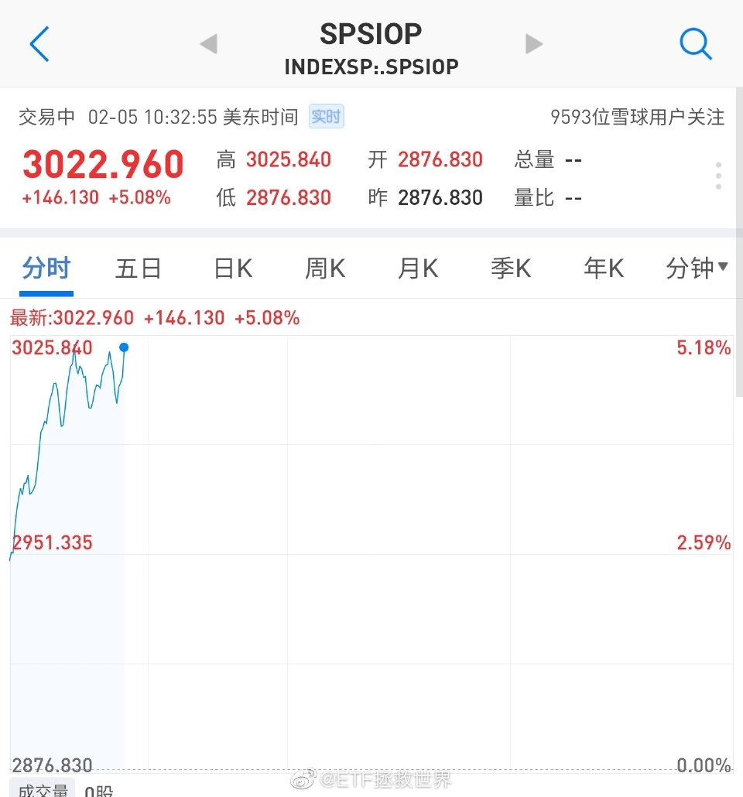

======================================================

ETF拯救世界 (5687069307) @
2020-02-06 09:57:44 Thu  
url: https://weibo.com/5687069307/IsUCEjhee

3号上来这一波的波段利润基本都到手。

我好了。

现在涨开心，跌可能更开心…… ​​​

转发[7]  评论[363]  赞[1127] 

======================================================

ETF拯救世界 (5687069307) @
2020-02-06 10:03:13 Thu  
url: https://weibo.com/5687069307/IsUEShQJP

截至目前为止，“一命”这个单位的涨幅是60%。 ​​​

转发[9]  评论[238]  赞[1331] 

======================================================

ETF拯救世界 (5687069307) @
2020-02-06 10:10:32 Thu  
url: https://weibo.com/5687069307/IsUHR0t48

有一条请各位注意的，不要给别人的持仓做诊断，不要建议别人该买什么或者该卖什么。甚至不要劝别人应该还是不应该做金融投资。

一个是技术问题，一个是未来的不可知。上下嘴皮一碰，一个建议好做，但后面的责任你恐怕担不起。

对了又怎么样？一个东西现在2块钱，很贵了。你说卖了吧，危险。结果人家 ​​​

转发[174]  评论[397]  赞[1813] 

======================================================

ETF拯救世界 (5687069307) @
2020-02-06 10:35:44 Thu  
url: https://weibo.com/5687069307/IsUS4wWUN

意思不大。退博10小时。 ​​​

转发[1]  评论[251]  赞[1026] 

======================================================

ETF拯救世界 (5687069307) @
2020-02-06 10:37:49 Thu  
url: https://weibo.com/5687069307/IsUSVnMwx

这条最低点写的东西，请周一清仓的朋友再看看。再想想。对这一辈子的交易都有用。

------------------------------------------------------
转推：
>  @ETF拯救世界 (5687069307)
>  2020-02-04 08:39:54 Tue  
>  url: https:/weibo.com/5687069307/IsBg4md9w/

>  昨天卖出以及今天想继续无论什么价格都要继续卖的朋友，我问你们几个问题。
>  
>  第一，你是否能保证昨天开始A股一定一路下跌。
>  
>  第二，即使大盘一路下跌，你是否能保证你的股票一定也继续跌。
>  
>  第三，A股和你的股票都继续大跌，你是否能保证自己一定能在更低的地方接回来。注意，这个问题很关键。
>  
>  第四， ​​​

转发[103]  评论[543]  赞[1366] 

======================================================

ETF拯救世界 (5687069307) @
2020-02-07 01:34:45 Fri  
url: https://weibo.com/5687069307/It0KZafpP

一言难尽。 ​​​

转发[24]  评论[544]  赞[2309] 

======================================================

ETF拯救世界 (5687069307) @
2020-02-07 10:07:38 Fri  
url: https://weibo.com/5687069307/It47agcEa

今天就不发微博了。

一言难尽。

真的说不清楚。

向关心我们，对我们说真话的人们表达深深的谢意。

谢谢。

我会用各种方式回馈这份关心。滴水之恩涌泉相报。 ​​​

转发[54]  评论[722]  赞[3297] 

======================================================

ETF拯救世界 (5687069307) @
2020-02-08 09:41:20 Sat  
url: https://weibo.com/5687069307/ItdmZbtbZ

有点意思

------------------------------------------------------
转推：
>  @不正经制片人 (1832444080)
>  2020-02-05 23:45:07 Wed  
>  url: https:/weibo.com/1832444080/IsQBZkM5n/

>  #病毒到底有多努力# 
>  纪录片：病毒与细胞的大战
>  完全科幻大片既视感！！
>  
>  @微博视频  http://t.cn/A6PmwAvK ​​​

转发[401]  评论[234]  赞[721] 

======================================================

ETF拯救世界 (5687069307) @
2020-02-08 14:21:39 Sat  
url: https://weibo.com/5687069307/ItfcM7fML

wtf，翻番了

------------------------------------------------------
转推：
>  @ETF拯救世界 (5687069307)
>  2020-02-01 09:41:33 Sat  
>  url: https:/weibo.com/5687069307/Is9nB9fGm/

>  去年底买了个品种，一个月涨了将近40%。
>  
>  你猜是什么。
>  
>  健身环。 ​​​

转发[10]  评论[288]  赞[945] 

======================================================

ETF拯救世界 (5687069307) @
2020-02-09 09:19:06 Sun  
url: https://weibo.com/5687069307/ItmEt0OJQ

我以后再也不因为喷子生气了。你们辛苦了[悲伤]//@半张废纸怪:有时候也觉得天天有时间在网络上喷脏造谣的人现实生活应该不太如意。一般人哪来那么多无聊时间族做这些

------------------------------------------------------
转推：
>  @卢诗翰 (3276099007)
>  2020-02-08 14:42:45 Sat  
>  url: https:/weibo.com/3276099007/Itfll4cKQ/

>  一个抓捕画面展示了网络喷子的真实生活。。。 ​​​

转发[92]  评论[450]  赞[1256] 

======================================================

ETF拯救世界 (5687069307) @
2020-02-09 17:51:09 Sun  
url: https://weibo.com/5687069307/Itq0isWLv

我一辈子都不想尝试

------------------------------------------------------
转推：
>  @ ()
>  2020-02-09 16:29:59 Sun  
>  url: 

>  抱歉，作者已设置仅展示半年内微博，此微博已不可见。 ​​​

转发[46]  评论[388]  赞[822] 

======================================================

ETF拯救世界 (5687069307) @
2020-02-10 10:31:26 Mon  
url: https://weibo.com/5687069307/ItwyjvkRP

注意，上周一买入的网格到达价格卖出后要再次回去挂买单。

在条件单—历史记录中找到已经卖出的那网买入单，点击，选择重新创建。

然后就静静的体会跌了很开心的感觉。 

另外，再在评论里讨论具体品种的一律删评论+拉黑 ​​​

转发[84]  评论[734]  赞[1405] 

======================================================

ETF拯救世界 (5687069307) @
2020-02-10 10:34:39 Mon  
url: https://weibo.com/5687069307/ItwzCr24j

感觉今天复工的人不多。高德上全是绿色 ​​​

转发[6]  评论[275]  赞[805] 

======================================================

ETF拯救世界 (5687069307) @
2020-02-10 10:55:18 Mon  
url: https://weibo.com/5687069307/ItwI0wOvV

回复@迷途知返的小可爱:后面一直涨，你的长期仓位赚大钱它不香吗//@迷途知返的小可爱:一个疑问🤔️如果后面一直涨，这个价格买不到怎么办❓毕竟挂的是比较低的价格了……

------------------------------------------------------
转推：
>  @ETF拯救世界 (5687069307)
>  2020-02-10 10:31:26 Mon  
>  url: https:/weibo.com/5687069307/ItwyjvkRP/

>  注意，上周一买入的网格到达价格卖出后要再次回去挂买单。
>  
>  在条件单—历史记录中找到已经卖出的那网买入单，点击，选择重新创建。
>  
>  然后就静静的体会跌了很开心的感觉。 
>  
>  另外，再在评论里讨论具体品种的一律删评论+拉黑 ​​​

转发[20]  评论[125]  赞[532] 

======================================================

ETF拯救世界 (5687069307) @
2020-02-10 11:05:16 Mon  
url: https://weibo.com/5687069307/ItwM35qDw

回复@小小单酒窝:这就是挂卖单的人太多导致无法成交。也是我反对公开说品种价格的原因//@小小单酒窝:我知道为啥撤单了[允悲]上周五已经达到触发价格却差0.01未成交……我不是个好学生//@ETF拯救世界:回复@迷途知返的小可爱:后面一直涨，你的长期仓位赚大钱它不香吗

------------------------------------------------------
转推：
>  @ETF拯救世界 (5687069307)
>  2020-02-10 10:31:26 Mon  
>  url: https:/weibo.com/5687069307/ItwyjvkRP/

>  注意，上周一买入的网格到达价格卖出后要再次回去挂买单。
>  
>  在条件单—历史记录中找到已经卖出的那网买入单，点击，选择重新创建。
>  
>  然后就静静的体会跌了很开心的感觉。 
>  
>  另外，再在评论里讨论具体品种的一律删评论+拉黑 ​​​

转发[3]  评论[129]  赞[564] 

======================================================

ETF拯救世界 (5687069307) @
2020-02-10 11:06:27 Mon  
url: https://weibo.com/5687069307/ItwMxeQdk

回复@杨舟老师讲物理耶90208:好问题。我的答案是，大约在春季//@杨舟老师讲物理耶90208:E大，创业板指各项技术指标都很好，咱们计划啥时候卖？//@ETF拯救世界:回复@迷途知返的小可爱:后面一直涨，你的长期仓位赚大钱它不香吗

------------------------------------------------------
转推：
>  @ETF拯救世界 (5687069307)
>  2020-02-10 10:31:26 Mon  
>  url: https:/weibo.com/5687069307/ItwyjvkRP/

>  注意，上周一买入的网格到达价格卖出后要再次回去挂买单。
>  
>  在条件单—历史记录中找到已经卖出的那网买入单，点击，选择重新创建。
>  
>  然后就静静的体会跌了很开心的感觉。 
>  
>  另外，再在评论里讨论具体品种的一律删评论+拉黑 ​​​

转发[9]  评论[301]  赞[895] 

======================================================

ETF拯救世界 (5687069307) @
2020-02-11 17:44:42 Tue  
url: https://weibo.com/5687069307/ItIOG1T9P

我们一衣带水的邻居，大多数人不像你从小被告知的那么坏，也并非就如天使这么好。

这个世界大多数时间是灰色的，不是非黑即白。

很多事情很难说清。所以还是不说了罢。

别人怎么说终究不做准，有机会还是去走一走看一看才好。 ​​​

转发[61]  评论[404]  赞[1930] 

======================================================

ETF拯救世界 (5687069307) @
2020-02-12 13:11:54 Wed  
url: https://weibo.com/5687069307/ItQsrnqiX

不能出门，被迫成长为米其林三星厨师是一种什么体验？

今日菜谱：

踏踏实实油焖大虾；时间紧急鲷鱼味增汤；每天新高秘制榄菜四季豆；多大点事儿拉玛西亚海鲜焗饭。 ​​​

转发[23]  评论[660]  赞[2017] 

======================================================

ETF拯救世界 (5687069307) @
2020-02-12 16:48:31 Wed  
url: https://weibo.com/5687069307/ItRSnbQ3O

2016年12月，我们第一次买一份医药。当时是9608点。

今天收盘11000点。

从那个点位看，三年多只涨了十几个点，当然不算好。

但问题在于，当时的9608点估值是48倍（2015年最高96倍），而今天的11000点估值只有37倍。

越涨越高越便宜。

股票指数，便宜的地方买了，踏踏实实拿着就可以了。 ​​​

转发[85]  评论[416]  赞[1311] 

======================================================

ETF拯救世界 (5687069307) @
2020-02-12 17:06:45 Wed  
url: https://weibo.com/5687069307/ItRZLwBNa

购销差价15%？？？是不是疯了。企业没有成本的吗。还是说本意就是不想让口罩在市场上卖。不过这家企业不亏，几万块钱做了个大广告：都知道它是良心企业了。

------------------------------------------------------
转推：
>  @ ()
>  2020-02-12 13:53:53 Wed  
>  url: 

>  抱歉，作者已设置仅展示半年内微博，此微博已不可见。 ​​​

转发[217]  评论[206]  赞[1052] 

======================================================

ETF拯救世界 (5687069307) @
2020-02-12 17:48:54 Wed  
url: https://weibo.com/5687069307/ItSgSjslW

喷了，刚想起来。0.6进货，最高只能卖0.69。如果没有微信支付宝，付现金，这个没法找零。但是0.7又不能卖，卖就违法。所以只能卖0.6。也就是进价。也就是说，要赔上人工水电房租增值税所得税做慈善。

------------------------------------------------------
转推：
>  @ ()
>  2020-02-12 13:53:53 Wed  
>  url: 

>  抱歉，作者已设置仅展示半年内微博，此微博已不可见。 ​​​

转发[165]  评论[276]  赞[1089] 

======================================================

ETF拯救世界 (5687069307) @
2020-02-12 19:20:13 Wed  
url: https://weibo.com/5687069307/ItSRWDmNz

两条规定：一：这种时候进价不可避免上涨，零售价不可以随之上浮。那么怎么做生意。二：购销价差额15%就不说了。这样一来，买不到口罩就太正常了。深深感觉在我们这里经营企业真的太难。以前我总感觉体制内大部分都是精英，经此一疫，有了新的认识。

------------------------------------------------------
转推：
>  @ ()
>  2020-02-12 13:42:20 Wed  
>  url: 

>  抱歉，此微博已被作者删除。查看帮助：http://t.cn/Rfd3rQV

转发[62]  评论[505]  赞[1484] 

======================================================

ETF拯救世界 (5687069307) @
2020-02-13 14:58:55 Thu  
url: https://weibo.com/5687069307/Iu0AnjByu

小米10今天出了。等能买到的时候送一个。//@ETF拯救世界:下次小米发布新品手机，买一个送给微博的朋友。

------------------------------------------------------
转推：
>  @ETF拯救世界 (5687069307)
>  2020-01-20 09:23:06 Mon  
>  url: https:/weibo.com/5687069307/Iqk89CEU4/

>  万万没想到你是这样的小米…… ​​​

转发[20]  评论[469]  赞[1087] 

======================================================

ETF拯救世界 (5687069307) @
2020-02-13 15:17:39 Thu  
url: https://weibo.com/5687069307/Iu0HYCYgT

我不喜欢前摄像头不居中。别扭。 ​​​

转发[9]  评论[245]  赞[850] 

======================================================

ETF拯救世界 (5687069307) @
2020-02-13 16:36:19 Thu  
url: https://weibo.com/5687069307/Iu1dV0xne

我家健身环每天要运行2个多小时。每个人玩40多分钟，服了。 ​​​

转发[8]  评论[212]  赞[924] 

======================================================

ETF拯救世界 (5687069307) @
2020-02-13 17:00:33 Thu  
url: https://weibo.com/5687069307/Iu1nKlkOJ

我感觉自己是个小白鼠，自己掏钱买各种东西亲身测试，觉得好的就说说。

不能保证每个人都觉得好，不会太差是肯定的…… ​​​

转发[8]  评论[231]  赞[1095] 

======================================================

ETF拯救世界 (5687069307) @
2020-02-13 17:35:39 Thu  
url: https://weibo.com/5687069307/Iu1C08HUF

我想了想，决定把这个送给关注我的湖北医务工作者。其他朋友不好意思了，下次有机会吧。请湖北的医务工作者私信我，大概说一下自己的情况。我都会看，但没法一一回复。然后选一位送出//@ETF拯救世界:小米10今天出了。等能买到的时候送一个。

------------------------------------------------------
转推：
>  @ETF拯救世界 (5687069307)
>  2020-01-20 09:23:06 Mon  
>  url: https:/weibo.com/5687069307/Iqk89CEU4/

>  万万没想到你是这样的小米…… ​​​

转发[10]  评论[467]  赞[1812] 

======================================================

ETF拯救世界 (5687069307) @
2020-02-14 10:23:31 Fri  
url: https://weibo.com/5687069307/Iu8d5ocP5

今天怎么过。 ​​​

转发[11]  评论[785]  赞[1404] 

======================================================

ETF拯救世界 (5687069307) @
2020-02-14 16:39:49 Fri  
url: https://weibo.com/5687069307/IuaFPBiVr

油气。再说一次。

长线：

150仓位1.43%（有限资金模式）；S仓位5.33%（无限资金模式）。30多个品种几乎唯一亏损的。亏损没事，看看仓位多少。

网格：

三篇网格文章一再提示做好压力测试。仁至义尽。压力测试做好了，就算跌40%也是意料之中，完全心态平和执行策略。

总结一下：

长线仓位极低，波 ​​​

转发[149]  评论[1002]  赞[2070] 

+++++++++++++++++++++++++++++++++++++++++++++++++++++

图片：
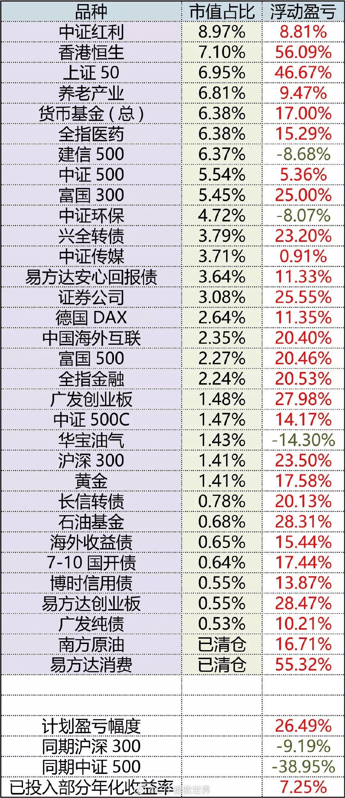

======================================================

ETF拯救世界 (5687069307) @
2020-02-14 18:42:06 Fri  
url: https://weibo.com/5687069307/IubtszbZB

人生真的是福祸相依，处处意想不到。

抚摸着前两年雾霾时候置办的两盒N95，我感叹道。 ​​​

转发[18]  评论[483]  赞[1584] 

======================================================

ETF拯救世界 (5687069307) @
2020-02-15 13:40:04 Sat  
url: https://weibo.com/5687069307/IuiVn5tK5

大事化小，小事化了。

心里堵得慌。 ​​​

转发[22]  评论[356]  赞[1489] 

======================================================

ETF拯救世界 (5687069307) @
2020-02-16 10:31:43 Sun  
url: https://weibo.com/5687069307/Iur7pFxz0

四岁了。这四年爸爸去哪儿了

------------------------------------------------------
转推：
>  @新浪视频 (1640601392)
>  2020-02-16 10:08:03 Sun  
>  url: https:/weibo.com/1640601392/IuqXNEl1L/

>  【#援鄂护师视频教丈夫带娃# 听见孩子哭自己也哭了】宜宾市第二人民医院的护师张亚兰，1月28日随医疗队到武汉红十字会医院支援。她有一个4岁多的儿子，休息时她就和家人视频，教教丈夫怎么带孩子，每次听到孩子哭她也会哭，心里很难受。她希望能早日战胜疫情早点回家。http://t.cn/A6hIMqUi ​​​

转发[14]  评论[150]  赞[882] 

======================================================

ETF拯救世界 (5687069307) @
2020-02-16 11:18:47 Sun  
url: https://weibo.com/5687069307/Iurqw19zq

对我来说，养育孩子是一种很特别，很享受的人生体验。

所以我不愿意错过孩子成长的每一个瞬间。我愿意花费时间在孩子身上做很多事，比如出生到现在头发都是我剪的。上小学前出去剪过一次，剪的什么玩意儿比我差远了，主要是不够用心，所以还是我继续来吧。

其他的事就不说了，出生后几乎每件事我都会 ​​​

转发[113]  评论[528]  赞[2079] 

======================================================

ETF拯救世界 (5687069307) @
2020-02-16 12:41:10 Sun  
url: https://weibo.com/5687069307/IurXXaLeT

回复@微微吖0318:所以我说这样的父亲不会少。比如之前经常在这里发言的一位男性朋友，曾经给我分享过很多育儿的资料。详细规划孩子的教育路径，我自愧不如//@微微吖0318:我老公比我更上心细心，也比我更排斥二胎[doge]

------------------------------------------------------
转推：
>  @ETF拯救世界 (5687069307)
>  2020-02-16 11:18:47 Sun  
>  url: https:/weibo.com/5687069307/Iurqw19zq/

>  对我来说，养育孩子是一种很特别，很享受的人生体验。
>  
>  所以我不愿意错过孩子成长的每一个瞬间。我愿意花费时间在孩子身上做很多事，比如出生到现在头发都是我剪的。上小学前出去剪过一次，剪的什么玩意儿比我差远了，主要是不够用心，所以还是我继续来吧。
>  
>  其他的事就不说了，出生后几乎每件事我都会 ​​​

转发[16]  评论[164]  赞[727] 

======================================================

ETF拯救世界 (5687069307) @
2020-02-17 10:15:01 Mon  
url: https://weibo.com/5687069307/IuAr82jFK

喷了。为了打新随便买点股票谁能想到。 ​​​

转发[13]  评论[482]  赞[1475] 

+++++++++++++++++++++++++++++++++++++++++++++++++++++

图片：
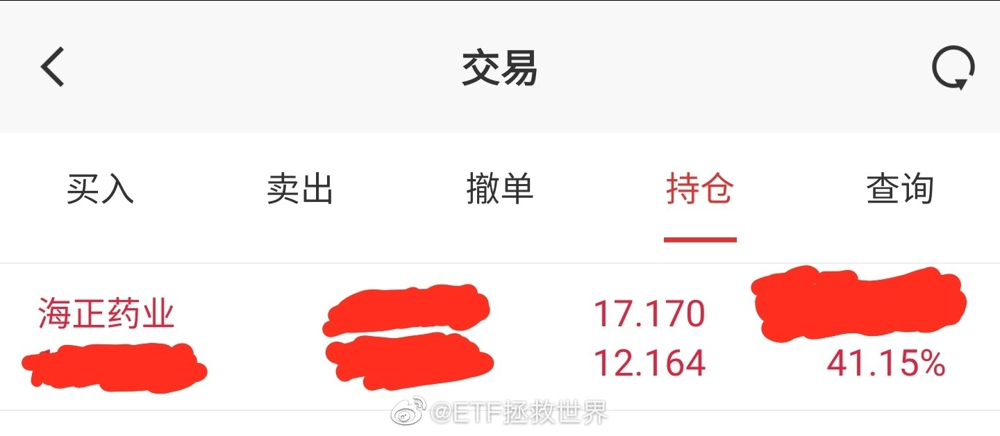

======================================================

ETF拯救世界 (5687069307) @
2020-02-17 11:39:05 Mon  
url: https://weibo.com/5687069307/IuAZfrTww

辣鸡传媒又新高了，今年至今涨幅13%。

今年沪深300还是下跌的。

底部清仓的朋友找谁说理去。 ​​​

转发[25]  评论[342]  赞[1266] 

======================================================

ETF拯救世界 (5687069307) @
2020-02-17 13:44:39 Mon  
url: https://weibo.com/5687069307/IuBOdtdCO

机会都是跌出来的，风险都是涨出来的。

不停赚钱很开心是没错，但这句话永远不能忘。 ​​​

转发[103]  评论[233]  赞[1303] 

======================================================

ETF拯救世界 (5687069307) @
2020-02-17 13:47:50 Mon  
url: https://weibo.com/5687069307/IuBPvvDhW

回复@小鱼尛鱻:虽然我知道这是不可能的。但你们赚得比我多我非常开心。//@小鱼尛鱻:报告，我的传媒成本比老大低[笑而不语]

------------------------------------------------------
转推：
>  @ETF拯救世界 (5687069307)
>  2020-02-17 11:39:05 Mon  
>  url: https:/weibo.com/5687069307/IuAZfrTww/

>  辣鸡传媒又新高了，今年至今涨幅13%。
>  
>  今年沪深300还是下跌的。
>  
>  底部清仓的朋友找谁说理去。 ​​​

转发[9]  评论[155]  赞[1039] 

======================================================

ETF拯救世界 (5687069307) @
2020-02-17 14:23:54 Mon  
url: https://weibo.com/5687069307/IuC49jrmZ

2900点，账户市值比3100还高，300和500都没新高，你又新高了你说是怎么回事。 ​​​

转发[26]  评论[365]  赞[1479] 

======================================================

ETF拯救世界 (5687069307) @
2020-02-17 14:45:14 Mon  
url: https://weibo.com/5687069307/IuCcOaN4e

回复@番茄老爷89142:不看。喷我的人多了，他不值得我拿眼角夹一下。//@番茄老爷89142:E大， 某录上有人喷你，亮个收益，闪瞎它的狗眼

------------------------------------------------------
转推：
>  @ETF拯救世界 (5687069307)
>  2020-02-17 14:23:54 Mon  
>  url: https:/weibo.com/5687069307/IuC49jrmZ/

>  2900点，账户市值比3100还高，300和500都没新高，你又新高了你说是怎么回事。 ​​​

转发[3]  评论[136]  赞[781] 

======================================================

ETF拯救世界 (5687069307) @
2020-02-17 14:52:05 Mon  
url: https://weibo.com/5687069307/IuCfArkGK

每次被人喷完，关注我的人都猛增一大截。

因为我从来不到各个网站去宣传，所以他们一喷就等于帮我宣传，说真的，好烦。

烦不是因为别的，是被喷完新关注的就增加一大堆，以前的老朋友也不会因为他们喷就走。

真让人绝望。[哼]

（我说怎么这两天公众号关注猛增呢……原来又被喷了） ​​​

转发[7]  评论[473]  赞[1451] 

+++++++++++++++++++++++++++++++++++++++++++++++++++++

图片：
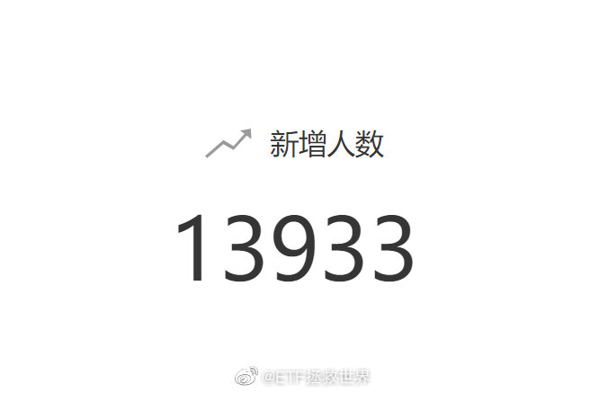

======================================================

ETF拯救世界 (5687069307) @
2020-02-17 15:36:20 Mon  
url: https://weibo.com/5687069307/IuCxycXDO

更年轻一点的时候，看武侠小说，总有一个疑问。

为什么很多武林盟主，绝世高手，最后都要归隐江湖，隐姓埋名。有那个实力叱咤风云一呼百应多过瘾啊。怎么也想不明白。

现在渐渐明白一点了。

很多时候看起来风光无限，其实是要承受无穷无尽的烦恼。有人想干掉你取而代之，有人看着你心里发酸就希望你 ​​​

转发[149]  评论[476]  赞[1810] 

======================================================

ETF拯救世界 (5687069307) @
2020-02-17 16:03:49 Mon  
url: https://weibo.com/5687069307/IuCIIc8kq

回复@alayamj:你的朋友都是高素质人才。羡慕。[可怜]//@alayamj:回复@往越南汇钱:我的已经10个了[二哈]

------------------------------------------------------
转推：
>  @ETF拯救世界 (5687069307)
>  2020-02-17 15:36:20 Mon  
>  url: https:/weibo.com/5687069307/IuCxycXDO/

>  更年轻一点的时候，看武侠小说，总有一个疑问。
>  
>  为什么很多武林盟主，绝世高手，最后都要归隐江湖，隐姓埋名。有那个实力叱咤风云一呼百应多过瘾啊。怎么也想不明白。
>  
>  现在渐渐明白一点了。
>  
>  很多时候看起来风光无限，其实是要承受无穷无尽的烦恼。有人想干掉你取而代之，有人看着你心里发酸就希望你 ​​​

转发[9]  评论[81]  赞[441] 

======================================================

ETF拯救世界 (5687069307) @
2020-02-17 16:09:50 Mon  
url: https://weibo.com/5687069307/IuCL9caKa

目前A股整体不贵。当然个别区域已经过热，比如创业板已经回到了2015年初的热度。要知道，这个已经很热了，因为2015年初的创业板，已经涨了整整两年多。

其它的问题不大。50 300之类的，不便宜，但肯定没有到卖出的位置。500更便宜点，踏踏实实拿着，最多做做网格。

整体来讲，平稳可控。别挣点钱就拿 ​​​

转发[263]  评论[438]  赞[1712] 

======================================================

ETF拯救世界 (5687069307) @
2020-02-17 16:14:54 Mon  
url: https://weibo.com/5687069307/IuCNcwmTo

回复@每天都有好天气:500压力位5630。看看能不能过去。过去了就舒服了。过不去更舒服。

------------------------------------------------------
转推：
>  @ETF拯救世界 (5687069307)
>  2020-02-17 16:09:50 Mon  
>  url: https:/weibo.com/5687069307/IuCL9caKa/

>  目前A股整体不贵。当然个别区域已经过热，比如创业板已经回到了2015年初的热度。要知道，这个已经很热了，因为2015年初的创业板，已经涨了整整两年多。
>  
>  其它的问题不大。50 300之类的，不便宜，但肯定没有到卖出的位置。500更便宜点，踏踏实实拿着，最多做做网格。
>  
>  整体来讲，平稳可控。别挣点钱就拿 ​​​

转发[68]  评论[124]  赞[685] 

======================================================

ETF拯救世界 (5687069307) @
2020-02-17 16:20:55 Mon  
url: https://weibo.com/5687069307/IuCPE7Nq2

回复@尼古拉斯摩根:就是说，未来极度高估的时候你也不会卖对吗。如果你能做到，我送个锦旗给你。//@尼古拉斯摩根:我是来赚企业成长的钱。不是赚其他股民基民兜里的钱。。那样太残忍，破坏其他家庭幸福，于心不忍。

------------------------------------------------------
转推：
>  @ETF拯救世界 (5687069307)
>  2020-02-17 16:09:50 Mon  
>  url: https:/weibo.com/5687069307/IuCL9caKa/

>  目前A股整体不贵。当然个别区域已经过热，比如创业板已经回到了2015年初的热度。要知道，这个已经很热了，因为2015年初的创业板，已经涨了整整两年多。
>  
>  其它的问题不大。50 300之类的，不便宜，但肯定没有到卖出的位置。500更便宜点，踏踏实实拿着，最多做做网格。
>  
>  整体来讲，平稳可控。别挣点钱就拿 ​​​

转发[7]  评论[133]  赞[720] 

======================================================

ETF拯救世界 (5687069307) @
2020-02-17 16:28:43 Mon  
url: https://weibo.com/5687069307/IuCSOob0x

有人说要“赚企业成长的钱，不赚其他股民基民的钱。因为那样会破坏别人的幸福，于心不忍”

拜托，其他人高位接盘，低位割肉，是你怂恿的吗？（我倒亲见过有人最低位指导粉丝割肉）如果不是，跟你有什么关系？

甚至，我告诉你。你低位接盘，高位卖出，反而是救了他们，他们才不会赔的更多！

为什么。 ​​​

转发[106]  评论[413]  赞[1699] 

======================================================

ETF拯救世界 (5687069307) @
2020-02-17 16:52:23 Mon  
url: https://weibo.com/5687069307/IuD2q6FDz

哎，兼职小助理回银行做认股权贷款了，特别认真细心又有能力的人。

可惜啊，估计太忙，以后不能帮我了。 ​​​

转发[8]  评论[451]  赞[1677] 

======================================================

ETF拯救世界 (5687069307) @
2020-02-17 18:56:14 Mon  
url: https://weibo.com/5687069307/IuDQGDzPF

之前我就说过，想要我炒币，不是不可以，至少要有一个官方认证背书的交易所。炒不赚钱是我的技术问题我认，安全出问题我无法原谅自己

------------------------------------------------------
转推：
>  @fhrp (1948253871)
>  2020-02-17 17:53:26 Mon  
>  url: https:/weibo.com/1948253871/IuDrcmG0Q/

>  [二哈]这下真的自我销毁了 ​​​

转发[42]  评论[229]  赞[916] 

======================================================

ETF拯救世界 (5687069307) @
2020-02-17 20:21:21 Mon  
url: https://weibo.com/5687069307/IuEpeCutP

要不要下决心挑战一下自己给自己剪头发。 ​​​

转发[10]  评论[594]  赞[1425] 

======================================================

ETF拯救世界 (5687069307) @
2020-02-18 09:55:04 Tue  
url: https://weibo.com/5687069307/IuJJwwCIs

不可避免又是一次财富收割泡沫大破灭。

期限就是今年内。

大波动。 ​​​

转发[172]  评论[615]  赞[1824] 

======================================================

ETF拯救世界 (5687069307) @
2020-02-18 10:44:14 Tue  
url: https://weibo.com/5687069307/IuK3u3dW9

前提是冲的够疯。涨的越疯狂，波动越大。目前只是小波动级别

------------------------------------------------------
转推：
>  @ETF拯救世界 (5687069307)
>  2020-02-18 09:55:04 Tue  
>  url: https:/weibo.com/5687069307/IuJJwwCIs/

>  不可避免又是一次财富收割泡沫大破灭。
>  
>  期限就是今年内。
>  
>  大波动。 ​​​

转发[52]  评论[156]  赞[788] 

======================================================

ETF拯救世界 (5687069307) @
2020-02-18 10:49:23 Tue  
url: https://weibo.com/5687069307/IuK5zu1Bu

最高摸到5652，第一次冲击失败。//@ETF拯救世界:回复@每天都有好天气:500压力位5630。看看能不能过去。过去了就舒服了。过不去更舒服。

------------------------------------------------------
转推：
>  @ETF拯救世界 (5687069307)
>  2020-02-17 16:09:50 Mon  
>  url: https:/weibo.com/5687069307/IuCL9caKa/

>  目前A股整体不贵。当然个别区域已经过热，比如创业板已经回到了2015年初的热度。要知道，这个已经很热了，因为2015年初的创业板，已经涨了整整两年多。
>  
>  其它的问题不大。50 300之类的，不便宜，但肯定没有到卖出的位置。500更便宜点，踏踏实实拿着，最多做做网格。
>  
>  整体来讲，平稳可控。别挣点钱就拿 ​​​

转发[26]  评论[161]  赞[693] 

======================================================

ETF拯救世界 (5687069307) @
2020-02-18 13:51:16 Tue  
url: https://weibo.com/5687069307/IuLhoC6lf

坐在轿子上等着别人抬，和做轿夫抬别人有什么区别 ​​​

转发[21]  评论[272]  赞[1335] 

======================================================

ETF拯救世界 (5687069307) @
2020-02-18 14:08:22 Tue  
url: https://weibo.com/5687069307/IuLoldQW5

雪中送炭好不好。

------------------------------------------------------
转推：
>  @ETF拯救世界 (5687069307)
>  2019-09-09 15:09:25 Mon  
>  url: https:/weibo.com/5687069307/I68yGbjnP/

>  之前我说，野百合也有春天。我又说，杀富济贫雪中送炭。
>  
>  你可能不信，认为我是为持仓中表现不好的品种找借口。
>  
>  现在你有点相信了。
>  
>  我说的很多东西，未来都会验证。只是需要时间。
>  
>  回望过去，绝大多数时候时间都站在了我这边。希望以后也是。
>  
>  也有些朋友喜欢为现在发生的事情做出“合理”解释，认 ​​​

转发[13]  评论[127]  赞[672] 

======================================================

ETF拯救世界 (5687069307) @
2020-02-18 14:18:32 Tue  
url: https://weibo.com/5687069307/IuLstnKCs

回复@机器猫是小叮当:我小时候最爱吃的菜之一。小时候我父亲开粤菜餐厅请了广东厨子。那个厨子三个细节我印象很深，第一个印象是90年代他就月薪上万，第二个和第三个是大良炸鲜奶和米粉好吃。北方人的我从没吃过这两样，当时我就震惊了。//@机器猫是小叮当:今天学做炸牛奶[馋嘴]

------------------------------------------------------
转推：
>  @ETF拯救世界 (5687069307)
>  2020-02-18 13:51:16 Tue  
>  url: https:/weibo.com/5687069307/IuLhoC6lf/

>  坐在轿子上等着别人抬，和做轿夫抬别人有什么区别 ​​​

转发[4]  评论[213]  赞[985] 

======================================================

ETF拯救世界 (5687069307) @
2020-02-18 14:36:14 Tue  
url: https://weibo.com/5687069307/IuLzEoagn

那家餐厅我印象不深了。

大厨是印象最深的，他的样子我也还记得。现在想起来，大概不到30岁，瘦瘦小小看起来很精明。做菜好吃。

另外还有印象，就是曾经有人来捣乱，几个人，每个人占一个桌子，要一瓶啤酒，一碟花生米，坐一晚上。父亲没有跟我讲太多，后来应该是给了点钱了事。不知道这个算不算BHF ​​​

转发[20]  评论[167]  赞[901] 

======================================================

ETF拯救世界 (5687069307) @
2020-02-18 14:54:05 Tue  
url: https://weibo.com/5687069307/IuLGTz82a

回复@冬季物语89:过去了。要再观察几天看能否站稳。需要两三次回踩确认。//@冬季物语89:E大 500是不是妥了？[嘻嘻]

------------------------------------------------------
转推：
>  @ETF拯救世界 (5687069307)
>  2020-02-18 14:36:14 Tue  
>  url: https:/weibo.com/5687069307/IuLzEoagn/

>  那家餐厅我印象不深了。
>  
>  大厨是印象最深的，他的样子我也还记得。现在想起来，大概不到30岁，瘦瘦小小看起来很精明。做菜好吃。
>  
>  另外还有印象，就是曾经有人来捣乱，几个人，每个人占一个桌子，要一瓶啤酒，一碟花生米，坐一晚上。父亲没有跟我讲太多，后来应该是给了点钱了事。不知道这个算不算BHF ​​​

转发[19]  评论[175]  赞[653] 

======================================================

ETF拯救世界 (5687069307) @
2020-02-18 17:06:58 Tue  
url: https://weibo.com/5687069307/IuMyPBGSK

只有我觉得QQ聊天比微信好用吗。

微信多平台信息同步做的比渣还渣。 ​​​

转发[12]  评论[411]  赞[1042] 

======================================================

ETF拯救世界 (5687069307) @
2020-02-18 18:10:23 Tue  
url: https://weibo.com/5687069307/IuMYzyNRe

不公平。可以在原有招生计划之外加分，分数够了就加学位。否则被挤下去的孩子太可怜了。

------------------------------------------------------
转推：
>  @北京人不知道的北京事儿 (1662214194)
>  2020-02-18 14:24:35 Tue  
>  url: https:/weibo.com/1662214194/IuLuVfRoa/

>  【#湖北一线医务人员子女中考加10分#，你支持吗？[思考]】湖北官方发布消息，2020年参加中考的一线医务人员子女，可在中考招生录取时增加10分。有网友支持，认为医护人员付出就该有回报。也有网友反对，认为此举有失教育公平。。。这事儿你怎么看？ http://t.cn/A6hKxPLQ ​​​

转发[57]  评论[142]  赞[700] 

======================================================

ETF拯救世界 (5687069307) @
2020-02-18 18:14:23 Tue  
url: https://weibo.com/5687069307/IuN0cm01r

市场根本不缺钱。坐稳了。

------------------------------------------------------
转推：
>  @财联社APP (2868676035)
>  2020-02-18 17:32:59 Tue  
>  url: https:/weibo.com/2868676035/IuMJoqAfm/

>  【电报|陈光明旗下新基全天认购约1200亿 创历史记录】财联社2月18日讯，记者从销售渠道获悉，睿远基金旗下第二只公募基金——睿远均衡价值基金全天认购金额约1200亿元，创下国内公募基金历史上最高认购记录。该基金拟募集金额60亿元，配售比例或不足6%。（财联社记者 韩理） ​​​

转发[307]  评论[129]  赞[762] 

======================================================

ETF拯救世界 (5687069307) @
2020-02-18 18:16:05 Tue  
url: https://weibo.com/5687069307/IuN0TdU0D

为什么只有2020年参加的加分。21、22、23……参加中考的，他们的父母今年没有在一线战斗吗。你要加20年，就要每年都加。//@ETF拯救世界:不公平。可以在原有招生计划之外加分，分数够了就加学位。否则被挤下去的孩子太可怜了。

------------------------------------------------------
转推：
>  @北京人不知道的北京事儿 (1662214194)
>  2020-02-18 14:24:35 Tue  
>  url: https:/weibo.com/1662214194/IuLuVfRoa/

>  【#湖北一线医务人员子女中考加10分#，你支持吗？[思考]】湖北官方发布消息，2020年参加中考的一线医务人员子女，可在中考招生录取时增加10分。有网友支持，认为医护人员付出就该有回报。也有网友反对，认为此举有失教育公平。。。这事儿你怎么看？ http://t.cn/A6hKxPLQ ​​​

转发[28]  评论[142]  赞[747] 

======================================================

ETF拯救世界 (5687069307) @
2020-02-18 18:30:41 Tue  
url: https://weibo.com/5687069307/IuN6P3ksJ

回复@ETF拯救了我:不仅合宜，十几年来，但凡有爆款出现都是至少阶段见顶。睿远的第一只公募是去年3月发行，然后……你懂了。这次我不知道。只是说历史。//@ETF拯救了我:公募基金大热，会不会又变成公墓？就像兴全合宜等几个基金募集前后发生的事情那样。

------------------------------------------------------
转推：
>  @财联社APP (2868676035)
>  2020-02-18 17:32:59 Tue  
>  url: https:/weibo.com/2868676035/IuMJoqAfm/

>  【电报|陈光明旗下新基全天认购约1200亿 创历史记录】财联社2月18日讯，记者从销售渠道获悉，睿远基金旗下第二只公募基金——睿远均衡价值基金全天认购金额约1200亿元，创下国内公募基金历史上最高认购记录。该基金拟募集金额60亿元，配售比例或不足6%。（财联社记者 韩理） ​​​

转发[257]  评论[114]  赞[556] 

======================================================

ETF拯救世界 (5687069307) @
2020-02-18 18:33:08 Tue  
url: https://weibo.com/5687069307/IuN7OfW2F

A股历史上第一次买公募要抽签是2007年10月。没错，就是6000点那个2007年10月。//@ETF拯救世界:回复@ETF拯救了我:不仅合宜，十几年来，但凡有爆款出现都是至少阶段见顶。睿远的第一只公募是去年3月发行，然后……你懂了。这次我不知道。只是说历史。

------------------------------------------------------
转推：
>  @财联社APP (2868676035)
>  2020-02-18 17:32:59 Tue  
>  url: https:/weibo.com/2868676035/IuMJoqAfm/

>  【电报|陈光明旗下新基全天认购约1200亿 创历史记录】财联社2月18日讯，记者从销售渠道获悉，睿远基金旗下第二只公募基金——睿远均衡价值基金全天认购金额约1200亿元，创下国内公募基金历史上最高认购记录。该基金拟募集金额60亿元，配售比例或不足6%。（财联社记者 韩理） ​​​

转发[114]  评论[118]  赞[643] 

======================================================

ETF拯救世界 (5687069307) @
2020-02-18 18:35:52 Tue  
url: https://weibo.com/5687069307/IuN8V6tBa

回复@坚持做好三件事:我只是在陈述历史，没有任何预判。你该追就追，别因为我的微博改变主意，真的。//@坚持做好三件事:E大这个太及时了，我刚想割肉去追科技//@ETF拯救世界:A股历史上第一次买公募要抽签是2007年10月。没错，就是6000点那个2007年10月。

------------------------------------------------------
转推：
>  @财联社APP (2868676035)
>  2020-02-18 17:32:59 Tue  
>  url: https:/weibo.com/2868676035/IuMJoqAfm/

>  【电报|陈光明旗下新基全天认购约1200亿 创历史记录】财联社2月18日讯，记者从销售渠道获悉，睿远基金旗下第二只公募基金——睿远均衡价值基金全天认购金额约1200亿元，创下国内公募基金历史上最高认购记录。该基金拟募集金额60亿元，配售比例或不足6%。（财联社记者 韩理） ​​​

转发[40]  评论[136]  赞[784] 

======================================================

ETF拯救世界 (5687069307) @
2020-02-18 19:05:18 Tue  
url: https://weibo.com/5687069307/IuNkRApkh

我的很多微博只是提供一些思考角度。

在资本市场上，事情的发展往往并非线性，不是说A一定会立即导致B的发生。这一点朋友们一定要深刻理解。

不理解，就会在春节复盘那天清仓。同样的例子举不胜举。

综合思考多一点因素，每个因素视情况发展变换不同权重，赋予对应的概率，做出成熟的投资决策比较好 ​​​

转发[59]  评论[264]  赞[1259] 

======================================================

ETF拯救世界 (5687069307) @
2020-02-18 21:28:24 Tue  
url: https://weibo.com/5687069307/IuOgX5S7T

喜欢这个调调。甚至从来不听戏曲的我听一会越剧也没问题

------------------------------------------------------
转推：
>  @挖龙脉的超级鹿鼎公 (3962719063)
>  2020-02-18 21:15:09 Tue  
>  url: https:/weibo.com/3962719063/IuObztlWf/

>  吴侬软语骨酥肉麻，真的宁可听苏州人吵架，也不要听宁波人讲话，😂 http://t.cn/A6h9nwJ1 ​​​

转发[46]  评论[191]  赞[592] 

======================================================

ETF拯救世界 (5687069307) @
2020-02-19 06:44:51 Wed  
url: https://weibo.com/5687069307/IuRUOpmMu

注意帐篷前面五个人不同的表现。一个见势不妙赶紧溜走（这哥们溜到了远超安全范围的地方），一个举手示弱迅速移动到安全地带，一个招手继续刺激司机（之后发现事情不好没有跑向旁边而是沿车辆行进路线跑），一个拿手机开始录像，最后一个最迷惑，向车辆行进方向靠了过去。学习了。

------------------------------------------------------
转推：
>  @北京人不知道的北京事儿 (1662214194)
>  2020-02-18 18:55:52 Tue  
>  url: https:/weibo.com/1662214194/IuNh2zkWi/

>  【#北京昌平有人驾车冲撞疫情防控检查站#致2人受伤，刑拘！[怒]】面对疫情，大家都在用自己的方式贡献力量。但就在这关键时刻，却出现了不配合防疫工作、冲关闯卡等行为。昨天早8点，在北京昌平北七家镇某小区门口，支某某欲进小区探望父母，对进入小区检查登记不满，驾车冲撞小区疫情防控检查站临时帐 ​​​

转发[19]  评论[133]  赞[471] 

======================================================

ETF拯救世界 (5687069307) @
2020-02-19 07:04:14 Wed  
url: https://weibo.com/5687069307/IuS2GjvhZ

我发现人真的可以因为一件事观点不同就分道扬镳。

昨天关于医护人员子女加分的事，我关注的有些人开始对反对的人冷嘲热讽，说他们是因为被动了蛋糕才反对。因为“他们真的有一头牛”

想了想，这人也没太多值得看的东西，马上取关。

我反对当然不是自己蛋糕被动了。我儿子也不在湖北，还有十几年才中 ​​​

转发[127]  评论[641]  赞[3362] 

======================================================

ETF拯救世界 (5687069307) @
2020-02-19 07:37:33 Wed  
url: https://weibo.com/5687069307/IuSgcyVDV

绝对公平很难，尤其是咱们这里，公平更难。

所以我特别珍惜中考高考这两个相对公平的战场。虽然这个战场也渐渐沦陷。

中考有多重要。其实对很多孩子来说，比高考还重要。高考考不好，可以去个差一点的学校或者复读。中考，有可能分流到连高中都没得上，连努力的机会都不再有，这一生就改变了。

太多 ​​​

转发[80]  评论[289]  赞[1663] 

======================================================

ETF拯救世界 (5687069307) @
2020-02-19 09:24:45 Wed  
url: https://weibo.com/5687069307/IuSXJ2PoT

回复@京京拳专打线头怪:真可笑。再说一次，我儿子十几年后才中考，跟我无关。就算他考不上高中，想学我就掏钱让他出国念书。不想学就学点技术上班，不随便糟蹋的话钱够他一辈子花了，上什么高中没那么重要。这件事跟我个人没有一毛钱关系。

------------------------------------------------------
转推：
>  @ETF拯救世界 (5687069307)
>  2020-02-19 07:04:14 Wed  
>  url: https:/weibo.com/5687069307/IuS2GjvhZ/

>  我发现人真的可以因为一件事观点不同就分道扬镳。
>  
>  昨天关于医护人员子女加分的事，我关注的有些人开始对反对的人冷嘲热讽，说他们是因为被动了蛋糕才反对。因为“他们真的有一头牛”
>  
>  想了想，这人也没太多值得看的东西，马上取关。
>  
>  我反对当然不是自己蛋糕被动了。我儿子也不在湖北，还有十几年才中 ​​​

转发[11]  评论[200]  赞[984] 

======================================================

ETF拯救世界 (5687069307) @
2020-02-19 09:47:49 Wed  
url: https://weibo.com/5687069307/IuT754ylQ

辣鸡环保也来凑新高的热度，喷了。 ​​​

转发[10]  评论[162]  赞[845] 

======================================================

ETF拯救世界 (5687069307) @
2020-02-19 10:26:46 Wed  
url: https://weibo.com/5687069307/IuTmTeHwN

我以为配的转债基金算一半A股仓位。

谁知道涨的一点不比指数差。[拜拜] ​​​

转发[59]  评论[146]  赞[932] 

======================================================

ETF拯救世界 (5687069307) @
2020-02-19 10:33:18 Wed  
url: https://weibo.com/5687069307/IuTpy7KYS

回复@小不忍则乱大萌a:计划持有券商，目前收益率26%//@小不忍则乱大萌a:益达牛市来了，要不要买点券商

------------------------------------------------------
转推：
>  @ETF拯救世界 (5687069307)
>  2020-02-19 09:47:49 Wed  
>  url: https:/weibo.com/5687069307/IuT754ylQ/

>  辣鸡环保也来凑新高的热度，喷了。 ​​​

转发[5]  评论[73]  赞[591] 

======================================================

ETF拯救世界 (5687069307) @
2020-02-19 10:35:38 Wed  
url: https://weibo.com/5687069307/IuTquCMMI

回复@也许偶尔还是会想她:个债不到130不卖。我的策略。//@也许偶尔还是会想她:回复@海狸克里特:我都是开盘第一天就卖了[跪了]

------------------------------------------------------
转推：
>  @ETF拯救世界 (5687069307)
>  2020-02-19 10:26:46 Wed  
>  url: https:/weibo.com/5687069307/IuTmTeHwN/

>  我以为配的转债基金算一半A股仓位。
>  
>  谁知道涨的一点不比指数差。[拜拜] ​​​

转发[35]  评论[171]  赞[679] 

======================================================

ETF拯救世界 (5687069307) @
2020-02-19 11:24:02 Wed  
url: https://weibo.com/5687069307/IuTK8lil0

今年的投资风格是：

看估值你就输在起跑线上。 ​​​

转发[49]  评论[402]  赞[1429] 

======================================================

ETF拯救世界 (5687069307) @
2020-02-19 11:50:46 Wed  
url: https://weibo.com/5687069307/IuTUZc85r

有人重仓杀入，有人清仓，真的很正常。

现在不是钻石坑，满地钻石。那个时候清仓是脑子不太清楚。现在清仓就很难讲，因为目前的市场又回到了2013-2014的那个状态，整体可控，但部分开始疯狂。很难说未来怎么走，所以买卖都正常。

只是这里清仓的朋友还是要想清楚一点。行情几年才有一次，如果总是不 ​​​

转发[192]  评论[338]  赞[1692] 

======================================================

ETF拯救世界 (5687069307) @
2020-02-19 12:12:03 Wed  
url: https://weibo.com/5687069307/IuU3CC8aV

凭主观交易的人，无论是感觉要涨了买，还是感觉要跌了卖，都是因为觉得自己很聪明。我反倒觉得做投资，不如先承认自己不够聪明，长期看反而胜率更大。

------------------------------------------------------
转推：
>  @ETF拯救世界 (5687069307)
>  2020-02-19 11:50:46 Wed  
>  url: https:/weibo.com/5687069307/IuTUZc85r/

>  有人重仓杀入，有人清仓，真的很正常。
>  
>  现在不是钻石坑，满地钻石。那个时候清仓是脑子不太清楚。现在清仓就很难讲，因为目前的市场又回到了2013-2014的那个状态，整体可控，但部分开始疯狂。很难说未来怎么走，所以买卖都正常。
>  
>  只是这里清仓的朋友还是要想清楚一点。行情几年才有一次，如果总是不 ​​​

转发[71]  评论[142]  赞[953] 

======================================================

ETF拯救世界 (5687069307) @
2020-02-19 12:14:16 Wed  
url: https://weibo.com/5687069307/IuU4wsIIh

做一个酷炫厨师的第一步，是学会单手打鸡蛋。 ​​​

转发[5]  评论[273]  赞[1070] 

======================================================

ETF拯救世界 (5687069307) @
2020-02-19 13:06:40 Wed  
url: https://weibo.com/5687069307/IuUpNd59x

新高不卖。 ​​​

转发[706]  评论[393]  赞[1384] 

======================================================

ETF拯救世界 (5687069307) @
2020-02-19 14:31:27 Wed  
url: https://weibo.com/5687069307/IuUYcFatc

意思不大，提前收工。明儿见。 ​​​

转发[2]  评论[381]  赞[1213] 

======================================================

ETF拯救世界 (5687069307) @
2020-02-19 23:17:23 Wed  
url: https://weibo.com/5687069307/IuYpGoxuM

情感博主上线 ​​​

转发[7]  评论[330]  赞[1273] 

+++++++++++++++++++++++++++++++++++++++++++++++++++++

图片：
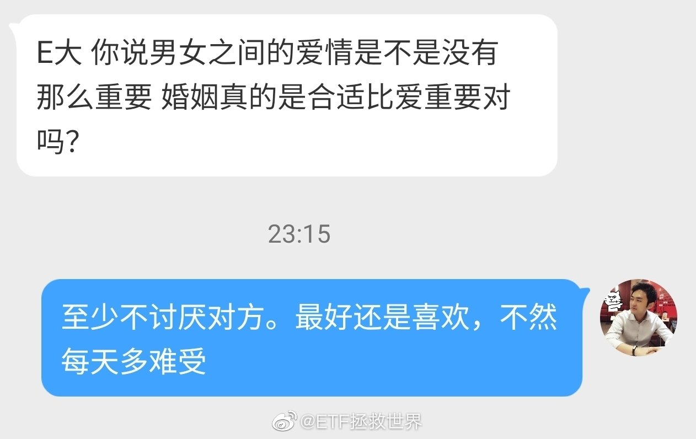

======================================================

ETF拯救世界 (5687069307) @
2020-02-20 00:03:56 Thu  
url: https://weibo.com/5687069307/IuYIAgqt1

一个中肯的建议 ​​​

转发[27]  评论[471]  赞[1695] 

+++++++++++++++++++++++++++++++++++++++++++++++++++++

图片：
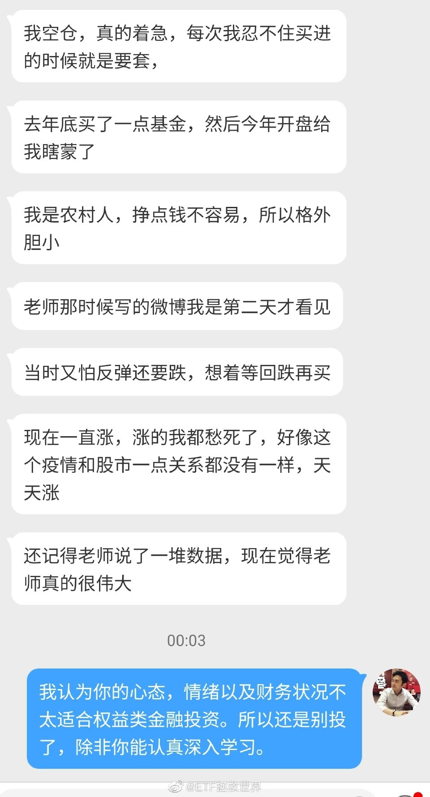

======================================================

ETF拯救世界 (5687069307) @
2020-02-20 08:39:02 Thu  
url: https://weibo.com/5687069307/Iv25EAHcC

来了老哥

------------------------------------------------------
转推：
>  @ ()
>  2020-02-20 07:36:42 Thu  
>  url: 

>  抱歉，作者已设置仅展示半年内微博，此微博已不可见。 ​​​

转发[55]  评论[262]  赞[1158] 

======================================================

ETF拯救世界 (5687069307) @
2020-02-20 09:33:39 Thu  
url: https://weibo.com/5687069307/Iv2rPf0PI

新高不卖是什么意思呢。买入看估值，卖出看趋势。如果因为一个东西稍微贵点你就慌着卖出，可能很难挣大钱。一个品种新高的当天，别卖。跌有底，涨起来是很难预测天花板的。不容易把握，以后慢慢说

------------------------------------------------------
转推：
>  @ETF拯救世界 (5687069307)
>  2020-02-19 13:06:40 Wed  
>  url: https:/weibo.com/5687069307/IuUpNd59x/

>  新高不卖。 ​​​

转发[651]  评论[381]  赞[1360] 

======================================================

ETF拯救世界 (5687069307) @
2020-02-20 09:41:11 Thu  
url: https://weibo.com/5687069307/Iv2uSDIua

大熊市哀嚎遍野的时候敢买，上涨中风轻云淡持有，火热新世界能够不贪悄悄离场。

能够做到这三点就是人中龙凤。 

普通人就是全都反着做。 ​​​

转发[233]  评论[455]  赞[1938] 

======================================================

ETF拯救世界 (5687069307) @
2020-02-20 09:46:59 Thu  
url: https://weibo.com/5687069307/Iv2xeD9ZQ

回复@一头驴的旅行:建议你翻翻我的微博，在大顶大底都在说什么。觉得多就看看公众号。我相信你会为这句话道歉。//@一头驴的旅行:能不能提前说  事后有毛用

------------------------------------------------------
转推：
>  @ETF拯救世界 (5687069307)
>  2020-02-20 09:41:11 Thu  
>  url: https:/weibo.com/5687069307/Iv2uSDIua/

>  大熊市哀嚎遍野的时候敢买，上涨中风轻云淡持有，火热新世界能够不贪悄悄离场。
>  
>  能够做到这三点就是人中龙凤。 
>  
>  普通人就是全都反着做。 ​​​

转发[9]  评论[272]  赞[1118] 

======================================================

ETF拯救世界 (5687069307) @
2020-02-20 10:08:03 Thu  
url: https://weibo.com/5687069307/Iv2FN5Lkz

其实微博是这样的。比如我新关注一个人，除非对他特别感兴趣，否则不会慢慢翻他过去说了什么。而且我看了一眼，7878条，这也太多了，没法翻。

真感兴趣的可以去看看我的公众号。5年时间，文章100篇左右，除了发车文章，没几篇。挑重要时间点看看大概就能明白是怎么回事了。

我不喜欢有些人不去了解就 ​​​

转发[21]  评论[280]  赞[1114] 

======================================================

ETF拯救世界 (5687069307) @
2020-02-20 10:10:09 Thu  
url: https://weibo.com/5687069307/Iv2GEdKHX

转给那位新朋友：

2018最低点我说了什么：

http://t.cn/A6hlwRFl ​​​

转发[128]  评论[205]  赞[1149] 

======================================================

ETF拯救世界 (5687069307) @
2020-02-20 10:11:17 Thu  
url: https://weibo.com/5687069307/Iv2H6iEKA

转给那位新朋友：

2015年顶部我说了什么，做了什么。

http://t.cn/A6hlAvvz ​​​

转发[121]  评论[208]  赞[1117] 

======================================================

ETF拯救世界 (5687069307) @
2020-02-20 10:30:16 Thu  
url: https://weibo.com/5687069307/Iv2OO9jrz

2005年1月至今，两融余额变化图。

目前是10781亿，过去五年多于现在的时间点是：

2017.11-2018.1 
2015年全年（除9月外）

2019年4月到过9900亿。

最高点是2015年4月和5月的：

2 万 亿 ​​​

转发[233]  评论[266]  赞[1083] 

+++++++++++++++++++++++++++++++++++++++++++++++++++++

图片：

======================================================

ETF拯救世界 (5687069307) @
2020-02-20 10:35:05 Thu  
url: https://weibo.com/5687069307/Iv2QLzx3b

回复@南耕82624:对不起，没创意，让您失望了。油气还那样，半死不活，持仓3个点的我每天看着这个唯一浮亏的心如刀割，您看您还满意吗。//@南耕82624:别人钻石底，你也钻石底，有点创意好不好，华宝油气怎么样了

------------------------------------------------------
转推：
>  @ETF拯救世界 (5687069307)
>  2020-02-20 10:10:09 Thu  
>  url: https:/weibo.com/5687069307/Iv2GEdKHX/

>  转给那位新朋友：
>  
>  2018最低点我说了什么：
>  
>  http://t.cn/A6hlwRFl ​​​

转发[24]  评论[359]  赞[1010] 

======================================================

ETF拯救世界 (5687069307) @
2020-02-20 10:39:18 Thu  
url: https://weibo.com/5687069307/Iv2StlYEZ

这届网友真的很让人感动。

以前他们关心传媒、环保，每天来问候，还有大V经常写文章问候、关心。

现在传媒环保赚钱了，他们又开始关心仅存的一个油气。每天他们都按捺不住内心的激动问：“你的油气怎么样了？”

我感动的哭出来了。你说为什么这些人这么关心咱们的账户里面亏损品种呢。

他们不拿一 ​​​

转发[22]  评论[638]  赞[1977] 

======================================================

ETF拯救世界 (5687069307) @
2020-02-20 10:57:52 Thu  
url: https://weibo.com/5687069307/Iv300uuzE

市场想要上涨，就必须不停的震荡。

为什么。

清洗不坚定的叛徒。

做事情，不是说人越多越好。不是这样。

人少没事，历史上以少胜多的战例不胜枚举。最关键的两点：队伍有战斗力；意志坚定，团结。

后者非常重要。

你有多少人，一上战场就呼啦啦全跑了，那还不如小规模精英部队。

市场也一样。总 ​​​

转发[312]  评论[437]  赞[1972] 

======================================================

ETF拯救世界 (5687069307) @
2020-02-20 11:33:27 Thu  
url: https://weibo.com/5687069307/Iv3esd7wV

说得越多，错的越多。我说的肯定也有很多不对的地方。您自行甄别吧，批判性的吸收。

今天到此为止，明儿见。 ​​​

转发[8]  评论[298]  赞[1339] 

======================================================

ETF拯救世界 (5687069307) @
2020-02-20 12:52:23 Thu  
url: https://weibo.com/5687069307/Iv3KuuLaO

所以说这个世界上还是讲道理的人多。大家心平气和的沟通，说开了就没事了。

坏人只是少数，人类整体还是好的，三七开。

怕这位朋友再被骂，赶紧上来说一声。这次是真的明儿见了！ ​​​

转发[10]  评论[364]  赞[1462] 

+++++++++++++++++++++++++++++++++++++++++++++++++++++

图片：

======================================================

ETF拯救世界 (5687069307) @
2020-02-20 21:22:19 Thu  
url: https://weibo.com/5687069307/Iv75u1xQ8

每日劝退 ​​​

转发[16]  评论[390]  赞[1742] 

+++++++++++++++++++++++++++++++++++++++++++++++++++++

图片：
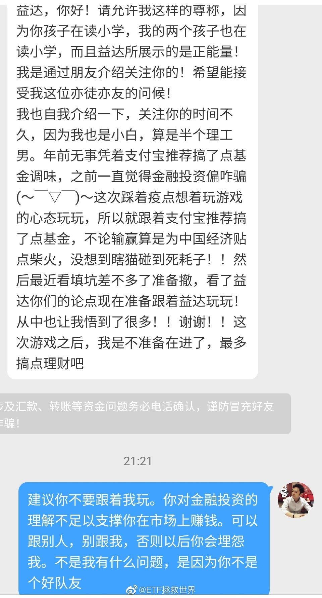

======================================================

ETF拯救世界 (5687069307) @
2020-02-20 21:27:19 Thu  
url: https://weibo.com/5687069307/Iv77vhlbr

可能有不少人讨厌我，也会觉得我的微博太多比较烦。

但是能帮助一些朋友，也值了。 ​​​

转发[17]  评论[448]  赞[1929] 

+++++++++++++++++++++++++++++++++++++++++++++++++++++

图片：
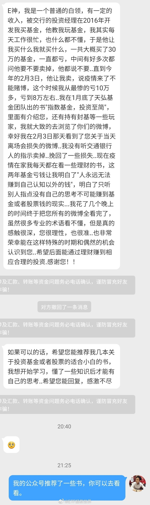

======================================================

ETF拯救世界 (5687069307) @
2020-02-20 21:36:13 Thu  
url: https://weibo.com/5687069307/Iv7b7eTKv

知道我为什么设计150吗。就是保证各位能够底部有钱还有胆识多买。

但是，如果你底部设置的金额少，涨起来了就改成大金额，这就完全背离了我的初衷，也无法控制风险。

这就相当于底部少买，高位多买。

设计再好的模式，也很难帮助所有人。 ​​​

转发[46]  评论[450]  赞[1328] 

+++++++++++++++++++++++++++++++++++++++++++++++++++++

图片：
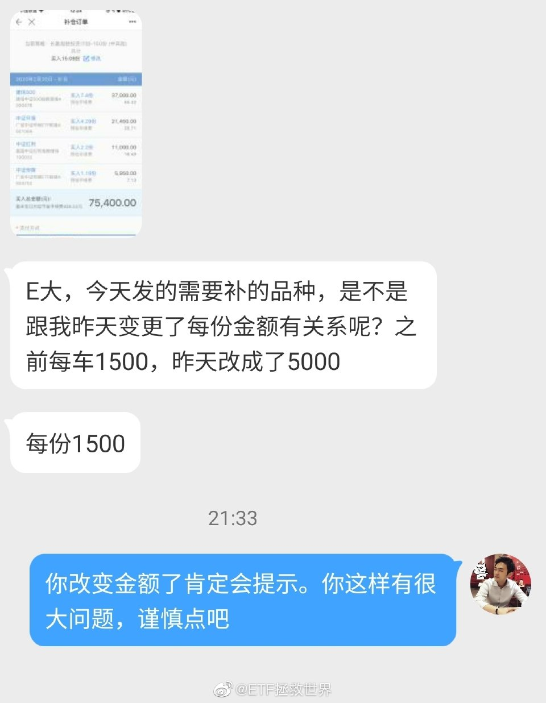

======================================================

ETF拯救世界 (5687069307) @
2020-02-20 21:48:57 Thu  
url: https://weibo.com/5687069307/Iv7ghzufL

本日情感问答 ​​​

转发[26]  评论[497]  赞[1751] 

+++++++++++++++++++++++++++++++++++++++++++++++++++++

图片：
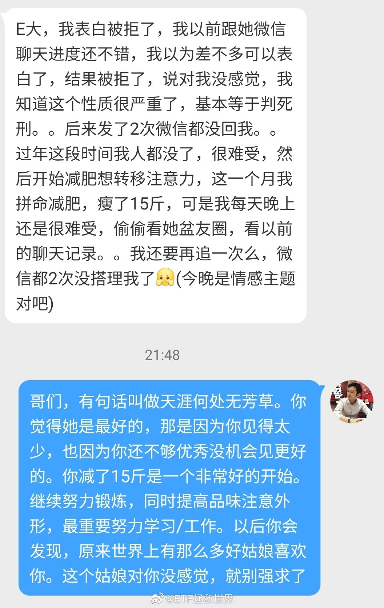

======================================================

ETF拯救世界 (5687069307) @
2020-02-21 09:20:13 Fri  
url: https://weibo.com/5687069307/IvbMSn9jq

最近评论里有一些朋友开始议论别的基金投资人，这样不好，以后不要了。

从球球开始，我就发现一个颇为奇怪的现象：很多玩基金的人特别喜欢互相踩。说实话，给我感觉很不好。当然，感觉不好可能也与我经常是受害者有关。

有些人给人感觉是小肚鸡肠，看到别人好就难受。有些人是拼命蹭热度，谁关注度高 ​​​

转发[57]  评论[741]  赞[2538] 

======================================================

ETF拯救世界 (5687069307) @
2020-02-21 09:32:42 Fri  
url: https://weibo.com/5687069307/IvbRWbgFp

有些股票和板块除了一路拉爆这种走势外，不可能有其它结局。 ​​​

转发[12]  评论[209]  赞[1206] 

======================================================

ETF拯救世界 (5687069307) @
2020-02-21 09:45:59 Fri  
url: https://weibo.com/5687069307/IvbXklIxR

大盘领涨一天，小盘领涨一天。

怎样才能每天都幸福。 ​​​

转发[9]  评论[260]  赞[1372] 

======================================================

ETF拯救世界 (5687069307) @
2020-02-21 10:02:28 Fri  
url: https://weibo.com/5687069307/Ivc41hbaU

还记不记得最低点的时候，有多少人写财务分析文章，告诉你有些品种完蛋了，没戏了，赶紧清仓吧。

谁能想到从那时候起，一年多涨了50%+。

投资有意思的地方在于，很多人认为学一点财务知识就能做好投资。如果学点财务知识，会看点报表，会算个ROE就能做好投资，那么大多数会计都应该是好的投资者了。 ​​​

转发[137]  评论[367]  赞[1559] 

======================================================

ETF拯救世界 (5687069307) @
2020-02-21 10:54:36 Fri  
url: https://weibo.com/5687069307/IvcpbfumO

所以你现在知道牛市的疯狂是怎么来的了：

涨——有了赚钱效应，金融机构发行更多产品——这些产品买入，涨更多——继续发行产品——继续买入，继续涨。

涨到什么时候呢。涨到能入场的资金都入场了，卖出的人开始多于买入。

开始跌就不会温柔。因为那些看着赚钱效应，申购产品等着赚钱的人，见到赚不 ​​​

转发[333]  评论[451]  赞[1749] 

======================================================

ETF拯救世界 (5687069307) @
2020-02-21 11:07:34 Fri  
url: https://weibo.com/5687069307/Ivcursgni

150和S一共还有四份创业板。收益率从30%-50%不等。

这几份什么时候卖？什么点位卖？

可以明确的告诉你：

我也不知道。 ​​​

转发[26]  评论[381]  赞[1176] 

======================================================

ETF拯救世界 (5687069307) @
2020-02-21 11:15:50 Fri  
url: https://weibo.com/5687069307/IvcxNv4RL

这四个字在牛市中非常有用。建议长期以来虽然不怎么亏钱但是也挣不到大钱的朋友好好想想//@ETF拯救世界: 新高不卖是什么意思呢。买入看估值，卖出看趋势。如果因为一个东西稍微贵点你就慌着卖出，可能很难挣大钱。一个品种新高的当天，别卖。跌有底，涨起来是很难预测天花板的。不容易把握，以后慢慢说

------------------------------------------------------
转推：
>  @ETF拯救世界 (5687069307)
>  2020-02-19 13:06:40 Wed  
>  url: https:/weibo.com/5687069307/IuUpNd59x/

>  新高不卖。 ​​​

转发[204]  评论[334]  赞[1300] 

======================================================

ETF拯救世界 (5687069307) @
2020-02-21 11:56:43 Fri  
url: https://weibo.com/5687069307/IvcOonBfE

还有一点各位可以观察。

牛市新手一定赚的比老手多。包括新手基金经理。

但是最终能全身而退的，千里挑一。

准不准，走着瞧。 ​​​

转发[109]  评论[400]  赞[1883] 

======================================================

ETF拯救世界 (5687069307) @
2020-02-21 13:17:45 Fri  
url: https://weibo.com/5687069307/IvdlhxIX8

为什么很多人那么纠结“牛市”这两个字？

这两个字是否确认对你的操作影响很大吗？？ ​​​

转发[27]  评论[369]  赞[1530] 

======================================================

ETF拯救世界 (5687069307) @
2020-02-21 13:34:52 Fri  
url: https://weibo.com/5687069307/Ivdseo05h

午夜前不聊了。太累。 ​​​

转发[9]  评论[316]  赞[1002] 

======================================================

ETF拯救世界 (5687069307) @
2020-02-21 22:22:23 Fri  
url: https://weibo.com/5687069307/IvgUmg3Jv

波动是我们的朋友 http://t.cn/A6hRXDUK //@ETF拯救世界:是这样的 http://t.cn/A6PJiR6H //@ETF拯救世界:回复@ETF拯救世界:又买回来。 http://t.cn/A6PJJnMO //@ETF拯救世界:一个半月，又出一格。

------------------------------------------------------
转推：
>  @ETF拯救世界 (5687069307)
>  2019-11-12 23:54:13 Tue  
>  url: https:/weibo.com/5687069307/IfVltpGby/

>  最近三个月白银网格是这样的情况（顺序从下往上）
>  
>  等于筹码没丢，吃了两轮利润 ​​​

转发[90]  评论[381]  赞[795] 

======================================================

ETF拯救世界 (5687069307) @
2020-02-21 23:36:00 Fri  
url: https://weibo.com/5687069307/Ivhoepb4e

今日情感博主上线

对你好永远不应该是喜欢一个人的唯一理由。因为他可能明天就不对你好了。

如果运气差碰上不好的人，结束未必不是好事。因为结束你只浪费了几个月，不结束有可能痛苦一生。跟买了垃圾股一个意思。 ​​​

转发[28]  评论[417]  赞[1508] 

+++++++++++++++++++++++++++++++++++++++++++++++++++++

图片：

======================================================

ETF拯救世界 (5687069307) @
2020-02-21 23:50:45 Fri  
url: https://weibo.com/5687069307/Ivhue9wdl

请大家提高语文修养好吗。 ​​​

转发[15]  评论[523]  赞[1673] 

+++++++++++++++++++++++++++++++++++++++++++++++++++++

图片：

======================================================

ETF拯救世界 (5687069307) @
2020-02-22 08:55:04 Sat  
url: https://weibo.com/5687069307/Ivl39EtdU

一个月挣5000，工作6年手里只有两万多。买了三万的房，一个月不工作已经身无分文。一定要教育孩子任何收入都要存下20%-30%，不到救命的时候不拿出来。孩子会受益一生。

------------------------------------------------------
转推：
>  @小林小林吧 (1661446922)
>  2020-02-20 22:22:38 Thu  
>  url: https:/weibo.com/1661446922/Iv7tXmDE6/

>  『鹤岗买房的湖北小哥：开不了工，我想把3万的房子卖了』http://t.cn/A6hOZaBH ​​​

转发[192]  评论[468]  赞[1832] 

======================================================

ETF拯救世界 (5687069307) @
2020-02-22 09:28:20 Sat  
url: https://weibo.com/5687069307/IvlgFpK5z

回复@蘑叽小柚子:所以我不评论他为什么存不下来，而是说我们可以教育下一代做得更好。（年轻人可以从自己开始改变）//@蘑叽小柚子:这个话题昨天还被上升到了这个讨论层面 http://t.cn/A6hnb1OV 

------------------------------------------------------
转推：
>  @小林小林吧 (1661446922)
>  2020-02-20 22:22:38 Thu  
>  url: https:/weibo.com/1661446922/Iv7tXmDE6/

>  『鹤岗买房的湖北小哥：开不了工，我想把3万的房子卖了』http://t.cn/A6hOZaBH ​​​

转发[24]  评论[214]  赞[968] 

======================================================

ETF拯救世界 (5687069307) @
2020-02-22 14:07:46 Sat  
url: https://weibo.com/5687069307/Ivn65cAVh

不写书，不开星球，不开V+，不接广告，不做私募。微博问答一个问题能挣好几千你看看我回答过几个，有多少年不回答了？

计划免费公布。场内场外两个购买渠道你去也行不去也行，不影响你看计划。这两个都是市场最低费率，你在别的地方费率更高。

我消费你，消费你什么了？你试试看你想掏钱被消费有没有 ​​​

转发[40]  评论[1347]  赞[3947] 

======================================================

ETF拯救世界 (5687069307) @
2020-02-22 16:55:51 Sat  
url: https://weibo.com/5687069307/IvocjdAXv

给大家推荐一个查询投资数据的网站：@集思录  网址是：http://t.cn/RhJm3n0

非常好用，很多年前我就开始用。尤其是各种基金折溢价，套利等数据。

声明一下，这个推荐绝对没有收取任何利益，也没有集思路的人和我打招呼，我甚至没有集思录的任何人的任何联系方式。如果有，我捐300万给韩红。

今天之 ​​​

转发[598]  评论[1019]  赞[3567] 

======================================================

ETF拯救世界 (5687069307) @
2020-02-22 21:00:59 Sat  
url: https://weibo.com/5687069307/IvpNObWqO

这就是标准答案。以后不必问了。 ​​​

转发[21]  评论[408]  赞[1431] 

+++++++++++++++++++++++++++++++++++++++++++++++++++++

图片：
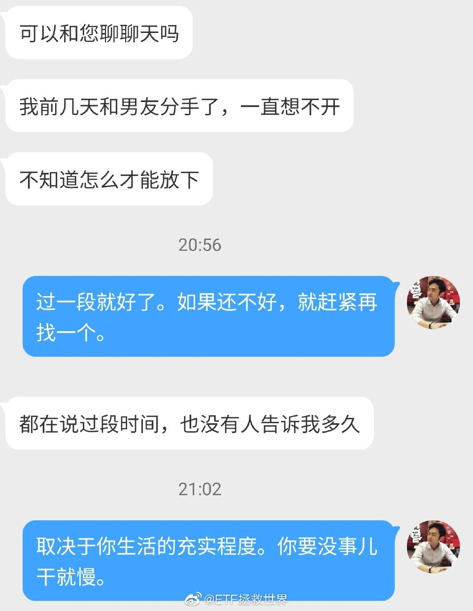

======================================================

ETF拯救世界 (5687069307) @
2020-02-22 21:27:01 Sat  
url: https://weibo.com/5687069307/IvpYnjJoZ

最近经常发一些跟投资无关的事，是有两个原因：

第一，希望你了解生活除了投资还有别的。

第二，希望在赚钱的时候不要太关注投资本身。太关注反倒有可能做错事，降低收益率。

低位买完了，拿着。最多条件单设置好自动运行波段提款继续降成本。然后转移注意力，等着以后收割。

调仓的事我来操心。可 ​​​

转发[60]  评论[849]  赞[3553] 

======================================================

ETF拯救世界 (5687069307) @
2020-02-23 11:50:44 Sun  
url: https://weibo.com/5687069307/IvvCXFEQf

100级达成。只是开始。 ​​​

转发[10]  评论[296]  赞[1426] 

+++++++++++++++++++++++++++++++++++++++++++++++++++++

图片：

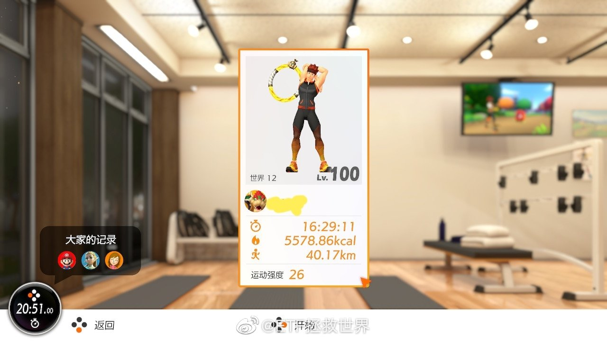
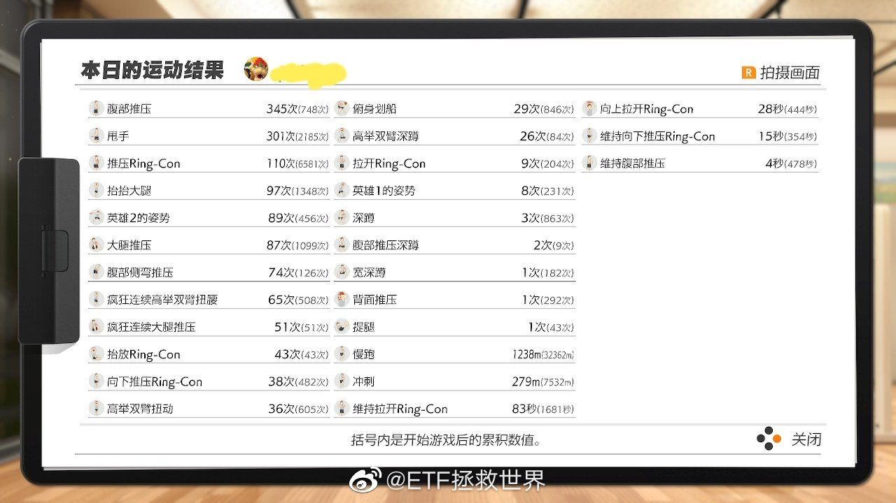

======================================================

ETF拯救世界 (5687069307) @
2020-02-24 09:19:11 Mon  
url: https://weibo.com/5687069307/IvE3WltBU

今天是不是该休息休息了，不能再涨了吧。 ​​​

转发[7]  评论[398]  赞[1387] 

======================================================

ETF拯救世界 (5687069307) @
2020-02-24 09:53:04 Mon  
url: https://weibo.com/5687069307/IvEhH9xAx

传媒上方压力线1605-1610 ​​​

转发[25]  评论[193]  赞[907] 

======================================================

ETF拯救世界 (5687069307) @
2020-02-24 11:36:29 Mon  
url: https://weibo.com/5687069307/IvEXG59os

为什么很多人感觉A股很难挣钱呢。

要知道，中证500过去15年有11年上涨，涨了600%。如果在2015年大牛市中看，收益率更可观。

这个指数基本上可以代表大多数股票的表现。

医药也是15年中11年上涨，涨幅1200%。

觉得A股挣钱难的，基本都是进场和出场的时间错了。

不是市场不行，是你不行。 ​​​

转发[248]  评论[413]  赞[1808] 

======================================================

ETF拯救世界 (5687069307) @
2020-02-24 12:01:25 Mon  
url: https://weibo.com/5687069307/IvF7Nq20I

回复@投资跑道上的一只小蜗牛:2005年底中证500估值23倍。本轮起点500估值19倍。仅做参考。

------------------------------------------------------
转推：
>  @ETF拯救世界 (5687069307)
>  2020-02-24 11:36:29 Mon  
>  url: https:/weibo.com/5687069307/IvEXG59os/

>  为什么很多人感觉A股很难挣钱呢。
>  
>  要知道，中证500过去15年有11年上涨，涨了600%。如果在2015年大牛市中看，收益率更可观。
>  
>  这个指数基本上可以代表大多数股票的表现。
>  
>  医药也是15年中11年上涨，涨幅1200%。
>  
>  觉得A股挣钱难的，基本都是进场和出场的时间错了。
>  
>  不是市场不行，是你不行。 ​​​

转发[33]  评论[83]  赞[656] 

======================================================

ETF拯救世界 (5687069307) @
2020-02-24 12:04:00 Mon  
url: https://weibo.com/5687069307/IvF8QqPY0

回复@Anonymous80626:这两个比较的话，当然是等权800更能代表A股真实走势。我讨论“A股”的时候，就一定是大多数股票的表现。

------------------------------------------------------
转推：
>  @ETF拯救世界 (5687069307)
>  2020-02-24 11:36:29 Mon  
>  url: https:/weibo.com/5687069307/IvEXG59os/

>  为什么很多人感觉A股很难挣钱呢。
>  
>  要知道，中证500过去15年有11年上涨，涨了600%。如果在2015年大牛市中看，收益率更可观。
>  
>  这个指数基本上可以代表大多数股票的表现。
>  
>  医药也是15年中11年上涨，涨幅1200%。
>  
>  觉得A股挣钱难的，基本都是进场和出场的时间错了。
>  
>  不是市场不行，是你不行。 ​​​

转发[15]  评论[79]  赞[552] 

======================================================

ETF拯救世界 (5687069307) @
2020-02-24 12:10:21 Mon  
url: https://weibo.com/5687069307/IvFbqjLRa

回复@约翰内夫:想追就追。如果货不够，过几天我们卖给你……//@约翰内夫:天呐，我想追创50了，买个两百块，能不能把它给奶下[允悲]，记录下:谨慎乐观，按计划继续申购一点点创业板基金与可转债基金

------------------------------------------------------
转推：
>  @ETF拯救世界 (5687069307)
>  2020-02-24 11:36:29 Mon  
>  url: https:/weibo.com/5687069307/IvEXG59os/

>  为什么很多人感觉A股很难挣钱呢。
>  
>  要知道，中证500过去15年有11年上涨，涨了600%。如果在2015年大牛市中看，收益率更可观。
>  
>  这个指数基本上可以代表大多数股票的表现。
>  
>  医药也是15年中11年上涨，涨幅1200%。
>  
>  觉得A股挣钱难的，基本都是进场和出场的时间错了。
>  
>  不是市场不行，是你不行。 ​​​

转发[11]  评论[217]  赞[858] 

======================================================

ETF拯救世界 (5687069307) @
2020-02-24 13:31:17 Mon  
url: https://weibo.com/5687069307/IvFIgyHOW

围在城里的人想逃出来，城外的人想冲进去。对婚姻也罢，创业板也罢，人生的愿望大都如此。 ​​​

转发[24]  评论[228]  赞[1361] 

======================================================

ETF拯救世界 (5687069307) @
2020-02-24 13:51:42 Mon  
url: https://weibo.com/5687069307/IvFQyo2Jp

回复@迦叶和阿难:我不是忘了，我是对你的每一分钱负责。我自己不会追，就不会发车。//@迦叶和阿难:益达是不是把s定投给忘了！[doge][doge]

------------------------------------------------------
转推：
>  @ETF拯救世界 (5687069307)
>  2020-02-24 13:31:17 Mon  
>  url: https:/weibo.com/5687069307/IvFIgyHOW/

>  围在城里的人想逃出来，城外的人想冲进去。对婚姻也罢，创业板也罢，人生的愿望大都如此。 ​​​

转发[5]  评论[131]  赞[867] 

======================================================

ETF拯救世界 (5687069307) @
2020-02-24 14:07:08 Mon  
url: https://weibo.com/5687069307/IvFWOEGVR

前两年500跑不过300，经常会有人对我提出灵魂拷问：

500ROE这么低，为什么要买？

今年500也好，1000也好，创业也好，表现远远好于300。我不是想讨论到底300好还是500好，我想说的是，投资不只是分析财务数据，从来都不是。

如果只看财务数据，你根本就不会懂为什么ROE只有10个点不到，PB接近7倍的创 ​​​

转发[146]  评论[280]  赞[1362] 

======================================================

ETF拯救世界 (5687069307) @
2020-02-24 14:16:39 Mon  
url: https://weibo.com/5687069307/IvG0GibPs

哪一种投资风格我都尊重。

我鄙视的是那种“除了自己的，其它所有投资风格投资方式都是辣鸡”的投资自闭症。 ​​​

转发[30]  评论[165]  赞[1213] 

======================================================

ETF拯救世界 (5687069307) @
2020-02-24 14:33:18 Mon  
url: https://weibo.com/5687069307/IvG7rAD0Z

回复@xvbalance:难受你就换仓啊。为什么会纠结呢？把仓位调整到舒服就这么难吗。//@xvbalance:要做到没有情绪确实太难，看到不涨的仓位嫌弃太多，看到长的嫌少，其实就是贪，虽然我知道但是还是会这样想，难呐！

------------------------------------------------------
转推：
>  @ETF拯救世界 (5687069307)
>  2020-02-24 14:07:08 Mon  
>  url: https:/weibo.com/5687069307/IvFWOEGVR/

>  前两年500跑不过300，经常会有人对我提出灵魂拷问：
>  
>  500ROE这么低，为什么要买？
>  
>  今年500也好，1000也好，创业也好，表现远远好于300。我不是想讨论到底300好还是500好，我想说的是，投资不只是分析财务数据，从来都不是。
>  
>  如果只看财务数据，你根本就不会懂为什么ROE只有10个点不到，PB接近7倍的创 ​​​

转发[12]  评论[63]  赞[541] 

======================================================

ETF拯救世界 (5687069307) @
2020-02-24 14:35:18 Mon  
url: https://weibo.com/5687069307/IvG8fz993

有人看着有些品种涨的好心里痒痒，恨自己为什么没买。

我就纳闷了，你买不就完了吗，谁也没拉着你的手啊。

真让他买，他也不敢。第二天又开始看着难受。

要我说，你那不是真爱人家，你是馋人家的身子了。 ​​​

转发[19]  评论[357]  赞[1373] 

======================================================

ETF拯救世界 (5687069307) @
2020-02-24 14:50:17 Mon  
url: https://weibo.com/5687069307/IvGekzkEU

你知道外围股市大跌有什么好处。

好处就是：

可以多开几个品种的网格了。

别急，开了我会说。 ​​​

转发[29]  评论[470]  赞[1446] 

======================================================

ETF拯救世界 (5687069307) @
2020-02-24 15:16:59 Mon  
url: https://weibo.com/5687069307/IvGpayxLu

回复@我是杜晓宇同学:想出就出，要出的漂亮。//@我是杜晓宇同学:e大，中证500可以出了吗，我感觉到去年的高位了。。

------------------------------------------------------
转推：
>  @ETF拯救世界 (5687069307)
>  2020-02-24 11:36:29 Mon  
>  url: https:/weibo.com/5687069307/IvEXG59os/

>  为什么很多人感觉A股很难挣钱呢。
>  
>  要知道，中证500过去15年有11年上涨，涨了600%。如果在2015年大牛市中看，收益率更可观。
>  
>  这个指数基本上可以代表大多数股票的表现。
>  
>  医药也是15年中11年上涨，涨幅1200%。
>  
>  觉得A股挣钱难的，基本都是进场和出场的时间错了。
>  
>  不是市场不行，是你不行。 ​​​

转发[2]  评论[128]  赞[736] 

======================================================

ETF拯救世界 (5687069307) @
2020-02-24 15:22:14 Mon  
url: https://weibo.com/5687069307/IvGriBZw6

以后不要再问：买不买这个呀，卖不卖那个呀。

第一。你要信自己，就问问自己的内心，是不是真想买或者真想卖。真的想，害怕踏空，害怕套牢，就去买卖。把仓位调整到最最舒服的情况。什么是舒服，就是涨30%，跌30%都很开心。

只要记住一点，成年人做事，不要后悔。做之前想好所有后果，能接受就去做。 ​​​

转发[89]  评论[401]  赞[1482] 

======================================================

ETF拯救世界 (5687069307) @
2020-02-24 15:24:36 Mon  
url: https://weibo.com/5687069307/IvGsgBfBS

NB

------------------------------------------------------
转推：
>  @21世纪经济报道 (1651428902)
>  2020-02-24 15:17:33 Mon  
>  url: https:/weibo.com/1651428902/IvGpp287b/

>  【武汉宣布：#放开离汉通道的通告无效#】武汉市新冠肺炎疫情防控指挥部发布的《关于加强进出武汉市车辆和人员管理的通告》（第17号），系市指挥部下设的交通防控组未经指挥部研究和主要领导同志同意发布的，现宣布该通告无效。http://t.cn/A6hDVcvY ​​​

转发[17]  评论[145]  赞[639] 

======================================================

ETF拯救世界 (5687069307) @
2020-02-24 15:52:03 Mon  
url: https://weibo.com/5687069307/IvGDpbIuh

看到这条我真的气坏了。怎么可以这样。

我要有个女儿，肯定放在手心里当宝贝。生气！ ​​​

转发[20]  评论[695]  赞[2085] 

+++++++++++++++++++++++++++++++++++++++++++++++++++++

图片：

======================================================

ETF拯救世界 (5687069307) @
2020-02-24 16:17:39 Mon  
url: https://weibo.com/5687069307/IvGNNnI47

我回想了一下，在我的成长过程中，确实没见过“重男轻女”

我的家族里，除了一个来往极少的大爷家是一个男孩外，除了我其它亲戚都是女孩。从小在院里的邻居也大多数是女孩。无一例外，这些家庭全都把女孩当成宝贝养。

父母平常对她们有多好我就不说了。印象最深的是我一个亲戚，曾经说自己的女儿要嫁 ​​​

转发[51]  评论[533]  赞[1780] 

======================================================

ETF拯救世界 (5687069307) @
2020-02-24 16:51:18 Mon  
url: https://weibo.com/5687069307/IvH1sv2Dp

回复@小E达的花儿:在农业社会是能说得通的。因为儿子一般会留在身边，女儿嫁出去。这样养老就要靠儿子，所以重男轻女。另外，农村里如果你家儿子少，应该很容易被欺负。但现在已经是什么社会了，养老也基本上指不上孩子，靠的是社会养老。还有这种思想就不对了。

------------------------------------------------------
转推：
>  @ETF拯救世界 (5687069307)
>  2020-02-24 16:17:39 Mon  
>  url: https:/weibo.com/5687069307/IvGNNnI47/

>  我回想了一下，在我的成长过程中，确实没见过“重男轻女”
>  
>  我的家族里，除了一个来往极少的大爷家是一个男孩外，除了我其它亲戚都是女孩。从小在院里的邻居也大多数是女孩。无一例外，这些家庭全都把女孩当成宝贝养。
>  
>  父母平常对她们有多好我就不说了。印象最深的是我一个亲戚，曾经说自己的女儿要嫁 ​​​

转发[22]  评论[118]  赞[614] 

======================================================

ETF拯救世界 (5687069307) @
2020-02-24 17:08:00 Mon  
url: https://weibo.com/5687069307/IvH8f0sTY

回复@Ray被ETF拯救的灵魂:我觉得有些人亲情淡是因为牵扯太多利益。如果孩子不希望从父母那得到物质，父母不希望从孩子那索取物质，只谈感情，恐怕亲情会增加很多。//@Ray被ETF拯救的灵魂:社会越发展，亲情越淡薄，重男轻女自然少了，根本连婚都不想结！

------------------------------------------------------
转推：
>  @ETF拯救世界 (5687069307)
>  2020-02-24 16:17:39 Mon  
>  url: https:/weibo.com/5687069307/IvGNNnI47/

>  我回想了一下，在我的成长过程中，确实没见过“重男轻女”
>  
>  我的家族里，除了一个来往极少的大爷家是一个男孩外，除了我其它亲戚都是女孩。从小在院里的邻居也大多数是女孩。无一例外，这些家庭全都把女孩当成宝贝养。
>  
>  父母平常对她们有多好我就不说了。印象最深的是我一个亲戚，曾经说自己的女儿要嫁 ​​​

转发[11]  评论[91]  赞[631] 

======================================================

ETF拯救世界 (5687069307) @
2020-02-24 17:44:01 Mon  
url: https://weibo.com/5687069307/IvHmQF5Uh

警告：随时发车。 ​​​

转发[32]  评论[1346]  赞[2617] 

======================================================

ETF拯救世界 (5687069307) @
2020-02-24 18:36:54 Mon  
url: https://weibo.com/5687069307/IvHIkdHxn

喷了，原来是他。你说你有这么执着的精神，干什么不会成功啊老弟！

上次你喷到了券商大底，希望这次你功力没有减退！ ​​​

转发[13]  评论[400]  赞[1294] 

+++++++++++++++++++++++++++++++++++++++++++++++++++++

图片：

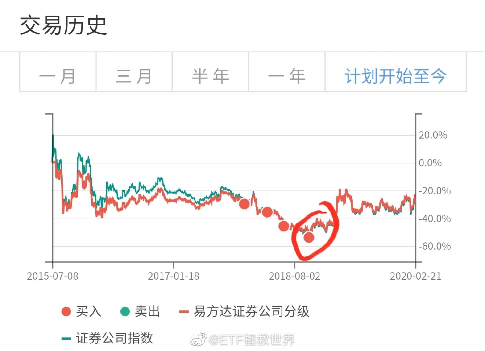

======================================================

ETF拯救世界 (5687069307) @
2020-02-24 23:50:18 Mon  
url: https://weibo.com/5687069307/IvJLwy8c5

明天如果暴跌，剧本和2.3可是不一样的。千万不可以生搬硬套。 ​​​

转发[63]  评论[487]  赞[1944] 

======================================================

ETF拯救世界 (5687069307) @
2020-02-25 08:17:55 Tue  
url: https://weibo.com/5687069307/IvN5zjjru

基本上近期高点收益率也就这样了。做好波动的心理准备。 ​​​

转发[96]  评论[332]  赞[1227] 

+++++++++++++++++++++++++++++++++++++++++++++++++++++

图片：
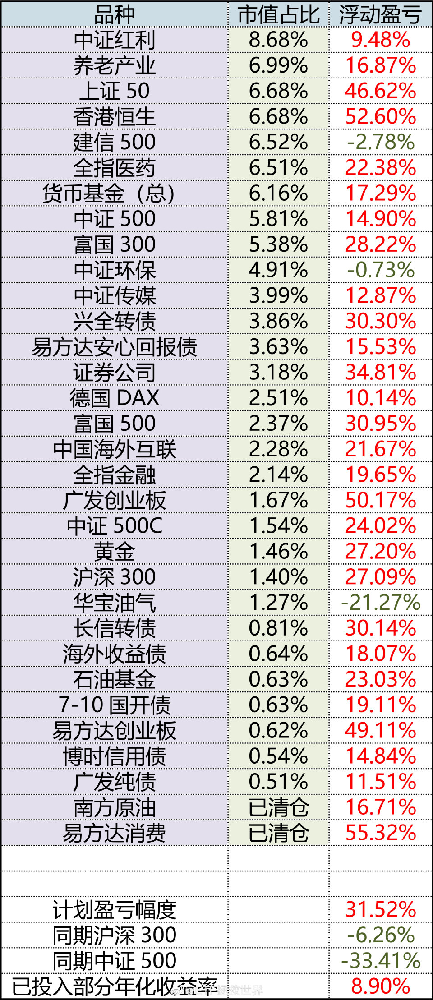

======================================================

ETF拯救世界 (5687069307) @
2020-02-25 08:24:53 Tue  
url: https://weibo.com/5687069307/IvN8oxsRq

回复@小城故事-201506:2.3卖出的人也是这么想的//@小城故事-201506:为什么不阶段性卖了，低位再买回来？减少损失

------------------------------------------------------
转推：
>  @ETF拯救世界 (5687069307)
>  2020-02-25 08:17:55 Tue  
>  url: https:/weibo.com/5687069307/IvN5zjjru/

>  基本上近期高点收益率也就这样了。做好波动的心理准备。 ​​​

转发[30]  评论[193]  赞[795] 

======================================================

ETF拯救世界 (5687069307) @
2020-02-25 09:00:52 Tue  
url: https://weibo.com/5687069307/IvNn0eAmS

这个逻辑没毛病吧。 ​​​

转发[7]  评论[286]  赞[1368] 

+++++++++++++++++++++++++++++++++++++++++++++++++++++

图片：

======================================================

ETF拯救世界 (5687069307) @
2020-02-25 09:14:27 Tue  
url: https://weibo.com/5687069307/IvNsw53u7

如果家里夫妻两个人无法决定让谁来理财，很简单。

第一年，每个人拿一半的钱。年底看收益率。谁的收益率高，第二年操盘60%，另一个人40%。（注意，要完全向对方公布投资细节）

第二年也是如此。赢的人增加10个百分点，输的人减少10个百分点。

从第五年开始（如果五年还没离），计算五年年化收益率。 ​​​

转发[163]  评论[514]  赞[1902] 

======================================================

ETF拯救世界 (5687069307) @
2020-02-25 09:32:51 Tue  
url: https://weibo.com/5687069307/IvNzZ7WDp

舒服。

条件单是伟大的创新。 ​​​

转发[10]  评论[443]  赞[1081] 

======================================================

ETF拯救世界 (5687069307) @
2020-02-25 09:53:26 Tue  
url: https://weibo.com/5687069307/IvNIl7Vma

您是不是得换一个焊工了。这来来回回的几十次了，手艺不行焊不死啊。

------------------------------------------------------
转推：
>  @ ()
>  2020-02-25 09:02:01 Tue  
>  url: 

>  抱歉，作者已设置仅展示半年内微博，此微博已不可见。 ​​​

转发[19]  评论[236]  赞[864] 

======================================================

ETF拯救世界 (5687069307) @
2020-02-25 09:57:48 Tue  
url: https://weibo.com/5687069307/IvNK75paE

纳尼，医药又快新高了。

奶一下，收了神通吧。 ​​​

转发[5]  评论[153]  赞[833] 

======================================================

ETF拯救世界 (5687069307) @
2020-02-25 10:07:28 Tue  
url: https://weibo.com/5687069307/IvNO2fBvj

你们不要总是黑大宵。

首先大宵的水平还可以。能够识别低估、高估区域，这已经比很多人强了。（尤其是部分经常和他互动的大V）

更重要的，我欣赏他的娱乐精神和表演天赋。这可太难得了。说实话，大部分时间非常好笑。精神紧绷的时候，看到他的视频和照片，起到缓解精神紧张的效果。

他的主要问题是 ​​​

转发[79]  评论[297]  赞[1062] 

======================================================

ETF拯救世界 (5687069307) @
2020-02-25 10:20:11 Tue  
url: https://weibo.com/5687069307/IvNTch73G

回复@肥硕的石头:他当然很聪明。各位看人聪明不聪明，有一个很重要的依据：幽默的人一定是聪明的。一定，100%。我说的是幽默，而不是尴尬搞笑。//@肥硕的石头:他不傻，反而很聪明。。

------------------------------------------------------
转推：
>  @ETF拯救世界 (5687069307)
>  2020-02-25 10:07:28 Tue  
>  url: https:/weibo.com/5687069307/IvNO2fBvj/

>  你们不要总是黑大宵。
>  
>  首先大宵的水平还可以。能够识别低估、高估区域，这已经比很多人强了。（尤其是部分经常和他互动的大V）
>  
>  更重要的，我欣赏他的娱乐精神和表演天赋。这可太难得了。说实话，大部分时间非常好笑。精神紧绷的时候，看到他的视频和照片，起到缓解精神紧张的效果。
>  
>  他的主要问题是 ​​​

转发[24]  评论[74]  赞[619] 

======================================================

ETF拯救世界 (5687069307) @
2020-02-25 10:23:16 Tue  
url: https://weibo.com/5687069307/IvNUrCJOT

我写了一篇卖出创业板的文章，等着趋势变差发出去。

结果这货每天新高。我那篇文章快烂在公众号素材库了。

跪了。 ​​​

转发[44]  评论[424]  赞[1170] 

======================================================

ETF拯救世界 (5687069307) @
2020-02-25 11:09:03 Tue  
url: https://weibo.com/5687069307/IvOd2lQsZ

这么给面子吗，谁盯着我微博呢，喷了

------------------------------------------------------
转推：
>  @ETF拯救世界 (5687069307)
>  2020-02-25 10:23:16 Tue  
>  url: https:/weibo.com/5687069307/IvNUrCJOT/

>  我写了一篇卖出创业板的文章，等着趋势变差发出去。
>  
>  结果这货每天新高。我那篇文章快烂在公众号素材库了。
>  
>  跪了。 ​​​

转发[5]  评论[426]  赞[911] 

======================================================

ETF拯救世界 (5687069307) @
2020-02-25 13:21:31 Tue  
url: https://weibo.com/5687069307/IvP4Nvv7H

新的条件单已经更新，可以查看 ​​​

转发[29]  评论[1016]  赞[1077] 

======================================================

ETF拯救世界 (5687069307) @
2020-02-25 14:00:20 Tue  
url: https://weibo.com/5687069307/IvPkyq8pi

场内账户里的资金，可以开通“余额理财”。白天可以交易，会在每天收盘后自动买货币基金，安全度很高，比放着现金收益率也高。现在年化2个多点。

这样，如果你一年能做一次上次的那种网格，一周时间5%，加上这个2个多点，这份资金的收益率也有7个多点了。

所以留够条件单需要的资金，只要一年内能做 ​​​

转发[119]  评论[516]  赞[1083] 

======================================================

ETF拯救世界 (5687069307) @
2020-02-25 14:34:02 Tue  
url: https://weibo.com/5687069307/IvPyevXc0

一个四个字的交易原则保证你没有卖在震荡最低位。

那四个字是： ​​​

转发[36]  评论[1093]  赞[930] 

======================================================

ETF拯救世界 (5687069307) @
2020-02-25 16:56:31 Tue  
url: https://weibo.com/5687069307/IvQu4gPYQ

虽然科技和创业板已经接近癫狂状态，但大多数股票其实真的不贵。

所以那些动不动就清仓走人的，我不太清楚到底在怕什么。可能你怕坐电梯。对，你卖了，没有坐电梯的风险了。但如果继续涨呢。好多年可能才有一波行情，赚一点就跑了，是不是有点可惜？

我说这话是有风险的。万一明天开始跌，喷子以后就 ​​​

转发[130]  评论[437]  赞[1345] 

======================================================

ETF拯救世界 (5687069307) @
2020-02-25 17:12:29 Tue  
url: https://weibo.com/5687069307/IvQAy8XBi

举个例子。中证红利，这几年表现一般，现在依然不是热点。然而现在是真心不贵。用最严格的估值标准看，也与2014年3月相同。

估值相同，然后全收益指数5年多涨了142%。如果放松一点估值标准，价格涨了142%，估值其实比那时候还下降了很多。

所以，只要不贵，中长期看赚钱的概率真的很大很大。没必要动 ​​​

转发[213]  评论[472]  赞[1143] 

======================================================

ETF拯救世界 (5687069307) @
2020-02-25 17:31:00 Tue  
url: https://weibo.com/5687069307/IvQI4atcw

说出来你可能不信。

很多人为涨的好的东西找理由。其实没那么复杂。

很简单，归根结底就是周期。有大盘股周期，有小盘股周期。有蓝筹周期，有科技周期，还有周期的周期。

大家预期一致了，手拉手往上干。干完了再找个理由制造个热点板块继续干。

风格转换，各领风骚数年。不能你天天吃饺子别人天天 ​​​

转发[221]  评论[351]  赞[1163] 

======================================================

ETF拯救世界 (5687069307) @
2020-02-25 18:32:06 Tue  
url: https://weibo.com/5687069307/IvR6RAMM4

知道为什么很多人觉得“满仓踏空”吗。

因为今年有100多只股票光彩夺目的翻番了。

然而将近一半股票是下跌的。

几千万今年赔钱的股民看着涨幅榜，除了“满仓踏空”，确实无话好说了…… ​​​

转发[63]  评论[132]  赞[830] 

======================================================

ETF拯救世界 (5687069307) @
2020-02-25 18:43:43 Tue  
url: https://weibo.com/5687069307/IvRbA7xbc

回复@幸福来临时12345:你知不知道2015年5月的时候，3月份追进去的人赚了多少钱？晒出来吓死你……//@幸福来临时12345:回复@放纵和骄傲:春节后第二周追涨科技股的，第三周继续涨也赚到了，看到一些网友晒单[污]

------------------------------------------------------
转推：
>  @ETF拯救世界 (5687069307)
>  2020-02-25 18:32:06 Tue  
>  url: https:/weibo.com/5687069307/IvR6RAMM4/

>  知道为什么很多人觉得“满仓踏空”吗。
>  
>  因为今年有100多只股票光彩夺目的翻番了。
>  
>  然而将近一半股票是下跌的。
>  
>  几千万今年赔钱的股民看着涨幅榜，除了“满仓踏空”，确实无话好说了…… ​​​

转发[26]  评论[79]  赞[507] 

======================================================

ETF拯救世界 (5687069307) @
2020-02-25 18:45:25 Tue  
url: https://weibo.com/5687069307/IvRchjcmW

在一个上涨市场中赚点钱，不算本事。一点点都不算。运气还是本事，你自己都不知道。

在崩溃前你能把赚的这点钱拿出来，才算是稍微有点合格。 ​​​

转发[109]  评论[215]  赞[1299] 

======================================================

ETF拯救世界 (5687069307) @
2020-02-25 18:54:35 Tue  
url: https://weibo.com/5687069307/IvRfZqCDq

回复@小弟政:别说信息技术了，广发医药5月份最高都翻番了。3-5月2个月最高涨了200%。//@小弟政:回复@CharlieCCCCC:信息技术159939的月线去看[偷笑]//@ETF拯救世界:回复@幸福来临时12345:你知不知道2015年5月的时候，3月份追进去的人赚了多少钱？晒出来吓死你……

------------------------------------------------------
转推：
>  @ETF拯救世界 (5687069307)
>  2020-02-25 18:32:06 Tue  
>  url: https:/weibo.com/5687069307/IvR6RAMM4/

>  知道为什么很多人觉得“满仓踏空”吗。
>  
>  因为今年有100多只股票光彩夺目的翻番了。
>  
>  然而将近一半股票是下跌的。
>  
>  几千万今年赔钱的股民看着涨幅榜，除了“满仓踏空”，确实无话好说了…… ​​​

转发[15]  评论[94]  赞[630] 

======================================================

ETF拯救世界 (5687069307) @
2020-02-25 19:36:51 Tue  
url: https://weibo.com/5687069307/IvRx9uwkx

今天又学会了豆角焖面，好吃的不得了。

什么玩意儿啊，什么时候能恢复正常啊。真要让我自学成才去当厨子吗。

不过想想，尝试一下不同的人生也挺好玩的吧。 ​​​

转发[7]  评论[482]  赞[1305] 

======================================================

ETF拯救世界 (5687069307) @
2020-02-26 08:15:46 Wed  
url: https://weibo.com/5687069307/IvWvc4DLR

瞎忙活半天，又白焊了。 ​​​

转发[10]  评论[265]  赞[842] 

======================================================

ETF拯救世界 (5687069307) @
2020-02-26 08:21:38 Wed  
url: https://weibo.com/5687069307/IvWxA7PHV

看看说的准不准。期待。

------------------------------------------------------
转推：
>  @ETF拯救世界 (5687069307)
>  2020-02-24 23:50:18 Mon  
>  url: https:/weibo.com/5687069307/IvJLwy8c5/

>  明天如果暴跌，剧本和2.3可是不一样的。千万不可以生搬硬套。 ​​​

转发[14]  评论[163]  赞[658] 

======================================================

ETF拯救世界 (5687069307) @
2020-02-26 08:31:03 Wed  
url: https://weibo.com/5687069307/IvWBp5KTr

回复@金色的甲虫:期待的是今天的走势和2.3之后那天不一样，昨天进去抄底和2.3结果不一样//@金色的甲虫:还期待个啥?你原文是24日发的，今天26日//@ETF拯救世界:看看说的准不准。期待。

------------------------------------------------------
转推：
>  @ETF拯救世界 (5687069307)
>  2020-02-24 23:50:18 Mon  
>  url: https:/weibo.com/5687069307/IvJLwy8c5/

>  明天如果暴跌，剧本和2.3可是不一样的。千万不可以生搬硬套。 ​​​

转发[6]  评论[159]  赞[532] 

======================================================

ETF拯救世界 (5687069307) @
2020-02-26 08:36:32 Wed  
url: https://weibo.com/5687069307/IvWDD4JCj

最好疫情早日结束。如果取消感觉日本和参赛运动员好可怜

------------------------------------------------------
转推：
>  @新浪财经 (1638782947)
>  2020-02-26 07:44:13 Wed  
>  url: https:/weibo.com/1638782947/IvWio6O6Q/

>  【投票：你认为东京奥运会该不该取消？[思考]】最新消息显示，#日本新冠肺炎病例累计确诊861例#。国际奥委会高级成员说，如果新冠疫情在5月下旬得不到控制，东京奥运会可能将被取消。有网友表示，不同意取消，对运动员伤害太大。也有网友说，安全第一，支持取消。#东京奥运会可能会取消#，你怎么看？  ​​​

转发[8]  评论[166]  赞[752] 

======================================================

ETF拯救世界 (5687069307) @
2020-02-26 09:00:01 Wed  
url: https://weibo.com/5687069307/IvWN9tmC5

不说这么多了。预测短期走势就是个乐子，交易还是要按照计划和策略。

首先，看看能不能有机会把车发了。

其次，确认布好的条件单没有问题，准备继续吃波动。

怎么走都可以，都有预案。 ​​​

转发[28]  评论[314]  赞[1132] 

======================================================

ETF拯救世界 (5687069307) @
2020-02-26 09:15:01 Wed  
url: https://weibo.com/5687069307/IvWTfrDqO

回复@站在空气稀薄地带:小助理：表格这样可以吗。我：不可以，要这样这样改。要做到最清楚明白简单，要让最小白的人也能看懂//@站在空气稀薄地带:条件单看不懂[允悲]  中国本科教育太差了[doge]

------------------------------------------------------
转推：
>  @ETF拯救世界 (5687069307)
>  2020-02-26 09:00:01 Wed  
>  url: https:/weibo.com/5687069307/IvWN9tmC5/

>  不说这么多了。预测短期走势就是个乐子，交易还是要按照计划和策略。
>  
>  首先，看看能不能有机会把车发了。
>  
>  其次，确认布好的条件单没有问题，准备继续吃波动。
>  
>  怎么走都可以，都有预案。 ​​​

转发[9]  评论[232]  赞[766] 

======================================================

ETF拯救世界 (5687069307) @
2020-02-26 09:53:52 Wed  
url: https://weibo.com/5687069307/IvX90CRNA

依然没有触发卖出条件。一个字，绝。

------------------------------------------------------
转推：
>  @ETF拯救世界 (5687069307)
>  2020-02-25 10:23:16 Tue  
>  url: https:/weibo.com/5687069307/IvNUrCJOT/

>  我写了一篇卖出创业板的文章，等着趋势变差发出去。
>  
>  结果这货每天新高。我那篇文章快烂在公众号素材库了。
>  
>  跪了。 ​​​

转发[11]  评论[269]  赞[1024] 

======================================================

ETF拯救世界 (5687069307) @
2020-02-26 10:47:39 Wed  
url: https://weibo.com/5687069307/IvXuQfKes

目前华宝油气场内溢价13%，网格操作也已经不再适合买入。暂停一下没有关系。

或者用其它溢价小的类似品种代替。但是这个要经过精确计算，一定要先算清楚涨跌幅再代替。 ​​​

转发[45]  评论[595]  赞[1289] 

======================================================

ETF拯救世界 (5687069307) @
2020-02-26 11:47:31 Wed  
url: https://weibo.com/5687069307/IvXT90d9U

微调一下。 ​​​

转发[6]  评论[656]  赞[1388] 

======================================================

ETF拯救世界 (5687069307) @
2020-02-26 12:08:08 Wed  
url: https://weibo.com/5687069307/IvY1w9W5l

买股票也好，基金也好，买之前，不应该先想赚钱了怎么花，而是应该先想好如果跌了怎么办。

想好跌了怎么办以后，再想涨了怎么办。

涨跌都想好了，有了对策了，涨多少跌多少自己该怎么做都有计划了，再买。

我不喜欢别人问我：“我的股票套了，怎么办”“我的基金赚钱了，卖不卖”。这些问题是买之前 ​​​

转发[143]  评论[400]  赞[1587] 

======================================================

ETF拯救世界 (5687069307) @
2020-02-26 12:30:02 Wed  
url: https://weibo.com/5687069307/IvYaoEGYT

不仅要每天创新高，大幅跑赢指数，还要保证没有一个品种浮亏，还要解释每一次操作，还要确保不能出现任何一次差价利润低于10%的波段。

会不会影响健康。 ​​​

转发[21]  评论[839]  赞[2606] 

======================================================

ETF拯救世界 (5687069307) @
2020-02-26 14:24:03 Wed  
url: https://weibo.com/5687069307/IvYUGamjz

所有交易，所有策略，所有投资，都有一个最重要的目标：

低买高卖。

这听起来是废话。但很多朋友其实做着做着就忘了这个目标。

只要你能低买高卖，就是成功的。无论你用什么理念去投资。

你所有的交易策略设计，也都要围绕这四个字。

能解决绝大多数交易都低买高卖，你基本就能活下去了。至于赚多 ​​​

转发[154]  评论[304]  赞[1243] 

======================================================

ETF拯救世界 (5687069307) @
2020-02-26 14:39:32 Wed  
url: https://weibo.com/5687069307/IvZ0XDpJn

两融余额1.1万亿，上次见到是2015年底。

钻石坑的时候是7000亿。

加了杠杆买什么？反正肯定不是买那些不涨的。这是加了杠杆打板的节奏。 ​​​

转发[97]  评论[215]  赞[1011] 

+++++++++++++++++++++++++++++++++++++++++++++++++++++

图片：
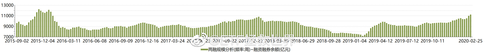

======================================================

ETF拯救世界 (5687069307) @
2020-02-26 14:44:42 Wed  
url: https://weibo.com/5687069307/IvZ34fOLv

能带走的人不多。

------------------------------------------------------
转推：
>  @ETF拯救世界 (5687069307)
>  2020-02-25 18:45:25 Tue  
>  url: https:/weibo.com/5687069307/IvRchjcmW/

>  在一个上涨市场中赚点钱，不算本事。一点点都不算。运气还是本事，你自己都不知道。
>  
>  在崩溃前你能把赚的这点钱拿出来，才算是稍微有点合格。 ​​​

转发[25]  评论[130]  赞[801] 

======================================================

ETF拯救世界 (5687069307) @
2020-02-26 14:53:24 Wed  
url: https://weibo.com/5687069307/IvZ6ABDZo

很多人觉得：

有什么带不走的？我的股票又没跌停，卖了不就带走了吗？

对。就跟去澳门一样，你赢钱了，拿着钱走了，再不回来，那当然没问题。

但你问问自己，能做到吗。还不是卖了以后看着觉得差不多稳了，一个回马枪杀回来准备抄底或者再吃一波，结果结结实实被按在里面了？

很少有人套在最高的山 ​​​

转发[108]  评论[352]  赞[1468] 

======================================================

ETF拯救世界 (5687069307) @
2020-02-26 15:15:29 Wed  
url: https://weibo.com/5687069307/IvZfyrBGg

回复@Acrab_jj:对，去年新高你后年也别卖好吗？以后我少说话，看你还能不能找到别的背锅侠。//@Acrab_jj:什么意思啊？ 不是说新高不卖吗？[笑cry]所以前两天新高没动啊！//@ETF拯救世界:能带走的人不多。

------------------------------------------------------
转推：
>  @ETF拯救世界 (5687069307)
>  2020-02-25 18:45:25 Tue  
>  url: https:/weibo.com/5687069307/IvRchjcmW/

>  在一个上涨市场中赚点钱，不算本事。一点点都不算。运气还是本事，你自己都不知道。
>  
>  在崩溃前你能把赚的这点钱拿出来，才算是稍微有点合格。 ​​​

转发[6]  评论[154]  赞[722] 

======================================================

ETF拯救世界 (5687069307) @
2020-02-26 15:18:33 Wed  
url: https://weibo.com/5687069307/IvZgNzuGn

我说的清清楚楚明明白白。“一个品种新高的当天，别卖。”你的新高管几个月还是几年？//@ETF拯救世界: 新高不卖是什么意思呢。买入看估值，卖出看趋势。如果因为一个东西稍微贵点你就慌着卖出，可能很难挣大钱。一个品种新高的当天，别卖。跌有底，涨起来是很难预测天花板的。不容易把握，以后慢慢说

------------------------------------------------------
转推：
>  @ETF拯救世界 (5687069307)
>  2020-02-19 13:06:40 Wed  
>  url: https:/weibo.com/5687069307/IuUpNd59x/

>  新高不卖。 ​​​

转发[81]  评论[171]  赞[893] 

======================================================

ETF拯救世界 (5687069307) @
2020-02-26 15:21:26 Wed  
url: https://weibo.com/5687069307/IvZhYeEPf

我再说一次，虽然我自认为说的话已经非常直白，怕你误会，也已经啰里啰嗦解释的非常清楚。但如果还是理解不了，请看操作。能公开的长线和波段操作都是公开的，操作就代表我最真实的意思。

太南了。 ​​​

转发[9]  评论[293]  赞[1438] 

======================================================

ETF拯救世界 (5687069307) @
2020-02-26 15:28:28 Wed  
url: https://weibo.com/5687069307/IvZkPe8UO

念叨着新高不卖四个字，你手里的品种收益率从1%、2%、10%、20%、40%，一直涨到了50%。

然后，因为在50%的新高没卖，收益率跌到了47%，你开始抱怨：

什么意思，不是说新高不卖吗。为什么跌了！本来我能卖在50%最高点的！

你当然能。不光你，所有人都觉得自己能卖在最高点。之所以没有，是因为听了小 ​​​

转发[99]  评论[789]  赞[2352] 

======================================================

ETF拯救世界 (5687069307) @
2020-02-26 15:42:45 Wed  
url: https://weibo.com/5687069307/IvZqCyeCq

回复@qingyanZ_:今天这架势，明天弄不好反弹呢。你可能塞翁失马也说不定……//@qingyanZ_:明天卖还来得及吗，今天看见的时候卖不出去了[泪]

------------------------------------------------------
转推：
>  @ETF拯救世界 (5687069307)
>  2020-02-26 15:28:28 Wed  
>  url: https:/weibo.com/5687069307/IvZkPe8UO/

>  念叨着新高不卖四个字，你手里的品种收益率从1%、2%、10%、20%、40%，一直涨到了50%。
>  
>  然后，因为在50%的新高没卖，收益率跌到了47%，你开始抱怨：
>  
>  什么意思，不是说新高不卖吗。为什么跌了！本来我能卖在50%最高点的！
>  
>  你当然能。不光你，所有人都觉得自己能卖在最高点。之所以没有，是因为听了小 ​​​

转发[12]  评论[281]  赞[1010] 

======================================================

ETF拯救世界 (5687069307) @
2020-02-26 16:59:50 Wed  
url: https://weibo.com/5687069307/IvZVUurZJ

DAX又干了2%…… ​​​

转发[3]  评论[294]  赞[937] 

======================================================

ETF拯救世界 (5687069307) @
2020-02-26 17:20:59 Wed  
url: https://weibo.com/5687069307/Iw04uCgJ8

看了今天的公众号留言，我有点后怕。幸亏计划里的油气只有1个多点的仓位。如果有10%，会是什么情况。

我其实现在有点怀疑自己了。一开始，我是想证明普通人通过理性的交易指数基金也可以在A股挣钱，仅此而已。

但现在我怀疑这个结论。我想，确实不是所有人都适合金融投资。真的。 ​​​

转发[51]  评论[1506]  赞[3890] 

======================================================

ETF拯救世界 (5687069307) @
2020-02-26 18:14:14 Wed  
url: https://weibo.com/5687069307/Iw0q70vEg

很多人并不懂为什么会有150这个计划出现。

很多年前，我就知道，你告诉一个人一个股票代码，即使那只股票最后涨了10倍，也不行。想要让那个人赚钱，你必须告诉他买入卖出的日期，买入卖出的价格。跌的时候要不断的给他打气，涨起来了要鼓励他拿住。

这样，那个人才可能在那只股票上赚10倍。否则，这 ​​​

转发[418]  评论[1882]  赞[5306] 

======================================================

ETF拯救世界 (5687069307) @
2020-02-26 19:39:28 Wed  
url: https://weibo.com/5687069307/Iw0YI1HWX

不瞒你说，离我很近[doge]

------------------------------------------------------
转推：
>  @ ()
>  2020-02-26 19:14:54 Wed  
>  url: 

>  抱歉，作者已设置仅展示半年内微博，此微博已不可见。 ​​​

转发[1]  评论[398]  赞[909] 

======================================================

ETF拯救世界 (5687069307) @
2020-02-26 20:15:23 Wed  
url: https://weibo.com/5687069307/Iw1dhy9qk

这么说今年欧洲杯悬了。[悲伤] ​​​

转发[7]  评论[234]  赞[1088] 

======================================================

ETF拯救世界 (5687069307) @
2020-02-26 22:32:18 Wed  
url: https://weibo.com/5687069307/Iw26RjSpK

我想了想，争取以后会慢慢开始少说点投资的事情。如果你关注我是因为投资，那取消关注也未尝不可。

其它的，有就说两句，没有就不说了。

少说话没什么不好。就是怕做不到，尽量吧。

最终目标是把发微博的量控制在每天300条以内。 ​​​

转发[11]  评论[1413]  赞[3680] 

======================================================

ETF拯救世界 (5687069307) @
2020-02-27 09:33:09 Thu  
url: https://weibo.com/5687069307/Iw6r6ctSS

159940不要现价买！净值1.031！

（9:35更新：做市商出现了，2%溢价消除。本条作废。） ​​​

转发[23]  评论[482]  赞[1367] 

======================================================

ETF拯救世界 (5687069307) @
2020-02-27 09:59:26 Thu  
url: https://weibo.com/5687069307/Iw6BM9e9U

这些新闻都是可以记录在资本市场回忆录里面的。

------------------------------------------------------
转推：
>  @财联社APP (2868676035)
>  2020-02-27 09:56:08 Thu  
>  url: https:/weibo.com/2868676035/Iw6AqvICI/

>  【电报|回调中科技类ETF份额继续增长】财联社2月27日讯，2月26日虽然科技股大幅回调，但是科技类ETF继续保持着份额增长态势。数据显示，华夏5GETF净申购18.13亿份，华夏芯片ETF净申购15.93亿份，平安新能车ETF净申购9.08亿份，广发国证半导体芯片ETF净申购6.26亿份。此外国联安中证半导体ETF、华宝科技 ​​​

转发[113]  评论[196]  赞[723] 

======================================================

ETF拯救世界 (5687069307) @
2020-02-27 10:08:48 Thu  
url: https://weibo.com/5687069307/Iw6FzzCT7

QDII 折溢价实时更新页面：

http://t.cn/A67AKrp7

注意折溢价。溢价过高就不要买，有溢价低的类似品种。 ​​​

转发[371]  评论[260]  赞[1016] 

======================================================

ETF拯救世界 (5687069307) @
2020-02-27 10:12:34 Thu  
url: https://weibo.com/5687069307/Iw6H6tU4f

回复@最近是努力kay:我不会再发表看法，只转发，发表一些客观存在的东西。同时，只在重要的时候做一些提醒。//@最近是努力kay:老大这是努力往300条靠拢啊，这节奏，太优秀了[太开心]

------------------------------------------------------
转推：
>  @ETF拯救世界 (5687069307)
>  2020-02-27 10:08:48 Thu  
>  url: https:/weibo.com/5687069307/Iw6FzzCT7/

>  QDII 折溢价实时更新页面：
>  
>  http://t.cn/A67AKrp7
>  
>  注意折溢价。溢价过高就不要买，有溢价低的类似品种。 ​​​

转发[33]  评论[217]  赞[1098] 

======================================================

ETF拯救世界 (5687069307) @
2020-02-27 10:24:23 Thu  
url: https://weibo.com/5687069307/Iw6LTsWmo

富国红利每份分红0.11元。

红利再投。 ​​​

转发[12]  评论[518]  赞[1625] 

======================================================

ETF拯救世界 (5687069307) @
2020-02-27 12:48:48 Thu  
url: https://weibo.com/5687069307/Iw7Iwhsos

头发自己用电推子推了。

上面用18mm限位梳，边上用1-6mm，后面让家人帮忙。

效果比想象的好很多，居然剪出来时尚的感觉，打上发泥和干胶，还有一点国际范儿。

这让我怀疑每次去找海洋总监剪头发花的128是不是没必要。 ​​​

转发[23]  评论[729]  赞[1805] 

======================================================

ETF拯救世界 (5687069307) @
2020-02-27 13:13:29 Thu  
url: https://weibo.com/5687069307/Iw7Sxa7zr

红利基金分红让我想到一件事。

其实如果你持有的基金或者股票，每年分红金额可以覆盖你的生活支出，那么一定意义上说，你就不需要做自己不喜欢做的工作了。

剩下的时间，选择一些自己喜欢做的事就会开心不少。 ​​​

转发[102]  评论[539]  赞[2105] 

======================================================

ETF拯救世界 (5687069307) @
2020-02-27 13:30:09 Thu  
url: https://weibo.com/5687069307/Iw7ZiqlXV

红利基金的分红时点也很有意思。拿富国红利来说，2008年成立，至今12年，分红8次。

分别是2010年0.245；2011年0.13；2012年0.026；2015年0.056；2016年0.35；2017年0.3；2018年0.188；2020年0.11

都是年初分红。记住，都是这些年度的年初。这个很重要。

你会发现，2009年、2013年、2014年、2019年初 ​​​

转发[677]  评论[653]  赞[2417] 

======================================================

ETF拯救世界 (5687069307) @
2020-02-27 14:09:12 Thu  
url: https://weibo.com/5687069307/Iw8f9fqGc

回复@一米阳光的田野:2013是大盘股的钻石坑，不是小盘股和全市场的。//@一米阳光的田野:2008年底钻石坑、2012年底钻石坑、2018年底钻石坑，2013年底算不算？

------------------------------------------------------
转推：
>  @ETF拯救世界 (5687069307)
>  2020-02-27 13:30:09 Thu  
>  url: https:/weibo.com/5687069307/Iw7ZiqlXV/

>  红利基金的分红时点也很有意思。拿富国红利来说，2008年成立，至今12年，分红8次。
>  
>  分别是2010年0.245；2011年0.13；2012年0.026；2015年0.056；2016年0.35；2017年0.3；2018年0.188；2020年0.11
>  
>  都是年初分红。记住，都是这些年度的年初。这个很重要。
>  
>  你会发现，2009年、2013年、2014年、2019年初 ​​​

转发[50]  评论[257]  赞[914] 

======================================================

ETF拯救世界 (5687069307) @
2020-02-28 01:11:39 Fri  
url: https://weibo.com/5687069307/IwcA2hYf5

意思不大 ​​​

转发[4]  评论[346]  赞[1264] 

======================================================

ETF拯救世界 (5687069307) @
2020-02-28 07:46:09 Fri  
url: https://weibo.com/5687069307/Iwfaaeq4O

前天卖一份500C和创业有人在评论质疑我涨的好好的为什么卖。

接下来看看会不会有人质疑我为什么只卖那么少。 ​​​

转发[13]  评论[434]  赞[1734] 

======================================================

ETF拯救世界 (5687069307) @
2020-02-28 08:00:24 Fri  
url: https://weibo.com/5687069307/IwffWD4bi

有空写篇文章说说为什么波动仓位这么做。

哎，算了，直接简单点说吧。

蒙的。 ​​​

转发[25]  评论[412]  赞[1625] 

+++++++++++++++++++++++++++++++++++++++++++++++++++++

图片：
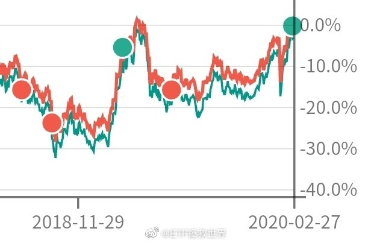

======================================================

ETF拯救世界 (5687069307) @
2020-02-28 08:08:18 Fri  
url: https://weibo.com/5687069307/Iwfj9wyEi

我已经把买入标普500写在计划中，点位也已经确定，等着到。

美股未来十年不是赚一路上涨的钱，而是赚大幅区间波动的钱。2029年回头看，美股从去年起不会有多少涨幅，但是两三次大波动足够赚钱。

金融投资就这么大点事，没什么新鲜的。 ​​​

转发[177]  评论[677]  赞[2563] 

======================================================

ETF拯救世界 (5687069307) @
2020-02-28 09:30:32 Fri  
url: https://weibo.com/5687069307/IwfQxcPfH

未来科技股啊，芯片股啊跌的话，疫情啊，外围啊，最多最多占50%原因。

上百倍的估值才是致命的。

当然，你可千万别因为我的这条微博卖。过两天再涨你又要骂我，这也是为什么这一波疯狂中我不说话的原因。少说，少挨骂。

我只用自己的150行动告诉你我的看法。 ​​​

转发[55]  评论[274]  赞[1251] 

======================================================

ETF拯救世界 (5687069307) @
2020-02-28 09:38:10 Fri  
url: https://weibo.com/5687069307/IwfTDuA3S

回复@heartmate96:恒生挂条件单的话直接折价4%买入，一分钟爆赚4%。不知道哪位大神乌龙指给咱们送大礼。//@heartmate96:恒生呢 1.40 怎么样

------------------------------------------------------
转推：
>  @ ()
>  2020-02-28 09:33:58 Fri  
>  url: 

>  抱歉，此微博已被作者删除。查看帮助：http://t.cn/Rfd3rQV

转发[1]  评论[474]  赞[728] 

======================================================

ETF拯救世界 (5687069307) @
2020-02-28 09:43:32 Fri  
url: https://weibo.com/5687069307/IwfVOfHFR

震惊了，一个价位要吃多少遍？提醒：做压力测试。不要孤注一掷。 http://t.cn/A67bzaPb //@ETF拯救世界:波动是我们的朋友 http://t.cn/A6hRXDUK //@ETF拯救世界:是这样的 http://t.cn/A6PJiR6H //@ETF拯救世界:回复@ETF拯救世界:又买回来。 http://t.cn/A6PJJnMO //@ETF拯救世界:一个半月，又出一格。

------------------------------------------------------
转推：
>  @ETF拯救世界 (5687069307)
>  2019-11-12 23:54:13 Tue  
>  url: https:/weibo.com/5687069307/IfVltpGby/

>  最近三个月白银网格是这样的情况（顺序从下往上）
>  
>  等于筹码没丢，吃了两轮利润 ​​​

转发[43]  评论[366]  赞[740] 

======================================================

ETF拯救世界 (5687069307) @
2020-02-28 10:06:09 Fri  
url: https://weibo.com/5687069307/Iwg4ZpKd8

我看今天就这样吧。我还有个会，先走一步，你们再研究研究，下一步的工作抓紧落实。 ​​​

转发[4]  评论[627]  赞[1978] 

======================================================

ETF拯救世界 (5687069307) @
2020-02-28 14:52:48 Fri  
url: https://weibo.com/5687069307/IwhXlycMJ

神了。//@ETF拯救世界: 回复@ETF拯救了我:不仅合宜，十几年来，但凡有爆款出现都是至少阶段见顶。睿远的第一只公募是去年3月发行，然后……你懂了。这次我不知道。只是说历史。//@ETF拯救了我:公募基金大热，会不会又变成公墓？就像兴全合宜等几个基金募集前后发生的事情那样。

------------------------------------------------------
转推：
>  @财联社APP (2868676035)
>  2020-02-18 17:32:59 Tue  
>  url: https:/weibo.com/2868676035/IuMJoqAfm/

>  【电报|陈光明旗下新基全天认购约1200亿 创历史记录】财联社2月18日讯，记者从销售渠道获悉，睿远基金旗下第二只公募基金——睿远均衡价值基金全天认购金额约1200亿元，创下国内公募基金历史上最高认购记录。该基金拟募集金额60亿元，配售比例或不足6%。（财联社记者 韩理） ​​​

转发[95]  评论[253]  赞[986] 

======================================================

ETF拯救世界 (5687069307) @
2020-02-28 14:57:04 Fri  
url: https://weibo.com/5687069307/IwhZ4ut07

低位不买。市场涨了追最热的热门基金，被渠道忽悠去申购明星基金。

然后赔钱了，得出一个结论：

中国股市都是骗人的，赚不到钱。 ​​​

转发[74]  评论[549]  赞[1952] 

======================================================

ETF拯救世界 (5687069307) @
2020-02-28 15:16:56 Fri  
url: https://weibo.com/5687069307/Iwi78rYHG

来吧，等你好久了。 ​​​

转发[14]  评论[677]  赞[1477] 

+++++++++++++++++++++++++++++++++++++++++++++++++++++

图片：

======================================================

ETF拯救世界 (5687069307) @
2020-02-28 22:49:04 Fri  
url: https://weibo.com/5687069307/Iwl4F2kyI

大波动的意思，就是最后你发现指数没怎么变化，你的钱多了好多…别忘了，现在才2月

------------------------------------------------------
转推：
>  @ETF拯救世界 (5687069307)
>  2020-01-02 10:46:21 Thu  
>  url: https:/weibo.com/5687069307/InAZ0ypgm/

>  今年是大波动这个判断是不是越来越靠谱了。
>  
>  如果全年大涨，就是又一个短命行情，明年又是万人坑。
>  
>  只有大幅波动才符合长牛慢牛的要求。 ​​​

转发[56]  评论[392]  赞[1276] 

======================================================

ETF拯救世界 (5687069307) @
2020-02-28 23:12:24 Fri  
url: https://weibo.com/5687069307/Iwle872AF

不瞒你说，一个礼拜的时间，美股两年大牛市白涨了。 ​​​

转发[90]  评论[389]  赞[1855] 

======================================================

ETF拯救世界 (5687069307) @
2020-02-28 23:29:19 Fri  
url: https://weibo.com/5687069307/IwlkZDP9j

回复@杰西卡奈落落落落落:再说一次，你等所有事情变好再买，已经涨到天上了。什么事情都好好的，凭什么你能买到便宜货？//@杰西卡奈落落落落落:回复@身边的憨笑君:国外下周要进入疫情爆发期了，我对他们的组织能力没有信心[失望]

------------------------------------------------------
转推：
>  @ETF拯救世界 (5687069307)
>  2020-02-28 23:12:24 Fri  
>  url: https:/weibo.com/5687069307/Iwle872AF/

>  不瞒你说，一个礼拜的时间，美股两年大牛市白涨了。 ​​​

转发[38]  评论[138]  赞[965] 

======================================================

ETF拯救世界 (5687069307) @
2020-02-28 23:33:07 Fri  
url: https://weibo.com/5687069307/IwlmxnV7e

不要盲目乐观，也不要太过忧虑。等到低位买点美国，欧洲，中国的指数基金，怕什么？

怕中美欧交易所同时消失吗。那样的话，你留着那些纸有什么用，什么也买不到了。赶紧再去玩玩This War of Mine学点技能吧。 ​​​

转发[50]  评论[320]  赞[1436] 

======================================================

ETF拯救世界 (5687069307) @
2020-02-28 23:44:37 Fri  
url: https://weibo.com/5687069307/IwlrdeESY

长见识了。再次提示，做好压力测试，极限跌幅60% http://t.cn/A675UfNN //@ETF拯救世界:震惊了，一个价位要吃多少遍？提醒：做压力测试。不要孤注一掷。 http://t.cn/A67bzaPb //@ETF拯救世界:波动是我们的朋友 http://t.cn/A6hRXDUK //@ETF拯救世界:是这样的 http://t.cn/A6PJiR6H 

------------------------------------------------------
转推：
>  @ETF拯救世界 (5687069307)
>  2019-11-12 23:54:13 Tue  
>  url: https:/weibo.com/5687069307/IfVltpGby/

>  最近三个月白银网格是这样的情况（顺序从下往上）
>  
>  等于筹码没丢，吃了两轮利润 ​​​

转发[27]  评论[342]  赞[697] 

======================================================

ETF拯救世界 (5687069307) @
2020-02-28 23:47:25 Fri  
url: https://weibo.com/5687069307/IwlslixZN

不建议关注我低于六个月的朋友参考我的长线计划和波段。

老朋友没事，大多数经历过钻石坑，都已经相对来说成熟了，我基本不用操心，除了一些财商负数的。

新朋友不好意思我不想再那么累了，所以不建议各位参考我的投资。警告你，会赔很多，所以别参考！ ​​​

转发[32]  评论[973]  赞[3852] 

======================================================

ETF拯救世界 (5687069307) @
2020-02-29 10:30:28 Sat  
url: https://weibo.com/5687069307/IwpFmeF3R

有些事情外人永远永远无法知道真相。

所有的猜测都是带有主观判断的猜测而已。

你喜欢他，就觉得他一定无辜。你讨厌他，就觉得他一定有问题。而且所有人都能找到很多证明自己正确的论据。

但其实真相永远是个谜。 ​​​

转发[49]  评论[348]  赞[1582] 

======================================================

ETF拯救世界 (5687069307) @
2020-02-29 12:00:40 Sat  
url: https://weibo.com/5687069307/IwqfYb68Q

昨天数据出来了，我反复观察认真思考，结论是这个位置我不会大幅减仓，即使还要大跌。因为我无法说服自己。

目前保守——激进投资者的仓位在60%-80%之间，极度激进到90%，极度保守到50%是比较合适的。

也就是说，再保守，也不应该低于半仓。 ​​​

转发[412]  评论[759]  赞[2559] 

======================================================

ETF拯救世界 (5687069307) @
2020-02-29 12:11:19 Sat  
url: https://weibo.com/5687069307/IwqkiaALG

回复@蓝莓小华夫Orz:你预计投入A股多少钱是分母，已经买了多少A股是分子。//@蓝莓小华夫Orz:回复@小夏万花筒:这个仓位百分比是怎么算的啊求解

------------------------------------------------------
转推：
>  @ETF拯救世界 (5687069307)
>  2020-02-29 12:00:40 Sat  
>  url: https:/weibo.com/5687069307/IwqfYb68Q/

>  昨天数据出来了，我反复观察认真思考，结论是这个位置我不会大幅减仓，即使还要大跌。因为我无法说服自己。
>  
>  目前保守——激进投资者的仓位在60%-80%之间，极度激进到90%，极度保守到50%是比较合适的。
>  
>  也就是说，再保守，也不应该低于半仓。 ​​​

转发[52]  评论[129]  赞[747] 

======================================================

ETF拯救世界 (5687069307) @
2020-02-29 12:31:35 Sat  
url: https://weibo.com/5687069307/IwqswtIca

回复@招财进宝的婧宝:每一个人，每一个家庭的风险偏好、年龄、职业全都不同，无法给一个标准答案。如果一定要给，就是一个字：“五年内不用的闲钱”//@招财进宝的婧宝:那除了固定资产外，家里的钱，几成投入股市比较合适呢。

------------------------------------------------------
转推：
>  @ETF拯救世界 (5687069307)
>  2020-02-29 12:00:40 Sat  
>  url: https:/weibo.com/5687069307/IwqfYb68Q/

>  昨天数据出来了，我反复观察认真思考，结论是这个位置我不会大幅减仓，即使还要大跌。因为我无法说服自己。
>  
>  目前保守——激进投资者的仓位在60%-80%之间，极度激进到90%，极度保守到50%是比较合适的。
>  
>  也就是说，再保守，也不应该低于半仓。 ​​​

转发[35]  评论[166]  赞[980] 

======================================================

ETF拯救世界 (5687069307) @
2020-02-29 12:37:06 Sat  
url: https://weibo.com/5687069307/IwquL5pNS

今天看到有人说，病毒起源于灯塔，去年底那边流感死一万多人其实很多都是新冠。但是没有检测出来——一直到现在都严格控制检测人数。然后不知道通过何种方式弄到了武汉，咱们这边及时发现公布了。

也有一些医学证据之类的。

竟然觉得也挺合理的，说明我也是一个容易被忽悠的人…… ​​​

转发[33]  评论[615]  赞[2122] 

======================================================

